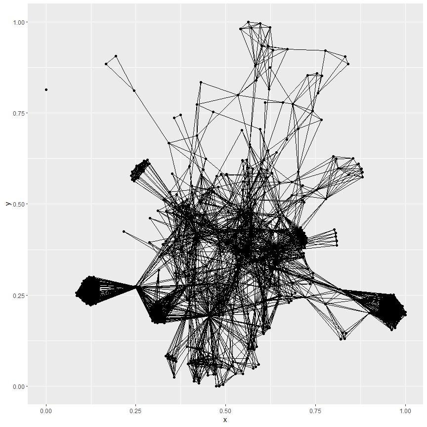
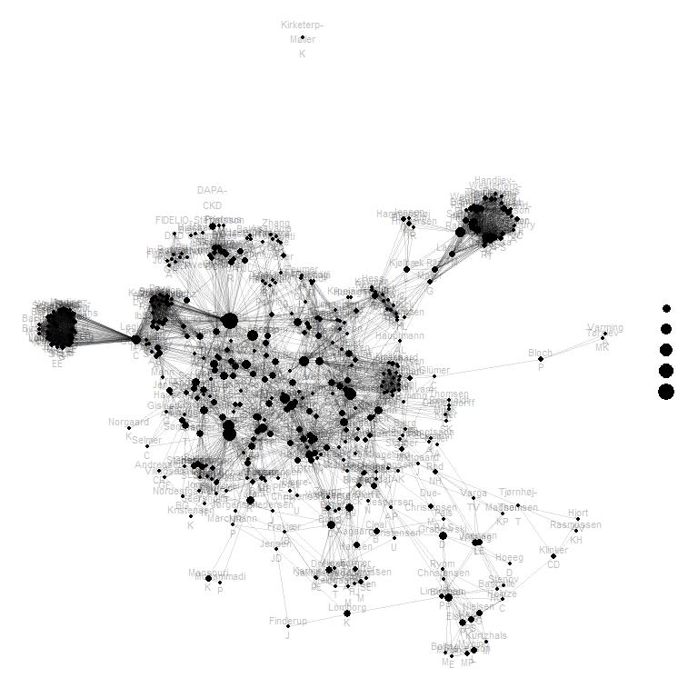

# Introduction

# Load Data

* The data set has been created by copying the contents from a publication list website to a text file.
* Source: [Publications from Steno Diabetes Center Copenhagen in 2021](https://research.regionh.dk/en/publications/search.html?search=&organisationName=Steno%20Diabetes%20Center%20Copenhagen&publicationYearsFrom=2021&journalName=&organisations=49636648&publicationstatus=published&publicationcategory=33079909&peerreview=true&language=%20&publicationYearsTo=2021&type=%2Fdk%2Fatira%2Fpure%2Fresearchoutput%2Fresearchoutputtypes%2Fcontributiontojournal%2F%25&uri=&pageSize=500&page=0) (the Capital Region of Denmark; accessed 1.2.2022).


```r
data.loaded <- 
  read.delim(
    file = "../data/publications-SDCC-2021.txt",
    encoding = "UTF-8",
    header = FALSE,
    stringsAsFactors = FALSE
  )
```

# Prepare the Data

## Create a Data Frame

* Create a data frame with publications as rows and properties as columns.


```r
data <-
  matrix(
    data = unlist( data.loaded ),
    ncol = 4,
    byrow = TRUE
  )

colnames( data ) <-
  c(
    "Status",
    "Title",
    "Info",
    "Type"
  )

data <- 
  data.frame(
    data,
    stringsAsFactors = FALSE
  )

head( data )
```

```
##      Status
## 1 Published
## 2 Published
## 3 Published
## 4 Published
## 5 Published
## 6 Published
##                                                                                                                                                                        Title
## 1    Associations of hypoglycemia, glycemic variability and risk of cardiac arrhythmias in insulin-treated patients with type 2 diabetes: a prospective, observational study
## 2 The effectiveness of e-learning in patient education delivered to patients with rheumatoid arthritis: The WebRA study-protocol for a pragmatic randomised controlled trial
## 3                            The Association Between Cardiovascular Autonomic Function and Changes in Kidney and Myocardial Function in Type 2 Diabetes and Healthy Controls
## 4                                                                                                Cardiovascular Events with Finerenone in Kidney Disease and Type 2 Diabetes
## 5                                                                            Translation and validation of the Canadian assessment of physical literacy-2 in a Danish sample
## 6                                             Medical therapies for prevention of cardiovascular and renal events in patients with atrial fibrillation and diabetes mellitus
##                                                                                                                                                                                                                                                                                                                                                 Info
## 1                                                                                                            Andersen, A., Bagger, J. I., Sørensen, S. K., Baldassarre, M. P. A., Pedersen-Bjergaard, U., Forman, J. L., Gislason, G., Lindhardt, T. B., Knop, F. K. & Vilsbøll, T., 24 Dec 2021, In: Cardiovascular Diabetology. 20, 1, p. 241 241.
## 2                                                                                                                                                                                                                      Raunsbæk Knudsen, L., Lomborg, K., Ndosi, M., Hauge, E-M. & de Thurah, A., 20 Dec 2021, In: BMC Rheumatology. 5, 1, p. 57 57.
## 3                                                                                      Laursen, J. C., Rasmussen, I. K. B., Zobel, E. H., Hasbak, P., von Scholten, B. J., Holmvang, L., Ripa, R. S., Hansen, C. S., Frimodt-Moeller, M., Kjaer, A., Rossing, P. & Hansen, T. W., 13 Dec 2021, In: Frontiers in Endocrinology. 12, p. 780679 780679.
## 4                                                           Pitt, B., Filippatos, G., Agarwal, R., Anker, S. D., Bakris, G. L., Rossing, P., Joseph, A., Kolkhof, P., Nowack, C., Schloemer, P., Ruilope, L. M., FIGARO-DKD Investigators & Pedersen-Bjergaard, U., 9 Dec 2021, In: The New England journal of medicine. 385, 24, p. 2252-2263 12 p.
## 5                                                                                                                                                                                                      Elsborg, P., Melby, P. S., Kurtzhals, M., Tremblay, M. S., Nielsen, G. & Bentsen, P., 9 Dec 2021, In: BMC PUBLIC HEALTH. 21, 1, p. 2236 2236.
## 6 Fauchier, L., Boriani, G., de Groot, J. R., Kreutz, R., Rossing, P. & Camm, A. J., 7 Dec 2021, In: Europace : European pacing, arrhythmias, and cardiac electrophysiology : journal of the working groups on cardiac pacing, arrhythmias, and cardiac cellular electrophysiology of the European Society of Cardiology. 23, 12, p. 1873-1891 19 p.
##                                                                                  Type
## 1 Research output: Contribution to journal › Journal article › Research › peer-review
## 2 Research output: Contribution to journal › Journal article › Research › peer-review
## 3 Research output: Contribution to journal › Journal article › Research › peer-review
## 4 Research output: Contribution to journal › Journal article › Research › peer-review
## 5 Research output: Contribution to journal › Journal article › Research › peer-review
## 6 Research output: Contribution to journal › Journal article › Research › peer-review
```

## Subset by Publication Type

* Include journal articles and review articles in the analysis.


```r
table( data$"Type" )
```

```
## 
##                                Research output: Contribution to journal › Comment/debate › Research › peer-review 
##                                                                                                                13 
##                Research output: Contribution to journal › Conference abstract in journal › Research › peer-review 
##                                                                                                                 6 
##                                     Research output: Contribution to journal › Editorial › Research › peer-review 
##                                                                                                                 3 
##                               Research output: Contribution to journal › Journal article › Research › peer-review 
##                                                                                                               278 
##                                        Research output: Contribution to journal › Letter › Research › peer-review 
##                                                                                                                 7 
##                                        Research output: Contribution to journal › Review › Research › peer-review 
##                                                                                                                32
```

```r
is.included <- 
  grepl( 
    x = data$"Type",
    pattern = "(Journal article)|(Review)"
  )

data <- data[ is.included, ]
```

## Create Additional Properties

* Separate authors from the information column, which also contains the publication date and the journal reference.


```r
# Split by the date text.

tmp <-
  stringr::str_split_fixed(
    string = data[ , 3 ],
    pattern = "(\\,\\s([0-9]+\\s)?([A-Z][a-z][a-z]\\s)?2021\\,\\s)",
    n = 2
  )

colnames( tmp ) <- 
  c(
    "Authors",
    "Reference"
  )

tmp <- 
  data.frame(
    tmp,
    stringsAsFactors = FALSE
  )

data <-
  dplyr::bind_cols(
    data,
    tmp
  )

str( data )
```

```
## 'data.frame':	310 obs. of  6 variables:
##  $ Status   : chr  "Published" "Published" "Published" "Published" ...
##  $ Title    : chr  "Associations of hypoglycemia, glycemic variability and risk of cardiac arrhythmias in insulin-treated patients "| __truncated__ "The effectiveness of e-learning in patient education delivered to patients with rheumatoid arthritis: The WebRA"| __truncated__ "The Association Between Cardiovascular Autonomic Function and Changes in Kidney and Myocardial Function in Type"| __truncated__ "Cardiovascular Events with Finerenone in Kidney Disease and Type 2 Diabetes" ...
##  $ Info     : chr  "Andersen, A., Bagger, J. I., Sørensen, S. K., Baldassarre, M. P. A., Pedersen-Bjergaard, U., Forman, J. L., Gis"| __truncated__ "Raunsbæk Knudsen, L., Lomborg, K., Ndosi, M., Hauge, E-M. & de Thurah, A., 20 Dec 2021, In: BMC Rheumatology. 5, 1, p. 57 57." "Laursen, J. C., Rasmussen, I. K. B., Zobel, E. H., Hasbak, P., von Scholten, B. J., Holmvang, L., Ripa, R. S., "| __truncated__ "Pitt, B., Filippatos, G., Agarwal, R., Anker, S. D., Bakris, G. L., Rossing, P., Joseph, A., Kolkhof, P., Nowac"| __truncated__ ...
##  $ Type     : chr  "Research output: Contribution to journal › Journal article › Research › peer-review" "Research output: Contribution to journal › Journal article › Research › peer-review" "Research output: Contribution to journal › Journal article › Research › peer-review" "Research output: Contribution to journal › Journal article › Research › peer-review" ...
##  $ Authors  : chr  "Andersen, A., Bagger, J. I., Sørensen, S. K., Baldassarre, M. P. A., Pedersen-Bjergaard, U., Forman, J. L., Gis"| __truncated__ "Raunsbæk Knudsen, L., Lomborg, K., Ndosi, M., Hauge, E-M. & de Thurah, A." "Laursen, J. C., Rasmussen, I. K. B., Zobel, E. H., Hasbak, P., von Scholten, B. J., Holmvang, L., Ripa, R. S., "| __truncated__ "Pitt, B., Filippatos, G., Agarwal, R., Anker, S. D., Bakris, G. L., Rossing, P., Joseph, A., Kolkhof, P., Nowac"| __truncated__ ...
##  $ Reference: chr  "In: Cardiovascular Diabetology. 20, 1, p. 241 241." "In: BMC Rheumatology. 5, 1, p. 57 57." "In: Frontiers in Endocrinology. 12, p. 780679 780679." "In: The New England journal of medicine. 385, 24, p. 2252-2263 12 p." ...
```

## Split Individual Authors

* Separate individual authors, who are joined by comma or &-sign.
* This creates a list, where each item corresponds to a publication, and the contents of the item is a character vector containing the names of the authors in the respective publication.


```r
authors <-
  stringr::str_split(
    string = data$"Authors",
    pattern = "(\\.\\, )|(\\. \\& )"
  )

head( authors )
```

```
## [[1]]
##  [1] "Andersen, A"           "Bagger, J. I"          "Sørensen, S. K"       
##  [4] "Baldassarre, M. P. A"  "Pedersen-Bjergaard, U" "Forman, J. L"         
##  [7] "Gislason, G"           "Lindhardt, T. B"       "Knop, F. K"           
## [10] "Vilsbøll, T."         
## 
## [[2]]
## [1] "Raunsbæk Knudsen, L" "Lomborg, K"          "Ndosi, M"           
## [4] "Hauge, E-M"          "de Thurah, A."      
## 
## [[3]]
##  [1] "Laursen, J. C"      "Rasmussen, I. K. B" "Zobel, E. H"       
##  [4] "Hasbak, P"          "von Scholten, B. J" "Holmvang, L"       
##  [7] "Ripa, R. S"         "Hansen, C. S"       "Frimodt-Moeller, M"
## [10] "Kjaer, A"           "Rossing, P"         "Hansen, T. W."     
## 
## [[4]]
##  [1] "Pitt, B"                                          
##  [2] "Filippatos, G"                                    
##  [3] "Agarwal, R"                                       
##  [4] "Anker, S. D"                                      
##  [5] "Bakris, G. L"                                     
##  [6] "Rossing, P"                                       
##  [7] "Joseph, A"                                        
##  [8] "Kolkhof, P"                                       
##  [9] "Nowack, C"                                        
## [10] "Schloemer, P"                                     
## [11] "Ruilope, L. M"                                    
## [12] "FIGARO-DKD Investigators & Pedersen-Bjergaard, U."
## 
## [[5]]
## [1] "Elsborg, P"     "Melby, P. S"    "Kurtzhals, M"   "Tremblay, M. S"
## [5] "Nielsen, G"     "Bentsen, P."   
## 
## [[6]]
## [1] "Fauchier, L"    "Boriani, G"     "de Groot, J. R" "Kreutz, R"     
## [5] "Rossing, P"     "Camm, A. J."
```

## Format Author Names

* Remove additional punctuations and whitespaces.


```r
authors <-
  lapply(
    X = authors,
    FUN = stringr::str_remove_all,
    pattern = "\\,"
  )

authors <-
  lapply(
    X = authors,
    FUN = stringr::str_remove_all,
    pattern = "\\. "
  )

authors <-
  lapply(
    X = authors,
    FUN = stringr::str_remove_all,
    pattern = "\\."
  )

authors <-
  lapply(
    X = authors,
    FUN = stringr::str_trim,
    side = "both"
  )

authors <-
  lapply(
    X = authors,
    FUN = stringr::str_squish
  )

head( authors )
```

```
## [[1]]
##  [1] "Andersen A"           "Bagger JI"            "Sørensen SK"         
##  [4] "Baldassarre MPA"      "Pedersen-Bjergaard U" "Forman JL"           
##  [7] "Gislason G"           "Lindhardt TB"         "Knop FK"             
## [10] "Vilsbøll T"          
## 
## [[2]]
## [1] "Raunsbæk Knudsen L" "Lomborg K"          "Ndosi M"           
## [4] "Hauge E-M"          "de Thurah A"       
## 
## [[3]]
##  [1] "Laursen JC"        "Rasmussen IKB"     "Zobel EH"         
##  [4] "Hasbak P"          "von Scholten BJ"   "Holmvang L"       
##  [7] "Ripa RS"           "Hansen CS"         "Frimodt-Moeller M"
## [10] "Kjaer A"           "Rossing P"         "Hansen TW"        
## 
## [[4]]
##  [1] "Pitt B"                                         
##  [2] "Filippatos G"                                   
##  [3] "Agarwal R"                                      
##  [4] "Anker SD"                                       
##  [5] "Bakris GL"                                      
##  [6] "Rossing P"                                      
##  [7] "Joseph A"                                       
##  [8] "Kolkhof P"                                      
##  [9] "Nowack C"                                       
## [10] "Schloemer P"                                    
## [11] "Ruilope LM"                                     
## [12] "FIGARO-DKD Investigators & Pedersen-Bjergaard U"
## 
## [[5]]
## [1] "Elsborg P"   "Melby PS"    "Kurtzhals M" "Tremblay MS" "Nielsen G"  
## [6] "Bentsen P"  
## 
## [[6]]
## [1] "Fauchier L"  "Boriani G"   "de Groot JR" "Kreutz R"    "Rossing P"  
## [6] "Camm AJ"
```

## Extract unique authors


```r
authors.unique <- sort( x = unique( unlist( authors ) ) )

head( authors.unique )
```

```
## [1] "'t Hart LM"       "Aaby P"           "Aadahl M"         "Aagaard-Hansen J"
## [5] "Aalborg GL"       "Aasbrenn M"
```

# Network of Authors

## Initialize the Adjacency Matrix

* Authors-by-authors Adjacency matrix


```r
adjacency.mat <-
  array( 
    data = 0,
    dim = c( 1, 1 ) * length( authors.unique )
  )

rownames( adjacency.mat ) <-
  colnames( adjacency.mat ) <-
  authors.unique

str( adjacency.mat )
```

```
##  num [1:2038, 1:2038] 0 0 0 0 0 0 0 0 0 0 ...
##  - attr(*, "dimnames")=List of 2
##   ..$ : chr [1:2038] "'t Hart LM" "Aaby P" "Aadahl M" "Aagaard-Hansen J" ...
##   ..$ : chr [1:2038] "'t Hart LM" "Aaby P" "Aadahl M" "Aagaard-Hansen J" ...
```

```r
str( 
  object = adjacency.mat, 
  vec.len = 5
)
```

```
##  num [1:2038, 1:2038] 0 0 0 0 0 0 0 0 0 0 0 0 ...
##  - attr(*, "dimnames")=List of 2
##   ..$ : chr [1:2038] "'t Hart LM" "Aaby P" "Aadahl M" "Aagaard-Hansen J" "Aalborg GL" ...
##   ..$ : chr [1:2038] "'t Hart LM" "Aaby P" "Aadahl M" "Aagaard-Hansen J" "Aalborg GL" ...
```

## Compute the Co-Occurrence of Author Pairs

* Go through all publications 'i'.
* Add up the co-occurrence count for the authors in the publication 'i'.


```r
for ( i in 1:length( authors ) ) {
  
  tmp <- rownames( adjacency.mat ) %in% authors[[ i ]]
  
  adjacency.mat[ tmp, tmp ] <- adjacency.mat[ tmp, tmp ] + 1
  
}

str( adjacency.mat )
```

```
##  num [1:2038, 1:2038] 2 0 0 0 0 0 0 0 0 0 ...
##  - attr(*, "dimnames")=List of 2
##   ..$ : chr [1:2038] "'t Hart LM" "Aaby P" "Aadahl M" "Aagaard-Hansen J" ...
##   ..$ : chr [1:2038] "'t Hart LM" "Aaby P" "Aadahl M" "Aagaard-Hansen J" ...
```

## Subset Authors

* Include authors, who have more than one publication.


```r
is.included <- diag( adjacency.mat ) > 1

data.plot <- adjacency.mat[ is.included, is.included ]

str( data.plot )
```

```
##  num [1:468, 1:468] 2 0 0 0 0 0 2 0 2 0 ...
##  - attr(*, "dimnames")=List of 2
##   ..$ : chr [1:468] "'t Hart LM" "Aagaard-Hansen J" "Adam T" "Adam TC" ...
##   ..$ : chr [1:468] "'t Hart LM" "Aagaard-Hansen J" "Adam T" "Adam TC" ...
```

## Wrap Author Names

* Add line break upon whitespace.
* Add line break upon dash.


```r
names <- rownames( data.plot )

names <-
  stringr::str_replace_all(
    string = names,
    pattern = "\\s",
    replacement = "\n"
  )

names <-
  stringr::str_replace_all(
    string = names,
    pattern = "\\-",
    replacement = "-\n"
  )

names <-
  stringr::str_replace_all(
    string = names,
    pattern = "\\n\\-",
    replacement = ""
  )

names( names ) <- rownames( data.plot )

head( names )
```

```
##            't Hart LM      Aagaard-Hansen J                Adam T 
##        "'t\nHart\nLM" "Aagaard-\nHansen\nJ"             "Adam\nT" 
##               Adam TC               Afsar B             Agarwal R 
##            "Adam\nTC"            "Afsar\nB"          "Agarwal\nR"
```

## Create a Network Representation of the Adjacency Matrix

* Create a network representation of the adjacency matrix with the **network** package.
* The network should be non-directional.


```r
net.network <- 
  network::network(
    x = data.plot,
    directed = FALSE
  )
```

## Lay Out the Network

* Lay out the network on a two-dimensional plane (i.e., page) using the **ggnetwork** package.


```r
ggnetwork <- ggnetwork::ggnetwork( x = net.network )

head( ggnetwork )
```

```
##             x         y vertex.names        xend      yend
## 1 0.000000000 0.3325604     Mygind E 0.059466626 0.3103337
## 2 0.000000000 0.3325604     Mygind E 0.103467979 0.3401734
## 3 0.000000000 0.3325604     Mygind E 0.003035168 0.3527912
## 4 0.002999419 0.3112239     Mygind L 0.059466626 0.3103337
## 5 0.002999419 0.3112239     Mygind L 0.000000000 0.3325604
## 6 0.002999419 0.3112239     Mygind L 0.103467979 0.3401734
```

## Define Additional Properties for the Visualization

* Define properties of the network:
  + Degree: number of vertices (i.e., connections) from each node (here: number of publications for each author)
  + Size: size of each node in the visualization (here: based on degree)
  + Label: Name of each node (here: author) to show in the visualization
  + Text: Additional information to show for each node on hover
    + Name of the node (here: author)
    + Degree of the node (here: number of publications)
    + Number of neighbors to the node (here: number of co-authors)


```r
ggnetwork$"degree" <- diag( data.plot )[ ggnetwork$"vertex.names" ]

ggnetwork$"size" <- ggnetwork$"degree" * 10

ggnetwork$"name.formatted" <- names[ ggnetwork$"vertex.names" ]

tmp <- rowSums( data.plot > 0 ) - 1

ggnetwork$"N.neighbors" <- tmp[ ggnetwork$"vertex.names" ]

ggnetwork$"text" <-
  paste0(
    ggnetwork$"vertex.names",
    ":\n\t",
    ggnetwork$"degree",
    " publications",
    "\n\t",
    ggnetwork$"N.neighbors",
    " co-authors"
  )

head( ggnetwork )
```

```
##             x         y vertex.names        xend      yend degree size
## 1 0.000000000 0.3325604     Mygind E 0.059466626 0.3103337      2   20
## 2 0.000000000 0.3325604     Mygind E 0.103467979 0.3401734      2   20
## 3 0.000000000 0.3325604     Mygind E 0.003035168 0.3527912      2   20
## 4 0.002999419 0.3112239     Mygind L 0.059466626 0.3103337      4   40
## 5 0.002999419 0.3112239     Mygind L 0.000000000 0.3325604      4   40
## 6 0.002999419 0.3112239     Mygind L 0.103467979 0.3401734      4   40
##   name.formatted N.neighbors                                      text
## 1      Mygind\nE           5 Mygind E:\n\t2 publications\n\t5 co-authors
## 2      Mygind\nE           5 Mygind E:\n\t2 publications\n\t5 co-authors
## 3      Mygind\nE           5 Mygind E:\n\t2 publications\n\t5 co-authors
## 4      Mygind\nL           7 Mygind L:\n\t4 publications\n\t7 co-authors
## 5      Mygind\nL           7 Mygind L:\n\t4 publications\n\t7 co-authors
## 6      Mygind\nL           7 Mygind L:\n\t4 publications\n\t7 co-authors
```

## Create the Basic Visualization

* Using the **ggplot2** package with rendering of the nodes and edges from the **ggnetwork** package.


```r
plot <-
  ggplot2::ggplot(
    data = ggnetwork,
    mapping =
      ggplot2::aes(
        x = x,
        y = y,
        xend = xend,
        yend = yend
      )
  ) +
  ggnetwork::geom_edges() +
  ggnetwork::geom_nodes()

plot
```

<!-- -->

## Create Visualization with Additional Properties

* Add additional properties:
  + Text for tooltip (used later in the interactive version)
  + Formatted names of the nodes (here: authors)
  + Transparent edges
  + Node size according to the degree of the node (here: number of publications)
  + Simple white colour theme


```r
plot <-
  ggplot2::ggplot(
    data = ggnetwork,
    mapping =
      ggplot2::aes(
        x = x,
        y = y,
        xend = xend,
        yend = yend,
        label = name.formatted,
        text = text
      )
  ) +
  ggnetwork::geom_edges( alpha = 0.125 ) +
  ggnetwork::geom_nodes(
    mapping =
      ggplot2::aes(
        size = size
      )
  ) +
  ggnetwork::geom_nodetext( 
    alpha = 0.25,
    size = 3
  ) +
  ggthemes::theme_solid()

plot
```

<!-- -->

## Create the Interactive Visualization

* Create an interactive version of the visualization with the **ggplotly** function from the **plotly** package.
* Show info text about an author on hover-over.


```r
plotly::ggplotly(
  p = plot,
  tooltip = c( "text" )
)
```

```{=html}
<div id="htmlwidget-1a5e3f378ef1418f017d" style="width:768px;height:768px;" class="plotly html-widget"></div>
<script type="application/json" data-for="htmlwidget-1a5e3f378ef1418f017d">{"x":{"data":[{"x":[0,0.059466625778474,null,0,0.10346797857567,null,0,0.00303516782274401,null,0.00299941939799008,0.059466625778474,null,0.00299941939799008,0,null,0.00299941939799008,0.10346797857567,null,0.00299941939799008,0.0650811277925592,null,0.00299941939799008,0.00303516782274401,null,0.00299941939799008,0.0202348860794494,null,0.00303516782274401,0.10346797857567,null,0.00478341838404327,0.10346797857567,null,0.00478341838404327,0.0650811277925592,null,0.00478341838404327,0.00299941939799008,null,0.00478341838404327,0,null,0.00478341838404327,0.0202348860794494,null,0.0202348860794494,0.059466625778474,null,0.0202348860794494,0.10346797857567,null,0.0371152066562802,0.0804896065418266,null,0.0371152066562802,0.0458719305148742,null,0.0371152066562802,0.121677675945393,null,0.0490363648941299,0.174968774533869,null,0.059466625778474,0.10346797857567,null,0.059466625778474,0.130514242436745,null,0.059466625778474,0.00303516782274401,null,0.0650811277925592,0.130514242436745,null,0.0650811277925592,0.10346797857567,null,0.0650811277925592,0.0202348860794494,null,0.0650811277925592,0.0882220560511739,null,0.0650811277925592,0.059466625778474,null,0.0795147565083152,0.0882220560511739,null,0.0795147565083152,0.130514242436745,null,0.0795147565083152,0.059466625778474,null,0.0795147565083152,0.10346797857567,null,0.0795147565083152,0.0202348860794494,null,0.0795147565083152,0.0650811277925592,null,0.0804896065418266,0.0458719305148742,null,0.0804896065418266,0.121677675945393,null,0.0882220560511739,0.059466625778474,null,0.0882220560511739,0.10346797857567,null,0.118257554268435,0.119917236445751,null,0.118257554268435,0.0490363648941299,null,0.118257554268435,0.0458719305148742,null,0.118257554268435,0.121677675945393,null,0.118257554268435,0.19174374552118,null,0.118257554268435,0.174968774533869,null,0.118257554268435,0.0371152066562802,null,0.118257554268435,0.266411399070629,null,0.118257554268435,0.227398045124589,null,0.118257554268435,0.0804896065418266,null,0.119917236445751,0.121677675945393,null,0.121677675945393,0.227398045124589,null,0.121677675945393,0.0458719305148742,null,0.12645282725565,0.14696075594851,null,0.12645282725565,0.0882220560511739,null,0.130514242436745,0.10346797857567,null,0.163620857384793,0.12645282725565,null,0.163620857384793,0.14696075594851,null,0.165889472385273,0.059466625778474,null,0.165889472385273,0.10346797857567,null,0.165889472385273,0.0650811277925592,null,0.165889472385273,0.0882220560511739,null,0.165889472385273,0.347099132115928,null,0.165889472385273,0.0795147565083152,null,0.174968774533869,0.130514242436745,null,0.174968774533869,0.286879846893035,null,0.174968774533869,0.10346797857567,null,0.175004016852874,0.331818426932659,null,0.175004016852874,0.0804896065418266,null,0.175004016852874,0.216801744257778,null,0.181220851555384,0.213024330281143,null,0.181220851555384,0.18697862936817,null,0.181220851555384,0.304951551110259,null,0.181220851555384,0.234432122078717,null,0.181220851555384,0.308353145955572,null,0.182830224263308,0.181220851555384,null,0.182830224263308,0.304951551110259,null,0.182830224263308,0.308353145955572,null,0.182830224263308,0.234432122078717,null,0.182830224263308,0.196439921962361,null,0.186403287551215,0.234432122078717,null,0.186403287551215,0.213024330281143,null,0.186403287551215,0.308353145955572,null,0.186403287551215,0.304951551110259,null,0.186403287551215,0.18697862936817,null,0.186403287551215,0.181220851555384,null,0.18697862936817,0.308353145955572,null,0.18697862936817,0.213024330281143,null,0.18697862936817,0.234432122078717,null,0.18697862936817,0.304951551110259,null,0.19174374552118,0.266411399070629,null,0.19174374552118,0.121677675945393,null,0.19174374552118,0.119917236445751,null,0.19174374552118,0.331682723123411,null,0.19174374552118,0.326274568423018,null,0.192364509999916,0.174968774533869,null,0.192364509999916,0.286879846893035,null,0.196439921962361,0.223995214193717,null,0.196439921962361,0.308353145955572,null,0.196439921962361,0.227284056443512,null,0.196439921962361,0.234432122078717,null,0.196439921962361,0.304951551110259,null,0.202313588998303,0.276028326612449,null,0.213024330281143,0.304951551110259,null,0.213024330281143,0.308353145955572,null,0.213024330281143,0.234432122078717,null,0.223995214193717,0.304951551110259,null,0.223995214193717,0.328242758494854,null,0.223995214193717,0.308353145955572,null,0.223995214193717,0.234432122078717,null,0.227284056443512,0.223995214193717,null,0.227284056443512,0.328242758494854,null,0.227284056443512,0.304951551110259,null,0.227284056443512,0.308353145955572,null,0.227284056443512,0.234432122078717,null,0.228986441976853,0.276028326612449,null,0.228986441976853,0.202313588998303,null,0.233140608177671,0.163620857384793,null,0.233140608177671,0.14696075594851,null,0.233140608177671,0.378178964433132,null,0.233140608177671,0.12645282725565,null,0.234432122078717,0.308353145955572,null,0.234432122078717,0.304951551110259,null,0.266411399070629,0.320281400704811,null,0.266411399070629,0.121677675945393,null,0.266411399070629,0.318431131623913,null,0.266411399070629,0.479674566634025,null,0.266411399070629,0.401919703712867,null,0.266411399070629,0.119917236445751,null,0.28223715837202,0.10346797857567,null,0.28223715837202,0.326274568423018,null,0.28223715837202,0.447486603238989,null,0.28223715837202,0.130514242436745,null,0.28223715837202,0.174968774533869,null,0.304951551110259,0.503163107136062,null,0.308353145955572,0.304951551110259,null,0.309541822144196,0.401919703712867,null,0.309541822144196,0.314844576536216,null,0.309541822144196,0.312580485881321,null,0.309541822144196,0.479674566634025,null,0.309716785887552,0.309541822144196,null,0.309716785887552,0.314844576536216,null,0.309716785887552,0.312580485881321,null,0.309716785887552,0.479674566634025,null,0.309716785887552,0.401919703712867,null,0.312580485881321,0.479674566634025,null,0.312580485881321,0.314844576536216,null,0.312580485881321,0.401919703712867,null,0.314844576536216,0.401919703712867,null,0.318804284544211,0.286879846893035,null,0.318804284544211,0.263978421779729,null,0.319608226155336,0.314844576536216,null,0.319608226155336,0.309541822144196,null,0.319608226155336,0.401919703712867,null,0.319608226155336,0.312580485881321,null,0.319608226155336,0.479674566634025,null,0.319608226155336,0.309716785887552,null,0.320281400704811,0.479674566634025,null,0.320281400704811,0.401919703712867,null,0.320281400704811,0.318431131623913,null,0.325942282143574,0.312540799892696,null,0.326274568423018,0.447486603238989,null,0.328242758494854,0.502812949864034,null,0.328242758494854,0.304951551110259,null,0.328242758494854,0.308353145955572,null,0.328242758494854,0.234432122078717,null,0.329948132796914,0.392341625856435,null,0.329948132796914,0.379075412564761,null,0.329948132796914,0.192364509999916,null,0.329948132796914,0.558443986553856,null,0.329948132796914,0.286879846893035,null,0.329948132796914,0.417901756242136,null,0.329948132796914,0.174968774533869,null,0.331682723123411,0.326274568423018,null,0.331818426932659,0.502812949864034,null,0.331818426932659,0.216801744257778,null,0.331818426932659,0.328242758494854,null,0.338484997809099,0.304951551110259,null,0.338484997809099,0.308353145955572,null,0.338484997809099,0.234432122078717,null,0.338484997809099,0.474960759651402,null,0.338484997809099,0.213024330281143,null,0.338484997809099,0.451323139410334,null,0.338484997809099,0.427813335978755,null,0.338484997809099,0.488524609763314,null,0.347099132115928,0.454580344435515,null,0.347099132115928,0.326274568423018,null,0.347099132115928,0.263978421779729,null,0.347099132115928,0.28223715837202,null,0.347099132115928,0.37331251349403,null,0.347099132115928,0.360812886250416,null,0.347099132115928,0.442721888705093,null,0.347099132115928,0.259692537217979,null,0.347099132115928,0.447486603238989,null,0.347099132115928,0.466624744911887,null,0.358015059719131,0.488524609763314,null,0.358015059719131,0.338484997809099,null,0.358015059719131,0.427813335978755,null,0.358015059719131,0.451323139410334,null,0.358015059719131,0.308353145955572,null,0.358015059719131,0.474960759651402,null,0.360230921831928,0.454580344435515,null,0.360230921831928,0.442721888705093,null,0.360230921831928,0.37331251349403,null,0.360230921831928,0.477234925271554,null,0.360230921831928,0.392411475321177,null,0.360230921831928,0.259692537217979,null,0.360230921831928,0.347099132115928,null,0.360230921831928,0.466624744911887,null,0.360812886250416,0.263978421779729,null,0.360812886250416,0.503163107136062,null,0.360812886250416,0.466624744911887,null,0.36195070415991,0.360812886250416,null,0.36195070415991,0.347099132115928,null,0.36195070415991,0.37331251349403,null,0.36195070415991,0.360230921831928,null,0.36195070415991,0.442721888705093,null,0.36195070415991,0.477234925271554,null,0.36195070415991,0.263978421779729,null,0.36195070415991,0.466624744911887,null,0.36195070415991,0.454580344435515,null,0.363110529838168,0.368168593125385,null,0.369729651658631,0.368168593125385,null,0.369729651658631,0.363110529838168,null,0.369729651658631,0.397219088651023,null,0.37331251349403,0.466624744911887,null,0.37331251349403,0.442721888705093,null,0.378178964433132,0.420139396495986,null,0.379075412564761,0.276028326612449,null,0.381489780048188,0.420139396495986,null,0.381489780048188,0.389210367624353,null,0.381489780048188,0.492493344220528,null,0.381489780048188,0.475285000576944,null,0.381489780048188,0.413472320883049,null,0.385789911396503,0.479674566634025,null,0.385789911396503,0.397219088651023,null,0.386011659562909,0.385789911396503,null,0.386011659562909,0.479674566634025,null,0.386011659562909,0.539446399774507,null,0.389210367624353,0.413472320883049,null,0.389210367624353,0.492493344220528,null,0.389210367624353,0.475285000576944,null,0.389210367624353,0.420139396495986,null,0.392341625856435,0.379075412564761,null,0.392411475321177,0.259692537217979,null,0.392411475321177,0.544114832310176,null,0.392424436275849,0.49695231813293,null,0.392424436275849,0.488524609763314,null,0.392424436275849,0.492165974928211,null,0.392424436275849,0.347099132115928,null,0.392424436275849,0.447486603238989,null,0.392424436275849,0.28223715837202,null,0.392424436275849,0.451323139410334,null,0.392424436275849,0.326274568423018,null,0.392995581839178,0.320281400704811,null,0.392995581839178,0.401919703712867,null,0.392995581839178,0.392341625856435,null,0.392995581839178,0.479674566634025,null,0.392995581839178,0.41723823172068,null,0.392995581839178,0.266411399070629,null,0.392995581839178,0.558443986553856,null,0.392995581839178,0.318431131623913,null,0.397219088651023,0.363110529838168,null,0.397219088651023,0.368168593125385,null,0.401919703712867,0.363110529838168,null,0.401919703712867,0.304951551110259,null,0.401919703712867,0.503163107136062,null,0.401919703712867,0.527534418687757,null,0.401919703712867,0.318431131623913,null,0.407755256648776,0.331818426932659,null,0.407755256648776,0.502812949864034,null,0.407755256648776,0.456604328036358,null,0.407755256648776,0.488554921902669,null,0.407755256648776,0.328242758494854,null,0.409038212944284,0.466624744911887,null,0.409038212944284,0.413220755295118,null,0.409038212944284,0.477234925271554,null,0.409038212944284,0.37331251349403,null,0.409038212944284,0.447486603238989,null,0.409038212944284,0.558443986553856,null,0.413220755295118,0.447486603238989,null,0.413220755295118,0.466624744911887,null,0.413220755295118,0.558443986553856,null,0.413220755295118,0.477234925271554,null,0.413472320883049,0.492493344220528,null,0.413472320883049,0.420139396495986,null,0.413472320883049,0.475285000576944,null,0.413472320883049,0.378178964433132,null,0.413833377448619,0.527534418687757,null,0.413833377448619,0.479674566634025,null,0.413833377448619,0.539446399774507,null,0.413833377448619,0.401919703712867,null,0.416833161038265,0.392411475321177,null,0.416833161038265,0.492493344220528,null,0.416833161038265,0.544114832310176,null,0.417901756242136,0.392341625856435,null,0.417901756242136,0.379075412564761,null,0.418300761391339,0.465402264192191,null,0.418300761391339,0.479674566634025,null,0.418300761391339,0.42519005118869,null,0.418300761391339,0.546844802219919,null,0.420139396495986,0.492493344220528,null,0.422093490769255,0.541550711929223,null,0.422093490769255,0.227398045124589,null,0.42519005118869,0.479674566634025,null,0.42519005118869,0.546844802219919,null,0.42519005118869,0.465402264192191,null,0.427813335978755,0.488524609763314,null,0.427813335978755,0.308353145955572,null,0.427813335978755,0.474960759651402,null,0.427813335978755,0.534266852456223,null,0.427813335978755,0.546844802219919,null,0.44254735368252,0.616623174515185,null,0.44254735368252,0.51814666209145,null,0.44254735368252,0.479643501912241,null,0.44254735368252,0.312540799892696,null,0.44254735368252,0.549468979061049,null,0.44254735368252,0.519898398771591,null,0.44254735368252,0.479626562167023,null,0.44254735368252,0.325942282143574,null,0.44254735368252,0.482717083257068,null,0.44254735368252,0.466624744911887,null,0.44254735368252,0.523252359513801,null,0.44254735368252,0.477234925271554,null,0.442721888705093,0.473318689443673,null,0.442721888705093,0.478539607172284,null,0.445425194530496,0.479674566634025,null,0.445425194530496,0.534266852456223,null,0.445425194530496,0.474960759651402,null,0.445425194530496,0.546844802219919,null,0.445425194530496,0.427813335978755,null,0.448541283189478,0.498896023962703,null,0.448541283189478,0.48865408068696,null,0.448541283189478,0.485557949089633,null,0.448541283189478,0.492813023965802,null,0.448541283189478,0.466106561655134,null,0.448541283189478,0.450258652623617,null,0.448541283189478,0.558443986553856,null,0.448541283189478,0.494206644087001,null,0.448541283189478,0.460033857855978,null,0.448541283189478,0.463006556409855,null,0.448541283189478,0.47997390099415,null,0.448541283189478,0.44982899693122,null,0.448541283189478,0.461415179390215,null,0.44982899693122,0.450258652623617,null,0.44982899693122,0.48865408068696,null,0.451323139410334,0.527534418687757,null,0.451323139410334,0.539446399774507,null,0.451323139410334,0.59548903230245,null,0.451323139410334,0.488524609763314,null,0.451323139410334,0.546844802219919,null,0.451323139410334,0.341937193827964,null,0.451323139410334,0.427813335978755,null,0.451323139410334,0.445425194530496,null,0.451323139410334,0.488554921902669,null,0.451323139410334,0.49695231813293,null,0.451323139410334,0.534266852456223,null,0.451323139410334,0.475285000576944,null,0.451323139410334,0.474960759651402,null,0.451323139410334,0.308353145955572,null,0.451323139410334,0.479674566634025,null,0.451323139410334,0.492165974928211,null,0.454580344435515,0.519014612600441,null,0.454580344435515,0.483381720379968,null,0.454580344435515,0.474960759651402,null,0.454580344435515,0.496235840099193,null,0.454580344435515,0.582622293290301,null,0.454580344435515,0.37331251349403,null,0.454580344435515,0.478972632894281,null,0.454580344435515,0.466624744911887,null,0.454580344435515,0.475949117008587,null,0.454580344435515,0.520752732875222,null,0.454580344435515,0.497778971953249,null,0.454580344435515,0.442721888705093,null,0.454580344435515,0.515772905179291,null,0.456604328036358,0.331818426932659,null,0.456604328036358,0.328242758494854,null,0.456604328036358,0.502812949864034,null,0.460033857855978,0.450258652623617,null,0.460033857855978,0.48865408068696,null,0.460033857855978,0.44982899693122,null,0.461415179390215,0.498896023962703,null,0.461415179390215,0.460033857855978,null,0.461415179390215,0.485557949089633,null,0.461415179390215,0.494206644087001,null,0.461415179390215,0.558443986553856,null,0.461415179390215,0.48865408068696,null,0.461415179390215,0.492813023965802,null,0.461415179390215,0.44982899693122,null,0.461415179390215,0.450258652623617,null,0.461465742694543,0.473318689443673,null,0.461465742694543,0.582622293290301,null,0.461465742694543,0.51054308472075,null,0.461465742694543,0.465644135842978,null,0.461465742694543,0.479674566634025,null,0.461465742694543,0.478539607172284,null,0.461465742694543,0.522225151975286,null,0.461465742694543,0.442721888705093,null,0.462206557315563,0.479674566634025,null,0.462206557315563,0.55779578446554,null,0.462206557315563,0.442721888705093,null,0.462206557315563,0.465644135842978,null,0.462206557315563,0.392424436275849,null,0.462206557315563,0.582622293290301,null,0.462206557315563,0.49695231813293,null,0.462206557315563,0.51054308472075,null,0.462206557315563,0.478539607172284,null,0.462206557315563,0.488524609763314,null,0.462206557315563,0.492165974928211,null,0.462206557315563,0.543419035354088,null,0.462206557315563,0.451323139410334,null,0.462206557315563,0.461465742694543,null,0.462206557315563,0.473318689443673,null,0.463006556409855,0.558443986553856,null,0.463006556409855,0.492813023965802,null,0.463006556409855,0.48865408068696,null,0.463006556409855,0.460033857855978,null,0.463006556409855,0.461415179390215,null,0.463006556409855,0.494206644087001,null,0.463006556409855,0.47997390099415,null,0.463006556409855,0.44982899693122,null,0.463006556409855,0.450258652623617,null,0.463006556409855,0.485557949089633,null,0.463006556409855,0.498896023962703,null,0.465644135842978,0.51054308472075,null,0.465644135842978,0.479674566634025,null,0.465644135842978,0.582622293290301,null,0.465644135842978,0.478539607172284,null,0.465644135842978,0.442721888705093,null,0.465644135842978,0.522225151975286,null,0.465644135842978,0.473318689443673,null,0.466106561655134,0.47997390099415,null,0.466106561655134,0.461415179390215,null,0.466106561655134,0.492813023965802,null,0.466106561655134,0.44982899693122,null,0.466106561655134,0.463006556409855,null,0.466106561655134,0.460033857855978,null,0.466106561655134,0.48865408068696,null,0.466106561655134,0.485557949089633,null,0.466106561655134,0.494206644087001,null,0.466106561655134,0.558443986553856,null,0.466106561655134,0.450258652623617,null,0.466106561655134,0.498896023962703,null,0.466624744911887,0.442721888705093,null,0.466624744911887,0.447486603238989,null,0.466624744911887,0.503163107136062,null,0.469083437807019,0.582622293290301,null,0.469083437807019,0.478972632894281,null,0.469083437807019,0.502823147276767,null,0.469083437807019,0.497778971953249,null,0.469083437807019,0.496235840099193,null,0.469083437807019,0.55779578446554,null,0.469083437807019,0.475371020114764,null,0.469083437807019,0.505212359500481,null,0.469083437807019,0.480924169755866,null,0.469083437807019,0.483381720379968,null,0.469083437807019,0.454580344435515,null,0.469083437807019,0.513376146647631,null,0.469083437807019,0.475949117008587,null,0.469083437807019,0.491869517883901,null,0.469083437807019,0.515772905179291,null,0.469083437807019,0.474960759651402,null,0.469083437807019,0.50712319793111,null,0.469083437807019,0.519014612600441,null,0.469083437807019,0.520752732875222,null,0.469083437807019,0.489044902392214,null,0.47135308967059,0.474960759651402,null,0.47135308967059,0.59548903230245,null,0.47135308967059,0.369729651658631,null,0.47135308967059,0.466624744911887,null,0.47135308967059,0.509677898958294,null,0.47135308967059,0.484885231307986,null,0.47135308967059,0.571759076534198,null,0.47135308967059,0.477234925271554,null,0.47135308967059,0.582622293290301,null,0.47135308967059,0.447486603238989,null,0.47135308967059,0.397219088651023,null,0.47135308967059,0.521434241500474,null,0.47135308967059,0.368168593125385,null,0.47135308967059,0.51054308472075,null,0.47135308967059,0.55779578446554,null,0.47135308967059,0.479674566634025,null,0.47135308967059,0.363110529838168,null,0.47135308967059,0.401919703712867,null,0.473318689443673,0.478539607172284,null,0.474675033793747,0.381489780048188,null,0.474675033793747,0.580983168059474,null,0.474675033793747,0.420139396495986,null,0.474675033793747,0.413472320883049,null,0.474675033793747,0.488524609763314,null,0.474675033793747,0.378178964433132,null,0.474675033793747,0.479674566634025,null,0.474675033793747,0.49695231813293,null,0.474675033793747,0.389210367624353,null,0.474675033793747,0.534266852456223,null,0.474675033793747,0.451323139410334,null,0.474675033793747,0.492165974928211,null,0.474675033793747,0.539446399774507,null,0.474675033793747,0.492493344220528,null,0.474675033793747,0.548320830613333,null,0.474675033793747,0.527534418687757,null,0.474675033793747,0.474960759651402,null,0.474675033793747,0.59548903230245,null,0.474675033793747,0.475285000576944,null,0.474960759651402,0.527534418687757,null,0.474960759651402,0.475949117008587,null,0.474960759651402,0.308353145955572,null,0.474960759651402,0.447486603238989,null,0.474960759651402,0.496235840099193,null,0.474960759651402,0.492165974928211,null,0.474960759651402,0.497778971953249,null,0.474960759651402,0.580983168059474,null,0.474960759651402,0.483381720379968,null,0.474960759651402,0.534266852456223,null,0.474960759651402,0.49695231813293,null,0.474960759651402,0.341937193827964,null,0.474960759651402,0.466624744911887,null,0.474960759651402,0.546844802219919,null,0.474960759651402,0.478972632894281,null,0.475285000576944,0.492165974928211,null,0.475285000576944,0.492493344220528,null,0.475285000576944,0.474960759651402,null,0.475285000576944,0.59548903230245,null,0.475285000576944,0.49695231813293,null,0.475285000576944,0.479674566634025,null,0.475285000576944,0.580983168059474,null,0.475285000576944,0.488524609763314,null,0.475285000576944,0.420139396495986,null,0.475285000576944,0.534266852456223,null,0.475285000576944,0.527534418687757,null,0.475371020114764,0.475949117008587,null,0.475371020114764,0.454580344435515,null,0.475371020114764,0.582622293290301,null,0.475371020114764,0.496235840099193,null,0.475371020114764,0.480924169755866,null,0.475371020114764,0.519014612600441,null,0.475371020114764,0.478972632894281,null,0.475371020114764,0.474960759651402,null,0.475371020114764,0.483381720379968,null,0.475371020114764,0.520752732875222,null,0.475371020114764,0.515772905179291,null,0.475371020114764,0.489044902392214,null,0.475371020114764,0.497778971953249,null,0.475949117008587,0.478972632894281,null,0.475949117008587,0.483381720379968,null,0.475949117008587,0.496235840099193,null,0.477234925271554,0.582622293290301,null,0.477234925271554,0.454580344435515,null,0.477234925271554,0.479626562167023,null,0.477234925271554,0.479674566634025,null,0.477234925271554,0.523252359513801,null,0.477234925271554,0.59548903230245,null,0.477234925271554,0.51814666209145,null,0.477234925271554,0.447486603238989,null,0.477234925271554,0.474960759651402,null,0.477234925271554,0.541550711929223,null,0.477234925271554,0.347099132115928,null,0.477234925271554,0.466624744911887,null,0.477234925271554,0.584123365070507,null,0.477234925271554,0.51054308472075,null,0.477234925271554,0.37331251349403,null,0.477234925271554,0.442721888705093,null,0.477234925271554,0.422093490769255,null,0.478972632894281,0.496235840099193,null,0.478972632894281,0.483381720379968,null,0.479626562167023,0.499973336186266,null,0.479626562167023,0.466624744911887,null,0.479643501912241,0.523252359513801,null,0.479643501912241,0.499973336186266,null,0.479643501912241,0.51814666209145,null,0.479643501912241,0.466624744911887,null,0.479643501912241,0.519898398771591,null,0.479643501912241,0.479626562167023,null,0.479643501912241,0.477234925271554,null,0.479643501912241,0.482717083257068,null,0.479674566634025,0.522225151975286,null,0.479674566634025,0.582622293290301,null,0.479674566634025,0.605293784551353,null,0.479674566634025,0.62263630376577,null,0.479674566634025,0.474960759651402,null,0.479674566634025,0.580983168059474,null,0.479674566634025,0.527534418687757,null,0.479674566634025,0.604247105225399,null,0.479674566634025,0.59548903230245,null,0.479674566634025,0.49695231813293,null,0.479674566634025,0.465402264192191,null,0.479674566634025,0.534266852456223,null,0.479674566634025,0.492165974928211,null,0.479674566634025,0.314844576536216,null,0.479674566634025,0.608173652836656,null,0.479674566634025,0.488524609763314,null,0.479674566634025,0.503163107136062,null,0.479674566634025,0.304951551110259,null,0.479674566634025,0.51054308472075,null,0.479674566634025,0.427813335978755,null,0.479674566634025,0.546844802219919,null,0.479674566634025,0.548320830613333,null,0.479674566634025,0.397219088651023,null,0.479674566634025,0.363110529838168,null,0.479674566634025,0.598166243112955,null,0.479674566634025,0.473318689443673,null,0.479674566634025,0.401919703712867,null,0.479674566634025,0.368168593125385,null,0.479674566634025,0.442721888705093,null,0.479674566634025,0.318431131623913,null,0.479674566634025,0.466624744911887,null,0.479674566634025,0.478539607172284,null,0.479674566634025,0.571759076534198,null,0.479674566634025,0.369729651658631,null,0.479674566634025,0.60269939908727,null,0.479674566634025,0.447486603238989,null,0.47997390099415,0.558443986553856,null,0.47997390099415,0.498896023962703,null,0.47997390099415,0.492813023965802,null,0.47997390099415,0.460033857855978,null,0.47997390099415,0.494206644087001,null,0.47997390099415,0.44982899693122,null,0.47997390099415,0.461415179390215,null,0.47997390099415,0.48865408068696,null,0.47997390099415,0.485557949089633,null,0.47997390099415,0.450258652623617,null,0.480756530136475,0.633712992870637,null,0.480756530136475,0.318804284544211,null,0.480756530136475,0.286879846893035,null,0.480756530136475,0.633522921576663,null,0.480924169755866,0.454580344435515,null,0.480924169755866,0.475949117008587,null,0.480924169755866,0.474960759651402,null,0.480924169755866,0.489044902392214,null,0.480924169755866,0.483381720379968,null,0.480924169755866,0.496235840099193,null,0.480924169755866,0.478972632894281,null,0.480924169755866,0.497778971953249,null,0.480924169755866,0.582622293290301,null,0.480924169755866,0.515772905179291,null,0.480924169755866,0.519014612600441,null,0.480924169755866,0.520752732875222,null,0.482717083257068,0.499973336186266,null,0.482717083257068,0.523252359513801,null,0.482717083257068,0.477234925271554,null,0.482717083257068,0.519898398771591,null,0.482717083257068,0.51814666209145,null,0.482717083257068,0.466624744911887,null,0.482717083257068,0.479626562167023,null,0.483381720379968,0.496235840099193,null,0.484885231307986,0.479674566634025,null,0.484885231307986,0.368168593125385,null,0.484885231307986,0.686712715814311,null,0.484885231307986,0.369729651658631,null,0.484885231307986,0.363110529838168,null,0.484885231307986,0.548320830613333,null,0.484885231307986,0.503163107136062,null,0.484885231307986,0.539446399774507,null,0.484885231307986,0.397219088651023,null,0.485557949089633,0.48865408068696,null,0.485557949089633,0.494206644087001,null,0.485557949089633,0.450258652623617,null,0.485557949089633,0.44982899693122,null,0.485557949089633,0.492813023965802,null,0.485557949089633,0.460033857855978,null,0.488524609763314,0.488554921902669,null,0.488524609763314,0.527534418687757,null,0.488524609763314,0.308353145955572,null,0.488524609763314,0.492165974928211,null,0.488524609763314,0.49695231813293,null,0.488524609763314,0.534266852456223,null,0.488554921902669,0.49695231813293,null,0.488554921902669,0.546844802219919,null,0.48865408068696,0.450258652623617,null,0.489044902392214,0.454580344435515,null,0.489044902392214,0.515772905179291,null,0.489044902392214,0.475949117008587,null,0.489044902392214,0.483381720379968,null,0.489044902392214,0.474960759651402,null,0.489044902392214,0.519014612600441,null,0.489044902392214,0.582622293290301,null,0.489044902392214,0.496235840099193,null,0.489044902392214,0.478972632894281,null,0.489044902392214,0.497778971953249,null,0.489044902392214,0.520752732875222,null,0.491869517883901,0.454580344435515,null,0.491869517883901,0.483381720379968,null,0.491869517883901,0.50712319793111,null,0.491869517883901,0.496235840099193,null,0.491869517883901,0.480924169755866,null,0.491869517883901,0.474960759651402,null,0.491869517883901,0.520752732875222,null,0.491869517883901,0.475949117008587,null,0.491869517883901,0.582622293290301,null,0.491869517883901,0.515772905179291,null,0.491869517883901,0.497778971953249,null,0.491869517883901,0.478972632894281,null,0.491869517883901,0.475371020114764,null,0.491869517883901,0.489044902392214,null,0.491869517883901,0.519014612600441,null,0.492165974928211,0.49695231813293,null,0.492165974928211,0.527534418687757,null,0.492493344220528,0.392411475321177,null,0.492493344220528,0.544114832310176,null,0.492813023965802,0.460033857855978,null,0.492813023965802,0.494206644087001,null,0.492813023965802,0.450258652623617,null,0.492813023965802,0.48865408068696,null,0.492813023965802,0.44982899693122,null,0.494206644087001,0.450258652623617,null,0.494206644087001,0.48865408068696,null,0.494206644087001,0.460033857855978,null,0.494206644087001,0.44982899693122,null,0.49695231813293,0.527534418687757,null,0.497499219575198,0.541550711929223,null,0.497499219575198,0.622448133943121,null,0.497499219575198,0.422093490769255,null,0.497499219575198,0.416833161038265,null,0.497499219575198,0.347099132115928,null,0.497499219575198,0.539446399774507,null,0.497499219575198,0.686712715814311,null,0.497499219575198,0.392424436275849,null,0.497499219575198,0.447486603238989,null,0.497499219575198,0.584123365070507,null,0.497499219575198,0.662775348583772,null,0.497499219575198,0.649564003521191,null,0.497499219575198,0.477234925271554,null,0.497499219575198,0.28223715837202,null,0.497499219575198,0.326274568423018,null,0.497778971953249,0.475949117008587,null,0.497778971953249,0.496235840099193,null,0.497778971953249,0.483381720379968,null,0.497778971953249,0.478972632894281,null,0.498896023962703,0.460033857855978,null,0.498896023962703,0.48865408068696,null,0.498896023962703,0.44982899693122,null,0.498896023962703,0.558443986553856,null,0.498896023962703,0.492813023965802,null,0.498896023962703,0.485557949089633,null,0.498896023962703,0.450258652623617,null,0.498896023962703,0.494206644087001,null,0.502812949864034,0.527534418687757,null,0.502812949864034,0.581921092322925,null,0.502823147276767,0.475371020114764,null,0.502823147276767,0.515772905179291,null,0.502823147276767,0.55779578446554,null,0.502823147276767,0.483381720379968,null,0.502823147276767,0.513376146647631,null,0.502823147276767,0.496235840099193,null,0.502823147276767,0.505212359500481,null,0.502823147276767,0.520752732875222,null,0.502823147276767,0.491869517883901,null,0.502823147276767,0.519014612600441,null,0.502823147276767,0.582622293290301,null,0.502823147276767,0.50712319793111,null,0.502823147276767,0.454580344435515,null,0.502823147276767,0.474960759651402,null,0.502823147276767,0.480924169755866,null,0.502823147276767,0.497778971953249,null,0.502823147276767,0.475949117008587,null,0.502823147276767,0.489044902392214,null,0.502823147276767,0.478972632894281,null,0.505212359500481,0.475371020114764,null,0.505212359500481,0.496235840099193,null,0.505212359500481,0.55779578446554,null,0.505212359500481,0.515772905179291,null,0.505212359500481,0.475949117008587,null,0.505212359500481,0.582622293290301,null,0.505212359500481,0.483381720379968,null,0.505212359500481,0.474960759651402,null,0.505212359500481,0.519014612600441,null,0.505212359500481,0.454580344435515,null,0.505212359500481,0.513376146647631,null,0.505212359500481,0.478972632894281,null,0.505212359500481,0.480924169755866,null,0.505212359500481,0.497778971953249,null,0.505212359500481,0.50712319793111,null,0.505212359500481,0.491869517883901,null,0.505212359500481,0.489044902392214,null,0.505212359500481,0.520752732875222,null,0.506520525892025,0.492493344220528,null,0.506520525892025,0.392411475321177,null,0.506520525892025,0.544114832310176,null,0.506520525892025,0.541550711929223,null,0.506520525892025,0.608171652292479,null,0.506520525892025,0.667865512685932,null,0.506520525892025,0.416833161038265,null,0.506520525892025,0.558443986553856,null,0.50712319793111,0.474960759651402,null,0.50712319793111,0.454580344435515,null,0.50712319793111,0.480924169755866,null,0.50712319793111,0.520752732875222,null,0.50712319793111,0.515772905179291,null,0.50712319793111,0.519014612600441,null,0.50712319793111,0.497778971953249,null,0.50712319793111,0.475949117008587,null,0.50712319793111,0.478972632894281,null,0.50712319793111,0.582622293290301,null,0.50712319793111,0.483381720379968,null,0.50712319793111,0.489044902392214,null,0.50712319793111,0.475371020114764,null,0.50712319793111,0.496235840099193,null,0.509677898958294,0.527534418687757,null,0.509677898958294,0.582622293290301,null,0.509677898958294,0.474960759651402,null,0.509677898958294,0.474675033793747,null,0.509677898958294,0.55779578446554,null,0.509677898958294,0.488524609763314,null,0.509677898958294,0.584123365070507,null,0.509677898958294,0.51054308472075,null,0.509677898958294,0.466624744911887,null,0.509677898958294,0.479674566634025,null,0.509677898958294,0.492165974928211,null,0.509677898958294,0.447486603238989,null,0.509677898958294,0.477234925271554,null,0.509677898958294,0.534266852456223,null,0.509677898958294,0.49695231813293,null,0.509677898958294,0.59548903230245,null,0.509677898958294,0.539446399774507,null,0.509677898958294,0.451323139410334,null,0.509677898958294,0.475285000576944,null,0.51054308472075,0.466624744911887,null,0.51054308472075,0.447486603238989,null,0.51054308472075,0.478539607172284,null,0.51054308472075,0.473318689443673,null,0.51054308472075,0.583466271706034,null,0.51054308472075,0.442721888705093,null,0.51054308472075,0.474960759651402,null,0.513376146647631,0.496235840099193,null,0.513376146647631,0.475371020114764,null,0.513376146647631,0.55779578446554,null,0.513376146647631,0.491869517883901,null,0.513376146647631,0.515772905179291,null,0.513376146647631,0.474960759651402,null,0.513376146647631,0.50712319793111,null,0.513376146647631,0.475949117008587,null,0.513376146647631,0.478972632894281,null,0.513376146647631,0.483381720379968,null,0.513376146647631,0.519014612600441,null,0.513376146647631,0.497778971953249,null,0.513376146647631,0.489044902392214,null,0.513376146647631,0.582622293290301,null,0.513376146647631,0.520752732875222,null,0.513376146647631,0.480924169755866,null,0.513376146647631,0.454580344435515,null,0.515772905179291,0.483381720379968,null,0.515772905179291,0.519014612600441,null,0.515772905179291,0.474960759651402,null,0.515772905179291,0.475949117008587,null,0.515772905179291,0.496235840099193,null,0.515772905179291,0.497778971953249,null,0.515772905179291,0.478972632894281,null,0.515772905179291,0.582622293290301,null,0.51814666209145,0.466624744911887,null,0.51814666209145,0.523252359513801,null,0.51814666209145,0.499973336186266,null,0.51814666209145,0.479626562167023,null,0.519014612600441,0.475949117008587,null,0.519014612600441,0.478972632894281,null,0.519014612600441,0.497778971953249,null,0.519014612600441,0.483381720379968,null,0.519014612600441,0.474960759651402,null,0.519014612600441,0.496235840099193,null,0.519898398771591,0.523252359513801,null,0.519898398771591,0.477234925271554,null,0.519898398771591,0.479626562167023,null,0.519898398771591,0.51814666209145,null,0.519898398771591,0.466624744911887,null,0.520752732875222,0.483381720379968,null,0.520752732875222,0.582622293290301,null,0.520752732875222,0.519014612600441,null,0.520752732875222,0.496235840099193,null,0.520752732875222,0.474960759651402,null,0.520752732875222,0.478972632894281,null,0.520752732875222,0.475949117008587,null,0.520752732875222,0.515772905179291,null,0.520752732875222,0.497778971953249,null,0.521434241500474,0.527534418687757,null,0.521434241500474,0.548320830613333,null,0.521434241500474,0.503163107136062,null,0.521434241500474,0.479674566634025,null,0.521434241500474,0.474675033793747,null,0.521434241500474,0.59548903230245,null,0.521434241500474,0.427813335978755,null,0.521434241500474,0.509677898958294,null,0.521434241500474,0.667865512685932,null,0.521434241500474,0.546844802219919,null,0.521434241500474,0.506520525892025,null,0.521434241500474,0.612319293595691,null,0.521434241500474,0.474960759651402,null,0.521434241500474,0.445425194530496,null,0.521434241500474,0.534266852456223,null,0.521434241500474,0.608171652292479,null,0.521434241500474,0.573362450753484,null,0.521434241500474,0.418300761391339,null,0.521434241500474,0.488524609763314,null,0.521434241500474,0.571759076534198,null,0.521434241500474,0.492165974928211,null,0.521434241500474,0.580983168059474,null,0.521434241500474,0.544114832310176,null,0.521434241500474,0.541550711929223,null,0.521434241500474,0.475285000576944,null,0.521434241500474,0.465402264192191,null,0.521434241500474,0.558443986553856,null,0.521434241500474,0.49695231813293,null,0.521434241500474,0.392995581839178,null,0.521434241500474,0.484885231307986,null,0.521434241500474,0.686712715814311,null,0.521434241500474,0.41723823172068,null,0.521434241500474,0.451323139410334,null,0.521434241500474,0.42519005118869,null,0.521434241500474,0.539446399774507,null,0.522225151975286,0.582622293290301,null,0.522225151975286,0.478539607172284,null,0.522225151975286,0.473318689443673,null,0.522225151975286,0.51054308472075,null,0.522335804959034,0.541726774978749,null,0.522335804959034,0.58625912744959,null,0.522335804959034,0.593696072283997,null,0.522335804959034,0.530918926831623,null,0.522335804959034,0.599887172017071,null,0.522335804959034,0.572748803895943,null,0.522335804959034,0.5880599976248,null,0.522335804959034,0.559386400978053,null,0.522335804959034,0.558325176551879,null,0.522335804959034,0.533477970424039,null,0.522335804959034,0.524890296225048,null,0.522335804959034,0.566044306966397,null,0.522335804959034,0.557962966743819,null,0.522335804959034,0.56233073994839,null,0.522335804959034,0.594237993734005,null,0.522335804959034,0.543058114343962,null,0.522335804959034,0.579346774959921,null,0.522335804959034,0.534602278455995,null,0.522335804959034,0.576765511902076,null,0.522335804959034,0.560019921116184,null,0.522335804959034,0.535135319792004,null,0.522335804959034,0.559918686507155,null,0.522335804959034,0.53806415076936,null,0.522335804959034,0.547716095086743,null,0.522335804959034,0.550861355391942,null,0.522335804959034,0.586286271913691,null,0.522335804959034,0.58400648673958,null,0.522335804959034,0.59338707279101,null,0.522928246919819,0.51054308472075,null,0.522928246919819,0.583466271706034,null,0.522928246919819,0.582622293290301,null,0.522928246919819,0.417901756242136,null,0.523252359513801,0.466624744911887,null,0.523252359513801,0.479626562167023,null,0.523252359513801,0.634334691966659,null,0.524890296225048,0.543058114343962,null,0.524890296225048,0.572748803895943,null,0.524890296225048,0.5880599976248,null,0.524890296225048,0.586286271913691,null,0.524890296225048,0.58400648673958,null,0.524890296225048,0.541726774978749,null,0.524890296225048,0.534602278455995,null,0.524890296225048,0.535135319792004,null,0.524890296225048,0.557962966743819,null,0.524890296225048,0.576765511902076,null,0.524890296225048,0.54241050405066,null,0.524890296225048,0.53806415076936,null,0.524890296225048,0.560019921116184,null,0.524890296225048,0.58625912744959,null,0.524890296225048,0.533477970424039,null,0.524890296225048,0.566044306966397,null,0.530088539927958,0.522335804959034,null,0.530088539927958,0.541726774978749,null,0.530088539927958,0.572748803895943,null,0.530088539927958,0.53806415076936,null,0.530088539927958,0.593696072283997,null,0.530088539927958,0.530918926831623,null,0.530088539927958,0.59338707279101,null,0.530088539927958,0.58400648673958,null,0.530088539927958,0.559918686507155,null,0.530088539927958,0.560019921116184,null,0.530088539927958,0.5880599976248,null,0.530088539927958,0.58625912744959,null,0.530088539927958,0.594237993734005,null,0.530088539927958,0.584582839703233,null,0.530088539927958,0.586286271913691,null,0.530088539927958,0.547716095086743,null,0.530088539927958,0.557962966743819,null,0.530088539927958,0.558325176551879,null,0.530088539927958,0.599887172017071,null,0.530088539927958,0.559386400978053,null,0.530088539927958,0.543058114343962,null,0.530088539927958,0.579346774959921,null,0.530088539927958,0.571484868493206,null,0.530088539927958,0.584998919064091,null,0.530088539927958,0.535135319792004,null,0.530088539927958,0.555348841232868,null,0.530088539927958,0.576765511902076,null,0.530088539927958,0.534602278455995,null,0.530088539927958,0.550861355391942,null,0.530088539927958,0.56233073994839,null,0.530088539927958,0.524890296225048,null,0.530088539927958,0.533477970424039,null,0.530088539927958,0.566044306966397,null,0.530252240055823,0.407755256648776,null,0.530252240055823,0.488554921902669,null,0.530252240055823,0.643168172295215,null,0.530918926831623,0.557962966743819,null,0.530918926831623,0.534602278455995,null,0.530918926831623,0.535135319792004,null,0.530918926831623,0.54241050405066,null,0.530918926831623,0.533477970424039,null,0.530918926831623,0.560019921116184,null,0.530918926831623,0.586286271913691,null,0.530918926831623,0.58400648673958,null,0.530918926831623,0.53806415076936,null,0.530918926831623,0.572748803895943,null,0.530918926831623,0.543058114343962,null,0.530918926831623,0.5880599976248,null,0.530918926831623,0.576765511902076,null,0.530918926831623,0.58625912744959,null,0.530918926831623,0.550861355391942,null,0.530918926831623,0.524890296225048,null,0.530918926831623,0.566044306966397,null,0.530918926831623,0.541726774978749,null,0.531312593217324,0.5880599976248,null,0.531312593217324,0.534602278455995,null,0.531312593217324,0.522335804959034,null,0.531312593217324,0.558325176551879,null,0.531312593217324,0.579346774959921,null,0.531312593217324,0.550861355391942,null,0.531312593217324,0.586286271913691,null,0.531312593217324,0.559918686507155,null,0.531312593217324,0.541726774978749,null,0.531312593217324,0.593696072283997,null,0.531312593217324,0.524890296225048,null,0.531312593217324,0.560019921116184,null,0.531312593217324,0.535135319792004,null,0.531312593217324,0.547716095086743,null,0.531312593217324,0.599887172017071,null,0.531312593217324,0.58400648673958,null,0.531312593217324,0.559386400978053,null,0.531312593217324,0.572748803895943,null,0.531312593217324,0.533477970424039,null,0.531312593217324,0.566044306966397,null,0.531312593217324,0.603973745761591,null,0.531312593217324,0.557962966743819,null,0.531312593217324,0.530088539927958,null,0.531312593217324,0.576765511902076,null,0.531312593217324,0.543058114343962,null,0.531312593217324,0.53806415076936,null,0.531312593217324,0.551605443609683,null,0.531312593217324,0.58625912744959,null,0.531312593217324,0.530918926831623,null,0.531312593217324,0.594237993734005,null,0.533477970424039,0.572748803895943,null,0.533477970424039,0.555348841232868,null,0.533477970424039,0.58400648673958,null,0.533477970424039,0.599887172017071,null,0.533477970424039,0.576765511902076,null,0.533477970424039,0.557962966743819,null,0.533477970424039,0.551605443609683,null,0.533477970424039,0.541726774978749,null,0.533477970424039,0.54241050405066,null,0.533477970424039,0.566044306966397,null,0.533477970424039,0.571484868493206,null,0.533477970424039,0.586286271913691,null,0.533477970424039,0.534602278455995,null,0.533477970424039,0.593696072283997,null,0.533477970424039,0.560019921116184,null,0.533477970424039,0.535135319792004,null,0.533477970424039,0.584998919064091,null,0.533477970424039,0.543058114343962,null,0.534266852456223,0.492165974928211,null,0.534266852456223,0.49695231813293,null,0.534266852456223,0.527534418687757,null,0.534602278455995,0.541726774978749,null,0.534602278455995,0.535135319792004,null,0.534602278455995,0.576765511902076,null,0.534602278455995,0.54241050405066,null,0.534602278455995,0.593696072283997,null,0.534602278455995,0.586286271913691,null,0.534602278455995,0.599887172017071,null,0.534602278455995,0.555348841232868,null,0.535135319792004,0.576765511902076,null,0.535135319792004,0.555348841232868,null,0.535135319792004,0.54241050405066,null,0.535135319792004,0.593696072283997,null,0.53551436643631,0.502823147276767,null,0.53551436643631,0.543419035354088,null,0.53551436643631,0.522928246919819,null,0.53551436643631,0.541550711929223,null,0.53551436643631,0.582622293290301,null,0.53551436643631,0.604247105225399,null,0.53551436643631,0.50712319793111,null,0.53551436643631,0.623007519422094,null,0.53551436643631,0.483381720379968,null,0.53551436643631,0.479674566634025,null,0.53551436643631,0.633712992870637,null,0.53551436643631,0.62263630376577,null,0.53551436643631,0.474960759651402,null,0.53551436643631,0.612319293595691,null,0.53551436643631,0.496235840099193,null,0.53551436643631,0.492493344220528,null,0.53551436643631,0.55779578446554,null,0.53551436643631,0.475371020114764,null,0.53551436643631,0.480924169755866,null,0.53551436643631,0.491869517883901,null,0.53551436643631,0.497778971953249,null,0.53551436643631,0.558778319877291,null,0.53551436643631,0.608173652836656,null,0.53551436643631,0.621335296815233,null,0.53551436643631,0.579242751381614,null,0.53551436643631,0.477234925271554,null,0.53551436643631,0.422093490769255,null,0.53551436643631,0.584123365070507,null,0.53551436643631,0.478972632894281,null,0.53551436643631,0.605293784551353,null,0.53551436643631,0.520752732875222,null,0.53551436643631,0.505212359500481,null,0.53551436643631,0.475949117008587,null,0.53551436643631,0.519014612600441,null,0.53551436643631,0.598166243112955,null,0.53551436643631,0.51054308472075,null,0.53551436643631,0.454580344435515,null,0.53551436643631,0.626929024516091,null,0.53551436643631,0.60269939908727,null,0.53551436643631,0.489044902392214,null,0.53551436643631,0.497499219575198,null,0.53551436643631,0.513376146647631,null,0.53551436643631,0.515772905179291,null,0.53551436643631,0.583466271706034,null,0.53551436643631,0.469083437807019,null,0.536884172203554,0.643168172295215,null,0.536884172203554,0.41723823172068,null,0.536884172203554,0.633712992870637,null,0.53806415076936,0.586286271913691,null,0.53806415076936,0.557962966743819,null,0.53806415076936,0.535135319792004,null,0.53806415076936,0.584582839703233,null,0.53806415076936,0.599887172017071,null,0.53806415076936,0.593696072283997,null,0.53806415076936,0.534602278455995,null,0.53806415076936,0.551605443609683,null,0.53806415076936,0.543058114343962,null,0.53806415076936,0.58400648673958,null,0.53806415076936,0.541726774978749,null,0.53806415076936,0.576765511902076,null,0.53806415076936,0.533477970424039,null,0.53806415076936,0.5880599976248,null,0.53806415076936,0.560019921116184,null,0.53806415076936,0.572748803895943,null,0.53806415076936,0.584998919064091,null,0.53806415076936,0.571484868493206,null,0.53806415076936,0.566044306966397,null,0.539446399774507,0.578774599609403,null,0.539446399774507,0.385789911396503,null,0.539446399774507,0.631834269454679,null,0.539446399774507,0.548320830613333,null,0.539446399774507,0.534266852456223,null,0.539446399774507,0.581921092322925,null,0.539446399774507,0.502812949864034,null,0.539446399774507,0.503163107136062,null,0.539446399774507,0.649564003521191,null,0.539446399774507,0.594756776767278,null,0.539446399774507,0.580983168059474,null,0.539446399774507,0.474960759651402,null,0.539446399774507,0.479674566634025,null,0.539446399774507,0.546844802219919,null,0.539446399774507,0.492165974928211,null,0.539446399774507,0.401919703712867,null,0.539446399774507,0.527534418687757,null,0.539446399774507,0.595797184949097,null,0.539446399774507,0.488524609763314,null,0.539446399774507,0.612051484264572,null,0.539446399774507,0.49695231813293,null,0.539446399774507,0.59548903230245,null,0.539446399774507,0.633712992870637,null,0.539446399774507,0.622448133943121,null,0.539446399774507,0.475285000576944,null,0.539446399774507,0.397219088651023,null,0.541137383905225,0.648446331689387,null,0.541137383905225,0.634967184333069,null,0.541137383905225,0.413472320883049,null,0.541137383905225,0.378178964433132,null,0.541137383905225,0.737352420518741,null,0.541137383905225,0.60405581681833,null,0.541137383905225,0.657702057035246,null,0.541137383905225,0.558443986553856,null,0.541137383905225,0.592030294149499,null,0.541137383905225,0.474675033793747,null,0.541137383905225,0.637165498425921,null,0.541137383905225,0.643179070436621,null,0.541137383905225,0.643586809215071,null,0.541137383905225,0.420139396495986,null,0.541137383905225,0.628094231757817,null,0.541137383905225,0.584123365070507,null,0.541137383905225,0.331682723123411,null,0.541550711929223,0.544114832310176,null,0.541726774978749,0.54241050405066,null,0.541726774978749,0.576765511902076,null,0.541726774978749,0.535135319792004,null,0.541726774978749,0.584998919064091,null,0.541726774978749,0.599887172017071,null,0.541726774978749,0.555348841232868,null,0.541726774978749,0.593696072283997,null,0.54241050405066,0.555348841232868,null,0.543058114343962,0.576765511902076,null,0.543058114343962,0.535135319792004,null,0.543058114343962,0.593696072283997,null,0.543058114343962,0.557962966743819,null,0.543058114343962,0.555348841232868,null,0.543058114343962,0.571484868493206,null,0.543058114343962,0.566044306966397,null,0.543058114343962,0.599887172017071,null,0.543058114343962,0.560019921116184,null,0.543058114343962,0.541726774978749,null,0.543058114343962,0.54241050405066,null,0.543058114343962,0.586286271913691,null,0.543058114343962,0.534602278455995,null,0.543058114343962,0.584998919064091,null,0.543058114343962,0.58400648673958,null,0.543419035354088,0.582622293290301,null,0.543419035354088,0.465644135842978,null,0.543419035354088,0.442721888705093,null,0.543419035354088,0.583466271706034,null,0.543419035354088,0.51054308472075,null,0.543419035354088,0.478539607172284,null,0.543419035354088,0.661126948759276,null,0.543419035354088,0.55779578446554,null,0.543419035354088,0.479674566634025,null,0.543419035354088,0.584123365070507,null,0.543419035354088,0.461465742694543,null,0.543419035354088,0.522928246919819,null,0.543419035354088,0.473318689443673,null,0.543419035354088,0.656470954876756,null,0.546844802219919,0.627487222906689,null,0.546844802219919,0.465402264192191,null,0.546844802219919,0.534266852456223,null,0.547716095086743,0.54241050405066,null,0.547716095086743,0.584582839703233,null,0.547716095086743,0.543058114343962,null,0.547716095086743,0.603973745761591,null,0.547716095086743,0.572748803895943,null,0.547716095086743,0.524890296225048,null,0.547716095086743,0.599887172017071,null,0.547716095086743,0.558325176551879,null,0.547716095086743,0.586286271913691,null,0.547716095086743,0.530918926831623,null,0.547716095086743,0.550861355391942,null,0.547716095086743,0.591747184800152,null,0.547716095086743,0.594237993734005,null,0.547716095086743,0.559386400978053,null,0.547716095086743,0.541726774978749,null,0.547716095086743,0.5880599976248,null,0.547716095086743,0.555348841232868,null,0.547716095086743,0.566044306966397,null,0.547716095086743,0.533477970424039,null,0.547716095086743,0.58400648673958,null,0.547716095086743,0.557962966743819,null,0.547716095086743,0.593696072283997,null,0.547716095086743,0.56233073994839,null,0.547716095086743,0.551605443609683,null,0.547716095086743,0.58625912744959,null,0.547716095086743,0.535135319792004,null,0.547716095086743,0.579346774959921,null,0.547716095086743,0.559918686507155,null,0.547716095086743,0.534602278455995,null,0.547716095086743,0.576765511902076,null,0.547716095086743,0.53806415076936,null,0.547716095086743,0.584998919064091,null,0.547716095086743,0.571484868493206,null,0.547716095086743,0.560019921116184,null,0.548320830613333,0.527534418687757,null,0.548320830613333,0.503163107136062,null,0.548320830613333,0.534266852456223,null,0.548320830613333,0.492165974928211,null,0.548320830613333,0.49695231813293,null,0.548320830613333,0.474960759651402,null,0.549468979061049,0.546844802219919,null,0.549468979061049,0.573362450753484,null,0.549468979061049,0.523252359513801,null,0.549468979061049,0.616623174515185,null,0.549468979061049,0.571759076534198,null,0.549468979061049,0.534266852456223,null,0.549468979061049,0.474960759651402,null,0.549468979061049,0.61767995671791,null,0.549468979061049,0.477234925271554,null,0.549468979061049,0.662775348583772,null,0.549468979061049,0.427813335978755,null,0.549468979061049,0.482717083257068,null,0.549468979061049,0.499973336186266,null,0.549468979061049,0.649564003521191,null,0.549468979061049,0.678576525104764,null,0.549468979061049,0.445425194530496,null,0.549468979061049,0.602677864140981,null,0.549468979061049,0.686712715814311,null,0.549468979061049,0.479643501912241,null,0.549468979061049,0.502812949864034,null,0.549468979061049,0.51814666209145,null,0.549468979061049,0.451323139410334,null,0.549468979061049,0.479626562167023,null,0.549468979061049,0.677864297689152,null,0.549468979061049,0.519898398771591,null,0.549468979061049,0.466624744911887,null,0.549468979061049,0.578774599609403,null,0.550861355391942,0.586286271913691,null,0.550861355391942,0.584998919064091,null,0.550861355391942,0.555348841232868,null,0.550861355391942,0.603973745761591,null,0.550861355391942,0.593696072283997,null,0.550861355391942,0.599887172017071,null,0.550861355391942,0.543058114343962,null,0.550861355391942,0.54241050405066,null,0.550861355391942,0.557962966743819,null,0.550861355391942,0.53806415076936,null,0.550861355391942,0.541726774978749,null,0.550861355391942,0.535135319792004,null,0.550861355391942,0.58625912744959,null,0.550861355391942,0.533477970424039,null,0.550861355391942,0.572748803895943,null,0.550861355391942,0.566044306966397,null,0.550861355391942,0.58400648673958,null,0.550861355391942,0.576765511902076,null,0.550861355391942,0.534602278455995,null,0.550861355391942,0.524890296225048,null,0.550861355391942,0.584582839703233,null,0.550861355391942,0.560019921116184,null,0.550861355391942,0.5880599976248,null,0.550861355391942,0.571484868493206,null,0.550861355391942,0.591747184800152,null,0.55126101064813,0.606238327264147,null,0.55126101064813,0.479674566634025,null,0.55126101064813,0.582622293290301,null,0.55126101064813,0.522225151975286,null,0.55126101064813,0.60269939908727,null,0.55126101064813,0.566044306966397,null,0.551338383419896,0.401919703712867,null,0.551605443609683,0.541726774978749,null,0.551605443609683,0.557962966743819,null,0.551605443609683,0.592030294149499,null,0.551605443609683,0.576765511902076,null,0.551605443609683,0.582622293290301,null,0.551605443609683,0.572748803895943,null,0.551605443609683,0.55126101064813,null,0.551605443609683,0.586286271913691,null,0.551605443609683,0.479674566634025,null,0.551605443609683,0.566044306966397,null,0.551605443609683,0.60269939908727,null,0.551605443609683,0.522225151975286,null,0.551605443609683,0.534602278455995,null,0.551605443609683,0.58400648673958,null,0.551605443609683,0.606238327264147,null,0.551605443609683,0.543058114343962,null,0.55779578446554,0.491869517883901,null,0.55779578446554,0.465644135842978,null,0.55779578446554,0.59548903230245,null,0.55779578446554,0.442721888705093,null,0.55779578446554,0.51054308472075,null,0.55779578446554,0.497778971953249,null,0.55779578446554,0.649564003521191,null,0.55779578446554,0.515772905179291,null,0.55779578446554,0.60269939908727,null,0.55779578446554,0.605293784551353,null,0.55779578446554,0.466624744911887,null,0.55779578446554,0.461465742694543,null,0.55779578446554,0.622448133943121,null,0.55779578446554,0.55126101064813,null,0.55779578446554,0.519014612600441,null,0.55779578446554,0.582622293290301,null,0.55779578446554,0.592030294149499,null,0.55779578446554,0.454580344435515,null,0.55779578446554,0.551605443609683,null,0.55779578446554,0.480924169755866,null,0.55779578446554,0.478972632894281,null,0.55779578446554,0.583466271706034,null,0.55779578446554,0.489044902392214,null,0.55779578446554,0.584123365070507,null,0.55779578446554,0.475371020114764,null,0.55779578446554,0.478539607172284,null,0.55779578446554,0.474960759651402,null,0.55779578446554,0.479674566634025,null,0.55779578446554,0.496235840099193,null,0.55779578446554,0.475949117008587,null,0.55779578446554,0.566044306966397,null,0.55779578446554,0.483381720379968,null,0.55779578446554,0.606238327264147,null,0.55779578446554,0.50712319793111,null,0.55779578446554,0.447486603238989,null,0.55779578446554,0.522928246919819,null,0.55779578446554,0.473318689443673,null,0.55779578446554,0.477234925271554,null,0.55779578446554,0.657290927463498,null,0.55779578446554,0.520752732875222,null,0.557962966743819,0.586286271913691,null,0.557962966743819,0.535135319792004,null,0.557962966743819,0.576765511902076,null,0.557962966743819,0.555348841232868,null,0.557962966743819,0.54241050405066,null,0.557962966743819,0.599887172017071,null,0.557962966743819,0.58400648673958,null,0.557962966743819,0.571484868493206,null,0.557962966743819,0.534602278455995,null,0.557962966743819,0.584998919064091,null,0.557962966743819,0.593696072283997,null,0.557962966743819,0.541726774978749,null,0.558325176551879,0.576765511902076,null,0.558325176551879,0.58400648673958,null,0.558325176551879,0.603973745761591,null,0.558325176551879,0.534602278455995,null,0.558325176551879,0.54241050405066,null,0.558325176551879,0.550861355391942,null,0.558325176551879,0.586286271913691,null,0.558325176551879,0.584998919064091,null,0.558325176551879,0.593696072283997,null,0.558325176551879,0.571484868493206,null,0.558325176551879,0.557962966743819,null,0.558325176551879,0.572748803895943,null,0.558325176551879,0.535135319792004,null,0.558325176551879,0.5880599976248,null,0.558325176551879,0.533477970424039,null,0.558325176551879,0.560019921116184,null,0.558325176551879,0.555348841232868,null,0.558325176551879,0.551605443609683,null,0.558325176551879,0.530918926831623,null,0.558325176551879,0.53806415076936,null,0.558325176551879,0.599887172017071,null,0.558325176551879,0.591747184800152,null,0.558325176551879,0.541726774978749,null,0.558325176551879,0.566044306966397,null,0.558325176551879,0.58625912744959,null,0.558325176551879,0.584582839703233,null,0.558325176551879,0.559918686507155,null,0.558325176551879,0.524890296225048,null,0.558325176551879,0.543058114343962,null,0.558443986553856,0.612051484264572,null,0.558443986553856,0.466624744911887,null,0.558443986553856,0.594756776767278,null,0.558443986553856,0.379075412564761,null,0.558443986553856,0.59548903230245,null,0.558443986553856,0.60405581681833,null,0.558443986553856,0.544114832310176,null,0.558443986553856,0.541550711929223,null,0.558443986553856,0.694305054251207,null,0.558443986553856,0.592030294149499,null,0.558443986553856,0.450258652623617,null,0.558443986553856,0.48865408068696,null,0.558443986553856,0.485557949089633,null,0.558443986553856,0.634967184333069,null,0.558443986553856,0.522928246919819,null,0.558443986553856,0.392341625856435,null,0.558443986553856,0.494206644087001,null,0.558443986553856,0.44982899693122,null,0.558443986553856,0.839017934152192,null,0.558443986553856,0.417901756242136,null,0.558443986553856,0.845501453074801,null,0.558443986553856,0.460033857855978,null,0.558443986553856,0.492813023965802,null,0.558443986553856,0.477234925271554,null,0.558443986553856,0.643179070436621,null,0.558443986553856,0.595797184949097,null,0.558443986553856,0.447486603238989,null,0.558443986553856,0.737352420518741,null,0.558778319877291,0.667865512685932,null,0.558778319877291,0.672190607884368,null,0.558778319877291,0.477234925271554,null,0.558778319877291,0.541550711929223,null,0.558778319877291,0.422093490769255,null,0.558778319877291,0.497499219575198,null,0.558778319877291,0.584123365070507,null,0.559386400978053,0.599887172017071,null,0.559386400978053,0.572748803895943,null,0.559386400978053,0.603973745761591,null,0.559386400978053,0.586286271913691,null,0.559386400978053,0.550861355391942,null,0.559386400978053,0.53806415076936,null,0.559386400978053,0.591747184800152,null,0.559386400978053,0.560019921116184,null,0.559386400978053,0.543058114343962,null,0.559386400978053,0.576765511902076,null,0.559386400978053,0.551605443609683,null,0.559386400978053,0.579346774959921,null,0.559386400978053,0.534602278455995,null,0.559386400978053,0.584998919064091,null,0.559386400978053,0.593696072283997,null,0.559386400978053,0.584582839703233,null,0.559386400978053,0.559918686507155,null,0.559386400978053,0.557962966743819,null,0.559386400978053,0.58625912744959,null,0.559386400978053,0.5880599976248,null,0.559386400978053,0.58400648673958,null,0.559386400978053,0.566044306966397,null,0.559386400978053,0.535135319792004,null,0.559386400978053,0.571484868493206,null,0.559386400978053,0.558325176551879,null,0.559386400978053,0.541726774978749,null,0.559386400978053,0.533477970424039,null,0.559918686507155,0.557962966743819,null,0.559918686507155,0.60269939908727,null,0.559918686507155,0.55126101064813,null,0.559918686507155,0.572748803895943,null,0.559918686507155,0.58400648673958,null,0.559918686507155,0.586286271913691,null,0.559918686507155,0.592030294149499,null,0.559918686507155,0.534602278455995,null,0.559918686507155,0.593696072283997,null,0.559918686507155,0.541726774978749,null,0.559918686507155,0.53806415076936,null,0.559918686507155,0.55779578446554,null,0.559918686507155,0.566044306966397,null,0.559918686507155,0.533477970424039,null,0.559918686507155,0.58625912744959,null,0.559918686507155,0.576765511902076,null,0.559918686507155,0.60405581681833,null,0.559918686507155,0.535135319792004,null,0.559918686507155,0.543058114343962,null,0.559918686507155,0.503163107136062,null,0.559918686507155,0.606238327264147,null,0.559918686507155,0.5880599976248,null,0.559918686507155,0.551605443609683,null,0.559918686507155,0.599887172017071,null,0.560019921116184,0.576765511902076,null,0.560019921116184,0.557962966743819,null,0.560019921116184,0.535135319792004,null,0.560019921116184,0.593696072283997,null,0.560019921116184,0.586286271913691,null,0.560019921116184,0.58400648673958,null,0.560019921116184,0.584998919064091,null,0.560019921116184,0.599887172017071,null,0.560019921116184,0.534602278455995,null,0.560019921116184,0.541726774978749,null,0.560019921116184,0.555348841232868,null,0.560019921116184,0.54241050405066,null,0.560019921116184,0.571484868493206,null,0.56233073994839,0.534602278455995,null,0.56233073994839,0.555348841232868,null,0.56233073994839,0.566044306966397,null,0.56233073994839,0.591747184800152,null,0.56233073994839,0.53806415076936,null,0.56233073994839,0.586286271913691,null,0.56233073994839,0.572748803895943,null,0.56233073994839,0.584582839703233,null,0.56233073994839,0.557962966743819,null,0.56233073994839,0.576765511902076,null,0.56233073994839,0.543058114343962,null,0.56233073994839,0.560019921116184,null,0.56233073994839,0.58625912744959,null,0.56233073994839,0.533477970424039,null,0.56233073994839,0.558325176551879,null,0.56233073994839,0.54241050405066,null,0.56233073994839,0.5880599976248,null,0.56233073994839,0.535135319792004,null,0.56233073994839,0.593696072283997,null,0.56233073994839,0.58400648673958,null,0.56233073994839,0.550861355391942,null,0.56233073994839,0.541726774978749,null,0.566044306966397,0.586286271913691,null,0.566044306966397,0.58400648673958,null,0.566044306966397,0.576765511902076,null,0.566044306966397,0.557962966743819,null,0.566044306966397,0.535135319792004,null,0.566044306966397,0.534602278455995,null,0.566044306966397,0.54241050405066,null,0.566044306966397,0.560019921116184,null,0.566044306966397,0.555348841232868,null,0.566044306966397,0.60269939908727,null,0.566044306966397,0.541726774978749,null,0.566044306966397,0.593696072283997,null,0.566044306966397,0.599887172017071,null,0.566044306966397,0.606238327264147,null,0.569835500610997,0.634334691966659,null,0.569835500610997,0.523252359513801,null,0.569835500610997,0.633712992870637,null,0.571484868493206,0.576765511902076,null,0.571484868493206,0.541726774978749,null,0.571484868493206,0.584998919064091,null,0.571484868493206,0.593696072283997,null,0.571484868493206,0.599887172017071,null,0.571759076534198,0.605293784551353,null,0.571759076534198,0.502812949864034,null,0.571759076534198,0.465402264192191,null,0.571759076534198,0.534266852456223,null,0.571759076534198,0.578774599609403,null,0.571759076534198,0.546844802219919,null,0.572748803895943,0.576765511902076,null,0.572748803895943,0.557962966743819,null,0.572748803895943,0.586286271913691,null,0.572748803895943,0.555348841232868,null,0.572748803895943,0.535135319792004,null,0.572748803895943,0.58400648673958,null,0.572748803895943,0.566044306966397,null,0.572748803895943,0.599887172017071,null,0.572748803895943,0.593696072283997,null,0.572748803895943,0.541726774978749,null,0.572748803895943,0.54241050405066,null,0.572748803895943,0.543058114343962,null,0.572748803895943,0.584998919064091,null,0.572748803895943,0.571484868493206,null,0.572748803895943,0.534602278455995,null,0.572748803895943,0.560019921116184,null,0.573362450753484,0.534266852456223,null,0.573362450753484,0.64753263635174,null,0.573362450753484,0.465402264192191,null,0.573362450753484,0.649564003521191,null,0.573362450753484,0.676355692360862,null,0.573362450753484,0.578774599609403,null,0.573362450753484,0.571759076534198,null,0.573362450753484,0.502812949864034,null,0.573362450753484,0.546844802219919,null,0.573362450753484,0.479674566634025,null,0.573362450753484,0.61767995671791,null,0.57457429386831,0.599887172017071,null,0.57457429386831,0.559386400978053,null,0.57457429386831,0.584582839703233,null,0.57457429386831,0.566044306966397,null,0.57457429386831,0.558325176551879,null,0.57457429386831,0.593696072283997,null,0.57457429386831,0.543058114343962,null,0.57457429386831,0.541726774978749,null,0.57457429386831,0.584998919064091,null,0.57457429386831,0.535135319792004,null,0.57457429386831,0.555348841232868,null,0.57457429386831,0.560019921116184,null,0.57457429386831,0.59338707279101,null,0.57457429386831,0.550861355391942,null,0.57457429386831,0.557962966743819,null,0.57457429386831,0.56233073994839,null,0.57457429386831,0.54241050405066,null,0.57457429386831,0.594237993734005,null,0.57457429386831,0.547716095086743,null,0.57457429386831,0.591747184800152,null,0.57457429386831,0.586286271913691,null,0.57457429386831,0.579346774959921,null,0.57457429386831,0.572748803895943,null,0.57457429386831,0.5880599976248,null,0.57457429386831,0.603973745761591,null,0.57457429386831,0.534602278455995,null,0.57457429386831,0.58400648673958,null,0.57457429386831,0.576765511902076,null,0.57457429386831,0.533477970424039,null,0.57457429386831,0.58625912744959,null,0.57457429386831,0.571484868493206,null,0.576765511902076,0.593696072283997,null,0.578774599609403,0.502812949864034,null,0.578774599609403,0.605293784551353,null,0.578774599609403,0.581921092322925,null,0.578774599609403,0.604828960885886,null,0.579242751381614,0.543419035354088,null,0.579242751381614,0.492493344220528,null,0.579242751381614,0.55779578446554,null,0.579242751381614,0.612319293595691,null,0.579242751381614,0.633712992870637,null,0.579242751381614,0.582622293290301,null,0.579242751381614,0.522928246919819,null,0.579242751381614,0.626929024516091,null,0.579242751381614,0.51054308472075,null,0.579242751381614,0.584123365070507,null,0.579242751381614,0.583466271706034,null,0.579346774959921,0.535135319792004,null,0.579346774959921,0.543058114343962,null,0.579346774959921,0.555348841232868,null,0.579346774959921,0.599887172017071,null,0.579346774959921,0.560019921116184,null,0.579346774959921,0.533477970424039,null,0.579346774959921,0.54241050405066,null,0.579346774959921,0.530918926831623,null,0.579346774959921,0.557962966743819,null,0.579346774959921,0.584582839703233,null,0.579346774959921,0.524890296225048,null,0.579346774959921,0.5880599976248,null,0.579346774959921,0.559918686507155,null,0.579346774959921,0.586286271913691,null,0.579346774959921,0.534602278455995,null,0.579346774959921,0.591747184800152,null,0.579346774959921,0.603973745761591,null,0.579346774959921,0.558325176551879,null,0.579346774959921,0.58400648673958,null,0.579346774959921,0.58625912744959,null,0.579346774959921,0.571484868493206,null,0.579346774959921,0.584998919064091,null,0.579346774959921,0.593696072283997,null,0.579346774959921,0.572748803895943,null,0.579346774959921,0.551605443609683,null,0.579346774959921,0.550861355391942,null,0.579346774959921,0.56233073994839,null,0.579346774959921,0.576765511902076,null,0.579346774959921,0.566044306966397,null,0.579346774959921,0.53806415076936,null,0.579346774959921,0.541726774978749,null,0.580983168059474,0.694305054251207,null,0.580983168059474,0.49695231813293,null,0.580983168059474,0.492165974928211,null,0.580983168059474,0.534266852456223,null,0.580983168059474,0.527534418687757,null,0.580983168059474,0.702931821236162,null,0.581921092322925,0.605293784551353,null,0.581921092322925,0.604828960885886,null,0.582622293290301,0.478539607172284,null,0.582622293290301,0.519014612600441,null,0.582622293290301,0.483381720379968,null,0.582622293290301,0.605293784551353,null,0.582622293290301,0.60269939908727,null,0.582622293290301,0.496235840099193,null,0.582622293290301,0.447486603238989,null,0.582622293290301,0.62263630376577,null,0.582622293290301,0.497778971953249,null,0.582622293290301,0.466624744911887,null,0.582622293290301,0.51054308472075,null,0.582622293290301,0.475949117008587,null,0.582622293290301,0.604247105225399,null,0.582622293290301,0.442721888705093,null,0.582622293290301,0.473318689443673,null,0.582622293290301,0.583466271706034,null,0.582622293290301,0.478972632894281,null,0.582622293290301,0.598166243112955,null,0.582622293290301,0.474960759651402,null,0.58400648673958,0.599887172017071,null,0.58400648673958,0.586286271913691,null,0.58400648673958,0.555348841232868,null,0.58400648673958,0.584998919064091,null,0.58400648673958,0.535135319792004,null,0.58400648673958,0.54241050405066,null,0.58400648673958,0.541726774978749,null,0.58400648673958,0.571484868493206,null,0.58400648673958,0.576765511902076,null,0.58400648673958,0.534602278455995,null,0.58400648673958,0.593696072283997,null,0.584123365070507,0.51054308472075,null,0.584123365070507,0.59548903230245,null,0.584123365070507,0.580983168059474,null,0.584123365070507,0.628094231757817,null,0.584123365070507,0.582622293290301,null,0.584123365070507,0.583466271706034,null,0.584123365070507,0.49695231813293,null,0.584123365070507,0.767311199418641,null,0.584123365070507,0.422093490769255,null,0.584123365070507,0.541550711929223,null,0.584123365070507,0.634967184333069,null,0.584123365070507,0.522928246919819,null,0.584582839703233,0.555348841232868,null,0.584582839703233,0.560019921116184,null,0.584582839703233,0.593696072283997,null,0.584582839703233,0.572748803895943,null,0.584582839703233,0.541726774978749,null,0.584582839703233,0.599887172017071,null,0.584582839703233,0.534602278455995,null,0.584582839703233,0.543058114343962,null,0.584582839703233,0.58400648673958,null,0.584582839703233,0.584998919064091,null,0.584582839703233,0.586286271913691,null,0.584582839703233,0.5880599976248,null,0.584582839703233,0.571484868493206,null,0.584582839703233,0.576765511902076,null,0.584582839703233,0.54241050405066,null,0.584582839703233,0.557962966743819,null,0.584582839703233,0.533477970424039,null,0.584582839703233,0.535135319792004,null,0.584582839703233,0.566044306966397,null,0.584998919064091,0.576765511902076,null,0.584998919064091,0.593696072283997,null,0.584998919064091,0.599887172017071,null,0.585744225959873,0.662775348583772,null,0.585744225959873,0.539446399774507,null,0.585744225959873,0.619247981412154,null,0.585744225959873,0.622448133943121,null,0.585744225959873,0.571759076534198,null,0.585744225959873,0.686712715814311,null,0.585744225959873,0.649564003521191,null,0.585744225959873,0.679015144209016,null,0.585744225959873,0.497499219575198,null,0.585744225959873,0.605293784551353,null,0.58625912744959,0.584582839703233,null,0.58625912744959,0.557962966743819,null,0.58625912744959,0.54241050405066,null,0.58625912744959,0.586286271913691,null,0.58625912744959,0.555348841232868,null,0.58625912744959,0.591747184800152,null,0.58625912744959,0.533477970424039,null,0.58625912744959,0.551605443609683,null,0.58625912744959,0.599887172017071,null,0.58625912744959,0.534602278455995,null,0.58625912744959,0.566044306966397,null,0.58625912744959,0.66964906485818,null,0.58625912744959,0.58400648673958,null,0.58625912744959,0.576765511902076,null,0.58625912744959,0.53806415076936,null,0.58625912744959,0.543058114343962,null,0.58625912744959,0.535135319792004,null,0.58625912744959,0.572748803895943,null,0.58625912744959,0.584998919064091,null,0.58625912744959,0.670078134986457,null,0.58625912744959,0.5880599976248,null,0.58625912744959,0.659185242185794,null,0.58625912744959,0.606238327264147,null,0.58625912744959,0.571484868493206,null,0.58625912744959,0.60269939908727,null,0.58625912744959,0.593696072283997,null,0.58625912744959,0.541726774978749,null,0.58625912744959,0.560019921116184,null,0.586286271913691,0.571484868493206,null,0.586286271913691,0.54241050405066,null,0.586286271913691,0.584998919064091,null,0.586286271913691,0.535135319792004,null,0.586286271913691,0.593696072283997,null,0.586286271913691,0.555348841232868,null,0.586286271913691,0.599887172017071,null,0.586286271913691,0.541726774978749,null,0.586286271913691,0.576765511902076,null,0.5880599976248,0.58400648673958,null,0.5880599976248,0.533477970424039,null,0.5880599976248,0.54241050405066,null,0.5880599976248,0.571484868493206,null,0.5880599976248,0.543058114343962,null,0.5880599976248,0.586286271913691,null,0.5880599976248,0.599887172017071,null,0.5880599976248,0.572748803895943,null,0.5880599976248,0.534602278455995,null,0.5880599976248,0.566044306966397,null,0.5880599976248,0.541726774978749,null,0.5880599976248,0.593696072283997,null,0.5880599976248,0.555348841232868,null,0.5880599976248,0.584998919064091,null,0.5880599976248,0.576765511902076,null,0.5880599976248,0.560019921116184,null,0.5880599976248,0.557962966743819,null,0.5880599976248,0.535135319792004,null,0.5903142268378,0.698502131520436,null,0.5903142268378,0.543419035354088,null,0.5903142268378,0.59548903230245,null,0.5903142268378,0.522928246919819,null,0.5903142268378,0.612319293595691,null,0.5903142268378,0.582622293290301,null,0.5903142268378,0.53551436643631,null,0.5903142268378,0.51054308472075,null,0.5903142268378,0.583466271706034,null,0.5903142268378,0.579242751381614,null,0.5903142268378,0.584123365070507,null,0.5903142268378,0.55779578446554,null,0.590895764335295,0.603765696443722,null,0.590895764335295,0.581921092322925,null,0.590895764335295,0.605293784551353,null,0.590895764335295,0.578774599609403,null,0.591038001331753,0.502812949864034,null,0.591038001331753,0.649564003521191,null,0.591038001331753,0.679015144209016,null,0.591038001331753,0.497499219575198,null,0.591038001331753,0.527534418687757,null,0.591038001331753,0.622448133943121,null,0.591038001331753,0.657174362850996,null,0.591038001331753,0.657290927463498,null,0.591038001331753,0.581921092322925,null,0.591038001331753,0.619247981412154,null,0.591038001331753,0.643551558258891,null,0.591038001331753,0.578774599609403,null,0.591038001331753,0.539446399774507,null,0.591038001331753,0.571759076534198,null,0.591038001331753,0.585744225959873,null,0.591038001331753,0.662775348583772,null,0.591038001331753,0.55779578446554,null,0.591038001331753,0.686712715814311,null,0.591038001331753,0.605293784551353,null,0.591747184800152,0.535135319792004,null,0.591747184800152,0.54241050405066,null,0.591747184800152,0.586286271913691,null,0.591747184800152,0.557962966743819,null,0.591747184800152,0.555348841232868,null,0.591747184800152,0.58400648673958,null,0.591747184800152,0.534602278455995,null,0.591747184800152,0.584998919064091,null,0.591747184800152,0.593696072283997,null,0.591747184800152,0.543058114343962,null,0.591747184800152,0.576765511902076,null,0.591747184800152,0.599887172017071,null,0.591747184800152,0.560019921116184,null,0.591747184800152,0.5880599976248,null,0.591747184800152,0.584582839703233,null,0.591747184800152,0.572748803895943,null,0.591747184800152,0.541726774978749,null,0.591747184800152,0.571484868493206,null,0.591747184800152,0.533477970424039,null,0.591747184800152,0.566044306966397,null,0.592030294149499,0.479674566634025,null,0.592030294149499,0.634967184333069,null,0.592030294149499,0.582622293290301,null,0.592030294149499,0.737352420518741,null,0.592030294149499,0.60269939908727,null,0.592030294149499,0.522225151975286,null,0.592030294149499,0.566044306966397,null,0.592030294149499,0.55126101064813,null,0.592030294149499,0.606238327264147,null,0.59338707279101,0.599887172017071,null,0.59338707279101,0.58625912744959,null,0.59338707279101,0.584582839703233,null,0.59338707279101,0.586286271913691,null,0.59338707279101,0.550861355391942,null,0.59338707279101,0.566044306966397,null,0.59338707279101,0.558325176551879,null,0.59338707279101,0.559386400978053,null,0.59338707279101,0.591747184800152,null,0.59338707279101,0.58400648673958,null,0.59338707279101,0.543058114343962,null,0.59338707279101,0.56233073994839,null,0.59338707279101,0.603973745761591,null,0.59338707279101,0.594237993734005,null,0.59338707279101,0.5880599976248,null,0.59338707279101,0.571484868493206,null,0.59338707279101,0.593696072283997,null,0.59338707279101,0.541726774978749,null,0.59338707279101,0.547716095086743,null,0.59338707279101,0.576765511902076,null,0.59338707279101,0.560019921116184,null,0.59338707279101,0.579346774959921,null,0.59338707279101,0.53806415076936,null,0.59338707279101,0.584998919064091,null,0.59338707279101,0.557962966743819,null,0.59338707279101,0.572748803895943,null,0.59338707279101,0.533477970424039,null,0.59338707279101,0.534602278455995,null,0.594126023645431,0.778604423397758,null,0.594126023645431,0.527534418687757,null,0.594126023645431,0.634334691966659,null,0.594126023645431,0.492165974928211,null,0.594126023645431,0.686489052245883,null,0.594126023645431,0.49695231813293,null,0.594126023645431,0.695539641357456,null,0.594126023645431,0.539446399774507,null,0.594126023645431,0.680167729487893,null,0.594126023645431,0.684787098344025,null,0.594126023645431,0.6943933731309,null,0.594126023645431,0.509677898958294,null,0.594126023645431,0.633712992870637,null,0.594126023645431,0.632313483139348,null,0.594126023645431,0.488524609763314,null,0.594126023645431,0.689318783608097,null,0.594126023645431,0.475285000576944,null,0.594126023645431,0.59548903230245,null,0.594126023645431,0.479674566634025,null,0.594126023645431,0.451323139410334,null,0.594126023645431,0.534266852456223,null,0.594126023645431,0.521434241500474,null,0.594126023645431,0.690537834271276,null,0.594126023645431,0.474675033793747,null,0.594237993734005,0.560019921116184,null,0.594237993734005,0.533477970424039,null,0.594237993734005,0.584582839703233,null,0.594237993734005,0.524890296225048,null,0.594237993734005,0.586286271913691,null,0.594237993734005,0.572748803895943,null,0.594237993734005,0.558325176551879,null,0.594237993734005,0.541726774978749,null,0.594237993734005,0.550861355391942,null,0.594237993734005,0.58400648673958,null,0.594237993734005,0.603973745761591,null,0.594237993734005,0.535135319792004,null,0.594237993734005,0.543058114343962,null,0.594237993734005,0.591747184800152,null,0.594237993734005,0.576765511902076,null,0.594237993734005,0.58625912744959,null,0.594237993734005,0.5880599976248,null,0.594237993734005,0.534602278455995,null,0.594237993734005,0.559386400978053,null,0.594237993734005,0.566044306966397,null,0.594237993734005,0.584998919064091,null,0.594237993734005,0.599887172017071,null,0.594237993734005,0.530918926831623,null,0.594237993734005,0.53806415076936,null,0.594237993734005,0.559918686507155,null,0.594237993734005,0.579346774959921,null,0.594237993734005,0.593696072283997,null,0.594237993734005,0.557962966743819,null,0.594237993734005,0.571484868493206,null,0.594467902127308,0.604828960885886,null,0.594467902127308,0.581921092322925,null,0.594467902127308,0.578774599609403,null,0.594467902127308,0.686712715814311,null,0.594467902127308,0.603765696443722,null,0.594467902127308,0.605293784551353,null,0.594467902127308,0.590895764335295,null,0.594756776767278,0.595797184949097,null,0.594756776767278,0.544114832310176,null,0.594756776767278,0.631834269454679,null,0.59548903230245,0.49695231813293,null,0.59548903230245,0.580983168059474,null,0.59548903230245,0.51054308472075,null,0.59548903230245,0.466624744911887,null,0.59548903230245,0.693241711462634,null,0.59548903230245,0.695539641357456,null,0.59548903230245,0.582622293290301,null,0.59548903230245,0.492165974928211,null,0.59548903230245,0.447486603238989,null,0.59548903230245,0.686489052245883,null,0.59548903230245,0.634334691966659,null,0.59548903230245,0.684787098344025,null,0.59548903230245,0.534266852456223,null,0.59548903230245,0.527534418687757,null,0.59548903230245,0.697061814743816,null,0.59548903230245,0.722631972015681,null,0.59548903230245,0.488524609763314,null,0.59548903230245,0.690537834271276,null,0.59548903230245,0.474960759651402,null,0.59548903230245,0.718828604919593,null,0.59548903230245,0.694305054251207,null,0.59548903230245,0.702931821236162,null,0.595797184949097,0.544114832310176,null,0.598166243112955,0.605293784551353,null,0.598166243112955,0.604247105225399,null,0.598166243112955,0.60269939908727,null,0.598805540130914,0.637165498425921,null,0.598805540130914,0.657702057035246,null,0.598805540130914,0.604247105225399,null,0.598805540130914,0.62263630376577,null,0.598805540130914,0.648446331689387,null,0.598805540130914,0.605293784551353,null,0.598805540130914,0.612319293595691,null,0.598805540130914,0.479674566634025,null,0.598805540130914,0.628094231757817,null,0.598805540130914,0.582622293290301,null,0.598805540130914,0.633712992870637,null,0.598805540130914,0.60269939908727,null,0.598805540130914,0.643586809215071,null,0.598805540130914,0.634967184333069,null,0.598805540130914,0.598166243112955,null,0.598805540130914,0.632313483139348,null,0.598805540130914,0.623007519422094,null,0.598805540130914,0.53551436643631,null,0.598805540130914,0.621335296815233,null,0.598805540130914,0.541137383905225,null,0.598805540130914,0.608173652836656,null,0.598805540130914,0.643179070436621,null,0.599887172017071,0.535135319792004,null,0.599887172017071,0.555348841232868,null,0.599887172017071,0.576765511902076,null,0.599887172017071,0.593696072283997,null,0.600456808517606,0.595797184949097,null,0.600456808517606,0.594756776767278,null,0.600456808517606,0.633712992870637,null,0.600456808517606,0.682142095581655,null,0.600456808517606,0.612051484264572,null,0.600456808517606,0.544114832310176,null,0.600456808517606,0.558443986553856,null,0.602677864140981,0.571759076534198,null,0.602677864140981,0.578774599609403,null,0.602677864140981,0.61767995671791,null,0.602677864140981,0.63888442852524,null,0.602677864140981,0.502812949864034,null,0.602677864140981,0.627487222906689,null,0.602677864140981,0.64753263635174,null,0.602677864140981,0.676355692360862,null,0.602677864140981,0.573362450753484,null,0.602677864140981,0.649564003521191,null,0.60269939908727,0.605293784551353,null,0.603765696443722,0.581921092322925,null,0.603765696443722,0.578774599609403,null,0.603765696443722,0.605293784551353,null,0.603765696443722,0.604828960885886,null,0.603973745761591,0.576765511902076,null,0.603973745761591,0.586286271913691,null,0.603973745761591,0.58400648673958,null,0.603973745761591,0.53806415076936,null,0.603973745761591,0.557962966743819,null,0.603973745761591,0.572748803895943,null,0.603973745761591,0.5880599976248,null,0.603973745761591,0.58625912744959,null,0.603973745761591,0.599887172017071,null,0.603973745761591,0.584998919064091,null,0.603973745761591,0.591747184800152,null,0.603973745761591,0.593696072283997,null,0.603973745761591,0.584582839703233,null,0.603973745761591,0.533477970424039,null,0.603973745761591,0.551605443609683,null,0.603973745761591,0.541726774978749,null,0.603973745761591,0.571484868493206,null,0.603973745761591,0.534602278455995,null,0.603973745761591,0.543058114343962,null,0.603973745761591,0.560019921116184,null,0.60405581681833,0.737352420518741,null,0.60405581681833,0.503163107136062,null,0.60405581681833,0.643179070436621,null,0.60405581681833,0.634967184333069,null,0.60405581681833,0.592030294149499,null,0.604247105225399,0.605293784551353,null,0.604247105225399,0.60269939908727,null,0.604828960885886,0.605293784551353,null,0.606238327264147,0.60269939908727,null,0.606238327264147,0.670078134986457,null,0.606238327264147,0.659185242185794,null,0.606238327264147,0.66964906485818,null,0.60779741654429,0.631631749281472,null,0.60779741654429,0.622759596972207,null,0.608171652292479,0.558443986553856,null,0.608171652292479,0.541550711929223,null,0.608171652292479,0.667865512685932,null,0.608171652292479,0.544114832310176,null,0.608171652292479,0.694305054251207,null,0.608173652836656,0.582622293290301,null,0.608173652836656,0.598166243112955,null,0.608173652836656,0.60269939908727,null,0.608173652836656,0.62263630376577,null,0.608173652836656,0.604247105225399,null,0.608173652836656,0.605293784551353,null,0.612051484264572,0.622759596972207,null,0.612051484264572,0.544114832310176,null,0.612051484264572,0.631834269454679,null,0.612051484264572,0.60779741654429,null,0.612051484264572,0.631631749281472,null,0.612051484264572,0.594756776767278,null,0.612051484264572,0.595797184949097,null,0.612319293595691,0.686712715814311,null,0.612319293595691,0.608173652836656,null,0.612319293595691,0.62263630376577,null,0.612319293595691,0.584123365070507,null,0.612319293595691,0.598166243112955,null,0.612319293595691,0.51054308472075,null,0.612319293595691,0.582622293290301,null,0.612319293595691,0.60269939908727,null,0.612319293595691,0.621335296815233,null,0.612319293595691,0.656470954876756,null,0.612319293595691,0.694860769618045,null,0.612319293595691,0.604247105225399,null,0.612319293595691,0.623007519422094,null,0.612319293595691,0.583466271706034,null,0.612319293595691,0.55779578446554,null,0.612319293595691,0.543419035354088,null,0.612319293595691,0.605293784551353,null,0.612319293595691,0.679116043200093,null,0.612319293595691,0.479674566634025,null,0.612319293595691,0.661126948759276,null,0.612319293595691,0.522928246919819,null,0.6127233290224,0.689318783608097,null,0.6127233290224,0.633712992870637,null,0.6127233290224,0.530252240055823,null,0.6127233290224,0.643168172295215,null,0.615438069994439,0.622759596972207,null,0.615438069994439,0.631631749281472,null,0.615438069994439,0.658351324236063,null,0.615438069994439,0.612051484264572,null,0.615438069994439,0.60779741654429,null,0.616623174515185,0.479643501912241,null,0.616623174515185,0.523252359513801,null,0.616623174515185,0.558443986553856,null,0.616623174515185,0.677864297689152,null,0.616623174515185,0.466624744911887,null,0.616623174515185,0.839017934152192,null,0.616623174515185,0.51814666209145,null,0.616623174515185,0.519898398771591,null,0.616623174515185,0.482717083257068,null,0.616623174515185,0.477234925271554,null,0.616623174515185,0.499973336186266,null,0.616623174515185,0.479626562167023,null,0.616623174515185,0.694305054251207,null,0.616623174515185,0.845501453074801,null,0.616789003856755,0.680425092101093,null,0.616789003856755,0.6177040944078,null,0.616789003856755,0.551338383419896,null,0.61767995671791,0.546844802219919,null,0.61767995671791,0.63888442852524,null,0.61767995671791,0.627487222906689,null,0.61767995671791,0.649564003521191,null,0.61767995671791,0.64753263635174,null,0.61767995671791,0.571759076534198,null,0.61767995671791,0.676355692360862,null,0.6177040944078,0.604828960885886,null,0.6177040944078,0.605293784551353,null,0.6177040944078,0.551338383419896,null,0.619133113856887,0.622759596972207,null,0.619133113856887,0.647872127373755,null,0.619133113856887,0.615438069994439,null,0.619133113856887,0.649564003521191,null,0.619133113856887,0.658351324236063,null,0.619133113856887,0.539446399774507,null,0.619133113856887,0.663154467070498,null,0.619133113856887,0.631631749281472,null,0.619133113856887,0.686712715814311,null,0.619133113856887,0.546844802219919,null,0.619133113856887,0.6667374097746,null,0.619247981412154,0.649564003521191,null,0.619247981412154,0.497499219575198,null,0.619247981412154,0.633712992870637,null,0.619247981412154,0.605293784551353,null,0.619247981412154,0.539446399774507,null,0.619247981412154,0.679015144209016,null,0.619247981412154,0.571759076534198,null,0.619247981412154,0.694305054251207,null,0.619247981412154,0.622448133943121,null,0.619247981412154,0.662775348583772,null,0.619247981412154,0.686712715814311,null,0.619814603427269,0.686489052245883,null,0.619814603427269,0.633712992870637,null,0.619814603427269,0.480756530136475,null,0.619814603427269,0.690537834271276,null,0.619814603427269,0.633522921576663,null,0.619814603427269,0.693241711462634,null,0.619814603427269,0.59548903230245,null,0.621335296815233,0.604247105225399,null,0.621335296815233,0.60269939908727,null,0.621335296815233,0.608173652836656,null,0.621335296815233,0.694860769618045,null,0.621335296815233,0.479674566634025,null,0.621335296815233,0.598166243112955,null,0.621335296815233,0.700967573500623,null,0.621335296815233,0.62263630376577,null,0.621335296815233,0.605293784551353,null,0.621335296815233,0.582622293290301,null,0.622448133943121,0.657290927463498,null,0.622448133943121,0.700611227712598,null,0.622448133943121,0.686629234007941,null,0.622448133943121,0.662684052971902,null,0.622448133943121,0.680943920296818,null,0.622448133943121,0.649564003521191,null,0.622448133943121,0.605293784551353,null,0.62263630376577,0.604247105225399,null,0.62263630376577,0.605293784551353,null,0.62263630376577,0.60269939908727,null,0.62263630376577,0.598166243112955,null,0.623007519422094,0.62263630376577,null,0.623007519422094,0.582622293290301,null,0.623007519422094,0.608173652836656,null,0.623007519422094,0.598166243112955,null,0.623007519422094,0.60269939908727,null,0.623007519422094,0.621335296815233,null,0.623007519422094,0.605293784551353,null,0.623007519422094,0.694860769618045,null,0.623007519422094,0.479674566634025,null,0.623007519422094,0.604247105225399,null,0.625467565309884,0.686712715814311,null,0.625467565309884,0.616789003856755,null,0.625467565309884,0.6177040944078,null,0.625467565309884,0.680425092101093,null,0.625467565309884,0.551338383419896,null,0.625467565309884,0.649130671096553,null,0.625507362143667,0.604828960885886,null,0.625507362143667,0.686712715814311,null,0.625507362143667,0.590895764335295,null,0.625507362143667,0.578774599609403,null,0.625507362143667,0.594467902127308,null,0.625507362143667,0.581921092322925,null,0.625507362143667,0.605293784551353,null,0.625507362143667,0.603765696443722,null,0.626929024516091,0.580983168059474,null,0.626929024516091,0.634334691966659,null,0.626929024516091,0.680167729487893,null,0.626929024516091,0.694305054251207,null,0.626929024516091,0.684787098344025,null,0.626929024516091,0.695539641357456,null,0.626929024516091,0.633712992870637,null,0.626929024516091,0.492493344220528,null,0.626929024516091,0.59548903230245,null,0.628094231757817,0.657702057035246,null,0.631631749281472,0.622759596972207,null,0.631631749281472,0.658351324236063,null,0.631834269454679,0.595797184949097,null,0.632313483139348,0.6943933731309,null,0.632313483139348,0.695539641357456,null,0.632313483139348,0.672190607884368,null,0.632313483139348,0.59548903230245,null,0.632313483139348,0.657702057035246,null,0.632313483139348,0.634334691966659,null,0.632313483139348,0.636469026587346,null,0.632313483139348,0.722631972015681,null,0.632313483139348,0.680167729487893,null,0.632313483139348,0.643168172295215,null,0.632313483139348,0.702931821236162,null,0.632313483139348,0.718828604919593,null,0.632313483139348,0.710908563630255,null,0.632313483139348,0.619814603427269,null,0.632313483139348,0.480756530136475,null,0.632313483139348,0.744366065100421,null,0.632313483139348,0.684787098344025,null,0.632313483139348,0.724665115414871,null,0.632313483139348,0.767311199418641,null,0.632313483139348,0.694305054251207,null,0.632313483139348,0.579242751381614,null,0.632313483139348,0.720089816551878,null,0.632313483139348,0.492493344220528,null,0.632313483139348,0.584123365070507,null,0.632313483139348,0.689318783608097,null,0.632313483139348,0.6127233290224,null,0.632313483139348,0.546844802219919,null,0.632313483139348,0.686489052245883,null,0.632313483139348,0.633522921576663,null,0.632313483139348,0.530252240055823,null,0.632313483139348,0.686712715814311,null,0.632313483139348,0.667865512685932,null,0.632313483139348,0.690537834271276,null,0.632313483139348,0.53551436643631,null,0.632313483139348,0.697061814743816,null,0.632313483139348,0.722446426244677,null,0.632313483139348,0.719884807223341,null,0.632313483139348,0.746642825251404,null,0.632313483139348,0.679015144209016,null,0.632313483139348,0.456604328036358,null,0.632313483139348,0.626929024516091,null,0.632313483139348,0.633712992870637,null,0.632313483139348,0.698502131520436,null,0.632313483139348,0.619247981412154,null,0.632313483139348,0.488554921902669,null,0.632313483139348,0.580983168059474,null,0.632313483139348,0.693241711462634,null,0.633522921576663,0.697061814743816,null,0.633522921576663,0.694305054251207,null,0.633522921576663,0.702931821236162,null,0.633712992870637,0.580983168059474,null,0.633712992870637,0.686489052245883,null,0.633712992870637,0.744366065100421,null,0.633712992870637,0.594756776767278,null,0.633712992870637,0.694305054251207,null,0.633712992870637,0.631834269454679,null,0.633712992870637,0.633522921576663,null,0.633712992870637,0.695539641357456,null,0.633712992870637,0.746642825251404,null,0.633712992870637,0.684787098344025,null,0.633712992870637,0.690537834271276,null,0.633712992870637,0.702931821236162,null,0.633712992870637,0.657702057035246,null,0.633712992870637,0.693241711462634,null,0.633712992870637,0.59548903230245,null,0.633712992870637,0.634334691966659,null,0.633712992870637,0.718828604919593,null,0.633712992870637,0.595797184949097,null,0.633712992870637,0.722631972015681,null,0.633712992870637,0.523252359513801,null,0.633712992870637,0.492493344220528,null,0.633712992870637,0.643168172295215,null,0.633712992870637,0.612051484264572,null,0.633712992870637,0.697061814743816,null,0.633712992870637,0.544114832310176,null,0.634334691966659,0.690537834271276,null,0.634334691966659,0.684787098344025,null,0.634334691966659,0.695539641357456,null,0.634334691966659,0.686489052245883,null,0.634967184333069,0.737352420518741,null,0.634967184333069,0.657702057035246,null,0.634967184333069,0.628094231757817,null,0.636469026587346,0.672190607884368,null,0.636469026587346,0.719884807223341,null,0.636469026587346,0.679015144209016,null,0.636469026587346,0.724665115414871,null,0.636469026587346,0.488524609763314,null,0.636469026587346,0.643168172295215,null,0.637165498425921,0.737352420518741,null,0.637165498425921,0.60405581681833,null,0.637165498425921,0.628094231757817,null,0.637165498425921,0.657702057035246,null,0.637165498425921,0.643179070436621,null,0.637165498425921,0.634967184333069,null,0.637165498425921,0.592030294149499,null,0.637165498425921,0.558443986553856,null,0.637165498425921,0.643586809215071,null,0.63888442852524,0.627487222906689,null,0.63888442852524,0.649564003521191,null,0.63888442852524,0.546844802219919,null,0.643168172295215,0.672190607884368,null,0.643179070436621,0.634967184333069,null,0.643179070436621,0.592030294149499,null,0.643179070436621,0.657702057035246,null,0.643179070436621,0.737352420518741,null,0.643179070436621,0.628094231757817,null,0.643551558258891,0.571759076534198,null,0.643551558258891,0.546844802219919,null,0.643551558258891,0.678576525104764,null,0.643551558258891,0.63888442852524,null,0.643551558258891,0.605293784551353,null,0.643551558258891,0.61767995671791,null,0.643551558258891,0.64753263635174,null,0.643551558258891,0.649564003521191,null,0.643551558258891,0.740886819469015,null,0.643551558258891,0.584123365070507,null,0.643551558258891,0.488524609763314,null,0.643551558258891,0.549468979061049,null,0.643551558258891,0.622448133943121,null,0.643551558258891,0.55779578446554,null,0.643551558258891,0.839017934152192,null,0.643551558258891,0.636469026587346,null,0.643551558258891,0.686712715814311,null,0.643551558258891,0.627487222906689,null,0.643551558258891,0.602677864140981,null,0.643551558258891,0.662775348583772,null,0.643551558258891,0.539446399774507,null,0.643551558258891,0.619133113856887,null,0.643551558258891,0.744936381948769,null,0.643551558258891,0.573362450753484,null,0.643551558258891,0.657290927463498,null,0.643551558258891,0.580983168059474,null,0.643551558258891,0.676355692360862,null,0.643586809215071,0.634967184333069,null,0.643586809215071,0.628094231757817,null,0.643586809215071,0.643179070436621,null,0.643586809215071,0.657702057035246,null,0.64753263635174,0.571759076534198,null,0.64753263635174,0.649564003521191,null,0.64753263635174,0.676355692360862,null,0.647872127373755,0.622759596972207,null,0.647872127373755,0.615438069994439,null,0.647872127373755,0.658351324236063,null,0.647872127373755,0.663154467070498,null,0.647872127373755,0.686712715814311,null,0.647872127373755,0.631631749281472,null,0.647872127373755,0.6667374097746,null,0.648446331689387,0.628094231757817,null,0.648446331689387,0.634967184333069,null,0.648446331689387,0.637165498425921,null,0.648446331689387,0.643179070436621,null,0.648446331689387,0.643586809215071,null,0.648446331689387,0.657702057035246,null,0.649130671096553,0.700611227712598,null,0.649130671096553,0.680425092101093,null,0.649130671096553,0.662684052971902,null,0.649130671096553,0.686629234007941,null,0.649130671096553,0.622448133943121,null,0.649130671096553,0.680943920296818,null,0.649564003521191,0.679015144209016,null,0.649564003521191,0.502812949864034,null,0.649564003521191,0.546844802219919,null,0.649564003521191,0.764885731213944,null,0.649564003521191,0.527534418687757,null,0.649564003521191,0.581921092322925,null,0.649564003521191,0.627487222906689,null,0.649564003521191,0.605293784551353,null,0.649564003521191,0.578774599609403,null,0.649564003521191,0.657290927463498,null,0.649564003521191,0.571759076534198,null,0.650627491484863,0.659185242185794,null,0.650627491484863,0.606238327264147,null,0.650627491484863,0.60269939908727,null,0.650627491484863,0.66964906485818,null,0.650627491484863,0.670078134986457,null,0.650627491484863,0.58625912744959,null,0.654670455786571,0.676355692360862,null,0.654670455786571,0.539446399774507,null,0.654670455786571,0.649564003521191,null,0.654670455786571,0.573362450753484,null,0.654670455786571,0.61767995671791,null,0.654670455786571,0.740886819469015,null,0.654670455786571,0.546844802219919,null,0.654670455786571,0.63888442852524,null,0.654670455786571,0.643551558258891,null,0.654670455786571,0.636469026587346,null,0.654670455786571,0.744936381948769,null,0.654670455786571,0.839017934152192,null,0.654670455786571,0.549468979061049,null,0.654670455786571,0.686712715814311,null,0.654670455786571,0.488524609763314,null,0.654670455786571,0.602677864140981,null,0.654670455786571,0.571759076534198,null,0.654670455786571,0.64753263635174,null,0.654670455786571,0.678576525104764,null,0.654670455786571,0.627487222906689,null,0.654670455786571,0.619133113856887,null,0.654670455786571,0.771518582780217,null,0.654670455786571,0.662775348583772,null,0.655086956589487,0.6177040944078,null,0.655086956589487,0.649130671096553,null,0.655086956589487,0.706708367039159,null,0.655086956589487,0.551338383419896,null,0.655086956589487,0.663154467070498,null,0.655086956589487,0.724228958680343,null,0.655086956589487,0.625467565309884,null,0.655086956589487,0.662684052971902,null,0.655086956589487,0.717405961562397,null,0.655086956589487,0.616789003856755,null,0.655086956589487,0.686712715814311,null,0.655086956589487,0.709213812212698,null,0.655086956589487,0.680425092101093,null,0.656470954876756,0.583466271706034,null,0.656470954876756,0.582622293290301,null,0.657174362850996,0.656470954876756,null,0.657174362850996,0.686712715814311,null,0.657174362850996,0.643551558258891,null,0.657174362850996,0.605293784551353,null,0.657174362850996,0.55779578446554,null,0.657174362850996,0.649564003521191,null,0.657174362850996,0.657290927463498,null,0.657174362850996,0.622448133943121,null,0.657174362850996,0.661126948759276,null,0.657290927463498,0.605293784551353,null,0.657290927463498,0.718828604919593,null,0.658351324236063,0.622759596972207,null,0.659185242185794,0.66964906485818,null,0.659185242185794,0.670078134986457,null,0.659185242185794,0.60269939908727,null,0.661126948759276,0.583466271706034,null,0.661126948759276,0.582622293290301,null,0.661126948759276,0.656470954876756,null,0.662775348583772,0.622448133943121,null,0.662775348583772,0.649564003521191,null,0.662775348583772,0.678576525104764,null,0.662775348583772,0.63888442852524,null,0.662775348583772,0.740886819469015,null,0.662775348583772,0.61767995671791,null,0.662775348583772,0.539446399774507,null,0.662775348583772,0.686712715814311,null,0.662775348583772,0.839017934152192,null,0.663154467070498,0.706708367039159,null,0.663154467070498,0.717405961562397,null,0.663154467070498,0.724228958680343,null,0.663154467070498,0.631631749281472,null,0.663154467070498,0.612051484264572,null,0.663154467070498,0.622759596972207,null,0.663154467070498,0.658351324236063,null,0.663154467070498,0.615438069994439,null,0.663154467070498,0.60779741654429,null,0.6667374097746,0.631631749281472,null,0.6667374097746,0.622759596972207,null,0.6667374097746,0.658351324236063,null,0.6667374097746,0.615438069994439,null,0.6667374097746,0.663154467070498,null,0.6667374097746,0.686712715814311,null,0.667865512685932,0.700611227712598,null,0.667865512685932,0.740049268973393,null,0.667865512685932,0.558443986553856,null,0.667865512685932,0.722631972015681,null,0.667865512685932,0.736559717289076,null,0.667865512685932,0.633712992870637,null,0.667865512685932,0.672190607884368,null,0.667865512685932,0.744366065100421,null,0.667865512685932,0.733445740445244,null,0.667865512685932,0.722446426244677,null,0.667865512685932,0.743305415091338,null,0.667865512685932,0.754084899685613,null,0.667865512685932,0.544114832310176,null,0.667865512685932,0.695539641357456,null,0.667865512685932,0.680425092101093,null,0.667865512685932,0.541550711929223,null,0.66964906485818,0.670078134986457,null,0.66964906485818,0.60269939908727,null,0.670078134986457,0.60269939908727,null,0.676355692360862,0.718828604919593,null,0.676355692360862,0.649564003521191,null,0.676355692360862,0.571759076534198,null,0.676355692360862,0.657290927463498,null,0.677864297689152,0.845501453074801,null,0.677864297689152,0.558443986553856,null,0.677864297689152,0.51814666209145,null,0.677864297689152,0.694305054251207,null,0.677864297689152,0.519898398771591,null,0.677864297689152,0.839017934152192,null,0.678576525104764,0.546844802219919,null,0.678576525104764,0.64753263635174,null,0.678576525104764,0.740886819469015,null,0.678576525104764,0.676355692360862,null,0.678576525104764,0.649564003521191,null,0.678576525104764,0.571759076534198,null,0.678576525104764,0.573362450753484,null,0.678576525104764,0.61767995671791,null,0.678576525104764,0.627487222906689,null,0.678576525104764,0.602677864140981,null,0.678576525104764,0.63888442852524,null,0.678576525104764,0.839017934152192,null,0.679015144209016,0.719884807223341,null,0.679015144209016,0.672190607884368,null,0.679015144209016,0.643168172295215,null,0.679116043200093,0.605293784551353,null,0.679116043200093,0.686712715814311,null,0.679116043200093,0.598166243112955,null,0.679116043200093,0.694860769618045,null,0.679116043200093,0.604247105225399,null,0.679116043200093,0.608173652836656,null,0.679116043200093,0.623007519422094,null,0.680167729487893,0.695539641357456,null,0.680167729487893,0.59548903230245,null,0.680167729487893,0.686489052245883,null,0.680167729487893,0.633712992870637,null,0.680167729487893,0.684787098344025,null,0.680167729487893,0.634334691966659,null,0.680167729487893,0.690537834271276,null,0.680425092101093,0.752018852624745,null,0.680425092101093,0.551338383419896,null,0.680425092101093,0.754084899685613,null,0.680425092101093,0.700611227712598,null,0.680425092101093,0.6177040944078,null,0.680943920296818,0.700611227712598,null,0.680943920296818,0.662684052971902,null,0.681416834283638,0.605293784551353,null,0.681416834283638,0.623007519422094,null,0.681416834283638,0.694860769618045,null,0.681416834283638,0.604247105225399,null,0.681416834283638,0.612319293595691,null,0.681416834283638,0.608173652836656,null,0.681416834283638,0.686712715814311,null,0.681416834283638,0.679116043200093,null,0.681416834283638,0.598166243112955,null,0.682142095581655,0.544114832310176,null,0.682142095581655,0.612051484264572,null,0.682142095581655,0.633712992870637,null,0.682142095581655,0.845501453074801,null,0.682142095581655,0.631834269454679,null,0.682142095581655,0.558443986553856,null,0.682142095581655,0.803379448323162,null,0.682142095581655,0.594756776767278,null,0.682142095581655,0.839017934152192,null,0.682142095581655,0.694305054251207,null,0.682142095581655,0.677864297689152,null,0.682142095581655,0.595797184949097,null,0.682142095581655,0.616623174515185,null,0.682142095581655,0.59548903230245,null,0.682142095581655,0.539446399774507,null,0.684787098344025,0.686489052245883,null,0.684787098344025,0.695539641357456,null,0.685139013838606,0.694860769618045,null,0.685139013838606,0.686712715814311,null,0.685139013838606,0.605293784551353,null,0.685139013838606,0.604247105225399,null,0.685139013838606,0.608173652836656,null,0.685139013838606,0.623007519422094,null,0.685139013838606,0.679116043200093,null,0.685139013838606,0.702869422658989,null,0.685139013838606,0.598166243112955,null,0.685139013838606,0.681416834283638,null,0.685139013838606,0.612319293595691,null,0.686489052245883,0.695539641357456,null,0.686629234007941,0.740049268973393,null,0.686629234007941,0.736559717289076,null,0.686629234007941,0.743305415091338,null,0.686629234007941,0.680943920296818,null,0.686629234007941,0.662684052971902,null,0.686629234007941,0.700611227712598,null,0.686712715814311,0.539446399774507,null,0.686712715814311,0.680943920296818,null,0.686712715814311,0.55779578446554,null,0.686712715814311,0.724665115414871,null,0.686712715814311,0.605293784551353,null,0.686712715814311,0.604828960885886,null,0.686712715814311,0.841340527579275,null,0.686712715814311,0.678576525104764,null,0.686712715814311,0.724228958680343,null,0.686712715814311,0.548320830613333,null,0.686712715814311,0.754084899685613,null,0.686712715814311,0.658351324236063,null,0.686712715814311,0.733445740445244,null,0.686712715814311,0.667865512685932,null,0.686712715814311,0.806446093305502,null,0.686712715814311,0.622759596972207,null,0.686712715814311,0.822854315094042,null,0.686712715814311,0.649564003521191,null,0.686712715814311,0.64753263635174,null,0.686712715814311,0.81880414292659,null,0.686712715814311,0.602677864140981,null,0.686712715814311,0.803450513889129,null,0.686712715814311,0.622448133943121,null,0.686712715814311,0.817206117105856,null,0.686712715814311,0.62263630376577,null,0.686712715814311,0.479674566634025,null,0.686712715814311,0.839017934152192,null,0.686712715814311,0.831794017099199,null,0.686712715814311,0.827759962993339,null,0.686712715814311,0.824546992185244,null,0.686712715814311,0.623007519422094,null,0.686712715814311,0.672190607884368,null,0.686712715814311,0.534266852456223,null,0.686712715814311,0.61767995671791,null,0.686712715814311,0.546844802219919,null,0.686712715814311,0.737352420518741,null,0.686712715814311,0.767311199418641,null,0.686712715814311,0.649130671096553,null,0.686712715814311,0.842400208589641,null,0.686712715814311,0.744076335207653,null,0.686712715814311,0.663154467070498,null,0.686712715814311,0.827388543358255,null,0.686712715814311,0.809677151294446,null,0.686712715814311,0.832570775464347,null,0.686712715814311,0.819840812869788,null,0.686712715814311,0.845501453074801,null,0.686712715814311,0.615438069994439,null,0.686712715814311,0.573362450753484,null,0.686712715814311,0.636469026587346,null,0.686712715814311,0.740049268973393,null,0.686712715814311,0.736559717289076,null,0.686712715814311,0.832655091370604,null,0.686712715814311,0.719884807223341,null,0.686712715814311,0.679015144209016,null,0.686712715814311,0.6177040944078,null,0.686712715814311,0.700611227712598,null,0.686712715814311,0.694860769618045,null,0.686712715814311,0.631631749281472,null,0.686712715814311,0.819246025665892,null,0.686712715814311,0.581921092322925,null,0.686712715814311,0.612051484264572,null,0.686712715814311,0.718828604919593,null,0.686712715814311,0.819601890001271,null,0.686712715814311,0.571759076534198,null,0.686712715814311,0.680425092101093,null,0.686712715814311,0.621335296815233,null,0.686712715814311,0.829609124068388,null,0.686712715814311,0.740886819469015,null,0.686712715814311,0.503163107136062,null,0.686712715814311,0.842631904619262,null,0.686712715814311,0.527534418687757,null,0.686712715814311,0.578774599609403,null,0.686712715814311,0.743305415091338,null,0.686712715814311,0.616789003856755,null,0.686712715814311,0.60779741654429,null,0.686712715814311,0.502812949864034,null,0.686712715814311,0.790056242374692,null,0.686712715814311,0.812552157611085,null,0.686712715814311,0.657290927463498,null,0.686712715814311,0.686629234007941,null,0.686712715814311,0.813543231495778,null,0.686712715814311,0.706708367039159,null,0.686712715814311,0.752018852624745,null,0.686712715814311,0.676355692360862,null,0.686712715814311,0.812076898844135,null,0.686712715814311,0.63888442852524,null,0.686712715814311,0.836648803708449,null,0.686712715814311,0.662684052971902,null,0.686712715814311,0.643168172295215,null,0.686712715814311,0.700967573500623,null,0.686712715814311,0.551338383419896,null,0.686712715814311,0.843410639005403,null,0.686712715814311,0.717405961562397,null,0.686712715814311,0.631834269454679,null,0.686712715814311,0.800124061863006,null,0.686712715814311,0.590895764335295,null,0.686712715814311,0.603765696443722,null,0.686712715814311,0.627487222906689,null,0.686712715814311,0.806488650319354,null,0.686712715814311,0.837146597843027,null,0.686712715814311,0.834382575004113,null,0.689318783608097,0.690537834271276,null,0.689318783608097,0.6943933731309,null,0.689318783608097,0.684787098344025,null,0.689318783608097,0.634334691966659,null,0.689318783608097,0.694305054251207,null,0.689318783608097,0.680167729487893,null,0.689318783608097,0.686489052245883,null,0.689318783608097,0.626929024516091,null,0.689318783608097,0.59548903230245,null,0.689318783608097,0.695539641357456,null,0.689318783608097,0.633712992870637,null,0.690537834271276,0.686489052245883,null,0.690537834271276,0.695539641357456,null,0.690537834271276,0.694305054251207,null,0.690537834271276,0.684787098344025,null,0.693241711462634,0.580983168059474,null,0.693241711462634,0.702931821236162,null,0.693241711462634,0.686489052245883,null,0.693241711462634,0.690537834271276,null,0.693241711462634,0.694305054251207,null,0.694305054251207,0.695539641357456,null,0.694305054251207,0.702931821236162,null,0.694305054251207,0.722631972015681,null,0.6943933731309,0.686489052245883,null,0.6943933731309,0.680167729487893,null,0.6943933731309,0.695539641357456,null,0.6943933731309,0.626929024516091,null,0.6943933731309,0.684787098344025,null,0.6943933731309,0.690537834271276,null,0.6943933731309,0.59548903230245,null,0.6943933731309,0.633712992870637,null,0.6943933731309,0.634334691966659,null,0.694860769618045,0.62263630376577,null,0.694860769618045,0.605293784551353,null,0.695539641357456,0.722631972015681,null,0.697061814743816,0.694305054251207,null,0.697061814743816,0.702931821236162,null,0.697061814743816,0.693241711462634,null,0.697061814743816,0.580983168059474,null,0.698502131520436,0.702931821236162,null,0.698502131520436,0.633712992870637,null,0.698502131520436,0.694305054251207,null,0.698502131520436,0.59548903230245,null,0.700611227712598,0.662684052971902,null,0.700611227712598,0.754084899685613,null,0.700967573500623,0.764885731213944,null,0.700967573500623,0.694860769618045,null,0.700967573500623,0.605293784551353,null,0.700967573500623,0.649564003521191,null,0.700967573500623,0.62263630376577,null,0.702869422658989,0.62263630376577,null,0.702869422658989,0.623007519422094,null,0.702869422658989,0.686712715814311,null,0.702869422658989,0.700967573500623,null,0.702869422658989,0.694860769618045,null,0.702869422658989,0.679116043200093,null,0.702869422658989,0.605293784551353,null,0.702869422658989,0.612319293595691,null,0.702869422658989,0.681416834283638,null,0.702869422658989,0.621335296815233,null,0.706708367039159,0.662684052971902,null,0.706708367039159,0.724228958680343,null,0.709213812212698,0.686712715814311,null,0.709213812212698,0.700967573500623,null,0.709213812212698,0.663154467070498,null,0.709213812212698,0.717405961562397,null,0.709213812212698,0.752469806412374,null,0.709213812212698,0.706708367039159,null,0.709213812212698,0.764885731213944,null,0.709213812212698,0.724228958680343,null,0.709213812212698,0.649564003521191,null,0.710908563630255,0.619814603427269,null,0.710908563630255,0.693241711462634,null,0.710908563630255,0.694305054251207,null,0.710908563630255,0.59548903230245,null,0.710908563630255,0.686489052245883,null,0.710908563630255,0.690537834271276,null,0.710908563630255,0.633712992870637,null,0.713547973681948,0.558443986553856,null,0.713547973681948,0.682142095581655,null,0.713547973681948,0.694305054251207,null,0.713547973681948,0.845501453074801,null,0.713547973681948,0.839017934152192,null,0.713547973681948,0.677864297689152,null,0.713547973681948,0.667865512685932,null,0.713547973681948,0.59548903230245,null,0.713547973681948,0.616623174515185,null,0.713547973681948,0.803379448323162,null,0.713547973681948,0.608171652292479,null,0.717405961562397,0.706708367039159,null,0.717405961562397,0.724228958680343,null,0.718828604919593,0.694305054251207,null,0.718828604919593,0.695539641357456,null,0.718828604919593,0.722631972015681,null,0.719884807223341,0.643168172295215,null,0.719884807223341,0.672190607884368,null,0.720089816551878,0.672190607884368,null,0.720089816551878,0.633712992870637,null,0.720089816551878,0.686712715814311,null,0.720089816551878,0.657290927463498,null,0.720089816551878,0.676355692360862,null,0.720089816551878,0.719884807223341,null,0.720089816551878,0.724665115414871,null,0.720089816551878,0.636469026587346,null,0.720089816551878,0.744366065100421,null,0.720089816551878,0.643168172295215,null,0.720089816551878,0.679015144209016,null,0.720089816551878,0.718828604919593,null,0.720089816551878,0.740886819469015,null,0.722446426244677,0.695539641357456,null,0.722446426244677,0.718828604919593,null,0.722446426244677,0.59548903230245,null,0.722446426244677,0.694305054251207,null,0.722446426244677,0.744366065100421,null,0.722446426244677,0.633712992870637,null,0.722446426244677,0.722631972015681,null,0.7237006969877,0.667865512685932,null,0.7237006969877,0.752018852624745,null,0.7237006969877,0.736559717289076,null,0.7237006969877,0.733445740445244,null,0.7237006969877,0.754084899685613,null,0.7237006969877,0.686712715814311,null,0.7237006969877,0.700611227712598,null,0.7237006969877,0.741890335700551,null,0.7237006969877,0.730989038269176,null,0.7237006969877,0.744076335207653,null,0.7237006969877,0.743305415091338,null,0.7237006969877,0.740049268973393,null,0.7237006969877,0.680425092101093,null,0.724665115414871,0.719884807223341,null,0.724665115414871,0.679015144209016,null,0.724665115414871,0.643168172295215,null,0.724665115414871,0.672190607884368,null,0.730989038269176,0.680425092101093,null,0.730989038269176,0.733445740445244,null,0.730989038269176,0.740049268973393,null,0.730989038269176,0.667865512685932,null,0.730989038269176,0.700611227712598,null,0.730989038269176,0.752018852624745,null,0.730989038269176,0.680943920296818,null,0.730989038269176,0.686629234007941,null,0.730989038269176,0.686712715814311,null,0.730989038269176,0.736559717289076,null,0.730989038269176,0.754084899685613,null,0.730989038269176,0.743305415091338,null,0.730989038269176,0.744076335207653,null,0.733445740445244,0.752018852624745,null,0.733445740445244,0.743305415091338,null,0.733445740445244,0.680425092101093,null,0.733445740445244,0.740049268973393,null,0.733445740445244,0.736559717289076,null,0.733445740445244,0.754084899685613,null,0.733445740445244,0.700611227712598,null,0.736559717289076,0.743305415091338,null,0.736559717289076,0.754084899685613,null,0.736559717289076,0.680943920296818,null,0.736559717289076,0.752018852624745,null,0.736559717289076,0.700611227712598,null,0.736559717289076,0.740049268973393,null,0.736559717289076,0.680425092101093,null,0.737352420518741,0.806446093305502,null,0.737352420518741,0.831794017099199,null,0.737352420518741,0.843410639005403,null,0.737352420518741,0.837146597843027,null,0.737352420518741,0.819246025665892,null,0.737352420518741,0.842631904619262,null,0.737352420518741,0.813543231495778,null,0.737352420518741,0.81880414292659,null,0.737352420518741,0.836648803708449,null,0.737352420518741,0.767311199418641,null,0.740049268973393,0.680943920296818,null,0.740049268973393,0.754084899685613,null,0.740049268973393,0.752018852624745,null,0.740049268973393,0.680425092101093,null,0.740049268973393,0.700611227712598,null,0.740886819469015,0.657290927463498,null,0.740886819469015,0.649564003521191,null,0.740886819469015,0.676355692360862,null,0.740886819469015,0.718828604919593,null,0.741890335700551,0.752018852624745,null,0.741890335700551,0.686712715814311,null,0.741890335700551,0.680425092101093,null,0.741890335700551,0.740049268973393,null,0.741890335700551,0.700611227712598,null,0.741890335700551,0.754084899685613,null,0.741890335700551,0.744076335207653,null,0.741890335700551,0.733445740445244,null,0.741890335700551,0.743305415091338,null,0.741890335700551,0.730989038269176,null,0.741890335700551,0.736559717289076,null,0.743305415091338,0.754084899685613,null,0.743305415091338,0.680425092101093,null,0.743305415091338,0.700611227712598,null,0.743305415091338,0.752018852624745,null,0.743305415091338,0.740049268973393,null,0.743305415091338,0.680943920296818,null,0.744076335207653,0.736559717289076,null,0.744076335207653,0.743305415091338,null,0.744076335207653,0.700611227712598,null,0.744076335207653,0.754084899685613,null,0.744076335207653,0.740049268973393,null,0.744076335207653,0.752018852624745,null,0.744076335207653,0.733445740445244,null,0.744076335207653,0.680425092101093,null,0.744366065100421,0.695539641357456,null,0.744366065100421,0.722631972015681,null,0.744936381948769,0.825693503004226,null,0.744936381948769,0.812552157611085,null,0.744936381948769,0.737352420518741,null,0.744936381948769,0.806446093305502,null,0.744936381948769,0.843410639005403,null,0.744936381948769,0.817206117105856,null,0.744936381948769,0.819246025665892,null,0.744936381948769,0.558443986553856,null,0.744936381948769,0.832570775464347,null,0.744936381948769,0.845501453074801,null,0.744936381948769,0.767311199418641,null,0.744936381948769,0.649564003521191,null,0.744936381948769,0.842631904619262,null,0.744936381948769,0.686712715814311,null,0.744936381948769,0.678576525104764,null,0.744936381948769,0.837146597843027,null,0.744936381948769,0.839017934152192,null,0.744936381948769,0.824546992185244,null,0.744936381948769,0.834382575004113,null,0.744936381948769,0.812076898844135,null,0.744936381948769,0.713547973681948,null,0.744936381948769,0.582622293290301,null,0.744936381948769,0.836648803708449,null,0.744936381948769,0.819840812869788,null,0.744936381948769,0.813543231495778,null,0.744936381948769,0.81880414292659,null,0.744936381948769,0.694305054251207,null,0.744936381948769,0.822899588860677,null,0.744936381948769,0.829609124068388,null,0.744936381948769,0.831794017099199,null,0.744936381948769,0.682142095581655,null,0.744936381948769,0.809677151294446,null,0.744936381948769,0.810359903287879,null,0.744936381948769,0.827388543358255,null,0.744936381948769,0.842400208589641,null,0.744936381948769,0.616623174515185,null,0.744936381948769,0.677864297689152,null,0.744936381948769,0.841340527579275,null,0.744936381948769,0.662775348583772,null,0.744936381948769,0.740886819469015,null,0.746642825251404,0.722631972015681,null,0.74826154749108,0.743305415091338,null,0.74826154749108,0.667865512685932,null,0.74826154749108,0.7237006969877,null,0.74826154749108,0.736559717289076,null,0.74826154749108,0.686712715814311,null,0.74826154749108,0.741890335700551,null,0.74826154749108,0.680425092101093,null,0.74826154749108,0.754084899685613,null,0.74826154749108,0.752018852624745,null,0.74826154749108,0.733445740445244,null,0.74826154749108,0.740049268973393,null,0.74826154749108,0.730989038269176,null,0.74826154749108,0.744076335207653,null,0.74826154749108,0.700611227712598,null,0.752018852624745,0.700611227712598,null,0.752018852624745,0.754084899685613,null,0.752469806412374,0.700967573500623,null,0.752469806412374,0.649564003521191,null,0.752469806412374,0.764885731213944,null,0.753367708786254,0.700967573500623,null,0.753367708786254,0.649564003521191,null,0.753367708786254,0.709213812212698,null,0.753367708786254,0.764885731213944,null,0.753367708786254,0.752469806412374,null,0.767311199418641,0.837146597843027,null,0.767311199418641,0.842631904619262,null,0.767311199418641,0.819246025665892,null,0.771518582780217,0.827388543358255,null,0.771518582780217,0.812076898844135,null,0.771518582780217,0.831794017099199,null,0.771518582780217,0.809677151294446,null,0.771518582780217,0.843410639005403,null,0.771518582780217,0.686712715814311,null,0.771518582780217,0.649564003521191,null,0.771518582780217,0.824546992185244,null,0.771518582780217,0.812552157611085,null,0.771518582780217,0.837146597843027,null,0.771518582780217,0.678576525104764,null,0.771518582780217,0.810359903287879,null,0.771518582780217,0.819246025665892,null,0.771518582780217,0.822899588860677,null,0.771518582780217,0.829609124068388,null,0.771518582780217,0.841340527579275,null,0.771518582780217,0.839017934152192,null,0.771518582780217,0.842400208589641,null,0.771518582780217,0.81880414292659,null,0.771518582780217,0.806446093305502,null,0.771518582780217,0.845501453074801,null,0.771518582780217,0.740886819469015,null,0.771518582780217,0.825693503004226,null,0.771518582780217,0.737352420518741,null,0.771518582780217,0.767311199418641,null,0.771518582780217,0.834382575004113,null,0.771518582780217,0.744936381948769,null,0.771518582780217,0.819840812869788,null,0.771518582780217,0.813543231495778,null,0.771518582780217,0.643551558258891,null,0.771518582780217,0.836648803708449,null,0.771518582780217,0.662775348583772,null,0.771518582780217,0.829171426506614,null,0.771518582780217,0.817206117105856,null,0.771518582780217,0.832570775464347,null,0.771518582780217,0.842631904619262,null,0.775708294226497,0.720089816551878,null,0.775708294226497,0.718828604919593,null,0.775708294226497,0.633712992870637,null,0.775708294226497,0.744366065100421,null,0.778604423397758,0.817206117105856,null,0.778604423397758,0.812076898844135,null,0.778604423397758,0.839017934152192,null,0.778604423397758,0.824546992185244,null,0.800124061863006,0.790056242374692,null,0.803450513889129,0.790056242374692,null,0.803450513889129,0.819601890001271,null,0.803450513889129,0.800124061863006,null,0.806446093305502,0.81880414292659,null,0.806446093305502,0.813543231495778,null,0.806446093305502,0.767311199418641,null,0.806446093305502,0.819246025665892,null,0.806446093305502,0.842631904619262,null,0.806446093305502,0.837146597843027,null,0.806446093305502,0.836648803708449,null,0.806488650319354,0.819601890001271,null,0.806488650319354,0.803450513889129,null,0.806488650319354,0.790056242374692,null,0.806488650319354,0.800124061863006,null,0.809677151294446,0.837146597843027,null,0.809677151294446,0.812552157611085,null,0.809677151294446,0.842631904619262,null,0.809677151294446,0.842400208589641,null,0.809677151294446,0.829609124068388,null,0.809677151294446,0.81880414292659,null,0.809677151294446,0.843410639005403,null,0.809677151294446,0.778604423397758,null,0.809677151294446,0.737352420518741,null,0.809677151294446,0.812076898844135,null,0.809677151294446,0.845501453074801,null,0.809677151294446,0.839017934152192,null,0.809677151294446,0.841340527579275,null,0.809677151294446,0.813543231495778,null,0.809677151294446,0.817206117105856,null,0.809677151294446,0.836648803708449,null,0.809677151294446,0.824546992185244,null,0.809677151294446,0.832570775464347,null,0.809677151294446,0.767311199418641,null,0.809677151294446,0.819246025665892,null,0.809677151294446,0.806446093305502,null,0.809677151294446,0.831794017099199,null,0.810359903287879,0.812076898844135,null,0.810359903287879,0.834382575004113,null,0.810359903287879,0.686712715814311,null,0.810359903287879,0.819246025665892,null,0.810359903287879,0.832570775464347,null,0.810359903287879,0.837146597843027,null,0.810359903287879,0.812552157611085,null,0.810359903287879,0.809677151294446,null,0.810359903287879,0.829609124068388,null,0.810359903287879,0.813543231495778,null,0.810359903287879,0.737352420518741,null,0.810359903287879,0.822899588860677,null,0.810359903287879,0.843410639005403,null,0.810359903287879,0.839017934152192,null,0.810359903287879,0.817206117105856,null,0.810359903287879,0.825693503004226,null,0.810359903287879,0.842631904619262,null,0.810359903287879,0.836648803708449,null,0.810359903287879,0.767311199418641,null,0.810359903287879,0.841340527579275,null,0.810359903287879,0.842400208589641,null,0.810359903287879,0.831794017099199,null,0.810359903287879,0.806446093305502,null,0.810359903287879,0.824546992185244,null,0.810359903287879,0.819840812869788,null,0.810359903287879,0.827388543358255,null,0.810359903287879,0.81880414292659,null,0.810359903287879,0.845501453074801,null,0.812076898844135,0.81880414292659,null,0.812076898844135,0.843410639005403,null,0.812076898844135,0.837146597843027,null,0.812076898844135,0.737352420518741,null,0.812076898844135,0.819246025665892,null,0.812076898844135,0.832570775464347,null,0.812076898844135,0.829609124068388,null,0.812076898844135,0.813543231495778,null,0.812076898844135,0.806446093305502,null,0.812076898844135,0.767311199418641,null,0.812076898844135,0.817206117105856,null,0.812076898844135,0.842631904619262,null,0.812076898844135,0.831794017099199,null,0.812076898844135,0.836648803708449,null,0.812076898844135,0.842400208589641,null,0.812552157611085,0.843410639005403,null,0.812552157611085,0.737352420518741,null,0.812552157611085,0.813543231495778,null,0.812552157611085,0.824546992185244,null,0.812552157611085,0.841340527579275,null,0.812552157611085,0.842631904619262,null,0.812552157611085,0.812076898844135,null,0.812552157611085,0.832570775464347,null,0.812552157611085,0.845501453074801,null,0.812552157611085,0.829609124068388,null,0.812552157611085,0.806446093305502,null,0.812552157611085,0.842400208589641,null,0.812552157611085,0.831794017099199,null,0.812552157611085,0.817206117105856,null,0.812552157611085,0.819246025665892,null,0.812552157611085,0.837146597843027,null,0.812552157611085,0.836648803708449,null,0.812552157611085,0.767311199418641,null,0.812552157611085,0.839017934152192,null,0.812552157611085,0.81880414292659,null,0.813543231495778,0.819246025665892,null,0.813543231495778,0.767311199418641,null,0.813543231495778,0.836648803708449,null,0.813543231495778,0.837146597843027,null,0.813543231495778,0.842631904619262,null,0.813543231495778,0.81880414292659,null,0.814829187389367,0.822854315094042,null,0.814829187389367,0.806488650319354,null,0.814829187389367,0.832655091370604,null,0.814829187389367,0.827759962993339,null,0.814829187389367,0.686712715814311,null,0.814829187389367,0.800124061863006,null,0.814829187389367,0.790056242374692,null,0.814829187389367,0.819601890001271,null,0.814829187389367,0.803450513889129,null,0.817206117105856,0.806446093305502,null,0.817206117105856,0.836648803708449,null,0.817206117105856,0.819246025665892,null,0.817206117105856,0.81880414292659,null,0.817206117105856,0.831794017099199,null,0.817206117105856,0.837146597843027,null,0.817206117105856,0.843410639005403,null,0.817206117105856,0.737352420518741,null,0.817206117105856,0.813543231495778,null,0.817206117105856,0.767311199418641,null,0.817206117105856,0.842631904619262,null,0.81880414292659,0.837146597843027,null,0.81880414292659,0.819246025665892,null,0.81880414292659,0.842631904619262,null,0.81880414292659,0.767311199418641,null,0.819246025665892,0.837146597843027,null,0.819601890001271,0.790056242374692,null,0.819601890001271,0.800124061863006,null,0.819840812869788,0.831794017099199,null,0.819840812869788,0.817206117105856,null,0.819840812869788,0.806446093305502,null,0.819840812869788,0.824546992185244,null,0.819840812869788,0.809677151294446,null,0.819840812869788,0.843410639005403,null,0.819840812869788,0.832570775464347,null,0.819840812869788,0.819246025665892,null,0.819840812869788,0.834382575004113,null,0.819840812869788,0.767311199418641,null,0.819840812869788,0.839017934152192,null,0.819840812869788,0.836648803708449,null,0.819840812869788,0.737352420518741,null,0.819840812869788,0.812076898844135,null,0.819840812869788,0.827388543358255,null,0.819840812869788,0.81880414292659,null,0.819840812869788,0.812552157611085,null,0.819840812869788,0.837146597843027,null,0.819840812869788,0.841340527579275,null,0.819840812869788,0.842631904619262,null,0.819840812869788,0.842400208589641,null,0.819840812869788,0.813543231495778,null,0.819840812869788,0.845501453074801,null,0.819840812869788,0.829609124068388,null,0.822854315094042,0.806488650319354,null,0.822854315094042,0.803450513889129,null,0.822854315094042,0.800124061863006,null,0.822854315094042,0.827759962993339,null,0.822854315094042,0.819601890001271,null,0.822854315094042,0.790056242374692,null,0.822899588860677,0.819246025665892,null,0.822899588860677,0.837146597843027,null,0.822899588860677,0.812552157611085,null,0.822899588860677,0.824546992185244,null,0.822899588860677,0.829609124068388,null,0.822899588860677,0.832570775464347,null,0.822899588860677,0.778604423397758,null,0.822899588860677,0.767311199418641,null,0.822899588860677,0.825693503004226,null,0.822899588860677,0.845501453074801,null,0.822899588860677,0.819840812869788,null,0.822899588860677,0.842631904619262,null,0.822899588860677,0.843410639005403,null,0.822899588860677,0.839017934152192,null,0.822899588860677,0.817206117105856,null,0.822899588860677,0.834382575004113,null,0.822899588860677,0.831794017099199,null,0.822899588860677,0.737352420518741,null,0.822899588860677,0.812076898844135,null,0.822899588860677,0.806446093305502,null,0.822899588860677,0.836648803708449,null,0.822899588860677,0.842400208589641,null,0.822899588860677,0.827388543358255,null,0.822899588860677,0.686712715814311,null,0.822899588860677,0.81880414292659,null,0.822899588860677,0.841340527579275,null,0.822899588860677,0.809677151294446,null,0.822899588860677,0.813543231495778,null,0.824546992185244,0.843410639005403,null,0.824546992185244,0.829609124068388,null,0.824546992185244,0.806446093305502,null,0.824546992185244,0.817206117105856,null,0.824546992185244,0.837146597843027,null,0.824546992185244,0.767311199418641,null,0.824546992185244,0.812076898844135,null,0.824546992185244,0.81880414292659,null,0.824546992185244,0.842400208589641,null,0.824546992185244,0.845501453074801,null,0.824546992185244,0.842631904619262,null,0.824546992185244,0.813543231495778,null,0.824546992185244,0.832570775464347,null,0.824546992185244,0.819246025665892,null,0.824546992185244,0.737352420518741,null,0.824546992185244,0.836648803708449,null,0.824546992185244,0.831794017099199,null,0.825693503004226,0.843410639005403,null,0.825693503004226,0.845501453074801,null,0.825693503004226,0.842400208589641,null,0.825693503004226,0.831794017099199,null,0.825693503004226,0.819246025665892,null,0.825693503004226,0.819840812869788,null,0.825693503004226,0.806446093305502,null,0.825693503004226,0.737352420518741,null,0.825693503004226,0.832570775464347,null,0.825693503004226,0.686712715814311,null,0.825693503004226,0.829609124068388,null,0.825693503004226,0.824546992185244,null,0.825693503004226,0.809677151294446,null,0.825693503004226,0.817206117105856,null,0.825693503004226,0.839017934152192,null,0.825693503004226,0.837146597843027,null,0.825693503004226,0.834382575004113,null,0.825693503004226,0.767311199418641,null,0.825693503004226,0.813543231495778,null,0.825693503004226,0.812076898844135,null,0.825693503004226,0.842631904619262,null,0.825693503004226,0.81880414292659,null,0.825693503004226,0.841340527579275,null,0.825693503004226,0.812552157611085,null,0.825693503004226,0.827388543358255,null,0.825693503004226,0.836648803708449,null,0.827388543358255,0.809677151294446,null,0.827388543358255,0.767311199418641,null,0.827388543358255,0.839017934152192,null,0.827388543358255,0.817206117105856,null,0.827388543358255,0.834382575004113,null,0.827388543358255,0.842631904619262,null,0.827388543358255,0.824546992185244,null,0.827388543358255,0.843410639005403,null,0.827388543358255,0.832570775464347,null,0.827388543358255,0.845501453074801,null,0.827388543358255,0.812552157611085,null,0.827388543358255,0.737352420518741,null,0.827388543358255,0.837146597843027,null,0.827388543358255,0.81880414292659,null,0.827388543358255,0.819246025665892,null,0.827388543358255,0.813543231495778,null,0.827388543358255,0.836648803708449,null,0.827388543358255,0.812076898844135,null,0.827388543358255,0.842400208589641,null,0.827388543358255,0.841340527579275,null,0.827388543358255,0.806446093305502,null,0.827388543358255,0.829609124068388,null,0.827388543358255,0.831794017099199,null,0.827759962993339,0.803450513889129,null,0.827759962993339,0.819601890001271,null,0.827759962993339,0.800124061863006,null,0.827759962993339,0.790056242374692,null,0.827759962993339,0.806488650319354,null,0.829171426506614,0.819840812869788,null,0.829171426506614,0.822899588860677,null,0.829171426506614,0.819246025665892,null,0.829171426506614,0.778604423397758,null,0.829171426506614,0.767311199418641,null,0.829171426506614,0.817206117105856,null,0.829171426506614,0.809677151294446,null,0.829171426506614,0.831794017099199,null,0.829171426506614,0.843410639005403,null,0.829171426506614,0.824546992185244,null,0.829171426506614,0.81880414292659,null,0.829171426506614,0.836648803708449,null,0.829171426506614,0.686712715814311,null,0.829171426506614,0.737352420518741,null,0.829171426506614,0.825693503004226,null,0.829171426506614,0.806446093305502,null,0.829171426506614,0.744936381948769,null,0.829171426506614,0.842631904619262,null,0.829171426506614,0.834382575004113,null,0.829171426506614,0.842400208589641,null,0.829171426506614,0.845501453074801,null,0.829171426506614,0.841340527579275,null,0.829171426506614,0.832570775464347,null,0.829171426506614,0.837146597843027,null,0.829171426506614,0.813543231495778,null,0.829171426506614,0.827388543358255,null,0.829171426506614,0.829609124068388,null,0.829171426506614,0.812552157611085,null,0.829171426506614,0.839017934152192,null,0.829171426506614,0.812076898844135,null,0.829171426506614,0.810359903287879,null,0.829609124068388,0.81880414292659,null,0.829609124068388,0.831794017099199,null,0.829609124068388,0.837146597843027,null,0.829609124068388,0.836648803708449,null,0.829609124068388,0.806446093305502,null,0.829609124068388,0.819246025665892,null,0.829609124068388,0.737352420518741,null,0.829609124068388,0.817206117105856,null,0.829609124068388,0.843410639005403,null,0.829609124068388,0.842400208589641,null,0.829609124068388,0.767311199418641,null,0.829609124068388,0.842631904619262,null,0.829609124068388,0.813543231495778,null,0.831794017099199,0.806446093305502,null,0.831794017099199,0.836648803708449,null,0.831794017099199,0.842631904619262,null,0.831794017099199,0.81880414292659,null,0.831794017099199,0.819246025665892,null,0.831794017099199,0.843410639005403,null,0.831794017099199,0.813543231495778,null,0.831794017099199,0.837146597843027,null,0.831794017099199,0.767311199418641,null,0.832570775464347,0.81880414292659,null,0.832570775464347,0.819246025665892,null,0.832570775464347,0.817206117105856,null,0.832570775464347,0.806446093305502,null,0.832570775464347,0.831794017099199,null,0.832570775464347,0.767311199418641,null,0.832570775464347,0.737352420518741,null,0.832570775464347,0.836648803708449,null,0.832570775464347,0.842631904619262,null,0.832570775464347,0.843410639005403,null,0.832570775464347,0.842400208589641,null,0.832570775464347,0.837146597843027,null,0.832570775464347,0.829609124068388,null,0.832570775464347,0.813543231495778,null,0.832655091370604,0.803450513889129,null,0.832655091370604,0.822854315094042,null,0.832655091370604,0.827759962993339,null,0.832655091370604,0.790056242374692,null,0.832655091370604,0.819601890001271,null,0.832655091370604,0.800124061863006,null,0.832655091370604,0.806488650319354,null,0.834382575004113,0.843410639005403,null,0.834382575004113,0.836648803708449,null,0.834382575004113,0.824546992185244,null,0.834382575004113,0.813543231495778,null,0.834382575004113,0.842400208589641,null,0.834382575004113,0.845501453074801,null,0.834382575004113,0.819246025665892,null,0.834382575004113,0.839017934152192,null,0.834382575004113,0.841340527579275,null,0.834382575004113,0.832570775464347,null,0.834382575004113,0.81880414292659,null,0.834382575004113,0.737352420518741,null,0.834382575004113,0.817206117105856,null,0.834382575004113,0.806446093305502,null,0.834382575004113,0.842631904619262,null,0.834382575004113,0.767311199418641,null,0.834382575004113,0.831794017099199,null,0.834382575004113,0.812076898844135,null,0.834382575004113,0.809677151294446,null,0.834382575004113,0.812552157611085,null,0.834382575004113,0.837146597843027,null,0.834382575004113,0.829609124068388,null,0.836648803708449,0.837146597843027,null,0.836648803708449,0.81880414292659,null,0.836648803708449,0.767311199418641,null,0.836648803708449,0.819246025665892,null,0.836648803708449,0.842631904619262,null,0.839017934152192,0.964579522400617,null,0.839017934152192,0.832570775464347,null,0.839017934152192,0.963510399265522,null,0.839017934152192,0.817206117105856,null,0.839017934152192,0.845501453074801,null,0.839017934152192,0.842631904619262,null,0.839017934152192,0.813543231495778,null,0.839017934152192,0.843410639005403,null,0.839017934152192,0.841340527579275,null,0.839017934152192,0.842400208589641,null,0.839017934152192,0.944272917456374,null,0.839017934152192,0.812076898844135,null,0.839017934152192,0.947159071877945,null,0.839017934152192,0.740886819469015,null,0.839017934152192,0.819246025665892,null,0.839017934152192,0.955233427252836,null,0.839017934152192,0.582622293290301,null,0.839017934152192,0.99013301987253,null,0.839017934152192,0.995463391851216,null,0.839017934152192,0.767311199418641,null,0.839017934152192,0.694305054251207,null,0.839017934152192,0.941426384317815,null,0.839017934152192,0.972361943125475,null,0.839017934152192,0.737352420518741,null,0.839017934152192,0.649564003521191,null,0.839017934152192,0.978731828485041,null,0.839017934152192,0.981160445457995,null,0.839017934152192,0.964965449090477,null,0.839017934152192,0.948670704189262,null,0.839017934152192,0.829609124068388,null,0.839017934152192,0.824546992185244,null,0.839017934152192,0.831794017099199,null,0.839017934152192,1,null,0.839017934152192,0.837146597843027,null,0.839017934152192,0.979507899752632,null,0.839017934152192,0.941734119738385,null,0.839017934152192,0.806446093305502,null,0.839017934152192,0.960733474182996,null,0.839017934152192,0.981161987386922,null,0.839017934152192,0.985564683686475,null,0.839017934152192,0.987414084622573,null,0.839017934152192,0.836648803708449,null,0.841340527579275,0.843410639005403,null,0.841340527579275,0.806446093305502,null,0.841340527579275,0.812076898844135,null,0.841340527579275,0.845501453074801,null,0.841340527579275,0.817206117105856,null,0.841340527579275,0.829609124068388,null,0.841340527579275,0.819246025665892,null,0.841340527579275,0.832570775464347,null,0.841340527579275,0.837146597843027,null,0.841340527579275,0.767311199418641,null,0.841340527579275,0.813543231495778,null,0.841340527579275,0.842631904619262,null,0.841340527579275,0.824546992185244,null,0.841340527579275,0.737352420518741,null,0.841340527579275,0.831794017099199,null,0.841340527579275,0.81880414292659,null,0.841340527579275,0.842400208589641,null,0.841340527579275,0.836648803708449,null,0.842400208589641,0.806446093305502,null,0.842400208589641,0.836648803708449,null,0.842400208589641,0.81880414292659,null,0.842400208589641,0.843410639005403,null,0.842400208589641,0.737352420518741,null,0.842400208589641,0.831794017099199,null,0.842400208589641,0.817206117105856,null,0.842400208589641,0.819246025665892,null,0.842400208589641,0.767311199418641,null,0.842400208589641,0.837146597843027,null,0.842400208589641,0.813543231495778,null,0.842400208589641,0.842631904619262,null,0.842631904619262,0.837146597843027,null,0.842631904619262,0.819246025665892,null,0.843410639005403,0.806446093305502,null,0.843410639005403,0.81880414292659,null,0.843410639005403,0.767311199418641,null,0.843410639005403,0.836648803708449,null,0.843410639005403,0.837146597843027,null,0.843410639005403,0.842631904619262,null,0.843410639005403,0.813543231495778,null,0.843410639005403,0.819246025665892,null,0.845501453074801,0.981160445457995,null,0.845501453074801,0.843410639005403,null,0.845501453074801,0.817206117105856,null,0.845501453074801,0.836648803708449,null,0.845501453074801,0.972361943125475,null,0.845501453074801,0.99013301987253,null,0.845501453074801,0.955233427252836,null,0.845501453074801,0.837146597843027,null,0.845501453074801,0.978731828485041,null,0.845501453074801,0.806446093305502,null,0.845501453074801,0.947159071877945,null,0.845501453074801,0.981161987386922,null,0.845501453074801,0.813543231495778,null,0.845501453074801,0.812076898844135,null,0.845501453074801,0.819246025665892,null,0.845501453074801,0.979507899752632,null,0.845501453074801,0.944272917456374,null,0.845501453074801,0.737352420518741,null,0.845501453074801,0.941426384317815,null,0.845501453074801,0.964579522400617,null,0.845501453074801,0.948670704189262,null,0.845501453074801,0.832570775464347,null,0.845501453074801,0.829609124068388,null,0.845501453074801,0.582622293290301,null,0.845501453074801,0.694305054251207,null,0.845501453074801,0.81880414292659,null,0.845501453074801,0.842400208589641,null,0.845501453074801,0.987414084622573,null,0.845501453074801,0.767311199418641,null,0.845501453074801,0.831794017099199,null,0.845501453074801,0.941734119738385,null,0.845501453074801,0.960733474182996,null,0.845501453074801,0.842631904619262,null,0.845501453074801,0.963510399265522,null,0.845501453074801,0.964965449090477,null,0.845501453074801,0.985564683686475,null,0.940081863128138,0.964579522400617,null,0.940081863128138,0.972361943125475,null,0.940081863128138,0.994704558539449,null,0.940081863128138,0.956096180159475,null,0.940081863128138,0.949611655620442,null,0.940081863128138,0.944272917456374,null,0.940081863128138,0.955233427252836,null,0.940081863128138,0.983612747319101,null,0.940081863128138,0.960817139759694,null,0.940081863128138,0.95899810721826,null,0.940081863128138,1,null,0.940081863128138,0.970711300516451,null,0.940081863128138,0.944568936514881,null,0.940081863128138,0.941426384317815,null,0.940081863128138,0.839017934152192,null,0.940081863128138,0.999608722247771,null,0.940081863128138,0.977697557196171,null,0.940081863128138,0.978731828485041,null,0.940081863128138,0.987414084622573,null,0.940081863128138,0.995463391851216,null,0.940081863128138,0.974935313977966,null,0.940081863128138,0.981161987386922,null,0.940081863128138,0.948670704189262,null,0.940081863128138,0.99013301987253,null,0.940081863128138,0.980570836452121,null,0.940081863128138,0.979507899752632,null,0.940081863128138,0.963510399265522,null,0.940081863128138,0.960733474182996,null,0.940081863128138,0.990201095525933,null,0.940081863128138,0.978050204669883,null,0.940081863128138,0.981160445457995,null,0.940081863128138,0.964965449090477,null,0.940081863128138,0.988230174170697,null,0.940081863128138,0.845501453074801,null,0.940081863128138,0.985564683686475,null,0.940081863128138,0.943141549247503,null,0.940081863128138,0.947159071877945,null,0.940081863128138,0.960221149484874,null,0.940081863128138,0.941734119738385,null,0.940081863128138,0.951932004373103,null,0.941426384317815,0.987414084622573,null,0.941426384317815,0.981160445457995,null,0.941426384317815,0.963510399265522,null,0.941426384317815,0.964965449090477,null,0.941426384317815,1,null,0.941426384317815,0.981161987386922,null,0.941426384317815,0.947159071877945,null,0.941426384317815,0.978731828485041,null,0.941426384317815,0.995463391851216,null,0.941734119738385,0.981161987386922,null,0.941734119738385,0.964965449090477,null,0.941734119738385,0.978731828485041,null,0.941734119738385,0.995463391851216,null,0.941734119738385,0.981160445457995,null,0.941734119738385,0.963510399265522,null,0.941734119738385,0.987414084622573,null,0.941734119738385,1,null,0.941734119738385,0.947159071877945,null,0.941734119738385,0.941426384317815,null,0.943141549247503,0.970711300516451,null,0.943141549247503,0.964579522400617,null,0.943141549247503,0.960221149484874,null,0.943141549247503,0.947159071877945,null,0.943141549247503,0.955233427252836,null,0.943141549247503,0.956096180159475,null,0.943141549247503,0.983612747319101,null,0.943141549247503,0.994704558539449,null,0.943141549247503,0.972361943125475,null,0.943141549247503,0.949611655620442,null,0.943141549247503,0.964965449090477,null,0.943141549247503,0.948670704189262,null,0.943141549247503,0.941426384317815,null,0.943141549247503,1,null,0.943141549247503,0.95899810721826,null,0.943141549247503,0.944568936514881,null,0.943141549247503,0.960817139759694,null,0.943141549247503,0.995463391851216,null,0.943141549247503,0.987414084622573,null,0.943141549247503,0.960733474182996,null,0.943141549247503,0.977697557196171,null,0.943141549247503,0.999608722247771,null,0.943141549247503,0.990201095525933,null,0.943141549247503,0.839017934152192,null,0.943141549247503,0.988230174170697,null,0.943141549247503,0.978050204669883,null,0.943141549247503,0.99013301987253,null,0.943141549247503,0.974935313977966,null,0.943141549247503,0.941734119738385,null,0.943141549247503,0.978731828485041,null,0.943141549247503,0.981160445457995,null,0.943141549247503,0.980570836452121,null,0.943141549247503,0.944272917456374,null,0.943141549247503,0.963510399265522,null,0.943141549247503,0.979507899752632,null,0.943141549247503,0.985564683686475,null,0.943141549247503,0.845501453074801,null,0.943141549247503,0.981161987386922,null,0.943141549247503,0.951932004373103,null,0.944272917456374,0.964965449090477,null,0.944272917456374,0.979507899752632,null,0.944272917456374,0.987414084622573,null,0.944272917456374,0.981161987386922,null,0.944272917456374,0.963510399265522,null,0.944272917456374,0.978731828485041,null,0.944272917456374,1,null,0.944272917456374,0.995463391851216,null,0.944272917456374,0.941426384317815,null,0.944272917456374,0.960733474182996,null,0.944272917456374,0.947159071877945,null,0.944272917456374,0.981160445457995,null,0.944272917456374,0.941734119738385,null,0.944568936514881,0.95899810721826,null,0.944568936514881,0.995463391851216,null,0.944568936514881,0.955233427252836,null,0.944568936514881,0.941426384317815,null,0.944568936514881,0.99013301987253,null,0.944568936514881,0.978731828485041,null,0.944568936514881,0.981161987386922,null,0.944568936514881,0.956096180159475,null,0.944568936514881,0.947159071877945,null,0.944568936514881,0.972361943125475,null,0.944568936514881,1,null,0.944568936514881,0.944272917456374,null,0.944568936514881,0.964965449090477,null,0.944568936514881,0.948670704189262,null,0.944568936514881,0.941734119738385,null,0.944568936514881,0.964579522400617,null,0.944568936514881,0.981160445457995,null,0.944568936514881,0.983612747319101,null,0.944568936514881,0.985564683686475,null,0.944568936514881,0.845501453074801,null,0.944568936514881,0.960221149484874,null,0.944568936514881,0.970711300516451,null,0.944568936514881,0.963510399265522,null,0.944568936514881,0.987414084622573,null,0.944568936514881,0.977697557196171,null,0.944568936514881,0.839017934152192,null,0.944568936514881,0.979507899752632,null,0.944568936514881,0.960733474182996,null,0.944568936514881,0.999608722247771,null,0.944568936514881,0.988230174170697,null,0.946201437562412,0.948670704189262,null,0.946201437562412,0.990201095525933,null,0.946201437562412,0.979507899752632,null,0.946201437562412,0.994704558539449,null,0.946201437562412,0.960817139759694,null,0.946201437562412,0.995463391851216,null,0.946201437562412,0.96701082339219,null,0.946201437562412,1,null,0.946201437562412,0.978050204669883,null,0.946201437562412,0.947159071877945,null,0.946201437562412,0.944568936514881,null,0.946201437562412,0.964965449090477,null,0.946201437562412,0.963510399265522,null,0.946201437562412,0.974935313977966,null,0.946201437562412,0.95899810721826,null,0.946201437562412,0.949611655620442,null,0.946201437562412,0.952814700350476,null,0.946201437562412,0.941426384317815,null,0.946201437562412,0.985564683686475,null,0.946201437562412,0.845501453074801,null,0.946201437562412,0.955233427252836,null,0.946201437562412,0.951932004373103,null,0.946201437562412,0.999608722247771,null,0.946201437562412,0.972361943125475,null,0.946201437562412,0.981160445457995,null,0.946201437562412,0.964579522400617,null,0.946201437562412,0.940081863128138,null,0.946201437562412,0.978731828485041,null,0.946201437562412,0.970711300516451,null,0.946201437562412,0.988230174170697,null,0.946201437562412,0.980570836452121,null,0.946201437562412,0.956096180159475,null,0.946201437562412,0.960221149484874,null,0.946201437562412,0.944272917456374,null,0.946201437562412,0.977697557196171,null,0.946201437562412,0.943141549247503,null,0.946201437562412,0.981161987386922,null,0.946201437562412,0.839017934152192,null,0.946201437562412,0.99013301987253,null,0.946201437562412,0.983612747319101,null,0.946201437562412,0.941734119738385,null,0.946201437562412,0.987414084622573,null,0.946201437562412,0.960733474182996,null,0.947159071877945,0.987414084622573,null,0.947159071877945,0.978731828485041,null,0.947159071877945,0.995463391851216,null,0.947159071877945,0.981161987386922,null,0.947159071877945,1,null,0.947159071877945,0.964965449090477,null,0.947159071877945,0.981160445457995,null,0.947159071877945,0.963510399265522,null,0.948670704189262,0.955233427252836,null,0.948670704189262,0.972361943125475,null,0.948670704189262,0.981160445457995,null,0.948670704189262,0.981161987386922,null,0.948670704189262,0.985564683686475,null,0.948670704189262,0.978731828485041,null,0.948670704189262,1,null,0.948670704189262,0.995463391851216,null,0.948670704189262,0.944272917456374,null,0.948670704189262,0.960733474182996,null,0.948670704189262,0.947159071877945,null,0.948670704189262,0.987414084622573,null,0.948670704189262,0.964965449090477,null,0.948670704189262,0.964579522400617,null,0.948670704189262,0.941734119738385,null,0.948670704189262,0.941426384317815,null,0.948670704189262,0.99013301987253,null,0.948670704189262,0.963510399265522,null,0.948670704189262,0.979507899752632,null,0.949611655620442,0.964579522400617,null,0.949611655620442,0.944568936514881,null,0.949611655620442,0.95899810721826,null,0.949611655620442,0.999608722247771,null,0.949611655620442,0.948670704189262,null,0.949611655620442,0.990201095525933,null,0.949611655620442,0.955233427252836,null,0.949611655620442,0.960221149484874,null,0.949611655620442,0.964965449090477,null,0.949611655620442,0.947159071877945,null,0.949611655620442,0.987414084622573,null,0.949611655620442,0.994704558539449,null,0.949611655620442,0.970711300516451,null,0.949611655620442,0.978731828485041,null,0.949611655620442,0.995463391851216,null,0.949611655620442,0.972361943125475,null,0.949611655620442,1,null,0.949611655620442,0.845501453074801,null,0.949611655620442,0.974935313977966,null,0.949611655620442,0.960733474182996,null,0.949611655620442,0.956096180159475,null,0.949611655620442,0.839017934152192,null,0.949611655620442,0.979507899752632,null,0.949611655620442,0.941426384317815,null,0.949611655620442,0.960817139759694,null,0.949611655620442,0.980570836452121,null,0.949611655620442,0.941734119738385,null,0.949611655620442,0.978050204669883,null,0.949611655620442,0.988230174170697,null,0.949611655620442,0.977697557196171,null,0.949611655620442,0.963510399265522,null,0.949611655620442,0.985564683686475,null,0.949611655620442,0.951932004373103,null,0.949611655620442,0.99013301987253,null,0.949611655620442,0.981160445457995,null,0.949611655620442,0.983612747319101,null,0.949611655620442,0.944272917456374,null,0.949611655620442,0.981161987386922,null,0.951932004373103,0.941426384317815,null,0.951932004373103,0.964965449090477,null,0.951932004373103,0.95899810721826,null,0.951932004373103,0.947159071877945,null,0.951932004373103,0.978731828485041,null,0.951932004373103,0.960221149484874,null,0.951932004373103,0.995463391851216,null,0.951932004373103,0.955233427252836,null,0.951932004373103,0.948670704189262,null,0.951932004373103,0.960733474182996,null,0.951932004373103,0.983612747319101,null,0.951932004373103,0.970711300516451,null,0.951932004373103,0.944568936514881,null,0.951932004373103,0.981161987386922,null,0.951932004373103,0.981160445457995,null,0.951932004373103,0.964579522400617,null,0.951932004373103,0.994704558539449,null,0.951932004373103,0.845501453074801,null,0.951932004373103,0.988230174170697,null,0.951932004373103,0.99013301987253,null,0.951932004373103,0.839017934152192,null,0.951932004373103,0.979507899752632,null,0.951932004373103,0.972361943125475,null,0.951932004373103,0.944272917456374,null,0.951932004373103,0.960817139759694,null,0.951932004373103,0.990201095525933,null,0.951932004373103,0.956096180159475,null,0.951932004373103,0.999608722247771,null,0.951932004373103,0.978050204669883,null,0.951932004373103,0.987414084622573,null,0.951932004373103,0.980570836452121,null,0.951932004373103,0.977697557196171,null,0.951932004373103,0.941734119738385,null,0.951932004373103,0.963510399265522,null,0.951932004373103,0.985564683686475,null,0.951932004373103,0.974935313977966,null,0.951932004373103,1,null,0.952814700350476,0.949611655620442,null,0.952814700350476,0.941426384317815,null,0.952814700350476,0.839017934152192,null,0.952814700350476,0.994704558539449,null,0.952814700350476,0.956096180159475,null,0.952814700350476,0.95899810721826,null,0.952814700350476,0.963510399265522,null,0.952814700350476,0.970711300516451,null,0.952814700350476,0.995463391851216,null,0.952814700350476,1,null,0.952814700350476,0.964579522400617,null,0.952814700350476,0.978050204669883,null,0.952814700350476,0.948670704189262,null,0.952814700350476,0.979507899752632,null,0.952814700350476,0.978731828485041,null,0.952814700350476,0.990201095525933,null,0.952814700350476,0.987414084622573,null,0.952814700350476,0.974935313977966,null,0.952814700350476,0.960817139759694,null,0.952814700350476,0.943141549247503,null,0.952814700350476,0.944568936514881,null,0.952814700350476,0.940081863128138,null,0.952814700350476,0.999608722247771,null,0.952814700350476,0.944272917456374,null,0.952814700350476,0.980570836452121,null,0.952814700350476,0.977697557196171,null,0.952814700350476,0.981160445457995,null,0.952814700350476,0.941734119738385,null,0.952814700350476,0.964965449090477,null,0.952814700350476,0.845501453074801,null,0.952814700350476,0.985564683686475,null,0.952814700350476,0.951932004373103,null,0.952814700350476,0.955233427252836,null,0.952814700350476,0.972361943125475,null,0.952814700350476,0.99013301987253,null,0.952814700350476,0.983612747319101,null,0.952814700350476,0.960733474182996,null,0.952814700350476,0.988230174170697,null,0.952814700350476,0.981161987386922,null,0.952814700350476,0.960221149484874,null,0.952814700350476,0.947159071877945,null,0.9532156832377,0.972361943125475,null,0.9532156832377,0.978731828485041,null,0.9532156832377,0.845501453074801,null,0.9532156832377,0.990201095525933,null,0.9532156832377,0.951932004373103,null,0.9532156832377,0.944568936514881,null,0.9532156832377,0.96701082339219,null,0.9532156832377,0.943141549247503,null,0.9532156832377,0.952814700350476,null,0.9532156832377,0.981160445457995,null,0.9532156832377,0.940081863128138,null,0.9532156832377,0.974935313977966,null,0.9532156832377,0.980570836452121,null,0.9532156832377,0.978050204669883,null,0.9532156832377,0.963510399265522,null,0.9532156832377,0.970711300516451,null,0.9532156832377,0.985564683686475,null,0.9532156832377,0.981161987386922,null,0.9532156832377,0.941734119738385,null,0.9532156832377,0.987414084622573,null,0.9532156832377,0.95899810721826,null,0.9532156832377,0.988230174170697,null,0.9532156832377,0.99013301987253,null,0.9532156832377,0.960733474182996,null,0.9532156832377,0.979507899752632,null,0.9532156832377,0.948670704189262,null,0.9532156832377,0.964965449090477,null,0.9532156832377,0.964579522400617,null,0.9532156832377,0.955233427252836,null,0.9532156832377,0.960817139759694,null,0.9532156832377,0.947159071877945,null,0.9532156832377,0.956096180159475,null,0.9532156832377,0.946201437562412,null,0.9532156832377,0.949611655620442,null,0.9532156832377,0.960221149484874,null,0.9532156832377,0.983612747319101,null,0.9532156832377,0.994704558539449,null,0.9532156832377,0.941426384317815,null,0.9532156832377,0.977697557196171,null,0.9532156832377,0.944272917456374,null,0.9532156832377,0.839017934152192,null,0.9532156832377,0.991195677007611,null,0.955233427252836,0.964579522400617,null,0.955233427252836,0.964965449090477,null,0.955233427252836,0.981161987386922,null,0.955233427252836,0.981160445457995,null,0.955233427252836,0.978731828485041,null,0.955233427252836,1,null,0.955233427252836,0.985564683686475,null,0.955233427252836,0.995463391851216,null,0.955233427252836,0.963510399265522,null,0.955233427252836,0.979507899752632,null,0.955233427252836,0.960733474182996,null,0.955233427252836,0.947159071877945,null,0.955233427252836,0.941734119738385,null,0.955233427252836,0.972361943125475,null,0.955233427252836,0.99013301987253,null,0.955233427252836,0.944272917456374,null,0.955233427252836,0.941426384317815,null,0.955233427252836,0.987414084622573,null,0.956096180159475,0.960221149484874,null,0.956096180159475,1,null,0.956096180159475,0.941426384317815,null,0.956096180159475,0.979507899752632,null,0.956096180159475,0.972361943125475,null,0.956096180159475,0.987414084622573,null,0.956096180159475,0.839017934152192,null,0.956096180159475,0.964965449090477,null,0.956096180159475,0.983612747319101,null,0.956096180159475,0.981161987386922,null,0.956096180159475,0.955233427252836,null,0.956096180159475,0.963510399265522,null,0.956096180159475,0.960733474182996,null,0.956096180159475,0.944272917456374,null,0.956096180159475,0.948670704189262,null,0.956096180159475,0.977697557196171,null,0.956096180159475,0.995463391851216,null,0.956096180159475,0.941734119738385,null,0.956096180159475,0.999608722247771,null,0.956096180159475,0.964579522400617,null,0.956096180159475,0.978731828485041,null,0.956096180159475,0.845501453074801,null,0.956096180159475,0.99013301987253,null,0.956096180159475,0.981160445457995,null,0.956096180159475,0.970711300516451,null,0.956096180159475,0.947159071877945,null,0.956096180159475,0.985564683686475,null,0.95899810721826,0.995463391851216,null,0.95899810721826,0.99013301987253,null,0.95899810721826,0.972361943125475,null,0.95899810721826,0.970711300516451,null,0.95899810721826,0.964579522400617,null,0.95899810721826,0.960221149484874,null,0.95899810721826,0.963510399265522,null,0.95899810721826,0.941426384317815,null,0.95899810721826,0.845501453074801,null,0.95899810721826,0.839017934152192,null,0.95899810721826,0.956096180159475,null,0.95899810721826,0.978731828485041,null,0.95899810721826,0.955233427252836,null,0.95899810721826,0.964965449090477,null,0.95899810721826,0.944272917456374,null,0.95899810721826,0.987414084622573,null,0.95899810721826,0.999608722247771,null,0.95899810721826,0.979507899752632,null,0.95899810721826,0.941734119738385,null,0.95899810721826,0.960733474182996,null,0.95899810721826,0.948670704189262,null,0.95899810721826,0.981160445457995,null,0.95899810721826,0.981161987386922,null,0.95899810721826,0.977697557196171,null,0.95899810721826,0.983612747319101,null,0.95899810721826,1,null,0.95899810721826,0.947159071877945,null,0.95899810721826,0.985564683686475,null,0.960221149484874,0.981160445457995,null,0.960221149484874,0.941734119738385,null,0.960221149484874,0.941426384317815,null,0.960221149484874,0.948670704189262,null,0.960221149484874,0.955233427252836,null,0.960221149484874,0.964965449090477,null,0.960221149484874,0.964579522400617,null,0.960221149484874,0.978731828485041,null,0.960221149484874,0.979507899752632,null,0.960221149484874,0.944272917456374,null,0.960221149484874,0.845501453074801,null,0.960221149484874,0.985564683686475,null,0.960221149484874,0.947159071877945,null,0.960221149484874,0.963510399265522,null,0.960221149484874,0.972361943125475,null,0.960221149484874,0.99013301987253,null,0.960221149484874,0.981161987386922,null,0.960221149484874,0.960733474182996,null,0.960221149484874,0.839017934152192,null,0.960221149484874,0.987414084622573,null,0.960733474182996,0.963510399265522,null,0.960733474182996,0.978731828485041,null,0.960733474182996,1,null,0.960733474182996,0.947159071877945,null,0.960733474182996,0.995463391851216,null,0.960733474182996,0.981160445457995,null,0.960733474182996,0.979507899752632,null,0.960733474182996,0.941426384317815,null,0.960733474182996,0.987414084622573,null,0.960733474182996,0.941734119738385,null,0.960733474182996,0.981161987386922,null,0.960733474182996,0.964965449090477,null,0.960817139759694,0.978731828485041,null,0.960817139759694,0.948670704189262,null,0.960817139759694,0.964579522400617,null,0.960817139759694,0.845501453074801,null,0.960817139759694,0.839017934152192,null,0.960817139759694,0.994704558539449,null,0.960817139759694,0.964965449090477,null,0.960817139759694,0.947159071877945,null,0.960817139759694,0.955233427252836,null,0.960817139759694,0.99013301987253,null,0.960817139759694,0.987414084622573,null,0.960817139759694,0.995463391851216,null,0.960817139759694,0.960221149484874,null,0.960817139759694,0.981160445457995,null,0.960817139759694,0.956096180159475,null,0.960817139759694,0.988230174170697,null,0.960817139759694,0.985564683686475,null,0.960817139759694,0.944272917456374,null,0.960817139759694,0.999608722247771,null,0.960817139759694,0.960733474182996,null,0.960817139759694,0.972361943125475,null,0.960817139759694,0.970711300516451,null,0.960817139759694,0.95899810721826,null,0.960817139759694,0.979507899752632,null,0.960817139759694,0.983612747319101,null,0.960817139759694,0.963510399265522,null,0.960817139759694,1,null,0.960817139759694,0.941426384317815,null,0.960817139759694,0.944568936514881,null,0.960817139759694,0.981161987386922,null,0.960817139759694,0.941734119738385,null,0.960817139759694,0.977697557196171,null,0.963510399265522,0.981160445457995,null,0.963510399265522,0.995463391851216,null,0.963510399265522,0.981161987386922,null,0.963510399265522,0.978731828485041,null,0.963510399265522,0.964965449090477,null,0.964579522400617,0.947159071877945,null,0.964579522400617,0.987414084622573,null,0.964579522400617,0.960733474182996,null,0.964579522400617,0.941734119738385,null,0.964579522400617,0.981161987386922,null,0.964579522400617,0.978731828485041,null,0.964579522400617,0.972361943125475,null,0.964579522400617,0.981160445457995,null,0.964579522400617,0.944272917456374,null,0.964579522400617,0.979507899752632,null,0.964579522400617,0.963510399265522,null,0.964579522400617,0.941426384317815,null,0.964579522400617,0.964965449090477,null,0.964965449090477,0.981161987386922,null,0.964965449090477,0.995463391851216,null,0.96701082339219,0.963510399265522,null,0.96701082339219,0.964579522400617,null,0.96701082339219,0.978731828485041,null,0.96701082339219,0.970711300516451,null,0.96701082339219,0.948670704189262,null,0.96701082339219,0.956096180159475,null,0.96701082339219,0.964965449090477,null,0.96701082339219,0.949611655620442,null,0.96701082339219,0.983612747319101,null,0.96701082339219,0.995463391851216,null,0.96701082339219,0.990201095525933,null,0.96701082339219,0.944272917456374,null,0.96701082339219,0.95899810721826,null,0.96701082339219,0.941426384317815,null,0.96701082339219,1,null,0.96701082339219,0.994704558539449,null,0.96701082339219,0.839017934152192,null,0.96701082339219,0.977697557196171,null,0.96701082339219,0.981160445457995,null,0.96701082339219,0.943141549247503,null,0.96701082339219,0.980570836452121,null,0.96701082339219,0.940081863128138,null,0.96701082339219,0.974935313977966,null,0.96701082339219,0.960817139759694,null,0.96701082339219,0.979507899752632,null,0.96701082339219,0.978050204669883,null,0.96701082339219,0.985564683686475,null,0.96701082339219,0.944568936514881,null,0.96701082339219,0.951932004373103,null,0.96701082339219,0.988230174170697,null,0.96701082339219,0.952814700350476,null,0.96701082339219,0.845501453074801,null,0.96701082339219,0.972361943125475,null,0.96701082339219,0.960733474182996,null,0.96701082339219,0.955233427252836,null,0.96701082339219,0.987414084622573,null,0.96701082339219,0.981161987386922,null,0.96701082339219,0.947159071877945,null,0.96701082339219,0.999608722247771,null,0.96701082339219,0.99013301987253,null,0.96701082339219,0.941734119738385,null,0.96701082339219,0.960221149484874,null,0.970711300516451,0.948670704189262,null,0.970711300516451,0.947159071877945,null,0.970711300516451,0.995463391851216,null,0.970711300516451,0.981161987386922,null,0.970711300516451,0.972361943125475,null,0.970711300516451,0.979507899752632,null,0.970711300516451,0.999608722247771,null,0.970711300516451,0.963510399265522,null,0.970711300516451,0.964965449090477,null,0.970711300516451,0.955233427252836,null,0.970711300516451,0.981160445457995,null,0.970711300516451,0.839017934152192,null,0.970711300516451,0.941426384317815,null,0.970711300516451,0.845501453074801,null,0.970711300516451,0.978731828485041,null,0.970711300516451,0.944272917456374,null,0.970711300516451,0.985564683686475,null,0.970711300516451,0.960733474182996,null,0.970711300516451,1,null,0.970711300516451,0.987414084622573,null,0.970711300516451,0.960221149484874,null,0.970711300516451,0.99013301987253,null,0.970711300516451,0.964579522400617,null,0.970711300516451,0.941734119738385,null,0.972361943125475,0.978731828485041,null,0.972361943125475,0.960733474182996,null,0.972361943125475,0.981160445457995,null,0.972361943125475,0.987414084622573,null,0.972361943125475,1,null,0.972361943125475,0.941734119738385,null,0.972361943125475,0.963510399265522,null,0.972361943125475,0.979507899752632,null,0.972361943125475,0.964965449090477,null,0.972361943125475,0.941426384317815,null,0.972361943125475,0.944272917456374,null,0.972361943125475,0.947159071877945,null,0.972361943125475,0.981161987386922,null,0.972361943125475,0.995463391851216,null,0.974935313977966,0.941426384317815,null,0.974935313977966,0.955233427252836,null,0.974935313977966,0.995463391851216,null,0.974935313977966,0.99013301987253,null,0.974935313977966,0.994704558539449,null,0.974935313977966,0.985564683686475,null,0.974935313977966,0.963510399265522,null,0.974935313977966,0.964579522400617,null,0.974935313977966,0.988230174170697,null,0.974935313977966,0.990201095525933,null,0.974935313977966,0.956096180159475,null,0.974935313977966,0.964965449090477,null,0.974935313977966,0.970711300516451,null,0.974935313977966,0.947159071877945,null,0.974935313977966,0.983612747319101,null,0.974935313977966,0.944272917456374,null,0.974935313977966,0.979507899752632,null,0.974935313977966,0.978731828485041,null,0.974935313977966,0.845501453074801,null,0.974935313977966,0.839017934152192,null,0.974935313977966,0.972361943125475,null,0.974935313977966,0.960221149484874,null,0.974935313977966,0.95899810721826,null,0.974935313977966,0.941734119738385,null,0.974935313977966,0.981160445457995,null,0.974935313977966,0.960817139759694,null,0.974935313977966,0.944568936514881,null,0.974935313977966,0.987414084622573,null,0.974935313977966,0.977697557196171,null,0.974935313977966,0.948670704189262,null,0.974935313977966,0.999608722247771,null,0.974935313977966,0.960733474182996,null,0.974935313977966,1,null,0.974935313977966,0.981161987386922,null,0.976881743494782,0.944568936514881,null,0.976881743494782,0.970711300516451,null,0.976881743494782,0.985564683686475,null,0.976881743494782,1,null,0.976881743494782,0.990201095525933,null,0.976881743494782,0.845501453074801,null,0.976881743494782,0.999608722247771,null,0.976881743494782,0.951932004373103,null,0.976881743494782,0.979507899752632,null,0.976881743494782,0.977697557196171,null,0.976881743494782,0.952814700350476,null,0.976881743494782,0.987414084622573,null,0.976881743494782,0.988230174170697,null,0.976881743494782,0.960733474182996,null,0.976881743494782,0.940081863128138,null,0.976881743494782,0.949611655620442,null,0.976881743494782,0.943141549247503,null,0.976881743494782,0.995463391851216,null,0.976881743494782,0.972361943125475,null,0.976881743494782,0.941734119738385,null,0.976881743494782,0.964965449090477,null,0.976881743494782,0.95899810721826,null,0.976881743494782,0.955233427252836,null,0.976881743494782,0.96701082339219,null,0.976881743494782,0.981161987386922,null,0.976881743494782,0.956096180159475,null,0.976881743494782,0.947159071877945,null,0.976881743494782,0.981160445457995,null,0.976881743494782,0.839017934152192,null,0.976881743494782,0.99013301987253,null,0.976881743494782,0.948670704189262,null,0.976881743494782,0.960221149484874,null,0.976881743494782,0.983612747319101,null,0.976881743494782,0.978050204669883,null,0.976881743494782,0.963510399265522,null,0.976881743494782,0.964579522400617,null,0.976881743494782,0.991195677007611,null,0.976881743494782,0.9532156832377,null,0.976881743494782,0.941426384317815,null,0.976881743494782,0.946201437562412,null,0.976881743494782,0.974935313977966,null,0.976881743494782,0.978731828485041,null,0.976881743494782,0.980570836452121,null,0.976881743494782,0.960817139759694,null,0.976881743494782,0.994704558539449,null,0.976881743494782,0.944272917456374,null,0.977697557196171,0.960221149484874,null,0.977697557196171,0.983612747319101,null,0.977697557196171,0.979507899752632,null,0.977697557196171,0.978731828485041,null,0.977697557196171,0.964965449090477,null,0.977697557196171,0.981161987386922,null,0.977697557196171,0.970711300516451,null,0.977697557196171,0.941734119738385,null,0.977697557196171,0.987414084622573,null,0.977697557196171,0.960733474182996,null,0.977697557196171,1,null,0.977697557196171,0.963510399265522,null,0.977697557196171,0.944272917456374,null,0.977697557196171,0.948670704189262,null,0.977697557196171,0.941426384317815,null,0.977697557196171,0.839017934152192,null,0.977697557196171,0.964579522400617,null,0.977697557196171,0.999608722247771,null,0.977697557196171,0.947159071877945,null,0.977697557196171,0.99013301987253,null,0.977697557196171,0.972361943125475,null,0.977697557196171,0.995463391851216,null,0.977697557196171,0.985564683686475,null,0.977697557196171,0.955233427252836,null,0.977697557196171,0.981160445457995,null,0.977697557196171,0.845501453074801,null,0.978050204669883,0.845501453074801,null,0.978050204669883,0.95899810721826,null,0.978050204669883,0.947159071877945,null,0.978050204669883,0.941734119738385,null,0.978050204669883,0.960817139759694,null,0.978050204669883,0.983612747319101,null,0.978050204669883,0.977697557196171,null,0.978050204669883,0.960221149484874,null,0.978050204669883,0.99013301987253,null,0.978050204669883,0.990201095525933,null,0.978050204669883,0.964965449090477,null,0.978050204669883,0.955233427252836,null,0.978050204669883,0.979507899752632,null,0.978050204669883,0.948670704189262,null,0.978050204669883,0.985564683686475,null,0.978050204669883,0.981161987386922,null,0.978050204669883,0.944272917456374,null,0.978050204669883,0.995463391851216,null,0.978050204669883,0.960733474182996,null,0.978050204669883,0.970711300516451,null,0.978050204669883,0.981160445457995,null,0.978050204669883,0.980570836452121,null,0.978050204669883,0.978731828485041,null,0.978050204669883,0.988230174170697,null,0.978050204669883,0.994704558539449,null,0.978050204669883,0.944568936514881,null,0.978050204669883,1,null,0.978050204669883,0.964579522400617,null,0.978050204669883,0.941426384317815,null,0.978050204669883,0.839017934152192,null,0.978050204669883,0.963510399265522,null,0.978050204669883,0.999608722247771,null,0.978050204669883,0.987414084622573,null,0.978050204669883,0.956096180159475,null,0.978050204669883,0.972361943125475,null,0.978050204669883,0.974935313977966,null,0.978731828485041,0.995463391851216,null,0.978731828485041,0.981161987386922,null,0.978731828485041,0.964965449090477,null,0.979507899752632,1,null,0.979507899752632,0.978731828485041,null,0.979507899752632,0.987414084622573,null,0.979507899752632,0.941426384317815,null,0.979507899752632,0.963510399265522,null,0.979507899752632,0.964965449090477,null,0.979507899752632,0.981160445457995,null,0.979507899752632,0.995463391851216,null,0.979507899752632,0.981161987386922,null,0.979507899752632,0.941734119738385,null,0.979507899752632,0.947159071877945,null,0.980570836452121,0.977697557196171,null,0.980570836452121,0.978731828485041,null,0.980570836452121,0.955233427252836,null,0.980570836452121,0.845501453074801,null,0.980570836452121,0.964965449090477,null,0.980570836452121,0.960817139759694,null,0.980570836452121,0.941734119738385,null,0.980570836452121,0.944568936514881,null,0.980570836452121,0.95899810721826,null,0.980570836452121,0.987414084622573,null,0.980570836452121,0.963510399265522,null,0.980570836452121,0.960221149484874,null,0.980570836452121,0.970711300516451,null,0.980570836452121,0.979507899752632,null,0.980570836452121,0.994704558539449,null,0.980570836452121,0.956096180159475,null,0.980570836452121,0.941426384317815,null,0.980570836452121,0.983612747319101,null,0.980570836452121,0.948670704189262,null,0.980570836452121,0.839017934152192,null,0.980570836452121,0.99013301987253,null,0.980570836452121,0.990201095525933,null,0.980570836452121,0.988230174170697,null,0.980570836452121,0.974935313977966,null,0.980570836452121,1,null,0.980570836452121,0.981160445457995,null,0.980570836452121,0.995463391851216,null,0.980570836452121,0.999608722247771,null,0.980570836452121,0.944272917456374,null,0.980570836452121,0.947159071877945,null,0.980570836452121,0.964579522400617,null,0.980570836452121,0.972361943125475,null,0.980570836452121,0.981161987386922,null,0.980570836452121,0.985564683686475,null,0.980570836452121,0.960733474182996,null,0.981160445457995,0.978731828485041,null,0.981160445457995,0.981161987386922,null,0.981160445457995,0.995463391851216,null,0.981160445457995,0.964965449090477,null,0.983612747319101,0.99013301987253,null,0.983612747319101,0.948670704189262,null,0.983612747319101,0.972361943125475,null,0.983612747319101,0.963510399265522,null,0.983612747319101,0.944272917456374,null,0.983612747319101,0.979507899752632,null,0.983612747319101,0.987414084622573,null,0.983612747319101,0.941734119738385,null,0.983612747319101,0.941426384317815,null,0.983612747319101,0.960221149484874,null,0.983612747319101,0.978731828485041,null,0.983612747319101,0.995463391851216,null,0.983612747319101,0.999608722247771,null,0.983612747319101,0.964965449090477,null,0.983612747319101,0.845501453074801,null,0.983612747319101,0.985564683686475,null,0.983612747319101,0.964579522400617,null,0.983612747319101,0.970711300516451,null,0.983612747319101,0.981161987386922,null,0.983612747319101,0.960733474182996,null,0.983612747319101,0.947159071877945,null,0.983612747319101,0.839017934152192,null,0.983612747319101,1,null,0.983612747319101,0.981160445457995,null,0.983612747319101,0.955233427252836,null,0.985564683686475,0.964965449090477,null,0.985564683686475,0.960733474182996,null,0.985564683686475,0.981160445457995,null,0.985564683686475,0.987414084622573,null,0.985564683686475,0.963510399265522,null,0.985564683686475,0.981161987386922,null,0.985564683686475,0.979507899752632,null,0.985564683686475,1,null,0.985564683686475,0.947159071877945,null,0.985564683686475,0.99013301987253,null,0.985564683686475,0.978731828485041,null,0.985564683686475,0.964579522400617,null,0.985564683686475,0.972361943125475,null,0.985564683686475,0.941734119738385,null,0.985564683686475,0.944272917456374,null,0.985564683686475,0.941426384317815,null,0.985564683686475,0.995463391851216,null,0.987414084622573,0.995463391851216,null,0.987414084622573,0.981160445457995,null,0.987414084622573,0.981161987386922,null,0.987414084622573,0.963510399265522,null,0.987414084622573,0.964965449090477,null,0.987414084622573,0.978731828485041,null,0.988230174170697,0.970711300516451,null,0.988230174170697,0.972361943125475,null,0.988230174170697,0.941426384317815,null,0.988230174170697,0.839017934152192,null,0.988230174170697,0.985564683686475,null,0.988230174170697,0.948670704189262,null,0.988230174170697,0.964965449090477,null,0.988230174170697,0.964579522400617,null,0.988230174170697,0.845501453074801,null,0.988230174170697,0.981161987386922,null,0.988230174170697,0.941734119738385,null,0.988230174170697,0.995463391851216,null,0.988230174170697,0.956096180159475,null,0.988230174170697,0.955233427252836,null,0.988230174170697,0.947159071877945,null,0.988230174170697,0.95899810721826,null,0.988230174170697,0.960221149484874,null,0.988230174170697,0.963510399265522,null,0.988230174170697,0.981160445457995,null,0.988230174170697,0.960733474182996,null,0.988230174170697,0.978731828485041,null,0.988230174170697,0.99013301987253,null,0.988230174170697,0.977697557196171,null,0.988230174170697,0.944272917456374,null,0.988230174170697,0.987414084622573,null,0.988230174170697,1,null,0.988230174170697,0.979507899752632,null,0.988230174170697,0.999608722247771,null,0.988230174170697,0.983612747319101,null,0.99013301987253,1,null,0.99013301987253,0.979507899752632,null,0.99013301987253,0.964965449090477,null,0.99013301987253,0.947159071877945,null,0.99013301987253,0.964579522400617,null,0.99013301987253,0.981160445457995,null,0.99013301987253,0.941734119738385,null,0.99013301987253,0.978731828485041,null,0.99013301987253,0.963510399265522,null,0.99013301987253,0.987414084622573,null,0.99013301987253,0.972361943125475,null,0.99013301987253,0.981161987386922,null,0.99013301987253,0.941426384317815,null,0.99013301987253,0.960733474182996,null,0.99013301987253,0.995463391851216,null,0.99013301987253,0.944272917456374,null,0.990201095525933,0.948670704189262,null,0.990201095525933,0.970711300516451,null,0.990201095525933,0.955233427252836,null,0.990201095525933,0.845501453074801,null,0.990201095525933,0.947159071877945,null,0.990201095525933,0.960221149484874,null,0.990201095525933,0.839017934152192,null,0.990201095525933,0.944568936514881,null,0.990201095525933,0.963510399265522,null,0.990201095525933,0.956096180159475,null,0.990201095525933,0.972361943125475,null,0.990201095525933,0.99013301987253,null,0.990201095525933,0.941426384317815,null,0.990201095525933,0.995463391851216,null,0.990201095525933,0.983612747319101,null,0.990201095525933,0.994704558539449,null,0.990201095525933,0.964965449090477,null,0.990201095525933,0.988230174170697,null,0.990201095525933,0.95899810721826,null,0.990201095525933,0.960733474182996,null,0.990201095525933,0.977697557196171,null,0.990201095525933,0.981160445457995,null,0.990201095525933,0.944272917456374,null,0.990201095525933,0.987414084622573,null,0.990201095525933,1,null,0.990201095525933,0.941734119738385,null,0.990201095525933,0.964579522400617,null,0.990201095525933,0.985564683686475,null,0.990201095525933,0.979507899752632,null,0.990201095525933,0.960817139759694,null,0.990201095525933,0.981161987386922,null,0.990201095525933,0.978731828485041,null,0.990201095525933,0.999608722247771,null,0.991195677007611,0.994704558539449,null,0.991195677007611,0.979507899752632,null,0.991195677007611,0.970711300516451,null,0.991195677007611,0.956096180159475,null,0.991195677007611,0.978050204669883,null,0.991195677007611,0.963510399265522,null,0.991195677007611,0.941426384317815,null,0.991195677007611,0.964965449090477,null,0.991195677007611,0.995463391851216,null,0.991195677007611,0.949611655620442,null,0.991195677007611,0.964579522400617,null,0.991195677007611,0.972361943125475,null,0.991195677007611,0.951932004373103,null,0.991195677007611,0.980570836452121,null,0.991195677007611,0.977697557196171,null,0.991195677007611,0.985564683686475,null,0.991195677007611,0.981160445457995,null,0.991195677007611,0.990201095525933,null,0.991195677007611,0.946201437562412,null,0.991195677007611,0.960221149484874,null,0.991195677007611,0.839017934152192,null,0.991195677007611,0.952814700350476,null,0.991195677007611,0.948670704189262,null,0.991195677007611,0.943141549247503,null,0.991195677007611,0.845501453074801,null,0.991195677007611,0.983612747319101,null,0.991195677007611,0.955233427252836,null,0.991195677007611,0.944272917456374,null,0.991195677007611,0.95899810721826,null,0.991195677007611,0.960817139759694,null,0.991195677007611,0.941734119738385,null,0.991195677007611,0.960733474182996,null,0.991195677007611,0.999608722247771,null,0.991195677007611,0.988230174170697,null,0.991195677007611,0.99013301987253,null,0.991195677007611,0.96701082339219,null,0.991195677007611,0.940081863128138,null,0.991195677007611,0.987414084622573,null,0.991195677007611,0.981161987386922,null,0.991195677007611,1,null,0.991195677007611,0.974935313977966,null,0.991195677007611,0.947159071877945,null,0.991195677007611,0.944568936514881,null,0.991195677007611,0.978731828485041,null,0.994704558539449,0.95899810721826,null,0.994704558539449,0.983612747319101,null,0.994704558539449,0.978731828485041,null,0.994704558539449,0.99013301987253,null,0.994704558539449,0.985564683686475,null,0.994704558539449,0.972361943125475,null,0.994704558539449,0.948670704189262,null,0.994704558539449,0.947159071877945,null,0.994704558539449,0.960221149484874,null,0.994704558539449,0.944568936514881,null,0.994704558539449,0.955233427252836,null,0.994704558539449,0.839017934152192,null,0.994704558539449,0.956096180159475,null,0.994704558539449,0.981161987386922,null,0.994704558539449,0.941426384317815,null,0.994704558539449,0.964965449090477,null,0.994704558539449,0.964579522400617,null,0.994704558539449,0.941734119738385,null,0.994704558539449,0.981160445457995,null,0.994704558539449,0.970711300516451,null,0.994704558539449,0.845501453074801,null,0.994704558539449,0.977697557196171,null,0.994704558539449,0.944272917456374,null,0.994704558539449,0.960733474182996,null,0.994704558539449,0.979507899752632,null,0.994704558539449,0.987414084622573,null,0.994704558539449,0.963510399265522,null,0.994704558539449,0.988230174170697,null,0.995463391851216,0.981161987386922,null,0.999608722247771,0.955233427252836,null,0.999608722247771,0.947159071877945,null,0.999608722247771,0.981161987386922,null,0.999608722247771,0.941734119738385,null,0.999608722247771,0.981160445457995,null,0.999608722247771,0.948670704189262,null,0.999608722247771,0.960733474182996,null,0.999608722247771,0.963510399265522,null,0.999608722247771,0.944272917456374,null,0.999608722247771,0.941426384317815,null,0.999608722247771,0.979507899752632,null,0.999608722247771,1,null,0.999608722247771,0.839017934152192,null,0.999608722247771,0.972361943125475,null,0.999608722247771,0.995463391851216,null,0.999608722247771,0.978731828485041,null,0.999608722247771,0.964965449090477,null,0.999608722247771,0.985564683686475,null,0.999608722247771,0.99013301987253,null,0.999608722247771,0.987414084622573,null,1,0.995463391851216,null,1,0.964965449090477,null,1,0.987414084622573,null,1,0.981160445457995,null,1,0.981161987386922,null,1,0.963510399265522,null,1,0.978731828485041],"y":[0.332560358903888,0.310333699551825,null,0.332560358903888,0.340173351901858,null,0.332560358903888,0.352791173100347,null,0.311223944724557,0.310333699551825,null,0.311223944724557,0.332560358903888,null,0.311223944724557,0.340173351901858,null,0.311223944724557,0.291994908021965,null,0.311223944724557,0.352791173100347,null,0.311223944724557,0.278154297679181,null,0.352791173100347,0.340173351901858,null,0.290968712734721,0.340173351901858,null,0.290968712734721,0.291994908021965,null,0.290968712734721,0.311223944724557,null,0.290968712734721,0.332560358903888,null,0.290968712734721,0.278154297679181,null,0.278154297679181,0.310333699551825,null,0.278154297679181,0.340173351901858,null,0.545563607819271,0.598689661595471,null,0.545563607819271,0.553551957388977,null,0.545563607819271,0.509699354302567,null,0.455362826488953,0.435240131053731,null,0.310333699551825,0.340173351901858,null,0.310333699551825,0.353746314776399,null,0.310333699551825,0.352791173100347,null,0.291994908021965,0.353746314776399,null,0.291994908021965,0.340173351901858,null,0.291994908021965,0.278154297679181,null,0.291994908021965,0.243650277594567,null,0.291994908021965,0.310333699551825,null,0.283337218439241,0.243650277594567,null,0.283337218439241,0.353746314776399,null,0.283337218439241,0.310333699551825,null,0.283337218439241,0.340173351901858,null,0.283337218439241,0.278154297679181,null,0.283337218439241,0.291994908021965,null,0.598689661595471,0.553551957388977,null,0.598689661595471,0.509699354302567,null,0.243650277594567,0.310333699551825,null,0.243650277594567,0.340173351901858,null,0.498742673422755,0.470337891885555,null,0.498742673422755,0.455362826488953,null,0.498742673422755,0.553551957388977,null,0.498742673422755,0.509699354302567,null,0.498742673422755,0.427164341672216,null,0.498742673422755,0.435240131053731,null,0.498742673422755,0.545563607819271,null,0.498742673422755,0.477799273589681,null,0.498742673422755,0.463049336430414,null,0.498742673422755,0.598689661595471,null,0.470337891885555,0.509699354302567,null,0.509699354302567,0.463049336430414,null,0.509699354302567,0.553551957388977,null,0.146994614877997,0.10093502072133,null,0.146994614877997,0.243650277594567,null,0.353746314776399,0.340173351901858,null,0.086285684710581,0.146994614877997,null,0.086285684710581,0.10093502072133,null,0.308726017967224,0.310333699551825,null,0.308726017967224,0.340173351901858,null,0.308726017967224,0.291994908021965,null,0.308726017967224,0.243650277594567,null,0.308726017967224,0.369968578901327,null,0.308726017967224,0.283337218439241,null,0.435240131053731,0.353746314776399,null,0.435240131053731,0.392717955969116,null,0.435240131053731,0.340173351901858,null,0.689359694840241,0.671005281559764,null,0.689359694840241,0.598689661595471,null,0.689359694840241,0.749115978895054,null,0.545514544196666,0.526645610037814,null,0.545514544196666,0.564102809628435,null,0.545514544196666,0.514896816447886,null,0.545514544196666,0.560677135652675,null,0.545514544196666,0.508649808366906,null,0.536678976104751,0.545514544196666,null,0.536678976104751,0.514896816447886,null,0.536678976104751,0.508649808366906,null,0.536678976104751,0.560677135652675,null,0.536678976104751,0.57885197055622,null,0.557746472553492,0.560677135652675,null,0.557746472553492,0.526645610037814,null,0.557746472553492,0.508649808366906,null,0.557746472553492,0.514896816447886,null,0.557746472553492,0.564102809628435,null,0.557746472553492,0.545514544196666,null,0.564102809628435,0.508649808366906,null,0.564102809628435,0.526645610037814,null,0.564102809628435,0.560677135652675,null,0.564102809628435,0.514896816447886,null,0.427164341672216,0.477799273589681,null,0.427164341672216,0.509699354302567,null,0.427164341672216,0.470337891885555,null,0.427164341672216,0.353123877170366,null,0.427164341672216,0.424187729648487,null,0.469495843321112,0.435240131053731,null,0.469495843321112,0.392717955969116,null,0.57885197055622,0.59377071319655,null,0.57885197055622,0.508649808366906,null,0.57885197055622,0.600934462897152,null,0.57885197055622,0.560677135652675,null,0.57885197055622,0.514896816447886,null,0.85473172840254,0.78100453404517,null,0.526645610037814,0.514896816447886,null,0.526645610037814,0.508649808366906,null,0.526645610037814,0.560677135652675,null,0.59377071319655,0.514896816447886,null,0.59377071319655,0.607377407542032,null,0.59377071319655,0.508649808366906,null,0.59377071319655,0.560677135652675,null,0.600934462897152,0.59377071319655,null,0.600934462897152,0.607377407542032,null,0.600934462897152,0.514896816447886,null,0.600934462897152,0.508649808366906,null,0.600934462897152,0.560677135652675,null,0.872575854390709,0.78100453404517,null,0.872575854390709,0.85473172840254,null,0.158176936591481,0.086285684710581,null,0.158176936591481,0.10093502072133,null,0.158176936591481,0.260829526493556,null,0.158176936591481,0.146994614877997,null,0.560677135652675,0.508649808366906,null,0.560677135652675,0.514896816447886,null,0.477799273589681,0.485104441612696,null,0.477799273589681,0.509699354302567,null,0.477799273589681,0.474377282767539,null,0.477799273589681,0.423464504251335,null,0.477799273589681,0.500227118247915,null,0.477799273589681,0.470337891885555,null,0.401263095840215,0.340173351901858,null,0.401263095840215,0.424187729648487,null,0.401263095840215,0.416081389485458,null,0.401263095840215,0.353746314776399,null,0.401263095840215,0.435240131053731,null,0.514896816447886,0.411427490172612,null,0.508649808366906,0.514896816447886,null,0.443207196236962,0.500227118247915,null,0.443207196236962,0.424933702523802,null,0.443207196236962,0.416433481412951,null,0.443207196236962,0.423464504251335,null,0.432392939765887,0.443207196236962,null,0.432392939765887,0.424933702523802,null,0.432392939765887,0.416433481412951,null,0.432392939765887,0.423464504251335,null,0.432392939765887,0.500227118247915,null,0.416433481412951,0.423464504251335,null,0.416433481412951,0.424933702523802,null,0.416433481412951,0.500227118247915,null,0.424933702523802,0.500227118247915,null,0.290504601364799,0.392717955969116,null,0.290504601364799,0.28543156621986,null,0.411014753650498,0.424933702523802,null,0.411014753650498,0.443207196236962,null,0.411014753650498,0.500227118247915,null,0.411014753650498,0.416433481412951,null,0.411014753650498,0.423464504251335,null,0.411014753650498,0.432392939765887,null,0.485104441612696,0.423464504251335,null,0.485104441612696,0.500227118247915,null,0.485104441612696,0.474377282767539,null,0.686359382901182,0.671652655458595,null,0.424187729648487,0.416081389485458,null,0.607377407542032,0.598368454152057,null,0.607377407542032,0.514896816447886,null,0.607377407542032,0.508649808366906,null,0.607377407542032,0.560677135652675,null,0.523273971905397,0.604970636144843,null,0.523273971905397,0.645368957087838,null,0.523273971905397,0.469495843321112,null,0.523273971905397,0.540960696709661,null,0.523273971905397,0.392717955969116,null,0.523273971905397,0.54928585756242,null,0.523273971905397,0.435240131053731,null,0.353123877170366,0.424187729648487,null,0.671005281559764,0.598368454152057,null,0.671005281559764,0.749115978895054,null,0.671005281559764,0.607377407542032,null,0.478768361249463,0.514896816447886,null,0.478768361249463,0.508649808366906,null,0.478768361249463,0.560677135652675,null,0.478768361249463,0.375954152836809,null,0.478768361249463,0.526645610037814,null,0.478768361249463,0.444128297511962,null,0.478768361249463,0.482687367371118,null,0.478768361249463,0.470769831814137,null,0.369968578901327,0.314822074072715,null,0.369968578901327,0.424187729648487,null,0.369968578901327,0.28543156621986,null,0.369968578901327,0.401263095840215,null,0.369968578901327,0.37187628379422,null,0.369968578901327,0.334320695644744,null,0.369968578901327,0.342674030227463,null,0.369968578901327,0.350381150727531,null,0.369968578901327,0.416081389485458,null,0.369968578901327,0.433132534182976,null,0.435494937785536,0.470769831814137,null,0.435494937785536,0.478768361249463,null,0.435494937785536,0.482687367371118,null,0.435494937785536,0.444128297511962,null,0.435494937785536,0.508649808366906,null,0.435494937785536,0.375954152836809,null,0.356132555144375,0.314822074072715,null,0.356132555144375,0.342674030227463,null,0.356132555144375,0.37187628379422,null,0.356132555144375,0.433448913774561,null,0.356132555144375,0.427652868498712,null,0.356132555144375,0.350381150727531,null,0.356132555144375,0.369968578901327,null,0.356132555144375,0.433132534182976,null,0.334320695644744,0.28543156621986,null,0.334320695644744,0.411427490172612,null,0.334320695644744,0.433132534182976,null,0.340423420764825,0.334320695644744,null,0.340423420764825,0.369968578901327,null,0.340423420764825,0.37187628379422,null,0.340423420764825,0.356132555144375,null,0.340423420764825,0.342674030227463,null,0.340423420764825,0.433448913774561,null,0.340423420764825,0.28543156621986,null,0.340423420764825,0.433132534182976,null,0.340423420764825,0.314822074072715,null,0.464280613673893,0.441720688522258,null,0.430592229437069,0.441720688522258,null,0.430592229437069,0.464280613673893,null,0.430592229437069,0.486247250134352,null,0.37187628379422,0.433132534182976,null,0.37187628379422,0.342674030227463,null,0.260829526493556,0.300162899643352,null,0.645368957087838,0.78100453404517,null,0.311372350117799,0.300162899643352,null,0.311372350117799,0.304120572986312,null,0.311372350117799,0.3839151448122,null,0.311372350117799,0.394658483145852,null,0.311372350117799,0.308920781006247,null,0.507295784747981,0.423464504251335,null,0.507295784747981,0.486247250134352,null,0.522685514529551,0.507295784747981,null,0.522685514529551,0.423464504251335,null,0.522685514529551,0.503516681399217,null,0.304120572986312,0.308920781006247,null,0.304120572986312,0.3839151448122,null,0.304120572986312,0.394658483145852,null,0.304120572986312,0.300162899643352,null,0.604970636144843,0.645368957087838,null,0.427652868498712,0.350381150727531,null,0.427652868498712,0.498674687191148,null,0.411929860163605,0.428456513132191,null,0.411929860163605,0.470769831814137,null,0.411929860163605,0.419632744689107,null,0.411929860163605,0.369968578901327,null,0.411929860163605,0.416081389485458,null,0.411929860163605,0.401263095840215,null,0.411929860163605,0.444128297511962,null,0.411929860163605,0.424187729648487,null,0.528203639770038,0.485104441612696,null,0.528203639770038,0.500227118247915,null,0.528203639770038,0.604970636144843,null,0.528203639770038,0.423464504251335,null,0.528203639770038,0.604481689877559,null,0.528203639770038,0.477799273589681,null,0.528203639770038,0.540960696709661,null,0.528203639770038,0.474377282767539,null,0.486247250134352,0.464280613673893,null,0.486247250134352,0.441720688522258,null,0.500227118247915,0.464280613673893,null,0.500227118247915,0.514896816447886,null,0.500227118247915,0.411427490172612,null,0.500227118247915,0.486647623989278,null,0.500227118247915,0.474377282767539,null,0.633453661761343,0.671005281559764,null,0.633453661761343,0.598368454152057,null,0.633453661761343,0.579315814133395,null,0.633453661761343,0.527470203046814,null,0.633453661761343,0.607377407542032,null,0.476793341941869,0.433132534182976,null,0.476793341941869,0.510553841314154,null,0.476793341941869,0.433448913774561,null,0.476793341941869,0.37187628379422,null,0.476793341941869,0.416081389485458,null,0.476793341941869,0.540960696709661,null,0.510553841314154,0.416081389485458,null,0.510553841314154,0.433132534182976,null,0.510553841314154,0.540960696709661,null,0.510553841314154,0.433448913774561,null,0.308920781006247,0.3839151448122,null,0.308920781006247,0.300162899643352,null,0.308920781006247,0.394658483145852,null,0.308920781006247,0.260829526493556,null,0.5278954076477,0.486647623989278,null,0.5278954076477,0.423464504251335,null,0.5278954076477,0.503516681399217,null,0.5278954076477,0.500227118247915,null,0.471915608908154,0.427652868498712,null,0.471915608908154,0.3839151448122,null,0.471915608908154,0.498674687191148,null,0.54928585756242,0.604970636144843,null,0.54928585756242,0.645368957087838,null,0.541136660170135,0.55753975716807,null,0.541136660170135,0.423464504251335,null,0.541136660170135,0.551756880438722,null,0.541136660170135,0.528830759391501,null,0.300162899643352,0.3839151448122,null,0.430596663444783,0.472994418899983,null,0.430596663444783,0.463049336430414,null,0.551756880438722,0.423464504251335,null,0.551756880438722,0.528830759391501,null,0.551756880438722,0.55753975716807,null,0.482687367371118,0.470769831814137,null,0.482687367371118,0.508649808366906,null,0.482687367371118,0.375954152836809,null,0.482687367371118,0.473405512587094,null,0.482687367371118,0.528830759391501,null,0.5636162008562,0.501940110817008,null,0.5636162008562,0.529526652902537,null,0.5636162008562,0.538504682617604,null,0.5636162008562,0.671652655458595,null,0.5636162008562,0.518203124899331,null,0.5636162008562,0.521839946524365,null,0.5636162008562,0.530735289121251,null,0.5636162008562,0.686359382901182,null,0.5636162008562,0.533112836606757,null,0.5636162008562,0.433132534182976,null,0.5636162008562,0.456370904780358,null,0.5636162008562,0.433448913774561,null,0.342674030227463,0.311222919324031,null,0.342674030227463,0.309161421999013,null,0.484182332929654,0.423464504251335,null,0.484182332929654,0.473405512587094,null,0.484182332929654,0.375954152836809,null,0.484182332929654,0.528830759391501,null,0.484182332929654,0.482687367371118,null,0.688891004913971,0.707478852683153,null,0.688891004913971,0.704979937279883,null,0.688891004913971,0.690754657690368,null,0.688891004913971,0.708535601738897,null,0.688891004913971,0.704213199671649,null,0.688891004913971,0.675052055173532,null,0.688891004913971,0.540960696709661,null,0.688891004913971,0.698379816030898,null,0.688891004913971,0.696910229493078,null,0.688891004913971,0.687501780859927,null,0.688891004913971,0.70598049330067,null,0.688891004913971,0.680376576290083,null,0.688891004913971,0.67597826716152,null,0.680376576290083,0.675052055173532,null,0.680376576290083,0.704979937279883,null,0.444128297511962,0.486647623989278,null,0.444128297511962,0.503516681399217,null,0.444128297511962,0.408295728597191,null,0.444128297511962,0.470769831814137,null,0.444128297511962,0.528830759391501,null,0.444128297511962,0.337533757942109,null,0.444128297511962,0.482687367371118,null,0.444128297511962,0.484182332929654,null,0.444128297511962,0.527470203046814,null,0.444128297511962,0.428456513132191,null,0.444128297511962,0.473405512587094,null,0.444128297511962,0.394658483145852,null,0.444128297511962,0.375954152836809,null,0.444128297511962,0.508649808366906,null,0.444128297511962,0.423464504251335,null,0.444128297511962,0.419632744689107,null,0.314822074072715,0.26529851391637,null,0.314822074072715,0.261211982980789,null,0.314822074072715,0.375954152836809,null,0.314822074072715,0.253323278383557,null,0.314822074072715,0.352731456893804,null,0.314822074072715,0.37187628379422,null,0.314822074072715,0.265645663444056,null,0.314822074072715,0.433132534182976,null,0.314822074072715,0.271349975164808,null,0.314822074072715,0.258245842041413,null,0.314822074072715,0.264574223632434,null,0.314822074072715,0.342674030227463,null,0.314822074072715,0.260341503873654,null,0.579315814133395,0.671005281559764,null,0.579315814133395,0.607377407542032,null,0.579315814133395,0.598368454152057,null,0.696910229493078,0.675052055173532,null,0.696910229493078,0.704979937279883,null,0.696910229493078,0.680376576290083,null,0.67597826716152,0.707478852683153,null,0.67597826716152,0.696910229493078,null,0.67597826716152,0.690754657690368,null,0.67597826716152,0.698379816030898,null,0.67597826716152,0.540960696709661,null,0.67597826716152,0.704979937279883,null,0.67597826716152,0.708535601738897,null,0.67597826716152,0.680376576290083,null,0.67597826716152,0.675052055173532,null,0.309893799572572,0.311222919324031,null,0.309893799572572,0.352731456893804,null,0.309893799572572,0.35407023610569,null,0.309893799572572,0.307138204609839,null,0.309893799572572,0.423464504251335,null,0.309893799572572,0.309161421999013,null,0.309893799572572,0.281083629480935,null,0.309893799572572,0.342674030227463,null,0.356988115925807,0.423464504251335,null,0.356988115925807,0.355390961422189,null,0.356988115925807,0.342674030227463,null,0.356988115925807,0.307138204609839,null,0.356988115925807,0.411929860163605,null,0.356988115925807,0.352731456893804,null,0.356988115925807,0.428456513132191,null,0.356988115925807,0.35407023610569,null,0.356988115925807,0.309161421999013,null,0.356988115925807,0.470769831814137,null,0.356988115925807,0.419632744689107,null,0.356988115925807,0.321055106352934,null,0.356988115925807,0.444128297511962,null,0.356988115925807,0.309893799572572,null,0.356988115925807,0.311222919324031,null,0.687501780859927,0.540960696709661,null,0.687501780859927,0.708535601738897,null,0.687501780859927,0.704979937279883,null,0.687501780859927,0.696910229493078,null,0.687501780859927,0.67597826716152,null,0.687501780859927,0.698379816030898,null,0.687501780859927,0.70598049330067,null,0.687501780859927,0.680376576290083,null,0.687501780859927,0.675052055173532,null,0.687501780859927,0.690754657690368,null,0.687501780859927,0.707478852683153,null,0.307138204609839,0.35407023610569,null,0.307138204609839,0.423464504251335,null,0.307138204609839,0.352731456893804,null,0.307138204609839,0.309161421999013,null,0.307138204609839,0.342674030227463,null,0.307138204609839,0.281083629480935,null,0.307138204609839,0.311222919324031,null,0.704213199671649,0.70598049330067,null,0.704213199671649,0.67597826716152,null,0.704213199671649,0.708535601738897,null,0.704213199671649,0.680376576290083,null,0.704213199671649,0.687501780859927,null,0.704213199671649,0.696910229493078,null,0.704213199671649,0.704979937279883,null,0.704213199671649,0.690754657690368,null,0.704213199671649,0.698379816030898,null,0.704213199671649,0.540960696709661,null,0.704213199671649,0.675052055173532,null,0.704213199671649,0.707478852683153,null,0.433132534182976,0.342674030227463,null,0.433132534182976,0.416081389485458,null,0.433132534182976,0.411427490172612,null,0.275747458958771,0.352731456893804,null,0.275747458958771,0.265645663444056,null,0.275747458958771,0.263419417536228,null,0.275747458958771,0.264574223632434,null,0.275747458958771,0.253323278383557,null,0.275747458958771,0.355390961422189,null,0.275747458958771,0.26215526752021,null,0.275747458958771,0.252766753915354,null,0.275747458958771,0.257554910424964,null,0.275747458958771,0.261211982980789,null,0.275747458958771,0.314822074072715,null,0.275747458958771,0.253785557869665,null,0.275747458958771,0.271349975164808,null,0.275747458958771,0.259423770701641,null,0.275747458958771,0.260341503873654,null,0.275747458958771,0.375954152836809,null,0.275747458958771,0.265618114982394,null,0.275747458958771,0.26529851391637,null,0.275747458958771,0.258245842041413,null,0.275747458958771,0.255832445844129,null,0.430919153042195,0.375954152836809,null,0.430919153042195,0.408295728597191,null,0.430919153042195,0.430592229437069,null,0.430919153042195,0.433132534182976,null,0.430919153042195,0.411179515541902,null,0.430919153042195,0.503246129957982,null,0.430919153042195,0.540205546688837,null,0.430919153042195,0.433448913774561,null,0.430919153042195,0.352731456893804,null,0.430919153042195,0.416081389485458,null,0.430919153042195,0.486247250134352,null,0.430919153042195,0.49343041458035,null,0.430919153042195,0.441720688522258,null,0.430919153042195,0.35407023610569,null,0.430919153042195,0.355390961422189,null,0.430919153042195,0.423464504251335,null,0.430919153042195,0.464280613673893,null,0.430919153042195,0.500227118247915,null,0.311222919324031,0.309161421999013,null,0.385896263995819,0.311372350117799,null,0.385896263995819,0.407828771622086,null,0.385896263995819,0.300162899643352,null,0.385896263995819,0.308920781006247,null,0.385896263995819,0.470769831814137,null,0.385896263995819,0.260829526493556,null,0.385896263995819,0.423464504251335,null,0.385896263995819,0.428456513132191,null,0.385896263995819,0.304120572986312,null,0.385896263995819,0.473405512587094,null,0.385896263995819,0.444128297511962,null,0.385896263995819,0.419632744689107,null,0.385896263995819,0.503516681399217,null,0.385896263995819,0.3839151448122,null,0.385896263995819,0.473677503441846,null,0.385896263995819,0.486647623989278,null,0.385896263995819,0.375954152836809,null,0.385896263995819,0.408295728597191,null,0.385896263995819,0.394658483145852,null,0.375954152836809,0.486647623989278,null,0.375954152836809,0.271349975164808,null,0.375954152836809,0.508649808366906,null,0.375954152836809,0.416081389485458,null,0.375954152836809,0.253323278383557,null,0.375954152836809,0.419632744689107,null,0.375954152836809,0.264574223632434,null,0.375954152836809,0.407828771622086,null,0.375954152836809,0.261211982980789,null,0.375954152836809,0.473405512587094,null,0.375954152836809,0.428456513132191,null,0.375954152836809,0.337533757942109,null,0.375954152836809,0.433132534182976,null,0.375954152836809,0.528830759391501,null,0.375954152836809,0.265645663444056,null,0.394658483145852,0.419632744689107,null,0.394658483145852,0.3839151448122,null,0.394658483145852,0.375954152836809,null,0.394658483145852,0.408295728597191,null,0.394658483145852,0.428456513132191,null,0.394658483145852,0.423464504251335,null,0.394658483145852,0.407828771622086,null,0.394658483145852,0.470769831814137,null,0.394658483145852,0.300162899643352,null,0.394658483145852,0.473405512587094,null,0.394658483145852,0.486647623989278,null,0.26215526752021,0.271349975164808,null,0.26215526752021,0.314822074072715,null,0.26215526752021,0.352731456893804,null,0.26215526752021,0.253323278383557,null,0.26215526752021,0.257554910424964,null,0.26215526752021,0.26529851391637,null,0.26215526752021,0.265645663444056,null,0.26215526752021,0.375954152836809,null,0.26215526752021,0.261211982980789,null,0.26215526752021,0.258245842041413,null,0.26215526752021,0.260341503873654,null,0.26215526752021,0.255832445844129,null,0.26215526752021,0.264574223632434,null,0.271349975164808,0.265645663444056,null,0.271349975164808,0.261211982980789,null,0.271349975164808,0.253323278383557,null,0.433448913774561,0.352731456893804,null,0.433448913774561,0.314822074072715,null,0.433448913774561,0.530735289121251,null,0.433448913774561,0.423464504251335,null,0.433448913774561,0.456370904780358,null,0.433448913774561,0.408295728597191,null,0.433448913774561,0.529526652902537,null,0.433448913774561,0.416081389485458,null,0.433448913774561,0.375954152836809,null,0.433448913774561,0.472994418899983,null,0.433448913774561,0.369968578901327,null,0.433448913774561,0.433132534182976,null,0.433448913774561,0.410332140691547,null,0.433448913774561,0.35407023610569,null,0.433448913774561,0.37187628379422,null,0.433448913774561,0.342674030227463,null,0.433448913774561,0.430596663444783,null,0.265645663444056,0.253323278383557,null,0.265645663444056,0.261211982980789,null,0.530735289121251,0.597755296152291,null,0.530735289121251,0.433132534182976,null,0.538504682617604,0.456370904780358,null,0.538504682617604,0.597755296152291,null,0.538504682617604,0.529526652902537,null,0.538504682617604,0.433132534182976,null,0.538504682617604,0.521839946524365,null,0.538504682617604,0.530735289121251,null,0.538504682617604,0.433448913774561,null,0.538504682617604,0.533112836606757,null,0.423464504251335,0.281083629480935,null,0.423464504251335,0.352731456893804,null,0.423464504251335,0.49467369761695,null,0.423464504251335,0.432436831573887,null,0.423464504251335,0.375954152836809,null,0.423464504251335,0.407828771622086,null,0.423464504251335,0.486647623989278,null,0.423464504251335,0.388309903673911,null,0.423464504251335,0.408295728597191,null,0.423464504251335,0.428456513132191,null,0.423464504251335,0.55753975716807,null,0.423464504251335,0.473405512587094,null,0.423464504251335,0.419632744689107,null,0.423464504251335,0.424933702523802,null,0.423464504251335,0.381763337949952,null,0.423464504251335,0.470769831814137,null,0.423464504251335,0.411427490172612,null,0.423464504251335,0.514896816447886,null,0.423464504251335,0.35407023610569,null,0.423464504251335,0.482687367371118,null,0.423464504251335,0.528830759391501,null,0.423464504251335,0.473677503441846,null,0.423464504251335,0.486247250134352,null,0.423464504251335,0.464280613673893,null,0.423464504251335,0.386690139274726,null,0.423464504251335,0.311222919324031,null,0.423464504251335,0.500227118247915,null,0.423464504251335,0.441720688522258,null,0.423464504251335,0.342674030227463,null,0.423464504251335,0.474377282767539,null,0.423464504251335,0.433132534182976,null,0.423464504251335,0.309161421999013,null,0.423464504251335,0.540205546688837,null,0.423464504251335,0.430592229437069,null,0.423464504251335,0.281796004207052,null,0.423464504251335,0.416081389485458,null,0.70598049330067,0.540960696709661,null,0.70598049330067,0.707478852683153,null,0.70598049330067,0.708535601738897,null,0.70598049330067,0.696910229493078,null,0.70598049330067,0.698379816030898,null,0.70598049330067,0.680376576290083,null,0.70598049330067,0.67597826716152,null,0.70598049330067,0.704979937279883,null,0.70598049330067,0.690754657690368,null,0.70598049330067,0.675052055173532,null,0.355767694546815,0.431666056342194,null,0.355767694546815,0.290504601364799,null,0.355767694546815,0.392717955969116,null,0.355767694546815,0.331761679716777,null,0.257554910424964,0.314822074072715,null,0.257554910424964,0.271349975164808,null,0.257554910424964,0.375954152836809,null,0.257554910424964,0.255832445844129,null,0.257554910424964,0.261211982980789,null,0.257554910424964,0.253323278383557,null,0.257554910424964,0.265645663444056,null,0.257554910424964,0.264574223632434,null,0.257554910424964,0.352731456893804,null,0.257554910424964,0.260341503873654,null,0.257554910424964,0.26529851391637,null,0.257554910424964,0.258245842041413,null,0.533112836606757,0.597755296152291,null,0.533112836606757,0.456370904780358,null,0.533112836606757,0.433448913774561,null,0.533112836606757,0.521839946524365,null,0.533112836606757,0.529526652902537,null,0.533112836606757,0.433132534182976,null,0.533112836606757,0.530735289121251,null,0.261211982980789,0.253323278383557,null,0.503246129957982,0.423464504251335,null,0.503246129957982,0.441720688522258,null,0.503246129957982,0.584903789062278,null,0.503246129957982,0.430592229437069,null,0.503246129957982,0.464280613673893,null,0.503246129957982,0.473677503441846,null,0.503246129957982,0.411427490172612,null,0.503246129957982,0.503516681399217,null,0.503246129957982,0.486247250134352,null,0.690754657690368,0.704979937279883,null,0.690754657690368,0.698379816030898,null,0.690754657690368,0.675052055173532,null,0.690754657690368,0.680376576290083,null,0.690754657690368,0.708535601738897,null,0.690754657690368,0.696910229493078,null,0.470769831814137,0.527470203046814,null,0.470769831814137,0.486647623989278,null,0.470769831814137,0.508649808366906,null,0.470769831814137,0.419632744689107,null,0.470769831814137,0.428456513132191,null,0.470769831814137,0.473405512587094,null,0.527470203046814,0.428456513132191,null,0.527470203046814,0.528830759391501,null,0.704979937279883,0.675052055173532,null,0.255832445844129,0.314822074072715,null,0.255832445844129,0.260341503873654,null,0.255832445844129,0.271349975164808,null,0.255832445844129,0.261211982980789,null,0.255832445844129,0.375954152836809,null,0.255832445844129,0.26529851391637,null,0.255832445844129,0.352731456893804,null,0.255832445844129,0.253323278383557,null,0.255832445844129,0.265645663444056,null,0.255832445844129,0.264574223632434,null,0.255832445844129,0.258245842041413,null,0.259423770701641,0.314822074072715,null,0.259423770701641,0.261211982980789,null,0.259423770701641,0.265618114982394,null,0.259423770701641,0.253323278383557,null,0.259423770701641,0.257554910424964,null,0.259423770701641,0.375954152836809,null,0.259423770701641,0.258245842041413,null,0.259423770701641,0.271349975164808,null,0.259423770701641,0.352731456893804,null,0.259423770701641,0.260341503873654,null,0.259423770701641,0.264574223632434,null,0.259423770701641,0.265645663444056,null,0.259423770701641,0.26215526752021,null,0.259423770701641,0.255832445844129,null,0.259423770701641,0.26529851391637,null,0.419632744689107,0.428456513132191,null,0.419632744689107,0.486647623989278,null,0.3839151448122,0.427652868498712,null,0.3839151448122,0.498674687191148,null,0.708535601738897,0.696910229493078,null,0.708535601738897,0.698379816030898,null,0.708535601738897,0.675052055173532,null,0.708535601738897,0.704979937279883,null,0.708535601738897,0.680376576290083,null,0.698379816030898,0.675052055173532,null,0.698379816030898,0.704979937279883,null,0.698379816030898,0.696910229493078,null,0.698379816030898,0.680376576290083,null,0.428456513132191,0.486647623989278,null,0.475805329032171,0.472994418899983,null,0.475805329032171,0.563250867266389,null,0.475805329032171,0.430596663444783,null,0.475805329032171,0.471915608908154,null,0.475805329032171,0.369968578901327,null,0.475805329032171,0.503516681399217,null,0.475805329032171,0.584903789062278,null,0.475805329032171,0.411929860163605,null,0.475805329032171,0.416081389485458,null,0.475805329032171,0.410332140691547,null,0.475805329032171,0.523687955129375,null,0.475805329032171,0.544604946438909,null,0.475805329032171,0.433448913774561,null,0.475805329032171,0.401263095840215,null,0.475805329032171,0.424187729648487,null,0.264574223632434,0.271349975164808,null,0.264574223632434,0.253323278383557,null,0.264574223632434,0.261211982980789,null,0.264574223632434,0.265645663444056,null,0.707478852683153,0.696910229493078,null,0.707478852683153,0.704979937279883,null,0.707478852683153,0.680376576290083,null,0.707478852683153,0.540960696709661,null,0.707478852683153,0.708535601738897,null,0.707478852683153,0.690754657690368,null,0.707478852683153,0.675052055173532,null,0.707478852683153,0.698379816030898,null,0.598368454152057,0.486647623989278,null,0.598368454152057,0.608613428649829,null,0.263419417536228,0.26215526752021,null,0.263419417536228,0.260341503873654,null,0.263419417536228,0.355390961422189,null,0.263419417536228,0.261211982980789,null,0.263419417536228,0.253785557869665,null,0.263419417536228,0.253323278383557,null,0.263419417536228,0.252766753915354,null,0.263419417536228,0.258245842041413,null,0.263419417536228,0.259423770701641,null,0.263419417536228,0.26529851391637,null,0.263419417536228,0.352731456893804,null,0.263419417536228,0.265618114982394,null,0.263419417536228,0.314822074072715,null,0.263419417536228,0.375954152836809,null,0.263419417536228,0.257554910424964,null,0.263419417536228,0.264574223632434,null,0.263419417536228,0.271349975164808,null,0.263419417536228,0.255832445844129,null,0.263419417536228,0.265645663444056,null,0.252766753915354,0.26215526752021,null,0.252766753915354,0.253323278383557,null,0.252766753915354,0.355390961422189,null,0.252766753915354,0.260341503873654,null,0.252766753915354,0.271349975164808,null,0.252766753915354,0.352731456893804,null,0.252766753915354,0.261211982980789,null,0.252766753915354,0.375954152836809,null,0.252766753915354,0.26529851391637,null,0.252766753915354,0.314822074072715,null,0.252766753915354,0.253785557869665,null,0.252766753915354,0.265645663444056,null,0.252766753915354,0.257554910424964,null,0.252766753915354,0.264574223632434,null,0.252766753915354,0.265618114982394,null,0.252766753915354,0.259423770701641,null,0.252766753915354,0.255832445844129,null,0.252766753915354,0.258245842041413,null,0.504388096212326,0.3839151448122,null,0.504388096212326,0.427652868498712,null,0.504388096212326,0.498674687191148,null,0.504388096212326,0.472994418899983,null,0.504388096212326,0.50172997049764,null,0.504388096212326,0.565472349303292,null,0.504388096212326,0.471915608908154,null,0.504388096212326,0.540960696709661,null,0.265618114982394,0.375954152836809,null,0.265618114982394,0.314822074072715,null,0.265618114982394,0.257554910424964,null,0.265618114982394,0.258245842041413,null,0.265618114982394,0.260341503873654,null,0.265618114982394,0.26529851391637,null,0.265618114982394,0.264574223632434,null,0.265618114982394,0.271349975164808,null,0.265618114982394,0.265645663444056,null,0.265618114982394,0.352731456893804,null,0.265618114982394,0.261211982980789,null,0.265618114982394,0.255832445844129,null,0.265618114982394,0.26215526752021,null,0.265618114982394,0.253323278383557,null,0.411179515541902,0.486647623989278,null,0.411179515541902,0.352731456893804,null,0.411179515541902,0.375954152836809,null,0.411179515541902,0.385896263995819,null,0.411179515541902,0.355390961422189,null,0.411179515541902,0.470769831814137,null,0.411179515541902,0.410332140691547,null,0.411179515541902,0.35407023610569,null,0.411179515541902,0.433132534182976,null,0.411179515541902,0.423464504251335,null,0.411179515541902,0.419632744689107,null,0.411179515541902,0.416081389485458,null,0.411179515541902,0.433448913774561,null,0.411179515541902,0.473405512587094,null,0.411179515541902,0.428456513132191,null,0.411179515541902,0.408295728597191,null,0.411179515541902,0.503516681399217,null,0.411179515541902,0.444128297511962,null,0.411179515541902,0.394658483145852,null,0.35407023610569,0.433132534182976,null,0.35407023610569,0.416081389485458,null,0.35407023610569,0.309161421999013,null,0.35407023610569,0.311222919324031,null,0.35407023610569,0.302907966483209,null,0.35407023610569,0.342674030227463,null,0.35407023610569,0.375954152836809,null,0.253785557869665,0.253323278383557,null,0.253785557869665,0.26215526752021,null,0.253785557869665,0.355390961422189,null,0.253785557869665,0.259423770701641,null,0.253785557869665,0.260341503873654,null,0.253785557869665,0.375954152836809,null,0.253785557869665,0.265618114982394,null,0.253785557869665,0.271349975164808,null,0.253785557869665,0.265645663444056,null,0.253785557869665,0.261211982980789,null,0.253785557869665,0.26529851391637,null,0.253785557869665,0.264574223632434,null,0.253785557869665,0.255832445844129,null,0.253785557869665,0.352731456893804,null,0.253785557869665,0.258245842041413,null,0.253785557869665,0.257554910424964,null,0.253785557869665,0.314822074072715,null,0.260341503873654,0.261211982980789,null,0.260341503873654,0.26529851391637,null,0.260341503873654,0.375954152836809,null,0.260341503873654,0.271349975164808,null,0.260341503873654,0.253323278383557,null,0.260341503873654,0.264574223632434,null,0.260341503873654,0.265645663444056,null,0.260341503873654,0.352731456893804,null,0.529526652902537,0.433132534182976,null,0.529526652902537,0.456370904780358,null,0.529526652902537,0.597755296152291,null,0.529526652902537,0.530735289121251,null,0.26529851391637,0.271349975164808,null,0.26529851391637,0.265645663444056,null,0.26529851391637,0.264574223632434,null,0.26529851391637,0.261211982980789,null,0.26529851391637,0.375954152836809,null,0.26529851391637,0.253323278383557,null,0.521839946524365,0.456370904780358,null,0.521839946524365,0.433448913774561,null,0.521839946524365,0.530735289121251,null,0.521839946524365,0.529526652902537,null,0.521839946524365,0.433132534182976,null,0.258245842041413,0.261211982980789,null,0.258245842041413,0.352731456893804,null,0.258245842041413,0.26529851391637,null,0.258245842041413,0.253323278383557,null,0.258245842041413,0.375954152836809,null,0.258245842041413,0.265645663444056,null,0.258245842041413,0.271349975164808,null,0.258245842041413,0.260341503873654,null,0.258245842041413,0.264574223632434,null,0.49343041458035,0.486647623989278,null,0.49343041458035,0.473677503441846,null,0.49343041458035,0.411427490172612,null,0.49343041458035,0.423464504251335,null,0.49343041458035,0.385896263995819,null,0.49343041458035,0.408295728597191,null,0.49343041458035,0.482687367371118,null,0.49343041458035,0.411179515541902,null,0.49343041458035,0.565472349303292,null,0.49343041458035,0.528830759391501,null,0.49343041458035,0.504388096212326,null,0.49343041458035,0.404713584964598,null,0.49343041458035,0.375954152836809,null,0.49343041458035,0.484182332929654,null,0.49343041458035,0.473405512587094,null,0.49343041458035,0.50172997049764,null,0.49343041458035,0.555002682284137,null,0.49343041458035,0.541136660170135,null,0.49343041458035,0.470769831814137,null,0.49343041458035,0.540205546688837,null,0.49343041458035,0.419632744689107,null,0.49343041458035,0.407828771622086,null,0.49343041458035,0.498674687191148,null,0.49343041458035,0.472994418899983,null,0.49343041458035,0.394658483145852,null,0.49343041458035,0.55753975716807,null,0.49343041458035,0.540960696709661,null,0.49343041458035,0.428456513132191,null,0.49343041458035,0.528203639770038,null,0.49343041458035,0.503246129957982,null,0.49343041458035,0.584903789062278,null,0.49343041458035,0.604481689877559,null,0.49343041458035,0.444128297511962,null,0.49343041458035,0.551756880438722,null,0.49343041458035,0.503516681399217,null,0.281083629480935,0.352731456893804,null,0.281083629480935,0.309161421999013,null,0.281083629480935,0.311222919324031,null,0.281083629480935,0.35407023610569,null,0.0492363927647278,0.0602905406824581,null,0.0492363927647278,0.0923479015127795,null,0.0492363927647278,0.0407505948798677,null,0.0492363927647278,0.0172026029072822,null,0.0492363927647278,0.0441854315712981,null,0.0492363927647278,0.0633784751350456,null,0.0492363927647278,0.0329568113137362,null,0.0492363927647278,0.0739091470073527,null,0.0492363927647278,0.0601022054297449,null,0.0492363927647278,0.0569910046639205,null,0.0492363927647278,0.0227204803276054,null,0.0492363927647278,0.125840416645866,null,0.0492363927647278,0.0648006864772034,null,0.0492363927647278,0.0070018276399566,null,0.0492363927647278,0.0485841347971903,null,0.0492363927647278,0.0554346268679844,null,0.0492363927647278,0.0655036221050661,null,0.0492363927647278,0.0644912506354432,null,0.0492363927647278,0.0699368393382285,null,0.0492363927647278,0.0159444410428543,null,0.0492363927647278,0.0374900232283989,null,0.0492363927647278,0.167585738418945,null,0.0492363927647278,0.0674994391391618,null,0.0492363927647278,0.0647899629627355,null,0.0492363927647278,0.0149009594018625,null,0.0492363927647278,0.0598551545153921,null,0.0492363927647278,0.0616553264861413,null,0.0492363927647278,0.0197801744310834,null,0.408823304732586,0.35407023610569,null,0.408823304732586,0.302907966483209,null,0.408823304732586,0.352731456893804,null,0.408823304732586,0.54928585756242,null,0.456370904780358,0.433132534182976,null,0.456370904780358,0.530735289121251,null,0.456370904780358,0.361585172439167,null,0.0227204803276054,0.0554346268679844,null,0.0227204803276054,0.0633784751350456,null,0.0227204803276054,0.0329568113137362,null,0.0227204803276054,0.0598551545153921,null,0.0227204803276054,0.0616553264861413,null,0.0227204803276054,0.0602905406824581,null,0.0227204803276054,0.0644912506354432,null,0.0227204803276054,0.0374900232283989,null,0.0227204803276054,0.0648006864772034,null,0.0227204803276054,0.0699368393382285,null,0.0227204803276054,0.00651691666094889,null,0.0227204803276054,0.0674994391391618,null,0.0227204803276054,0.0159444410428543,null,0.0227204803276054,0.0923479015127795,null,0.0227204803276054,0.0569910046639205,null,0.0227204803276054,0.125840416645866,null,0.0414767339727552,0.0492363927647278,null,0.0414767339727552,0.0602905406824581,null,0.0414767339727552,0.0633784751350456,null,0.0414767339727552,0.0674994391391618,null,0.0414767339727552,0.0407505948798677,null,0.0414767339727552,0.0172026029072822,null,0.0414767339727552,0.0197801744310834,null,0.0414767339727552,0.0616553264861413,null,0.0414767339727552,0.167585738418945,null,0.0414767339727552,0.0159444410428543,null,0.0414767339727552,0.0329568113137362,null,0.0414767339727552,0.0923479015127795,null,0.0414767339727552,0.0485841347971903,null,0.0414767339727552,0.0124980982413089,null,0.0414767339727552,0.0598551545153921,null,0.0414767339727552,0.0647899629627355,null,0.0414767339727552,0.0648006864772034,null,0.0414767339727552,0.0601022054297449,null,0.0414767339727552,0.0441854315712981,null,0.0414767339727552,0.0739091470073527,null,0.0414767339727552,0.0554346268679844,null,0.0414767339727552,0.0655036221050661,null,0.0414767339727552,0,null,0.0414767339727552,0.00363173533856672,null,0.0414767339727552,0.0374900232283989,null,0.0414767339727552,0.00280806153020368,null,0.0414767339727552,0.0699368393382285,null,0.0414767339727552,0.0644912506354432,null,0.0414767339727552,0.0149009594018625,null,0.0414767339727552,0.0070018276399566,null,0.0414767339727552,0.0227204803276054,null,0.0414767339727552,0.0569910046639205,null,0.0414767339727552,0.125840416645866,null,0.5632200524358,0.633453661761343,null,0.5632200524358,0.527470203046814,null,0.5632200524358,0.539977579727378,null,0.0172026029072822,0.0648006864772034,null,0.0172026029072822,0.0644912506354432,null,0.0172026029072822,0.0374900232283989,null,0.0172026029072822,0.00651691666094889,null,0.0172026029072822,0.0569910046639205,null,0.0172026029072822,0.0159444410428543,null,0.0172026029072822,0.0598551545153921,null,0.0172026029072822,0.0616553264861413,null,0.0172026029072822,0.0674994391391618,null,0.0172026029072822,0.0633784751350456,null,0.0172026029072822,0.0554346268679844,null,0.0172026029072822,0.0329568113137362,null,0.0172026029072822,0.0699368393382285,null,0.0172026029072822,0.0923479015127795,null,0.0172026029072822,0.0149009594018625,null,0.0172026029072822,0.0227204803276054,null,0.0172026029072822,0.125840416645866,null,0.0172026029072822,0.0602905406824581,null,0.0755176353375536,0.0329568113137362,null,0.0755176353375536,0.0644912506354432,null,0.0755176353375536,0.0492363927647278,null,0.0755176353375536,0.0601022054297449,null,0.0755176353375536,0.0655036221050661,null,0.0755176353375536,0.0149009594018625,null,0.0755176353375536,0.0598551545153921,null,0.0755176353375536,0.167585738418945,null,0.0755176353375536,0.0602905406824581,null,0.0755176353375536,0.0407505948798677,null,0.0755176353375536,0.0227204803276054,null,0.0755176353375536,0.0159444410428543,null,0.0755176353375536,0.0374900232283989,null,0.0755176353375536,0.0647899629627355,null,0.0755176353375536,0.0441854315712981,null,0.0755176353375536,0.0616553264861413,null,0.0755176353375536,0.0739091470073527,null,0.0755176353375536,0.0633784751350456,null,0.0755176353375536,0.0569910046639205,null,0.0755176353375536,0.125840416645866,null,0.0755176353375536,0.0552146298154476,null,0.0755176353375536,0.0648006864772034,null,0.0755176353375536,0.0414767339727552,null,0.0755176353375536,0.0699368393382285,null,0.0755176353375536,0.0554346268679844,null,0.0755176353375536,0.0674994391391618,null,0.0755176353375536,0.181047698556961,null,0.0755176353375536,0.0923479015127795,null,0.0755176353375536,0.0172026029072822,null,0.0755176353375536,0.0485841347971903,null,0.0569910046639205,0.0633784751350456,null,0.0569910046639205,0.00280806153020368,null,0.0569910046639205,0.0616553264861413,null,0.0569910046639205,0.0441854315712981,null,0.0569910046639205,0.0699368393382285,null,0.0569910046639205,0.0648006864772034,null,0.0569910046639205,0.181047698556961,null,0.0569910046639205,0.0602905406824581,null,0.0569910046639205,0.00651691666094889,null,0.0569910046639205,0.125840416645866,null,0.0569910046639205,0,null,0.0569910046639205,0.0598551545153921,null,0.0569910046639205,0.0644912506354432,null,0.0569910046639205,0.0407505948798677,null,0.0569910046639205,0.0159444410428543,null,0.0569910046639205,0.0374900232283989,null,0.0569910046639205,0.00363173533856672,null,0.0569910046639205,0.0554346268679844,null,0.473405512587094,0.419632744689107,null,0.473405512587094,0.428456513132191,null,0.473405512587094,0.486647623989278,null,0.0644912506354432,0.0602905406824581,null,0.0644912506354432,0.0374900232283989,null,0.0644912506354432,0.0699368393382285,null,0.0644912506354432,0.00651691666094889,null,0.0644912506354432,0.0407505948798677,null,0.0644912506354432,0.0598551545153921,null,0.0644912506354432,0.0441854315712981,null,0.0644912506354432,0.00280806153020368,null,0.0374900232283989,0.0699368393382285,null,0.0374900232283989,0.00280806153020368,null,0.0374900232283989,0.00651691666094889,null,0.0374900232283989,0.0407505948798677,null,0.351604434073878,0.263419417536228,null,0.351604434073878,0.321055106352934,null,0.351604434073878,0.408823304732586,null,0.351604434073878,0.472994418899983,null,0.351604434073878,0.352731456893804,null,0.351604434073878,0.388309903673911,null,0.351604434073878,0.265618114982394,null,0.351604434073878,0.421090074046395,null,0.351604434073878,0.261211982980789,null,0.351604434073878,0.423464504251335,null,0.351604434073878,0.431666056342194,null,0.351604434073878,0.432436831573887,null,0.351604434073878,0.375954152836809,null,0.351604434073878,0.404713584964598,null,0.351604434073878,0.253323278383557,null,0.351604434073878,0.3839151448122,null,0.351604434073878,0.355390961422189,null,0.351604434073878,0.26215526752021,null,0.351604434073878,0.257554910424964,null,0.351604434073878,0.259423770701641,null,0.351604434073878,0.264574223632434,null,0.351604434073878,0.46875252673037,null,0.351604434073878,0.381763337949952,null,0.351604434073878,0.433974492143221,null,0.351604434073878,0.340313830133719,null,0.351604434073878,0.433448913774561,null,0.351604434073878,0.430596663444783,null,0.351604434073878,0.410332140691547,null,0.351604434073878,0.265645663444056,null,0.351604434073878,0.49467369761695,null,0.351604434073878,0.258245842041413,null,0.351604434073878,0.252766753915354,null,0.351604434073878,0.271349975164808,null,0.351604434073878,0.26529851391637,null,0.351604434073878,0.386690139274726,null,0.351604434073878,0.35407023610569,null,0.351604434073878,0.314822074072715,null,0.351604434073878,0.346628216839738,null,0.351604434073878,0.281796004207052,null,0.351604434073878,0.255832445844129,null,0.351604434073878,0.475805329032171,null,0.351604434073878,0.253785557869665,null,0.351604434073878,0.260341503873654,null,0.351604434073878,0.302907966483209,null,0.351604434073878,0.275747458958771,null,0.571848645048036,0.539977579727378,null,0.571848645048036,0.604481689877559,null,0.571848645048036,0.431666056342194,null,0.0674994391391618,0.0598551545153921,null,0.0674994391391618,0.0648006864772034,null,0.0674994391391618,0.0374900232283989,null,0.0674994391391618,0.0124980982413089,null,0.0674994391391618,0.0441854315712981,null,0.0674994391391618,0.0407505948798677,null,0.0674994391391618,0.0644912506354432,null,0.0674994391391618,0.181047698556961,null,0.0674994391391618,0.0554346268679844,null,0.0674994391391618,0.0616553264861413,null,0.0674994391391618,0.0602905406824581,null,0.0674994391391618,0.0699368393382285,null,0.0674994391391618,0.0569910046639205,null,0.0674994391391618,0.0329568113137362,null,0.0674994391391618,0.0159444410428543,null,0.0674994391391618,0.0633784751350456,null,0.0674994391391618,0.00363173533856672,null,0.0674994391391618,0,null,0.0674994391391618,0.125840416645866,null,0.503516681399217,0.599141948235515,null,0.503516681399217,0.507295784747981,null,0.503516681399217,0.559933313175485,null,0.503516681399217,0.473677503441846,null,0.503516681399217,0.473405512587094,null,0.503516681399217,0.608613428649829,null,0.503516681399217,0.598368454152057,null,0.503516681399217,0.411427490172612,null,0.503516681399217,0.544604946438909,null,0.503516681399217,0.550229531854962,null,0.503516681399217,0.407828771622086,null,0.503516681399217,0.375954152836809,null,0.503516681399217,0.423464504251335,null,0.503516681399217,0.528830759391501,null,0.503516681399217,0.419632744689107,null,0.503516681399217,0.500227118247915,null,0.503516681399217,0.486647623989278,null,0.503516681399217,0.556790712765672,null,0.503516681399217,0.470769831814137,null,0.503516681399217,0.606124225419843,null,0.503516681399217,0.428456513132191,null,0.503516681399217,0.408295728597191,null,0.503516681399217,0.431666056342194,null,0.503516681399217,0.563250867266389,null,0.503516681399217,0.394658483145852,null,0.503516681399217,0.486247250134352,null,0.36435192550809,0.285517834510994,null,0.36435192550809,0.388211336260055,null,0.36435192550809,0.308920781006247,null,0.36435192550809,0.260829526493556,null,0.36435192550809,0.4859687737272,null,0.36435192550809,0.360233948680539,null,0.36435192550809,0.319361370503293,null,0.36435192550809,0.540960696709661,null,0.36435192550809,0.323209124469004,null,0.36435192550809,0.385896263995819,null,0.36435192550809,0.392125056074502,null,0.36435192550809,0.387464810506199,null,0.36435192550809,0.282739432158679,null,0.36435192550809,0.300162899643352,null,0.36435192550809,0.295515028775929,null,0.36435192550809,0.410332140691547,null,0.36435192550809,0.353123877170366,null,0.472994418899983,0.498674687191148,null,0.0602905406824581,0.00651691666094889,null,0.0602905406824581,0.0699368393382285,null,0.0602905406824581,0.0374900232283989,null,0.0602905406824581,0.00363173533856672,null,0.0602905406824581,0.0441854315712981,null,0.0602905406824581,0.00280806153020368,null,0.0602905406824581,0.0407505948798677,null,0.00651691666094889,0.00280806153020368,null,0.0554346268679844,0.0699368393382285,null,0.0554346268679844,0.0374900232283989,null,0.0554346268679844,0.0407505948798677,null,0.0554346268679844,0.0648006864772034,null,0.0554346268679844,0.00280806153020368,null,0.0554346268679844,0,null,0.0554346268679844,0.125840416645866,null,0.0554346268679844,0.0441854315712981,null,0.0554346268679844,0.0159444410428543,null,0.0554346268679844,0.0602905406824581,null,0.0554346268679844,0.00651691666094889,null,0.0554346268679844,0.0598551545153921,null,0.0554346268679844,0.0644912506354432,null,0.0554346268679844,0.00363173533856672,null,0.0554346268679844,0.0616553264861413,null,0.321055106352934,0.352731456893804,null,0.321055106352934,0.307138204609839,null,0.321055106352934,0.342674030227463,null,0.321055106352934,0.302907966483209,null,0.321055106352934,0.35407023610569,null,0.321055106352934,0.309161421999013,null,0.321055106352934,0.292976039842335,null,0.321055106352934,0.355390961422189,null,0.321055106352934,0.423464504251335,null,0.321055106352934,0.410332140691547,null,0.321055106352934,0.309893799572572,null,0.321055106352934,0.408823304732586,null,0.321055106352934,0.311222919324031,null,0.321055106352934,0.293775576829956,null,0.528830759391501,0.617476021787563,null,0.528830759391501,0.55753975716807,null,0.528830759391501,0.473405512587094,null,0.0647899629627355,0.00651691666094889,null,0.0647899629627355,0.0124980982413089,null,0.0647899629627355,0.0554346268679844,null,0.0647899629627355,0.0552146298154476,null,0.0647899629627355,0.0633784751350456,null,0.0647899629627355,0.0227204803276054,null,0.0647899629627355,0.0441854315712981,null,0.0647899629627355,0.0601022054297449,null,0.0647899629627355,0.0598551545153921,null,0.0647899629627355,0.0172026029072822,null,0.0647899629627355,0.0149009594018625,null,0.0647899629627355,0.0123846526487151,null,0.0647899629627355,0.0485841347971903,null,0.0647899629627355,0.0739091470073527,null,0.0647899629627355,0.0602905406824581,null,0.0647899629627355,0.0329568113137362,null,0.0647899629627355,0.00280806153020368,null,0.0647899629627355,0.125840416645866,null,0.0647899629627355,0.0569910046639205,null,0.0647899629627355,0.0616553264861413,null,0.0647899629627355,0.0648006864772034,null,0.0647899629627355,0.0407505948798677,null,0.0647899629627355,0.0070018276399566,null,0.0647899629627355,0.181047698556961,null,0.0647899629627355,0.0923479015127795,null,0.0647899629627355,0.0374900232283989,null,0.0647899629627355,0.0655036221050661,null,0.0647899629627355,0.167585738418945,null,0.0647899629627355,0.0644912506354432,null,0.0647899629627355,0.0699368393382285,null,0.0647899629627355,0.0674994391391618,null,0.0647899629627355,0.00363173533856672,null,0.0647899629627355,0,null,0.0647899629627355,0.0159444410428543,null,0.473677503441846,0.486647623989278,null,0.473677503441846,0.411427490172612,null,0.473677503441846,0.473405512587094,null,0.473677503441846,0.419632744689107,null,0.473677503441846,0.428456513132191,null,0.473677503441846,0.375954152836809,null,0.518203124899331,0.528830759391501,null,0.518203124899331,0.555002682284137,null,0.518203124899331,0.456370904780358,null,0.518203124899331,0.501940110817008,null,0.518203124899331,0.540205546688837,null,0.518203124899331,0.473405512587094,null,0.518203124899331,0.375954152836809,null,0.518203124899331,0.591270866288172,null,0.518203124899331,0.433448913774561,null,0.518203124899331,0.523687955129375,null,0.518203124899331,0.482687367371118,null,0.518203124899331,0.533112836606757,null,0.518203124899331,0.597755296152291,null,0.518203124899331,0.544604946438909,null,0.518203124899331,0.554937785595514,null,0.518203124899331,0.484182332929654,null,0.518203124899331,0.598516731519224,null,0.518203124899331,0.584903789062278,null,0.518203124899331,0.538504682617604,null,0.518203124899331,0.598368454152057,null,0.518203124899331,0.529526652902537,null,0.518203124899331,0.444128297511962,null,0.518203124899331,0.530735289121251,null,0.518203124899331,0.507782241839059,null,0.518203124899331,0.521839946524365,null,0.518203124899331,0.433132534182976,null,0.518203124899331,0.599141948235515,null,0.0149009594018625,0.0598551545153921,null,0.0149009594018625,0.00363173533856672,null,0.0149009594018625,0.00280806153020368,null,0.0149009594018625,0.0552146298154476,null,0.0149009594018625,0.0407505948798677,null,0.0149009594018625,0.0441854315712981,null,0.0149009594018625,0.0554346268679844,null,0.0149009594018625,0.00651691666094889,null,0.0149009594018625,0.0648006864772034,null,0.0149009594018625,0.0674994391391618,null,0.0149009594018625,0.0602905406824581,null,0.0149009594018625,0.0374900232283989,null,0.0149009594018625,0.0923479015127795,null,0.0149009594018625,0.0569910046639205,null,0.0149009594018625,0.0633784751350456,null,0.0149009594018625,0.125840416645866,null,0.0149009594018625,0.0616553264861413,null,0.0149009594018625,0.0699368393382285,null,0.0149009594018625,0.0644912506354432,null,0.0149009594018625,0.0227204803276054,null,0.0149009594018625,0.0124980982413089,null,0.0149009594018625,0.0159444410428543,null,0.0149009594018625,0.0329568113137362,null,0.0149009594018625,0,null,0.0149009594018625,0.0123846526487151,null,0.253765703970373,0.199664805847645,null,0.253765703970373,0.423464504251335,null,0.253765703970373,0.352731456893804,null,0.253765703970373,0.281083629480935,null,0.253765703970373,0.281796004207052,null,0.253765703970373,0.125840416645866,null,0.657246048100118,0.500227118247915,null,0.181047698556961,0.0602905406824581,null,0.181047698556961,0.0648006864772034,null,0.181047698556961,0.323209124469004,null,0.181047698556961,0.0699368393382285,null,0.181047698556961,0.352731456893804,null,0.181047698556961,0.0633784751350456,null,0.181047698556961,0.253765703970373,null,0.181047698556961,0.0598551545153921,null,0.181047698556961,0.423464504251335,null,0.181047698556961,0.125840416645866,null,0.181047698556961,0.281796004207052,null,0.181047698556961,0.281083629480935,null,0.181047698556961,0.0644912506354432,null,0.181047698556961,0.0616553264861413,null,0.181047698556961,0.199664805847645,null,0.181047698556961,0.0554346268679844,null,0.355390961422189,0.259423770701641,null,0.355390961422189,0.307138204609839,null,0.355390961422189,0.408295728597191,null,0.355390961422189,0.342674030227463,null,0.355390961422189,0.35407023610569,null,0.355390961422189,0.264574223632434,null,0.355390961422189,0.544604946438909,null,0.355390961422189,0.260341503873654,null,0.355390961422189,0.281796004207052,null,0.355390961422189,0.49467369761695,null,0.355390961422189,0.433132534182976,null,0.355390961422189,0.309893799572572,null,0.355390961422189,0.563250867266389,null,0.355390961422189,0.253765703970373,null,0.355390961422189,0.26529851391637,null,0.355390961422189,0.352731456893804,null,0.355390961422189,0.323209124469004,null,0.355390961422189,0.314822074072715,null,0.355390961422189,0.181047698556961,null,0.355390961422189,0.257554910424964,null,0.355390961422189,0.265645663444056,null,0.355390961422189,0.302907966483209,null,0.355390961422189,0.255832445844129,null,0.355390961422189,0.410332140691547,null,0.355390961422189,0.26215526752021,null,0.355390961422189,0.309161421999013,null,0.355390961422189,0.375954152836809,null,0.355390961422189,0.423464504251335,null,0.355390961422189,0.253323278383557,null,0.355390961422189,0.271349975164808,null,0.355390961422189,0.125840416645866,null,0.355390961422189,0.261211982980789,null,0.355390961422189,0.199664805847645,null,0.355390961422189,0.265618114982394,null,0.355390961422189,0.416081389485458,null,0.355390961422189,0.408823304732586,null,0.355390961422189,0.311222919324031,null,0.355390961422189,0.433448913774561,null,0.355390961422189,0.48751202373714,null,0.355390961422189,0.258245842041413,null,0.0648006864772034,0.0598551545153921,null,0.0648006864772034,0.0374900232283989,null,0.0648006864772034,0.0699368393382285,null,0.0648006864772034,0.00280806153020368,null,0.0648006864772034,0.00651691666094889,null,0.0648006864772034,0.0441854315712981,null,0.0648006864772034,0.0616553264861413,null,0.0648006864772034,0,null,0.0648006864772034,0.0644912506354432,null,0.0648006864772034,0.00363173533856672,null,0.0648006864772034,0.0407505948798677,null,0.0648006864772034,0.0602905406824581,null,0.0601022054297449,0.0699368393382285,null,0.0601022054297449,0.0616553264861413,null,0.0601022054297449,0.0552146298154476,null,0.0601022054297449,0.0644912506354432,null,0.0601022054297449,0.00651691666094889,null,0.0601022054297449,0.0149009594018625,null,0.0601022054297449,0.0598551545153921,null,0.0601022054297449,0.00363173533856672,null,0.0601022054297449,0.0407505948798677,null,0.0601022054297449,0,null,0.0601022054297449,0.0648006864772034,null,0.0601022054297449,0.0633784751350456,null,0.0601022054297449,0.0374900232283989,null,0.0601022054297449,0.0329568113137362,null,0.0601022054297449,0.0569910046639205,null,0.0601022054297449,0.0159444410428543,null,0.0601022054297449,0.00280806153020368,null,0.0601022054297449,0.181047698556961,null,0.0601022054297449,0.0172026029072822,null,0.0601022054297449,0.0674994391391618,null,0.0601022054297449,0.0441854315712981,null,0.0601022054297449,0.0123846526487151,null,0.0601022054297449,0.0602905406824581,null,0.0601022054297449,0.125840416645866,null,0.0601022054297449,0.0923479015127795,null,0.0601022054297449,0.0124980982413089,null,0.0601022054297449,0.167585738418945,null,0.0601022054297449,0.0227204803276054,null,0.0601022054297449,0.0554346268679844,null,0.540960696709661,0.606124225419843,null,0.540960696709661,0.433132534182976,null,0.540960696709661,0.550229531854962,null,0.540960696709661,0.645368957087838,null,0.540960696709661,0.408295728597191,null,0.540960696709661,0.360233948680539,null,0.540960696709661,0.498674687191148,null,0.540960696709661,0.472994418899983,null,0.540960696709661,0.432165639147552,null,0.540960696709661,0.323209124469004,null,0.540960696709661,0.675052055173532,null,0.540960696709661,0.704979937279883,null,0.540960696709661,0.690754657690368,null,0.540960696709661,0.388211336260055,null,0.540960696709661,0.408823304732586,null,0.540960696709661,0.604970636144843,null,0.540960696709661,0.698379816030898,null,0.540960696709661,0.680376576290083,null,0.540960696709661,0.473414353583993,null,0.540960696709661,0.54928585756242,null,0.540960696709661,0.471553005808977,null,0.540960696709661,0.696910229493078,null,0.540960696709661,0.708535601738897,null,0.540960696709661,0.433448913774561,null,0.540960696709661,0.387464810506199,null,0.540960696709661,0.556790712765672,null,0.540960696709661,0.416081389485458,null,0.540960696709661,0.4859687737272,null,0.46875252673037,0.565472349303292,null,0.46875252673037,0.534007767658442,null,0.46875252673037,0.433448913774561,null,0.46875252673037,0.472994418899983,null,0.46875252673037,0.430596663444783,null,0.46875252673037,0.475805329032171,null,0.46875252673037,0.410332140691547,null,0.0739091470073527,0.0441854315712981,null,0.0739091470073527,0.0633784751350456,null,0.0739091470073527,0.0552146298154476,null,0.0739091470073527,0.0598551545153921,null,0.0739091470073527,0.0149009594018625,null,0.0739091470073527,0.0674994391391618,null,0.0739091470073527,0.0123846526487151,null,0.0739091470073527,0.0159444410428543,null,0.0739091470073527,0.0554346268679844,null,0.0739091470073527,0.0699368393382285,null,0.0739091470073527,0.181047698556961,null,0.0739091470073527,0.0655036221050661,null,0.0739091470073527,0.0644912506354432,null,0.0739091470073527,0.00363173533856672,null,0.0739091470073527,0.0407505948798677,null,0.0739091470073527,0.0124980982413089,null,0.0739091470073527,0.167585738418945,null,0.0739091470073527,0.0648006864772034,null,0.0739091470073527,0.0923479015127795,null,0.0739091470073527,0.0329568113137362,null,0.0739091470073527,0.0616553264861413,null,0.0739091470073527,0.125840416645866,null,0.0739091470073527,0.0374900232283989,null,0.0739091470073527,0,null,0.0739091470073527,0.0601022054297449,null,0.0739091470073527,0.0602905406824581,null,0.0739091470073527,0.0569910046639205,null,0.167585738418945,0.0648006864772034,null,0.167585738418945,0.281796004207052,null,0.167585738418945,0.253765703970373,null,0.167585738418945,0.0633784751350456,null,0.167585738418945,0.0616553264861413,null,0.167585738418945,0.0598551545153921,null,0.167585738418945,0.323209124469004,null,0.167585738418945,0.0644912506354432,null,0.167585738418945,0.0407505948798677,null,0.167585738418945,0.0602905406824581,null,0.167585738418945,0.0674994391391618,null,0.167585738418945,0.355390961422189,null,0.167585738418945,0.125840416645866,null,0.167585738418945,0.0569910046639205,null,0.167585738418945,0.0923479015127795,null,0.167585738418945,0.0699368393382285,null,0.167585738418945,0.360233948680539,null,0.167585738418945,0.0374900232283989,null,0.167585738418945,0.0554346268679844,null,0.167585738418945,0.411427490172612,null,0.167585738418945,0.199664805847645,null,0.167585738418945,0.0329568113137362,null,0.167585738418945,0.181047698556961,null,0.167585738418945,0.0441854315712981,null,0.0159444410428543,0.0699368393382285,null,0.0159444410428543,0.0648006864772034,null,0.0159444410428543,0.0374900232283989,null,0.0159444410428543,0.0407505948798677,null,0.0159444410428543,0.0598551545153921,null,0.0159444410428543,0.0616553264861413,null,0.0159444410428543,0.00363173533856672,null,0.0159444410428543,0.0441854315712981,null,0.0159444410428543,0.0644912506354432,null,0.0159444410428543,0.0602905406824581,null,0.0159444410428543,0.00280806153020368,null,0.0159444410428543,0.00651691666094889,null,0.0159444410428543,0,null,0.0070018276399566,0.0644912506354432,null,0.0070018276399566,0.00280806153020368,null,0.0070018276399566,0.125840416645866,null,0.0070018276399566,0.0123846526487151,null,0.0070018276399566,0.0674994391391618,null,0.0070018276399566,0.0598551545153921,null,0.0070018276399566,0.0633784751350456,null,0.0070018276399566,0.0124980982413089,null,0.0070018276399566,0.0648006864772034,null,0.0070018276399566,0.0699368393382285,null,0.0070018276399566,0.0554346268679844,null,0.0070018276399566,0.0159444410428543,null,0.0070018276399566,0.0923479015127795,null,0.0070018276399566,0.0569910046639205,null,0.0070018276399566,0.0601022054297449,null,0.0070018276399566,0.00651691666094889,null,0.0070018276399566,0.0329568113137362,null,0.0070018276399566,0.0374900232283989,null,0.0070018276399566,0.0407505948798677,null,0.0070018276399566,0.0616553264861413,null,0.0070018276399566,0.0149009594018625,null,0.0070018276399566,0.0602905406824581,null,0.125840416645866,0.0598551545153921,null,0.125840416645866,0.0616553264861413,null,0.125840416645866,0.0699368393382285,null,0.125840416645866,0.0648006864772034,null,0.125840416645866,0.0374900232283989,null,0.125840416645866,0.0644912506354432,null,0.125840416645866,0.00651691666094889,null,0.125840416645866,0.0159444410428543,null,0.125840416645866,0.00280806153020368,null,0.125840416645866,0.281796004207052,null,0.125840416645866,0.0602905406824581,null,0.125840416645866,0.0407505948798677,null,0.125840416645866,0.0441854315712981,null,0.125840416645866,0.199664805847645,null,0.330004439554782,0.361585172439167,null,0.330004439554782,0.456370904780358,null,0.330004439554782,0.431666056342194,null,0,0.0699368393382285,null,0,0.0602905406824581,null,0,0.00363173533856672,null,0,0.0407505948798677,null,0,0.0441854315712981,null,0.540205546688837,0.49467369761695,null,0.540205546688837,0.598368454152057,null,0.540205546688837,0.55753975716807,null,0.540205546688837,0.473405512587094,null,0.540205546688837,0.599141948235515,null,0.540205546688837,0.528830759391501,null,0.0633784751350456,0.0699368393382285,null,0.0633784751350456,0.0648006864772034,null,0.0633784751350456,0.0598551545153921,null,0.0633784751350456,0.00280806153020368,null,0.0633784751350456,0.0374900232283989,null,0.0633784751350456,0.0616553264861413,null,0.0633784751350456,0.125840416645866,null,0.0633784751350456,0.0441854315712981,null,0.0633784751350456,0.0407505948798677,null,0.0633784751350456,0.0602905406824581,null,0.0633784751350456,0.00651691666094889,null,0.0633784751350456,0.0554346268679844,null,0.0633784751350456,0.00363173533856672,null,0.0633784751350456,0,null,0.0633784751350456,0.0644912506354432,null,0.0633784751350456,0.0159444410428543,null,0.555002682284137,0.473405512587094,null,0.555002682284137,0.615284785660552,null,0.555002682284137,0.55753975716807,null,0.555002682284137,0.544604946438909,null,0.555002682284137,0.571442170920993,null,0.555002682284137,0.599141948235515,null,0.555002682284137,0.540205546688837,null,0.555002682284137,0.598368454152057,null,0.555002682284137,0.528830759391501,null,0.555002682284137,0.423464504251335,null,0.555002682284137,0.591270866288172,null,0.00968911886252241,0.0441854315712981,null,0.00968911886252241,0.0739091470073527,null,0.00968911886252241,0.0124980982413089,null,0.00968911886252241,0.125840416645866,null,0.00968911886252241,0.0601022054297449,null,0.00968911886252241,0.0407505948798677,null,0.00968911886252241,0.0554346268679844,null,0.00968911886252241,0.0602905406824581,null,0.00968911886252241,0.00363173533856672,null,0.00968911886252241,0.0374900232283989,null,0.00968911886252241,0.00280806153020368,null,0.00968911886252241,0.0159444410428543,null,0.00968911886252241,0.0197801744310834,null,0.00968911886252241,0.0149009594018625,null,0.00968911886252241,0.0648006864772034,null,0.00968911886252241,0.0070018276399566,null,0.00968911886252241,0.00651691666094889,null,0.00968911886252241,0.0485841347971903,null,0.00968911886252241,0.0647899629627355,null,0.00968911886252241,0.0123846526487151,null,0.00968911886252241,0.0598551545153921,null,0.00968911886252241,0.0655036221050661,null,0.00968911886252241,0.0633784751350456,null,0.00968911886252241,0.0329568113137362,null,0.00968911886252241,0.0552146298154476,null,0.00968911886252241,0.0644912506354432,null,0.00968911886252241,0.0616553264861413,null,0.00968911886252241,0.0699368393382285,null,0.00968911886252241,0.0569910046639205,null,0.00968911886252241,0.0923479015127795,null,0.00968911886252241,0,null,0.0699368393382285,0.0407505948798677,null,0.599141948235515,0.598368454152057,null,0.599141948235515,0.49467369761695,null,0.599141948235515,0.608613428649829,null,0.599141948235515,0.654950906062224,null,0.340313830133719,0.321055106352934,null,0.340313830133719,0.3839151448122,null,0.340313830133719,0.355390961422189,null,0.340313830133719,0.404713584964598,null,0.340313830133719,0.431666056342194,null,0.340313830133719,0.352731456893804,null,0.340313830133719,0.408823304732586,null,0.340313830133719,0.346628216839738,null,0.340313830133719,0.35407023610569,null,0.340313830133719,0.410332140691547,null,0.340313830133719,0.302907966483209,null,0.0655036221050661,0.0374900232283989,null,0.0655036221050661,0.0554346268679844,null,0.0655036221050661,0.00280806153020368,null,0.0655036221050661,0.0441854315712981,null,0.0655036221050661,0.0159444410428543,null,0.0655036221050661,0.0569910046639205,null,0.0655036221050661,0.00651691666094889,null,0.0655036221050661,0.0172026029072822,null,0.0655036221050661,0.0648006864772034,null,0.0655036221050661,0.0124980982413089,null,0.0655036221050661,0.0227204803276054,null,0.0655036221050661,0.0329568113137362,null,0.0655036221050661,0.167585738418945,null,0.0655036221050661,0.0598551545153921,null,0.0655036221050661,0.0644912506354432,null,0.0655036221050661,0.0123846526487151,null,0.0655036221050661,0.0552146298154476,null,0.0655036221050661,0.0601022054297449,null,0.0655036221050661,0.0616553264861413,null,0.0655036221050661,0.0923479015127795,null,0.0655036221050661,0,null,0.0655036221050661,0.00363173533856672,null,0.0655036221050661,0.0407505948798677,null,0.0655036221050661,0.0633784751350456,null,0.0655036221050661,0.181047698556961,null,0.0655036221050661,0.0149009594018625,null,0.0655036221050661,0.0070018276399566,null,0.0655036221050661,0.0699368393382285,null,0.0655036221050661,0.125840416645866,null,0.0655036221050661,0.0674994391391618,null,0.0655036221050661,0.0602905406824581,null,0.407828771622086,0.432165639147552,null,0.407828771622086,0.428456513132191,null,0.407828771622086,0.419632744689107,null,0.407828771622086,0.473405512587094,null,0.407828771622086,0.486647623989278,null,0.407828771622086,0.360431410903531,null,0.608613428649829,0.49467369761695,null,0.608613428649829,0.654950906062224,null,0.352731456893804,0.309161421999013,null,0.352731456893804,0.26529851391637,null,0.352731456893804,0.261211982980789,null,0.352731456893804,0.49467369761695,null,0.352731456893804,0.281796004207052,null,0.352731456893804,0.253323278383557,null,0.352731456893804,0.416081389485458,null,0.352731456893804,0.432436831573887,null,0.352731456893804,0.264574223632434,null,0.352731456893804,0.433132534182976,null,0.352731456893804,0.35407023610569,null,0.352731456893804,0.271349975164808,null,0.352731456893804,0.388309903673911,null,0.352731456893804,0.342674030227463,null,0.352731456893804,0.311222919324031,null,0.352731456893804,0.302907966483209,null,0.352731456893804,0.265645663444056,null,0.352731456893804,0.386690139274726,null,0.352731456893804,0.375954152836809,null,0.0616553264861413,0.0441854315712981,null,0.0616553264861413,0.0598551545153921,null,0.0616553264861413,0.00280806153020368,null,0.0616553264861413,0.00363173533856672,null,0.0616553264861413,0.0374900232283989,null,0.0616553264861413,0.00651691666094889,null,0.0616553264861413,0.0602905406824581,null,0.0616553264861413,0,null,0.0616553264861413,0.0699368393382285,null,0.0616553264861413,0.0644912506354432,null,0.0616553264861413,0.0407505948798677,null,0.410332140691547,0.35407023610569,null,0.410332140691547,0.408295728597191,null,0.410332140691547,0.407828771622086,null,0.410332140691547,0.295515028775929,null,0.410332140691547,0.352731456893804,null,0.410332140691547,0.302907966483209,null,0.410332140691547,0.428456513132191,null,0.410332140691547,0.512374450282775,null,0.410332140691547,0.430596663444783,null,0.410332140691547,0.472994418899983,null,0.410332140691547,0.388211336260055,null,0.410332140691547,0.408823304732586,null,0.0124980982413089,0.00280806153020368,null,0.0124980982413089,0.0159444410428543,null,0.0124980982413089,0.0407505948798677,null,0.0124980982413089,0.0633784751350456,null,0.0124980982413089,0.0602905406824581,null,0.0124980982413089,0.0441854315712981,null,0.0124980982413089,0.0644912506354432,null,0.0124980982413089,0.0554346268679844,null,0.0124980982413089,0.0616553264861413,null,0.0124980982413089,0.00363173533856672,null,0.0124980982413089,0.0598551545153921,null,0.0124980982413089,0.0329568113137362,null,0.0124980982413089,0,null,0.0124980982413089,0.0699368393382285,null,0.0124980982413089,0.00651691666094889,null,0.0124980982413089,0.0648006864772034,null,0.0124980982413089,0.0569910046639205,null,0.0124980982413089,0.0374900232283989,null,0.0124980982413089,0.125840416645866,null,0.00363173533856672,0.0699368393382285,null,0.00363173533856672,0.0407505948798677,null,0.00363173533856672,0.0441854315712981,null,0.571282662889406,0.523687955129375,null,0.571282662889406,0.503516681399217,null,0.571282662889406,0.515284567538918,null,0.571282662889406,0.563250867266389,null,0.571282662889406,0.540205546688837,null,0.571282662889406,0.584903789062278,null,0.571282662889406,0.544604946438909,null,0.571282662889406,0.558470723085862,null,0.571282662889406,0.475805329032171,null,0.571282662889406,0.49467369761695,null,0.0923479015127795,0.0124980982413089,null,0.0923479015127795,0.0648006864772034,null,0.0923479015127795,0.00651691666094889,null,0.0923479015127795,0.0598551545153921,null,0.0923479015127795,0.00280806153020368,null,0.0923479015127795,0.0123846526487151,null,0.0923479015127795,0.0569910046639205,null,0.0923479015127795,0.181047698556961,null,0.0923479015127795,0.0441854315712981,null,0.0923479015127795,0.0644912506354432,null,0.0923479015127795,0.125840416645866,null,0.0923479015127795,0.14397552164441,null,0.0923479015127795,0.0616553264861413,null,0.0923479015127795,0.0699368393382285,null,0.0923479015127795,0.0674994391391618,null,0.0923479015127795,0.0554346268679844,null,0.0923479015127795,0.0374900232283989,null,0.0923479015127795,0.0633784751350456,null,0.0923479015127795,0.00363173533856672,null,0.0923479015127795,0.151121101275942,null,0.0923479015127795,0.0329568113137362,null,0.0923479015127795,0.139363870117685,null,0.0923479015127795,0.199664805847645,null,0.0923479015127795,0,null,0.0923479015127795,0.281796004207052,null,0.0923479015127795,0.0407505948798677,null,0.0923479015127795,0.0602905406824581,null,0.0923479015127795,0.0159444410428543,null,0.0598551545153921,0,null,0.0598551545153921,0.00651691666094889,null,0.0598551545153921,0.00363173533856672,null,0.0598551545153921,0.0374900232283989,null,0.0598551545153921,0.0407505948798677,null,0.0598551545153921,0.00280806153020368,null,0.0598551545153921,0.0441854315712981,null,0.0598551545153921,0.0602905406824581,null,0.0598551545153921,0.0699368393382285,null,0.0329568113137362,0.0616553264861413,null,0.0329568113137362,0.0569910046639205,null,0.0329568113137362,0.00651691666094889,null,0.0329568113137362,0,null,0.0329568113137362,0.0554346268679844,null,0.0329568113137362,0.0598551545153921,null,0.0329568113137362,0.0441854315712981,null,0.0329568113137362,0.0633784751350456,null,0.0329568113137362,0.0644912506354432,null,0.0329568113137362,0.125840416645866,null,0.0329568113137362,0.0602905406824581,null,0.0329568113137362,0.0407505948798677,null,0.0329568113137362,0.00280806153020368,null,0.0329568113137362,0.00363173533856672,null,0.0329568113137362,0.0699368393382285,null,0.0329568113137362,0.0159444410428543,null,0.0329568113137362,0.0648006864772034,null,0.0329568113137362,0.0374900232283989,null,0.314051580857598,0.330509614803003,null,0.314051580857598,0.321055106352934,null,0.314051580857598,0.408295728597191,null,0.314051580857598,0.408823304732586,null,0.314051580857598,0.404713584964598,null,0.314051580857598,0.352731456893804,null,0.314051580857598,0.351604434073878,null,0.314051580857598,0.35407023610569,null,0.314051580857598,0.302907966483209,null,0.314051580857598,0.340313830133719,null,0.314051580857598,0.410332140691547,null,0.314051580857598,0.355390961422189,null,0.648255496751612,0.647992274732361,null,0.648255496751612,0.608613428649829,null,0.648255496751612,0.49467369761695,null,0.648255496751612,0.599141948235515,null,0.51488950542774,0.598368454152057,null,0.51488950542774,0.544604946438909,null,0.51488950542774,0.558470723085862,null,0.51488950542774,0.475805329032171,null,0.51488950542774,0.486647623989278,null,0.51488950542774,0.563250867266389,null,0.51488950542774,0.435379547218978,null,0.51488950542774,0.48751202373714,null,0.51488950542774,0.608613428649829,null,0.51488950542774,0.515284567538918,null,0.51488950542774,0.510781438677729,null,0.51488950542774,0.599141948235515,null,0.51488950542774,0.503516681399217,null,0.51488950542774,0.540205546688837,null,0.51488950542774,0.571282662889406,null,0.51488950542774,0.523687955129375,null,0.51488950542774,0.355390961422189,null,0.51488950542774,0.584903789062278,null,0.51488950542774,0.49467369761695,null,0.0123846526487151,0.0374900232283989,null,0.0123846526487151,0.00651691666094889,null,0.0123846526487151,0.0598551545153921,null,0.0123846526487151,0.0648006864772034,null,0.0123846526487151,0.00280806153020368,null,0.0123846526487151,0.0616553264861413,null,0.0123846526487151,0.0644912506354432,null,0.0123846526487151,0.00363173533856672,null,0.0123846526487151,0.0407505948798677,null,0.0123846526487151,0.0554346268679844,null,0.0123846526487151,0.0699368393382285,null,0.0123846526487151,0.0441854315712981,null,0.0123846526487151,0.0159444410428543,null,0.0123846526487151,0.0329568113137362,null,0.0123846526487151,0.0124980982413089,null,0.0123846526487151,0.0633784751350456,null,0.0123846526487151,0.0602905406824581,null,0.0123846526487151,0,null,0.0123846526487151,0.0569910046639205,null,0.0123846526487151,0.125840416645866,null,0.323209124469004,0.423464504251335,null,0.323209124469004,0.388211336260055,null,0.323209124469004,0.352731456893804,null,0.323209124469004,0.4859687737272,null,0.323209124469004,0.281796004207052,null,0.323209124469004,0.281083629480935,null,0.323209124469004,0.125840416645866,null,0.323209124469004,0.253765703970373,null,0.323209124469004,0.199664805847645,null,0.0197801744310834,0.0441854315712981,null,0.0197801744310834,0.0923479015127795,null,0.0197801744310834,0.0124980982413089,null,0.0197801744310834,0.0598551545153921,null,0.0197801744310834,0.0149009594018625,null,0.0197801744310834,0.125840416645866,null,0.0197801744310834,0.0601022054297449,null,0.0197801744310834,0.0739091470073527,null,0.0197801744310834,0.0123846526487151,null,0.0197801744310834,0.0616553264861413,null,0.0197801744310834,0.0554346268679844,null,0.0197801744310834,0.0070018276399566,null,0.0197801744310834,0.0552146298154476,null,0.0197801744310834,0.0485841347971903,null,0.0197801744310834,0.0329568113137362,null,0.0197801744310834,0,null,0.0197801744310834,0.0407505948798677,null,0.0197801744310834,0.0602905406824581,null,0.0197801744310834,0.0647899629627355,null,0.0197801744310834,0.0699368393382285,null,0.0197801744310834,0.0159444410428543,null,0.0197801744310834,0.0655036221050661,null,0.0197801744310834,0.0674994391391618,null,0.0197801744310834,0.00363173533856672,null,0.0197801744310834,0.0648006864772034,null,0.0197801744310834,0.0633784751350456,null,0.0197801744310834,0.0569910046639205,null,0.0197801744310834,0.0644912506354432,null,0.411109434967344,0.451900538637948,null,0.411109434967344,0.486647623989278,null,0.411109434967344,0.361585172439167,null,0.411109434967344,0.419632744689107,null,0.411109434967344,0.338669858158997,null,0.411109434967344,0.428456513132191,null,0.411109434967344,0.407376773185029,null,0.411109434967344,0.503516681399217,null,0.411109434967344,0.332668102253212,null,0.411109434967344,0.346104249299031,null,0.411109434967344,0.341921898215103,null,0.411109434967344,0.411179515541902,null,0.411109434967344,0.431666056342194,null,0.411109434967344,0.440343810900109,null,0.411109434967344,0.470769831814137,null,0.411109434967344,0.379162356264842,null,0.411109434967344,0.394658483145852,null,0.411109434967344,0.408295728597191,null,0.411109434967344,0.423464504251335,null,0.411109434967344,0.444128297511962,null,0.411109434967344,0.473405512587094,null,0.411109434967344,0.49343041458035,null,0.411109434967344,0.356500322221331,null,0.411109434967344,0.385896263995819,null,0.0485841347971903,0.0159444410428543,null,0.0485841347971903,0.0569910046639205,null,0.0485841347971903,0.0124980982413089,null,0.0485841347971903,0.0227204803276054,null,0.0485841347971903,0.0598551545153921,null,0.0485841347971903,0.0633784751350456,null,0.0485841347971903,0.0601022054297449,null,0.0485841347971903,0.0602905406824581,null,0.0485841347971903,0.0149009594018625,null,0.0485841347971903,0.0616553264861413,null,0.0485841347971903,0.0552146298154476,null,0.0485841347971903,0.0374900232283989,null,0.0485841347971903,0.0554346268679844,null,0.0485841347971903,0.0123846526487151,null,0.0485841347971903,0.0699368393382285,null,0.0485841347971903,0.0923479015127795,null,0.0485841347971903,0.0329568113137362,null,0.0485841347971903,0.0644912506354432,null,0.0485841347971903,0.0739091470073527,null,0.0485841347971903,0.125840416645866,null,0.0485841347971903,0.00363173533856672,null,0.0485841347971903,0.0441854315712981,null,0.0485841347971903,0.0172026029072822,null,0.0485841347971903,0.0674994391391618,null,0.0485841347971903,0.167585738418945,null,0.0485841347971903,0.0655036221050661,null,0.0485841347971903,0.0407505948798677,null,0.0485841347971903,0.0648006864772034,null,0.0485841347971903,0,null,0.651839171683474,0.654950906062224,null,0.651839171683474,0.608613428649829,null,0.651839171683474,0.599141948235515,null,0.651839171683474,0.584903789062278,null,0.651839171683474,0.647992274732361,null,0.651839171683474,0.49467369761695,null,0.651839171683474,0.648255496751612,null,0.550229531854962,0.556790712765672,null,0.550229531854962,0.498674687191148,null,0.550229531854962,0.559933313175485,null,0.408295728597191,0.428456513132191,null,0.408295728597191,0.407828771622086,null,0.408295728597191,0.35407023610569,null,0.408295728597191,0.433132534182976,null,0.408295728597191,0.346494791523715,null,0.408295728597191,0.407376773185029,null,0.408295728597191,0.352731456893804,null,0.408295728597191,0.419632744689107,null,0.408295728597191,0.416081389485458,null,0.408295728597191,0.338669858158997,null,0.408295728597191,0.361585172439167,null,0.408295728597191,0.346104249299031,null,0.408295728597191,0.473405512587094,null,0.408295728597191,0.486647623989278,null,0.408295728597191,0.353718820225719,null,0.408295728597191,0.428446593853351,null,0.408295728597191,0.470769831814137,null,0.408295728597191,0.356500322221331,null,0.408295728597191,0.375954152836809,null,0.408295728597191,0.466693286259051,null,0.408295728597191,0.432165639147552,null,0.408295728597191,0.360431410903531,null,0.556790712765672,0.498674687191148,null,0.386690139274726,0.49467369761695,null,0.386690139274726,0.388309903673911,null,0.386690139274726,0.281796004207052,null,0.362434644287059,0.392125056074502,null,0.362434644287059,0.319361370503293,null,0.362434644287059,0.388309903673911,null,0.362434644287059,0.432436831573887,null,0.362434644287059,0.285517834510994,null,0.362434644287059,0.49467369761695,null,0.362434644287059,0.404713584964598,null,0.362434644287059,0.423464504251335,null,0.362434644287059,0.295515028775929,null,0.362434644287059,0.352731456893804,null,0.362434644287059,0.431666056342194,null,0.362434644287059,0.281796004207052,null,0.362434644287059,0.282739432158679,null,0.362434644287059,0.388211336260055,null,0.362434644287059,0.386690139274726,null,0.362434644287059,0.440343810900109,null,0.362434644287059,0.421090074046395,null,0.362434644287059,0.351604434073878,null,0.362434644287059,0.433974492143221,null,0.362434644287059,0.36435192550809,null,0.362434644287059,0.381763337949952,null,0.362434644287059,0.387464810506199,null,0.0441854315712981,0.0374900232283989,null,0.0441854315712981,0.00280806153020368,null,0.0441854315712981,0.0699368393382285,null,0.0441854315712981,0.0407505948798677,null,0.559996180422014,0.556790712765672,null,0.559996180422014,0.550229531854962,null,0.559996180422014,0.431666056342194,null,0.559996180422014,0.497324426553119,null,0.559996180422014,0.606124225419843,null,0.559996180422014,0.498674687191148,null,0.559996180422014,0.540960696709661,null,0.598516731519224,0.540205546688837,null,0.598516731519224,0.599141948235515,null,0.598516731519224,0.591270866288172,null,0.598516731519224,0.606261307820712,null,0.598516731519224,0.598368454152057,null,0.598516731519224,0.617476021787563,null,0.598516731519224,0.615284785660552,null,0.598516731519224,0.571442170920993,null,0.598516731519224,0.555002682284137,null,0.598516731519224,0.544604946438909,null,0.281796004207052,0.49467369761695,null,0.647992274732361,0.608613428649829,null,0.647992274732361,0.599141948235515,null,0.647992274732361,0.49467369761695,null,0.647992274732361,0.654950906062224,null,0.0552146298154476,0.0699368393382285,null,0.0552146298154476,0.0598551545153921,null,0.0552146298154476,0.0616553264861413,null,0.0552146298154476,0.0674994391391618,null,0.0552146298154476,0.0648006864772034,null,0.0552146298154476,0.0633784751350456,null,0.0552146298154476,0.0329568113137362,null,0.0552146298154476,0.0923479015127795,null,0.0552146298154476,0.0441854315712981,null,0.0552146298154476,0.00363173533856672,null,0.0552146298154476,0.0123846526487151,null,0.0552146298154476,0.0407505948798677,null,0.0552146298154476,0.0124980982413089,null,0.0552146298154476,0.0569910046639205,null,0.0552146298154476,0.181047698556961,null,0.0552146298154476,0.0602905406824581,null,0.0552146298154476,0,null,0.0552146298154476,0.0644912506354432,null,0.0552146298154476,0.0554346268679844,null,0.0552146298154476,0.0159444410428543,null,0.360233948680539,0.4859687737272,null,0.360233948680539,0.411427490172612,null,0.360233948680539,0.387464810506199,null,0.360233948680539,0.388211336260055,null,0.360233948680539,0.323209124469004,null,0.388309903673911,0.49467369761695,null,0.388309903673911,0.281796004207052,null,0.654950906062224,0.49467369761695,null,0.199664805847645,0.281796004207052,null,0.199664805847645,0.151121101275942,null,0.199664805847645,0.139363870117685,null,0.199664805847645,0.14397552164441,null,0.727623808316401,0.721886463063928,null,0.727623808316401,0.72529538548827,null,0.50172997049764,0.540960696709661,null,0.50172997049764,0.472994418899983,null,0.50172997049764,0.565472349303292,null,0.50172997049764,0.498674687191148,null,0.50172997049764,0.432165639147552,null,0.381763337949952,0.352731456893804,null,0.381763337949952,0.386690139274726,null,0.381763337949952,0.281796004207052,null,0.381763337949952,0.432436831573887,null,0.381763337949952,0.388309903673911,null,0.381763337949952,0.49467369761695,null,0.606124225419843,0.72529538548827,null,0.606124225419843,0.498674687191148,null,0.606124225419843,0.559933313175485,null,0.606124225419843,0.727623808316401,null,0.606124225419843,0.721886463063928,null,0.606124225419843,0.550229531854962,null,0.606124225419843,0.556790712765672,null,0.404713584964598,0.584903789062278,null,0.404713584964598,0.381763337949952,null,0.404713584964598,0.432436831573887,null,0.404713584964598,0.410332140691547,null,0.404713584964598,0.386690139274726,null,0.404713584964598,0.35407023610569,null,0.404713584964598,0.352731456893804,null,0.404713584964598,0.281796004207052,null,0.404713584964598,0.433974492143221,null,0.404713584964598,0.293775576829956,null,0.404713584964598,0.474797766485818,null,0.404713584964598,0.388309903673911,null,0.404713584964598,0.421090074046395,null,0.404713584964598,0.302907966483209,null,0.404713584964598,0.355390961422189,null,0.404713584964598,0.321055106352934,null,0.404713584964598,0.49467369761695,null,0.404713584964598,0.445122049886482,null,0.404713584964598,0.423464504251335,null,0.404713584964598,0.292976039842335,null,0.404713584964598,0.408823304732586,null,0.47308839399876,0.379162356264842,null,0.47308839399876,0.431666056342194,null,0.47308839399876,0.5632200524358,null,0.47308839399876,0.539977579727378,null,0.720281526697665,0.72529538548827,null,0.720281526697665,0.721886463063928,null,0.720281526697665,0.750397296130913,null,0.720281526697665,0.606124225419843,null,0.720281526697665,0.727623808316401,null,0.501940110817008,0.538504682617604,null,0.501940110817008,0.456370904780358,null,0.501940110817008,0.540960696709661,null,0.501940110817008,0.507782241839059,null,0.501940110817008,0.433132534182976,null,0.501940110817008,0.473414353583993,null,0.501940110817008,0.529526652902537,null,0.501940110817008,0.521839946524365,null,0.501940110817008,0.533112836606757,null,0.501940110817008,0.433448913774561,null,0.501940110817008,0.597755296152291,null,0.501940110817008,0.530735289121251,null,0.501940110817008,0.432165639147552,null,0.501940110817008,0.471553005808977,null,0.741077439541915,0.700393508744512,null,0.741077439541915,0.666160312499343,null,0.741077439541915,0.657246048100118,null,0.591270866288172,0.528830759391501,null,0.591270866288172,0.606261307820712,null,0.591270866288172,0.617476021787563,null,0.591270866288172,0.544604946438909,null,0.591270866288172,0.615284785660552,null,0.591270866288172,0.540205546688837,null,0.591270866288172,0.571442170920993,null,0.666160312499343,0.654950906062224,null,0.666160312499343,0.49467369761695,null,0.666160312499343,0.657246048100118,null,0.643094152664176,0.72529538548827,null,0.643094152664176,0.752140201732264,null,0.643094152664176,0.720281526697665,null,0.643094152664176,0.544604946438909,null,0.643094152664176,0.750397296130913,null,0.643094152664176,0.503516681399217,null,0.643094152664176,0.725501315665188,null,0.643094152664176,0.721886463063928,null,0.643094152664176,0.584903789062278,null,0.643094152664176,0.528830759391501,null,0.643094152664176,0.750886506357102,null,0.515284567538918,0.544604946438909,null,0.515284567538918,0.475805329032171,null,0.515284567538918,0.431666056342194,null,0.515284567538918,0.49467369761695,null,0.515284567538918,0.503516681399217,null,0.515284567538918,0.558470723085862,null,0.515284567538918,0.540205546688837,null,0.515284567538918,0.432165639147552,null,0.515284567538918,0.563250867266389,null,0.515284567538918,0.523687955129375,null,0.515284567538918,0.584903789062278,null,0.327251294203606,0.338669858158997,null,0.327251294203606,0.431666056342194,null,0.327251294203606,0.355767694546815,null,0.327251294203606,0.356500322221331,null,0.327251294203606,0.331761679716777,null,0.327251294203606,0.346494791523715,null,0.327251294203606,0.408295728597191,null,0.433974492143221,0.388309903673911,null,0.433974492143221,0.281796004207052,null,0.433974492143221,0.381763337949952,null,0.433974492143221,0.474797766485818,null,0.433974492143221,0.423464504251335,null,0.433974492143221,0.386690139274726,null,0.433974492143221,0.556805829856325,null,0.433974492143221,0.432436831573887,null,0.433974492143221,0.49467369761695,null,0.433974492143221,0.352731456893804,null,0.563250867266389,0.48751202373714,null,0.563250867266389,0.678798236217829,null,0.563250867266389,0.689656078728728,null,0.563250867266389,0.701826313529582,null,0.563250867266389,0.689740992199948,null,0.563250867266389,0.544604946438909,null,0.563250867266389,0.49467369761695,null,0.432436831573887,0.388309903673911,null,0.432436831573887,0.49467369761695,null,0.432436831573887,0.281796004207052,null,0.432436831573887,0.386690139274726,null,0.421090074046395,0.432436831573887,null,0.421090074046395,0.352731456893804,null,0.421090074046395,0.381763337949952,null,0.421090074046395,0.386690139274726,null,0.421090074046395,0.281796004207052,null,0.421090074046395,0.433974492143221,null,0.421090074046395,0.49467369761695,null,0.421090074046395,0.474797766485818,null,0.421090074046395,0.423464504251335,null,0.421090074046395,0.388309903673911,null,0.741455551727761,0.584903789062278,null,0.741455551727761,0.741077439541915,null,0.741455551727761,0.666160312499343,null,0.741455551727761,0.700393508744512,null,0.741455551727761,0.657246048100118,null,0.741455551727761,0.697803884968062,null,0.649333207588773,0.654950906062224,null,0.649333207588773,0.584903789062278,null,0.649333207588773,0.648255496751612,null,0.649333207588773,0.599141948235515,null,0.649333207588773,0.651839171683474,null,0.649333207588773,0.608613428649829,null,0.649333207588773,0.49467369761695,null,0.649333207588773,0.647992274732361,null,0.346628216839738,0.407828771622086,null,0.346628216839738,0.361585172439167,null,0.346628216839738,0.332668102253212,null,0.346628216839738,0.432165639147552,null,0.346628216839738,0.346104249299031,null,0.346628216839738,0.407376773185029,null,0.346628216839738,0.431666056342194,null,0.346628216839738,0.3839151448122,null,0.346628216839738,0.408295728597191,null,0.295515028775929,0.319361370503293,null,0.721886463063928,0.72529538548827,null,0.721886463063928,0.750397296130913,null,0.559933313175485,0.556790712765672,null,0.440343810900109,0.341921898215103,null,0.440343810900109,0.407376773185029,null,0.440343810900109,0.534007767658442,null,0.440343810900109,0.408295728597191,null,0.440343810900109,0.319361370503293,null,0.440343810900109,0.361585172439167,null,0.440343810900109,0.521261041280802,null,0.440343810900109,0.428446593853351,null,0.440343810900109,0.332668102253212,null,0.440343810900109,0.539977579727378,null,0.440343810900109,0.360431410903531,null,0.440343810900109,0.466693286259051,null,0.440343810900109,0.34188064092134,null,0.440343810900109,0.327251294203606,null,0.440343810900109,0.355767694546815,null,0.440343810900109,0.445549762549523,null,0.440343810900109,0.346104249299031,null,0.440343810900109,0.537711584887346,null,0.440343810900109,0.512374450282775,null,0.440343810900109,0.432165639147552,null,0.440343810900109,0.340313830133719,null,0.440343810900109,0.496355708273299,null,0.440343810900109,0.3839151448122,null,0.440343810900109,0.410332140691547,null,0.440343810900109,0.379162356264842,null,0.440343810900109,0.47308839399876,null,0.440343810900109,0.528830759391501,null,0.440343810900109,0.338669858158997,null,0.440343810900109,0.331761679716777,null,0.440343810900109,0.5632200524358,null,0.440343810900109,0.584903789062278,null,0.440343810900109,0.565472349303292,null,0.440343810900109,0.356500322221331,null,0.440343810900109,0.351604434073878,null,0.440343810900109,0.353718820225719,null,0.440343810900109,0.438854062854276,null,0.440343810900109,0.546519327431498,null,0.440343810900109,0.349409571591837,null,0.440343810900109,0.558470723085862,null,0.440343810900109,0.579315814133395,null,0.440343810900109,0.346628216839738,null,0.440343810900109,0.431666056342194,null,0.440343810900109,0.330509614803003,null,0.440343810900109,0.515284567538918,null,0.440343810900109,0.527470203046814,null,0.440343810900109,0.407828771622086,null,0.440343810900109,0.346494791523715,null,0.331761679716777,0.353718820225719,null,0.331761679716777,0.432165639147552,null,0.331761679716777,0.360431410903531,null,0.431666056342194,0.407828771622086,null,0.431666056342194,0.338669858158997,null,0.431666056342194,0.445549762549523,null,0.431666056342194,0.550229531854962,null,0.431666056342194,0.432165639147552,null,0.431666056342194,0.559933313175485,null,0.431666056342194,0.331761679716777,null,0.431666056342194,0.407376773185029,null,0.431666056342194,0.349409571591837,null,0.431666056342194,0.346104249299031,null,0.431666056342194,0.356500322221331,null,0.431666056342194,0.360431410903531,null,0.431666056342194,0.319361370503293,null,0.431666056342194,0.346494791523715,null,0.431666056342194,0.408295728597191,null,0.431666056342194,0.361585172439167,null,0.431666056342194,0.466693286259051,null,0.431666056342194,0.556790712765672,null,0.431666056342194,0.428446593853351,null,0.431666056342194,0.456370904780358,null,0.431666056342194,0.3839151448122,null,0.431666056342194,0.539977579727378,null,0.431666056342194,0.606124225419843,null,0.431666056342194,0.353718820225719,null,0.431666056342194,0.498674687191148,null,0.361585172439167,0.356500322221331,null,0.361585172439167,0.346104249299031,null,0.361585172439167,0.407376773185029,null,0.361585172439167,0.338669858158997,null,0.388211336260055,0.4859687737272,null,0.388211336260055,0.319361370503293,null,0.388211336260055,0.295515028775929,null,0.521261041280802,0.534007767658442,null,0.521261041280802,0.546519327431498,null,0.521261041280802,0.558470723085862,null,0.521261041280802,0.537711584887346,null,0.521261041280802,0.470769831814137,null,0.521261041280802,0.539977579727378,null,0.392125056074502,0.4859687737272,null,0.392125056074502,0.360233948680539,null,0.392125056074502,0.295515028775929,null,0.392125056074502,0.319361370503293,null,0.392125056074502,0.387464810506199,null,0.392125056074502,0.388211336260055,null,0.392125056074502,0.323209124469004,null,0.392125056074502,0.540960696709661,null,0.392125056074502,0.282739432158679,null,0.606261307820712,0.617476021787563,null,0.606261307820712,0.544604946438909,null,0.606261307820712,0.528830759391501,null,0.539977579727378,0.534007767658442,null,0.387464810506199,0.388211336260055,null,0.387464810506199,0.323209124469004,null,0.387464810506199,0.319361370503293,null,0.387464810506199,0.4859687737272,null,0.387464810506199,0.295515028775929,null,0.510781438677729,0.540205546688837,null,0.510781438677729,0.528830759391501,null,0.510781438677729,0.554937785595514,null,0.510781438677729,0.606261307820712,null,0.510781438677729,0.49467369761695,null,0.510781438677729,0.591270866288172,null,0.510781438677729,0.615284785660552,null,0.510781438677729,0.544604946438909,null,0.510781438677729,0.537192631481344,null,0.510781438677729,0.410332140691547,null,0.510781438677729,0.470769831814137,null,0.510781438677729,0.518203124899331,null,0.510781438677729,0.563250867266389,null,0.510781438677729,0.355390961422189,null,0.510781438677729,0.473414353583993,null,0.510781438677729,0.521261041280802,null,0.510781438677729,0.584903789062278,null,0.510781438677729,0.617476021787563,null,0.510781438677729,0.598516731519224,null,0.510781438677729,0.523687955129375,null,0.510781438677729,0.503516681399217,null,0.510781438677729,0.643094152664176,null,0.510781438677729,0.514807376538978,null,0.510781438677729,0.555002682284137,null,0.510781438677729,0.48751202373714,null,0.510781438677729,0.407828771622086,null,0.510781438677729,0.571442170920993,null,0.282739432158679,0.388211336260055,null,0.282739432158679,0.295515028775929,null,0.282739432158679,0.387464810506199,null,0.282739432158679,0.319361370503293,null,0.615284785660552,0.540205546688837,null,0.615284785660552,0.544604946438909,null,0.615284785660552,0.571442170920993,null,0.752140201732264,0.72529538548827,null,0.752140201732264,0.720281526697665,null,0.752140201732264,0.750397296130913,null,0.752140201732264,0.725501315665188,null,0.752140201732264,0.584903789062278,null,0.752140201732264,0.721886463063928,null,0.752140201732264,0.750886506357102,null,0.285517834510994,0.295515028775929,null,0.285517834510994,0.388211336260055,null,0.285517834510994,0.392125056074502,null,0.285517834510994,0.387464810506199,null,0.285517834510994,0.282739432158679,null,0.285517834510994,0.319361370503293,null,0.697803884968062,0.678798236217829,null,0.697803884968062,0.700393508744512,null,0.697803884968062,0.701826313529582,null,0.697803884968062,0.689656078728728,null,0.697803884968062,0.563250867266389,null,0.697803884968062,0.689740992199948,null,0.544604946438909,0.558470723085862,null,0.544604946438909,0.598368454152057,null,0.544604946438909,0.528830759391501,null,0.544604946438909,0.642897229121694,null,0.544604946438909,0.486647623989278,null,0.544604946438909,0.608613428649829,null,0.544604946438909,0.617476021787563,null,0.544604946438909,0.49467369761695,null,0.544604946438909,0.599141948235515,null,0.544604946438909,0.48751202373714,null,0.544604946438909,0.540205546688837,null,0.144128873225142,0.139363870117685,null,0.144128873225142,0.199664805847645,null,0.144128873225142,0.281796004207052,null,0.144128873225142,0.14397552164441,null,0.144128873225142,0.151121101275942,null,0.144128873225142,0.0923479015127795,null,0.540403688086727,0.571442170920993,null,0.540403688086727,0.503516681399217,null,0.540403688086727,0.544604946438909,null,0.540403688086727,0.555002682284137,null,0.540403688086727,0.591270866288172,null,0.540403688086727,0.537192631481344,null,0.540403688086727,0.528830759391501,null,0.540403688086727,0.606261307820712,null,0.540403688086727,0.510781438677729,null,0.540403688086727,0.521261041280802,null,0.540403688086727,0.514807376538978,null,0.540403688086727,0.473414353583993,null,0.540403688086727,0.518203124899331,null,0.540403688086727,0.584903789062278,null,0.540403688086727,0.470769831814137,null,0.540403688086727,0.598516731519224,null,0.540403688086727,0.540205546688837,null,0.540403688086727,0.615284785660552,null,0.540403688086727,0.554937785595514,null,0.540403688086727,0.617476021787563,null,0.540403688086727,0.643094152664176,null,0.540403688086727,0.543979485099568,null,0.540403688086727,0.523687955129375,null,0.737778714416705,0.666160312499343,null,0.737778714416705,0.697803884968062,null,0.737778714416705,0.756241521309457,null,0.737778714416705,0.657246048100118,null,0.737778714416705,0.725501315665188,null,0.737778714416705,0.75598002265303,null,0.737778714416705,0.741455551727761,null,0.737778714416705,0.701826313529582,null,0.737778714416705,0.757360115538214,null,0.737778714416705,0.741077439541915,null,0.737778714416705,0.584903789062278,null,0.737778714416705,0.67543535686691,null,0.737778714416705,0.700393508744512,null,0.293775576829956,0.302907966483209,null,0.293775576829956,0.352731456893804,null,0.435379547218978,0.293775576829956,null,0.435379547218978,0.584903789062278,null,0.435379547218978,0.510781438677729,null,0.435379547218978,0.49467369761695,null,0.435379547218978,0.355390961422189,null,0.435379547218978,0.544604946438909,null,0.435379547218978,0.48751202373714,null,0.435379547218978,0.563250867266389,null,0.435379547218978,0.292976039842335,null,0.48751202373714,0.49467369761695,null,0.48751202373714,0.466693286259051,null,0.750397296130913,0.72529538548827,null,0.139363870117685,0.14397552164441,null,0.139363870117685,0.151121101275942,null,0.139363870117685,0.281796004207052,null,0.292976039842335,0.302907966483209,null,0.292976039842335,0.352731456893804,null,0.292976039842335,0.293775576829956,null,0.523687955129375,0.563250867266389,null,0.523687955129375,0.544604946438909,null,0.523687955129375,0.554937785595514,null,0.523687955129375,0.606261307820712,null,0.523687955129375,0.537192631481344,null,0.523687955129375,0.591270866288172,null,0.523687955129375,0.503516681399217,null,0.523687955129375,0.584903789062278,null,0.523687955129375,0.473414353583993,null,0.725501315665188,0.756241521309457,null,0.725501315665188,0.757360115538214,null,0.725501315665188,0.75598002265303,null,0.725501315665188,0.721886463063928,null,0.725501315665188,0.606124225419843,null,0.725501315665188,0.72529538548827,null,0.725501315665188,0.750397296130913,null,0.725501315665188,0.720281526697665,null,0.725501315665188,0.727623808316401,null,0.750886506357102,0.721886463063928,null,0.750886506357102,0.72529538548827,null,0.750886506357102,0.750397296130913,null,0.750886506357102,0.720281526697665,null,0.750886506357102,0.725501315665188,null,0.750886506357102,0.584903789062278,null,0.565472349303292,0.678798236217829,null,0.565472349303292,0.6832304390946,null,0.565472349303292,0.540960696709661,null,0.565472349303292,0.428446593853351,null,0.565472349303292,0.691071866503451,null,0.565472349303292,0.431666056342194,null,0.565472349303292,0.534007767658442,null,0.565472349303292,0.445549762549523,null,0.565472349303292,0.688145481158161,null,0.565472349303292,0.438854062854276,null,0.565472349303292,0.680694895851385,null,0.565472349303292,0.680151231520179,null,0.565472349303292,0.498674687191148,null,0.565472349303292,0.407376773185029,null,0.565472349303292,0.700393508744512,null,0.565472349303292,0.472994418899983,null,0.14397552164441,0.151121101275942,null,0.14397552164441,0.281796004207052,null,0.151121101275942,0.281796004207052,null,0.571442170920993,0.466693286259051,null,0.571442170920993,0.544604946438909,null,0.571442170920993,0.540205546688837,null,0.571442170920993,0.48751202373714,null,0.507782241839059,0.471553005808977,null,0.507782241839059,0.540960696709661,null,0.507782241839059,0.529526652902537,null,0.507782241839059,0.432165639147552,null,0.507782241839059,0.521839946524365,null,0.507782241839059,0.473414353583993,null,0.554937785595514,0.528830759391501,null,0.554937785595514,0.615284785660552,null,0.554937785595514,0.537192631481344,null,0.554937785595514,0.571442170920993,null,0.554937785595514,0.544604946438909,null,0.554937785595514,0.540205546688837,null,0.554937785595514,0.555002682284137,null,0.554937785595514,0.591270866288172,null,0.554937785595514,0.617476021787563,null,0.554937785595514,0.598516731519224,null,0.554937785595514,0.606261307820712,null,0.554937785595514,0.473414353583993,null,0.558470723085862,0.546519327431498,null,0.558470723085862,0.534007767658442,null,0.558470723085862,0.539977579727378,null,0.445122049886482,0.49467369761695,null,0.445122049886482,0.584903789062278,null,0.445122049886482,0.386690139274726,null,0.445122049886482,0.474797766485818,null,0.445122049886482,0.388309903673911,null,0.445122049886482,0.381763337949952,null,0.445122049886482,0.421090074046395,null,0.332668102253212,0.407376773185029,null,0.332668102253212,0.408295728597191,null,0.332668102253212,0.338669858158997,null,0.332668102253212,0.431666056342194,null,0.332668102253212,0.346104249299031,null,0.332668102253212,0.361585172439167,null,0.332668102253212,0.356500322221331,null,0.700393508744512,0.735304644698322,null,0.700393508744512,0.657246048100118,null,0.700393508744512,0.680151231520179,null,0.700393508744512,0.678798236217829,null,0.700393508744512,0.666160312499343,null,0.689740992199948,0.678798236217829,null,0.689740992199948,0.701826313529582,null,0.441155244165202,0.49467369761695,null,0.441155244165202,0.421090074046395,null,0.441155244165202,0.474797766485818,null,0.441155244165202,0.388309903673911,null,0.441155244165202,0.404713584964598,null,0.441155244165202,0.381763337949952,null,0.441155244165202,0.584903789062278,null,0.441155244165202,0.445122049886482,null,0.441155244165202,0.386690139274726,null,0.497324426553119,0.498674687191148,null,0.497324426553119,0.606124225419843,null,0.497324426553119,0.431666056342194,null,0.497324426553119,0.471553005808977,null,0.497324426553119,0.559933313175485,null,0.497324426553119,0.540960696709661,null,0.497324426553119,0.408238710631333,null,0.497324426553119,0.550229531854962,null,0.497324426553119,0.473414353583993,null,0.497324426553119,0.432165639147552,null,0.497324426553119,0.507782241839059,null,0.497324426553119,0.556790712765672,null,0.497324426553119,0.501940110817008,null,0.497324426553119,0.408295728597191,null,0.497324426553119,0.503516681399217,null,0.346104249299031,0.338669858158997,null,0.346104249299031,0.407376773185029,null,0.435862447652984,0.474797766485818,null,0.435862447652984,0.584903789062278,null,0.435862447652984,0.49467369761695,null,0.435862447652984,0.388309903673911,null,0.435862447652984,0.381763337949952,null,0.435862447652984,0.421090074046395,null,0.435862447652984,0.445122049886482,null,0.435862447652984,0.468834581176314,null,0.435862447652984,0.386690139274726,null,0.435862447652984,0.441155244165202,null,0.435862447652984,0.404713584964598,null,0.338669858158997,0.407376773185029,null,0.689656078728728,0.6832304390946,null,0.689656078728728,0.691071866503451,null,0.689656078728728,0.680694895851385,null,0.689656078728728,0.689740992199948,null,0.689656078728728,0.701826313529582,null,0.689656078728728,0.678798236217829,null,0.584903789062278,0.503516681399217,null,0.584903789062278,0.689740992199948,null,0.584903789062278,0.355390961422189,null,0.584903789062278,0.537711584887346,null,0.584903789062278,0.49467369761695,null,0.584903789062278,0.654950906062224,null,0.584903789062278,0.563008767603099,null,0.584903789062278,0.554937785595514,null,0.584903789062278,0.75598002265303,null,0.584903789062278,0.473677503441846,null,0.584903789062278,0.680151231520179,null,0.584903789062278,0.750397296130913,null,0.584903789062278,0.688145481158161,null,0.584903789062278,0.565472349303292,null,0.584903789062278,0.555756659318655,null,0.584903789062278,0.72529538548827,null,0.584903789062278,0.708523093852879,null,0.584903789062278,0.544604946438909,null,0.584903789062278,0.615284785660552,null,0.584903789062278,0.577925276095864,null,0.584903789062278,0.598516731519224,null,0.584903789062278,0.728103574178213,null,0.584903789062278,0.563250867266389,null,0.584903789062278,0.52503840726325,null,0.584903789062278,0.432436831573887,null,0.584903789062278,0.423464504251335,null,0.584903789062278,0.473414353583993,null,0.584903789062278,0.551128225299504,null,0.584903789062278,0.692576177283292,null,0.584903789062278,0.521352957870187,null,0.584903789062278,0.421090074046395,null,0.584903789062278,0.534007767658442,null,0.584903789062278,0.473405512587094,null,0.584903789062278,0.591270866288172,null,0.584903789062278,0.528830759391501,null,0.584903789062278,0.4859687737272,null,0.584903789062278,0.512374450282775,null,0.584903789062278,0.697803884968062,null,0.584903789062278,0.556884719094169,null,0.584903789062278,0.740705107999553,null,0.584903789062278,0.725501315665188,null,0.584903789062278,0.562875629108291,null,0.584903789062278,0.534503746395171,null,0.584903789062278,0.567974528142472,null,0.584903789062278,0.565852300366063,null,0.584903789062278,0.471553005808977,null,0.584903789062278,0.720281526697665,null,0.584903789062278,0.555002682284137,null,0.584903789062278,0.521261041280802,null,0.584903789062278,0.6832304390946,null,0.584903789062278,0.691071866503451,null,0.584903789062278,0.702258045101112,null,0.584903789062278,0.546519327431498,null,0.584903789062278,0.558470723085862,null,0.584903789062278,0.666160312499343,null,0.584903789062278,0.678798236217829,null,0.584903789062278,0.474797766485818,null,0.584903789062278,0.721886463063928,null,0.584903789062278,0.571431370682917,null,0.584903789062278,0.608613428649829,null,0.584903789062278,0.606124225419843,null,0.584903789062278,0.466693286259051,null,0.584903789062278,0.700044816895932,null,0.584903789062278,0.540205546688837,null,0.584903789062278,0.700393508744512,null,0.584903789062278,0.433974492143221,null,0.584903789062278,0.571554722655063,null,0.584903789062278,0.537192631481344,null,0.584903789062278,0.411427490172612,null,0.584903789062278,0.551835159141826,null,0.584903789062278,0.486647623989278,null,0.584903789062278,0.599141948235515,null,0.584903789062278,0.680694895851385,null,0.584903789062278,0.741077439541915,null,0.584903789062278,0.727623808316401,null,0.584903789062278,0.598368454152057,null,0.584903789062278,0.735319380704895,null,0.584903789062278,0.560617995871881,null,0.584903789062278,0.48751202373714,null,0.584903789062278,0.689656078728728,null,0.584903789062278,0.565404599711022,null,0.584903789062278,0.756241521309457,null,0.584903789062278,0.735304644698322,null,0.584903789062278,0.571442170920993,null,0.584903789062278,0.527779417321676,null,0.584903789062278,0.606261307820712,null,0.584903789062278,0.544875682884345,null,0.584903789062278,0.701826313529582,null,0.584903789062278,0.539977579727378,null,0.584903789062278,0.556805829856325,null,0.584903789062278,0.657246048100118,null,0.584903789062278,0.543524959796749,null,0.584903789062278,0.757360115538214,null,0.584903789062278,0.559933313175485,null,0.584903789062278,0.731486541347525,null,0.584903789062278,0.648255496751612,null,0.584903789062278,0.647992274732361,null,0.584903789062278,0.617476021787563,null,0.584903789062278,0.716164705090497,null,0.584903789062278,0.56732389896746,null,0.584903789062278,0.53651733772603,null,0.379162356264842,0.356500322221331,null,0.379162356264842,0.341921898215103,null,0.379162356264842,0.346104249299031,null,0.379162356264842,0.361585172439167,null,0.379162356264842,0.432165639147552,null,0.379162356264842,0.332668102253212,null,0.379162356264842,0.338669858158997,null,0.379162356264842,0.346628216839738,null,0.379162356264842,0.408295728597191,null,0.379162356264842,0.407376773185029,null,0.379162356264842,0.431666056342194,null,0.356500322221331,0.338669858158997,null,0.356500322221331,0.407376773185029,null,0.356500322221331,0.432165639147552,null,0.356500322221331,0.346104249299031,null,0.346494791523715,0.407828771622086,null,0.346494791523715,0.360431410903531,null,0.346494791523715,0.338669858158997,null,0.346494791523715,0.356500322221331,null,0.346494791523715,0.432165639147552,null,0.432165639147552,0.407376773185029,null,0.432165639147552,0.360431410903531,null,0.432165639147552,0.428446593853351,null,0.341921898215103,0.338669858158997,null,0.341921898215103,0.332668102253212,null,0.341921898215103,0.407376773185029,null,0.341921898215103,0.346628216839738,null,0.341921898215103,0.346104249299031,null,0.341921898215103,0.356500322221331,null,0.341921898215103,0.408295728597191,null,0.341921898215103,0.431666056342194,null,0.341921898215103,0.361585172439167,null,0.474797766485818,0.432436831573887,null,0.474797766485818,0.49467369761695,null,0.407376773185029,0.428446593853351,null,0.353718820225719,0.432165639147552,null,0.353718820225719,0.360431410903531,null,0.353718820225719,0.346494791523715,null,0.353718820225719,0.407828771622086,null,0.330509614803003,0.360431410903531,null,0.330509614803003,0.431666056342194,null,0.330509614803003,0.432165639147552,null,0.330509614803003,0.408295728597191,null,0.678798236217829,0.701826313529582,null,0.678798236217829,0.680151231520179,null,0.556805829856325,0.642897229121694,null,0.556805829856325,0.474797766485818,null,0.556805829856325,0.49467369761695,null,0.556805829856325,0.544604946438909,null,0.556805829856325,0.432436831573887,null,0.468834581176314,0.432436831573887,null,0.468834581176314,0.421090074046395,null,0.468834581176314,0.584903789062278,null,0.468834581176314,0.556805829856325,null,0.468834581176314,0.474797766485818,null,0.468834581176314,0.445122049886482,null,0.468834581176314,0.49467369761695,null,0.468834581176314,0.404713584964598,null,0.468834581176314,0.441155244165202,null,0.468834581176314,0.433974492143221,null,0.756241521309457,0.701826313529582,null,0.756241521309457,0.75598002265303,null,0.67543535686691,0.584903789062278,null,0.67543535686691,0.556805829856325,null,0.67543535686691,0.725501315665188,null,0.67543535686691,0.757360115538214,null,0.67543535686691,0.646362036624914,null,0.67543535686691,0.756241521309457,null,0.67543535686691,0.642897229121694,null,0.67543535686691,0.75598002265303,null,0.67543535686691,0.544604946438909,null,0.34188064092134,0.327251294203606,null,0.34188064092134,0.346494791523715,null,0.34188064092134,0.432165639147552,null,0.34188064092134,0.408295728597191,null,0.34188064092134,0.338669858158997,null,0.34188064092134,0.356500322221331,null,0.34188064092134,0.431666056342194,null,0.480084486449334,0.540960696709661,null,0.480084486449334,0.497324426553119,null,0.480084486449334,0.432165639147552,null,0.480084486449334,0.471553005808977,null,0.480084486449334,0.473414353583993,null,0.480084486449334,0.507782241839059,null,0.480084486449334,0.565472349303292,null,0.480084486449334,0.408295728597191,null,0.480084486449334,0.501940110817008,null,0.480084486449334,0.408238710631333,null,0.480084486449334,0.50172997049764,null,0.757360115538214,0.756241521309457,null,0.757360115538214,0.75598002265303,null,0.466693286259051,0.432165639147552,null,0.466693286259051,0.407376773185029,null,0.466693286259051,0.428446593853351,null,0.546519327431498,0.539977579727378,null,0.546519327431498,0.534007767658442,null,0.496355708273299,0.534007767658442,null,0.496355708273299,0.431666056342194,null,0.496355708273299,0.584903789062278,null,0.496355708273299,0.48751202373714,null,0.496355708273299,0.571442170920993,null,0.496355708273299,0.546519327431498,null,0.496355708273299,0.537711584887346,null,0.496355708273299,0.521261041280802,null,0.496355708273299,0.445549762549523,null,0.496355708273299,0.539977579727378,null,0.496355708273299,0.558470723085862,null,0.496355708273299,0.466693286259051,null,0.496355708273299,0.537192631481344,null,0.438854062854276,0.407376773185029,null,0.438854062854276,0.466693286259051,null,0.438854062854276,0.408295728597191,null,0.438854062854276,0.432165639147552,null,0.438854062854276,0.445549762549523,null,0.438854062854276,0.431666056342194,null,0.438854062854276,0.428446593853351,null,0.699271321329032,0.565472349303292,null,0.699271321329032,0.735304644698322,null,0.699271321329032,0.691071866503451,null,0.699271321329032,0.688145481158161,null,0.699271321329032,0.680151231520179,null,0.699271321329032,0.584903789062278,null,0.699271321329032,0.678798236217829,null,0.699271321329032,0.736235713367719,null,0.699271321329032,0.693769384094341,null,0.699271321329032,0.740705107999553,null,0.699271321329032,0.680694895851385,null,0.699271321329032,0.6832304390946,null,0.699271321329032,0.700393508744512,null,0.537711584887346,0.546519327431498,null,0.537711584887346,0.558470723085862,null,0.537711584887346,0.539977579727378,null,0.537711584887346,0.534007767658442,null,0.693769384094341,0.700393508744512,null,0.693769384094341,0.688145481158161,null,0.693769384094341,0.6832304390946,null,0.693769384094341,0.565472349303292,null,0.693769384094341,0.678798236217829,null,0.693769384094341,0.735304644698322,null,0.693769384094341,0.689740992199948,null,0.693769384094341,0.689656078728728,null,0.693769384094341,0.584903789062278,null,0.693769384094341,0.691071866503451,null,0.693769384094341,0.680151231520179,null,0.693769384094341,0.680694895851385,null,0.693769384094341,0.740705107999553,null,0.688145481158161,0.735304644698322,null,0.688145481158161,0.680694895851385,null,0.688145481158161,0.700393508744512,null,0.688145481158161,0.6832304390946,null,0.688145481158161,0.691071866503451,null,0.688145481158161,0.680151231520179,null,0.688145481158161,0.678798236217829,null,0.691071866503451,0.680694895851385,null,0.691071866503451,0.680151231520179,null,0.691071866503451,0.689740992199948,null,0.691071866503451,0.735304644698322,null,0.691071866503451,0.678798236217829,null,0.691071866503451,0.6832304390946,null,0.691071866503451,0.700393508744512,null,0.4859687737272,0.555756659318655,null,0.4859687737272,0.551128225299504,null,0.4859687737272,0.543524959796749,null,0.4859687737272,0.56732389896746,null,0.4859687737272,0.571431370682917,null,0.4859687737272,0.551835159141826,null,0.4859687737272,0.565404599711022,null,0.4859687737272,0.577925276095864,null,0.4859687737272,0.544875682884345,null,0.4859687737272,0.512374450282775,null,0.6832304390946,0.689740992199948,null,0.6832304390946,0.680151231520179,null,0.6832304390946,0.735304644698322,null,0.6832304390946,0.700393508744512,null,0.6832304390946,0.678798236217829,null,0.537192631481344,0.48751202373714,null,0.537192631481344,0.544604946438909,null,0.537192631481344,0.571442170920993,null,0.537192631481344,0.466693286259051,null,0.736235713367719,0.735304644698322,null,0.736235713367719,0.584903789062278,null,0.736235713367719,0.700393508744512,null,0.736235713367719,0.6832304390946,null,0.736235713367719,0.678798236217829,null,0.736235713367719,0.680151231520179,null,0.736235713367719,0.740705107999553,null,0.736235713367719,0.688145481158161,null,0.736235713367719,0.680694895851385,null,0.736235713367719,0.693769384094341,null,0.736235713367719,0.691071866503451,null,0.680694895851385,0.680151231520179,null,0.680694895851385,0.700393508744512,null,0.680694895851385,0.678798236217829,null,0.680694895851385,0.735304644698322,null,0.680694895851385,0.6832304390946,null,0.680694895851385,0.689740992199948,null,0.740705107999553,0.691071866503451,null,0.740705107999553,0.680694895851385,null,0.740705107999553,0.678798236217829,null,0.740705107999553,0.680151231520179,null,0.740705107999553,0.6832304390946,null,0.740705107999553,0.735304644698322,null,0.740705107999553,0.688145481158161,null,0.740705107999553,0.700393508744512,null,0.445549762549523,0.407376773185029,null,0.445549762549523,0.428446593853351,null,0.514807376538978,0.553540308259844,null,0.514807376538978,0.560617995871881,null,0.514807376538978,0.4859687737272,null,0.514807376538978,0.555756659318655,null,0.514807376538978,0.543524959796749,null,0.514807376538978,0.52503840726325,null,0.514807376538978,0.571431370682917,null,0.514807376538978,0.540960696709661,null,0.514807376538978,0.567974528142472,null,0.514807376538978,0.471553005808977,null,0.514807376538978,0.512374450282775,null,0.514807376538978,0.544604946438909,null,0.514807376538978,0.551835159141826,null,0.514807376538978,0.584903789062278,null,0.514807376538978,0.554937785595514,null,0.514807376538978,0.56732389896746,null,0.514807376538978,0.473414353583993,null,0.514807376538978,0.521352957870187,null,0.514807376538978,0.53651733772603,null,0.514807376538978,0.527779417321676,null,0.514807376538978,0.480084486449334,null,0.514807376538978,0.352731456893804,null,0.514807376538978,0.544875682884345,null,0.514807376538978,0.565852300366063,null,0.514807376538978,0.565404599711022,null,0.514807376538978,0.577925276095864,null,0.514807376538978,0.432165639147552,null,0.514807376538978,0.522793164352696,null,0.514807376538978,0.571554722655063,null,0.514807376538978,0.551128225299504,null,0.514807376538978,0.497324426553119,null,0.514807376538978,0.534503746395171,null,0.514807376538978,0.565749305724964,null,0.514807376538978,0.562875629108291,null,0.514807376538978,0.556884719094169,null,0.514807376538978,0.501940110817008,null,0.514807376538978,0.507782241839059,null,0.514807376538978,0.563008767603099,null,0.514807376538978,0.523687955129375,null,0.514807376538978,0.537192631481344,null,0.349409571591837,0.428446593853351,null,0.685622051787276,0.680694895851385,null,0.685622051787276,0.565472349303292,null,0.685622051787276,0.699271321329032,null,0.685622051787276,0.691071866503451,null,0.685622051787276,0.584903789062278,null,0.685622051787276,0.736235713367719,null,0.685622051787276,0.700393508744512,null,0.685622051787276,0.680151231520179,null,0.685622051787276,0.735304644698322,null,0.685622051787276,0.688145481158161,null,0.685622051787276,0.6832304390946,null,0.685622051787276,0.693769384094341,null,0.685622051787276,0.740705107999553,null,0.685622051787276,0.678798236217829,null,0.735304644698322,0.678798236217829,null,0.735304644698322,0.680151231520179,null,0.646362036624914,0.556805829856325,null,0.646362036624914,0.544604946438909,null,0.646362036624914,0.642897229121694,null,0.650636704284304,0.556805829856325,null,0.650636704284304,0.544604946438909,null,0.650636704284304,0.67543535686691,null,0.650636704284304,0.642897229121694,null,0.650636704284304,0.646362036624914,null,0.512374450282775,0.56732389896746,null,0.512374450282775,0.551835159141826,null,0.512374450282775,0.571431370682917,null,0.543979485099568,0.562875629108291,null,0.543979485099568,0.527779417321676,null,0.543979485099568,0.551128225299504,null,0.543979485099568,0.534503746395171,null,0.543979485099568,0.543524959796749,null,0.543979485099568,0.584903789062278,null,0.543979485099568,0.544604946438909,null,0.543979485099568,0.521352957870187,null,0.543979485099568,0.560617995871881,null,0.543979485099568,0.56732389896746,null,0.543979485099568,0.554937785595514,null,0.543979485099568,0.565749305724964,null,0.543979485099568,0.571431370682917,null,0.543979485099568,0.522793164352696,null,0.543979485099568,0.571554722655063,null,0.543979485099568,0.563008767603099,null,0.543979485099568,0.473414353583993,null,0.543979485099568,0.556884719094169,null,0.543979485099568,0.577925276095864,null,0.543979485099568,0.555756659318655,null,0.543979485099568,0.471553005808977,null,0.543979485099568,0.537192631481344,null,0.543979485099568,0.553540308259844,null,0.543979485099568,0.4859687737272,null,0.543979485099568,0.512374450282775,null,0.543979485099568,0.53651733772603,null,0.543979485099568,0.514807376538978,null,0.543979485099568,0.565852300366063,null,0.543979485099568,0.565404599711022,null,0.543979485099568,0.510781438677729,null,0.543979485099568,0.544875682884345,null,0.543979485099568,0.523687955129375,null,0.543979485099568,0.526212532148147,null,0.543979485099568,0.52503840726325,null,0.543979485099568,0.567974528142472,null,0.543979485099568,0.551835159141826,null,0.392254033260958,0.496355708273299,null,0.392254033260958,0.466693286259051,null,0.392254033260958,0.431666056342194,null,0.392254033260958,0.445549762549523,null,0.451900538637948,0.52503840726325,null,0.451900538637948,0.527779417321676,null,0.451900538637948,0.473414353583993,null,0.451900538637948,0.521352957870187,null,0.731486541347525,0.735319380704895,null,0.728103574178213,0.735319380704895,null,0.728103574178213,0.700044816895932,null,0.728103574178213,0.731486541347525,null,0.555756659318655,0.577925276095864,null,0.555756659318655,0.565404599711022,null,0.555756659318655,0.512374450282775,null,0.555756659318655,0.571431370682917,null,0.555756659318655,0.551835159141826,null,0.555756659318655,0.56732389896746,null,0.555756659318655,0.544875682884345,null,0.716164705090497,0.700044816895932,null,0.716164705090497,0.728103574178213,null,0.716164705090497,0.735319380704895,null,0.716164705090497,0.731486541347525,null,0.534503746395171,0.56732389896746,null,0.534503746395171,0.560617995871881,null,0.534503746395171,0.551835159141826,null,0.534503746395171,0.556884719094169,null,0.534503746395171,0.571554722655063,null,0.534503746395171,0.577925276095864,null,0.534503746395171,0.543524959796749,null,0.534503746395171,0.451900538637948,null,0.534503746395171,0.4859687737272,null,0.534503746395171,0.527779417321676,null,0.534503746395171,0.471553005808977,null,0.534503746395171,0.473414353583993,null,0.534503746395171,0.563008767603099,null,0.534503746395171,0.565404599711022,null,0.534503746395171,0.52503840726325,null,0.534503746395171,0.544875682884345,null,0.534503746395171,0.521352957870187,null,0.534503746395171,0.567974528142472,null,0.534503746395171,0.512374450282775,null,0.534503746395171,0.571431370682917,null,0.534503746395171,0.555756659318655,null,0.534503746395171,0.551128225299504,null,0.565749305724964,0.527779417321676,null,0.565749305724964,0.53651733772603,null,0.565749305724964,0.584903789062278,null,0.565749305724964,0.571431370682917,null,0.565749305724964,0.567974528142472,null,0.565749305724964,0.56732389896746,null,0.565749305724964,0.560617995871881,null,0.565749305724964,0.534503746395171,null,0.565749305724964,0.571554722655063,null,0.565749305724964,0.565404599711022,null,0.565749305724964,0.4859687737272,null,0.565749305724964,0.522793164352696,null,0.565749305724964,0.543524959796749,null,0.565749305724964,0.473414353583993,null,0.565749305724964,0.52503840726325,null,0.565749305724964,0.553540308259844,null,0.565749305724964,0.551835159141826,null,0.565749305724964,0.544875682884345,null,0.565749305724964,0.512374450282775,null,0.565749305724964,0.563008767603099,null,0.565749305724964,0.556884719094169,null,0.565749305724964,0.551128225299504,null,0.565749305724964,0.555756659318655,null,0.565749305724964,0.521352957870187,null,0.565749305724964,0.565852300366063,null,0.565749305724964,0.562875629108291,null,0.565749305724964,0.577925276095864,null,0.565749305724964,0.471553005808977,null,0.527779417321676,0.577925276095864,null,0.527779417321676,0.543524959796749,null,0.527779417321676,0.56732389896746,null,0.527779417321676,0.4859687737272,null,0.527779417321676,0.571431370682917,null,0.527779417321676,0.567974528142472,null,0.527779417321676,0.571554722655063,null,0.527779417321676,0.565404599711022,null,0.527779417321676,0.555756659318655,null,0.527779417321676,0.512374450282775,null,0.527779417321676,0.52503840726325,null,0.527779417321676,0.551835159141826,null,0.527779417321676,0.551128225299504,null,0.527779417321676,0.544875682884345,null,0.527779417321676,0.556884719094169,null,0.560617995871881,0.543524959796749,null,0.560617995871881,0.4859687737272,null,0.560617995871881,0.565404599711022,null,0.560617995871881,0.521352957870187,null,0.560617995871881,0.563008767603099,null,0.560617995871881,0.551835159141826,null,0.560617995871881,0.527779417321676,null,0.560617995871881,0.567974528142472,null,0.560617995871881,0.471553005808977,null,0.560617995871881,0.571554722655063,null,0.560617995871881,0.555756659318655,null,0.560617995871881,0.556884719094169,null,0.560617995871881,0.551128225299504,null,0.560617995871881,0.52503840726325,null,0.560617995871881,0.571431370682917,null,0.560617995871881,0.56732389896746,null,0.560617995871881,0.544875682884345,null,0.560617995871881,0.512374450282775,null,0.560617995871881,0.473414353583993,null,0.560617995871881,0.577925276095864,null,0.565404599711022,0.571431370682917,null,0.565404599711022,0.512374450282775,null,0.565404599711022,0.544875682884345,null,0.565404599711022,0.56732389896746,null,0.565404599711022,0.551835159141826,null,0.565404599711022,0.577925276095864,null,0.720501447620377,0.708523093852879,null,0.720501447620377,0.716164705090497,null,0.720501447620377,0.702258045101112,null,0.720501447620377,0.692576177283292,null,0.720501447620377,0.584903789062278,null,0.720501447620377,0.731486541347525,null,0.720501447620377,0.735319380704895,null,0.720501447620377,0.700044816895932,null,0.720501447620377,0.728103574178213,null,0.52503840726325,0.555756659318655,null,0.52503840726325,0.544875682884345,null,0.52503840726325,0.571431370682917,null,0.52503840726325,0.577925276095864,null,0.52503840726325,0.551128225299504,null,0.52503840726325,0.56732389896746,null,0.52503840726325,0.543524959796749,null,0.52503840726325,0.4859687737272,null,0.52503840726325,0.565404599711022,null,0.52503840726325,0.512374450282775,null,0.52503840726325,0.551835159141826,null,0.577925276095864,0.56732389896746,null,0.577925276095864,0.571431370682917,null,0.577925276095864,0.551835159141826,null,0.577925276095864,0.512374450282775,null,0.571431370682917,0.56732389896746,null,0.700044816895932,0.735319380704895,null,0.700044816895932,0.731486541347525,null,0.565852300366063,0.551128225299504,null,0.565852300366063,0.52503840726325,null,0.565852300366063,0.555756659318655,null,0.565852300366063,0.521352957870187,null,0.565852300366063,0.534503746395171,null,0.565852300366063,0.543524959796749,null,0.565852300366063,0.567974528142472,null,0.565852300366063,0.571431370682917,null,0.565852300366063,0.53651733772603,null,0.565852300366063,0.512374450282775,null,0.565852300366063,0.473414353583993,null,0.565852300366063,0.544875682884345,null,0.565852300366063,0.4859687737272,null,0.565852300366063,0.527779417321676,null,0.565852300366063,0.562875629108291,null,0.565852300366063,0.577925276095864,null,0.565852300366063,0.560617995871881,null,0.565852300366063,0.56732389896746,null,0.565852300366063,0.563008767603099,null,0.565852300366063,0.551835159141826,null,0.565852300366063,0.556884719094169,null,0.565852300366063,0.565404599711022,null,0.565852300366063,0.471553005808977,null,0.565852300366063,0.571554722655063,null,0.708523093852879,0.716164705090497,null,0.708523093852879,0.728103574178213,null,0.708523093852879,0.731486541347525,null,0.708523093852879,0.692576177283292,null,0.708523093852879,0.700044816895932,null,0.708523093852879,0.735319380704895,null,0.522793164352696,0.571431370682917,null,0.522793164352696,0.56732389896746,null,0.522793164352696,0.560617995871881,null,0.522793164352696,0.521352957870187,null,0.522793164352696,0.571554722655063,null,0.522793164352696,0.567974528142472,null,0.522793164352696,0.451900538637948,null,0.522793164352696,0.512374450282775,null,0.522793164352696,0.553540308259844,null,0.522793164352696,0.471553005808977,null,0.522793164352696,0.565852300366063,null,0.522793164352696,0.551835159141826,null,0.522793164352696,0.543524959796749,null,0.522793164352696,0.473414353583993,null,0.522793164352696,0.52503840726325,null,0.522793164352696,0.53651733772603,null,0.522793164352696,0.551128225299504,null,0.522793164352696,0.4859687737272,null,0.522793164352696,0.527779417321676,null,0.522793164352696,0.555756659318655,null,0.522793164352696,0.544875682884345,null,0.522793164352696,0.556884719094169,null,0.522793164352696,0.562875629108291,null,0.522793164352696,0.584903789062278,null,0.522793164352696,0.577925276095864,null,0.522793164352696,0.563008767603099,null,0.522793164352696,0.534503746395171,null,0.522793164352696,0.565404599711022,null,0.521352957870187,0.543524959796749,null,0.521352957870187,0.571554722655063,null,0.521352957870187,0.555756659318655,null,0.521352957870187,0.52503840726325,null,0.521352957870187,0.56732389896746,null,0.521352957870187,0.512374450282775,null,0.521352957870187,0.527779417321676,null,0.521352957870187,0.577925276095864,null,0.521352957870187,0.556884719094169,null,0.521352957870187,0.471553005808977,null,0.521352957870187,0.551835159141826,null,0.521352957870187,0.565404599711022,null,0.521352957870187,0.567974528142472,null,0.521352957870187,0.571431370682917,null,0.521352957870187,0.4859687737272,null,0.521352957870187,0.544875682884345,null,0.521352957870187,0.551128225299504,null,0.553540308259844,0.543524959796749,null,0.553540308259844,0.471553005808977,null,0.553540308259844,0.556884719094169,null,0.553540308259844,0.551128225299504,null,0.553540308259844,0.571431370682917,null,0.553540308259844,0.565852300366063,null,0.553540308259844,0.555756659318655,null,0.553540308259844,0.4859687737272,null,0.553540308259844,0.567974528142472,null,0.553540308259844,0.584903789062278,null,0.553540308259844,0.571554722655063,null,0.553540308259844,0.521352957870187,null,0.553540308259844,0.534503746395171,null,0.553540308259844,0.52503840726325,null,0.553540308259844,0.473414353583993,null,0.553540308259844,0.56732389896746,null,0.553540308259844,0.53651733772603,null,0.553540308259844,0.512374450282775,null,0.553540308259844,0.565404599711022,null,0.553540308259844,0.527779417321676,null,0.553540308259844,0.551835159141826,null,0.553540308259844,0.577925276095864,null,0.553540308259844,0.563008767603099,null,0.553540308259844,0.560617995871881,null,0.553540308259844,0.562875629108291,null,0.553540308259844,0.544875682884345,null,0.562875629108291,0.534503746395171,null,0.562875629108291,0.512374450282775,null,0.562875629108291,0.473414353583993,null,0.562875629108291,0.52503840726325,null,0.562875629108291,0.53651733772603,null,0.562875629108291,0.551835159141826,null,0.562875629108291,0.521352957870187,null,0.562875629108291,0.543524959796749,null,0.562875629108291,0.567974528142472,null,0.562875629108291,0.471553005808977,null,0.562875629108291,0.560617995871881,null,0.562875629108291,0.4859687737272,null,0.562875629108291,0.56732389896746,null,0.562875629108291,0.577925276095864,null,0.562875629108291,0.571431370682917,null,0.562875629108291,0.565404599711022,null,0.562875629108291,0.544875682884345,null,0.562875629108291,0.527779417321676,null,0.562875629108291,0.556884719094169,null,0.562875629108291,0.563008767603099,null,0.562875629108291,0.555756659318655,null,0.562875629108291,0.571554722655063,null,0.562875629108291,0.551128225299504,null,0.692576177283292,0.728103574178213,null,0.692576177283292,0.700044816895932,null,0.692576177283292,0.731486541347525,null,0.692576177283292,0.735319380704895,null,0.692576177283292,0.716164705090497,null,0.526212532148147,0.565852300366063,null,0.526212532148147,0.522793164352696,null,0.526212532148147,0.571431370682917,null,0.526212532148147,0.451900538637948,null,0.526212532148147,0.512374450282775,null,0.526212532148147,0.52503840726325,null,0.526212532148147,0.534503746395171,null,0.526212532148147,0.551128225299504,null,0.526212532148147,0.543524959796749,null,0.526212532148147,0.521352957870187,null,0.526212532148147,0.577925276095864,null,0.526212532148147,0.544875682884345,null,0.526212532148147,0.584903789062278,null,0.526212532148147,0.4859687737272,null,0.526212532148147,0.553540308259844,null,0.526212532148147,0.555756659318655,null,0.526212532148147,0.514807376538978,null,0.526212532148147,0.551835159141826,null,0.526212532148147,0.53651733772603,null,0.526212532148147,0.556884719094169,null,0.526212532148147,0.471553005808977,null,0.526212532148147,0.563008767603099,null,0.526212532148147,0.567974528142472,null,0.526212532148147,0.56732389896746,null,0.526212532148147,0.565404599711022,null,0.526212532148147,0.562875629108291,null,0.526212532148147,0.571554722655063,null,0.526212532148147,0.560617995871881,null,0.526212532148147,0.473414353583993,null,0.526212532148147,0.527779417321676,null,0.526212532148147,0.565749305724964,null,0.571554722655063,0.577925276095864,null,0.571554722655063,0.551128225299504,null,0.571554722655063,0.56732389896746,null,0.571554722655063,0.544875682884345,null,0.571554722655063,0.555756659318655,null,0.571554722655063,0.571431370682917,null,0.571554722655063,0.4859687737272,null,0.571554722655063,0.52503840726325,null,0.571554722655063,0.543524959796749,null,0.571554722655063,0.556884719094169,null,0.571554722655063,0.512374450282775,null,0.571554722655063,0.551835159141826,null,0.571554722655063,0.565404599711022,null,0.551128225299504,0.555756659318655,null,0.551128225299504,0.544875682884345,null,0.551128225299504,0.551835159141826,null,0.551128225299504,0.577925276095864,null,0.551128225299504,0.571431370682917,null,0.551128225299504,0.543524959796749,null,0.551128225299504,0.565404599711022,null,0.551128225299504,0.56732389896746,null,0.551128225299504,0.512374450282775,null,0.567974528142472,0.577925276095864,null,0.567974528142472,0.571431370682917,null,0.567974528142472,0.52503840726325,null,0.567974528142472,0.555756659318655,null,0.567974528142472,0.551128225299504,null,0.567974528142472,0.512374450282775,null,0.567974528142472,0.4859687737272,null,0.567974528142472,0.544875682884345,null,0.567974528142472,0.551835159141826,null,0.567974528142472,0.543524959796749,null,0.567974528142472,0.556884719094169,null,0.567974528142472,0.56732389896746,null,0.567974528142472,0.571554722655063,null,0.567974528142472,0.565404599711022,null,0.702258045101112,0.728103574178213,null,0.702258045101112,0.708523093852879,null,0.702258045101112,0.692576177283292,null,0.702258045101112,0.735319380704895,null,0.702258045101112,0.700044816895932,null,0.702258045101112,0.731486541347525,null,0.702258045101112,0.716164705090497,null,0.53651733772603,0.543524959796749,null,0.53651733772603,0.544875682884345,null,0.53651733772603,0.521352957870187,null,0.53651733772603,0.565404599711022,null,0.53651733772603,0.556884719094169,null,0.53651733772603,0.471553005808977,null,0.53651733772603,0.571431370682917,null,0.53651733772603,0.473414353583993,null,0.53651733772603,0.563008767603099,null,0.53651733772603,0.567974528142472,null,0.53651733772603,0.577925276095864,null,0.53651733772603,0.4859687737272,null,0.53651733772603,0.52503840726325,null,0.53651733772603,0.555756659318655,null,0.53651733772603,0.551835159141826,null,0.53651733772603,0.512374450282775,null,0.53651733772603,0.551128225299504,null,0.53651733772603,0.527779417321676,null,0.53651733772603,0.534503746395171,null,0.53651733772603,0.560617995871881,null,0.53651733772603,0.56732389896746,null,0.53651733772603,0.571554722655063,null,0.544875682884345,0.56732389896746,null,0.544875682884345,0.577925276095864,null,0.544875682884345,0.512374450282775,null,0.544875682884345,0.571431370682917,null,0.544875682884345,0.551835159141826,null,0.473414353583993,0.476422168679194,null,0.473414353583993,0.567974528142472,null,0.473414353583993,0.46210799405158,null,0.473414353583993,0.52503840726325,null,0.473414353583993,0.471553005808977,null,0.473414353583993,0.551835159141826,null,0.473414353583993,0.565404599711022,null,0.473414353583993,0.543524959796749,null,0.473414353583993,0.563008767603099,null,0.473414353583993,0.556884719094169,null,0.473414353583993,0.416080234762377,null,0.473414353583993,0.527779417321676,null,0.473414353583993,0.411694432225391,null,0.473414353583993,0.537192631481344,null,0.473414353583993,0.571431370682917,null,0.473414353583993,0.461897521944786,null,0.473414353583993,0.352731456893804,null,0.473414353583993,0.457203436634774,null,0.473414353583993,0.421110993336515,null,0.473414353583993,0.512374450282775,null,0.473414353583993,0.432165639147552,null,0.473414353583993,0.433268198656648,null,0.473414353583993,0.471772005607651,null,0.473414353583993,0.4859687737272,null,0.473414353583993,0.544604946438909,null,0.473414353583993,0.415453678020658,null,0.473414353583993,0.45265195049045,null,0.473414353583993,0.410176720950098,null,0.473414353583993,0.461752500114354,null,0.473414353583993,0.571554722655063,null,0.473414353583993,0.521352957870187,null,0.473414353583993,0.551128225299504,null,0.473414353583993,0.42847430185304,null,0.473414353583993,0.56732389896746,null,0.473414353583993,0.456059257234752,null,0.473414353583993,0.44589203047873,null,0.473414353583993,0.555756659318655,null,0.473414353583993,0.466706193113146,null,0.473414353583993,0.427780778396233,null,0.473414353583993,0.440500704293885,null,0.473414353583993,0.463075233473572,null,0.473414353583993,0.544875682884345,null,0.563008767603099,0.543524959796749,null,0.563008767603099,0.555756659318655,null,0.563008767603099,0.527779417321676,null,0.563008767603099,0.471553005808977,null,0.563008767603099,0.52503840726325,null,0.563008767603099,0.571554722655063,null,0.563008767603099,0.571431370682917,null,0.563008767603099,0.567974528142472,null,0.563008767603099,0.56732389896746,null,0.563008767603099,0.512374450282775,null,0.563008767603099,0.565404599711022,null,0.563008767603099,0.551835159141826,null,0.563008767603099,0.521352957870187,null,0.563008767603099,0.4859687737272,null,0.563008767603099,0.551128225299504,null,0.563008767603099,0.577925276095864,null,0.563008767603099,0.556884719094169,null,0.563008767603099,0.544875682884345,null,0.556884719094169,0.555756659318655,null,0.556884719094169,0.544875682884345,null,0.556884719094169,0.577925276095864,null,0.556884719094169,0.543524959796749,null,0.556884719094169,0.4859687737272,null,0.556884719094169,0.551128225299504,null,0.556884719094169,0.52503840726325,null,0.556884719094169,0.571431370682917,null,0.556884719094169,0.512374450282775,null,0.556884719094169,0.56732389896746,null,0.556884719094169,0.565404599711022,null,0.556884719094169,0.551835159141826,null,0.551835159141826,0.56732389896746,null,0.551835159141826,0.571431370682917,null,0.543524959796749,0.555756659318655,null,0.543524959796749,0.577925276095864,null,0.543524959796749,0.512374450282775,null,0.543524959796749,0.544875682884345,null,0.543524959796749,0.56732389896746,null,0.543524959796749,0.551835159141826,null,0.543524959796749,0.565404599711022,null,0.543524959796749,0.571431370682917,null,0.471553005808977,0.45265195049045,null,0.471553005808977,0.543524959796749,null,0.471553005808977,0.52503840726325,null,0.471553005808977,0.544875682884345,null,0.471553005808977,0.471772005607651,null,0.471553005808977,0.457203436634774,null,0.471553005808977,0.461897521944786,null,0.471553005808977,0.56732389896746,null,0.471553005808977,0.415453678020658,null,0.471553005808977,0.555756659318655,null,0.471553005808977,0.411694432225391,null,0.471553005808977,0.427780778396233,null,0.471553005808977,0.565404599711022,null,0.471553005808977,0.527779417321676,null,0.471553005808977,0.571431370682917,null,0.471553005808977,0.456059257234752,null,0.471553005808977,0.416080234762377,null,0.471553005808977,0.4859687737272,null,0.471553005808977,0.433268198656648,null,0.471553005808977,0.476422168679194,null,0.471553005808977,0.461752500114354,null,0.471553005808977,0.567974528142472,null,0.471553005808977,0.571554722655063,null,0.471553005808977,0.352731456893804,null,0.471553005808977,0.432165639147552,null,0.471553005808977,0.577925276095864,null,0.471553005808977,0.556884719094169,null,0.471553005808977,0.463075233473572,null,0.471553005808977,0.512374450282775,null,0.471553005808977,0.551128225299504,null,0.471553005808977,0.44589203047873,null,0.471553005808977,0.466706193113146,null,0.471553005808977,0.551835159141826,null,0.471553005808977,0.46210799405158,null,0.471553005808977,0.410176720950098,null,0.471553005808977,0.440500704293885,null,0.423191959512982,0.476422168679194,null,0.423191959512982,0.471772005607651,null,0.423191959512982,0.446352132422352,null,0.423191959512982,0.410888577012724,null,0.423191959512982,0.414571954353746,null,0.423191959512982,0.416080234762377,null,0.423191959512982,0.461897521944786,null,0.423191959512982,0.467650386170954,null,0.423191959512982,0.408508299427017,null,0.423191959512982,0.413546931437522,null,0.423191959512982,0.42847430185304,null,0.423191959512982,0.410301372991512,null,0.423191959512982,0.420222799688955,null,0.423191959512982,0.433268198656648,null,0.423191959512982,0.473414353583993,null,0.423191959512982,0.419005440207583,null,0.423191959512982,0.444274032007898,null,0.423191959512982,0.415453678020658,null,0.423191959512982,0.463075233473572,null,0.423191959512982,0.421110993336515,null,0.423191959512982,0.418686141794776,null,0.423191959512982,0.427780778396233,null,0.423191959512982,0.461752500114354,null,0.423191959512982,0.457203436634774,null,0.423191959512982,0.46519077858532,null,0.423191959512982,0.456059257234752,null,0.423191959512982,0.46210799405158,null,0.423191959512982,0.466706193113146,null,0.423191959512982,0.443808455171266,null,0.423191959512982,0.464572298499314,null,0.423191959512982,0.45265195049045,null,0.423191959512982,0.410176720950098,null,0.423191959512982,0.435058564827325,null,0.423191959512982,0.471553005808977,null,0.423191959512982,0.440500704293885,null,0.423191959512982,0.425058580901619,null,0.423191959512982,0.411694432225391,null,0.423191959512982,0.474215747488331,null,0.423191959512982,0.44589203047873,null,0.423191959512982,0.41312180182163,null,0.433268198656648,0.463075233473572,null,0.433268198656648,0.45265195049045,null,0.433268198656648,0.46210799405158,null,0.433268198656648,0.410176720950098,null,0.433268198656648,0.42847430185304,null,0.433268198656648,0.427780778396233,null,0.433268198656648,0.411694432225391,null,0.433268198656648,0.415453678020658,null,0.433268198656648,0.421110993336515,null,0.44589203047873,0.427780778396233,null,0.44589203047873,0.410176720950098,null,0.44589203047873,0.415453678020658,null,0.44589203047873,0.421110993336515,null,0.44589203047873,0.45265195049045,null,0.44589203047873,0.46210799405158,null,0.44589203047873,0.463075233473572,null,0.44589203047873,0.42847430185304,null,0.44589203047873,0.411694432225391,null,0.44589203047873,0.433268198656648,null,0.425058580901619,0.410301372991512,null,0.425058580901619,0.476422168679194,null,0.425058580901619,0.474215747488331,null,0.425058580901619,0.411694432225391,null,0.425058580901619,0.461897521944786,null,0.425058580901619,0.410888577012724,null,0.425058580901619,0.467650386170954,null,0.425058580901619,0.446352132422352,null,0.425058580901619,0.471772005607651,null,0.425058580901619,0.414571954353746,null,0.425058580901619,0.410176720950098,null,0.425058580901619,0.461752500114354,null,0.425058580901619,0.433268198656648,null,0.425058580901619,0.42847430185304,null,0.425058580901619,0.413546931437522,null,0.425058580901619,0.420222799688955,null,0.425058580901619,0.408508299427017,null,0.425058580901619,0.421110993336515,null,0.425058580901619,0.463075233473572,null,0.425058580901619,0.466706193113146,null,0.425058580901619,0.444274032007898,null,0.425058580901619,0.419005440207583,null,0.425058580901619,0.443808455171266,null,0.425058580901619,0.473414353583993,null,0.425058580901619,0.435058564827325,null,0.425058580901619,0.464572298499314,null,0.425058580901619,0.457203436634774,null,0.425058580901619,0.418686141794776,null,0.425058580901619,0.44589203047873,null,0.425058580901619,0.415453678020658,null,0.425058580901619,0.45265195049045,null,0.425058580901619,0.46519077858532,null,0.425058580901619,0.416080234762377,null,0.425058580901619,0.46210799405158,null,0.425058580901619,0.456059257234752,null,0.425058580901619,0.440500704293885,null,0.425058580901619,0.471553005808977,null,0.425058580901619,0.427780778396233,null,0.425058580901619,0.41312180182163,null,0.416080234762377,0.410176720950098,null,0.416080234762377,0.456059257234752,null,0.416080234762377,0.463075233473572,null,0.416080234762377,0.427780778396233,null,0.416080234762377,0.46210799405158,null,0.416080234762377,0.415453678020658,null,0.416080234762377,0.42847430185304,null,0.416080234762377,0.421110993336515,null,0.416080234762377,0.433268198656648,null,0.416080234762377,0.466706193113146,null,0.416080234762377,0.411694432225391,null,0.416080234762377,0.45265195049045,null,0.416080234762377,0.44589203047873,null,0.420222799688955,0.413546931437522,null,0.420222799688955,0.421110993336515,null,0.420222799688955,0.461897521944786,null,0.420222799688955,0.433268198656648,null,0.420222799688955,0.457203436634774,null,0.420222799688955,0.415453678020658,null,0.420222799688955,0.427780778396233,null,0.420222799688955,0.410888577012724,null,0.420222799688955,0.411694432225391,null,0.420222799688955,0.471772005607651,null,0.420222799688955,0.42847430185304,null,0.420222799688955,0.416080234762377,null,0.420222799688955,0.410176720950098,null,0.420222799688955,0.461752500114354,null,0.420222799688955,0.44589203047873,null,0.420222799688955,0.476422168679194,null,0.420222799688955,0.45265195049045,null,0.420222799688955,0.467650386170954,null,0.420222799688955,0.440500704293885,null,0.420222799688955,0.471553005808977,null,0.420222799688955,0.474215747488331,null,0.420222799688955,0.410301372991512,null,0.420222799688955,0.46210799405158,null,0.420222799688955,0.463075233473572,null,0.420222799688955,0.444274032007898,null,0.420222799688955,0.473414353583993,null,0.420222799688955,0.456059257234752,null,0.420222799688955,0.466706193113146,null,0.420222799688955,0.419005440207583,null,0.420222799688955,0.435058564827325,null,0.456530294113945,0.461752500114354,null,0.456530294113945,0.443808455171266,null,0.456530294113945,0.456059257234752,null,0.456530294113945,0.446352132422352,null,0.456530294113945,0.408508299427017,null,0.456530294113945,0.421110993336515,null,0.456530294113945,0.41472671936615,null,0.456530294113945,0.42847430185304,null,0.456530294113945,0.464572298499314,null,0.456530294113945,0.411694432225391,null,0.456530294113945,0.420222799688955,null,0.456530294113945,0.410176720950098,null,0.456530294113945,0.46210799405158,null,0.456530294113945,0.418686141794776,null,0.456530294113945,0.413546931437522,null,0.456530294113945,0.414571954353746,null,0.456530294113945,0.4540109714881,null,0.456530294113945,0.433268198656648,null,0.456530294113945,0.440500704293885,null,0.456530294113945,0.471553005808977,null,0.456530294113945,0.461897521944786,null,0.456530294113945,0.41312180182163,null,0.456530294113945,0.419005440207583,null,0.456530294113945,0.471772005607651,null,0.456530294113945,0.45265195049045,null,0.456530294113945,0.476422168679194,null,0.456530294113945,0.423191959512982,null,0.456530294113945,0.415453678020658,null,0.456530294113945,0.410301372991512,null,0.456530294113945,0.435058564827325,null,0.456530294113945,0.46519077858532,null,0.456530294113945,0.410888577012724,null,0.456530294113945,0.474215747488331,null,0.456530294113945,0.416080234762377,null,0.456530294113945,0.444274032007898,null,0.456530294113945,0.425058580901619,null,0.456530294113945,0.427780778396233,null,0.456530294113945,0.473414353583993,null,0.456530294113945,0.457203436634774,null,0.456530294113945,0.467650386170954,null,0.456530294113945,0.44589203047873,null,0.456530294113945,0.463075233473572,null,0.456530294113945,0.466706193113146,null,0.411694432225391,0.463075233473572,null,0.411694432225391,0.415453678020658,null,0.411694432225391,0.421110993336515,null,0.411694432225391,0.427780778396233,null,0.411694432225391,0.42847430185304,null,0.411694432225391,0.410176720950098,null,0.411694432225391,0.45265195049045,null,0.411694432225391,0.46210799405158,null,0.461752500114354,0.461897521944786,null,0.461752500114354,0.471772005607651,null,0.461752500114354,0.45265195049045,null,0.461752500114354,0.427780778396233,null,0.461752500114354,0.440500704293885,null,0.461752500114354,0.415453678020658,null,0.461752500114354,0.42847430185304,null,0.461752500114354,0.421110993336515,null,0.461752500114354,0.416080234762377,null,0.461752500114354,0.466706193113146,null,0.461752500114354,0.411694432225391,null,0.461752500114354,0.463075233473572,null,0.461752500114354,0.410176720950098,null,0.461752500114354,0.476422168679194,null,0.461752500114354,0.44589203047873,null,0.461752500114354,0.433268198656648,null,0.461752500114354,0.457203436634774,null,0.461752500114354,0.46210799405158,null,0.461752500114354,0.456059257234752,null,0.414571954353746,0.476422168679194,null,0.414571954353746,0.420222799688955,null,0.414571954353746,0.413546931437522,null,0.414571954353746,0.419005440207583,null,0.414571954353746,0.461752500114354,null,0.414571954353746,0.443808455171266,null,0.414571954353746,0.461897521944786,null,0.414571954353746,0.474215747488331,null,0.414571954353746,0.410176720950098,null,0.414571954353746,0.411694432225391,null,0.414571954353746,0.463075233473572,null,0.414571954353746,0.446352132422352,null,0.414571954353746,0.410301372991512,null,0.414571954353746,0.415453678020658,null,0.414571954353746,0.421110993336515,null,0.414571954353746,0.471772005607651,null,0.414571954353746,0.42847430185304,null,0.414571954353746,0.471553005808977,null,0.414571954353746,0.418686141794776,null,0.414571954353746,0.466706193113146,null,0.414571954353746,0.410888577012724,null,0.414571954353746,0.473414353583993,null,0.414571954353746,0.456059257234752,null,0.414571954353746,0.433268198656648,null,0.414571954353746,0.408508299427017,null,0.414571954353746,0.46519077858532,null,0.414571954353746,0.44589203047873,null,0.414571954353746,0.464572298499314,null,0.414571954353746,0.435058564827325,null,0.414571954353746,0.444274032007898,null,0.414571954353746,0.46210799405158,null,0.414571954353746,0.440500704293885,null,0.414571954353746,0.41312180182163,null,0.414571954353746,0.457203436634774,null,0.414571954353746,0.45265195049045,null,0.414571954353746,0.467650386170954,null,0.414571954353746,0.416080234762377,null,0.414571954353746,0.427780778396233,null,0.41312180182163,0.433268198656648,null,0.41312180182163,0.410176720950098,null,0.41312180182163,0.413546931437522,null,0.41312180182163,0.411694432225391,null,0.41312180182163,0.415453678020658,null,0.41312180182163,0.474215747488331,null,0.41312180182163,0.421110993336515,null,0.41312180182163,0.461897521944786,null,0.41312180182163,0.461752500114354,null,0.41312180182163,0.466706193113146,null,0.41312180182163,0.467650386170954,null,0.41312180182163,0.410301372991512,null,0.41312180182163,0.420222799688955,null,0.41312180182163,0.427780778396233,null,0.41312180182163,0.45265195049045,null,0.41312180182163,0.476422168679194,null,0.41312180182163,0.446352132422352,null,0.41312180182163,0.471553005808977,null,0.41312180182163,0.435058564827325,null,0.41312180182163,0.457203436634774,null,0.41312180182163,0.473414353583993,null,0.41312180182163,0.456059257234752,null,0.41312180182163,0.471772005607651,null,0.41312180182163,0.416080234762377,null,0.41312180182163,0.408508299427017,null,0.41312180182163,0.443808455171266,null,0.41312180182163,0.410888577012724,null,0.41312180182163,0.419005440207583,null,0.41312180182163,0.464572298499314,null,0.41312180182163,0.463075233473572,null,0.41312180182163,0.46519077858532,null,0.41312180182163,0.444274032007898,null,0.41312180182163,0.44589203047873,null,0.41312180182163,0.46210799405158,null,0.41312180182163,0.440500704293885,null,0.41312180182163,0.418686141794776,null,0.41312180182163,0.42847430185304,null,0.4540109714881,0.414571954353746,null,0.4540109714881,0.433268198656648,null,0.4540109714881,0.473414353583993,null,0.4540109714881,0.446352132422352,null,0.4540109714881,0.410888577012724,null,0.4540109714881,0.413546931437522,null,0.4540109714881,0.46210799405158,null,0.4540109714881,0.410301372991512,null,0.4540109714881,0.421110993336515,null,0.4540109714881,0.42847430185304,null,0.4540109714881,0.476422168679194,null,0.4540109714881,0.464572298499314,null,0.4540109714881,0.461752500114354,null,0.4540109714881,0.456059257234752,null,0.4540109714881,0.415453678020658,null,0.4540109714881,0.443808455171266,null,0.4540109714881,0.463075233473572,null,0.4540109714881,0.418686141794776,null,0.4540109714881,0.408508299427017,null,0.4540109714881,0.425058580901619,null,0.4540109714881,0.420222799688955,null,0.4540109714881,0.423191959512982,null,0.4540109714881,0.419005440207583,null,0.4540109714881,0.416080234762377,null,0.4540109714881,0.46519077858532,null,0.4540109714881,0.444274032007898,null,0.4540109714881,0.45265195049045,null,0.4540109714881,0.44589203047873,null,0.4540109714881,0.410176720950098,null,0.4540109714881,0.471553005808977,null,0.4540109714881,0.440500704293885,null,0.4540109714881,0.41312180182163,null,0.4540109714881,0.461897521944786,null,0.4540109714881,0.471772005607651,null,0.4540109714881,0.457203436634774,null,0.4540109714881,0.467650386170954,null,0.4540109714881,0.466706193113146,null,0.4540109714881,0.435058564827325,null,0.4540109714881,0.427780778396233,null,0.4540109714881,0.474215747488331,null,0.4540109714881,0.411694432225391,null,0.470616568732177,0.471772005607651,null,0.470616568732177,0.415453678020658,null,0.470616568732177,0.471553005808977,null,0.470616568732177,0.443808455171266,null,0.470616568732177,0.41312180182163,null,0.470616568732177,0.420222799688955,null,0.470616568732177,0.41472671936615,null,0.470616568732177,0.425058580901619,null,0.470616568732177,0.4540109714881,null,0.470616568732177,0.45265195049045,null,0.470616568732177,0.423191959512982,null,0.470616568732177,0.418686141794776,null,0.470616568732177,0.46519077858532,null,0.470616568732177,0.464572298499314,null,0.470616568732177,0.46210799405158,null,0.470616568732177,0.410301372991512,null,0.470616568732177,0.440500704293885,null,0.470616568732177,0.427780778396233,null,0.470616568732177,0.44589203047873,null,0.470616568732177,0.463075233473572,null,0.470616568732177,0.413546931437522,null,0.470616568732177,0.435058564827325,null,0.470616568732177,0.457203436634774,null,0.470616568732177,0.466706193113146,null,0.470616568732177,0.456059257234752,null,0.470616568732177,0.461752500114354,null,0.470616568732177,0.410176720950098,null,0.470616568732177,0.476422168679194,null,0.470616568732177,0.461897521944786,null,0.470616568732177,0.408508299427017,null,0.470616568732177,0.411694432225391,null,0.470616568732177,0.410888577012724,null,0.470616568732177,0.456530294113945,null,0.470616568732177,0.414571954353746,null,0.470616568732177,0.474215747488331,null,0.470616568732177,0.467650386170954,null,0.470616568732177,0.446352132422352,null,0.470616568732177,0.433268198656648,null,0.470616568732177,0.444274032007898,null,0.470616568732177,0.416080234762377,null,0.470616568732177,0.473414353583993,null,0.470616568732177,0.451567460443517,null,0.461897521944786,0.476422168679194,null,0.461897521944786,0.410176720950098,null,0.461897521944786,0.427780778396233,null,0.461897521944786,0.45265195049045,null,0.461897521944786,0.415453678020658,null,0.461897521944786,0.42847430185304,null,0.461897521944786,0.440500704293885,null,0.461897521944786,0.421110993336515,null,0.461897521944786,0.46210799405158,null,0.461897521944786,0.456059257234752,null,0.461897521944786,0.466706193113146,null,0.461897521944786,0.411694432225391,null,0.461897521944786,0.44589203047873,null,0.461897521944786,0.471772005607651,null,0.461897521944786,0.457203436634774,null,0.461897521944786,0.416080234762377,null,0.461897521944786,0.433268198656648,null,0.461897521944786,0.463075233473572,null,0.410888577012724,0.474215747488331,null,0.410888577012724,0.42847430185304,null,0.410888577012724,0.433268198656648,null,0.410888577012724,0.456059257234752,null,0.410888577012724,0.471772005607651,null,0.410888577012724,0.463075233473572,null,0.410888577012724,0.473414353583993,null,0.410888577012724,0.410176720950098,null,0.410888577012724,0.467650386170954,null,0.410888577012724,0.427780778396233,null,0.410888577012724,0.461897521944786,null,0.410888577012724,0.46210799405158,null,0.410888577012724,0.466706193113146,null,0.410888577012724,0.416080234762377,null,0.410888577012724,0.461752500114354,null,0.410888577012724,0.444274032007898,null,0.410888577012724,0.421110993336515,null,0.410888577012724,0.44589203047873,null,0.410888577012724,0.419005440207583,null,0.410888577012724,0.476422168679194,null,0.410888577012724,0.415453678020658,null,0.410888577012724,0.471553005808977,null,0.410888577012724,0.457203436634774,null,0.410888577012724,0.45265195049045,null,0.410888577012724,0.410301372991512,null,0.410888577012724,0.411694432225391,null,0.410888577012724,0.440500704293885,null,0.413546931437522,0.421110993336515,null,0.413546931437522,0.457203436634774,null,0.413546931437522,0.471772005607651,null,0.413546931437522,0.410301372991512,null,0.413546931437522,0.476422168679194,null,0.413546931437522,0.474215747488331,null,0.413546931437522,0.46210799405158,null,0.413546931437522,0.433268198656648,null,0.413546931437522,0.471553005808977,null,0.413546931437522,0.473414353583993,null,0.413546931437522,0.410888577012724,null,0.413546931437522,0.415453678020658,null,0.413546931437522,0.461897521944786,null,0.413546931437522,0.410176720950098,null,0.413546931437522,0.416080234762377,null,0.413546931437522,0.463075233473572,null,0.413546931437522,0.419005440207583,null,0.413546931437522,0.456059257234752,null,0.413546931437522,0.44589203047873,null,0.413546931437522,0.466706193113146,null,0.413546931437522,0.461752500114354,null,0.413546931437522,0.45265195049045,null,0.413546931437522,0.427780778396233,null,0.413546931437522,0.444274032007898,null,0.413546931437522,0.467650386170954,null,0.413546931437522,0.42847430185304,null,0.413546931437522,0.411694432225391,null,0.413546931437522,0.440500704293885,null,0.474215747488331,0.45265195049045,null,0.474215747488331,0.44589203047873,null,0.474215747488331,0.433268198656648,null,0.474215747488331,0.461752500114354,null,0.474215747488331,0.461897521944786,null,0.474215747488331,0.410176720950098,null,0.474215747488331,0.476422168679194,null,0.474215747488331,0.415453678020658,null,0.474215747488331,0.456059257234752,null,0.474215747488331,0.416080234762377,null,0.474215747488331,0.471553005808977,null,0.474215747488331,0.440500704293885,null,0.474215747488331,0.411694432225391,null,0.474215747488331,0.46210799405158,null,0.474215747488331,0.471772005607651,null,0.474215747488331,0.457203436634774,null,0.474215747488331,0.427780778396233,null,0.474215747488331,0.466706193113146,null,0.474215747488331,0.473414353583993,null,0.474215747488331,0.463075233473572,null,0.466706193113146,0.46210799405158,null,0.466706193113146,0.415453678020658,null,0.466706193113146,0.42847430185304,null,0.466706193113146,0.411694432225391,null,0.466706193113146,0.421110993336515,null,0.466706193113146,0.45265195049045,null,0.466706193113146,0.456059257234752,null,0.466706193113146,0.433268198656648,null,0.466706193113146,0.463075233473572,null,0.466706193113146,0.44589203047873,null,0.466706193113146,0.427780778396233,null,0.466706193113146,0.410176720950098,null,0.408508299427017,0.415453678020658,null,0.408508299427017,0.461752500114354,null,0.408508299427017,0.476422168679194,null,0.408508299427017,0.471553005808977,null,0.408508299427017,0.473414353583993,null,0.408508299427017,0.446352132422352,null,0.408508299427017,0.410176720950098,null,0.408508299427017,0.411694432225391,null,0.408508299427017,0.461897521944786,null,0.408508299427017,0.457203436634774,null,0.408508299427017,0.463075233473572,null,0.408508299427017,0.421110993336515,null,0.408508299427017,0.474215747488331,null,0.408508299427017,0.45265195049045,null,0.408508299427017,0.410888577012724,null,0.408508299427017,0.435058564827325,null,0.408508299427017,0.440500704293885,null,0.408508299427017,0.416080234762377,null,0.408508299427017,0.419005440207583,null,0.408508299427017,0.466706193113146,null,0.408508299427017,0.471772005607651,null,0.408508299427017,0.410301372991512,null,0.408508299427017,0.413546931437522,null,0.408508299427017,0.456059257234752,null,0.408508299427017,0.467650386170954,null,0.408508299427017,0.46210799405158,null,0.408508299427017,0.42847430185304,null,0.408508299427017,0.433268198656648,null,0.408508299427017,0.420222799688955,null,0.408508299427017,0.427780778396233,null,0.408508299427017,0.44589203047873,null,0.408508299427017,0.444274032007898,null,0.46210799405158,0.45265195049045,null,0.46210799405158,0.421110993336515,null,0.46210799405158,0.427780778396233,null,0.46210799405158,0.415453678020658,null,0.46210799405158,0.410176720950098,null,0.476422168679194,0.411694432225391,null,0.476422168679194,0.463075233473572,null,0.476422168679194,0.466706193113146,null,0.476422168679194,0.44589203047873,null,0.476422168679194,0.427780778396233,null,0.476422168679194,0.415453678020658,null,0.476422168679194,0.471772005607651,null,0.476422168679194,0.45265195049045,null,0.476422168679194,0.416080234762377,null,0.476422168679194,0.456059257234752,null,0.476422168679194,0.46210799405158,null,0.476422168679194,0.433268198656648,null,0.476422168679194,0.410176720950098,null,0.410176720950098,0.427780778396233,null,0.410176720950098,0.421110993336515,null,0.41472671936615,0.46210799405158,null,0.41472671936615,0.476422168679194,null,0.41472671936615,0.415453678020658,null,0.41472671936615,0.410301372991512,null,0.41472671936615,0.461752500114354,null,0.41472671936615,0.410888577012724,null,0.41472671936615,0.410176720950098,null,0.41472671936615,0.414571954353746,null,0.41472671936615,0.467650386170954,null,0.41472671936615,0.421110993336515,null,0.41472671936615,0.443808455171266,null,0.41472671936615,0.416080234762377,null,0.41472671936615,0.413546931437522,null,0.41472671936615,0.433268198656648,null,0.41472671936615,0.42847430185304,null,0.41472671936615,0.446352132422352,null,0.41472671936615,0.473414353583993,null,0.41472671936615,0.444274032007898,null,0.41472671936615,0.45265195049045,null,0.41472671936615,0.425058580901619,null,0.41472671936615,0.46519077858532,null,0.41472671936615,0.423191959512982,null,0.41472671936615,0.418686141794776,null,0.41472671936615,0.408508299427017,null,0.41472671936615,0.456059257234752,null,0.41472671936615,0.464572298499314,null,0.41472671936615,0.440500704293885,null,0.41472671936615,0.420222799688955,null,0.41472671936615,0.41312180182163,null,0.41472671936615,0.435058564827325,null,0.41472671936615,0.4540109714881,null,0.41472671936615,0.471553005808977,null,0.41472671936615,0.471772005607651,null,0.41472671936615,0.466706193113146,null,0.41472671936615,0.461897521944786,null,0.41472671936615,0.463075233473572,null,0.41472671936615,0.427780778396233,null,0.41472671936615,0.411694432225391,null,0.41472671936615,0.419005440207583,null,0.41472671936615,0.457203436634774,null,0.41472671936615,0.44589203047873,null,0.41472671936615,0.474215747488331,null,0.410301372991512,0.461752500114354,null,0.410301372991512,0.411694432225391,null,0.410301372991512,0.421110993336515,null,0.410301372991512,0.427780778396233,null,0.410301372991512,0.471772005607651,null,0.410301372991512,0.456059257234752,null,0.410301372991512,0.419005440207583,null,0.410301372991512,0.46210799405158,null,0.410301372991512,0.410176720950098,null,0.410301372991512,0.461897521944786,null,0.410301372991512,0.45265195049045,null,0.410301372991512,0.473414353583993,null,0.410301372991512,0.433268198656648,null,0.410301372991512,0.471553005808977,null,0.410301372991512,0.415453678020658,null,0.410301372991512,0.416080234762377,null,0.410301372991512,0.440500704293885,null,0.410301372991512,0.466706193113146,null,0.410301372991512,0.42847430185304,null,0.410301372991512,0.463075233473572,null,0.410301372991512,0.474215747488331,null,0.410301372991512,0.457203436634774,null,0.410301372991512,0.476422168679194,null,0.410301372991512,0.44589203047873,null,0.471772005607651,0.415453678020658,null,0.471772005607651,0.466706193113146,null,0.471772005607651,0.45265195049045,null,0.471772005607651,0.463075233473572,null,0.471772005607651,0.42847430185304,null,0.471772005607651,0.44589203047873,null,0.471772005607651,0.46210799405158,null,0.471772005607651,0.456059257234752,null,0.471772005607651,0.410176720950098,null,0.471772005607651,0.433268198656648,null,0.471772005607651,0.416080234762377,null,0.471772005607651,0.411694432225391,null,0.471772005607651,0.427780778396233,null,0.471772005607651,0.421110993336515,null,0.418686141794776,0.433268198656648,null,0.418686141794776,0.461897521944786,null,0.418686141794776,0.421110993336515,null,0.418686141794776,0.457203436634774,null,0.418686141794776,0.446352132422352,null,0.418686141794776,0.440500704293885,null,0.418686141794776,0.46210799405158,null,0.418686141794776,0.476422168679194,null,0.418686141794776,0.435058564827325,null,0.418686141794776,0.443808455171266,null,0.418686141794776,0.410888577012724,null,0.418686141794776,0.410176720950098,null,0.418686141794776,0.410301372991512,null,0.418686141794776,0.411694432225391,null,0.418686141794776,0.467650386170954,null,0.418686141794776,0.416080234762377,null,0.418686141794776,0.456059257234752,null,0.418686141794776,0.415453678020658,null,0.418686141794776,0.471553005808977,null,0.418686141794776,0.473414353583993,null,0.418686141794776,0.471772005607651,null,0.418686141794776,0.474215747488331,null,0.418686141794776,0.413546931437522,null,0.418686141794776,0.44589203047873,null,0.418686141794776,0.45265195049045,null,0.418686141794776,0.408508299427017,null,0.418686141794776,0.420222799688955,null,0.418686141794776,0.463075233473572,null,0.418686141794776,0.444274032007898,null,0.418686141794776,0.461752500114354,null,0.418686141794776,0.419005440207583,null,0.418686141794776,0.466706193113146,null,0.418686141794776,0.42847430185304,null,0.418686141794776,0.427780778396233,null,0.471177563680762,0.420222799688955,null,0.471177563680762,0.410301372991512,null,0.471177563680762,0.440500704293885,null,0.471177563680762,0.42847430185304,null,0.471177563680762,0.443808455171266,null,0.471177563680762,0.471553005808977,null,0.471177563680762,0.419005440207583,null,0.471177563680762,0.41312180182163,null,0.471177563680762,0.456059257234752,null,0.471177563680762,0.444274032007898,null,0.471177563680762,0.4540109714881,null,0.471177563680762,0.463075233473572,null,0.471177563680762,0.435058564827325,null,0.471177563680762,0.466706193113146,null,0.471177563680762,0.423191959512982,null,0.471177563680762,0.414571954353746,null,0.471177563680762,0.425058580901619,null,0.471177563680762,0.421110993336515,null,0.471177563680762,0.471772005607651,null,0.471177563680762,0.44589203047873,null,0.471177563680762,0.410176720950098,null,0.471177563680762,0.413546931437522,null,0.471177563680762,0.461897521944786,null,0.471177563680762,0.41472671936615,null,0.471177563680762,0.427780778396233,null,0.471177563680762,0.410888577012724,null,0.471177563680762,0.411694432225391,null,0.471177563680762,0.45265195049045,null,0.471177563680762,0.473414353583993,null,0.471177563680762,0.457203436634774,null,0.471177563680762,0.461752500114354,null,0.471177563680762,0.474215747488331,null,0.471177563680762,0.467650386170954,null,0.471177563680762,0.464572298499314,null,0.471177563680762,0.46210799405158,null,0.471177563680762,0.476422168679194,null,0.471177563680762,0.451567460443517,null,0.471177563680762,0.470616568732177,null,0.471177563680762,0.433268198656648,null,0.471177563680762,0.456530294113945,null,0.471177563680762,0.418686141794776,null,0.471177563680762,0.415453678020658,null,0.471177563680762,0.46519077858532,null,0.471177563680762,0.408508299427017,null,0.471177563680762,0.446352132422352,null,0.471177563680762,0.416080234762377,null,0.444274032007898,0.474215747488331,null,0.444274032007898,0.467650386170954,null,0.444274032007898,0.456059257234752,null,0.444274032007898,0.415453678020658,null,0.444274032007898,0.410176720950098,null,0.444274032007898,0.427780778396233,null,0.444274032007898,0.410301372991512,null,0.444274032007898,0.44589203047873,null,0.444274032007898,0.463075233473572,null,0.444274032007898,0.466706193113146,null,0.444274032007898,0.42847430185304,null,0.444274032007898,0.46210799405158,null,0.444274032007898,0.416080234762377,null,0.444274032007898,0.461752500114354,null,0.444274032007898,0.433268198656648,null,0.444274032007898,0.473414353583993,null,0.444274032007898,0.476422168679194,null,0.444274032007898,0.419005440207583,null,0.444274032007898,0.411694432225391,null,0.444274032007898,0.457203436634774,null,0.444274032007898,0.471772005607651,null,0.444274032007898,0.421110993336515,null,0.444274032007898,0.440500704293885,null,0.444274032007898,0.461897521944786,null,0.444274032007898,0.45265195049045,null,0.444274032007898,0.471553005808977,null,0.464572298499314,0.471553005808977,null,0.464572298499314,0.413546931437522,null,0.464572298499314,0.411694432225391,null,0.464572298499314,0.44589203047873,null,0.464572298499314,0.408508299427017,null,0.464572298499314,0.467650386170954,null,0.464572298499314,0.444274032007898,null,0.464572298499314,0.474215747488331,null,0.464572298499314,0.457203436634774,null,0.464572298499314,0.443808455171266,null,0.464572298499314,0.410176720950098,null,0.464572298499314,0.461897521944786,null,0.464572298499314,0.456059257234752,null,0.464572298499314,0.461752500114354,null,0.464572298499314,0.440500704293885,null,0.464572298499314,0.427780778396233,null,0.464572298499314,0.416080234762377,null,0.464572298499314,0.421110993336515,null,0.464572298499314,0.466706193113146,null,0.464572298499314,0.410301372991512,null,0.464572298499314,0.45265195049045,null,0.464572298499314,0.46519077858532,null,0.464572298499314,0.415453678020658,null,0.464572298499314,0.435058564827325,null,0.464572298499314,0.446352132422352,null,0.464572298499314,0.420222799688955,null,0.464572298499314,0.42847430185304,null,0.464572298499314,0.476422168679194,null,0.464572298499314,0.433268198656648,null,0.464572298499314,0.473414353583993,null,0.464572298499314,0.46210799405158,null,0.464572298499314,0.419005440207583,null,0.464572298499314,0.463075233473572,null,0.464572298499314,0.410888577012724,null,0.464572298499314,0.471772005607651,null,0.464572298499314,0.418686141794776,null,0.415453678020658,0.421110993336515,null,0.415453678020658,0.427780778396233,null,0.415453678020658,0.410176720950098,null,0.456059257234752,0.42847430185304,null,0.456059257234752,0.415453678020658,null,0.456059257234752,0.463075233473572,null,0.456059257234752,0.433268198656648,null,0.456059257234752,0.46210799405158,null,0.456059257234752,0.410176720950098,null,0.456059257234752,0.45265195049045,null,0.456059257234752,0.421110993336515,null,0.456059257234752,0.427780778396233,null,0.456059257234752,0.44589203047873,null,0.456059257234752,0.411694432225391,null,0.46519077858532,0.444274032007898,null,0.46519077858532,0.415453678020658,null,0.46519077858532,0.461897521944786,null,0.46519077858532,0.471553005808977,null,0.46519077858532,0.410176720950098,null,0.46519077858532,0.408508299427017,null,0.46519077858532,0.44589203047873,null,0.46519077858532,0.420222799688955,null,0.46519077858532,0.413546931437522,null,0.46519077858532,0.463075233473572,null,0.46519077858532,0.46210799405158,null,0.46519077858532,0.474215747488331,null,0.46519077858532,0.410301372991512,null,0.46519077858532,0.456059257234752,null,0.46519077858532,0.446352132422352,null,0.46519077858532,0.410888577012724,null,0.46519077858532,0.433268198656648,null,0.46519077858532,0.467650386170954,null,0.46519077858532,0.461752500114354,null,0.46519077858532,0.473414353583993,null,0.46519077858532,0.457203436634774,null,0.46519077858532,0.443808455171266,null,0.46519077858532,0.435058564827325,null,0.46519077858532,0.418686141794776,null,0.46519077858532,0.42847430185304,null,0.46519077858532,0.45265195049045,null,0.46519077858532,0.421110993336515,null,0.46519077858532,0.419005440207583,null,0.46519077858532,0.416080234762377,null,0.46519077858532,0.411694432225391,null,0.46519077858532,0.476422168679194,null,0.46519077858532,0.471772005607651,null,0.46519077858532,0.427780778396233,null,0.46519077858532,0.440500704293885,null,0.46519077858532,0.466706193113146,null,0.45265195049045,0.415453678020658,null,0.45265195049045,0.427780778396233,null,0.45265195049045,0.421110993336515,null,0.45265195049045,0.410176720950098,null,0.467650386170954,0.457203436634774,null,0.467650386170954,0.461752500114354,null,0.467650386170954,0.471772005607651,null,0.467650386170954,0.46210799405158,null,0.467650386170954,0.416080234762377,null,0.467650386170954,0.456059257234752,null,0.467650386170954,0.463075233473572,null,0.467650386170954,0.44589203047873,null,0.467650386170954,0.433268198656648,null,0.467650386170954,0.474215747488331,null,0.467650386170954,0.415453678020658,null,0.467650386170954,0.421110993336515,null,0.467650386170954,0.419005440207583,null,0.467650386170954,0.410176720950098,null,0.467650386170954,0.471553005808977,null,0.467650386170954,0.440500704293885,null,0.467650386170954,0.476422168679194,null,0.467650386170954,0.410301372991512,null,0.467650386170954,0.427780778396233,null,0.467650386170954,0.466706193113146,null,0.467650386170954,0.411694432225391,null,0.467650386170954,0.473414353583993,null,0.467650386170954,0.42847430185304,null,0.467650386170954,0.45265195049045,null,0.467650386170954,0.461897521944786,null,0.440500704293885,0.410176720950098,null,0.440500704293885,0.466706193113146,null,0.440500704293885,0.45265195049045,null,0.440500704293885,0.463075233473572,null,0.440500704293885,0.46210799405158,null,0.440500704293885,0.427780778396233,null,0.440500704293885,0.456059257234752,null,0.440500704293885,0.42847430185304,null,0.440500704293885,0.411694432225391,null,0.440500704293885,0.457203436634774,null,0.440500704293885,0.415453678020658,null,0.440500704293885,0.476422168679194,null,0.440500704293885,0.471772005607651,null,0.440500704293885,0.44589203047873,null,0.440500704293885,0.416080234762377,null,0.440500704293885,0.433268198656648,null,0.440500704293885,0.421110993336515,null,0.463075233473572,0.421110993336515,null,0.463075233473572,0.45265195049045,null,0.463075233473572,0.427780778396233,null,0.463075233473572,0.46210799405158,null,0.463075233473572,0.410176720950098,null,0.463075233473572,0.415453678020658,null,0.435058564827325,0.410301372991512,null,0.435058564827325,0.471772005607651,null,0.435058564827325,0.433268198656648,null,0.435058564827325,0.473414353583993,null,0.435058564827325,0.440500704293885,null,0.435058564827325,0.461752500114354,null,0.435058564827325,0.410176720950098,null,0.435058564827325,0.476422168679194,null,0.435058564827325,0.471553005808977,null,0.435058564827325,0.427780778396233,null,0.435058564827325,0.44589203047873,null,0.435058564827325,0.421110993336515,null,0.435058564827325,0.410888577012724,null,0.435058564827325,0.461897521944786,null,0.435058564827325,0.411694432225391,null,0.435058564827325,0.413546931437522,null,0.435058564827325,0.474215747488331,null,0.435058564827325,0.46210799405158,null,0.435058564827325,0.45265195049045,null,0.435058564827325,0.466706193113146,null,0.435058564827325,0.415453678020658,null,0.435058564827325,0.457203436634774,null,0.435058564827325,0.444274032007898,null,0.435058564827325,0.416080234762377,null,0.435058564827325,0.463075233473572,null,0.435058564827325,0.42847430185304,null,0.435058564827325,0.456059257234752,null,0.435058564827325,0.419005440207583,null,0.435058564827325,0.467650386170954,null,0.457203436634774,0.42847430185304,null,0.457203436634774,0.456059257234752,null,0.457203436634774,0.410176720950098,null,0.457203436634774,0.411694432225391,null,0.457203436634774,0.476422168679194,null,0.457203436634774,0.45265195049045,null,0.457203436634774,0.44589203047873,null,0.457203436634774,0.415453678020658,null,0.457203436634774,0.46210799405158,null,0.457203436634774,0.463075233473572,null,0.457203436634774,0.471772005607651,null,0.457203436634774,0.427780778396233,null,0.457203436634774,0.433268198656648,null,0.457203436634774,0.466706193113146,null,0.457203436634774,0.421110993336515,null,0.457203436634774,0.416080234762377,null,0.443808455171266,0.461752500114354,null,0.443808455171266,0.410301372991512,null,0.443808455171266,0.461897521944786,null,0.443808455171266,0.471553005808977,null,0.443808455171266,0.411694432225391,null,0.443808455171266,0.474215747488331,null,0.443808455171266,0.473414353583993,null,0.443808455171266,0.420222799688955,null,0.443808455171266,0.46210799405158,null,0.443808455171266,0.410888577012724,null,0.443808455171266,0.471772005607651,null,0.443808455171266,0.457203436634774,null,0.443808455171266,0.433268198656648,null,0.443808455171266,0.421110993336515,null,0.443808455171266,0.467650386170954,null,0.443808455171266,0.446352132422352,null,0.443808455171266,0.410176720950098,null,0.443808455171266,0.435058564827325,null,0.443808455171266,0.413546931437522,null,0.443808455171266,0.466706193113146,null,0.443808455171266,0.444274032007898,null,0.443808455171266,0.45265195049045,null,0.443808455171266,0.416080234762377,null,0.443808455171266,0.463075233473572,null,0.443808455171266,0.42847430185304,null,0.443808455171266,0.44589203047873,null,0.443808455171266,0.476422168679194,null,0.443808455171266,0.440500704293885,null,0.443808455171266,0.456059257234752,null,0.443808455171266,0.408508299427017,null,0.443808455171266,0.427780778396233,null,0.443808455171266,0.415453678020658,null,0.443808455171266,0.419005440207583,null,0.451567460443517,0.446352132422352,null,0.451567460443517,0.456059257234752,null,0.451567460443517,0.410301372991512,null,0.451567460443517,0.410888577012724,null,0.451567460443517,0.464572298499314,null,0.451567460443517,0.46210799405158,null,0.451567460443517,0.433268198656648,null,0.451567460443517,0.410176720950098,null,0.451567460443517,0.421110993336515,null,0.451567460443517,0.414571954353746,null,0.451567460443517,0.476422168679194,null,0.451567460443517,0.471772005607651,null,0.451567460443517,0.41312180182163,null,0.451567460443517,0.46519077858532,null,0.451567460443517,0.444274032007898,null,0.451567460443517,0.440500704293885,null,0.451567460443517,0.45265195049045,null,0.451567460443517,0.443808455171266,null,0.451567460443517,0.456530294113945,null,0.451567460443517,0.474215747488331,null,0.451567460443517,0.473414353583993,null,0.451567460443517,0.4540109714881,null,0.451567460443517,0.461752500114354,null,0.451567460443517,0.425058580901619,null,0.451567460443517,0.471553005808977,null,0.451567460443517,0.467650386170954,null,0.451567460443517,0.461897521944786,null,0.451567460443517,0.416080234762377,null,0.451567460443517,0.413546931437522,null,0.451567460443517,0.408508299427017,null,0.451567460443517,0.44589203047873,null,0.451567460443517,0.466706193113146,null,0.451567460443517,0.419005440207583,null,0.451567460443517,0.435058564827325,null,0.451567460443517,0.457203436634774,null,0.451567460443517,0.41472671936615,null,0.451567460443517,0.423191959512982,null,0.451567460443517,0.463075233473572,null,0.451567460443517,0.427780778396233,null,0.451567460443517,0.42847430185304,null,0.451567460443517,0.418686141794776,null,0.451567460443517,0.411694432225391,null,0.451567460443517,0.420222799688955,null,0.451567460443517,0.415453678020658,null,0.446352132422352,0.413546931437522,null,0.446352132422352,0.467650386170954,null,0.446352132422352,0.415453678020658,null,0.446352132422352,0.457203436634774,null,0.446352132422352,0.440500704293885,null,0.446352132422352,0.471772005607651,null,0.446352132422352,0.461752500114354,null,0.446352132422352,0.411694432225391,null,0.446352132422352,0.474215747488331,null,0.446352132422352,0.420222799688955,null,0.446352132422352,0.461897521944786,null,0.446352132422352,0.473414353583993,null,0.446352132422352,0.410888577012724,null,0.446352132422352,0.427780778396233,null,0.446352132422352,0.433268198656648,null,0.446352132422352,0.410176720950098,null,0.446352132422352,0.476422168679194,null,0.446352132422352,0.44589203047873,null,0.446352132422352,0.45265195049045,null,0.446352132422352,0.410301372991512,null,0.446352132422352,0.471553005808977,null,0.446352132422352,0.444274032007898,null,0.446352132422352,0.416080234762377,null,0.446352132422352,0.466706193113146,null,0.446352132422352,0.456059257234752,null,0.446352132422352,0.463075233473572,null,0.446352132422352,0.46210799405158,null,0.446352132422352,0.435058564827325,null,0.421110993336515,0.427780778396233,null,0.419005440207583,0.461897521944786,null,0.419005440207583,0.411694432225391,null,0.419005440207583,0.427780778396233,null,0.419005440207583,0.44589203047873,null,0.419005440207583,0.45265195049045,null,0.419005440207583,0.461752500114354,null,0.419005440207583,0.466706193113146,null,0.419005440207583,0.46210799405158,null,0.419005440207583,0.416080234762377,null,0.419005440207583,0.433268198656648,null,0.419005440207583,0.456059257234752,null,0.419005440207583,0.42847430185304,null,0.419005440207583,0.473414353583993,null,0.419005440207583,0.471772005607651,null,0.419005440207583,0.421110993336515,null,0.419005440207583,0.415453678020658,null,0.419005440207583,0.410176720950098,null,0.419005440207583,0.440500704293885,null,0.419005440207583,0.457203436634774,null,0.419005440207583,0.463075233473572,null,0.42847430185304,0.421110993336515,null,0.42847430185304,0.410176720950098,null,0.42847430185304,0.463075233473572,null,0.42847430185304,0.45265195049045,null,0.42847430185304,0.427780778396233,null,0.42847430185304,0.46210799405158,null,0.42847430185304,0.415453678020658],"text":["Mygind E:<br />\t2 publications<br />\t5 co-authors","Mygind E:<br />\t2 publications<br />\t5 co-authors",null,"Mygind E:<br />\t2 publications<br />\t5 co-authors","Mygind E:<br />\t2 publications<br />\t5 co-authors",null,"Mygind E:<br />\t2 publications<br />\t5 co-authors","Mygind E:<br />\t2 publications<br />\t5 co-authors",null,"Mygind L:<br />\t4 publications<br />\t7 co-authors","Mygind L:<br />\t4 publications<br />\t7 co-authors",null,"Mygind L:<br />\t4 publications<br />\t7 co-authors","Mygind L:<br />\t4 publications<br />\t7 co-authors",null,"Mygind L:<br />\t4 publications<br />\t7 co-authors","Mygind L:<br />\t4 publications<br />\t7 co-authors",null,"Mygind L:<br />\t4 publications<br />\t7 co-authors","Mygind L:<br />\t4 publications<br />\t7 co-authors",null,"Mygind L:<br />\t4 publications<br />\t7 co-authors","Mygind L:<br />\t4 publications<br />\t7 co-authors",null,"Mygind L:<br />\t4 publications<br />\t7 co-authors","Mygind L:<br />\t4 publications<br />\t7 co-authors",null,"Bølling M:<br />\t2 publications<br />\t4 co-authors","Bølling M:<br />\t2 publications<br />\t4 co-authors",null,"Stevenson MP:<br />\t3 publications<br />\t5 co-authors","Stevenson MP:<br />\t3 publications<br />\t5 co-authors",null,"Stevenson MP:<br />\t3 publications<br />\t5 co-authors","Stevenson MP:<br />\t3 publications<br />\t5 co-authors",null,"Stevenson MP:<br />\t3 publications<br />\t5 co-authors","Stevenson MP:<br />\t3 publications<br />\t5 co-authors",null,"Stevenson MP:<br />\t3 publications<br />\t5 co-authors","Stevenson MP:<br />\t3 publications<br />\t5 co-authors",null,"Stevenson MP:<br />\t3 publications<br />\t5 co-authors","Stevenson MP:<br />\t3 publications<br />\t5 co-authors",null,"Kurtzhals M:<br />\t2 publications<br />\t6 co-authors","Kurtzhals M:<br />\t2 publications<br />\t6 co-authors",null,"Kurtzhals M:<br />\t2 publications<br />\t6 co-authors","Kurtzhals M:<br />\t2 publications<br />\t6 co-authors",null,"Stenov V:<br />\t2 publications<br />\t4 co-authors","Stenov V:<br />\t2 publications<br />\t4 co-authors",null,"Stenov V:<br />\t2 publications<br />\t4 co-authors","Stenov V:<br />\t2 publications<br />\t4 co-authors",null,"Stenov V:<br />\t2 publications<br />\t4 co-authors","Stenov V:<br />\t2 publications<br />\t4 co-authors",null,"Hoeeg D:<br />\t2 publications<br />\t2 co-authors","Hoeeg D:<br />\t2 publications<br />\t2 co-authors",null,"Elsborg P:<br />\t7 publications<br />\t10 co-authors","Elsborg P:<br />\t7 publications<br />\t10 co-authors",null,"Elsborg P:<br />\t7 publications<br />\t10 co-authors","Elsborg P:<br />\t7 publications<br />\t10 co-authors",null,"Elsborg P:<br />\t7 publications<br />\t10 co-authors","Elsborg P:<br />\t7 publications<br />\t10 co-authors",null,"Melby PS:<br />\t5 publications<br />\t9 co-authors","Melby PS:<br />\t5 publications<br />\t9 co-authors",null,"Melby PS:<br />\t5 publications<br />\t9 co-authors","Melby PS:<br />\t5 publications<br />\t9 co-authors",null,"Melby PS:<br />\t5 publications<br />\t9 co-authors","Melby PS:<br />\t5 publications<br />\t9 co-authors",null,"Melby PS:<br />\t5 publications<br />\t9 co-authors","Melby PS:<br />\t5 publications<br />\t9 co-authors",null,"Melby PS:<br />\t5 publications<br />\t9 co-authors","Melby PS:<br />\t5 publications<br />\t9 co-authors",null,"Nielsen G:<br />\t4 publications<br />\t7 co-authors","Nielsen G:<br />\t4 publications<br />\t7 co-authors",null,"Nielsen G:<br />\t4 publications<br />\t7 co-authors","Nielsen G:<br />\t4 publications<br />\t7 co-authors",null,"Nielsen G:<br />\t4 publications<br />\t7 co-authors","Nielsen G:<br />\t4 publications<br />\t7 co-authors",null,"Nielsen G:<br />\t4 publications<br />\t7 co-authors","Nielsen G:<br />\t4 publications<br />\t7 co-authors",null,"Nielsen G:<br />\t4 publications<br />\t7 co-authors","Nielsen G:<br />\t4 publications<br />\t7 co-authors",null,"Nielsen G:<br />\t4 publications<br />\t7 co-authors","Nielsen G:<br />\t4 publications<br />\t7 co-authors",null,"Lindgreen P:<br />\t3 publications<br />\t5 co-authors","Lindgreen P:<br />\t3 publications<br />\t5 co-authors",null,"Lindgreen P:<br />\t3 publications<br />\t5 co-authors","Lindgreen P:<br />\t3 publications<br />\t5 co-authors",null,"Heinze C:<br />\t2 publications<br />\t6 co-authors","Heinze C:<br />\t2 publications<br />\t6 co-authors",null,"Heinze C:<br />\t2 publications<br />\t6 co-authors","Heinze C:<br />\t2 publications<br />\t6 co-authors",null,"Willaing I:<br />\t6 publications<br />\t10 co-authors","Willaing I:<br />\t6 publications<br />\t10 co-authors",null,"Willaing I:<br />\t6 publications<br />\t10 co-authors","Willaing I:<br />\t6 publications<br />\t10 co-authors",null,"Willaing I:<br />\t6 publications<br />\t10 co-authors","Willaing I:<br />\t6 publications<br />\t10 co-authors",null,"Willaing I:<br />\t6 publications<br />\t10 co-authors","Willaing I:<br />\t6 publications<br />\t10 co-authors",null,"Willaing I:<br />\t6 publications<br />\t10 co-authors","Willaing I:<br />\t6 publications<br />\t10 co-authors",null,"Willaing I:<br />\t6 publications<br />\t10 co-authors","Willaing I:<br />\t6 publications<br />\t10 co-authors",null,"Willaing I:<br />\t6 publications<br />\t10 co-authors","Willaing I:<br />\t6 publications<br />\t10 co-authors",null,"Willaing I:<br />\t6 publications<br />\t10 co-authors","Willaing I:<br />\t6 publications<br />\t10 co-authors",null,"Willaing I:<br />\t6 publications<br />\t10 co-authors","Willaing I:<br />\t6 publications<br />\t10 co-authors",null,"Willaing I:<br />\t6 publications<br />\t10 co-authors","Willaing I:<br />\t6 publications<br />\t10 co-authors",null,"Madsen KP:<br />\t2 publications<br />\t4 co-authors","Madsen KP:<br />\t2 publications<br />\t4 co-authors",null,"Joensen LE:<br />\t5 publications<br />\t8 co-authors","Joensen LE:<br />\t5 publications<br />\t8 co-authors",null,"Joensen LE:<br />\t5 publications<br />\t8 co-authors","Joensen LE:<br />\t5 publications<br />\t8 co-authors",null,"Klinker CD:<br />\t3 publications<br />\t4 co-authors","Klinker CD:<br />\t3 publications<br />\t4 co-authors",null,"Klinker CD:<br />\t3 publications<br />\t4 co-authors","Klinker CD:<br />\t3 publications<br />\t4 co-authors",null,"Christensen JH:<br />\t2 publications<br />\t6 co-authors","Christensen JH:<br />\t2 publications<br />\t6 co-authors",null,"Rasmussen KH:<br />\t2 publications<br />\t3 co-authors","Rasmussen KH:<br />\t2 publications<br />\t3 co-authors",null,"Rasmussen KH:<br />\t2 publications<br />\t3 co-authors","Rasmussen KH:<br />\t2 publications<br />\t3 co-authors",null,"Ryom K:<br />\t2 publications<br />\t6 co-authors","Ryom K:<br />\t2 publications<br />\t6 co-authors",null,"Ryom K:<br />\t2 publications<br />\t6 co-authors","Ryom K:<br />\t2 publications<br />\t6 co-authors",null,"Ryom K:<br />\t2 publications<br />\t6 co-authors","Ryom K:<br />\t2 publications<br />\t6 co-authors",null,"Ryom K:<br />\t2 publications<br />\t6 co-authors","Ryom K:<br />\t2 publications<br />\t6 co-authors",null,"Ryom K:<br />\t2 publications<br />\t6 co-authors","Ryom K:<br />\t2 publications<br />\t6 co-authors",null,"Ryom K:<br />\t2 publications<br />\t6 co-authors","Ryom K:<br />\t2 publications<br />\t6 co-authors",null,"Grabowski D:<br />\t8 publications<br />\t8 co-authors","Grabowski D:<br />\t8 publications<br />\t8 co-authors",null,"Grabowski D:<br />\t8 publications<br />\t8 co-authors","Grabowski D:<br />\t8 publications<br />\t8 co-authors",null,"Grabowski D:<br />\t8 publications<br />\t8 co-authors","Grabowski D:<br />\t8 publications<br />\t8 co-authors",null,"Lomborg K:<br />\t6 publications<br />\t3 co-authors","Lomborg K:<br />\t6 publications<br />\t3 co-authors",null,"Lomborg K:<br />\t6 publications<br />\t3 co-authors","Lomborg K:<br />\t6 publications<br />\t3 co-authors",null,"Lomborg K:<br />\t6 publications<br />\t3 co-authors","Lomborg K:<br />\t6 publications<br />\t3 co-authors",null,"Pfeiffer-Jensen M:<br />\t3 publications<br />\t7 co-authors","Pfeiffer-Jensen M:<br />\t3 publications<br />\t7 co-authors",null,"Pfeiffer-Jensen M:<br />\t3 publications<br />\t7 co-authors","Pfeiffer-Jensen M:<br />\t3 publications<br />\t7 co-authors",null,"Pfeiffer-Jensen M:<br />\t3 publications<br />\t7 co-authors","Pfeiffer-Jensen M:<br />\t3 publications<br />\t7 co-authors",null,"Pfeiffer-Jensen M:<br />\t3 publications<br />\t7 co-authors","Pfeiffer-Jensen M:<br />\t3 publications<br />\t7 co-authors",null,"Pfeiffer-Jensen M:<br />\t3 publications<br />\t7 co-authors","Pfeiffer-Jensen M:<br />\t3 publications<br />\t7 co-authors",null,"Wegeberg A-M:<br />\t2 publications<br />\t5 co-authors","Wegeberg A-M:<br />\t2 publications<br />\t5 co-authors",null,"Wegeberg A-M:<br />\t2 publications<br />\t5 co-authors","Wegeberg A-M:<br />\t2 publications<br />\t5 co-authors",null,"Wegeberg A-M:<br />\t2 publications<br />\t5 co-authors","Wegeberg A-M:<br />\t2 publications<br />\t5 co-authors",null,"Wegeberg A-M:<br />\t2 publications<br />\t5 co-authors","Wegeberg A-M:<br />\t2 publications<br />\t5 co-authors",null,"Wegeberg A-M:<br />\t2 publications<br />\t5 co-authors","Wegeberg A-M:<br />\t2 publications<br />\t5 co-authors",null,"Rasmussen SE:<br />\t2 publications<br />\t6 co-authors","Rasmussen SE:<br />\t2 publications<br />\t6 co-authors",null,"Rasmussen SE:<br />\t2 publications<br />\t6 co-authors","Rasmussen SE:<br />\t2 publications<br />\t6 co-authors",null,"Rasmussen SE:<br />\t2 publications<br />\t6 co-authors","Rasmussen SE:<br />\t2 publications<br />\t6 co-authors",null,"Rasmussen SE:<br />\t2 publications<br />\t6 co-authors","Rasmussen SE:<br />\t2 publications<br />\t6 co-authors",null,"Rasmussen SE:<br />\t2 publications<br />\t6 co-authors","Rasmussen SE:<br />\t2 publications<br />\t6 co-authors",null,"Rasmussen SE:<br />\t2 publications<br />\t6 co-authors","Rasmussen SE:<br />\t2 publications<br />\t6 co-authors",null,"Møller HJ:<br />\t2 publications<br />\t6 co-authors","Møller HJ:<br />\t2 publications<br />\t6 co-authors",null,"Møller HJ:<br />\t2 publications<br />\t6 co-authors","Møller HJ:<br />\t2 publications<br />\t6 co-authors",null,"Møller HJ:<br />\t2 publications<br />\t6 co-authors","Møller HJ:<br />\t2 publications<br />\t6 co-authors",null,"Møller HJ:<br />\t2 publications<br />\t6 co-authors","Møller HJ:<br />\t2 publications<br />\t6 co-authors",null,"Varga TV:<br />\t2 publications<br />\t6 co-authors","Varga TV:<br />\t2 publications<br />\t6 co-authors",null,"Varga TV:<br />\t2 publications<br />\t6 co-authors","Varga TV:<br />\t2 publications<br />\t6 co-authors",null,"Varga TV:<br />\t2 publications<br />\t6 co-authors","Varga TV:<br />\t2 publications<br />\t6 co-authors",null,"Varga TV:<br />\t2 publications<br />\t6 co-authors","Varga TV:<br />\t2 publications<br />\t6 co-authors",null,"Varga TV:<br />\t2 publications<br />\t6 co-authors","Varga TV:<br />\t2 publications<br />\t6 co-authors",null,"Pals RAS:<br />\t2 publications<br />\t3 co-authors","Pals RAS:<br />\t2 publications<br />\t3 co-authors",null,"Pals RAS:<br />\t2 publications<br />\t3 co-authors","Pals RAS:<br />\t2 publications<br />\t3 co-authors",null,"Meldgaard T:<br />\t2 publications<br />\t6 co-authors","Meldgaard T:<br />\t2 publications<br />\t6 co-authors",null,"Meldgaard T:<br />\t2 publications<br />\t6 co-authors","Meldgaard T:<br />\t2 publications<br />\t6 co-authors",null,"Meldgaard T:<br />\t2 publications<br />\t6 co-authors","Meldgaard T:<br />\t2 publications<br />\t6 co-authors",null,"Meldgaard T:<br />\t2 publications<br />\t6 co-authors","Meldgaard T:<br />\t2 publications<br />\t6 co-authors",null,"Meldgaard T:<br />\t2 publications<br />\t6 co-authors","Meldgaard T:<br />\t2 publications<br />\t6 co-authors",null,"Tørslev MK:<br />\t2 publications<br />\t2 co-authors","Tørslev MK:<br />\t2 publications<br />\t2 co-authors",null,"Farmer AD:<br />\t3 publications<br />\t7 co-authors","Farmer AD:<br />\t3 publications<br />\t7 co-authors",null,"Farmer AD:<br />\t3 publications<br />\t7 co-authors","Farmer AD:<br />\t3 publications<br />\t7 co-authors",null,"Farmer AD:<br />\t3 publications<br />\t7 co-authors","Farmer AD:<br />\t3 publications<br />\t7 co-authors",null,"Jakobsen PE:<br />\t2 publications<br />\t6 co-authors","Jakobsen PE:<br />\t2 publications<br />\t6 co-authors",null,"Jakobsen PE:<br />\t2 publications<br />\t6 co-authors","Jakobsen PE:<br />\t2 publications<br />\t6 co-authors",null,"Jakobsen PE:<br />\t2 publications<br />\t6 co-authors","Jakobsen PE:<br />\t2 publications<br />\t6 co-authors",null,"Jakobsen PE:<br />\t2 publications<br />\t6 co-authors","Jakobsen PE:<br />\t2 publications<br />\t6 co-authors",null,"Karmisholt J:<br />\t2 publications<br />\t6 co-authors","Karmisholt J:<br />\t2 publications<br />\t6 co-authors",null,"Karmisholt J:<br />\t2 publications<br />\t6 co-authors","Karmisholt J:<br />\t2 publications<br />\t6 co-authors",null,"Karmisholt J:<br />\t2 publications<br />\t6 co-authors","Karmisholt J:<br />\t2 publications<br />\t6 co-authors",null,"Karmisholt J:<br />\t2 publications<br />\t6 co-authors","Karmisholt J:<br />\t2 publications<br />\t6 co-authors",null,"Karmisholt J:<br />\t2 publications<br />\t6 co-authors","Karmisholt J:<br />\t2 publications<br />\t6 co-authors",null,"Varming A:<br />\t2 publications<br />\t2 co-authors","Varming A:<br />\t2 publications<br />\t2 co-authors",null,"Varming A:<br />\t2 publications<br />\t2 co-authors","Varming A:<br />\t2 publications<br />\t2 co-authors",null,"Tjørnhøj-Thomsen T:<br />\t2 publications<br />\t4 co-authors","Tjørnhøj-Thomsen T:<br />\t2 publications<br />\t4 co-authors",null,"Tjørnhøj-Thomsen T:<br />\t2 publications<br />\t4 co-authors","Tjørnhøj-Thomsen T:<br />\t2 publications<br />\t4 co-authors",null,"Tjørnhøj-Thomsen T:<br />\t2 publications<br />\t4 co-authors","Tjørnhøj-Thomsen T:<br />\t2 publications<br />\t4 co-authors",null,"Tjørnhøj-Thomsen T:<br />\t2 publications<br />\t4 co-authors","Tjørnhøj-Thomsen T:<br />\t2 publications<br />\t4 co-authors",null,"Drewes AM:<br />\t7 publications<br />\t12 co-authors","Drewes AM:<br />\t7 publications<br />\t12 co-authors",null,"Drewes AM:<br />\t7 publications<br />\t12 co-authors","Drewes AM:<br />\t7 publications<br />\t12 co-authors",null,"Rod NH:<br />\t3 publications<br />\t9 co-authors","Rod NH:<br />\t3 publications<br />\t9 co-authors",null,"Rod NH:<br />\t3 publications<br />\t9 co-authors","Rod NH:<br />\t3 publications<br />\t9 co-authors",null,"Rod NH:<br />\t3 publications<br />\t9 co-authors","Rod NH:<br />\t3 publications<br />\t9 co-authors",null,"Rod NH:<br />\t3 publications<br />\t9 co-authors","Rod NH:<br />\t3 publications<br />\t9 co-authors",null,"Rod NH:<br />\t3 publications<br />\t9 co-authors","Rod NH:<br />\t3 publications<br />\t9 co-authors",null,"Rod NH:<br />\t3 publications<br />\t9 co-authors","Rod NH:<br />\t3 publications<br />\t9 co-authors",null,"Jespersen AP:<br />\t2 publications<br />\t8 co-authors","Jespersen AP:<br />\t2 publications<br />\t8 co-authors",null,"Jespersen AP:<br />\t2 publications<br />\t8 co-authors","Jespersen AP:<br />\t2 publications<br />\t8 co-authors",null,"Jespersen AP:<br />\t2 publications<br />\t8 co-authors","Jespersen AP:<br />\t2 publications<br />\t8 co-authors",null,"Jespersen AP:<br />\t2 publications<br />\t8 co-authors","Jespersen AP:<br />\t2 publications<br />\t8 co-authors",null,"Jespersen AP:<br />\t2 publications<br />\t8 co-authors","Jespersen AP:<br />\t2 publications<br />\t8 co-authors",null,"Brock B:<br />\t10 publications<br />\t15 co-authors","Brock B:<br />\t10 publications<br />\t15 co-authors",null,"Brock C:<br />\t10 publications<br />\t17 co-authors","Brock C:<br />\t10 publications<br />\t17 co-authors",null,"Munk C:<br />\t2 publications<br />\t6 co-authors","Munk C:<br />\t2 publications<br />\t6 co-authors",null,"Munk C:<br />\t2 publications<br />\t6 co-authors","Munk C:<br />\t2 publications<br />\t6 co-authors",null,"Munk C:<br />\t2 publications<br />\t6 co-authors","Munk C:<br />\t2 publications<br />\t6 co-authors",null,"Munk C:<br />\t2 publications<br />\t6 co-authors","Munk C:<br />\t2 publications<br />\t6 co-authors",null,"Reinholdt K:<br />\t2 publications<br />\t6 co-authors","Reinholdt K:<br />\t2 publications<br />\t6 co-authors",null,"Reinholdt K:<br />\t2 publications<br />\t6 co-authors","Reinholdt K:<br />\t2 publications<br />\t6 co-authors",null,"Reinholdt K:<br />\t2 publications<br />\t6 co-authors","Reinholdt K:<br />\t2 publications<br />\t6 co-authors",null,"Reinholdt K:<br />\t2 publications<br />\t6 co-authors","Reinholdt K:<br />\t2 publications<br />\t6 co-authors",null,"Reinholdt K:<br />\t2 publications<br />\t6 co-authors","Reinholdt K:<br />\t2 publications<br />\t6 co-authors",null,"Kjaer SK:<br />\t2 publications<br />\t6 co-authors","Kjaer SK:<br />\t2 publications<br />\t6 co-authors",null,"Kjaer SK:<br />\t2 publications<br />\t6 co-authors","Kjaer SK:<br />\t2 publications<br />\t6 co-authors",null,"Kjaer SK:<br />\t2 publications<br />\t6 co-authors","Kjaer SK:<br />\t2 publications<br />\t6 co-authors",null,"Dehlendorff C:<br />\t2 publications<br />\t6 co-authors","Dehlendorff C:<br />\t2 publications<br />\t6 co-authors",null,"Nexø MA:<br />\t2 publications<br />\t3 co-authors","Nexø MA:<br />\t2 publications<br />\t3 co-authors",null,"Nexø MA:<br />\t2 publications<br />\t3 co-authors","Nexø MA:<br />\t2 publications<br />\t3 co-authors",null,"Thomsen LT:<br />\t2 publications<br />\t6 co-authors","Thomsen LT:<br />\t2 publications<br />\t6 co-authors",null,"Thomsen LT:<br />\t2 publications<br />\t6 co-authors","Thomsen LT:<br />\t2 publications<br />\t6 co-authors",null,"Thomsen LT:<br />\t2 publications<br />\t6 co-authors","Thomsen LT:<br />\t2 publications<br />\t6 co-authors",null,"Thomsen LT:<br />\t2 publications<br />\t6 co-authors","Thomsen LT:<br />\t2 publications<br />\t6 co-authors",null,"Thomsen LT:<br />\t2 publications<br />\t6 co-authors","Thomsen LT:<br />\t2 publications<br />\t6 co-authors",null,"Thomsen LT:<br />\t2 publications<br />\t6 co-authors","Thomsen LT:<br />\t2 publications<br />\t6 co-authors",null,"Rieckmann A:<br />\t2 publications<br />\t5 co-authors","Rieckmann A:<br />\t2 publications<br />\t5 co-authors",null,"Rieckmann A:<br />\t2 publications<br />\t5 co-authors","Rieckmann A:<br />\t2 publications<br />\t5 co-authors",null,"Rieckmann A:<br />\t2 publications<br />\t5 co-authors","Rieckmann A:<br />\t2 publications<br />\t5 co-authors",null,"Mohammadi P:<br />\t2 publications<br />\t2 co-authors","Mohammadi P:<br />\t2 publications<br />\t2 co-authors",null,"Jensen AK:<br />\t2 publications<br />\t7 co-authors","Jensen AK:<br />\t2 publications<br />\t7 co-authors",null,"Frøkjær JB:<br />\t2 publications<br />\t9 co-authors","Frøkjær JB:<br />\t2 publications<br />\t9 co-authors",null,"Frøkjær JB:<br />\t2 publications<br />\t9 co-authors","Frøkjær JB:<br />\t2 publications<br />\t9 co-authors",null,"Frøkjær JB:<br />\t2 publications<br />\t9 co-authors","Frøkjær JB:<br />\t2 publications<br />\t9 co-authors",null,"Frøkjær JB:<br />\t2 publications<br />\t9 co-authors","Frøkjær JB:<br />\t2 publications<br />\t9 co-authors",null,"Skinner T:<br />\t3 publications<br />\t7 co-authors","Skinner T:<br />\t3 publications<br />\t7 co-authors",null,"Skinner T:<br />\t3 publications<br />\t7 co-authors","Skinner T:<br />\t3 publications<br />\t7 co-authors",null,"Skinner T:<br />\t3 publications<br />\t7 co-authors","Skinner T:<br />\t3 publications<br />\t7 co-authors",null,"Skinner T:<br />\t3 publications<br />\t7 co-authors","Skinner T:<br />\t3 publications<br />\t7 co-authors",null,"Skinner T:<br />\t3 publications<br />\t7 co-authors","Skinner T:<br />\t3 publications<br />\t7 co-authors",null,"Skinner T:<br />\t3 publications<br />\t7 co-authors","Skinner T:<br />\t3 publications<br />\t7 co-authors",null,"Skinner T:<br />\t3 publications<br />\t7 co-authors","Skinner T:<br />\t3 publications<br />\t7 co-authors",null,"Keller A:<br />\t2 publications<br />\t3 co-authors","Keller A:<br />\t2 publications<br />\t3 co-authors",null,"Jensen JD:<br />\t2 publications<br />\t6 co-authors","Jensen JD:<br />\t2 publications<br />\t6 co-authors",null,"Jensen JD:<br />\t2 publications<br />\t6 co-authors","Jensen JD:<br />\t2 publications<br />\t6 co-authors",null,"Jensen JD:<br />\t2 publications<br />\t6 co-authors","Jensen JD:<br />\t2 publications<br />\t6 co-authors",null,"Wegeberg A-ML:<br />\t3 publications<br />\t9 co-authors","Wegeberg A-ML:<br />\t3 publications<br />\t9 co-authors",null,"Wegeberg A-ML:<br />\t3 publications<br />\t9 co-authors","Wegeberg A-ML:<br />\t3 publications<br />\t9 co-authors",null,"Wegeberg A-ML:<br />\t3 publications<br />\t9 co-authors","Wegeberg A-ML:<br />\t3 publications<br />\t9 co-authors",null,"Wegeberg A-ML:<br />\t3 publications<br />\t9 co-authors","Wegeberg A-ML:<br />\t3 publications<br />\t9 co-authors",null,"Wegeberg A-ML:<br />\t3 publications<br />\t9 co-authors","Wegeberg A-ML:<br />\t3 publications<br />\t9 co-authors",null,"Wegeberg A-ML:<br />\t3 publications<br />\t9 co-authors","Wegeberg A-ML:<br />\t3 publications<br />\t9 co-authors",null,"Wegeberg A-ML:<br />\t3 publications<br />\t9 co-authors","Wegeberg A-ML:<br />\t3 publications<br />\t9 co-authors",null,"Wegeberg A-ML:<br />\t3 publications<br />\t9 co-authors","Wegeberg A-ML:<br />\t3 publications<br />\t9 co-authors",null,"Maindal HT:<br />\t5 publications<br />\t16 co-authors","Maindal HT:<br />\t5 publications<br />\t16 co-authors",null,"Maindal HT:<br />\t5 publications<br />\t16 co-authors","Maindal HT:<br />\t5 publications<br />\t16 co-authors",null,"Maindal HT:<br />\t5 publications<br />\t16 co-authors","Maindal HT:<br />\t5 publications<br />\t16 co-authors",null,"Maindal HT:<br />\t5 publications<br />\t16 co-authors","Maindal HT:<br />\t5 publications<br />\t16 co-authors",null,"Maindal HT:<br />\t5 publications<br />\t16 co-authors","Maindal HT:<br />\t5 publications<br />\t16 co-authors",null,"Maindal HT:<br />\t5 publications<br />\t16 co-authors","Maindal HT:<br />\t5 publications<br />\t16 co-authors",null,"Maindal HT:<br />\t5 publications<br />\t16 co-authors","Maindal HT:<br />\t5 publications<br />\t16 co-authors",null,"Maindal HT:<br />\t5 publications<br />\t16 co-authors","Maindal HT:<br />\t5 publications<br />\t16 co-authors",null,"Maindal HT:<br />\t5 publications<br />\t16 co-authors","Maindal HT:<br />\t5 publications<br />\t16 co-authors",null,"Maindal HT:<br />\t5 publications<br />\t16 co-authors","Maindal HT:<br />\t5 publications<br />\t16 co-authors",null,"Zaugg VS:<br />\t2 publications<br />\t6 co-authors","Zaugg VS:<br />\t2 publications<br />\t6 co-authors",null,"Zaugg VS:<br />\t2 publications<br />\t6 co-authors","Zaugg VS:<br />\t2 publications<br />\t6 co-authors",null,"Zaugg VS:<br />\t2 publications<br />\t6 co-authors","Zaugg VS:<br />\t2 publications<br />\t6 co-authors",null,"Zaugg VS:<br />\t2 publications<br />\t6 co-authors","Zaugg VS:<br />\t2 publications<br />\t6 co-authors",null,"Zaugg VS:<br />\t2 publications<br />\t6 co-authors","Zaugg VS:<br />\t2 publications<br />\t6 co-authors",null,"Zaugg VS:<br />\t2 publications<br />\t6 co-authors","Zaugg VS:<br />\t2 publications<br />\t6 co-authors",null,"Nielsen KK:<br />\t3 publications<br />\t9 co-authors","Nielsen KK:<br />\t3 publications<br />\t9 co-authors",null,"Nielsen KK:<br />\t3 publications<br />\t9 co-authors","Nielsen KK:<br />\t3 publications<br />\t9 co-authors",null,"Nielsen KK:<br />\t3 publications<br />\t9 co-authors","Nielsen KK:<br />\t3 publications<br />\t9 co-authors",null,"Nielsen KK:<br />\t3 publications<br />\t9 co-authors","Nielsen KK:<br />\t3 publications<br />\t9 co-authors",null,"Nielsen KK:<br />\t3 publications<br />\t9 co-authors","Nielsen KK:<br />\t3 publications<br />\t9 co-authors",null,"Nielsen KK:<br />\t3 publications<br />\t9 co-authors","Nielsen KK:<br />\t3 publications<br />\t9 co-authors",null,"Nielsen KK:<br />\t3 publications<br />\t9 co-authors","Nielsen KK:<br />\t3 publications<br />\t9 co-authors",null,"Nielsen KK:<br />\t3 publications<br />\t9 co-authors","Nielsen KK:<br />\t3 publications<br />\t9 co-authors",null,"Kragelund Nielsen K:<br />\t2 publications<br />\t5 co-authors","Kragelund Nielsen K:<br />\t2 publications<br />\t5 co-authors",null,"Kragelund Nielsen K:<br />\t2 publications<br />\t5 co-authors","Kragelund Nielsen K:<br />\t2 publications<br />\t5 co-authors",null,"Kragelund Nielsen K:<br />\t2 publications<br />\t5 co-authors","Kragelund Nielsen K:<br />\t2 publications<br />\t5 co-authors",null,"Timm A:<br />\t2 publications<br />\t9 co-authors","Timm A:<br />\t2 publications<br />\t9 co-authors",null,"Timm A:<br />\t2 publications<br />\t9 co-authors","Timm A:<br />\t2 publications<br />\t9 co-authors",null,"Timm A:<br />\t2 publications<br />\t9 co-authors","Timm A:<br />\t2 publications<br />\t9 co-authors",null,"Timm A:<br />\t2 publications<br />\t9 co-authors","Timm A:<br />\t2 publications<br />\t9 co-authors",null,"Timm A:<br />\t2 publications<br />\t9 co-authors","Timm A:<br />\t2 publications<br />\t9 co-authors",null,"Timm A:<br />\t2 publications<br />\t9 co-authors","Timm A:<br />\t2 publications<br />\t9 co-authors",null,"Timm A:<br />\t2 publications<br />\t9 co-authors","Timm A:<br />\t2 publications<br />\t9 co-authors",null,"Timm A:<br />\t2 publications<br />\t9 co-authors","Timm A:<br />\t2 publications<br />\t9 co-authors",null,"Timm A:<br />\t2 publications<br />\t9 co-authors","Timm A:<br />\t2 publications<br />\t9 co-authors",null,"Bjerg L:<br />\t2 publications<br />\t7 co-authors","Bjerg L:<br />\t2 publications<br />\t7 co-authors",null,"Jensen TS:<br />\t2 publications<br />\t6 co-authors","Jensen TS:<br />\t2 publications<br />\t6 co-authors",null,"Jensen TS:<br />\t2 publications<br />\t6 co-authors","Jensen TS:<br />\t2 publications<br />\t6 co-authors",null,"Jensen TS:<br />\t2 publications<br />\t6 co-authors","Jensen TS:<br />\t2 publications<br />\t6 co-authors",null,"Jensen DM:<br />\t2 publications<br />\t8 co-authors","Jensen DM:<br />\t2 publications<br />\t8 co-authors",null,"Jensen DM:<br />\t2 publications<br />\t8 co-authors","Jensen DM:<br />\t2 publications<br />\t8 co-authors",null,"Midtgaard J:<br />\t2 publications<br />\t5 co-authors","Midtgaard J:<br />\t2 publications<br />\t5 co-authors",null,"Glümer C:<br />\t2 publications<br />\t5 co-authors","Glümer C:<br />\t2 publications<br />\t5 co-authors",null,"Pilmark NS:<br />\t2 publications<br />\t6 co-authors","Pilmark NS:<br />\t2 publications<br />\t6 co-authors",null,"Pilmark NS:<br />\t2 publications<br />\t6 co-authors","Pilmark NS:<br />\t2 publications<br />\t6 co-authors",null,"Pilmark NS:<br />\t2 publications<br />\t6 co-authors","Pilmark NS:<br />\t2 publications<br />\t6 co-authors",null,"Pilmark NS:<br />\t2 publications<br />\t6 co-authors","Pilmark NS:<br />\t2 publications<br />\t6 co-authors",null,"Pilmark NS:<br />\t2 publications<br />\t6 co-authors","Pilmark NS:<br />\t2 publications<br />\t6 co-authors",null,"Knudsen ST:<br />\t2 publications<br />\t4 co-authors","Knudsen ST:<br />\t2 publications<br />\t4 co-authors",null,"Knudsen ST:<br />\t2 publications<br />\t4 co-authors","Knudsen ST:<br />\t2 publications<br />\t4 co-authors",null,"Søndergaard J:<br />\t2 publications<br />\t3 co-authors","Søndergaard J:<br />\t2 publications<br />\t3 co-authors",null,"Søndergaard J:<br />\t2 publications<br />\t3 co-authors","Søndergaard J:<br />\t2 publications<br />\t3 co-authors",null,"Søndergaard J:<br />\t2 publications<br />\t3 co-authors","Søndergaard J:<br />\t2 publications<br />\t3 co-authors",null,"Petersen-Bønding C:<br />\t2 publications<br />\t6 co-authors","Petersen-Bønding C:<br />\t2 publications<br />\t6 co-authors",null,"Petersen-Bønding C:<br />\t2 publications<br />\t6 co-authors","Petersen-Bønding C:<br />\t2 publications<br />\t6 co-authors",null,"Petersen-Bønding C:<br />\t2 publications<br />\t6 co-authors","Petersen-Bønding C:<br />\t2 publications<br />\t6 co-authors",null,"Petersen-Bønding C:<br />\t2 publications<br />\t6 co-authors","Petersen-Bønding C:<br />\t2 publications<br />\t6 co-authors",null,"Heinemann L:<br />\t2 publications<br />\t5 co-authors","Heinemann L:<br />\t2 publications<br />\t5 co-authors",null,"Bjerre-Christensen U:<br />\t2 publications<br />\t6 co-authors","Bjerre-Christensen U:<br />\t2 publications<br />\t6 co-authors",null,"Bjerre-Christensen U:<br />\t2 publications<br />\t6 co-authors","Bjerre-Christensen U:<br />\t2 publications<br />\t6 co-authors",null,"Stallknecht B:<br />\t2 publications<br />\t10 co-authors","Stallknecht B:<br />\t2 publications<br />\t10 co-authors",null,"Stallknecht B:<br />\t2 publications<br />\t10 co-authors","Stallknecht B:<br />\t2 publications<br />\t10 co-authors",null,"Stallknecht B:<br />\t2 publications<br />\t10 co-authors","Stallknecht B:<br />\t2 publications<br />\t10 co-authors",null,"Stallknecht B:<br />\t2 publications<br />\t10 co-authors","Stallknecht B:<br />\t2 publications<br />\t10 co-authors",null,"Stallknecht B:<br />\t2 publications<br />\t10 co-authors","Stallknecht B:<br />\t2 publications<br />\t10 co-authors",null,"Stallknecht B:<br />\t2 publications<br />\t10 co-authors","Stallknecht B:<br />\t2 publications<br />\t10 co-authors",null,"Stallknecht B:<br />\t2 publications<br />\t10 co-authors","Stallknecht B:<br />\t2 publications<br />\t10 co-authors",null,"Stallknecht B:<br />\t2 publications<br />\t10 co-authors","Stallknecht B:<br />\t2 publications<br />\t10 co-authors",null,"Svensson J:<br />\t3 publications<br />\t9 co-authors","Svensson J:<br />\t3 publications<br />\t9 co-authors",null,"Svensson J:<br />\t3 publications<br />\t9 co-authors","Svensson J:<br />\t3 publications<br />\t9 co-authors",null,"Svensson J:<br />\t3 publications<br />\t9 co-authors","Svensson J:<br />\t3 publications<br />\t9 co-authors",null,"Svensson J:<br />\t3 publications<br />\t9 co-authors","Svensson J:<br />\t3 publications<br />\t9 co-authors",null,"Svensson J:<br />\t3 publications<br />\t9 co-authors","Svensson J:<br />\t3 publications<br />\t9 co-authors",null,"Svensson J:<br />\t3 publications<br />\t9 co-authors","Svensson J:<br />\t3 publications<br />\t9 co-authors",null,"Svensson J:<br />\t3 publications<br />\t9 co-authors","Svensson J:<br />\t3 publications<br />\t9 co-authors",null,"Svensson J:<br />\t3 publications<br />\t9 co-authors","Svensson J:<br />\t3 publications<br />\t9 co-authors",null,"Charles M:<br />\t3 publications<br />\t8 co-authors","Charles M:<br />\t3 publications<br />\t8 co-authors",null,"Charles M:<br />\t3 publications<br />\t8 co-authors","Charles M:<br />\t3 publications<br />\t8 co-authors",null,"Carstensen B:<br />\t8 publications<br />\t18 co-authors","Carstensen B:<br />\t8 publications<br />\t18 co-authors",null,"Carstensen B:<br />\t8 publications<br />\t18 co-authors","Carstensen B:<br />\t8 publications<br />\t18 co-authors",null,"Carstensen B:<br />\t8 publications<br />\t18 co-authors","Carstensen B:<br />\t8 publications<br />\t18 co-authors",null,"Carstensen B:<br />\t8 publications<br />\t18 co-authors","Carstensen B:<br />\t8 publications<br />\t18 co-authors",null,"Carstensen B:<br />\t8 publications<br />\t18 co-authors","Carstensen B:<br />\t8 publications<br />\t18 co-authors",null,"Marckmann P:<br />\t2 publications<br />\t6 co-authors","Marckmann P:<br />\t2 publications<br />\t6 co-authors",null,"Marckmann P:<br />\t2 publications<br />\t6 co-authors","Marckmann P:<br />\t2 publications<br />\t6 co-authors",null,"Marckmann P:<br />\t2 publications<br />\t6 co-authors","Marckmann P:<br />\t2 publications<br />\t6 co-authors",null,"Marckmann P:<br />\t2 publications<br />\t6 co-authors","Marckmann P:<br />\t2 publications<br />\t6 co-authors",null,"Marckmann P:<br />\t2 publications<br />\t6 co-authors","Marckmann P:<br />\t2 publications<br />\t6 co-authors",null,"Ringholm L:<br />\t3 publications<br />\t6 co-authors","Ringholm L:<br />\t3 publications<br />\t6 co-authors",null,"Ringholm L:<br />\t3 publications<br />\t6 co-authors","Ringholm L:<br />\t3 publications<br />\t6 co-authors",null,"Ringholm L:<br />\t3 publications<br />\t6 co-authors","Ringholm L:<br />\t3 publications<br />\t6 co-authors",null,"Ringholm L:<br />\t3 publications<br />\t6 co-authors","Ringholm L:<br />\t3 publications<br />\t6 co-authors",null,"Ringholm L:<br />\t3 publications<br />\t6 co-authors","Ringholm L:<br />\t3 publications<br />\t6 co-authors",null,"Ringholm L:<br />\t3 publications<br />\t6 co-authors","Ringholm L:<br />\t3 publications<br />\t6 co-authors",null,"Nørgaard SK:<br />\t2 publications<br />\t5 co-authors","Nørgaard SK:<br />\t2 publications<br />\t5 co-authors",null,"Nørgaard SK:<br />\t2 publications<br />\t5 co-authors","Nørgaard SK:<br />\t2 publications<br />\t5 co-authors",null,"Nørgaard SK:<br />\t2 publications<br />\t5 co-authors","Nørgaard SK:<br />\t2 publications<br />\t5 co-authors",null,"Nørgaard SK:<br />\t2 publications<br />\t5 co-authors","Nørgaard SK:<br />\t2 publications<br />\t5 co-authors",null,"Pedersen BK:<br />\t3 publications<br />\t8 co-authors","Pedersen BK:<br />\t3 publications<br />\t8 co-authors",null,"Pedersen BK:<br />\t3 publications<br />\t8 co-authors","Pedersen BK:<br />\t3 publications<br />\t8 co-authors",null,"Pedersen BK:<br />\t3 publications<br />\t8 co-authors","Pedersen BK:<br />\t3 publications<br />\t8 co-authors",null,"Pedersen BK:<br />\t3 publications<br />\t8 co-authors","Pedersen BK:<br />\t3 publications<br />\t8 co-authors",null,"Rønn PF:<br />\t2 publications<br />\t4 co-authors","Rønn PF:<br />\t2 publications<br />\t4 co-authors",null,"Rønn PF:<br />\t2 publications<br />\t4 co-authors","Rønn PF:<br />\t2 publications<br />\t4 co-authors",null,"Rønn PF:<br />\t2 publications<br />\t4 co-authors","Rønn PF:<br />\t2 publications<br />\t4 co-authors",null,"Rønn PF:<br />\t2 publications<br />\t4 co-authors","Rønn PF:<br />\t2 publications<br />\t4 co-authors",null,"Kristensen PL:<br />\t2 publications<br />\t5 co-authors","Kristensen PL:<br />\t2 publications<br />\t5 co-authors",null,"Kristensen PL:<br />\t2 publications<br />\t5 co-authors","Kristensen PL:<br />\t2 publications<br />\t5 co-authors",null,"Kristensen PL:<br />\t2 publications<br />\t5 co-authors","Kristensen PL:<br />\t2 publications<br />\t5 co-authors",null,"Lind N:<br />\t3 publications<br />\t5 co-authors","Lind N:<br />\t3 publications<br />\t5 co-authors",null,"Lind N:<br />\t3 publications<br />\t5 co-authors","Lind N:<br />\t3 publications<br />\t5 co-authors",null,"Valerius M:<br />\t2 publications<br />\t5 co-authors","Valerius M:<br />\t2 publications<br />\t5 co-authors",null,"Valerius M:<br />\t2 publications<br />\t5 co-authors","Valerius M:<br />\t2 publications<br />\t5 co-authors",null,"Valerius M:<br />\t2 publications<br />\t5 co-authors","Valerius M:<br />\t2 publications<br />\t5 co-authors",null,"Valerius M:<br />\t2 publications<br />\t5 co-authors","Valerius M:<br />\t2 publications<br />\t5 co-authors",null,"Johansen MY:<br />\t2 publications<br />\t8 co-authors","Johansen MY:<br />\t2 publications<br />\t8 co-authors",null,"Gluud C:<br />\t2 publications<br />\t7 co-authors","Gluud C:<br />\t2 publications<br />\t7 co-authors",null,"Gluud C:<br />\t2 publications<br />\t7 co-authors","Gluud C:<br />\t2 publications<br />\t7 co-authors",null,"Lund-Andersen H:<br />\t2 publications<br />\t5 co-authors","Lund-Andersen H:<br />\t2 publications<br />\t5 co-authors",null,"Lund-Andersen H:<br />\t2 publications<br />\t5 co-authors","Lund-Andersen H:<br />\t2 publications<br />\t5 co-authors",null,"Lund-Andersen H:<br />\t2 publications<br />\t5 co-authors","Lund-Andersen H:<br />\t2 publications<br />\t5 co-authors",null,"Jensen MM:<br />\t4 publications<br />\t12 co-authors","Jensen MM:<br />\t4 publications<br />\t12 co-authors",null,"Jensen MM:<br />\t4 publications<br />\t12 co-authors","Jensen MM:<br />\t4 publications<br />\t12 co-authors",null,"Jensen MM:<br />\t4 publications<br />\t12 co-authors","Jensen MM:<br />\t4 publications<br />\t12 co-authors",null,"Jensen MM:<br />\t4 publications<br />\t12 co-authors","Jensen MM:<br />\t4 publications<br />\t12 co-authors",null,"Jensen MM:<br />\t4 publications<br />\t12 co-authors","Jensen MM:<br />\t4 publications<br />\t12 co-authors",null,"Yarani R:<br />\t8 publications<br />\t12 co-authors","Yarani R:<br />\t8 publications<br />\t12 co-authors",null,"Yarani R:<br />\t8 publications<br />\t12 co-authors","Yarani R:<br />\t8 publications<br />\t12 co-authors",null,"Yarani R:<br />\t8 publications<br />\t12 co-authors","Yarani R:<br />\t8 publications<br />\t12 co-authors",null,"Yarani R:<br />\t8 publications<br />\t12 co-authors","Yarani R:<br />\t8 publications<br />\t12 co-authors",null,"Yarani R:<br />\t8 publications<br />\t12 co-authors","Yarani R:<br />\t8 publications<br />\t12 co-authors",null,"Yarani R:<br />\t8 publications<br />\t12 co-authors","Yarani R:<br />\t8 publications<br />\t12 co-authors",null,"Yarani R:<br />\t8 publications<br />\t12 co-authors","Yarani R:<br />\t8 publications<br />\t12 co-authors",null,"Yarani R:<br />\t8 publications<br />\t12 co-authors","Yarani R:<br />\t8 publications<br />\t12 co-authors",null,"Yarani R:<br />\t8 publications<br />\t12 co-authors","Yarani R:<br />\t8 publications<br />\t12 co-authors",null,"Yarani R:<br />\t8 publications<br />\t12 co-authors","Yarani R:<br />\t8 publications<br />\t12 co-authors",null,"Yarani R:<br />\t8 publications<br />\t12 co-authors","Yarani R:<br />\t8 publications<br />\t12 co-authors",null,"Yarani R:<br />\t8 publications<br />\t12 co-authors","Yarani R:<br />\t8 publications<br />\t12 co-authors",null,"Dahl-Petersen IK:<br />\t4 publications<br />\t17 co-authors","Dahl-Petersen IK:<br />\t4 publications<br />\t17 co-authors",null,"Dahl-Petersen IK:<br />\t4 publications<br />\t17 co-authors","Dahl-Petersen IK:<br />\t4 publications<br />\t17 co-authors",null,"Pedersen H:<br />\t2 publications<br />\t8 co-authors","Pedersen H:<br />\t2 publications<br />\t8 co-authors",null,"Pedersen H:<br />\t2 publications<br />\t8 co-authors","Pedersen H:<br />\t2 publications<br />\t8 co-authors",null,"Pedersen H:<br />\t2 publications<br />\t8 co-authors","Pedersen H:<br />\t2 publications<br />\t8 co-authors",null,"Pedersen H:<br />\t2 publications<br />\t8 co-authors","Pedersen H:<br />\t2 publications<br />\t8 co-authors",null,"Pedersen H:<br />\t2 publications<br />\t8 co-authors","Pedersen H:<br />\t2 publications<br />\t8 co-authors",null,"Weinstock RS:<br />\t2 publications<br />\t13 co-authors","Weinstock RS:<br />\t2 publications<br />\t13 co-authors",null,"Weinstock RS:<br />\t2 publications<br />\t13 co-authors","Weinstock RS:<br />\t2 publications<br />\t13 co-authors",null,"Weinstock RS:<br />\t2 publications<br />\t13 co-authors","Weinstock RS:<br />\t2 publications<br />\t13 co-authors",null,"Weinstock RS:<br />\t2 publications<br />\t13 co-authors","Weinstock RS:<br />\t2 publications<br />\t13 co-authors",null,"Weinstock RS:<br />\t2 publications<br />\t13 co-authors","Weinstock RS:<br />\t2 publications<br />\t13 co-authors",null,"Weinstock RS:<br />\t2 publications<br />\t13 co-authors","Weinstock RS:<br />\t2 publications<br />\t13 co-authors",null,"Weinstock RS:<br />\t2 publications<br />\t13 co-authors","Weinstock RS:<br />\t2 publications<br />\t13 co-authors",null,"Weinstock RS:<br />\t2 publications<br />\t13 co-authors","Weinstock RS:<br />\t2 publications<br />\t13 co-authors",null,"Weinstock RS:<br />\t2 publications<br />\t13 co-authors","Weinstock RS:<br />\t2 publications<br />\t13 co-authors",null,"Weinstock RS:<br />\t2 publications<br />\t13 co-authors","Weinstock RS:<br />\t2 publications<br />\t13 co-authors",null,"Weinstock RS:<br />\t2 publications<br />\t13 co-authors","Weinstock RS:<br />\t2 publications<br />\t13 co-authors",null,"Weinstock RS:<br />\t2 publications<br />\t13 co-authors","Weinstock RS:<br />\t2 publications<br />\t13 co-authors",null,"Weinstock RS:<br />\t2 publications<br />\t13 co-authors","Weinstock RS:<br />\t2 publications<br />\t13 co-authors",null,"Hirsch IB:<br />\t2 publications<br />\t13 co-authors","Hirsch IB:<br />\t2 publications<br />\t13 co-authors",null,"Hirsch IB:<br />\t2 publications<br />\t13 co-authors","Hirsch IB:<br />\t2 publications<br />\t13 co-authors",null,"Quist JS:<br />\t8 publications<br />\t25 co-authors","Quist JS:<br />\t8 publications<br />\t25 co-authors",null,"Quist JS:<br />\t8 publications<br />\t25 co-authors","Quist JS:<br />\t8 publications<br />\t25 co-authors",null,"Quist JS:<br />\t8 publications<br />\t25 co-authors","Quist JS:<br />\t8 publications<br />\t25 co-authors",null,"Quist JS:<br />\t8 publications<br />\t25 co-authors","Quist JS:<br />\t8 publications<br />\t25 co-authors",null,"Quist JS:<br />\t8 publications<br />\t25 co-authors","Quist JS:<br />\t8 publications<br />\t25 co-authors",null,"Quist JS:<br />\t8 publications<br />\t25 co-authors","Quist JS:<br />\t8 publications<br />\t25 co-authors",null,"Quist JS:<br />\t8 publications<br />\t25 co-authors","Quist JS:<br />\t8 publications<br />\t25 co-authors",null,"Quist JS:<br />\t8 publications<br />\t25 co-authors","Quist JS:<br />\t8 publications<br />\t25 co-authors",null,"Quist JS:<br />\t8 publications<br />\t25 co-authors","Quist JS:<br />\t8 publications<br />\t25 co-authors",null,"Quist JS:<br />\t8 publications<br />\t25 co-authors","Quist JS:<br />\t8 publications<br />\t25 co-authors",null,"Quist JS:<br />\t8 publications<br />\t25 co-authors","Quist JS:<br />\t8 publications<br />\t25 co-authors",null,"Quist JS:<br />\t8 publications<br />\t25 co-authors","Quist JS:<br />\t8 publications<br />\t25 co-authors",null,"Quist JS:<br />\t8 publications<br />\t25 co-authors","Quist JS:<br />\t8 publications<br />\t25 co-authors",null,"Quist JS:<br />\t8 publications<br />\t25 co-authors","Quist JS:<br />\t8 publications<br />\t25 co-authors",null,"Quist JS:<br />\t8 publications<br />\t25 co-authors","Quist JS:<br />\t8 publications<br />\t25 co-authors",null,"Quist JS:<br />\t8 publications<br />\t25 co-authors","Quist JS:<br />\t8 publications<br />\t25 co-authors",null,"Kampmann U:<br />\t2 publications<br />\t28 co-authors","Kampmann U:<br />\t2 publications<br />\t28 co-authors",null,"Kampmann U:<br />\t2 publications<br />\t28 co-authors","Kampmann U:<br />\t2 publications<br />\t28 co-authors",null,"Kampmann U:<br />\t2 publications<br />\t28 co-authors","Kampmann U:<br />\t2 publications<br />\t28 co-authors",null,"Kampmann U:<br />\t2 publications<br />\t28 co-authors","Kampmann U:<br />\t2 publications<br />\t28 co-authors",null,"Kampmann U:<br />\t2 publications<br />\t28 co-authors","Kampmann U:<br />\t2 publications<br />\t28 co-authors",null,"Kampmann U:<br />\t2 publications<br />\t28 co-authors","Kampmann U:<br />\t2 publications<br />\t28 co-authors",null,"Kampmann U:<br />\t2 publications<br />\t28 co-authors","Kampmann U:<br />\t2 publications<br />\t28 co-authors",null,"Kampmann U:<br />\t2 publications<br />\t28 co-authors","Kampmann U:<br />\t2 publications<br />\t28 co-authors",null,"Kampmann U:<br />\t2 publications<br />\t28 co-authors","Kampmann U:<br />\t2 publications<br />\t28 co-authors",null,"Kampmann U:<br />\t2 publications<br />\t28 co-authors","Kampmann U:<br />\t2 publications<br />\t28 co-authors",null,"Kampmann U:<br />\t2 publications<br />\t28 co-authors","Kampmann U:<br />\t2 publications<br />\t28 co-authors",null,"Kampmann U:<br />\t2 publications<br />\t28 co-authors","Kampmann U:<br />\t2 publications<br />\t28 co-authors",null,"Kampmann U:<br />\t2 publications<br />\t28 co-authors","Kampmann U:<br />\t2 publications<br />\t28 co-authors",null,"Jørgensen NR:<br />\t2 publications<br />\t5 co-authors","Jørgensen NR:<br />\t2 publications<br />\t5 co-authors",null,"Jørgensen NR:<br />\t2 publications<br />\t5 co-authors","Jørgensen NR:<br />\t2 publications<br />\t5 co-authors",null,"Jørgensen NR:<br />\t2 publications<br />\t5 co-authors","Jørgensen NR:<br />\t2 publications<br />\t5 co-authors",null,"Holt RIG:<br />\t2 publications<br />\t13 co-authors","Holt RIG:<br />\t2 publications<br />\t13 co-authors",null,"Holt RIG:<br />\t2 publications<br />\t13 co-authors","Holt RIG:<br />\t2 publications<br />\t13 co-authors",null,"Holt RIG:<br />\t2 publications<br />\t13 co-authors","Holt RIG:<br />\t2 publications<br />\t13 co-authors",null,"Pettus J:<br />\t2 publications<br />\t13 co-authors","Pettus J:<br />\t2 publications<br />\t13 co-authors",null,"Pettus J:<br />\t2 publications<br />\t13 co-authors","Pettus J:<br />\t2 publications<br />\t13 co-authors",null,"Pettus J:<br />\t2 publications<br />\t13 co-authors","Pettus J:<br />\t2 publications<br />\t13 co-authors",null,"Pettus J:<br />\t2 publications<br />\t13 co-authors","Pettus J:<br />\t2 publications<br />\t13 co-authors",null,"Pettus J:<br />\t2 publications<br />\t13 co-authors","Pettus J:<br />\t2 publications<br />\t13 co-authors",null,"Pettus J:<br />\t2 publications<br />\t13 co-authors","Pettus J:<br />\t2 publications<br />\t13 co-authors",null,"Pettus J:<br />\t2 publications<br />\t13 co-authors","Pettus J:<br />\t2 publications<br />\t13 co-authors",null,"Pettus J:<br />\t2 publications<br />\t13 co-authors","Pettus J:<br />\t2 publications<br />\t13 co-authors",null,"Pettus J:<br />\t2 publications<br />\t13 co-authors","Pettus J:<br />\t2 publications<br />\t13 co-authors",null,"Moltke I:<br />\t2 publications<br />\t11 co-authors","Moltke I:<br />\t2 publications<br />\t11 co-authors",null,"Moltke I:<br />\t2 publications<br />\t11 co-authors","Moltke I:<br />\t2 publications<br />\t11 co-authors",null,"Moltke I:<br />\t2 publications<br />\t11 co-authors","Moltke I:<br />\t2 publications<br />\t11 co-authors",null,"Moltke I:<br />\t2 publications<br />\t11 co-authors","Moltke I:<br />\t2 publications<br />\t11 co-authors",null,"Moltke I:<br />\t2 publications<br />\t11 co-authors","Moltke I:<br />\t2 publications<br />\t11 co-authors",null,"Moltke I:<br />\t2 publications<br />\t11 co-authors","Moltke I:<br />\t2 publications<br />\t11 co-authors",null,"Moltke I:<br />\t2 publications<br />\t11 co-authors","Moltke I:<br />\t2 publications<br />\t11 co-authors",null,"Moltke I:<br />\t2 publications<br />\t11 co-authors","Moltke I:<br />\t2 publications<br />\t11 co-authors",null,"Wojtaszewski JFP:<br />\t2 publications<br />\t15 co-authors","Wojtaszewski JFP:<br />\t2 publications<br />\t15 co-authors",null,"Wojtaszewski JFP:<br />\t2 publications<br />\t15 co-authors","Wojtaszewski JFP:<br />\t2 publications<br />\t15 co-authors",null,"Wojtaszewski JFP:<br />\t2 publications<br />\t15 co-authors","Wojtaszewski JFP:<br />\t2 publications<br />\t15 co-authors",null,"Wojtaszewski JFP:<br />\t2 publications<br />\t15 co-authors","Wojtaszewski JFP:<br />\t2 publications<br />\t15 co-authors",null,"Wojtaszewski JFP:<br />\t2 publications<br />\t15 co-authors","Wojtaszewski JFP:<br />\t2 publications<br />\t15 co-authors",null,"Wojtaszewski JFP:<br />\t2 publications<br />\t15 co-authors","Wojtaszewski JFP:<br />\t2 publications<br />\t15 co-authors",null,"Wojtaszewski JFP:<br />\t2 publications<br />\t15 co-authors","Wojtaszewski JFP:<br />\t2 publications<br />\t15 co-authors",null,"Wojtaszewski JFP:<br />\t2 publications<br />\t15 co-authors","Wojtaszewski JFP:<br />\t2 publications<br />\t15 co-authors",null,"Wojtaszewski JFP:<br />\t2 publications<br />\t15 co-authors","Wojtaszewski JFP:<br />\t2 publications<br />\t15 co-authors",null,"Wojtaszewski JFP:<br />\t2 publications<br />\t15 co-authors","Wojtaszewski JFP:<br />\t2 publications<br />\t15 co-authors",null,"Wojtaszewski JFP:<br />\t2 publications<br />\t15 co-authors","Wojtaszewski JFP:<br />\t2 publications<br />\t15 co-authors",null,"Wojtaszewski JFP:<br />\t2 publications<br />\t15 co-authors","Wojtaszewski JFP:<br />\t2 publications<br />\t15 co-authors",null,"Wojtaszewski JFP:<br />\t2 publications<br />\t15 co-authors","Wojtaszewski JFP:<br />\t2 publications<br />\t15 co-authors",null,"Wojtaszewski JFP:<br />\t2 publications<br />\t15 co-authors","Wojtaszewski JFP:<br />\t2 publications<br />\t15 co-authors",null,"Wojtaszewski JFP:<br />\t2 publications<br />\t15 co-authors","Wojtaszewski JFP:<br />\t2 publications<br />\t15 co-authors",null,"Skyler JS:<br />\t2 publications<br />\t13 co-authors","Skyler JS:<br />\t2 publications<br />\t13 co-authors",null,"Skyler JS:<br />\t2 publications<br />\t13 co-authors","Skyler JS:<br />\t2 publications<br />\t13 co-authors",null,"Skyler JS:<br />\t2 publications<br />\t13 co-authors","Skyler JS:<br />\t2 publications<br />\t13 co-authors",null,"Skyler JS:<br />\t2 publications<br />\t13 co-authors","Skyler JS:<br />\t2 publications<br />\t13 co-authors",null,"Skyler JS:<br />\t2 publications<br />\t13 co-authors","Skyler JS:<br />\t2 publications<br />\t13 co-authors",null,"Skyler JS:<br />\t2 publications<br />\t13 co-authors","Skyler JS:<br />\t2 publications<br />\t13 co-authors",null,"Skyler JS:<br />\t2 publications<br />\t13 co-authors","Skyler JS:<br />\t2 publications<br />\t13 co-authors",null,"Skyler JS:<br />\t2 publications<br />\t13 co-authors","Skyler JS:<br />\t2 publications<br />\t13 co-authors",null,"Skyler JS:<br />\t2 publications<br />\t13 co-authors","Skyler JS:<br />\t2 publications<br />\t13 co-authors",null,"Skyler JS:<br />\t2 publications<br />\t13 co-authors","Skyler JS:<br />\t2 publications<br />\t13 co-authors",null,"Skyler JS:<br />\t2 publications<br />\t13 co-authors","Skyler JS:<br />\t2 publications<br />\t13 co-authors",null,"Jørsboe E:<br />\t2 publications<br />\t11 co-authors","Jørsboe E:<br />\t2 publications<br />\t11 co-authors",null,"Jørsboe E:<br />\t2 publications<br />\t11 co-authors","Jørsboe E:<br />\t2 publications<br />\t11 co-authors",null,"Jørsboe E:<br />\t2 publications<br />\t11 co-authors","Jørsboe E:<br />\t2 publications<br />\t11 co-authors",null,"Jørsboe E:<br />\t2 publications<br />\t11 co-authors","Jørsboe E:<br />\t2 publications<br />\t11 co-authors",null,"Jørsboe E:<br />\t2 publications<br />\t11 co-authors","Jørsboe E:<br />\t2 publications<br />\t11 co-authors",null,"Jørsboe E:<br />\t2 publications<br />\t11 co-authors","Jørsboe E:<br />\t2 publications<br />\t11 co-authors",null,"Jørsboe E:<br />\t2 publications<br />\t11 co-authors","Jørsboe E:<br />\t2 publications<br />\t11 co-authors",null,"Snoek FJ:<br />\t2 publications<br />\t13 co-authors","Snoek FJ:<br />\t2 publications<br />\t13 co-authors",null,"Snoek FJ:<br />\t2 publications<br />\t13 co-authors","Snoek FJ:<br />\t2 publications<br />\t13 co-authors",null,"Snoek FJ:<br />\t2 publications<br />\t13 co-authors","Snoek FJ:<br />\t2 publications<br />\t13 co-authors",null,"Snoek FJ:<br />\t2 publications<br />\t13 co-authors","Snoek FJ:<br />\t2 publications<br />\t13 co-authors",null,"Snoek FJ:<br />\t2 publications<br />\t13 co-authors","Snoek FJ:<br />\t2 publications<br />\t13 co-authors",null,"Snoek FJ:<br />\t2 publications<br />\t13 co-authors","Snoek FJ:<br />\t2 publications<br />\t13 co-authors",null,"Snoek FJ:<br />\t2 publications<br />\t13 co-authors","Snoek FJ:<br />\t2 publications<br />\t13 co-authors",null,"Snoek FJ:<br />\t2 publications<br />\t13 co-authors","Snoek FJ:<br />\t2 publications<br />\t13 co-authors",null,"Snoek FJ:<br />\t2 publications<br />\t13 co-authors","Snoek FJ:<br />\t2 publications<br />\t13 co-authors",null,"Snoek FJ:<br />\t2 publications<br />\t13 co-authors","Snoek FJ:<br />\t2 publications<br />\t13 co-authors",null,"Snoek FJ:<br />\t2 publications<br />\t13 co-authors","Snoek FJ:<br />\t2 publications<br />\t13 co-authors",null,"Snoek FJ:<br />\t2 publications<br />\t13 co-authors","Snoek FJ:<br />\t2 publications<br />\t13 co-authors",null,"Damm P:<br />\t6 publications<br />\t30 co-authors","Damm P:<br />\t6 publications<br />\t30 co-authors",null,"Damm P:<br />\t6 publications<br />\t30 co-authors","Damm P:<br />\t6 publications<br />\t30 co-authors",null,"Damm P:<br />\t6 publications<br />\t30 co-authors","Damm P:<br />\t6 publications<br />\t30 co-authors",null,"Saxena S:<br />\t2 publications<br />\t21 co-authors","Saxena S:<br />\t2 publications<br />\t21 co-authors",null,"Saxena S:<br />\t2 publications<br />\t21 co-authors","Saxena S:<br />\t2 publications<br />\t21 co-authors",null,"Saxena S:<br />\t2 publications<br />\t21 co-authors","Saxena S:<br />\t2 publications<br />\t21 co-authors",null,"Saxena S:<br />\t2 publications<br />\t21 co-authors","Saxena S:<br />\t2 publications<br />\t21 co-authors",null,"Saxena S:<br />\t2 publications<br />\t21 co-authors","Saxena S:<br />\t2 publications<br />\t21 co-authors",null,"Saxena S:<br />\t2 publications<br />\t21 co-authors","Saxena S:<br />\t2 publications<br />\t21 co-authors",null,"Saxena S:<br />\t2 publications<br />\t21 co-authors","Saxena S:<br />\t2 publications<br />\t21 co-authors",null,"Saxena S:<br />\t2 publications<br />\t21 co-authors","Saxena S:<br />\t2 publications<br />\t21 co-authors",null,"Saxena S:<br />\t2 publications<br />\t21 co-authors","Saxena S:<br />\t2 publications<br />\t21 co-authors",null,"Saxena S:<br />\t2 publications<br />\t21 co-authors","Saxena S:<br />\t2 publications<br />\t21 co-authors",null,"Saxena S:<br />\t2 publications<br />\t21 co-authors","Saxena S:<br />\t2 publications<br />\t21 co-authors",null,"Saxena S:<br />\t2 publications<br />\t21 co-authors","Saxena S:<br />\t2 publications<br />\t21 co-authors",null,"Saxena S:<br />\t2 publications<br />\t21 co-authors","Saxena S:<br />\t2 publications<br />\t21 co-authors",null,"Saxena S:<br />\t2 publications<br />\t21 co-authors","Saxena S:<br />\t2 publications<br />\t21 co-authors",null,"Saxena S:<br />\t2 publications<br />\t21 co-authors","Saxena S:<br />\t2 publications<br />\t21 co-authors",null,"Saxena S:<br />\t2 publications<br />\t21 co-authors","Saxena S:<br />\t2 publications<br />\t21 co-authors",null,"Saxena S:<br />\t2 publications<br />\t21 co-authors","Saxena S:<br />\t2 publications<br />\t21 co-authors",null,"Saxena S:<br />\t2 publications<br />\t21 co-authors","Saxena S:<br />\t2 publications<br />\t21 co-authors",null,"Saxena S:<br />\t2 publications<br />\t21 co-authors","Saxena S:<br />\t2 publications<br />\t21 co-authors",null,"Saxena S:<br />\t2 publications<br />\t21 co-authors","Saxena S:<br />\t2 publications<br />\t21 co-authors",null,"Witte DR:<br />\t5 publications<br />\t18 co-authors","Witte DR:<br />\t5 publications<br />\t18 co-authors",null,"Witte DR:<br />\t5 publications<br />\t18 co-authors","Witte DR:<br />\t5 publications<br />\t18 co-authors",null,"Witte DR:<br />\t5 publications<br />\t18 co-authors","Witte DR:<br />\t5 publications<br />\t18 co-authors",null,"Witte DR:<br />\t5 publications<br />\t18 co-authors","Witte DR:<br />\t5 publications<br />\t18 co-authors",null,"Witte DR:<br />\t5 publications<br />\t18 co-authors","Witte DR:<br />\t5 publications<br />\t18 co-authors",null,"Witte DR:<br />\t5 publications<br />\t18 co-authors","Witte DR:<br />\t5 publications<br />\t18 co-authors",null,"Witte DR:<br />\t5 publications<br />\t18 co-authors","Witte DR:<br />\t5 publications<br />\t18 co-authors",null,"Witte DR:<br />\t5 publications<br />\t18 co-authors","Witte DR:<br />\t5 publications<br />\t18 co-authors",null,"Witte DR:<br />\t5 publications<br />\t18 co-authors","Witte DR:<br />\t5 publications<br />\t18 co-authors",null,"Witte DR:<br />\t5 publications<br />\t18 co-authors","Witte DR:<br />\t5 publications<br />\t18 co-authors",null,"Witte DR:<br />\t5 publications<br />\t18 co-authors","Witte DR:<br />\t5 publications<br />\t18 co-authors",null,"Witte DR:<br />\t5 publications<br />\t18 co-authors","Witte DR:<br />\t5 publications<br />\t18 co-authors",null,"Witte DR:<br />\t5 publications<br />\t18 co-authors","Witte DR:<br />\t5 publications<br />\t18 co-authors",null,"Witte DR:<br />\t5 publications<br />\t18 co-authors","Witte DR:<br />\t5 publications<br />\t18 co-authors",null,"Witte DR:<br />\t5 publications<br />\t18 co-authors","Witte DR:<br />\t5 publications<br />\t18 co-authors",null,"Witte DR:<br />\t5 publications<br />\t18 co-authors","Witte DR:<br />\t5 publications<br />\t18 co-authors",null,"Witte DR:<br />\t5 publications<br />\t18 co-authors","Witte DR:<br />\t5 publications<br />\t18 co-authors",null,"Witte DR:<br />\t5 publications<br />\t18 co-authors","Witte DR:<br />\t5 publications<br />\t18 co-authors",null,"Bjerregaard P:<br />\t3 publications<br />\t11 co-authors","Bjerregaard P:<br />\t3 publications<br />\t11 co-authors",null,"Ried-Larsen M:<br />\t5 publications<br />\t23 co-authors","Ried-Larsen M:<br />\t5 publications<br />\t23 co-authors",null,"Ried-Larsen M:<br />\t5 publications<br />\t23 co-authors","Ried-Larsen M:<br />\t5 publications<br />\t23 co-authors",null,"Ried-Larsen M:<br />\t5 publications<br />\t23 co-authors","Ried-Larsen M:<br />\t5 publications<br />\t23 co-authors",null,"Ried-Larsen M:<br />\t5 publications<br />\t23 co-authors","Ried-Larsen M:<br />\t5 publications<br />\t23 co-authors",null,"Ried-Larsen M:<br />\t5 publications<br />\t23 co-authors","Ried-Larsen M:<br />\t5 publications<br />\t23 co-authors",null,"Ried-Larsen M:<br />\t5 publications<br />\t23 co-authors","Ried-Larsen M:<br />\t5 publications<br />\t23 co-authors",null,"Ried-Larsen M:<br />\t5 publications<br />\t23 co-authors","Ried-Larsen M:<br />\t5 publications<br />\t23 co-authors",null,"Ried-Larsen M:<br />\t5 publications<br />\t23 co-authors","Ried-Larsen M:<br />\t5 publications<br />\t23 co-authors",null,"Ried-Larsen M:<br />\t5 publications<br />\t23 co-authors","Ried-Larsen M:<br />\t5 publications<br />\t23 co-authors",null,"Ried-Larsen M:<br />\t5 publications<br />\t23 co-authors","Ried-Larsen M:<br />\t5 publications<br />\t23 co-authors",null,"Ried-Larsen M:<br />\t5 publications<br />\t23 co-authors","Ried-Larsen M:<br />\t5 publications<br />\t23 co-authors",null,"Ried-Larsen M:<br />\t5 publications<br />\t23 co-authors","Ried-Larsen M:<br />\t5 publications<br />\t23 co-authors",null,"Ried-Larsen M:<br />\t5 publications<br />\t23 co-authors","Ried-Larsen M:<br />\t5 publications<br />\t23 co-authors",null,"Ried-Larsen M:<br />\t5 publications<br />\t23 co-authors","Ried-Larsen M:<br />\t5 publications<br />\t23 co-authors",null,"Ried-Larsen M:<br />\t5 publications<br />\t23 co-authors","Ried-Larsen M:<br />\t5 publications<br />\t23 co-authors",null,"Ried-Larsen M:<br />\t5 publications<br />\t23 co-authors","Ried-Larsen M:<br />\t5 publications<br />\t23 co-authors",null,"Ried-Larsen M:<br />\t5 publications<br />\t23 co-authors","Ried-Larsen M:<br />\t5 publications<br />\t23 co-authors",null,"Ried-Larsen M:<br />\t5 publications<br />\t23 co-authors","Ried-Larsen M:<br />\t5 publications<br />\t23 co-authors",null,"Ried-Larsen M:<br />\t5 publications<br />\t23 co-authors","Ried-Larsen M:<br />\t5 publications<br />\t23 co-authors",null,"Færch K:<br />\t10 publications<br />\t48 co-authors","Færch K:<br />\t10 publications<br />\t48 co-authors",null,"Færch K:<br />\t10 publications<br />\t48 co-authors","Færch K:<br />\t10 publications<br />\t48 co-authors",null,"Færch K:<br />\t10 publications<br />\t48 co-authors","Færch K:<br />\t10 publications<br />\t48 co-authors",null,"Færch K:<br />\t10 publications<br />\t48 co-authors","Færch K:<br />\t10 publications<br />\t48 co-authors",null,"Færch K:<br />\t10 publications<br />\t48 co-authors","Færch K:<br />\t10 publications<br />\t48 co-authors",null,"Færch K:<br />\t10 publications<br />\t48 co-authors","Færch K:<br />\t10 publications<br />\t48 co-authors",null,"Færch K:<br />\t10 publications<br />\t48 co-authors","Færch K:<br />\t10 publications<br />\t48 co-authors",null,"Færch K:<br />\t10 publications<br />\t48 co-authors","Færch K:<br />\t10 publications<br />\t48 co-authors",null,"Færch K:<br />\t10 publications<br />\t48 co-authors","Færch K:<br />\t10 publications<br />\t48 co-authors",null,"Færch K:<br />\t10 publications<br />\t48 co-authors","Færch K:<br />\t10 publications<br />\t48 co-authors",null,"Færch K:<br />\t10 publications<br />\t48 co-authors","Færch K:<br />\t10 publications<br />\t48 co-authors",null,"Færch K:<br />\t10 publications<br />\t48 co-authors","Færch K:<br />\t10 publications<br />\t48 co-authors",null,"Færch K:<br />\t10 publications<br />\t48 co-authors","Færch K:<br />\t10 publications<br />\t48 co-authors",null,"Færch K:<br />\t10 publications<br />\t48 co-authors","Færch K:<br />\t10 publications<br />\t48 co-authors",null,"Færch K:<br />\t10 publications<br />\t48 co-authors","Færch K:<br />\t10 publications<br />\t48 co-authors",null,"Karstoft K:<br />\t4 publications<br />\t20 co-authors","Karstoft K:<br />\t4 publications<br />\t20 co-authors",null,"Karstoft K:<br />\t4 publications<br />\t20 co-authors","Karstoft K:<br />\t4 publications<br />\t20 co-authors",null,"Karstoft K:<br />\t4 publications<br />\t20 co-authors","Karstoft K:<br />\t4 publications<br />\t20 co-authors",null,"Karstoft K:<br />\t4 publications<br />\t20 co-authors","Karstoft K:<br />\t4 publications<br />\t20 co-authors",null,"Karstoft K:<br />\t4 publications<br />\t20 co-authors","Karstoft K:<br />\t4 publications<br />\t20 co-authors",null,"Karstoft K:<br />\t4 publications<br />\t20 co-authors","Karstoft K:<br />\t4 publications<br />\t20 co-authors",null,"Karstoft K:<br />\t4 publications<br />\t20 co-authors","Karstoft K:<br />\t4 publications<br />\t20 co-authors",null,"Karstoft K:<br />\t4 publications<br />\t20 co-authors","Karstoft K:<br />\t4 publications<br />\t20 co-authors",null,"Karstoft K:<br />\t4 publications<br />\t20 co-authors","Karstoft K:<br />\t4 publications<br />\t20 co-authors",null,"Karstoft K:<br />\t4 publications<br />\t20 co-authors","Karstoft K:<br />\t4 publications<br />\t20 co-authors",null,"Karstoft K:<br />\t4 publications<br />\t20 co-authors","Karstoft K:<br />\t4 publications<br />\t20 co-authors",null,"Mohan V:<br />\t2 publications<br />\t21 co-authors","Mohan V:<br />\t2 publications<br />\t21 co-authors",null,"Mohan V:<br />\t2 publications<br />\t21 co-authors","Mohan V:<br />\t2 publications<br />\t21 co-authors",null,"Mohan V:<br />\t2 publications<br />\t21 co-authors","Mohan V:<br />\t2 publications<br />\t21 co-authors",null,"Mohan V:<br />\t2 publications<br />\t21 co-authors","Mohan V:<br />\t2 publications<br />\t21 co-authors",null,"Mohan V:<br />\t2 publications<br />\t21 co-authors","Mohan V:<br />\t2 publications<br />\t21 co-authors",null,"Mohan V:<br />\t2 publications<br />\t21 co-authors","Mohan V:<br />\t2 publications<br />\t21 co-authors",null,"Mohan V:<br />\t2 publications<br />\t21 co-authors","Mohan V:<br />\t2 publications<br />\t21 co-authors",null,"Mohan V:<br />\t2 publications<br />\t21 co-authors","Mohan V:<br />\t2 publications<br />\t21 co-authors",null,"Mohan V:<br />\t2 publications<br />\t21 co-authors","Mohan V:<br />\t2 publications<br />\t21 co-authors",null,"Mohan V:<br />\t2 publications<br />\t21 co-authors","Mohan V:<br />\t2 publications<br />\t21 co-authors",null,"Mohan V:<br />\t2 publications<br />\t21 co-authors","Mohan V:<br />\t2 publications<br />\t21 co-authors",null,"Mohan V:<br />\t2 publications<br />\t21 co-authors","Mohan V:<br />\t2 publications<br />\t21 co-authors",null,"Mohan V:<br />\t2 publications<br />\t21 co-authors","Mohan V:<br />\t2 publications<br />\t21 co-authors",null,"Das B:<br />\t2 publications<br />\t21 co-authors","Das B:<br />\t2 publications<br />\t21 co-authors",null,"Das B:<br />\t2 publications<br />\t21 co-authors","Das B:<br />\t2 publications<br />\t21 co-authors",null,"Das B:<br />\t2 publications<br />\t21 co-authors","Das B:<br />\t2 publications<br />\t21 co-authors",null,"Mathiesen ER:<br />\t7 publications<br />\t34 co-authors","Mathiesen ER:<br />\t7 publications<br />\t34 co-authors",null,"Mathiesen ER:<br />\t7 publications<br />\t34 co-authors","Mathiesen ER:<br />\t7 publications<br />\t34 co-authors",null,"Mathiesen ER:<br />\t7 publications<br />\t34 co-authors","Mathiesen ER:<br />\t7 publications<br />\t34 co-authors",null,"Mathiesen ER:<br />\t7 publications<br />\t34 co-authors","Mathiesen ER:<br />\t7 publications<br />\t34 co-authors",null,"Mathiesen ER:<br />\t7 publications<br />\t34 co-authors","Mathiesen ER:<br />\t7 publications<br />\t34 co-authors",null,"Mathiesen ER:<br />\t7 publications<br />\t34 co-authors","Mathiesen ER:<br />\t7 publications<br />\t34 co-authors",null,"Mathiesen ER:<br />\t7 publications<br />\t34 co-authors","Mathiesen ER:<br />\t7 publications<br />\t34 co-authors",null,"Mathiesen ER:<br />\t7 publications<br />\t34 co-authors","Mathiesen ER:<br />\t7 publications<br />\t34 co-authors",null,"Mathiesen ER:<br />\t7 publications<br />\t34 co-authors","Mathiesen ER:<br />\t7 publications<br />\t34 co-authors",null,"Mathiesen ER:<br />\t7 publications<br />\t34 co-authors","Mathiesen ER:<br />\t7 publications<br />\t34 co-authors",null,"Mathiesen ER:<br />\t7 publications<br />\t34 co-authors","Mathiesen ER:<br />\t7 publications<br />\t34 co-authors",null,"Mathiesen ER:<br />\t7 publications<br />\t34 co-authors","Mathiesen ER:<br />\t7 publications<br />\t34 co-authors",null,"Mathiesen ER:<br />\t7 publications<br />\t34 co-authors","Mathiesen ER:<br />\t7 publications<br />\t34 co-authors",null,"Mathiesen ER:<br />\t7 publications<br />\t34 co-authors","Mathiesen ER:<br />\t7 publications<br />\t34 co-authors",null,"Mathiesen ER:<br />\t7 publications<br />\t34 co-authors","Mathiesen ER:<br />\t7 publications<br />\t34 co-authors",null,"Mathiesen ER:<br />\t7 publications<br />\t34 co-authors","Mathiesen ER:<br />\t7 publications<br />\t34 co-authors",null,"Mathiesen ER:<br />\t7 publications<br />\t34 co-authors","Mathiesen ER:<br />\t7 publications<br />\t34 co-authors",null,"Balasubramanyam M:<br />\t2 publications<br />\t21 co-authors","Balasubramanyam M:<br />\t2 publications<br />\t21 co-authors",null,"Balasubramanyam M:<br />\t2 publications<br />\t21 co-authors","Balasubramanyam M:<br />\t2 publications<br />\t21 co-authors",null,"Frørup C:<br />\t3 publications<br />\t11 co-authors","Frørup C:<br />\t3 publications<br />\t11 co-authors",null,"Frørup C:<br />\t3 publications<br />\t11 co-authors","Frørup C:<br />\t3 publications<br />\t11 co-authors",null,"Nielsen LB:<br />\t2 publications<br />\t11 co-authors","Nielsen LB:<br />\t2 publications<br />\t11 co-authors",null,"Nielsen LB:<br />\t2 publications<br />\t11 co-authors","Nielsen LB:<br />\t2 publications<br />\t11 co-authors",null,"Nielsen LB:<br />\t2 publications<br />\t11 co-authors","Nielsen LB:<br />\t2 publications<br />\t11 co-authors",null,"Nielsen LB:<br />\t2 publications<br />\t11 co-authors","Nielsen LB:<br />\t2 publications<br />\t11 co-authors",null,"Nielsen LB:<br />\t2 publications<br />\t11 co-authors","Nielsen LB:<br />\t2 publications<br />\t11 co-authors",null,"Nielsen LB:<br />\t2 publications<br />\t11 co-authors","Nielsen LB:<br />\t2 publications<br />\t11 co-authors",null,"Nielsen LB:<br />\t2 publications<br />\t11 co-authors","Nielsen LB:<br />\t2 publications<br />\t11 co-authors",null,"Nielsen LB:<br />\t2 publications<br />\t11 co-authors","Nielsen LB:<br />\t2 publications<br />\t11 co-authors",null,"Jørgensen ME:<br />\t25 publications<br />\t74 co-authors","Jørgensen ME:<br />\t25 publications<br />\t74 co-authors",null,"Jørgensen ME:<br />\t25 publications<br />\t74 co-authors","Jørgensen ME:<br />\t25 publications<br />\t74 co-authors",null,"Jørgensen ME:<br />\t25 publications<br />\t74 co-authors","Jørgensen ME:<br />\t25 publications<br />\t74 co-authors",null,"Jørgensen ME:<br />\t25 publications<br />\t74 co-authors","Jørgensen ME:<br />\t25 publications<br />\t74 co-authors",null,"Jørgensen ME:<br />\t25 publications<br />\t74 co-authors","Jørgensen ME:<br />\t25 publications<br />\t74 co-authors",null,"Jørgensen ME:<br />\t25 publications<br />\t74 co-authors","Jørgensen ME:<br />\t25 publications<br />\t74 co-authors",null,"Jørgensen ME:<br />\t25 publications<br />\t74 co-authors","Jørgensen ME:<br />\t25 publications<br />\t74 co-authors",null,"Jørgensen ME:<br />\t25 publications<br />\t74 co-authors","Jørgensen ME:<br />\t25 publications<br />\t74 co-authors",null,"Jørgensen ME:<br />\t25 publications<br />\t74 co-authors","Jørgensen ME:<br />\t25 publications<br />\t74 co-authors",null,"Jørgensen ME:<br />\t25 publications<br />\t74 co-authors","Jørgensen ME:<br />\t25 publications<br />\t74 co-authors",null,"Jørgensen ME:<br />\t25 publications<br />\t74 co-authors","Jørgensen ME:<br />\t25 publications<br />\t74 co-authors",null,"Jørgensen ME:<br />\t25 publications<br />\t74 co-authors","Jørgensen ME:<br />\t25 publications<br />\t74 co-authors",null,"Jørgensen ME:<br />\t25 publications<br />\t74 co-authors","Jørgensen ME:<br />\t25 publications<br />\t74 co-authors",null,"Jørgensen ME:<br />\t25 publications<br />\t74 co-authors","Jørgensen ME:<br />\t25 publications<br />\t74 co-authors",null,"Jørgensen ME:<br />\t25 publications<br />\t74 co-authors","Jørgensen ME:<br />\t25 publications<br />\t74 co-authors",null,"Jørgensen ME:<br />\t25 publications<br />\t74 co-authors","Jørgensen ME:<br />\t25 publications<br />\t74 co-authors",null,"Jørgensen ME:<br />\t25 publications<br />\t74 co-authors","Jørgensen ME:<br />\t25 publications<br />\t74 co-authors",null,"Jørgensen ME:<br />\t25 publications<br />\t74 co-authors","Jørgensen ME:<br />\t25 publications<br />\t74 co-authors",null,"Jørgensen ME:<br />\t25 publications<br />\t74 co-authors","Jørgensen ME:<br />\t25 publications<br />\t74 co-authors",null,"Jørgensen ME:<br />\t25 publications<br />\t74 co-authors","Jørgensen ME:<br />\t25 publications<br />\t74 co-authors",null,"Jørgensen ME:<br />\t25 publications<br />\t74 co-authors","Jørgensen ME:<br />\t25 publications<br />\t74 co-authors",null,"Jørgensen ME:<br />\t25 publications<br />\t74 co-authors","Jørgensen ME:<br />\t25 publications<br />\t74 co-authors",null,"Jørgensen ME:<br />\t25 publications<br />\t74 co-authors","Jørgensen ME:<br />\t25 publications<br />\t74 co-authors",null,"Jørgensen ME:<br />\t25 publications<br />\t74 co-authors","Jørgensen ME:<br />\t25 publications<br />\t74 co-authors",null,"Jørgensen ME:<br />\t25 publications<br />\t74 co-authors","Jørgensen ME:<br />\t25 publications<br />\t74 co-authors",null,"Jørgensen ME:<br />\t25 publications<br />\t74 co-authors","Jørgensen ME:<br />\t25 publications<br />\t74 co-authors",null,"Jørgensen ME:<br />\t25 publications<br />\t74 co-authors","Jørgensen ME:<br />\t25 publications<br />\t74 co-authors",null,"Jørgensen ME:<br />\t25 publications<br />\t74 co-authors","Jørgensen ME:<br />\t25 publications<br />\t74 co-authors",null,"Jørgensen ME:<br />\t25 publications<br />\t74 co-authors","Jørgensen ME:<br />\t25 publications<br />\t74 co-authors",null,"Jørgensen ME:<br />\t25 publications<br />\t74 co-authors","Jørgensen ME:<br />\t25 publications<br />\t74 co-authors",null,"Jørgensen ME:<br />\t25 publications<br />\t74 co-authors","Jørgensen ME:<br />\t25 publications<br />\t74 co-authors",null,"Jørgensen ME:<br />\t25 publications<br />\t74 co-authors","Jørgensen ME:<br />\t25 publications<br />\t74 co-authors",null,"Jørgensen ME:<br />\t25 publications<br />\t74 co-authors","Jørgensen ME:<br />\t25 publications<br />\t74 co-authors",null,"Jørgensen ME:<br />\t25 publications<br />\t74 co-authors","Jørgensen ME:<br />\t25 publications<br />\t74 co-authors",null,"Jørgensen ME:<br />\t25 publications<br />\t74 co-authors","Jørgensen ME:<br />\t25 publications<br />\t74 co-authors",null,"Jørgensen ME:<br />\t25 publications<br />\t74 co-authors","Jørgensen ME:<br />\t25 publications<br />\t74 co-authors",null,"Renard E:<br />\t2 publications<br />\t13 co-authors","Renard E:<br />\t2 publications<br />\t13 co-authors",null,"Renard E:<br />\t2 publications<br />\t13 co-authors","Renard E:<br />\t2 publications<br />\t13 co-authors",null,"Renard E:<br />\t2 publications<br />\t13 co-authors","Renard E:<br />\t2 publications<br />\t13 co-authors",null,"Renard E:<br />\t2 publications<br />\t13 co-authors","Renard E:<br />\t2 publications<br />\t13 co-authors",null,"Renard E:<br />\t2 publications<br />\t13 co-authors","Renard E:<br />\t2 publications<br />\t13 co-authors",null,"Renard E:<br />\t2 publications<br />\t13 co-authors","Renard E:<br />\t2 publications<br />\t13 co-authors",null,"Renard E:<br />\t2 publications<br />\t13 co-authors","Renard E:<br />\t2 publications<br />\t13 co-authors",null,"Renard E:<br />\t2 publications<br />\t13 co-authors","Renard E:<br />\t2 publications<br />\t13 co-authors",null,"Renard E:<br />\t2 publications<br />\t13 co-authors","Renard E:<br />\t2 publications<br />\t13 co-authors",null,"Renard E:<br />\t2 publications<br />\t13 co-authors","Renard E:<br />\t2 publications<br />\t13 co-authors",null,"Pedersen J:<br />\t2 publications<br />\t6 co-authors","Pedersen J:<br />\t2 publications<br />\t6 co-authors",null,"Pedersen J:<br />\t2 publications<br />\t6 co-authors","Pedersen J:<br />\t2 publications<br />\t6 co-authors",null,"Pedersen J:<br />\t2 publications<br />\t6 co-authors","Pedersen J:<br />\t2 publications<br />\t6 co-authors",null,"Pedersen J:<br />\t2 publications<br />\t6 co-authors","Pedersen J:<br />\t2 publications<br />\t6 co-authors",null,"Mande SS:<br />\t2 publications<br />\t21 co-authors","Mande SS:<br />\t2 publications<br />\t21 co-authors",null,"Mande SS:<br />\t2 publications<br />\t21 co-authors","Mande SS:<br />\t2 publications<br />\t21 co-authors",null,"Mande SS:<br />\t2 publications<br />\t21 co-authors","Mande SS:<br />\t2 publications<br />\t21 co-authors",null,"Mande SS:<br />\t2 publications<br />\t21 co-authors","Mande SS:<br />\t2 publications<br />\t21 co-authors",null,"Mande SS:<br />\t2 publications<br />\t21 co-authors","Mande SS:<br />\t2 publications<br />\t21 co-authors",null,"Mande SS:<br />\t2 publications<br />\t21 co-authors","Mande SS:<br />\t2 publications<br />\t21 co-authors",null,"Mande SS:<br />\t2 publications<br />\t21 co-authors","Mande SS:<br />\t2 publications<br />\t21 co-authors",null,"Mande SS:<br />\t2 publications<br />\t21 co-authors","Mande SS:<br />\t2 publications<br />\t21 co-authors",null,"Mande SS:<br />\t2 publications<br />\t21 co-authors","Mande SS:<br />\t2 publications<br />\t21 co-authors",null,"Mande SS:<br />\t2 publications<br />\t21 co-authors","Mande SS:<br />\t2 publications<br />\t21 co-authors",null,"Mande SS:<br />\t2 publications<br />\t21 co-authors","Mande SS:<br />\t2 publications<br />\t21 co-authors",null,"Mande SS:<br />\t2 publications<br />\t21 co-authors","Mande SS:<br />\t2 publications<br />\t21 co-authors",null,"Mortensen HB:<br />\t2 publications<br />\t11 co-authors","Mortensen HB:<br />\t2 publications<br />\t11 co-authors",null,"Mortensen HB:<br />\t2 publications<br />\t11 co-authors","Mortensen HB:<br />\t2 publications<br />\t11 co-authors",null,"Mortensen HB:<br />\t2 publications<br />\t11 co-authors","Mortensen HB:<br />\t2 publications<br />\t11 co-authors",null,"Mortensen HB:<br />\t2 publications<br />\t11 co-authors","Mortensen HB:<br />\t2 publications<br />\t11 co-authors",null,"Mortensen HB:<br />\t2 publications<br />\t11 co-authors","Mortensen HB:<br />\t2 publications<br />\t11 co-authors",null,"Mortensen HB:<br />\t2 publications<br />\t11 co-authors","Mortensen HB:<br />\t2 publications<br />\t11 co-authors",null,"Mortensen HB:<br />\t2 publications<br />\t11 co-authors","Mortensen HB:<br />\t2 publications<br />\t11 co-authors",null,"Arumugam M:<br />\t2 publications<br />\t21 co-authors","Arumugam M:<br />\t2 publications<br />\t21 co-authors",null,"Thomsen RW:<br />\t2 publications<br />\t11 co-authors","Thomsen RW:<br />\t2 publications<br />\t11 co-authors",null,"Thomsen RW:<br />\t2 publications<br />\t11 co-authors","Thomsen RW:<br />\t2 publications<br />\t11 co-authors",null,"Thomsen RW:<br />\t2 publications<br />\t11 co-authors","Thomsen RW:<br />\t2 publications<br />\t11 co-authors",null,"Thomsen RW:<br />\t2 publications<br />\t11 co-authors","Thomsen RW:<br />\t2 publications<br />\t11 co-authors",null,"Thomsen RW:<br />\t2 publications<br />\t11 co-authors","Thomsen RW:<br />\t2 publications<br />\t11 co-authors",null,"Thomsen RW:<br />\t2 publications<br />\t11 co-authors","Thomsen RW:<br />\t2 publications<br />\t11 co-authors",null,"Thomsen RW:<br />\t2 publications<br />\t11 co-authors","Thomsen RW:<br />\t2 publications<br />\t11 co-authors",null,"Thomsen RW:<br />\t2 publications<br />\t11 co-authors","Thomsen RW:<br />\t2 publications<br />\t11 co-authors",null,"Thomsen RW:<br />\t2 publications<br />\t11 co-authors","Thomsen RW:<br />\t2 publications<br />\t11 co-authors",null,"Ludwig B:<br />\t2 publications<br />\t13 co-authors","Ludwig B:<br />\t2 publications<br />\t13 co-authors",null,"Ludwig B:<br />\t2 publications<br />\t13 co-authors","Ludwig B:<br />\t2 publications<br />\t13 co-authors",null,"Ludwig B:<br />\t2 publications<br />\t13 co-authors","Ludwig B:<br />\t2 publications<br />\t13 co-authors",null,"Ludwig B:<br />\t2 publications<br />\t13 co-authors","Ludwig B:<br />\t2 publications<br />\t13 co-authors",null,"Ludwig B:<br />\t2 publications<br />\t13 co-authors","Ludwig B:<br />\t2 publications<br />\t13 co-authors",null,"Ludwig B:<br />\t2 publications<br />\t13 co-authors","Ludwig B:<br />\t2 publications<br />\t13 co-authors",null,"Faerch K:<br />\t5 publications<br />\t23 co-authors","Faerch K:<br />\t5 publications<br />\t23 co-authors",null,"Faerch K:<br />\t5 publications<br />\t23 co-authors","Faerch K:<br />\t5 publications<br />\t23 co-authors",null,"Faerch K:<br />\t5 publications<br />\t23 co-authors","Faerch K:<br />\t5 publications<br />\t23 co-authors",null,"Faerch K:<br />\t5 publications<br />\t23 co-authors","Faerch K:<br />\t5 publications<br />\t23 co-authors",null,"Faerch K:<br />\t5 publications<br />\t23 co-authors","Faerch K:<br />\t5 publications<br />\t23 co-authors",null,"Faerch K:<br />\t5 publications<br />\t23 co-authors","Faerch K:<br />\t5 publications<br />\t23 co-authors",null,"Ewers B:<br />\t3 publications<br />\t7 co-authors","Ewers B:<br />\t3 publications<br />\t7 co-authors",null,"Ewers B:<br />\t3 publications<br />\t7 co-authors","Ewers B:<br />\t3 publications<br />\t7 co-authors",null,"Hess-Fischl A:<br />\t2 publications<br />\t13 co-authors","Hess-Fischl A:<br />\t2 publications<br />\t13 co-authors",null,"Kashani A:<br />\t2 publications<br />\t21 co-authors","Kashani A:<br />\t2 publications<br />\t21 co-authors",null,"Kashani A:<br />\t2 publications<br />\t21 co-authors","Kashani A:<br />\t2 publications<br />\t21 co-authors",null,"Kashani A:<br />\t2 publications<br />\t21 co-authors","Kashani A:<br />\t2 publications<br />\t21 co-authors",null,"Kashani A:<br />\t2 publications<br />\t21 co-authors","Kashani A:<br />\t2 publications<br />\t21 co-authors",null,"Kashani A:<br />\t2 publications<br />\t21 co-authors","Kashani A:<br />\t2 publications<br />\t21 co-authors",null,"Kashani A:<br />\t2 publications<br />\t21 co-authors","Kashani A:<br />\t2 publications<br />\t21 co-authors",null,"Kashani A:<br />\t2 publications<br />\t21 co-authors","Kashani A:<br />\t2 publications<br />\t21 co-authors",null,"Kashani A:<br />\t2 publications<br />\t21 co-authors","Kashani A:<br />\t2 publications<br />\t21 co-authors",null,"Kashani A:<br />\t2 publications<br />\t21 co-authors","Kashani A:<br />\t2 publications<br />\t21 co-authors",null,"Kashani A:<br />\t2 publications<br />\t21 co-authors","Kashani A:<br />\t2 publications<br />\t21 co-authors",null,"Kashani A:<br />\t2 publications<br />\t21 co-authors","Kashani A:<br />\t2 publications<br />\t21 co-authors",null,"Nielsen T:<br />\t2 publications<br />\t21 co-authors","Nielsen T:<br />\t2 publications<br />\t21 co-authors",null,"Nielsen T:<br />\t2 publications<br />\t21 co-authors","Nielsen T:<br />\t2 publications<br />\t21 co-authors",null,"Nielsen T:<br />\t2 publications<br />\t21 co-authors","Nielsen T:<br />\t2 publications<br />\t21 co-authors",null,"Nielsen T:<br />\t2 publications<br />\t21 co-authors","Nielsen T:<br />\t2 publications<br />\t21 co-authors",null,"Nielsen T:<br />\t2 publications<br />\t21 co-authors","Nielsen T:<br />\t2 publications<br />\t21 co-authors",null,"Nielsen T:<br />\t2 publications<br />\t21 co-authors","Nielsen T:<br />\t2 publications<br />\t21 co-authors",null,"Nielsen T:<br />\t2 publications<br />\t21 co-authors","Nielsen T:<br />\t2 publications<br />\t21 co-authors",null,"Nielsen T:<br />\t2 publications<br />\t21 co-authors","Nielsen T:<br />\t2 publications<br />\t21 co-authors",null,"Nielsen T:<br />\t2 publications<br />\t21 co-authors","Nielsen T:<br />\t2 publications<br />\t21 co-authors",null,"Nielsen T:<br />\t2 publications<br />\t21 co-authors","Nielsen T:<br />\t2 publications<br />\t21 co-authors",null,"Nielsen T:<br />\t2 publications<br />\t21 co-authors","Nielsen T:<br />\t2 publications<br />\t21 co-authors",null,"Nielsen T:<br />\t2 publications<br />\t21 co-authors","Nielsen T:<br />\t2 publications<br />\t21 co-authors",null,"Nielsen T:<br />\t2 publications<br />\t21 co-authors","Nielsen T:<br />\t2 publications<br />\t21 co-authors",null,"Nielsen T:<br />\t2 publications<br />\t21 co-authors","Nielsen T:<br />\t2 publications<br />\t21 co-authors",null,"Nielsen T:<br />\t2 publications<br />\t21 co-authors","Nielsen T:<br />\t2 publications<br />\t21 co-authors",null,"Bruhn L:<br />\t4 publications<br />\t18 co-authors","Bruhn L:<br />\t4 publications<br />\t18 co-authors",null,"Bruhn L:<br />\t4 publications<br />\t18 co-authors","Bruhn L:<br />\t4 publications<br />\t18 co-authors",null,"Hansen KB:<br />\t4 publications<br />\t15 co-authors","Hansen KB:<br />\t4 publications<br />\t15 co-authors",null,"Hansen KB:<br />\t4 publications<br />\t15 co-authors","Hansen KB:<br />\t4 publications<br />\t15 co-authors",null,"Klupa T:<br />\t2 publications<br />\t13 co-authors","Klupa T:<br />\t2 publications<br />\t13 co-authors",null,"Klupa T:<br />\t2 publications<br />\t13 co-authors","Klupa T:<br />\t2 publications<br />\t13 co-authors",null,"Klupa T:<br />\t2 publications<br />\t13 co-authors","Klupa T:<br />\t2 publications<br />\t13 co-authors",null,"Klupa T:<br />\t2 publications<br />\t13 co-authors","Klupa T:<br />\t2 publications<br />\t13 co-authors",null,"Klupa T:<br />\t2 publications<br />\t13 co-authors","Klupa T:<br />\t2 publications<br />\t13 co-authors",null,"Kirkman MS:<br />\t2 publications<br />\t13 co-authors","Kirkman MS:<br />\t2 publications<br />\t13 co-authors",null,"Kirkman MS:<br />\t2 publications<br />\t13 co-authors","Kirkman MS:<br />\t2 publications<br />\t13 co-authors",null,"Kirkman MS:<br />\t2 publications<br />\t13 co-authors","Kirkman MS:<br />\t2 publications<br />\t13 co-authors",null,"Kirkman MS:<br />\t2 publications<br />\t13 co-authors","Kirkman MS:<br />\t2 publications<br />\t13 co-authors",null,"Blond MB:<br />\t6 publications<br />\t20 co-authors","Blond MB:<br />\t6 publications<br />\t20 co-authors",null,"Tarnow L:<br />\t4 publications<br />\t20 co-authors","Tarnow L:<br />\t4 publications<br />\t20 co-authors",null,"Tarnow L:<br />\t4 publications<br />\t20 co-authors","Tarnow L:<br />\t4 publications<br />\t20 co-authors",null,"Tarnow L:<br />\t4 publications<br />\t20 co-authors","Tarnow L:<br />\t4 publications<br />\t20 co-authors",null,"Tarnow L:<br />\t4 publications<br />\t20 co-authors","Tarnow L:<br />\t4 publications<br />\t20 co-authors",null,"Tarnow L:<br />\t4 publications<br />\t20 co-authors","Tarnow L:<br />\t4 publications<br />\t20 co-authors",null,"Tarnow L:<br />\t4 publications<br />\t20 co-authors","Tarnow L:<br />\t4 publications<br />\t20 co-authors",null,"Tarnow L:<br />\t4 publications<br />\t20 co-authors","Tarnow L:<br />\t4 publications<br />\t20 co-authors",null,"Tarnow L:<br />\t4 publications<br />\t20 co-authors","Tarnow L:<br />\t4 publications<br />\t20 co-authors",null,"Tarnow L:<br />\t4 publications<br />\t20 co-authors","Tarnow L:<br />\t4 publications<br />\t20 co-authors",null,"Tarnow L:<br />\t4 publications<br />\t20 co-authors","Tarnow L:<br />\t4 publications<br />\t20 co-authors",null,"Tarnow L:<br />\t4 publications<br />\t20 co-authors","Tarnow L:<br />\t4 publications<br />\t20 co-authors",null,"Tarnow L:<br />\t4 publications<br />\t20 co-authors","Tarnow L:<br />\t4 publications<br />\t20 co-authors",null,"Tarnow L:<br />\t4 publications<br />\t20 co-authors","Tarnow L:<br />\t4 publications<br />\t20 co-authors",null,"Tarnow L:<br />\t4 publications<br />\t20 co-authors","Tarnow L:<br />\t4 publications<br />\t20 co-authors",null,"Tarnow L:<br />\t4 publications<br />\t20 co-authors","Tarnow L:<br />\t4 publications<br />\t20 co-authors",null,"Dutta A:<br />\t2 publications<br />\t21 co-authors","Dutta A:<br />\t2 publications<br />\t21 co-authors",null,"Dutta A:<br />\t2 publications<br />\t21 co-authors","Dutta A:<br />\t2 publications<br />\t21 co-authors",null,"Dutta A:<br />\t2 publications<br />\t21 co-authors","Dutta A:<br />\t2 publications<br />\t21 co-authors",null,"Dutta A:<br />\t2 publications<br />\t21 co-authors","Dutta A:<br />\t2 publications<br />\t21 co-authors",null,"Peters AL:<br />\t2 publications<br />\t13 co-authors","Peters AL:<br />\t2 publications<br />\t13 co-authors",null,"Peters AL:<br />\t2 publications<br />\t13 co-authors","Peters AL:<br />\t2 publications<br />\t13 co-authors",null,"Peters AL:<br />\t2 publications<br />\t13 co-authors","Peters AL:<br />\t2 publications<br />\t13 co-authors",null,"Peters AL:<br />\t2 publications<br />\t13 co-authors","Peters AL:<br />\t2 publications<br />\t13 co-authors",null,"Peters AL:<br />\t2 publications<br />\t13 co-authors","Peters AL:<br />\t2 publications<br />\t13 co-authors",null,"Peters AL:<br />\t2 publications<br />\t13 co-authors","Peters AL:<br />\t2 publications<br />\t13 co-authors",null,"Peters AL:<br />\t2 publications<br />\t13 co-authors","Peters AL:<br />\t2 publications<br />\t13 co-authors",null,"Peters AL:<br />\t2 publications<br />\t13 co-authors","Peters AL:<br />\t2 publications<br />\t13 co-authors",null,"Frimodt-Møller M:<br />\t5 publications<br />\t15 co-authors","Frimodt-Møller M:<br />\t5 publications<br />\t15 co-authors",null,"Frimodt-Møller M:<br />\t5 publications<br />\t15 co-authors","Frimodt-Møller M:<br />\t5 publications<br />\t15 co-authors",null,"Rani CSS:<br />\t2 publications<br />\t21 co-authors","Rani CSS:<br />\t2 publications<br />\t21 co-authors",null,"Rani CSS:<br />\t2 publications<br />\t21 co-authors","Rani CSS:<br />\t2 publications<br />\t21 co-authors",null,"Rani CSS:<br />\t2 publications<br />\t21 co-authors","Rani CSS:<br />\t2 publications<br />\t21 co-authors",null,"Rani CSS:<br />\t2 publications<br />\t21 co-authors","Rani CSS:<br />\t2 publications<br />\t21 co-authors",null,"Rani CSS:<br />\t2 publications<br />\t21 co-authors","Rani CSS:<br />\t2 publications<br />\t21 co-authors",null,"Rani CSS:<br />\t2 publications<br />\t21 co-authors","Rani CSS:<br />\t2 publications<br />\t21 co-authors",null,"Rani CSS:<br />\t2 publications<br />\t21 co-authors","Rani CSS:<br />\t2 publications<br />\t21 co-authors",null,"Rani CSS:<br />\t2 publications<br />\t21 co-authors","Rani CSS:<br />\t2 publications<br />\t21 co-authors",null,"Rani CSS:<br />\t2 publications<br />\t21 co-authors","Rani CSS:<br />\t2 publications<br />\t21 co-authors",null,"Rani CSS:<br />\t2 publications<br />\t21 co-authors","Rani CSS:<br />\t2 publications<br />\t21 co-authors",null,"Rani CSS:<br />\t2 publications<br />\t21 co-authors","Rani CSS:<br />\t2 publications<br />\t21 co-authors",null,"Rani CSS:<br />\t2 publications<br />\t21 co-authors","Rani CSS:<br />\t2 publications<br />\t21 co-authors",null,"Rani CSS:<br />\t2 publications<br />\t21 co-authors","Rani CSS:<br />\t2 publications<br />\t21 co-authors",null,"Rani CSS:<br />\t2 publications<br />\t21 co-authors","Rani CSS:<br />\t2 publications<br />\t21 co-authors",null,"Rani CSS:<br />\t2 publications<br />\t21 co-authors","Rani CSS:<br />\t2 publications<br />\t21 co-authors",null,"Rani CSS:<br />\t2 publications<br />\t21 co-authors","Rani CSS:<br />\t2 publications<br />\t21 co-authors",null,"Rani CSS:<br />\t2 publications<br />\t21 co-authors","Rani CSS:<br />\t2 publications<br />\t21 co-authors",null,"Rani CSS:<br />\t2 publications<br />\t21 co-authors","Rani CSS:<br />\t2 publications<br />\t21 co-authors",null,"Rani CSS:<br />\t2 publications<br />\t21 co-authors","Rani CSS:<br />\t2 publications<br />\t21 co-authors",null,"Radha V:<br />\t2 publications<br />\t21 co-authors","Radha V:<br />\t2 publications<br />\t21 co-authors",null,"Radha V:<br />\t2 publications<br />\t21 co-authors","Radha V:<br />\t2 publications<br />\t21 co-authors",null,"Radha V:<br />\t2 publications<br />\t21 co-authors","Radha V:<br />\t2 publications<br />\t21 co-authors",null,"Radha V:<br />\t2 publications<br />\t21 co-authors","Radha V:<br />\t2 publications<br />\t21 co-authors",null,"Radha V:<br />\t2 publications<br />\t21 co-authors","Radha V:<br />\t2 publications<br />\t21 co-authors",null,"Radha V:<br />\t2 publications<br />\t21 co-authors","Radha V:<br />\t2 publications<br />\t21 co-authors",null,"Radha V:<br />\t2 publications<br />\t21 co-authors","Radha V:<br />\t2 publications<br />\t21 co-authors",null,"Radha V:<br />\t2 publications<br />\t21 co-authors","Radha V:<br />\t2 publications<br />\t21 co-authors",null,"Radha V:<br />\t2 publications<br />\t21 co-authors","Radha V:<br />\t2 publications<br />\t21 co-authors",null,"Radha V:<br />\t2 publications<br />\t21 co-authors","Radha V:<br />\t2 publications<br />\t21 co-authors",null,"Radha V:<br />\t2 publications<br />\t21 co-authors","Radha V:<br />\t2 publications<br />\t21 co-authors",null,"Radha V:<br />\t2 publications<br />\t21 co-authors","Radha V:<br />\t2 publications<br />\t21 co-authors",null,"Radha V:<br />\t2 publications<br />\t21 co-authors","Radha V:<br />\t2 publications<br />\t21 co-authors",null,"Radha V:<br />\t2 publications<br />\t21 co-authors","Radha V:<br />\t2 publications<br />\t21 co-authors",null,"Radha V:<br />\t2 publications<br />\t21 co-authors","Radha V:<br />\t2 publications<br />\t21 co-authors",null,"Radha V:<br />\t2 publications<br />\t21 co-authors","Radha V:<br />\t2 publications<br />\t21 co-authors",null,"Radha V:<br />\t2 publications<br />\t21 co-authors","Radha V:<br />\t2 publications<br />\t21 co-authors",null,"Radha V:<br />\t2 publications<br />\t21 co-authors","Radha V:<br />\t2 publications<br />\t21 co-authors",null,"Svendsen OL:<br />\t2 publications<br />\t9 co-authors","Svendsen OL:<br />\t2 publications<br />\t9 co-authors",null,"Svendsen OL:<br />\t2 publications<br />\t9 co-authors","Svendsen OL:<br />\t2 publications<br />\t9 co-authors",null,"Svendsen OL:<br />\t2 publications<br />\t9 co-authors","Svendsen OL:<br />\t2 publications<br />\t9 co-authors",null,"Svendsen OL:<br />\t2 publications<br />\t9 co-authors","Svendsen OL:<br />\t2 publications<br />\t9 co-authors",null,"Svendsen OL:<br />\t2 publications<br />\t9 co-authors","Svendsen OL:<br />\t2 publications<br />\t9 co-authors",null,"Svendsen OL:<br />\t2 publications<br />\t9 co-authors","Svendsen OL:<br />\t2 publications<br />\t9 co-authors",null,"Svendsen OL:<br />\t2 publications<br />\t9 co-authors","Svendsen OL:<br />\t2 publications<br />\t9 co-authors",null,"Svendsen OL:<br />\t2 publications<br />\t9 co-authors","Svendsen OL:<br />\t2 publications<br />\t9 co-authors",null,"Nair GB:<br />\t2 publications<br />\t21 co-authors","Nair GB:<br />\t2 publications<br />\t21 co-authors",null,"Nair GB:<br />\t2 publications<br />\t21 co-authors","Nair GB:<br />\t2 publications<br />\t21 co-authors",null,"Nair GB:<br />\t2 publications<br />\t21 co-authors","Nair GB:<br />\t2 publications<br />\t21 co-authors",null,"Nair GB:<br />\t2 publications<br />\t21 co-authors","Nair GB:<br />\t2 publications<br />\t21 co-authors",null,"Nair GB:<br />\t2 publications<br />\t21 co-authors","Nair GB:<br />\t2 publications<br />\t21 co-authors",null,"Nair GB:<br />\t2 publications<br />\t21 co-authors","Nair GB:<br />\t2 publications<br />\t21 co-authors",null,"Nair GB:<br />\t2 publications<br />\t21 co-authors","Nair GB:<br />\t2 publications<br />\t21 co-authors",null,"Nair GB:<br />\t2 publications<br />\t21 co-authors","Nair GB:<br />\t2 publications<br />\t21 co-authors",null,"Nair GB:<br />\t2 publications<br />\t21 co-authors","Nair GB:<br />\t2 publications<br />\t21 co-authors",null,"Nair GB:<br />\t2 publications<br />\t21 co-authors","Nair GB:<br />\t2 publications<br />\t21 co-authors",null,"Nair GB:<br />\t2 publications<br />\t21 co-authors","Nair GB:<br />\t2 publications<br />\t21 co-authors",null,"Nair GB:<br />\t2 publications<br />\t21 co-authors","Nair GB:<br />\t2 publications<br />\t21 co-authors",null,"Nair GB:<br />\t2 publications<br />\t21 co-authors","Nair GB:<br />\t2 publications<br />\t21 co-authors",null,"Nair GB:<br />\t2 publications<br />\t21 co-authors","Nair GB:<br />\t2 publications<br />\t21 co-authors",null,"Torekov SS:<br />\t3 publications<br />\t22 co-authors","Torekov SS:<br />\t3 publications<br />\t22 co-authors",null,"Torekov SS:<br />\t3 publications<br />\t22 co-authors","Torekov SS:<br />\t3 publications<br />\t22 co-authors",null,"Torekov SS:<br />\t3 publications<br />\t22 co-authors","Torekov SS:<br />\t3 publications<br />\t22 co-authors",null,"Torekov SS:<br />\t3 publications<br />\t22 co-authors","Torekov SS:<br />\t3 publications<br />\t22 co-authors",null,"Torekov SS:<br />\t3 publications<br />\t22 co-authors","Torekov SS:<br />\t3 publications<br />\t22 co-authors",null,"Torekov SS:<br />\t3 publications<br />\t22 co-authors","Torekov SS:<br />\t3 publications<br />\t22 co-authors",null,"Torekov SS:<br />\t3 publications<br />\t22 co-authors","Torekov SS:<br />\t3 publications<br />\t22 co-authors",null,"Torekov SS:<br />\t3 publications<br />\t22 co-authors","Torekov SS:<br />\t3 publications<br />\t22 co-authors",null,"Torekov SS:<br />\t3 publications<br />\t22 co-authors","Torekov SS:<br />\t3 publications<br />\t22 co-authors",null,"Torekov SS:<br />\t3 publications<br />\t22 co-authors","Torekov SS:<br />\t3 publications<br />\t22 co-authors",null,"Torekov SS:<br />\t3 publications<br />\t22 co-authors","Torekov SS:<br />\t3 publications<br />\t22 co-authors",null,"Torekov SS:<br />\t3 publications<br />\t22 co-authors","Torekov SS:<br />\t3 publications<br />\t22 co-authors",null,"Torekov SS:<br />\t3 publications<br />\t22 co-authors","Torekov SS:<br />\t3 publications<br />\t22 co-authors",null,"Torekov SS:<br />\t3 publications<br />\t22 co-authors","Torekov SS:<br />\t3 publications<br />\t22 co-authors",null,"Torekov SS:<br />\t3 publications<br />\t22 co-authors","Torekov SS:<br />\t3 publications<br />\t22 co-authors",null,"Torekov SS:<br />\t3 publications<br />\t22 co-authors","Torekov SS:<br />\t3 publications<br />\t22 co-authors",null,"Torekov SS:<br />\t3 publications<br />\t22 co-authors","Torekov SS:<br />\t3 publications<br />\t22 co-authors",null,"Torekov SS:<br />\t3 publications<br />\t22 co-authors","Torekov SS:<br />\t3 publications<br />\t22 co-authors",null,"Torekov SS:<br />\t3 publications<br />\t22 co-authors","Torekov SS:<br />\t3 publications<br />\t22 co-authors",null,"Grarup N:<br />\t4 publications<br />\t25 co-authors","Grarup N:<br />\t4 publications<br />\t25 co-authors",null,"Grarup N:<br />\t4 publications<br />\t25 co-authors","Grarup N:<br />\t4 publications<br />\t25 co-authors",null,"Grarup N:<br />\t4 publications<br />\t25 co-authors","Grarup N:<br />\t4 publications<br />\t25 co-authors",null,"Grarup N:<br />\t4 publications<br />\t25 co-authors","Grarup N:<br />\t4 publications<br />\t25 co-authors",null,"Grarup N:<br />\t4 publications<br />\t25 co-authors","Grarup N:<br />\t4 publications<br />\t25 co-authors",null,"Grarup N:<br />\t4 publications<br />\t25 co-authors","Grarup N:<br />\t4 publications<br />\t25 co-authors",null,"Grarup N:<br />\t4 publications<br />\t25 co-authors","Grarup N:<br />\t4 publications<br />\t25 co-authors",null,"Pinna NK:<br />\t2 publications<br />\t21 co-authors","Pinna NK:<br />\t2 publications<br />\t21 co-authors",null,"Pinna NK:<br />\t2 publications<br />\t21 co-authors","Pinna NK:<br />\t2 publications<br />\t21 co-authors",null,"Pinna NK:<br />\t2 publications<br />\t21 co-authors","Pinna NK:<br />\t2 publications<br />\t21 co-authors",null,"Pinna NK:<br />\t2 publications<br />\t21 co-authors","Pinna NK:<br />\t2 publications<br />\t21 co-authors",null,"Pinna NK:<br />\t2 publications<br />\t21 co-authors","Pinna NK:<br />\t2 publications<br />\t21 co-authors",null,"Pinna NK:<br />\t2 publications<br />\t21 co-authors","Pinna NK:<br />\t2 publications<br />\t21 co-authors",null,"Pinna NK:<br />\t2 publications<br />\t21 co-authors","Pinna NK:<br />\t2 publications<br />\t21 co-authors",null,"Pinna NK:<br />\t2 publications<br />\t21 co-authors","Pinna NK:<br />\t2 publications<br />\t21 co-authors",null,"Pinna NK:<br />\t2 publications<br />\t21 co-authors","Pinna NK:<br />\t2 publications<br />\t21 co-authors",null,"Pinna NK:<br />\t2 publications<br />\t21 co-authors","Pinna NK:<br />\t2 publications<br />\t21 co-authors",null,"Pinna NK:<br />\t2 publications<br />\t21 co-authors","Pinna NK:<br />\t2 publications<br />\t21 co-authors",null,"Pinna NK:<br />\t2 publications<br />\t21 co-authors","Pinna NK:<br />\t2 publications<br />\t21 co-authors",null,"Pinna NK:<br />\t2 publications<br />\t21 co-authors","Pinna NK:<br />\t2 publications<br />\t21 co-authors",null,"Pinna NK:<br />\t2 publications<br />\t21 co-authors","Pinna NK:<br />\t2 publications<br />\t21 co-authors",null,"Pinna NK:<br />\t2 publications<br />\t21 co-authors","Pinna NK:<br />\t2 publications<br />\t21 co-authors",null,"Pinna NK:<br />\t2 publications<br />\t21 co-authors","Pinna NK:<br />\t2 publications<br />\t21 co-authors",null,"Pinna NK:<br />\t2 publications<br />\t21 co-authors","Pinna NK:<br />\t2 publications<br />\t21 co-authors",null,"Hansen TH:<br />\t2 publications<br />\t21 co-authors","Hansen TH:<br />\t2 publications<br />\t21 co-authors",null,"Hansen TH:<br />\t2 publications<br />\t21 co-authors","Hansen TH:<br />\t2 publications<br />\t21 co-authors",null,"Hansen TH:<br />\t2 publications<br />\t21 co-authors","Hansen TH:<br />\t2 publications<br />\t21 co-authors",null,"Hansen TH:<br />\t2 publications<br />\t21 co-authors","Hansen TH:<br />\t2 publications<br />\t21 co-authors",null,"Hansen TH:<br />\t2 publications<br />\t21 co-authors","Hansen TH:<br />\t2 publications<br />\t21 co-authors",null,"Hansen TH:<br />\t2 publications<br />\t21 co-authors","Hansen TH:<br />\t2 publications<br />\t21 co-authors",null,"Hansen TH:<br />\t2 publications<br />\t21 co-authors","Hansen TH:<br />\t2 publications<br />\t21 co-authors",null,"Hansen TH:<br />\t2 publications<br />\t21 co-authors","Hansen TH:<br />\t2 publications<br />\t21 co-authors",null,"Kaur S:<br />\t4 publications<br />\t12 co-authors","Kaur S:<br />\t4 publications<br />\t12 co-authors",null,"Kaur S:<br />\t4 publications<br />\t12 co-authors","Kaur S:<br />\t4 publications<br />\t12 co-authors",null,"Kaur S:<br />\t4 publications<br />\t12 co-authors","Kaur S:<br />\t4 publications<br />\t12 co-authors",null,"Kaur S:<br />\t4 publications<br />\t12 co-authors","Kaur S:<br />\t4 publications<br />\t12 co-authors",null,"Gnanaprakash V:<br />\t2 publications<br />\t21 co-authors","Gnanaprakash V:<br />\t2 publications<br />\t21 co-authors",null,"Gnanaprakash V:<br />\t2 publications<br />\t21 co-authors","Gnanaprakash V:<br />\t2 publications<br />\t21 co-authors",null,"Gnanaprakash V:<br />\t2 publications<br />\t21 co-authors","Gnanaprakash V:<br />\t2 publications<br />\t21 co-authors",null,"Gnanaprakash V:<br />\t2 publications<br />\t21 co-authors","Gnanaprakash V:<br />\t2 publications<br />\t21 co-authors",null,"Gnanaprakash V:<br />\t2 publications<br />\t21 co-authors","Gnanaprakash V:<br />\t2 publications<br />\t21 co-authors",null,"Gnanaprakash V:<br />\t2 publications<br />\t21 co-authors","Gnanaprakash V:<br />\t2 publications<br />\t21 co-authors",null,"Mirza AH:<br />\t2 publications<br />\t11 co-authors","Mirza AH:<br />\t2 publications<br />\t11 co-authors",null,"Mirza AH:<br />\t2 publications<br />\t11 co-authors","Mirza AH:<br />\t2 publications<br />\t11 co-authors",null,"Mirza AH:<br />\t2 publications<br />\t11 co-authors","Mirza AH:<br />\t2 publications<br />\t11 co-authors",null,"Mirza AH:<br />\t2 publications<br />\t11 co-authors","Mirza AH:<br />\t2 publications<br />\t11 co-authors",null,"Mirza AH:<br />\t2 publications<br />\t11 co-authors","Mirza AH:<br />\t2 publications<br />\t11 co-authors",null,"Jørgensen T:<br />\t2 publications<br />\t21 co-authors","Jørgensen T:<br />\t2 publications<br />\t21 co-authors",null,"Jørgensen T:<br />\t2 publications<br />\t21 co-authors","Jørgensen T:<br />\t2 publications<br />\t21 co-authors",null,"Jørgensen T:<br />\t2 publications<br />\t21 co-authors","Jørgensen T:<br />\t2 publications<br />\t21 co-authors",null,"Jørgensen T:<br />\t2 publications<br />\t21 co-authors","Jørgensen T:<br />\t2 publications<br />\t21 co-authors",null,"Jørgensen T:<br />\t2 publications<br />\t21 co-authors","Jørgensen T:<br />\t2 publications<br />\t21 co-authors",null,"Jørgensen T:<br />\t2 publications<br />\t21 co-authors","Jørgensen T:<br />\t2 publications<br />\t21 co-authors",null,"Jørgensen T:<br />\t2 publications<br />\t21 co-authors","Jørgensen T:<br />\t2 publications<br />\t21 co-authors",null,"Jørgensen T:<br />\t2 publications<br />\t21 co-authors","Jørgensen T:<br />\t2 publications<br />\t21 co-authors",null,"Jørgensen T:<br />\t2 publications<br />\t21 co-authors","Jørgensen T:<br />\t2 publications<br />\t21 co-authors",null,"Vistisen D:<br />\t11 publications<br />\t37 co-authors","Vistisen D:<br />\t11 publications<br />\t37 co-authors",null,"Vistisen D:<br />\t11 publications<br />\t37 co-authors","Vistisen D:<br />\t11 publications<br />\t37 co-authors",null,"Vistisen D:<br />\t11 publications<br />\t37 co-authors","Vistisen D:<br />\t11 publications<br />\t37 co-authors",null,"Vistisen D:<br />\t11 publications<br />\t37 co-authors","Vistisen D:<br />\t11 publications<br />\t37 co-authors",null,"Vistisen D:<br />\t11 publications<br />\t37 co-authors","Vistisen D:<br />\t11 publications<br />\t37 co-authors",null,"Vistisen D:<br />\t11 publications<br />\t37 co-authors","Vistisen D:<br />\t11 publications<br />\t37 co-authors",null,"Vistisen D:<br />\t11 publications<br />\t37 co-authors","Vistisen D:<br />\t11 publications<br />\t37 co-authors",null,"Vistisen D:<br />\t11 publications<br />\t37 co-authors","Vistisen D:<br />\t11 publications<br />\t37 co-authors",null,"Vistisen D:<br />\t11 publications<br />\t37 co-authors","Vistisen D:<br />\t11 publications<br />\t37 co-authors",null,"Vistisen D:<br />\t11 publications<br />\t37 co-authors","Vistisen D:<br />\t11 publications<br />\t37 co-authors",null,"Vistisen D:<br />\t11 publications<br />\t37 co-authors","Vistisen D:<br />\t11 publications<br />\t37 co-authors",null,"Vistisen D:<br />\t11 publications<br />\t37 co-authors","Vistisen D:<br />\t11 publications<br />\t37 co-authors",null,"Vistisen D:<br />\t11 publications<br />\t37 co-authors","Vistisen D:<br />\t11 publications<br />\t37 co-authors",null,"Vistisen D:<br />\t11 publications<br />\t37 co-authors","Vistisen D:<br />\t11 publications<br />\t37 co-authors",null,"Vistisen D:<br />\t11 publications<br />\t37 co-authors","Vistisen D:<br />\t11 publications<br />\t37 co-authors",null,"Vistisen D:<br />\t11 publications<br />\t37 co-authors","Vistisen D:<br />\t11 publications<br />\t37 co-authors",null,"Vistisen D:<br />\t11 publications<br />\t37 co-authors","Vistisen D:<br />\t11 publications<br />\t37 co-authors",null,"Vistisen D:<br />\t11 publications<br />\t37 co-authors","Vistisen D:<br />\t11 publications<br />\t37 co-authors",null,"Vistisen D:<br />\t11 publications<br />\t37 co-authors","Vistisen D:<br />\t11 publications<br />\t37 co-authors",null,"Vistisen D:<br />\t11 publications<br />\t37 co-authors","Vistisen D:<br />\t11 publications<br />\t37 co-authors",null,"Vistisen D:<br />\t11 publications<br />\t37 co-authors","Vistisen D:<br />\t11 publications<br />\t37 co-authors",null,"Vistisen D:<br />\t11 publications<br />\t37 co-authors","Vistisen D:<br />\t11 publications<br />\t37 co-authors",null,"Vistisen D:<br />\t11 publications<br />\t37 co-authors","Vistisen D:<br />\t11 publications<br />\t37 co-authors",null,"Vistisen D:<br />\t11 publications<br />\t37 co-authors","Vistisen D:<br />\t11 publications<br />\t37 co-authors",null,"Vistisen D:<br />\t11 publications<br />\t37 co-authors","Vistisen D:<br />\t11 publications<br />\t37 co-authors",null,"Vistisen D:<br />\t11 publications<br />\t37 co-authors","Vistisen D:<br />\t11 publications<br />\t37 co-authors",null,"Vistisen D:<br />\t11 publications<br />\t37 co-authors","Vistisen D:<br />\t11 publications<br />\t37 co-authors",null,"Vistisen D:<br />\t11 publications<br />\t37 co-authors","Vistisen D:<br />\t11 publications<br />\t37 co-authors",null,"Vistisen D:<br />\t11 publications<br />\t37 co-authors","Vistisen D:<br />\t11 publications<br />\t37 co-authors",null,"Vistisen D:<br />\t11 publications<br />\t37 co-authors","Vistisen D:<br />\t11 publications<br />\t37 co-authors",null,"Vistisen D:<br />\t11 publications<br />\t37 co-authors","Vistisen D:<br />\t11 publications<br />\t37 co-authors",null,"Vistisen D:<br />\t11 publications<br />\t37 co-authors","Vistisen D:<br />\t11 publications<br />\t37 co-authors",null,"Vistisen D:<br />\t11 publications<br />\t37 co-authors","Vistisen D:<br />\t11 publications<br />\t37 co-authors",null,"Vistisen D:<br />\t11 publications<br />\t37 co-authors","Vistisen D:<br />\t11 publications<br />\t37 co-authors",null,"Vistisen D:<br />\t11 publications<br />\t37 co-authors","Vistisen D:<br />\t11 publications<br />\t37 co-authors",null,"Hauptmann AL:<br />\t2 publications<br />\t10 co-authors","Hauptmann AL:<br />\t2 publications<br />\t10 co-authors",null,"Hauptmann AL:<br />\t2 publications<br />\t10 co-authors","Hauptmann AL:<br />\t2 publications<br />\t10 co-authors",null,"Hauptmann AL:<br />\t2 publications<br />\t10 co-authors","Hauptmann AL:<br />\t2 publications<br />\t10 co-authors",null,"Hauptmann AL:<br />\t2 publications<br />\t10 co-authors","Hauptmann AL:<br />\t2 publications<br />\t10 co-authors",null,"Vestentoft PS:<br />\t3 publications<br />\t30 co-authors","Vestentoft PS:<br />\t3 publications<br />\t30 co-authors",null,"Vestentoft PS:<br />\t3 publications<br />\t30 co-authors","Vestentoft PS:<br />\t3 publications<br />\t30 co-authors",null,"Vestentoft PS:<br />\t3 publications<br />\t30 co-authors","Vestentoft PS:<br />\t3 publications<br />\t30 co-authors",null,"Vestentoft PS:<br />\t3 publications<br />\t30 co-authors","Vestentoft PS:<br />\t3 publications<br />\t30 co-authors",null,"Vestentoft PS:<br />\t3 publications<br />\t30 co-authors","Vestentoft PS:<br />\t3 publications<br />\t30 co-authors",null,"Vestentoft PS:<br />\t3 publications<br />\t30 co-authors","Vestentoft PS:<br />\t3 publications<br />\t30 co-authors",null,"Vestentoft PS:<br />\t3 publications<br />\t30 co-authors","Vestentoft PS:<br />\t3 publications<br />\t30 co-authors",null,"Vestentoft PS:<br />\t3 publications<br />\t30 co-authors","Vestentoft PS:<br />\t3 publications<br />\t30 co-authors",null,"Vestentoft PS:<br />\t3 publications<br />\t30 co-authors","Vestentoft PS:<br />\t3 publications<br />\t30 co-authors",null,"Vestentoft PS:<br />\t3 publications<br />\t30 co-authors","Vestentoft PS:<br />\t3 publications<br />\t30 co-authors",null,"Vestentoft PS:<br />\t3 publications<br />\t30 co-authors","Vestentoft PS:<br />\t3 publications<br />\t30 co-authors",null,"Vestentoft PS:<br />\t3 publications<br />\t30 co-authors","Vestentoft PS:<br />\t3 publications<br />\t30 co-authors",null,"Vestentoft PS:<br />\t3 publications<br />\t30 co-authors","Vestentoft PS:<br />\t3 publications<br />\t30 co-authors",null,"Vestentoft PS:<br />\t3 publications<br />\t30 co-authors","Vestentoft PS:<br />\t3 publications<br />\t30 co-authors",null,"Vestentoft PS:<br />\t3 publications<br />\t30 co-authors","Vestentoft PS:<br />\t3 publications<br />\t30 co-authors",null,"Vestentoft PS:<br />\t3 publications<br />\t30 co-authors","Vestentoft PS:<br />\t3 publications<br />\t30 co-authors",null,"Vestentoft PS:<br />\t3 publications<br />\t30 co-authors","Vestentoft PS:<br />\t3 publications<br />\t30 co-authors",null,"Vestentoft PS:<br />\t3 publications<br />\t30 co-authors","Vestentoft PS:<br />\t3 publications<br />\t30 co-authors",null,"Vestentoft PS:<br />\t3 publications<br />\t30 co-authors","Vestentoft PS:<br />\t3 publications<br />\t30 co-authors",null,"Vestentoft PS:<br />\t3 publications<br />\t30 co-authors","Vestentoft PS:<br />\t3 publications<br />\t30 co-authors",null,"Vestentoft PS:<br />\t3 publications<br />\t30 co-authors","Vestentoft PS:<br />\t3 publications<br />\t30 co-authors",null,"Vestentoft PS:<br />\t3 publications<br />\t30 co-authors","Vestentoft PS:<br />\t3 publications<br />\t30 co-authors",null,"Vestentoft PS:<br />\t3 publications<br />\t30 co-authors","Vestentoft PS:<br />\t3 publications<br />\t30 co-authors",null,"Vestentoft PS:<br />\t3 publications<br />\t30 co-authors","Vestentoft PS:<br />\t3 publications<br />\t30 co-authors",null,"Vestentoft PS:<br />\t3 publications<br />\t30 co-authors","Vestentoft PS:<br />\t3 publications<br />\t30 co-authors",null,"Vestentoft PS:<br />\t3 publications<br />\t30 co-authors","Vestentoft PS:<br />\t3 publications<br />\t30 co-authors",null,"Vestentoft PS:<br />\t3 publications<br />\t30 co-authors","Vestentoft PS:<br />\t3 publications<br />\t30 co-authors",null,"Vestentoft PS:<br />\t3 publications<br />\t30 co-authors","Vestentoft PS:<br />\t3 publications<br />\t30 co-authors",null,"Lindqvist Hansen D:<br />\t2 publications<br />\t12 co-authors","Lindqvist Hansen D:<br />\t2 publications<br />\t12 co-authors",null,"Lindqvist Hansen D:<br />\t2 publications<br />\t12 co-authors","Lindqvist Hansen D:<br />\t2 publications<br />\t12 co-authors",null,"Lindqvist Hansen D:<br />\t2 publications<br />\t12 co-authors","Lindqvist Hansen D:<br />\t2 publications<br />\t12 co-authors",null,"Lindqvist Hansen D:<br />\t2 publications<br />\t12 co-authors","Lindqvist Hansen D:<br />\t2 publications<br />\t12 co-authors",null,"Johannesen J:<br />\t2 publications<br />\t13 co-authors","Johannesen J:<br />\t2 publications<br />\t13 co-authors",null,"Johannesen J:<br />\t2 publications<br />\t13 co-authors","Johannesen J:<br />\t2 publications<br />\t13 co-authors",null,"Johannesen J:<br />\t2 publications<br />\t13 co-authors","Johannesen J:<br />\t2 publications<br />\t13 co-authors",null,"Sainsbury A:<br />\t2 publications<br />\t25 co-authors","Sainsbury A:<br />\t2 publications<br />\t25 co-authors",null,"Sainsbury A:<br />\t2 publications<br />\t25 co-authors","Sainsbury A:<br />\t2 publications<br />\t25 co-authors",null,"Sainsbury A:<br />\t2 publications<br />\t25 co-authors","Sainsbury A:<br />\t2 publications<br />\t25 co-authors",null,"Sainsbury A:<br />\t2 publications<br />\t25 co-authors","Sainsbury A:<br />\t2 publications<br />\t25 co-authors",null,"Sainsbury A:<br />\t2 publications<br />\t25 co-authors","Sainsbury A:<br />\t2 publications<br />\t25 co-authors",null,"Sainsbury A:<br />\t2 publications<br />\t25 co-authors","Sainsbury A:<br />\t2 publications<br />\t25 co-authors",null,"Sainsbury A:<br />\t2 publications<br />\t25 co-authors","Sainsbury A:<br />\t2 publications<br />\t25 co-authors",null,"Sainsbury A:<br />\t2 publications<br />\t25 co-authors","Sainsbury A:<br />\t2 publications<br />\t25 co-authors",null,"Sainsbury A:<br />\t2 publications<br />\t25 co-authors","Sainsbury A:<br />\t2 publications<br />\t25 co-authors",null,"Sainsbury A:<br />\t2 publications<br />\t25 co-authors","Sainsbury A:<br />\t2 publications<br />\t25 co-authors",null,"Sainsbury A:<br />\t2 publications<br />\t25 co-authors","Sainsbury A:<br />\t2 publications<br />\t25 co-authors",null,"Sainsbury A:<br />\t2 publications<br />\t25 co-authors","Sainsbury A:<br />\t2 publications<br />\t25 co-authors",null,"Sainsbury A:<br />\t2 publications<br />\t25 co-authors","Sainsbury A:<br />\t2 publications<br />\t25 co-authors",null,"Sainsbury A:<br />\t2 publications<br />\t25 co-authors","Sainsbury A:<br />\t2 publications<br />\t25 co-authors",null,"Sainsbury A:<br />\t2 publications<br />\t25 co-authors","Sainsbury A:<br />\t2 publications<br />\t25 co-authors",null,"Sainsbury A:<br />\t2 publications<br />\t25 co-authors","Sainsbury A:<br />\t2 publications<br />\t25 co-authors",null,"Westerterp-Plantenga MS:<br />\t5 publications<br />\t34 co-authors","Westerterp-Plantenga MS:<br />\t5 publications<br />\t34 co-authors",null,"Westerterp-Plantenga MS:<br />\t5 publications<br />\t34 co-authors","Westerterp-Plantenga MS:<br />\t5 publications<br />\t34 co-authors",null,"Westerterp-Plantenga MS:<br />\t5 publications<br />\t34 co-authors","Westerterp-Plantenga MS:<br />\t5 publications<br />\t34 co-authors",null,"Westerterp-Plantenga MS:<br />\t5 publications<br />\t34 co-authors","Westerterp-Plantenga MS:<br />\t5 publications<br />\t34 co-authors",null,"Westerterp-Plantenga MS:<br />\t5 publications<br />\t34 co-authors","Westerterp-Plantenga MS:<br />\t5 publications<br />\t34 co-authors",null,"Westerterp-Plantenga MS:<br />\t5 publications<br />\t34 co-authors","Westerterp-Plantenga MS:<br />\t5 publications<br />\t34 co-authors",null,"Westerterp-Plantenga MS:<br />\t5 publications<br />\t34 co-authors","Westerterp-Plantenga MS:<br />\t5 publications<br />\t34 co-authors",null,"Westerterp-Plantenga MS:<br />\t5 publications<br />\t34 co-authors","Westerterp-Plantenga MS:<br />\t5 publications<br />\t34 co-authors",null,"Westerterp-Plantenga MS:<br />\t5 publications<br />\t34 co-authors","Westerterp-Plantenga MS:<br />\t5 publications<br />\t34 co-authors",null,"Westerterp-Plantenga MS:<br />\t5 publications<br />\t34 co-authors","Westerterp-Plantenga MS:<br />\t5 publications<br />\t34 co-authors",null,"Westerterp-Plantenga MS:<br />\t5 publications<br />\t34 co-authors","Westerterp-Plantenga MS:<br />\t5 publications<br />\t34 co-authors",null,"Westerterp-Plantenga MS:<br />\t5 publications<br />\t34 co-authors","Westerterp-Plantenga MS:<br />\t5 publications<br />\t34 co-authors",null,"Westerterp-Plantenga MS:<br />\t5 publications<br />\t34 co-authors","Westerterp-Plantenga MS:<br />\t5 publications<br />\t34 co-authors",null,"Westerterp-Plantenga MS:<br />\t5 publications<br />\t34 co-authors","Westerterp-Plantenga MS:<br />\t5 publications<br />\t34 co-authors",null,"Westerterp-Plantenga MS:<br />\t5 publications<br />\t34 co-authors","Westerterp-Plantenga MS:<br />\t5 publications<br />\t34 co-authors",null,"Westerterp-Plantenga MS:<br />\t5 publications<br />\t34 co-authors","Westerterp-Plantenga MS:<br />\t5 publications<br />\t34 co-authors",null,"Westerterp-Plantenga MS:<br />\t5 publications<br />\t34 co-authors","Westerterp-Plantenga MS:<br />\t5 publications<br />\t34 co-authors",null,"Westerterp-Plantenga MS:<br />\t5 publications<br />\t34 co-authors","Westerterp-Plantenga MS:<br />\t5 publications<br />\t34 co-authors",null,"Westerterp-Plantenga MS:<br />\t5 publications<br />\t34 co-authors","Westerterp-Plantenga MS:<br />\t5 publications<br />\t34 co-authors",null,"Westerterp-Plantenga MS:<br />\t5 publications<br />\t34 co-authors","Westerterp-Plantenga MS:<br />\t5 publications<br />\t34 co-authors",null,"Westerterp-Plantenga MS:<br />\t5 publications<br />\t34 co-authors","Westerterp-Plantenga MS:<br />\t5 publications<br />\t34 co-authors",null,"Westerterp-Plantenga MS:<br />\t5 publications<br />\t34 co-authors","Westerterp-Plantenga MS:<br />\t5 publications<br />\t34 co-authors",null,"Westerterp-Plantenga MS:<br />\t5 publications<br />\t34 co-authors","Westerterp-Plantenga MS:<br />\t5 publications<br />\t34 co-authors",null,"Westerterp-Plantenga MS:<br />\t5 publications<br />\t34 co-authors","Westerterp-Plantenga MS:<br />\t5 publications<br />\t34 co-authors",null,"Westerterp-Plantenga MS:<br />\t5 publications<br />\t34 co-authors","Westerterp-Plantenga MS:<br />\t5 publications<br />\t34 co-authors",null,"Westerterp-Plantenga MS:<br />\t5 publications<br />\t34 co-authors","Westerterp-Plantenga MS:<br />\t5 publications<br />\t34 co-authors",null,"Westerterp-Plantenga MS:<br />\t5 publications<br />\t34 co-authors","Westerterp-Plantenga MS:<br />\t5 publications<br />\t34 co-authors",null,"Westerterp-Plantenga MS:<br />\t5 publications<br />\t34 co-authors","Westerterp-Plantenga MS:<br />\t5 publications<br />\t34 co-authors",null,"Westerterp-Plantenga MS:<br />\t5 publications<br />\t34 co-authors","Westerterp-Plantenga MS:<br />\t5 publications<br />\t34 co-authors",null,"Westerterp-Plantenga MS:<br />\t5 publications<br />\t34 co-authors","Westerterp-Plantenga MS:<br />\t5 publications<br />\t34 co-authors",null,"Westerterp-Plantenga MS:<br />\t5 publications<br />\t34 co-authors","Westerterp-Plantenga MS:<br />\t5 publications<br />\t34 co-authors",null,"Westerterp-Plantenga MS:<br />\t5 publications<br />\t34 co-authors","Westerterp-Plantenga MS:<br />\t5 publications<br />\t34 co-authors",null,"Westerterp-Plantenga MS:<br />\t5 publications<br />\t34 co-authors","Westerterp-Plantenga MS:<br />\t5 publications<br />\t34 co-authors",null,"Nordestgaard BG:<br />\t2 publications<br />\t5 co-authors","Nordestgaard BG:<br />\t2 publications<br />\t5 co-authors",null,"Nordestgaard BG:<br />\t2 publications<br />\t5 co-authors","Nordestgaard BG:<br />\t2 publications<br />\t5 co-authors",null,"Nordestgaard BG:<br />\t2 publications<br />\t5 co-authors","Nordestgaard BG:<br />\t2 publications<br />\t5 co-authors",null,"Seimon RV:<br />\t2 publications<br />\t25 co-authors","Seimon RV:<br />\t2 publications<br />\t25 co-authors",null,"Seimon RV:<br />\t2 publications<br />\t25 co-authors","Seimon RV:<br />\t2 publications<br />\t25 co-authors",null,"Seimon RV:<br />\t2 publications<br />\t25 co-authors","Seimon RV:<br />\t2 publications<br />\t25 co-authors",null,"Seimon RV:<br />\t2 publications<br />\t25 co-authors","Seimon RV:<br />\t2 publications<br />\t25 co-authors",null,"Seimon RV:<br />\t2 publications<br />\t25 co-authors","Seimon RV:<br />\t2 publications<br />\t25 co-authors",null,"Seimon RV:<br />\t2 publications<br />\t25 co-authors","Seimon RV:<br />\t2 publications<br />\t25 co-authors",null,"Seimon RV:<br />\t2 publications<br />\t25 co-authors","Seimon RV:<br />\t2 publications<br />\t25 co-authors",null,"Seimon RV:<br />\t2 publications<br />\t25 co-authors","Seimon RV:<br />\t2 publications<br />\t25 co-authors",null,"Seimon RV:<br />\t2 publications<br />\t25 co-authors","Seimon RV:<br />\t2 publications<br />\t25 co-authors",null,"Seimon RV:<br />\t2 publications<br />\t25 co-authors","Seimon RV:<br />\t2 publications<br />\t25 co-authors",null,"Seimon RV:<br />\t2 publications<br />\t25 co-authors","Seimon RV:<br />\t2 publications<br />\t25 co-authors",null,"Seimon RV:<br />\t2 publications<br />\t25 co-authors","Seimon RV:<br />\t2 publications<br />\t25 co-authors",null,"Seimon RV:<br />\t2 publications<br />\t25 co-authors","Seimon RV:<br />\t2 publications<br />\t25 co-authors",null,"Seimon RV:<br />\t2 publications<br />\t25 co-authors","Seimon RV:<br />\t2 publications<br />\t25 co-authors",null,"Seimon RV:<br />\t2 publications<br />\t25 co-authors","Seimon RV:<br />\t2 publications<br />\t25 co-authors",null,"Seimon RV:<br />\t2 publications<br />\t25 co-authors","Seimon RV:<br />\t2 publications<br />\t25 co-authors",null,"Seimon RV:<br />\t2 publications<br />\t25 co-authors","Seimon RV:<br />\t2 publications<br />\t25 co-authors",null,"Seimon RV:<br />\t2 publications<br />\t25 co-authors","Seimon RV:<br />\t2 publications<br />\t25 co-authors",null,"Zhu R:<br />\t3 publications<br />\t30 co-authors","Zhu R:<br />\t3 publications<br />\t30 co-authors",null,"Zhu R:<br />\t3 publications<br />\t30 co-authors","Zhu R:<br />\t3 publications<br />\t30 co-authors",null,"Zhu R:<br />\t3 publications<br />\t30 co-authors","Zhu R:<br />\t3 publications<br />\t30 co-authors",null,"Zhu R:<br />\t3 publications<br />\t30 co-authors","Zhu R:<br />\t3 publications<br />\t30 co-authors",null,"Zhu R:<br />\t3 publications<br />\t30 co-authors","Zhu R:<br />\t3 publications<br />\t30 co-authors",null,"Zhu R:<br />\t3 publications<br />\t30 co-authors","Zhu R:<br />\t3 publications<br />\t30 co-authors",null,"Zhu R:<br />\t3 publications<br />\t30 co-authors","Zhu R:<br />\t3 publications<br />\t30 co-authors",null,"Zhu R:<br />\t3 publications<br />\t30 co-authors","Zhu R:<br />\t3 publications<br />\t30 co-authors",null,"Zhu R:<br />\t3 publications<br />\t30 co-authors","Zhu R:<br />\t3 publications<br />\t30 co-authors",null,"Zhu R:<br />\t3 publications<br />\t30 co-authors","Zhu R:<br />\t3 publications<br />\t30 co-authors",null,"Zhu R:<br />\t3 publications<br />\t30 co-authors","Zhu R:<br />\t3 publications<br />\t30 co-authors",null,"Zhu R:<br />\t3 publications<br />\t30 co-authors","Zhu R:<br />\t3 publications<br />\t30 co-authors",null,"Zhu R:<br />\t3 publications<br />\t30 co-authors","Zhu R:<br />\t3 publications<br />\t30 co-authors",null,"Zhu R:<br />\t3 publications<br />\t30 co-authors","Zhu R:<br />\t3 publications<br />\t30 co-authors",null,"Zhu R:<br />\t3 publications<br />\t30 co-authors","Zhu R:<br />\t3 publications<br />\t30 co-authors",null,"Zhu R:<br />\t3 publications<br />\t30 co-authors","Zhu R:<br />\t3 publications<br />\t30 co-authors",null,"Zhu R:<br />\t3 publications<br />\t30 co-authors","Zhu R:<br />\t3 publications<br />\t30 co-authors",null,"Zhu R:<br />\t3 publications<br />\t30 co-authors","Zhu R:<br />\t3 publications<br />\t30 co-authors",null,"Zhu R:<br />\t3 publications<br />\t30 co-authors","Zhu R:<br />\t3 publications<br />\t30 co-authors",null,"Zhu R:<br />\t3 publications<br />\t30 co-authors","Zhu R:<br />\t3 publications<br />\t30 co-authors",null,"Zhu R:<br />\t3 publications<br />\t30 co-authors","Zhu R:<br />\t3 publications<br />\t30 co-authors",null,"Zhu R:<br />\t3 publications<br />\t30 co-authors","Zhu R:<br />\t3 publications<br />\t30 co-authors",null,"Zhu R:<br />\t3 publications<br />\t30 co-authors","Zhu R:<br />\t3 publications<br />\t30 co-authors",null,"Zhu R:<br />\t3 publications<br />\t30 co-authors","Zhu R:<br />\t3 publications<br />\t30 co-authors",null,"Zhu R:<br />\t3 publications<br />\t30 co-authors","Zhu R:<br />\t3 publications<br />\t30 co-authors",null,"Zhu R:<br />\t3 publications<br />\t30 co-authors","Zhu R:<br />\t3 publications<br />\t30 co-authors",null,"Zhu R:<br />\t3 publications<br />\t30 co-authors","Zhu R:<br />\t3 publications<br />\t30 co-authors",null,"Zhu R:<br />\t3 publications<br />\t30 co-authors","Zhu R:<br />\t3 publications<br />\t30 co-authors",null,"Zhu R:<br />\t3 publications<br />\t30 co-authors","Zhu R:<br />\t3 publications<br />\t30 co-authors",null,"Zhu R:<br />\t3 publications<br />\t30 co-authors","Zhu R:<br />\t3 publications<br />\t30 co-authors",null,"Muirhead R:<br />\t7 publications<br />\t39 co-authors","Muirhead R:<br />\t7 publications<br />\t39 co-authors",null,"Muirhead R:<br />\t7 publications<br />\t39 co-authors","Muirhead R:<br />\t7 publications<br />\t39 co-authors",null,"Muirhead R:<br />\t7 publications<br />\t39 co-authors","Muirhead R:<br />\t7 publications<br />\t39 co-authors",null,"Muirhead R:<br />\t7 publications<br />\t39 co-authors","Muirhead R:<br />\t7 publications<br />\t39 co-authors",null,"Muirhead R:<br />\t7 publications<br />\t39 co-authors","Muirhead R:<br />\t7 publications<br />\t39 co-authors",null,"Muirhead R:<br />\t7 publications<br />\t39 co-authors","Muirhead R:<br />\t7 publications<br />\t39 co-authors",null,"Muirhead R:<br />\t7 publications<br />\t39 co-authors","Muirhead R:<br />\t7 publications<br />\t39 co-authors",null,"Muirhead R:<br />\t7 publications<br />\t39 co-authors","Muirhead R:<br />\t7 publications<br />\t39 co-authors",null,"Muirhead R:<br />\t7 publications<br />\t39 co-authors","Muirhead R:<br />\t7 publications<br />\t39 co-authors",null,"Muirhead R:<br />\t7 publications<br />\t39 co-authors","Muirhead R:<br />\t7 publications<br />\t39 co-authors",null,"Muirhead R:<br />\t7 publications<br />\t39 co-authors","Muirhead R:<br />\t7 publications<br />\t39 co-authors",null,"Muirhead R:<br />\t7 publications<br />\t39 co-authors","Muirhead R:<br />\t7 publications<br />\t39 co-authors",null,"Muirhead R:<br />\t7 publications<br />\t39 co-authors","Muirhead R:<br />\t7 publications<br />\t39 co-authors",null,"Muirhead R:<br />\t7 publications<br />\t39 co-authors","Muirhead R:<br />\t7 publications<br />\t39 co-authors",null,"Muirhead R:<br />\t7 publications<br />\t39 co-authors","Muirhead R:<br />\t7 publications<br />\t39 co-authors",null,"Muirhead R:<br />\t7 publications<br />\t39 co-authors","Muirhead R:<br />\t7 publications<br />\t39 co-authors",null,"Muirhead R:<br />\t7 publications<br />\t39 co-authors","Muirhead R:<br />\t7 publications<br />\t39 co-authors",null,"Muirhead R:<br />\t7 publications<br />\t39 co-authors","Muirhead R:<br />\t7 publications<br />\t39 co-authors",null,"Clemmensen KKB:<br />\t6 publications<br />\t23 co-authors","Clemmensen KKB:<br />\t6 publications<br />\t23 co-authors",null,"Clemmensen KKB:<br />\t6 publications<br />\t23 co-authors","Clemmensen KKB:<br />\t6 publications<br />\t23 co-authors",null,"Clemmensen KKB:<br />\t6 publications<br />\t23 co-authors","Clemmensen KKB:<br />\t6 publications<br />\t23 co-authors",null,"Handjieva-Darlenska T:<br />\t5 publications<br />\t37 co-authors","Handjieva-Darlenska T:<br />\t5 publications<br />\t37 co-authors",null,"Handjieva-Darlenska T:<br />\t5 publications<br />\t37 co-authors","Handjieva-Darlenska T:<br />\t5 publications<br />\t37 co-authors",null,"Handjieva-Darlenska T:<br />\t5 publications<br />\t37 co-authors","Handjieva-Darlenska T:<br />\t5 publications<br />\t37 co-authors",null,"Handjieva-Darlenska T:<br />\t5 publications<br />\t37 co-authors","Handjieva-Darlenska T:<br />\t5 publications<br />\t37 co-authors",null,"Handjieva-Darlenska T:<br />\t5 publications<br />\t37 co-authors","Handjieva-Darlenska T:<br />\t5 publications<br />\t37 co-authors",null,"Handjieva-Darlenska T:<br />\t5 publications<br />\t37 co-authors","Handjieva-Darlenska T:<br />\t5 publications<br />\t37 co-authors",null,"Handjieva-Darlenska T:<br />\t5 publications<br />\t37 co-authors","Handjieva-Darlenska T:<br />\t5 publications<br />\t37 co-authors",null,"Handjieva-Darlenska T:<br />\t5 publications<br />\t37 co-authors","Handjieva-Darlenska T:<br />\t5 publications<br />\t37 co-authors",null,"Brodie S:<br />\t3 publications<br />\t34 co-authors","Brodie S:<br />\t3 publications<br />\t34 co-authors",null,"Brodie S:<br />\t3 publications<br />\t34 co-authors","Brodie S:<br />\t3 publications<br />\t34 co-authors",null,"Brodie S:<br />\t3 publications<br />\t34 co-authors","Brodie S:<br />\t3 publications<br />\t34 co-authors",null,"Brodie S:<br />\t3 publications<br />\t34 co-authors","Brodie S:<br />\t3 publications<br />\t34 co-authors",null,"Vestergaard H:<br />\t6 publications<br />\t48 co-authors","Vestergaard H:<br />\t6 publications<br />\t48 co-authors",null,"Vestergaard H:<br />\t6 publications<br />\t48 co-authors","Vestergaard H:<br />\t6 publications<br />\t48 co-authors",null,"Vestergaard H:<br />\t6 publications<br />\t48 co-authors","Vestergaard H:<br />\t6 publications<br />\t48 co-authors",null,"Vestergaard H:<br />\t6 publications<br />\t48 co-authors","Vestergaard H:<br />\t6 publications<br />\t48 co-authors",null,"Vestergaard H:<br />\t6 publications<br />\t48 co-authors","Vestergaard H:<br />\t6 publications<br />\t48 co-authors",null,"Vestergaard H:<br />\t6 publications<br />\t48 co-authors","Vestergaard H:<br />\t6 publications<br />\t48 co-authors",null,"Vestergaard H:<br />\t6 publications<br />\t48 co-authors","Vestergaard H:<br />\t6 publications<br />\t48 co-authors",null,"Vestergaard H:<br />\t6 publications<br />\t48 co-authors","Vestergaard H:<br />\t6 publications<br />\t48 co-authors",null,"Vestergaard H:<br />\t6 publications<br />\t48 co-authors","Vestergaard H:<br />\t6 publications<br />\t48 co-authors",null,"Vestergaard H:<br />\t6 publications<br />\t48 co-authors","Vestergaard H:<br />\t6 publications<br />\t48 co-authors",null,"Vestergaard H:<br />\t6 publications<br />\t48 co-authors","Vestergaard H:<br />\t6 publications<br />\t48 co-authors",null,"Vestergaard H:<br />\t6 publications<br />\t48 co-authors","Vestergaard H:<br />\t6 publications<br />\t48 co-authors",null,"Vestergaard H:<br />\t6 publications<br />\t48 co-authors","Vestergaard H:<br />\t6 publications<br />\t48 co-authors",null,"Vestergaard H:<br />\t6 publications<br />\t48 co-authors","Vestergaard H:<br />\t6 publications<br />\t48 co-authors",null,"Vestergaard H:<br />\t6 publications<br />\t48 co-authors","Vestergaard H:<br />\t6 publications<br />\t48 co-authors",null,"Vestergaard H:<br />\t6 publications<br />\t48 co-authors","Vestergaard H:<br />\t6 publications<br />\t48 co-authors",null,"Vestergaard H:<br />\t6 publications<br />\t48 co-authors","Vestergaard H:<br />\t6 publications<br />\t48 co-authors",null,"Vestergaard H:<br />\t6 publications<br />\t48 co-authors","Vestergaard H:<br />\t6 publications<br />\t48 co-authors",null,"Vestergaard H:<br />\t6 publications<br />\t48 co-authors","Vestergaard H:<br />\t6 publications<br />\t48 co-authors",null,"Vestergaard H:<br />\t6 publications<br />\t48 co-authors","Vestergaard H:<br />\t6 publications<br />\t48 co-authors",null,"Vestergaard H:<br />\t6 publications<br />\t48 co-authors","Vestergaard H:<br />\t6 publications<br />\t48 co-authors",null,"Vestergaard H:<br />\t6 publications<br />\t48 co-authors","Vestergaard H:<br />\t6 publications<br />\t48 co-authors",null,"Vestergaard H:<br />\t6 publications<br />\t48 co-authors","Vestergaard H:<br />\t6 publications<br />\t48 co-authors",null,"Vestergaard H:<br />\t6 publications<br />\t48 co-authors","Vestergaard H:<br />\t6 publications<br />\t48 co-authors",null,"Vestergaard H:<br />\t6 publications<br />\t48 co-authors","Vestergaard H:<br />\t6 publications<br />\t48 co-authors",null,"Vestergaard H:<br />\t6 publications<br />\t48 co-authors","Vestergaard H:<br />\t6 publications<br />\t48 co-authors",null,"Vestergaard H:<br />\t6 publications<br />\t48 co-authors","Vestergaard H:<br />\t6 publications<br />\t48 co-authors",null,"Vestergaard H:<br />\t6 publications<br />\t48 co-authors","Vestergaard H:<br />\t6 publications<br />\t48 co-authors",null,"Vestergaard H:<br />\t6 publications<br />\t48 co-authors","Vestergaard H:<br />\t6 publications<br />\t48 co-authors",null,"Vestergaard H:<br />\t6 publications<br />\t48 co-authors","Vestergaard H:<br />\t6 publications<br />\t48 co-authors",null,"Vestergaard H:<br />\t6 publications<br />\t48 co-authors","Vestergaard H:<br />\t6 publications<br />\t48 co-authors",null,"Vestergaard H:<br />\t6 publications<br />\t48 co-authors","Vestergaard H:<br />\t6 publications<br />\t48 co-authors",null,"Vestergaard H:<br />\t6 publications<br />\t48 co-authors","Vestergaard H:<br />\t6 publications<br />\t48 co-authors",null,"Vestergaard H:<br />\t6 publications<br />\t48 co-authors","Vestergaard H:<br />\t6 publications<br />\t48 co-authors",null,"Vestergaard H:<br />\t6 publications<br />\t48 co-authors","Vestergaard H:<br />\t6 publications<br />\t48 co-authors",null,"Vestergaard H:<br />\t6 publications<br />\t48 co-authors","Vestergaard H:<br />\t6 publications<br />\t48 co-authors",null,"Vestergaard H:<br />\t6 publications<br />\t48 co-authors","Vestergaard H:<br />\t6 publications<br />\t48 co-authors",null,"Vestergaard H:<br />\t6 publications<br />\t48 co-authors","Vestergaard H:<br />\t6 publications<br />\t48 co-authors",null,"Vestergaard H:<br />\t6 publications<br />\t48 co-authors","Vestergaard H:<br />\t6 publications<br />\t48 co-authors",null,"Vestergaard H:<br />\t6 publications<br />\t48 co-authors","Vestergaard H:<br />\t6 publications<br />\t48 co-authors",null,"Vestergaard H:<br />\t6 publications<br />\t48 co-authors","Vestergaard H:<br />\t6 publications<br />\t48 co-authors",null,"Vestergaard H:<br />\t6 publications<br />\t48 co-authors","Vestergaard H:<br />\t6 publications<br />\t48 co-authors",null,"Vestergaard H:<br />\t6 publications<br />\t48 co-authors","Vestergaard H:<br />\t6 publications<br />\t48 co-authors",null,"Vestergaard H:<br />\t6 publications<br />\t48 co-authors","Vestergaard H:<br />\t6 publications<br />\t48 co-authors",null,"Vestergaard H:<br />\t6 publications<br />\t48 co-authors","Vestergaard H:<br />\t6 publications<br />\t48 co-authors",null,"Seersholm N:<br />\t2 publications<br />\t3 co-authors","Seersholm N:<br />\t2 publications<br />\t3 co-authors",null,"Seersholm N:<br />\t2 publications<br />\t3 co-authors","Seersholm N:<br />\t2 publications<br />\t3 co-authors",null,"Seersholm N:<br />\t2 publications<br />\t3 co-authors","Seersholm N:<br />\t2 publications<br />\t3 co-authors",null,"Poppitt SD:<br />\t5 publications<br />\t35 co-authors","Poppitt SD:<br />\t5 publications<br />\t35 co-authors",null,"Poppitt SD:<br />\t5 publications<br />\t35 co-authors","Poppitt SD:<br />\t5 publications<br />\t35 co-authors",null,"Poppitt SD:<br />\t5 publications<br />\t35 co-authors","Poppitt SD:<br />\t5 publications<br />\t35 co-authors",null,"Poppitt SD:<br />\t5 publications<br />\t35 co-authors","Poppitt SD:<br />\t5 publications<br />\t35 co-authors",null,"Poppitt SD:<br />\t5 publications<br />\t35 co-authors","Poppitt SD:<br />\t5 publications<br />\t35 co-authors",null,"Poppitt SD:<br />\t5 publications<br />\t35 co-authors","Poppitt SD:<br />\t5 publications<br />\t35 co-authors",null,"Poppitt SD:<br />\t5 publications<br />\t35 co-authors","Poppitt SD:<br />\t5 publications<br />\t35 co-authors",null,"Poppitt SD:<br />\t5 publications<br />\t35 co-authors","Poppitt SD:<br />\t5 publications<br />\t35 co-authors",null,"Poppitt SD:<br />\t5 publications<br />\t35 co-authors","Poppitt SD:<br />\t5 publications<br />\t35 co-authors",null,"Poppitt SD:<br />\t5 publications<br />\t35 co-authors","Poppitt SD:<br />\t5 publications<br />\t35 co-authors",null,"Poppitt SD:<br />\t5 publications<br />\t35 co-authors","Poppitt SD:<br />\t5 publications<br />\t35 co-authors",null,"Poppitt SD:<br />\t5 publications<br />\t35 co-authors","Poppitt SD:<br />\t5 publications<br />\t35 co-authors",null,"Poppitt SD:<br />\t5 publications<br />\t35 co-authors","Poppitt SD:<br />\t5 publications<br />\t35 co-authors",null,"Poppitt SD:<br />\t5 publications<br />\t35 co-authors","Poppitt SD:<br />\t5 publications<br />\t35 co-authors",null,"Poppitt SD:<br />\t5 publications<br />\t35 co-authors","Poppitt SD:<br />\t5 publications<br />\t35 co-authors",null,"Poppitt SD:<br />\t5 publications<br />\t35 co-authors","Poppitt SD:<br />\t5 publications<br />\t35 co-authors",null,"Poppitt SD:<br />\t5 publications<br />\t35 co-authors","Poppitt SD:<br />\t5 publications<br />\t35 co-authors",null,"Poppitt SD:<br />\t5 publications<br />\t35 co-authors","Poppitt SD:<br />\t5 publications<br />\t35 co-authors",null,"Poppitt SD:<br />\t5 publications<br />\t35 co-authors","Poppitt SD:<br />\t5 publications<br />\t35 co-authors",null,"Persson F:<br />\t16 publications<br />\t44 co-authors","Persson F:<br />\t16 publications<br />\t44 co-authors",null,"Persson F:<br />\t16 publications<br />\t44 co-authors","Persson F:<br />\t16 publications<br />\t44 co-authors",null,"Persson F:<br />\t16 publications<br />\t44 co-authors","Persson F:<br />\t16 publications<br />\t44 co-authors",null,"Persson F:<br />\t16 publications<br />\t44 co-authors","Persson F:<br />\t16 publications<br />\t44 co-authors",null,"Persson F:<br />\t16 publications<br />\t44 co-authors","Persson F:<br />\t16 publications<br />\t44 co-authors",null,"Persson F:<br />\t16 publications<br />\t44 co-authors","Persson F:<br />\t16 publications<br />\t44 co-authors",null,"Persson F:<br />\t16 publications<br />\t44 co-authors","Persson F:<br />\t16 publications<br />\t44 co-authors",null,"Persson F:<br />\t16 publications<br />\t44 co-authors","Persson F:<br />\t16 publications<br />\t44 co-authors",null,"Persson F:<br />\t16 publications<br />\t44 co-authors","Persson F:<br />\t16 publications<br />\t44 co-authors",null,"Persson F:<br />\t16 publications<br />\t44 co-authors","Persson F:<br />\t16 publications<br />\t44 co-authors",null,"Persson F:<br />\t16 publications<br />\t44 co-authors","Persson F:<br />\t16 publications<br />\t44 co-authors",null,"Persson F:<br />\t16 publications<br />\t44 co-authors","Persson F:<br />\t16 publications<br />\t44 co-authors",null,"Persson F:<br />\t16 publications<br />\t44 co-authors","Persson F:<br />\t16 publications<br />\t44 co-authors",null,"Persson F:<br />\t16 publications<br />\t44 co-authors","Persson F:<br />\t16 publications<br />\t44 co-authors",null,"Persson F:<br />\t16 publications<br />\t44 co-authors","Persson F:<br />\t16 publications<br />\t44 co-authors",null,"Persson F:<br />\t16 publications<br />\t44 co-authors","Persson F:<br />\t16 publications<br />\t44 co-authors",null,"Persson F:<br />\t16 publications<br />\t44 co-authors","Persson F:<br />\t16 publications<br />\t44 co-authors",null,"Persson F:<br />\t16 publications<br />\t44 co-authors","Persson F:<br />\t16 publications<br />\t44 co-authors",null,"Persson F:<br />\t16 publications<br />\t44 co-authors","Persson F:<br />\t16 publications<br />\t44 co-authors",null,"Persson F:<br />\t16 publications<br />\t44 co-authors","Persson F:<br />\t16 publications<br />\t44 co-authors",null,"Persson F:<br />\t16 publications<br />\t44 co-authors","Persson F:<br />\t16 publications<br />\t44 co-authors",null,"Persson F:<br />\t16 publications<br />\t44 co-authors","Persson F:<br />\t16 publications<br />\t44 co-authors",null,"Persson F:<br />\t16 publications<br />\t44 co-authors","Persson F:<br />\t16 publications<br />\t44 co-authors",null,"Persson F:<br />\t16 publications<br />\t44 co-authors","Persson F:<br />\t16 publications<br />\t44 co-authors",null,"Persson F:<br />\t16 publications<br />\t44 co-authors","Persson F:<br />\t16 publications<br />\t44 co-authors",null,"Persson F:<br />\t16 publications<br />\t44 co-authors","Persson F:<br />\t16 publications<br />\t44 co-authors",null,"Vaag A:<br />\t6 publications<br />\t18 co-authors","Vaag A:<br />\t6 publications<br />\t18 co-authors",null,"Vaag A:<br />\t6 publications<br />\t18 co-authors","Vaag A:<br />\t6 publications<br />\t18 co-authors",null,"Vaag A:<br />\t6 publications<br />\t18 co-authors","Vaag A:<br />\t6 publications<br />\t18 co-authors",null,"Vaag A:<br />\t6 publications<br />\t18 co-authors","Vaag A:<br />\t6 publications<br />\t18 co-authors",null,"Vaag A:<br />\t6 publications<br />\t18 co-authors","Vaag A:<br />\t6 publications<br />\t18 co-authors",null,"Vaag A:<br />\t6 publications<br />\t18 co-authors","Vaag A:<br />\t6 publications<br />\t18 co-authors",null,"Vaag A:<br />\t6 publications<br />\t18 co-authors","Vaag A:<br />\t6 publications<br />\t18 co-authors",null,"Vaag A:<br />\t6 publications<br />\t18 co-authors","Vaag A:<br />\t6 publications<br />\t18 co-authors",null,"Vaag A:<br />\t6 publications<br />\t18 co-authors","Vaag A:<br />\t6 publications<br />\t18 co-authors",null,"Vaag A:<br />\t6 publications<br />\t18 co-authors","Vaag A:<br />\t6 publications<br />\t18 co-authors",null,"Vaag A:<br />\t6 publications<br />\t18 co-authors","Vaag A:<br />\t6 publications<br />\t18 co-authors",null,"Vaag A:<br />\t6 publications<br />\t18 co-authors","Vaag A:<br />\t6 publications<br />\t18 co-authors",null,"Vaag A:<br />\t6 publications<br />\t18 co-authors","Vaag A:<br />\t6 publications<br />\t18 co-authors",null,"Vaag A:<br />\t6 publications<br />\t18 co-authors","Vaag A:<br />\t6 publications<br />\t18 co-authors",null,"Vaag A:<br />\t6 publications<br />\t18 co-authors","Vaag A:<br />\t6 publications<br />\t18 co-authors",null,"Vaag A:<br />\t6 publications<br />\t18 co-authors","Vaag A:<br />\t6 publications<br />\t18 co-authors",null,"Vaag A:<br />\t6 publications<br />\t18 co-authors","Vaag A:<br />\t6 publications<br />\t18 co-authors",null,"Gade-Rasmussen B:<br />\t2 publications<br />\t12 co-authors","Gade-Rasmussen B:<br />\t2 publications<br />\t12 co-authors",null,"Fogelholm M:<br />\t7 publications<br />\t39 co-authors","Fogelholm M:<br />\t7 publications<br />\t39 co-authors",null,"Fogelholm M:<br />\t7 publications<br />\t39 co-authors","Fogelholm M:<br />\t7 publications<br />\t39 co-authors",null,"Fogelholm M:<br />\t7 publications<br />\t39 co-authors","Fogelholm M:<br />\t7 publications<br />\t39 co-authors",null,"Fogelholm M:<br />\t7 publications<br />\t39 co-authors","Fogelholm M:<br />\t7 publications<br />\t39 co-authors",null,"Fogelholm M:<br />\t7 publications<br />\t39 co-authors","Fogelholm M:<br />\t7 publications<br />\t39 co-authors",null,"Fogelholm M:<br />\t7 publications<br />\t39 co-authors","Fogelholm M:<br />\t7 publications<br />\t39 co-authors",null,"Fogelholm M:<br />\t7 publications<br />\t39 co-authors","Fogelholm M:<br />\t7 publications<br />\t39 co-authors",null,"Brand-Miller JC:<br />\t3 publications<br />\t24 co-authors","Brand-Miller JC:<br />\t3 publications<br />\t24 co-authors",null,"Macdonald IA:<br />\t6 publications<br />\t39 co-authors","Macdonald IA:<br />\t6 publications<br />\t39 co-authors",null,"Macdonald IA:<br />\t6 publications<br />\t39 co-authors","Macdonald IA:<br />\t6 publications<br />\t39 co-authors",null,"Macdonald IA:<br />\t6 publications<br />\t39 co-authors","Macdonald IA:<br />\t6 publications<br />\t39 co-authors",null,"Macdonald IA:<br />\t6 publications<br />\t39 co-authors","Macdonald IA:<br />\t6 publications<br />\t39 co-authors",null,"Macdonald IA:<br />\t6 publications<br />\t39 co-authors","Macdonald IA:<br />\t6 publications<br />\t39 co-authors",null,"Macdonald IA:<br />\t6 publications<br />\t39 co-authors","Macdonald IA:<br />\t6 publications<br />\t39 co-authors",null,"Macdonald IA:<br />\t6 publications<br />\t39 co-authors","Macdonald IA:<br />\t6 publications<br />\t39 co-authors",null,"Macdonald IA:<br />\t6 publications<br />\t39 co-authors","Macdonald IA:<br />\t6 publications<br />\t39 co-authors",null,"Macdonald IA:<br />\t6 publications<br />\t39 co-authors","Macdonald IA:<br />\t6 publications<br />\t39 co-authors",null,"Macdonald IA:<br />\t6 publications<br />\t39 co-authors","Macdonald IA:<br />\t6 publications<br />\t39 co-authors",null,"Macdonald IA:<br />\t6 publications<br />\t39 co-authors","Macdonald IA:<br />\t6 publications<br />\t39 co-authors",null,"Macdonald IA:<br />\t6 publications<br />\t39 co-authors","Macdonald IA:<br />\t6 publications<br />\t39 co-authors",null,"Macdonald IA:<br />\t6 publications<br />\t39 co-authors","Macdonald IA:<br />\t6 publications<br />\t39 co-authors",null,"Macdonald IA:<br />\t6 publications<br />\t39 co-authors","Macdonald IA:<br />\t6 publications<br />\t39 co-authors",null,"Macdonald IA:<br />\t6 publications<br />\t39 co-authors","Macdonald IA:<br />\t6 publications<br />\t39 co-authors",null,"Schnurr TM:<br />\t3 publications<br />\t19 co-authors","Schnurr TM:<br />\t3 publications<br />\t19 co-authors",null,"Schnurr TM:<br />\t3 publications<br />\t19 co-authors","Schnurr TM:<br />\t3 publications<br />\t19 co-authors",null,"Schnurr TM:<br />\t3 publications<br />\t19 co-authors","Schnurr TM:<br />\t3 publications<br />\t19 co-authors",null,"Schnurr TM:<br />\t3 publications<br />\t19 co-authors","Schnurr TM:<br />\t3 publications<br />\t19 co-authors",null,"Schnurr TM:<br />\t3 publications<br />\t19 co-authors","Schnurr TM:<br />\t3 publications<br />\t19 co-authors",null,"Schnurr TM:<br />\t3 publications<br />\t19 co-authors","Schnurr TM:<br />\t3 publications<br />\t19 co-authors",null,"Schnurr TM:<br />\t3 publications<br />\t19 co-authors","Schnurr TM:<br />\t3 publications<br />\t19 co-authors",null,"Schnurr TM:<br />\t3 publications<br />\t19 co-authors","Schnurr TM:<br />\t3 publications<br />\t19 co-authors",null,"Schnurr TM:<br />\t3 publications<br />\t19 co-authors","Schnurr TM:<br />\t3 publications<br />\t19 co-authors",null,"Schnurr TM:<br />\t3 publications<br />\t19 co-authors","Schnurr TM:<br />\t3 publications<br />\t19 co-authors",null,"Schnurr TM:<br />\t3 publications<br />\t19 co-authors","Schnurr TM:<br />\t3 publications<br />\t19 co-authors",null,"Schnurr TM:<br />\t3 publications<br />\t19 co-authors","Schnurr TM:<br />\t3 publications<br />\t19 co-authors",null,"Schnurr TM:<br />\t3 publications<br />\t19 co-authors","Schnurr TM:<br />\t3 publications<br />\t19 co-authors",null,"Schnurr TM:<br />\t3 publications<br />\t19 co-authors","Schnurr TM:<br />\t3 publications<br />\t19 co-authors",null,"Diaz LJ:<br />\t7 publications<br />\t25 co-authors","Diaz LJ:<br />\t7 publications<br />\t25 co-authors",null,"Diaz LJ:<br />\t7 publications<br />\t25 co-authors","Diaz LJ:<br />\t7 publications<br />\t25 co-authors",null,"Diaz LJ:<br />\t7 publications<br />\t25 co-authors","Diaz LJ:<br />\t7 publications<br />\t25 co-authors",null,"Taylor MA:<br />\t5 publications<br />\t39 co-authors","Taylor MA:<br />\t5 publications<br />\t39 co-authors",null,"Taylor MA:<br />\t5 publications<br />\t39 co-authors","Taylor MA:<br />\t5 publications<br />\t39 co-authors",null,"Taylor MA:<br />\t5 publications<br />\t39 co-authors","Taylor MA:<br />\t5 publications<br />\t39 co-authors",null,"Taylor MA:<br />\t5 publications<br />\t39 co-authors","Taylor MA:<br />\t5 publications<br />\t39 co-authors",null,"Taylor MA:<br />\t5 publications<br />\t39 co-authors","Taylor MA:<br />\t5 publications<br />\t39 co-authors",null,"Taylor MA:<br />\t5 publications<br />\t39 co-authors","Taylor MA:<br />\t5 publications<br />\t39 co-authors",null,"Taylor MA:<br />\t5 publications<br />\t39 co-authors","Taylor MA:<br />\t5 publications<br />\t39 co-authors",null,"Taylor MA:<br />\t5 publications<br />\t39 co-authors","Taylor MA:<br />\t5 publications<br />\t39 co-authors",null,"Taylor MA:<br />\t5 publications<br />\t39 co-authors","Taylor MA:<br />\t5 publications<br />\t39 co-authors",null,"Taylor MA:<br />\t5 publications<br />\t39 co-authors","Taylor MA:<br />\t5 publications<br />\t39 co-authors",null,"Taylor MA:<br />\t5 publications<br />\t39 co-authors","Taylor MA:<br />\t5 publications<br />\t39 co-authors",null,"Taylor MA:<br />\t5 publications<br />\t39 co-authors","Taylor MA:<br />\t5 publications<br />\t39 co-authors",null,"Taylor MA:<br />\t5 publications<br />\t39 co-authors","Taylor MA:<br />\t5 publications<br />\t39 co-authors",null,"Taylor MA:<br />\t5 publications<br />\t39 co-authors","Taylor MA:<br />\t5 publications<br />\t39 co-authors",null,"Taylor MA:<br />\t5 publications<br />\t39 co-authors","Taylor MA:<br />\t5 publications<br />\t39 co-authors",null,"Taylor MA:<br />\t5 publications<br />\t39 co-authors","Taylor MA:<br />\t5 publications<br />\t39 co-authors",null,"Taylor MA:<br />\t5 publications<br />\t39 co-authors","Taylor MA:<br />\t5 publications<br />\t39 co-authors",null,"Taylor MA:<br />\t5 publications<br />\t39 co-authors","Taylor MA:<br />\t5 publications<br />\t39 co-authors",null,"Taylor MA:<br />\t5 publications<br />\t39 co-authors","Taylor MA:<br />\t5 publications<br />\t39 co-authors",null,"Taylor MA:<br />\t5 publications<br />\t39 co-authors","Taylor MA:<br />\t5 publications<br />\t39 co-authors",null,"Taylor MA:<br />\t5 publications<br />\t39 co-authors","Taylor MA:<br />\t5 publications<br />\t39 co-authors",null,"Taylor MA:<br />\t5 publications<br />\t39 co-authors","Taylor MA:<br />\t5 publications<br />\t39 co-authors",null,"Taylor MA:<br />\t5 publications<br />\t39 co-authors","Taylor MA:<br />\t5 publications<br />\t39 co-authors",null,"Taylor MA:<br />\t5 publications<br />\t39 co-authors","Taylor MA:<br />\t5 publications<br />\t39 co-authors",null,"Taylor MA:<br />\t5 publications<br />\t39 co-authors","Taylor MA:<br />\t5 publications<br />\t39 co-authors",null,"Taylor MA:<br />\t5 publications<br />\t39 co-authors","Taylor MA:<br />\t5 publications<br />\t39 co-authors",null,"Taylor MA:<br />\t5 publications<br />\t39 co-authors","Taylor MA:<br />\t5 publications<br />\t39 co-authors",null,"Taylor MA:<br />\t5 publications<br />\t39 co-authors","Taylor MA:<br />\t5 publications<br />\t39 co-authors",null,"Taylor MA:<br />\t5 publications<br />\t39 co-authors","Taylor MA:<br />\t5 publications<br />\t39 co-authors",null,"Taylor MA:<br />\t5 publications<br />\t39 co-authors","Taylor MA:<br />\t5 publications<br />\t39 co-authors",null,"Taylor MA:<br />\t5 publications<br />\t39 co-authors","Taylor MA:<br />\t5 publications<br />\t39 co-authors",null,"Taylor MA:<br />\t5 publications<br />\t39 co-authors","Taylor MA:<br />\t5 publications<br />\t39 co-authors",null,"Taylor MA:<br />\t5 publications<br />\t39 co-authors","Taylor MA:<br />\t5 publications<br />\t39 co-authors",null,"Taylor MA:<br />\t5 publications<br />\t39 co-authors","Taylor MA:<br />\t5 publications<br />\t39 co-authors",null,"Hulman A:<br />\t2 publications<br />\t12 co-authors","Hulman A:<br />\t2 publications<br />\t12 co-authors",null,"Hulman A:<br />\t2 publications<br />\t12 co-authors","Hulman A:<br />\t2 publications<br />\t12 co-authors",null,"Hulman A:<br />\t2 publications<br />\t12 co-authors","Hulman A:<br />\t2 publications<br />\t12 co-authors",null,"Hulman A:<br />\t2 publications<br />\t12 co-authors","Hulman A:<br />\t2 publications<br />\t12 co-authors",null,"Hulman A:<br />\t2 publications<br />\t12 co-authors","Hulman A:<br />\t2 publications<br />\t12 co-authors",null,"Hulman A:<br />\t2 publications<br />\t12 co-authors","Hulman A:<br />\t2 publications<br />\t12 co-authors",null,"Størling J:<br />\t7 publications<br />\t30 co-authors","Størling J:<br />\t7 publications<br />\t30 co-authors",null,"Størling J:<br />\t7 publications<br />\t30 co-authors","Størling J:<br />\t7 publications<br />\t30 co-authors",null,"Størling J:<br />\t7 publications<br />\t30 co-authors","Størling J:<br />\t7 publications<br />\t30 co-authors",null,"Størling J:<br />\t7 publications<br />\t30 co-authors","Størling J:<br />\t7 publications<br />\t30 co-authors",null,"Størling J:<br />\t7 publications<br />\t30 co-authors","Størling J:<br />\t7 publications<br />\t30 co-authors",null,"Størling J:<br />\t7 publications<br />\t30 co-authors","Størling J:<br />\t7 publications<br />\t30 co-authors",null,"Størling J:<br />\t7 publications<br />\t30 co-authors","Størling J:<br />\t7 publications<br />\t30 co-authors",null,"Størling J:<br />\t7 publications<br />\t30 co-authors","Størling J:<br />\t7 publications<br />\t30 co-authors",null,"Størling J:<br />\t7 publications<br />\t30 co-authors","Størling J:<br />\t7 publications<br />\t30 co-authors",null,"Størling J:<br />\t7 publications<br />\t30 co-authors","Størling J:<br />\t7 publications<br />\t30 co-authors",null,"Størling J:<br />\t7 publications<br />\t30 co-authors","Størling J:<br />\t7 publications<br />\t30 co-authors",null,"Størling J:<br />\t7 publications<br />\t30 co-authors","Størling J:<br />\t7 publications<br />\t30 co-authors",null,"Størling J:<br />\t7 publications<br />\t30 co-authors","Størling J:<br />\t7 publications<br />\t30 co-authors",null,"Størling J:<br />\t7 publications<br />\t30 co-authors","Størling J:<br />\t7 publications<br />\t30 co-authors",null,"Størling J:<br />\t7 publications<br />\t30 co-authors","Størling J:<br />\t7 publications<br />\t30 co-authors",null,"Størling J:<br />\t7 publications<br />\t30 co-authors","Størling J:<br />\t7 publications<br />\t30 co-authors",null,"Størling J:<br />\t7 publications<br />\t30 co-authors","Størling J:<br />\t7 publications<br />\t30 co-authors",null,"Størling J:<br />\t7 publications<br />\t30 co-authors","Størling J:<br />\t7 publications<br />\t30 co-authors",null,"Størling J:<br />\t7 publications<br />\t30 co-authors","Størling J:<br />\t7 publications<br />\t30 co-authors",null,"Størling J:<br />\t7 publications<br />\t30 co-authors","Størling J:<br />\t7 publications<br />\t30 co-authors",null,"Størling J:<br />\t7 publications<br />\t30 co-authors","Størling J:<br />\t7 publications<br />\t30 co-authors",null,"Størling J:<br />\t7 publications<br />\t30 co-authors","Størling J:<br />\t7 publications<br />\t30 co-authors",null,"Størling J:<br />\t7 publications<br />\t30 co-authors","Størling J:<br />\t7 publications<br />\t30 co-authors",null,"Størling J:<br />\t7 publications<br />\t30 co-authors","Størling J:<br />\t7 publications<br />\t30 co-authors",null,"Størling J:<br />\t7 publications<br />\t30 co-authors","Størling J:<br />\t7 publications<br />\t30 co-authors",null,"Størling J:<br />\t7 publications<br />\t30 co-authors","Størling J:<br />\t7 publications<br />\t30 co-authors",null,"Størling J:<br />\t7 publications<br />\t30 co-authors","Størling J:<br />\t7 publications<br />\t30 co-authors",null,"Schlicht W:<br />\t5 publications<br />\t37 co-authors","Schlicht W:<br />\t5 publications<br />\t37 co-authors",null,"Schlicht W:<br />\t5 publications<br />\t37 co-authors","Schlicht W:<br />\t5 publications<br />\t37 co-authors",null,"Schlicht W:<br />\t5 publications<br />\t37 co-authors","Schlicht W:<br />\t5 publications<br />\t37 co-authors",null,"Schlicht W:<br />\t5 publications<br />\t37 co-authors","Schlicht W:<br />\t5 publications<br />\t37 co-authors",null,"Schlicht W:<br />\t5 publications<br />\t37 co-authors","Schlicht W:<br />\t5 publications<br />\t37 co-authors",null,"Schlicht W:<br />\t5 publications<br />\t37 co-authors","Schlicht W:<br />\t5 publications<br />\t37 co-authors",null,"Schlicht W:<br />\t5 publications<br />\t37 co-authors","Schlicht W:<br />\t5 publications<br />\t37 co-authors",null,"Schlicht W:<br />\t5 publications<br />\t37 co-authors","Schlicht W:<br />\t5 publications<br />\t37 co-authors",null,"Schlicht W:<br />\t5 publications<br />\t37 co-authors","Schlicht W:<br />\t5 publications<br />\t37 co-authors",null,"Schlicht W:<br />\t5 publications<br />\t37 co-authors","Schlicht W:<br />\t5 publications<br />\t37 co-authors",null,"Schlicht W:<br />\t5 publications<br />\t37 co-authors","Schlicht W:<br />\t5 publications<br />\t37 co-authors",null,"Schlicht W:<br />\t5 publications<br />\t37 co-authors","Schlicht W:<br />\t5 publications<br />\t37 co-authors",null,"Schlicht W:<br />\t5 publications<br />\t37 co-authors","Schlicht W:<br />\t5 publications<br />\t37 co-authors",null,"Schlicht W:<br />\t5 publications<br />\t37 co-authors","Schlicht W:<br />\t5 publications<br />\t37 co-authors",null,"Schlicht W:<br />\t5 publications<br />\t37 co-authors","Schlicht W:<br />\t5 publications<br />\t37 co-authors",null,"Schlicht W:<br />\t5 publications<br />\t37 co-authors","Schlicht W:<br />\t5 publications<br />\t37 co-authors",null,"Schlicht W:<br />\t5 publications<br />\t37 co-authors","Schlicht W:<br />\t5 publications<br />\t37 co-authors",null,"Schlicht W:<br />\t5 publications<br />\t37 co-authors","Schlicht W:<br />\t5 publications<br />\t37 co-authors",null,"Schlicht W:<br />\t5 publications<br />\t37 co-authors","Schlicht W:<br />\t5 publications<br />\t37 co-authors",null,"Schlicht W:<br />\t5 publications<br />\t37 co-authors","Schlicht W:<br />\t5 publications<br />\t37 co-authors",null,"Schlicht W:<br />\t5 publications<br />\t37 co-authors","Schlicht W:<br />\t5 publications<br />\t37 co-authors",null,"Schlicht W:<br />\t5 publications<br />\t37 co-authors","Schlicht W:<br />\t5 publications<br />\t37 co-authors",null,"Schlicht W:<br />\t5 publications<br />\t37 co-authors","Schlicht W:<br />\t5 publications<br />\t37 co-authors",null,"Schlicht W:<br />\t5 publications<br />\t37 co-authors","Schlicht W:<br />\t5 publications<br />\t37 co-authors",null,"Schlicht W:<br />\t5 publications<br />\t37 co-authors","Schlicht W:<br />\t5 publications<br />\t37 co-authors",null,"Lauritzen L:<br />\t2 publications<br />\t10 co-authors","Lauritzen L:<br />\t2 publications<br />\t10 co-authors",null,"Lauritzen L:<br />\t2 publications<br />\t10 co-authors","Lauritzen L:<br />\t2 publications<br />\t10 co-authors",null,"Lauritzen L:<br />\t2 publications<br />\t10 co-authors","Lauritzen L:<br />\t2 publications<br />\t10 co-authors",null,"Lauritzen L:<br />\t2 publications<br />\t10 co-authors","Lauritzen L:<br />\t2 publications<br />\t10 co-authors",null,"Lauritzen L:<br />\t2 publications<br />\t10 co-authors","Lauritzen L:<br />\t2 publications<br />\t10 co-authors",null,"Lauritzen L:<br />\t2 publications<br />\t10 co-authors","Lauritzen L:<br />\t2 publications<br />\t10 co-authors",null,"Chan JCN:<br />\t2 publications<br />\t7 co-authors","Chan JCN:<br />\t2 publications<br />\t7 co-authors",null,"Møller G:<br />\t3 publications<br />\t27 co-authors","Møller G:<br />\t3 publications<br />\t27 co-authors",null,"Møller G:<br />\t3 publications<br />\t27 co-authors","Møller G:<br />\t3 publications<br />\t27 co-authors",null,"Møller G:<br />\t3 publications<br />\t27 co-authors","Møller G:<br />\t3 publications<br />\t27 co-authors",null,"Møller G:<br />\t3 publications<br />\t27 co-authors","Møller G:<br />\t3 publications<br />\t27 co-authors",null,"Møller G:<br />\t3 publications<br />\t27 co-authors","Møller G:<br />\t3 publications<br />\t27 co-authors",null,"Møller G:<br />\t3 publications<br />\t27 co-authors","Møller G:<br />\t3 publications<br />\t27 co-authors",null,"Møller G:<br />\t3 publications<br />\t27 co-authors","Møller G:<br />\t3 publications<br />\t27 co-authors",null,"Møller G:<br />\t3 publications<br />\t27 co-authors","Møller G:<br />\t3 publications<br />\t27 co-authors",null,"Møller G:<br />\t3 publications<br />\t27 co-authors","Møller G:<br />\t3 publications<br />\t27 co-authors",null,"Møller G:<br />\t3 publications<br />\t27 co-authors","Møller G:<br />\t3 publications<br />\t27 co-authors",null,"Møller G:<br />\t3 publications<br />\t27 co-authors","Møller G:<br />\t3 publications<br />\t27 co-authors",null,"Møller G:<br />\t3 publications<br />\t27 co-authors","Møller G:<br />\t3 publications<br />\t27 co-authors",null,"Møller G:<br />\t3 publications<br />\t27 co-authors","Møller G:<br />\t3 publications<br />\t27 co-authors",null,"Møller G:<br />\t3 publications<br />\t27 co-authors","Møller G:<br />\t3 publications<br />\t27 co-authors",null,"Møller G:<br />\t3 publications<br />\t27 co-authors","Møller G:<br />\t3 publications<br />\t27 co-authors",null,"Møller G:<br />\t3 publications<br />\t27 co-authors","Møller G:<br />\t3 publications<br />\t27 co-authors",null,"Pedersen O:<br />\t7 publications<br />\t57 co-authors","Pedersen O:<br />\t7 publications<br />\t57 co-authors",null,"Pedersen O:<br />\t7 publications<br />\t57 co-authors","Pedersen O:<br />\t7 publications<br />\t57 co-authors",null,"Pedersen O:<br />\t7 publications<br />\t57 co-authors","Pedersen O:<br />\t7 publications<br />\t57 co-authors",null,"Pedersen O:<br />\t7 publications<br />\t57 co-authors","Pedersen O:<br />\t7 publications<br />\t57 co-authors",null,"Pedersen O:<br />\t7 publications<br />\t57 co-authors","Pedersen O:<br />\t7 publications<br />\t57 co-authors",null,"Pedersen O:<br />\t7 publications<br />\t57 co-authors","Pedersen O:<br />\t7 publications<br />\t57 co-authors",null,"Pedersen O:<br />\t7 publications<br />\t57 co-authors","Pedersen O:<br />\t7 publications<br />\t57 co-authors",null,"Pedersen O:<br />\t7 publications<br />\t57 co-authors","Pedersen O:<br />\t7 publications<br />\t57 co-authors",null,"Pedersen O:<br />\t7 publications<br />\t57 co-authors","Pedersen O:<br />\t7 publications<br />\t57 co-authors",null,"Pedersen O:<br />\t7 publications<br />\t57 co-authors","Pedersen O:<br />\t7 publications<br />\t57 co-authors",null,"Pedersen O:<br />\t7 publications<br />\t57 co-authors","Pedersen O:<br />\t7 publications<br />\t57 co-authors",null,"Pedersen O:<br />\t7 publications<br />\t57 co-authors","Pedersen O:<br />\t7 publications<br />\t57 co-authors",null,"Pedersen O:<br />\t7 publications<br />\t57 co-authors","Pedersen O:<br />\t7 publications<br />\t57 co-authors",null,"Pedersen O:<br />\t7 publications<br />\t57 co-authors","Pedersen O:<br />\t7 publications<br />\t57 co-authors",null,"Pedersen O:<br />\t7 publications<br />\t57 co-authors","Pedersen O:<br />\t7 publications<br />\t57 co-authors",null,"Pedersen O:<br />\t7 publications<br />\t57 co-authors","Pedersen O:<br />\t7 publications<br />\t57 co-authors",null,"Pedersen O:<br />\t7 publications<br />\t57 co-authors","Pedersen O:<br />\t7 publications<br />\t57 co-authors",null,"Pedersen O:<br />\t7 publications<br />\t57 co-authors","Pedersen O:<br />\t7 publications<br />\t57 co-authors",null,"Pedersen O:<br />\t7 publications<br />\t57 co-authors","Pedersen O:<br />\t7 publications<br />\t57 co-authors",null,"Pedersen O:<br />\t7 publications<br />\t57 co-authors","Pedersen O:<br />\t7 publications<br />\t57 co-authors",null,"Pedersen O:<br />\t7 publications<br />\t57 co-authors","Pedersen O:<br />\t7 publications<br />\t57 co-authors",null,"Pedersen O:<br />\t7 publications<br />\t57 co-authors","Pedersen O:<br />\t7 publications<br />\t57 co-authors",null,"Pedersen O:<br />\t7 publications<br />\t57 co-authors","Pedersen O:<br />\t7 publications<br />\t57 co-authors",null,"Pedersen O:<br />\t7 publications<br />\t57 co-authors","Pedersen O:<br />\t7 publications<br />\t57 co-authors",null,"Pedersen O:<br />\t7 publications<br />\t57 co-authors","Pedersen O:<br />\t7 publications<br />\t57 co-authors",null,"Pedersen O:<br />\t7 publications<br />\t57 co-authors","Pedersen O:<br />\t7 publications<br />\t57 co-authors",null,"Pedersen O:<br />\t7 publications<br />\t57 co-authors","Pedersen O:<br />\t7 publications<br />\t57 co-authors",null,"Pedersen O:<br />\t7 publications<br />\t57 co-authors","Pedersen O:<br />\t7 publications<br />\t57 co-authors",null,"Pedersen O:<br />\t7 publications<br />\t57 co-authors","Pedersen O:<br />\t7 publications<br />\t57 co-authors",null,"Pedersen O:<br />\t7 publications<br />\t57 co-authors","Pedersen O:<br />\t7 publications<br />\t57 co-authors",null,"Pedersen O:<br />\t7 publications<br />\t57 co-authors","Pedersen O:<br />\t7 publications<br />\t57 co-authors",null,"Pedersen O:<br />\t7 publications<br />\t57 co-authors","Pedersen O:<br />\t7 publications<br />\t57 co-authors",null,"Pedersen O:<br />\t7 publications<br />\t57 co-authors","Pedersen O:<br />\t7 publications<br />\t57 co-authors",null,"Pedersen O:<br />\t7 publications<br />\t57 co-authors","Pedersen O:<br />\t7 publications<br />\t57 co-authors",null,"Pedersen O:<br />\t7 publications<br />\t57 co-authors","Pedersen O:<br />\t7 publications<br />\t57 co-authors",null,"Pedersen O:<br />\t7 publications<br />\t57 co-authors","Pedersen O:<br />\t7 publications<br />\t57 co-authors",null,"Pedersen O:<br />\t7 publications<br />\t57 co-authors","Pedersen O:<br />\t7 publications<br />\t57 co-authors",null,"Pedersen O:<br />\t7 publications<br />\t57 co-authors","Pedersen O:<br />\t7 publications<br />\t57 co-authors",null,"Pedersen O:<br />\t7 publications<br />\t57 co-authors","Pedersen O:<br />\t7 publications<br />\t57 co-authors",null,"Pedersen O:<br />\t7 publications<br />\t57 co-authors","Pedersen O:<br />\t7 publications<br />\t57 co-authors",null,"Jalo E:<br />\t7 publications<br />\t39 co-authors","Jalo E:<br />\t7 publications<br />\t39 co-authors",null,"Jalo E:<br />\t7 publications<br />\t39 co-authors","Jalo E:<br />\t7 publications<br />\t39 co-authors",null,"Jalo E:<br />\t7 publications<br />\t39 co-authors","Jalo E:<br />\t7 publications<br />\t39 co-authors",null,"Jalo E:<br />\t7 publications<br />\t39 co-authors","Jalo E:<br />\t7 publications<br />\t39 co-authors",null,"Jalo E:<br />\t7 publications<br />\t39 co-authors","Jalo E:<br />\t7 publications<br />\t39 co-authors",null,"Jalo E:<br />\t7 publications<br />\t39 co-authors","Jalo E:<br />\t7 publications<br />\t39 co-authors",null,"Jalo E:<br />\t7 publications<br />\t39 co-authors","Jalo E:<br />\t7 publications<br />\t39 co-authors",null,"Jalo E:<br />\t7 publications<br />\t39 co-authors","Jalo E:<br />\t7 publications<br />\t39 co-authors",null,"Jalo E:<br />\t7 publications<br />\t39 co-authors","Jalo E:<br />\t7 publications<br />\t39 co-authors",null,"Jalo E:<br />\t7 publications<br />\t39 co-authors","Jalo E:<br />\t7 publications<br />\t39 co-authors",null,"Jalo E:<br />\t7 publications<br />\t39 co-authors","Jalo E:<br />\t7 publications<br />\t39 co-authors",null,"Jalo E:<br />\t7 publications<br />\t39 co-authors","Jalo E:<br />\t7 publications<br />\t39 co-authors",null,"Silvestre MP:<br />\t6 publications<br />\t39 co-authors","Silvestre MP:<br />\t6 publications<br />\t39 co-authors",null,"Silvestre MP:<br />\t6 publications<br />\t39 co-authors","Silvestre MP:<br />\t6 publications<br />\t39 co-authors",null,"Silvestre MP:<br />\t6 publications<br />\t39 co-authors","Silvestre MP:<br />\t6 publications<br />\t39 co-authors",null,"Silvestre MP:<br />\t6 publications<br />\t39 co-authors","Silvestre MP:<br />\t6 publications<br />\t39 co-authors",null,"Silvestre MP:<br />\t6 publications<br />\t39 co-authors","Silvestre MP:<br />\t6 publications<br />\t39 co-authors",null,"Silvestre MP:<br />\t6 publications<br />\t39 co-authors","Silvestre MP:<br />\t6 publications<br />\t39 co-authors",null,"Silvestre MP:<br />\t6 publications<br />\t39 co-authors","Silvestre MP:<br />\t6 publications<br />\t39 co-authors",null,"Silvestre MP:<br />\t6 publications<br />\t39 co-authors","Silvestre MP:<br />\t6 publications<br />\t39 co-authors",null,"Silvestre MP:<br />\t6 publications<br />\t39 co-authors","Silvestre MP:<br />\t6 publications<br />\t39 co-authors",null,"Silvestre MP:<br />\t6 publications<br />\t39 co-authors","Silvestre MP:<br />\t6 publications<br />\t39 co-authors",null,"Silvestre MP:<br />\t6 publications<br />\t39 co-authors","Silvestre MP:<br />\t6 publications<br />\t39 co-authors",null,"Silvestre MP:<br />\t6 publications<br />\t39 co-authors","Silvestre MP:<br />\t6 publications<br />\t39 co-authors",null,"Silvestre MP:<br />\t6 publications<br />\t39 co-authors","Silvestre MP:<br />\t6 publications<br />\t39 co-authors",null,"Silvestre MP:<br />\t6 publications<br />\t39 co-authors","Silvestre MP:<br />\t6 publications<br />\t39 co-authors",null,"Silvestre MP:<br />\t6 publications<br />\t39 co-authors","Silvestre MP:<br />\t6 publications<br />\t39 co-authors",null,"Silvestre MP:<br />\t6 publications<br />\t39 co-authors","Silvestre MP:<br />\t6 publications<br />\t39 co-authors",null,"Silvestre MP:<br />\t6 publications<br />\t39 co-authors","Silvestre MP:<br />\t6 publications<br />\t39 co-authors",null,"Silvestre MP:<br />\t6 publications<br />\t39 co-authors","Silvestre MP:<br />\t6 publications<br />\t39 co-authors",null,"Silvestre MP:<br />\t6 publications<br />\t39 co-authors","Silvestre MP:<br />\t6 publications<br />\t39 co-authors",null,"Silvestre MP:<br />\t6 publications<br />\t39 co-authors","Silvestre MP:<br />\t6 publications<br />\t39 co-authors",null,"Silvestre MP:<br />\t6 publications<br />\t39 co-authors","Silvestre MP:<br />\t6 publications<br />\t39 co-authors",null,"Silvestre MP:<br />\t6 publications<br />\t39 co-authors","Silvestre MP:<br />\t6 publications<br />\t39 co-authors",null,"Silvestre MP:<br />\t6 publications<br />\t39 co-authors","Silvestre MP:<br />\t6 publications<br />\t39 co-authors",null,"Silvestre MP:<br />\t6 publications<br />\t39 co-authors","Silvestre MP:<br />\t6 publications<br />\t39 co-authors",null,"Silvestre MP:<br />\t6 publications<br />\t39 co-authors","Silvestre MP:<br />\t6 publications<br />\t39 co-authors",null,"Silvestre MP:<br />\t6 publications<br />\t39 co-authors","Silvestre MP:<br />\t6 publications<br />\t39 co-authors",null,"Silvestre MP:<br />\t6 publications<br />\t39 co-authors","Silvestre MP:<br />\t6 publications<br />\t39 co-authors",null,"Silvestre MP:<br />\t6 publications<br />\t39 co-authors","Silvestre MP:<br />\t6 publications<br />\t39 co-authors",null,"Silvestre MP:<br />\t6 publications<br />\t39 co-authors","Silvestre MP:<br />\t6 publications<br />\t39 co-authors",null,"Nørgaard K:<br />\t16 publications<br />\t50 co-authors","Nørgaard K:<br />\t16 publications<br />\t50 co-authors",null,"Nørgaard K:<br />\t16 publications<br />\t50 co-authors","Nørgaard K:<br />\t16 publications<br />\t50 co-authors",null,"Nørgaard K:<br />\t16 publications<br />\t50 co-authors","Nørgaard K:<br />\t16 publications<br />\t50 co-authors",null,"Nørgaard K:<br />\t16 publications<br />\t50 co-authors","Nørgaard K:<br />\t16 publications<br />\t50 co-authors",null,"Nørgaard K:<br />\t16 publications<br />\t50 co-authors","Nørgaard K:<br />\t16 publications<br />\t50 co-authors",null,"Nørgaard K:<br />\t16 publications<br />\t50 co-authors","Nørgaard K:<br />\t16 publications<br />\t50 co-authors",null,"Nørgaard K:<br />\t16 publications<br />\t50 co-authors","Nørgaard K:<br />\t16 publications<br />\t50 co-authors",null,"Nørgaard K:<br />\t16 publications<br />\t50 co-authors","Nørgaard K:<br />\t16 publications<br />\t50 co-authors",null,"Nørgaard K:<br />\t16 publications<br />\t50 co-authors","Nørgaard K:<br />\t16 publications<br />\t50 co-authors",null,"Nørgaard K:<br />\t16 publications<br />\t50 co-authors","Nørgaard K:<br />\t16 publications<br />\t50 co-authors",null,"Nørgaard K:<br />\t16 publications<br />\t50 co-authors","Nørgaard K:<br />\t16 publications<br />\t50 co-authors",null,"Nørgaard K:<br />\t16 publications<br />\t50 co-authors","Nørgaard K:<br />\t16 publications<br />\t50 co-authors",null,"Nørgaard K:<br />\t16 publications<br />\t50 co-authors","Nørgaard K:<br />\t16 publications<br />\t50 co-authors",null,"Nørgaard K:<br />\t16 publications<br />\t50 co-authors","Nørgaard K:<br />\t16 publications<br />\t50 co-authors",null,"Nørgaard K:<br />\t16 publications<br />\t50 co-authors","Nørgaard K:<br />\t16 publications<br />\t50 co-authors",null,"Nørgaard K:<br />\t16 publications<br />\t50 co-authors","Nørgaard K:<br />\t16 publications<br />\t50 co-authors",null,"Nørgaard K:<br />\t16 publications<br />\t50 co-authors","Nørgaard K:<br />\t16 publications<br />\t50 co-authors",null,"Nørgaard K:<br />\t16 publications<br />\t50 co-authors","Nørgaard K:<br />\t16 publications<br />\t50 co-authors",null,"Nørgaard K:<br />\t16 publications<br />\t50 co-authors","Nørgaard K:<br />\t16 publications<br />\t50 co-authors",null,"Nørgaard K:<br />\t16 publications<br />\t50 co-authors","Nørgaard K:<br />\t16 publications<br />\t50 co-authors",null,"Nørgaard K:<br />\t16 publications<br />\t50 co-authors","Nørgaard K:<br />\t16 publications<br />\t50 co-authors",null,"Nørgaard K:<br />\t16 publications<br />\t50 co-authors","Nørgaard K:<br />\t16 publications<br />\t50 co-authors",null,"Nørgaard K:<br />\t16 publications<br />\t50 co-authors","Nørgaard K:<br />\t16 publications<br />\t50 co-authors",null,"Nørgaard K:<br />\t16 publications<br />\t50 co-authors","Nørgaard K:<br />\t16 publications<br />\t50 co-authors",null,"Nørgaard K:<br />\t16 publications<br />\t50 co-authors","Nørgaard K:<br />\t16 publications<br />\t50 co-authors",null,"Nørgaard K:<br />\t16 publications<br />\t50 co-authors","Nørgaard K:<br />\t16 publications<br />\t50 co-authors",null,"Nørgaard K:<br />\t16 publications<br />\t50 co-authors","Nørgaard K:<br />\t16 publications<br />\t50 co-authors",null,"Nørgaard K:<br />\t16 publications<br />\t50 co-authors","Nørgaard K:<br />\t16 publications<br />\t50 co-authors",null,"Thorsteinsson B:<br />\t2 publications<br />\t8 co-authors","Thorsteinsson B:<br />\t2 publications<br />\t8 co-authors",null,"Thorsteinsson B:<br />\t2 publications<br />\t8 co-authors","Thorsteinsson B:<br />\t2 publications<br />\t8 co-authors",null,"Thorsteinsson B:<br />\t2 publications<br />\t8 co-authors","Thorsteinsson B:<br />\t2 publications<br />\t8 co-authors",null,"Thorsteinsson B:<br />\t2 publications<br />\t8 co-authors","Thorsteinsson B:<br />\t2 publications<br />\t8 co-authors",null,"Thorsteinsson B:<br />\t2 publications<br />\t8 co-authors","Thorsteinsson B:<br />\t2 publications<br />\t8 co-authors",null,"Thorsteinsson B:<br />\t2 publications<br />\t8 co-authors","Thorsteinsson B:<br />\t2 publications<br />\t8 co-authors",null,"Thorsteinsson B:<br />\t2 publications<br />\t8 co-authors","Thorsteinsson B:<br />\t2 publications<br />\t8 co-authors",null,"Sundvall J:<br />\t4 publications<br />\t34 co-authors","Sundvall J:<br />\t4 publications<br />\t34 co-authors",null,"Sundvall J:<br />\t4 publications<br />\t34 co-authors","Sundvall J:<br />\t4 publications<br />\t34 co-authors",null,"Sundvall J:<br />\t4 publications<br />\t34 co-authors","Sundvall J:<br />\t4 publications<br />\t34 co-authors",null,"Sundvall J:<br />\t4 publications<br />\t34 co-authors","Sundvall J:<br />\t4 publications<br />\t34 co-authors",null,"Sundvall J:<br />\t4 publications<br />\t34 co-authors","Sundvall J:<br />\t4 publications<br />\t34 co-authors",null,"Sundvall J:<br />\t4 publications<br />\t34 co-authors","Sundvall J:<br />\t4 publications<br />\t34 co-authors",null,"Sundvall J:<br />\t4 publications<br />\t34 co-authors","Sundvall J:<br />\t4 publications<br />\t34 co-authors",null,"Sundvall J:<br />\t4 publications<br />\t34 co-authors","Sundvall J:<br />\t4 publications<br />\t34 co-authors",null,"Sundvall J:<br />\t4 publications<br />\t34 co-authors","Sundvall J:<br />\t4 publications<br />\t34 co-authors",null,"Sundvall J:<br />\t4 publications<br />\t34 co-authors","Sundvall J:<br />\t4 publications<br />\t34 co-authors",null,"Sundvall J:<br />\t4 publications<br />\t34 co-authors","Sundvall J:<br />\t4 publications<br />\t34 co-authors",null,"Sundvall J:<br />\t4 publications<br />\t34 co-authors","Sundvall J:<br />\t4 publications<br />\t34 co-authors",null,"Sundvall J:<br />\t4 publications<br />\t34 co-authors","Sundvall J:<br />\t4 publications<br />\t34 co-authors",null,"Sundvall J:<br />\t4 publications<br />\t34 co-authors","Sundvall J:<br />\t4 publications<br />\t34 co-authors",null,"Sundvall J:<br />\t4 publications<br />\t34 co-authors","Sundvall J:<br />\t4 publications<br />\t34 co-authors",null,"Sundvall J:<br />\t4 publications<br />\t34 co-authors","Sundvall J:<br />\t4 publications<br />\t34 co-authors",null,"Sundvall J:<br />\t4 publications<br />\t34 co-authors","Sundvall J:<br />\t4 publications<br />\t34 co-authors",null,"Sundvall J:<br />\t4 publications<br />\t34 co-authors","Sundvall J:<br />\t4 publications<br />\t34 co-authors",null,"Sundvall J:<br />\t4 publications<br />\t34 co-authors","Sundvall J:<br />\t4 publications<br />\t34 co-authors",null,"Sundvall J:<br />\t4 publications<br />\t34 co-authors","Sundvall J:<br />\t4 publications<br />\t34 co-authors",null,"Sundvall J:<br />\t4 publications<br />\t34 co-authors","Sundvall J:<br />\t4 publications<br />\t34 co-authors",null,"Sundvall J:<br />\t4 publications<br />\t34 co-authors","Sundvall J:<br />\t4 publications<br />\t34 co-authors",null,"Sundvall J:<br />\t4 publications<br />\t34 co-authors","Sundvall J:<br />\t4 publications<br />\t34 co-authors",null,"Sundvall J:<br />\t4 publications<br />\t34 co-authors","Sundvall J:<br />\t4 publications<br />\t34 co-authors",null,"Sundvall J:<br />\t4 publications<br />\t34 co-authors","Sundvall J:<br />\t4 publications<br />\t34 co-authors",null,"Sundvall J:<br />\t4 publications<br />\t34 co-authors","Sundvall J:<br />\t4 publications<br />\t34 co-authors",null,"Sundvall J:<br />\t4 publications<br />\t34 co-authors","Sundvall J:<br />\t4 publications<br />\t34 co-authors",null,"Ritz C:<br />\t4 publications<br />\t32 co-authors","Ritz C:<br />\t4 publications<br />\t32 co-authors",null,"Ritz C:<br />\t4 publications<br />\t32 co-authors","Ritz C:<br />\t4 publications<br />\t32 co-authors",null,"Ritz C:<br />\t4 publications<br />\t32 co-authors","Ritz C:<br />\t4 publications<br />\t32 co-authors",null,"Ritz C:<br />\t4 publications<br />\t32 co-authors","Ritz C:<br />\t4 publications<br />\t32 co-authors",null,"Ritz C:<br />\t4 publications<br />\t32 co-authors","Ritz C:<br />\t4 publications<br />\t32 co-authors",null,"Ritz C:<br />\t4 publications<br />\t32 co-authors","Ritz C:<br />\t4 publications<br />\t32 co-authors",null,"Ritz C:<br />\t4 publications<br />\t32 co-authors","Ritz C:<br />\t4 publications<br />\t32 co-authors",null,"Ritz C:<br />\t4 publications<br />\t32 co-authors","Ritz C:<br />\t4 publications<br />\t32 co-authors",null,"Ritz C:<br />\t4 publications<br />\t32 co-authors","Ritz C:<br />\t4 publications<br />\t32 co-authors",null,"Ritz C:<br />\t4 publications<br />\t32 co-authors","Ritz C:<br />\t4 publications<br />\t32 co-authors",null,"Ritz C:<br />\t4 publications<br />\t32 co-authors","Ritz C:<br />\t4 publications<br />\t32 co-authors",null,"Ritz C:<br />\t4 publications<br />\t32 co-authors","Ritz C:<br />\t4 publications<br />\t32 co-authors",null,"Ritz C:<br />\t4 publications<br />\t32 co-authors","Ritz C:<br />\t4 publications<br />\t32 co-authors",null,"Ritz C:<br />\t4 publications<br />\t32 co-authors","Ritz C:<br />\t4 publications<br />\t32 co-authors",null,"Ritz C:<br />\t4 publications<br />\t32 co-authors","Ritz C:<br />\t4 publications<br />\t32 co-authors",null,"Ritz C:<br />\t4 publications<br />\t32 co-authors","Ritz C:<br />\t4 publications<br />\t32 co-authors",null,"Ritz C:<br />\t4 publications<br />\t32 co-authors","Ritz C:<br />\t4 publications<br />\t32 co-authors",null,"Ritz C:<br />\t4 publications<br />\t32 co-authors","Ritz C:<br />\t4 publications<br />\t32 co-authors",null,"Ritz C:<br />\t4 publications<br />\t32 co-authors","Ritz C:<br />\t4 publications<br />\t32 co-authors",null,"Ritz C:<br />\t4 publications<br />\t32 co-authors","Ritz C:<br />\t4 publications<br />\t32 co-authors",null,"Ritz C:<br />\t4 publications<br />\t32 co-authors","Ritz C:<br />\t4 publications<br />\t32 co-authors",null,"Ritz C:<br />\t4 publications<br />\t32 co-authors","Ritz C:<br />\t4 publications<br />\t32 co-authors",null,"Ritz C:<br />\t4 publications<br />\t32 co-authors","Ritz C:<br />\t4 publications<br />\t32 co-authors",null,"Ritz C:<br />\t4 publications<br />\t32 co-authors","Ritz C:<br />\t4 publications<br />\t32 co-authors",null,"Lam T:<br />\t5 publications<br />\t37 co-authors","Lam T:<br />\t5 publications<br />\t37 co-authors",null,"Lam T:<br />\t5 publications<br />\t37 co-authors","Lam T:<br />\t5 publications<br />\t37 co-authors",null,"Lam T:<br />\t5 publications<br />\t37 co-authors","Lam T:<br />\t5 publications<br />\t37 co-authors",null,"Lam T:<br />\t5 publications<br />\t37 co-authors","Lam T:<br />\t5 publications<br />\t37 co-authors",null,"Lam T:<br />\t5 publications<br />\t37 co-authors","Lam T:<br />\t5 publications<br />\t37 co-authors",null,"Lam T:<br />\t5 publications<br />\t37 co-authors","Lam T:<br />\t5 publications<br />\t37 co-authors",null,"Lam T:<br />\t5 publications<br />\t37 co-authors","Lam T:<br />\t5 publications<br />\t37 co-authors",null,"Lam T:<br />\t5 publications<br />\t37 co-authors","Lam T:<br />\t5 publications<br />\t37 co-authors",null,"Lam T:<br />\t5 publications<br />\t37 co-authors","Lam T:<br />\t5 publications<br />\t37 co-authors",null,"Lam T:<br />\t5 publications<br />\t37 co-authors","Lam T:<br />\t5 publications<br />\t37 co-authors",null,"Lam T:<br />\t5 publications<br />\t37 co-authors","Lam T:<br />\t5 publications<br />\t37 co-authors",null,"Lam T:<br />\t5 publications<br />\t37 co-authors","Lam T:<br />\t5 publications<br />\t37 co-authors",null,"Lam T:<br />\t5 publications<br />\t37 co-authors","Lam T:<br />\t5 publications<br />\t37 co-authors",null,"Simpson EJ:<br />\t2 publications<br />\t28 co-authors","Simpson EJ:<br />\t2 publications<br />\t28 co-authors",null,"Simpson EJ:<br />\t2 publications<br />\t28 co-authors","Simpson EJ:<br />\t2 publications<br />\t28 co-authors",null,"Simpson EJ:<br />\t2 publications<br />\t28 co-authors","Simpson EJ:<br />\t2 publications<br />\t28 co-authors",null,"Simpson EJ:<br />\t2 publications<br />\t28 co-authors","Simpson EJ:<br />\t2 publications<br />\t28 co-authors",null,"Simpson EJ:<br />\t2 publications<br />\t28 co-authors","Simpson EJ:<br />\t2 publications<br />\t28 co-authors",null,"Simpson EJ:<br />\t2 publications<br />\t28 co-authors","Simpson EJ:<br />\t2 publications<br />\t28 co-authors",null,"Simpson EJ:<br />\t2 publications<br />\t28 co-authors","Simpson EJ:<br />\t2 publications<br />\t28 co-authors",null,"Simpson EJ:<br />\t2 publications<br />\t28 co-authors","Simpson EJ:<br />\t2 publications<br />\t28 co-authors",null,"Simpson EJ:<br />\t2 publications<br />\t28 co-authors","Simpson EJ:<br />\t2 publications<br />\t28 co-authors",null,"Simpson EJ:<br />\t2 publications<br />\t28 co-authors","Simpson EJ:<br />\t2 publications<br />\t28 co-authors",null,"Simpson EJ:<br />\t2 publications<br />\t28 co-authors","Simpson EJ:<br />\t2 publications<br />\t28 co-authors",null,"Simpson EJ:<br />\t2 publications<br />\t28 co-authors","Simpson EJ:<br />\t2 publications<br />\t28 co-authors",null,"Simpson EJ:<br />\t2 publications<br />\t28 co-authors","Simpson EJ:<br />\t2 publications<br />\t28 co-authors",null,"Simpson EJ:<br />\t2 publications<br />\t28 co-authors","Simpson EJ:<br />\t2 publications<br />\t28 co-authors",null,"Simpson EJ:<br />\t2 publications<br />\t28 co-authors","Simpson EJ:<br />\t2 publications<br />\t28 co-authors",null,"Simpson EJ:<br />\t2 publications<br />\t28 co-authors","Simpson EJ:<br />\t2 publications<br />\t28 co-authors",null,"Simpson EJ:<br />\t2 publications<br />\t28 co-authors","Simpson EJ:<br />\t2 publications<br />\t28 co-authors",null,"Simpson EJ:<br />\t2 publications<br />\t28 co-authors","Simpson EJ:<br />\t2 publications<br />\t28 co-authors",null,"Simpson EJ:<br />\t2 publications<br />\t28 co-authors","Simpson EJ:<br />\t2 publications<br />\t28 co-authors",null,"Simpson EJ:<br />\t2 publications<br />\t28 co-authors","Simpson EJ:<br />\t2 publications<br />\t28 co-authors",null,"Simpson EJ:<br />\t2 publications<br />\t28 co-authors","Simpson EJ:<br />\t2 publications<br />\t28 co-authors",null,"Simpson EJ:<br />\t2 publications<br />\t28 co-authors","Simpson EJ:<br />\t2 publications<br />\t28 co-authors",null,"Larsen TM:<br />\t5 publications<br />\t41 co-authors","Larsen TM:<br />\t5 publications<br />\t41 co-authors",null,"Larsen TM:<br />\t5 publications<br />\t41 co-authors","Larsen TM:<br />\t5 publications<br />\t41 co-authors",null,"Larsen TM:<br />\t5 publications<br />\t41 co-authors","Larsen TM:<br />\t5 publications<br />\t41 co-authors",null,"Larsen TM:<br />\t5 publications<br />\t41 co-authors","Larsen TM:<br />\t5 publications<br />\t41 co-authors",null,"Larsen TM:<br />\t5 publications<br />\t41 co-authors","Larsen TM:<br />\t5 publications<br />\t41 co-authors",null,"Larsen TM:<br />\t5 publications<br />\t41 co-authors","Larsen TM:<br />\t5 publications<br />\t41 co-authors",null,"Larsen TM:<br />\t5 publications<br />\t41 co-authors","Larsen TM:<br />\t5 publications<br />\t41 co-authors",null,"Larsen TM:<br />\t5 publications<br />\t41 co-authors","Larsen TM:<br />\t5 publications<br />\t41 co-authors",null,"Larsen TM:<br />\t5 publications<br />\t41 co-authors","Larsen TM:<br />\t5 publications<br />\t41 co-authors",null,"Larsen TM:<br />\t5 publications<br />\t41 co-authors","Larsen TM:<br />\t5 publications<br />\t41 co-authors",null,"Larsen TM:<br />\t5 publications<br />\t41 co-authors","Larsen TM:<br />\t5 publications<br />\t41 co-authors",null,"Larsen TM:<br />\t5 publications<br />\t41 co-authors","Larsen TM:<br />\t5 publications<br />\t41 co-authors",null,"Larsen TM:<br />\t5 publications<br />\t41 co-authors","Larsen TM:<br />\t5 publications<br />\t41 co-authors",null,"Larsen TM:<br />\t5 publications<br />\t41 co-authors","Larsen TM:<br />\t5 publications<br />\t41 co-authors",null,"Kristensen K:<br />\t2 publications<br />\t3 co-authors","Kristensen K:<br />\t2 publications<br />\t3 co-authors",null,"Kristensen K:<br />\t2 publications<br />\t3 co-authors","Kristensen K:<br />\t2 publications<br />\t3 co-authors",null,"Kristensen K:<br />\t2 publications<br />\t3 co-authors","Kristensen K:<br />\t2 publications<br />\t3 co-authors",null,"Handjiev-Darlenska T:<br />\t2 publications<br />\t27 co-authors","Handjiev-Darlenska T:<br />\t2 publications<br />\t27 co-authors",null,"Handjiev-Darlenska T:<br />\t2 publications<br />\t27 co-authors","Handjiev-Darlenska T:<br />\t2 publications<br />\t27 co-authors",null,"Handjiev-Darlenska T:<br />\t2 publications<br />\t27 co-authors","Handjiev-Darlenska T:<br />\t2 publications<br />\t27 co-authors",null,"Handjiev-Darlenska T:<br />\t2 publications<br />\t27 co-authors","Handjiev-Darlenska T:<br />\t2 publications<br />\t27 co-authors",null,"Handjiev-Darlenska T:<br />\t2 publications<br />\t27 co-authors","Handjiev-Darlenska T:<br />\t2 publications<br />\t27 co-authors",null,"Hansen CS:<br />\t6 publications<br />\t23 co-authors","Hansen CS:<br />\t6 publications<br />\t23 co-authors",null,"Hansen CS:<br />\t6 publications<br />\t23 co-authors","Hansen CS:<br />\t6 publications<br />\t23 co-authors",null,"Hansen CS:<br />\t6 publications<br />\t23 co-authors","Hansen CS:<br />\t6 publications<br />\t23 co-authors",null,"Hansen CS:<br />\t6 publications<br />\t23 co-authors","Hansen CS:<br />\t6 publications<br />\t23 co-authors",null,"Hansen CS:<br />\t6 publications<br />\t23 co-authors","Hansen CS:<br />\t6 publications<br />\t23 co-authors",null,"Hansen CS:<br />\t6 publications<br />\t23 co-authors","Hansen CS:<br />\t6 publications<br />\t23 co-authors",null,"Martinez JA:<br />\t7 publications<br />\t39 co-authors","Martinez JA:<br />\t7 publications<br />\t39 co-authors",null,"Martinez JA:<br />\t7 publications<br />\t39 co-authors","Martinez JA:<br />\t7 publications<br />\t39 co-authors",null,"Martinez JA:<br />\t7 publications<br />\t39 co-authors","Martinez JA:<br />\t7 publications<br />\t39 co-authors",null,"Martinez JA:<br />\t7 publications<br />\t39 co-authors","Martinez JA:<br />\t7 publications<br />\t39 co-authors",null,"Martinez JA:<br />\t7 publications<br />\t39 co-authors","Martinez JA:<br />\t7 publications<br />\t39 co-authors",null,"Martinez JA:<br />\t7 publications<br />\t39 co-authors","Martinez JA:<br />\t7 publications<br />\t39 co-authors",null,"Martinez JA:<br />\t7 publications<br />\t39 co-authors","Martinez JA:<br />\t7 publications<br />\t39 co-authors",null,"Martinez JA:<br />\t7 publications<br />\t39 co-authors","Martinez JA:<br />\t7 publications<br />\t39 co-authors",null,"Martinez JA:<br />\t7 publications<br />\t39 co-authors","Martinez JA:<br />\t7 publications<br />\t39 co-authors",null,"Martinez JA:<br />\t7 publications<br />\t39 co-authors","Martinez JA:<br />\t7 publications<br />\t39 co-authors",null,"Martinez JA:<br />\t7 publications<br />\t39 co-authors","Martinez JA:<br />\t7 publications<br />\t39 co-authors",null,"Martinez JA:<br />\t7 publications<br />\t39 co-authors","Martinez JA:<br />\t7 publications<br />\t39 co-authors",null,"Martinez JA:<br />\t7 publications<br />\t39 co-authors","Martinez JA:<br />\t7 publications<br />\t39 co-authors",null,"Martinez JA:<br />\t7 publications<br />\t39 co-authors","Martinez JA:<br />\t7 publications<br />\t39 co-authors",null,"Martinez JA:<br />\t7 publications<br />\t39 co-authors","Martinez JA:<br />\t7 publications<br />\t39 co-authors",null,"Martinez JA:<br />\t7 publications<br />\t39 co-authors","Martinez JA:<br />\t7 publications<br />\t39 co-authors",null,"Laursen JC:<br />\t5 publications<br />\t18 co-authors","Laursen JC:<br />\t5 publications<br />\t18 co-authors",null,"Laursen JC:<br />\t5 publications<br />\t18 co-authors","Laursen JC:<br />\t5 publications<br />\t18 co-authors",null,"Laursen JC:<br />\t5 publications<br />\t18 co-authors","Laursen JC:<br />\t5 publications<br />\t18 co-authors",null,"Laursen JC:<br />\t5 publications<br />\t18 co-authors","Laursen JC:<br />\t5 publications<br />\t18 co-authors",null,"Laursen JC:<br />\t5 publications<br />\t18 co-authors","Laursen JC:<br />\t5 publications<br />\t18 co-authors",null,"Laursen JC:<br />\t5 publications<br />\t18 co-authors","Laursen JC:<br />\t5 publications<br />\t18 co-authors",null,"Laursen JC:<br />\t5 publications<br />\t18 co-authors","Laursen JC:<br />\t5 publications<br />\t18 co-authors",null,"Laursen JC:<br />\t5 publications<br />\t18 co-authors","Laursen JC:<br />\t5 publications<br />\t18 co-authors",null,"Laursen JC:<br />\t5 publications<br />\t18 co-authors","Laursen JC:<br />\t5 publications<br />\t18 co-authors",null,"Laursen JC:<br />\t5 publications<br />\t18 co-authors","Laursen JC:<br />\t5 publications<br />\t18 co-authors",null,"Laursen JC:<br />\t5 publications<br />\t18 co-authors","Laursen JC:<br />\t5 publications<br />\t18 co-authors",null,"Westerterp-Plantenga M:<br />\t2 publications<br />\t31 co-authors","Westerterp-Plantenga M:<br />\t2 publications<br />\t31 co-authors",null,"Westerterp-Plantenga M:<br />\t2 publications<br />\t31 co-authors","Westerterp-Plantenga M:<br />\t2 publications<br />\t31 co-authors",null,"Westerterp-Plantenga M:<br />\t2 publications<br />\t31 co-authors","Westerterp-Plantenga M:<br />\t2 publications<br />\t31 co-authors",null,"Westerterp-Plantenga M:<br />\t2 publications<br />\t31 co-authors","Westerterp-Plantenga M:<br />\t2 publications<br />\t31 co-authors",null,"Westerterp-Plantenga M:<br />\t2 publications<br />\t31 co-authors","Westerterp-Plantenga M:<br />\t2 publications<br />\t31 co-authors",null,"Westerterp-Plantenga M:<br />\t2 publications<br />\t31 co-authors","Westerterp-Plantenga M:<br />\t2 publications<br />\t31 co-authors",null,"Westerterp-Plantenga M:<br />\t2 publications<br />\t31 co-authors","Westerterp-Plantenga M:<br />\t2 publications<br />\t31 co-authors",null,"Westerterp-Plantenga M:<br />\t2 publications<br />\t31 co-authors","Westerterp-Plantenga M:<br />\t2 publications<br />\t31 co-authors",null,"Westerterp-Plantenga M:<br />\t2 publications<br />\t31 co-authors","Westerterp-Plantenga M:<br />\t2 publications<br />\t31 co-authors",null,"Westerterp-Plantenga M:<br />\t2 publications<br />\t31 co-authors","Westerterp-Plantenga M:<br />\t2 publications<br />\t31 co-authors",null,"Westerterp-Plantenga M:<br />\t2 publications<br />\t31 co-authors","Westerterp-Plantenga M:<br />\t2 publications<br />\t31 co-authors",null,"Westerterp-Plantenga M:<br />\t2 publications<br />\t31 co-authors","Westerterp-Plantenga M:<br />\t2 publications<br />\t31 co-authors",null,"Westerterp-Plantenga M:<br />\t2 publications<br />\t31 co-authors","Westerterp-Plantenga M:<br />\t2 publications<br />\t31 co-authors",null,"Westerterp-Plantenga M:<br />\t2 publications<br />\t31 co-authors","Westerterp-Plantenga M:<br />\t2 publications<br />\t31 co-authors",null,"Westerterp-Plantenga M:<br />\t2 publications<br />\t31 co-authors","Westerterp-Plantenga M:<br />\t2 publications<br />\t31 co-authors",null,"Westerterp-Plantenga M:<br />\t2 publications<br />\t31 co-authors","Westerterp-Plantenga M:<br />\t2 publications<br />\t31 co-authors",null,"Westerterp-Plantenga M:<br />\t2 publications<br />\t31 co-authors","Westerterp-Plantenga M:<br />\t2 publications<br />\t31 co-authors",null,"Westerterp-Plantenga M:<br />\t2 publications<br />\t31 co-authors","Westerterp-Plantenga M:<br />\t2 publications<br />\t31 co-authors",null,"Westerterp-Plantenga M:<br />\t2 publications<br />\t31 co-authors","Westerterp-Plantenga M:<br />\t2 publications<br />\t31 co-authors",null,"Westerterp-Plantenga M:<br />\t2 publications<br />\t31 co-authors","Westerterp-Plantenga M:<br />\t2 publications<br />\t31 co-authors",null,"Westerterp-Plantenga M:<br />\t2 publications<br />\t31 co-authors","Westerterp-Plantenga M:<br />\t2 publications<br />\t31 co-authors",null,"Westerterp-Plantenga M:<br />\t2 publications<br />\t31 co-authors","Westerterp-Plantenga M:<br />\t2 publications<br />\t31 co-authors",null,"Westerterp-Plantenga M:<br />\t2 publications<br />\t31 co-authors","Westerterp-Plantenga M:<br />\t2 publications<br />\t31 co-authors",null,"Westerterp-Plantenga M:<br />\t2 publications<br />\t31 co-authors","Westerterp-Plantenga M:<br />\t2 publications<br />\t31 co-authors",null,"Westerterp-Plantenga M:<br />\t2 publications<br />\t31 co-authors","Westerterp-Plantenga M:<br />\t2 publications<br />\t31 co-authors",null,"Westerterp-Plantenga M:<br />\t2 publications<br />\t31 co-authors","Westerterp-Plantenga M:<br />\t2 publications<br />\t31 co-authors",null,"Westerterp-Plantenga M:<br />\t2 publications<br />\t31 co-authors","Westerterp-Plantenga M:<br />\t2 publications<br />\t31 co-authors",null,"Westerterp-Plantenga M:<br />\t2 publications<br />\t31 co-authors","Westerterp-Plantenga M:<br />\t2 publications<br />\t31 co-authors",null,"Westerterp-Plantenga M:<br />\t2 publications<br />\t31 co-authors","Westerterp-Plantenga M:<br />\t2 publications<br />\t31 co-authors",null,"Westerterp-Plantenga M:<br />\t2 publications<br />\t31 co-authors","Westerterp-Plantenga M:<br />\t2 publications<br />\t31 co-authors",null,"Westerterp-Plantenga M:<br />\t2 publications<br />\t31 co-authors","Westerterp-Plantenga M:<br />\t2 publications<br />\t31 co-authors",null,"Brand-Miller J:<br />\t6 publications<br />\t37 co-authors","Brand-Miller J:<br />\t6 publications<br />\t37 co-authors",null,"Groop P-H:<br />\t5 publications<br />\t16 co-authors","Groop P-H:<br />\t5 publications<br />\t16 co-authors",null,"Groop P-H:<br />\t5 publications<br />\t16 co-authors","Groop P-H:<br />\t5 publications<br />\t16 co-authors",null,"Groop P-H:<br />\t5 publications<br />\t16 co-authors","Groop P-H:<br />\t5 publications<br />\t16 co-authors",null,"Groop P-H:<br />\t5 publications<br />\t16 co-authors","Groop P-H:<br />\t5 publications<br />\t16 co-authors",null,"Svendstrup M:<br />\t2 publications<br />\t14 co-authors","Svendstrup M:<br />\t2 publications<br />\t14 co-authors",null,"Svendstrup M:<br />\t2 publications<br />\t14 co-authors","Svendstrup M:<br />\t2 publications<br />\t14 co-authors",null,"Svendstrup M:<br />\t2 publications<br />\t14 co-authors","Svendstrup M:<br />\t2 publications<br />\t14 co-authors",null,"Svendstrup M:<br />\t2 publications<br />\t14 co-authors","Svendstrup M:<br />\t2 publications<br />\t14 co-authors",null,"Svendstrup M:<br />\t2 publications<br />\t14 co-authors","Svendstrup M:<br />\t2 publications<br />\t14 co-authors",null,"Svendstrup M:<br />\t2 publications<br />\t14 co-authors","Svendstrup M:<br />\t2 publications<br />\t14 co-authors",null,"Svendstrup M:<br />\t2 publications<br />\t14 co-authors","Svendstrup M:<br />\t2 publications<br />\t14 co-authors",null,"Svendstrup M:<br />\t2 publications<br />\t14 co-authors","Svendstrup M:<br />\t2 publications<br />\t14 co-authors",null,"Svendstrup M:<br />\t2 publications<br />\t14 co-authors","Svendstrup M:<br />\t2 publications<br />\t14 co-authors",null,"Svendstrup M:<br />\t2 publications<br />\t14 co-authors","Svendstrup M:<br />\t2 publications<br />\t14 co-authors",null,"Svendstrup M:<br />\t2 publications<br />\t14 co-authors","Svendstrup M:<br />\t2 publications<br />\t14 co-authors",null,"Stratton G:<br />\t7 publications<br />\t39 co-authors","Stratton G:<br />\t7 publications<br />\t39 co-authors",null,"Stratton G:<br />\t7 publications<br />\t39 co-authors","Stratton G:<br />\t7 publications<br />\t39 co-authors",null,"Stratton G:<br />\t7 publications<br />\t39 co-authors","Stratton G:<br />\t7 publications<br />\t39 co-authors",null,"Stratton G:<br />\t7 publications<br />\t39 co-authors","Stratton G:<br />\t7 publications<br />\t39 co-authors",null,"Stratton G:<br />\t7 publications<br />\t39 co-authors","Stratton G:<br />\t7 publications<br />\t39 co-authors",null,"Stratton G:<br />\t7 publications<br />\t39 co-authors","Stratton G:<br />\t7 publications<br />\t39 co-authors",null,"Stratton G:<br />\t7 publications<br />\t39 co-authors","Stratton G:<br />\t7 publications<br />\t39 co-authors",null,"Stratton G:<br />\t7 publications<br />\t39 co-authors","Stratton G:<br />\t7 publications<br />\t39 co-authors",null,"Stratton G:<br />\t7 publications<br />\t39 co-authors","Stratton G:<br />\t7 publications<br />\t39 co-authors",null,"Stratton G:<br />\t7 publications<br />\t39 co-authors","Stratton G:<br />\t7 publications<br />\t39 co-authors",null,"Stratton G:<br />\t7 publications<br />\t39 co-authors","Stratton G:<br />\t7 publications<br />\t39 co-authors",null,"Stratton G:<br />\t7 publications<br />\t39 co-authors","Stratton G:<br />\t7 publications<br />\t39 co-authors",null,"Stratton G:<br />\t7 publications<br />\t39 co-authors","Stratton G:<br />\t7 publications<br />\t39 co-authors",null,"Stratton G:<br />\t7 publications<br />\t39 co-authors","Stratton G:<br />\t7 publications<br />\t39 co-authors",null,"Stratton G:<br />\t7 publications<br />\t39 co-authors","Stratton G:<br />\t7 publications<br />\t39 co-authors",null,"Stratton G:<br />\t7 publications<br />\t39 co-authors","Stratton G:<br />\t7 publications<br />\t39 co-authors",null,"Stratton G:<br />\t7 publications<br />\t39 co-authors","Stratton G:<br />\t7 publications<br />\t39 co-authors",null,"Stratton G:<br />\t7 publications<br />\t39 co-authors","Stratton G:<br />\t7 publications<br />\t39 co-authors",null,"Stratton G:<br />\t7 publications<br />\t39 co-authors","Stratton G:<br />\t7 publications<br />\t39 co-authors",null,"Stratton G:<br />\t7 publications<br />\t39 co-authors","Stratton G:<br />\t7 publications<br />\t39 co-authors",null,"Stratton G:<br />\t7 publications<br />\t39 co-authors","Stratton G:<br />\t7 publications<br />\t39 co-authors",null,"Stratton G:<br />\t7 publications<br />\t39 co-authors","Stratton G:<br />\t7 publications<br />\t39 co-authors",null,"Stratton G:<br />\t7 publications<br />\t39 co-authors","Stratton G:<br />\t7 publications<br />\t39 co-authors",null,"Stratton G:<br />\t7 publications<br />\t39 co-authors","Stratton G:<br />\t7 publications<br />\t39 co-authors",null,"Stratton G:<br />\t7 publications<br />\t39 co-authors","Stratton G:<br />\t7 publications<br />\t39 co-authors",null,"Stratton G:<br />\t7 publications<br />\t39 co-authors","Stratton G:<br />\t7 publications<br />\t39 co-authors",null,"Stratton G:<br />\t7 publications<br />\t39 co-authors","Stratton G:<br />\t7 publications<br />\t39 co-authors",null,"Stratton G:<br />\t7 publications<br />\t39 co-authors","Stratton G:<br />\t7 publications<br />\t39 co-authors",null,"Stratton G:<br />\t7 publications<br />\t39 co-authors","Stratton G:<br />\t7 publications<br />\t39 co-authors",null,"Stratton G:<br />\t7 publications<br />\t39 co-authors","Stratton G:<br />\t7 publications<br />\t39 co-authors",null,"Stratton G:<br />\t7 publications<br />\t39 co-authors","Stratton G:<br />\t7 publications<br />\t39 co-authors",null,"Dejgaard TF:<br />\t4 publications<br />\t20 co-authors","Dejgaard TF:<br />\t4 publications<br />\t20 co-authors",null,"Dejgaard TF:<br />\t4 publications<br />\t20 co-authors","Dejgaard TF:<br />\t4 publications<br />\t20 co-authors",null,"Dejgaard TF:<br />\t4 publications<br />\t20 co-authors","Dejgaard TF:<br />\t4 publications<br />\t20 co-authors",null,"Dejgaard TF:<br />\t4 publications<br />\t20 co-authors","Dejgaard TF:<br />\t4 publications<br />\t20 co-authors",null,"Dejgaard TF:<br />\t4 publications<br />\t20 co-authors","Dejgaard TF:<br />\t4 publications<br />\t20 co-authors",null,"Dejgaard TF:<br />\t4 publications<br />\t20 co-authors","Dejgaard TF:<br />\t4 publications<br />\t20 co-authors",null,"Forsblom C:<br />\t4 publications<br />\t12 co-authors","Forsblom C:<br />\t4 publications<br />\t12 co-authors",null,"Forsblom C:<br />\t4 publications<br />\t12 co-authors","Forsblom C:<br />\t4 publications<br />\t12 co-authors",null,"Hansen T:<br />\t10 publications<br />\t60 co-authors","Hansen T:<br />\t10 publications<br />\t60 co-authors",null,"Hansen T:<br />\t10 publications<br />\t60 co-authors","Hansen T:<br />\t10 publications<br />\t60 co-authors",null,"Hansen T:<br />\t10 publications<br />\t60 co-authors","Hansen T:<br />\t10 publications<br />\t60 co-authors",null,"Hansen T:<br />\t10 publications<br />\t60 co-authors","Hansen T:<br />\t10 publications<br />\t60 co-authors",null,"Hansen T:<br />\t10 publications<br />\t60 co-authors","Hansen T:<br />\t10 publications<br />\t60 co-authors",null,"Hansen T:<br />\t10 publications<br />\t60 co-authors","Hansen T:<br />\t10 publications<br />\t60 co-authors",null,"Hansen T:<br />\t10 publications<br />\t60 co-authors","Hansen T:<br />\t10 publications<br />\t60 co-authors",null,"Hansen T:<br />\t10 publications<br />\t60 co-authors","Hansen T:<br />\t10 publications<br />\t60 co-authors",null,"Hansen T:<br />\t10 publications<br />\t60 co-authors","Hansen T:<br />\t10 publications<br />\t60 co-authors",null,"Hansen T:<br />\t10 publications<br />\t60 co-authors","Hansen T:<br />\t10 publications<br />\t60 co-authors",null,"Hansen T:<br />\t10 publications<br />\t60 co-authors","Hansen T:<br />\t10 publications<br />\t60 co-authors",null,"Hansen T:<br />\t10 publications<br />\t60 co-authors","Hansen T:<br />\t10 publications<br />\t60 co-authors",null,"Hansen T:<br />\t10 publications<br />\t60 co-authors","Hansen T:<br />\t10 publications<br />\t60 co-authors",null,"Hansen T:<br />\t10 publications<br />\t60 co-authors","Hansen T:<br />\t10 publications<br />\t60 co-authors",null,"Hansen T:<br />\t10 publications<br />\t60 co-authors","Hansen T:<br />\t10 publications<br />\t60 co-authors",null,"Hansen T:<br />\t10 publications<br />\t60 co-authors","Hansen T:<br />\t10 publications<br />\t60 co-authors",null,"Hansen T:<br />\t10 publications<br />\t60 co-authors","Hansen T:<br />\t10 publications<br />\t60 co-authors",null,"Hansen T:<br />\t10 publications<br />\t60 co-authors","Hansen T:<br />\t10 publications<br />\t60 co-authors",null,"Hansen T:<br />\t10 publications<br />\t60 co-authors","Hansen T:<br />\t10 publications<br />\t60 co-authors",null,"Huttunen-Lenz M:<br />\t7 publications<br />\t39 co-authors","Huttunen-Lenz M:<br />\t7 publications<br />\t39 co-authors",null,"Huttunen-Lenz M:<br />\t7 publications<br />\t39 co-authors","Huttunen-Lenz M:<br />\t7 publications<br />\t39 co-authors",null,"Huttunen-Lenz M:<br />\t7 publications<br />\t39 co-authors","Huttunen-Lenz M:<br />\t7 publications<br />\t39 co-authors",null,"Huttunen-Lenz M:<br />\t7 publications<br />\t39 co-authors","Huttunen-Lenz M:<br />\t7 publications<br />\t39 co-authors",null,"Huttunen-Lenz M:<br />\t7 publications<br />\t39 co-authors","Huttunen-Lenz M:<br />\t7 publications<br />\t39 co-authors",null,"Huttunen-Lenz M:<br />\t7 publications<br />\t39 co-authors","Huttunen-Lenz M:<br />\t7 publications<br />\t39 co-authors",null,"Huttunen-Lenz M:<br />\t7 publications<br />\t39 co-authors","Huttunen-Lenz M:<br />\t7 publications<br />\t39 co-authors",null,"Huttunen-Lenz M:<br />\t7 publications<br />\t39 co-authors","Huttunen-Lenz M:<br />\t7 publications<br />\t39 co-authors",null,"Huttunen-Lenz M:<br />\t7 publications<br />\t39 co-authors","Huttunen-Lenz M:<br />\t7 publications<br />\t39 co-authors",null,"Huttunen-Lenz M:<br />\t7 publications<br />\t39 co-authors","Huttunen-Lenz M:<br />\t7 publications<br />\t39 co-authors",null,"Huttunen-Lenz M:<br />\t7 publications<br />\t39 co-authors","Huttunen-Lenz M:<br />\t7 publications<br />\t39 co-authors",null,"Madsbad S:<br />\t6 publications<br />\t25 co-authors","Madsbad S:<br />\t6 publications<br />\t25 co-authors",null,"Madsbad S:<br />\t6 publications<br />\t25 co-authors","Madsbad S:<br />\t6 publications<br />\t25 co-authors",null,"Madsbad S:<br />\t6 publications<br />\t25 co-authors","Madsbad S:<br />\t6 publications<br />\t25 co-authors",null,"Madsbad S:<br />\t6 publications<br />\t25 co-authors","Madsbad S:<br />\t6 publications<br />\t25 co-authors",null,"Madsbad S:<br />\t6 publications<br />\t25 co-authors","Madsbad S:<br />\t6 publications<br />\t25 co-authors",null,"Madsbad S:<br />\t6 publications<br />\t25 co-authors","Madsbad S:<br />\t6 publications<br />\t25 co-authors",null,"Madsbad S:<br />\t6 publications<br />\t25 co-authors","Madsbad S:<br />\t6 publications<br />\t25 co-authors",null,"Madsbad S:<br />\t6 publications<br />\t25 co-authors","Madsbad S:<br />\t6 publications<br />\t25 co-authors",null,"Madsbad S:<br />\t6 publications<br />\t25 co-authors","Madsbad S:<br />\t6 publications<br />\t25 co-authors",null,"Madsbad S:<br />\t6 publications<br />\t25 co-authors","Madsbad S:<br />\t6 publications<br />\t25 co-authors",null,"Madsbad S:<br />\t6 publications<br />\t25 co-authors","Madsbad S:<br />\t6 publications<br />\t25 co-authors",null,"Madsbad S:<br />\t6 publications<br />\t25 co-authors","Madsbad S:<br />\t6 publications<br />\t25 co-authors",null,"Pietiläinen KH:<br />\t3 publications<br />\t33 co-authors","Pietiläinen KH:<br />\t3 publications<br />\t33 co-authors",null,"Pietiläinen KH:<br />\t3 publications<br />\t33 co-authors","Pietiläinen KH:<br />\t3 publications<br />\t33 co-authors",null,"Pietiläinen KH:<br />\t3 publications<br />\t33 co-authors","Pietiläinen KH:<br />\t3 publications<br />\t33 co-authors",null,"Pietiläinen KH:<br />\t3 publications<br />\t33 co-authors","Pietiläinen KH:<br />\t3 publications<br />\t33 co-authors",null,"Pietiläinen KH:<br />\t3 publications<br />\t33 co-authors","Pietiläinen KH:<br />\t3 publications<br />\t33 co-authors",null,"Pietiläinen KH:<br />\t3 publications<br />\t33 co-authors","Pietiläinen KH:<br />\t3 publications<br />\t33 co-authors",null,"Pietiläinen KH:<br />\t3 publications<br />\t33 co-authors","Pietiläinen KH:<br />\t3 publications<br />\t33 co-authors",null,"Pietiläinen KH:<br />\t3 publications<br />\t33 co-authors","Pietiläinen KH:<br />\t3 publications<br />\t33 co-authors",null,"Pietiläinen KH:<br />\t3 publications<br />\t33 co-authors","Pietiläinen KH:<br />\t3 publications<br />\t33 co-authors",null,"Pietiläinen KH:<br />\t3 publications<br />\t33 co-authors","Pietiläinen KH:<br />\t3 publications<br />\t33 co-authors",null,"Pietiläinen KH:<br />\t3 publications<br />\t33 co-authors","Pietiläinen KH:<br />\t3 publications<br />\t33 co-authors",null,"Pietiläinen KH:<br />\t3 publications<br />\t33 co-authors","Pietiläinen KH:<br />\t3 publications<br />\t33 co-authors",null,"Pietiläinen KH:<br />\t3 publications<br />\t33 co-authors","Pietiläinen KH:<br />\t3 publications<br />\t33 co-authors",null,"Pietiläinen KH:<br />\t3 publications<br />\t33 co-authors","Pietiläinen KH:<br />\t3 publications<br />\t33 co-authors",null,"Pietiläinen KH:<br />\t3 publications<br />\t33 co-authors","Pietiläinen KH:<br />\t3 publications<br />\t33 co-authors",null,"Pietiläinen KH:<br />\t3 publications<br />\t33 co-authors","Pietiläinen KH:<br />\t3 publications<br />\t33 co-authors",null,"Pietiläinen KH:<br />\t3 publications<br />\t33 co-authors","Pietiläinen KH:<br />\t3 publications<br />\t33 co-authors",null,"Pietiläinen KH:<br />\t3 publications<br />\t33 co-authors","Pietiläinen KH:<br />\t3 publications<br />\t33 co-authors",null,"Pietiläinen KH:<br />\t3 publications<br />\t33 co-authors","Pietiläinen KH:<br />\t3 publications<br />\t33 co-authors",null,"Feskens E:<br />\t2 publications<br />\t27 co-authors","Feskens E:<br />\t2 publications<br />\t27 co-authors",null,"Feskens E:<br />\t2 publications<br />\t27 co-authors","Feskens E:<br />\t2 publications<br />\t27 co-authors",null,"Feskens E:<br />\t2 publications<br />\t27 co-authors","Feskens E:<br />\t2 publications<br />\t27 co-authors",null,"Tofte N:<br />\t3 publications<br />\t11 co-authors","Tofte N:<br />\t3 publications<br />\t11 co-authors",null,"Tofte N:<br />\t3 publications<br />\t11 co-authors","Tofte N:<br />\t3 publications<br />\t11 co-authors",null,"Tofte N:<br />\t3 publications<br />\t11 co-authors","Tofte N:<br />\t3 publications<br />\t11 co-authors",null,"Tofte N:<br />\t3 publications<br />\t11 co-authors","Tofte N:<br />\t3 publications<br />\t11 co-authors",null,"Tofte N:<br />\t3 publications<br />\t11 co-authors","Tofte N:<br />\t3 publications<br />\t11 co-authors",null,"Tofte N:<br />\t3 publications<br />\t11 co-authors","Tofte N:<br />\t3 publications<br />\t11 co-authors",null,"Tofte N:<br />\t3 publications<br />\t11 co-authors","Tofte N:<br />\t3 publications<br />\t11 co-authors",null,"Tofte N:<br />\t3 publications<br />\t11 co-authors","Tofte N:<br />\t3 publications<br />\t11 co-authors",null,"Tofte N:<br />\t3 publications<br />\t11 co-authors","Tofte N:<br />\t3 publications<br />\t11 co-authors",null,"Tofte N:<br />\t3 publications<br />\t11 co-authors","Tofte N:<br />\t3 publications<br />\t11 co-authors",null,"Raben A:<br />\t15 publications<br />\t45 co-authors","Raben A:<br />\t15 publications<br />\t45 co-authors",null,"Raben A:<br />\t15 publications<br />\t45 co-authors","Raben A:<br />\t15 publications<br />\t45 co-authors",null,"Raben A:<br />\t15 publications<br />\t45 co-authors","Raben A:<br />\t15 publications<br />\t45 co-authors",null,"Raben A:<br />\t15 publications<br />\t45 co-authors","Raben A:<br />\t15 publications<br />\t45 co-authors",null,"Raben A:<br />\t15 publications<br />\t45 co-authors","Raben A:<br />\t15 publications<br />\t45 co-authors",null,"Raben A:<br />\t15 publications<br />\t45 co-authors","Raben A:<br />\t15 publications<br />\t45 co-authors",null,"Raben A:<br />\t15 publications<br />\t45 co-authors","Raben A:<br />\t15 publications<br />\t45 co-authors",null,"Raben A:<br />\t15 publications<br />\t45 co-authors","Raben A:<br />\t15 publications<br />\t45 co-authors",null,"Raben A:<br />\t15 publications<br />\t45 co-authors","Raben A:<br />\t15 publications<br />\t45 co-authors",null,"Raben A:<br />\t15 publications<br />\t45 co-authors","Raben A:<br />\t15 publications<br />\t45 co-authors",null,"Raben A:<br />\t15 publications<br />\t45 co-authors","Raben A:<br />\t15 publications<br />\t45 co-authors",null,"Raben A:<br />\t15 publications<br />\t45 co-authors","Raben A:<br />\t15 publications<br />\t45 co-authors",null,"Raben A:<br />\t15 publications<br />\t45 co-authors","Raben A:<br />\t15 publications<br />\t45 co-authors",null,"Raben A:<br />\t15 publications<br />\t45 co-authors","Raben A:<br />\t15 publications<br />\t45 co-authors",null,"Raben A:<br />\t15 publications<br />\t45 co-authors","Raben A:<br />\t15 publications<br />\t45 co-authors",null,"Raben A:<br />\t15 publications<br />\t45 co-authors","Raben A:<br />\t15 publications<br />\t45 co-authors",null,"Raben A:<br />\t15 publications<br />\t45 co-authors","Raben A:<br />\t15 publications<br />\t45 co-authors",null,"Raben A:<br />\t15 publications<br />\t45 co-authors","Raben A:<br />\t15 publications<br />\t45 co-authors",null,"Raben A:<br />\t15 publications<br />\t45 co-authors","Raben A:<br />\t15 publications<br />\t45 co-authors",null,"Raben A:<br />\t15 publications<br />\t45 co-authors","Raben A:<br />\t15 publications<br />\t45 co-authors",null,"Raben A:<br />\t15 publications<br />\t45 co-authors","Raben A:<br />\t15 publications<br />\t45 co-authors",null,"Raben A:<br />\t15 publications<br />\t45 co-authors","Raben A:<br />\t15 publications<br />\t45 co-authors",null,"Raben A:<br />\t15 publications<br />\t45 co-authors","Raben A:<br />\t15 publications<br />\t45 co-authors",null,"Raben A:<br />\t15 publications<br />\t45 co-authors","Raben A:<br />\t15 publications<br />\t45 co-authors",null,"Raben A:<br />\t15 publications<br />\t45 co-authors","Raben A:<br />\t15 publications<br />\t45 co-authors",null,"Raben A:<br />\t15 publications<br />\t45 co-authors","Raben A:<br />\t15 publications<br />\t45 co-authors",null,"Raben A:<br />\t15 publications<br />\t45 co-authors","Raben A:<br />\t15 publications<br />\t45 co-authors",null,"Raben A:<br />\t15 publications<br />\t45 co-authors","Raben A:<br />\t15 publications<br />\t45 co-authors",null,"Handjiev S:<br />\t7 publications<br />\t39 co-authors","Handjiev S:<br />\t7 publications<br />\t39 co-authors",null,"Handjiev S:<br />\t7 publications<br />\t39 co-authors","Handjiev S:<br />\t7 publications<br />\t39 co-authors",null,"Handjiev S:<br />\t7 publications<br />\t39 co-authors","Handjiev S:<br />\t7 publications<br />\t39 co-authors",null,"Handjiev S:<br />\t7 publications<br />\t39 co-authors","Handjiev S:<br />\t7 publications<br />\t39 co-authors",null,"Handjiev S:<br />\t7 publications<br />\t39 co-authors","Handjiev S:<br />\t7 publications<br />\t39 co-authors",null,"Handjiev S:<br />\t7 publications<br />\t39 co-authors","Handjiev S:<br />\t7 publications<br />\t39 co-authors",null,"Handjiev S:<br />\t7 publications<br />\t39 co-authors","Handjiev S:<br />\t7 publications<br />\t39 co-authors",null,"Handjiev S:<br />\t7 publications<br />\t39 co-authors","Handjiev S:<br />\t7 publications<br />\t39 co-authors",null,"Handjiev S:<br />\t7 publications<br />\t39 co-authors","Handjiev S:<br />\t7 publications<br />\t39 co-authors",null,"Navas-Carretero S:<br />\t5 publications<br />\t38 co-authors","Navas-Carretero S:<br />\t5 publications<br />\t38 co-authors",null,"Navas-Carretero S:<br />\t5 publications<br />\t38 co-authors","Navas-Carretero S:<br />\t5 publications<br />\t38 co-authors",null,"Navas-Carretero S:<br />\t5 publications<br />\t38 co-authors","Navas-Carretero S:<br />\t5 publications<br />\t38 co-authors",null,"Navas-Carretero S:<br />\t5 publications<br />\t38 co-authors","Navas-Carretero S:<br />\t5 publications<br />\t38 co-authors",null,"Navas-Carretero S:<br />\t5 publications<br />\t38 co-authors","Navas-Carretero S:<br />\t5 publications<br />\t38 co-authors",null,"Navas-Carretero S:<br />\t5 publications<br />\t38 co-authors","Navas-Carretero S:<br />\t5 publications<br />\t38 co-authors",null,"Navas-Carretero S:<br />\t5 publications<br />\t38 co-authors","Navas-Carretero S:<br />\t5 publications<br />\t38 co-authors",null,"Navas-Carretero S:<br />\t5 publications<br />\t38 co-authors","Navas-Carretero S:<br />\t5 publications<br />\t38 co-authors",null,"Navas-Carretero S:<br />\t5 publications<br />\t38 co-authors","Navas-Carretero S:<br />\t5 publications<br />\t38 co-authors",null,"Navas-Carretero S:<br />\t5 publications<br />\t38 co-authors","Navas-Carretero S:<br />\t5 publications<br />\t38 co-authors",null,"Navas-Carretero S:<br />\t5 publications<br />\t38 co-authors","Navas-Carretero S:<br />\t5 publications<br />\t38 co-authors",null,"Navas-Carretero S:<br />\t5 publications<br />\t38 co-authors","Navas-Carretero S:<br />\t5 publications<br />\t38 co-authors",null,"Navas-Carretero S:<br />\t5 publications<br />\t38 co-authors","Navas-Carretero S:<br />\t5 publications<br />\t38 co-authors",null,"Navas-Carretero S:<br />\t5 publications<br />\t38 co-authors","Navas-Carretero S:<br />\t5 publications<br />\t38 co-authors",null,"Navas-Carretero S:<br />\t5 publications<br />\t38 co-authors","Navas-Carretero S:<br />\t5 publications<br />\t38 co-authors",null,"Navas-Carretero S:<br />\t5 publications<br />\t38 co-authors","Navas-Carretero S:<br />\t5 publications<br />\t38 co-authors",null,"Navas-Carretero S:<br />\t5 publications<br />\t38 co-authors","Navas-Carretero S:<br />\t5 publications<br />\t38 co-authors",null,"Navas-Carretero S:<br />\t5 publications<br />\t38 co-authors","Navas-Carretero S:<br />\t5 publications<br />\t38 co-authors",null,"Worm D:<br />\t2 publications<br />\t12 co-authors","Worm D:<br />\t2 publications<br />\t12 co-authors",null,"Worm D:<br />\t2 publications<br />\t12 co-authors","Worm D:<br />\t2 publications<br />\t12 co-authors",null,"Worm D:<br />\t2 publications<br />\t12 co-authors","Worm D:<br />\t2 publications<br />\t12 co-authors",null,"Worm D:<br />\t2 publications<br />\t12 co-authors","Worm D:<br />\t2 publications<br />\t12 co-authors",null,"Worm D:<br />\t2 publications<br />\t12 co-authors","Worm D:<br />\t2 publications<br />\t12 co-authors",null,"Worm D:<br />\t2 publications<br />\t12 co-authors","Worm D:<br />\t2 publications<br />\t12 co-authors",null,"Worm D:<br />\t2 publications<br />\t12 co-authors","Worm D:<br />\t2 publications<br />\t12 co-authors",null,"Worm D:<br />\t2 publications<br />\t12 co-authors","Worm D:<br />\t2 publications<br />\t12 co-authors",null,"Worm D:<br />\t2 publications<br />\t12 co-authors","Worm D:<br />\t2 publications<br />\t12 co-authors",null,"Worm D:<br />\t2 publications<br />\t12 co-authors","Worm D:<br />\t2 publications<br />\t12 co-authors",null,"Worm D:<br />\t2 publications<br />\t12 co-authors","Worm D:<br />\t2 publications<br />\t12 co-authors",null,"Worm D:<br />\t2 publications<br />\t12 co-authors","Worm D:<br />\t2 publications<br />\t12 co-authors",null,"Harjutsalo V:<br />\t2 publications<br />\t7 co-authors","Harjutsalo V:<br />\t2 publications<br />\t7 co-authors",null,"Harjutsalo V:<br />\t2 publications<br />\t7 co-authors","Harjutsalo V:<br />\t2 publications<br />\t7 co-authors",null,"Harjutsalo V:<br />\t2 publications<br />\t7 co-authors","Harjutsalo V:<br />\t2 publications<br />\t7 co-authors",null,"Harjutsalo V:<br />\t2 publications<br />\t7 co-authors","Harjutsalo V:<br />\t2 publications<br />\t7 co-authors",null,"Winther SA:<br />\t6 publications<br />\t19 co-authors","Winther SA:<br />\t6 publications<br />\t19 co-authors",null,"Winther SA:<br />\t6 publications<br />\t19 co-authors","Winther SA:<br />\t6 publications<br />\t19 co-authors",null,"Winther SA:<br />\t6 publications<br />\t19 co-authors","Winther SA:<br />\t6 publications<br />\t19 co-authors",null,"Winther SA:<br />\t6 publications<br />\t19 co-authors","Winther SA:<br />\t6 publications<br />\t19 co-authors",null,"Winther SA:<br />\t6 publications<br />\t19 co-authors","Winther SA:<br />\t6 publications<br />\t19 co-authors",null,"Winther SA:<br />\t6 publications<br />\t19 co-authors","Winther SA:<br />\t6 publications<br />\t19 co-authors",null,"Winther SA:<br />\t6 publications<br />\t19 co-authors","Winther SA:<br />\t6 publications<br />\t19 co-authors",null,"Winther SA:<br />\t6 publications<br />\t19 co-authors","Winther SA:<br />\t6 publications<br />\t19 co-authors",null,"Winther SA:<br />\t6 publications<br />\t19 co-authors","Winther SA:<br />\t6 publications<br />\t19 co-authors",null,"Winther SA:<br />\t6 publications<br />\t19 co-authors","Winther SA:<br />\t6 publications<br />\t19 co-authors",null,"Winther SA:<br />\t6 publications<br />\t19 co-authors","Winther SA:<br />\t6 publications<br />\t19 co-authors",null,"Winther SA:<br />\t6 publications<br />\t19 co-authors","Winther SA:<br />\t6 publications<br />\t19 co-authors",null,"Winther SA:<br />\t6 publications<br />\t19 co-authors","Winther SA:<br />\t6 publications<br />\t19 co-authors",null,"Winther SA:<br />\t6 publications<br />\t19 co-authors","Winther SA:<br />\t6 publications<br />\t19 co-authors",null,"Winther SA:<br />\t6 publications<br />\t19 co-authors","Winther SA:<br />\t6 publications<br />\t19 co-authors",null,"Winther SA:<br />\t6 publications<br />\t19 co-authors","Winther SA:<br />\t6 publications<br />\t19 co-authors",null,"Winther SA:<br />\t6 publications<br />\t19 co-authors","Winther SA:<br />\t6 publications<br />\t19 co-authors",null,"Winther SA:<br />\t6 publications<br />\t19 co-authors","Winther SA:<br />\t6 publications<br />\t19 co-authors",null,"Winther SA:<br />\t6 publications<br />\t19 co-authors","Winther SA:<br />\t6 publications<br />\t19 co-authors",null,"Poppitt S:<br />\t2 publications<br />\t31 co-authors","Poppitt S:<br />\t2 publications<br />\t31 co-authors",null,"Poppitt S:<br />\t2 publications<br />\t31 co-authors","Poppitt S:<br />\t2 publications<br />\t31 co-authors",null,"Poppitt S:<br />\t2 publications<br />\t31 co-authors","Poppitt S:<br />\t2 publications<br />\t31 co-authors",null,"Poppitt S:<br />\t2 publications<br />\t31 co-authors","Poppitt S:<br />\t2 publications<br />\t31 co-authors",null,"Poppitt S:<br />\t2 publications<br />\t31 co-authors","Poppitt S:<br />\t2 publications<br />\t31 co-authors",null,"Poppitt S:<br />\t2 publications<br />\t31 co-authors","Poppitt S:<br />\t2 publications<br />\t31 co-authors",null,"Poppitt S:<br />\t2 publications<br />\t31 co-authors","Poppitt S:<br />\t2 publications<br />\t31 co-authors",null,"Poppitt S:<br />\t2 publications<br />\t31 co-authors","Poppitt S:<br />\t2 publications<br />\t31 co-authors",null,"Poppitt S:<br />\t2 publications<br />\t31 co-authors","Poppitt S:<br />\t2 publications<br />\t31 co-authors",null,"Poppitt S:<br />\t2 publications<br />\t31 co-authors","Poppitt S:<br />\t2 publications<br />\t31 co-authors",null,"Poppitt S:<br />\t2 publications<br />\t31 co-authors","Poppitt S:<br />\t2 publications<br />\t31 co-authors",null,"Poppitt S:<br />\t2 publications<br />\t31 co-authors","Poppitt S:<br />\t2 publications<br />\t31 co-authors",null,"Poppitt S:<br />\t2 publications<br />\t31 co-authors","Poppitt S:<br />\t2 publications<br />\t31 co-authors",null,"Poppitt S:<br />\t2 publications<br />\t31 co-authors","Poppitt S:<br />\t2 publications<br />\t31 co-authors",null,"Poppitt S:<br />\t2 publications<br />\t31 co-authors","Poppitt S:<br />\t2 publications<br />\t31 co-authors",null,"Poppitt S:<br />\t2 publications<br />\t31 co-authors","Poppitt S:<br />\t2 publications<br />\t31 co-authors",null,"Poppitt S:<br />\t2 publications<br />\t31 co-authors","Poppitt S:<br />\t2 publications<br />\t31 co-authors",null,"Poppitt S:<br />\t2 publications<br />\t31 co-authors","Poppitt S:<br />\t2 publications<br />\t31 co-authors",null,"Poppitt S:<br />\t2 publications<br />\t31 co-authors","Poppitt S:<br />\t2 publications<br />\t31 co-authors",null,"Poppitt S:<br />\t2 publications<br />\t31 co-authors","Poppitt S:<br />\t2 publications<br />\t31 co-authors",null,"Lind MV:<br />\t3 publications<br />\t17 co-authors","Lind MV:<br />\t3 publications<br />\t17 co-authors",null,"Lind MV:<br />\t3 publications<br />\t17 co-authors","Lind MV:<br />\t3 publications<br />\t17 co-authors",null,"Lind MV:<br />\t3 publications<br />\t17 co-authors","Lind MV:<br />\t3 publications<br />\t17 co-authors",null,"Lind MV:<br />\t3 publications<br />\t17 co-authors","Lind MV:<br />\t3 publications<br />\t17 co-authors",null,"Lind MV:<br />\t3 publications<br />\t17 co-authors","Lind MV:<br />\t3 publications<br />\t17 co-authors",null,"Lind MV:<br />\t3 publications<br />\t17 co-authors","Lind MV:<br />\t3 publications<br />\t17 co-authors",null,"Lind MV:<br />\t3 publications<br />\t17 co-authors","Lind MV:<br />\t3 publications<br />\t17 co-authors",null,"Lind MV:<br />\t3 publications<br />\t17 co-authors","Lind MV:<br />\t3 publications<br />\t17 co-authors",null,"Lind MV:<br />\t3 publications<br />\t17 co-authors","Lind MV:<br />\t3 publications<br />\t17 co-authors",null,"Tremblay A:<br />\t3 publications<br />\t31 co-authors","Tremblay A:<br />\t3 publications<br />\t31 co-authors",null,"Tremblay A:<br />\t3 publications<br />\t31 co-authors","Tremblay A:<br />\t3 publications<br />\t31 co-authors",null,"Tremblay A:<br />\t3 publications<br />\t31 co-authors","Tremblay A:<br />\t3 publications<br />\t31 co-authors",null,"Tremblay A:<br />\t3 publications<br />\t31 co-authors","Tremblay A:<br />\t3 publications<br />\t31 co-authors",null,"Tremblay A:<br />\t3 publications<br />\t31 co-authors","Tremblay A:<br />\t3 publications<br />\t31 co-authors",null,"Tremblay A:<br />\t3 publications<br />\t31 co-authors","Tremblay A:<br />\t3 publications<br />\t31 co-authors",null,"Tremblay A:<br />\t3 publications<br />\t31 co-authors","Tremblay A:<br />\t3 publications<br />\t31 co-authors",null,"Tremblay A:<br />\t3 publications<br />\t31 co-authors","Tremblay A:<br />\t3 publications<br />\t31 co-authors",null,"Tremblay A:<br />\t3 publications<br />\t31 co-authors","Tremblay A:<br />\t3 publications<br />\t31 co-authors",null,"Tremblay A:<br />\t3 publications<br />\t31 co-authors","Tremblay A:<br />\t3 publications<br />\t31 co-authors",null,"Tremblay A:<br />\t3 publications<br />\t31 co-authors","Tremblay A:<br />\t3 publications<br />\t31 co-authors",null,"Tremblay A:<br />\t3 publications<br />\t31 co-authors","Tremblay A:<br />\t3 publications<br />\t31 co-authors",null,"Tremblay A:<br />\t3 publications<br />\t31 co-authors","Tremblay A:<br />\t3 publications<br />\t31 co-authors",null,"Tremblay A:<br />\t3 publications<br />\t31 co-authors","Tremblay A:<br />\t3 publications<br />\t31 co-authors",null,"Tremblay A:<br />\t3 publications<br />\t31 co-authors","Tremblay A:<br />\t3 publications<br />\t31 co-authors",null,"Tremblay A:<br />\t3 publications<br />\t31 co-authors","Tremblay A:<br />\t3 publications<br />\t31 co-authors",null,"Tremblay A:<br />\t3 publications<br />\t31 co-authors","Tremblay A:<br />\t3 publications<br />\t31 co-authors",null,"Tremblay A:<br />\t3 publications<br />\t31 co-authors","Tremblay A:<br />\t3 publications<br />\t31 co-authors",null,"Tremblay A:<br />\t3 publications<br />\t31 co-authors","Tremblay A:<br />\t3 publications<br />\t31 co-authors",null,"Tremblay A:<br />\t3 publications<br />\t31 co-authors","Tremblay A:<br />\t3 publications<br />\t31 co-authors",null,"Tremblay A:<br />\t3 publications<br />\t31 co-authors","Tremblay A:<br />\t3 publications<br />\t31 co-authors",null,"Tremblay A:<br />\t3 publications<br />\t31 co-authors","Tremblay A:<br />\t3 publications<br />\t31 co-authors",null,"Tremblay A:<br />\t3 publications<br />\t31 co-authors","Tremblay A:<br />\t3 publications<br />\t31 co-authors",null,"Tremblay A:<br />\t3 publications<br />\t31 co-authors","Tremblay A:<br />\t3 publications<br />\t31 co-authors",null,"Tremblay A:<br />\t3 publications<br />\t31 co-authors","Tremblay A:<br />\t3 publications<br />\t31 co-authors",null,"Tremblay A:<br />\t3 publications<br />\t31 co-authors","Tremblay A:<br />\t3 publications<br />\t31 co-authors",null,"Tremblay A:<br />\t3 publications<br />\t31 co-authors","Tremblay A:<br />\t3 publications<br />\t31 co-authors",null,"Tremblay A:<br />\t3 publications<br />\t31 co-authors","Tremblay A:<br />\t3 publications<br />\t31 co-authors",null,"Wewer Albrechtsen NJ:<br />\t3 publications<br />\t24 co-authors","Wewer Albrechtsen NJ:<br />\t3 publications<br />\t24 co-authors",null,"Wewer Albrechtsen NJ:<br />\t3 publications<br />\t24 co-authors","Wewer Albrechtsen NJ:<br />\t3 publications<br />\t24 co-authors",null,"Wewer Albrechtsen NJ:<br />\t3 publications<br />\t24 co-authors","Wewer Albrechtsen NJ:<br />\t3 publications<br />\t24 co-authors",null,"Wewer Albrechtsen NJ:<br />\t3 publications<br />\t24 co-authors","Wewer Albrechtsen NJ:<br />\t3 publications<br />\t24 co-authors",null,"Wewer Albrechtsen NJ:<br />\t3 publications<br />\t24 co-authors","Wewer Albrechtsen NJ:<br />\t3 publications<br />\t24 co-authors",null,"Wewer Albrechtsen NJ:<br />\t3 publications<br />\t24 co-authors","Wewer Albrechtsen NJ:<br />\t3 publications<br />\t24 co-authors",null,"Wewer Albrechtsen NJ:<br />\t3 publications<br />\t24 co-authors","Wewer Albrechtsen NJ:<br />\t3 publications<br />\t24 co-authors",null,"Wewer Albrechtsen NJ:<br />\t3 publications<br />\t24 co-authors","Wewer Albrechtsen NJ:<br />\t3 publications<br />\t24 co-authors",null,"Wewer Albrechtsen NJ:<br />\t3 publications<br />\t24 co-authors","Wewer Albrechtsen NJ:<br />\t3 publications<br />\t24 co-authors",null,"Wewer Albrechtsen NJ:<br />\t3 publications<br />\t24 co-authors","Wewer Albrechtsen NJ:<br />\t3 publications<br />\t24 co-authors",null,"Wewer Albrechtsen NJ:<br />\t3 publications<br />\t24 co-authors","Wewer Albrechtsen NJ:<br />\t3 publications<br />\t24 co-authors",null,"Wewer Albrechtsen NJ:<br />\t3 publications<br />\t24 co-authors","Wewer Albrechtsen NJ:<br />\t3 publications<br />\t24 co-authors",null,"Wewer Albrechtsen NJ:<br />\t3 publications<br />\t24 co-authors","Wewer Albrechtsen NJ:<br />\t3 publications<br />\t24 co-authors",null,"Wewer Albrechtsen NJ:<br />\t3 publications<br />\t24 co-authors","Wewer Albrechtsen NJ:<br />\t3 publications<br />\t24 co-authors",null,"Wewer Albrechtsen NJ:<br />\t3 publications<br />\t24 co-authors","Wewer Albrechtsen NJ:<br />\t3 publications<br />\t24 co-authors",null,"Wewer Albrechtsen NJ:<br />\t3 publications<br />\t24 co-authors","Wewer Albrechtsen NJ:<br />\t3 publications<br />\t24 co-authors",null,"Wewer Albrechtsen NJ:<br />\t3 publications<br />\t24 co-authors","Wewer Albrechtsen NJ:<br />\t3 publications<br />\t24 co-authors",null,"Wewer Albrechtsen NJ:<br />\t3 publications<br />\t24 co-authors","Wewer Albrechtsen NJ:<br />\t3 publications<br />\t24 co-authors",null,"Wewer Albrechtsen NJ:<br />\t3 publications<br />\t24 co-authors","Wewer Albrechtsen NJ:<br />\t3 publications<br />\t24 co-authors",null,"Wewer Albrechtsen NJ:<br />\t3 publications<br />\t24 co-authors","Wewer Albrechtsen NJ:<br />\t3 publications<br />\t24 co-authors",null,"Wewer Albrechtsen NJ:<br />\t3 publications<br />\t24 co-authors","Wewer Albrechtsen NJ:<br />\t3 publications<br />\t24 co-authors",null,"Wewer Albrechtsen NJ:<br />\t3 publications<br />\t24 co-authors","Wewer Albrechtsen NJ:<br />\t3 publications<br />\t24 co-authors",null,"Wewer Albrechtsen NJ:<br />\t3 publications<br />\t24 co-authors","Wewer Albrechtsen NJ:<br />\t3 publications<br />\t24 co-authors",null,"Wewer Albrechtsen NJ:<br />\t3 publications<br />\t24 co-authors","Wewer Albrechtsen NJ:<br />\t3 publications<br />\t24 co-authors",null,"Swindell N:<br />\t4 publications<br />\t35 co-authors","Swindell N:<br />\t4 publications<br />\t35 co-authors",null,"Swindell N:<br />\t4 publications<br />\t35 co-authors","Swindell N:<br />\t4 publications<br />\t35 co-authors",null,"Swindell N:<br />\t4 publications<br />\t35 co-authors","Swindell N:<br />\t4 publications<br />\t35 co-authors",null,"Swindell N:<br />\t4 publications<br />\t35 co-authors","Swindell N:<br />\t4 publications<br />\t35 co-authors",null,"Swindell N:<br />\t4 publications<br />\t35 co-authors","Swindell N:<br />\t4 publications<br />\t35 co-authors",null,"Swindell N:<br />\t4 publications<br />\t35 co-authors","Swindell N:<br />\t4 publications<br />\t35 co-authors",null,"Swindell N:<br />\t4 publications<br />\t35 co-authors","Swindell N:<br />\t4 publications<br />\t35 co-authors",null,"Swindell N:<br />\t4 publications<br />\t35 co-authors","Swindell N:<br />\t4 publications<br />\t35 co-authors",null,"Swindell N:<br />\t4 publications<br />\t35 co-authors","Swindell N:<br />\t4 publications<br />\t35 co-authors",null,"Swindell N:<br />\t4 publications<br />\t35 co-authors","Swindell N:<br />\t4 publications<br />\t35 co-authors",null,"Swindell N:<br />\t4 publications<br />\t35 co-authors","Swindell N:<br />\t4 publications<br />\t35 co-authors",null,"Swindell N:<br />\t4 publications<br />\t35 co-authors","Swindell N:<br />\t4 publications<br />\t35 co-authors",null,"Swindell N:<br />\t4 publications<br />\t35 co-authors","Swindell N:<br />\t4 publications<br />\t35 co-authors",null,"Swindell N:<br />\t4 publications<br />\t35 co-authors","Swindell N:<br />\t4 publications<br />\t35 co-authors",null,"Swindell N:<br />\t4 publications<br />\t35 co-authors","Swindell N:<br />\t4 publications<br />\t35 co-authors",null,"Swindell N:<br />\t4 publications<br />\t35 co-authors","Swindell N:<br />\t4 publications<br />\t35 co-authors",null,"Swindell N:<br />\t4 publications<br />\t35 co-authors","Swindell N:<br />\t4 publications<br />\t35 co-authors",null,"Swindell N:<br />\t4 publications<br />\t35 co-authors","Swindell N:<br />\t4 publications<br />\t35 co-authors",null,"Swindell N:<br />\t4 publications<br />\t35 co-authors","Swindell N:<br />\t4 publications<br />\t35 co-authors",null,"Swindell N:<br />\t4 publications<br />\t35 co-authors","Swindell N:<br />\t4 publications<br />\t35 co-authors",null,"Swindell N:<br />\t4 publications<br />\t35 co-authors","Swindell N:<br />\t4 publications<br />\t35 co-authors",null,"Swindell N:<br />\t4 publications<br />\t35 co-authors","Swindell N:<br />\t4 publications<br />\t35 co-authors",null,"Swindell N:<br />\t4 publications<br />\t35 co-authors","Swindell N:<br />\t4 publications<br />\t35 co-authors",null,"Swindell N:<br />\t4 publications<br />\t35 co-authors","Swindell N:<br />\t4 publications<br />\t35 co-authors",null,"Swindell N:<br />\t4 publications<br />\t35 co-authors","Swindell N:<br />\t4 publications<br />\t35 co-authors",null,"Swindell N:<br />\t4 publications<br />\t35 co-authors","Swindell N:<br />\t4 publications<br />\t35 co-authors",null,"Swindell N:<br />\t4 publications<br />\t35 co-authors","Swindell N:<br />\t4 publications<br />\t35 co-authors",null,"Swindell N:<br />\t4 publications<br />\t35 co-authors","Swindell N:<br />\t4 publications<br />\t35 co-authors",null,"Swindell N:<br />\t4 publications<br />\t35 co-authors","Swindell N:<br />\t4 publications<br />\t35 co-authors",null,"Sandholm N:<br />\t2 publications<br />\t8 co-authors","Sandholm N:<br />\t2 publications<br />\t8 co-authors",null,"Sandholm N:<br />\t2 publications<br />\t8 co-authors","Sandholm N:<br />\t2 publications<br />\t8 co-authors",null,"Sandholm N:<br />\t2 publications<br />\t8 co-authors","Sandholm N:<br />\t2 publications<br />\t8 co-authors",null,"Sandholm N:<br />\t2 publications<br />\t8 co-authors","Sandholm N:<br />\t2 publications<br />\t8 co-authors",null,"Sandholm N:<br />\t2 publications<br />\t8 co-authors","Sandholm N:<br />\t2 publications<br />\t8 co-authors",null,"Sandholm N:<br />\t2 publications<br />\t8 co-authors","Sandholm N:<br />\t2 publications<br />\t8 co-authors",null,"Sandholm N:<br />\t2 publications<br />\t8 co-authors","Sandholm N:<br />\t2 publications<br />\t8 co-authors",null,"Feldt-Rasmussen B:<br />\t3 publications<br />\t9 co-authors","Feldt-Rasmussen B:<br />\t3 publications<br />\t9 co-authors",null,"Feldt-Rasmussen B:<br />\t3 publications<br />\t9 co-authors","Feldt-Rasmussen B:<br />\t3 publications<br />\t9 co-authors",null,"Feldt-Rasmussen B:<br />\t3 publications<br />\t9 co-authors","Feldt-Rasmussen B:<br />\t3 publications<br />\t9 co-authors",null,"Holst JJ:<br />\t13 publications<br />\t48 co-authors","Holst JJ:<br />\t13 publications<br />\t48 co-authors",null,"Holst JJ:<br />\t13 publications<br />\t48 co-authors","Holst JJ:<br />\t13 publications<br />\t48 co-authors",null,"Holst JJ:<br />\t13 publications<br />\t48 co-authors","Holst JJ:<br />\t13 publications<br />\t48 co-authors",null,"Holst JJ:<br />\t13 publications<br />\t48 co-authors","Holst JJ:<br />\t13 publications<br />\t48 co-authors",null,"Holst JJ:<br />\t13 publications<br />\t48 co-authors","Holst JJ:<br />\t13 publications<br />\t48 co-authors",null,"Holst JJ:<br />\t13 publications<br />\t48 co-authors","Holst JJ:<br />\t13 publications<br />\t48 co-authors",null,"Holst JJ:<br />\t13 publications<br />\t48 co-authors","Holst JJ:<br />\t13 publications<br />\t48 co-authors",null,"Holst JJ:<br />\t13 publications<br />\t48 co-authors","Holst JJ:<br />\t13 publications<br />\t48 co-authors",null,"Holst JJ:<br />\t13 publications<br />\t48 co-authors","Holst JJ:<br />\t13 publications<br />\t48 co-authors",null,"Holst JJ:<br />\t13 publications<br />\t48 co-authors","Holst JJ:<br />\t13 publications<br />\t48 co-authors",null,"Holst JJ:<br />\t13 publications<br />\t48 co-authors","Holst JJ:<br />\t13 publications<br />\t48 co-authors",null,"Holst JJ:<br />\t13 publications<br />\t48 co-authors","Holst JJ:<br />\t13 publications<br />\t48 co-authors",null,"Holst JJ:<br />\t13 publications<br />\t48 co-authors","Holst JJ:<br />\t13 publications<br />\t48 co-authors",null,"Holst JJ:<br />\t13 publications<br />\t48 co-authors","Holst JJ:<br />\t13 publications<br />\t48 co-authors",null,"Holst JJ:<br />\t13 publications<br />\t48 co-authors","Holst JJ:<br />\t13 publications<br />\t48 co-authors",null,"Holst JJ:<br />\t13 publications<br />\t48 co-authors","Holst JJ:<br />\t13 publications<br />\t48 co-authors",null,"Holst JJ:<br />\t13 publications<br />\t48 co-authors","Holst JJ:<br />\t13 publications<br />\t48 co-authors",null,"Holst JJ:<br />\t13 publications<br />\t48 co-authors","Holst JJ:<br />\t13 publications<br />\t48 co-authors",null,"Holst JJ:<br />\t13 publications<br />\t48 co-authors","Holst JJ:<br />\t13 publications<br />\t48 co-authors",null,"Holst JJ:<br />\t13 publications<br />\t48 co-authors","Holst JJ:<br />\t13 publications<br />\t48 co-authors",null,"Holst JJ:<br />\t13 publications<br />\t48 co-authors","Holst JJ:<br />\t13 publications<br />\t48 co-authors",null,"Holst JJ:<br />\t13 publications<br />\t48 co-authors","Holst JJ:<br />\t13 publications<br />\t48 co-authors",null,"Bomholt T:<br />\t3 publications<br />\t9 co-authors","Bomholt T:<br />\t3 publications<br />\t9 co-authors",null,"Bønnelykke K:<br />\t2 publications<br />\t15 co-authors","Bønnelykke K:<br />\t2 publications<br />\t15 co-authors",null,"Bønnelykke K:<br />\t2 publications<br />\t15 co-authors","Bønnelykke K:<br />\t2 publications<br />\t15 co-authors",null,"Bønnelykke K:<br />\t2 publications<br />\t15 co-authors","Bønnelykke K:<br />\t2 publications<br />\t15 co-authors",null,"Wu Y:<br />\t3 publications<br />\t22 co-authors","Wu Y:<br />\t3 publications<br />\t22 co-authors",null,"Wu Y:<br />\t3 publications<br />\t22 co-authors","Wu Y:<br />\t3 publications<br />\t22 co-authors",null,"Wu Y:<br />\t3 publications<br />\t22 co-authors","Wu Y:<br />\t3 publications<br />\t22 co-authors",null,"Wu Y:<br />\t3 publications<br />\t22 co-authors","Wu Y:<br />\t3 publications<br />\t22 co-authors",null,"Wu Y:<br />\t3 publications<br />\t22 co-authors","Wu Y:<br />\t3 publications<br />\t22 co-authors",null,"Wu Y:<br />\t3 publications<br />\t22 co-authors","Wu Y:<br />\t3 publications<br />\t22 co-authors",null,"Wu Y:<br />\t3 publications<br />\t22 co-authors","Wu Y:<br />\t3 publications<br />\t22 co-authors",null,"Wu Y:<br />\t3 publications<br />\t22 co-authors","Wu Y:<br />\t3 publications<br />\t22 co-authors",null,"Wu Y:<br />\t3 publications<br />\t22 co-authors","Wu Y:<br />\t3 publications<br />\t22 co-authors",null,"Wu Y:<br />\t3 publications<br />\t22 co-authors","Wu Y:<br />\t3 publications<br />\t22 co-authors",null,"Wu Y:<br />\t3 publications<br />\t22 co-authors","Wu Y:<br />\t3 publications<br />\t22 co-authors",null,"Wu Y:<br />\t3 publications<br />\t22 co-authors","Wu Y:<br />\t3 publications<br />\t22 co-authors",null,"Wu Y:<br />\t3 publications<br />\t22 co-authors","Wu Y:<br />\t3 publications<br />\t22 co-authors",null,"Wu Y:<br />\t3 publications<br />\t22 co-authors","Wu Y:<br />\t3 publications<br />\t22 co-authors",null,"Wu Y:<br />\t3 publications<br />\t22 co-authors","Wu Y:<br />\t3 publications<br />\t22 co-authors",null,"Wu Y:<br />\t3 publications<br />\t22 co-authors","Wu Y:<br />\t3 publications<br />\t22 co-authors",null,"Wu Y:<br />\t3 publications<br />\t22 co-authors","Wu Y:<br />\t3 publications<br />\t22 co-authors",null,"Wu Y:<br />\t3 publications<br />\t22 co-authors","Wu Y:<br />\t3 publications<br />\t22 co-authors",null,"Wu Y:<br />\t3 publications<br />\t22 co-authors","Wu Y:<br />\t3 publications<br />\t22 co-authors",null,"Wu Y:<br />\t3 publications<br />\t22 co-authors","Wu Y:<br />\t3 publications<br />\t22 co-authors",null,"Wu Y:<br />\t3 publications<br />\t22 co-authors","Wu Y:<br />\t3 publications<br />\t22 co-authors",null,"Wu Y:<br />\t3 publications<br />\t22 co-authors","Wu Y:<br />\t3 publications<br />\t22 co-authors",null,"Drummen M:<br />\t4 publications<br />\t34 co-authors","Drummen M:<br />\t4 publications<br />\t34 co-authors",null,"Drummen M:<br />\t4 publications<br />\t34 co-authors","Drummen M:<br />\t4 publications<br />\t34 co-authors",null,"Drummen M:<br />\t4 publications<br />\t34 co-authors","Drummen M:<br />\t4 publications<br />\t34 co-authors",null,"Drummen M:<br />\t4 publications<br />\t34 co-authors","Drummen M:<br />\t4 publications<br />\t34 co-authors",null,"Rix M:<br />\t2 publications<br />\t7 co-authors","Rix M:<br />\t2 publications<br />\t7 co-authors",null,"Rix M:<br />\t2 publications<br />\t7 co-authors","Rix M:<br />\t2 publications<br />\t7 co-authors",null,"Rix M:<br />\t2 publications<br />\t7 co-authors","Rix M:<br />\t2 publications<br />\t7 co-authors",null,"Rix M:<br />\t2 publications<br />\t7 co-authors","Rix M:<br />\t2 publications<br />\t7 co-authors",null,"Rix M:<br />\t2 publications<br />\t7 co-authors","Rix M:<br />\t2 publications<br />\t7 co-authors",null,"Rix M:<br />\t2 publications<br />\t7 co-authors","Rix M:<br />\t2 publications<br />\t7 co-authors",null,"Rix M:<br />\t2 publications<br />\t7 co-authors","Rix M:<br />\t2 publications<br />\t7 co-authors",null,"Rasmussen IKB:<br />\t4 publications<br />\t15 co-authors","Rasmussen IKB:<br />\t4 publications<br />\t15 co-authors",null,"Rasmussen IKB:<br />\t4 publications<br />\t15 co-authors","Rasmussen IKB:<br />\t4 publications<br />\t15 co-authors",null,"Rasmussen IKB:<br />\t4 publications<br />\t15 co-authors","Rasmussen IKB:<br />\t4 publications<br />\t15 co-authors",null,"Rasmussen IKB:<br />\t4 publications<br />\t15 co-authors","Rasmussen IKB:<br />\t4 publications<br />\t15 co-authors",null,"Rasmussen IKB:<br />\t4 publications<br />\t15 co-authors","Rasmussen IKB:<br />\t4 publications<br />\t15 co-authors",null,"Rasmussen IKB:<br />\t4 publications<br />\t15 co-authors","Rasmussen IKB:<br />\t4 publications<br />\t15 co-authors",null,"Rasmussen IKB:<br />\t4 publications<br />\t15 co-authors","Rasmussen IKB:<br />\t4 publications<br />\t15 co-authors",null,"Rasmussen IKB:<br />\t4 publications<br />\t15 co-authors","Rasmussen IKB:<br />\t4 publications<br />\t15 co-authors",null,"Rasmussen IKB:<br />\t4 publications<br />\t15 co-authors","Rasmussen IKB:<br />\t4 publications<br />\t15 co-authors",null,"Rasmussen IKB:<br />\t4 publications<br />\t15 co-authors","Rasmussen IKB:<br />\t4 publications<br />\t15 co-authors",null,"Astrup A:<br />\t5 publications<br />\t24 co-authors","Astrup A:<br />\t5 publications<br />\t24 co-authors",null,"Hadjadj S:<br />\t2 publications<br />\t8 co-authors","Hadjadj S:<br />\t2 publications<br />\t8 co-authors",null,"Hadjadj S:<br />\t2 publications<br />\t8 co-authors","Hadjadj S:<br />\t2 publications<br />\t8 co-authors",null,"Hadjadj S:<br />\t2 publications<br />\t8 co-authors","Hadjadj S:<br />\t2 publications<br />\t8 co-authors",null,"Hadjadj S:<br />\t2 publications<br />\t8 co-authors","Hadjadj S:<br />\t2 publications<br />\t8 co-authors",null,"Råman L:<br />\t2 publications<br />\t29 co-authors","Råman L:<br />\t2 publications<br />\t29 co-authors",null,"Råman L:<br />\t2 publications<br />\t29 co-authors","Råman L:<br />\t2 publications<br />\t29 co-authors",null,"Råman L:<br />\t2 publications<br />\t29 co-authors","Råman L:<br />\t2 publications<br />\t29 co-authors",null,"Råman L:<br />\t2 publications<br />\t29 co-authors","Råman L:<br />\t2 publications<br />\t29 co-authors",null,"Råman L:<br />\t2 publications<br />\t29 co-authors","Råman L:<br />\t2 publications<br />\t29 co-authors",null,"Råman L:<br />\t2 publications<br />\t29 co-authors","Råman L:<br />\t2 publications<br />\t29 co-authors",null,"Råman L:<br />\t2 publications<br />\t29 co-authors","Råman L:<br />\t2 publications<br />\t29 co-authors",null,"Råman L:<br />\t2 publications<br />\t29 co-authors","Råman L:<br />\t2 publications<br />\t29 co-authors",null,"Råman L:<br />\t2 publications<br />\t29 co-authors","Råman L:<br />\t2 publications<br />\t29 co-authors",null,"Råman L:<br />\t2 publications<br />\t29 co-authors","Råman L:<br />\t2 publications<br />\t29 co-authors",null,"Råman L:<br />\t2 publications<br />\t29 co-authors","Råman L:<br />\t2 publications<br />\t29 co-authors",null,"Råman L:<br />\t2 publications<br />\t29 co-authors","Råman L:<br />\t2 publications<br />\t29 co-authors",null,"Råman L:<br />\t2 publications<br />\t29 co-authors","Råman L:<br />\t2 publications<br />\t29 co-authors",null,"Råman L:<br />\t2 publications<br />\t29 co-authors","Råman L:<br />\t2 publications<br />\t29 co-authors",null,"Råman L:<br />\t2 publications<br />\t29 co-authors","Råman L:<br />\t2 publications<br />\t29 co-authors",null,"Råman L:<br />\t2 publications<br />\t29 co-authors","Råman L:<br />\t2 publications<br />\t29 co-authors",null,"Råman L:<br />\t2 publications<br />\t29 co-authors","Råman L:<br />\t2 publications<br />\t29 co-authors",null,"Råman L:<br />\t2 publications<br />\t29 co-authors","Råman L:<br />\t2 publications<br />\t29 co-authors",null,"Råman L:<br />\t2 publications<br />\t29 co-authors","Råman L:<br />\t2 publications<br />\t29 co-authors",null,"Råman L:<br />\t2 publications<br />\t29 co-authors","Råman L:<br />\t2 publications<br />\t29 co-authors",null,"Michaelsen KF:<br />\t2 publications<br />\t9 co-authors","Michaelsen KF:<br />\t2 publications<br />\t9 co-authors",null,"Michaelsen KF:<br />\t2 publications<br />\t9 co-authors","Michaelsen KF:<br />\t2 publications<br />\t9 co-authors",null,"Michaelsen KF:<br />\t2 publications<br />\t9 co-authors","Michaelsen KF:<br />\t2 publications<br />\t9 co-authors",null,"Michaelsen KF:<br />\t2 publications<br />\t9 co-authors","Michaelsen KF:<br />\t2 publications<br />\t9 co-authors",null,"Michaelsen KF:<br />\t2 publications<br />\t9 co-authors","Michaelsen KF:<br />\t2 publications<br />\t9 co-authors",null,"Bisgaard H:<br />\t2 publications<br />\t15 co-authors","Bisgaard H:<br />\t2 publications<br />\t15 co-authors",null,"Bisgaard H:<br />\t2 publications<br />\t15 co-authors","Bisgaard H:<br />\t2 publications<br />\t15 co-authors",null,"Costacou T:<br />\t2 publications<br />\t8 co-authors","Costacou T:<br />\t2 publications<br />\t8 co-authors",null,"Kjølbæk L:<br />\t4 publications<br />\t12 co-authors","Kjølbæk L:<br />\t4 publications<br />\t12 co-authors",null,"Kjølbæk L:<br />\t4 publications<br />\t12 co-authors","Kjølbæk L:<br />\t4 publications<br />\t12 co-authors",null,"Kjølbæk L:<br />\t4 publications<br />\t12 co-authors","Kjølbæk L:<br />\t4 publications<br />\t12 co-authors",null,"Kjølbæk L:<br />\t4 publications<br />\t12 co-authors","Kjølbæk L:<br />\t4 publications<br />\t12 co-authors",null,"Demiray A:<br />\t2 publications<br />\t6 co-authors","Demiray A:<br />\t2 publications<br />\t6 co-authors",null,"Demiray A:<br />\t2 publications<br />\t6 co-authors","Demiray A:<br />\t2 publications<br />\t6 co-authors",null,"Raimond L:<br />\t2 publications<br />\t8 co-authors","Raimond L:<br />\t2 publications<br />\t8 co-authors",null,"Raimond L:<br />\t2 publications<br />\t8 co-authors","Raimond L:<br />\t2 publications<br />\t8 co-authors",null,"Raimond L:<br />\t2 publications<br />\t8 co-authors","Raimond L:<br />\t2 publications<br />\t8 co-authors",null,"Raimond L:<br />\t2 publications<br />\t8 co-authors","Raimond L:<br />\t2 publications<br />\t8 co-authors",null,"Raimond L:<br />\t2 publications<br />\t8 co-authors","Raimond L:<br />\t2 publications<br />\t8 co-authors",null,"Hottenga J-J:<br />\t2 publications<br />\t15 co-authors","Hottenga J-J:<br />\t2 publications<br />\t15 co-authors",null,"Hottenga J-J:<br />\t2 publications<br />\t15 co-authors","Hottenga J-J:<br />\t2 publications<br />\t15 co-authors",null,"Hottenga J-J:<br />\t2 publications<br />\t15 co-authors","Hottenga J-J:<br />\t2 publications<br />\t15 co-authors",null,"Hottenga J-J:<br />\t2 publications<br />\t15 co-authors","Hottenga J-J:<br />\t2 publications<br />\t15 co-authors",null,"Hottenga J-J:<br />\t2 publications<br />\t15 co-authors","Hottenga J-J:<br />\t2 publications<br />\t15 co-authors",null,"Hottenga J-J:<br />\t2 publications<br />\t15 co-authors","Hottenga J-J:<br />\t2 publications<br />\t15 co-authors",null,"Hornum M:<br />\t5 publications<br />\t15 co-authors","Hornum M:<br />\t5 publications<br />\t15 co-authors",null,"Hornum M:<br />\t5 publications<br />\t15 co-authors","Hornum M:<br />\t5 publications<br />\t15 co-authors",null,"Hornum M:<br />\t5 publications<br />\t15 co-authors","Hornum M:<br />\t5 publications<br />\t15 co-authors",null,"Hornum M:<br />\t5 publications<br />\t15 co-authors","Hornum M:<br />\t5 publications<br />\t15 co-authors",null,"Hornum M:<br />\t5 publications<br />\t15 co-authors","Hornum M:<br />\t5 publications<br />\t15 co-authors",null,"Hornum M:<br />\t5 publications<br />\t15 co-authors","Hornum M:<br />\t5 publications<br />\t15 co-authors",null,"Hornum M:<br />\t5 publications<br />\t15 co-authors","Hornum M:<br />\t5 publications<br />\t15 co-authors",null,"Sørensen TIA:<br />\t5 publications<br />\t29 co-authors","Sørensen TIA:<br />\t5 publications<br />\t29 co-authors",null,"Sørensen TIA:<br />\t5 publications<br />\t29 co-authors","Sørensen TIA:<br />\t5 publications<br />\t29 co-authors",null,"Sørensen TIA:<br />\t5 publications<br />\t29 co-authors","Sørensen TIA:<br />\t5 publications<br />\t29 co-authors",null,"Sørensen TIA:<br />\t5 publications<br />\t29 co-authors","Sørensen TIA:<br />\t5 publications<br />\t29 co-authors",null,"Sørensen TIA:<br />\t5 publications<br />\t29 co-authors","Sørensen TIA:<br />\t5 publications<br />\t29 co-authors",null,"Sørensen TIA:<br />\t5 publications<br />\t29 co-authors","Sørensen TIA:<br />\t5 publications<br />\t29 co-authors",null,"Sørensen TIA:<br />\t5 publications<br />\t29 co-authors","Sørensen TIA:<br />\t5 publications<br />\t29 co-authors",null,"Sørensen TIA:<br />\t5 publications<br />\t29 co-authors","Sørensen TIA:<br />\t5 publications<br />\t29 co-authors",null,"Sørensen TIA:<br />\t5 publications<br />\t29 co-authors","Sørensen TIA:<br />\t5 publications<br />\t29 co-authors",null,"Sørensen TIA:<br />\t5 publications<br />\t29 co-authors","Sørensen TIA:<br />\t5 publications<br />\t29 co-authors",null,"Sørensen TIA:<br />\t5 publications<br />\t29 co-authors","Sørensen TIA:<br />\t5 publications<br />\t29 co-authors",null,"Sørensen TIA:<br />\t5 publications<br />\t29 co-authors","Sørensen TIA:<br />\t5 publications<br />\t29 co-authors",null,"Sørensen TIA:<br />\t5 publications<br />\t29 co-authors","Sørensen TIA:<br />\t5 publications<br />\t29 co-authors",null,"Sørensen TIA:<br />\t5 publications<br />\t29 co-authors","Sørensen TIA:<br />\t5 publications<br />\t29 co-authors",null,"Sørensen TIA:<br />\t5 publications<br />\t29 co-authors","Sørensen TIA:<br />\t5 publications<br />\t29 co-authors",null,"Sørensen TIA:<br />\t5 publications<br />\t29 co-authors","Sørensen TIA:<br />\t5 publications<br />\t29 co-authors",null,"Sørensen TIA:<br />\t5 publications<br />\t29 co-authors","Sørensen TIA:<br />\t5 publications<br />\t29 co-authors",null,"Sørensen TIA:<br />\t5 publications<br />\t29 co-authors","Sørensen TIA:<br />\t5 publications<br />\t29 co-authors",null,"Sørensen TIA:<br />\t5 publications<br />\t29 co-authors","Sørensen TIA:<br />\t5 publications<br />\t29 co-authors",null,"Sørensen TIA:<br />\t5 publications<br />\t29 co-authors","Sørensen TIA:<br />\t5 publications<br />\t29 co-authors",null,"Sørensen TIA:<br />\t5 publications<br />\t29 co-authors","Sørensen TIA:<br />\t5 publications<br />\t29 co-authors",null,"Villadsen GE:<br />\t2 publications<br />\t5 co-authors","Villadsen GE:<br />\t2 publications<br />\t5 co-authors",null,"Villadsen GE:<br />\t2 publications<br />\t5 co-authors","Villadsen GE:<br />\t2 publications<br />\t5 co-authors",null,"Villadsen GE:<br />\t2 publications<br />\t5 co-authors","Villadsen GE:<br />\t2 publications<br />\t5 co-authors",null,"Villadsen GE:<br />\t2 publications<br />\t5 co-authors","Villadsen GE:<br />\t2 publications<br />\t5 co-authors",null,"Kanbay M:<br />\t4 publications<br />\t10 co-authors","Kanbay M:<br />\t4 publications<br />\t10 co-authors",null,"Kanbay M:<br />\t4 publications<br />\t10 co-authors","Kanbay M:<br />\t4 publications<br />\t10 co-authors",null,"Kanbay M:<br />\t4 publications<br />\t10 co-authors","Kanbay M:<br />\t4 publications<br />\t10 co-authors",null,"Kanbay M:<br />\t4 publications<br />\t10 co-authors","Kanbay M:<br />\t4 publications<br />\t10 co-authors",null,"Kanbay M:<br />\t4 publications<br />\t10 co-authors","Kanbay M:<br />\t4 publications<br />\t10 co-authors",null,"Pociot F:<br />\t7 publications<br />\t19 co-authors","Pociot F:<br />\t7 publications<br />\t19 co-authors",null,"Pociot F:<br />\t7 publications<br />\t19 co-authors","Pociot F:<br />\t7 publications<br />\t19 co-authors",null,"Pociot F:<br />\t7 publications<br />\t19 co-authors","Pociot F:<br />\t7 publications<br />\t19 co-authors",null,"Pociot F:<br />\t7 publications<br />\t19 co-authors","Pociot F:<br />\t7 publications<br />\t19 co-authors",null,"Pociot F:<br />\t7 publications<br />\t19 co-authors","Pociot F:<br />\t7 publications<br />\t19 co-authors",null,"Pociot F:<br />\t7 publications<br />\t19 co-authors","Pociot F:<br />\t7 publications<br />\t19 co-authors",null,"Pociot F:<br />\t7 publications<br />\t19 co-authors","Pociot F:<br />\t7 publications<br />\t19 co-authors",null,"Pociot F:<br />\t7 publications<br />\t19 co-authors","Pociot F:<br />\t7 publications<br />\t19 co-authors",null,"Pociot F:<br />\t7 publications<br />\t19 co-authors","Pociot F:<br />\t7 publications<br />\t19 co-authors",null,"Pociot F:<br />\t7 publications<br />\t19 co-authors","Pociot F:<br />\t7 publications<br />\t19 co-authors",null,"Pociot F:<br />\t7 publications<br />\t19 co-authors","Pociot F:<br />\t7 publications<br />\t19 co-authors",null,"Pociot F:<br />\t7 publications<br />\t19 co-authors","Pociot F:<br />\t7 publications<br />\t19 co-authors",null,"Pociot F:<br />\t7 publications<br />\t19 co-authors","Pociot F:<br />\t7 publications<br />\t19 co-authors",null,"Pociot F:<br />\t7 publications<br />\t19 co-authors","Pociot F:<br />\t7 publications<br />\t19 co-authors",null,"Khunti K:<br />\t2 publications<br />\t6 co-authors","Khunti K:<br />\t2 publications<br />\t6 co-authors",null,"Khunti K:<br />\t2 publications<br />\t6 co-authors","Khunti K:<br />\t2 publications<br />\t6 co-authors",null,"Khunti K:<br />\t2 publications<br />\t6 co-authors","Khunti K:<br />\t2 publications<br />\t6 co-authors",null,"Kjaer A:<br />\t7 publications<br />\t15 co-authors","Kjaer A:<br />\t7 publications<br />\t15 co-authors",null,"Kjaer A:<br />\t7 publications<br />\t15 co-authors","Kjaer A:<br />\t7 publications<br />\t15 co-authors",null,"Kjaer A:<br />\t7 publications<br />\t15 co-authors","Kjaer A:<br />\t7 publications<br />\t15 co-authors",null,"Kjaer A:<br />\t7 publications<br />\t15 co-authors","Kjaer A:<br />\t7 publications<br />\t15 co-authors",null,"Kjaer A:<br />\t7 publications<br />\t15 co-authors","Kjaer A:<br />\t7 publications<br />\t15 co-authors",null,"Kjaer A:<br />\t7 publications<br />\t15 co-authors","Kjaer A:<br />\t7 publications<br />\t15 co-authors",null,"Kjaer A:<br />\t7 publications<br />\t15 co-authors","Kjaer A:<br />\t7 publications<br />\t15 co-authors",null,"de Boer IH:<br />\t3 publications<br />\t8 co-authors","de Boer IH:<br />\t3 publications<br />\t8 co-authors",null,"de Boer IH:<br />\t3 publications<br />\t8 co-authors","de Boer IH:<br />\t3 publications<br />\t8 co-authors",null,"de Boer IH:<br />\t3 publications<br />\t8 co-authors","de Boer IH:<br />\t3 publications<br />\t8 co-authors",null,"van Raalte DH:<br />\t2 publications<br />\t13 co-authors","van Raalte DH:<br />\t2 publications<br />\t13 co-authors",null,"van Raalte DH:<br />\t2 publications<br />\t13 co-authors","van Raalte DH:<br />\t2 publications<br />\t13 co-authors",null,"van Raalte DH:<br />\t2 publications<br />\t13 co-authors","van Raalte DH:<br />\t2 publications<br />\t13 co-authors",null,"van Raalte DH:<br />\t2 publications<br />\t13 co-authors","van Raalte DH:<br />\t2 publications<br />\t13 co-authors",null,"van Raalte DH:<br />\t2 publications<br />\t13 co-authors","van Raalte DH:<br />\t2 publications<br />\t13 co-authors",null,"van Raalte DH:<br />\t2 publications<br />\t13 co-authors","van Raalte DH:<br />\t2 publications<br />\t13 co-authors",null,"van Raalte DH:<br />\t2 publications<br />\t13 co-authors","van Raalte DH:<br />\t2 publications<br />\t13 co-authors",null,"van Raalte DH:<br />\t2 publications<br />\t13 co-authors","van Raalte DH:<br />\t2 publications<br />\t13 co-authors",null,"van Raalte DH:<br />\t2 publications<br />\t13 co-authors","van Raalte DH:<br />\t2 publications<br />\t13 co-authors",null,"van Raalte DH:<br />\t2 publications<br />\t13 co-authors","van Raalte DH:<br />\t2 publications<br />\t13 co-authors",null,"van Raalte DH:<br />\t2 publications<br />\t13 co-authors","van Raalte DH:<br />\t2 publications<br />\t13 co-authors",null,"Theilade S:<br />\t4 publications<br />\t14 co-authors","Theilade S:<br />\t4 publications<br />\t14 co-authors",null,"Theilade S:<br />\t4 publications<br />\t14 co-authors","Theilade S:<br />\t4 publications<br />\t14 co-authors",null,"Theilade S:<br />\t4 publications<br />\t14 co-authors","Theilade S:<br />\t4 publications<br />\t14 co-authors",null,"Theilade S:<br />\t4 publications<br />\t14 co-authors","Theilade S:<br />\t4 publications<br />\t14 co-authors",null,"Theilade S:<br />\t4 publications<br />\t14 co-authors","Theilade S:<br />\t4 publications<br />\t14 co-authors",null,"Theilade S:<br />\t4 publications<br />\t14 co-authors","Theilade S:<br />\t4 publications<br />\t14 co-authors",null,"Theilade S:<br />\t4 publications<br />\t14 co-authors","Theilade S:<br />\t4 publications<br />\t14 co-authors",null,"Theilade S:<br />\t4 publications<br />\t14 co-authors","Theilade S:<br />\t4 publications<br />\t14 co-authors",null,"Theilade S:<br />\t4 publications<br />\t14 co-authors","Theilade S:<br />\t4 publications<br />\t14 co-authors",null,"Theilade S:<br />\t4 publications<br />\t14 co-authors","Theilade S:<br />\t4 publications<br />\t14 co-authors",null,"Theilade S:<br />\t4 publications<br />\t14 co-authors","Theilade S:<br />\t4 publications<br />\t14 co-authors",null,"Rehfeld JF:<br />\t2 publications<br />\t9 co-authors","Rehfeld JF:<br />\t2 publications<br />\t9 co-authors",null,"Rehfeld JF:<br />\t2 publications<br />\t9 co-authors","Rehfeld JF:<br />\t2 publications<br />\t9 co-authors",null,"Rehfeld JF:<br />\t2 publications<br />\t9 co-authors","Rehfeld JF:<br />\t2 publications<br />\t9 co-authors",null,"Rehfeld JF:<br />\t2 publications<br />\t9 co-authors","Rehfeld JF:<br />\t2 publications<br />\t9 co-authors",null,"Rehfeld JF:<br />\t2 publications<br />\t9 co-authors","Rehfeld JF:<br />\t2 publications<br />\t9 co-authors",null,"Rehfeld JF:<br />\t2 publications<br />\t9 co-authors","Rehfeld JF:<br />\t2 publications<br />\t9 co-authors",null,"Rehfeld JF:<br />\t2 publications<br />\t9 co-authors","Rehfeld JF:<br />\t2 publications<br />\t9 co-authors",null,"LifeLines Cohort study:<br />\t2 publications<br />\t16 co-authors","LifeLines Cohort study:<br />\t2 publications<br />\t16 co-authors",null,"LifeLines Cohort study:<br />\t2 publications<br />\t16 co-authors","LifeLines Cohort study:<br />\t2 publications<br />\t16 co-authors",null,"LifeLines Cohort study:<br />\t2 publications<br />\t16 co-authors","LifeLines Cohort study:<br />\t2 publications<br />\t16 co-authors",null,"LifeLines Cohort study:<br />\t2 publications<br />\t16 co-authors","LifeLines Cohort study:<br />\t2 publications<br />\t16 co-authors",null,"LifeLines Cohort study:<br />\t2 publications<br />\t16 co-authors","LifeLines Cohort study:<br />\t2 publications<br />\t16 co-authors",null,"LifeLines Cohort study:<br />\t2 publications<br />\t16 co-authors","LifeLines Cohort study:<br />\t2 publications<br />\t16 co-authors",null,"LifeLines Cohort study:<br />\t2 publications<br />\t16 co-authors","LifeLines Cohort study:<br />\t2 publications<br />\t16 co-authors",null,"LifeLines Cohort study:<br />\t2 publications<br />\t16 co-authors","LifeLines Cohort study:<br />\t2 publications<br />\t16 co-authors",null,"LifeLines Cohort study:<br />\t2 publications<br />\t16 co-authors","LifeLines Cohort study:<br />\t2 publications<br />\t16 co-authors",null,"LifeLines Cohort study:<br />\t2 publications<br />\t16 co-authors","LifeLines Cohort study:<br />\t2 publications<br />\t16 co-authors",null,"Parving H-H:<br />\t3 publications<br />\t18 co-authors","Parving H-H:<br />\t3 publications<br />\t18 co-authors",null,"Parving H-H:<br />\t3 publications<br />\t18 co-authors","Parving H-H:<br />\t3 publications<br />\t18 co-authors",null,"Parving H-H:<br />\t3 publications<br />\t18 co-authors","Parving H-H:<br />\t3 publications<br />\t18 co-authors",null,"Parving H-H:<br />\t3 publications<br />\t18 co-authors","Parving H-H:<br />\t3 publications<br />\t18 co-authors",null,"Parving H-H:<br />\t3 publications<br />\t18 co-authors","Parving H-H:<br />\t3 publications<br />\t18 co-authors",null,"Parving H-H:<br />\t3 publications<br />\t18 co-authors","Parving H-H:<br />\t3 publications<br />\t18 co-authors",null,"Parving H-H:<br />\t3 publications<br />\t18 co-authors","Parving H-H:<br />\t3 publications<br />\t18 co-authors",null,"Chu AY:<br />\t2 publications<br />\t16 co-authors","Chu AY:<br />\t2 publications<br />\t16 co-authors",null,"Chu AY:<br />\t2 publications<br />\t16 co-authors","Chu AY:<br />\t2 publications<br />\t16 co-authors",null,"Chu AY:<br />\t2 publications<br />\t16 co-authors","Chu AY:<br />\t2 publications<br />\t16 co-authors",null,"Chu AY:<br />\t2 publications<br />\t16 co-authors","Chu AY:<br />\t2 publications<br />\t16 co-authors",null,"Nolte IM:<br />\t3 publications<br />\t18 co-authors","Nolte IM:<br />\t3 publications<br />\t18 co-authors",null,"Nolte IM:<br />\t3 publications<br />\t18 co-authors","Nolte IM:<br />\t3 publications<br />\t18 co-authors",null,"Nolte IM:<br />\t3 publications<br />\t18 co-authors","Nolte IM:<br />\t3 publications<br />\t18 co-authors",null,"Nolte IM:<br />\t3 publications<br />\t18 co-authors","Nolte IM:<br />\t3 publications<br />\t18 co-authors",null,"Nolte IM:<br />\t3 publications<br />\t18 co-authors","Nolte IM:<br />\t3 publications<br />\t18 co-authors",null,"Nolte IM:<br />\t3 publications<br />\t18 co-authors","Nolte IM:<br />\t3 publications<br />\t18 co-authors",null,"Nolte IM:<br />\t3 publications<br />\t18 co-authors","Nolte IM:<br />\t3 publications<br />\t18 co-authors",null,"Nolte IM:<br />\t3 publications<br />\t18 co-authors","Nolte IM:<br />\t3 publications<br />\t18 co-authors",null,"Nolte IM:<br />\t3 publications<br />\t18 co-authors","Nolte IM:<br />\t3 publications<br />\t18 co-authors",null,"Nolte IM:<br />\t3 publications<br />\t18 co-authors","Nolte IM:<br />\t3 publications<br />\t18 co-authors",null,"Tuttle KR:<br />\t2 publications<br />\t7 co-authors","Tuttle KR:<br />\t2 publications<br />\t7 co-authors",null,"Tuttle KR:<br />\t2 publications<br />\t7 co-authors","Tuttle KR:<br />\t2 publications<br />\t7 co-authors",null,"Tuttle KR:<br />\t2 publications<br />\t7 co-authors","Tuttle KR:<br />\t2 publications<br />\t7 co-authors",null,"Tuttle KR:<br />\t2 publications<br />\t7 co-authors","Tuttle KR:<br />\t2 publications<br />\t7 co-authors",null,"Tuttle KR:<br />\t2 publications<br />\t7 co-authors","Tuttle KR:<br />\t2 publications<br />\t7 co-authors",null,"Tuttle KR:<br />\t2 publications<br />\t7 co-authors","Tuttle KR:<br />\t2 publications<br />\t7 co-authors",null,"Valo E:<br />\t2 publications<br />\t8 co-authors","Valo E:<br />\t2 publications<br />\t8 co-authors",null,"Valo E:<br />\t2 publications<br />\t8 co-authors","Valo E:<br />\t2 publications<br />\t8 co-authors",null,"Valo E:<br />\t2 publications<br />\t8 co-authors","Valo E:<br />\t2 publications<br />\t8 co-authors",null,"Valo E:<br />\t2 publications<br />\t8 co-authors","Valo E:<br />\t2 publications<br />\t8 co-authors",null,"Valo E:<br />\t2 publications<br />\t8 co-authors","Valo E:<br />\t2 publications<br />\t8 co-authors",null,"Valo E:<br />\t2 publications<br />\t8 co-authors","Valo E:<br />\t2 publications<br />\t8 co-authors",null,"Valo E:<br />\t2 publications<br />\t8 co-authors","Valo E:<br />\t2 publications<br />\t8 co-authors",null,"Valo E:<br />\t2 publications<br />\t8 co-authors","Valo E:<br />\t2 publications<br />\t8 co-authors",null,"Lund A:<br />\t6 publications<br />\t14 co-authors","Lund A:<br />\t6 publications<br />\t14 co-authors",null,"Lund A:<br />\t6 publications<br />\t14 co-authors","Lund A:<br />\t6 publications<br />\t14 co-authors",null,"Lund A:<br />\t6 publications<br />\t14 co-authors","Lund A:<br />\t6 publications<br />\t14 co-authors",null,"Lund A:<br />\t6 publications<br />\t14 co-authors","Lund A:<br />\t6 publications<br />\t14 co-authors",null,"Lund A:<br />\t6 publications<br />\t14 co-authors","Lund A:<br />\t6 publications<br />\t14 co-authors",null,"Lund A:<br />\t6 publications<br />\t14 co-authors","Lund A:<br />\t6 publications<br />\t14 co-authors",null,"Lund A:<br />\t6 publications<br />\t14 co-authors","Lund A:<br />\t6 publications<br />\t14 co-authors",null,"Lund A:<br />\t6 publications<br />\t14 co-authors","Lund A:<br />\t6 publications<br />\t14 co-authors",null,"Lund A:<br />\t6 publications<br />\t14 co-authors","Lund A:<br />\t6 publications<br />\t14 co-authors",null,"Brøns C:<br />\t2 publications<br />\t9 co-authors","Brøns C:<br />\t2 publications<br />\t9 co-authors",null,"Covic A:<br />\t3 publications<br />\t10 co-authors","Covic A:<br />\t3 publications<br />\t10 co-authors",null,"Covic A:<br />\t3 publications<br />\t10 co-authors","Covic A:<br />\t3 publications<br />\t10 co-authors",null,"Borg R:<br />\t2 publications<br />\t7 co-authors","Borg R:<br />\t2 publications<br />\t7 co-authors",null,"Vilsbøll T:<br />\t25 publications<br />\t49 co-authors","Vilsbøll T:<br />\t25 publications<br />\t49 co-authors",null,"Vilsbøll T:<br />\t25 publications<br />\t49 co-authors","Vilsbøll T:<br />\t25 publications<br />\t49 co-authors",null,"Vilsbøll T:<br />\t25 publications<br />\t49 co-authors","Vilsbøll T:<br />\t25 publications<br />\t49 co-authors",null,"Vilsbøll T:<br />\t25 publications<br />\t49 co-authors","Vilsbøll T:<br />\t25 publications<br />\t49 co-authors",null,"Vilsbøll T:<br />\t25 publications<br />\t49 co-authors","Vilsbøll T:<br />\t25 publications<br />\t49 co-authors",null,"Vilsbøll T:<br />\t25 publications<br />\t49 co-authors","Vilsbøll T:<br />\t25 publications<br />\t49 co-authors",null,"Vilsbøll T:<br />\t25 publications<br />\t49 co-authors","Vilsbøll T:<br />\t25 publications<br />\t49 co-authors",null,"Vilsbøll T:<br />\t25 publications<br />\t49 co-authors","Vilsbøll T:<br />\t25 publications<br />\t49 co-authors",null,"Vilsbøll T:<br />\t25 publications<br />\t49 co-authors","Vilsbøll T:<br />\t25 publications<br />\t49 co-authors",null,"Vilsbøll T:<br />\t25 publications<br />\t49 co-authors","Vilsbøll T:<br />\t25 publications<br />\t49 co-authors",null,"Vilsbøll T:<br />\t25 publications<br />\t49 co-authors","Vilsbøll T:<br />\t25 publications<br />\t49 co-authors",null,"Vilsbøll T:<br />\t25 publications<br />\t49 co-authors","Vilsbøll T:<br />\t25 publications<br />\t49 co-authors",null,"Vilsbøll T:<br />\t25 publications<br />\t49 co-authors","Vilsbøll T:<br />\t25 publications<br />\t49 co-authors",null,"Vilsbøll T:<br />\t25 publications<br />\t49 co-authors","Vilsbøll T:<br />\t25 publications<br />\t49 co-authors",null,"Vilsbøll T:<br />\t25 publications<br />\t49 co-authors","Vilsbøll T:<br />\t25 publications<br />\t49 co-authors",null,"Vilsbøll T:<br />\t25 publications<br />\t49 co-authors","Vilsbøll T:<br />\t25 publications<br />\t49 co-authors",null,"Vilsbøll T:<br />\t25 publications<br />\t49 co-authors","Vilsbøll T:<br />\t25 publications<br />\t49 co-authors",null,"Vilsbøll T:<br />\t25 publications<br />\t49 co-authors","Vilsbøll T:<br />\t25 publications<br />\t49 co-authors",null,"Vilsbøll T:<br />\t25 publications<br />\t49 co-authors","Vilsbøll T:<br />\t25 publications<br />\t49 co-authors",null,"Vilsbøll T:<br />\t25 publications<br />\t49 co-authors","Vilsbøll T:<br />\t25 publications<br />\t49 co-authors",null,"Vilsbøll T:<br />\t25 publications<br />\t49 co-authors","Vilsbøll T:<br />\t25 publications<br />\t49 co-authors",null,"Vilsbøll T:<br />\t25 publications<br />\t49 co-authors","Vilsbøll T:<br />\t25 publications<br />\t49 co-authors",null,"Vilsbøll T:<br />\t25 publications<br />\t49 co-authors","Vilsbøll T:<br />\t25 publications<br />\t49 co-authors",null,"Vilsbøll T:<br />\t25 publications<br />\t49 co-authors","Vilsbøll T:<br />\t25 publications<br />\t49 co-authors",null,"Vilsbøll T:<br />\t25 publications<br />\t49 co-authors","Vilsbøll T:<br />\t25 publications<br />\t49 co-authors",null,"Vilsbøll T:<br />\t25 publications<br />\t49 co-authors","Vilsbøll T:<br />\t25 publications<br />\t49 co-authors",null,"Vilsbøll T:<br />\t25 publications<br />\t49 co-authors","Vilsbøll T:<br />\t25 publications<br />\t49 co-authors",null,"Vilsbøll T:<br />\t25 publications<br />\t49 co-authors","Vilsbøll T:<br />\t25 publications<br />\t49 co-authors",null,"Vilsbøll T:<br />\t25 publications<br />\t49 co-authors","Vilsbøll T:<br />\t25 publications<br />\t49 co-authors",null,"Vilsbøll T:<br />\t25 publications<br />\t49 co-authors","Vilsbøll T:<br />\t25 publications<br />\t49 co-authors",null,"Vilsbøll T:<br />\t25 publications<br />\t49 co-authors","Vilsbøll T:<br />\t25 publications<br />\t49 co-authors",null,"Vilsbøll T:<br />\t25 publications<br />\t49 co-authors","Vilsbøll T:<br />\t25 publications<br />\t49 co-authors",null,"Vilsbøll T:<br />\t25 publications<br />\t49 co-authors","Vilsbøll T:<br />\t25 publications<br />\t49 co-authors",null,"Vilsbøll T:<br />\t25 publications<br />\t49 co-authors","Vilsbøll T:<br />\t25 publications<br />\t49 co-authors",null,"Vilsbøll T:<br />\t25 publications<br />\t49 co-authors","Vilsbøll T:<br />\t25 publications<br />\t49 co-authors",null,"Vilsbøll T:<br />\t25 publications<br />\t49 co-authors","Vilsbøll T:<br />\t25 publications<br />\t49 co-authors",null,"Vilsbøll T:<br />\t25 publications<br />\t49 co-authors","Vilsbøll T:<br />\t25 publications<br />\t49 co-authors",null,"Vilsbøll T:<br />\t25 publications<br />\t49 co-authors","Vilsbøll T:<br />\t25 publications<br />\t49 co-authors",null,"Vilsbøll T:<br />\t25 publications<br />\t49 co-authors","Vilsbøll T:<br />\t25 publications<br />\t49 co-authors",null,"Vilsbøll T:<br />\t25 publications<br />\t49 co-authors","Vilsbøll T:<br />\t25 publications<br />\t49 co-authors",null,"Vilsbøll T:<br />\t25 publications<br />\t49 co-authors","Vilsbøll T:<br />\t25 publications<br />\t49 co-authors",null,"Vilsbøll T:<br />\t25 publications<br />\t49 co-authors","Vilsbøll T:<br />\t25 publications<br />\t49 co-authors",null,"Vilsbøll T:<br />\t25 publications<br />\t49 co-authors","Vilsbøll T:<br />\t25 publications<br />\t49 co-authors",null,"Vilsbøll T:<br />\t25 publications<br />\t49 co-authors","Vilsbøll T:<br />\t25 publications<br />\t49 co-authors",null,"Vilsbøll T:<br />\t25 publications<br />\t49 co-authors","Vilsbøll T:<br />\t25 publications<br />\t49 co-authors",null,"Vilsbøll T:<br />\t25 publications<br />\t49 co-authors","Vilsbøll T:<br />\t25 publications<br />\t49 co-authors",null,"Vilsbøll T:<br />\t25 publications<br />\t49 co-authors","Vilsbøll T:<br />\t25 publications<br />\t49 co-authors",null,"Jorsal T:<br />\t2 publications<br />\t7 co-authors","Jorsal T:<br />\t2 publications<br />\t7 co-authors",null,"Jorsal T:<br />\t2 publications<br />\t7 co-authors","Jorsal T:<br />\t2 publications<br />\t7 co-authors",null,"Jorsal T:<br />\t2 publications<br />\t7 co-authors","Jorsal T:<br />\t2 publications<br />\t7 co-authors",null,"Knop FK:<br />\t32 publications<br />\t49 co-authors","Knop FK:<br />\t32 publications<br />\t49 co-authors",null,"Knop FK:<br />\t32 publications<br />\t49 co-authors","Knop FK:<br />\t32 publications<br />\t49 co-authors",null,"Knop FK:<br />\t32 publications<br />\t49 co-authors","Knop FK:<br />\t32 publications<br />\t49 co-authors",null,"Knop FK:<br />\t32 publications<br />\t49 co-authors","Knop FK:<br />\t32 publications<br />\t49 co-authors",null,"Knop FK:<br />\t32 publications<br />\t49 co-authors","Knop FK:<br />\t32 publications<br />\t49 co-authors",null,"Knop FK:<br />\t32 publications<br />\t49 co-authors","Knop FK:<br />\t32 publications<br />\t49 co-authors",null,"Knop FK:<br />\t32 publications<br />\t49 co-authors","Knop FK:<br />\t32 publications<br />\t49 co-authors",null,"Knop FK:<br />\t32 publications<br />\t49 co-authors","Knop FK:<br />\t32 publications<br />\t49 co-authors",null,"Knop FK:<br />\t32 publications<br />\t49 co-authors","Knop FK:<br />\t32 publications<br />\t49 co-authors",null,"Knop FK:<br />\t32 publications<br />\t49 co-authors","Knop FK:<br />\t32 publications<br />\t49 co-authors",null,"Knop FK:<br />\t32 publications<br />\t49 co-authors","Knop FK:<br />\t32 publications<br />\t49 co-authors",null,"Knop FK:<br />\t32 publications<br />\t49 co-authors","Knop FK:<br />\t32 publications<br />\t49 co-authors",null,"Knop FK:<br />\t32 publications<br />\t49 co-authors","Knop FK:<br />\t32 publications<br />\t49 co-authors",null,"Knop FK:<br />\t32 publications<br />\t49 co-authors","Knop FK:<br />\t32 publications<br />\t49 co-authors",null,"Knop FK:<br />\t32 publications<br />\t49 co-authors","Knop FK:<br />\t32 publications<br />\t49 co-authors",null,"Knop FK:<br />\t32 publications<br />\t49 co-authors","Knop FK:<br />\t32 publications<br />\t49 co-authors",null,"Knop FK:<br />\t32 publications<br />\t49 co-authors","Knop FK:<br />\t32 publications<br />\t49 co-authors",null,"Knop FK:<br />\t32 publications<br />\t49 co-authors","Knop FK:<br />\t32 publications<br />\t49 co-authors",null,"Knop FK:<br />\t32 publications<br />\t49 co-authors","Knop FK:<br />\t32 publications<br />\t49 co-authors",null,"Knop FK:<br />\t32 publications<br />\t49 co-authors","Knop FK:<br />\t32 publications<br />\t49 co-authors",null,"Knop FK:<br />\t32 publications<br />\t49 co-authors","Knop FK:<br />\t32 publications<br />\t49 co-authors",null,"Knop FK:<br />\t32 publications<br />\t49 co-authors","Knop FK:<br />\t32 publications<br />\t49 co-authors",null,"Knop FK:<br />\t32 publications<br />\t49 co-authors","Knop FK:<br />\t32 publications<br />\t49 co-authors",null,"Knop FK:<br />\t32 publications<br />\t49 co-authors","Knop FK:<br />\t32 publications<br />\t49 co-authors",null,"Knop FK:<br />\t32 publications<br />\t49 co-authors","Knop FK:<br />\t32 publications<br />\t49 co-authors",null,"Grøndahl MFG:<br />\t3 publications<br />\t14 co-authors","Grøndahl MFG:<br />\t3 publications<br />\t14 co-authors",null,"Grøndahl MFG:<br />\t3 publications<br />\t14 co-authors","Grøndahl MFG:<br />\t3 publications<br />\t14 co-authors",null,"Grøndahl MFG:<br />\t3 publications<br />\t14 co-authors","Grøndahl MFG:<br />\t3 publications<br />\t14 co-authors",null,"Grøndahl MFG:<br />\t3 publications<br />\t14 co-authors","Grøndahl MFG:<br />\t3 publications<br />\t14 co-authors",null,"Hjort L:<br />\t3 publications<br />\t13 co-authors","Hjort L:<br />\t3 publications<br />\t13 co-authors",null,"Hjort L:<br />\t3 publications<br />\t13 co-authors","Hjort L:<br />\t3 publications<br />\t13 co-authors",null,"Hjort L:<br />\t3 publications<br />\t13 co-authors","Hjort L:<br />\t3 publications<br />\t13 co-authors",null,"Jørgensen PG:<br />\t5 publications<br />\t11 co-authors","Jørgensen PG:<br />\t5 publications<br />\t11 co-authors",null,"Jørgensen PG:<br />\t5 publications<br />\t11 co-authors","Jørgensen PG:<br />\t5 publications<br />\t11 co-authors",null,"Jørgensen PG:<br />\t5 publications<br />\t11 co-authors","Jørgensen PG:<br />\t5 publications<br />\t11 co-authors",null,"Jørgensen PG:<br />\t5 publications<br />\t11 co-authors","Jørgensen PG:<br />\t5 publications<br />\t11 co-authors",null,"Jørgensen PG:<br />\t5 publications<br />\t11 co-authors","Jørgensen PG:<br />\t5 publications<br />\t11 co-authors",null,"Jørgensen PG:<br />\t5 publications<br />\t11 co-authors","Jørgensen PG:<br />\t5 publications<br />\t11 co-authors",null,"Perfilyev A:<br />\t3 publications<br />\t12 co-authors","Perfilyev A:<br />\t3 publications<br />\t12 co-authors",null,"Perfilyev A:<br />\t3 publications<br />\t12 co-authors","Perfilyev A:<br />\t3 publications<br />\t12 co-authors",null,"Perfilyev A:<br />\t3 publications<br />\t12 co-authors","Perfilyev A:<br />\t3 publications<br />\t12 co-authors",null,"Perfilyev A:<br />\t3 publications<br />\t12 co-authors","Perfilyev A:<br />\t3 publications<br />\t12 co-authors",null,"Perfilyev A:<br />\t3 publications<br />\t12 co-authors","Perfilyev A:<br />\t3 publications<br />\t12 co-authors",null,"Perfilyev A:<br />\t3 publications<br />\t12 co-authors","Perfilyev A:<br />\t3 publications<br />\t12 co-authors",null,"Perfilyev A:<br />\t3 publications<br />\t12 co-authors","Perfilyev A:<br />\t3 publications<br />\t12 co-authors",null,"Perfilyev A:<br />\t3 publications<br />\t12 co-authors","Perfilyev A:<br />\t3 publications<br />\t12 co-authors",null,"Perfilyev A:<br />\t3 publications<br />\t12 co-authors","Perfilyev A:<br />\t3 publications<br />\t12 co-authors",null,"Jensen JK:<br />\t3 publications<br />\t10 co-authors","Jensen JK:<br />\t3 publications<br />\t10 co-authors",null,"Jensen JK:<br />\t3 publications<br />\t10 co-authors","Jensen JK:<br />\t3 publications<br />\t10 co-authors",null,"Jensen JK:<br />\t3 publications<br />\t10 co-authors","Jensen JK:<br />\t3 publications<br />\t10 co-authors",null,"Biering-Sørensen T:<br />\t6 publications<br />\t12 co-authors","Biering-Sørensen T:<br />\t6 publications<br />\t12 co-authors",null,"Ling C:<br />\t3 publications<br />\t12 co-authors","Ling C:<br />\t3 publications<br />\t12 co-authors",null,"Ling C:<br />\t3 publications<br />\t12 co-authors","Ling C:<br />\t3 publications<br />\t12 co-authors",null,"Ling C:<br />\t3 publications<br />\t12 co-authors","Ling C:<br />\t3 publications<br />\t12 co-authors",null,"Ling C:<br />\t3 publications<br />\t12 co-authors","Ling C:<br />\t3 publications<br />\t12 co-authors",null,"Ling C:<br />\t3 publications<br />\t12 co-authors","Ling C:<br />\t3 publications<br />\t12 co-authors",null,"von Scholten BJ:<br />\t12 publications<br />\t31 co-authors","von Scholten BJ:<br />\t12 publications<br />\t31 co-authors",null,"von Scholten BJ:<br />\t12 publications<br />\t31 co-authors","von Scholten BJ:<br />\t12 publications<br />\t31 co-authors",null,"von Scholten BJ:<br />\t12 publications<br />\t31 co-authors","von Scholten BJ:<br />\t12 publications<br />\t31 co-authors",null,"von Scholten BJ:<br />\t12 publications<br />\t31 co-authors","von Scholten BJ:<br />\t12 publications<br />\t31 co-authors",null,"von Scholten BJ:<br />\t12 publications<br />\t31 co-authors","von Scholten BJ:<br />\t12 publications<br />\t31 co-authors",null,"von Scholten BJ:<br />\t12 publications<br />\t31 co-authors","von Scholten BJ:<br />\t12 publications<br />\t31 co-authors",null,"von Scholten BJ:<br />\t12 publications<br />\t31 co-authors","von Scholten BJ:<br />\t12 publications<br />\t31 co-authors",null,"von Scholten BJ:<br />\t12 publications<br />\t31 co-authors","von Scholten BJ:<br />\t12 publications<br />\t31 co-authors",null,"von Scholten BJ:<br />\t12 publications<br />\t31 co-authors","von Scholten BJ:<br />\t12 publications<br />\t31 co-authors",null,"von Scholten BJ:<br />\t12 publications<br />\t31 co-authors","von Scholten BJ:<br />\t12 publications<br />\t31 co-authors",null,"von Scholten BJ:<br />\t12 publications<br />\t31 co-authors","von Scholten BJ:<br />\t12 publications<br />\t31 co-authors",null,"von Scholten BJ:<br />\t12 publications<br />\t31 co-authors","von Scholten BJ:<br />\t12 publications<br />\t31 co-authors",null,"von Scholten BJ:<br />\t12 publications<br />\t31 co-authors","von Scholten BJ:<br />\t12 publications<br />\t31 co-authors",null,"von Scholten BJ:<br />\t12 publications<br />\t31 co-authors","von Scholten BJ:<br />\t12 publications<br />\t31 co-authors",null,"von Scholten BJ:<br />\t12 publications<br />\t31 co-authors","von Scholten BJ:<br />\t12 publications<br />\t31 co-authors",null,"von Scholten BJ:<br />\t12 publications<br />\t31 co-authors","von Scholten BJ:<br />\t12 publications<br />\t31 co-authors",null,"von Scholten BJ:<br />\t12 publications<br />\t31 co-authors","von Scholten BJ:<br />\t12 publications<br />\t31 co-authors",null,"von Scholten BJ:<br />\t12 publications<br />\t31 co-authors","von Scholten BJ:<br />\t12 publications<br />\t31 co-authors",null,"von Scholten BJ:<br />\t12 publications<br />\t31 co-authors","von Scholten BJ:<br />\t12 publications<br />\t31 co-authors",null,"von Scholten BJ:<br />\t12 publications<br />\t31 co-authors","von Scholten BJ:<br />\t12 publications<br />\t31 co-authors",null,"von Scholten BJ:<br />\t12 publications<br />\t31 co-authors","von Scholten BJ:<br />\t12 publications<br />\t31 co-authors",null,"von Scholten BJ:<br />\t12 publications<br />\t31 co-authors","von Scholten BJ:<br />\t12 publications<br />\t31 co-authors",null,"von Scholten BJ:<br />\t12 publications<br />\t31 co-authors","von Scholten BJ:<br />\t12 publications<br />\t31 co-authors",null,"von Scholten BJ:<br />\t12 publications<br />\t31 co-authors","von Scholten BJ:<br />\t12 publications<br />\t31 co-authors",null,"von Scholten BJ:<br />\t12 publications<br />\t31 co-authors","von Scholten BJ:<br />\t12 publications<br />\t31 co-authors",null,"von Scholten BJ:<br />\t12 publications<br />\t31 co-authors","von Scholten BJ:<br />\t12 publications<br />\t31 co-authors",null,"von Scholten BJ:<br />\t12 publications<br />\t31 co-authors","von Scholten BJ:<br />\t12 publications<br />\t31 co-authors",null,"Nilsson E:<br />\t2 publications<br />\t8 co-authors","Nilsson E:<br />\t2 publications<br />\t8 co-authors",null,"Nilsson E:<br />\t2 publications<br />\t8 co-authors","Nilsson E:<br />\t2 publications<br />\t8 co-authors",null,"Nilsson E:<br />\t2 publications<br />\t8 co-authors","Nilsson E:<br />\t2 publications<br />\t8 co-authors",null,"Nilsson E:<br />\t2 publications<br />\t8 co-authors","Nilsson E:<br />\t2 publications<br />\t8 co-authors",null,"Holmvang L:<br />\t2 publications<br />\t10 co-authors","Holmvang L:<br />\t2 publications<br />\t10 co-authors",null,"Holmvang L:<br />\t2 publications<br />\t10 co-authors","Holmvang L:<br />\t2 publications<br />\t10 co-authors",null,"Holmvang L:<br />\t2 publications<br />\t10 co-authors","Holmvang L:<br />\t2 publications<br />\t10 co-authors",null,"Siriopol D:<br />\t2 publications<br />\t8 co-authors","Siriopol D:<br />\t2 publications<br />\t8 co-authors",null,"Siriopol D:<br />\t2 publications<br />\t8 co-authors","Siriopol D:<br />\t2 publications<br />\t8 co-authors",null,"Siriopol D:<br />\t2 publications<br />\t8 co-authors","Siriopol D:<br />\t2 publications<br />\t8 co-authors",null,"Siriopol D:<br />\t2 publications<br />\t8 co-authors","Siriopol D:<br />\t2 publications<br />\t8 co-authors",null,"Siriopol D:<br />\t2 publications<br />\t8 co-authors","Siriopol D:<br />\t2 publications<br />\t8 co-authors",null,"Siriopol D:<br />\t2 publications<br />\t8 co-authors","Siriopol D:<br />\t2 publications<br />\t8 co-authors",null,"Siriopol D:<br />\t2 publications<br />\t8 co-authors","Siriopol D:<br />\t2 publications<br />\t8 co-authors",null,"Säll J:<br />\t2 publications<br />\t8 co-authors","Säll J:<br />\t2 publications<br />\t8 co-authors",null,"Säll J:<br />\t2 publications<br />\t8 co-authors","Säll J:<br />\t2 publications<br />\t8 co-authors",null,"Säll J:<br />\t2 publications<br />\t8 co-authors","Säll J:<br />\t2 publications<br />\t8 co-authors",null,"Säll J:<br />\t2 publications<br />\t8 co-authors","Säll J:<br />\t2 publications<br />\t8 co-authors",null,"Säll J:<br />\t2 publications<br />\t8 co-authors","Säll J:<br />\t2 publications<br />\t8 co-authors",null,"Säll J:<br />\t2 publications<br />\t8 co-authors","Säll J:<br />\t2 publications<br />\t8 co-authors",null,"Perkovic V:<br />\t2 publications<br />\t9 co-authors","Perkovic V:<br />\t2 publications<br />\t9 co-authors",null,"Perkovic V:<br />\t2 publications<br />\t9 co-authors","Perkovic V:<br />\t2 publications<br />\t9 co-authors",null,"Perkovic V:<br />\t2 publications<br />\t9 co-authors","Perkovic V:<br />\t2 publications<br />\t9 co-authors",null,"Perkovic V:<br />\t2 publications<br />\t9 co-authors","Perkovic V:<br />\t2 publications<br />\t9 co-authors",null,"Perkovic V:<br />\t2 publications<br />\t9 co-authors","Perkovic V:<br />\t2 publications<br />\t9 co-authors",null,"Perkovic V:<br />\t2 publications<br />\t9 co-authors","Perkovic V:<br />\t2 publications<br />\t9 co-authors",null,"Hansen TW:<br />\t18 publications<br />\t40 co-authors","Hansen TW:<br />\t18 publications<br />\t40 co-authors",null,"Hansen TW:<br />\t18 publications<br />\t40 co-authors","Hansen TW:<br />\t18 publications<br />\t40 co-authors",null,"Hansen TW:<br />\t18 publications<br />\t40 co-authors","Hansen TW:<br />\t18 publications<br />\t40 co-authors",null,"Hansen TW:<br />\t18 publications<br />\t40 co-authors","Hansen TW:<br />\t18 publications<br />\t40 co-authors",null,"Hansen TW:<br />\t18 publications<br />\t40 co-authors","Hansen TW:<br />\t18 publications<br />\t40 co-authors",null,"Hansen TW:<br />\t18 publications<br />\t40 co-authors","Hansen TW:<br />\t18 publications<br />\t40 co-authors",null,"Hansen TW:<br />\t18 publications<br />\t40 co-authors","Hansen TW:<br />\t18 publications<br />\t40 co-authors",null,"Hansen TW:<br />\t18 publications<br />\t40 co-authors","Hansen TW:<br />\t18 publications<br />\t40 co-authors",null,"Hansen TW:<br />\t18 publications<br />\t40 co-authors","Hansen TW:<br />\t18 publications<br />\t40 co-authors",null,"Hansen TW:<br />\t18 publications<br />\t40 co-authors","Hansen TW:<br />\t18 publications<br />\t40 co-authors",null,"Hansen TW:<br />\t18 publications<br />\t40 co-authors","Hansen TW:<br />\t18 publications<br />\t40 co-authors",null,"Thøgersen R:<br />\t2 publications<br />\t6 co-authors","Thøgersen R:<br />\t2 publications<br />\t6 co-authors",null,"Thøgersen R:<br />\t2 publications<br />\t6 co-authors","Thøgersen R:<br />\t2 publications<br />\t6 co-authors",null,"Thøgersen R:<br />\t2 publications<br />\t6 co-authors","Thøgersen R:<br />\t2 publications<br />\t6 co-authors",null,"Thøgersen R:<br />\t2 publications<br />\t6 co-authors","Thøgersen R:<br />\t2 publications<br />\t6 co-authors",null,"Thøgersen R:<br />\t2 publications<br />\t6 co-authors","Thøgersen R:<br />\t2 publications<br />\t6 co-authors",null,"Thøgersen R:<br />\t2 publications<br />\t6 co-authors","Thøgersen R:<br />\t2 publications<br />\t6 co-authors",null,"Zobel EH:<br />\t10 publications<br />\t23 co-authors","Zobel EH:<br />\t10 publications<br />\t23 co-authors",null,"Zobel EH:<br />\t10 publications<br />\t23 co-authors","Zobel EH:<br />\t10 publications<br />\t23 co-authors",null,"Zobel EH:<br />\t10 publications<br />\t23 co-authors","Zobel EH:<br />\t10 publications<br />\t23 co-authors",null,"Zobel EH:<br />\t10 publications<br />\t23 co-authors","Zobel EH:<br />\t10 publications<br />\t23 co-authors",null,"Zobel EH:<br />\t10 publications<br />\t23 co-authors","Zobel EH:<br />\t10 publications<br />\t23 co-authors",null,"Zobel EH:<br />\t10 publications<br />\t23 co-authors","Zobel EH:<br />\t10 publications<br />\t23 co-authors",null,"Zobel EH:<br />\t10 publications<br />\t23 co-authors","Zobel EH:<br />\t10 publications<br />\t23 co-authors",null,"Zobel EH:<br />\t10 publications<br />\t23 co-authors","Zobel EH:<br />\t10 publications<br />\t23 co-authors",null,"Zobel EH:<br />\t10 publications<br />\t23 co-authors","Zobel EH:<br />\t10 publications<br />\t23 co-authors",null,"Zobel EH:<br />\t10 publications<br />\t23 co-authors","Zobel EH:<br />\t10 publications<br />\t23 co-authors",null,"Zobel EH:<br />\t10 publications<br />\t23 co-authors","Zobel EH:<br />\t10 publications<br />\t23 co-authors",null,"Zobel EH:<br />\t10 publications<br />\t23 co-authors","Zobel EH:<br />\t10 publications<br />\t23 co-authors",null,"Zobel EH:<br />\t10 publications<br />\t23 co-authors","Zobel EH:<br />\t10 publications<br />\t23 co-authors",null,"Zobel EH:<br />\t10 publications<br />\t23 co-authors","Zobel EH:<br />\t10 publications<br />\t23 co-authors",null,"Zobel EH:<br />\t10 publications<br />\t23 co-authors","Zobel EH:<br />\t10 publications<br />\t23 co-authors",null,"Zobel EH:<br />\t10 publications<br />\t23 co-authors","Zobel EH:<br />\t10 publications<br />\t23 co-authors",null,"Zobel EH:<br />\t10 publications<br />\t23 co-authors","Zobel EH:<br />\t10 publications<br />\t23 co-authors",null,"Zobel EH:<br />\t10 publications<br />\t23 co-authors","Zobel EH:<br />\t10 publications<br />\t23 co-authors",null,"Zobel EH:<br />\t10 publications<br />\t23 co-authors","Zobel EH:<br />\t10 publications<br />\t23 co-authors",null,"Zobel EH:<br />\t10 publications<br />\t23 co-authors","Zobel EH:<br />\t10 publications<br />\t23 co-authors",null,"Zobel EH:<br />\t10 publications<br />\t23 co-authors","Zobel EH:<br />\t10 publications<br />\t23 co-authors",null,"Zobel EH:<br />\t10 publications<br />\t23 co-authors","Zobel EH:<br />\t10 publications<br />\t23 co-authors",null,"Zobel EH:<br />\t10 publications<br />\t23 co-authors","Zobel EH:<br />\t10 publications<br />\t23 co-authors",null,"Wanner C:<br />\t4 publications<br />\t13 co-authors","Wanner C:<br />\t4 publications<br />\t13 co-authors",null,"Wanner C:<br />\t4 publications<br />\t13 co-authors","Wanner C:<br />\t4 publications<br />\t13 co-authors",null,"Wanner C:<br />\t4 publications<br />\t13 co-authors","Wanner C:<br />\t4 publications<br />\t13 co-authors",null,"Wanner C:<br />\t4 publications<br />\t13 co-authors","Wanner C:<br />\t4 publications<br />\t13 co-authors",null,"Wanner C:<br />\t4 publications<br />\t13 co-authors","Wanner C:<br />\t4 publications<br />\t13 co-authors",null,"Wanner C:<br />\t4 publications<br />\t13 co-authors","Wanner C:<br />\t4 publications<br />\t13 co-authors",null,"Wanner C:<br />\t4 publications<br />\t13 co-authors","Wanner C:<br />\t4 publications<br />\t13 co-authors",null,"Wanner C:<br />\t4 publications<br />\t13 co-authors","Wanner C:<br />\t4 publications<br />\t13 co-authors",null,"Wanner C:<br />\t4 publications<br />\t13 co-authors","Wanner C:<br />\t4 publications<br />\t13 co-authors",null,"Wanner C:<br />\t4 publications<br />\t13 co-authors","Wanner C:<br />\t4 publications<br />\t13 co-authors",null,"Wanner C:<br />\t4 publications<br />\t13 co-authors","Wanner C:<br />\t4 publications<br />\t13 co-authors",null,"Wanner C:<br />\t4 publications<br />\t13 co-authors","Wanner C:<br />\t4 publications<br />\t13 co-authors",null,"Wanner C:<br />\t4 publications<br />\t13 co-authors","Wanner C:<br />\t4 publications<br />\t13 co-authors",null,"Huang LO:<br />\t2 publications<br />\t6 co-authors","Huang LO:<br />\t2 publications<br />\t6 co-authors",null,"Huang LO:<br />\t2 publications<br />\t6 co-authors","Huang LO:<br />\t2 publications<br />\t6 co-authors",null,"Wang Z:<br />\t2 publications<br />\t10 co-authors","Wang Z:<br />\t2 publications<br />\t10 co-authors",null,"Wang Z:<br />\t2 publications<br />\t10 co-authors","Wang Z:<br />\t2 publications<br />\t10 co-authors",null,"Wang Z:<br />\t2 publications<br />\t10 co-authors","Wang Z:<br />\t2 publications<br />\t10 co-authors",null,"Wang Z:<br />\t2 publications<br />\t10 co-authors","Wang Z:<br />\t2 publications<br />\t10 co-authors",null,"Wang Z:<br />\t2 publications<br />\t10 co-authors","Wang Z:<br />\t2 publications<br />\t10 co-authors",null,"Wang Z:<br />\t2 publications<br />\t10 co-authors","Wang Z:<br />\t2 publications<br />\t10 co-authors",null,"Wang Z:<br />\t2 publications<br />\t10 co-authors","Wang Z:<br />\t2 publications<br />\t10 co-authors",null,"Wang Z:<br />\t2 publications<br />\t10 co-authors","Wang Z:<br />\t2 publications<br />\t10 co-authors",null,"Wang Z:<br />\t2 publications<br />\t10 co-authors","Wang Z:<br />\t2 publications<br />\t10 co-authors",null,"Gæde P:<br />\t2 publications<br />\t12 co-authors","Gæde P:<br />\t2 publications<br />\t12 co-authors",null,"Gæde P:<br />\t2 publications<br />\t12 co-authors","Gæde P:<br />\t2 publications<br />\t12 co-authors",null,"Copur S:<br />\t2 publications<br />\t8 co-authors","Copur S:<br />\t2 publications<br />\t8 co-authors",null,"Jensen KJ:<br />\t2 publications<br />\t6 co-authors","Jensen KJ:<br />\t2 publications<br />\t6 co-authors",null,"Jensen KJ:<br />\t2 publications<br />\t6 co-authors","Jensen KJ:<br />\t2 publications<br />\t6 co-authors",null,"Jensen KJ:<br />\t2 publications<br />\t6 co-authors","Jensen KJ:<br />\t2 publications<br />\t6 co-authors",null,"Kilpeläinen TO:<br />\t2 publications<br />\t6 co-authors","Kilpeläinen TO:<br />\t2 publications<br />\t6 co-authors",null,"Kilpeläinen TO:<br />\t2 publications<br />\t6 co-authors","Kilpeläinen TO:<br />\t2 publications<br />\t6 co-authors",null,"Kilpeläinen TO:<br />\t2 publications<br />\t6 co-authors","Kilpeläinen TO:<br />\t2 publications<br />\t6 co-authors",null,"Rotbain Curovic V:<br />\t4 publications<br />\t18 co-authors","Rotbain Curovic V:<br />\t4 publications<br />\t18 co-authors",null,"Rotbain Curovic V:<br />\t4 publications<br />\t18 co-authors","Rotbain Curovic V:<br />\t4 publications<br />\t18 co-authors",null,"Rotbain Curovic V:<br />\t4 publications<br />\t18 co-authors","Rotbain Curovic V:<br />\t4 publications<br />\t18 co-authors",null,"Rotbain Curovic V:<br />\t4 publications<br />\t18 co-authors","Rotbain Curovic V:<br />\t4 publications<br />\t18 co-authors",null,"Rotbain Curovic V:<br />\t4 publications<br />\t18 co-authors","Rotbain Curovic V:<br />\t4 publications<br />\t18 co-authors",null,"Rotbain Curovic V:<br />\t4 publications<br />\t18 co-authors","Rotbain Curovic V:<br />\t4 publications<br />\t18 co-authors",null,"Rotbain Curovic V:<br />\t4 publications<br />\t18 co-authors","Rotbain Curovic V:<br />\t4 publications<br />\t18 co-authors",null,"Rotbain Curovic V:<br />\t4 publications<br />\t18 co-authors","Rotbain Curovic V:<br />\t4 publications<br />\t18 co-authors",null,"Rotbain Curovic V:<br />\t4 publications<br />\t18 co-authors","Rotbain Curovic V:<br />\t4 publications<br />\t18 co-authors",null,"Ortiz A:<br />\t5 publications<br />\t15 co-authors","Ortiz A:<br />\t5 publications<br />\t15 co-authors",null,"Ortiz A:<br />\t5 publications<br />\t15 co-authors","Ortiz A:<br />\t5 publications<br />\t15 co-authors",null,"Ortiz A:<br />\t5 publications<br />\t15 co-authors","Ortiz A:<br />\t5 publications<br />\t15 co-authors",null,"Ortiz A:<br />\t5 publications<br />\t15 co-authors","Ortiz A:<br />\t5 publications<br />\t15 co-authors",null,"Ortiz A:<br />\t5 publications<br />\t15 co-authors","Ortiz A:<br />\t5 publications<br />\t15 co-authors",null,"Ortiz A:<br />\t5 publications<br />\t15 co-authors","Ortiz A:<br />\t5 publications<br />\t15 co-authors",null,"Ortiz A:<br />\t5 publications<br />\t15 co-authors","Ortiz A:<br />\t5 publications<br />\t15 co-authors",null,"Ortiz A:<br />\t5 publications<br />\t15 co-authors","Ortiz A:<br />\t5 publications<br />\t15 co-authors",null,"Ortiz A:<br />\t5 publications<br />\t15 co-authors","Ortiz A:<br />\t5 publications<br />\t15 co-authors",null,"Sag AA:<br />\t2 publications<br />\t8 co-authors","Sag AA:<br />\t2 publications<br />\t8 co-authors",null,"Sag AA:<br />\t2 publications<br />\t8 co-authors","Sag AA:<br />\t2 publications<br />\t8 co-authors",null,"Sag AA:<br />\t2 publications<br />\t8 co-authors","Sag AA:<br />\t2 publications<br />\t8 co-authors",null,"Sag AA:<br />\t2 publications<br />\t8 co-authors","Sag AA:<br />\t2 publications<br />\t8 co-authors",null,"Sag AA:<br />\t2 publications<br />\t8 co-authors","Sag AA:<br />\t2 publications<br />\t8 co-authors",null,"Sag AA:<br />\t2 publications<br />\t8 co-authors","Sag AA:<br />\t2 publications<br />\t8 co-authors",null,"Pedersen-Bjergaard U:<br />\t5 publications<br />\t26 co-authors","Pedersen-Bjergaard U:<br />\t5 publications<br />\t26 co-authors",null,"Pedersen-Bjergaard U:<br />\t5 publications<br />\t26 co-authors","Pedersen-Bjergaard U:<br />\t5 publications<br />\t26 co-authors",null,"Pedersen-Bjergaard U:<br />\t5 publications<br />\t26 co-authors","Pedersen-Bjergaard U:<br />\t5 publications<br />\t26 co-authors",null,"Pedersen-Bjergaard U:<br />\t5 publications<br />\t26 co-authors","Pedersen-Bjergaard U:<br />\t5 publications<br />\t26 co-authors",null,"Pedersen-Bjergaard U:<br />\t5 publications<br />\t26 co-authors","Pedersen-Bjergaard U:<br />\t5 publications<br />\t26 co-authors",null,"Pedersen-Bjergaard U:<br />\t5 publications<br />\t26 co-authors","Pedersen-Bjergaard U:<br />\t5 publications<br />\t26 co-authors",null,"Pedersen-Bjergaard U:<br />\t5 publications<br />\t26 co-authors","Pedersen-Bjergaard U:<br />\t5 publications<br />\t26 co-authors",null,"Pedersen-Bjergaard U:<br />\t5 publications<br />\t26 co-authors","Pedersen-Bjergaard U:<br />\t5 publications<br />\t26 co-authors",null,"Pedersen-Bjergaard U:<br />\t5 publications<br />\t26 co-authors","Pedersen-Bjergaard U:<br />\t5 publications<br />\t26 co-authors",null,"Pedersen-Bjergaard U:<br />\t5 publications<br />\t26 co-authors","Pedersen-Bjergaard U:<br />\t5 publications<br />\t26 co-authors",null,"Pedersen-Bjergaard U:<br />\t5 publications<br />\t26 co-authors","Pedersen-Bjergaard U:<br />\t5 publications<br />\t26 co-authors",null,"Pedersen-Bjergaard U:<br />\t5 publications<br />\t26 co-authors","Pedersen-Bjergaard U:<br />\t5 publications<br />\t26 co-authors",null,"Pedersen-Bjergaard U:<br />\t5 publications<br />\t26 co-authors","Pedersen-Bjergaard U:<br />\t5 publications<br />\t26 co-authors",null,"Pedersen-Bjergaard U:<br />\t5 publications<br />\t26 co-authors","Pedersen-Bjergaard U:<br />\t5 publications<br />\t26 co-authors",null,"Pedersen-Bjergaard U:<br />\t5 publications<br />\t26 co-authors","Pedersen-Bjergaard U:<br />\t5 publications<br />\t26 co-authors",null,"Pedersen-Bjergaard U:<br />\t5 publications<br />\t26 co-authors","Pedersen-Bjergaard U:<br />\t5 publications<br />\t26 co-authors",null,"Hammershøj M:<br />\t3 publications<br />\t6 co-authors","Hammershøj M:<br />\t3 publications<br />\t6 co-authors",null,"Hammershøj M:<br />\t3 publications<br />\t6 co-authors","Hammershøj M:<br />\t3 publications<br />\t6 co-authors",null,"Bertram HC:<br />\t3 publications<br />\t6 co-authors","Bertram HC:<br />\t3 publications<br />\t6 co-authors",null,"Hasbak P:<br />\t3 publications<br />\t14 co-authors","Hasbak P:<br />\t3 publications<br />\t14 co-authors",null,"Hasbak P:<br />\t3 publications<br />\t14 co-authors","Hasbak P:<br />\t3 publications<br />\t14 co-authors",null,"Hasbak P:<br />\t3 publications<br />\t14 co-authors","Hasbak P:<br />\t3 publications<br />\t14 co-authors",null,"Hasbak P:<br />\t3 publications<br />\t14 co-authors","Hasbak P:<br />\t3 publications<br />\t14 co-authors",null,"Overgaard AJ:<br />\t2 publications<br />\t11 co-authors","Overgaard AJ:<br />\t2 publications<br />\t11 co-authors",null,"Overgaard AJ:<br />\t2 publications<br />\t11 co-authors","Overgaard AJ:<br />\t2 publications<br />\t11 co-authors",null,"Overgaard AJ:<br />\t2 publications<br />\t11 co-authors","Overgaard AJ:<br />\t2 publications<br />\t11 co-authors",null,"Overgaard AJ:<br />\t2 publications<br />\t11 co-authors","Overgaard AJ:<br />\t2 publications<br />\t11 co-authors",null,"Overgaard AJ:<br />\t2 publications<br />\t11 co-authors","Overgaard AJ:<br />\t2 publications<br />\t11 co-authors",null,"Overgaard AJ:<br />\t2 publications<br />\t11 co-authors","Overgaard AJ:<br />\t2 publications<br />\t11 co-authors",null,"Ripa RS:<br />\t8 publications<br />\t19 co-authors","Ripa RS:<br />\t8 publications<br />\t19 co-authors",null,"Ripa RS:<br />\t8 publications<br />\t19 co-authors","Ripa RS:<br />\t8 publications<br />\t19 co-authors",null,"Ripa RS:<br />\t8 publications<br />\t19 co-authors","Ripa RS:<br />\t8 publications<br />\t19 co-authors",null,"Ripa RS:<br />\t8 publications<br />\t19 co-authors","Ripa RS:<br />\t8 publications<br />\t19 co-authors",null,"Ripa RS:<br />\t8 publications<br />\t19 co-authors","Ripa RS:<br />\t8 publications<br />\t19 co-authors",null,"Ripa RS:<br />\t8 publications<br />\t19 co-authors","Ripa RS:<br />\t8 publications<br />\t19 co-authors",null,"Ripa RS:<br />\t8 publications<br />\t19 co-authors","Ripa RS:<br />\t8 publications<br />\t19 co-authors",null,"Ripa RS:<br />\t8 publications<br />\t19 co-authors","Ripa RS:<br />\t8 publications<br />\t19 co-authors",null,"Ripa RS:<br />\t8 publications<br />\t19 co-authors","Ripa RS:<br />\t8 publications<br />\t19 co-authors",null,"Ripa RS:<br />\t8 publications<br />\t19 co-authors","Ripa RS:<br />\t8 publications<br />\t19 co-authors",null,"Ripa RS:<br />\t8 publications<br />\t19 co-authors","Ripa RS:<br />\t8 publications<br />\t19 co-authors",null,"Ripa RS:<br />\t8 publications<br />\t19 co-authors","Ripa RS:<br />\t8 publications<br />\t19 co-authors",null,"Goetze JP:<br />\t2 publications<br />\t12 co-authors","Goetze JP:<br />\t2 publications<br />\t12 co-authors",null,"Goetze JP:<br />\t2 publications<br />\t12 co-authors","Goetze JP:<br />\t2 publications<br />\t12 co-authors",null,"Goetze JP:<br />\t2 publications<br />\t12 co-authors","Goetze JP:<br />\t2 publications<br />\t12 co-authors",null,"Seppälä I:<br />\t2 publications<br />\t11 co-authors","Seppälä I:<br />\t2 publications<br />\t11 co-authors",null,"Seppälä I:<br />\t2 publications<br />\t11 co-authors","Seppälä I:<br />\t2 publications<br />\t11 co-authors",null,"Seppälä I:<br />\t2 publications<br />\t11 co-authors","Seppälä I:<br />\t2 publications<br />\t11 co-authors",null,"Seppälä I:<br />\t2 publications<br />\t11 co-authors","Seppälä I:<br />\t2 publications<br />\t11 co-authors",null,"Seppälä I:<br />\t2 publications<br />\t11 co-authors","Seppälä I:<br />\t2 publications<br />\t11 co-authors",null,"Seppälä I:<br />\t2 publications<br />\t11 co-authors","Seppälä I:<br />\t2 publications<br />\t11 co-authors",null,"Seppälä I:<br />\t2 publications<br />\t11 co-authors","Seppälä I:<br />\t2 publications<br />\t11 co-authors",null,"Kønig MJ:<br />\t2 publications<br />\t12 co-authors","Kønig MJ:<br />\t2 publications<br />\t12 co-authors",null,"Kønig MJ:<br />\t2 publications<br />\t12 co-authors","Kønig MJ:<br />\t2 publications<br />\t12 co-authors",null,"Kønig MJ:<br />\t2 publications<br />\t12 co-authors","Kønig MJ:<br />\t2 publications<br />\t12 co-authors",null,"Kønig MJ:<br />\t2 publications<br />\t12 co-authors","Kønig MJ:<br />\t2 publications<br />\t12 co-authors",null,"Kønig MJ:<br />\t2 publications<br />\t12 co-authors","Kønig MJ:<br />\t2 publications<br />\t12 co-authors",null,"Kønig MJ:<br />\t2 publications<br />\t12 co-authors","Kønig MJ:<br />\t2 publications<br />\t12 co-authors",null,"Kønig MJ:<br />\t2 publications<br />\t12 co-authors","Kønig MJ:<br />\t2 publications<br />\t12 co-authors",null,"Heerspink HJL:<br />\t5 publications<br />\t20 co-authors","Heerspink HJL:<br />\t5 publications<br />\t20 co-authors",null,"Heerspink HJL:<br />\t5 publications<br />\t20 co-authors","Heerspink HJL:<br />\t5 publications<br />\t20 co-authors",null,"Heerspink HJL:<br />\t5 publications<br />\t20 co-authors","Heerspink HJL:<br />\t5 publications<br />\t20 co-authors",null,"Heerspink HJL:<br />\t5 publications<br />\t20 co-authors","Heerspink HJL:<br />\t5 publications<br />\t20 co-authors",null,"Heerspink HJL:<br />\t5 publications<br />\t20 co-authors","Heerspink HJL:<br />\t5 publications<br />\t20 co-authors",null,"Heerspink H:<br />\t2 publications<br />\t10 co-authors","Heerspink H:<br />\t2 publications<br />\t10 co-authors",null,"Heerspink H:<br />\t2 publications<br />\t10 co-authors","Heerspink H:<br />\t2 publications<br />\t10 co-authors",null,"Standl M:<br />\t2 publications<br />\t11 co-authors","Standl M:<br />\t2 publications<br />\t11 co-authors",null,"Standl M:<br />\t2 publications<br />\t11 co-authors","Standl M:<br />\t2 publications<br />\t11 co-authors",null,"Standl M:<br />\t2 publications<br />\t11 co-authors","Standl M:<br />\t2 publications<br />\t11 co-authors",null,"Standl M:<br />\t2 publications<br />\t11 co-authors","Standl M:<br />\t2 publications<br />\t11 co-authors",null,"Standl M:<br />\t2 publications<br />\t11 co-authors","Standl M:<br />\t2 publications<br />\t11 co-authors",null,"Standl M:<br />\t2 publications<br />\t11 co-authors","Standl M:<br />\t2 publications<br />\t11 co-authors",null,"Standl M:<br />\t2 publications<br />\t11 co-authors","Standl M:<br />\t2 publications<br />\t11 co-authors",null,"Standl M:<br />\t2 publications<br />\t11 co-authors","Standl M:<br />\t2 publications<br />\t11 co-authors",null,"Standl M:<br />\t2 publications<br />\t11 co-authors","Standl M:<br />\t2 publications<br />\t11 co-authors",null,"Ranjan AG:<br />\t6 publications<br />\t18 co-authors","Ranjan AG:<br />\t6 publications<br />\t18 co-authors",null,"Ranjan AG:<br />\t6 publications<br />\t18 co-authors","Ranjan AG:<br />\t6 publications<br />\t18 co-authors",null,"Ranjan AG:<br />\t6 publications<br />\t18 co-authors","Ranjan AG:<br />\t6 publications<br />\t18 co-authors",null,"Ranjan AG:<br />\t6 publications<br />\t18 co-authors","Ranjan AG:<br />\t6 publications<br />\t18 co-authors",null,"Ranjan AG:<br />\t6 publications<br />\t18 co-authors","Ranjan AG:<br />\t6 publications<br />\t18 co-authors",null,"Ranjan AG:<br />\t6 publications<br />\t18 co-authors","Ranjan AG:<br />\t6 publications<br />\t18 co-authors",null,"Ranjan AG:<br />\t6 publications<br />\t18 co-authors","Ranjan AG:<br />\t6 publications<br />\t18 co-authors",null,"Ranjan AG:<br />\t6 publications<br />\t18 co-authors","Ranjan AG:<br />\t6 publications<br />\t18 co-authors",null,"Ranjan AG:<br />\t6 publications<br />\t18 co-authors","Ranjan AG:<br />\t6 publications<br />\t18 co-authors",null,"Ranjan AG:<br />\t6 publications<br />\t18 co-authors","Ranjan AG:<br />\t6 publications<br />\t18 co-authors",null,"Ranjan AG:<br />\t6 publications<br />\t18 co-authors","Ranjan AG:<br />\t6 publications<br />\t18 co-authors",null,"Ranjan AG:<br />\t6 publications<br />\t18 co-authors","Ranjan AG:<br />\t6 publications<br />\t18 co-authors",null,"Ranjan AG:<br />\t6 publications<br />\t18 co-authors","Ranjan AG:<br />\t6 publications<br />\t18 co-authors",null,"Ranjan AG:<br />\t6 publications<br />\t18 co-authors","Ranjan AG:<br />\t6 publications<br />\t18 co-authors",null,"Ranjan AG:<br />\t6 publications<br />\t18 co-authors","Ranjan AG:<br />\t6 publications<br />\t18 co-authors",null,"Demant M:<br />\t2 publications<br />\t12 co-authors","Demant M:<br />\t2 publications<br />\t12 co-authors",null,"Demant M:<br />\t2 publications<br />\t12 co-authors","Demant M:<br />\t2 publications<br />\t12 co-authors",null,"Thiering E:<br />\t2 publications<br />\t11 co-authors","Thiering E:<br />\t2 publications<br />\t11 co-authors",null,"Thiering E:<br />\t2 publications<br />\t11 co-authors","Thiering E:<br />\t2 publications<br />\t11 co-authors",null,"Thiering E:<br />\t2 publications<br />\t11 co-authors","Thiering E:<br />\t2 publications<br />\t11 co-authors",null,"Thiering E:<br />\t2 publications<br />\t11 co-authors","Thiering E:<br />\t2 publications<br />\t11 co-authors",null,"Thiering E:<br />\t2 publications<br />\t11 co-authors","Thiering E:<br />\t2 publications<br />\t11 co-authors",null,"Thiering E:<br />\t2 publications<br />\t11 co-authors","Thiering E:<br />\t2 publications<br />\t11 co-authors",null,"Thiering E:<br />\t2 publications<br />\t11 co-authors","Thiering E:<br />\t2 publications<br />\t11 co-authors",null,"Thiering E:<br />\t2 publications<br />\t11 co-authors","Thiering E:<br />\t2 publications<br />\t11 co-authors",null,"Thiering E:<br />\t2 publications<br />\t11 co-authors","Thiering E:<br />\t2 publications<br />\t11 co-authors",null,"Thiering E:<br />\t2 publications<br />\t11 co-authors","Thiering E:<br />\t2 publications<br />\t11 co-authors",null,"Thiering E:<br />\t2 publications<br />\t11 co-authors","Thiering E:<br />\t2 publications<br />\t11 co-authors",null,"Dalsgaard NB:<br />\t2 publications<br />\t14 co-authors","Dalsgaard NB:<br />\t2 publications<br />\t14 co-authors",null,"McMurray J:<br />\t2 publications<br />\t10 co-authors","McMurray J:<br />\t2 publications<br />\t10 co-authors",null,"McMurray J:<br />\t2 publications<br />\t10 co-authors","McMurray J:<br />\t2 publications<br />\t10 co-authors",null,"McMurray J:<br />\t2 publications<br />\t10 co-authors","McMurray J:<br />\t2 publications<br />\t10 co-authors",null,"McMurray J:<br />\t2 publications<br />\t10 co-authors","McMurray J:<br />\t2 publications<br />\t10 co-authors",null,"McMurray J:<br />\t2 publications<br />\t10 co-authors","McMurray J:<br />\t2 publications<br />\t10 co-authors",null,"McMurray J:<br />\t2 publications<br />\t10 co-authors","McMurray J:<br />\t2 publications<br />\t10 co-authors",null,"Rossing P:<br />\t53 publications<br />\t138 co-authors","Rossing P:<br />\t53 publications<br />\t138 co-authors",null,"Rossing P:<br />\t53 publications<br />\t138 co-authors","Rossing P:<br />\t53 publications<br />\t138 co-authors",null,"Rossing P:<br />\t53 publications<br />\t138 co-authors","Rossing P:<br />\t53 publications<br />\t138 co-authors",null,"Rossing P:<br />\t53 publications<br />\t138 co-authors","Rossing P:<br />\t53 publications<br />\t138 co-authors",null,"Rossing P:<br />\t53 publications<br />\t138 co-authors","Rossing P:<br />\t53 publications<br />\t138 co-authors",null,"Rossing P:<br />\t53 publications<br />\t138 co-authors","Rossing P:<br />\t53 publications<br />\t138 co-authors",null,"Rossing P:<br />\t53 publications<br />\t138 co-authors","Rossing P:<br />\t53 publications<br />\t138 co-authors",null,"Rossing P:<br />\t53 publications<br />\t138 co-authors","Rossing P:<br />\t53 publications<br />\t138 co-authors",null,"Rossing P:<br />\t53 publications<br />\t138 co-authors","Rossing P:<br />\t53 publications<br />\t138 co-authors",null,"Rossing P:<br />\t53 publications<br />\t138 co-authors","Rossing P:<br />\t53 publications<br />\t138 co-authors",null,"Rossing P:<br />\t53 publications<br />\t138 co-authors","Rossing P:<br />\t53 publications<br />\t138 co-authors",null,"Rossing P:<br />\t53 publications<br />\t138 co-authors","Rossing P:<br />\t53 publications<br />\t138 co-authors",null,"Rossing P:<br />\t53 publications<br />\t138 co-authors","Rossing P:<br />\t53 publications<br />\t138 co-authors",null,"Rossing P:<br />\t53 publications<br />\t138 co-authors","Rossing P:<br />\t53 publications<br />\t138 co-authors",null,"Rossing P:<br />\t53 publications<br />\t138 co-authors","Rossing P:<br />\t53 publications<br />\t138 co-authors",null,"Rossing P:<br />\t53 publications<br />\t138 co-authors","Rossing P:<br />\t53 publications<br />\t138 co-authors",null,"Rossing P:<br />\t53 publications<br />\t138 co-authors","Rossing P:<br />\t53 publications<br />\t138 co-authors",null,"Rossing P:<br />\t53 publications<br />\t138 co-authors","Rossing P:<br />\t53 publications<br />\t138 co-authors",null,"Rossing P:<br />\t53 publications<br />\t138 co-authors","Rossing P:<br />\t53 publications<br />\t138 co-authors",null,"Rossing P:<br />\t53 publications<br />\t138 co-authors","Rossing P:<br />\t53 publications<br />\t138 co-authors",null,"Rossing P:<br />\t53 publications<br />\t138 co-authors","Rossing P:<br />\t53 publications<br />\t138 co-authors",null,"Rossing P:<br />\t53 publications<br />\t138 co-authors","Rossing P:<br />\t53 publications<br />\t138 co-authors",null,"Rossing P:<br />\t53 publications<br />\t138 co-authors","Rossing P:<br />\t53 publications<br />\t138 co-authors",null,"Rossing P:<br />\t53 publications<br />\t138 co-authors","Rossing P:<br />\t53 publications<br />\t138 co-authors",null,"Rossing P:<br />\t53 publications<br />\t138 co-authors","Rossing P:<br />\t53 publications<br />\t138 co-authors",null,"Rossing P:<br />\t53 publications<br />\t138 co-authors","Rossing P:<br />\t53 publications<br />\t138 co-authors",null,"Rossing P:<br />\t53 publications<br />\t138 co-authors","Rossing P:<br />\t53 publications<br />\t138 co-authors",null,"Rossing P:<br />\t53 publications<br />\t138 co-authors","Rossing P:<br />\t53 publications<br />\t138 co-authors",null,"Rossing P:<br />\t53 publications<br />\t138 co-authors","Rossing P:<br />\t53 publications<br />\t138 co-authors",null,"Rossing P:<br />\t53 publications<br />\t138 co-authors","Rossing P:<br />\t53 publications<br />\t138 co-authors",null,"Rossing P:<br />\t53 publications<br />\t138 co-authors","Rossing P:<br />\t53 publications<br />\t138 co-authors",null,"Rossing P:<br />\t53 publications<br />\t138 co-authors","Rossing P:<br />\t53 publications<br />\t138 co-authors",null,"Rossing P:<br />\t53 publications<br />\t138 co-authors","Rossing P:<br />\t53 publications<br />\t138 co-authors",null,"Rossing P:<br />\t53 publications<br />\t138 co-authors","Rossing P:<br />\t53 publications<br />\t138 co-authors",null,"Rossing P:<br />\t53 publications<br />\t138 co-authors","Rossing P:<br />\t53 publications<br />\t138 co-authors",null,"Rossing P:<br />\t53 publications<br />\t138 co-authors","Rossing P:<br />\t53 publications<br />\t138 co-authors",null,"Rossing P:<br />\t53 publications<br />\t138 co-authors","Rossing P:<br />\t53 publications<br />\t138 co-authors",null,"Rossing P:<br />\t53 publications<br />\t138 co-authors","Rossing P:<br />\t53 publications<br />\t138 co-authors",null,"Rossing P:<br />\t53 publications<br />\t138 co-authors","Rossing P:<br />\t53 publications<br />\t138 co-authors",null,"Rossing P:<br />\t53 publications<br />\t138 co-authors","Rossing P:<br />\t53 publications<br />\t138 co-authors",null,"Rossing P:<br />\t53 publications<br />\t138 co-authors","Rossing P:<br />\t53 publications<br />\t138 co-authors",null,"Rossing P:<br />\t53 publications<br />\t138 co-authors","Rossing P:<br />\t53 publications<br />\t138 co-authors",null,"Rossing P:<br />\t53 publications<br />\t138 co-authors","Rossing P:<br />\t53 publications<br />\t138 co-authors",null,"Rossing P:<br />\t53 publications<br />\t138 co-authors","Rossing P:<br />\t53 publications<br />\t138 co-authors",null,"Rossing P:<br />\t53 publications<br />\t138 co-authors","Rossing P:<br />\t53 publications<br />\t138 co-authors",null,"Rossing P:<br />\t53 publications<br />\t138 co-authors","Rossing P:<br />\t53 publications<br />\t138 co-authors",null,"Rossing P:<br />\t53 publications<br />\t138 co-authors","Rossing P:<br />\t53 publications<br />\t138 co-authors",null,"Rossing P:<br />\t53 publications<br />\t138 co-authors","Rossing P:<br />\t53 publications<br />\t138 co-authors",null,"Rossing P:<br />\t53 publications<br />\t138 co-authors","Rossing P:<br />\t53 publications<br />\t138 co-authors",null,"Rossing P:<br />\t53 publications<br />\t138 co-authors","Rossing P:<br />\t53 publications<br />\t138 co-authors",null,"Rossing P:<br />\t53 publications<br />\t138 co-authors","Rossing P:<br />\t53 publications<br />\t138 co-authors",null,"Rossing P:<br />\t53 publications<br />\t138 co-authors","Rossing P:<br />\t53 publications<br />\t138 co-authors",null,"Rossing P:<br />\t53 publications<br />\t138 co-authors","Rossing P:<br />\t53 publications<br />\t138 co-authors",null,"Rossing P:<br />\t53 publications<br />\t138 co-authors","Rossing P:<br />\t53 publications<br />\t138 co-authors",null,"Rossing P:<br />\t53 publications<br />\t138 co-authors","Rossing P:<br />\t53 publications<br />\t138 co-authors",null,"Rossing P:<br />\t53 publications<br />\t138 co-authors","Rossing P:<br />\t53 publications<br />\t138 co-authors",null,"Rossing P:<br />\t53 publications<br />\t138 co-authors","Rossing P:<br />\t53 publications<br />\t138 co-authors",null,"Rossing P:<br />\t53 publications<br />\t138 co-authors","Rossing P:<br />\t53 publications<br />\t138 co-authors",null,"Rossing P:<br />\t53 publications<br />\t138 co-authors","Rossing P:<br />\t53 publications<br />\t138 co-authors",null,"Rossing P:<br />\t53 publications<br />\t138 co-authors","Rossing P:<br />\t53 publications<br />\t138 co-authors",null,"Rossing P:<br />\t53 publications<br />\t138 co-authors","Rossing P:<br />\t53 publications<br />\t138 co-authors",null,"Rossing P:<br />\t53 publications<br />\t138 co-authors","Rossing P:<br />\t53 publications<br />\t138 co-authors",null,"Rossing P:<br />\t53 publications<br />\t138 co-authors","Rossing P:<br />\t53 publications<br />\t138 co-authors",null,"Rossing P:<br />\t53 publications<br />\t138 co-authors","Rossing P:<br />\t53 publications<br />\t138 co-authors",null,"Rossing P:<br />\t53 publications<br />\t138 co-authors","Rossing P:<br />\t53 publications<br />\t138 co-authors",null,"Rossing P:<br />\t53 publications<br />\t138 co-authors","Rossing P:<br />\t53 publications<br />\t138 co-authors",null,"Rossing P:<br />\t53 publications<br />\t138 co-authors","Rossing P:<br />\t53 publications<br />\t138 co-authors",null,"Rossing P:<br />\t53 publications<br />\t138 co-authors","Rossing P:<br />\t53 publications<br />\t138 co-authors",null,"Rossing P:<br />\t53 publications<br />\t138 co-authors","Rossing P:<br />\t53 publications<br />\t138 co-authors",null,"Rossing P:<br />\t53 publications<br />\t138 co-authors","Rossing P:<br />\t53 publications<br />\t138 co-authors",null,"Rossing P:<br />\t53 publications<br />\t138 co-authors","Rossing P:<br />\t53 publications<br />\t138 co-authors",null,"Rossing P:<br />\t53 publications<br />\t138 co-authors","Rossing P:<br />\t53 publications<br />\t138 co-authors",null,"Rossing P:<br />\t53 publications<br />\t138 co-authors","Rossing P:<br />\t53 publications<br />\t138 co-authors",null,"Rossing P:<br />\t53 publications<br />\t138 co-authors","Rossing P:<br />\t53 publications<br />\t138 co-authors",null,"Rossing P:<br />\t53 publications<br />\t138 co-authors","Rossing P:<br />\t53 publications<br />\t138 co-authors",null,"Rossing P:<br />\t53 publications<br />\t138 co-authors","Rossing P:<br />\t53 publications<br />\t138 co-authors",null,"Rossing P:<br />\t53 publications<br />\t138 co-authors","Rossing P:<br />\t53 publications<br />\t138 co-authors",null,"Rossing P:<br />\t53 publications<br />\t138 co-authors","Rossing P:<br />\t53 publications<br />\t138 co-authors",null,"Rossing P:<br />\t53 publications<br />\t138 co-authors","Rossing P:<br />\t53 publications<br />\t138 co-authors",null,"Rossing P:<br />\t53 publications<br />\t138 co-authors","Rossing P:<br />\t53 publications<br />\t138 co-authors",null,"Rossing P:<br />\t53 publications<br />\t138 co-authors","Rossing P:<br />\t53 publications<br />\t138 co-authors",null,"Rossing P:<br />\t53 publications<br />\t138 co-authors","Rossing P:<br />\t53 publications<br />\t138 co-authors",null,"Rossing P:<br />\t53 publications<br />\t138 co-authors","Rossing P:<br />\t53 publications<br />\t138 co-authors",null,"Rossing P:<br />\t53 publications<br />\t138 co-authors","Rossing P:<br />\t53 publications<br />\t138 co-authors",null,"Rossing P:<br />\t53 publications<br />\t138 co-authors","Rossing P:<br />\t53 publications<br />\t138 co-authors",null,"Rossing P:<br />\t53 publications<br />\t138 co-authors","Rossing P:<br />\t53 publications<br />\t138 co-authors",null,"Rossing P:<br />\t53 publications<br />\t138 co-authors","Rossing P:<br />\t53 publications<br />\t138 co-authors",null,"Rossing P:<br />\t53 publications<br />\t138 co-authors","Rossing P:<br />\t53 publications<br />\t138 co-authors",null,"Rossing P:<br />\t53 publications<br />\t138 co-authors","Rossing P:<br />\t53 publications<br />\t138 co-authors",null,"Rossing P:<br />\t53 publications<br />\t138 co-authors","Rossing P:<br />\t53 publications<br />\t138 co-authors",null,"Rossing P:<br />\t53 publications<br />\t138 co-authors","Rossing P:<br />\t53 publications<br />\t138 co-authors",null,"Rossing P:<br />\t53 publications<br />\t138 co-authors","Rossing P:<br />\t53 publications<br />\t138 co-authors",null,"Rossing P:<br />\t53 publications<br />\t138 co-authors","Rossing P:<br />\t53 publications<br />\t138 co-authors",null,"Rossing P:<br />\t53 publications<br />\t138 co-authors","Rossing P:<br />\t53 publications<br />\t138 co-authors",null,"Rossing P:<br />\t53 publications<br />\t138 co-authors","Rossing P:<br />\t53 publications<br />\t138 co-authors",null,"Rossing P:<br />\t53 publications<br />\t138 co-authors","Rossing P:<br />\t53 publications<br />\t138 co-authors",null,"Rossing P:<br />\t53 publications<br />\t138 co-authors","Rossing P:<br />\t53 publications<br />\t138 co-authors",null,"Rossing P:<br />\t53 publications<br />\t138 co-authors","Rossing P:<br />\t53 publications<br />\t138 co-authors",null,"Rossing P:<br />\t53 publications<br />\t138 co-authors","Rossing P:<br />\t53 publications<br />\t138 co-authors",null,"Rossing P:<br />\t53 publications<br />\t138 co-authors","Rossing P:<br />\t53 publications<br />\t138 co-authors",null,"Rossing P:<br />\t53 publications<br />\t138 co-authors","Rossing P:<br />\t53 publications<br />\t138 co-authors",null,"Suppli MP:<br />\t4 publications<br />\t14 co-authors","Suppli MP:<br />\t4 publications<br />\t14 co-authors",null,"Suppli MP:<br />\t4 publications<br />\t14 co-authors","Suppli MP:<br />\t4 publications<br />\t14 co-authors",null,"Suppli MP:<br />\t4 publications<br />\t14 co-authors","Suppli MP:<br />\t4 publications<br />\t14 co-authors",null,"Suppli MP:<br />\t4 publications<br />\t14 co-authors","Suppli MP:<br />\t4 publications<br />\t14 co-authors",null,"Suppli MP:<br />\t4 publications<br />\t14 co-authors","Suppli MP:<br />\t4 publications<br />\t14 co-authors",null,"Suppli MP:<br />\t4 publications<br />\t14 co-authors","Suppli MP:<br />\t4 publications<br />\t14 co-authors",null,"Suppli MP:<br />\t4 publications<br />\t14 co-authors","Suppli MP:<br />\t4 publications<br />\t14 co-authors",null,"Suppli MP:<br />\t4 publications<br />\t14 co-authors","Suppli MP:<br />\t4 publications<br />\t14 co-authors",null,"Suppli MP:<br />\t4 publications<br />\t14 co-authors","Suppli MP:<br />\t4 publications<br />\t14 co-authors",null,"Suppli MP:<br />\t4 publications<br />\t14 co-authors","Suppli MP:<br />\t4 publications<br />\t14 co-authors",null,"Suppli MP:<br />\t4 publications<br />\t14 co-authors","Suppli MP:<br />\t4 publications<br />\t14 co-authors",null,"Gasbjerg LS:<br />\t4 publications<br />\t15 co-authors","Gasbjerg LS:<br />\t4 publications<br />\t15 co-authors",null,"Gasbjerg LS:<br />\t4 publications<br />\t15 co-authors","Gasbjerg LS:<br />\t4 publications<br />\t15 co-authors",null,"Gasbjerg LS:<br />\t4 publications<br />\t15 co-authors","Gasbjerg LS:<br />\t4 publications<br />\t15 co-authors",null,"Gasbjerg LS:<br />\t4 publications<br />\t15 co-authors","Gasbjerg LS:<br />\t4 publications<br />\t15 co-authors",null,"Hartmann B:<br />\t4 publications<br />\t11 co-authors","Hartmann B:<br />\t4 publications<br />\t11 co-authors",null,"Hartmann B:<br />\t4 publications<br />\t11 co-authors","Hartmann B:<br />\t4 publications<br />\t11 co-authors",null,"Hartmann B:<br />\t4 publications<br />\t11 co-authors","Hartmann B:<br />\t4 publications<br />\t11 co-authors",null,"Hartmann B:<br />\t4 publications<br />\t11 co-authors","Hartmann B:<br />\t4 publications<br />\t11 co-authors",null,"Hartmann B:<br />\t4 publications<br />\t11 co-authors","Hartmann B:<br />\t4 publications<br />\t11 co-authors",null,"Christensen MB:<br />\t10 publications<br />\t27 co-authors","Christensen MB:<br />\t10 publications<br />\t27 co-authors",null,"Christensen MB:<br />\t10 publications<br />\t27 co-authors","Christensen MB:<br />\t10 publications<br />\t27 co-authors",null,"Christensen MB:<br />\t10 publications<br />\t27 co-authors","Christensen MB:<br />\t10 publications<br />\t27 co-authors",null,"Strandberg C:<br />\t2 publications<br />\t12 co-authors","Strandberg C:<br />\t2 publications<br />\t12 co-authors",null,"Strandberg C:<br />\t2 publications<br />\t12 co-authors","Strandberg C:<br />\t2 publications<br />\t12 co-authors",null,"Strandberg C:<br />\t2 publications<br />\t12 co-authors","Strandberg C:<br />\t2 publications<br />\t12 co-authors",null,"Strandberg C:<br />\t2 publications<br />\t12 co-authors","Strandberg C:<br />\t2 publications<br />\t12 co-authors",null,"Strandberg C:<br />\t2 publications<br />\t12 co-authors","Strandberg C:<br />\t2 publications<br />\t12 co-authors",null,"Strandberg C:<br />\t2 publications<br />\t12 co-authors","Strandberg C:<br />\t2 publications<br />\t12 co-authors",null,"Strandberg C:<br />\t2 publications<br />\t12 co-authors","Strandberg C:<br />\t2 publications<br />\t12 co-authors",null,"Strandberg C:<br />\t2 publications<br />\t12 co-authors","Strandberg C:<br />\t2 publications<br />\t12 co-authors",null,"Strandberg C:<br />\t2 publications<br />\t12 co-authors","Strandberg C:<br />\t2 publications<br />\t12 co-authors",null,"Feitosa MF:<br />\t2 publications<br />\t11 co-authors","Feitosa MF:<br />\t2 publications<br />\t11 co-authors",null,"Feitosa MF:<br />\t2 publications<br />\t11 co-authors","Feitosa MF:<br />\t2 publications<br />\t11 co-authors",null,"Bagger JI:<br />\t7 publications<br />\t18 co-authors","Bagger JI:<br />\t7 publications<br />\t18 co-authors",null,"Heimbürger SMN:<br />\t2 publications<br />\t8 co-authors","Heimbürger SMN:<br />\t2 publications<br />\t8 co-authors",null,"Heimbürger SMN:<br />\t2 publications<br />\t8 co-authors","Heimbürger SMN:<br />\t2 publications<br />\t8 co-authors",null,"Heimbürger SMN:<br />\t2 publications<br />\t8 co-authors","Heimbürger SMN:<br />\t2 publications<br />\t8 co-authors",null,"Heimbürger SMN:<br />\t2 publications<br />\t8 co-authors","Heimbürger SMN:<br />\t2 publications<br />\t8 co-authors",null,"Veedfald S:<br />\t2 publications<br />\t6 co-authors","Veedfald S:<br />\t2 publications<br />\t6 co-authors",null,"Veedfald S:<br />\t2 publications<br />\t6 co-authors","Veedfald S:<br />\t2 publications<br />\t6 co-authors",null,"Veedfald S:<br />\t2 publications<br />\t6 co-authors","Veedfald S:<br />\t2 publications<br />\t6 co-authors",null,"Veedfald S:<br />\t2 publications<br />\t6 co-authors","Veedfald S:<br />\t2 publications<br />\t6 co-authors",null,"Correa-Rotter R:<br />\t5 publications<br />\t19 co-authors","Correa-Rotter R:<br />\t5 publications<br />\t19 co-authors",null,"Correa-Rotter R:<br />\t5 publications<br />\t19 co-authors","Correa-Rotter R:<br />\t5 publications<br />\t19 co-authors",null,"Li Y:<br />\t2 publications<br />\t11 co-authors","Li Y:<br />\t2 publications<br />\t11 co-authors",null,"Li Y:<br />\t2 publications<br />\t11 co-authors","Li Y:<br />\t2 publications<br />\t11 co-authors",null,"Li Y:<br />\t2 publications<br />\t11 co-authors","Li Y:<br />\t2 publications<br />\t11 co-authors",null,"Li Y:<br />\t2 publications<br />\t11 co-authors","Li Y:<br />\t2 publications<br />\t11 co-authors",null,"Li Y:<br />\t2 publications<br />\t11 co-authors","Li Y:<br />\t2 publications<br />\t11 co-authors",null,"Teumer A:<br />\t2 publications<br />\t11 co-authors","Teumer A:<br />\t2 publications<br />\t11 co-authors",null,"Teumer A:<br />\t2 publications<br />\t11 co-authors","Teumer A:<br />\t2 publications<br />\t11 co-authors",null,"Teumer A:<br />\t2 publications<br />\t11 co-authors","Teumer A:<br />\t2 publications<br />\t11 co-authors",null,"Teumer A:<br />\t2 publications<br />\t11 co-authors","Teumer A:<br />\t2 publications<br />\t11 co-authors",null,"Teumer A:<br />\t2 publications<br />\t11 co-authors","Teumer A:<br />\t2 publications<br />\t11 co-authors",null,"Teumer A:<br />\t2 publications<br />\t11 co-authors","Teumer A:<br />\t2 publications<br />\t11 co-authors",null,"Teumer A:<br />\t2 publications<br />\t11 co-authors","Teumer A:<br />\t2 publications<br />\t11 co-authors",null,"Teumer A:<br />\t2 publications<br />\t11 co-authors","Teumer A:<br />\t2 publications<br />\t11 co-authors",null,"Teumer A:<br />\t2 publications<br />\t11 co-authors","Teumer A:<br />\t2 publications<br />\t11 co-authors",null,"Teumer A:<br />\t2 publications<br />\t11 co-authors","Teumer A:<br />\t2 publications<br />\t11 co-authors",null,"Mayer G:<br />\t2 publications<br />\t7 co-authors","Mayer G:<br />\t2 publications<br />\t7 co-authors",null,"Mayer G:<br />\t2 publications<br />\t7 co-authors","Mayer G:<br />\t2 publications<br />\t7 co-authors",null,"Staessen JA:<br />\t3 publications<br />\t11 co-authors","Staessen JA:<br />\t3 publications<br />\t11 co-authors",null,"Staessen JA:<br />\t3 publications<br />\t11 co-authors","Staessen JA:<br />\t3 publications<br />\t11 co-authors",null,"Staessen JA:<br />\t3 publications<br />\t11 co-authors","Staessen JA:<br />\t3 publications<br />\t11 co-authors",null,"Staessen JA:<br />\t3 publications<br />\t11 co-authors","Staessen JA:<br />\t3 publications<br />\t11 co-authors",null,"Staessen JA:<br />\t3 publications<br />\t11 co-authors","Staessen JA:<br />\t3 publications<br />\t11 co-authors",null,"Staessen JA:<br />\t3 publications<br />\t11 co-authors","Staessen JA:<br />\t3 publications<br />\t11 co-authors",null,"Staessen JA:<br />\t3 publications<br />\t11 co-authors","Staessen JA:<br />\t3 publications<br />\t11 co-authors",null,"Staessen JA:<br />\t3 publications<br />\t11 co-authors","Staessen JA:<br />\t3 publications<br />\t11 co-authors",null,"Staessen JA:<br />\t3 publications<br />\t11 co-authors","Staessen JA:<br />\t3 publications<br />\t11 co-authors",null,"Stensen S:<br />\t2 publications<br />\t8 co-authors","Stensen S:<br />\t2 publications<br />\t8 co-authors",null,"Stensen S:<br />\t2 publications<br />\t8 co-authors","Stensen S:<br />\t2 publications<br />\t8 co-authors",null,"Stensen S:<br />\t2 publications<br />\t8 co-authors","Stensen S:<br />\t2 publications<br />\t8 co-authors",null,"Stensen S:<br />\t2 publications<br />\t8 co-authors","Stensen S:<br />\t2 publications<br />\t8 co-authors",null,"Stensen S:<br />\t2 publications<br />\t8 co-authors","Stensen S:<br />\t2 publications<br />\t8 co-authors",null,"Stensen S:<br />\t2 publications<br />\t8 co-authors","Stensen S:<br />\t2 publications<br />\t8 co-authors",null,"Stensen S:<br />\t2 publications<br />\t8 co-authors","Stensen S:<br />\t2 publications<br />\t8 co-authors",null,"Schmidt S:<br />\t8 publications<br />\t12 co-authors","Schmidt S:<br />\t8 publications<br />\t12 co-authors",null,"Schmidt S:<br />\t8 publications<br />\t12 co-authors","Schmidt S:<br />\t8 publications<br />\t12 co-authors",null,"Schmidt S:<br />\t8 publications<br />\t12 co-authors","Schmidt S:<br />\t8 publications<br />\t12 co-authors",null,"Schmidt S:<br />\t8 publications<br />\t12 co-authors","Schmidt S:<br />\t8 publications<br />\t12 co-authors",null,"Schmidt S:<br />\t8 publications<br />\t12 co-authors","Schmidt S:<br />\t8 publications<br />\t12 co-authors",null,"Schmidt S:<br />\t8 publications<br />\t12 co-authors","Schmidt S:<br />\t8 publications<br />\t12 co-authors",null,"Schmidt S:<br />\t8 publications<br />\t12 co-authors","Schmidt S:<br />\t8 publications<br />\t12 co-authors",null,"Schmidt S:<br />\t8 publications<br />\t12 co-authors","Schmidt S:<br />\t8 publications<br />\t12 co-authors",null,"Schmidt S:<br />\t8 publications<br />\t12 co-authors","Schmidt S:<br />\t8 publications<br />\t12 co-authors",null,"Schmidt S:<br />\t8 publications<br />\t12 co-authors","Schmidt S:<br />\t8 publications<br />\t12 co-authors",null,"Schmidt S:<br />\t8 publications<br />\t12 co-authors","Schmidt S:<br />\t8 publications<br />\t12 co-authors",null,"Mischak H:<br />\t2 publications<br />\t6 co-authors","Mischak H:<br />\t2 publications<br />\t6 co-authors",null,"Mischak H:<br />\t2 publications<br />\t6 co-authors","Mischak H:<br />\t2 publications<br />\t6 co-authors",null,"Faber J:<br />\t3 publications<br />\t13 co-authors","Faber J:<br />\t3 publications<br />\t13 co-authors",null,"Faber J:<br />\t3 publications<br />\t13 co-authors","Faber J:<br />\t3 publications<br />\t13 co-authors",null,"Faber J:<br />\t3 publications<br />\t13 co-authors","Faber J:<br />\t3 publications<br />\t13 co-authors",null,"Fritz-Hansen T:<br />\t2 publications<br />\t8 co-authors","Fritz-Hansen T:<br />\t2 publications<br />\t8 co-authors",null,"Fritz-Hansen T:<br />\t2 publications<br />\t8 co-authors","Fritz-Hansen T:<br />\t2 publications<br />\t8 co-authors",null,"Schou M:<br />\t3 publications<br />\t15 co-authors","Schou M:<br />\t3 publications<br />\t15 co-authors",null,"Schou M:<br />\t3 publications<br />\t15 co-authors","Schou M:<br />\t3 publications<br />\t15 co-authors",null,"Schou M:<br />\t3 publications<br />\t15 co-authors","Schou M:<br />\t3 publications<br />\t15 co-authors",null,"Schou M:<br />\t3 publications<br />\t15 co-authors","Schou M:<br />\t3 publications<br />\t15 co-authors",null,"Schou M:<br />\t3 publications<br />\t15 co-authors","Schou M:<br />\t3 publications<br />\t15 co-authors",null,"Schou M:<br />\t3 publications<br />\t15 co-authors","Schou M:<br />\t3 publications<br />\t15 co-authors",null,"Schou M:<br />\t3 publications<br />\t15 co-authors","Schou M:<br />\t3 publications<br />\t15 co-authors",null,"Schou M:<br />\t3 publications<br />\t15 co-authors","Schou M:<br />\t3 publications<br />\t15 co-authors",null,"Schou M:<br />\t3 publications<br />\t15 co-authors","Schou M:<br />\t3 publications<br />\t15 co-authors",null,"Schou M:<br />\t3 publications<br />\t15 co-authors","Schou M:<br />\t3 publications<br />\t15 co-authors",null,"Schou M:<br />\t3 publications<br />\t15 co-authors","Schou M:<br />\t3 publications<br />\t15 co-authors",null,"Schou M:<br />\t3 publications<br />\t15 co-authors","Schou M:<br />\t3 publications<br />\t15 co-authors",null,"Schou M:<br />\t3 publications<br />\t15 co-authors","Schou M:<br />\t3 publications<br />\t15 co-authors",null,"Lindhardt TB:<br />\t2 publications<br />\t9 co-authors","Lindhardt TB:<br />\t2 publications<br />\t9 co-authors",null,"Lindhardt TB:<br />\t2 publications<br />\t9 co-authors","Lindhardt TB:<br />\t2 publications<br />\t9 co-authors",null,"Lindhardt TB:<br />\t2 publications<br />\t9 co-authors","Lindhardt TB:<br />\t2 publications<br />\t9 co-authors",null,"Lindhardt TB:<br />\t2 publications<br />\t9 co-authors","Lindhardt TB:<br />\t2 publications<br />\t9 co-authors",null,"Lindhardt TB:<br />\t2 publications<br />\t9 co-authors","Lindhardt TB:<br />\t2 publications<br />\t9 co-authors",null,"Lindhardt TB:<br />\t2 publications<br />\t9 co-authors","Lindhardt TB:<br />\t2 publications<br />\t9 co-authors",null,"Lindhardt TB:<br />\t2 publications<br />\t9 co-authors","Lindhardt TB:<br />\t2 publications<br />\t9 co-authors",null,"Toto RD:<br />\t3 publications<br />\t14 co-authors","Toto RD:<br />\t3 publications<br />\t14 co-authors",null,"Toto RD:<br />\t3 publications<br />\t14 co-authors","Toto RD:<br />\t3 publications<br />\t14 co-authors",null,"Toto RD:<br />\t3 publications<br />\t14 co-authors","Toto RD:<br />\t3 publications<br />\t14 co-authors",null,"Toto RD:<br />\t3 publications<br />\t14 co-authors","Toto RD:<br />\t3 publications<br />\t14 co-authors",null,"Toto RD:<br />\t3 publications<br />\t14 co-authors","Toto RD:<br />\t3 publications<br />\t14 co-authors",null,"Toto RD:<br />\t3 publications<br />\t14 co-authors","Toto RD:<br />\t3 publications<br />\t14 co-authors",null,"Toto RD:<br />\t3 publications<br />\t14 co-authors","Toto RD:<br />\t3 publications<br />\t14 co-authors",null,"Toto RD:<br />\t3 publications<br />\t14 co-authors","Toto RD:<br />\t3 publications<br />\t14 co-authors",null,"Toto RD:<br />\t3 publications<br />\t14 co-authors","Toto RD:<br />\t3 publications<br />\t14 co-authors",null,"Toto RD:<br />\t3 publications<br />\t14 co-authors","Toto RD:<br />\t3 publications<br />\t14 co-authors",null,"Toto RD:<br />\t3 publications<br />\t14 co-authors","Toto RD:<br />\t3 publications<br />\t14 co-authors",null,"Toto RD:<br />\t3 publications<br />\t14 co-authors","Toto RD:<br />\t3 publications<br />\t14 co-authors",null,"Toto RD:<br />\t3 publications<br />\t14 co-authors","Toto RD:<br />\t3 publications<br />\t14 co-authors",null,"Jensen MT:<br />\t4 publications<br />\t8 co-authors","Jensen MT:<br />\t4 publications<br />\t8 co-authors",null,"Jensen MT:<br />\t4 publications<br />\t8 co-authors","Jensen MT:<br />\t4 publications<br />\t8 co-authors",null,"Jensen MT:<br />\t4 publications<br />\t8 co-authors","Jensen MT:<br />\t4 publications<br />\t8 co-authors",null,"Jensen MT:<br />\t4 publications<br />\t8 co-authors","Jensen MT:<br />\t4 publications<br />\t8 co-authors",null,"Sjöström CD:<br />\t4 publications<br />\t16 co-authors","Sjöström CD:<br />\t4 publications<br />\t16 co-authors",null,"Sjöström CD:<br />\t4 publications<br />\t16 co-authors","Sjöström CD:<br />\t4 publications<br />\t16 co-authors",null,"Sjöström CD:<br />\t4 publications<br />\t16 co-authors","Sjöström CD:<br />\t4 publications<br />\t16 co-authors",null,"Sjöström CD:<br />\t4 publications<br />\t16 co-authors","Sjöström CD:<br />\t4 publications<br />\t16 co-authors",null,"Sjöström CD:<br />\t4 publications<br />\t16 co-authors","Sjöström CD:<br />\t4 publications<br />\t16 co-authors",null,"Sjöström CD:<br />\t4 publications<br />\t16 co-authors","Sjöström CD:<br />\t4 publications<br />\t16 co-authors",null,"Sjöström CD:<br />\t4 publications<br />\t16 co-authors","Sjöström CD:<br />\t4 publications<br />\t16 co-authors",null,"Sjöström CD:<br />\t4 publications<br />\t16 co-authors","Sjöström CD:<br />\t4 publications<br />\t16 co-authors",null,"Sjöström CD:<br />\t4 publications<br />\t16 co-authors","Sjöström CD:<br />\t4 publications<br />\t16 co-authors",null,"Sjöström CD:<br />\t4 publications<br />\t16 co-authors","Sjöström CD:<br />\t4 publications<br />\t16 co-authors",null,"Sjöström CD:<br />\t4 publications<br />\t16 co-authors","Sjöström CD:<br />\t4 publications<br />\t16 co-authors",null,"Sjöström CD:<br />\t4 publications<br />\t16 co-authors","Sjöström CD:<br />\t4 publications<br />\t16 co-authors",null,"Sjöström CD:<br />\t4 publications<br />\t16 co-authors","Sjöström CD:<br />\t4 publications<br />\t16 co-authors",null,"McMurray JJV:<br />\t3 publications<br />\t14 co-authors","McMurray JJV:<br />\t3 publications<br />\t14 co-authors",null,"McMurray JJV:<br />\t3 publications<br />\t14 co-authors","McMurray JJV:<br />\t3 publications<br />\t14 co-authors",null,"McMurray JJV:<br />\t3 publications<br />\t14 co-authors","McMurray JJV:<br />\t3 publications<br />\t14 co-authors",null,"McMurray JJV:<br />\t3 publications<br />\t14 co-authors","McMurray JJV:<br />\t3 publications<br />\t14 co-authors",null,"McMurray JJV:<br />\t3 publications<br />\t14 co-authors","McMurray JJV:<br />\t3 publications<br />\t14 co-authors",null,"McMurray JJV:<br />\t3 publications<br />\t14 co-authors","McMurray JJV:<br />\t3 publications<br />\t14 co-authors",null,"McMurray JJV:<br />\t3 publications<br />\t14 co-authors","McMurray JJV:<br />\t3 publications<br />\t14 co-authors",null,"Langkilde AM:<br />\t4 publications<br />\t16 co-authors","Langkilde AM:<br />\t4 publications<br />\t16 co-authors",null,"Langkilde AM:<br />\t4 publications<br />\t16 co-authors","Langkilde AM:<br />\t4 publications<br />\t16 co-authors",null,"Langkilde AM:<br />\t4 publications<br />\t16 co-authors","Langkilde AM:<br />\t4 publications<br />\t16 co-authors",null,"Langkilde AM:<br />\t4 publications<br />\t16 co-authors","Langkilde AM:<br />\t4 publications<br />\t16 co-authors",null,"Langkilde AM:<br />\t4 publications<br />\t16 co-authors","Langkilde AM:<br />\t4 publications<br />\t16 co-authors",null,"Langkilde AM:<br />\t4 publications<br />\t16 co-authors","Langkilde AM:<br />\t4 publications<br />\t16 co-authors",null,"Langkilde AM:<br />\t4 publications<br />\t16 co-authors","Langkilde AM:<br />\t4 publications<br />\t16 co-authors",null,"Franks PW:<br />\t4 publications<br />\t38 co-authors","Franks PW:<br />\t4 publications<br />\t38 co-authors",null,"Franks PW:<br />\t4 publications<br />\t38 co-authors","Franks PW:<br />\t4 publications<br />\t38 co-authors",null,"Franks PW:<br />\t4 publications<br />\t38 co-authors","Franks PW:<br />\t4 publications<br />\t38 co-authors",null,"Franks PW:<br />\t4 publications<br />\t38 co-authors","Franks PW:<br />\t4 publications<br />\t38 co-authors",null,"Franks PW:<br />\t4 publications<br />\t38 co-authors","Franks PW:<br />\t4 publications<br />\t38 co-authors",null,"Franks PW:<br />\t4 publications<br />\t38 co-authors","Franks PW:<br />\t4 publications<br />\t38 co-authors",null,"Franks PW:<br />\t4 publications<br />\t38 co-authors","Franks PW:<br />\t4 publications<br />\t38 co-authors",null,"Franks PW:<br />\t4 publications<br />\t38 co-authors","Franks PW:<br />\t4 publications<br />\t38 co-authors",null,"Franks PW:<br />\t4 publications<br />\t38 co-authors","Franks PW:<br />\t4 publications<br />\t38 co-authors",null,"Franks PW:<br />\t4 publications<br />\t38 co-authors","Franks PW:<br />\t4 publications<br />\t38 co-authors",null,"Hou FF:<br />\t4 publications<br />\t16 co-authors","Hou FF:<br />\t4 publications<br />\t16 co-authors",null,"Hou FF:<br />\t4 publications<br />\t16 co-authors","Hou FF:<br />\t4 publications<br />\t16 co-authors",null,"Hou FF:<br />\t4 publications<br />\t16 co-authors","Hou FF:<br />\t4 publications<br />\t16 co-authors",null,"Hou FF:<br />\t4 publications<br />\t16 co-authors","Hou FF:<br />\t4 publications<br />\t16 co-authors",null,"Hou FF:<br />\t4 publications<br />\t16 co-authors","Hou FF:<br />\t4 publications<br />\t16 co-authors",null,"Kjær A:<br />\t2 publications<br />\t13 co-authors","Kjær A:<br />\t2 publications<br />\t13 co-authors",null,"Kjær A:<br />\t2 publications<br />\t13 co-authors","Kjær A:<br />\t2 publications<br />\t13 co-authors",null,"Kjær A:<br />\t2 publications<br />\t13 co-authors","Kjær A:<br />\t2 publications<br />\t13 co-authors",null,"Kjær A:<br />\t2 publications<br />\t13 co-authors","Kjær A:<br />\t2 publications<br />\t13 co-authors",null,"Stefánsson BV:<br />\t2 publications<br />\t13 co-authors","Stefánsson BV:<br />\t2 publications<br />\t13 co-authors",null,"Stefánsson BV:<br />\t2 publications<br />\t13 co-authors","Stefánsson BV:<br />\t2 publications<br />\t13 co-authors",null,"Stefánsson BV:<br />\t2 publications<br />\t13 co-authors","Stefánsson BV:<br />\t2 publications<br />\t13 co-authors",null,"Stefánsson BV:<br />\t2 publications<br />\t13 co-authors","Stefánsson BV:<br />\t2 publications<br />\t13 co-authors",null,"Stefánsson BV:<br />\t2 publications<br />\t13 co-authors","Stefánsson BV:<br />\t2 publications<br />\t13 co-authors",null,"Stefánsson BV:<br />\t2 publications<br />\t13 co-authors","Stefánsson BV:<br />\t2 publications<br />\t13 co-authors",null,"Stefánsson BV:<br />\t2 publications<br />\t13 co-authors","Stefánsson BV:<br />\t2 publications<br />\t13 co-authors",null,"Stefánsson BV:<br />\t2 publications<br />\t13 co-authors","Stefánsson BV:<br />\t2 publications<br />\t13 co-authors",null,"Stefánsson BV:<br />\t2 publications<br />\t13 co-authors","Stefánsson BV:<br />\t2 publications<br />\t13 co-authors",null,"Stefánsson BV:<br />\t2 publications<br />\t13 co-authors","Stefánsson BV:<br />\t2 publications<br />\t13 co-authors",null,"Stefánsson BV:<br />\t2 publications<br />\t13 co-authors","Stefánsson BV:<br />\t2 publications<br />\t13 co-authors",null,"Jongs N:<br />\t4 publications<br />\t16 co-authors","Jongs N:<br />\t4 publications<br />\t16 co-authors",null,"Jongs N:<br />\t4 publications<br />\t16 co-authors","Jongs N:<br />\t4 publications<br />\t16 co-authors",null,"Jongs N:<br />\t4 publications<br />\t16 co-authors","Jongs N:<br />\t4 publications<br />\t16 co-authors",null,"Jongs N:<br />\t4 publications<br />\t16 co-authors","Jongs N:<br />\t4 publications<br />\t16 co-authors",null,"Jongs N:<br />\t4 publications<br />\t16 co-authors","Jongs N:<br />\t4 publications<br />\t16 co-authors",null,"Jongs N:<br />\t4 publications<br />\t16 co-authors","Jongs N:<br />\t4 publications<br />\t16 co-authors",null,"Postmus D:<br />\t2 publications<br />\t13 co-authors","Postmus D:<br />\t2 publications<br />\t13 co-authors",null,"Postmus D:<br />\t2 publications<br />\t13 co-authors","Postmus D:<br />\t2 publications<br />\t13 co-authors",null,"Postmus D:<br />\t2 publications<br />\t13 co-authors","Postmus D:<br />\t2 publications<br />\t13 co-authors",null,"Postmus D:<br />\t2 publications<br />\t13 co-authors","Postmus D:<br />\t2 publications<br />\t13 co-authors",null,"Postmus D:<br />\t2 publications<br />\t13 co-authors","Postmus D:<br />\t2 publications<br />\t13 co-authors",null,"Postmus D:<br />\t2 publications<br />\t13 co-authors","Postmus D:<br />\t2 publications<br />\t13 co-authors",null,"Postmus D:<br />\t2 publications<br />\t13 co-authors","Postmus D:<br />\t2 publications<br />\t13 co-authors",null,"Postmus D:<br />\t2 publications<br />\t13 co-authors","Postmus D:<br />\t2 publications<br />\t13 co-authors",null,"Gislason G:<br />\t2 publications<br />\t8 co-authors","Gislason G:<br />\t2 publications<br />\t8 co-authors",null,"Gislason G:<br />\t2 publications<br />\t8 co-authors","Gislason G:<br />\t2 publications<br />\t8 co-authors",null,"Suvitaival T:<br />\t6 publications<br />\t44 co-authors","Suvitaival T:<br />\t6 publications<br />\t44 co-authors",null,"Suvitaival T:<br />\t6 publications<br />\t44 co-authors","Suvitaival T:<br />\t6 publications<br />\t44 co-authors",null,"Suvitaival T:<br />\t6 publications<br />\t44 co-authors","Suvitaival T:<br />\t6 publications<br />\t44 co-authors",null,"Suvitaival T:<br />\t6 publications<br />\t44 co-authors","Suvitaival T:<br />\t6 publications<br />\t44 co-authors",null,"Suvitaival T:<br />\t6 publications<br />\t44 co-authors","Suvitaival T:<br />\t6 publications<br />\t44 co-authors",null,"Suvitaival T:<br />\t6 publications<br />\t44 co-authors","Suvitaival T:<br />\t6 publications<br />\t44 co-authors",null,"Suvitaival T:<br />\t6 publications<br />\t44 co-authors","Suvitaival T:<br />\t6 publications<br />\t44 co-authors",null,"Suvitaival T:<br />\t6 publications<br />\t44 co-authors","Suvitaival T:<br />\t6 publications<br />\t44 co-authors",null,"Suvitaival T:<br />\t6 publications<br />\t44 co-authors","Suvitaival T:<br />\t6 publications<br />\t44 co-authors",null,"Suvitaival T:<br />\t6 publications<br />\t44 co-authors","Suvitaival T:<br />\t6 publications<br />\t44 co-authors",null,"Suvitaival T:<br />\t6 publications<br />\t44 co-authors","Suvitaival T:<br />\t6 publications<br />\t44 co-authors",null,"Suvitaival T:<br />\t6 publications<br />\t44 co-authors","Suvitaival T:<br />\t6 publications<br />\t44 co-authors",null,"Suvitaival T:<br />\t6 publications<br />\t44 co-authors","Suvitaival T:<br />\t6 publications<br />\t44 co-authors",null,"Suvitaival T:<br />\t6 publications<br />\t44 co-authors","Suvitaival T:<br />\t6 publications<br />\t44 co-authors",null,"Suvitaival T:<br />\t6 publications<br />\t44 co-authors","Suvitaival T:<br />\t6 publications<br />\t44 co-authors",null,"Suvitaival T:<br />\t6 publications<br />\t44 co-authors","Suvitaival T:<br />\t6 publications<br />\t44 co-authors",null,"Suvitaival T:<br />\t6 publications<br />\t44 co-authors","Suvitaival T:<br />\t6 publications<br />\t44 co-authors",null,"Suvitaival T:<br />\t6 publications<br />\t44 co-authors","Suvitaival T:<br />\t6 publications<br />\t44 co-authors",null,"Suvitaival T:<br />\t6 publications<br />\t44 co-authors","Suvitaival T:<br />\t6 publications<br />\t44 co-authors",null,"Suvitaival T:<br />\t6 publications<br />\t44 co-authors","Suvitaival T:<br />\t6 publications<br />\t44 co-authors",null,"Suvitaival T:<br />\t6 publications<br />\t44 co-authors","Suvitaival T:<br />\t6 publications<br />\t44 co-authors",null,"Suvitaival T:<br />\t6 publications<br />\t44 co-authors","Suvitaival T:<br />\t6 publications<br />\t44 co-authors",null,"Suvitaival T:<br />\t6 publications<br />\t44 co-authors","Suvitaival T:<br />\t6 publications<br />\t44 co-authors",null,"Suvitaival T:<br />\t6 publications<br />\t44 co-authors","Suvitaival T:<br />\t6 publications<br />\t44 co-authors",null,"Suvitaival T:<br />\t6 publications<br />\t44 co-authors","Suvitaival T:<br />\t6 publications<br />\t44 co-authors",null,"Suvitaival T:<br />\t6 publications<br />\t44 co-authors","Suvitaival T:<br />\t6 publications<br />\t44 co-authors",null,"Suvitaival T:<br />\t6 publications<br />\t44 co-authors","Suvitaival T:<br />\t6 publications<br />\t44 co-authors",null,"Suvitaival T:<br />\t6 publications<br />\t44 co-authors","Suvitaival T:<br />\t6 publications<br />\t44 co-authors",null,"Suvitaival T:<br />\t6 publications<br />\t44 co-authors","Suvitaival T:<br />\t6 publications<br />\t44 co-authors",null,"Suvitaival T:<br />\t6 publications<br />\t44 co-authors","Suvitaival T:<br />\t6 publications<br />\t44 co-authors",null,"Suvitaival T:<br />\t6 publications<br />\t44 co-authors","Suvitaival T:<br />\t6 publications<br />\t44 co-authors",null,"Suvitaival T:<br />\t6 publications<br />\t44 co-authors","Suvitaival T:<br />\t6 publications<br />\t44 co-authors",null,"Suvitaival T:<br />\t6 publications<br />\t44 co-authors","Suvitaival T:<br />\t6 publications<br />\t44 co-authors",null,"Suvitaival T:<br />\t6 publications<br />\t44 co-authors","Suvitaival T:<br />\t6 publications<br />\t44 co-authors",null,"Suvitaival T:<br />\t6 publications<br />\t44 co-authors","Suvitaival T:<br />\t6 publications<br />\t44 co-authors",null,"Suvitaival T:<br />\t6 publications<br />\t44 co-authors","Suvitaival T:<br />\t6 publications<br />\t44 co-authors",null,"Suvitaival T:<br />\t6 publications<br />\t44 co-authors","Suvitaival T:<br />\t6 publications<br />\t44 co-authors",null,"Suvitaival T:<br />\t6 publications<br />\t44 co-authors","Suvitaival T:<br />\t6 publications<br />\t44 co-authors",null,"Suvitaival T:<br />\t6 publications<br />\t44 co-authors","Suvitaival T:<br />\t6 publications<br />\t44 co-authors",null,"Suvitaival T:<br />\t6 publications<br />\t44 co-authors","Suvitaival T:<br />\t6 publications<br />\t44 co-authors",null,"Andreasen CR:<br />\t2 publications<br />\t3 co-authors","Andreasen CR:<br />\t2 publications<br />\t3 co-authors",null,"Wheeler DC:<br />\t3 publications<br />\t14 co-authors","Wheeler DC:<br />\t3 publications<br />\t14 co-authors",null,"Wheeler DC:<br />\t3 publications<br />\t14 co-authors","Wheeler DC:<br />\t3 publications<br />\t14 co-authors",null,"Wheeler DC:<br />\t3 publications<br />\t14 co-authors","Wheeler DC:<br />\t3 publications<br />\t14 co-authors",null,"Wheeler DC:<br />\t3 publications<br />\t14 co-authors","Wheeler DC:<br />\t3 publications<br />\t14 co-authors",null,"Wheeler DC:<br />\t3 publications<br />\t14 co-authors","Wheeler DC:<br />\t3 publications<br />\t14 co-authors",null,"Wheeler DC:<br />\t3 publications<br />\t14 co-authors","Wheeler DC:<br />\t3 publications<br />\t14 co-authors",null,"Wheeler DC:<br />\t3 publications<br />\t14 co-authors","Wheeler DC:<br />\t3 publications<br />\t14 co-authors",null,"Wheeler DC:<br />\t3 publications<br />\t14 co-authors","Wheeler DC:<br />\t3 publications<br />\t14 co-authors",null,"Wheeler DC:<br />\t3 publications<br />\t14 co-authors","Wheeler DC:<br />\t3 publications<br />\t14 co-authors",null,"Wheeler DC:<br />\t3 publications<br />\t14 co-authors","Wheeler DC:<br />\t3 publications<br />\t14 co-authors",null,"Wheeler DC:<br />\t3 publications<br />\t14 co-authors","Wheeler DC:<br />\t3 publications<br />\t14 co-authors",null,"Wheeler DC:<br />\t3 publications<br />\t14 co-authors","Wheeler DC:<br />\t3 publications<br />\t14 co-authors",null,"Wheeler DC:<br />\t3 publications<br />\t14 co-authors","Wheeler DC:<br />\t3 publications<br />\t14 co-authors",null,"Wheeler DC:<br />\t3 publications<br />\t14 co-authors","Wheeler DC:<br />\t3 publications<br />\t14 co-authors",null,"DAPA-CKD Trial Committees and Investigators:<br />\t7 publications<br />\t13 co-authors","DAPA-CKD Trial Committees and Investigators:<br />\t7 publications<br />\t13 co-authors",null,"DAPA-CKD Trial Committees and Investigators:<br />\t7 publications<br />\t13 co-authors","DAPA-CKD Trial Committees and Investigators:<br />\t7 publications<br />\t13 co-authors",null,"Maestre GE:<br />\t2 publications<br />\t5 co-authors","Maestre GE:<br />\t2 publications<br />\t5 co-authors",null,"Maestre GE:<br />\t2 publications<br />\t5 co-authors","Maestre GE:<br />\t2 publications<br />\t5 co-authors",null,"Maestre GE:<br />\t2 publications<br />\t5 co-authors","Maestre GE:<br />\t2 publications<br />\t5 co-authors",null,"Zhang Z-Y:<br />\t2 publications<br />\t5 co-authors","Zhang Z-Y:<br />\t2 publications<br />\t5 co-authors",null,"Zhang Z-Y:<br />\t2 publications<br />\t5 co-authors","Zhang Z-Y:<br />\t2 publications<br />\t5 co-authors",null,"Zhang Z-Y:<br />\t2 publications<br />\t5 co-authors","Zhang Z-Y:<br />\t2 publications<br />\t5 co-authors",null,"Zhang Z-Y:<br />\t2 publications<br />\t5 co-authors","Zhang Z-Y:<br />\t2 publications<br />\t5 co-authors",null,"Zhang Z-Y:<br />\t2 publications<br />\t5 co-authors","Zhang Z-Y:<br />\t2 publications<br />\t5 co-authors",null,"Ali A:<br />\t3 publications<br />\t33 co-authors","Ali A:<br />\t3 publications<br />\t33 co-authors",null,"Ali A:<br />\t3 publications<br />\t33 co-authors","Ali A:<br />\t3 publications<br />\t33 co-authors",null,"Ali A:<br />\t3 publications<br />\t33 co-authors","Ali A:<br />\t3 publications<br />\t33 co-authors",null,"Wretlind A:<br />\t3 publications<br />\t37 co-authors","Wretlind A:<br />\t3 publications<br />\t37 co-authors",null,"Wretlind A:<br />\t3 publications<br />\t37 co-authors","Wretlind A:<br />\t3 publications<br />\t37 co-authors",null,"Wretlind A:<br />\t3 publications<br />\t37 co-authors","Wretlind A:<br />\t3 publications<br />\t37 co-authors",null,"Wretlind A:<br />\t3 publications<br />\t37 co-authors","Wretlind A:<br />\t3 publications<br />\t37 co-authors",null,"Wretlind A:<br />\t3 publications<br />\t37 co-authors","Wretlind A:<br />\t3 publications<br />\t37 co-authors",null,"Wretlind A:<br />\t3 publications<br />\t37 co-authors","Wretlind A:<br />\t3 publications<br />\t37 co-authors",null,"Wretlind A:<br />\t3 publications<br />\t37 co-authors","Wretlind A:<br />\t3 publications<br />\t37 co-authors",null,"Wretlind A:<br />\t3 publications<br />\t37 co-authors","Wretlind A:<br />\t3 publications<br />\t37 co-authors",null,"Wretlind A:<br />\t3 publications<br />\t37 co-authors","Wretlind A:<br />\t3 publications<br />\t37 co-authors",null,"Wretlind A:<br />\t3 publications<br />\t37 co-authors","Wretlind A:<br />\t3 publications<br />\t37 co-authors",null,"Wretlind A:<br />\t3 publications<br />\t37 co-authors","Wretlind A:<br />\t3 publications<br />\t37 co-authors",null,"Wretlind A:<br />\t3 publications<br />\t37 co-authors","Wretlind A:<br />\t3 publications<br />\t37 co-authors",null,"Wretlind A:<br />\t3 publications<br />\t37 co-authors","Wretlind A:<br />\t3 publications<br />\t37 co-authors",null,"Wretlind A:<br />\t3 publications<br />\t37 co-authors","Wretlind A:<br />\t3 publications<br />\t37 co-authors",null,"Wretlind A:<br />\t3 publications<br />\t37 co-authors","Wretlind A:<br />\t3 publications<br />\t37 co-authors",null,"Wretlind A:<br />\t3 publications<br />\t37 co-authors","Wretlind A:<br />\t3 publications<br />\t37 co-authors",null,"Wretlind A:<br />\t3 publications<br />\t37 co-authors","Wretlind A:<br />\t3 publications<br />\t37 co-authors",null,"Wretlind A:<br />\t3 publications<br />\t37 co-authors","Wretlind A:<br />\t3 publications<br />\t37 co-authors",null,"Wretlind A:<br />\t3 publications<br />\t37 co-authors","Wretlind A:<br />\t3 publications<br />\t37 co-authors",null,"Wretlind A:<br />\t3 publications<br />\t37 co-authors","Wretlind A:<br />\t3 publications<br />\t37 co-authors",null,"Wretlind A:<br />\t3 publications<br />\t37 co-authors","Wretlind A:<br />\t3 publications<br />\t37 co-authors",null,"Wretlind A:<br />\t3 publications<br />\t37 co-authors","Wretlind A:<br />\t3 publications<br />\t37 co-authors",null,"Wretlind A:<br />\t3 publications<br />\t37 co-authors","Wretlind A:<br />\t3 publications<br />\t37 co-authors",null,"Wretlind A:<br />\t3 publications<br />\t37 co-authors","Wretlind A:<br />\t3 publications<br />\t37 co-authors",null,"Wretlind A:<br />\t3 publications<br />\t37 co-authors","Wretlind A:<br />\t3 publications<br />\t37 co-authors",null,"Wretlind A:<br />\t3 publications<br />\t37 co-authors","Wretlind A:<br />\t3 publications<br />\t37 co-authors",null,"Wretlind A:<br />\t3 publications<br />\t37 co-authors","Wretlind A:<br />\t3 publications<br />\t37 co-authors",null,"Wretlind A:<br />\t3 publications<br />\t37 co-authors","Wretlind A:<br />\t3 publications<br />\t37 co-authors",null,"Wretlind A:<br />\t3 publications<br />\t37 co-authors","Wretlind A:<br />\t3 publications<br />\t37 co-authors",null,"Wretlind A:<br />\t3 publications<br />\t37 co-authors","Wretlind A:<br />\t3 publications<br />\t37 co-authors",null,"Wretlind A:<br />\t3 publications<br />\t37 co-authors","Wretlind A:<br />\t3 publications<br />\t37 co-authors",null,"Wretlind A:<br />\t3 publications<br />\t37 co-authors","Wretlind A:<br />\t3 publications<br />\t37 co-authors",null,"Wretlind A:<br />\t3 publications<br />\t37 co-authors","Wretlind A:<br />\t3 publications<br />\t37 co-authors",null,"Wretlind A:<br />\t3 publications<br />\t37 co-authors","Wretlind A:<br />\t3 publications<br />\t37 co-authors",null,"Wretlind A:<br />\t3 publications<br />\t37 co-authors","Wretlind A:<br />\t3 publications<br />\t37 co-authors",null,"Wretlind A:<br />\t3 publications<br />\t37 co-authors","Wretlind A:<br />\t3 publications<br />\t37 co-authors",null,"Selmer C:<br />\t2 publications<br />\t4 co-authors","Selmer C:<br />\t2 publications<br />\t4 co-authors",null,"Selmer C:<br />\t2 publications<br />\t4 co-authors","Selmer C:<br />\t2 publications<br />\t4 co-authors",null,"Selmer C:<br />\t2 publications<br />\t4 co-authors","Selmer C:<br />\t2 publications<br />\t4 co-authors",null,"Selmer C:<br />\t2 publications<br />\t4 co-authors","Selmer C:<br />\t2 publications<br />\t4 co-authors",null,"Mann M:<br />\t2 publications<br />\t8 co-authors","Mann M:<br />\t2 publications<br />\t8 co-authors",null,"Mann M:<br />\t2 publications<br />\t8 co-authors","Mann M:<br />\t2 publications<br />\t8 co-authors",null,"Mann M:<br />\t2 publications<br />\t8 co-authors","Mann M:<br />\t2 publications<br />\t8 co-authors",null,"Mann M:<br />\t2 publications<br />\t8 co-authors","Mann M:<br />\t2 publications<br />\t8 co-authors",null,"Anker SD:<br />\t2 publications<br />\t9 co-authors","Anker SD:<br />\t2 publications<br />\t9 co-authors",null,"FIDELIO-DKD Investigators:<br />\t2 publications<br />\t9 co-authors","FIDELIO-DKD Investigators:<br />\t2 publications<br />\t9 co-authors",null,"FIDELIO-DKD Investigators:<br />\t2 publications<br />\t9 co-authors","FIDELIO-DKD Investigators:<br />\t2 publications<br />\t9 co-authors",null,"FIDELIO-DKD Investigators:<br />\t2 publications<br />\t9 co-authors","FIDELIO-DKD Investigators:<br />\t2 publications<br />\t9 co-authors",null,"Dragan I:<br />\t2 publications<br />\t31 co-authors","Dragan I:<br />\t2 publications<br />\t31 co-authors",null,"Dragan I:<br />\t2 publications<br />\t31 co-authors","Dragan I:<br />\t2 publications<br />\t31 co-authors",null,"Dragan I:<br />\t2 publications<br />\t31 co-authors","Dragan I:<br />\t2 publications<br />\t31 co-authors",null,"Dragan I:<br />\t2 publications<br />\t31 co-authors","Dragan I:<br />\t2 publications<br />\t31 co-authors",null,"Dragan I:<br />\t2 publications<br />\t31 co-authors","Dragan I:<br />\t2 publications<br />\t31 co-authors",null,"Dragan I:<br />\t2 publications<br />\t31 co-authors","Dragan I:<br />\t2 publications<br />\t31 co-authors",null,"Dragan I:<br />\t2 publications<br />\t31 co-authors","Dragan I:<br />\t2 publications<br />\t31 co-authors",null,"Filippatos G:<br />\t2 publications<br />\t9 co-authors","Filippatos G:<br />\t2 publications<br />\t9 co-authors",null,"Filippatos G:<br />\t2 publications<br />\t9 co-authors","Filippatos G:<br />\t2 publications<br />\t9 co-authors",null,"Filippatos G:<br />\t2 publications<br />\t9 co-authors","Filippatos G:<br />\t2 publications<br />\t9 co-authors",null,"Filippatos G:<br />\t2 publications<br />\t9 co-authors","Filippatos G:<br />\t2 publications<br />\t9 co-authors",null,"Mehl F:<br />\t3 publications<br />\t32 co-authors","Mehl F:<br />\t3 publications<br />\t32 co-authors",null,"Mehl F:<br />\t3 publications<br />\t32 co-authors","Mehl F:<br />\t3 publications<br />\t32 co-authors",null,"Mehl F:<br />\t3 publications<br />\t32 co-authors","Mehl F:<br />\t3 publications<br />\t32 co-authors",null,"Mehl F:<br />\t3 publications<br />\t32 co-authors","Mehl F:<br />\t3 publications<br />\t32 co-authors",null,"Mehl F:<br />\t3 publications<br />\t32 co-authors","Mehl F:<br />\t3 publications<br />\t32 co-authors",null,"Mehl F:<br />\t3 publications<br />\t32 co-authors","Mehl F:<br />\t3 publications<br />\t32 co-authors",null,"Mehl F:<br />\t3 publications<br />\t32 co-authors","Mehl F:<br />\t3 publications<br />\t32 co-authors",null,"Mehl F:<br />\t3 publications<br />\t32 co-authors","Mehl F:<br />\t3 publications<br />\t32 co-authors",null,"Mehl F:<br />\t3 publications<br />\t32 co-authors","Mehl F:<br />\t3 publications<br />\t32 co-authors",null,"Mehl F:<br />\t3 publications<br />\t32 co-authors","Mehl F:<br />\t3 publications<br />\t32 co-authors",null,"Mehl F:<br />\t3 publications<br />\t32 co-authors","Mehl F:<br />\t3 publications<br />\t32 co-authors",null,"Mehl F:<br />\t3 publications<br />\t32 co-authors","Mehl F:<br />\t3 publications<br />\t32 co-authors",null,"Mehl F:<br />\t3 publications<br />\t32 co-authors","Mehl F:<br />\t3 publications<br />\t32 co-authors",null,"Mehl F:<br />\t3 publications<br />\t32 co-authors","Mehl F:<br />\t3 publications<br />\t32 co-authors",null,"Mehl F:<br />\t3 publications<br />\t32 co-authors","Mehl F:<br />\t3 publications<br />\t32 co-authors",null,"Mehl F:<br />\t3 publications<br />\t32 co-authors","Mehl F:<br />\t3 publications<br />\t32 co-authors",null,"Mehl F:<br />\t3 publications<br />\t32 co-authors","Mehl F:<br />\t3 publications<br />\t32 co-authors",null,"Mehl F:<br />\t3 publications<br />\t32 co-authors","Mehl F:<br />\t3 publications<br />\t32 co-authors",null,"Mehl F:<br />\t3 publications<br />\t32 co-authors","Mehl F:<br />\t3 publications<br />\t32 co-authors",null,"Mehl F:<br />\t3 publications<br />\t32 co-authors","Mehl F:<br />\t3 publications<br />\t32 co-authors",null,"Mehl F:<br />\t3 publications<br />\t32 co-authors","Mehl F:<br />\t3 publications<br />\t32 co-authors",null,"Mehl F:<br />\t3 publications<br />\t32 co-authors","Mehl F:<br />\t3 publications<br />\t32 co-authors",null,"Slieker RC:<br />\t2 publications<br />\t31 co-authors","Slieker RC:<br />\t2 publications<br />\t31 co-authors",null,"Slieker RC:<br />\t2 publications<br />\t31 co-authors","Slieker RC:<br />\t2 publications<br />\t31 co-authors",null,"Slieker RC:<br />\t2 publications<br />\t31 co-authors","Slieker RC:<br />\t2 publications<br />\t31 co-authors",null,"Slieker RC:<br />\t2 publications<br />\t31 co-authors","Slieker RC:<br />\t2 publications<br />\t31 co-authors",null,"Slieker RC:<br />\t2 publications<br />\t31 co-authors","Slieker RC:<br />\t2 publications<br />\t31 co-authors",null,"Slieker RC:<br />\t2 publications<br />\t31 co-authors","Slieker RC:<br />\t2 publications<br />\t31 co-authors",null,"Slieker RC:<br />\t2 publications<br />\t31 co-authors","Slieker RC:<br />\t2 publications<br />\t31 co-authors",null,"Slieker RC:<br />\t2 publications<br />\t31 co-authors","Slieker RC:<br />\t2 publications<br />\t31 co-authors",null,"Slieker RC:<br />\t2 publications<br />\t31 co-authors","Slieker RC:<br />\t2 publications<br />\t31 co-authors",null,"Slieker RC:<br />\t2 publications<br />\t31 co-authors","Slieker RC:<br />\t2 publications<br />\t31 co-authors",null,"Slieker RC:<br />\t2 publications<br />\t31 co-authors","Slieker RC:<br />\t2 publications<br />\t31 co-authors",null,"Slieker RC:<br />\t2 publications<br />\t31 co-authors","Slieker RC:<br />\t2 publications<br />\t31 co-authors",null,"Slieker RC:<br />\t2 publications<br />\t31 co-authors","Slieker RC:<br />\t2 publications<br />\t31 co-authors",null,"Slieker RC:<br />\t2 publications<br />\t31 co-authors","Slieker RC:<br />\t2 publications<br />\t31 co-authors",null,"Slieker RC:<br />\t2 publications<br />\t31 co-authors","Slieker RC:<br />\t2 publications<br />\t31 co-authors",null,"Slieker RC:<br />\t2 publications<br />\t31 co-authors","Slieker RC:<br />\t2 publications<br />\t31 co-authors",null,"Slieker RC:<br />\t2 publications<br />\t31 co-authors","Slieker RC:<br />\t2 publications<br />\t31 co-authors",null,"Slieker RC:<br />\t2 publications<br />\t31 co-authors","Slieker RC:<br />\t2 publications<br />\t31 co-authors",null,"Slieker RC:<br />\t2 publications<br />\t31 co-authors","Slieker RC:<br />\t2 publications<br />\t31 co-authors",null,"Slieker RC:<br />\t2 publications<br />\t31 co-authors","Slieker RC:<br />\t2 publications<br />\t31 co-authors",null,"Slieker RC:<br />\t2 publications<br />\t31 co-authors","Slieker RC:<br />\t2 publications<br />\t31 co-authors",null,"Slieker RC:<br />\t2 publications<br />\t31 co-authors","Slieker RC:<br />\t2 publications<br />\t31 co-authors",null,"Slieker RC:<br />\t2 publications<br />\t31 co-authors","Slieker RC:<br />\t2 publications<br />\t31 co-authors",null,"Slieker RC:<br />\t2 publications<br />\t31 co-authors","Slieker RC:<br />\t2 publications<br />\t31 co-authors",null,"Slieker RC:<br />\t2 publications<br />\t31 co-authors","Slieker RC:<br />\t2 publications<br />\t31 co-authors",null,"Slieker RC:<br />\t2 publications<br />\t31 co-authors","Slieker RC:<br />\t2 publications<br />\t31 co-authors",null,"Slieker RC:<br />\t2 publications<br />\t31 co-authors","Slieker RC:<br />\t2 publications<br />\t31 co-authors",null,"Slieker RC:<br />\t2 publications<br />\t31 co-authors","Slieker RC:<br />\t2 publications<br />\t31 co-authors",null,"Ibberson M:<br />\t3 publications<br />\t32 co-authors","Ibberson M:<br />\t3 publications<br />\t32 co-authors",null,"Ibberson M:<br />\t3 publications<br />\t32 co-authors","Ibberson M:<br />\t3 publications<br />\t32 co-authors",null,"Ibberson M:<br />\t3 publications<br />\t32 co-authors","Ibberson M:<br />\t3 publications<br />\t32 co-authors",null,"Ibberson M:<br />\t3 publications<br />\t32 co-authors","Ibberson M:<br />\t3 publications<br />\t32 co-authors",null,"Ibberson M:<br />\t3 publications<br />\t32 co-authors","Ibberson M:<br />\t3 publications<br />\t32 co-authors",null,"Ibberson M:<br />\t3 publications<br />\t32 co-authors","Ibberson M:<br />\t3 publications<br />\t32 co-authors",null,"Ibberson M:<br />\t3 publications<br />\t32 co-authors","Ibberson M:<br />\t3 publications<br />\t32 co-authors",null,"Ibberson M:<br />\t3 publications<br />\t32 co-authors","Ibberson M:<br />\t3 publications<br />\t32 co-authors",null,"Ibberson M:<br />\t3 publications<br />\t32 co-authors","Ibberson M:<br />\t3 publications<br />\t32 co-authors",null,"Ibberson M:<br />\t3 publications<br />\t32 co-authors","Ibberson M:<br />\t3 publications<br />\t32 co-authors",null,"Ibberson M:<br />\t3 publications<br />\t32 co-authors","Ibberson M:<br />\t3 publications<br />\t32 co-authors",null,"Ibberson M:<br />\t3 publications<br />\t32 co-authors","Ibberson M:<br />\t3 publications<br />\t32 co-authors",null,"Ibberson M:<br />\t3 publications<br />\t32 co-authors","Ibberson M:<br />\t3 publications<br />\t32 co-authors",null,"Ibberson M:<br />\t3 publications<br />\t32 co-authors","Ibberson M:<br />\t3 publications<br />\t32 co-authors",null,"Ibberson M:<br />\t3 publications<br />\t32 co-authors","Ibberson M:<br />\t3 publications<br />\t32 co-authors",null,"Lyssenko V:<br />\t2 publications<br />\t31 co-authors","Lyssenko V:<br />\t2 publications<br />\t31 co-authors",null,"Lyssenko V:<br />\t2 publications<br />\t31 co-authors","Lyssenko V:<br />\t2 publications<br />\t31 co-authors",null,"Lyssenko V:<br />\t2 publications<br />\t31 co-authors","Lyssenko V:<br />\t2 publications<br />\t31 co-authors",null,"Lyssenko V:<br />\t2 publications<br />\t31 co-authors","Lyssenko V:<br />\t2 publications<br />\t31 co-authors",null,"Lyssenko V:<br />\t2 publications<br />\t31 co-authors","Lyssenko V:<br />\t2 publications<br />\t31 co-authors",null,"Lyssenko V:<br />\t2 publications<br />\t31 co-authors","Lyssenko V:<br />\t2 publications<br />\t31 co-authors",null,"Lyssenko V:<br />\t2 publications<br />\t31 co-authors","Lyssenko V:<br />\t2 publications<br />\t31 co-authors",null,"Lyssenko V:<br />\t2 publications<br />\t31 co-authors","Lyssenko V:<br />\t2 publications<br />\t31 co-authors",null,"Lyssenko V:<br />\t2 publications<br />\t31 co-authors","Lyssenko V:<br />\t2 publications<br />\t31 co-authors",null,"Lyssenko V:<br />\t2 publications<br />\t31 co-authors","Lyssenko V:<br />\t2 publications<br />\t31 co-authors",null,"Lyssenko V:<br />\t2 publications<br />\t31 co-authors","Lyssenko V:<br />\t2 publications<br />\t31 co-authors",null,"Lyssenko V:<br />\t2 publications<br />\t31 co-authors","Lyssenko V:<br />\t2 publications<br />\t31 co-authors",null,"Lyssenko V:<br />\t2 publications<br />\t31 co-authors","Lyssenko V:<br />\t2 publications<br />\t31 co-authors",null,"Lyssenko V:<br />\t2 publications<br />\t31 co-authors","Lyssenko V:<br />\t2 publications<br />\t31 co-authors",null,"Lyssenko V:<br />\t2 publications<br />\t31 co-authors","Lyssenko V:<br />\t2 publications<br />\t31 co-authors",null,"Lyssenko V:<br />\t2 publications<br />\t31 co-authors","Lyssenko V:<br />\t2 publications<br />\t31 co-authors",null,"Lyssenko V:<br />\t2 publications<br />\t31 co-authors","Lyssenko V:<br />\t2 publications<br />\t31 co-authors",null,"Lyssenko V:<br />\t2 publications<br />\t31 co-authors","Lyssenko V:<br />\t2 publications<br />\t31 co-authors",null,"Lyssenko V:<br />\t2 publications<br />\t31 co-authors","Lyssenko V:<br />\t2 publications<br />\t31 co-authors",null,"Lyssenko V:<br />\t2 publications<br />\t31 co-authors","Lyssenko V:<br />\t2 publications<br />\t31 co-authors",null,"Donnelly LA:<br />\t2 publications<br />\t31 co-authors","Donnelly LA:<br />\t2 publications<br />\t31 co-authors",null,"Donnelly LA:<br />\t2 publications<br />\t31 co-authors","Donnelly LA:<br />\t2 publications<br />\t31 co-authors",null,"Donnelly LA:<br />\t2 publications<br />\t31 co-authors","Donnelly LA:<br />\t2 publications<br />\t31 co-authors",null,"Donnelly LA:<br />\t2 publications<br />\t31 co-authors","Donnelly LA:<br />\t2 publications<br />\t31 co-authors",null,"Donnelly LA:<br />\t2 publications<br />\t31 co-authors","Donnelly LA:<br />\t2 publications<br />\t31 co-authors",null,"Donnelly LA:<br />\t2 publications<br />\t31 co-authors","Donnelly LA:<br />\t2 publications<br />\t31 co-authors",null,"Ruilope LM:<br />\t2 publications<br />\t9 co-authors","Ruilope LM:<br />\t2 publications<br />\t9 co-authors",null,"Ruilope LM:<br />\t2 publications<br />\t9 co-authors","Ruilope LM:<br />\t2 publications<br />\t9 co-authors",null,"Ruilope LM:<br />\t2 publications<br />\t9 co-authors","Ruilope LM:<br />\t2 publications<br />\t9 co-authors",null,"Ruilope LM:<br />\t2 publications<br />\t9 co-authors","Ruilope LM:<br />\t2 publications<br />\t9 co-authors",null,"Ruilope LM:<br />\t2 publications<br />\t9 co-authors","Ruilope LM:<br />\t2 publications<br />\t9 co-authors",null,"Ruilope LM:<br />\t2 publications<br />\t9 co-authors","Ruilope LM:<br />\t2 publications<br />\t9 co-authors",null,"Ruilope LM:<br />\t2 publications<br />\t9 co-authors","Ruilope LM:<br />\t2 publications<br />\t9 co-authors",null,"Ruilope LM:<br />\t2 publications<br />\t9 co-authors","Ruilope LM:<br />\t2 publications<br />\t9 co-authors",null,"Ruilope LM:<br />\t2 publications<br />\t9 co-authors","Ruilope LM:<br />\t2 publications<br />\t9 co-authors",null,"Gerl MJ:<br />\t3 publications<br />\t32 co-authors","Gerl MJ:<br />\t3 publications<br />\t32 co-authors",null,"Gerl MJ:<br />\t3 publications<br />\t32 co-authors","Gerl MJ:<br />\t3 publications<br />\t32 co-authors",null,"Gerl MJ:<br />\t3 publications<br />\t32 co-authors","Gerl MJ:<br />\t3 publications<br />\t32 co-authors",null,"Gerl MJ:<br />\t3 publications<br />\t32 co-authors","Gerl MJ:<br />\t3 publications<br />\t32 co-authors",null,"Gerl MJ:<br />\t3 publications<br />\t32 co-authors","Gerl MJ:<br />\t3 publications<br />\t32 co-authors",null,"Gerl MJ:<br />\t3 publications<br />\t32 co-authors","Gerl MJ:<br />\t3 publications<br />\t32 co-authors",null,"Gerl MJ:<br />\t3 publications<br />\t32 co-authors","Gerl MJ:<br />\t3 publications<br />\t32 co-authors",null,"Gerl MJ:<br />\t3 publications<br />\t32 co-authors","Gerl MJ:<br />\t3 publications<br />\t32 co-authors",null,"Gerl MJ:<br />\t3 publications<br />\t32 co-authors","Gerl MJ:<br />\t3 publications<br />\t32 co-authors",null,"Gerl MJ:<br />\t3 publications<br />\t32 co-authors","Gerl MJ:<br />\t3 publications<br />\t32 co-authors",null,"Gerl MJ:<br />\t3 publications<br />\t32 co-authors","Gerl MJ:<br />\t3 publications<br />\t32 co-authors",null,"Aly DM:<br />\t2 publications<br />\t30 co-authors","Aly DM:<br />\t2 publications<br />\t30 co-authors",null,"Aly DM:<br />\t2 publications<br />\t30 co-authors","Aly DM:<br />\t2 publications<br />\t30 co-authors",null,"Aly DM:<br />\t2 publications<br />\t30 co-authors","Aly DM:<br />\t2 publications<br />\t30 co-authors",null,"Aly DM:<br />\t2 publications<br />\t30 co-authors","Aly DM:<br />\t2 publications<br />\t30 co-authors",null,"Ahlqvist E:<br />\t3 publications<br />\t31 co-authors","Ahlqvist E:<br />\t3 publications<br />\t31 co-authors",null,"Bakris GL:<br />\t2 publications<br />\t9 co-authors","Bakris GL:<br />\t2 publications<br />\t9 co-authors",null,"Bakris GL:<br />\t2 publications<br />\t9 co-authors","Bakris GL:<br />\t2 publications<br />\t9 co-authors",null,"Pullen TJ:<br />\t2 publications<br />\t31 co-authors","Pullen TJ:<br />\t2 publications<br />\t31 co-authors",null,"Pullen TJ:<br />\t2 publications<br />\t31 co-authors","Pullen TJ:<br />\t2 publications<br />\t31 co-authors",null,"Pullen TJ:<br />\t2 publications<br />\t31 co-authors","Pullen TJ:<br />\t2 publications<br />\t31 co-authors",null,"Pullen TJ:<br />\t2 publications<br />\t31 co-authors","Pullen TJ:<br />\t2 publications<br />\t31 co-authors",null,"Pullen TJ:<br />\t2 publications<br />\t31 co-authors","Pullen TJ:<br />\t2 publications<br />\t31 co-authors",null,"Pullen TJ:<br />\t2 publications<br />\t31 co-authors","Pullen TJ:<br />\t2 publications<br />\t31 co-authors",null,"Pullen TJ:<br />\t2 publications<br />\t31 co-authors","Pullen TJ:<br />\t2 publications<br />\t31 co-authors",null,"Pullen TJ:<br />\t2 publications<br />\t31 co-authors","Pullen TJ:<br />\t2 publications<br />\t31 co-authors",null,"Pullen TJ:<br />\t2 publications<br />\t31 co-authors","Pullen TJ:<br />\t2 publications<br />\t31 co-authors",null,"Pullen TJ:<br />\t2 publications<br />\t31 co-authors","Pullen TJ:<br />\t2 publications<br />\t31 co-authors",null,"Pullen TJ:<br />\t2 publications<br />\t31 co-authors","Pullen TJ:<br />\t2 publications<br />\t31 co-authors",null,"Pullen TJ:<br />\t2 publications<br />\t31 co-authors","Pullen TJ:<br />\t2 publications<br />\t31 co-authors",null,"Pullen TJ:<br />\t2 publications<br />\t31 co-authors","Pullen TJ:<br />\t2 publications<br />\t31 co-authors",null,"Pullen TJ:<br />\t2 publications<br />\t31 co-authors","Pullen TJ:<br />\t2 publications<br />\t31 co-authors",null,"Pullen TJ:<br />\t2 publications<br />\t31 co-authors","Pullen TJ:<br />\t2 publications<br />\t31 co-authors",null,"Pullen TJ:<br />\t2 publications<br />\t31 co-authors","Pullen TJ:<br />\t2 publications<br />\t31 co-authors",null,"Pullen TJ:<br />\t2 publications<br />\t31 co-authors","Pullen TJ:<br />\t2 publications<br />\t31 co-authors",null,"Pullen TJ:<br />\t2 publications<br />\t31 co-authors","Pullen TJ:<br />\t2 publications<br />\t31 co-authors",null,"Pullen TJ:<br />\t2 publications<br />\t31 co-authors","Pullen TJ:<br />\t2 publications<br />\t31 co-authors",null,"Pullen TJ:<br />\t2 publications<br />\t31 co-authors","Pullen TJ:<br />\t2 publications<br />\t31 co-authors",null,"Pullen TJ:<br />\t2 publications<br />\t31 co-authors","Pullen TJ:<br />\t2 publications<br />\t31 co-authors",null,"Pullen TJ:<br />\t2 publications<br />\t31 co-authors","Pullen TJ:<br />\t2 publications<br />\t31 co-authors",null,"Pullen TJ:<br />\t2 publications<br />\t31 co-authors","Pullen TJ:<br />\t2 publications<br />\t31 co-authors",null,"Pullen TJ:<br />\t2 publications<br />\t31 co-authors","Pullen TJ:<br />\t2 publications<br />\t31 co-authors",null,"Kolkhof P:<br />\t2 publications<br />\t9 co-authors","Kolkhof P:<br />\t2 publications<br />\t9 co-authors",null,"Kolkhof P:<br />\t2 publications<br />\t9 co-authors","Kolkhof P:<br />\t2 publications<br />\t9 co-authors",null,"Kolkhof P:<br />\t2 publications<br />\t9 co-authors","Kolkhof P:<br />\t2 publications<br />\t9 co-authors",null,"Kolkhof P:<br />\t2 publications<br />\t9 co-authors","Kolkhof P:<br />\t2 publications<br />\t9 co-authors",null,"Kolkhof P:<br />\t2 publications<br />\t9 co-authors","Kolkhof P:<br />\t2 publications<br />\t9 co-authors",null,"Kolkhof P:<br />\t2 publications<br />\t9 co-authors","Kolkhof P:<br />\t2 publications<br />\t9 co-authors",null,"Simons K:<br />\t3 publications<br />\t32 co-authors","Simons K:<br />\t3 publications<br />\t32 co-authors",null,"Simons K:<br />\t3 publications<br />\t32 co-authors","Simons K:<br />\t3 publications<br />\t32 co-authors",null,"Simons K:<br />\t3 publications<br />\t32 co-authors","Simons K:<br />\t3 publications<br />\t32 co-authors",null,"Simons K:<br />\t3 publications<br />\t32 co-authors","Simons K:<br />\t3 publications<br />\t32 co-authors",null,"Simons K:<br />\t3 publications<br />\t32 co-authors","Simons K:<br />\t3 publications<br />\t32 co-authors",null,"Simons K:<br />\t3 publications<br />\t32 co-authors","Simons K:<br />\t3 publications<br />\t32 co-authors",null,"Simons K:<br />\t3 publications<br />\t32 co-authors","Simons K:<br />\t3 publications<br />\t32 co-authors",null,"Simons K:<br />\t3 publications<br />\t32 co-authors","Simons K:<br />\t3 publications<br />\t32 co-authors",null,"Simons K:<br />\t3 publications<br />\t32 co-authors","Simons K:<br />\t3 publications<br />\t32 co-authors",null,"Simons K:<br />\t3 publications<br />\t32 co-authors","Simons K:<br />\t3 publications<br />\t32 co-authors",null,"Simons K:<br />\t3 publications<br />\t32 co-authors","Simons K:<br />\t3 publications<br />\t32 co-authors",null,"Simons K:<br />\t3 publications<br />\t32 co-authors","Simons K:<br />\t3 publications<br />\t32 co-authors",null,"Simons K:<br />\t3 publications<br />\t32 co-authors","Simons K:<br />\t3 publications<br />\t32 co-authors",null,"Simons K:<br />\t3 publications<br />\t32 co-authors","Simons K:<br />\t3 publications<br />\t32 co-authors",null,"Simons K:<br />\t3 publications<br />\t32 co-authors","Simons K:<br />\t3 publications<br />\t32 co-authors",null,"Simons K:<br />\t3 publications<br />\t32 co-authors","Simons K:<br />\t3 publications<br />\t32 co-authors",null,"Simons K:<br />\t3 publications<br />\t32 co-authors","Simons K:<br />\t3 publications<br />\t32 co-authors",null,"Simons K:<br />\t3 publications<br />\t32 co-authors","Simons K:<br />\t3 publications<br />\t32 co-authors",null,"Simons K:<br />\t3 publications<br />\t32 co-authors","Simons K:<br />\t3 publications<br />\t32 co-authors",null,"Simons K:<br />\t3 publications<br />\t32 co-authors","Simons K:<br />\t3 publications<br />\t32 co-authors",null,"Simons K:<br />\t3 publications<br />\t32 co-authors","Simons K:<br />\t3 publications<br />\t32 co-authors",null,"Simons K:<br />\t3 publications<br />\t32 co-authors","Simons K:<br />\t3 publications<br />\t32 co-authors",null,"Simons K:<br />\t3 publications<br />\t32 co-authors","Simons K:<br />\t3 publications<br />\t32 co-authors",null,"Simons K:<br />\t3 publications<br />\t32 co-authors","Simons K:<br />\t3 publications<br />\t32 co-authors",null,"Simons K:<br />\t3 publications<br />\t32 co-authors","Simons K:<br />\t3 publications<br />\t32 co-authors",null,"Simons K:<br />\t3 publications<br />\t32 co-authors","Simons K:<br />\t3 publications<br />\t32 co-authors",null,"Simons K:<br />\t3 publications<br />\t32 co-authors","Simons K:<br />\t3 publications<br />\t32 co-authors",null,"Simons K:<br />\t3 publications<br />\t32 co-authors","Simons K:<br />\t3 publications<br />\t32 co-authors",null,"Klose C:<br />\t3 publications<br />\t32 co-authors","Klose C:<br />\t3 publications<br />\t32 co-authors",null,"Klose C:<br />\t3 publications<br />\t32 co-authors","Klose C:<br />\t3 publications<br />\t32 co-authors",null,"Klose C:<br />\t3 publications<br />\t32 co-authors","Klose C:<br />\t3 publications<br />\t32 co-authors",null,"Klose C:<br />\t3 publications<br />\t32 co-authors","Klose C:<br />\t3 publications<br />\t32 co-authors",null,"Klose C:<br />\t3 publications<br />\t32 co-authors","Klose C:<br />\t3 publications<br />\t32 co-authors",null,"Klose C:<br />\t3 publications<br />\t32 co-authors","Klose C:<br />\t3 publications<br />\t32 co-authors",null,"Klose C:<br />\t3 publications<br />\t32 co-authors","Klose C:<br />\t3 publications<br />\t32 co-authors",null,"Klose C:<br />\t3 publications<br />\t32 co-authors","Klose C:<br />\t3 publications<br />\t32 co-authors",null,"Klose C:<br />\t3 publications<br />\t32 co-authors","Klose C:<br />\t3 publications<br />\t32 co-authors",null,"Klose C:<br />\t3 publications<br />\t32 co-authors","Klose C:<br />\t3 publications<br />\t32 co-authors",null,"Klose C:<br />\t3 publications<br />\t32 co-authors","Klose C:<br />\t3 publications<br />\t32 co-authors",null,"Klose C:<br />\t3 publications<br />\t32 co-authors","Klose C:<br />\t3 publications<br />\t32 co-authors",null,"Klose C:<br />\t3 publications<br />\t32 co-authors","Klose C:<br />\t3 publications<br />\t32 co-authors",null,"Klose C:<br />\t3 publications<br />\t32 co-authors","Klose C:<br />\t3 publications<br />\t32 co-authors",null,"Klose C:<br />\t3 publications<br />\t32 co-authors","Klose C:<br />\t3 publications<br />\t32 co-authors",null,"Klose C:<br />\t3 publications<br />\t32 co-authors","Klose C:<br />\t3 publications<br />\t32 co-authors",null,"Klose C:<br />\t3 publications<br />\t32 co-authors","Klose C:<br />\t3 publications<br />\t32 co-authors",null,"Rutter GA:<br />\t2 publications<br />\t31 co-authors","Rutter GA:<br />\t2 publications<br />\t31 co-authors",null,"Rutter GA:<br />\t2 publications<br />\t31 co-authors","Rutter GA:<br />\t2 publications<br />\t31 co-authors",null,"Rutter GA:<br />\t2 publications<br />\t31 co-authors","Rutter GA:<br />\t2 publications<br />\t31 co-authors",null,"Rutter GA:<br />\t2 publications<br />\t31 co-authors","Rutter GA:<br />\t2 publications<br />\t31 co-authors",null,"Rutter GA:<br />\t2 publications<br />\t31 co-authors","Rutter GA:<br />\t2 publications<br />\t31 co-authors",null,"Rutter GA:<br />\t2 publications<br />\t31 co-authors","Rutter GA:<br />\t2 publications<br />\t31 co-authors",null,"Rutter GA:<br />\t2 publications<br />\t31 co-authors","Rutter GA:<br />\t2 publications<br />\t31 co-authors",null,"Rutter GA:<br />\t2 publications<br />\t31 co-authors","Rutter GA:<br />\t2 publications<br />\t31 co-authors",null,"Rutter GA:<br />\t2 publications<br />\t31 co-authors","Rutter GA:<br />\t2 publications<br />\t31 co-authors",null,"Rutter GA:<br />\t2 publications<br />\t31 co-authors","Rutter GA:<br />\t2 publications<br />\t31 co-authors",null,"Rutter GA:<br />\t2 publications<br />\t31 co-authors","Rutter GA:<br />\t2 publications<br />\t31 co-authors",null,"Rutter GA:<br />\t2 publications<br />\t31 co-authors","Rutter GA:<br />\t2 publications<br />\t31 co-authors",null,"Rutter GA:<br />\t2 publications<br />\t31 co-authors","Rutter GA:<br />\t2 publications<br />\t31 co-authors",null,"Rutter GA:<br />\t2 publications<br />\t31 co-authors","Rutter GA:<br />\t2 publications<br />\t31 co-authors",null,"Rutter GA:<br />\t2 publications<br />\t31 co-authors","Rutter GA:<br />\t2 publications<br />\t31 co-authors",null,"Rutter GA:<br />\t2 publications<br />\t31 co-authors","Rutter GA:<br />\t2 publications<br />\t31 co-authors",null,"Rutter GA:<br />\t2 publications<br />\t31 co-authors","Rutter GA:<br />\t2 publications<br />\t31 co-authors",null,"Rutter GA:<br />\t2 publications<br />\t31 co-authors","Rutter GA:<br />\t2 publications<br />\t31 co-authors",null,"Rutter GA:<br />\t2 publications<br />\t31 co-authors","Rutter GA:<br />\t2 publications<br />\t31 co-authors",null,"Rutter GA:<br />\t2 publications<br />\t31 co-authors","Rutter GA:<br />\t2 publications<br />\t31 co-authors",null,"Rutter GA:<br />\t2 publications<br />\t31 co-authors","Rutter GA:<br />\t2 publications<br />\t31 co-authors",null,"Rutter GA:<br />\t2 publications<br />\t31 co-authors","Rutter GA:<br />\t2 publications<br />\t31 co-authors",null,"Rutter GA:<br />\t2 publications<br />\t31 co-authors","Rutter GA:<br />\t2 publications<br />\t31 co-authors",null,"Rutter GA:<br />\t2 publications<br />\t31 co-authors","Rutter GA:<br />\t2 publications<br />\t31 co-authors",null,"Rutter GA:<br />\t2 publications<br />\t31 co-authors","Rutter GA:<br />\t2 publications<br />\t31 co-authors",null,"Rutter GA:<br />\t2 publications<br />\t31 co-authors","Rutter GA:<br />\t2 publications<br />\t31 co-authors",null,"Pearson ER:<br />\t3 publications<br />\t31 co-authors","Pearson ER:<br />\t3 publications<br />\t31 co-authors",null,"Pearson ER:<br />\t3 publications<br />\t31 co-authors","Pearson ER:<br />\t3 publications<br />\t31 co-authors",null,"Pearson ER:<br />\t3 publications<br />\t31 co-authors","Pearson ER:<br />\t3 publications<br />\t31 co-authors",null,"Pearson ER:<br />\t3 publications<br />\t31 co-authors","Pearson ER:<br />\t3 publications<br />\t31 co-authors",null,"Pearson ER:<br />\t3 publications<br />\t31 co-authors","Pearson ER:<br />\t3 publications<br />\t31 co-authors",null,"Pearson ER:<br />\t3 publications<br />\t31 co-authors","Pearson ER:<br />\t3 publications<br />\t31 co-authors",null,"Pearson ER:<br />\t3 publications<br />\t31 co-authors","Pearson ER:<br />\t3 publications<br />\t31 co-authors",null,"Pearson ER:<br />\t3 publications<br />\t31 co-authors","Pearson ER:<br />\t3 publications<br />\t31 co-authors",null,"Pearson ER:<br />\t3 publications<br />\t31 co-authors","Pearson ER:<br />\t3 publications<br />\t31 co-authors",null,"Pearson ER:<br />\t3 publications<br />\t31 co-authors","Pearson ER:<br />\t3 publications<br />\t31 co-authors",null,"Pearson ER:<br />\t3 publications<br />\t31 co-authors","Pearson ER:<br />\t3 publications<br />\t31 co-authors",null,"Pearson ER:<br />\t3 publications<br />\t31 co-authors","Pearson ER:<br />\t3 publications<br />\t31 co-authors",null,"Pearson ER:<br />\t3 publications<br />\t31 co-authors","Pearson ER:<br />\t3 publications<br />\t31 co-authors",null,"Pearson ER:<br />\t3 publications<br />\t31 co-authors","Pearson ER:<br />\t3 publications<br />\t31 co-authors",null,"Pearson ER:<br />\t3 publications<br />\t31 co-authors","Pearson ER:<br />\t3 publications<br />\t31 co-authors",null,"Pearson ER:<br />\t3 publications<br />\t31 co-authors","Pearson ER:<br />\t3 publications<br />\t31 co-authors",null,"Pearson ER:<br />\t3 publications<br />\t31 co-authors","Pearson ER:<br />\t3 publications<br />\t31 co-authors",null,"Pearson ER:<br />\t3 publications<br />\t31 co-authors","Pearson ER:<br />\t3 publications<br />\t31 co-authors",null,"Pearson ER:<br />\t3 publications<br />\t31 co-authors","Pearson ER:<br />\t3 publications<br />\t31 co-authors",null,"Pearson ER:<br />\t3 publications<br />\t31 co-authors","Pearson ER:<br />\t3 publications<br />\t31 co-authors",null,"Pearson ER:<br />\t3 publications<br />\t31 co-authors","Pearson ER:<br />\t3 publications<br />\t31 co-authors",null,"Pearson ER:<br />\t3 publications<br />\t31 co-authors","Pearson ER:<br />\t3 publications<br />\t31 co-authors",null,"Pearson ER:<br />\t3 publications<br />\t31 co-authors","Pearson ER:<br />\t3 publications<br />\t31 co-authors",null,"Joseph A:<br />\t2 publications<br />\t9 co-authors","Joseph A:<br />\t2 publications<br />\t9 co-authors",null,"Joseph A:<br />\t2 publications<br />\t9 co-authors","Joseph A:<br />\t2 publications<br />\t9 co-authors",null,"Joseph A:<br />\t2 publications<br />\t9 co-authors","Joseph A:<br />\t2 publications<br />\t9 co-authors",null,"Joseph A:<br />\t2 publications<br />\t9 co-authors","Joseph A:<br />\t2 publications<br />\t9 co-authors",null,"Joseph A:<br />\t2 publications<br />\t9 co-authors","Joseph A:<br />\t2 publications<br />\t9 co-authors",null,"Thorens B:<br />\t3 publications<br />\t32 co-authors","Thorens B:<br />\t3 publications<br />\t32 co-authors",null,"Thorens B:<br />\t3 publications<br />\t32 co-authors","Thorens B:<br />\t3 publications<br />\t32 co-authors",null,"Thorens B:<br />\t3 publications<br />\t32 co-authors","Thorens B:<br />\t3 publications<br />\t32 co-authors",null,"Thorens B:<br />\t3 publications<br />\t32 co-authors","Thorens B:<br />\t3 publications<br />\t32 co-authors",null,"Thorens B:<br />\t3 publications<br />\t32 co-authors","Thorens B:<br />\t3 publications<br />\t32 co-authors",null,"Thorens B:<br />\t3 publications<br />\t32 co-authors","Thorens B:<br />\t3 publications<br />\t32 co-authors",null,"Thorens B:<br />\t3 publications<br />\t32 co-authors","Thorens B:<br />\t3 publications<br />\t32 co-authors",null,"Thorens B:<br />\t3 publications<br />\t32 co-authors","Thorens B:<br />\t3 publications<br />\t32 co-authors",null,"Thorens B:<br />\t3 publications<br />\t32 co-authors","Thorens B:<br />\t3 publications<br />\t32 co-authors",null,"Thorens B:<br />\t3 publications<br />\t32 co-authors","Thorens B:<br />\t3 publications<br />\t32 co-authors",null,"Thorens B:<br />\t3 publications<br />\t32 co-authors","Thorens B:<br />\t3 publications<br />\t32 co-authors",null,"Thorens B:<br />\t3 publications<br />\t32 co-authors","Thorens B:<br />\t3 publications<br />\t32 co-authors",null,"Thorens B:<br />\t3 publications<br />\t32 co-authors","Thorens B:<br />\t3 publications<br />\t32 co-authors",null,"Thorens B:<br />\t3 publications<br />\t32 co-authors","Thorens B:<br />\t3 publications<br />\t32 co-authors",null,"Thorens B:<br />\t3 publications<br />\t32 co-authors","Thorens B:<br />\t3 publications<br />\t32 co-authors",null,"Thorens B:<br />\t3 publications<br />\t32 co-authors","Thorens B:<br />\t3 publications<br />\t32 co-authors",null,"Thorens B:<br />\t3 publications<br />\t32 co-authors","Thorens B:<br />\t3 publications<br />\t32 co-authors",null,"Thorens B:<br />\t3 publications<br />\t32 co-authors","Thorens B:<br />\t3 publications<br />\t32 co-authors",null,"Thorens B:<br />\t3 publications<br />\t32 co-authors","Thorens B:<br />\t3 publications<br />\t32 co-authors",null,"Thorens B:<br />\t3 publications<br />\t32 co-authors","Thorens B:<br />\t3 publications<br />\t32 co-authors",null,"Thorens B:<br />\t3 publications<br />\t32 co-authors","Thorens B:<br />\t3 publications<br />\t32 co-authors",null,"Thorens B:<br />\t3 publications<br />\t32 co-authors","Thorens B:<br />\t3 publications<br />\t32 co-authors",null,"Thorens B:<br />\t3 publications<br />\t32 co-authors","Thorens B:<br />\t3 publications<br />\t32 co-authors",null,"Thorens B:<br />\t3 publications<br />\t32 co-authors","Thorens B:<br />\t3 publications<br />\t32 co-authors",null,"Thorens B:<br />\t3 publications<br />\t32 co-authors","Thorens B:<br />\t3 publications<br />\t32 co-authors",null,"Thorens B:<br />\t3 publications<br />\t32 co-authors","Thorens B:<br />\t3 publications<br />\t32 co-authors",null,"Thorens B:<br />\t3 publications<br />\t32 co-authors","Thorens B:<br />\t3 publications<br />\t32 co-authors",null,"Thorens B:<br />\t3 publications<br />\t32 co-authors","Thorens B:<br />\t3 publications<br />\t32 co-authors",null,"Thorens B:<br />\t3 publications<br />\t32 co-authors","Thorens B:<br />\t3 publications<br />\t32 co-authors",null,"Thorens B:<br />\t3 publications<br />\t32 co-authors","Thorens B:<br />\t3 publications<br />\t32 co-authors",null,"Thorens B:<br />\t3 publications<br />\t32 co-authors","Thorens B:<br />\t3 publications<br />\t32 co-authors",null,"Groop L:<br />\t3 publications<br />\t31 co-authors","Groop L:<br />\t3 publications<br />\t31 co-authors",null,"Groop L:<br />\t3 publications<br />\t31 co-authors","Groop L:<br />\t3 publications<br />\t31 co-authors",null,"Groop L:<br />\t3 publications<br />\t31 co-authors","Groop L:<br />\t3 publications<br />\t31 co-authors",null,"Groop L:<br />\t3 publications<br />\t31 co-authors","Groop L:<br />\t3 publications<br />\t31 co-authors",null,"Groop L:<br />\t3 publications<br />\t31 co-authors","Groop L:<br />\t3 publications<br />\t31 co-authors",null,"Groop L:<br />\t3 publications<br />\t31 co-authors","Groop L:<br />\t3 publications<br />\t31 co-authors",null,"Groop L:<br />\t3 publications<br />\t31 co-authors","Groop L:<br />\t3 publications<br />\t31 co-authors",null,"Groop L:<br />\t3 publications<br />\t31 co-authors","Groop L:<br />\t3 publications<br />\t31 co-authors",null,"Groop L:<br />\t3 publications<br />\t31 co-authors","Groop L:<br />\t3 publications<br />\t31 co-authors",null,"Groop L:<br />\t3 publications<br />\t31 co-authors","Groop L:<br />\t3 publications<br />\t31 co-authors",null,"Groop L:<br />\t3 publications<br />\t31 co-authors","Groop L:<br />\t3 publications<br />\t31 co-authors",null,"Groop L:<br />\t3 publications<br />\t31 co-authors","Groop L:<br />\t3 publications<br />\t31 co-authors",null,"Groop L:<br />\t3 publications<br />\t31 co-authors","Groop L:<br />\t3 publications<br />\t31 co-authors",null,"Fitipaldi H:<br />\t2 publications<br />\t31 co-authors","Fitipaldi H:<br />\t2 publications<br />\t31 co-authors",null,"Fitipaldi H:<br />\t2 publications<br />\t31 co-authors","Fitipaldi H:<br />\t2 publications<br />\t31 co-authors",null,"Fitipaldi H:<br />\t2 publications<br />\t31 co-authors","Fitipaldi H:<br />\t2 publications<br />\t31 co-authors",null,"Fitipaldi H:<br />\t2 publications<br />\t31 co-authors","Fitipaldi H:<br />\t2 publications<br />\t31 co-authors",null,"Fitipaldi H:<br />\t2 publications<br />\t31 co-authors","Fitipaldi H:<br />\t2 publications<br />\t31 co-authors",null,"Fitipaldi H:<br />\t2 publications<br />\t31 co-authors","Fitipaldi H:<br />\t2 publications<br />\t31 co-authors",null,"Fitipaldi H:<br />\t2 publications<br />\t31 co-authors","Fitipaldi H:<br />\t2 publications<br />\t31 co-authors",null,"Fitipaldi H:<br />\t2 publications<br />\t31 co-authors","Fitipaldi H:<br />\t2 publications<br />\t31 co-authors",null,"Fitipaldi H:<br />\t2 publications<br />\t31 co-authors","Fitipaldi H:<br />\t2 publications<br />\t31 co-authors",null,"Hansen MK:<br />\t2 publications<br />\t31 co-authors","Hansen MK:<br />\t2 publications<br />\t31 co-authors",null,"Hansen MK:<br />\t2 publications<br />\t31 co-authors","Hansen MK:<br />\t2 publications<br />\t31 co-authors",null,"Hansen MK:<br />\t2 publications<br />\t31 co-authors","Hansen MK:<br />\t2 publications<br />\t31 co-authors",null,"Hansen MK:<br />\t2 publications<br />\t31 co-authors","Hansen MK:<br />\t2 publications<br />\t31 co-authors",null,"Hansen MK:<br />\t2 publications<br />\t31 co-authors","Hansen MK:<br />\t2 publications<br />\t31 co-authors",null,"Hansen MK:<br />\t2 publications<br />\t31 co-authors","Hansen MK:<br />\t2 publications<br />\t31 co-authors",null,"Hansen MK:<br />\t2 publications<br />\t31 co-authors","Hansen MK:<br />\t2 publications<br />\t31 co-authors",null,"Hansen MK:<br />\t2 publications<br />\t31 co-authors","Hansen MK:<br />\t2 publications<br />\t31 co-authors",null,"Hansen MK:<br />\t2 publications<br />\t31 co-authors","Hansen MK:<br />\t2 publications<br />\t31 co-authors",null,"Hansen MK:<br />\t2 publications<br />\t31 co-authors","Hansen MK:<br />\t2 publications<br />\t31 co-authors",null,"Hansen MK:<br />\t2 publications<br />\t31 co-authors","Hansen MK:<br />\t2 publications<br />\t31 co-authors",null,"Hansen MK:<br />\t2 publications<br />\t31 co-authors","Hansen MK:<br />\t2 publications<br />\t31 co-authors",null,"Hansen MK:<br />\t2 publications<br />\t31 co-authors","Hansen MK:<br />\t2 publications<br />\t31 co-authors",null,"Hansen MK:<br />\t2 publications<br />\t31 co-authors","Hansen MK:<br />\t2 publications<br />\t31 co-authors",null,"Pitt B:<br />\t2 publications<br />\t9 co-authors","Pitt B:<br />\t2 publications<br />\t9 co-authors",null,"Pitt B:<br />\t2 publications<br />\t9 co-authors","Pitt B:<br />\t2 publications<br />\t9 co-authors",null,"Pitt B:<br />\t2 publications<br />\t9 co-authors","Pitt B:<br />\t2 publications<br />\t9 co-authors",null,"Pitt B:<br />\t2 publications<br />\t9 co-authors","Pitt B:<br />\t2 publications<br />\t9 co-authors",null,"Pitt B:<br />\t2 publications<br />\t9 co-authors","Pitt B:<br />\t2 publications<br />\t9 co-authors",null,"Pitt B:<br />\t2 publications<br />\t9 co-authors","Pitt B:<br />\t2 publications<br />\t9 co-authors",null,"Pitt B:<br />\t2 publications<br />\t9 co-authors","Pitt B:<br />\t2 publications<br />\t9 co-authors",null,"Pavo I:<br />\t2 publications<br />\t31 co-authors","Pavo I:<br />\t2 publications<br />\t31 co-authors",null,"Pavo I:<br />\t2 publications<br />\t31 co-authors","Pavo I:<br />\t2 publications<br />\t31 co-authors",null,"Pavo I:<br />\t2 publications<br />\t31 co-authors","Pavo I:<br />\t2 publications<br />\t31 co-authors",null,"Pavo I:<br />\t2 publications<br />\t31 co-authors","Pavo I:<br />\t2 publications<br />\t31 co-authors",null,"Pavo I:<br />\t2 publications<br />\t31 co-authors","Pavo I:<br />\t2 publications<br />\t31 co-authors",null,"Pavo I:<br />\t2 publications<br />\t31 co-authors","Pavo I:<br />\t2 publications<br />\t31 co-authors",null,"Pavo I:<br />\t2 publications<br />\t31 co-authors","Pavo I:<br />\t2 publications<br />\t31 co-authors",null,"Pavo I:<br />\t2 publications<br />\t31 co-authors","Pavo I:<br />\t2 publications<br />\t31 co-authors",null,"Pavo I:<br />\t2 publications<br />\t31 co-authors","Pavo I:<br />\t2 publications<br />\t31 co-authors",null,"Pavo I:<br />\t2 publications<br />\t31 co-authors","Pavo I:<br />\t2 publications<br />\t31 co-authors",null,"Pavo I:<br />\t2 publications<br />\t31 co-authors","Pavo I:<br />\t2 publications<br />\t31 co-authors",null,"Pavo I:<br />\t2 publications<br />\t31 co-authors","Pavo I:<br />\t2 publications<br />\t31 co-authors",null,"Pavo I:<br />\t2 publications<br />\t31 co-authors","Pavo I:<br />\t2 publications<br />\t31 co-authors",null,"Pavo I:<br />\t2 publications<br />\t31 co-authors","Pavo I:<br />\t2 publications<br />\t31 co-authors",null,"Pavo I:<br />\t2 publications<br />\t31 co-authors","Pavo I:<br />\t2 publications<br />\t31 co-authors",null,"Pavo I:<br />\t2 publications<br />\t31 co-authors","Pavo I:<br />\t2 publications<br />\t31 co-authors",null,"Pavo I:<br />\t2 publications<br />\t31 co-authors","Pavo I:<br />\t2 publications<br />\t31 co-authors",null,"Pavo I:<br />\t2 publications<br />\t31 co-authors","Pavo I:<br />\t2 publications<br />\t31 co-authors",null,"Pavo I:<br />\t2 publications<br />\t31 co-authors","Pavo I:<br />\t2 publications<br />\t31 co-authors",null,"Pavo I:<br />\t2 publications<br />\t31 co-authors","Pavo I:<br />\t2 publications<br />\t31 co-authors",null,"Pavo I:<br />\t2 publications<br />\t31 co-authors","Pavo I:<br />\t2 publications<br />\t31 co-authors",null,"Pavo I:<br />\t2 publications<br />\t31 co-authors","Pavo I:<br />\t2 publications<br />\t31 co-authors",null,"Bouland GA:<br />\t2 publications<br />\t31 co-authors","Bouland GA:<br />\t2 publications<br />\t31 co-authors",null,"Bouland GA:<br />\t2 publications<br />\t31 co-authors","Bouland GA:<br />\t2 publications<br />\t31 co-authors",null,"Bouland GA:<br />\t2 publications<br />\t31 co-authors","Bouland GA:<br />\t2 publications<br />\t31 co-authors",null,"Bouland GA:<br />\t2 publications<br />\t31 co-authors","Bouland GA:<br />\t2 publications<br />\t31 co-authors",null,"Bouland GA:<br />\t2 publications<br />\t31 co-authors","Bouland GA:<br />\t2 publications<br />\t31 co-authors",null,"Legido-Quigley C:<br />\t11 publications<br />\t89 co-authors","Legido-Quigley C:<br />\t11 publications<br />\t89 co-authors",null,"Legido-Quigley C:<br />\t11 publications<br />\t89 co-authors","Legido-Quigley C:<br />\t11 publications<br />\t89 co-authors",null,"Legido-Quigley C:<br />\t11 publications<br />\t89 co-authors","Legido-Quigley C:<br />\t11 publications<br />\t89 co-authors",null,"Legido-Quigley C:<br />\t11 publications<br />\t89 co-authors","Legido-Quigley C:<br />\t11 publications<br />\t89 co-authors",null,"Legido-Quigley C:<br />\t11 publications<br />\t89 co-authors","Legido-Quigley C:<br />\t11 publications<br />\t89 co-authors",null,"Legido-Quigley C:<br />\t11 publications<br />\t89 co-authors","Legido-Quigley C:<br />\t11 publications<br />\t89 co-authors",null,"Legido-Quigley C:<br />\t11 publications<br />\t89 co-authors","Legido-Quigley C:<br />\t11 publications<br />\t89 co-authors",null,"Legido-Quigley C:<br />\t11 publications<br />\t89 co-authors","Legido-Quigley C:<br />\t11 publications<br />\t89 co-authors",null,"Legido-Quigley C:<br />\t11 publications<br />\t89 co-authors","Legido-Quigley C:<br />\t11 publications<br />\t89 co-authors",null,"Legido-Quigley C:<br />\t11 publications<br />\t89 co-authors","Legido-Quigley C:<br />\t11 publications<br />\t89 co-authors",null,"Legido-Quigley C:<br />\t11 publications<br />\t89 co-authors","Legido-Quigley C:<br />\t11 publications<br />\t89 co-authors",null,"Legido-Quigley C:<br />\t11 publications<br />\t89 co-authors","Legido-Quigley C:<br />\t11 publications<br />\t89 co-authors",null,"Legido-Quigley C:<br />\t11 publications<br />\t89 co-authors","Legido-Quigley C:<br />\t11 publications<br />\t89 co-authors",null,"Legido-Quigley C:<br />\t11 publications<br />\t89 co-authors","Legido-Quigley C:<br />\t11 publications<br />\t89 co-authors",null,"Legido-Quigley C:<br />\t11 publications<br />\t89 co-authors","Legido-Quigley C:<br />\t11 publications<br />\t89 co-authors",null,"Legido-Quigley C:<br />\t11 publications<br />\t89 co-authors","Legido-Quigley C:<br />\t11 publications<br />\t89 co-authors",null,"Legido-Quigley C:<br />\t11 publications<br />\t89 co-authors","Legido-Quigley C:<br />\t11 publications<br />\t89 co-authors",null,"Legido-Quigley C:<br />\t11 publications<br />\t89 co-authors","Legido-Quigley C:<br />\t11 publications<br />\t89 co-authors",null,"Legido-Quigley C:<br />\t11 publications<br />\t89 co-authors","Legido-Quigley C:<br />\t11 publications<br />\t89 co-authors",null,"Legido-Quigley C:<br />\t11 publications<br />\t89 co-authors","Legido-Quigley C:<br />\t11 publications<br />\t89 co-authors",null,"Legido-Quigley C:<br />\t11 publications<br />\t89 co-authors","Legido-Quigley C:<br />\t11 publications<br />\t89 co-authors",null,"Legido-Quigley C:<br />\t11 publications<br />\t89 co-authors","Legido-Quigley C:<br />\t11 publications<br />\t89 co-authors",null,"Legido-Quigley C:<br />\t11 publications<br />\t89 co-authors","Legido-Quigley C:<br />\t11 publications<br />\t89 co-authors",null,"Legido-Quigley C:<br />\t11 publications<br />\t89 co-authors","Legido-Quigley C:<br />\t11 publications<br />\t89 co-authors",null,"Legido-Quigley C:<br />\t11 publications<br />\t89 co-authors","Legido-Quigley C:<br />\t11 publications<br />\t89 co-authors",null,"Legido-Quigley C:<br />\t11 publications<br />\t89 co-authors","Legido-Quigley C:<br />\t11 publications<br />\t89 co-authors",null,"Legido-Quigley C:<br />\t11 publications<br />\t89 co-authors","Legido-Quigley C:<br />\t11 publications<br />\t89 co-authors",null,"Legido-Quigley C:<br />\t11 publications<br />\t89 co-authors","Legido-Quigley C:<br />\t11 publications<br />\t89 co-authors",null,"Legido-Quigley C:<br />\t11 publications<br />\t89 co-authors","Legido-Quigley C:<br />\t11 publications<br />\t89 co-authors",null,"Legido-Quigley C:<br />\t11 publications<br />\t89 co-authors","Legido-Quigley C:<br />\t11 publications<br />\t89 co-authors",null,"Legido-Quigley C:<br />\t11 publications<br />\t89 co-authors","Legido-Quigley C:<br />\t11 publications<br />\t89 co-authors",null,"Legido-Quigley C:<br />\t11 publications<br />\t89 co-authors","Legido-Quigley C:<br />\t11 publications<br />\t89 co-authors",null,"Legido-Quigley C:<br />\t11 publications<br />\t89 co-authors","Legido-Quigley C:<br />\t11 publications<br />\t89 co-authors",null,"Legido-Quigley C:<br />\t11 publications<br />\t89 co-authors","Legido-Quigley C:<br />\t11 publications<br />\t89 co-authors",null,"Legido-Quigley C:<br />\t11 publications<br />\t89 co-authors","Legido-Quigley C:<br />\t11 publications<br />\t89 co-authors",null,"Legido-Quigley C:<br />\t11 publications<br />\t89 co-authors","Legido-Quigley C:<br />\t11 publications<br />\t89 co-authors",null,"Legido-Quigley C:<br />\t11 publications<br />\t89 co-authors","Legido-Quigley C:<br />\t11 publications<br />\t89 co-authors",null,"Legido-Quigley C:<br />\t11 publications<br />\t89 co-authors","Legido-Quigley C:<br />\t11 publications<br />\t89 co-authors",null,"Legido-Quigley C:<br />\t11 publications<br />\t89 co-authors","Legido-Quigley C:<br />\t11 publications<br />\t89 co-authors",null,"Legido-Quigley C:<br />\t11 publications<br />\t89 co-authors","Legido-Quigley C:<br />\t11 publications<br />\t89 co-authors",null,"Legido-Quigley C:<br />\t11 publications<br />\t89 co-authors","Legido-Quigley C:<br />\t11 publications<br />\t89 co-authors",null,"Legido-Quigley C:<br />\t11 publications<br />\t89 co-authors","Legido-Quigley C:<br />\t11 publications<br />\t89 co-authors",null,"Kuznetsov D:<br />\t2 publications<br />\t31 co-authors","Kuznetsov D:<br />\t2 publications<br />\t31 co-authors",null,"Kuznetsov D:<br />\t2 publications<br />\t31 co-authors","Kuznetsov D:<br />\t2 publications<br />\t31 co-authors",null,"Kuznetsov D:<br />\t2 publications<br />\t31 co-authors","Kuznetsov D:<br />\t2 publications<br />\t31 co-authors",null,"Kuznetsov D:<br />\t2 publications<br />\t31 co-authors","Kuznetsov D:<br />\t2 publications<br />\t31 co-authors",null,"Kuznetsov D:<br />\t2 publications<br />\t31 co-authors","Kuznetsov D:<br />\t2 publications<br />\t31 co-authors",null,"Kuznetsov D:<br />\t2 publications<br />\t31 co-authors","Kuznetsov D:<br />\t2 publications<br />\t31 co-authors",null,"Kuznetsov D:<br />\t2 publications<br />\t31 co-authors","Kuznetsov D:<br />\t2 publications<br />\t31 co-authors",null,"Kuznetsov D:<br />\t2 publications<br />\t31 co-authors","Kuznetsov D:<br />\t2 publications<br />\t31 co-authors",null,"Kuznetsov D:<br />\t2 publications<br />\t31 co-authors","Kuznetsov D:<br />\t2 publications<br />\t31 co-authors",null,"Kuznetsov D:<br />\t2 publications<br />\t31 co-authors","Kuznetsov D:<br />\t2 publications<br />\t31 co-authors",null,"Kuznetsov D:<br />\t2 publications<br />\t31 co-authors","Kuznetsov D:<br />\t2 publications<br />\t31 co-authors",null,"Kuznetsov D:<br />\t2 publications<br />\t31 co-authors","Kuznetsov D:<br />\t2 publications<br />\t31 co-authors",null,"Kuznetsov D:<br />\t2 publications<br />\t31 co-authors","Kuznetsov D:<br />\t2 publications<br />\t31 co-authors",null,"Kuznetsov D:<br />\t2 publications<br />\t31 co-authors","Kuznetsov D:<br />\t2 publications<br />\t31 co-authors",null,"Kuznetsov D:<br />\t2 publications<br />\t31 co-authors","Kuznetsov D:<br />\t2 publications<br />\t31 co-authors",null,"Kuznetsov D:<br />\t2 publications<br />\t31 co-authors","Kuznetsov D:<br />\t2 publications<br />\t31 co-authors",null,"Kuznetsov D:<br />\t2 publications<br />\t31 co-authors","Kuznetsov D:<br />\t2 publications<br />\t31 co-authors",null,"Kuznetsov D:<br />\t2 publications<br />\t31 co-authors","Kuznetsov D:<br />\t2 publications<br />\t31 co-authors",null,"Giordano GN:<br />\t2 publications<br />\t31 co-authors","Giordano GN:<br />\t2 publications<br />\t31 co-authors",null,"Giordano GN:<br />\t2 publications<br />\t31 co-authors","Giordano GN:<br />\t2 publications<br />\t31 co-authors",null,"Giordano GN:<br />\t2 publications<br />\t31 co-authors","Giordano GN:<br />\t2 publications<br />\t31 co-authors",null,"Giordano GN:<br />\t2 publications<br />\t31 co-authors","Giordano GN:<br />\t2 publications<br />\t31 co-authors",null,"Giordano GN:<br />\t2 publications<br />\t31 co-authors","Giordano GN:<br />\t2 publications<br />\t31 co-authors",null,"Giordano GN:<br />\t2 publications<br />\t31 co-authors","Giordano GN:<br />\t2 publications<br />\t31 co-authors",null,"Giordano GN:<br />\t2 publications<br />\t31 co-authors","Giordano GN:<br />\t2 publications<br />\t31 co-authors",null,"Giordano GN:<br />\t2 publications<br />\t31 co-authors","Giordano GN:<br />\t2 publications<br />\t31 co-authors",null,"Giordano GN:<br />\t2 publications<br />\t31 co-authors","Giordano GN:<br />\t2 publications<br />\t31 co-authors",null,"Giordano GN:<br />\t2 publications<br />\t31 co-authors","Giordano GN:<br />\t2 publications<br />\t31 co-authors",null,"Giordano GN:<br />\t2 publications<br />\t31 co-authors","Giordano GN:<br />\t2 publications<br />\t31 co-authors",null,"Giordano GN:<br />\t2 publications<br />\t31 co-authors","Giordano GN:<br />\t2 publications<br />\t31 co-authors",null,"Åkerlund M:<br />\t2 publications<br />\t31 co-authors","Åkerlund M:<br />\t2 publications<br />\t31 co-authors",null,"Åkerlund M:<br />\t2 publications<br />\t31 co-authors","Åkerlund M:<br />\t2 publications<br />\t31 co-authors",null,"Festa A:<br />\t2 publications<br />\t31 co-authors","Festa A:<br />\t2 publications<br />\t31 co-authors",null,"Festa A:<br />\t2 publications<br />\t31 co-authors","Festa A:<br />\t2 publications<br />\t31 co-authors",null,"Festa A:<br />\t2 publications<br />\t31 co-authors","Festa A:<br />\t2 publications<br />\t31 co-authors",null,"Festa A:<br />\t2 publications<br />\t31 co-authors","Festa A:<br />\t2 publications<br />\t31 co-authors",null,"Festa A:<br />\t2 publications<br />\t31 co-authors","Festa A:<br />\t2 publications<br />\t31 co-authors",null,"Festa A:<br />\t2 publications<br />\t31 co-authors","Festa A:<br />\t2 publications<br />\t31 co-authors",null,"Festa A:<br />\t2 publications<br />\t31 co-authors","Festa A:<br />\t2 publications<br />\t31 co-authors",null,"Festa A:<br />\t2 publications<br />\t31 co-authors","Festa A:<br />\t2 publications<br />\t31 co-authors",null,"Kim M:<br />\t5 publications<br />\t80 co-authors","Kim M:<br />\t5 publications<br />\t80 co-authors",null,"Kim M:<br />\t5 publications<br />\t80 co-authors","Kim M:<br />\t5 publications<br />\t80 co-authors",null,"Kim M:<br />\t5 publications<br />\t80 co-authors","Kim M:<br />\t5 publications<br />\t80 co-authors",null,"Kim M:<br />\t5 publications<br />\t80 co-authors","Kim M:<br />\t5 publications<br />\t80 co-authors",null,"Kim M:<br />\t5 publications<br />\t80 co-authors","Kim M:<br />\t5 publications<br />\t80 co-authors",null,"Kim M:<br />\t5 publications<br />\t80 co-authors","Kim M:<br />\t5 publications<br />\t80 co-authors",null,"Kim M:<br />\t5 publications<br />\t80 co-authors","Kim M:<br />\t5 publications<br />\t80 co-authors",null,"Kim M:<br />\t5 publications<br />\t80 co-authors","Kim M:<br />\t5 publications<br />\t80 co-authors",null,"Kim M:<br />\t5 publications<br />\t80 co-authors","Kim M:<br />\t5 publications<br />\t80 co-authors",null,"Kim M:<br />\t5 publications<br />\t80 co-authors","Kim M:<br />\t5 publications<br />\t80 co-authors",null,"Kim M:<br />\t5 publications<br />\t80 co-authors","Kim M:<br />\t5 publications<br />\t80 co-authors",null,"Kim M:<br />\t5 publications<br />\t80 co-authors","Kim M:<br />\t5 publications<br />\t80 co-authors",null,"Kim M:<br />\t5 publications<br />\t80 co-authors","Kim M:<br />\t5 publications<br />\t80 co-authors",null,"Kim M:<br />\t5 publications<br />\t80 co-authors","Kim M:<br />\t5 publications<br />\t80 co-authors",null,"Kim M:<br />\t5 publications<br />\t80 co-authors","Kim M:<br />\t5 publications<br />\t80 co-authors",null,"Kim M:<br />\t5 publications<br />\t80 co-authors","Kim M:<br />\t5 publications<br />\t80 co-authors",null,"Kim M:<br />\t5 publications<br />\t80 co-authors","Kim M:<br />\t5 publications<br />\t80 co-authors",null,"Kim M:<br />\t5 publications<br />\t80 co-authors","Kim M:<br />\t5 publications<br />\t80 co-authors",null,"Kim M:<br />\t5 publications<br />\t80 co-authors","Kim M:<br />\t5 publications<br />\t80 co-authors",null,"Kim M:<br />\t5 publications<br />\t80 co-authors","Kim M:<br />\t5 publications<br />\t80 co-authors",null,"Kim M:<br />\t5 publications<br />\t80 co-authors","Kim M:<br />\t5 publications<br />\t80 co-authors",null,"Kim M:<br />\t5 publications<br />\t80 co-authors","Kim M:<br />\t5 publications<br />\t80 co-authors",null,"Kim M:<br />\t5 publications<br />\t80 co-authors","Kim M:<br />\t5 publications<br />\t80 co-authors",null,"Kim M:<br />\t5 publications<br />\t80 co-authors","Kim M:<br />\t5 publications<br />\t80 co-authors",null,"Kim M:<br />\t5 publications<br />\t80 co-authors","Kim M:<br />\t5 publications<br />\t80 co-authors",null,"Kim M:<br />\t5 publications<br />\t80 co-authors","Kim M:<br />\t5 publications<br />\t80 co-authors",null,"Kim M:<br />\t5 publications<br />\t80 co-authors","Kim M:<br />\t5 publications<br />\t80 co-authors",null,"Kim M:<br />\t5 publications<br />\t80 co-authors","Kim M:<br />\t5 publications<br />\t80 co-authors",null,"Kim M:<br />\t5 publications<br />\t80 co-authors","Kim M:<br />\t5 publications<br />\t80 co-authors",null,"Kim M:<br />\t5 publications<br />\t80 co-authors","Kim M:<br />\t5 publications<br />\t80 co-authors",null,"Kim M:<br />\t5 publications<br />\t80 co-authors","Kim M:<br />\t5 publications<br />\t80 co-authors",null,"Kim M:<br />\t5 publications<br />\t80 co-authors","Kim M:<br />\t5 publications<br />\t80 co-authors",null,"Kim M:<br />\t5 publications<br />\t80 co-authors","Kim M:<br />\t5 publications<br />\t80 co-authors",null,"Kim M:<br />\t5 publications<br />\t80 co-authors","Kim M:<br />\t5 publications<br />\t80 co-authors",null,"Kim M:<br />\t5 publications<br />\t80 co-authors","Kim M:<br />\t5 publications<br />\t80 co-authors",null,"Kim M:<br />\t5 publications<br />\t80 co-authors","Kim M:<br />\t5 publications<br />\t80 co-authors",null,"Vandenberghe R:<br />\t2 publications<br />\t46 co-authors","Vandenberghe R:<br />\t2 publications<br />\t46 co-authors",null,"Vandenberghe R:<br />\t2 publications<br />\t46 co-authors","Vandenberghe R:<br />\t2 publications<br />\t46 co-authors",null,"Vandenberghe R:<br />\t2 publications<br />\t46 co-authors","Vandenberghe R:<br />\t2 publications<br />\t46 co-authors",null,"Vandenberghe R:<br />\t2 publications<br />\t46 co-authors","Vandenberghe R:<br />\t2 publications<br />\t46 co-authors",null,"Vandenberghe R:<br />\t2 publications<br />\t46 co-authors","Vandenberghe R:<br />\t2 publications<br />\t46 co-authors",null,"Vandenberghe R:<br />\t2 publications<br />\t46 co-authors","Vandenberghe R:<br />\t2 publications<br />\t46 co-authors",null,"Vandenberghe R:<br />\t2 publications<br />\t46 co-authors","Vandenberghe R:<br />\t2 publications<br />\t46 co-authors",null,"Vandenberghe R:<br />\t2 publications<br />\t46 co-authors","Vandenberghe R:<br />\t2 publications<br />\t46 co-authors",null,"Vandenberghe R:<br />\t2 publications<br />\t46 co-authors","Vandenberghe R:<br />\t2 publications<br />\t46 co-authors",null,"Vandenberghe R:<br />\t2 publications<br />\t46 co-authors","Vandenberghe R:<br />\t2 publications<br />\t46 co-authors",null,"Vandenberghe R:<br />\t2 publications<br />\t46 co-authors","Vandenberghe R:<br />\t2 publications<br />\t46 co-authors",null,"Vandenberghe R:<br />\t2 publications<br />\t46 co-authors","Vandenberghe R:<br />\t2 publications<br />\t46 co-authors",null,"Vandenberghe R:<br />\t2 publications<br />\t46 co-authors","Vandenberghe R:<br />\t2 publications<br />\t46 co-authors",null,"Vandenberghe R:<br />\t2 publications<br />\t46 co-authors","Vandenberghe R:<br />\t2 publications<br />\t46 co-authors",null,"Vandenberghe R:<br />\t2 publications<br />\t46 co-authors","Vandenberghe R:<br />\t2 publications<br />\t46 co-authors",null,"Vandenberghe R:<br />\t2 publications<br />\t46 co-authors","Vandenberghe R:<br />\t2 publications<br />\t46 co-authors",null,"Vandenberghe R:<br />\t2 publications<br />\t46 co-authors","Vandenberghe R:<br />\t2 publications<br />\t46 co-authors",null,"Vandenberghe R:<br />\t2 publications<br />\t46 co-authors","Vandenberghe R:<br />\t2 publications<br />\t46 co-authors",null,"Vandenberghe R:<br />\t2 publications<br />\t46 co-authors","Vandenberghe R:<br />\t2 publications<br />\t46 co-authors",null,"Vandenberghe R:<br />\t2 publications<br />\t46 co-authors","Vandenberghe R:<br />\t2 publications<br />\t46 co-authors",null,"Vandenberghe R:<br />\t2 publications<br />\t46 co-authors","Vandenberghe R:<br />\t2 publications<br />\t46 co-authors",null,"Vandenberghe R:<br />\t2 publications<br />\t46 co-authors","Vandenberghe R:<br />\t2 publications<br />\t46 co-authors",null,"Vandenberghe R:<br />\t2 publications<br />\t46 co-authors","Vandenberghe R:<br />\t2 publications<br />\t46 co-authors",null,"Vandenberghe R:<br />\t2 publications<br />\t46 co-authors","Vandenberghe R:<br />\t2 publications<br />\t46 co-authors",null,"Vandenberghe R:<br />\t2 publications<br />\t46 co-authors","Vandenberghe R:<br />\t2 publications<br />\t46 co-authors",null,"Vandenberghe R:<br />\t2 publications<br />\t46 co-authors","Vandenberghe R:<br />\t2 publications<br />\t46 co-authors",null,"Vandenberghe R:<br />\t2 publications<br />\t46 co-authors","Vandenberghe R:<br />\t2 publications<br />\t46 co-authors",null,"Vandenberghe R:<br />\t2 publications<br />\t46 co-authors","Vandenberghe R:<br />\t2 publications<br />\t46 co-authors",null,"Vandenberghe R:<br />\t2 publications<br />\t46 co-authors","Vandenberghe R:<br />\t2 publications<br />\t46 co-authors",null,"Vandenberghe R:<br />\t2 publications<br />\t46 co-authors","Vandenberghe R:<br />\t2 publications<br />\t46 co-authors",null,"Vandenberghe R:<br />\t2 publications<br />\t46 co-authors","Vandenberghe R:<br />\t2 publications<br />\t46 co-authors",null,"Vandenberghe R:<br />\t2 publications<br />\t46 co-authors","Vandenberghe R:<br />\t2 publications<br />\t46 co-authors",null,"Vandenberghe R:<br />\t2 publications<br />\t46 co-authors","Vandenberghe R:<br />\t2 publications<br />\t46 co-authors",null,"Vandenberghe R:<br />\t2 publications<br />\t46 co-authors","Vandenberghe R:<br />\t2 publications<br />\t46 co-authors",null,"Vandenberghe R:<br />\t2 publications<br />\t46 co-authors","Vandenberghe R:<br />\t2 publications<br />\t46 co-authors",null,"Vandenberghe R:<br />\t2 publications<br />\t46 co-authors","Vandenberghe R:<br />\t2 publications<br />\t46 co-authors",null,"Vandenberghe R:<br />\t2 publications<br />\t46 co-authors","Vandenberghe R:<br />\t2 publications<br />\t46 co-authors",null,"Vandenberghe R:<br />\t2 publications<br />\t46 co-authors","Vandenberghe R:<br />\t2 publications<br />\t46 co-authors",null,"Vandenberghe R:<br />\t2 publications<br />\t46 co-authors","Vandenberghe R:<br />\t2 publications<br />\t46 co-authors",null,"Vandenberghe R:<br />\t2 publications<br />\t46 co-authors","Vandenberghe R:<br />\t2 publications<br />\t46 co-authors",null,"Dobricic V:<br />\t2 publications<br />\t46 co-authors","Dobricic V:<br />\t2 publications<br />\t46 co-authors",null,"Dobricic V:<br />\t2 publications<br />\t46 co-authors","Dobricic V:<br />\t2 publications<br />\t46 co-authors",null,"Dobricic V:<br />\t2 publications<br />\t46 co-authors","Dobricic V:<br />\t2 publications<br />\t46 co-authors",null,"Dobricic V:<br />\t2 publications<br />\t46 co-authors","Dobricic V:<br />\t2 publications<br />\t46 co-authors",null,"Dobricic V:<br />\t2 publications<br />\t46 co-authors","Dobricic V:<br />\t2 publications<br />\t46 co-authors",null,"Dobricic V:<br />\t2 publications<br />\t46 co-authors","Dobricic V:<br />\t2 publications<br />\t46 co-authors",null,"Dobricic V:<br />\t2 publications<br />\t46 co-authors","Dobricic V:<br />\t2 publications<br />\t46 co-authors",null,"Dobricic V:<br />\t2 publications<br />\t46 co-authors","Dobricic V:<br />\t2 publications<br />\t46 co-authors",null,"Dobricic V:<br />\t2 publications<br />\t46 co-authors","Dobricic V:<br />\t2 publications<br />\t46 co-authors",null,"Engelborghs S:<br />\t3 publications<br />\t46 co-authors","Engelborghs S:<br />\t3 publications<br />\t46 co-authors",null,"Engelborghs S:<br />\t3 publications<br />\t46 co-authors","Engelborghs S:<br />\t3 publications<br />\t46 co-authors",null,"Engelborghs S:<br />\t3 publications<br />\t46 co-authors","Engelborghs S:<br />\t3 publications<br />\t46 co-authors",null,"Engelborghs S:<br />\t3 publications<br />\t46 co-authors","Engelborghs S:<br />\t3 publications<br />\t46 co-authors",null,"Engelborghs S:<br />\t3 publications<br />\t46 co-authors","Engelborghs S:<br />\t3 publications<br />\t46 co-authors",null,"Engelborghs S:<br />\t3 publications<br />\t46 co-authors","Engelborghs S:<br />\t3 publications<br />\t46 co-authors",null,"Engelborghs S:<br />\t3 publications<br />\t46 co-authors","Engelborghs S:<br />\t3 publications<br />\t46 co-authors",null,"Engelborghs S:<br />\t3 publications<br />\t46 co-authors","Engelborghs S:<br />\t3 publications<br />\t46 co-authors",null,"Engelborghs S:<br />\t3 publications<br />\t46 co-authors","Engelborghs S:<br />\t3 publications<br />\t46 co-authors",null,"Engelborghs S:<br />\t3 publications<br />\t46 co-authors","Engelborghs S:<br />\t3 publications<br />\t46 co-authors",null,"Tsolaki M:<br />\t2 publications<br />\t46 co-authors","Tsolaki M:<br />\t2 publications<br />\t46 co-authors",null,"Tsolaki M:<br />\t2 publications<br />\t46 co-authors","Tsolaki M:<br />\t2 publications<br />\t46 co-authors",null,"Tsolaki M:<br />\t2 publications<br />\t46 co-authors","Tsolaki M:<br />\t2 publications<br />\t46 co-authors",null,"Tsolaki M:<br />\t2 publications<br />\t46 co-authors","Tsolaki M:<br />\t2 publications<br />\t46 co-authors",null,"Tsolaki M:<br />\t2 publications<br />\t46 co-authors","Tsolaki M:<br />\t2 publications<br />\t46 co-authors",null,"Tsolaki M:<br />\t2 publications<br />\t46 co-authors","Tsolaki M:<br />\t2 publications<br />\t46 co-authors",null,"Tsolaki M:<br />\t2 publications<br />\t46 co-authors","Tsolaki M:<br />\t2 publications<br />\t46 co-authors",null,"Tsolaki M:<br />\t2 publications<br />\t46 co-authors","Tsolaki M:<br />\t2 publications<br />\t46 co-authors",null,"Tsolaki M:<br />\t2 publications<br />\t46 co-authors","Tsolaki M:<br />\t2 publications<br />\t46 co-authors",null,"Tsolaki M:<br />\t2 publications<br />\t46 co-authors","Tsolaki M:<br />\t2 publications<br />\t46 co-authors",null,"Tsolaki M:<br />\t2 publications<br />\t46 co-authors","Tsolaki M:<br />\t2 publications<br />\t46 co-authors",null,"Tsolaki M:<br />\t2 publications<br />\t46 co-authors","Tsolaki M:<br />\t2 publications<br />\t46 co-authors",null,"Tsolaki M:<br />\t2 publications<br />\t46 co-authors","Tsolaki M:<br />\t2 publications<br />\t46 co-authors",null,"Tsolaki M:<br />\t2 publications<br />\t46 co-authors","Tsolaki M:<br />\t2 publications<br />\t46 co-authors",null,"Tsolaki M:<br />\t2 publications<br />\t46 co-authors","Tsolaki M:<br />\t2 publications<br />\t46 co-authors",null,"Tsolaki M:<br />\t2 publications<br />\t46 co-authors","Tsolaki M:<br />\t2 publications<br />\t46 co-authors",null,"Tsolaki M:<br />\t2 publications<br />\t46 co-authors","Tsolaki M:<br />\t2 publications<br />\t46 co-authors",null,"Tsolaki M:<br />\t2 publications<br />\t46 co-authors","Tsolaki M:<br />\t2 publications<br />\t46 co-authors",null,"Tsolaki M:<br />\t2 publications<br />\t46 co-authors","Tsolaki M:<br />\t2 publications<br />\t46 co-authors",null,"Tsolaki M:<br />\t2 publications<br />\t46 co-authors","Tsolaki M:<br />\t2 publications<br />\t46 co-authors",null,"Tsolaki M:<br />\t2 publications<br />\t46 co-authors","Tsolaki M:<br />\t2 publications<br />\t46 co-authors",null,"Tsolaki M:<br />\t2 publications<br />\t46 co-authors","Tsolaki M:<br />\t2 publications<br />\t46 co-authors",null,"Tsolaki M:<br />\t2 publications<br />\t46 co-authors","Tsolaki M:<br />\t2 publications<br />\t46 co-authors",null,"Tsolaki M:<br />\t2 publications<br />\t46 co-authors","Tsolaki M:<br />\t2 publications<br />\t46 co-authors",null,"Tsolaki M:<br />\t2 publications<br />\t46 co-authors","Tsolaki M:<br />\t2 publications<br />\t46 co-authors",null,"Tsolaki M:<br />\t2 publications<br />\t46 co-authors","Tsolaki M:<br />\t2 publications<br />\t46 co-authors",null,"Tsolaki M:<br />\t2 publications<br />\t46 co-authors","Tsolaki M:<br />\t2 publications<br />\t46 co-authors",null,"Tsolaki M:<br />\t2 publications<br />\t46 co-authors","Tsolaki M:<br />\t2 publications<br />\t46 co-authors",null,"Tsolaki M:<br />\t2 publications<br />\t46 co-authors","Tsolaki M:<br />\t2 publications<br />\t46 co-authors",null,"Tsolaki M:<br />\t2 publications<br />\t46 co-authors","Tsolaki M:<br />\t2 publications<br />\t46 co-authors",null,"Tsolaki M:<br />\t2 publications<br />\t46 co-authors","Tsolaki M:<br />\t2 publications<br />\t46 co-authors",null,"Tsolaki M:<br />\t2 publications<br />\t46 co-authors","Tsolaki M:<br />\t2 publications<br />\t46 co-authors",null,"Tsolaki M:<br />\t2 publications<br />\t46 co-authors","Tsolaki M:<br />\t2 publications<br />\t46 co-authors",null,"Tsolaki M:<br />\t2 publications<br />\t46 co-authors","Tsolaki M:<br />\t2 publications<br />\t46 co-authors",null,"Tsolaki M:<br />\t2 publications<br />\t46 co-authors","Tsolaki M:<br />\t2 publications<br />\t46 co-authors",null,"Tsolaki M:<br />\t2 publications<br />\t46 co-authors","Tsolaki M:<br />\t2 publications<br />\t46 co-authors",null,"Tsolaki M:<br />\t2 publications<br />\t46 co-authors","Tsolaki M:<br />\t2 publications<br />\t46 co-authors",null,"Tsolaki M:<br />\t2 publications<br />\t46 co-authors","Tsolaki M:<br />\t2 publications<br />\t46 co-authors",null,"Tsolaki M:<br />\t2 publications<br />\t46 co-authors","Tsolaki M:<br />\t2 publications<br />\t46 co-authors",null,"Frölich L:<br />\t2 publications<br />\t46 co-authors","Frölich L:<br />\t2 publications<br />\t46 co-authors",null,"Frölich L:<br />\t2 publications<br />\t46 co-authors","Frölich L:<br />\t2 publications<br />\t46 co-authors",null,"Frölich L:<br />\t2 publications<br />\t46 co-authors","Frölich L:<br />\t2 publications<br />\t46 co-authors",null,"Frölich L:<br />\t2 publications<br />\t46 co-authors","Frölich L:<br />\t2 publications<br />\t46 co-authors",null,"Frölich L:<br />\t2 publications<br />\t46 co-authors","Frölich L:<br />\t2 publications<br />\t46 co-authors",null,"Frölich L:<br />\t2 publications<br />\t46 co-authors","Frölich L:<br />\t2 publications<br />\t46 co-authors",null,"Frölich L:<br />\t2 publications<br />\t46 co-authors","Frölich L:<br />\t2 publications<br />\t46 co-authors",null,"Frölich L:<br />\t2 publications<br />\t46 co-authors","Frölich L:<br />\t2 publications<br />\t46 co-authors",null,"Frölich L:<br />\t2 publications<br />\t46 co-authors","Frölich L:<br />\t2 publications<br />\t46 co-authors",null,"Frölich L:<br />\t2 publications<br />\t46 co-authors","Frölich L:<br />\t2 publications<br />\t46 co-authors",null,"Frölich L:<br />\t2 publications<br />\t46 co-authors","Frölich L:<br />\t2 publications<br />\t46 co-authors",null,"Frölich L:<br />\t2 publications<br />\t46 co-authors","Frölich L:<br />\t2 publications<br />\t46 co-authors",null,"Frölich L:<br />\t2 publications<br />\t46 co-authors","Frölich L:<br />\t2 publications<br />\t46 co-authors",null,"Popp J:<br />\t3 publications<br />\t46 co-authors","Popp J:<br />\t3 publications<br />\t46 co-authors",null,"Popp J:<br />\t3 publications<br />\t46 co-authors","Popp J:<br />\t3 publications<br />\t46 co-authors",null,"Popp J:<br />\t3 publications<br />\t46 co-authors","Popp J:<br />\t3 publications<br />\t46 co-authors",null,"Popp J:<br />\t3 publications<br />\t46 co-authors","Popp J:<br />\t3 publications<br />\t46 co-authors",null,"Popp J:<br />\t3 publications<br />\t46 co-authors","Popp J:<br />\t3 publications<br />\t46 co-authors",null,"Popp J:<br />\t3 publications<br />\t46 co-authors","Popp J:<br />\t3 publications<br />\t46 co-authors",null,"Popp J:<br />\t3 publications<br />\t46 co-authors","Popp J:<br />\t3 publications<br />\t46 co-authors",null,"Popp J:<br />\t3 publications<br />\t46 co-authors","Popp J:<br />\t3 publications<br />\t46 co-authors",null,"Popp J:<br />\t3 publications<br />\t46 co-authors","Popp J:<br />\t3 publications<br />\t46 co-authors",null,"Popp J:<br />\t3 publications<br />\t46 co-authors","Popp J:<br />\t3 publications<br />\t46 co-authors",null,"Popp J:<br />\t3 publications<br />\t46 co-authors","Popp J:<br />\t3 publications<br />\t46 co-authors",null,"Popp J:<br />\t3 publications<br />\t46 co-authors","Popp J:<br />\t3 publications<br />\t46 co-authors",null,"Popp J:<br />\t3 publications<br />\t46 co-authors","Popp J:<br />\t3 publications<br />\t46 co-authors",null,"Popp J:<br />\t3 publications<br />\t46 co-authors","Popp J:<br />\t3 publications<br />\t46 co-authors",null,"Popp J:<br />\t3 publications<br />\t46 co-authors","Popp J:<br />\t3 publications<br />\t46 co-authors",null,"Popp J:<br />\t3 publications<br />\t46 co-authors","Popp J:<br />\t3 publications<br />\t46 co-authors",null,"Popp J:<br />\t3 publications<br />\t46 co-authors","Popp J:<br />\t3 publications<br />\t46 co-authors",null,"Popp J:<br />\t3 publications<br />\t46 co-authors","Popp J:<br />\t3 publications<br />\t46 co-authors",null,"Popp J:<br />\t3 publications<br />\t46 co-authors","Popp J:<br />\t3 publications<br />\t46 co-authors",null,"Popp J:<br />\t3 publications<br />\t46 co-authors","Popp J:<br />\t3 publications<br />\t46 co-authors",null,"Popp J:<br />\t3 publications<br />\t46 co-authors","Popp J:<br />\t3 publications<br />\t46 co-authors",null,"Popp J:<br />\t3 publications<br />\t46 co-authors","Popp J:<br />\t3 publications<br />\t46 co-authors",null,"Popp J:<br />\t3 publications<br />\t46 co-authors","Popp J:<br />\t3 publications<br />\t46 co-authors",null,"Popp J:<br />\t3 publications<br />\t46 co-authors","Popp J:<br />\t3 publications<br />\t46 co-authors",null,"Popp J:<br />\t3 publications<br />\t46 co-authors","Popp J:<br />\t3 publications<br />\t46 co-authors",null,"Popp J:<br />\t3 publications<br />\t46 co-authors","Popp J:<br />\t3 publications<br />\t46 co-authors",null,"Popp J:<br />\t3 publications<br />\t46 co-authors","Popp J:<br />\t3 publications<br />\t46 co-authors",null,"Popp J:<br />\t3 publications<br />\t46 co-authors","Popp J:<br />\t3 publications<br />\t46 co-authors",null,"Popp J:<br />\t3 publications<br />\t46 co-authors","Popp J:<br />\t3 publications<br />\t46 co-authors",null,"Popp J:<br />\t3 publications<br />\t46 co-authors","Popp J:<br />\t3 publications<br />\t46 co-authors",null,"Wallin A:<br />\t3 publications<br />\t46 co-authors","Wallin A:<br />\t3 publications<br />\t46 co-authors",null,"Wallin A:<br />\t3 publications<br />\t46 co-authors","Wallin A:<br />\t3 publications<br />\t46 co-authors",null,"Wallin A:<br />\t3 publications<br />\t46 co-authors","Wallin A:<br />\t3 publications<br />\t46 co-authors",null,"Wallin A:<br />\t3 publications<br />\t46 co-authors","Wallin A:<br />\t3 publications<br />\t46 co-authors",null,"Wallin A:<br />\t3 publications<br />\t46 co-authors","Wallin A:<br />\t3 publications<br />\t46 co-authors",null,"Wallin A:<br />\t3 publications<br />\t46 co-authors","Wallin A:<br />\t3 publications<br />\t46 co-authors",null,"Wallin A:<br />\t3 publications<br />\t46 co-authors","Wallin A:<br />\t3 publications<br />\t46 co-authors",null,"Wallin A:<br />\t3 publications<br />\t46 co-authors","Wallin A:<br />\t3 publications<br />\t46 co-authors",null,"Wallin A:<br />\t3 publications<br />\t46 co-authors","Wallin A:<br />\t3 publications<br />\t46 co-authors",null,"Wallin A:<br />\t3 publications<br />\t46 co-authors","Wallin A:<br />\t3 publications<br />\t46 co-authors",null,"Wallin A:<br />\t3 publications<br />\t46 co-authors","Wallin A:<br />\t3 publications<br />\t46 co-authors",null,"Wallin A:<br />\t3 publications<br />\t46 co-authors","Wallin A:<br />\t3 publications<br />\t46 co-authors",null,"Wallin A:<br />\t3 publications<br />\t46 co-authors","Wallin A:<br />\t3 publications<br />\t46 co-authors",null,"Wallin A:<br />\t3 publications<br />\t46 co-authors","Wallin A:<br />\t3 publications<br />\t46 co-authors",null,"Wallin A:<br />\t3 publications<br />\t46 co-authors","Wallin A:<br />\t3 publications<br />\t46 co-authors",null,"Wallin A:<br />\t3 publications<br />\t46 co-authors","Wallin A:<br />\t3 publications<br />\t46 co-authors",null,"Wallin A:<br />\t3 publications<br />\t46 co-authors","Wallin A:<br />\t3 publications<br />\t46 co-authors",null,"Wallin A:<br />\t3 publications<br />\t46 co-authors","Wallin A:<br />\t3 publications<br />\t46 co-authors",null,"Wallin A:<br />\t3 publications<br />\t46 co-authors","Wallin A:<br />\t3 publications<br />\t46 co-authors",null,"Wallin A:<br />\t3 publications<br />\t46 co-authors","Wallin A:<br />\t3 publications<br />\t46 co-authors",null,"Wallin A:<br />\t3 publications<br />\t46 co-authors","Wallin A:<br />\t3 publications<br />\t46 co-authors",null,"Wallin A:<br />\t3 publications<br />\t46 co-authors","Wallin A:<br />\t3 publications<br />\t46 co-authors",null,"Wallin A:<br />\t3 publications<br />\t46 co-authors","Wallin A:<br />\t3 publications<br />\t46 co-authors",null,"Wallin A:<br />\t3 publications<br />\t46 co-authors","Wallin A:<br />\t3 publications<br />\t46 co-authors",null,"Wallin A:<br />\t3 publications<br />\t46 co-authors","Wallin A:<br />\t3 publications<br />\t46 co-authors",null,"Wallin A:<br />\t3 publications<br />\t46 co-authors","Wallin A:<br />\t3 publications<br />\t46 co-authors",null,"Wallin A:<br />\t3 publications<br />\t46 co-authors","Wallin A:<br />\t3 publications<br />\t46 co-authors",null,"Wallin A:<br />\t3 publications<br />\t46 co-authors","Wallin A:<br />\t3 publications<br />\t46 co-authors",null,"Wallin A:<br />\t3 publications<br />\t46 co-authors","Wallin A:<br />\t3 publications<br />\t46 co-authors",null,"Wallin A:<br />\t3 publications<br />\t46 co-authors","Wallin A:<br />\t3 publications<br />\t46 co-authors",null,"Wallin A:<br />\t3 publications<br />\t46 co-authors","Wallin A:<br />\t3 publications<br />\t46 co-authors",null,"Wallin A:<br />\t3 publications<br />\t46 co-authors","Wallin A:<br />\t3 publications<br />\t46 co-authors",null,"Wallin A:<br />\t3 publications<br />\t46 co-authors","Wallin A:<br />\t3 publications<br />\t46 co-authors",null,"Wallin A:<br />\t3 publications<br />\t46 co-authors","Wallin A:<br />\t3 publications<br />\t46 co-authors",null,"Wallin A:<br />\t3 publications<br />\t46 co-authors","Wallin A:<br />\t3 publications<br />\t46 co-authors",null,"Wallin A:<br />\t3 publications<br />\t46 co-authors","Wallin A:<br />\t3 publications<br />\t46 co-authors",null,"Wallin A:<br />\t3 publications<br />\t46 co-authors","Wallin A:<br />\t3 publications<br />\t46 co-authors",null,"Wallin A:<br />\t3 publications<br />\t46 co-authors","Wallin A:<br />\t3 publications<br />\t46 co-authors",null,"Wallin A:<br />\t3 publications<br />\t46 co-authors","Wallin A:<br />\t3 publications<br />\t46 co-authors",null,"Wallin A:<br />\t3 publications<br />\t46 co-authors","Wallin A:<br />\t3 publications<br />\t46 co-authors",null,"Wallin A:<br />\t3 publications<br />\t46 co-authors","Wallin A:<br />\t3 publications<br />\t46 co-authors",null,"Wallin A:<br />\t3 publications<br />\t46 co-authors","Wallin A:<br />\t3 publications<br />\t46 co-authors",null,"Wallin A:<br />\t3 publications<br />\t46 co-authors","Wallin A:<br />\t3 publications<br />\t46 co-authors",null,"De Roeck EE:<br />\t2 publications<br />\t46 co-authors","De Roeck EE:<br />\t2 publications<br />\t46 co-authors",null,"De Roeck EE:<br />\t2 publications<br />\t46 co-authors","De Roeck EE:<br />\t2 publications<br />\t46 co-authors",null,"De Roeck EE:<br />\t2 publications<br />\t46 co-authors","De Roeck EE:<br />\t2 publications<br />\t46 co-authors",null,"De Roeck EE:<br />\t2 publications<br />\t46 co-authors","De Roeck EE:<br />\t2 publications<br />\t46 co-authors",null,"De Roeck EE:<br />\t2 publications<br />\t46 co-authors","De Roeck EE:<br />\t2 publications<br />\t46 co-authors",null,"De Roeck EE:<br />\t2 publications<br />\t46 co-authors","De Roeck EE:<br />\t2 publications<br />\t46 co-authors",null,"De Roeck EE:<br />\t2 publications<br />\t46 co-authors","De Roeck EE:<br />\t2 publications<br />\t46 co-authors",null,"De Roeck EE:<br />\t2 publications<br />\t46 co-authors","De Roeck EE:<br />\t2 publications<br />\t46 co-authors",null,"Kettunen P:<br />\t2 publications<br />\t46 co-authors","Kettunen P:<br />\t2 publications<br />\t46 co-authors",null,"Kettunen P:<br />\t2 publications<br />\t46 co-authors","Kettunen P:<br />\t2 publications<br />\t46 co-authors",null,"Kettunen P:<br />\t2 publications<br />\t46 co-authors","Kettunen P:<br />\t2 publications<br />\t46 co-authors",null,"Kettunen P:<br />\t2 publications<br />\t46 co-authors","Kettunen P:<br />\t2 publications<br />\t46 co-authors",null,"Kettunen P:<br />\t2 publications<br />\t46 co-authors","Kettunen P:<br />\t2 publications<br />\t46 co-authors",null,"Kettunen P:<br />\t2 publications<br />\t46 co-authors","Kettunen P:<br />\t2 publications<br />\t46 co-authors",null,"Kettunen P:<br />\t2 publications<br />\t46 co-authors","Kettunen P:<br />\t2 publications<br />\t46 co-authors",null,"Kettunen P:<br />\t2 publications<br />\t46 co-authors","Kettunen P:<br />\t2 publications<br />\t46 co-authors",null,"Kettunen P:<br />\t2 publications<br />\t46 co-authors","Kettunen P:<br />\t2 publications<br />\t46 co-authors",null,"Kettunen P:<br />\t2 publications<br />\t46 co-authors","Kettunen P:<br />\t2 publications<br />\t46 co-authors",null,"Kettunen P:<br />\t2 publications<br />\t46 co-authors","Kettunen P:<br />\t2 publications<br />\t46 co-authors",null,"Kettunen P:<br />\t2 publications<br />\t46 co-authors","Kettunen P:<br />\t2 publications<br />\t46 co-authors",null,"Kettunen P:<br />\t2 publications<br />\t46 co-authors","Kettunen P:<br />\t2 publications<br />\t46 co-authors",null,"Kettunen P:<br />\t2 publications<br />\t46 co-authors","Kettunen P:<br />\t2 publications<br />\t46 co-authors",null,"Kettunen P:<br />\t2 publications<br />\t46 co-authors","Kettunen P:<br />\t2 publications<br />\t46 co-authors",null,"Kettunen P:<br />\t2 publications<br />\t46 co-authors","Kettunen P:<br />\t2 publications<br />\t46 co-authors",null,"Kettunen P:<br />\t2 publications<br />\t46 co-authors","Kettunen P:<br />\t2 publications<br />\t46 co-authors",null,"Kettunen P:<br />\t2 publications<br />\t46 co-authors","Kettunen P:<br />\t2 publications<br />\t46 co-authors",null,"Kettunen P:<br />\t2 publications<br />\t46 co-authors","Kettunen P:<br />\t2 publications<br />\t46 co-authors",null,"Teunissen CE:<br />\t2 publications<br />\t46 co-authors","Teunissen CE:<br />\t2 publications<br />\t46 co-authors",null,"Teunissen CE:<br />\t2 publications<br />\t46 co-authors","Teunissen CE:<br />\t2 publications<br />\t46 co-authors",null,"Teunissen CE:<br />\t2 publications<br />\t46 co-authors","Teunissen CE:<br />\t2 publications<br />\t46 co-authors",null,"Teunissen CE:<br />\t2 publications<br />\t46 co-authors","Teunissen CE:<br />\t2 publications<br />\t46 co-authors",null,"Teunissen CE:<br />\t2 publications<br />\t46 co-authors","Teunissen CE:<br />\t2 publications<br />\t46 co-authors",null,"Teunissen CE:<br />\t2 publications<br />\t46 co-authors","Teunissen CE:<br />\t2 publications<br />\t46 co-authors",null,"Teunissen CE:<br />\t2 publications<br />\t46 co-authors","Teunissen CE:<br />\t2 publications<br />\t46 co-authors",null,"Teunissen CE:<br />\t2 publications<br />\t46 co-authors","Teunissen CE:<br />\t2 publications<br />\t46 co-authors",null,"Teunissen CE:<br />\t2 publications<br />\t46 co-authors","Teunissen CE:<br />\t2 publications<br />\t46 co-authors",null,"Teunissen CE:<br />\t2 publications<br />\t46 co-authors","Teunissen CE:<br />\t2 publications<br />\t46 co-authors",null,"Teunissen CE:<br />\t2 publications<br />\t46 co-authors","Teunissen CE:<br />\t2 publications<br />\t46 co-authors",null,"Teunissen CE:<br />\t2 publications<br />\t46 co-authors","Teunissen CE:<br />\t2 publications<br />\t46 co-authors",null,"Teunissen CE:<br />\t2 publications<br />\t46 co-authors","Teunissen CE:<br />\t2 publications<br />\t46 co-authors",null,"Teunissen CE:<br />\t2 publications<br />\t46 co-authors","Teunissen CE:<br />\t2 publications<br />\t46 co-authors",null,"Teunissen CE:<br />\t2 publications<br />\t46 co-authors","Teunissen CE:<br />\t2 publications<br />\t46 co-authors",null,"Teunissen CE:<br />\t2 publications<br />\t46 co-authors","Teunissen CE:<br />\t2 publications<br />\t46 co-authors",null,"Teunissen CE:<br />\t2 publications<br />\t46 co-authors","Teunissen CE:<br />\t2 publications<br />\t46 co-authors",null,"Teunissen CE:<br />\t2 publications<br />\t46 co-authors","Teunissen CE:<br />\t2 publications<br />\t46 co-authors",null,"Teunissen CE:<br />\t2 publications<br />\t46 co-authors","Teunissen CE:<br />\t2 publications<br />\t46 co-authors",null,"Teunissen CE:<br />\t2 publications<br />\t46 co-authors","Teunissen CE:<br />\t2 publications<br />\t46 co-authors",null,"Teunissen CE:<br />\t2 publications<br />\t46 co-authors","Teunissen CE:<br />\t2 publications<br />\t46 co-authors",null,"Teunissen CE:<br />\t2 publications<br />\t46 co-authors","Teunissen CE:<br />\t2 publications<br />\t46 co-authors",null,"Teunissen CE:<br />\t2 publications<br />\t46 co-authors","Teunissen CE:<br />\t2 publications<br />\t46 co-authors",null,"Teunissen CE:<br />\t2 publications<br />\t46 co-authors","Teunissen CE:<br />\t2 publications<br />\t46 co-authors",null,"Teunissen CE:<br />\t2 publications<br />\t46 co-authors","Teunissen CE:<br />\t2 publications<br />\t46 co-authors",null,"Teunissen CE:<br />\t2 publications<br />\t46 co-authors","Teunissen CE:<br />\t2 publications<br />\t46 co-authors",null,"Teunissen CE:<br />\t2 publications<br />\t46 co-authors","Teunissen CE:<br />\t2 publications<br />\t46 co-authors",null,"Teunissen CE:<br />\t2 publications<br />\t46 co-authors","Teunissen CE:<br />\t2 publications<br />\t46 co-authors",null,"Teunissen CE:<br />\t2 publications<br />\t46 co-authors","Teunissen CE:<br />\t2 publications<br />\t46 co-authors",null,"Teunissen CE:<br />\t2 publications<br />\t46 co-authors","Teunissen CE:<br />\t2 publications<br />\t46 co-authors",null,"Teunissen CE:<br />\t2 publications<br />\t46 co-authors","Teunissen CE:<br />\t2 publications<br />\t46 co-authors",null,"Teunissen CE:<br />\t2 publications<br />\t46 co-authors","Teunissen CE:<br />\t2 publications<br />\t46 co-authors",null,"Teunissen CE:<br />\t2 publications<br />\t46 co-authors","Teunissen CE:<br />\t2 publications<br />\t46 co-authors",null,"Teunissen CE:<br />\t2 publications<br />\t46 co-authors","Teunissen CE:<br />\t2 publications<br />\t46 co-authors",null,"Teunissen CE:<br />\t2 publications<br />\t46 co-authors","Teunissen CE:<br />\t2 publications<br />\t46 co-authors",null,"Teunissen CE:<br />\t2 publications<br />\t46 co-authors","Teunissen CE:<br />\t2 publications<br />\t46 co-authors",null,"Teunissen CE:<br />\t2 publications<br />\t46 co-authors","Teunissen CE:<br />\t2 publications<br />\t46 co-authors",null,"Teunissen CE:<br />\t2 publications<br />\t46 co-authors","Teunissen CE:<br />\t2 publications<br />\t46 co-authors",null,"Tainta M:<br />\t2 publications<br />\t46 co-authors","Tainta M:<br />\t2 publications<br />\t46 co-authors",null,"Tainta M:<br />\t2 publications<br />\t46 co-authors","Tainta M:<br />\t2 publications<br />\t46 co-authors",null,"Tainta M:<br />\t2 publications<br />\t46 co-authors","Tainta M:<br />\t2 publications<br />\t46 co-authors",null,"Tainta M:<br />\t2 publications<br />\t46 co-authors","Tainta M:<br />\t2 publications<br />\t46 co-authors",null,"Tainta M:<br />\t2 publications<br />\t46 co-authors","Tainta M:<br />\t2 publications<br />\t46 co-authors",null,"Tainta M:<br />\t2 publications<br />\t46 co-authors","Tainta M:<br />\t2 publications<br />\t46 co-authors",null,"Tainta M:<br />\t2 publications<br />\t46 co-authors","Tainta M:<br />\t2 publications<br />\t46 co-authors",null,"Tainta M:<br />\t2 publications<br />\t46 co-authors","Tainta M:<br />\t2 publications<br />\t46 co-authors",null,"Tainta M:<br />\t2 publications<br />\t46 co-authors","Tainta M:<br />\t2 publications<br />\t46 co-authors",null,"Tainta M:<br />\t2 publications<br />\t46 co-authors","Tainta M:<br />\t2 publications<br />\t46 co-authors",null,"Tainta M:<br />\t2 publications<br />\t46 co-authors","Tainta M:<br />\t2 publications<br />\t46 co-authors",null,"Tainta M:<br />\t2 publications<br />\t46 co-authors","Tainta M:<br />\t2 publications<br />\t46 co-authors",null,"Tainta M:<br />\t2 publications<br />\t46 co-authors","Tainta M:<br />\t2 publications<br />\t46 co-authors",null,"Tainta M:<br />\t2 publications<br />\t46 co-authors","Tainta M:<br />\t2 publications<br />\t46 co-authors",null,"Tainta M:<br />\t2 publications<br />\t46 co-authors","Tainta M:<br />\t2 publications<br />\t46 co-authors",null,"Tainta M:<br />\t2 publications<br />\t46 co-authors","Tainta M:<br />\t2 publications<br />\t46 co-authors",null,"Tainta M:<br />\t2 publications<br />\t46 co-authors","Tainta M:<br />\t2 publications<br />\t46 co-authors",null,"Tainta M:<br />\t2 publications<br />\t46 co-authors","Tainta M:<br />\t2 publications<br />\t46 co-authors",null,"Tainta M:<br />\t2 publications<br />\t46 co-authors","Tainta M:<br />\t2 publications<br />\t46 co-authors",null,"Tainta M:<br />\t2 publications<br />\t46 co-authors","Tainta M:<br />\t2 publications<br />\t46 co-authors",null,"Tainta M:<br />\t2 publications<br />\t46 co-authors","Tainta M:<br />\t2 publications<br />\t46 co-authors",null,"Tainta M:<br />\t2 publications<br />\t46 co-authors","Tainta M:<br />\t2 publications<br />\t46 co-authors",null,"Tainta M:<br />\t2 publications<br />\t46 co-authors","Tainta M:<br />\t2 publications<br />\t46 co-authors",null,"Tainta M:<br />\t2 publications<br />\t46 co-authors","Tainta M:<br />\t2 publications<br />\t46 co-authors",null,"Tainta M:<br />\t2 publications<br />\t46 co-authors","Tainta M:<br />\t2 publications<br />\t46 co-authors",null,"Tainta M:<br />\t2 publications<br />\t46 co-authors","Tainta M:<br />\t2 publications<br />\t46 co-authors",null,"Tainta M:<br />\t2 publications<br />\t46 co-authors","Tainta M:<br />\t2 publications<br />\t46 co-authors",null,"Tainta M:<br />\t2 publications<br />\t46 co-authors","Tainta M:<br />\t2 publications<br />\t46 co-authors",null,"Tainta M:<br />\t2 publications<br />\t46 co-authors","Tainta M:<br />\t2 publications<br />\t46 co-authors",null,"Tainta M:<br />\t2 publications<br />\t46 co-authors","Tainta M:<br />\t2 publications<br />\t46 co-authors",null,"Tainta M:<br />\t2 publications<br />\t46 co-authors","Tainta M:<br />\t2 publications<br />\t46 co-authors",null,"Tainta M:<br />\t2 publications<br />\t46 co-authors","Tainta M:<br />\t2 publications<br />\t46 co-authors",null,"Tainta M:<br />\t2 publications<br />\t46 co-authors","Tainta M:<br />\t2 publications<br />\t46 co-authors",null,"Tainta M:<br />\t2 publications<br />\t46 co-authors","Tainta M:<br />\t2 publications<br />\t46 co-authors",null,"Tainta M:<br />\t2 publications<br />\t46 co-authors","Tainta M:<br />\t2 publications<br />\t46 co-authors",null,"Tainta M:<br />\t2 publications<br />\t46 co-authors","Tainta M:<br />\t2 publications<br />\t46 co-authors",null,"Tainta M:<br />\t2 publications<br />\t46 co-authors","Tainta M:<br />\t2 publications<br />\t46 co-authors",null,"Visser PJ:<br />\t3 publications<br />\t46 co-authors","Visser PJ:<br />\t3 publications<br />\t46 co-authors",null,"Visser PJ:<br />\t3 publications<br />\t46 co-authors","Visser PJ:<br />\t3 publications<br />\t46 co-authors",null,"Visser PJ:<br />\t3 publications<br />\t46 co-authors","Visser PJ:<br />\t3 publications<br />\t46 co-authors",null,"Visser PJ:<br />\t3 publications<br />\t46 co-authors","Visser PJ:<br />\t3 publications<br />\t46 co-authors",null,"Visser PJ:<br />\t3 publications<br />\t46 co-authors","Visser PJ:<br />\t3 publications<br />\t46 co-authors",null,"Visser PJ:<br />\t3 publications<br />\t46 co-authors","Visser PJ:<br />\t3 publications<br />\t46 co-authors",null,"Visser PJ:<br />\t3 publications<br />\t46 co-authors","Visser PJ:<br />\t3 publications<br />\t46 co-authors",null,"Visser PJ:<br />\t3 publications<br />\t46 co-authors","Visser PJ:<br />\t3 publications<br />\t46 co-authors",null,"Visser PJ:<br />\t3 publications<br />\t46 co-authors","Visser PJ:<br />\t3 publications<br />\t46 co-authors",null,"Visser PJ:<br />\t3 publications<br />\t46 co-authors","Visser PJ:<br />\t3 publications<br />\t46 co-authors",null,"Visser PJ:<br />\t3 publications<br />\t46 co-authors","Visser PJ:<br />\t3 publications<br />\t46 co-authors",null,"Visser PJ:<br />\t3 publications<br />\t46 co-authors","Visser PJ:<br />\t3 publications<br />\t46 co-authors",null,"Visser PJ:<br />\t3 publications<br />\t46 co-authors","Visser PJ:<br />\t3 publications<br />\t46 co-authors",null,"Visser PJ:<br />\t3 publications<br />\t46 co-authors","Visser PJ:<br />\t3 publications<br />\t46 co-authors",null,"Visser PJ:<br />\t3 publications<br />\t46 co-authors","Visser PJ:<br />\t3 publications<br />\t46 co-authors",null,"Visser PJ:<br />\t3 publications<br />\t46 co-authors","Visser PJ:<br />\t3 publications<br />\t46 co-authors",null,"Visser PJ:<br />\t3 publications<br />\t46 co-authors","Visser PJ:<br />\t3 publications<br />\t46 co-authors",null,"Visser PJ:<br />\t3 publications<br />\t46 co-authors","Visser PJ:<br />\t3 publications<br />\t46 co-authors",null,"Visser PJ:<br />\t3 publications<br />\t46 co-authors","Visser PJ:<br />\t3 publications<br />\t46 co-authors",null,"Visser PJ:<br />\t3 publications<br />\t46 co-authors","Visser PJ:<br />\t3 publications<br />\t46 co-authors",null,"Visser PJ:<br />\t3 publications<br />\t46 co-authors","Visser PJ:<br />\t3 publications<br />\t46 co-authors",null,"Visser PJ:<br />\t3 publications<br />\t46 co-authors","Visser PJ:<br />\t3 publications<br />\t46 co-authors",null,"Visser PJ:<br />\t3 publications<br />\t46 co-authors","Visser PJ:<br />\t3 publications<br />\t46 co-authors",null,"Visser PJ:<br />\t3 publications<br />\t46 co-authors","Visser PJ:<br />\t3 publications<br />\t46 co-authors",null,"Visser PJ:<br />\t3 publications<br />\t46 co-authors","Visser PJ:<br />\t3 publications<br />\t46 co-authors",null,"Visser PJ:<br />\t3 publications<br />\t46 co-authors","Visser PJ:<br />\t3 publications<br />\t46 co-authors",null,"Visser PJ:<br />\t3 publications<br />\t46 co-authors","Visser PJ:<br />\t3 publications<br />\t46 co-authors",null,"Visser PJ:<br />\t3 publications<br />\t46 co-authors","Visser PJ:<br />\t3 publications<br />\t46 co-authors",null,"Visser PJ:<br />\t3 publications<br />\t46 co-authors","Visser PJ:<br />\t3 publications<br />\t46 co-authors",null,"Visser PJ:<br />\t3 publications<br />\t46 co-authors","Visser PJ:<br />\t3 publications<br />\t46 co-authors",null,"Visser PJ:<br />\t3 publications<br />\t46 co-authors","Visser PJ:<br />\t3 publications<br />\t46 co-authors",null,"Visser PJ:<br />\t3 publications<br />\t46 co-authors","Visser PJ:<br />\t3 publications<br />\t46 co-authors",null,"Visser PJ:<br />\t3 publications<br />\t46 co-authors","Visser PJ:<br />\t3 publications<br />\t46 co-authors",null,"Visser PJ:<br />\t3 publications<br />\t46 co-authors","Visser PJ:<br />\t3 publications<br />\t46 co-authors",null,"Visser PJ:<br />\t3 publications<br />\t46 co-authors","Visser PJ:<br />\t3 publications<br />\t46 co-authors",null,"Visser PJ:<br />\t3 publications<br />\t46 co-authors","Visser PJ:<br />\t3 publications<br />\t46 co-authors",null,"Visser PJ:<br />\t3 publications<br />\t46 co-authors","Visser PJ:<br />\t3 publications<br />\t46 co-authors",null,"Visser PJ:<br />\t3 publications<br />\t46 co-authors","Visser PJ:<br />\t3 publications<br />\t46 co-authors",null,"Visser PJ:<br />\t3 publications<br />\t46 co-authors","Visser PJ:<br />\t3 publications<br />\t46 co-authors",null,"Visser PJ:<br />\t3 publications<br />\t46 co-authors","Visser PJ:<br />\t3 publications<br />\t46 co-authors",null,"Visser PJ:<br />\t3 publications<br />\t46 co-authors","Visser PJ:<br />\t3 publications<br />\t46 co-authors",null,"Xu J:<br />\t2 publications<br />\t43 co-authors","Xu J:<br />\t2 publications<br />\t43 co-authors",null,"Xu J:<br />\t2 publications<br />\t43 co-authors","Xu J:<br />\t2 publications<br />\t43 co-authors",null,"Xu J:<br />\t2 publications<br />\t43 co-authors","Xu J:<br />\t2 publications<br />\t43 co-authors",null,"Xu J:<br />\t2 publications<br />\t43 co-authors","Xu J:<br />\t2 publications<br />\t43 co-authors",null,"Xu J:<br />\t2 publications<br />\t43 co-authors","Xu J:<br />\t2 publications<br />\t43 co-authors",null,"Xu J:<br />\t2 publications<br />\t43 co-authors","Xu J:<br />\t2 publications<br />\t43 co-authors",null,"Xu J:<br />\t2 publications<br />\t43 co-authors","Xu J:<br />\t2 publications<br />\t43 co-authors",null,"Xu J:<br />\t2 publications<br />\t43 co-authors","Xu J:<br />\t2 publications<br />\t43 co-authors",null,"Xu J:<br />\t2 publications<br />\t43 co-authors","Xu J:<br />\t2 publications<br />\t43 co-authors",null,"Xu J:<br />\t2 publications<br />\t43 co-authors","Xu J:<br />\t2 publications<br />\t43 co-authors",null,"Xu J:<br />\t2 publications<br />\t43 co-authors","Xu J:<br />\t2 publications<br />\t43 co-authors",null,"Xu J:<br />\t2 publications<br />\t43 co-authors","Xu J:<br />\t2 publications<br />\t43 co-authors",null,"Xu J:<br />\t2 publications<br />\t43 co-authors","Xu J:<br />\t2 publications<br />\t43 co-authors",null,"Xu J:<br />\t2 publications<br />\t43 co-authors","Xu J:<br />\t2 publications<br />\t43 co-authors",null,"Xu J:<br />\t2 publications<br />\t43 co-authors","Xu J:<br />\t2 publications<br />\t43 co-authors",null,"Xu J:<br />\t2 publications<br />\t43 co-authors","Xu J:<br />\t2 publications<br />\t43 co-authors",null,"Xu J:<br />\t2 publications<br />\t43 co-authors","Xu J:<br />\t2 publications<br />\t43 co-authors",null,"Xu J:<br />\t2 publications<br />\t43 co-authors","Xu J:<br />\t2 publications<br />\t43 co-authors",null,"Xu J:<br />\t2 publications<br />\t43 co-authors","Xu J:<br />\t2 publications<br />\t43 co-authors",null,"Xu J:<br />\t2 publications<br />\t43 co-authors","Xu J:<br />\t2 publications<br />\t43 co-authors",null,"Xu J:<br />\t2 publications<br />\t43 co-authors","Xu J:<br />\t2 publications<br />\t43 co-authors",null,"Xu J:<br />\t2 publications<br />\t43 co-authors","Xu J:<br />\t2 publications<br />\t43 co-authors",null,"Xu J:<br />\t2 publications<br />\t43 co-authors","Xu J:<br />\t2 publications<br />\t43 co-authors",null,"Xu J:<br />\t2 publications<br />\t43 co-authors","Xu J:<br />\t2 publications<br />\t43 co-authors",null,"Xu J:<br />\t2 publications<br />\t43 co-authors","Xu J:<br />\t2 publications<br />\t43 co-authors",null,"Xu J:<br />\t2 publications<br />\t43 co-authors","Xu J:<br />\t2 publications<br />\t43 co-authors",null,"Xu J:<br />\t2 publications<br />\t43 co-authors","Xu J:<br />\t2 publications<br />\t43 co-authors",null,"Xu J:<br />\t2 publications<br />\t43 co-authors","Xu J:<br />\t2 publications<br />\t43 co-authors",null,"Xu J:<br />\t2 publications<br />\t43 co-authors","Xu J:<br />\t2 publications<br />\t43 co-authors",null,"Xu J:<br />\t2 publications<br />\t43 co-authors","Xu J:<br />\t2 publications<br />\t43 co-authors",null,"Xu J:<br />\t2 publications<br />\t43 co-authors","Xu J:<br />\t2 publications<br />\t43 co-authors",null,"Xu J:<br />\t2 publications<br />\t43 co-authors","Xu J:<br />\t2 publications<br />\t43 co-authors",null,"Xu J:<br />\t2 publications<br />\t43 co-authors","Xu J:<br />\t2 publications<br />\t43 co-authors",null,"Xu J:<br />\t2 publications<br />\t43 co-authors","Xu J:<br />\t2 publications<br />\t43 co-authors",null,"Xu J:<br />\t2 publications<br />\t43 co-authors","Xu J:<br />\t2 publications<br />\t43 co-authors",null,"Xu J:<br />\t2 publications<br />\t43 co-authors","Xu J:<br />\t2 publications<br />\t43 co-authors",null,"Xu J:<br />\t2 publications<br />\t43 co-authors","Xu J:<br />\t2 publications<br />\t43 co-authors",null,"Xu J:<br />\t2 publications<br />\t43 co-authors","Xu J:<br />\t2 publications<br />\t43 co-authors",null,"Xu J:<br />\t2 publications<br />\t43 co-authors","Xu J:<br />\t2 publications<br />\t43 co-authors",null,"Xu J:<br />\t2 publications<br />\t43 co-authors","Xu J:<br />\t2 publications<br />\t43 co-authors",null,"Xu J:<br />\t2 publications<br />\t43 co-authors","Xu J:<br />\t2 publications<br />\t43 co-authors",null,"Xu J:<br />\t2 publications<br />\t43 co-authors","Xu J:<br />\t2 publications<br />\t43 co-authors",null,"Kate MT:<br />\t2 publications<br />\t46 co-authors","Kate MT:<br />\t2 publications<br />\t46 co-authors",null,"Kate MT:<br />\t2 publications<br />\t46 co-authors","Kate MT:<br />\t2 publications<br />\t46 co-authors",null,"Kate MT:<br />\t2 publications<br />\t46 co-authors","Kate MT:<br />\t2 publications<br />\t46 co-authors",null,"Kate MT:<br />\t2 publications<br />\t46 co-authors","Kate MT:<br />\t2 publications<br />\t46 co-authors",null,"Kate MT:<br />\t2 publications<br />\t46 co-authors","Kate MT:<br />\t2 publications<br />\t46 co-authors",null,"Kate MT:<br />\t2 publications<br />\t46 co-authors","Kate MT:<br />\t2 publications<br />\t46 co-authors",null,"Kate MT:<br />\t2 publications<br />\t46 co-authors","Kate MT:<br />\t2 publications<br />\t46 co-authors",null,"Kate MT:<br />\t2 publications<br />\t46 co-authors","Kate MT:<br />\t2 publications<br />\t46 co-authors",null,"Kate MT:<br />\t2 publications<br />\t46 co-authors","Kate MT:<br />\t2 publications<br />\t46 co-authors",null,"Kate MT:<br />\t2 publications<br />\t46 co-authors","Kate MT:<br />\t2 publications<br />\t46 co-authors",null,"Kate MT:<br />\t2 publications<br />\t46 co-authors","Kate MT:<br />\t2 publications<br />\t46 co-authors",null,"Kate MT:<br />\t2 publications<br />\t46 co-authors","Kate MT:<br />\t2 publications<br />\t46 co-authors",null,"Kate MT:<br />\t2 publications<br />\t46 co-authors","Kate MT:<br />\t2 publications<br />\t46 co-authors",null,"Kate MT:<br />\t2 publications<br />\t46 co-authors","Kate MT:<br />\t2 publications<br />\t46 co-authors",null,"Kate MT:<br />\t2 publications<br />\t46 co-authors","Kate MT:<br />\t2 publications<br />\t46 co-authors",null,"Kate MT:<br />\t2 publications<br />\t46 co-authors","Kate MT:<br />\t2 publications<br />\t46 co-authors",null,"Kate MT:<br />\t2 publications<br />\t46 co-authors","Kate MT:<br />\t2 publications<br />\t46 co-authors",null,"Kate MT:<br />\t2 publications<br />\t46 co-authors","Kate MT:<br />\t2 publications<br />\t46 co-authors",null,"Molinuevo JL:<br />\t2 publications<br />\t46 co-authors","Molinuevo JL:<br />\t2 publications<br />\t46 co-authors",null,"Molinuevo JL:<br />\t2 publications<br />\t46 co-authors","Molinuevo JL:<br />\t2 publications<br />\t46 co-authors",null,"Molinuevo JL:<br />\t2 publications<br />\t46 co-authors","Molinuevo JL:<br />\t2 publications<br />\t46 co-authors",null,"Molinuevo JL:<br />\t2 publications<br />\t46 co-authors","Molinuevo JL:<br />\t2 publications<br />\t46 co-authors",null,"Molinuevo JL:<br />\t2 publications<br />\t46 co-authors","Molinuevo JL:<br />\t2 publications<br />\t46 co-authors",null,"Molinuevo JL:<br />\t2 publications<br />\t46 co-authors","Molinuevo JL:<br />\t2 publications<br />\t46 co-authors",null,"Molinuevo JL:<br />\t2 publications<br />\t46 co-authors","Molinuevo JL:<br />\t2 publications<br />\t46 co-authors",null,"Molinuevo JL:<br />\t2 publications<br />\t46 co-authors","Molinuevo JL:<br />\t2 publications<br />\t46 co-authors",null,"Molinuevo JL:<br />\t2 publications<br />\t46 co-authors","Molinuevo JL:<br />\t2 publications<br />\t46 co-authors",null,"Molinuevo JL:<br />\t2 publications<br />\t46 co-authors","Molinuevo JL:<br />\t2 publications<br />\t46 co-authors",null,"Molinuevo JL:<br />\t2 publications<br />\t46 co-authors","Molinuevo JL:<br />\t2 publications<br />\t46 co-authors",null,"Molinuevo JL:<br />\t2 publications<br />\t46 co-authors","Molinuevo JL:<br />\t2 publications<br />\t46 co-authors",null,"Molinuevo JL:<br />\t2 publications<br />\t46 co-authors","Molinuevo JL:<br />\t2 publications<br />\t46 co-authors",null,"Molinuevo JL:<br />\t2 publications<br />\t46 co-authors","Molinuevo JL:<br />\t2 publications<br />\t46 co-authors",null,"Molinuevo JL:<br />\t2 publications<br />\t46 co-authors","Molinuevo JL:<br />\t2 publications<br />\t46 co-authors",null,"Molinuevo JL:<br />\t2 publications<br />\t46 co-authors","Molinuevo JL:<br />\t2 publications<br />\t46 co-authors",null,"Molinuevo JL:<br />\t2 publications<br />\t46 co-authors","Molinuevo JL:<br />\t2 publications<br />\t46 co-authors",null,"Molinuevo JL:<br />\t2 publications<br />\t46 co-authors","Molinuevo JL:<br />\t2 publications<br />\t46 co-authors",null,"Molinuevo JL:<br />\t2 publications<br />\t46 co-authors","Molinuevo JL:<br />\t2 publications<br />\t46 co-authors",null,"Molinuevo JL:<br />\t2 publications<br />\t46 co-authors","Molinuevo JL:<br />\t2 publications<br />\t46 co-authors",null,"Molinuevo JL:<br />\t2 publications<br />\t46 co-authors","Molinuevo JL:<br />\t2 publications<br />\t46 co-authors",null,"Molinuevo JL:<br />\t2 publications<br />\t46 co-authors","Molinuevo JL:<br />\t2 publications<br />\t46 co-authors",null,"Molinuevo JL:<br />\t2 publications<br />\t46 co-authors","Molinuevo JL:<br />\t2 publications<br />\t46 co-authors",null,"Molinuevo JL:<br />\t2 publications<br />\t46 co-authors","Molinuevo JL:<br />\t2 publications<br />\t46 co-authors",null,"Molinuevo JL:<br />\t2 publications<br />\t46 co-authors","Molinuevo JL:<br />\t2 publications<br />\t46 co-authors",null,"Molinuevo JL:<br />\t2 publications<br />\t46 co-authors","Molinuevo JL:<br />\t2 publications<br />\t46 co-authors",null,"Molinuevo JL:<br />\t2 publications<br />\t46 co-authors","Molinuevo JL:<br />\t2 publications<br />\t46 co-authors",null,"Nevado-Holgado AJ:<br />\t3 publications<br />\t46 co-authors","Nevado-Holgado AJ:<br />\t3 publications<br />\t46 co-authors",null,"Nevado-Holgado AJ:<br />\t3 publications<br />\t46 co-authors","Nevado-Holgado AJ:<br />\t3 publications<br />\t46 co-authors",null,"Nevado-Holgado AJ:<br />\t3 publications<br />\t46 co-authors","Nevado-Holgado AJ:<br />\t3 publications<br />\t46 co-authors",null,"Nevado-Holgado AJ:<br />\t3 publications<br />\t46 co-authors","Nevado-Holgado AJ:<br />\t3 publications<br />\t46 co-authors",null,"Nevado-Holgado AJ:<br />\t3 publications<br />\t46 co-authors","Nevado-Holgado AJ:<br />\t3 publications<br />\t46 co-authors",null,"Nevado-Holgado AJ:<br />\t3 publications<br />\t46 co-authors","Nevado-Holgado AJ:<br />\t3 publications<br />\t46 co-authors",null,"Nevado-Holgado AJ:<br />\t3 publications<br />\t46 co-authors","Nevado-Holgado AJ:<br />\t3 publications<br />\t46 co-authors",null,"Nevado-Holgado AJ:<br />\t3 publications<br />\t46 co-authors","Nevado-Holgado AJ:<br />\t3 publications<br />\t46 co-authors",null,"Nevado-Holgado AJ:<br />\t3 publications<br />\t46 co-authors","Nevado-Holgado AJ:<br />\t3 publications<br />\t46 co-authors",null,"Nevado-Holgado AJ:<br />\t3 publications<br />\t46 co-authors","Nevado-Holgado AJ:<br />\t3 publications<br />\t46 co-authors",null,"Nevado-Holgado AJ:<br />\t3 publications<br />\t46 co-authors","Nevado-Holgado AJ:<br />\t3 publications<br />\t46 co-authors",null,"Nevado-Holgado AJ:<br />\t3 publications<br />\t46 co-authors","Nevado-Holgado AJ:<br />\t3 publications<br />\t46 co-authors",null,"Nevado-Holgado AJ:<br />\t3 publications<br />\t46 co-authors","Nevado-Holgado AJ:<br />\t3 publications<br />\t46 co-authors",null,"Nevado-Holgado AJ:<br />\t3 publications<br />\t46 co-authors","Nevado-Holgado AJ:<br />\t3 publications<br />\t46 co-authors",null,"Nevado-Holgado AJ:<br />\t3 publications<br />\t46 co-authors","Nevado-Holgado AJ:<br />\t3 publications<br />\t46 co-authors",null,"Nevado-Holgado AJ:<br />\t3 publications<br />\t46 co-authors","Nevado-Holgado AJ:<br />\t3 publications<br />\t46 co-authors",null,"Nevado-Holgado AJ:<br />\t3 publications<br />\t46 co-authors","Nevado-Holgado AJ:<br />\t3 publications<br />\t46 co-authors",null,"Nevado-Holgado AJ:<br />\t3 publications<br />\t46 co-authors","Nevado-Holgado AJ:<br />\t3 publications<br />\t46 co-authors",null,"Nevado-Holgado AJ:<br />\t3 publications<br />\t46 co-authors","Nevado-Holgado AJ:<br />\t3 publications<br />\t46 co-authors",null,"Nevado-Holgado AJ:<br />\t3 publications<br />\t46 co-authors","Nevado-Holgado AJ:<br />\t3 publications<br />\t46 co-authors",null,"Nevado-Holgado AJ:<br />\t3 publications<br />\t46 co-authors","Nevado-Holgado AJ:<br />\t3 publications<br />\t46 co-authors",null,"Nevado-Holgado AJ:<br />\t3 publications<br />\t46 co-authors","Nevado-Holgado AJ:<br />\t3 publications<br />\t46 co-authors",null,"Nevado-Holgado AJ:<br />\t3 publications<br />\t46 co-authors","Nevado-Holgado AJ:<br />\t3 publications<br />\t46 co-authors",null,"Nevado-Holgado AJ:<br />\t3 publications<br />\t46 co-authors","Nevado-Holgado AJ:<br />\t3 publications<br />\t46 co-authors",null,"Nevado-Holgado AJ:<br />\t3 publications<br />\t46 co-authors","Nevado-Holgado AJ:<br />\t3 publications<br />\t46 co-authors",null,"Nevado-Holgado AJ:<br />\t3 publications<br />\t46 co-authors","Nevado-Holgado AJ:<br />\t3 publications<br />\t46 co-authors",null,"Nevado-Holgado AJ:<br />\t3 publications<br />\t46 co-authors","Nevado-Holgado AJ:<br />\t3 publications<br />\t46 co-authors",null,"Nevado-Holgado AJ:<br />\t3 publications<br />\t46 co-authors","Nevado-Holgado AJ:<br />\t3 publications<br />\t46 co-authors",null,"Lord J:<br />\t2 publications<br />\t43 co-authors","Lord J:<br />\t2 publications<br />\t43 co-authors",null,"Lord J:<br />\t2 publications<br />\t43 co-authors","Lord J:<br />\t2 publications<br />\t43 co-authors",null,"Lord J:<br />\t2 publications<br />\t43 co-authors","Lord J:<br />\t2 publications<br />\t43 co-authors",null,"Lord J:<br />\t2 publications<br />\t43 co-authors","Lord J:<br />\t2 publications<br />\t43 co-authors",null,"Lord J:<br />\t2 publications<br />\t43 co-authors","Lord J:<br />\t2 publications<br />\t43 co-authors",null,"Lord J:<br />\t2 publications<br />\t43 co-authors","Lord J:<br />\t2 publications<br />\t43 co-authors",null,"Lord J:<br />\t2 publications<br />\t43 co-authors","Lord J:<br />\t2 publications<br />\t43 co-authors",null,"Lord J:<br />\t2 publications<br />\t43 co-authors","Lord J:<br />\t2 publications<br />\t43 co-authors",null,"Lord J:<br />\t2 publications<br />\t43 co-authors","Lord J:<br />\t2 publications<br />\t43 co-authors",null,"Lord J:<br />\t2 publications<br />\t43 co-authors","Lord J:<br />\t2 publications<br />\t43 co-authors",null,"Lord J:<br />\t2 publications<br />\t43 co-authors","Lord J:<br />\t2 publications<br />\t43 co-authors",null,"Lord J:<br />\t2 publications<br />\t43 co-authors","Lord J:<br />\t2 publications<br />\t43 co-authors",null,"Lord J:<br />\t2 publications<br />\t43 co-authors","Lord J:<br />\t2 publications<br />\t43 co-authors",null,"Lord J:<br />\t2 publications<br />\t43 co-authors","Lord J:<br />\t2 publications<br />\t43 co-authors",null,"Lord J:<br />\t2 publications<br />\t43 co-authors","Lord J:<br />\t2 publications<br />\t43 co-authors",null,"Lord J:<br />\t2 publications<br />\t43 co-authors","Lord J:<br />\t2 publications<br />\t43 co-authors",null,"Lord J:<br />\t2 publications<br />\t43 co-authors","Lord J:<br />\t2 publications<br />\t43 co-authors",null,"Lord J:<br />\t2 publications<br />\t43 co-authors","Lord J:<br />\t2 publications<br />\t43 co-authors",null,"Lord J:<br />\t2 publications<br />\t43 co-authors","Lord J:<br />\t2 publications<br />\t43 co-authors",null,"Lord J:<br />\t2 publications<br />\t43 co-authors","Lord J:<br />\t2 publications<br />\t43 co-authors",null,"Frisoni GB:<br />\t3 publications<br />\t46 co-authors","Frisoni GB:<br />\t3 publications<br />\t46 co-authors",null,"Frisoni GB:<br />\t3 publications<br />\t46 co-authors","Frisoni GB:<br />\t3 publications<br />\t46 co-authors",null,"Frisoni GB:<br />\t3 publications<br />\t46 co-authors","Frisoni GB:<br />\t3 publications<br />\t46 co-authors",null,"Frisoni GB:<br />\t3 publications<br />\t46 co-authors","Frisoni GB:<br />\t3 publications<br />\t46 co-authors",null,"Frisoni GB:<br />\t3 publications<br />\t46 co-authors","Frisoni GB:<br />\t3 publications<br />\t46 co-authors",null,"Frisoni GB:<br />\t3 publications<br />\t46 co-authors","Frisoni GB:<br />\t3 publications<br />\t46 co-authors",null,"Frisoni GB:<br />\t3 publications<br />\t46 co-authors","Frisoni GB:<br />\t3 publications<br />\t46 co-authors",null,"Frisoni GB:<br />\t3 publications<br />\t46 co-authors","Frisoni GB:<br />\t3 publications<br />\t46 co-authors",null,"Frisoni GB:<br />\t3 publications<br />\t46 co-authors","Frisoni GB:<br />\t3 publications<br />\t46 co-authors",null,"Frisoni GB:<br />\t3 publications<br />\t46 co-authors","Frisoni GB:<br />\t3 publications<br />\t46 co-authors",null,"Frisoni GB:<br />\t3 publications<br />\t46 co-authors","Frisoni GB:<br />\t3 publications<br />\t46 co-authors",null,"Frisoni GB:<br />\t3 publications<br />\t46 co-authors","Frisoni GB:<br />\t3 publications<br />\t46 co-authors",null,"Rami L:<br />\t2 publications<br />\t46 co-authors","Rami L:<br />\t2 publications<br />\t46 co-authors",null,"Rami L:<br />\t2 publications<br />\t46 co-authors","Rami L:<br />\t2 publications<br />\t46 co-authors",null,"Rami L:<br />\t2 publications<br />\t46 co-authors","Rami L:<br />\t2 publications<br />\t46 co-authors",null,"Rami L:<br />\t2 publications<br />\t46 co-authors","Rami L:<br />\t2 publications<br />\t46 co-authors",null,"Rami L:<br />\t2 publications<br />\t46 co-authors","Rami L:<br />\t2 publications<br />\t46 co-authors",null,"Rami L:<br />\t2 publications<br />\t46 co-authors","Rami L:<br />\t2 publications<br />\t46 co-authors",null,"Rami L:<br />\t2 publications<br />\t46 co-authors","Rami L:<br />\t2 publications<br />\t46 co-authors",null,"Rami L:<br />\t2 publications<br />\t46 co-authors","Rami L:<br />\t2 publications<br />\t46 co-authors",null,"Rami L:<br />\t2 publications<br />\t46 co-authors","Rami L:<br />\t2 publications<br />\t46 co-authors",null,"Rami L:<br />\t2 publications<br />\t46 co-authors","Rami L:<br />\t2 publications<br />\t46 co-authors",null,"Rami L:<br />\t2 publications<br />\t46 co-authors","Rami L:<br />\t2 publications<br />\t46 co-authors",null,"Rami L:<br />\t2 publications<br />\t46 co-authors","Rami L:<br />\t2 publications<br />\t46 co-authors",null,"Rami L:<br />\t2 publications<br />\t46 co-authors","Rami L:<br />\t2 publications<br />\t46 co-authors",null,"Rami L:<br />\t2 publications<br />\t46 co-authors","Rami L:<br />\t2 publications<br />\t46 co-authors",null,"Rami L:<br />\t2 publications<br />\t46 co-authors","Rami L:<br />\t2 publications<br />\t46 co-authors",null,"Rami L:<br />\t2 publications<br />\t46 co-authors","Rami L:<br />\t2 publications<br />\t46 co-authors",null,"Rami L:<br />\t2 publications<br />\t46 co-authors","Rami L:<br />\t2 publications<br />\t46 co-authors",null,"Rami L:<br />\t2 publications<br />\t46 co-authors","Rami L:<br />\t2 publications<br />\t46 co-authors",null,"Rami L:<br />\t2 publications<br />\t46 co-authors","Rami L:<br />\t2 publications<br />\t46 co-authors",null,"Rami L:<br />\t2 publications<br />\t46 co-authors","Rami L:<br />\t2 publications<br />\t46 co-authors",null,"Rami L:<br />\t2 publications<br />\t46 co-authors","Rami L:<br />\t2 publications<br />\t46 co-authors",null,"Rami L:<br />\t2 publications<br />\t46 co-authors","Rami L:<br />\t2 publications<br />\t46 co-authors",null,"Rami L:<br />\t2 publications<br />\t46 co-authors","Rami L:<br />\t2 publications<br />\t46 co-authors",null,"Rami L:<br />\t2 publications<br />\t46 co-authors","Rami L:<br />\t2 publications<br />\t46 co-authors",null,"Rami L:<br />\t2 publications<br />\t46 co-authors","Rami L:<br />\t2 publications<br />\t46 co-authors",null,"Rami L:<br />\t2 publications<br />\t46 co-authors","Rami L:<br />\t2 publications<br />\t46 co-authors",null,"Rami L:<br />\t2 publications<br />\t46 co-authors","Rami L:<br />\t2 publications<br />\t46 co-authors",null,"Rami L:<br />\t2 publications<br />\t46 co-authors","Rami L:<br />\t2 publications<br />\t46 co-authors",null,"Rami L:<br />\t2 publications<br />\t46 co-authors","Rami L:<br />\t2 publications<br />\t46 co-authors",null,"Rami L:<br />\t2 publications<br />\t46 co-authors","Rami L:<br />\t2 publications<br />\t46 co-authors",null,"Rami L:<br />\t2 publications<br />\t46 co-authors","Rami L:<br />\t2 publications<br />\t46 co-authors",null,"Rami L:<br />\t2 publications<br />\t46 co-authors","Rami L:<br />\t2 publications<br />\t46 co-authors",null,"Bordet R:<br />\t2 publications<br />\t46 co-authors","Bordet R:<br />\t2 publications<br />\t46 co-authors",null,"Bordet R:<br />\t2 publications<br />\t46 co-authors","Bordet R:<br />\t2 publications<br />\t46 co-authors",null,"Bordet R:<br />\t2 publications<br />\t46 co-authors","Bordet R:<br />\t2 publications<br />\t46 co-authors",null,"Bordet R:<br />\t2 publications<br />\t46 co-authors","Bordet R:<br />\t2 publications<br />\t46 co-authors",null,"Bordet R:<br />\t2 publications<br />\t46 co-authors","Bordet R:<br />\t2 publications<br />\t46 co-authors",null,"Green R:<br />\t2 publications<br />\t43 co-authors","Green R:<br />\t2 publications<br />\t43 co-authors",null,"Green R:<br />\t2 publications<br />\t43 co-authors","Green R:<br />\t2 publications<br />\t43 co-authors",null,"Green R:<br />\t2 publications<br />\t43 co-authors","Green R:<br />\t2 publications<br />\t43 co-authors",null,"Green R:<br />\t2 publications<br />\t43 co-authors","Green R:<br />\t2 publications<br />\t43 co-authors",null,"Green R:<br />\t2 publications<br />\t43 co-authors","Green R:<br />\t2 publications<br />\t43 co-authors",null,"Green R:<br />\t2 publications<br />\t43 co-authors","Green R:<br />\t2 publications<br />\t43 co-authors",null,"Green R:<br />\t2 publications<br />\t43 co-authors","Green R:<br />\t2 publications<br />\t43 co-authors",null,"Green R:<br />\t2 publications<br />\t43 co-authors","Green R:<br />\t2 publications<br />\t43 co-authors",null,"Green R:<br />\t2 publications<br />\t43 co-authors","Green R:<br />\t2 publications<br />\t43 co-authors",null,"Green R:<br />\t2 publications<br />\t43 co-authors","Green R:<br />\t2 publications<br />\t43 co-authors",null,"Green R:<br />\t2 publications<br />\t43 co-authors","Green R:<br />\t2 publications<br />\t43 co-authors",null,"Green R:<br />\t2 publications<br />\t43 co-authors","Green R:<br />\t2 publications<br />\t43 co-authors",null,"Green R:<br />\t2 publications<br />\t43 co-authors","Green R:<br />\t2 publications<br />\t43 co-authors",null,"Bertram L:<br />\t3 publications<br />\t46 co-authors","Bertram L:<br />\t3 publications<br />\t46 co-authors",null,"Bertram L:<br />\t3 publications<br />\t46 co-authors","Bertram L:<br />\t3 publications<br />\t46 co-authors",null,"Vos SJB:<br />\t2 publications<br />\t46 co-authors","Vos SJB:<br />\t2 publications<br />\t46 co-authors",null,"Vos SJB:<br />\t2 publications<br />\t46 co-authors","Vos SJB:<br />\t2 publications<br />\t46 co-authors",null,"Vos SJB:<br />\t2 publications<br />\t46 co-authors","Vos SJB:<br />\t2 publications<br />\t46 co-authors",null,"Vos SJB:<br />\t2 publications<br />\t46 co-authors","Vos SJB:<br />\t2 publications<br />\t46 co-authors",null,"Vos SJB:<br />\t2 publications<br />\t46 co-authors","Vos SJB:<br />\t2 publications<br />\t46 co-authors",null,"Vos SJB:<br />\t2 publications<br />\t46 co-authors","Vos SJB:<br />\t2 publications<br />\t46 co-authors",null,"Vos SJB:<br />\t2 publications<br />\t46 co-authors","Vos SJB:<br />\t2 publications<br />\t46 co-authors",null,"Vos SJB:<br />\t2 publications<br />\t46 co-authors","Vos SJB:<br />\t2 publications<br />\t46 co-authors",null,"Vos SJB:<br />\t2 publications<br />\t46 co-authors","Vos SJB:<br />\t2 publications<br />\t46 co-authors",null,"Vos SJB:<br />\t2 publications<br />\t46 co-authors","Vos SJB:<br />\t2 publications<br />\t46 co-authors",null,"Vos SJB:<br />\t2 publications<br />\t46 co-authors","Vos SJB:<br />\t2 publications<br />\t46 co-authors",null,"Vos SJB:<br />\t2 publications<br />\t46 co-authors","Vos SJB:<br />\t2 publications<br />\t46 co-authors",null,"Vos SJB:<br />\t2 publications<br />\t46 co-authors","Vos SJB:<br />\t2 publications<br />\t46 co-authors",null,"Vos SJB:<br />\t2 publications<br />\t46 co-authors","Vos SJB:<br />\t2 publications<br />\t46 co-authors",null,"Vos SJB:<br />\t2 publications<br />\t46 co-authors","Vos SJB:<br />\t2 publications<br />\t46 co-authors",null,"Vos SJB:<br />\t2 publications<br />\t46 co-authors","Vos SJB:<br />\t2 publications<br />\t46 co-authors",null,"Vos SJB:<br />\t2 publications<br />\t46 co-authors","Vos SJB:<br />\t2 publications<br />\t46 co-authors",null,"Vos SJB:<br />\t2 publications<br />\t46 co-authors","Vos SJB:<br />\t2 publications<br />\t46 co-authors",null,"Vos SJB:<br />\t2 publications<br />\t46 co-authors","Vos SJB:<br />\t2 publications<br />\t46 co-authors",null,"Vos SJB:<br />\t2 publications<br />\t46 co-authors","Vos SJB:<br />\t2 publications<br />\t46 co-authors",null,"Vos SJB:<br />\t2 publications<br />\t46 co-authors","Vos SJB:<br />\t2 publications<br />\t46 co-authors",null,"Vos SJB:<br />\t2 publications<br />\t46 co-authors","Vos SJB:<br />\t2 publications<br />\t46 co-authors",null,"Vos SJB:<br />\t2 publications<br />\t46 co-authors","Vos SJB:<br />\t2 publications<br />\t46 co-authors",null,"Vos SJB:<br />\t2 publications<br />\t46 co-authors","Vos SJB:<br />\t2 publications<br />\t46 co-authors",null,"Vos SJB:<br />\t2 publications<br />\t46 co-authors","Vos SJB:<br />\t2 publications<br />\t46 co-authors",null,"Vos SJB:<br />\t2 publications<br />\t46 co-authors","Vos SJB:<br />\t2 publications<br />\t46 co-authors",null,"Vos SJB:<br />\t2 publications<br />\t46 co-authors","Vos SJB:<br />\t2 publications<br />\t46 co-authors",null,"Vos SJB:<br />\t2 publications<br />\t46 co-authors","Vos SJB:<br />\t2 publications<br />\t46 co-authors",null,"Vos SJB:<br />\t2 publications<br />\t46 co-authors","Vos SJB:<br />\t2 publications<br />\t46 co-authors",null,"Vos SJB:<br />\t2 publications<br />\t46 co-authors","Vos SJB:<br />\t2 publications<br />\t46 co-authors",null,"Vos SJB:<br />\t2 publications<br />\t46 co-authors","Vos SJB:<br />\t2 publications<br />\t46 co-authors",null,"Vos SJB:<br />\t2 publications<br />\t46 co-authors","Vos SJB:<br />\t2 publications<br />\t46 co-authors",null,"Vos SJB:<br />\t2 publications<br />\t46 co-authors","Vos SJB:<br />\t2 publications<br />\t46 co-authors",null,"Vos SJB:<br />\t2 publications<br />\t46 co-authors","Vos SJB:<br />\t2 publications<br />\t46 co-authors",null,"Vos SJB:<br />\t2 publications<br />\t46 co-authors","Vos SJB:<br />\t2 publications<br />\t46 co-authors",null,"Vos SJB:<br />\t2 publications<br />\t46 co-authors","Vos SJB:<br />\t2 publications<br />\t46 co-authors",null,"Vos SJB:<br />\t2 publications<br />\t46 co-authors","Vos SJB:<br />\t2 publications<br />\t46 co-authors",null,"Vos SJB:<br />\t2 publications<br />\t46 co-authors","Vos SJB:<br />\t2 publications<br />\t46 co-authors",null,"Vos SJB:<br />\t2 publications<br />\t46 co-authors","Vos SJB:<br />\t2 publications<br />\t46 co-authors",null,"Vos SJB:<br />\t2 publications<br />\t46 co-authors","Vos SJB:<br />\t2 publications<br />\t46 co-authors",null,"Vos SJB:<br />\t2 publications<br />\t46 co-authors","Vos SJB:<br />\t2 publications<br />\t46 co-authors",null,"Vos SJB:<br />\t2 publications<br />\t46 co-authors","Vos SJB:<br />\t2 publications<br />\t46 co-authors",null,"Lovestone S:<br />\t3 publications<br />\t46 co-authors","Lovestone S:<br />\t3 publications<br />\t46 co-authors",null,"Lovestone S:<br />\t3 publications<br />\t46 co-authors","Lovestone S:<br />\t3 publications<br />\t46 co-authors",null,"Lovestone S:<br />\t3 publications<br />\t46 co-authors","Lovestone S:<br />\t3 publications<br />\t46 co-authors",null,"Lovestone S:<br />\t3 publications<br />\t46 co-authors","Lovestone S:<br />\t3 publications<br />\t46 co-authors",null,"Lovestone S:<br />\t3 publications<br />\t46 co-authors","Lovestone S:<br />\t3 publications<br />\t46 co-authors",null,"Lovestone S:<br />\t3 publications<br />\t46 co-authors","Lovestone S:<br />\t3 publications<br />\t46 co-authors",null,"Lovestone S:<br />\t3 publications<br />\t46 co-authors","Lovestone S:<br />\t3 publications<br />\t46 co-authors",null,"Lovestone S:<br />\t3 publications<br />\t46 co-authors","Lovestone S:<br />\t3 publications<br />\t46 co-authors",null,"Lovestone S:<br />\t3 publications<br />\t46 co-authors","Lovestone S:<br />\t3 publications<br />\t46 co-authors",null,"Lovestone S:<br />\t3 publications<br />\t46 co-authors","Lovestone S:<br />\t3 publications<br />\t46 co-authors",null,"Lovestone S:<br />\t3 publications<br />\t46 co-authors","Lovestone S:<br />\t3 publications<br />\t46 co-authors",null,"Lovestone S:<br />\t3 publications<br />\t46 co-authors","Lovestone S:<br />\t3 publications<br />\t46 co-authors",null,"Lovestone S:<br />\t3 publications<br />\t46 co-authors","Lovestone S:<br />\t3 publications<br />\t46 co-authors",null,"Lovestone S:<br />\t3 publications<br />\t46 co-authors","Lovestone S:<br />\t3 publications<br />\t46 co-authors",null,"Lovestone S:<br />\t3 publications<br />\t46 co-authors","Lovestone S:<br />\t3 publications<br />\t46 co-authors",null,"Lovestone S:<br />\t3 publications<br />\t46 co-authors","Lovestone S:<br />\t3 publications<br />\t46 co-authors",null,"Lovestone S:<br />\t3 publications<br />\t46 co-authors","Lovestone S:<br />\t3 publications<br />\t46 co-authors",null,"Lovestone S:<br />\t3 publications<br />\t46 co-authors","Lovestone S:<br />\t3 publications<br />\t46 co-authors",null,"Lovestone S:<br />\t3 publications<br />\t46 co-authors","Lovestone S:<br />\t3 publications<br />\t46 co-authors",null,"Lovestone S:<br />\t3 publications<br />\t46 co-authors","Lovestone S:<br />\t3 publications<br />\t46 co-authors",null,"Lovestone S:<br />\t3 publications<br />\t46 co-authors","Lovestone S:<br />\t3 publications<br />\t46 co-authors",null,"Lovestone S:<br />\t3 publications<br />\t46 co-authors","Lovestone S:<br />\t3 publications<br />\t46 co-authors",null,"Lovestone S:<br />\t3 publications<br />\t46 co-authors","Lovestone S:<br />\t3 publications<br />\t46 co-authors",null,"Lovestone S:<br />\t3 publications<br />\t46 co-authors","Lovestone S:<br />\t3 publications<br />\t46 co-authors",null,"Gabel S:<br />\t2 publications<br />\t46 co-authors","Gabel S:<br />\t2 publications<br />\t46 co-authors",null,"Gabel S:<br />\t2 publications<br />\t46 co-authors","Gabel S:<br />\t2 publications<br />\t46 co-authors",null,"Gabel S:<br />\t2 publications<br />\t46 co-authors","Gabel S:<br />\t2 publications<br />\t46 co-authors",null,"Gabel S:<br />\t2 publications<br />\t46 co-authors","Gabel S:<br />\t2 publications<br />\t46 co-authors",null,"Gabel S:<br />\t2 publications<br />\t46 co-authors","Gabel S:<br />\t2 publications<br />\t46 co-authors",null,"Gabel S:<br />\t2 publications<br />\t46 co-authors","Gabel S:<br />\t2 publications<br />\t46 co-authors",null,"Gabel S:<br />\t2 publications<br />\t46 co-authors","Gabel S:<br />\t2 publications<br />\t46 co-authors",null,"Gabel S:<br />\t2 publications<br />\t46 co-authors","Gabel S:<br />\t2 publications<br />\t46 co-authors",null,"Gabel S:<br />\t2 publications<br />\t46 co-authors","Gabel S:<br />\t2 publications<br />\t46 co-authors",null,"Gabel S:<br />\t2 publications<br />\t46 co-authors","Gabel S:<br />\t2 publications<br />\t46 co-authors",null,"Gabel S:<br />\t2 publications<br />\t46 co-authors","Gabel S:<br />\t2 publications<br />\t46 co-authors",null,"Gabel S:<br />\t2 publications<br />\t46 co-authors","Gabel S:<br />\t2 publications<br />\t46 co-authors",null,"Gabel S:<br />\t2 publications<br />\t46 co-authors","Gabel S:<br />\t2 publications<br />\t46 co-authors",null,"Gabel S:<br />\t2 publications<br />\t46 co-authors","Gabel S:<br />\t2 publications<br />\t46 co-authors",null,"Shi L:<br />\t3 publications<br />\t46 co-authors","Shi L:<br />\t3 publications<br />\t46 co-authors",null,"Shi L:<br />\t3 publications<br />\t46 co-authors","Shi L:<br />\t3 publications<br />\t46 co-authors",null,"Shi L:<br />\t3 publications<br />\t46 co-authors","Shi L:<br />\t3 publications<br />\t46 co-authors",null,"Shi L:<br />\t3 publications<br />\t46 co-authors","Shi L:<br />\t3 publications<br />\t46 co-authors",null,"Shi L:<br />\t3 publications<br />\t46 co-authors","Shi L:<br />\t3 publications<br />\t46 co-authors",null,"Shi L:<br />\t3 publications<br />\t46 co-authors","Shi L:<br />\t3 publications<br />\t46 co-authors",null,"Shi L:<br />\t3 publications<br />\t46 co-authors","Shi L:<br />\t3 publications<br />\t46 co-authors",null,"Shi L:<br />\t3 publications<br />\t46 co-authors","Shi L:<br />\t3 publications<br />\t46 co-authors",null,"Shi L:<br />\t3 publications<br />\t46 co-authors","Shi L:<br />\t3 publications<br />\t46 co-authors",null,"Shi L:<br />\t3 publications<br />\t46 co-authors","Shi L:<br />\t3 publications<br />\t46 co-authors",null,"Shi L:<br />\t3 publications<br />\t46 co-authors","Shi L:<br />\t3 publications<br />\t46 co-authors",null,"Shi L:<br />\t3 publications<br />\t46 co-authors","Shi L:<br />\t3 publications<br />\t46 co-authors",null,"Shi L:<br />\t3 publications<br />\t46 co-authors","Shi L:<br />\t3 publications<br />\t46 co-authors",null,"Shi L:<br />\t3 publications<br />\t46 co-authors","Shi L:<br />\t3 publications<br />\t46 co-authors",null,"Shi L:<br />\t3 publications<br />\t46 co-authors","Shi L:<br />\t3 publications<br />\t46 co-authors",null,"Shi L:<br />\t3 publications<br />\t46 co-authors","Shi L:<br />\t3 publications<br />\t46 co-authors",null,"Shi L:<br />\t3 publications<br />\t46 co-authors","Shi L:<br />\t3 publications<br />\t46 co-authors",null,"Shi L:<br />\t3 publications<br />\t46 co-authors","Shi L:<br />\t3 publications<br />\t46 co-authors",null,"Shi L:<br />\t3 publications<br />\t46 co-authors","Shi L:<br />\t3 publications<br />\t46 co-authors",null,"Shi L:<br />\t3 publications<br />\t46 co-authors","Shi L:<br />\t3 publications<br />\t46 co-authors",null,"Shi L:<br />\t3 publications<br />\t46 co-authors","Shi L:<br />\t3 publications<br />\t46 co-authors",null,"Shi L:<br />\t3 publications<br />\t46 co-authors","Shi L:<br />\t3 publications<br />\t46 co-authors",null,"Shi L:<br />\t3 publications<br />\t46 co-authors","Shi L:<br />\t3 publications<br />\t46 co-authors",null,"Shi L:<br />\t3 publications<br />\t46 co-authors","Shi L:<br />\t3 publications<br />\t46 co-authors",null,"Shi L:<br />\t3 publications<br />\t46 co-authors","Shi L:<br />\t3 publications<br />\t46 co-authors",null,"Shi L:<br />\t3 publications<br />\t46 co-authors","Shi L:<br />\t3 publications<br />\t46 co-authors",null,"Shi L:<br />\t3 publications<br />\t46 co-authors","Shi L:<br />\t3 publications<br />\t46 co-authors",null,"Shi L:<br />\t3 publications<br />\t46 co-authors","Shi L:<br />\t3 publications<br />\t46 co-authors",null,"Shi L:<br />\t3 publications<br />\t46 co-authors","Shi L:<br />\t3 publications<br />\t46 co-authors",null,"Shi L:<br />\t3 publications<br />\t46 co-authors","Shi L:<br />\t3 publications<br />\t46 co-authors",null,"Shi L:<br />\t3 publications<br />\t46 co-authors","Shi L:<br />\t3 publications<br />\t46 co-authors",null,"Shi L:<br />\t3 publications<br />\t46 co-authors","Shi L:<br />\t3 publications<br />\t46 co-authors",null,"Shi L:<br />\t3 publications<br />\t46 co-authors","Shi L:<br />\t3 publications<br />\t46 co-authors",null,"Shi L:<br />\t3 publications<br />\t46 co-authors","Shi L:<br />\t3 publications<br />\t46 co-authors",null,"Zetterberg H:<br />\t3 publications<br />\t46 co-authors","Zetterberg H:<br />\t3 publications<br />\t46 co-authors",null,"Zetterberg H:<br />\t3 publications<br />\t46 co-authors","Zetterberg H:<br />\t3 publications<br />\t46 co-authors",null,"Zetterberg H:<br />\t3 publications<br />\t46 co-authors","Zetterberg H:<br />\t3 publications<br />\t46 co-authors",null,"Zetterberg H:<br />\t3 publications<br />\t46 co-authors","Zetterberg H:<br />\t3 publications<br />\t46 co-authors",null,"Zetterberg H:<br />\t3 publications<br />\t46 co-authors","Zetterberg H:<br />\t3 publications<br />\t46 co-authors",null,"Zetterberg H:<br />\t3 publications<br />\t46 co-authors","Zetterberg H:<br />\t3 publications<br />\t46 co-authors",null,"Zetterberg H:<br />\t3 publications<br />\t46 co-authors","Zetterberg H:<br />\t3 publications<br />\t46 co-authors",null,"Zetterberg H:<br />\t3 publications<br />\t46 co-authors","Zetterberg H:<br />\t3 publications<br />\t46 co-authors",null,"Zetterberg H:<br />\t3 publications<br />\t46 co-authors","Zetterberg H:<br />\t3 publications<br />\t46 co-authors",null,"Zetterberg H:<br />\t3 publications<br />\t46 co-authors","Zetterberg H:<br />\t3 publications<br />\t46 co-authors",null,"Zetterberg H:<br />\t3 publications<br />\t46 co-authors","Zetterberg H:<br />\t3 publications<br />\t46 co-authors",null,"Zetterberg H:<br />\t3 publications<br />\t46 co-authors","Zetterberg H:<br />\t3 publications<br />\t46 co-authors",null,"Zetterberg H:<br />\t3 publications<br />\t46 co-authors","Zetterberg H:<br />\t3 publications<br />\t46 co-authors",null,"Zetterberg H:<br />\t3 publications<br />\t46 co-authors","Zetterberg H:<br />\t3 publications<br />\t46 co-authors",null,"Zetterberg H:<br />\t3 publications<br />\t46 co-authors","Zetterberg H:<br />\t3 publications<br />\t46 co-authors",null,"Zetterberg H:<br />\t3 publications<br />\t46 co-authors","Zetterberg H:<br />\t3 publications<br />\t46 co-authors",null,"Zetterberg H:<br />\t3 publications<br />\t46 co-authors","Zetterberg H:<br />\t3 publications<br />\t46 co-authors",null,"Zetterberg H:<br />\t3 publications<br />\t46 co-authors","Zetterberg H:<br />\t3 publications<br />\t46 co-authors",null,"Zetterberg H:<br />\t3 publications<br />\t46 co-authors","Zetterberg H:<br />\t3 publications<br />\t46 co-authors",null,"Zetterberg H:<br />\t3 publications<br />\t46 co-authors","Zetterberg H:<br />\t3 publications<br />\t46 co-authors",null,"Zetterberg H:<br />\t3 publications<br />\t46 co-authors","Zetterberg H:<br />\t3 publications<br />\t46 co-authors",null,"Zetterberg H:<br />\t3 publications<br />\t46 co-authors","Zetterberg H:<br />\t3 publications<br />\t46 co-authors",null,"Zetterberg H:<br />\t3 publications<br />\t46 co-authors","Zetterberg H:<br />\t3 publications<br />\t46 co-authors",null,"Zetterberg H:<br />\t3 publications<br />\t46 co-authors","Zetterberg H:<br />\t3 publications<br />\t46 co-authors",null,"Zetterberg H:<br />\t3 publications<br />\t46 co-authors","Zetterberg H:<br />\t3 publications<br />\t46 co-authors",null,"Zetterberg H:<br />\t3 publications<br />\t46 co-authors","Zetterberg H:<br />\t3 publications<br />\t46 co-authors",null,"Zetterberg H:<br />\t3 publications<br />\t46 co-authors","Zetterberg H:<br />\t3 publications<br />\t46 co-authors",null,"Zetterberg H:<br />\t3 publications<br />\t46 co-authors","Zetterberg H:<br />\t3 publications<br />\t46 co-authors",null,"Zetterberg H:<br />\t3 publications<br />\t46 co-authors","Zetterberg H:<br />\t3 publications<br />\t46 co-authors",null,"Zetterberg H:<br />\t3 publications<br />\t46 co-authors","Zetterberg H:<br />\t3 publications<br />\t46 co-authors",null,"Zetterberg H:<br />\t3 publications<br />\t46 co-authors","Zetterberg H:<br />\t3 publications<br />\t46 co-authors",null,"Zetterberg H:<br />\t3 publications<br />\t46 co-authors","Zetterberg H:<br />\t3 publications<br />\t46 co-authors",null,"Zetterberg H:<br />\t3 publications<br />\t46 co-authors","Zetterberg H:<br />\t3 publications<br />\t46 co-authors",null,"Zetterberg H:<br />\t3 publications<br />\t46 co-authors","Zetterberg H:<br />\t3 publications<br />\t46 co-authors",null,"Zetterberg H:<br />\t3 publications<br />\t46 co-authors","Zetterberg H:<br />\t3 publications<br />\t46 co-authors",null,"Zetterberg H:<br />\t3 publications<br />\t46 co-authors","Zetterberg H:<br />\t3 publications<br />\t46 co-authors",null,"Zetterberg H:<br />\t3 publications<br />\t46 co-authors","Zetterberg H:<br />\t3 publications<br />\t46 co-authors",null,"Zetterberg H:<br />\t3 publications<br />\t46 co-authors","Zetterberg H:<br />\t3 publications<br />\t46 co-authors",null,"Zetterberg H:<br />\t3 publications<br />\t46 co-authors","Zetterberg H:<br />\t3 publications<br />\t46 co-authors",null,"Zetterberg H:<br />\t3 publications<br />\t46 co-authors","Zetterberg H:<br />\t3 publications<br />\t46 co-authors",null,"Zetterberg H:<br />\t3 publications<br />\t46 co-authors","Zetterberg H:<br />\t3 publications<br />\t46 co-authors",null,"Zetterberg H:<br />\t3 publications<br />\t46 co-authors","Zetterberg H:<br />\t3 publications<br />\t46 co-authors",null,"Zetterberg H:<br />\t3 publications<br />\t46 co-authors","Zetterberg H:<br />\t3 publications<br />\t46 co-authors",null,"Zetterberg H:<br />\t3 publications<br />\t46 co-authors","Zetterberg H:<br />\t3 publications<br />\t46 co-authors",null,"Zetterberg H:<br />\t3 publications<br />\t46 co-authors","Zetterberg H:<br />\t3 publications<br />\t46 co-authors",null,"Zetterberg H:<br />\t3 publications<br />\t46 co-authors","Zetterberg H:<br />\t3 publications<br />\t46 co-authors",null,"Meersmans K:<br />\t2 publications<br />\t46 co-authors","Meersmans K:<br />\t2 publications<br />\t46 co-authors",null,"Meersmans K:<br />\t2 publications<br />\t46 co-authors","Meersmans K:<br />\t2 publications<br />\t46 co-authors",null,"Meersmans K:<br />\t2 publications<br />\t46 co-authors","Meersmans K:<br />\t2 publications<br />\t46 co-authors",null,"Meersmans K:<br />\t2 publications<br />\t46 co-authors","Meersmans K:<br />\t2 publications<br />\t46 co-authors",null,"Meersmans K:<br />\t2 publications<br />\t46 co-authors","Meersmans K:<br />\t2 publications<br />\t46 co-authors",null,"Meersmans K:<br />\t2 publications<br />\t46 co-authors","Meersmans K:<br />\t2 publications<br />\t46 co-authors",null,"Meersmans K:<br />\t2 publications<br />\t46 co-authors","Meersmans K:<br />\t2 publications<br />\t46 co-authors",null,"Meersmans K:<br />\t2 publications<br />\t46 co-authors","Meersmans K:<br />\t2 publications<br />\t46 co-authors",null,"Meersmans K:<br />\t2 publications<br />\t46 co-authors","Meersmans K:<br />\t2 publications<br />\t46 co-authors",null,"Meersmans K:<br />\t2 publications<br />\t46 co-authors","Meersmans K:<br />\t2 publications<br />\t46 co-authors",null,"Meersmans K:<br />\t2 publications<br />\t46 co-authors","Meersmans K:<br />\t2 publications<br />\t46 co-authors",null,"Meersmans K:<br />\t2 publications<br />\t46 co-authors","Meersmans K:<br />\t2 publications<br />\t46 co-authors",null,"Meersmans K:<br />\t2 publications<br />\t46 co-authors","Meersmans K:<br />\t2 publications<br />\t46 co-authors",null,"Meersmans K:<br />\t2 publications<br />\t46 co-authors","Meersmans K:<br />\t2 publications<br />\t46 co-authors",null,"Meersmans K:<br />\t2 publications<br />\t46 co-authors","Meersmans K:<br />\t2 publications<br />\t46 co-authors",null,"Meersmans K:<br />\t2 publications<br />\t46 co-authors","Meersmans K:<br />\t2 publications<br />\t46 co-authors",null,"Meersmans K:<br />\t2 publications<br />\t46 co-authors","Meersmans K:<br />\t2 publications<br />\t46 co-authors",null,"Meersmans K:<br />\t2 publications<br />\t46 co-authors","Meersmans K:<br />\t2 publications<br />\t46 co-authors",null,"Meersmans K:<br />\t2 publications<br />\t46 co-authors","Meersmans K:<br />\t2 publications<br />\t46 co-authors",null,"Meersmans K:<br />\t2 publications<br />\t46 co-authors","Meersmans K:<br />\t2 publications<br />\t46 co-authors",null,"Meersmans K:<br />\t2 publications<br />\t46 co-authors","Meersmans K:<br />\t2 publications<br />\t46 co-authors",null,"Meersmans K:<br />\t2 publications<br />\t46 co-authors","Meersmans K:<br />\t2 publications<br />\t46 co-authors",null,"Meersmans K:<br />\t2 publications<br />\t46 co-authors","Meersmans K:<br />\t2 publications<br />\t46 co-authors",null,"Meersmans K:<br />\t2 publications<br />\t46 co-authors","Meersmans K:<br />\t2 publications<br />\t46 co-authors",null,"Meersmans K:<br />\t2 publications<br />\t46 co-authors","Meersmans K:<br />\t2 publications<br />\t46 co-authors",null,"Meersmans K:<br />\t2 publications<br />\t46 co-authors","Meersmans K:<br />\t2 publications<br />\t46 co-authors",null,"Streffer J:<br />\t2 publications<br />\t46 co-authors","Streffer J:<br />\t2 publications<br />\t46 co-authors",null,"Streffer J:<br />\t2 publications<br />\t46 co-authors","Streffer J:<br />\t2 publications<br />\t46 co-authors",null,"Streffer J:<br />\t2 publications<br />\t46 co-authors","Streffer J:<br />\t2 publications<br />\t46 co-authors",null,"Streffer J:<br />\t2 publications<br />\t46 co-authors","Streffer J:<br />\t2 publications<br />\t46 co-authors",null,"Streffer J:<br />\t2 publications<br />\t46 co-authors","Streffer J:<br />\t2 publications<br />\t46 co-authors",null,"Streffer J:<br />\t2 publications<br />\t46 co-authors","Streffer J:<br />\t2 publications<br />\t46 co-authors",null,"Streffer J:<br />\t2 publications<br />\t46 co-authors","Streffer J:<br />\t2 publications<br />\t46 co-authors",null,"Streffer J:<br />\t2 publications<br />\t46 co-authors","Streffer J:<br />\t2 publications<br />\t46 co-authors",null,"Streffer J:<br />\t2 publications<br />\t46 co-authors","Streffer J:<br />\t2 publications<br />\t46 co-authors",null,"Streffer J:<br />\t2 publications<br />\t46 co-authors","Streffer J:<br />\t2 publications<br />\t46 co-authors",null,"Streffer J:<br />\t2 publications<br />\t46 co-authors","Streffer J:<br />\t2 publications<br />\t46 co-authors",null,"Streffer J:<br />\t2 publications<br />\t46 co-authors","Streffer J:<br />\t2 publications<br />\t46 co-authors",null,"Streffer J:<br />\t2 publications<br />\t46 co-authors","Streffer J:<br />\t2 publications<br />\t46 co-authors",null,"Streffer J:<br />\t2 publications<br />\t46 co-authors","Streffer J:<br />\t2 publications<br />\t46 co-authors",null,"Streffer J:<br />\t2 publications<br />\t46 co-authors","Streffer J:<br />\t2 publications<br />\t46 co-authors",null,"Streffer J:<br />\t2 publications<br />\t46 co-authors","Streffer J:<br />\t2 publications<br />\t46 co-authors",null,"Streffer J:<br />\t2 publications<br />\t46 co-authors","Streffer J:<br />\t2 publications<br />\t46 co-authors",null,"Streffer J:<br />\t2 publications<br />\t46 co-authors","Streffer J:<br />\t2 publications<br />\t46 co-authors",null,"Streffer J:<br />\t2 publications<br />\t46 co-authors","Streffer J:<br />\t2 publications<br />\t46 co-authors",null,"Streffer J:<br />\t2 publications<br />\t46 co-authors","Streffer J:<br />\t2 publications<br />\t46 co-authors",null,"Streffer J:<br />\t2 publications<br />\t46 co-authors","Streffer J:<br />\t2 publications<br />\t46 co-authors",null,"Streffer J:<br />\t2 publications<br />\t46 co-authors","Streffer J:<br />\t2 publications<br />\t46 co-authors",null,"Streffer J:<br />\t2 publications<br />\t46 co-authors","Streffer J:<br />\t2 publications<br />\t46 co-authors",null,"Streffer J:<br />\t2 publications<br />\t46 co-authors","Streffer J:<br />\t2 publications<br />\t46 co-authors",null,"Streffer J:<br />\t2 publications<br />\t46 co-authors","Streffer J:<br />\t2 publications<br />\t46 co-authors",null,"Streffer J:<br />\t2 publications<br />\t46 co-authors","Streffer J:<br />\t2 publications<br />\t46 co-authors",null,"Streffer J:<br />\t2 publications<br />\t46 co-authors","Streffer J:<br />\t2 publications<br />\t46 co-authors",null,"Streffer J:<br />\t2 publications<br />\t46 co-authors","Streffer J:<br />\t2 publications<br />\t46 co-authors",null,"Streffer J:<br />\t2 publications<br />\t46 co-authors","Streffer J:<br />\t2 publications<br />\t46 co-authors",null,"Streffer J:<br />\t2 publications<br />\t46 co-authors","Streffer J:<br />\t2 publications<br />\t46 co-authors",null,"Streffer J:<br />\t2 publications<br />\t46 co-authors","Streffer J:<br />\t2 publications<br />\t46 co-authors",null,"Streffer J:<br />\t2 publications<br />\t46 co-authors","Streffer J:<br />\t2 publications<br />\t46 co-authors",null,"Streffer J:<br />\t2 publications<br />\t46 co-authors","Streffer J:<br />\t2 publications<br />\t46 co-authors",null,"Streffer J:<br />\t2 publications<br />\t46 co-authors","Streffer J:<br />\t2 publications<br />\t46 co-authors",null,"Streffer J:<br />\t2 publications<br />\t46 co-authors","Streffer J:<br />\t2 publications<br />\t46 co-authors",null,"Streffer J:<br />\t2 publications<br />\t46 co-authors","Streffer J:<br />\t2 publications<br />\t46 co-authors",null,"Blennow K:<br />\t2 publications<br />\t46 co-authors","Blennow K:<br />\t2 publications<br />\t46 co-authors",null,"Blennow K:<br />\t2 publications<br />\t46 co-authors","Blennow K:<br />\t2 publications<br />\t46 co-authors",null,"Blennow K:<br />\t2 publications<br />\t46 co-authors","Blennow K:<br />\t2 publications<br />\t46 co-authors",null,"Freund-Levi Y:<br />\t2 publications<br />\t46 co-authors","Freund-Levi Y:<br />\t2 publications<br />\t46 co-authors",null,"Freund-Levi Y:<br />\t2 publications<br />\t46 co-authors","Freund-Levi Y:<br />\t2 publications<br />\t46 co-authors",null,"Freund-Levi Y:<br />\t2 publications<br />\t46 co-authors","Freund-Levi Y:<br />\t2 publications<br />\t46 co-authors",null,"Freund-Levi Y:<br />\t2 publications<br />\t46 co-authors","Freund-Levi Y:<br />\t2 publications<br />\t46 co-authors",null,"Freund-Levi Y:<br />\t2 publications<br />\t46 co-authors","Freund-Levi Y:<br />\t2 publications<br />\t46 co-authors",null,"Freund-Levi Y:<br />\t2 publications<br />\t46 co-authors","Freund-Levi Y:<br />\t2 publications<br />\t46 co-authors",null,"Freund-Levi Y:<br />\t2 publications<br />\t46 co-authors","Freund-Levi Y:<br />\t2 publications<br />\t46 co-authors",null,"Freund-Levi Y:<br />\t2 publications<br />\t46 co-authors","Freund-Levi Y:<br />\t2 publications<br />\t46 co-authors",null,"Freund-Levi Y:<br />\t2 publications<br />\t46 co-authors","Freund-Levi Y:<br />\t2 publications<br />\t46 co-authors",null,"Freund-Levi Y:<br />\t2 publications<br />\t46 co-authors","Freund-Levi Y:<br />\t2 publications<br />\t46 co-authors",null,"Freund-Levi Y:<br />\t2 publications<br />\t46 co-authors","Freund-Levi Y:<br />\t2 publications<br />\t46 co-authors",null,"Sleegers K:<br />\t3 publications<br />\t46 co-authors","Sleegers K:<br />\t3 publications<br />\t46 co-authors",null,"Sleegers K:<br />\t3 publications<br />\t46 co-authors","Sleegers K:<br />\t3 publications<br />\t46 co-authors",null,"Sleegers K:<br />\t3 publications<br />\t46 co-authors","Sleegers K:<br />\t3 publications<br />\t46 co-authors",null,"Sleegers K:<br />\t3 publications<br />\t46 co-authors","Sleegers K:<br />\t3 publications<br />\t46 co-authors",null,"Sleegers K:<br />\t3 publications<br />\t46 co-authors","Sleegers K:<br />\t3 publications<br />\t46 co-authors",null,"Sleegers K:<br />\t3 publications<br />\t46 co-authors","Sleegers K:<br />\t3 publications<br />\t46 co-authors",null,"Sleegers K:<br />\t3 publications<br />\t46 co-authors","Sleegers K:<br />\t3 publications<br />\t46 co-authors",null,"Sleegers K:<br />\t3 publications<br />\t46 co-authors","Sleegers K:<br />\t3 publications<br />\t46 co-authors",null,"Sleegers K:<br />\t3 publications<br />\t46 co-authors","Sleegers K:<br />\t3 publications<br />\t46 co-authors",null,"Sleegers K:<br />\t3 publications<br />\t46 co-authors","Sleegers K:<br />\t3 publications<br />\t46 co-authors",null,"Sleegers K:<br />\t3 publications<br />\t46 co-authors","Sleegers K:<br />\t3 publications<br />\t46 co-authors",null,"Sleegers K:<br />\t3 publications<br />\t46 co-authors","Sleegers K:<br />\t3 publications<br />\t46 co-authors",null,"Sleegers K:<br />\t3 publications<br />\t46 co-authors","Sleegers K:<br />\t3 publications<br />\t46 co-authors",null,"Sleegers K:<br />\t3 publications<br />\t46 co-authors","Sleegers K:<br />\t3 publications<br />\t46 co-authors",null,"Sleegers K:<br />\t3 publications<br />\t46 co-authors","Sleegers K:<br />\t3 publications<br />\t46 co-authors",null,"Sleegers K:<br />\t3 publications<br />\t46 co-authors","Sleegers K:<br />\t3 publications<br />\t46 co-authors",null,"Sleegers K:<br />\t3 publications<br />\t46 co-authors","Sleegers K:<br />\t3 publications<br />\t46 co-authors",null,"Sleegers K:<br />\t3 publications<br />\t46 co-authors","Sleegers K:<br />\t3 publications<br />\t46 co-authors",null,"Sleegers K:<br />\t3 publications<br />\t46 co-authors","Sleegers K:<br />\t3 publications<br />\t46 co-authors",null,"Sleegers K:<br />\t3 publications<br />\t46 co-authors","Sleegers K:<br />\t3 publications<br />\t46 co-authors",null,"Sleegers K:<br />\t3 publications<br />\t46 co-authors","Sleegers K:<br />\t3 publications<br />\t46 co-authors",null,"Sleegers K:<br />\t3 publications<br />\t46 co-authors","Sleegers K:<br />\t3 publications<br />\t46 co-authors",null,"Sleegers K:<br />\t3 publications<br />\t46 co-authors","Sleegers K:<br />\t3 publications<br />\t46 co-authors",null,"Sleegers K:<br />\t3 publications<br />\t46 co-authors","Sleegers K:<br />\t3 publications<br />\t46 co-authors",null,"Sleegers K:<br />\t3 publications<br />\t46 co-authors","Sleegers K:<br />\t3 publications<br />\t46 co-authors",null,"Sleegers K:<br />\t3 publications<br />\t46 co-authors","Sleegers K:<br />\t3 publications<br />\t46 co-authors",null,"Sleegers K:<br />\t3 publications<br />\t46 co-authors","Sleegers K:<br />\t3 publications<br />\t46 co-authors",null,"Sleegers K:<br />\t3 publications<br />\t46 co-authors","Sleegers K:<br />\t3 publications<br />\t46 co-authors",null,"Sleegers K:<br />\t3 publications<br />\t46 co-authors","Sleegers K:<br />\t3 publications<br />\t46 co-authors",null,"Sleegers K:<br />\t3 publications<br />\t46 co-authors","Sleegers K:<br />\t3 publications<br />\t46 co-authors",null,"Sleegers K:<br />\t3 publications<br />\t46 co-authors","Sleegers K:<br />\t3 publications<br />\t46 co-authors",null,"Sleegers K:<br />\t3 publications<br />\t46 co-authors","Sleegers K:<br />\t3 publications<br />\t46 co-authors",null,"Sleegers K:<br />\t3 publications<br />\t46 co-authors","Sleegers K:<br />\t3 publications<br />\t46 co-authors",null,"Sleegers K:<br />\t3 publications<br />\t46 co-authors","Sleegers K:<br />\t3 publications<br />\t46 co-authors",null,"Sleegers K:<br />\t3 publications<br />\t46 co-authors","Sleegers K:<br />\t3 publications<br />\t46 co-authors",null,"Blin O:<br />\t2 publications<br />\t46 co-authors","Blin O:<br />\t2 publications<br />\t46 co-authors",null,"Blin O:<br />\t2 publications<br />\t46 co-authors","Blin O:<br />\t2 publications<br />\t46 co-authors",null,"Blin O:<br />\t2 publications<br />\t46 co-authors","Blin O:<br />\t2 publications<br />\t46 co-authors",null,"Blin O:<br />\t2 publications<br />\t46 co-authors","Blin O:<br />\t2 publications<br />\t46 co-authors",null,"Martinez-Lage P:<br />\t3 publications<br />\t46 co-authors","Martinez-Lage P:<br />\t3 publications<br />\t46 co-authors",null,"Martinez-Lage P:<br />\t3 publications<br />\t46 co-authors","Martinez-Lage P:<br />\t3 publications<br />\t46 co-authors",null,"Martinez-Lage P:<br />\t3 publications<br />\t46 co-authors","Martinez-Lage P:<br />\t3 publications<br />\t46 co-authors",null,"Martinez-Lage P:<br />\t3 publications<br />\t46 co-authors","Martinez-Lage P:<br />\t3 publications<br />\t46 co-authors",null,"Martinez-Lage P:<br />\t3 publications<br />\t46 co-authors","Martinez-Lage P:<br />\t3 publications<br />\t46 co-authors",null,"Martinez-Lage P:<br />\t3 publications<br />\t46 co-authors","Martinez-Lage P:<br />\t3 publications<br />\t46 co-authors",null,"Martinez-Lage P:<br />\t3 publications<br />\t46 co-authors","Martinez-Lage P:<br />\t3 publications<br />\t46 co-authors",null,"Martinez-Lage P:<br />\t3 publications<br />\t46 co-authors","Martinez-Lage P:<br />\t3 publications<br />\t46 co-authors",null,"Martinez-Lage P:<br />\t3 publications<br />\t46 co-authors","Martinez-Lage P:<br />\t3 publications<br />\t46 co-authors",null,"Martinez-Lage P:<br />\t3 publications<br />\t46 co-authors","Martinez-Lage P:<br />\t3 publications<br />\t46 co-authors",null,"Martinez-Lage P:<br />\t3 publications<br />\t46 co-authors","Martinez-Lage P:<br />\t3 publications<br />\t46 co-authors",null,"Martinez-Lage P:<br />\t3 publications<br />\t46 co-authors","Martinez-Lage P:<br />\t3 publications<br />\t46 co-authors",null,"Martinez-Lage P:<br />\t3 publications<br />\t46 co-authors","Martinez-Lage P:<br />\t3 publications<br />\t46 co-authors",null,"Martinez-Lage P:<br />\t3 publications<br />\t46 co-authors","Martinez-Lage P:<br />\t3 publications<br />\t46 co-authors",null,"Martinez-Lage P:<br />\t3 publications<br />\t46 co-authors","Martinez-Lage P:<br />\t3 publications<br />\t46 co-authors",null,"Martinez-Lage P:<br />\t3 publications<br />\t46 co-authors","Martinez-Lage P:<br />\t3 publications<br />\t46 co-authors",null,"Martinez-Lage P:<br />\t3 publications<br />\t46 co-authors","Martinez-Lage P:<br />\t3 publications<br />\t46 co-authors",null,"Martinez-Lage P:<br />\t3 publications<br />\t46 co-authors","Martinez-Lage P:<br />\t3 publications<br />\t46 co-authors",null,"Martinez-Lage P:<br />\t3 publications<br />\t46 co-authors","Martinez-Lage P:<br />\t3 publications<br />\t46 co-authors",null,"Martinez-Lage P:<br />\t3 publications<br />\t46 co-authors","Martinez-Lage P:<br />\t3 publications<br />\t46 co-authors",null,"Martinez-Lage P:<br />\t3 publications<br />\t46 co-authors","Martinez-Lage P:<br />\t3 publications<br />\t46 co-authors",null,"Martinez-Lage P:<br />\t3 publications<br />\t46 co-authors","Martinez-Lage P:<br />\t3 publications<br />\t46 co-authors",null,"Martinez-Lage P:<br />\t3 publications<br />\t46 co-authors","Martinez-Lage P:<br />\t3 publications<br />\t46 co-authors",null,"Martinez-Lage P:<br />\t3 publications<br />\t46 co-authors","Martinez-Lage P:<br />\t3 publications<br />\t46 co-authors",null,"Martinez-Lage P:<br />\t3 publications<br />\t46 co-authors","Martinez-Lage P:<br />\t3 publications<br />\t46 co-authors",null,"Johannsen P:<br />\t2 publications<br />\t46 co-authors","Johannsen P:<br />\t2 publications<br />\t46 co-authors",null,"Johannsen P:<br />\t2 publications<br />\t46 co-authors","Johannsen P:<br />\t2 publications<br />\t46 co-authors",null,"Johannsen P:<br />\t2 publications<br />\t46 co-authors","Johannsen P:<br />\t2 publications<br />\t46 co-authors",null,"Johannsen P:<br />\t2 publications<br />\t46 co-authors","Johannsen P:<br />\t2 publications<br />\t46 co-authors",null,"Johannsen P:<br />\t2 publications<br />\t46 co-authors","Johannsen P:<br />\t2 publications<br />\t46 co-authors",null,"Johannsen P:<br />\t2 publications<br />\t46 co-authors","Johannsen P:<br />\t2 publications<br />\t46 co-authors",null,"Johannsen P:<br />\t2 publications<br />\t46 co-authors","Johannsen P:<br />\t2 publications<br />\t46 co-authors",null,"Johannsen P:<br />\t2 publications<br />\t46 co-authors","Johannsen P:<br />\t2 publications<br />\t46 co-authors",null,"Johannsen P:<br />\t2 publications<br />\t46 co-authors","Johannsen P:<br />\t2 publications<br />\t46 co-authors",null,"Johannsen P:<br />\t2 publications<br />\t46 co-authors","Johannsen P:<br />\t2 publications<br />\t46 co-authors",null,"Johannsen P:<br />\t2 publications<br />\t46 co-authors","Johannsen P:<br />\t2 publications<br />\t46 co-authors",null,"Johannsen P:<br />\t2 publications<br />\t46 co-authors","Johannsen P:<br />\t2 publications<br />\t46 co-authors",null,"Johannsen P:<br />\t2 publications<br />\t46 co-authors","Johannsen P:<br />\t2 publications<br />\t46 co-authors",null,"Johannsen P:<br />\t2 publications<br />\t46 co-authors","Johannsen P:<br />\t2 publications<br />\t46 co-authors",null,"Johannsen P:<br />\t2 publications<br />\t46 co-authors","Johannsen P:<br />\t2 publications<br />\t46 co-authors",null,"Johannsen P:<br />\t2 publications<br />\t46 co-authors","Johannsen P:<br />\t2 publications<br />\t46 co-authors",null,"Johannsen P:<br />\t2 publications<br />\t46 co-authors","Johannsen P:<br />\t2 publications<br />\t46 co-authors",null,"Bos I:<br />\t3 publications<br />\t46 co-authors","Bos I:<br />\t3 publications<br />\t46 co-authors",null,"Bos I:<br />\t3 publications<br />\t46 co-authors","Bos I:<br />\t3 publications<br />\t46 co-authors",null,"Bos I:<br />\t3 publications<br />\t46 co-authors","Bos I:<br />\t3 publications<br />\t46 co-authors",null,"Bos I:<br />\t3 publications<br />\t46 co-authors","Bos I:<br />\t3 publications<br />\t46 co-authors",null,"Bos I:<br />\t3 publications<br />\t46 co-authors","Bos I:<br />\t3 publications<br />\t46 co-authors",null,"Bos I:<br />\t3 publications<br />\t46 co-authors","Bos I:<br />\t3 publications<br />\t46 co-authors",null,"Peyratout G:<br />\t2 publications<br />\t46 co-authors","Peyratout G:<br />\t2 publications<br />\t46 co-authors",null,"Peyratout G:<br />\t2 publications<br />\t46 co-authors","Peyratout G:<br />\t2 publications<br />\t46 co-authors",null,"Peyratout G:<br />\t2 publications<br />\t46 co-authors","Peyratout G:<br />\t2 publications<br />\t46 co-authors",null,"Peyratout G:<br />\t2 publications<br />\t46 co-authors","Peyratout G:<br />\t2 publications<br />\t46 co-authors",null,"Peyratout G:<br />\t2 publications<br />\t46 co-authors","Peyratout G:<br />\t2 publications<br />\t46 co-authors",null,"Peyratout G:<br />\t2 publications<br />\t46 co-authors","Peyratout G:<br />\t2 publications<br />\t46 co-authors",null,"Peyratout G:<br />\t2 publications<br />\t46 co-authors","Peyratout G:<br />\t2 publications<br />\t46 co-authors",null,"Peyratout G:<br />\t2 publications<br />\t46 co-authors","Peyratout G:<br />\t2 publications<br />\t46 co-authors",null,"Peyratout G:<br />\t2 publications<br />\t46 co-authors","Peyratout G:<br />\t2 publications<br />\t46 co-authors",null,"Peyratout G:<br />\t2 publications<br />\t46 co-authors","Peyratout G:<br />\t2 publications<br />\t46 co-authors",null,"Peyratout G:<br />\t2 publications<br />\t46 co-authors","Peyratout G:<br />\t2 publications<br />\t46 co-authors",null,"Peyratout G:<br />\t2 publications<br />\t46 co-authors","Peyratout G:<br />\t2 publications<br />\t46 co-authors",null,"Peyratout G:<br />\t2 publications<br />\t46 co-authors","Peyratout G:<br />\t2 publications<br />\t46 co-authors",null,"Peyratout G:<br />\t2 publications<br />\t46 co-authors","Peyratout G:<br />\t2 publications<br />\t46 co-authors",null,"Peyratout G:<br />\t2 publications<br />\t46 co-authors","Peyratout G:<br />\t2 publications<br />\t46 co-authors",null,"Peyratout G:<br />\t2 publications<br />\t46 co-authors","Peyratout G:<br />\t2 publications<br />\t46 co-authors",null,"Peyratout G:<br />\t2 publications<br />\t46 co-authors","Peyratout G:<br />\t2 publications<br />\t46 co-authors",null,"Peyratout G:<br />\t2 publications<br />\t46 co-authors","Peyratout G:<br />\t2 publications<br />\t46 co-authors",null,"Peyratout G:<br />\t2 publications<br />\t46 co-authors","Peyratout G:<br />\t2 publications<br />\t46 co-authors",null,"Peyratout G:<br />\t2 publications<br />\t46 co-authors","Peyratout G:<br />\t2 publications<br />\t46 co-authors",null,"Peyratout G:<br />\t2 publications<br />\t46 co-authors","Peyratout G:<br />\t2 publications<br />\t46 co-authors",null,"Peyratout G:<br />\t2 publications<br />\t46 co-authors","Peyratout G:<br />\t2 publications<br />\t46 co-authors",null,"Peyratout G:<br />\t2 publications<br />\t46 co-authors","Peyratout G:<br />\t2 publications<br />\t46 co-authors",null,"Peyratout G:<br />\t2 publications<br />\t46 co-authors","Peyratout G:<br />\t2 publications<br />\t46 co-authors",null,"Peyratout G:<br />\t2 publications<br />\t46 co-authors","Peyratout G:<br />\t2 publications<br />\t46 co-authors",null,"Peyratout G:<br />\t2 publications<br />\t46 co-authors","Peyratout G:<br />\t2 publications<br />\t46 co-authors",null,"Peyratout G:<br />\t2 publications<br />\t46 co-authors","Peyratout G:<br />\t2 publications<br />\t46 co-authors",null,"Peyratout G:<br />\t2 publications<br />\t46 co-authors","Peyratout G:<br />\t2 publications<br />\t46 co-authors",null,"Peyratout G:<br />\t2 publications<br />\t46 co-authors","Peyratout G:<br />\t2 publications<br />\t46 co-authors",null,"Hye A:<br />\t2 publications<br />\t46 co-authors","Hye A:<br />\t2 publications<br />\t46 co-authors",null,"Hye A:<br />\t2 publications<br />\t46 co-authors","Hye A:<br />\t2 publications<br />\t46 co-authors",null,"Hye A:<br />\t2 publications<br />\t46 co-authors","Hye A:<br />\t2 publications<br />\t46 co-authors",null,"Hye A:<br />\t2 publications<br />\t46 co-authors","Hye A:<br />\t2 publications<br />\t46 co-authors",null,"Hye A:<br />\t2 publications<br />\t46 co-authors","Hye A:<br />\t2 publications<br />\t46 co-authors",null,"Hye A:<br />\t2 publications<br />\t46 co-authors","Hye A:<br />\t2 publications<br />\t46 co-authors",null,"Hye A:<br />\t2 publications<br />\t46 co-authors","Hye A:<br />\t2 publications<br />\t46 co-authors",null,"Hye A:<br />\t2 publications<br />\t46 co-authors","Hye A:<br />\t2 publications<br />\t46 co-authors",null,"Hye A:<br />\t2 publications<br />\t46 co-authors","Hye A:<br />\t2 publications<br />\t46 co-authors",null,"Hye A:<br />\t2 publications<br />\t46 co-authors","Hye A:<br />\t2 publications<br />\t46 co-authors",null,"Hye A:<br />\t2 publications<br />\t46 co-authors","Hye A:<br />\t2 publications<br />\t46 co-authors",null,"Hye A:<br />\t2 publications<br />\t46 co-authors","Hye A:<br />\t2 publications<br />\t46 co-authors",null,"Hye A:<br />\t2 publications<br />\t46 co-authors","Hye A:<br />\t2 publications<br />\t46 co-authors",null,"Hye A:<br />\t2 publications<br />\t46 co-authors","Hye A:<br />\t2 publications<br />\t46 co-authors",null,"Hye A:<br />\t2 publications<br />\t46 co-authors","Hye A:<br />\t2 publications<br />\t46 co-authors",null,"Hye A:<br />\t2 publications<br />\t46 co-authors","Hye A:<br />\t2 publications<br />\t46 co-authors",null,"Scheltens P:<br />\t2 publications<br />\t46 co-authors","Scheltens P:<br />\t2 publications<br />\t46 co-authors",null,"Scheltens P:<br />\t2 publications<br />\t46 co-authors","Scheltens P:<br />\t2 publications<br />\t46 co-authors",null,"Scheltens P:<br />\t2 publications<br />\t46 co-authors","Scheltens P:<br />\t2 publications<br />\t46 co-authors",null,"Scheltens P:<br />\t2 publications<br />\t46 co-authors","Scheltens P:<br />\t2 publications<br />\t46 co-authors",null,"Scheltens P:<br />\t2 publications<br />\t46 co-authors","Scheltens P:<br />\t2 publications<br />\t46 co-authors",null,"Scheltens P:<br />\t2 publications<br />\t46 co-authors","Scheltens P:<br />\t2 publications<br />\t46 co-authors",null,"Scheltens P:<br />\t2 publications<br />\t46 co-authors","Scheltens P:<br />\t2 publications<br />\t46 co-authors",null,"Scheltens P:<br />\t2 publications<br />\t46 co-authors","Scheltens P:<br />\t2 publications<br />\t46 co-authors",null,"Scheltens P:<br />\t2 publications<br />\t46 co-authors","Scheltens P:<br />\t2 publications<br />\t46 co-authors",null,"Scheltens P:<br />\t2 publications<br />\t46 co-authors","Scheltens P:<br />\t2 publications<br />\t46 co-authors",null,"Scheltens P:<br />\t2 publications<br />\t46 co-authors","Scheltens P:<br />\t2 publications<br />\t46 co-authors",null,"Scheltens P:<br />\t2 publications<br />\t46 co-authors","Scheltens P:<br />\t2 publications<br />\t46 co-authors",null,"Scheltens P:<br />\t2 publications<br />\t46 co-authors","Scheltens P:<br />\t2 publications<br />\t46 co-authors",null,"Scheltens P:<br />\t2 publications<br />\t46 co-authors","Scheltens P:<br />\t2 publications<br />\t46 co-authors",null,"Scheltens P:<br />\t2 publications<br />\t46 co-authors","Scheltens P:<br />\t2 publications<br />\t46 co-authors",null,"Scheltens P:<br />\t2 publications<br />\t46 co-authors","Scheltens P:<br />\t2 publications<br />\t46 co-authors",null,"Scheltens P:<br />\t2 publications<br />\t46 co-authors","Scheltens P:<br />\t2 publications<br />\t46 co-authors",null,"Scheltens P:<br />\t2 publications<br />\t46 co-authors","Scheltens P:<br />\t2 publications<br />\t46 co-authors",null,"Scheltens P:<br />\t2 publications<br />\t46 co-authors","Scheltens P:<br />\t2 publications<br />\t46 co-authors",null,"Scheltens P:<br />\t2 publications<br />\t46 co-authors","Scheltens P:<br />\t2 publications<br />\t46 co-authors",null,"Scheltens P:<br />\t2 publications<br />\t46 co-authors","Scheltens P:<br />\t2 publications<br />\t46 co-authors",null,"Scheltens P:<br />\t2 publications<br />\t46 co-authors","Scheltens P:<br />\t2 publications<br />\t46 co-authors",null,"Scheltens P:<br />\t2 publications<br />\t46 co-authors","Scheltens P:<br />\t2 publications<br />\t46 co-authors",null,"Scheltens P:<br />\t2 publications<br />\t46 co-authors","Scheltens P:<br />\t2 publications<br />\t46 co-authors",null,"Scheltens P:<br />\t2 publications<br />\t46 co-authors","Scheltens P:<br />\t2 publications<br />\t46 co-authors",null,"Scheltens P:<br />\t2 publications<br />\t46 co-authors","Scheltens P:<br />\t2 publications<br />\t46 co-authors",null,"Scheltens P:<br />\t2 publications<br />\t46 co-authors","Scheltens P:<br />\t2 publications<br />\t46 co-authors",null,"Scheltens P:<br />\t2 publications<br />\t46 co-authors","Scheltens P:<br />\t2 publications<br />\t46 co-authors",null,"Scheltens P:<br />\t2 publications<br />\t46 co-authors","Scheltens P:<br />\t2 publications<br />\t46 co-authors",null,"Scheltens P:<br />\t2 publications<br />\t46 co-authors","Scheltens P:<br />\t2 publications<br />\t46 co-authors",null,"Scheltens P:<br />\t2 publications<br />\t46 co-authors","Scheltens P:<br />\t2 publications<br />\t46 co-authors",null,"Scheltens P:<br />\t2 publications<br />\t46 co-authors","Scheltens P:<br />\t2 publications<br />\t46 co-authors",null,"Scheltens P:<br />\t2 publications<br />\t46 co-authors","Scheltens P:<br />\t2 publications<br />\t46 co-authors",null,"Westwood S:<br />\t2 publications<br />\t46 co-authors","Westwood S:<br />\t2 publications<br />\t46 co-authors",null,"Westwood S:<br />\t2 publications<br />\t46 co-authors","Westwood S:<br />\t2 publications<br />\t46 co-authors",null,"Westwood S:<br />\t2 publications<br />\t46 co-authors","Westwood S:<br />\t2 publications<br />\t46 co-authors",null,"Westwood S:<br />\t2 publications<br />\t46 co-authors","Westwood S:<br />\t2 publications<br />\t46 co-authors",null,"Westwood S:<br />\t2 publications<br />\t46 co-authors","Westwood S:<br />\t2 publications<br />\t46 co-authors",null,"Westwood S:<br />\t2 publications<br />\t46 co-authors","Westwood S:<br />\t2 publications<br />\t46 co-authors",null,"Westwood S:<br />\t2 publications<br />\t46 co-authors","Westwood S:<br />\t2 publications<br />\t46 co-authors",null,"Westwood S:<br />\t2 publications<br />\t46 co-authors","Westwood S:<br />\t2 publications<br />\t46 co-authors",null,"Westwood S:<br />\t2 publications<br />\t46 co-authors","Westwood S:<br />\t2 publications<br />\t46 co-authors",null,"Westwood S:<br />\t2 publications<br />\t46 co-authors","Westwood S:<br />\t2 publications<br />\t46 co-authors",null,"Westwood S:<br />\t2 publications<br />\t46 co-authors","Westwood S:<br />\t2 publications<br />\t46 co-authors",null,"Westwood S:<br />\t2 publications<br />\t46 co-authors","Westwood S:<br />\t2 publications<br />\t46 co-authors",null,"Westwood S:<br />\t2 publications<br />\t46 co-authors","Westwood S:<br />\t2 publications<br />\t46 co-authors",null,"Westwood S:<br />\t2 publications<br />\t46 co-authors","Westwood S:<br />\t2 publications<br />\t46 co-authors",null,"Westwood S:<br />\t2 publications<br />\t46 co-authors","Westwood S:<br />\t2 publications<br />\t46 co-authors",null,"Westwood S:<br />\t2 publications<br />\t46 co-authors","Westwood S:<br />\t2 publications<br />\t46 co-authors",null,"Westwood S:<br />\t2 publications<br />\t46 co-authors","Westwood S:<br />\t2 publications<br />\t46 co-authors",null,"Westwood S:<br />\t2 publications<br />\t46 co-authors","Westwood S:<br />\t2 publications<br />\t46 co-authors",null,"Westwood S:<br />\t2 publications<br />\t46 co-authors","Westwood S:<br />\t2 publications<br />\t46 co-authors",null,"Westwood S:<br />\t2 publications<br />\t46 co-authors","Westwood S:<br />\t2 publications<br />\t46 co-authors",null,"Westwood S:<br />\t2 publications<br />\t46 co-authors","Westwood S:<br />\t2 publications<br />\t46 co-authors",null,"Westwood S:<br />\t2 publications<br />\t46 co-authors","Westwood S:<br />\t2 publications<br />\t46 co-authors",null,"Westwood S:<br />\t2 publications<br />\t46 co-authors","Westwood S:<br />\t2 publications<br />\t46 co-authors",null,"Westwood S:<br />\t2 publications<br />\t46 co-authors","Westwood S:<br />\t2 publications<br />\t46 co-authors",null,"Westwood S:<br />\t2 publications<br />\t46 co-authors","Westwood S:<br />\t2 publications<br />\t46 co-authors",null,"Westwood S:<br />\t2 publications<br />\t46 co-authors","Westwood S:<br />\t2 publications<br />\t46 co-authors",null,"Westwood S:<br />\t2 publications<br />\t46 co-authors","Westwood S:<br />\t2 publications<br />\t46 co-authors",null,"Westwood S:<br />\t2 publications<br />\t46 co-authors","Westwood S:<br />\t2 publications<br />\t46 co-authors",null,"Westwood S:<br />\t2 publications<br />\t46 co-authors","Westwood S:<br />\t2 publications<br />\t46 co-authors",null,"Westwood S:<br />\t2 publications<br />\t46 co-authors","Westwood S:<br />\t2 publications<br />\t46 co-authors",null,"Westwood S:<br />\t2 publications<br />\t46 co-authors","Westwood S:<br />\t2 publications<br />\t46 co-authors",null,"Westwood S:<br />\t2 publications<br />\t46 co-authors","Westwood S:<br />\t2 publications<br />\t46 co-authors",null,"Westwood S:<br />\t2 publications<br />\t46 co-authors","Westwood S:<br />\t2 publications<br />\t46 co-authors",null,"Westwood S:<br />\t2 publications<br />\t46 co-authors","Westwood S:<br />\t2 publications<br />\t46 co-authors",null,"Westwood S:<br />\t2 publications<br />\t46 co-authors","Westwood S:<br />\t2 publications<br />\t46 co-authors",null,"Westwood S:<br />\t2 publications<br />\t46 co-authors","Westwood S:<br />\t2 publications<br />\t46 co-authors",null,"Westwood S:<br />\t2 publications<br />\t46 co-authors","Westwood S:<br />\t2 publications<br />\t46 co-authors",null,"Westwood S:<br />\t2 publications<br />\t46 co-authors","Westwood S:<br />\t2 publications<br />\t46 co-authors",null,"Westwood S:<br />\t2 publications<br />\t46 co-authors","Westwood S:<br />\t2 publications<br />\t46 co-authors",null,"Westwood S:<br />\t2 publications<br />\t46 co-authors","Westwood S:<br />\t2 publications<br />\t46 co-authors",null,"Westwood S:<br />\t2 publications<br />\t46 co-authors","Westwood S:<br />\t2 publications<br />\t46 co-authors",null,"Westwood S:<br />\t2 publications<br />\t46 co-authors","Westwood S:<br />\t2 publications<br />\t46 co-authors",null,"Westwood S:<br />\t2 publications<br />\t46 co-authors","Westwood S:<br />\t2 publications<br />\t46 co-authors",null,"Westwood S:<br />\t2 publications<br />\t46 co-authors","Westwood S:<br />\t2 publications<br />\t46 co-authors",null,"Proitsi P:<br />\t2 publications<br />\t43 co-authors","Proitsi P:<br />\t2 publications<br />\t43 co-authors",null,"Proitsi P:<br />\t2 publications<br />\t43 co-authors","Proitsi P:<br />\t2 publications<br />\t43 co-authors",null,"Proitsi P:<br />\t2 publications<br />\t43 co-authors","Proitsi P:<br />\t2 publications<br />\t43 co-authors",null,"Proitsi P:<br />\t2 publications<br />\t43 co-authors","Proitsi P:<br />\t2 publications<br />\t43 co-authors",null,"Proitsi P:<br />\t2 publications<br />\t43 co-authors","Proitsi P:<br />\t2 publications<br />\t43 co-authors",null,"Proitsi P:<br />\t2 publications<br />\t43 co-authors","Proitsi P:<br />\t2 publications<br />\t43 co-authors",null,"Proitsi P:<br />\t2 publications<br />\t43 co-authors","Proitsi P:<br />\t2 publications<br />\t43 co-authors",null,"Proitsi P:<br />\t2 publications<br />\t43 co-authors","Proitsi P:<br />\t2 publications<br />\t43 co-authors",null,"Proitsi P:<br />\t2 publications<br />\t43 co-authors","Proitsi P:<br />\t2 publications<br />\t43 co-authors",null,"Proitsi P:<br />\t2 publications<br />\t43 co-authors","Proitsi P:<br />\t2 publications<br />\t43 co-authors",null,"Proitsi P:<br />\t2 publications<br />\t43 co-authors","Proitsi P:<br />\t2 publications<br />\t43 co-authors",null,"Proitsi P:<br />\t2 publications<br />\t43 co-authors","Proitsi P:<br />\t2 publications<br />\t43 co-authors",null,"Proitsi P:<br />\t2 publications<br />\t43 co-authors","Proitsi P:<br />\t2 publications<br />\t43 co-authors",null,"Proitsi P:<br />\t2 publications<br />\t43 co-authors","Proitsi P:<br />\t2 publications<br />\t43 co-authors",null,"Proitsi P:<br />\t2 publications<br />\t43 co-authors","Proitsi P:<br />\t2 publications<br />\t43 co-authors",null,"Proitsi P:<br />\t2 publications<br />\t43 co-authors","Proitsi P:<br />\t2 publications<br />\t43 co-authors",null,"Proitsi P:<br />\t2 publications<br />\t43 co-authors","Proitsi P:<br />\t2 publications<br />\t43 co-authors",null,"Proitsi P:<br />\t2 publications<br />\t43 co-authors","Proitsi P:<br />\t2 publications<br />\t43 co-authors",null,"Proitsi P:<br />\t2 publications<br />\t43 co-authors","Proitsi P:<br />\t2 publications<br />\t43 co-authors",null,"Proitsi P:<br />\t2 publications<br />\t43 co-authors","Proitsi P:<br />\t2 publications<br />\t43 co-authors",null,"Proitsi P:<br />\t2 publications<br />\t43 co-authors","Proitsi P:<br />\t2 publications<br />\t43 co-authors",null,"Proitsi P:<br />\t2 publications<br />\t43 co-authors","Proitsi P:<br />\t2 publications<br />\t43 co-authors",null,"Proitsi P:<br />\t2 publications<br />\t43 co-authors","Proitsi P:<br />\t2 publications<br />\t43 co-authors",null,"Proitsi P:<br />\t2 publications<br />\t43 co-authors","Proitsi P:<br />\t2 publications<br />\t43 co-authors",null,"Proitsi P:<br />\t2 publications<br />\t43 co-authors","Proitsi P:<br />\t2 publications<br />\t43 co-authors",null,"Proitsi P:<br />\t2 publications<br />\t43 co-authors","Proitsi P:<br />\t2 publications<br />\t43 co-authors",null,"Proitsi P:<br />\t2 publications<br />\t43 co-authors","Proitsi P:<br />\t2 publications<br />\t43 co-authors",null,"Proitsi P:<br />\t2 publications<br />\t43 co-authors","Proitsi P:<br />\t2 publications<br />\t43 co-authors",null,"Barkhof F:<br />\t2 publications<br />\t41 co-authors","Barkhof F:<br />\t2 publications<br />\t41 co-authors",null,"Lléo A:<br />\t2 publications<br />\t41 co-authors","Lléo A:<br />\t2 publications<br />\t41 co-authors",null,"Lléo A:<br />\t2 publications<br />\t41 co-authors","Lléo A:<br />\t2 publications<br />\t41 co-authors",null,"Lléo A:<br />\t2 publications<br />\t41 co-authors","Lléo A:<br />\t2 publications<br />\t41 co-authors",null,"Lléo A:<br />\t2 publications<br />\t41 co-authors","Lléo A:<br />\t2 publications<br />\t41 co-authors",null,"Lléo A:<br />\t2 publications<br />\t41 co-authors","Lléo A:<br />\t2 publications<br />\t41 co-authors",null,"Lléo A:<br />\t2 publications<br />\t41 co-authors","Lléo A:<br />\t2 publications<br />\t41 co-authors",null,"Lléo A:<br />\t2 publications<br />\t41 co-authors","Lléo A:<br />\t2 publications<br />\t41 co-authors",null,"Lléo A:<br />\t2 publications<br />\t41 co-authors","Lléo A:<br />\t2 publications<br />\t41 co-authors",null,"Lléo A:<br />\t2 publications<br />\t41 co-authors","Lléo A:<br />\t2 publications<br />\t41 co-authors",null,"Lléo A:<br />\t2 publications<br />\t41 co-authors","Lléo A:<br />\t2 publications<br />\t41 co-authors",null,"Lléo A:<br />\t2 publications<br />\t41 co-authors","Lléo A:<br />\t2 publications<br />\t41 co-authors",null,"Lléo A:<br />\t2 publications<br />\t41 co-authors","Lléo A:<br />\t2 publications<br />\t41 co-authors",null,"Lléo A:<br />\t2 publications<br />\t41 co-authors","Lléo A:<br />\t2 publications<br />\t41 co-authors",null,"Lléo A:<br />\t2 publications<br />\t41 co-authors","Lléo A:<br />\t2 publications<br />\t41 co-authors",null,"Lléo A:<br />\t2 publications<br />\t41 co-authors","Lléo A:<br />\t2 publications<br />\t41 co-authors",null,"Lléo A:<br />\t2 publications<br />\t41 co-authors","Lléo A:<br />\t2 publications<br />\t41 co-authors",null,"Lléo A:<br />\t2 publications<br />\t41 co-authors","Lléo A:<br />\t2 publications<br />\t41 co-authors",null,"Lléo A:<br />\t2 publications<br />\t41 co-authors","Lléo A:<br />\t2 publications<br />\t41 co-authors",null,"Lléo A:<br />\t2 publications<br />\t41 co-authors","Lléo A:<br />\t2 publications<br />\t41 co-authors",null,"Lléo A:<br />\t2 publications<br />\t41 co-authors","Lléo A:<br />\t2 publications<br />\t41 co-authors",null,"Buckley NJ:<br />\t2 publications<br />\t41 co-authors","Buckley NJ:<br />\t2 publications<br />\t41 co-authors",null,"Buckley NJ:<br />\t2 publications<br />\t41 co-authors","Buckley NJ:<br />\t2 publications<br />\t41 co-authors",null,"Buckley NJ:<br />\t2 publications<br />\t41 co-authors","Buckley NJ:<br />\t2 publications<br />\t41 co-authors",null,"Buckley NJ:<br />\t2 publications<br />\t41 co-authors","Buckley NJ:<br />\t2 publications<br />\t41 co-authors",null,"Buckley NJ:<br />\t2 publications<br />\t41 co-authors","Buckley NJ:<br />\t2 publications<br />\t41 co-authors",null,"Buckley NJ:<br />\t2 publications<br />\t41 co-authors","Buckley NJ:<br />\t2 publications<br />\t41 co-authors",null,"Buckley NJ:<br />\t2 publications<br />\t41 co-authors","Buckley NJ:<br />\t2 publications<br />\t41 co-authors"],"type":"scatter","mode":"lines","line":{"width":1.88976377952756,"color":"rgba(0,0,0,0.125)","dash":"solid"},"hoveron":"points","showlegend":false,"xaxis":"x","yaxis":"y","hoverinfo":"text","frame":null},{"x":[0,0.00299941939799008,0.00303516782274401,0.00478341838404327,0.0202348860794494,0.0371152066562802,0.0490363648941299,0.059466625778474,0.0650811277925592,0.0795147565083152,0.0804896065418266,0.0882220560511739,0.118257554268435,0.119917236445751,0.121677675945393,0.12645282725565,0.130514242436745,0.163620857384793,0.165889472385273,0.174968774533869,0.175004016852874,0.181220851555384,0.182830224263308,0.186403287551215,0.18697862936817,0.19174374552118,0.192364509999916,0.196439921962361,0.202313588998303,0.213024330281143,0.223995214193717,0.227284056443512,0.228986441976853,0.233140608177671,0.234432122078717,0.266411399070629,0.28223715837202,0.304951551110259,0.308353145955572,0.309541822144196,0.309716785887552,0.312580485881321,0.314844576536216,0.318804284544211,0.319608226155336,0.320281400704811,0.325942282143574,0.326274568423018,0.328242758494854,0.329948132796914,0.331682723123411,0.331818426932659,0.338484997809099,0.347099132115928,0.358015059719131,0.360230921831928,0.360812886250416,0.36195070415991,0.363110529838168,0.369729651658631,0.37331251349403,0.378178964433132,0.379075412564761,0.381489780048188,0.385789911396503,0.386011659562909,0.389210367624353,0.392341625856435,0.392411475321177,0.392424436275849,0.392995581839178,0.397219088651023,0.401919703712867,0.407755256648776,0.409038212944284,0.413220755295118,0.413472320883049,0.413833377448619,0.416833161038265,0.417901756242136,0.418300761391339,0.420139396495986,0.422093490769255,0.42519005118869,0.427813335978755,0.44254735368252,0.442721888705093,0.445425194530496,0.448541283189478,0.44982899693122,0.451323139410334,0.454580344435515,0.456604328036358,0.460033857855978,0.461415179390215,0.461465742694543,0.462206557315563,0.463006556409855,0.465644135842978,0.466106561655134,0.466624744911887,0.469083437807019,0.47135308967059,0.473318689443673,0.474675033793747,0.474960759651402,0.475285000576944,0.475371020114764,0.475949117008587,0.477234925271554,0.478972632894281,0.479626562167023,0.479643501912241,0.479674566634025,0.47997390099415,0.480756530136475,0.480924169755866,0.482717083257068,0.483381720379968,0.484885231307986,0.485557949089633,0.488524609763314,0.488554921902669,0.48865408068696,0.489044902392214,0.491869517883901,0.492165974928211,0.492493344220528,0.492813023965802,0.494206644087001,0.49695231813293,0.497499219575198,0.497778971953249,0.498896023962703,0.502812949864034,0.502823147276767,0.505212359500481,0.506520525892025,0.50712319793111,0.509677898958294,0.51054308472075,0.513376146647631,0.515772905179291,0.51814666209145,0.519014612600441,0.519898398771591,0.520752732875222,0.521434241500474,0.522225151975286,0.522335804959034,0.522928246919819,0.523252359513801,0.524890296225048,0.530088539927958,0.530252240055823,0.530918926831623,0.531312593217324,0.533477970424039,0.534266852456223,0.534602278455995,0.535135319792004,0.53551436643631,0.536884172203554,0.53806415076936,0.539446399774507,0.541137383905225,0.541550711929223,0.541726774978749,0.54241050405066,0.543058114343962,0.543419035354088,0.546844802219919,0.547716095086743,0.548320830613333,0.549468979061049,0.550861355391942,0.55126101064813,0.551338383419896,0.551605443609683,0.55779578446554,0.557962966743819,0.558325176551879,0.558443986553856,0.558778319877291,0.559386400978053,0.559918686507155,0.560019921116184,0.56233073994839,0.566044306966397,0.569835500610997,0.571484868493206,0.571759076534198,0.572748803895943,0.573362450753484,0.57457429386831,0.576765511902076,0.578774599609403,0.579242751381614,0.579346774959921,0.580983168059474,0.581921092322925,0.582622293290301,0.58400648673958,0.584123365070507,0.584582839703233,0.584998919064091,0.585744225959873,0.58625912744959,0.586286271913691,0.5880599976248,0.5903142268378,0.590895764335295,0.591038001331753,0.591747184800152,0.592030294149499,0.59338707279101,0.594126023645431,0.594237993734005,0.594467902127308,0.594756776767278,0.59548903230245,0.595797184949097,0.598166243112955,0.598805540130914,0.599887172017071,0.600456808517606,0.602677864140981,0.60269939908727,0.603765696443722,0.603973745761591,0.60405581681833,0.604247105225399,0.604828960885886,0.606238327264147,0.60779741654429,0.608171652292479,0.608173652836656,0.612051484264572,0.612319293595691,0.6127233290224,0.615438069994439,0.616623174515185,0.616789003856755,0.61767995671791,0.6177040944078,0.619133113856887,0.619247981412154,0.619814603427269,0.621335296815233,0.622448133943121,0.62263630376577,0.623007519422094,0.625467565309884,0.625507362143667,0.626929024516091,0.628094231757817,0.631631749281472,0.631834269454679,0.632313483139348,0.633522921576663,0.633712992870637,0.634334691966659,0.634967184333069,0.636469026587346,0.637165498425921,0.63888442852524,0.643168172295215,0.643179070436621,0.643551558258891,0.643586809215071,0.64753263635174,0.647872127373755,0.648446331689387,0.649130671096553,0.649564003521191,0.650627491484863,0.654670455786571,0.655086956589487,0.656470954876756,0.657174362850996,0.657290927463498,0.658351324236063,0.659185242185794,0.661126948759276,0.662775348583772,0.663154467070498,0.6667374097746,0.667865512685932,0.66964906485818,0.670078134986457,0.676355692360862,0.677864297689152,0.678576525104764,0.679015144209016,0.679116043200093,0.680167729487893,0.680425092101093,0.680943920296818,0.681416834283638,0.682142095581655,0.684787098344025,0.685139013838606,0.686489052245883,0.686629234007941,0.686712715814311,0.689318783608097,0.690537834271276,0.693241711462634,0.694305054251207,0.6943933731309,0.694860769618045,0.695539641357456,0.697061814743816,0.698502131520436,0.700611227712598,0.700967573500623,0.702869422658989,0.706708367039159,0.709213812212698,0.710908563630255,0.713547973681948,0.717405961562397,0.718828604919593,0.719884807223341,0.720089816551878,0.722446426244677,0.7237006969877,0.724665115414871,0.730989038269176,0.733445740445244,0.736559717289076,0.737352420518741,0.740049268973393,0.740886819469015,0.741890335700551,0.743305415091338,0.744076335207653,0.744366065100421,0.744936381948769,0.746642825251404,0.74826154749108,0.752018852624745,0.752469806412374,0.753367708786254,0.767311199418641,0.771518582780217,0.775708294226497,0.778604423397758,0.800124061863006,0.803450513889129,0.806446093305502,0.806488650319354,0.809677151294446,0.810359903287879,0.812076898844135,0.812552157611085,0.813543231495778,0.814829187389367,0.817206117105856,0.81880414292659,0.819246025665892,0.819601890001271,0.819840812869788,0.822854315094042,0.822899588860677,0.824546992185244,0.825693503004226,0.827388543358255,0.827759962993339,0.829171426506614,0.829609124068388,0.831794017099199,0.832570775464347,0.832655091370604,0.834382575004113,0.836648803708449,0.839017934152192,0.841340527579275,0.842400208589641,0.842631904619262,0.843410639005403,0.845501453074801,0.940081863128138,0.941426384317815,0.941734119738385,0.943141549247503,0.944272917456374,0.944568936514881,0.946201437562412,0.947159071877945,0.948670704189262,0.949611655620442,0.951932004373103,0.952814700350476,0.9532156832377,0.955233427252836,0.956096180159475,0.95899810721826,0.960221149484874,0.960733474182996,0.960817139759694,0.963510399265522,0.964579522400617,0.964965449090477,0.96701082339219,0.970711300516451,0.972361943125475,0.974935313977966,0.976881743494782,0.977697557196171,0.978050204669883,0.978731828485041,0.979507899752632,0.980570836452121,0.981160445457995,0.983612747319101,0.985564683686475,0.987414084622573,0.988230174170697,0.99013301987253,0.990201095525933,0.991195677007611,0.994704558539449,0.995463391851216,0.999608722247771,1,0.837146597843027,0.259692537217979,0.555348841232868,0.593696072283997,0.622759596972207,0.790056242374692,0.605293784551353,0.478539607172284,0.544114832310176,0.527534418687757,0.722631972015681,0.503163107136062,0.672190607884368,0.368168593125385,0.583466271706034,0.496235840099193,0.764885731213944,0.981161987386922,0.662684052971902,0.0458719305148742,0.724228958680343,0.318431131623913,0.657702057035246,0.10346797857567,0.702931821236162,0.341937193827964,0.276028326612449,0.465402264192191,0.754084899685613,0.263978421779729,0.447486603238989,0.286879846893035,0.627487222906689,0.450258652623617,0.227398045124589,0.216801744257778,0.499973336186266,0.14696075594851,0.41723823172068,0.338266009348264,0.312540799892696,0.803379448323162],"y":[0.332560358903888,0.311223944724557,0.352791173100347,0.290968712734721,0.278154297679181,0.545563607819271,0.455362826488953,0.310333699551825,0.291994908021965,0.283337218439241,0.598689661595471,0.243650277594567,0.498742673422755,0.470337891885555,0.509699354302567,0.146994614877997,0.353746314776399,0.086285684710581,0.308726017967224,0.435240131053731,0.689359694840241,0.545514544196666,0.536678976104751,0.557746472553492,0.564102809628435,0.427164341672216,0.469495843321112,0.57885197055622,0.85473172840254,0.526645610037814,0.59377071319655,0.600934462897152,0.872575854390709,0.158176936591481,0.560677135652675,0.477799273589681,0.401263095840215,0.514896816447886,0.508649808366906,0.443207196236962,0.432392939765887,0.416433481412951,0.424933702523802,0.290504601364799,0.411014753650498,0.485104441612696,0.686359382901182,0.424187729648487,0.607377407542032,0.523273971905397,0.353123877170366,0.671005281559764,0.478768361249463,0.369968578901327,0.435494937785536,0.356132555144375,0.334320695644744,0.340423420764825,0.464280613673893,0.430592229437069,0.37187628379422,0.260829526493556,0.645368957087838,0.311372350117799,0.507295784747981,0.522685514529551,0.304120572986312,0.604970636144843,0.427652868498712,0.411929860163605,0.528203639770038,0.486247250134352,0.500227118247915,0.633453661761343,0.476793341941869,0.510553841314154,0.308920781006247,0.5278954076477,0.471915608908154,0.54928585756242,0.541136660170135,0.300162899643352,0.430596663444783,0.551756880438722,0.482687367371118,0.5636162008562,0.342674030227463,0.484182332929654,0.688891004913971,0.680376576290083,0.444128297511962,0.314822074072715,0.579315814133395,0.696910229493078,0.67597826716152,0.309893799572572,0.356988115925807,0.687501780859927,0.307138204609839,0.704213199671649,0.433132534182976,0.275747458958771,0.430919153042195,0.311222919324031,0.385896263995819,0.375954152836809,0.394658483145852,0.26215526752021,0.271349975164808,0.433448913774561,0.265645663444056,0.530735289121251,0.538504682617604,0.423464504251335,0.70598049330067,0.355767694546815,0.257554910424964,0.533112836606757,0.261211982980789,0.503246129957982,0.690754657690368,0.470769831814137,0.527470203046814,0.704979937279883,0.255832445844129,0.259423770701641,0.419632744689107,0.3839151448122,0.708535601738897,0.698379816030898,0.428456513132191,0.475805329032171,0.264574223632434,0.707478852683153,0.598368454152057,0.263419417536228,0.252766753915354,0.504388096212326,0.265618114982394,0.411179515541902,0.35407023610569,0.253785557869665,0.260341503873654,0.529526652902537,0.26529851391637,0.521839946524365,0.258245842041413,0.49343041458035,0.281083629480935,0.0492363927647278,0.408823304732586,0.456370904780358,0.0227204803276054,0.0414767339727552,0.5632200524358,0.0172026029072822,0.0755176353375536,0.0569910046639205,0.473405512587094,0.0644912506354432,0.0374900232283989,0.351604434073878,0.571848645048036,0.0674994391391618,0.503516681399217,0.36435192550809,0.472994418899983,0.0602905406824581,0.00651691666094889,0.0554346268679844,0.321055106352934,0.528830759391501,0.0647899629627355,0.473677503441846,0.518203124899331,0.0149009594018625,0.253765703970373,0.657246048100118,0.181047698556961,0.355390961422189,0.0648006864772034,0.0601022054297449,0.540960696709661,0.46875252673037,0.0739091470073527,0.167585738418945,0.0159444410428543,0.0070018276399566,0.125840416645866,0.330004439554782,0,0.540205546688837,0.0633784751350456,0.555002682284137,0.00968911886252241,0.0699368393382285,0.599141948235515,0.340313830133719,0.0655036221050661,0.407828771622086,0.608613428649829,0.352731456893804,0.0616553264861413,0.410332140691547,0.0124980982413089,0.00363173533856672,0.571282662889406,0.0923479015127795,0.0598551545153921,0.0329568113137362,0.314051580857598,0.648255496751612,0.51488950542774,0.0123846526487151,0.323209124469004,0.0197801744310834,0.411109434967344,0.0485841347971903,0.651839171683474,0.550229531854962,0.408295728597191,0.556790712765672,0.386690139274726,0.362434644287059,0.0441854315712981,0.559996180422014,0.598516731519224,0.281796004207052,0.647992274732361,0.0552146298154476,0.360233948680539,0.388309903673911,0.654950906062224,0.199664805847645,0.727623808316401,0.50172997049764,0.381763337949952,0.606124225419843,0.404713584964598,0.47308839399876,0.720281526697665,0.501940110817008,0.741077439541915,0.591270866288172,0.666160312499343,0.643094152664176,0.515284567538918,0.327251294203606,0.433974492143221,0.563250867266389,0.432436831573887,0.421090074046395,0.741455551727761,0.649333207588773,0.346628216839738,0.295515028775929,0.721886463063928,0.559933313175485,0.440343810900109,0.331761679716777,0.431666056342194,0.361585172439167,0.388211336260055,0.521261041280802,0.392125056074502,0.606261307820712,0.539977579727378,0.387464810506199,0.510781438677729,0.282739432158679,0.615284785660552,0.752140201732264,0.285517834510994,0.697803884968062,0.544604946438909,0.144128873225142,0.540403688086727,0.737778714416705,0.293775576829956,0.435379547218978,0.48751202373714,0.750397296130913,0.139363870117685,0.292976039842335,0.523687955129375,0.725501315665188,0.750886506357102,0.565472349303292,0.14397552164441,0.151121101275942,0.571442170920993,0.507782241839059,0.554937785595514,0.558470723085862,0.445122049886482,0.332668102253212,0.700393508744512,0.689740992199948,0.441155244165202,0.497324426553119,0.346104249299031,0.435862447652984,0.338669858158997,0.689656078728728,0.584903789062278,0.379162356264842,0.356500322221331,0.346494791523715,0.432165639147552,0.341921898215103,0.474797766485818,0.407376773185029,0.353718820225719,0.330509614803003,0.678798236217829,0.556805829856325,0.468834581176314,0.756241521309457,0.67543535686691,0.34188064092134,0.480084486449334,0.757360115538214,0.466693286259051,0.546519327431498,0.496355708273299,0.438854062854276,0.699271321329032,0.537711584887346,0.693769384094341,0.688145481158161,0.691071866503451,0.4859687737272,0.6832304390946,0.537192631481344,0.736235713367719,0.680694895851385,0.740705107999553,0.445549762549523,0.514807376538978,0.349409571591837,0.685622051787276,0.735304644698322,0.646362036624914,0.650636704284304,0.512374450282775,0.543979485099568,0.392254033260958,0.451900538637948,0.731486541347525,0.728103574178213,0.555756659318655,0.716164705090497,0.534503746395171,0.565749305724964,0.527779417321676,0.560617995871881,0.565404599711022,0.720501447620377,0.52503840726325,0.577925276095864,0.571431370682917,0.700044816895932,0.565852300366063,0.708523093852879,0.522793164352696,0.521352957870187,0.553540308259844,0.562875629108291,0.692576177283292,0.526212532148147,0.571554722655063,0.551128225299504,0.567974528142472,0.702258045101112,0.53651733772603,0.544875682884345,0.473414353583993,0.563008767603099,0.556884719094169,0.551835159141826,0.543524959796749,0.471553005808977,0.423191959512982,0.433268198656648,0.44589203047873,0.425058580901619,0.416080234762377,0.420222799688955,0.456530294113945,0.411694432225391,0.461752500114354,0.414571954353746,0.41312180182163,0.4540109714881,0.470616568732177,0.461897521944786,0.410888577012724,0.413546931437522,0.474215747488331,0.466706193113146,0.408508299427017,0.46210799405158,0.476422168679194,0.410176720950098,0.41472671936615,0.410301372991512,0.471772005607651,0.418686141794776,0.471177563680762,0.444274032007898,0.464572298499314,0.415453678020658,0.456059257234752,0.46519077858532,0.45265195049045,0.467650386170954,0.440500704293885,0.463075233473572,0.435058564827325,0.457203436634774,0.443808455171266,0.451567460443517,0.446352132422352,0.421110993336515,0.419005440207583,0.42847430185304,0.56732389896746,0.350381150727531,0.00280806153020368,0.0407505948798677,0.72529538548827,0.735319380704895,0.49467369761695,0.309161421999013,0.498674687191148,0.486647623989278,0.428446593853351,0.411427490172612,0.534007767658442,0.441720688522258,0.302907966483209,0.253323278383557,0.642897229121694,0.427780778396233,0.701826313529582,0.553551957388977,0.75598002265303,0.474377282767539,0.319361370503293,0.340173351901858,0.360431410903531,0.337533757942109,0.78100453404517,0.55753975716807,0.680151231520179,0.28543156621986,0.416081389485458,0.392717955969116,0.617476021787563,0.675052055173532,0.463049336430414,0.749115978895054,0.597755296152291,0.10093502072133,0.604481689877559,1,0.671652655458595,0.408238710631333],"text":["Mygind E:<br />\t2 publications<br />\t5 co-authors","Mygind L:<br />\t4 publications<br />\t7 co-authors","Bølling M:<br />\t2 publications<br />\t4 co-authors","Stevenson MP:<br />\t3 publications<br />\t5 co-authors","Kurtzhals M:<br />\t2 publications<br />\t6 co-authors","Stenov V:<br />\t2 publications<br />\t4 co-authors","Hoeeg D:<br />\t2 publications<br />\t2 co-authors","Elsborg P:<br />\t7 publications<br />\t10 co-authors","Melby PS:<br />\t5 publications<br />\t9 co-authors","Nielsen G:<br />\t4 publications<br />\t7 co-authors","Lindgreen P:<br />\t3 publications<br />\t5 co-authors","Heinze C:<br />\t2 publications<br />\t6 co-authors","Willaing I:<br />\t6 publications<br />\t10 co-authors","Madsen KP:<br />\t2 publications<br />\t4 co-authors","Joensen LE:<br />\t5 publications<br />\t8 co-authors","Klinker CD:<br />\t3 publications<br />\t4 co-authors","Christensen JH:<br />\t2 publications<br />\t6 co-authors","Rasmussen KH:<br />\t2 publications<br />\t3 co-authors","Ryom K:<br />\t2 publications<br />\t6 co-authors","Grabowski D:<br />\t8 publications<br />\t8 co-authors","Lomborg K:<br />\t6 publications<br />\t3 co-authors","Pfeiffer-Jensen M:<br />\t3 publications<br />\t7 co-authors","Wegeberg A-M:<br />\t2 publications<br />\t5 co-authors","Rasmussen SE:<br />\t2 publications<br />\t6 co-authors","Møller HJ:<br />\t2 publications<br />\t6 co-authors","Varga TV:<br />\t2 publications<br />\t6 co-authors","Pals RAS:<br />\t2 publications<br />\t3 co-authors","Meldgaard T:<br />\t2 publications<br />\t6 co-authors","Tørslev MK:<br />\t2 publications<br />\t2 co-authors","Farmer AD:<br />\t3 publications<br />\t7 co-authors","Jakobsen PE:<br />\t2 publications<br />\t6 co-authors","Karmisholt J:<br />\t2 publications<br />\t6 co-authors","Varming A:<br />\t2 publications<br />\t2 co-authors","Tjørnhøj-Thomsen T:<br />\t2 publications<br />\t4 co-authors","Drewes AM:<br />\t7 publications<br />\t12 co-authors","Rod NH:<br />\t3 publications<br />\t9 co-authors","Jespersen AP:<br />\t2 publications<br />\t8 co-authors","Brock B:<br />\t10 publications<br />\t15 co-authors","Brock C:<br />\t10 publications<br />\t17 co-authors","Munk C:<br />\t2 publications<br />\t6 co-authors","Reinholdt K:<br />\t2 publications<br />\t6 co-authors","Kjaer SK:<br />\t2 publications<br />\t6 co-authors","Dehlendorff C:<br />\t2 publications<br />\t6 co-authors","Nexø MA:<br />\t2 publications<br />\t3 co-authors","Thomsen LT:<br />\t2 publications<br />\t6 co-authors","Rieckmann A:<br />\t2 publications<br />\t5 co-authors","Mohammadi P:<br />\t2 publications<br />\t2 co-authors","Jensen AK:<br />\t2 publications<br />\t7 co-authors","Frøkjær JB:<br />\t2 publications<br />\t9 co-authors","Skinner T:<br />\t3 publications<br />\t7 co-authors","Keller A:<br />\t2 publications<br />\t3 co-authors","Jensen JD:<br />\t2 publications<br />\t6 co-authors","Wegeberg A-ML:<br />\t3 publications<br />\t9 co-authors","Maindal HT:<br />\t5 publications<br />\t16 co-authors","Zaugg VS:<br />\t2 publications<br />\t6 co-authors","Nielsen KK:<br />\t3 publications<br />\t9 co-authors","Kragelund Nielsen K:<br />\t2 publications<br />\t5 co-authors","Timm A:<br />\t2 publications<br />\t9 co-authors","Bjerg L:<br />\t2 publications<br />\t7 co-authors","Jensen TS:<br />\t2 publications<br />\t6 co-authors","Jensen DM:<br />\t2 publications<br />\t8 co-authors","Midtgaard J:<br />\t2 publications<br />\t5 co-authors","Glümer C:<br />\t2 publications<br />\t5 co-authors","Pilmark NS:<br />\t2 publications<br />\t6 co-authors","Knudsen ST:<br />\t2 publications<br />\t4 co-authors","Søndergaard J:<br />\t2 publications<br />\t3 co-authors","Petersen-Bønding C:<br />\t2 publications<br />\t6 co-authors","Heinemann L:<br />\t2 publications<br />\t5 co-authors","Bjerre-Christensen U:<br />\t2 publications<br />\t6 co-authors","Stallknecht B:<br />\t2 publications<br />\t10 co-authors","Svensson J:<br />\t3 publications<br />\t9 co-authors","Charles M:<br />\t3 publications<br />\t8 co-authors","Carstensen B:<br />\t8 publications<br />\t18 co-authors","Marckmann P:<br />\t2 publications<br />\t6 co-authors","Ringholm L:<br />\t3 publications<br />\t6 co-authors","Nørgaard SK:<br />\t2 publications<br />\t5 co-authors","Pedersen BK:<br />\t3 publications<br />\t8 co-authors","Rønn PF:<br />\t2 publications<br />\t4 co-authors","Kristensen PL:<br />\t2 publications<br />\t5 co-authors","Lind N:<br />\t3 publications<br />\t5 co-authors","Valerius M:<br />\t2 publications<br />\t5 co-authors","Johansen MY:<br />\t2 publications<br />\t8 co-authors","Gluud C:<br />\t2 publications<br />\t7 co-authors","Lund-Andersen H:<br />\t2 publications<br />\t5 co-authors","Jensen MM:<br />\t4 publications<br />\t12 co-authors","Yarani R:<br />\t8 publications<br />\t12 co-authors","Dahl-Petersen IK:<br />\t4 publications<br />\t17 co-authors","Pedersen H:<br />\t2 publications<br />\t8 co-authors","Weinstock RS:<br />\t2 publications<br />\t13 co-authors","Hirsch IB:<br />\t2 publications<br />\t13 co-authors","Quist JS:<br />\t8 publications<br />\t25 co-authors","Kampmann U:<br />\t2 publications<br />\t28 co-authors","Jørgensen NR:<br />\t2 publications<br />\t5 co-authors","Holt RIG:<br />\t2 publications<br />\t13 co-authors","Pettus J:<br />\t2 publications<br />\t13 co-authors","Moltke I:<br />\t2 publications<br />\t11 co-authors","Wojtaszewski JFP:<br />\t2 publications<br />\t15 co-authors","Skyler JS:<br />\t2 publications<br />\t13 co-authors","Jørsboe E:<br />\t2 publications<br />\t11 co-authors","Snoek FJ:<br />\t2 publications<br />\t13 co-authors","Damm P:<br />\t6 publications<br />\t30 co-authors","Saxena S:<br />\t2 publications<br />\t21 co-authors","Witte DR:<br />\t5 publications<br />\t18 co-authors","Bjerregaard P:<br />\t3 publications<br />\t11 co-authors","Ried-Larsen M:<br />\t5 publications<br />\t23 co-authors","Færch K:<br />\t10 publications<br />\t48 co-authors","Karstoft K:<br />\t4 publications<br />\t20 co-authors","Mohan V:<br />\t2 publications<br />\t21 co-authors","Das B:<br />\t2 publications<br />\t21 co-authors","Mathiesen ER:<br />\t7 publications<br />\t34 co-authors","Balasubramanyam M:<br />\t2 publications<br />\t21 co-authors","Frørup C:<br />\t3 publications<br />\t11 co-authors","Nielsen LB:<br />\t2 publications<br />\t11 co-authors","Jørgensen ME:<br />\t25 publications<br />\t74 co-authors","Renard E:<br />\t2 publications<br />\t13 co-authors","Pedersen J:<br />\t2 publications<br />\t6 co-authors","Mande SS:<br />\t2 publications<br />\t21 co-authors","Mortensen HB:<br />\t2 publications<br />\t11 co-authors","Arumugam M:<br />\t2 publications<br />\t21 co-authors","Thomsen RW:<br />\t2 publications<br />\t11 co-authors","Ludwig B:<br />\t2 publications<br />\t13 co-authors","Faerch K:<br />\t5 publications<br />\t23 co-authors","Ewers B:<br />\t3 publications<br />\t7 co-authors","Hess-Fischl A:<br />\t2 publications<br />\t13 co-authors","Kashani A:<br />\t2 publications<br />\t21 co-authors","Nielsen T:<br />\t2 publications<br />\t21 co-authors","Bruhn L:<br />\t4 publications<br />\t18 co-authors","Hansen KB:<br />\t4 publications<br />\t15 co-authors","Klupa T:<br />\t2 publications<br />\t13 co-authors","Kirkman MS:<br />\t2 publications<br />\t13 co-authors","Blond MB:<br />\t6 publications<br />\t20 co-authors","Tarnow L:<br />\t4 publications<br />\t20 co-authors","Dutta A:<br />\t2 publications<br />\t21 co-authors","Peters AL:<br />\t2 publications<br />\t13 co-authors","Frimodt-Møller M:<br />\t5 publications<br />\t15 co-authors","Rani CSS:<br />\t2 publications<br />\t21 co-authors","Radha V:<br />\t2 publications<br />\t21 co-authors","Svendsen OL:<br />\t2 publications<br />\t9 co-authors","Nair GB:<br />\t2 publications<br />\t21 co-authors","Torekov SS:<br />\t3 publications<br />\t22 co-authors","Grarup N:<br />\t4 publications<br />\t25 co-authors","Pinna NK:<br />\t2 publications<br />\t21 co-authors","Hansen TH:<br />\t2 publications<br />\t21 co-authors","Kaur S:<br />\t4 publications<br />\t12 co-authors","Gnanaprakash V:<br />\t2 publications<br />\t21 co-authors","Mirza AH:<br />\t2 publications<br />\t11 co-authors","Jørgensen T:<br />\t2 publications<br />\t21 co-authors","Vistisen D:<br />\t11 publications<br />\t37 co-authors","Hauptmann AL:<br />\t2 publications<br />\t10 co-authors","Vestentoft PS:<br />\t3 publications<br />\t30 co-authors","Lindqvist Hansen D:<br />\t2 publications<br />\t12 co-authors","Johannesen J:<br />\t2 publications<br />\t13 co-authors","Sainsbury A:<br />\t2 publications<br />\t25 co-authors","Westerterp-Plantenga MS:<br />\t5 publications<br />\t34 co-authors","Nordestgaard BG:<br />\t2 publications<br />\t5 co-authors","Seimon RV:<br />\t2 publications<br />\t25 co-authors","Zhu R:<br />\t3 publications<br />\t30 co-authors","Muirhead R:<br />\t7 publications<br />\t39 co-authors","Clemmensen KKB:<br />\t6 publications<br />\t23 co-authors","Handjieva-Darlenska T:<br />\t5 publications<br />\t37 co-authors","Brodie S:<br />\t3 publications<br />\t34 co-authors","Vestergaard H:<br />\t6 publications<br />\t48 co-authors","Seersholm N:<br />\t2 publications<br />\t3 co-authors","Poppitt SD:<br />\t5 publications<br />\t35 co-authors","Persson F:<br />\t16 publications<br />\t44 co-authors","Vaag A:<br />\t6 publications<br />\t18 co-authors","Gade-Rasmussen B:<br />\t2 publications<br />\t12 co-authors","Fogelholm M:<br />\t7 publications<br />\t39 co-authors","Brand-Miller JC:<br />\t3 publications<br />\t24 co-authors","Macdonald IA:<br />\t6 publications<br />\t39 co-authors","Schnurr TM:<br />\t3 publications<br />\t19 co-authors","Diaz LJ:<br />\t7 publications<br />\t25 co-authors","Taylor MA:<br />\t5 publications<br />\t39 co-authors","Hulman A:<br />\t2 publications<br />\t12 co-authors","Størling J:<br />\t7 publications<br />\t30 co-authors","Schlicht W:<br />\t5 publications<br />\t37 co-authors","Lauritzen L:<br />\t2 publications<br />\t10 co-authors","Chan JCN:<br />\t2 publications<br />\t7 co-authors","Møller G:<br />\t3 publications<br />\t27 co-authors","Pedersen O:<br />\t7 publications<br />\t57 co-authors","Jalo E:<br />\t7 publications<br />\t39 co-authors","Silvestre MP:<br />\t6 publications<br />\t39 co-authors","Nørgaard K:<br />\t16 publications<br />\t50 co-authors","Thorsteinsson B:<br />\t2 publications<br />\t8 co-authors","Sundvall J:<br />\t4 publications<br />\t34 co-authors","Ritz C:<br />\t4 publications<br />\t32 co-authors","Lam T:<br />\t5 publications<br />\t37 co-authors","Simpson EJ:<br />\t2 publications<br />\t28 co-authors","Larsen TM:<br />\t5 publications<br />\t41 co-authors","Kristensen K:<br />\t2 publications<br />\t3 co-authors","Handjiev-Darlenska T:<br />\t2 publications<br />\t27 co-authors","Hansen CS:<br />\t6 publications<br />\t23 co-authors","Martinez JA:<br />\t7 publications<br />\t39 co-authors","Laursen JC:<br />\t5 publications<br />\t18 co-authors","Westerterp-Plantenga M:<br />\t2 publications<br />\t31 co-authors","Brand-Miller J:<br />\t6 publications<br />\t37 co-authors","Groop P-H:<br />\t5 publications<br />\t16 co-authors","Svendstrup M:<br />\t2 publications<br />\t14 co-authors","Stratton G:<br />\t7 publications<br />\t39 co-authors","Dejgaard TF:<br />\t4 publications<br />\t20 co-authors","Forsblom C:<br />\t4 publications<br />\t12 co-authors","Hansen T:<br />\t10 publications<br />\t60 co-authors","Huttunen-Lenz M:<br />\t7 publications<br />\t39 co-authors","Madsbad S:<br />\t6 publications<br />\t25 co-authors","Pietiläinen KH:<br />\t3 publications<br />\t33 co-authors","Feskens E:<br />\t2 publications<br />\t27 co-authors","Tofte N:<br />\t3 publications<br />\t11 co-authors","Raben A:<br />\t15 publications<br />\t45 co-authors","Handjiev S:<br />\t7 publications<br />\t39 co-authors","Navas-Carretero S:<br />\t5 publications<br />\t38 co-authors","Worm D:<br />\t2 publications<br />\t12 co-authors","Harjutsalo V:<br />\t2 publications<br />\t7 co-authors","Winther SA:<br />\t6 publications<br />\t19 co-authors","Poppitt S:<br />\t2 publications<br />\t31 co-authors","Lind MV:<br />\t3 publications<br />\t17 co-authors","Tremblay A:<br />\t3 publications<br />\t31 co-authors","Wewer Albrechtsen NJ:<br />\t3 publications<br />\t24 co-authors","Swindell N:<br />\t4 publications<br />\t35 co-authors","Sandholm N:<br />\t2 publications<br />\t8 co-authors","Feldt-Rasmussen B:<br />\t3 publications<br />\t9 co-authors","Holst JJ:<br />\t13 publications<br />\t48 co-authors","Bomholt T:<br />\t3 publications<br />\t9 co-authors","Bønnelykke K:<br />\t2 publications<br />\t15 co-authors","Wu Y:<br />\t3 publications<br />\t22 co-authors","Drummen M:<br />\t4 publications<br />\t34 co-authors","Rix M:<br />\t2 publications<br />\t7 co-authors","Rasmussen IKB:<br />\t4 publications<br />\t15 co-authors","Astrup A:<br />\t5 publications<br />\t24 co-authors","Hadjadj S:<br />\t2 publications<br />\t8 co-authors","Råman L:<br />\t2 publications<br />\t29 co-authors","Michaelsen KF:<br />\t2 publications<br />\t9 co-authors","Bisgaard H:<br />\t2 publications<br />\t15 co-authors","Costacou T:<br />\t2 publications<br />\t8 co-authors","Kjølbæk L:<br />\t4 publications<br />\t12 co-authors","Demiray A:<br />\t2 publications<br />\t6 co-authors","Raimond L:<br />\t2 publications<br />\t8 co-authors","Hottenga J-J:<br />\t2 publications<br />\t15 co-authors","Hornum M:<br />\t5 publications<br />\t15 co-authors","Sørensen TIA:<br />\t5 publications<br />\t29 co-authors","Villadsen GE:<br />\t2 publications<br />\t5 co-authors","Kanbay M:<br />\t4 publications<br />\t10 co-authors","Pociot F:<br />\t7 publications<br />\t19 co-authors","Khunti K:<br />\t2 publications<br />\t6 co-authors","Kjaer A:<br />\t7 publications<br />\t15 co-authors","de Boer IH:<br />\t3 publications<br />\t8 co-authors","van Raalte DH:<br />\t2 publications<br />\t13 co-authors","Theilade S:<br />\t4 publications<br />\t14 co-authors","Rehfeld JF:<br />\t2 publications<br />\t9 co-authors","LifeLines Cohort study:<br />\t2 publications<br />\t16 co-authors","Parving H-H:<br />\t3 publications<br />\t18 co-authors","Chu AY:<br />\t2 publications<br />\t16 co-authors","Nolte IM:<br />\t3 publications<br />\t18 co-authors","Tuttle KR:<br />\t2 publications<br />\t7 co-authors","Valo E:<br />\t2 publications<br />\t8 co-authors","Lund A:<br />\t6 publications<br />\t14 co-authors","Brøns C:<br />\t2 publications<br />\t9 co-authors","Covic A:<br />\t3 publications<br />\t10 co-authors","Borg R:<br />\t2 publications<br />\t7 co-authors","Vilsbøll T:<br />\t25 publications<br />\t49 co-authors","Jorsal T:<br />\t2 publications<br />\t7 co-authors","Knop FK:<br />\t32 publications<br />\t49 co-authors","Grøndahl MFG:<br />\t3 publications<br />\t14 co-authors","Hjort L:<br />\t3 publications<br />\t13 co-authors","Jørgensen PG:<br />\t5 publications<br />\t11 co-authors","Perfilyev A:<br />\t3 publications<br />\t12 co-authors","Jensen JK:<br />\t3 publications<br />\t10 co-authors","Biering-Sørensen T:<br />\t6 publications<br />\t12 co-authors","Ling C:<br />\t3 publications<br />\t12 co-authors","von Scholten BJ:<br />\t12 publications<br />\t31 co-authors","Nilsson E:<br />\t2 publications<br />\t8 co-authors","Holmvang L:<br />\t2 publications<br />\t10 co-authors","Siriopol D:<br />\t2 publications<br />\t8 co-authors","Säll J:<br />\t2 publications<br />\t8 co-authors","Perkovic V:<br />\t2 publications<br />\t9 co-authors","Hansen TW:<br />\t18 publications<br />\t40 co-authors","Thøgersen R:<br />\t2 publications<br />\t6 co-authors","Zobel EH:<br />\t10 publications<br />\t23 co-authors","Wanner C:<br />\t4 publications<br />\t13 co-authors","Huang LO:<br />\t2 publications<br />\t6 co-authors","Wang Z:<br />\t2 publications<br />\t10 co-authors","Gæde P:<br />\t2 publications<br />\t12 co-authors","Copur S:<br />\t2 publications<br />\t8 co-authors","Jensen KJ:<br />\t2 publications<br />\t6 co-authors","Kilpeläinen TO:<br />\t2 publications<br />\t6 co-authors","Rotbain Curovic V:<br />\t4 publications<br />\t18 co-authors","Ortiz A:<br />\t5 publications<br />\t15 co-authors","Sag AA:<br />\t2 publications<br />\t8 co-authors","Pedersen-Bjergaard U:<br />\t5 publications<br />\t26 co-authors","Hammershøj M:<br />\t3 publications<br />\t6 co-authors","Bertram HC:<br />\t3 publications<br />\t6 co-authors","Hasbak P:<br />\t3 publications<br />\t14 co-authors","Overgaard AJ:<br />\t2 publications<br />\t11 co-authors","Ripa RS:<br />\t8 publications<br />\t19 co-authors","Goetze JP:<br />\t2 publications<br />\t12 co-authors","Seppälä I:<br />\t2 publications<br />\t11 co-authors","Kønig MJ:<br />\t2 publications<br />\t12 co-authors","Heerspink HJL:<br />\t5 publications<br />\t20 co-authors","Heerspink H:<br />\t2 publications<br />\t10 co-authors","Standl M:<br />\t2 publications<br />\t11 co-authors","Ranjan AG:<br />\t6 publications<br />\t18 co-authors","Demant M:<br />\t2 publications<br />\t12 co-authors","Thiering E:<br />\t2 publications<br />\t11 co-authors","Dalsgaard NB:<br />\t2 publications<br />\t14 co-authors","McMurray J:<br />\t2 publications<br />\t10 co-authors","Rossing P:<br />\t53 publications<br />\t138 co-authors","Suppli MP:<br />\t4 publications<br />\t14 co-authors","Gasbjerg LS:<br />\t4 publications<br />\t15 co-authors","Hartmann B:<br />\t4 publications<br />\t11 co-authors","Christensen MB:<br />\t10 publications<br />\t27 co-authors","Strandberg C:<br />\t2 publications<br />\t12 co-authors","Feitosa MF:<br />\t2 publications<br />\t11 co-authors","Bagger JI:<br />\t7 publications<br />\t18 co-authors","Heimbürger SMN:<br />\t2 publications<br />\t8 co-authors","Veedfald S:<br />\t2 publications<br />\t6 co-authors","Correa-Rotter R:<br />\t5 publications<br />\t19 co-authors","Li Y:<br />\t2 publications<br />\t11 co-authors","Teumer A:<br />\t2 publications<br />\t11 co-authors","Mayer G:<br />\t2 publications<br />\t7 co-authors","Staessen JA:<br />\t3 publications<br />\t11 co-authors","Stensen S:<br />\t2 publications<br />\t8 co-authors","Schmidt S:<br />\t8 publications<br />\t12 co-authors","Mischak H:<br />\t2 publications<br />\t6 co-authors","Faber J:<br />\t3 publications<br />\t13 co-authors","Fritz-Hansen T:<br />\t2 publications<br />\t8 co-authors","Schou M:<br />\t3 publications<br />\t15 co-authors","Lindhardt TB:<br />\t2 publications<br />\t9 co-authors","Toto RD:<br />\t3 publications<br />\t14 co-authors","Jensen MT:<br />\t4 publications<br />\t8 co-authors","Sjöström CD:<br />\t4 publications<br />\t16 co-authors","McMurray JJV:<br />\t3 publications<br />\t14 co-authors","Langkilde AM:<br />\t4 publications<br />\t16 co-authors","Franks PW:<br />\t4 publications<br />\t38 co-authors","Hou FF:<br />\t4 publications<br />\t16 co-authors","Kjær A:<br />\t2 publications<br />\t13 co-authors","Stefánsson BV:<br />\t2 publications<br />\t13 co-authors","Jongs N:<br />\t4 publications<br />\t16 co-authors","Postmus D:<br />\t2 publications<br />\t13 co-authors","Gislason G:<br />\t2 publications<br />\t8 co-authors","Suvitaival T:<br />\t6 publications<br />\t44 co-authors","Andreasen CR:<br />\t2 publications<br />\t3 co-authors","Wheeler DC:<br />\t3 publications<br />\t14 co-authors","DAPA-CKD Trial Committees and Investigators:<br />\t7 publications<br />\t13 co-authors","Maestre GE:<br />\t2 publications<br />\t5 co-authors","Zhang Z-Y:<br />\t2 publications<br />\t5 co-authors","Ali A:<br />\t3 publications<br />\t33 co-authors","Wretlind A:<br />\t3 publications<br />\t37 co-authors","Selmer C:<br />\t2 publications<br />\t4 co-authors","Mann M:<br />\t2 publications<br />\t8 co-authors","Anker SD:<br />\t2 publications<br />\t9 co-authors","FIDELIO-DKD Investigators:<br />\t2 publications<br />\t9 co-authors","Dragan I:<br />\t2 publications<br />\t31 co-authors","Filippatos G:<br />\t2 publications<br />\t9 co-authors","Mehl F:<br />\t3 publications<br />\t32 co-authors","Slieker RC:<br />\t2 publications<br />\t31 co-authors","Ibberson M:<br />\t3 publications<br />\t32 co-authors","Lyssenko V:<br />\t2 publications<br />\t31 co-authors","Donnelly LA:<br />\t2 publications<br />\t31 co-authors","Ruilope LM:<br />\t2 publications<br />\t9 co-authors","Gerl MJ:<br />\t3 publications<br />\t32 co-authors","Aly DM:<br />\t2 publications<br />\t30 co-authors","Ahlqvist E:<br />\t3 publications<br />\t31 co-authors","Bakris GL:<br />\t2 publications<br />\t9 co-authors","Pullen TJ:<br />\t2 publications<br />\t31 co-authors","Kolkhof P:<br />\t2 publications<br />\t9 co-authors","Simons K:<br />\t3 publications<br />\t32 co-authors","Klose C:<br />\t3 publications<br />\t32 co-authors","Rutter GA:<br />\t2 publications<br />\t31 co-authors","Pearson ER:<br />\t3 publications<br />\t31 co-authors","Joseph A:<br />\t2 publications<br />\t9 co-authors","Thorens B:<br />\t3 publications<br />\t32 co-authors","Groop L:<br />\t3 publications<br />\t31 co-authors","Fitipaldi H:<br />\t2 publications<br />\t31 co-authors","Hansen MK:<br />\t2 publications<br />\t31 co-authors","Pitt B:<br />\t2 publications<br />\t9 co-authors","Pavo I:<br />\t2 publications<br />\t31 co-authors","Bouland GA:<br />\t2 publications<br />\t31 co-authors","Legido-Quigley C:<br />\t11 publications<br />\t89 co-authors","Kuznetsov D:<br />\t2 publications<br />\t31 co-authors","Giordano GN:<br />\t2 publications<br />\t31 co-authors","Åkerlund M:<br />\t2 publications<br />\t31 co-authors","Festa A:<br />\t2 publications<br />\t31 co-authors","Kim M:<br />\t5 publications<br />\t80 co-authors","Vandenberghe R:<br />\t2 publications<br />\t46 co-authors","Dobricic V:<br />\t2 publications<br />\t46 co-authors","Engelborghs S:<br />\t3 publications<br />\t46 co-authors","Tsolaki M:<br />\t2 publications<br />\t46 co-authors","Frölich L:<br />\t2 publications<br />\t46 co-authors","Popp J:<br />\t3 publications<br />\t46 co-authors","Wallin A:<br />\t3 publications<br />\t46 co-authors","De Roeck EE:<br />\t2 publications<br />\t46 co-authors","Kettunen P:<br />\t2 publications<br />\t46 co-authors","Teunissen CE:<br />\t2 publications<br />\t46 co-authors","Tainta M:<br />\t2 publications<br />\t46 co-authors","Visser PJ:<br />\t3 publications<br />\t46 co-authors","Xu J:<br />\t2 publications<br />\t43 co-authors","Kate MT:<br />\t2 publications<br />\t46 co-authors","Molinuevo JL:<br />\t2 publications<br />\t46 co-authors","Nevado-Holgado AJ:<br />\t3 publications<br />\t46 co-authors","Lord J:<br />\t2 publications<br />\t43 co-authors","Frisoni GB:<br />\t3 publications<br />\t46 co-authors","Rami L:<br />\t2 publications<br />\t46 co-authors","Bordet R:<br />\t2 publications<br />\t46 co-authors","Green R:<br />\t2 publications<br />\t43 co-authors","Bertram L:<br />\t3 publications<br />\t46 co-authors","Vos SJB:<br />\t2 publications<br />\t46 co-authors","Lovestone S:<br />\t3 publications<br />\t46 co-authors","Gabel S:<br />\t2 publications<br />\t46 co-authors","Shi L:<br />\t3 publications<br />\t46 co-authors","Zetterberg H:<br />\t3 publications<br />\t46 co-authors","Meersmans K:<br />\t2 publications<br />\t46 co-authors","Streffer J:<br />\t2 publications<br />\t46 co-authors","Blennow K:<br />\t2 publications<br />\t46 co-authors","Freund-Levi Y:<br />\t2 publications<br />\t46 co-authors","Sleegers K:<br />\t3 publications<br />\t46 co-authors","Blin O:<br />\t2 publications<br />\t46 co-authors","Martinez-Lage P:<br />\t3 publications<br />\t46 co-authors","Johannsen P:<br />\t2 publications<br />\t46 co-authors","Bos I:<br />\t3 publications<br />\t46 co-authors","Peyratout G:<br />\t2 publications<br />\t46 co-authors","Hye A:<br />\t2 publications<br />\t46 co-authors","Scheltens P:<br />\t2 publications<br />\t46 co-authors","Westwood S:<br />\t2 publications<br />\t46 co-authors","Proitsi P:<br />\t2 publications<br />\t43 co-authors","Barkhof F:<br />\t2 publications<br />\t41 co-authors","Lléo A:<br />\t2 publications<br />\t41 co-authors","Buckley NJ:<br />\t2 publications<br />\t41 co-authors","'t Hart LM:<br />\t2 publications<br />\t31 co-authors","Aagaard-Hansen J:<br />\t4 publications<br />\t3 co-authors","Adam T:<br />\t2 publications<br />\t24 co-authors","Adam TC:<br />\t4 publications<br />\t34 co-authors","Afsar B:<br />\t4 publications<br />\t10 co-authors","Agarwal R:<br />\t2 publications<br />\t9 co-authors","Ahluwalia TS:<br />\t9 publications<br />\t37 co-authors","Albrechtsen A:<br />\t2 publications<br />\t11 co-authors","Almdal T:<br />\t4 publications<br />\t15 co-authors","Amadid H:<br />\t5 publications<br />\t22 co-authors","Andersen A:<br />\t5 publications<br />\t10 co-authors","Andersen GS:<br />\t4 publications<br />\t12 co-authors","Andersen HU:<br />\t4 publications<br />\t10 co-authors","Andersen ST:<br />\t2 publications<br />\t6 co-authors","Ängquist L:<br />\t2 publications<br />\t12 co-authors","Anjana RM:<br />\t2 publications<br />\t21 co-authors","Asayama K:<br />\t2 publications<br />\t5 co-authors","Baird AL:<br />\t2 publications<br />\t46 co-authors","Bakris G:<br />\t2 publications<br />\t8 co-authors","Basballe HG:<br />\t2 publications<br />\t4 co-authors","Beige J:<br />\t2 publications<br />\t6 co-authors","Bengtsson J:<br />\t2 publications<br />\t5 co-authors","Benrick A:<br />\t2 publications<br />\t10 co-authors","Bentsen P:<br />\t10 publications<br />\t13 co-authors","Bergmann NC:<br />\t3 publications<br />\t9 co-authors","Bjerre N:<br />\t2 publications<br />\t2 co-authors","Bloch P:<br />\t3 publications<br />\t3 co-authors","Byberg S:<br />\t5 publications<br />\t7 co-authors","Chertow GM:<br />\t3 publications<br />\t14 co-authors","Christensen U:<br />\t2 publications<br />\t4 co-authors","Clausen TD:<br />\t3 publications<br />\t18 co-authors","Cleal B:<br />\t4 publications<br />\t5 co-authors","Curovic VR:<br />\t3 publications<br />\t9 co-authors","DeVries JH:<br />\t2 publications<br />\t13 co-authors","Due-Christensen M:<br />\t3 publications<br />\t3 co-authors","Finderup J:<br />\t2 publications<br />\t2 co-authors","Fløyel T:<br />\t2 publications<br />\t6 co-authors","Hjort AV:<br />\t2 publications<br />\t3 co-authors","Ibfelt EH:<br />\t2 publications<br />\t3 co-authors","Kirketerp-Møller K:<br />\t2 publications<br />\t0 co-authors","Mansouri K:<br />\t5 publications<br />\t2 co-authors","Norgaard K:<br />\t2 publications<br />\t2 co-authors"],"type":"scatter","mode":"markers","marker":{"autocolorscale":false,"color":"rgba(0,0,0,1)","opacity":1,"size":[3.77952755905512,7.52181748526617,3.77952755905512,6.42572614304506,3.77952755905512,3.77952755905512,3.77952755905512,9.69660747482031,8.36287795344251,7.52181748526617,6.42572614304506,3.77952755905512,9.071924727035,3.77952755905512,8.36287795344251,6.42572614304506,3.77952755905512,3.77952755905512,3.77952755905512,10.2613638479058,9.071924727035,6.42572614304506,3.77952755905512,3.77952755905512,3.77952755905512,3.77952755905512,3.77952755905512,3.77952755905512,3.77952755905512,6.42572614304506,3.77952755905512,3.77952755905512,3.77952755905512,3.77952755905512,9.69660747482031,6.42572614304506,3.77952755905512,11.2641074114772,11.2641074114772,3.77952755905512,3.77952755905512,3.77952755905512,3.77952755905512,3.77952755905512,3.77952755905512,3.77952755905512,3.77952755905512,3.77952755905512,3.77952755905512,6.42572614304506,3.77952755905512,3.77952755905512,6.42572614304506,8.36287795344251,3.77952755905512,6.42572614304506,3.77952755905512,3.77952755905512,3.77952755905512,3.77952755905512,3.77952755905512,3.77952755905512,3.77952755905512,3.77952755905512,3.77952755905512,3.77952755905512,3.77952755905512,3.77952755905512,3.77952755905512,3.77952755905512,6.42572614304506,6.42572614304506,10.2613638479058,3.77952755905512,6.42572614304506,3.77952755905512,6.42572614304506,3.77952755905512,3.77952755905512,6.42572614304506,3.77952755905512,3.77952755905512,3.77952755905512,3.77952755905512,7.52181748526617,10.2613638479058,7.52181748526617,3.77952755905512,3.77952755905512,3.77952755905512,10.2613638479058,3.77952755905512,3.77952755905512,3.77952755905512,3.77952755905512,3.77952755905512,3.77952755905512,3.77952755905512,3.77952755905512,3.77952755905512,9.071924727035,3.77952755905512,8.36287795344251,6.42572614304506,8.36287795344251,11.2641074114772,7.52181748526617,3.77952755905512,3.77952755905512,9.69660747482031,3.77952755905512,6.42572614304506,3.77952755905512,16.4702501450996,3.77952755905512,3.77952755905512,3.77952755905512,3.77952755905512,3.77952755905512,3.77952755905512,3.77952755905512,8.36287795344251,6.42572614304506,3.77952755905512,3.77952755905512,3.77952755905512,7.52181748526617,7.52181748526617,3.77952755905512,3.77952755905512,9.071924727035,7.52181748526617,3.77952755905512,3.77952755905512,8.36287795344251,3.77952755905512,3.77952755905512,3.77952755905512,3.77952755905512,6.42572614304506,7.52181748526617,3.77952755905512,3.77952755905512,7.52181748526617,3.77952755905512,3.77952755905512,3.77952755905512,11.7181233110249,3.77952755905512,6.42572614304506,3.77952755905512,3.77952755905512,3.77952755905512,8.36287795344251,3.77952755905512,3.77952755905512,6.42572614304506,9.69660747482031,9.071924727035,8.36287795344251,6.42572614304506,9.071924727035,3.77952755905512,8.36287795344251,13.6806960377118,9.071924727035,3.77952755905512,9.69660747482031,6.42572614304506,9.071924727035,6.42572614304506,9.69660747482031,8.36287795344251,3.77952755905512,9.69660747482031,8.36287795344251,3.77952755905512,3.77952755905512,6.42572614304506,9.69660747482031,9.69660747482031,9.071924727035,13.6806960377118,3.77952755905512,7.52181748526617,7.52181748526617,8.36287795344251,3.77952755905512,8.36287795344251,3.77952755905512,3.77952755905512,9.071924727035,9.69660747482031,8.36287795344251,3.77952755905512,9.071924727035,8.36287795344251,3.77952755905512,9.69660747482031,7.52181748526617,7.52181748526617,11.2641074114772,9.69660747482031,9.071924727035,6.42572614304506,3.77952755905512,6.42572614304506,13.320532238691,9.69660747482031,8.36287795344251,3.77952755905512,3.77952755905512,9.071924727035,3.77952755905512,6.42572614304506,6.42572614304506,6.42572614304506,7.52181748526617,3.77952755905512,6.42572614304506,12.5559753829195,6.42572614304506,3.77952755905512,6.42572614304506,7.52181748526617,3.77952755905512,7.52181748526617,8.36287795344251,3.77952755905512,3.77952755905512,3.77952755905512,3.77952755905512,3.77952755905512,7.52181748526617,3.77952755905512,3.77952755905512,3.77952755905512,8.36287795344251,8.36287795344251,3.77952755905512,7.52181748526617,9.69660747482031,3.77952755905512,9.69660747482031,6.42572614304506,3.77952755905512,7.52181748526617,3.77952755905512,3.77952755905512,6.42572614304506,3.77952755905512,6.42572614304506,3.77952755905512,3.77952755905512,9.071924727035,3.77952755905512,6.42572614304506,3.77952755905512,16.4702501450996,3.77952755905512,18.2733541199503,6.42572614304506,6.42572614304506,8.36287795344251,6.42572614304506,6.42572614304506,9.071924727035,6.42572614304506,12.1475422255757,3.77952755905512,3.77952755905512,3.77952755905512,3.77952755905512,3.77952755905512,14.3643218950149,3.77952755905512,11.2641074114772,7.52181748526617,3.77952755905512,3.77952755905512,3.77952755905512,3.77952755905512,3.77952755905512,3.77952755905512,7.52181748526617,8.36287795344251,3.77952755905512,8.36287795344251,6.42572614304506,6.42572614304506,6.42572614304506,3.77952755905512,10.2613638479058,3.77952755905512,3.77952755905512,3.77952755905512,8.36287795344251,3.77952755905512,3.77952755905512,9.071924727035,3.77952755905512,3.77952755905512,3.77952755905512,3.77952755905512,22.6771653543307,7.52181748526617,7.52181748526617,7.52181748526617,11.2641074114772,3.77952755905512,3.77952755905512,9.69660747482031,3.77952755905512,3.77952755905512,8.36287795344251,3.77952755905512,3.77952755905512,3.77952755905512,6.42572614304506,3.77952755905512,10.2613638479058,3.77952755905512,6.42572614304506,3.77952755905512,6.42572614304506,3.77952755905512,6.42572614304506,7.52181748526617,7.52181748526617,6.42572614304506,7.52181748526617,7.52181748526617,7.52181748526617,3.77952755905512,3.77952755905512,7.52181748526617,3.77952755905512,3.77952755905512,9.071924727035,3.77952755905512,6.42572614304506,9.69660747482031,3.77952755905512,3.77952755905512,6.42572614304506,6.42572614304506,3.77952755905512,3.77952755905512,3.77952755905512,3.77952755905512,3.77952755905512,3.77952755905512,6.42572614304506,3.77952755905512,6.42572614304506,3.77952755905512,3.77952755905512,3.77952755905512,6.42572614304506,3.77952755905512,6.42572614304506,3.77952755905512,3.77952755905512,3.77952755905512,6.42572614304506,6.42572614304506,3.77952755905512,6.42572614304506,3.77952755905512,6.42572614304506,6.42572614304506,3.77952755905512,3.77952755905512,3.77952755905512,3.77952755905512,3.77952755905512,11.7181233110249,3.77952755905512,3.77952755905512,3.77952755905512,3.77952755905512,8.36287795344251,3.77952755905512,3.77952755905512,6.42572614304506,3.77952755905512,3.77952755905512,6.42572614304506,6.42572614304506,3.77952755905512,3.77952755905512,3.77952755905512,3.77952755905512,6.42572614304506,3.77952755905512,3.77952755905512,3.77952755905512,6.42572614304506,3.77952755905512,6.42572614304506,3.77952755905512,3.77952755905512,3.77952755905512,6.42572614304506,3.77952755905512,6.42572614304506,3.77952755905512,6.42572614304506,6.42572614304506,3.77952755905512,3.77952755905512,3.77952755905512,3.77952755905512,6.42572614304506,3.77952755905512,6.42572614304506,3.77952755905512,6.42572614304506,3.77952755905512,3.77952755905512,3.77952755905512,3.77952755905512,3.77952755905512,3.77952755905512,3.77952755905512,3.77952755905512,3.77952755905512,7.52181748526617,3.77952755905512,7.52181748526617,7.52181748526617,3.77952755905512,10.7807109319838,3.77952755905512,7.52181748526617,8.36287795344251,8.36287795344251,7.52181748526617,7.52181748526617,3.77952755905512,3.77952755905512,3.77952755905512,3.77952755905512,3.77952755905512,3.77952755905512,3.77952755905512,3.77952755905512,3.77952755905512,3.77952755905512,11.2641074114772,6.42572614304506,3.77952755905512,6.42572614304506,8.36287795344251,6.42572614304506,3.77952755905512,6.42572614304506,7.52181748526617,6.42572614304506,3.77952755905512,6.42572614304506,3.77952755905512,3.77952755905512,3.77952755905512,3.77952755905512,3.77952755905512,8.36287795344251,3.77952755905512],"symbol":"circle","line":{"width":1.88976377952756,"color":"rgba(0,0,0,1)"}},"hoveron":"points","showlegend":false,"xaxis":"x","yaxis":"y","hoverinfo":"text","frame":null},{"x":[0,0.00299941939799008,0.00303516782274401,0.00478341838404327,0.0202348860794494,0.0371152066562802,0.0490363648941299,0.059466625778474,0.0650811277925592,0.0795147565083152,0.0804896065418266,0.0882220560511739,0.118257554268435,0.119917236445751,0.121677675945393,0.12645282725565,0.130514242436745,0.163620857384793,0.165889472385273,0.174968774533869,0.175004016852874,0.181220851555384,0.182830224263308,0.186403287551215,0.18697862936817,0.19174374552118,0.192364509999916,0.196439921962361,0.202313588998303,0.213024330281143,0.223995214193717,0.227284056443512,0.228986441976853,0.233140608177671,0.234432122078717,0.266411399070629,0.28223715837202,0.304951551110259,0.308353145955572,0.309541822144196,0.309716785887552,0.312580485881321,0.314844576536216,0.318804284544211,0.319608226155336,0.320281400704811,0.325942282143574,0.326274568423018,0.328242758494854,0.329948132796914,0.331682723123411,0.331818426932659,0.338484997809099,0.347099132115928,0.358015059719131,0.360230921831928,0.360812886250416,0.36195070415991,0.363110529838168,0.369729651658631,0.37331251349403,0.378178964433132,0.379075412564761,0.381489780048188,0.385789911396503,0.386011659562909,0.389210367624353,0.392341625856435,0.392411475321177,0.392424436275849,0.392995581839178,0.397219088651023,0.401919703712867,0.407755256648776,0.409038212944284,0.413220755295118,0.413472320883049,0.413833377448619,0.416833161038265,0.417901756242136,0.418300761391339,0.420139396495986,0.422093490769255,0.42519005118869,0.427813335978755,0.44254735368252,0.442721888705093,0.445425194530496,0.448541283189478,0.44982899693122,0.451323139410334,0.454580344435515,0.456604328036358,0.460033857855978,0.461415179390215,0.461465742694543,0.462206557315563,0.463006556409855,0.465644135842978,0.466106561655134,0.466624744911887,0.469083437807019,0.47135308967059,0.473318689443673,0.474675033793747,0.474960759651402,0.475285000576944,0.475371020114764,0.475949117008587,0.477234925271554,0.478972632894281,0.479626562167023,0.479643501912241,0.479674566634025,0.47997390099415,0.480756530136475,0.480924169755866,0.482717083257068,0.483381720379968,0.484885231307986,0.485557949089633,0.488524609763314,0.488554921902669,0.48865408068696,0.489044902392214,0.491869517883901,0.492165974928211,0.492493344220528,0.492813023965802,0.494206644087001,0.49695231813293,0.497499219575198,0.497778971953249,0.498896023962703,0.502812949864034,0.502823147276767,0.505212359500481,0.506520525892025,0.50712319793111,0.509677898958294,0.51054308472075,0.513376146647631,0.515772905179291,0.51814666209145,0.519014612600441,0.519898398771591,0.520752732875222,0.521434241500474,0.522225151975286,0.522335804959034,0.522928246919819,0.523252359513801,0.524890296225048,0.530088539927958,0.530252240055823,0.530918926831623,0.531312593217324,0.533477970424039,0.534266852456223,0.534602278455995,0.535135319792004,0.53551436643631,0.536884172203554,0.53806415076936,0.539446399774507,0.541137383905225,0.541550711929223,0.541726774978749,0.54241050405066,0.543058114343962,0.543419035354088,0.546844802219919,0.547716095086743,0.548320830613333,0.549468979061049,0.550861355391942,0.55126101064813,0.551338383419896,0.551605443609683,0.55779578446554,0.557962966743819,0.558325176551879,0.558443986553856,0.558778319877291,0.559386400978053,0.559918686507155,0.560019921116184,0.56233073994839,0.566044306966397,0.569835500610997,0.571484868493206,0.571759076534198,0.572748803895943,0.573362450753484,0.57457429386831,0.576765511902076,0.578774599609403,0.579242751381614,0.579346774959921,0.580983168059474,0.581921092322925,0.582622293290301,0.58400648673958,0.584123365070507,0.584582839703233,0.584998919064091,0.585744225959873,0.58625912744959,0.586286271913691,0.5880599976248,0.5903142268378,0.590895764335295,0.591038001331753,0.591747184800152,0.592030294149499,0.59338707279101,0.594126023645431,0.594237993734005,0.594467902127308,0.594756776767278,0.59548903230245,0.595797184949097,0.598166243112955,0.598805540130914,0.599887172017071,0.600456808517606,0.602677864140981,0.60269939908727,0.603765696443722,0.603973745761591,0.60405581681833,0.604247105225399,0.604828960885886,0.606238327264147,0.60779741654429,0.608171652292479,0.608173652836656,0.612051484264572,0.612319293595691,0.6127233290224,0.615438069994439,0.616623174515185,0.616789003856755,0.61767995671791,0.6177040944078,0.619133113856887,0.619247981412154,0.619814603427269,0.621335296815233,0.622448133943121,0.62263630376577,0.623007519422094,0.625467565309884,0.625507362143667,0.626929024516091,0.628094231757817,0.631631749281472,0.631834269454679,0.632313483139348,0.633522921576663,0.633712992870637,0.634334691966659,0.634967184333069,0.636469026587346,0.637165498425921,0.63888442852524,0.643168172295215,0.643179070436621,0.643551558258891,0.643586809215071,0.64753263635174,0.647872127373755,0.648446331689387,0.649130671096553,0.649564003521191,0.650627491484863,0.654670455786571,0.655086956589487,0.656470954876756,0.657174362850996,0.657290927463498,0.658351324236063,0.659185242185794,0.661126948759276,0.662775348583772,0.663154467070498,0.6667374097746,0.667865512685932,0.66964906485818,0.670078134986457,0.676355692360862,0.677864297689152,0.678576525104764,0.679015144209016,0.679116043200093,0.680167729487893,0.680425092101093,0.680943920296818,0.681416834283638,0.682142095581655,0.684787098344025,0.685139013838606,0.686489052245883,0.686629234007941,0.686712715814311,0.689318783608097,0.690537834271276,0.693241711462634,0.694305054251207,0.6943933731309,0.694860769618045,0.695539641357456,0.697061814743816,0.698502131520436,0.700611227712598,0.700967573500623,0.702869422658989,0.706708367039159,0.709213812212698,0.710908563630255,0.713547973681948,0.717405961562397,0.718828604919593,0.719884807223341,0.720089816551878,0.722446426244677,0.7237006969877,0.724665115414871,0.730989038269176,0.733445740445244,0.736559717289076,0.737352420518741,0.740049268973393,0.740886819469015,0.741890335700551,0.743305415091338,0.744076335207653,0.744366065100421,0.744936381948769,0.746642825251404,0.74826154749108,0.752018852624745,0.752469806412374,0.753367708786254,0.767311199418641,0.771518582780217,0.775708294226497,0.778604423397758,0.800124061863006,0.803450513889129,0.806446093305502,0.806488650319354,0.809677151294446,0.810359903287879,0.812076898844135,0.812552157611085,0.813543231495778,0.814829187389367,0.817206117105856,0.81880414292659,0.819246025665892,0.819601890001271,0.819840812869788,0.822854315094042,0.822899588860677,0.824546992185244,0.825693503004226,0.827388543358255,0.827759962993339,0.829171426506614,0.829609124068388,0.831794017099199,0.832570775464347,0.832655091370604,0.834382575004113,0.836648803708449,0.839017934152192,0.841340527579275,0.842400208589641,0.842631904619262,0.843410639005403,0.845501453074801,0.940081863128138,0.941426384317815,0.941734119738385,0.943141549247503,0.944272917456374,0.944568936514881,0.946201437562412,0.947159071877945,0.948670704189262,0.949611655620442,0.951932004373103,0.952814700350476,0.9532156832377,0.955233427252836,0.956096180159475,0.95899810721826,0.960221149484874,0.960733474182996,0.960817139759694,0.963510399265522,0.964579522400617,0.964965449090477,0.96701082339219,0.970711300516451,0.972361943125475,0.974935313977966,0.976881743494782,0.977697557196171,0.978050204669883,0.978731828485041,0.979507899752632,0.980570836452121,0.981160445457995,0.983612747319101,0.985564683686475,0.987414084622573,0.988230174170697,0.99013301987253,0.990201095525933,0.991195677007611,0.994704558539449,0.995463391851216,0.999608722247771,1,0.837146597843027,0.259692537217979,0.555348841232868,0.593696072283997,0.622759596972207,0.790056242374692,0.605293784551353,0.478539607172284,0.544114832310176,0.527534418687757,0.722631972015681,0.503163107136062,0.672190607884368,0.368168593125385,0.583466271706034,0.496235840099193,0.764885731213944,0.981161987386922,0.662684052971902,0.0458719305148742,0.724228958680343,0.318431131623913,0.657702057035246,0.10346797857567,0.702931821236162,0.341937193827964,0.276028326612449,0.465402264192191,0.754084899685613,0.263978421779729,0.447486603238989,0.286879846893035,0.627487222906689,0.450258652623617,0.227398045124589,0.216801744257778,0.499973336186266,0.14696075594851,0.41723823172068,0.338266009348264,0.312540799892696,0.803379448323162],"y":[0.332560358903888,0.311223944724557,0.352791173100347,0.290968712734721,0.278154297679181,0.545563607819271,0.455362826488953,0.310333699551825,0.291994908021965,0.283337218439241,0.598689661595471,0.243650277594567,0.498742673422755,0.470337891885555,0.509699354302567,0.146994614877997,0.353746314776399,0.086285684710581,0.308726017967224,0.435240131053731,0.689359694840241,0.545514544196666,0.536678976104751,0.557746472553492,0.564102809628435,0.427164341672216,0.469495843321112,0.57885197055622,0.85473172840254,0.526645610037814,0.59377071319655,0.600934462897152,0.872575854390709,0.158176936591481,0.560677135652675,0.477799273589681,0.401263095840215,0.514896816447886,0.508649808366906,0.443207196236962,0.432392939765887,0.416433481412951,0.424933702523802,0.290504601364799,0.411014753650498,0.485104441612696,0.686359382901182,0.424187729648487,0.607377407542032,0.523273971905397,0.353123877170366,0.671005281559764,0.478768361249463,0.369968578901327,0.435494937785536,0.356132555144375,0.334320695644744,0.340423420764825,0.464280613673893,0.430592229437069,0.37187628379422,0.260829526493556,0.645368957087838,0.311372350117799,0.507295784747981,0.522685514529551,0.304120572986312,0.604970636144843,0.427652868498712,0.411929860163605,0.528203639770038,0.486247250134352,0.500227118247915,0.633453661761343,0.476793341941869,0.510553841314154,0.308920781006247,0.5278954076477,0.471915608908154,0.54928585756242,0.541136660170135,0.300162899643352,0.430596663444783,0.551756880438722,0.482687367371118,0.5636162008562,0.342674030227463,0.484182332929654,0.688891004913971,0.680376576290083,0.444128297511962,0.314822074072715,0.579315814133395,0.696910229493078,0.67597826716152,0.309893799572572,0.356988115925807,0.687501780859927,0.307138204609839,0.704213199671649,0.433132534182976,0.275747458958771,0.430919153042195,0.311222919324031,0.385896263995819,0.375954152836809,0.394658483145852,0.26215526752021,0.271349975164808,0.433448913774561,0.265645663444056,0.530735289121251,0.538504682617604,0.423464504251335,0.70598049330067,0.355767694546815,0.257554910424964,0.533112836606757,0.261211982980789,0.503246129957982,0.690754657690368,0.470769831814137,0.527470203046814,0.704979937279883,0.255832445844129,0.259423770701641,0.419632744689107,0.3839151448122,0.708535601738897,0.698379816030898,0.428456513132191,0.475805329032171,0.264574223632434,0.707478852683153,0.598368454152057,0.263419417536228,0.252766753915354,0.504388096212326,0.265618114982394,0.411179515541902,0.35407023610569,0.253785557869665,0.260341503873654,0.529526652902537,0.26529851391637,0.521839946524365,0.258245842041413,0.49343041458035,0.281083629480935,0.0492363927647278,0.408823304732586,0.456370904780358,0.0227204803276054,0.0414767339727552,0.5632200524358,0.0172026029072822,0.0755176353375536,0.0569910046639205,0.473405512587094,0.0644912506354432,0.0374900232283989,0.351604434073878,0.571848645048036,0.0674994391391618,0.503516681399217,0.36435192550809,0.472994418899983,0.0602905406824581,0.00651691666094889,0.0554346268679844,0.321055106352934,0.528830759391501,0.0647899629627355,0.473677503441846,0.518203124899331,0.0149009594018625,0.253765703970373,0.657246048100118,0.181047698556961,0.355390961422189,0.0648006864772034,0.0601022054297449,0.540960696709661,0.46875252673037,0.0739091470073527,0.167585738418945,0.0159444410428543,0.0070018276399566,0.125840416645866,0.330004439554782,0,0.540205546688837,0.0633784751350456,0.555002682284137,0.00968911886252241,0.0699368393382285,0.599141948235515,0.340313830133719,0.0655036221050661,0.407828771622086,0.608613428649829,0.352731456893804,0.0616553264861413,0.410332140691547,0.0124980982413089,0.00363173533856672,0.571282662889406,0.0923479015127795,0.0598551545153921,0.0329568113137362,0.314051580857598,0.648255496751612,0.51488950542774,0.0123846526487151,0.323209124469004,0.0197801744310834,0.411109434967344,0.0485841347971903,0.651839171683474,0.550229531854962,0.408295728597191,0.556790712765672,0.386690139274726,0.362434644287059,0.0441854315712981,0.559996180422014,0.598516731519224,0.281796004207052,0.647992274732361,0.0552146298154476,0.360233948680539,0.388309903673911,0.654950906062224,0.199664805847645,0.727623808316401,0.50172997049764,0.381763337949952,0.606124225419843,0.404713584964598,0.47308839399876,0.720281526697665,0.501940110817008,0.741077439541915,0.591270866288172,0.666160312499343,0.643094152664176,0.515284567538918,0.327251294203606,0.433974492143221,0.563250867266389,0.432436831573887,0.421090074046395,0.741455551727761,0.649333207588773,0.346628216839738,0.295515028775929,0.721886463063928,0.559933313175485,0.440343810900109,0.331761679716777,0.431666056342194,0.361585172439167,0.388211336260055,0.521261041280802,0.392125056074502,0.606261307820712,0.539977579727378,0.387464810506199,0.510781438677729,0.282739432158679,0.615284785660552,0.752140201732264,0.285517834510994,0.697803884968062,0.544604946438909,0.144128873225142,0.540403688086727,0.737778714416705,0.293775576829956,0.435379547218978,0.48751202373714,0.750397296130913,0.139363870117685,0.292976039842335,0.523687955129375,0.725501315665188,0.750886506357102,0.565472349303292,0.14397552164441,0.151121101275942,0.571442170920993,0.507782241839059,0.554937785595514,0.558470723085862,0.445122049886482,0.332668102253212,0.700393508744512,0.689740992199948,0.441155244165202,0.497324426553119,0.346104249299031,0.435862447652984,0.338669858158997,0.689656078728728,0.584903789062278,0.379162356264842,0.356500322221331,0.346494791523715,0.432165639147552,0.341921898215103,0.474797766485818,0.407376773185029,0.353718820225719,0.330509614803003,0.678798236217829,0.556805829856325,0.468834581176314,0.756241521309457,0.67543535686691,0.34188064092134,0.480084486449334,0.757360115538214,0.466693286259051,0.546519327431498,0.496355708273299,0.438854062854276,0.699271321329032,0.537711584887346,0.693769384094341,0.688145481158161,0.691071866503451,0.4859687737272,0.6832304390946,0.537192631481344,0.736235713367719,0.680694895851385,0.740705107999553,0.445549762549523,0.514807376538978,0.349409571591837,0.685622051787276,0.735304644698322,0.646362036624914,0.650636704284304,0.512374450282775,0.543979485099568,0.392254033260958,0.451900538637948,0.731486541347525,0.728103574178213,0.555756659318655,0.716164705090497,0.534503746395171,0.565749305724964,0.527779417321676,0.560617995871881,0.565404599711022,0.720501447620377,0.52503840726325,0.577925276095864,0.571431370682917,0.700044816895932,0.565852300366063,0.708523093852879,0.522793164352696,0.521352957870187,0.553540308259844,0.562875629108291,0.692576177283292,0.526212532148147,0.571554722655063,0.551128225299504,0.567974528142472,0.702258045101112,0.53651733772603,0.544875682884345,0.473414353583993,0.563008767603099,0.556884719094169,0.551835159141826,0.543524959796749,0.471553005808977,0.423191959512982,0.433268198656648,0.44589203047873,0.425058580901619,0.416080234762377,0.420222799688955,0.456530294113945,0.411694432225391,0.461752500114354,0.414571954353746,0.41312180182163,0.4540109714881,0.470616568732177,0.461897521944786,0.410888577012724,0.413546931437522,0.474215747488331,0.466706193113146,0.408508299427017,0.46210799405158,0.476422168679194,0.410176720950098,0.41472671936615,0.410301372991512,0.471772005607651,0.418686141794776,0.471177563680762,0.444274032007898,0.464572298499314,0.415453678020658,0.456059257234752,0.46519077858532,0.45265195049045,0.467650386170954,0.440500704293885,0.463075233473572,0.435058564827325,0.457203436634774,0.443808455171266,0.451567460443517,0.446352132422352,0.421110993336515,0.419005440207583,0.42847430185304,0.56732389896746,0.350381150727531,0.00280806153020368,0.0407505948798677,0.72529538548827,0.735319380704895,0.49467369761695,0.309161421999013,0.498674687191148,0.486647623989278,0.428446593853351,0.411427490172612,0.534007767658442,0.441720688522258,0.302907966483209,0.253323278383557,0.642897229121694,0.427780778396233,0.701826313529582,0.553551957388977,0.75598002265303,0.474377282767539,0.319361370503293,0.340173351901858,0.360431410903531,0.337533757942109,0.78100453404517,0.55753975716807,0.680151231520179,0.28543156621986,0.416081389485458,0.392717955969116,0.617476021787563,0.675052055173532,0.463049336430414,0.749115978895054,0.597755296152291,0.10093502072133,0.604481689877559,1,0.671652655458595,0.408238710631333],"text":["Mygind<br />E","Mygind<br />L","Bølling<br />M","Stevenson<br />MP","Kurtzhals<br />M","Stenov<br />V","Hoeeg<br />D","Elsborg<br />P","Melby<br />PS","Nielsen<br />G","Lindgreen<br />P","Heinze<br />C","Willaing<br />I","Madsen<br />KP","Joensen<br />LE","Klinker<br />CD","Christensen<br />JH","Rasmussen<br />KH","Ryom<br />K","Grabowski<br />D","Lomborg<br />K","Pfeiffer-<br />Jensen<br />M","Wegeberg<br />A-<br />M","Rasmussen<br />SE","Møller<br />HJ","Varga<br />TV","Pals<br />RAS","Meldgaard<br />T","Tørslev<br />MK","Farmer<br />AD","Jakobsen<br />PE","Karmisholt<br />J","Varming<br />A","Tjørnhøj-<br />Thomsen<br />T","Drewes<br />AM","Rod<br />NH","Jespersen<br />AP","Brock<br />B","Brock<br />C","Munk<br />C","Reinholdt<br />K","Kjaer<br />SK","Dehlendorff<br />C","Nexø<br />MA","Thomsen<br />LT","Rieckmann<br />A","Mohammadi<br />P","Jensen<br />AK","Frøkjær<br />JB","Skinner<br />T","Keller<br />A","Jensen<br />JD","Wegeberg<br />A-<br />ML","Maindal<br />HT","Zaugg<br />VS","Nielsen<br />KK","Kragelund<br />Nielsen<br />K","Timm<br />A","Bjerg<br />L","Jensen<br />TS","Jensen<br />DM","Midtgaard<br />J","Glümer<br />C","Pilmark<br />NS","Knudsen<br />ST","Søndergaard<br />J","Petersen-<br />Bønding<br />C","Heinemann<br />L","Bjerre-<br />Christensen<br />U","Stallknecht<br />B","Svensson<br />J","Charles<br />M","Carstensen<br />B","Marckmann<br />P","Ringholm<br />L","Nørgaard<br />SK","Pedersen<br />BK","Rønn<br />PF","Kristensen<br />PL","Lind<br />N","Valerius<br />M","Johansen<br />MY","Gluud<br />C","Lund-<br />Andersen<br />H","Jensen<br />MM","Yarani<br />R","Dahl-<br />Petersen<br />IK","Pedersen<br />H","Weinstock<br />RS","Hirsch<br />IB","Quist<br />JS","Kampmann<br />U","Jørgensen<br />NR","Holt<br />RIG","Pettus<br />J","Moltke<br />I","Wojtaszewski<br />JFP","Skyler<br />JS","Jørsboe<br />E","Snoek<br />FJ","Damm<br />P","Saxena<br />S","Witte<br />DR","Bjerregaard<br />P","Ried-<br />Larsen<br />M","Færch<br />K","Karstoft<br />K","Mohan<br />V","Das<br />B","Mathiesen<br />ER","Balasubramanyam<br />M","Frørup<br />C","Nielsen<br />LB","Jørgensen<br />ME","Renard<br />E","Pedersen<br />J","Mande<br />SS","Mortensen<br />HB","Arumugam<br />M","Thomsen<br />RW","Ludwig<br />B","Faerch<br />K","Ewers<br />B","Hess-<br />Fischl<br />A","Kashani<br />A","Nielsen<br />T","Bruhn<br />L","Hansen<br />KB","Klupa<br />T","Kirkman<br />MS","Blond<br />MB","Tarnow<br />L","Dutta<br />A","Peters<br />AL","Frimodt-<br />Møller<br />M","Rani<br />CSS","Radha<br />V","Svendsen<br />OL","Nair<br />GB","Torekov<br />SS","Grarup<br />N","Pinna<br />NK","Hansen<br />TH","Kaur<br />S","Gnanaprakash<br />V","Mirza<br />AH","Jørgensen<br />T","Vistisen<br />D","Hauptmann<br />AL","Vestentoft<br />PS","Lindqvist<br />Hansen<br />D","Johannesen<br />J","Sainsbury<br />A","Westerterp-<br />Plantenga<br />MS","Nordestgaard<br />BG","Seimon<br />RV","Zhu<br />R","Muirhead<br />R","Clemmensen<br />KKB","Handjieva-<br />Darlenska<br />T","Brodie<br />S","Vestergaard<br />H","Seersholm<br />N","Poppitt<br />SD","Persson<br />F","Vaag<br />A","Gade-<br />Rasmussen<br />B","Fogelholm<br />M","Brand-<br />Miller<br />JC","Macdonald<br />IA","Schnurr<br />TM","Diaz<br />LJ","Taylor<br />MA","Hulman<br />A","Størling<br />J","Schlicht<br />W","Lauritzen<br />L","Chan<br />JCN","Møller<br />G","Pedersen<br />O","Jalo<br />E","Silvestre<br />MP","Nørgaard<br />K","Thorsteinsson<br />B","Sundvall<br />J","Ritz<br />C","Lam<br />T","Simpson<br />EJ","Larsen<br />TM","Kristensen<br />K","Handjiev-<br />Darlenska<br />T","Hansen<br />CS","Martinez<br />JA","Laursen<br />JC","Westerterp-<br />Plantenga<br />M","Brand-<br />Miller<br />J","Groop<br />P-<br />H","Svendstrup<br />M","Stratton<br />G","Dejgaard<br />TF","Forsblom<br />C","Hansen<br />T","Huttunen-<br />Lenz<br />M","Madsbad<br />S","Pietiläinen<br />KH","Feskens<br />E","Tofte<br />N","Raben<br />A","Handjiev<br />S","Navas-<br />Carretero<br />S","Worm<br />D","Harjutsalo<br />V","Winther<br />SA","Poppitt<br />S","Lind<br />MV","Tremblay<br />A","Wewer<br />Albrechtsen<br />NJ","Swindell<br />N","Sandholm<br />N","Feldt-<br />Rasmussen<br />B","Holst<br />JJ","Bomholt<br />T","Bønnelykke<br />K","Wu<br />Y","Drummen<br />M","Rix<br />M","Rasmussen<br />IKB","Astrup<br />A","Hadjadj<br />S","Råman<br />L","Michaelsen<br />KF","Bisgaard<br />H","Costacou<br />T","Kjølbæk<br />L","Demiray<br />A","Raimond<br />L","Hottenga<br />J-<br />J","Hornum<br />M","Sørensen<br />TIA","Villadsen<br />GE","Kanbay<br />M","Pociot<br />F","Khunti<br />K","Kjaer<br />A","de<br />Boer<br />IH","van<br />Raalte<br />DH","Theilade<br />S","Rehfeld<br />JF","LifeLines<br />Cohort<br />study","Parving<br />H-<br />H","Chu<br />AY","Nolte<br />IM","Tuttle<br />KR","Valo<br />E","Lund<br />A","Brøns<br />C","Covic<br />A","Borg<br />R","Vilsbøll<br />T","Jorsal<br />T","Knop<br />FK","Grøndahl<br />MFG","Hjort<br />L","Jørgensen<br />PG","Perfilyev<br />A","Jensen<br />JK","Biering-<br />Sørensen<br />T","Ling<br />C","von<br />Scholten<br />BJ","Nilsson<br />E","Holmvang<br />L","Siriopol<br />D","Säll<br />J","Perkovic<br />V","Hansen<br />TW","Thøgersen<br />R","Zobel<br />EH","Wanner<br />C","Huang<br />LO","Wang<br />Z","Gæde<br />P","Copur<br />S","Jensen<br />KJ","Kilpeläinen<br />TO","Rotbain<br />Curovic<br />V","Ortiz<br />A","Sag<br />AA","Pedersen-<br />Bjergaard<br />U","Hammershøj<br />M","Bertram<br />HC","Hasbak<br />P","Overgaard<br />AJ","Ripa<br />RS","Goetze<br />JP","Seppälä<br />I","Kønig<br />MJ","Heerspink<br />HJL","Heerspink<br />H","Standl<br />M","Ranjan<br />AG","Demant<br />M","Thiering<br />E","Dalsgaard<br />NB","McMurray<br />J","Rossing<br />P","Suppli<br />MP","Gasbjerg<br />LS","Hartmann<br />B","Christensen<br />MB","Strandberg<br />C","Feitosa<br />MF","Bagger<br />JI","Heimbürger<br />SMN","Veedfald<br />S","Correa-<br />Rotter<br />R","Li<br />Y","Teumer<br />A","Mayer<br />G","Staessen<br />JA","Stensen<br />S","Schmidt<br />S","Mischak<br />H","Faber<br />J","Fritz-<br />Hansen<br />T","Schou<br />M","Lindhardt<br />TB","Toto<br />RD","Jensen<br />MT","Sjöström<br />CD","McMurray<br />JJV","Langkilde<br />AM","Franks<br />PW","Hou<br />FF","Kjær<br />A","Stefánsson<br />BV","Jongs<br />N","Postmus<br />D","Gislason<br />G","Suvitaival<br />T","Andreasen<br />CR","Wheeler<br />DC","DAPA-<br />CKD<br />Trial<br />Committees<br />and<br />Investigators","Maestre<br />GE","Zhang<br />Z-<br />Y","Ali<br />A","Wretlind<br />A","Selmer<br />C","Mann<br />M","Anker<br />SD","FIDELIO-<br />DKD<br />Investigators","Dragan<br />I","Filippatos<br />G","Mehl<br />F","Slieker<br />RC","Ibberson<br />M","Lyssenko<br />V","Donnelly<br />LA","Ruilope<br />LM","Gerl<br />MJ","Aly<br />DM","Ahlqvist<br />E","Bakris<br />GL","Pullen<br />TJ","Kolkhof<br />P","Simons<br />K","Klose<br />C","Rutter<br />GA","Pearson<br />ER","Joseph<br />A","Thorens<br />B","Groop<br />L","Fitipaldi<br />H","Hansen<br />MK","Pitt<br />B","Pavo<br />I","Bouland<br />GA","Legido-<br />Quigley<br />C","Kuznetsov<br />D","Giordano<br />GN","Åkerlund<br />M","Festa<br />A","Kim<br />M","Vandenberghe<br />R","Dobricic<br />V","Engelborghs<br />S","Tsolaki<br />M","Frölich<br />L","Popp<br />J","Wallin<br />A","De<br />Roeck<br />EE","Kettunen<br />P","Teunissen<br />CE","Tainta<br />M","Visser<br />PJ","Xu<br />J","Kate<br />MT","Molinuevo<br />JL","Nevado-<br />Holgado<br />AJ","Lord<br />J","Frisoni<br />GB","Rami<br />L","Bordet<br />R","Green<br />R","Bertram<br />L","Vos<br />SJB","Lovestone<br />S","Gabel<br />S","Shi<br />L","Zetterberg<br />H","Meersmans<br />K","Streffer<br />J","Blennow<br />K","Freund-<br />Levi<br />Y","Sleegers<br />K","Blin<br />O","Martinez-<br />Lage<br />P","Johannsen<br />P","Bos<br />I","Peyratout<br />G","Hye<br />A","Scheltens<br />P","Westwood<br />S","Proitsi<br />P","Barkhof<br />F","Lléo<br />A","Buckley<br />NJ","'t<br />Hart<br />LM","Aagaard-<br />Hansen<br />J","Adam<br />T","Adam<br />TC","Afsar<br />B","Agarwal<br />R","Ahluwalia<br />TS","Albrechtsen<br />A","Almdal<br />T","Amadid<br />H","Andersen<br />A","Andersen<br />GS","Andersen<br />HU","Andersen<br />ST","Ängquist<br />L","Anjana<br />RM","Asayama<br />K","Baird<br />AL","Bakris<br />G","Basballe<br />HG","Beige<br />J","Bengtsson<br />J","Benrick<br />A","Bentsen<br />P","Bergmann<br />NC","Bjerre<br />N","Bloch<br />P","Byberg<br />S","Chertow<br />GM","Christensen<br />U","Clausen<br />TD","Cleal<br />B","Curovic<br />VR","DeVries<br />JH","Due-<br />Christensen<br />M","Finderup<br />J","Fløyel<br />T","Hjort<br />AV","Ibfelt<br />EH","Kirketerp-<br />Møller<br />K","Mansouri<br />K","Norgaard<br />K"],"hovertext":["Mygind E:<br />\t2 publications<br />\t5 co-authors","Mygind L:<br />\t4 publications<br />\t7 co-authors","Bølling M:<br />\t2 publications<br />\t4 co-authors","Stevenson MP:<br />\t3 publications<br />\t5 co-authors","Kurtzhals M:<br />\t2 publications<br />\t6 co-authors","Stenov V:<br />\t2 publications<br />\t4 co-authors","Hoeeg D:<br />\t2 publications<br />\t2 co-authors","Elsborg P:<br />\t7 publications<br />\t10 co-authors","Melby PS:<br />\t5 publications<br />\t9 co-authors","Nielsen G:<br />\t4 publications<br />\t7 co-authors","Lindgreen P:<br />\t3 publications<br />\t5 co-authors","Heinze C:<br />\t2 publications<br />\t6 co-authors","Willaing I:<br />\t6 publications<br />\t10 co-authors","Madsen KP:<br />\t2 publications<br />\t4 co-authors","Joensen LE:<br />\t5 publications<br />\t8 co-authors","Klinker CD:<br />\t3 publications<br />\t4 co-authors","Christensen JH:<br />\t2 publications<br />\t6 co-authors","Rasmussen KH:<br />\t2 publications<br />\t3 co-authors","Ryom K:<br />\t2 publications<br />\t6 co-authors","Grabowski D:<br />\t8 publications<br />\t8 co-authors","Lomborg K:<br />\t6 publications<br />\t3 co-authors","Pfeiffer-Jensen M:<br />\t3 publications<br />\t7 co-authors","Wegeberg A-M:<br />\t2 publications<br />\t5 co-authors","Rasmussen SE:<br />\t2 publications<br />\t6 co-authors","Møller HJ:<br />\t2 publications<br />\t6 co-authors","Varga TV:<br />\t2 publications<br />\t6 co-authors","Pals RAS:<br />\t2 publications<br />\t3 co-authors","Meldgaard T:<br />\t2 publications<br />\t6 co-authors","Tørslev MK:<br />\t2 publications<br />\t2 co-authors","Farmer AD:<br />\t3 publications<br />\t7 co-authors","Jakobsen PE:<br />\t2 publications<br />\t6 co-authors","Karmisholt J:<br />\t2 publications<br />\t6 co-authors","Varming A:<br />\t2 publications<br />\t2 co-authors","Tjørnhøj-Thomsen T:<br />\t2 publications<br />\t4 co-authors","Drewes AM:<br />\t7 publications<br />\t12 co-authors","Rod NH:<br />\t3 publications<br />\t9 co-authors","Jespersen AP:<br />\t2 publications<br />\t8 co-authors","Brock B:<br />\t10 publications<br />\t15 co-authors","Brock C:<br />\t10 publications<br />\t17 co-authors","Munk C:<br />\t2 publications<br />\t6 co-authors","Reinholdt K:<br />\t2 publications<br />\t6 co-authors","Kjaer SK:<br />\t2 publications<br />\t6 co-authors","Dehlendorff C:<br />\t2 publications<br />\t6 co-authors","Nexø MA:<br />\t2 publications<br />\t3 co-authors","Thomsen LT:<br />\t2 publications<br />\t6 co-authors","Rieckmann A:<br />\t2 publications<br />\t5 co-authors","Mohammadi P:<br />\t2 publications<br />\t2 co-authors","Jensen AK:<br />\t2 publications<br />\t7 co-authors","Frøkjær JB:<br />\t2 publications<br />\t9 co-authors","Skinner T:<br />\t3 publications<br />\t7 co-authors","Keller A:<br />\t2 publications<br />\t3 co-authors","Jensen JD:<br />\t2 publications<br />\t6 co-authors","Wegeberg A-ML:<br />\t3 publications<br />\t9 co-authors","Maindal HT:<br />\t5 publications<br />\t16 co-authors","Zaugg VS:<br />\t2 publications<br />\t6 co-authors","Nielsen KK:<br />\t3 publications<br />\t9 co-authors","Kragelund Nielsen K:<br />\t2 publications<br />\t5 co-authors","Timm A:<br />\t2 publications<br />\t9 co-authors","Bjerg L:<br />\t2 publications<br />\t7 co-authors","Jensen TS:<br />\t2 publications<br />\t6 co-authors","Jensen DM:<br />\t2 publications<br />\t8 co-authors","Midtgaard J:<br />\t2 publications<br />\t5 co-authors","Glümer C:<br />\t2 publications<br />\t5 co-authors","Pilmark NS:<br />\t2 publications<br />\t6 co-authors","Knudsen ST:<br />\t2 publications<br />\t4 co-authors","Søndergaard J:<br />\t2 publications<br />\t3 co-authors","Petersen-Bønding C:<br />\t2 publications<br />\t6 co-authors","Heinemann L:<br />\t2 publications<br />\t5 co-authors","Bjerre-Christensen U:<br />\t2 publications<br />\t6 co-authors","Stallknecht B:<br />\t2 publications<br />\t10 co-authors","Svensson J:<br />\t3 publications<br />\t9 co-authors","Charles M:<br />\t3 publications<br />\t8 co-authors","Carstensen B:<br />\t8 publications<br />\t18 co-authors","Marckmann P:<br />\t2 publications<br />\t6 co-authors","Ringholm L:<br />\t3 publications<br />\t6 co-authors","Nørgaard SK:<br />\t2 publications<br />\t5 co-authors","Pedersen BK:<br />\t3 publications<br />\t8 co-authors","Rønn PF:<br />\t2 publications<br />\t4 co-authors","Kristensen PL:<br />\t2 publications<br />\t5 co-authors","Lind N:<br />\t3 publications<br />\t5 co-authors","Valerius M:<br />\t2 publications<br />\t5 co-authors","Johansen MY:<br />\t2 publications<br />\t8 co-authors","Gluud C:<br />\t2 publications<br />\t7 co-authors","Lund-Andersen H:<br />\t2 publications<br />\t5 co-authors","Jensen MM:<br />\t4 publications<br />\t12 co-authors","Yarani R:<br />\t8 publications<br />\t12 co-authors","Dahl-Petersen IK:<br />\t4 publications<br />\t17 co-authors","Pedersen H:<br />\t2 publications<br />\t8 co-authors","Weinstock RS:<br />\t2 publications<br />\t13 co-authors","Hirsch IB:<br />\t2 publications<br />\t13 co-authors","Quist JS:<br />\t8 publications<br />\t25 co-authors","Kampmann U:<br />\t2 publications<br />\t28 co-authors","Jørgensen NR:<br />\t2 publications<br />\t5 co-authors","Holt RIG:<br />\t2 publications<br />\t13 co-authors","Pettus J:<br />\t2 publications<br />\t13 co-authors","Moltke I:<br />\t2 publications<br />\t11 co-authors","Wojtaszewski JFP:<br />\t2 publications<br />\t15 co-authors","Skyler JS:<br />\t2 publications<br />\t13 co-authors","Jørsboe E:<br />\t2 publications<br />\t11 co-authors","Snoek FJ:<br />\t2 publications<br />\t13 co-authors","Damm P:<br />\t6 publications<br />\t30 co-authors","Saxena S:<br />\t2 publications<br />\t21 co-authors","Witte DR:<br />\t5 publications<br />\t18 co-authors","Bjerregaard P:<br />\t3 publications<br />\t11 co-authors","Ried-Larsen M:<br />\t5 publications<br />\t23 co-authors","Færch K:<br />\t10 publications<br />\t48 co-authors","Karstoft K:<br />\t4 publications<br />\t20 co-authors","Mohan V:<br />\t2 publications<br />\t21 co-authors","Das B:<br />\t2 publications<br />\t21 co-authors","Mathiesen ER:<br />\t7 publications<br />\t34 co-authors","Balasubramanyam M:<br />\t2 publications<br />\t21 co-authors","Frørup C:<br />\t3 publications<br />\t11 co-authors","Nielsen LB:<br />\t2 publications<br />\t11 co-authors","Jørgensen ME:<br />\t25 publications<br />\t74 co-authors","Renard E:<br />\t2 publications<br />\t13 co-authors","Pedersen J:<br />\t2 publications<br />\t6 co-authors","Mande SS:<br />\t2 publications<br />\t21 co-authors","Mortensen HB:<br />\t2 publications<br />\t11 co-authors","Arumugam M:<br />\t2 publications<br />\t21 co-authors","Thomsen RW:<br />\t2 publications<br />\t11 co-authors","Ludwig B:<br />\t2 publications<br />\t13 co-authors","Faerch K:<br />\t5 publications<br />\t23 co-authors","Ewers B:<br />\t3 publications<br />\t7 co-authors","Hess-Fischl A:<br />\t2 publications<br />\t13 co-authors","Kashani A:<br />\t2 publications<br />\t21 co-authors","Nielsen T:<br />\t2 publications<br />\t21 co-authors","Bruhn L:<br />\t4 publications<br />\t18 co-authors","Hansen KB:<br />\t4 publications<br />\t15 co-authors","Klupa T:<br />\t2 publications<br />\t13 co-authors","Kirkman MS:<br />\t2 publications<br />\t13 co-authors","Blond MB:<br />\t6 publications<br />\t20 co-authors","Tarnow L:<br />\t4 publications<br />\t20 co-authors","Dutta A:<br />\t2 publications<br />\t21 co-authors","Peters AL:<br />\t2 publications<br />\t13 co-authors","Frimodt-Møller M:<br />\t5 publications<br />\t15 co-authors","Rani CSS:<br />\t2 publications<br />\t21 co-authors","Radha V:<br />\t2 publications<br />\t21 co-authors","Svendsen OL:<br />\t2 publications<br />\t9 co-authors","Nair GB:<br />\t2 publications<br />\t21 co-authors","Torekov SS:<br />\t3 publications<br />\t22 co-authors","Grarup N:<br />\t4 publications<br />\t25 co-authors","Pinna NK:<br />\t2 publications<br />\t21 co-authors","Hansen TH:<br />\t2 publications<br />\t21 co-authors","Kaur S:<br />\t4 publications<br />\t12 co-authors","Gnanaprakash V:<br />\t2 publications<br />\t21 co-authors","Mirza AH:<br />\t2 publications<br />\t11 co-authors","Jørgensen T:<br />\t2 publications<br />\t21 co-authors","Vistisen D:<br />\t11 publications<br />\t37 co-authors","Hauptmann AL:<br />\t2 publications<br />\t10 co-authors","Vestentoft PS:<br />\t3 publications<br />\t30 co-authors","Lindqvist Hansen D:<br />\t2 publications<br />\t12 co-authors","Johannesen J:<br />\t2 publications<br />\t13 co-authors","Sainsbury A:<br />\t2 publications<br />\t25 co-authors","Westerterp-Plantenga MS:<br />\t5 publications<br />\t34 co-authors","Nordestgaard BG:<br />\t2 publications<br />\t5 co-authors","Seimon RV:<br />\t2 publications<br />\t25 co-authors","Zhu R:<br />\t3 publications<br />\t30 co-authors","Muirhead R:<br />\t7 publications<br />\t39 co-authors","Clemmensen KKB:<br />\t6 publications<br />\t23 co-authors","Handjieva-Darlenska T:<br />\t5 publications<br />\t37 co-authors","Brodie S:<br />\t3 publications<br />\t34 co-authors","Vestergaard H:<br />\t6 publications<br />\t48 co-authors","Seersholm N:<br />\t2 publications<br />\t3 co-authors","Poppitt SD:<br />\t5 publications<br />\t35 co-authors","Persson F:<br />\t16 publications<br />\t44 co-authors","Vaag A:<br />\t6 publications<br />\t18 co-authors","Gade-Rasmussen B:<br />\t2 publications<br />\t12 co-authors","Fogelholm M:<br />\t7 publications<br />\t39 co-authors","Brand-Miller JC:<br />\t3 publications<br />\t24 co-authors","Macdonald IA:<br />\t6 publications<br />\t39 co-authors","Schnurr TM:<br />\t3 publications<br />\t19 co-authors","Diaz LJ:<br />\t7 publications<br />\t25 co-authors","Taylor MA:<br />\t5 publications<br />\t39 co-authors","Hulman A:<br />\t2 publications<br />\t12 co-authors","Størling J:<br />\t7 publications<br />\t30 co-authors","Schlicht W:<br />\t5 publications<br />\t37 co-authors","Lauritzen L:<br />\t2 publications<br />\t10 co-authors","Chan JCN:<br />\t2 publications<br />\t7 co-authors","Møller G:<br />\t3 publications<br />\t27 co-authors","Pedersen O:<br />\t7 publications<br />\t57 co-authors","Jalo E:<br />\t7 publications<br />\t39 co-authors","Silvestre MP:<br />\t6 publications<br />\t39 co-authors","Nørgaard K:<br />\t16 publications<br />\t50 co-authors","Thorsteinsson B:<br />\t2 publications<br />\t8 co-authors","Sundvall J:<br />\t4 publications<br />\t34 co-authors","Ritz C:<br />\t4 publications<br />\t32 co-authors","Lam T:<br />\t5 publications<br />\t37 co-authors","Simpson EJ:<br />\t2 publications<br />\t28 co-authors","Larsen TM:<br />\t5 publications<br />\t41 co-authors","Kristensen K:<br />\t2 publications<br />\t3 co-authors","Handjiev-Darlenska T:<br />\t2 publications<br />\t27 co-authors","Hansen CS:<br />\t6 publications<br />\t23 co-authors","Martinez JA:<br />\t7 publications<br />\t39 co-authors","Laursen JC:<br />\t5 publications<br />\t18 co-authors","Westerterp-Plantenga M:<br />\t2 publications<br />\t31 co-authors","Brand-Miller J:<br />\t6 publications<br />\t37 co-authors","Groop P-H:<br />\t5 publications<br />\t16 co-authors","Svendstrup M:<br />\t2 publications<br />\t14 co-authors","Stratton G:<br />\t7 publications<br />\t39 co-authors","Dejgaard TF:<br />\t4 publications<br />\t20 co-authors","Forsblom C:<br />\t4 publications<br />\t12 co-authors","Hansen T:<br />\t10 publications<br />\t60 co-authors","Huttunen-Lenz M:<br />\t7 publications<br />\t39 co-authors","Madsbad S:<br />\t6 publications<br />\t25 co-authors","Pietiläinen KH:<br />\t3 publications<br />\t33 co-authors","Feskens E:<br />\t2 publications<br />\t27 co-authors","Tofte N:<br />\t3 publications<br />\t11 co-authors","Raben A:<br />\t15 publications<br />\t45 co-authors","Handjiev S:<br />\t7 publications<br />\t39 co-authors","Navas-Carretero S:<br />\t5 publications<br />\t38 co-authors","Worm D:<br />\t2 publications<br />\t12 co-authors","Harjutsalo V:<br />\t2 publications<br />\t7 co-authors","Winther SA:<br />\t6 publications<br />\t19 co-authors","Poppitt S:<br />\t2 publications<br />\t31 co-authors","Lind MV:<br />\t3 publications<br />\t17 co-authors","Tremblay A:<br />\t3 publications<br />\t31 co-authors","Wewer Albrechtsen NJ:<br />\t3 publications<br />\t24 co-authors","Swindell N:<br />\t4 publications<br />\t35 co-authors","Sandholm N:<br />\t2 publications<br />\t8 co-authors","Feldt-Rasmussen B:<br />\t3 publications<br />\t9 co-authors","Holst JJ:<br />\t13 publications<br />\t48 co-authors","Bomholt T:<br />\t3 publications<br />\t9 co-authors","Bønnelykke K:<br />\t2 publications<br />\t15 co-authors","Wu Y:<br />\t3 publications<br />\t22 co-authors","Drummen M:<br />\t4 publications<br />\t34 co-authors","Rix M:<br />\t2 publications<br />\t7 co-authors","Rasmussen IKB:<br />\t4 publications<br />\t15 co-authors","Astrup A:<br />\t5 publications<br />\t24 co-authors","Hadjadj S:<br />\t2 publications<br />\t8 co-authors","Råman L:<br />\t2 publications<br />\t29 co-authors","Michaelsen KF:<br />\t2 publications<br />\t9 co-authors","Bisgaard H:<br />\t2 publications<br />\t15 co-authors","Costacou T:<br />\t2 publications<br />\t8 co-authors","Kjølbæk L:<br />\t4 publications<br />\t12 co-authors","Demiray A:<br />\t2 publications<br />\t6 co-authors","Raimond L:<br />\t2 publications<br />\t8 co-authors","Hottenga J-J:<br />\t2 publications<br />\t15 co-authors","Hornum M:<br />\t5 publications<br />\t15 co-authors","Sørensen TIA:<br />\t5 publications<br />\t29 co-authors","Villadsen GE:<br />\t2 publications<br />\t5 co-authors","Kanbay M:<br />\t4 publications<br />\t10 co-authors","Pociot F:<br />\t7 publications<br />\t19 co-authors","Khunti K:<br />\t2 publications<br />\t6 co-authors","Kjaer A:<br />\t7 publications<br />\t15 co-authors","de Boer IH:<br />\t3 publications<br />\t8 co-authors","van Raalte DH:<br />\t2 publications<br />\t13 co-authors","Theilade S:<br />\t4 publications<br />\t14 co-authors","Rehfeld JF:<br />\t2 publications<br />\t9 co-authors","LifeLines Cohort study:<br />\t2 publications<br />\t16 co-authors","Parving H-H:<br />\t3 publications<br />\t18 co-authors","Chu AY:<br />\t2 publications<br />\t16 co-authors","Nolte IM:<br />\t3 publications<br />\t18 co-authors","Tuttle KR:<br />\t2 publications<br />\t7 co-authors","Valo E:<br />\t2 publications<br />\t8 co-authors","Lund A:<br />\t6 publications<br />\t14 co-authors","Brøns C:<br />\t2 publications<br />\t9 co-authors","Covic A:<br />\t3 publications<br />\t10 co-authors","Borg R:<br />\t2 publications<br />\t7 co-authors","Vilsbøll T:<br />\t25 publications<br />\t49 co-authors","Jorsal T:<br />\t2 publications<br />\t7 co-authors","Knop FK:<br />\t32 publications<br />\t49 co-authors","Grøndahl MFG:<br />\t3 publications<br />\t14 co-authors","Hjort L:<br />\t3 publications<br />\t13 co-authors","Jørgensen PG:<br />\t5 publications<br />\t11 co-authors","Perfilyev A:<br />\t3 publications<br />\t12 co-authors","Jensen JK:<br />\t3 publications<br />\t10 co-authors","Biering-Sørensen T:<br />\t6 publications<br />\t12 co-authors","Ling C:<br />\t3 publications<br />\t12 co-authors","von Scholten BJ:<br />\t12 publications<br />\t31 co-authors","Nilsson E:<br />\t2 publications<br />\t8 co-authors","Holmvang L:<br />\t2 publications<br />\t10 co-authors","Siriopol D:<br />\t2 publications<br />\t8 co-authors","Säll J:<br />\t2 publications<br />\t8 co-authors","Perkovic V:<br />\t2 publications<br />\t9 co-authors","Hansen TW:<br />\t18 publications<br />\t40 co-authors","Thøgersen R:<br />\t2 publications<br />\t6 co-authors","Zobel EH:<br />\t10 publications<br />\t23 co-authors","Wanner C:<br />\t4 publications<br />\t13 co-authors","Huang LO:<br />\t2 publications<br />\t6 co-authors","Wang Z:<br />\t2 publications<br />\t10 co-authors","Gæde P:<br />\t2 publications<br />\t12 co-authors","Copur S:<br />\t2 publications<br />\t8 co-authors","Jensen KJ:<br />\t2 publications<br />\t6 co-authors","Kilpeläinen TO:<br />\t2 publications<br />\t6 co-authors","Rotbain Curovic V:<br />\t4 publications<br />\t18 co-authors","Ortiz A:<br />\t5 publications<br />\t15 co-authors","Sag AA:<br />\t2 publications<br />\t8 co-authors","Pedersen-Bjergaard U:<br />\t5 publications<br />\t26 co-authors","Hammershøj M:<br />\t3 publications<br />\t6 co-authors","Bertram HC:<br />\t3 publications<br />\t6 co-authors","Hasbak P:<br />\t3 publications<br />\t14 co-authors","Overgaard AJ:<br />\t2 publications<br />\t11 co-authors","Ripa RS:<br />\t8 publications<br />\t19 co-authors","Goetze JP:<br />\t2 publications<br />\t12 co-authors","Seppälä I:<br />\t2 publications<br />\t11 co-authors","Kønig MJ:<br />\t2 publications<br />\t12 co-authors","Heerspink HJL:<br />\t5 publications<br />\t20 co-authors","Heerspink H:<br />\t2 publications<br />\t10 co-authors","Standl M:<br />\t2 publications<br />\t11 co-authors","Ranjan AG:<br />\t6 publications<br />\t18 co-authors","Demant M:<br />\t2 publications<br />\t12 co-authors","Thiering E:<br />\t2 publications<br />\t11 co-authors","Dalsgaard NB:<br />\t2 publications<br />\t14 co-authors","McMurray J:<br />\t2 publications<br />\t10 co-authors","Rossing P:<br />\t53 publications<br />\t138 co-authors","Suppli MP:<br />\t4 publications<br />\t14 co-authors","Gasbjerg LS:<br />\t4 publications<br />\t15 co-authors","Hartmann B:<br />\t4 publications<br />\t11 co-authors","Christensen MB:<br />\t10 publications<br />\t27 co-authors","Strandberg C:<br />\t2 publications<br />\t12 co-authors","Feitosa MF:<br />\t2 publications<br />\t11 co-authors","Bagger JI:<br />\t7 publications<br />\t18 co-authors","Heimbürger SMN:<br />\t2 publications<br />\t8 co-authors","Veedfald S:<br />\t2 publications<br />\t6 co-authors","Correa-Rotter R:<br />\t5 publications<br />\t19 co-authors","Li Y:<br />\t2 publications<br />\t11 co-authors","Teumer A:<br />\t2 publications<br />\t11 co-authors","Mayer G:<br />\t2 publications<br />\t7 co-authors","Staessen JA:<br />\t3 publications<br />\t11 co-authors","Stensen S:<br />\t2 publications<br />\t8 co-authors","Schmidt S:<br />\t8 publications<br />\t12 co-authors","Mischak H:<br />\t2 publications<br />\t6 co-authors","Faber J:<br />\t3 publications<br />\t13 co-authors","Fritz-Hansen T:<br />\t2 publications<br />\t8 co-authors","Schou M:<br />\t3 publications<br />\t15 co-authors","Lindhardt TB:<br />\t2 publications<br />\t9 co-authors","Toto RD:<br />\t3 publications<br />\t14 co-authors","Jensen MT:<br />\t4 publications<br />\t8 co-authors","Sjöström CD:<br />\t4 publications<br />\t16 co-authors","McMurray JJV:<br />\t3 publications<br />\t14 co-authors","Langkilde AM:<br />\t4 publications<br />\t16 co-authors","Franks PW:<br />\t4 publications<br />\t38 co-authors","Hou FF:<br />\t4 publications<br />\t16 co-authors","Kjær A:<br />\t2 publications<br />\t13 co-authors","Stefánsson BV:<br />\t2 publications<br />\t13 co-authors","Jongs N:<br />\t4 publications<br />\t16 co-authors","Postmus D:<br />\t2 publications<br />\t13 co-authors","Gislason G:<br />\t2 publications<br />\t8 co-authors","Suvitaival T:<br />\t6 publications<br />\t44 co-authors","Andreasen CR:<br />\t2 publications<br />\t3 co-authors","Wheeler DC:<br />\t3 publications<br />\t14 co-authors","DAPA-CKD Trial Committees and Investigators:<br />\t7 publications<br />\t13 co-authors","Maestre GE:<br />\t2 publications<br />\t5 co-authors","Zhang Z-Y:<br />\t2 publications<br />\t5 co-authors","Ali A:<br />\t3 publications<br />\t33 co-authors","Wretlind A:<br />\t3 publications<br />\t37 co-authors","Selmer C:<br />\t2 publications<br />\t4 co-authors","Mann M:<br />\t2 publications<br />\t8 co-authors","Anker SD:<br />\t2 publications<br />\t9 co-authors","FIDELIO-DKD Investigators:<br />\t2 publications<br />\t9 co-authors","Dragan I:<br />\t2 publications<br />\t31 co-authors","Filippatos G:<br />\t2 publications<br />\t9 co-authors","Mehl F:<br />\t3 publications<br />\t32 co-authors","Slieker RC:<br />\t2 publications<br />\t31 co-authors","Ibberson M:<br />\t3 publications<br />\t32 co-authors","Lyssenko V:<br />\t2 publications<br />\t31 co-authors","Donnelly LA:<br />\t2 publications<br />\t31 co-authors","Ruilope LM:<br />\t2 publications<br />\t9 co-authors","Gerl MJ:<br />\t3 publications<br />\t32 co-authors","Aly DM:<br />\t2 publications<br />\t30 co-authors","Ahlqvist E:<br />\t3 publications<br />\t31 co-authors","Bakris GL:<br />\t2 publications<br />\t9 co-authors","Pullen TJ:<br />\t2 publications<br />\t31 co-authors","Kolkhof P:<br />\t2 publications<br />\t9 co-authors","Simons K:<br />\t3 publications<br />\t32 co-authors","Klose C:<br />\t3 publications<br />\t32 co-authors","Rutter GA:<br />\t2 publications<br />\t31 co-authors","Pearson ER:<br />\t3 publications<br />\t31 co-authors","Joseph A:<br />\t2 publications<br />\t9 co-authors","Thorens B:<br />\t3 publications<br />\t32 co-authors","Groop L:<br />\t3 publications<br />\t31 co-authors","Fitipaldi H:<br />\t2 publications<br />\t31 co-authors","Hansen MK:<br />\t2 publications<br />\t31 co-authors","Pitt B:<br />\t2 publications<br />\t9 co-authors","Pavo I:<br />\t2 publications<br />\t31 co-authors","Bouland GA:<br />\t2 publications<br />\t31 co-authors","Legido-Quigley C:<br />\t11 publications<br />\t89 co-authors","Kuznetsov D:<br />\t2 publications<br />\t31 co-authors","Giordano GN:<br />\t2 publications<br />\t31 co-authors","Åkerlund M:<br />\t2 publications<br />\t31 co-authors","Festa A:<br />\t2 publications<br />\t31 co-authors","Kim M:<br />\t5 publications<br />\t80 co-authors","Vandenberghe R:<br />\t2 publications<br />\t46 co-authors","Dobricic V:<br />\t2 publications<br />\t46 co-authors","Engelborghs S:<br />\t3 publications<br />\t46 co-authors","Tsolaki M:<br />\t2 publications<br />\t46 co-authors","Frölich L:<br />\t2 publications<br />\t46 co-authors","Popp J:<br />\t3 publications<br />\t46 co-authors","Wallin A:<br />\t3 publications<br />\t46 co-authors","De Roeck EE:<br />\t2 publications<br />\t46 co-authors","Kettunen P:<br />\t2 publications<br />\t46 co-authors","Teunissen CE:<br />\t2 publications<br />\t46 co-authors","Tainta M:<br />\t2 publications<br />\t46 co-authors","Visser PJ:<br />\t3 publications<br />\t46 co-authors","Xu J:<br />\t2 publications<br />\t43 co-authors","Kate MT:<br />\t2 publications<br />\t46 co-authors","Molinuevo JL:<br />\t2 publications<br />\t46 co-authors","Nevado-Holgado AJ:<br />\t3 publications<br />\t46 co-authors","Lord J:<br />\t2 publications<br />\t43 co-authors","Frisoni GB:<br />\t3 publications<br />\t46 co-authors","Rami L:<br />\t2 publications<br />\t46 co-authors","Bordet R:<br />\t2 publications<br />\t46 co-authors","Green R:<br />\t2 publications<br />\t43 co-authors","Bertram L:<br />\t3 publications<br />\t46 co-authors","Vos SJB:<br />\t2 publications<br />\t46 co-authors","Lovestone S:<br />\t3 publications<br />\t46 co-authors","Gabel S:<br />\t2 publications<br />\t46 co-authors","Shi L:<br />\t3 publications<br />\t46 co-authors","Zetterberg H:<br />\t3 publications<br />\t46 co-authors","Meersmans K:<br />\t2 publications<br />\t46 co-authors","Streffer J:<br />\t2 publications<br />\t46 co-authors","Blennow K:<br />\t2 publications<br />\t46 co-authors","Freund-Levi Y:<br />\t2 publications<br />\t46 co-authors","Sleegers K:<br />\t3 publications<br />\t46 co-authors","Blin O:<br />\t2 publications<br />\t46 co-authors","Martinez-Lage P:<br />\t3 publications<br />\t46 co-authors","Johannsen P:<br />\t2 publications<br />\t46 co-authors","Bos I:<br />\t3 publications<br />\t46 co-authors","Peyratout G:<br />\t2 publications<br />\t46 co-authors","Hye A:<br />\t2 publications<br />\t46 co-authors","Scheltens P:<br />\t2 publications<br />\t46 co-authors","Westwood S:<br />\t2 publications<br />\t46 co-authors","Proitsi P:<br />\t2 publications<br />\t43 co-authors","Barkhof F:<br />\t2 publications<br />\t41 co-authors","Lléo A:<br />\t2 publications<br />\t41 co-authors","Buckley NJ:<br />\t2 publications<br />\t41 co-authors","'t Hart LM:<br />\t2 publications<br />\t31 co-authors","Aagaard-Hansen J:<br />\t4 publications<br />\t3 co-authors","Adam T:<br />\t2 publications<br />\t24 co-authors","Adam TC:<br />\t4 publications<br />\t34 co-authors","Afsar B:<br />\t4 publications<br />\t10 co-authors","Agarwal R:<br />\t2 publications<br />\t9 co-authors","Ahluwalia TS:<br />\t9 publications<br />\t37 co-authors","Albrechtsen A:<br />\t2 publications<br />\t11 co-authors","Almdal T:<br />\t4 publications<br />\t15 co-authors","Amadid H:<br />\t5 publications<br />\t22 co-authors","Andersen A:<br />\t5 publications<br />\t10 co-authors","Andersen GS:<br />\t4 publications<br />\t12 co-authors","Andersen HU:<br />\t4 publications<br />\t10 co-authors","Andersen ST:<br />\t2 publications<br />\t6 co-authors","Ängquist L:<br />\t2 publications<br />\t12 co-authors","Anjana RM:<br />\t2 publications<br />\t21 co-authors","Asayama K:<br />\t2 publications<br />\t5 co-authors","Baird AL:<br />\t2 publications<br />\t46 co-authors","Bakris G:<br />\t2 publications<br />\t8 co-authors","Basballe HG:<br />\t2 publications<br />\t4 co-authors","Beige J:<br />\t2 publications<br />\t6 co-authors","Bengtsson J:<br />\t2 publications<br />\t5 co-authors","Benrick A:<br />\t2 publications<br />\t10 co-authors","Bentsen P:<br />\t10 publications<br />\t13 co-authors","Bergmann NC:<br />\t3 publications<br />\t9 co-authors","Bjerre N:<br />\t2 publications<br />\t2 co-authors","Bloch P:<br />\t3 publications<br />\t3 co-authors","Byberg S:<br />\t5 publications<br />\t7 co-authors","Chertow GM:<br />\t3 publications<br />\t14 co-authors","Christensen U:<br />\t2 publications<br />\t4 co-authors","Clausen TD:<br />\t3 publications<br />\t18 co-authors","Cleal B:<br />\t4 publications<br />\t5 co-authors","Curovic VR:<br />\t3 publications<br />\t9 co-authors","DeVries JH:<br />\t2 publications<br />\t13 co-authors","Due-Christensen M:<br />\t3 publications<br />\t3 co-authors","Finderup J:<br />\t2 publications<br />\t2 co-authors","Fløyel T:<br />\t2 publications<br />\t6 co-authors","Hjort AV:<br />\t2 publications<br />\t3 co-authors","Ibfelt EH:<br />\t2 publications<br />\t3 co-authors","Kirketerp-Møller K:<br />\t2 publications<br />\t0 co-authors","Mansouri K:<br />\t5 publications<br />\t2 co-authors","Norgaard K:<br />\t2 publications<br />\t2 co-authors"],"textfont":{"size":11.3385826771654,"color":"rgba(0,0,0,0.25)"},"type":"scatter","mode":"text","hoveron":"points","showlegend":false,"xaxis":"x","yaxis":"y","hoverinfo":"text","frame":null}],"layout":{"margin":{"t":23.9701120797011,"r":7.97011207970112,"b":11.9551681195517,"l":11.9551681195517},"plot_bgcolor":"transparent","paper_bgcolor":"transparent","font":{"color":null,"family":null,"size":0},"xaxis":{"domain":[0,1],"automargin":true,"type":"linear","autorange":false,"range":[-0.05,1.05],"tickmode":"array","ticktext":["0.00","0.25","0.50","0.75","1.00"],"tickvals":[0,0.25,0.5,0.75,1],"categoryorder":"array","categoryarray":["0.00","0.25","0.50","0.75","1.00"],"nticks":null,"ticks":"","tickcolor":null,"ticklen":3.98505603985056,"tickwidth":0,"showticklabels":false,"tickfont":{"color":null,"family":null,"size":0},"tickangle":-0,"showline":false,"linecolor":null,"linewidth":0,"showgrid":false,"gridcolor":null,"gridwidth":0,"zeroline":false,"anchor":"y","title":{"text":"","font":{"color":null,"family":null,"size":0}},"hoverformat":".2f"},"yaxis":{"domain":[0,1],"automargin":true,"type":"linear","autorange":false,"range":[-0.05,1.05],"tickmode":"array","ticktext":["0.00","0.25","0.50","0.75","1.00"],"tickvals":[0,0.25,0.5,0.75,1],"categoryorder":"array","categoryarray":["0.00","0.25","0.50","0.75","1.00"],"nticks":null,"ticks":"","tickcolor":null,"ticklen":3.98505603985056,"tickwidth":0,"showticklabels":false,"tickfont":{"color":null,"family":null,"size":0},"tickangle":-0,"showline":false,"linecolor":null,"linewidth":0,"showgrid":false,"gridcolor":null,"gridwidth":0,"zeroline":false,"anchor":"x","title":{"text":"","font":{"color":null,"family":null,"size":0}},"hoverformat":".2f"},"shapes":[{"type":"rect","fillcolor":"transparent","line":{"color":"transparent","width":15.9402241594022,"linetype":"none"},"yref":"paper","xref":"paper","x0":0,"x1":1,"y0":0,"y1":1}],"showlegend":false,"legend":{"bgcolor":"transparent","bordercolor":"transparent","borderwidth":45.3543307086614,"font":{"color":null,"family":null,"size":0}},"hovermode":"closest","barmode":"relative"},"config":{"doubleClick":"reset","showSendToCloud":false},"source":"A","attrs":{"2dc483c2ae3":{"x":{},"y":{},"xend":{},"yend":{},"label":{},"text":{},"type":"scatter"},"2dc43a778b7":{"x":{},"y":{},"xend":{},"yend":{},"label":{},"text":{},"size":{}},"2dc47d832be1":{"x":{},"y":{},"xend":{},"yend":{},"label":{},"text":{}}},"cur_data":"2dc483c2ae3","visdat":{"2dc483c2ae3":["function (y) ","x"],"2dc43a778b7":["function (y) ","x"],"2dc47d832be1":["function (y) ","x"]},"highlight":{"on":"plotly_click","persistent":false,"dynamic":false,"selectize":false,"opacityDim":0.2,"selected":{"opacity":1},"debounce":0},"shinyEvents":["plotly_hover","plotly_click","plotly_selected","plotly_relayout","plotly_brushed","plotly_brushing","plotly_clickannotation","plotly_doubleclick","plotly_deselect","plotly_afterplot","plotly_sunburstclick"],"base_url":"https://plot.ly"},"evals":[],"jsHooks":[]}</script>
```

# Appendix

# SessionInfo


```r
utils::sessionInfo()
```

```
## R version 4.0.4 (2021-02-15)
## Platform: x86_64-w64-mingw32/x64 (64-bit)
## Running under: Windows 10 x64 (build 19042)
## 
## Matrix products: default
## 
## locale:
## [1] LC_COLLATE=English_United States.1252 
## [2] LC_CTYPE=English_United States.1252   
## [3] LC_MONETARY=English_United States.1252
## [4] LC_NUMERIC=C                          
## [5] LC_TIME=English_United States.1252    
## 
## attached base packages:
## [1] stats     graphics  grDevices utils     datasets  methods   base     
## 
## loaded via a namespace (and not attached):
##  [1] sna_2.6              highr_0.9            pillar_1.6.2        
##  [4] compiler_4.0.4       jquerylib_0.1.4      tools_4.0.4         
##  [7] digest_0.6.27        viridisLite_0.4.0    jsonlite_1.7.2      
## [10] evaluate_0.14        lifecycle_1.0.0      tibble_3.0.6        
## [13] gtable_0.3.0         lattice_0.20-41      pkgconfig_2.0.3     
## [16] rlang_0.4.11         crosstalk_1.1.1      yaml_2.2.1          
## [19] xfun_0.27            coda_0.19-4          httr_1.4.2          
## [22] dplyr_1.0.4          stringr_1.4.0        knitr_1.34          
## [25] htmlwidgets_1.5.4    generics_0.1.0       vctrs_0.3.8         
## [28] grid_4.0.4           tidyselect_1.1.1     data.table_1.13.6   
## [31] glue_1.4.2           R6_2.5.1             plotly_4.9.4.1      
## [34] fansi_0.4.2          rmarkdown_2.11       tidyr_1.1.2         
## [37] farver_2.1.0         purrr_0.3.4          ggplot2_3.3.5       
## [40] magrittr_2.0.1       ggthemes_4.2.4       scales_1.1.1        
## [43] ellipsis_0.3.2       htmltools_0.5.1.1    colorspace_2.0-0    
## [46] labeling_0.4.2       utf8_1.1.4           stringi_1.5.3       
## [49] ggnetwork_0.5.10     network_1.17.1       lazyeval_0.2.2      
## [52] munsell_0.5.0        statnet.common_4.5.0 crayon_1.4.1
```
