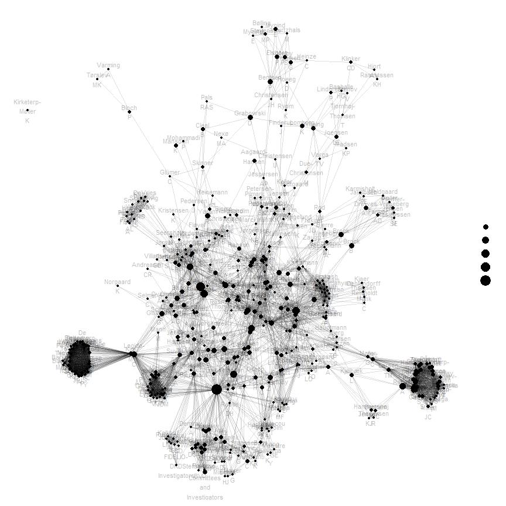

# Introduction

This is a tutorial script to producing an **interactive visualization of a co-author network**. The network is based on a publication list of Steno Diabetes Center Copenhagen in 2021, extracted from [the Capital Region of Denmark](https://research.regionh.dk/en/publications/search.html?search=&organisationName=Steno%20Diabetes%20Center%20Copenhagen&publicationYearsFrom=2021&journalName=&organisations=49636648&publicationstatus=published&publicationcategory=33079909&peerreview=true&language=%20&publicationYearsTo=2021&type=%2Fdk%2Fatira%2Fpure%2Fresearchoutput%2Fresearchoutputtypes%2Fcontributiontojournal%2F%25&uri=&pageSize=500&page=0). Each author is a node in the network, and the author's position and vertices (connections to other authors) are dependent on, whom the author has co-authored publications with. Moreover, the total number of publications and co-author of the author are shown as additional information, when hovering the cursor over the author.

The code is for R and it is, among others, based on packages [stringr](https://stringr.tidyverse.org/), [ggplot2](https://ggplot2.tidyverse.org/) and [plotly](https://plotly.com/r/).

This document is part of the Github repository [StenoScope](https://github.com/tommi-s/StenoScope) by [Tommi Suvitaival](https://tommi-s.com/).

View this document at https://tommi-s.com/StenoScope/AuthorGraph/ to show all output correctly.


```{=html}
<div id="htmlwidget-4c348f78bd04d76b020a" style="width:864px;height:864px;" class="plotly html-widget"></div>
<script type="application/json" data-for="htmlwidget-4c348f78bd04d76b020a">{"x":{"data":[{"x":[0,0.010323791828716,null,0,0.0481215421175885,null,0,0.000703673992556847,null,0,0.00767138315582576,null,0,0.016571406097124,null,0,0.0351155923926505,null,0,0.00851105596622354,null,0,0.0638098681789955,null,0,0.133367398511078,null,0,0.0574097390295581,null,0,0.0383061804283616,null,0,0.0424542069856014,null,0,0.0121409127596472,null,0,0.0614188788559837,null,0,0.0587668200522341,null,0,0.0542159486271916,null,0,0.0465718136768693,null,0,0.0210030776771708,null,0,0.0107629139802317,null,0,0.0558069759321613,null,0.000703673992556847,0.0558069759321613,null,0.000703673992556847,0.0638098681789955,null,0.000703673992556847,0.010323791828716,null,0.000703673992556847,0.00767138315582576,null,0.000703673992556847,0.0542159486271916,null,0.000703673992556847,0.0121409127596472,null,0.000703673992556847,0.0481215421175885,null,0.000703673992556847,0.0351155923926505,null,0.00189290957964161,0.0574097390295581,null,0.00189290957964161,0.0146537427705731,null,0.00189290957964161,0.000703673992556847,null,0.00189290957964161,0.0465718136768693,null,0.00189290957964161,0.00367176778846843,null,0.00189290957964161,0.0184571692344896,null,0.00189290957964161,0.0129347496129794,null,0.00189290957964161,0.0383061804283616,null,0.00189290957964161,0.00921539466731479,null,0.00189290957964161,0.0121409127596472,null,0.00189290957964161,0.010323791828716,null,0.00189290957964161,0.0291312413141793,null,0.00189290957964161,0.0558069759321613,null,0.00189290957964161,0.0258966914460853,null,0.00189290957964161,0.0583119776786885,null,0.00189290957964161,0,null,0.00189290957964161,0.0376822323871497,null,0.00189290957964161,0.00218564319495176,null,0.00189290957964161,0.0424542069856014,null,0.00189290957964161,0.0539028617576688,null,0.00189290957964161,0.0590500369776842,null,0.00189290957964161,0.016571406097124,null,0.00189290957964161,0.0491206499221506,null,0.00189290957964161,0.0628942350416513,null,0.00189290957964161,0.00496191809938452,null,0.00189290957964161,0.133367398511078,null,0.00189290957964161,0.0351155923926505,null,0.00189290957964161,0.0592824003196473,null,0.00189290957964161,0.0210030776771708,null,0.00189290957964161,0.0107629139802317,null,0.00189290957964161,0.00851105596622354,null,0.00189290957964161,0.0315270979332159,null,0.00189290957964161,0.0638098681789955,null,0.00189290957964161,0.00786361738005418,null,0.00189290957964161,0.0587668200522341,null,0.00189290957964161,0.0481215421175885,null,0.00189290957964161,0.0144646842246456,null,0.00189290957964161,0.12969620532027,null,0.00189290957964161,0.0542159486271916,null,0.00189290957964161,0.0614188788559837,null,0.00189290957964161,0.00767138315582576,null,0.00218564319495176,0.0465718136768693,null,0.00218564319495176,0.0107629139802317,null,0.00218564319495176,0.0481215421175885,null,0.00218564319495176,0.0424542069856014,null,0.00218564319495176,0.000703673992556847,null,0.00218564319495176,0.0542159486271916,null,0.00218564319495176,0.0351155923926505,null,0.00218564319495176,0.0638098681789955,null,0.00218564319495176,0.0558069759321613,null,0.00218564319495176,0.010323791828716,null,0.00218564319495176,0.0614188788559837,null,0.00218564319495176,0.0210030776771708,null,0.00218564319495176,0.016571406097124,null,0.00298877932417518,0.0424542069856014,null,0.00298877932417518,0.0315270979332159,null,0.00298877932417518,0.0583119776786885,null,0.00298877932417518,0.010323791828716,null,0.00298877932417518,0.0614188788559837,null,0.00298877932417518,0.0638098681789955,null,0.00298877932417518,0.0491206499221506,null,0.00298877932417518,0.0587668200522341,null,0.00298877932417518,0.00786361738005418,null,0.00298877932417518,0.023397234248103,null,0.00298877932417518,0.0107629139802317,null,0.00298877932417518,0.0628942350416513,null,0.00298877932417518,0.0144646842246456,null,0.00298877932417518,0.12969620532027,null,0.00298877932417518,0.0498303646155741,null,0.00298877932417518,0.0592824003196473,null,0.00298877932417518,0.133367398511078,null,0.00298877932417518,0.0539028617576688,null,0.00298877932417518,0.00218564319495176,null,0.00298877932417518,0.00189290957964161,null,0.00298877932417518,0.0383061804283616,null,0.00298877932417518,0.0542159486271916,null,0.00298877932417518,0.00921539466731479,null,0.00298877932417518,0.000703673992556847,null,0.00298877932417518,0.00496191809938452,null,0.00298877932417518,0.00367176778846843,null,0.00298877932417518,0.0574097390295581,null,0.00298877932417518,0.0351155923926505,null,0.00298877932417518,0.00851105596622354,null,0.00298877932417518,0.0129347496129794,null,0.00298877932417518,0.0481215421175885,null,0.00298877932417518,0.0465718136768693,null,0.00298877932417518,0.0291312413141793,null,0.00298877932417518,0.0146537427705731,null,0.00298877932417518,0.0590500369776842,null,0.00298877932417518,0.0376822323871497,null,0.00298877932417518,0.0558069759321613,null,0.00298877932417518,0.0210030776771708,null,0.00298877932417518,0.0184571692344896,null,0.00298877932417518,0.0258966914460853,null,0.00298877932417518,0.016571406097124,null,0.00298877932417518,0.0200957289425491,null,0.00367176778846843,0.0351155923926505,null,0.00367176778846843,0.00851105596622354,null,0.00367176778846843,0.000703673992556847,null,0.00367176778846843,0.0558069759321613,null,0.00367176778846843,0.12969620532027,null,0.00367176778846843,0.0107629139802317,null,0.00367176778846843,0.0424542069856014,null,0.00367176778846843,0.0638098681789955,null,0.00367176778846843,0.133367398511078,null,0.00367176778846843,0.0465718136768693,null,0.00367176778846843,0.0574097390295581,null,0.00367176778846843,0.016571406097124,null,0.00367176778846843,0.0210030776771708,null,0.00367176778846843,0.0481215421175885,null,0.00367176778846843,0.0587668200522341,null,0.00367176778846843,0.0614188788559837,null,0.00367176778846843,0.010323791828716,null,0.00367176778846843,0.0542159486271916,null,0.00367176778846843,0.00218564319495176,null,0.00367176778846843,0.0383061804283616,null,0.00496191809938452,0.0184571692344896,null,0.00496191809938452,0.0574097390295581,null,0.00496191809938452,0.0258966914460853,null,0.00496191809938452,0.0558069759321613,null,0.00496191809938452,0.00921539466731479,null,0.00496191809938452,0.0144646842246456,null,0.00496191809938452,0.0590500369776842,null,0.00496191809938452,0.0146537427705731,null,0.00496191809938452,0.0614188788559837,null,0.00496191809938452,0.0107629139802317,null,0.00496191809938452,0.00767138315582576,null,0.00496191809938452,0.0351155923926505,null,0.00496191809938452,0.0291312413141793,null,0.00496191809938452,0.0465718136768693,null,0.00496191809938452,0.00851105596622354,null,0.00496191809938452,0.0121409127596472,null,0.00496191809938452,0.0210030776771708,null,0.00496191809938452,0.016571406097124,null,0.00496191809938452,0.0539028617576688,null,0.00496191809938452,0.0376822323871497,null,0.00496191809938452,0.0424542069856014,null,0.00496191809938452,0.000703673992556847,null,0.00496191809938452,0.0583119776786885,null,0.00496191809938452,0.0592824003196473,null,0.00496191809938452,0.00218564319495176,null,0.00496191809938452,0.0129347496129794,null,0.00496191809938452,0.0542159486271916,null,0.00496191809938452,0.00786361738005418,null,0.00496191809938452,0,null,0.00496191809938452,0.0628942350416513,null,0.00496191809938452,0.0481215421175885,null,0.00496191809938452,0.0383061804283616,null,0.00496191809938452,0.12969620532027,null,0.00496191809938452,0.010323791828716,null,0.00496191809938452,0.133367398511078,null,0.00496191809938452,0.0491206499221506,null,0.00496191809938452,0.0638098681789955,null,0.00496191809938452,0.0315270979332159,null,0.00496191809938452,0.00367176778846843,null,0.00496191809938452,0.0587668200522341,null,0.00767138315582576,0.0481215421175885,null,0.00767138315582576,0.0558069759321613,null,0.00767138315582576,0.0638098681789955,null,0.00767138315582576,0.0121409127596472,null,0.00767138315582576,0.0542159486271916,null,0.00767138315582576,0.0351155923926505,null,0.00767138315582576,0.010323791828716,null,0.00786361738005418,0.0465718136768693,null,0.00786361738005418,0.0542159486271916,null,0.00786361738005418,0.0210030776771708,null,0.00786361738005418,0.0383061804283616,null,0.00786361738005418,0.000703673992556847,null,0.00786361738005418,0.0129347496129794,null,0.00786361738005418,0.0590500369776842,null,0.00786361738005418,0.0184571692344896,null,0.00786361738005418,0.0614188788559837,null,0.00786361738005418,0.016571406097124,null,0.00786361738005418,0.133367398511078,null,0.00786361738005418,0.0491206499221506,null,0.00786361738005418,0.0291312413141793,null,0.00786361738005418,0.0146537427705731,null,0.00786361738005418,0.00851105596622354,null,0.00786361738005418,0.0539028617576688,null,0.00786361738005418,0.0258966914460853,null,0.00786361738005418,0.0628942350416513,null,0.00786361738005418,0,null,0.00786361738005418,0.0583119776786885,null,0.00786361738005418,0.0587668200522341,null,0.00786361738005418,0.0558069759321613,null,0.00786361738005418,0.0574097390295581,null,0.00786361738005418,0.0144646842246456,null,0.00786361738005418,0.0481215421175885,null,0.00786361738005418,0.0376822323871497,null,0.00786361738005418,0.010323791828716,null,0.00786361738005418,0.0592824003196473,null,0.00786361738005418,0.00921539466731479,null,0.00786361738005418,0.00367176778846843,null,0.00786361738005418,0.0351155923926505,null,0.00786361738005418,0.12969620532027,null,0.00786361738005418,0.00767138315582576,null,0.00786361738005418,0.0638098681789955,null,0.00786361738005418,0.0315270979332159,null,0.00786361738005418,0.0424542069856014,null,0.00786361738005418,0.0121409127596472,null,0.00786361738005418,0.0107629139802317,null,0.00786361738005418,0.00218564319495176,null,0.00851105596622354,0.00218564319495176,null,0.00851105596622354,0.0121409127596472,null,0.00851105596622354,0.0558069759321613,null,0.00851105596622354,0.016571406097124,null,0.00851105596622354,0.0465718136768693,null,0.00851105596622354,0.0383061804283616,null,0.00851105596622354,0.0351155923926505,null,0.00851105596622354,0.010323791828716,null,0.00851105596622354,0.0542159486271916,null,0.00851105596622354,0.0481215421175885,null,0.00851105596622354,0.0574097390295581,null,0.00851105596622354,0.0614188788559837,null,0.00851105596622354,0.00767138315582576,null,0.00851105596622354,0.000703673992556847,null,0.00851105596622354,0.0107629139802317,null,0.00851105596622354,0.0638098681789955,null,0.00851105596622354,0.0424542069856014,null,0.00851105596622354,0.0210030776771708,null,0.00851105596622354,0.0587668200522341,null,0.00921539466731479,0.0590500369776842,null,0.00921539466731479,0.00767138315582576,null,0.00921539466731479,0.0210030776771708,null,0.00921539466731479,0.0542159486271916,null,0.00921539466731479,0.0107629139802317,null,0.00921539466731479,0.010323791828716,null,0.00921539466731479,0.000703673992556847,null,0.00921539466731479,0.12969620532027,null,0.00921539466731479,0.0614188788559837,null,0.00921539466731479,0.0638098681789955,null,0.00921539466731479,0.016571406097124,null,0.00921539466731479,0.0121409127596472,null,0.00921539466731479,0.0558069759321613,null,0.00921539466731479,0.0465718136768693,null,0.00921539466731479,0.00851105596622354,null,0.00921539466731479,0.133367398511078,null,0.00921539466731479,0.00367176778846843,null,0.00921539466731479,0.0146537427705731,null,0.00921539466731479,0.0315270979332159,null,0.00921539466731479,0.0351155923926505,null,0.00921539466731479,0.0587668200522341,null,0.00921539466731479,0.0481215421175885,null,0.00921539466731479,0.0574097390295581,null,0.00921539466731479,0.00218564319495176,null,0.00921539466731479,0.0424542069856014,null,0.00921539466731479,0,null,0.00921539466731479,0.0383061804283616,null,0.00921539466731479,0.0291312413141793,null,0.010323791828716,0.0121409127596472,null,0.010323791828716,0.0558069759321613,null,0.010323791828716,0.0638098681789955,null,0.010323791828716,0.0481215421175885,null,0.010323791828716,0.0351155923926505,null,0.0107629139802317,0.0351155923926505,null,0.0107629139802317,0.0638098681789955,null,0.0107629139802317,0.0481215421175885,null,0.0107629139802317,0.0424542069856014,null,0.0107629139802317,0.0542159486271916,null,0.0107629139802317,0.010323791828716,null,0.0107629139802317,0.000703673992556847,null,0.0107629139802317,0.0558069759321613,null,0.0107629139802317,0.0210030776771708,null,0.0107629139802317,0.016571406097124,null,0.0107629139802317,0.00767138315582576,null,0.0107629139802317,0.0465718136768693,null,0.0107629139802317,0.0121409127596472,null,0.0121409127596472,0.0558069759321613,null,0.0129347496129794,0.0574097390295581,null,0.0129347496129794,0.0424542069856014,null,0.0129347496129794,0.133367398511078,null,0.0129347496129794,0,null,0.0129347496129794,0.000703673992556847,null,0.0129347496129794,0.0558069759321613,null,0.0129347496129794,0.0146537427705731,null,0.0129347496129794,0.12969620532027,null,0.0129347496129794,0.0291312413141793,null,0.0129347496129794,0.016571406097124,null,0.0129347496129794,0.0481215421175885,null,0.0129347496129794,0.0144646842246456,null,0.0129347496129794,0.0542159486271916,null,0.0129347496129794,0.010323791828716,null,0.0129347496129794,0.0121409127596472,null,0.0129347496129794,0.0638098681789955,null,0.0129347496129794,0.0587668200522341,null,0.0129347496129794,0.0210030776771708,null,0.0129347496129794,0.00367176778846843,null,0.0129347496129794,0.00851105596622354,null,0.0129347496129794,0.0107629139802317,null,0.0129347496129794,0.0590500369776842,null,0.0129347496129794,0.0315270979332159,null,0.0129347496129794,0.00218564319495176,null,0.0129347496129794,0.0383061804283616,null,0.0129347496129794,0.0465718136768693,null,0.0129347496129794,0.00767138315582576,null,0.0129347496129794,0.00921539466731479,null,0.0129347496129794,0.0614188788559837,null,0.0129347496129794,0.0351155923926505,null,0.0144646842246456,0.00767138315582576,null,0.0144646842246456,0.00921539466731479,null,0.0144646842246456,0.0614188788559837,null,0.0144646842246456,0.0291312413141793,null,0.0144646842246456,0.0424542069856014,null,0.0144646842246456,0.00851105596622354,null,0.0144646842246456,0.0146537427705731,null,0.0144646842246456,0.0574097390295581,null,0.0144646842246456,0.0590500369776842,null,0.0144646842246456,0.0315270979332159,null,0.0144646842246456,0.010323791828716,null,0.0144646842246456,0.133367398511078,null,0.0144646842246456,0.0542159486271916,null,0.0144646842246456,0.000703673992556847,null,0.0144646842246456,0.0121409127596472,null,0.0144646842246456,0.0383061804283616,null,0.0144646842246456,0.0558069759321613,null,0.0144646842246456,0.0107629139802317,null,0.0144646842246456,0.0210030776771708,null,0.0144646842246456,0,null,0.0144646842246456,0.016571406097124,null,0.0144646842246456,0.00218564319495176,null,0.0144646842246456,0.0465718136768693,null,0.0144646842246456,0.0351155923926505,null,0.0144646842246456,0.00367176778846843,null,0.0144646842246456,0.12969620532027,null,0.0144646842246456,0.0481215421175885,null,0.0144646842246456,0.0587668200522341,null,0.0144646842246456,0.0638098681789955,null,0.0146537427705731,0.00851105596622354,null,0.0146537427705731,0.0424542069856014,null,0.0146537427705731,0.010323791828716,null,0.0146537427705731,0.016571406097124,null,0.0146537427705731,0.0351155923926505,null,0.0146537427705731,0.0542159486271916,null,0.0146537427705731,0.0210030776771708,null,0.0146537427705731,0.0121409127596472,null,0.0146537427705731,0.0383061804283616,null,0.0146537427705731,0.00367176778846843,null,0.0146537427705731,0.133367398511078,null,0.0146537427705731,0.0574097390295581,null,0.0146537427705731,0,null,0.0146537427705731,0.0107629139802317,null,0.0146537427705731,0.00218564319495176,null,0.0146537427705731,0.0558069759321613,null,0.0146537427705731,0.0481215421175885,null,0.0146537427705731,0.12969620532027,null,0.0146537427705731,0.000703673992556847,null,0.0146537427705731,0.0465718136768693,null,0.0146537427705731,0.0614188788559837,null,0.0146537427705731,0.00767138315582576,null,0.0146537427705731,0.0638098681789955,null,0.0146537427705731,0.0587668200522341,null,0.016571406097124,0.0351155923926505,null,0.016571406097124,0.000703673992556847,null,0.016571406097124,0.0558069759321613,null,0.016571406097124,0.0121409127596472,null,0.016571406097124,0.0542159486271916,null,0.016571406097124,0.00767138315582576,null,0.016571406097124,0.0481215421175885,null,0.016571406097124,0.0638098681789955,null,0.016571406097124,0.010323791828716,null,0.0184571692344896,0.016571406097124,null,0.0184571692344896,0.12969620532027,null,0.0184571692344896,0.0351155923926505,null,0.0184571692344896,0.00851105596622354,null,0.0184571692344896,0.0129347496129794,null,0.0184571692344896,0.0638098681789955,null,0.0184571692344896,0.0542159486271916,null,0.0184571692344896,0.0465718136768693,null,0.0184571692344896,0.133367398511078,null,0.0184571692344896,0.00218564319495176,null,0.0184571692344896,0.0590500369776842,null,0.0184571692344896,0.0315270979332159,null,0.0184571692344896,0.000703673992556847,null,0.0184571692344896,0.0383061804283616,null,0.0184571692344896,0.0291312413141793,null,0.0184571692344896,0.0587668200522341,null,0.0184571692344896,0.0146537427705731,null,0.0184571692344896,0.0144646842246456,null,0.0184571692344896,0.0558069759321613,null,0.0184571692344896,0.0614188788559837,null,0.0184571692344896,0.0481215421175885,null,0.0184571692344896,0.00921539466731479,null,0.0184571692344896,0.0574097390295581,null,0.0184571692344896,0.0107629139802317,null,0.0184571692344896,0.00367176778846843,null,0.0184571692344896,0.010323791828716,null,0.0184571692344896,0.0210030776771708,null,0.0184571692344896,0.0424542069856014,null,0.0200957289425491,0.133367398511078,null,0.0200957289425491,0.0121409127596472,null,0.0200957289425491,0.00189290957964161,null,0.0200957289425491,0.00496191809938452,null,0.0200957289425491,0.0144646842246456,null,0.0200957289425491,0.0184571692344896,null,0.0200957289425491,0.0107629139802317,null,0.0200957289425491,0.0614188788559837,null,0.0200957289425491,0.0129347496129794,null,0.0200957289425491,0.00218564319495176,null,0.0200957289425491,0.010323791828716,null,0.0200957289425491,0.00851105596622354,null,0.0200957289425491,0.0146537427705731,null,0.0200957289425491,0.016571406097124,null,0.0200957289425491,0.0539028617576688,null,0.0200957289425491,0.0376822323871497,null,0.0200957289425491,0.0481215421175885,null,0.0200957289425491,0.0574097390295581,null,0.0200957289425491,0.0424542069856014,null,0.0200957289425491,0.0315270979332159,null,0.0200957289425491,0.0592824003196473,null,0.0200957289425491,0,null,0.0200957289425491,0.00767138315582576,null,0.0200957289425491,0.00786361738005418,null,0.0200957289425491,0.0558069759321613,null,0.0200957289425491,0.0351155923926505,null,0.0200957289425491,0.00921539466731479,null,0.0200957289425491,0.0465718136768693,null,0.0200957289425491,0.0583119776786885,null,0.0200957289425491,0.0498303646155741,null,0.0200957289425491,0.023397234248103,null,0.0200957289425491,0.0542159486271916,null,0.0200957289425491,0.0628942350416513,null,0.0200957289425491,0.0491206499221506,null,0.0200957289425491,0.0383061804283616,null,0.0200957289425491,0.0587668200522341,null,0.0200957289425491,0.0258966914460853,null,0.0200957289425491,0.000703673992556847,null,0.0200957289425491,0.0638098681789955,null,0.0200957289425491,0.12969620532027,null,0.0200957289425491,0.0590500369776842,null,0.0200957289425491,0.00367176778846843,null,0.0200957289425491,0.0291312413141793,null,0.0200957289425491,0.0210030776771708,null,0.0210030776771708,0.010323791828716,null,0.0210030776771708,0.0424542069856014,null,0.0210030776771708,0.0121409127596472,null,0.0210030776771708,0.0481215421175885,null,0.0210030776771708,0.000703673992556847,null,0.0210030776771708,0.0638098681789955,null,0.0210030776771708,0.00767138315582576,null,0.0210030776771708,0.016571406097124,null,0.0210030776771708,0.0351155923926505,null,0.0210030776771708,0.0465718136768693,null,0.0210030776771708,0.0542159486271916,null,0.0210030776771708,0.0558069759321613,null,0.023397234248103,0.0558069759321613,null,0.023397234248103,0.0539028617576688,null,0.023397234248103,0.00921539466731479,null,0.023397234248103,0.000703673992556847,null,0.023397234248103,0.00367176778846843,null,0.023397234248103,0.0614188788559837,null,0.023397234248103,0.0376822323871497,null,0.023397234248103,0.0107629139802317,null,0.023397234248103,0.00189290957964161,null,0.023397234248103,0.0146537427705731,null,0.023397234248103,0.133367398511078,null,0.023397234248103,0.0424542069856014,null,0.023397234248103,0.0121409127596472,null,0.023397234248103,0.0144646842246456,null,0.023397234248103,0.00851105596622354,null,0.023397234248103,0.0258966914460853,null,0.023397234248103,0.0129347496129794,null,0.023397234248103,0.0315270979332159,null,0.023397234248103,0.00496191809938452,null,0.023397234248103,0.00767138315582576,null,0.023397234248103,0.00218564319495176,null,0.023397234248103,0.0628942350416513,null,0.023397234248103,0.0481215421175885,null,0.023397234248103,0,null,0.023397234248103,0.0574097390295581,null,0.023397234248103,0.0583119776786885,null,0.023397234248103,0.00786361738005418,null,0.023397234248103,0.0184571692344896,null,0.023397234248103,0.0638098681789955,null,0.023397234248103,0.016571406097124,null,0.023397234248103,0.0491206499221506,null,0.023397234248103,0.010323791828716,null,0.023397234248103,0.0465718136768693,null,0.023397234248103,0.0351155923926505,null,0.023397234248103,0.0592824003196473,null,0.023397234248103,0.0498303646155741,null,0.023397234248103,0.0587668200522341,null,0.023397234248103,0.0542159486271916,null,0.023397234248103,0.0383061804283616,null,0.023397234248103,0.12969620532027,null,0.023397234248103,0.0210030776771708,null,0.023397234248103,0.0291312413141793,null,0.023397234248103,0.0590500369776842,null,0.0258966914460853,0.12969620532027,null,0.0258966914460853,0.0481215421175885,null,0.0258966914460853,0.133367398511078,null,0.0258966914460853,0.0583119776786885,null,0.0258966914460853,0.0614188788559837,null,0.0258966914460853,0.0542159486271916,null,0.0258966914460853,0.00767138315582576,null,0.0258966914460853,0.0210030776771708,null,0.0258966914460853,0.0558069759321613,null,0.0258966914460853,0.0146537427705731,null,0.0258966914460853,0.0315270979332159,null,0.0258966914460853,0.0491206499221506,null,0.0258966914460853,0.0107629139802317,null,0.0258966914460853,0.010323791828716,null,0.0258966914460853,0.00851105596622354,null,0.0258966914460853,0.0587668200522341,null,0.0258966914460853,0.00218564319495176,null,0.0258966914460853,0.0465718136768693,null,0.0258966914460853,0.0144646842246456,null,0.0258966914460853,0.0424542069856014,null,0.0258966914460853,0.0383061804283616,null,0.0258966914460853,0.0184571692344896,null,0.0258966914460853,0.000703673992556847,null,0.0258966914460853,0.0376822323871497,null,0.0258966914460853,0,null,0.0258966914460853,0.0351155923926505,null,0.0258966914460853,0.0291312413141793,null,0.0258966914460853,0.00367176778846843,null,0.0258966914460853,0.016571406097124,null,0.0258966914460853,0.0574097390295581,null,0.0258966914460853,0.0129347496129794,null,0.0258966914460853,0.00921539466731479,null,0.0258966914460853,0.0590500369776842,null,0.0258966914460853,0.0628942350416513,null,0.0258966914460853,0.0121409127596472,null,0.0258966914460853,0.0638098681789955,null,0.0278950546381653,0.00496191809938452,null,0.0278950546381653,0.00921539466731479,null,0.0278950546381653,0.0121409127596472,null,0.0278950546381653,0.0590500369776842,null,0.0278950546381653,0.0587668200522341,null,0.0278950546381653,0.0107629139802317,null,0.0278950546381653,0.0315270979332159,null,0.0278950546381653,0.00189290957964161,null,0.0278950546381653,0.0592824003196473,null,0.0278950546381653,0.0614188788559837,null,0.0278950546381653,0.0539028617576688,null,0.0278950546381653,0.00367176778846843,null,0.0278950546381653,0.133367398511078,null,0.0278950546381653,0.00767138315582576,null,0.0278950546381653,0.0144646842246456,null,0.0278950546381653,0.0583119776786885,null,0.0278950546381653,0.12969620532027,null,0.0278950546381653,0.0638098681789955,null,0.0278950546381653,0.00851105596622354,null,0.0278950546381653,0.0574097390295581,null,0.0278950546381653,0.00786361738005418,null,0.0278950546381653,0.00218564319495176,null,0.0278950546381653,0.0542159486271916,null,0.0278950546381653,0,null,0.0278950546381653,0.00298877932417518,null,0.0278950546381653,0.0481215421175885,null,0.0278950546381653,0.023397234248103,null,0.0278950546381653,0.0498303646155741,null,0.0278950546381653,0.0351155923926505,null,0.0278950546381653,0.0129347496129794,null,0.0278950546381653,0.0291312413141793,null,0.0278950546381653,0.0376822323871497,null,0.0278950546381653,0.016571406097124,null,0.0278950546381653,0.000703673992556847,null,0.0278950546381653,0.0491206499221506,null,0.0278950546381653,0.0184571692344896,null,0.0278950546381653,0.0383061804283616,null,0.0278950546381653,0.0628942350416513,null,0.0278950546381653,0.0146537427705731,null,0.0278950546381653,0.010323791828716,null,0.0278950546381653,0.0200957289425491,null,0.0278950546381653,0.0210030776771708,null,0.0278950546381653,0.0465718136768693,null,0.0278950546381653,0.0558069759321613,null,0.0278950546381653,0.0258966914460853,null,0.0278950546381653,0.0424542069856014,null,0.0291312413141793,0,null,0.0291312413141793,0.0614188788559837,null,0.0291312413141793,0.0351155923926505,null,0.0291312413141793,0.00218564319495176,null,0.0291312413141793,0.0210030776771708,null,0.0291312413141793,0.0465718136768693,null,0.0291312413141793,0.0638098681789955,null,0.0291312413141793,0.0558069759321613,null,0.0291312413141793,0.00851105596622354,null,0.0291312413141793,0.00767138315582576,null,0.0291312413141793,0.00367176778846843,null,0.0291312413141793,0.016571406097124,null,0.0291312413141793,0.0383061804283616,null,0.0291312413141793,0.12969620532027,null,0.0291312413141793,0.0121409127596472,null,0.0291312413141793,0.0542159486271916,null,0.0291312413141793,0.0587668200522341,null,0.0291312413141793,0.0424542069856014,null,0.0291312413141793,0.0107629139802317,null,0.0291312413141793,0.133367398511078,null,0.0291312413141793,0.010323791828716,null,0.0291312413141793,0.000703673992556847,null,0.0291312413141793,0.0146537427705731,null,0.0291312413141793,0.0574097390295581,null,0.0291312413141793,0.0481215421175885,null,0.0315270979332159,0.0121409127596472,null,0.0315270979332159,0,null,0.0315270979332159,0.0383061804283616,null,0.0315270979332159,0.010323791828716,null,0.0315270979332159,0.0614188788559837,null,0.0315270979332159,0.0107629139802317,null,0.0315270979332159,0.0291312413141793,null,0.0315270979332159,0.12969620532027,null,0.0315270979332159,0.0146537427705731,null,0.0315270979332159,0.016571406097124,null,0.0315270979332159,0.0351155923926505,null,0.0315270979332159,0.0542159486271916,null,0.0315270979332159,0.00218564319495176,null,0.0315270979332159,0.00851105596622354,null,0.0315270979332159,0.000703673992556847,null,0.0315270979332159,0.0210030776771708,null,0.0315270979332159,0.00367176778846843,null,0.0315270979332159,0.0558069759321613,null,0.0315270979332159,0.133367398511078,null,0.0315270979332159,0.0587668200522341,null,0.0315270979332159,0.0465718136768693,null,0.0315270979332159,0.0481215421175885,null,0.0315270979332159,0.00767138315582576,null,0.0315270979332159,0.0638098681789955,null,0.0315270979332159,0.0574097390295581,null,0.0315270979332159,0.0424542069856014,null,0.0330600624270822,0.0694952451013348,null,0.0330600624270822,0.0534034180073974,null,0.0330600624270822,0.0718727492177381,null,0.0351155923926505,0.0121409127596472,null,0.0351155923926505,0.0558069759321613,null,0.0376822323871497,0.0614188788559837,null,0.0376822323871497,0.0628942350416513,null,0.0376822323871497,0.0583119776786885,null,0.0376822323871497,0.0424542069856014,null,0.0376822323871497,0.0383061804283616,null,0.0376822323871497,0.0121409127596472,null,0.0376822323871497,0.0638098681789955,null,0.0376822323871497,0.00218564319495176,null,0.0376822323871497,0.00767138315582576,null,0.0376822323871497,0.0291312413141793,null,0.0376822323871497,0.0315270979332159,null,0.0376822323871497,0.0558069759321613,null,0.0376822323871497,0.0107629139802317,null,0.0376822323871497,0.0542159486271916,null,0.0376822323871497,0.016571406097124,null,0.0376822323871497,0.0587668200522341,null,0.0376822323871497,0.00851105596622354,null,0.0376822323871497,0.0481215421175885,null,0.0376822323871497,0.0210030776771708,null,0.0376822323871497,0.0144646842246456,null,0.0376822323871497,0,null,0.0376822323871497,0.0129347496129794,null,0.0376822323871497,0.0146537427705731,null,0.0376822323871497,0.010323791828716,null,0.0376822323871497,0.000703673992556847,null,0.0376822323871497,0.0351155923926505,null,0.0376822323871497,0.0574097390295581,null,0.0376822323871497,0.0465718136768693,null,0.0376822323871497,0.00921539466731479,null,0.0376822323871497,0.00367176778846843,null,0.0376822323871497,0.0184571692344896,null,0.0376822323871497,0.0590500369776842,null,0.0376822323871497,0.133367398511078,null,0.0376822323871497,0.12969620532027,null,0.0383061804283616,0.0107629139802317,null,0.0383061804283616,0.0542159486271916,null,0.0383061804283616,0.0558069759321613,null,0.0383061804283616,0.00218564319495176,null,0.0383061804283616,0.00767138315582576,null,0.0383061804283616,0.000703673992556847,null,0.0383061804283616,0.0121409127596472,null,0.0383061804283616,0.010323791828716,null,0.0383061804283616,0.016571406097124,null,0.0383061804283616,0.0481215421175885,null,0.0383061804283616,0.0465718136768693,null,0.0383061804283616,0.0424542069856014,null,0.0383061804283616,0.0614188788559837,null,0.0383061804283616,0.0210030776771708,null,0.0383061804283616,0.0638098681789955,null,0.0383061804283616,0.0351155923926505,null,0.0424542069856014,0.0351155923926505,null,0.0424542069856014,0.00767138315582576,null,0.0424542069856014,0.0481215421175885,null,0.0424542069856014,0.0121409127596472,null,0.0424542069856014,0.0638098681789955,null,0.0424542069856014,0.0558069759321613,null,0.0424542069856014,0.010323791828716,null,0.0424542069856014,0.0542159486271916,null,0.0424542069856014,0.000703673992556847,null,0.0424542069856014,0.0465718136768693,null,0.0424542069856014,0.016571406097124,null,0.0465718136768693,0.010323791828716,null,0.0465718136768693,0.016571406097124,null,0.0465718136768693,0.00767138315582576,null,0.0465718136768693,0.000703673992556847,null,0.0465718136768693,0.0351155923926505,null,0.0465718136768693,0.0558069759321613,null,0.0465718136768693,0.0481215421175885,null,0.0465718136768693,0.0542159486271916,null,0.0465718136768693,0.0121409127596472,null,0.0465718136768693,0.0638098681789955,null,0.0481215421175885,0.0351155923926505,null,0.0481215421175885,0.0558069759321613,null,0.0481215421175885,0.0121409127596472,null,0.0491206499221506,0.0383061804283616,null,0.0491206499221506,0.0583119776786885,null,0.0491206499221506,0.0587668200522341,null,0.0491206499221506,0.133367398511078,null,0.0491206499221506,0.00367176778846843,null,0.0491206499221506,0.00767138315582576,null,0.0491206499221506,0.0574097390295581,null,0.0491206499221506,0.0481215421175885,null,0.0491206499221506,0.0107629139802317,null,0.0491206499221506,0.0424542069856014,null,0.0491206499221506,0.0146537427705731,null,0.0491206499221506,0.0465718136768693,null,0.0491206499221506,0.0558069759321613,null,0.0491206499221506,0.0315270979332159,null,0.0491206499221506,0.0210030776771708,null,0.0491206499221506,0.0628942350416513,null,0.0491206499221506,0,null,0.0491206499221506,0.00218564319495176,null,0.0491206499221506,0.0614188788559837,null,0.0491206499221506,0.0291312413141793,null,0.0491206499221506,0.0590500369776842,null,0.0491206499221506,0.0129347496129794,null,0.0491206499221506,0.0351155923926505,null,0.0491206499221506,0.0542159486271916,null,0.0491206499221506,0.016571406097124,null,0.0491206499221506,0.00851105596622354,null,0.0491206499221506,0.0184571692344896,null,0.0491206499221506,0.0638098681789955,null,0.0491206499221506,0.010323791828716,null,0.0491206499221506,0.12969620532027,null,0.0491206499221506,0.0376822323871497,null,0.0491206499221506,0.000703673992556847,null,0.0491206499221506,0.0121409127596472,null,0.0491206499221506,0.00921539466731479,null,0.0491206499221506,0.0144646842246456,null,0.0498303646155741,0.000703673992556847,null,0.0498303646155741,0.0558069759321613,null,0.0498303646155741,0.016571406097124,null,0.0498303646155741,0.00367176778846843,null,0.0498303646155741,0.00921539466731479,null,0.0498303646155741,0.0315270979332159,null,0.0498303646155741,0.0258966914460853,null,0.0498303646155741,0.133367398511078,null,0.0498303646155741,0.0590500369776842,null,0.0498303646155741,0.0351155923926505,null,0.0498303646155741,0.0146537427705731,null,0.0498303646155741,0.0383061804283616,null,0.0498303646155741,0.0184571692344896,null,0.0498303646155741,0.0574097390295581,null,0.0498303646155741,0.00851105596622354,null,0.0498303646155741,0.0144646842246456,null,0.0498303646155741,0.0614188788559837,null,0.0498303646155741,0.0121409127596472,null,0.0498303646155741,0.00189290957964161,null,0.0498303646155741,0.00218564319495176,null,0.0498303646155741,0.00496191809938452,null,0.0498303646155741,0.0129347496129794,null,0.0498303646155741,0.0539028617576688,null,0.0498303646155741,0.0424542069856014,null,0.0498303646155741,0.00786361738005418,null,0.0498303646155741,0.0491206499221506,null,0.0498303646155741,0.0628942350416513,null,0.0498303646155741,0.0376822323871497,null,0.0498303646155741,0,null,0.0498303646155741,0.0587668200522341,null,0.0498303646155741,0.0107629139802317,null,0.0498303646155741,0.0583119776786885,null,0.0498303646155741,0.0638098681789955,null,0.0498303646155741,0.12969620532027,null,0.0498303646155741,0.0291312413141793,null,0.0498303646155741,0.0592824003196473,null,0.0498303646155741,0.0481215421175885,null,0.0498303646155741,0.0542159486271916,null,0.0498303646155741,0.0465718136768693,null,0.0498303646155741,0.00767138315582576,null,0.0498303646155741,0.010323791828716,null,0.0498303646155741,0.0210030776771708,null,0.0534034180073974,0.0694952451013348,null,0.0539028617576688,0.0210030776771708,null,0.0539028617576688,0.016571406097124,null,0.0539028617576688,0.0184571692344896,null,0.0539028617576688,0.0590500369776842,null,0.0539028617576688,0.0146537427705731,null,0.0539028617576688,0.0558069759321613,null,0.0539028617576688,0.0383061804283616,null,0.0539028617576688,0.12969620532027,null,0.0539028617576688,0.0129347496129794,null,0.0539028617576688,0.0481215421175885,null,0.0539028617576688,0.0614188788559837,null,0.0539028617576688,0.133367398511078,null,0.0539028617576688,0.0574097390295581,null,0.0539028617576688,0.000703673992556847,null,0.0539028617576688,0.0107629139802317,null,0.0539028617576688,0.0351155923926505,null,0.0539028617576688,0.00367176778846843,null,0.0539028617576688,0.00767138315582576,null,0.0539028617576688,0.0592824003196473,null,0.0539028617576688,0.0315270979332159,null,0.0539028617576688,0.0542159486271916,null,0.0539028617576688,0.0291312413141793,null,0.0539028617576688,0.0583119776786885,null,0.0539028617576688,0.0258966914460853,null,0.0539028617576688,0.0465718136768693,null,0.0539028617576688,0.00218564319495176,null,0.0539028617576688,0.0491206499221506,null,0.0539028617576688,0.0587668200522341,null,0.0539028617576688,0.00851105596622354,null,0.0539028617576688,0.0121409127596472,null,0.0539028617576688,0.00921539466731479,null,0.0539028617576688,0.0376822323871497,null,0.0539028617576688,0.0638098681789955,null,0.0539028617576688,0.010323791828716,null,0.0539028617576688,0.0144646842246456,null,0.0539028617576688,0.0628942350416513,null,0.0539028617576688,0.0424542069856014,null,0.0539028617576688,0,null,0.0542159486271916,0.0558069759321613,null,0.0542159486271916,0.010323791828716,null,0.0542159486271916,0.0638098681789955,null,0.0542159486271916,0.0121409127596472,null,0.0542159486271916,0.0481215421175885,null,0.0542159486271916,0.0351155923926505,null,0.0550044546471665,0.197646678177634,null,0.0550044546471665,0.0534034180073974,null,0.0550044546471665,0.21455072231576,null,0.0550044546471665,0.0617966231101671,null,0.0550044546471665,0.0694952451013348,null,0.0550044546471665,0.0330600624270822,null,0.0550044546471665,0.0568867995775344,null,0.0550044546471665,0.0718727492177381,null,0.0550044546471665,0.0624663769882012,null,0.0550044546471665,0.0557494355024849,null,0.0557494355024849,0.0718727492177381,null,0.0557494355024849,0.0534034180073974,null,0.0557494355024849,0.0330600624270822,null,0.0557494355024849,0.0694952451013348,null,0.0557494355024849,0.0624663769882012,null,0.0568867995775344,0.0330600624270822,null,0.0568867995775344,0.0557494355024849,null,0.0568867995775344,0.0534034180073974,null,0.0568867995775344,0.0694952451013348,null,0.0568867995775344,0.0624663769882012,null,0.0568867995775344,0.0718727492177381,null,0.0574097390295581,0.0614188788559837,null,0.0574097390295581,0.0121409127596472,null,0.0574097390295581,0.0107629139802317,null,0.0574097390295581,0.0351155923926505,null,0.0574097390295581,0.0424542069856014,null,0.0574097390295581,0.0638098681789955,null,0.0574097390295581,0.00218564319495176,null,0.0574097390295581,0.0587668200522341,null,0.0574097390295581,0.00767138315582576,null,0.0574097390295581,0.0481215421175885,null,0.0574097390295581,0.0465718136768693,null,0.0574097390295581,0.0210030776771708,null,0.0574097390295581,0.010323791828716,null,0.0574097390295581,0.0542159486271916,null,0.0574097390295581,0.0383061804283616,null,0.0574097390295581,0.0558069759321613,null,0.0574097390295581,0.016571406097124,null,0.0574097390295581,0.000703673992556847,null,0.0583119776786885,0.0129347496129794,null,0.0583119776786885,0.0210030776771708,null,0.0583119776786885,0.0558069759321613,null,0.0583119776786885,0.0638098681789955,null,0.0583119776786885,0.00767138315582576,null,0.0583119776786885,0.0107629139802317,null,0.0583119776786885,0.0481215421175885,null,0.0583119776786885,0.0542159486271916,null,0.0583119776786885,0.0465718136768693,null,0.0583119776786885,0.0383061804283616,null,0.0583119776786885,0.133367398511078,null,0.0583119776786885,0.0587668200522341,null,0.0583119776786885,0.0184571692344896,null,0.0583119776786885,0.010323791828716,null,0.0583119776786885,0.016571406097124,null,0.0583119776786885,0.0291312413141793,null,0.0583119776786885,0,null,0.0583119776786885,0.0614188788559837,null,0.0583119776786885,0.00921539466731479,null,0.0583119776786885,0.0144646842246456,null,0.0583119776786885,0.0315270979332159,null,0.0583119776786885,0.0351155923926505,null,0.0583119776786885,0.0628942350416513,null,0.0583119776786885,0.0424542069856014,null,0.0583119776786885,0.00218564319495176,null,0.0583119776786885,0.0574097390295581,null,0.0583119776786885,0.12969620532027,null,0.0583119776786885,0.00851105596622354,null,0.0583119776786885,0.00367176778846843,null,0.0583119776786885,0.0146537427705731,null,0.0583119776786885,0.0121409127596472,null,0.0583119776786885,0.0590500369776842,null,0.0583119776786885,0.000703673992556847,null,0.0587668200522341,0.0351155923926505,null,0.0587668200522341,0.0542159486271916,null,0.0587668200522341,0.010323791828716,null,0.0587668200522341,0.00767138315582576,null,0.0587668200522341,0.0121409127596472,null,0.0587668200522341,0.0107629139802317,null,0.0587668200522341,0.00218564319495176,null,0.0587668200522341,0.0481215421175885,null,0.0587668200522341,0.000703673992556847,null,0.0587668200522341,0.0424542069856014,null,0.0587668200522341,0.0210030776771708,null,0.0587668200522341,0.0465718136768693,null,0.0587668200522341,0.0614188788559837,null,0.0587668200522341,0.0558069759321613,null,0.0587668200522341,0.0383061804283616,null,0.0587668200522341,0.0638098681789955,null,0.0587668200522341,0.016571406097124,null,0.0590500369776842,0.0146537427705731,null,0.0590500369776842,0.00851105596622354,null,0.0590500369776842,0.0614188788559837,null,0.0590500369776842,0.0558069759321613,null,0.0590500369776842,0.00767138315582576,null,0.0590500369776842,0,null,0.0590500369776842,0.12969620532027,null,0.0590500369776842,0.0574097390295581,null,0.0590500369776842,0.0587668200522341,null,0.0590500369776842,0.0351155923926505,null,0.0590500369776842,0.010323791828716,null,0.0590500369776842,0.0383061804283616,null,0.0590500369776842,0.0542159486271916,null,0.0590500369776842,0.0424542069856014,null,0.0590500369776842,0.00218564319495176,null,0.0590500369776842,0.0210030776771708,null,0.0590500369776842,0.0121409127596472,null,0.0590500369776842,0.0315270979332159,null,0.0590500369776842,0.000703673992556847,null,0.0590500369776842,0.016571406097124,null,0.0590500369776842,0.133367398511078,null,0.0590500369776842,0.0291312413141793,null,0.0590500369776842,0.0481215421175885,null,0.0590500369776842,0.0638098681789955,null,0.0590500369776842,0.0107629139802317,null,0.0590500369776842,0.0465718136768693,null,0.0590500369776842,0.00367176778846843,null,0.0592824003196473,0.133367398511078,null,0.0592824003196473,0.0383061804283616,null,0.0592824003196473,0.0351155923926505,null,0.0592824003196473,0.00367176778846843,null,0.0592824003196473,0.0558069759321613,null,0.0592824003196473,0.00851105596622354,null,0.0592824003196473,0.0258966914460853,null,0.0592824003196473,0.12969620532027,null,0.0592824003196473,0.0590500369776842,null,0.0592824003196473,0.0210030776771708,null,0.0592824003196473,0.0542159486271916,null,0.0592824003196473,0.0129347496129794,null,0.0592824003196473,0.0121409127596472,null,0.0592824003196473,0.0481215421175885,null,0.0592824003196473,0.0491206499221506,null,0.0592824003196473,0.0184571692344896,null,0.0592824003196473,0.0614188788559837,null,0.0592824003196473,0.0574097390295581,null,0.0592824003196473,0.00767138315582576,null,0.0592824003196473,0.0146537427705731,null,0.0592824003196473,0.010323791828716,null,0.0592824003196473,0.0587668200522341,null,0.0592824003196473,0.0315270979332159,null,0.0592824003196473,0.0144646842246456,null,0.0592824003196473,0.0291312413141793,null,0.0592824003196473,0.016571406097124,null,0.0592824003196473,0,null,0.0592824003196473,0.0376822323871497,null,0.0592824003196473,0.0638098681789955,null,0.0592824003196473,0.0424542069856014,null,0.0592824003196473,0.0107629139802317,null,0.0592824003196473,0.0465718136768693,null,0.0592824003196473,0.00921539466731479,null,0.0592824003196473,0.0583119776786885,null,0.0592824003196473,0.0628942350416513,null,0.0592824003196473,0.00218564319495176,null,0.0592824003196473,0.000703673992556847,null,0.0606652011844725,0.134547824802925,null,0.0606652011844725,0.0903618508094846,null,0.0606652011844725,0.0989831000419708,null,0.0606652011844725,0.081185274091998,null,0.0606652011844725,0.105409644418857,null,0.0606652011844725,0.0625635034522556,null,0.0606652011844725,0.0758300431775772,null,0.0606652011844725,0.146722856133992,null,0.0614188788559837,0.0638098681789955,null,0.0614188788559837,0.0351155923926505,null,0.0614188788559837,0.016571406097124,null,0.0614188788559837,0.010323791828716,null,0.0614188788559837,0.0558069759321613,null,0.0614188788559837,0.0542159486271916,null,0.0614188788559837,0.0424542069856014,null,0.0614188788559837,0.0481215421175885,null,0.0614188788559837,0.0465718136768693,null,0.0614188788559837,0.0107629139802317,null,0.0614188788559837,0.000703673992556847,null,0.0614188788559837,0.00767138315582576,null,0.0614188788559837,0.0210030776771708,null,0.0614188788559837,0.0121409127596472,null,0.0617966231101671,0.0718727492177381,null,0.0617966231101671,0.197646678177634,null,0.0617966231101671,0.0694952451013348,null,0.0617966231101671,0.0534034180073974,null,0.0617966231101671,0.0330600624270822,null,0.0617966231101671,0.0557494355024849,null,0.0617966231101671,0.0568867995775344,null,0.0617966231101671,0.0624663769882012,null,0.0624663769882012,0.0330600624270822,null,0.0624663769882012,0.0694952451013348,null,0.0624663769882012,0.0718727492177381,null,0.0624663769882012,0.0534034180073974,null,0.0625635034522556,0.134547824802925,null,0.0625635034522556,0.081185274091998,null,0.0628942350416513,0.0590500369776842,null,0.0628942350416513,0.0121409127596472,null,0.0628942350416513,0.0146537427705731,null,0.0628942350416513,0.0184571692344896,null,0.0628942350416513,0,null,0.0628942350416513,0.0129347496129794,null,0.0628942350416513,0.016571406097124,null,0.0628942350416513,0.133367398511078,null,0.0628942350416513,0.0481215421175885,null,0.0628942350416513,0.0351155923926505,null,0.0628942350416513,0.0587668200522341,null,0.0628942350416513,0.0383061804283616,null,0.0628942350416513,0.0614188788559837,null,0.0628942350416513,0.00767138315582576,null,0.0628942350416513,0.0558069759321613,null,0.0628942350416513,0.0542159486271916,null,0.0628942350416513,0.0638098681789955,null,0.0628942350416513,0.00851105596622354,null,0.0628942350416513,0.0144646842246456,null,0.0628942350416513,0.00218564319495176,null,0.0628942350416513,0.0291312413141793,null,0.0628942350416513,0.0574097390295581,null,0.0628942350416513,0.12969620532027,null,0.0628942350416513,0.0107629139802317,null,0.0628942350416513,0.000703673992556847,null,0.0628942350416513,0.0465718136768693,null,0.0628942350416513,0.010323791828716,null,0.0628942350416513,0.0424542069856014,null,0.0628942350416513,0.00367176778846843,null,0.0628942350416513,0.00921539466731479,null,0.0628942350416513,0.0315270979332159,null,0.0628942350416513,0.0210030776771708,null,0.0638098681789955,0.0351155923926505,null,0.0638098681789955,0.0121409127596472,null,0.0638098681789955,0.0481215421175885,null,0.0638098681789955,0.0558069759321613,null,0.0688246719815711,0.0903618508094846,null,0.0688246719815711,0.146722856133992,null,0.0688246719815711,0.0989831000419708,null,0.0688246719815711,0.09997135879728,null,0.0688246719815711,0.0625635034522556,null,0.0688246719815711,0.21455072231576,null,0.0688246719815711,0.105409644418857,null,0.0688246719815711,0.0606652011844725,null,0.0688246719815711,0.081185274091998,null,0.0688246719815711,0.0758300431775772,null,0.0688246719815711,0.134547824802925,null,0.0718727492177381,0.0694952451013348,null,0.0718727492177381,0.0534034180073974,null,0.0758300431775772,0.0989831000419708,null,0.0758300431775772,0.105409644418857,null,0.0758300431775772,0.134547824802925,null,0.0758300431775772,0.0903618508094846,null,0.0758300431775772,0.0625635034522556,null,0.0758300431775772,0.081185274091998,null,0.0758300431775772,0.146722856133992,null,0.0783511675346869,0.0989831000419708,null,0.0783511675346869,0.0625635034522556,null,0.0783511675346869,0.105409644418857,null,0.0783511675346869,0.081185274091998,null,0.0783511675346869,0.0606652011844725,null,0.0783511675346869,0.134547824802925,null,0.0783511675346869,0.09997135879728,null,0.0783511675346869,0.0688246719815711,null,0.0783511675346869,0.0758300431775772,null,0.0783511675346869,0.21455072231576,null,0.0783511675346869,0.197646678177634,null,0.0783511675346869,0.0903618508094846,null,0.0783511675346869,0.146722856133992,null,0.0878273356730479,0.081185274091998,null,0.0878273356730479,0.0625635034522556,null,0.0878273356730479,0.0783511675346869,null,0.0878273356730479,0.197646678177634,null,0.0878273356730479,0.0989831000419708,null,0.0878273356730479,0.0758300431775772,null,0.0878273356730479,0.09997135879728,null,0.0878273356730479,0.105409644418857,null,0.0878273356730479,0.21455072231576,null,0.0878273356730479,0.0688246719815711,null,0.0878273356730479,0.0606652011844725,null,0.0878273356730479,0.146722856133992,null,0.0878273356730479,0.0903618508094846,null,0.0878273356730479,0.134547824802925,null,0.0903618508094846,0.146722856133992,null,0.0903618508094846,0.081185274091998,null,0.0903618508094846,0.142638674208562,null,0.0903618508094846,0.134547824802925,null,0.0903618508094846,0.0625635034522556,null,0.0981804408990955,0.10411657942193,null,0.0981804408990955,0.101767264213456,null,0.0981804408990955,0.111656489130065,null,0.0981804408990955,0.1047986753439,null,0.0981804408990955,0.133367398511078,null,0.0981804408990955,0.140685268844626,null,0.0981804408990955,0.121241380737992,null,0.0981804408990955,0.116028809624683,null,0.0981804408990955,0.187189493655757,null,0.0981804408990955,0.131759770604397,null,0.0981804408990955,0.12969620532027,null,0.0981804408990955,0.143014030839667,null,0.0981804408990955,0.109472349836855,null,0.0981804408990955,0.241336101348018,null,0.0981804408990955,0.103322806058717,null,0.0981804408990955,0.119201376228974,null,0.0981804408990955,0.115257854274707,null,0.0981804408990955,0.144213368840286,null,0.0981804408990955,0.12389402067643,null,0.0981804408990955,0.128380174186932,null,0.0981804408990955,0.126980836910591,null,0.0981804408990955,0.136779808622939,null,0.0981804408990955,0.120532130106022,null,0.0981804408990955,0.104384733362421,null,0.0989831000419708,0.146722856133992,null,0.0989831000419708,0.0625635034522556,null,0.0989831000419708,0.134547824802925,null,0.0989831000419708,0.142638674208562,null,0.0989831000419708,0.081185274091998,null,0.0989831000419708,0.0903618508094846,null,0.09997135879728,0.146722856133992,null,0.09997135879728,0.142638674208562,null,0.09997135879728,0.105409644418857,null,0.09997135879728,0.0989831000419708,null,0.09997135879728,0.197646678177634,null,0.09997135879728,0.134547824802925,null,0.09997135879728,0.0625635034522556,null,0.09997135879728,0.21455072231576,null,0.09997135879728,0.0903618508094846,null,0.09997135879728,0.0606652011844725,null,0.09997135879728,0.081185274091998,null,0.09997135879728,0.0758300431775772,null,0.09997135879728,0.142620192587206,null,0.101393784507063,0.120650902382264,null,0.101393784507063,0.110625166317521,null,0.101767264213456,0.144213368840286,null,0.101767264213456,0.116028809624683,null,0.101767264213456,0.187189493655757,null,0.101767264213456,0.115257854274707,null,0.101767264213456,0.1047986753439,null,0.101767264213456,0.10411657942193,null,0.101767264213456,0.109472349836855,null,0.101767264213456,0.111656489130065,null,0.103322806058717,0.104384733362421,null,0.103322806058717,0.109472349836855,null,0.103322806058717,0.115257854274707,null,0.103322806058717,0.143014030839667,null,0.103322806058717,0.116028809624683,null,0.103322806058717,0.121241380737992,null,0.103322806058717,0.187189493655757,null,0.103322806058717,0.126980836910591,null,0.103322806058717,0.101767264213456,null,0.103322806058717,0.133367398511078,null,0.103322806058717,0.241336101348018,null,0.103322806058717,0.136779808622939,null,0.103322806058717,0.10411657942193,null,0.103322806058717,0.119201376228974,null,0.103322806058717,0.111656489130065,null,0.103322806058717,0.128380174186932,null,0.103322806058717,0.131759770604397,null,0.103322806058717,0.140685268844626,null,0.103322806058717,0.144213368840286,null,0.103322806058717,0.1047986753439,null,0.103322806058717,0.12389402067643,null,0.103322806058717,0.120532130106022,null,0.103322806058717,0.12969620532027,null,0.10411657942193,0.109472349836855,null,0.104384733362421,0.116028809624683,null,0.104384733362421,0.241336101348018,null,0.104384733362421,0.133367398511078,null,0.104384733362421,0.126980836910591,null,0.104384733362421,0.111656489130065,null,0.104384733362421,0.10411657942193,null,0.104384733362421,0.109472349836855,null,0.104384733362421,0.1047986753439,null,0.104384733362421,0.143014030839667,null,0.104384733362421,0.12969620532027,null,0.104384733362421,0.12389402067643,null,0.104384733362421,0.115257854274707,null,0.104384733362421,0.187189493655757,null,0.104384733362421,0.140685268844626,null,0.104384733362421,0.121241380737992,null,0.104384733362421,0.119201376228974,null,0.104384733362421,0.101767264213456,null,0.104384733362421,0.131759770604397,null,0.104384733362421,0.128380174186932,null,0.104384733362421,0.144213368840286,null,0.104714898200193,0.21455072231576,null,0.104714898200193,0.142319116279102,null,0.104714898200193,0.151373676291397,null,0.104714898200193,0.111629319122347,null,0.104714898200193,0.14346311446009,null,0.104714898200193,0.14787071327321,null,0.1047986753439,0.109472349836855,null,0.1047986753439,0.111656489130065,null,0.1047986753439,0.144213368840286,null,0.1047986753439,0.187189493655757,null,0.1047986753439,0.116028809624683,null,0.1047986753439,0.10411657942193,null,0.105409644418857,0.081185274091998,null,0.105409644418857,0.0989831000419708,null,0.105409644418857,0.134547824802925,null,0.105409644418857,0.142638674208562,null,0.105409644418857,0.0903618508094846,null,0.105409644418857,0.0625635034522556,null,0.105409644418857,0.146722856133992,null,0.107830376877893,0.10411657942193,null,0.107830376877893,0.111656489130065,null,0.107830376877893,0.133367398511078,null,0.107830376877893,0.241336101348018,null,0.107830376877893,0.119201376228974,null,0.107830376877893,0.21455072231576,null,0.107830376877893,0.131759770604397,null,0.107830376877893,0.101767264213456,null,0.107830376877893,0.136779808622939,null,0.107830376877893,0.0981804408990955,null,0.107830376877893,0.120532130106022,null,0.107830376877893,0.12969620532027,null,0.107830376877893,0.109472349836855,null,0.107830376877893,0.140685268844626,null,0.107830376877893,0.115257854274707,null,0.107830376877893,0.12389402067643,null,0.107830376877893,0.1047986753439,null,0.107830376877893,0.116028809624683,null,0.107830376877893,0.103322806058717,null,0.107830376877893,0.143014030839667,null,0.107830376877893,0.126980836910591,null,0.107830376877893,0.187189493655757,null,0.107830376877893,0.104384733362421,null,0.107830376877893,0.128380174186932,null,0.107830376877893,0.121241380737992,null,0.107830376877893,0.144213368840286,null,0.108234657796747,0.128380174186932,null,0.108234657796747,0.241336101348018,null,0.108234657796747,0.21455072231576,null,0.108234657796747,0.120532130106022,null,0.108234657796747,0.101767264213456,null,0.108234657796747,0.143014030839667,null,0.108234657796747,0.131759770604397,null,0.108234657796747,0.107830376877893,null,0.108234657796747,0.12389402067643,null,0.108234657796747,0.133367398511078,null,0.108234657796747,0.109472349836855,null,0.108234657796747,0.116028809624683,null,0.108234657796747,0.104384733362421,null,0.108234657796747,0.121241380737992,null,0.108234657796747,0.10411657942193,null,0.108234657796747,0.12969620532027,null,0.108234657796747,0.115257854274707,null,0.108234657796747,0.187189493655757,null,0.108234657796747,0.111656489130065,null,0.108234657796747,0.140685268844626,null,0.108234657796747,0.136779808622939,null,0.108234657796747,0.103322806058717,null,0.108234657796747,0.119201376228974,null,0.108234657796747,0.144890428731332,null,0.108234657796747,0.0981804408990955,null,0.108234657796747,0.126980836910591,null,0.108234657796747,0.1047986753439,null,0.108234657796747,0.144213368840286,null,0.111629319122347,0.14787071327321,null,0.111656489130065,0.109472349836855,null,0.111656489130065,0.10411657942193,null,0.115257854274707,0.109472349836855,null,0.115257854274707,0.116028809624683,null,0.115257854274707,0.144213368840286,null,0.115257854274707,0.1047986753439,null,0.115257854274707,0.10411657942193,null,0.115257854274707,0.187189493655757,null,0.115257854274707,0.111656489130065,null,0.116028809624683,0.10411657942193,null,0.116028809624683,0.109472349836855,null,0.116028809624683,0.187189493655757,null,0.116028809624683,0.111656489130065,null,0.119201376228974,0.144213368840286,null,0.119201376228974,0.121241380737992,null,0.119201376228974,0.140685268844626,null,0.119201376228974,0.101767264213456,null,0.119201376228974,0.241336101348018,null,0.119201376228974,0.115257854274707,null,0.119201376228974,0.116028809624683,null,0.119201376228974,0.111656489130065,null,0.119201376228974,0.109472349836855,null,0.119201376228974,0.1047986753439,null,0.119201376228974,0.10411657942193,null,0.119201376228974,0.187189493655757,null,0.120532130106022,0.143014030839667,null,0.120532130106022,0.12389402067643,null,0.120532130106022,0.101767264213456,null,0.120532130106022,0.115257854274707,null,0.120532130106022,0.1047986753439,null,0.120532130106022,0.116028809624683,null,0.120532130106022,0.126980836910591,null,0.120532130106022,0.136779808622939,null,0.120532130106022,0.111656489130065,null,0.120532130106022,0.131759770604397,null,0.120532130106022,0.109472349836855,null,0.120532130106022,0.187189493655757,null,0.120532130106022,0.121241380737992,null,0.120532130106022,0.119201376228974,null,0.120532130106022,0.133367398511078,null,0.120532130106022,0.128380174186932,null,0.120532130106022,0.241336101348018,null,0.120532130106022,0.10411657942193,null,0.120532130106022,0.12969620532027,null,0.120532130106022,0.104384733362421,null,0.120532130106022,0.140685268844626,null,0.120532130106022,0.144213368840286,null,0.120650902382264,0.110625166317521,null,0.120650902382264,0.163693364859665,null,0.121241380737992,0.109472349836855,null,0.121241380737992,0.144213368840286,null,0.121241380737992,0.115257854274707,null,0.121241380737992,0.1047986753439,null,0.121241380737992,0.101767264213456,null,0.121241380737992,0.10411657942193,null,0.121241380737992,0.140685268844626,null,0.121241380737992,0.187189493655757,null,0.121241380737992,0.111656489130065,null,0.121241380737992,0.116028809624683,null,0.121241380737992,0.241336101348018,null,0.123543626108565,0.14787071327321,null,0.123543626108565,0.142319116279102,null,0.12389402067643,0.119201376228974,null,0.12389402067643,0.101767264213456,null,0.12389402067643,0.128380174186932,null,0.12389402067643,0.109472349836855,null,0.12389402067643,0.241336101348018,null,0.12389402067643,0.111656489130065,null,0.12389402067643,0.140685268844626,null,0.12389402067643,0.10411657942193,null,0.12389402067643,0.144213368840286,null,0.12389402067643,0.187189493655757,null,0.12389402067643,0.121241380737992,null,0.12389402067643,0.115257854274707,null,0.12389402067643,0.1047986753439,null,0.12389402067643,0.116028809624683,null,0.12389402067643,0.126980836910591,null,0.126619075427824,0.142319116279102,null,0.126619075427824,0.111629319122347,null,0.126619075427824,0.21455072231576,null,0.126619075427824,0.104714898200193,null,0.126619075427824,0.14787071327321,null,0.126619075427824,0.151373676291397,null,0.126619075427824,0.14346311446009,null,0.126980836910591,0.10411657942193,null,0.126980836910591,0.115257854274707,null,0.126980836910591,0.111656489130065,null,0.126980836910591,0.187189493655757,null,0.126980836910591,0.140685268844626,null,0.126980836910591,0.116028809624683,null,0.126980836910591,0.1047986753439,null,0.126980836910591,0.144213368840286,null,0.126980836910591,0.109472349836855,null,0.126980836910591,0.241336101348018,null,0.126980836910591,0.119201376228974,null,0.126980836910591,0.101767264213456,null,0.126980836910591,0.121241380737992,null,0.126980836910591,0.128380174186932,null,0.128380174186932,0.144213368840286,null,0.128380174186932,0.140685268844626,null,0.128380174186932,0.116028809624683,null,0.128380174186932,0.187189493655757,null,0.128380174186932,0.101767264213456,null,0.128380174186932,0.121241380737992,null,0.128380174186932,0.10411657942193,null,0.128380174186932,0.115257854274707,null,0.128380174186932,0.119201376228974,null,0.128380174186932,0.109472349836855,null,0.128380174186932,0.1047986753439,null,0.128380174186932,0.111656489130065,null,0.128380174186932,0.241336101348018,null,0.12969620532027,0.0383061804283616,null,0.12969620532027,0.0638098681789955,null,0.12969620532027,0.115257854274707,null,0.12969620532027,0.126980836910591,null,0.12969620532027,0.111656489130065,null,0.12969620532027,0.12389402067643,null,0.12969620532027,0.0558069759321613,null,0.12969620532027,0.00851105596622354,null,0.12969620532027,0.0614188788559837,null,0.12969620532027,0.101767264213456,null,0.12969620532027,0.10411657942193,null,0.12969620532027,0.144213368840286,null,0.12969620532027,0.016571406097124,null,0.12969620532027,0.288369149747927,null,0.12969620532027,0.109472349836855,null,0.12969620532027,0.0424542069856014,null,0.12969620532027,0.1047986753439,null,0.12969620532027,0.0574097390295581,null,0.12969620532027,0.000703673992556847,null,0.12969620532027,0.0107629139802317,null,0.12969620532027,0.010323791828716,null,0.12969620532027,0.00218564319495176,null,0.12969620532027,0.0587668200522341,null,0.12969620532027,0.0481215421175885,null,0.12969620532027,0.128380174186932,null,0.12969620532027,0.0210030776771708,null,0.12969620532027,0.0542159486271916,null,0.12969620532027,0.241336101348018,null,0.12969620532027,0.427138099413143,null,0.12969620532027,0.140685268844626,null,0.12969620532027,0.121241380737992,null,0.12969620532027,0.119201376228974,null,0.12969620532027,0.187189493655757,null,0.12969620532027,0.0465718136768693,null,0.12969620532027,0.0351155923926505,null,0.12969620532027,0.116028809624683,null,0.131759770604397,0.143014030839667,null,0.131759770604397,0.128380174186932,null,0.131759770604397,0.12969620532027,null,0.131759770604397,0.10411657942193,null,0.131759770604397,0.101767264213456,null,0.131759770604397,0.12389402067643,null,0.131759770604397,0.116028809624683,null,0.131759770604397,0.119201376228974,null,0.131759770604397,0.115257854274707,null,0.131759770604397,0.144213368840286,null,0.131759770604397,0.241336101348018,null,0.131759770604397,0.111656489130065,null,0.131759770604397,0.1047986753439,null,0.131759770604397,0.109472349836855,null,0.131759770604397,0.121241380737992,null,0.131759770604397,0.187189493655757,null,0.131759770604397,0.140685268844626,null,0.131759770604397,0.126980836910591,null,0.133367398511078,0.131759770604397,null,0.133367398511078,0.0383061804283616,null,0.133367398511078,0.111656489130065,null,0.133367398511078,0.191344253181738,null,0.133367398511078,0.0574097390295581,null,0.133367398511078,0.128380174186932,null,0.133367398511078,0.143014030839667,null,0.133367398511078,0.101767264213456,null,0.133367398511078,0.241336101348018,null,0.133367398511078,0.010323791828716,null,0.133367398511078,0.126980836910591,null,0.133367398511078,0.12969620532027,null,0.133367398511078,0.0424542069856014,null,0.133367398511078,0.000703673992556847,null,0.133367398511078,0.0121409127596472,null,0.133367398511078,0.0614188788559837,null,0.133367398511078,0.0481215421175885,null,0.133367398511078,0.140685268844626,null,0.133367398511078,0.0351155923926505,null,0.133367398511078,0.0558069759321613,null,0.133367398511078,0.288369149747927,null,0.133367398511078,0.1047986753439,null,0.133367398511078,0.12389402067643,null,0.133367398511078,0.115257854274707,null,0.133367398511078,0.187189493655757,null,0.133367398511078,0.10411657942193,null,0.133367398511078,0.0587668200522341,null,0.133367398511078,0.121241380737992,null,0.133367398511078,0.269150941831368,null,0.133367398511078,0.016571406097124,null,0.133367398511078,0.0638098681789955,null,0.133367398511078,0.00218564319495176,null,0.133367398511078,0.0107629139802317,null,0.133367398511078,0.119201376228974,null,0.133367398511078,0.0542159486271916,null,0.133367398511078,0.427138099413143,null,0.133367398511078,0.109472349836855,null,0.133367398511078,0.144213368840286,null,0.133367398511078,0.0210030776771708,null,0.133367398511078,0.00851105596622354,null,0.133367398511078,0.00767138315582576,null,0.133367398511078,0.0465718136768693,null,0.133901862581266,0.241336101348018,null,0.133901862581266,0.10411657942193,null,0.133901862581266,0.12969620532027,null,0.133901862581266,0.115257854274707,null,0.133901862581266,0.104384733362421,null,0.133901862581266,0.1047986753439,null,0.133901862581266,0.103322806058717,null,0.133901862581266,0.116028809624683,null,0.133901862581266,0.128380174186932,null,0.133901862581266,0.108234657796747,null,0.133901862581266,0.143014030839667,null,0.133901862581266,0.21455072231576,null,0.133901862581266,0.140685268844626,null,0.133901862581266,0.101767264213456,null,0.133901862581266,0.191779792462665,null,0.133901862581266,0.121241380737992,null,0.133901862581266,0.144213368840286,null,0.133901862581266,0.131759770604397,null,0.133901862581266,0.119201376228974,null,0.133901862581266,0.120532130106022,null,0.133901862581266,0.0981804408990955,null,0.133901862581266,0.107830376877893,null,0.133901862581266,0.144890428731332,null,0.133901862581266,0.126980836910591,null,0.133901862581266,0.12389402067643,null,0.133901862581266,0.109472349836855,null,0.133901862581266,0.111656489130065,null,0.133901862581266,0.211495625402166,null,0.133901862581266,0.133367398511078,null,0.133901862581266,0.187189493655757,null,0.133901862581266,0.136779808622939,null,0.134547824802925,0.163693364859665,null,0.134547824802925,0.081185274091998,null,0.136779808622939,0.143014030839667,null,0.136779808622939,0.101767264213456,null,0.136779808622939,0.111656489130065,null,0.136779808622939,0.109472349836855,null,0.136779808622939,0.116028809624683,null,0.136779808622939,0.12969620532027,null,0.136779808622939,0.133367398511078,null,0.136779808622939,0.144213368840286,null,0.136779808622939,0.1047986753439,null,0.136779808622939,0.241336101348018,null,0.136779808622939,0.12389402067643,null,0.136779808622939,0.104384733362421,null,0.136779808622939,0.128380174186932,null,0.136779808622939,0.119201376228974,null,0.136779808622939,0.131759770604397,null,0.136779808622939,0.121241380737992,null,0.136779808622939,0.140685268844626,null,0.136779808622939,0.187189493655757,null,0.136779808622939,0.191779792462665,null,0.136779808622939,0.115257854274707,null,0.136779808622939,0.10411657942193,null,0.136779808622939,0.126980836910591,null,0.140685268844626,0.187189493655757,null,0.140685268844626,0.115257854274707,null,0.140685268844626,0.109472349836855,null,0.140685268844626,0.1047986753439,null,0.140685268844626,0.101767264213456,null,0.140685268844626,0.144213368840286,null,0.140685268844626,0.10411657942193,null,0.140685268844626,0.111656489130065,null,0.140685268844626,0.116028809624683,null,0.142319116279102,0.14787071327321,null,0.142319116279102,0.111629319122347,null,0.142620192587206,0.163693364859665,null,0.142620192587206,0.0989831000419708,null,0.142620192587206,0.105409644418857,null,0.142620192587206,0.134547824802925,null,0.142620192587206,0.142638674208562,null,0.142620192587206,0.0903618508094846,null,0.142638674208562,0.163693364859665,null,0.142638674208562,0.134547824802925,null,0.143014030839667,0.128380174186932,null,0.143014030839667,0.1047986753439,null,0.143014030839667,0.115257854274707,null,0.143014030839667,0.121241380737992,null,0.143014030839667,0.12969620532027,null,0.143014030839667,0.109472349836855,null,0.143014030839667,0.144213368840286,null,0.143014030839667,0.10411657942193,null,0.143014030839667,0.241336101348018,null,0.143014030839667,0.116028809624683,null,0.143014030839667,0.101767264213456,null,0.143014030839667,0.119201376228974,null,0.143014030839667,0.140685268844626,null,0.143014030839667,0.12389402067643,null,0.143014030839667,0.187189493655757,null,0.143014030839667,0.126980836910591,null,0.143014030839667,0.111656489130065,null,0.14346311446009,0.142319116279102,null,0.14346311446009,0.111629319122347,null,0.14346311446009,0.238764422023303,null,0.14346311446009,0.123543626108565,null,0.14346311446009,0.14787071327321,null,0.144213368840286,0.10411657942193,null,0.144213368840286,0.187189493655757,null,0.144213368840286,0.109472349836855,null,0.144213368840286,0.116028809624683,null,0.144213368840286,0.111656489130065,null,0.144890428731332,0.10411657942193,null,0.144890428731332,0.120532130106022,null,0.144890428731332,0.103322806058717,null,0.144890428731332,0.101767264213456,null,0.144890428731332,0.104384733362421,null,0.144890428731332,0.241336101348018,null,0.144890428731332,0.107830376877893,null,0.144890428731332,0.21455072231576,null,0.144890428731332,0.128380174186932,null,0.144890428731332,0.187189493655757,null,0.144890428731332,0.1047986753439,null,0.144890428731332,0.109472349836855,null,0.144890428731332,0.143014030839667,null,0.144890428731332,0.121241380737992,null,0.144890428731332,0.12389402067643,null,0.144890428731332,0.0981804408990955,null,0.144890428731332,0.111656489130065,null,0.144890428731332,0.144213368840286,null,0.144890428731332,0.115257854274707,null,0.144890428731332,0.119201376228974,null,0.144890428731332,0.131759770604397,null,0.144890428731332,0.116028809624683,null,0.144890428731332,0.140685268844626,null,0.144890428731332,0.126980836910591,null,0.144890428731332,0.133367398511078,null,0.144890428731332,0.12969620532027,null,0.144890428731332,0.191779792462665,null,0.144890428731332,0.136779808622939,null,0.146722856133992,0.0625635034522556,null,0.146722856133992,0.294705775580057,null,0.146722856133992,0.232175890949137,null,0.146722856133992,0.081185274091998,null,0.146722856133992,0.134547824802925,null,0.151373676291397,0.110625166317521,null,0.151373676291397,0.14346311446009,null,0.151373676291397,0.101393784507063,null,0.151373676291397,0.111629319122347,null,0.151373676291397,0.120650902382264,null,0.151373676291397,0.238764422023303,null,0.151373676291397,0.14787071327321,null,0.151373676291397,0.142319116279102,null,0.151373676291397,0.123543626108565,null,0.163511502390498,0.146722856133992,null,0.163511502390498,0.134547824802925,null,0.163511502390498,0.142620192587206,null,0.163511502390498,0.142638674208562,null,0.163511502390498,0.163693364859665,null,0.163511502390498,0.272522510558085,null,0.163659948823887,0.115257854274707,null,0.163659948823887,0.12389402067643,null,0.163659948823887,0.1047986753439,null,0.163659948823887,0.269150941831368,null,0.163659948823887,0.229594988003122,null,0.163659948823887,0.191344253181738,null,0.163659948823887,0.128380174186932,null,0.163659948823887,0.103322806058717,null,0.163659948823887,0.143014030839667,null,0.163659948823887,0.12969620532027,null,0.163659948823887,0.133901862581266,null,0.163659948823887,0.116028809624683,null,0.163659948823887,0.111656489130065,null,0.163659948823887,0.133367398511078,null,0.163659948823887,0.126980836910591,null,0.163659948823887,0.0981804408990955,null,0.163659948823887,0.140685268844626,null,0.163659948823887,0.136779808622939,null,0.163659948823887,0.241336101348018,null,0.163659948823887,0.187189493655757,null,0.163659948823887,0.144890428731332,null,0.163659948823887,0.284171619580609,null,0.163659948823887,0.107830376877893,null,0.163659948823887,0.121241380737992,null,0.163659948823887,0.144213368840286,null,0.163659948823887,0.10411657942193,null,0.163659948823887,0.119201376228974,null,0.163659948823887,0.109472349836855,null,0.163659948823887,0.101767264213456,null,0.163659948823887,0.104384733362421,null,0.163659948823887,0.258318067110529,null,0.163659948823887,0.131759770604397,null,0.163659948823887,0.120532130106022,null,0.163659948823887,0.211495625402166,null,0.163659948823887,0.21455072231576,null,0.163659948823887,0.108234657796747,null,0.166566699151311,0.163693364859665,null,0.166566699151311,0.151373676291397,null,0.166566699151311,0.120650902382264,null,0.166566699151311,0.182743713291003,null,0.166566699151311,0.101393784507063,null,0.166566699151311,0.146722856133992,null,0.166566699151311,0.186659208701777,null,0.166566699151311,0.232175890949137,null,0.166566699151311,0.110625166317521,null,0.166566699151311,0.174238160447879,null,0.166566699151311,0.294705775580057,null,0.166566699151311,0.163511502390498,null,0.166566699151311,0.21455072231576,null,0.174238160447879,0.182743713291003,null,0.174238160447879,0.146722856133992,null,0.174238160447879,0.294705775580057,null,0.174238160447879,0.232175890949137,null,0.174238160447879,0.163511502390498,null,0.174238160447879,0.21455072231576,null,0.182743713291003,0.294705775580057,null,0.182743713291003,0.232175890949137,null,0.182743713291003,0.146722856133992,null,0.186659208701777,0.284417341155709,null,0.186659208701777,0.101393784507063,null,0.186659208701777,0.151373676291397,null,0.186659208701777,0.253762375693585,null,0.186659208701777,0.21455072231576,null,0.186659208701777,0.242875802631997,null,0.186659208701777,0.120650902382264,null,0.186659208701777,0.110625166317521,null,0.186659208701777,0.269150941831368,null,0.187189493655757,0.10411657942193,null,0.187189493655757,0.111656489130065,null,0.187189493655757,0.109472349836855,null,0.191344253181738,0.298616172705273,null,0.191344253181738,0.269150941831368,null,0.191344253181738,0.23013444360413,null,0.191344253181738,0.260444245763121,null,0.191779792462665,0.12389402067643,null,0.191779792462665,0.143014030839667,null,0.191779792462665,0.133367398511078,null,0.191779792462665,0.121241380737992,null,0.197646678177634,0.0989831000419708,null,0.197646678177634,0.134547824802925,null,0.197646678177634,0.0758300431775772,null,0.197646678177634,0.368052728973621,null,0.197646678177634,0.24182285104846,null,0.197646678177634,0.0718727492177381,null,0.197646678177634,0.362632534911846,null,0.197646678177634,0.081185274091998,null,0.197646678177634,0.347183451352624,null,0.197646678177634,0.338652732832235,null,0.197646678177634,0.219234807703176,null,0.197646678177634,0.254851465657359,null,0.197646678177634,0.0694952451013348,null,0.197646678177634,0.0557494355024849,null,0.197646678177634,0.0568867995775344,null,0.197646678177634,0.299244599899313,null,0.197646678177634,0.0624663769882012,null,0.197646678177634,0.0534034180073974,null,0.197646678177634,0.257577842640105,null,0.197646678177634,0.0903618508094846,null,0.197646678177634,0.105409644418857,null,0.197646678177634,0.146722856133992,null,0.203528233522601,0.240308243700189,null,0.203528233522601,0.24182285104846,null,0.205918139407742,0.240308243700189,null,0.205918139407742,0.251566011239605,null,0.205918139407742,0.24182285104846,null,0.205918139407742,0.203528233522601,null,0.211495625402166,0.229594988003122,null,0.211495625402166,0.288369149747927,null,0.211495625402166,0.128380174186932,null,0.211495625402166,0.103322806058717,null,0.211495625402166,0.258318067110529,null,0.211495625402166,0.187189493655757,null,0.211495625402166,0.133367398511078,null,0.211495625402166,0.10411657942193,null,0.211495625402166,0.21455072231576,null,0.211495625402166,0.268144391358559,null,0.211495625402166,0.126980836910591,null,0.211495625402166,0.12969620532027,null,0.211495625402166,0.111656489130065,null,0.211495625402166,0.107830376877893,null,0.211495625402166,0.131759770604397,null,0.211495625402166,0.241336101348018,null,0.211495625402166,0.116028809624683,null,0.211495625402166,0.109472349836855,null,0.211495625402166,0.327413344160455,null,0.211495625402166,0.144890428731332,null,0.211495625402166,0.0981804408990955,null,0.211495625402166,0.108234657796747,null,0.211495625402166,0.120532130106022,null,0.211495625402166,0.191344253181738,null,0.211495625402166,0.121241380737992,null,0.211495625402166,0.115257854274707,null,0.211495625402166,0.101767264213456,null,0.211495625402166,0.104384733362421,null,0.211495625402166,0.1047986753439,null,0.211495625402166,0.368052728973621,null,0.211495625402166,0.12389402067643,null,0.211495625402166,0.136779808622939,null,0.211495625402166,0.119201376228974,null,0.211495625402166,0.427138099413143,null,0.211495625402166,0.262299665472558,null,0.211495625402166,0.239058156356605,null,0.211495625402166,0.140685268844626,null,0.211495625402166,0.144213368840286,null,0.211495625402166,0.143014030839667,null,0.211495625402166,0.269150941831368,null,0.212021466665547,0.332128586067299,null,0.212021466665547,0.14787071327321,null,0.212021466665547,0.104714898200193,null,0.212021466665547,0.14346311446009,null,0.212021466665547,0.269150941831368,null,0.212021466665547,0.359720958943112,null,0.212021466665547,0.151373676291397,null,0.212021466665547,0.111629319122347,null,0.212021466665547,0.126619075427824,null,0.212021466665547,0.142319116279102,null,0.212021466665547,0.21455072231576,null,0.213187481263123,0.278565064009199,null,0.213187481263123,0.271420944296646,null,0.213187481263123,0.247464367653513,null,0.214480470072636,0.318220083365505,null,0.214480470072636,0.255627165822463,null,0.214480470072636,0.327811032595229,null,0.214480470072636,0.222796556992649,null,0.214480470072636,0.247464367653513,null,0.21455072231576,0.0557494355024849,null,0.21455072231576,0.0606652011844725,null,0.21455072231576,0.111656489130065,null,0.21455072231576,0.163511502390498,null,0.21455072231576,0.133367398511078,null,0.21455072231576,0.134547824802925,null,0.21455072231576,0.14787071327321,null,0.21455072231576,0.275862192905099,null,0.21455072231576,0.346300636398566,null,0.21455072231576,0.103322806058717,null,0.21455072231576,0.359720958943112,null,0.21455072231576,0.278565064009199,null,0.21455072231576,0.140685268844626,null,0.21455072231576,0.470311070826626,null,0.21455072231576,0.383672548030086,null,0.21455072231576,0.0625635034522556,null,0.21455072231576,0.229594988003122,null,0.21455072231576,0.151373676291397,null,0.21455072231576,0.163693364859665,null,0.21455072231576,0.109472349836855,null,0.21455072231576,0.116028809624683,null,0.21455072231576,0.119201376228974,null,0.21455072231576,0.131759770604397,null,0.21455072231576,0.105409644418857,null,0.21455072231576,0.290538355592266,null,0.21455072231576,0.376621328819232,null,0.21455072231576,0.238764422023303,null,0.21455072231576,0.081185274091998,null,0.21455072231576,0.197646678177634,null,0.21455072231576,0.460773858613692,null,0.21455072231576,0.383342058813211,null,0.21455072231576,0.0330600624270822,null,0.21455072231576,0.205918139407742,null,0.21455072231576,0.0981804408990955,null,0.21455072231576,0.142638674208562,null,0.21455072231576,0.251566011239605,null,0.21455072231576,0.284417341155709,null,0.21455072231576,0.0903618508094846,null,0.21455072231576,0.203528233522601,null,0.21455072231576,0.10411657942193,null,0.21455072231576,0.332128586067299,null,0.21455072231576,0.143014030839667,null,0.21455072231576,0.136779808622939,null,0.21455072231576,0.221101649637162,null,0.21455072231576,0.14346311446009,null,0.21455072231576,0.241336101348018,null,0.21455072231576,0.128380174186932,null,0.21455072231576,0.1047986753439,null,0.21455072231576,0.321283326312005,null,0.21455072231576,0.0568867995775344,null,0.21455072231576,0.101393784507063,null,0.21455072231576,0.275015862626629,null,0.21455072231576,0.259574591831804,null,0.21455072231576,0.26376143146869,null,0.21455072231576,0.24182285104846,null,0.21455072231576,0.236729725790629,null,0.21455072231576,0.0758300431775772,null,0.21455072231576,0.272365725320965,null,0.21455072231576,0.110625166317521,null,0.21455072231576,0.126980836910591,null,0.21455072231576,0.439583117610799,null,0.21455072231576,0.264682516499034,null,0.21455072231576,0.146722856133992,null,0.21455072231576,0.0624663769882012,null,0.21455072231576,0.142319116279102,null,0.21455072231576,0.0989831000419708,null,0.21455072231576,0.191344253181738,null,0.21455072231576,0.12969620532027,null,0.21455072231576,0.269150941831368,null,0.21455072231576,0.111629319122347,null,0.21455072231576,0.115257854274707,null,0.21455072231576,0.260444245763121,null,0.21455072231576,0.104384733362421,null,0.21455072231576,0.317584848164439,null,0.21455072231576,0.232175890949137,null,0.21455072231576,0.0617966231101671,null,0.21455072231576,0.123543626108565,null,0.21455072231576,0.0718727492177381,null,0.21455072231576,0.227103426327564,null,0.21455072231576,0.101767264213456,null,0.21455072231576,0.120650902382264,null,0.21455072231576,0.272522510558085,null,0.21455072231576,0.382864639508432,null,0.21455072231576,0.377690908997865,null,0.21455072231576,0.121241380737992,null,0.21455072231576,0.0534034180073974,null,0.21455072231576,0.377381913588854,null,0.21455072231576,0.142620192587206,null,0.21455072231576,0.0694952451013348,null,0.21455072231576,0.23013444360413,null,0.21455072231576,0.298616172705273,null,0.21455072231576,0.240308243700189,null,0.21455072231576,0.294705775580057,null,0.21455072231576,0.120532130106022,null,0.21455072231576,0.187189493655757,null,0.21455072231576,0.267146301835101,null,0.21455072231576,0.182743713291003,null,0.21455072231576,0.12389402067643,null,0.21455072231576,0.252244072062925,null,0.21455072231576,0.144213368840286,null,0.21455072231576,0.328251351105158,null,0.218944260591694,0.338652732832235,null,0.218944260591694,0.260444245763121,null,0.218944260591694,0.239049269465371,null,0.218944260591694,0.219234807703176,null,0.219234807703176,0.299244599899313,null,0.219234807703176,0.257577842640105,null,0.221101649637162,0.227103426327564,null,0.221101649637162,0.332128586067299,null,0.221101649637162,0.269150941831368,null,0.222796556992649,0.255627165822463,null,0.222796556992649,0.327811032595229,null,0.222796556992649,0.318220083365505,null,0.222796556992649,0.247464367653513,null,0.223139361218148,0.222796556992649,null,0.223139361218148,0.318220083365505,null,0.223139361218148,0.214480470072636,null,0.223139361218148,0.255627165822463,null,0.223139361218148,0.327811032595229,null,0.226354336522621,0.278565064009199,null,0.226354336522621,0.271420944296646,null,0.226354336522621,0.213187481263123,null,0.226354336522621,0.33208064211019,null,0.226354336522621,0.247464367653513,null,0.227933271682257,0.327811032595229,null,0.227933271682257,0.318220083365505,null,0.227933271682257,0.291052944957163,null,0.227933271682257,0.23670506042463,null,0.227933271682257,0.255627165822463,null,0.229572945036894,0.186659208701777,null,0.229572945036894,0.253762375693585,null,0.229572945036894,0.269150941831368,null,0.229572945036894,0.284417341155709,null,0.229572945036894,0.242875802631997,null,0.229594988003122,0.332128586067299,null,0.229594988003122,0.191344253181738,null,0.229594988003122,0.227103426327564,null,0.229594988003122,0.23013444360413,null,0.229594988003122,0.221101649637162,null,0.229594988003122,0.236729725790629,null,0.229594988003122,0.133367398511078,null,0.229594988003122,0.317584848164439,null,0.229594988003122,0.267146301835101,null,0.229594988003122,0.328251351105158,null,0.229594988003122,0.26376143146869,null,0.229594988003122,0.269150941831368,null,0.23013444360413,0.328251351105158,null,0.23013444360413,0.298616172705273,null,0.23013444360413,0.269150941831368,null,0.23013444360413,0.260444245763121,null,0.232175890949137,0.346300636398566,null,0.232175890949137,0.294705775580057,null,0.232175890949137,0.272365725320965,null,0.23670506042463,0.318220083365505,null,0.23670506042463,0.255627165822463,null,0.23670506042463,0.327811032595229,null,0.23670506042463,0.291052944957163,null,0.236729725790629,0.269150941831368,null,0.236729725790629,0.23013444360413,null,0.236729725790629,0.328251351105158,null,0.238764422023303,0.142319116279102,null,0.238764422023303,0.275015862626629,null,0.238764422023303,0.14787071327321,null,0.238764422023303,0.308022059064677,null,0.238764422023303,0.123543626108565,null,0.238764422023303,0.347183451352624,null,0.238764422023303,0.30319005460217,null,0.239049269465371,0.203528233522601,null,0.239049269465371,0.23013444360413,null,0.239049269465371,0.240308243700189,null,0.239049269465371,0.251566011239605,null,0.239049269465371,0.21455072231576,null,0.239049269465371,0.219234807703176,null,0.239049269465371,0.191344253181738,null,0.239049269465371,0.260444245763121,null,0.239049269465371,0.24182285104846,null,0.239049269465371,0.338652732832235,null,0.239049269465371,0.205918139407742,null,0.239049269465371,0.298616172705273,null,0.239049269465371,0.264682516499034,null,0.239058156356605,0.327413344160455,null,0.239058156356605,0.12969620532027,null,0.239058156356605,0.368052728973621,null,0.239058156356605,0.384935420019142,null,0.239058156356605,0.268144391358559,null,0.239058156356605,0.262299665472558,null,0.239058156356605,0.205191675480195,null,0.239058156356605,0.288369149747927,null,0.239058156356605,0.133367398511078,null,0.239058156356605,0.290866927506373,null,0.239058156356605,0.197646678177634,null,0.240308243700189,0.24182285104846,null,0.241336101348018,0.144213368840286,null,0.241336101348018,0.187189493655757,null,0.241336101348018,0.115257854274707,null,0.241336101348018,0.1047986753439,null,0.241336101348018,0.101767264213456,null,0.241336101348018,0.109472349836855,null,0.241336101348018,0.140685268844626,null,0.241336101348018,0.116028809624683,null,0.241336101348018,0.111656489130065,null,0.241336101348018,0.10411657942193,null,0.242875802631997,0.269150941831368,null,0.242875802631997,0.284417341155709,null,0.242875802631997,0.253762375693585,null,0.247464367653513,0.327811032595229,null,0.247464367653513,0.318220083365505,null,0.247464367653513,0.255627165822463,null,0.247464367653513,0.278565064009199,null,0.248181290367632,0.23670506042463,null,0.248181290367632,0.255627165822463,null,0.248181290367632,0.291052944957163,null,0.248181290367632,0.227933271682257,null,0.248181290367632,0.318220083365505,null,0.248181290367632,0.327811032595229,null,0.249158547584789,0.359720958943112,null,0.249158547584789,0.236729725790629,null,0.249158547584789,0.221101649637162,null,0.249158547584789,0.356167537719786,null,0.249158547584789,0.392966644912664,null,0.249158547584789,0.264682516499034,null,0.249158547584789,0.26376143146869,null,0.249158547584789,0.332128586067299,null,0.249158547584789,0.284171619580609,null,0.249158547584789,0.23013444360413,null,0.249158547584789,0.267146301835101,null,0.249158547584789,0.317584848164439,null,0.249158547584789,0.328251351105158,null,0.249158547584789,0.21455072231576,null,0.249158547584789,0.227103426327564,null,0.249158547584789,0.191344253181738,null,0.249158547584789,0.229594988003122,null,0.249158547584789,0.269150941831368,null,0.249158547584789,0.133367398511078,null,0.249158547584789,0.211495625402166,null,0.249158547584789,0.212021466665547,null,0.249158547584789,0.163659948823887,null,0.249158547584789,0.258318067110529,null,0.250704355312443,0.240308243700189,null,0.250704355312443,0.226354336522621,null,0.250704355312443,0.33208064211019,null,0.251566011239605,0.24182285104846,null,0.251566011239605,0.203528233522601,null,0.251566011239605,0.240308243700189,null,0.252244072062925,0.259574591831804,null,0.252244072062925,0.290538355592266,null,0.252244072062925,0.346300636398566,null,0.252244072062925,0.275862192905099,null,0.254851465657359,0.260444245763121,null,0.254851465657359,0.219234807703176,null,0.254851465657359,0.299244599899313,null,0.254851465657359,0.338652732832235,null,0.254851465657359,0.288369149747927,null,0.254851465657359,0.257577842640105,null,0.254851465657359,0.384935420019142,null,0.255627165822463,0.318220083365505,null,0.255627165822463,0.327811032595229,null,0.258318067110529,0.21455072231576,null,0.258318067110529,0.133367398511078,null,0.258318067110529,0.272522510558085,null,0.258318067110529,0.269150941831368,null,0.258318067110529,0.229594988003122,null,0.258318067110529,0.221101649637162,null,0.258318067110529,0.359720958943112,null,0.258318067110529,0.191344253181738,null,0.258318067110529,0.267146301835101,null,0.259574591831804,0.275862192905099,null,0.259574591831804,0.290538355592266,null,0.259574591831804,0.346300636398566,null,0.259574591831804,0.272365725320965,null,0.260444245763121,0.299244599899313,null,0.260444245763121,0.257577842640105,null,0.260444245763121,0.288369149747927,null,0.262299665472558,0.12969620532027,null,0.262299665472558,0.133367398511078,null,0.262299665472558,0.288369149747927,null,0.262299665472558,0.327413344160455,null,0.262299665472558,0.338652732832235,null,0.262299665472558,0.238764422023303,null,0.262299665472558,0.205191675480195,null,0.262299665472558,0.359720958943112,null,0.262299665472558,0.347183451352624,null,0.262299665472558,0.275015862626629,null,0.262299665472558,0.308022059064677,null,0.262299665472558,0.268144391358559,null,0.262299665472558,0.30319005460217,null,0.262299665472558,0.384935420019142,null,0.262299665472558,0.368052728973621,null,0.263134735805355,0.227933271682257,null,0.263134735805355,0.255627165822463,null,0.263134735805355,0.318220083365505,null,0.263134735805355,0.327811032595229,null,0.263134735805355,0.223139361218148,null,0.26376143146869,0.227103426327564,null,0.26376143146869,0.221101649637162,null,0.26376143146869,0.269150941831368,null,0.26376143146869,0.328251351105158,null,0.26376143146869,0.267146301835101,null,0.26376143146869,0.23013444360413,null,0.26376143146869,0.236729725790629,null,0.26376143146869,0.278565064009199,null,0.26376143146869,0.290538355592266,null,0.26376143146869,0.317584848164439,null,0.264682516499034,0.392966644912664,null,0.264682516499034,0.203528233522601,null,0.264682516499034,0.24182285104846,null,0.264682516499034,0.240308243700189,null,0.264682516499034,0.251566011239605,null,0.264682516499034,0.205918139407742,null,0.264728559420828,0.259574591831804,null,0.264728559420828,0.265641074237257,null,0.264728559420828,0.290538355592266,null,0.264728559420828,0.275862192905099,null,0.264728559420828,0.346300636398566,null,0.264728559420828,0.252244072062925,null,0.264728559420828,0.272365725320965,null,0.264728559420828,0.21455072231576,null,0.265005108653208,0.250704355312443,null,0.265005108653208,0.240308243700189,null,0.265005108653208,0.337158403091367,null,0.265005108653208,0.338652732832235,null,0.265641074237257,0.272365725320965,null,0.265641074237257,0.259574591831804,null,0.265641074237257,0.346300636398566,null,0.265641074237257,0.252244072062925,null,0.265641074237257,0.21455072231576,null,0.265641074237257,0.275862192905099,null,0.265641074237257,0.290538355592266,null,0.267146301835101,0.227103426327564,null,0.267146301835101,0.332128586067299,null,0.267146301835101,0.269150941831368,null,0.267146301835101,0.23013444360413,null,0.267146301835101,0.328251351105158,null,0.267146301835101,0.221101649637162,null,0.267146301835101,0.236729725790629,null,0.26799489366819,0.30319005460217,null,0.26799489366819,0.308022059064677,null,0.26799489366819,0.338652732832235,null,0.26799489366819,0.238764422023303,null,0.26799489366819,0.262299665472558,null,0.26799489366819,0.347183451352624,null,0.26799489366819,0.368052728973621,null,0.268144391358559,0.368052728973621,null,0.268144391358559,0.288369149747927,null,0.268144391358559,0.12969620532027,null,0.268144391358559,0.41232914704649,null,0.268144391358559,0.133367398511078,null,0.268144391358559,0.407729051779568,null,0.269150941831368,0.346300636398566,null,0.269150941831368,0.253762375693585,null,0.269150941831368,0.328251351105158,null,0.269150941831368,0.275862192905099,null,0.269150941831368,0.251566011239605,null,0.269150941831368,0.278565064009199,null,0.269150941831368,0.332128586067299,null,0.269150941831368,0.290538355592266,null,0.269150941831368,0.383342058813211,null,0.269150941831368,0.298616172705273,null,0.269150941831368,0.227103426327564,null,0.271420944296646,0.247464367653513,null,0.271420944296646,0.268499512638159,null,0.271420944296646,0.278565064009199,null,0.272365725320965,0.346300636398566,null,0.272522510558085,0.163693364859665,null,0.272522510558085,0.269150941831368,null,0.272522510558085,0.346300636398566,null,0.272522510558085,0.142638674208562,null,0.272522510558085,0.142620192587206,null,0.272522510558085,0.298616172705273,null,0.272522510558085,0.134547824802925,null,0.275015862626629,0.30319005460217,null,0.275862192905099,0.272365725320965,null,0.275862192905099,0.346300636398566,null,0.276360773012431,0.257577842640105,null,0.278565064009199,0.383342058813211,null,0.278565064009199,0.275862192905099,null,0.284171619580609,0.229594988003122,null,0.284171619580609,0.317584848164439,null,0.284171619580609,0.269150941831368,null,0.284171619580609,0.272522510558085,null,0.284171619580609,0.267146301835101,null,0.284171619580609,0.227103426327564,null,0.284171619580609,0.392966644912664,null,0.284171619580609,0.264682516499034,null,0.284171619580609,0.359720958943112,null,0.284171619580609,0.191344253181738,null,0.284171619580609,0.133367398511078,null,0.284171619580609,0.236729725790629,null,0.284171619580609,0.356167537719786,null,0.284171619580609,0.221101649637162,null,0.284171619580609,0.391776599443369,null,0.284171619580609,0.328251351105158,null,0.284171619580609,0.332128586067299,null,0.284171619580609,0.460773858613692,null,0.284171619580609,0.212021466665547,null,0.284171619580609,0.346300636398566,null,0.284171619580609,0.23013444360413,null,0.284171619580609,0.258318067110529,null,0.284171619580609,0.211495625402166,null,0.284171619580609,0.396451512557104,null,0.284171619580609,0.21455072231576,null,0.284171619580609,0.26376143146869,null,0.284171619580609,0.298616172705273,null,0.284417341155709,0.253762375693585,null,0.284417341155709,0.269150941831368,null,0.284417341155709,0.346300636398566,null,0.284417341155709,0.376621328819232,null,0.284417341155709,0.321283326312005,null,0.288369149747927,0.299244599899313,null,0.288369149747927,0.371423441290249,null,0.288369149747927,0.257577842640105,null,0.290538355592266,0.346300636398566,null,0.290538355592266,0.272365725320965,null,0.290538355592266,0.278565064009199,null,0.290538355592266,0.275862192905099,null,0.290866927506373,0.197646678177634,null,0.290866927506373,0.368052728973621,null,0.290866927506373,0.362632534911846,null,0.290866927506373,0.288369149747927,null,0.290866927506373,0.347183451352624,null,0.291052944957163,0.327811032595229,null,0.291052944957163,0.318220083365505,null,0.291052944957163,0.255627165822463,null,0.294705775580057,0.502807162677464,null,0.298616172705273,0.260444245763121,null,0.298616172705273,0.346300636398566,null,0.299244599899313,0.257577842640105,null,0.30319005460217,0.347183451352624,null,0.30333155313535,0.422369775625401,null,0.30333155313535,0.338652732832235,null,0.30333155313535,0.240308243700189,null,0.307312634508571,0.251566011239605,null,0.307312634508571,0.338652732832235,null,0.307312634508571,0.413478708935057,null,0.307312634508571,0.288369149747927,null,0.307312634508571,0.328251351105158,null,0.307312634508571,0.21455072231576,null,0.307312634508571,0.269150941831368,null,0.307312634508571,0.272522510558085,null,0.307312634508571,0.346300636398566,null,0.307312634508571,0.359720958943112,null,0.307312634508571,0.258318067110529,null,0.308022059064677,0.275015862626629,null,0.308022059064677,0.347183451352624,null,0.308022059064677,0.30319005460217,null,0.308835162130367,0.328251351105158,null,0.308835162130367,0.346300636398566,null,0.308835162130367,0.251566011239605,null,0.308835162130367,0.258318067110529,null,0.308835162130367,0.359720958943112,null,0.308835162130367,0.272522510558085,null,0.308835162130367,0.269150941831368,null,0.308835162130367,0.21455072231576,null,0.308835162130367,0.307312634508571,null,0.308835162130367,0.413478708935057,null,0.317584848164439,0.278565064009199,null,0.317584848164439,0.23013444360413,null,0.317584848164439,0.269150941831368,null,0.317584848164439,0.236729725790629,null,0.317584848164439,0.328251351105158,null,0.317584848164439,0.332128586067299,null,0.317584848164439,0.267146301835101,null,0.317584848164439,0.290538355592266,null,0.317584848164439,0.470311070826626,null,0.317584848164439,0.377690908997865,null,0.317584848164439,0.384280393196284,null,0.318220083365505,0.327811032595229,null,0.321283326312005,0.376621328819232,null,0.321283326312005,0.346300636398566,null,0.323106972292682,0.346300636398566,null,0.323106972292682,0.341079322643182,null,0.323106972292682,0.284417341155709,null,0.323106972292682,0.376621328819232,null,0.323106972292682,0.21455072231576,null,0.323106972292682,0.401792491294776,null,0.323106972292682,0.346014561755112,null,0.323106972292682,0.321283326312005,null,0.323106972292682,0.383672548030086,null,0.323106972292682,0.377381913588854,null,0.324156298432433,0.335172359778743,null,0.324156298432433,0.239049269465371,null,0.324156298432433,0.371423441290249,null,0.324156298432433,0.33208064211019,null,0.324156298432433,0.288369149747927,null,0.324156298432433,0.257577842640105,null,0.324156298432433,0.337158403091367,null,0.324156298432433,0.203528233522601,null,0.324156298432433,0.470587858158665,null,0.324156298432433,0.409525671108468,null,0.324156298432433,0.213187481263123,null,0.324156298432433,0.187189493655757,null,0.324156298432433,0.251566011239605,null,0.324156298432433,0.276360773012431,null,0.324156298432433,0.240308243700189,null,0.324156298432433,0.343787066457843,null,0.324156298432433,0.353790363130293,null,0.324156298432433,0.37503882832726,null,0.324156298432433,0.337650133205664,null,0.324156298432433,0.429101217802656,null,0.324156298432433,0.332128586067299,null,0.324156298432433,0.358331710458564,null,0.324156298432433,0.265005108653208,null,0.324156298432433,0.260444245763121,null,0.324156298432433,0.328369023543685,null,0.324156298432433,0.299244599899313,null,0.324156298432433,0.264682516499034,null,0.324156298432433,0.396451512557104,null,0.324156298432433,0.332849240371624,null,0.324156298432433,0.450105956371221,null,0.324156298432433,0.205918139407742,null,0.324156298432433,0.24182285104846,null,0.324156298432433,0.219234807703176,null,0.324156298432433,0.339458880319626,null,0.324156298432433,0.384935420019142,null,0.324156298432433,0.373956221583974,null,0.324156298432433,0.307312634508571,null,0.324156298432433,0.391776599443369,null,0.324156298432433,0.376035282299721,null,0.324156298432433,0.394560206045494,null,0.324156298432433,0.338652732832235,null,0.324156298432433,0.460935382980432,null,0.324156298432433,0.44386385827625,null,0.324156298432433,0.197646678177634,null,0.324156298432433,0.254851465657359,null,0.324156298432433,0.250704355312443,null,0.324156298432433,0.21455072231576,null,0.325456695242848,0.272522510558085,null,0.325456695242848,0.383342058813211,null,0.325456695242848,0.308835162130367,null,0.325456695242848,0.346300636398566,null,0.325456695242848,0.460773858613692,null,0.325456695242848,0.359720958943112,null,0.325456695242848,0.278565064009199,null,0.325456695242848,0.290538355592266,null,0.325456695242848,0.21455072231576,null,0.325456695242848,0.328251351105158,null,0.325456695242848,0.298616172705273,null,0.325456695242848,0.269150941831368,null,0.325456695242848,0.284171619580609,null,0.325456695242848,0.343755269016586,null,0.325456695242848,0.251566011239605,null,0.325456695242848,0.413478708935057,null,0.325456695242848,0.275862192905099,null,0.325456695242848,0.307312634508571,null,0.325456695242848,0.258318067110529,null,0.327413344160455,0.268144391358559,null,0.327413344160455,0.473292093052615,null,0.327413344160455,0.481711108397654,null,0.327413344160455,0.12969620532027,null,0.327413344160455,0.408090724535431,null,0.327413344160455,0.426204156684767,null,0.327413344160455,0.443214135516045,null,0.327413344160455,0.407729051779568,null,0.327413344160455,0.288369149747927,null,0.327413344160455,0.368052728973621,null,0.327413344160455,0.443792323593924,null,0.327413344160455,0.41232914704649,null,0.327413344160455,0.446277369323524,null,0.327413344160455,0.133367398511078,null,0.327811032595229,0.439583117610799,null,0.328251351105158,0.290538355592266,null,0.328251351105158,0.384280393196284,null,0.328251351105158,0.377690908997865,null,0.328251351105158,0.332128586067299,null,0.328251351105158,0.346300636398566,null,0.328251351105158,0.278565064009199,null,0.328369023543685,0.299244599899313,null,0.33208064211019,0.332128586067299,null,0.33208064211019,0.435544418746801,null,0.332128586067299,0.384280393196284,null,0.332128586067299,0.227103426327564,null,0.332128586067299,0.377690908997865,null,0.332849240371624,0.288369149747927,null,0.332849240371624,0.335172359778743,null,0.332849240371624,0.328369023543685,null,0.332849240371624,0.376035282299721,null,0.332849240371624,0.338652732832235,null,0.332849240371624,0.37503882832726,null,0.332849240371624,0.384935420019142,null,0.335172359778743,0.328369023543685,null,0.335172359778743,0.299244599899313,null,0.335172359778743,0.288369149747927,null,0.335172359778743,0.358331710458564,null,0.337158403091367,0.358331710458564,null,0.337158403091367,0.299244599899313,null,0.337158403091367,0.328369023543685,null,0.337158403091367,0.394560206045494,null,0.337158403091367,0.353790363130293,null,0.337158403091367,0.335172359778743,null,0.337158403091367,0.384935420019142,null,0.337158403091367,0.288369149747927,null,0.337158403091367,0.343787066457843,null,0.337158403091367,0.338652732832235,null,0.337158403091367,0.373956221583974,null,0.337650133205664,0.288369149747927,null,0.337650133205664,0.376035282299721,null,0.337650133205664,0.371423441290249,null,0.337650133205664,0.391776599443369,null,0.338652732832235,0.30319005460217,null,0.338652732832235,0.238764422023303,null,0.338652732832235,0.339458880319626,null,0.338652732832235,0.376035282299721,null,0.338652732832235,0.257577842640105,null,0.338652732832235,0.44386385827625,null,0.338652732832235,0.328369023543685,null,0.338652732832235,0.288369149747927,null,0.338652732832235,0.308022059064677,null,0.338652732832235,0.391776599443369,null,0.338652732832235,0.276360773012431,null,0.338652732832235,0.337650133205664,null,0.338652732832235,0.240308243700189,null,0.338652732832235,0.299244599899313,null,0.338652732832235,0.373956221583974,null,0.338652732832235,0.275015862626629,null,0.338652732832235,0.219234807703176,null,0.338652732832235,0.426204156684767,null,0.338652732832235,0.335172359778743,null,0.338652732832235,0.470587858158665,null,0.338652732832235,0.260444245763121,null,0.338652732832235,0.358331710458564,null,0.338652732832235,0.371423441290249,null,0.338652732832235,0.384935420019142,null,0.338652732832235,0.347183451352624,null,0.338880200558575,0.21455072231576,null,0.338880200558575,0.424133423263875,null,0.338880200558575,0.401792491294776,null,0.338880200558575,0.429274100616156,null,0.338880200558575,0.323106972292682,null,0.338880200558575,0.346300636398566,null,0.338880200558575,0.321283326312005,null,0.338880200558575,0.341079322643182,null,0.338880200558575,0.424335028086089,null,0.338880200558575,0.383672548030086,null,0.338880200558575,0.346014561755112,null,0.339458880319626,0.337650133205664,null,0.339458880319626,0.288369149747927,null,0.339458880319626,0.371423441290249,null,0.341079322643182,0.346300636398566,null,0.341079322643182,0.424335028086089,null,0.341079322643182,0.21455072231576,null,0.341079322643182,0.424133423263875,null,0.341079322643182,0.321283326312005,null,0.341079322643182,0.383672548030086,null,0.341079322643182,0.429274100616156,null,0.343755269016586,0.346300636398566,null,0.343755269016586,0.298616172705273,null,0.343755269016586,0.460939371182503,null,0.343755269016586,0.269150941831368,null,0.343755269016586,0.272522510558085,null,0.343755269016586,0.21455072231576,null,0.343755269016586,0.284171619580609,null,0.343755269016586,0.468537616728063,null,0.343755269016586,0.460773858613692,null,0.343787066457843,0.299244599899313,null,0.343787066457843,0.373956221583974,null,0.343787066457843,0.338652732832235,null,0.343787066457843,0.328369023543685,null,0.343787066457843,0.358331710458564,null,0.343787066457843,0.335172359778743,null,0.343787066457843,0.384935420019142,null,0.346014561755112,0.383672548030086,null,0.346014561755112,0.321283326312005,null,0.346014561755112,0.401792491294776,null,0.346014561755112,0.424335028086089,null,0.346014561755112,0.424133423263875,null,0.346014561755112,0.429274100616156,null,0.346014561755112,0.341079322643182,null,0.346014561755112,0.346300636398566,null,0.346014561755112,0.21455072231576,null,0.350500996964941,0.358155158042272,null,0.350500996964941,0.415750683820883,null,0.3510386353202,0.406236471489781,null,0.3510386353202,0.403175230691352,null,0.3510386353202,0.368052728973621,null,0.3510386353202,0.358155158042272,null,0.3510386353202,0.407541458120165,null,0.3510386353202,0.350500996964941,null,0.3510386353202,0.386285557571488,null,0.3510386353202,0.379999575074405,null,0.3510386353202,0.414319300988853,null,0.3510386353202,0.415750683820883,null,0.3510386353202,0.362318702092549,null,0.3510386353202,0.362894953987422,null,0.353790363130293,0.343787066457843,null,0.353790363130293,0.338652732832235,null,0.353790363130293,0.373956221583974,null,0.353790363130293,0.394560206045494,null,0.353790363130293,0.328369023543685,null,0.353790363130293,0.384935420019142,null,0.353790363130293,0.335172359778743,null,0.353790363130293,0.358331710458564,null,0.353790363130293,0.299244599899313,null,0.356167537719786,0.317584848164439,null,0.356167537719786,0.473292093052615,null,0.356167537719786,0.408090724535431,null,0.356167537719786,0.327413344160455,null,0.356167537719786,0.446277369323524,null,0.356167537719786,0.443792323593924,null,0.356167537719786,0.290538355592266,null,0.356167537719786,0.328251351105158,null,0.356167537719786,0.278565064009199,null,0.356167537719786,0.26376143146869,null,0.356167537719786,0.481711108397654,null,0.356167537719786,0.426204156684767,null,0.356167537719786,0.258318067110529,null,0.356167537719786,0.267146301835101,null,0.356167537719786,0.269150941831368,null,0.356167537719786,0.414023161991812,null,0.356167537719786,0.229594988003122,null,0.356167537719786,0.268144391358559,null,0.356167537719786,0.21455072231576,null,0.356167537719786,0.332128586067299,null,0.356167537719786,0.41232914704649,null,0.356167537719786,0.377690908997865,null,0.356167537719786,0.443214135516045,null,0.356167537719786,0.407729051779568,null,0.356167537719786,0.469597061228308,null,0.356167537719786,0.389916780267572,null,0.356167537719786,0.427376760830417,null,0.35793529883172,0.197646678177634,null,0.35793529883172,0.24182285104846,null,0.35793529883172,0.487567530216326,null,0.35793529883172,0.413478708935057,null,0.35793529883172,0.396451512557104,null,0.35793529883172,0.362632534911846,null,0.35793529883172,0.473292093052615,null,0.358331710458564,0.328369023543685,null,0.358331710458564,0.299244599899313,null,0.359720958943112,0.44585173681797,null,0.359720958943112,0.278565064009199,null,0.359720958943112,0.272522510558085,null,0.359720958943112,0.391776599443369,null,0.359720958943112,0.469597061228308,null,0.359720958943112,0.377690908997865,null,0.359720958943112,0.269150941831368,null,0.359720958943112,0.383342058813211,null,0.359720958943112,0.439583117610799,null,0.359720958943112,0.470311070826626,null,0.359720958943112,0.384935420019142,null,0.359720958943112,0.435544418746801,null,0.359720958943112,0.392966644912664,null,0.359720958943112,0.382864639508432,null,0.359720958943112,0.502807162677464,null,0.359720958943112,0.332128586067299,null,0.359720958943112,0.238764422023303,null,0.359720958943112,0.465281634491311,null,0.359720958943112,0.338652732832235,null,0.359720958943112,0.290538355592266,null,0.359720958943112,0.437038601694997,null,0.359720958943112,0.275862192905099,null,0.359720958943112,0.478977151151961,null,0.359720958943112,0.275015862626629,null,0.359720958943112,0.308022059064677,null,0.359720958943112,0.30319005460217,null,0.362318702092549,0.386285557571488,null,0.362318702092549,0.350500996964941,null,0.362318702092549,0.407541458120165,null,0.362318702092549,0.358155158042272,null,0.362318702092549,0.362894953987422,null,0.362318702092549,0.415750683820883,null,0.362632534911846,0.347183451352624,null,0.362894953987422,0.350500996964941,null,0.362894953987422,0.358155158042272,null,0.362894953987422,0.407541458120165,null,0.362894953987422,0.415750683820883,null,0.363016483099239,0.470587858158665,null,0.363016483099239,0.460945696189718,null,0.363016483099239,0.290866927506373,null,0.363016483099239,0.347183451352624,null,0.363016483099239,0.362632534911846,null,0.363016483099239,0.368052728973621,null,0.363016483099239,0.50906841917664,null,0.363016483099239,0.197646678177634,null,0.364404938152003,0.389916780267572,null,0.364404938152003,0.392966644912664,null,0.364404938152003,0.318220083365505,null,0.364404938152003,0.291052944957163,null,0.364404938152003,0.327811032595229,null,0.364404938152003,0.469597061228308,null,0.364404938152003,0.427376760830417,null,0.364404938152003,0.255627165822463,null,0.368052728973621,0.498803604241382,null,0.368052728973621,0.481711108397654,null,0.368052728973621,0.505940846985453,null,0.368052728973621,0.238764422023303,null,0.368052728973621,0.350500996964941,null,0.368052728973621,0.468809311176606,null,0.368052728973621,0.308022059064677,null,0.368052728973621,0.386285557571488,null,0.368052728973621,0.413428228336808,null,0.368052728973621,0.473292093052615,null,0.368052728973621,0.411888031150428,null,0.368052728973621,0.288369149747927,null,0.368052728973621,0.519357018544944,null,0.368052728973621,0.12969620532027,null,0.368052728973621,0.347183451352624,null,0.368052728973621,0.465491873784787,null,0.368052728973621,0.241336101348018,null,0.368052728973621,0.433975300216223,null,0.368052728973621,0.358155158042272,null,0.368052728973621,0.362632534911846,null,0.368052728973621,0.362894953987422,null,0.368052728973621,0.415750683820883,null,0.368052728973621,0.362318702092549,null,0.368052728973621,0.133367398511078,null,0.368052728973621,0.30319005460217,null,0.368052728973621,0.407541458120165,null,0.368052728973621,0.384935420019142,null,0.368052728973621,0.504488973855175,null,0.372933816454385,0.45020671197992,null,0.372933816454385,0.338652732832235,null,0.372933816454385,0.299244599899313,null,0.372933816454385,0.44585173681797,null,0.372933816454385,0.470311070826626,null,0.372933816454385,0.373956221583974,null,0.372933816454385,0.377692788641478,null,0.372933816454385,0.392966644912664,null,0.372933816454385,0.324156298432433,null,0.372933816454385,0.353790363130293,null,0.372933816454385,0.343787066457843,null,0.372933816454385,0.191779792462665,null,0.372933816454385,0.359720958943112,null,0.372933816454385,0.377690908997865,null,0.372933816454385,0.486822228974321,null,0.372933816454385,0.328369023543685,null,0.372933816454385,0.383342058813211,null,0.372933816454385,0.358331710458564,null,0.372933816454385,0.335172359778743,null,0.372933816454385,0.435544418746801,null,0.372933816454385,0.478977151151961,null,0.372933816454385,0.337158403091367,null,0.372933816454385,0.384935420019142,null,0.372933816454385,0.427376760830417,null,0.373956221583974,0.358331710458564,null,0.373956221583974,0.335172359778743,null,0.373956221583974,0.299244599899313,null,0.373956221583974,0.328369023543685,null,0.37503882832726,0.335172359778743,null,0.37503882832726,0.376035282299721,null,0.37503882832726,0.450105956371221,null,0.37503882832726,0.328369023543685,null,0.37503882832726,0.384935420019142,null,0.37503882832726,0.339458880319626,null,0.37503882832726,0.338652732832235,null,0.375054178360196,0.268499512638159,null,0.375054178360196,0.554080950971342,null,0.375054178360196,0.271420944296646,null,0.376035282299721,0.335172359778743,null,0.376035282299721,0.391776599443369,null,0.376035282299721,0.288369149747927,null,0.376035282299721,0.371423441290249,null,0.376035282299721,0.328369023543685,null,0.376621328819232,0.346300636398566,null,0.376621328819232,0.424335028086089,null,0.376621328819232,0.508850313968624,null,0.376621328819232,0.424133423263875,null,0.377381913588854,0.376621328819232,null,0.377381913588854,0.346300636398566,null,0.377381913588854,0.424335028086089,null,0.377381913588854,0.429274100616156,null,0.377381913588854,0.470311070826626,null,0.377381913588854,0.427138099413143,null,0.377381913588854,0.508850313968624,null,0.377381913588854,0.321283326312005,null,0.377381913588854,0.424133423263875,null,0.377381913588854,0.284417341155709,null,0.377690908997865,0.44585173681797,null,0.377690908997865,0.383342058813211,null,0.377690908997865,0.435544418746801,null,0.377692788641478,0.45020671197992,null,0.377692788641478,0.409789664918971,null,0.377692788641478,0.44585173681797,null,0.377692788641478,0.290866927506373,null,0.377692788641478,0.368052728973621,null,0.377692788641478,0.435544418746801,null,0.377692788641478,0.398583692558045,null,0.377692788641478,0.439583117610799,null,0.377692788641478,0.414023161991812,null,0.377692788641478,0.363016483099239,null,0.377692788641478,0.347183451352624,null,0.377692788641478,0.391776599443369,null,0.377692788641478,0.317584848164439,null,0.377692788641478,0.506386889600717,null,0.377692788641478,0.383342058813211,null,0.377692788641478,0.401792491294776,null,0.377692788641478,0.389916780267572,null,0.377692788641478,0.384280393196284,null,0.377692788641478,0.486822228974321,null,0.377692788641478,0.332128586067299,null,0.377692788641478,0.197646678177634,null,0.377692788641478,0.382864639508432,null,0.377692788641478,0.362632534911846,null,0.377692788641478,0.392966644912664,null,0.377692788641478,0.420470557557816,null,0.377692788641478,0.470311070826626,null,0.377692788641478,0.469597061228308,null,0.377692788641478,0.478977151151961,null,0.377692788641478,0.427376760830417,null,0.377692788641478,0.384935420019142,null,0.377692788641478,0.21455072231576,null,0.377692788641478,0.328251351105158,null,0.377692788641478,0.377690908997865,null,0.377692788641478,0.422369775625401,null,0.377692788641478,0.359720958943112,null,0.379999575074405,0.406236471489781,null,0.379999575074405,0.362318702092549,null,0.379999575074405,0.368052728973621,null,0.379999575074405,0.415750683820883,null,0.379999575074405,0.386285557571488,null,0.379999575074405,0.358155158042272,null,0.379999575074405,0.362894953987422,null,0.379999575074405,0.407541458120165,null,0.379999575074405,0.350500996964941,null,0.382864639508432,0.377690908997865,null,0.382864639508432,0.44585173681797,null,0.382864639508432,0.435544418746801,null,0.382864639508432,0.439583117610799,null,0.382864639508432,0.383342058813211,null,0.382864639508432,0.469597061228308,null,0.383672548030086,0.377381913588854,null,0.383672548030086,0.321283326312005,null,0.383672548030086,0.346300636398566,null,0.383672548030086,0.427138099413143,null,0.383672548030086,0.429274100616156,null,0.383672548030086,0.508850313968624,null,0.383672548030086,0.424335028086089,null,0.383672548030086,0.470311070826626,null,0.383672548030086,0.376621328819232,null,0.383672548030086,0.424133423263875,null,0.384935420019142,0.373956221583974,null,0.384935420019142,0.498803604241382,null,0.384935420019142,0.392966644912664,null,0.384935420019142,0.257577842640105,null,0.384935420019142,0.335172359778743,null,0.384935420019142,0.376035282299721,null,0.384935420019142,0.377690908997865,null,0.384935420019142,0.391776599443369,null,0.384935420019142,0.44585173681797,null,0.384935420019142,0.435544418746801,null,0.384935420019142,0.288369149747927,null,0.384935420019142,0.383342058813211,null,0.384935420019142,0.260444245763121,null,0.384935420019142,0.328369023543685,null,0.384935420019142,0.371423441290249,null,0.384935420019142,0.299244599899313,null,0.384935420019142,0.49822555005439,null,0.384935420019142,0.337650133205664,null,0.384935420019142,0.427138099413143,null,0.384935420019142,0.469597061228308,null,0.384935420019142,0.358331710458564,null,0.384935420019142,0.481711108397654,null,0.386285557571488,0.415750683820883,null,0.386285557571488,0.362894953987422,null,0.386285557571488,0.407541458120165,null,0.386285557571488,0.350500996964941,null,0.386285557571488,0.358155158042272,null,0.389916780267572,0.332128586067299,null,0.389916780267572,0.318220083365505,null,0.389916780267572,0.392966644912664,null,0.389916780267572,0.469597061228308,null,0.389916780267572,0.377690908997865,null,0.390550296702495,0.338652732832235,null,0.390550296702495,0.373956221583974,null,0.390550296702495,0.426204156684767,null,0.391776599443369,0.371423441290249,null,0.391776599443369,0.435544418746801,null,0.391776599443369,0.383342058813211,null,0.391776599443369,0.288369149747927,null,0.391776599443369,0.44585173681797,null,0.391776599443369,0.377690908997865,null,0.392966644912664,0.44585173681797,null,0.392966644912664,0.377690908997865,null,0.392966644912664,0.435544418746801,null,0.392966644912664,0.383342058813211,null,0.392966644912664,0.318220083365505,null,0.392966644912664,0.33208064211019,null,0.394560206045494,0.470587858158665,null,0.394560206045494,0.391776599443369,null,0.394560206045494,0.299244599899313,null,0.394560206045494,0.358331710458564,null,0.394560206045494,0.338652732832235,null,0.394560206045494,0.288369149747927,null,0.394560206045494,0.373956221583974,null,0.394560206045494,0.343787066457843,null,0.394560206045494,0.384935420019142,null,0.396451512557104,0.435544418746801,null,0.396451512557104,0.481220817777296,null,0.396451512557104,0.413428228336808,null,0.396451512557104,0.468809311176606,null,0.396451512557104,0.49822555005439,null,0.396451512557104,0.427138099413143,null,0.396451512557104,0.501624596590868,null,0.396451512557104,0.487567530216326,null,0.396451512557104,0.362632534911846,null,0.396451512557104,0.391776599443369,null,0.396451512557104,0.187189493655757,null,0.396451512557104,0.384935420019142,null,0.398583692558045,0.470311070826626,null,0.398583692558045,0.496882128435821,null,0.398583692558045,0.515851426407651,null,0.398583692558045,0.500804809467234,null,0.398583692558045,0.382864639508432,null,0.398583692558045,0.21455072231576,null,0.398583692558045,0.439583117610799,null,0.398583692558045,0.359720958943112,null,0.398583692558045,0.465281634491311,null,0.401792491294776,0.383672548030086,null,0.401792491294776,0.460939371182503,null,0.401792491294776,0.508850313968624,null,0.401792491294776,0.481220817777296,null,0.401792491294776,0.424133423263875,null,0.401792491294776,0.470311070826626,null,0.401792491294776,0.376621328819232,null,0.401792491294776,0.21455072231576,null,0.401792491294776,0.396451512557104,null,0.401792491294776,0.50012470256486,null,0.401792491294776,0.346300636398566,null,0.401792491294776,0.424335028086089,null,0.401792491294776,0.468537616728063,null,0.401792491294776,0.429274100616156,null,0.401792491294776,0.460773858613692,null,0.401792491294776,0.377381913588854,null,0.401792491294776,0.427138099413143,null,0.401792491294776,0.341079322643182,null,0.401792491294776,0.321283326312005,null,0.401792491294776,0.468809311176606,null,0.401792491294776,0.49822555005439,null,0.403175230691352,0.407541458120165,null,0.403175230691352,0.386285557571488,null,0.403175230691352,0.414319300988853,null,0.403175230691352,0.362318702092549,null,0.403175230691352,0.415750683820883,null,0.403175230691352,0.379999575074405,null,0.403175230691352,0.358155158042272,null,0.403175230691352,0.350500996964941,null,0.403175230691352,0.406236471489781,null,0.403175230691352,0.362894953987422,null,0.403175230691352,0.368052728973621,null,0.406236471489781,0.362894953987422,null,0.406236471489781,0.407541458120165,null,0.406236471489781,0.350500996964941,null,0.406236471489781,0.386285557571488,null,0.406236471489781,0.368052728973621,null,0.406236471489781,0.362318702092549,null,0.406236471489781,0.358155158042272,null,0.406236471489781,0.415750683820883,null,0.407541458120165,0.415750683820883,null,0.407541458120165,0.358155158042272,null,0.407541458120165,0.350500996964941,null,0.407729051779568,0.481711108397654,null,0.407729051779568,0.443214135516045,null,0.407729051779568,0.426204156684767,null,0.407729051779568,0.408090724535431,null,0.409525671108468,0.288369149747927,null,0.409525671108468,0.384935420019142,null,0.409525671108468,0.371423441290249,null,0.409525671108468,0.338652732832235,null,0.409789664918971,0.470311070826626,null,0.409789664918971,0.332128586067299,null,0.409789664918971,0.384280393196284,null,0.411678094115661,0.403175230691352,null,0.411678094115661,0.368052728973621,null,0.411678094115661,0.415750683820883,null,0.411678094115661,0.358155158042272,null,0.411678094115661,0.350500996964941,null,0.411678094115661,0.362318702092549,null,0.411678094115661,0.407541458120165,null,0.411678094115661,0.386285557571488,null,0.411678094115661,0.414319300988853,null,0.411678094115661,0.406236471489781,null,0.411678094115661,0.362894953987422,null,0.411678094115661,0.3510386353202,null,0.411678094115661,0.379999575074405,null,0.411888031150428,0.44386385827625,null,0.411888031150428,0.241336101348018,null,0.411888031150428,0.465491873784787,null,0.411888031150428,0.413428228336808,null,0.411888031150428,0.501624596590868,null,0.41232914704649,0.426204156684767,null,0.41232914704649,0.473292093052615,null,0.41232914704649,0.443214135516045,null,0.41232914704649,0.407729051779568,null,0.41232914704649,0.481711108397654,null,0.413428228336808,0.241336101348018,null,0.413428228336808,0.501624596590868,null,0.413428228336808,0.44386385827625,null,0.413478708935057,0.487567530216326,null,0.413478708935057,0.523574630099217,null,0.413478708935057,0.272522510558085,null,0.413478708935057,0.566984575527941,null,0.413478708935057,0.359720958943112,null,0.413478708935057,0.460945696189718,null,0.413478708935057,0.607142200229295,null,0.413478708935057,0.258318067110529,null,0.413478708935057,0.597337055386579,null,0.413478708935057,0.269150941831368,null,0.413478708935057,0.473292093052615,null,0.413478708935057,0.362632534911846,null,0.413478708935057,0.21455072231576,null,0.413478708935057,0.396451512557104,null,0.413478708935057,0.498803604241382,null,0.414023161991812,0.332128586067299,null,0.414023161991812,0.470311070826626,null,0.414023161991812,0.469597061228308,null,0.414023161991812,0.389916780267572,null,0.414023161991812,0.377690908997865,null,0.414319300988853,0.407541458120165,null,0.414319300988853,0.368052728973621,null,0.414319300988853,0.362318702092549,null,0.414319300988853,0.350500996964941,null,0.414319300988853,0.406236471489781,null,0.414319300988853,0.358155158042272,null,0.414319300988853,0.415750683820883,null,0.414319300988853,0.362894953987422,null,0.414319300988853,0.386285557571488,null,0.414319300988853,0.379999575074405,null,0.415750683820883,0.358155158042272,null,0.41645696884797,0.411888031150428,null,0.41645696884797,0.465491873784787,null,0.41645696884797,0.44386385827625,null,0.41645696884797,0.501624596590868,null,0.41645696884797,0.513437324578755,null,0.41645696884797,0.368052728973621,null,0.41645696884797,0.413428228336808,null,0.41645696884797,0.433975300216223,null,0.41645696884797,0.241336101348018,null,0.420470557557816,0.384280393196284,null,0.420470557557816,0.470311070826626,null,0.420470557557816,0.409789664918971,null,0.420470557557816,0.332128586067299,null,0.422129269539752,0.364404938152003,null,0.422129269539752,0.427376760830417,null,0.422129269539752,0.392966644912664,null,0.422129269539752,0.469597061228308,null,0.422129269539752,0.389916780267572,null,0.422129269539752,0.318220083365505,null,0.424133423263875,0.424335028086089,null,0.424133423263875,0.346300636398566,null,0.424133423263875,0.508850313968624,null,0.424335028086089,0.508850313968624,null,0.424335028086089,0.346300636398566,null,0.426070510862508,0.41645696884797,null,0.426070510862508,0.424133423263875,null,0.426070510862508,0.324156298432433,null,0.426070510862508,0.427138099413143,null,0.426070510862508,0.424335028086089,null,0.426070510862508,0.411888031150428,null,0.426070510862508,0.377381913588854,null,0.426070510862508,0.346300636398566,null,0.426070510862508,0.338652732832235,null,0.426070510862508,0.510449091300649,null,0.426070510862508,0.429274100616156,null,0.426070510862508,0.401792491294776,null,0.426070510862508,0.470311070826626,null,0.426070510862508,0.383672548030086,null,0.426070510862508,0.513437324578755,null,0.426070510862508,0.470321866099312,null,0.426070510862508,0.501624596590868,null,0.426070510862508,0.44386385827625,null,0.426070510862508,0.413428228336808,null,0.426070510862508,0.508850313968624,null,0.426070510862508,0.376621328819232,null,0.426070510862508,0.460935382980432,null,0.426204156684767,0.481711108397654,null,0.426204156684767,0.443214135516045,null,0.426204156684767,0.373956221583974,null,0.427138099413143,0.565772716424887,null,0.427138099413143,0.481220817777296,null,0.427138099413143,0.424335028086089,null,0.427138099413143,0.558530458450075,null,0.427138099413143,0.376621328819232,null,0.427138099413143,0.498803604241382,null,0.427138099413143,0.540408054577907,null,0.427138099413143,0.469597061228308,null,0.427138099413143,0.346300636398566,null,0.427138099413143,0.49822555005439,null,0.427138099413143,0.481711108397654,null,0.427138099413143,0.538766138408827,null,0.427138099413143,0.549804269413125,null,0.427138099413143,0.569201571570031,null,0.427138099413143,0.424133423263875,null,0.427138099413143,0.55605608678437,null,0.427138099413143,0.508850313968624,null,0.427138099413143,0.575086030590446,null,0.427138099413143,0.544358474847196,null,0.427376760830417,0.392966644912664,null,0.427376760830417,0.383342058813211,null,0.427376760830417,0.44585173681797,null,0.427376760830417,0.414023161991812,null,0.427376760830417,0.469597061228308,null,0.427376760830417,0.377690908997865,null,0.427376760830417,0.435544418746801,null,0.427376760830417,0.318220083365505,null,0.427376760830417,0.332128586067299,null,0.427376760830417,0.593658700820247,null,0.427376760830417,0.33208064211019,null,0.427376760830417,0.359720958943112,null,0.427376760830417,0.389916780267572,null,0.427376760830417,0.384935420019142,null,0.427376760830417,0.470311070826626,null,0.427376760830417,0.478977151151961,null,0.429101217802656,0.50012470256486,null,0.429101217802656,0.49822555005439,null,0.429101217802656,0.401792491294776,null,0.429101217802656,0.468809311176606,null,0.429101217802656,0.394560206045494,null,0.429101217802656,0.338652732832235,null,0.429101217802656,0.470587858158665,null,0.429101217802656,0.427138099413143,null,0.429101217802656,0.481220817777296,null,0.429101217802656,0.396451512557104,null,0.429101217802656,0.460773858613692,null,0.429274100616156,0.424133423263875,null,0.429274100616156,0.427138099413143,null,0.429274100616156,0.346300636398566,null,0.429274100616156,0.376621328819232,null,0.429274100616156,0.424335028086089,null,0.429274100616156,0.508850313968624,null,0.431129197015758,0.359720958943112,null,0.431129197015758,0.470311070826626,null,0.431129197015758,0.437038601694997,null,0.433975300216223,0.439583117610799,null,0.433975300216223,0.411888031150428,null,0.433975300216223,0.413428228336808,null,0.433975300216223,0.241336101348018,null,0.433975300216223,0.465491873784787,null,0.435544418746801,0.383342058813211,null,0.437038601694997,0.470311070826626,null,0.437038601694997,0.465281634491311,null,0.443214135516045,0.408090724535431,null,0.443214135516045,0.481711108397654,null,0.443792323593924,0.481711108397654,null,0.443792323593924,0.41232914704649,null,0.443792323593924,0.443214135516045,null,0.443792323593924,0.473292093052615,null,0.443792323593924,0.407729051779568,null,0.443792323593924,0.426204156684767,null,0.443792323593924,0.408090724535431,null,0.44585173681797,0.435544418746801,null,0.44585173681797,0.383342058813211,null,0.446277369323524,0.407729051779568,null,0.446277369323524,0.41232914704649,null,0.446277369323524,0.443214135516045,null,0.446277369323524,0.443792323593924,null,0.446277369323524,0.481711108397654,null,0.446277369323524,0.408090724535431,null,0.446277369323524,0.426204156684767,null,0.446277369323524,0.473292093052615,null,0.450105956371221,0.338652732832235,null,0.450105956371221,0.607506239448093,null,0.450105956371221,0.339458880319626,null,0.450105956371221,0.566742472922632,null,0.45020671197992,0.481711108397654,null,0.45020671197992,0.469597061228308,null,0.45020671197992,0.470311070826626,null,0.45020671197992,0.359720958943112,null,0.45020671197992,0.383342058813211,null,0.45020671197992,0.49822555005439,null,0.45020671197992,0.377690908997865,null,0.45020671197992,0.384935420019142,null,0.45020671197992,0.392966644912664,null,0.45020671197992,0.44585173681797,null,0.45020671197992,0.486822228974321,null,0.45020671197992,0.460773858613692,null,0.45020671197992,0.478977151151961,null,0.45020671197992,0.473292093052615,null,0.45020671197992,0.427376760830417,null,0.45020671197992,0.435544418746801,null,0.45020671197992,0.427138099413143,null,0.45020671197992,0.498803604241382,null,0.45020671197992,0.396451512557104,null,0.453604771092175,0.470311070826626,null,0.453604771092175,0.383342058813211,null,0.453604771092175,0.502807162677464,null,0.453604771092175,0.359720958943112,null,0.457208612021312,0.446277369323524,null,0.457208612021312,0.356167537719786,null,0.457208612021312,0.41232914704649,null,0.457208612021312,0.407729051779568,null,0.457208612021312,0.443792323593924,null,0.457208612021312,0.443214135516045,null,0.457208612021312,0.519591248768272,null,0.457208612021312,0.481711108397654,null,0.457208612021312,0.508830065996847,null,0.457208612021312,0.327413344160455,null,0.457208612021312,0.473292093052615,null,0.457208612021312,0.426204156684767,null,0.460773858613692,0.538766138408827,null,0.460773858613692,0.272522510558085,null,0.460773858613692,0.558094614251724,null,0.460773858613692,0.481711108397654,null,0.460773858613692,0.571864729270266,null,0.460773858613692,0.473292093052615,null,0.460773858613692,0.563022020769952,null,0.460773858613692,0.465491873784787,null,0.460773858613692,0.592685499151751,null,0.460773858613692,0.468809311176606,null,0.460773858613692,0.498803604241382,null,0.460773858613692,0.558530458450075,null,0.460773858613692,0.573504598087734,null,0.460773858613692,0.427138099413143,null,0.460773858613692,0.559743667891123,null,0.460773858613692,0.470311070826626,null,0.460773858613692,0.565772716424887,null,0.460773858613692,0.396451512557104,null,0.460773858613692,0.469597061228308,null,0.460773858613692,0.346300636398566,null,0.460773858613692,0.569201571570031,null,0.460773858613692,0.565074090198597,null,0.460773858613692,0.530858368259331,null,0.460773858613692,0.554137340284624,null,0.460773858613692,0.269150941831368,null,0.460773858613692,0.56779944406696,null,0.460773858613692,0.298616172705273,null,0.460773858613692,0.540408054577907,null,0.460773858613692,0.554255637495019,null,0.460773858613692,0.508850313968624,null,0.460773858613692,0.5547085533965,null,0.460773858613692,0.560780285399999,null,0.460773858613692,0.549804269413125,null,0.460773858613692,0.49822555005439,null,0.460773858613692,0.384935420019142,null,0.460773858613692,0.575291404205907,null,0.460773858613692,0.544358474847196,null,0.460773858613692,0.481220817777296,null,0.460773858613692,0.55605608678437,null,0.460773858613692,0.575086030590446,null,0.460935382980432,0.424335028086089,null,0.460935382980432,0.468809311176606,null,0.460935382980432,0.470311070826626,null,0.460935382980432,0.376621328819232,null,0.460935382980432,0.559743667891123,null,0.460935382980432,0.470587858158665,null,0.460935382980432,0.377381913588854,null,0.460935382980432,0.413478708935057,null,0.460935382980432,0.558094614251724,null,0.460935382980432,0.401792491294776,null,0.460935382980432,0.543492552029994,null,0.460935382980432,0.549804269413125,null,0.460935382980432,0.554137340284624,null,0.460935382980432,0.555188520332896,null,0.460935382980432,0.35793529883172,null,0.460935382980432,0.362632534911846,null,0.460935382980432,0.538766138408827,null,0.460935382980432,0.469597061228308,null,0.460935382980432,0.558530458450075,null,0.460935382980432,0.383672548030086,null,0.460935382980432,0.346300636398566,null,0.460935382980432,0.429274100616156,null,0.460935382980432,0.424133423263875,null,0.460935382980432,0.554255637495019,null,0.460935382980432,0.49822555005439,null,0.460935382980432,0.560780285399999,null,0.460935382980432,0.487567530216326,null,0.460935382980432,0.338652732832235,null,0.460935382980432,0.540408054577907,null,0.460935382980432,0.50012470256486,null,0.460935382980432,0.396451512557104,null,0.460935382980432,0.542066532725095,null,0.460935382980432,0.569201571570031,null,0.460935382980432,0.562931938210613,null,0.460935382980432,0.473292093052615,null,0.460935382980432,0.394560206045494,null,0.460935382980432,0.460773858613692,null,0.460935382980432,0.429101217802656,null,0.460935382980432,0.427138099413143,null,0.460935382980432,0.481220817777296,null,0.460935382980432,0.544358474847196,null,0.460935382980432,0.565074090198597,null,0.460935382980432,0.563022020769952,null,0.460935382980432,0.508850313968624,null,0.460935382980432,0.5547085533965,null,0.460939371182503,0.481220817777296,null,0.460939371182503,0.427138099413143,null,0.460939371182503,0.468537616728063,null,0.460945696189718,0.470587858158665,null,0.460945696189718,0.347183451352624,null,0.460945696189718,0.50906841917664,null,0.463370210150839,0.465281634491311,null,0.463370210150839,0.469597061228308,null,0.463370210150839,0.500804809467234,null,0.463370210150839,0.398583692558045,null,0.463370210150839,0.470311070826626,null,0.463370210150839,0.49822555005439,null,0.463370210150839,0.498803604241382,null,0.463370210150839,0.502807162677464,null,0.463370210150839,0.384935420019142,null,0.463370210150839,0.496882128435821,null,0.463370210150839,0.515851426407651,null,0.463370210150839,0.427138099413143,null,0.463370210150839,0.328251351105158,null,0.463370210150839,0.460773858613692,null,0.463370210150839,0.377692788641478,null,0.463370210150839,0.45020671197992,null,0.463370210150839,0.473292093052615,null,0.463370210150839,0.481711108397654,null,0.465281634491311,0.500804809467234,null,0.465281634491311,0.515851426407651,null,0.465491873784787,0.508850313968624,null,0.465491873784787,0.561585376389403,null,0.465491873784787,0.470311070826626,null,0.465491873784787,0.241336101348018,null,0.465491873784787,0.530858368259331,null,0.465491873784787,0.592685499151751,null,0.465491873784787,0.413428228336808,null,0.465491873784787,0.427138099413143,null,0.465491873784787,0.573504598087734,null,0.468537616728063,0.481220817777296,null,0.468537616728063,0.427138099413143,null,0.468809311176606,0.481220817777296,null,0.468809311176606,0.49822555005439,null,0.468809311176606,0.427138099413143,null,0.468809311176606,0.504488973855175,null,0.469597061228308,0.44585173681797,null,0.469597061228308,0.593658700820247,null,0.469597061228308,0.538766138408827,null,0.469597061228308,0.318220083365505,null,0.469597061228308,0.549804269413125,null,0.469597061228308,0.544358474847196,null,0.469597061228308,0.391776599443369,null,0.469597061228308,0.383342058813211,null,0.469597061228308,0.558530458450075,null,0.469597061228308,0.435544418746801,null,0.469597061228308,0.377690908997865,null,0.469597061228308,0.332128586067299,null,0.469597061228308,0.481711108397654,null,0.469597061228308,0.540408054577907,null,0.469597061228308,0.498803604241382,null,0.470311070826626,0.346300636398566,null,0.470311070826626,0.392966644912664,null,0.470311070826626,0.465281634491311,null,0.470311070826626,0.496882128435821,null,0.470311070826626,0.389916780267572,null,0.470311070826626,0.427138099413143,null,0.470311070826626,0.377690908997865,null,0.470311070826626,0.44585173681797,null,0.470311070826626,0.55605608678437,null,0.470311070826626,0.384935420019142,null,0.470311070826626,0.424133423263875,null,0.470311070826626,0.515851426407651,null,0.470311070826626,0.636904946879022,null,0.470311070826626,0.565772716424887,null,0.470311070826626,0.328251351105158,null,0.470311070826626,0.49822555005439,null,0.470311070826626,0.439583117610799,null,0.470311070826626,0.327811032595229,null,0.470311070826626,0.391776599443369,null,0.470311070826626,0.575086030590446,null,0.470311070826626,0.429274100616156,null,0.470311070826626,0.508850313968624,null,0.470311070826626,0.502807162677464,null,0.470311070826626,0.469597061228308,null,0.470311070826626,0.332128586067299,null,0.470311070826626,0.382864639508432,null,0.470311070826626,0.376621328819232,null,0.470311070826626,0.383342058813211,null,0.470311070826626,0.435544418746801,null,0.470311070826626,0.424335028086089,null,0.470311070826626,0.498803604241382,null,0.470311070826626,0.481711108397654,null,0.470311070826626,0.610161020374117,null,0.470311070826626,0.561585376389403,null,0.470311070826626,0.384280393196284,null,0.470311070826626,0.500804809467234,null,0.470321866099312,0.368052728973621,null,0.470321866099312,0.465491873784787,null,0.470321866099312,0.41645696884797,null,0.470321866099312,0.57873374188879,null,0.470321866099312,0.413428228336808,null,0.470321866099312,0.576340193325041,null,0.470321866099312,0.433975300216223,null,0.470321866099312,0.510449091300649,null,0.470321866099312,0.241336101348018,null,0.470321866099312,0.501624596590868,null,0.470321866099312,0.411888031150428,null,0.470321866099312,0.513437324578755,null,0.470321866099312,0.621136106047743,null,0.470321866099312,0.649900959538847,null,0.470321866099312,0.44386385827625,null,0.470321866099312,0.396451512557104,null,0.470321866099312,0.486822228974321,null,0.470587858158665,0.50906841917664,null,0.470587858158665,0.347183451352624,null,0.470690280590195,0.409525671108468,null,0.470690280590195,0.50012470256486,null,0.470690280590195,0.396451512557104,null,0.470690280590195,0.460773858613692,null,0.470690280590195,0.49822555005439,null,0.470690280590195,0.481220817777296,null,0.470690280590195,0.427138099413143,null,0.470690280590195,0.384935420019142,null,0.470690280590195,0.401792491294776,null,0.470690280590195,0.429101217802656,null,0.470690280590195,0.460935382980432,null,0.470690280590195,0.468809311176606,null,0.473292093052615,0.426204156684767,null,0.473292093052615,0.396451512557104,null,0.473292093052615,0.606511602006112,null,0.473292093052615,0.55605608678437,null,0.473292093052615,0.597337055386579,null,0.473292093052615,0.427138099413143,null,0.473292093052615,0.443214135516045,null,0.473292093052615,0.407729051779568,null,0.473292093052615,0.487567530216326,null,0.473292093052615,0.469597061228308,null,0.473292093052615,0.558094614251724,null,0.473292093052615,0.384935420019142,null,0.473292093052615,0.481711108397654,null,0.473292093052615,0.362632534911846,null,0.473292093052615,0.470311070826626,null,0.473292093052615,0.498803604241382,null,0.473292093052615,0.49822555005439,null,0.478977151151961,0.469597061228308,null,0.478977151151961,0.57873374188879,null,0.478977151151961,0.470311070826626,null,0.478977151151961,0.470587858158665,null,0.478977151151961,0.377690908997865,null,0.478977151151961,0.383342058813211,null,0.478977151151961,0.391776599443369,null,0.478977151151961,0.384935420019142,null,0.478977151151961,0.44585173681797,null,0.478977151151961,0.392966644912664,null,0.478977151151961,0.435544418746801,null,0.481711108397654,0.498803604241382,null,0.481711108397654,0.55605608678437,null,0.481711108397654,0.439583117610799,null,0.486822228974321,0.435544418746801,null,0.486822228974321,0.44585173681797,null,0.486822228974321,0.391776599443369,null,0.486822228974321,0.576340193325041,null,0.486822228974321,0.470311070826626,null,0.486822228974321,0.478977151151961,null,0.486822228974321,0.470587858158665,null,0.486822228974321,0.469597061228308,null,0.486822228974321,0.382864639508432,null,0.486822228974321,0.377690908997865,null,0.486822228974321,0.359720958943112,null,0.486822228974321,0.384935420019142,null,0.486822228974321,0.649900959538847,null,0.486822228974321,0.57873374188879,null,0.486822228974321,0.427376760830417,null,0.486822228974321,0.383342058813211,null,0.486822228974321,0.584552977222124,null,0.486822228974321,0.392966644912664,null,0.486822228974321,0.596406509710913,null,0.487567530216326,0.362632534911846,null,0.487567530216326,0.607126123815016,null,0.496882128435821,0.515851426407651,null,0.496882128435821,0.500804809467234,null,0.496882128435821,0.465281634491311,null,0.49822555005439,0.565772716424887,null,0.49822555005439,0.481711108397654,null,0.49822555005439,0.575086030590446,null,0.49822555005439,0.498803604241382,null,0.49822555005439,0.469597061228308,null,0.49822555005439,0.55605608678437,null,0.49822555005439,0.481220817777296,null,0.50012470256486,0.470311070826626,null,0.50012470256486,0.565772716424887,null,0.50012470256486,0.468537616728063,null,0.50012470256486,0.396451512557104,null,0.50012470256486,0.49822555005439,null,0.50012470256486,0.571864729270266,null,0.50012470256486,0.460773858613692,null,0.50012470256486,0.575291404205907,null,0.50012470256486,0.427138099413143,null,0.50012470256486,0.55605608678437,null,0.50012470256486,0.468809311176606,null,0.50012470256486,0.481220817777296,null,0.50012470256486,0.460939371182503,null,0.50012470256486,0.575086030590446,null,0.501624596590868,0.44386385827625,null,0.502807162677464,0.327811032595229,null,0.502807162677464,0.383342058813211,null,0.502807162677464,0.610161020374117,null,0.502807162677464,0.515851426407651,null,0.502807162677464,0.439583117610799,null,0.504488973855175,0.505940846985453,null,0.504488973855175,0.519357018544944,null,0.505940846985453,0.519357018544944,null,0.506386889600717,0.60115608177615,null,0.506386889600717,0.606612400140773,null,0.506386889600717,0.610161020374117,null,0.506386889600717,0.368052728973621,null,0.506386889600717,0.502807162677464,null,0.506386889600717,0.422369775625401,null,0.506386889600717,0.470311070826626,null,0.506386889600717,0.505940846985453,null,0.508850313968624,0.346300636398566,null,0.50906841917664,0.661513172426435,null,0.50906841917664,0.347183451352624,null,0.51018524193918,0.481711108397654,null,0.51018524193918,0.368052728973621,null,0.51018524193918,0.498803604241382,null,0.51018524193918,0.473292093052615,null,0.510449091300649,0.41645696884797,null,0.510449091300649,0.411888031150428,null,0.510449091300649,0.501624596590868,null,0.510449091300649,0.44386385827625,null,0.510449091300649,0.413428228336808,null,0.510449091300649,0.513437324578755,null,0.513437324578755,0.413428228336808,null,0.513437324578755,0.501624596590868,null,0.513437324578755,0.44386385827625,null,0.513437324578755,0.411888031150428,null,0.515851426407651,0.500804809467234,null,0.518861514486073,0.427138099413143,null,0.518861514486073,0.55605608678437,null,0.518861514486073,0.435544418746801,null,0.518861514486073,0.571864729270266,null,0.518861514486073,0.392966644912664,null,0.518861514486073,0.565772716424887,null,0.518861514486073,0.44585173681797,null,0.518861514486073,0.460773858613692,null,0.518861514486073,0.470311070826626,null,0.518861514486073,0.523574630099217,null,0.518861514486073,0.575086030590446,null,0.518861514486073,0.575291404205907,null,0.518861514486073,0.49822555005439,null,0.518861514486073,0.50012470256486,null,0.518861514486073,0.427376760830417,null,0.519357018544944,0.65912462788092,null,0.519591248768272,0.508830065996847,null,0.5232711876844,0.519357018544944,null,0.5232711876844,0.368052728973621,null,0.5232711876844,0.566742472922632,null,0.5232711876844,0.658890866720192,null,0.5232711876844,0.504488973855175,null,0.5232711876844,0.604799818098841,null,0.5232711876844,0.505940846985453,null,0.523574630099217,0.44585173681797,null,0.523574630099217,0.435544418746801,null,0.523574630099217,0.498803604241382,null,0.523574630099217,0.597337055386579,null,0.523574630099217,0.566984575527941,null,0.523574630099217,0.392966644912664,null,0.523574630099217,0.427376760830417,null,0.523574630099217,0.607142200229295,null,0.526691944517578,0.606511602006112,null,0.526691944517578,0.481711108397654,null,0.526691944517578,0.368052728973621,null,0.526691944517578,0.473292093052615,null,0.526691944517578,0.498803604241382,null,0.526691944517578,0.51018524193918,null,0.530858368259331,0.573504598087734,null,0.530858368259331,0.427138099413143,null,0.530858368259331,0.561585376389403,null,0.530858368259331,0.592685499151751,null,0.530858368259331,0.508850313968624,null,0.530858368259331,0.470311070826626,null,0.538766138408827,0.549804269413125,null,0.538766138408827,0.558530458450075,null,0.540408054577907,0.538766138408827,null,0.540408054577907,0.544358474847196,null,0.540408054577907,0.549804269413125,null,0.540408054577907,0.558530458450075,null,0.542066532725095,0.554137340284624,null,0.542066532725095,0.549804269413125,null,0.542066532725095,0.544358474847196,null,0.542066532725095,0.558094614251724,null,0.542066532725095,0.565074090198597,null,0.542066532725095,0.559743667891123,null,0.542066532725095,0.469597061228308,null,0.542066532725095,0.538766138408827,null,0.542066532725095,0.540408054577907,null,0.542066532725095,0.5547085533965,null,0.542066532725095,0.563022020769952,null,0.542066532725095,0.560780285399999,null,0.542066532725095,0.558530458450075,null,0.542066532725095,0.569201571570031,null,0.542066532725095,0.427138099413143,null,0.542066532725095,0.460773858613692,null,0.542066532725095,0.554255637495019,null,0.543492552029994,0.5547085533965,null,0.543492552029994,0.560780285399999,null,0.543492552029994,0.554137340284624,null,0.543492552029994,0.544358474847196,null,0.543492552029994,0.542066532725095,null,0.543492552029994,0.565074090198597,null,0.543492552029994,0.538766138408827,null,0.543492552029994,0.558094614251724,null,0.543492552029994,0.559743667891123,null,0.543492552029994,0.554255637495019,null,0.543492552029994,0.558530458450075,null,0.543492552029994,0.540408054577907,null,0.543492552029994,0.460773858613692,null,0.543492552029994,0.549804269413125,null,0.543492552029994,0.427138099413143,null,0.543492552029994,0.563022020769952,null,0.543492552029994,0.469597061228308,null,0.543492552029994,0.569201571570031,null,0.544358474847196,0.558530458450075,null,0.544358474847196,0.538766138408827,null,0.544358474847196,0.549804269413125,null,0.554080950971342,0.637879572823598,null,0.554080950971342,0.639679185267559,null,0.554137340284624,0.569201571570031,null,0.554137340284624,0.427138099413143,null,0.554137340284624,0.558530458450075,null,0.554137340284624,0.559743667891123,null,0.554137340284624,0.549804269413125,null,0.554137340284624,0.538766138408827,null,0.554137340284624,0.565074090198597,null,0.554137340284624,0.540408054577907,null,0.554137340284624,0.469597061228308,null,0.554137340284624,0.558094614251724,null,0.554137340284624,0.544358474847196,null,0.554255637495019,0.563022020769952,null,0.554255637495019,0.538766138408827,null,0.554255637495019,0.544358474847196,null,0.554255637495019,0.540408054577907,null,0.554255637495019,0.559743667891123,null,0.554255637495019,0.554137340284624,null,0.554255637495019,0.469597061228308,null,0.554255637495019,0.560780285399999,null,0.554255637495019,0.569201571570031,null,0.554255637495019,0.558094614251724,null,0.554255637495019,0.549804269413125,null,0.554255637495019,0.427138099413143,null,0.554255637495019,0.565074090198597,null,0.554255637495019,0.558530458450075,null,0.5547085533965,0.565074090198597,null,0.5547085533965,0.540408054577907,null,0.5547085533965,0.544358474847196,null,0.5547085533965,0.563022020769952,null,0.5547085533965,0.554137340284624,null,0.5547085533965,0.469597061228308,null,0.5547085533965,0.554255637495019,null,0.5547085533965,0.558530458450075,null,0.5547085533965,0.538766138408827,null,0.5547085533965,0.427138099413143,null,0.5547085533965,0.560780285399999,null,0.5547085533965,0.558094614251724,null,0.5547085533965,0.549804269413125,null,0.5547085533965,0.559743667891123,null,0.5547085533965,0.569201571570031,null,0.555188520332896,0.559743667891123,null,0.555188520332896,0.538766138408827,null,0.555188520332896,0.544358474847196,null,0.555188520332896,0.554137340284624,null,0.555188520332896,0.460773858613692,null,0.555188520332896,0.558530458450075,null,0.555188520332896,0.542066532725095,null,0.555188520332896,0.565074090198597,null,0.555188520332896,0.540408054577907,null,0.555188520332896,0.554255637495019,null,0.555188520332896,0.549804269413125,null,0.555188520332896,0.562931938210613,null,0.555188520332896,0.5547085533965,null,0.555188520332896,0.558094614251724,null,0.555188520332896,0.569201571570031,null,0.555188520332896,0.469597061228308,null,0.555188520332896,0.427138099413143,null,0.555188520332896,0.560780285399999,null,0.555188520332896,0.543492552029994,null,0.555188520332896,0.563022020769952,null,0.55605608678437,0.565772716424887,null,0.55605608678437,0.575086030590446,null,0.558094614251724,0.481711108397654,null,0.558094614251724,0.558530458450075,null,0.558094614251724,0.559743667891123,null,0.558094614251724,0.565074090198597,null,0.558094614251724,0.606511602006112,null,0.558094614251724,0.469597061228308,null,0.558094614251724,0.55605608678437,null,0.558094614251724,0.538766138408827,null,0.558094614251724,0.427138099413143,null,0.558094614251724,0.540408054577907,null,0.558094614251724,0.569201571570031,null,0.558094614251724,0.549804269413125,null,0.558094614251724,0.544358474847196,null,0.558530458450075,0.549804269413125,null,0.559743667891123,0.544358474847196,null,0.559743667891123,0.427138099413143,null,0.559743667891123,0.469597061228308,null,0.559743667891123,0.549804269413125,null,0.559743667891123,0.540408054577907,null,0.559743667891123,0.558530458450075,null,0.559743667891123,0.569201571570031,null,0.559743667891123,0.538766138408827,null,0.560780285399999,0.565074090198597,null,0.560780285399999,0.549804269413125,null,0.560780285399999,0.469597061228308,null,0.560780285399999,0.559743667891123,null,0.560780285399999,0.427138099413143,null,0.560780285399999,0.538766138408827,null,0.560780285399999,0.558094614251724,null,0.560780285399999,0.558530458450075,null,0.560780285399999,0.554137340284624,null,0.560780285399999,0.563022020769952,null,0.560780285399999,0.544358474847196,null,0.560780285399999,0.569201571570031,null,0.560780285399999,0.540408054577907,null,0.561585376389403,0.427138099413143,null,0.561585376389403,0.49822555005439,null,0.561585376389403,0.575086030590446,null,0.561585376389403,0.565772716424887,null,0.562931938210613,0.5547085533965,null,0.562931938210613,0.540408054577907,null,0.562931938210613,0.558530458450075,null,0.562931938210613,0.542066532725095,null,0.562931938210613,0.560780285399999,null,0.562931938210613,0.569201571570031,null,0.562931938210613,0.549804269413125,null,0.562931938210613,0.554137340284624,null,0.562931938210613,0.558094614251724,null,0.562931938210613,0.543492552029994,null,0.562931938210613,0.538766138408827,null,0.562931938210613,0.554255637495019,null,0.562931938210613,0.427138099413143,null,0.562931938210613,0.460773858613692,null,0.562931938210613,0.565074090198597,null,0.562931938210613,0.469597061228308,null,0.562931938210613,0.563022020769952,null,0.562931938210613,0.559743667891123,null,0.562931938210613,0.544358474847196,null,0.563022020769952,0.538766138408827,null,0.563022020769952,0.558530458450075,null,0.563022020769952,0.544358474847196,null,0.563022020769952,0.427138099413143,null,0.563022020769952,0.469597061228308,null,0.563022020769952,0.565074090198597,null,0.563022020769952,0.540408054577907,null,0.563022020769952,0.559743667891123,null,0.563022020769952,0.558094614251724,null,0.563022020769952,0.549804269413125,null,0.563022020769952,0.554137340284624,null,0.563022020769952,0.569201571570031,null,0.565074090198597,0.558530458450075,null,0.565074090198597,0.549804269413125,null,0.565074090198597,0.540408054577907,null,0.565074090198597,0.469597061228308,null,0.565074090198597,0.559743667891123,null,0.565074090198597,0.427138099413143,null,0.565074090198597,0.544358474847196,null,0.565074090198597,0.569201571570031,null,0.565074090198597,0.538766138408827,null,0.565138040876941,0.668228674564185,null,0.565138040876941,0.609482708521105,null,0.565138040876941,0.647711116815913,null,0.565138040876941,0.616255068489488,null,0.565138040876941,0.668003409482368,null,0.565138040876941,0.655373090525374,null,0.565138040876941,0.439583117610799,null,0.565138040876941,0.650317697341881,null,0.565138040876941,0.465491873784787,null,0.565138040876941,0.573504598087734,null,0.565138040876941,0.530858368259331,null,0.565138040876941,0.602327884613182,null,0.565138040876941,0.65684034449464,null,0.565138040876941,0.433975300216223,null,0.565138040876941,0.56779944406696,null,0.565138040876941,0.611439526654926,null,0.565138040876941,0.626867994878331,null,0.565138040876941,0.508850313968624,null,0.565138040876941,0.653751863829596,null,0.565138040876941,0.623551890280808,null,0.565138040876941,0.592685499151751,null,0.565138040876941,0.633083967887424,null,0.565138040876941,0.460773858613692,null,0.565138040876941,0.623520430745093,null,0.566984575527941,0.498803604241382,null,0.56779944406696,0.647711116815913,null,0.56779944406696,0.465491873784787,null,0.56779944406696,0.623551890280808,null,0.56779944406696,0.609482708521105,null,0.56779944406696,0.633083967887424,null,0.56779944406696,0.427138099413143,null,0.56779944406696,0.650317697341881,null,0.56779944406696,0.592685499151751,null,0.56779944406696,0.65684034449464,null,0.56779944406696,0.626867994878331,null,0.56779944406696,0.653751863829596,null,0.56779944406696,0.573504598087734,null,0.56779944406696,0.561585376389403,null,0.56779944406696,0.530858368259331,null,0.56779944406696,0.470311070826626,null,0.56779944406696,0.508850313968624,null,0.569201571570031,0.538766138408827,null,0.569201571570031,0.549804269413125,null,0.569201571570031,0.558530458450075,null,0.569201571570031,0.544358474847196,null,0.569201571570031,0.540408054577907,null,0.569201571570031,0.469597061228308,null,0.571864729270266,0.427138099413143,null,0.571864729270266,0.561585376389403,null,0.571864729270266,0.470311070826626,null,0.571864729270266,0.575086030590446,null,0.571864729270266,0.55605608678437,null,0.571864729270266,0.49822555005439,null,0.571864729270266,0.575291404205907,null,0.571864729270266,0.565772716424887,null,0.573504598087734,0.634397915828981,null,0.573504598087734,0.643856668960847,null,0.573504598087734,0.654945165847937,null,0.573504598087734,0.508850313968624,null,0.575086030590446,0.565772716424887,null,0.575291404205907,0.427138099413143,null,0.575291404205907,0.55605608678437,null,0.575291404205907,0.575086030590446,null,0.575291404205907,0.561585376389403,null,0.575291404205907,0.470311070826626,null,0.575291404205907,0.565772716424887,null,0.575291404205907,0.49822555005439,null,0.576340193325041,0.649900959538847,null,0.576340193325041,0.57873374188879,null,0.576340193325041,0.478977151151961,null,0.576340193325041,0.470587858158665,null,0.57873374188879,0.470587858158665,null,0.584552977222124,0.596406509710913,null,0.584552977222124,0.576340193325041,null,0.584552977222124,0.57873374188879,null,0.584552977222124,0.478977151151961,null,0.584552977222124,0.470587858158665,null,0.592685499151751,0.649365651590595,null,0.592685499151751,0.623551890280808,null,0.592685499151751,0.691324498592256,null,0.592685499151751,0.573504598087734,null,0.592685499151751,0.633083967887424,null,0.592685499151751,0.609482708521105,null,0.592685499151751,0.668228674564185,null,0.592685499151751,0.692944224617854,null,0.592685499151751,0.65684034449464,null,0.592685499151751,0.508850313968624,null,0.592685499151751,0.616255068489488,null,0.592685499151751,0.611439526654926,null,0.592685499151751,0.626867994878331,null,0.592685499151751,0.653751863829596,null,0.595934107671067,0.618971258623992,null,0.595934107671067,0.565138040876941,null,0.595934107671067,0.653751863829596,null,0.595934107671067,0.611439526654926,null,0.595934107671067,0.649365651590595,null,0.595934107671067,0.602327884613182,null,0.595934107671067,0.639106759796253,null,0.595934107671067,0.65684034449464,null,0.595934107671067,0.655373090525374,null,0.595934107671067,0.621668729517533,null,0.595934107671067,0.623520430745093,null,0.595934107671067,0.6565792323476,null,0.595934107671067,0.631395572057944,null,0.595934107671067,0.626867994878331,null,0.595934107671067,0.647711116815913,null,0.595934107671067,0.650317697341881,null,0.595934107671067,0.592685499151751,null,0.595934107671067,0.623551890280808,null,0.595934107671067,0.609482708521105,null,0.595934107671067,0.616255068489488,null,0.595934107671067,0.642065939430872,null,0.595934107671067,0.626069358207422,null,0.595934107671067,0.655963051883963,null,0.595934107671067,0.633083967887424,null,0.595934107671067,0.608695223877986,null,0.595934107671067,0.617220926247234,null,0.595934107671067,0.668003409482368,null,0.595934107671067,0.668228674564185,null,0.595980783917553,0.616255068489488,null,0.595980783917553,0.618971258623992,null,0.595980783917553,0.668003409482368,null,0.595980783917553,0.592685499151751,null,0.595980783917553,0.6565792323476,null,0.595980783917553,0.626069358207422,null,0.595980783917553,0.565138040876941,null,0.595980783917553,0.668228674564185,null,0.595980783917553,0.631395572057944,null,0.595980783917553,0.626867994878331,null,0.595980783917553,0.650317697341881,null,0.595980783917553,0.608695223877986,null,0.595980783917553,0.649365651590595,null,0.595980783917553,0.655373090525374,null,0.595980783917553,0.65684034449464,null,0.595980783917553,0.621668729517533,null,0.595980783917553,0.639106759796253,null,0.595980783917553,0.647711116815913,null,0.595980783917553,0.611439526654926,null,0.595980783917553,0.609482708521105,null,0.595980783917553,0.56779944406696,null,0.595980783917553,0.595934107671067,null,0.595980783917553,0.607878657650682,null,0.595980783917553,0.653751863829596,null,0.595980783917553,0.602327884613182,null,0.595980783917553,0.633083967887424,null,0.595980783917553,0.617220926247234,null,0.595980783917553,0.623551890280808,null,0.595980783917553,0.676568656471576,null,0.595980783917553,0.623520430745093,null,0.596406509710913,0.57873374188879,null,0.596406509710913,0.478977151151961,null,0.596406509710913,0.470587858158665,null,0.596406509710913,0.576340193325041,null,0.597337055386579,0.481711108397654,null,0.597337055386579,0.566984575527941,null,0.597337055386579,0.558094614251724,null,0.597337055386579,0.607142200229295,null,0.597337055386579,0.606511602006112,null,0.597337055386579,0.55605608678437,null,0.597337055386579,0.661513172426435,null,0.597337055386579,0.498803604241382,null,0.597337055386579,0.685130477877591,null,0.597337055386579,0.599562367925397,null,0.599562367925397,0.481711108397654,null,0.599562367925397,0.685130477877591,null,0.599562367925397,0.439583117610799,null,0.60115608177615,0.606612400140773,null,0.60115608177615,0.470311070826626,null,0.60115608177615,0.610161020374117,null,0.60115608177615,0.502807162677464,null,0.60115608177615,0.697220937638582,null,0.60115608177615,0.637879572823598,null,0.602327884613182,0.623551890280808,null,0.602327884613182,0.611439526654926,null,0.602327884613182,0.647711116815913,null,0.602327884613182,0.633083967887424,null,0.602327884613182,0.668228674564185,null,0.602327884613182,0.616255068489488,null,0.602327884613182,0.678366345357052,null,0.602327884613182,0.65684034449464,null,0.602327884613182,0.655373090525374,null,0.602327884613182,0.650317697341881,null,0.602327884613182,0.668003409482368,null,0.602327884613182,0.653751863829596,null,0.602327884613182,0.609482708521105,null,0.602327884613182,0.670468429022162,null,0.602327884613182,0.649365651590595,null,0.602327884613182,0.626867994878331,null,0.602327884613182,0.675963065045333,null,0.602327884613182,0.56779944406696,null,0.602327884613182,0.592685499151751,null,0.604799818098841,0.658890866720192,null,0.604799818098841,0.566742472922632,null,0.606241395728301,0.606511602006112,null,0.606241395728301,0.481711108397654,null,0.606241395728301,0.50906841917664,null,0.606241395728301,0.558094614251724,null,0.606241395728301,0.597337055386579,null,0.606241395728301,0.661513172426435,null,0.606241395728301,0.473292093052615,null,0.606241395728301,0.55605608678437,null,0.606511602006112,0.55605608678437,null,0.606511602006112,0.481711108397654,null,0.606612400140773,0.470311070826626,null,0.606612400140773,0.502807162677464,null,0.606612400140773,0.610161020374117,null,0.607142200229295,0.498803604241382,null,0.607142200229295,0.658890866720192,null,0.607142200229295,0.768969594285196,null,0.607142200229295,0.743067914367023,null,0.607142200229295,0.566984575527941,null,0.607506239448093,0.685130477877591,null,0.607506239448093,0.566742472922632,null,0.607878657650682,0.650317697341881,null,0.607878657650682,0.623520430745093,null,0.607878657650682,0.608695223877986,null,0.607878657650682,0.65684034449464,null,0.607878657650682,0.639106759796253,null,0.607878657650682,0.647711116815913,null,0.607878657650682,0.602327884613182,null,0.607878657650682,0.618971258623992,null,0.607878657650682,0.655963051883963,null,0.607878657650682,0.595934107671067,null,0.607878657650682,0.626867994878331,null,0.607878657650682,0.616255068489488,null,0.607878657650682,0.675963065045333,null,0.607878657650682,0.592685499151751,null,0.607878657650682,0.626069358207422,null,0.607878657650682,0.649365651590595,null,0.607878657650682,0.668228674564185,null,0.607878657650682,0.668003409482368,null,0.607878657650682,0.609482708521105,null,0.607878657650682,0.692944224617854,null,0.607878657650682,0.621668729517533,null,0.607878657650682,0.631395572057944,null,0.607878657650682,0.655373090525374,null,0.607878657650682,0.653751863829596,null,0.607878657650682,0.611439526654926,null,0.607878657650682,0.6565792323476,null,0.607878657650682,0.633083967887424,null,0.607878657650682,0.623551890280808,null,0.607878657650682,0.678366345357052,null,0.607878657650682,0.617220926247234,null,0.607878657650682,0.642065939430872,null,0.607878657650682,0.670468429022162,null,0.607878657650682,0.565138040876941,null,0.608695223877986,0.649365651590595,null,0.608695223877986,0.623551890280808,null,0.608695223877986,0.678366345357052,null,0.608695223877986,0.621668729517533,null,0.608695223877986,0.668228674564185,null,0.608695223877986,0.6565792323476,null,0.608695223877986,0.655373090525374,null,0.608695223877986,0.633083967887424,null,0.608695223877986,0.609482708521105,null,0.608695223877986,0.647711116815913,null,0.608695223877986,0.611439526654926,null,0.608695223877986,0.616255068489488,null,0.608695223877986,0.626867994878331,null,0.608695223877986,0.56779944406696,null,0.608695223877986,0.623520430745093,null,0.608695223877986,0.650317697341881,null,0.608695223877986,0.670468429022162,null,0.608695223877986,0.653751863829596,null,0.608695223877986,0.617220926247234,null,0.608695223877986,0.675963065045333,null,0.608695223877986,0.565138040876941,null,0.608695223877986,0.602327884613182,null,0.608695223877986,0.668003409482368,null,0.608695223877986,0.676568656471576,null,0.608695223877986,0.592685499151751,null,0.608695223877986,0.65684034449464,null,0.608695223877986,0.683071775382002,null,0.609482708521105,0.616255068489488,null,0.611439526654926,0.609482708521105,null,0.611439526654926,0.691324498592256,null,0.611439526654926,0.616255068489488,null,0.611439526654926,0.692944224617854,null,0.617220926247234,0.678366345357052,null,0.617220926247234,0.670468429022162,null,0.617220926247234,0.649365651590595,null,0.617220926247234,0.611439526654926,null,0.617220926247234,0.668228674564185,null,0.617220926247234,0.633083967887424,null,0.617220926247234,0.609482708521105,null,0.617220926247234,0.623520430745093,null,0.617220926247234,0.655963051883963,null,0.617220926247234,0.602327884613182,null,0.617220926247234,0.650317697341881,null,0.617220926247234,0.676568656471576,null,0.617220926247234,0.621668729517533,null,0.617220926247234,0.668003409482368,null,0.617220926247234,0.565138040876941,null,0.617220926247234,0.592685499151751,null,0.617220926247234,0.616255068489488,null,0.617220926247234,0.623551890280808,null,0.617220926247234,0.647711116815913,null,0.617220926247234,0.626069358207422,null,0.617220926247234,0.692944224617854,null,0.617220926247234,0.655373090525374,null,0.617220926247234,0.626867994878331,null,0.617220926247234,0.691324498592256,null,0.617220926247234,0.6565792323476,null,0.617220926247234,0.675963065045333,null,0.617220926247234,0.631395572057944,null,0.617220926247234,0.653751863829596,null,0.617220926247234,0.683071775382002,null,0.617220926247234,0.56779944406696,null,0.617220926247234,0.65684034449464,null,0.618971258623992,0.649365651590595,null,0.618971258623992,0.609482708521105,null,0.618971258623992,0.626867994878331,null,0.618971258623992,0.565138040876941,null,0.618971258623992,0.611439526654926,null,0.618971258623992,0.675963065045333,null,0.618971258623992,0.653751863829596,null,0.618971258623992,0.621668729517533,null,0.618971258623992,0.626069358207422,null,0.618971258623992,0.678366345357052,null,0.618971258623992,0.633083967887424,null,0.618971258623992,0.602327884613182,null,0.618971258623992,0.647711116815913,null,0.618971258623992,0.623551890280808,null,0.618971258623992,0.65684034449464,null,0.618971258623992,0.655373090525374,null,0.618971258623992,0.623520430745093,null,0.618971258623992,0.668228674564185,null,0.618971258623992,0.592685499151751,null,0.618971258623992,0.631395572057944,null,0.618971258623992,0.616255068489488,null,0.618971258623992,0.650317697341881,null,0.618971258623992,0.608695223877986,null,0.618971258623992,0.6565792323476,null,0.618971258623992,0.676568656471576,null,0.618971258623992,0.668003409482368,null,0.618971258623992,0.670468429022162,null,0.618971258623992,0.683071775382002,null,0.618971258623992,0.617220926247234,null,0.621136106047743,0.566984575527941,null,0.621668729517533,0.655373090525374,null,0.621668729517533,0.602327884613182,null,0.621668729517533,0.678366345357052,null,0.621668729517533,0.649365651590595,null,0.621668729517533,0.623520430745093,null,0.621668729517533,0.633083967887424,null,0.621668729517533,0.623551890280808,null,0.621668729517533,0.668228674564185,null,0.621668729517533,0.692944224617854,null,0.621668729517533,0.670468429022162,null,0.621668729517533,0.647711116815913,null,0.621668729517533,0.675963065045333,null,0.621668729517533,0.616255068489488,null,0.621668729517533,0.6565792323476,null,0.621668729517533,0.565138040876941,null,0.621668729517533,0.65684034449464,null,0.621668729517533,0.626069358207422,null,0.621668729517533,0.609482708521105,null,0.621668729517533,0.691324498592256,null,0.621668729517533,0.676568656471576,null,0.621668729517533,0.653751863829596,null,0.621668729517533,0.683071775382002,null,0.621668729517533,0.592685499151751,null,0.621668729517533,0.668003409482368,null,0.621668729517533,0.56779944406696,null,0.621668729517533,0.626867994878331,null,0.621668729517533,0.631395572057944,null,0.621668729517533,0.611439526654926,null,0.621668729517533,0.650317697341881,null,0.621704088853285,0.597337055386579,null,0.621704088853285,0.606511602006112,null,0.621704088853285,0.685130477877591,null,0.621704088853285,0.473292093052615,null,0.621704088853285,0.558094614251724,null,0.621704088853285,0.481711108397654,null,0.621704088853285,0.599562367925397,null,0.621704088853285,0.606241395728301,null,0.621704088853285,0.55605608678437,null,0.623520430745093,0.668003409482368,null,0.623520430745093,0.655373090525374,null,0.623520430745093,0.633083967887424,null,0.623520430745093,0.616255068489488,null,0.623520430745093,0.609482708521105,null,0.623520430745093,0.508850313968624,null,0.623520430745093,0.626867994878331,null,0.623520430745093,0.654945165847937,null,0.623520430745093,0.668228674564185,null,0.623520430745093,0.573504598087734,null,0.623520430745093,0.65684034449464,null,0.623520430745093,0.670468429022162,null,0.623520430745093,0.643856668960847,null,0.623520430745093,0.650317697341881,null,0.623520430745093,0.647711116815913,null,0.623520430745093,0.602327884613182,null,0.623520430745093,0.653751863829596,null,0.623520430745093,0.678366345357052,null,0.623520430745093,0.683071775382002,null,0.623520430745093,0.623551890280808,null,0.623520430745093,0.692944224617854,null,0.623520430745093,0.611439526654926,null,0.623520430745093,0.691324498592256,null,0.623520430745093,0.675963065045333,null,0.623520430745093,0.56779944406696,null,0.623520430745093,0.592685499151751,null,0.623520430745093,0.634397915828981,null,0.623520430745093,0.649365651590595,null,0.623551890280808,0.670468429022162,null,0.623551890280808,0.633083967887424,null,0.623551890280808,0.692944224617854,null,0.623551890280808,0.616255068489488,null,0.623551890280808,0.668228674564185,null,0.623551890280808,0.691324498592256,null,0.623551890280808,0.65684034449464,null,0.623551890280808,0.678366345357052,null,0.623551890280808,0.609482708521105,null,0.623551890280808,0.626867994878331,null,0.623551890280808,0.611439526654926,null,0.623551890280808,0.653751863829596,null,0.626069358207422,0.668003409482368,null,0.626069358207422,0.592685499151751,null,0.626069358207422,0.623520430745093,null,0.626069358207422,0.691324498592256,null,0.626069358207422,0.649365651590595,null,0.626069358207422,0.655373090525374,null,0.626069358207422,0.623551890280808,null,0.626069358207422,0.647711116815913,null,0.626069358207422,0.650317697341881,null,0.626069358207422,0.65684034449464,null,0.626069358207422,0.609482708521105,null,0.626069358207422,0.602327884613182,null,0.626069358207422,0.626867994878331,null,0.626069358207422,0.633083967887424,null,0.626069358207422,0.653751863829596,null,0.626069358207422,0.611439526654926,null,0.626867994878331,0.609482708521105,null,0.626867994878331,0.668228674564185,null,0.626867994878331,0.616255068489488,null,0.626867994878331,0.611439526654926,null,0.626867994878331,0.691324498592256,null,0.626867994878331,0.692944224617854,null,0.626867994878331,0.65684034449464,null,0.626867994878331,0.678366345357052,null,0.626867994878331,0.670468429022162,null,0.630338204053477,0.502807162677464,null,0.630338204053477,0.470311070826626,null,0.630338204053477,0.636904946879022,null,0.631395572057944,0.623520430745093,null,0.631395572057944,0.649365651590595,null,0.631395572057944,0.6565792323476,null,0.631395572057944,0.602327884613182,null,0.631395572057944,0.592685499151751,null,0.631395572057944,0.655373090525374,null,0.631395572057944,0.65684034449464,null,0.631395572057944,0.633083967887424,null,0.631395572057944,0.668003409482368,null,0.631395572057944,0.609482708521105,null,0.631395572057944,0.626867994878331,null,0.631395572057944,0.653751863829596,null,0.631395572057944,0.647711116815913,null,0.631395572057944,0.626069358207422,null,0.631395572057944,0.623551890280808,null,0.631395572057944,0.611439526654926,null,0.631395572057944,0.650317697341881,null,0.631395572057944,0.691324498592256,null,0.633083967887424,0.616255068489488,null,0.633083967887424,0.609482708521105,null,0.633083967887424,0.611439526654926,null,0.633083967887424,0.626867994878331,null,0.633083967887424,0.691324498592256,null,0.633083967887424,0.65684034449464,null,0.633083967887424,0.692944224617854,null,0.633083967887424,0.668228674564185,null,0.634397915828981,0.508850313968624,null,0.634397915828981,0.643856668960847,null,0.635009197054918,0.502807162677464,null,0.635009197054918,0.630338204053477,null,0.635009197054918,0.639329725320159,null,0.635009197054918,0.470311070826626,null,0.635009197054918,0.636904946879022,null,0.635009197054918,0.639106612448173,null,0.636904946879022,0.502807162677464,null,0.637879572823598,0.639679185267559,null,0.637879572823598,0.607126123815016,null,0.639106612448173,0.630338204053477,null,0.639106612448173,0.639329725320159,null,0.639106612448173,0.470311070826626,null,0.639106612448173,0.636904946879022,null,0.639106612448173,0.502807162677464,null,0.639106759796253,0.608695223877986,null,0.639106759796253,0.565138040876941,null,0.639106759796253,0.611439526654926,null,0.639106759796253,0.647711116815913,null,0.639106759796253,0.623551890280808,null,0.639106759796253,0.678366345357052,null,0.639106759796253,0.626867994878331,null,0.639106759796253,0.626069358207422,null,0.639106759796253,0.609482708521105,null,0.639106759796253,0.676568656471576,null,0.639106759796253,0.623520430745093,null,0.639106759796253,0.675963065045333,null,0.639106759796253,0.621668729517533,null,0.639106759796253,0.592685499151751,null,0.639106759796253,0.668228674564185,null,0.639106759796253,0.616255068489488,null,0.639106759796253,0.618971258623992,null,0.639106759796253,0.649365651590595,null,0.639106759796253,0.633083967887424,null,0.639106759796253,0.617220926247234,null,0.639106759796253,0.653751863829596,null,0.639106759796253,0.56779944406696,null,0.639106759796253,0.655963051883963,null,0.639106759796253,0.650317697341881,null,0.639106759796253,0.655373090525374,null,0.639106759796253,0.6565792323476,null,0.639106759796253,0.692944224617854,null,0.639106759796253,0.65684034449464,null,0.639106759796253,0.668003409482368,null,0.639106759796253,0.691324498592256,null,0.639106759796253,0.602327884613182,null,0.639106759796253,0.683071775382002,null,0.639106759796253,0.631395572057944,null,0.639106759796253,0.670468429022162,null,0.639329725320159,0.630338204053477,null,0.639329725320159,0.502807162677464,null,0.639329725320159,0.470311070826626,null,0.639329725320159,0.636904946879022,null,0.642065939430872,0.675963065045333,null,0.642065939430872,0.602327884613182,null,0.642065939430872,0.678366345357052,null,0.642065939430872,0.609482708521105,null,0.642065939430872,0.653751863829596,null,0.642065939430872,0.650317697341881,null,0.642065939430872,0.647711116815913,null,0.642065939430872,0.623520430745093,null,0.642065939430872,0.626867994878331,null,0.642065939430872,0.668228674564185,null,0.642065939430872,0.633083967887424,null,0.642065939430872,0.655963051883963,null,0.642065939430872,0.608695223877986,null,0.642065939430872,0.592685499151751,null,0.642065939430872,0.655373090525374,null,0.642065939430872,0.649365651590595,null,0.642065939430872,0.670468429022162,null,0.642065939430872,0.676568656471576,null,0.642065939430872,0.683071775382002,null,0.642065939430872,0.65684034449464,null,0.642065939430872,0.668003409482368,null,0.642065939430872,0.623551890280808,null,0.642065939430872,0.621668729517533,null,0.642065939430872,0.6565792323476,null,0.642065939430872,0.617220926247234,null,0.642065939430872,0.618971258623992,null,0.642065939430872,0.639106759796253,null,0.642065939430872,0.616255068489488,null,0.643856668960847,0.508850313968624,null,0.646562589451449,0.607126123815016,null,0.646562589451449,0.639679185267559,null,0.646562589451449,0.704946022393599,null,0.646562589451449,0.637879572823598,null,0.646562589451449,0.658890866720192,null,0.646562589451449,0.697220937638582,null,0.646562589451449,0.669373138487159,null,0.646562589451449,0.652217431963833,null,0.646562589451449,0.554080950971342,null,0.646562589451449,0.60115608177615,null,0.647711116815913,0.623551890280808,null,0.647711116815913,0.609482708521105,null,0.647711116815913,0.691324498592256,null,0.647711116815913,0.626867994878331,null,0.647711116815913,0.692944224617854,null,0.647711116815913,0.653751863829596,null,0.647711116815913,0.668228674564185,null,0.647711116815913,0.65684034449464,null,0.647711116815913,0.592685499151751,null,0.647711116815913,0.611439526654926,null,0.647711116815913,0.616255068489488,null,0.647711116815913,0.670468429022162,null,0.647711116815913,0.633083967887424,null,0.647711116815913,0.649365651590595,null,0.647711116815913,0.678366345357052,null,0.649365651590595,0.633083967887424,null,0.649365651590595,0.691324498592256,null,0.649365651590595,0.611439526654926,null,0.649365651590595,0.609482708521105,null,0.649365651590595,0.668228674564185,null,0.649365651590595,0.626867994878331,null,0.649365651590595,0.623551890280808,null,0.649365651590595,0.653751863829596,null,0.649365651590595,0.670468429022162,null,0.649365651590595,0.678366345357052,null,0.649365651590595,0.692944224617854,null,0.649365651590595,0.616255068489488,null,0.649365651590595,0.65684034449464,null,0.649900959538847,0.57873374188879,null,0.650317697341881,0.626867994878331,null,0.650317697341881,0.649365651590595,null,0.650317697341881,0.647711116815913,null,0.650317697341881,0.668228674564185,null,0.650317697341881,0.65684034449464,null,0.650317697341881,0.691324498592256,null,0.650317697341881,0.616255068489488,null,0.650317697341881,0.611439526654926,null,0.650317697341881,0.609482708521105,null,0.650317697341881,0.633083967887424,null,0.650317697341881,0.678366345357052,null,0.650317697341881,0.653751863829596,null,0.650317697341881,0.692944224617854,null,0.650317697341881,0.623551890280808,null,0.650317697341881,0.670468429022162,null,0.650317697341881,0.592685499151751,null,0.652217431963833,0.637879572823598,null,0.652217431963833,0.554080950971342,null,0.652217431963833,0.639679185267559,null,0.653751863829596,0.692944224617854,null,0.653751863829596,0.633083967887424,null,0.653751863829596,0.626867994878331,null,0.653751863829596,0.668228674564185,null,0.653751863829596,0.609482708521105,null,0.653751863829596,0.670468429022162,null,0.653751863829596,0.691324498592256,null,0.653751863829596,0.616255068489488,null,0.653751863829596,0.678366345357052,null,0.653751863829596,0.65684034449464,null,0.653751863829596,0.611439526654926,null,0.654166731707915,0.643856668960847,null,0.654166731707915,0.623520430745093,null,0.654166731707915,0.634397915828981,null,0.654166731707915,0.654945165847937,null,0.654166731707915,0.508850313968624,null,0.654166731707915,0.573504598087734,null,0.654945165847937,0.508850313968624,null,0.654945165847937,0.634397915828981,null,0.654945165847937,0.643856668960847,null,0.655373090525374,0.650317697341881,null,0.655373090525374,0.626867994878331,null,0.655373090525374,0.623551890280808,null,0.655373090525374,0.592685499151751,null,0.655373090525374,0.653751863829596,null,0.655373090525374,0.609482708521105,null,0.655373090525374,0.692944224617854,null,0.655373090525374,0.647711116815913,null,0.655373090525374,0.633083967887424,null,0.655373090525374,0.691324498592256,null,0.655373090525374,0.616255068489488,null,0.655373090525374,0.668228674564185,null,0.655373090525374,0.611439526654926,null,0.655373090525374,0.670468429022162,null,0.655373090525374,0.649365651590595,null,0.655373090525374,0.65684034449464,null,0.655373090525374,0.678366345357052,null,0.655373090525374,0.56779944406696,null,0.655963051883963,0.649365651590595,null,0.655963051883963,0.655373090525374,null,0.655963051883963,0.609482708521105,null,0.655963051883963,0.692944224617854,null,0.655963051883963,0.650317697341881,null,0.655963051883963,0.633083967887424,null,0.655963051883963,0.653751863829596,null,0.655963051883963,0.683071775382002,null,0.655963051883963,0.675963065045333,null,0.655963051883963,0.668003409482368,null,0.655963051883963,0.621668729517533,null,0.655963051883963,0.647711116815913,null,0.655963051883963,0.626867994878331,null,0.655963051883963,0.592685499151751,null,0.655963051883963,0.611439526654926,null,0.655963051883963,0.691324498592256,null,0.655963051883963,0.623551890280808,null,0.655963051883963,0.6565792323476,null,0.655963051883963,0.616255068489488,null,0.655963051883963,0.623520430745093,null,0.655963051883963,0.65684034449464,null,0.655963051883963,0.602327884613182,null,0.6565792323476,0.655373090525374,null,0.6565792323476,0.592685499151751,null,0.6565792323476,0.616255068489488,null,0.6565792323476,0.65684034449464,null,0.6565792323476,0.692944224617854,null,0.6565792323476,0.649365651590595,null,0.6565792323476,0.633083967887424,null,0.6565792323476,0.668228674564185,null,0.6565792323476,0.653751863829596,null,0.6565792323476,0.670468429022162,null,0.6565792323476,0.623520430745093,null,0.6565792323476,0.678366345357052,null,0.6565792323476,0.626867994878331,null,0.6565792323476,0.650317697341881,null,0.6565792323476,0.609482708521105,null,0.6565792323476,0.626069358207422,null,0.6565792323476,0.683071775382002,null,0.6565792323476,0.602327884613182,null,0.6565792323476,0.611439526654926,null,0.6565792323476,0.691324498592256,null,0.6565792323476,0.647711116815913,null,0.6565792323476,0.676568656471576,null,0.6565792323476,0.623551890280808,null,0.6565792323476,0.668003409482368,null,0.6565792323476,0.675963065045333,null,0.65684034449464,0.668228674564185,null,0.65684034449464,0.692944224617854,null,0.65684034449464,0.691324498592256,null,0.65684034449464,0.611439526654926,null,0.65684034449464,0.609482708521105,null,0.65684034449464,0.670468429022162,null,0.65684034449464,0.616255068489488,null,0.658890866720192,0.743067914367023,null,0.658890866720192,0.768969594285196,null,0.658890866720192,0.566742472922632,null,0.668003409482368,0.633083967887424,null,0.668003409482368,0.650317697341881,null,0.668003409482368,0.653751863829596,null,0.668003409482368,0.592685499151751,null,0.668003409482368,0.691324498592256,null,0.668003409482368,0.668228674564185,null,0.668003409482368,0.692944224617854,null,0.668003409482368,0.609482708521105,null,0.668003409482368,0.626867994878331,null,0.668003409482368,0.616255068489488,null,0.668003409482368,0.65684034449464,null,0.668003409482368,0.611439526654926,null,0.668003409482368,0.649365651590595,null,0.668003409482368,0.623551890280808,null,0.668003409482368,0.647711116815913,null,0.668003409482368,0.678366345357052,null,0.668003409482368,0.655373090525374,null,0.668003409482368,0.670468429022162,null,0.668228674564185,0.609482708521105,null,0.668228674564185,0.692944224617854,null,0.668228674564185,0.611439526654926,null,0.668228674564185,0.616255068489488,null,0.669373138487159,0.621136106047743,null,0.669373138487159,0.697220937638582,null,0.669373138487159,0.637879572823598,null,0.669373138487159,0.566984575527941,null,0.669373138487159,0.60115608177615,null,0.670468429022162,0.616255068489488,null,0.670468429022162,0.609482708521105,null,0.670468429022162,0.668228674564185,null,0.675963065045333,0.649365651590595,null,0.675963065045333,0.647711116815913,null,0.675963065045333,0.653751863829596,null,0.675963065045333,0.655373090525374,null,0.675963065045333,0.609482708521105,null,0.675963065045333,0.691324498592256,null,0.675963065045333,0.668228674564185,null,0.675963065045333,0.616255068489488,null,0.675963065045333,0.623551890280808,null,0.675963065045333,0.626867994878331,null,0.675963065045333,0.650317697341881,null,0.675963065045333,0.611439526654926,null,0.675963065045333,0.633083967887424,null,0.675963065045333,0.592685499151751,null,0.675963065045333,0.668003409482368,null,0.675963065045333,0.678366345357052,null,0.675963065045333,0.65684034449464,null,0.675963065045333,0.692944224617854,null,0.675963065045333,0.670468429022162,null,0.676568656471576,0.616255068489488,null,0.676568656471576,0.623520430745093,null,0.676568656471576,0.609482708521105,null,0.676568656471576,0.655373090525374,null,0.676568656471576,0.65684034449464,null,0.676568656471576,0.649365651590595,null,0.676568656471576,0.668228674564185,null,0.676568656471576,0.668003409482368,null,0.676568656471576,0.602327884613182,null,0.676568656471576,0.670468429022162,null,0.676568656471576,0.623551890280808,null,0.676568656471576,0.678366345357052,null,0.676568656471576,0.653751863829596,null,0.676568656471576,0.675963065045333,null,0.676568656471576,0.633083967887424,null,0.676568656471576,0.647711116815913,null,0.676568656471576,0.650317697341881,null,0.676568656471576,0.683071775382002,null,0.676568656471576,0.56779944406696,null,0.676568656471576,0.626867994878331,null,0.678366345357052,0.670468429022162,null,0.678366345357052,0.616255068489488,null,0.678366345357052,0.668228674564185,null,0.678366345357052,0.65684034449464,null,0.678366345357052,0.609482708521105,null,0.681750346337712,0.676568656471576,null,0.681750346337712,0.618971258623992,null,0.681750346337712,0.653751863829596,null,0.681750346337712,0.675963065045333,null,0.681750346337712,0.650317697341881,null,0.681750346337712,0.649365651590595,null,0.681750346337712,0.639106759796253,null,0.681750346337712,0.621668729517533,null,0.681750346337712,0.678366345357052,null,0.681750346337712,0.647711116815913,null,0.681750346337712,0.668228674564185,null,0.681750346337712,0.617220926247234,null,0.681750346337712,0.623520430745093,null,0.681750346337712,0.6565792323476,null,0.681750346337712,0.692944224617854,null,0.681750346337712,0.626867994878331,null,0.681750346337712,0.65684034449464,null,0.681750346337712,0.609482708521105,null,0.681750346337712,0.642065939430872,null,0.681750346337712,0.592685499151751,null,0.681750346337712,0.655963051883963,null,0.681750346337712,0.655373090525374,null,0.681750346337712,0.668003409482368,null,0.681750346337712,0.683071775382002,null,0.681750346337712,0.691324498592256,null,0.681750346337712,0.608695223877986,null,0.681750346337712,0.670468429022162,null,0.681750346337712,0.633083967887424,null,0.681750346337712,0.611439526654926,null,0.681750346337712,0.623551890280808,null,0.681750346337712,0.616255068489488,null,0.683071775382002,0.623551890280808,null,0.683071775382002,0.675963065045333,null,0.683071775382002,0.655373090525374,null,0.683071775382002,0.626867994878331,null,0.683071775382002,0.609482708521105,null,0.683071775382002,0.668003409482368,null,0.683071775382002,0.691324498592256,null,0.683071775382002,0.611439526654926,null,0.683071775382002,0.633083967887424,null,0.683071775382002,0.65684034449464,null,0.683071775382002,0.668228674564185,null,0.683071775382002,0.650317697341881,null,0.683071775382002,0.653751863829596,null,0.683071775382002,0.649365651590595,null,0.683071775382002,0.592685499151751,null,0.683071775382002,0.647711116815913,null,0.683071775382002,0.692944224617854,null,0.683071775382002,0.616255068489488,null,0.683071775382002,0.670468429022162,null,0.683071775382002,0.678366345357052,null,0.691324498592256,0.692944224617854,null,0.697220937638582,0.637879572823598,null,0.704946022393599,0.658890866720192,null,0.743067914367023,0.768969594285196,null,0.743150298564318,0.65912462788092,null,0.759478919616686,0.831656957716463,null,0.759478919616686,0.821099472589747,null,0.759478919616686,0.768969594285196,null,0.759478919616686,0.855534277774793,null,0.759478919616686,0.831096703929023,null,0.759478919616686,0.597337055386579,null,0.760281011715655,0.65912462788092,null,0.760281011715655,0.743150298564318,null,0.821099472589747,0.743067914367023,null,0.821099472589747,0.768969594285196,null,0.821099472589747,0.82491194495622,null,0.82491194495622,0.768969594285196,null,0.825228497565297,0.917365828697364,null,0.825228497565297,0.924689768793795,null,0.825228497565297,0.649900959538847,null,0.825228497565297,0.920753276818654,null,0.831096703929023,0.743067914367023,null,0.831096703929023,0.868102180418318,null,0.831096703929023,0.821099472589747,null,0.831096703929023,0.768969594285196,null,0.831096703929023,0.855534277774793,null,0.831656957716463,0.831096703929023,null,0.831656957716463,0.855534277774793,null,0.831656957716463,0.821099472589747,null,0.831656957716463,0.743067914367023,null,0.831656957716463,0.868102180418318,null,0.831656957716463,0.768969594285196,null,0.843223005324158,0.82491194495622,null,0.843223005324158,0.821099472589747,null,0.843223005324158,0.768969594285196,null,0.849283203736506,0.768969594285196,null,0.849283203736506,0.821099472589747,null,0.849283203736506,0.843223005324158,null,0.849283203736506,0.831096703929023,null,0.849283203736506,0.868102180418318,null,0.849283203736506,0.82491194495622,null,0.855534277774793,0.768969594285196,null,0.855534277774793,0.821099472589747,null,0.868102180418318,0.821099472589747,null,0.868102180418318,0.768969594285196,null,0.87035011002457,0.831096703929023,null,0.87035011002457,0.843223005324158,null,0.87035011002457,0.868102180418318,null,0.87035011002457,0.768969594285196,null,0.87035011002457,0.849283203736506,null,0.917365828697364,0.920753276818654,null,0.917365828697364,0.924689768793795,null,0.920753276818654,0.855534277774793,null,0.920753276818654,0.924689768793795],"y":[0.294688322730164,0.335085733131553,null,0.294688322730164,0.281479902313956,null,0.294688322730164,0.321610614448214,null,0.294688322730164,0.284467209827697,null,0.294688322730164,0.296561173950727,null,0.294688322730164,0.350171850974575,null,0.294688322730164,0.326460606484379,null,0.294688322730164,0.302777756509003,null,0.294688322730164,0.410519826078889,null,0.294688322730164,0.296268946324105,null,0.294688322730164,0.286953045775927,null,0.294688322730164,0.28198225279249,null,0.294688322730164,0.277709861435671,null,0.294688322730164,0.328055479010071,null,0.294688322730164,0.320553021525192,null,0.294688322730164,0.288577198934896,null,0.294688322730164,0.344399844535783,null,0.294688322730164,0.35700580551086,null,0.294688322730164,0.307381286987335,null,0.294688322730164,0.313753612198057,null,0.321610614448214,0.313753612198057,null,0.321610614448214,0.302777756509003,null,0.321610614448214,0.335085733131553,null,0.321610614448214,0.284467209827697,null,0.321610614448214,0.288577198934896,null,0.321610614448214,0.277709861435671,null,0.321610614448214,0.281479902313956,null,0.321610614448214,0.350171850974575,null,0.328944201767437,0.296268946324105,null,0.328944201767437,0.300208946177272,null,0.328944201767437,0.321610614448214,null,0.328944201767437,0.344399844535783,null,0.328944201767437,0.316139133369327,null,0.328944201767437,0.355658943311344,null,0.328944201767437,0.350625949916633,null,0.328944201767437,0.286953045775927,null,0.328944201767437,0.341183322985754,null,0.328944201767437,0.277709861435671,null,0.328944201767437,0.335085733131553,null,0.328944201767437,0.354410709931116,null,0.328944201767437,0.313753612198057,null,0.328944201767437,0.349220750427173,null,0.328944201767437,0.29058149889983,null,0.328944201767437,0.294688322730164,null,0.328944201767437,0.279348396888591,null,0.328944201767437,0.337554179874005,null,0.328944201767437,0.28198225279249,null,0.328944201767437,0.303101850367143,null,0.328944201767437,0.325725903031551,null,0.328944201767437,0.296561173950727,null,0.328944201767437,0.334054014818178,null,0.328944201767437,0.311483559625486,null,0.328944201767437,0.309011667659568,null,0.328944201767437,0.410519826078889,null,0.328944201767437,0.350171850974575,null,0.328944201767437,0.304361555609704,null,0.328944201767437,0.35700580551086,null,0.328944201767437,0.307381286987335,null,0.328944201767437,0.326460606484379,null,0.328944201767437,0.281813451892667,null,0.328944201767437,0.302777756509003,null,0.328944201767437,0.349477949142491,null,0.328944201767437,0.320553021525192,null,0.328944201767437,0.281479902313956,null,0.328944201767437,0.344706460434082,null,0.328944201767437,0.401931235151027,null,0.328944201767437,0.288577198934896,null,0.328944201767437,0.328055479010071,null,0.328944201767437,0.284467209827697,null,0.337554179874005,0.344399844535783,null,0.337554179874005,0.307381286987335,null,0.337554179874005,0.281479902313956,null,0.337554179874005,0.28198225279249,null,0.337554179874005,0.321610614448214,null,0.337554179874005,0.288577198934896,null,0.337554179874005,0.350171850974575,null,0.337554179874005,0.302777756509003,null,0.337554179874005,0.313753612198057,null,0.337554179874005,0.335085733131553,null,0.337554179874005,0.328055479010071,null,0.337554179874005,0.35700580551086,null,0.337554179874005,0.296561173950727,null,0.343315146429227,0.28198225279249,null,0.343315146429227,0.281813451892667,null,0.343315146429227,0.29058149889983,null,0.343315146429227,0.335085733131553,null,0.343315146429227,0.328055479010071,null,0.343315146429227,0.302777756509003,null,0.343315146429227,0.334054014818178,null,0.343315146429227,0.320553021525192,null,0.343315146429227,0.349477949142491,null,0.343315146429227,0.290683492761404,null,0.343315146429227,0.307381286987335,null,0.343315146429227,0.311483559625486,null,0.343315146429227,0.344706460434082,null,0.343315146429227,0.401931235151027,null,0.343315146429227,0.286529595598794,null,0.343315146429227,0.304361555609704,null,0.343315146429227,0.410519826078889,null,0.343315146429227,0.303101850367143,null,0.343315146429227,0.337554179874005,null,0.343315146429227,0.328944201767437,null,0.343315146429227,0.286953045775927,null,0.343315146429227,0.288577198934896,null,0.343315146429227,0.341183322985754,null,0.343315146429227,0.321610614448214,null,0.343315146429227,0.309011667659568,null,0.343315146429227,0.316139133369327,null,0.343315146429227,0.296268946324105,null,0.343315146429227,0.350171850974575,null,0.343315146429227,0.326460606484379,null,0.343315146429227,0.350625949916633,null,0.343315146429227,0.281479902313956,null,0.343315146429227,0.344399844535783,null,0.343315146429227,0.354410709931116,null,0.343315146429227,0.300208946177272,null,0.343315146429227,0.325725903031551,null,0.343315146429227,0.279348396888591,null,0.343315146429227,0.313753612198057,null,0.343315146429227,0.35700580551086,null,0.343315146429227,0.355658943311344,null,0.343315146429227,0.349220750427173,null,0.343315146429227,0.296561173950727,null,0.343315146429227,0.348462080087804,null,0.316139133369327,0.350171850974575,null,0.316139133369327,0.326460606484379,null,0.316139133369327,0.321610614448214,null,0.316139133369327,0.313753612198057,null,0.316139133369327,0.401931235151027,null,0.316139133369327,0.307381286987335,null,0.316139133369327,0.28198225279249,null,0.316139133369327,0.302777756509003,null,0.316139133369327,0.410519826078889,null,0.316139133369327,0.344399844535783,null,0.316139133369327,0.296268946324105,null,0.316139133369327,0.296561173950727,null,0.316139133369327,0.35700580551086,null,0.316139133369327,0.281479902313956,null,0.316139133369327,0.320553021525192,null,0.316139133369327,0.328055479010071,null,0.316139133369327,0.335085733131553,null,0.316139133369327,0.288577198934896,null,0.316139133369327,0.337554179874005,null,0.316139133369327,0.286953045775927,null,0.309011667659568,0.355658943311344,null,0.309011667659568,0.296268946324105,null,0.309011667659568,0.349220750427173,null,0.309011667659568,0.313753612198057,null,0.309011667659568,0.341183322985754,null,0.309011667659568,0.344706460434082,null,0.309011667659568,0.325725903031551,null,0.309011667659568,0.300208946177272,null,0.309011667659568,0.328055479010071,null,0.309011667659568,0.307381286987335,null,0.309011667659568,0.284467209827697,null,0.309011667659568,0.350171850974575,null,0.309011667659568,0.354410709931116,null,0.309011667659568,0.344399844535783,null,0.309011667659568,0.326460606484379,null,0.309011667659568,0.277709861435671,null,0.309011667659568,0.35700580551086,null,0.309011667659568,0.296561173950727,null,0.309011667659568,0.303101850367143,null,0.309011667659568,0.279348396888591,null,0.309011667659568,0.28198225279249,null,0.309011667659568,0.321610614448214,null,0.309011667659568,0.29058149889983,null,0.309011667659568,0.304361555609704,null,0.309011667659568,0.337554179874005,null,0.309011667659568,0.350625949916633,null,0.309011667659568,0.288577198934896,null,0.309011667659568,0.349477949142491,null,0.309011667659568,0.294688322730164,null,0.309011667659568,0.311483559625486,null,0.309011667659568,0.281479902313956,null,0.309011667659568,0.286953045775927,null,0.309011667659568,0.401931235151027,null,0.309011667659568,0.335085733131553,null,0.309011667659568,0.410519826078889,null,0.309011667659568,0.334054014818178,null,0.309011667659568,0.302777756509003,null,0.309011667659568,0.281813451892667,null,0.309011667659568,0.316139133369327,null,0.309011667659568,0.320553021525192,null,0.284467209827697,0.281479902313956,null,0.284467209827697,0.313753612198057,null,0.284467209827697,0.302777756509003,null,0.284467209827697,0.277709861435671,null,0.284467209827697,0.288577198934896,null,0.284467209827697,0.350171850974575,null,0.284467209827697,0.335085733131553,null,0.349477949142491,0.344399844535783,null,0.349477949142491,0.288577198934896,null,0.349477949142491,0.35700580551086,null,0.349477949142491,0.286953045775927,null,0.349477949142491,0.321610614448214,null,0.349477949142491,0.350625949916633,null,0.349477949142491,0.325725903031551,null,0.349477949142491,0.355658943311344,null,0.349477949142491,0.328055479010071,null,0.349477949142491,0.296561173950727,null,0.349477949142491,0.410519826078889,null,0.349477949142491,0.334054014818178,null,0.349477949142491,0.354410709931116,null,0.349477949142491,0.300208946177272,null,0.349477949142491,0.326460606484379,null,0.349477949142491,0.303101850367143,null,0.349477949142491,0.349220750427173,null,0.349477949142491,0.311483559625486,null,0.349477949142491,0.294688322730164,null,0.349477949142491,0.29058149889983,null,0.349477949142491,0.320553021525192,null,0.349477949142491,0.313753612198057,null,0.349477949142491,0.296268946324105,null,0.349477949142491,0.344706460434082,null,0.349477949142491,0.281479902313956,null,0.349477949142491,0.279348396888591,null,0.349477949142491,0.335085733131553,null,0.349477949142491,0.304361555609704,null,0.349477949142491,0.341183322985754,null,0.349477949142491,0.316139133369327,null,0.349477949142491,0.350171850974575,null,0.349477949142491,0.401931235151027,null,0.349477949142491,0.284467209827697,null,0.349477949142491,0.302777756509003,null,0.349477949142491,0.281813451892667,null,0.349477949142491,0.28198225279249,null,0.349477949142491,0.277709861435671,null,0.349477949142491,0.307381286987335,null,0.349477949142491,0.337554179874005,null,0.326460606484379,0.337554179874005,null,0.326460606484379,0.277709861435671,null,0.326460606484379,0.313753612198057,null,0.326460606484379,0.296561173950727,null,0.326460606484379,0.344399844535783,null,0.326460606484379,0.286953045775927,null,0.326460606484379,0.350171850974575,null,0.326460606484379,0.335085733131553,null,0.326460606484379,0.288577198934896,null,0.326460606484379,0.281479902313956,null,0.326460606484379,0.296268946324105,null,0.326460606484379,0.328055479010071,null,0.326460606484379,0.284467209827697,null,0.326460606484379,0.321610614448214,null,0.326460606484379,0.307381286987335,null,0.326460606484379,0.302777756509003,null,0.326460606484379,0.28198225279249,null,0.326460606484379,0.35700580551086,null,0.326460606484379,0.320553021525192,null,0.341183322985754,0.325725903031551,null,0.341183322985754,0.284467209827697,null,0.341183322985754,0.35700580551086,null,0.341183322985754,0.288577198934896,null,0.341183322985754,0.307381286987335,null,0.341183322985754,0.335085733131553,null,0.341183322985754,0.321610614448214,null,0.341183322985754,0.401931235151027,null,0.341183322985754,0.328055479010071,null,0.341183322985754,0.302777756509003,null,0.341183322985754,0.296561173950727,null,0.341183322985754,0.277709861435671,null,0.341183322985754,0.313753612198057,null,0.341183322985754,0.344399844535783,null,0.341183322985754,0.326460606484379,null,0.341183322985754,0.410519826078889,null,0.341183322985754,0.316139133369327,null,0.341183322985754,0.300208946177272,null,0.341183322985754,0.281813451892667,null,0.341183322985754,0.350171850974575,null,0.341183322985754,0.320553021525192,null,0.341183322985754,0.281479902313956,null,0.341183322985754,0.296268946324105,null,0.341183322985754,0.337554179874005,null,0.341183322985754,0.28198225279249,null,0.341183322985754,0.294688322730164,null,0.341183322985754,0.286953045775927,null,0.341183322985754,0.354410709931116,null,0.335085733131553,0.277709861435671,null,0.335085733131553,0.313753612198057,null,0.335085733131553,0.302777756509003,null,0.335085733131553,0.281479902313956,null,0.335085733131553,0.350171850974575,null,0.307381286987335,0.350171850974575,null,0.307381286987335,0.302777756509003,null,0.307381286987335,0.281479902313956,null,0.307381286987335,0.28198225279249,null,0.307381286987335,0.288577198934896,null,0.307381286987335,0.335085733131553,null,0.307381286987335,0.321610614448214,null,0.307381286987335,0.313753612198057,null,0.307381286987335,0.35700580551086,null,0.307381286987335,0.296561173950727,null,0.307381286987335,0.284467209827697,null,0.307381286987335,0.344399844535783,null,0.307381286987335,0.277709861435671,null,0.277709861435671,0.313753612198057,null,0.350625949916633,0.296268946324105,null,0.350625949916633,0.28198225279249,null,0.350625949916633,0.410519826078889,null,0.350625949916633,0.294688322730164,null,0.350625949916633,0.321610614448214,null,0.350625949916633,0.313753612198057,null,0.350625949916633,0.300208946177272,null,0.350625949916633,0.401931235151027,null,0.350625949916633,0.354410709931116,null,0.350625949916633,0.296561173950727,null,0.350625949916633,0.281479902313956,null,0.350625949916633,0.344706460434082,null,0.350625949916633,0.288577198934896,null,0.350625949916633,0.335085733131553,null,0.350625949916633,0.277709861435671,null,0.350625949916633,0.302777756509003,null,0.350625949916633,0.320553021525192,null,0.350625949916633,0.35700580551086,null,0.350625949916633,0.316139133369327,null,0.350625949916633,0.326460606484379,null,0.350625949916633,0.307381286987335,null,0.350625949916633,0.325725903031551,null,0.350625949916633,0.281813451892667,null,0.350625949916633,0.337554179874005,null,0.350625949916633,0.286953045775927,null,0.350625949916633,0.344399844535783,null,0.350625949916633,0.284467209827697,null,0.350625949916633,0.341183322985754,null,0.350625949916633,0.328055479010071,null,0.350625949916633,0.350171850974575,null,0.344706460434082,0.284467209827697,null,0.344706460434082,0.341183322985754,null,0.344706460434082,0.328055479010071,null,0.344706460434082,0.354410709931116,null,0.344706460434082,0.28198225279249,null,0.344706460434082,0.326460606484379,null,0.344706460434082,0.300208946177272,null,0.344706460434082,0.296268946324105,null,0.344706460434082,0.325725903031551,null,0.344706460434082,0.281813451892667,null,0.344706460434082,0.335085733131553,null,0.344706460434082,0.410519826078889,null,0.344706460434082,0.288577198934896,null,0.344706460434082,0.321610614448214,null,0.344706460434082,0.277709861435671,null,0.344706460434082,0.286953045775927,null,0.344706460434082,0.313753612198057,null,0.344706460434082,0.307381286987335,null,0.344706460434082,0.35700580551086,null,0.344706460434082,0.294688322730164,null,0.344706460434082,0.296561173950727,null,0.344706460434082,0.337554179874005,null,0.344706460434082,0.344399844535783,null,0.344706460434082,0.350171850974575,null,0.344706460434082,0.316139133369327,null,0.344706460434082,0.401931235151027,null,0.344706460434082,0.281479902313956,null,0.344706460434082,0.320553021525192,null,0.344706460434082,0.302777756509003,null,0.300208946177272,0.326460606484379,null,0.300208946177272,0.28198225279249,null,0.300208946177272,0.335085733131553,null,0.300208946177272,0.296561173950727,null,0.300208946177272,0.350171850974575,null,0.300208946177272,0.288577198934896,null,0.300208946177272,0.35700580551086,null,0.300208946177272,0.277709861435671,null,0.300208946177272,0.286953045775927,null,0.300208946177272,0.316139133369327,null,0.300208946177272,0.410519826078889,null,0.300208946177272,0.296268946324105,null,0.300208946177272,0.294688322730164,null,0.300208946177272,0.307381286987335,null,0.300208946177272,0.337554179874005,null,0.300208946177272,0.313753612198057,null,0.300208946177272,0.281479902313956,null,0.300208946177272,0.401931235151027,null,0.300208946177272,0.321610614448214,null,0.300208946177272,0.344399844535783,null,0.300208946177272,0.328055479010071,null,0.300208946177272,0.284467209827697,null,0.300208946177272,0.302777756509003,null,0.300208946177272,0.320553021525192,null,0.296561173950727,0.350171850974575,null,0.296561173950727,0.321610614448214,null,0.296561173950727,0.313753612198057,null,0.296561173950727,0.277709861435671,null,0.296561173950727,0.288577198934896,null,0.296561173950727,0.284467209827697,null,0.296561173950727,0.281479902313956,null,0.296561173950727,0.302777756509003,null,0.296561173950727,0.335085733131553,null,0.355658943311344,0.296561173950727,null,0.355658943311344,0.401931235151027,null,0.355658943311344,0.350171850974575,null,0.355658943311344,0.326460606484379,null,0.355658943311344,0.350625949916633,null,0.355658943311344,0.302777756509003,null,0.355658943311344,0.288577198934896,null,0.355658943311344,0.344399844535783,null,0.355658943311344,0.410519826078889,null,0.355658943311344,0.337554179874005,null,0.355658943311344,0.325725903031551,null,0.355658943311344,0.281813451892667,null,0.355658943311344,0.321610614448214,null,0.355658943311344,0.286953045775927,null,0.355658943311344,0.354410709931116,null,0.355658943311344,0.320553021525192,null,0.355658943311344,0.300208946177272,null,0.355658943311344,0.344706460434082,null,0.355658943311344,0.313753612198057,null,0.355658943311344,0.328055479010071,null,0.355658943311344,0.281479902313956,null,0.355658943311344,0.341183322985754,null,0.355658943311344,0.296268946324105,null,0.355658943311344,0.307381286987335,null,0.355658943311344,0.316139133369327,null,0.355658943311344,0.335085733131553,null,0.355658943311344,0.35700580551086,null,0.355658943311344,0.28198225279249,null,0.348462080087804,0.410519826078889,null,0.348462080087804,0.277709861435671,null,0.348462080087804,0.328944201767437,null,0.348462080087804,0.309011667659568,null,0.348462080087804,0.344706460434082,null,0.348462080087804,0.355658943311344,null,0.348462080087804,0.307381286987335,null,0.348462080087804,0.328055479010071,null,0.348462080087804,0.350625949916633,null,0.348462080087804,0.337554179874005,null,0.348462080087804,0.335085733131553,null,0.348462080087804,0.326460606484379,null,0.348462080087804,0.300208946177272,null,0.348462080087804,0.296561173950727,null,0.348462080087804,0.303101850367143,null,0.348462080087804,0.279348396888591,null,0.348462080087804,0.281479902313956,null,0.348462080087804,0.296268946324105,null,0.348462080087804,0.28198225279249,null,0.348462080087804,0.281813451892667,null,0.348462080087804,0.304361555609704,null,0.348462080087804,0.294688322730164,null,0.348462080087804,0.284467209827697,null,0.348462080087804,0.349477949142491,null,0.348462080087804,0.313753612198057,null,0.348462080087804,0.350171850974575,null,0.348462080087804,0.341183322985754,null,0.348462080087804,0.344399844535783,null,0.348462080087804,0.29058149889983,null,0.348462080087804,0.286529595598794,null,0.348462080087804,0.290683492761404,null,0.348462080087804,0.288577198934896,null,0.348462080087804,0.311483559625486,null,0.348462080087804,0.334054014818178,null,0.348462080087804,0.286953045775927,null,0.348462080087804,0.320553021525192,null,0.348462080087804,0.349220750427173,null,0.348462080087804,0.321610614448214,null,0.348462080087804,0.302777756509003,null,0.348462080087804,0.401931235151027,null,0.348462080087804,0.325725903031551,null,0.348462080087804,0.316139133369327,null,0.348462080087804,0.354410709931116,null,0.348462080087804,0.35700580551086,null,0.35700580551086,0.335085733131553,null,0.35700580551086,0.28198225279249,null,0.35700580551086,0.277709861435671,null,0.35700580551086,0.281479902313956,null,0.35700580551086,0.321610614448214,null,0.35700580551086,0.302777756509003,null,0.35700580551086,0.284467209827697,null,0.35700580551086,0.296561173950727,null,0.35700580551086,0.350171850974575,null,0.35700580551086,0.344399844535783,null,0.35700580551086,0.288577198934896,null,0.35700580551086,0.313753612198057,null,0.290683492761404,0.313753612198057,null,0.290683492761404,0.303101850367143,null,0.290683492761404,0.341183322985754,null,0.290683492761404,0.321610614448214,null,0.290683492761404,0.316139133369327,null,0.290683492761404,0.328055479010071,null,0.290683492761404,0.279348396888591,null,0.290683492761404,0.307381286987335,null,0.290683492761404,0.328944201767437,null,0.290683492761404,0.300208946177272,null,0.290683492761404,0.410519826078889,null,0.290683492761404,0.28198225279249,null,0.290683492761404,0.277709861435671,null,0.290683492761404,0.344706460434082,null,0.290683492761404,0.326460606484379,null,0.290683492761404,0.349220750427173,null,0.290683492761404,0.350625949916633,null,0.290683492761404,0.281813451892667,null,0.290683492761404,0.309011667659568,null,0.290683492761404,0.284467209827697,null,0.290683492761404,0.337554179874005,null,0.290683492761404,0.311483559625486,null,0.290683492761404,0.281479902313956,null,0.290683492761404,0.294688322730164,null,0.290683492761404,0.296268946324105,null,0.290683492761404,0.29058149889983,null,0.290683492761404,0.349477949142491,null,0.290683492761404,0.355658943311344,null,0.290683492761404,0.302777756509003,null,0.290683492761404,0.296561173950727,null,0.290683492761404,0.334054014818178,null,0.290683492761404,0.335085733131553,null,0.290683492761404,0.344399844535783,null,0.290683492761404,0.350171850974575,null,0.290683492761404,0.304361555609704,null,0.290683492761404,0.286529595598794,null,0.290683492761404,0.320553021525192,null,0.290683492761404,0.288577198934896,null,0.290683492761404,0.286953045775927,null,0.290683492761404,0.401931235151027,null,0.290683492761404,0.35700580551086,null,0.290683492761404,0.354410709931116,null,0.290683492761404,0.325725903031551,null,0.349220750427173,0.401931235151027,null,0.349220750427173,0.281479902313956,null,0.349220750427173,0.410519826078889,null,0.349220750427173,0.29058149889983,null,0.349220750427173,0.328055479010071,null,0.349220750427173,0.288577198934896,null,0.349220750427173,0.284467209827697,null,0.349220750427173,0.35700580551086,null,0.349220750427173,0.313753612198057,null,0.349220750427173,0.300208946177272,null,0.349220750427173,0.281813451892667,null,0.349220750427173,0.334054014818178,null,0.349220750427173,0.307381286987335,null,0.349220750427173,0.335085733131553,null,0.349220750427173,0.326460606484379,null,0.349220750427173,0.320553021525192,null,0.349220750427173,0.337554179874005,null,0.349220750427173,0.344399844535783,null,0.349220750427173,0.344706460434082,null,0.349220750427173,0.28198225279249,null,0.349220750427173,0.286953045775927,null,0.349220750427173,0.355658943311344,null,0.349220750427173,0.321610614448214,null,0.349220750427173,0.279348396888591,null,0.349220750427173,0.294688322730164,null,0.349220750427173,0.350171850974575,null,0.349220750427173,0.354410709931116,null,0.349220750427173,0.316139133369327,null,0.349220750427173,0.296561173950727,null,0.349220750427173,0.296268946324105,null,0.349220750427173,0.350625949916633,null,0.349220750427173,0.341183322985754,null,0.349220750427173,0.325725903031551,null,0.349220750427173,0.311483559625486,null,0.349220750427173,0.277709861435671,null,0.349220750427173,0.302777756509003,null,0.296074723858289,0.309011667659568,null,0.296074723858289,0.341183322985754,null,0.296074723858289,0.277709861435671,null,0.296074723858289,0.325725903031551,null,0.296074723858289,0.320553021525192,null,0.296074723858289,0.307381286987335,null,0.296074723858289,0.281813451892667,null,0.296074723858289,0.328944201767437,null,0.296074723858289,0.304361555609704,null,0.296074723858289,0.328055479010071,null,0.296074723858289,0.303101850367143,null,0.296074723858289,0.316139133369327,null,0.296074723858289,0.410519826078889,null,0.296074723858289,0.284467209827697,null,0.296074723858289,0.344706460434082,null,0.296074723858289,0.29058149889983,null,0.296074723858289,0.401931235151027,null,0.296074723858289,0.302777756509003,null,0.296074723858289,0.326460606484379,null,0.296074723858289,0.296268946324105,null,0.296074723858289,0.349477949142491,null,0.296074723858289,0.337554179874005,null,0.296074723858289,0.288577198934896,null,0.296074723858289,0.294688322730164,null,0.296074723858289,0.343315146429227,null,0.296074723858289,0.281479902313956,null,0.296074723858289,0.290683492761404,null,0.296074723858289,0.286529595598794,null,0.296074723858289,0.350171850974575,null,0.296074723858289,0.350625949916633,null,0.296074723858289,0.354410709931116,null,0.296074723858289,0.279348396888591,null,0.296074723858289,0.296561173950727,null,0.296074723858289,0.321610614448214,null,0.296074723858289,0.334054014818178,null,0.296074723858289,0.355658943311344,null,0.296074723858289,0.286953045775927,null,0.296074723858289,0.311483559625486,null,0.296074723858289,0.300208946177272,null,0.296074723858289,0.335085733131553,null,0.296074723858289,0.348462080087804,null,0.296074723858289,0.35700580551086,null,0.296074723858289,0.344399844535783,null,0.296074723858289,0.313753612198057,null,0.296074723858289,0.349220750427173,null,0.296074723858289,0.28198225279249,null,0.354410709931116,0.294688322730164,null,0.354410709931116,0.328055479010071,null,0.354410709931116,0.350171850974575,null,0.354410709931116,0.337554179874005,null,0.354410709931116,0.35700580551086,null,0.354410709931116,0.344399844535783,null,0.354410709931116,0.302777756509003,null,0.354410709931116,0.313753612198057,null,0.354410709931116,0.326460606484379,null,0.354410709931116,0.284467209827697,null,0.354410709931116,0.316139133369327,null,0.354410709931116,0.296561173950727,null,0.354410709931116,0.286953045775927,null,0.354410709931116,0.401931235151027,null,0.354410709931116,0.277709861435671,null,0.354410709931116,0.288577198934896,null,0.354410709931116,0.320553021525192,null,0.354410709931116,0.28198225279249,null,0.354410709931116,0.307381286987335,null,0.354410709931116,0.410519826078889,null,0.354410709931116,0.335085733131553,null,0.354410709931116,0.321610614448214,null,0.354410709931116,0.300208946177272,null,0.354410709931116,0.296268946324105,null,0.354410709931116,0.281479902313956,null,0.281813451892667,0.277709861435671,null,0.281813451892667,0.294688322730164,null,0.281813451892667,0.286953045775927,null,0.281813451892667,0.335085733131553,null,0.281813451892667,0.328055479010071,null,0.281813451892667,0.307381286987335,null,0.281813451892667,0.354410709931116,null,0.281813451892667,0.401931235151027,null,0.281813451892667,0.300208946177272,null,0.281813451892667,0.296561173950727,null,0.281813451892667,0.350171850974575,null,0.281813451892667,0.288577198934896,null,0.281813451892667,0.337554179874005,null,0.281813451892667,0.326460606484379,null,0.281813451892667,0.321610614448214,null,0.281813451892667,0.35700580551086,null,0.281813451892667,0.316139133369327,null,0.281813451892667,0.313753612198057,null,0.281813451892667,0.410519826078889,null,0.281813451892667,0.320553021525192,null,0.281813451892667,0.344399844535783,null,0.281813451892667,0.281479902313956,null,0.281813451892667,0.284467209827697,null,0.281813451892667,0.302777756509003,null,0.281813451892667,0.296268946324105,null,0.281813451892667,0.28198225279249,null,0.674792254337841,0.624548874372441,null,0.674792254337841,0.61446431108581,null,0.674792254337841,0.636017284514699,null,0.350171850974575,0.277709861435671,null,0.350171850974575,0.313753612198057,null,0.279348396888591,0.328055479010071,null,0.279348396888591,0.311483559625486,null,0.279348396888591,0.29058149889983,null,0.279348396888591,0.28198225279249,null,0.279348396888591,0.286953045775927,null,0.279348396888591,0.277709861435671,null,0.279348396888591,0.302777756509003,null,0.279348396888591,0.337554179874005,null,0.279348396888591,0.284467209827697,null,0.279348396888591,0.354410709931116,null,0.279348396888591,0.281813451892667,null,0.279348396888591,0.313753612198057,null,0.279348396888591,0.307381286987335,null,0.279348396888591,0.288577198934896,null,0.279348396888591,0.296561173950727,null,0.279348396888591,0.320553021525192,null,0.279348396888591,0.326460606484379,null,0.279348396888591,0.281479902313956,null,0.279348396888591,0.35700580551086,null,0.279348396888591,0.344706460434082,null,0.279348396888591,0.294688322730164,null,0.279348396888591,0.350625949916633,null,0.279348396888591,0.300208946177272,null,0.279348396888591,0.335085733131553,null,0.279348396888591,0.321610614448214,null,0.279348396888591,0.350171850974575,null,0.279348396888591,0.296268946324105,null,0.279348396888591,0.344399844535783,null,0.279348396888591,0.341183322985754,null,0.279348396888591,0.316139133369327,null,0.279348396888591,0.355658943311344,null,0.279348396888591,0.325725903031551,null,0.279348396888591,0.410519826078889,null,0.279348396888591,0.401931235151027,null,0.286953045775927,0.307381286987335,null,0.286953045775927,0.288577198934896,null,0.286953045775927,0.313753612198057,null,0.286953045775927,0.337554179874005,null,0.286953045775927,0.284467209827697,null,0.286953045775927,0.321610614448214,null,0.286953045775927,0.277709861435671,null,0.286953045775927,0.335085733131553,null,0.286953045775927,0.296561173950727,null,0.286953045775927,0.281479902313956,null,0.286953045775927,0.344399844535783,null,0.286953045775927,0.28198225279249,null,0.286953045775927,0.328055479010071,null,0.286953045775927,0.35700580551086,null,0.286953045775927,0.302777756509003,null,0.286953045775927,0.350171850974575,null,0.28198225279249,0.350171850974575,null,0.28198225279249,0.284467209827697,null,0.28198225279249,0.281479902313956,null,0.28198225279249,0.277709861435671,null,0.28198225279249,0.302777756509003,null,0.28198225279249,0.313753612198057,null,0.28198225279249,0.335085733131553,null,0.28198225279249,0.288577198934896,null,0.28198225279249,0.321610614448214,null,0.28198225279249,0.344399844535783,null,0.28198225279249,0.296561173950727,null,0.344399844535783,0.335085733131553,null,0.344399844535783,0.296561173950727,null,0.344399844535783,0.284467209827697,null,0.344399844535783,0.321610614448214,null,0.344399844535783,0.350171850974575,null,0.344399844535783,0.313753612198057,null,0.344399844535783,0.281479902313956,null,0.344399844535783,0.288577198934896,null,0.344399844535783,0.277709861435671,null,0.344399844535783,0.302777756509003,null,0.281479902313956,0.350171850974575,null,0.281479902313956,0.313753612198057,null,0.281479902313956,0.277709861435671,null,0.334054014818178,0.286953045775927,null,0.334054014818178,0.29058149889983,null,0.334054014818178,0.320553021525192,null,0.334054014818178,0.410519826078889,null,0.334054014818178,0.316139133369327,null,0.334054014818178,0.284467209827697,null,0.334054014818178,0.296268946324105,null,0.334054014818178,0.281479902313956,null,0.334054014818178,0.307381286987335,null,0.334054014818178,0.28198225279249,null,0.334054014818178,0.300208946177272,null,0.334054014818178,0.344399844535783,null,0.334054014818178,0.313753612198057,null,0.334054014818178,0.281813451892667,null,0.334054014818178,0.35700580551086,null,0.334054014818178,0.311483559625486,null,0.334054014818178,0.294688322730164,null,0.334054014818178,0.337554179874005,null,0.334054014818178,0.328055479010071,null,0.334054014818178,0.354410709931116,null,0.334054014818178,0.325725903031551,null,0.334054014818178,0.350625949916633,null,0.334054014818178,0.350171850974575,null,0.334054014818178,0.288577198934896,null,0.334054014818178,0.296561173950727,null,0.334054014818178,0.326460606484379,null,0.334054014818178,0.355658943311344,null,0.334054014818178,0.302777756509003,null,0.334054014818178,0.335085733131553,null,0.334054014818178,0.401931235151027,null,0.334054014818178,0.279348396888591,null,0.334054014818178,0.321610614448214,null,0.334054014818178,0.277709861435671,null,0.334054014818178,0.341183322985754,null,0.334054014818178,0.344706460434082,null,0.286529595598794,0.321610614448214,null,0.286529595598794,0.313753612198057,null,0.286529595598794,0.296561173950727,null,0.286529595598794,0.316139133369327,null,0.286529595598794,0.341183322985754,null,0.286529595598794,0.281813451892667,null,0.286529595598794,0.349220750427173,null,0.286529595598794,0.410519826078889,null,0.286529595598794,0.325725903031551,null,0.286529595598794,0.350171850974575,null,0.286529595598794,0.300208946177272,null,0.286529595598794,0.286953045775927,null,0.286529595598794,0.355658943311344,null,0.286529595598794,0.296268946324105,null,0.286529595598794,0.326460606484379,null,0.286529595598794,0.344706460434082,null,0.286529595598794,0.328055479010071,null,0.286529595598794,0.277709861435671,null,0.286529595598794,0.328944201767437,null,0.286529595598794,0.337554179874005,null,0.286529595598794,0.309011667659568,null,0.286529595598794,0.350625949916633,null,0.286529595598794,0.303101850367143,null,0.286529595598794,0.28198225279249,null,0.286529595598794,0.349477949142491,null,0.286529595598794,0.334054014818178,null,0.286529595598794,0.311483559625486,null,0.286529595598794,0.279348396888591,null,0.286529595598794,0.294688322730164,null,0.286529595598794,0.320553021525192,null,0.286529595598794,0.307381286987335,null,0.286529595598794,0.29058149889983,null,0.286529595598794,0.302777756509003,null,0.286529595598794,0.401931235151027,null,0.286529595598794,0.354410709931116,null,0.286529595598794,0.304361555609704,null,0.286529595598794,0.281479902313956,null,0.286529595598794,0.288577198934896,null,0.286529595598794,0.344399844535783,null,0.286529595598794,0.284467209827697,null,0.286529595598794,0.335085733131553,null,0.286529595598794,0.35700580551086,null,0.61446431108581,0.624548874372441,null,0.303101850367143,0.35700580551086,null,0.303101850367143,0.296561173950727,null,0.303101850367143,0.355658943311344,null,0.303101850367143,0.325725903031551,null,0.303101850367143,0.300208946177272,null,0.303101850367143,0.313753612198057,null,0.303101850367143,0.286953045775927,null,0.303101850367143,0.401931235151027,null,0.303101850367143,0.350625949916633,null,0.303101850367143,0.281479902313956,null,0.303101850367143,0.328055479010071,null,0.303101850367143,0.410519826078889,null,0.303101850367143,0.296268946324105,null,0.303101850367143,0.321610614448214,null,0.303101850367143,0.307381286987335,null,0.303101850367143,0.350171850974575,null,0.303101850367143,0.316139133369327,null,0.303101850367143,0.284467209827697,null,0.303101850367143,0.304361555609704,null,0.303101850367143,0.281813451892667,null,0.303101850367143,0.288577198934896,null,0.303101850367143,0.354410709931116,null,0.303101850367143,0.29058149889983,null,0.303101850367143,0.349220750427173,null,0.303101850367143,0.344399844535783,null,0.303101850367143,0.337554179874005,null,0.303101850367143,0.334054014818178,null,0.303101850367143,0.320553021525192,null,0.303101850367143,0.326460606484379,null,0.303101850367143,0.277709861435671,null,0.303101850367143,0.341183322985754,null,0.303101850367143,0.279348396888591,null,0.303101850367143,0.302777756509003,null,0.303101850367143,0.335085733131553,null,0.303101850367143,0.344706460434082,null,0.303101850367143,0.311483559625486,null,0.303101850367143,0.28198225279249,null,0.303101850367143,0.294688322730164,null,0.288577198934896,0.313753612198057,null,0.288577198934896,0.335085733131553,null,0.288577198934896,0.302777756509003,null,0.288577198934896,0.277709861435671,null,0.288577198934896,0.281479902313956,null,0.288577198934896,0.350171850974575,null,0.622854278543944,0.551109553397739,null,0.622854278543944,0.61446431108581,null,0.622854278543944,0.627223354434794,null,0.622854278543944,0.643943203259247,null,0.622854278543944,0.624548874372441,null,0.622854278543944,0.674792254337841,null,0.622854278543944,0.631255191704683,null,0.622854278543944,0.636017284514699,null,0.622854278543944,0.61395052468658,null,0.622854278543944,0.60788365800426,null,0.60788365800426,0.636017284514699,null,0.60788365800426,0.61446431108581,null,0.60788365800426,0.674792254337841,null,0.60788365800426,0.624548874372441,null,0.60788365800426,0.61395052468658,null,0.631255191704683,0.674792254337841,null,0.631255191704683,0.60788365800426,null,0.631255191704683,0.61446431108581,null,0.631255191704683,0.624548874372441,null,0.631255191704683,0.61395052468658,null,0.631255191704683,0.636017284514699,null,0.296268946324105,0.328055479010071,null,0.296268946324105,0.277709861435671,null,0.296268946324105,0.307381286987335,null,0.296268946324105,0.350171850974575,null,0.296268946324105,0.28198225279249,null,0.296268946324105,0.302777756509003,null,0.296268946324105,0.337554179874005,null,0.296268946324105,0.320553021525192,null,0.296268946324105,0.284467209827697,null,0.296268946324105,0.281479902313956,null,0.296268946324105,0.344399844535783,null,0.296268946324105,0.35700580551086,null,0.296268946324105,0.335085733131553,null,0.296268946324105,0.288577198934896,null,0.296268946324105,0.286953045775927,null,0.296268946324105,0.313753612198057,null,0.296268946324105,0.296561173950727,null,0.296268946324105,0.321610614448214,null,0.29058149889983,0.350625949916633,null,0.29058149889983,0.35700580551086,null,0.29058149889983,0.313753612198057,null,0.29058149889983,0.302777756509003,null,0.29058149889983,0.284467209827697,null,0.29058149889983,0.307381286987335,null,0.29058149889983,0.281479902313956,null,0.29058149889983,0.288577198934896,null,0.29058149889983,0.344399844535783,null,0.29058149889983,0.286953045775927,null,0.29058149889983,0.410519826078889,null,0.29058149889983,0.320553021525192,null,0.29058149889983,0.355658943311344,null,0.29058149889983,0.335085733131553,null,0.29058149889983,0.296561173950727,null,0.29058149889983,0.354410709931116,null,0.29058149889983,0.294688322730164,null,0.29058149889983,0.328055479010071,null,0.29058149889983,0.341183322985754,null,0.29058149889983,0.344706460434082,null,0.29058149889983,0.281813451892667,null,0.29058149889983,0.350171850974575,null,0.29058149889983,0.311483559625486,null,0.29058149889983,0.28198225279249,null,0.29058149889983,0.337554179874005,null,0.29058149889983,0.296268946324105,null,0.29058149889983,0.401931235151027,null,0.29058149889983,0.326460606484379,null,0.29058149889983,0.316139133369327,null,0.29058149889983,0.300208946177272,null,0.29058149889983,0.277709861435671,null,0.29058149889983,0.325725903031551,null,0.29058149889983,0.321610614448214,null,0.320553021525192,0.350171850974575,null,0.320553021525192,0.288577198934896,null,0.320553021525192,0.335085733131553,null,0.320553021525192,0.284467209827697,null,0.320553021525192,0.277709861435671,null,0.320553021525192,0.307381286987335,null,0.320553021525192,0.337554179874005,null,0.320553021525192,0.281479902313956,null,0.320553021525192,0.321610614448214,null,0.320553021525192,0.28198225279249,null,0.320553021525192,0.35700580551086,null,0.320553021525192,0.344399844535783,null,0.320553021525192,0.328055479010071,null,0.320553021525192,0.313753612198057,null,0.320553021525192,0.286953045775927,null,0.320553021525192,0.302777756509003,null,0.320553021525192,0.296561173950727,null,0.325725903031551,0.300208946177272,null,0.325725903031551,0.326460606484379,null,0.325725903031551,0.328055479010071,null,0.325725903031551,0.313753612198057,null,0.325725903031551,0.284467209827697,null,0.325725903031551,0.294688322730164,null,0.325725903031551,0.401931235151027,null,0.325725903031551,0.296268946324105,null,0.325725903031551,0.320553021525192,null,0.325725903031551,0.350171850974575,null,0.325725903031551,0.335085733131553,null,0.325725903031551,0.286953045775927,null,0.325725903031551,0.288577198934896,null,0.325725903031551,0.28198225279249,null,0.325725903031551,0.337554179874005,null,0.325725903031551,0.35700580551086,null,0.325725903031551,0.277709861435671,null,0.325725903031551,0.281813451892667,null,0.325725903031551,0.321610614448214,null,0.325725903031551,0.296561173950727,null,0.325725903031551,0.410519826078889,null,0.325725903031551,0.354410709931116,null,0.325725903031551,0.281479902313956,null,0.325725903031551,0.302777756509003,null,0.325725903031551,0.307381286987335,null,0.325725903031551,0.344399844535783,null,0.325725903031551,0.316139133369327,null,0.304361555609704,0.410519826078889,null,0.304361555609704,0.286953045775927,null,0.304361555609704,0.350171850974575,null,0.304361555609704,0.316139133369327,null,0.304361555609704,0.313753612198057,null,0.304361555609704,0.326460606484379,null,0.304361555609704,0.349220750427173,null,0.304361555609704,0.401931235151027,null,0.304361555609704,0.325725903031551,null,0.304361555609704,0.35700580551086,null,0.304361555609704,0.288577198934896,null,0.304361555609704,0.350625949916633,null,0.304361555609704,0.277709861435671,null,0.304361555609704,0.281479902313956,null,0.304361555609704,0.334054014818178,null,0.304361555609704,0.355658943311344,null,0.304361555609704,0.328055479010071,null,0.304361555609704,0.296268946324105,null,0.304361555609704,0.284467209827697,null,0.304361555609704,0.300208946177272,null,0.304361555609704,0.335085733131553,null,0.304361555609704,0.320553021525192,null,0.304361555609704,0.281813451892667,null,0.304361555609704,0.344706460434082,null,0.304361555609704,0.354410709931116,null,0.304361555609704,0.296561173950727,null,0.304361555609704,0.294688322730164,null,0.304361555609704,0.279348396888591,null,0.304361555609704,0.302777756509003,null,0.304361555609704,0.28198225279249,null,0.304361555609704,0.307381286987335,null,0.304361555609704,0.344399844535783,null,0.304361555609704,0.341183322985754,null,0.304361555609704,0.29058149889983,null,0.304361555609704,0.311483559625486,null,0.304361555609704,0.337554179874005,null,0.304361555609704,0.321610614448214,null,0.729882888800868,0.701850777008435,null,0.729882888800868,0.69148336412873,null,0.729882888800868,0.687653470813126,null,0.729882888800868,0.673936200538336,null,0.729882888800868,0.690478933024006,null,0.729882888800868,0.733295205438612,null,0.729882888800868,0.678237799633535,null,0.729882888800868,0.727160987090444,null,0.328055479010071,0.302777756509003,null,0.328055479010071,0.350171850974575,null,0.328055479010071,0.296561173950727,null,0.328055479010071,0.335085733131553,null,0.328055479010071,0.313753612198057,null,0.328055479010071,0.288577198934896,null,0.328055479010071,0.28198225279249,null,0.328055479010071,0.281479902313956,null,0.328055479010071,0.344399844535783,null,0.328055479010071,0.307381286987335,null,0.328055479010071,0.321610614448214,null,0.328055479010071,0.284467209827697,null,0.328055479010071,0.35700580551086,null,0.328055479010071,0.277709861435671,null,0.643943203259247,0.636017284514699,null,0.643943203259247,0.551109553397739,null,0.643943203259247,0.624548874372441,null,0.643943203259247,0.61446431108581,null,0.643943203259247,0.674792254337841,null,0.643943203259247,0.60788365800426,null,0.643943203259247,0.631255191704683,null,0.643943203259247,0.61395052468658,null,0.61395052468658,0.674792254337841,null,0.61395052468658,0.624548874372441,null,0.61395052468658,0.636017284514699,null,0.61395052468658,0.61446431108581,null,0.733295205438612,0.701850777008435,null,0.733295205438612,0.673936200538336,null,0.311483559625486,0.325725903031551,null,0.311483559625486,0.277709861435671,null,0.311483559625486,0.300208946177272,null,0.311483559625486,0.355658943311344,null,0.311483559625486,0.294688322730164,null,0.311483559625486,0.350625949916633,null,0.311483559625486,0.296561173950727,null,0.311483559625486,0.410519826078889,null,0.311483559625486,0.281479902313956,null,0.311483559625486,0.350171850974575,null,0.311483559625486,0.320553021525192,null,0.311483559625486,0.286953045775927,null,0.311483559625486,0.328055479010071,null,0.311483559625486,0.284467209827697,null,0.311483559625486,0.313753612198057,null,0.311483559625486,0.288577198934896,null,0.311483559625486,0.302777756509003,null,0.311483559625486,0.326460606484379,null,0.311483559625486,0.344706460434082,null,0.311483559625486,0.337554179874005,null,0.311483559625486,0.354410709931116,null,0.311483559625486,0.296268946324105,null,0.311483559625486,0.401931235151027,null,0.311483559625486,0.307381286987335,null,0.311483559625486,0.321610614448214,null,0.311483559625486,0.344399844535783,null,0.311483559625486,0.335085733131553,null,0.311483559625486,0.28198225279249,null,0.311483559625486,0.316139133369327,null,0.311483559625486,0.341183322985754,null,0.311483559625486,0.281813451892667,null,0.311483559625486,0.35700580551086,null,0.302777756509003,0.350171850974575,null,0.302777756509003,0.277709861435671,null,0.302777756509003,0.281479902313956,null,0.302777756509003,0.313753612198057,null,0.741040826858051,0.69148336412873,null,0.741040826858051,0.727160987090444,null,0.741040826858051,0.687653470813126,null,0.741040826858051,0.697523910152365,null,0.741040826858051,0.733295205438612,null,0.741040826858051,0.627223354434794,null,0.741040826858051,0.690478933024006,null,0.741040826858051,0.729882888800868,null,0.741040826858051,0.673936200538336,null,0.741040826858051,0.678237799633535,null,0.741040826858051,0.701850777008435,null,0.636017284514699,0.624548874372441,null,0.636017284514699,0.61446431108581,null,0.678237799633535,0.687653470813126,null,0.678237799633535,0.690478933024006,null,0.678237799633535,0.701850777008435,null,0.678237799633535,0.69148336412873,null,0.678237799633535,0.733295205438612,null,0.678237799633535,0.673936200538336,null,0.678237799633535,0.727160987090444,null,0.669783020745107,0.687653470813126,null,0.669783020745107,0.733295205438612,null,0.669783020745107,0.690478933024006,null,0.669783020745107,0.673936200538336,null,0.669783020745107,0.729882888800868,null,0.669783020745107,0.701850777008435,null,0.669783020745107,0.697523910152365,null,0.669783020745107,0.741040826858051,null,0.669783020745107,0.678237799633535,null,0.669783020745107,0.627223354434794,null,0.669783020745107,0.551109553397739,null,0.669783020745107,0.69148336412873,null,0.669783020745107,0.727160987090444,null,0.674578769301471,0.673936200538336,null,0.674578769301471,0.733295205438612,null,0.674578769301471,0.669783020745107,null,0.674578769301471,0.551109553397739,null,0.674578769301471,0.687653470813126,null,0.674578769301471,0.678237799633535,null,0.674578769301471,0.697523910152365,null,0.674578769301471,0.690478933024006,null,0.674578769301471,0.627223354434794,null,0.674578769301471,0.741040826858051,null,0.674578769301471,0.729882888800868,null,0.674578769301471,0.727160987090444,null,0.674578769301471,0.69148336412873,null,0.674578769301471,0.701850777008435,null,0.69148336412873,0.727160987090444,null,0.69148336412873,0.673936200538336,null,0.69148336412873,0.750378568316243,null,0.69148336412873,0.701850777008435,null,0.69148336412873,0.733295205438612,null,0.512109841184825,0.50552470678606,null,0.512109841184825,0.514095247911654,null,0.512109841184825,0.525612997235902,null,0.512109841184825,0.496191349804528,null,0.512109841184825,0.410519826078889,null,0.512109841184825,0.515407299091659,null,0.512109841184825,0.478380278552982,null,0.512109841184825,0.540585345039908,null,0.512109841184825,0.498054809441401,null,0.512109841184825,0.531951861153208,null,0.512109841184825,0.401931235151027,null,0.512109841184825,0.481091645190327,null,0.512109841184825,0.527731102711601,null,0.512109841184825,0.505508454827243,null,0.512109841184825,0.500483790550536,null,0.512109841184825,0.531365385811185,null,0.512109841184825,0.490888670597701,null,0.512109841184825,0.521734164720517,null,0.512109841184825,0.483853946736451,null,0.512109841184825,0.479292132758111,null,0.512109841184825,0.531172507648095,null,0.512109841184825,0.488726895328741,null,0.512109841184825,0.521735527538451,null,0.512109841184825,0.519958978489296,null,0.687653470813126,0.727160987090444,null,0.687653470813126,0.733295205438612,null,0.687653470813126,0.701850777008435,null,0.687653470813126,0.750378568316243,null,0.687653470813126,0.673936200538336,null,0.687653470813126,0.69148336412873,null,0.697523910152365,0.727160987090444,null,0.697523910152365,0.750378568316243,null,0.697523910152365,0.690478933024006,null,0.697523910152365,0.687653470813126,null,0.697523910152365,0.551109553397739,null,0.697523910152365,0.701850777008435,null,0.697523910152365,0.733295205438612,null,0.697523910152365,0.627223354434794,null,0.697523910152365,0.69148336412873,null,0.697523910152365,0.729882888800868,null,0.697523910152365,0.673936200538336,null,0.697523910152365,0.678237799633535,null,0.697523910152365,0.757288561610325,null,0.794924868906303,0.81046675742164,null,0.794924868906303,0.804428639055302,null,0.514095247911654,0.521734164720517,null,0.514095247911654,0.540585345039908,null,0.514095247911654,0.498054809441401,null,0.514095247911654,0.490888670597701,null,0.514095247911654,0.496191349804528,null,0.514095247911654,0.50552470678606,null,0.514095247911654,0.527731102711601,null,0.514095247911654,0.525612997235902,null,0.500483790550536,0.519958978489296,null,0.500483790550536,0.527731102711601,null,0.500483790550536,0.490888670597701,null,0.500483790550536,0.481091645190327,null,0.500483790550536,0.540585345039908,null,0.500483790550536,0.478380278552982,null,0.500483790550536,0.498054809441401,null,0.500483790550536,0.531172507648095,null,0.500483790550536,0.514095247911654,null,0.500483790550536,0.410519826078889,null,0.500483790550536,0.505508454827243,null,0.500483790550536,0.488726895328741,null,0.500483790550536,0.50552470678606,null,0.500483790550536,0.531365385811185,null,0.500483790550536,0.525612997235902,null,0.500483790550536,0.479292132758111,null,0.500483790550536,0.531951861153208,null,0.500483790550536,0.515407299091659,null,0.500483790550536,0.521734164720517,null,0.500483790550536,0.496191349804528,null,0.500483790550536,0.483853946736451,null,0.500483790550536,0.521735527538451,null,0.500483790550536,0.401931235151027,null,0.50552470678606,0.527731102711601,null,0.519958978489296,0.540585345039908,null,0.519958978489296,0.505508454827243,null,0.519958978489296,0.410519826078889,null,0.519958978489296,0.531172507648095,null,0.519958978489296,0.525612997235902,null,0.519958978489296,0.50552470678606,null,0.519958978489296,0.527731102711601,null,0.519958978489296,0.496191349804528,null,0.519958978489296,0.481091645190327,null,0.519958978489296,0.401931235151027,null,0.519958978489296,0.483853946736451,null,0.519958978489296,0.490888670597701,null,0.519958978489296,0.498054809441401,null,0.519958978489296,0.515407299091659,null,0.519958978489296,0.478380278552982,null,0.519958978489296,0.531365385811185,null,0.519958978489296,0.514095247911654,null,0.519958978489296,0.531951861153208,null,0.519958978489296,0.479292132758111,null,0.519958978489296,0.521734164720517,null,0.757227223346912,0.627223354434794,null,0.757227223346912,0.684145309193726,null,0.757227223346912,0.71939161276833,null,0.757227223346912,0.764119371596672,null,0.757227223346912,0.689403968619377,null,0.757227223346912,0.690399689146342,null,0.496191349804528,0.527731102711601,null,0.496191349804528,0.525612997235902,null,0.496191349804528,0.521734164720517,null,0.496191349804528,0.498054809441401,null,0.496191349804528,0.540585345039908,null,0.496191349804528,0.50552470678606,null,0.690478933024006,0.673936200538336,null,0.690478933024006,0.687653470813126,null,0.690478933024006,0.701850777008435,null,0.690478933024006,0.750378568316243,null,0.690478933024006,0.69148336412873,null,0.690478933024006,0.733295205438612,null,0.690478933024006,0.727160987090444,null,0.509189362848636,0.50552470678606,null,0.509189362848636,0.525612997235902,null,0.509189362848636,0.410519826078889,null,0.509189362848636,0.505508454827243,null,0.509189362848636,0.531365385811185,null,0.509189362848636,0.627223354434794,null,0.509189362848636,0.531951861153208,null,0.509189362848636,0.514095247911654,null,0.509189362848636,0.488726895328741,null,0.509189362848636,0.512109841184825,null,0.509189362848636,0.521735527538451,null,0.509189362848636,0.401931235151027,null,0.509189362848636,0.527731102711601,null,0.509189362848636,0.515407299091659,null,0.509189362848636,0.490888670597701,null,0.509189362848636,0.483853946736451,null,0.509189362848636,0.496191349804528,null,0.509189362848636,0.540585345039908,null,0.509189362848636,0.500483790550536,null,0.509189362848636,0.481091645190327,null,0.509189362848636,0.531172507648095,null,0.509189362848636,0.498054809441401,null,0.509189362848636,0.519958978489296,null,0.509189362848636,0.479292132758111,null,0.509189362848636,0.478380278552982,null,0.509189362848636,0.521734164720517,null,0.494352682885123,0.479292132758111,null,0.494352682885123,0.505508454827243,null,0.494352682885123,0.627223354434794,null,0.494352682885123,0.521735527538451,null,0.494352682885123,0.514095247911654,null,0.494352682885123,0.481091645190327,null,0.494352682885123,0.531951861153208,null,0.494352682885123,0.509189362848636,null,0.494352682885123,0.483853946736451,null,0.494352682885123,0.410519826078889,null,0.494352682885123,0.527731102711601,null,0.494352682885123,0.540585345039908,null,0.494352682885123,0.519958978489296,null,0.494352682885123,0.478380278552982,null,0.494352682885123,0.50552470678606,null,0.494352682885123,0.401931235151027,null,0.494352682885123,0.490888670597701,null,0.494352682885123,0.498054809441401,null,0.494352682885123,0.525612997235902,null,0.494352682885123,0.515407299091659,null,0.494352682885123,0.488726895328741,null,0.494352682885123,0.500483790550536,null,0.494352682885123,0.531365385811185,null,0.494352682885123,0.496197338043716,null,0.494352682885123,0.512109841184825,null,0.494352682885123,0.531172507648095,null,0.494352682885123,0.496191349804528,null,0.494352682885123,0.521734164720517,null,0.764119371596672,0.690399689146342,null,0.525612997235902,0.527731102711601,null,0.525612997235902,0.50552470678606,null,0.490888670597701,0.527731102711601,null,0.490888670597701,0.540585345039908,null,0.490888670597701,0.521734164720517,null,0.490888670597701,0.496191349804528,null,0.490888670597701,0.50552470678606,null,0.490888670597701,0.498054809441401,null,0.490888670597701,0.525612997235902,null,0.540585345039908,0.50552470678606,null,0.540585345039908,0.527731102711601,null,0.540585345039908,0.498054809441401,null,0.540585345039908,0.525612997235902,null,0.531365385811185,0.521734164720517,null,0.531365385811185,0.478380278552982,null,0.531365385811185,0.515407299091659,null,0.531365385811185,0.514095247911654,null,0.531365385811185,0.505508454827243,null,0.531365385811185,0.490888670597701,null,0.531365385811185,0.540585345039908,null,0.531365385811185,0.525612997235902,null,0.531365385811185,0.527731102711601,null,0.531365385811185,0.496191349804528,null,0.531365385811185,0.50552470678606,null,0.531365385811185,0.498054809441401,null,0.521735527538451,0.481091645190327,null,0.521735527538451,0.483853946736451,null,0.521735527538451,0.514095247911654,null,0.521735527538451,0.490888670597701,null,0.521735527538451,0.496191349804528,null,0.521735527538451,0.540585345039908,null,0.521735527538451,0.531172507648095,null,0.521735527538451,0.488726895328741,null,0.521735527538451,0.525612997235902,null,0.521735527538451,0.531951861153208,null,0.521735527538451,0.527731102711601,null,0.521735527538451,0.498054809441401,null,0.521735527538451,0.478380278552982,null,0.521735527538451,0.531365385811185,null,0.521735527538451,0.410519826078889,null,0.521735527538451,0.479292132758111,null,0.521735527538451,0.505508454827243,null,0.521735527538451,0.50552470678606,null,0.521735527538451,0.401931235151027,null,0.521735527538451,0.519958978489296,null,0.521735527538451,0.515407299091659,null,0.521735527538451,0.521734164720517,null,0.81046675742164,0.804428639055302,null,0.81046675742164,0.787147309095613,null,0.478380278552982,0.527731102711601,null,0.478380278552982,0.521734164720517,null,0.478380278552982,0.490888670597701,null,0.478380278552982,0.496191349804528,null,0.478380278552982,0.514095247911654,null,0.478380278552982,0.50552470678606,null,0.478380278552982,0.515407299091659,null,0.478380278552982,0.498054809441401,null,0.478380278552982,0.525612997235902,null,0.478380278552982,0.540585345039908,null,0.478380278552982,0.505508454827243,null,0.64930834255054,0.690399689146342,null,0.64930834255054,0.684145309193726,null,0.483853946736451,0.531365385811185,null,0.483853946736451,0.514095247911654,null,0.483853946736451,0.479292132758111,null,0.483853946736451,0.527731102711601,null,0.483853946736451,0.505508454827243,null,0.483853946736451,0.525612997235902,null,0.483853946736451,0.515407299091659,null,0.483853946736451,0.50552470678606,null,0.483853946736451,0.521734164720517,null,0.483853946736451,0.498054809441401,null,0.483853946736451,0.478380278552982,null,0.483853946736451,0.490888670597701,null,0.483853946736451,0.496191349804528,null,0.483853946736451,0.540585345039908,null,0.483853946736451,0.531172507648095,null,0.7756418960102,0.684145309193726,null,0.7756418960102,0.764119371596672,null,0.7756418960102,0.627223354434794,null,0.7756418960102,0.757227223346912,null,0.7756418960102,0.690399689146342,null,0.7756418960102,0.71939161276833,null,0.7756418960102,0.689403968619377,null,0.531172507648095,0.50552470678606,null,0.531172507648095,0.490888670597701,null,0.531172507648095,0.525612997235902,null,0.531172507648095,0.498054809441401,null,0.531172507648095,0.515407299091659,null,0.531172507648095,0.540585345039908,null,0.531172507648095,0.496191349804528,null,0.531172507648095,0.521734164720517,null,0.531172507648095,0.527731102711601,null,0.531172507648095,0.505508454827243,null,0.531172507648095,0.531365385811185,null,0.531172507648095,0.514095247911654,null,0.531172507648095,0.478380278552982,null,0.531172507648095,0.479292132758111,null,0.479292132758111,0.521734164720517,null,0.479292132758111,0.515407299091659,null,0.479292132758111,0.540585345039908,null,0.479292132758111,0.498054809441401,null,0.479292132758111,0.514095247911654,null,0.479292132758111,0.478380278552982,null,0.479292132758111,0.50552470678606,null,0.479292132758111,0.490888670597701,null,0.479292132758111,0.531365385811185,null,0.479292132758111,0.527731102711601,null,0.479292132758111,0.496191349804528,null,0.479292132758111,0.525612997235902,null,0.479292132758111,0.505508454827243,null,0.401931235151027,0.286953045775927,null,0.401931235151027,0.302777756509003,null,0.401931235151027,0.490888670597701,null,0.401931235151027,0.531172507648095,null,0.401931235151027,0.525612997235902,null,0.401931235151027,0.483853946736451,null,0.401931235151027,0.313753612198057,null,0.401931235151027,0.326460606484379,null,0.401931235151027,0.328055479010071,null,0.401931235151027,0.514095247911654,null,0.401931235151027,0.50552470678606,null,0.401931235151027,0.521734164720517,null,0.401931235151027,0.296561173950727,null,0.401931235151027,0.393110984163778,null,0.401931235151027,0.527731102711601,null,0.401931235151027,0.28198225279249,null,0.401931235151027,0.496191349804528,null,0.401931235151027,0.296268946324105,null,0.401931235151027,0.321610614448214,null,0.401931235151027,0.307381286987335,null,0.401931235151027,0.335085733131553,null,0.401931235151027,0.337554179874005,null,0.401931235151027,0.320553021525192,null,0.401931235151027,0.281479902313956,null,0.401931235151027,0.479292132758111,null,0.401931235151027,0.35700580551086,null,0.401931235151027,0.288577198934896,null,0.401931235151027,0.505508454827243,null,0.401931235151027,0.590013826539457,null,0.401931235151027,0.515407299091659,null,0.401931235151027,0.478380278552982,null,0.401931235151027,0.531365385811185,null,0.401931235151027,0.498054809441401,null,0.401931235151027,0.344399844535783,null,0.401931235151027,0.350171850974575,null,0.401931235151027,0.540585345039908,null,0.531951861153208,0.481091645190327,null,0.531951861153208,0.479292132758111,null,0.531951861153208,0.401931235151027,null,0.531951861153208,0.50552470678606,null,0.531951861153208,0.514095247911654,null,0.531951861153208,0.483853946736451,null,0.531951861153208,0.540585345039908,null,0.531951861153208,0.531365385811185,null,0.531951861153208,0.490888670597701,null,0.531951861153208,0.521734164720517,null,0.531951861153208,0.505508454827243,null,0.531951861153208,0.525612997235902,null,0.531951861153208,0.496191349804528,null,0.531951861153208,0.527731102711601,null,0.531951861153208,0.478380278552982,null,0.531951861153208,0.498054809441401,null,0.531951861153208,0.515407299091659,null,0.531951861153208,0.531172507648095,null,0.410519826078889,0.531951861153208,null,0.410519826078889,0.286953045775927,null,0.410519826078889,0.525612997235902,null,0.410519826078889,0.557369405295812,null,0.410519826078889,0.296268946324105,null,0.410519826078889,0.479292132758111,null,0.410519826078889,0.481091645190327,null,0.410519826078889,0.514095247911654,null,0.410519826078889,0.505508454827243,null,0.410519826078889,0.335085733131553,null,0.410519826078889,0.531172507648095,null,0.410519826078889,0.401931235151027,null,0.410519826078889,0.28198225279249,null,0.410519826078889,0.321610614448214,null,0.410519826078889,0.277709861435671,null,0.410519826078889,0.328055479010071,null,0.410519826078889,0.281479902313956,null,0.410519826078889,0.515407299091659,null,0.410519826078889,0.350171850974575,null,0.410519826078889,0.313753612198057,null,0.410519826078889,0.393110984163778,null,0.410519826078889,0.496191349804528,null,0.410519826078889,0.483853946736451,null,0.410519826078889,0.490888670597701,null,0.410519826078889,0.498054809441401,null,0.410519826078889,0.50552470678606,null,0.410519826078889,0.320553021525192,null,0.410519826078889,0.478380278552982,null,0.410519826078889,0.638261126526398,null,0.410519826078889,0.296561173950727,null,0.410519826078889,0.302777756509003,null,0.410519826078889,0.337554179874005,null,0.410519826078889,0.307381286987335,null,0.410519826078889,0.531365385811185,null,0.410519826078889,0.288577198934896,null,0.410519826078889,0.590013826539457,null,0.410519826078889,0.527731102711601,null,0.410519826078889,0.521734164720517,null,0.410519826078889,0.35700580551086,null,0.410519826078889,0.326460606484379,null,0.410519826078889,0.284467209827697,null,0.410519826078889,0.344399844535783,null,0.47816221391718,0.505508454827243,null,0.47816221391718,0.50552470678606,null,0.47816221391718,0.401931235151027,null,0.47816221391718,0.490888670597701,null,0.47816221391718,0.519958978489296,null,0.47816221391718,0.496191349804528,null,0.47816221391718,0.500483790550536,null,0.47816221391718,0.540585345039908,null,0.47816221391718,0.479292132758111,null,0.47816221391718,0.494352682885123,null,0.47816221391718,0.481091645190327,null,0.47816221391718,0.627223354434794,null,0.47816221391718,0.515407299091659,null,0.47816221391718,0.514095247911654,null,0.47816221391718,0.416814738129243,null,0.47816221391718,0.478380278552982,null,0.47816221391718,0.521734164720517,null,0.47816221391718,0.531951861153208,null,0.47816221391718,0.531365385811185,null,0.47816221391718,0.521735527538451,null,0.47816221391718,0.512109841184825,null,0.47816221391718,0.509189362848636,null,0.47816221391718,0.496197338043716,null,0.47816221391718,0.531172507648095,null,0.47816221391718,0.483853946736451,null,0.47816221391718,0.527731102711601,null,0.47816221391718,0.525612997235902,null,0.47816221391718,0.4927208960805,null,0.47816221391718,0.410519826078889,null,0.47816221391718,0.498054809441401,null,0.47816221391718,0.488726895328741,null,0.701850777008435,0.787147309095613,null,0.701850777008435,0.673936200538336,null,0.488726895328741,0.481091645190327,null,0.488726895328741,0.514095247911654,null,0.488726895328741,0.525612997235902,null,0.488726895328741,0.527731102711601,null,0.488726895328741,0.540585345039908,null,0.488726895328741,0.401931235151027,null,0.488726895328741,0.410519826078889,null,0.488726895328741,0.521734164720517,null,0.488726895328741,0.496191349804528,null,0.488726895328741,0.505508454827243,null,0.488726895328741,0.483853946736451,null,0.488726895328741,0.519958978489296,null,0.488726895328741,0.479292132758111,null,0.488726895328741,0.531365385811185,null,0.488726895328741,0.531951861153208,null,0.488726895328741,0.478380278552982,null,0.488726895328741,0.515407299091659,null,0.488726895328741,0.498054809441401,null,0.488726895328741,0.416814738129243,null,0.488726895328741,0.490888670597701,null,0.488726895328741,0.50552470678606,null,0.488726895328741,0.531172507648095,null,0.515407299091659,0.498054809441401,null,0.515407299091659,0.490888670597701,null,0.515407299091659,0.527731102711601,null,0.515407299091659,0.496191349804528,null,0.515407299091659,0.514095247911654,null,0.515407299091659,0.521734164720517,null,0.515407299091659,0.50552470678606,null,0.515407299091659,0.525612997235902,null,0.515407299091659,0.540585345039908,null,0.684145309193726,0.690399689146342,null,0.684145309193726,0.764119371596672,null,0.757288561610325,0.787147309095613,null,0.757288561610325,0.687653470813126,null,0.757288561610325,0.690478933024006,null,0.757288561610325,0.701850777008435,null,0.757288561610325,0.750378568316243,null,0.757288561610325,0.69148336412873,null,0.750378568316243,0.787147309095613,null,0.750378568316243,0.701850777008435,null,0.481091645190327,0.479292132758111,null,0.481091645190327,0.496191349804528,null,0.481091645190327,0.490888670597701,null,0.481091645190327,0.478380278552982,null,0.481091645190327,0.401931235151027,null,0.481091645190327,0.527731102711601,null,0.481091645190327,0.521734164720517,null,0.481091645190327,0.50552470678606,null,0.481091645190327,0.505508454827243,null,0.481091645190327,0.540585345039908,null,0.481091645190327,0.514095247911654,null,0.481091645190327,0.531365385811185,null,0.481091645190327,0.515407299091659,null,0.481091645190327,0.483853946736451,null,0.481091645190327,0.498054809441401,null,0.481091645190327,0.531172507648095,null,0.481091645190327,0.525612997235902,null,0.689403968619377,0.684145309193726,null,0.689403968619377,0.764119371596672,null,0.689403968619377,0.544111830471565,null,0.689403968619377,0.64930834255054,null,0.689403968619377,0.690399689146342,null,0.521734164720517,0.50552470678606,null,0.521734164720517,0.498054809441401,null,0.521734164720517,0.527731102711601,null,0.521734164720517,0.540585345039908,null,0.521734164720517,0.525612997235902,null,0.496197338043716,0.50552470678606,null,0.496197338043716,0.521735527538451,null,0.496197338043716,0.500483790550536,null,0.496197338043716,0.514095247911654,null,0.496197338043716,0.519958978489296,null,0.496197338043716,0.505508454827243,null,0.496197338043716,0.509189362848636,null,0.496197338043716,0.627223354434794,null,0.496197338043716,0.479292132758111,null,0.496197338043716,0.498054809441401,null,0.496197338043716,0.496191349804528,null,0.496197338043716,0.527731102711601,null,0.496197338043716,0.481091645190327,null,0.496197338043716,0.478380278552982,null,0.496197338043716,0.483853946736451,null,0.496197338043716,0.512109841184825,null,0.496197338043716,0.525612997235902,null,0.496197338043716,0.521734164720517,null,0.496197338043716,0.490888670597701,null,0.496197338043716,0.531365385811185,null,0.496197338043716,0.531951861153208,null,0.496197338043716,0.540585345039908,null,0.496197338043716,0.515407299091659,null,0.496197338043716,0.531172507648095,null,0.496197338043716,0.410519826078889,null,0.496197338043716,0.401931235151027,null,0.496197338043716,0.416814738129243,null,0.496197338043716,0.488726895328741,null,0.727160987090444,0.733295205438612,null,0.727160987090444,0.745320429332787,null,0.727160987090444,0.796551056472396,null,0.727160987090444,0.673936200538336,null,0.727160987090444,0.701850777008435,null,0.71939161276833,0.804428639055302,null,0.71939161276833,0.689403968619377,null,0.71939161276833,0.794924868906303,null,0.71939161276833,0.764119371596672,null,0.71939161276833,0.81046675742164,null,0.71939161276833,0.544111830471565,null,0.71939161276833,0.690399689146342,null,0.71939161276833,0.684145309193726,null,0.71939161276833,0.64930834255054,null,0.779629014723662,0.727160987090444,null,0.779629014723662,0.701850777008435,null,0.779629014723662,0.757288561610325,null,0.779629014723662,0.750378568316243,null,0.779629014723662,0.787147309095613,null,0.779629014723662,0.670040641954336,null,0.533539462515776,0.490888670597701,null,0.533539462515776,0.483853946736451,null,0.533539462515776,0.496191349804528,null,0.533539462515776,0.638261126526398,null,0.533539462515776,0.56063120939412,null,0.533539462515776,0.557369405295812,null,0.533539462515776,0.479292132758111,null,0.533539462515776,0.500483790550536,null,0.533539462515776,0.481091645190327,null,0.533539462515776,0.401931235151027,null,0.533539462515776,0.47816221391718,null,0.533539462515776,0.540585345039908,null,0.533539462515776,0.525612997235902,null,0.533539462515776,0.410519826078889,null,0.533539462515776,0.531172507648095,null,0.533539462515776,0.512109841184825,null,0.533539462515776,0.515407299091659,null,0.533539462515776,0.488726895328741,null,0.533539462515776,0.505508454827243,null,0.533539462515776,0.498054809441401,null,0.533539462515776,0.496197338043716,null,0.533539462515776,0.575167577995173,null,0.533539462515776,0.509189362848636,null,0.533539462515776,0.478380278552982,null,0.533539462515776,0.521734164720517,null,0.533539462515776,0.50552470678606,null,0.533539462515776,0.531365385811185,null,0.533539462515776,0.527731102711601,null,0.533539462515776,0.514095247911654,null,0.533539462515776,0.519958978489296,null,0.533539462515776,0.544609835013728,null,0.533539462515776,0.531951861153208,null,0.533539462515776,0.521735527538451,null,0.533539462515776,0.4927208960805,null,0.533539462515776,0.627223354434794,null,0.533539462515776,0.494352682885123,null,0.808536732066234,0.787147309095613,null,0.808536732066234,0.71939161276833,null,0.808536732066234,0.81046675742164,null,0.808536732066234,0.821324286649481,null,0.808536732066234,0.794924868906303,null,0.808536732066234,0.727160987090444,null,0.808536732066234,0.788985282080923,null,0.808536732066234,0.796551056472396,null,0.808536732066234,0.804428639055302,null,0.808536732066234,0.817379459962047,null,0.808536732066234,0.745320429332787,null,0.808536732066234,0.779629014723662,null,0.808536732066234,0.627223354434794,null,0.817379459962047,0.821324286649481,null,0.817379459962047,0.727160987090444,null,0.817379459962047,0.745320429332787,null,0.817379459962047,0.796551056472396,null,0.817379459962047,0.779629014723662,null,0.817379459962047,0.627223354434794,null,0.821324286649481,0.745320429332787,null,0.821324286649481,0.796551056472396,null,0.821324286649481,0.727160987090444,null,0.788985282080923,0.774143635833421,null,0.788985282080923,0.794924868906303,null,0.788985282080923,0.71939161276833,null,0.788985282080923,0.85013831833409,null,0.788985282080923,0.627223354434794,null,0.788985282080923,0.851901791375645,null,0.788985282080923,0.81046675742164,null,0.788985282080923,0.804428639055302,null,0.788985282080923,0.638261126526398,null,0.498054809441401,0.50552470678606,null,0.498054809441401,0.525612997235902,null,0.498054809441401,0.527731102711601,null,0.557369405295812,0.610799141986931,null,0.557369405295812,0.638261126526398,null,0.557369405295812,0.594851004508324,null,0.557369405295812,0.480450720626699,null,0.416814738129243,0.483853946736451,null,0.416814738129243,0.481091645190327,null,0.416814738129243,0.410519826078889,null,0.416814738129243,0.478380278552982,null,0.551109553397739,0.687653470813126,null,0.551109553397739,0.701850777008435,null,0.551109553397739,0.678237799633535,null,0.551109553397739,0.357698428008951,null,0.551109553397739,0.495819260759793,null,0.551109553397739,0.636017284514699,null,0.551109553397739,0.480210350022841,null,0.551109553397739,0.673936200538336,null,0.551109553397739,0.436199426125185,null,0.551109553397739,0.413961048782305,null,0.551109553397739,0.393734037424089,null,0.551109553397739,0.420579474834295,null,0.551109553397739,0.624548874372441,null,0.551109553397739,0.60788365800426,null,0.551109553397739,0.631255191704683,null,0.551109553397739,0.395827578841589,null,0.551109553397739,0.61395052468658,null,0.551109553397739,0.61446431108581,null,0.551109553397739,0.397110942231243,null,0.551109553397739,0.69148336412873,null,0.551109553397739,0.690478933024006,null,0.551109553397739,0.727160987090444,null,0.482736745630645,0.426267053532323,null,0.482736745630645,0.495819260759793,null,0.470203023377824,0.426267053532323,null,0.470203023377824,0.535164267833926,null,0.470203023377824,0.495819260759793,null,0.470203023377824,0.482736745630645,null,0.4927208960805,0.56063120939412,null,0.4927208960805,0.393110984163778,null,0.4927208960805,0.479292132758111,null,0.4927208960805,0.500483790550536,null,0.4927208960805,0.544609835013728,null,0.4927208960805,0.498054809441401,null,0.4927208960805,0.410519826078889,null,0.4927208960805,0.50552470678606,null,0.4927208960805,0.627223354434794,null,0.4927208960805,0.369691278189043,null,0.4927208960805,0.531172507648095,null,0.4927208960805,0.401931235151027,null,0.4927208960805,0.525612997235902,null,0.4927208960805,0.509189362848636,null,0.4927208960805,0.531951861153208,null,0.4927208960805,0.505508454827243,null,0.4927208960805,0.540585345039908,null,0.4927208960805,0.527731102711601,null,0.4927208960805,0.38864346465566,null,0.4927208960805,0.496197338043716,null,0.4927208960805,0.512109841184825,null,0.4927208960805,0.494352682885123,null,0.4927208960805,0.521735527538451,null,0.4927208960805,0.557369405295812,null,0.4927208960805,0.478380278552982,null,0.4927208960805,0.490888670597701,null,0.4927208960805,0.514095247911654,null,0.4927208960805,0.519958978489296,null,0.4927208960805,0.496191349804528,null,0.4927208960805,0.357698428008951,null,0.4927208960805,0.483853946736451,null,0.4927208960805,0.488726895328741,null,0.4927208960805,0.531365385811185,null,0.4927208960805,0.590013826539457,null,0.4927208960805,0.418379266194754,null,0.4927208960805,0.386616333092075,null,0.4927208960805,0.515407299091659,null,0.4927208960805,0.521734164720517,null,0.4927208960805,0.481091645190327,null,0.4927208960805,0.638261126526398,null,0.681659812930209,0.598242698258592,null,0.681659812930209,0.690399689146342,null,0.681659812930209,0.757227223346912,null,0.681659812930209,0.689403968619377,null,0.681659812930209,0.638261126526398,null,0.681659812930209,0.583439577380916,null,0.681659812930209,0.71939161276833,null,0.681659812930209,0.764119371596672,null,0.681659812930209,0.7756418960102,null,0.681659812930209,0.684145309193726,null,0.681659812930209,0.627223354434794,null,0.403901584555908,0.526846230311104,null,0.403901584555908,0.314518027209457,null,0.403901584555908,0.558431489595016,null,0.708072357670782,0.704120586867884,null,0.708072357670782,0.742190779773484,null,0.708072357670782,0.719497359457403,null,0.708072357670782,0.707503284140154,null,0.708072357670782,0.558431489595016,null,0.627223354434794,0.60788365800426,null,0.627223354434794,0.729882888800868,null,0.627223354434794,0.525612997235902,null,0.627223354434794,0.779629014723662,null,0.627223354434794,0.410519826078889,null,0.627223354434794,0.701850777008435,null,0.627223354434794,0.690399689146342,null,0.627223354434794,0.695857609312834,null,0.627223354434794,0.692636385916869,null,0.627223354434794,0.500483790550536,null,0.627223354434794,0.583439577380916,null,0.627223354434794,0.526846230311104,null,0.627223354434794,0.515407299091659,null,0.627223354434794,0.611695566970277,null,0.627223354434794,0.697819705053592,null,0.627223354434794,0.733295205438612,null,0.627223354434794,0.56063120939412,null,0.627223354434794,0.71939161276833,null,0.627223354434794,0.787147309095613,null,0.627223354434794,0.527731102711601,null,0.627223354434794,0.540585345039908,null,0.627223354434794,0.531365385811185,null,0.627223354434794,0.531951861153208,null,0.627223354434794,0.690478933024006,null,0.627223354434794,0.671296069461729,null,0.627223354434794,0.698892216939752,null,0.627223354434794,0.544111830471565,null,0.627223354434794,0.673936200538336,null,0.627223354434794,0.551109553397739,null,0.627223354434794,0.640603873518414,null,0.627223354434794,0.572577041501884,null,0.627223354434794,0.674792254337841,null,0.627223354434794,0.470203023377824,null,0.627223354434794,0.512109841184825,null,0.627223354434794,0.750378568316243,null,0.627223354434794,0.535164267833926,null,0.627223354434794,0.774143635833421,null,0.627223354434794,0.69148336412873,null,0.627223354434794,0.482736745630645,null,0.627223354434794,0.50552470678606,null,0.627223354434794,0.598242698258592,null,0.627223354434794,0.481091645190327,null,0.627223354434794,0.488726895328741,null,0.627223354434794,0.64303136465265,null,0.627223354434794,0.689403968619377,null,0.627223354434794,0.505508454827243,null,0.627223354434794,0.479292132758111,null,0.627223354434794,0.496191349804528,null,0.627223354434794,0.761084865712587,null,0.627223354434794,0.631255191704683,null,0.627223354434794,0.794924868906303,null,0.627223354434794,0.503996399401294,null,0.627223354434794,0.784731177712429,null,0.627223354434794,0.608130302080344,null,0.627223354434794,0.495819260759793,null,0.627223354434794,0.657560700617926,null,0.627223354434794,0.678237799633535,null,0.627223354434794,0.794893539065503,null,0.627223354434794,0.804428639055302,null,0.627223354434794,0.531172507648095,null,0.627223354434794,0.640594241951747,null,0.627223354434794,0.515992412934756,null,0.627223354434794,0.727160987090444,null,0.627223354434794,0.61395052468658,null,0.627223354434794,0.684145309193726,null,0.627223354434794,0.687653470813126,null,0.627223354434794,0.557369405295812,null,0.627223354434794,0.401931235151027,null,0.627223354434794,0.638261126526398,null,0.627223354434794,0.764119371596672,null,0.627223354434794,0.490888670597701,null,0.627223354434794,0.480450720626699,null,0.627223354434794,0.519958978489296,null,0.627223354434794,0.606725907990366,null,0.627223354434794,0.796551056472396,null,0.627223354434794,0.643943203259247,null,0.627223354434794,0.64930834255054,null,0.627223354434794,0.636017284514699,null,0.627223354434794,0.659996123293801,null,0.627223354434794,0.514095247911654,null,0.627223354434794,0.81046675742164,null,0.627223354434794,0.670040641954336,null,0.627223354434794,0.596233681523984,null,0.627223354434794,0.557331765109707,null,0.627223354434794,0.478380278552982,null,0.627223354434794,0.61446431108581,null,0.627223354434794,0.692733119676722,null,0.627223354434794,0.757288561610325,null,0.627223354434794,0.624548874372441,null,0.627223354434794,0.594851004508324,null,0.627223354434794,0.610799141986931,null,0.627223354434794,0.426267053532323,null,0.627223354434794,0.745320429332787,null,0.627223354434794,0.521735527538451,null,0.627223354434794,0.498054809441401,null,0.627223354434794,0.605780926645646,null,0.627223354434794,0.821324286649481,null,0.627223354434794,0.483853946736451,null,0.627223354434794,0.774073532536516,null,0.627223354434794,0.521734164720517,null,0.627223354434794,0.607477401132274,null,0.347933713352776,0.413961048782305,null,0.347933713352776,0.480450720626699,null,0.347933713352776,0.484072916162717,null,0.347933713352776,0.393734037424089,null,0.393734037424089,0.395827578841589,null,0.393734037424089,0.397110942231243,null,0.64303136465265,0.659996123293801,null,0.64303136465265,0.598242698258592,null,0.64303136465265,0.638261126526398,null,0.707503284140154,0.742190779773484,null,0.707503284140154,0.719497359457403,null,0.707503284140154,0.704120586867884,null,0.707503284140154,0.558431489595016,null,0.78920382111428,0.707503284140154,null,0.78920382111428,0.704120586867884,null,0.78920382111428,0.708072357670782,null,0.78920382111428,0.742190779773484,null,0.78920382111428,0.719497359457403,null,0.401697076091732,0.526846230311104,null,0.401697076091732,0.314518027209457,null,0.401697076091732,0.403901584555908,null,0.401697076091732,0.459345803182405,null,0.401697076091732,0.558431489595016,null,0.798762274553771,0.719497359457403,null,0.798762274553771,0.704120586867884,null,0.798762274553771,0.821895212848782,null,0.798762274553771,0.820296918845148,null,0.798762274553771,0.742190779773484,null,0.849384637471448,0.788985282080923,null,0.849384637471448,0.85013831833409,null,0.849384637471448,0.638261126526398,null,0.849384637471448,0.774143635833421,null,0.849384637471448,0.851901791375645,null,0.56063120939412,0.598242698258592,null,0.56063120939412,0.557369405295812,null,0.56063120939412,0.659996123293801,null,0.56063120939412,0.594851004508324,null,0.56063120939412,0.64303136465265,null,0.56063120939412,0.657560700617926,null,0.56063120939412,0.410519826078889,null,0.56063120939412,0.606725907990366,null,0.56063120939412,0.605780926645646,null,0.56063120939412,0.607477401132274,null,0.56063120939412,0.608130302080344,null,0.56063120939412,0.638261126526398,null,0.594851004508324,0.607477401132274,null,0.594851004508324,0.610799141986931,null,0.594851004508324,0.638261126526398,null,0.594851004508324,0.480450720626699,null,0.796551056472396,0.692636385916869,null,0.796551056472396,0.745320429332787,null,0.796551056472396,0.794893539065503,null,0.820296918845148,0.704120586867884,null,0.820296918845148,0.742190779773484,null,0.820296918845148,0.719497359457403,null,0.820296918845148,0.821895212848782,null,0.657560700617926,0.638261126526398,null,0.657560700617926,0.594851004508324,null,0.657560700617926,0.607477401132274,null,0.544111830471565,0.684145309193726,null,0.544111830471565,0.503996399401294,null,0.544111830471565,0.690399689146342,null,0.544111830471565,0.450120742592668,null,0.544111830471565,0.64930834255054,null,0.544111830471565,0.436199426125185,null,0.544111830471565,0.452045637794012,null,0.484072916162717,0.482736745630645,null,0.484072916162717,0.594851004508324,null,0.484072916162717,0.426267053532323,null,0.484072916162717,0.535164267833926,null,0.484072916162717,0.627223354434794,null,0.484072916162717,0.393734037424089,null,0.484072916162717,0.557369405295812,null,0.484072916162717,0.480450720626699,null,0.484072916162717,0.495819260759793,null,0.484072916162717,0.413961048782305,null,0.484072916162717,0.470203023377824,null,0.484072916162717,0.610799141986931,null,0.484072916162717,0.515992412934756,null,0.386616333092075,0.38864346465566,null,0.386616333092075,0.401931235151027,null,0.386616333092075,0.357698428008951,null,0.386616333092075,0.454264953860177,null,0.386616333092075,0.369691278189043,null,0.386616333092075,0.418379266194754,null,0.386616333092075,0.253613049997065,null,0.386616333092075,0.393110984163778,null,0.386616333092075,0.410519826078889,null,0.386616333092075,0.440766708447663,null,0.386616333092075,0.551109553397739,null,0.426267053532323,0.495819260759793,null,0.505508454827243,0.521734164720517,null,0.505508454827243,0.498054809441401,null,0.505508454827243,0.490888670597701,null,0.505508454827243,0.496191349804528,null,0.505508454827243,0.514095247911654,null,0.505508454827243,0.527731102711601,null,0.505508454827243,0.515407299091659,null,0.505508454827243,0.540585345039908,null,0.505508454827243,0.525612997235902,null,0.505508454827243,0.50552470678606,null,0.851901791375645,0.638261126526398,null,0.851901791375645,0.774143635833421,null,0.851901791375645,0.85013831833409,null,0.558431489595016,0.719497359457403,null,0.558431489595016,0.704120586867884,null,0.558431489595016,0.742190779773484,null,0.558431489595016,0.526846230311104,null,0.832575919800638,0.820296918845148,null,0.832575919800638,0.742190779773484,null,0.832575919800638,0.821895212848782,null,0.832575919800638,0.798762274553771,null,0.832575919800638,0.704120586867884,null,0.832575919800638,0.719497359457403,null,0.563982910252342,0.583439577380916,null,0.563982910252342,0.657560700617926,null,0.563982910252342,0.64303136465265,null,0.563982910252342,0.491020021447351,null,0.563982910252342,0.560544745771497,null,0.563982910252342,0.515992412934756,null,0.563982910252342,0.608130302080344,null,0.563982910252342,0.598242698258592,null,0.563982910252342,0.575167577995173,null,0.563982910252342,0.594851004508324,null,0.563982910252342,0.605780926645646,null,0.563982910252342,0.606725907990366,null,0.563982910252342,0.607477401132274,null,0.563982910252342,0.627223354434794,null,0.563982910252342,0.659996123293801,null,0.563982910252342,0.557369405295812,null,0.563982910252342,0.56063120939412,null,0.563982910252342,0.638261126526398,null,0.563982910252342,0.410519826078889,null,0.563982910252342,0.4927208960805,null,0.563982910252342,0.681659812930209,null,0.563982910252342,0.533539462515776,null,0.563982910252342,0.544609835013728,null,0.319320202083825,0.426267053532323,null,0.319320202083825,0.401697076091732,null,0.319320202083825,0.459345803182405,null,0.535164267833926,0.495819260759793,null,0.535164267833926,0.482736745630645,null,0.535164267833926,0.426267053532323,null,0.774073532536516,0.784731177712429,null,0.774073532536516,0.671296069461729,null,0.774073532536516,0.692636385916869,null,0.774073532536516,0.695857609312834,null,0.420579474834295,0.480450720626699,null,0.420579474834295,0.393734037424089,null,0.420579474834295,0.395827578841589,null,0.420579474834295,0.413961048782305,null,0.420579474834295,0.393110984163778,null,0.420579474834295,0.397110942231243,null,0.420579474834295,0.454264953860177,null,0.742190779773484,0.704120586867884,null,0.742190779773484,0.719497359457403,null,0.544609835013728,0.627223354434794,null,0.544609835013728,0.410519826078889,null,0.544609835013728,0.670040641954336,null,0.544609835013728,0.638261126526398,null,0.544609835013728,0.56063120939412,null,0.544609835013728,0.64303136465265,null,0.544609835013728,0.583439577380916,null,0.544609835013728,0.557369405295812,null,0.544609835013728,0.605780926645646,null,0.784731177712429,0.695857609312834,null,0.784731177712429,0.671296069461729,null,0.784731177712429,0.692636385916869,null,0.784731177712429,0.794893539065503,null,0.480450720626699,0.395827578841589,null,0.480450720626699,0.397110942231243,null,0.480450720626699,0.393110984163778,null,0.418379266194754,0.401931235151027,null,0.418379266194754,0.410519826078889,null,0.418379266194754,0.393110984163778,null,0.418379266194754,0.38864346465566,null,0.418379266194754,0.413961048782305,null,0.418379266194754,0.544111830471565,null,0.418379266194754,0.253613049997065,null,0.418379266194754,0.583439577380916,null,0.418379266194754,0.436199426125185,null,0.418379266194754,0.503996399401294,null,0.418379266194754,0.450120742592668,null,0.418379266194754,0.369691278189043,null,0.418379266194754,0.452045637794012,null,0.418379266194754,0.454264953860177,null,0.418379266194754,0.357698428008951,null,0.84290120169093,0.798762274553771,null,0.84290120169093,0.742190779773484,null,0.84290120169093,0.704120586867884,null,0.84290120169093,0.719497359457403,null,0.84290120169093,0.78920382111428,null,0.608130302080344,0.659996123293801,null,0.608130302080344,0.64303136465265,null,0.608130302080344,0.638261126526398,null,0.608130302080344,0.607477401132274,null,0.608130302080344,0.605780926645646,null,0.608130302080344,0.594851004508324,null,0.608130302080344,0.657560700617926,null,0.608130302080344,0.526846230311104,null,0.608130302080344,0.671296069461729,null,0.608130302080344,0.606725907990366,null,0.515992412934756,0.560544745771497,null,0.515992412934756,0.482736745630645,null,0.515992412934756,0.495819260759793,null,0.515992412934756,0.426267053532323,null,0.515992412934756,0.535164267833926,null,0.515992412934756,0.470203023377824,null,0.780570376504907,0.784731177712429,null,0.780570376504907,0.789198353107412,null,0.780570376504907,0.671296069461729,null,0.780570376504907,0.695857609312834,null,0.780570376504907,0.692636385916869,null,0.780570376504907,0.774073532536516,null,0.780570376504907,0.794893539065503,null,0.780570376504907,0.627223354434794,null,0.295434750337233,0.319320202083825,null,0.295434750337233,0.426267053532323,null,0.295434750337233,0.330376811527911,null,0.295434750337233,0.413961048782305,null,0.789198353107412,0.794893539065503,null,0.789198353107412,0.784731177712429,null,0.789198353107412,0.692636385916869,null,0.789198353107412,0.774073532536516,null,0.789198353107412,0.627223354434794,null,0.789198353107412,0.695857609312834,null,0.789198353107412,0.671296069461729,null,0.605780926645646,0.659996123293801,null,0.605780926645646,0.598242698258592,null,0.605780926645646,0.638261126526398,null,0.605780926645646,0.594851004508324,null,0.605780926645646,0.607477401132274,null,0.605780926645646,0.64303136465265,null,0.605780926645646,0.657560700617926,null,0.382884384190005,0.452045637794012,null,0.382884384190005,0.450120742592668,null,0.382884384190005,0.413961048782305,null,0.382884384190005,0.544111830471565,null,0.382884384190005,0.418379266194754,null,0.382884384190005,0.436199426125185,null,0.382884384190005,0.357698428008951,null,0.369691278189043,0.357698428008951,null,0.369691278189043,0.393110984163778,null,0.369691278189043,0.401931235151027,null,0.369691278189043,0.366542031840781,null,0.369691278189043,0.410519826078889,null,0.369691278189043,0.361552466219639,null,0.638261126526398,0.692636385916869,null,0.638261126526398,0.85013831833409,null,0.638261126526398,0.607477401132274,null,0.638261126526398,0.695857609312834,null,0.638261126526398,0.535164267833926,null,0.638261126526398,0.526846230311104,null,0.638261126526398,0.598242698258592,null,0.638261126526398,0.671296069461729,null,0.638261126526398,0.572577041501884,null,0.638261126526398,0.610799141986931,null,0.638261126526398,0.659996123293801,null,0.314518027209457,0.558431489595016,null,0.314518027209457,0.120142992768532,null,0.314518027209457,0.526846230311104,null,0.794893539065503,0.692636385916869,null,0.670040641954336,0.787147309095613,null,0.670040641954336,0.638261126526398,null,0.670040641954336,0.692636385916869,null,0.670040641954336,0.750378568316243,null,0.670040641954336,0.757288561610325,null,0.670040641954336,0.610799141986931,null,0.670040641954336,0.701850777008435,null,0.503996399401294,0.452045637794012,null,0.695857609312834,0.794893539065503,null,0.695857609312834,0.692636385916869,null,0.279465761907802,0.397110942231243,null,0.526846230311104,0.572577041501884,null,0.526846230311104,0.695857609312834,null,0.575167577995173,0.56063120939412,null,0.575167577995173,0.606725907990366,null,0.575167577995173,0.638261126526398,null,0.575167577995173,0.670040641954336,null,0.575167577995173,0.605780926645646,null,0.575167577995173,0.659996123293801,null,0.575167577995173,0.560544745771497,null,0.575167577995173,0.515992412934756,null,0.575167577995173,0.583439577380916,null,0.575167577995173,0.557369405295812,null,0.575167577995173,0.410519826078889,null,0.575167577995173,0.657560700617926,null,0.575167577995173,0.491020021447351,null,0.575167577995173,0.64303136465265,null,0.575167577995173,0.474980896389128,null,0.575167577995173,0.607477401132274,null,0.575167577995173,0.598242698258592,null,0.575167577995173,0.640603873518414,null,0.575167577995173,0.681659812930209,null,0.575167577995173,0.692636385916869,null,0.575167577995173,0.594851004508324,null,0.575167577995173,0.544609835013728,null,0.575167577995173,0.4927208960805,null,0.575167577995173,0.526238143506243,null,0.575167577995173,0.627223354434794,null,0.575167577995173,0.608130302080344,null,0.575167577995173,0.610799141986931,null,0.774143635833421,0.85013831833409,null,0.774143635833421,0.638261126526398,null,0.774143635833421,0.692636385916869,null,0.774143635833421,0.698892216939752,null,0.774143635833421,0.761084865712587,null,0.393110984163778,0.395827578841589,null,0.393110984163778,0.335356721073975,null,0.393110984163778,0.397110942231243,null,0.671296069461729,0.692636385916869,null,0.671296069461729,0.794893539065503,null,0.671296069461729,0.526846230311104,null,0.671296069461729,0.695857609312834,null,0.440766708447663,0.551109553397739,null,0.440766708447663,0.357698428008951,null,0.440766708447663,0.480210350022841,null,0.440766708447663,0.393110984163778,null,0.440766708447663,0.436199426125185,null,0.821895212848782,0.719497359457403,null,0.821895212848782,0.704120586867884,null,0.821895212848782,0.742190779773484,null,0.745320429332787,0.615280853883764,null,0.610799141986931,0.480450720626699,null,0.610799141986931,0.692636385916869,null,0.395827578841589,0.397110942231243,null,0.452045637794012,0.436199426125185,null,0.276319119651438,0.360923540657887,null,0.276319119651438,0.413961048782305,null,0.276319119651438,0.426267053532323,null,0.549008738057352,0.535164267833926,null,0.549008738057352,0.413961048782305,null,0.549008738057352,0.50777957738457,null,0.549008738057352,0.393110984163778,null,0.549008738057352,0.607477401132274,null,0.549008738057352,0.627223354434794,null,0.549008738057352,0.638261126526398,null,0.549008738057352,0.670040641954336,null,0.549008738057352,0.692636385916869,null,0.549008738057352,0.583439577380916,null,0.549008738057352,0.544609835013728,null,0.450120742592668,0.503996399401294,null,0.450120742592668,0.436199426125185,null,0.450120742592668,0.452045637794012,null,0.608414998833369,0.607477401132274,null,0.608414998833369,0.692636385916869,null,0.608414998833369,0.535164267833926,null,0.608414998833369,0.544609835013728,null,0.608414998833369,0.583439577380916,null,0.608414998833369,0.670040641954336,null,0.608414998833369,0.638261126526398,null,0.608414998833369,0.627223354434794,null,0.608414998833369,0.549008738057352,null,0.608414998833369,0.50777957738457,null,0.606725907990366,0.526846230311104,null,0.606725907990366,0.594851004508324,null,0.606725907990366,0.638261126526398,null,0.606725907990366,0.657560700617926,null,0.606725907990366,0.607477401132274,null,0.606725907990366,0.598242698258592,null,0.606725907990366,0.605780926645646,null,0.606725907990366,0.671296069461729,null,0.606725907990366,0.611695566970277,null,0.606725907990366,0.557331765109707,null,0.606725907990366,0.668749522316414,null,0.704120586867884,0.719497359457403,null,0.761084865712587,0.698892216939752,null,0.761084865712587,0.692636385916869,null,0.768578378197048,0.692636385916869,null,0.768578378197048,0.757752105263886,null,0.768578378197048,0.774143635833421,null,0.768578378197048,0.698892216939752,null,0.768578378197048,0.627223354434794,null,0.768578378197048,0.654074660102382,null,0.768578378197048,0.765250491732965,null,0.768578378197048,0.761084865712587,null,0.768578378197048,0.697819705053592,null,0.768578378197048,0.692733119676722,null,0.432778200681015,0.323894792429106,null,0.432778200681015,0.484072916162717,null,0.432778200681015,0.335356721073975,null,0.432778200681015,0.459345803182405,null,0.432778200681015,0.393110984163778,null,0.432778200681015,0.397110942231243,null,0.432778200681015,0.330376811527911,null,0.432778200681015,0.482736745630645,null,0.432778200681015,0.42772307540503,null,0.432778200681015,0.387487810685493,null,0.432778200681015,0.403901584555908,null,0.432778200681015,0.498054809441401,null,0.432778200681015,0.535164267833926,null,0.432778200681015,0.279465761907802,null,0.432778200681015,0.426267053532323,null,0.432778200681015,0.33797418712939,null,0.432778200681015,0.327663373049644,null,0.432778200681015,0.295481114822035,null,0.432778200681015,0.34205830940454,null,0.432778200681015,0.522035187413865,null,0.432778200681015,0.598242698258592,null,0.432778200681015,0.319971216865188,null,0.432778200681015,0.295434750337233,null,0.432778200681015,0.480450720626699,null,0.432778200681015,0.32285474423322,null,0.432778200681015,0.395827578841589,null,0.432778200681015,0.515992412934756,null,0.432778200681015,0.526238143506243,null,0.432778200681015,0.301002040078511,null,0.432778200681015,0.270273390433482,null,0.432778200681015,0.470203023377824,null,0.432778200681015,0.495819260759793,null,0.432778200681015,0.393734037424089,null,0.432778200681015,0.275607363410989,null,0.432778200681015,0.454264953860177,null,0.432778200681015,0.322612553301612,null,0.432778200681015,0.549008738057352,null,0.432778200681015,0.474980896389128,null,0.432778200681015,0.340577824789173,null,0.432778200681015,0.412360168788803,null,0.432778200681015,0.413961048782305,null,0.432778200681015,0.586150419665928,null,0.432778200681015,0.431226240855528,null,0.432778200681015,0.551109553397739,null,0.432778200681015,0.420579474834295,null,0.432778200681015,0.319320202083825,null,0.432778200681015,0.627223354434794,null,0.619768185699477,0.670040641954336,null,0.619768185699477,0.572577041501884,null,0.619768185699477,0.608414998833369,null,0.619768185699477,0.692636385916869,null,0.619768185699477,0.640603873518414,null,0.619768185699477,0.583439577380916,null,0.619768185699477,0.526846230311104,null,0.619768185699477,0.671296069461729,null,0.619768185699477,0.627223354434794,null,0.619768185699477,0.607477401132274,null,0.619768185699477,0.610799141986931,null,0.619768185699477,0.638261126526398,null,0.619768185699477,0.575167577995173,null,0.619768185699477,0.699660198653386,null,0.619768185699477,0.535164267833926,null,0.619768185699477,0.50777957738457,null,0.619768185699477,0.695857609312834,null,0.619768185699477,0.549008738057352,null,0.619768185699477,0.544609835013728,null,0.38864346465566,0.369691278189043,null,0.38864346465566,0.461772429637203,null,0.38864346465566,0.46381844476343,null,0.38864346465566,0.401931235151027,null,0.38864346465566,0.310648456357822,null,0.38864346465566,0.35137565143226,null,0.38864346465566,0.359978556457864,null,0.38864346465566,0.361552466219639,null,0.38864346465566,0.393110984163778,null,0.38864346465566,0.357698428008951,null,0.38864346465566,0.351583883114073,null,0.38864346465566,0.366542031840781,null,0.38864346465566,0.361377100775129,null,0.38864346465566,0.410519826078889,null,0.719497359457403,0.640594241951747,null,0.607477401132274,0.671296069461729,null,0.607477401132274,0.668749522316414,null,0.607477401132274,0.557331765109707,null,0.607477401132274,0.598242698258592,null,0.607477401132274,0.692636385916869,null,0.607477401132274,0.526846230311104,null,0.32285474423322,0.395827578841589,null,0.459345803182405,0.598242698258592,null,0.459345803182405,0.515622395181292,null,0.598242698258592,0.668749522316414,null,0.598242698258592,0.659996123293801,null,0.598242698258592,0.557331765109707,null,0.301002040078511,0.393110984163778,null,0.301002040078511,0.323894792429106,null,0.301002040078511,0.32285474423322,null,0.301002040078511,0.340577824789173,null,0.301002040078511,0.413961048782305,null,0.301002040078511,0.295481114822035,null,0.301002040078511,0.454264953860177,null,0.323894792429106,0.32285474423322,null,0.323894792429106,0.395827578841589,null,0.323894792429106,0.393110984163778,null,0.323894792429106,0.319971216865188,null,0.330376811527911,0.319971216865188,null,0.330376811527911,0.395827578841589,null,0.330376811527911,0.32285474423322,null,0.330376811527911,0.412360168788803,null,0.330376811527911,0.327663373049644,null,0.330376811527911,0.323894792429106,null,0.330376811527911,0.454264953860177,null,0.330376811527911,0.393110984163778,null,0.330376811527911,0.33797418712939,null,0.330376811527911,0.413961048782305,null,0.330376811527911,0.322612553301612,null,0.34205830940454,0.393110984163778,null,0.34205830940454,0.340577824789173,null,0.34205830940454,0.335356721073975,null,0.34205830940454,0.474980896389128,null,0.413961048782305,0.452045637794012,null,0.413961048782305,0.544111830471565,null,0.413961048782305,0.275607363410989,null,0.413961048782305,0.340577824789173,null,0.413961048782305,0.397110942231243,null,0.413961048782305,0.431226240855528,null,0.413961048782305,0.32285474423322,null,0.413961048782305,0.393110984163778,null,0.413961048782305,0.450120742592668,null,0.413961048782305,0.474980896389128,null,0.413961048782305,0.279465761907802,null,0.413961048782305,0.34205830940454,null,0.413961048782305,0.426267053532323,null,0.413961048782305,0.395827578841589,null,0.413961048782305,0.322612553301612,null,0.413961048782305,0.503996399401294,null,0.413961048782305,0.393734037424089,null,0.413961048782305,0.35137565143226,null,0.413961048782305,0.323894792429106,null,0.413961048782305,0.42772307540503,null,0.413961048782305,0.480450720626699,null,0.413961048782305,0.319971216865188,null,0.413961048782305,0.335356721073975,null,0.413961048782305,0.454264953860177,null,0.413961048782305,0.436199426125185,null,0.762803019548825,0.627223354434794,null,0.762803019548825,0.721405298738551,null,0.762803019548825,0.654074660102382,null,0.762803019548825,0.718336525578566,null,0.762803019548825,0.768578378197048,null,0.762803019548825,0.692636385916869,null,0.762803019548825,0.761084865712587,null,0.762803019548825,0.757752105263886,null,0.762803019548825,0.716238124008743,null,0.762803019548825,0.697819705053592,null,0.762803019548825,0.765250491732965,null,0.275607363410989,0.34205830940454,null,0.275607363410989,0.393110984163778,null,0.275607363410989,0.335356721073975,null,0.757752105263886,0.692636385916869,null,0.757752105263886,0.716238124008743,null,0.757752105263886,0.627223354434794,null,0.757752105263886,0.721405298738551,null,0.757752105263886,0.761084865712587,null,0.757752105263886,0.697819705053592,null,0.757752105263886,0.718336525578566,null,0.699660198653386,0.692636385916869,null,0.699660198653386,0.610799141986931,null,0.699660198653386,0.739148413459868,null,0.699660198653386,0.638261126526398,null,0.699660198653386,0.670040641954336,null,0.699660198653386,0.627223354434794,null,0.699660198653386,0.575167577995173,null,0.699660198653386,0.737689878572746,null,0.699660198653386,0.640603873518414,null,0.33797418712939,0.395827578841589,null,0.33797418712939,0.322612553301612,null,0.33797418712939,0.413961048782305,null,0.33797418712939,0.32285474423322,null,0.33797418712939,0.319971216865188,null,0.33797418712939,0.323894792429106,null,0.33797418712939,0.454264953860177,null,0.765250491732965,0.697819705053592,null,0.765250491732965,0.761084865712587,null,0.765250491732965,0.654074660102382,null,0.765250491732965,0.716238124008743,null,0.765250491732965,0.721405298738551,null,0.765250491732965,0.718336525578566,null,0.765250491732965,0.757752105263886,null,0.765250491732965,0.692636385916869,null,0.765250491732965,0.627223354434794,null,0.167871311197299,0.152394922068271,null,0.167871311197299,0.16841451472124,null,0.154903018967722,0.175305728960549,null,0.154903018967722,0.153993944306771,null,0.154903018967722,0.357698428008951,null,0.154903018967722,0.152394922068271,null,0.154903018967722,0.163512535948977,null,0.154903018967722,0.167871311197299,null,0.154903018967722,0.17652781850324,null,0.154903018967722,0.146932102483696,null,0.154903018967722,0.176538296337137,null,0.154903018967722,0.16841451472124,null,0.154903018967722,0.174186205829885,null,0.154903018967722,0.1616786250897,null,0.327663373049644,0.33797418712939,null,0.327663373049644,0.413961048782305,null,0.327663373049644,0.322612553301612,null,0.327663373049644,0.412360168788803,null,0.327663373049644,0.32285474423322,null,0.327663373049644,0.454264953860177,null,0.327663373049644,0.323894792429106,null,0.327663373049644,0.319971216865188,null,0.327663373049644,0.395827578841589,null,0.491020021447351,0.606725907990366,null,0.491020021447351,0.461772429637203,null,0.491020021447351,0.310648456357822,null,0.491020021447351,0.38864346465566,null,0.491020021447351,0.361377100775129,null,0.491020021447351,0.351583883114073,null,0.491020021447351,0.671296069461729,null,0.491020021447351,0.607477401132274,null,0.491020021447351,0.526846230311104,null,0.491020021447351,0.608130302080344,null,0.491020021447351,0.46381844476343,null,0.491020021447351,0.35137565143226,null,0.491020021447351,0.544609835013728,null,0.491020021447351,0.605780926645646,null,0.491020021447351,0.638261126526398,null,0.491020021447351,0.607016320404874,null,0.491020021447351,0.56063120939412,null,0.491020021447351,0.369691278189043,null,0.491020021447351,0.627223354434794,null,0.491020021447351,0.598242698258592,null,0.491020021447351,0.366542031840781,null,0.491020021447351,0.557331765109707,null,0.491020021447351,0.359978556457864,null,0.491020021447351,0.361552466219639,null,0.491020021447351,0.59256491197084,null,0.491020021447351,0.627001583956961,null,0.491020021447351,0.564322679839193,null,0.500232756358164,0.551109553397739,null,0.500232756358164,0.495819260759793,null,0.500232756358164,0.425860263846605,null,0.500232756358164,0.50777957738457,null,0.500232756358164,0.526238143506243,null,0.500232756358164,0.480210350022841,null,0.500232756358164,0.461772429637203,null,0.319971216865188,0.32285474423322,null,0.319971216865188,0.395827578841589,null,0.583439577380916,0.522391596002456,null,0.583439577380916,0.526846230311104,null,0.583439577380916,0.670040641954336,null,0.583439577380916,0.474980896389128,null,0.583439577380916,0.59256491197084,null,0.583439577380916,0.557331765109707,null,0.583439577380916,0.638261126526398,null,0.583439577380916,0.572577041501884,null,0.583439577380916,0.640594241951747,null,0.583439577380916,0.611695566970277,null,0.583439577380916,0.454264953860177,null,0.583439577380916,0.515622395181292,null,0.583439577380916,0.560544745771497,null,0.583439577380916,0.596233681523984,null,0.583439577380916,0.615280853883764,null,0.583439577380916,0.598242698258592,null,0.583439577380916,0.544111830471565,null,0.583439577380916,0.718038294290283,null,0.583439577380916,0.413961048782305,null,0.583439577380916,0.671296069461729,null,0.583439577380916,0.756510525123974,null,0.583439577380916,0.695857609312834,null,0.583439577380916,0.495621594049246,null,0.583439577380916,0.503996399401294,null,0.583439577380916,0.450120742592668,null,0.583439577380916,0.452045637794012,null,0.174186205829885,0.17652781850324,null,0.174186205829885,0.167871311197299,null,0.174186205829885,0.163512535948977,null,0.174186205829885,0.152394922068271,null,0.174186205829885,0.1616786250897,null,0.174186205829885,0.16841451472124,null,0.480210350022841,0.436199426125185,null,0.1616786250897,0.167871311197299,null,0.1616786250897,0.152394922068271,null,0.1616786250897,0.163512535948977,null,0.1616786250897,0.16841451472124,null,0.4312110150749,0.42772307540503,null,0.4312110150749,0.370522118146963,null,0.4312110150749,0.440766708447663,null,0.4312110150749,0.436199426125185,null,0.4312110150749,0.480210350022841,null,0.4312110150749,0.357698428008951,null,0.4312110150749,0.363226285452932,null,0.4312110150749,0.551109553397739,null,0.697251126926418,0.627001583956961,null,0.697251126926418,0.560544745771497,null,0.697251126926418,0.704120586867884,null,0.697251126926418,0.821895212848782,null,0.697251126926418,0.719497359457403,null,0.697251126926418,0.59256491197084,null,0.697251126926418,0.564322679839193,null,0.697251126926418,0.742190779773484,null,0.357698428008951,0.469930965879134,null,0.357698428008951,0.46381844476343,null,0.357698428008951,0.277149342029371,null,0.357698428008951,0.544111830471565,null,0.357698428008951,0.167871311197299,null,0.357698428008951,0.498779721463616,null,0.357698428008951,0.450120742592668,null,0.357698428008951,0.17652781850324,null,0.357698428008951,0.487628887004675,null,0.357698428008951,0.461772429637203,null,0.357698428008951,0.491837791681586,null,0.357698428008951,0.393110984163778,null,0.357698428008951,0.19823641584143,null,0.357698428008951,0.401931235151027,null,0.357698428008951,0.436199426125185,null,0.357698428008951,0.630577917906823,null,0.357698428008951,0.505508454827243,null,0.357698428008951,0.584532865958021,null,0.357698428008951,0.152394922068271,null,0.357698428008951,0.480210350022841,null,0.357698428008951,0.1616786250897,null,0.357698428008951,0.16841451472124,null,0.357698428008951,0.174186205829885,null,0.357698428008951,0.410519826078889,null,0.357698428008951,0.452045637794012,null,0.357698428008951,0.163512535948977,null,0.357698428008951,0.454264953860177,null,0.357698428008951,0.306182488161767,null,0.450500268625887,0.534326773279768,null,0.450500268625887,0.413961048782305,null,0.450500268625887,0.395827578841589,null,0.450500268625887,0.522391596002456,null,0.450500268625887,0.611695566970277,null,0.450500268625887,0.322612553301612,null,0.450500268625887,0.541605965563088,null,0.450500268625887,0.560544745771497,null,0.450500268625887,0.432778200681015,null,0.450500268625887,0.327663373049644,null,0.450500268625887,0.33797418712939,null,0.450500268625887,0.416814738129243,null,0.450500268625887,0.583439577380916,null,0.450500268625887,0.557331765109707,null,0.450500268625887,0.49504590111923,null,0.450500268625887,0.32285474423322,null,0.450500268625887,0.572577041501884,null,0.450500268625887,0.319971216865188,null,0.450500268625887,0.323894792429106,null,0.450500268625887,0.515622395181292,null,0.450500268625887,0.495621594049246,null,0.450500268625887,0.330376811527911,null,0.450500268625887,0.454264953860177,null,0.450500268625887,0.564322679839193,null,0.322612553301612,0.319971216865188,null,0.322612553301612,0.323894792429106,null,0.322612553301612,0.395827578841589,null,0.322612553301612,0.32285474423322,null,0.295481114822035,0.323894792429106,null,0.295481114822035,0.340577824789173,null,0.295481114822035,0.270273390433482,null,0.295481114822035,0.32285474423322,null,0.295481114822035,0.454264953860177,null,0.295481114822035,0.275607363410989,null,0.295481114822035,0.413961048782305,null,0.115381904376208,0.120142992768532,null,0.115381904376208,0.0847786779808391,null,0.115381904376208,0.314518027209457,null,0.340577824789173,0.323894792429106,null,0.340577824789173,0.474980896389128,null,0.340577824789173,0.393110984163778,null,0.340577824789173,0.335356721073975,null,0.340577824789173,0.32285474423322,null,0.698892216939752,0.692636385916869,null,0.698892216939752,0.716238124008743,null,0.698892216939752,0.740742640490873,null,0.698892216939752,0.721405298738551,null,0.692733119676722,0.698892216939752,null,0.692733119676722,0.692636385916869,null,0.692733119676722,0.716238124008743,null,0.692733119676722,0.718336525578566,null,0.692733119676722,0.611695566970277,null,0.692733119676722,0.590013826539457,null,0.692733119676722,0.740742640490873,null,0.692733119676722,0.761084865712587,null,0.692733119676722,0.721405298738551,null,0.692733119676722,0.774143635833421,null,0.557331765109707,0.522391596002456,null,0.557331765109707,0.572577041501884,null,0.557331765109707,0.515622395181292,null,0.541605965563088,0.534326773279768,null,0.541605965563088,0.693665831233887,null,0.541605965563088,0.522391596002456,null,0.541605965563088,0.440766708447663,null,0.541605965563088,0.357698428008951,null,0.541605965563088,0.515622395181292,null,0.541605965563088,0.680134522269454,null,0.541605965563088,0.640594241951747,null,0.541605965563088,0.607016320404874,null,0.541605965563088,0.4312110150749,null,0.541605965563088,0.436199426125185,null,0.541605965563088,0.474980896389128,null,0.541605965563088,0.606725907990366,null,0.541605965563088,0.449372439885978,null,0.541605965563088,0.572577041501884,null,0.541605965563088,0.654074660102382,null,0.541605965563088,0.627001583956961,null,0.541605965563088,0.668749522316414,null,0.541605965563088,0.49504590111923,null,0.541605965563088,0.598242698258592,null,0.541605965563088,0.551109553397739,null,0.541605965563088,0.596233681523984,null,0.541605965563088,0.480210350022841,null,0.541605965563088,0.560544745771497,null,0.541605965563088,0.688301333149039,null,0.541605965563088,0.611695566970277,null,0.541605965563088,0.59256491197084,null,0.541605965563088,0.495621594049246,null,0.541605965563088,0.564322679839193,null,0.541605965563088,0.454264953860177,null,0.541605965563088,0.627223354434794,null,0.541605965563088,0.607477401132274,null,0.541605965563088,0.557331765109707,null,0.541605965563088,0.360923540657887,null,0.541605965563088,0.583439577380916,null,0.146932102483696,0.175305728960549,null,0.146932102483696,0.174186205829885,null,0.146932102483696,0.357698428008951,null,0.146932102483696,0.16841451472124,null,0.146932102483696,0.17652781850324,null,0.146932102483696,0.152394922068271,null,0.146932102483696,0.1616786250897,null,0.146932102483696,0.163512535948977,null,0.146932102483696,0.167871311197299,null,0.596233681523984,0.557331765109707,null,0.596233681523984,0.522391596002456,null,0.596233681523984,0.515622395181292,null,0.596233681523984,0.640594241951747,null,0.596233681523984,0.572577041501884,null,0.596233681523984,0.59256491197084,null,0.697819705053592,0.692733119676722,null,0.697819705053592,0.761084865712587,null,0.697819705053592,0.692636385916869,null,0.697819705053592,0.590013826539457,null,0.697819705053592,0.718336525578566,null,0.697819705053592,0.740742640490873,null,0.697819705053592,0.716238124008743,null,0.697819705053592,0.611695566970277,null,0.697819705053592,0.698892216939752,null,0.697819705053592,0.721405298738551,null,0.454264953860177,0.322612553301612,null,0.454264953860177,0.469930965879134,null,0.454264953860177,0.560544745771497,null,0.454264953860177,0.397110942231243,null,0.454264953860177,0.323894792429106,null,0.454264953860177,0.340577824789173,null,0.454264953860177,0.557331765109707,null,0.454264953860177,0.474980896389128,null,0.454264953860177,0.522391596002456,null,0.454264953860177,0.515622395181292,null,0.454264953860177,0.393110984163778,null,0.454264953860177,0.572577041501884,null,0.454264953860177,0.480450720626699,null,0.454264953860177,0.32285474423322,null,0.454264953860177,0.335356721073975,null,0.454264953860177,0.395827578841589,null,0.454264953860177,0.559348581012582,null,0.454264953860177,0.34205830940454,null,0.454264953860177,0.590013826539457,null,0.454264953860177,0.59256491197084,null,0.454264953860177,0.319971216865188,null,0.454264953860177,0.46381844476343,null,0.17652781850324,0.16841451472124,null,0.17652781850324,0.1616786250897,null,0.17652781850324,0.163512535948977,null,0.17652781850324,0.167871311197299,null,0.17652781850324,0.152394922068271,null,0.627001583956961,0.598242698258592,null,0.627001583956961,0.704120586867884,null,0.627001583956961,0.560544745771497,null,0.627001583956961,0.59256491197084,null,0.627001583956961,0.557331765109707,null,0.243706691478325,0.413961048782305,null,0.243706691478325,0.322612553301612,null,0.243706691478325,0.35137565143226,null,0.474980896389128,0.335356721073975,null,0.474980896389128,0.515622395181292,null,0.474980896389128,0.572577041501884,null,0.474980896389128,0.393110984163778,null,0.474980896389128,0.522391596002456,null,0.474980896389128,0.557331765109707,null,0.560544745771497,0.522391596002456,null,0.560544745771497,0.557331765109707,null,0.560544745771497,0.515622395181292,null,0.560544745771497,0.572577041501884,null,0.560544745771497,0.704120586867884,null,0.560544745771497,0.459345803182405,null,0.412360168788803,0.42772307540503,null,0.412360168788803,0.474980896389128,null,0.412360168788803,0.395827578841589,null,0.412360168788803,0.319971216865188,null,0.412360168788803,0.413961048782305,null,0.412360168788803,0.393110984163778,null,0.412360168788803,0.322612553301612,null,0.412360168788803,0.33797418712939,null,0.412360168788803,0.454264953860177,null,0.526238143506243,0.515622395181292,null,0.526238143506243,0.626160541471866,null,0.526238143506243,0.487628887004675,null,0.526238143506243,0.498779721463616,null,0.526238143506243,0.559348581012582,null,0.526238143506243,0.590013826539457,null,0.526238143506243,0.482261112808131,null,0.526238143506243,0.425860263846605,null,0.526238143506243,0.480210350022841,null,0.526238143506243,0.474980896389128,null,0.526238143506243,0.498054809441401,null,0.526238143506243,0.454264953860177,null,0.680134522269454,0.611695566970277,null,0.680134522269454,0.756465713795107,null,0.680134522269454,0.728686856357594,null,0.680134522269454,0.752523553164258,null,0.680134522269454,0.596233681523984,null,0.680134522269454,0.627223354434794,null,0.680134522269454,0.640594241951747,null,0.680134522269454,0.583439577380916,null,0.680134522269454,0.718038294290283,null,0.654074660102382,0.697819705053592,null,0.654074660102382,0.739148413459868,null,0.654074660102382,0.740742640490873,null,0.654074660102382,0.626160541471866,null,0.654074660102382,0.721405298738551,null,0.654074660102382,0.611695566970277,null,0.654074660102382,0.698892216939752,null,0.654074660102382,0.627223354434794,null,0.654074660102382,0.526238143506243,null,0.654074660102382,0.608522561850426,null,0.654074660102382,0.692636385916869,null,0.654074660102382,0.716238124008743,null,0.654074660102382,0.737689878572746,null,0.654074660102382,0.718336525578566,null,0.654074660102382,0.640603873518414,null,0.654074660102382,0.692733119676722,null,0.654074660102382,0.590013826539457,null,0.654074660102382,0.757752105263886,null,0.654074660102382,0.761084865712587,null,0.654074660102382,0.498779721463616,null,0.654074660102382,0.559348581012582,null,0.153993944306771,0.163512535948977,null,0.153993944306771,0.17652781850324,null,0.153993944306771,0.176538296337137,null,0.153993944306771,0.174186205829885,null,0.153993944306771,0.16841451472124,null,0.153993944306771,0.146932102483696,null,0.153993944306771,0.152394922068271,null,0.153993944306771,0.167871311197299,null,0.153993944306771,0.175305728960549,null,0.153993944306771,0.1616786250897,null,0.153993944306771,0.357698428008951,null,0.175305728960549,0.1616786250897,null,0.175305728960549,0.163512535948977,null,0.175305728960549,0.167871311197299,null,0.175305728960549,0.17652781850324,null,0.175305728960549,0.357698428008951,null,0.175305728960549,0.174186205829885,null,0.175305728960549,0.152394922068271,null,0.175305728960549,0.16841451472124,null,0.163512535948977,0.16841451472124,null,0.163512535948977,0.152394922068271,null,0.163512535948977,0.167871311197299,null,0.361552466219639,0.46381844476343,null,0.361552466219639,0.359978556457864,null,0.361552466219639,0.35137565143226,null,0.361552466219639,0.310648456357822,null,0.387487810685493,0.393110984163778,null,0.387487810685493,0.454264953860177,null,0.387487810685493,0.335356721073975,null,0.387487810685493,0.413961048782305,null,0.693665831233887,0.611695566970277,null,0.693665831233887,0.598242698258592,null,0.693665831233887,0.668749522316414,null,0.157183000993925,0.153993944306771,null,0.157183000993925,0.357698428008951,null,0.157183000993925,0.16841451472124,null,0.157183000993925,0.152394922068271,null,0.157183000993925,0.167871311197299,null,0.157183000993925,0.174186205829885,null,0.157183000993925,0.163512535948977,null,0.157183000993925,0.17652781850324,null,0.157183000993925,0.176538296337137,null,0.157183000993925,0.175305728960549,null,0.157183000993925,0.1616786250897,null,0.157183000993925,0.154903018967722,null,0.157183000993925,0.146932102483696,null,0.491837791681586,0.431226240855528,null,0.491837791681586,0.505508454827243,null,0.491837791681586,0.630577917906823,null,0.491837791681586,0.487628887004675,null,0.491837791681586,0.482261112808131,null,0.366542031840781,0.35137565143226,null,0.366542031840781,0.461772429637203,null,0.366542031840781,0.359978556457864,null,0.366542031840781,0.361552466219639,null,0.366542031840781,0.46381844476343,null,0.487628887004675,0.505508454827243,null,0.487628887004675,0.482261112808131,null,0.487628887004675,0.431226240855528,null,0.50777957738457,0.425860263846605,null,0.50777957738457,0.466527918380671,null,0.50777957738457,0.670040641954336,null,0.50777957738457,0.38012815163095,null,0.50777957738457,0.583439577380916,null,0.50777957738457,0.370522118146963,null,0.50777957738457,0.340344158896456,null,0.50777957738457,0.544609835013728,null,0.50777957738457,0.422045988258439,null,0.50777957738457,0.638261126526398,null,0.50777957738457,0.461772429637203,null,0.50777957738457,0.480210350022841,null,0.50777957738457,0.627223354434794,null,0.50777957738457,0.526238143506243,null,0.50777957738457,0.469930965879134,null,0.607016320404874,0.598242698258592,null,0.607016320404874,0.611695566970277,null,0.607016320404874,0.59256491197084,null,0.607016320404874,0.627001583956961,null,0.607016320404874,0.557331765109707,null,0.176538296337137,0.163512535948977,null,0.176538296337137,0.357698428008951,null,0.176538296337137,0.174186205829885,null,0.176538296337137,0.167871311197299,null,0.176538296337137,0.175305728960549,null,0.176538296337137,0.152394922068271,null,0.176538296337137,0.16841451472124,null,0.176538296337137,0.1616786250897,null,0.176538296337137,0.17652781850324,null,0.176538296337137,0.146932102483696,null,0.16841451472124,0.152394922068271,null,0.487103565471226,0.491837791681586,null,0.487103565471226,0.630577917906823,null,0.487103565471226,0.431226240855528,null,0.487103565471226,0.482261112808131,null,0.487103565471226,0.469516573658252,null,0.487103565471226,0.357698428008951,null,0.487103565471226,0.487628887004675,null,0.487103565471226,0.584532865958021,null,0.487103565471226,0.505508454827243,null,0.688301333149039,0.668749522316414,null,0.688301333149039,0.611695566970277,null,0.688301333149039,0.693665831233887,null,0.688301333149039,0.598242698258592,null,0.681749306168098,0.697251126926418,null,0.681749306168098,0.564322679839193,null,0.681749306168098,0.560544745771497,null,0.681749306168098,0.59256491197084,null,0.681749306168098,0.627001583956961,null,0.681749306168098,0.704120586867884,null,0.721405298738551,0.716238124008743,null,0.721405298738551,0.692636385916869,null,0.721405298738551,0.740742640490873,null,0.716238124008743,0.740742640490873,null,0.716238124008743,0.692636385916869,null,0.577652687433611,0.487103565471226,null,0.577652687433611,0.721405298738551,null,0.577652687433611,0.432778200681015,null,0.577652687433611,0.590013826539457,null,0.577652687433611,0.716238124008743,null,0.577652687433611,0.491837791681586,null,0.577652687433611,0.692733119676722,null,0.577652687433611,0.692636385916869,null,0.577652687433611,0.413961048782305,null,0.577652687433611,0.461861276595858,null,0.577652687433611,0.718336525578566,null,0.577652687433611,0.654074660102382,null,0.577652687433611,0.611695566970277,null,0.577652687433611,0.697819705053592,null,0.577652687433611,0.469516573658252,null,0.577652687433611,0.454523562506825,null,0.577652687433611,0.482261112808131,null,0.577652687433611,0.431226240855528,null,0.577652687433611,0.487628887004675,null,0.577652687433611,0.740742640490873,null,0.577652687433611,0.698892216939752,null,0.577652687433611,0.586150419665928,null,0.35137565143226,0.46381844476343,null,0.35137565143226,0.359978556457864,null,0.35137565143226,0.322612553301612,null,0.590013826539457,0.590204409853074,null,0.590013826539457,0.626160541471866,null,0.590013826539457,0.716238124008743,null,0.590013826539457,0.661700000421596,null,0.590013826539457,0.698892216939752,null,0.590013826539457,0.469930965879134,null,0.590013826539457,0.650051064689085,null,0.590013826539457,0.59256491197084,null,0.590013826539457,0.692636385916869,null,0.590013826539457,0.559348581012582,null,0.590013826539457,0.46381844476343,null,0.590013826539457,0.671279485065461,null,0.590013826539457,0.658367985401086,null,0.590013826539457,0.619905289456163,null,0.590013826539457,0.721405298738551,null,0.590013826539457,0.529678775169551,null,0.590013826539457,0.740742640490873,null,0.590013826539457,0.59068454692984,null,0.590013826539457,0.670964175902447,null,0.564322679839193,0.560544745771497,null,0.564322679839193,0.572577041501884,null,0.564322679839193,0.522391596002456,null,0.564322679839193,0.607016320404874,null,0.564322679839193,0.59256491197084,null,0.564322679839193,0.557331765109707,null,0.564322679839193,0.515622395181292,null,0.564322679839193,0.704120586867884,null,0.564322679839193,0.598242698258592,null,0.564322679839193,0.549857220489746,null,0.564322679839193,0.459345803182405,null,0.564322679839193,0.583439577380916,null,0.564322679839193,0.627001583956961,null,0.564322679839193,0.454264953860177,null,0.564322679839193,0.611695566970277,null,0.564322679839193,0.495621594049246,null,0.522035187413865,0.608522561850426,null,0.522035187413865,0.559348581012582,null,0.522035187413865,0.654074660102382,null,0.522035187413865,0.498779721463616,null,0.522035187413865,0.412360168788803,null,0.522035187413865,0.413961048782305,null,0.522035187413865,0.42772307540503,null,0.522035187413865,0.590013826539457,null,0.522035187413865,0.626160541471866,null,0.522035187413865,0.526238143506243,null,0.522035187413865,0.640603873518414,null,0.718336525578566,0.721405298738551,null,0.718336525578566,0.590013826539457,null,0.718336525578566,0.692636385916869,null,0.718336525578566,0.698892216939752,null,0.718336525578566,0.716238124008743,null,0.718336525578566,0.740742640490873,null,0.757302737833194,0.583439577380916,null,0.757302737833194,0.611695566970277,null,0.757302737833194,0.756510525123974,null,0.584532865958021,0.640594241951747,null,0.584532865958021,0.491837791681586,null,0.584532865958021,0.487628887004675,null,0.584532865958021,0.505508454827243,null,0.584532865958021,0.630577917906823,null,0.515622395181292,0.572577041501884,null,0.756510525123974,0.611695566970277,null,0.756510525123974,0.718038294290283,null,0.359978556457864,0.310648456357822,null,0.359978556457864,0.46381844476343,null,0.351583883114073,0.46381844476343,null,0.351583883114073,0.366542031840781,null,0.351583883114073,0.359978556457864,null,0.351583883114073,0.461772429637203,null,0.351583883114073,0.361552466219639,null,0.351583883114073,0.35137565143226,null,0.351583883114073,0.310648456357822,null,0.522391596002456,0.515622395181292,null,0.522391596002456,0.572577041501884,null,0.361377100775129,0.361552466219639,null,0.361377100775129,0.366542031840781,null,0.361377100775129,0.359978556457864,null,0.361377100775129,0.351583883114073,null,0.361377100775129,0.46381844476343,null,0.361377100775129,0.310648456357822,null,0.361377100775129,0.35137565143226,null,0.361377100775129,0.461772429637203,null,0.270273390433482,0.413961048782305,null,0.270273390433482,0.225586579717287,null,0.270273390433482,0.275607363410989,null,0.270273390433482,0.144346256318993,null,0.534326773279768,0.46381844476343,null,0.534326773279768,0.59256491197084,null,0.534326773279768,0.611695566970277,null,0.534326773279768,0.583439577380916,null,0.534326773279768,0.572577041501884,null,0.534326773279768,0.559348581012582,null,0.534326773279768,0.557331765109707,null,0.534326773279768,0.454264953860177,null,0.534326773279768,0.560544745771497,null,0.534326773279768,0.522391596002456,null,0.534326773279768,0.49504590111923,null,0.534326773279768,0.640603873518414,null,0.534326773279768,0.495621594049246,null,0.534326773279768,0.461772429637203,null,0.534326773279768,0.564322679839193,null,0.534326773279768,0.515622395181292,null,0.534326773279768,0.590013826539457,null,0.534326773279768,0.469930965879134,null,0.534326773279768,0.526238143506243,null,0.691017224353332,0.611695566970277,null,0.691017224353332,0.572577041501884,null,0.691017224353332,0.615280853883764,null,0.691017224353332,0.583439577380916,null,0.306154992441998,0.361377100775129,null,0.306154992441998,0.491020021447351,null,0.306154992441998,0.366542031840781,null,0.306154992441998,0.361552466219639,null,0.306154992441998,0.351583883114073,null,0.306154992441998,0.359978556457864,null,0.306154992441998,0.13167719528916,null,0.306154992441998,0.46381844476343,null,0.306154992441998,0.126133791920373,null,0.306154992441998,0.38864346465566,null,0.306154992441998,0.461772429637203,null,0.306154992441998,0.35137565143226,null,0.640603873518414,0.671279485065461,null,0.640603873518414,0.670040641954336,null,0.640603873518414,0.562445964865902,null,0.640603873518414,0.46381844476343,null,0.640603873518414,0.586177535531355,null,0.640603873518414,0.461772429637203,null,0.640603873518414,0.612409156538073,null,0.640603873518414,0.630577917906823,null,0.640603873518414,0.866732148666814,null,0.640603873518414,0.498779721463616,null,0.640603873518414,0.469930965879134,null,0.640603873518414,0.661700000421596,null,0.640603873518414,0.771835504648476,null,0.640603873518414,0.590013826539457,null,0.640603873518414,0.610495111832564,null,0.640603873518414,0.611695566970277,null,0.640603873518414,0.590204409853074,null,0.640603873518414,0.526238143506243,null,0.640603873518414,0.59256491197084,null,0.640603873518414,0.692636385916869,null,0.640603873518414,0.619905289456163,null,0.640603873518414,0.65508182091422,null,0.640603873518414,0.737314292600213,null,0.640603873518414,0.623415949771312,null,0.640603873518414,0.638261126526398,null,0.640603873518414,0.809627947056119,null,0.640603873518414,0.610799141986931,null,0.640603873518414,0.650051064689085,null,0.640603873518414,0.664731395952107,null,0.640603873518414,0.740742640490873,null,0.640603873518414,0.64410687088504,null,0.640603873518414,0.65126212384626,null,0.640603873518414,0.658367985401086,null,0.640603873518414,0.559348581012582,null,0.640603873518414,0.454264953860177,null,0.640603873518414,0.599560220688009,null,0.640603873518414,0.670964175902447,null,0.640603873518414,0.626160541471866,null,0.640603873518414,0.529678775169551,null,0.640603873518414,0.59068454692984,null,0.586150419665928,0.716238124008743,null,0.586150419665928,0.498779721463616,null,0.586150419665928,0.611695566970277,null,0.586150419665928,0.698892216939752,null,0.586150419665928,0.610495111832564,null,0.586150419665928,0.42772307540503,null,0.586150419665928,0.692733119676722,null,0.586150419665928,0.50777957738457,null,0.586150419665928,0.562445964865902,null,0.586150419665928,0.654074660102382,null,0.586150419665928,0.662350638830198,null,0.586150419665928,0.658367985401086,null,0.586150419665928,0.623415949771312,null,0.586150419665928,0.666833869653221,null,0.586150419665928,0.500232756358164,null,0.586150419665928,0.480210350022841,null,0.586150419665928,0.671279485065461,null,0.586150419665928,0.59256491197084,null,0.586150419665928,0.661700000421596,null,0.586150419665928,0.697819705053592,null,0.586150419665928,0.692636385916869,null,0.586150419665928,0.718336525578566,null,0.586150419665928,0.721405298738551,null,0.586150419665928,0.664731395952107,null,0.586150419665928,0.559348581012582,null,0.586150419665928,0.65126212384626,null,0.586150419665928,0.425860263846605,null,0.586150419665928,0.413961048782305,null,0.586150419665928,0.650051064689085,null,0.586150419665928,0.608522561850426,null,0.586150419665928,0.526238143506243,null,0.586150419665928,0.62796660363739,null,0.586150419665928,0.619905289456163,null,0.586150419665928,0.631191618861982,null,0.586150419665928,0.461772429637203,null,0.586150419665928,0.412360168788803,null,0.586150419665928,0.640603873518414,null,0.586150419665928,0.522035187413865,null,0.586150419665928,0.590013826539457,null,0.586150419665928,0.626160541471866,null,0.586150419665928,0.670964175902447,null,0.586150419665928,0.65508182091422,null,0.586150419665928,0.612409156538073,null,0.586150419665928,0.740742640490873,null,0.586150419665928,0.64410687088504,null,0.739148413459868,0.626160541471866,null,0.739148413459868,0.590013826539457,null,0.739148413459868,0.737689878572746,null,0.370522118146963,0.42772307540503,null,0.370522118146963,0.436199426125185,null,0.370522118146963,0.363226285452932,null,0.603410837749774,0.718038294290283,null,0.603410837749774,0.59256491197084,null,0.603410837749774,0.752523553164258,null,0.603410837749774,0.680134522269454,null,0.603410837749774,0.611695566970277,null,0.603410837749774,0.559348581012582,null,0.603410837749774,0.469930965879134,null,0.603410837749774,0.615280853883764,null,0.603410837749774,0.454264953860177,null,0.603410837749774,0.756465713795107,null,0.603410837749774,0.728686856357594,null,0.603410837749774,0.590013826539457,null,0.603410837749774,0.607477401132274,null,0.603410837749774,0.640603873518414,null,0.603410837749774,0.541605965563088,null,0.603410837749774,0.534326773279768,null,0.603410837749774,0.461772429637203,null,0.603410837749774,0.46381844476343,null,0.718038294290283,0.752523553164258,null,0.718038294290283,0.728686856357594,null,0.630577917906823,0.740742640490873,null,0.630577917906823,0.67950294793289,null,0.630577917906823,0.611695566970277,null,0.630577917906823,0.505508454827243,null,0.630577917906823,0.737314292600213,null,0.630577917906823,0.866732148666814,null,0.630577917906823,0.487628887004675,null,0.630577917906823,0.590013826539457,null,0.630577917906823,0.771835504648476,null,0.737689878572746,0.626160541471866,null,0.737689878572746,0.590013826539457,null,0.498779721463616,0.626160541471866,null,0.498779721463616,0.559348581012582,null,0.498779721463616,0.590013826539457,null,0.498779721463616,0.306182488161767,null,0.59256491197084,0.522391596002456,null,0.59256491197084,0.549857220489746,null,0.59256491197084,0.671279485065461,null,0.59256491197084,0.704120586867884,null,0.59256491197084,0.658367985401086,null,0.59256491197084,0.670964175902447,null,0.59256491197084,0.474980896389128,null,0.59256491197084,0.572577041501884,null,0.59256491197084,0.661700000421596,null,0.59256491197084,0.515622395181292,null,0.59256491197084,0.557331765109707,null,0.59256491197084,0.598242698258592,null,0.59256491197084,0.46381844476343,null,0.59256491197084,0.650051064689085,null,0.59256491197084,0.469930965879134,null,0.611695566970277,0.692636385916869,null,0.611695566970277,0.560544745771497,null,0.611695566970277,0.718038294290283,null,0.611695566970277,0.756465713795107,null,0.611695566970277,0.627001583956961,null,0.611695566970277,0.590013826539457,null,0.611695566970277,0.557331765109707,null,0.611695566970277,0.522391596002456,null,0.611695566970277,0.529678775169551,null,0.611695566970277,0.454264953860177,null,0.611695566970277,0.721405298738551,null,0.611695566970277,0.728686856357594,null,0.611695566970277,0.647119432390771,null,0.611695566970277,0.590204409853074,null,0.611695566970277,0.607477401132274,null,0.611695566970277,0.559348581012582,null,0.611695566970277,0.640594241951747,null,0.611695566970277,0.719497359457403,null,0.611695566970277,0.474980896389128,null,0.611695566970277,0.59068454692984,null,0.611695566970277,0.718336525578566,null,0.611695566970277,0.740742640490873,null,0.611695566970277,0.615280853883764,null,0.611695566970277,0.59256491197084,null,0.611695566970277,0.598242698258592,null,0.611695566970277,0.596233681523984,null,0.611695566970277,0.698892216939752,null,0.611695566970277,0.572577041501884,null,0.611695566970277,0.515622395181292,null,0.611695566970277,0.716238124008743,null,0.611695566970277,0.469930965879134,null,0.611695566970277,0.46381844476343,null,0.611695566970277,0.529699977067802,null,0.611695566970277,0.67950294793289,null,0.611695566970277,0.668749522316414,null,0.611695566970277,0.752523553164258,null,0.454523562506825,0.357698428008951,null,0.454523562506825,0.630577917906823,null,0.454523562506825,0.487103565471226,null,0.454523562506825,0.42025077321048,null,0.454523562506825,0.487628887004675,null,0.454523562506825,0.411722047006231,null,0.454523562506825,0.584532865958021,null,0.454523562506825,0.461861276595858,null,0.454523562506825,0.505508454827243,null,0.454523562506825,0.482261112808131,null,0.454523562506825,0.491837791681586,null,0.454523562506825,0.469516573658252,null,0.454523562506825,0.34274056983371,null,0.454523562506825,0.400097140338473,null,0.454523562506825,0.431226240855528,null,0.454523562506825,0.526238143506243,null,0.454523562506825,0.49504590111923,null,0.42772307540503,0.363226285452932,null,0.42772307540503,0.436199426125185,null,0.53236863469699,0.387487810685493,null,0.53236863469699,0.608522561850426,null,0.53236863469699,0.526238143506243,null,0.53236863469699,0.640603873518414,null,0.53236863469699,0.559348581012582,null,0.53236863469699,0.626160541471866,null,0.53236863469699,0.590013826539457,null,0.53236863469699,0.454264953860177,null,0.53236863469699,0.654074660102382,null,0.53236863469699,0.522035187413865,null,0.53236863469699,0.586150419665928,null,0.53236863469699,0.498779721463616,null,0.461772429637203,0.35137565143226,null,0.461772429637203,0.526238143506243,null,0.461772429637203,0.452005109671629,null,0.461772429637203,0.529678775169551,null,0.461772429637203,0.422045988258439,null,0.461772429637203,0.590013826539457,null,0.461772429637203,0.359978556457864,null,0.461772429637203,0.361552466219639,null,0.461772429637203,0.425860263846605,null,0.461772429637203,0.59256491197084,null,0.461772429637203,0.562445964865902,null,0.461772429637203,0.454264953860177,null,0.461772429637203,0.46381844476343,null,0.461772429637203,0.480210350022841,null,0.461772429637203,0.611695566970277,null,0.461772429637203,0.469930965879134,null,0.461772429637203,0.559348581012582,null,0.495621594049246,0.59256491197084,null,0.495621594049246,0.42025077321048,null,0.495621594049246,0.611695566970277,null,0.495621594049246,0.42772307540503,null,0.495621594049246,0.557331765109707,null,0.495621594049246,0.572577041501884,null,0.495621594049246,0.474980896389128,null,0.495621594049246,0.454264953860177,null,0.495621594049246,0.522391596002456,null,0.495621594049246,0.560544745771497,null,0.495621594049246,0.515622395181292,null,0.46381844476343,0.469930965879134,null,0.46381844476343,0.529678775169551,null,0.46381844476343,0.640594241951747,null,0.49504590111923,0.515622395181292,null,0.49504590111923,0.522391596002456,null,0.49504590111923,0.474980896389128,null,0.49504590111923,0.411722047006231,null,0.49504590111923,0.611695566970277,null,0.49504590111923,0.495621594049246,null,0.49504590111923,0.42772307540503,null,0.49504590111923,0.59256491197084,null,0.49504590111923,0.596233681523984,null,0.49504590111923,0.557331765109707,null,0.49504590111923,0.583439577380916,null,0.49504590111923,0.454264953860177,null,0.49504590111923,0.400097140338473,null,0.49504590111923,0.42025077321048,null,0.49504590111923,0.564322679839193,null,0.49504590111923,0.572577041501884,null,0.49504590111923,0.405113048767528,null,0.49504590111923,0.560544745771497,null,0.49504590111923,0.44057558804515,null,0.425860263846605,0.480210350022841,null,0.425860263846605,0.277516094187105,null,0.756465713795107,0.728686856357594,null,0.756465713795107,0.752523553164258,null,0.756465713795107,0.718038294290283,null,0.559348581012582,0.590204409853074,null,0.559348581012582,0.46381844476343,null,0.559348581012582,0.59068454692984,null,0.559348581012582,0.469930965879134,null,0.559348581012582,0.59256491197084,null,0.559348581012582,0.529678775169551,null,0.559348581012582,0.626160541471866,null,0.608522561850426,0.611695566970277,null,0.608522561850426,0.590204409853074,null,0.608522561850426,0.737689878572746,null,0.608522561850426,0.526238143506243,null,0.608522561850426,0.559348581012582,null,0.608522561850426,0.586177535531355,null,0.608522561850426,0.640603873518414,null,0.608522561850426,0.599560220688009,null,0.608522561850426,0.590013826539457,null,0.608522561850426,0.529678775169551,null,0.608522561850426,0.498779721463616,null,0.608522561850426,0.626160541471866,null,0.608522561850426,0.739148413459868,null,0.608522561850426,0.59068454692984,null,0.482261112808131,0.431226240855528,null,0.615280853883764,0.719497359457403,null,0.615280853883764,0.572577041501884,null,0.615280853883764,0.529699977067802,null,0.615280853883764,0.728686856357594,null,0.615280853883764,0.640594241951747,null,0.306182488161767,0.277149342029371,null,0.306182488161767,0.19823641584143,null,0.277149342029371,0.19823641584143,null,0.449372439885978,0.404405610972523,null,0.449372439885978,0.521726941207078,null,0.449372439885978,0.529699977067802,null,0.449372439885978,0.357698428008951,null,0.449372439885978,0.615280853883764,null,0.449372439885978,0.360923540657887,null,0.449372439885978,0.611695566970277,null,0.449372439885978,0.277149342029371,null,0.740742640490873,0.692636385916869,null,0.363226285452932,0.33710612893141,null,0.363226285452932,0.436199426125185,null,0.34200095416054,0.46381844476343,null,0.34200095416054,0.357698428008951,null,0.34200095416054,0.469930965879134,null,0.34200095416054,0.461772429637203,null,0.461861276595858,0.487103565471226,null,0.461861276595858,0.491837791681586,null,0.461861276595858,0.482261112808131,null,0.461861276595858,0.431226240855528,null,0.461861276595858,0.487628887004675,null,0.461861276595858,0.469516573658252,null,0.469516573658252,0.487628887004675,null,0.469516573658252,0.482261112808131,null,0.469516573658252,0.431226240855528,null,0.469516573658252,0.491837791681586,null,0.728686856357594,0.752523553164258,null,0.556168906235601,0.590013826539457,null,0.556168906235601,0.529678775169551,null,0.556168906235601,0.515622395181292,null,0.556168906235601,0.586177535531355,null,0.556168906235601,0.560544745771497,null,0.556168906235601,0.590204409853074,null,0.556168906235601,0.522391596002456,null,0.556168906235601,0.640603873518414,null,0.556168906235601,0.611695566970277,null,0.556168906235601,0.466527918380671,null,0.556168906235601,0.59068454692984,null,0.556168906235601,0.599560220688009,null,0.556168906235601,0.559348581012582,null,0.556168906235601,0.608522561850426,null,0.556168906235601,0.564322679839193,null,0.19823641584143,0.0809573057892624,null,0.13167719528916,0.126133791920373,null,0.205255005770023,0.19823641584143,null,0.205255005770023,0.357698428008951,null,0.205255005770023,0.144346256318993,null,0.205255005770023,0.177098636673828,null,0.205255005770023,0.306182488161767,null,0.205255005770023,0.0816279136079564,null,0.205255005770023,0.277149342029371,null,0.466527918380671,0.522391596002456,null,0.466527918380671,0.515622395181292,null,0.466527918380671,0.469930965879134,null,0.466527918380671,0.422045988258439,null,0.466527918380671,0.38012815163095,null,0.466527918380671,0.560544745771497,null,0.466527918380671,0.564322679839193,null,0.466527918380671,0.340344158896456,null,0.359332362343442,0.452005109671629,null,0.359332362343442,0.46381844476343,null,0.359332362343442,0.357698428008951,null,0.359332362343442,0.461772429637203,null,0.359332362343442,0.469930965879134,null,0.359332362343442,0.34200095416054,null,0.737314292600213,0.771835504648476,null,0.737314292600213,0.590013826539457,null,0.737314292600213,0.67950294793289,null,0.737314292600213,0.866732148666814,null,0.737314292600213,0.740742640490873,null,0.737314292600213,0.611695566970277,null,0.671279485065461,0.658367985401086,null,0.671279485065461,0.661700000421596,null,0.650051064689085,0.671279485065461,null,0.650051064689085,0.670964175902447,null,0.650051064689085,0.658367985401086,null,0.650051064689085,0.661700000421596,null,0.62796660363739,0.623415949771312,null,0.62796660363739,0.658367985401086,null,0.62796660363739,0.670964175902447,null,0.62796660363739,0.562445964865902,null,0.62796660363739,0.65508182091422,null,0.62796660363739,0.610495111832564,null,0.62796660363739,0.59256491197084,null,0.62796660363739,0.671279485065461,null,0.62796660363739,0.650051064689085,null,0.62796660363739,0.64410687088504,null,0.62796660363739,0.612409156538073,null,0.62796660363739,0.65126212384626,null,0.62796660363739,0.661700000421596,null,0.62796660363739,0.619905289456163,null,0.62796660363739,0.590013826539457,null,0.62796660363739,0.640603873518414,null,0.62796660363739,0.664731395952107,null,0.662350638830198,0.64410687088504,null,0.662350638830198,0.65126212384626,null,0.662350638830198,0.623415949771312,null,0.662350638830198,0.670964175902447,null,0.662350638830198,0.62796660363739,null,0.662350638830198,0.65508182091422,null,0.662350638830198,0.671279485065461,null,0.662350638830198,0.562445964865902,null,0.662350638830198,0.610495111832564,null,0.662350638830198,0.664731395952107,null,0.662350638830198,0.661700000421596,null,0.662350638830198,0.650051064689085,null,0.662350638830198,0.640603873518414,null,0.662350638830198,0.658367985401086,null,0.662350638830198,0.590013826539457,null,0.662350638830198,0.612409156538073,null,0.662350638830198,0.59256491197084,null,0.662350638830198,0.619905289456163,null,0.670964175902447,0.661700000421596,null,0.670964175902447,0.671279485065461,null,0.670964175902447,0.658367985401086,null,0.0847786779808391,0.199061190996123,null,0.0847786779808391,0.0694141466668312,null,0.623415949771312,0.619905289456163,null,0.623415949771312,0.590013826539457,null,0.623415949771312,0.661700000421596,null,0.623415949771312,0.610495111832564,null,0.623415949771312,0.658367985401086,null,0.623415949771312,0.671279485065461,null,0.623415949771312,0.65508182091422,null,0.623415949771312,0.650051064689085,null,0.623415949771312,0.59256491197084,null,0.623415949771312,0.562445964865902,null,0.623415949771312,0.670964175902447,null,0.664731395952107,0.612409156538073,null,0.664731395952107,0.671279485065461,null,0.664731395952107,0.670964175902447,null,0.664731395952107,0.650051064689085,null,0.664731395952107,0.610495111832564,null,0.664731395952107,0.623415949771312,null,0.664731395952107,0.59256491197084,null,0.664731395952107,0.65126212384626,null,0.664731395952107,0.619905289456163,null,0.664731395952107,0.562445964865902,null,0.664731395952107,0.658367985401086,null,0.664731395952107,0.590013826539457,null,0.664731395952107,0.65508182091422,null,0.664731395952107,0.661700000421596,null,0.64410687088504,0.65508182091422,null,0.64410687088504,0.650051064689085,null,0.64410687088504,0.670964175902447,null,0.64410687088504,0.612409156538073,null,0.64410687088504,0.623415949771312,null,0.64410687088504,0.59256491197084,null,0.64410687088504,0.664731395952107,null,0.64410687088504,0.661700000421596,null,0.64410687088504,0.671279485065461,null,0.64410687088504,0.590013826539457,null,0.64410687088504,0.65126212384626,null,0.64410687088504,0.562445964865902,null,0.64410687088504,0.658367985401086,null,0.64410687088504,0.610495111832564,null,0.64410687088504,0.619905289456163,null,0.666833869653221,0.610495111832564,null,0.666833869653221,0.671279485065461,null,0.666833869653221,0.670964175902447,null,0.666833869653221,0.623415949771312,null,0.666833869653221,0.640603873518414,null,0.666833869653221,0.661700000421596,null,0.666833869653221,0.62796660363739,null,0.666833869653221,0.65508182091422,null,0.666833869653221,0.650051064689085,null,0.666833869653221,0.664731395952107,null,0.666833869653221,0.658367985401086,null,0.666833869653221,0.631191618861982,null,0.666833869653221,0.64410687088504,null,0.666833869653221,0.562445964865902,null,0.666833869653221,0.619905289456163,null,0.666833869653221,0.59256491197084,null,0.666833869653221,0.590013826539457,null,0.666833869653221,0.65126212384626,null,0.666833869653221,0.662350638830198,null,0.666833869653221,0.612409156538073,null,0.529678775169551,0.590204409853074,null,0.529678775169551,0.59068454692984,null,0.562445964865902,0.46381844476343,null,0.562445964865902,0.661700000421596,null,0.562445964865902,0.610495111832564,null,0.562445964865902,0.65508182091422,null,0.562445964865902,0.452005109671629,null,0.562445964865902,0.59256491197084,null,0.562445964865902,0.529678775169551,null,0.562445964865902,0.671279485065461,null,0.562445964865902,0.590013826539457,null,0.562445964865902,0.650051064689085,null,0.562445964865902,0.619905289456163,null,0.562445964865902,0.658367985401086,null,0.562445964865902,0.670964175902447,null,0.661700000421596,0.658367985401086,null,0.610495111832564,0.670964175902447,null,0.610495111832564,0.590013826539457,null,0.610495111832564,0.59256491197084,null,0.610495111832564,0.658367985401086,null,0.610495111832564,0.650051064689085,null,0.610495111832564,0.661700000421596,null,0.610495111832564,0.619905289456163,null,0.610495111832564,0.671279485065461,null,0.65126212384626,0.65508182091422,null,0.65126212384626,0.658367985401086,null,0.65126212384626,0.59256491197084,null,0.65126212384626,0.610495111832564,null,0.65126212384626,0.590013826539457,null,0.65126212384626,0.671279485065461,null,0.65126212384626,0.562445964865902,null,0.65126212384626,0.661700000421596,null,0.65126212384626,0.623415949771312,null,0.65126212384626,0.612409156538073,null,0.65126212384626,0.670964175902447,null,0.65126212384626,0.619905289456163,null,0.65126212384626,0.650051064689085,null,0.67950294793289,0.590013826539457,null,0.67950294793289,0.559348581012582,null,0.67950294793289,0.59068454692984,null,0.67950294793289,0.590204409853074,null,0.631191618861982,0.64410687088504,null,0.631191618861982,0.650051064689085,null,0.631191618861982,0.661700000421596,null,0.631191618861982,0.62796660363739,null,0.631191618861982,0.65126212384626,null,0.631191618861982,0.619905289456163,null,0.631191618861982,0.658367985401086,null,0.631191618861982,0.623415949771312,null,0.631191618861982,0.562445964865902,null,0.631191618861982,0.662350638830198,null,0.631191618861982,0.671279485065461,null,0.631191618861982,0.664731395952107,null,0.631191618861982,0.590013826539457,null,0.631191618861982,0.640603873518414,null,0.631191618861982,0.65508182091422,null,0.631191618861982,0.59256491197084,null,0.631191618861982,0.612409156538073,null,0.631191618861982,0.610495111832564,null,0.631191618861982,0.670964175902447,null,0.612409156538073,0.671279485065461,null,0.612409156538073,0.661700000421596,null,0.612409156538073,0.670964175902447,null,0.612409156538073,0.590013826539457,null,0.612409156538073,0.59256491197084,null,0.612409156538073,0.65508182091422,null,0.612409156538073,0.650051064689085,null,0.612409156538073,0.610495111832564,null,0.612409156538073,0.562445964865902,null,0.612409156538073,0.658367985401086,null,0.612409156538073,0.623415949771312,null,0.612409156538073,0.619905289456163,null,0.65508182091422,0.661700000421596,null,0.65508182091422,0.658367985401086,null,0.65508182091422,0.650051064689085,null,0.65508182091422,0.59256491197084,null,0.65508182091422,0.610495111832564,null,0.65508182091422,0.590013826539457,null,0.65508182091422,0.670964175902447,null,0.65508182091422,0.619905289456163,null,0.65508182091422,0.671279485065461,null,0.828369651967203,0.926078836396792,null,0.828369651967203,0.942842697505539,null,0.828369651967203,0.923789828377556,null,0.828369651967203,0.975415989786933,null,0.828369651967203,0.938448534031224,null,0.828369651967203,0.915519471722584,null,0.828369651967203,0.640594241951747,null,0.828369651967203,0.925963323459271,null,0.828369651967203,0.630577917906823,null,0.828369651967203,0.771835504648476,null,0.828369651967203,0.737314292600213,null,0.828369651967203,0.944369628335943,null,0.828369651967203,0.925182640945513,null,0.828369651967203,0.584532865958021,null,0.828369651967203,0.809627947056119,null,0.828369651967203,0.96538132551306,null,0.828369651967203,0.933410934080244,null,0.828369651967203,0.740742640490873,null,0.828369651967203,0.921168650289246,null,0.828369651967203,0.92731540579389,null,0.828369651967203,0.866732148666814,null,0.828369651967203,0.921996758545908,null,0.828369651967203,0.640603873518414,null,0.828369651967203,0.898389139671374,null,0.38012815163095,0.469930965879134,null,0.809627947056119,0.923789828377556,null,0.809627947056119,0.630577917906823,null,0.809627947056119,0.92731540579389,null,0.809627947056119,0.942842697505539,null,0.809627947056119,0.921996758545908,null,0.809627947056119,0.590013826539457,null,0.809627947056119,0.925963323459271,null,0.809627947056119,0.866732148666814,null,0.809627947056119,0.925182640945513,null,0.809627947056119,0.933410934080244,null,0.809627947056119,0.921168650289246,null,0.809627947056119,0.771835504648476,null,0.809627947056119,0.67950294793289,null,0.809627947056119,0.737314292600213,null,0.809627947056119,0.611695566970277,null,0.809627947056119,0.740742640490873,null,0.619905289456163,0.671279485065461,null,0.619905289456163,0.658367985401086,null,0.619905289456163,0.661700000421596,null,0.619905289456163,0.670964175902447,null,0.619905289456163,0.650051064689085,null,0.619905289456163,0.59256491197084,null,0.586177535531355,0.590013826539457,null,0.586177535531355,0.67950294793289,null,0.586177535531355,0.611695566970277,null,0.586177535531355,0.59068454692984,null,0.586177535531355,0.529678775169551,null,0.586177535531355,0.559348581012582,null,0.586177535531355,0.599560220688009,null,0.586177535531355,0.590204409853074,null,0.771835504648476,0.821697497318333,null,0.771835504648476,0.813730619608265,null,0.771835504648476,0.798256656780751,null,0.771835504648476,0.740742640490873,null,0.59068454692984,0.590204409853074,null,0.599560220688009,0.590013826539457,null,0.599560220688009,0.529678775169551,null,0.599560220688009,0.59068454692984,null,0.599560220688009,0.67950294793289,null,0.599560220688009,0.611695566970277,null,0.599560220688009,0.590204409853074,null,0.599560220688009,0.559348581012582,null,0.411722047006231,0.400097140338473,null,0.411722047006231,0.42025077321048,null,0.411722047006231,0.495621594049246,null,0.411722047006231,0.42772307540503,null,0.42025077321048,0.42772307540503,null,0.405113048767528,0.44057558804515,null,0.405113048767528,0.411722047006231,null,0.405113048767528,0.42025077321048,null,0.405113048767528,0.495621594049246,null,0.405113048767528,0.42772307540503,null,0.866732148666814,0.993299255800634,null,0.866732148666814,0.92731540579389,null,0.866732148666814,0.964407741761459,null,0.866732148666814,0.771835504648476,null,0.866732148666814,0.921996758545908,null,0.866732148666814,0.942842697505539,null,0.866732148666814,0.926078836396792,null,0.866732148666814,0.949158133463527,null,0.866732148666814,0.925182640945513,null,0.866732148666814,0.740742640490873,null,0.866732148666814,0.975415989786933,null,0.866732148666814,0.96538132551306,null,0.866732148666814,0.933410934080244,null,0.866732148666814,0.921168650289246,null,0.965583949637743,0.980406439590421,null,0.965583949637743,0.828369651967203,null,0.965583949637743,0.921168650289246,null,0.965583949637743,0.96538132551306,null,0.965583949637743,0.993299255800634,null,0.965583949637743,0.944369628335943,null,0.965583949637743,0.926304026931467,null,0.965583949637743,0.925182640945513,null,0.965583949637743,0.915519471722584,null,0.965583949637743,0.936948739505632,null,0.965583949637743,0.898389139671374,null,0.965583949637743,0.98952792793295,null,0.965583949637743,1,null,0.965583949637743,0.933410934080244,null,0.965583949637743,0.923789828377556,null,0.965583949637743,0.925963323459271,null,0.965583949637743,0.866732148666814,null,0.965583949637743,0.92731540579389,null,0.965583949637743,0.942842697505539,null,0.965583949637743,0.975415989786933,null,0.965583949637743,0.996366195607417,null,0.965583949637743,0.998384001458508,null,0.965583949637743,0.997931765678416,null,0.965583949637743,0.921996758545908,null,0.965583949637743,0.936756477016101,null,0.965583949637743,0.93555919373075,null,0.965583949637743,0.938448534031224,null,0.965583949637743,0.926078836396792,null,0.934599406772289,0.975415989786933,null,0.934599406772289,0.980406439590421,null,0.934599406772289,0.938448534031224,null,0.934599406772289,0.866732148666814,null,0.934599406772289,0.98952792793295,null,0.934599406772289,0.998384001458508,null,0.934599406772289,0.828369651967203,null,0.934599406772289,0.926078836396792,null,0.934599406772289,1,null,0.934599406772289,0.933410934080244,null,0.934599406772289,0.925963323459271,null,0.934599406772289,0.936756477016101,null,0.934599406772289,0.993299255800634,null,0.934599406772289,0.915519471722584,null,0.934599406772289,0.925182640945513,null,0.934599406772289,0.936948739505632,null,0.934599406772289,0.926304026931467,null,0.934599406772289,0.923789828377556,null,0.934599406772289,0.96538132551306,null,0.934599406772289,0.942842697505539,null,0.934599406772289,0.809627947056119,null,0.934599406772289,0.965583949637743,null,0.934599406772289,0.97577618802624,null,0.934599406772289,0.921168650289246,null,0.934599406772289,0.944369628335943,null,0.934599406772289,0.921996758545908,null,0.934599406772289,0.93555919373075,null,0.934599406772289,0.92731540579389,null,0.934599406772289,0.923239821317631,null,0.934599406772289,0.898389139671374,null,0.44057558804515,0.42025077321048,null,0.44057558804515,0.495621594049246,null,0.44057558804515,0.42772307540503,null,0.44057558804515,0.411722047006231,null,0.422045988258439,0.46381844476343,null,0.422045988258439,0.38012815163095,null,0.422045988258439,0.562445964865902,null,0.422045988258439,0.340344158896456,null,0.422045988258439,0.452005109671629,null,0.422045988258439,0.529678775169551,null,0.422045988258439,0.33710612893141,null,0.422045988258439,0.469930965879134,null,0.422045988258439,0.363844992341122,null,0.422045988258439,0.502727643844284,null,0.502727643844284,0.46381844476343,null,0.502727643844284,0.363844992341122,null,0.502727643844284,0.640594241951747,null,0.404405610972523,0.521726941207078,null,0.404405610972523,0.611695566970277,null,0.404405610972523,0.529699977067802,null,0.404405610972523,0.615280853883764,null,0.404405610972523,0.268752199439282,null,0.404405610972523,0.199061190996123,null,0.944369628335943,0.92731540579389,null,0.944369628335943,0.96538132551306,null,0.944369628335943,0.923789828377556,null,0.944369628335943,0.921996758545908,null,0.944369628335943,0.926078836396792,null,0.944369628335943,0.975415989786933,null,0.944369628335943,0.989953599974594,null,0.944369628335943,0.925182640945513,null,0.944369628335943,0.915519471722584,null,0.944369628335943,0.925963323459271,null,0.944369628335943,0.938448534031224,null,0.944369628335943,0.921168650289246,null,0.944369628335943,0.942842697505539,null,0.944369628335943,0.997339599285295,null,0.944369628335943,0.993299255800634,null,0.944369628335943,0.933410934080244,null,0.944369628335943,0.977624360224451,null,0.944369628335943,0.809627947056119,null,0.944369628335943,0.866732148666814,null,0.0816279136079564,0.177098636673828,null,0.0816279136079564,0.144346256318993,null,0.435826098000711,0.452005109671629,null,0.435826098000711,0.46381844476343,null,0.435826098000711,0.363226285452932,null,0.435826098000711,0.562445964865902,null,0.435826098000711,0.422045988258439,null,0.435826098000711,0.33710612893141,null,0.435826098000711,0.461772429637203,null,0.435826098000711,0.529678775169551,null,0.452005109671629,0.529678775169551,null,0.452005109671629,0.46381844476343,null,0.521726941207078,0.611695566970277,null,0.521726941207078,0.615280853883764,null,0.521726941207078,0.529699977067802,null,0.340344158896456,0.469930965879134,null,0.340344158896456,0.177098636673828,null,0.340344158896456,0.20465081775512,null,0.340344158896456,0.231068954429937,null,0.340344158896456,0.38012815163095,null,0.225586579717287,0.363844992341122,null,0.225586579717287,0.144346256318993,null,0.97577618802624,0.925963323459271,null,0.97577618802624,0.898389139671374,null,0.97577618802624,0.936756477016101,null,0.97577618802624,0.925182640945513,null,0.97577618802624,0.926304026931467,null,0.97577618802624,0.923789828377556,null,0.97577618802624,0.944369628335943,null,0.97577618802624,0.980406439590421,null,0.97577618802624,0.997931765678416,null,0.97577618802624,0.965583949637743,null,0.97577618802624,0.933410934080244,null,0.97577618802624,0.975415989786933,null,0.97577618802624,0.977624360224451,null,0.97577618802624,0.866732148666814,null,0.97577618802624,0.998384001458508,null,0.97577618802624,0.993299255800634,null,0.97577618802624,0.926078836396792,null,0.97577618802624,0.938448534031224,null,0.97577618802624,0.942842697505539,null,0.97577618802624,0.949158133463527,null,0.97577618802624,0.936948739505632,null,0.97577618802624,1,null,0.97577618802624,0.915519471722584,null,0.97577618802624,0.921168650289246,null,0.97577618802624,0.96538132551306,null,0.97577618802624,0.98952792793295,null,0.97577618802624,0.921996758545908,null,0.97577618802624,0.92731540579389,null,0.97577618802624,0.989953599974594,null,0.97577618802624,0.93555919373075,null,0.97577618802624,0.996366195607417,null,0.97577618802624,0.997339599285295,null,0.97577618802624,0.828369651967203,null,0.936756477016101,0.993299255800634,null,0.936756477016101,0.92731540579389,null,0.936756477016101,0.989953599974594,null,0.936756477016101,0.936948739505632,null,0.936756477016101,0.926078836396792,null,0.936756477016101,0.98952792793295,null,0.936756477016101,0.915519471722584,null,0.936756477016101,0.921996758545908,null,0.936756477016101,0.942842697505539,null,0.936756477016101,0.923789828377556,null,0.936756477016101,0.96538132551306,null,0.936756477016101,0.975415989786933,null,0.936756477016101,0.933410934080244,null,0.936756477016101,0.809627947056119,null,0.936756477016101,0.898389139671374,null,0.936756477016101,0.925963323459271,null,0.936756477016101,0.997339599285295,null,0.936756477016101,0.921168650289246,null,0.936756477016101,0.93555919373075,null,0.936756477016101,0.977624360224451,null,0.936756477016101,0.828369651967203,null,0.936756477016101,0.944369628335943,null,0.936756477016101,0.938448534031224,null,0.936756477016101,0.923239821317631,null,0.936756477016101,0.866732148666814,null,0.936756477016101,0.925182640945513,null,0.936756477016101,0.961262979810132,null,0.942842697505539,0.975415989786933,null,0.96538132551306,0.942842697505539,null,0.96538132551306,0.964407741761459,null,0.96538132551306,0.975415989786933,null,0.96538132551306,0.949158133463527,null,0.93555919373075,0.989953599974594,null,0.93555919373075,0.997339599285295,null,0.93555919373075,0.993299255800634,null,0.93555919373075,0.96538132551306,null,0.93555919373075,0.926078836396792,null,0.93555919373075,0.921996758545908,null,0.93555919373075,0.942842697505539,null,0.93555919373075,0.898389139671374,null,0.93555919373075,0.997931765678416,null,0.93555919373075,0.944369628335943,null,0.93555919373075,0.925963323459271,null,0.93555919373075,0.923239821317631,null,0.93555919373075,0.936948739505632,null,0.93555919373075,0.938448534031224,null,0.93555919373075,0.828369651967203,null,0.93555919373075,0.866732148666814,null,0.93555919373075,0.975415989786933,null,0.93555919373075,0.92731540579389,null,0.93555919373075,0.923789828377556,null,0.93555919373075,0.998384001458508,null,0.93555919373075,0.949158133463527,null,0.93555919373075,0.915519471722584,null,0.93555919373075,0.933410934080244,null,0.93555919373075,0.964407741761459,null,0.93555919373075,0.98952792793295,null,0.93555919373075,0.977624360224451,null,0.93555919373075,1,null,0.93555919373075,0.921168650289246,null,0.93555919373075,0.961262979810132,null,0.93555919373075,0.809627947056119,null,0.93555919373075,0.925182640945513,null,0.980406439590421,0.993299255800634,null,0.980406439590421,0.942842697505539,null,0.980406439590421,0.933410934080244,null,0.980406439590421,0.828369651967203,null,0.980406439590421,0.96538132551306,null,0.980406439590421,0.977624360224451,null,0.980406439590421,0.921168650289246,null,0.980406439590421,0.936948739505632,null,0.980406439590421,0.998384001458508,null,0.980406439590421,0.989953599974594,null,0.980406439590421,0.921996758545908,null,0.980406439590421,0.944369628335943,null,0.980406439590421,0.923789828377556,null,0.980406439590421,0.92731540579389,null,0.980406439590421,0.925182640945513,null,0.980406439590421,0.915519471722584,null,0.980406439590421,0.898389139671374,null,0.980406439590421,0.926078836396792,null,0.980406439590421,0.866732148666814,null,0.980406439590421,1,null,0.980406439590421,0.975415989786933,null,0.980406439590421,0.925963323459271,null,0.980406439590421,0.936756477016101,null,0.980406439590421,0.98952792793295,null,0.980406439590421,0.923239821317631,null,0.980406439590421,0.938448534031224,null,0.980406439590421,0.997339599285295,null,0.980406439590421,0.961262979810132,null,0.980406439590421,0.93555919373075,null,0.34274056983371,0.38012815163095,null,0.936948739505632,0.915519471722584,null,0.936948739505632,0.944369628335943,null,0.936948739505632,0.989953599974594,null,0.936948739505632,0.993299255800634,null,0.936948739505632,0.898389139671374,null,0.936948739505632,0.921996758545908,null,0.936948739505632,0.92731540579389,null,0.936948739505632,0.926078836396792,null,0.936948739505632,0.949158133463527,null,0.936948739505632,0.997339599285295,null,0.936948739505632,0.923789828377556,null,0.936948739505632,0.977624360224451,null,0.936948739505632,0.975415989786933,null,0.936948739505632,0.98952792793295,null,0.936948739505632,0.828369651967203,null,0.936948739505632,0.925182640945513,null,0.936948739505632,0.998384001458508,null,0.936948739505632,0.942842697505539,null,0.936948739505632,0.964407741761459,null,0.936948739505632,0.923239821317631,null,0.936948739505632,0.921168650289246,null,0.936948739505632,0.961262979810132,null,0.936948739505632,0.866732148666814,null,0.936948739505632,0.938448534031224,null,0.936948739505632,0.809627947056119,null,0.936948739505632,0.933410934080244,null,0.936948739505632,1,null,0.936948739505632,0.96538132551306,null,0.936948739505632,0.925963323459271,null,0.45811854842563,0.422045988258439,null,0.45811854842563,0.452005109671629,null,0.45811854842563,0.363844992341122,null,0.45811854842563,0.461772429637203,null,0.45811854842563,0.562445964865902,null,0.45811854842563,0.46381844476343,null,0.45811854842563,0.502727643844284,null,0.45811854842563,0.435826098000711,null,0.45811854842563,0.529678775169551,null,0.898389139671374,0.938448534031224,null,0.898389139671374,0.915519471722584,null,0.898389139671374,0.921996758545908,null,0.898389139671374,0.975415989786933,null,0.898389139671374,0.942842697505539,null,0.898389139671374,0.740742640490873,null,0.898389139671374,0.933410934080244,null,0.898389139671374,0.798256656780751,null,0.898389139671374,0.926078836396792,null,0.898389139671374,0.771835504648476,null,0.898389139671374,0.925182640945513,null,0.898389139671374,0.997339599285295,null,0.898389139671374,0.813730619608265,null,0.898389139671374,0.925963323459271,null,0.898389139671374,0.923789828377556,null,0.898389139671374,0.944369628335943,null,0.898389139671374,0.921168650289246,null,0.898389139671374,0.989953599974594,null,0.898389139671374,0.961262979810132,null,0.898389139671374,0.92731540579389,null,0.898389139671374,0.949158133463527,null,0.898389139671374,0.96538132551306,null,0.898389139671374,0.964407741761459,null,0.898389139671374,0.977624360224451,null,0.898389139671374,0.809627947056119,null,0.898389139671374,0.866732148666814,null,0.898389139671374,0.821697497318333,null,0.898389139671374,0.993299255800634,null,0.92731540579389,0.997339599285295,null,0.92731540579389,0.921996758545908,null,0.92731540579389,0.949158133463527,null,0.92731540579389,0.975415989786933,null,0.92731540579389,0.926078836396792,null,0.92731540579389,0.964407741761459,null,0.92731540579389,0.925182640945513,null,0.92731540579389,0.989953599974594,null,0.92731540579389,0.942842697505539,null,0.92731540579389,0.933410934080244,null,0.92731540579389,0.96538132551306,null,0.92731540579389,0.921168650289246,null,0.998384001458508,0.938448534031224,null,0.998384001458508,0.866732148666814,null,0.998384001458508,0.898389139671374,null,0.998384001458508,0.964407741761459,null,0.998384001458508,0.993299255800634,null,0.998384001458508,0.915519471722584,null,0.998384001458508,0.92731540579389,null,0.998384001458508,0.923789828377556,null,0.998384001458508,0.925963323459271,null,0.998384001458508,0.925182640945513,null,0.998384001458508,0.942842697505539,null,0.998384001458508,0.944369628335943,null,0.998384001458508,0.933410934080244,null,0.998384001458508,0.921996758545908,null,0.998384001458508,0.921168650289246,null,0.998384001458508,0.96538132551306,null,0.933410934080244,0.942842697505539,null,0.933410934080244,0.926078836396792,null,0.933410934080244,0.975415989786933,null,0.933410934080244,0.96538132551306,null,0.933410934080244,0.964407741761459,null,0.933410934080244,0.949158133463527,null,0.933410934080244,0.925182640945513,null,0.933410934080244,0.989953599974594,null,0.933410934080244,0.997339599285295,null,0.669818983486886,0.615280853883764,null,0.669818983486886,0.611695566970277,null,0.669818983486886,0.647119432390771,null,1,0.898389139671374,null,1,0.993299255800634,null,1,0.98952792793295,null,1,0.944369628335943,null,1,0.866732148666814,null,1,0.915519471722584,null,1,0.925182640945513,null,1,0.921996758545908,null,1,0.938448534031224,null,1,0.942842697505539,null,1,0.933410934080244,null,1,0.921168650289246,null,1,0.923789828377556,null,1,0.998384001458508,null,1,0.92731540579389,null,1,0.96538132551306,null,1,0.925963323459271,null,1,0.964407741761459,null,0.921996758545908,0.975415989786933,null,0.921996758545908,0.942842697505539,null,0.921996758545908,0.96538132551306,null,0.921996758545908,0.933410934080244,null,0.921996758545908,0.964407741761459,null,0.921996758545908,0.925182640945513,null,0.921996758545908,0.949158133463527,null,0.921996758545908,0.926078836396792,null,0.821697497318333,0.740742640490873,null,0.821697497318333,0.813730619608265,null,0.658483395032972,0.615280853883764,null,0.658483395032972,0.669818983486886,null,0.658483395032972,0.621219847124955,null,0.658483395032972,0.611695566970277,null,0.658483395032972,0.647119432390771,null,0.658483395032972,0.635085324186069,null,0.647119432390771,0.615280853883764,null,0.199061190996123,0.0694141466668312,null,0.199061190996123,0.277516094187105,null,0.635085324186069,0.669818983486886,null,0.635085324186069,0.621219847124955,null,0.635085324186069,0.611695566970277,null,0.635085324186069,0.647119432390771,null,0.635085324186069,0.615280853883764,null,0.926304026931467,0.936756477016101,null,0.926304026931467,0.828369651967203,null,0.926304026931467,0.96538132551306,null,0.926304026931467,0.923789828377556,null,0.926304026931467,0.92731540579389,null,0.926304026931467,0.989953599974594,null,0.926304026931467,0.933410934080244,null,0.926304026931467,0.998384001458508,null,0.926304026931467,0.942842697505539,null,0.926304026931467,0.923239821317631,null,0.926304026931467,0.898389139671374,null,0.926304026931467,0.977624360224451,null,0.926304026931467,0.936948739505632,null,0.926304026931467,0.866732148666814,null,0.926304026931467,0.926078836396792,null,0.926304026931467,0.975415989786933,null,0.926304026931467,0.980406439590421,null,0.926304026931467,0.993299255800634,null,0.926304026931467,0.921996758545908,null,0.926304026931467,0.93555919373075,null,0.926304026931467,0.921168650289246,null,0.926304026931467,0.809627947056119,null,0.926304026931467,0.997931765678416,null,0.926304026931467,0.925963323459271,null,0.926304026931467,0.915519471722584,null,0.926304026931467,0.98952792793295,null,0.926304026931467,0.949158133463527,null,0.926304026931467,0.925182640945513,null,0.926304026931467,0.938448534031224,null,0.926304026931467,0.964407741761459,null,0.926304026931467,0.944369628335943,null,0.926304026931467,0.961262979810132,null,0.926304026931467,1,null,0.926304026931467,0.997339599285295,null,0.621219847124955,0.669818983486886,null,0.621219847124955,0.615280853883764,null,0.621219847124955,0.611695566970277,null,0.621219847124955,0.647119432390771,null,0.996366195607417,0.977624360224451,null,0.996366195607417,0.944369628335943,null,0.996366195607417,0.989953599974594,null,0.996366195607417,0.942842697505539,null,0.996366195607417,0.921168650289246,null,0.996366195607417,0.925963323459271,null,0.996366195607417,0.923789828377556,null,0.996366195607417,0.898389139671374,null,0.996366195607417,0.933410934080244,null,0.996366195607417,0.926078836396792,null,0.996366195607417,0.921996758545908,null,0.996366195607417,0.997931765678416,null,0.996366195607417,0.936756477016101,null,0.996366195607417,0.866732148666814,null,0.996366195607417,0.915519471722584,null,0.996366195607417,0.993299255800634,null,0.996366195607417,0.997339599285295,null,0.996366195607417,0.923239821317631,null,0.996366195607417,0.961262979810132,null,0.996366195607417,0.925182640945513,null,0.996366195607417,0.938448534031224,null,0.996366195607417,0.92731540579389,null,0.996366195607417,0.936948739505632,null,0.996366195607417,0.98952792793295,null,0.996366195607417,0.93555919373075,null,0.996366195607417,0.980406439590421,null,0.996366195607417,0.926304026931467,null,0.996366195607417,0.975415989786933,null,0.813730619608265,0.740742640490873,null,0.19295274067987,0.277516094187105,null,0.19295274067987,0.0694141466668312,null,0.19295274067987,0.0830921100502149,null,0.19295274067987,0.199061190996123,null,0.19295274067987,0.177098636673828,null,0.19295274067987,0.268752199439282,null,0.19295274067987,0.28598480841737,null,0.19295274067987,0.0694792997567185,null,0.19295274067987,0.0847786779808391,null,0.19295274067987,0.404405610972523,null,0.923789828377556,0.92731540579389,null,0.923789828377556,0.942842697505539,null,0.923789828377556,0.964407741761459,null,0.923789828377556,0.933410934080244,null,0.923789828377556,0.949158133463527,null,0.923789828377556,0.921168650289246,null,0.923789828377556,0.926078836396792,null,0.923789828377556,0.925182640945513,null,0.923789828377556,0.866732148666814,null,0.923789828377556,0.96538132551306,null,0.923789828377556,0.975415989786933,null,0.923789828377556,0.997339599285295,null,0.923789828377556,0.921996758545908,null,0.923789828377556,0.993299255800634,null,0.923789828377556,0.989953599974594,null,0.993299255800634,0.921996758545908,null,0.993299255800634,0.964407741761459,null,0.993299255800634,0.96538132551306,null,0.993299255800634,0.942842697505539,null,0.993299255800634,0.926078836396792,null,0.993299255800634,0.933410934080244,null,0.993299255800634,0.92731540579389,null,0.993299255800634,0.921168650289246,null,0.993299255800634,0.997339599285295,null,0.993299255800634,0.989953599974594,null,0.993299255800634,0.949158133463527,null,0.993299255800634,0.975415989786933,null,0.993299255800634,0.925182640945513,null,0.400097140338473,0.42025077321048,null,0.925963323459271,0.933410934080244,null,0.925963323459271,0.993299255800634,null,0.925963323459271,0.923789828377556,null,0.925963323459271,0.926078836396792,null,0.925963323459271,0.925182640945513,null,0.925963323459271,0.964407741761459,null,0.925963323459271,0.975415989786933,null,0.925963323459271,0.96538132551306,null,0.925963323459271,0.942842697505539,null,0.925963323459271,0.921996758545908,null,0.925963323459271,0.989953599974594,null,0.925963323459271,0.921168650289246,null,0.925963323459271,0.949158133463527,null,0.925963323459271,0.92731540579389,null,0.925963323459271,0.997339599285295,null,0.925963323459271,0.866732148666814,null,0.0694792997567185,0.199061190996123,null,0.0694792997567185,0.0847786779808391,null,0.0694792997567185,0.0694141466668312,null,0.921168650289246,0.949158133463527,null,0.921168650289246,0.921996758545908,null,0.921168650289246,0.933410934080244,null,0.921168650289246,0.926078836396792,null,0.921168650289246,0.942842697505539,null,0.921168650289246,0.997339599285295,null,0.921168650289246,0.964407741761459,null,0.921168650289246,0.975415989786933,null,0.921168650289246,0.989953599974594,null,0.921168650289246,0.925182640945513,null,0.921168650289246,0.96538132551306,null,0.807713914456614,0.813730619608265,null,0.807713914456614,0.898389139671374,null,0.807713914456614,0.821697497318333,null,0.807713914456614,0.798256656780751,null,0.807713914456614,0.740742640490873,null,0.807713914456614,0.771835504648476,null,0.798256656780751,0.740742640490873,null,0.798256656780751,0.821697497318333,null,0.798256656780751,0.813730619608265,null,0.915519471722584,0.925963323459271,null,0.915519471722584,0.933410934080244,null,0.915519471722584,0.92731540579389,null,0.915519471722584,0.866732148666814,null,0.915519471722584,0.921168650289246,null,0.915519471722584,0.942842697505539,null,0.915519471722584,0.949158133463527,null,0.915519471722584,0.923789828377556,null,0.915519471722584,0.921996758545908,null,0.915519471722584,0.964407741761459,null,0.915519471722584,0.975415989786933,null,0.915519471722584,0.926078836396792,null,0.915519471722584,0.96538132551306,null,0.915519471722584,0.997339599285295,null,0.915519471722584,0.993299255800634,null,0.915519471722584,0.925182640945513,null,0.915519471722584,0.989953599974594,null,0.915519471722584,0.809627947056119,null,0.997931765678416,0.993299255800634,null,0.997931765678416,0.915519471722584,null,0.997931765678416,0.942842697505539,null,0.997931765678416,0.949158133463527,null,0.997931765678416,0.925963323459271,null,0.997931765678416,0.921996758545908,null,0.997931765678416,0.921168650289246,null,0.997931765678416,0.961262979810132,null,0.997931765678416,0.977624360224451,null,0.997931765678416,0.938448534031224,null,0.997931765678416,0.936948739505632,null,0.997931765678416,0.923789828377556,null,0.997931765678416,0.933410934080244,null,0.997931765678416,0.866732148666814,null,0.997931765678416,0.96538132551306,null,0.997931765678416,0.964407741761459,null,0.997931765678416,0.92731540579389,null,0.997931765678416,0.98952792793295,null,0.997931765678416,0.975415989786933,null,0.997931765678416,0.898389139671374,null,0.997931765678416,0.925182640945513,null,0.997931765678416,0.944369628335943,null,0.98952792793295,0.915519471722584,null,0.98952792793295,0.866732148666814,null,0.98952792793295,0.975415989786933,null,0.98952792793295,0.925182640945513,null,0.98952792793295,0.949158133463527,null,0.98952792793295,0.993299255800634,null,0.98952792793295,0.921996758545908,null,0.98952792793295,0.926078836396792,null,0.98952792793295,0.921168650289246,null,0.98952792793295,0.997339599285295,null,0.98952792793295,0.898389139671374,null,0.98952792793295,0.989953599974594,null,0.98952792793295,0.933410934080244,null,0.98952792793295,0.925963323459271,null,0.98952792793295,0.942842697505539,null,0.98952792793295,0.998384001458508,null,0.98952792793295,0.961262979810132,null,0.98952792793295,0.944369628335943,null,0.98952792793295,0.96538132551306,null,0.98952792793295,0.964407741761459,null,0.98952792793295,0.923789828377556,null,0.98952792793295,0.923239821317631,null,0.98952792793295,0.92731540579389,null,0.98952792793295,0.938448534031224,null,0.98952792793295,0.977624360224451,null,0.925182640945513,0.926078836396792,null,0.925182640945513,0.949158133463527,null,0.925182640945513,0.964407741761459,null,0.925182640945513,0.96538132551306,null,0.925182640945513,0.942842697505539,null,0.925182640945513,0.997339599285295,null,0.925182640945513,0.975415989786933,null,0.177098636673828,0.231068954429937,null,0.177098636673828,0.20465081775512,null,0.177098636673828,0.144346256318993,null,0.938448534031224,0.921996758545908,null,0.938448534031224,0.925963323459271,null,0.938448534031224,0.921168650289246,null,0.938448534031224,0.866732148666814,null,0.938448534031224,0.964407741761459,null,0.938448534031224,0.926078836396792,null,0.938448534031224,0.949158133463527,null,0.938448534031224,0.942842697505539,null,0.938448534031224,0.933410934080244,null,0.938448534031224,0.975415989786933,null,0.938448534031224,0.925182640945513,null,0.938448534031224,0.96538132551306,null,0.938448534031224,0.993299255800634,null,0.938448534031224,0.92731540579389,null,0.938448534031224,0.923789828377556,null,0.938448534031224,0.989953599974594,null,0.938448534031224,0.915519471722584,null,0.938448534031224,0.997339599285295,null,0.926078836396792,0.942842697505539,null,0.926078836396792,0.949158133463527,null,0.926078836396792,0.96538132551306,null,0.926078836396792,0.975415989786933,null,0.28598480841737,0.34274056983371,null,0.28598480841737,0.268752199439282,null,0.28598480841737,0.199061190996123,null,0.28598480841737,0.38012815163095,null,0.28598480841737,0.404405610972523,null,0.997339599285295,0.975415989786933,null,0.997339599285295,0.942842697505539,null,0.997339599285295,0.926078836396792,null,0.977624360224451,0.993299255800634,null,0.977624360224451,0.923789828377556,null,0.977624360224451,0.921168650289246,null,0.977624360224451,0.915519471722584,null,0.977624360224451,0.942842697505539,null,0.977624360224451,0.964407741761459,null,0.977624360224451,0.926078836396792,null,0.977624360224451,0.975415989786933,null,0.977624360224451,0.92731540579389,null,0.977624360224451,0.933410934080244,null,0.977624360224451,0.925963323459271,null,0.977624360224451,0.96538132551306,null,0.977624360224451,0.921996758545908,null,0.977624360224451,0.866732148666814,null,0.977624360224451,0.938448534031224,null,0.977624360224451,0.989953599974594,null,0.977624360224451,0.925182640945513,null,0.977624360224451,0.949158133463527,null,0.977624360224451,0.997339599285295,null,0.923239821317631,0.975415989786933,null,0.923239821317631,0.898389139671374,null,0.923239821317631,0.942842697505539,null,0.923239821317631,0.915519471722584,null,0.923239821317631,0.925182640945513,null,0.923239821317631,0.993299255800634,null,0.923239821317631,0.926078836396792,null,0.923239821317631,0.938448534031224,null,0.923239821317631,0.944369628335943,null,0.923239821317631,0.997339599285295,null,0.923239821317631,0.92731540579389,null,0.923239821317631,0.989953599974594,null,0.923239821317631,0.921168650289246,null,0.923239821317631,0.977624360224451,null,0.923239821317631,0.921996758545908,null,0.923239821317631,0.923789828377556,null,0.923239821317631,0.925963323459271,null,0.923239821317631,0.961262979810132,null,0.923239821317631,0.809627947056119,null,0.923239821317631,0.933410934080244,null,0.989953599974594,0.997339599285295,null,0.989953599974594,0.975415989786933,null,0.989953599974594,0.926078836396792,null,0.989953599974594,0.925182640945513,null,0.989953599974594,0.942842697505539,null,0.972240777502878,0.923239821317631,null,0.972240777502878,0.980406439590421,null,0.972240777502878,0.921168650289246,null,0.972240777502878,0.977624360224451,null,0.972240777502878,0.925963323459271,null,0.972240777502878,0.993299255800634,null,0.972240777502878,0.926304026931467,null,0.972240777502878,0.936948739505632,null,0.972240777502878,0.989953599974594,null,0.972240777502878,0.923789828377556,null,0.972240777502878,0.926078836396792,null,0.972240777502878,0.93555919373075,null,0.972240777502878,0.898389139671374,null,0.972240777502878,0.98952792793295,null,0.972240777502878,0.949158133463527,null,0.972240777502878,0.933410934080244,null,0.972240777502878,0.925182640945513,null,0.972240777502878,0.942842697505539,null,0.972240777502878,0.996366195607417,null,0.972240777502878,0.866732148666814,null,0.972240777502878,0.997931765678416,null,0.972240777502878,0.915519471722584,null,0.972240777502878,0.938448534031224,null,0.972240777502878,0.961262979810132,null,0.972240777502878,0.964407741761459,null,0.972240777502878,0.936756477016101,null,0.972240777502878,0.997339599285295,null,0.972240777502878,0.921996758545908,null,0.972240777502878,0.96538132551306,null,0.972240777502878,0.92731540579389,null,0.972240777502878,0.975415989786933,null,0.961262979810132,0.92731540579389,null,0.961262979810132,0.977624360224451,null,0.961262979810132,0.915519471722584,null,0.961262979810132,0.933410934080244,null,0.961262979810132,0.942842697505539,null,0.961262979810132,0.938448534031224,null,0.961262979810132,0.964407741761459,null,0.961262979810132,0.96538132551306,null,0.961262979810132,0.921996758545908,null,0.961262979810132,0.925182640945513,null,0.961262979810132,0.926078836396792,null,0.961262979810132,0.925963323459271,null,0.961262979810132,0.921168650289246,null,0.961262979810132,0.993299255800634,null,0.961262979810132,0.866732148666814,null,0.961262979810132,0.923789828377556,null,0.961262979810132,0.949158133463527,null,0.961262979810132,0.975415989786933,null,0.961262979810132,0.997339599285295,null,0.961262979810132,0.989953599974594,null,0.964407741761459,0.949158133463527,null,0.268752199439282,0.199061190996123,null,0.0830921100502149,0.177098636673828,null,0.231068954429937,0.20465081775512,null,0,0.0809573057892624,null,0.291477286362276,0.22235789111212,null,0.291477286362276,0.183133113225527,null,0.291477286362276,0.20465081775512,null,0.291477286362276,0.240945941916015,null,0.291477286362276,0.200141816880589,null,0.291477286362276,0.422045988258439,null,0.0282159985697368,0.0809573057892624,null,0.0282159985697368,0,null,0.183133113225527,0.231068954429937,null,0.183133113225527,0.20465081775512,null,0.183133113225527,0.100616928348628,null,0.100616928348628,0.20465081775512,null,0.311535949589581,0.232275124924015,null,0.311535949589581,0.221707803544135,null,0.311535949589581,0.400097140338473,null,0.311535949589581,0.258225474353606,null,0.200141816880589,0.231068954429937,null,0.200141816880589,0.161032176485959,null,0.200141816880589,0.183133113225527,null,0.200141816880589,0.20465081775512,null,0.200141816880589,0.240945941916015,null,0.22235789111212,0.200141816880589,null,0.22235789111212,0.240945941916015,null,0.22235789111212,0.183133113225527,null,0.22235789111212,0.231068954429937,null,0.22235789111212,0.161032176485959,null,0.22235789111212,0.20465081775512,null,0.108946449818561,0.100616928348628,null,0.108946449818561,0.183133113225527,null,0.108946449818561,0.20465081775512,null,0.127249350235333,0.20465081775512,null,0.127249350235333,0.183133113225527,null,0.127249350235333,0.108946449818561,null,0.127249350235333,0.200141816880589,null,0.127249350235333,0.161032176485959,null,0.127249350235333,0.100616928348628,null,0.240945941916015,0.20465081775512,null,0.240945941916015,0.183133113225527,null,0.161032176485959,0.183133113225527,null,0.161032176485959,0.20465081775512,null,0.140160084742464,0.200141816880589,null,0.140160084742464,0.108946449818561,null,0.140160084742464,0.161032176485959,null,0.140160084742464,0.20465081775512,null,0.140160084742464,0.127249350235333,null,0.232275124924015,0.258225474353606,null,0.232275124924015,0.221707803544135,null,0.258225474353606,0.240945941916015,null,0.258225474353606,0.221707803544135],"text":["Llo A:<br />\t2 publications<br />\t51 co-authors","Llo A:<br />\t2 publications<br />\t51 co-authors",null,"Llo A:<br />\t2 publications<br />\t51 co-authors","Llo A:<br />\t2 publications<br />\t51 co-authors",null,"Llo A:<br />\t2 publications<br />\t51 co-authors","Llo A:<br />\t2 publications<br />\t51 co-authors",null,"Llo A:<br />\t2 publications<br />\t51 co-authors","Llo A:<br />\t2 publications<br />\t51 co-authors",null,"Llo A:<br />\t2 publications<br />\t51 co-authors","Llo A:<br />\t2 publications<br />\t51 co-authors",null,"Llo A:<br />\t2 publications<br />\t51 co-authors","Llo A:<br />\t2 publications<br />\t51 co-authors",null,"Llo A:<br />\t2 publications<br />\t51 co-authors","Llo A:<br />\t2 publications<br />\t51 co-authors",null,"Llo A:<br />\t2 publications<br />\t51 co-authors","Llo A:<br />\t2 publications<br />\t51 co-authors",null,"Llo A:<br />\t2 publications<br />\t51 co-authors","Llo A:<br />\t2 publications<br />\t51 co-authors",null,"Llo A:<br />\t2 publications<br />\t51 co-authors","Llo A:<br />\t2 publications<br />\t51 co-authors",null,"Llo A:<br />\t2 publications<br />\t51 co-authors","Llo A:<br />\t2 publications<br />\t51 co-authors",null,"Llo A:<br />\t2 publications<br />\t51 co-authors","Llo A:<br />\t2 publications<br />\t51 co-authors",null,"Llo A:<br />\t2 publications<br />\t51 co-authors","Llo A:<br />\t2 publications<br />\t51 co-authors",null,"Llo A:<br />\t2 publications<br />\t51 co-authors","Llo A:<br />\t2 publications<br />\t51 co-authors",null,"Llo A:<br />\t2 publications<br />\t51 co-authors","Llo A:<br />\t2 publications<br />\t51 co-authors",null,"Llo A:<br />\t2 publications<br />\t51 co-authors","Llo A:<br />\t2 publications<br />\t51 co-authors",null,"Llo A:<br />\t2 publications<br />\t51 co-authors","Llo A:<br />\t2 publications<br />\t51 co-authors",null,"Llo A:<br />\t2 publications<br />\t51 co-authors","Llo A:<br />\t2 publications<br />\t51 co-authors",null,"Llo A:<br />\t2 publications<br />\t51 co-authors","Llo A:<br />\t2 publications<br />\t51 co-authors",null,"Llo A:<br />\t2 publications<br />\t51 co-authors","Llo A:<br />\t2 publications<br />\t51 co-authors",null,"De Roeck EE:<br />\t2 publications<br />\t62 co-authors","De Roeck EE:<br />\t2 publications<br />\t62 co-authors",null,"De Roeck EE:<br />\t2 publications<br />\t62 co-authors","De Roeck EE:<br />\t2 publications<br />\t62 co-authors",null,"De Roeck EE:<br />\t2 publications<br />\t62 co-authors","De Roeck EE:<br />\t2 publications<br />\t62 co-authors",null,"De Roeck EE:<br />\t2 publications<br />\t62 co-authors","De Roeck EE:<br />\t2 publications<br />\t62 co-authors",null,"De Roeck EE:<br />\t2 publications<br />\t62 co-authors","De Roeck EE:<br />\t2 publications<br />\t62 co-authors",null,"De Roeck EE:<br />\t2 publications<br />\t62 co-authors","De Roeck EE:<br />\t2 publications<br />\t62 co-authors",null,"De Roeck EE:<br />\t2 publications<br />\t62 co-authors","De Roeck EE:<br />\t2 publications<br />\t62 co-authors",null,"De Roeck EE:<br />\t2 publications<br />\t62 co-authors","De Roeck EE:<br />\t2 publications<br />\t62 co-authors",null,"Visser PJ:<br />\t3 publications<br />\t62 co-authors","Visser PJ:<br />\t3 publications<br />\t62 co-authors",null,"Visser PJ:<br />\t3 publications<br />\t62 co-authors","Visser PJ:<br />\t3 publications<br />\t62 co-authors",null,"Visser PJ:<br />\t3 publications<br />\t62 co-authors","Visser PJ:<br />\t3 publications<br />\t62 co-authors",null,"Visser PJ:<br />\t3 publications<br />\t62 co-authors","Visser PJ:<br />\t3 publications<br />\t62 co-authors",null,"Visser PJ:<br />\t3 publications<br />\t62 co-authors","Visser PJ:<br />\t3 publications<br />\t62 co-authors",null,"Visser PJ:<br />\t3 publications<br />\t62 co-authors","Visser PJ:<br />\t3 publications<br />\t62 co-authors",null,"Visser PJ:<br />\t3 publications<br />\t62 co-authors","Visser PJ:<br />\t3 publications<br />\t62 co-authors",null,"Visser PJ:<br />\t3 publications<br />\t62 co-authors","Visser PJ:<br />\t3 publications<br />\t62 co-authors",null,"Visser PJ:<br />\t3 publications<br />\t62 co-authors","Visser PJ:<br />\t3 publications<br />\t62 co-authors",null,"Visser PJ:<br />\t3 publications<br />\t62 co-authors","Visser PJ:<br />\t3 publications<br />\t62 co-authors",null,"Visser PJ:<br />\t3 publications<br />\t62 co-authors","Visser PJ:<br />\t3 publications<br />\t62 co-authors",null,"Visser PJ:<br />\t3 publications<br />\t62 co-authors","Visser PJ:<br />\t3 publications<br />\t62 co-authors",null,"Visser PJ:<br />\t3 publications<br />\t62 co-authors","Visser PJ:<br />\t3 publications<br />\t62 co-authors",null,"Visser PJ:<br />\t3 publications<br />\t62 co-authors","Visser PJ:<br />\t3 publications<br />\t62 co-authors",null,"Visser PJ:<br />\t3 publications<br />\t62 co-authors","Visser PJ:<br />\t3 publications<br />\t62 co-authors",null,"Visser PJ:<br />\t3 publications<br />\t62 co-authors","Visser PJ:<br />\t3 publications<br />\t62 co-authors",null,"Visser PJ:<br />\t3 publications<br />\t62 co-authors","Visser PJ:<br />\t3 publications<br />\t62 co-authors",null,"Visser PJ:<br />\t3 publications<br />\t62 co-authors","Visser PJ:<br />\t3 publications<br />\t62 co-authors",null,"Visser PJ:<br />\t3 publications<br />\t62 co-authors","Visser PJ:<br />\t3 publications<br />\t62 co-authors",null,"Visser PJ:<br />\t3 publications<br />\t62 co-authors","Visser PJ:<br />\t3 publications<br />\t62 co-authors",null,"Visser PJ:<br />\t3 publications<br />\t62 co-authors","Visser PJ:<br />\t3 publications<br />\t62 co-authors",null,"Visser PJ:<br />\t3 publications<br />\t62 co-authors","Visser PJ:<br />\t3 publications<br />\t62 co-authors",null,"Visser PJ:<br />\t3 publications<br />\t62 co-authors","Visser PJ:<br />\t3 publications<br />\t62 co-authors",null,"Visser PJ:<br />\t3 publications<br />\t62 co-authors","Visser PJ:<br />\t3 publications<br />\t62 co-authors",null,"Visser PJ:<br />\t3 publications<br />\t62 co-authors","Visser PJ:<br />\t3 publications<br />\t62 co-authors",null,"Visser PJ:<br />\t3 publications<br />\t62 co-authors","Visser PJ:<br />\t3 publications<br />\t62 co-authors",null,"Visser PJ:<br />\t3 publications<br />\t62 co-authors","Visser PJ:<br />\t3 publications<br />\t62 co-authors",null,"Visser PJ:<br />\t3 publications<br />\t62 co-authors","Visser PJ:<br />\t3 publications<br />\t62 co-authors",null,"Visser PJ:<br />\t3 publications<br />\t62 co-authors","Visser PJ:<br />\t3 publications<br />\t62 co-authors",null,"Visser PJ:<br />\t3 publications<br />\t62 co-authors","Visser PJ:<br />\t3 publications<br />\t62 co-authors",null,"Visser PJ:<br />\t3 publications<br />\t62 co-authors","Visser PJ:<br />\t3 publications<br />\t62 co-authors",null,"Visser PJ:<br />\t3 publications<br />\t62 co-authors","Visser PJ:<br />\t3 publications<br />\t62 co-authors",null,"Visser PJ:<br />\t3 publications<br />\t62 co-authors","Visser PJ:<br />\t3 publications<br />\t62 co-authors",null,"Visser PJ:<br />\t3 publications<br />\t62 co-authors","Visser PJ:<br />\t3 publications<br />\t62 co-authors",null,"Visser PJ:<br />\t3 publications<br />\t62 co-authors","Visser PJ:<br />\t3 publications<br />\t62 co-authors",null,"Visser PJ:<br />\t3 publications<br />\t62 co-authors","Visser PJ:<br />\t3 publications<br />\t62 co-authors",null,"Visser PJ:<br />\t3 publications<br />\t62 co-authors","Visser PJ:<br />\t3 publications<br />\t62 co-authors",null,"Visser PJ:<br />\t3 publications<br />\t62 co-authors","Visser PJ:<br />\t3 publications<br />\t62 co-authors",null,"Visser PJ:<br />\t3 publications<br />\t62 co-authors","Visser PJ:<br />\t3 publications<br />\t62 co-authors",null,"Visser PJ:<br />\t3 publications<br />\t62 co-authors","Visser PJ:<br />\t3 publications<br />\t62 co-authors",null,"Visser PJ:<br />\t3 publications<br />\t62 co-authors","Visser PJ:<br />\t3 publications<br />\t62 co-authors",null,"Green R:<br />\t2 publications<br />\t53 co-authors","Green R:<br />\t2 publications<br />\t53 co-authors",null,"Green R:<br />\t2 publications<br />\t53 co-authors","Green R:<br />\t2 publications<br />\t53 co-authors",null,"Green R:<br />\t2 publications<br />\t53 co-authors","Green R:<br />\t2 publications<br />\t53 co-authors",null,"Green R:<br />\t2 publications<br />\t53 co-authors","Green R:<br />\t2 publications<br />\t53 co-authors",null,"Green R:<br />\t2 publications<br />\t53 co-authors","Green R:<br />\t2 publications<br />\t53 co-authors",null,"Green R:<br />\t2 publications<br />\t53 co-authors","Green R:<br />\t2 publications<br />\t53 co-authors",null,"Green R:<br />\t2 publications<br />\t53 co-authors","Green R:<br />\t2 publications<br />\t53 co-authors",null,"Green R:<br />\t2 publications<br />\t53 co-authors","Green R:<br />\t2 publications<br />\t53 co-authors",null,"Green R:<br />\t2 publications<br />\t53 co-authors","Green R:<br />\t2 publications<br />\t53 co-authors",null,"Green R:<br />\t2 publications<br />\t53 co-authors","Green R:<br />\t2 publications<br />\t53 co-authors",null,"Green R:<br />\t2 publications<br />\t53 co-authors","Green R:<br />\t2 publications<br />\t53 co-authors",null,"Green R:<br />\t2 publications<br />\t53 co-authors","Green R:<br />\t2 publications<br />\t53 co-authors",null,"Green R:<br />\t2 publications<br />\t53 co-authors","Green R:<br />\t2 publications<br />\t53 co-authors",null,"Xu J:<br />\t2 publications<br />\t53 co-authors","Xu J:<br />\t2 publications<br />\t53 co-authors",null,"Xu J:<br />\t2 publications<br />\t53 co-authors","Xu J:<br />\t2 publications<br />\t53 co-authors",null,"Xu J:<br />\t2 publications<br />\t53 co-authors","Xu J:<br />\t2 publications<br />\t53 co-authors",null,"Xu J:<br />\t2 publications<br />\t53 co-authors","Xu J:<br />\t2 publications<br />\t53 co-authors",null,"Xu J:<br />\t2 publications<br />\t53 co-authors","Xu J:<br />\t2 publications<br />\t53 co-authors",null,"Xu J:<br />\t2 publications<br />\t53 co-authors","Xu J:<br />\t2 publications<br />\t53 co-authors",null,"Xu J:<br />\t2 publications<br />\t53 co-authors","Xu J:<br />\t2 publications<br />\t53 co-authors",null,"Xu J:<br />\t2 publications<br />\t53 co-authors","Xu J:<br />\t2 publications<br />\t53 co-authors",null,"Xu J:<br />\t2 publications<br />\t53 co-authors","Xu J:<br />\t2 publications<br />\t53 co-authors",null,"Xu J:<br />\t2 publications<br />\t53 co-authors","Xu J:<br />\t2 publications<br />\t53 co-authors",null,"Xu J:<br />\t2 publications<br />\t53 co-authors","Xu J:<br />\t2 publications<br />\t53 co-authors",null,"Xu J:<br />\t2 publications<br />\t53 co-authors","Xu J:<br />\t2 publications<br />\t53 co-authors",null,"Xu J:<br />\t2 publications<br />\t53 co-authors","Xu J:<br />\t2 publications<br />\t53 co-authors",null,"Xu J:<br />\t2 publications<br />\t53 co-authors","Xu J:<br />\t2 publications<br />\t53 co-authors",null,"Xu J:<br />\t2 publications<br />\t53 co-authors","Xu J:<br />\t2 publications<br />\t53 co-authors",null,"Xu J:<br />\t2 publications<br />\t53 co-authors","Xu J:<br />\t2 publications<br />\t53 co-authors",null,"Xu J:<br />\t2 publications<br />\t53 co-authors","Xu J:<br />\t2 publications<br />\t53 co-authors",null,"Xu J:<br />\t2 publications<br />\t53 co-authors","Xu J:<br />\t2 publications<br />\t53 co-authors",null,"Xu J:<br />\t2 publications<br />\t53 co-authors","Xu J:<br />\t2 publications<br />\t53 co-authors",null,"Xu J:<br />\t2 publications<br />\t53 co-authors","Xu J:<br />\t2 publications<br />\t53 co-authors",null,"Xu J:<br />\t2 publications<br />\t53 co-authors","Xu J:<br />\t2 publications<br />\t53 co-authors",null,"Xu J:<br />\t2 publications<br />\t53 co-authors","Xu J:<br />\t2 publications<br />\t53 co-authors",null,"Xu J:<br />\t2 publications<br />\t53 co-authors","Xu J:<br />\t2 publications<br />\t53 co-authors",null,"Xu J:<br />\t2 publications<br />\t53 co-authors","Xu J:<br />\t2 publications<br />\t53 co-authors",null,"Xu J:<br />\t2 publications<br />\t53 co-authors","Xu J:<br />\t2 publications<br />\t53 co-authors",null,"Xu J:<br />\t2 publications<br />\t53 co-authors","Xu J:<br />\t2 publications<br />\t53 co-authors",null,"Xu J:<br />\t2 publications<br />\t53 co-authors","Xu J:<br />\t2 publications<br />\t53 co-authors",null,"Xu J:<br />\t2 publications<br />\t53 co-authors","Xu J:<br />\t2 publications<br />\t53 co-authors",null,"Xu J:<br />\t2 publications<br />\t53 co-authors","Xu J:<br />\t2 publications<br />\t53 co-authors",null,"Xu J:<br />\t2 publications<br />\t53 co-authors","Xu J:<br />\t2 publications<br />\t53 co-authors",null,"Xu J:<br />\t2 publications<br />\t53 co-authors","Xu J:<br />\t2 publications<br />\t53 co-authors",null,"Xu J:<br />\t2 publications<br />\t53 co-authors","Xu J:<br />\t2 publications<br />\t53 co-authors",null,"Xu J:<br />\t2 publications<br />\t53 co-authors","Xu J:<br />\t2 publications<br />\t53 co-authors",null,"Xu J:<br />\t2 publications<br />\t53 co-authors","Xu J:<br />\t2 publications<br />\t53 co-authors",null,"Xu J:<br />\t2 publications<br />\t53 co-authors","Xu J:<br />\t2 publications<br />\t53 co-authors",null,"Xu J:<br />\t2 publications<br />\t53 co-authors","Xu J:<br />\t2 publications<br />\t53 co-authors",null,"Xu J:<br />\t2 publications<br />\t53 co-authors","Xu J:<br />\t2 publications<br />\t53 co-authors",null,"Xu J:<br />\t2 publications<br />\t53 co-authors","Xu J:<br />\t2 publications<br />\t53 co-authors",null,"Xu J:<br />\t2 publications<br />\t53 co-authors","Xu J:<br />\t2 publications<br />\t53 co-authors",null,"Xu J:<br />\t2 publications<br />\t53 co-authors","Xu J:<br />\t2 publications<br />\t53 co-authors",null,"Xu J:<br />\t2 publications<br />\t53 co-authors","Xu J:<br />\t2 publications<br />\t53 co-authors",null,"Xu J:<br />\t2 publications<br />\t53 co-authors","Xu J:<br />\t2 publications<br />\t53 co-authors",null,"Lord J:<br />\t2 publications<br />\t53 co-authors","Lord J:<br />\t2 publications<br />\t53 co-authors",null,"Lord J:<br />\t2 publications<br />\t53 co-authors","Lord J:<br />\t2 publications<br />\t53 co-authors",null,"Lord J:<br />\t2 publications<br />\t53 co-authors","Lord J:<br />\t2 publications<br />\t53 co-authors",null,"Lord J:<br />\t2 publications<br />\t53 co-authors","Lord J:<br />\t2 publications<br />\t53 co-authors",null,"Lord J:<br />\t2 publications<br />\t53 co-authors","Lord J:<br />\t2 publications<br />\t53 co-authors",null,"Lord J:<br />\t2 publications<br />\t53 co-authors","Lord J:<br />\t2 publications<br />\t53 co-authors",null,"Lord J:<br />\t2 publications<br />\t53 co-authors","Lord J:<br />\t2 publications<br />\t53 co-authors",null,"Lord J:<br />\t2 publications<br />\t53 co-authors","Lord J:<br />\t2 publications<br />\t53 co-authors",null,"Lord J:<br />\t2 publications<br />\t53 co-authors","Lord J:<br />\t2 publications<br />\t53 co-authors",null,"Lord J:<br />\t2 publications<br />\t53 co-authors","Lord J:<br />\t2 publications<br />\t53 co-authors",null,"Lord J:<br />\t2 publications<br />\t53 co-authors","Lord J:<br />\t2 publications<br />\t53 co-authors",null,"Lord J:<br />\t2 publications<br />\t53 co-authors","Lord J:<br />\t2 publications<br />\t53 co-authors",null,"Lord J:<br />\t2 publications<br />\t53 co-authors","Lord J:<br />\t2 publications<br />\t53 co-authors",null,"Lord J:<br />\t2 publications<br />\t53 co-authors","Lord J:<br />\t2 publications<br />\t53 co-authors",null,"Lord J:<br />\t2 publications<br />\t53 co-authors","Lord J:<br />\t2 publications<br />\t53 co-authors",null,"Lord J:<br />\t2 publications<br />\t53 co-authors","Lord J:<br />\t2 publications<br />\t53 co-authors",null,"Lord J:<br />\t2 publications<br />\t53 co-authors","Lord J:<br />\t2 publications<br />\t53 co-authors",null,"Lord J:<br />\t2 publications<br />\t53 co-authors","Lord J:<br />\t2 publications<br />\t53 co-authors",null,"Lord J:<br />\t2 publications<br />\t53 co-authors","Lord J:<br />\t2 publications<br />\t53 co-authors",null,"Lord J:<br />\t2 publications<br />\t53 co-authors","Lord J:<br />\t2 publications<br />\t53 co-authors",null,"Vandenberghe R:<br />\t2 publications<br />\t62 co-authors","Vandenberghe R:<br />\t2 publications<br />\t62 co-authors",null,"Vandenberghe R:<br />\t2 publications<br />\t62 co-authors","Vandenberghe R:<br />\t2 publications<br />\t62 co-authors",null,"Vandenberghe R:<br />\t2 publications<br />\t62 co-authors","Vandenberghe R:<br />\t2 publications<br />\t62 co-authors",null,"Vandenberghe R:<br />\t2 publications<br />\t62 co-authors","Vandenberghe R:<br />\t2 publications<br />\t62 co-authors",null,"Vandenberghe R:<br />\t2 publications<br />\t62 co-authors","Vandenberghe R:<br />\t2 publications<br />\t62 co-authors",null,"Vandenberghe R:<br />\t2 publications<br />\t62 co-authors","Vandenberghe R:<br />\t2 publications<br />\t62 co-authors",null,"Vandenberghe R:<br />\t2 publications<br />\t62 co-authors","Vandenberghe R:<br />\t2 publications<br />\t62 co-authors",null,"Vandenberghe R:<br />\t2 publications<br />\t62 co-authors","Vandenberghe R:<br />\t2 publications<br />\t62 co-authors",null,"Vandenberghe R:<br />\t2 publications<br />\t62 co-authors","Vandenberghe R:<br />\t2 publications<br />\t62 co-authors",null,"Vandenberghe R:<br />\t2 publications<br />\t62 co-authors","Vandenberghe R:<br />\t2 publications<br />\t62 co-authors",null,"Vandenberghe R:<br />\t2 publications<br />\t62 co-authors","Vandenberghe R:<br />\t2 publications<br />\t62 co-authors",null,"Vandenberghe R:<br />\t2 publications<br />\t62 co-authors","Vandenberghe R:<br />\t2 publications<br />\t62 co-authors",null,"Vandenberghe R:<br />\t2 publications<br />\t62 co-authors","Vandenberghe R:<br />\t2 publications<br />\t62 co-authors",null,"Vandenberghe R:<br />\t2 publications<br />\t62 co-authors","Vandenberghe R:<br />\t2 publications<br />\t62 co-authors",null,"Vandenberghe R:<br />\t2 publications<br />\t62 co-authors","Vandenberghe R:<br />\t2 publications<br />\t62 co-authors",null,"Vandenberghe R:<br />\t2 publications<br />\t62 co-authors","Vandenberghe R:<br />\t2 publications<br />\t62 co-authors",null,"Vandenberghe R:<br />\t2 publications<br />\t62 co-authors","Vandenberghe R:<br />\t2 publications<br />\t62 co-authors",null,"Vandenberghe R:<br />\t2 publications<br />\t62 co-authors","Vandenberghe R:<br />\t2 publications<br />\t62 co-authors",null,"Vandenberghe R:<br />\t2 publications<br />\t62 co-authors","Vandenberghe R:<br />\t2 publications<br />\t62 co-authors",null,"Vandenberghe R:<br />\t2 publications<br />\t62 co-authors","Vandenberghe R:<br />\t2 publications<br />\t62 co-authors",null,"Vandenberghe R:<br />\t2 publications<br />\t62 co-authors","Vandenberghe R:<br />\t2 publications<br />\t62 co-authors",null,"Vandenberghe R:<br />\t2 publications<br />\t62 co-authors","Vandenberghe R:<br />\t2 publications<br />\t62 co-authors",null,"Vandenberghe R:<br />\t2 publications<br />\t62 co-authors","Vandenberghe R:<br />\t2 publications<br />\t62 co-authors",null,"Vandenberghe R:<br />\t2 publications<br />\t62 co-authors","Vandenberghe R:<br />\t2 publications<br />\t62 co-authors",null,"Vandenberghe R:<br />\t2 publications<br />\t62 co-authors","Vandenberghe R:<br />\t2 publications<br />\t62 co-authors",null,"Vandenberghe R:<br />\t2 publications<br />\t62 co-authors","Vandenberghe R:<br />\t2 publications<br />\t62 co-authors",null,"Vandenberghe R:<br />\t2 publications<br />\t62 co-authors","Vandenberghe R:<br />\t2 publications<br />\t62 co-authors",null,"Vandenberghe R:<br />\t2 publications<br />\t62 co-authors","Vandenberghe R:<br />\t2 publications<br />\t62 co-authors",null,"Vandenberghe R:<br />\t2 publications<br />\t62 co-authors","Vandenberghe R:<br />\t2 publications<br />\t62 co-authors",null,"Vandenberghe R:<br />\t2 publications<br />\t62 co-authors","Vandenberghe R:<br />\t2 publications<br />\t62 co-authors",null,"Vandenberghe R:<br />\t2 publications<br />\t62 co-authors","Vandenberghe R:<br />\t2 publications<br />\t62 co-authors",null,"Vandenberghe R:<br />\t2 publications<br />\t62 co-authors","Vandenberghe R:<br />\t2 publications<br />\t62 co-authors",null,"Vandenberghe R:<br />\t2 publications<br />\t62 co-authors","Vandenberghe R:<br />\t2 publications<br />\t62 co-authors",null,"Vandenberghe R:<br />\t2 publications<br />\t62 co-authors","Vandenberghe R:<br />\t2 publications<br />\t62 co-authors",null,"Vandenberghe R:<br />\t2 publications<br />\t62 co-authors","Vandenberghe R:<br />\t2 publications<br />\t62 co-authors",null,"Vandenberghe R:<br />\t2 publications<br />\t62 co-authors","Vandenberghe R:<br />\t2 publications<br />\t62 co-authors",null,"Vandenberghe R:<br />\t2 publications<br />\t62 co-authors","Vandenberghe R:<br />\t2 publications<br />\t62 co-authors",null,"Vandenberghe R:<br />\t2 publications<br />\t62 co-authors","Vandenberghe R:<br />\t2 publications<br />\t62 co-authors",null,"Vandenberghe R:<br />\t2 publications<br />\t62 co-authors","Vandenberghe R:<br />\t2 publications<br />\t62 co-authors",null,"Vandenberghe R:<br />\t2 publications<br />\t62 co-authors","Vandenberghe R:<br />\t2 publications<br />\t62 co-authors",null,"Buckley NJ:<br />\t2 publications<br />\t51 co-authors","Buckley NJ:<br />\t2 publications<br />\t51 co-authors",null,"Buckley NJ:<br />\t2 publications<br />\t51 co-authors","Buckley NJ:<br />\t2 publications<br />\t51 co-authors",null,"Buckley NJ:<br />\t2 publications<br />\t51 co-authors","Buckley NJ:<br />\t2 publications<br />\t51 co-authors",null,"Buckley NJ:<br />\t2 publications<br />\t51 co-authors","Buckley NJ:<br />\t2 publications<br />\t51 co-authors",null,"Buckley NJ:<br />\t2 publications<br />\t51 co-authors","Buckley NJ:<br />\t2 publications<br />\t51 co-authors",null,"Buckley NJ:<br />\t2 publications<br />\t51 co-authors","Buckley NJ:<br />\t2 publications<br />\t51 co-authors",null,"Buckley NJ:<br />\t2 publications<br />\t51 co-authors","Buckley NJ:<br />\t2 publications<br />\t51 co-authors",null,"Tsolaki M:<br />\t2 publications<br />\t62 co-authors","Tsolaki M:<br />\t2 publications<br />\t62 co-authors",null,"Tsolaki M:<br />\t2 publications<br />\t62 co-authors","Tsolaki M:<br />\t2 publications<br />\t62 co-authors",null,"Tsolaki M:<br />\t2 publications<br />\t62 co-authors","Tsolaki M:<br />\t2 publications<br />\t62 co-authors",null,"Tsolaki M:<br />\t2 publications<br />\t62 co-authors","Tsolaki M:<br />\t2 publications<br />\t62 co-authors",null,"Tsolaki M:<br />\t2 publications<br />\t62 co-authors","Tsolaki M:<br />\t2 publications<br />\t62 co-authors",null,"Tsolaki M:<br />\t2 publications<br />\t62 co-authors","Tsolaki M:<br />\t2 publications<br />\t62 co-authors",null,"Tsolaki M:<br />\t2 publications<br />\t62 co-authors","Tsolaki M:<br />\t2 publications<br />\t62 co-authors",null,"Tsolaki M:<br />\t2 publications<br />\t62 co-authors","Tsolaki M:<br />\t2 publications<br />\t62 co-authors",null,"Tsolaki M:<br />\t2 publications<br />\t62 co-authors","Tsolaki M:<br />\t2 publications<br />\t62 co-authors",null,"Tsolaki M:<br />\t2 publications<br />\t62 co-authors","Tsolaki M:<br />\t2 publications<br />\t62 co-authors",null,"Tsolaki M:<br />\t2 publications<br />\t62 co-authors","Tsolaki M:<br />\t2 publications<br />\t62 co-authors",null,"Tsolaki M:<br />\t2 publications<br />\t62 co-authors","Tsolaki M:<br />\t2 publications<br />\t62 co-authors",null,"Tsolaki M:<br />\t2 publications<br />\t62 co-authors","Tsolaki M:<br />\t2 publications<br />\t62 co-authors",null,"Tsolaki M:<br />\t2 publications<br />\t62 co-authors","Tsolaki M:<br />\t2 publications<br />\t62 co-authors",null,"Tsolaki M:<br />\t2 publications<br />\t62 co-authors","Tsolaki M:<br />\t2 publications<br />\t62 co-authors",null,"Tsolaki M:<br />\t2 publications<br />\t62 co-authors","Tsolaki M:<br />\t2 publications<br />\t62 co-authors",null,"Tsolaki M:<br />\t2 publications<br />\t62 co-authors","Tsolaki M:<br />\t2 publications<br />\t62 co-authors",null,"Tsolaki M:<br />\t2 publications<br />\t62 co-authors","Tsolaki M:<br />\t2 publications<br />\t62 co-authors",null,"Tsolaki M:<br />\t2 publications<br />\t62 co-authors","Tsolaki M:<br />\t2 publications<br />\t62 co-authors",null,"Tsolaki M:<br />\t2 publications<br />\t62 co-authors","Tsolaki M:<br />\t2 publications<br />\t62 co-authors",null,"Tsolaki M:<br />\t2 publications<br />\t62 co-authors","Tsolaki M:<br />\t2 publications<br />\t62 co-authors",null,"Tsolaki M:<br />\t2 publications<br />\t62 co-authors","Tsolaki M:<br />\t2 publications<br />\t62 co-authors",null,"Tsolaki M:<br />\t2 publications<br />\t62 co-authors","Tsolaki M:<br />\t2 publications<br />\t62 co-authors",null,"Tsolaki M:<br />\t2 publications<br />\t62 co-authors","Tsolaki M:<br />\t2 publications<br />\t62 co-authors",null,"Tsolaki M:<br />\t2 publications<br />\t62 co-authors","Tsolaki M:<br />\t2 publications<br />\t62 co-authors",null,"Tsolaki M:<br />\t2 publications<br />\t62 co-authors","Tsolaki M:<br />\t2 publications<br />\t62 co-authors",null,"Tsolaki M:<br />\t2 publications<br />\t62 co-authors","Tsolaki M:<br />\t2 publications<br />\t62 co-authors",null,"Tsolaki M:<br />\t2 publications<br />\t62 co-authors","Tsolaki M:<br />\t2 publications<br />\t62 co-authors",null,"Tsolaki M:<br />\t2 publications<br />\t62 co-authors","Tsolaki M:<br />\t2 publications<br />\t62 co-authors",null,"Tsolaki M:<br />\t2 publications<br />\t62 co-authors","Tsolaki M:<br />\t2 publications<br />\t62 co-authors",null,"Tsolaki M:<br />\t2 publications<br />\t62 co-authors","Tsolaki M:<br />\t2 publications<br />\t62 co-authors",null,"Tsolaki M:<br />\t2 publications<br />\t62 co-authors","Tsolaki M:<br />\t2 publications<br />\t62 co-authors",null,"Tsolaki M:<br />\t2 publications<br />\t62 co-authors","Tsolaki M:<br />\t2 publications<br />\t62 co-authors",null,"Tsolaki M:<br />\t2 publications<br />\t62 co-authors","Tsolaki M:<br />\t2 publications<br />\t62 co-authors",null,"Tsolaki M:<br />\t2 publications<br />\t62 co-authors","Tsolaki M:<br />\t2 publications<br />\t62 co-authors",null,"Tsolaki M:<br />\t2 publications<br />\t62 co-authors","Tsolaki M:<br />\t2 publications<br />\t62 co-authors",null,"Tsolaki M:<br />\t2 publications<br />\t62 co-authors","Tsolaki M:<br />\t2 publications<br />\t62 co-authors",null,"Tsolaki M:<br />\t2 publications<br />\t62 co-authors","Tsolaki M:<br />\t2 publications<br />\t62 co-authors",null,"Tsolaki M:<br />\t2 publications<br />\t62 co-authors","Tsolaki M:<br />\t2 publications<br />\t62 co-authors",null,"Kettunen P:<br />\t2 publications<br />\t62 co-authors","Kettunen P:<br />\t2 publications<br />\t62 co-authors",null,"Kettunen P:<br />\t2 publications<br />\t62 co-authors","Kettunen P:<br />\t2 publications<br />\t62 co-authors",null,"Kettunen P:<br />\t2 publications<br />\t62 co-authors","Kettunen P:<br />\t2 publications<br />\t62 co-authors",null,"Kettunen P:<br />\t2 publications<br />\t62 co-authors","Kettunen P:<br />\t2 publications<br />\t62 co-authors",null,"Kettunen P:<br />\t2 publications<br />\t62 co-authors","Kettunen P:<br />\t2 publications<br />\t62 co-authors",null,"Kettunen P:<br />\t2 publications<br />\t62 co-authors","Kettunen P:<br />\t2 publications<br />\t62 co-authors",null,"Kettunen P:<br />\t2 publications<br />\t62 co-authors","Kettunen P:<br />\t2 publications<br />\t62 co-authors",null,"Kettunen P:<br />\t2 publications<br />\t62 co-authors","Kettunen P:<br />\t2 publications<br />\t62 co-authors",null,"Kettunen P:<br />\t2 publications<br />\t62 co-authors","Kettunen P:<br />\t2 publications<br />\t62 co-authors",null,"Kettunen P:<br />\t2 publications<br />\t62 co-authors","Kettunen P:<br />\t2 publications<br />\t62 co-authors",null,"Kettunen P:<br />\t2 publications<br />\t62 co-authors","Kettunen P:<br />\t2 publications<br />\t62 co-authors",null,"Kettunen P:<br />\t2 publications<br />\t62 co-authors","Kettunen P:<br />\t2 publications<br />\t62 co-authors",null,"Kettunen P:<br />\t2 publications<br />\t62 co-authors","Kettunen P:<br />\t2 publications<br />\t62 co-authors",null,"Kettunen P:<br />\t2 publications<br />\t62 co-authors","Kettunen P:<br />\t2 publications<br />\t62 co-authors",null,"Kettunen P:<br />\t2 publications<br />\t62 co-authors","Kettunen P:<br />\t2 publications<br />\t62 co-authors",null,"Kettunen P:<br />\t2 publications<br />\t62 co-authors","Kettunen P:<br />\t2 publications<br />\t62 co-authors",null,"Kettunen P:<br />\t2 publications<br />\t62 co-authors","Kettunen P:<br />\t2 publications<br />\t62 co-authors",null,"Kettunen P:<br />\t2 publications<br />\t62 co-authors","Kettunen P:<br />\t2 publications<br />\t62 co-authors",null,"Kettunen P:<br />\t2 publications<br />\t62 co-authors","Kettunen P:<br />\t2 publications<br />\t62 co-authors",null,"Nevado-Holgado AJ:<br />\t3 publications<br />\t62 co-authors","Nevado-Holgado AJ:<br />\t3 publications<br />\t62 co-authors",null,"Nevado-Holgado AJ:<br />\t3 publications<br />\t62 co-authors","Nevado-Holgado AJ:<br />\t3 publications<br />\t62 co-authors",null,"Nevado-Holgado AJ:<br />\t3 publications<br />\t62 co-authors","Nevado-Holgado AJ:<br />\t3 publications<br />\t62 co-authors",null,"Nevado-Holgado AJ:<br />\t3 publications<br />\t62 co-authors","Nevado-Holgado AJ:<br />\t3 publications<br />\t62 co-authors",null,"Nevado-Holgado AJ:<br />\t3 publications<br />\t62 co-authors","Nevado-Holgado AJ:<br />\t3 publications<br />\t62 co-authors",null,"Nevado-Holgado AJ:<br />\t3 publications<br />\t62 co-authors","Nevado-Holgado AJ:<br />\t3 publications<br />\t62 co-authors",null,"Nevado-Holgado AJ:<br />\t3 publications<br />\t62 co-authors","Nevado-Holgado AJ:<br />\t3 publications<br />\t62 co-authors",null,"Nevado-Holgado AJ:<br />\t3 publications<br />\t62 co-authors","Nevado-Holgado AJ:<br />\t3 publications<br />\t62 co-authors",null,"Nevado-Holgado AJ:<br />\t3 publications<br />\t62 co-authors","Nevado-Holgado AJ:<br />\t3 publications<br />\t62 co-authors",null,"Nevado-Holgado AJ:<br />\t3 publications<br />\t62 co-authors","Nevado-Holgado AJ:<br />\t3 publications<br />\t62 co-authors",null,"Nevado-Holgado AJ:<br />\t3 publications<br />\t62 co-authors","Nevado-Holgado AJ:<br />\t3 publications<br />\t62 co-authors",null,"Nevado-Holgado AJ:<br />\t3 publications<br />\t62 co-authors","Nevado-Holgado AJ:<br />\t3 publications<br />\t62 co-authors",null,"Nevado-Holgado AJ:<br />\t3 publications<br />\t62 co-authors","Nevado-Holgado AJ:<br />\t3 publications<br />\t62 co-authors",null,"Nevado-Holgado AJ:<br />\t3 publications<br />\t62 co-authors","Nevado-Holgado AJ:<br />\t3 publications<br />\t62 co-authors",null,"Nevado-Holgado AJ:<br />\t3 publications<br />\t62 co-authors","Nevado-Holgado AJ:<br />\t3 publications<br />\t62 co-authors",null,"Nevado-Holgado AJ:<br />\t3 publications<br />\t62 co-authors","Nevado-Holgado AJ:<br />\t3 publications<br />\t62 co-authors",null,"Nevado-Holgado AJ:<br />\t3 publications<br />\t62 co-authors","Nevado-Holgado AJ:<br />\t3 publications<br />\t62 co-authors",null,"Nevado-Holgado AJ:<br />\t3 publications<br />\t62 co-authors","Nevado-Holgado AJ:<br />\t3 publications<br />\t62 co-authors",null,"Nevado-Holgado AJ:<br />\t3 publications<br />\t62 co-authors","Nevado-Holgado AJ:<br />\t3 publications<br />\t62 co-authors",null,"Nevado-Holgado AJ:<br />\t3 publications<br />\t62 co-authors","Nevado-Holgado AJ:<br />\t3 publications<br />\t62 co-authors",null,"Nevado-Holgado AJ:<br />\t3 publications<br />\t62 co-authors","Nevado-Holgado AJ:<br />\t3 publications<br />\t62 co-authors",null,"Nevado-Holgado AJ:<br />\t3 publications<br />\t62 co-authors","Nevado-Holgado AJ:<br />\t3 publications<br />\t62 co-authors",null,"Nevado-Holgado AJ:<br />\t3 publications<br />\t62 co-authors","Nevado-Holgado AJ:<br />\t3 publications<br />\t62 co-authors",null,"Nevado-Holgado AJ:<br />\t3 publications<br />\t62 co-authors","Nevado-Holgado AJ:<br />\t3 publications<br />\t62 co-authors",null,"Nevado-Holgado AJ:<br />\t3 publications<br />\t62 co-authors","Nevado-Holgado AJ:<br />\t3 publications<br />\t62 co-authors",null,"Nevado-Holgado AJ:<br />\t3 publications<br />\t62 co-authors","Nevado-Holgado AJ:<br />\t3 publications<br />\t62 co-authors",null,"Nevado-Holgado AJ:<br />\t3 publications<br />\t62 co-authors","Nevado-Holgado AJ:<br />\t3 publications<br />\t62 co-authors",null,"Nevado-Holgado AJ:<br />\t3 publications<br />\t62 co-authors","Nevado-Holgado AJ:<br />\t3 publications<br />\t62 co-authors",null,"Bordet R:<br />\t2 publications<br />\t62 co-authors","Bordet R:<br />\t2 publications<br />\t62 co-authors",null,"Bordet R:<br />\t2 publications<br />\t62 co-authors","Bordet R:<br />\t2 publications<br />\t62 co-authors",null,"Bordet R:<br />\t2 publications<br />\t62 co-authors","Bordet R:<br />\t2 publications<br />\t62 co-authors",null,"Bordet R:<br />\t2 publications<br />\t62 co-authors","Bordet R:<br />\t2 publications<br />\t62 co-authors",null,"Bordet R:<br />\t2 publications<br />\t62 co-authors","Bordet R:<br />\t2 publications<br />\t62 co-authors",null,"Frlich L:<br />\t2 publications<br />\t62 co-authors","Frlich L:<br />\t2 publications<br />\t62 co-authors",null,"Frlich L:<br />\t2 publications<br />\t62 co-authors","Frlich L:<br />\t2 publications<br />\t62 co-authors",null,"Frlich L:<br />\t2 publications<br />\t62 co-authors","Frlich L:<br />\t2 publications<br />\t62 co-authors",null,"Frlich L:<br />\t2 publications<br />\t62 co-authors","Frlich L:<br />\t2 publications<br />\t62 co-authors",null,"Frlich L:<br />\t2 publications<br />\t62 co-authors","Frlich L:<br />\t2 publications<br />\t62 co-authors",null,"Frlich L:<br />\t2 publications<br />\t62 co-authors","Frlich L:<br />\t2 publications<br />\t62 co-authors",null,"Frlich L:<br />\t2 publications<br />\t62 co-authors","Frlich L:<br />\t2 publications<br />\t62 co-authors",null,"Frlich L:<br />\t2 publications<br />\t62 co-authors","Frlich L:<br />\t2 publications<br />\t62 co-authors",null,"Frlich L:<br />\t2 publications<br />\t62 co-authors","Frlich L:<br />\t2 publications<br />\t62 co-authors",null,"Frlich L:<br />\t2 publications<br />\t62 co-authors","Frlich L:<br />\t2 publications<br />\t62 co-authors",null,"Frlich L:<br />\t2 publications<br />\t62 co-authors","Frlich L:<br />\t2 publications<br />\t62 co-authors",null,"Frlich L:<br />\t2 publications<br />\t62 co-authors","Frlich L:<br />\t2 publications<br />\t62 co-authors",null,"Frlich L:<br />\t2 publications<br />\t62 co-authors","Frlich L:<br />\t2 publications<br />\t62 co-authors",null,"Barkhof F:<br />\t2 publications<br />\t51 co-authors","Barkhof F:<br />\t2 publications<br />\t51 co-authors",null,"Popp J:<br />\t3 publications<br />\t62 co-authors","Popp J:<br />\t3 publications<br />\t62 co-authors",null,"Popp J:<br />\t3 publications<br />\t62 co-authors","Popp J:<br />\t3 publications<br />\t62 co-authors",null,"Popp J:<br />\t3 publications<br />\t62 co-authors","Popp J:<br />\t3 publications<br />\t62 co-authors",null,"Popp J:<br />\t3 publications<br />\t62 co-authors","Popp J:<br />\t3 publications<br />\t62 co-authors",null,"Popp J:<br />\t3 publications<br />\t62 co-authors","Popp J:<br />\t3 publications<br />\t62 co-authors",null,"Popp J:<br />\t3 publications<br />\t62 co-authors","Popp J:<br />\t3 publications<br />\t62 co-authors",null,"Popp J:<br />\t3 publications<br />\t62 co-authors","Popp J:<br />\t3 publications<br />\t62 co-authors",null,"Popp J:<br />\t3 publications<br />\t62 co-authors","Popp J:<br />\t3 publications<br />\t62 co-authors",null,"Popp J:<br />\t3 publications<br />\t62 co-authors","Popp J:<br />\t3 publications<br />\t62 co-authors",null,"Popp J:<br />\t3 publications<br />\t62 co-authors","Popp J:<br />\t3 publications<br />\t62 co-authors",null,"Popp J:<br />\t3 publications<br />\t62 co-authors","Popp J:<br />\t3 publications<br />\t62 co-authors",null,"Popp J:<br />\t3 publications<br />\t62 co-authors","Popp J:<br />\t3 publications<br />\t62 co-authors",null,"Popp J:<br />\t3 publications<br />\t62 co-authors","Popp J:<br />\t3 publications<br />\t62 co-authors",null,"Popp J:<br />\t3 publications<br />\t62 co-authors","Popp J:<br />\t3 publications<br />\t62 co-authors",null,"Popp J:<br />\t3 publications<br />\t62 co-authors","Popp J:<br />\t3 publications<br />\t62 co-authors",null,"Popp J:<br />\t3 publications<br />\t62 co-authors","Popp J:<br />\t3 publications<br />\t62 co-authors",null,"Popp J:<br />\t3 publications<br />\t62 co-authors","Popp J:<br />\t3 publications<br />\t62 co-authors",null,"Popp J:<br />\t3 publications<br />\t62 co-authors","Popp J:<br />\t3 publications<br />\t62 co-authors",null,"Popp J:<br />\t3 publications<br />\t62 co-authors","Popp J:<br />\t3 publications<br />\t62 co-authors",null,"Popp J:<br />\t3 publications<br />\t62 co-authors","Popp J:<br />\t3 publications<br />\t62 co-authors",null,"Popp J:<br />\t3 publications<br />\t62 co-authors","Popp J:<br />\t3 publications<br />\t62 co-authors",null,"Popp J:<br />\t3 publications<br />\t62 co-authors","Popp J:<br />\t3 publications<br />\t62 co-authors",null,"Popp J:<br />\t3 publications<br />\t62 co-authors","Popp J:<br />\t3 publications<br />\t62 co-authors",null,"Popp J:<br />\t3 publications<br />\t62 co-authors","Popp J:<br />\t3 publications<br />\t62 co-authors",null,"Popp J:<br />\t3 publications<br />\t62 co-authors","Popp J:<br />\t3 publications<br />\t62 co-authors",null,"Popp J:<br />\t3 publications<br />\t62 co-authors","Popp J:<br />\t3 publications<br />\t62 co-authors",null,"Popp J:<br />\t3 publications<br />\t62 co-authors","Popp J:<br />\t3 publications<br />\t62 co-authors",null,"Popp J:<br />\t3 publications<br />\t62 co-authors","Popp J:<br />\t3 publications<br />\t62 co-authors",null,"Popp J:<br />\t3 publications<br />\t62 co-authors","Popp J:<br />\t3 publications<br />\t62 co-authors",null,"Popp J:<br />\t3 publications<br />\t62 co-authors","Popp J:<br />\t3 publications<br />\t62 co-authors",null,"Peyratout G:<br />\t2 publications<br />\t62 co-authors","Peyratout G:<br />\t2 publications<br />\t62 co-authors",null,"Peyratout G:<br />\t2 publications<br />\t62 co-authors","Peyratout G:<br />\t2 publications<br />\t62 co-authors",null,"Peyratout G:<br />\t2 publications<br />\t62 co-authors","Peyratout G:<br />\t2 publications<br />\t62 co-authors",null,"Peyratout G:<br />\t2 publications<br />\t62 co-authors","Peyratout G:<br />\t2 publications<br />\t62 co-authors",null,"Peyratout G:<br />\t2 publications<br />\t62 co-authors","Peyratout G:<br />\t2 publications<br />\t62 co-authors",null,"Peyratout G:<br />\t2 publications<br />\t62 co-authors","Peyratout G:<br />\t2 publications<br />\t62 co-authors",null,"Peyratout G:<br />\t2 publications<br />\t62 co-authors","Peyratout G:<br />\t2 publications<br />\t62 co-authors",null,"Peyratout G:<br />\t2 publications<br />\t62 co-authors","Peyratout G:<br />\t2 publications<br />\t62 co-authors",null,"Peyratout G:<br />\t2 publications<br />\t62 co-authors","Peyratout G:<br />\t2 publications<br />\t62 co-authors",null,"Peyratout G:<br />\t2 publications<br />\t62 co-authors","Peyratout G:<br />\t2 publications<br />\t62 co-authors",null,"Peyratout G:<br />\t2 publications<br />\t62 co-authors","Peyratout G:<br />\t2 publications<br />\t62 co-authors",null,"Peyratout G:<br />\t2 publications<br />\t62 co-authors","Peyratout G:<br />\t2 publications<br />\t62 co-authors",null,"Peyratout G:<br />\t2 publications<br />\t62 co-authors","Peyratout G:<br />\t2 publications<br />\t62 co-authors",null,"Peyratout G:<br />\t2 publications<br />\t62 co-authors","Peyratout G:<br />\t2 publications<br />\t62 co-authors",null,"Peyratout G:<br />\t2 publications<br />\t62 co-authors","Peyratout G:<br />\t2 publications<br />\t62 co-authors",null,"Peyratout G:<br />\t2 publications<br />\t62 co-authors","Peyratout G:<br />\t2 publications<br />\t62 co-authors",null,"Peyratout G:<br />\t2 publications<br />\t62 co-authors","Peyratout G:<br />\t2 publications<br />\t62 co-authors",null,"Peyratout G:<br />\t2 publications<br />\t62 co-authors","Peyratout G:<br />\t2 publications<br />\t62 co-authors",null,"Peyratout G:<br />\t2 publications<br />\t62 co-authors","Peyratout G:<br />\t2 publications<br />\t62 co-authors",null,"Peyratout G:<br />\t2 publications<br />\t62 co-authors","Peyratout G:<br />\t2 publications<br />\t62 co-authors",null,"Peyratout G:<br />\t2 publications<br />\t62 co-authors","Peyratout G:<br />\t2 publications<br />\t62 co-authors",null,"Peyratout G:<br />\t2 publications<br />\t62 co-authors","Peyratout G:<br />\t2 publications<br />\t62 co-authors",null,"Peyratout G:<br />\t2 publications<br />\t62 co-authors","Peyratout G:<br />\t2 publications<br />\t62 co-authors",null,"Peyratout G:<br />\t2 publications<br />\t62 co-authors","Peyratout G:<br />\t2 publications<br />\t62 co-authors",null,"Peyratout G:<br />\t2 publications<br />\t62 co-authors","Peyratout G:<br />\t2 publications<br />\t62 co-authors",null,"Peyratout G:<br />\t2 publications<br />\t62 co-authors","Peyratout G:<br />\t2 publications<br />\t62 co-authors",null,"Peyratout G:<br />\t2 publications<br />\t62 co-authors","Peyratout G:<br />\t2 publications<br />\t62 co-authors",null,"Peyratout G:<br />\t2 publications<br />\t62 co-authors","Peyratout G:<br />\t2 publications<br />\t62 co-authors",null,"Peyratout G:<br />\t2 publications<br />\t62 co-authors","Peyratout G:<br />\t2 publications<br />\t62 co-authors",null,"Lovestone S:<br />\t3 publications<br />\t62 co-authors","Lovestone S:<br />\t3 publications<br />\t62 co-authors",null,"Lovestone S:<br />\t3 publications<br />\t62 co-authors","Lovestone S:<br />\t3 publications<br />\t62 co-authors",null,"Lovestone S:<br />\t3 publications<br />\t62 co-authors","Lovestone S:<br />\t3 publications<br />\t62 co-authors",null,"Lovestone S:<br />\t3 publications<br />\t62 co-authors","Lovestone S:<br />\t3 publications<br />\t62 co-authors",null,"Lovestone S:<br />\t3 publications<br />\t62 co-authors","Lovestone S:<br />\t3 publications<br />\t62 co-authors",null,"Lovestone S:<br />\t3 publications<br />\t62 co-authors","Lovestone S:<br />\t3 publications<br />\t62 co-authors",null,"Lovestone S:<br />\t3 publications<br />\t62 co-authors","Lovestone S:<br />\t3 publications<br />\t62 co-authors",null,"Lovestone S:<br />\t3 publications<br />\t62 co-authors","Lovestone S:<br />\t3 publications<br />\t62 co-authors",null,"Lovestone S:<br />\t3 publications<br />\t62 co-authors","Lovestone S:<br />\t3 publications<br />\t62 co-authors",null,"Lovestone S:<br />\t3 publications<br />\t62 co-authors","Lovestone S:<br />\t3 publications<br />\t62 co-authors",null,"Lovestone S:<br />\t3 publications<br />\t62 co-authors","Lovestone S:<br />\t3 publications<br />\t62 co-authors",null,"Lovestone S:<br />\t3 publications<br />\t62 co-authors","Lovestone S:<br />\t3 publications<br />\t62 co-authors",null,"Lovestone S:<br />\t3 publications<br />\t62 co-authors","Lovestone S:<br />\t3 publications<br />\t62 co-authors",null,"Lovestone S:<br />\t3 publications<br />\t62 co-authors","Lovestone S:<br />\t3 publications<br />\t62 co-authors",null,"Lovestone S:<br />\t3 publications<br />\t62 co-authors","Lovestone S:<br />\t3 publications<br />\t62 co-authors",null,"Lovestone S:<br />\t3 publications<br />\t62 co-authors","Lovestone S:<br />\t3 publications<br />\t62 co-authors",null,"Lovestone S:<br />\t3 publications<br />\t62 co-authors","Lovestone S:<br />\t3 publications<br />\t62 co-authors",null,"Lovestone S:<br />\t3 publications<br />\t62 co-authors","Lovestone S:<br />\t3 publications<br />\t62 co-authors",null,"Lovestone S:<br />\t3 publications<br />\t62 co-authors","Lovestone S:<br />\t3 publications<br />\t62 co-authors",null,"Lovestone S:<br />\t3 publications<br />\t62 co-authors","Lovestone S:<br />\t3 publications<br />\t62 co-authors",null,"Lovestone S:<br />\t3 publications<br />\t62 co-authors","Lovestone S:<br />\t3 publications<br />\t62 co-authors",null,"Lovestone S:<br />\t3 publications<br />\t62 co-authors","Lovestone S:<br />\t3 publications<br />\t62 co-authors",null,"Lovestone S:<br />\t3 publications<br />\t62 co-authors","Lovestone S:<br />\t3 publications<br />\t62 co-authors",null,"Lovestone S:<br />\t3 publications<br />\t62 co-authors","Lovestone S:<br />\t3 publications<br />\t62 co-authors",null,"Dobricic V:<br />\t2 publications<br />\t62 co-authors","Dobricic V:<br />\t2 publications<br />\t62 co-authors",null,"Dobricic V:<br />\t2 publications<br />\t62 co-authors","Dobricic V:<br />\t2 publications<br />\t62 co-authors",null,"Dobricic V:<br />\t2 publications<br />\t62 co-authors","Dobricic V:<br />\t2 publications<br />\t62 co-authors",null,"Dobricic V:<br />\t2 publications<br />\t62 co-authors","Dobricic V:<br />\t2 publications<br />\t62 co-authors",null,"Dobricic V:<br />\t2 publications<br />\t62 co-authors","Dobricic V:<br />\t2 publications<br />\t62 co-authors",null,"Dobricic V:<br />\t2 publications<br />\t62 co-authors","Dobricic V:<br />\t2 publications<br />\t62 co-authors",null,"Dobricic V:<br />\t2 publications<br />\t62 co-authors","Dobricic V:<br />\t2 publications<br />\t62 co-authors",null,"Dobricic V:<br />\t2 publications<br />\t62 co-authors","Dobricic V:<br />\t2 publications<br />\t62 co-authors",null,"Dobricic V:<br />\t2 publications<br />\t62 co-authors","Dobricic V:<br />\t2 publications<br />\t62 co-authors",null,"Proitsi P:<br />\t2 publications<br />\t53 co-authors","Proitsi P:<br />\t2 publications<br />\t53 co-authors",null,"Proitsi P:<br />\t2 publications<br />\t53 co-authors","Proitsi P:<br />\t2 publications<br />\t53 co-authors",null,"Proitsi P:<br />\t2 publications<br />\t53 co-authors","Proitsi P:<br />\t2 publications<br />\t53 co-authors",null,"Proitsi P:<br />\t2 publications<br />\t53 co-authors","Proitsi P:<br />\t2 publications<br />\t53 co-authors",null,"Proitsi P:<br />\t2 publications<br />\t53 co-authors","Proitsi P:<br />\t2 publications<br />\t53 co-authors",null,"Proitsi P:<br />\t2 publications<br />\t53 co-authors","Proitsi P:<br />\t2 publications<br />\t53 co-authors",null,"Proitsi P:<br />\t2 publications<br />\t53 co-authors","Proitsi P:<br />\t2 publications<br />\t53 co-authors",null,"Proitsi P:<br />\t2 publications<br />\t53 co-authors","Proitsi P:<br />\t2 publications<br />\t53 co-authors",null,"Proitsi P:<br />\t2 publications<br />\t53 co-authors","Proitsi P:<br />\t2 publications<br />\t53 co-authors",null,"Proitsi P:<br />\t2 publications<br />\t53 co-authors","Proitsi P:<br />\t2 publications<br />\t53 co-authors",null,"Proitsi P:<br />\t2 publications<br />\t53 co-authors","Proitsi P:<br />\t2 publications<br />\t53 co-authors",null,"Proitsi P:<br />\t2 publications<br />\t53 co-authors","Proitsi P:<br />\t2 publications<br />\t53 co-authors",null,"Proitsi P:<br />\t2 publications<br />\t53 co-authors","Proitsi P:<br />\t2 publications<br />\t53 co-authors",null,"Proitsi P:<br />\t2 publications<br />\t53 co-authors","Proitsi P:<br />\t2 publications<br />\t53 co-authors",null,"Proitsi P:<br />\t2 publications<br />\t53 co-authors","Proitsi P:<br />\t2 publications<br />\t53 co-authors",null,"Proitsi P:<br />\t2 publications<br />\t53 co-authors","Proitsi P:<br />\t2 publications<br />\t53 co-authors",null,"Proitsi P:<br />\t2 publications<br />\t53 co-authors","Proitsi P:<br />\t2 publications<br />\t53 co-authors",null,"Proitsi P:<br />\t2 publications<br />\t53 co-authors","Proitsi P:<br />\t2 publications<br />\t53 co-authors",null,"Proitsi P:<br />\t2 publications<br />\t53 co-authors","Proitsi P:<br />\t2 publications<br />\t53 co-authors",null,"Proitsi P:<br />\t2 publications<br />\t53 co-authors","Proitsi P:<br />\t2 publications<br />\t53 co-authors",null,"Proitsi P:<br />\t2 publications<br />\t53 co-authors","Proitsi P:<br />\t2 publications<br />\t53 co-authors",null,"Proitsi P:<br />\t2 publications<br />\t53 co-authors","Proitsi P:<br />\t2 publications<br />\t53 co-authors",null,"Proitsi P:<br />\t2 publications<br />\t53 co-authors","Proitsi P:<br />\t2 publications<br />\t53 co-authors",null,"Proitsi P:<br />\t2 publications<br />\t53 co-authors","Proitsi P:<br />\t2 publications<br />\t53 co-authors",null,"Proitsi P:<br />\t2 publications<br />\t53 co-authors","Proitsi P:<br />\t2 publications<br />\t53 co-authors",null,"Proitsi P:<br />\t2 publications<br />\t53 co-authors","Proitsi P:<br />\t2 publications<br />\t53 co-authors",null,"Proitsi P:<br />\t2 publications<br />\t53 co-authors","Proitsi P:<br />\t2 publications<br />\t53 co-authors",null,"Proitsi P:<br />\t2 publications<br />\t53 co-authors","Proitsi P:<br />\t2 publications<br />\t53 co-authors",null,"Westwood S:<br />\t2 publications<br />\t62 co-authors","Westwood S:<br />\t2 publications<br />\t62 co-authors",null,"Westwood S:<br />\t2 publications<br />\t62 co-authors","Westwood S:<br />\t2 publications<br />\t62 co-authors",null,"Westwood S:<br />\t2 publications<br />\t62 co-authors","Westwood S:<br />\t2 publications<br />\t62 co-authors",null,"Westwood S:<br />\t2 publications<br />\t62 co-authors","Westwood S:<br />\t2 publications<br />\t62 co-authors",null,"Westwood S:<br />\t2 publications<br />\t62 co-authors","Westwood S:<br />\t2 publications<br />\t62 co-authors",null,"Westwood S:<br />\t2 publications<br />\t62 co-authors","Westwood S:<br />\t2 publications<br />\t62 co-authors",null,"Westwood S:<br />\t2 publications<br />\t62 co-authors","Westwood S:<br />\t2 publications<br />\t62 co-authors",null,"Westwood S:<br />\t2 publications<br />\t62 co-authors","Westwood S:<br />\t2 publications<br />\t62 co-authors",null,"Westwood S:<br />\t2 publications<br />\t62 co-authors","Westwood S:<br />\t2 publications<br />\t62 co-authors",null,"Westwood S:<br />\t2 publications<br />\t62 co-authors","Westwood S:<br />\t2 publications<br />\t62 co-authors",null,"Westwood S:<br />\t2 publications<br />\t62 co-authors","Westwood S:<br />\t2 publications<br />\t62 co-authors",null,"Westwood S:<br />\t2 publications<br />\t62 co-authors","Westwood S:<br />\t2 publications<br />\t62 co-authors",null,"Westwood S:<br />\t2 publications<br />\t62 co-authors","Westwood S:<br />\t2 publications<br />\t62 co-authors",null,"Westwood S:<br />\t2 publications<br />\t62 co-authors","Westwood S:<br />\t2 publications<br />\t62 co-authors",null,"Westwood S:<br />\t2 publications<br />\t62 co-authors","Westwood S:<br />\t2 publications<br />\t62 co-authors",null,"Westwood S:<br />\t2 publications<br />\t62 co-authors","Westwood S:<br />\t2 publications<br />\t62 co-authors",null,"Westwood S:<br />\t2 publications<br />\t62 co-authors","Westwood S:<br />\t2 publications<br />\t62 co-authors",null,"Westwood S:<br />\t2 publications<br />\t62 co-authors","Westwood S:<br />\t2 publications<br />\t62 co-authors",null,"Westwood S:<br />\t2 publications<br />\t62 co-authors","Westwood S:<br />\t2 publications<br />\t62 co-authors",null,"Westwood S:<br />\t2 publications<br />\t62 co-authors","Westwood S:<br />\t2 publications<br />\t62 co-authors",null,"Westwood S:<br />\t2 publications<br />\t62 co-authors","Westwood S:<br />\t2 publications<br />\t62 co-authors",null,"Westwood S:<br />\t2 publications<br />\t62 co-authors","Westwood S:<br />\t2 publications<br />\t62 co-authors",null,"Westwood S:<br />\t2 publications<br />\t62 co-authors","Westwood S:<br />\t2 publications<br />\t62 co-authors",null,"Westwood S:<br />\t2 publications<br />\t62 co-authors","Westwood S:<br />\t2 publications<br />\t62 co-authors",null,"Westwood S:<br />\t2 publications<br />\t62 co-authors","Westwood S:<br />\t2 publications<br />\t62 co-authors",null,"Westwood S:<br />\t2 publications<br />\t62 co-authors","Westwood S:<br />\t2 publications<br />\t62 co-authors",null,"Westwood S:<br />\t2 publications<br />\t62 co-authors","Westwood S:<br />\t2 publications<br />\t62 co-authors",null,"Westwood S:<br />\t2 publications<br />\t62 co-authors","Westwood S:<br />\t2 publications<br />\t62 co-authors",null,"Westwood S:<br />\t2 publications<br />\t62 co-authors","Westwood S:<br />\t2 publications<br />\t62 co-authors",null,"Westwood S:<br />\t2 publications<br />\t62 co-authors","Westwood S:<br />\t2 publications<br />\t62 co-authors",null,"Westwood S:<br />\t2 publications<br />\t62 co-authors","Westwood S:<br />\t2 publications<br />\t62 co-authors",null,"Westwood S:<br />\t2 publications<br />\t62 co-authors","Westwood S:<br />\t2 publications<br />\t62 co-authors",null,"Westwood S:<br />\t2 publications<br />\t62 co-authors","Westwood S:<br />\t2 publications<br />\t62 co-authors",null,"Westwood S:<br />\t2 publications<br />\t62 co-authors","Westwood S:<br />\t2 publications<br />\t62 co-authors",null,"Westwood S:<br />\t2 publications<br />\t62 co-authors","Westwood S:<br />\t2 publications<br />\t62 co-authors",null,"Westwood S:<br />\t2 publications<br />\t62 co-authors","Westwood S:<br />\t2 publications<br />\t62 co-authors",null,"Westwood S:<br />\t2 publications<br />\t62 co-authors","Westwood S:<br />\t2 publications<br />\t62 co-authors",null,"Westwood S:<br />\t2 publications<br />\t62 co-authors","Westwood S:<br />\t2 publications<br />\t62 co-authors",null,"Westwood S:<br />\t2 publications<br />\t62 co-authors","Westwood S:<br />\t2 publications<br />\t62 co-authors",null,"Westwood S:<br />\t2 publications<br />\t62 co-authors","Westwood S:<br />\t2 publications<br />\t62 co-authors",null,"Westwood S:<br />\t2 publications<br />\t62 co-authors","Westwood S:<br />\t2 publications<br />\t62 co-authors",null,"Westwood S:<br />\t2 publications<br />\t62 co-authors","Westwood S:<br />\t2 publications<br />\t62 co-authors",null,"Westwood S:<br />\t2 publications<br />\t62 co-authors","Westwood S:<br />\t2 publications<br />\t62 co-authors",null,"Westwood S:<br />\t2 publications<br />\t62 co-authors","Westwood S:<br />\t2 publications<br />\t62 co-authors",null,"Frisoni GB:<br />\t3 publications<br />\t62 co-authors","Frisoni GB:<br />\t3 publications<br />\t62 co-authors",null,"Frisoni GB:<br />\t3 publications<br />\t62 co-authors","Frisoni GB:<br />\t3 publications<br />\t62 co-authors",null,"Frisoni GB:<br />\t3 publications<br />\t62 co-authors","Frisoni GB:<br />\t3 publications<br />\t62 co-authors",null,"Frisoni GB:<br />\t3 publications<br />\t62 co-authors","Frisoni GB:<br />\t3 publications<br />\t62 co-authors",null,"Frisoni GB:<br />\t3 publications<br />\t62 co-authors","Frisoni GB:<br />\t3 publications<br />\t62 co-authors",null,"Frisoni GB:<br />\t3 publications<br />\t62 co-authors","Frisoni GB:<br />\t3 publications<br />\t62 co-authors",null,"Frisoni GB:<br />\t3 publications<br />\t62 co-authors","Frisoni GB:<br />\t3 publications<br />\t62 co-authors",null,"Frisoni GB:<br />\t3 publications<br />\t62 co-authors","Frisoni GB:<br />\t3 publications<br />\t62 co-authors",null,"Frisoni GB:<br />\t3 publications<br />\t62 co-authors","Frisoni GB:<br />\t3 publications<br />\t62 co-authors",null,"Frisoni GB:<br />\t3 publications<br />\t62 co-authors","Frisoni GB:<br />\t3 publications<br />\t62 co-authors",null,"Frisoni GB:<br />\t3 publications<br />\t62 co-authors","Frisoni GB:<br />\t3 publications<br />\t62 co-authors",null,"Frisoni GB:<br />\t3 publications<br />\t62 co-authors","Frisoni GB:<br />\t3 publications<br />\t62 co-authors",null,"Wallin A:<br />\t3 publications<br />\t62 co-authors","Wallin A:<br />\t3 publications<br />\t62 co-authors",null,"Wallin A:<br />\t3 publications<br />\t62 co-authors","Wallin A:<br />\t3 publications<br />\t62 co-authors",null,"Wallin A:<br />\t3 publications<br />\t62 co-authors","Wallin A:<br />\t3 publications<br />\t62 co-authors",null,"Wallin A:<br />\t3 publications<br />\t62 co-authors","Wallin A:<br />\t3 publications<br />\t62 co-authors",null,"Wallin A:<br />\t3 publications<br />\t62 co-authors","Wallin A:<br />\t3 publications<br />\t62 co-authors",null,"Wallin A:<br />\t3 publications<br />\t62 co-authors","Wallin A:<br />\t3 publications<br />\t62 co-authors",null,"Wallin A:<br />\t3 publications<br />\t62 co-authors","Wallin A:<br />\t3 publications<br />\t62 co-authors",null,"Wallin A:<br />\t3 publications<br />\t62 co-authors","Wallin A:<br />\t3 publications<br />\t62 co-authors",null,"Wallin A:<br />\t3 publications<br />\t62 co-authors","Wallin A:<br />\t3 publications<br />\t62 co-authors",null,"Wallin A:<br />\t3 publications<br />\t62 co-authors","Wallin A:<br />\t3 publications<br />\t62 co-authors",null,"Wallin A:<br />\t3 publications<br />\t62 co-authors","Wallin A:<br />\t3 publications<br />\t62 co-authors",null,"Wallin A:<br />\t3 publications<br />\t62 co-authors","Wallin A:<br />\t3 publications<br />\t62 co-authors",null,"Wallin A:<br />\t3 publications<br />\t62 co-authors","Wallin A:<br />\t3 publications<br />\t62 co-authors",null,"Wallin A:<br />\t3 publications<br />\t62 co-authors","Wallin A:<br />\t3 publications<br />\t62 co-authors",null,"Wallin A:<br />\t3 publications<br />\t62 co-authors","Wallin A:<br />\t3 publications<br />\t62 co-authors",null,"Wallin A:<br />\t3 publications<br />\t62 co-authors","Wallin A:<br />\t3 publications<br />\t62 co-authors",null,"Wallin A:<br />\t3 publications<br />\t62 co-authors","Wallin A:<br />\t3 publications<br />\t62 co-authors",null,"Wallin A:<br />\t3 publications<br />\t62 co-authors","Wallin A:<br />\t3 publications<br />\t62 co-authors",null,"Wallin A:<br />\t3 publications<br />\t62 co-authors","Wallin A:<br />\t3 publications<br />\t62 co-authors",null,"Wallin A:<br />\t3 publications<br />\t62 co-authors","Wallin A:<br />\t3 publications<br />\t62 co-authors",null,"Wallin A:<br />\t3 publications<br />\t62 co-authors","Wallin A:<br />\t3 publications<br />\t62 co-authors",null,"Wallin A:<br />\t3 publications<br />\t62 co-authors","Wallin A:<br />\t3 publications<br />\t62 co-authors",null,"Wallin A:<br />\t3 publications<br />\t62 co-authors","Wallin A:<br />\t3 publications<br />\t62 co-authors",null,"Wallin A:<br />\t3 publications<br />\t62 co-authors","Wallin A:<br />\t3 publications<br />\t62 co-authors",null,"Wallin A:<br />\t3 publications<br />\t62 co-authors","Wallin A:<br />\t3 publications<br />\t62 co-authors",null,"Wallin A:<br />\t3 publications<br />\t62 co-authors","Wallin A:<br />\t3 publications<br />\t62 co-authors",null,"Wallin A:<br />\t3 publications<br />\t62 co-authors","Wallin A:<br />\t3 publications<br />\t62 co-authors",null,"Wallin A:<br />\t3 publications<br />\t62 co-authors","Wallin A:<br />\t3 publications<br />\t62 co-authors",null,"Wallin A:<br />\t3 publications<br />\t62 co-authors","Wallin A:<br />\t3 publications<br />\t62 co-authors",null,"Wallin A:<br />\t3 publications<br />\t62 co-authors","Wallin A:<br />\t3 publications<br />\t62 co-authors",null,"Wallin A:<br />\t3 publications<br />\t62 co-authors","Wallin A:<br />\t3 publications<br />\t62 co-authors",null,"Wallin A:<br />\t3 publications<br />\t62 co-authors","Wallin A:<br />\t3 publications<br />\t62 co-authors",null,"Wallin A:<br />\t3 publications<br />\t62 co-authors","Wallin A:<br />\t3 publications<br />\t62 co-authors",null,"Wallin A:<br />\t3 publications<br />\t62 co-authors","Wallin A:<br />\t3 publications<br />\t62 co-authors",null,"Wallin A:<br />\t3 publications<br />\t62 co-authors","Wallin A:<br />\t3 publications<br />\t62 co-authors",null,"Wallin A:<br />\t3 publications<br />\t62 co-authors","Wallin A:<br />\t3 publications<br />\t62 co-authors",null,"Wallin A:<br />\t3 publications<br />\t62 co-authors","Wallin A:<br />\t3 publications<br />\t62 co-authors",null,"Wallin A:<br />\t3 publications<br />\t62 co-authors","Wallin A:<br />\t3 publications<br />\t62 co-authors",null,"Wallin A:<br />\t3 publications<br />\t62 co-authors","Wallin A:<br />\t3 publications<br />\t62 co-authors",null,"Wallin A:<br />\t3 publications<br />\t62 co-authors","Wallin A:<br />\t3 publications<br />\t62 co-authors",null,"Wallin A:<br />\t3 publications<br />\t62 co-authors","Wallin A:<br />\t3 publications<br />\t62 co-authors",null,"Wallin A:<br />\t3 publications<br />\t62 co-authors","Wallin A:<br />\t3 publications<br />\t62 co-authors",null,"Wallin A:<br />\t3 publications<br />\t62 co-authors","Wallin A:<br />\t3 publications<br />\t62 co-authors",null,"Streffer J:<br />\t2 publications<br />\t62 co-authors","Streffer J:<br />\t2 publications<br />\t62 co-authors",null,"Streffer J:<br />\t2 publications<br />\t62 co-authors","Streffer J:<br />\t2 publications<br />\t62 co-authors",null,"Streffer J:<br />\t2 publications<br />\t62 co-authors","Streffer J:<br />\t2 publications<br />\t62 co-authors",null,"Streffer J:<br />\t2 publications<br />\t62 co-authors","Streffer J:<br />\t2 publications<br />\t62 co-authors",null,"Streffer J:<br />\t2 publications<br />\t62 co-authors","Streffer J:<br />\t2 publications<br />\t62 co-authors",null,"Streffer J:<br />\t2 publications<br />\t62 co-authors","Streffer J:<br />\t2 publications<br />\t62 co-authors",null,"Streffer J:<br />\t2 publications<br />\t62 co-authors","Streffer J:<br />\t2 publications<br />\t62 co-authors",null,"Streffer J:<br />\t2 publications<br />\t62 co-authors","Streffer J:<br />\t2 publications<br />\t62 co-authors",null,"Streffer J:<br />\t2 publications<br />\t62 co-authors","Streffer J:<br />\t2 publications<br />\t62 co-authors",null,"Streffer J:<br />\t2 publications<br />\t62 co-authors","Streffer J:<br />\t2 publications<br />\t62 co-authors",null,"Streffer J:<br />\t2 publications<br />\t62 co-authors","Streffer J:<br />\t2 publications<br />\t62 co-authors",null,"Streffer J:<br />\t2 publications<br />\t62 co-authors","Streffer J:<br />\t2 publications<br />\t62 co-authors",null,"Streffer J:<br />\t2 publications<br />\t62 co-authors","Streffer J:<br />\t2 publications<br />\t62 co-authors",null,"Streffer J:<br />\t2 publications<br />\t62 co-authors","Streffer J:<br />\t2 publications<br />\t62 co-authors",null,"Streffer J:<br />\t2 publications<br />\t62 co-authors","Streffer J:<br />\t2 publications<br />\t62 co-authors",null,"Streffer J:<br />\t2 publications<br />\t62 co-authors","Streffer J:<br />\t2 publications<br />\t62 co-authors",null,"Streffer J:<br />\t2 publications<br />\t62 co-authors","Streffer J:<br />\t2 publications<br />\t62 co-authors",null,"Streffer J:<br />\t2 publications<br />\t62 co-authors","Streffer J:<br />\t2 publications<br />\t62 co-authors",null,"Streffer J:<br />\t2 publications<br />\t62 co-authors","Streffer J:<br />\t2 publications<br />\t62 co-authors",null,"Streffer J:<br />\t2 publications<br />\t62 co-authors","Streffer J:<br />\t2 publications<br />\t62 co-authors",null,"Streffer J:<br />\t2 publications<br />\t62 co-authors","Streffer J:<br />\t2 publications<br />\t62 co-authors",null,"Streffer J:<br />\t2 publications<br />\t62 co-authors","Streffer J:<br />\t2 publications<br />\t62 co-authors",null,"Streffer J:<br />\t2 publications<br />\t62 co-authors","Streffer J:<br />\t2 publications<br />\t62 co-authors",null,"Streffer J:<br />\t2 publications<br />\t62 co-authors","Streffer J:<br />\t2 publications<br />\t62 co-authors",null,"Streffer J:<br />\t2 publications<br />\t62 co-authors","Streffer J:<br />\t2 publications<br />\t62 co-authors",null,"Streffer J:<br />\t2 publications<br />\t62 co-authors","Streffer J:<br />\t2 publications<br />\t62 co-authors",null,"Streffer J:<br />\t2 publications<br />\t62 co-authors","Streffer J:<br />\t2 publications<br />\t62 co-authors",null,"Streffer J:<br />\t2 publications<br />\t62 co-authors","Streffer J:<br />\t2 publications<br />\t62 co-authors",null,"Streffer J:<br />\t2 publications<br />\t62 co-authors","Streffer J:<br />\t2 publications<br />\t62 co-authors",null,"Streffer J:<br />\t2 publications<br />\t62 co-authors","Streffer J:<br />\t2 publications<br />\t62 co-authors",null,"Streffer J:<br />\t2 publications<br />\t62 co-authors","Streffer J:<br />\t2 publications<br />\t62 co-authors",null,"Streffer J:<br />\t2 publications<br />\t62 co-authors","Streffer J:<br />\t2 publications<br />\t62 co-authors",null,"Streffer J:<br />\t2 publications<br />\t62 co-authors","Streffer J:<br />\t2 publications<br />\t62 co-authors",null,"Streffer J:<br />\t2 publications<br />\t62 co-authors","Streffer J:<br />\t2 publications<br />\t62 co-authors",null,"Streffer J:<br />\t2 publications<br />\t62 co-authors","Streffer J:<br />\t2 publications<br />\t62 co-authors",null,"Streffer J:<br />\t2 publications<br />\t62 co-authors","Streffer J:<br />\t2 publications<br />\t62 co-authors",null,"Zetterberg H:<br />\t3 publications<br />\t62 co-authors","Zetterberg H:<br />\t3 publications<br />\t62 co-authors",null,"Zetterberg H:<br />\t3 publications<br />\t62 co-authors","Zetterberg H:<br />\t3 publications<br />\t62 co-authors",null,"Zetterberg H:<br />\t3 publications<br />\t62 co-authors","Zetterberg H:<br />\t3 publications<br />\t62 co-authors",null,"Zetterberg H:<br />\t3 publications<br />\t62 co-authors","Zetterberg H:<br />\t3 publications<br />\t62 co-authors",null,"Zetterberg H:<br />\t3 publications<br />\t62 co-authors","Zetterberg H:<br />\t3 publications<br />\t62 co-authors",null,"Zetterberg H:<br />\t3 publications<br />\t62 co-authors","Zetterberg H:<br />\t3 publications<br />\t62 co-authors",null,"Zetterberg H:<br />\t3 publications<br />\t62 co-authors","Zetterberg H:<br />\t3 publications<br />\t62 co-authors",null,"Zetterberg H:<br />\t3 publications<br />\t62 co-authors","Zetterberg H:<br />\t3 publications<br />\t62 co-authors",null,"Zetterberg H:<br />\t3 publications<br />\t62 co-authors","Zetterberg H:<br />\t3 publications<br />\t62 co-authors",null,"Zetterberg H:<br />\t3 publications<br />\t62 co-authors","Zetterberg H:<br />\t3 publications<br />\t62 co-authors",null,"Zetterberg H:<br />\t3 publications<br />\t62 co-authors","Zetterberg H:<br />\t3 publications<br />\t62 co-authors",null,"Zetterberg H:<br />\t3 publications<br />\t62 co-authors","Zetterberg H:<br />\t3 publications<br />\t62 co-authors",null,"Zetterberg H:<br />\t3 publications<br />\t62 co-authors","Zetterberg H:<br />\t3 publications<br />\t62 co-authors",null,"Zetterberg H:<br />\t3 publications<br />\t62 co-authors","Zetterberg H:<br />\t3 publications<br />\t62 co-authors",null,"Zetterberg H:<br />\t3 publications<br />\t62 co-authors","Zetterberg H:<br />\t3 publications<br />\t62 co-authors",null,"Zetterberg H:<br />\t3 publications<br />\t62 co-authors","Zetterberg H:<br />\t3 publications<br />\t62 co-authors",null,"Zetterberg H:<br />\t3 publications<br />\t62 co-authors","Zetterberg H:<br />\t3 publications<br />\t62 co-authors",null,"Zetterberg H:<br />\t3 publications<br />\t62 co-authors","Zetterberg H:<br />\t3 publications<br />\t62 co-authors",null,"Zetterberg H:<br />\t3 publications<br />\t62 co-authors","Zetterberg H:<br />\t3 publications<br />\t62 co-authors",null,"Zetterberg H:<br />\t3 publications<br />\t62 co-authors","Zetterberg H:<br />\t3 publications<br />\t62 co-authors",null,"Zetterberg H:<br />\t3 publications<br />\t62 co-authors","Zetterberg H:<br />\t3 publications<br />\t62 co-authors",null,"Zetterberg H:<br />\t3 publications<br />\t62 co-authors","Zetterberg H:<br />\t3 publications<br />\t62 co-authors",null,"Zetterberg H:<br />\t3 publications<br />\t62 co-authors","Zetterberg H:<br />\t3 publications<br />\t62 co-authors",null,"Zetterberg H:<br />\t3 publications<br />\t62 co-authors","Zetterberg H:<br />\t3 publications<br />\t62 co-authors",null,"Zetterberg H:<br />\t3 publications<br />\t62 co-authors","Zetterberg H:<br />\t3 publications<br />\t62 co-authors",null,"Zetterberg H:<br />\t3 publications<br />\t62 co-authors","Zetterberg H:<br />\t3 publications<br />\t62 co-authors",null,"Zetterberg H:<br />\t3 publications<br />\t62 co-authors","Zetterberg H:<br />\t3 publications<br />\t62 co-authors",null,"Zetterberg H:<br />\t3 publications<br />\t62 co-authors","Zetterberg H:<br />\t3 publications<br />\t62 co-authors",null,"Zetterberg H:<br />\t3 publications<br />\t62 co-authors","Zetterberg H:<br />\t3 publications<br />\t62 co-authors",null,"Zetterberg H:<br />\t3 publications<br />\t62 co-authors","Zetterberg H:<br />\t3 publications<br />\t62 co-authors",null,"Zetterberg H:<br />\t3 publications<br />\t62 co-authors","Zetterberg H:<br />\t3 publications<br />\t62 co-authors",null,"Zetterberg H:<br />\t3 publications<br />\t62 co-authors","Zetterberg H:<br />\t3 publications<br />\t62 co-authors",null,"Zetterberg H:<br />\t3 publications<br />\t62 co-authors","Zetterberg H:<br />\t3 publications<br />\t62 co-authors",null,"Zetterberg H:<br />\t3 publications<br />\t62 co-authors","Zetterberg H:<br />\t3 publications<br />\t62 co-authors",null,"Zetterberg H:<br />\t3 publications<br />\t62 co-authors","Zetterberg H:<br />\t3 publications<br />\t62 co-authors",null,"Zetterberg H:<br />\t3 publications<br />\t62 co-authors","Zetterberg H:<br />\t3 publications<br />\t62 co-authors",null,"Zetterberg H:<br />\t3 publications<br />\t62 co-authors","Zetterberg H:<br />\t3 publications<br />\t62 co-authors",null,"Zetterberg H:<br />\t3 publications<br />\t62 co-authors","Zetterberg H:<br />\t3 publications<br />\t62 co-authors",null,"Zetterberg H:<br />\t3 publications<br />\t62 co-authors","Zetterberg H:<br />\t3 publications<br />\t62 co-authors",null,"Zetterberg H:<br />\t3 publications<br />\t62 co-authors","Zetterberg H:<br />\t3 publications<br />\t62 co-authors",null,"Zetterberg H:<br />\t3 publications<br />\t62 co-authors","Zetterberg H:<br />\t3 publications<br />\t62 co-authors",null,"Zetterberg H:<br />\t3 publications<br />\t62 co-authors","Zetterberg H:<br />\t3 publications<br />\t62 co-authors",null,"Zetterberg H:<br />\t3 publications<br />\t62 co-authors","Zetterberg H:<br />\t3 publications<br />\t62 co-authors",null,"Zetterberg H:<br />\t3 publications<br />\t62 co-authors","Zetterberg H:<br />\t3 publications<br />\t62 co-authors",null,"Zetterberg H:<br />\t3 publications<br />\t62 co-authors","Zetterberg H:<br />\t3 publications<br />\t62 co-authors",null,"Zetterberg H:<br />\t3 publications<br />\t62 co-authors","Zetterberg H:<br />\t3 publications<br />\t62 co-authors",null,"Martinez-Lage P:<br />\t3 publications<br />\t62 co-authors","Martinez-Lage P:<br />\t3 publications<br />\t62 co-authors",null,"Martinez-Lage P:<br />\t3 publications<br />\t62 co-authors","Martinez-Lage P:<br />\t3 publications<br />\t62 co-authors",null,"Martinez-Lage P:<br />\t3 publications<br />\t62 co-authors","Martinez-Lage P:<br />\t3 publications<br />\t62 co-authors",null,"Martinez-Lage P:<br />\t3 publications<br />\t62 co-authors","Martinez-Lage P:<br />\t3 publications<br />\t62 co-authors",null,"Martinez-Lage P:<br />\t3 publications<br />\t62 co-authors","Martinez-Lage P:<br />\t3 publications<br />\t62 co-authors",null,"Martinez-Lage P:<br />\t3 publications<br />\t62 co-authors","Martinez-Lage P:<br />\t3 publications<br />\t62 co-authors",null,"Martinez-Lage P:<br />\t3 publications<br />\t62 co-authors","Martinez-Lage P:<br />\t3 publications<br />\t62 co-authors",null,"Martinez-Lage P:<br />\t3 publications<br />\t62 co-authors","Martinez-Lage P:<br />\t3 publications<br />\t62 co-authors",null,"Martinez-Lage P:<br />\t3 publications<br />\t62 co-authors","Martinez-Lage P:<br />\t3 publications<br />\t62 co-authors",null,"Martinez-Lage P:<br />\t3 publications<br />\t62 co-authors","Martinez-Lage P:<br />\t3 publications<br />\t62 co-authors",null,"Martinez-Lage P:<br />\t3 publications<br />\t62 co-authors","Martinez-Lage P:<br />\t3 publications<br />\t62 co-authors",null,"Martinez-Lage P:<br />\t3 publications<br />\t62 co-authors","Martinez-Lage P:<br />\t3 publications<br />\t62 co-authors",null,"Martinez-Lage P:<br />\t3 publications<br />\t62 co-authors","Martinez-Lage P:<br />\t3 publications<br />\t62 co-authors",null,"Martinez-Lage P:<br />\t3 publications<br />\t62 co-authors","Martinez-Lage P:<br />\t3 publications<br />\t62 co-authors",null,"Martinez-Lage P:<br />\t3 publications<br />\t62 co-authors","Martinez-Lage P:<br />\t3 publications<br />\t62 co-authors",null,"Martinez-Lage P:<br />\t3 publications<br />\t62 co-authors","Martinez-Lage P:<br />\t3 publications<br />\t62 co-authors",null,"Martinez-Lage P:<br />\t3 publications<br />\t62 co-authors","Martinez-Lage P:<br />\t3 publications<br />\t62 co-authors",null,"Martinez-Lage P:<br />\t3 publications<br />\t62 co-authors","Martinez-Lage P:<br />\t3 publications<br />\t62 co-authors",null,"Martinez-Lage P:<br />\t3 publications<br />\t62 co-authors","Martinez-Lage P:<br />\t3 publications<br />\t62 co-authors",null,"Martinez-Lage P:<br />\t3 publications<br />\t62 co-authors","Martinez-Lage P:<br />\t3 publications<br />\t62 co-authors",null,"Martinez-Lage P:<br />\t3 publications<br />\t62 co-authors","Martinez-Lage P:<br />\t3 publications<br />\t62 co-authors",null,"Martinez-Lage P:<br />\t3 publications<br />\t62 co-authors","Martinez-Lage P:<br />\t3 publications<br />\t62 co-authors",null,"Martinez-Lage P:<br />\t3 publications<br />\t62 co-authors","Martinez-Lage P:<br />\t3 publications<br />\t62 co-authors",null,"Martinez-Lage P:<br />\t3 publications<br />\t62 co-authors","Martinez-Lage P:<br />\t3 publications<br />\t62 co-authors",null,"Martinez-Lage P:<br />\t3 publications<br />\t62 co-authors","Martinez-Lage P:<br />\t3 publications<br />\t62 co-authors",null,"Meersmans K:<br />\t2 publications<br />\t62 co-authors","Meersmans K:<br />\t2 publications<br />\t62 co-authors",null,"Meersmans K:<br />\t2 publications<br />\t62 co-authors","Meersmans K:<br />\t2 publications<br />\t62 co-authors",null,"Meersmans K:<br />\t2 publications<br />\t62 co-authors","Meersmans K:<br />\t2 publications<br />\t62 co-authors",null,"Meersmans K:<br />\t2 publications<br />\t62 co-authors","Meersmans K:<br />\t2 publications<br />\t62 co-authors",null,"Meersmans K:<br />\t2 publications<br />\t62 co-authors","Meersmans K:<br />\t2 publications<br />\t62 co-authors",null,"Meersmans K:<br />\t2 publications<br />\t62 co-authors","Meersmans K:<br />\t2 publications<br />\t62 co-authors",null,"Meersmans K:<br />\t2 publications<br />\t62 co-authors","Meersmans K:<br />\t2 publications<br />\t62 co-authors",null,"Meersmans K:<br />\t2 publications<br />\t62 co-authors","Meersmans K:<br />\t2 publications<br />\t62 co-authors",null,"Meersmans K:<br />\t2 publications<br />\t62 co-authors","Meersmans K:<br />\t2 publications<br />\t62 co-authors",null,"Meersmans K:<br />\t2 publications<br />\t62 co-authors","Meersmans K:<br />\t2 publications<br />\t62 co-authors",null,"Meersmans K:<br />\t2 publications<br />\t62 co-authors","Meersmans K:<br />\t2 publications<br />\t62 co-authors",null,"Meersmans K:<br />\t2 publications<br />\t62 co-authors","Meersmans K:<br />\t2 publications<br />\t62 co-authors",null,"Meersmans K:<br />\t2 publications<br />\t62 co-authors","Meersmans K:<br />\t2 publications<br />\t62 co-authors",null,"Meersmans K:<br />\t2 publications<br />\t62 co-authors","Meersmans K:<br />\t2 publications<br />\t62 co-authors",null,"Meersmans K:<br />\t2 publications<br />\t62 co-authors","Meersmans K:<br />\t2 publications<br />\t62 co-authors",null,"Meersmans K:<br />\t2 publications<br />\t62 co-authors","Meersmans K:<br />\t2 publications<br />\t62 co-authors",null,"Meersmans K:<br />\t2 publications<br />\t62 co-authors","Meersmans K:<br />\t2 publications<br />\t62 co-authors",null,"Meersmans K:<br />\t2 publications<br />\t62 co-authors","Meersmans K:<br />\t2 publications<br />\t62 co-authors",null,"Meersmans K:<br />\t2 publications<br />\t62 co-authors","Meersmans K:<br />\t2 publications<br />\t62 co-authors",null,"Meersmans K:<br />\t2 publications<br />\t62 co-authors","Meersmans K:<br />\t2 publications<br />\t62 co-authors",null,"Meersmans K:<br />\t2 publications<br />\t62 co-authors","Meersmans K:<br />\t2 publications<br />\t62 co-authors",null,"Meersmans K:<br />\t2 publications<br />\t62 co-authors","Meersmans K:<br />\t2 publications<br />\t62 co-authors",null,"Meersmans K:<br />\t2 publications<br />\t62 co-authors","Meersmans K:<br />\t2 publications<br />\t62 co-authors",null,"Meersmans K:<br />\t2 publications<br />\t62 co-authors","Meersmans K:<br />\t2 publications<br />\t62 co-authors",null,"Meersmans K:<br />\t2 publications<br />\t62 co-authors","Meersmans K:<br />\t2 publications<br />\t62 co-authors",null,"Meersmans K:<br />\t2 publications<br />\t62 co-authors","Meersmans K:<br />\t2 publications<br />\t62 co-authors",null,"FIDELIO-DKD Investigators:<br />\t2 publications<br />\t13 co-authors","FIDELIO-DKD Investigators:<br />\t2 publications<br />\t13 co-authors",null,"FIDELIO-DKD Investigators:<br />\t2 publications<br />\t13 co-authors","FIDELIO-DKD Investigators:<br />\t2 publications<br />\t13 co-authors",null,"FIDELIO-DKD Investigators:<br />\t2 publications<br />\t13 co-authors","FIDELIO-DKD Investigators:<br />\t2 publications<br />\t13 co-authors",null,"Bertram L:<br />\t3 publications<br />\t62 co-authors","Bertram L:<br />\t3 publications<br />\t62 co-authors",null,"Bertram L:<br />\t3 publications<br />\t62 co-authors","Bertram L:<br />\t3 publications<br />\t62 co-authors",null,"Shi L:<br />\t3 publications<br />\t62 co-authors","Shi L:<br />\t3 publications<br />\t62 co-authors",null,"Shi L:<br />\t3 publications<br />\t62 co-authors","Shi L:<br />\t3 publications<br />\t62 co-authors",null,"Shi L:<br />\t3 publications<br />\t62 co-authors","Shi L:<br />\t3 publications<br />\t62 co-authors",null,"Shi L:<br />\t3 publications<br />\t62 co-authors","Shi L:<br />\t3 publications<br />\t62 co-authors",null,"Shi L:<br />\t3 publications<br />\t62 co-authors","Shi L:<br />\t3 publications<br />\t62 co-authors",null,"Shi L:<br />\t3 publications<br />\t62 co-authors","Shi L:<br />\t3 publications<br />\t62 co-authors",null,"Shi L:<br />\t3 publications<br />\t62 co-authors","Shi L:<br />\t3 publications<br />\t62 co-authors",null,"Shi L:<br />\t3 publications<br />\t62 co-authors","Shi L:<br />\t3 publications<br />\t62 co-authors",null,"Shi L:<br />\t3 publications<br />\t62 co-authors","Shi L:<br />\t3 publications<br />\t62 co-authors",null,"Shi L:<br />\t3 publications<br />\t62 co-authors","Shi L:<br />\t3 publications<br />\t62 co-authors",null,"Shi L:<br />\t3 publications<br />\t62 co-authors","Shi L:<br />\t3 publications<br />\t62 co-authors",null,"Shi L:<br />\t3 publications<br />\t62 co-authors","Shi L:<br />\t3 publications<br />\t62 co-authors",null,"Shi L:<br />\t3 publications<br />\t62 co-authors","Shi L:<br />\t3 publications<br />\t62 co-authors",null,"Shi L:<br />\t3 publications<br />\t62 co-authors","Shi L:<br />\t3 publications<br />\t62 co-authors",null,"Shi L:<br />\t3 publications<br />\t62 co-authors","Shi L:<br />\t3 publications<br />\t62 co-authors",null,"Shi L:<br />\t3 publications<br />\t62 co-authors","Shi L:<br />\t3 publications<br />\t62 co-authors",null,"Shi L:<br />\t3 publications<br />\t62 co-authors","Shi L:<br />\t3 publications<br />\t62 co-authors",null,"Shi L:<br />\t3 publications<br />\t62 co-authors","Shi L:<br />\t3 publications<br />\t62 co-authors",null,"Shi L:<br />\t3 publications<br />\t62 co-authors","Shi L:<br />\t3 publications<br />\t62 co-authors",null,"Shi L:<br />\t3 publications<br />\t62 co-authors","Shi L:<br />\t3 publications<br />\t62 co-authors",null,"Shi L:<br />\t3 publications<br />\t62 co-authors","Shi L:<br />\t3 publications<br />\t62 co-authors",null,"Shi L:<br />\t3 publications<br />\t62 co-authors","Shi L:<br />\t3 publications<br />\t62 co-authors",null,"Shi L:<br />\t3 publications<br />\t62 co-authors","Shi L:<br />\t3 publications<br />\t62 co-authors",null,"Shi L:<br />\t3 publications<br />\t62 co-authors","Shi L:<br />\t3 publications<br />\t62 co-authors",null,"Shi L:<br />\t3 publications<br />\t62 co-authors","Shi L:<br />\t3 publications<br />\t62 co-authors",null,"Shi L:<br />\t3 publications<br />\t62 co-authors","Shi L:<br />\t3 publications<br />\t62 co-authors",null,"Shi L:<br />\t3 publications<br />\t62 co-authors","Shi L:<br />\t3 publications<br />\t62 co-authors",null,"Shi L:<br />\t3 publications<br />\t62 co-authors","Shi L:<br />\t3 publications<br />\t62 co-authors",null,"Shi L:<br />\t3 publications<br />\t62 co-authors","Shi L:<br />\t3 publications<br />\t62 co-authors",null,"Shi L:<br />\t3 publications<br />\t62 co-authors","Shi L:<br />\t3 publications<br />\t62 co-authors",null,"Shi L:<br />\t3 publications<br />\t62 co-authors","Shi L:<br />\t3 publications<br />\t62 co-authors",null,"Shi L:<br />\t3 publications<br />\t62 co-authors","Shi L:<br />\t3 publications<br />\t62 co-authors",null,"Shi L:<br />\t3 publications<br />\t62 co-authors","Shi L:<br />\t3 publications<br />\t62 co-authors",null,"Shi L:<br />\t3 publications<br />\t62 co-authors","Shi L:<br />\t3 publications<br />\t62 co-authors",null,"Hye A:<br />\t2 publications<br />\t62 co-authors","Hye A:<br />\t2 publications<br />\t62 co-authors",null,"Hye A:<br />\t2 publications<br />\t62 co-authors","Hye A:<br />\t2 publications<br />\t62 co-authors",null,"Hye A:<br />\t2 publications<br />\t62 co-authors","Hye A:<br />\t2 publications<br />\t62 co-authors",null,"Hye A:<br />\t2 publications<br />\t62 co-authors","Hye A:<br />\t2 publications<br />\t62 co-authors",null,"Hye A:<br />\t2 publications<br />\t62 co-authors","Hye A:<br />\t2 publications<br />\t62 co-authors",null,"Hye A:<br />\t2 publications<br />\t62 co-authors","Hye A:<br />\t2 publications<br />\t62 co-authors",null,"Hye A:<br />\t2 publications<br />\t62 co-authors","Hye A:<br />\t2 publications<br />\t62 co-authors",null,"Hye A:<br />\t2 publications<br />\t62 co-authors","Hye A:<br />\t2 publications<br />\t62 co-authors",null,"Hye A:<br />\t2 publications<br />\t62 co-authors","Hye A:<br />\t2 publications<br />\t62 co-authors",null,"Hye A:<br />\t2 publications<br />\t62 co-authors","Hye A:<br />\t2 publications<br />\t62 co-authors",null,"Hye A:<br />\t2 publications<br />\t62 co-authors","Hye A:<br />\t2 publications<br />\t62 co-authors",null,"Hye A:<br />\t2 publications<br />\t62 co-authors","Hye A:<br />\t2 publications<br />\t62 co-authors",null,"Hye A:<br />\t2 publications<br />\t62 co-authors","Hye A:<br />\t2 publications<br />\t62 co-authors",null,"Hye A:<br />\t2 publications<br />\t62 co-authors","Hye A:<br />\t2 publications<br />\t62 co-authors",null,"Hye A:<br />\t2 publications<br />\t62 co-authors","Hye A:<br />\t2 publications<br />\t62 co-authors",null,"Hye A:<br />\t2 publications<br />\t62 co-authors","Hye A:<br />\t2 publications<br />\t62 co-authors",null,"Freund-Levi Y:<br />\t2 publications<br />\t62 co-authors","Freund-Levi Y:<br />\t2 publications<br />\t62 co-authors",null,"Freund-Levi Y:<br />\t2 publications<br />\t62 co-authors","Freund-Levi Y:<br />\t2 publications<br />\t62 co-authors",null,"Freund-Levi Y:<br />\t2 publications<br />\t62 co-authors","Freund-Levi Y:<br />\t2 publications<br />\t62 co-authors",null,"Freund-Levi Y:<br />\t2 publications<br />\t62 co-authors","Freund-Levi Y:<br />\t2 publications<br />\t62 co-authors",null,"Freund-Levi Y:<br />\t2 publications<br />\t62 co-authors","Freund-Levi Y:<br />\t2 publications<br />\t62 co-authors",null,"Freund-Levi Y:<br />\t2 publications<br />\t62 co-authors","Freund-Levi Y:<br />\t2 publications<br />\t62 co-authors",null,"Freund-Levi Y:<br />\t2 publications<br />\t62 co-authors","Freund-Levi Y:<br />\t2 publications<br />\t62 co-authors",null,"Freund-Levi Y:<br />\t2 publications<br />\t62 co-authors","Freund-Levi Y:<br />\t2 publications<br />\t62 co-authors",null,"Freund-Levi Y:<br />\t2 publications<br />\t62 co-authors","Freund-Levi Y:<br />\t2 publications<br />\t62 co-authors",null,"Freund-Levi Y:<br />\t2 publications<br />\t62 co-authors","Freund-Levi Y:<br />\t2 publications<br />\t62 co-authors",null,"Freund-Levi Y:<br />\t2 publications<br />\t62 co-authors","Freund-Levi Y:<br />\t2 publications<br />\t62 co-authors",null,"Engelborghs S:<br />\t3 publications<br />\t62 co-authors","Engelborghs S:<br />\t3 publications<br />\t62 co-authors",null,"Engelborghs S:<br />\t3 publications<br />\t62 co-authors","Engelborghs S:<br />\t3 publications<br />\t62 co-authors",null,"Engelborghs S:<br />\t3 publications<br />\t62 co-authors","Engelborghs S:<br />\t3 publications<br />\t62 co-authors",null,"Engelborghs S:<br />\t3 publications<br />\t62 co-authors","Engelborghs S:<br />\t3 publications<br />\t62 co-authors",null,"Engelborghs S:<br />\t3 publications<br />\t62 co-authors","Engelborghs S:<br />\t3 publications<br />\t62 co-authors",null,"Engelborghs S:<br />\t3 publications<br />\t62 co-authors","Engelborghs S:<br />\t3 publications<br />\t62 co-authors",null,"Engelborghs S:<br />\t3 publications<br />\t62 co-authors","Engelborghs S:<br />\t3 publications<br />\t62 co-authors",null,"Engelborghs S:<br />\t3 publications<br />\t62 co-authors","Engelborghs S:<br />\t3 publications<br />\t62 co-authors",null,"Engelborghs S:<br />\t3 publications<br />\t62 co-authors","Engelborghs S:<br />\t3 publications<br />\t62 co-authors",null,"Engelborghs S:<br />\t3 publications<br />\t62 co-authors","Engelborghs S:<br />\t3 publications<br />\t62 co-authors",null,"Blennow K:<br />\t2 publications<br />\t62 co-authors","Blennow K:<br />\t2 publications<br />\t62 co-authors",null,"Blennow K:<br />\t2 publications<br />\t62 co-authors","Blennow K:<br />\t2 publications<br />\t62 co-authors",null,"Blennow K:<br />\t2 publications<br />\t62 co-authors","Blennow K:<br />\t2 publications<br />\t62 co-authors",null,"Sleegers K:<br />\t3 publications<br />\t62 co-authors","Sleegers K:<br />\t3 publications<br />\t62 co-authors",null,"Sleegers K:<br />\t3 publications<br />\t62 co-authors","Sleegers K:<br />\t3 publications<br />\t62 co-authors",null,"Sleegers K:<br />\t3 publications<br />\t62 co-authors","Sleegers K:<br />\t3 publications<br />\t62 co-authors",null,"Sleegers K:<br />\t3 publications<br />\t62 co-authors","Sleegers K:<br />\t3 publications<br />\t62 co-authors",null,"Sleegers K:<br />\t3 publications<br />\t62 co-authors","Sleegers K:<br />\t3 publications<br />\t62 co-authors",null,"Sleegers K:<br />\t3 publications<br />\t62 co-authors","Sleegers K:<br />\t3 publications<br />\t62 co-authors",null,"Sleegers K:<br />\t3 publications<br />\t62 co-authors","Sleegers K:<br />\t3 publications<br />\t62 co-authors",null,"Sleegers K:<br />\t3 publications<br />\t62 co-authors","Sleegers K:<br />\t3 publications<br />\t62 co-authors",null,"Sleegers K:<br />\t3 publications<br />\t62 co-authors","Sleegers K:<br />\t3 publications<br />\t62 co-authors",null,"Sleegers K:<br />\t3 publications<br />\t62 co-authors","Sleegers K:<br />\t3 publications<br />\t62 co-authors",null,"Sleegers K:<br />\t3 publications<br />\t62 co-authors","Sleegers K:<br />\t3 publications<br />\t62 co-authors",null,"Sleegers K:<br />\t3 publications<br />\t62 co-authors","Sleegers K:<br />\t3 publications<br />\t62 co-authors",null,"Sleegers K:<br />\t3 publications<br />\t62 co-authors","Sleegers K:<br />\t3 publications<br />\t62 co-authors",null,"Sleegers K:<br />\t3 publications<br />\t62 co-authors","Sleegers K:<br />\t3 publications<br />\t62 co-authors",null,"Sleegers K:<br />\t3 publications<br />\t62 co-authors","Sleegers K:<br />\t3 publications<br />\t62 co-authors",null,"Sleegers K:<br />\t3 publications<br />\t62 co-authors","Sleegers K:<br />\t3 publications<br />\t62 co-authors",null,"Sleegers K:<br />\t3 publications<br />\t62 co-authors","Sleegers K:<br />\t3 publications<br />\t62 co-authors",null,"Sleegers K:<br />\t3 publications<br />\t62 co-authors","Sleegers K:<br />\t3 publications<br />\t62 co-authors",null,"Sleegers K:<br />\t3 publications<br />\t62 co-authors","Sleegers K:<br />\t3 publications<br />\t62 co-authors",null,"Sleegers K:<br />\t3 publications<br />\t62 co-authors","Sleegers K:<br />\t3 publications<br />\t62 co-authors",null,"Sleegers K:<br />\t3 publications<br />\t62 co-authors","Sleegers K:<br />\t3 publications<br />\t62 co-authors",null,"Sleegers K:<br />\t3 publications<br />\t62 co-authors","Sleegers K:<br />\t3 publications<br />\t62 co-authors",null,"Sleegers K:<br />\t3 publications<br />\t62 co-authors","Sleegers K:<br />\t3 publications<br />\t62 co-authors",null,"Sleegers K:<br />\t3 publications<br />\t62 co-authors","Sleegers K:<br />\t3 publications<br />\t62 co-authors",null,"Sleegers K:<br />\t3 publications<br />\t62 co-authors","Sleegers K:<br />\t3 publications<br />\t62 co-authors",null,"Sleegers K:<br />\t3 publications<br />\t62 co-authors","Sleegers K:<br />\t3 publications<br />\t62 co-authors",null,"Sleegers K:<br />\t3 publications<br />\t62 co-authors","Sleegers K:<br />\t3 publications<br />\t62 co-authors",null,"Sleegers K:<br />\t3 publications<br />\t62 co-authors","Sleegers K:<br />\t3 publications<br />\t62 co-authors",null,"Sleegers K:<br />\t3 publications<br />\t62 co-authors","Sleegers K:<br />\t3 publications<br />\t62 co-authors",null,"Sleegers K:<br />\t3 publications<br />\t62 co-authors","Sleegers K:<br />\t3 publications<br />\t62 co-authors",null,"Sleegers K:<br />\t3 publications<br />\t62 co-authors","Sleegers K:<br />\t3 publications<br />\t62 co-authors",null,"Sleegers K:<br />\t3 publications<br />\t62 co-authors","Sleegers K:<br />\t3 publications<br />\t62 co-authors",null,"Sleegers K:<br />\t3 publications<br />\t62 co-authors","Sleegers K:<br />\t3 publications<br />\t62 co-authors",null,"Sleegers K:<br />\t3 publications<br />\t62 co-authors","Sleegers K:<br />\t3 publications<br />\t62 co-authors",null,"Sleegers K:<br />\t3 publications<br />\t62 co-authors","Sleegers K:<br />\t3 publications<br />\t62 co-authors",null,"Vos SJB:<br />\t2 publications<br />\t62 co-authors","Vos SJB:<br />\t2 publications<br />\t62 co-authors",null,"Vos SJB:<br />\t2 publications<br />\t62 co-authors","Vos SJB:<br />\t2 publications<br />\t62 co-authors",null,"Vos SJB:<br />\t2 publications<br />\t62 co-authors","Vos SJB:<br />\t2 publications<br />\t62 co-authors",null,"Vos SJB:<br />\t2 publications<br />\t62 co-authors","Vos SJB:<br />\t2 publications<br />\t62 co-authors",null,"Vos SJB:<br />\t2 publications<br />\t62 co-authors","Vos SJB:<br />\t2 publications<br />\t62 co-authors",null,"Vos SJB:<br />\t2 publications<br />\t62 co-authors","Vos SJB:<br />\t2 publications<br />\t62 co-authors",null,"Vos SJB:<br />\t2 publications<br />\t62 co-authors","Vos SJB:<br />\t2 publications<br />\t62 co-authors",null,"Vos SJB:<br />\t2 publications<br />\t62 co-authors","Vos SJB:<br />\t2 publications<br />\t62 co-authors",null,"Vos SJB:<br />\t2 publications<br />\t62 co-authors","Vos SJB:<br />\t2 publications<br />\t62 co-authors",null,"Vos SJB:<br />\t2 publications<br />\t62 co-authors","Vos SJB:<br />\t2 publications<br />\t62 co-authors",null,"Vos SJB:<br />\t2 publications<br />\t62 co-authors","Vos SJB:<br />\t2 publications<br />\t62 co-authors",null,"Vos SJB:<br />\t2 publications<br />\t62 co-authors","Vos SJB:<br />\t2 publications<br />\t62 co-authors",null,"Vos SJB:<br />\t2 publications<br />\t62 co-authors","Vos SJB:<br />\t2 publications<br />\t62 co-authors",null,"Vos SJB:<br />\t2 publications<br />\t62 co-authors","Vos SJB:<br />\t2 publications<br />\t62 co-authors",null,"Vos SJB:<br />\t2 publications<br />\t62 co-authors","Vos SJB:<br />\t2 publications<br />\t62 co-authors",null,"Vos SJB:<br />\t2 publications<br />\t62 co-authors","Vos SJB:<br />\t2 publications<br />\t62 co-authors",null,"Vos SJB:<br />\t2 publications<br />\t62 co-authors","Vos SJB:<br />\t2 publications<br />\t62 co-authors",null,"Vos SJB:<br />\t2 publications<br />\t62 co-authors","Vos SJB:<br />\t2 publications<br />\t62 co-authors",null,"Vos SJB:<br />\t2 publications<br />\t62 co-authors","Vos SJB:<br />\t2 publications<br />\t62 co-authors",null,"Vos SJB:<br />\t2 publications<br />\t62 co-authors","Vos SJB:<br />\t2 publications<br />\t62 co-authors",null,"Vos SJB:<br />\t2 publications<br />\t62 co-authors","Vos SJB:<br />\t2 publications<br />\t62 co-authors",null,"Vos SJB:<br />\t2 publications<br />\t62 co-authors","Vos SJB:<br />\t2 publications<br />\t62 co-authors",null,"Vos SJB:<br />\t2 publications<br />\t62 co-authors","Vos SJB:<br />\t2 publications<br />\t62 co-authors",null,"Vos SJB:<br />\t2 publications<br />\t62 co-authors","Vos SJB:<br />\t2 publications<br />\t62 co-authors",null,"Vos SJB:<br />\t2 publications<br />\t62 co-authors","Vos SJB:<br />\t2 publications<br />\t62 co-authors",null,"Vos SJB:<br />\t2 publications<br />\t62 co-authors","Vos SJB:<br />\t2 publications<br />\t62 co-authors",null,"Vos SJB:<br />\t2 publications<br />\t62 co-authors","Vos SJB:<br />\t2 publications<br />\t62 co-authors",null,"Vos SJB:<br />\t2 publications<br />\t62 co-authors","Vos SJB:<br />\t2 publications<br />\t62 co-authors",null,"Vos SJB:<br />\t2 publications<br />\t62 co-authors","Vos SJB:<br />\t2 publications<br />\t62 co-authors",null,"Vos SJB:<br />\t2 publications<br />\t62 co-authors","Vos SJB:<br />\t2 publications<br />\t62 co-authors",null,"Vos SJB:<br />\t2 publications<br />\t62 co-authors","Vos SJB:<br />\t2 publications<br />\t62 co-authors",null,"Vos SJB:<br />\t2 publications<br />\t62 co-authors","Vos SJB:<br />\t2 publications<br />\t62 co-authors",null,"Vos SJB:<br />\t2 publications<br />\t62 co-authors","Vos SJB:<br />\t2 publications<br />\t62 co-authors",null,"Vos SJB:<br />\t2 publications<br />\t62 co-authors","Vos SJB:<br />\t2 publications<br />\t62 co-authors",null,"Vos SJB:<br />\t2 publications<br />\t62 co-authors","Vos SJB:<br />\t2 publications<br />\t62 co-authors",null,"Vos SJB:<br />\t2 publications<br />\t62 co-authors","Vos SJB:<br />\t2 publications<br />\t62 co-authors",null,"Vos SJB:<br />\t2 publications<br />\t62 co-authors","Vos SJB:<br />\t2 publications<br />\t62 co-authors",null,"Vos SJB:<br />\t2 publications<br />\t62 co-authors","Vos SJB:<br />\t2 publications<br />\t62 co-authors",null,"Vos SJB:<br />\t2 publications<br />\t62 co-authors","Vos SJB:<br />\t2 publications<br />\t62 co-authors",null,"Vos SJB:<br />\t2 publications<br />\t62 co-authors","Vos SJB:<br />\t2 publications<br />\t62 co-authors",null,"Vos SJB:<br />\t2 publications<br />\t62 co-authors","Vos SJB:<br />\t2 publications<br />\t62 co-authors",null,"Vos SJB:<br />\t2 publications<br />\t62 co-authors","Vos SJB:<br />\t2 publications<br />\t62 co-authors",null,"Anker SD:<br />\t2 publications<br />\t17 co-authors","Anker SD:<br />\t2 publications<br />\t17 co-authors",null,"Teunissen CE:<br />\t2 publications<br />\t62 co-authors","Teunissen CE:<br />\t2 publications<br />\t62 co-authors",null,"Teunissen CE:<br />\t2 publications<br />\t62 co-authors","Teunissen CE:<br />\t2 publications<br />\t62 co-authors",null,"Teunissen CE:<br />\t2 publications<br />\t62 co-authors","Teunissen CE:<br />\t2 publications<br />\t62 co-authors",null,"Teunissen CE:<br />\t2 publications<br />\t62 co-authors","Teunissen CE:<br />\t2 publications<br />\t62 co-authors",null,"Teunissen CE:<br />\t2 publications<br />\t62 co-authors","Teunissen CE:<br />\t2 publications<br />\t62 co-authors",null,"Teunissen CE:<br />\t2 publications<br />\t62 co-authors","Teunissen CE:<br />\t2 publications<br />\t62 co-authors",null,"Teunissen CE:<br />\t2 publications<br />\t62 co-authors","Teunissen CE:<br />\t2 publications<br />\t62 co-authors",null,"Teunissen CE:<br />\t2 publications<br />\t62 co-authors","Teunissen CE:<br />\t2 publications<br />\t62 co-authors",null,"Teunissen CE:<br />\t2 publications<br />\t62 co-authors","Teunissen CE:<br />\t2 publications<br />\t62 co-authors",null,"Teunissen CE:<br />\t2 publications<br />\t62 co-authors","Teunissen CE:<br />\t2 publications<br />\t62 co-authors",null,"Teunissen CE:<br />\t2 publications<br />\t62 co-authors","Teunissen CE:<br />\t2 publications<br />\t62 co-authors",null,"Teunissen CE:<br />\t2 publications<br />\t62 co-authors","Teunissen CE:<br />\t2 publications<br />\t62 co-authors",null,"Teunissen CE:<br />\t2 publications<br />\t62 co-authors","Teunissen CE:<br />\t2 publications<br />\t62 co-authors",null,"Teunissen CE:<br />\t2 publications<br />\t62 co-authors","Teunissen CE:<br />\t2 publications<br />\t62 co-authors",null,"Teunissen CE:<br />\t2 publications<br />\t62 co-authors","Teunissen CE:<br />\t2 publications<br />\t62 co-authors",null,"Teunissen CE:<br />\t2 publications<br />\t62 co-authors","Teunissen CE:<br />\t2 publications<br />\t62 co-authors",null,"Teunissen CE:<br />\t2 publications<br />\t62 co-authors","Teunissen CE:<br />\t2 publications<br />\t62 co-authors",null,"Teunissen CE:<br />\t2 publications<br />\t62 co-authors","Teunissen CE:<br />\t2 publications<br />\t62 co-authors",null,"Teunissen CE:<br />\t2 publications<br />\t62 co-authors","Teunissen CE:<br />\t2 publications<br />\t62 co-authors",null,"Teunissen CE:<br />\t2 publications<br />\t62 co-authors","Teunissen CE:<br />\t2 publications<br />\t62 co-authors",null,"Teunissen CE:<br />\t2 publications<br />\t62 co-authors","Teunissen CE:<br />\t2 publications<br />\t62 co-authors",null,"Teunissen CE:<br />\t2 publications<br />\t62 co-authors","Teunissen CE:<br />\t2 publications<br />\t62 co-authors",null,"Teunissen CE:<br />\t2 publications<br />\t62 co-authors","Teunissen CE:<br />\t2 publications<br />\t62 co-authors",null,"Teunissen CE:<br />\t2 publications<br />\t62 co-authors","Teunissen CE:<br />\t2 publications<br />\t62 co-authors",null,"Teunissen CE:<br />\t2 publications<br />\t62 co-authors","Teunissen CE:<br />\t2 publications<br />\t62 co-authors",null,"Teunissen CE:<br />\t2 publications<br />\t62 co-authors","Teunissen CE:<br />\t2 publications<br />\t62 co-authors",null,"Teunissen CE:<br />\t2 publications<br />\t62 co-authors","Teunissen CE:<br />\t2 publications<br />\t62 co-authors",null,"Teunissen CE:<br />\t2 publications<br />\t62 co-authors","Teunissen CE:<br />\t2 publications<br />\t62 co-authors",null,"Teunissen CE:<br />\t2 publications<br />\t62 co-authors","Teunissen CE:<br />\t2 publications<br />\t62 co-authors",null,"Teunissen CE:<br />\t2 publications<br />\t62 co-authors","Teunissen CE:<br />\t2 publications<br />\t62 co-authors",null,"Teunissen CE:<br />\t2 publications<br />\t62 co-authors","Teunissen CE:<br />\t2 publications<br />\t62 co-authors",null,"Teunissen CE:<br />\t2 publications<br />\t62 co-authors","Teunissen CE:<br />\t2 publications<br />\t62 co-authors",null,"Teunissen CE:<br />\t2 publications<br />\t62 co-authors","Teunissen CE:<br />\t2 publications<br />\t62 co-authors",null,"Teunissen CE:<br />\t2 publications<br />\t62 co-authors","Teunissen CE:<br />\t2 publications<br />\t62 co-authors",null,"Teunissen CE:<br />\t2 publications<br />\t62 co-authors","Teunissen CE:<br />\t2 publications<br />\t62 co-authors",null,"Teunissen CE:<br />\t2 publications<br />\t62 co-authors","Teunissen CE:<br />\t2 publications<br />\t62 co-authors",null,"Teunissen CE:<br />\t2 publications<br />\t62 co-authors","Teunissen CE:<br />\t2 publications<br />\t62 co-authors",null,"Teunissen CE:<br />\t2 publications<br />\t62 co-authors","Teunissen CE:<br />\t2 publications<br />\t62 co-authors",null,"Bos I:<br />\t3 publications<br />\t62 co-authors","Bos I:<br />\t3 publications<br />\t62 co-authors",null,"Bos I:<br />\t3 publications<br />\t62 co-authors","Bos I:<br />\t3 publications<br />\t62 co-authors",null,"Bos I:<br />\t3 publications<br />\t62 co-authors","Bos I:<br />\t3 publications<br />\t62 co-authors",null,"Bos I:<br />\t3 publications<br />\t62 co-authors","Bos I:<br />\t3 publications<br />\t62 co-authors",null,"Bos I:<br />\t3 publications<br />\t62 co-authors","Bos I:<br />\t3 publications<br />\t62 co-authors",null,"Bos I:<br />\t3 publications<br />\t62 co-authors","Bos I:<br />\t3 publications<br />\t62 co-authors",null,"Ruilope LM:<br />\t2 publications<br />\t17 co-authors","Ruilope LM:<br />\t2 publications<br />\t17 co-authors",null,"Ruilope LM:<br />\t2 publications<br />\t17 co-authors","Ruilope LM:<br />\t2 publications<br />\t17 co-authors",null,"Ruilope LM:<br />\t2 publications<br />\t17 co-authors","Ruilope LM:<br />\t2 publications<br />\t17 co-authors",null,"Ruilope LM:<br />\t2 publications<br />\t17 co-authors","Ruilope LM:<br />\t2 publications<br />\t17 co-authors",null,"Ruilope LM:<br />\t2 publications<br />\t17 co-authors","Ruilope LM:<br />\t2 publications<br />\t17 co-authors",null,"Ruilope LM:<br />\t2 publications<br />\t17 co-authors","Ruilope LM:<br />\t2 publications<br />\t17 co-authors",null,"Ruilope LM:<br />\t2 publications<br />\t17 co-authors","Ruilope LM:<br />\t2 publications<br />\t17 co-authors",null,"Ruilope LM:<br />\t2 publications<br />\t17 co-authors","Ruilope LM:<br />\t2 publications<br />\t17 co-authors",null,"Ruilope LM:<br />\t2 publications<br />\t17 co-authors","Ruilope LM:<br />\t2 publications<br />\t17 co-authors",null,"Ruilope LM:<br />\t2 publications<br />\t17 co-authors","Ruilope LM:<br />\t2 publications<br />\t17 co-authors",null,"Joseph A:<br />\t2 publications<br />\t17 co-authors","Joseph A:<br />\t2 publications<br />\t17 co-authors",null,"Joseph A:<br />\t2 publications<br />\t17 co-authors","Joseph A:<br />\t2 publications<br />\t17 co-authors",null,"Joseph A:<br />\t2 publications<br />\t17 co-authors","Joseph A:<br />\t2 publications<br />\t17 co-authors",null,"Joseph A:<br />\t2 publications<br />\t17 co-authors","Joseph A:<br />\t2 publications<br />\t17 co-authors",null,"Joseph A:<br />\t2 publications<br />\t17 co-authors","Joseph A:<br />\t2 publications<br />\t17 co-authors",null,"Kolkhof P:<br />\t2 publications<br />\t17 co-authors","Kolkhof P:<br />\t2 publications<br />\t17 co-authors",null,"Kolkhof P:<br />\t2 publications<br />\t17 co-authors","Kolkhof P:<br />\t2 publications<br />\t17 co-authors",null,"Kolkhof P:<br />\t2 publications<br />\t17 co-authors","Kolkhof P:<br />\t2 publications<br />\t17 co-authors",null,"Kolkhof P:<br />\t2 publications<br />\t17 co-authors","Kolkhof P:<br />\t2 publications<br />\t17 co-authors",null,"Kolkhof P:<br />\t2 publications<br />\t17 co-authors","Kolkhof P:<br />\t2 publications<br />\t17 co-authors",null,"Kolkhof P:<br />\t2 publications<br />\t17 co-authors","Kolkhof P:<br />\t2 publications<br />\t17 co-authors",null,"Kate MT:<br />\t2 publications<br />\t62 co-authors","Kate MT:<br />\t2 publications<br />\t62 co-authors",null,"Kate MT:<br />\t2 publications<br />\t62 co-authors","Kate MT:<br />\t2 publications<br />\t62 co-authors",null,"Kate MT:<br />\t2 publications<br />\t62 co-authors","Kate MT:<br />\t2 publications<br />\t62 co-authors",null,"Kate MT:<br />\t2 publications<br />\t62 co-authors","Kate MT:<br />\t2 publications<br />\t62 co-authors",null,"Kate MT:<br />\t2 publications<br />\t62 co-authors","Kate MT:<br />\t2 publications<br />\t62 co-authors",null,"Kate MT:<br />\t2 publications<br />\t62 co-authors","Kate MT:<br />\t2 publications<br />\t62 co-authors",null,"Kate MT:<br />\t2 publications<br />\t62 co-authors","Kate MT:<br />\t2 publications<br />\t62 co-authors",null,"Kate MT:<br />\t2 publications<br />\t62 co-authors","Kate MT:<br />\t2 publications<br />\t62 co-authors",null,"Kate MT:<br />\t2 publications<br />\t62 co-authors","Kate MT:<br />\t2 publications<br />\t62 co-authors",null,"Kate MT:<br />\t2 publications<br />\t62 co-authors","Kate MT:<br />\t2 publications<br />\t62 co-authors",null,"Kate MT:<br />\t2 publications<br />\t62 co-authors","Kate MT:<br />\t2 publications<br />\t62 co-authors",null,"Kate MT:<br />\t2 publications<br />\t62 co-authors","Kate MT:<br />\t2 publications<br />\t62 co-authors",null,"Kate MT:<br />\t2 publications<br />\t62 co-authors","Kate MT:<br />\t2 publications<br />\t62 co-authors",null,"Kate MT:<br />\t2 publications<br />\t62 co-authors","Kate MT:<br />\t2 publications<br />\t62 co-authors",null,"Kate MT:<br />\t2 publications<br />\t62 co-authors","Kate MT:<br />\t2 publications<br />\t62 co-authors",null,"Kate MT:<br />\t2 publications<br />\t62 co-authors","Kate MT:<br />\t2 publications<br />\t62 co-authors",null,"Kate MT:<br />\t2 publications<br />\t62 co-authors","Kate MT:<br />\t2 publications<br />\t62 co-authors",null,"Kate MT:<br />\t2 publications<br />\t62 co-authors","Kate MT:<br />\t2 publications<br />\t62 co-authors",null,"Scheltens P:<br />\t2 publications<br />\t62 co-authors","Scheltens P:<br />\t2 publications<br />\t62 co-authors",null,"Scheltens P:<br />\t2 publications<br />\t62 co-authors","Scheltens P:<br />\t2 publications<br />\t62 co-authors",null,"Scheltens P:<br />\t2 publications<br />\t62 co-authors","Scheltens P:<br />\t2 publications<br />\t62 co-authors",null,"Scheltens P:<br />\t2 publications<br />\t62 co-authors","Scheltens P:<br />\t2 publications<br />\t62 co-authors",null,"Scheltens P:<br />\t2 publications<br />\t62 co-authors","Scheltens P:<br />\t2 publications<br />\t62 co-authors",null,"Scheltens P:<br />\t2 publications<br />\t62 co-authors","Scheltens P:<br />\t2 publications<br />\t62 co-authors",null,"Scheltens P:<br />\t2 publications<br />\t62 co-authors","Scheltens P:<br />\t2 publications<br />\t62 co-authors",null,"Scheltens P:<br />\t2 publications<br />\t62 co-authors","Scheltens P:<br />\t2 publications<br />\t62 co-authors",null,"Scheltens P:<br />\t2 publications<br />\t62 co-authors","Scheltens P:<br />\t2 publications<br />\t62 co-authors",null,"Scheltens P:<br />\t2 publications<br />\t62 co-authors","Scheltens P:<br />\t2 publications<br />\t62 co-authors",null,"Scheltens P:<br />\t2 publications<br />\t62 co-authors","Scheltens P:<br />\t2 publications<br />\t62 co-authors",null,"Scheltens P:<br />\t2 publications<br />\t62 co-authors","Scheltens P:<br />\t2 publications<br />\t62 co-authors",null,"Scheltens P:<br />\t2 publications<br />\t62 co-authors","Scheltens P:<br />\t2 publications<br />\t62 co-authors",null,"Scheltens P:<br />\t2 publications<br />\t62 co-authors","Scheltens P:<br />\t2 publications<br />\t62 co-authors",null,"Scheltens P:<br />\t2 publications<br />\t62 co-authors","Scheltens P:<br />\t2 publications<br />\t62 co-authors",null,"Scheltens P:<br />\t2 publications<br />\t62 co-authors","Scheltens P:<br />\t2 publications<br />\t62 co-authors",null,"Scheltens P:<br />\t2 publications<br />\t62 co-authors","Scheltens P:<br />\t2 publications<br />\t62 co-authors",null,"Scheltens P:<br />\t2 publications<br />\t62 co-authors","Scheltens P:<br />\t2 publications<br />\t62 co-authors",null,"Scheltens P:<br />\t2 publications<br />\t62 co-authors","Scheltens P:<br />\t2 publications<br />\t62 co-authors",null,"Scheltens P:<br />\t2 publications<br />\t62 co-authors","Scheltens P:<br />\t2 publications<br />\t62 co-authors",null,"Scheltens P:<br />\t2 publications<br />\t62 co-authors","Scheltens P:<br />\t2 publications<br />\t62 co-authors",null,"Scheltens P:<br />\t2 publications<br />\t62 co-authors","Scheltens P:<br />\t2 publications<br />\t62 co-authors",null,"Scheltens P:<br />\t2 publications<br />\t62 co-authors","Scheltens P:<br />\t2 publications<br />\t62 co-authors",null,"Scheltens P:<br />\t2 publications<br />\t62 co-authors","Scheltens P:<br />\t2 publications<br />\t62 co-authors",null,"Scheltens P:<br />\t2 publications<br />\t62 co-authors","Scheltens P:<br />\t2 publications<br />\t62 co-authors",null,"Scheltens P:<br />\t2 publications<br />\t62 co-authors","Scheltens P:<br />\t2 publications<br />\t62 co-authors",null,"Scheltens P:<br />\t2 publications<br />\t62 co-authors","Scheltens P:<br />\t2 publications<br />\t62 co-authors",null,"Scheltens P:<br />\t2 publications<br />\t62 co-authors","Scheltens P:<br />\t2 publications<br />\t62 co-authors",null,"Scheltens P:<br />\t2 publications<br />\t62 co-authors","Scheltens P:<br />\t2 publications<br />\t62 co-authors",null,"Scheltens P:<br />\t2 publications<br />\t62 co-authors","Scheltens P:<br />\t2 publications<br />\t62 co-authors",null,"Scheltens P:<br />\t2 publications<br />\t62 co-authors","Scheltens P:<br />\t2 publications<br />\t62 co-authors",null,"Scheltens P:<br />\t2 publications<br />\t62 co-authors","Scheltens P:<br />\t2 publications<br />\t62 co-authors",null,"Scheltens P:<br />\t2 publications<br />\t62 co-authors","Scheltens P:<br />\t2 publications<br />\t62 co-authors",null,"Johannsen P:<br />\t2 publications<br />\t62 co-authors","Johannsen P:<br />\t2 publications<br />\t62 co-authors",null,"Johannsen P:<br />\t2 publications<br />\t62 co-authors","Johannsen P:<br />\t2 publications<br />\t62 co-authors",null,"Johannsen P:<br />\t2 publications<br />\t62 co-authors","Johannsen P:<br />\t2 publications<br />\t62 co-authors",null,"Johannsen P:<br />\t2 publications<br />\t62 co-authors","Johannsen P:<br />\t2 publications<br />\t62 co-authors",null,"Johannsen P:<br />\t2 publications<br />\t62 co-authors","Johannsen P:<br />\t2 publications<br />\t62 co-authors",null,"Johannsen P:<br />\t2 publications<br />\t62 co-authors","Johannsen P:<br />\t2 publications<br />\t62 co-authors",null,"Johannsen P:<br />\t2 publications<br />\t62 co-authors","Johannsen P:<br />\t2 publications<br />\t62 co-authors",null,"Johannsen P:<br />\t2 publications<br />\t62 co-authors","Johannsen P:<br />\t2 publications<br />\t62 co-authors",null,"Johannsen P:<br />\t2 publications<br />\t62 co-authors","Johannsen P:<br />\t2 publications<br />\t62 co-authors",null,"Johannsen P:<br />\t2 publications<br />\t62 co-authors","Johannsen P:<br />\t2 publications<br />\t62 co-authors",null,"Johannsen P:<br />\t2 publications<br />\t62 co-authors","Johannsen P:<br />\t2 publications<br />\t62 co-authors",null,"Johannsen P:<br />\t2 publications<br />\t62 co-authors","Johannsen P:<br />\t2 publications<br />\t62 co-authors",null,"Johannsen P:<br />\t2 publications<br />\t62 co-authors","Johannsen P:<br />\t2 publications<br />\t62 co-authors",null,"Johannsen P:<br />\t2 publications<br />\t62 co-authors","Johannsen P:<br />\t2 publications<br />\t62 co-authors",null,"Johannsen P:<br />\t2 publications<br />\t62 co-authors","Johannsen P:<br />\t2 publications<br />\t62 co-authors",null,"Johannsen P:<br />\t2 publications<br />\t62 co-authors","Johannsen P:<br />\t2 publications<br />\t62 co-authors",null,"Johannsen P:<br />\t2 publications<br />\t62 co-authors","Johannsen P:<br />\t2 publications<br />\t62 co-authors",null,"Molinuevo JL:<br />\t2 publications<br />\t62 co-authors","Molinuevo JL:<br />\t2 publications<br />\t62 co-authors",null,"Molinuevo JL:<br />\t2 publications<br />\t62 co-authors","Molinuevo JL:<br />\t2 publications<br />\t62 co-authors",null,"Molinuevo JL:<br />\t2 publications<br />\t62 co-authors","Molinuevo JL:<br />\t2 publications<br />\t62 co-authors",null,"Molinuevo JL:<br />\t2 publications<br />\t62 co-authors","Molinuevo JL:<br />\t2 publications<br />\t62 co-authors",null,"Molinuevo JL:<br />\t2 publications<br />\t62 co-authors","Molinuevo JL:<br />\t2 publications<br />\t62 co-authors",null,"Molinuevo JL:<br />\t2 publications<br />\t62 co-authors","Molinuevo JL:<br />\t2 publications<br />\t62 co-authors",null,"Molinuevo JL:<br />\t2 publications<br />\t62 co-authors","Molinuevo JL:<br />\t2 publications<br />\t62 co-authors",null,"Molinuevo JL:<br />\t2 publications<br />\t62 co-authors","Molinuevo JL:<br />\t2 publications<br />\t62 co-authors",null,"Molinuevo JL:<br />\t2 publications<br />\t62 co-authors","Molinuevo JL:<br />\t2 publications<br />\t62 co-authors",null,"Molinuevo JL:<br />\t2 publications<br />\t62 co-authors","Molinuevo JL:<br />\t2 publications<br />\t62 co-authors",null,"Molinuevo JL:<br />\t2 publications<br />\t62 co-authors","Molinuevo JL:<br />\t2 publications<br />\t62 co-authors",null,"Molinuevo JL:<br />\t2 publications<br />\t62 co-authors","Molinuevo JL:<br />\t2 publications<br />\t62 co-authors",null,"Molinuevo JL:<br />\t2 publications<br />\t62 co-authors","Molinuevo JL:<br />\t2 publications<br />\t62 co-authors",null,"Molinuevo JL:<br />\t2 publications<br />\t62 co-authors","Molinuevo JL:<br />\t2 publications<br />\t62 co-authors",null,"Molinuevo JL:<br />\t2 publications<br />\t62 co-authors","Molinuevo JL:<br />\t2 publications<br />\t62 co-authors",null,"Molinuevo JL:<br />\t2 publications<br />\t62 co-authors","Molinuevo JL:<br />\t2 publications<br />\t62 co-authors",null,"Molinuevo JL:<br />\t2 publications<br />\t62 co-authors","Molinuevo JL:<br />\t2 publications<br />\t62 co-authors",null,"Molinuevo JL:<br />\t2 publications<br />\t62 co-authors","Molinuevo JL:<br />\t2 publications<br />\t62 co-authors",null,"Molinuevo JL:<br />\t2 publications<br />\t62 co-authors","Molinuevo JL:<br />\t2 publications<br />\t62 co-authors",null,"Molinuevo JL:<br />\t2 publications<br />\t62 co-authors","Molinuevo JL:<br />\t2 publications<br />\t62 co-authors",null,"Molinuevo JL:<br />\t2 publications<br />\t62 co-authors","Molinuevo JL:<br />\t2 publications<br />\t62 co-authors",null,"Molinuevo JL:<br />\t2 publications<br />\t62 co-authors","Molinuevo JL:<br />\t2 publications<br />\t62 co-authors",null,"Molinuevo JL:<br />\t2 publications<br />\t62 co-authors","Molinuevo JL:<br />\t2 publications<br />\t62 co-authors",null,"Molinuevo JL:<br />\t2 publications<br />\t62 co-authors","Molinuevo JL:<br />\t2 publications<br />\t62 co-authors",null,"Molinuevo JL:<br />\t2 publications<br />\t62 co-authors","Molinuevo JL:<br />\t2 publications<br />\t62 co-authors",null,"Molinuevo JL:<br />\t2 publications<br />\t62 co-authors","Molinuevo JL:<br />\t2 publications<br />\t62 co-authors",null,"Molinuevo JL:<br />\t2 publications<br />\t62 co-authors","Molinuevo JL:<br />\t2 publications<br />\t62 co-authors",null,"Tainta M:<br />\t2 publications<br />\t62 co-authors","Tainta M:<br />\t2 publications<br />\t62 co-authors",null,"Tainta M:<br />\t2 publications<br />\t62 co-authors","Tainta M:<br />\t2 publications<br />\t62 co-authors",null,"Tainta M:<br />\t2 publications<br />\t62 co-authors","Tainta M:<br />\t2 publications<br />\t62 co-authors",null,"Tainta M:<br />\t2 publications<br />\t62 co-authors","Tainta M:<br />\t2 publications<br />\t62 co-authors",null,"Tainta M:<br />\t2 publications<br />\t62 co-authors","Tainta M:<br />\t2 publications<br />\t62 co-authors",null,"Tainta M:<br />\t2 publications<br />\t62 co-authors","Tainta M:<br />\t2 publications<br />\t62 co-authors",null,"Tainta M:<br />\t2 publications<br />\t62 co-authors","Tainta M:<br />\t2 publications<br />\t62 co-authors",null,"Tainta M:<br />\t2 publications<br />\t62 co-authors","Tainta M:<br />\t2 publications<br />\t62 co-authors",null,"Tainta M:<br />\t2 publications<br />\t62 co-authors","Tainta M:<br />\t2 publications<br />\t62 co-authors",null,"Tainta M:<br />\t2 publications<br />\t62 co-authors","Tainta M:<br />\t2 publications<br />\t62 co-authors",null,"Tainta M:<br />\t2 publications<br />\t62 co-authors","Tainta M:<br />\t2 publications<br />\t62 co-authors",null,"Tainta M:<br />\t2 publications<br />\t62 co-authors","Tainta M:<br />\t2 publications<br />\t62 co-authors",null,"Tainta M:<br />\t2 publications<br />\t62 co-authors","Tainta M:<br />\t2 publications<br />\t62 co-authors",null,"Tainta M:<br />\t2 publications<br />\t62 co-authors","Tainta M:<br />\t2 publications<br />\t62 co-authors",null,"Tainta M:<br />\t2 publications<br />\t62 co-authors","Tainta M:<br />\t2 publications<br />\t62 co-authors",null,"Tainta M:<br />\t2 publications<br />\t62 co-authors","Tainta M:<br />\t2 publications<br />\t62 co-authors",null,"Tainta M:<br />\t2 publications<br />\t62 co-authors","Tainta M:<br />\t2 publications<br />\t62 co-authors",null,"Tainta M:<br />\t2 publications<br />\t62 co-authors","Tainta M:<br />\t2 publications<br />\t62 co-authors",null,"Tainta M:<br />\t2 publications<br />\t62 co-authors","Tainta M:<br />\t2 publications<br />\t62 co-authors",null,"Tainta M:<br />\t2 publications<br />\t62 co-authors","Tainta M:<br />\t2 publications<br />\t62 co-authors",null,"Tainta M:<br />\t2 publications<br />\t62 co-authors","Tainta M:<br />\t2 publications<br />\t62 co-authors",null,"Tainta M:<br />\t2 publications<br />\t62 co-authors","Tainta M:<br />\t2 publications<br />\t62 co-authors",null,"Tainta M:<br />\t2 publications<br />\t62 co-authors","Tainta M:<br />\t2 publications<br />\t62 co-authors",null,"Tainta M:<br />\t2 publications<br />\t62 co-authors","Tainta M:<br />\t2 publications<br />\t62 co-authors",null,"Tainta M:<br />\t2 publications<br />\t62 co-authors","Tainta M:<br />\t2 publications<br />\t62 co-authors",null,"Tainta M:<br />\t2 publications<br />\t62 co-authors","Tainta M:<br />\t2 publications<br />\t62 co-authors",null,"Tainta M:<br />\t2 publications<br />\t62 co-authors","Tainta M:<br />\t2 publications<br />\t62 co-authors",null,"Tainta M:<br />\t2 publications<br />\t62 co-authors","Tainta M:<br />\t2 publications<br />\t62 co-authors",null,"Tainta M:<br />\t2 publications<br />\t62 co-authors","Tainta M:<br />\t2 publications<br />\t62 co-authors",null,"Tainta M:<br />\t2 publications<br />\t62 co-authors","Tainta M:<br />\t2 publications<br />\t62 co-authors",null,"Tainta M:<br />\t2 publications<br />\t62 co-authors","Tainta M:<br />\t2 publications<br />\t62 co-authors",null,"Tainta M:<br />\t2 publications<br />\t62 co-authors","Tainta M:<br />\t2 publications<br />\t62 co-authors",null,"Tainta M:<br />\t2 publications<br />\t62 co-authors","Tainta M:<br />\t2 publications<br />\t62 co-authors",null,"Tainta M:<br />\t2 publications<br />\t62 co-authors","Tainta M:<br />\t2 publications<br />\t62 co-authors",null,"Tainta M:<br />\t2 publications<br />\t62 co-authors","Tainta M:<br />\t2 publications<br />\t62 co-authors",null,"Tainta M:<br />\t2 publications<br />\t62 co-authors","Tainta M:<br />\t2 publications<br />\t62 co-authors",null,"Tainta M:<br />\t2 publications<br />\t62 co-authors","Tainta M:<br />\t2 publications<br />\t62 co-authors",null,"Postmus D:<br />\t2 publications<br />\t17 co-authors","Postmus D:<br />\t2 publications<br />\t17 co-authors",null,"Postmus D:<br />\t2 publications<br />\t17 co-authors","Postmus D:<br />\t2 publications<br />\t17 co-authors",null,"Postmus D:<br />\t2 publications<br />\t17 co-authors","Postmus D:<br />\t2 publications<br />\t17 co-authors",null,"Postmus D:<br />\t2 publications<br />\t17 co-authors","Postmus D:<br />\t2 publications<br />\t17 co-authors",null,"Postmus D:<br />\t2 publications<br />\t17 co-authors","Postmus D:<br />\t2 publications<br />\t17 co-authors",null,"Postmus D:<br />\t2 publications<br />\t17 co-authors","Postmus D:<br />\t2 publications<br />\t17 co-authors",null,"Postmus D:<br />\t2 publications<br />\t17 co-authors","Postmus D:<br />\t2 publications<br />\t17 co-authors",null,"Postmus D:<br />\t2 publications<br />\t17 co-authors","Postmus D:<br />\t2 publications<br />\t17 co-authors",null,"Gabel S:<br />\t2 publications<br />\t62 co-authors","Gabel S:<br />\t2 publications<br />\t62 co-authors",null,"Gabel S:<br />\t2 publications<br />\t62 co-authors","Gabel S:<br />\t2 publications<br />\t62 co-authors",null,"Gabel S:<br />\t2 publications<br />\t62 co-authors","Gabel S:<br />\t2 publications<br />\t62 co-authors",null,"Gabel S:<br />\t2 publications<br />\t62 co-authors","Gabel S:<br />\t2 publications<br />\t62 co-authors",null,"Gabel S:<br />\t2 publications<br />\t62 co-authors","Gabel S:<br />\t2 publications<br />\t62 co-authors",null,"Gabel S:<br />\t2 publications<br />\t62 co-authors","Gabel S:<br />\t2 publications<br />\t62 co-authors",null,"Gabel S:<br />\t2 publications<br />\t62 co-authors","Gabel S:<br />\t2 publications<br />\t62 co-authors",null,"Gabel S:<br />\t2 publications<br />\t62 co-authors","Gabel S:<br />\t2 publications<br />\t62 co-authors",null,"Gabel S:<br />\t2 publications<br />\t62 co-authors","Gabel S:<br />\t2 publications<br />\t62 co-authors",null,"Gabel S:<br />\t2 publications<br />\t62 co-authors","Gabel S:<br />\t2 publications<br />\t62 co-authors",null,"Gabel S:<br />\t2 publications<br />\t62 co-authors","Gabel S:<br />\t2 publications<br />\t62 co-authors",null,"Gabel S:<br />\t2 publications<br />\t62 co-authors","Gabel S:<br />\t2 publications<br />\t62 co-authors",null,"Gabel S:<br />\t2 publications<br />\t62 co-authors","Gabel S:<br />\t2 publications<br />\t62 co-authors",null,"Gabel S:<br />\t2 publications<br />\t62 co-authors","Gabel S:<br />\t2 publications<br />\t62 co-authors",null,"Pitt B:<br />\t2 publications<br />\t17 co-authors","Pitt B:<br />\t2 publications<br />\t17 co-authors",null,"Pitt B:<br />\t2 publications<br />\t17 co-authors","Pitt B:<br />\t2 publications<br />\t17 co-authors",null,"Pitt B:<br />\t2 publications<br />\t17 co-authors","Pitt B:<br />\t2 publications<br />\t17 co-authors",null,"Pitt B:<br />\t2 publications<br />\t17 co-authors","Pitt B:<br />\t2 publications<br />\t17 co-authors",null,"Pitt B:<br />\t2 publications<br />\t17 co-authors","Pitt B:<br />\t2 publications<br />\t17 co-authors",null,"Pitt B:<br />\t2 publications<br />\t17 co-authors","Pitt B:<br />\t2 publications<br />\t17 co-authors",null,"Pitt B:<br />\t2 publications<br />\t17 co-authors","Pitt B:<br />\t2 publications<br />\t17 co-authors",null,"Pitt B:<br />\t2 publications<br />\t17 co-authors","Pitt B:<br />\t2 publications<br />\t17 co-authors",null,"Filippatos G:<br />\t2 publications<br />\t17 co-authors","Filippatos G:<br />\t2 publications<br />\t17 co-authors",null,"Filippatos G:<br />\t2 publications<br />\t17 co-authors","Filippatos G:<br />\t2 publications<br />\t17 co-authors",null,"Filippatos G:<br />\t2 publications<br />\t17 co-authors","Filippatos G:<br />\t2 publications<br />\t17 co-authors",null,"Filippatos G:<br />\t2 publications<br />\t17 co-authors","Filippatos G:<br />\t2 publications<br />\t17 co-authors",null,"DAPA-CKD Trial Committees and Investigators:<br />\t7 publications<br />\t17 co-authors","DAPA-CKD Trial Committees and Investigators:<br />\t7 publications<br />\t17 co-authors",null,"DAPA-CKD Trial Committees and Investigators:<br />\t7 publications<br />\t17 co-authors","DAPA-CKD Trial Committees and Investigators:<br />\t7 publications<br />\t17 co-authors",null,"Rami L:<br />\t2 publications<br />\t62 co-authors","Rami L:<br />\t2 publications<br />\t62 co-authors",null,"Rami L:<br />\t2 publications<br />\t62 co-authors","Rami L:<br />\t2 publications<br />\t62 co-authors",null,"Rami L:<br />\t2 publications<br />\t62 co-authors","Rami L:<br />\t2 publications<br />\t62 co-authors",null,"Rami L:<br />\t2 publications<br />\t62 co-authors","Rami L:<br />\t2 publications<br />\t62 co-authors",null,"Rami L:<br />\t2 publications<br />\t62 co-authors","Rami L:<br />\t2 publications<br />\t62 co-authors",null,"Rami L:<br />\t2 publications<br />\t62 co-authors","Rami L:<br />\t2 publications<br />\t62 co-authors",null,"Rami L:<br />\t2 publications<br />\t62 co-authors","Rami L:<br />\t2 publications<br />\t62 co-authors",null,"Rami L:<br />\t2 publications<br />\t62 co-authors","Rami L:<br />\t2 publications<br />\t62 co-authors",null,"Rami L:<br />\t2 publications<br />\t62 co-authors","Rami L:<br />\t2 publications<br />\t62 co-authors",null,"Rami L:<br />\t2 publications<br />\t62 co-authors","Rami L:<br />\t2 publications<br />\t62 co-authors",null,"Rami L:<br />\t2 publications<br />\t62 co-authors","Rami L:<br />\t2 publications<br />\t62 co-authors",null,"Rami L:<br />\t2 publications<br />\t62 co-authors","Rami L:<br />\t2 publications<br />\t62 co-authors",null,"Rami L:<br />\t2 publications<br />\t62 co-authors","Rami L:<br />\t2 publications<br />\t62 co-authors",null,"Rami L:<br />\t2 publications<br />\t62 co-authors","Rami L:<br />\t2 publications<br />\t62 co-authors",null,"Rami L:<br />\t2 publications<br />\t62 co-authors","Rami L:<br />\t2 publications<br />\t62 co-authors",null,"Rami L:<br />\t2 publications<br />\t62 co-authors","Rami L:<br />\t2 publications<br />\t62 co-authors",null,"Rami L:<br />\t2 publications<br />\t62 co-authors","Rami L:<br />\t2 publications<br />\t62 co-authors",null,"Rami L:<br />\t2 publications<br />\t62 co-authors","Rami L:<br />\t2 publications<br />\t62 co-authors",null,"Rami L:<br />\t2 publications<br />\t62 co-authors","Rami L:<br />\t2 publications<br />\t62 co-authors",null,"Rami L:<br />\t2 publications<br />\t62 co-authors","Rami L:<br />\t2 publications<br />\t62 co-authors",null,"Rami L:<br />\t2 publications<br />\t62 co-authors","Rami L:<br />\t2 publications<br />\t62 co-authors",null,"Rami L:<br />\t2 publications<br />\t62 co-authors","Rami L:<br />\t2 publications<br />\t62 co-authors",null,"Rami L:<br />\t2 publications<br />\t62 co-authors","Rami L:<br />\t2 publications<br />\t62 co-authors",null,"Rami L:<br />\t2 publications<br />\t62 co-authors","Rami L:<br />\t2 publications<br />\t62 co-authors",null,"Rami L:<br />\t2 publications<br />\t62 co-authors","Rami L:<br />\t2 publications<br />\t62 co-authors",null,"Rami L:<br />\t2 publications<br />\t62 co-authors","Rami L:<br />\t2 publications<br />\t62 co-authors",null,"Rami L:<br />\t2 publications<br />\t62 co-authors","Rami L:<br />\t2 publications<br />\t62 co-authors",null,"Rami L:<br />\t2 publications<br />\t62 co-authors","Rami L:<br />\t2 publications<br />\t62 co-authors",null,"Rami L:<br />\t2 publications<br />\t62 co-authors","Rami L:<br />\t2 publications<br />\t62 co-authors",null,"Rami L:<br />\t2 publications<br />\t62 co-authors","Rami L:<br />\t2 publications<br />\t62 co-authors",null,"Rami L:<br />\t2 publications<br />\t62 co-authors","Rami L:<br />\t2 publications<br />\t62 co-authors",null,"Rami L:<br />\t2 publications<br />\t62 co-authors","Rami L:<br />\t2 publications<br />\t62 co-authors",null,"Blin O:<br />\t2 publications<br />\t62 co-authors","Blin O:<br />\t2 publications<br />\t62 co-authors",null,"Blin O:<br />\t2 publications<br />\t62 co-authors","Blin O:<br />\t2 publications<br />\t62 co-authors",null,"Blin O:<br />\t2 publications<br />\t62 co-authors","Blin O:<br />\t2 publications<br />\t62 co-authors",null,"Blin O:<br />\t2 publications<br />\t62 co-authors","Blin O:<br />\t2 publications<br />\t62 co-authors",null,"Stefnsson BV:<br />\t2 publications<br />\t17 co-authors","Stefnsson BV:<br />\t2 publications<br />\t17 co-authors",null,"Stefnsson BV:<br />\t2 publications<br />\t17 co-authors","Stefnsson BV:<br />\t2 publications<br />\t17 co-authors",null,"Stefnsson BV:<br />\t2 publications<br />\t17 co-authors","Stefnsson BV:<br />\t2 publications<br />\t17 co-authors",null,"Stefnsson BV:<br />\t2 publications<br />\t17 co-authors","Stefnsson BV:<br />\t2 publications<br />\t17 co-authors",null,"Stefnsson BV:<br />\t2 publications<br />\t17 co-authors","Stefnsson BV:<br />\t2 publications<br />\t17 co-authors",null,"Stefnsson BV:<br />\t2 publications<br />\t17 co-authors","Stefnsson BV:<br />\t2 publications<br />\t17 co-authors",null,"Stefnsson BV:<br />\t2 publications<br />\t17 co-authors","Stefnsson BV:<br />\t2 publications<br />\t17 co-authors",null,"Stefnsson BV:<br />\t2 publications<br />\t17 co-authors","Stefnsson BV:<br />\t2 publications<br />\t17 co-authors",null,"Stefnsson BV:<br />\t2 publications<br />\t17 co-authors","Stefnsson BV:<br />\t2 publications<br />\t17 co-authors",null,"Stefnsson BV:<br />\t2 publications<br />\t17 co-authors","Stefnsson BV:<br />\t2 publications<br />\t17 co-authors",null,"Stefnsson BV:<br />\t2 publications<br />\t17 co-authors","Stefnsson BV:<br />\t2 publications<br />\t17 co-authors",null,"Bakris GL:<br />\t2 publications<br />\t17 co-authors","Bakris GL:<br />\t2 publications<br />\t17 co-authors",null,"Bakris GL:<br />\t2 publications<br />\t17 co-authors","Bakris GL:<br />\t2 publications<br />\t17 co-authors",null,"McMurray JJV:<br />\t3 publications<br />\t22 co-authors","McMurray JJV:<br />\t3 publications<br />\t22 co-authors",null,"McMurray JJV:<br />\t3 publications<br />\t22 co-authors","McMurray JJV:<br />\t3 publications<br />\t22 co-authors",null,"McMurray JJV:<br />\t3 publications<br />\t22 co-authors","McMurray JJV:<br />\t3 publications<br />\t22 co-authors",null,"McMurray JJV:<br />\t3 publications<br />\t22 co-authors","McMurray JJV:<br />\t3 publications<br />\t22 co-authors",null,"McMurray JJV:<br />\t3 publications<br />\t22 co-authors","McMurray JJV:<br />\t3 publications<br />\t22 co-authors",null,"McMurray JJV:<br />\t3 publications<br />\t22 co-authors","McMurray JJV:<br />\t3 publications<br />\t22 co-authors",null,"McMurray JJV:<br />\t3 publications<br />\t22 co-authors","McMurray JJV:<br />\t3 publications<br />\t22 co-authors",null,"Toto RD:<br />\t3 publications<br />\t22 co-authors","Toto RD:<br />\t3 publications<br />\t22 co-authors",null,"Toto RD:<br />\t3 publications<br />\t22 co-authors","Toto RD:<br />\t3 publications<br />\t22 co-authors",null,"Toto RD:<br />\t3 publications<br />\t22 co-authors","Toto RD:<br />\t3 publications<br />\t22 co-authors",null,"Toto RD:<br />\t3 publications<br />\t22 co-authors","Toto RD:<br />\t3 publications<br />\t22 co-authors",null,"Toto RD:<br />\t3 publications<br />\t22 co-authors","Toto RD:<br />\t3 publications<br />\t22 co-authors",null,"Toto RD:<br />\t3 publications<br />\t22 co-authors","Toto RD:<br />\t3 publications<br />\t22 co-authors",null,"Toto RD:<br />\t3 publications<br />\t22 co-authors","Toto RD:<br />\t3 publications<br />\t22 co-authors",null,"Toto RD:<br />\t3 publications<br />\t22 co-authors","Toto RD:<br />\t3 publications<br />\t22 co-authors",null,"Toto RD:<br />\t3 publications<br />\t22 co-authors","Toto RD:<br />\t3 publications<br />\t22 co-authors",null,"Toto RD:<br />\t3 publications<br />\t22 co-authors","Toto RD:<br />\t3 publications<br />\t22 co-authors",null,"Toto RD:<br />\t3 publications<br />\t22 co-authors","Toto RD:<br />\t3 publications<br />\t22 co-authors",null,"Toto RD:<br />\t3 publications<br />\t22 co-authors","Toto RD:<br />\t3 publications<br />\t22 co-authors",null,"Toto RD:<br />\t3 publications<br />\t22 co-authors","Toto RD:<br />\t3 publications<br />\t22 co-authors",null,"Wheeler DC:<br />\t3 publications<br />\t22 co-authors","Wheeler DC:<br />\t3 publications<br />\t22 co-authors",null,"Wheeler DC:<br />\t3 publications<br />\t22 co-authors","Wheeler DC:<br />\t3 publications<br />\t22 co-authors",null,"Wheeler DC:<br />\t3 publications<br />\t22 co-authors","Wheeler DC:<br />\t3 publications<br />\t22 co-authors",null,"Wheeler DC:<br />\t3 publications<br />\t22 co-authors","Wheeler DC:<br />\t3 publications<br />\t22 co-authors",null,"Wheeler DC:<br />\t3 publications<br />\t22 co-authors","Wheeler DC:<br />\t3 publications<br />\t22 co-authors",null,"Wheeler DC:<br />\t3 publications<br />\t22 co-authors","Wheeler DC:<br />\t3 publications<br />\t22 co-authors",null,"Wheeler DC:<br />\t3 publications<br />\t22 co-authors","Wheeler DC:<br />\t3 publications<br />\t22 co-authors",null,"Wheeler DC:<br />\t3 publications<br />\t22 co-authors","Wheeler DC:<br />\t3 publications<br />\t22 co-authors",null,"Wheeler DC:<br />\t3 publications<br />\t22 co-authors","Wheeler DC:<br />\t3 publications<br />\t22 co-authors",null,"Wheeler DC:<br />\t3 publications<br />\t22 co-authors","Wheeler DC:<br />\t3 publications<br />\t22 co-authors",null,"Wheeler DC:<br />\t3 publications<br />\t22 co-authors","Wheeler DC:<br />\t3 publications<br />\t22 co-authors",null,"Wheeler DC:<br />\t3 publications<br />\t22 co-authors","Wheeler DC:<br />\t3 publications<br />\t22 co-authors",null,"Wheeler DC:<br />\t3 publications<br />\t22 co-authors","Wheeler DC:<br />\t3 publications<br />\t22 co-authors",null,"Wheeler DC:<br />\t3 publications<br />\t22 co-authors","Wheeler DC:<br />\t3 publications<br />\t22 co-authors",null,"Hou FF:<br />\t4 publications<br />\t30 co-authors","Hou FF:<br />\t4 publications<br />\t30 co-authors",null,"Hou FF:<br />\t4 publications<br />\t30 co-authors","Hou FF:<br />\t4 publications<br />\t30 co-authors",null,"Hou FF:<br />\t4 publications<br />\t30 co-authors","Hou FF:<br />\t4 publications<br />\t30 co-authors",null,"Hou FF:<br />\t4 publications<br />\t30 co-authors","Hou FF:<br />\t4 publications<br />\t30 co-authors",null,"Hou FF:<br />\t4 publications<br />\t30 co-authors","Hou FF:<br />\t4 publications<br />\t30 co-authors",null,"Pullen TJ:<br />\t2 publications<br />\t37 co-authors","Pullen TJ:<br />\t2 publications<br />\t37 co-authors",null,"Pullen TJ:<br />\t2 publications<br />\t37 co-authors","Pullen TJ:<br />\t2 publications<br />\t37 co-authors",null,"Pullen TJ:<br />\t2 publications<br />\t37 co-authors","Pullen TJ:<br />\t2 publications<br />\t37 co-authors",null,"Pullen TJ:<br />\t2 publications<br />\t37 co-authors","Pullen TJ:<br />\t2 publications<br />\t37 co-authors",null,"Pullen TJ:<br />\t2 publications<br />\t37 co-authors","Pullen TJ:<br />\t2 publications<br />\t37 co-authors",null,"Pullen TJ:<br />\t2 publications<br />\t37 co-authors","Pullen TJ:<br />\t2 publications<br />\t37 co-authors",null,"Pullen TJ:<br />\t2 publications<br />\t37 co-authors","Pullen TJ:<br />\t2 publications<br />\t37 co-authors",null,"Pullen TJ:<br />\t2 publications<br />\t37 co-authors","Pullen TJ:<br />\t2 publications<br />\t37 co-authors",null,"Pullen TJ:<br />\t2 publications<br />\t37 co-authors","Pullen TJ:<br />\t2 publications<br />\t37 co-authors",null,"Pullen TJ:<br />\t2 publications<br />\t37 co-authors","Pullen TJ:<br />\t2 publications<br />\t37 co-authors",null,"Pullen TJ:<br />\t2 publications<br />\t37 co-authors","Pullen TJ:<br />\t2 publications<br />\t37 co-authors",null,"Pullen TJ:<br />\t2 publications<br />\t37 co-authors","Pullen TJ:<br />\t2 publications<br />\t37 co-authors",null,"Pullen TJ:<br />\t2 publications<br />\t37 co-authors","Pullen TJ:<br />\t2 publications<br />\t37 co-authors",null,"Pullen TJ:<br />\t2 publications<br />\t37 co-authors","Pullen TJ:<br />\t2 publications<br />\t37 co-authors",null,"Pullen TJ:<br />\t2 publications<br />\t37 co-authors","Pullen TJ:<br />\t2 publications<br />\t37 co-authors",null,"Pullen TJ:<br />\t2 publications<br />\t37 co-authors","Pullen TJ:<br />\t2 publications<br />\t37 co-authors",null,"Pullen TJ:<br />\t2 publications<br />\t37 co-authors","Pullen TJ:<br />\t2 publications<br />\t37 co-authors",null,"Pullen TJ:<br />\t2 publications<br />\t37 co-authors","Pullen TJ:<br />\t2 publications<br />\t37 co-authors",null,"Pullen TJ:<br />\t2 publications<br />\t37 co-authors","Pullen TJ:<br />\t2 publications<br />\t37 co-authors",null,"Pullen TJ:<br />\t2 publications<br />\t37 co-authors","Pullen TJ:<br />\t2 publications<br />\t37 co-authors",null,"Pullen TJ:<br />\t2 publications<br />\t37 co-authors","Pullen TJ:<br />\t2 publications<br />\t37 co-authors",null,"Pullen TJ:<br />\t2 publications<br />\t37 co-authors","Pullen TJ:<br />\t2 publications<br />\t37 co-authors",null,"Pullen TJ:<br />\t2 publications<br />\t37 co-authors","Pullen TJ:<br />\t2 publications<br />\t37 co-authors",null,"Pullen TJ:<br />\t2 publications<br />\t37 co-authors","Pullen TJ:<br />\t2 publications<br />\t37 co-authors",null,"Jongs N:<br />\t4 publications<br />\t30 co-authors","Jongs N:<br />\t4 publications<br />\t30 co-authors",null,"Jongs N:<br />\t4 publications<br />\t30 co-authors","Jongs N:<br />\t4 publications<br />\t30 co-authors",null,"Jongs N:<br />\t4 publications<br />\t30 co-authors","Jongs N:<br />\t4 publications<br />\t30 co-authors",null,"Jongs N:<br />\t4 publications<br />\t30 co-authors","Jongs N:<br />\t4 publications<br />\t30 co-authors",null,"Jongs N:<br />\t4 publications<br />\t30 co-authors","Jongs N:<br />\t4 publications<br />\t30 co-authors",null,"Jongs N:<br />\t4 publications<br />\t30 co-authors","Jongs N:<br />\t4 publications<br />\t30 co-authors",null,"Sjstrm CD:<br />\t4 publications<br />\t30 co-authors","Sjstrm CD:<br />\t4 publications<br />\t30 co-authors",null,"Sjstrm CD:<br />\t4 publications<br />\t30 co-authors","Sjstrm CD:<br />\t4 publications<br />\t30 co-authors",null,"Sjstrm CD:<br />\t4 publications<br />\t30 co-authors","Sjstrm CD:<br />\t4 publications<br />\t30 co-authors",null,"Sjstrm CD:<br />\t4 publications<br />\t30 co-authors","Sjstrm CD:<br />\t4 publications<br />\t30 co-authors",null,"Sjstrm CD:<br />\t4 publications<br />\t30 co-authors","Sjstrm CD:<br />\t4 publications<br />\t30 co-authors",null,"Sjstrm CD:<br />\t4 publications<br />\t30 co-authors","Sjstrm CD:<br />\t4 publications<br />\t30 co-authors",null,"Sjstrm CD:<br />\t4 publications<br />\t30 co-authors","Sjstrm CD:<br />\t4 publications<br />\t30 co-authors",null,"Sjstrm CD:<br />\t4 publications<br />\t30 co-authors","Sjstrm CD:<br />\t4 publications<br />\t30 co-authors",null,"Sjstrm CD:<br />\t4 publications<br />\t30 co-authors","Sjstrm CD:<br />\t4 publications<br />\t30 co-authors",null,"Sjstrm CD:<br />\t4 publications<br />\t30 co-authors","Sjstrm CD:<br />\t4 publications<br />\t30 co-authors",null,"Sjstrm CD:<br />\t4 publications<br />\t30 co-authors","Sjstrm CD:<br />\t4 publications<br />\t30 co-authors",null,"Sjstrm CD:<br />\t4 publications<br />\t30 co-authors","Sjstrm CD:<br />\t4 publications<br />\t30 co-authors",null,"Sjstrm CD:<br />\t4 publications<br />\t30 co-authors","Sjstrm CD:<br />\t4 publications<br />\t30 co-authors",null,"Mischak H:<br />\t2 publications<br />\t40 co-authors","Mischak H:<br />\t2 publications<br />\t40 co-authors",null,"Mischak H:<br />\t2 publications<br />\t40 co-authors","Mischak H:<br />\t2 publications<br />\t40 co-authors",null,"Festa A:<br />\t2 publications<br />\t37 co-authors","Festa A:<br />\t2 publications<br />\t37 co-authors",null,"Festa A:<br />\t2 publications<br />\t37 co-authors","Festa A:<br />\t2 publications<br />\t37 co-authors",null,"Festa A:<br />\t2 publications<br />\t37 co-authors","Festa A:<br />\t2 publications<br />\t37 co-authors",null,"Festa A:<br />\t2 publications<br />\t37 co-authors","Festa A:<br />\t2 publications<br />\t37 co-authors",null,"Festa A:<br />\t2 publications<br />\t37 co-authors","Festa A:<br />\t2 publications<br />\t37 co-authors",null,"Festa A:<br />\t2 publications<br />\t37 co-authors","Festa A:<br />\t2 publications<br />\t37 co-authors",null,"Festa A:<br />\t2 publications<br />\t37 co-authors","Festa A:<br />\t2 publications<br />\t37 co-authors",null,"Festa A:<br />\t2 publications<br />\t37 co-authors","Festa A:<br />\t2 publications<br />\t37 co-authors",null,"Pearson ER:<br />\t3 publications<br />\t74 co-authors","Pearson ER:<br />\t3 publications<br />\t74 co-authors",null,"Pearson ER:<br />\t3 publications<br />\t74 co-authors","Pearson ER:<br />\t3 publications<br />\t74 co-authors",null,"Pearson ER:<br />\t3 publications<br />\t74 co-authors","Pearson ER:<br />\t3 publications<br />\t74 co-authors",null,"Pearson ER:<br />\t3 publications<br />\t74 co-authors","Pearson ER:<br />\t3 publications<br />\t74 co-authors",null,"Pearson ER:<br />\t3 publications<br />\t74 co-authors","Pearson ER:<br />\t3 publications<br />\t74 co-authors",null,"Pearson ER:<br />\t3 publications<br />\t74 co-authors","Pearson ER:<br />\t3 publications<br />\t74 co-authors",null,"Pearson ER:<br />\t3 publications<br />\t74 co-authors","Pearson ER:<br />\t3 publications<br />\t74 co-authors",null,"Pearson ER:<br />\t3 publications<br />\t74 co-authors","Pearson ER:<br />\t3 publications<br />\t74 co-authors",null,"Pearson ER:<br />\t3 publications<br />\t74 co-authors","Pearson ER:<br />\t3 publications<br />\t74 co-authors",null,"Pearson ER:<br />\t3 publications<br />\t74 co-authors","Pearson ER:<br />\t3 publications<br />\t74 co-authors",null,"Pearson ER:<br />\t3 publications<br />\t74 co-authors","Pearson ER:<br />\t3 publications<br />\t74 co-authors",null,"Pearson ER:<br />\t3 publications<br />\t74 co-authors","Pearson ER:<br />\t3 publications<br />\t74 co-authors",null,"Pearson ER:<br />\t3 publications<br />\t74 co-authors","Pearson ER:<br />\t3 publications<br />\t74 co-authors",null,"Pearson ER:<br />\t3 publications<br />\t74 co-authors","Pearson ER:<br />\t3 publications<br />\t74 co-authors",null,"Pearson ER:<br />\t3 publications<br />\t74 co-authors","Pearson ER:<br />\t3 publications<br />\t74 co-authors",null,"Pearson ER:<br />\t3 publications<br />\t74 co-authors","Pearson ER:<br />\t3 publications<br />\t74 co-authors",null,"Pearson ER:<br />\t3 publications<br />\t74 co-authors","Pearson ER:<br />\t3 publications<br />\t74 co-authors",null,"Pearson ER:<br />\t3 publications<br />\t74 co-authors","Pearson ER:<br />\t3 publications<br />\t74 co-authors",null,"Pearson ER:<br />\t3 publications<br />\t74 co-authors","Pearson ER:<br />\t3 publications<br />\t74 co-authors",null,"Pearson ER:<br />\t3 publications<br />\t74 co-authors","Pearson ER:<br />\t3 publications<br />\t74 co-authors",null,"Pearson ER:<br />\t3 publications<br />\t74 co-authors","Pearson ER:<br />\t3 publications<br />\t74 co-authors",null,"Pearson ER:<br />\t3 publications<br />\t74 co-authors","Pearson ER:<br />\t3 publications<br />\t74 co-authors",null,"Pearson ER:<br />\t3 publications<br />\t74 co-authors","Pearson ER:<br />\t3 publications<br />\t74 co-authors",null,"Ahlqvist E:<br />\t3 publications<br />\t74 co-authors","Ahlqvist E:<br />\t3 publications<br />\t74 co-authors",null,"Lyssenko V:<br />\t2 publications<br />\t37 co-authors","Lyssenko V:<br />\t2 publications<br />\t37 co-authors",null,"Lyssenko V:<br />\t2 publications<br />\t37 co-authors","Lyssenko V:<br />\t2 publications<br />\t37 co-authors",null,"Lyssenko V:<br />\t2 publications<br />\t37 co-authors","Lyssenko V:<br />\t2 publications<br />\t37 co-authors",null,"Lyssenko V:<br />\t2 publications<br />\t37 co-authors","Lyssenko V:<br />\t2 publications<br />\t37 co-authors",null,"Lyssenko V:<br />\t2 publications<br />\t37 co-authors","Lyssenko V:<br />\t2 publications<br />\t37 co-authors",null,"Lyssenko V:<br />\t2 publications<br />\t37 co-authors","Lyssenko V:<br />\t2 publications<br />\t37 co-authors",null,"Lyssenko V:<br />\t2 publications<br />\t37 co-authors","Lyssenko V:<br />\t2 publications<br />\t37 co-authors",null,"Lyssenko V:<br />\t2 publications<br />\t37 co-authors","Lyssenko V:<br />\t2 publications<br />\t37 co-authors",null,"Lyssenko V:<br />\t2 publications<br />\t37 co-authors","Lyssenko V:<br />\t2 publications<br />\t37 co-authors",null,"Lyssenko V:<br />\t2 publications<br />\t37 co-authors","Lyssenko V:<br />\t2 publications<br />\t37 co-authors",null,"Lyssenko V:<br />\t2 publications<br />\t37 co-authors","Lyssenko V:<br />\t2 publications<br />\t37 co-authors",null,"Lyssenko V:<br />\t2 publications<br />\t37 co-authors","Lyssenko V:<br />\t2 publications<br />\t37 co-authors",null,"Lyssenko V:<br />\t2 publications<br />\t37 co-authors","Lyssenko V:<br />\t2 publications<br />\t37 co-authors",null,"Lyssenko V:<br />\t2 publications<br />\t37 co-authors","Lyssenko V:<br />\t2 publications<br />\t37 co-authors",null,"Lyssenko V:<br />\t2 publications<br />\t37 co-authors","Lyssenko V:<br />\t2 publications<br />\t37 co-authors",null,"Lyssenko V:<br />\t2 publications<br />\t37 co-authors","Lyssenko V:<br />\t2 publications<br />\t37 co-authors",null,"Lyssenko V:<br />\t2 publications<br />\t37 co-authors","Lyssenko V:<br />\t2 publications<br />\t37 co-authors",null,"Lyssenko V:<br />\t2 publications<br />\t37 co-authors","Lyssenko V:<br />\t2 publications<br />\t37 co-authors",null,"Lyssenko V:<br />\t2 publications<br />\t37 co-authors","Lyssenko V:<br />\t2 publications<br />\t37 co-authors",null,"Lyssenko V:<br />\t2 publications<br />\t37 co-authors","Lyssenko V:<br />\t2 publications<br />\t37 co-authors",null,"Sag AA:<br />\t2 publications<br />\t12 co-authors","Sag AA:<br />\t2 publications<br />\t12 co-authors",null,"Sag AA:<br />\t2 publications<br />\t12 co-authors","Sag AA:<br />\t2 publications<br />\t12 co-authors",null,"Sag AA:<br />\t2 publications<br />\t12 co-authors","Sag AA:<br />\t2 publications<br />\t12 co-authors",null,"Sag AA:<br />\t2 publications<br />\t12 co-authors","Sag AA:<br />\t2 publications<br />\t12 co-authors",null,"Sag AA:<br />\t2 publications<br />\t12 co-authors","Sag AA:<br />\t2 publications<br />\t12 co-authors",null,"Sag AA:<br />\t2 publications<br />\t12 co-authors","Sag AA:<br />\t2 publications<br />\t12 co-authors",null,"Donnelly LA:<br />\t2 publications<br />\t37 co-authors","Donnelly LA:<br />\t2 publications<br />\t37 co-authors",null,"Donnelly LA:<br />\t2 publications<br />\t37 co-authors","Donnelly LA:<br />\t2 publications<br />\t37 co-authors",null,"Donnelly LA:<br />\t2 publications<br />\t37 co-authors","Donnelly LA:<br />\t2 publications<br />\t37 co-authors",null,"Donnelly LA:<br />\t2 publications<br />\t37 co-authors","Donnelly LA:<br />\t2 publications<br />\t37 co-authors",null,"Donnelly LA:<br />\t2 publications<br />\t37 co-authors","Donnelly LA:<br />\t2 publications<br />\t37 co-authors",null,"Donnelly LA:<br />\t2 publications<br />\t37 co-authors","Donnelly LA:<br />\t2 publications<br />\t37 co-authors",null,"Langkilde AM:<br />\t4 publications<br />\t30 co-authors","Langkilde AM:<br />\t4 publications<br />\t30 co-authors",null,"Langkilde AM:<br />\t4 publications<br />\t30 co-authors","Langkilde AM:<br />\t4 publications<br />\t30 co-authors",null,"Langkilde AM:<br />\t4 publications<br />\t30 co-authors","Langkilde AM:<br />\t4 publications<br />\t30 co-authors",null,"Langkilde AM:<br />\t4 publications<br />\t30 co-authors","Langkilde AM:<br />\t4 publications<br />\t30 co-authors",null,"Langkilde AM:<br />\t4 publications<br />\t30 co-authors","Langkilde AM:<br />\t4 publications<br />\t30 co-authors",null,"Langkilde AM:<br />\t4 publications<br />\t30 co-authors","Langkilde AM:<br />\t4 publications<br />\t30 co-authors",null,"Langkilde AM:<br />\t4 publications<br />\t30 co-authors","Langkilde AM:<br />\t4 publications<br />\t30 co-authors",null,"Rutter GA:<br />\t2 publications<br />\t37 co-authors","Rutter GA:<br />\t2 publications<br />\t37 co-authors",null,"Rutter GA:<br />\t2 publications<br />\t37 co-authors","Rutter GA:<br />\t2 publications<br />\t37 co-authors",null,"Rutter GA:<br />\t2 publications<br />\t37 co-authors","Rutter GA:<br />\t2 publications<br />\t37 co-authors",null,"Rutter GA:<br />\t2 publications<br />\t37 co-authors","Rutter GA:<br />\t2 publications<br />\t37 co-authors",null,"Rutter GA:<br />\t2 publications<br />\t37 co-authors","Rutter GA:<br />\t2 publications<br />\t37 co-authors",null,"Rutter GA:<br />\t2 publications<br />\t37 co-authors","Rutter GA:<br />\t2 publications<br />\t37 co-authors",null,"Rutter GA:<br />\t2 publications<br />\t37 co-authors","Rutter GA:<br />\t2 publications<br />\t37 co-authors",null,"Rutter GA:<br />\t2 publications<br />\t37 co-authors","Rutter GA:<br />\t2 publications<br />\t37 co-authors",null,"Rutter GA:<br />\t2 publications<br />\t37 co-authors","Rutter GA:<br />\t2 publications<br />\t37 co-authors",null,"Rutter GA:<br />\t2 publications<br />\t37 co-authors","Rutter GA:<br />\t2 publications<br />\t37 co-authors",null,"Rutter GA:<br />\t2 publications<br />\t37 co-authors","Rutter GA:<br />\t2 publications<br />\t37 co-authors",null,"Rutter GA:<br />\t2 publications<br />\t37 co-authors","Rutter GA:<br />\t2 publications<br />\t37 co-authors",null,"Rutter GA:<br />\t2 publications<br />\t37 co-authors","Rutter GA:<br />\t2 publications<br />\t37 co-authors",null,"Rutter GA:<br />\t2 publications<br />\t37 co-authors","Rutter GA:<br />\t2 publications<br />\t37 co-authors",null,"Rutter GA:<br />\t2 publications<br />\t37 co-authors","Rutter GA:<br />\t2 publications<br />\t37 co-authors",null,"Rutter GA:<br />\t2 publications<br />\t37 co-authors","Rutter GA:<br />\t2 publications<br />\t37 co-authors",null,"Rutter GA:<br />\t2 publications<br />\t37 co-authors","Rutter GA:<br />\t2 publications<br />\t37 co-authors",null,"Rutter GA:<br />\t2 publications<br />\t37 co-authors","Rutter GA:<br />\t2 publications<br />\t37 co-authors",null,"Rutter GA:<br />\t2 publications<br />\t37 co-authors","Rutter GA:<br />\t2 publications<br />\t37 co-authors",null,"Rutter GA:<br />\t2 publications<br />\t37 co-authors","Rutter GA:<br />\t2 publications<br />\t37 co-authors",null,"Rutter GA:<br />\t2 publications<br />\t37 co-authors","Rutter GA:<br />\t2 publications<br />\t37 co-authors",null,"Rutter GA:<br />\t2 publications<br />\t37 co-authors","Rutter GA:<br />\t2 publications<br />\t37 co-authors",null,"Rutter GA:<br />\t2 publications<br />\t37 co-authors","Rutter GA:<br />\t2 publications<br />\t37 co-authors",null,"Rutter GA:<br />\t2 publications<br />\t37 co-authors","Rutter GA:<br />\t2 publications<br />\t37 co-authors",null,"Rutter GA:<br />\t2 publications<br />\t37 co-authors","Rutter GA:<br />\t2 publications<br />\t37 co-authors",null,"Rutter GA:<br />\t2 publications<br />\t37 co-authors","Rutter GA:<br />\t2 publications<br />\t37 co-authors",null,"Slieker RC:<br />\t2 publications<br />\t37 co-authors","Slieker RC:<br />\t2 publications<br />\t37 co-authors",null,"Slieker RC:<br />\t2 publications<br />\t37 co-authors","Slieker RC:<br />\t2 publications<br />\t37 co-authors",null,"Slieker RC:<br />\t2 publications<br />\t37 co-authors","Slieker RC:<br />\t2 publications<br />\t37 co-authors",null,"Slieker RC:<br />\t2 publications<br />\t37 co-authors","Slieker RC:<br />\t2 publications<br />\t37 co-authors",null,"Slieker RC:<br />\t2 publications<br />\t37 co-authors","Slieker RC:<br />\t2 publications<br />\t37 co-authors",null,"Slieker RC:<br />\t2 publications<br />\t37 co-authors","Slieker RC:<br />\t2 publications<br />\t37 co-authors",null,"Slieker RC:<br />\t2 publications<br />\t37 co-authors","Slieker RC:<br />\t2 publications<br />\t37 co-authors",null,"Slieker RC:<br />\t2 publications<br />\t37 co-authors","Slieker RC:<br />\t2 publications<br />\t37 co-authors",null,"Slieker RC:<br />\t2 publications<br />\t37 co-authors","Slieker RC:<br />\t2 publications<br />\t37 co-authors",null,"Slieker RC:<br />\t2 publications<br />\t37 co-authors","Slieker RC:<br />\t2 publications<br />\t37 co-authors",null,"Slieker RC:<br />\t2 publications<br />\t37 co-authors","Slieker RC:<br />\t2 publications<br />\t37 co-authors",null,"Slieker RC:<br />\t2 publications<br />\t37 co-authors","Slieker RC:<br />\t2 publications<br />\t37 co-authors",null,"Slieker RC:<br />\t2 publications<br />\t37 co-authors","Slieker RC:<br />\t2 publications<br />\t37 co-authors",null,"Slieker RC:<br />\t2 publications<br />\t37 co-authors","Slieker RC:<br />\t2 publications<br />\t37 co-authors",null,"Slieker RC:<br />\t2 publications<br />\t37 co-authors","Slieker RC:<br />\t2 publications<br />\t37 co-authors",null,"Slieker RC:<br />\t2 publications<br />\t37 co-authors","Slieker RC:<br />\t2 publications<br />\t37 co-authors",null,"Slieker RC:<br />\t2 publications<br />\t37 co-authors","Slieker RC:<br />\t2 publications<br />\t37 co-authors",null,"Slieker RC:<br />\t2 publications<br />\t37 co-authors","Slieker RC:<br />\t2 publications<br />\t37 co-authors",null,"Slieker RC:<br />\t2 publications<br />\t37 co-authors","Slieker RC:<br />\t2 publications<br />\t37 co-authors",null,"Slieker RC:<br />\t2 publications<br />\t37 co-authors","Slieker RC:<br />\t2 publications<br />\t37 co-authors",null,"Slieker RC:<br />\t2 publications<br />\t37 co-authors","Slieker RC:<br />\t2 publications<br />\t37 co-authors",null,"Slieker RC:<br />\t2 publications<br />\t37 co-authors","Slieker RC:<br />\t2 publications<br />\t37 co-authors",null,"Slieker RC:<br />\t2 publications<br />\t37 co-authors","Slieker RC:<br />\t2 publications<br />\t37 co-authors",null,"Slieker RC:<br />\t2 publications<br />\t37 co-authors","Slieker RC:<br />\t2 publications<br />\t37 co-authors",null,"Slieker RC:<br />\t2 publications<br />\t37 co-authors","Slieker RC:<br />\t2 publications<br />\t37 co-authors",null,"Slieker RC:<br />\t2 publications<br />\t37 co-authors","Slieker RC:<br />\t2 publications<br />\t37 co-authors",null,"Slieker RC:<br />\t2 publications<br />\t37 co-authors","Slieker RC:<br />\t2 publications<br />\t37 co-authors",null,"Slieker RC:<br />\t2 publications<br />\t37 co-authors","Slieker RC:<br />\t2 publications<br />\t37 co-authors",null,"Copur S:<br />\t2 publications<br />\t12 co-authors","Copur S:<br />\t2 publications<br />\t12 co-authors",null,"kerlund M:<br />\t2 publications<br />\t37 co-authors","kerlund M:<br />\t2 publications<br />\t37 co-authors",null,"kerlund M:<br />\t2 publications<br />\t37 co-authors","kerlund M:<br />\t2 publications<br />\t37 co-authors",null,"Dragan I:<br />\t2 publications<br />\t37 co-authors","Dragan I:<br />\t2 publications<br />\t37 co-authors",null,"Dragan I:<br />\t2 publications<br />\t37 co-authors","Dragan I:<br />\t2 publications<br />\t37 co-authors",null,"Dragan I:<br />\t2 publications<br />\t37 co-authors","Dragan I:<br />\t2 publications<br />\t37 co-authors",null,"Dragan I:<br />\t2 publications<br />\t37 co-authors","Dragan I:<br />\t2 publications<br />\t37 co-authors",null,"Dragan I:<br />\t2 publications<br />\t37 co-authors","Dragan I:<br />\t2 publications<br />\t37 co-authors",null,"Dragan I:<br />\t2 publications<br />\t37 co-authors","Dragan I:<br />\t2 publications<br />\t37 co-authors",null,"Dragan I:<br />\t2 publications<br />\t37 co-authors","Dragan I:<br />\t2 publications<br />\t37 co-authors",null,"Aly DM:<br />\t2 publications<br />\t71 co-authors","Aly DM:<br />\t2 publications<br />\t71 co-authors",null,"Aly DM:<br />\t2 publications<br />\t71 co-authors","Aly DM:<br />\t2 publications<br />\t71 co-authors",null,"Aly DM:<br />\t2 publications<br />\t71 co-authors","Aly DM:<br />\t2 publications<br />\t71 co-authors",null,"Aly DM:<br />\t2 publications<br />\t71 co-authors","Aly DM:<br />\t2 publications<br />\t71 co-authors",null,"Giordano GN:<br />\t2 publications<br />\t37 co-authors","Giordano GN:<br />\t2 publications<br />\t37 co-authors",null,"Giordano GN:<br />\t2 publications<br />\t37 co-authors","Giordano GN:<br />\t2 publications<br />\t37 co-authors",null,"Giordano GN:<br />\t2 publications<br />\t37 co-authors","Giordano GN:<br />\t2 publications<br />\t37 co-authors",null,"Giordano GN:<br />\t2 publications<br />\t37 co-authors","Giordano GN:<br />\t2 publications<br />\t37 co-authors",null,"Giordano GN:<br />\t2 publications<br />\t37 co-authors","Giordano GN:<br />\t2 publications<br />\t37 co-authors",null,"Giordano GN:<br />\t2 publications<br />\t37 co-authors","Giordano GN:<br />\t2 publications<br />\t37 co-authors",null,"Giordano GN:<br />\t2 publications<br />\t37 co-authors","Giordano GN:<br />\t2 publications<br />\t37 co-authors",null,"Giordano GN:<br />\t2 publications<br />\t37 co-authors","Giordano GN:<br />\t2 publications<br />\t37 co-authors",null,"Giordano GN:<br />\t2 publications<br />\t37 co-authors","Giordano GN:<br />\t2 publications<br />\t37 co-authors",null,"Giordano GN:<br />\t2 publications<br />\t37 co-authors","Giordano GN:<br />\t2 publications<br />\t37 co-authors",null,"Giordano GN:<br />\t2 publications<br />\t37 co-authors","Giordano GN:<br />\t2 publications<br />\t37 co-authors",null,"Giordano GN:<br />\t2 publications<br />\t37 co-authors","Giordano GN:<br />\t2 publications<br />\t37 co-authors",null,"Pavo I:<br />\t2 publications<br />\t37 co-authors","Pavo I:<br />\t2 publications<br />\t37 co-authors",null,"Pavo I:<br />\t2 publications<br />\t37 co-authors","Pavo I:<br />\t2 publications<br />\t37 co-authors",null,"Pavo I:<br />\t2 publications<br />\t37 co-authors","Pavo I:<br />\t2 publications<br />\t37 co-authors",null,"Pavo I:<br />\t2 publications<br />\t37 co-authors","Pavo I:<br />\t2 publications<br />\t37 co-authors",null,"Pavo I:<br />\t2 publications<br />\t37 co-authors","Pavo I:<br />\t2 publications<br />\t37 co-authors",null,"Pavo I:<br />\t2 publications<br />\t37 co-authors","Pavo I:<br />\t2 publications<br />\t37 co-authors",null,"Pavo I:<br />\t2 publications<br />\t37 co-authors","Pavo I:<br />\t2 publications<br />\t37 co-authors",null,"Pavo I:<br />\t2 publications<br />\t37 co-authors","Pavo I:<br />\t2 publications<br />\t37 co-authors",null,"Pavo I:<br />\t2 publications<br />\t37 co-authors","Pavo I:<br />\t2 publications<br />\t37 co-authors",null,"Pavo I:<br />\t2 publications<br />\t37 co-authors","Pavo I:<br />\t2 publications<br />\t37 co-authors",null,"Pavo I:<br />\t2 publications<br />\t37 co-authors","Pavo I:<br />\t2 publications<br />\t37 co-authors",null,"Pavo I:<br />\t2 publications<br />\t37 co-authors","Pavo I:<br />\t2 publications<br />\t37 co-authors",null,"Pavo I:<br />\t2 publications<br />\t37 co-authors","Pavo I:<br />\t2 publications<br />\t37 co-authors",null,"Pavo I:<br />\t2 publications<br />\t37 co-authors","Pavo I:<br />\t2 publications<br />\t37 co-authors",null,"Pavo I:<br />\t2 publications<br />\t37 co-authors","Pavo I:<br />\t2 publications<br />\t37 co-authors",null,"Pavo I:<br />\t2 publications<br />\t37 co-authors","Pavo I:<br />\t2 publications<br />\t37 co-authors",null,"Pavo I:<br />\t2 publications<br />\t37 co-authors","Pavo I:<br />\t2 publications<br />\t37 co-authors",null,"Pavo I:<br />\t2 publications<br />\t37 co-authors","Pavo I:<br />\t2 publications<br />\t37 co-authors",null,"Pavo I:<br />\t2 publications<br />\t37 co-authors","Pavo I:<br />\t2 publications<br />\t37 co-authors",null,"Pavo I:<br />\t2 publications<br />\t37 co-authors","Pavo I:<br />\t2 publications<br />\t37 co-authors",null,"Pavo I:<br />\t2 publications<br />\t37 co-authors","Pavo I:<br />\t2 publications<br />\t37 co-authors",null,"Pavo I:<br />\t2 publications<br />\t37 co-authors","Pavo I:<br />\t2 publications<br />\t37 co-authors",null,"Mayer G:<br />\t2 publications<br />\t40 co-authors","Mayer G:<br />\t2 publications<br />\t40 co-authors",null,"Mayer G:<br />\t2 publications<br />\t40 co-authors","Mayer G:<br />\t2 publications<br />\t40 co-authors",null,"Gerl MJ:<br />\t3 publications<br />\t57 co-authors","Gerl MJ:<br />\t3 publications<br />\t57 co-authors",null,"Gerl MJ:<br />\t3 publications<br />\t57 co-authors","Gerl MJ:<br />\t3 publications<br />\t57 co-authors",null,"Gerl MJ:<br />\t3 publications<br />\t57 co-authors","Gerl MJ:<br />\t3 publications<br />\t57 co-authors",null,"Gerl MJ:<br />\t3 publications<br />\t57 co-authors","Gerl MJ:<br />\t3 publications<br />\t57 co-authors",null,"Gerl MJ:<br />\t3 publications<br />\t57 co-authors","Gerl MJ:<br />\t3 publications<br />\t57 co-authors",null,"Gerl MJ:<br />\t3 publications<br />\t57 co-authors","Gerl MJ:<br />\t3 publications<br />\t57 co-authors",null,"Gerl MJ:<br />\t3 publications<br />\t57 co-authors","Gerl MJ:<br />\t3 publications<br />\t57 co-authors",null,"Gerl MJ:<br />\t3 publications<br />\t57 co-authors","Gerl MJ:<br />\t3 publications<br />\t57 co-authors",null,"Gerl MJ:<br />\t3 publications<br />\t57 co-authors","Gerl MJ:<br />\t3 publications<br />\t57 co-authors",null,"Gerl MJ:<br />\t3 publications<br />\t57 co-authors","Gerl MJ:<br />\t3 publications<br />\t57 co-authors",null,"Gerl MJ:<br />\t3 publications<br />\t57 co-authors","Gerl MJ:<br />\t3 publications<br />\t57 co-authors",null,"Demiray A:<br />\t2 publications<br />\t10 co-authors","Demiray A:<br />\t2 publications<br />\t10 co-authors",null,"Demiray A:<br />\t2 publications<br />\t10 co-authors","Demiray A:<br />\t2 publications<br />\t10 co-authors",null,"Ibberson M:<br />\t3 publications<br />\t57 co-authors","Ibberson M:<br />\t3 publications<br />\t57 co-authors",null,"Ibberson M:<br />\t3 publications<br />\t57 co-authors","Ibberson M:<br />\t3 publications<br />\t57 co-authors",null,"Ibberson M:<br />\t3 publications<br />\t57 co-authors","Ibberson M:<br />\t3 publications<br />\t57 co-authors",null,"Ibberson M:<br />\t3 publications<br />\t57 co-authors","Ibberson M:<br />\t3 publications<br />\t57 co-authors",null,"Ibberson M:<br />\t3 publications<br />\t57 co-authors","Ibberson M:<br />\t3 publications<br />\t57 co-authors",null,"Ibberson M:<br />\t3 publications<br />\t57 co-authors","Ibberson M:<br />\t3 publications<br />\t57 co-authors",null,"Ibberson M:<br />\t3 publications<br />\t57 co-authors","Ibberson M:<br />\t3 publications<br />\t57 co-authors",null,"Ibberson M:<br />\t3 publications<br />\t57 co-authors","Ibberson M:<br />\t3 publications<br />\t57 co-authors",null,"Ibberson M:<br />\t3 publications<br />\t57 co-authors","Ibberson M:<br />\t3 publications<br />\t57 co-authors",null,"Ibberson M:<br />\t3 publications<br />\t57 co-authors","Ibberson M:<br />\t3 publications<br />\t57 co-authors",null,"Ibberson M:<br />\t3 publications<br />\t57 co-authors","Ibberson M:<br />\t3 publications<br />\t57 co-authors",null,"Ibberson M:<br />\t3 publications<br />\t57 co-authors","Ibberson M:<br />\t3 publications<br />\t57 co-authors",null,"Ibberson M:<br />\t3 publications<br />\t57 co-authors","Ibberson M:<br />\t3 publications<br />\t57 co-authors",null,"Ibberson M:<br />\t3 publications<br />\t57 co-authors","Ibberson M:<br />\t3 publications<br />\t57 co-authors",null,"Ibberson M:<br />\t3 publications<br />\t57 co-authors","Ibberson M:<br />\t3 publications<br />\t57 co-authors",null,"Siriopol D:<br />\t2 publications<br />\t12 co-authors","Siriopol D:<br />\t2 publications<br />\t12 co-authors",null,"Siriopol D:<br />\t2 publications<br />\t12 co-authors","Siriopol D:<br />\t2 publications<br />\t12 co-authors",null,"Siriopol D:<br />\t2 publications<br />\t12 co-authors","Siriopol D:<br />\t2 publications<br />\t12 co-authors",null,"Siriopol D:<br />\t2 publications<br />\t12 co-authors","Siriopol D:<br />\t2 publications<br />\t12 co-authors",null,"Siriopol D:<br />\t2 publications<br />\t12 co-authors","Siriopol D:<br />\t2 publications<br />\t12 co-authors",null,"Siriopol D:<br />\t2 publications<br />\t12 co-authors","Siriopol D:<br />\t2 publications<br />\t12 co-authors",null,"Siriopol D:<br />\t2 publications<br />\t12 co-authors","Siriopol D:<br />\t2 publications<br />\t12 co-authors",null,"Hansen MK:<br />\t2 publications<br />\t37 co-authors","Hansen MK:<br />\t2 publications<br />\t37 co-authors",null,"Hansen MK:<br />\t2 publications<br />\t37 co-authors","Hansen MK:<br />\t2 publications<br />\t37 co-authors",null,"Hansen MK:<br />\t2 publications<br />\t37 co-authors","Hansen MK:<br />\t2 publications<br />\t37 co-authors",null,"Hansen MK:<br />\t2 publications<br />\t37 co-authors","Hansen MK:<br />\t2 publications<br />\t37 co-authors",null,"Hansen MK:<br />\t2 publications<br />\t37 co-authors","Hansen MK:<br />\t2 publications<br />\t37 co-authors",null,"Hansen MK:<br />\t2 publications<br />\t37 co-authors","Hansen MK:<br />\t2 publications<br />\t37 co-authors",null,"Hansen MK:<br />\t2 publications<br />\t37 co-authors","Hansen MK:<br />\t2 publications<br />\t37 co-authors",null,"Hansen MK:<br />\t2 publications<br />\t37 co-authors","Hansen MK:<br />\t2 publications<br />\t37 co-authors",null,"Hansen MK:<br />\t2 publications<br />\t37 co-authors","Hansen MK:<br />\t2 publications<br />\t37 co-authors",null,"Hansen MK:<br />\t2 publications<br />\t37 co-authors","Hansen MK:<br />\t2 publications<br />\t37 co-authors",null,"Hansen MK:<br />\t2 publications<br />\t37 co-authors","Hansen MK:<br />\t2 publications<br />\t37 co-authors",null,"Hansen MK:<br />\t2 publications<br />\t37 co-authors","Hansen MK:<br />\t2 publications<br />\t37 co-authors",null,"Hansen MK:<br />\t2 publications<br />\t37 co-authors","Hansen MK:<br />\t2 publications<br />\t37 co-authors",null,"Hansen MK:<br />\t2 publications<br />\t37 co-authors","Hansen MK:<br />\t2 publications<br />\t37 co-authors",null,"Groop L:<br />\t3 publications<br />\t74 co-authors","Groop L:<br />\t3 publications<br />\t74 co-authors",null,"Groop L:<br />\t3 publications<br />\t74 co-authors","Groop L:<br />\t3 publications<br />\t74 co-authors",null,"Groop L:<br />\t3 publications<br />\t74 co-authors","Groop L:<br />\t3 publications<br />\t74 co-authors",null,"Groop L:<br />\t3 publications<br />\t74 co-authors","Groop L:<br />\t3 publications<br />\t74 co-authors",null,"Groop L:<br />\t3 publications<br />\t74 co-authors","Groop L:<br />\t3 publications<br />\t74 co-authors",null,"Groop L:<br />\t3 publications<br />\t74 co-authors","Groop L:<br />\t3 publications<br />\t74 co-authors",null,"Groop L:<br />\t3 publications<br />\t74 co-authors","Groop L:<br />\t3 publications<br />\t74 co-authors",null,"Groop L:<br />\t3 publications<br />\t74 co-authors","Groop L:<br />\t3 publications<br />\t74 co-authors",null,"Groop L:<br />\t3 publications<br />\t74 co-authors","Groop L:<br />\t3 publications<br />\t74 co-authors",null,"Groop L:<br />\t3 publications<br />\t74 co-authors","Groop L:<br />\t3 publications<br />\t74 co-authors",null,"Groop L:<br />\t3 publications<br />\t74 co-authors","Groop L:<br />\t3 publications<br />\t74 co-authors",null,"Groop L:<br />\t3 publications<br />\t74 co-authors","Groop L:<br />\t3 publications<br />\t74 co-authors",null,"Groop L:<br />\t3 publications<br />\t74 co-authors","Groop L:<br />\t3 publications<br />\t74 co-authors",null,"Kim M:<br />\t5 publications<br />\t102 co-authors","Kim M:<br />\t5 publications<br />\t102 co-authors",null,"Kim M:<br />\t5 publications<br />\t102 co-authors","Kim M:<br />\t5 publications<br />\t102 co-authors",null,"Kim M:<br />\t5 publications<br />\t102 co-authors","Kim M:<br />\t5 publications<br />\t102 co-authors",null,"Kim M:<br />\t5 publications<br />\t102 co-authors","Kim M:<br />\t5 publications<br />\t102 co-authors",null,"Kim M:<br />\t5 publications<br />\t102 co-authors","Kim M:<br />\t5 publications<br />\t102 co-authors",null,"Kim M:<br />\t5 publications<br />\t102 co-authors","Kim M:<br />\t5 publications<br />\t102 co-authors",null,"Kim M:<br />\t5 publications<br />\t102 co-authors","Kim M:<br />\t5 publications<br />\t102 co-authors",null,"Kim M:<br />\t5 publications<br />\t102 co-authors","Kim M:<br />\t5 publications<br />\t102 co-authors",null,"Kim M:<br />\t5 publications<br />\t102 co-authors","Kim M:<br />\t5 publications<br />\t102 co-authors",null,"Kim M:<br />\t5 publications<br />\t102 co-authors","Kim M:<br />\t5 publications<br />\t102 co-authors",null,"Kim M:<br />\t5 publications<br />\t102 co-authors","Kim M:<br />\t5 publications<br />\t102 co-authors",null,"Kim M:<br />\t5 publications<br />\t102 co-authors","Kim M:<br />\t5 publications<br />\t102 co-authors",null,"Kim M:<br />\t5 publications<br />\t102 co-authors","Kim M:<br />\t5 publications<br />\t102 co-authors",null,"Kim M:<br />\t5 publications<br />\t102 co-authors","Kim M:<br />\t5 publications<br />\t102 co-authors",null,"Kim M:<br />\t5 publications<br />\t102 co-authors","Kim M:<br />\t5 publications<br />\t102 co-authors",null,"Kim M:<br />\t5 publications<br />\t102 co-authors","Kim M:<br />\t5 publications<br />\t102 co-authors",null,"Kim M:<br />\t5 publications<br />\t102 co-authors","Kim M:<br />\t5 publications<br />\t102 co-authors",null,"Kim M:<br />\t5 publications<br />\t102 co-authors","Kim M:<br />\t5 publications<br />\t102 co-authors",null,"Kim M:<br />\t5 publications<br />\t102 co-authors","Kim M:<br />\t5 publications<br />\t102 co-authors",null,"Kim M:<br />\t5 publications<br />\t102 co-authors","Kim M:<br />\t5 publications<br />\t102 co-authors",null,"Kim M:<br />\t5 publications<br />\t102 co-authors","Kim M:<br />\t5 publications<br />\t102 co-authors",null,"Kim M:<br />\t5 publications<br />\t102 co-authors","Kim M:<br />\t5 publications<br />\t102 co-authors",null,"Kim M:<br />\t5 publications<br />\t102 co-authors","Kim M:<br />\t5 publications<br />\t102 co-authors",null,"Kim M:<br />\t5 publications<br />\t102 co-authors","Kim M:<br />\t5 publications<br />\t102 co-authors",null,"Kim M:<br />\t5 publications<br />\t102 co-authors","Kim M:<br />\t5 publications<br />\t102 co-authors",null,"Kim M:<br />\t5 publications<br />\t102 co-authors","Kim M:<br />\t5 publications<br />\t102 co-authors",null,"Kim M:<br />\t5 publications<br />\t102 co-authors","Kim M:<br />\t5 publications<br />\t102 co-authors",null,"Kim M:<br />\t5 publications<br />\t102 co-authors","Kim M:<br />\t5 publications<br />\t102 co-authors",null,"Kim M:<br />\t5 publications<br />\t102 co-authors","Kim M:<br />\t5 publications<br />\t102 co-authors",null,"Kim M:<br />\t5 publications<br />\t102 co-authors","Kim M:<br />\t5 publications<br />\t102 co-authors",null,"Kim M:<br />\t5 publications<br />\t102 co-authors","Kim M:<br />\t5 publications<br />\t102 co-authors",null,"Kim M:<br />\t5 publications<br />\t102 co-authors","Kim M:<br />\t5 publications<br />\t102 co-authors",null,"Kim M:<br />\t5 publications<br />\t102 co-authors","Kim M:<br />\t5 publications<br />\t102 co-authors",null,"Kim M:<br />\t5 publications<br />\t102 co-authors","Kim M:<br />\t5 publications<br />\t102 co-authors",null,"Kim M:<br />\t5 publications<br />\t102 co-authors","Kim M:<br />\t5 publications<br />\t102 co-authors",null,"Kim M:<br />\t5 publications<br />\t102 co-authors","Kim M:<br />\t5 publications<br />\t102 co-authors",null,"Kuznetsov D:<br />\t2 publications<br />\t37 co-authors","Kuznetsov D:<br />\t2 publications<br />\t37 co-authors",null,"Kuznetsov D:<br />\t2 publications<br />\t37 co-authors","Kuznetsov D:<br />\t2 publications<br />\t37 co-authors",null,"Kuznetsov D:<br />\t2 publications<br />\t37 co-authors","Kuznetsov D:<br />\t2 publications<br />\t37 co-authors",null,"Kuznetsov D:<br />\t2 publications<br />\t37 co-authors","Kuznetsov D:<br />\t2 publications<br />\t37 co-authors",null,"Kuznetsov D:<br />\t2 publications<br />\t37 co-authors","Kuznetsov D:<br />\t2 publications<br />\t37 co-authors",null,"Kuznetsov D:<br />\t2 publications<br />\t37 co-authors","Kuznetsov D:<br />\t2 publications<br />\t37 co-authors",null,"Kuznetsov D:<br />\t2 publications<br />\t37 co-authors","Kuznetsov D:<br />\t2 publications<br />\t37 co-authors",null,"Kuznetsov D:<br />\t2 publications<br />\t37 co-authors","Kuznetsov D:<br />\t2 publications<br />\t37 co-authors",null,"Kuznetsov D:<br />\t2 publications<br />\t37 co-authors","Kuznetsov D:<br />\t2 publications<br />\t37 co-authors",null,"Kuznetsov D:<br />\t2 publications<br />\t37 co-authors","Kuznetsov D:<br />\t2 publications<br />\t37 co-authors",null,"Kuznetsov D:<br />\t2 publications<br />\t37 co-authors","Kuznetsov D:<br />\t2 publications<br />\t37 co-authors",null,"Kuznetsov D:<br />\t2 publications<br />\t37 co-authors","Kuznetsov D:<br />\t2 publications<br />\t37 co-authors",null,"Kuznetsov D:<br />\t2 publications<br />\t37 co-authors","Kuznetsov D:<br />\t2 publications<br />\t37 co-authors",null,"Kuznetsov D:<br />\t2 publications<br />\t37 co-authors","Kuznetsov D:<br />\t2 publications<br />\t37 co-authors",null,"Kuznetsov D:<br />\t2 publications<br />\t37 co-authors","Kuznetsov D:<br />\t2 publications<br />\t37 co-authors",null,"Kuznetsov D:<br />\t2 publications<br />\t37 co-authors","Kuznetsov D:<br />\t2 publications<br />\t37 co-authors",null,"Kuznetsov D:<br />\t2 publications<br />\t37 co-authors","Kuznetsov D:<br />\t2 publications<br />\t37 co-authors",null,"Kuznetsov D:<br />\t2 publications<br />\t37 co-authors","Kuznetsov D:<br />\t2 publications<br />\t37 co-authors",null,"Legido-Quigley C:<br />\t11 publications<br />\t151 co-authors","Legido-Quigley C:<br />\t11 publications<br />\t151 co-authors",null,"Legido-Quigley C:<br />\t11 publications<br />\t151 co-authors","Legido-Quigley C:<br />\t11 publications<br />\t151 co-authors",null,"Legido-Quigley C:<br />\t11 publications<br />\t151 co-authors","Legido-Quigley C:<br />\t11 publications<br />\t151 co-authors",null,"Legido-Quigley C:<br />\t11 publications<br />\t151 co-authors","Legido-Quigley C:<br />\t11 publications<br />\t151 co-authors",null,"Legido-Quigley C:<br />\t11 publications<br />\t151 co-authors","Legido-Quigley C:<br />\t11 publications<br />\t151 co-authors",null,"Legido-Quigley C:<br />\t11 publications<br />\t151 co-authors","Legido-Quigley C:<br />\t11 publications<br />\t151 co-authors",null,"Legido-Quigley C:<br />\t11 publications<br />\t151 co-authors","Legido-Quigley C:<br />\t11 publications<br />\t151 co-authors",null,"Legido-Quigley C:<br />\t11 publications<br />\t151 co-authors","Legido-Quigley C:<br />\t11 publications<br />\t151 co-authors",null,"Legido-Quigley C:<br />\t11 publications<br />\t151 co-authors","Legido-Quigley C:<br />\t11 publications<br />\t151 co-authors",null,"Legido-Quigley C:<br />\t11 publications<br />\t151 co-authors","Legido-Quigley C:<br />\t11 publications<br />\t151 co-authors",null,"Legido-Quigley C:<br />\t11 publications<br />\t151 co-authors","Legido-Quigley C:<br />\t11 publications<br />\t151 co-authors",null,"Legido-Quigley C:<br />\t11 publications<br />\t151 co-authors","Legido-Quigley C:<br />\t11 publications<br />\t151 co-authors",null,"Legido-Quigley C:<br />\t11 publications<br />\t151 co-authors","Legido-Quigley C:<br />\t11 publications<br />\t151 co-authors",null,"Legido-Quigley C:<br />\t11 publications<br />\t151 co-authors","Legido-Quigley C:<br />\t11 publications<br />\t151 co-authors",null,"Legido-Quigley C:<br />\t11 publications<br />\t151 co-authors","Legido-Quigley C:<br />\t11 publications<br />\t151 co-authors",null,"Legido-Quigley C:<br />\t11 publications<br />\t151 co-authors","Legido-Quigley C:<br />\t11 publications<br />\t151 co-authors",null,"Legido-Quigley C:<br />\t11 publications<br />\t151 co-authors","Legido-Quigley C:<br />\t11 publications<br />\t151 co-authors",null,"Legido-Quigley C:<br />\t11 publications<br />\t151 co-authors","Legido-Quigley C:<br />\t11 publications<br />\t151 co-authors",null,"Legido-Quigley C:<br />\t11 publications<br />\t151 co-authors","Legido-Quigley C:<br />\t11 publications<br />\t151 co-authors",null,"Legido-Quigley C:<br />\t11 publications<br />\t151 co-authors","Legido-Quigley C:<br />\t11 publications<br />\t151 co-authors",null,"Legido-Quigley C:<br />\t11 publications<br />\t151 co-authors","Legido-Quigley C:<br />\t11 publications<br />\t151 co-authors",null,"Legido-Quigley C:<br />\t11 publications<br />\t151 co-authors","Legido-Quigley C:<br />\t11 publications<br />\t151 co-authors",null,"Legido-Quigley C:<br />\t11 publications<br />\t151 co-authors","Legido-Quigley C:<br />\t11 publications<br />\t151 co-authors",null,"Legido-Quigley C:<br />\t11 publications<br />\t151 co-authors","Legido-Quigley C:<br />\t11 publications<br />\t151 co-authors",null,"Legido-Quigley C:<br />\t11 publications<br />\t151 co-authors","Legido-Quigley C:<br />\t11 publications<br />\t151 co-authors",null,"Legido-Quigley C:<br />\t11 publications<br />\t151 co-authors","Legido-Quigley C:<br />\t11 publications<br />\t151 co-authors",null,"Legido-Quigley C:<br />\t11 publications<br />\t151 co-authors","Legido-Quigley C:<br />\t11 publications<br />\t151 co-authors",null,"Legido-Quigley C:<br />\t11 publications<br />\t151 co-authors","Legido-Quigley C:<br />\t11 publications<br />\t151 co-authors",null,"Legido-Quigley C:<br />\t11 publications<br />\t151 co-authors","Legido-Quigley C:<br />\t11 publications<br />\t151 co-authors",null,"Legido-Quigley C:<br />\t11 publications<br />\t151 co-authors","Legido-Quigley C:<br />\t11 publications<br />\t151 co-authors",null,"Legido-Quigley C:<br />\t11 publications<br />\t151 co-authors","Legido-Quigley C:<br />\t11 publications<br />\t151 co-authors",null,"Legido-Quigley C:<br />\t11 publications<br />\t151 co-authors","Legido-Quigley C:<br />\t11 publications<br />\t151 co-authors",null,"Legido-Quigley C:<br />\t11 publications<br />\t151 co-authors","Legido-Quigley C:<br />\t11 publications<br />\t151 co-authors",null,"Legido-Quigley C:<br />\t11 publications<br />\t151 co-authors","Legido-Quigley C:<br />\t11 publications<br />\t151 co-authors",null,"Legido-Quigley C:<br />\t11 publications<br />\t151 co-authors","Legido-Quigley C:<br />\t11 publications<br />\t151 co-authors",null,"Legido-Quigley C:<br />\t11 publications<br />\t151 co-authors","Legido-Quigley C:<br />\t11 publications<br />\t151 co-authors",null,"Legido-Quigley C:<br />\t11 publications<br />\t151 co-authors","Legido-Quigley C:<br />\t11 publications<br />\t151 co-authors",null,"Legido-Quigley C:<br />\t11 publications<br />\t151 co-authors","Legido-Quigley C:<br />\t11 publications<br />\t151 co-authors",null,"Legido-Quigley C:<br />\t11 publications<br />\t151 co-authors","Legido-Quigley C:<br />\t11 publications<br />\t151 co-authors",null,"Legido-Quigley C:<br />\t11 publications<br />\t151 co-authors","Legido-Quigley C:<br />\t11 publications<br />\t151 co-authors",null,"Legido-Quigley C:<br />\t11 publications<br />\t151 co-authors","Legido-Quigley C:<br />\t11 publications<br />\t151 co-authors",null,"Legido-Quigley C:<br />\t11 publications<br />\t151 co-authors","Legido-Quigley C:<br />\t11 publications<br />\t151 co-authors",null,"Thorens B:<br />\t3 publications<br />\t57 co-authors","Thorens B:<br />\t3 publications<br />\t57 co-authors",null,"Thorens B:<br />\t3 publications<br />\t57 co-authors","Thorens B:<br />\t3 publications<br />\t57 co-authors",null,"Thorens B:<br />\t3 publications<br />\t57 co-authors","Thorens B:<br />\t3 publications<br />\t57 co-authors",null,"Thorens B:<br />\t3 publications<br />\t57 co-authors","Thorens B:<br />\t3 publications<br />\t57 co-authors",null,"Thorens B:<br />\t3 publications<br />\t57 co-authors","Thorens B:<br />\t3 publications<br />\t57 co-authors",null,"Thorens B:<br />\t3 publications<br />\t57 co-authors","Thorens B:<br />\t3 publications<br />\t57 co-authors",null,"Thorens B:<br />\t3 publications<br />\t57 co-authors","Thorens B:<br />\t3 publications<br />\t57 co-authors",null,"Thorens B:<br />\t3 publications<br />\t57 co-authors","Thorens B:<br />\t3 publications<br />\t57 co-authors",null,"Thorens B:<br />\t3 publications<br />\t57 co-authors","Thorens B:<br />\t3 publications<br />\t57 co-authors",null,"Thorens B:<br />\t3 publications<br />\t57 co-authors","Thorens B:<br />\t3 publications<br />\t57 co-authors",null,"Thorens B:<br />\t3 publications<br />\t57 co-authors","Thorens B:<br />\t3 publications<br />\t57 co-authors",null,"Thorens B:<br />\t3 publications<br />\t57 co-authors","Thorens B:<br />\t3 publications<br />\t57 co-authors",null,"Thorens B:<br />\t3 publications<br />\t57 co-authors","Thorens B:<br />\t3 publications<br />\t57 co-authors",null,"Thorens B:<br />\t3 publications<br />\t57 co-authors","Thorens B:<br />\t3 publications<br />\t57 co-authors",null,"Thorens B:<br />\t3 publications<br />\t57 co-authors","Thorens B:<br />\t3 publications<br />\t57 co-authors",null,"Thorens B:<br />\t3 publications<br />\t57 co-authors","Thorens B:<br />\t3 publications<br />\t57 co-authors",null,"Thorens B:<br />\t3 publications<br />\t57 co-authors","Thorens B:<br />\t3 publications<br />\t57 co-authors",null,"Thorens B:<br />\t3 publications<br />\t57 co-authors","Thorens B:<br />\t3 publications<br />\t57 co-authors",null,"Thorens B:<br />\t3 publications<br />\t57 co-authors","Thorens B:<br />\t3 publications<br />\t57 co-authors",null,"Thorens B:<br />\t3 publications<br />\t57 co-authors","Thorens B:<br />\t3 publications<br />\t57 co-authors",null,"Thorens B:<br />\t3 publications<br />\t57 co-authors","Thorens B:<br />\t3 publications<br />\t57 co-authors",null,"Thorens B:<br />\t3 publications<br />\t57 co-authors","Thorens B:<br />\t3 publications<br />\t57 co-authors",null,"Thorens B:<br />\t3 publications<br />\t57 co-authors","Thorens B:<br />\t3 publications<br />\t57 co-authors",null,"Thorens B:<br />\t3 publications<br />\t57 co-authors","Thorens B:<br />\t3 publications<br />\t57 co-authors",null,"Thorens B:<br />\t3 publications<br />\t57 co-authors","Thorens B:<br />\t3 publications<br />\t57 co-authors",null,"Thorens B:<br />\t3 publications<br />\t57 co-authors","Thorens B:<br />\t3 publications<br />\t57 co-authors",null,"Thorens B:<br />\t3 publications<br />\t57 co-authors","Thorens B:<br />\t3 publications<br />\t57 co-authors",null,"Thorens B:<br />\t3 publications<br />\t57 co-authors","Thorens B:<br />\t3 publications<br />\t57 co-authors",null,"Thorens B:<br />\t3 publications<br />\t57 co-authors","Thorens B:<br />\t3 publications<br />\t57 co-authors",null,"Thorens B:<br />\t3 publications<br />\t57 co-authors","Thorens B:<br />\t3 publications<br />\t57 co-authors",null,"Thorens B:<br />\t3 publications<br />\t57 co-authors","Thorens B:<br />\t3 publications<br />\t57 co-authors",null,"Correa-Rotter R:<br />\t5 publications<br />\t39 co-authors","Correa-Rotter R:<br />\t5 publications<br />\t39 co-authors",null,"Correa-Rotter R:<br />\t5 publications<br />\t39 co-authors","Correa-Rotter R:<br />\t5 publications<br />\t39 co-authors",null,"Mehl F:<br />\t3 publications<br />\t57 co-authors","Mehl F:<br />\t3 publications<br />\t57 co-authors",null,"Mehl F:<br />\t3 publications<br />\t57 co-authors","Mehl F:<br />\t3 publications<br />\t57 co-authors",null,"Mehl F:<br />\t3 publications<br />\t57 co-authors","Mehl F:<br />\t3 publications<br />\t57 co-authors",null,"Mehl F:<br />\t3 publications<br />\t57 co-authors","Mehl F:<br />\t3 publications<br />\t57 co-authors",null,"Mehl F:<br />\t3 publications<br />\t57 co-authors","Mehl F:<br />\t3 publications<br />\t57 co-authors",null,"Mehl F:<br />\t3 publications<br />\t57 co-authors","Mehl F:<br />\t3 publications<br />\t57 co-authors",null,"Mehl F:<br />\t3 publications<br />\t57 co-authors","Mehl F:<br />\t3 publications<br />\t57 co-authors",null,"Mehl F:<br />\t3 publications<br />\t57 co-authors","Mehl F:<br />\t3 publications<br />\t57 co-authors",null,"Mehl F:<br />\t3 publications<br />\t57 co-authors","Mehl F:<br />\t3 publications<br />\t57 co-authors",null,"Mehl F:<br />\t3 publications<br />\t57 co-authors","Mehl F:<br />\t3 publications<br />\t57 co-authors",null,"Mehl F:<br />\t3 publications<br />\t57 co-authors","Mehl F:<br />\t3 publications<br />\t57 co-authors",null,"Mehl F:<br />\t3 publications<br />\t57 co-authors","Mehl F:<br />\t3 publications<br />\t57 co-authors",null,"Mehl F:<br />\t3 publications<br />\t57 co-authors","Mehl F:<br />\t3 publications<br />\t57 co-authors",null,"Mehl F:<br />\t3 publications<br />\t57 co-authors","Mehl F:<br />\t3 publications<br />\t57 co-authors",null,"Mehl F:<br />\t3 publications<br />\t57 co-authors","Mehl F:<br />\t3 publications<br />\t57 co-authors",null,"Mehl F:<br />\t3 publications<br />\t57 co-authors","Mehl F:<br />\t3 publications<br />\t57 co-authors",null,"Mehl F:<br />\t3 publications<br />\t57 co-authors","Mehl F:<br />\t3 publications<br />\t57 co-authors",null,"Mehl F:<br />\t3 publications<br />\t57 co-authors","Mehl F:<br />\t3 publications<br />\t57 co-authors",null,"Mehl F:<br />\t3 publications<br />\t57 co-authors","Mehl F:<br />\t3 publications<br />\t57 co-authors",null,"Mehl F:<br />\t3 publications<br />\t57 co-authors","Mehl F:<br />\t3 publications<br />\t57 co-authors",null,"Mehl F:<br />\t3 publications<br />\t57 co-authors","Mehl F:<br />\t3 publications<br />\t57 co-authors",null,"Mehl F:<br />\t3 publications<br />\t57 co-authors","Mehl F:<br />\t3 publications<br />\t57 co-authors",null,"Fitipaldi H:<br />\t2 publications<br />\t37 co-authors","Fitipaldi H:<br />\t2 publications<br />\t37 co-authors",null,"Fitipaldi H:<br />\t2 publications<br />\t37 co-authors","Fitipaldi H:<br />\t2 publications<br />\t37 co-authors",null,"Fitipaldi H:<br />\t2 publications<br />\t37 co-authors","Fitipaldi H:<br />\t2 publications<br />\t37 co-authors",null,"Fitipaldi H:<br />\t2 publications<br />\t37 co-authors","Fitipaldi H:<br />\t2 publications<br />\t37 co-authors",null,"Fitipaldi H:<br />\t2 publications<br />\t37 co-authors","Fitipaldi H:<br />\t2 publications<br />\t37 co-authors",null,"Fitipaldi H:<br />\t2 publications<br />\t37 co-authors","Fitipaldi H:<br />\t2 publications<br />\t37 co-authors",null,"Fitipaldi H:<br />\t2 publications<br />\t37 co-authors","Fitipaldi H:<br />\t2 publications<br />\t37 co-authors",null,"Fitipaldi H:<br />\t2 publications<br />\t37 co-authors","Fitipaldi H:<br />\t2 publications<br />\t37 co-authors",null,"Fitipaldi H:<br />\t2 publications<br />\t37 co-authors","Fitipaldi H:<br />\t2 publications<br />\t37 co-authors",null,"Covic A:<br />\t3 publications<br />\t17 co-authors","Covic A:<br />\t3 publications<br />\t17 co-authors",null,"Covic A:<br />\t3 publications<br />\t17 co-authors","Covic A:<br />\t3 publications<br />\t17 co-authors",null,"McMurray J:<br />\t2 publications<br />\t22 co-authors","McMurray J:<br />\t2 publications<br />\t22 co-authors",null,"McMurray J:<br />\t2 publications<br />\t22 co-authors","McMurray J:<br />\t2 publications<br />\t22 co-authors",null,"McMurray J:<br />\t2 publications<br />\t22 co-authors","McMurray J:<br />\t2 publications<br />\t22 co-authors",null,"McMurray J:<br />\t2 publications<br />\t22 co-authors","McMurray J:<br />\t2 publications<br />\t22 co-authors",null,"McMurray J:<br />\t2 publications<br />\t22 co-authors","McMurray J:<br />\t2 publications<br />\t22 co-authors",null,"McMurray J:<br />\t2 publications<br />\t22 co-authors","McMurray J:<br />\t2 publications<br />\t22 co-authors",null,"Heerspink H:<br />\t2 publications<br />\t22 co-authors","Heerspink H:<br />\t2 publications<br />\t22 co-authors",null,"Heerspink H:<br />\t2 publications<br />\t22 co-authors","Heerspink H:<br />\t2 publications<br />\t22 co-authors",null,"Klose C:<br />\t3 publications<br />\t57 co-authors","Klose C:<br />\t3 publications<br />\t57 co-authors",null,"Klose C:<br />\t3 publications<br />\t57 co-authors","Klose C:<br />\t3 publications<br />\t57 co-authors",null,"Klose C:<br />\t3 publications<br />\t57 co-authors","Klose C:<br />\t3 publications<br />\t57 co-authors",null,"Klose C:<br />\t3 publications<br />\t57 co-authors","Klose C:<br />\t3 publications<br />\t57 co-authors",null,"Klose C:<br />\t3 publications<br />\t57 co-authors","Klose C:<br />\t3 publications<br />\t57 co-authors",null,"Klose C:<br />\t3 publications<br />\t57 co-authors","Klose C:<br />\t3 publications<br />\t57 co-authors",null,"Klose C:<br />\t3 publications<br />\t57 co-authors","Klose C:<br />\t3 publications<br />\t57 co-authors",null,"Klose C:<br />\t3 publications<br />\t57 co-authors","Klose C:<br />\t3 publications<br />\t57 co-authors",null,"Klose C:<br />\t3 publications<br />\t57 co-authors","Klose C:<br />\t3 publications<br />\t57 co-authors",null,"Klose C:<br />\t3 publications<br />\t57 co-authors","Klose C:<br />\t3 publications<br />\t57 co-authors",null,"Klose C:<br />\t3 publications<br />\t57 co-authors","Klose C:<br />\t3 publications<br />\t57 co-authors",null,"Klose C:<br />\t3 publications<br />\t57 co-authors","Klose C:<br />\t3 publications<br />\t57 co-authors",null,"Klose C:<br />\t3 publications<br />\t57 co-authors","Klose C:<br />\t3 publications<br />\t57 co-authors",null,"Klose C:<br />\t3 publications<br />\t57 co-authors","Klose C:<br />\t3 publications<br />\t57 co-authors",null,"Klose C:<br />\t3 publications<br />\t57 co-authors","Klose C:<br />\t3 publications<br />\t57 co-authors",null,"Klose C:<br />\t3 publications<br />\t57 co-authors","Klose C:<br />\t3 publications<br />\t57 co-authors",null,"Klose C:<br />\t3 publications<br />\t57 co-authors","Klose C:<br />\t3 publications<br />\t57 co-authors",null,"Kanbay M:<br />\t4 publications<br />\t18 co-authors","Kanbay M:<br />\t4 publications<br />\t18 co-authors",null,"Kanbay M:<br />\t4 publications<br />\t18 co-authors","Kanbay M:<br />\t4 publications<br />\t18 co-authors",null,"Kanbay M:<br />\t4 publications<br />\t18 co-authors","Kanbay M:<br />\t4 publications<br />\t18 co-authors",null,"Kanbay M:<br />\t4 publications<br />\t18 co-authors","Kanbay M:<br />\t4 publications<br />\t18 co-authors",null,"Kanbay M:<br />\t4 publications<br />\t18 co-authors","Kanbay M:<br />\t4 publications<br />\t18 co-authors",null,"Bouland GA:<br />\t2 publications<br />\t37 co-authors","Bouland GA:<br />\t2 publications<br />\t37 co-authors",null,"Bouland GA:<br />\t2 publications<br />\t37 co-authors","Bouland GA:<br />\t2 publications<br />\t37 co-authors",null,"Bouland GA:<br />\t2 publications<br />\t37 co-authors","Bouland GA:<br />\t2 publications<br />\t37 co-authors",null,"Bouland GA:<br />\t2 publications<br />\t37 co-authors","Bouland GA:<br />\t2 publications<br />\t37 co-authors",null,"Bouland GA:<br />\t2 publications<br />\t37 co-authors","Bouland GA:<br />\t2 publications<br />\t37 co-authors",null,"Simons K:<br />\t3 publications<br />\t57 co-authors","Simons K:<br />\t3 publications<br />\t57 co-authors",null,"Simons K:<br />\t3 publications<br />\t57 co-authors","Simons K:<br />\t3 publications<br />\t57 co-authors",null,"Simons K:<br />\t3 publications<br />\t57 co-authors","Simons K:<br />\t3 publications<br />\t57 co-authors",null,"Simons K:<br />\t3 publications<br />\t57 co-authors","Simons K:<br />\t3 publications<br />\t57 co-authors",null,"Simons K:<br />\t3 publications<br />\t57 co-authors","Simons K:<br />\t3 publications<br />\t57 co-authors",null,"Simons K:<br />\t3 publications<br />\t57 co-authors","Simons K:<br />\t3 publications<br />\t57 co-authors",null,"Simons K:<br />\t3 publications<br />\t57 co-authors","Simons K:<br />\t3 publications<br />\t57 co-authors",null,"Simons K:<br />\t3 publications<br />\t57 co-authors","Simons K:<br />\t3 publications<br />\t57 co-authors",null,"Simons K:<br />\t3 publications<br />\t57 co-authors","Simons K:<br />\t3 publications<br />\t57 co-authors",null,"Simons K:<br />\t3 publications<br />\t57 co-authors","Simons K:<br />\t3 publications<br />\t57 co-authors",null,"Simons K:<br />\t3 publications<br />\t57 co-authors","Simons K:<br />\t3 publications<br />\t57 co-authors",null,"Simons K:<br />\t3 publications<br />\t57 co-authors","Simons K:<br />\t3 publications<br />\t57 co-authors",null,"Simons K:<br />\t3 publications<br />\t57 co-authors","Simons K:<br />\t3 publications<br />\t57 co-authors",null,"Simons K:<br />\t3 publications<br />\t57 co-authors","Simons K:<br />\t3 publications<br />\t57 co-authors",null,"Simons K:<br />\t3 publications<br />\t57 co-authors","Simons K:<br />\t3 publications<br />\t57 co-authors",null,"Simons K:<br />\t3 publications<br />\t57 co-authors","Simons K:<br />\t3 publications<br />\t57 co-authors",null,"Simons K:<br />\t3 publications<br />\t57 co-authors","Simons K:<br />\t3 publications<br />\t57 co-authors",null,"Simons K:<br />\t3 publications<br />\t57 co-authors","Simons K:<br />\t3 publications<br />\t57 co-authors",null,"Simons K:<br />\t3 publications<br />\t57 co-authors","Simons K:<br />\t3 publications<br />\t57 co-authors",null,"Simons K:<br />\t3 publications<br />\t57 co-authors","Simons K:<br />\t3 publications<br />\t57 co-authors",null,"Simons K:<br />\t3 publications<br />\t57 co-authors","Simons K:<br />\t3 publications<br />\t57 co-authors",null,"Simons K:<br />\t3 publications<br />\t57 co-authors","Simons K:<br />\t3 publications<br />\t57 co-authors",null,"Simons K:<br />\t3 publications<br />\t57 co-authors","Simons K:<br />\t3 publications<br />\t57 co-authors",null,"Simons K:<br />\t3 publications<br />\t57 co-authors","Simons K:<br />\t3 publications<br />\t57 co-authors",null,"Simons K:<br />\t3 publications<br />\t57 co-authors","Simons K:<br />\t3 publications<br />\t57 co-authors",null,"Simons K:<br />\t3 publications<br />\t57 co-authors","Simons K:<br />\t3 publications<br />\t57 co-authors",null,"Simons K:<br />\t3 publications<br />\t57 co-authors","Simons K:<br />\t3 publications<br />\t57 co-authors",null,"Simons K:<br />\t3 publications<br />\t57 co-authors","Simons K:<br />\t3 publications<br />\t57 co-authors",null,"Heerspink HJL:<br />\t5 publications<br />\t57 co-authors","Heerspink HJL:<br />\t5 publications<br />\t57 co-authors",null,"Heerspink HJL:<br />\t5 publications<br />\t57 co-authors","Heerspink HJL:<br />\t5 publications<br />\t57 co-authors",null,"Heerspink HJL:<br />\t5 publications<br />\t57 co-authors","Heerspink HJL:<br />\t5 publications<br />\t57 co-authors",null,"Heerspink HJL:<br />\t5 publications<br />\t57 co-authors","Heerspink HJL:<br />\t5 publications<br />\t57 co-authors",null,"Heerspink HJL:<br />\t5 publications<br />\t57 co-authors","Heerspink HJL:<br />\t5 publications<br />\t57 co-authors",null,"Ortiz A:<br />\t5 publications<br />\t55 co-authors","Ortiz A:<br />\t5 publications<br />\t55 co-authors",null,"Ortiz A:<br />\t5 publications<br />\t55 co-authors","Ortiz A:<br />\t5 publications<br />\t55 co-authors",null,"Ortiz A:<br />\t5 publications<br />\t55 co-authors","Ortiz A:<br />\t5 publications<br />\t55 co-authors",null,"Ortiz A:<br />\t5 publications<br />\t55 co-authors","Ortiz A:<br />\t5 publications<br />\t55 co-authors",null,"Ortiz A:<br />\t5 publications<br />\t55 co-authors","Ortiz A:<br />\t5 publications<br />\t55 co-authors",null,"Ortiz A:<br />\t5 publications<br />\t55 co-authors","Ortiz A:<br />\t5 publications<br />\t55 co-authors",null,"Ortiz A:<br />\t5 publications<br />\t55 co-authors","Ortiz A:<br />\t5 publications<br />\t55 co-authors",null,"Ortiz A:<br />\t5 publications<br />\t55 co-authors","Ortiz A:<br />\t5 publications<br />\t55 co-authors",null,"Ortiz A:<br />\t5 publications<br />\t55 co-authors","Ortiz A:<br />\t5 publications<br />\t55 co-authors",null,"Perkovic V:<br />\t2 publications<br />\t27 co-authors","Perkovic V:<br />\t2 publications<br />\t27 co-authors",null,"Perkovic V:<br />\t2 publications<br />\t27 co-authors","Perkovic V:<br />\t2 publications<br />\t27 co-authors",null,"Perkovic V:<br />\t2 publications<br />\t27 co-authors","Perkovic V:<br />\t2 publications<br />\t27 co-authors",null,"Perkovic V:<br />\t2 publications<br />\t27 co-authors","Perkovic V:<br />\t2 publications<br />\t27 co-authors",null,"Perkovic V:<br />\t2 publications<br />\t27 co-authors","Perkovic V:<br />\t2 publications<br />\t27 co-authors",null,"Perkovic V:<br />\t2 publications<br />\t27 co-authors","Perkovic V:<br />\t2 publications<br />\t27 co-authors",null,"Wretlind A:<br />\t3 publications<br />\t43 co-authors","Wretlind A:<br />\t3 publications<br />\t43 co-authors",null,"Wretlind A:<br />\t3 publications<br />\t43 co-authors","Wretlind A:<br />\t3 publications<br />\t43 co-authors",null,"Wretlind A:<br />\t3 publications<br />\t43 co-authors","Wretlind A:<br />\t3 publications<br />\t43 co-authors",null,"Wretlind A:<br />\t3 publications<br />\t43 co-authors","Wretlind A:<br />\t3 publications<br />\t43 co-authors",null,"Wretlind A:<br />\t3 publications<br />\t43 co-authors","Wretlind A:<br />\t3 publications<br />\t43 co-authors",null,"Wretlind A:<br />\t3 publications<br />\t43 co-authors","Wretlind A:<br />\t3 publications<br />\t43 co-authors",null,"Wretlind A:<br />\t3 publications<br />\t43 co-authors","Wretlind A:<br />\t3 publications<br />\t43 co-authors",null,"Wretlind A:<br />\t3 publications<br />\t43 co-authors","Wretlind A:<br />\t3 publications<br />\t43 co-authors",null,"Wretlind A:<br />\t3 publications<br />\t43 co-authors","Wretlind A:<br />\t3 publications<br />\t43 co-authors",null,"Wretlind A:<br />\t3 publications<br />\t43 co-authors","Wretlind A:<br />\t3 publications<br />\t43 co-authors",null,"Wretlind A:<br />\t3 publications<br />\t43 co-authors","Wretlind A:<br />\t3 publications<br />\t43 co-authors",null,"Wretlind A:<br />\t3 publications<br />\t43 co-authors","Wretlind A:<br />\t3 publications<br />\t43 co-authors",null,"Wretlind A:<br />\t3 publications<br />\t43 co-authors","Wretlind A:<br />\t3 publications<br />\t43 co-authors",null,"Wretlind A:<br />\t3 publications<br />\t43 co-authors","Wretlind A:<br />\t3 publications<br />\t43 co-authors",null,"Wretlind A:<br />\t3 publications<br />\t43 co-authors","Wretlind A:<br />\t3 publications<br />\t43 co-authors",null,"Wretlind A:<br />\t3 publications<br />\t43 co-authors","Wretlind A:<br />\t3 publications<br />\t43 co-authors",null,"Wretlind A:<br />\t3 publications<br />\t43 co-authors","Wretlind A:<br />\t3 publications<br />\t43 co-authors",null,"Wretlind A:<br />\t3 publications<br />\t43 co-authors","Wretlind A:<br />\t3 publications<br />\t43 co-authors",null,"Wretlind A:<br />\t3 publications<br />\t43 co-authors","Wretlind A:<br />\t3 publications<br />\t43 co-authors",null,"Wretlind A:<br />\t3 publications<br />\t43 co-authors","Wretlind A:<br />\t3 publications<br />\t43 co-authors",null,"Wretlind A:<br />\t3 publications<br />\t43 co-authors","Wretlind A:<br />\t3 publications<br />\t43 co-authors",null,"Wretlind A:<br />\t3 publications<br />\t43 co-authors","Wretlind A:<br />\t3 publications<br />\t43 co-authors",null,"Wretlind A:<br />\t3 publications<br />\t43 co-authors","Wretlind A:<br />\t3 publications<br />\t43 co-authors",null,"Wretlind A:<br />\t3 publications<br />\t43 co-authors","Wretlind A:<br />\t3 publications<br />\t43 co-authors",null,"Wretlind A:<br />\t3 publications<br />\t43 co-authors","Wretlind A:<br />\t3 publications<br />\t43 co-authors",null,"Wretlind A:<br />\t3 publications<br />\t43 co-authors","Wretlind A:<br />\t3 publications<br />\t43 co-authors",null,"Wretlind A:<br />\t3 publications<br />\t43 co-authors","Wretlind A:<br />\t3 publications<br />\t43 co-authors",null,"Wretlind A:<br />\t3 publications<br />\t43 co-authors","Wretlind A:<br />\t3 publications<br />\t43 co-authors",null,"Wretlind A:<br />\t3 publications<br />\t43 co-authors","Wretlind A:<br />\t3 publications<br />\t43 co-authors",null,"Wretlind A:<br />\t3 publications<br />\t43 co-authors","Wretlind A:<br />\t3 publications<br />\t43 co-authors",null,"Wretlind A:<br />\t3 publications<br />\t43 co-authors","Wretlind A:<br />\t3 publications<br />\t43 co-authors",null,"Wretlind A:<br />\t3 publications<br />\t43 co-authors","Wretlind A:<br />\t3 publications<br />\t43 co-authors",null,"Wretlind A:<br />\t3 publications<br />\t43 co-authors","Wretlind A:<br />\t3 publications<br />\t43 co-authors",null,"Wretlind A:<br />\t3 publications<br />\t43 co-authors","Wretlind A:<br />\t3 publications<br />\t43 co-authors",null,"Wretlind A:<br />\t3 publications<br />\t43 co-authors","Wretlind A:<br />\t3 publications<br />\t43 co-authors",null,"Wretlind A:<br />\t3 publications<br />\t43 co-authors","Wretlind A:<br />\t3 publications<br />\t43 co-authors",null,"Wanner C:<br />\t4 publications<br />\t75 co-authors","Wanner C:<br />\t4 publications<br />\t75 co-authors",null,"Wanner C:<br />\t4 publications<br />\t75 co-authors","Wanner C:<br />\t4 publications<br />\t75 co-authors",null,"Wanner C:<br />\t4 publications<br />\t75 co-authors","Wanner C:<br />\t4 publications<br />\t75 co-authors",null,"Wanner C:<br />\t4 publications<br />\t75 co-authors","Wanner C:<br />\t4 publications<br />\t75 co-authors",null,"Wanner C:<br />\t4 publications<br />\t75 co-authors","Wanner C:<br />\t4 publications<br />\t75 co-authors",null,"Wanner C:<br />\t4 publications<br />\t75 co-authors","Wanner C:<br />\t4 publications<br />\t75 co-authors",null,"Wanner C:<br />\t4 publications<br />\t75 co-authors","Wanner C:<br />\t4 publications<br />\t75 co-authors",null,"Wanner C:<br />\t4 publications<br />\t75 co-authors","Wanner C:<br />\t4 publications<br />\t75 co-authors",null,"Wanner C:<br />\t4 publications<br />\t75 co-authors","Wanner C:<br />\t4 publications<br />\t75 co-authors",null,"Wanner C:<br />\t4 publications<br />\t75 co-authors","Wanner C:<br />\t4 publications<br />\t75 co-authors",null,"Wanner C:<br />\t4 publications<br />\t75 co-authors","Wanner C:<br />\t4 publications<br />\t75 co-authors",null,"Wanner C:<br />\t4 publications<br />\t75 co-authors","Wanner C:<br />\t4 publications<br />\t75 co-authors",null,"Wanner C:<br />\t4 publications<br />\t75 co-authors","Wanner C:<br />\t4 publications<br />\t75 co-authors",null,"Tuttle KR:<br />\t2 publications<br />\t36 co-authors","Tuttle KR:<br />\t2 publications<br />\t36 co-authors",null,"Tuttle KR:<br />\t2 publications<br />\t36 co-authors","Tuttle KR:<br />\t2 publications<br />\t36 co-authors",null,"Tuttle KR:<br />\t2 publications<br />\t36 co-authors","Tuttle KR:<br />\t2 publications<br />\t36 co-authors",null,"Tuttle KR:<br />\t2 publications<br />\t36 co-authors","Tuttle KR:<br />\t2 publications<br />\t36 co-authors",null,"Tuttle KR:<br />\t2 publications<br />\t36 co-authors","Tuttle KR:<br />\t2 publications<br />\t36 co-authors",null,"Tuttle KR:<br />\t2 publications<br />\t36 co-authors","Tuttle KR:<br />\t2 publications<br />\t36 co-authors",null,"Khunti K:<br />\t2 publications<br />\t23 co-authors","Khunti K:<br />\t2 publications<br />\t23 co-authors",null,"Khunti K:<br />\t2 publications<br />\t23 co-authors","Khunti K:<br />\t2 publications<br />\t23 co-authors",null,"Khunti K:<br />\t2 publications<br />\t23 co-authors","Khunti K:<br />\t2 publications<br />\t23 co-authors",null,"Staessen JA:<br />\t3 publications<br />\t71 co-authors","Staessen JA:<br />\t3 publications<br />\t71 co-authors",null,"Staessen JA:<br />\t3 publications<br />\t71 co-authors","Staessen JA:<br />\t3 publications<br />\t71 co-authors",null,"Staessen JA:<br />\t3 publications<br />\t71 co-authors","Staessen JA:<br />\t3 publications<br />\t71 co-authors",null,"Staessen JA:<br />\t3 publications<br />\t71 co-authors","Staessen JA:<br />\t3 publications<br />\t71 co-authors",null,"Staessen JA:<br />\t3 publications<br />\t71 co-authors","Staessen JA:<br />\t3 publications<br />\t71 co-authors",null,"Staessen JA:<br />\t3 publications<br />\t71 co-authors","Staessen JA:<br />\t3 publications<br />\t71 co-authors",null,"Staessen JA:<br />\t3 publications<br />\t71 co-authors","Staessen JA:<br />\t3 publications<br />\t71 co-authors",null,"Staessen JA:<br />\t3 publications<br />\t71 co-authors","Staessen JA:<br />\t3 publications<br />\t71 co-authors",null,"Staessen JA:<br />\t3 publications<br />\t71 co-authors","Staessen JA:<br />\t3 publications<br />\t71 co-authors",null,"Ali A:<br />\t3 publications<br />\t46 co-authors","Ali A:<br />\t3 publications<br />\t46 co-authors",null,"Ali A:<br />\t3 publications<br />\t46 co-authors","Ali A:<br />\t3 publications<br />\t46 co-authors",null,"Ali A:<br />\t3 publications<br />\t46 co-authors","Ali A:<br />\t3 publications<br />\t46 co-authors",null,"Kjr A:<br />\t2 publications<br />\t21 co-authors","Kjr A:<br />\t2 publications<br />\t21 co-authors",null,"Kjr A:<br />\t2 publications<br />\t21 co-authors","Kjr A:<br />\t2 publications<br />\t21 co-authors",null,"Kjr A:<br />\t2 publications<br />\t21 co-authors","Kjr A:<br />\t2 publications<br />\t21 co-authors",null,"Kjr A:<br />\t2 publications<br />\t21 co-authors","Kjr A:<br />\t2 publications<br />\t21 co-authors",null,"Mann M:<br />\t2 publications<br />\t33 co-authors","Mann M:<br />\t2 publications<br />\t33 co-authors",null,"Mann M:<br />\t2 publications<br />\t33 co-authors","Mann M:<br />\t2 publications<br />\t33 co-authors",null,"Mann M:<br />\t2 publications<br />\t33 co-authors","Mann M:<br />\t2 publications<br />\t33 co-authors",null,"Mann M:<br />\t2 publications<br />\t33 co-authors","Mann M:<br />\t2 publications<br />\t33 co-authors",null,"Pedersen-Bjergaard U:<br />\t6 publications<br />\t48 co-authors","Pedersen-Bjergaard U:<br />\t6 publications<br />\t48 co-authors",null,"Pedersen-Bjergaard U:<br />\t6 publications<br />\t48 co-authors","Pedersen-Bjergaard U:<br />\t6 publications<br />\t48 co-authors",null,"Pedersen-Bjergaard U:<br />\t6 publications<br />\t48 co-authors","Pedersen-Bjergaard U:<br />\t6 publications<br />\t48 co-authors",null,"Pedersen-Bjergaard U:<br />\t6 publications<br />\t48 co-authors","Pedersen-Bjergaard U:<br />\t6 publications<br />\t48 co-authors",null,"Pedersen-Bjergaard U:<br />\t6 publications<br />\t48 co-authors","Pedersen-Bjergaard U:<br />\t6 publications<br />\t48 co-authors",null,"Pedersen-Bjergaard U:<br />\t6 publications<br />\t48 co-authors","Pedersen-Bjergaard U:<br />\t6 publications<br />\t48 co-authors",null,"Pedersen-Bjergaard U:<br />\t6 publications<br />\t48 co-authors","Pedersen-Bjergaard U:<br />\t6 publications<br />\t48 co-authors",null,"Pedersen-Bjergaard U:<br />\t6 publications<br />\t48 co-authors","Pedersen-Bjergaard U:<br />\t6 publications<br />\t48 co-authors",null,"Pedersen-Bjergaard U:<br />\t6 publications<br />\t48 co-authors","Pedersen-Bjergaard U:<br />\t6 publications<br />\t48 co-authors",null,"Pedersen-Bjergaard U:<br />\t6 publications<br />\t48 co-authors","Pedersen-Bjergaard U:<br />\t6 publications<br />\t48 co-authors",null,"Pedersen-Bjergaard U:<br />\t6 publications<br />\t48 co-authors","Pedersen-Bjergaard U:<br />\t6 publications<br />\t48 co-authors",null,"Pedersen-Bjergaard U:<br />\t6 publications<br />\t48 co-authors","Pedersen-Bjergaard U:<br />\t6 publications<br />\t48 co-authors",null,"Pedersen-Bjergaard U:<br />\t6 publications<br />\t48 co-authors","Pedersen-Bjergaard U:<br />\t6 publications<br />\t48 co-authors",null,"Pedersen-Bjergaard U:<br />\t6 publications<br />\t48 co-authors","Pedersen-Bjergaard U:<br />\t6 publications<br />\t48 co-authors",null,"Pedersen-Bjergaard U:<br />\t6 publications<br />\t48 co-authors","Pedersen-Bjergaard U:<br />\t6 publications<br />\t48 co-authors",null,"Pedersen-Bjergaard U:<br />\t6 publications<br />\t48 co-authors","Pedersen-Bjergaard U:<br />\t6 publications<br />\t48 co-authors",null,"Pedersen-Bjergaard U:<br />\t6 publications<br />\t48 co-authors","Pedersen-Bjergaard U:<br />\t6 publications<br />\t48 co-authors",null,"Pedersen-Bjergaard U:<br />\t6 publications<br />\t48 co-authors","Pedersen-Bjergaard U:<br />\t6 publications<br />\t48 co-authors",null,"Pedersen-Bjergaard U:<br />\t6 publications<br />\t48 co-authors","Pedersen-Bjergaard U:<br />\t6 publications<br />\t48 co-authors",null,"Pedersen-Bjergaard U:<br />\t6 publications<br />\t48 co-authors","Pedersen-Bjergaard U:<br />\t6 publications<br />\t48 co-authors",null,"Pedersen-Bjergaard U:<br />\t6 publications<br />\t48 co-authors","Pedersen-Bjergaard U:<br />\t6 publications<br />\t48 co-authors",null,"Pedersen-Bjergaard U:<br />\t6 publications<br />\t48 co-authors","Pedersen-Bjergaard U:<br />\t6 publications<br />\t48 co-authors",null,"Fritz-Hansen T:<br />\t2 publications<br />\t11 co-authors","Fritz-Hansen T:<br />\t2 publications<br />\t11 co-authors",null,"Fritz-Hansen T:<br />\t2 publications<br />\t11 co-authors","Fritz-Hansen T:<br />\t2 publications<br />\t11 co-authors",null,"Jensen MT:<br />\t4 publications<br />\t13 co-authors","Jensen MT:<br />\t4 publications<br />\t13 co-authors",null,"Jensen MT:<br />\t4 publications<br />\t13 co-authors","Jensen MT:<br />\t4 publications<br />\t13 co-authors",null,"Jensen MT:<br />\t4 publications<br />\t13 co-authors","Jensen MT:<br />\t4 publications<br />\t13 co-authors",null,"Jensen MT:<br />\t4 publications<br />\t13 co-authors","Jensen MT:<br />\t4 publications<br />\t13 co-authors",null,"Suvitaival T:<br />\t6 publications<br />\t68 co-authors","Suvitaival T:<br />\t6 publications<br />\t68 co-authors",null,"Suvitaival T:<br />\t6 publications<br />\t68 co-authors","Suvitaival T:<br />\t6 publications<br />\t68 co-authors",null,"Suvitaival T:<br />\t6 publications<br />\t68 co-authors","Suvitaival T:<br />\t6 publications<br />\t68 co-authors",null,"Suvitaival T:<br />\t6 publications<br />\t68 co-authors","Suvitaival T:<br />\t6 publications<br />\t68 co-authors",null,"Suvitaival T:<br />\t6 publications<br />\t68 co-authors","Suvitaival T:<br />\t6 publications<br />\t68 co-authors",null,"Suvitaival T:<br />\t6 publications<br />\t68 co-authors","Suvitaival T:<br />\t6 publications<br />\t68 co-authors",null,"Suvitaival T:<br />\t6 publications<br />\t68 co-authors","Suvitaival T:<br />\t6 publications<br />\t68 co-authors",null,"Suvitaival T:<br />\t6 publications<br />\t68 co-authors","Suvitaival T:<br />\t6 publications<br />\t68 co-authors",null,"Suvitaival T:<br />\t6 publications<br />\t68 co-authors","Suvitaival T:<br />\t6 publications<br />\t68 co-authors",null,"Suvitaival T:<br />\t6 publications<br />\t68 co-authors","Suvitaival T:<br />\t6 publications<br />\t68 co-authors",null,"Suvitaival T:<br />\t6 publications<br />\t68 co-authors","Suvitaival T:<br />\t6 publications<br />\t68 co-authors",null,"Suvitaival T:<br />\t6 publications<br />\t68 co-authors","Suvitaival T:<br />\t6 publications<br />\t68 co-authors",null,"Suvitaival T:<br />\t6 publications<br />\t68 co-authors","Suvitaival T:<br />\t6 publications<br />\t68 co-authors",null,"Suvitaival T:<br />\t6 publications<br />\t68 co-authors","Suvitaival T:<br />\t6 publications<br />\t68 co-authors",null,"Suvitaival T:<br />\t6 publications<br />\t68 co-authors","Suvitaival T:<br />\t6 publications<br />\t68 co-authors",null,"Suvitaival T:<br />\t6 publications<br />\t68 co-authors","Suvitaival T:<br />\t6 publications<br />\t68 co-authors",null,"Suvitaival T:<br />\t6 publications<br />\t68 co-authors","Suvitaival T:<br />\t6 publications<br />\t68 co-authors",null,"Suvitaival T:<br />\t6 publications<br />\t68 co-authors","Suvitaival T:<br />\t6 publications<br />\t68 co-authors",null,"Suvitaival T:<br />\t6 publications<br />\t68 co-authors","Suvitaival T:<br />\t6 publications<br />\t68 co-authors",null,"Suvitaival T:<br />\t6 publications<br />\t68 co-authors","Suvitaival T:<br />\t6 publications<br />\t68 co-authors",null,"Suvitaival T:<br />\t6 publications<br />\t68 co-authors","Suvitaival T:<br />\t6 publications<br />\t68 co-authors",null,"Suvitaival T:<br />\t6 publications<br />\t68 co-authors","Suvitaival T:<br />\t6 publications<br />\t68 co-authors",null,"Suvitaival T:<br />\t6 publications<br />\t68 co-authors","Suvitaival T:<br />\t6 publications<br />\t68 co-authors",null,"Suvitaival T:<br />\t6 publications<br />\t68 co-authors","Suvitaival T:<br />\t6 publications<br />\t68 co-authors",null,"Suvitaival T:<br />\t6 publications<br />\t68 co-authors","Suvitaival T:<br />\t6 publications<br />\t68 co-authors",null,"Suvitaival T:<br />\t6 publications<br />\t68 co-authors","Suvitaival T:<br />\t6 publications<br />\t68 co-authors",null,"Suvitaival T:<br />\t6 publications<br />\t68 co-authors","Suvitaival T:<br />\t6 publications<br />\t68 co-authors",null,"Suvitaival T:<br />\t6 publications<br />\t68 co-authors","Suvitaival T:<br />\t6 publications<br />\t68 co-authors",null,"Suvitaival T:<br />\t6 publications<br />\t68 co-authors","Suvitaival T:<br />\t6 publications<br />\t68 co-authors",null,"Suvitaival T:<br />\t6 publications<br />\t68 co-authors","Suvitaival T:<br />\t6 publications<br />\t68 co-authors",null,"Suvitaival T:<br />\t6 publications<br />\t68 co-authors","Suvitaival T:<br />\t6 publications<br />\t68 co-authors",null,"Suvitaival T:<br />\t6 publications<br />\t68 co-authors","Suvitaival T:<br />\t6 publications<br />\t68 co-authors",null,"Suvitaival T:<br />\t6 publications<br />\t68 co-authors","Suvitaival T:<br />\t6 publications<br />\t68 co-authors",null,"Suvitaival T:<br />\t6 publications<br />\t68 co-authors","Suvitaival T:<br />\t6 publications<br />\t68 co-authors",null,"Suvitaival T:<br />\t6 publications<br />\t68 co-authors","Suvitaival T:<br />\t6 publications<br />\t68 co-authors",null,"Suvitaival T:<br />\t6 publications<br />\t68 co-authors","Suvitaival T:<br />\t6 publications<br />\t68 co-authors",null,"Suvitaival T:<br />\t6 publications<br />\t68 co-authors","Suvitaival T:<br />\t6 publications<br />\t68 co-authors",null,"Suvitaival T:<br />\t6 publications<br />\t68 co-authors","Suvitaival T:<br />\t6 publications<br />\t68 co-authors",null,"Suvitaival T:<br />\t6 publications<br />\t68 co-authors","Suvitaival T:<br />\t6 publications<br />\t68 co-authors",null,"Suvitaival T:<br />\t6 publications<br />\t68 co-authors","Suvitaival T:<br />\t6 publications<br />\t68 co-authors",null,"van Raalte DH:<br />\t2 publications<br />\t24 co-authors","van Raalte DH:<br />\t2 publications<br />\t24 co-authors",null,"van Raalte DH:<br />\t2 publications<br />\t24 co-authors","van Raalte DH:<br />\t2 publications<br />\t24 co-authors",null,"van Raalte DH:<br />\t2 publications<br />\t24 co-authors","van Raalte DH:<br />\t2 publications<br />\t24 co-authors",null,"van Raalte DH:<br />\t2 publications<br />\t24 co-authors","van Raalte DH:<br />\t2 publications<br />\t24 co-authors",null,"van Raalte DH:<br />\t2 publications<br />\t24 co-authors","van Raalte DH:<br />\t2 publications<br />\t24 co-authors",null,"van Raalte DH:<br />\t2 publications<br />\t24 co-authors","van Raalte DH:<br />\t2 publications<br />\t24 co-authors",null,"van Raalte DH:<br />\t2 publications<br />\t24 co-authors","van Raalte DH:<br />\t2 publications<br />\t24 co-authors",null,"van Raalte DH:<br />\t2 publications<br />\t24 co-authors","van Raalte DH:<br />\t2 publications<br />\t24 co-authors",null,"van Raalte DH:<br />\t2 publications<br />\t24 co-authors","van Raalte DH:<br />\t2 publications<br />\t24 co-authors",null,"van Raalte DH:<br />\t2 publications<br />\t24 co-authors","van Raalte DH:<br />\t2 publications<br />\t24 co-authors",null,"van Raalte DH:<br />\t2 publications<br />\t24 co-authors","van Raalte DH:<br />\t2 publications<br />\t24 co-authors",null,"Jrgensen NR:<br />\t2 publications<br />\t21 co-authors","Jrgensen NR:<br />\t2 publications<br />\t21 co-authors",null,"Jrgensen NR:<br />\t2 publications<br />\t21 co-authors","Jrgensen NR:<br />\t2 publications<br />\t21 co-authors",null,"Jrgensen NR:<br />\t2 publications<br />\t21 co-authors","Jrgensen NR:<br />\t2 publications<br />\t21 co-authors",null,"Karmisholt J:<br />\t2 publications<br />\t15 co-authors","Karmisholt J:<br />\t2 publications<br />\t15 co-authors",null,"Karmisholt J:<br />\t2 publications<br />\t15 co-authors","Karmisholt J:<br />\t2 publications<br />\t15 co-authors",null,"Karmisholt J:<br />\t2 publications<br />\t15 co-authors","Karmisholt J:<br />\t2 publications<br />\t15 co-authors",null,"Karmisholt J:<br />\t2 publications<br />\t15 co-authors","Karmisholt J:<br />\t2 publications<br />\t15 co-authors",null,"Karmisholt J:<br />\t2 publications<br />\t15 co-authors","Karmisholt J:<br />\t2 publications<br />\t15 co-authors",null,"Rossing P:<br />\t53 publications<br />\t448 co-authors","Rossing P:<br />\t53 publications<br />\t448 co-authors",null,"Rossing P:<br />\t53 publications<br />\t448 co-authors","Rossing P:<br />\t53 publications<br />\t448 co-authors",null,"Rossing P:<br />\t53 publications<br />\t448 co-authors","Rossing P:<br />\t53 publications<br />\t448 co-authors",null,"Rossing P:<br />\t53 publications<br />\t448 co-authors","Rossing P:<br />\t53 publications<br />\t448 co-authors",null,"Rossing P:<br />\t53 publications<br />\t448 co-authors","Rossing P:<br />\t53 publications<br />\t448 co-authors",null,"Rossing P:<br />\t53 publications<br />\t448 co-authors","Rossing P:<br />\t53 publications<br />\t448 co-authors",null,"Rossing P:<br />\t53 publications<br />\t448 co-authors","Rossing P:<br />\t53 publications<br />\t448 co-authors",null,"Rossing P:<br />\t53 publications<br />\t448 co-authors","Rossing P:<br />\t53 publications<br />\t448 co-authors",null,"Rossing P:<br />\t53 publications<br />\t448 co-authors","Rossing P:<br />\t53 publications<br />\t448 co-authors",null,"Rossing P:<br />\t53 publications<br />\t448 co-authors","Rossing P:<br />\t53 publications<br />\t448 co-authors",null,"Rossing P:<br />\t53 publications<br />\t448 co-authors","Rossing P:<br />\t53 publications<br />\t448 co-authors",null,"Rossing P:<br />\t53 publications<br />\t448 co-authors","Rossing P:<br />\t53 publications<br />\t448 co-authors",null,"Rossing P:<br />\t53 publications<br />\t448 co-authors","Rossing P:<br />\t53 publications<br />\t448 co-authors",null,"Rossing P:<br />\t53 publications<br />\t448 co-authors","Rossing P:<br />\t53 publications<br />\t448 co-authors",null,"Rossing P:<br />\t53 publications<br />\t448 co-authors","Rossing P:<br />\t53 publications<br />\t448 co-authors",null,"Rossing P:<br />\t53 publications<br />\t448 co-authors","Rossing P:<br />\t53 publications<br />\t448 co-authors",null,"Rossing P:<br />\t53 publications<br />\t448 co-authors","Rossing P:<br />\t53 publications<br />\t448 co-authors",null,"Rossing P:<br />\t53 publications<br />\t448 co-authors","Rossing P:<br />\t53 publications<br />\t448 co-authors",null,"Rossing P:<br />\t53 publications<br />\t448 co-authors","Rossing P:<br />\t53 publications<br />\t448 co-authors",null,"Rossing P:<br />\t53 publications<br />\t448 co-authors","Rossing P:<br />\t53 publications<br />\t448 co-authors",null,"Rossing P:<br />\t53 publications<br />\t448 co-authors","Rossing P:<br />\t53 publications<br />\t448 co-authors",null,"Rossing P:<br />\t53 publications<br />\t448 co-authors","Rossing P:<br />\t53 publications<br />\t448 co-authors",null,"Rossing P:<br />\t53 publications<br />\t448 co-authors","Rossing P:<br />\t53 publications<br />\t448 co-authors",null,"Rossing P:<br />\t53 publications<br />\t448 co-authors","Rossing P:<br />\t53 publications<br />\t448 co-authors",null,"Rossing P:<br />\t53 publications<br />\t448 co-authors","Rossing P:<br />\t53 publications<br />\t448 co-authors",null,"Rossing P:<br />\t53 publications<br />\t448 co-authors","Rossing P:<br />\t53 publications<br />\t448 co-authors",null,"Rossing P:<br />\t53 publications<br />\t448 co-authors","Rossing P:<br />\t53 publications<br />\t448 co-authors",null,"Rossing P:<br />\t53 publications<br />\t448 co-authors","Rossing P:<br />\t53 publications<br />\t448 co-authors",null,"Rossing P:<br />\t53 publications<br />\t448 co-authors","Rossing P:<br />\t53 publications<br />\t448 co-authors",null,"Rossing P:<br />\t53 publications<br />\t448 co-authors","Rossing P:<br />\t53 publications<br />\t448 co-authors",null,"Rossing P:<br />\t53 publications<br />\t448 co-authors","Rossing P:<br />\t53 publications<br />\t448 co-authors",null,"Rossing P:<br />\t53 publications<br />\t448 co-authors","Rossing P:<br />\t53 publications<br />\t448 co-authors",null,"Rossing P:<br />\t53 publications<br />\t448 co-authors","Rossing P:<br />\t53 publications<br />\t448 co-authors",null,"Rossing P:<br />\t53 publications<br />\t448 co-authors","Rossing P:<br />\t53 publications<br />\t448 co-authors",null,"Rossing P:<br />\t53 publications<br />\t448 co-authors","Rossing P:<br />\t53 publications<br />\t448 co-authors",null,"Rossing P:<br />\t53 publications<br />\t448 co-authors","Rossing P:<br />\t53 publications<br />\t448 co-authors",null,"Rossing P:<br />\t53 publications<br />\t448 co-authors","Rossing P:<br />\t53 publications<br />\t448 co-authors",null,"Rossing P:<br />\t53 publications<br />\t448 co-authors","Rossing P:<br />\t53 publications<br />\t448 co-authors",null,"Rossing P:<br />\t53 publications<br />\t448 co-authors","Rossing P:<br />\t53 publications<br />\t448 co-authors",null,"Rossing P:<br />\t53 publications<br />\t448 co-authors","Rossing P:<br />\t53 publications<br />\t448 co-authors",null,"Rossing P:<br />\t53 publications<br />\t448 co-authors","Rossing P:<br />\t53 publications<br />\t448 co-authors",null,"Rossing P:<br />\t53 publications<br />\t448 co-authors","Rossing P:<br />\t53 publications<br />\t448 co-authors",null,"Rossing P:<br />\t53 publications<br />\t448 co-authors","Rossing P:<br />\t53 publications<br />\t448 co-authors",null,"Rossing P:<br />\t53 publications<br />\t448 co-authors","Rossing P:<br />\t53 publications<br />\t448 co-authors",null,"Rossing P:<br />\t53 publications<br />\t448 co-authors","Rossing P:<br />\t53 publications<br />\t448 co-authors",null,"Rossing P:<br />\t53 publications<br />\t448 co-authors","Rossing P:<br />\t53 publications<br />\t448 co-authors",null,"Rossing P:<br />\t53 publications<br />\t448 co-authors","Rossing P:<br />\t53 publications<br />\t448 co-authors",null,"Rossing P:<br />\t53 publications<br />\t448 co-authors","Rossing P:<br />\t53 publications<br />\t448 co-authors",null,"Rossing P:<br />\t53 publications<br />\t448 co-authors","Rossing P:<br />\t53 publications<br />\t448 co-authors",null,"Rossing P:<br />\t53 publications<br />\t448 co-authors","Rossing P:<br />\t53 publications<br />\t448 co-authors",null,"Rossing P:<br />\t53 publications<br />\t448 co-authors","Rossing P:<br />\t53 publications<br />\t448 co-authors",null,"Rossing P:<br />\t53 publications<br />\t448 co-authors","Rossing P:<br />\t53 publications<br />\t448 co-authors",null,"Rossing P:<br />\t53 publications<br />\t448 co-authors","Rossing P:<br />\t53 publications<br />\t448 co-authors",null,"Rossing P:<br />\t53 publications<br />\t448 co-authors","Rossing P:<br />\t53 publications<br />\t448 co-authors",null,"Rossing P:<br />\t53 publications<br />\t448 co-authors","Rossing P:<br />\t53 publications<br />\t448 co-authors",null,"Rossing P:<br />\t53 publications<br />\t448 co-authors","Rossing P:<br />\t53 publications<br />\t448 co-authors",null,"Rossing P:<br />\t53 publications<br />\t448 co-authors","Rossing P:<br />\t53 publications<br />\t448 co-authors",null,"Rossing P:<br />\t53 publications<br />\t448 co-authors","Rossing P:<br />\t53 publications<br />\t448 co-authors",null,"Rossing P:<br />\t53 publications<br />\t448 co-authors","Rossing P:<br />\t53 publications<br />\t448 co-authors",null,"Rossing P:<br />\t53 publications<br />\t448 co-authors","Rossing P:<br />\t53 publications<br />\t448 co-authors",null,"Rossing P:<br />\t53 publications<br />\t448 co-authors","Rossing P:<br />\t53 publications<br />\t448 co-authors",null,"Rossing P:<br />\t53 publications<br />\t448 co-authors","Rossing P:<br />\t53 publications<br />\t448 co-authors",null,"Rossing P:<br />\t53 publications<br />\t448 co-authors","Rossing P:<br />\t53 publications<br />\t448 co-authors",null,"Rossing P:<br />\t53 publications<br />\t448 co-authors","Rossing P:<br />\t53 publications<br />\t448 co-authors",null,"Rossing P:<br />\t53 publications<br />\t448 co-authors","Rossing P:<br />\t53 publications<br />\t448 co-authors",null,"Rossing P:<br />\t53 publications<br />\t448 co-authors","Rossing P:<br />\t53 publications<br />\t448 co-authors",null,"Rossing P:<br />\t53 publications<br />\t448 co-authors","Rossing P:<br />\t53 publications<br />\t448 co-authors",null,"Rossing P:<br />\t53 publications<br />\t448 co-authors","Rossing P:<br />\t53 publications<br />\t448 co-authors",null,"Rossing P:<br />\t53 publications<br />\t448 co-authors","Rossing P:<br />\t53 publications<br />\t448 co-authors",null,"Rossing P:<br />\t53 publications<br />\t448 co-authors","Rossing P:<br />\t53 publications<br />\t448 co-authors",null,"Rossing P:<br />\t53 publications<br />\t448 co-authors","Rossing P:<br />\t53 publications<br />\t448 co-authors",null,"Rossing P:<br />\t53 publications<br />\t448 co-authors","Rossing P:<br />\t53 publications<br />\t448 co-authors",null,"Rossing P:<br />\t53 publications<br />\t448 co-authors","Rossing P:<br />\t53 publications<br />\t448 co-authors",null,"Rossing P:<br />\t53 publications<br />\t448 co-authors","Rossing P:<br />\t53 publications<br />\t448 co-authors",null,"Rossing P:<br />\t53 publications<br />\t448 co-authors","Rossing P:<br />\t53 publications<br />\t448 co-authors",null,"Rossing P:<br />\t53 publications<br />\t448 co-authors","Rossing P:<br />\t53 publications<br />\t448 co-authors",null,"Rossing P:<br />\t53 publications<br />\t448 co-authors","Rossing P:<br />\t53 publications<br />\t448 co-authors",null,"Rossing P:<br />\t53 publications<br />\t448 co-authors","Rossing P:<br />\t53 publications<br />\t448 co-authors",null,"Rossing P:<br />\t53 publications<br />\t448 co-authors","Rossing P:<br />\t53 publications<br />\t448 co-authors",null,"Rossing P:<br />\t53 publications<br />\t448 co-authors","Rossing P:<br />\t53 publications<br />\t448 co-authors",null,"Rossing P:<br />\t53 publications<br />\t448 co-authors","Rossing P:<br />\t53 publications<br />\t448 co-authors",null,"Rossing P:<br />\t53 publications<br />\t448 co-authors","Rossing P:<br />\t53 publications<br />\t448 co-authors",null,"Rossing P:<br />\t53 publications<br />\t448 co-authors","Rossing P:<br />\t53 publications<br />\t448 co-authors",null,"Rossing P:<br />\t53 publications<br />\t448 co-authors","Rossing P:<br />\t53 publications<br />\t448 co-authors",null,"Rossing P:<br />\t53 publications<br />\t448 co-authors","Rossing P:<br />\t53 publications<br />\t448 co-authors",null,"Rossing P:<br />\t53 publications<br />\t448 co-authors","Rossing P:<br />\t53 publications<br />\t448 co-authors",null,"Rossing P:<br />\t53 publications<br />\t448 co-authors","Rossing P:<br />\t53 publications<br />\t448 co-authors",null,"Rossing P:<br />\t53 publications<br />\t448 co-authors","Rossing P:<br />\t53 publications<br />\t448 co-authors",null,"Rossing P:<br />\t53 publications<br />\t448 co-authors","Rossing P:<br />\t53 publications<br />\t448 co-authors",null,"Rossing P:<br />\t53 publications<br />\t448 co-authors","Rossing P:<br />\t53 publications<br />\t448 co-authors",null,"Rossing P:<br />\t53 publications<br />\t448 co-authors","Rossing P:<br />\t53 publications<br />\t448 co-authors",null,"Rossing P:<br />\t53 publications<br />\t448 co-authors","Rossing P:<br />\t53 publications<br />\t448 co-authors",null,"Rossing P:<br />\t53 publications<br />\t448 co-authors","Rossing P:<br />\t53 publications<br />\t448 co-authors",null,"Rossing P:<br />\t53 publications<br />\t448 co-authors","Rossing P:<br />\t53 publications<br />\t448 co-authors",null,"Rossing P:<br />\t53 publications<br />\t448 co-authors","Rossing P:<br />\t53 publications<br />\t448 co-authors",null,"Rossing P:<br />\t53 publications<br />\t448 co-authors","Rossing P:<br />\t53 publications<br />\t448 co-authors",null,"Rossing P:<br />\t53 publications<br />\t448 co-authors","Rossing P:<br />\t53 publications<br />\t448 co-authors",null,"Rossing P:<br />\t53 publications<br />\t448 co-authors","Rossing P:<br />\t53 publications<br />\t448 co-authors",null,"Rossing P:<br />\t53 publications<br />\t448 co-authors","Rossing P:<br />\t53 publications<br />\t448 co-authors",null,"Rossing P:<br />\t53 publications<br />\t448 co-authors","Rossing P:<br />\t53 publications<br />\t448 co-authors",null,"Rossing P:<br />\t53 publications<br />\t448 co-authors","Rossing P:<br />\t53 publications<br />\t448 co-authors",null,"Selmer C:<br />\t2 publications<br />\t19 co-authors","Selmer C:<br />\t2 publications<br />\t19 co-authors",null,"Selmer C:<br />\t2 publications<br />\t19 co-authors","Selmer C:<br />\t2 publications<br />\t19 co-authors",null,"Selmer C:<br />\t2 publications<br />\t19 co-authors","Selmer C:<br />\t2 publications<br />\t19 co-authors",null,"Selmer C:<br />\t2 publications<br />\t19 co-authors","Selmer C:<br />\t2 publications<br />\t19 co-authors",null,"Gislason G:<br />\t2 publications<br />\t17 co-authors","Gislason G:<br />\t2 publications<br />\t17 co-authors",null,"Gislason G:<br />\t2 publications<br />\t17 co-authors","Gislason G:<br />\t2 publications<br />\t17 co-authors",null,"Jensen JK:<br />\t3 publications<br />\t11 co-authors","Jensen JK:<br />\t3 publications<br />\t11 co-authors",null,"Jensen JK:<br />\t3 publications<br />\t11 co-authors","Jensen JK:<br />\t3 publications<br />\t11 co-authors",null,"Jensen JK:<br />\t3 publications<br />\t11 co-authors","Jensen JK:<br />\t3 publications<br />\t11 co-authors",null,"Jakobsen PE:<br />\t2 publications<br />\t15 co-authors","Jakobsen PE:<br />\t2 publications<br />\t15 co-authors",null,"Jakobsen PE:<br />\t2 publications<br />\t15 co-authors","Jakobsen PE:<br />\t2 publications<br />\t15 co-authors",null,"Jakobsen PE:<br />\t2 publications<br />\t15 co-authors","Jakobsen PE:<br />\t2 publications<br />\t15 co-authors",null,"Jakobsen PE:<br />\t2 publications<br />\t15 co-authors","Jakobsen PE:<br />\t2 publications<br />\t15 co-authors",null,"Meldgaard T:<br />\t2 publications<br />\t13 co-authors","Meldgaard T:<br />\t2 publications<br />\t13 co-authors",null,"Meldgaard T:<br />\t2 publications<br />\t13 co-authors","Meldgaard T:<br />\t2 publications<br />\t13 co-authors",null,"Meldgaard T:<br />\t2 publications<br />\t13 co-authors","Meldgaard T:<br />\t2 publications<br />\t13 co-authors",null,"Meldgaard T:<br />\t2 publications<br />\t13 co-authors","Meldgaard T:<br />\t2 publications<br />\t13 co-authors",null,"Meldgaard T:<br />\t2 publications<br />\t13 co-authors","Meldgaard T:<br />\t2 publications<br />\t13 co-authors",null,"Marckmann P:<br />\t2 publications<br />\t21 co-authors","Marckmann P:<br />\t2 publications<br />\t21 co-authors",null,"Marckmann P:<br />\t2 publications<br />\t21 co-authors","Marckmann P:<br />\t2 publications<br />\t21 co-authors",null,"Marckmann P:<br />\t2 publications<br />\t21 co-authors","Marckmann P:<br />\t2 publications<br />\t21 co-authors",null,"Marckmann P:<br />\t2 publications<br />\t21 co-authors","Marckmann P:<br />\t2 publications<br />\t21 co-authors",null,"Marckmann P:<br />\t2 publications<br />\t21 co-authors","Marckmann P:<br />\t2 publications<br />\t21 co-authors",null,"Pfeiffer-Jensen M:<br />\t3 publications<br />\t11 co-authors","Pfeiffer-Jensen M:<br />\t3 publications<br />\t11 co-authors",null,"Pfeiffer-Jensen M:<br />\t3 publications<br />\t11 co-authors","Pfeiffer-Jensen M:<br />\t3 publications<br />\t11 co-authors",null,"Pfeiffer-Jensen M:<br />\t3 publications<br />\t11 co-authors","Pfeiffer-Jensen M:<br />\t3 publications<br />\t11 co-authors",null,"Pfeiffer-Jensen M:<br />\t3 publications<br />\t11 co-authors","Pfeiffer-Jensen M:<br />\t3 publications<br />\t11 co-authors",null,"Pfeiffer-Jensen M:<br />\t3 publications<br />\t11 co-authors","Pfeiffer-Jensen M:<br />\t3 publications<br />\t11 co-authors",null,"Zhang Z-Y:<br />\t2 publications<br />\t33 co-authors","Zhang Z-Y:<br />\t2 publications<br />\t33 co-authors",null,"Zhang Z-Y:<br />\t2 publications<br />\t33 co-authors","Zhang Z-Y:<br />\t2 publications<br />\t33 co-authors",null,"Zhang Z-Y:<br />\t2 publications<br />\t33 co-authors","Zhang Z-Y:<br />\t2 publications<br />\t33 co-authors",null,"Zhang Z-Y:<br />\t2 publications<br />\t33 co-authors","Zhang Z-Y:<br />\t2 publications<br />\t33 co-authors",null,"Zhang Z-Y:<br />\t2 publications<br />\t33 co-authors","Zhang Z-Y:<br />\t2 publications<br />\t33 co-authors",null,"Ripa RS:<br />\t8 publications<br />\t22 co-authors","Ripa RS:<br />\t8 publications<br />\t22 co-authors",null,"Ripa RS:<br />\t8 publications<br />\t22 co-authors","Ripa RS:<br />\t8 publications<br />\t22 co-authors",null,"Ripa RS:<br />\t8 publications<br />\t22 co-authors","Ripa RS:<br />\t8 publications<br />\t22 co-authors",null,"Ripa RS:<br />\t8 publications<br />\t22 co-authors","Ripa RS:<br />\t8 publications<br />\t22 co-authors",null,"Ripa RS:<br />\t8 publications<br />\t22 co-authors","Ripa RS:<br />\t8 publications<br />\t22 co-authors",null,"Ripa RS:<br />\t8 publications<br />\t22 co-authors","Ripa RS:<br />\t8 publications<br />\t22 co-authors",null,"Ripa RS:<br />\t8 publications<br />\t22 co-authors","Ripa RS:<br />\t8 publications<br />\t22 co-authors",null,"Ripa RS:<br />\t8 publications<br />\t22 co-authors","Ripa RS:<br />\t8 publications<br />\t22 co-authors",null,"Ripa RS:<br />\t8 publications<br />\t22 co-authors","Ripa RS:<br />\t8 publications<br />\t22 co-authors",null,"Ripa RS:<br />\t8 publications<br />\t22 co-authors","Ripa RS:<br />\t8 publications<br />\t22 co-authors",null,"Ripa RS:<br />\t8 publications<br />\t22 co-authors","Ripa RS:<br />\t8 publications<br />\t22 co-authors",null,"Ripa RS:<br />\t8 publications<br />\t22 co-authors","Ripa RS:<br />\t8 publications<br />\t22 co-authors",null,"Hasbak P:<br />\t3 publications<br />\t24 co-authors","Hasbak P:<br />\t3 publications<br />\t24 co-authors",null,"Hasbak P:<br />\t3 publications<br />\t24 co-authors","Hasbak P:<br />\t3 publications<br />\t24 co-authors",null,"Hasbak P:<br />\t3 publications<br />\t24 co-authors","Hasbak P:<br />\t3 publications<br />\t24 co-authors",null,"Hasbak P:<br />\t3 publications<br />\t24 co-authors","Hasbak P:<br />\t3 publications<br />\t24 co-authors",null,"de Boer IH:<br />\t3 publications<br />\t41 co-authors","de Boer IH:<br />\t3 publications<br />\t41 co-authors",null,"de Boer IH:<br />\t3 publications<br />\t41 co-authors","de Boer IH:<br />\t3 publications<br />\t41 co-authors",null,"de Boer IH:<br />\t3 publications<br />\t41 co-authors","de Boer IH:<br />\t3 publications<br />\t41 co-authors",null,"Mller HJ:<br />\t2 publications<br />\t8 co-authors","Mller HJ:<br />\t2 publications<br />\t8 co-authors",null,"Mller HJ:<br />\t2 publications<br />\t8 co-authors","Mller HJ:<br />\t2 publications<br />\t8 co-authors",null,"Mller HJ:<br />\t2 publications<br />\t8 co-authors","Mller HJ:<br />\t2 publications<br />\t8 co-authors",null,"Mller HJ:<br />\t2 publications<br />\t8 co-authors","Mller HJ:<br />\t2 publications<br />\t8 co-authors",null,"Holmvang L:<br />\t2 publications<br />\t12 co-authors","Holmvang L:<br />\t2 publications<br />\t12 co-authors",null,"Holmvang L:<br />\t2 publications<br />\t12 co-authors","Holmvang L:<br />\t2 publications<br />\t12 co-authors",null,"Holmvang L:<br />\t2 publications<br />\t12 co-authors","Holmvang L:<br />\t2 publications<br />\t12 co-authors",null,"Hornum M:<br />\t5 publications<br />\t28 co-authors","Hornum M:<br />\t5 publications<br />\t28 co-authors",null,"Hornum M:<br />\t5 publications<br />\t28 co-authors","Hornum M:<br />\t5 publications<br />\t28 co-authors",null,"Hornum M:<br />\t5 publications<br />\t28 co-authors","Hornum M:<br />\t5 publications<br />\t28 co-authors",null,"Hornum M:<br />\t5 publications<br />\t28 co-authors","Hornum M:<br />\t5 publications<br />\t28 co-authors",null,"Hornum M:<br />\t5 publications<br />\t28 co-authors","Hornum M:<br />\t5 publications<br />\t28 co-authors",null,"Hornum M:<br />\t5 publications<br />\t28 co-authors","Hornum M:<br />\t5 publications<br />\t28 co-authors",null,"Hornum M:<br />\t5 publications<br />\t28 co-authors","Hornum M:<br />\t5 publications<br />\t28 co-authors",null,"Schou M:<br />\t3 publications<br />\t30 co-authors","Schou M:<br />\t3 publications<br />\t30 co-authors",null,"Schou M:<br />\t3 publications<br />\t30 co-authors","Schou M:<br />\t3 publications<br />\t30 co-authors",null,"Schou M:<br />\t3 publications<br />\t30 co-authors","Schou M:<br />\t3 publications<br />\t30 co-authors",null,"Schou M:<br />\t3 publications<br />\t30 co-authors","Schou M:<br />\t3 publications<br />\t30 co-authors",null,"Schou M:<br />\t3 publications<br />\t30 co-authors","Schou M:<br />\t3 publications<br />\t30 co-authors",null,"Schou M:<br />\t3 publications<br />\t30 co-authors","Schou M:<br />\t3 publications<br />\t30 co-authors",null,"Schou M:<br />\t3 publications<br />\t30 co-authors","Schou M:<br />\t3 publications<br />\t30 co-authors",null,"Schou M:<br />\t3 publications<br />\t30 co-authors","Schou M:<br />\t3 publications<br />\t30 co-authors",null,"Schou M:<br />\t3 publications<br />\t30 co-authors","Schou M:<br />\t3 publications<br />\t30 co-authors",null,"Schou M:<br />\t3 publications<br />\t30 co-authors","Schou M:<br />\t3 publications<br />\t30 co-authors",null,"Schou M:<br />\t3 publications<br />\t30 co-authors","Schou M:<br />\t3 publications<br />\t30 co-authors",null,"Schou M:<br />\t3 publications<br />\t30 co-authors","Schou M:<br />\t3 publications<br />\t30 co-authors",null,"Schou M:<br />\t3 publications<br />\t30 co-authors","Schou M:<br />\t3 publications<br />\t30 co-authors",null,"Schmidt S:<br />\t8 publications<br />\t35 co-authors","Schmidt S:<br />\t8 publications<br />\t35 co-authors",null,"Schmidt S:<br />\t8 publications<br />\t35 co-authors","Schmidt S:<br />\t8 publications<br />\t35 co-authors",null,"Schmidt S:<br />\t8 publications<br />\t35 co-authors","Schmidt S:<br />\t8 publications<br />\t35 co-authors",null,"Schmidt S:<br />\t8 publications<br />\t35 co-authors","Schmidt S:<br />\t8 publications<br />\t35 co-authors",null,"Schmidt S:<br />\t8 publications<br />\t35 co-authors","Schmidt S:<br />\t8 publications<br />\t35 co-authors",null,"Schmidt S:<br />\t8 publications<br />\t35 co-authors","Schmidt S:<br />\t8 publications<br />\t35 co-authors",null,"Schmidt S:<br />\t8 publications<br />\t35 co-authors","Schmidt S:<br />\t8 publications<br />\t35 co-authors",null,"Schmidt S:<br />\t8 publications<br />\t35 co-authors","Schmidt S:<br />\t8 publications<br />\t35 co-authors",null,"Schmidt S:<br />\t8 publications<br />\t35 co-authors","Schmidt S:<br />\t8 publications<br />\t35 co-authors",null,"Schmidt S:<br />\t8 publications<br />\t35 co-authors","Schmidt S:<br />\t8 publications<br />\t35 co-authors",null,"Schmidt S:<br />\t8 publications<br />\t35 co-authors","Schmidt S:<br />\t8 publications<br />\t35 co-authors",null,"Biering-Srensen T:<br />\t6 publications<br />\t58 co-authors","Biering-Srensen T:<br />\t6 publications<br />\t58 co-authors",null,"Franks PW:<br />\t4 publications<br />\t86 co-authors","Franks PW:<br />\t4 publications<br />\t86 co-authors",null,"Franks PW:<br />\t4 publications<br />\t86 co-authors","Franks PW:<br />\t4 publications<br />\t86 co-authors",null,"Franks PW:<br />\t4 publications<br />\t86 co-authors","Franks PW:<br />\t4 publications<br />\t86 co-authors",null,"Franks PW:<br />\t4 publications<br />\t86 co-authors","Franks PW:<br />\t4 publications<br />\t86 co-authors",null,"Franks PW:<br />\t4 publications<br />\t86 co-authors","Franks PW:<br />\t4 publications<br />\t86 co-authors",null,"Franks PW:<br />\t4 publications<br />\t86 co-authors","Franks PW:<br />\t4 publications<br />\t86 co-authors",null,"Franks PW:<br />\t4 publications<br />\t86 co-authors","Franks PW:<br />\t4 publications<br />\t86 co-authors",null,"Franks PW:<br />\t4 publications<br />\t86 co-authors","Franks PW:<br />\t4 publications<br />\t86 co-authors",null,"Franks PW:<br />\t4 publications<br />\t86 co-authors","Franks PW:<br />\t4 publications<br />\t86 co-authors",null,"Franks PW:<br />\t4 publications<br />\t86 co-authors","Franks PW:<br />\t4 publications<br />\t86 co-authors",null,"Maestre GE:<br />\t2 publications<br />\t33 co-authors","Maestre GE:<br />\t2 publications<br />\t33 co-authors",null,"Maestre GE:<br />\t2 publications<br />\t33 co-authors","Maestre GE:<br />\t2 publications<br />\t33 co-authors",null,"Maestre GE:<br />\t2 publications<br />\t33 co-authors","Maestre GE:<br />\t2 publications<br />\t33 co-authors",null,"Frkjr JB:<br />\t2 publications<br />\t27 co-authors","Frkjr JB:<br />\t2 publications<br />\t27 co-authors",null,"Frkjr JB:<br />\t2 publications<br />\t27 co-authors","Frkjr JB:<br />\t2 publications<br />\t27 co-authors",null,"Frkjr JB:<br />\t2 publications<br />\t27 co-authors","Frkjr JB:<br />\t2 publications<br />\t27 co-authors",null,"Frkjr JB:<br />\t2 publications<br />\t27 co-authors","Frkjr JB:<br />\t2 publications<br />\t27 co-authors",null,"Rasmussen SE:<br />\t2 publications<br />\t8 co-authors","Rasmussen SE:<br />\t2 publications<br />\t8 co-authors",null,"Rasmussen SE:<br />\t2 publications<br />\t8 co-authors","Rasmussen SE:<br />\t2 publications<br />\t8 co-authors",null,"Rasmussen SE:<br />\t2 publications<br />\t8 co-authors","Rasmussen SE:<br />\t2 publications<br />\t8 co-authors",null,"Rasmussen SE:<br />\t2 publications<br />\t8 co-authors","Rasmussen SE:<br />\t2 publications<br />\t8 co-authors",null,"Rasmussen SE:<br />\t2 publications<br />\t8 co-authors","Rasmussen SE:<br />\t2 publications<br />\t8 co-authors",null,"Rasmussen SE:<br />\t2 publications<br />\t8 co-authors","Rasmussen SE:<br />\t2 publications<br />\t8 co-authors",null,"Zobel EH:<br />\t10 publications<br />\t36 co-authors","Zobel EH:<br />\t10 publications<br />\t36 co-authors",null,"Zobel EH:<br />\t10 publications<br />\t36 co-authors","Zobel EH:<br />\t10 publications<br />\t36 co-authors",null,"Zobel EH:<br />\t10 publications<br />\t36 co-authors","Zobel EH:<br />\t10 publications<br />\t36 co-authors",null,"Zobel EH:<br />\t10 publications<br />\t36 co-authors","Zobel EH:<br />\t10 publications<br />\t36 co-authors",null,"Zobel EH:<br />\t10 publications<br />\t36 co-authors","Zobel EH:<br />\t10 publications<br />\t36 co-authors",null,"Zobel EH:<br />\t10 publications<br />\t36 co-authors","Zobel EH:<br />\t10 publications<br />\t36 co-authors",null,"Zobel EH:<br />\t10 publications<br />\t36 co-authors","Zobel EH:<br />\t10 publications<br />\t36 co-authors",null,"Zobel EH:<br />\t10 publications<br />\t36 co-authors","Zobel EH:<br />\t10 publications<br />\t36 co-authors",null,"Zobel EH:<br />\t10 publications<br />\t36 co-authors","Zobel EH:<br />\t10 publications<br />\t36 co-authors",null,"Zobel EH:<br />\t10 publications<br />\t36 co-authors","Zobel EH:<br />\t10 publications<br />\t36 co-authors",null,"Zobel EH:<br />\t10 publications<br />\t36 co-authors","Zobel EH:<br />\t10 publications<br />\t36 co-authors",null,"Zobel EH:<br />\t10 publications<br />\t36 co-authors","Zobel EH:<br />\t10 publications<br />\t36 co-authors",null,"Zobel EH:<br />\t10 publications<br />\t36 co-authors","Zobel EH:<br />\t10 publications<br />\t36 co-authors",null,"Zobel EH:<br />\t10 publications<br />\t36 co-authors","Zobel EH:<br />\t10 publications<br />\t36 co-authors",null,"Zobel EH:<br />\t10 publications<br />\t36 co-authors","Zobel EH:<br />\t10 publications<br />\t36 co-authors",null,"Zobel EH:<br />\t10 publications<br />\t36 co-authors","Zobel EH:<br />\t10 publications<br />\t36 co-authors",null,"Zobel EH:<br />\t10 publications<br />\t36 co-authors","Zobel EH:<br />\t10 publications<br />\t36 co-authors",null,"Zobel EH:<br />\t10 publications<br />\t36 co-authors","Zobel EH:<br />\t10 publications<br />\t36 co-authors",null,"Zobel EH:<br />\t10 publications<br />\t36 co-authors","Zobel EH:<br />\t10 publications<br />\t36 co-authors",null,"Zobel EH:<br />\t10 publications<br />\t36 co-authors","Zobel EH:<br />\t10 publications<br />\t36 co-authors",null,"Zobel EH:<br />\t10 publications<br />\t36 co-authors","Zobel EH:<br />\t10 publications<br />\t36 co-authors",null,"Zobel EH:<br />\t10 publications<br />\t36 co-authors","Zobel EH:<br />\t10 publications<br />\t36 co-authors",null,"Zobel EH:<br />\t10 publications<br />\t36 co-authors","Zobel EH:<br />\t10 publications<br />\t36 co-authors",null,"Nordestgaard BG:<br />\t2 publications<br />\t21 co-authors","Nordestgaard BG:<br />\t2 publications<br />\t21 co-authors",null,"Nordestgaard BG:<br />\t2 publications<br />\t21 co-authors","Nordestgaard BG:<br />\t2 publications<br />\t21 co-authors",null,"Nordestgaard BG:<br />\t2 publications<br />\t21 co-authors","Nordestgaard BG:<br />\t2 publications<br />\t21 co-authors",null,"Goetze JP:<br />\t2 publications<br />\t14 co-authors","Goetze JP:<br />\t2 publications<br />\t14 co-authors",null,"Goetze JP:<br />\t2 publications<br />\t14 co-authors","Goetze JP:<br />\t2 publications<br />\t14 co-authors",null,"Goetze JP:<br />\t2 publications<br />\t14 co-authors","Goetze JP:<br />\t2 publications<br />\t14 co-authors",null,"Harjutsalo V:<br />\t2 publications<br />\t21 co-authors","Harjutsalo V:<br />\t2 publications<br />\t21 co-authors",null,"Harjutsalo V:<br />\t2 publications<br />\t21 co-authors","Harjutsalo V:<br />\t2 publications<br />\t21 co-authors",null,"Harjutsalo V:<br />\t2 publications<br />\t21 co-authors","Harjutsalo V:<br />\t2 publications<br />\t21 co-authors",null,"Harjutsalo V:<br />\t2 publications<br />\t21 co-authors","Harjutsalo V:<br />\t2 publications<br />\t21 co-authors",null,"Lindhardt TB:<br />\t2 publications<br />\t16 co-authors","Lindhardt TB:<br />\t2 publications<br />\t16 co-authors",null,"Lindhardt TB:<br />\t2 publications<br />\t16 co-authors","Lindhardt TB:<br />\t2 publications<br />\t16 co-authors",null,"Lindhardt TB:<br />\t2 publications<br />\t16 co-authors","Lindhardt TB:<br />\t2 publications<br />\t16 co-authors",null,"Lindhardt TB:<br />\t2 publications<br />\t16 co-authors","Lindhardt TB:<br />\t2 publications<br />\t16 co-authors",null,"Lindhardt TB:<br />\t2 publications<br />\t16 co-authors","Lindhardt TB:<br />\t2 publications<br />\t16 co-authors",null,"Lindhardt TB:<br />\t2 publications<br />\t16 co-authors","Lindhardt TB:<br />\t2 publications<br />\t16 co-authors",null,"Lindhardt TB:<br />\t2 publications<br />\t16 co-authors","Lindhardt TB:<br />\t2 publications<br />\t16 co-authors",null,"Drewes AM:<br />\t7 publications<br />\t33 co-authors","Drewes AM:<br />\t7 publications<br />\t33 co-authors",null,"Drewes AM:<br />\t7 publications<br />\t33 co-authors","Drewes AM:<br />\t7 publications<br />\t33 co-authors",null,"Rotbain Curovic V:<br />\t4 publications<br />\t19 co-authors","Rotbain Curovic V:<br />\t4 publications<br />\t19 co-authors",null,"Rotbain Curovic V:<br />\t4 publications<br />\t19 co-authors","Rotbain Curovic V:<br />\t4 publications<br />\t19 co-authors",null,"Rotbain Curovic V:<br />\t4 publications<br />\t19 co-authors","Rotbain Curovic V:<br />\t4 publications<br />\t19 co-authors",null,"Rotbain Curovic V:<br />\t4 publications<br />\t19 co-authors","Rotbain Curovic V:<br />\t4 publications<br />\t19 co-authors",null,"Rotbain Curovic V:<br />\t4 publications<br />\t19 co-authors","Rotbain Curovic V:<br />\t4 publications<br />\t19 co-authors",null,"Rotbain Curovic V:<br />\t4 publications<br />\t19 co-authors","Rotbain Curovic V:<br />\t4 publications<br />\t19 co-authors",null,"Rotbain Curovic V:<br />\t4 publications<br />\t19 co-authors","Rotbain Curovic V:<br />\t4 publications<br />\t19 co-authors",null,"Rotbain Curovic V:<br />\t4 publications<br />\t19 co-authors","Rotbain Curovic V:<br />\t4 publications<br />\t19 co-authors",null,"Rotbain Curovic V:<br />\t4 publications<br />\t19 co-authors","Rotbain Curovic V:<br />\t4 publications<br />\t19 co-authors",null,"Hadjadj S:<br />\t2 publications<br />\t44 co-authors","Hadjadj S:<br />\t2 publications<br />\t44 co-authors",null,"Hadjadj S:<br />\t2 publications<br />\t44 co-authors","Hadjadj S:<br />\t2 publications<br />\t44 co-authors",null,"Hadjadj S:<br />\t2 publications<br />\t44 co-authors","Hadjadj S:<br />\t2 publications<br />\t44 co-authors",null,"Hadjadj S:<br />\t2 publications<br />\t44 co-authors","Hadjadj S:<br />\t2 publications<br />\t44 co-authors",null,"Faber J:<br />\t3 publications<br />\t34 co-authors","Faber J:<br />\t3 publications<br />\t34 co-authors",null,"Faber J:<br />\t3 publications<br />\t34 co-authors","Faber J:<br />\t3 publications<br />\t34 co-authors",null,"Faber J:<br />\t3 publications<br />\t34 co-authors","Faber J:<br />\t3 publications<br />\t34 co-authors",null,"Ranjan AG:<br />\t6 publications<br />\t29 co-authors","Ranjan AG:<br />\t6 publications<br />\t29 co-authors",null,"Ranjan AG:<br />\t6 publications<br />\t29 co-authors","Ranjan AG:<br />\t6 publications<br />\t29 co-authors",null,"Ranjan AG:<br />\t6 publications<br />\t29 co-authors","Ranjan AG:<br />\t6 publications<br />\t29 co-authors",null,"Ranjan AG:<br />\t6 publications<br />\t29 co-authors","Ranjan AG:<br />\t6 publications<br />\t29 co-authors",null,"Ranjan AG:<br />\t6 publications<br />\t29 co-authors","Ranjan AG:<br />\t6 publications<br />\t29 co-authors",null,"Ranjan AG:<br />\t6 publications<br />\t29 co-authors","Ranjan AG:<br />\t6 publications<br />\t29 co-authors",null,"Ranjan AG:<br />\t6 publications<br />\t29 co-authors","Ranjan AG:<br />\t6 publications<br />\t29 co-authors",null,"Ranjan AG:<br />\t6 publications<br />\t29 co-authors","Ranjan AG:<br />\t6 publications<br />\t29 co-authors",null,"Ranjan AG:<br />\t6 publications<br />\t29 co-authors","Ranjan AG:<br />\t6 publications<br />\t29 co-authors",null,"Ranjan AG:<br />\t6 publications<br />\t29 co-authors","Ranjan AG:<br />\t6 publications<br />\t29 co-authors",null,"Ranjan AG:<br />\t6 publications<br />\t29 co-authors","Ranjan AG:<br />\t6 publications<br />\t29 co-authors",null,"Ranjan AG:<br />\t6 publications<br />\t29 co-authors","Ranjan AG:<br />\t6 publications<br />\t29 co-authors",null,"Ranjan AG:<br />\t6 publications<br />\t29 co-authors","Ranjan AG:<br />\t6 publications<br />\t29 co-authors",null,"Ranjan AG:<br />\t6 publications<br />\t29 co-authors","Ranjan AG:<br />\t6 publications<br />\t29 co-authors",null,"Ranjan AG:<br />\t6 publications<br />\t29 co-authors","Ranjan AG:<br />\t6 publications<br />\t29 co-authors",null,"Wegeberg A-M:<br />\t2 publications<br />\t10 co-authors","Wegeberg A-M:<br />\t2 publications<br />\t10 co-authors",null,"Wegeberg A-M:<br />\t2 publications<br />\t10 co-authors","Wegeberg A-M:<br />\t2 publications<br />\t10 co-authors",null,"Wegeberg A-M:<br />\t2 publications<br />\t10 co-authors","Wegeberg A-M:<br />\t2 publications<br />\t10 co-authors",null,"Wegeberg A-M:<br />\t2 publications<br />\t10 co-authors","Wegeberg A-M:<br />\t2 publications<br />\t10 co-authors",null,"Wegeberg A-M:<br />\t2 publications<br />\t10 co-authors","Wegeberg A-M:<br />\t2 publications<br />\t10 co-authors",null,"Rasmussen IKB:<br />\t4 publications<br />\t23 co-authors","Rasmussen IKB:<br />\t4 publications<br />\t23 co-authors",null,"Rasmussen IKB:<br />\t4 publications<br />\t23 co-authors","Rasmussen IKB:<br />\t4 publications<br />\t23 co-authors",null,"Rasmussen IKB:<br />\t4 publications<br />\t23 co-authors","Rasmussen IKB:<br />\t4 publications<br />\t23 co-authors",null,"Rasmussen IKB:<br />\t4 publications<br />\t23 co-authors","Rasmussen IKB:<br />\t4 publications<br />\t23 co-authors",null,"Rasmussen IKB:<br />\t4 publications<br />\t23 co-authors","Rasmussen IKB:<br />\t4 publications<br />\t23 co-authors",null,"Rasmussen IKB:<br />\t4 publications<br />\t23 co-authors","Rasmussen IKB:<br />\t4 publications<br />\t23 co-authors",null,"Rasmussen IKB:<br />\t4 publications<br />\t23 co-authors","Rasmussen IKB:<br />\t4 publications<br />\t23 co-authors",null,"Rasmussen IKB:<br />\t4 publications<br />\t23 co-authors","Rasmussen IKB:<br />\t4 publications<br />\t23 co-authors",null,"Rasmussen IKB:<br />\t4 publications<br />\t23 co-authors","Rasmussen IKB:<br />\t4 publications<br />\t23 co-authors",null,"Rasmussen IKB:<br />\t4 publications<br />\t23 co-authors","Rasmussen IKB:<br />\t4 publications<br />\t23 co-authors",null,"Jrgensen PG:<br />\t5 publications<br />\t18 co-authors","Jrgensen PG:<br />\t5 publications<br />\t18 co-authors",null,"Jrgensen PG:<br />\t5 publications<br />\t18 co-authors","Jrgensen PG:<br />\t5 publications<br />\t18 co-authors",null,"Jrgensen PG:<br />\t5 publications<br />\t18 co-authors","Jrgensen PG:<br />\t5 publications<br />\t18 co-authors",null,"Jrgensen PG:<br />\t5 publications<br />\t18 co-authors","Jrgensen PG:<br />\t5 publications<br />\t18 co-authors",null,"Jrgensen PG:<br />\t5 publications<br />\t18 co-authors","Jrgensen PG:<br />\t5 publications<br />\t18 co-authors",null,"Jrgensen PG:<br />\t5 publications<br />\t18 co-authors","Jrgensen PG:<br />\t5 publications<br />\t18 co-authors",null,"Valo E:<br />\t2 publications<br />\t44 co-authors","Valo E:<br />\t2 publications<br />\t44 co-authors",null,"Valo E:<br />\t2 publications<br />\t44 co-authors","Valo E:<br />\t2 publications<br />\t44 co-authors",null,"Valo E:<br />\t2 publications<br />\t44 co-authors","Valo E:<br />\t2 publications<br />\t44 co-authors",null,"Valo E:<br />\t2 publications<br />\t44 co-authors","Valo E:<br />\t2 publications<br />\t44 co-authors",null,"Valo E:<br />\t2 publications<br />\t44 co-authors","Valo E:<br />\t2 publications<br />\t44 co-authors",null,"Valo E:<br />\t2 publications<br />\t44 co-authors","Valo E:<br />\t2 publications<br />\t44 co-authors",null,"Valo E:<br />\t2 publications<br />\t44 co-authors","Valo E:<br />\t2 publications<br />\t44 co-authors",null,"Valo E:<br />\t2 publications<br />\t44 co-authors","Valo E:<br />\t2 publications<br />\t44 co-authors",null,"Villadsen GE:<br />\t2 publications<br />\t37 co-authors","Villadsen GE:<br />\t2 publications<br />\t37 co-authors",null,"Villadsen GE:<br />\t2 publications<br />\t37 co-authors","Villadsen GE:<br />\t2 publications<br />\t37 co-authors",null,"Villadsen GE:<br />\t2 publications<br />\t37 co-authors","Villadsen GE:<br />\t2 publications<br />\t37 co-authors",null,"Villadsen GE:<br />\t2 publications<br />\t37 co-authors","Villadsen GE:<br />\t2 publications<br />\t37 co-authors",null,"Sandholm N:<br />\t2 publications<br />\t44 co-authors","Sandholm N:<br />\t2 publications<br />\t44 co-authors",null,"Sandholm N:<br />\t2 publications<br />\t44 co-authors","Sandholm N:<br />\t2 publications<br />\t44 co-authors",null,"Sandholm N:<br />\t2 publications<br />\t44 co-authors","Sandholm N:<br />\t2 publications<br />\t44 co-authors",null,"Sandholm N:<br />\t2 publications<br />\t44 co-authors","Sandholm N:<br />\t2 publications<br />\t44 co-authors",null,"Sandholm N:<br />\t2 publications<br />\t44 co-authors","Sandholm N:<br />\t2 publications<br />\t44 co-authors",null,"Sandholm N:<br />\t2 publications<br />\t44 co-authors","Sandholm N:<br />\t2 publications<br />\t44 co-authors",null,"Sandholm N:<br />\t2 publications<br />\t44 co-authors","Sandholm N:<br />\t2 publications<br />\t44 co-authors",null,"Kjaer A:<br />\t7 publications<br />\t18 co-authors","Kjaer A:<br />\t7 publications<br />\t18 co-authors",null,"Kjaer A:<br />\t7 publications<br />\t18 co-authors","Kjaer A:<br />\t7 publications<br />\t18 co-authors",null,"Kjaer A:<br />\t7 publications<br />\t18 co-authors","Kjaer A:<br />\t7 publications<br />\t18 co-authors",null,"Kjaer A:<br />\t7 publications<br />\t18 co-authors","Kjaer A:<br />\t7 publications<br />\t18 co-authors",null,"Kjaer A:<br />\t7 publications<br />\t18 co-authors","Kjaer A:<br />\t7 publications<br />\t18 co-authors",null,"Kjaer A:<br />\t7 publications<br />\t18 co-authors","Kjaer A:<br />\t7 publications<br />\t18 co-authors",null,"Kjaer A:<br />\t7 publications<br />\t18 co-authors","Kjaer A:<br />\t7 publications<br />\t18 co-authors",null,"Rix M:<br />\t2 publications<br />\t12 co-authors","Rix M:<br />\t2 publications<br />\t12 co-authors",null,"Rix M:<br />\t2 publications<br />\t12 co-authors","Rix M:<br />\t2 publications<br />\t12 co-authors",null,"Rix M:<br />\t2 publications<br />\t12 co-authors","Rix M:<br />\t2 publications<br />\t12 co-authors",null,"Rix M:<br />\t2 publications<br />\t12 co-authors","Rix M:<br />\t2 publications<br />\t12 co-authors",null,"Rix M:<br />\t2 publications<br />\t12 co-authors","Rix M:<br />\t2 publications<br />\t12 co-authors",null,"Rix M:<br />\t2 publications<br />\t12 co-authors","Rix M:<br />\t2 publications<br />\t12 co-authors",null,"Rix M:<br />\t2 publications<br />\t12 co-authors","Rix M:<br />\t2 publications<br />\t12 co-authors",null,"Overgaard AJ:<br />\t2 publications<br />\t13 co-authors","Overgaard AJ:<br />\t2 publications<br />\t13 co-authors",null,"Overgaard AJ:<br />\t2 publications<br />\t13 co-authors","Overgaard AJ:<br />\t2 publications<br />\t13 co-authors",null,"Overgaard AJ:<br />\t2 publications<br />\t13 co-authors","Overgaard AJ:<br />\t2 publications<br />\t13 co-authors",null,"Overgaard AJ:<br />\t2 publications<br />\t13 co-authors","Overgaard AJ:<br />\t2 publications<br />\t13 co-authors",null,"Overgaard AJ:<br />\t2 publications<br />\t13 co-authors","Overgaard AJ:<br />\t2 publications<br />\t13 co-authors",null,"Overgaard AJ:<br />\t2 publications<br />\t13 co-authors","Overgaard AJ:<br />\t2 publications<br />\t13 co-authors",null,"Hansen TW:<br />\t18 publications<br />\t91 co-authors","Hansen TW:<br />\t18 publications<br />\t91 co-authors",null,"Hansen TW:<br />\t18 publications<br />\t91 co-authors","Hansen TW:<br />\t18 publications<br />\t91 co-authors",null,"Hansen TW:<br />\t18 publications<br />\t91 co-authors","Hansen TW:<br />\t18 publications<br />\t91 co-authors",null,"Hansen TW:<br />\t18 publications<br />\t91 co-authors","Hansen TW:<br />\t18 publications<br />\t91 co-authors",null,"Hansen TW:<br />\t18 publications<br />\t91 co-authors","Hansen TW:<br />\t18 publications<br />\t91 co-authors",null,"Hansen TW:<br />\t18 publications<br />\t91 co-authors","Hansen TW:<br />\t18 publications<br />\t91 co-authors",null,"Hansen TW:<br />\t18 publications<br />\t91 co-authors","Hansen TW:<br />\t18 publications<br />\t91 co-authors",null,"Hansen TW:<br />\t18 publications<br />\t91 co-authors","Hansen TW:<br />\t18 publications<br />\t91 co-authors",null,"Hansen TW:<br />\t18 publications<br />\t91 co-authors","Hansen TW:<br />\t18 publications<br />\t91 co-authors",null,"Hansen TW:<br />\t18 publications<br />\t91 co-authors","Hansen TW:<br />\t18 publications<br />\t91 co-authors",null,"Hansen TW:<br />\t18 publications<br />\t91 co-authors","Hansen TW:<br />\t18 publications<br />\t91 co-authors",null,"Jensen JD:<br />\t2 publications<br />\t19 co-authors","Jensen JD:<br />\t2 publications<br />\t19 co-authors",null,"Jensen JD:<br />\t2 publications<br />\t19 co-authors","Jensen JD:<br />\t2 publications<br />\t19 co-authors",null,"Jensen JD:<br />\t2 publications<br />\t19 co-authors","Jensen JD:<br />\t2 publications<br />\t19 co-authors",null,"Costacou T:<br />\t2 publications<br />\t53 co-authors","Costacou T:<br />\t2 publications<br />\t53 co-authors",null,"Parving H-H:<br />\t3 publications<br />\t28 co-authors","Parving H-H:<br />\t3 publications<br />\t28 co-authors",null,"Parving H-H:<br />\t3 publications<br />\t28 co-authors","Parving H-H:<br />\t3 publications<br />\t28 co-authors",null,"Parving H-H:<br />\t3 publications<br />\t28 co-authors","Parving H-H:<br />\t3 publications<br />\t28 co-authors",null,"Parving H-H:<br />\t3 publications<br />\t28 co-authors","Parving H-H:<br />\t3 publications<br />\t28 co-authors",null,"Parving H-H:<br />\t3 publications<br />\t28 co-authors","Parving H-H:<br />\t3 publications<br />\t28 co-authors",null,"Parving H-H:<br />\t3 publications<br />\t28 co-authors","Parving H-H:<br />\t3 publications<br />\t28 co-authors",null,"Parving H-H:<br />\t3 publications<br />\t28 co-authors","Parving H-H:<br />\t3 publications<br />\t28 co-authors",null,"Borg R:<br />\t2 publications<br />\t11 co-authors","Borg R:<br />\t2 publications<br />\t11 co-authors",null,"Forsblom C:<br />\t4 publications<br />\t59 co-authors","Forsblom C:<br />\t4 publications<br />\t59 co-authors",null,"Forsblom C:<br />\t4 publications<br />\t59 co-authors","Forsblom C:<br />\t4 publications<br />\t59 co-authors",null,"Andreasen CR:<br />\t2 publications<br />\t3 co-authors","Andreasen CR:<br />\t2 publications<br />\t3 co-authors",null,"Frimodt-Mller M:<br />\t5 publications<br />\t39 co-authors","Frimodt-Mller M:<br />\t5 publications<br />\t39 co-authors",null,"Frimodt-Mller M:<br />\t5 publications<br />\t39 co-authors","Frimodt-Mller M:<br />\t5 publications<br />\t39 co-authors",null,"von Scholten BJ:<br />\t12 publications<br />\t53 co-authors","von Scholten BJ:<br />\t12 publications<br />\t53 co-authors",null,"von Scholten BJ:<br />\t12 publications<br />\t53 co-authors","von Scholten BJ:<br />\t12 publications<br />\t53 co-authors",null,"von Scholten BJ:<br />\t12 publications<br />\t53 co-authors","von Scholten BJ:<br />\t12 publications<br />\t53 co-authors",null,"von Scholten BJ:<br />\t12 publications<br />\t53 co-authors","von Scholten BJ:<br />\t12 publications<br />\t53 co-authors",null,"von Scholten BJ:<br />\t12 publications<br />\t53 co-authors","von Scholten BJ:<br />\t12 publications<br />\t53 co-authors",null,"von Scholten BJ:<br />\t12 publications<br />\t53 co-authors","von Scholten BJ:<br />\t12 publications<br />\t53 co-authors",null,"von Scholten BJ:<br />\t12 publications<br />\t53 co-authors","von Scholten BJ:<br />\t12 publications<br />\t53 co-authors",null,"von Scholten BJ:<br />\t12 publications<br />\t53 co-authors","von Scholten BJ:<br />\t12 publications<br />\t53 co-authors",null,"von Scholten BJ:<br />\t12 publications<br />\t53 co-authors","von Scholten BJ:<br />\t12 publications<br />\t53 co-authors",null,"von Scholten BJ:<br />\t12 publications<br />\t53 co-authors","von Scholten BJ:<br />\t12 publications<br />\t53 co-authors",null,"von Scholten BJ:<br />\t12 publications<br />\t53 co-authors","von Scholten BJ:<br />\t12 publications<br />\t53 co-authors",null,"von Scholten BJ:<br />\t12 publications<br />\t53 co-authors","von Scholten BJ:<br />\t12 publications<br />\t53 co-authors",null,"von Scholten BJ:<br />\t12 publications<br />\t53 co-authors","von Scholten BJ:<br />\t12 publications<br />\t53 co-authors",null,"von Scholten BJ:<br />\t12 publications<br />\t53 co-authors","von Scholten BJ:<br />\t12 publications<br />\t53 co-authors",null,"von Scholten BJ:<br />\t12 publications<br />\t53 co-authors","von Scholten BJ:<br />\t12 publications<br />\t53 co-authors",null,"von Scholten BJ:<br />\t12 publications<br />\t53 co-authors","von Scholten BJ:<br />\t12 publications<br />\t53 co-authors",null,"von Scholten BJ:<br />\t12 publications<br />\t53 co-authors","von Scholten BJ:<br />\t12 publications<br />\t53 co-authors",null,"von Scholten BJ:<br />\t12 publications<br />\t53 co-authors","von Scholten BJ:<br />\t12 publications<br />\t53 co-authors",null,"von Scholten BJ:<br />\t12 publications<br />\t53 co-authors","von Scholten BJ:<br />\t12 publications<br />\t53 co-authors",null,"von Scholten BJ:<br />\t12 publications<br />\t53 co-authors","von Scholten BJ:<br />\t12 publications<br />\t53 co-authors",null,"von Scholten BJ:<br />\t12 publications<br />\t53 co-authors","von Scholten BJ:<br />\t12 publications<br />\t53 co-authors",null,"von Scholten BJ:<br />\t12 publications<br />\t53 co-authors","von Scholten BJ:<br />\t12 publications<br />\t53 co-authors",null,"von Scholten BJ:<br />\t12 publications<br />\t53 co-authors","von Scholten BJ:<br />\t12 publications<br />\t53 co-authors",null,"von Scholten BJ:<br />\t12 publications<br />\t53 co-authors","von Scholten BJ:<br />\t12 publications<br />\t53 co-authors",null,"von Scholten BJ:<br />\t12 publications<br />\t53 co-authors","von Scholten BJ:<br />\t12 publications<br />\t53 co-authors",null,"von Scholten BJ:<br />\t12 publications<br />\t53 co-authors","von Scholten BJ:<br />\t12 publications<br />\t53 co-authors",null,"von Scholten BJ:<br />\t12 publications<br />\t53 co-authors","von Scholten BJ:<br />\t12 publications<br />\t53 co-authors",null,"Li Y:<br />\t2 publications<br />\t81 co-authors","Li Y:<br />\t2 publications<br />\t81 co-authors",null,"Li Y:<br />\t2 publications<br />\t81 co-authors","Li Y:<br />\t2 publications<br />\t81 co-authors",null,"Li Y:<br />\t2 publications<br />\t81 co-authors","Li Y:<br />\t2 publications<br />\t81 co-authors",null,"Li Y:<br />\t2 publications<br />\t81 co-authors","Li Y:<br />\t2 publications<br />\t81 co-authors",null,"Li Y:<br />\t2 publications<br />\t81 co-authors","Li Y:<br />\t2 publications<br />\t81 co-authors",null,"Christensen MB:<br />\t10 publications<br />\t63 co-authors","Christensen MB:<br />\t10 publications<br />\t63 co-authors",null,"Christensen MB:<br />\t10 publications<br />\t63 co-authors","Christensen MB:<br />\t10 publications<br />\t63 co-authors",null,"Christensen MB:<br />\t10 publications<br />\t63 co-authors","Christensen MB:<br />\t10 publications<br />\t63 co-authors",null,"Groop P-H:<br />\t5 publications<br />\t69 co-authors","Groop P-H:<br />\t5 publications<br />\t69 co-authors",null,"Groop P-H:<br />\t5 publications<br />\t69 co-authors","Groop P-H:<br />\t5 publications<br />\t69 co-authors",null,"Groop P-H:<br />\t5 publications<br />\t69 co-authors","Groop P-H:<br />\t5 publications<br />\t69 co-authors",null,"Groop P-H:<br />\t5 publications<br />\t69 co-authors","Groop P-H:<br />\t5 publications<br />\t69 co-authors",null,"Raimond L:<br />\t2 publications<br />\t15 co-authors","Raimond L:<br />\t2 publications<br />\t15 co-authors",null,"Raimond L:<br />\t2 publications<br />\t15 co-authors","Raimond L:<br />\t2 publications<br />\t15 co-authors",null,"Raimond L:<br />\t2 publications<br />\t15 co-authors","Raimond L:<br />\t2 publications<br />\t15 co-authors",null,"Raimond L:<br />\t2 publications<br />\t15 co-authors","Raimond L:<br />\t2 publications<br />\t15 co-authors",null,"Raimond L:<br />\t2 publications<br />\t15 co-authors","Raimond L:<br />\t2 publications<br />\t15 co-authors",null,"Farmer AD:<br />\t3 publications<br />\t12 co-authors","Farmer AD:<br />\t3 publications<br />\t12 co-authors",null,"Farmer AD:<br />\t3 publications<br />\t12 co-authors","Farmer AD:<br />\t3 publications<br />\t12 co-authors",null,"Farmer AD:<br />\t3 publications<br />\t12 co-authors","Farmer AD:<br />\t3 publications<br />\t12 co-authors",null,"Chan JCN:<br />\t2 publications<br />\t67 co-authors","Chan JCN:<br />\t2 publications<br />\t67 co-authors",null,"Gde P:<br />\t2 publications<br />\t23 co-authors","Gde P:<br />\t2 publications<br />\t23 co-authors",null,"Gde P:<br />\t2 publications<br />\t23 co-authors","Gde P:<br />\t2 publications<br />\t23 co-authors",null,"Bagger JI:<br />\t7 publications<br />\t39 co-authors","Bagger JI:<br />\t7 publications<br />\t39 co-authors",null,"Bomholt T:<br />\t3 publications<br />\t18 co-authors","Bomholt T:<br />\t3 publications<br />\t18 co-authors",null,"Seersholm N:<br />\t2 publications<br />\t29 co-authors","Seersholm N:<br />\t2 publications<br />\t29 co-authors",null,"Seersholm N:<br />\t2 publications<br />\t29 co-authors","Seersholm N:<br />\t2 publications<br />\t29 co-authors",null,"Seersholm N:<br />\t2 publications<br />\t29 co-authors","Seersholm N:<br />\t2 publications<br />\t29 co-authors",null,"Theilade S:<br />\t4 publications<br />\t18 co-authors","Theilade S:<br />\t4 publications<br />\t18 co-authors",null,"Theilade S:<br />\t4 publications<br />\t18 co-authors","Theilade S:<br />\t4 publications<br />\t18 co-authors",null,"Theilade S:<br />\t4 publications<br />\t18 co-authors","Theilade S:<br />\t4 publications<br />\t18 co-authors",null,"Theilade S:<br />\t4 publications<br />\t18 co-authors","Theilade S:<br />\t4 publications<br />\t18 co-authors",null,"Theilade S:<br />\t4 publications<br />\t18 co-authors","Theilade S:<br />\t4 publications<br />\t18 co-authors",null,"Theilade S:<br />\t4 publications<br />\t18 co-authors","Theilade S:<br />\t4 publications<br />\t18 co-authors",null,"Theilade S:<br />\t4 publications<br />\t18 co-authors","Theilade S:<br />\t4 publications<br />\t18 co-authors",null,"Theilade S:<br />\t4 publications<br />\t18 co-authors","Theilade S:<br />\t4 publications<br />\t18 co-authors",null,"Theilade S:<br />\t4 publications<br />\t18 co-authors","Theilade S:<br />\t4 publications<br />\t18 co-authors",null,"Theilade S:<br />\t4 publications<br />\t18 co-authors","Theilade S:<br />\t4 publications<br />\t18 co-authors",null,"Theilade S:<br />\t4 publications<br />\t18 co-authors","Theilade S:<br />\t4 publications<br />\t18 co-authors",null,"Feldt-Rasmussen B:<br />\t3 publications<br />\t18 co-authors","Feldt-Rasmussen B:<br />\t3 publications<br />\t18 co-authors",null,"Feldt-Rasmussen B:<br />\t3 publications<br />\t18 co-authors","Feldt-Rasmussen B:<br />\t3 publications<br />\t18 co-authors",null,"Feldt-Rasmussen B:<br />\t3 publications<br />\t18 co-authors","Feldt-Rasmussen B:<br />\t3 publications<br />\t18 co-authors",null,"Tofte N:<br />\t3 publications<br />\t15 co-authors","Tofte N:<br />\t3 publications<br />\t15 co-authors",null,"Tofte N:<br />\t3 publications<br />\t15 co-authors","Tofte N:<br />\t3 publications<br />\t15 co-authors",null,"Tofte N:<br />\t3 publications<br />\t15 co-authors","Tofte N:<br />\t3 publications<br />\t15 co-authors",null,"Tofte N:<br />\t3 publications<br />\t15 co-authors","Tofte N:<br />\t3 publications<br />\t15 co-authors",null,"Tofte N:<br />\t3 publications<br />\t15 co-authors","Tofte N:<br />\t3 publications<br />\t15 co-authors",null,"Tofte N:<br />\t3 publications<br />\t15 co-authors","Tofte N:<br />\t3 publications<br />\t15 co-authors",null,"Tofte N:<br />\t3 publications<br />\t15 co-authors","Tofte N:<br />\t3 publications<br />\t15 co-authors",null,"Tofte N:<br />\t3 publications<br />\t15 co-authors","Tofte N:<br />\t3 publications<br />\t15 co-authors",null,"Tofte N:<br />\t3 publications<br />\t15 co-authors","Tofte N:<br />\t3 publications<br />\t15 co-authors",null,"Tofte N:<br />\t3 publications<br />\t15 co-authors","Tofte N:<br />\t3 publications<br />\t15 co-authors",null,"Laursen JC:<br />\t5 publications<br />\t33 co-authors","Laursen JC:<br />\t5 publications<br />\t33 co-authors",null,"Laursen JC:<br />\t5 publications<br />\t33 co-authors","Laursen JC:<br />\t5 publications<br />\t33 co-authors",null,"Laursen JC:<br />\t5 publications<br />\t33 co-authors","Laursen JC:<br />\t5 publications<br />\t33 co-authors",null,"Laursen JC:<br />\t5 publications<br />\t33 co-authors","Laursen JC:<br />\t5 publications<br />\t33 co-authors",null,"Laursen JC:<br />\t5 publications<br />\t33 co-authors","Laursen JC:<br />\t5 publications<br />\t33 co-authors",null,"Laursen JC:<br />\t5 publications<br />\t33 co-authors","Laursen JC:<br />\t5 publications<br />\t33 co-authors",null,"Laursen JC:<br />\t5 publications<br />\t33 co-authors","Laursen JC:<br />\t5 publications<br />\t33 co-authors",null,"Laursen JC:<br />\t5 publications<br />\t33 co-authors","Laursen JC:<br />\t5 publications<br />\t33 co-authors",null,"Laursen JC:<br />\t5 publications<br />\t33 co-authors","Laursen JC:<br />\t5 publications<br />\t33 co-authors",null,"Laursen JC:<br />\t5 publications<br />\t33 co-authors","Laursen JC:<br />\t5 publications<br />\t33 co-authors",null,"Laursen JC:<br />\t5 publications<br />\t33 co-authors","Laursen JC:<br />\t5 publications<br />\t33 co-authors",null,"Brock C:<br />\t10 publications<br />\t46 co-authors","Brock C:<br />\t10 publications<br />\t46 co-authors",null,"Feitosa MF:<br />\t2 publications<br />\t96 co-authors","Feitosa MF:<br />\t2 publications<br />\t96 co-authors",null,"Feitosa MF:<br />\t2 publications<br />\t96 co-authors","Feitosa MF:<br />\t2 publications<br />\t96 co-authors",null,"Teumer A:<br />\t2 publications<br />\t96 co-authors","Teumer A:<br />\t2 publications<br />\t96 co-authors",null,"Teumer A:<br />\t2 publications<br />\t96 co-authors","Teumer A:<br />\t2 publications<br />\t96 co-authors",null,"Teumer A:<br />\t2 publications<br />\t96 co-authors","Teumer A:<br />\t2 publications<br />\t96 co-authors",null,"Teumer A:<br />\t2 publications<br />\t96 co-authors","Teumer A:<br />\t2 publications<br />\t96 co-authors",null,"Teumer A:<br />\t2 publications<br />\t96 co-authors","Teumer A:<br />\t2 publications<br />\t96 co-authors",null,"Teumer A:<br />\t2 publications<br />\t96 co-authors","Teumer A:<br />\t2 publications<br />\t96 co-authors",null,"Teumer A:<br />\t2 publications<br />\t96 co-authors","Teumer A:<br />\t2 publications<br />\t96 co-authors",null,"Teumer A:<br />\t2 publications<br />\t96 co-authors","Teumer A:<br />\t2 publications<br />\t96 co-authors",null,"Teumer A:<br />\t2 publications<br />\t96 co-authors","Teumer A:<br />\t2 publications<br />\t96 co-authors",null,"Teumer A:<br />\t2 publications<br />\t96 co-authors","Teumer A:<br />\t2 publications<br />\t96 co-authors",null,"Vilsbll T:<br />\t25 publications<br />\t149 co-authors","Vilsbll T:<br />\t25 publications<br />\t149 co-authors",null,"Vilsbll T:<br />\t25 publications<br />\t149 co-authors","Vilsbll T:<br />\t25 publications<br />\t149 co-authors",null,"Vilsbll T:<br />\t25 publications<br />\t149 co-authors","Vilsbll T:<br />\t25 publications<br />\t149 co-authors",null,"Vilsbll T:<br />\t25 publications<br />\t149 co-authors","Vilsbll T:<br />\t25 publications<br />\t149 co-authors",null,"Vilsbll T:<br />\t25 publications<br />\t149 co-authors","Vilsbll T:<br />\t25 publications<br />\t149 co-authors",null,"Vilsbll T:<br />\t25 publications<br />\t149 co-authors","Vilsbll T:<br />\t25 publications<br />\t149 co-authors",null,"Vilsbll T:<br />\t25 publications<br />\t149 co-authors","Vilsbll T:<br />\t25 publications<br />\t149 co-authors",null,"Vilsbll T:<br />\t25 publications<br />\t149 co-authors","Vilsbll T:<br />\t25 publications<br />\t149 co-authors",null,"Vilsbll T:<br />\t25 publications<br />\t149 co-authors","Vilsbll T:<br />\t25 publications<br />\t149 co-authors",null,"Vilsbll T:<br />\t25 publications<br />\t149 co-authors","Vilsbll T:<br />\t25 publications<br />\t149 co-authors",null,"Vilsbll T:<br />\t25 publications<br />\t149 co-authors","Vilsbll T:<br />\t25 publications<br />\t149 co-authors",null,"Vilsbll T:<br />\t25 publications<br />\t149 co-authors","Vilsbll T:<br />\t25 publications<br />\t149 co-authors",null,"Vilsbll T:<br />\t25 publications<br />\t149 co-authors","Vilsbll T:<br />\t25 publications<br />\t149 co-authors",null,"Vilsbll T:<br />\t25 publications<br />\t149 co-authors","Vilsbll T:<br />\t25 publications<br />\t149 co-authors",null,"Vilsbll T:<br />\t25 publications<br />\t149 co-authors","Vilsbll T:<br />\t25 publications<br />\t149 co-authors",null,"Vilsbll T:<br />\t25 publications<br />\t149 co-authors","Vilsbll T:<br />\t25 publications<br />\t149 co-authors",null,"Vilsbll T:<br />\t25 publications<br />\t149 co-authors","Vilsbll T:<br />\t25 publications<br />\t149 co-authors",null,"Vilsbll T:<br />\t25 publications<br />\t149 co-authors","Vilsbll T:<br />\t25 publications<br />\t149 co-authors",null,"Vilsbll T:<br />\t25 publications<br />\t149 co-authors","Vilsbll T:<br />\t25 publications<br />\t149 co-authors",null,"Vilsbll T:<br />\t25 publications<br />\t149 co-authors","Vilsbll T:<br />\t25 publications<br />\t149 co-authors",null,"Vilsbll T:<br />\t25 publications<br />\t149 co-authors","Vilsbll T:<br />\t25 publications<br />\t149 co-authors",null,"Vilsbll T:<br />\t25 publications<br />\t149 co-authors","Vilsbll T:<br />\t25 publications<br />\t149 co-authors",null,"Vilsbll T:<br />\t25 publications<br />\t149 co-authors","Vilsbll T:<br />\t25 publications<br />\t149 co-authors",null,"Vilsbll T:<br />\t25 publications<br />\t149 co-authors","Vilsbll T:<br />\t25 publications<br />\t149 co-authors",null,"Vilsbll T:<br />\t25 publications<br />\t149 co-authors","Vilsbll T:<br />\t25 publications<br />\t149 co-authors",null,"Vilsbll T:<br />\t25 publications<br />\t149 co-authors","Vilsbll T:<br />\t25 publications<br />\t149 co-authors",null,"Vilsbll T:<br />\t25 publications<br />\t149 co-authors","Vilsbll T:<br />\t25 publications<br />\t149 co-authors",null,"Vilsbll T:<br />\t25 publications<br />\t149 co-authors","Vilsbll T:<br />\t25 publications<br />\t149 co-authors",null,"Vilsbll T:<br />\t25 publications<br />\t149 co-authors","Vilsbll T:<br />\t25 publications<br />\t149 co-authors",null,"Vilsbll T:<br />\t25 publications<br />\t149 co-authors","Vilsbll T:<br />\t25 publications<br />\t149 co-authors",null,"Vilsbll T:<br />\t25 publications<br />\t149 co-authors","Vilsbll T:<br />\t25 publications<br />\t149 co-authors",null,"Vilsbll T:<br />\t25 publications<br />\t149 co-authors","Vilsbll T:<br />\t25 publications<br />\t149 co-authors",null,"Vilsbll T:<br />\t25 publications<br />\t149 co-authors","Vilsbll T:<br />\t25 publications<br />\t149 co-authors",null,"Vilsbll T:<br />\t25 publications<br />\t149 co-authors","Vilsbll T:<br />\t25 publications<br />\t149 co-authors",null,"Vilsbll T:<br />\t25 publications<br />\t149 co-authors","Vilsbll T:<br />\t25 publications<br />\t149 co-authors",null,"Vilsbll T:<br />\t25 publications<br />\t149 co-authors","Vilsbll T:<br />\t25 publications<br />\t149 co-authors",null,"Vilsbll T:<br />\t25 publications<br />\t149 co-authors","Vilsbll T:<br />\t25 publications<br />\t149 co-authors",null,"Vilsbll T:<br />\t25 publications<br />\t149 co-authors","Vilsbll T:<br />\t25 publications<br />\t149 co-authors",null,"Vilsbll T:<br />\t25 publications<br />\t149 co-authors","Vilsbll T:<br />\t25 publications<br />\t149 co-authors",null,"Vilsbll T:<br />\t25 publications<br />\t149 co-authors","Vilsbll T:<br />\t25 publications<br />\t149 co-authors",null,"Vilsbll T:<br />\t25 publications<br />\t149 co-authors","Vilsbll T:<br />\t25 publications<br />\t149 co-authors",null,"Vilsbll T:<br />\t25 publications<br />\t149 co-authors","Vilsbll T:<br />\t25 publications<br />\t149 co-authors",null,"Vilsbll T:<br />\t25 publications<br />\t149 co-authors","Vilsbll T:<br />\t25 publications<br />\t149 co-authors",null,"Vilsbll T:<br />\t25 publications<br />\t149 co-authors","Vilsbll T:<br />\t25 publications<br />\t149 co-authors",null,"Vilsbll T:<br />\t25 publications<br />\t149 co-authors","Vilsbll T:<br />\t25 publications<br />\t149 co-authors",null,"Vilsbll T:<br />\t25 publications<br />\t149 co-authors","Vilsbll T:<br />\t25 publications<br />\t149 co-authors",null,"Vilsbll T:<br />\t25 publications<br />\t149 co-authors","Vilsbll T:<br />\t25 publications<br />\t149 co-authors",null,"Winther SA:<br />\t6 publications<br />\t31 co-authors","Winther SA:<br />\t6 publications<br />\t31 co-authors",null,"Winther SA:<br />\t6 publications<br />\t31 co-authors","Winther SA:<br />\t6 publications<br />\t31 co-authors",null,"Winther SA:<br />\t6 publications<br />\t31 co-authors","Winther SA:<br />\t6 publications<br />\t31 co-authors",null,"Winther SA:<br />\t6 publications<br />\t31 co-authors","Winther SA:<br />\t6 publications<br />\t31 co-authors",null,"Winther SA:<br />\t6 publications<br />\t31 co-authors","Winther SA:<br />\t6 publications<br />\t31 co-authors",null,"Winther SA:<br />\t6 publications<br />\t31 co-authors","Winther SA:<br />\t6 publications<br />\t31 co-authors",null,"Winther SA:<br />\t6 publications<br />\t31 co-authors","Winther SA:<br />\t6 publications<br />\t31 co-authors",null,"Winther SA:<br />\t6 publications<br />\t31 co-authors","Winther SA:<br />\t6 publications<br />\t31 co-authors",null,"Winther SA:<br />\t6 publications<br />\t31 co-authors","Winther SA:<br />\t6 publications<br />\t31 co-authors",null,"Winther SA:<br />\t6 publications<br />\t31 co-authors","Winther SA:<br />\t6 publications<br />\t31 co-authors",null,"Winther SA:<br />\t6 publications<br />\t31 co-authors","Winther SA:<br />\t6 publications<br />\t31 co-authors",null,"Winther SA:<br />\t6 publications<br />\t31 co-authors","Winther SA:<br />\t6 publications<br />\t31 co-authors",null,"Winther SA:<br />\t6 publications<br />\t31 co-authors","Winther SA:<br />\t6 publications<br />\t31 co-authors",null,"Winther SA:<br />\t6 publications<br />\t31 co-authors","Winther SA:<br />\t6 publications<br />\t31 co-authors",null,"Winther SA:<br />\t6 publications<br />\t31 co-authors","Winther SA:<br />\t6 publications<br />\t31 co-authors",null,"Winther SA:<br />\t6 publications<br />\t31 co-authors","Winther SA:<br />\t6 publications<br />\t31 co-authors",null,"Winther SA:<br />\t6 publications<br />\t31 co-authors","Winther SA:<br />\t6 publications<br />\t31 co-authors",null,"Winther SA:<br />\t6 publications<br />\t31 co-authors","Winther SA:<br />\t6 publications<br />\t31 co-authors",null,"Winther SA:<br />\t6 publications<br />\t31 co-authors","Winther SA:<br />\t6 publications<br />\t31 co-authors",null,"Pociot F:<br />\t7 publications<br />\t40 co-authors","Pociot F:<br />\t7 publications<br />\t40 co-authors",null,"Pociot F:<br />\t7 publications<br />\t40 co-authors","Pociot F:<br />\t7 publications<br />\t40 co-authors",null,"Pociot F:<br />\t7 publications<br />\t40 co-authors","Pociot F:<br />\t7 publications<br />\t40 co-authors",null,"Pociot F:<br />\t7 publications<br />\t40 co-authors","Pociot F:<br />\t7 publications<br />\t40 co-authors",null,"Pociot F:<br />\t7 publications<br />\t40 co-authors","Pociot F:<br />\t7 publications<br />\t40 co-authors",null,"Pociot F:<br />\t7 publications<br />\t40 co-authors","Pociot F:<br />\t7 publications<br />\t40 co-authors",null,"Pociot F:<br />\t7 publications<br />\t40 co-authors","Pociot F:<br />\t7 publications<br />\t40 co-authors",null,"Pociot F:<br />\t7 publications<br />\t40 co-authors","Pociot F:<br />\t7 publications<br />\t40 co-authors",null,"Pociot F:<br />\t7 publications<br />\t40 co-authors","Pociot F:<br />\t7 publications<br />\t40 co-authors",null,"Pociot F:<br />\t7 publications<br />\t40 co-authors","Pociot F:<br />\t7 publications<br />\t40 co-authors",null,"Pociot F:<br />\t7 publications<br />\t40 co-authors","Pociot F:<br />\t7 publications<br />\t40 co-authors",null,"Pociot F:<br />\t7 publications<br />\t40 co-authors","Pociot F:<br />\t7 publications<br />\t40 co-authors",null,"Pociot F:<br />\t7 publications<br />\t40 co-authors","Pociot F:<br />\t7 publications<br />\t40 co-authors",null,"Pociot F:<br />\t7 publications<br />\t40 co-authors","Pociot F:<br />\t7 publications<br />\t40 co-authors",null,"Brock B:<br />\t10 publications<br />\t42 co-authors","Brock B:<br />\t10 publications<br />\t42 co-authors",null,"Hansen CS:<br />\t6 publications<br />\t43 co-authors","Hansen CS:<br />\t6 publications<br />\t43 co-authors",null,"Hansen CS:<br />\t6 publications<br />\t43 co-authors","Hansen CS:<br />\t6 publications<br />\t43 co-authors",null,"Hansen CS:<br />\t6 publications<br />\t43 co-authors","Hansen CS:<br />\t6 publications<br />\t43 co-authors",null,"Hansen CS:<br />\t6 publications<br />\t43 co-authors","Hansen CS:<br />\t6 publications<br />\t43 co-authors",null,"Hansen CS:<br />\t6 publications<br />\t43 co-authors","Hansen CS:<br />\t6 publications<br />\t43 co-authors",null,"Hansen CS:<br />\t6 publications<br />\t43 co-authors","Hansen CS:<br />\t6 publications<br />\t43 co-authors",null,"Dalsgaard NB:<br />\t2 publications<br />\t26 co-authors","Dalsgaard NB:<br />\t2 publications<br />\t26 co-authors",null,"Ewers B:<br />\t3 publications<br />\t11 co-authors","Ewers B:<br />\t3 publications<br />\t11 co-authors",null,"Ewers B:<br />\t3 publications<br />\t11 co-authors","Ewers B:<br />\t3 publications<br />\t11 co-authors",null,"Diaz LJ:<br />\t7 publications<br />\t42 co-authors","Diaz LJ:<br />\t7 publications<br />\t42 co-authors",null,"Diaz LJ:<br />\t7 publications<br />\t42 co-authors","Diaz LJ:<br />\t7 publications<br />\t42 co-authors",null,"Diaz LJ:<br />\t7 publications<br />\t42 co-authors","Diaz LJ:<br />\t7 publications<br />\t42 co-authors",null,"Stensen S:<br />\t2 publications<br />\t17 co-authors","Stensen S:<br />\t2 publications<br />\t17 co-authors",null,"Stensen S:<br />\t2 publications<br />\t17 co-authors","Stensen S:<br />\t2 publications<br />\t17 co-authors",null,"Stensen S:<br />\t2 publications<br />\t17 co-authors","Stensen S:<br />\t2 publications<br />\t17 co-authors",null,"Stensen S:<br />\t2 publications<br />\t17 co-authors","Stensen S:<br />\t2 publications<br />\t17 co-authors",null,"Stensen S:<br />\t2 publications<br />\t17 co-authors","Stensen S:<br />\t2 publications<br />\t17 co-authors",null,"Stensen S:<br />\t2 publications<br />\t17 co-authors","Stensen S:<br />\t2 publications<br />\t17 co-authors",null,"Stensen S:<br />\t2 publications<br />\t17 co-authors","Stensen S:<br />\t2 publications<br />\t17 co-authors",null,"Gasbjerg LS:<br />\t4 publications<br />\t34 co-authors","Gasbjerg LS:<br />\t4 publications<br />\t34 co-authors",null,"Gasbjerg LS:<br />\t4 publications<br />\t34 co-authors","Gasbjerg LS:<br />\t4 publications<br />\t34 co-authors",null,"Gasbjerg LS:<br />\t4 publications<br />\t34 co-authors","Gasbjerg LS:<br />\t4 publications<br />\t34 co-authors",null,"Gasbjerg LS:<br />\t4 publications<br />\t34 co-authors","Gasbjerg LS:<br />\t4 publications<br />\t34 co-authors",null,"Suppli MP:<br />\t4 publications<br />\t45 co-authors","Suppli MP:<br />\t4 publications<br />\t45 co-authors",null,"Suppli MP:<br />\t4 publications<br />\t45 co-authors","Suppli MP:<br />\t4 publications<br />\t45 co-authors",null,"Suppli MP:<br />\t4 publications<br />\t45 co-authors","Suppli MP:<br />\t4 publications<br />\t45 co-authors",null,"Suppli MP:<br />\t4 publications<br />\t45 co-authors","Suppli MP:<br />\t4 publications<br />\t45 co-authors",null,"Suppli MP:<br />\t4 publications<br />\t45 co-authors","Suppli MP:<br />\t4 publications<br />\t45 co-authors",null,"Suppli MP:<br />\t4 publications<br />\t45 co-authors","Suppli MP:<br />\t4 publications<br />\t45 co-authors",null,"Suppli MP:<br />\t4 publications<br />\t45 co-authors","Suppli MP:<br />\t4 publications<br />\t45 co-authors",null,"Suppli MP:<br />\t4 publications<br />\t45 co-authors","Suppli MP:<br />\t4 publications<br />\t45 co-authors",null,"Suppli MP:<br />\t4 publications<br />\t45 co-authors","Suppli MP:<br />\t4 publications<br />\t45 co-authors",null,"Suppli MP:<br />\t4 publications<br />\t45 co-authors","Suppli MP:<br />\t4 publications<br />\t45 co-authors",null,"Suppli MP:<br />\t4 publications<br />\t45 co-authors","Suppli MP:<br />\t4 publications<br />\t45 co-authors",null,"Heimbrger SMN:<br />\t2 publications<br />\t23 co-authors","Heimbrger SMN:<br />\t2 publications<br />\t23 co-authors",null,"Heimbrger SMN:<br />\t2 publications<br />\t23 co-authors","Heimbrger SMN:<br />\t2 publications<br />\t23 co-authors",null,"Heimbrger SMN:<br />\t2 publications<br />\t23 co-authors","Heimbrger SMN:<br />\t2 publications<br />\t23 co-authors",null,"Heimbrger SMN:<br />\t2 publications<br />\t23 co-authors","Heimbrger SMN:<br />\t2 publications<br />\t23 co-authors",null,"Knop FK:<br />\t32 publications<br />\t213 co-authors","Knop FK:<br />\t32 publications<br />\t213 co-authors",null,"Knop FK:<br />\t32 publications<br />\t213 co-authors","Knop FK:<br />\t32 publications<br />\t213 co-authors",null,"Knop FK:<br />\t32 publications<br />\t213 co-authors","Knop FK:<br />\t32 publications<br />\t213 co-authors",null,"Knop FK:<br />\t32 publications<br />\t213 co-authors","Knop FK:<br />\t32 publications<br />\t213 co-authors",null,"Knop FK:<br />\t32 publications<br />\t213 co-authors","Knop FK:<br />\t32 publications<br />\t213 co-authors",null,"Knop FK:<br />\t32 publications<br />\t213 co-authors","Knop FK:<br />\t32 publications<br />\t213 co-authors",null,"Knop FK:<br />\t32 publications<br />\t213 co-authors","Knop FK:<br />\t32 publications<br />\t213 co-authors",null,"Knop FK:<br />\t32 publications<br />\t213 co-authors","Knop FK:<br />\t32 publications<br />\t213 co-authors",null,"Knop FK:<br />\t32 publications<br />\t213 co-authors","Knop FK:<br />\t32 publications<br />\t213 co-authors",null,"Knop FK:<br />\t32 publications<br />\t213 co-authors","Knop FK:<br />\t32 publications<br />\t213 co-authors",null,"Knop FK:<br />\t32 publications<br />\t213 co-authors","Knop FK:<br />\t32 publications<br />\t213 co-authors",null,"Knop FK:<br />\t32 publications<br />\t213 co-authors","Knop FK:<br />\t32 publications<br />\t213 co-authors",null,"Knop FK:<br />\t32 publications<br />\t213 co-authors","Knop FK:<br />\t32 publications<br />\t213 co-authors",null,"Knop FK:<br />\t32 publications<br />\t213 co-authors","Knop FK:<br />\t32 publications<br />\t213 co-authors",null,"Knop FK:<br />\t32 publications<br />\t213 co-authors","Knop FK:<br />\t32 publications<br />\t213 co-authors",null,"Knop FK:<br />\t32 publications<br />\t213 co-authors","Knop FK:<br />\t32 publications<br />\t213 co-authors",null,"Knop FK:<br />\t32 publications<br />\t213 co-authors","Knop FK:<br />\t32 publications<br />\t213 co-authors",null,"Knop FK:<br />\t32 publications<br />\t213 co-authors","Knop FK:<br />\t32 publications<br />\t213 co-authors",null,"Knop FK:<br />\t32 publications<br />\t213 co-authors","Knop FK:<br />\t32 publications<br />\t213 co-authors",null,"Knop FK:<br />\t32 publications<br />\t213 co-authors","Knop FK:<br />\t32 publications<br />\t213 co-authors",null,"Knop FK:<br />\t32 publications<br />\t213 co-authors","Knop FK:<br />\t32 publications<br />\t213 co-authors",null,"Knop FK:<br />\t32 publications<br />\t213 co-authors","Knop FK:<br />\t32 publications<br />\t213 co-authors",null,"Knop FK:<br />\t32 publications<br />\t213 co-authors","Knop FK:<br />\t32 publications<br />\t213 co-authors",null,"Knop FK:<br />\t32 publications<br />\t213 co-authors","Knop FK:<br />\t32 publications<br />\t213 co-authors",null,"Knop FK:<br />\t32 publications<br />\t213 co-authors","Knop FK:<br />\t32 publications<br />\t213 co-authors",null,"Thiering E:<br />\t2 publications<br />\t194 co-authors","Thiering E:<br />\t2 publications<br />\t194 co-authors",null,"Thiering E:<br />\t2 publications<br />\t194 co-authors","Thiering E:<br />\t2 publications<br />\t194 co-authors",null,"Thiering E:<br />\t2 publications<br />\t194 co-authors","Thiering E:<br />\t2 publications<br />\t194 co-authors",null,"Thiering E:<br />\t2 publications<br />\t194 co-authors","Thiering E:<br />\t2 publications<br />\t194 co-authors",null,"Thiering E:<br />\t2 publications<br />\t194 co-authors","Thiering E:<br />\t2 publications<br />\t194 co-authors",null,"Thiering E:<br />\t2 publications<br />\t194 co-authors","Thiering E:<br />\t2 publications<br />\t194 co-authors",null,"Thiering E:<br />\t2 publications<br />\t194 co-authors","Thiering E:<br />\t2 publications<br />\t194 co-authors",null,"Thiering E:<br />\t2 publications<br />\t194 co-authors","Thiering E:<br />\t2 publications<br />\t194 co-authors",null,"Thiering E:<br />\t2 publications<br />\t194 co-authors","Thiering E:<br />\t2 publications<br />\t194 co-authors",null,"Thiering E:<br />\t2 publications<br />\t194 co-authors","Thiering E:<br />\t2 publications<br />\t194 co-authors",null,"Thiering E:<br />\t2 publications<br />\t194 co-authors","Thiering E:<br />\t2 publications<br />\t194 co-authors",null,"Jorsal T:<br />\t2 publications<br />\t22 co-authors","Jorsal T:<br />\t2 publications<br />\t22 co-authors",null,"Jorsal T:<br />\t2 publications<br />\t22 co-authors","Jorsal T:<br />\t2 publications<br />\t22 co-authors",null,"Jorsal T:<br />\t2 publications<br />\t22 co-authors","Jorsal T:<br />\t2 publications<br />\t22 co-authors",null,"Seppl I:<br />\t2 publications<br />\t194 co-authors","Seppl I:<br />\t2 publications<br />\t194 co-authors",null,"Seppl I:<br />\t2 publications<br />\t194 co-authors","Seppl I:<br />\t2 publications<br />\t194 co-authors",null,"Seppl I:<br />\t2 publications<br />\t194 co-authors","Seppl I:<br />\t2 publications<br />\t194 co-authors",null,"Seppl I:<br />\t2 publications<br />\t194 co-authors","Seppl I:<br />\t2 publications<br />\t194 co-authors",null,"Seppl I:<br />\t2 publications<br />\t194 co-authors","Seppl I:<br />\t2 publications<br />\t194 co-authors",null,"Seppl I:<br />\t2 publications<br />\t194 co-authors","Seppl I:<br />\t2 publications<br />\t194 co-authors",null,"Seppl I:<br />\t2 publications<br />\t194 co-authors","Seppl I:<br />\t2 publications<br />\t194 co-authors",null,"Wang Z:<br />\t2 publications<br />\t26 co-authors","Wang Z:<br />\t2 publications<br />\t26 co-authors",null,"Wang Z:<br />\t2 publications<br />\t26 co-authors","Wang Z:<br />\t2 publications<br />\t26 co-authors",null,"Wang Z:<br />\t2 publications<br />\t26 co-authors","Wang Z:<br />\t2 publications<br />\t26 co-authors",null,"Wang Z:<br />\t2 publications<br />\t26 co-authors","Wang Z:<br />\t2 publications<br />\t26 co-authors",null,"Wang Z:<br />\t2 publications<br />\t26 co-authors","Wang Z:<br />\t2 publications<br />\t26 co-authors",null,"Wang Z:<br />\t2 publications<br />\t26 co-authors","Wang Z:<br />\t2 publications<br />\t26 co-authors",null,"Wang Z:<br />\t2 publications<br />\t26 co-authors","Wang Z:<br />\t2 publications<br />\t26 co-authors",null,"Wang Z:<br />\t2 publications<br />\t26 co-authors","Wang Z:<br />\t2 publications<br />\t26 co-authors",null,"Wang Z:<br />\t2 publications<br />\t26 co-authors","Wang Z:<br />\t2 publications<br />\t26 co-authors",null,"Knig MJ:<br />\t2 publications<br />\t23 co-authors","Knig MJ:<br />\t2 publications<br />\t23 co-authors",null,"Knig MJ:<br />\t2 publications<br />\t23 co-authors","Knig MJ:<br />\t2 publications<br />\t23 co-authors",null,"Knig MJ:<br />\t2 publications<br />\t23 co-authors","Knig MJ:<br />\t2 publications<br />\t23 co-authors",null,"Knig MJ:<br />\t2 publications<br />\t23 co-authors","Knig MJ:<br />\t2 publications<br />\t23 co-authors",null,"Knig MJ:<br />\t2 publications<br />\t23 co-authors","Knig MJ:<br />\t2 publications<br />\t23 co-authors",null,"Knig MJ:<br />\t2 publications<br />\t23 co-authors","Knig MJ:<br />\t2 publications<br />\t23 co-authors",null,"Knig MJ:<br />\t2 publications<br />\t23 co-authors","Knig MJ:<br />\t2 publications<br />\t23 co-authors",null,"Standl M:<br />\t2 publications<br />\t194 co-authors","Standl M:<br />\t2 publications<br />\t194 co-authors",null,"Standl M:<br />\t2 publications<br />\t194 co-authors","Standl M:<br />\t2 publications<br />\t194 co-authors",null,"Standl M:<br />\t2 publications<br />\t194 co-authors","Standl M:<br />\t2 publications<br />\t194 co-authors",null,"Standl M:<br />\t2 publications<br />\t194 co-authors","Standl M:<br />\t2 publications<br />\t194 co-authors",null,"Standl M:<br />\t2 publications<br />\t194 co-authors","Standl M:<br />\t2 publications<br />\t194 co-authors",null,"Standl M:<br />\t2 publications<br />\t194 co-authors","Standl M:<br />\t2 publications<br />\t194 co-authors",null,"Standl M:<br />\t2 publications<br />\t194 co-authors","Standl M:<br />\t2 publications<br />\t194 co-authors",null,"Standl M:<br />\t2 publications<br />\t194 co-authors","Standl M:<br />\t2 publications<br />\t194 co-authors",null,"Standl M:<br />\t2 publications<br />\t194 co-authors","Standl M:<br />\t2 publications<br />\t194 co-authors",null,"Hirsch IB:<br />\t2 publications<br />\t13 co-authors","Hirsch IB:<br />\t2 publications<br />\t13 co-authors",null,"Hirsch IB:<br />\t2 publications<br />\t13 co-authors","Hirsch IB:<br />\t2 publications<br />\t13 co-authors",null,"Snoek FJ:<br />\t2 publications<br />\t13 co-authors","Snoek FJ:<br />\t2 publications<br />\t13 co-authors",null,"Snoek FJ:<br />\t2 publications<br />\t13 co-authors","Snoek FJ:<br />\t2 publications<br />\t13 co-authors",null,"Snoek FJ:<br />\t2 publications<br />\t13 co-authors","Snoek FJ:<br />\t2 publications<br />\t13 co-authors",null,"Snoek FJ:<br />\t2 publications<br />\t13 co-authors","Snoek FJ:<br />\t2 publications<br />\t13 co-authors",null,"Snoek FJ:<br />\t2 publications<br />\t13 co-authors","Snoek FJ:<br />\t2 publications<br />\t13 co-authors",null,"Snoek FJ:<br />\t2 publications<br />\t13 co-authors","Snoek FJ:<br />\t2 publications<br />\t13 co-authors",null,"Snoek FJ:<br />\t2 publications<br />\t13 co-authors","Snoek FJ:<br />\t2 publications<br />\t13 co-authors",null,"Snoek FJ:<br />\t2 publications<br />\t13 co-authors","Snoek FJ:<br />\t2 publications<br />\t13 co-authors",null,"Snoek FJ:<br />\t2 publications<br />\t13 co-authors","Snoek FJ:<br />\t2 publications<br />\t13 co-authors",null,"Snoek FJ:<br />\t2 publications<br />\t13 co-authors","Snoek FJ:<br />\t2 publications<br />\t13 co-authors",null,"Snoek FJ:<br />\t2 publications<br />\t13 co-authors","Snoek FJ:<br />\t2 publications<br />\t13 co-authors",null,"Snoek FJ:<br />\t2 publications<br />\t13 co-authors","Snoek FJ:<br />\t2 publications<br />\t13 co-authors",null,"Strandberg C:<br />\t2 publications<br />\t23 co-authors","Strandberg C:<br />\t2 publications<br />\t23 co-authors",null,"Strandberg C:<br />\t2 publications<br />\t23 co-authors","Strandberg C:<br />\t2 publications<br />\t23 co-authors",null,"Strandberg C:<br />\t2 publications<br />\t23 co-authors","Strandberg C:<br />\t2 publications<br />\t23 co-authors",null,"Strandberg C:<br />\t2 publications<br />\t23 co-authors","Strandberg C:<br />\t2 publications<br />\t23 co-authors",null,"Strandberg C:<br />\t2 publications<br />\t23 co-authors","Strandberg C:<br />\t2 publications<br />\t23 co-authors",null,"Strandberg C:<br />\t2 publications<br />\t23 co-authors","Strandberg C:<br />\t2 publications<br />\t23 co-authors",null,"Strandberg C:<br />\t2 publications<br />\t23 co-authors","Strandberg C:<br />\t2 publications<br />\t23 co-authors",null,"Strandberg C:<br />\t2 publications<br />\t23 co-authors","Strandberg C:<br />\t2 publications<br />\t23 co-authors",null,"Strandberg C:<br />\t2 publications<br />\t23 co-authors","Strandberg C:<br />\t2 publications<br />\t23 co-authors",null,"Strling J:<br />\t7 publications<br />\t42 co-authors","Strling J:<br />\t7 publications<br />\t42 co-authors",null,"Strling J:<br />\t7 publications<br />\t42 co-authors","Strling J:<br />\t7 publications<br />\t42 co-authors",null,"Strling J:<br />\t7 publications<br />\t42 co-authors","Strling J:<br />\t7 publications<br />\t42 co-authors",null,"Strling J:<br />\t7 publications<br />\t42 co-authors","Strling J:<br />\t7 publications<br />\t42 co-authors",null,"Strling J:<br />\t7 publications<br />\t42 co-authors","Strling J:<br />\t7 publications<br />\t42 co-authors",null,"Strling J:<br />\t7 publications<br />\t42 co-authors","Strling J:<br />\t7 publications<br />\t42 co-authors",null,"Strling J:<br />\t7 publications<br />\t42 co-authors","Strling J:<br />\t7 publications<br />\t42 co-authors",null,"Strling J:<br />\t7 publications<br />\t42 co-authors","Strling J:<br />\t7 publications<br />\t42 co-authors",null,"Strling J:<br />\t7 publications<br />\t42 co-authors","Strling J:<br />\t7 publications<br />\t42 co-authors",null,"Strling J:<br />\t7 publications<br />\t42 co-authors","Strling J:<br />\t7 publications<br />\t42 co-authors",null,"Strling J:<br />\t7 publications<br />\t42 co-authors","Strling J:<br />\t7 publications<br />\t42 co-authors",null,"Strling J:<br />\t7 publications<br />\t42 co-authors","Strling J:<br />\t7 publications<br />\t42 co-authors",null,"Strling J:<br />\t7 publications<br />\t42 co-authors","Strling J:<br />\t7 publications<br />\t42 co-authors",null,"Strling J:<br />\t7 publications<br />\t42 co-authors","Strling J:<br />\t7 publications<br />\t42 co-authors",null,"Strling J:<br />\t7 publications<br />\t42 co-authors","Strling J:<br />\t7 publications<br />\t42 co-authors",null,"Strling J:<br />\t7 publications<br />\t42 co-authors","Strling J:<br />\t7 publications<br />\t42 co-authors",null,"Strling J:<br />\t7 publications<br />\t42 co-authors","Strling J:<br />\t7 publications<br />\t42 co-authors",null,"Strling J:<br />\t7 publications<br />\t42 co-authors","Strling J:<br />\t7 publications<br />\t42 co-authors",null,"Strling J:<br />\t7 publications<br />\t42 co-authors","Strling J:<br />\t7 publications<br />\t42 co-authors",null,"Strling J:<br />\t7 publications<br />\t42 co-authors","Strling J:<br />\t7 publications<br />\t42 co-authors",null,"Strling J:<br />\t7 publications<br />\t42 co-authors","Strling J:<br />\t7 publications<br />\t42 co-authors",null,"Strling J:<br />\t7 publications<br />\t42 co-authors","Strling J:<br />\t7 publications<br />\t42 co-authors",null,"Strling J:<br />\t7 publications<br />\t42 co-authors","Strling J:<br />\t7 publications<br />\t42 co-authors",null,"Strling J:<br />\t7 publications<br />\t42 co-authors","Strling J:<br />\t7 publications<br />\t42 co-authors",null,"Strling J:<br />\t7 publications<br />\t42 co-authors","Strling J:<br />\t7 publications<br />\t42 co-authors",null,"Strling J:<br />\t7 publications<br />\t42 co-authors","Strling J:<br />\t7 publications<br />\t42 co-authors",null,"Strling J:<br />\t7 publications<br />\t42 co-authors","Strling J:<br />\t7 publications<br />\t42 co-authors",null,"Thorsteinsson B:<br />\t2 publications<br />\t20 co-authors","Thorsteinsson B:<br />\t2 publications<br />\t20 co-authors",null,"Thorsteinsson B:<br />\t2 publications<br />\t20 co-authors","Thorsteinsson B:<br />\t2 publications<br />\t20 co-authors",null,"Thorsteinsson B:<br />\t2 publications<br />\t20 co-authors","Thorsteinsson B:<br />\t2 publications<br />\t20 co-authors",null,"Thorsteinsson B:<br />\t2 publications<br />\t20 co-authors","Thorsteinsson B:<br />\t2 publications<br />\t20 co-authors",null,"Thorsteinsson B:<br />\t2 publications<br />\t20 co-authors","Thorsteinsson B:<br />\t2 publications<br />\t20 co-authors",null,"Thorsteinsson B:<br />\t2 publications<br />\t20 co-authors","Thorsteinsson B:<br />\t2 publications<br />\t20 co-authors",null,"Thorsteinsson B:<br />\t2 publications<br />\t20 co-authors","Thorsteinsson B:<br />\t2 publications<br />\t20 co-authors",null,"Demant M:<br />\t2 publications<br />\t23 co-authors","Demant M:<br />\t2 publications<br />\t23 co-authors",null,"Demant M:<br />\t2 publications<br />\t23 co-authors","Demant M:<br />\t2 publications<br />\t23 co-authors",null,"Persson F:<br />\t16 publications<br />\t94 co-authors","Persson F:<br />\t16 publications<br />\t94 co-authors",null,"Persson F:<br />\t16 publications<br />\t94 co-authors","Persson F:<br />\t16 publications<br />\t94 co-authors",null,"Persson F:<br />\t16 publications<br />\t94 co-authors","Persson F:<br />\t16 publications<br />\t94 co-authors",null,"Persson F:<br />\t16 publications<br />\t94 co-authors","Persson F:<br />\t16 publications<br />\t94 co-authors",null,"Persson F:<br />\t16 publications<br />\t94 co-authors","Persson F:<br />\t16 publications<br />\t94 co-authors",null,"Persson F:<br />\t16 publications<br />\t94 co-authors","Persson F:<br />\t16 publications<br />\t94 co-authors",null,"Persson F:<br />\t16 publications<br />\t94 co-authors","Persson F:<br />\t16 publications<br />\t94 co-authors",null,"Persson F:<br />\t16 publications<br />\t94 co-authors","Persson F:<br />\t16 publications<br />\t94 co-authors",null,"Persson F:<br />\t16 publications<br />\t94 co-authors","Persson F:<br />\t16 publications<br />\t94 co-authors",null,"Persson F:<br />\t16 publications<br />\t94 co-authors","Persson F:<br />\t16 publications<br />\t94 co-authors",null,"Persson F:<br />\t16 publications<br />\t94 co-authors","Persson F:<br />\t16 publications<br />\t94 co-authors",null,"Persson F:<br />\t16 publications<br />\t94 co-authors","Persson F:<br />\t16 publications<br />\t94 co-authors",null,"Persson F:<br />\t16 publications<br />\t94 co-authors","Persson F:<br />\t16 publications<br />\t94 co-authors",null,"Persson F:<br />\t16 publications<br />\t94 co-authors","Persson F:<br />\t16 publications<br />\t94 co-authors",null,"Persson F:<br />\t16 publications<br />\t94 co-authors","Persson F:<br />\t16 publications<br />\t94 co-authors",null,"Persson F:<br />\t16 publications<br />\t94 co-authors","Persson F:<br />\t16 publications<br />\t94 co-authors",null,"Persson F:<br />\t16 publications<br />\t94 co-authors","Persson F:<br />\t16 publications<br />\t94 co-authors",null,"Persson F:<br />\t16 publications<br />\t94 co-authors","Persson F:<br />\t16 publications<br />\t94 co-authors",null,"Persson F:<br />\t16 publications<br />\t94 co-authors","Persson F:<br />\t16 publications<br />\t94 co-authors",null,"Persson F:<br />\t16 publications<br />\t94 co-authors","Persson F:<br />\t16 publications<br />\t94 co-authors",null,"Persson F:<br />\t16 publications<br />\t94 co-authors","Persson F:<br />\t16 publications<br />\t94 co-authors",null,"Persson F:<br />\t16 publications<br />\t94 co-authors","Persson F:<br />\t16 publications<br />\t94 co-authors",null,"Persson F:<br />\t16 publications<br />\t94 co-authors","Persson F:<br />\t16 publications<br />\t94 co-authors",null,"Persson F:<br />\t16 publications<br />\t94 co-authors","Persson F:<br />\t16 publications<br />\t94 co-authors",null,"Persson F:<br />\t16 publications<br />\t94 co-authors","Persson F:<br />\t16 publications<br />\t94 co-authors",null,"Persson F:<br />\t16 publications<br />\t94 co-authors","Persson F:<br />\t16 publications<br />\t94 co-authors",null,"Ludwig B:<br />\t2 publications<br />\t13 co-authors","Ludwig B:<br />\t2 publications<br />\t13 co-authors",null,"Ludwig B:<br />\t2 publications<br />\t13 co-authors","Ludwig B:<br />\t2 publications<br />\t13 co-authors",null,"Ludwig B:<br />\t2 publications<br />\t13 co-authors","Ludwig B:<br />\t2 publications<br />\t13 co-authors",null,"Ludwig B:<br />\t2 publications<br />\t13 co-authors","Ludwig B:<br />\t2 publications<br />\t13 co-authors",null,"Ludwig B:<br />\t2 publications<br />\t13 co-authors","Ludwig B:<br />\t2 publications<br />\t13 co-authors",null,"Ludwig B:<br />\t2 publications<br />\t13 co-authors","Ludwig B:<br />\t2 publications<br />\t13 co-authors",null,"Gade-Rasmussen B:<br />\t2 publications<br />\t24 co-authors","Gade-Rasmussen B:<br />\t2 publications<br />\t24 co-authors",null,"Kirkman MS:<br />\t2 publications<br />\t13 co-authors","Kirkman MS:<br />\t2 publications<br />\t13 co-authors",null,"Kirkman MS:<br />\t2 publications<br />\t13 co-authors","Kirkman MS:<br />\t2 publications<br />\t13 co-authors",null,"Kirkman MS:<br />\t2 publications<br />\t13 co-authors","Kirkman MS:<br />\t2 publications<br />\t13 co-authors",null,"Kirkman MS:<br />\t2 publications<br />\t13 co-authors","Kirkman MS:<br />\t2 publications<br />\t13 co-authors",null,"Svendsen OL:<br />\t2 publications<br />\t14 co-authors","Svendsen OL:<br />\t2 publications<br />\t14 co-authors",null,"Svendsen OL:<br />\t2 publications<br />\t14 co-authors","Svendsen OL:<br />\t2 publications<br />\t14 co-authors",null,"Svendsen OL:<br />\t2 publications<br />\t14 co-authors","Svendsen OL:<br />\t2 publications<br />\t14 co-authors",null,"Svendsen OL:<br />\t2 publications<br />\t14 co-authors","Svendsen OL:<br />\t2 publications<br />\t14 co-authors",null,"Svendsen OL:<br />\t2 publications<br />\t14 co-authors","Svendsen OL:<br />\t2 publications<br />\t14 co-authors",null,"Svendsen OL:<br />\t2 publications<br />\t14 co-authors","Svendsen OL:<br />\t2 publications<br />\t14 co-authors",null,"Svendsen OL:<br />\t2 publications<br />\t14 co-authors","Svendsen OL:<br />\t2 publications<br />\t14 co-authors",null,"Svendsen OL:<br />\t2 publications<br />\t14 co-authors","Svendsen OL:<br />\t2 publications<br />\t14 co-authors",null,"Wegeberg A-ML:<br />\t3 publications<br />\t18 co-authors","Wegeberg A-ML:<br />\t3 publications<br />\t18 co-authors",null,"Wegeberg A-ML:<br />\t3 publications<br />\t18 co-authors","Wegeberg A-ML:<br />\t3 publications<br />\t18 co-authors",null,"Wegeberg A-ML:<br />\t3 publications<br />\t18 co-authors","Wegeberg A-ML:<br />\t3 publications<br />\t18 co-authors",null,"Wegeberg A-ML:<br />\t3 publications<br />\t18 co-authors","Wegeberg A-ML:<br />\t3 publications<br />\t18 co-authors",null,"Wegeberg A-ML:<br />\t3 publications<br />\t18 co-authors","Wegeberg A-ML:<br />\t3 publications<br />\t18 co-authors",null,"Wegeberg A-ML:<br />\t3 publications<br />\t18 co-authors","Wegeberg A-ML:<br />\t3 publications<br />\t18 co-authors",null,"Wegeberg A-ML:<br />\t3 publications<br />\t18 co-authors","Wegeberg A-ML:<br />\t3 publications<br />\t18 co-authors",null,"Wegeberg A-ML:<br />\t3 publications<br />\t18 co-authors","Wegeberg A-ML:<br />\t3 publications<br />\t18 co-authors",null,"Nrgaard K:<br />\t16 publications<br />\t99 co-authors","Nrgaard K:<br />\t16 publications<br />\t99 co-authors",null,"Nrgaard K:<br />\t16 publications<br />\t99 co-authors","Nrgaard K:<br />\t16 publications<br />\t99 co-authors",null,"Nrgaard K:<br />\t16 publications<br />\t99 co-authors","Nrgaard K:<br />\t16 publications<br />\t99 co-authors",null,"Nrgaard K:<br />\t16 publications<br />\t99 co-authors","Nrgaard K:<br />\t16 publications<br />\t99 co-authors",null,"Nrgaard K:<br />\t16 publications<br />\t99 co-authors","Nrgaard K:<br />\t16 publications<br />\t99 co-authors",null,"Nrgaard K:<br />\t16 publications<br />\t99 co-authors","Nrgaard K:<br />\t16 publications<br />\t99 co-authors",null,"Nrgaard K:<br />\t16 publications<br />\t99 co-authors","Nrgaard K:<br />\t16 publications<br />\t99 co-authors",null,"Nrgaard K:<br />\t16 publications<br />\t99 co-authors","Nrgaard K:<br />\t16 publications<br />\t99 co-authors",null,"Nrgaard K:<br />\t16 publications<br />\t99 co-authors","Nrgaard K:<br />\t16 publications<br />\t99 co-authors",null,"Nrgaard K:<br />\t16 publications<br />\t99 co-authors","Nrgaard K:<br />\t16 publications<br />\t99 co-authors",null,"Nrgaard K:<br />\t16 publications<br />\t99 co-authors","Nrgaard K:<br />\t16 publications<br />\t99 co-authors",null,"Nrgaard K:<br />\t16 publications<br />\t99 co-authors","Nrgaard K:<br />\t16 publications<br />\t99 co-authors",null,"Nrgaard K:<br />\t16 publications<br />\t99 co-authors","Nrgaard K:<br />\t16 publications<br />\t99 co-authors",null,"Nrgaard K:<br />\t16 publications<br />\t99 co-authors","Nrgaard K:<br />\t16 publications<br />\t99 co-authors",null,"Nrgaard K:<br />\t16 publications<br />\t99 co-authors","Nrgaard K:<br />\t16 publications<br />\t99 co-authors",null,"Nrgaard K:<br />\t16 publications<br />\t99 co-authors","Nrgaard K:<br />\t16 publications<br />\t99 co-authors",null,"Nrgaard K:<br />\t16 publications<br />\t99 co-authors","Nrgaard K:<br />\t16 publications<br />\t99 co-authors",null,"Nrgaard K:<br />\t16 publications<br />\t99 co-authors","Nrgaard K:<br />\t16 publications<br />\t99 co-authors",null,"Nrgaard K:<br />\t16 publications<br />\t99 co-authors","Nrgaard K:<br />\t16 publications<br />\t99 co-authors",null,"Nrgaard K:<br />\t16 publications<br />\t99 co-authors","Nrgaard K:<br />\t16 publications<br />\t99 co-authors",null,"Nrgaard K:<br />\t16 publications<br />\t99 co-authors","Nrgaard K:<br />\t16 publications<br />\t99 co-authors",null,"Nrgaard K:<br />\t16 publications<br />\t99 co-authors","Nrgaard K:<br />\t16 publications<br />\t99 co-authors",null,"Nrgaard K:<br />\t16 publications<br />\t99 co-authors","Nrgaard K:<br />\t16 publications<br />\t99 co-authors",null,"Nrgaard K:<br />\t16 publications<br />\t99 co-authors","Nrgaard K:<br />\t16 publications<br />\t99 co-authors",null,"Nrgaard K:<br />\t16 publications<br />\t99 co-authors","Nrgaard K:<br />\t16 publications<br />\t99 co-authors",null,"Nrgaard K:<br />\t16 publications<br />\t99 co-authors","Nrgaard K:<br />\t16 publications<br />\t99 co-authors",null,"Nrgaard K:<br />\t16 publications<br />\t99 co-authors","Nrgaard K:<br />\t16 publications<br />\t99 co-authors",null,"Nrgaard K:<br />\t16 publications<br />\t99 co-authors","Nrgaard K:<br />\t16 publications<br />\t99 co-authors",null,"Wewer Albrechtsen NJ:<br />\t3 publications<br />\t39 co-authors","Wewer Albrechtsen NJ:<br />\t3 publications<br />\t39 co-authors",null,"Wewer Albrechtsen NJ:<br />\t3 publications<br />\t39 co-authors","Wewer Albrechtsen NJ:<br />\t3 publications<br />\t39 co-authors",null,"Wewer Albrechtsen NJ:<br />\t3 publications<br />\t39 co-authors","Wewer Albrechtsen NJ:<br />\t3 publications<br />\t39 co-authors",null,"Wewer Albrechtsen NJ:<br />\t3 publications<br />\t39 co-authors","Wewer Albrechtsen NJ:<br />\t3 publications<br />\t39 co-authors",null,"Wewer Albrechtsen NJ:<br />\t3 publications<br />\t39 co-authors","Wewer Albrechtsen NJ:<br />\t3 publications<br />\t39 co-authors",null,"Wewer Albrechtsen NJ:<br />\t3 publications<br />\t39 co-authors","Wewer Albrechtsen NJ:<br />\t3 publications<br />\t39 co-authors",null,"Wewer Albrechtsen NJ:<br />\t3 publications<br />\t39 co-authors","Wewer Albrechtsen NJ:<br />\t3 publications<br />\t39 co-authors",null,"Wewer Albrechtsen NJ:<br />\t3 publications<br />\t39 co-authors","Wewer Albrechtsen NJ:<br />\t3 publications<br />\t39 co-authors",null,"Wewer Albrechtsen NJ:<br />\t3 publications<br />\t39 co-authors","Wewer Albrechtsen NJ:<br />\t3 publications<br />\t39 co-authors",null,"Wewer Albrechtsen NJ:<br />\t3 publications<br />\t39 co-authors","Wewer Albrechtsen NJ:<br />\t3 publications<br />\t39 co-authors",null,"Wewer Albrechtsen NJ:<br />\t3 publications<br />\t39 co-authors","Wewer Albrechtsen NJ:<br />\t3 publications<br />\t39 co-authors",null,"Wewer Albrechtsen NJ:<br />\t3 publications<br />\t39 co-authors","Wewer Albrechtsen NJ:<br />\t3 publications<br />\t39 co-authors",null,"Wewer Albrechtsen NJ:<br />\t3 publications<br />\t39 co-authors","Wewer Albrechtsen NJ:<br />\t3 publications<br />\t39 co-authors",null,"Wewer Albrechtsen NJ:<br />\t3 publications<br />\t39 co-authors","Wewer Albrechtsen NJ:<br />\t3 publications<br />\t39 co-authors",null,"Wewer Albrechtsen NJ:<br />\t3 publications<br />\t39 co-authors","Wewer Albrechtsen NJ:<br />\t3 publications<br />\t39 co-authors",null,"Wewer Albrechtsen NJ:<br />\t3 publications<br />\t39 co-authors","Wewer Albrechtsen NJ:<br />\t3 publications<br />\t39 co-authors",null,"Wewer Albrechtsen NJ:<br />\t3 publications<br />\t39 co-authors","Wewer Albrechtsen NJ:<br />\t3 publications<br />\t39 co-authors",null,"Wewer Albrechtsen NJ:<br />\t3 publications<br />\t39 co-authors","Wewer Albrechtsen NJ:<br />\t3 publications<br />\t39 co-authors",null,"Wewer Albrechtsen NJ:<br />\t3 publications<br />\t39 co-authors","Wewer Albrechtsen NJ:<br />\t3 publications<br />\t39 co-authors",null,"Wewer Albrechtsen NJ:<br />\t3 publications<br />\t39 co-authors","Wewer Albrechtsen NJ:<br />\t3 publications<br />\t39 co-authors",null,"Wewer Albrechtsen NJ:<br />\t3 publications<br />\t39 co-authors","Wewer Albrechtsen NJ:<br />\t3 publications<br />\t39 co-authors",null,"Wewer Albrechtsen NJ:<br />\t3 publications<br />\t39 co-authors","Wewer Albrechtsen NJ:<br />\t3 publications<br />\t39 co-authors",null,"Wewer Albrechtsen NJ:<br />\t3 publications<br />\t39 co-authors","Wewer Albrechtsen NJ:<br />\t3 publications<br />\t39 co-authors",null,"Wewer Albrechtsen NJ:<br />\t3 publications<br />\t39 co-authors","Wewer Albrechtsen NJ:<br />\t3 publications<br />\t39 co-authors",null,"Grndahl MFG:<br />\t3 publications<br />\t23 co-authors","Grndahl MFG:<br />\t3 publications<br />\t23 co-authors",null,"Grndahl MFG:<br />\t3 publications<br />\t23 co-authors","Grndahl MFG:<br />\t3 publications<br />\t23 co-authors",null,"Grndahl MFG:<br />\t3 publications<br />\t23 co-authors","Grndahl MFG:<br />\t3 publications<br />\t23 co-authors",null,"Grndahl MFG:<br />\t3 publications<br />\t23 co-authors","Grndahl MFG:<br />\t3 publications<br />\t23 co-authors",null,"Rehfeld JF:<br />\t2 publications<br />\t14 co-authors","Rehfeld JF:<br />\t2 publications<br />\t14 co-authors",null,"Rehfeld JF:<br />\t2 publications<br />\t14 co-authors","Rehfeld JF:<br />\t2 publications<br />\t14 co-authors",null,"Rehfeld JF:<br />\t2 publications<br />\t14 co-authors","Rehfeld JF:<br />\t2 publications<br />\t14 co-authors",null,"Rehfeld JF:<br />\t2 publications<br />\t14 co-authors","Rehfeld JF:<br />\t2 publications<br />\t14 co-authors",null,"Rehfeld JF:<br />\t2 publications<br />\t14 co-authors","Rehfeld JF:<br />\t2 publications<br />\t14 co-authors",null,"Rehfeld JF:<br />\t2 publications<br />\t14 co-authors","Rehfeld JF:<br />\t2 publications<br />\t14 co-authors",null,"Rehfeld JF:<br />\t2 publications<br />\t14 co-authors","Rehfeld JF:<br />\t2 publications<br />\t14 co-authors",null,"Lomborg K:<br />\t6 publications<br />\t24 co-authors","Lomborg K:<br />\t6 publications<br />\t24 co-authors",null,"Lomborg K:<br />\t6 publications<br />\t24 co-authors","Lomborg K:<br />\t6 publications<br />\t24 co-authors",null,"Lomborg K:<br />\t6 publications<br />\t24 co-authors","Lomborg K:<br />\t6 publications<br />\t24 co-authors",null,"Hartmann B:<br />\t4 publications<br />\t32 co-authors","Hartmann B:<br />\t4 publications<br />\t32 co-authors",null,"Hartmann B:<br />\t4 publications<br />\t32 co-authors","Hartmann B:<br />\t4 publications<br />\t32 co-authors",null,"Hartmann B:<br />\t4 publications<br />\t32 co-authors","Hartmann B:<br />\t4 publications<br />\t32 co-authors",null,"Hartmann B:<br />\t4 publications<br />\t32 co-authors","Hartmann B:<br />\t4 publications<br />\t32 co-authors",null,"Hartmann B:<br />\t4 publications<br />\t32 co-authors","Hartmann B:<br />\t4 publications<br />\t32 co-authors",null,"Chu AY:<br />\t2 publications<br />\t97 co-authors","Chu AY:<br />\t2 publications<br />\t97 co-authors",null,"Chu AY:<br />\t2 publications<br />\t97 co-authors","Chu AY:<br />\t2 publications<br />\t97 co-authors",null,"Chu AY:<br />\t2 publications<br />\t97 co-authors","Chu AY:<br />\t2 publications<br />\t97 co-authors",null,"Chu AY:<br />\t2 publications<br />\t97 co-authors","Chu AY:<br />\t2 publications<br />\t97 co-authors",null,"LifeLines Cohort study:<br />\t2 publications<br />\t97 co-authors","LifeLines Cohort study:<br />\t2 publications<br />\t97 co-authors",null,"LifeLines Cohort study:<br />\t2 publications<br />\t97 co-authors","LifeLines Cohort study:<br />\t2 publications<br />\t97 co-authors",null,"LifeLines Cohort study:<br />\t2 publications<br />\t97 co-authors","LifeLines Cohort study:<br />\t2 publications<br />\t97 co-authors",null,"LifeLines Cohort study:<br />\t2 publications<br />\t97 co-authors","LifeLines Cohort study:<br />\t2 publications<br />\t97 co-authors",null,"LifeLines Cohort study:<br />\t2 publications<br />\t97 co-authors","LifeLines Cohort study:<br />\t2 publications<br />\t97 co-authors",null,"LifeLines Cohort study:<br />\t2 publications<br />\t97 co-authors","LifeLines Cohort study:<br />\t2 publications<br />\t97 co-authors",null,"LifeLines Cohort study:<br />\t2 publications<br />\t97 co-authors","LifeLines Cohort study:<br />\t2 publications<br />\t97 co-authors",null,"LifeLines Cohort study:<br />\t2 publications<br />\t97 co-authors","LifeLines Cohort study:<br />\t2 publications<br />\t97 co-authors",null,"LifeLines Cohort study:<br />\t2 publications<br />\t97 co-authors","LifeLines Cohort study:<br />\t2 publications<br />\t97 co-authors",null,"LifeLines Cohort study:<br />\t2 publications<br />\t97 co-authors","LifeLines Cohort study:<br />\t2 publications<br />\t97 co-authors",null,"Clemmensen KKB:<br />\t6 publications<br />\t32 co-authors","Clemmensen KKB:<br />\t6 publications<br />\t32 co-authors",null,"Clemmensen KKB:<br />\t6 publications<br />\t32 co-authors","Clemmensen KKB:<br />\t6 publications<br />\t32 co-authors",null,"Clemmensen KKB:<br />\t6 publications<br />\t32 co-authors","Clemmensen KKB:<br />\t6 publications<br />\t32 co-authors",null,"Vistisen D:<br />\t11 publications<br />\t62 co-authors","Vistisen D:<br />\t11 publications<br />\t62 co-authors",null,"Vistisen D:<br />\t11 publications<br />\t62 co-authors","Vistisen D:<br />\t11 publications<br />\t62 co-authors",null,"Vistisen D:<br />\t11 publications<br />\t62 co-authors","Vistisen D:<br />\t11 publications<br />\t62 co-authors",null,"Vistisen D:<br />\t11 publications<br />\t62 co-authors","Vistisen D:<br />\t11 publications<br />\t62 co-authors",null,"Vistisen D:<br />\t11 publications<br />\t62 co-authors","Vistisen D:<br />\t11 publications<br />\t62 co-authors",null,"Vistisen D:<br />\t11 publications<br />\t62 co-authors","Vistisen D:<br />\t11 publications<br />\t62 co-authors",null,"Vistisen D:<br />\t11 publications<br />\t62 co-authors","Vistisen D:<br />\t11 publications<br />\t62 co-authors",null,"Vistisen D:<br />\t11 publications<br />\t62 co-authors","Vistisen D:<br />\t11 publications<br />\t62 co-authors",null,"Vistisen D:<br />\t11 publications<br />\t62 co-authors","Vistisen D:<br />\t11 publications<br />\t62 co-authors",null,"Vistisen D:<br />\t11 publications<br />\t62 co-authors","Vistisen D:<br />\t11 publications<br />\t62 co-authors",null,"Vistisen D:<br />\t11 publications<br />\t62 co-authors","Vistisen D:<br />\t11 publications<br />\t62 co-authors",null,"Vistisen D:<br />\t11 publications<br />\t62 co-authors","Vistisen D:<br />\t11 publications<br />\t62 co-authors",null,"Vistisen D:<br />\t11 publications<br />\t62 co-authors","Vistisen D:<br />\t11 publications<br />\t62 co-authors",null,"Vistisen D:<br />\t11 publications<br />\t62 co-authors","Vistisen D:<br />\t11 publications<br />\t62 co-authors",null,"Vistisen D:<br />\t11 publications<br />\t62 co-authors","Vistisen D:<br />\t11 publications<br />\t62 co-authors",null,"Vistisen D:<br />\t11 publications<br />\t62 co-authors","Vistisen D:<br />\t11 publications<br />\t62 co-authors",null,"Vistisen D:<br />\t11 publications<br />\t62 co-authors","Vistisen D:<br />\t11 publications<br />\t62 co-authors",null,"Vistisen D:<br />\t11 publications<br />\t62 co-authors","Vistisen D:<br />\t11 publications<br />\t62 co-authors",null,"Vistisen D:<br />\t11 publications<br />\t62 co-authors","Vistisen D:<br />\t11 publications<br />\t62 co-authors",null,"Vistisen D:<br />\t11 publications<br />\t62 co-authors","Vistisen D:<br />\t11 publications<br />\t62 co-authors",null,"Vistisen D:<br />\t11 publications<br />\t62 co-authors","Vistisen D:<br />\t11 publications<br />\t62 co-authors",null,"Vistisen D:<br />\t11 publications<br />\t62 co-authors","Vistisen D:<br />\t11 publications<br />\t62 co-authors",null,"Vistisen D:<br />\t11 publications<br />\t62 co-authors","Vistisen D:<br />\t11 publications<br />\t62 co-authors",null,"Vistisen D:<br />\t11 publications<br />\t62 co-authors","Vistisen D:<br />\t11 publications<br />\t62 co-authors",null,"Vistisen D:<br />\t11 publications<br />\t62 co-authors","Vistisen D:<br />\t11 publications<br />\t62 co-authors",null,"Vistisen D:<br />\t11 publications<br />\t62 co-authors","Vistisen D:<br />\t11 publications<br />\t62 co-authors",null,"Vistisen D:<br />\t11 publications<br />\t62 co-authors","Vistisen D:<br />\t11 publications<br />\t62 co-authors",null,"Vistisen D:<br />\t11 publications<br />\t62 co-authors","Vistisen D:<br />\t11 publications<br />\t62 co-authors",null,"Vistisen D:<br />\t11 publications<br />\t62 co-authors","Vistisen D:<br />\t11 publications<br />\t62 co-authors",null,"Vistisen D:<br />\t11 publications<br />\t62 co-authors","Vistisen D:<br />\t11 publications<br />\t62 co-authors",null,"Vistisen D:<br />\t11 publications<br />\t62 co-authors","Vistisen D:<br />\t11 publications<br />\t62 co-authors",null,"Vistisen D:<br />\t11 publications<br />\t62 co-authors","Vistisen D:<br />\t11 publications<br />\t62 co-authors",null,"Vistisen D:<br />\t11 publications<br />\t62 co-authors","Vistisen D:<br />\t11 publications<br />\t62 co-authors",null,"Vistisen D:<br />\t11 publications<br />\t62 co-authors","Vistisen D:<br />\t11 publications<br />\t62 co-authors",null,"Vistisen D:<br />\t11 publications<br />\t62 co-authors","Vistisen D:<br />\t11 publications<br />\t62 co-authors",null,"Pettus J:<br />\t2 publications<br />\t13 co-authors","Pettus J:<br />\t2 publications<br />\t13 co-authors",null,"Pettus J:<br />\t2 publications<br />\t13 co-authors","Pettus J:<br />\t2 publications<br />\t13 co-authors",null,"Pettus J:<br />\t2 publications<br />\t13 co-authors","Pettus J:<br />\t2 publications<br />\t13 co-authors",null,"Pettus J:<br />\t2 publications<br />\t13 co-authors","Pettus J:<br />\t2 publications<br />\t13 co-authors",null,"Pettus J:<br />\t2 publications<br />\t13 co-authors","Pettus J:<br />\t2 publications<br />\t13 co-authors",null,"Pettus J:<br />\t2 publications<br />\t13 co-authors","Pettus J:<br />\t2 publications<br />\t13 co-authors",null,"Pettus J:<br />\t2 publications<br />\t13 co-authors","Pettus J:<br />\t2 publications<br />\t13 co-authors",null,"Pettus J:<br />\t2 publications<br />\t13 co-authors","Pettus J:<br />\t2 publications<br />\t13 co-authors",null,"Pettus J:<br />\t2 publications<br />\t13 co-authors","Pettus J:<br />\t2 publications<br />\t13 co-authors",null,"Hulman A:<br />\t2 publications<br />\t15 co-authors","Hulman A:<br />\t2 publications<br />\t15 co-authors",null,"Hulman A:<br />\t2 publications<br />\t15 co-authors","Hulman A:<br />\t2 publications<br />\t15 co-authors",null,"Hulman A:<br />\t2 publications<br />\t15 co-authors","Hulman A:<br />\t2 publications<br />\t15 co-authors",null,"Hulman A:<br />\t2 publications<br />\t15 co-authors","Hulman A:<br />\t2 publications<br />\t15 co-authors",null,"Hulman A:<br />\t2 publications<br />\t15 co-authors","Hulman A:<br />\t2 publications<br />\t15 co-authors",null,"Hulman A:<br />\t2 publications<br />\t15 co-authors","Hulman A:<br />\t2 publications<br />\t15 co-authors",null,"Nolte IM:<br />\t3 publications<br />\t239 co-authors","Nolte IM:<br />\t3 publications<br />\t239 co-authors",null,"Nolte IM:<br />\t3 publications<br />\t239 co-authors","Nolte IM:<br />\t3 publications<br />\t239 co-authors",null,"Nolte IM:<br />\t3 publications<br />\t239 co-authors","Nolte IM:<br />\t3 publications<br />\t239 co-authors",null,"Nolte IM:<br />\t3 publications<br />\t239 co-authors","Nolte IM:<br />\t3 publications<br />\t239 co-authors",null,"Nolte IM:<br />\t3 publications<br />\t239 co-authors","Nolte IM:<br />\t3 publications<br />\t239 co-authors",null,"Nolte IM:<br />\t3 publications<br />\t239 co-authors","Nolte IM:<br />\t3 publications<br />\t239 co-authors",null,"Nolte IM:<br />\t3 publications<br />\t239 co-authors","Nolte IM:<br />\t3 publications<br />\t239 co-authors",null,"Nolte IM:<br />\t3 publications<br />\t239 co-authors","Nolte IM:<br />\t3 publications<br />\t239 co-authors",null,"Nolte IM:<br />\t3 publications<br />\t239 co-authors","Nolte IM:<br />\t3 publications<br />\t239 co-authors",null,"Nolte IM:<br />\t3 publications<br />\t239 co-authors","Nolte IM:<br />\t3 publications<br />\t239 co-authors",null,"Holst JJ:<br />\t13 publications<br />\t101 co-authors","Holst JJ:<br />\t13 publications<br />\t101 co-authors",null,"Holst JJ:<br />\t13 publications<br />\t101 co-authors","Holst JJ:<br />\t13 publications<br />\t101 co-authors",null,"Holst JJ:<br />\t13 publications<br />\t101 co-authors","Holst JJ:<br />\t13 publications<br />\t101 co-authors",null,"Holst JJ:<br />\t13 publications<br />\t101 co-authors","Holst JJ:<br />\t13 publications<br />\t101 co-authors",null,"Holst JJ:<br />\t13 publications<br />\t101 co-authors","Holst JJ:<br />\t13 publications<br />\t101 co-authors",null,"Holst JJ:<br />\t13 publications<br />\t101 co-authors","Holst JJ:<br />\t13 publications<br />\t101 co-authors",null,"Holst JJ:<br />\t13 publications<br />\t101 co-authors","Holst JJ:<br />\t13 publications<br />\t101 co-authors",null,"Holst JJ:<br />\t13 publications<br />\t101 co-authors","Holst JJ:<br />\t13 publications<br />\t101 co-authors",null,"Holst JJ:<br />\t13 publications<br />\t101 co-authors","Holst JJ:<br />\t13 publications<br />\t101 co-authors",null,"Holst JJ:<br />\t13 publications<br />\t101 co-authors","Holst JJ:<br />\t13 publications<br />\t101 co-authors",null,"Holst JJ:<br />\t13 publications<br />\t101 co-authors","Holst JJ:<br />\t13 publications<br />\t101 co-authors",null,"Holst JJ:<br />\t13 publications<br />\t101 co-authors","Holst JJ:<br />\t13 publications<br />\t101 co-authors",null,"Holst JJ:<br />\t13 publications<br />\t101 co-authors","Holst JJ:<br />\t13 publications<br />\t101 co-authors",null,"Holst JJ:<br />\t13 publications<br />\t101 co-authors","Holst JJ:<br />\t13 publications<br />\t101 co-authors",null,"Holst JJ:<br />\t13 publications<br />\t101 co-authors","Holst JJ:<br />\t13 publications<br />\t101 co-authors",null,"Holst JJ:<br />\t13 publications<br />\t101 co-authors","Holst JJ:<br />\t13 publications<br />\t101 co-authors",null,"Holst JJ:<br />\t13 publications<br />\t101 co-authors","Holst JJ:<br />\t13 publications<br />\t101 co-authors",null,"Holst JJ:<br />\t13 publications<br />\t101 co-authors","Holst JJ:<br />\t13 publications<br />\t101 co-authors",null,"Holst JJ:<br />\t13 publications<br />\t101 co-authors","Holst JJ:<br />\t13 publications<br />\t101 co-authors",null,"Holst JJ:<br />\t13 publications<br />\t101 co-authors","Holst JJ:<br />\t13 publications<br />\t101 co-authors",null,"Holst JJ:<br />\t13 publications<br />\t101 co-authors","Holst JJ:<br />\t13 publications<br />\t101 co-authors",null,"Holst JJ:<br />\t13 publications<br />\t101 co-authors","Holst JJ:<br />\t13 publications<br />\t101 co-authors",null,"Klupa T:<br />\t2 publications<br />\t13 co-authors","Klupa T:<br />\t2 publications<br />\t13 co-authors",null,"Klupa T:<br />\t2 publications<br />\t13 co-authors","Klupa T:<br />\t2 publications<br />\t13 co-authors",null,"Klupa T:<br />\t2 publications<br />\t13 co-authors","Klupa T:<br />\t2 publications<br />\t13 co-authors",null,"Klupa T:<br />\t2 publications<br />\t13 co-authors","Klupa T:<br />\t2 publications<br />\t13 co-authors",null,"Klupa T:<br />\t2 publications<br />\t13 co-authors","Klupa T:<br />\t2 publications<br />\t13 co-authors",null,"Jensen MM:<br />\t4 publications<br />\t20 co-authors","Jensen MM:<br />\t4 publications<br />\t20 co-authors",null,"Jensen MM:<br />\t4 publications<br />\t20 co-authors","Jensen MM:<br />\t4 publications<br />\t20 co-authors",null,"Jensen MM:<br />\t4 publications<br />\t20 co-authors","Jensen MM:<br />\t4 publications<br />\t20 co-authors",null,"Jensen MM:<br />\t4 publications<br />\t20 co-authors","Jensen MM:<br />\t4 publications<br />\t20 co-authors",null,"Jensen MM:<br />\t4 publications<br />\t20 co-authors","Jensen MM:<br />\t4 publications<br />\t20 co-authors",null,"Kristensen K:<br />\t2 publications<br />\t14 co-authors","Kristensen K:<br />\t2 publications<br />\t14 co-authors",null,"Kristensen K:<br />\t2 publications<br />\t14 co-authors","Kristensen K:<br />\t2 publications<br />\t14 co-authors",null,"Kristensen K:<br />\t2 publications<br />\t14 co-authors","Kristensen K:<br />\t2 publications<br />\t14 co-authors",null,"Dejgaard TF:<br />\t4 publications<br />\t34 co-authors","Dejgaard TF:<br />\t4 publications<br />\t34 co-authors",null,"Dejgaard TF:<br />\t4 publications<br />\t34 co-authors","Dejgaard TF:<br />\t4 publications<br />\t34 co-authors",null,"Dejgaard TF:<br />\t4 publications<br />\t34 co-authors","Dejgaard TF:<br />\t4 publications<br />\t34 co-authors",null,"Dejgaard TF:<br />\t4 publications<br />\t34 co-authors","Dejgaard TF:<br />\t4 publications<br />\t34 co-authors",null,"Dejgaard TF:<br />\t4 publications<br />\t34 co-authors","Dejgaard TF:<br />\t4 publications<br />\t34 co-authors",null,"Dejgaard TF:<br />\t4 publications<br />\t34 co-authors","Dejgaard TF:<br />\t4 publications<br />\t34 co-authors",null,"Faerch K:<br />\t5 publications<br />\t31 co-authors","Faerch K:<br />\t5 publications<br />\t31 co-authors",null,"Faerch K:<br />\t5 publications<br />\t31 co-authors","Faerch K:<br />\t5 publications<br />\t31 co-authors",null,"Faerch K:<br />\t5 publications<br />\t31 co-authors","Faerch K:<br />\t5 publications<br />\t31 co-authors",null,"Faerch K:<br />\t5 publications<br />\t31 co-authors","Faerch K:<br />\t5 publications<br />\t31 co-authors",null,"Faerch K:<br />\t5 publications<br />\t31 co-authors","Faerch K:<br />\t5 publications<br />\t31 co-authors",null,"Faerch K:<br />\t5 publications<br />\t31 co-authors","Faerch K:<br />\t5 publications<br />\t31 co-authors",null,"Lund A:<br />\t6 publications<br />\t22 co-authors","Lund A:<br />\t6 publications<br />\t22 co-authors",null,"Lund A:<br />\t6 publications<br />\t22 co-authors","Lund A:<br />\t6 publications<br />\t22 co-authors",null,"Lund A:<br />\t6 publications<br />\t22 co-authors","Lund A:<br />\t6 publications<br />\t22 co-authors",null,"Lund A:<br />\t6 publications<br />\t22 co-authors","Lund A:<br />\t6 publications<br />\t22 co-authors",null,"Lund A:<br />\t6 publications<br />\t22 co-authors","Lund A:<br />\t6 publications<br />\t22 co-authors",null,"Lund A:<br />\t6 publications<br />\t22 co-authors","Lund A:<br />\t6 publications<br />\t22 co-authors",null,"Lund A:<br />\t6 publications<br />\t22 co-authors","Lund A:<br />\t6 publications<br />\t22 co-authors",null,"Lund A:<br />\t6 publications<br />\t22 co-authors","Lund A:<br />\t6 publications<br />\t22 co-authors",null,"Lund A:<br />\t6 publications<br />\t22 co-authors","Lund A:<br />\t6 publications<br />\t22 co-authors",null,"Madsbad S:<br />\t6 publications<br />\t67 co-authors","Madsbad S:<br />\t6 publications<br />\t67 co-authors",null,"Madsbad S:<br />\t6 publications<br />\t67 co-authors","Madsbad S:<br />\t6 publications<br />\t67 co-authors",null,"Madsbad S:<br />\t6 publications<br />\t67 co-authors","Madsbad S:<br />\t6 publications<br />\t67 co-authors",null,"Madsbad S:<br />\t6 publications<br />\t67 co-authors","Madsbad S:<br />\t6 publications<br />\t67 co-authors",null,"Madsbad S:<br />\t6 publications<br />\t67 co-authors","Madsbad S:<br />\t6 publications<br />\t67 co-authors",null,"Madsbad S:<br />\t6 publications<br />\t67 co-authors","Madsbad S:<br />\t6 publications<br />\t67 co-authors",null,"Madsbad S:<br />\t6 publications<br />\t67 co-authors","Madsbad S:<br />\t6 publications<br />\t67 co-authors",null,"Madsbad S:<br />\t6 publications<br />\t67 co-authors","Madsbad S:<br />\t6 publications<br />\t67 co-authors",null,"Madsbad S:<br />\t6 publications<br />\t67 co-authors","Madsbad S:<br />\t6 publications<br />\t67 co-authors",null,"Madsbad S:<br />\t6 publications<br />\t67 co-authors","Madsbad S:<br />\t6 publications<br />\t67 co-authors",null,"Madsbad S:<br />\t6 publications<br />\t67 co-authors","Madsbad S:<br />\t6 publications<br />\t67 co-authors",null,"Madsbad S:<br />\t6 publications<br />\t67 co-authors","Madsbad S:<br />\t6 publications<br />\t67 co-authors",null,"Thomsen RW:<br />\t2 publications<br />\t21 co-authors","Thomsen RW:<br />\t2 publications<br />\t21 co-authors",null,"Thomsen RW:<br />\t2 publications<br />\t21 co-authors","Thomsen RW:<br />\t2 publications<br />\t21 co-authors",null,"Thomsen RW:<br />\t2 publications<br />\t21 co-authors","Thomsen RW:<br />\t2 publications<br />\t21 co-authors",null,"Thomsen RW:<br />\t2 publications<br />\t21 co-authors","Thomsen RW:<br />\t2 publications<br />\t21 co-authors",null,"Thomsen RW:<br />\t2 publications<br />\t21 co-authors","Thomsen RW:<br />\t2 publications<br />\t21 co-authors",null,"Thomsen RW:<br />\t2 publications<br />\t21 co-authors","Thomsen RW:<br />\t2 publications<br />\t21 co-authors",null,"Thomsen RW:<br />\t2 publications<br />\t21 co-authors","Thomsen RW:<br />\t2 publications<br />\t21 co-authors",null,"Thomsen RW:<br />\t2 publications<br />\t21 co-authors","Thomsen RW:<br />\t2 publications<br />\t21 co-authors",null,"Thomsen RW:<br />\t2 publications<br />\t21 co-authors","Thomsen RW:<br />\t2 publications<br />\t21 co-authors",null,"Srensen TIA:<br />\t5 publications<br />\t120 co-authors","Srensen TIA:<br />\t5 publications<br />\t120 co-authors",null,"Srensen TIA:<br />\t5 publications<br />\t120 co-authors","Srensen TIA:<br />\t5 publications<br />\t120 co-authors",null,"Srensen TIA:<br />\t5 publications<br />\t120 co-authors","Srensen TIA:<br />\t5 publications<br />\t120 co-authors",null,"Srensen TIA:<br />\t5 publications<br />\t120 co-authors","Srensen TIA:<br />\t5 publications<br />\t120 co-authors",null,"Srensen TIA:<br />\t5 publications<br />\t120 co-authors","Srensen TIA:<br />\t5 publications<br />\t120 co-authors",null,"Srensen TIA:<br />\t5 publications<br />\t120 co-authors","Srensen TIA:<br />\t5 publications<br />\t120 co-authors",null,"Srensen TIA:<br />\t5 publications<br />\t120 co-authors","Srensen TIA:<br />\t5 publications<br />\t120 co-authors",null,"Srensen TIA:<br />\t5 publications<br />\t120 co-authors","Srensen TIA:<br />\t5 publications<br />\t120 co-authors",null,"Srensen TIA:<br />\t5 publications<br />\t120 co-authors","Srensen TIA:<br />\t5 publications<br />\t120 co-authors",null,"Srensen TIA:<br />\t5 publications<br />\t120 co-authors","Srensen TIA:<br />\t5 publications<br />\t120 co-authors",null,"Srensen TIA:<br />\t5 publications<br />\t120 co-authors","Srensen TIA:<br />\t5 publications<br />\t120 co-authors",null,"Srensen TIA:<br />\t5 publications<br />\t120 co-authors","Srensen TIA:<br />\t5 publications<br />\t120 co-authors",null,"Srensen TIA:<br />\t5 publications<br />\t120 co-authors","Srensen TIA:<br />\t5 publications<br />\t120 co-authors",null,"Srensen TIA:<br />\t5 publications<br />\t120 co-authors","Srensen TIA:<br />\t5 publications<br />\t120 co-authors",null,"Srensen TIA:<br />\t5 publications<br />\t120 co-authors","Srensen TIA:<br />\t5 publications<br />\t120 co-authors",null,"Srensen TIA:<br />\t5 publications<br />\t120 co-authors","Srensen TIA:<br />\t5 publications<br />\t120 co-authors",null,"Srensen TIA:<br />\t5 publications<br />\t120 co-authors","Srensen TIA:<br />\t5 publications<br />\t120 co-authors",null,"Srensen TIA:<br />\t5 publications<br />\t120 co-authors","Srensen TIA:<br />\t5 publications<br />\t120 co-authors",null,"Srensen TIA:<br />\t5 publications<br />\t120 co-authors","Srensen TIA:<br />\t5 publications<br />\t120 co-authors",null,"Srensen TIA:<br />\t5 publications<br />\t120 co-authors","Srensen TIA:<br />\t5 publications<br />\t120 co-authors",null,"Srensen TIA:<br />\t5 publications<br />\t120 co-authors","Srensen TIA:<br />\t5 publications<br />\t120 co-authors",null,"Skyler JS:<br />\t2 publications<br />\t13 co-authors","Skyler JS:<br />\t2 publications<br />\t13 co-authors",null,"Skyler JS:<br />\t2 publications<br />\t13 co-authors","Skyler JS:<br />\t2 publications<br />\t13 co-authors",null,"Skyler JS:<br />\t2 publications<br />\t13 co-authors","Skyler JS:<br />\t2 publications<br />\t13 co-authors",null,"Skyler JS:<br />\t2 publications<br />\t13 co-authors","Skyler JS:<br />\t2 publications<br />\t13 co-authors",null,"Skyler JS:<br />\t2 publications<br />\t13 co-authors","Skyler JS:<br />\t2 publications<br />\t13 co-authors",null,"Skyler JS:<br />\t2 publications<br />\t13 co-authors","Skyler JS:<br />\t2 publications<br />\t13 co-authors",null,"Skyler JS:<br />\t2 publications<br />\t13 co-authors","Skyler JS:<br />\t2 publications<br />\t13 co-authors",null,"Skyler JS:<br />\t2 publications<br />\t13 co-authors","Skyler JS:<br />\t2 publications<br />\t13 co-authors",null,"Skyler JS:<br />\t2 publications<br />\t13 co-authors","Skyler JS:<br />\t2 publications<br />\t13 co-authors",null,"Skyler JS:<br />\t2 publications<br />\t13 co-authors","Skyler JS:<br />\t2 publications<br />\t13 co-authors",null,"Skyler JS:<br />\t2 publications<br />\t13 co-authors","Skyler JS:<br />\t2 publications<br />\t13 co-authors",null,"Peters AL:<br />\t2 publications<br />\t13 co-authors","Peters AL:<br />\t2 publications<br />\t13 co-authors",null,"Peters AL:<br />\t2 publications<br />\t13 co-authors","Peters AL:<br />\t2 publications<br />\t13 co-authors",null,"Peters AL:<br />\t2 publications<br />\t13 co-authors","Peters AL:<br />\t2 publications<br />\t13 co-authors",null,"Peters AL:<br />\t2 publications<br />\t13 co-authors","Peters AL:<br />\t2 publications<br />\t13 co-authors",null,"Peters AL:<br />\t2 publications<br />\t13 co-authors","Peters AL:<br />\t2 publications<br />\t13 co-authors",null,"Peters AL:<br />\t2 publications<br />\t13 co-authors","Peters AL:<br />\t2 publications<br />\t13 co-authors",null,"Peters AL:<br />\t2 publications<br />\t13 co-authors","Peters AL:<br />\t2 publications<br />\t13 co-authors",null,"Peters AL:<br />\t2 publications<br />\t13 co-authors","Peters AL:<br />\t2 publications<br />\t13 co-authors",null,"Holt RIG:<br />\t2 publications<br />\t13 co-authors","Holt RIG:<br />\t2 publications<br />\t13 co-authors",null,"Holt RIG:<br />\t2 publications<br />\t13 co-authors","Holt RIG:<br />\t2 publications<br />\t13 co-authors",null,"Holt RIG:<br />\t2 publications<br />\t13 co-authors","Holt RIG:<br />\t2 publications<br />\t13 co-authors",null,"Kaur S:<br />\t4 publications<br />\t23 co-authors","Kaur S:<br />\t4 publications<br />\t23 co-authors",null,"Kaur S:<br />\t4 publications<br />\t23 co-authors","Kaur S:<br />\t4 publications<br />\t23 co-authors",null,"Kaur S:<br />\t4 publications<br />\t23 co-authors","Kaur S:<br />\t4 publications<br />\t23 co-authors",null,"Kaur S:<br />\t4 publications<br />\t23 co-authors","Kaur S:<br />\t4 publications<br />\t23 co-authors",null,"Veedfald S:<br />\t2 publications<br />\t10 co-authors","Veedfald S:<br />\t2 publications<br />\t10 co-authors",null,"Veedfald S:<br />\t2 publications<br />\t10 co-authors","Veedfald S:<br />\t2 publications<br />\t10 co-authors",null,"Veedfald S:<br />\t2 publications<br />\t10 co-authors","Veedfald S:<br />\t2 publications<br />\t10 co-authors",null,"Veedfald S:<br />\t2 publications<br />\t10 co-authors","Veedfald S:<br />\t2 publications<br />\t10 co-authors",null,"Lund-Andersen H:<br />\t2 publications<br />\t9 co-authors","Lund-Andersen H:<br />\t2 publications<br />\t9 co-authors",null,"Lund-Andersen H:<br />\t2 publications<br />\t9 co-authors","Lund-Andersen H:<br />\t2 publications<br />\t9 co-authors",null,"Lund-Andersen H:<br />\t2 publications<br />\t9 co-authors","Lund-Andersen H:<br />\t2 publications<br />\t9 co-authors",null,"Weinstock RS:<br />\t2 publications<br />\t13 co-authors","Weinstock RS:<br />\t2 publications<br />\t13 co-authors",null,"Weinstock RS:<br />\t2 publications<br />\t13 co-authors","Weinstock RS:<br />\t2 publications<br />\t13 co-authors",null,"Weinstock RS:<br />\t2 publications<br />\t13 co-authors","Weinstock RS:<br />\t2 publications<br />\t13 co-authors",null,"Weinstock RS:<br />\t2 publications<br />\t13 co-authors","Weinstock RS:<br />\t2 publications<br />\t13 co-authors",null,"Weinstock RS:<br />\t2 publications<br />\t13 co-authors","Weinstock RS:<br />\t2 publications<br />\t13 co-authors",null,"Weinstock RS:<br />\t2 publications<br />\t13 co-authors","Weinstock RS:<br />\t2 publications<br />\t13 co-authors",null,"Weinstock RS:<br />\t2 publications<br />\t13 co-authors","Weinstock RS:<br />\t2 publications<br />\t13 co-authors",null,"Weinstock RS:<br />\t2 publications<br />\t13 co-authors","Weinstock RS:<br />\t2 publications<br />\t13 co-authors",null,"Weinstock RS:<br />\t2 publications<br />\t13 co-authors","Weinstock RS:<br />\t2 publications<br />\t13 co-authors",null,"Weinstock RS:<br />\t2 publications<br />\t13 co-authors","Weinstock RS:<br />\t2 publications<br />\t13 co-authors",null,"Weinstock RS:<br />\t2 publications<br />\t13 co-authors","Weinstock RS:<br />\t2 publications<br />\t13 co-authors",null,"Weinstock RS:<br />\t2 publications<br />\t13 co-authors","Weinstock RS:<br />\t2 publications<br />\t13 co-authors",null,"Weinstock RS:<br />\t2 publications<br />\t13 co-authors","Weinstock RS:<br />\t2 publications<br />\t13 co-authors",null,"Ling C:<br />\t3 publications<br />\t34 co-authors","Ling C:<br />\t3 publications<br />\t34 co-authors",null,"Ling C:<br />\t3 publications<br />\t34 co-authors","Ling C:<br />\t3 publications<br />\t34 co-authors",null,"Ling C:<br />\t3 publications<br />\t34 co-authors","Ling C:<br />\t3 publications<br />\t34 co-authors",null,"Ling C:<br />\t3 publications<br />\t34 co-authors","Ling C:<br />\t3 publications<br />\t34 co-authors",null,"Ling C:<br />\t3 publications<br />\t34 co-authors","Ling C:<br />\t3 publications<br />\t34 co-authors",null,"Mirza AH:<br />\t2 publications<br />\t13 co-authors","Mirza AH:<br />\t2 publications<br />\t13 co-authors",null,"Mirza AH:<br />\t2 publications<br />\t13 co-authors","Mirza AH:<br />\t2 publications<br />\t13 co-authors",null,"Mirza AH:<br />\t2 publications<br />\t13 co-authors","Mirza AH:<br />\t2 publications<br />\t13 co-authors",null,"Mirza AH:<br />\t2 publications<br />\t13 co-authors","Mirza AH:<br />\t2 publications<br />\t13 co-authors",null,"Mirza AH:<br />\t2 publications<br />\t13 co-authors","Mirza AH:<br />\t2 publications<br />\t13 co-authors",null,"Hjort L:<br />\t3 publications<br />\t32 co-authors","Hjort L:<br />\t3 publications<br />\t32 co-authors",null,"Hjort L:<br />\t3 publications<br />\t32 co-authors","Hjort L:<br />\t3 publications<br />\t32 co-authors",null,"Hjort L:<br />\t3 publications<br />\t32 co-authors","Hjort L:<br />\t3 publications<br />\t32 co-authors",null,"Tarnow L:<br />\t4 publications<br />\t48 co-authors","Tarnow L:<br />\t4 publications<br />\t48 co-authors",null,"Tarnow L:<br />\t4 publications<br />\t48 co-authors","Tarnow L:<br />\t4 publications<br />\t48 co-authors",null,"Tarnow L:<br />\t4 publications<br />\t48 co-authors","Tarnow L:<br />\t4 publications<br />\t48 co-authors",null,"Tarnow L:<br />\t4 publications<br />\t48 co-authors","Tarnow L:<br />\t4 publications<br />\t48 co-authors",null,"Tarnow L:<br />\t4 publications<br />\t48 co-authors","Tarnow L:<br />\t4 publications<br />\t48 co-authors",null,"Tarnow L:<br />\t4 publications<br />\t48 co-authors","Tarnow L:<br />\t4 publications<br />\t48 co-authors",null,"Tarnow L:<br />\t4 publications<br />\t48 co-authors","Tarnow L:<br />\t4 publications<br />\t48 co-authors",null,"Tarnow L:<br />\t4 publications<br />\t48 co-authors","Tarnow L:<br />\t4 publications<br />\t48 co-authors",null,"Tarnow L:<br />\t4 publications<br />\t48 co-authors","Tarnow L:<br />\t4 publications<br />\t48 co-authors",null,"Tarnow L:<br />\t4 publications<br />\t48 co-authors","Tarnow L:<br />\t4 publications<br />\t48 co-authors",null,"Tarnow L:<br />\t4 publications<br />\t48 co-authors","Tarnow L:<br />\t4 publications<br />\t48 co-authors",null,"Tarnow L:<br />\t4 publications<br />\t48 co-authors","Tarnow L:<br />\t4 publications<br />\t48 co-authors",null,"Tarnow L:<br />\t4 publications<br />\t48 co-authors","Tarnow L:<br />\t4 publications<br />\t48 co-authors",null,"Tarnow L:<br />\t4 publications<br />\t48 co-authors","Tarnow L:<br />\t4 publications<br />\t48 co-authors",null,"Tarnow L:<br />\t4 publications<br />\t48 co-authors","Tarnow L:<br />\t4 publications<br />\t48 co-authors",null,"Pedersen H:<br />\t2 publications<br />\t10 co-authors","Pedersen H:<br />\t2 publications<br />\t10 co-authors",null,"Pedersen H:<br />\t2 publications<br />\t10 co-authors","Pedersen H:<br />\t2 publications<br />\t10 co-authors",null,"Pedersen H:<br />\t2 publications<br />\t10 co-authors","Pedersen H:<br />\t2 publications<br />\t10 co-authors",null,"Pedersen H:<br />\t2 publications<br />\t10 co-authors","Pedersen H:<br />\t2 publications<br />\t10 co-authors",null,"Pedersen H:<br />\t2 publications<br />\t10 co-authors","Pedersen H:<br />\t2 publications<br />\t10 co-authors",null,"Renard E:<br />\t2 publications<br />\t13 co-authors","Renard E:<br />\t2 publications<br />\t13 co-authors",null,"Renard E:<br />\t2 publications<br />\t13 co-authors","Renard E:<br />\t2 publications<br />\t13 co-authors",null,"Renard E:<br />\t2 publications<br />\t13 co-authors","Renard E:<br />\t2 publications<br />\t13 co-authors",null,"Renard E:<br />\t2 publications<br />\t13 co-authors","Renard E:<br />\t2 publications<br />\t13 co-authors",null,"Renard E:<br />\t2 publications<br />\t13 co-authors","Renard E:<br />\t2 publications<br />\t13 co-authors",null,"Renard E:<br />\t2 publications<br />\t13 co-authors","Renard E:<br />\t2 publications<br />\t13 co-authors",null,"Renard E:<br />\t2 publications<br />\t13 co-authors","Renard E:<br />\t2 publications<br />\t13 co-authors",null,"Renard E:<br />\t2 publications<br />\t13 co-authors","Renard E:<br />\t2 publications<br />\t13 co-authors",null,"Renard E:<br />\t2 publications<br />\t13 co-authors","Renard E:<br />\t2 publications<br />\t13 co-authors",null,"Renard E:<br />\t2 publications<br />\t13 co-authors","Renard E:<br />\t2 publications<br />\t13 co-authors",null,"Hess-Fischl A:<br />\t2 publications<br />\t13 co-authors","Hess-Fischl A:<br />\t2 publications<br />\t13 co-authors",null,"Perfilyev A:<br />\t3 publications<br />\t34 co-authors","Perfilyev A:<br />\t3 publications<br />\t34 co-authors",null,"Perfilyev A:<br />\t3 publications<br />\t34 co-authors","Perfilyev A:<br />\t3 publications<br />\t34 co-authors",null,"Perfilyev A:<br />\t3 publications<br />\t34 co-authors","Perfilyev A:<br />\t3 publications<br />\t34 co-authors",null,"Perfilyev A:<br />\t3 publications<br />\t34 co-authors","Perfilyev A:<br />\t3 publications<br />\t34 co-authors",null,"Perfilyev A:<br />\t3 publications<br />\t34 co-authors","Perfilyev A:<br />\t3 publications<br />\t34 co-authors",null,"Perfilyev A:<br />\t3 publications<br />\t34 co-authors","Perfilyev A:<br />\t3 publications<br />\t34 co-authors",null,"Perfilyev A:<br />\t3 publications<br />\t34 co-authors","Perfilyev A:<br />\t3 publications<br />\t34 co-authors",null,"Perfilyev A:<br />\t3 publications<br />\t34 co-authors","Perfilyev A:<br />\t3 publications<br />\t34 co-authors",null,"Perfilyev A:<br />\t3 publications<br />\t34 co-authors","Perfilyev A:<br />\t3 publications<br />\t34 co-authors",null,"Valerius M:<br />\t2 publications<br />\t9 co-authors","Valerius M:<br />\t2 publications<br />\t9 co-authors",null,"Valerius M:<br />\t2 publications<br />\t9 co-authors","Valerius M:<br />\t2 publications<br />\t9 co-authors",null,"Valerius M:<br />\t2 publications<br />\t9 co-authors","Valerius M:<br />\t2 publications<br />\t9 co-authors",null,"Valerius M:<br />\t2 publications<br />\t9 co-authors","Valerius M:<br />\t2 publications<br />\t9 co-authors",null,"Zaugg VS:<br />\t2 publications<br />\t12 co-authors","Zaugg VS:<br />\t2 publications<br />\t12 co-authors",null,"Zaugg VS:<br />\t2 publications<br />\t12 co-authors","Zaugg VS:<br />\t2 publications<br />\t12 co-authors",null,"Zaugg VS:<br />\t2 publications<br />\t12 co-authors","Zaugg VS:<br />\t2 publications<br />\t12 co-authors",null,"Zaugg VS:<br />\t2 publications<br />\t12 co-authors","Zaugg VS:<br />\t2 publications<br />\t12 co-authors",null,"Zaugg VS:<br />\t2 publications<br />\t12 co-authors","Zaugg VS:<br />\t2 publications<br />\t12 co-authors",null,"Zaugg VS:<br />\t2 publications<br />\t12 co-authors","Zaugg VS:<br />\t2 publications<br />\t12 co-authors",null,"Bnnelykke K:<br />\t2 publications<br />\t194 co-authors","Bnnelykke K:<br />\t2 publications<br />\t194 co-authors",null,"Bnnelykke K:<br />\t2 publications<br />\t194 co-authors","Bnnelykke K:<br />\t2 publications<br />\t194 co-authors",null,"Bnnelykke K:<br />\t2 publications<br />\t194 co-authors","Bnnelykke K:<br />\t2 publications<br />\t194 co-authors",null,"Bisgaard H:<br />\t2 publications<br />\t194 co-authors","Bisgaard H:<br />\t2 publications<br />\t194 co-authors",null,"Bisgaard H:<br />\t2 publications<br />\t194 co-authors","Bisgaard H:<br />\t2 publications<br />\t194 co-authors",null,"Wu Y:<br />\t3 publications<br />\t91 co-authors","Wu Y:<br />\t3 publications<br />\t91 co-authors",null,"Wu Y:<br />\t3 publications<br />\t91 co-authors","Wu Y:<br />\t3 publications<br />\t91 co-authors",null,"Wu Y:<br />\t3 publications<br />\t91 co-authors","Wu Y:<br />\t3 publications<br />\t91 co-authors",null,"Wu Y:<br />\t3 publications<br />\t91 co-authors","Wu Y:<br />\t3 publications<br />\t91 co-authors",null,"Wu Y:<br />\t3 publications<br />\t91 co-authors","Wu Y:<br />\t3 publications<br />\t91 co-authors",null,"Wu Y:<br />\t3 publications<br />\t91 co-authors","Wu Y:<br />\t3 publications<br />\t91 co-authors",null,"Wu Y:<br />\t3 publications<br />\t91 co-authors","Wu Y:<br />\t3 publications<br />\t91 co-authors",null,"Wu Y:<br />\t3 publications<br />\t91 co-authors","Wu Y:<br />\t3 publications<br />\t91 co-authors",null,"Wu Y:<br />\t3 publications<br />\t91 co-authors","Wu Y:<br />\t3 publications<br />\t91 co-authors",null,"Wu Y:<br />\t3 publications<br />\t91 co-authors","Wu Y:<br />\t3 publications<br />\t91 co-authors",null,"Wu Y:<br />\t3 publications<br />\t91 co-authors","Wu Y:<br />\t3 publications<br />\t91 co-authors",null,"Wu Y:<br />\t3 publications<br />\t91 co-authors","Wu Y:<br />\t3 publications<br />\t91 co-authors",null,"Wu Y:<br />\t3 publications<br />\t91 co-authors","Wu Y:<br />\t3 publications<br />\t91 co-authors",null,"Wu Y:<br />\t3 publications<br />\t91 co-authors","Wu Y:<br />\t3 publications<br />\t91 co-authors",null,"Wu Y:<br />\t3 publications<br />\t91 co-authors","Wu Y:<br />\t3 publications<br />\t91 co-authors",null,"Wu Y:<br />\t3 publications<br />\t91 co-authors","Wu Y:<br />\t3 publications<br />\t91 co-authors",null,"Wu Y:<br />\t3 publications<br />\t91 co-authors","Wu Y:<br />\t3 publications<br />\t91 co-authors",null,"Wu Y:<br />\t3 publications<br />\t91 co-authors","Wu Y:<br />\t3 publications<br />\t91 co-authors",null,"Wu Y:<br />\t3 publications<br />\t91 co-authors","Wu Y:<br />\t3 publications<br />\t91 co-authors",null,"Wu Y:<br />\t3 publications<br />\t91 co-authors","Wu Y:<br />\t3 publications<br />\t91 co-authors",null,"Wu Y:<br />\t3 publications<br />\t91 co-authors","Wu Y:<br />\t3 publications<br />\t91 co-authors",null,"Wu Y:<br />\t3 publications<br />\t91 co-authors","Wu Y:<br />\t3 publications<br />\t91 co-authors",null,"Johannesen J:<br />\t2 publications<br />\t15 co-authors","Johannesen J:<br />\t2 publications<br />\t15 co-authors",null,"Johannesen J:<br />\t2 publications<br />\t15 co-authors","Johannesen J:<br />\t2 publications<br />\t15 co-authors",null,"Johannesen J:<br />\t2 publications<br />\t15 co-authors","Johannesen J:<br />\t2 publications<br />\t15 co-authors",null,"Hansen T:<br />\t10 publications<br />\t136 co-authors","Hansen T:<br />\t10 publications<br />\t136 co-authors",null,"Hansen T:<br />\t10 publications<br />\t136 co-authors","Hansen T:<br />\t10 publications<br />\t136 co-authors",null,"Hansen T:<br />\t10 publications<br />\t136 co-authors","Hansen T:<br />\t10 publications<br />\t136 co-authors",null,"Hansen T:<br />\t10 publications<br />\t136 co-authors","Hansen T:<br />\t10 publications<br />\t136 co-authors",null,"Hansen T:<br />\t10 publications<br />\t136 co-authors","Hansen T:<br />\t10 publications<br />\t136 co-authors",null,"Hansen T:<br />\t10 publications<br />\t136 co-authors","Hansen T:<br />\t10 publications<br />\t136 co-authors",null,"Hansen T:<br />\t10 publications<br />\t136 co-authors","Hansen T:<br />\t10 publications<br />\t136 co-authors",null,"Hansen T:<br />\t10 publications<br />\t136 co-authors","Hansen T:<br />\t10 publications<br />\t136 co-authors",null,"Hansen T:<br />\t10 publications<br />\t136 co-authors","Hansen T:<br />\t10 publications<br />\t136 co-authors",null,"Hansen T:<br />\t10 publications<br />\t136 co-authors","Hansen T:<br />\t10 publications<br />\t136 co-authors",null,"Hansen T:<br />\t10 publications<br />\t136 co-authors","Hansen T:<br />\t10 publications<br />\t136 co-authors",null,"Hansen T:<br />\t10 publications<br />\t136 co-authors","Hansen T:<br />\t10 publications<br />\t136 co-authors",null,"Hansen T:<br />\t10 publications<br />\t136 co-authors","Hansen T:<br />\t10 publications<br />\t136 co-authors",null,"Hansen T:<br />\t10 publications<br />\t136 co-authors","Hansen T:<br />\t10 publications<br />\t136 co-authors",null,"Hansen T:<br />\t10 publications<br />\t136 co-authors","Hansen T:<br />\t10 publications<br />\t136 co-authors",null,"Hansen T:<br />\t10 publications<br />\t136 co-authors","Hansen T:<br />\t10 publications<br />\t136 co-authors",null,"Hansen T:<br />\t10 publications<br />\t136 co-authors","Hansen T:<br />\t10 publications<br />\t136 co-authors",null,"Hansen T:<br />\t10 publications<br />\t136 co-authors","Hansen T:<br />\t10 publications<br />\t136 co-authors",null,"Hansen T:<br />\t10 publications<br />\t136 co-authors","Hansen T:<br />\t10 publications<br />\t136 co-authors",null,"Quist JS:<br />\t8 publications<br />\t38 co-authors","Quist JS:<br />\t8 publications<br />\t38 co-authors",null,"Quist JS:<br />\t8 publications<br />\t38 co-authors","Quist JS:<br />\t8 publications<br />\t38 co-authors",null,"Quist JS:<br />\t8 publications<br />\t38 co-authors","Quist JS:<br />\t8 publications<br />\t38 co-authors",null,"Quist JS:<br />\t8 publications<br />\t38 co-authors","Quist JS:<br />\t8 publications<br />\t38 co-authors",null,"Quist JS:<br />\t8 publications<br />\t38 co-authors","Quist JS:<br />\t8 publications<br />\t38 co-authors",null,"Quist JS:<br />\t8 publications<br />\t38 co-authors","Quist JS:<br />\t8 publications<br />\t38 co-authors",null,"Quist JS:<br />\t8 publications<br />\t38 co-authors","Quist JS:<br />\t8 publications<br />\t38 co-authors",null,"Quist JS:<br />\t8 publications<br />\t38 co-authors","Quist JS:<br />\t8 publications<br />\t38 co-authors",null,"Quist JS:<br />\t8 publications<br />\t38 co-authors","Quist JS:<br />\t8 publications<br />\t38 co-authors",null,"Quist JS:<br />\t8 publications<br />\t38 co-authors","Quist JS:<br />\t8 publications<br />\t38 co-authors",null,"Quist JS:<br />\t8 publications<br />\t38 co-authors","Quist JS:<br />\t8 publications<br />\t38 co-authors",null,"Quist JS:<br />\t8 publications<br />\t38 co-authors","Quist JS:<br />\t8 publications<br />\t38 co-authors",null,"Quist JS:<br />\t8 publications<br />\t38 co-authors","Quist JS:<br />\t8 publications<br />\t38 co-authors",null,"Quist JS:<br />\t8 publications<br />\t38 co-authors","Quist JS:<br />\t8 publications<br />\t38 co-authors",null,"Quist JS:<br />\t8 publications<br />\t38 co-authors","Quist JS:<br />\t8 publications<br />\t38 co-authors",null,"Quist JS:<br />\t8 publications<br />\t38 co-authors","Quist JS:<br />\t8 publications<br />\t38 co-authors",null,"Svendstrup M:<br />\t2 publications<br />\t18 co-authors","Svendstrup M:<br />\t2 publications<br />\t18 co-authors",null,"Svendstrup M:<br />\t2 publications<br />\t18 co-authors","Svendstrup M:<br />\t2 publications<br />\t18 co-authors",null,"Svendstrup M:<br />\t2 publications<br />\t18 co-authors","Svendstrup M:<br />\t2 publications<br />\t18 co-authors",null,"Svendstrup M:<br />\t2 publications<br />\t18 co-authors","Svendstrup M:<br />\t2 publications<br />\t18 co-authors",null,"Svendstrup M:<br />\t2 publications<br />\t18 co-authors","Svendstrup M:<br />\t2 publications<br />\t18 co-authors",null,"Svendstrup M:<br />\t2 publications<br />\t18 co-authors","Svendstrup M:<br />\t2 publications<br />\t18 co-authors",null,"Svendstrup M:<br />\t2 publications<br />\t18 co-authors","Svendstrup M:<br />\t2 publications<br />\t18 co-authors",null,"Svendstrup M:<br />\t2 publications<br />\t18 co-authors","Svendstrup M:<br />\t2 publications<br />\t18 co-authors",null,"Svendstrup M:<br />\t2 publications<br />\t18 co-authors","Svendstrup M:<br />\t2 publications<br />\t18 co-authors",null,"Svendstrup M:<br />\t2 publications<br />\t18 co-authors","Svendstrup M:<br />\t2 publications<br />\t18 co-authors",null,"Svendstrup M:<br />\t2 publications<br />\t18 co-authors","Svendstrup M:<br />\t2 publications<br />\t18 co-authors",null,"Hottenga J-J:<br />\t2 publications<br />\t194 co-authors","Hottenga J-J:<br />\t2 publications<br />\t194 co-authors",null,"Hottenga J-J:<br />\t2 publications<br />\t194 co-authors","Hottenga J-J:<br />\t2 publications<br />\t194 co-authors",null,"Hottenga J-J:<br />\t2 publications<br />\t194 co-authors","Hottenga J-J:<br />\t2 publications<br />\t194 co-authors",null,"Hottenga J-J:<br />\t2 publications<br />\t194 co-authors","Hottenga J-J:<br />\t2 publications<br />\t194 co-authors",null,"Hottenga J-J:<br />\t2 publications<br />\t194 co-authors","Hottenga J-J:<br />\t2 publications<br />\t194 co-authors",null,"Hottenga J-J:<br />\t2 publications<br />\t194 co-authors","Hottenga J-J:<br />\t2 publications<br />\t194 co-authors",null,"Sndergaard J:<br />\t2 publications<br />\t14 co-authors","Sndergaard J:<br />\t2 publications<br />\t14 co-authors",null,"Sndergaard J:<br />\t2 publications<br />\t14 co-authors","Sndergaard J:<br />\t2 publications<br />\t14 co-authors",null,"Sndergaard J:<br />\t2 publications<br />\t14 co-authors","Sndergaard J:<br />\t2 publications<br />\t14 co-authors",null,"Michaelsen KF:<br />\t2 publications<br />\t19 co-authors","Michaelsen KF:<br />\t2 publications<br />\t19 co-authors",null,"Michaelsen KF:<br />\t2 publications<br />\t19 co-authors","Michaelsen KF:<br />\t2 publications<br />\t19 co-authors",null,"Michaelsen KF:<br />\t2 publications<br />\t19 co-authors","Michaelsen KF:<br />\t2 publications<br />\t19 co-authors",null,"Michaelsen KF:<br />\t2 publications<br />\t19 co-authors","Michaelsen KF:<br />\t2 publications<br />\t19 co-authors",null,"Michaelsen KF:<br />\t2 publications<br />\t19 co-authors","Michaelsen KF:<br />\t2 publications<br />\t19 co-authors",null,"Blond MB:<br />\t6 publications<br />\t37 co-authors","Blond MB:<br />\t6 publications<br />\t37 co-authors",null,"Knudsen ST:<br />\t2 publications<br />\t12 co-authors","Knudsen ST:<br />\t2 publications<br />\t12 co-authors",null,"Knudsen ST:<br />\t2 publications<br />\t12 co-authors","Knudsen ST:<br />\t2 publications<br />\t12 co-authors",null,"Frrup C:<br />\t3 publications<br />\t16 co-authors","Frrup C:<br />\t3 publications<br />\t16 co-authors",null,"Frrup C:<br />\t3 publications<br />\t16 co-authors","Frrup C:<br />\t3 publications<br />\t16 co-authors",null,"Mortensen HB:<br />\t2 publications<br />\t16 co-authors","Mortensen HB:<br />\t2 publications<br />\t16 co-authors",null,"Mortensen HB:<br />\t2 publications<br />\t16 co-authors","Mortensen HB:<br />\t2 publications<br />\t16 co-authors",null,"Mortensen HB:<br />\t2 publications<br />\t16 co-authors","Mortensen HB:<br />\t2 publications<br />\t16 co-authors",null,"Mortensen HB:<br />\t2 publications<br />\t16 co-authors","Mortensen HB:<br />\t2 publications<br />\t16 co-authors",null,"Mortensen HB:<br />\t2 publications<br />\t16 co-authors","Mortensen HB:<br />\t2 publications<br />\t16 co-authors",null,"Mortensen HB:<br />\t2 publications<br />\t16 co-authors","Mortensen HB:<br />\t2 publications<br />\t16 co-authors",null,"Mortensen HB:<br />\t2 publications<br />\t16 co-authors","Mortensen HB:<br />\t2 publications<br />\t16 co-authors",null,"Bruhn L:<br />\t4 publications<br />\t24 co-authors","Bruhn L:<br />\t4 publications<br />\t24 co-authors",null,"Bruhn L:<br />\t4 publications<br />\t24 co-authors","Bruhn L:<br />\t4 publications<br />\t24 co-authors",null,"Nielsen LB:<br />\t2 publications<br />\t16 co-authors","Nielsen LB:<br />\t2 publications<br />\t16 co-authors",null,"Nielsen LB:<br />\t2 publications<br />\t16 co-authors","Nielsen LB:<br />\t2 publications<br />\t16 co-authors",null,"Nielsen LB:<br />\t2 publications<br />\t16 co-authors","Nielsen LB:<br />\t2 publications<br />\t16 co-authors",null,"Nielsen LB:<br />\t2 publications<br />\t16 co-authors","Nielsen LB:<br />\t2 publications<br />\t16 co-authors",null,"Nielsen LB:<br />\t2 publications<br />\t16 co-authors","Nielsen LB:<br />\t2 publications<br />\t16 co-authors",null,"Nielsen LB:<br />\t2 publications<br />\t16 co-authors","Nielsen LB:<br />\t2 publications<br />\t16 co-authors",null,"Nielsen LB:<br />\t2 publications<br />\t16 co-authors","Nielsen LB:<br />\t2 publications<br />\t16 co-authors",null,"Nielsen LB:<br />\t2 publications<br />\t16 co-authors","Nielsen LB:<br />\t2 publications<br />\t16 co-authors",null,"Pedersen J:<br />\t2 publications<br />\t10 co-authors","Pedersen J:<br />\t2 publications<br />\t10 co-authors",null,"Pedersen J:<br />\t2 publications<br />\t10 co-authors","Pedersen J:<br />\t2 publications<br />\t10 co-authors",null,"Pedersen J:<br />\t2 publications<br />\t10 co-authors","Pedersen J:<br />\t2 publications<br />\t10 co-authors",null,"Pedersen J:<br />\t2 publications<br />\t10 co-authors","Pedersen J:<br />\t2 publications<br />\t10 co-authors",null,"Torekov SS:<br />\t3 publications<br />\t36 co-authors","Torekov SS:<br />\t3 publications<br />\t36 co-authors",null,"Torekov SS:<br />\t3 publications<br />\t36 co-authors","Torekov SS:<br />\t3 publications<br />\t36 co-authors",null,"Torekov SS:<br />\t3 publications<br />\t36 co-authors","Torekov SS:<br />\t3 publications<br />\t36 co-authors",null,"Torekov SS:<br />\t3 publications<br />\t36 co-authors","Torekov SS:<br />\t3 publications<br />\t36 co-authors",null,"Torekov SS:<br />\t3 publications<br />\t36 co-authors","Torekov SS:<br />\t3 publications<br />\t36 co-authors",null,"Torekov SS:<br />\t3 publications<br />\t36 co-authors","Torekov SS:<br />\t3 publications<br />\t36 co-authors",null,"Torekov SS:<br />\t3 publications<br />\t36 co-authors","Torekov SS:<br />\t3 publications<br />\t36 co-authors",null,"Torekov SS:<br />\t3 publications<br />\t36 co-authors","Torekov SS:<br />\t3 publications<br />\t36 co-authors",null,"Torekov SS:<br />\t3 publications<br />\t36 co-authors","Torekov SS:<br />\t3 publications<br />\t36 co-authors",null,"Torekov SS:<br />\t3 publications<br />\t36 co-authors","Torekov SS:<br />\t3 publications<br />\t36 co-authors",null,"Torekov SS:<br />\t3 publications<br />\t36 co-authors","Torekov SS:<br />\t3 publications<br />\t36 co-authors",null,"Torekov SS:<br />\t3 publications<br />\t36 co-authors","Torekov SS:<br />\t3 publications<br />\t36 co-authors",null,"Torekov SS:<br />\t3 publications<br />\t36 co-authors","Torekov SS:<br />\t3 publications<br />\t36 co-authors",null,"Torekov SS:<br />\t3 publications<br />\t36 co-authors","Torekov SS:<br />\t3 publications<br />\t36 co-authors",null,"Torekov SS:<br />\t3 publications<br />\t36 co-authors","Torekov SS:<br />\t3 publications<br />\t36 co-authors",null,"Torekov SS:<br />\t3 publications<br />\t36 co-authors","Torekov SS:<br />\t3 publications<br />\t36 co-authors",null,"Torekov SS:<br />\t3 publications<br />\t36 co-authors","Torekov SS:<br />\t3 publications<br />\t36 co-authors",null,"Torekov SS:<br />\t3 publications<br />\t36 co-authors","Torekov SS:<br />\t3 publications<br />\t36 co-authors",null,"Torekov SS:<br />\t3 publications<br />\t36 co-authors","Torekov SS:<br />\t3 publications<br />\t36 co-authors",null,"Rnn PF:<br />\t2 publications<br />\t6 co-authors","Rnn PF:<br />\t2 publications<br />\t6 co-authors",null,"Rnn PF:<br />\t2 publications<br />\t6 co-authors","Rnn PF:<br />\t2 publications<br />\t6 co-authors",null,"Rnn PF:<br />\t2 publications<br />\t6 co-authors","Rnn PF:<br />\t2 publications<br />\t6 co-authors",null,"Rnn PF:<br />\t2 publications<br />\t6 co-authors","Rnn PF:<br />\t2 publications<br />\t6 co-authors",null,"Yarani R:<br />\t8 publications<br />\t40 co-authors","Yarani R:<br />\t8 publications<br />\t40 co-authors",null,"Yarani R:<br />\t8 publications<br />\t40 co-authors","Yarani R:<br />\t8 publications<br />\t40 co-authors",null,"Yarani R:<br />\t8 publications<br />\t40 co-authors","Yarani R:<br />\t8 publications<br />\t40 co-authors",null,"Yarani R:<br />\t8 publications<br />\t40 co-authors","Yarani R:<br />\t8 publications<br />\t40 co-authors",null,"Yarani R:<br />\t8 publications<br />\t40 co-authors","Yarani R:<br />\t8 publications<br />\t40 co-authors",null,"Yarani R:<br />\t8 publications<br />\t40 co-authors","Yarani R:<br />\t8 publications<br />\t40 co-authors",null,"Yarani R:<br />\t8 publications<br />\t40 co-authors","Yarani R:<br />\t8 publications<br />\t40 co-authors",null,"Yarani R:<br />\t8 publications<br />\t40 co-authors","Yarani R:<br />\t8 publications<br />\t40 co-authors",null,"Yarani R:<br />\t8 publications<br />\t40 co-authors","Yarani R:<br />\t8 publications<br />\t40 co-authors",null,"Yarani R:<br />\t8 publications<br />\t40 co-authors","Yarani R:<br />\t8 publications<br />\t40 co-authors",null,"Yarani R:<br />\t8 publications<br />\t40 co-authors","Yarani R:<br />\t8 publications<br />\t40 co-authors",null,"Yarani R:<br />\t8 publications<br />\t40 co-authors","Yarani R:<br />\t8 publications<br />\t40 co-authors",null,"Pedersen O:<br />\t7 publications<br />\t85 co-authors","Pedersen O:<br />\t7 publications<br />\t85 co-authors",null,"Pedersen O:<br />\t7 publications<br />\t85 co-authors","Pedersen O:<br />\t7 publications<br />\t85 co-authors",null,"Pedersen O:<br />\t7 publications<br />\t85 co-authors","Pedersen O:<br />\t7 publications<br />\t85 co-authors",null,"Pedersen O:<br />\t7 publications<br />\t85 co-authors","Pedersen O:<br />\t7 publications<br />\t85 co-authors",null,"Pedersen O:<br />\t7 publications<br />\t85 co-authors","Pedersen O:<br />\t7 publications<br />\t85 co-authors",null,"Pedersen O:<br />\t7 publications<br />\t85 co-authors","Pedersen O:<br />\t7 publications<br />\t85 co-authors",null,"Pedersen O:<br />\t7 publications<br />\t85 co-authors","Pedersen O:<br />\t7 publications<br />\t85 co-authors",null,"Pedersen O:<br />\t7 publications<br />\t85 co-authors","Pedersen O:<br />\t7 publications<br />\t85 co-authors",null,"Pedersen O:<br />\t7 publications<br />\t85 co-authors","Pedersen O:<br />\t7 publications<br />\t85 co-authors",null,"Pedersen O:<br />\t7 publications<br />\t85 co-authors","Pedersen O:<br />\t7 publications<br />\t85 co-authors",null,"Pedersen O:<br />\t7 publications<br />\t85 co-authors","Pedersen O:<br />\t7 publications<br />\t85 co-authors",null,"Pedersen O:<br />\t7 publications<br />\t85 co-authors","Pedersen O:<br />\t7 publications<br />\t85 co-authors",null,"Pedersen O:<br />\t7 publications<br />\t85 co-authors","Pedersen O:<br />\t7 publications<br />\t85 co-authors",null,"Pedersen O:<br />\t7 publications<br />\t85 co-authors","Pedersen O:<br />\t7 publications<br />\t85 co-authors",null,"Pedersen O:<br />\t7 publications<br />\t85 co-authors","Pedersen O:<br />\t7 publications<br />\t85 co-authors",null,"Pedersen O:<br />\t7 publications<br />\t85 co-authors","Pedersen O:<br />\t7 publications<br />\t85 co-authors",null,"Pedersen O:<br />\t7 publications<br />\t85 co-authors","Pedersen O:<br />\t7 publications<br />\t85 co-authors",null,"Pedersen O:<br />\t7 publications<br />\t85 co-authors","Pedersen O:<br />\t7 publications<br />\t85 co-authors",null,"Pedersen O:<br />\t7 publications<br />\t85 co-authors","Pedersen O:<br />\t7 publications<br />\t85 co-authors",null,"Pedersen O:<br />\t7 publications<br />\t85 co-authors","Pedersen O:<br />\t7 publications<br />\t85 co-authors",null,"Pedersen O:<br />\t7 publications<br />\t85 co-authors","Pedersen O:<br />\t7 publications<br />\t85 co-authors",null,"Pedersen O:<br />\t7 publications<br />\t85 co-authors","Pedersen O:<br />\t7 publications<br />\t85 co-authors",null,"Pedersen O:<br />\t7 publications<br />\t85 co-authors","Pedersen O:<br />\t7 publications<br />\t85 co-authors",null,"Pedersen O:<br />\t7 publications<br />\t85 co-authors","Pedersen O:<br />\t7 publications<br />\t85 co-authors",null,"Pedersen O:<br />\t7 publications<br />\t85 co-authors","Pedersen O:<br />\t7 publications<br />\t85 co-authors",null,"Pedersen O:<br />\t7 publications<br />\t85 co-authors","Pedersen O:<br />\t7 publications<br />\t85 co-authors",null,"Pedersen O:<br />\t7 publications<br />\t85 co-authors","Pedersen O:<br />\t7 publications<br />\t85 co-authors",null,"Pedersen O:<br />\t7 publications<br />\t85 co-authors","Pedersen O:<br />\t7 publications<br />\t85 co-authors",null,"Pedersen O:<br />\t7 publications<br />\t85 co-authors","Pedersen O:<br />\t7 publications<br />\t85 co-authors",null,"Pedersen O:<br />\t7 publications<br />\t85 co-authors","Pedersen O:<br />\t7 publications<br />\t85 co-authors",null,"Pedersen O:<br />\t7 publications<br />\t85 co-authors","Pedersen O:<br />\t7 publications<br />\t85 co-authors",null,"Pedersen O:<br />\t7 publications<br />\t85 co-authors","Pedersen O:<br />\t7 publications<br />\t85 co-authors",null,"Pedersen O:<br />\t7 publications<br />\t85 co-authors","Pedersen O:<br />\t7 publications<br />\t85 co-authors",null,"Pedersen O:<br />\t7 publications<br />\t85 co-authors","Pedersen O:<br />\t7 publications<br />\t85 co-authors",null,"Pedersen O:<br />\t7 publications<br />\t85 co-authors","Pedersen O:<br />\t7 publications<br />\t85 co-authors",null,"Pedersen O:<br />\t7 publications<br />\t85 co-authors","Pedersen O:<br />\t7 publications<br />\t85 co-authors",null,"Pedersen O:<br />\t7 publications<br />\t85 co-authors","Pedersen O:<br />\t7 publications<br />\t85 co-authors",null,"Pedersen O:<br />\t7 publications<br />\t85 co-authors","Pedersen O:<br />\t7 publications<br />\t85 co-authors",null,"Pedersen O:<br />\t7 publications<br />\t85 co-authors","Pedersen O:<br />\t7 publications<br />\t85 co-authors",null,"Pedersen O:<br />\t7 publications<br />\t85 co-authors","Pedersen O:<br />\t7 publications<br />\t85 co-authors",null,"Vestergaard H:<br />\t6 publications<br />\t110 co-authors","Vestergaard H:<br />\t6 publications<br />\t110 co-authors",null,"Vestergaard H:<br />\t6 publications<br />\t110 co-authors","Vestergaard H:<br />\t6 publications<br />\t110 co-authors",null,"Vestergaard H:<br />\t6 publications<br />\t110 co-authors","Vestergaard H:<br />\t6 publications<br />\t110 co-authors",null,"Vestergaard H:<br />\t6 publications<br />\t110 co-authors","Vestergaard H:<br />\t6 publications<br />\t110 co-authors",null,"Vestergaard H:<br />\t6 publications<br />\t110 co-authors","Vestergaard H:<br />\t6 publications<br />\t110 co-authors",null,"Vestergaard H:<br />\t6 publications<br />\t110 co-authors","Vestergaard H:<br />\t6 publications<br />\t110 co-authors",null,"Vestergaard H:<br />\t6 publications<br />\t110 co-authors","Vestergaard H:<br />\t6 publications<br />\t110 co-authors",null,"Vestergaard H:<br />\t6 publications<br />\t110 co-authors","Vestergaard H:<br />\t6 publications<br />\t110 co-authors",null,"Vestergaard H:<br />\t6 publications<br />\t110 co-authors","Vestergaard H:<br />\t6 publications<br />\t110 co-authors",null,"Vestergaard H:<br />\t6 publications<br />\t110 co-authors","Vestergaard H:<br />\t6 publications<br />\t110 co-authors",null,"Vestergaard H:<br />\t6 publications<br />\t110 co-authors","Vestergaard H:<br />\t6 publications<br />\t110 co-authors",null,"Vestergaard H:<br />\t6 publications<br />\t110 co-authors","Vestergaard H:<br />\t6 publications<br />\t110 co-authors",null,"Vestergaard H:<br />\t6 publications<br />\t110 co-authors","Vestergaard H:<br />\t6 publications<br />\t110 co-authors",null,"Vestergaard H:<br />\t6 publications<br />\t110 co-authors","Vestergaard H:<br />\t6 publications<br />\t110 co-authors",null,"Vestergaard H:<br />\t6 publications<br />\t110 co-authors","Vestergaard H:<br />\t6 publications<br />\t110 co-authors",null,"Vestergaard H:<br />\t6 publications<br />\t110 co-authors","Vestergaard H:<br />\t6 publications<br />\t110 co-authors",null,"Vestergaard H:<br />\t6 publications<br />\t110 co-authors","Vestergaard H:<br />\t6 publications<br />\t110 co-authors",null,"Vestergaard H:<br />\t6 publications<br />\t110 co-authors","Vestergaard H:<br />\t6 publications<br />\t110 co-authors",null,"Vestergaard H:<br />\t6 publications<br />\t110 co-authors","Vestergaard H:<br />\t6 publications<br />\t110 co-authors",null,"Vestergaard H:<br />\t6 publications<br />\t110 co-authors","Vestergaard H:<br />\t6 publications<br />\t110 co-authors",null,"Vestergaard H:<br />\t6 publications<br />\t110 co-authors","Vestergaard H:<br />\t6 publications<br />\t110 co-authors",null,"Vestergaard H:<br />\t6 publications<br />\t110 co-authors","Vestergaard H:<br />\t6 publications<br />\t110 co-authors",null,"Vestergaard H:<br />\t6 publications<br />\t110 co-authors","Vestergaard H:<br />\t6 publications<br />\t110 co-authors",null,"Vestergaard H:<br />\t6 publications<br />\t110 co-authors","Vestergaard H:<br />\t6 publications<br />\t110 co-authors",null,"Vestergaard H:<br />\t6 publications<br />\t110 co-authors","Vestergaard H:<br />\t6 publications<br />\t110 co-authors",null,"Vestergaard H:<br />\t6 publications<br />\t110 co-authors","Vestergaard H:<br />\t6 publications<br />\t110 co-authors",null,"Vestergaard H:<br />\t6 publications<br />\t110 co-authors","Vestergaard H:<br />\t6 publications<br />\t110 co-authors",null,"Vestergaard H:<br />\t6 publications<br />\t110 co-authors","Vestergaard H:<br />\t6 publications<br />\t110 co-authors",null,"Vestergaard H:<br />\t6 publications<br />\t110 co-authors","Vestergaard H:<br />\t6 publications<br />\t110 co-authors",null,"Vestergaard H:<br />\t6 publications<br />\t110 co-authors","Vestergaard H:<br />\t6 publications<br />\t110 co-authors",null,"Vestergaard H:<br />\t6 publications<br />\t110 co-authors","Vestergaard H:<br />\t6 publications<br />\t110 co-authors",null,"Vestergaard H:<br />\t6 publications<br />\t110 co-authors","Vestergaard H:<br />\t6 publications<br />\t110 co-authors",null,"Vestergaard H:<br />\t6 publications<br />\t110 co-authors","Vestergaard H:<br />\t6 publications<br />\t110 co-authors",null,"Vestergaard H:<br />\t6 publications<br />\t110 co-authors","Vestergaard H:<br />\t6 publications<br />\t110 co-authors",null,"Vestergaard H:<br />\t6 publications<br />\t110 co-authors","Vestergaard H:<br />\t6 publications<br />\t110 co-authors",null,"Vestergaard H:<br />\t6 publications<br />\t110 co-authors","Vestergaard H:<br />\t6 publications<br />\t110 co-authors",null,"Vestergaard H:<br />\t6 publications<br />\t110 co-authors","Vestergaard H:<br />\t6 publications<br />\t110 co-authors",null,"Vestergaard H:<br />\t6 publications<br />\t110 co-authors","Vestergaard H:<br />\t6 publications<br />\t110 co-authors",null,"Vestergaard H:<br />\t6 publications<br />\t110 co-authors","Vestergaard H:<br />\t6 publications<br />\t110 co-authors",null,"Vestergaard H:<br />\t6 publications<br />\t110 co-authors","Vestergaard H:<br />\t6 publications<br />\t110 co-authors",null,"Vestergaard H:<br />\t6 publications<br />\t110 co-authors","Vestergaard H:<br />\t6 publications<br />\t110 co-authors",null,"Vestergaard H:<br />\t6 publications<br />\t110 co-authors","Vestergaard H:<br />\t6 publications<br />\t110 co-authors",null,"Vestergaard H:<br />\t6 publications<br />\t110 co-authors","Vestergaard H:<br />\t6 publications<br />\t110 co-authors",null,"Vestergaard H:<br />\t6 publications<br />\t110 co-authors","Vestergaard H:<br />\t6 publications<br />\t110 co-authors",null,"Vestergaard H:<br />\t6 publications<br />\t110 co-authors","Vestergaard H:<br />\t6 publications<br />\t110 co-authors",null,"Kilpelinen TO:<br />\t2 publications<br />\t21 co-authors","Kilpelinen TO:<br />\t2 publications<br />\t21 co-authors",null,"Kilpelinen TO:<br />\t2 publications<br />\t21 co-authors","Kilpelinen TO:<br />\t2 publications<br />\t21 co-authors",null,"Kilpelinen TO:<br />\t2 publications<br />\t21 co-authors","Kilpelinen TO:<br />\t2 publications<br />\t21 co-authors",null,"Kristensen PL:<br />\t2 publications<br />\t12 co-authors","Kristensen PL:<br />\t2 publications<br />\t12 co-authors",null,"Kristensen PL:<br />\t2 publications<br />\t12 co-authors","Kristensen PL:<br />\t2 publications<br />\t12 co-authors",null,"Kristensen PL:<br />\t2 publications<br />\t12 co-authors","Kristensen PL:<br />\t2 publications<br />\t12 co-authors",null,"Witte DR:<br />\t5 publications<br />\t43 co-authors","Witte DR:<br />\t5 publications<br />\t43 co-authors",null,"Witte DR:<br />\t5 publications<br />\t43 co-authors","Witte DR:<br />\t5 publications<br />\t43 co-authors",null,"Witte DR:<br />\t5 publications<br />\t43 co-authors","Witte DR:<br />\t5 publications<br />\t43 co-authors",null,"Witte DR:<br />\t5 publications<br />\t43 co-authors","Witte DR:<br />\t5 publications<br />\t43 co-authors",null,"Witte DR:<br />\t5 publications<br />\t43 co-authors","Witte DR:<br />\t5 publications<br />\t43 co-authors",null,"Witte DR:<br />\t5 publications<br />\t43 co-authors","Witte DR:<br />\t5 publications<br />\t43 co-authors",null,"Witte DR:<br />\t5 publications<br />\t43 co-authors","Witte DR:<br />\t5 publications<br />\t43 co-authors",null,"Witte DR:<br />\t5 publications<br />\t43 co-authors","Witte DR:<br />\t5 publications<br />\t43 co-authors",null,"Witte DR:<br />\t5 publications<br />\t43 co-authors","Witte DR:<br />\t5 publications<br />\t43 co-authors",null,"Witte DR:<br />\t5 publications<br />\t43 co-authors","Witte DR:<br />\t5 publications<br />\t43 co-authors",null,"Witte DR:<br />\t5 publications<br />\t43 co-authors","Witte DR:<br />\t5 publications<br />\t43 co-authors",null,"Witte DR:<br />\t5 publications<br />\t43 co-authors","Witte DR:<br />\t5 publications<br />\t43 co-authors",null,"Witte DR:<br />\t5 publications<br />\t43 co-authors","Witte DR:<br />\t5 publications<br />\t43 co-authors",null,"Witte DR:<br />\t5 publications<br />\t43 co-authors","Witte DR:<br />\t5 publications<br />\t43 co-authors",null,"Witte DR:<br />\t5 publications<br />\t43 co-authors","Witte DR:<br />\t5 publications<br />\t43 co-authors",null,"Witte DR:<br />\t5 publications<br />\t43 co-authors","Witte DR:<br />\t5 publications<br />\t43 co-authors",null,"Witte DR:<br />\t5 publications<br />\t43 co-authors","Witte DR:<br />\t5 publications<br />\t43 co-authors",null,"Witte DR:<br />\t5 publications<br />\t43 co-authors","Witte DR:<br />\t5 publications<br />\t43 co-authors",null,"Charles M:<br />\t3 publications<br />\t24 co-authors","Charles M:<br />\t3 publications<br />\t24 co-authors",null,"Charles M:<br />\t3 publications<br />\t24 co-authors","Charles M:<br />\t3 publications<br />\t24 co-authors",null,"Lind MV:<br />\t3 publications<br />\t28 co-authors","Lind MV:<br />\t3 publications<br />\t28 co-authors",null,"Lind MV:<br />\t3 publications<br />\t28 co-authors","Lind MV:<br />\t3 publications<br />\t28 co-authors",null,"Lind MV:<br />\t3 publications<br />\t28 co-authors","Lind MV:<br />\t3 publications<br />\t28 co-authors",null,"Lind MV:<br />\t3 publications<br />\t28 co-authors","Lind MV:<br />\t3 publications<br />\t28 co-authors",null,"Lind MV:<br />\t3 publications<br />\t28 co-authors","Lind MV:<br />\t3 publications<br />\t28 co-authors",null,"Lind MV:<br />\t3 publications<br />\t28 co-authors","Lind MV:<br />\t3 publications<br />\t28 co-authors",null,"Lind MV:<br />\t3 publications<br />\t28 co-authors","Lind MV:<br />\t3 publications<br />\t28 co-authors",null,"Lind MV:<br />\t3 publications<br />\t28 co-authors","Lind MV:<br />\t3 publications<br />\t28 co-authors",null,"Lind MV:<br />\t3 publications<br />\t28 co-authors","Lind MV:<br />\t3 publications<br />\t28 co-authors",null,"Huang LO:<br />\t2 publications<br />\t21 co-authors","Huang LO:<br />\t2 publications<br />\t21 co-authors",null,"Huang LO:<br />\t2 publications<br />\t21 co-authors","Huang LO:<br />\t2 publications<br />\t21 co-authors",null,"Lindqvist Hansen D:<br />\t2 publications<br />\t17 co-authors","Lindqvist Hansen D:<br />\t2 publications<br />\t17 co-authors",null,"Lindqvist Hansen D:<br />\t2 publications<br />\t17 co-authors","Lindqvist Hansen D:<br />\t2 publications<br />\t17 co-authors",null,"Lindqvist Hansen D:<br />\t2 publications<br />\t17 co-authors","Lindqvist Hansen D:<br />\t2 publications<br />\t17 co-authors",null,"Lindqvist Hansen D:<br />\t2 publications<br />\t17 co-authors","Lindqvist Hansen D:<br />\t2 publications<br />\t17 co-authors",null,"Frch K:<br />\t10 publications<br />\t81 co-authors","Frch K:<br />\t10 publications<br />\t81 co-authors",null,"Frch K:<br />\t10 publications<br />\t81 co-authors","Frch K:<br />\t10 publications<br />\t81 co-authors",null,"Frch K:<br />\t10 publications<br />\t81 co-authors","Frch K:<br />\t10 publications<br />\t81 co-authors",null,"Frch K:<br />\t10 publications<br />\t81 co-authors","Frch K:<br />\t10 publications<br />\t81 co-authors",null,"Frch K:<br />\t10 publications<br />\t81 co-authors","Frch K:<br />\t10 publications<br />\t81 co-authors",null,"Frch K:<br />\t10 publications<br />\t81 co-authors","Frch K:<br />\t10 publications<br />\t81 co-authors",null,"Frch K:<br />\t10 publications<br />\t81 co-authors","Frch K:<br />\t10 publications<br />\t81 co-authors",null,"Frch K:<br />\t10 publications<br />\t81 co-authors","Frch K:<br />\t10 publications<br />\t81 co-authors",null,"Frch K:<br />\t10 publications<br />\t81 co-authors","Frch K:<br />\t10 publications<br />\t81 co-authors",null,"Frch K:<br />\t10 publications<br />\t81 co-authors","Frch K:<br />\t10 publications<br />\t81 co-authors",null,"Frch K:<br />\t10 publications<br />\t81 co-authors","Frch K:<br />\t10 publications<br />\t81 co-authors",null,"Frch K:<br />\t10 publications<br />\t81 co-authors","Frch K:<br />\t10 publications<br />\t81 co-authors",null,"Frch K:<br />\t10 publications<br />\t81 co-authors","Frch K:<br />\t10 publications<br />\t81 co-authors",null,"Frch K:<br />\t10 publications<br />\t81 co-authors","Frch K:<br />\t10 publications<br />\t81 co-authors",null,"Frch K:<br />\t10 publications<br />\t81 co-authors","Frch K:<br />\t10 publications<br />\t81 co-authors",null,"Jrgensen ME:<br />\t25 publications<br />\t178 co-authors","Jrgensen ME:<br />\t25 publications<br />\t178 co-authors",null,"Jrgensen ME:<br />\t25 publications<br />\t178 co-authors","Jrgensen ME:<br />\t25 publications<br />\t178 co-authors",null,"Jrgensen ME:<br />\t25 publications<br />\t178 co-authors","Jrgensen ME:<br />\t25 publications<br />\t178 co-authors",null,"Jrgensen ME:<br />\t25 publications<br />\t178 co-authors","Jrgensen ME:<br />\t25 publications<br />\t178 co-authors",null,"Jrgensen ME:<br />\t25 publications<br />\t178 co-authors","Jrgensen ME:<br />\t25 publications<br />\t178 co-authors",null,"Jrgensen ME:<br />\t25 publications<br />\t178 co-authors","Jrgensen ME:<br />\t25 publications<br />\t178 co-authors",null,"Jrgensen ME:<br />\t25 publications<br />\t178 co-authors","Jrgensen ME:<br />\t25 publications<br />\t178 co-authors",null,"Jrgensen ME:<br />\t25 publications<br />\t178 co-authors","Jrgensen ME:<br />\t25 publications<br />\t178 co-authors",null,"Jrgensen ME:<br />\t25 publications<br />\t178 co-authors","Jrgensen ME:<br />\t25 publications<br />\t178 co-authors",null,"Jrgensen ME:<br />\t25 publications<br />\t178 co-authors","Jrgensen ME:<br />\t25 publications<br />\t178 co-authors",null,"Jrgensen ME:<br />\t25 publications<br />\t178 co-authors","Jrgensen ME:<br />\t25 publications<br />\t178 co-authors",null,"Jrgensen ME:<br />\t25 publications<br />\t178 co-authors","Jrgensen ME:<br />\t25 publications<br />\t178 co-authors",null,"Jrgensen ME:<br />\t25 publications<br />\t178 co-authors","Jrgensen ME:<br />\t25 publications<br />\t178 co-authors",null,"Jrgensen ME:<br />\t25 publications<br />\t178 co-authors","Jrgensen ME:<br />\t25 publications<br />\t178 co-authors",null,"Jrgensen ME:<br />\t25 publications<br />\t178 co-authors","Jrgensen ME:<br />\t25 publications<br />\t178 co-authors",null,"Jrgensen ME:<br />\t25 publications<br />\t178 co-authors","Jrgensen ME:<br />\t25 publications<br />\t178 co-authors",null,"Jrgensen ME:<br />\t25 publications<br />\t178 co-authors","Jrgensen ME:<br />\t25 publications<br />\t178 co-authors",null,"Jrgensen ME:<br />\t25 publications<br />\t178 co-authors","Jrgensen ME:<br />\t25 publications<br />\t178 co-authors",null,"Jrgensen ME:<br />\t25 publications<br />\t178 co-authors","Jrgensen ME:<br />\t25 publications<br />\t178 co-authors",null,"Jrgensen ME:<br />\t25 publications<br />\t178 co-authors","Jrgensen ME:<br />\t25 publications<br />\t178 co-authors",null,"Jrgensen ME:<br />\t25 publications<br />\t178 co-authors","Jrgensen ME:<br />\t25 publications<br />\t178 co-authors",null,"Jrgensen ME:<br />\t25 publications<br />\t178 co-authors","Jrgensen ME:<br />\t25 publications<br />\t178 co-authors",null,"Jrgensen ME:<br />\t25 publications<br />\t178 co-authors","Jrgensen ME:<br />\t25 publications<br />\t178 co-authors",null,"Jrgensen ME:<br />\t25 publications<br />\t178 co-authors","Jrgensen ME:<br />\t25 publications<br />\t178 co-authors",null,"Jrgensen ME:<br />\t25 publications<br />\t178 co-authors","Jrgensen ME:<br />\t25 publications<br />\t178 co-authors",null,"Jrgensen ME:<br />\t25 publications<br />\t178 co-authors","Jrgensen ME:<br />\t25 publications<br />\t178 co-authors",null,"Jrgensen ME:<br />\t25 publications<br />\t178 co-authors","Jrgensen ME:<br />\t25 publications<br />\t178 co-authors",null,"Jrgensen ME:<br />\t25 publications<br />\t178 co-authors","Jrgensen ME:<br />\t25 publications<br />\t178 co-authors",null,"Jrgensen ME:<br />\t25 publications<br />\t178 co-authors","Jrgensen ME:<br />\t25 publications<br />\t178 co-authors",null,"Jrgensen ME:<br />\t25 publications<br />\t178 co-authors","Jrgensen ME:<br />\t25 publications<br />\t178 co-authors",null,"Jrgensen ME:<br />\t25 publications<br />\t178 co-authors","Jrgensen ME:<br />\t25 publications<br />\t178 co-authors",null,"Jrgensen ME:<br />\t25 publications<br />\t178 co-authors","Jrgensen ME:<br />\t25 publications<br />\t178 co-authors",null,"Jrgensen ME:<br />\t25 publications<br />\t178 co-authors","Jrgensen ME:<br />\t25 publications<br />\t178 co-authors",null,"Jrgensen ME:<br />\t25 publications<br />\t178 co-authors","Jrgensen ME:<br />\t25 publications<br />\t178 co-authors",null,"Jrgensen ME:<br />\t25 publications<br />\t178 co-authors","Jrgensen ME:<br />\t25 publications<br />\t178 co-authors",null,"Jrgensen ME:<br />\t25 publications<br />\t178 co-authors","Jrgensen ME:<br />\t25 publications<br />\t178 co-authors",null,"Vaag A:<br />\t6 publications<br />\t56 co-authors","Vaag A:<br />\t6 publications<br />\t56 co-authors",null,"Vaag A:<br />\t6 publications<br />\t56 co-authors","Vaag A:<br />\t6 publications<br />\t56 co-authors",null,"Vaag A:<br />\t6 publications<br />\t56 co-authors","Vaag A:<br />\t6 publications<br />\t56 co-authors",null,"Vaag A:<br />\t6 publications<br />\t56 co-authors","Vaag A:<br />\t6 publications<br />\t56 co-authors",null,"Vaag A:<br />\t6 publications<br />\t56 co-authors","Vaag A:<br />\t6 publications<br />\t56 co-authors",null,"Vaag A:<br />\t6 publications<br />\t56 co-authors","Vaag A:<br />\t6 publications<br />\t56 co-authors",null,"Vaag A:<br />\t6 publications<br />\t56 co-authors","Vaag A:<br />\t6 publications<br />\t56 co-authors",null,"Vaag A:<br />\t6 publications<br />\t56 co-authors","Vaag A:<br />\t6 publications<br />\t56 co-authors",null,"Vaag A:<br />\t6 publications<br />\t56 co-authors","Vaag A:<br />\t6 publications<br />\t56 co-authors",null,"Vaag A:<br />\t6 publications<br />\t56 co-authors","Vaag A:<br />\t6 publications<br />\t56 co-authors",null,"Vaag A:<br />\t6 publications<br />\t56 co-authors","Vaag A:<br />\t6 publications<br />\t56 co-authors",null,"Vaag A:<br />\t6 publications<br />\t56 co-authors","Vaag A:<br />\t6 publications<br />\t56 co-authors",null,"Vaag A:<br />\t6 publications<br />\t56 co-authors","Vaag A:<br />\t6 publications<br />\t56 co-authors",null,"Vaag A:<br />\t6 publications<br />\t56 co-authors","Vaag A:<br />\t6 publications<br />\t56 co-authors",null,"Vaag A:<br />\t6 publications<br />\t56 co-authors","Vaag A:<br />\t6 publications<br />\t56 co-authors",null,"Vaag A:<br />\t6 publications<br />\t56 co-authors","Vaag A:<br />\t6 publications<br />\t56 co-authors",null,"Vaag A:<br />\t6 publications<br />\t56 co-authors","Vaag A:<br />\t6 publications<br />\t56 co-authors",null,"Hansen KB:<br />\t4 publications<br />\t30 co-authors","Hansen KB:<br />\t4 publications<br />\t30 co-authors",null,"Hansen KB:<br />\t4 publications<br />\t30 co-authors","Hansen KB:<br />\t4 publications<br />\t30 co-authors",null,"Worm D:<br />\t2 publications<br />\t20 co-authors","Worm D:<br />\t2 publications<br />\t20 co-authors",null,"Worm D:<br />\t2 publications<br />\t20 co-authors","Worm D:<br />\t2 publications<br />\t20 co-authors",null,"Worm D:<br />\t2 publications<br />\t20 co-authors","Worm D:<br />\t2 publications<br />\t20 co-authors",null,"Worm D:<br />\t2 publications<br />\t20 co-authors","Worm D:<br />\t2 publications<br />\t20 co-authors",null,"Worm D:<br />\t2 publications<br />\t20 co-authors","Worm D:<br />\t2 publications<br />\t20 co-authors",null,"Worm D:<br />\t2 publications<br />\t20 co-authors","Worm D:<br />\t2 publications<br />\t20 co-authors",null,"Worm D:<br />\t2 publications<br />\t20 co-authors","Worm D:<br />\t2 publications<br />\t20 co-authors",null,"Worm D:<br />\t2 publications<br />\t20 co-authors","Worm D:<br />\t2 publications<br />\t20 co-authors",null,"Worm D:<br />\t2 publications<br />\t20 co-authors","Worm D:<br />\t2 publications<br />\t20 co-authors",null,"Worm D:<br />\t2 publications<br />\t20 co-authors","Worm D:<br />\t2 publications<br />\t20 co-authors",null,"Worm D:<br />\t2 publications<br />\t20 co-authors","Worm D:<br />\t2 publications<br />\t20 co-authors",null,"Worm D:<br />\t2 publications<br />\t20 co-authors","Worm D:<br />\t2 publications<br />\t20 co-authors",null,"Mathiesen ER:<br />\t7 publications<br />\t60 co-authors","Mathiesen ER:<br />\t7 publications<br />\t60 co-authors",null,"Mathiesen ER:<br />\t7 publications<br />\t60 co-authors","Mathiesen ER:<br />\t7 publications<br />\t60 co-authors",null,"Mathiesen ER:<br />\t7 publications<br />\t60 co-authors","Mathiesen ER:<br />\t7 publications<br />\t60 co-authors",null,"Mathiesen ER:<br />\t7 publications<br />\t60 co-authors","Mathiesen ER:<br />\t7 publications<br />\t60 co-authors",null,"Mathiesen ER:<br />\t7 publications<br />\t60 co-authors","Mathiesen ER:<br />\t7 publications<br />\t60 co-authors",null,"Mathiesen ER:<br />\t7 publications<br />\t60 co-authors","Mathiesen ER:<br />\t7 publications<br />\t60 co-authors",null,"Mathiesen ER:<br />\t7 publications<br />\t60 co-authors","Mathiesen ER:<br />\t7 publications<br />\t60 co-authors",null,"Mathiesen ER:<br />\t7 publications<br />\t60 co-authors","Mathiesen ER:<br />\t7 publications<br />\t60 co-authors",null,"Mathiesen ER:<br />\t7 publications<br />\t60 co-authors","Mathiesen ER:<br />\t7 publications<br />\t60 co-authors",null,"Mathiesen ER:<br />\t7 publications<br />\t60 co-authors","Mathiesen ER:<br />\t7 publications<br />\t60 co-authors",null,"Mathiesen ER:<br />\t7 publications<br />\t60 co-authors","Mathiesen ER:<br />\t7 publications<br />\t60 co-authors",null,"Mathiesen ER:<br />\t7 publications<br />\t60 co-authors","Mathiesen ER:<br />\t7 publications<br />\t60 co-authors",null,"Mathiesen ER:<br />\t7 publications<br />\t60 co-authors","Mathiesen ER:<br />\t7 publications<br />\t60 co-authors",null,"Mathiesen ER:<br />\t7 publications<br />\t60 co-authors","Mathiesen ER:<br />\t7 publications<br />\t60 co-authors",null,"Mathiesen ER:<br />\t7 publications<br />\t60 co-authors","Mathiesen ER:<br />\t7 publications<br />\t60 co-authors",null,"Mathiesen ER:<br />\t7 publications<br />\t60 co-authors","Mathiesen ER:<br />\t7 publications<br />\t60 co-authors",null,"Mathiesen ER:<br />\t7 publications<br />\t60 co-authors","Mathiesen ER:<br />\t7 publications<br />\t60 co-authors",null,"Karstoft K:<br />\t4 publications<br />\t34 co-authors","Karstoft K:<br />\t4 publications<br />\t34 co-authors",null,"Karstoft K:<br />\t4 publications<br />\t34 co-authors","Karstoft K:<br />\t4 publications<br />\t34 co-authors",null,"Karstoft K:<br />\t4 publications<br />\t34 co-authors","Karstoft K:<br />\t4 publications<br />\t34 co-authors",null,"Karstoft K:<br />\t4 publications<br />\t34 co-authors","Karstoft K:<br />\t4 publications<br />\t34 co-authors",null,"Karstoft K:<br />\t4 publications<br />\t34 co-authors","Karstoft K:<br />\t4 publications<br />\t34 co-authors",null,"Karstoft K:<br />\t4 publications<br />\t34 co-authors","Karstoft K:<br />\t4 publications<br />\t34 co-authors",null,"Karstoft K:<br />\t4 publications<br />\t34 co-authors","Karstoft K:<br />\t4 publications<br />\t34 co-authors",null,"Karstoft K:<br />\t4 publications<br />\t34 co-authors","Karstoft K:<br />\t4 publications<br />\t34 co-authors",null,"Karstoft K:<br />\t4 publications<br />\t34 co-authors","Karstoft K:<br />\t4 publications<br />\t34 co-authors",null,"Karstoft K:<br />\t4 publications<br />\t34 co-authors","Karstoft K:<br />\t4 publications<br />\t34 co-authors",null,"Karstoft K:<br />\t4 publications<br />\t34 co-authors","Karstoft K:<br />\t4 publications<br />\t34 co-authors",null,"Damm P:<br />\t6 publications<br />\t46 co-authors","Damm P:<br />\t6 publications<br />\t46 co-authors",null,"Damm P:<br />\t6 publications<br />\t46 co-authors","Damm P:<br />\t6 publications<br />\t46 co-authors",null,"Damm P:<br />\t6 publications<br />\t46 co-authors","Damm P:<br />\t6 publications<br />\t46 co-authors",null,"Ried-Larsen M:<br />\t5 publications<br />\t42 co-authors","Ried-Larsen M:<br />\t5 publications<br />\t42 co-authors",null,"Ried-Larsen M:<br />\t5 publications<br />\t42 co-authors","Ried-Larsen M:<br />\t5 publications<br />\t42 co-authors",null,"Ried-Larsen M:<br />\t5 publications<br />\t42 co-authors","Ried-Larsen M:<br />\t5 publications<br />\t42 co-authors",null,"Ried-Larsen M:<br />\t5 publications<br />\t42 co-authors","Ried-Larsen M:<br />\t5 publications<br />\t42 co-authors",null,"Ried-Larsen M:<br />\t5 publications<br />\t42 co-authors","Ried-Larsen M:<br />\t5 publications<br />\t42 co-authors",null,"Ried-Larsen M:<br />\t5 publications<br />\t42 co-authors","Ried-Larsen M:<br />\t5 publications<br />\t42 co-authors",null,"Ried-Larsen M:<br />\t5 publications<br />\t42 co-authors","Ried-Larsen M:<br />\t5 publications<br />\t42 co-authors",null,"Ried-Larsen M:<br />\t5 publications<br />\t42 co-authors","Ried-Larsen M:<br />\t5 publications<br />\t42 co-authors",null,"Ried-Larsen M:<br />\t5 publications<br />\t42 co-authors","Ried-Larsen M:<br />\t5 publications<br />\t42 co-authors",null,"Ried-Larsen M:<br />\t5 publications<br />\t42 co-authors","Ried-Larsen M:<br />\t5 publications<br />\t42 co-authors",null,"Ried-Larsen M:<br />\t5 publications<br />\t42 co-authors","Ried-Larsen M:<br />\t5 publications<br />\t42 co-authors",null,"Ried-Larsen M:<br />\t5 publications<br />\t42 co-authors","Ried-Larsen M:<br />\t5 publications<br />\t42 co-authors",null,"Ried-Larsen M:<br />\t5 publications<br />\t42 co-authors","Ried-Larsen M:<br />\t5 publications<br />\t42 co-authors",null,"Ried-Larsen M:<br />\t5 publications<br />\t42 co-authors","Ried-Larsen M:<br />\t5 publications<br />\t42 co-authors",null,"Ried-Larsen M:<br />\t5 publications<br />\t42 co-authors","Ried-Larsen M:<br />\t5 publications<br />\t42 co-authors",null,"Ried-Larsen M:<br />\t5 publications<br />\t42 co-authors","Ried-Larsen M:<br />\t5 publications<br />\t42 co-authors",null,"Ried-Larsen M:<br />\t5 publications<br />\t42 co-authors","Ried-Larsen M:<br />\t5 publications<br />\t42 co-authors",null,"Ried-Larsen M:<br />\t5 publications<br />\t42 co-authors","Ried-Larsen M:<br />\t5 publications<br />\t42 co-authors",null,"Ried-Larsen M:<br />\t5 publications<br />\t42 co-authors","Ried-Larsen M:<br />\t5 publications<br />\t42 co-authors",null,"Gluud C:<br />\t2 publications<br />\t26 co-authors","Gluud C:<br />\t2 publications<br />\t26 co-authors",null,"Gluud C:<br />\t2 publications<br />\t26 co-authors","Gluud C:<br />\t2 publications<br />\t26 co-authors",null,"Jensen TS:<br />\t2 publications<br />\t21 co-authors","Jensen TS:<br />\t2 publications<br />\t21 co-authors",null,"Jensen TS:<br />\t2 publications<br />\t21 co-authors","Jensen TS:<br />\t2 publications<br />\t21 co-authors",null,"Jensen TS:<br />\t2 publications<br />\t21 co-authors","Jensen TS:<br />\t2 publications<br />\t21 co-authors",null,"Grarup N:<br />\t4 publications<br />\t42 co-authors","Grarup N:<br />\t4 publications<br />\t42 co-authors",null,"Grarup N:<br />\t4 publications<br />\t42 co-authors","Grarup N:<br />\t4 publications<br />\t42 co-authors",null,"Grarup N:<br />\t4 publications<br />\t42 co-authors","Grarup N:<br />\t4 publications<br />\t42 co-authors",null,"Grarup N:<br />\t4 publications<br />\t42 co-authors","Grarup N:<br />\t4 publications<br />\t42 co-authors",null,"Grarup N:<br />\t4 publications<br />\t42 co-authors","Grarup N:<br />\t4 publications<br />\t42 co-authors",null,"Grarup N:<br />\t4 publications<br />\t42 co-authors","Grarup N:<br />\t4 publications<br />\t42 co-authors",null,"Grarup N:<br />\t4 publications<br />\t42 co-authors","Grarup N:<br />\t4 publications<br />\t42 co-authors",null,"Schnurr TM:<br />\t3 publications<br />\t30 co-authors","Schnurr TM:<br />\t3 publications<br />\t30 co-authors",null,"Schnurr TM:<br />\t3 publications<br />\t30 co-authors","Schnurr TM:<br />\t3 publications<br />\t30 co-authors",null,"Schnurr TM:<br />\t3 publications<br />\t30 co-authors","Schnurr TM:<br />\t3 publications<br />\t30 co-authors",null,"Schnurr TM:<br />\t3 publications<br />\t30 co-authors","Schnurr TM:<br />\t3 publications<br />\t30 co-authors",null,"Schnurr TM:<br />\t3 publications<br />\t30 co-authors","Schnurr TM:<br />\t3 publications<br />\t30 co-authors",null,"Schnurr TM:<br />\t3 publications<br />\t30 co-authors","Schnurr TM:<br />\t3 publications<br />\t30 co-authors",null,"Schnurr TM:<br />\t3 publications<br />\t30 co-authors","Schnurr TM:<br />\t3 publications<br />\t30 co-authors",null,"Schnurr TM:<br />\t3 publications<br />\t30 co-authors","Schnurr TM:<br />\t3 publications<br />\t30 co-authors",null,"Schnurr TM:<br />\t3 publications<br />\t30 co-authors","Schnurr TM:<br />\t3 publications<br />\t30 co-authors",null,"Schnurr TM:<br />\t3 publications<br />\t30 co-authors","Schnurr TM:<br />\t3 publications<br />\t30 co-authors",null,"Schnurr TM:<br />\t3 publications<br />\t30 co-authors","Schnurr TM:<br />\t3 publications<br />\t30 co-authors",null,"Schnurr TM:<br />\t3 publications<br />\t30 co-authors","Schnurr TM:<br />\t3 publications<br />\t30 co-authors",null,"Schnurr TM:<br />\t3 publications<br />\t30 co-authors","Schnurr TM:<br />\t3 publications<br />\t30 co-authors",null,"Schnurr TM:<br />\t3 publications<br />\t30 co-authors","Schnurr TM:<br />\t3 publications<br />\t30 co-authors",null,"Brns C:<br />\t2 publications<br />\t23 co-authors","Brns C:<br />\t2 publications<br />\t23 co-authors",null,"Carstensen B:<br />\t8 publications<br />\t70 co-authors","Carstensen B:<br />\t8 publications<br />\t70 co-authors",null,"Carstensen B:<br />\t8 publications<br />\t70 co-authors","Carstensen B:<br />\t8 publications<br />\t70 co-authors",null,"Carstensen B:<br />\t8 publications<br />\t70 co-authors","Carstensen B:<br />\t8 publications<br />\t70 co-authors",null,"Carstensen B:<br />\t8 publications<br />\t70 co-authors","Carstensen B:<br />\t8 publications<br />\t70 co-authors",null,"Carstensen B:<br />\t8 publications<br />\t70 co-authors","Carstensen B:<br />\t8 publications<br />\t70 co-authors",null,"Lind N:<br />\t3 publications<br />\t24 co-authors","Lind N:<br />\t3 publications<br />\t24 co-authors",null,"Lind N:<br />\t3 publications<br />\t24 co-authors","Lind N:<br />\t3 publications<br />\t24 co-authors",null,"Heinemann L:<br />\t2 publications<br />\t27 co-authors","Heinemann L:<br />\t2 publications<br />\t27 co-authors",null,"Svensson J:<br />\t3 publications<br />\t21 co-authors","Svensson J:<br />\t3 publications<br />\t21 co-authors",null,"Svensson J:<br />\t3 publications<br />\t21 co-authors","Svensson J:<br />\t3 publications<br />\t21 co-authors",null,"Svensson J:<br />\t3 publications<br />\t21 co-authors","Svensson J:<br />\t3 publications<br />\t21 co-authors",null,"Svensson J:<br />\t3 publications<br />\t21 co-authors","Svensson J:<br />\t3 publications<br />\t21 co-authors",null,"Svensson J:<br />\t3 publications<br />\t21 co-authors","Svensson J:<br />\t3 publications<br />\t21 co-authors",null,"Svensson J:<br />\t3 publications<br />\t21 co-authors","Svensson J:<br />\t3 publications<br />\t21 co-authors",null,"Svensson J:<br />\t3 publications<br />\t21 co-authors","Svensson J:<br />\t3 publications<br />\t21 co-authors",null,"Svensson J:<br />\t3 publications<br />\t21 co-authors","Svensson J:<br />\t3 publications<br />\t21 co-authors",null,"Astrup A:<br />\t5 publications<br />\t72 co-authors","Astrup A:<br />\t5 publications<br />\t72 co-authors",null,"Bjerre-Christensen U:<br />\t2 publications<br />\t13 co-authors","Bjerre-Christensen U:<br />\t2 publications<br />\t13 co-authors",null,"Bjerre-Christensen U:<br />\t2 publications<br />\t13 co-authors","Bjerre-Christensen U:<br />\t2 publications<br />\t13 co-authors",null,"Nrgaard SK:<br />\t2 publications<br />\t5 co-authors","Nrgaard SK:<br />\t2 publications<br />\t5 co-authors",null,"Nrgaard SK:<br />\t2 publications<br />\t5 co-authors","Nrgaard SK:<br />\t2 publications<br />\t5 co-authors",null,"Nrgaard SK:<br />\t2 publications<br />\t5 co-authors","Nrgaard SK:<br />\t2 publications<br />\t5 co-authors",null,"Nrgaard SK:<br />\t2 publications<br />\t5 co-authors","Nrgaard SK:<br />\t2 publications<br />\t5 co-authors",null,"Sll J:<br />\t2 publications<br />\t25 co-authors","Sll J:<br />\t2 publications<br />\t25 co-authors",null,"Sll J:<br />\t2 publications<br />\t25 co-authors","Sll J:<br />\t2 publications<br />\t25 co-authors",null,"Sll J:<br />\t2 publications<br />\t25 co-authors","Sll J:<br />\t2 publications<br />\t25 co-authors",null,"Sll J:<br />\t2 publications<br />\t25 co-authors","Sll J:<br />\t2 publications<br />\t25 co-authors",null,"Sll J:<br />\t2 publications<br />\t25 co-authors","Sll J:<br />\t2 publications<br />\t25 co-authors",null,"Sll J:<br />\t2 publications<br />\t25 co-authors","Sll J:<br />\t2 publications<br />\t25 co-authors",null,"Nilsson E:<br />\t2 publications<br />\t25 co-authors","Nilsson E:<br />\t2 publications<br />\t25 co-authors",null,"Nilsson E:<br />\t2 publications<br />\t25 co-authors","Nilsson E:<br />\t2 publications<br />\t25 co-authors",null,"Nilsson E:<br />\t2 publications<br />\t25 co-authors","Nilsson E:<br />\t2 publications<br />\t25 co-authors",null,"Nilsson E:<br />\t2 publications<br />\t25 co-authors","Nilsson E:<br />\t2 publications<br />\t25 co-authors",null,"Bjerg L:<br />\t2 publications<br />\t17 co-authors","Bjerg L:<br />\t2 publications<br />\t17 co-authors",null,"Wojtaszewski JFP:<br />\t2 publications<br />\t23 co-authors","Wojtaszewski JFP:<br />\t2 publications<br />\t23 co-authors",null,"Wojtaszewski JFP:<br />\t2 publications<br />\t23 co-authors","Wojtaszewski JFP:<br />\t2 publications<br />\t23 co-authors",null,"Wojtaszewski JFP:<br />\t2 publications<br />\t23 co-authors","Wojtaszewski JFP:<br />\t2 publications<br />\t23 co-authors",null,"Wojtaszewski JFP:<br />\t2 publications<br />\t23 co-authors","Wojtaszewski JFP:<br />\t2 publications<br />\t23 co-authors",null,"Wojtaszewski JFP:<br />\t2 publications<br />\t23 co-authors","Wojtaszewski JFP:<br />\t2 publications<br />\t23 co-authors",null,"Wojtaszewski JFP:<br />\t2 publications<br />\t23 co-authors","Wojtaszewski JFP:<br />\t2 publications<br />\t23 co-authors",null,"Wojtaszewski JFP:<br />\t2 publications<br />\t23 co-authors","Wojtaszewski JFP:<br />\t2 publications<br />\t23 co-authors",null,"Wojtaszewski JFP:<br />\t2 publications<br />\t23 co-authors","Wojtaszewski JFP:<br />\t2 publications<br />\t23 co-authors",null,"Wojtaszewski JFP:<br />\t2 publications<br />\t23 co-authors","Wojtaszewski JFP:<br />\t2 publications<br />\t23 co-authors",null,"Wojtaszewski JFP:<br />\t2 publications<br />\t23 co-authors","Wojtaszewski JFP:<br />\t2 publications<br />\t23 co-authors",null,"Wojtaszewski JFP:<br />\t2 publications<br />\t23 co-authors","Wojtaszewski JFP:<br />\t2 publications<br />\t23 co-authors",null,"Wojtaszewski JFP:<br />\t2 publications<br />\t23 co-authors","Wojtaszewski JFP:<br />\t2 publications<br />\t23 co-authors",null,"Wojtaszewski JFP:<br />\t2 publications<br />\t23 co-authors","Wojtaszewski JFP:<br />\t2 publications<br />\t23 co-authors",null,"Wojtaszewski JFP:<br />\t2 publications<br />\t23 co-authors","Wojtaszewski JFP:<br />\t2 publications<br />\t23 co-authors",null,"Wojtaszewski JFP:<br />\t2 publications<br />\t23 co-authors","Wojtaszewski JFP:<br />\t2 publications<br />\t23 co-authors",null,"Glmer C:<br />\t2 publications<br />\t23 co-authors","Glmer C:<br />\t2 publications<br />\t23 co-authors",null,"Mohammadi P:<br />\t2 publications<br />\t6 co-authors","Mohammadi P:<br />\t2 publications<br />\t6 co-authors",null,"Skinner T:<br />\t3 publications<br />\t34 co-authors","Skinner T:<br />\t3 publications<br />\t34 co-authors",null,"Skinner T:<br />\t3 publications<br />\t34 co-authors","Skinner T:<br />\t3 publications<br />\t34 co-authors",null,"Skinner T:<br />\t3 publications<br />\t34 co-authors","Skinner T:<br />\t3 publications<br />\t34 co-authors",null,"Skinner T:<br />\t3 publications<br />\t34 co-authors","Skinner T:<br />\t3 publications<br />\t34 co-authors",null,"Skinner T:<br />\t3 publications<br />\t34 co-authors","Skinner T:<br />\t3 publications<br />\t34 co-authors",null,"Skinner T:<br />\t3 publications<br />\t34 co-authors","Skinner T:<br />\t3 publications<br />\t34 co-authors",null,"Skinner T:<br />\t3 publications<br />\t34 co-authors","Skinner T:<br />\t3 publications<br />\t34 co-authors",null,"Stallknecht B:<br />\t2 publications<br />\t26 co-authors","Stallknecht B:<br />\t2 publications<br />\t26 co-authors",null,"Stallknecht B:<br />\t2 publications<br />\t26 co-authors","Stallknecht B:<br />\t2 publications<br />\t26 co-authors",null,"Stallknecht B:<br />\t2 publications<br />\t26 co-authors","Stallknecht B:<br />\t2 publications<br />\t26 co-authors",null,"Stallknecht B:<br />\t2 publications<br />\t26 co-authors","Stallknecht B:<br />\t2 publications<br />\t26 co-authors",null,"Stallknecht B:<br />\t2 publications<br />\t26 co-authors","Stallknecht B:<br />\t2 publications<br />\t26 co-authors",null,"Stallknecht B:<br />\t2 publications<br />\t26 co-authors","Stallknecht B:<br />\t2 publications<br />\t26 co-authors",null,"Stallknecht B:<br />\t2 publications<br />\t26 co-authors","Stallknecht B:<br />\t2 publications<br />\t26 co-authors",null,"Stallknecht B:<br />\t2 publications<br />\t26 co-authors","Stallknecht B:<br />\t2 publications<br />\t26 co-authors",null,"Ringholm L:<br />\t3 publications<br />\t10 co-authors","Ringholm L:<br />\t3 publications<br />\t10 co-authors",null,"Ringholm L:<br />\t3 publications<br />\t10 co-authors","Ringholm L:<br />\t3 publications<br />\t10 co-authors",null,"Ringholm L:<br />\t3 publications<br />\t10 co-authors","Ringholm L:<br />\t3 publications<br />\t10 co-authors",null,"Ringholm L:<br />\t3 publications<br />\t10 co-authors","Ringholm L:<br />\t3 publications<br />\t10 co-authors",null,"Ringholm L:<br />\t3 publications<br />\t10 co-authors","Ringholm L:<br />\t3 publications<br />\t10 co-authors",null,"Ringholm L:<br />\t3 publications<br />\t10 co-authors","Ringholm L:<br />\t3 publications<br />\t10 co-authors",null,"Lauritzen L:<br />\t2 publications<br />\t16 co-authors","Lauritzen L:<br />\t2 publications<br />\t16 co-authors",null,"Lauritzen L:<br />\t2 publications<br />\t16 co-authors","Lauritzen L:<br />\t2 publications<br />\t16 co-authors",null,"Lauritzen L:<br />\t2 publications<br />\t16 co-authors","Lauritzen L:<br />\t2 publications<br />\t16 co-authors",null,"Lauritzen L:<br />\t2 publications<br />\t16 co-authors","Lauritzen L:<br />\t2 publications<br />\t16 co-authors",null,"Lauritzen L:<br />\t2 publications<br />\t16 co-authors","Lauritzen L:<br />\t2 publications<br />\t16 co-authors",null,"Lauritzen L:<br />\t2 publications<br />\t16 co-authors","Lauritzen L:<br />\t2 publications<br />\t16 co-authors",null,"Balasubramanyam M:<br />\t2 publications<br />\t30 co-authors","Balasubramanyam M:<br />\t2 publications<br />\t30 co-authors",null,"Balasubramanyam M:<br />\t2 publications<br />\t30 co-authors","Balasubramanyam M:<br />\t2 publications<br />\t30 co-authors",null,"Dutta A:<br />\t2 publications<br />\t30 co-authors","Dutta A:<br />\t2 publications<br />\t30 co-authors",null,"Dutta A:<br />\t2 publications<br />\t30 co-authors","Dutta A:<br />\t2 publications<br />\t30 co-authors",null,"Dutta A:<br />\t2 publications<br />\t30 co-authors","Dutta A:<br />\t2 publications<br />\t30 co-authors",null,"Dutta A:<br />\t2 publications<br />\t30 co-authors","Dutta A:<br />\t2 publications<br />\t30 co-authors",null,"Pinna NK:<br />\t2 publications<br />\t30 co-authors","Pinna NK:<br />\t2 publications<br />\t30 co-authors",null,"Pinna NK:<br />\t2 publications<br />\t30 co-authors","Pinna NK:<br />\t2 publications<br />\t30 co-authors",null,"Pinna NK:<br />\t2 publications<br />\t30 co-authors","Pinna NK:<br />\t2 publications<br />\t30 co-authors",null,"Pinna NK:<br />\t2 publications<br />\t30 co-authors","Pinna NK:<br />\t2 publications<br />\t30 co-authors",null,"Pinna NK:<br />\t2 publications<br />\t30 co-authors","Pinna NK:<br />\t2 publications<br />\t30 co-authors",null,"Pinna NK:<br />\t2 publications<br />\t30 co-authors","Pinna NK:<br />\t2 publications<br />\t30 co-authors",null,"Pinna NK:<br />\t2 publications<br />\t30 co-authors","Pinna NK:<br />\t2 publications<br />\t30 co-authors",null,"Pinna NK:<br />\t2 publications<br />\t30 co-authors","Pinna NK:<br />\t2 publications<br />\t30 co-authors",null,"Pinna NK:<br />\t2 publications<br />\t30 co-authors","Pinna NK:<br />\t2 publications<br />\t30 co-authors",null,"Pinna NK:<br />\t2 publications<br />\t30 co-authors","Pinna NK:<br />\t2 publications<br />\t30 co-authors",null,"Pinna NK:<br />\t2 publications<br />\t30 co-authors","Pinna NK:<br />\t2 publications<br />\t30 co-authors",null,"Pinna NK:<br />\t2 publications<br />\t30 co-authors","Pinna NK:<br />\t2 publications<br />\t30 co-authors",null,"Pinna NK:<br />\t2 publications<br />\t30 co-authors","Pinna NK:<br />\t2 publications<br />\t30 co-authors",null,"Pinna NK:<br />\t2 publications<br />\t30 co-authors","Pinna NK:<br />\t2 publications<br />\t30 co-authors",null,"Pinna NK:<br />\t2 publications<br />\t30 co-authors","Pinna NK:<br />\t2 publications<br />\t30 co-authors",null,"Pinna NK:<br />\t2 publications<br />\t30 co-authors","Pinna NK:<br />\t2 publications<br />\t30 co-authors",null,"Pinna NK:<br />\t2 publications<br />\t30 co-authors","Pinna NK:<br />\t2 publications<br />\t30 co-authors",null,"Radha V:<br />\t2 publications<br />\t30 co-authors","Radha V:<br />\t2 publications<br />\t30 co-authors",null,"Radha V:<br />\t2 publications<br />\t30 co-authors","Radha V:<br />\t2 publications<br />\t30 co-authors",null,"Radha V:<br />\t2 publications<br />\t30 co-authors","Radha V:<br />\t2 publications<br />\t30 co-authors",null,"Radha V:<br />\t2 publications<br />\t30 co-authors","Radha V:<br />\t2 publications<br />\t30 co-authors",null,"Radha V:<br />\t2 publications<br />\t30 co-authors","Radha V:<br />\t2 publications<br />\t30 co-authors",null,"Radha V:<br />\t2 publications<br />\t30 co-authors","Radha V:<br />\t2 publications<br />\t30 co-authors",null,"Radha V:<br />\t2 publications<br />\t30 co-authors","Radha V:<br />\t2 publications<br />\t30 co-authors",null,"Radha V:<br />\t2 publications<br />\t30 co-authors","Radha V:<br />\t2 publications<br />\t30 co-authors",null,"Radha V:<br />\t2 publications<br />\t30 co-authors","Radha V:<br />\t2 publications<br />\t30 co-authors",null,"Radha V:<br />\t2 publications<br />\t30 co-authors","Radha V:<br />\t2 publications<br />\t30 co-authors",null,"Radha V:<br />\t2 publications<br />\t30 co-authors","Radha V:<br />\t2 publications<br />\t30 co-authors",null,"Radha V:<br />\t2 publications<br />\t30 co-authors","Radha V:<br />\t2 publications<br />\t30 co-authors",null,"Radha V:<br />\t2 publications<br />\t30 co-authors","Radha V:<br />\t2 publications<br />\t30 co-authors",null,"Radha V:<br />\t2 publications<br />\t30 co-authors","Radha V:<br />\t2 publications<br />\t30 co-authors",null,"Radha V:<br />\t2 publications<br />\t30 co-authors","Radha V:<br />\t2 publications<br />\t30 co-authors",null,"Radha V:<br />\t2 publications<br />\t30 co-authors","Radha V:<br />\t2 publications<br />\t30 co-authors",null,"Radha V:<br />\t2 publications<br />\t30 co-authors","Radha V:<br />\t2 publications<br />\t30 co-authors",null,"Radha V:<br />\t2 publications<br />\t30 co-authors","Radha V:<br />\t2 publications<br />\t30 co-authors",null,"Das B:<br />\t2 publications<br />\t30 co-authors","Das B:<br />\t2 publications<br />\t30 co-authors",null,"Das B:<br />\t2 publications<br />\t30 co-authors","Das B:<br />\t2 publications<br />\t30 co-authors",null,"Das B:<br />\t2 publications<br />\t30 co-authors","Das B:<br />\t2 publications<br />\t30 co-authors",null,"Lindgreen P:<br />\t3 publications<br />\t6 co-authors","Lindgreen P:<br />\t3 publications<br />\t6 co-authors",null,"Lindgreen P:<br />\t3 publications<br />\t6 co-authors","Lindgreen P:<br />\t3 publications<br />\t6 co-authors",null,"Kashani A:<br />\t2 publications<br />\t30 co-authors","Kashani A:<br />\t2 publications<br />\t30 co-authors",null,"Kashani A:<br />\t2 publications<br />\t30 co-authors","Kashani A:<br />\t2 publications<br />\t30 co-authors",null,"Kashani A:<br />\t2 publications<br />\t30 co-authors","Kashani A:<br />\t2 publications<br />\t30 co-authors",null,"Kashani A:<br />\t2 publications<br />\t30 co-authors","Kashani A:<br />\t2 publications<br />\t30 co-authors",null,"Kashani A:<br />\t2 publications<br />\t30 co-authors","Kashani A:<br />\t2 publications<br />\t30 co-authors",null,"Kashani A:<br />\t2 publications<br />\t30 co-authors","Kashani A:<br />\t2 publications<br />\t30 co-authors",null,"Kashani A:<br />\t2 publications<br />\t30 co-authors","Kashani A:<br />\t2 publications<br />\t30 co-authors",null,"Kashani A:<br />\t2 publications<br />\t30 co-authors","Kashani A:<br />\t2 publications<br />\t30 co-authors",null,"Kashani A:<br />\t2 publications<br />\t30 co-authors","Kashani A:<br />\t2 publications<br />\t30 co-authors",null,"Kashani A:<br />\t2 publications<br />\t30 co-authors","Kashani A:<br />\t2 publications<br />\t30 co-authors",null,"Kashani A:<br />\t2 publications<br />\t30 co-authors","Kashani A:<br />\t2 publications<br />\t30 co-authors",null,"Nair GB:<br />\t2 publications<br />\t30 co-authors","Nair GB:<br />\t2 publications<br />\t30 co-authors",null,"Nair GB:<br />\t2 publications<br />\t30 co-authors","Nair GB:<br />\t2 publications<br />\t30 co-authors",null,"Nair GB:<br />\t2 publications<br />\t30 co-authors","Nair GB:<br />\t2 publications<br />\t30 co-authors",null,"Nair GB:<br />\t2 publications<br />\t30 co-authors","Nair GB:<br />\t2 publications<br />\t30 co-authors",null,"Nair GB:<br />\t2 publications<br />\t30 co-authors","Nair GB:<br />\t2 publications<br />\t30 co-authors",null,"Nair GB:<br />\t2 publications<br />\t30 co-authors","Nair GB:<br />\t2 publications<br />\t30 co-authors",null,"Nair GB:<br />\t2 publications<br />\t30 co-authors","Nair GB:<br />\t2 publications<br />\t30 co-authors",null,"Nair GB:<br />\t2 publications<br />\t30 co-authors","Nair GB:<br />\t2 publications<br />\t30 co-authors",null,"Nair GB:<br />\t2 publications<br />\t30 co-authors","Nair GB:<br />\t2 publications<br />\t30 co-authors",null,"Nair GB:<br />\t2 publications<br />\t30 co-authors","Nair GB:<br />\t2 publications<br />\t30 co-authors",null,"Nair GB:<br />\t2 publications<br />\t30 co-authors","Nair GB:<br />\t2 publications<br />\t30 co-authors",null,"Nair GB:<br />\t2 publications<br />\t30 co-authors","Nair GB:<br />\t2 publications<br />\t30 co-authors",null,"Nair GB:<br />\t2 publications<br />\t30 co-authors","Nair GB:<br />\t2 publications<br />\t30 co-authors",null,"Nair GB:<br />\t2 publications<br />\t30 co-authors","Nair GB:<br />\t2 publications<br />\t30 co-authors",null,"Nielsen T:<br />\t2 publications<br />\t30 co-authors","Nielsen T:<br />\t2 publications<br />\t30 co-authors",null,"Nielsen T:<br />\t2 publications<br />\t30 co-authors","Nielsen T:<br />\t2 publications<br />\t30 co-authors",null,"Nielsen T:<br />\t2 publications<br />\t30 co-authors","Nielsen T:<br />\t2 publications<br />\t30 co-authors",null,"Nielsen T:<br />\t2 publications<br />\t30 co-authors","Nielsen T:<br />\t2 publications<br />\t30 co-authors",null,"Nielsen T:<br />\t2 publications<br />\t30 co-authors","Nielsen T:<br />\t2 publications<br />\t30 co-authors",null,"Nielsen T:<br />\t2 publications<br />\t30 co-authors","Nielsen T:<br />\t2 publications<br />\t30 co-authors",null,"Nielsen T:<br />\t2 publications<br />\t30 co-authors","Nielsen T:<br />\t2 publications<br />\t30 co-authors",null,"Nielsen T:<br />\t2 publications<br />\t30 co-authors","Nielsen T:<br />\t2 publications<br />\t30 co-authors",null,"Nielsen T:<br />\t2 publications<br />\t30 co-authors","Nielsen T:<br />\t2 publications<br />\t30 co-authors",null,"Nielsen T:<br />\t2 publications<br />\t30 co-authors","Nielsen T:<br />\t2 publications<br />\t30 co-authors",null,"Nielsen T:<br />\t2 publications<br />\t30 co-authors","Nielsen T:<br />\t2 publications<br />\t30 co-authors",null,"Nielsen T:<br />\t2 publications<br />\t30 co-authors","Nielsen T:<br />\t2 publications<br />\t30 co-authors",null,"Nielsen T:<br />\t2 publications<br />\t30 co-authors","Nielsen T:<br />\t2 publications<br />\t30 co-authors",null,"Nielsen T:<br />\t2 publications<br />\t30 co-authors","Nielsen T:<br />\t2 publications<br />\t30 co-authors",null,"Nielsen T:<br />\t2 publications<br />\t30 co-authors","Nielsen T:<br />\t2 publications<br />\t30 co-authors",null,"Saxena S:<br />\t2 publications<br />\t30 co-authors","Saxena S:<br />\t2 publications<br />\t30 co-authors",null,"Saxena S:<br />\t2 publications<br />\t30 co-authors","Saxena S:<br />\t2 publications<br />\t30 co-authors",null,"Saxena S:<br />\t2 publications<br />\t30 co-authors","Saxena S:<br />\t2 publications<br />\t30 co-authors",null,"Saxena S:<br />\t2 publications<br />\t30 co-authors","Saxena S:<br />\t2 publications<br />\t30 co-authors",null,"Saxena S:<br />\t2 publications<br />\t30 co-authors","Saxena S:<br />\t2 publications<br />\t30 co-authors",null,"Saxena S:<br />\t2 publications<br />\t30 co-authors","Saxena S:<br />\t2 publications<br />\t30 co-authors",null,"Saxena S:<br />\t2 publications<br />\t30 co-authors","Saxena S:<br />\t2 publications<br />\t30 co-authors",null,"Saxena S:<br />\t2 publications<br />\t30 co-authors","Saxena S:<br />\t2 publications<br />\t30 co-authors",null,"Saxena S:<br />\t2 publications<br />\t30 co-authors","Saxena S:<br />\t2 publications<br />\t30 co-authors",null,"Saxena S:<br />\t2 publications<br />\t30 co-authors","Saxena S:<br />\t2 publications<br />\t30 co-authors",null,"Saxena S:<br />\t2 publications<br />\t30 co-authors","Saxena S:<br />\t2 publications<br />\t30 co-authors",null,"Saxena S:<br />\t2 publications<br />\t30 co-authors","Saxena S:<br />\t2 publications<br />\t30 co-authors",null,"Saxena S:<br />\t2 publications<br />\t30 co-authors","Saxena S:<br />\t2 publications<br />\t30 co-authors",null,"Saxena S:<br />\t2 publications<br />\t30 co-authors","Saxena S:<br />\t2 publications<br />\t30 co-authors",null,"Saxena S:<br />\t2 publications<br />\t30 co-authors","Saxena S:<br />\t2 publications<br />\t30 co-authors",null,"Saxena S:<br />\t2 publications<br />\t30 co-authors","Saxena S:<br />\t2 publications<br />\t30 co-authors",null,"Saxena S:<br />\t2 publications<br />\t30 co-authors","Saxena S:<br />\t2 publications<br />\t30 co-authors",null,"Saxena S:<br />\t2 publications<br />\t30 co-authors","Saxena S:<br />\t2 publications<br />\t30 co-authors",null,"Saxena S:<br />\t2 publications<br />\t30 co-authors","Saxena S:<br />\t2 publications<br />\t30 co-authors",null,"Saxena S:<br />\t2 publications<br />\t30 co-authors","Saxena S:<br />\t2 publications<br />\t30 co-authors",null,"Dahl-Petersen IK:<br />\t4 publications<br />\t34 co-authors","Dahl-Petersen IK:<br />\t4 publications<br />\t34 co-authors",null,"Dahl-Petersen IK:<br />\t4 publications<br />\t34 co-authors","Dahl-Petersen IK:<br />\t4 publications<br />\t34 co-authors",null,"Kampmann U:<br />\t2 publications<br />\t38 co-authors","Kampmann U:<br />\t2 publications<br />\t38 co-authors",null,"Kampmann U:<br />\t2 publications<br />\t38 co-authors","Kampmann U:<br />\t2 publications<br />\t38 co-authors",null,"Kampmann U:<br />\t2 publications<br />\t38 co-authors","Kampmann U:<br />\t2 publications<br />\t38 co-authors",null,"Kampmann U:<br />\t2 publications<br />\t38 co-authors","Kampmann U:<br />\t2 publications<br />\t38 co-authors",null,"Kampmann U:<br />\t2 publications<br />\t38 co-authors","Kampmann U:<br />\t2 publications<br />\t38 co-authors",null,"Kampmann U:<br />\t2 publications<br />\t38 co-authors","Kampmann U:<br />\t2 publications<br />\t38 co-authors",null,"Kampmann U:<br />\t2 publications<br />\t38 co-authors","Kampmann U:<br />\t2 publications<br />\t38 co-authors",null,"Kampmann U:<br />\t2 publications<br />\t38 co-authors","Kampmann U:<br />\t2 publications<br />\t38 co-authors",null,"Kampmann U:<br />\t2 publications<br />\t38 co-authors","Kampmann U:<br />\t2 publications<br />\t38 co-authors",null,"Kampmann U:<br />\t2 publications<br />\t38 co-authors","Kampmann U:<br />\t2 publications<br />\t38 co-authors",null,"Kampmann U:<br />\t2 publications<br />\t38 co-authors","Kampmann U:<br />\t2 publications<br />\t38 co-authors",null,"Kampmann U:<br />\t2 publications<br />\t38 co-authors","Kampmann U:<br />\t2 publications<br />\t38 co-authors",null,"Kampmann U:<br />\t2 publications<br />\t38 co-authors","Kampmann U:<br />\t2 publications<br />\t38 co-authors",null,"Arumugam M:<br />\t2 publications<br />\t30 co-authors","Arumugam M:<br />\t2 publications<br />\t30 co-authors",null,"Hansen TH:<br />\t2 publications<br />\t30 co-authors","Hansen TH:<br />\t2 publications<br />\t30 co-authors",null,"Hansen TH:<br />\t2 publications<br />\t30 co-authors","Hansen TH:<br />\t2 publications<br />\t30 co-authors",null,"Hansen TH:<br />\t2 publications<br />\t30 co-authors","Hansen TH:<br />\t2 publications<br />\t30 co-authors",null,"Hansen TH:<br />\t2 publications<br />\t30 co-authors","Hansen TH:<br />\t2 publications<br />\t30 co-authors",null,"Hansen TH:<br />\t2 publications<br />\t30 co-authors","Hansen TH:<br />\t2 publications<br />\t30 co-authors",null,"Hansen TH:<br />\t2 publications<br />\t30 co-authors","Hansen TH:<br />\t2 publications<br />\t30 co-authors",null,"Hansen TH:<br />\t2 publications<br />\t30 co-authors","Hansen TH:<br />\t2 publications<br />\t30 co-authors",null,"Hansen TH:<br />\t2 publications<br />\t30 co-authors","Hansen TH:<br />\t2 publications<br />\t30 co-authors",null,"Mohan V:<br />\t2 publications<br />\t30 co-authors","Mohan V:<br />\t2 publications<br />\t30 co-authors",null,"Mohan V:<br />\t2 publications<br />\t30 co-authors","Mohan V:<br />\t2 publications<br />\t30 co-authors",null,"Mohan V:<br />\t2 publications<br />\t30 co-authors","Mohan V:<br />\t2 publications<br />\t30 co-authors",null,"Mohan V:<br />\t2 publications<br />\t30 co-authors","Mohan V:<br />\t2 publications<br />\t30 co-authors",null,"Mohan V:<br />\t2 publications<br />\t30 co-authors","Mohan V:<br />\t2 publications<br />\t30 co-authors",null,"Mohan V:<br />\t2 publications<br />\t30 co-authors","Mohan V:<br />\t2 publications<br />\t30 co-authors",null,"Mohan V:<br />\t2 publications<br />\t30 co-authors","Mohan V:<br />\t2 publications<br />\t30 co-authors",null,"Mohan V:<br />\t2 publications<br />\t30 co-authors","Mohan V:<br />\t2 publications<br />\t30 co-authors",null,"Mohan V:<br />\t2 publications<br />\t30 co-authors","Mohan V:<br />\t2 publications<br />\t30 co-authors",null,"Mohan V:<br />\t2 publications<br />\t30 co-authors","Mohan V:<br />\t2 publications<br />\t30 co-authors",null,"Mohan V:<br />\t2 publications<br />\t30 co-authors","Mohan V:<br />\t2 publications<br />\t30 co-authors",null,"Mohan V:<br />\t2 publications<br />\t30 co-authors","Mohan V:<br />\t2 publications<br />\t30 co-authors",null,"Mohan V:<br />\t2 publications<br />\t30 co-authors","Mohan V:<br />\t2 publications<br />\t30 co-authors",null,"Hauptmann AL:<br />\t2 publications<br />\t17 co-authors","Hauptmann AL:<br />\t2 publications<br />\t17 co-authors",null,"Hauptmann AL:<br />\t2 publications<br />\t17 co-authors","Hauptmann AL:<br />\t2 publications<br />\t17 co-authors",null,"Hauptmann AL:<br />\t2 publications<br />\t17 co-authors","Hauptmann AL:<br />\t2 publications<br />\t17 co-authors",null,"Hauptmann AL:<br />\t2 publications<br />\t17 co-authors","Hauptmann AL:<br />\t2 publications<br />\t17 co-authors",null,"Rani CSS:<br />\t2 publications<br />\t30 co-authors","Rani CSS:<br />\t2 publications<br />\t30 co-authors",null,"Rani CSS:<br />\t2 publications<br />\t30 co-authors","Rani CSS:<br />\t2 publications<br />\t30 co-authors",null,"Rani CSS:<br />\t2 publications<br />\t30 co-authors","Rani CSS:<br />\t2 publications<br />\t30 co-authors",null,"Rani CSS:<br />\t2 publications<br />\t30 co-authors","Rani CSS:<br />\t2 publications<br />\t30 co-authors",null,"Rani CSS:<br />\t2 publications<br />\t30 co-authors","Rani CSS:<br />\t2 publications<br />\t30 co-authors",null,"Rani CSS:<br />\t2 publications<br />\t30 co-authors","Rani CSS:<br />\t2 publications<br />\t30 co-authors",null,"Rani CSS:<br />\t2 publications<br />\t30 co-authors","Rani CSS:<br />\t2 publications<br />\t30 co-authors",null,"Rani CSS:<br />\t2 publications<br />\t30 co-authors","Rani CSS:<br />\t2 publications<br />\t30 co-authors",null,"Rani CSS:<br />\t2 publications<br />\t30 co-authors","Rani CSS:<br />\t2 publications<br />\t30 co-authors",null,"Rani CSS:<br />\t2 publications<br />\t30 co-authors","Rani CSS:<br />\t2 publications<br />\t30 co-authors",null,"Rani CSS:<br />\t2 publications<br />\t30 co-authors","Rani CSS:<br />\t2 publications<br />\t30 co-authors",null,"Rani CSS:<br />\t2 publications<br />\t30 co-authors","Rani CSS:<br />\t2 publications<br />\t30 co-authors",null,"Rani CSS:<br />\t2 publications<br />\t30 co-authors","Rani CSS:<br />\t2 publications<br />\t30 co-authors",null,"Rani CSS:<br />\t2 publications<br />\t30 co-authors","Rani CSS:<br />\t2 publications<br />\t30 co-authors",null,"Rani CSS:<br />\t2 publications<br />\t30 co-authors","Rani CSS:<br />\t2 publications<br />\t30 co-authors",null,"Rani CSS:<br />\t2 publications<br />\t30 co-authors","Rani CSS:<br />\t2 publications<br />\t30 co-authors",null,"Rani CSS:<br />\t2 publications<br />\t30 co-authors","Rani CSS:<br />\t2 publications<br />\t30 co-authors",null,"Rani CSS:<br />\t2 publications<br />\t30 co-authors","Rani CSS:<br />\t2 publications<br />\t30 co-authors",null,"Rani CSS:<br />\t2 publications<br />\t30 co-authors","Rani CSS:<br />\t2 publications<br />\t30 co-authors",null,"Mande SS:<br />\t2 publications<br />\t30 co-authors","Mande SS:<br />\t2 publications<br />\t30 co-authors",null,"Mande SS:<br />\t2 publications<br />\t30 co-authors","Mande SS:<br />\t2 publications<br />\t30 co-authors",null,"Mande SS:<br />\t2 publications<br />\t30 co-authors","Mande SS:<br />\t2 publications<br />\t30 co-authors",null,"Mande SS:<br />\t2 publications<br />\t30 co-authors","Mande SS:<br />\t2 publications<br />\t30 co-authors",null,"Mande SS:<br />\t2 publications<br />\t30 co-authors","Mande SS:<br />\t2 publications<br />\t30 co-authors",null,"Mande SS:<br />\t2 publications<br />\t30 co-authors","Mande SS:<br />\t2 publications<br />\t30 co-authors",null,"Mande SS:<br />\t2 publications<br />\t30 co-authors","Mande SS:<br />\t2 publications<br />\t30 co-authors",null,"Mande SS:<br />\t2 publications<br />\t30 co-authors","Mande SS:<br />\t2 publications<br />\t30 co-authors",null,"Mande SS:<br />\t2 publications<br />\t30 co-authors","Mande SS:<br />\t2 publications<br />\t30 co-authors",null,"Mande SS:<br />\t2 publications<br />\t30 co-authors","Mande SS:<br />\t2 publications<br />\t30 co-authors",null,"Mande SS:<br />\t2 publications<br />\t30 co-authors","Mande SS:<br />\t2 publications<br />\t30 co-authors",null,"Mande SS:<br />\t2 publications<br />\t30 co-authors","Mande SS:<br />\t2 publications<br />\t30 co-authors",null,"Jrgensen T:<br />\t2 publications<br />\t30 co-authors","Jrgensen T:<br />\t2 publications<br />\t30 co-authors",null,"Jrgensen T:<br />\t2 publications<br />\t30 co-authors","Jrgensen T:<br />\t2 publications<br />\t30 co-authors",null,"Jrgensen T:<br />\t2 publications<br />\t30 co-authors","Jrgensen T:<br />\t2 publications<br />\t30 co-authors",null,"Jrgensen T:<br />\t2 publications<br />\t30 co-authors","Jrgensen T:<br />\t2 publications<br />\t30 co-authors",null,"Jrgensen T:<br />\t2 publications<br />\t30 co-authors","Jrgensen T:<br />\t2 publications<br />\t30 co-authors",null,"Jrgensen T:<br />\t2 publications<br />\t30 co-authors","Jrgensen T:<br />\t2 publications<br />\t30 co-authors",null,"Jrgensen T:<br />\t2 publications<br />\t30 co-authors","Jrgensen T:<br />\t2 publications<br />\t30 co-authors",null,"Jrgensen T:<br />\t2 publications<br />\t30 co-authors","Jrgensen T:<br />\t2 publications<br />\t30 co-authors",null,"Jrgensen T:<br />\t2 publications<br />\t30 co-authors","Jrgensen T:<br />\t2 publications<br />\t30 co-authors",null,"Ritz C:<br />\t4 publications<br />\t44 co-authors","Ritz C:<br />\t4 publications<br />\t44 co-authors",null,"Ritz C:<br />\t4 publications<br />\t44 co-authors","Ritz C:<br />\t4 publications<br />\t44 co-authors",null,"Ritz C:<br />\t4 publications<br />\t44 co-authors","Ritz C:<br />\t4 publications<br />\t44 co-authors",null,"Ritz C:<br />\t4 publications<br />\t44 co-authors","Ritz C:<br />\t4 publications<br />\t44 co-authors",null,"Ritz C:<br />\t4 publications<br />\t44 co-authors","Ritz C:<br />\t4 publications<br />\t44 co-authors",null,"Ritz C:<br />\t4 publications<br />\t44 co-authors","Ritz C:<br />\t4 publications<br />\t44 co-authors",null,"Ritz C:<br />\t4 publications<br />\t44 co-authors","Ritz C:<br />\t4 publications<br />\t44 co-authors",null,"Ritz C:<br />\t4 publications<br />\t44 co-authors","Ritz C:<br />\t4 publications<br />\t44 co-authors",null,"Ritz C:<br />\t4 publications<br />\t44 co-authors","Ritz C:<br />\t4 publications<br />\t44 co-authors",null,"Ritz C:<br />\t4 publications<br />\t44 co-authors","Ritz C:<br />\t4 publications<br />\t44 co-authors",null,"Ritz C:<br />\t4 publications<br />\t44 co-authors","Ritz C:<br />\t4 publications<br />\t44 co-authors",null,"Ritz C:<br />\t4 publications<br />\t44 co-authors","Ritz C:<br />\t4 publications<br />\t44 co-authors",null,"Ritz C:<br />\t4 publications<br />\t44 co-authors","Ritz C:<br />\t4 publications<br />\t44 co-authors",null,"Ritz C:<br />\t4 publications<br />\t44 co-authors","Ritz C:<br />\t4 publications<br />\t44 co-authors",null,"Ritz C:<br />\t4 publications<br />\t44 co-authors","Ritz C:<br />\t4 publications<br />\t44 co-authors",null,"Ritz C:<br />\t4 publications<br />\t44 co-authors","Ritz C:<br />\t4 publications<br />\t44 co-authors",null,"Ritz C:<br />\t4 publications<br />\t44 co-authors","Ritz C:<br />\t4 publications<br />\t44 co-authors",null,"Ritz C:<br />\t4 publications<br />\t44 co-authors","Ritz C:<br />\t4 publications<br />\t44 co-authors",null,"Ritz C:<br />\t4 publications<br />\t44 co-authors","Ritz C:<br />\t4 publications<br />\t44 co-authors",null,"Ritz C:<br />\t4 publications<br />\t44 co-authors","Ritz C:<br />\t4 publications<br />\t44 co-authors",null,"Ritz C:<br />\t4 publications<br />\t44 co-authors","Ritz C:<br />\t4 publications<br />\t44 co-authors",null,"Ritz C:<br />\t4 publications<br />\t44 co-authors","Ritz C:<br />\t4 publications<br />\t44 co-authors",null,"Ritz C:<br />\t4 publications<br />\t44 co-authors","Ritz C:<br />\t4 publications<br />\t44 co-authors",null,"Ritz C:<br />\t4 publications<br />\t44 co-authors","Ritz C:<br />\t4 publications<br />\t44 co-authors",null,"Jensen AK:<br />\t2 publications<br />\t38 co-authors","Jensen AK:<br />\t2 publications<br />\t38 co-authors",null,"Mller G:<br />\t3 publications<br />\t33 co-authors","Mller G:<br />\t3 publications<br />\t33 co-authors",null,"Mller G:<br />\t3 publications<br />\t33 co-authors","Mller G:<br />\t3 publications<br />\t33 co-authors",null,"Mller G:<br />\t3 publications<br />\t33 co-authors","Mller G:<br />\t3 publications<br />\t33 co-authors",null,"Mller G:<br />\t3 publications<br />\t33 co-authors","Mller G:<br />\t3 publications<br />\t33 co-authors",null,"Mller G:<br />\t3 publications<br />\t33 co-authors","Mller G:<br />\t3 publications<br />\t33 co-authors",null,"Mller G:<br />\t3 publications<br />\t33 co-authors","Mller G:<br />\t3 publications<br />\t33 co-authors",null,"Mller G:<br />\t3 publications<br />\t33 co-authors","Mller G:<br />\t3 publications<br />\t33 co-authors",null,"Mller G:<br />\t3 publications<br />\t33 co-authors","Mller G:<br />\t3 publications<br />\t33 co-authors",null,"Mller G:<br />\t3 publications<br />\t33 co-authors","Mller G:<br />\t3 publications<br />\t33 co-authors",null,"Mller G:<br />\t3 publications<br />\t33 co-authors","Mller G:<br />\t3 publications<br />\t33 co-authors",null,"Mller G:<br />\t3 publications<br />\t33 co-authors","Mller G:<br />\t3 publications<br />\t33 co-authors",null,"Mller G:<br />\t3 publications<br />\t33 co-authors","Mller G:<br />\t3 publications<br />\t33 co-authors",null,"Mller G:<br />\t3 publications<br />\t33 co-authors","Mller G:<br />\t3 publications<br />\t33 co-authors",null,"Mller G:<br />\t3 publications<br />\t33 co-authors","Mller G:<br />\t3 publications<br />\t33 co-authors",null,"Mller G:<br />\t3 publications<br />\t33 co-authors","Mller G:<br />\t3 publications<br />\t33 co-authors",null,"Mller G:<br />\t3 publications<br />\t33 co-authors","Mller G:<br />\t3 publications<br />\t33 co-authors",null,"Gnanaprakash V:<br />\t2 publications<br />\t30 co-authors","Gnanaprakash V:<br />\t2 publications<br />\t30 co-authors",null,"Gnanaprakash V:<br />\t2 publications<br />\t30 co-authors","Gnanaprakash V:<br />\t2 publications<br />\t30 co-authors",null,"Gnanaprakash V:<br />\t2 publications<br />\t30 co-authors","Gnanaprakash V:<br />\t2 publications<br />\t30 co-authors",null,"Gnanaprakash V:<br />\t2 publications<br />\t30 co-authors","Gnanaprakash V:<br />\t2 publications<br />\t30 co-authors",null,"Gnanaprakash V:<br />\t2 publications<br />\t30 co-authors","Gnanaprakash V:<br />\t2 publications<br />\t30 co-authors",null,"Gnanaprakash V:<br />\t2 publications<br />\t30 co-authors","Gnanaprakash V:<br />\t2 publications<br />\t30 co-authors",null,"Moltke I:<br />\t2 publications<br />\t21 co-authors","Moltke I:<br />\t2 publications<br />\t21 co-authors",null,"Moltke I:<br />\t2 publications<br />\t21 co-authors","Moltke I:<br />\t2 publications<br />\t21 co-authors",null,"Moltke I:<br />\t2 publications<br />\t21 co-authors","Moltke I:<br />\t2 publications<br />\t21 co-authors",null,"Moltke I:<br />\t2 publications<br />\t21 co-authors","Moltke I:<br />\t2 publications<br />\t21 co-authors",null,"Moltke I:<br />\t2 publications<br />\t21 co-authors","Moltke I:<br />\t2 publications<br />\t21 co-authors",null,"Moltke I:<br />\t2 publications<br />\t21 co-authors","Moltke I:<br />\t2 publications<br />\t21 co-authors",null,"Moltke I:<br />\t2 publications<br />\t21 co-authors","Moltke I:<br />\t2 publications<br />\t21 co-authors",null,"Moltke I:<br />\t2 publications<br />\t21 co-authors","Moltke I:<br />\t2 publications<br />\t21 co-authors",null,"Kjlbk L:<br />\t4 publications<br />\t22 co-authors","Kjlbk L:<br />\t4 publications<br />\t22 co-authors",null,"Kjlbk L:<br />\t4 publications<br />\t22 co-authors","Kjlbk L:<br />\t4 publications<br />\t22 co-authors",null,"Kjlbk L:<br />\t4 publications<br />\t22 co-authors","Kjlbk L:<br />\t4 publications<br />\t22 co-authors",null,"Kjlbk L:<br />\t4 publications<br />\t22 co-authors","Kjlbk L:<br />\t4 publications<br />\t22 co-authors",null,"Bjerregaard P:<br />\t3 publications<br />\t23 co-authors","Bjerregaard P:<br />\t3 publications<br />\t23 co-authors",null,"Jrsboe E:<br />\t2 publications<br />\t21 co-authors","Jrsboe E:<br />\t2 publications<br />\t21 co-authors",null,"Jrsboe E:<br />\t2 publications<br />\t21 co-authors","Jrsboe E:<br />\t2 publications<br />\t21 co-authors",null,"Jrsboe E:<br />\t2 publications<br />\t21 co-authors","Jrsboe E:<br />\t2 publications<br />\t21 co-authors",null,"Jrsboe E:<br />\t2 publications<br />\t21 co-authors","Jrsboe E:<br />\t2 publications<br />\t21 co-authors",null,"Jrsboe E:<br />\t2 publications<br />\t21 co-authors","Jrsboe E:<br />\t2 publications<br />\t21 co-authors",null,"Jrsboe E:<br />\t2 publications<br />\t21 co-authors","Jrsboe E:<br />\t2 publications<br />\t21 co-authors",null,"Jrsboe E:<br />\t2 publications<br />\t21 co-authors","Jrsboe E:<br />\t2 publications<br />\t21 co-authors",null,"Pedersen BK:<br />\t3 publications<br />\t25 co-authors","Pedersen BK:<br />\t3 publications<br />\t25 co-authors",null,"Pedersen BK:<br />\t3 publications<br />\t25 co-authors","Pedersen BK:<br />\t3 publications<br />\t25 co-authors",null,"Pedersen BK:<br />\t3 publications<br />\t25 co-authors","Pedersen BK:<br />\t3 publications<br />\t25 co-authors",null,"Pedersen BK:<br />\t3 publications<br />\t25 co-authors","Pedersen BK:<br />\t3 publications<br />\t25 co-authors",null,"Johansen MY:<br />\t2 publications<br />\t15 co-authors","Johansen MY:<br />\t2 publications<br />\t15 co-authors",null,"Pilmark NS:<br />\t2 publications<br />\t17 co-authors","Pilmark NS:<br />\t2 publications<br />\t17 co-authors",null,"Pilmark NS:<br />\t2 publications<br />\t17 co-authors","Pilmark NS:<br />\t2 publications<br />\t17 co-authors",null,"Pilmark NS:<br />\t2 publications<br />\t17 co-authors","Pilmark NS:<br />\t2 publications<br />\t17 co-authors",null,"Pilmark NS:<br />\t2 publications<br />\t17 co-authors","Pilmark NS:<br />\t2 publications<br />\t17 co-authors",null,"Pilmark NS:<br />\t2 publications<br />\t17 co-authors","Pilmark NS:<br />\t2 publications<br />\t17 co-authors",null,"Larsen TM:<br />\t5 publications<br />\t55 co-authors","Larsen TM:<br />\t5 publications<br />\t55 co-authors",null,"Larsen TM:<br />\t5 publications<br />\t55 co-authors","Larsen TM:<br />\t5 publications<br />\t55 co-authors",null,"Larsen TM:<br />\t5 publications<br />\t55 co-authors","Larsen TM:<br />\t5 publications<br />\t55 co-authors",null,"Larsen TM:<br />\t5 publications<br />\t55 co-authors","Larsen TM:<br />\t5 publications<br />\t55 co-authors",null,"Larsen TM:<br />\t5 publications<br />\t55 co-authors","Larsen TM:<br />\t5 publications<br />\t55 co-authors",null,"Larsen TM:<br />\t5 publications<br />\t55 co-authors","Larsen TM:<br />\t5 publications<br />\t55 co-authors",null,"Larsen TM:<br />\t5 publications<br />\t55 co-authors","Larsen TM:<br />\t5 publications<br />\t55 co-authors",null,"Larsen TM:<br />\t5 publications<br />\t55 co-authors","Larsen TM:<br />\t5 publications<br />\t55 co-authors",null,"Larsen TM:<br />\t5 publications<br />\t55 co-authors","Larsen TM:<br />\t5 publications<br />\t55 co-authors",null,"Larsen TM:<br />\t5 publications<br />\t55 co-authors","Larsen TM:<br />\t5 publications<br />\t55 co-authors",null,"Larsen TM:<br />\t5 publications<br />\t55 co-authors","Larsen TM:<br />\t5 publications<br />\t55 co-authors",null,"Larsen TM:<br />\t5 publications<br />\t55 co-authors","Larsen TM:<br />\t5 publications<br />\t55 co-authors",null,"Larsen TM:<br />\t5 publications<br />\t55 co-authors","Larsen TM:<br />\t5 publications<br />\t55 co-authors",null,"Larsen TM:<br />\t5 publications<br />\t55 co-authors","Larsen TM:<br />\t5 publications<br />\t55 co-authors",null,"Vestentoft PS:<br />\t3 publications<br />\t33 co-authors","Vestentoft PS:<br />\t3 publications<br />\t33 co-authors",null,"Vestentoft PS:<br />\t3 publications<br />\t33 co-authors","Vestentoft PS:<br />\t3 publications<br />\t33 co-authors",null,"Vestentoft PS:<br />\t3 publications<br />\t33 co-authors","Vestentoft PS:<br />\t3 publications<br />\t33 co-authors",null,"Vestentoft PS:<br />\t3 publications<br />\t33 co-authors","Vestentoft PS:<br />\t3 publications<br />\t33 co-authors",null,"Vestentoft PS:<br />\t3 publications<br />\t33 co-authors","Vestentoft PS:<br />\t3 publications<br />\t33 co-authors",null,"Vestentoft PS:<br />\t3 publications<br />\t33 co-authors","Vestentoft PS:<br />\t3 publications<br />\t33 co-authors",null,"Vestentoft PS:<br />\t3 publications<br />\t33 co-authors","Vestentoft PS:<br />\t3 publications<br />\t33 co-authors",null,"Vestentoft PS:<br />\t3 publications<br />\t33 co-authors","Vestentoft PS:<br />\t3 publications<br />\t33 co-authors",null,"Vestentoft PS:<br />\t3 publications<br />\t33 co-authors","Vestentoft PS:<br />\t3 publications<br />\t33 co-authors",null,"Vestentoft PS:<br />\t3 publications<br />\t33 co-authors","Vestentoft PS:<br />\t3 publications<br />\t33 co-authors",null,"Vestentoft PS:<br />\t3 publications<br />\t33 co-authors","Vestentoft PS:<br />\t3 publications<br />\t33 co-authors",null,"Vestentoft PS:<br />\t3 publications<br />\t33 co-authors","Vestentoft PS:<br />\t3 publications<br />\t33 co-authors",null,"Vestentoft PS:<br />\t3 publications<br />\t33 co-authors","Vestentoft PS:<br />\t3 publications<br />\t33 co-authors",null,"Vestentoft PS:<br />\t3 publications<br />\t33 co-authors","Vestentoft PS:<br />\t3 publications<br />\t33 co-authors",null,"Vestentoft PS:<br />\t3 publications<br />\t33 co-authors","Vestentoft PS:<br />\t3 publications<br />\t33 co-authors",null,"Vestentoft PS:<br />\t3 publications<br />\t33 co-authors","Vestentoft PS:<br />\t3 publications<br />\t33 co-authors",null,"Vestentoft PS:<br />\t3 publications<br />\t33 co-authors","Vestentoft PS:<br />\t3 publications<br />\t33 co-authors",null,"Vestentoft PS:<br />\t3 publications<br />\t33 co-authors","Vestentoft PS:<br />\t3 publications<br />\t33 co-authors",null,"Vestentoft PS:<br />\t3 publications<br />\t33 co-authors","Vestentoft PS:<br />\t3 publications<br />\t33 co-authors",null,"Vestentoft PS:<br />\t3 publications<br />\t33 co-authors","Vestentoft PS:<br />\t3 publications<br />\t33 co-authors",null,"Vestentoft PS:<br />\t3 publications<br />\t33 co-authors","Vestentoft PS:<br />\t3 publications<br />\t33 co-authors",null,"Vestentoft PS:<br />\t3 publications<br />\t33 co-authors","Vestentoft PS:<br />\t3 publications<br />\t33 co-authors",null,"Vestentoft PS:<br />\t3 publications<br />\t33 co-authors","Vestentoft PS:<br />\t3 publications<br />\t33 co-authors",null,"Vestentoft PS:<br />\t3 publications<br />\t33 co-authors","Vestentoft PS:<br />\t3 publications<br />\t33 co-authors",null,"Vestentoft PS:<br />\t3 publications<br />\t33 co-authors","Vestentoft PS:<br />\t3 publications<br />\t33 co-authors",null,"Vestentoft PS:<br />\t3 publications<br />\t33 co-authors","Vestentoft PS:<br />\t3 publications<br />\t33 co-authors",null,"Vestentoft PS:<br />\t3 publications<br />\t33 co-authors","Vestentoft PS:<br />\t3 publications<br />\t33 co-authors",null,"Vestentoft PS:<br />\t3 publications<br />\t33 co-authors","Vestentoft PS:<br />\t3 publications<br />\t33 co-authors",null,"Zhu R:<br />\t3 publications<br />\t32 co-authors","Zhu R:<br />\t3 publications<br />\t32 co-authors",null,"Zhu R:<br />\t3 publications<br />\t32 co-authors","Zhu R:<br />\t3 publications<br />\t32 co-authors",null,"Zhu R:<br />\t3 publications<br />\t32 co-authors","Zhu R:<br />\t3 publications<br />\t32 co-authors",null,"Zhu R:<br />\t3 publications<br />\t32 co-authors","Zhu R:<br />\t3 publications<br />\t32 co-authors",null,"Zhu R:<br />\t3 publications<br />\t32 co-authors","Zhu R:<br />\t3 publications<br />\t32 co-authors",null,"Zhu R:<br />\t3 publications<br />\t32 co-authors","Zhu R:<br />\t3 publications<br />\t32 co-authors",null,"Zhu R:<br />\t3 publications<br />\t32 co-authors","Zhu R:<br />\t3 publications<br />\t32 co-authors",null,"Zhu R:<br />\t3 publications<br />\t32 co-authors","Zhu R:<br />\t3 publications<br />\t32 co-authors",null,"Zhu R:<br />\t3 publications<br />\t32 co-authors","Zhu R:<br />\t3 publications<br />\t32 co-authors",null,"Zhu R:<br />\t3 publications<br />\t32 co-authors","Zhu R:<br />\t3 publications<br />\t32 co-authors",null,"Zhu R:<br />\t3 publications<br />\t32 co-authors","Zhu R:<br />\t3 publications<br />\t32 co-authors",null,"Zhu R:<br />\t3 publications<br />\t32 co-authors","Zhu R:<br />\t3 publications<br />\t32 co-authors",null,"Zhu R:<br />\t3 publications<br />\t32 co-authors","Zhu R:<br />\t3 publications<br />\t32 co-authors",null,"Zhu R:<br />\t3 publications<br />\t32 co-authors","Zhu R:<br />\t3 publications<br />\t32 co-authors",null,"Zhu R:<br />\t3 publications<br />\t32 co-authors","Zhu R:<br />\t3 publications<br />\t32 co-authors",null,"Zhu R:<br />\t3 publications<br />\t32 co-authors","Zhu R:<br />\t3 publications<br />\t32 co-authors",null,"Zhu R:<br />\t3 publications<br />\t32 co-authors","Zhu R:<br />\t3 publications<br />\t32 co-authors",null,"Zhu R:<br />\t3 publications<br />\t32 co-authors","Zhu R:<br />\t3 publications<br />\t32 co-authors",null,"Zhu R:<br />\t3 publications<br />\t32 co-authors","Zhu R:<br />\t3 publications<br />\t32 co-authors",null,"Zhu R:<br />\t3 publications<br />\t32 co-authors","Zhu R:<br />\t3 publications<br />\t32 co-authors",null,"Zhu R:<br />\t3 publications<br />\t32 co-authors","Zhu R:<br />\t3 publications<br />\t32 co-authors",null,"Zhu R:<br />\t3 publications<br />\t32 co-authors","Zhu R:<br />\t3 publications<br />\t32 co-authors",null,"Zhu R:<br />\t3 publications<br />\t32 co-authors","Zhu R:<br />\t3 publications<br />\t32 co-authors",null,"Zhu R:<br />\t3 publications<br />\t32 co-authors","Zhu R:<br />\t3 publications<br />\t32 co-authors",null,"Zhu R:<br />\t3 publications<br />\t32 co-authors","Zhu R:<br />\t3 publications<br />\t32 co-authors",null,"Zhu R:<br />\t3 publications<br />\t32 co-authors","Zhu R:<br />\t3 publications<br />\t32 co-authors",null,"Zhu R:<br />\t3 publications<br />\t32 co-authors","Zhu R:<br />\t3 publications<br />\t32 co-authors",null,"Zhu R:<br />\t3 publications<br />\t32 co-authors","Zhu R:<br />\t3 publications<br />\t32 co-authors",null,"Zhu R:<br />\t3 publications<br />\t32 co-authors","Zhu R:<br />\t3 publications<br />\t32 co-authors",null,"Zhu R:<br />\t3 publications<br />\t32 co-authors","Zhu R:<br />\t3 publications<br />\t32 co-authors",null,"Petersen-Bnding C:<br />\t2 publications<br />\t17 co-authors","Petersen-Bnding C:<br />\t2 publications<br />\t17 co-authors",null,"Petersen-Bnding C:<br />\t2 publications<br />\t17 co-authors","Petersen-Bnding C:<br />\t2 publications<br />\t17 co-authors",null,"Petersen-Bnding C:<br />\t2 publications<br />\t17 co-authors","Petersen-Bnding C:<br />\t2 publications<br />\t17 co-authors",null,"Petersen-Bnding C:<br />\t2 publications<br />\t17 co-authors","Petersen-Bnding C:<br />\t2 publications<br />\t17 co-authors",null,"Maindal HT:<br />\t5 publications<br />\t38 co-authors","Maindal HT:<br />\t5 publications<br />\t38 co-authors",null,"Maindal HT:<br />\t5 publications<br />\t38 co-authors","Maindal HT:<br />\t5 publications<br />\t38 co-authors",null,"Maindal HT:<br />\t5 publications<br />\t38 co-authors","Maindal HT:<br />\t5 publications<br />\t38 co-authors",null,"Maindal HT:<br />\t5 publications<br />\t38 co-authors","Maindal HT:<br />\t5 publications<br />\t38 co-authors",null,"Maindal HT:<br />\t5 publications<br />\t38 co-authors","Maindal HT:<br />\t5 publications<br />\t38 co-authors",null,"Maindal HT:<br />\t5 publications<br />\t38 co-authors","Maindal HT:<br />\t5 publications<br />\t38 co-authors",null,"Maindal HT:<br />\t5 publications<br />\t38 co-authors","Maindal HT:<br />\t5 publications<br />\t38 co-authors",null,"Maindal HT:<br />\t5 publications<br />\t38 co-authors","Maindal HT:<br />\t5 publications<br />\t38 co-authors",null,"Maindal HT:<br />\t5 publications<br />\t38 co-authors","Maindal HT:<br />\t5 publications<br />\t38 co-authors",null,"Maindal HT:<br />\t5 publications<br />\t38 co-authors","Maindal HT:<br />\t5 publications<br />\t38 co-authors",null,"Kragelund Nielsen K:<br />\t2 publications<br />\t6 co-authors","Kragelund Nielsen K:<br />\t2 publications<br />\t6 co-authors",null,"Kragelund Nielsen K:<br />\t2 publications<br />\t6 co-authors","Kragelund Nielsen K:<br />\t2 publications<br />\t6 co-authors",null,"Kragelund Nielsen K:<br />\t2 publications<br />\t6 co-authors","Kragelund Nielsen K:<br />\t2 publications<br />\t6 co-authors",null,"Rod NH:<br />\t3 publications<br />\t11 co-authors","Rod NH:<br />\t3 publications<br />\t11 co-authors",null,"Rod NH:<br />\t3 publications<br />\t11 co-authors","Rod NH:<br />\t3 publications<br />\t11 co-authors",null,"Rod NH:<br />\t3 publications<br />\t11 co-authors","Rod NH:<br />\t3 publications<br />\t11 co-authors",null,"Rod NH:<br />\t3 publications<br />\t11 co-authors","Rod NH:<br />\t3 publications<br />\t11 co-authors",null,"Rod NH:<br />\t3 publications<br />\t11 co-authors","Rod NH:<br />\t3 publications<br />\t11 co-authors",null,"Rod NH:<br />\t3 publications<br />\t11 co-authors","Rod NH:<br />\t3 publications<br />\t11 co-authors",null,"Poppitt SD:<br />\t5 publications<br />\t40 co-authors","Poppitt SD:<br />\t5 publications<br />\t40 co-authors",null,"Poppitt SD:<br />\t5 publications<br />\t40 co-authors","Poppitt SD:<br />\t5 publications<br />\t40 co-authors",null,"Poppitt SD:<br />\t5 publications<br />\t40 co-authors","Poppitt SD:<br />\t5 publications<br />\t40 co-authors",null,"Poppitt SD:<br />\t5 publications<br />\t40 co-authors","Poppitt SD:<br />\t5 publications<br />\t40 co-authors",null,"Poppitt SD:<br />\t5 publications<br />\t40 co-authors","Poppitt SD:<br />\t5 publications<br />\t40 co-authors",null,"Poppitt SD:<br />\t5 publications<br />\t40 co-authors","Poppitt SD:<br />\t5 publications<br />\t40 co-authors",null,"Poppitt SD:<br />\t5 publications<br />\t40 co-authors","Poppitt SD:<br />\t5 publications<br />\t40 co-authors",null,"Poppitt SD:<br />\t5 publications<br />\t40 co-authors","Poppitt SD:<br />\t5 publications<br />\t40 co-authors",null,"Poppitt SD:<br />\t5 publications<br />\t40 co-authors","Poppitt SD:<br />\t5 publications<br />\t40 co-authors",null,"Poppitt SD:<br />\t5 publications<br />\t40 co-authors","Poppitt SD:<br />\t5 publications<br />\t40 co-authors",null,"Poppitt SD:<br />\t5 publications<br />\t40 co-authors","Poppitt SD:<br />\t5 publications<br />\t40 co-authors",null,"Poppitt SD:<br />\t5 publications<br />\t40 co-authors","Poppitt SD:<br />\t5 publications<br />\t40 co-authors",null,"Poppitt SD:<br />\t5 publications<br />\t40 co-authors","Poppitt SD:<br />\t5 publications<br />\t40 co-authors",null,"Poppitt SD:<br />\t5 publications<br />\t40 co-authors","Poppitt SD:<br />\t5 publications<br />\t40 co-authors",null,"Poppitt SD:<br />\t5 publications<br />\t40 co-authors","Poppitt SD:<br />\t5 publications<br />\t40 co-authors",null,"Poppitt SD:<br />\t5 publications<br />\t40 co-authors","Poppitt SD:<br />\t5 publications<br />\t40 co-authors",null,"Poppitt SD:<br />\t5 publications<br />\t40 co-authors","Poppitt SD:<br />\t5 publications<br />\t40 co-authors",null,"Poppitt SD:<br />\t5 publications<br />\t40 co-authors","Poppitt SD:<br />\t5 publications<br />\t40 co-authors",null,"Poppitt SD:<br />\t5 publications<br />\t40 co-authors","Poppitt SD:<br />\t5 publications<br />\t40 co-authors",null,"Pals RAS:<br />\t2 publications<br />\t5 co-authors","Pals RAS:<br />\t2 publications<br />\t5 co-authors",null,"Pals RAS:<br />\t2 publications<br />\t5 co-authors","Pals RAS:<br />\t2 publications<br />\t5 co-authors",null,"Nielsen KK:<br />\t3 publications<br />\t20 co-authors","Nielsen KK:<br />\t3 publications<br />\t20 co-authors",null,"Nielsen KK:<br />\t3 publications<br />\t20 co-authors","Nielsen KK:<br />\t3 publications<br />\t20 co-authors",null,"Nielsen KK:<br />\t3 publications<br />\t20 co-authors","Nielsen KK:<br />\t3 publications<br />\t20 co-authors",null,"Nielsen KK:<br />\t3 publications<br />\t20 co-authors","Nielsen KK:<br />\t3 publications<br />\t20 co-authors",null,"Nielsen KK:<br />\t3 publications<br />\t20 co-authors","Nielsen KK:<br />\t3 publications<br />\t20 co-authors",null,"Nielsen KK:<br />\t3 publications<br />\t20 co-authors","Nielsen KK:<br />\t3 publications<br />\t20 co-authors",null,"Nielsen KK:<br />\t3 publications<br />\t20 co-authors","Nielsen KK:<br />\t3 publications<br />\t20 co-authors",null,"Nielsen KK:<br />\t3 publications<br />\t20 co-authors","Nielsen KK:<br />\t3 publications<br />\t20 co-authors",null,"Jensen DM:<br />\t2 publications<br />\t18 co-authors","Jensen DM:<br />\t2 publications<br />\t18 co-authors",null,"Jensen DM:<br />\t2 publications<br />\t18 co-authors","Jensen DM:<br />\t2 publications<br />\t18 co-authors",null,"Rieckmann A:<br />\t2 publications<br />\t7 co-authors","Rieckmann A:<br />\t2 publications<br />\t7 co-authors",null,"Rieckmann A:<br />\t2 publications<br />\t7 co-authors","Rieckmann A:<br />\t2 publications<br />\t7 co-authors",null,"Rieckmann A:<br />\t2 publications<br />\t7 co-authors","Rieckmann A:<br />\t2 publications<br />\t7 co-authors",null,"Jespersen AP:<br />\t2 publications<br />\t22 co-authors","Jespersen AP:<br />\t2 publications<br />\t22 co-authors",null,"Jespersen AP:<br />\t2 publications<br />\t22 co-authors","Jespersen AP:<br />\t2 publications<br />\t22 co-authors",null,"Jespersen AP:<br />\t2 publications<br />\t22 co-authors","Jespersen AP:<br />\t2 publications<br />\t22 co-authors",null,"Jespersen AP:<br />\t2 publications<br />\t22 co-authors","Jespersen AP:<br />\t2 publications<br />\t22 co-authors",null,"Jespersen AP:<br />\t2 publications<br />\t22 co-authors","Jespersen AP:<br />\t2 publications<br />\t22 co-authors",null,"Nex MA:<br />\t2 publications<br />\t6 co-authors","Nex MA:<br />\t2 publications<br />\t6 co-authors",null,"Nex MA:<br />\t2 publications<br />\t6 co-authors","Nex MA:<br />\t2 publications<br />\t6 co-authors",null,"Westerterp-Plantenga MS:<br />\t5 publications<br />\t41 co-authors","Westerterp-Plantenga MS:<br />\t5 publications<br />\t41 co-authors",null,"Westerterp-Plantenga MS:<br />\t5 publications<br />\t41 co-authors","Westerterp-Plantenga MS:<br />\t5 publications<br />\t41 co-authors",null,"Westerterp-Plantenga MS:<br />\t5 publications<br />\t41 co-authors","Westerterp-Plantenga MS:<br />\t5 publications<br />\t41 co-authors",null,"Westerterp-Plantenga MS:<br />\t5 publications<br />\t41 co-authors","Westerterp-Plantenga MS:<br />\t5 publications<br />\t41 co-authors",null,"Westerterp-Plantenga MS:<br />\t5 publications<br />\t41 co-authors","Westerterp-Plantenga MS:<br />\t5 publications<br />\t41 co-authors",null,"Westerterp-Plantenga MS:<br />\t5 publications<br />\t41 co-authors","Westerterp-Plantenga MS:<br />\t5 publications<br />\t41 co-authors",null,"Westerterp-Plantenga MS:<br />\t5 publications<br />\t41 co-authors","Westerterp-Plantenga MS:<br />\t5 publications<br />\t41 co-authors",null,"Westerterp-Plantenga MS:<br />\t5 publications<br />\t41 co-authors","Westerterp-Plantenga MS:<br />\t5 publications<br />\t41 co-authors",null,"Westerterp-Plantenga MS:<br />\t5 publications<br />\t41 co-authors","Westerterp-Plantenga MS:<br />\t5 publications<br />\t41 co-authors",null,"Westerterp-Plantenga MS:<br />\t5 publications<br />\t41 co-authors","Westerterp-Plantenga MS:<br />\t5 publications<br />\t41 co-authors",null,"Westerterp-Plantenga MS:<br />\t5 publications<br />\t41 co-authors","Westerterp-Plantenga MS:<br />\t5 publications<br />\t41 co-authors",null,"Westerterp-Plantenga MS:<br />\t5 publications<br />\t41 co-authors","Westerterp-Plantenga MS:<br />\t5 publications<br />\t41 co-authors",null,"Westerterp-Plantenga MS:<br />\t5 publications<br />\t41 co-authors","Westerterp-Plantenga MS:<br />\t5 publications<br />\t41 co-authors",null,"Westerterp-Plantenga MS:<br />\t5 publications<br />\t41 co-authors","Westerterp-Plantenga MS:<br />\t5 publications<br />\t41 co-authors",null,"Westerterp-Plantenga MS:<br />\t5 publications<br />\t41 co-authors","Westerterp-Plantenga MS:<br />\t5 publications<br />\t41 co-authors",null,"Westerterp-Plantenga MS:<br />\t5 publications<br />\t41 co-authors","Westerterp-Plantenga MS:<br />\t5 publications<br />\t41 co-authors",null,"Westerterp-Plantenga MS:<br />\t5 publications<br />\t41 co-authors","Westerterp-Plantenga MS:<br />\t5 publications<br />\t41 co-authors",null,"Westerterp-Plantenga MS:<br />\t5 publications<br />\t41 co-authors","Westerterp-Plantenga MS:<br />\t5 publications<br />\t41 co-authors",null,"Westerterp-Plantenga MS:<br />\t5 publications<br />\t41 co-authors","Westerterp-Plantenga MS:<br />\t5 publications<br />\t41 co-authors",null,"Westerterp-Plantenga MS:<br />\t5 publications<br />\t41 co-authors","Westerterp-Plantenga MS:<br />\t5 publications<br />\t41 co-authors",null,"Westerterp-Plantenga MS:<br />\t5 publications<br />\t41 co-authors","Westerterp-Plantenga MS:<br />\t5 publications<br />\t41 co-authors",null,"Westerterp-Plantenga MS:<br />\t5 publications<br />\t41 co-authors","Westerterp-Plantenga MS:<br />\t5 publications<br />\t41 co-authors",null,"Westerterp-Plantenga MS:<br />\t5 publications<br />\t41 co-authors","Westerterp-Plantenga MS:<br />\t5 publications<br />\t41 co-authors",null,"Westerterp-Plantenga MS:<br />\t5 publications<br />\t41 co-authors","Westerterp-Plantenga MS:<br />\t5 publications<br />\t41 co-authors",null,"Westerterp-Plantenga MS:<br />\t5 publications<br />\t41 co-authors","Westerterp-Plantenga MS:<br />\t5 publications<br />\t41 co-authors",null,"Westerterp-Plantenga MS:<br />\t5 publications<br />\t41 co-authors","Westerterp-Plantenga MS:<br />\t5 publications<br />\t41 co-authors",null,"Westerterp-Plantenga MS:<br />\t5 publications<br />\t41 co-authors","Westerterp-Plantenga MS:<br />\t5 publications<br />\t41 co-authors",null,"Westerterp-Plantenga MS:<br />\t5 publications<br />\t41 co-authors","Westerterp-Plantenga MS:<br />\t5 publications<br />\t41 co-authors",null,"Westerterp-Plantenga MS:<br />\t5 publications<br />\t41 co-authors","Westerterp-Plantenga MS:<br />\t5 publications<br />\t41 co-authors",null,"Westerterp-Plantenga MS:<br />\t5 publications<br />\t41 co-authors","Westerterp-Plantenga MS:<br />\t5 publications<br />\t41 co-authors",null,"Westerterp-Plantenga MS:<br />\t5 publications<br />\t41 co-authors","Westerterp-Plantenga MS:<br />\t5 publications<br />\t41 co-authors",null,"Westerterp-Plantenga MS:<br />\t5 publications<br />\t41 co-authors","Westerterp-Plantenga MS:<br />\t5 publications<br />\t41 co-authors",null,"Westerterp-Plantenga MS:<br />\t5 publications<br />\t41 co-authors","Westerterp-Plantenga MS:<br />\t5 publications<br />\t41 co-authors",null,"Sundvall J:<br />\t4 publications<br />\t43 co-authors","Sundvall J:<br />\t4 publications<br />\t43 co-authors",null,"Sundvall J:<br />\t4 publications<br />\t43 co-authors","Sundvall J:<br />\t4 publications<br />\t43 co-authors",null,"Sundvall J:<br />\t4 publications<br />\t43 co-authors","Sundvall J:<br />\t4 publications<br />\t43 co-authors",null,"Sundvall J:<br />\t4 publications<br />\t43 co-authors","Sundvall J:<br />\t4 publications<br />\t43 co-authors",null,"Sundvall J:<br />\t4 publications<br />\t43 co-authors","Sundvall J:<br />\t4 publications<br />\t43 co-authors",null,"Sundvall J:<br />\t4 publications<br />\t43 co-authors","Sundvall J:<br />\t4 publications<br />\t43 co-authors",null,"Sundvall J:<br />\t4 publications<br />\t43 co-authors","Sundvall J:<br />\t4 publications<br />\t43 co-authors",null,"Sundvall J:<br />\t4 publications<br />\t43 co-authors","Sundvall J:<br />\t4 publications<br />\t43 co-authors",null,"Sundvall J:<br />\t4 publications<br />\t43 co-authors","Sundvall J:<br />\t4 publications<br />\t43 co-authors",null,"Sundvall J:<br />\t4 publications<br />\t43 co-authors","Sundvall J:<br />\t4 publications<br />\t43 co-authors",null,"Sundvall J:<br />\t4 publications<br />\t43 co-authors","Sundvall J:<br />\t4 publications<br />\t43 co-authors",null,"Sundvall J:<br />\t4 publications<br />\t43 co-authors","Sundvall J:<br />\t4 publications<br />\t43 co-authors",null,"Sundvall J:<br />\t4 publications<br />\t43 co-authors","Sundvall J:<br />\t4 publications<br />\t43 co-authors",null,"Sundvall J:<br />\t4 publications<br />\t43 co-authors","Sundvall J:<br />\t4 publications<br />\t43 co-authors",null,"Sundvall J:<br />\t4 publications<br />\t43 co-authors","Sundvall J:<br />\t4 publications<br />\t43 co-authors",null,"Sundvall J:<br />\t4 publications<br />\t43 co-authors","Sundvall J:<br />\t4 publications<br />\t43 co-authors",null,"Sundvall J:<br />\t4 publications<br />\t43 co-authors","Sundvall J:<br />\t4 publications<br />\t43 co-authors",null,"Sundvall J:<br />\t4 publications<br />\t43 co-authors","Sundvall J:<br />\t4 publications<br />\t43 co-authors",null,"Sundvall J:<br />\t4 publications<br />\t43 co-authors","Sundvall J:<br />\t4 publications<br />\t43 co-authors",null,"Sundvall J:<br />\t4 publications<br />\t43 co-authors","Sundvall J:<br />\t4 publications<br />\t43 co-authors",null,"Sundvall J:<br />\t4 publications<br />\t43 co-authors","Sundvall J:<br />\t4 publications<br />\t43 co-authors",null,"Sundvall J:<br />\t4 publications<br />\t43 co-authors","Sundvall J:<br />\t4 publications<br />\t43 co-authors",null,"Sundvall J:<br />\t4 publications<br />\t43 co-authors","Sundvall J:<br />\t4 publications<br />\t43 co-authors",null,"Sundvall J:<br />\t4 publications<br />\t43 co-authors","Sundvall J:<br />\t4 publications<br />\t43 co-authors",null,"Sundvall J:<br />\t4 publications<br />\t43 co-authors","Sundvall J:<br />\t4 publications<br />\t43 co-authors",null,"Sundvall J:<br />\t4 publications<br />\t43 co-authors","Sundvall J:<br />\t4 publications<br />\t43 co-authors",null,"Sundvall J:<br />\t4 publications<br />\t43 co-authors","Sundvall J:<br />\t4 publications<br />\t43 co-authors",null,"Brand-Miller J:<br />\t6 publications<br />\t48 co-authors","Brand-Miller J:<br />\t6 publications<br />\t48 co-authors",null,"Brodie S:<br />\t3 publications<br />\t50 co-authors","Brodie S:<br />\t3 publications<br />\t50 co-authors",null,"Brodie S:<br />\t3 publications<br />\t50 co-authors","Brodie S:<br />\t3 publications<br />\t50 co-authors",null,"Brodie S:<br />\t3 publications<br />\t50 co-authors","Brodie S:<br />\t3 publications<br />\t50 co-authors",null,"Brodie S:<br />\t3 publications<br />\t50 co-authors","Brodie S:<br />\t3 publications<br />\t50 co-authors",null,"Stratton G:<br />\t7 publications<br />\t57 co-authors","Stratton G:<br />\t7 publications<br />\t57 co-authors",null,"Stratton G:<br />\t7 publications<br />\t57 co-authors","Stratton G:<br />\t7 publications<br />\t57 co-authors",null,"Stratton G:<br />\t7 publications<br />\t57 co-authors","Stratton G:<br />\t7 publications<br />\t57 co-authors",null,"Stratton G:<br />\t7 publications<br />\t57 co-authors","Stratton G:<br />\t7 publications<br />\t57 co-authors",null,"Stratton G:<br />\t7 publications<br />\t57 co-authors","Stratton G:<br />\t7 publications<br />\t57 co-authors",null,"Stratton G:<br />\t7 publications<br />\t57 co-authors","Stratton G:<br />\t7 publications<br />\t57 co-authors",null,"Stratton G:<br />\t7 publications<br />\t57 co-authors","Stratton G:<br />\t7 publications<br />\t57 co-authors",null,"Stratton G:<br />\t7 publications<br />\t57 co-authors","Stratton G:<br />\t7 publications<br />\t57 co-authors",null,"Stratton G:<br />\t7 publications<br />\t57 co-authors","Stratton G:<br />\t7 publications<br />\t57 co-authors",null,"Stratton G:<br />\t7 publications<br />\t57 co-authors","Stratton G:<br />\t7 publications<br />\t57 co-authors",null,"Stratton G:<br />\t7 publications<br />\t57 co-authors","Stratton G:<br />\t7 publications<br />\t57 co-authors",null,"Stratton G:<br />\t7 publications<br />\t57 co-authors","Stratton G:<br />\t7 publications<br />\t57 co-authors",null,"Stratton G:<br />\t7 publications<br />\t57 co-authors","Stratton G:<br />\t7 publications<br />\t57 co-authors",null,"Stratton G:<br />\t7 publications<br />\t57 co-authors","Stratton G:<br />\t7 publications<br />\t57 co-authors",null,"Stratton G:<br />\t7 publications<br />\t57 co-authors","Stratton G:<br />\t7 publications<br />\t57 co-authors",null,"Stratton G:<br />\t7 publications<br />\t57 co-authors","Stratton G:<br />\t7 publications<br />\t57 co-authors",null,"Stratton G:<br />\t7 publications<br />\t57 co-authors","Stratton G:<br />\t7 publications<br />\t57 co-authors",null,"Stratton G:<br />\t7 publications<br />\t57 co-authors","Stratton G:<br />\t7 publications<br />\t57 co-authors",null,"Stratton G:<br />\t7 publications<br />\t57 co-authors","Stratton G:<br />\t7 publications<br />\t57 co-authors",null,"Stratton G:<br />\t7 publications<br />\t57 co-authors","Stratton G:<br />\t7 publications<br />\t57 co-authors",null,"Stratton G:<br />\t7 publications<br />\t57 co-authors","Stratton G:<br />\t7 publications<br />\t57 co-authors",null,"Stratton G:<br />\t7 publications<br />\t57 co-authors","Stratton G:<br />\t7 publications<br />\t57 co-authors",null,"Stratton G:<br />\t7 publications<br />\t57 co-authors","Stratton G:<br />\t7 publications<br />\t57 co-authors",null,"Stratton G:<br />\t7 publications<br />\t57 co-authors","Stratton G:<br />\t7 publications<br />\t57 co-authors",null,"Stratton G:<br />\t7 publications<br />\t57 co-authors","Stratton G:<br />\t7 publications<br />\t57 co-authors",null,"Stratton G:<br />\t7 publications<br />\t57 co-authors","Stratton G:<br />\t7 publications<br />\t57 co-authors",null,"Stratton G:<br />\t7 publications<br />\t57 co-authors","Stratton G:<br />\t7 publications<br />\t57 co-authors",null,"Stratton G:<br />\t7 publications<br />\t57 co-authors","Stratton G:<br />\t7 publications<br />\t57 co-authors",null,"Stratton G:<br />\t7 publications<br />\t57 co-authors","Stratton G:<br />\t7 publications<br />\t57 co-authors",null,"Stratton G:<br />\t7 publications<br />\t57 co-authors","Stratton G:<br />\t7 publications<br />\t57 co-authors",null,"Stratton G:<br />\t7 publications<br />\t57 co-authors","Stratton G:<br />\t7 publications<br />\t57 co-authors",null,"Swindell N:<br />\t4 publications<br />\t45 co-authors","Swindell N:<br />\t4 publications<br />\t45 co-authors",null,"Swindell N:<br />\t4 publications<br />\t45 co-authors","Swindell N:<br />\t4 publications<br />\t45 co-authors",null,"Swindell N:<br />\t4 publications<br />\t45 co-authors","Swindell N:<br />\t4 publications<br />\t45 co-authors",null,"Swindell N:<br />\t4 publications<br />\t45 co-authors","Swindell N:<br />\t4 publications<br />\t45 co-authors",null,"Swindell N:<br />\t4 publications<br />\t45 co-authors","Swindell N:<br />\t4 publications<br />\t45 co-authors",null,"Swindell N:<br />\t4 publications<br />\t45 co-authors","Swindell N:<br />\t4 publications<br />\t45 co-authors",null,"Swindell N:<br />\t4 publications<br />\t45 co-authors","Swindell N:<br />\t4 publications<br />\t45 co-authors",null,"Swindell N:<br />\t4 publications<br />\t45 co-authors","Swindell N:<br />\t4 publications<br />\t45 co-authors",null,"Swindell N:<br />\t4 publications<br />\t45 co-authors","Swindell N:<br />\t4 publications<br />\t45 co-authors",null,"Swindell N:<br />\t4 publications<br />\t45 co-authors","Swindell N:<br />\t4 publications<br />\t45 co-authors",null,"Swindell N:<br />\t4 publications<br />\t45 co-authors","Swindell N:<br />\t4 publications<br />\t45 co-authors",null,"Swindell N:<br />\t4 publications<br />\t45 co-authors","Swindell N:<br />\t4 publications<br />\t45 co-authors",null,"Swindell N:<br />\t4 publications<br />\t45 co-authors","Swindell N:<br />\t4 publications<br />\t45 co-authors",null,"Swindell N:<br />\t4 publications<br />\t45 co-authors","Swindell N:<br />\t4 publications<br />\t45 co-authors",null,"Swindell N:<br />\t4 publications<br />\t45 co-authors","Swindell N:<br />\t4 publications<br />\t45 co-authors",null,"Swindell N:<br />\t4 publications<br />\t45 co-authors","Swindell N:<br />\t4 publications<br />\t45 co-authors",null,"Swindell N:<br />\t4 publications<br />\t45 co-authors","Swindell N:<br />\t4 publications<br />\t45 co-authors",null,"Swindell N:<br />\t4 publications<br />\t45 co-authors","Swindell N:<br />\t4 publications<br />\t45 co-authors",null,"Swindell N:<br />\t4 publications<br />\t45 co-authors","Swindell N:<br />\t4 publications<br />\t45 co-authors",null,"Swindell N:<br />\t4 publications<br />\t45 co-authors","Swindell N:<br />\t4 publications<br />\t45 co-authors",null,"Swindell N:<br />\t4 publications<br />\t45 co-authors","Swindell N:<br />\t4 publications<br />\t45 co-authors",null,"Swindell N:<br />\t4 publications<br />\t45 co-authors","Swindell N:<br />\t4 publications<br />\t45 co-authors",null,"Swindell N:<br />\t4 publications<br />\t45 co-authors","Swindell N:<br />\t4 publications<br />\t45 co-authors",null,"Swindell N:<br />\t4 publications<br />\t45 co-authors","Swindell N:<br />\t4 publications<br />\t45 co-authors",null,"Swindell N:<br />\t4 publications<br />\t45 co-authors","Swindell N:<br />\t4 publications<br />\t45 co-authors",null,"Swindell N:<br />\t4 publications<br />\t45 co-authors","Swindell N:<br />\t4 publications<br />\t45 co-authors",null,"Swindell N:<br />\t4 publications<br />\t45 co-authors","Swindell N:<br />\t4 publications<br />\t45 co-authors",null,"Swindell N:<br />\t4 publications<br />\t45 co-authors","Swindell N:<br />\t4 publications<br />\t45 co-authors",null,"Swindell N:<br />\t4 publications<br />\t45 co-authors","Swindell N:<br />\t4 publications<br />\t45 co-authors",null,"Keller A:<br />\t2 publications<br />\t28 co-authors","Keller A:<br />\t2 publications<br />\t28 co-authors",null,"Silvestre MP:<br />\t6 publications<br />\t51 co-authors","Silvestre MP:<br />\t6 publications<br />\t51 co-authors",null,"Silvestre MP:<br />\t6 publications<br />\t51 co-authors","Silvestre MP:<br />\t6 publications<br />\t51 co-authors",null,"Silvestre MP:<br />\t6 publications<br />\t51 co-authors","Silvestre MP:<br />\t6 publications<br />\t51 co-authors",null,"Silvestre MP:<br />\t6 publications<br />\t51 co-authors","Silvestre MP:<br />\t6 publications<br />\t51 co-authors",null,"Silvestre MP:<br />\t6 publications<br />\t51 co-authors","Silvestre MP:<br />\t6 publications<br />\t51 co-authors",null,"Silvestre MP:<br />\t6 publications<br />\t51 co-authors","Silvestre MP:<br />\t6 publications<br />\t51 co-authors",null,"Silvestre MP:<br />\t6 publications<br />\t51 co-authors","Silvestre MP:<br />\t6 publications<br />\t51 co-authors",null,"Silvestre MP:<br />\t6 publications<br />\t51 co-authors","Silvestre MP:<br />\t6 publications<br />\t51 co-authors",null,"Silvestre MP:<br />\t6 publications<br />\t51 co-authors","Silvestre MP:<br />\t6 publications<br />\t51 co-authors",null,"Silvestre MP:<br />\t6 publications<br />\t51 co-authors","Silvestre MP:<br />\t6 publications<br />\t51 co-authors",null,"Silvestre MP:<br />\t6 publications<br />\t51 co-authors","Silvestre MP:<br />\t6 publications<br />\t51 co-authors",null,"Silvestre MP:<br />\t6 publications<br />\t51 co-authors","Silvestre MP:<br />\t6 publications<br />\t51 co-authors",null,"Silvestre MP:<br />\t6 publications<br />\t51 co-authors","Silvestre MP:<br />\t6 publications<br />\t51 co-authors",null,"Silvestre MP:<br />\t6 publications<br />\t51 co-authors","Silvestre MP:<br />\t6 publications<br />\t51 co-authors",null,"Silvestre MP:<br />\t6 publications<br />\t51 co-authors","Silvestre MP:<br />\t6 publications<br />\t51 co-authors",null,"Silvestre MP:<br />\t6 publications<br />\t51 co-authors","Silvestre MP:<br />\t6 publications<br />\t51 co-authors",null,"Silvestre MP:<br />\t6 publications<br />\t51 co-authors","Silvestre MP:<br />\t6 publications<br />\t51 co-authors",null,"Silvestre MP:<br />\t6 publications<br />\t51 co-authors","Silvestre MP:<br />\t6 publications<br />\t51 co-authors",null,"Silvestre MP:<br />\t6 publications<br />\t51 co-authors","Silvestre MP:<br />\t6 publications<br />\t51 co-authors",null,"Silvestre MP:<br />\t6 publications<br />\t51 co-authors","Silvestre MP:<br />\t6 publications<br />\t51 co-authors",null,"Silvestre MP:<br />\t6 publications<br />\t51 co-authors","Silvestre MP:<br />\t6 publications<br />\t51 co-authors",null,"Silvestre MP:<br />\t6 publications<br />\t51 co-authors","Silvestre MP:<br />\t6 publications<br />\t51 co-authors",null,"Silvestre MP:<br />\t6 publications<br />\t51 co-authors","Silvestre MP:<br />\t6 publications<br />\t51 co-authors",null,"Silvestre MP:<br />\t6 publications<br />\t51 co-authors","Silvestre MP:<br />\t6 publications<br />\t51 co-authors",null,"Silvestre MP:<br />\t6 publications<br />\t51 co-authors","Silvestre MP:<br />\t6 publications<br />\t51 co-authors",null,"Silvestre MP:<br />\t6 publications<br />\t51 co-authors","Silvestre MP:<br />\t6 publications<br />\t51 co-authors",null,"Silvestre MP:<br />\t6 publications<br />\t51 co-authors","Silvestre MP:<br />\t6 publications<br />\t51 co-authors",null,"Silvestre MP:<br />\t6 publications<br />\t51 co-authors","Silvestre MP:<br />\t6 publications<br />\t51 co-authors",null,"Silvestre MP:<br />\t6 publications<br />\t51 co-authors","Silvestre MP:<br />\t6 publications<br />\t51 co-authors",null,"Timm A:<br />\t2 publications<br />\t15 co-authors","Timm A:<br />\t2 publications<br />\t15 co-authors",null,"Timm A:<br />\t2 publications<br />\t15 co-authors","Timm A:<br />\t2 publications<br />\t15 co-authors",null,"Timm A:<br />\t2 publications<br />\t15 co-authors","Timm A:<br />\t2 publications<br />\t15 co-authors",null,"Timm A:<br />\t2 publications<br />\t15 co-authors","Timm A:<br />\t2 publications<br />\t15 co-authors",null,"Timm A:<br />\t2 publications<br />\t15 co-authors","Timm A:<br />\t2 publications<br />\t15 co-authors",null,"Timm A:<br />\t2 publications<br />\t15 co-authors","Timm A:<br />\t2 publications<br />\t15 co-authors",null,"Timm A:<br />\t2 publications<br />\t15 co-authors","Timm A:<br />\t2 publications<br />\t15 co-authors",null,"Timm A:<br />\t2 publications<br />\t15 co-authors","Timm A:<br />\t2 publications<br />\t15 co-authors",null,"Timm A:<br />\t2 publications<br />\t15 co-authors","Timm A:<br />\t2 publications<br />\t15 co-authors",null,"Raben A:<br />\t15 publications<br />\t88 co-authors","Raben A:<br />\t15 publications<br />\t88 co-authors",null,"Raben A:<br />\t15 publications<br />\t88 co-authors","Raben A:<br />\t15 publications<br />\t88 co-authors",null,"Raben A:<br />\t15 publications<br />\t88 co-authors","Raben A:<br />\t15 publications<br />\t88 co-authors",null,"Raben A:<br />\t15 publications<br />\t88 co-authors","Raben A:<br />\t15 publications<br />\t88 co-authors",null,"Raben A:<br />\t15 publications<br />\t88 co-authors","Raben A:<br />\t15 publications<br />\t88 co-authors",null,"Raben A:<br />\t15 publications<br />\t88 co-authors","Raben A:<br />\t15 publications<br />\t88 co-authors",null,"Raben A:<br />\t15 publications<br />\t88 co-authors","Raben A:<br />\t15 publications<br />\t88 co-authors",null,"Raben A:<br />\t15 publications<br />\t88 co-authors","Raben A:<br />\t15 publications<br />\t88 co-authors",null,"Raben A:<br />\t15 publications<br />\t88 co-authors","Raben A:<br />\t15 publications<br />\t88 co-authors",null,"Raben A:<br />\t15 publications<br />\t88 co-authors","Raben A:<br />\t15 publications<br />\t88 co-authors",null,"Raben A:<br />\t15 publications<br />\t88 co-authors","Raben A:<br />\t15 publications<br />\t88 co-authors",null,"Raben A:<br />\t15 publications<br />\t88 co-authors","Raben A:<br />\t15 publications<br />\t88 co-authors",null,"Raben A:<br />\t15 publications<br />\t88 co-authors","Raben A:<br />\t15 publications<br />\t88 co-authors",null,"Raben A:<br />\t15 publications<br />\t88 co-authors","Raben A:<br />\t15 publications<br />\t88 co-authors",null,"Raben A:<br />\t15 publications<br />\t88 co-authors","Raben A:<br />\t15 publications<br />\t88 co-authors",null,"Raben A:<br />\t15 publications<br />\t88 co-authors","Raben A:<br />\t15 publications<br />\t88 co-authors",null,"Raben A:<br />\t15 publications<br />\t88 co-authors","Raben A:<br />\t15 publications<br />\t88 co-authors",null,"Raben A:<br />\t15 publications<br />\t88 co-authors","Raben A:<br />\t15 publications<br />\t88 co-authors",null,"Raben A:<br />\t15 publications<br />\t88 co-authors","Raben A:<br />\t15 publications<br />\t88 co-authors",null,"Raben A:<br />\t15 publications<br />\t88 co-authors","Raben A:<br />\t15 publications<br />\t88 co-authors",null,"Raben A:<br />\t15 publications<br />\t88 co-authors","Raben A:<br />\t15 publications<br />\t88 co-authors",null,"Raben A:<br />\t15 publications<br />\t88 co-authors","Raben A:<br />\t15 publications<br />\t88 co-authors",null,"Raben A:<br />\t15 publications<br />\t88 co-authors","Raben A:<br />\t15 publications<br />\t88 co-authors",null,"Raben A:<br />\t15 publications<br />\t88 co-authors","Raben A:<br />\t15 publications<br />\t88 co-authors",null,"Raben A:<br />\t15 publications<br />\t88 co-authors","Raben A:<br />\t15 publications<br />\t88 co-authors",null,"Raben A:<br />\t15 publications<br />\t88 co-authors","Raben A:<br />\t15 publications<br />\t88 co-authors",null,"Raben A:<br />\t15 publications<br />\t88 co-authors","Raben A:<br />\t15 publications<br />\t88 co-authors",null,"Raben A:<br />\t15 publications<br />\t88 co-authors","Raben A:<br />\t15 publications<br />\t88 co-authors",null,"Jalo E:<br />\t7 publications<br />\t57 co-authors","Jalo E:<br />\t7 publications<br />\t57 co-authors",null,"Jalo E:<br />\t7 publications<br />\t57 co-authors","Jalo E:<br />\t7 publications<br />\t57 co-authors",null,"Jalo E:<br />\t7 publications<br />\t57 co-authors","Jalo E:<br />\t7 publications<br />\t57 co-authors",null,"Jalo E:<br />\t7 publications<br />\t57 co-authors","Jalo E:<br />\t7 publications<br />\t57 co-authors",null,"Jalo E:<br />\t7 publications<br />\t57 co-authors","Jalo E:<br />\t7 publications<br />\t57 co-authors",null,"Jalo E:<br />\t7 publications<br />\t57 co-authors","Jalo E:<br />\t7 publications<br />\t57 co-authors",null,"Jalo E:<br />\t7 publications<br />\t57 co-authors","Jalo E:<br />\t7 publications<br />\t57 co-authors",null,"Jalo E:<br />\t7 publications<br />\t57 co-authors","Jalo E:<br />\t7 publications<br />\t57 co-authors",null,"Jalo E:<br />\t7 publications<br />\t57 co-authors","Jalo E:<br />\t7 publications<br />\t57 co-authors",null,"Jalo E:<br />\t7 publications<br />\t57 co-authors","Jalo E:<br />\t7 publications<br />\t57 co-authors",null,"Jalo E:<br />\t7 publications<br />\t57 co-authors","Jalo E:<br />\t7 publications<br />\t57 co-authors",null,"Jalo E:<br />\t7 publications<br />\t57 co-authors","Jalo E:<br />\t7 publications<br />\t57 co-authors",null,"Sainsbury A:<br />\t2 publications<br />\t34 co-authors","Sainsbury A:<br />\t2 publications<br />\t34 co-authors",null,"Sainsbury A:<br />\t2 publications<br />\t34 co-authors","Sainsbury A:<br />\t2 publications<br />\t34 co-authors",null,"Sainsbury A:<br />\t2 publications<br />\t34 co-authors","Sainsbury A:<br />\t2 publications<br />\t34 co-authors",null,"Sainsbury A:<br />\t2 publications<br />\t34 co-authors","Sainsbury A:<br />\t2 publications<br />\t34 co-authors",null,"Sainsbury A:<br />\t2 publications<br />\t34 co-authors","Sainsbury A:<br />\t2 publications<br />\t34 co-authors",null,"Sainsbury A:<br />\t2 publications<br />\t34 co-authors","Sainsbury A:<br />\t2 publications<br />\t34 co-authors",null,"Sainsbury A:<br />\t2 publications<br />\t34 co-authors","Sainsbury A:<br />\t2 publications<br />\t34 co-authors",null,"Sainsbury A:<br />\t2 publications<br />\t34 co-authors","Sainsbury A:<br />\t2 publications<br />\t34 co-authors",null,"Sainsbury A:<br />\t2 publications<br />\t34 co-authors","Sainsbury A:<br />\t2 publications<br />\t34 co-authors",null,"Sainsbury A:<br />\t2 publications<br />\t34 co-authors","Sainsbury A:<br />\t2 publications<br />\t34 co-authors",null,"Sainsbury A:<br />\t2 publications<br />\t34 co-authors","Sainsbury A:<br />\t2 publications<br />\t34 co-authors",null,"Sainsbury A:<br />\t2 publications<br />\t34 co-authors","Sainsbury A:<br />\t2 publications<br />\t34 co-authors",null,"Sainsbury A:<br />\t2 publications<br />\t34 co-authors","Sainsbury A:<br />\t2 publications<br />\t34 co-authors",null,"Sainsbury A:<br />\t2 publications<br />\t34 co-authors","Sainsbury A:<br />\t2 publications<br />\t34 co-authors",null,"Sainsbury A:<br />\t2 publications<br />\t34 co-authors","Sainsbury A:<br />\t2 publications<br />\t34 co-authors",null,"Sainsbury A:<br />\t2 publications<br />\t34 co-authors","Sainsbury A:<br />\t2 publications<br />\t34 co-authors",null,"Handjiev S:<br />\t7 publications<br />\t57 co-authors","Handjiev S:<br />\t7 publications<br />\t57 co-authors",null,"Handjiev S:<br />\t7 publications<br />\t57 co-authors","Handjiev S:<br />\t7 publications<br />\t57 co-authors",null,"Handjiev S:<br />\t7 publications<br />\t57 co-authors","Handjiev S:<br />\t7 publications<br />\t57 co-authors",null,"Handjiev S:<br />\t7 publications<br />\t57 co-authors","Handjiev S:<br />\t7 publications<br />\t57 co-authors",null,"Handjiev S:<br />\t7 publications<br />\t57 co-authors","Handjiev S:<br />\t7 publications<br />\t57 co-authors",null,"Handjiev S:<br />\t7 publications<br />\t57 co-authors","Handjiev S:<br />\t7 publications<br />\t57 co-authors",null,"Handjiev S:<br />\t7 publications<br />\t57 co-authors","Handjiev S:<br />\t7 publications<br />\t57 co-authors",null,"Handjiev S:<br />\t7 publications<br />\t57 co-authors","Handjiev S:<br />\t7 publications<br />\t57 co-authors",null,"Handjiev S:<br />\t7 publications<br />\t57 co-authors","Handjiev S:<br />\t7 publications<br />\t57 co-authors",null,"Kjaer SK:<br />\t2 publications<br />\t7 co-authors","Kjaer SK:<br />\t2 publications<br />\t7 co-authors",null,"Kjaer SK:<br />\t2 publications<br />\t7 co-authors","Kjaer SK:<br />\t2 publications<br />\t7 co-authors",null,"Kjaer SK:<br />\t2 publications<br />\t7 co-authors","Kjaer SK:<br />\t2 publications<br />\t7 co-authors",null,"Seimon RV:<br />\t2 publications<br />\t34 co-authors","Seimon RV:<br />\t2 publications<br />\t34 co-authors",null,"Seimon RV:<br />\t2 publications<br />\t34 co-authors","Seimon RV:<br />\t2 publications<br />\t34 co-authors",null,"Seimon RV:<br />\t2 publications<br />\t34 co-authors","Seimon RV:<br />\t2 publications<br />\t34 co-authors",null,"Seimon RV:<br />\t2 publications<br />\t34 co-authors","Seimon RV:<br />\t2 publications<br />\t34 co-authors",null,"Seimon RV:<br />\t2 publications<br />\t34 co-authors","Seimon RV:<br />\t2 publications<br />\t34 co-authors",null,"Seimon RV:<br />\t2 publications<br />\t34 co-authors","Seimon RV:<br />\t2 publications<br />\t34 co-authors",null,"Seimon RV:<br />\t2 publications<br />\t34 co-authors","Seimon RV:<br />\t2 publications<br />\t34 co-authors",null,"Seimon RV:<br />\t2 publications<br />\t34 co-authors","Seimon RV:<br />\t2 publications<br />\t34 co-authors",null,"Seimon RV:<br />\t2 publications<br />\t34 co-authors","Seimon RV:<br />\t2 publications<br />\t34 co-authors",null,"Seimon RV:<br />\t2 publications<br />\t34 co-authors","Seimon RV:<br />\t2 publications<br />\t34 co-authors",null,"Seimon RV:<br />\t2 publications<br />\t34 co-authors","Seimon RV:<br />\t2 publications<br />\t34 co-authors",null,"Seimon RV:<br />\t2 publications<br />\t34 co-authors","Seimon RV:<br />\t2 publications<br />\t34 co-authors",null,"Seimon RV:<br />\t2 publications<br />\t34 co-authors","Seimon RV:<br />\t2 publications<br />\t34 co-authors",null,"Seimon RV:<br />\t2 publications<br />\t34 co-authors","Seimon RV:<br />\t2 publications<br />\t34 co-authors",null,"Seimon RV:<br />\t2 publications<br />\t34 co-authors","Seimon RV:<br />\t2 publications<br />\t34 co-authors",null,"Seimon RV:<br />\t2 publications<br />\t34 co-authors","Seimon RV:<br />\t2 publications<br />\t34 co-authors",null,"Seimon RV:<br />\t2 publications<br />\t34 co-authors","Seimon RV:<br />\t2 publications<br />\t34 co-authors",null,"Seimon RV:<br />\t2 publications<br />\t34 co-authors","Seimon RV:<br />\t2 publications<br />\t34 co-authors",null,"Handjieva-Darlenska T:<br />\t5 publications<br />\t47 co-authors","Handjieva-Darlenska T:<br />\t5 publications<br />\t47 co-authors",null,"Handjieva-Darlenska T:<br />\t5 publications<br />\t47 co-authors","Handjieva-Darlenska T:<br />\t5 publications<br />\t47 co-authors",null,"Handjieva-Darlenska T:<br />\t5 publications<br />\t47 co-authors","Handjieva-Darlenska T:<br />\t5 publications<br />\t47 co-authors",null,"Handjieva-Darlenska T:<br />\t5 publications<br />\t47 co-authors","Handjieva-Darlenska T:<br />\t5 publications<br />\t47 co-authors",null,"Handjieva-Darlenska T:<br />\t5 publications<br />\t47 co-authors","Handjieva-Darlenska T:<br />\t5 publications<br />\t47 co-authors",null,"Handjieva-Darlenska T:<br />\t5 publications<br />\t47 co-authors","Handjieva-Darlenska T:<br />\t5 publications<br />\t47 co-authors",null,"Handjieva-Darlenska T:<br />\t5 publications<br />\t47 co-authors","Handjieva-Darlenska T:<br />\t5 publications<br />\t47 co-authors",null,"Handjieva-Darlenska T:<br />\t5 publications<br />\t47 co-authors","Handjieva-Darlenska T:<br />\t5 publications<br />\t47 co-authors",null,"Hammershj M:<br />\t3 publications<br />\t12 co-authors","Hammershj M:<br />\t3 publications<br />\t12 co-authors",null,"Hammershj M:<br />\t3 publications<br />\t12 co-authors","Hammershj M:<br />\t3 publications<br />\t12 co-authors",null,"Thomsen LT:<br />\t2 publications<br />\t7 co-authors","Thomsen LT:<br />\t2 publications<br />\t7 co-authors",null,"Thomsen LT:<br />\t2 publications<br />\t7 co-authors","Thomsen LT:<br />\t2 publications<br />\t7 co-authors",null,"Thomsen LT:<br />\t2 publications<br />\t7 co-authors","Thomsen LT:<br />\t2 publications<br />\t7 co-authors",null,"Thomsen LT:<br />\t2 publications<br />\t7 co-authors","Thomsen LT:<br />\t2 publications<br />\t7 co-authors",null,"Thomsen LT:<br />\t2 publications<br />\t7 co-authors","Thomsen LT:<br />\t2 publications<br />\t7 co-authors",null,"Thomsen LT:<br />\t2 publications<br />\t7 co-authors","Thomsen LT:<br />\t2 publications<br />\t7 co-authors",null,"Dehlendorff C:<br />\t2 publications<br />\t7 co-authors","Dehlendorff C:<br />\t2 publications<br />\t7 co-authors",null,"Joensen LE:<br />\t5 publications<br />\t15 co-authors","Joensen LE:<br />\t5 publications<br />\t15 co-authors",null,"Joensen LE:<br />\t5 publications<br />\t15 co-authors","Joensen LE:<br />\t5 publications<br />\t15 co-authors",null,"Reinholdt K:<br />\t2 publications<br />\t7 co-authors","Reinholdt K:<br />\t2 publications<br />\t7 co-authors",null,"Reinholdt K:<br />\t2 publications<br />\t7 co-authors","Reinholdt K:<br />\t2 publications<br />\t7 co-authors",null,"Reinholdt K:<br />\t2 publications<br />\t7 co-authors","Reinholdt K:<br />\t2 publications<br />\t7 co-authors",null,"Reinholdt K:<br />\t2 publications<br />\t7 co-authors","Reinholdt K:<br />\t2 publications<br />\t7 co-authors",null,"Reinholdt K:<br />\t2 publications<br />\t7 co-authors","Reinholdt K:<br />\t2 publications<br />\t7 co-authors",null,"Taylor MA:<br />\t5 publications<br />\t50 co-authors","Taylor MA:<br />\t5 publications<br />\t50 co-authors",null,"Taylor MA:<br />\t5 publications<br />\t50 co-authors","Taylor MA:<br />\t5 publications<br />\t50 co-authors",null,"Taylor MA:<br />\t5 publications<br />\t50 co-authors","Taylor MA:<br />\t5 publications<br />\t50 co-authors",null,"Taylor MA:<br />\t5 publications<br />\t50 co-authors","Taylor MA:<br />\t5 publications<br />\t50 co-authors",null,"Taylor MA:<br />\t5 publications<br />\t50 co-authors","Taylor MA:<br />\t5 publications<br />\t50 co-authors",null,"Taylor MA:<br />\t5 publications<br />\t50 co-authors","Taylor MA:<br />\t5 publications<br />\t50 co-authors",null,"Taylor MA:<br />\t5 publications<br />\t50 co-authors","Taylor MA:<br />\t5 publications<br />\t50 co-authors",null,"Taylor MA:<br />\t5 publications<br />\t50 co-authors","Taylor MA:<br />\t5 publications<br />\t50 co-authors",null,"Taylor MA:<br />\t5 publications<br />\t50 co-authors","Taylor MA:<br />\t5 publications<br />\t50 co-authors",null,"Taylor MA:<br />\t5 publications<br />\t50 co-authors","Taylor MA:<br />\t5 publications<br />\t50 co-authors",null,"Taylor MA:<br />\t5 publications<br />\t50 co-authors","Taylor MA:<br />\t5 publications<br />\t50 co-authors",null,"Taylor MA:<br />\t5 publications<br />\t50 co-authors","Taylor MA:<br />\t5 publications<br />\t50 co-authors",null,"Taylor MA:<br />\t5 publications<br />\t50 co-authors","Taylor MA:<br />\t5 publications<br />\t50 co-authors",null,"Taylor MA:<br />\t5 publications<br />\t50 co-authors","Taylor MA:<br />\t5 publications<br />\t50 co-authors",null,"Taylor MA:<br />\t5 publications<br />\t50 co-authors","Taylor MA:<br />\t5 publications<br />\t50 co-authors",null,"Taylor MA:<br />\t5 publications<br />\t50 co-authors","Taylor MA:<br />\t5 publications<br />\t50 co-authors",null,"Taylor MA:<br />\t5 publications<br />\t50 co-authors","Taylor MA:<br />\t5 publications<br />\t50 co-authors",null,"Taylor MA:<br />\t5 publications<br />\t50 co-authors","Taylor MA:<br />\t5 publications<br />\t50 co-authors",null,"Taylor MA:<br />\t5 publications<br />\t50 co-authors","Taylor MA:<br />\t5 publications<br />\t50 co-authors",null,"Taylor MA:<br />\t5 publications<br />\t50 co-authors","Taylor MA:<br />\t5 publications<br />\t50 co-authors",null,"Taylor MA:<br />\t5 publications<br />\t50 co-authors","Taylor MA:<br />\t5 publications<br />\t50 co-authors",null,"Taylor MA:<br />\t5 publications<br />\t50 co-authors","Taylor MA:<br />\t5 publications<br />\t50 co-authors",null,"Taylor MA:<br />\t5 publications<br />\t50 co-authors","Taylor MA:<br />\t5 publications<br />\t50 co-authors",null,"Taylor MA:<br />\t5 publications<br />\t50 co-authors","Taylor MA:<br />\t5 publications<br />\t50 co-authors",null,"Taylor MA:<br />\t5 publications<br />\t50 co-authors","Taylor MA:<br />\t5 publications<br />\t50 co-authors",null,"Taylor MA:<br />\t5 publications<br />\t50 co-authors","Taylor MA:<br />\t5 publications<br />\t50 co-authors",null,"Taylor MA:<br />\t5 publications<br />\t50 co-authors","Taylor MA:<br />\t5 publications<br />\t50 co-authors",null,"Taylor MA:<br />\t5 publications<br />\t50 co-authors","Taylor MA:<br />\t5 publications<br />\t50 co-authors",null,"Taylor MA:<br />\t5 publications<br />\t50 co-authors","Taylor MA:<br />\t5 publications<br />\t50 co-authors",null,"Taylor MA:<br />\t5 publications<br />\t50 co-authors","Taylor MA:<br />\t5 publications<br />\t50 co-authors",null,"Taylor MA:<br />\t5 publications<br />\t50 co-authors","Taylor MA:<br />\t5 publications<br />\t50 co-authors",null,"Taylor MA:<br />\t5 publications<br />\t50 co-authors","Taylor MA:<br />\t5 publications<br />\t50 co-authors",null,"Taylor MA:<br />\t5 publications<br />\t50 co-authors","Taylor MA:<br />\t5 publications<br />\t50 co-authors",null,"Taylor MA:<br />\t5 publications<br />\t50 co-authors","Taylor MA:<br />\t5 publications<br />\t50 co-authors",null,"Munk C:<br />\t2 publications<br />\t7 co-authors","Munk C:<br />\t2 publications<br />\t7 co-authors",null,"Munk C:<br />\t2 publications<br />\t7 co-authors","Munk C:<br />\t2 publications<br />\t7 co-authors",null,"Munk C:<br />\t2 publications<br />\t7 co-authors","Munk C:<br />\t2 publications<br />\t7 co-authors",null,"Munk C:<br />\t2 publications<br />\t7 co-authors","Munk C:<br />\t2 publications<br />\t7 co-authors",null,"Tremblay A:<br />\t3 publications<br />\t40 co-authors","Tremblay A:<br />\t3 publications<br />\t40 co-authors",null,"Tremblay A:<br />\t3 publications<br />\t40 co-authors","Tremblay A:<br />\t3 publications<br />\t40 co-authors",null,"Tremblay A:<br />\t3 publications<br />\t40 co-authors","Tremblay A:<br />\t3 publications<br />\t40 co-authors",null,"Tremblay A:<br />\t3 publications<br />\t40 co-authors","Tremblay A:<br />\t3 publications<br />\t40 co-authors",null,"Tremblay A:<br />\t3 publications<br />\t40 co-authors","Tremblay A:<br />\t3 publications<br />\t40 co-authors",null,"Tremblay A:<br />\t3 publications<br />\t40 co-authors","Tremblay A:<br />\t3 publications<br />\t40 co-authors",null,"Tremblay A:<br />\t3 publications<br />\t40 co-authors","Tremblay A:<br />\t3 publications<br />\t40 co-authors",null,"Tremblay A:<br />\t3 publications<br />\t40 co-authors","Tremblay A:<br />\t3 publications<br />\t40 co-authors",null,"Tremblay A:<br />\t3 publications<br />\t40 co-authors","Tremblay A:<br />\t3 publications<br />\t40 co-authors",null,"Tremblay A:<br />\t3 publications<br />\t40 co-authors","Tremblay A:<br />\t3 publications<br />\t40 co-authors",null,"Tremblay A:<br />\t3 publications<br />\t40 co-authors","Tremblay A:<br />\t3 publications<br />\t40 co-authors",null,"Tremblay A:<br />\t3 publications<br />\t40 co-authors","Tremblay A:<br />\t3 publications<br />\t40 co-authors",null,"Tremblay A:<br />\t3 publications<br />\t40 co-authors","Tremblay A:<br />\t3 publications<br />\t40 co-authors",null,"Tremblay A:<br />\t3 publications<br />\t40 co-authors","Tremblay A:<br />\t3 publications<br />\t40 co-authors",null,"Tremblay A:<br />\t3 publications<br />\t40 co-authors","Tremblay A:<br />\t3 publications<br />\t40 co-authors",null,"Tremblay A:<br />\t3 publications<br />\t40 co-authors","Tremblay A:<br />\t3 publications<br />\t40 co-authors",null,"Tremblay A:<br />\t3 publications<br />\t40 co-authors","Tremblay A:<br />\t3 publications<br />\t40 co-authors",null,"Tremblay A:<br />\t3 publications<br />\t40 co-authors","Tremblay A:<br />\t3 publications<br />\t40 co-authors",null,"Tremblay A:<br />\t3 publications<br />\t40 co-authors","Tremblay A:<br />\t3 publications<br />\t40 co-authors",null,"Tremblay A:<br />\t3 publications<br />\t40 co-authors","Tremblay A:<br />\t3 publications<br />\t40 co-authors",null,"Tremblay A:<br />\t3 publications<br />\t40 co-authors","Tremblay A:<br />\t3 publications<br />\t40 co-authors",null,"Tremblay A:<br />\t3 publications<br />\t40 co-authors","Tremblay A:<br />\t3 publications<br />\t40 co-authors",null,"Tremblay A:<br />\t3 publications<br />\t40 co-authors","Tremblay A:<br />\t3 publications<br />\t40 co-authors",null,"Tremblay A:<br />\t3 publications<br />\t40 co-authors","Tremblay A:<br />\t3 publications<br />\t40 co-authors",null,"Tremblay A:<br />\t3 publications<br />\t40 co-authors","Tremblay A:<br />\t3 publications<br />\t40 co-authors",null,"Tremblay A:<br />\t3 publications<br />\t40 co-authors","Tremblay A:<br />\t3 publications<br />\t40 co-authors",null,"Tremblay A:<br />\t3 publications<br />\t40 co-authors","Tremblay A:<br />\t3 publications<br />\t40 co-authors",null,"Tremblay A:<br />\t3 publications<br />\t40 co-authors","Tremblay A:<br />\t3 publications<br />\t40 co-authors",null,"Bertram HC:<br />\t3 publications<br />\t12 co-authors","Bertram HC:<br />\t3 publications<br />\t12 co-authors",null,"Willaing I:<br />\t6 publications<br />\t18 co-authors","Willaing I:<br />\t6 publications<br />\t18 co-authors",null,"Willaing I:<br />\t6 publications<br />\t18 co-authors","Willaing I:<br />\t6 publications<br />\t18 co-authors",null,"Willaing I:<br />\t6 publications<br />\t18 co-authors","Willaing I:<br />\t6 publications<br />\t18 co-authors",null,"Willaing I:<br />\t6 publications<br />\t18 co-authors","Willaing I:<br />\t6 publications<br />\t18 co-authors",null,"Willaing I:<br />\t6 publications<br />\t18 co-authors","Willaing I:<br />\t6 publications<br />\t18 co-authors",null,"Willaing I:<br />\t6 publications<br />\t18 co-authors","Willaing I:<br />\t6 publications<br />\t18 co-authors",null,"Willaing I:<br />\t6 publications<br />\t18 co-authors","Willaing I:<br />\t6 publications<br />\t18 co-authors",null,"Willaing I:<br />\t6 publications<br />\t18 co-authors","Willaing I:<br />\t6 publications<br />\t18 co-authors",null,"Willaing I:<br />\t6 publications<br />\t18 co-authors","Willaing I:<br />\t6 publications<br />\t18 co-authors",null,"Willaing I:<br />\t6 publications<br />\t18 co-authors","Willaing I:<br />\t6 publications<br />\t18 co-authors",null,"Macdonald IA:<br />\t6 publications<br />\t51 co-authors","Macdonald IA:<br />\t6 publications<br />\t51 co-authors",null,"Macdonald IA:<br />\t6 publications<br />\t51 co-authors","Macdonald IA:<br />\t6 publications<br />\t51 co-authors",null,"Macdonald IA:<br />\t6 publications<br />\t51 co-authors","Macdonald IA:<br />\t6 publications<br />\t51 co-authors",null,"Macdonald IA:<br />\t6 publications<br />\t51 co-authors","Macdonald IA:<br />\t6 publications<br />\t51 co-authors",null,"Macdonald IA:<br />\t6 publications<br />\t51 co-authors","Macdonald IA:<br />\t6 publications<br />\t51 co-authors",null,"Macdonald IA:<br />\t6 publications<br />\t51 co-authors","Macdonald IA:<br />\t6 publications<br />\t51 co-authors",null,"Macdonald IA:<br />\t6 publications<br />\t51 co-authors","Macdonald IA:<br />\t6 publications<br />\t51 co-authors",null,"Macdonald IA:<br />\t6 publications<br />\t51 co-authors","Macdonald IA:<br />\t6 publications<br />\t51 co-authors",null,"Macdonald IA:<br />\t6 publications<br />\t51 co-authors","Macdonald IA:<br />\t6 publications<br />\t51 co-authors",null,"Macdonald IA:<br />\t6 publications<br />\t51 co-authors","Macdonald IA:<br />\t6 publications<br />\t51 co-authors",null,"Macdonald IA:<br />\t6 publications<br />\t51 co-authors","Macdonald IA:<br />\t6 publications<br />\t51 co-authors",null,"Macdonald IA:<br />\t6 publications<br />\t51 co-authors","Macdonald IA:<br />\t6 publications<br />\t51 co-authors",null,"Macdonald IA:<br />\t6 publications<br />\t51 co-authors","Macdonald IA:<br />\t6 publications<br />\t51 co-authors",null,"Macdonald IA:<br />\t6 publications<br />\t51 co-authors","Macdonald IA:<br />\t6 publications<br />\t51 co-authors",null,"Macdonald IA:<br />\t6 publications<br />\t51 co-authors","Macdonald IA:<br />\t6 publications<br />\t51 co-authors",null,"Lam T:<br />\t5 publications<br />\t54 co-authors","Lam T:<br />\t5 publications<br />\t54 co-authors",null,"Lam T:<br />\t5 publications<br />\t54 co-authors","Lam T:<br />\t5 publications<br />\t54 co-authors",null,"Lam T:<br />\t5 publications<br />\t54 co-authors","Lam T:<br />\t5 publications<br />\t54 co-authors",null,"Lam T:<br />\t5 publications<br />\t54 co-authors","Lam T:<br />\t5 publications<br />\t54 co-authors",null,"Lam T:<br />\t5 publications<br />\t54 co-authors","Lam T:<br />\t5 publications<br />\t54 co-authors",null,"Lam T:<br />\t5 publications<br />\t54 co-authors","Lam T:<br />\t5 publications<br />\t54 co-authors",null,"Lam T:<br />\t5 publications<br />\t54 co-authors","Lam T:<br />\t5 publications<br />\t54 co-authors",null,"Lam T:<br />\t5 publications<br />\t54 co-authors","Lam T:<br />\t5 publications<br />\t54 co-authors",null,"Lam T:<br />\t5 publications<br />\t54 co-authors","Lam T:<br />\t5 publications<br />\t54 co-authors",null,"Lam T:<br />\t5 publications<br />\t54 co-authors","Lam T:<br />\t5 publications<br />\t54 co-authors",null,"Lam T:<br />\t5 publications<br />\t54 co-authors","Lam T:<br />\t5 publications<br />\t54 co-authors",null,"Lam T:<br />\t5 publications<br />\t54 co-authors","Lam T:<br />\t5 publications<br />\t54 co-authors",null,"Lam T:<br />\t5 publications<br />\t54 co-authors","Lam T:<br />\t5 publications<br />\t54 co-authors",null,"Midtgaard J:<br />\t2 publications<br />\t15 co-authors","Midtgaard J:<br />\t2 publications<br />\t15 co-authors",null,"Martinez JA:<br />\t7 publications<br />\t57 co-authors","Martinez JA:<br />\t7 publications<br />\t57 co-authors",null,"Martinez JA:<br />\t7 publications<br />\t57 co-authors","Martinez JA:<br />\t7 publications<br />\t57 co-authors",null,"Martinez JA:<br />\t7 publications<br />\t57 co-authors","Martinez JA:<br />\t7 publications<br />\t57 co-authors",null,"Martinez JA:<br />\t7 publications<br />\t57 co-authors","Martinez JA:<br />\t7 publications<br />\t57 co-authors",null,"Martinez JA:<br />\t7 publications<br />\t57 co-authors","Martinez JA:<br />\t7 publications<br />\t57 co-authors",null,"Martinez JA:<br />\t7 publications<br />\t57 co-authors","Martinez JA:<br />\t7 publications<br />\t57 co-authors",null,"Martinez JA:<br />\t7 publications<br />\t57 co-authors","Martinez JA:<br />\t7 publications<br />\t57 co-authors",null,"Martinez JA:<br />\t7 publications<br />\t57 co-authors","Martinez JA:<br />\t7 publications<br />\t57 co-authors",null,"Martinez JA:<br />\t7 publications<br />\t57 co-authors","Martinez JA:<br />\t7 publications<br />\t57 co-authors",null,"Martinez JA:<br />\t7 publications<br />\t57 co-authors","Martinez JA:<br />\t7 publications<br />\t57 co-authors",null,"Martinez JA:<br />\t7 publications<br />\t57 co-authors","Martinez JA:<br />\t7 publications<br />\t57 co-authors",null,"Martinez JA:<br />\t7 publications<br />\t57 co-authors","Martinez JA:<br />\t7 publications<br />\t57 co-authors",null,"Martinez JA:<br />\t7 publications<br />\t57 co-authors","Martinez JA:<br />\t7 publications<br />\t57 co-authors",null,"Martinez JA:<br />\t7 publications<br />\t57 co-authors","Martinez JA:<br />\t7 publications<br />\t57 co-authors",null,"Martinez JA:<br />\t7 publications<br />\t57 co-authors","Martinez JA:<br />\t7 publications<br />\t57 co-authors",null,"Martinez JA:<br />\t7 publications<br />\t57 co-authors","Martinez JA:<br />\t7 publications<br />\t57 co-authors",null,"Stenov V:<br />\t2 publications<br />\t4 co-authors","Stenov V:<br />\t2 publications<br />\t4 co-authors",null,"Stenov V:<br />\t2 publications<br />\t4 co-authors","Stenov V:<br />\t2 publications<br />\t4 co-authors",null,"Stenov V:<br />\t2 publications<br />\t4 co-authors","Stenov V:<br />\t2 publications<br />\t4 co-authors",null,"Huttunen-Lenz M:<br />\t7 publications<br />\t57 co-authors","Huttunen-Lenz M:<br />\t7 publications<br />\t57 co-authors",null,"Huttunen-Lenz M:<br />\t7 publications<br />\t57 co-authors","Huttunen-Lenz M:<br />\t7 publications<br />\t57 co-authors",null,"Huttunen-Lenz M:<br />\t7 publications<br />\t57 co-authors","Huttunen-Lenz M:<br />\t7 publications<br />\t57 co-authors",null,"Huttunen-Lenz M:<br />\t7 publications<br />\t57 co-authors","Huttunen-Lenz M:<br />\t7 publications<br />\t57 co-authors",null,"Huttunen-Lenz M:<br />\t7 publications<br />\t57 co-authors","Huttunen-Lenz M:<br />\t7 publications<br />\t57 co-authors",null,"Huttunen-Lenz M:<br />\t7 publications<br />\t57 co-authors","Huttunen-Lenz M:<br />\t7 publications<br />\t57 co-authors",null,"Huttunen-Lenz M:<br />\t7 publications<br />\t57 co-authors","Huttunen-Lenz M:<br />\t7 publications<br />\t57 co-authors",null,"Huttunen-Lenz M:<br />\t7 publications<br />\t57 co-authors","Huttunen-Lenz M:<br />\t7 publications<br />\t57 co-authors",null,"Huttunen-Lenz M:<br />\t7 publications<br />\t57 co-authors","Huttunen-Lenz M:<br />\t7 publications<br />\t57 co-authors",null,"Huttunen-Lenz M:<br />\t7 publications<br />\t57 co-authors","Huttunen-Lenz M:<br />\t7 publications<br />\t57 co-authors",null,"Huttunen-Lenz M:<br />\t7 publications<br />\t57 co-authors","Huttunen-Lenz M:<br />\t7 publications<br />\t57 co-authors",null,"Thgersen R:<br />\t2 publications<br />\t10 co-authors","Thgersen R:<br />\t2 publications<br />\t10 co-authors",null,"Thgersen R:<br />\t2 publications<br />\t10 co-authors","Thgersen R:<br />\t2 publications<br />\t10 co-authors",null,"Thgersen R:<br />\t2 publications<br />\t10 co-authors","Thgersen R:<br />\t2 publications<br />\t10 co-authors",null,"Thgersen R:<br />\t2 publications<br />\t10 co-authors","Thgersen R:<br />\t2 publications<br />\t10 co-authors",null,"Thgersen R:<br />\t2 publications<br />\t10 co-authors","Thgersen R:<br />\t2 publications<br />\t10 co-authors",null,"Thgersen R:<br />\t2 publications<br />\t10 co-authors","Thgersen R:<br />\t2 publications<br />\t10 co-authors",null,"Jensen KJ:<br />\t2 publications<br />\t9 co-authors","Jensen KJ:<br />\t2 publications<br />\t9 co-authors",null,"Jensen KJ:<br />\t2 publications<br />\t9 co-authors","Jensen KJ:<br />\t2 publications<br />\t9 co-authors",null,"Jensen KJ:<br />\t2 publications<br />\t9 co-authors","Jensen KJ:<br />\t2 publications<br />\t9 co-authors",null,"Muirhead R:<br />\t7 publications<br />\t64 co-authors","Muirhead R:<br />\t7 publications<br />\t64 co-authors",null,"Muirhead R:<br />\t7 publications<br />\t64 co-authors","Muirhead R:<br />\t7 publications<br />\t64 co-authors",null,"Muirhead R:<br />\t7 publications<br />\t64 co-authors","Muirhead R:<br />\t7 publications<br />\t64 co-authors",null,"Muirhead R:<br />\t7 publications<br />\t64 co-authors","Muirhead R:<br />\t7 publications<br />\t64 co-authors",null,"Muirhead R:<br />\t7 publications<br />\t64 co-authors","Muirhead R:<br />\t7 publications<br />\t64 co-authors",null,"Muirhead R:<br />\t7 publications<br />\t64 co-authors","Muirhead R:<br />\t7 publications<br />\t64 co-authors",null,"Muirhead R:<br />\t7 publications<br />\t64 co-authors","Muirhead R:<br />\t7 publications<br />\t64 co-authors",null,"Muirhead R:<br />\t7 publications<br />\t64 co-authors","Muirhead R:<br />\t7 publications<br />\t64 co-authors",null,"Muirhead R:<br />\t7 publications<br />\t64 co-authors","Muirhead R:<br />\t7 publications<br />\t64 co-authors",null,"Muirhead R:<br />\t7 publications<br />\t64 co-authors","Muirhead R:<br />\t7 publications<br />\t64 co-authors",null,"Muirhead R:<br />\t7 publications<br />\t64 co-authors","Muirhead R:<br />\t7 publications<br />\t64 co-authors",null,"Muirhead R:<br />\t7 publications<br />\t64 co-authors","Muirhead R:<br />\t7 publications<br />\t64 co-authors",null,"Muirhead R:<br />\t7 publications<br />\t64 co-authors","Muirhead R:<br />\t7 publications<br />\t64 co-authors",null,"Muirhead R:<br />\t7 publications<br />\t64 co-authors","Muirhead R:<br />\t7 publications<br />\t64 co-authors",null,"Muirhead R:<br />\t7 publications<br />\t64 co-authors","Muirhead R:<br />\t7 publications<br />\t64 co-authors",null,"Muirhead R:<br />\t7 publications<br />\t64 co-authors","Muirhead R:<br />\t7 publications<br />\t64 co-authors",null,"Muirhead R:<br />\t7 publications<br />\t64 co-authors","Muirhead R:<br />\t7 publications<br />\t64 co-authors",null,"Muirhead R:<br />\t7 publications<br />\t64 co-authors","Muirhead R:<br />\t7 publications<br />\t64 co-authors",null,"Simpson EJ:<br />\t2 publications<br />\t36 co-authors","Simpson EJ:<br />\t2 publications<br />\t36 co-authors",null,"Simpson EJ:<br />\t2 publications<br />\t36 co-authors","Simpson EJ:<br />\t2 publications<br />\t36 co-authors",null,"Simpson EJ:<br />\t2 publications<br />\t36 co-authors","Simpson EJ:<br />\t2 publications<br />\t36 co-authors",null,"Simpson EJ:<br />\t2 publications<br />\t36 co-authors","Simpson EJ:<br />\t2 publications<br />\t36 co-authors",null,"Simpson EJ:<br />\t2 publications<br />\t36 co-authors","Simpson EJ:<br />\t2 publications<br />\t36 co-authors",null,"Simpson EJ:<br />\t2 publications<br />\t36 co-authors","Simpson EJ:<br />\t2 publications<br />\t36 co-authors",null,"Simpson EJ:<br />\t2 publications<br />\t36 co-authors","Simpson EJ:<br />\t2 publications<br />\t36 co-authors",null,"Simpson EJ:<br />\t2 publications<br />\t36 co-authors","Simpson EJ:<br />\t2 publications<br />\t36 co-authors",null,"Simpson EJ:<br />\t2 publications<br />\t36 co-authors","Simpson EJ:<br />\t2 publications<br />\t36 co-authors",null,"Simpson EJ:<br />\t2 publications<br />\t36 co-authors","Simpson EJ:<br />\t2 publications<br />\t36 co-authors",null,"Simpson EJ:<br />\t2 publications<br />\t36 co-authors","Simpson EJ:<br />\t2 publications<br />\t36 co-authors",null,"Simpson EJ:<br />\t2 publications<br />\t36 co-authors","Simpson EJ:<br />\t2 publications<br />\t36 co-authors",null,"Simpson EJ:<br />\t2 publications<br />\t36 co-authors","Simpson EJ:<br />\t2 publications<br />\t36 co-authors",null,"Simpson EJ:<br />\t2 publications<br />\t36 co-authors","Simpson EJ:<br />\t2 publications<br />\t36 co-authors",null,"Simpson EJ:<br />\t2 publications<br />\t36 co-authors","Simpson EJ:<br />\t2 publications<br />\t36 co-authors",null,"Simpson EJ:<br />\t2 publications<br />\t36 co-authors","Simpson EJ:<br />\t2 publications<br />\t36 co-authors",null,"Simpson EJ:<br />\t2 publications<br />\t36 co-authors","Simpson EJ:<br />\t2 publications<br />\t36 co-authors",null,"Simpson EJ:<br />\t2 publications<br />\t36 co-authors","Simpson EJ:<br />\t2 publications<br />\t36 co-authors",null,"Simpson EJ:<br />\t2 publications<br />\t36 co-authors","Simpson EJ:<br />\t2 publications<br />\t36 co-authors",null,"Simpson EJ:<br />\t2 publications<br />\t36 co-authors","Simpson EJ:<br />\t2 publications<br />\t36 co-authors",null,"Simpson EJ:<br />\t2 publications<br />\t36 co-authors","Simpson EJ:<br />\t2 publications<br />\t36 co-authors",null,"Simpson EJ:<br />\t2 publications<br />\t36 co-authors","Simpson EJ:<br />\t2 publications<br />\t36 co-authors",null,"Schlicht W:<br />\t5 publications<br />\t54 co-authors","Schlicht W:<br />\t5 publications<br />\t54 co-authors",null,"Schlicht W:<br />\t5 publications<br />\t54 co-authors","Schlicht W:<br />\t5 publications<br />\t54 co-authors",null,"Schlicht W:<br />\t5 publications<br />\t54 co-authors","Schlicht W:<br />\t5 publications<br />\t54 co-authors",null,"Schlicht W:<br />\t5 publications<br />\t54 co-authors","Schlicht W:<br />\t5 publications<br />\t54 co-authors",null,"Schlicht W:<br />\t5 publications<br />\t54 co-authors","Schlicht W:<br />\t5 publications<br />\t54 co-authors",null,"Schlicht W:<br />\t5 publications<br />\t54 co-authors","Schlicht W:<br />\t5 publications<br />\t54 co-authors",null,"Schlicht W:<br />\t5 publications<br />\t54 co-authors","Schlicht W:<br />\t5 publications<br />\t54 co-authors",null,"Schlicht W:<br />\t5 publications<br />\t54 co-authors","Schlicht W:<br />\t5 publications<br />\t54 co-authors",null,"Schlicht W:<br />\t5 publications<br />\t54 co-authors","Schlicht W:<br />\t5 publications<br />\t54 co-authors",null,"Schlicht W:<br />\t5 publications<br />\t54 co-authors","Schlicht W:<br />\t5 publications<br />\t54 co-authors",null,"Schlicht W:<br />\t5 publications<br />\t54 co-authors","Schlicht W:<br />\t5 publications<br />\t54 co-authors",null,"Schlicht W:<br />\t5 publications<br />\t54 co-authors","Schlicht W:<br />\t5 publications<br />\t54 co-authors",null,"Schlicht W:<br />\t5 publications<br />\t54 co-authors","Schlicht W:<br />\t5 publications<br />\t54 co-authors",null,"Schlicht W:<br />\t5 publications<br />\t54 co-authors","Schlicht W:<br />\t5 publications<br />\t54 co-authors",null,"Schlicht W:<br />\t5 publications<br />\t54 co-authors","Schlicht W:<br />\t5 publications<br />\t54 co-authors",null,"Schlicht W:<br />\t5 publications<br />\t54 co-authors","Schlicht W:<br />\t5 publications<br />\t54 co-authors",null,"Schlicht W:<br />\t5 publications<br />\t54 co-authors","Schlicht W:<br />\t5 publications<br />\t54 co-authors",null,"Schlicht W:<br />\t5 publications<br />\t54 co-authors","Schlicht W:<br />\t5 publications<br />\t54 co-authors",null,"Schlicht W:<br />\t5 publications<br />\t54 co-authors","Schlicht W:<br />\t5 publications<br />\t54 co-authors",null,"Schlicht W:<br />\t5 publications<br />\t54 co-authors","Schlicht W:<br />\t5 publications<br />\t54 co-authors",null,"Schlicht W:<br />\t5 publications<br />\t54 co-authors","Schlicht W:<br />\t5 publications<br />\t54 co-authors",null,"Schlicht W:<br />\t5 publications<br />\t54 co-authors","Schlicht W:<br />\t5 publications<br />\t54 co-authors",null,"Schlicht W:<br />\t5 publications<br />\t54 co-authors","Schlicht W:<br />\t5 publications<br />\t54 co-authors",null,"Schlicht W:<br />\t5 publications<br />\t54 co-authors","Schlicht W:<br />\t5 publications<br />\t54 co-authors",null,"Schlicht W:<br />\t5 publications<br />\t54 co-authors","Schlicht W:<br />\t5 publications<br />\t54 co-authors",null,"Fogelholm M:<br />\t7 publications<br />\t63 co-authors","Fogelholm M:<br />\t7 publications<br />\t63 co-authors",null,"Fogelholm M:<br />\t7 publications<br />\t63 co-authors","Fogelholm M:<br />\t7 publications<br />\t63 co-authors",null,"Fogelholm M:<br />\t7 publications<br />\t63 co-authors","Fogelholm M:<br />\t7 publications<br />\t63 co-authors",null,"Fogelholm M:<br />\t7 publications<br />\t63 co-authors","Fogelholm M:<br />\t7 publications<br />\t63 co-authors",null,"Fogelholm M:<br />\t7 publications<br />\t63 co-authors","Fogelholm M:<br />\t7 publications<br />\t63 co-authors",null,"Fogelholm M:<br />\t7 publications<br />\t63 co-authors","Fogelholm M:<br />\t7 publications<br />\t63 co-authors",null,"Fogelholm M:<br />\t7 publications<br />\t63 co-authors","Fogelholm M:<br />\t7 publications<br />\t63 co-authors",null,"Grabowski D:<br />\t8 publications<br />\t22 co-authors","Grabowski D:<br />\t8 publications<br />\t22 co-authors",null,"Grabowski D:<br />\t8 publications<br />\t22 co-authors","Grabowski D:<br />\t8 publications<br />\t22 co-authors",null,"Grabowski D:<br />\t8 publications<br />\t22 co-authors","Grabowski D:<br />\t8 publications<br />\t22 co-authors",null,"Navas-Carretero S:<br />\t5 publications<br />\t55 co-authors","Navas-Carretero S:<br />\t5 publications<br />\t55 co-authors",null,"Navas-Carretero S:<br />\t5 publications<br />\t55 co-authors","Navas-Carretero S:<br />\t5 publications<br />\t55 co-authors",null,"Navas-Carretero S:<br />\t5 publications<br />\t55 co-authors","Navas-Carretero S:<br />\t5 publications<br />\t55 co-authors",null,"Navas-Carretero S:<br />\t5 publications<br />\t55 co-authors","Navas-Carretero S:<br />\t5 publications<br />\t55 co-authors",null,"Navas-Carretero S:<br />\t5 publications<br />\t55 co-authors","Navas-Carretero S:<br />\t5 publications<br />\t55 co-authors",null,"Navas-Carretero S:<br />\t5 publications<br />\t55 co-authors","Navas-Carretero S:<br />\t5 publications<br />\t55 co-authors",null,"Navas-Carretero S:<br />\t5 publications<br />\t55 co-authors","Navas-Carretero S:<br />\t5 publications<br />\t55 co-authors",null,"Navas-Carretero S:<br />\t5 publications<br />\t55 co-authors","Navas-Carretero S:<br />\t5 publications<br />\t55 co-authors",null,"Navas-Carretero S:<br />\t5 publications<br />\t55 co-authors","Navas-Carretero S:<br />\t5 publications<br />\t55 co-authors",null,"Navas-Carretero S:<br />\t5 publications<br />\t55 co-authors","Navas-Carretero S:<br />\t5 publications<br />\t55 co-authors",null,"Navas-Carretero S:<br />\t5 publications<br />\t55 co-authors","Navas-Carretero S:<br />\t5 publications<br />\t55 co-authors",null,"Navas-Carretero S:<br />\t5 publications<br />\t55 co-authors","Navas-Carretero S:<br />\t5 publications<br />\t55 co-authors",null,"Navas-Carretero S:<br />\t5 publications<br />\t55 co-authors","Navas-Carretero S:<br />\t5 publications<br />\t55 co-authors",null,"Navas-Carretero S:<br />\t5 publications<br />\t55 co-authors","Navas-Carretero S:<br />\t5 publications<br />\t55 co-authors",null,"Navas-Carretero S:<br />\t5 publications<br />\t55 co-authors","Navas-Carretero S:<br />\t5 publications<br />\t55 co-authors",null,"Navas-Carretero S:<br />\t5 publications<br />\t55 co-authors","Navas-Carretero S:<br />\t5 publications<br />\t55 co-authors",null,"Navas-Carretero S:<br />\t5 publications<br />\t55 co-authors","Navas-Carretero S:<br />\t5 publications<br />\t55 co-authors",null,"Navas-Carretero S:<br />\t5 publications<br />\t55 co-authors","Navas-Carretero S:<br />\t5 publications<br />\t55 co-authors",null,"Drummen M:<br />\t4 publications<br />\t45 co-authors","Drummen M:<br />\t4 publications<br />\t45 co-authors",null,"Drummen M:<br />\t4 publications<br />\t45 co-authors","Drummen M:<br />\t4 publications<br />\t45 co-authors",null,"Drummen M:<br />\t4 publications<br />\t45 co-authors","Drummen M:<br />\t4 publications<br />\t45 co-authors",null,"Drummen M:<br />\t4 publications<br />\t45 co-authors","Drummen M:<br />\t4 publications<br />\t45 co-authors",null,"Varga TV:<br />\t2 publications<br />\t24 co-authors","Varga TV:<br />\t2 publications<br />\t24 co-authors",null,"Varga TV:<br />\t2 publications<br />\t24 co-authors","Varga TV:<br />\t2 publications<br />\t24 co-authors",null,"Varga TV:<br />\t2 publications<br />\t24 co-authors","Varga TV:<br />\t2 publications<br />\t24 co-authors",null,"Varga TV:<br />\t2 publications<br />\t24 co-authors","Varga TV:<br />\t2 publications<br />\t24 co-authors",null,"Varga TV:<br />\t2 publications<br />\t24 co-authors","Varga TV:<br />\t2 publications<br />\t24 co-authors",null,"Feskens E:<br />\t2 publications<br />\t35 co-authors","Feskens E:<br />\t2 publications<br />\t35 co-authors",null,"Feskens E:<br />\t2 publications<br />\t35 co-authors","Feskens E:<br />\t2 publications<br />\t35 co-authors",null,"Feskens E:<br />\t2 publications<br />\t35 co-authors","Feskens E:<br />\t2 publications<br />\t35 co-authors",null,"Pietilinen KH:<br />\t3 publications<br />\t48 co-authors","Pietilinen KH:<br />\t3 publications<br />\t48 co-authors",null,"Pietilinen KH:<br />\t3 publications<br />\t48 co-authors","Pietilinen KH:<br />\t3 publications<br />\t48 co-authors",null,"Pietilinen KH:<br />\t3 publications<br />\t48 co-authors","Pietilinen KH:<br />\t3 publications<br />\t48 co-authors",null,"Pietilinen KH:<br />\t3 publications<br />\t48 co-authors","Pietilinen KH:<br />\t3 publications<br />\t48 co-authors",null,"Pietilinen KH:<br />\t3 publications<br />\t48 co-authors","Pietilinen KH:<br />\t3 publications<br />\t48 co-authors",null,"Pietilinen KH:<br />\t3 publications<br />\t48 co-authors","Pietilinen KH:<br />\t3 publications<br />\t48 co-authors",null,"Pietilinen KH:<br />\t3 publications<br />\t48 co-authors","Pietilinen KH:<br />\t3 publications<br />\t48 co-authors",null,"Pietilinen KH:<br />\t3 publications<br />\t48 co-authors","Pietilinen KH:<br />\t3 publications<br />\t48 co-authors",null,"Pietilinen KH:<br />\t3 publications<br />\t48 co-authors","Pietilinen KH:<br />\t3 publications<br />\t48 co-authors",null,"Pietilinen KH:<br />\t3 publications<br />\t48 co-authors","Pietilinen KH:<br />\t3 publications<br />\t48 co-authors",null,"Pietilinen KH:<br />\t3 publications<br />\t48 co-authors","Pietilinen KH:<br />\t3 publications<br />\t48 co-authors",null,"Pietilinen KH:<br />\t3 publications<br />\t48 co-authors","Pietilinen KH:<br />\t3 publications<br />\t48 co-authors",null,"Pietilinen KH:<br />\t3 publications<br />\t48 co-authors","Pietilinen KH:<br />\t3 publications<br />\t48 co-authors",null,"Pietilinen KH:<br />\t3 publications<br />\t48 co-authors","Pietilinen KH:<br />\t3 publications<br />\t48 co-authors",null,"Pietilinen KH:<br />\t3 publications<br />\t48 co-authors","Pietilinen KH:<br />\t3 publications<br />\t48 co-authors",null,"Pietilinen KH:<br />\t3 publications<br />\t48 co-authors","Pietilinen KH:<br />\t3 publications<br />\t48 co-authors",null,"Pietilinen KH:<br />\t3 publications<br />\t48 co-authors","Pietilinen KH:<br />\t3 publications<br />\t48 co-authors",null,"Pietilinen KH:<br />\t3 publications<br />\t48 co-authors","Pietilinen KH:<br />\t3 publications<br />\t48 co-authors",null,"Pietilinen KH:<br />\t3 publications<br />\t48 co-authors","Pietilinen KH:<br />\t3 publications<br />\t48 co-authors",null,"Rman L:<br />\t2 publications<br />\t35 co-authors","Rman L:<br />\t2 publications<br />\t35 co-authors",null,"Rman L:<br />\t2 publications<br />\t35 co-authors","Rman L:<br />\t2 publications<br />\t35 co-authors",null,"Rman L:<br />\t2 publications<br />\t35 co-authors","Rman L:<br />\t2 publications<br />\t35 co-authors",null,"Rman L:<br />\t2 publications<br />\t35 co-authors","Rman L:<br />\t2 publications<br />\t35 co-authors",null,"Rman L:<br />\t2 publications<br />\t35 co-authors","Rman L:<br />\t2 publications<br />\t35 co-authors",null,"Rman L:<br />\t2 publications<br />\t35 co-authors","Rman L:<br />\t2 publications<br />\t35 co-authors",null,"Rman L:<br />\t2 publications<br />\t35 co-authors","Rman L:<br />\t2 publications<br />\t35 co-authors",null,"Rman L:<br />\t2 publications<br />\t35 co-authors","Rman L:<br />\t2 publications<br />\t35 co-authors",null,"Rman L:<br />\t2 publications<br />\t35 co-authors","Rman L:<br />\t2 publications<br />\t35 co-authors",null,"Rman L:<br />\t2 publications<br />\t35 co-authors","Rman L:<br />\t2 publications<br />\t35 co-authors",null,"Rman L:<br />\t2 publications<br />\t35 co-authors","Rman L:<br />\t2 publications<br />\t35 co-authors",null,"Rman L:<br />\t2 publications<br />\t35 co-authors","Rman L:<br />\t2 publications<br />\t35 co-authors",null,"Rman L:<br />\t2 publications<br />\t35 co-authors","Rman L:<br />\t2 publications<br />\t35 co-authors",null,"Rman L:<br />\t2 publications<br />\t35 co-authors","Rman L:<br />\t2 publications<br />\t35 co-authors",null,"Rman L:<br />\t2 publications<br />\t35 co-authors","Rman L:<br />\t2 publications<br />\t35 co-authors",null,"Rman L:<br />\t2 publications<br />\t35 co-authors","Rman L:<br />\t2 publications<br />\t35 co-authors",null,"Rman L:<br />\t2 publications<br />\t35 co-authors","Rman L:<br />\t2 publications<br />\t35 co-authors",null,"Rman L:<br />\t2 publications<br />\t35 co-authors","Rman L:<br />\t2 publications<br />\t35 co-authors",null,"Rman L:<br />\t2 publications<br />\t35 co-authors","Rman L:<br />\t2 publications<br />\t35 co-authors",null,"Rman L:<br />\t2 publications<br />\t35 co-authors","Rman L:<br />\t2 publications<br />\t35 co-authors",null,"Handjiev-Darlenska T:<br />\t2 publications<br />\t35 co-authors","Handjiev-Darlenska T:<br />\t2 publications<br />\t35 co-authors",null,"Handjiev-Darlenska T:<br />\t2 publications<br />\t35 co-authors","Handjiev-Darlenska T:<br />\t2 publications<br />\t35 co-authors",null,"Handjiev-Darlenska T:<br />\t2 publications<br />\t35 co-authors","Handjiev-Darlenska T:<br />\t2 publications<br />\t35 co-authors",null,"Handjiev-Darlenska T:<br />\t2 publications<br />\t35 co-authors","Handjiev-Darlenska T:<br />\t2 publications<br />\t35 co-authors",null,"Handjiev-Darlenska T:<br />\t2 publications<br />\t35 co-authors","Handjiev-Darlenska T:<br />\t2 publications<br />\t35 co-authors",null,"Westerterp-Plantenga M:<br />\t2 publications<br />\t44 co-authors","Westerterp-Plantenga M:<br />\t2 publications<br />\t44 co-authors",null,"Westerterp-Plantenga M:<br />\t2 publications<br />\t44 co-authors","Westerterp-Plantenga M:<br />\t2 publications<br />\t44 co-authors",null,"Westerterp-Plantenga M:<br />\t2 publications<br />\t44 co-authors","Westerterp-Plantenga M:<br />\t2 publications<br />\t44 co-authors",null,"Westerterp-Plantenga M:<br />\t2 publications<br />\t44 co-authors","Westerterp-Plantenga M:<br />\t2 publications<br />\t44 co-authors",null,"Westerterp-Plantenga M:<br />\t2 publications<br />\t44 co-authors","Westerterp-Plantenga M:<br />\t2 publications<br />\t44 co-authors",null,"Westerterp-Plantenga M:<br />\t2 publications<br />\t44 co-authors","Westerterp-Plantenga M:<br />\t2 publications<br />\t44 co-authors",null,"Westerterp-Plantenga M:<br />\t2 publications<br />\t44 co-authors","Westerterp-Plantenga M:<br />\t2 publications<br />\t44 co-authors",null,"Westerterp-Plantenga M:<br />\t2 publications<br />\t44 co-authors","Westerterp-Plantenga M:<br />\t2 publications<br />\t44 co-authors",null,"Westerterp-Plantenga M:<br />\t2 publications<br />\t44 co-authors","Westerterp-Plantenga M:<br />\t2 publications<br />\t44 co-authors",null,"Westerterp-Plantenga M:<br />\t2 publications<br />\t44 co-authors","Westerterp-Plantenga M:<br />\t2 publications<br />\t44 co-authors",null,"Westerterp-Plantenga M:<br />\t2 publications<br />\t44 co-authors","Westerterp-Plantenga M:<br />\t2 publications<br />\t44 co-authors",null,"Westerterp-Plantenga M:<br />\t2 publications<br />\t44 co-authors","Westerterp-Plantenga M:<br />\t2 publications<br />\t44 co-authors",null,"Westerterp-Plantenga M:<br />\t2 publications<br />\t44 co-authors","Westerterp-Plantenga M:<br />\t2 publications<br />\t44 co-authors",null,"Westerterp-Plantenga M:<br />\t2 publications<br />\t44 co-authors","Westerterp-Plantenga M:<br />\t2 publications<br />\t44 co-authors",null,"Westerterp-Plantenga M:<br />\t2 publications<br />\t44 co-authors","Westerterp-Plantenga M:<br />\t2 publications<br />\t44 co-authors",null,"Westerterp-Plantenga M:<br />\t2 publications<br />\t44 co-authors","Westerterp-Plantenga M:<br />\t2 publications<br />\t44 co-authors",null,"Westerterp-Plantenga M:<br />\t2 publications<br />\t44 co-authors","Westerterp-Plantenga M:<br />\t2 publications<br />\t44 co-authors",null,"Westerterp-Plantenga M:<br />\t2 publications<br />\t44 co-authors","Westerterp-Plantenga M:<br />\t2 publications<br />\t44 co-authors",null,"Westerterp-Plantenga M:<br />\t2 publications<br />\t44 co-authors","Westerterp-Plantenga M:<br />\t2 publications<br />\t44 co-authors",null,"Westerterp-Plantenga M:<br />\t2 publications<br />\t44 co-authors","Westerterp-Plantenga M:<br />\t2 publications<br />\t44 co-authors",null,"Westerterp-Plantenga M:<br />\t2 publications<br />\t44 co-authors","Westerterp-Plantenga M:<br />\t2 publications<br />\t44 co-authors",null,"Westerterp-Plantenga M:<br />\t2 publications<br />\t44 co-authors","Westerterp-Plantenga M:<br />\t2 publications<br />\t44 co-authors",null,"Westerterp-Plantenga M:<br />\t2 publications<br />\t44 co-authors","Westerterp-Plantenga M:<br />\t2 publications<br />\t44 co-authors",null,"Westerterp-Plantenga M:<br />\t2 publications<br />\t44 co-authors","Westerterp-Plantenga M:<br />\t2 publications<br />\t44 co-authors",null,"Westerterp-Plantenga M:<br />\t2 publications<br />\t44 co-authors","Westerterp-Plantenga M:<br />\t2 publications<br />\t44 co-authors",null,"Westerterp-Plantenga M:<br />\t2 publications<br />\t44 co-authors","Westerterp-Plantenga M:<br />\t2 publications<br />\t44 co-authors",null,"Westerterp-Plantenga M:<br />\t2 publications<br />\t44 co-authors","Westerterp-Plantenga M:<br />\t2 publications<br />\t44 co-authors",null,"Westerterp-Plantenga M:<br />\t2 publications<br />\t44 co-authors","Westerterp-Plantenga M:<br />\t2 publications<br />\t44 co-authors",null,"Westerterp-Plantenga M:<br />\t2 publications<br />\t44 co-authors","Westerterp-Plantenga M:<br />\t2 publications<br />\t44 co-authors",null,"Westerterp-Plantenga M:<br />\t2 publications<br />\t44 co-authors","Westerterp-Plantenga M:<br />\t2 publications<br />\t44 co-authors",null,"Westerterp-Plantenga M:<br />\t2 publications<br />\t44 co-authors","Westerterp-Plantenga M:<br />\t2 publications<br />\t44 co-authors",null,"Poppitt S:<br />\t2 publications<br />\t44 co-authors","Poppitt S:<br />\t2 publications<br />\t44 co-authors",null,"Poppitt S:<br />\t2 publications<br />\t44 co-authors","Poppitt S:<br />\t2 publications<br />\t44 co-authors",null,"Poppitt S:<br />\t2 publications<br />\t44 co-authors","Poppitt S:<br />\t2 publications<br />\t44 co-authors",null,"Poppitt S:<br />\t2 publications<br />\t44 co-authors","Poppitt S:<br />\t2 publications<br />\t44 co-authors",null,"Poppitt S:<br />\t2 publications<br />\t44 co-authors","Poppitt S:<br />\t2 publications<br />\t44 co-authors",null,"Poppitt S:<br />\t2 publications<br />\t44 co-authors","Poppitt S:<br />\t2 publications<br />\t44 co-authors",null,"Poppitt S:<br />\t2 publications<br />\t44 co-authors","Poppitt S:<br />\t2 publications<br />\t44 co-authors",null,"Poppitt S:<br />\t2 publications<br />\t44 co-authors","Poppitt S:<br />\t2 publications<br />\t44 co-authors",null,"Poppitt S:<br />\t2 publications<br />\t44 co-authors","Poppitt S:<br />\t2 publications<br />\t44 co-authors",null,"Poppitt S:<br />\t2 publications<br />\t44 co-authors","Poppitt S:<br />\t2 publications<br />\t44 co-authors",null,"Poppitt S:<br />\t2 publications<br />\t44 co-authors","Poppitt S:<br />\t2 publications<br />\t44 co-authors",null,"Poppitt S:<br />\t2 publications<br />\t44 co-authors","Poppitt S:<br />\t2 publications<br />\t44 co-authors",null,"Poppitt S:<br />\t2 publications<br />\t44 co-authors","Poppitt S:<br />\t2 publications<br />\t44 co-authors",null,"Poppitt S:<br />\t2 publications<br />\t44 co-authors","Poppitt S:<br />\t2 publications<br />\t44 co-authors",null,"Poppitt S:<br />\t2 publications<br />\t44 co-authors","Poppitt S:<br />\t2 publications<br />\t44 co-authors",null,"Poppitt S:<br />\t2 publications<br />\t44 co-authors","Poppitt S:<br />\t2 publications<br />\t44 co-authors",null,"Poppitt S:<br />\t2 publications<br />\t44 co-authors","Poppitt S:<br />\t2 publications<br />\t44 co-authors",null,"Poppitt S:<br />\t2 publications<br />\t44 co-authors","Poppitt S:<br />\t2 publications<br />\t44 co-authors",null,"Poppitt S:<br />\t2 publications<br />\t44 co-authors","Poppitt S:<br />\t2 publications<br />\t44 co-authors",null,"Poppitt S:<br />\t2 publications<br />\t44 co-authors","Poppitt S:<br />\t2 publications<br />\t44 co-authors",null,"Brand-Miller JC:<br />\t3 publications<br />\t39 co-authors","Brand-Miller JC:<br />\t3 publications<br />\t39 co-authors",null,"Madsen KP:<br />\t2 publications<br />\t5 co-authors","Madsen KP:<br />\t2 publications<br />\t5 co-authors",null,"Hoeeg D:<br />\t2 publications<br />\t7 co-authors","Hoeeg D:<br />\t2 publications<br />\t7 co-authors",null,"Christensen JH:<br />\t2 publications<br />\t7 co-authors","Christensen JH:<br />\t2 publications<br />\t7 co-authors",null,"Trslev MK:<br />\t2 publications<br />\t9 co-authors","Trslev MK:<br />\t2 publications<br />\t9 co-authors",null,"Ryom K:<br />\t2 publications<br />\t7 co-authors","Ryom K:<br />\t2 publications<br />\t7 co-authors",null,"Ryom K:<br />\t2 publications<br />\t7 co-authors","Ryom K:<br />\t2 publications<br />\t7 co-authors",null,"Ryom K:<br />\t2 publications<br />\t7 co-authors","Ryom K:<br />\t2 publications<br />\t7 co-authors",null,"Ryom K:<br />\t2 publications<br />\t7 co-authors","Ryom K:<br />\t2 publications<br />\t7 co-authors",null,"Ryom K:<br />\t2 publications<br />\t7 co-authors","Ryom K:<br />\t2 publications<br />\t7 co-authors",null,"Ryom K:<br />\t2 publications<br />\t7 co-authors","Ryom K:<br />\t2 publications<br />\t7 co-authors",null,"Varming A:<br />\t2 publications<br />\t9 co-authors","Varming A:<br />\t2 publications<br />\t9 co-authors",null,"Varming A:<br />\t2 publications<br />\t9 co-authors","Varming A:<br />\t2 publications<br />\t9 co-authors",null,"Elsborg P:<br />\t7 publications<br />\t19 co-authors","Elsborg P:<br />\t7 publications<br />\t19 co-authors",null,"Elsborg P:<br />\t7 publications<br />\t19 co-authors","Elsborg P:<br />\t7 publications<br />\t19 co-authors",null,"Elsborg P:<br />\t7 publications<br />\t19 co-authors","Elsborg P:<br />\t7 publications<br />\t19 co-authors",null,"Blling M:<br />\t2 publications<br />\t6 co-authors","Blling M:<br />\t2 publications<br />\t6 co-authors",null,"Tjrnhj-Thomsen T:<br />\t2 publications<br />\t11 co-authors","Tjrnhj-Thomsen T:<br />\t2 publications<br />\t11 co-authors",null,"Tjrnhj-Thomsen T:<br />\t2 publications<br />\t11 co-authors","Tjrnhj-Thomsen T:<br />\t2 publications<br />\t11 co-authors",null,"Tjrnhj-Thomsen T:<br />\t2 publications<br />\t11 co-authors","Tjrnhj-Thomsen T:<br />\t2 publications<br />\t11 co-authors",null,"Tjrnhj-Thomsen T:<br />\t2 publications<br />\t11 co-authors","Tjrnhj-Thomsen T:<br />\t2 publications<br />\t11 co-authors",null,"Melby PS:<br />\t5 publications<br />\t17 co-authors","Melby PS:<br />\t5 publications<br />\t17 co-authors",null,"Melby PS:<br />\t5 publications<br />\t17 co-authors","Melby PS:<br />\t5 publications<br />\t17 co-authors",null,"Melby PS:<br />\t5 publications<br />\t17 co-authors","Melby PS:<br />\t5 publications<br />\t17 co-authors",null,"Melby PS:<br />\t5 publications<br />\t17 co-authors","Melby PS:<br />\t5 publications<br />\t17 co-authors",null,"Melby PS:<br />\t5 publications<br />\t17 co-authors","Melby PS:<br />\t5 publications<br />\t17 co-authors",null,"Nielsen G:<br />\t4 publications<br />\t10 co-authors","Nielsen G:<br />\t4 publications<br />\t10 co-authors",null,"Nielsen G:<br />\t4 publications<br />\t10 co-authors","Nielsen G:<br />\t4 publications<br />\t10 co-authors",null,"Nielsen G:<br />\t4 publications<br />\t10 co-authors","Nielsen G:<br />\t4 publications<br />\t10 co-authors",null,"Nielsen G:<br />\t4 publications<br />\t10 co-authors","Nielsen G:<br />\t4 publications<br />\t10 co-authors",null,"Nielsen G:<br />\t4 publications<br />\t10 co-authors","Nielsen G:<br />\t4 publications<br />\t10 co-authors",null,"Nielsen G:<br />\t4 publications<br />\t10 co-authors","Nielsen G:<br />\t4 publications<br />\t10 co-authors",null,"Mygind E:<br />\t2 publications<br />\t8 co-authors","Mygind E:<br />\t2 publications<br />\t8 co-authors",null,"Mygind E:<br />\t2 publications<br />\t8 co-authors","Mygind E:<br />\t2 publications<br />\t8 co-authors",null,"Mygind E:<br />\t2 publications<br />\t8 co-authors","Mygind E:<br />\t2 publications<br />\t8 co-authors",null,"Mygind L:<br />\t4 publications<br />\t17 co-authors","Mygind L:<br />\t4 publications<br />\t17 co-authors",null,"Mygind L:<br />\t4 publications<br />\t17 co-authors","Mygind L:<br />\t4 publications<br />\t17 co-authors",null,"Mygind L:<br />\t4 publications<br />\t17 co-authors","Mygind L:<br />\t4 publications<br />\t17 co-authors",null,"Mygind L:<br />\t4 publications<br />\t17 co-authors","Mygind L:<br />\t4 publications<br />\t17 co-authors",null,"Mygind L:<br />\t4 publications<br />\t17 co-authors","Mygind L:<br />\t4 publications<br />\t17 co-authors",null,"Mygind L:<br />\t4 publications<br />\t17 co-authors","Mygind L:<br />\t4 publications<br />\t17 co-authors",null,"Heinze C:<br />\t2 publications<br />\t9 co-authors","Heinze C:<br />\t2 publications<br />\t9 co-authors",null,"Heinze C:<br />\t2 publications<br />\t9 co-authors","Heinze C:<br />\t2 publications<br />\t9 co-authors",null,"Kurtzhals M:<br />\t2 publications<br />\t12 co-authors","Kurtzhals M:<br />\t2 publications<br />\t12 co-authors",null,"Kurtzhals M:<br />\t2 publications<br />\t12 co-authors","Kurtzhals M:<br />\t2 publications<br />\t12 co-authors",null,"Stevenson MP:<br />\t3 publications<br />\t19 co-authors","Stevenson MP:<br />\t3 publications<br />\t19 co-authors",null,"Stevenson MP:<br />\t3 publications<br />\t19 co-authors","Stevenson MP:<br />\t3 publications<br />\t19 co-authors",null,"Stevenson MP:<br />\t3 publications<br />\t19 co-authors","Stevenson MP:<br />\t3 publications<br />\t19 co-authors",null,"Stevenson MP:<br />\t3 publications<br />\t19 co-authors","Stevenson MP:<br />\t3 publications<br />\t19 co-authors",null,"Stevenson MP:<br />\t3 publications<br />\t19 co-authors","Stevenson MP:<br />\t3 publications<br />\t19 co-authors",null,"Rasmussen KH:<br />\t2 publications<br />\t7 co-authors","Rasmussen KH:<br />\t2 publications<br />\t7 co-authors",null,"Rasmussen KH:<br />\t2 publications<br />\t7 co-authors","Rasmussen KH:<br />\t2 publications<br />\t7 co-authors",null,"Klinker CD:<br />\t3 publications<br />\t11 co-authors","Klinker CD:<br />\t3 publications<br />\t11 co-authors",null,"Klinker CD:<br />\t3 publications<br />\t11 co-authors","Klinker CD:<br />\t3 publications<br />\t11 co-authors"],"type":"scatter","mode":"lines","line":{"width":1.88976377952756,"color":"rgba(0,0,0,0.125)","dash":"solid"},"hoveron":"points","showlegend":false,"xaxis":"x","yaxis":"y","hoverinfo":"text","frame":null},{"x":[0,0.000703673992556847,0.00189290957964161,0.00218564319495176,0.00298877932417518,0.00367176778846843,0.00496191809938452,0.00767138315582576,0.00786361738005418,0.00851105596622354,0.00921539466731479,0.010323791828716,0.0107629139802317,0.0121409127596472,0.0129347496129794,0.0144646842246456,0.0146537427705731,0.016571406097124,0.0184571692344896,0.0200957289425491,0.0210030776771708,0.023397234248103,0.0258966914460853,0.0278950546381653,0.0291312413141793,0.0315270979332159,0.0330600624270822,0.0351155923926505,0.0376822323871497,0.0383061804283616,0.0424542069856014,0.0465718136768693,0.0481215421175885,0.0491206499221506,0.0498303646155741,0.0534034180073974,0.0539028617576688,0.0542159486271916,0.0550044546471665,0.0557494355024849,0.0568867995775344,0.0574097390295581,0.0583119776786885,0.0587668200522341,0.0590500369776842,0.0592824003196473,0.0606652011844725,0.0614188788559837,0.0617966231101671,0.0624663769882012,0.0625635034522556,0.0628942350416513,0.0638098681789955,0.0688246719815711,0.0718727492177381,0.0758300431775772,0.0783511675346869,0.0878273356730479,0.0903618508094846,0.0981804408990955,0.0989831000419708,0.09997135879728,0.101393784507063,0.101767264213456,0.103322806058717,0.10411657942193,0.104384733362421,0.104714898200193,0.1047986753439,0.105409644418857,0.107830376877893,0.108234657796747,0.111629319122347,0.111656489130065,0.115257854274707,0.116028809624683,0.119201376228974,0.120532130106022,0.120650902382264,0.121241380737992,0.123543626108565,0.12389402067643,0.126619075427824,0.126980836910591,0.128380174186932,0.12969620532027,0.131759770604397,0.133367398511078,0.133901862581266,0.134547824802925,0.136779808622939,0.140685268844626,0.142319116279102,0.142620192587206,0.142638674208562,0.143014030839667,0.14346311446009,0.144213368840286,0.144890428731332,0.146722856133992,0.151373676291397,0.163511502390498,0.163659948823887,0.166566699151311,0.174238160447879,0.182743713291003,0.186659208701777,0.187189493655757,0.191344253181738,0.191779792462665,0.197646678177634,0.203528233522601,0.205918139407742,0.211495625402166,0.212021466665547,0.213187481263123,0.214480470072636,0.21455072231576,0.218944260591694,0.219234807703176,0.221101649637162,0.222796556992649,0.223139361218148,0.226354336522621,0.227933271682257,0.229572945036894,0.229594988003122,0.23013444360413,0.232175890949137,0.23670506042463,0.236729725790629,0.238764422023303,0.239049269465371,0.239058156356605,0.240308243700189,0.241336101348018,0.242875802631997,0.247464367653513,0.248181290367632,0.249158547584789,0.250704355312443,0.251566011239605,0.252244072062925,0.254851465657359,0.255627165822463,0.258318067110529,0.259574591831804,0.260444245763121,0.262299665472558,0.263134735805355,0.26376143146869,0.264682516499034,0.264728559420828,0.265005108653208,0.265641074237257,0.267146301835101,0.26799489366819,0.268144391358559,0.269150941831368,0.271420944296646,0.272365725320965,0.272522510558085,0.275015862626629,0.275862192905099,0.276360773012431,0.278565064009199,0.284171619580609,0.284417341155709,0.288369149747927,0.290538355592266,0.290866927506373,0.291052944957163,0.294705775580057,0.298616172705273,0.299244599899313,0.30319005460217,0.30333155313535,0.307312634508571,0.308022059064677,0.308835162130367,0.317584848164439,0.318220083365505,0.321283326312005,0.323106972292682,0.324156298432433,0.325456695242848,0.327413344160455,0.327811032595229,0.328251351105158,0.328369023543685,0.33208064211019,0.332128586067299,0.332849240371624,0.335172359778743,0.337158403091367,0.337650133205664,0.338652732832235,0.338880200558575,0.339458880319626,0.341079322643182,0.343755269016586,0.343787066457843,0.346014561755112,0.350500996964941,0.3510386353202,0.353790363130293,0.356167537719786,0.35793529883172,0.358331710458564,0.359720958943112,0.362318702092549,0.362632534911846,0.362894953987422,0.363016483099239,0.364404938152003,0.368052728973621,0.372933816454385,0.373956221583974,0.37503882832726,0.375054178360196,0.376035282299721,0.376621328819232,0.377381913588854,0.377690908997865,0.377692788641478,0.379999575074405,0.382864639508432,0.383672548030086,0.384935420019142,0.386285557571488,0.389916780267572,0.390550296702495,0.391776599443369,0.392966644912664,0.394560206045494,0.396451512557104,0.398583692558045,0.401792491294776,0.403175230691352,0.406236471489781,0.407541458120165,0.407729051779568,0.409525671108468,0.409789664918971,0.411678094115661,0.411888031150428,0.41232914704649,0.413428228336808,0.413478708935057,0.414023161991812,0.414319300988853,0.415750683820883,0.41645696884797,0.420470557557816,0.422129269539752,0.424133423263875,0.424335028086089,0.426070510862508,0.426204156684767,0.427138099413143,0.427376760830417,0.429101217802656,0.429274100616156,0.431129197015758,0.433975300216223,0.435544418746801,0.437038601694997,0.443214135516045,0.443792323593924,0.44585173681797,0.446277369323524,0.450105956371221,0.45020671197992,0.453604771092175,0.457208612021312,0.460773858613692,0.460935382980432,0.460939371182503,0.460945696189718,0.463370210150839,0.465281634491311,0.465491873784787,0.468537616728063,0.468809311176606,0.469597061228308,0.470311070826626,0.470321866099312,0.470587858158665,0.470690280590195,0.473292093052615,0.478977151151961,0.481711108397654,0.486822228974321,0.487567530216326,0.496882128435821,0.49822555005439,0.50012470256486,0.501624596590868,0.502807162677464,0.504488973855175,0.505940846985453,0.506386889600717,0.508850313968624,0.50906841917664,0.51018524193918,0.510449091300649,0.513437324578755,0.515851426407651,0.518861514486073,0.519357018544944,0.519591248768272,0.5232711876844,0.523574630099217,0.526691944517578,0.530858368259331,0.538766138408827,0.540408054577907,0.542066532725095,0.543492552029994,0.544358474847196,0.554080950971342,0.554137340284624,0.554255637495019,0.5547085533965,0.555188520332896,0.55605608678437,0.558094614251724,0.558530458450075,0.559743667891123,0.560780285399999,0.561585376389403,0.562931938210613,0.563022020769952,0.565074090198597,0.565138040876941,0.566984575527941,0.56779944406696,0.569201571570031,0.571864729270266,0.573504598087734,0.575086030590446,0.575291404205907,0.576340193325041,0.57873374188879,0.584552977222124,0.592685499151751,0.595934107671067,0.595980783917553,0.596406509710913,0.597337055386579,0.599562367925397,0.60115608177615,0.602327884613182,0.604799818098841,0.606241395728301,0.606511602006112,0.606612400140773,0.607142200229295,0.607506239448093,0.607878657650682,0.608695223877986,0.609482708521105,0.611439526654926,0.617220926247234,0.618971258623992,0.621136106047743,0.621668729517533,0.621704088853285,0.623520430745093,0.623551890280808,0.626069358207422,0.626867994878331,0.630338204053477,0.631395572057944,0.633083967887424,0.634397915828981,0.635009197054918,0.636904946879022,0.637879572823598,0.639106612448173,0.639106759796253,0.639329725320159,0.642065939430872,0.643856668960847,0.646562589451449,0.647711116815913,0.649365651590595,0.649900959538847,0.650317697341881,0.652217431963833,0.653751863829596,0.654166731707915,0.654945165847937,0.655373090525374,0.655963051883963,0.6565792323476,0.65684034449464,0.658890866720192,0.668003409482368,0.668228674564185,0.669373138487159,0.670468429022162,0.675963065045333,0.676568656471576,0.678366345357052,0.681750346337712,0.683071775382002,0.691324498592256,0.697220937638582,0.704946022393599,0.743067914367023,0.743150298564318,0.759478919616686,0.760281011715655,0.821099472589747,0.82491194495622,0.825228497565297,0.831096703929023,0.831656957716463,0.843223005324158,0.849283203736506,0.855534277774793,0.868102180418318,0.87035011002457,0.917365828697364,0.920753276818654,0.109472349836855,0.661513172426435,0.692944224617854,0.616255068489488,0.14787071327321,0.0694952451013348,0.346300636398566,0.565772716424887,0.347183451352624,0.383342058813211,0.257577842640105,0.439583117610799,0.24182285104846,0.500804809467234,0.481220817777296,0.549804269413125,0.253762375693585,0.0558069759321613,0.163693364859665,0.639679185267559,0.110625166317521,0.610161020374117,0.44386385827625,0.768969594285196,0.371423441290249,0.593658700820247,0.65912462788092,0.384280393196284,0.081185274091998,0.685130477877591,0.498803604241382,0.566742472922632,0.227103426327564,0.358155158042272,0.607126123815016,0.268499512638159,0.408090724535431,0.924689768793795,0.422369775625401,1,0.508830065996847,0.205191675480195],"y":[0.294688322730164,0.321610614448214,0.328944201767437,0.337554179874005,0.343315146429227,0.316139133369327,0.309011667659568,0.284467209827697,0.349477949142491,0.326460606484379,0.341183322985754,0.335085733131553,0.307381286987335,0.277709861435671,0.350625949916633,0.344706460434082,0.300208946177272,0.296561173950727,0.355658943311344,0.348462080087804,0.35700580551086,0.290683492761404,0.349220750427173,0.296074723858289,0.354410709931116,0.281813451892667,0.674792254337841,0.350171850974575,0.279348396888591,0.286953045775927,0.28198225279249,0.344399844535783,0.281479902313956,0.334054014818178,0.286529595598794,0.61446431108581,0.303101850367143,0.288577198934896,0.622854278543944,0.60788365800426,0.631255191704683,0.296268946324105,0.29058149889983,0.320553021525192,0.325725903031551,0.304361555609704,0.729882888800868,0.328055479010071,0.643943203259247,0.61395052468658,0.733295205438612,0.311483559625486,0.302777756509003,0.741040826858051,0.636017284514699,0.678237799633535,0.669783020745107,0.674578769301471,0.69148336412873,0.512109841184825,0.687653470813126,0.697523910152365,0.794924868906303,0.514095247911654,0.500483790550536,0.50552470678606,0.519958978489296,0.757227223346912,0.496191349804528,0.690478933024006,0.509189362848636,0.494352682885123,0.764119371596672,0.525612997235902,0.490888670597701,0.540585345039908,0.531365385811185,0.521735527538451,0.81046675742164,0.478380278552982,0.64930834255054,0.483853946736451,0.7756418960102,0.531172507648095,0.479292132758111,0.401931235151027,0.531951861153208,0.410519826078889,0.47816221391718,0.701850777008435,0.488726895328741,0.515407299091659,0.684145309193726,0.757288561610325,0.750378568316243,0.481091645190327,0.689403968619377,0.521734164720517,0.496197338043716,0.727160987090444,0.71939161276833,0.779629014723662,0.533539462515776,0.808536732066234,0.817379459962047,0.821324286649481,0.788985282080923,0.498054809441401,0.557369405295812,0.416814738129243,0.551109553397739,0.482736745630645,0.470203023377824,0.4927208960805,0.681659812930209,0.403901584555908,0.708072357670782,0.627223354434794,0.347933713352776,0.393734037424089,0.64303136465265,0.707503284140154,0.78920382111428,0.401697076091732,0.798762274553771,0.849384637471448,0.56063120939412,0.594851004508324,0.796551056472396,0.820296918845148,0.657560700617926,0.544111830471565,0.484072916162717,0.386616333092075,0.426267053532323,0.505508454827243,0.851901791375645,0.558431489595016,0.832575919800638,0.563982910252342,0.319320202083825,0.535164267833926,0.774073532536516,0.420579474834295,0.742190779773484,0.544609835013728,0.784731177712429,0.480450720626699,0.418379266194754,0.84290120169093,0.608130302080344,0.515992412934756,0.780570376504907,0.295434750337233,0.789198353107412,0.605780926645646,0.382884384190005,0.369691278189043,0.638261126526398,0.314518027209457,0.794893539065503,0.670040641954336,0.503996399401294,0.695857609312834,0.279465761907802,0.526846230311104,0.575167577995173,0.774143635833421,0.393110984163778,0.671296069461729,0.440766708447663,0.821895212848782,0.745320429332787,0.610799141986931,0.395827578841589,0.452045637794012,0.276319119651438,0.549008738057352,0.450120742592668,0.608414998833369,0.606725907990366,0.704120586867884,0.761084865712587,0.768578378197048,0.432778200681015,0.619768185699477,0.38864346465566,0.719497359457403,0.607477401132274,0.32285474423322,0.459345803182405,0.598242698258592,0.301002040078511,0.323894792429106,0.330376811527911,0.34205830940454,0.413961048782305,0.762803019548825,0.275607363410989,0.757752105263886,0.699660198653386,0.33797418712939,0.765250491732965,0.167871311197299,0.154903018967722,0.327663373049644,0.491020021447351,0.500232756358164,0.319971216865188,0.583439577380916,0.174186205829885,0.480210350022841,0.1616786250897,0.4312110150749,0.697251126926418,0.357698428008951,0.450500268625887,0.322612553301612,0.295481114822035,0.115381904376208,0.340577824789173,0.698892216939752,0.692733119676722,0.557331765109707,0.541605965563088,0.146932102483696,0.596233681523984,0.697819705053592,0.454264953860177,0.17652781850324,0.627001583956961,0.243706691478325,0.474980896389128,0.560544745771497,0.412360168788803,0.526238143506243,0.680134522269454,0.654074660102382,0.153993944306771,0.175305728960549,0.163512535948977,0.361552466219639,0.387487810685493,0.693665831233887,0.157183000993925,0.491837791681586,0.366542031840781,0.487628887004675,0.50777957738457,0.607016320404874,0.176538296337137,0.16841451472124,0.487103565471226,0.688301333149039,0.681749306168098,0.721405298738551,0.716238124008743,0.577652687433611,0.35137565143226,0.590013826539457,0.564322679839193,0.522035187413865,0.718336525578566,0.757302737833194,0.584532865958021,0.515622395181292,0.756510525123974,0.359978556457864,0.351583883114073,0.522391596002456,0.361377100775129,0.270273390433482,0.534326773279768,0.691017224353332,0.306154992441998,0.640603873518414,0.586150419665928,0.739148413459868,0.370522118146963,0.603410837749774,0.718038294290283,0.630577917906823,0.737689878572746,0.498779721463616,0.59256491197084,0.611695566970277,0.454523562506825,0.42772307540503,0.53236863469699,0.461772429637203,0.495621594049246,0.46381844476343,0.49504590111923,0.425860263846605,0.756465713795107,0.559348581012582,0.608522561850426,0.482261112808131,0.615280853883764,0.306182488161767,0.277149342029371,0.449372439885978,0.740742640490873,0.363226285452932,0.34200095416054,0.461861276595858,0.469516573658252,0.728686856357594,0.556168906235601,0.19823641584143,0.13167719528916,0.205255005770023,0.466527918380671,0.359332362343442,0.737314292600213,0.671279485065461,0.650051064689085,0.62796660363739,0.662350638830198,0.670964175902447,0.0847786779808391,0.623415949771312,0.664731395952107,0.64410687088504,0.666833869653221,0.529678775169551,0.562445964865902,0.661700000421596,0.610495111832564,0.65126212384626,0.67950294793289,0.631191618861982,0.612409156538073,0.65508182091422,0.828369651967203,0.38012815163095,0.809627947056119,0.619905289456163,0.586177535531355,0.771835504648476,0.59068454692984,0.599560220688009,0.411722047006231,0.42025077321048,0.405113048767528,0.866732148666814,0.965583949637743,0.934599406772289,0.44057558804515,0.422045988258439,0.502727643844284,0.404405610972523,0.944369628335943,0.0816279136079564,0.435826098000711,0.452005109671629,0.521726941207078,0.340344158896456,0.225586579717287,0.97577618802624,0.936756477016101,0.942842697505539,0.96538132551306,0.93555919373075,0.980406439590421,0.34274056983371,0.936948739505632,0.45811854842563,0.898389139671374,0.92731540579389,0.998384001458508,0.933410934080244,0.669818983486886,1,0.921996758545908,0.821697497318333,0.658483395032972,0.647119432390771,0.199061190996123,0.635085324186069,0.926304026931467,0.621219847124955,0.996366195607417,0.813730619608265,0.19295274067987,0.923789828377556,0.993299255800634,0.400097140338473,0.925963323459271,0.0694792997567185,0.921168650289246,0.807713914456614,0.798256656780751,0.915519471722584,0.997931765678416,0.98952792793295,0.925182640945513,0.177098636673828,0.938448534031224,0.926078836396792,0.28598480841737,0.997339599285295,0.977624360224451,0.923239821317631,0.989953599974594,0.972240777502878,0.961262979810132,0.964407741761459,0.268752199439282,0.0830921100502149,0.231068954429937,0,0.291477286362276,0.0282159985697368,0.183133113225527,0.100616928348628,0.311535949589581,0.200141816880589,0.22235789111212,0.108946449818561,0.127249350235333,0.240945941916015,0.161032176485959,0.140160084742464,0.232275124924015,0.258225474353606,0.527731102711601,0.33710612893141,0.949158133463527,0.975415989786933,0.690399689146342,0.624548874372441,0.692636385916869,0.590204409853074,0.436199426125185,0.572577041501884,0.397110942231243,0.640594241951747,0.495819260759793,0.752523553164258,0.626160541471866,0.658367985401086,0.85013831833409,0.313753612198057,0.787147309095613,0.0694141466668312,0.804428639055302,0.529699977067802,0.431226240855528,0.20465081775512,0.335356721073975,0.549857220489746,0.0809573057892624,0.668749522316414,0.673936200538336,0.363844992341122,0.469930965879134,0.144346256318993,0.659996123293801,0.152394922068271,0.277516094187105,0.120142992768532,0.310648456357822,0.221707803544135,0.360923540657887,0.545213268005984,0.126133791920373,0.253613049997065],"text":["Llo A:<br />\t2 publications<br />\t51 co-authors","De Roeck EE:<br />\t2 publications<br />\t62 co-authors","Visser PJ:<br />\t3 publications<br />\t62 co-authors","Green R:<br />\t2 publications<br />\t53 co-authors","Xu J:<br />\t2 publications<br />\t53 co-authors","Lord J:<br />\t2 publications<br />\t53 co-authors","Vandenberghe R:<br />\t2 publications<br />\t62 co-authors","Buckley NJ:<br />\t2 publications<br />\t51 co-authors","Tsolaki M:<br />\t2 publications<br />\t62 co-authors","Kettunen P:<br />\t2 publications<br />\t62 co-authors","Nevado-Holgado AJ:<br />\t3 publications<br />\t62 co-authors","Bordet R:<br />\t2 publications<br />\t62 co-authors","Frlich L:<br />\t2 publications<br />\t62 co-authors","Barkhof F:<br />\t2 publications<br />\t51 co-authors","Popp J:<br />\t3 publications<br />\t62 co-authors","Peyratout G:<br />\t2 publications<br />\t62 co-authors","Lovestone S:<br />\t3 publications<br />\t62 co-authors","Dobricic V:<br />\t2 publications<br />\t62 co-authors","Proitsi P:<br />\t2 publications<br />\t53 co-authors","Westwood S:<br />\t2 publications<br />\t62 co-authors","Frisoni GB:<br />\t3 publications<br />\t62 co-authors","Wallin A:<br />\t3 publications<br />\t62 co-authors","Streffer J:<br />\t2 publications<br />\t62 co-authors","Zetterberg H:<br />\t3 publications<br />\t62 co-authors","Martinez-Lage P:<br />\t3 publications<br />\t62 co-authors","Meersmans K:<br />\t2 publications<br />\t62 co-authors","FIDELIO-DKD Investigators:<br />\t2 publications<br />\t13 co-authors","Bertram L:<br />\t3 publications<br />\t62 co-authors","Shi L:<br />\t3 publications<br />\t62 co-authors","Hye A:<br />\t2 publications<br />\t62 co-authors","Freund-Levi Y:<br />\t2 publications<br />\t62 co-authors","Engelborghs S:<br />\t3 publications<br />\t62 co-authors","Blennow K:<br />\t2 publications<br />\t62 co-authors","Sleegers K:<br />\t3 publications<br />\t62 co-authors","Vos SJB:<br />\t2 publications<br />\t62 co-authors","Anker SD:<br />\t2 publications<br />\t17 co-authors","Teunissen CE:<br />\t2 publications<br />\t62 co-authors","Bos I:<br />\t3 publications<br />\t62 co-authors","Ruilope LM:<br />\t2 publications<br />\t17 co-authors","Joseph A:<br />\t2 publications<br />\t17 co-authors","Kolkhof P:<br />\t2 publications<br />\t17 co-authors","Kate MT:<br />\t2 publications<br />\t62 co-authors","Scheltens P:<br />\t2 publications<br />\t62 co-authors","Johannsen P:<br />\t2 publications<br />\t62 co-authors","Molinuevo JL:<br />\t2 publications<br />\t62 co-authors","Tainta M:<br />\t2 publications<br />\t62 co-authors","Postmus D:<br />\t2 publications<br />\t17 co-authors","Gabel S:<br />\t2 publications<br />\t62 co-authors","Pitt B:<br />\t2 publications<br />\t17 co-authors","Filippatos G:<br />\t2 publications<br />\t17 co-authors","DAPA-CKD Trial Committees and Investigators:<br />\t7 publications<br />\t17 co-authors","Rami L:<br />\t2 publications<br />\t62 co-authors","Blin O:<br />\t2 publications<br />\t62 co-authors","Stefnsson BV:<br />\t2 publications<br />\t17 co-authors","Bakris GL:<br />\t2 publications<br />\t17 co-authors","McMurray JJV:<br />\t3 publications<br />\t22 co-authors","Toto RD:<br />\t3 publications<br />\t22 co-authors","Wheeler DC:<br />\t3 publications<br />\t22 co-authors","Hou FF:<br />\t4 publications<br />\t30 co-authors","Pullen TJ:<br />\t2 publications<br />\t37 co-authors","Jongs N:<br />\t4 publications<br />\t30 co-authors","Sjstrm CD:<br />\t4 publications<br />\t30 co-authors","Mischak H:<br />\t2 publications<br />\t40 co-authors","Festa A:<br />\t2 publications<br />\t37 co-authors","Pearson ER:<br />\t3 publications<br />\t74 co-authors","Ahlqvist E:<br />\t3 publications<br />\t74 co-authors","Lyssenko V:<br />\t2 publications<br />\t37 co-authors","Sag AA:<br />\t2 publications<br />\t12 co-authors","Donnelly LA:<br />\t2 publications<br />\t37 co-authors","Langkilde AM:<br />\t4 publications<br />\t30 co-authors","Rutter GA:<br />\t2 publications<br />\t37 co-authors","Slieker RC:<br />\t2 publications<br />\t37 co-authors","Copur S:<br />\t2 publications<br />\t12 co-authors","kerlund M:<br />\t2 publications<br />\t37 co-authors","Dragan I:<br />\t2 publications<br />\t37 co-authors","Aly DM:<br />\t2 publications<br />\t71 co-authors","Giordano GN:<br />\t2 publications<br />\t37 co-authors","Pavo I:<br />\t2 publications<br />\t37 co-authors","Mayer G:<br />\t2 publications<br />\t40 co-authors","Gerl MJ:<br />\t3 publications<br />\t57 co-authors","Demiray A:<br />\t2 publications<br />\t10 co-authors","Ibberson M:<br />\t3 publications<br />\t57 co-authors","Siriopol D:<br />\t2 publications<br />\t12 co-authors","Hansen MK:<br />\t2 publications<br />\t37 co-authors","Groop L:<br />\t3 publications<br />\t74 co-authors","Kim M:<br />\t5 publications<br />\t102 co-authors","Kuznetsov D:<br />\t2 publications<br />\t37 co-authors","Legido-Quigley C:<br />\t11 publications<br />\t151 co-authors","Thorens B:<br />\t3 publications<br />\t57 co-authors","Correa-Rotter R:<br />\t5 publications<br />\t39 co-authors","Mehl F:<br />\t3 publications<br />\t57 co-authors","Fitipaldi H:<br />\t2 publications<br />\t37 co-authors","Covic A:<br />\t3 publications<br />\t17 co-authors","McMurray J:<br />\t2 publications<br />\t22 co-authors","Heerspink H:<br />\t2 publications<br />\t22 co-authors","Klose C:<br />\t3 publications<br />\t57 co-authors","Kanbay M:<br />\t4 publications<br />\t18 co-authors","Bouland GA:<br />\t2 publications<br />\t37 co-authors","Simons K:<br />\t3 publications<br />\t57 co-authors","Heerspink HJL:<br />\t5 publications<br />\t57 co-authors","Ortiz A:<br />\t5 publications<br />\t55 co-authors","Perkovic V:<br />\t2 publications<br />\t27 co-authors","Wretlind A:<br />\t3 publications<br />\t43 co-authors","Wanner C:<br />\t4 publications<br />\t75 co-authors","Tuttle KR:<br />\t2 publications<br />\t36 co-authors","Khunti K:<br />\t2 publications<br />\t23 co-authors","Staessen JA:<br />\t3 publications<br />\t71 co-authors","Ali A:<br />\t3 publications<br />\t46 co-authors","Kjr A:<br />\t2 publications<br />\t21 co-authors","Mann M:<br />\t2 publications<br />\t33 co-authors","Pedersen-Bjergaard U:<br />\t6 publications<br />\t48 co-authors","Fritz-Hansen T:<br />\t2 publications<br />\t11 co-authors","Jensen MT:<br />\t4 publications<br />\t13 co-authors","Suvitaival T:<br />\t6 publications<br />\t68 co-authors","van Raalte DH:<br />\t2 publications<br />\t24 co-authors","Jrgensen NR:<br />\t2 publications<br />\t21 co-authors","Karmisholt J:<br />\t2 publications<br />\t15 co-authors","Rossing P:<br />\t53 publications<br />\t448 co-authors","Selmer C:<br />\t2 publications<br />\t19 co-authors","Gislason G:<br />\t2 publications<br />\t17 co-authors","Jensen JK:<br />\t3 publications<br />\t11 co-authors","Jakobsen PE:<br />\t2 publications<br />\t15 co-authors","Meldgaard T:<br />\t2 publications<br />\t13 co-authors","Marckmann P:<br />\t2 publications<br />\t21 co-authors","Pfeiffer-Jensen M:<br />\t3 publications<br />\t11 co-authors","Zhang Z-Y:<br />\t2 publications<br />\t33 co-authors","Ripa RS:<br />\t8 publications<br />\t22 co-authors","Hasbak P:<br />\t3 publications<br />\t24 co-authors","de Boer IH:<br />\t3 publications<br />\t41 co-authors","Mller HJ:<br />\t2 publications<br />\t8 co-authors","Holmvang L:<br />\t2 publications<br />\t12 co-authors","Hornum M:<br />\t5 publications<br />\t28 co-authors","Schou M:<br />\t3 publications<br />\t30 co-authors","Schmidt S:<br />\t8 publications<br />\t35 co-authors","Biering-Srensen T:<br />\t6 publications<br />\t58 co-authors","Franks PW:<br />\t4 publications<br />\t86 co-authors","Maestre GE:<br />\t2 publications<br />\t33 co-authors","Frkjr JB:<br />\t2 publications<br />\t27 co-authors","Rasmussen SE:<br />\t2 publications<br />\t8 co-authors","Zobel EH:<br />\t10 publications<br />\t36 co-authors","Nordestgaard BG:<br />\t2 publications<br />\t21 co-authors","Goetze JP:<br />\t2 publications<br />\t14 co-authors","Harjutsalo V:<br />\t2 publications<br />\t21 co-authors","Lindhardt TB:<br />\t2 publications<br />\t16 co-authors","Drewes AM:<br />\t7 publications<br />\t33 co-authors","Rotbain Curovic V:<br />\t4 publications<br />\t19 co-authors","Hadjadj S:<br />\t2 publications<br />\t44 co-authors","Faber J:<br />\t3 publications<br />\t34 co-authors","Ranjan AG:<br />\t6 publications<br />\t29 co-authors","Wegeberg A-M:<br />\t2 publications<br />\t10 co-authors","Rasmussen IKB:<br />\t4 publications<br />\t23 co-authors","Jrgensen PG:<br />\t5 publications<br />\t18 co-authors","Valo E:<br />\t2 publications<br />\t44 co-authors","Villadsen GE:<br />\t2 publications<br />\t37 co-authors","Sandholm N:<br />\t2 publications<br />\t44 co-authors","Kjaer A:<br />\t7 publications<br />\t18 co-authors","Rix M:<br />\t2 publications<br />\t12 co-authors","Overgaard AJ:<br />\t2 publications<br />\t13 co-authors","Hansen TW:<br />\t18 publications<br />\t91 co-authors","Jensen JD:<br />\t2 publications<br />\t19 co-authors","Costacou T:<br />\t2 publications<br />\t53 co-authors","Parving H-H:<br />\t3 publications<br />\t28 co-authors","Borg R:<br />\t2 publications<br />\t11 co-authors","Forsblom C:<br />\t4 publications<br />\t59 co-authors","Andreasen CR:<br />\t2 publications<br />\t3 co-authors","Frimodt-Mller M:<br />\t5 publications<br />\t39 co-authors","von Scholten BJ:<br />\t12 publications<br />\t53 co-authors","Li Y:<br />\t2 publications<br />\t81 co-authors","Christensen MB:<br />\t10 publications<br />\t63 co-authors","Groop P-H:<br />\t5 publications<br />\t69 co-authors","Raimond L:<br />\t2 publications<br />\t15 co-authors","Farmer AD:<br />\t3 publications<br />\t12 co-authors","Chan JCN:<br />\t2 publications<br />\t67 co-authors","Gde P:<br />\t2 publications<br />\t23 co-authors","Bagger JI:<br />\t7 publications<br />\t39 co-authors","Bomholt T:<br />\t3 publications<br />\t18 co-authors","Seersholm N:<br />\t2 publications<br />\t29 co-authors","Theilade S:<br />\t4 publications<br />\t18 co-authors","Feldt-Rasmussen B:<br />\t3 publications<br />\t18 co-authors","Tofte N:<br />\t3 publications<br />\t15 co-authors","Laursen JC:<br />\t5 publications<br />\t33 co-authors","Brock C:<br />\t10 publications<br />\t46 co-authors","Feitosa MF:<br />\t2 publications<br />\t96 co-authors","Teumer A:<br />\t2 publications<br />\t96 co-authors","Vilsbll T:<br />\t25 publications<br />\t149 co-authors","Winther SA:<br />\t6 publications<br />\t31 co-authors","Pociot F:<br />\t7 publications<br />\t40 co-authors","Brock B:<br />\t10 publications<br />\t42 co-authors","Hansen CS:<br />\t6 publications<br />\t43 co-authors","Dalsgaard NB:<br />\t2 publications<br />\t26 co-authors","Ewers B:<br />\t3 publications<br />\t11 co-authors","Diaz LJ:<br />\t7 publications<br />\t42 co-authors","Stensen S:<br />\t2 publications<br />\t17 co-authors","Gasbjerg LS:<br />\t4 publications<br />\t34 co-authors","Suppli MP:<br />\t4 publications<br />\t45 co-authors","Heimbrger SMN:<br />\t2 publications<br />\t23 co-authors","Knop FK:<br />\t32 publications<br />\t213 co-authors","Thiering E:<br />\t2 publications<br />\t194 co-authors","Jorsal T:<br />\t2 publications<br />\t22 co-authors","Seppl I:<br />\t2 publications<br />\t194 co-authors","Wang Z:<br />\t2 publications<br />\t26 co-authors","Knig MJ:<br />\t2 publications<br />\t23 co-authors","Standl M:<br />\t2 publications<br />\t194 co-authors","Hirsch IB:<br />\t2 publications<br />\t13 co-authors","Snoek FJ:<br />\t2 publications<br />\t13 co-authors","Strandberg C:<br />\t2 publications<br />\t23 co-authors","Strling J:<br />\t7 publications<br />\t42 co-authors","Thorsteinsson B:<br />\t2 publications<br />\t20 co-authors","Demant M:<br />\t2 publications<br />\t23 co-authors","Persson F:<br />\t16 publications<br />\t94 co-authors","Ludwig B:<br />\t2 publications<br />\t13 co-authors","Gade-Rasmussen B:<br />\t2 publications<br />\t24 co-authors","Kirkman MS:<br />\t2 publications<br />\t13 co-authors","Svendsen OL:<br />\t2 publications<br />\t14 co-authors","Wegeberg A-ML:<br />\t3 publications<br />\t18 co-authors","Nrgaard K:<br />\t16 publications<br />\t99 co-authors","Wewer Albrechtsen NJ:<br />\t3 publications<br />\t39 co-authors","Grndahl MFG:<br />\t3 publications<br />\t23 co-authors","Rehfeld JF:<br />\t2 publications<br />\t14 co-authors","Lomborg K:<br />\t6 publications<br />\t24 co-authors","Hartmann B:<br />\t4 publications<br />\t32 co-authors","Chu AY:<br />\t2 publications<br />\t97 co-authors","LifeLines Cohort study:<br />\t2 publications<br />\t97 co-authors","Clemmensen KKB:<br />\t6 publications<br />\t32 co-authors","Vistisen D:<br />\t11 publications<br />\t62 co-authors","Pettus J:<br />\t2 publications<br />\t13 co-authors","Hulman A:<br />\t2 publications<br />\t15 co-authors","Nolte IM:<br />\t3 publications<br />\t239 co-authors","Holst JJ:<br />\t13 publications<br />\t101 co-authors","Klupa T:<br />\t2 publications<br />\t13 co-authors","Jensen MM:<br />\t4 publications<br />\t20 co-authors","Kristensen K:<br />\t2 publications<br />\t14 co-authors","Dejgaard TF:<br />\t4 publications<br />\t34 co-authors","Faerch K:<br />\t5 publications<br />\t31 co-authors","Lund A:<br />\t6 publications<br />\t22 co-authors","Madsbad S:<br />\t6 publications<br />\t67 co-authors","Thomsen RW:<br />\t2 publications<br />\t21 co-authors","Srensen TIA:<br />\t5 publications<br />\t120 co-authors","Skyler JS:<br />\t2 publications<br />\t13 co-authors","Peters AL:<br />\t2 publications<br />\t13 co-authors","Holt RIG:<br />\t2 publications<br />\t13 co-authors","Kaur S:<br />\t4 publications<br />\t23 co-authors","Veedfald S:<br />\t2 publications<br />\t10 co-authors","Lund-Andersen H:<br />\t2 publications<br />\t9 co-authors","Weinstock RS:<br />\t2 publications<br />\t13 co-authors","Ling C:<br />\t3 publications<br />\t34 co-authors","Mirza AH:<br />\t2 publications<br />\t13 co-authors","Hjort L:<br />\t3 publications<br />\t32 co-authors","Tarnow L:<br />\t4 publications<br />\t48 co-authors","Pedersen H:<br />\t2 publications<br />\t10 co-authors","Renard E:<br />\t2 publications<br />\t13 co-authors","Hess-Fischl A:<br />\t2 publications<br />\t13 co-authors","Perfilyev A:<br />\t3 publications<br />\t34 co-authors","Valerius M:<br />\t2 publications<br />\t9 co-authors","Zaugg VS:<br />\t2 publications<br />\t12 co-authors","Bnnelykke K:<br />\t2 publications<br />\t194 co-authors","Bisgaard H:<br />\t2 publications<br />\t194 co-authors","Wu Y:<br />\t3 publications<br />\t91 co-authors","Johannesen J:<br />\t2 publications<br />\t15 co-authors","Hansen T:<br />\t10 publications<br />\t136 co-authors","Quist JS:<br />\t8 publications<br />\t38 co-authors","Svendstrup M:<br />\t2 publications<br />\t18 co-authors","Hottenga J-J:<br />\t2 publications<br />\t194 co-authors","Sndergaard J:<br />\t2 publications<br />\t14 co-authors","Michaelsen KF:<br />\t2 publications<br />\t19 co-authors","Blond MB:<br />\t6 publications<br />\t37 co-authors","Knudsen ST:<br />\t2 publications<br />\t12 co-authors","Frrup C:<br />\t3 publications<br />\t16 co-authors","Mortensen HB:<br />\t2 publications<br />\t16 co-authors","Bruhn L:<br />\t4 publications<br />\t24 co-authors","Nielsen LB:<br />\t2 publications<br />\t16 co-authors","Pedersen J:<br />\t2 publications<br />\t10 co-authors","Torekov SS:<br />\t3 publications<br />\t36 co-authors","Rnn PF:<br />\t2 publications<br />\t6 co-authors","Yarani R:<br />\t8 publications<br />\t40 co-authors","Pedersen O:<br />\t7 publications<br />\t85 co-authors","Vestergaard H:<br />\t6 publications<br />\t110 co-authors","Kilpelinen TO:<br />\t2 publications<br />\t21 co-authors","Kristensen PL:<br />\t2 publications<br />\t12 co-authors","Witte DR:<br />\t5 publications<br />\t43 co-authors","Charles M:<br />\t3 publications<br />\t24 co-authors","Lind MV:<br />\t3 publications<br />\t28 co-authors","Huang LO:<br />\t2 publications<br />\t21 co-authors","Lindqvist Hansen D:<br />\t2 publications<br />\t17 co-authors","Frch K:<br />\t10 publications<br />\t81 co-authors","Jrgensen ME:<br />\t25 publications<br />\t178 co-authors","Vaag A:<br />\t6 publications<br />\t56 co-authors","Hansen KB:<br />\t4 publications<br />\t30 co-authors","Worm D:<br />\t2 publications<br />\t20 co-authors","Mathiesen ER:<br />\t7 publications<br />\t60 co-authors","Karstoft K:<br />\t4 publications<br />\t34 co-authors","Damm P:<br />\t6 publications<br />\t46 co-authors","Ried-Larsen M:<br />\t5 publications<br />\t42 co-authors","Gluud C:<br />\t2 publications<br />\t26 co-authors","Jensen TS:<br />\t2 publications<br />\t21 co-authors","Grarup N:<br />\t4 publications<br />\t42 co-authors","Schnurr TM:<br />\t3 publications<br />\t30 co-authors","Brns C:<br />\t2 publications<br />\t23 co-authors","Carstensen B:<br />\t8 publications<br />\t70 co-authors","Lind N:<br />\t3 publications<br />\t24 co-authors","Heinemann L:<br />\t2 publications<br />\t27 co-authors","Svensson J:<br />\t3 publications<br />\t21 co-authors","Astrup A:<br />\t5 publications<br />\t72 co-authors","Bjerre-Christensen U:<br />\t2 publications<br />\t13 co-authors","Nrgaard SK:<br />\t2 publications<br />\t5 co-authors","Sll J:<br />\t2 publications<br />\t25 co-authors","Nilsson E:<br />\t2 publications<br />\t25 co-authors","Bjerg L:<br />\t2 publications<br />\t17 co-authors","Wojtaszewski JFP:<br />\t2 publications<br />\t23 co-authors","Glmer C:<br />\t2 publications<br />\t23 co-authors","Mohammadi P:<br />\t2 publications<br />\t6 co-authors","Skinner T:<br />\t3 publications<br />\t34 co-authors","Stallknecht B:<br />\t2 publications<br />\t26 co-authors","Ringholm L:<br />\t3 publications<br />\t10 co-authors","Lauritzen L:<br />\t2 publications<br />\t16 co-authors","Balasubramanyam M:<br />\t2 publications<br />\t30 co-authors","Dutta A:<br />\t2 publications<br />\t30 co-authors","Pinna NK:<br />\t2 publications<br />\t30 co-authors","Radha V:<br />\t2 publications<br />\t30 co-authors","Das B:<br />\t2 publications<br />\t30 co-authors","Lindgreen P:<br />\t3 publications<br />\t6 co-authors","Kashani A:<br />\t2 publications<br />\t30 co-authors","Nair GB:<br />\t2 publications<br />\t30 co-authors","Nielsen T:<br />\t2 publications<br />\t30 co-authors","Saxena S:<br />\t2 publications<br />\t30 co-authors","Dahl-Petersen IK:<br />\t4 publications<br />\t34 co-authors","Kampmann U:<br />\t2 publications<br />\t38 co-authors","Arumugam M:<br />\t2 publications<br />\t30 co-authors","Hansen TH:<br />\t2 publications<br />\t30 co-authors","Mohan V:<br />\t2 publications<br />\t30 co-authors","Hauptmann AL:<br />\t2 publications<br />\t17 co-authors","Rani CSS:<br />\t2 publications<br />\t30 co-authors","Mande SS:<br />\t2 publications<br />\t30 co-authors","Jrgensen T:<br />\t2 publications<br />\t30 co-authors","Ritz C:<br />\t4 publications<br />\t44 co-authors","Jensen AK:<br />\t2 publications<br />\t38 co-authors","Mller G:<br />\t3 publications<br />\t33 co-authors","Gnanaprakash V:<br />\t2 publications<br />\t30 co-authors","Moltke I:<br />\t2 publications<br />\t21 co-authors","Kjlbk L:<br />\t4 publications<br />\t22 co-authors","Bjerregaard P:<br />\t3 publications<br />\t23 co-authors","Jrsboe E:<br />\t2 publications<br />\t21 co-authors","Pedersen BK:<br />\t3 publications<br />\t25 co-authors","Johansen MY:<br />\t2 publications<br />\t15 co-authors","Pilmark NS:<br />\t2 publications<br />\t17 co-authors","Larsen TM:<br />\t5 publications<br />\t55 co-authors","Vestentoft PS:<br />\t3 publications<br />\t33 co-authors","Zhu R:<br />\t3 publications<br />\t32 co-authors","Petersen-Bnding C:<br />\t2 publications<br />\t17 co-authors","Maindal HT:<br />\t5 publications<br />\t38 co-authors","Kragelund Nielsen K:<br />\t2 publications<br />\t6 co-authors","Rod NH:<br />\t3 publications<br />\t11 co-authors","Poppitt SD:<br />\t5 publications<br />\t40 co-authors","Pals RAS:<br />\t2 publications<br />\t5 co-authors","Nielsen KK:<br />\t3 publications<br />\t20 co-authors","Jensen DM:<br />\t2 publications<br />\t18 co-authors","Rieckmann A:<br />\t2 publications<br />\t7 co-authors","Jespersen AP:<br />\t2 publications<br />\t22 co-authors","Nex MA:<br />\t2 publications<br />\t6 co-authors","Westerterp-Plantenga MS:<br />\t5 publications<br />\t41 co-authors","Sundvall J:<br />\t4 publications<br />\t43 co-authors","Brand-Miller J:<br />\t6 publications<br />\t48 co-authors","Brodie S:<br />\t3 publications<br />\t50 co-authors","Stratton G:<br />\t7 publications<br />\t57 co-authors","Swindell N:<br />\t4 publications<br />\t45 co-authors","Keller A:<br />\t2 publications<br />\t28 co-authors","Silvestre MP:<br />\t6 publications<br />\t51 co-authors","Timm A:<br />\t2 publications<br />\t15 co-authors","Raben A:<br />\t15 publications<br />\t88 co-authors","Jalo E:<br />\t7 publications<br />\t57 co-authors","Sainsbury A:<br />\t2 publications<br />\t34 co-authors","Handjiev S:<br />\t7 publications<br />\t57 co-authors","Kjaer SK:<br />\t2 publications<br />\t7 co-authors","Seimon RV:<br />\t2 publications<br />\t34 co-authors","Handjieva-Darlenska T:<br />\t5 publications<br />\t47 co-authors","Hammershj M:<br />\t3 publications<br />\t12 co-authors","Thomsen LT:<br />\t2 publications<br />\t7 co-authors","Dehlendorff C:<br />\t2 publications<br />\t7 co-authors","Joensen LE:<br />\t5 publications<br />\t15 co-authors","Reinholdt K:<br />\t2 publications<br />\t7 co-authors","Taylor MA:<br />\t5 publications<br />\t50 co-authors","Munk C:<br />\t2 publications<br />\t7 co-authors","Tremblay A:<br />\t3 publications<br />\t40 co-authors","Bertram HC:<br />\t3 publications<br />\t12 co-authors","Willaing I:<br />\t6 publications<br />\t18 co-authors","Macdonald IA:<br />\t6 publications<br />\t51 co-authors","Lam T:<br />\t5 publications<br />\t54 co-authors","Midtgaard J:<br />\t2 publications<br />\t15 co-authors","Martinez JA:<br />\t7 publications<br />\t57 co-authors","Stenov V:<br />\t2 publications<br />\t4 co-authors","Huttunen-Lenz M:<br />\t7 publications<br />\t57 co-authors","Thgersen R:<br />\t2 publications<br />\t10 co-authors","Jensen KJ:<br />\t2 publications<br />\t9 co-authors","Muirhead R:<br />\t7 publications<br />\t64 co-authors","Simpson EJ:<br />\t2 publications<br />\t36 co-authors","Schlicht W:<br />\t5 publications<br />\t54 co-authors","Fogelholm M:<br />\t7 publications<br />\t63 co-authors","Grabowski D:<br />\t8 publications<br />\t22 co-authors","Navas-Carretero S:<br />\t5 publications<br />\t55 co-authors","Drummen M:<br />\t4 publications<br />\t45 co-authors","Varga TV:<br />\t2 publications<br />\t24 co-authors","Feskens E:<br />\t2 publications<br />\t35 co-authors","Pietilinen KH:<br />\t3 publications<br />\t48 co-authors","Rman L:<br />\t2 publications<br />\t35 co-authors","Handjiev-Darlenska T:<br />\t2 publications<br />\t35 co-authors","Westerterp-Plantenga M:<br />\t2 publications<br />\t44 co-authors","Poppitt S:<br />\t2 publications<br />\t44 co-authors","Brand-Miller JC:<br />\t3 publications<br />\t39 co-authors","Madsen KP:<br />\t2 publications<br />\t5 co-authors","Hoeeg D:<br />\t2 publications<br />\t7 co-authors","Christensen JH:<br />\t2 publications<br />\t7 co-authors","Trslev MK:<br />\t2 publications<br />\t9 co-authors","Ryom K:<br />\t2 publications<br />\t7 co-authors","Varming A:<br />\t2 publications<br />\t9 co-authors","Elsborg P:<br />\t7 publications<br />\t19 co-authors","Blling M:<br />\t2 publications<br />\t6 co-authors","Tjrnhj-Thomsen T:<br />\t2 publications<br />\t11 co-authors","Melby PS:<br />\t5 publications<br />\t17 co-authors","Nielsen G:<br />\t4 publications<br />\t10 co-authors","Mygind E:<br />\t2 publications<br />\t8 co-authors","Mygind L:<br />\t4 publications<br />\t17 co-authors","Heinze C:<br />\t2 publications<br />\t9 co-authors","Kurtzhals M:<br />\t2 publications<br />\t12 co-authors","Stevenson MP:<br />\t3 publications<br />\t19 co-authors","Rasmussen KH:<br />\t2 publications<br />\t7 co-authors","Klinker CD:<br />\t3 publications<br />\t11 co-authors","'t Hart LM:<br />\t2 publications<br />\t37 co-authors","Aagaard-Hansen J:<br />\t4 publications<br />\t12 co-authors","Adam T:<br />\t2 publications<br />\t33 co-authors","Adam TC:<br />\t4 publications<br />\t44 co-authors","Afsar B:<br />\t4 publications<br />\t18 co-authors","Agarwal R:<br />\t2 publications<br />\t17 co-authors","Ahluwalia TS:<br />\t9 publications<br />\t334 co-authors","Albrechtsen A:<br />\t2 publications<br />\t21 co-authors","Almdal T:<br />\t4 publications<br />\t25 co-authors","Amadid H:<br />\t5 publications<br />\t28 co-authors","Andersen A:<br />\t5 publications<br />\t17 co-authors","Andersen GS:<br />\t4 publications<br />\t24 co-authors","Andersen HU:<br />\t4 publications<br />\t14 co-authors","Andersen ST:<br />\t2 publications<br />\t21 co-authors","ngquist L:<br />\t2 publications<br />\t18 co-authors","Anjana RM:<br />\t2 publications<br />\t30 co-authors","Asayama K:<br />\t2 publications<br />\t33 co-authors","Baird AL:<br />\t2 publications<br />\t62 co-authors","Bakris G:<br />\t2 publications<br />\t15 co-authors","Basballe HG:<br />\t2 publications<br />\t4 co-authors","Beige J:<br />\t2 publications<br />\t40 co-authors","Bengtsson J:<br />\t2 publications<br />\t7 co-authors","Benrick A:<br />\t2 publications<br />\t41 co-authors","Bentsen P:<br />\t10 publications<br />\t33 co-authors","Bergmann NC:<br />\t3 publications<br />\t24 co-authors","Bjerre N:<br />\t2 publications<br />\t7 co-authors","Bloch P:<br />\t3 publications<br />\t14 co-authors","Byberg S:<br />\t5 publications<br />\t22 co-authors","Chertow GM:<br />\t3 publications<br />\t22 co-authors","Christensen U:<br />\t2 publications<br />\t5 co-authors","Clausen TD:<br />\t3 publications<br />\t34 co-authors","Cleal B:<br />\t4 publications<br />\t47 co-authors","Curovic VR:<br />\t3 publications<br />\t10 co-authors","DeVries JH:<br />\t2 publications<br />\t13 co-authors","Due-Christensen M:<br />\t3 publications<br />\t22 co-authors","Finderup J:<br />\t2 publications<br />\t4 co-authors","Flyel T:<br />\t2 publications<br />\t9 co-authors","Hjort AV:<br />\t2 publications<br />\t7 co-authors","Ibfelt EH:<br />\t2 publications<br />\t13 co-authors","Kirketerp-Mller K:<br />\t2 publications<br />\t9 co-authors","Mansouri K:<br />\t5 publications<br />\t17 co-authors","Norgaard K:<br />\t2 publications<br />\t8 co-authors"],"type":"scatter","mode":"markers","marker":{"autocolorscale":false,"color":"rgba(0,0,0,1)","opacity":1,"size":[3.77952755905512,3.77952755905512,6.42572614304506,3.77952755905512,3.77952755905512,3.77952755905512,3.77952755905512,3.77952755905512,3.77952755905512,3.77952755905512,6.42572614304506,3.77952755905512,3.77952755905512,3.77952755905512,6.42572614304506,3.77952755905512,6.42572614304506,3.77952755905512,3.77952755905512,3.77952755905512,6.42572614304506,6.42572614304506,3.77952755905512,6.42572614304506,6.42572614304506,3.77952755905512,3.77952755905512,6.42572614304506,6.42572614304506,3.77952755905512,3.77952755905512,6.42572614304506,3.77952755905512,6.42572614304506,3.77952755905512,3.77952755905512,3.77952755905512,6.42572614304506,3.77952755905512,3.77952755905512,3.77952755905512,3.77952755905512,3.77952755905512,3.77952755905512,3.77952755905512,3.77952755905512,3.77952755905512,3.77952755905512,3.77952755905512,3.77952755905512,9.69660747482031,3.77952755905512,3.77952755905512,3.77952755905512,3.77952755905512,6.42572614304506,6.42572614304506,6.42572614304506,7.52181748526617,3.77952755905512,7.52181748526617,7.52181748526617,3.77952755905512,3.77952755905512,6.42572614304506,6.42572614304506,3.77952755905512,3.77952755905512,3.77952755905512,7.52181748526617,3.77952755905512,3.77952755905512,3.77952755905512,3.77952755905512,3.77952755905512,3.77952755905512,3.77952755905512,3.77952755905512,3.77952755905512,6.42572614304506,3.77952755905512,6.42572614304506,3.77952755905512,3.77952755905512,6.42572614304506,8.36287795344251,3.77952755905512,11.7181233110249,6.42572614304506,8.36287795344251,6.42572614304506,3.77952755905512,6.42572614304506,3.77952755905512,3.77952755905512,6.42572614304506,7.52181748526617,3.77952755905512,6.42572614304506,8.36287795344251,8.36287795344251,3.77952755905512,6.42572614304506,7.52181748526617,3.77952755905512,3.77952755905512,6.42572614304506,6.42572614304506,3.77952755905512,3.77952755905512,9.071924727035,3.77952755905512,7.52181748526617,9.071924727035,3.77952755905512,3.77952755905512,3.77952755905512,22.6771653543307,3.77952755905512,3.77952755905512,6.42572614304506,3.77952755905512,3.77952755905512,3.77952755905512,6.42572614304506,3.77952755905512,10.2613638479058,6.42572614304506,6.42572614304506,3.77952755905512,3.77952755905512,8.36287795344251,6.42572614304506,10.2613638479058,9.071924727035,7.52181748526617,3.77952755905512,3.77952755905512,3.77952755905512,11.2641074114772,3.77952755905512,3.77952755905512,3.77952755905512,3.77952755905512,9.69660747482031,7.52181748526617,3.77952755905512,6.42572614304506,9.071924727035,3.77952755905512,7.52181748526617,8.36287795344251,3.77952755905512,3.77952755905512,3.77952755905512,9.69660747482031,3.77952755905512,3.77952755905512,14.3643218950149,3.77952755905512,3.77952755905512,6.42572614304506,3.77952755905512,7.52181748526617,3.77952755905512,8.36287795344251,12.1475422255757,3.77952755905512,11.2641074114772,8.36287795344251,3.77952755905512,6.42572614304506,3.77952755905512,3.77952755905512,9.69660747482031,6.42572614304506,3.77952755905512,7.52181748526617,6.42572614304506,6.42572614304506,8.36287795344251,11.2641074114772,3.77952755905512,3.77952755905512,16.4702501450996,9.071924727035,9.69660747482031,11.2641074114772,9.071924727035,3.77952755905512,6.42572614304506,9.69660747482031,3.77952755905512,7.52181748526617,7.52181748526617,3.77952755905512,18.2733541199503,3.77952755905512,3.77952755905512,3.77952755905512,3.77952755905512,3.77952755905512,3.77952755905512,3.77952755905512,3.77952755905512,3.77952755905512,9.69660747482031,3.77952755905512,3.77952755905512,13.6806960377118,3.77952755905512,3.77952755905512,3.77952755905512,3.77952755905512,6.42572614304506,13.6806960377118,6.42572614304506,6.42572614304506,3.77952755905512,9.071924727035,7.52181748526617,3.77952755905512,3.77952755905512,9.071924727035,11.7181233110249,3.77952755905512,3.77952755905512,6.42572614304506,12.5559753829195,3.77952755905512,7.52181748526617,3.77952755905512,7.52181748526617,8.36287795344251,9.071924727035,9.071924727035,3.77952755905512,8.36287795344251,3.77952755905512,3.77952755905512,3.77952755905512,7.52181748526617,3.77952755905512,3.77952755905512,3.77952755905512,6.42572614304506,3.77952755905512,6.42572614304506,7.52181748526617,3.77952755905512,3.77952755905512,3.77952755905512,6.42572614304506,3.77952755905512,3.77952755905512,3.77952755905512,3.77952755905512,6.42572614304506,3.77952755905512,11.2641074114772,10.2613638479058,3.77952755905512,3.77952755905512,3.77952755905512,3.77952755905512,9.071924727035,3.77952755905512,6.42572614304506,3.77952755905512,7.52181748526617,3.77952755905512,3.77952755905512,6.42572614304506,3.77952755905512,10.2613638479058,9.69660747482031,9.071924727035,3.77952755905512,3.77952755905512,8.36287795344251,6.42572614304506,6.42572614304506,3.77952755905512,3.77952755905512,11.2641074114772,16.4702501450996,9.071924727035,7.52181748526617,3.77952755905512,9.69660747482031,7.52181748526617,9.071924727035,8.36287795344251,3.77952755905512,3.77952755905512,7.52181748526617,6.42572614304506,3.77952755905512,10.2613638479058,6.42572614304506,3.77952755905512,6.42572614304506,8.36287795344251,3.77952755905512,3.77952755905512,3.77952755905512,3.77952755905512,3.77952755905512,3.77952755905512,3.77952755905512,3.77952755905512,6.42572614304506,3.77952755905512,6.42572614304506,3.77952755905512,3.77952755905512,3.77952755905512,3.77952755905512,3.77952755905512,3.77952755905512,6.42572614304506,3.77952755905512,3.77952755905512,3.77952755905512,3.77952755905512,7.52181748526617,3.77952755905512,3.77952755905512,3.77952755905512,3.77952755905512,3.77952755905512,3.77952755905512,3.77952755905512,3.77952755905512,7.52181748526617,3.77952755905512,6.42572614304506,3.77952755905512,3.77952755905512,7.52181748526617,6.42572614304506,3.77952755905512,6.42572614304506,3.77952755905512,3.77952755905512,8.36287795344251,6.42572614304506,6.42572614304506,3.77952755905512,8.36287795344251,3.77952755905512,6.42572614304506,8.36287795344251,3.77952755905512,6.42572614304506,3.77952755905512,3.77952755905512,3.77952755905512,3.77952755905512,8.36287795344251,7.52181748526617,9.071924727035,6.42572614304506,9.69660747482031,7.52181748526617,3.77952755905512,9.071924727035,3.77952755905512,13.320532238691,9.69660747482031,3.77952755905512,9.69660747482031,3.77952755905512,3.77952755905512,8.36287795344251,6.42572614304506,3.77952755905512,3.77952755905512,8.36287795344251,3.77952755905512,8.36287795344251,3.77952755905512,6.42572614304506,6.42572614304506,9.071924727035,9.071924727035,8.36287795344251,3.77952755905512,9.69660747482031,3.77952755905512,9.69660747482031,3.77952755905512,3.77952755905512,9.69660747482031,3.77952755905512,8.36287795344251,9.69660747482031,10.2613638479058,8.36287795344251,7.52181748526617,3.77952755905512,3.77952755905512,6.42572614304506,3.77952755905512,3.77952755905512,3.77952755905512,3.77952755905512,6.42572614304506,3.77952755905512,3.77952755905512,3.77952755905512,3.77952755905512,3.77952755905512,3.77952755905512,9.69660747482031,3.77952755905512,3.77952755905512,8.36287795344251,7.52181748526617,3.77952755905512,7.52181748526617,3.77952755905512,3.77952755905512,6.42572614304506,3.77952755905512,6.42572614304506,3.77952755905512,7.52181748526617,3.77952755905512,7.52181748526617,7.52181748526617,3.77952755905512,10.7807109319838,3.77952755905512,7.52181748526617,8.36287795344251,8.36287795344251,7.52181748526617,7.52181748526617,3.77952755905512,3.77952755905512,3.77952755905512,3.77952755905512,3.77952755905512,3.77952755905512,3.77952755905512,3.77952755905512,3.77952755905512,3.77952755905512,11.2641074114772,6.42572614304506,3.77952755905512,6.42572614304506,8.36287795344251,6.42572614304506,3.77952755905512,6.42572614304506,7.52181748526617,6.42572614304506,3.77952755905512,6.42572614304506,3.77952755905512,3.77952755905512,3.77952755905512,3.77952755905512,3.77952755905512,8.36287795344251,3.77952755905512],"symbol":"circle","line":{"width":1.88976377952756,"color":"rgba(0,0,0,1)"}},"hoveron":"points","showlegend":false,"xaxis":"x","yaxis":"y","hoverinfo":"text","frame":null},{"x":[0,0.000703673992556847,0.00189290957964161,0.00218564319495176,0.00298877932417518,0.00367176778846843,0.00496191809938452,0.00767138315582576,0.00786361738005418,0.00851105596622354,0.00921539466731479,0.010323791828716,0.0107629139802317,0.0121409127596472,0.0129347496129794,0.0144646842246456,0.0146537427705731,0.016571406097124,0.0184571692344896,0.0200957289425491,0.0210030776771708,0.023397234248103,0.0258966914460853,0.0278950546381653,0.0291312413141793,0.0315270979332159,0.0330600624270822,0.0351155923926505,0.0376822323871497,0.0383061804283616,0.0424542069856014,0.0465718136768693,0.0481215421175885,0.0491206499221506,0.0498303646155741,0.0534034180073974,0.0539028617576688,0.0542159486271916,0.0550044546471665,0.0557494355024849,0.0568867995775344,0.0574097390295581,0.0583119776786885,0.0587668200522341,0.0590500369776842,0.0592824003196473,0.0606652011844725,0.0614188788559837,0.0617966231101671,0.0624663769882012,0.0625635034522556,0.0628942350416513,0.0638098681789955,0.0688246719815711,0.0718727492177381,0.0758300431775772,0.0783511675346869,0.0878273356730479,0.0903618508094846,0.0981804408990955,0.0989831000419708,0.09997135879728,0.101393784507063,0.101767264213456,0.103322806058717,0.10411657942193,0.104384733362421,0.104714898200193,0.1047986753439,0.105409644418857,0.107830376877893,0.108234657796747,0.111629319122347,0.111656489130065,0.115257854274707,0.116028809624683,0.119201376228974,0.120532130106022,0.120650902382264,0.121241380737992,0.123543626108565,0.12389402067643,0.126619075427824,0.126980836910591,0.128380174186932,0.12969620532027,0.131759770604397,0.133367398511078,0.133901862581266,0.134547824802925,0.136779808622939,0.140685268844626,0.142319116279102,0.142620192587206,0.142638674208562,0.143014030839667,0.14346311446009,0.144213368840286,0.144890428731332,0.146722856133992,0.151373676291397,0.163511502390498,0.163659948823887,0.166566699151311,0.174238160447879,0.182743713291003,0.186659208701777,0.187189493655757,0.191344253181738,0.191779792462665,0.197646678177634,0.203528233522601,0.205918139407742,0.211495625402166,0.212021466665547,0.213187481263123,0.214480470072636,0.21455072231576,0.218944260591694,0.219234807703176,0.221101649637162,0.222796556992649,0.223139361218148,0.226354336522621,0.227933271682257,0.229572945036894,0.229594988003122,0.23013444360413,0.232175890949137,0.23670506042463,0.236729725790629,0.238764422023303,0.239049269465371,0.239058156356605,0.240308243700189,0.241336101348018,0.242875802631997,0.247464367653513,0.248181290367632,0.249158547584789,0.250704355312443,0.251566011239605,0.252244072062925,0.254851465657359,0.255627165822463,0.258318067110529,0.259574591831804,0.260444245763121,0.262299665472558,0.263134735805355,0.26376143146869,0.264682516499034,0.264728559420828,0.265005108653208,0.265641074237257,0.267146301835101,0.26799489366819,0.268144391358559,0.269150941831368,0.271420944296646,0.272365725320965,0.272522510558085,0.275015862626629,0.275862192905099,0.276360773012431,0.278565064009199,0.284171619580609,0.284417341155709,0.288369149747927,0.290538355592266,0.290866927506373,0.291052944957163,0.294705775580057,0.298616172705273,0.299244599899313,0.30319005460217,0.30333155313535,0.307312634508571,0.308022059064677,0.308835162130367,0.317584848164439,0.318220083365505,0.321283326312005,0.323106972292682,0.324156298432433,0.325456695242848,0.327413344160455,0.327811032595229,0.328251351105158,0.328369023543685,0.33208064211019,0.332128586067299,0.332849240371624,0.335172359778743,0.337158403091367,0.337650133205664,0.338652732832235,0.338880200558575,0.339458880319626,0.341079322643182,0.343755269016586,0.343787066457843,0.346014561755112,0.350500996964941,0.3510386353202,0.353790363130293,0.356167537719786,0.35793529883172,0.358331710458564,0.359720958943112,0.362318702092549,0.362632534911846,0.362894953987422,0.363016483099239,0.364404938152003,0.368052728973621,0.372933816454385,0.373956221583974,0.37503882832726,0.375054178360196,0.376035282299721,0.376621328819232,0.377381913588854,0.377690908997865,0.377692788641478,0.379999575074405,0.382864639508432,0.383672548030086,0.384935420019142,0.386285557571488,0.389916780267572,0.390550296702495,0.391776599443369,0.392966644912664,0.394560206045494,0.396451512557104,0.398583692558045,0.401792491294776,0.403175230691352,0.406236471489781,0.407541458120165,0.407729051779568,0.409525671108468,0.409789664918971,0.411678094115661,0.411888031150428,0.41232914704649,0.413428228336808,0.413478708935057,0.414023161991812,0.414319300988853,0.415750683820883,0.41645696884797,0.420470557557816,0.422129269539752,0.424133423263875,0.424335028086089,0.426070510862508,0.426204156684767,0.427138099413143,0.427376760830417,0.429101217802656,0.429274100616156,0.431129197015758,0.433975300216223,0.435544418746801,0.437038601694997,0.443214135516045,0.443792323593924,0.44585173681797,0.446277369323524,0.450105956371221,0.45020671197992,0.453604771092175,0.457208612021312,0.460773858613692,0.460935382980432,0.460939371182503,0.460945696189718,0.463370210150839,0.465281634491311,0.465491873784787,0.468537616728063,0.468809311176606,0.469597061228308,0.470311070826626,0.470321866099312,0.470587858158665,0.470690280590195,0.473292093052615,0.478977151151961,0.481711108397654,0.486822228974321,0.487567530216326,0.496882128435821,0.49822555005439,0.50012470256486,0.501624596590868,0.502807162677464,0.504488973855175,0.505940846985453,0.506386889600717,0.508850313968624,0.50906841917664,0.51018524193918,0.510449091300649,0.513437324578755,0.515851426407651,0.518861514486073,0.519357018544944,0.519591248768272,0.5232711876844,0.523574630099217,0.526691944517578,0.530858368259331,0.538766138408827,0.540408054577907,0.542066532725095,0.543492552029994,0.544358474847196,0.554080950971342,0.554137340284624,0.554255637495019,0.5547085533965,0.555188520332896,0.55605608678437,0.558094614251724,0.558530458450075,0.559743667891123,0.560780285399999,0.561585376389403,0.562931938210613,0.563022020769952,0.565074090198597,0.565138040876941,0.566984575527941,0.56779944406696,0.569201571570031,0.571864729270266,0.573504598087734,0.575086030590446,0.575291404205907,0.576340193325041,0.57873374188879,0.584552977222124,0.592685499151751,0.595934107671067,0.595980783917553,0.596406509710913,0.597337055386579,0.599562367925397,0.60115608177615,0.602327884613182,0.604799818098841,0.606241395728301,0.606511602006112,0.606612400140773,0.607142200229295,0.607506239448093,0.607878657650682,0.608695223877986,0.609482708521105,0.611439526654926,0.617220926247234,0.618971258623992,0.621136106047743,0.621668729517533,0.621704088853285,0.623520430745093,0.623551890280808,0.626069358207422,0.626867994878331,0.630338204053477,0.631395572057944,0.633083967887424,0.634397915828981,0.635009197054918,0.636904946879022,0.637879572823598,0.639106612448173,0.639106759796253,0.639329725320159,0.642065939430872,0.643856668960847,0.646562589451449,0.647711116815913,0.649365651590595,0.649900959538847,0.650317697341881,0.652217431963833,0.653751863829596,0.654166731707915,0.654945165847937,0.655373090525374,0.655963051883963,0.6565792323476,0.65684034449464,0.658890866720192,0.668003409482368,0.668228674564185,0.669373138487159,0.670468429022162,0.675963065045333,0.676568656471576,0.678366345357052,0.681750346337712,0.683071775382002,0.691324498592256,0.697220937638582,0.704946022393599,0.743067914367023,0.743150298564318,0.759478919616686,0.760281011715655,0.821099472589747,0.82491194495622,0.825228497565297,0.831096703929023,0.831656957716463,0.843223005324158,0.849283203736506,0.855534277774793,0.868102180418318,0.87035011002457,0.917365828697364,0.920753276818654,0.109472349836855,0.661513172426435,0.692944224617854,0.616255068489488,0.14787071327321,0.0694952451013348,0.346300636398566,0.565772716424887,0.347183451352624,0.383342058813211,0.257577842640105,0.439583117610799,0.24182285104846,0.500804809467234,0.481220817777296,0.549804269413125,0.253762375693585,0.0558069759321613,0.163693364859665,0.639679185267559,0.110625166317521,0.610161020374117,0.44386385827625,0.768969594285196,0.371423441290249,0.593658700820247,0.65912462788092,0.384280393196284,0.081185274091998,0.685130477877591,0.498803604241382,0.566742472922632,0.227103426327564,0.358155158042272,0.607126123815016,0.268499512638159,0.408090724535431,0.924689768793795,0.422369775625401,1,0.508830065996847,0.205191675480195],"y":[0.294688322730164,0.321610614448214,0.328944201767437,0.337554179874005,0.343315146429227,0.316139133369327,0.309011667659568,0.284467209827697,0.349477949142491,0.326460606484379,0.341183322985754,0.335085733131553,0.307381286987335,0.277709861435671,0.350625949916633,0.344706460434082,0.300208946177272,0.296561173950727,0.355658943311344,0.348462080087804,0.35700580551086,0.290683492761404,0.349220750427173,0.296074723858289,0.354410709931116,0.281813451892667,0.674792254337841,0.350171850974575,0.279348396888591,0.286953045775927,0.28198225279249,0.344399844535783,0.281479902313956,0.334054014818178,0.286529595598794,0.61446431108581,0.303101850367143,0.288577198934896,0.622854278543944,0.60788365800426,0.631255191704683,0.296268946324105,0.29058149889983,0.320553021525192,0.325725903031551,0.304361555609704,0.729882888800868,0.328055479010071,0.643943203259247,0.61395052468658,0.733295205438612,0.311483559625486,0.302777756509003,0.741040826858051,0.636017284514699,0.678237799633535,0.669783020745107,0.674578769301471,0.69148336412873,0.512109841184825,0.687653470813126,0.697523910152365,0.794924868906303,0.514095247911654,0.500483790550536,0.50552470678606,0.519958978489296,0.757227223346912,0.496191349804528,0.690478933024006,0.509189362848636,0.494352682885123,0.764119371596672,0.525612997235902,0.490888670597701,0.540585345039908,0.531365385811185,0.521735527538451,0.81046675742164,0.478380278552982,0.64930834255054,0.483853946736451,0.7756418960102,0.531172507648095,0.479292132758111,0.401931235151027,0.531951861153208,0.410519826078889,0.47816221391718,0.701850777008435,0.488726895328741,0.515407299091659,0.684145309193726,0.757288561610325,0.750378568316243,0.481091645190327,0.689403968619377,0.521734164720517,0.496197338043716,0.727160987090444,0.71939161276833,0.779629014723662,0.533539462515776,0.808536732066234,0.817379459962047,0.821324286649481,0.788985282080923,0.498054809441401,0.557369405295812,0.416814738129243,0.551109553397739,0.482736745630645,0.470203023377824,0.4927208960805,0.681659812930209,0.403901584555908,0.708072357670782,0.627223354434794,0.347933713352776,0.393734037424089,0.64303136465265,0.707503284140154,0.78920382111428,0.401697076091732,0.798762274553771,0.849384637471448,0.56063120939412,0.594851004508324,0.796551056472396,0.820296918845148,0.657560700617926,0.544111830471565,0.484072916162717,0.386616333092075,0.426267053532323,0.505508454827243,0.851901791375645,0.558431489595016,0.832575919800638,0.563982910252342,0.319320202083825,0.535164267833926,0.774073532536516,0.420579474834295,0.742190779773484,0.544609835013728,0.784731177712429,0.480450720626699,0.418379266194754,0.84290120169093,0.608130302080344,0.515992412934756,0.780570376504907,0.295434750337233,0.789198353107412,0.605780926645646,0.382884384190005,0.369691278189043,0.638261126526398,0.314518027209457,0.794893539065503,0.670040641954336,0.503996399401294,0.695857609312834,0.279465761907802,0.526846230311104,0.575167577995173,0.774143635833421,0.393110984163778,0.671296069461729,0.440766708447663,0.821895212848782,0.745320429332787,0.610799141986931,0.395827578841589,0.452045637794012,0.276319119651438,0.549008738057352,0.450120742592668,0.608414998833369,0.606725907990366,0.704120586867884,0.761084865712587,0.768578378197048,0.432778200681015,0.619768185699477,0.38864346465566,0.719497359457403,0.607477401132274,0.32285474423322,0.459345803182405,0.598242698258592,0.301002040078511,0.323894792429106,0.330376811527911,0.34205830940454,0.413961048782305,0.762803019548825,0.275607363410989,0.757752105263886,0.699660198653386,0.33797418712939,0.765250491732965,0.167871311197299,0.154903018967722,0.327663373049644,0.491020021447351,0.500232756358164,0.319971216865188,0.583439577380916,0.174186205829885,0.480210350022841,0.1616786250897,0.4312110150749,0.697251126926418,0.357698428008951,0.450500268625887,0.322612553301612,0.295481114822035,0.115381904376208,0.340577824789173,0.698892216939752,0.692733119676722,0.557331765109707,0.541605965563088,0.146932102483696,0.596233681523984,0.697819705053592,0.454264953860177,0.17652781850324,0.627001583956961,0.243706691478325,0.474980896389128,0.560544745771497,0.412360168788803,0.526238143506243,0.680134522269454,0.654074660102382,0.153993944306771,0.175305728960549,0.163512535948977,0.361552466219639,0.387487810685493,0.693665831233887,0.157183000993925,0.491837791681586,0.366542031840781,0.487628887004675,0.50777957738457,0.607016320404874,0.176538296337137,0.16841451472124,0.487103565471226,0.688301333149039,0.681749306168098,0.721405298738551,0.716238124008743,0.577652687433611,0.35137565143226,0.590013826539457,0.564322679839193,0.522035187413865,0.718336525578566,0.757302737833194,0.584532865958021,0.515622395181292,0.756510525123974,0.359978556457864,0.351583883114073,0.522391596002456,0.361377100775129,0.270273390433482,0.534326773279768,0.691017224353332,0.306154992441998,0.640603873518414,0.586150419665928,0.739148413459868,0.370522118146963,0.603410837749774,0.718038294290283,0.630577917906823,0.737689878572746,0.498779721463616,0.59256491197084,0.611695566970277,0.454523562506825,0.42772307540503,0.53236863469699,0.461772429637203,0.495621594049246,0.46381844476343,0.49504590111923,0.425860263846605,0.756465713795107,0.559348581012582,0.608522561850426,0.482261112808131,0.615280853883764,0.306182488161767,0.277149342029371,0.449372439885978,0.740742640490873,0.363226285452932,0.34200095416054,0.461861276595858,0.469516573658252,0.728686856357594,0.556168906235601,0.19823641584143,0.13167719528916,0.205255005770023,0.466527918380671,0.359332362343442,0.737314292600213,0.671279485065461,0.650051064689085,0.62796660363739,0.662350638830198,0.670964175902447,0.0847786779808391,0.623415949771312,0.664731395952107,0.64410687088504,0.666833869653221,0.529678775169551,0.562445964865902,0.661700000421596,0.610495111832564,0.65126212384626,0.67950294793289,0.631191618861982,0.612409156538073,0.65508182091422,0.828369651967203,0.38012815163095,0.809627947056119,0.619905289456163,0.586177535531355,0.771835504648476,0.59068454692984,0.599560220688009,0.411722047006231,0.42025077321048,0.405113048767528,0.866732148666814,0.965583949637743,0.934599406772289,0.44057558804515,0.422045988258439,0.502727643844284,0.404405610972523,0.944369628335943,0.0816279136079564,0.435826098000711,0.452005109671629,0.521726941207078,0.340344158896456,0.225586579717287,0.97577618802624,0.936756477016101,0.942842697505539,0.96538132551306,0.93555919373075,0.980406439590421,0.34274056983371,0.936948739505632,0.45811854842563,0.898389139671374,0.92731540579389,0.998384001458508,0.933410934080244,0.669818983486886,1,0.921996758545908,0.821697497318333,0.658483395032972,0.647119432390771,0.199061190996123,0.635085324186069,0.926304026931467,0.621219847124955,0.996366195607417,0.813730619608265,0.19295274067987,0.923789828377556,0.993299255800634,0.400097140338473,0.925963323459271,0.0694792997567185,0.921168650289246,0.807713914456614,0.798256656780751,0.915519471722584,0.997931765678416,0.98952792793295,0.925182640945513,0.177098636673828,0.938448534031224,0.926078836396792,0.28598480841737,0.997339599285295,0.977624360224451,0.923239821317631,0.989953599974594,0.972240777502878,0.961262979810132,0.964407741761459,0.268752199439282,0.0830921100502149,0.231068954429937,0,0.291477286362276,0.0282159985697368,0.183133113225527,0.100616928348628,0.311535949589581,0.200141816880589,0.22235789111212,0.108946449818561,0.127249350235333,0.240945941916015,0.161032176485959,0.140160084742464,0.232275124924015,0.258225474353606,0.527731102711601,0.33710612893141,0.949158133463527,0.975415989786933,0.690399689146342,0.624548874372441,0.692636385916869,0.590204409853074,0.436199426125185,0.572577041501884,0.397110942231243,0.640594241951747,0.495819260759793,0.752523553164258,0.626160541471866,0.658367985401086,0.85013831833409,0.313753612198057,0.787147309095613,0.0694141466668312,0.804428639055302,0.529699977067802,0.431226240855528,0.20465081775512,0.335356721073975,0.549857220489746,0.0809573057892624,0.668749522316414,0.673936200538336,0.363844992341122,0.469930965879134,0.144346256318993,0.659996123293801,0.152394922068271,0.277516094187105,0.120142992768532,0.310648456357822,0.221707803544135,0.360923540657887,0.545213268005984,0.126133791920373,0.253613049997065],"text":["Llo<br />A","De<br />Roeck<br />EE","Visser<br />PJ","Green<br />R","Xu<br />J","Lord<br />J","Vandenberghe<br />R","Buckley<br />NJ","Tsolaki<br />M","Kettunen<br />P","Nevado-<br />Holgado<br />AJ","Bordet<br />R","Frlich<br />L","Barkhof<br />F","Popp<br />J","Peyratout<br />G","Lovestone<br />S","Dobricic<br />V","Proitsi<br />P","Westwood<br />S","Frisoni<br />GB","Wallin<br />A","Streffer<br />J","Zetterberg<br />H","Martinez-<br />Lage<br />P","Meersmans<br />K","FIDELIO-<br />DKD<br />Investigators","Bertram<br />L","Shi<br />L","Hye<br />A","Freund-<br />Levi<br />Y","Engelborghs<br />S","Blennow<br />K","Sleegers<br />K","Vos<br />SJB","Anker<br />SD","Teunissen<br />CE","Bos<br />I","Ruilope<br />LM","Joseph<br />A","Kolkhof<br />P","Kate<br />MT","Scheltens<br />P","Johannsen<br />P","Molinuevo<br />JL","Tainta<br />M","Postmus<br />D","Gabel<br />S","Pitt<br />B","Filippatos<br />G","DAPA-<br />CKD<br />Trial<br />Committees<br />and<br />Investigators","Rami<br />L","Blin<br />O","Stefnsson<br />BV","Bakris<br />GL","McMurray<br />JJV","Toto<br />RD","Wheeler<br />DC","Hou<br />FF","Pullen<br />TJ","Jongs<br />N","Sjstrm<br />CD","Mischak<br />H","Festa<br />A","Pearson<br />ER","Ahlqvist<br />E","Lyssenko<br />V","Sag<br />AA","Donnelly<br />LA","Langkilde<br />AM","Rutter<br />GA","Slieker<br />RC","Copur<br />S","kerlund<br />M","Dragan<br />I","Aly<br />DM","Giordano<br />GN","Pavo<br />I","Mayer<br />G","Gerl<br />MJ","Demiray<br />A","Ibberson<br />M","Siriopol<br />D","Hansen<br />MK","Groop<br />L","Kim<br />M","Kuznetsov<br />D","Legido-<br />Quigley<br />C","Thorens<br />B","Correa-<br />Rotter<br />R","Mehl<br />F","Fitipaldi<br />H","Covic<br />A","McMurray<br />J","Heerspink<br />H","Klose<br />C","Kanbay<br />M","Bouland<br />GA","Simons<br />K","Heerspink<br />HJL","Ortiz<br />A","Perkovic<br />V","Wretlind<br />A","Wanner<br />C","Tuttle<br />KR","Khunti<br />K","Staessen<br />JA","Ali<br />A","Kjr<br />A","Mann<br />M","Pedersen-<br />Bjergaard<br />U","Fritz-<br />Hansen<br />T","Jensen<br />MT","Suvitaival<br />T","van<br />Raalte<br />DH","Jrgensen<br />NR","Karmisholt<br />J","Rossing<br />P","Selmer<br />C","Gislason<br />G","Jensen<br />JK","Jakobsen<br />PE","Meldgaard<br />T","Marckmann<br />P","Pfeiffer-<br />Jensen<br />M","Zhang<br />Z-<br />Y","Ripa<br />RS","Hasbak<br />P","de<br />Boer<br />IH","Mller<br />HJ","Holmvang<br />L","Hornum<br />M","Schou<br />M","Schmidt<br />S","Biering-<br />Srensen<br />T","Franks<br />PW","Maestre<br />GE","Frkjr<br />JB","Rasmussen<br />SE","Zobel<br />EH","Nordestgaard<br />BG","Goetze<br />JP","Harjutsalo<br />V","Lindhardt<br />TB","Drewes<br />AM","Rotbain<br />Curovic<br />V","Hadjadj<br />S","Faber<br />J","Ranjan<br />AG","Wegeberg<br />A-<br />M","Rasmussen<br />IKB","Jrgensen<br />PG","Valo<br />E","Villadsen<br />GE","Sandholm<br />N","Kjaer<br />A","Rix<br />M","Overgaard<br />AJ","Hansen<br />TW","Jensen<br />JD","Costacou<br />T","Parving<br />H-<br />H","Borg<br />R","Forsblom<br />C","Andreasen<br />CR","Frimodt-<br />Mller<br />M","von<br />Scholten<br />BJ","Li<br />Y","Christensen<br />MB","Groop<br />P-<br />H","Raimond<br />L","Farmer<br />AD","Chan<br />JCN","Gde<br />P","Bagger<br />JI","Bomholt<br />T","Seersholm<br />N","Theilade<br />S","Feldt-<br />Rasmussen<br />B","Tofte<br />N","Laursen<br />JC","Brock<br />C","Feitosa<br />MF","Teumer<br />A","Vilsbll<br />T","Winther<br />SA","Pociot<br />F","Brock<br />B","Hansen<br />CS","Dalsgaard<br />NB","Ewers<br />B","Diaz<br />LJ","Stensen<br />S","Gasbjerg<br />LS","Suppli<br />MP","Heimbrger<br />SMN","Knop<br />FK","Thiering<br />E","Jorsal<br />T","Seppl<br />I","Wang<br />Z","Knig<br />MJ","Standl<br />M","Hirsch<br />IB","Snoek<br />FJ","Strandberg<br />C","Strling<br />J","Thorsteinsson<br />B","Demant<br />M","Persson<br />F","Ludwig<br />B","Gade-<br />Rasmussen<br />B","Kirkman<br />MS","Svendsen<br />OL","Wegeberg<br />A-<br />ML","Nrgaard<br />K","Wewer<br />Albrechtsen<br />NJ","Grndahl<br />MFG","Rehfeld<br />JF","Lomborg<br />K","Hartmann<br />B","Chu<br />AY","LifeLines<br />Cohort<br />study","Clemmensen<br />KKB","Vistisen<br />D","Pettus<br />J","Hulman<br />A","Nolte<br />IM","Holst<br />JJ","Klupa<br />T","Jensen<br />MM","Kristensen<br />K","Dejgaard<br />TF","Faerch<br />K","Lund<br />A","Madsbad<br />S","Thomsen<br />RW","Srensen<br />TIA","Skyler<br />JS","Peters<br />AL","Holt<br />RIG","Kaur<br />S","Veedfald<br />S","Lund-<br />Andersen<br />H","Weinstock<br />RS","Ling<br />C","Mirza<br />AH","Hjort<br />L","Tarnow<br />L","Pedersen<br />H","Renard<br />E","Hess-<br />Fischl<br />A","Perfilyev<br />A","Valerius<br />M","Zaugg<br />VS","Bnnelykke<br />K","Bisgaard<br />H","Wu<br />Y","Johannesen<br />J","Hansen<br />T","Quist<br />JS","Svendstrup<br />M","Hottenga<br />J-<br />J","Sndergaard<br />J","Michaelsen<br />KF","Blond<br />MB","Knudsen<br />ST","Frrup<br />C","Mortensen<br />HB","Bruhn<br />L","Nielsen<br />LB","Pedersen<br />J","Torekov<br />SS","Rnn<br />PF","Yarani<br />R","Pedersen<br />O","Vestergaard<br />H","Kilpelinen<br />TO","Kristensen<br />PL","Witte<br />DR","Charles<br />M","Lind<br />MV","Huang<br />LO","Lindqvist<br />Hansen<br />D","Frch<br />K","Jrgensen<br />ME","Vaag<br />A","Hansen<br />KB","Worm<br />D","Mathiesen<br />ER","Karstoft<br />K","Damm<br />P","Ried-<br />Larsen<br />M","Gluud<br />C","Jensen<br />TS","Grarup<br />N","Schnurr<br />TM","Brns<br />C","Carstensen<br />B","Lind<br />N","Heinemann<br />L","Svensson<br />J","Astrup<br />A","Bjerre-<br />Christensen<br />U","Nrgaard<br />SK","Sll<br />J","Nilsson<br />E","Bjerg<br />L","Wojtaszewski<br />JFP","Glmer<br />C","Mohammadi<br />P","Skinner<br />T","Stallknecht<br />B","Ringholm<br />L","Lauritzen<br />L","Balasubramanyam<br />M","Dutta<br />A","Pinna<br />NK","Radha<br />V","Das<br />B","Lindgreen<br />P","Kashani<br />A","Nair<br />GB","Nielsen<br />T","Saxena<br />S","Dahl-<br />Petersen<br />IK","Kampmann<br />U","Arumugam<br />M","Hansen<br />TH","Mohan<br />V","Hauptmann<br />AL","Rani<br />CSS","Mande<br />SS","Jrgensen<br />T","Ritz<br />C","Jensen<br />AK","Mller<br />G","Gnanaprakash<br />V","Moltke<br />I","Kjlbk<br />L","Bjerregaard<br />P","Jrsboe<br />E","Pedersen<br />BK","Johansen<br />MY","Pilmark<br />NS","Larsen<br />TM","Vestentoft<br />PS","Zhu<br />R","Petersen-<br />Bnding<br />C","Maindal<br />HT","Kragelund<br />Nielsen<br />K","Rod<br />NH","Poppitt<br />SD","Pals<br />RAS","Nielsen<br />KK","Jensen<br />DM","Rieckmann<br />A","Jespersen<br />AP","Nex<br />MA","Westerterp-<br />Plantenga<br />MS","Sundvall<br />J","Brand-<br />Miller<br />J","Brodie<br />S","Stratton<br />G","Swindell<br />N","Keller<br />A","Silvestre<br />MP","Timm<br />A","Raben<br />A","Jalo<br />E","Sainsbury<br />A","Handjiev<br />S","Kjaer<br />SK","Seimon<br />RV","Handjieva-<br />Darlenska<br />T","Hammershj<br />M","Thomsen<br />LT","Dehlendorff<br />C","Joensen<br />LE","Reinholdt<br />K","Taylor<br />MA","Munk<br />C","Tremblay<br />A","Bertram<br />HC","Willaing<br />I","Macdonald<br />IA","Lam<br />T","Midtgaard<br />J","Martinez<br />JA","Stenov<br />V","Huttunen-<br />Lenz<br />M","Thgersen<br />R","Jensen<br />KJ","Muirhead<br />R","Simpson<br />EJ","Schlicht<br />W","Fogelholm<br />M","Grabowski<br />D","Navas-<br />Carretero<br />S","Drummen<br />M","Varga<br />TV","Feskens<br />E","Pietilinen<br />KH","Rman<br />L","Handjiev-<br />Darlenska<br />T","Westerterp-<br />Plantenga<br />M","Poppitt<br />S","Brand-<br />Miller<br />JC","Madsen<br />KP","Hoeeg<br />D","Christensen<br />JH","Trslev<br />MK","Ryom<br />K","Varming<br />A","Elsborg<br />P","Blling<br />M","Tjrnhj-<br />Thomsen<br />T","Melby<br />PS","Nielsen<br />G","Mygind<br />E","Mygind<br />L","Heinze<br />C","Kurtzhals<br />M","Stevenson<br />MP","Rasmussen<br />KH","Klinker<br />CD","'t<br />Hart<br />LM","Aagaard-<br />Hansen<br />J","Adam<br />T","Adam<br />TC","Afsar<br />B","Agarwal<br />R","Ahluwalia<br />TS","Albrechtsen<br />A","Almdal<br />T","Amadid<br />H","Andersen<br />A","Andersen<br />GS","Andersen<br />HU","Andersen<br />ST","ngquist<br />L","Anjana<br />RM","Asayama<br />K","Baird<br />AL","Bakris<br />G","Basballe<br />HG","Beige<br />J","Bengtsson<br />J","Benrick<br />A","Bentsen<br />P","Bergmann<br />NC","Bjerre<br />N","Bloch<br />P","Byberg<br />S","Chertow<br />GM","Christensen<br />U","Clausen<br />TD","Cleal<br />B","Curovic<br />VR","DeVries<br />JH","Due-<br />Christensen<br />M","Finderup<br />J","Flyel<br />T","Hjort<br />AV","Ibfelt<br />EH","Kirketerp-<br />Mller<br />K","Mansouri<br />K","Norgaard<br />K"],"hovertext":["Llo A:<br />\t2 publications<br />\t51 co-authors","De Roeck EE:<br />\t2 publications<br />\t62 co-authors","Visser PJ:<br />\t3 publications<br />\t62 co-authors","Green R:<br />\t2 publications<br />\t53 co-authors","Xu J:<br />\t2 publications<br />\t53 co-authors","Lord J:<br />\t2 publications<br />\t53 co-authors","Vandenberghe R:<br />\t2 publications<br />\t62 co-authors","Buckley NJ:<br />\t2 publications<br />\t51 co-authors","Tsolaki M:<br />\t2 publications<br />\t62 co-authors","Kettunen P:<br />\t2 publications<br />\t62 co-authors","Nevado-Holgado AJ:<br />\t3 publications<br />\t62 co-authors","Bordet R:<br />\t2 publications<br />\t62 co-authors","Frlich L:<br />\t2 publications<br />\t62 co-authors","Barkhof F:<br />\t2 publications<br />\t51 co-authors","Popp J:<br />\t3 publications<br />\t62 co-authors","Peyratout G:<br />\t2 publications<br />\t62 co-authors","Lovestone S:<br />\t3 publications<br />\t62 co-authors","Dobricic V:<br />\t2 publications<br />\t62 co-authors","Proitsi P:<br />\t2 publications<br />\t53 co-authors","Westwood S:<br />\t2 publications<br />\t62 co-authors","Frisoni GB:<br />\t3 publications<br />\t62 co-authors","Wallin A:<br />\t3 publications<br />\t62 co-authors","Streffer J:<br />\t2 publications<br />\t62 co-authors","Zetterberg H:<br />\t3 publications<br />\t62 co-authors","Martinez-Lage P:<br />\t3 publications<br />\t62 co-authors","Meersmans K:<br />\t2 publications<br />\t62 co-authors","FIDELIO-DKD Investigators:<br />\t2 publications<br />\t13 co-authors","Bertram L:<br />\t3 publications<br />\t62 co-authors","Shi L:<br />\t3 publications<br />\t62 co-authors","Hye A:<br />\t2 publications<br />\t62 co-authors","Freund-Levi Y:<br />\t2 publications<br />\t62 co-authors","Engelborghs S:<br />\t3 publications<br />\t62 co-authors","Blennow K:<br />\t2 publications<br />\t62 co-authors","Sleegers K:<br />\t3 publications<br />\t62 co-authors","Vos SJB:<br />\t2 publications<br />\t62 co-authors","Anker SD:<br />\t2 publications<br />\t17 co-authors","Teunissen CE:<br />\t2 publications<br />\t62 co-authors","Bos I:<br />\t3 publications<br />\t62 co-authors","Ruilope LM:<br />\t2 publications<br />\t17 co-authors","Joseph A:<br />\t2 publications<br />\t17 co-authors","Kolkhof P:<br />\t2 publications<br />\t17 co-authors","Kate MT:<br />\t2 publications<br />\t62 co-authors","Scheltens P:<br />\t2 publications<br />\t62 co-authors","Johannsen P:<br />\t2 publications<br />\t62 co-authors","Molinuevo JL:<br />\t2 publications<br />\t62 co-authors","Tainta M:<br />\t2 publications<br />\t62 co-authors","Postmus D:<br />\t2 publications<br />\t17 co-authors","Gabel S:<br />\t2 publications<br />\t62 co-authors","Pitt B:<br />\t2 publications<br />\t17 co-authors","Filippatos G:<br />\t2 publications<br />\t17 co-authors","DAPA-CKD Trial Committees and Investigators:<br />\t7 publications<br />\t17 co-authors","Rami L:<br />\t2 publications<br />\t62 co-authors","Blin O:<br />\t2 publications<br />\t62 co-authors","Stefnsson BV:<br />\t2 publications<br />\t17 co-authors","Bakris GL:<br />\t2 publications<br />\t17 co-authors","McMurray JJV:<br />\t3 publications<br />\t22 co-authors","Toto RD:<br />\t3 publications<br />\t22 co-authors","Wheeler DC:<br />\t3 publications<br />\t22 co-authors","Hou FF:<br />\t4 publications<br />\t30 co-authors","Pullen TJ:<br />\t2 publications<br />\t37 co-authors","Jongs N:<br />\t4 publications<br />\t30 co-authors","Sjstrm CD:<br />\t4 publications<br />\t30 co-authors","Mischak H:<br />\t2 publications<br />\t40 co-authors","Festa A:<br />\t2 publications<br />\t37 co-authors","Pearson ER:<br />\t3 publications<br />\t74 co-authors","Ahlqvist E:<br />\t3 publications<br />\t74 co-authors","Lyssenko V:<br />\t2 publications<br />\t37 co-authors","Sag AA:<br />\t2 publications<br />\t12 co-authors","Donnelly LA:<br />\t2 publications<br />\t37 co-authors","Langkilde AM:<br />\t4 publications<br />\t30 co-authors","Rutter GA:<br />\t2 publications<br />\t37 co-authors","Slieker RC:<br />\t2 publications<br />\t37 co-authors","Copur S:<br />\t2 publications<br />\t12 co-authors","kerlund M:<br />\t2 publications<br />\t37 co-authors","Dragan I:<br />\t2 publications<br />\t37 co-authors","Aly DM:<br />\t2 publications<br />\t71 co-authors","Giordano GN:<br />\t2 publications<br />\t37 co-authors","Pavo I:<br />\t2 publications<br />\t37 co-authors","Mayer G:<br />\t2 publications<br />\t40 co-authors","Gerl MJ:<br />\t3 publications<br />\t57 co-authors","Demiray A:<br />\t2 publications<br />\t10 co-authors","Ibberson M:<br />\t3 publications<br />\t57 co-authors","Siriopol D:<br />\t2 publications<br />\t12 co-authors","Hansen MK:<br />\t2 publications<br />\t37 co-authors","Groop L:<br />\t3 publications<br />\t74 co-authors","Kim M:<br />\t5 publications<br />\t102 co-authors","Kuznetsov D:<br />\t2 publications<br />\t37 co-authors","Legido-Quigley C:<br />\t11 publications<br />\t151 co-authors","Thorens B:<br />\t3 publications<br />\t57 co-authors","Correa-Rotter R:<br />\t5 publications<br />\t39 co-authors","Mehl F:<br />\t3 publications<br />\t57 co-authors","Fitipaldi H:<br />\t2 publications<br />\t37 co-authors","Covic A:<br />\t3 publications<br />\t17 co-authors","McMurray J:<br />\t2 publications<br />\t22 co-authors","Heerspink H:<br />\t2 publications<br />\t22 co-authors","Klose C:<br />\t3 publications<br />\t57 co-authors","Kanbay M:<br />\t4 publications<br />\t18 co-authors","Bouland GA:<br />\t2 publications<br />\t37 co-authors","Simons K:<br />\t3 publications<br />\t57 co-authors","Heerspink HJL:<br />\t5 publications<br />\t57 co-authors","Ortiz A:<br />\t5 publications<br />\t55 co-authors","Perkovic V:<br />\t2 publications<br />\t27 co-authors","Wretlind A:<br />\t3 publications<br />\t43 co-authors","Wanner C:<br />\t4 publications<br />\t75 co-authors","Tuttle KR:<br />\t2 publications<br />\t36 co-authors","Khunti K:<br />\t2 publications<br />\t23 co-authors","Staessen JA:<br />\t3 publications<br />\t71 co-authors","Ali A:<br />\t3 publications<br />\t46 co-authors","Kjr A:<br />\t2 publications<br />\t21 co-authors","Mann M:<br />\t2 publications<br />\t33 co-authors","Pedersen-Bjergaard U:<br />\t6 publications<br />\t48 co-authors","Fritz-Hansen T:<br />\t2 publications<br />\t11 co-authors","Jensen MT:<br />\t4 publications<br />\t13 co-authors","Suvitaival T:<br />\t6 publications<br />\t68 co-authors","van Raalte DH:<br />\t2 publications<br />\t24 co-authors","Jrgensen NR:<br />\t2 publications<br />\t21 co-authors","Karmisholt J:<br />\t2 publications<br />\t15 co-authors","Rossing P:<br />\t53 publications<br />\t448 co-authors","Selmer C:<br />\t2 publications<br />\t19 co-authors","Gislason G:<br />\t2 publications<br />\t17 co-authors","Jensen JK:<br />\t3 publications<br />\t11 co-authors","Jakobsen PE:<br />\t2 publications<br />\t15 co-authors","Meldgaard T:<br />\t2 publications<br />\t13 co-authors","Marckmann P:<br />\t2 publications<br />\t21 co-authors","Pfeiffer-Jensen M:<br />\t3 publications<br />\t11 co-authors","Zhang Z-Y:<br />\t2 publications<br />\t33 co-authors","Ripa RS:<br />\t8 publications<br />\t22 co-authors","Hasbak P:<br />\t3 publications<br />\t24 co-authors","de Boer IH:<br />\t3 publications<br />\t41 co-authors","Mller HJ:<br />\t2 publications<br />\t8 co-authors","Holmvang L:<br />\t2 publications<br />\t12 co-authors","Hornum M:<br />\t5 publications<br />\t28 co-authors","Schou M:<br />\t3 publications<br />\t30 co-authors","Schmidt S:<br />\t8 publications<br />\t35 co-authors","Biering-Srensen T:<br />\t6 publications<br />\t58 co-authors","Franks PW:<br />\t4 publications<br />\t86 co-authors","Maestre GE:<br />\t2 publications<br />\t33 co-authors","Frkjr JB:<br />\t2 publications<br />\t27 co-authors","Rasmussen SE:<br />\t2 publications<br />\t8 co-authors","Zobel EH:<br />\t10 publications<br />\t36 co-authors","Nordestgaard BG:<br />\t2 publications<br />\t21 co-authors","Goetze JP:<br />\t2 publications<br />\t14 co-authors","Harjutsalo V:<br />\t2 publications<br />\t21 co-authors","Lindhardt TB:<br />\t2 publications<br />\t16 co-authors","Drewes AM:<br />\t7 publications<br />\t33 co-authors","Rotbain Curovic V:<br />\t4 publications<br />\t19 co-authors","Hadjadj S:<br />\t2 publications<br />\t44 co-authors","Faber J:<br />\t3 publications<br />\t34 co-authors","Ranjan AG:<br />\t6 publications<br />\t29 co-authors","Wegeberg A-M:<br />\t2 publications<br />\t10 co-authors","Rasmussen IKB:<br />\t4 publications<br />\t23 co-authors","Jrgensen PG:<br />\t5 publications<br />\t18 co-authors","Valo E:<br />\t2 publications<br />\t44 co-authors","Villadsen GE:<br />\t2 publications<br />\t37 co-authors","Sandholm N:<br />\t2 publications<br />\t44 co-authors","Kjaer A:<br />\t7 publications<br />\t18 co-authors","Rix M:<br />\t2 publications<br />\t12 co-authors","Overgaard AJ:<br />\t2 publications<br />\t13 co-authors","Hansen TW:<br />\t18 publications<br />\t91 co-authors","Jensen JD:<br />\t2 publications<br />\t19 co-authors","Costacou T:<br />\t2 publications<br />\t53 co-authors","Parving H-H:<br />\t3 publications<br />\t28 co-authors","Borg R:<br />\t2 publications<br />\t11 co-authors","Forsblom C:<br />\t4 publications<br />\t59 co-authors","Andreasen CR:<br />\t2 publications<br />\t3 co-authors","Frimodt-Mller M:<br />\t5 publications<br />\t39 co-authors","von Scholten BJ:<br />\t12 publications<br />\t53 co-authors","Li Y:<br />\t2 publications<br />\t81 co-authors","Christensen MB:<br />\t10 publications<br />\t63 co-authors","Groop P-H:<br />\t5 publications<br />\t69 co-authors","Raimond L:<br />\t2 publications<br />\t15 co-authors","Farmer AD:<br />\t3 publications<br />\t12 co-authors","Chan JCN:<br />\t2 publications<br />\t67 co-authors","Gde P:<br />\t2 publications<br />\t23 co-authors","Bagger JI:<br />\t7 publications<br />\t39 co-authors","Bomholt T:<br />\t3 publications<br />\t18 co-authors","Seersholm N:<br />\t2 publications<br />\t29 co-authors","Theilade S:<br />\t4 publications<br />\t18 co-authors","Feldt-Rasmussen B:<br />\t3 publications<br />\t18 co-authors","Tofte N:<br />\t3 publications<br />\t15 co-authors","Laursen JC:<br />\t5 publications<br />\t33 co-authors","Brock C:<br />\t10 publications<br />\t46 co-authors","Feitosa MF:<br />\t2 publications<br />\t96 co-authors","Teumer A:<br />\t2 publications<br />\t96 co-authors","Vilsbll T:<br />\t25 publications<br />\t149 co-authors","Winther SA:<br />\t6 publications<br />\t31 co-authors","Pociot F:<br />\t7 publications<br />\t40 co-authors","Brock B:<br />\t10 publications<br />\t42 co-authors","Hansen CS:<br />\t6 publications<br />\t43 co-authors","Dalsgaard NB:<br />\t2 publications<br />\t26 co-authors","Ewers B:<br />\t3 publications<br />\t11 co-authors","Diaz LJ:<br />\t7 publications<br />\t42 co-authors","Stensen S:<br />\t2 publications<br />\t17 co-authors","Gasbjerg LS:<br />\t4 publications<br />\t34 co-authors","Suppli MP:<br />\t4 publications<br />\t45 co-authors","Heimbrger SMN:<br />\t2 publications<br />\t23 co-authors","Knop FK:<br />\t32 publications<br />\t213 co-authors","Thiering E:<br />\t2 publications<br />\t194 co-authors","Jorsal T:<br />\t2 publications<br />\t22 co-authors","Seppl I:<br />\t2 publications<br />\t194 co-authors","Wang Z:<br />\t2 publications<br />\t26 co-authors","Knig MJ:<br />\t2 publications<br />\t23 co-authors","Standl M:<br />\t2 publications<br />\t194 co-authors","Hirsch IB:<br />\t2 publications<br />\t13 co-authors","Snoek FJ:<br />\t2 publications<br />\t13 co-authors","Strandberg C:<br />\t2 publications<br />\t23 co-authors","Strling J:<br />\t7 publications<br />\t42 co-authors","Thorsteinsson B:<br />\t2 publications<br />\t20 co-authors","Demant M:<br />\t2 publications<br />\t23 co-authors","Persson F:<br />\t16 publications<br />\t94 co-authors","Ludwig B:<br />\t2 publications<br />\t13 co-authors","Gade-Rasmussen B:<br />\t2 publications<br />\t24 co-authors","Kirkman MS:<br />\t2 publications<br />\t13 co-authors","Svendsen OL:<br />\t2 publications<br />\t14 co-authors","Wegeberg A-ML:<br />\t3 publications<br />\t18 co-authors","Nrgaard K:<br />\t16 publications<br />\t99 co-authors","Wewer Albrechtsen NJ:<br />\t3 publications<br />\t39 co-authors","Grndahl MFG:<br />\t3 publications<br />\t23 co-authors","Rehfeld JF:<br />\t2 publications<br />\t14 co-authors","Lomborg K:<br />\t6 publications<br />\t24 co-authors","Hartmann B:<br />\t4 publications<br />\t32 co-authors","Chu AY:<br />\t2 publications<br />\t97 co-authors","LifeLines Cohort study:<br />\t2 publications<br />\t97 co-authors","Clemmensen KKB:<br />\t6 publications<br />\t32 co-authors","Vistisen D:<br />\t11 publications<br />\t62 co-authors","Pettus J:<br />\t2 publications<br />\t13 co-authors","Hulman A:<br />\t2 publications<br />\t15 co-authors","Nolte IM:<br />\t3 publications<br />\t239 co-authors","Holst JJ:<br />\t13 publications<br />\t101 co-authors","Klupa T:<br />\t2 publications<br />\t13 co-authors","Jensen MM:<br />\t4 publications<br />\t20 co-authors","Kristensen K:<br />\t2 publications<br />\t14 co-authors","Dejgaard TF:<br />\t4 publications<br />\t34 co-authors","Faerch K:<br />\t5 publications<br />\t31 co-authors","Lund A:<br />\t6 publications<br />\t22 co-authors","Madsbad S:<br />\t6 publications<br />\t67 co-authors","Thomsen RW:<br />\t2 publications<br />\t21 co-authors","Srensen TIA:<br />\t5 publications<br />\t120 co-authors","Skyler JS:<br />\t2 publications<br />\t13 co-authors","Peters AL:<br />\t2 publications<br />\t13 co-authors","Holt RIG:<br />\t2 publications<br />\t13 co-authors","Kaur S:<br />\t4 publications<br />\t23 co-authors","Veedfald S:<br />\t2 publications<br />\t10 co-authors","Lund-Andersen H:<br />\t2 publications<br />\t9 co-authors","Weinstock RS:<br />\t2 publications<br />\t13 co-authors","Ling C:<br />\t3 publications<br />\t34 co-authors","Mirza AH:<br />\t2 publications<br />\t13 co-authors","Hjort L:<br />\t3 publications<br />\t32 co-authors","Tarnow L:<br />\t4 publications<br />\t48 co-authors","Pedersen H:<br />\t2 publications<br />\t10 co-authors","Renard E:<br />\t2 publications<br />\t13 co-authors","Hess-Fischl A:<br />\t2 publications<br />\t13 co-authors","Perfilyev A:<br />\t3 publications<br />\t34 co-authors","Valerius M:<br />\t2 publications<br />\t9 co-authors","Zaugg VS:<br />\t2 publications<br />\t12 co-authors","Bnnelykke K:<br />\t2 publications<br />\t194 co-authors","Bisgaard H:<br />\t2 publications<br />\t194 co-authors","Wu Y:<br />\t3 publications<br />\t91 co-authors","Johannesen J:<br />\t2 publications<br />\t15 co-authors","Hansen T:<br />\t10 publications<br />\t136 co-authors","Quist JS:<br />\t8 publications<br />\t38 co-authors","Svendstrup M:<br />\t2 publications<br />\t18 co-authors","Hottenga J-J:<br />\t2 publications<br />\t194 co-authors","Sndergaard J:<br />\t2 publications<br />\t14 co-authors","Michaelsen KF:<br />\t2 publications<br />\t19 co-authors","Blond MB:<br />\t6 publications<br />\t37 co-authors","Knudsen ST:<br />\t2 publications<br />\t12 co-authors","Frrup C:<br />\t3 publications<br />\t16 co-authors","Mortensen HB:<br />\t2 publications<br />\t16 co-authors","Bruhn L:<br />\t4 publications<br />\t24 co-authors","Nielsen LB:<br />\t2 publications<br />\t16 co-authors","Pedersen J:<br />\t2 publications<br />\t10 co-authors","Torekov SS:<br />\t3 publications<br />\t36 co-authors","Rnn PF:<br />\t2 publications<br />\t6 co-authors","Yarani R:<br />\t8 publications<br />\t40 co-authors","Pedersen O:<br />\t7 publications<br />\t85 co-authors","Vestergaard H:<br />\t6 publications<br />\t110 co-authors","Kilpelinen TO:<br />\t2 publications<br />\t21 co-authors","Kristensen PL:<br />\t2 publications<br />\t12 co-authors","Witte DR:<br />\t5 publications<br />\t43 co-authors","Charles M:<br />\t3 publications<br />\t24 co-authors","Lind MV:<br />\t3 publications<br />\t28 co-authors","Huang LO:<br />\t2 publications<br />\t21 co-authors","Lindqvist Hansen D:<br />\t2 publications<br />\t17 co-authors","Frch K:<br />\t10 publications<br />\t81 co-authors","Jrgensen ME:<br />\t25 publications<br />\t178 co-authors","Vaag A:<br />\t6 publications<br />\t56 co-authors","Hansen KB:<br />\t4 publications<br />\t30 co-authors","Worm D:<br />\t2 publications<br />\t20 co-authors","Mathiesen ER:<br />\t7 publications<br />\t60 co-authors","Karstoft K:<br />\t4 publications<br />\t34 co-authors","Damm P:<br />\t6 publications<br />\t46 co-authors","Ried-Larsen M:<br />\t5 publications<br />\t42 co-authors","Gluud C:<br />\t2 publications<br />\t26 co-authors","Jensen TS:<br />\t2 publications<br />\t21 co-authors","Grarup N:<br />\t4 publications<br />\t42 co-authors","Schnurr TM:<br />\t3 publications<br />\t30 co-authors","Brns C:<br />\t2 publications<br />\t23 co-authors","Carstensen B:<br />\t8 publications<br />\t70 co-authors","Lind N:<br />\t3 publications<br />\t24 co-authors","Heinemann L:<br />\t2 publications<br />\t27 co-authors","Svensson J:<br />\t3 publications<br />\t21 co-authors","Astrup A:<br />\t5 publications<br />\t72 co-authors","Bjerre-Christensen U:<br />\t2 publications<br />\t13 co-authors","Nrgaard SK:<br />\t2 publications<br />\t5 co-authors","Sll J:<br />\t2 publications<br />\t25 co-authors","Nilsson E:<br />\t2 publications<br />\t25 co-authors","Bjerg L:<br />\t2 publications<br />\t17 co-authors","Wojtaszewski JFP:<br />\t2 publications<br />\t23 co-authors","Glmer C:<br />\t2 publications<br />\t23 co-authors","Mohammadi P:<br />\t2 publications<br />\t6 co-authors","Skinner T:<br />\t3 publications<br />\t34 co-authors","Stallknecht B:<br />\t2 publications<br />\t26 co-authors","Ringholm L:<br />\t3 publications<br />\t10 co-authors","Lauritzen L:<br />\t2 publications<br />\t16 co-authors","Balasubramanyam M:<br />\t2 publications<br />\t30 co-authors","Dutta A:<br />\t2 publications<br />\t30 co-authors","Pinna NK:<br />\t2 publications<br />\t30 co-authors","Radha V:<br />\t2 publications<br />\t30 co-authors","Das B:<br />\t2 publications<br />\t30 co-authors","Lindgreen P:<br />\t3 publications<br />\t6 co-authors","Kashani A:<br />\t2 publications<br />\t30 co-authors","Nair GB:<br />\t2 publications<br />\t30 co-authors","Nielsen T:<br />\t2 publications<br />\t30 co-authors","Saxena S:<br />\t2 publications<br />\t30 co-authors","Dahl-Petersen IK:<br />\t4 publications<br />\t34 co-authors","Kampmann U:<br />\t2 publications<br />\t38 co-authors","Arumugam M:<br />\t2 publications<br />\t30 co-authors","Hansen TH:<br />\t2 publications<br />\t30 co-authors","Mohan V:<br />\t2 publications<br />\t30 co-authors","Hauptmann AL:<br />\t2 publications<br />\t17 co-authors","Rani CSS:<br />\t2 publications<br />\t30 co-authors","Mande SS:<br />\t2 publications<br />\t30 co-authors","Jrgensen T:<br />\t2 publications<br />\t30 co-authors","Ritz C:<br />\t4 publications<br />\t44 co-authors","Jensen AK:<br />\t2 publications<br />\t38 co-authors","Mller G:<br />\t3 publications<br />\t33 co-authors","Gnanaprakash V:<br />\t2 publications<br />\t30 co-authors","Moltke I:<br />\t2 publications<br />\t21 co-authors","Kjlbk L:<br />\t4 publications<br />\t22 co-authors","Bjerregaard P:<br />\t3 publications<br />\t23 co-authors","Jrsboe E:<br />\t2 publications<br />\t21 co-authors","Pedersen BK:<br />\t3 publications<br />\t25 co-authors","Johansen MY:<br />\t2 publications<br />\t15 co-authors","Pilmark NS:<br />\t2 publications<br />\t17 co-authors","Larsen TM:<br />\t5 publications<br />\t55 co-authors","Vestentoft PS:<br />\t3 publications<br />\t33 co-authors","Zhu R:<br />\t3 publications<br />\t32 co-authors","Petersen-Bnding C:<br />\t2 publications<br />\t17 co-authors","Maindal HT:<br />\t5 publications<br />\t38 co-authors","Kragelund Nielsen K:<br />\t2 publications<br />\t6 co-authors","Rod NH:<br />\t3 publications<br />\t11 co-authors","Poppitt SD:<br />\t5 publications<br />\t40 co-authors","Pals RAS:<br />\t2 publications<br />\t5 co-authors","Nielsen KK:<br />\t3 publications<br />\t20 co-authors","Jensen DM:<br />\t2 publications<br />\t18 co-authors","Rieckmann A:<br />\t2 publications<br />\t7 co-authors","Jespersen AP:<br />\t2 publications<br />\t22 co-authors","Nex MA:<br />\t2 publications<br />\t6 co-authors","Westerterp-Plantenga MS:<br />\t5 publications<br />\t41 co-authors","Sundvall J:<br />\t4 publications<br />\t43 co-authors","Brand-Miller J:<br />\t6 publications<br />\t48 co-authors","Brodie S:<br />\t3 publications<br />\t50 co-authors","Stratton G:<br />\t7 publications<br />\t57 co-authors","Swindell N:<br />\t4 publications<br />\t45 co-authors","Keller A:<br />\t2 publications<br />\t28 co-authors","Silvestre MP:<br />\t6 publications<br />\t51 co-authors","Timm A:<br />\t2 publications<br />\t15 co-authors","Raben A:<br />\t15 publications<br />\t88 co-authors","Jalo E:<br />\t7 publications<br />\t57 co-authors","Sainsbury A:<br />\t2 publications<br />\t34 co-authors","Handjiev S:<br />\t7 publications<br />\t57 co-authors","Kjaer SK:<br />\t2 publications<br />\t7 co-authors","Seimon RV:<br />\t2 publications<br />\t34 co-authors","Handjieva-Darlenska T:<br />\t5 publications<br />\t47 co-authors","Hammershj M:<br />\t3 publications<br />\t12 co-authors","Thomsen LT:<br />\t2 publications<br />\t7 co-authors","Dehlendorff C:<br />\t2 publications<br />\t7 co-authors","Joensen LE:<br />\t5 publications<br />\t15 co-authors","Reinholdt K:<br />\t2 publications<br />\t7 co-authors","Taylor MA:<br />\t5 publications<br />\t50 co-authors","Munk C:<br />\t2 publications<br />\t7 co-authors","Tremblay A:<br />\t3 publications<br />\t40 co-authors","Bertram HC:<br />\t3 publications<br />\t12 co-authors","Willaing I:<br />\t6 publications<br />\t18 co-authors","Macdonald IA:<br />\t6 publications<br />\t51 co-authors","Lam T:<br />\t5 publications<br />\t54 co-authors","Midtgaard J:<br />\t2 publications<br />\t15 co-authors","Martinez JA:<br />\t7 publications<br />\t57 co-authors","Stenov V:<br />\t2 publications<br />\t4 co-authors","Huttunen-Lenz M:<br />\t7 publications<br />\t57 co-authors","Thgersen R:<br />\t2 publications<br />\t10 co-authors","Jensen KJ:<br />\t2 publications<br />\t9 co-authors","Muirhead R:<br />\t7 publications<br />\t64 co-authors","Simpson EJ:<br />\t2 publications<br />\t36 co-authors","Schlicht W:<br />\t5 publications<br />\t54 co-authors","Fogelholm M:<br />\t7 publications<br />\t63 co-authors","Grabowski D:<br />\t8 publications<br />\t22 co-authors","Navas-Carretero S:<br />\t5 publications<br />\t55 co-authors","Drummen M:<br />\t4 publications<br />\t45 co-authors","Varga TV:<br />\t2 publications<br />\t24 co-authors","Feskens E:<br />\t2 publications<br />\t35 co-authors","Pietilinen KH:<br />\t3 publications<br />\t48 co-authors","Rman L:<br />\t2 publications<br />\t35 co-authors","Handjiev-Darlenska T:<br />\t2 publications<br />\t35 co-authors","Westerterp-Plantenga M:<br />\t2 publications<br />\t44 co-authors","Poppitt S:<br />\t2 publications<br />\t44 co-authors","Brand-Miller JC:<br />\t3 publications<br />\t39 co-authors","Madsen KP:<br />\t2 publications<br />\t5 co-authors","Hoeeg D:<br />\t2 publications<br />\t7 co-authors","Christensen JH:<br />\t2 publications<br />\t7 co-authors","Trslev MK:<br />\t2 publications<br />\t9 co-authors","Ryom K:<br />\t2 publications<br />\t7 co-authors","Varming A:<br />\t2 publications<br />\t9 co-authors","Elsborg P:<br />\t7 publications<br />\t19 co-authors","Blling M:<br />\t2 publications<br />\t6 co-authors","Tjrnhj-Thomsen T:<br />\t2 publications<br />\t11 co-authors","Melby PS:<br />\t5 publications<br />\t17 co-authors","Nielsen G:<br />\t4 publications<br />\t10 co-authors","Mygind E:<br />\t2 publications<br />\t8 co-authors","Mygind L:<br />\t4 publications<br />\t17 co-authors","Heinze C:<br />\t2 publications<br />\t9 co-authors","Kurtzhals M:<br />\t2 publications<br />\t12 co-authors","Stevenson MP:<br />\t3 publications<br />\t19 co-authors","Rasmussen KH:<br />\t2 publications<br />\t7 co-authors","Klinker CD:<br />\t3 publications<br />\t11 co-authors","'t Hart LM:<br />\t2 publications<br />\t37 co-authors","Aagaard-Hansen J:<br />\t4 publications<br />\t12 co-authors","Adam T:<br />\t2 publications<br />\t33 co-authors","Adam TC:<br />\t4 publications<br />\t44 co-authors","Afsar B:<br />\t4 publications<br />\t18 co-authors","Agarwal R:<br />\t2 publications<br />\t17 co-authors","Ahluwalia TS:<br />\t9 publications<br />\t334 co-authors","Albrechtsen A:<br />\t2 publications<br />\t21 co-authors","Almdal T:<br />\t4 publications<br />\t25 co-authors","Amadid H:<br />\t5 publications<br />\t28 co-authors","Andersen A:<br />\t5 publications<br />\t17 co-authors","Andersen GS:<br />\t4 publications<br />\t24 co-authors","Andersen HU:<br />\t4 publications<br />\t14 co-authors","Andersen ST:<br />\t2 publications<br />\t21 co-authors","ngquist L:<br />\t2 publications<br />\t18 co-authors","Anjana RM:<br />\t2 publications<br />\t30 co-authors","Asayama K:<br />\t2 publications<br />\t33 co-authors","Baird AL:<br />\t2 publications<br />\t62 co-authors","Bakris G:<br />\t2 publications<br />\t15 co-authors","Basballe HG:<br />\t2 publications<br />\t4 co-authors","Beige J:<br />\t2 publications<br />\t40 co-authors","Bengtsson J:<br />\t2 publications<br />\t7 co-authors","Benrick A:<br />\t2 publications<br />\t41 co-authors","Bentsen P:<br />\t10 publications<br />\t33 co-authors","Bergmann NC:<br />\t3 publications<br />\t24 co-authors","Bjerre N:<br />\t2 publications<br />\t7 co-authors","Bloch P:<br />\t3 publications<br />\t14 co-authors","Byberg S:<br />\t5 publications<br />\t22 co-authors","Chertow GM:<br />\t3 publications<br />\t22 co-authors","Christensen U:<br />\t2 publications<br />\t5 co-authors","Clausen TD:<br />\t3 publications<br />\t34 co-authors","Cleal B:<br />\t4 publications<br />\t47 co-authors","Curovic VR:<br />\t3 publications<br />\t10 co-authors","DeVries JH:<br />\t2 publications<br />\t13 co-authors","Due-Christensen M:<br />\t3 publications<br />\t22 co-authors","Finderup J:<br />\t2 publications<br />\t4 co-authors","Flyel T:<br />\t2 publications<br />\t9 co-authors","Hjort AV:<br />\t2 publications<br />\t7 co-authors","Ibfelt EH:<br />\t2 publications<br />\t13 co-authors","Kirketerp-Mller K:<br />\t2 publications<br />\t9 co-authors","Mansouri K:<br />\t5 publications<br />\t17 co-authors","Norgaard K:<br />\t2 publications<br />\t8 co-authors"],"textfont":{"size":11.3385826771654,"color":"rgba(0,0,0,0.25)"},"type":"scatter","mode":"text","hoveron":"points","showlegend":false,"xaxis":"x","yaxis":"y","hoverinfo":"text","frame":null}],"layout":{"margin":{"t":23.9701120797011,"r":7.97011207970112,"b":11.9551681195517,"l":11.9551681195517},"plot_bgcolor":"transparent","paper_bgcolor":"transparent","font":{"color":null,"family":null,"size":0},"xaxis":{"domain":[0,1],"automargin":true,"type":"linear","autorange":false,"range":[-0.05,1.05],"tickmode":"array","ticktext":["0.00","0.25","0.50","0.75","1.00"],"tickvals":[0,0.25,0.5,0.75,1],"categoryorder":"array","categoryarray":["0.00","0.25","0.50","0.75","1.00"],"nticks":null,"ticks":"","tickcolor":null,"ticklen":3.98505603985056,"tickwidth":0,"showticklabels":false,"tickfont":{"color":null,"family":null,"size":0},"tickangle":-0,"showline":false,"linecolor":null,"linewidth":0,"showgrid":false,"gridcolor":null,"gridwidth":0,"zeroline":false,"anchor":"y","title":{"text":"","font":{"color":null,"family":null,"size":0}},"hoverformat":".2f"},"yaxis":{"domain":[0,1],"automargin":true,"type":"linear","autorange":false,"range":[-0.05,1.05],"tickmode":"array","ticktext":["0.00","0.25","0.50","0.75","1.00"],"tickvals":[0,0.25,0.5,0.75,1],"categoryorder":"array","categoryarray":["0.00","0.25","0.50","0.75","1.00"],"nticks":null,"ticks":"","tickcolor":null,"ticklen":3.98505603985056,"tickwidth":0,"showticklabels":false,"tickfont":{"color":null,"family":null,"size":0},"tickangle":-0,"showline":false,"linecolor":null,"linewidth":0,"showgrid":false,"gridcolor":null,"gridwidth":0,"zeroline":false,"anchor":"x","title":{"text":"","font":{"color":null,"family":null,"size":0}},"hoverformat":".2f"},"shapes":[{"type":"rect","fillcolor":"transparent","line":{"color":"transparent","width":15.9402241594022,"linetype":"none"},"yref":"paper","xref":"paper","x0":0,"x1":1,"y0":0,"y1":1}],"showlegend":false,"legend":{"bgcolor":"transparent","bordercolor":"transparent","borderwidth":45.3543307086614,"font":{"color":null,"family":null,"size":0}},"hovermode":"closest","barmode":"relative"},"config":{"doubleClick":"reset","showSendToCloud":false},"source":"A","attrs":{"391076f949ad":{"x":{},"y":{},"xend":{},"yend":{},"label":{},"text":{},"type":"scatter"},"39107f0f57c2":{"x":{},"y":{},"xend":{},"yend":{},"label":{},"text":{},"size":{}},"39105440611d":{"x":{},"y":{},"xend":{},"yend":{},"label":{},"text":{}}},"cur_data":"391076f949ad","visdat":{"391076f949ad":["function (y) ","x"],"39107f0f57c2":["function (y) ","x"],"39105440611d":["function (y) ","x"]},"highlight":{"on":"plotly_click","persistent":false,"dynamic":false,"selectize":false,"opacityDim":0.2,"selected":{"opacity":1},"debounce":0},"shinyEvents":["plotly_hover","plotly_click","plotly_selected","plotly_relayout","plotly_brushed","plotly_brushing","plotly_clickannotation","plotly_doubleclick","plotly_deselect","plotly_afterplot","plotly_sunburstclick"],"base_url":"https://plot.ly"},"evals":[],"jsHooks":[]}</script>
```

# Load Data

* The data set has been created by copying the contents from a publication list website to a text file.
* Source: [Publications from Steno Diabetes Center Copenhagen in 2021](https://research.regionh.dk/en/publications/search.html?search=&organisationName=Steno%20Diabetes%20Center%20Copenhagen&publicationYearsFrom=2021&journalName=&organisations=49636648&publicationstatus=published&publicationcategory=33079909&peerreview=true&language=%20&publicationYearsTo=2021&type=%2Fdk%2Fatira%2Fpure%2Fresearchoutput%2Fresearchoutputtypes%2Fcontributiontojournal%2F%25&uri=&pageSize=500&page=0) (the Capital Region of Denmark; accessed 1.2.2022).


```r
file.path <-
  paste0(
    here::here(),
    "/data/publications-SDCC-2021.txt"
  )

data.loaded <- 
  read.delim(
    file = file.path, # "../data/publications-SDCC-2021.txt"
    encoding = "UTF-8",
    header = FALSE,
    stringsAsFactors = FALSE
  )
```

# Prepare the Data

## Create a Data Frame

* Create a data frame with publications as rows and properties as columns.


```r
data <-
  matrix(
    data = unlist( data.loaded ),
    ncol = 4,
    byrow = TRUE
  )

colnames( data ) <-
  c(
    "Status",
    "Title",
    "Info",
    "Type"
  )

data <- 
  data.frame(
    data,
    stringsAsFactors = FALSE
  )

head( data )
```

```
##      Status
## 1 Published
## 2 Published
## 3 Published
## 4 Published
## 5 Published
## 6 Published
##                                                                                                                                                                        Title
## 1    Associations of hypoglycemia, glycemic variability and risk of cardiac arrhythmias in insulin-treated patients with type 2 diabetes: a prospective, observational study
## 2 The effectiveness of e-learning in patient education delivered to patients with rheumatoid arthritis: The WebRA study-protocol for a pragmatic randomised controlled trial
## 3                            The Association Between Cardiovascular Autonomic Function and Changes in Kidney and Myocardial Function in Type 2 Diabetes and Healthy Controls
## 4                                                                                                Cardiovascular Events with Finerenone in Kidney Disease and Type 2 Diabetes
## 5                                                                            Translation and validation of the Canadian assessment of physical literacy-2 in a Danish sample
## 6                                             Medical therapies for prevention of cardiovascular and renal events in patients with atrial fibrillation and diabetes mellitus
##                                                                                                                                                                                                                                                                                                                                                 Info
## 1                                                                                                            Andersen, A., Bagger, J. I., Srensen, S. K., Baldassarre, M. P. A., Pedersen-Bjergaard, U., Forman, J. L., Gislason, G., Lindhardt, T. B., Knop, F. K. & Vilsbll, T., 24 Dec 2021, In: Cardiovascular Diabetology. 20, 1, p. 241 241.
## 2                                                                                                                                                                                                                      Raunsbk Knudsen, L., Lomborg, K., Ndosi, M., Hauge, E-M. & de Thurah, A., 20 Dec 2021, In: BMC Rheumatology. 5, 1, p. 57 57.
## 3                                                                                      Laursen, J. C., Rasmussen, I. K. B., Zobel, E. H., Hasbak, P., von Scholten, B. J., Holmvang, L., Ripa, R. S., Hansen, C. S., Frimodt-Moeller, M., Kjaer, A., Rossing, P. & Hansen, T. W., 13 Dec 2021, In: Frontiers in Endocrinology. 12, p. 780679 780679.
## 4                                                           Pitt, B., Filippatos, G., Agarwal, R., Anker, S. D., Bakris, G. L., Rossing, P., Joseph, A., Kolkhof, P., Nowack, C., Schloemer, P., Ruilope, L. M., FIGARO-DKD Investigators & Pedersen-Bjergaard, U., 9 Dec 2021, In: The New England journal of medicine. 385, 24, p. 2252-2263 12 p.
## 5                                                                                                                                                                                                      Elsborg, P., Melby, P. S., Kurtzhals, M., Tremblay, M. S., Nielsen, G. & Bentsen, P., 9 Dec 2021, In: BMC PUBLIC HEALTH. 21, 1, p. 2236 2236.
## 6 Fauchier, L., Boriani, G., de Groot, J. R., Kreutz, R., Rossing, P. & Camm, A. J., 7 Dec 2021, In: Europace : European pacing, arrhythmias, and cardiac electrophysiology : journal of the working groups on cardiac pacing, arrhythmias, and cardiac cellular electrophysiology of the European Society of Cardiology. 23, 12, p. 1873-1891 19 p.
##                                                                                  Type
## 1 Research output: Contribution to journal  Journal article  Research  peer-review
## 2 Research output: Contribution to journal  Journal article  Research  peer-review
## 3 Research output: Contribution to journal  Journal article  Research  peer-review
## 4 Research output: Contribution to journal  Journal article  Research  peer-review
## 5 Research output: Contribution to journal  Journal article  Research  peer-review
## 6 Research output: Contribution to journal  Journal article  Research  peer-review
```

## Subset by Publication Type

* Include journal articles and review articles in the analysis.


```r
table( data$"Type" )
```

```
## 
##                                Research output: Contribution to journal  Comment/debate  Research  peer-review 
##                                                                                                                13 
##                Research output: Contribution to journal  Conference abstract in journal  Research  peer-review 
##                                                                                                                 6 
##                                     Research output: Contribution to journal  Editorial  Research  peer-review 
##                                                                                                                 3 
##                               Research output: Contribution to journal  Journal article  Research  peer-review 
##                                                                                                               278 
##                                        Research output: Contribution to journal  Letter  Research  peer-review 
##                                                                                                                 7 
##                                        Research output: Contribution to journal  Review  Research  peer-review 
##                                                                                                                32
```

```r
is.included <- 
  grepl( 
    x = data$"Type",
    pattern = "(Journal article)|(Review)"
  )

data <- data[ is.included, ]
```

## Create Additional Properties

* Separate authors from the information column, which also contains the publication date and the journal reference.


```r
# Split by the date text.

tmp <-
  stringr::str_split_fixed(
    string = data[ , 3 ],
    pattern = "(\\,\\s([0-9]+\\s)?([A-Z][a-z][a-z]\\s)?2021\\,\\s)",
    n = 2
  )

colnames( tmp ) <- 
  c(
    "Authors",
    "Reference"
  )

tmp <- 
  data.frame(
    tmp,
    stringsAsFactors = FALSE
  )

data <-
  dplyr::bind_cols(
    data,
    tmp
  )

str( data )
```

```
## 'data.frame':	310 obs. of  6 variables:
##  $ Status   : chr  "Published" "Published" "Published" "Published" ...
##  $ Title    : chr  "Associations of hypoglycemia, glycemic variability and risk of cardiac arrhythmias in insulin-treated patients "| __truncated__ "The effectiveness of e-learning in patient education delivered to patients with rheumatoid arthritis: The WebRA"| __truncated__ "The Association Between Cardiovascular Autonomic Function and Changes in Kidney and Myocardial Function in Type"| __truncated__ "Cardiovascular Events with Finerenone in Kidney Disease and Type 2 Diabetes" ...
##  $ Info     : chr  "Andersen, A., Bagger, J. I., Srensen, S. K., Baldassarre, M. P. A., Pedersen-Bjergaard, U., Forman, J. L., Gis"| __truncated__ "Raunsbk Knudsen, L., Lomborg, K., Ndosi, M., Hauge, E-M. & de Thurah, A., 20 Dec 2021, In: BMC Rheumatology. 5, 1, p. 57 57." "Laursen, J. C., Rasmussen, I. K. B., Zobel, E. H., Hasbak, P., von Scholten, B. J., Holmvang, L., Ripa, R. S., "| __truncated__ "Pitt, B., Filippatos, G., Agarwal, R., Anker, S. D., Bakris, G. L., Rossing, P., Joseph, A., Kolkhof, P., Nowac"| __truncated__ ...
##  $ Type     : chr  "Research output: Contribution to journal  Journal article  Research  peer-review" "Research output: Contribution to journal  Journal article  Research  peer-review" "Research output: Contribution to journal  Journal article  Research  peer-review" "Research output: Contribution to journal  Journal article  Research  peer-review" ...
##  $ Authors  : chr  "Andersen, A., Bagger, J. I., Srensen, S. K., Baldassarre, M. P. A., Pedersen-Bjergaard, U., Forman, J. L., Gis"| __truncated__ "Raunsbk Knudsen, L., Lomborg, K., Ndosi, M., Hauge, E-M. & de Thurah, A." "Laursen, J. C., Rasmussen, I. K. B., Zobel, E. H., Hasbak, P., von Scholten, B. J., Holmvang, L., Ripa, R. S., "| __truncated__ "Pitt, B., Filippatos, G., Agarwal, R., Anker, S. D., Bakris, G. L., Rossing, P., Joseph, A., Kolkhof, P., Nowac"| __truncated__ ...
##  $ Reference: chr  "In: Cardiovascular Diabetology. 20, 1, p. 241 241." "In: BMC Rheumatology. 5, 1, p. 57 57." "In: Frontiers in Endocrinology. 12, p. 780679 780679." "In: The New England journal of medicine. 385, 24, p. 2252-2263 12 p." ...
```

## Split Individual Authors

* Separate individual authors, who are joined by comma or &-sign.
* This creates a list, where each item corresponds to a publication, and the contents of the item is a character vector containing the names of the authors in the respective publication.


```r
authors <-
  stringr::str_split(
    string = data$"Authors",
    pattern = "(\\.\\, )|(\\. \\& )|( \\& )"
  )

head( authors )
```

```
## [[1]]
##  [1] "Andersen, A"           "Bagger, J. I"          "Srensen, S. K"       
##  [4] "Baldassarre, M. P. A"  "Pedersen-Bjergaard, U" "Forman, J. L"         
##  [7] "Gislason, G"           "Lindhardt, T. B"       "Knop, F. K"           
## [10] "Vilsbll, T."         
## 
## [[2]]
## [1] "Raunsbk Knudsen, L" "Lomborg, K"          "Ndosi, M"           
## [4] "Hauge, E-M"          "de Thurah, A."      
## 
## [[3]]
##  [1] "Laursen, J. C"      "Rasmussen, I. K. B" "Zobel, E. H"       
##  [4] "Hasbak, P"          "von Scholten, B. J" "Holmvang, L"       
##  [7] "Ripa, R. S"         "Hansen, C. S"       "Frimodt-Moeller, M"
## [10] "Kjaer, A"           "Rossing, P"         "Hansen, T. W."     
## 
## [[4]]
##  [1] "Pitt, B"                  "Filippatos, G"           
##  [3] "Agarwal, R"               "Anker, S. D"             
##  [5] "Bakris, G. L"             "Rossing, P"              
##  [7] "Joseph, A"                "Kolkhof, P"              
##  [9] "Nowack, C"                "Schloemer, P"            
## [11] "Ruilope, L. M"            "FIGARO-DKD Investigators"
## [13] "Pedersen-Bjergaard, U."  
## 
## [[5]]
## [1] "Elsborg, P"     "Melby, P. S"    "Kurtzhals, M"   "Tremblay, M. S"
## [5] "Nielsen, G"     "Bentsen, P."   
## 
## [[6]]
## [1] "Fauchier, L"    "Boriani, G"     "de Groot, J. R" "Kreutz, R"     
## [5] "Rossing, P"     "Camm, A. J."
```

## Format Author Names

* Remove additional punctuations and whitespaces.


```r
authors <-
  lapply(
    X = authors,
    FUN = stringr::str_remove_all,
    pattern = "\\,"
  )

authors <-
  lapply(
    X = authors,
    FUN = stringr::str_remove_all,
    pattern = "\\. "
  )

authors <-
  lapply(
    X = authors,
    FUN = stringr::str_remove_all,
    pattern = "\\."
  )

authors <-
  lapply(
    X = authors,
    FUN = stringr::str_trim,
    side = "both"
  )

authors <-
  lapply(
    X = authors,
    FUN = stringr::str_squish
  )

head( authors )
```

```
## [[1]]
##  [1] "Andersen A"           "Bagger JI"            "Srensen SK"         
##  [4] "Baldassarre MPA"      "Pedersen-Bjergaard U" "Forman JL"           
##  [7] "Gislason G"           "Lindhardt TB"         "Knop FK"             
## [10] "Vilsbll T"          
## 
## [[2]]
## [1] "Raunsbk Knudsen L" "Lomborg K"          "Ndosi M"           
## [4] "Hauge E-M"          "de Thurah A"       
## 
## [[3]]
##  [1] "Laursen JC"        "Rasmussen IKB"     "Zobel EH"         
##  [4] "Hasbak P"          "von Scholten BJ"   "Holmvang L"       
##  [7] "Ripa RS"           "Hansen CS"         "Frimodt-Moeller M"
## [10] "Kjaer A"           "Rossing P"         "Hansen TW"        
## 
## [[4]]
##  [1] "Pitt B"                   "Filippatos G"            
##  [3] "Agarwal R"                "Anker SD"                
##  [5] "Bakris GL"                "Rossing P"               
##  [7] "Joseph A"                 "Kolkhof P"               
##  [9] "Nowack C"                 "Schloemer P"             
## [11] "Ruilope LM"               "FIGARO-DKD Investigators"
## [13] "Pedersen-Bjergaard U"    
## 
## [[5]]
## [1] "Elsborg P"   "Melby PS"    "Kurtzhals M" "Tremblay MS" "Nielsen G"  
## [6] "Bentsen P"  
## 
## [[6]]
## [1] "Fauchier L"  "Boriani G"   "de Groot JR" "Kreutz R"    "Rossing P"  
## [6] "Camm AJ"
```

## Extract unique authors


```r
authors.unique <- sort( x = unique( unlist( authors ) ) )

head( authors.unique )
```

```
## [1] "'t Hart LM"       "Aaby P"           "Aadahl M"         "Aagaard-Hansen J"
## [5] "Aalborg GL"       "Aasbrenn M"
```

# Network of Authors

## Initialize the Adjacency Matrix

* Authors-by-authors Adjacency matrix


```r
adjacency.mat <-
  array( 
    data = 0,
    dim = c( 1, 1 ) * length( authors.unique )
  )

rownames( adjacency.mat ) <-
  colnames( adjacency.mat ) <-
  authors.unique

str( adjacency.mat )
```

```
##  num [1:2038, 1:2038] 0 0 0 0 0 0 0 0 0 0 ...
##  - attr(*, "dimnames")=List of 2
##   ..$ : chr [1:2038] "'t Hart LM" "Aaby P" "Aadahl M" "Aagaard-Hansen J" ...
##   ..$ : chr [1:2038] "'t Hart LM" "Aaby P" "Aadahl M" "Aagaard-Hansen J" ...
```

```r
str( 
  object = adjacency.mat, 
  vec.len = 5
)
```

```
##  num [1:2038, 1:2038] 0 0 0 0 0 0 0 0 0 0 0 0 ...
##  - attr(*, "dimnames")=List of 2
##   ..$ : chr [1:2038] "'t Hart LM" "Aaby P" "Aadahl M" "Aagaard-Hansen J" "Aalborg GL" ...
##   ..$ : chr [1:2038] "'t Hart LM" "Aaby P" "Aadahl M" "Aagaard-Hansen J" "Aalborg GL" ...
```

## Compute the Co-Occurrence of Author Pairs

* Go through all publications 'i'.
* Add up the co-occurrence count for the authors in the publication 'i'.


```r
for ( i in 1:length( authors ) ) {
  
  tmp <- rownames( adjacency.mat ) %in% authors[[ i ]]
  
  adjacency.mat[ tmp, tmp ] <- adjacency.mat[ tmp, tmp ] + 1
  
}

str( adjacency.mat )
```

```
##  num [1:2038, 1:2038] 2 0 0 0 0 0 0 0 0 0 ...
##  - attr(*, "dimnames")=List of 2
##   ..$ : chr [1:2038] "'t Hart LM" "Aaby P" "Aadahl M" "Aagaard-Hansen J" ...
##   ..$ : chr [1:2038] "'t Hart LM" "Aaby P" "Aadahl M" "Aagaard-Hansen J" ...
```

## Subset Authors

* Include authors, who have more than one publication.


```r
is.included <- diag( adjacency.mat ) > 1

data.plot <- adjacency.mat[ is.included, is.included ]

str( data.plot )
```

```
##  num [1:468, 1:468] 2 0 0 0 0 0 2 0 2 0 ...
##  - attr(*, "dimnames")=List of 2
##   ..$ : chr [1:468] "'t Hart LM" "Aagaard-Hansen J" "Adam T" "Adam TC" ...
##   ..$ : chr [1:468] "'t Hart LM" "Aagaard-Hansen J" "Adam T" "Adam TC" ...
```

## Wrap Author Names

* Add line break upon whitespace.
* Add line break upon dash.


```r
names <- rownames( data.plot )

names <-
  stringr::str_replace_all(
    string = names,
    pattern = "\\s",
    replacement = "\n"
  )

names <-
  stringr::str_replace_all(
    string = names,
    pattern = "\\-",
    replacement = "-\n"
  )

names <-
  stringr::str_replace_all(
    string = names,
    pattern = "\\n\\-",
    replacement = ""
  )

names( names ) <- rownames( data.plot )

head( names )
```

```
##            't Hart LM      Aagaard-Hansen J                Adam T 
##        "'t\nHart\nLM" "Aagaard-\nHansen\nJ"             "Adam\nT" 
##               Adam TC               Afsar B             Agarwal R 
##            "Adam\nTC"            "Afsar\nB"          "Agarwal\nR"
```

## Create a Network Representation of the Adjacency Matrix

* Create a network representation of the adjacency matrix with the **network** package.
* The network should be non-directional.


```r
net.network <- 
  network::network(
    x = data.plot,
    directed = FALSE
  )
```

## Lay Out the Network

* Lay out the network on a two-dimensional plane (i.e., page) using the **ggnetwork** package.
* The created data frame contains the definition of the network layout, where each row is a vertex:
  + *x* and *y* are the starting coordinates of the vertex
  + *xend* and *yend* are the ending coordinates of the vertex
  + *vertex.names* is the name of the node in the starting coordinates
  + (in an undirected graph, starting and ending nodes do not have topological difference)


```r
ggnetwork <- ggnetwork::ggnetwork( x = net.network )

head( ggnetwork )
```

```
##            x         y vertex.names       xend      yend
## 2 0.08478489 0.2564599    Barkhof F 0.10905595 0.2845198
## 3 0.08632091 0.2477871   Buckley NJ 0.11973286 0.2996361
## 4 0.08632091 0.2477871   Buckley NJ 0.10905595 0.2845198
## 5 0.08632091 0.2477871   Buckley NJ 0.15077587 0.2443815
## 6 0.08632091 0.2477871   Buckley NJ 0.08478489 0.2564599
## 7 0.08632091 0.2477871   Buckley NJ 0.09906281 0.2470416
```

## Define Additional Properties for the Visualization

* Define properties of the network:
  + Degree: number of vertices (i.e., connections) from each node (here: number of publications for each author)
  + Size: size of each node in the visualization (here: based on degree)
  + Label: Name of each node (here: author) to show in the visualization
  + Text: Additional information to show for each node on hover
    + Name of the node (here: author)
    + Degree of the node (here: number of publications)
    + Number of neighbors to the node (here: number of co-authors)


```r
ggnetwork$"degree" <- diag( data.plot )[ ggnetwork$"vertex.names" ]

ggnetwork$"size" <- ggnetwork$"degree" * 10

ggnetwork$"name.formatted" <- names[ ggnetwork$"vertex.names" ]

# Compute the number of co-authors, 
# including co-authors, who might be outside the subset.

tmp <- rowSums( adjacency.mat > 0 ) - 1
# tmp <- rowSums( data.plot > 0 ) - 1

ggnetwork$"N.neighbors" <- tmp[ ggnetwork$"vertex.names" ]

ggnetwork$"text" <-
  paste0(
    ggnetwork$"vertex.names",
    ":\n\t",
    ggnetwork$"degree",
    " publications",
    "\n\t",
    ggnetwork$"N.neighbors",
    " co-authors"
  )

head( ggnetwork )
```

```
##            x         y vertex.names       xend      yend degree size
## 2 0.08478489 0.2564599    Barkhof F 0.10905595 0.2845198      2   20
## 3 0.08632091 0.2477871   Buckley NJ 0.11973286 0.2996361      2   20
## 4 0.08632091 0.2477871   Buckley NJ 0.10905595 0.2845198      2   20
## 5 0.08632091 0.2477871   Buckley NJ 0.15077587 0.2443815      2   20
## 6 0.08632091 0.2477871   Buckley NJ 0.08478489 0.2564599      2   20
## 7 0.08632091 0.2477871   Buckley NJ 0.09906281 0.2470416      2   20
##   name.formatted N.neighbors                                         text
## 2     Barkhof\nF          51  Barkhof F:\n\t2 publications\n\t51 co-authors
## 3    Buckley\nNJ          51 Buckley NJ:\n\t2 publications\n\t51 co-authors
## 4    Buckley\nNJ          51 Buckley NJ:\n\t2 publications\n\t51 co-authors
## 5    Buckley\nNJ          51 Buckley NJ:\n\t2 publications\n\t51 co-authors
## 6    Buckley\nNJ          51 Buckley NJ:\n\t2 publications\n\t51 co-authors
## 7    Buckley\nNJ          51 Buckley NJ:\n\t2 publications\n\t51 co-authors
```

## Create the Basic Visualization

* Using the **ggplot2** package with rendering of the nodes and edges from the **ggnetwork** package.


```r
plot <-
  ggplot2::ggplot(
    data = ggnetwork,
    mapping =
      ggplot2::aes(
        x = x,
        y = y,
        xend = xend,
        yend = yend
      )
  ) +
  ggnetwork::geom_edges() +
  ggnetwork::geom_nodes()

plot
```

<!-- -->

## Create (the Passive) Visualization with Additional Properties

* Add additional properties:
  + Text for tooltip (used later in the interactive version)
  + Formatted names of the nodes (here: authors)
  + Transparent vertices
  + Node size according to the degree of the node (here: number of publications)
  + Simple white colour theme


```r
plot <-
  ggplot2::ggplot(
    data = ggnetwork,
    mapping =
      ggplot2::aes(
        x = x,
        y = y,
        xend = xend,
        yend = yend,
        label = name.formatted,
        text = text
      )
  ) +
  ggnetwork::geom_edges( alpha = 0.125 ) +
  ggnetwork::geom_nodes(
    mapping =
      ggplot2::aes(
        size = size
      )
  ) +
  ggnetwork::geom_nodetext( 
    alpha = 0.25,
    size = 3
  ) +
  ggthemes::theme_solid()

plot
```

<!-- -->

## Create the Interactive Visualization

* Create an interactive version of the visualization with the **ggplotly** function from the **plotly** package.
* Show info text about an author as tooltip on hover-over.


```r
plot.interactive <-
  plotly::ggplotly(
    p = plot,
    tooltip = c( "text" )
  )
```

## View the Interactive Visualization


```r
plot.interactive
```

```{=html}
<div id="htmlwidget-e593fab47e2622d68773" style="width:864px;height:864px;" class="plotly html-widget"></div>
<script type="application/json" data-for="htmlwidget-e593fab47e2622d68773">{"x":{"data":[{"x":[0.0847848948744156,0.109055951606657,null,0.0863209136111081,0.119732864436443,null,0.0863209136111081,0.109055951606657,null,0.0863209136111081,0.150775871099426,null,0.0863209136111081,0.0847848948744156,null,0.0863209136111081,0.0990628111001021,null,0.0863209136111081,0.140218867648071,null,0.0863209136111081,0.137452715180109,null,0.088281331585743,0.137452715180109,null,0.088281331585743,0.119732864436443,null,0.088281331585743,0.131944297365881,null,0.088281331585743,0.0863209136111081,null,0.088281331585743,0.11248151702199,null,0.088281331585743,0.140218867648071,null,0.088281331585743,0.149354942019175,null,0.088281331585743,0.150775871099426,null,0.088281331585743,0.256742644157037,null,0.088281331585743,0.143718118949605,null,0.088281331585743,0.104402863625149,null,0.088281331585743,0.138673202134669,null,0.088281331585743,0.0847848948744156,null,0.088281331585743,0.137622047799265,null,0.088281331585743,0.146464289471753,null,0.088281331585743,0.0990628111001021,null,0.088281331585743,0.13687805429432,null,0.088281331585743,0.149683811807495,null,0.088281331585743,0.131593655078628,null,0.088281331585743,0.109055951606657,null,0.0990628111001021,0.109055951606657,null,0.0990628111001021,0.137452715180109,null,0.0990628111001021,0.150775871099426,null,0.0990628111001021,0.0847848948744156,null,0.0990628111001021,0.119732864436443,null,0.0990628111001021,0.140218867648071,null,0.0992827034509801,0.256742644157037,null,0.0992827034509801,0.104402863625149,null,0.0992827034509801,0.140218867648071,null,0.0992827034509801,0.147657543140503,null,0.0992827034509801,0.109055951606657,null,0.0992827034509801,0.149354942019175,null,0.0992827034509801,0.113455710085502,null,0.0992827034509801,0.248287638983846,null,0.0992827034509801,0.10478755382622,null,0.0992827034509801,0.149683811807495,null,0.0992827034509801,0.0990628111001021,null,0.0992827034509801,0.129523529640987,null,0.0992827034509801,0.0847848948744156,null,0.0992827034509801,0.119732864436443,null,0.0992827034509801,0.147821429295219,null,0.0992827034509801,0.148857880231305,null,0.0992827034509801,0.137622047799265,null,0.0992827034509801,0.143718118949605,null,0.0992827034509801,0.0863209136111081,null,0.0992827034509801,0.110807250995804,null,0.0992827034509801,0.137452715180109,null,0.0992827034509801,0.146464289471753,null,0.0992827034509801,0.106514971352493,null,0.0992827034509801,0.100743020515443,null,0.0992827034509801,0.130498109402375,null,0.0992827034509801,0.11248151702199,null,0.0992827034509801,0.088281331585743,null,0.0992827034509801,0.144977565589507,null,0.0992827034509801,0.150775871099426,null,0.0992827034509801,0.138673202134669,null,0.0992827034509801,0.131593655078628,null,0.0992827034509801,0.13687805429432,null,0.0992827034509801,0.101244075007568,null,0.0992827034509801,0.121448911087008,null,0.0992827034509801,0.115286059009127,null,0.0992827034509801,0.144684282782878,null,0.0992827034509801,0.131944297365881,null,0.100743020515443,0.0863209136111081,null,0.100743020515443,0.101244075007568,null,0.100743020515443,0.137622047799265,null,0.100743020515443,0.130498109402375,null,0.100743020515443,0.138673202134669,null,0.100743020515443,0.149354942019175,null,0.100743020515443,0.110807250995804,null,0.100743020515443,0.143718118949605,null,0.100743020515443,0.10478755382622,null,0.100743020515443,0.106514971352493,null,0.100743020515443,0.137452715180109,null,0.100743020515443,0.256742644157037,null,0.100743020515443,0.0990628111001021,null,0.100743020515443,0.131944297365881,null,0.100743020515443,0.0847848948744156,null,0.100743020515443,0.104402863625149,null,0.100743020515443,0.109055951606657,null,0.100743020515443,0.131593655078628,null,0.100743020515443,0.149683811807495,null,0.100743020515443,0.088281331585743,null,0.100743020515443,0.11248151702199,null,0.100743020515443,0.144684282782878,null,0.100743020515443,0.13687805429432,null,0.100743020515443,0.140218867648071,null,0.100743020515443,0.147657543140503,null,0.100743020515443,0.248287638983846,null,0.100743020515443,0.119732864436443,null,0.100743020515443,0.146464289471753,null,0.100743020515443,0.150775871099426,null,0.101244075007568,0.10478755382622,null,0.101244075007568,0.0863209136111081,null,0.101244075007568,0.149683811807495,null,0.101244075007568,0.0990628111001021,null,0.101244075007568,0.131593655078628,null,0.101244075007568,0.137452715180109,null,0.101244075007568,0.131944297365881,null,0.101244075007568,0.248287638983846,null,0.101244075007568,0.137622047799265,null,0.101244075007568,0.150775871099426,null,0.101244075007568,0.11248151702199,null,0.101244075007568,0.0847848948744156,null,0.101244075007568,0.109055951606657,null,0.101244075007568,0.13687805429432,null,0.101244075007568,0.149354942019175,null,0.101244075007568,0.256742644157037,null,0.101244075007568,0.147657543140503,null,0.101244075007568,0.110807250995804,null,0.101244075007568,0.106514971352493,null,0.101244075007568,0.140218867648071,null,0.101244075007568,0.146464289471753,null,0.101244075007568,0.119732864436443,null,0.101244075007568,0.143718118949605,null,0.101244075007568,0.144684282782878,null,0.101244075007568,0.138673202134669,null,0.101244075007568,0.088281331585743,null,0.101244075007568,0.104402863625149,null,0.101244075007568,0.130498109402375,null,0.101897417394721,0.149683811807495,null,0.101897417394721,0.11248151702199,null,0.101897417394721,0.148857880231305,null,0.101897417394721,0.10478755382622,null,0.101897417394721,0.110807250995804,null,0.101897417394721,0.109055951606657,null,0.101897417394721,0.104402863625149,null,0.101897417394721,0.248287638983846,null,0.101897417394721,0.129523529640987,null,0.101897417394721,0.119732864436443,null,0.101897417394721,0.137622047799265,null,0.101897417394721,0.256742644157037,null,0.101897417394721,0.143718118949605,null,0.101897417394721,0.131944297365881,null,0.101897417394721,0.131593655078628,null,0.101897417394721,0.140218867648071,null,0.101897417394721,0.147657543140503,null,0.101897417394721,0.0863209136111081,null,0.101897417394721,0.0992827034509801,null,0.101897417394721,0.106514971352493,null,0.101897417394721,0.0990628111001021,null,0.101897417394721,0.130498109402375,null,0.101897417394721,0.121448911087008,null,0.101897417394721,0.113455710085502,null,0.101897417394721,0.13687805429432,null,0.101897417394721,0.144684282782878,null,0.101897417394721,0.147821429295219,null,0.101897417394721,0.146464289471753,null,0.101897417394721,0.149354942019175,null,0.101897417394721,0.0847848948744156,null,0.101897417394721,0.101244075007568,null,0.101897417394721,0.144977565589507,null,0.101897417394721,0.150775871099426,null,0.101897417394721,0.137452715180109,null,0.101897417394721,0.100743020515443,null,0.101897417394721,0.115286059009127,null,0.101897417394721,0.138673202134669,null,0.101897417394721,0.088281331585743,null,0.101988193517144,0.138673202134669,null,0.101988193517144,0.106514971352493,null,0.101988193517144,0.121448911087008,null,0.101988193517144,0.137452715180109,null,0.101988193517144,0.137622047799265,null,0.101988193517144,0.150775871099426,null,0.101988193517144,0.147821429295219,null,0.101988193517144,0.146464289471753,null,0.101988193517144,0.11684960633059,null,0.101988193517144,0.123994772813178,null,0.101988193517144,0.131593655078628,null,0.101988193517144,0.115286059009127,null,0.101988193517144,0.100743020515443,null,0.101988193517144,0.248287638983846,null,0.101988193517144,0.105683261887072,null,0.101988193517144,0.0992827034509801,null,0.101988193517144,0.256742644157037,null,0.101988193517144,0.101897417394721,null,0.101988193517144,0.144684282782878,null,0.101988193517144,0.102446974009578,null,0.101988193517144,0.104402863625149,null,0.101988193517144,0.0990628111001021,null,0.101988193517144,0.101244075007568,null,0.101988193517144,0.131944297365881,null,0.101988193517144,0.136778587707425,null,0.101988193517144,0.147657543140503,null,0.101988193517144,0.143718118949605,null,0.101988193517144,0.140218867648071,null,0.101988193517144,0.149354942019175,null,0.101988193517144,0.129523529640987,null,0.101988193517144,0.119732864436443,null,0.101988193517144,0.13687805429432,null,0.101988193517144,0.130498109402375,null,0.101988193517144,0.110807250995804,null,0.101988193517144,0.10478755382622,null,0.101988193517144,0.144977565589507,null,0.101988193517144,0.109055951606657,null,0.101988193517144,0.149683811807495,null,0.101988193517144,0.148857880231305,null,0.101988193517144,0.113455710085502,null,0.101988193517144,0.11248151702199,null,0.101988193517144,0.118180046566243,null,0.102446974009578,0.143718118949605,null,0.102446974009578,0.110807250995804,null,0.102446974009578,0.131944297365881,null,0.102446974009578,0.13687805429432,null,0.102446974009578,0.147657543140503,null,0.102446974009578,0.148857880231305,null,0.102446974009578,0.129523529640987,null,0.102446974009578,0.104402863625149,null,0.102446974009578,0.101244075007568,null,0.102446974009578,0.0847848948744156,null,0.102446974009578,0.137452715180109,null,0.102446974009578,0.130498109402375,null,0.102446974009578,0.109055951606657,null,0.102446974009578,0.113455710085502,null,0.102446974009578,0.121448911087008,null,0.102446974009578,0.088281331585743,null,0.102446974009578,0.144977565589507,null,0.102446974009578,0.144684282782878,null,0.102446974009578,0.138673202134669,null,0.102446974009578,0.101897417394721,null,0.102446974009578,0.10478755382622,null,0.102446974009578,0.11248151702199,null,0.102446974009578,0.147821429295219,null,0.102446974009578,0.115286059009127,null,0.102446974009578,0.136778587707425,null,0.102446974009578,0.256742644157037,null,0.102446974009578,0.140218867648071,null,0.102446974009578,0.0992827034509801,null,0.102446974009578,0.149683811807495,null,0.102446974009578,0.131593655078628,null,0.102446974009578,0.149354942019175,null,0.102446974009578,0.106514971352493,null,0.102446974009578,0.150775871099426,null,0.102446974009578,0.11684960633059,null,0.102446974009578,0.146464289471753,null,0.102446974009578,0.119732864436443,null,0.102446974009578,0.100743020515443,null,0.102446974009578,0.248287638983846,null,0.102446974009578,0.0990628111001021,null,0.102446974009578,0.137622047799265,null,0.102446974009578,0.0863209136111081,null,0.104402863625149,0.131593655078628,null,0.104402863625149,0.0990628111001021,null,0.104402863625149,0.109055951606657,null,0.104402863625149,0.144684282782878,null,0.104402863625149,0.0863209136111081,null,0.104402863625149,0.131944297365881,null,0.104402863625149,0.0847848948744156,null,0.104402863625149,0.137452715180109,null,0.104402863625149,0.11248151702199,null,0.104402863625149,0.119732864436443,null,0.104402863625149,0.13687805429432,null,0.104402863625149,0.138673202134669,null,0.104402863625149,0.137622047799265,null,0.104402863625149,0.149683811807495,null,0.104402863625149,0.150775871099426,null,0.104402863625149,0.140218867648071,null,0.10478755382622,0.110807250995804,null,0.10478755382622,0.149354942019175,null,0.10478755382622,0.137622047799265,null,0.10478755382622,0.109055951606657,null,0.10478755382622,0.0863209136111081,null,0.10478755382622,0.088281331585743,null,0.10478755382622,0.248287638983846,null,0.10478755382622,0.143718118949605,null,0.10478755382622,0.146464289471753,null,0.10478755382622,0.140218867648071,null,0.10478755382622,0.137452715180109,null,0.10478755382622,0.104402863625149,null,0.10478755382622,0.0990628111001021,null,0.10478755382622,0.138673202134669,null,0.10478755382622,0.144684282782878,null,0.10478755382622,0.149683811807495,null,0.10478755382622,0.0847848948744156,null,0.10478755382622,0.106514971352493,null,0.10478755382622,0.131944297365881,null,0.10478755382622,0.11248151702199,null,0.10478755382622,0.256742644157037,null,0.10478755382622,0.130498109402375,null,0.10478755382622,0.119732864436443,null,0.10478755382622,0.150775871099426,null,0.10478755382622,0.131593655078628,null,0.10478755382622,0.13687805429432,null,0.10478755382622,0.147657543140503,null,0.105683261887072,0.131944297365881,null,0.105683261887072,0.109055951606657,null,0.105683261887072,0.11248151702199,null,0.105683261887072,0.147657543140503,null,0.105683261887072,0.101244075007568,null,0.105683261887072,0.106514971352493,null,0.105683261887072,0.113455710085502,null,0.105683261887072,0.256742644157037,null,0.105683261887072,0.10478755382622,null,0.105683261887072,0.140218867648071,null,0.105683261887072,0.110807250995804,null,0.105683261887072,0.104402863625149,null,0.105683261887072,0.148857880231305,null,0.105683261887072,0.143718118949605,null,0.105683261887072,0.149354942019175,null,0.105683261887072,0.100743020515443,null,0.105683261887072,0.137622047799265,null,0.105683261887072,0.0847848948744156,null,0.105683261887072,0.102446974009578,null,0.105683261887072,0.144684282782878,null,0.105683261887072,0.136778587707425,null,0.105683261887072,0.129523529640987,null,0.105683261887072,0.101897417394721,null,0.105683261887072,0.138673202134669,null,0.105683261887072,0.11684960633059,null,0.105683261887072,0.147821429295219,null,0.105683261887072,0.115286059009127,null,0.105683261887072,0.144977565589507,null,0.105683261887072,0.088281331585743,null,0.105683261887072,0.146464289471753,null,0.105683261887072,0.131593655078628,null,0.105683261887072,0.121448911087008,null,0.105683261887072,0.150775871099426,null,0.105683261887072,0.248287638983846,null,0.105683261887072,0.130498109402375,null,0.105683261887072,0.0992827034509801,null,0.105683261887072,0.119732864436443,null,0.105683261887072,0.0990628111001021,null,0.105683261887072,0.13687805429432,null,0.105683261887072,0.0863209136111081,null,0.105683261887072,0.137452715180109,null,0.105683261887072,0.149683811807495,null,0.106514971352493,0.0847848948744156,null,0.106514971352493,0.088281331585743,null,0.106514971352493,0.104402863625149,null,0.106514971352493,0.137452715180109,null,0.106514971352493,0.137622047799265,null,0.106514971352493,0.131593655078628,null,0.106514971352493,0.130498109402375,null,0.106514971352493,0.248287638983846,null,0.106514971352493,0.110807250995804,null,0.106514971352493,0.11248151702199,null,0.106514971352493,0.140218867648071,null,0.106514971352493,0.0990628111001021,null,0.106514971352493,0.144684282782878,null,0.106514971352493,0.149354942019175,null,0.106514971352493,0.131944297365881,null,0.106514971352493,0.149683811807495,null,0.106514971352493,0.147657543140503,null,0.106514971352493,0.109055951606657,null,0.106514971352493,0.256742644157037,null,0.106514971352493,0.146464289471753,null,0.106514971352493,0.13687805429432,null,0.106514971352493,0.119732864436443,null,0.106514971352493,0.0863209136111081,null,0.106514971352493,0.150775871099426,null,0.106514971352493,0.143718118949605,null,0.106514971352493,0.138673202134669,null,0.110807250995804,0.149354942019175,null,0.110807250995804,0.138673202134669,null,0.110807250995804,0.137452715180109,null,0.110807250995804,0.11248151702199,null,0.110807250995804,0.140218867648071,null,0.110807250995804,0.0990628111001021,null,0.110807250995804,0.149683811807495,null,0.110807250995804,0.0847848948744156,null,0.110807250995804,0.104402863625149,null,0.110807250995804,0.147657543140503,null,0.110807250995804,0.256742644157037,null,0.110807250995804,0.143718118949605,null,0.110807250995804,0.088281331585743,null,0.110807250995804,0.131593655078628,null,0.110807250995804,0.144684282782878,null,0.110807250995804,0.109055951606657,null,0.110807250995804,0.119732864436443,null,0.110807250995804,0.248287638983846,null,0.110807250995804,0.131944297365881,null,0.110807250995804,0.13687805429432,null,0.110807250995804,0.137622047799265,null,0.110807250995804,0.0863209136111081,null,0.110807250995804,0.150775871099426,null,0.110807250995804,0.146464289471753,null,0.11248151702199,0.140218867648071,null,0.11248151702199,0.131944297365881,null,0.11248151702199,0.109055951606657,null,0.11248151702199,0.0847848948744156,null,0.11248151702199,0.0990628111001021,null,0.11248151702199,0.0863209136111081,null,0.11248151702199,0.119732864436443,null,0.11248151702199,0.150775871099426,null,0.11248151702199,0.137452715180109,null,0.113455710085502,0.248287638983846,null,0.113455710085502,0.119732864436443,null,0.113455710085502,0.256742644157037,null,0.113455710085502,0.121448911087008,null,0.113455710085502,0.137622047799265,null,0.113455710085502,0.0990628111001021,null,0.113455710085502,0.0863209136111081,null,0.113455710085502,0.149683811807495,null,0.113455710085502,0.109055951606657,null,0.113455710085502,0.110807250995804,null,0.113455710085502,0.106514971352493,null,0.113455710085502,0.147821429295219,null,0.113455710085502,0.131593655078628,null,0.113455710085502,0.137452715180109,null,0.113455710085502,0.149354942019175,null,0.113455710085502,0.146464289471753,null,0.113455710085502,0.144684282782878,null,0.113455710085502,0.13687805429432,null,0.113455710085502,0.100743020515443,null,0.113455710085502,0.138673202134669,null,0.113455710085502,0.104402863625149,null,0.113455710085502,0.148857880231305,null,0.113455710085502,0.131944297365881,null,0.113455710085502,0.144977565589507,null,0.113455710085502,0.088281331585743,null,0.113455710085502,0.140218867648071,null,0.113455710085502,0.130498109402375,null,0.113455710085502,0.147657543140503,null,0.113455710085502,0.11248151702199,null,0.113455710085502,0.143718118949605,null,0.113455710085502,0.129523529640987,null,0.113455710085502,0.101244075007568,null,0.113455710085502,0.10478755382622,null,0.113455710085502,0.115286059009127,null,0.113455710085502,0.0847848948744156,null,0.113455710085502,0.150775871099426,null,0.115286059009127,0.10478755382622,null,0.115286059009127,0.0847848948744156,null,0.115286059009127,0.110807250995804,null,0.115286059009127,0.148857880231305,null,0.115286059009127,0.088281331585743,null,0.115286059009127,0.129523529640987,null,0.115286059009127,0.11248151702199,null,0.115286059009127,0.256742644157037,null,0.115286059009127,0.119732864436443,null,0.115286059009127,0.140218867648071,null,0.115286059009127,0.146464289471753,null,0.115286059009127,0.104402863625149,null,0.115286059009127,0.137622047799265,null,0.115286059009127,0.0863209136111081,null,0.115286059009127,0.109055951606657,null,0.115286059009127,0.0990628111001021,null,0.115286059009127,0.150775871099426,null,0.115286059009127,0.149354942019175,null,0.115286059009127,0.100743020515443,null,0.115286059009127,0.144684282782878,null,0.115286059009127,0.130498109402375,null,0.115286059009127,0.143718118949605,null,0.115286059009127,0.248287638983846,null,0.115286059009127,0.131593655078628,null,0.115286059009127,0.131944297365881,null,0.115286059009127,0.13687805429432,null,0.115286059009127,0.137452715180109,null,0.115286059009127,0.138673202134669,null,0.115286059009127,0.147657543140503,null,0.115286059009127,0.101244075007568,null,0.115286059009127,0.106514971352493,null,0.115286059009127,0.149683811807495,null,0.11684960633059,0.13687805429432,null,0.11684960633059,0.0990628111001021,null,0.11684960633059,0.149683811807495,null,0.11684960633059,0.104402863625149,null,0.11684960633059,0.131944297365881,null,0.11684960633059,0.129523529640987,null,0.11684960633059,0.10478755382622,null,0.11684960633059,0.148857880231305,null,0.11684960633059,0.137622047799265,null,0.11684960633059,0.11248151702199,null,0.11684960633059,0.256742644157037,null,0.11684960633059,0.147821429295219,null,0.11684960633059,0.130498109402375,null,0.11684960633059,0.110807250995804,null,0.11684960633059,0.149354942019175,null,0.11684960633059,0.101897417394721,null,0.11684960633059,0.113455710085502,null,0.11684960633059,0.115286059009127,null,0.11684960633059,0.088281331585743,null,0.11684960633059,0.121448911087008,null,0.11684960633059,0.146464289471753,null,0.11684960633059,0.109055951606657,null,0.11684960633059,0.143718118949605,null,0.11684960633059,0.100743020515443,null,0.11684960633059,0.119732864436443,null,0.11684960633059,0.144977565589507,null,0.11684960633059,0.137452715180109,null,0.11684960633059,0.0992827034509801,null,0.11684960633059,0.101244075007568,null,0.11684960633059,0.147657543140503,null,0.11684960633059,0.140218867648071,null,0.11684960633059,0.248287638983846,null,0.11684960633059,0.0863209136111081,null,0.11684960633059,0.150775871099426,null,0.11684960633059,0.106514971352493,null,0.11684960633059,0.138673202134669,null,0.11684960633059,0.0847848948744156,null,0.11684960633059,0.131593655078628,null,0.11684960633059,0.144684282782878,null,0.118180046566243,0.256742644157037,null,0.118180046566243,0.0847848948744156,null,0.118180046566243,0.102446974009578,null,0.118180046566243,0.136778587707425,null,0.118180046566243,0.100743020515443,null,0.118180046566243,0.148857880231305,null,0.118180046566243,0.131593655078628,null,0.118180046566243,0.137622047799265,null,0.118180046566243,0.129523529640987,null,0.118180046566243,0.144684282782878,null,0.118180046566243,0.137452715180109,null,0.118180046566243,0.149354942019175,null,0.118180046566243,0.110807250995804,null,0.118180046566243,0.11248151702199,null,0.118180046566243,0.101897417394721,null,0.118180046566243,0.144977565589507,null,0.118180046566243,0.119732864436443,null,0.118180046566243,0.143718118949605,null,0.118180046566243,0.138673202134669,null,0.118180046566243,0.106514971352493,null,0.118180046566243,0.0992827034509801,null,0.118180046566243,0.088281331585743,null,0.118180046566243,0.0863209136111081,null,0.118180046566243,0.11684960633059,null,0.118180046566243,0.109055951606657,null,0.118180046566243,0.140218867648071,null,0.118180046566243,0.101244075007568,null,0.118180046566243,0.13687805429432,null,0.118180046566243,0.121448911087008,null,0.118180046566243,0.105683261887072,null,0.118180046566243,0.123994772813178,null,0.118180046566243,0.0990628111001021,null,0.118180046566243,0.115286059009127,null,0.118180046566243,0.147821429295219,null,0.118180046566243,0.104402863625149,null,0.118180046566243,0.146464289471753,null,0.118180046566243,0.113455710085502,null,0.118180046566243,0.131944297365881,null,0.118180046566243,0.150775871099426,null,0.118180046566243,0.248287638983846,null,0.118180046566243,0.10478755382622,null,0.118180046566243,0.147657543140503,null,0.118180046566243,0.130498109402375,null,0.118180046566243,0.149683811807495,null,0.119732864436443,0.140218867648071,null,0.119732864436443,0.109055951606657,null,0.119732864436443,0.0847848948744156,null,0.121448911087008,0.129523529640987,null,0.121448911087008,0.149683811807495,null,0.121448911087008,0.109055951606657,null,0.121448911087008,0.150775871099426,null,0.121448911087008,0.0863209136111081,null,0.121448911087008,0.131593655078628,null,0.121448911087008,0.119732864436443,null,0.121448911087008,0.0990628111001021,null,0.121448911087008,0.13687805429432,null,0.121448911087008,0.104402863625149,null,0.121448911087008,0.256742644157037,null,0.121448911087008,0.146464289471753,null,0.121448911087008,0.148857880231305,null,0.121448911087008,0.137452715180109,null,0.121448911087008,0.11248151702199,null,0.121448911087008,0.130498109402375,null,0.121448911087008,0.088281331585743,null,0.121448911087008,0.137622047799265,null,0.121448911087008,0.101244075007568,null,0.121448911087008,0.100743020515443,null,0.121448911087008,0.106514971352493,null,0.121448911087008,0.140218867648071,null,0.121448911087008,0.115286059009127,null,0.121448911087008,0.138673202134669,null,0.121448911087008,0.144684282782878,null,0.121448911087008,0.143718118949605,null,0.121448911087008,0.248287638983846,null,0.121448911087008,0.149354942019175,null,0.121448911087008,0.147657543140503,null,0.121448911087008,0.110807250995804,null,0.121448911087008,0.0847848948744156,null,0.121448911087008,0.10478755382622,null,0.121448911087008,0.131944297365881,null,0.123994772813178,0.109055951606657,null,0.123994772813178,0.101897417394721,null,0.123994772813178,0.101244075007568,null,0.123994772813178,0.131944297365881,null,0.123994772813178,0.147657543140503,null,0.123994772813178,0.137622047799265,null,0.123994772813178,0.144977565589507,null,0.123994772813178,0.131593655078628,null,0.123994772813178,0.102446974009578,null,0.123994772813178,0.110807250995804,null,0.123994772813178,0.256742644157037,null,0.123994772813178,0.138673202134669,null,0.123994772813178,0.0847848948744156,null,0.123994772813178,0.100743020515443,null,0.123994772813178,0.149354942019175,null,0.123994772813178,0.113455710085502,null,0.123994772813178,0.129523529640987,null,0.123994772813178,0.106514971352493,null,0.123994772813178,0.136778587707425,null,0.123994772813178,0.0863209136111081,null,0.123994772813178,0.144684282782878,null,0.123994772813178,0.115286059009127,null,0.123994772813178,0.119732864436443,null,0.123994772813178,0.088281331585743,null,0.123994772813178,0.143718118949605,null,0.123994772813178,0.121448911087008,null,0.123994772813178,0.11684960633059,null,0.123994772813178,0.148857880231305,null,0.123994772813178,0.150775871099426,null,0.123994772813178,0.11248151702199,null,0.123994772813178,0.147821429295219,null,0.123994772813178,0.137452715180109,null,0.123994772813178,0.13687805429432,null,0.123994772813178,0.140218867648071,null,0.123994772813178,0.0992827034509801,null,0.123994772813178,0.105683261887072,null,0.123994772813178,0.146464289471753,null,0.123994772813178,0.0990628111001021,null,0.123994772813178,0.104402863625149,null,0.123994772813178,0.248287638983846,null,0.123994772813178,0.149683811807495,null,0.123994772813178,0.130498109402375,null,0.123994772813178,0.10478755382622,null,0.126232052379916,0.136778587707425,null,0.126232052379916,0.101244075007568,null,0.126232052379916,0.0847848948744156,null,0.126232052379916,0.10478755382622,null,0.126232052379916,0.146464289471753,null,0.126232052379916,0.131593655078628,null,0.126232052379916,0.106514971352493,null,0.126232052379916,0.102446974009578,null,0.126232052379916,0.0992827034509801,null,0.126232052379916,0.137622047799265,null,0.126232052379916,0.101897417394721,null,0.126232052379916,0.147657543140503,null,0.126232052379916,0.256742644157037,null,0.126232052379916,0.0863209136111081,null,0.126232052379916,0.100743020515443,null,0.126232052379916,0.121448911087008,null,0.126232052379916,0.248287638983846,null,0.126232052379916,0.150775871099426,null,0.126232052379916,0.149354942019175,null,0.126232052379916,0.143718118949605,null,0.126232052379916,0.11684960633059,null,0.126232052379916,0.144684282782878,null,0.126232052379916,0.0990628111001021,null,0.126232052379916,0.088281331585743,null,0.126232052379916,0.101988193517144,null,0.126232052379916,0.119732864436443,null,0.126232052379916,0.123994772813178,null,0.126232052379916,0.105683261887072,null,0.126232052379916,0.140218867648071,null,0.126232052379916,0.129523529640987,null,0.126232052379916,0.130498109402375,null,0.126232052379916,0.144977565589507,null,0.126232052379916,0.11248151702199,null,0.126232052379916,0.131944297365881,null,0.126232052379916,0.147821429295219,null,0.126232052379916,0.148857880231305,null,0.126232052379916,0.104402863625149,null,0.126232052379916,0.115286059009127,null,0.126232052379916,0.110807250995804,null,0.126232052379916,0.137452715180109,null,0.126232052379916,0.118180046566243,null,0.126232052379916,0.149683811807495,null,0.126232052379916,0.13687805429432,null,0.126232052379916,0.109055951606657,null,0.126232052379916,0.113455710085502,null,0.126232052379916,0.138673202134669,null,0.129523529640987,0.143718118949605,null,0.129523529640987,0.138673202134669,null,0.129523529640987,0.256742644157037,null,0.129523529640987,0.088281331585743,null,0.129523529640987,0.131944297365881,null,0.129523529640987,0.109055951606657,null,0.129523529640987,0.110807250995804,null,0.129523529640987,0.248287638983846,null,0.129523529640987,0.130498109402375,null,0.129523529640987,0.11248151702199,null,0.129523529640987,0.119732864436443,null,0.129523529640987,0.100743020515443,null,0.129523529640987,0.0990628111001021,null,0.129523529640987,0.137452715180109,null,0.129523529640987,0.0847848948744156,null,0.129523529640987,0.150775871099426,null,0.129523529640987,0.146464289471753,null,0.129523529640987,0.149683811807495,null,0.129523529640987,0.147657543140503,null,0.129523529640987,0.149354942019175,null,0.129523529640987,0.131593655078628,null,0.129523529640987,0.10478755382622,null,0.129523529640987,0.106514971352493,null,0.129523529640987,0.144684282782878,null,0.129523529640987,0.104402863625149,null,0.129523529640987,0.13687805429432,null,0.129523529640987,0.0863209136111081,null,0.129523529640987,0.101244075007568,null,0.129523529640987,0.137622047799265,null,0.129523529640987,0.140218867648071,null,0.130498109402375,0.088281331585743,null,0.130498109402375,0.137622047799265,null,0.130498109402375,0.140218867648071,null,0.130498109402375,0.144684282782878,null,0.130498109402375,0.149683811807495,null,0.130498109402375,0.13687805429432,null,0.130498109402375,0.150775871099426,null,0.130498109402375,0.109055951606657,null,0.130498109402375,0.149354942019175,null,0.130498109402375,0.0863209136111081,null,0.130498109402375,0.147657543140503,null,0.130498109402375,0.11248151702199,null,0.130498109402375,0.104402863625149,null,0.130498109402375,0.248287638983846,null,0.130498109402375,0.0847848948744156,null,0.130498109402375,0.0990628111001021,null,0.130498109402375,0.146464289471753,null,0.130498109402375,0.138673202134669,null,0.130498109402375,0.131593655078628,null,0.130498109402375,0.256742644157037,null,0.130498109402375,0.137452715180109,null,0.130498109402375,0.131944297365881,null,0.130498109402375,0.110807250995804,null,0.130498109402375,0.143718118949605,null,0.130498109402375,0.119732864436443,null,0.131593655078628,0.140218867648071,null,0.131593655078628,0.150775871099426,null,0.131593655078628,0.119732864436443,null,0.131593655078628,0.138673202134669,null,0.131593655078628,0.0990628111001021,null,0.131593655078628,0.137452715180109,null,0.131593655078628,0.131944297365881,null,0.131593655078628,0.109055951606657,null,0.131593655078628,0.149683811807495,null,0.131593655078628,0.11248151702199,null,0.131593655078628,0.0863209136111081,null,0.131593655078628,0.13687805429432,null,0.131593655078628,0.0847848948744156,null,0.131944297365881,0.109055951606657,null,0.131944297365881,0.150775871099426,null,0.131944297365881,0.137452715180109,null,0.131944297365881,0.0863209136111081,null,0.131944297365881,0.0990628111001021,null,0.131944297365881,0.0847848948744156,null,0.131944297365881,0.119732864436443,null,0.131944297365881,0.140218867648071,null,0.136778587707425,0.148857880231305,null,0.136778587707425,0.143718118949605,null,0.136778587707425,0.113455710085502,null,0.136778587707425,0.109055951606657,null,0.136778587707425,0.101244075007568,null,0.136778587707425,0.100743020515443,null,0.136778587707425,0.10478755382622,null,0.136778587707425,0.110807250995804,null,0.136778587707425,0.137622047799265,null,0.136778587707425,0.131593655078628,null,0.136778587707425,0.0863209136111081,null,0.136778587707425,0.140218867648071,null,0.136778587707425,0.130498109402375,null,0.136778587707425,0.13687805429432,null,0.136778587707425,0.149354942019175,null,0.136778587707425,0.0847848948744156,null,0.136778587707425,0.149683811807495,null,0.136778587707425,0.11248151702199,null,0.136778587707425,0.101897417394721,null,0.136778587707425,0.144977565589507,null,0.136778587707425,0.138673202134669,null,0.136778587707425,0.131944297365881,null,0.136778587707425,0.121448911087008,null,0.136778587707425,0.0992827034509801,null,0.136778587707425,0.144684282782878,null,0.136778587707425,0.129523529640987,null,0.136778587707425,0.0990628111001021,null,0.136778587707425,0.11684960633059,null,0.136778587707425,0.088281331585743,null,0.136778587707425,0.115286059009127,null,0.136778587707425,0.119732864436443,null,0.136778587707425,0.104402863625149,null,0.136778587707425,0.248287638983846,null,0.136778587707425,0.137452715180109,null,0.136778587707425,0.256742644157037,null,0.136778587707425,0.147821429295219,null,0.136778587707425,0.150775871099426,null,0.136778587707425,0.106514971352493,null,0.136778587707425,0.147657543140503,null,0.136778587707425,0.146464289471753,null,0.13687805429432,0.137452715180109,null,0.13687805429432,0.11248151702199,null,0.13687805429432,0.0863209136111081,null,0.13687805429432,0.131944297365881,null,0.13687805429432,0.140218867648071,null,0.13687805429432,0.109055951606657,null,0.13687805429432,0.119732864436443,null,0.13687805429432,0.0990628111001021,null,0.13687805429432,0.0847848948744156,null,0.13687805429432,0.150775871099426,null,0.137452715180109,0.0847848948744156,null,0.137452715180109,0.109055951606657,null,0.137452715180109,0.150775871099426,null,0.137452715180109,0.119732864436443,null,0.137452715180109,0.140218867648071,null,0.137622047799265,0.150775871099426,null,0.137622047799265,0.140218867648071,null,0.137622047799265,0.11248151702199,null,0.137622047799265,0.137452715180109,null,0.137622047799265,0.109055951606657,null,0.137622047799265,0.0990628111001021,null,0.137622047799265,0.138673202134669,null,0.137622047799265,0.119732864436443,null,0.137622047799265,0.13687805429432,null,0.137622047799265,0.131593655078628,null,0.137622047799265,0.131944297365881,null,0.137622047799265,0.0863209136111081,null,0.137622047799265,0.149683811807495,null,0.137622047799265,0.0847848948744156,null,0.138673202134669,0.140218867648071,null,0.138673202134669,0.0863209136111081,null,0.138673202134669,0.119732864436443,null,0.138673202134669,0.0847848948744156,null,0.138673202134669,0.150775871099426,null,0.138673202134669,0.109055951606657,null,0.138673202134669,0.137452715180109,null,0.138673202134669,0.0990628111001021,null,0.138673202134669,0.131944297365881,null,0.138673202134669,0.13687805429432,null,0.138673202134669,0.11248151702199,null,0.140218867648071,0.0847848948744156,null,0.140218867648071,0.109055951606657,null,0.143718118949605,0.137622047799265,null,0.143718118949605,0.0847848948744156,null,0.143718118949605,0.131593655078628,null,0.143718118949605,0.140218867648071,null,0.143718118949605,0.138673202134669,null,0.143718118949605,0.150775871099426,null,0.143718118949605,0.144684282782878,null,0.143718118949605,0.146464289471753,null,0.143718118949605,0.0863209136111081,null,0.143718118949605,0.119732864436443,null,0.143718118949605,0.13687805429432,null,0.143718118949605,0.149683811807495,null,0.143718118949605,0.137452715180109,null,0.143718118949605,0.0990628111001021,null,0.143718118949605,0.104402863625149,null,0.143718118949605,0.109055951606657,null,0.143718118949605,0.11248151702199,null,0.143718118949605,0.131944297365881,null,0.144684282782878,0.13687805429432,null,0.144684282782878,0.131593655078628,null,0.144684282782878,0.119732864436443,null,0.144684282782878,0.138673202134669,null,0.144684282782878,0.131944297365881,null,0.144684282782878,0.0990628111001021,null,0.144684282782878,0.140218867648071,null,0.144684282782878,0.150775871099426,null,0.144684282782878,0.109055951606657,null,0.144684282782878,0.137452715180109,null,0.144684282782878,0.137622047799265,null,0.144684282782878,0.149683811807495,null,0.144684282782878,0.11248151702199,null,0.144977565589507,0.137622047799265,null,0.144977565589507,0.115286059009127,null,0.144977565589507,0.121448911087008,null,0.144977565589507,0.138673202134669,null,0.144977565589507,0.104402863625149,null,0.144977565589507,0.0847848948744156,null,0.144977565589507,0.150775871099426,null,0.144977565589507,0.144684282782878,null,0.144977565589507,0.0863209136111081,null,0.144977565589507,0.130498109402375,null,0.144977565589507,0.106514971352493,null,0.144977565589507,0.109055951606657,null,0.144977565589507,0.131593655078628,null,0.144977565589507,0.0990628111001021,null,0.144977565589507,0.11248151702199,null,0.144977565589507,0.146464289471753,null,0.144977565589507,0.149354942019175,null,0.144977565589507,0.119732864436443,null,0.144977565589507,0.149683811807495,null,0.144977565589507,0.100743020515443,null,0.144977565589507,0.088281331585743,null,0.144977565589507,0.129523529640987,null,0.144977565589507,0.110807250995804,null,0.144977565589507,0.137452715180109,null,0.144977565589507,0.131944297365881,null,0.144977565589507,0.140218867648071,null,0.144977565589507,0.143718118949605,null,0.144977565589507,0.13687805429432,null,0.144977565589507,0.101244075007568,null,0.144977565589507,0.147657543140503,null,0.144977565589507,0.148857880231305,null,0.144977565589507,0.10478755382622,null,0.144977565589507,0.256742644157037,null,0.144977565589507,0.248287638983846,null,0.146464289471753,0.140218867648071,null,0.146464289471753,0.0990628111001021,null,0.146464289471753,0.137452715180109,null,0.146464289471753,0.0863209136111081,null,0.146464289471753,0.0847848948744156,null,0.146464289471753,0.131593655078628,null,0.146464289471753,0.144684282782878,null,0.146464289471753,0.119732864436443,null,0.146464289471753,0.131944297365881,null,0.146464289471753,0.138673202134669,null,0.146464289471753,0.149683811807495,null,0.146464289471753,0.13687805429432,null,0.146464289471753,0.137622047799265,null,0.146464289471753,0.109055951606657,null,0.146464289471753,0.104402863625149,null,0.146464289471753,0.150775871099426,null,0.146464289471753,0.11248151702199,null,0.147657543140503,0.140218867648071,null,0.147657543140503,0.149354942019175,null,0.147657543140503,0.131944297365881,null,0.147657543140503,0.109055951606657,null,0.147657543140503,0.248287638983846,null,0.147657543140503,0.131593655078628,null,0.147657543140503,0.138673202134669,null,0.147657543140503,0.150775871099426,null,0.147657543140503,0.256742644157037,null,0.147657543140503,0.13687805429432,null,0.147657543140503,0.143718118949605,null,0.147657543140503,0.11248151702199,null,0.147657543140503,0.149683811807495,null,0.147657543140503,0.119732864436443,null,0.147657543140503,0.146464289471753,null,0.147657543140503,0.137622047799265,null,0.147657543140503,0.137452715180109,null,0.147657543140503,0.0990628111001021,null,0.147657543140503,0.144684282782878,null,0.147657543140503,0.104402863625149,null,0.147821429295219,0.104402863625149,null,0.147821429295219,0.121448911087008,null,0.147821429295219,0.146464289471753,null,0.147821429295219,0.256742644157037,null,0.147821429295219,0.147657543140503,null,0.147821429295219,0.0863209136111081,null,0.147821429295219,0.143718118949605,null,0.147821429295219,0.119732864436443,null,0.147821429295219,0.131593655078628,null,0.147821429295219,0.138673202134669,null,0.147821429295219,0.110807250995804,null,0.147821429295219,0.13687805429432,null,0.147821429295219,0.109055951606657,null,0.147821429295219,0.106514971352493,null,0.147821429295219,0.149683811807495,null,0.147821429295219,0.115286059009127,null,0.147821429295219,0.088281331585743,null,0.147821429295219,0.144684282782878,null,0.147821429295219,0.137622047799265,null,0.147821429295219,0.130498109402375,null,0.147821429295219,0.10478755382622,null,0.147821429295219,0.129523529640987,null,0.147821429295219,0.140218867648071,null,0.147821429295219,0.0990628111001021,null,0.147821429295219,0.11248151702199,null,0.147821429295219,0.149354942019175,null,0.147821429295219,0.148857880231305,null,0.147821429295219,0.150775871099426,null,0.147821429295219,0.137452715180109,null,0.147821429295219,0.248287638983846,null,0.147821429295219,0.144977565589507,null,0.147821429295219,0.131944297365881,null,0.147821429295219,0.0847848948744156,null,0.147821429295219,0.101244075007568,null,0.147821429295219,0.100743020515443,null,0.148857880231305,0.11248151702199,null,0.148857880231305,0.248287638983846,null,0.148857880231305,0.140218867648071,null,0.148857880231305,0.149354942019175,null,0.148857880231305,0.129523529640987,null,0.148857880231305,0.150775871099426,null,0.148857880231305,0.0990628111001021,null,0.148857880231305,0.13687805429432,null,0.148857880231305,0.256742644157037,null,0.148857880231305,0.144684282782878,null,0.148857880231305,0.10478755382622,null,0.148857880231305,0.106514971352493,null,0.148857880231305,0.131944297365881,null,0.148857880231305,0.104402863625149,null,0.148857880231305,0.130498109402375,null,0.148857880231305,0.146464289471753,null,0.148857880231305,0.110807250995804,null,0.148857880231305,0.100743020515443,null,0.148857880231305,0.109055951606657,null,0.148857880231305,0.137622047799265,null,0.148857880231305,0.119732864436443,null,0.148857880231305,0.101244075007568,null,0.148857880231305,0.143718118949605,null,0.148857880231305,0.131593655078628,null,0.148857880231305,0.147657543140503,null,0.148857880231305,0.137452715180109,null,0.148857880231305,0.149683811807495,null,0.148857880231305,0.138673202134669,null,0.149354942019175,0.144684282782878,null,0.149354942019175,0.0847848948744156,null,0.149354942019175,0.109055951606657,null,0.149354942019175,0.11248151702199,null,0.149354942019175,0.13687805429432,null,0.149354942019175,0.104402863625149,null,0.149354942019175,0.140218867648071,null,0.149354942019175,0.137452715180109,null,0.149354942019175,0.0990628111001021,null,0.149354942019175,0.119732864436443,null,0.149354942019175,0.143718118949605,null,0.149354942019175,0.137622047799265,null,0.149354942019175,0.0863209136111081,null,0.149354942019175,0.131944297365881,null,0.149354942019175,0.131593655078628,null,0.149354942019175,0.150775871099426,null,0.149354942019175,0.138673202134669,null,0.149354942019175,0.149683811807495,null,0.149354942019175,0.146464289471753,null,0.149683811807495,0.137452715180109,null,0.149683811807495,0.138673202134669,null,0.149683811807495,0.0847848948744156,null,0.149683811807495,0.119732864436443,null,0.149683811807495,0.131944297365881,null,0.149683811807495,0.150775871099426,null,0.149683811807495,0.0863209136111081,null,0.149683811807495,0.11248151702199,null,0.149683811807495,0.140218867648071,null,0.149683811807495,0.13687805429432,null,0.149683811807495,0.0990628111001021,null,0.149683811807495,0.109055951606657,null,0.150775871099426,0.140218867648071,null,0.150775871099426,0.0847848948744156,null,0.150775871099426,0.119732864436443,null,0.150775871099426,0.109055951606657,null,0.167314236402645,0.24472281646039,null,0.19422102313696,0.24472281646039,null,0.19422102313696,0.167314236402645,null,0.237550574222433,0.24530423706789,null,0.237550574222433,0.287931215937199,null,0.237550574222433,0.39009584062401,null,0.237550574222433,0.240165172394886,null,0.237550574222433,0.272251894122014,null,0.237550574222433,0.282854730566142,null,0.237550574222433,0.256558619527409,null,0.237550574222433,0.239782976076486,null,0.237550574222433,0.250819331373415,null,0.239782976076486,0.240165172394886,null,0.239782976076486,0.282854730566142,null,0.239782976076486,0.250819331373415,null,0.240165172394886,0.282854730566142,null,0.24530423706789,0.256558619527409,null,0.24530423706789,0.239782976076486,null,0.24530423706789,0.250819331373415,null,0.24530423706789,0.272251894122014,null,0.24530423706789,0.39009584062401,null,0.24530423706789,0.287931215937199,null,0.24530423706789,0.282854730566142,null,0.24530423706789,0.240165172394886,null,0.248287638983846,0.104402863625149,null,0.248287638983846,0.150775871099426,null,0.248287638983846,0.306078638838815,null,0.248287638983846,0.301043176982575,null,0.248287638983846,0.289104908894504,null,0.248287638983846,0.308392279077997,null,0.248287638983846,0.109055951606657,null,0.248287638983846,0.149354942019175,null,0.248287638983846,0.137622047799265,null,0.248287638983846,0.329020301594056,null,0.248287638983846,0.321248461233049,null,0.248287638983846,0.297920704612352,null,0.248287638983846,0.11248151702199,null,0.248287638983846,0.358907942954032,null,0.248287638983846,0.325343693225177,null,0.248287638983846,0.138673202134669,null,0.248287638983846,0.295612915997497,null,0.248287638983846,0.143718118949605,null,0.248287638983846,0.131944297365881,null,0.248287638983846,0.131593655078628,null,0.248287638983846,0.137452715180109,null,0.248287638983846,0.144684282782878,null,0.248287638983846,0.146464289471753,null,0.248287638983846,0.119732864436443,null,0.248287638983846,0.325363480559457,null,0.248287638983846,0.149683811807495,null,0.248287638983846,0.0990628111001021,null,0.248287638983846,0.39414232981619,null,0.248287638983846,0.585198332913787,null,0.248287638983846,0.330111155339197,null,0.248287638983846,0.308235194588386,null,0.248287638983846,0.290245112158911,null,0.248287638983846,0.352435503535603,null,0.248287638983846,0.13687805429432,null,0.248287638983846,0.140218867648071,null,0.248287638983846,0.32971045529753,null,0.250819331373415,0.282854730566142,null,0.250819331373415,0.240165172394886,null,0.252428077431597,0.24530423706789,null,0.252428077431597,0.266588696071168,null,0.252428077431597,0.39009584062401,null,0.252428077431597,0.282854730566142,null,0.252428077431597,0.239782976076486,null,0.252428077431597,0.250819331373415,null,0.252428077431597,0.272251894122014,null,0.252428077431597,0.237550574222433,null,0.252428077431597,0.279890512583024,null,0.252428077431597,0.240165172394886,null,0.252428077431597,0.287931215937199,null,0.252428077431597,0.256558619527409,null,0.256558619527409,0.250819331373415,null,0.256558619527409,0.282854730566142,null,0.256558619527409,0.239782976076486,null,0.256558619527409,0.240165172394886,null,0.256742644157037,0.312841556537134,null,0.256742644157037,0.104402863625149,null,0.256742644157037,0.289104908894504,null,0.256742644157037,0.392213319900538,null,0.256742644157037,0.143718118949605,null,0.256742644157037,0.325363480559457,null,0.256742644157037,0.314788877485696,null,0.256742644157037,0.329020301594056,null,0.256742644157037,0.39414232981619,null,0.256742644157037,0.137452715180109,null,0.256742644157037,0.301043176982575,null,0.256742644157037,0.248287638983846,null,0.256742644157037,0.138673202134669,null,0.256742644157037,0.131944297365881,null,0.256742644157037,0.0847848948744156,null,0.256742644157037,0.137622047799265,null,0.256742644157037,0.119732864436443,null,0.256742644157037,0.330111155339197,null,0.256742644157037,0.140218867648071,null,0.256742644157037,0.109055951606657,null,0.256742644157037,0.358907942954032,null,0.256742644157037,0.295612915997497,null,0.256742644157037,0.308392279077997,null,0.256742644157037,0.306078638838815,null,0.256742644157037,0.352435503535603,null,0.256742644157037,0.321248461233049,null,0.256742644157037,0.146464289471753,null,0.256742644157037,0.308235194588386,null,0.256742644157037,0.495647533892473,null,0.256742644157037,0.11248151702199,null,0.256742644157037,0.150775871099426,null,0.256742644157037,0.144684282782878,null,0.256742644157037,0.131593655078628,null,0.256742644157037,0.290245112158911,null,0.256742644157037,0.0990628111001021,null,0.256742644157037,0.585198332913787,null,0.256742644157037,0.325343693225177,null,0.256742644157037,0.297920704612352,null,0.256742644157037,0.149683811807495,null,0.256742644157037,0.149354942019175,null,0.256742644157037,0.0863209136111081,null,0.256742644157037,0.13687805429432,null,0.266588696071168,0.239782976076486,null,0.266588696071168,0.272251894122014,null,0.266588696071168,0.279890512583024,null,0.266588696071168,0.287931215937199,null,0.266588696071168,0.240165172394886,null,0.266588696071168,0.237550574222433,null,0.266588696071168,0.282854730566142,null,0.266588696071168,0.250819331373415,null,0.266588696071168,0.24530423706789,null,0.266588696071168,0.256558619527409,null,0.266588696071168,0.39009584062401,null,0.272055579936043,0.266588696071168,null,0.272055579936043,0.39009584062401,null,0.272055579936043,0.240165172394886,null,0.272055579936043,0.282854730566142,null,0.272055579936043,0.250819331373415,null,0.272055579936043,0.287931215937199,null,0.272055579936043,0.239782976076486,null,0.272055579936043,0.272251894122014,null,0.272055579936043,0.279890512583024,null,0.272055579936043,0.24530423706789,null,0.272055579936043,0.256558619527409,null,0.272055579936043,0.252428077431597,null,0.272055579936043,0.237550574222433,null,0.272251894122014,0.240165172394886,null,0.272251894122014,0.256558619527409,null,0.272251894122014,0.239782976076486,null,0.272251894122014,0.250819331373415,null,0.272251894122014,0.282854730566142,null,0.279890512583024,0.239782976076486,null,0.279890512583024,0.39009584062401,null,0.279890512583024,0.287931215937199,null,0.279890512583024,0.250819331373415,null,0.279890512583024,0.24530423706789,null,0.279890512583024,0.282854730566142,null,0.279890512583024,0.240165172394886,null,0.279890512583024,0.256558619527409,null,0.279890512583024,0.272251894122014,null,0.279890512583024,0.237550574222433,null,0.287853223565177,0.415146699142391,null,0.287853223565177,0.396905449851119,null,0.287853223565177,0.386137907693432,null,0.287853223565177,0.315816802301426,null,0.287931215937199,0.272251894122014,null,0.287931215937199,0.250819331373415,null,0.287931215937199,0.239782976076486,null,0.287931215937199,0.282854730566142,null,0.287931215937199,0.256558619527409,null,0.287931215937199,0.240165172394886,null,0.289104908894504,0.325343693225177,null,0.289104908894504,0.321248461233049,null,0.289130584120987,0.344437669812194,null,0.290245112158911,0.297920704612352,null,0.290245112158911,0.308235194588386,null,0.290245112158911,0.330111155339197,null,0.290245112158911,0.329020301594056,null,0.290245112158911,0.39414232981619,null,0.290245112158911,0.306078638838815,null,0.290245112158911,0.32971045529753,null,0.290245112158911,0.289104908894504,null,0.290245112158911,0.325343693225177,null,0.290245112158911,0.295612915997497,null,0.290245112158911,0.321248461233049,null,0.290245112158911,0.352435503535603,null,0.293704643045036,0.325363480559457,null,0.293704643045036,0.39414232981619,null,0.293704643045036,0.453888911524054,null,0.293704643045036,0.295734306372864,null,0.293704643045036,0.329020301594056,null,0.293704643045036,0.314788877485696,null,0.293704643045036,0.312841556537134,null,0.293704643045036,0.318156529126155,null,0.293704643045036,0.308392279077997,null,0.293704643045036,0.256742644157037,null,0.293704643045036,0.325343693225177,null,0.293704643045036,0.32971045529753,null,0.293704643045036,0.302410141181092,null,0.293704643045036,0.308235194588386,null,0.293704643045036,0.321248461233049,null,0.293704643045036,0.248287638983846,null,0.293704643045036,0.306078638838815,null,0.293704643045036,0.352435503535603,null,0.293704643045036,0.289104908894504,null,0.293704643045036,0.330111155339197,null,0.293704643045036,0.307738879334978,null,0.293704643045036,0.295096754491432,null,0.293704643045036,0.290245112158911,null,0.293704643045036,0.297760136816183,null,0.293704643045036,0.310287342095045,null,0.293704643045036,0.301043176982575,null,0.293704643045036,0.295612915997497,null,0.293704643045036,0.297920704612352,null,0.295096754491432,0.302410141181092,null,0.295096754491432,0.325343693225177,null,0.295096754491432,0.306078638838815,null,0.295096754491432,0.314788877485696,null,0.295096754491432,0.32971045529753,null,0.295096754491432,0.308235194588386,null,0.295096754491432,0.352435503535603,null,0.295096754491432,0.301043176982575,null,0.295096754491432,0.329020301594056,null,0.295096754491432,0.256742644157037,null,0.295096754491432,0.39414232981619,null,0.295096754491432,0.307738879334978,null,0.295096754491432,0.321248461233049,null,0.295096754491432,0.290245112158911,null,0.295096754491432,0.289104908894504,null,0.295096754491432,0.325363480559457,null,0.295096754491432,0.312841556537134,null,0.295096754491432,0.330111155339197,null,0.295096754491432,0.297920704612352,null,0.295096754491432,0.295612915997497,null,0.295096754491432,0.308392279077997,null,0.295096754491432,0.295734306372864,null,0.295096754491432,0.248287638983846,null,0.295612915997497,0.325343693225177,null,0.295612915997497,0.289104908894504,null,0.295612915997497,0.297920704612352,null,0.295612915997497,0.352435503535603,null,0.295612915997497,0.32971045529753,null,0.295612915997497,0.321248461233049,null,0.295734306372864,0.314788877485696,null,0.295734306372864,0.308392279077997,null,0.295734306372864,0.329020301594056,null,0.295734306372864,0.306078638838815,null,0.295734306372864,0.295612915997497,null,0.295734306372864,0.32971045529753,null,0.295734306372864,0.301043176982575,null,0.295734306372864,0.307738879334978,null,0.295734306372864,0.289104908894504,null,0.295734306372864,0.312841556537134,null,0.295734306372864,0.325343693225177,null,0.295734306372864,0.352435503535603,null,0.295734306372864,0.308235194588386,null,0.295734306372864,0.290245112158911,null,0.295734306372864,0.256742644157037,null,0.295734306372864,0.325363480559457,null,0.295734306372864,0.39414232981619,null,0.295734306372864,0.321248461233049,null,0.295734306372864,0.248287638983846,null,0.295734306372864,0.302410141181092,null,0.295734306372864,0.330111155339197,null,0.295734306372864,0.297920704612352,null,0.297760136816183,0.321248461233049,null,0.297760136816183,0.295734306372864,null,0.297760136816183,0.295096754491432,null,0.297760136816183,0.329020301594056,null,0.297760136816183,0.302410141181092,null,0.297760136816183,0.39414232981619,null,0.297760136816183,0.318156529126155,null,0.297760136816183,0.453888911524054,null,0.297760136816183,0.325363480559457,null,0.297760136816183,0.352435503535603,null,0.297760136816183,0.295612915997497,null,0.297760136816183,0.325343693225177,null,0.297760136816183,0.314788877485696,null,0.297760136816183,0.308235194588386,null,0.297760136816183,0.308392279077997,null,0.297760136816183,0.310287342095045,null,0.297760136816183,0.289104908894504,null,0.297760136816183,0.297920704612352,null,0.297760136816183,0.306078638838815,null,0.297760136816183,0.290245112158911,null,0.297760136816183,0.312841556537134,null,0.297760136816183,0.32971045529753,null,0.297760136816183,0.330111155339197,null,0.297760136816183,0.301043176982575,null,0.297760136816183,0.256742644157037,null,0.297760136816183,0.248287638983846,null,0.297760136816183,0.313982829856515,null,0.297760136816183,0.307738879334978,null,0.297920704612352,0.321248461233049,null,0.297920704612352,0.352435503535603,null,0.297920704612352,0.325343693225177,null,0.297920704612352,0.32971045529753,null,0.297920704612352,0.289104908894504,null,0.301043176982575,0.321248461233049,null,0.301043176982575,0.306078638838815,null,0.301043176982575,0.289104908894504,null,0.301043176982575,0.352435503535603,null,0.301043176982575,0.330111155339197,null,0.301043176982575,0.32971045529753,null,0.301043176982575,0.295612915997497,null,0.301043176982575,0.297920704612352,null,0.301043176982575,0.325343693225177,null,0.301043176982575,0.39414232981619,null,0.301043176982575,0.290245112158911,null,0.301043176982575,0.329020301594056,null,0.301043176982575,0.308235194588386,null,0.301043176982575,0.325363480559457,null,0.302126479304517,0.39414232981619,null,0.302126479304517,0.321248461233049,null,0.302126479304517,0.248287638983846,null,0.302126479304517,0.306078638838815,null,0.302126479304517,0.302410141181092,null,0.302126479304517,0.295612915997497,null,0.302126479304517,0.295096754491432,null,0.302126479304517,0.32971045529753,null,0.302126479304517,0.325363480559457,null,0.302126479304517,0.293704643045036,null,0.302126479304517,0.314788877485696,null,0.302126479304517,0.453888911524054,null,0.302126479304517,0.330111155339197,null,0.302126479304517,0.329020301594056,null,0.302126479304517,0.313982829856515,null,0.302126479304517,0.308235194588386,null,0.302126479304517,0.297920704612352,null,0.302126479304517,0.312841556537134,null,0.302126479304517,0.290245112158911,null,0.302126479304517,0.295734306372864,null,0.302126479304517,0.310287342095045,null,0.302126479304517,0.318156529126155,null,0.302126479304517,0.297760136816183,null,0.302126479304517,0.301043176982575,null,0.302126479304517,0.308392279077997,null,0.302126479304517,0.325343693225177,null,0.302126479304517,0.289104908894504,null,0.302126479304517,0.365192725717933,null,0.302126479304517,0.256742644157037,null,0.302126479304517,0.352435503535603,null,0.302126479304517,0.307738879334978,null,0.302410141181092,0.32971045529753,null,0.302410141181092,0.39414232981619,null,0.302410141181092,0.256742644157037,null,0.302410141181092,0.301043176982575,null,0.302410141181092,0.289104908894504,null,0.302410141181092,0.321248461233049,null,0.302410141181092,0.325343693225177,null,0.302410141181092,0.295612915997497,null,0.302410141181092,0.314788877485696,null,0.302410141181092,0.248287638983846,null,0.302410141181092,0.308392279077997,null,0.302410141181092,0.306078638838815,null,0.302410141181092,0.352435503535603,null,0.302410141181092,0.330111155339197,null,0.302410141181092,0.308235194588386,null,0.302410141181092,0.290245112158911,null,0.302410141181092,0.329020301594056,null,0.302410141181092,0.312841556537134,null,0.302410141181092,0.325363480559457,null,0.302410141181092,0.297920704612352,null,0.306078638838815,0.325343693225177,null,0.306078638838815,0.32971045529753,null,0.306078638838815,0.297920704612352,null,0.306078638838815,0.295612915997497,null,0.306078638838815,0.321248461233049,null,0.306078638838815,0.352435503535603,null,0.306078638838815,0.289104908894504,null,0.307738879334978,0.314788877485696,null,0.307738879334978,0.329020301594056,null,0.307738879334978,0.289104908894504,null,0.307738879334978,0.325343693225177,null,0.307738879334978,0.32971045529753,null,0.307738879334978,0.248287638983846,null,0.307738879334978,0.256742644157037,null,0.307738879334978,0.297920704612352,null,0.307738879334978,0.295612915997497,null,0.307738879334978,0.39414232981619,null,0.307738879334978,0.308392279077997,null,0.307738879334978,0.302410141181092,null,0.307738879334978,0.325363480559457,null,0.307738879334978,0.290245112158911,null,0.307738879334978,0.312841556537134,null,0.307738879334978,0.308235194588386,null,0.307738879334978,0.330111155339197,null,0.307738879334978,0.352435503535603,null,0.307738879334978,0.313982829856515,null,0.307738879334978,0.306078638838815,null,0.307738879334978,0.321248461233049,null,0.307738879334978,0.301043176982575,null,0.308235194588386,0.325343693225177,null,0.308235194588386,0.297920704612352,null,0.308235194588386,0.306078638838815,null,0.308235194588386,0.295612915997497,null,0.308235194588386,0.329020301594056,null,0.308235194588386,0.321248461233049,null,0.308235194588386,0.330111155339197,null,0.308235194588386,0.352435503535603,null,0.308235194588386,0.289104908894504,null,0.308235194588386,0.32971045529753,null,0.308235194588386,0.39414232981619,null,0.308392279077997,0.290245112158911,null,0.308392279077997,0.329020301594056,null,0.308392279077997,0.325363480559457,null,0.308392279077997,0.325343693225177,null,0.308392279077997,0.39414232981619,null,0.308392279077997,0.289104908894504,null,0.308392279077997,0.330111155339197,null,0.308392279077997,0.321248461233049,null,0.308392279077997,0.297920704612352,null,0.308392279077997,0.352435503535603,null,0.308392279077997,0.308235194588386,null,0.308392279077997,0.306078638838815,null,0.308392279077997,0.295612915997497,null,0.308392279077997,0.32971045529753,null,0.308392279077997,0.301043176982575,null,0.310287342095045,0.321248461233049,null,0.310287342095045,0.329020301594056,null,0.310287342095045,0.289104908894504,null,0.310287342095045,0.295612915997497,null,0.310287342095045,0.256742644157037,null,0.310287342095045,0.330111155339197,null,0.310287342095045,0.308235194588386,null,0.310287342095045,0.32971045529753,null,0.310287342095045,0.352435503535603,null,0.310287342095045,0.312841556537134,null,0.310287342095045,0.248287638983846,null,0.310287342095045,0.314788877485696,null,0.310287342095045,0.325343693225177,null,0.310287342095045,0.39414232981619,null,0.310287342095045,0.295096754491432,null,0.310287342095045,0.290245112158911,null,0.310287342095045,0.306078638838815,null,0.310287342095045,0.297920704612352,null,0.310287342095045,0.308392279077997,null,0.310287342095045,0.325363480559457,null,0.310287342095045,0.301043176982575,null,0.310287342095045,0.307738879334978,null,0.310287342095045,0.295734306372864,null,0.310287342095045,0.302410141181092,null,0.311156719513613,0.406215631007602,null,0.311156719513613,0.376359729363064,null,0.311156719513613,0.362837176315533,null,0.311156719513613,0.415146699142391,null,0.312841556537134,0.314788877485696,null,0.312841556537134,0.325363480559457,null,0.312841556537134,0.248287638983846,null,0.312841556537134,0.321248461233049,null,0.312841556537134,0.329020301594056,null,0.312841556537134,0.308392279077997,null,0.312841556537134,0.32971045529753,null,0.312841556537134,0.290245112158911,null,0.312841556537134,0.306078638838815,null,0.312841556537134,0.297920704612352,null,0.312841556537134,0.39414232981619,null,0.312841556537134,0.289104908894504,null,0.312841556537134,0.295612915997497,null,0.312841556537134,0.325343693225177,null,0.312841556537134,0.308235194588386,null,0.312841556537134,0.352435503535603,null,0.312841556537134,0.330111155339197,null,0.312841556537134,0.301043176982575,null,0.313982829856515,0.308392279077997,null,0.313982829856515,0.314788877485696,null,0.313982829856515,0.256742644157037,null,0.313982829856515,0.308235194588386,null,0.314788877485696,0.325363480559457,null,0.314788877485696,0.295612915997497,null,0.314788877485696,0.306078638838815,null,0.314788877485696,0.308235194588386,null,0.314788877485696,0.248287638983846,null,0.314788877485696,0.325343693225177,null,0.314788877485696,0.297920704612352,null,0.314788877485696,0.321248461233049,null,0.314788877485696,0.39414232981619,null,0.314788877485696,0.32971045529753,null,0.314788877485696,0.329020301594056,null,0.314788877485696,0.290245112158911,null,0.314788877485696,0.330111155339197,null,0.314788877485696,0.308392279077997,null,0.314788877485696,0.352435503535603,null,0.314788877485696,0.301043176982575,null,0.314788877485696,0.289104908894504,null,0.315816802301426,0.370920441276077,null,0.315816802301426,0.344437669812194,null,0.318156529126155,0.321248461233049,null,0.318156529126155,0.289104908894504,null,0.318156529126155,0.256742644157037,null,0.318156529126155,0.39414232981619,null,0.318156529126155,0.290245112158911,null,0.318156529126155,0.453888911524054,null,0.318156529126155,0.312841556537134,null,0.318156529126155,0.329020301594056,null,0.318156529126155,0.307738879334978,null,0.318156529126155,0.310287342095045,null,0.318156529126155,0.295734306372864,null,0.318156529126155,0.248287638983846,null,0.318156529126155,0.325343693225177,null,0.318156529126155,0.330111155339197,null,0.318156529126155,0.306078638838815,null,0.318156529126155,0.308392279077997,null,0.318156529126155,0.295612915997497,null,0.318156529126155,0.32971045529753,null,0.318156529126155,0.295096754491432,null,0.318156529126155,0.314788877485696,null,0.318156529126155,0.301043176982575,null,0.318156529126155,0.352435503535603,null,0.318156529126155,0.302410141181092,null,0.318156529126155,0.325363480559457,null,0.318156529126155,0.308235194588386,null,0.318156529126155,0.297920704612352,null,0.321248461233049,0.325343693225177,null,0.321548119785431,0.386252169517514,null,0.321548119785431,0.248287638983846,null,0.321548119785431,0.39009584062401,null,0.321548119785431,0.476014506052907,null,0.321548119785431,0.333397265959377,null,0.321548119785431,0.355353884624424,null,0.321548119785431,0.215978302541505,null,0.321548119785431,0.358907942954032,null,0.321548119785431,0.256742644157037,null,0.321548119785431,0.398650057042526,null,0.321548119785431,0.399770804073807,null,0.324612610407441,0.4064422251388,null,0.324612610407441,0.400816604981744,null,0.324612610407441,0.415146699142391,null,0.324612610407441,0.412039216420109,null,0.324612610407441,0.355353884624424,null,0.324612610407441,0.421619198406999,null,0.324612610407441,0.39009584062401,null,0.325363480559457,0.297920704612352,null,0.325363480559457,0.330111155339197,null,0.325363480559457,0.32971045529753,null,0.325363480559457,0.352435503535603,null,0.325363480559457,0.329020301594056,null,0.325363480559457,0.308235194588386,null,0.325363480559457,0.321248461233049,null,0.325363480559457,0.306078638838815,null,0.325363480559457,0.290245112158911,null,0.325363480559457,0.325343693225177,null,0.325363480559457,0.295612915997497,null,0.325363480559457,0.289104908894504,null,0.325363480559457,0.39414232981619,null,0.327729732280762,0.368660009113022,null,0.327729732280762,0.358907942954032,null,0.327729732280762,0.391904752603828,null,0.329020301594056,0.297920704612352,null,0.329020301594056,0.32971045529753,null,0.329020301594056,0.352435503535603,null,0.329020301594056,0.306078638838815,null,0.329020301594056,0.295612915997497,null,0.329020301594056,0.321248461233049,null,0.329020301594056,0.325343693225177,null,0.329020301594056,0.289104908894504,null,0.32971045529753,0.321248461233049,null,0.32971045529753,0.325343693225177,null,0.32971045529753,0.352435503535603,null,0.32971045529753,0.289104908894504,null,0.330111155339197,0.352435503535603,null,0.330111155339197,0.306078638838815,null,0.330111155339197,0.325343693225177,null,0.330111155339197,0.295612915997497,null,0.330111155339197,0.329020301594056,null,0.330111155339197,0.297920704612352,null,0.330111155339197,0.321248461233049,null,0.330111155339197,0.289104908894504,null,0.330111155339197,0.32971045529753,null,0.333397265959377,0.39009584062401,null,0.333397265959377,0.358907942954032,null,0.333397265959377,0.248287638983846,null,0.333397265959377,0.431729027034665,null,0.333397265959377,0.256742644157037,null,0.333397265959377,0.426356526106185,null,0.333570699281898,0.399770804073807,null,0.333570699281898,0.362849096955656,null,0.333570699281898,0.453888911524054,null,0.333570699281898,0.345271378033745,null,0.333570699281898,0.350506869212025,null,0.333570699281898,0.357006440728324,null,0.333570699281898,0.338350318006917,null,0.333570699281898,0.353822129216572,null,0.333570699281898,0.359888437930539,null,0.333570699281898,0.340748053582961,null,0.334317059141703,0.358907942954032,null,0.334317059141703,0.354513254266096,null,0.334317059141703,0.360045770528811,null,0.334317059141703,0.394663758147081,null,0.334317059141703,0.415146699142391,null,0.334317059141703,0.363891067197836,null,0.334317059141703,0.476014506052907,null,0.338350318006917,0.357006440728324,null,0.338350318006917,0.340748053582961,null,0.338350318006917,0.362849096955656,null,0.338350318006917,0.350506869212025,null,0.338350318006917,0.359888437930539,null,0.338350318006917,0.353822129216572,null,0.340748053582961,0.353822129216572,null,0.340748053582961,0.362849096955656,null,0.340748053582961,0.357006440728324,null,0.340748053582961,0.350506869212025,null,0.340748053582961,0.359888437930539,null,0.341592800719519,0.24472281646039,null,0.344245176750963,0.479311184912484,null,0.344245176750963,0.415146699142391,null,0.344245176750963,0.376359729363064,null,0.345271378033745,0.353822129216572,null,0.345271378033745,0.399770804073807,null,0.345271378033745,0.350506869212025,null,0.345271378033745,0.362849096955656,null,0.345271378033745,0.357006440728324,null,0.345271378033745,0.340748053582961,null,0.345271378033745,0.338350318006917,null,0.345271378033745,0.359888437930539,null,0.351024525250095,0.415146699142391,null,0.351024525250095,0.39246056783122,null,0.351024525250095,0.436263752331861,null,0.351222317618343,0.396905449851119,null,0.351222317618343,0.315816802301426,null,0.351222317618343,0.370920441276077,null,0.351222317618343,0.415146699142391,null,0.351222317618343,0.358907942954032,null,0.351222317618343,0.344437669812194,null,0.351222317618343,0.476014506052907,null,0.352435503535603,0.321248461233049,null,0.352435503535603,0.289104908894504,null,0.352435503535603,0.325343693225177,null,0.353822129216572,0.350506869212025,null,0.353822129216572,0.362849096955656,null,0.354513254266096,0.360045770528811,null,0.354513254266096,0.370920441276077,null,0.354513254266096,0.358907942954032,null,0.354513254266096,0.379790868672288,null,0.355353884624424,0.248287638983846,null,0.355353884624424,0.256742644157037,null,0.355353884624424,0.358907942954032,null,0.355353884624424,0.386252169517514,null,0.355353884624424,0.415146699142391,null,0.355353884624424,0.412039216420109,null,0.355353884624424,0.215978302541505,null,0.355353884624424,0.537879826501372,null,0.355353884624424,0.421619198406999,null,0.355353884624424,0.417281503616741,null,0.355353884624424,0.400816604981744,null,0.355353884624424,0.333397265959377,null,0.355353884624424,0.4064422251388,null,0.355353884624424,0.476014506052907,null,0.355353884624424,0.39009584062401,null,0.356579551289985,0.306078638838815,null,0.356579551289985,0.308392279077997,null,0.356579551289985,0.295612915997497,null,0.356579551289985,0.495647533892473,null,0.356579551289985,0.42749917809649,null,0.356579551289985,0.392213319900538,null,0.356579551289985,0.325363480559457,null,0.356579551289985,0.295096754491432,null,0.356579551289985,0.314788877485696,null,0.356579551289985,0.248287638983846,null,0.356579551289985,0.302126479304517,null,0.356579551289985,0.32971045529753,null,0.356579551289985,0.289104908894504,null,0.356579551289985,0.256742644157037,null,0.356579551289985,0.301043176982575,null,0.356579551289985,0.310287342095045,null,0.356579551289985,0.330111155339197,null,0.356579551289985,0.307738879334978,null,0.356579551289985,0.39414232981619,null,0.356579551289985,0.352435503535603,null,0.356579551289985,0.297760136816183,null,0.356579551289985,0.472735559134845,null,0.356579551289985,0.318156529126155,null,0.356579551289985,0.308235194588386,null,0.356579551289985,0.297920704612352,null,0.356579551289985,0.321248461233049,null,0.356579551289985,0.290245112158911,null,0.356579551289985,0.325343693225177,null,0.356579551289985,0.329020301594056,null,0.356579551289985,0.302410141181092,null,0.356579551289985,0.433496856662952,null,0.356579551289985,0.312841556537134,null,0.356579551289985,0.295734306372864,null,0.356579551289985,0.365192725717933,null,0.356579551289985,0.453888911524054,null,0.356579551289985,0.293704643045036,null,0.357006440728324,0.350506869212025,null,0.357006440728324,0.362849096955656,null,0.357006440728324,0.353822129216572,null,0.358907942954032,0.370920441276077,null,0.358907942954032,0.391904752603828,null,0.358907942954032,0.344437669812194,null,0.359573054957081,0.376359729363064,null,0.359573054957081,0.424366266164263,null,0.359573054957081,0.399254860684069,null,0.359573054957081,0.362159445448096,null,0.359888437930539,0.357006440728324,null,0.359888437930539,0.350506869212025,null,0.359888437930539,0.353822129216572,null,0.359888437930539,0.362849096955656,null,0.360045770528811,0.370920441276077,null,0.362159445448096,0.376359729363064,null,0.362159445448096,0.399254860684069,null,0.362837176315533,0.379790868672288,null,0.362837176315533,0.370920441276077,null,0.362837176315533,0.360045770528811,null,0.362837176315533,0.45203577367058,null,0.362837176315533,0.381452123213645,null,0.362837176315533,0.354513254266096,null,0.362837176315533,0.476014506052907,null,0.362837176315533,0.358907942954032,null,0.362837176315533,0.370982851837173,null,0.362837176315533,0.415146699142391,null,0.362837176315533,0.39246056783122,null,0.362849096955656,0.350506869212025,null,0.363891067197836,0.354513254266096,null,0.363891067197836,0.394663758147081,null,0.363891067197836,0.399594508647339,null,0.363891067197836,0.360045770528811,null,0.363891067197836,0.476014506052907,null,0.363891067197836,0.327729732280762,null,0.363891067197836,0.415146699142391,null,0.365192725717933,0.42749917809649,null,0.365192725717933,0.358907942954032,null,0.365192725717933,0.325363480559457,null,0.365192725717933,0.295096754491432,null,0.365192725717933,0.433496856662952,null,0.365192725717933,0.352435503535603,null,0.365192725717933,0.256742644157037,null,0.365192725717933,0.321248461233049,null,0.365192725717933,0.453888911524054,null,0.365192725717933,0.333397265959377,null,0.365192725717933,0.301043176982575,null,0.365192725717933,0.248287638983846,null,0.365192725717933,0.289104908894504,null,0.365192725717933,0.318156529126155,null,0.365192725717933,0.312841556537134,null,0.365192725717933,0.39414232981619,null,0.365192725717933,0.32971045529753,null,0.365192725717933,0.325343693225177,null,0.365192725717933,0.386252169517514,null,0.365192725717933,0.297760136816183,null,0.365192725717933,0.310287342095045,null,0.365192725717933,0.293704643045036,null,0.365192725717933,0.295734306372864,null,0.365192725717933,0.392213319900538,null,0.365192725717933,0.308235194588386,null,0.365192725717933,0.306078638838815,null,0.365192725717933,0.329020301594056,null,0.365192725717933,0.302410141181092,null,0.365192725717933,0.295612915997497,null,0.365192725717933,0.39009584062401,null,0.365192725717933,0.308392279077997,null,0.365192725717933,0.307738879334978,null,0.365192725717933,0.290245112158911,null,0.365192725717933,0.585198332913787,null,0.365192725717933,0.355353884624424,null,0.365192725717933,0.321548119785431,null,0.365192725717933,0.330111155339197,null,0.365192725717933,0.297920704612352,null,0.365192725717933,0.314788877485696,null,0.365192725717933,0.495647533892473,null,0.368660009113022,0.358907942954032,null,0.368660009113022,0.394663758147081,null,0.368660009113022,0.391904752603828,null,0.368660009113022,0.494303940846001,null,0.370920441276077,0.344437669812194,null,0.370982851837173,0.370920441276077,null,0.370982851837173,0.39246056783122,null,0.370982851837173,0.415146699142391,null,0.370982851837173,0.360045770528811,null,0.370982851837173,0.379790868672288,null,0.370982851837173,0.354513254266096,null,0.370982851837173,0.476014506052907,null,0.374908911542737,0.356375207932516,null,0.376359729363064,0.399254860684069,null,0.379790868672288,0.360045770528811,null,0.379790868672288,0.370920441276077,null,0.381452123213645,0.370982851837173,null,0.381452123213645,0.415146699142391,null,0.381452123213645,0.39246056783122,null,0.381452123213645,0.45203577367058,null,0.381452123213645,0.360045770528811,null,0.381452123213645,0.476014506052907,null,0.381452123213645,0.354513254266096,null,0.381452123213645,0.379790868672288,null,0.381452123213645,0.370920441276077,null,0.386137907693432,0.362159445448096,null,0.386137907693432,0.447030011181024,null,0.386137907693432,0.376359729363064,null,0.386137907693432,0.424366266164263,null,0.386137907693432,0.453888911524054,null,0.386137907693432,0.315816802301426,null,0.386137907693432,0.392213319900538,null,0.386137907693432,0.396905449851119,null,0.386137907693432,0.399254860684069,null,0.386137907693432,0.415146699142391,null,0.386137907693432,0.359573054957081,null,0.386137907693432,0.50089572070207,null,0.386137907693432,0.445758395613646,null,0.386252169517514,0.333397265959377,null,0.386252169517514,0.53827042921868,null,0.386252169517514,0.544415700825992,null,0.386252169517514,0.248287638983846,null,0.386252169517514,0.406179873432979,null,0.386252169517514,0.436263752331861,null,0.386252169517514,0.452661287104949,null,0.386252169517514,0.426356526106185,null,0.386252169517514,0.358907942954032,null,0.386252169517514,0.39009584062401,null,0.386252169517514,0.460355119401564,null,0.386252169517514,0.431729027034665,null,0.386252169517514,0.466523863545503,null,0.386252169517514,0.256742644157037,null,0.39009584062401,0.566427989365589,null,0.39009584062401,0.544415700825992,null,0.39009584062401,0.444221280641318,null,0.39009584062401,0.412039216420109,null,0.39009584062401,0.250819331373415,null,0.39009584062401,0.542672994325081,null,0.39009584062401,0.400816604981744,null,0.39009584062401,0.272251894122014,null,0.39009584062401,0.507388586295434,null,0.39009584062401,0.53827042921868,null,0.39009584062401,0.504610402394705,null,0.39009584062401,0.358907942954032,null,0.39009584062401,0.341592800719519,null,0.39009584062401,0.248287638983846,null,0.39009584062401,0.421619198406999,null,0.39009584062401,0.629888917262116,null,0.39009584062401,0.39414232981619,null,0.39009584062401,0.580593258874306,null,0.39009584062401,0.282854730566142,null,0.39009584062401,0.478873030601768,null,0.39009584062401,0.256558619527409,null,0.39009584062401,0.240165172394886,null,0.39009584062401,0.287931215937199,null,0.39009584062401,0.256742644157037,null,0.39009584062401,0.4064422251388,null,0.39009584062401,0.239782976076486,null,0.39009584062401,0.476014506052907,null,0.39009584062401,0.437804723863196,null,0.392081946599389,0.427296629301904,null,0.392081946599389,0.422631907761771,null,0.392213319900538,0.50089572070207,null,0.392213319900538,0.495647533892473,null,0.392213319900538,0.447030011181024,null,0.392213319900538,0.396905449851119,null,0.39246056783122,0.379790868672288,null,0.39246056783122,0.354513254266096,null,0.39246056783122,0.370920441276077,null,0.39246056783122,0.360045770528811,null,0.39414232981619,0.297920704612352,null,0.39414232981619,0.352435503535603,null,0.39414232981619,0.306078638838815,null,0.39414232981619,0.295612915997497,null,0.39414232981619,0.329020301594056,null,0.39414232981619,0.325343693225177,null,0.39414232981619,0.330111155339197,null,0.39414232981619,0.32971045529753,null,0.39414232981619,0.289104908894504,null,0.39414232981619,0.321248461233049,null,0.394663758147081,0.354513254266096,null,0.394663758147081,0.494303940846001,null,0.394663758147081,0.358907942954032,null,0.394663758147081,0.391904752603828,null,0.394663758147081,0.360045770528811,null,0.394774333751109,0.403479129324277,null,0.394774333751109,0.425757810248899,null,0.394774333751109,0.404289095569672,null,0.394774333751109,0.399770804073807,null,0.394774333751109,0.42512868488502,null,0.394774333751109,0.410084646233585,null,0.394774333751109,0.41699120686498,null,0.394774333751109,0.4255282600389,null,0.394774333751109,0.453888911524054,null,0.394774333751109,0.411428996693882,null,0.394774333751109,0.425595455614448,null,0.394774333751109,0.473371748370725,null,0.394774333751109,0.418072520536317,null,0.394774333751109,0.45115595540963,null,0.396905449851119,0.370920441276077,null,0.396905449851119,0.344437669812194,null,0.396905449851119,0.358907942954032,null,0.398650057042526,0.399770804073807,null,0.398650057042526,0.39009584062401,null,0.398650057042526,0.478873030601768,null,0.398650057042526,0.358907942954032,null,0.398650057042526,0.421619198406999,null,0.399594508647339,0.415146699142391,null,0.399594508647339,0.465901897726276,null,0.399594508647339,0.327729732280762,null,0.399594508647339,0.420236666872588,null,0.399770804073807,0.42512868488502,null,0.399770804073807,0.45115595540963,null,0.399770804073807,0.410084646233585,null,0.399770804073807,0.39009584062401,null,0.399770804073807,0.399254860684069,null,0.399770804073807,0.353822129216572,null,0.399770804073807,0.478873030601768,null,0.399770804073807,0.403479129324277,null,0.399770804073807,0.421619198406999,null,0.399770804073807,0.415146699142391,null,0.399770804073807,0.315816802301426,null,0.399770804073807,0.351222317618343,null,0.399770804073807,0.350506869212025,null,0.399770804073807,0.340748053582961,null,0.399770804073807,0.338350318006917,null,0.399770804073807,0.370920441276077,null,0.399770804073807,0.359888437930539,null,0.399770804073807,0.362849096955656,null,0.399770804073807,0.344437669812194,null,0.399770804073807,0.418072520536317,null,0.399770804073807,0.4255282600389,null,0.399770804073807,0.473371748370725,null,0.400816604981744,0.417281503616741,null,0.400816604981744,0.421619198406999,null,0.400816604981744,0.4064422251388,null,0.404289095569672,0.42512868488502,null,0.404289095569672,0.425757810248899,null,0.404289095569672,0.4255282600389,null,0.404289095569672,0.403479129324277,null,0.404289095569672,0.425595455614448,null,0.404289095569672,0.45115595540963,null,0.404289095569672,0.41699120686498,null,0.404289095569672,0.411428996693882,null,0.404289095569672,0.410084646233585,null,0.404289095569672,0.453888911524054,null,0.404289095569672,0.399770804073807,null,0.404289095569672,0.418072520536317,null,0.404289095569672,0.473371748370725,null,0.406215631007602,0.376359729363064,null,0.406215631007602,0.548028521460751,null,0.406215631007602,0.506777937087295,null,0.4064422251388,0.421619198406999,null,0.410084646233585,0.42512868488502,null,0.410084646233585,0.4255282600389,null,0.410084646233585,0.45115595540963,null,0.410084646233585,0.418072520536317,null,0.410084646233585,0.425757810248899,null,0.410084646233585,0.403479129324277,null,0.410084646233585,0.473371748370725,null,0.411428996693882,0.418072520536317,null,0.411428996693882,0.473371748370725,null,0.411428996693882,0.42512868488502,null,0.411428996693882,0.41699120686498,null,0.411428996693882,0.425757810248899,null,0.411428996693882,0.453888911524054,null,0.411428996693882,0.4255282600389,null,0.411428996693882,0.425595455614448,null,0.411428996693882,0.403479129324277,null,0.411428996693882,0.410084646233585,null,0.411428996693882,0.45115595540963,null,0.412039216420109,0.422631907761771,null,0.412039216420109,0.417281503616741,null,0.412039216420109,0.427296629301904,null,0.412039216420109,0.400816604981744,null,0.412039216420109,0.392081946599389,null,0.412039216420109,0.421619198406999,null,0.412039216420109,0.4064422251388,null,0.415146699142391,0.4064422251388,null,0.415146699142391,0.412039216420109,null,0.415146699142391,0.327729732280762,null,0.415146699142391,0.394663758147081,null,0.415146699142391,0.344437669812194,null,0.415146699142391,0.504790376766126,null,0.415146699142391,0.360045770528811,null,0.415146699142391,0.358907942954032,null,0.415146699142391,0.400816604981744,null,0.415146699142391,0.494303940846001,null,0.415146699142391,0.289130584120987,null,0.415146699142391,0.368660009113022,null,0.415146699142391,0.376359729363064,null,0.415146699142391,0.370920441276077,null,0.415146699142391,0.39246056783122,null,0.415146699142391,0.417281503616741,null,0.415146699142391,0.315816802301426,null,0.415146699142391,0.436263752331861,null,0.415146699142391,0.354513254266096,null,0.415146699142391,0.508276120290649,null,0.415146699142391,0.396905449851119,null,0.415146699142391,0.379790868672288,null,0.415146699142391,0.391904752603828,null,0.415146699142391,0.476014506052907,null,0.415146699142391,0.421619198406999,null,0.41699120686498,0.473371748370725,null,0.41699120686498,0.488072887285328,null,0.41699120686498,0.4255282600389,null,0.41699120686498,0.42512868488502,null,0.41699120686498,0.399770804073807,null,0.41699120686498,0.45115595540963,null,0.41699120686498,0.425757810248899,null,0.41699120686498,0.453888911524054,null,0.41699120686498,0.418072520536317,null,0.41699120686498,0.425595455614448,null,0.41699120686498,0.403479129324277,null,0.41699120686498,0.410084646233585,null,0.41699120686498,0.486704642902255,null,0.417281503616741,0.4064422251388,null,0.418072520536317,0.473371748370725,null,0.418072520536317,0.403479129324277,null,0.418072520536317,0.488072887285328,null,0.418072520536317,0.45115595540963,null,0.418072520536317,0.425757810248899,null,0.420285074836601,0.341592800719519,null,0.420285074836601,0.39009584062401,null,0.420285074836601,0.420236666872588,null,0.420285074836601,0.534049341569633,null,0.420285074836601,0.437804723863196,null,0.420285074836601,0.430641489307637,null,0.420285074836601,0.444221280641318,null,0.422631907761771,0.427296629301904,null,0.422631907761771,0.472592578403465,null,0.424035091136446,0.354513254266096,null,0.424035091136446,0.386137907693432,null,0.424035091136446,0.391904752603828,null,0.424035091136446,0.506777937087295,null,0.424035091136446,0.358907942954032,null,0.424035091136446,0.344437669812194,null,0.424035091136446,0.362837176315533,null,0.424035091136446,0.362159445448096,null,0.424035091136446,0.508276120290649,null,0.424035091136446,0.43854838382858,null,0.424035091136446,0.546290855363908,null,0.424035091136446,0.352435503535603,null,0.424035091136446,0.424366266164263,null,0.424035091136446,0.289130584120987,null,0.424035091136446,0.376359729363064,null,0.424035091136446,0.370982851837173,null,0.424035091136446,0.381452123213645,null,0.424035091136446,0.363891067197836,null,0.424035091136446,0.368660009113022,null,0.424035091136446,0.543713439791642,null,0.424035091136446,0.535255879564349,null,0.424035091136446,0.379790868672288,null,0.424035091136446,0.311156719513613,null,0.424035091136446,0.396905449851119,null,0.424035091136446,0.360045770528811,null,0.424035091136446,0.370920441276077,null,0.424035091136446,0.445758395613646,null,0.424035091136446,0.524936059247989,null,0.424035091136446,0.334317059141703,null,0.424035091136446,0.399594508647339,null,0.424035091136446,0.359573054957081,null,0.424035091136446,0.399254860684069,null,0.424035091136446,0.315816802301426,null,0.424035091136446,0.327729732280762,null,0.424035091136446,0.476014506052907,null,0.424035091136446,0.39246056783122,null,0.424035091136446,0.471858721091966,null,0.424035091136446,0.494303940846001,null,0.424035091136446,0.394663758147081,null,0.424035091136446,0.45203577367058,null,0.424035091136446,0.415146699142391,null,0.424035091136446,0.608916832217982,null,0.424035091136446,0.504790376766126,null,0.424035091136446,0.399770804073807,null,0.424035091136446,0.351222317618343,null,0.424035091136446,0.406215631007602,null,0.424035091136446,0.453888911524054,null,0.424366266164263,0.399254860684069,null,0.424366266164263,0.362159445448096,null,0.424366266164263,0.376359729363064,null,0.42512868488502,0.473371748370725,null,0.42512868488502,0.425757810248899,null,0.42512868488502,0.45115595540963,null,0.42512868488502,0.488072887285328,null,0.42512868488502,0.403479129324277,null,0.42512868488502,0.418072520536317,null,0.4255282600389,0.403479129324277,null,0.4255282600389,0.42512868488502,null,0.4255282600389,0.45115595540963,null,0.4255282600389,0.488072887285328,null,0.4255282600389,0.418072520536317,null,0.4255282600389,0.425757810248899,null,0.4255282600389,0.473371748370725,null,0.425595455614448,0.45115595540963,null,0.425595455614448,0.418072520536317,null,0.425595455614448,0.42512868488502,null,0.425595455614448,0.403479129324277,null,0.425595455614448,0.4255282600389,null,0.425595455614448,0.425757810248899,null,0.425595455614448,0.410084646233585,null,0.425595455614448,0.473371748370725,null,0.425757810248899,0.45115595540963,null,0.425757810248899,0.403479129324277,null,0.426356526106185,0.544415700825992,null,0.426356526106185,0.452661287104949,null,0.426356526106185,0.436263752331861,null,0.426356526106185,0.406179873432979,null,0.42749917809649,0.535255879564349,null,0.42749917809649,0.392213319900538,null,0.42749917809649,0.493172094696345,null,0.42749917809649,0.447030011181024,null,0.42749917809649,0.483240967769922,null,0.42749917809649,0.481207862570155,null,0.42749917809649,0.256742644157037,null,0.42749917809649,0.521230031328274,null,0.42749917809649,0.481389020752824,null,0.42749917809649,0.530776750999889,null,0.42749917809649,0.496901185718288,null,0.42749917809649,0.495647533892473,null,0.430641489307637,0.534049341569633,null,0.430641489307637,0.420236666872588,null,0.43130608845017,0.508276120290649,null,0.43130608845017,0.450334168840789,null,0.43130608845017,0.398650057042526,null,0.43130608845017,0.421619198406999,null,0.43130608845017,0.478873030601768,null,0.43130608845017,0.39009584062401,null,0.43130608845017,0.474696668098018,null,0.43130608845017,0.399770804073807,null,0.431729027034665,0.436263752331861,null,0.431729027034665,0.53827042921868,null,0.431729027034665,0.452661287104949,null,0.431729027034665,0.426356526106185,null,0.431729027034665,0.544415700825992,null,0.431916159442983,0.466523863545503,null,0.431916159442983,0.482898222460521,null,0.431916159442983,0.431729027034665,null,0.431916159442983,0.426356526106185,null,0.431916159442983,0.460355119401564,null,0.431916159442983,0.452661287104949,null,0.431916159442983,0.374908911542737,null,0.431916159442983,0.544415700825992,null,0.431916159442983,0.356375207932516,null,0.431916159442983,0.386252169517514,null,0.431916159442983,0.53827042921868,null,0.431916159442983,0.436263752331861,null,0.433496856662952,0.453888911524054,null,0.433496856662952,0.256742644157037,null,0.433496856662952,0.520806815528438,null,0.433496856662952,0.495647533892473,null,0.433496856662952,0.42749917809649,null,0.433496856662952,0.483240967769922,null,0.433496856662952,0.537879826501372,null,0.433496856662952,0.392213319900538,null,0.433496856662952,0.481389020752824,null,0.435285426458497,0.422631907761771,null,0.435285426458497,0.472592578403465,null,0.435285426458497,0.412039216420109,null,0.435285426458497,0.392081946599389,null,0.435285426458497,0.427296629301904,null,0.436263752331861,0.544415700825992,null,0.436263752331861,0.452661287104949,null,0.436263752331861,0.39246056783122,null,0.437804723863196,0.444221280641318,null,0.437804723863196,0.341592800719519,null,0.43854838382858,0.358907942954032,null,0.43854838382858,0.476014506052907,null,0.43854838382858,0.391904752603828,null,0.43854838382858,0.415146699142391,null,0.444221280641318,0.341592800719519,null,0.445758395613646,0.582856449577446,null,0.445758395613646,0.362159445448096,null,0.445758395613646,0.399254860684069,null,0.445758395613646,0.376359729363064,null,0.445758395613646,0.424366266164263,null,0.445758395613646,0.359573054957081,null,0.447030011181024,0.530776750999889,null,0.447030011181024,0.50089572070207,null,0.447030011181024,0.495647533892473,null,0.447030011181024,0.396905449851119,null,0.448025686139635,0.537879826501372,null,0.448025686139635,0.481207862570155,null,0.448025686139635,0.483240967769922,null,0.448025686139635,0.482898222460521,null,0.448025686139635,0.582856449577446,null,0.448025686139635,0.445758395613646,null,0.448025686139635,0.496901185718288,null,0.448025686139635,0.535255879564349,null,0.448025686139635,0.472735559134845,null,0.448025686139635,0.447030011181024,null,0.448025686139635,0.481389020752824,null,0.448025686139635,0.521230031328274,null,0.448025686139635,0.530776750999889,null,0.448025686139635,0.453888911524054,null,0.448025686139635,0.493172094696345,null,0.448025686139635,0.392213319900538,null,0.448025686139635,0.42749917809649,null,0.448025686139635,0.495647533892473,null,0.448025686139635,0.256742644157037,null,0.448025686139635,0.365192725717933,null,0.448025686139635,0.484815784647388,null,0.448025686139635,0.356579551289985,null,0.448025686139635,0.433496856662952,null,0.450272039108899,0.453888911524054,null,0.450272039108899,0.422631907761771,null,0.450272039108899,0.464315802141158,null,0.450272039108899,0.472592578403465,null,0.450272039108899,0.435285426458497,null,0.450272039108899,0.427296629301904,null,0.450334168840789,0.508276120290649,null,0.450334168840789,0.421619198406999,null,0.450334168840789,0.474696668098018,null,0.45115595540963,0.507027864377596,null,0.45115595540963,0.403479129324277,null,0.45203577367058,0.508276120290649,null,0.45203577367058,0.494303940846001,null,0.45203577367058,0.370920441276077,null,0.45203577367058,0.379790868672288,null,0.45203577367058,0.415146699142391,null,0.45203577367058,0.358907942954032,null,0.45203577367058,0.39246056783122,null,0.45203577367058,0.370982851837173,null,0.45203577367058,0.476014506052907,null,0.452661287104949,0.406179873432979,null,0.452661287104949,0.544415700825992,null,0.453888911524054,0.340748053582961,null,0.453888911524054,0.425595455614448,null,0.453888911524054,0.289104908894504,null,0.453888911524054,0.519554855021413,null,0.453888911524054,0.256742644157037,null,0.453888911524054,0.45115595540963,null,0.453888911524054,0.427296629301904,null,0.453888911524054,0.562111752697891,null,0.453888911524054,0.582332090056282,null,0.453888911524054,0.295096754491432,null,0.453888911524054,0.537879826501372,null,0.453888911524054,0.557628220398208,null,0.453888911524054,0.330111155339197,null,0.453888911524054,0.644100600230386,null,0.453888911524054,0.61217851420439,null,0.453888911524054,0.425757810248899,null,0.453888911524054,0.42749917809649,null,0.453888911524054,0.464315802141158,null,0.453888911524054,0.507027864377596,null,0.453888911524054,0.325343693225177,null,0.453888911524054,0.32971045529753,null,0.453888911524054,0.290245112158911,null,0.453888911524054,0.312841556537134,null,0.453888911524054,0.4255282600389,null,0.453888911524054,0.54662775182219,null,0.453888911524054,0.605886650741233,null,0.453888911524054,0.412039216420109,null,0.453888911524054,0.403479129324277,null,0.453888911524054,0.399770804073807,null,0.453888911524054,0.642000337843007,null,0.453888911524054,0.559482570782156,null,0.453888911524054,0.357006440728324,null,0.453888911524054,0.359573054957081,null,0.453888911524054,0.310287342095045,null,0.453888911524054,0.488072887285328,null,0.453888911524054,0.424366266164263,null,0.453888911524054,0.56968091280937,null,0.453888911524054,0.418072520536317,null,0.453888911524054,0.362159445448096,null,0.453888911524054,0.321248461233049,null,0.453888911524054,0.535255879564349,null,0.453888911524054,0.314788877485696,null,0.453888911524054,0.307738879334978,null,0.453888911524054,0.483240967769922,null,0.453888911524054,0.435285426458497,null,0.453888911524054,0.39414232981619,null,0.453888911524054,0.325363480559457,null,0.453888911524054,0.295612915997497,null,0.453888911524054,0.605994913690461,null,0.453888911524054,0.338350318006917,null,0.453888911524054,0.47388277597236,null,0.453888911524054,0.417281503616741,null,0.453888911524054,0.562594671729509,null,0.453888911524054,0.496901185718288,null,0.453888911524054,0.399254860684069,null,0.453888911524054,0.481207862570155,null,0.453888911524054,0.410084646233585,null,0.453888911524054,0.586452360191459,null,0.453888911524054,0.481844801594817,null,0.453888911524054,0.301043176982575,null,0.453888911524054,0.642409337253687,null,0.453888911524054,0.445758395613646,null,0.453888911524054,0.473371748370725,null,0.453888911524054,0.359888437930539,null,0.453888911524054,0.422631907761771,null,0.453888911524054,0.42512868488502,null,0.453888911524054,0.392213319900538,null,0.453888911524054,0.248287638983846,null,0.453888911524054,0.495647533892473,null,0.453888911524054,0.472592578403465,null,0.453888911524054,0.306078638838815,null,0.453888911524054,0.396905449851119,null,0.453888911524054,0.302410141181092,null,0.453888911524054,0.521230031328274,null,0.453888911524054,0.559893494230861,null,0.453888911524054,0.345271378033745,null,0.453888911524054,0.392081946599389,null,0.453888911524054,0.353822129216572,null,0.453888911524054,0.493172094696345,null,0.453888911524054,0.329020301594056,null,0.453888911524054,0.492129944028033,null,0.453888911524054,0.520806815528438,null,0.453888911524054,0.566915908589662,null,0.453888911524054,0.54557195149584,null,0.453888911524054,0.308235194588386,null,0.453888911524054,0.362849096955656,null,0.453888911524054,0.607896009210981,null,0.453888911524054,0.486704642902255,null,0.453888911524054,0.350506869212025,null,0.453888911524054,0.447030011181024,null,0.453888911524054,0.50089572070207,null,0.453888911524054,0.376359729363064,null,0.453888911524054,0.59140240096131,null,0.453888911524054,0.295734306372864,null,0.453888911524054,0.352435503535603,null,0.453888911524054,0.481389020752824,null,0.453888911524054,0.547730675636081,null,0.453888911524054,0.308392279077997,null,0.453888911524054,0.562934336764511,null,0.453888911524054,0.297920704612352,null,0.453888911524054,0.530776750999889,null,0.460355119401564,0.544415700825992,null,0.460355119401564,0.431729027034665,null,0.460355119401564,0.452661287104949,null,0.460355119401564,0.53827042921868,null,0.460355119401564,0.426356526106185,null,0.460355119401564,0.436263752331861,null,0.460355119401564,0.406179873432979,null,0.464315802141158,0.481844801594817,null,0.464315802141158,0.435285426458497,null,0.464315802141158,0.47388277597236,null,0.464315802141158,0.472592578403465,null,0.464315802141158,0.492129944028033,null,0.464315802141158,0.412039216420109,null,0.464315802141158,0.427296629301904,null,0.464315802141158,0.422631907761771,null,0.464315802141158,0.392081946599389,null,0.465901897726276,0.595588485784719,null,0.465901897726276,0.420236666872588,null,0.466523863545503,0.426356526106185,null,0.466523863545503,0.431729027034665,null,0.466523863545503,0.452661287104949,null,0.466523863545503,0.460355119401564,null,0.466523863545503,0.544415700825992,null,0.466523863545503,0.406179873432979,null,0.466523863545503,0.436263752331861,null,0.466523863545503,0.53827042921868,null,0.467130355662396,0.422631907761771,null,0.467130355662396,0.472592578403465,null,0.467130355662396,0.453888911524054,null,0.467130355662396,0.450272039108899,null,0.467130355662396,0.427296629301904,null,0.467130355662396,0.464315802141158,null,0.467130355662396,0.435285426458497,null,0.471480102851676,0.575166845921384,null,0.471480102851676,0.415146699142391,null,0.471480102851676,0.370920441276077,null,0.471480102851676,0.575783070087273,null,0.471480102851676,0.644100600230386,null,0.471480102851676,0.39246056783122,null,0.471480102851676,0.529524195981426,null,0.471480102851676,0.582856449577446,null,0.471480102851676,0.424035091136446,null,0.471480102851676,0.381452123213645,null,0.471480102851676,0.370982851837173,null,0.471480102851676,0.313982829856515,null,0.471480102851676,0.537879826501372,null,0.471480102851676,0.54557195149584,null,0.471480102851676,0.570713694029766,null,0.471480102851676,0.360045770528811,null,0.471480102851676,0.559482570782156,null,0.471480102851676,0.379790868672288,null,0.471480102851676,0.354513254266096,null,0.471480102851676,0.571450587222412,null,0.471480102851676,0.562182245955303,null,0.471480102851676,0.362837176315533,null,0.471480102851676,0.476014506052907,null,0.471480102851676,0.603384683439218,null,0.471858721091966,0.424366266164263,null,0.471858721091966,0.415146699142391,null,0.471858721091966,0.529749920060424,null,0.471858721091966,0.358907942954032,null,0.471858721091966,0.530776750999889,null,0.471858721091966,0.453888911524054,null,0.471858721091966,0.495647533892473,null,0.471858721091966,0.520806815528438,null,0.471858721091966,0.582332090056282,null,0.471858721091966,0.537879826501372,null,0.471858721091966,0.433496856662952,null,0.472592578403465,0.427296629301904,null,0.472735559134845,0.42749917809649,null,0.472735559134845,0.521230031328274,null,0.472735559134845,0.495647533892473,null,0.472735559134845,0.520806815528438,null,0.472735559134845,0.481389020752824,null,0.472735559134845,0.493172094696345,null,0.472735559134845,0.582856449577446,null,0.472735559134845,0.445758395613646,null,0.472735559134845,0.537879826501372,null,0.472735559134845,0.392213319900538,null,0.472735559134845,0.256742644157037,null,0.472735559134845,0.481207862570155,null,0.472735559134845,0.482898222460521,null,0.472735559134845,0.483240967769922,null,0.472735559134845,0.494303940846001,null,0.472735559134845,0.530776750999889,null,0.472735559134845,0.535255879564349,null,0.472735559134845,0.642000337843007,null,0.472735559134845,0.484815784647388,null,0.472735559134845,0.582332090056282,null,0.472735559134845,0.447030011181024,null,0.472735559134845,0.433496856662952,null,0.472735559134845,0.365192725717933,null,0.472735559134845,0.524936059247989,null,0.472735559134845,0.453888911524054,null,0.472735559134845,0.496901185718288,null,0.472735559134845,0.50089572070207,null,0.473371748370725,0.425757810248899,null,0.473371748370725,0.59140240096131,null,0.473371748370725,0.559893494230861,null,0.473371748370725,0.403479129324277,null,0.473371748370725,0.45115595540963,null,0.47388277597236,0.492129944028033,null,0.47388277597236,0.481844801594817,null,0.474696668098018,0.544724216104677,null,0.474696668098018,0.421619198406999,null,0.476014506052907,0.39246056783122,null,0.476014506052907,0.566427989365589,null,0.476014506052907,0.582856449577446,null,0.476014506052907,0.344437669812194,null,0.476014506052907,0.354513254266096,null,0.476014506052907,0.394663758147081,null,0.476014506052907,0.54557195149584,null,0.476014506052907,0.494303940846001,null,0.476014506052907,0.575783070087273,null,0.476014506052907,0.571450587222412,null,0.476014506052907,0.358907942954032,null,0.476014506052907,0.559482570782156,null,0.476014506052907,0.396905449851119,null,0.476014506052907,0.360045770528811,null,0.476014506052907,0.391904752603828,null,0.476014506052907,0.370920441276077,null,0.476014506052907,0.622360975423694,null,0.476014506052907,0.368660009113022,null,0.476014506052907,0.585198332913787,null,0.476014506052907,0.630144720356358,null,0.476014506052907,0.379790868672288,null,0.476014506052907,0.544415700825992,null,0.478873030601768,0.421619198406999,null,0.481207862570155,0.495647533892473,null,0.481207862570155,0.447030011181024,null,0.481207862570155,0.530776750999889,null,0.481389020752824,0.493172094696345,null,0.481389020752824,0.535255879564349,null,0.481389020752824,0.495647533892473,null,0.481389020752824,0.447030011181024,null,0.481389020752824,0.530776750999889,null,0.481389020752824,0.483240967769922,null,0.481389020752824,0.481207862570155,null,0.482898222460521,0.521230031328274,null,0.482898222460521,0.53827042921868,null,0.482898222460521,0.406179873432979,null,0.482898222460521,0.386252169517514,null,0.482898222460521,0.466523863545503,null,0.482898222460521,0.460355119401564,null,0.482898222460521,0.54662775182219,null,0.482898222460521,0.530776750999889,null,0.482898222460521,0.557628220398208,null,0.482898222460521,0.496901185718288,null,0.482898222460521,0.544415700825992,null,0.482898222460521,0.436263752331861,null,0.482898222460521,0.433496856662952,null,0.482898222460521,0.481389020752824,null,0.482898222460521,0.495647533892473,null,0.482898222460521,0.593712221767983,null,0.482898222460521,0.42749917809649,null,0.482898222460521,0.333397265959377,null,0.482898222460521,0.453888911524054,null,0.482898222460521,0.535255879564349,null,0.482898222460521,0.431729027034665,null,0.482898222460521,0.54557195149584,null,0.482898222460521,0.452661287104949,null,0.482898222460521,0.426356526106185,null,0.482898222460521,0.630144720356358,null,0.482898222460521,0.624572078893965,null,0.482898222460521,0.603384683439218,null,0.483240967769922,0.493172094696345,null,0.483240967769922,0.535255879564349,null,0.483240967769922,0.495647533892473,null,0.484815784647388,0.535255879564349,null,0.484815784647388,0.427296629301904,null,0.484815784647388,0.450272039108899,null,0.484815784647388,0.435285426458497,null,0.484815784647388,0.495647533892473,null,0.484815784647388,0.537879826501372,null,0.484815784647388,0.464315802141158,null,0.484815784647388,0.472592578403465,null,0.484815784647388,0.467130355662396,null,0.484815784647388,0.422631907761771,null,0.484815784647388,0.453888911524054,null,0.486704642902255,0.507027864377596,null,0.486704642902255,0.42512868488502,null,0.486704642902255,0.4255282600389,null,0.486704642902255,0.45115595540963,null,0.486704642902255,0.488072887285328,null,0.486704642902255,0.418072520536317,null,0.486742192200319,0.544415700825992,null,0.486742192200319,0.39009584062401,null,0.486742192200319,0.566427989365589,null,0.486742192200319,0.53827042921868,null,0.488072887285328,0.507027864377596,null,0.488072887285328,0.45115595540963,null,0.489973793737138,0.399770804073807,null,0.489973793737138,0.399254860684069,null,0.489973793737138,0.581621821663099,null,0.489973793737138,0.529749920060424,null,0.489973793737138,0.524936059247989,null,0.489973793737138,0.478873030601768,null,0.489973793737138,0.53827042921868,null,0.492129944028033,0.481844801594817,null,0.492129944028033,0.507027864377596,null,0.494303940846001,0.391904752603828,null,0.494303940846001,0.571450587222412,null,0.494303940846001,0.559482570782156,null,0.494303940846001,0.358907942954032,null,0.494303940846001,0.575783070087273,null,0.494303940846001,0.54557195149584,null,0.495647533892473,0.582332090056282,null,0.495647533892473,0.577291741916386,null,0.495647533892473,0.530776750999889,null,0.495647533892473,0.562111752697891,null,0.495647533892473,0.424366266164263,null,0.495647533892473,0.557628220398208,null,0.495647533892473,0.535255879564349,null,0.495647533892473,0.54662775182219,null,0.495647533892473,0.559482570782156,null,0.495647533892473,0.50089572070207,null,0.495647533892473,0.493172094696345,null,0.496901185718288,0.493172094696345,null,0.496901185718288,0.483240967769922,null,0.496901185718288,0.495647533892473,null,0.496901185718288,0.530776750999889,null,0.496901185718288,0.481389020752824,null,0.496901185718288,0.447030011181024,null,0.496901185718288,0.481207862570155,null,0.496901185718288,0.557628220398208,null,0.496901185718288,0.54662775182219,null,0.496901185718288,0.521230031328274,null,0.50089572070207,0.396905449851119,null,0.50089572070207,0.582332090056282,null,0.501864797631737,0.504610402394705,null,0.501864797631737,0.629888917262116,null,0.501864797631737,0.504790376766126,null,0.501864797631737,0.569870976228969,null,0.501864797631737,0.566385724211134,null,0.501864797631737,0.39009584062401,null,0.501864797631737,0.507388586295434,null,0.501864797631737,0.580593258874306,null,0.501864797631737,0.39414232981619,null,0.502763744376396,0.6145531363217,null,0.502763744376396,0.544415700825992,null,0.502763744376396,0.39009584062401,null,0.502763744376396,0.53827042921868,null,0.502763744376396,0.566427989365589,null,0.502763744376396,0.486742192200319,null,0.504610402394705,0.504790376766126,null,0.504610402394705,0.39414232981619,null,0.504610402394705,0.629888917262116,null,0.504610402394705,0.507388586295434,null,0.504610402394705,0.569870976228969,null,0.50552167926465,0.530776750999889,null,0.50552167926465,0.582332090056282,null,0.50552167926465,0.424366266164263,null,0.50552167926465,0.433496856662952,null,0.50552167926465,0.537879826501372,null,0.50552167926465,0.520806815528438,null,0.50552167926465,0.495647533892473,null,0.50552167926465,0.453888911524054,null,0.50552167926465,0.471858721091966,null,0.50552167926465,0.529749920060424,null,0.506777937087295,0.535255879564349,null,0.506777937087295,0.571450587222412,null,0.507388586295434,0.39414232981619,null,0.507388586295434,0.569870976228969,null,0.507388586295434,0.504790376766126,null,0.508276120290649,0.474696668098018,null,0.508276120290649,0.421619198406999,null,0.519554855021413,0.473371748370725,null,0.519554855021413,0.45115595540963,null,0.519554855021413,0.486704642902255,null,0.519554855021413,0.488072887285328,null,0.519554855021413,0.507027864377596,null,0.519554855021413,0.520806815528438,null,0.520078601900269,0.56968091280937,null,0.520078601900269,0.47388277597236,null,0.520078601900269,0.464315802141158,null,0.520078601900269,0.577291741916386,null,0.520078601900269,0.453888911524054,null,0.520078601900269,0.592466158912413,null,0.520078601900269,0.492129944028033,null,0.520078601900269,0.481844801594817,null,0.520078601900269,0.495647533892473,null,0.520806815528438,0.507027864377596,null,0.520806815528438,0.495647533892473,null,0.520806815528438,0.582332090056282,null,0.520806815528438,0.488072887285328,null,0.520806815528438,0.486704642902255,null,0.520806815528438,0.50089572070207,null,0.520806815528438,0.45115595540963,null,0.521230031328274,0.557628220398208,null,0.521230031328274,0.447030011181024,null,0.521230031328274,0.495647533892473,null,0.521230031328274,0.481207862570155,null,0.521230031328274,0.530776750999889,null,0.521230031328274,0.535255879564349,null,0.521230031328274,0.481389020752824,null,0.521230031328274,0.54662775182219,null,0.521230031328274,0.644100600230386,null,0.521230031328274,0.54557195149584,null,0.521230031328274,0.608811700431424,null,0.524936059247989,0.571450587222412,null,0.524936059247989,0.622369734925828,null,0.524936059247989,0.507388586295434,null,0.524936059247989,0.542672994325081,null,0.524936059247989,0.622360975423694,null,0.524936059247989,0.585198332913787,null,0.524936059247989,0.569870976228969,null,0.524936059247989,0.581621821663099,null,0.524936059247989,0.478873030601768,null,0.524936059247989,0.494303940846001,null,0.524936059247989,0.352435503535603,null,0.524936059247989,0.476014506052907,null,0.527319710743266,0.507027864377596,null,0.527319710743266,0.464315802141158,null,0.527319710743266,0.492129944028033,null,0.527319710743266,0.547730675636081,null,0.527319710743266,0.47388277597236,null,0.527319710743266,0.473371748370725,null,0.527319710743266,0.520078601900269,null,0.527319710743266,0.559893494230861,null,0.527319710743266,0.481844801594817,null,0.527319710743266,0.543664647122562,null,0.527319710743266,0.59140240096131,null,0.527319710743266,0.519554855021413,null,0.527319710743266,0.453888911524054,null,0.529524195981426,0.575166845921384,null,0.529524195981426,0.645354323262205,null,0.529524195981426,0.575783070087273,null,0.529524195981426,0.398650057042526,null,0.529524195981426,0.39009584062401,null,0.529524195981426,0.571450587222412,null,0.529524195981426,0.62216458688592,null,0.529524195981426,0.642409337253687,null,0.529524195981426,0.593712221767983,null,0.529524195981426,0.43130608845017,null,0.529524195981426,0.421619198406999,null,0.529524195981426,0.494303940846001,null,0.529524195981426,0.521230031328274,null,0.529524195981426,0.580603516581144,null,0.529524195981426,0.559482570782156,null,0.529524195981426,0.597401106194938,null,0.529524195981426,0.624572078893965,null,0.529524195981426,0.608811700431424,null,0.529524195981426,0.570713694029766,null,0.529524195981426,0.535255879564349,null,0.529524195981426,0.399770804073807,null,0.529524195981426,0.566915908589662,null,0.529524195981426,0.478873030601768,null,0.529524195981426,0.582856449577446,null,0.529524195981426,0.635100294568575,null,0.529524195981426,0.644100600230386,null,0.529524195981426,0.630144720356358,null,0.529524195981426,0.562182245955303,null,0.529524195981426,0.603384683439218,null,0.529524195981426,0.476014506052907,null,0.529524195981426,0.453888911524054,null,0.529524195981426,0.530776750999889,null,0.529524195981426,0.54557195149584,null,0.529524195981426,0.479311184912484,null,0.529524195981426,0.537879826501372,null,0.529749920060424,0.581621821663099,null,0.529749920060424,0.608072266205368,null,0.529749920060424,0.520806815528438,null,0.529749920060424,0.615703238477213,null,0.529749920060424,0.537879826501372,null,0.529749920060424,0.450334168840789,null,0.529749920060424,0.567126305114421,null,0.529749920060424,0.433496856662952,null,0.529749920060424,0.597064253903662,null,0.529749920060424,0.495647533892473,null,0.529749920060424,0.53827042921868,null,0.529749920060424,0.478873030601768,null,0.529749920060424,0.453888911524054,null,0.529749920060424,0.524936059247989,null,0.529749920060424,0.566427989365589,null,0.530776750999889,0.54662775182219,null,0.530776750999889,0.608811700431424,null,0.530776750999889,0.54557195149584,null,0.530776750999889,0.535255879564349,null,0.530776750999889,0.582332090056282,null,0.530776750999889,0.557628220398208,null,0.532588497372,0.520806815528438,null,0.532588497372,0.559482570782156,null,0.532588497372,0.50552167926465,null,0.532588497372,0.582332090056282,null,0.532588497372,0.642000337843007,null,0.532588497372,0.537879826501372,null,0.532588497372,0.557628220398208,null,0.532588497372,0.54662775182219,null,0.532588497372,0.453888911524054,null,0.532588497372,0.530776750999889,null,0.532588497372,0.50089572070207,null,0.532588497372,0.495647533892473,null,0.532588497372,0.472735559134845,null,0.532588497372,0.579665947076981,null,0.532588497372,0.424366266164263,null,0.532588497372,0.529749920060424,null,0.532588497372,0.562111752697891,null,0.532588497372,0.471858721091966,null,0.532588497372,0.433496856662952,null,0.534049341569633,0.584808677370129,null,0.534049341569633,0.581935703564536,null,0.534049341569633,0.420236666872588,null,0.535255879564349,0.608811700431424,null,0.535255879564349,0.493172094696345,null,0.535255879564349,0.54557195149584,null,0.536013177056837,0.39009584062401,null,0.536013177056837,0.629888917262116,null,0.536013177056837,0.501864797631737,null,0.536013177056837,0.574966108857055,null,0.536013177056837,0.507388586295434,null,0.536013177056837,0.563357261166606,null,0.536013177056837,0.580593258874306,null,0.536013177056837,0.574126833357112,null,0.536013177056837,0.39414232981619,null,0.536013177056837,0.569870976228969,null,0.536013177056837,0.504610402394705,null,0.536013177056837,0.566385724211134,null,0.536013177056837,0.617468968198992,null,0.536013177056837,0.641194742392332,null,0.536013177056837,0.504790376766126,null,0.536013177056837,0.524936059247989,null,0.536013177056837,0.570713694029766,null,0.537879826501372,0.575783070087273,null,0.537879826501372,0.557628220398208,null,0.537879826501372,0.520806815528438,null,0.537879826501372,0.494303940846001,null,0.537879826501372,0.630144720356358,null,0.537879826501372,0.54557195149584,null,0.537879826501372,0.495647533892473,null,0.537879826501372,0.559482570782156,null,0.537879826501372,0.642409337253687,null,0.537879826501372,0.644100600230386,null,0.537879826501372,0.476014506052907,null,0.537879826501372,0.571450587222412,null,0.537879826501372,0.582856449577446,null,0.537879826501372,0.566915908589662,null,0.537879826501372,0.687855833986017,null,0.537879826501372,0.535255879564349,null,0.537879826501372,0.412039216420109,null,0.537879826501372,0.685654017968868,null,0.537879826501372,0.415146699142391,null,0.537879826501372,0.54662775182219,null,0.537879826501372,0.683654831079836,null,0.537879826501372,0.562111752697891,null,0.537879826501372,0.562182245955303,null,0.537879826501372,0.417281503616741,null,0.537879826501372,0.400816604981744,null,0.537879826501372,0.4064422251388,null,0.53827042921868,0.436263752331861,null,0.53827042921868,0.524936059247989,null,0.53827042921868,0.6145531363217,null,0.53827042921868,0.65129520379199,null,0.53827042921868,0.597064253903662,null,0.53827042921868,0.585198332913787,null,0.53827042921868,0.452661287104949,null,0.53827042921868,0.426356526106185,null,0.53827042921868,0.581621821663099,null,0.53827042921868,0.630144720356358,null,0.53827042921868,0.661075025772423,null,0.53827042921868,0.476014506052907,null,0.53827042921868,0.544415700825992,null,0.53827042921868,0.478873030601768,null,0.53827042921868,0.644100600230386,null,0.53827042921868,0.566427989365589,null,0.53827042921868,0.622360975423694,null,0.541352162375768,0.562358275421714,null,0.541352162375768,0.599946513837112,null,0.541352162375768,0.581935703564536,null,0.542672994325081,0.622369734925828,null,0.542672994325081,0.622360975423694,null,0.542672994325081,0.585198332913787,null,0.542672994325081,0.437804723863196,null,0.543664647122562,0.547730675636081,null,0.543664647122562,0.473371748370725,null,0.543664647122562,0.59140240096131,null,0.543664647122562,0.559893494230861,null,0.543664647122562,0.519554855021413,null,0.543664647122562,0.453888911524054,null,0.543713439791642,0.645845484990599,null,0.543713439791642,0.622360975423694,null,0.543713439791642,0.597401106194938,null,0.543713439791642,0.542672994325081,null,0.543713439791642,0.45203577367058,null,0.543713439791642,0.415146699142391,null,0.543713439791642,0.508276120290649,null,0.543713439791642,0.585198332913787,null,0.543713439791642,0.622369734925828,null,0.543713439791642,0.524936059247989,null,0.543713439791642,0.642000337843007,null,0.544415700825992,0.566427989365589,null,0.544415700825992,0.65129520379199,null,0.544415700825992,0.642409337253687,null,0.54557195149584,0.575783070087273,null,0.54557195149584,0.559482570782156,null,0.54557195149584,0.571450587222412,null,0.545793754007924,0.55944586473246,null,0.545793754007924,0.563357261166606,null,0.545793754007924,0.574966108857055,null,0.545793754007924,0.562182245955303,null,0.545793754007924,0.508276120290649,null,0.546290855363908,0.557628220398208,null,0.546290855363908,0.605335428959134,null,0.546290855363908,0.684161020531242,null,0.54662775182219,0.582332090056282,null,0.54662775182219,0.586452360191459,null,0.54662775182219,0.557628220398208,null,0.54662775182219,0.562111752697891,null,0.547730675636081,0.59140240096131,null,0.547730675636081,0.559893494230861,null,0.547730675636081,0.473371748370725,null,0.548028521460751,0.557628220398208,null,0.548028521460751,0.605335428959134,null,0.548028521460751,0.546290855363908,null,0.548028521460751,0.506777937087295,null,0.548028521460751,0.684161020531242,null,0.557628220398208,0.559482570782156,null,0.557628220398208,0.562111752697891,null,0.55944586473246,0.574966108857055,null,0.55944586473246,0.562182245955303,null,0.55944586473246,0.508276120290649,null,0.55944586473246,0.563357261166606,null,0.559893494230861,0.582332090056282,null,0.559893494230861,0.59140240096131,null,0.559893494230861,0.586452360191459,null,0.562111752697891,0.586452360191459,null,0.562111752697891,0.582332090056282,null,0.562182245955303,0.630144720356358,null,0.562182245955303,0.574966108857055,null,0.562182245955303,0.644100600230386,null,0.562182245955303,0.508276120290649,null,0.562182245955303,0.54557195149584,null,0.562182245955303,0.559482570782156,null,0.562182245955303,0.494303940846001,null,0.562182245955303,0.476014506052907,null,0.562182245955303,0.575783070087273,null,0.562182245955303,0.582856449577446,null,0.562182245955303,0.571450587222412,null,0.562358275421714,0.581935703564536,null,0.562594671729509,0.562111752697891,null,0.562594671729509,0.54662775182219,null,0.562594671729509,0.582332090056282,null,0.562594671729509,0.586452360191459,null,0.562934336764511,0.562594671729509,null,0.562934336764511,0.54662775182219,null,0.562934336764511,0.582332090056282,null,0.562934336764511,0.562111752697891,null,0.563357261166606,0.641194742392332,null,0.563357261166606,0.574966108857055,null,0.563357261166606,0.562182245955303,null,0.563357261166606,0.508276120290649,null,0.566385724211134,0.507388586295434,null,0.566385724211134,0.569870976228969,null,0.566385724211134,0.504790376766126,null,0.566385724211134,0.504610402394705,null,0.566915908589662,0.54557195149584,null,0.566915908589662,0.575783070087273,null,0.566915908589662,0.571450587222412,null,0.566915908589662,0.642409337253687,null,0.566915908589662,0.559482570782156,null,0.566915908589662,0.630144720356358,null,0.567126305114421,0.566427989365589,null,0.567126305114421,0.534049341569633,null,0.567126305114421,0.581935703564536,null,0.567126305114421,0.584808677370129,null,0.567126305114421,0.615703238477213,null,0.56968091280937,0.577291741916386,null,0.56968091280937,0.495647533892473,null,0.56968091280937,0.582332090056282,null,0.56968091280937,0.605886650741233,null,0.56968091280937,0.605994913690461,null,0.569870976228969,0.504790376766126,null,0.570713694029766,0.571450587222412,null,0.570713694029766,0.575783070087273,null,0.570713694029766,0.494303940846001,null,0.570713694029766,0.563357261166606,null,0.570713694029766,0.644100600230386,null,0.570713694029766,0.562182245955303,null,0.570713694029766,0.508276120290649,null,0.570713694029766,0.630144720356358,null,0.570713694029766,0.566915908589662,null,0.570713694029766,0.54557195149584,null,0.570713694029766,0.537879826501372,null,0.570713694029766,0.476014506052907,null,0.570713694029766,0.641194742392332,null,0.570713694029766,0.574966108857055,null,0.570713694029766,0.603384683439218,null,0.570713694029766,0.559482570782156,null,0.570713694029766,0.545793754007924,null,0.570713694029766,0.582856449577446,null,0.570713694029766,0.55944586473246,null,0.57072121627574,0.43854838382858,null,0.57072121627574,0.645845484990599,null,0.57072121627574,0.524936059247989,null,0.57072121627574,0.642000337843007,null,0.57072121627574,0.622360975423694,null,0.57072121627574,0.622369734925828,null,0.57072121627574,0.585198332913787,null,0.57072121627574,0.476014506052907,null,0.57072121627574,0.597401106194938,null,0.57072121627574,0.543713439791642,null,0.57072121627574,0.608916832217982,null,0.57072121627574,0.542672994325081,null,0.571450587222412,0.559482570782156,null,0.571870069786469,0.617715437389827,null,0.571870069786469,0.541352162375768,null,0.571870069786469,0.62316676080071,null,0.571870069786469,0.581935703564536,null,0.571870069786469,0.595758273547658,null,0.572360295363202,0.501864797631737,null,0.572360295363202,0.649221146083798,null,0.572360295363202,0.424035091136446,null,0.572360295363202,0.585198332913787,null,0.572360295363202,0.647833004280828,null,0.572360295363202,0.504610402394705,null,0.572360295363202,0.607896009210981,null,0.572360295363202,0.582332090056282,null,0.572360295363202,0.415146699142391,null,0.572360295363202,0.574126833357112,null,0.572360295363202,0.65348205605764,null,0.572360295363202,0.597401106194938,null,0.572360295363202,0.644100600230386,null,0.572360295363202,0.61217851420439,null,0.572360295363202,0.566385724211134,null,0.572360295363202,0.536013177056837,null,0.572360295363202,0.569870976228969,null,0.572360295363202,0.504790376766126,null,0.572360295363202,0.507388586295434,null,0.572360295363202,0.721280473772082,null,0.572360295363202,0.605886650741233,null,0.572360295363202,0.608916832217982,null,0.574126833357112,0.501864797631737,null,0.574126833357112,0.504610402394705,null,0.574126833357112,0.569870976228969,null,0.574126833357112,0.504790376766126,null,0.574126833357112,0.507388586295434,null,0.574126833357112,0.566385724211134,null,0.574966108857055,0.508276120290649,null,0.575166845921384,0.544415700825992,null,0.575166845921384,0.630144720356358,null,0.575166845921384,0.644100600230386,null,0.575166845921384,0.537879826501372,null,0.575166845921384,0.559482570782156,null,0.575166845921384,0.622360975423694,null,0.575166845921384,0.54557195149584,null,0.575166845921384,0.476014506052907,null,0.575166845921384,0.582856449577446,null,0.575166845921384,0.575783070087273,null,0.575166845921384,0.570713694029766,null,0.575166845921384,0.642000337843007,null,0.575166845921384,0.562182245955303,null,0.575166845921384,0.53827042921868,null,0.575166845921384,0.603384683439218,null,0.575166845921384,0.571450587222412,null,0.575166845921384,0.585198332913787,null,0.575166845921384,0.566427989365589,null,0.575166845921384,0.524936059247989,null,0.575523675816834,0.562594671729509,null,0.575523675816834,0.579073700823036,null,0.575523675816834,0.54662775182219,null,0.575523675816834,0.562111752697891,null,0.575523675816834,0.582332090056282,null,0.575523675816834,0.562934336764511,null,0.575523675816834,0.586452360191459,null,0.575523675816834,0.453888911524054,null,0.575783070087273,0.571450587222412,null,0.575783070087273,0.559482570782156,null,0.579073700823036,0.586452360191459,null,0.579073700823036,0.562594671729509,null,0.579073700823036,0.582332090056282,null,0.579073700823036,0.562934336764511,null,0.579073700823036,0.453888911524054,null,0.579073700823036,0.562111752697891,null,0.579073700823036,0.54662775182219,null,0.579665947076981,0.582332090056282,null,0.579665947076981,0.50089572070207,null,0.579665947076981,0.682122536363248,null,0.579665947076981,0.495647533892473,null,0.579665947076981,0.520806815528438,null,0.579665947076981,0.453888911524054,null,0.579665947076981,0.472735559134845,null,0.579665947076981,0.675242240485425,null,0.579665947076981,0.642000337843007,null,0.580593258874306,0.642409337253687,null,0.580593258874306,0.504610402394705,null,0.580593258874306,0.507388586295434,null,0.580593258874306,0.39414232981619,null,0.580593258874306,0.629888917262116,null,0.580603516581144,0.701852168833042,null,0.580603516581144,0.717988595634545,null,0.580603516581144,0.713512706906731,null,0.580603516581144,0.39009584062401,null,0.580603516581144,0.687855833986017,null,0.580603516581144,0.479311184912484,null,0.580603516581144,0.644100600230386,null,0.580603516581144,0.444221280641318,null,0.581621821663099,0.478873030601768,null,0.581621821663099,0.670217740403273,null,0.582856449577446,0.575783070087273,null,0.582856449577446,0.54557195149584,null,0.582856449577446,0.571450587222412,null,0.582856449577446,0.559482570782156,null,0.582856449577446,0.7522986599746,null,0.582856449577446,0.506777937087295,null,0.583458959564171,0.520078601900269,null,0.583458959564171,0.577291741916386,null,0.583458959564171,0.495647533892473,null,0.583458959564171,0.56968091280937,null,0.583458959564171,0.592466158912413,null,0.584808677370129,0.581935703564536,null,0.585198332913787,0.710885437309908,null,0.585198332913787,0.622369734925828,null,0.585198332913787,0.647833004280828,null,0.585198332913787,0.71196816291695,null,0.585198332913787,0.605886650741233,null,0.585198332913787,0.566427989365589,null,0.585198332913787,0.717835110827208,null,0.585198332913787,0.630144720356358,null,0.585198332913787,0.582332090056282,null,0.585198332913787,0.622360975423694,null,0.585198332913787,0.544415700825992,null,0.585198332913787,0.718730763168918,null,0.585198332913787,0.702032595131824,null,0.585198332913787,0.696860045132836,null,0.585198332913787,0.649221146083798,null,0.585198332913787,0.65129520379199,null,0.585198332913787,0.721280473772082,null,0.585198332913787,0.715712844629102,null,0.585198332913787,0.704139029066366,null,0.586452360191459,0.582332090056282,null,0.59140240096131,0.687855833986017,null,0.592466158912413,0.495647533892473,null,0.592466158912413,0.56968091280937,null,0.592466158912413,0.577291741916386,null,0.59359162504606,0.6145531363217,null,0.59359162504606,0.544415700825992,null,0.59359162504606,0.474696668098018,null,0.59359162504606,0.661075025772423,null,0.59359162504606,0.597064253903662,null,0.59359162504606,0.544724216104677,null,0.59359162504606,0.53827042921868,null,0.59359162504606,0.65129520379199,null,0.593712221767983,0.535255879564349,null,0.593712221767983,0.644100600230386,null,0.593712221767983,0.630144720356358,null,0.593712221767983,0.624572078893965,null,0.593712221767983,0.54557195149584,null,0.595758273547658,0.581935703564536,null,0.595758273547658,0.599946513837112,null,0.595758273547658,0.541352162375768,null,0.595758273547658,0.617715437389827,null,0.595758273547658,0.62316676080071,null,0.595758273547658,0.562358275421714,null,0.597064253903662,0.544415700825992,null,0.597064253903662,0.615703238477213,null,0.597064253903662,0.661075025772423,null,0.597064253903662,0.567126305114421,null,0.597064253903662,0.6145531363217,null,0.597064253903662,0.65129520379199,null,0.597064253903662,0.544724216104677,null,0.597064253903662,0.566427989365589,null,0.597064253903662,0.595588485784719,null,0.597064253903662,0.649108916184061,null,0.597401106194938,0.61217851420439,null,0.597401106194938,0.682122536363248,null,0.597401106194938,0.721280473772082,null,0.597401106194938,0.622369734925828,null,0.597401106194938,0.649221146083798,null,0.597401106194938,0.644100600230386,null,0.597401106194938,0.605886650741233,null,0.597401106194938,0.453888911524054,null,0.597401106194938,0.524936059247989,null,0.597401106194938,0.645845484990599,null,0.597401106194938,0.582332090056282,null,0.597401106194938,0.647833004280828,null,0.597401106194938,0.675242240485425,null,0.597401106194938,0.65348205605764,null,0.597401106194938,0.642000337843007,null,0.597401106194938,0.607896009210981,null,0.597401106194938,0.585198332913787,null,0.597401106194938,0.621823015293581,null,0.597401106194938,0.605994913690461,null,0.597401106194938,0.542672994325081,null,0.597401106194938,0.622360975423694,null,0.599946513837112,0.584808677370129,null,0.599946513837112,0.581935703564536,null,0.599946513837112,0.562358275421714,null,0.602234616442875,0.582332090056282,null,0.602234616442875,0.621823015293581,null,0.602234616442875,0.56968091280937,null,0.602234616442875,0.605886650741233,null,0.602234616442875,0.453888911524054,null,0.602234616442875,0.597401106194938,null,0.602234616442875,0.612033415726804,null,0.602234616442875,0.605994913690461,null,0.602234616442875,0.61217851420439,null,0.602234616442875,0.607896009210981,null,0.603384683439218,0.582856449577446,null,0.603384683439218,0.559482570782156,null,0.603384683439218,0.575783070087273,null,0.603384683439218,0.593712221767983,null,0.603384683439218,0.630144720356358,null,0.603384683439218,0.54557195149584,null,0.603384683439218,0.571450587222412,null,0.603384683439218,0.7522986599746,null,0.603384683439218,0.535255879564349,null,0.603384683439218,0.714222045558145,null,0.603384683439218,0.506777937087295,null,0.603384683439218,0.537879826501372,null,0.603384683439218,0.624572078893965,null,0.603384683439218,0.476014506052907,null,0.603384683439218,0.644100600230386,null,0.603384683439218,0.562182245955303,null,0.605335428959134,0.684161020531242,null,0.605335428959134,0.609763641876223,null,0.605335428959134,0.557628220398208,null,0.605886650741233,0.582332090056282,null,0.605886650741233,0.647833004280828,null,0.605886650741233,0.721280473772082,null,0.605886650741233,0.649221146083798,null,0.605994913690461,0.605886650741233,null,0.605994913690461,0.582332090056282,null,0.607896009210981,0.605886650741233,null,0.607896009210981,0.582332090056282,null,0.607896009210981,0.647833004280828,null,0.607896009210981,0.65348205605764,null,0.607896009210981,0.644100600230386,null,0.607896009210981,0.585198332913787,null,0.607896009210981,0.721280473772082,null,0.607896009210981,0.605994913690461,null,0.607896009210981,0.649221146083798,null,0.607896009210981,0.56968091280937,null,0.608072266205368,0.575783070087273,null,0.608072266205368,0.571450587222412,null,0.608072266205368,0.566427989365589,null,0.608072266205368,0.597064253903662,null,0.608072266205368,0.615703238477213,null,0.608072266205368,0.582856449577446,null,0.608072266205368,0.603384683439218,null,0.608072266205368,0.567126305114421,null,0.608916832217982,0.647833004280828,null,0.608916832217982,0.542672994325081,null,0.608916832217982,0.644100600230386,null,0.608916832217982,0.605886650741233,null,0.608916832217982,0.720551931599469,null,0.608916832217982,0.508276120290649,null,0.608916832217982,0.607896009210981,null,0.608916832217982,0.529749920060424,null,0.608916832217982,0.661075025772423,null,0.608916832217982,0.597401106194938,null,0.608916832217982,0.713414589456889,null,0.608916832217982,0.702032595131824,null,0.608916832217982,0.713328122484578,null,0.608916832217982,0.693827149222774,null,0.608916832217982,0.489973793737138,null,0.608916832217982,0.478873030601768,null,0.608916832217982,0.718730763168918,null,0.608916832217982,0.630144720356358,null,0.608916832217982,0.71196816291695,null,0.608916832217982,0.61217851420439,null,0.608916832217982,0.582332090056282,null,0.608916832217982,0.65348205605764,null,0.608916832217982,0.649221146083798,null,0.608916832217982,0.719766397048773,null,0.608916832217982,0.622360975423694,null,0.608916832217982,0.724612473641225,null,0.608916832217982,0.581621821663099,null,0.608916832217982,0.415146699142391,null,0.608916832217982,0.717835110827208,null,0.608916832217982,0.645845484990599,null,0.608916832217982,0.524936059247989,null,0.608916832217982,0.708705288091422,null,0.608916832217982,0.696860045132836,null,0.608916832217982,0.710706312141516,null,0.608916832217982,0.53827042921868,null,0.608916832217982,0.45203577367058,null,0.608916832217982,0.642000337843007,null,0.608916832217982,0.543713439791642,null,0.608916832217982,0.585198332913787,null,0.608916832217982,0.622369734925828,null,0.608916832217982,0.704139029066366,null,0.608916832217982,0.724552774434235,null,0.608916832217982,0.707137551128071,null,0.608916832217982,0.721280473772082,null,0.608916832217982,0.715222188005995,null,0.612033415726804,0.61217851420439,null,0.612033415726804,0.605994913690461,null,0.612033415726804,0.597401106194938,null,0.612033415726804,0.647833004280828,null,0.612033415726804,0.649221146083798,null,0.612033415726804,0.65348205605764,null,0.612033415726804,0.621823015293581,null,0.612033415726804,0.582332090056282,null,0.612033415726804,0.453888911524054,null,0.61217851420439,0.607896009210981,null,0.61217851420439,0.605994913690461,null,0.61217851420439,0.582332090056282,null,0.61217851420439,0.585198332913787,null,0.61217851420439,0.65348205605764,null,0.61217851420439,0.721280473772082,null,0.61217851420439,0.647833004280828,null,0.61217851420439,0.644100600230386,null,0.61217851420439,0.605886650741233,null,0.61217851420439,0.649221146083798,null,0.6145531363217,0.65129520379199,null,0.6145531363217,0.544415700825992,null,0.615703238477213,0.566427989365589,null,0.61643257668041,0.453888911524054,null,0.61643257668041,0.649221146083798,null,0.61643257668041,0.597401106194938,null,0.61643257668041,0.65348205605764,null,0.61643257668041,0.602234616442875,null,0.61643257668041,0.582332090056282,null,0.61643257668041,0.605994913690461,null,0.61643257668041,0.621823015293581,null,0.61643257668041,0.647833004280828,null,0.61643257668041,0.61217851420439,null,0.61643257668041,0.612033415726804,null,0.617468968198992,0.615703238477213,null,0.617715437389827,0.584808677370129,null,0.617715437389827,0.62316676080071,null,0.617715437389827,0.599946513837112,null,0.617715437389827,0.581935703564536,null,0.617715437389827,0.671182940344948,null,0.620028484075236,0.631821353223221,null,0.620028484075236,0.599946513837112,null,0.620028484075236,0.581935703564536,null,0.620028484075236,0.671182940344948,null,0.620028484075236,0.617715437389827,null,0.620028484075236,0.597064253903662,null,0.621823015293581,0.582332090056282,null,0.621823015293581,0.647833004280828,null,0.621823015293581,0.453888911524054,null,0.621823015293581,0.649221146083798,null,0.621823015293581,0.605994913690461,null,0.621823015293581,0.61217851420439,null,0.621823015293581,0.65348205605764,null,0.62216458688592,0.644100600230386,null,0.62216458688592,0.734396357437382,null,0.62216458688592,0.742414020169634,null,0.62216458688592,0.74284621619036,null,0.62216458688592,0.566915908589662,null,0.62216458688592,0.453888911524054,null,0.62216458688592,0.642409337253687,null,0.62216458688592,0.537879826501372,null,0.62216458688592,0.685654017968868,null,0.622360975423694,0.710885437309908,null,0.622360975423694,0.544415700825992,null,0.622360975423694,0.715712844629102,null,0.622360975423694,0.566427989365589,null,0.622360975423694,0.630144720356358,null,0.622360975423694,0.65129520379199,null,0.622360975423694,0.622369734925828,null,0.622786087677609,0.534049341569633,null,0.62316676080071,0.599946513837112,null,0.62316676080071,0.581935703564536,null,0.624404263602884,0.685654017968868,null,0.624404263602884,0.630144720356358,null,0.624404263602884,0.74284621619036,null,0.624404263602884,0.62216458688592,null,0.624404263602884,0.644100600230386,null,0.624404263602884,0.622360975423694,null,0.624404263602884,0.566427989365589,null,0.624404263602884,0.687855833986017,null,0.624404263602884,0.476014506052907,null,0.624404263602884,0.734396357437382,null,0.624404263602884,0.742414020169634,null,0.624404263602884,0.585198332913787,null,0.624404263602884,0.530776750999889,null,0.624404263602884,0.642000337843007,null,0.624404263602884,0.529524195981426,null,0.624404263602884,0.575166845921384,null,0.624404263602884,0.53827042921868,null,0.624404263602884,0.544415700825992,null,0.624572078893965,0.535255879564349,null,0.624572078893965,0.7522986599746,null,0.624572078893965,0.582856449577446,null,0.624572078893965,0.630144720356358,null,0.624572078893965,0.54557195149584,null,0.628545764472065,0.597064253903662,null,0.628545764472065,0.6145531363217,null,0.628545764472065,0.595588485784719,null,0.628545764472065,0.53827042921868,null,0.628545764472065,0.661075025772423,null,0.628545764472065,0.544415700825992,null,0.628545764472065,0.649108916184061,null,0.628545764472065,0.59359162504606,null,0.628545764472065,0.65129520379199,null,0.629888917262116,0.721280473772082,null,0.629888917262116,0.729465048426918,null,0.629888917262116,0.644100600230386,null,0.629888917262116,0.39414232981619,null,0.629888917262116,0.743013798623413,null,0.629888917262116,0.866137680844584,null,0.629888917262116,0.507388586295434,null,0.629888917262116,0.585198332913787,null,0.629888917262116,0.777491034093688,null,0.630144720356358,0.575783070087273,null,0.630144720356358,0.714222045558145,null,0.630144720356358,0.718730763168918,null,0.630144720356358,0.7522986599746,null,0.630144720356358,0.702032595131824,null,0.630144720356358,0.704139029066366,null,0.630144720356358,0.494303940846001,null,0.630144720356358,0.559482570782156,null,0.630144720356358,0.71196816291695,null,0.630144720356358,0.571450587222412,null,0.630144720356358,0.54557195149584,null,0.630144720356358,0.535255879564349,null,0.630144720356358,0.544415700825992,null,0.630144720356358,0.717835110827208,null,0.630144720356358,0.566427989365589,null,0.631821353223221,0.617715437389827,null,0.631821353223221,0.671182940344948,null,0.631821353223221,0.599946513837112,null,0.631821353223221,0.584808677370129,null,0.631821353223221,0.62316676080071,null,0.631821353223221,0.581935703564536,null,0.635100294568575,0.608811700431424,null,0.635100294568575,0.644100600230386,null,0.635100294568575,0.645354323262205,null,0.635100294568575,0.535255879564349,null,0.641194742392332,0.574966108857055,null,0.642000337843007,0.718730763168918,null,0.642000337843007,0.520806815528438,null,0.642000337843007,0.661075025772423,null,0.642000337843007,0.544415700825992,null,0.642000337843007,0.717257239359212,null,0.642000337843007,0.53827042921868,null,0.642000337843007,0.707137551128071,null,0.642000337843007,0.629888917262116,null,0.642000337843007,0.866137680844584,null,0.642000337843007,0.542672994325081,null,0.642000337843007,0.566427989365589,null,0.642000337843007,0.71196816291695,null,0.642000337843007,0.777491034093688,null,0.642000337843007,0.585198332913787,null,0.642000337843007,0.720551931599469,null,0.642000337843007,0.644100600230386,null,0.642000337843007,0.710885437309908,null,0.642000337843007,0.524936059247989,null,0.642000337843007,0.630144720356358,null,0.642000337843007,0.582332090056282,null,0.642000337843007,0.696860045132836,null,0.642000337843007,0.724552774434235,null,0.642000337843007,0.743013798623413,null,0.642000337843007,0.713328122484578,null,0.642000337843007,0.495647533892473,null,0.642000337843007,0.816807902082056,null,0.642000337843007,0.50089572070207,null,0.642000337843007,0.717835110827208,null,0.642000337843007,0.719766397048773,null,0.642000337843007,0.721280473772082,null,0.642000337843007,0.715222188005995,null,0.642000337843007,0.724612473641225,null,0.642000337843007,0.702032595131824,null,0.642000337843007,0.622360975423694,null,0.642000337843007,0.476014506052907,null,0.642000337843007,0.716870057634552,null,0.642000337843007,0.704139029066366,null,0.642000337843007,0.622369734925828,null,0.642000337843007,0.65129520379199,null,0.642000337843007,0.715712844629102,null,0.644100600230386,0.582332090056282,null,0.644100600230386,0.582856449577446,null,0.644100600230386,0.685654017968868,null,0.644100600230386,0.734396357437382,null,0.644100600230386,0.624572078893965,null,0.644100600230386,0.585198332913787,null,0.644100600230386,0.54557195149584,null,0.644100600230386,0.575783070087273,null,0.644100600230386,0.65129520379199,null,0.644100600230386,0.476014506052907,null,0.644100600230386,0.649221146083798,null,0.644100600230386,0.742414020169634,null,0.644100600230386,0.806940341689101,null,0.644100600230386,0.710885437309908,null,0.644100600230386,0.530776750999889,null,0.644100600230386,0.622360975423694,null,0.644100600230386,0.642409337253687,null,0.644100600230386,0.778617536586955,null,0.644100600230386,0.494303940846001,null,0.644100600230386,0.715712844629102,null,0.644100600230386,0.65348205605764,null,0.644100600230386,0.721280473772082,null,0.644100600230386,0.687855833986017,null,0.644100600230386,0.630144720356358,null,0.644100600230386,0.535255879564349,null,0.644100600230386,0.566915908589662,null,0.644100600230386,0.605886650741233,null,0.644100600230386,0.559482570782156,null,0.644100600230386,0.571450587222412,null,0.644100600230386,0.647833004280828,null,0.644100600230386,0.566427989365589,null,0.644100600230386,0.544415700825992,null,0.644100600230386,0.713512706906731,null,0.644100600230386,0.729465048426918,null,0.644100600230386,0.608811700431424,null,0.644100600230386,0.74284621619036,null,0.645354323262205,0.644100600230386,null,0.645354323262205,0.535255879564349,null,0.645354323262205,0.608811700431424,null,0.645845484990599,0.644100600230386,null,0.645845484990599,0.710885437309908,null,0.645845484990599,0.675242240485425,null,0.645845484990599,0.524936059247989,null,0.645845484990599,0.622360975423694,null,0.645845484990599,0.717257239359212,null,0.645845484990599,0.642000337843007,null,0.645845484990599,0.716870057634552,null,0.645845484990599,0.585198332913787,null,0.645845484990599,0.65129520379199,null,0.645845484990599,0.542672994325081,null,0.645845484990599,0.622369734925828,null,0.645845484990599,0.682122536363248,null,0.645845484990599,0.715712844629102,null,0.647833004280828,0.721280473772082,null,0.647833004280828,0.582332090056282,null,0.649108916184061,0.544415700825992,null,0.649108916184061,0.595588485784719,null,0.649108916184061,0.642409337253687,null,0.649221146083798,0.647833004280828,null,0.649221146083798,0.582332090056282,null,0.649221146083798,0.721280473772082,null,0.65129520379199,0.710885437309908,null,0.65129520379199,0.715712844629102,null,0.65348205605764,0.649221146083798,null,0.65348205605764,0.585198332913787,null,0.65348205605764,0.582332090056282,null,0.65348205605764,0.605886650741233,null,0.65348205605764,0.647833004280828,null,0.65348205605764,0.721280473772082,null,0.659246164513149,0.609763641876223,null,0.659246164513149,0.728168769105588,null,0.659246164513149,0.605335428959134,null,0.661075025772423,0.544415700825992,null,0.661075025772423,0.71196816291695,null,0.661075025772423,0.720551931599469,null,0.661075025772423,0.724552774434235,null,0.661075025772423,0.6145531363217,null,0.661075025772423,0.630144720356358,null,0.661075025772423,0.65129520379199,null,0.661075025772423,0.718730763168918,null,0.661075025772423,0.585198332913787,null,0.661075025772423,0.717835110827208,null,0.661075025772423,0.696860045132836,null,0.661075025772423,0.702032595131824,null,0.661075025772423,0.704139029066366,null,0.665526611250314,0.585198332913787,null,0.665526611250314,0.65129520379199,null,0.665526611250314,0.571450587222412,null,0.665526611250314,0.717257239359212,null,0.665526611250314,0.582856449577446,null,0.665526611250314,0.710885437309908,null,0.665526611250314,0.575783070087273,null,0.665526611250314,0.642000337843007,null,0.665526611250314,0.644100600230386,null,0.665526611250314,0.608072266205368,null,0.665526611250314,0.715712844629102,null,0.665526611250314,0.716870057634552,null,0.665526611250314,0.622360975423694,null,0.665526611250314,0.645845484990599,null,0.665526611250314,0.603384683439218,null,0.671182940344948,0.581935703564536,null,0.671182940344948,0.599946513837112,null,0.671218682722248,0.644100600230386,null,0.671218682722248,0.559482570782156,null,0.671218682722248,0.687855833986017,null,0.671218682722248,0.537879826501372,null,0.675242240485425,0.622369734925828,null,0.675242240485425,0.585198332913787,null,0.682122536363248,0.622369734925828,null,0.682122536363248,0.585198332913787,null,0.682122536363248,0.675242240485425,null,0.683654831079836,0.644100600230386,null,0.683654831079836,0.685654017968868,null,0.684159598206091,0.718736837027613,null,0.684159598206091,0.603384683439218,null,0.684159598206091,0.582856449577446,null,0.684159598206091,0.630144720356358,null,0.684159598206091,0.624572078893965,null,0.684159598206091,0.7522986599746,null,0.684161020531242,0.778617536586955,null,0.684161020531242,0.7522986599746,null,0.684161020531242,0.812711917787647,null,0.684161020531242,0.557628220398208,null,0.685654017968868,0.74284621619036,null,0.685654017968868,0.742414020169634,null,0.687013556114492,0.670217740403273,null,0.687013556114492,0.754465665229991,null,0.687013556114492,0.622786087677609,null,0.687013556114492,0.741188562074817,null,0.687013556114492,0.534049341569633,null,0.687013556114492,0.766043687685572,null,0.687013556114492,0.702421216983696,null,0.687013556114492,0.767853440822959,null,0.687013556114492,0.728168769105588,null,0.687013556114492,0.701852168833042,null,0.687855833986017,0.778617536586955,null,0.687855833986017,0.559482570782156,null,0.687855833986017,0.713512706906731,null,0.687855833986017,0.742414020169634,null,0.687855833986017,0.642409337253687,null,0.693059783977991,0.537879826501372,null,0.693059783977991,0.644100600230386,null,0.693059783977991,0.683654831079836,null,0.693827149222774,0.720551931599469,null,0.693827149222774,0.718730763168918,null,0.693827149222774,0.704139029066366,null,0.693827149222774,0.713328122484578,null,0.693827149222774,0.642000337843007,null,0.693827149222774,0.71196816291695,null,0.693827149222774,0.708705288091422,null,0.693827149222774,0.724552774434235,null,0.693827149222774,0.717835110827208,null,0.693827149222774,0.719766397048773,null,0.693827149222774,0.702032595131824,null,0.693827149222774,0.710706312141516,null,0.693827149222774,0.715222188005995,null,0.693827149222774,0.661075025772423,null,0.693827149222774,0.696860045132836,null,0.693827149222774,0.630144720356358,null,0.693827149222774,0.585198332913787,null,0.693827149222774,0.724612473641225,null,0.693827149222774,0.713414589456889,null,0.693827149222774,0.707137551128071,null,0.696860045132836,0.718730763168918,null,0.696860045132836,0.702032595131824,null,0.696860045132836,0.71196816291695,null,0.696860045132836,0.704139029066366,null,0.696860045132836,0.717835110827208,null,0.696860045132836,0.630144720356358,null,0.701852168833042,0.717988595634545,null,0.701852168833042,0.644100600230386,null,0.701852168833042,0.713512706906731,null,0.701852168833042,0.687855833986017,null,0.701852168833042,0.766043687685572,null,0.701852168833042,0.741188562074817,null,0.702421216983696,0.617468968198992,null,0.702421216983696,0.766043687685572,null,0.702421216983696,0.741188562074817,null,0.702421216983696,0.615703238477213,null,0.702421216983696,0.701852168833042,null,0.704139029066366,0.71196816291695,null,0.704139029066366,0.718730763168918,null,0.704139029066366,0.702032595131824,null,0.707137551128071,0.718730763168918,null,0.707137551128071,0.71196816291695,null,0.707137551128071,0.704139029066366,null,0.707137551128071,0.585198332913787,null,0.707137551128071,0.630144720356358,null,0.707137551128071,0.724552774434235,null,0.707137551128071,0.717835110827208,null,0.707137551128071,0.720551931599469,null,0.707137551128071,0.661075025772423,null,0.707137551128071,0.702032595131824,null,0.707137551128071,0.713328122484578,null,0.707137551128071,0.696860045132836,null,0.708705288091422,0.713328122484578,null,0.708705288091422,0.702032595131824,null,0.708705288091422,0.704139029066366,null,0.708705288091422,0.661075025772423,null,0.708705288091422,0.724552774434235,null,0.708705288091422,0.720551931599469,null,0.708705288091422,0.630144720356358,null,0.708705288091422,0.718730763168918,null,0.708705288091422,0.717835110827208,null,0.708705288091422,0.715222188005995,null,0.708705288091422,0.707137551128071,null,0.708705288091422,0.724612473641225,null,0.708705288091422,0.71196816291695,null,0.708705288091422,0.696860045132836,null,0.708705288091422,0.585198332913787,null,0.708705288091422,0.642000337843007,null,0.708705288091422,0.719766397048773,null,0.710706312141516,0.715222188005995,null,0.710706312141516,0.717835110827208,null,0.710706312141516,0.71196816291695,null,0.710706312141516,0.708705288091422,null,0.710706312141516,0.724612473641225,null,0.710706312141516,0.696860045132836,null,0.710706312141516,0.702032595131824,null,0.710706312141516,0.713328122484578,null,0.710706312141516,0.661075025772423,null,0.710706312141516,0.713414589456889,null,0.710706312141516,0.718730763168918,null,0.710706312141516,0.719766397048773,null,0.710706312141516,0.585198332913787,null,0.710706312141516,0.642000337843007,null,0.710706312141516,0.724552774434235,null,0.710706312141516,0.630144720356358,null,0.710706312141516,0.707137551128071,null,0.710706312141516,0.720551931599469,null,0.710706312141516,0.704139029066366,null,0.71196816291695,0.702032595131824,null,0.713328122484578,0.696860045132836,null,0.713328122484578,0.585198332913787,null,0.713328122484578,0.71196816291695,null,0.713328122484578,0.720551931599469,null,0.713328122484578,0.702032595131824,null,0.713328122484578,0.718730763168918,null,0.713328122484578,0.724552774434235,null,0.713328122484578,0.717835110827208,null,0.713328122484578,0.630144720356358,null,0.713328122484578,0.661075025772423,null,0.713328122484578,0.704139029066366,null,0.713414589456889,0.715222188005995,null,0.713414589456889,0.724612473641225,null,0.713414589456889,0.713328122484578,null,0.713414589456889,0.704139029066366,null,0.713414589456889,0.708705288091422,null,0.713414589456889,0.724552774434235,null,0.713414589456889,0.718730763168918,null,0.713414589456889,0.661075025772423,null,0.713414589456889,0.720551931599469,null,0.713414589456889,0.719766397048773,null,0.713414589456889,0.71196816291695,null,0.713414589456889,0.717835110827208,null,0.713414589456889,0.642000337843007,null,0.713414589456889,0.702032595131824,null,0.713414589456889,0.585198332913787,null,0.713414589456889,0.707137551128071,null,0.713414589456889,0.630144720356358,null,0.713414589456889,0.696860045132836,null,0.715222188005995,0.724552774434235,null,0.715222188005995,0.717835110827208,null,0.715222188005995,0.704139029066366,null,0.715222188005995,0.707137551128071,null,0.715222188005995,0.713328122484578,null,0.715222188005995,0.630144720356358,null,0.715222188005995,0.719766397048773,null,0.715222188005995,0.71196816291695,null,0.715222188005995,0.718730763168918,null,0.715222188005995,0.585198332913787,null,0.715222188005995,0.724612473641225,null,0.715222188005995,0.661075025772423,null,0.715222188005995,0.702032595131824,null,0.715222188005995,0.720551931599469,null,0.715222188005995,0.696860045132836,null,0.715712844629102,0.710885437309908,null,0.716870057634552,0.585198332913787,null,0.716870057634552,0.65129520379199,null,0.716870057634552,0.715712844629102,null,0.716870057634552,0.729465048426918,null,0.716870057634552,0.644100600230386,null,0.716870057634552,0.710885437309908,null,0.716870057634552,0.622360975423694,null,0.717257239359212,0.585198332913787,null,0.717257239359212,0.729465048426918,null,0.717257239359212,0.644100600230386,null,0.717257239359212,0.715712844629102,null,0.717257239359212,0.65129520379199,null,0.717257239359212,0.622360975423694,null,0.717257239359212,0.716870057634552,null,0.717257239359212,0.710885437309908,null,0.717835110827208,0.718730763168918,null,0.717835110827208,0.704139029066366,null,0.717835110827208,0.702032595131824,null,0.717835110827208,0.71196816291695,null,0.717988595634545,0.644100600230386,null,0.717988595634545,0.687855833986017,null,0.717988595634545,0.713512706906731,null,0.718730763168918,0.702032595131824,null,0.718730763168918,0.71196816291695,null,0.718736837027613,0.624572078893965,null,0.718736837027613,0.582856449577446,null,0.718736837027613,0.7522986599746,null,0.718736837027613,0.841973806192623,null,0.718736837027613,0.778617536586955,null,0.718736837027613,0.630144720356358,null,0.718736837027613,0.603384683439218,null,0.718736837027613,0.812711917787647,null,0.719766397048773,0.707137551128071,null,0.719766397048773,0.718730763168918,null,0.719766397048773,0.704139029066366,null,0.719766397048773,0.717835110827208,null,0.719766397048773,0.720551931599469,null,0.719766397048773,0.713328122484578,null,0.719766397048773,0.630144720356358,null,0.719766397048773,0.724612473641225,null,0.719766397048773,0.696860045132836,null,0.719766397048773,0.661075025772423,null,0.719766397048773,0.702032595131824,null,0.719766397048773,0.585198332913787,null,0.719766397048773,0.724552774434235,null,0.719766397048773,0.71196816291695,null,0.720551931599469,0.704139029066366,null,0.720551931599469,0.585198332913787,null,0.720551931599469,0.630144720356358,null,0.720551931599469,0.702032595131824,null,0.720551931599469,0.717835110827208,null,0.720551931599469,0.71196816291695,null,0.720551931599469,0.696860045132836,null,0.720551931599469,0.718730763168918,null,0.721280473772082,0.582332090056282,null,0.724552774434235,0.71196816291695,null,0.724552774434235,0.702032595131824,null,0.724552774434235,0.717835110827208,null,0.724552774434235,0.630144720356358,null,0.724552774434235,0.720551931599469,null,0.724552774434235,0.585198332913787,null,0.724552774434235,0.704139029066366,null,0.724552774434235,0.696860045132836,null,0.724552774434235,0.718730763168918,null,0.724612473641225,0.724552774434235,null,0.724612473641225,0.702032595131824,null,0.724612473641225,0.630144720356358,null,0.724612473641225,0.720551931599469,null,0.724612473641225,0.585198332913787,null,0.724612473641225,0.718730763168918,null,0.724612473641225,0.661075025772423,null,0.724612473641225,0.71196816291695,null,0.724612473641225,0.713328122484578,null,0.724612473641225,0.707137551128071,null,0.724612473641225,0.704139029066366,null,0.724612473641225,0.696860045132836,null,0.724612473641225,0.717835110827208,null,0.728168769105588,0.741188562074817,null,0.728168769105588,0.754465665229991,null,0.729465048426918,0.585198332913787,null,0.729465048426918,0.622360975423694,null,0.729465048426918,0.715712844629102,null,0.729465048426918,0.710885437309908,null,0.734396357437382,0.742414020169634,null,0.734396357437382,0.74284621619036,null,0.734396357437382,0.685654017968868,null,0.741188562074817,0.754465665229991,null,0.741188562074817,0.670217740403273,null,0.742414020169634,0.74284621619036,null,0.743013798623413,0.777491034093688,null,0.743013798623413,0.585198332913787,null,0.743013798623413,0.729465048426918,null,0.743013798623413,0.866137680844584,null,0.743013798623413,0.721280473772082,null,0.743013798623413,0.644100600230386,null,0.7522986599746,0.778617536586955,null,0.757119030814281,0.840288430113607,null,0.757119030814281,0.832391831022693,null,0.757119030814281,0.641194742392332,null,0.757119030814281,0.777071190737732,null,0.766043687685572,0.741188562074817,null,0.767853440822959,0.741188562074817,null,0.767853440822959,0.728168769105588,null,0.767853440822959,0.754465665229991,null,0.777071190737732,0.671182940344948,null,0.777071190737732,0.832391831022693,null,0.777491034093688,0.82571094106264,null,0.777491034093688,0.835228531103506,null,0.777491034093688,0.819619959390302,null,0.777491034093688,0.721280473772082,null,0.778617536586955,0.642409337253687,null,0.79982699591874,0.7522986599746,null,0.79982699591874,0.812711917787647,null,0.79982699591874,0.778617536586955,null,0.79982699591874,0.807286190867557,null,0.79982699591874,0.684161020531242,null,0.802667460712458,0.687855833986017,null,0.802667460712458,0.644100600230386,null,0.802667460712458,0.806940341689101,null,0.806591766800679,0.687855833986017,null,0.806591766800679,0.802667460712458,null,0.806591766800679,0.808409866630456,null,0.806591766800679,0.644100600230386,null,0.806591766800679,0.806940341689101,null,0.806591766800679,0.808621965640771,null,0.806940341689101,0.687855833986017,null,0.807286190867557,0.812711917787647,null,0.807286190867557,0.778617536586955,null,0.807286190867557,0.7522986599746,null,0.807286190867557,0.684161020531242,null,0.808409866630456,0.802667460712458,null,0.808409866630456,0.687855833986017,null,0.808409866630456,0.644100600230386,null,0.808409866630456,0.806940341689101,null,0.808621965640771,0.802667460712458,null,0.808621965640771,0.808409866630456,null,0.808621965640771,0.644100600230386,null,0.808621965640771,0.806940341689101,null,0.808621965640771,0.687855833986017,null,0.812711917787647,0.7522986599746,null,0.812711917787647,0.778617536586955,null,0.816807902082056,0.926470782526999,null,0.816807902082056,0.629888917262116,null,0.816807902082056,0.925523062022327,null,0.816807902082056,0.932335269926547,null,0.816807902082056,0.932133821596215,null,0.816807902082056,0.585198332913787,null,0.816807902082056,0.932270894084689,null,0.816807902082056,0.866137680844584,null,0.816807902082056,0.928589817681477,null,0.816807902082056,0.936761404515035,null,0.816807902082056,0.935089201253899,null,0.816807902082056,0.777491034093688,null,0.816807902082056,0.729465048426918,null,0.816807902082056,0.743013798623413,null,0.816807902082056,0.644100600230386,null,0.816807902082056,0.721280473772082,null,0.819619959390302,0.721280473772082,null,0.819619959390302,0.82571094106264,null,0.819619959390302,0.835228531103506,null,0.82571094106264,0.721280473772082,null,0.82571094106264,0.835228531103506,null,0.828987631720867,0.973177452690748,null,0.828987631720867,0.932335269926547,null,0.828987631720867,0.926470782526999,null,0.828987631720867,0.97044060702001,null,0.828987631720867,0.947679912399332,null,0.828987631720867,0.930975851135446,null,0.828987631720867,0.642409337253687,null,0.828987631720867,0.932270894084689,null,0.828987631720867,0.629888917262116,null,0.828987631720867,0.777491034093688,null,0.828987631720867,0.743013798623413,null,0.828987631720867,0.943958098731852,null,0.828987631720867,0.928589817681477,null,0.828987631720867,0.580593258874306,null,0.828987631720867,0.816807902082056,null,0.828987631720867,0.940872833291082,null,0.828987631720867,0.936761404515035,null,0.828987631720867,0.721280473772082,null,0.828987631720867,0.935089201253899,null,0.828987631720867,0.925523062022327,null,0.828987631720867,0.866137680844584,null,0.828987631720867,0.932133821596215,null,0.828987631720867,0.642000337843007,null,0.828987631720867,0.899935952406581,null,0.83087132430257,0.835228531103506,null,0.83087132430257,0.899935952406581,null,0.83087132430257,0.82571094106264,null,0.83087132430257,0.819619959390302,null,0.83087132430257,0.721280473772082,null,0.83087132430257,0.777491034093688,null,0.835228531103506,0.721280473772082,null,0.840288430113607,0.777071190737732,null,0.840288430113607,0.832391831022693,null,0.841973806192623,0.778617536586955,null,0.841973806192623,0.7522986599746,null,0.841973806192623,0.812711917787647,null,0.854456369348023,0.807286190867557,null,0.854456369348023,0.7522986599746,null,0.854456369348023,0.79982699591874,null,0.854456369348023,0.812711917787647,null,0.854456369348023,0.778617536586955,null,0.866137680844584,0.98687218303913,null,0.866137680844584,0.925523062022327,null,0.866137680844584,0.961756181890388,null,0.866137680844584,0.777491034093688,null,0.866137680844584,0.932133821596215,null,0.866137680844584,0.932335269926547,null,0.866137680844584,0.973177452690748,null,0.866137680844584,0.971376402471937,null,0.866137680844584,0.928589817681477,null,0.866137680844584,0.721280473772082,null,0.866137680844584,0.97044060702001,null,0.866137680844584,0.940872833291082,null,0.866137680844584,0.936761404515035,null,0.866137680844584,0.935089201253899,null,0.869522565080801,0.7522986599746,null,0.869522565080801,0.812711917787647,null,0.869522565080801,0.778617536586955,null,0.869522565080801,0.841973806192623,null,0.877850036623311,0.778617536586955,null,0.877850036623311,0.7522986599746,null,0.877850036623311,0.841973806192623,null,0.877850036623311,0.869522565080801,null,0.877850036623311,0.812711917787647,null,0.880627207352025,0.869522565080801,null,0.880627207352025,0.812711917787647,null,0.880627207352025,0.841973806192623,null,0.880627207352025,0.877850036623311,null,0.880627207352025,0.7522986599746,null,0.880627207352025,0.778617536586955,null,0.881250945426252,0.877850036623311,null,0.881250945426252,0.812711917787647,null,0.881250945426252,0.7522986599746,null,0.881250945426252,0.778617536586955,null,0.881250945426252,0.854456369348023,null,0.899935952406581,0.947679912399332,null,0.899935952406581,0.930975851135446,null,0.899935952406581,0.932133821596215,null,0.899935952406581,0.97044060702001,null,0.899935952406581,0.932335269926547,null,0.899935952406581,0.721280473772082,null,0.899935952406581,0.936761404515035,null,0.899935952406581,0.819619959390302,null,0.899935952406581,0.973177452690748,null,0.899935952406581,0.777491034093688,null,0.899935952406581,0.928589817681477,null,0.899935952406581,1,null,0.899935952406581,0.835228531103506,null,0.899935952406581,0.932270894084689,null,0.899935952406581,0.926470782526999,null,0.899935952406581,0.943958098731852,null,0.899935952406581,0.935089201253899,null,0.899935952406581,0.999654020506756,null,0.899935952406581,0.981528073229196,null,0.899935952406581,0.925523062022327,null,0.899935952406581,0.971376402471937,null,0.899935952406581,0.940872833291082,null,0.899935952406581,0.961756181890388,null,0.899935952406581,0.985555327837775,null,0.899935952406581,0.816807902082056,null,0.899935952406581,0.866137680844584,null,0.899935952406581,0.82571094106264,null,0.899935952406581,0.98687218303913,null,0.925523062022327,1,null,0.925523062022327,0.932133821596215,null,0.925523062022327,0.971376402471937,null,0.925523062022327,0.97044060702001,null,0.925523062022327,0.973177452690748,null,0.925523062022327,0.961756181890388,null,0.925523062022327,0.928589817681477,null,0.925523062022327,0.999654020506756,null,0.925523062022327,0.932335269926547,null,0.925523062022327,0.936761404515035,null,0.925523062022327,0.940872833291082,null,0.925523062022327,0.935089201253899,null,0.926470782526999,0.925523062022327,null,0.926470782526999,0.932335269926547,null,0.926470782526999,0.961756181890388,null,0.926470782526999,0.936761404515035,null,0.926470782526999,0.971376402471937,null,0.926470782526999,0.935089201253899,null,0.926470782526999,0.973177452690748,null,0.926470782526999,0.928589817681477,null,0.926470782526999,0.866137680844584,null,0.926470782526999,0.940872833291082,null,0.926470782526999,0.97044060702001,null,0.926470782526999,1,null,0.926470782526999,0.932133821596215,null,0.926470782526999,0.98687218303913,null,0.926470782526999,0.999654020506756,null,0.927376927294116,0.999654020506756,null,0.927376927294116,1,null,0.927376927294116,0.98687218303913,null,0.927376927294116,0.940872833291082,null,0.927376927294116,0.973177452690748,null,0.927376927294116,0.932133821596215,null,0.927376927294116,0.932335269926547,null,0.927376927294116,0.899935952406581,null,0.927376927294116,0.984858089109051,null,0.927376927294116,0.943958098731852,null,0.927376927294116,0.932270894084689,null,0.927376927294116,0.966569019880663,null,0.927376927294116,0.931189584892952,null,0.927376927294116,0.947679912399332,null,0.927376927294116,0.828987631720867,null,0.927376927294116,0.866137680844584,null,0.927376927294116,0.97044060702001,null,0.927376927294116,0.925523062022327,null,0.927376927294116,0.926470782526999,null,0.927376927294116,0.967447031692882,null,0.927376927294116,0.971376402471937,null,0.927376927294116,0.930975851135446,null,0.927376927294116,0.936761404515035,null,0.927376927294116,0.961756181890388,null,0.927376927294116,0.988945678923329,null,0.927376927294116,0.985555327837775,null,0.927376927294116,0.987039780314764,null,0.927376927294116,0.935089201253899,null,0.927376927294116,0.981528073229196,null,0.927376927294116,0.816807902082056,null,0.927376927294116,0.928589817681477,null,0.928589817681477,0.973177452690748,null,0.928589817681477,0.971376402471937,null,0.928589817681477,0.961756181890388,null,0.928589817681477,0.940872833291082,null,0.928589817681477,0.932335269926547,null,0.928589817681477,1,null,0.928589817681477,0.97044060702001,null,0.930975851135446,0.932270894084689,null,0.930975851135446,0.936761404515035,null,0.930975851135446,0.925523062022327,null,0.930975851135446,0.866137680844584,null,0.930975851135446,0.935089201253899,null,0.930975851135446,0.932335269926547,null,0.930975851135446,0.971376402471937,null,0.930975851135446,0.926470782526999,null,0.930975851135446,0.932133821596215,null,0.930975851135446,0.961756181890388,null,0.930975851135446,0.97044060702001,null,0.930975851135446,0.973177452690748,null,0.930975851135446,0.940872833291082,null,0.930975851135446,1,null,0.930975851135446,0.98687218303913,null,0.930975851135446,0.928589817681477,null,0.930975851135446,0.999654020506756,null,0.930975851135446,0.816807902082056,null,0.931143886092969,0.97044060702001,null,0.931143886092969,0.965602247416047,null,0.931143886092969,0.947679912399332,null,0.931143886092969,0.866137680844584,null,0.931143886092969,0.988945678923329,null,0.931143886092969,0.967447031692882,null,0.931143886092969,0.828987631720867,null,0.931143886092969,0.973177452690748,null,0.931143886092969,0.987039780314764,null,0.931143886092969,0.936761404515035,null,0.931143886092969,0.932270894084689,null,0.931143886092969,0.940257627501826,null,0.931143886092969,0.98687218303913,null,0.931143886092969,0.930975851135446,null,0.931143886092969,0.928589817681477,null,0.931143886092969,0.931189584892952,null,0.931143886092969,0.943467407074448,null,0.931143886092969,0.926470782526999,null,0.931143886092969,0.940872833291082,null,0.931143886092969,0.932335269926547,null,0.931143886092969,0.816807902082056,null,0.931143886092969,0.959444032515318,null,0.931143886092969,0.972546764582022,null,0.931143886092969,0.935089201253899,null,0.931143886092969,0.943958098731852,null,0.931143886092969,0.932133821596215,null,0.931143886092969,0.927376927294116,null,0.931143886092969,0.925523062022327,null,0.931143886092969,0.966569019880663,null,0.931143886092969,0.899935952406581,null,0.931189584892952,0.930975851135446,null,0.931189584892952,0.943958098731852,null,0.931189584892952,0.999654020506756,null,0.931189584892952,0.98687218303913,null,0.931189584892952,0.899935952406581,null,0.931189584892952,0.932133821596215,null,0.931189584892952,0.925523062022327,null,0.931189584892952,0.973177452690748,null,0.931189584892952,0.971376402471937,null,0.931189584892952,1,null,0.931189584892952,0.926470782526999,null,0.931189584892952,0.985555327837775,null,0.931189584892952,0.97044060702001,null,0.931189584892952,0.988945678923329,null,0.931189584892952,0.828987631720867,null,0.931189584892952,0.928589817681477,null,0.931189584892952,0.967447031692882,null,0.931189584892952,0.932335269926547,null,0.931189584892952,0.961756181890388,null,0.931189584892952,0.966569019880663,null,0.931189584892952,0.935089201253899,null,0.931189584892952,0.981528073229196,null,0.931189584892952,0.866137680844584,null,0.931189584892952,0.947679912399332,null,0.931189584892952,0.816807902082056,null,0.931189584892952,0.936761404515035,null,0.931189584892952,0.987039780314764,null,0.931189584892952,0.940872833291082,null,0.931189584892952,0.932270894084689,null,0.932133821596215,0.97044060702001,null,0.932133821596215,0.932335269926547,null,0.932133821596215,0.940872833291082,null,0.932133821596215,0.936761404515035,null,0.932133821596215,0.961756181890388,null,0.932133821596215,0.928589817681477,null,0.932133821596215,0.971376402471937,null,0.932133821596215,0.973177452690748,null,0.932270894084689,0.936761404515035,null,0.932270894084689,0.98687218303913,null,0.932270894084689,0.926470782526999,null,0.932270894084689,0.973177452690748,null,0.932270894084689,0.928589817681477,null,0.932270894084689,0.961756181890388,null,0.932270894084689,0.97044060702001,null,0.932270894084689,0.940872833291082,null,0.932270894084689,0.932335269926547,null,0.932270894084689,0.932133821596215,null,0.932270894084689,0.999654020506756,null,0.932270894084689,0.935089201253899,null,0.932270894084689,0.971376402471937,null,0.932270894084689,0.925523062022327,null,0.932270894084689,1,null,0.932270894084689,0.866137680844584,null,0.932335269926547,0.97044060702001,null,0.935089201253899,0.971376402471937,null,0.935089201253899,0.932133821596215,null,0.935089201253899,0.936761404515035,null,0.935089201253899,0.973177452690748,null,0.935089201253899,0.932335269926547,null,0.935089201253899,1,null,0.935089201253899,0.961756181890388,null,0.935089201253899,0.97044060702001,null,0.935089201253899,0.999654020506756,null,0.935089201253899,0.928589817681477,null,0.935089201253899,0.940872833291082,null,0.936761404515035,0.932335269926547,null,0.936761404515035,0.973177452690748,null,0.936761404515035,0.97044060702001,null,0.936761404515035,0.940872833291082,null,0.936761404515035,0.961756181890388,null,0.936761404515035,0.971376402471937,null,0.936761404515035,0.928589817681477,null,0.936761404515035,0.999654020506756,null,0.936761404515035,1,null,0.940257627501826,0.98687218303913,null,0.940257627501826,0.925523062022327,null,0.940257627501826,0.999654020506756,null,0.940257627501826,0.931189584892952,null,0.940257627501826,0.973177452690748,null,0.940257627501826,0.988945678923329,null,0.940257627501826,0.930975851135446,null,0.940257627501826,0.932133821596215,null,0.940257627501826,0.932335269926547,null,0.940257627501826,0.926470782526999,null,0.940257627501826,0.940872833291082,null,0.940257627501826,0.97044060702001,null,0.940257627501826,0.936761404515035,null,0.940257627501826,0.816807902082056,null,0.940257627501826,0.899935952406581,null,0.940257627501826,0.932270894084689,null,0.940257627501826,1,null,0.940257627501826,0.935089201253899,null,0.940257627501826,0.927376927294116,null,0.940257627501826,0.985555327837775,null,0.940257627501826,0.828987631720867,null,0.940257627501826,0.943958098731852,null,0.940257627501826,0.947679912399332,null,0.940257627501826,0.966569019880663,null,0.940257627501826,0.866137680844584,null,0.940257627501826,0.928589817681477,null,0.940257627501826,0.981528073229196,null,0.940872833291082,0.932335269926547,null,0.940872833291082,0.961756181890388,null,0.940872833291082,0.97044060702001,null,0.940872833291082,0.971376402471937,null,0.943467407074448,0.940257627501826,null,0.943467407074448,0.828987631720867,null,0.943467407074448,0.940872833291082,null,0.943467407074448,0.926470782526999,null,0.943467407074448,0.925523062022327,null,0.943467407074448,0.999654020506756,null,0.943467407074448,0.936761404515035,null,0.943467407074448,0.967447031692882,null,0.943467407074448,0.932335269926547,null,0.943467407074448,0.966569019880663,null,0.943467407074448,0.899935952406581,null,0.943467407074448,0.985555327837775,null,0.943467407074448,0.931189584892952,null,0.943467407074448,0.866137680844584,null,0.943467407074448,0.973177452690748,null,0.943467407074448,0.97044060702001,null,0.943467407074448,0.965602247416047,null,0.943467407074448,0.98687218303913,null,0.943467407074448,0.932133821596215,null,0.943467407074448,0.927376927294116,null,0.943467407074448,0.935089201253899,null,0.943467407074448,0.816807902082056,null,0.943467407074448,0.984858089109051,null,0.943467407074448,0.932270894084689,null,0.943467407074448,0.930975851135446,null,0.943467407074448,0.988945678923329,null,0.943467407074448,0.971376402471937,null,0.943467407074448,0.928589817681477,null,0.943467407074448,0.947679912399332,null,0.943467407074448,0.961756181890388,null,0.943467407074448,0.943958098731852,null,0.943467407074448,0.981528073229196,null,0.943467407074448,0.987039780314764,null,0.943467407074448,1,null,0.943958098731852,0.925523062022327,null,0.943958098731852,0.940872833291082,null,0.943958098731852,0.926470782526999,null,0.943958098731852,0.932133821596215,null,0.943958098731852,0.973177452690748,null,0.943958098731852,0.97044060702001,null,0.943958098731852,0.999654020506756,null,0.943958098731852,0.928589817681477,null,0.943958098731852,0.930975851135446,null,0.943958098731852,0.932270894084689,null,0.943958098731852,0.947679912399332,null,0.943958098731852,0.935089201253899,null,0.943958098731852,0.932335269926547,null,0.943958098731852,1,null,0.943958098731852,0.98687218303913,null,0.943958098731852,0.936761404515035,null,0.943958098731852,0.985555327837775,null,0.943958098731852,0.816807902082056,null,0.943958098731852,0.866137680844584,null,0.947679912399332,0.932133821596215,null,0.947679912399332,0.932270894084689,null,0.947679912399332,0.935089201253899,null,0.947679912399332,0.866137680844584,null,0.947679912399332,0.961756181890388,null,0.947679912399332,0.973177452690748,null,0.947679912399332,0.971376402471937,null,0.947679912399332,0.932335269926547,null,0.947679912399332,0.936761404515035,null,0.947679912399332,0.97044060702001,null,0.947679912399332,0.928589817681477,null,0.947679912399332,0.940872833291082,null,0.947679912399332,0.98687218303913,null,0.947679912399332,0.925523062022327,null,0.947679912399332,0.926470782526999,null,0.947679912399332,0.999654020506756,null,0.947679912399332,0.930975851135446,null,0.947679912399332,1,null,0.959444032515318,0.965602247416047,null,0.959444032515318,0.828987631720867,null,0.959444032515318,0.935089201253899,null,0.959444032515318,0.940872833291082,null,0.959444032515318,0.98687218303913,null,0.959444032515318,0.943958098731852,null,0.959444032515318,0.943467407074448,null,0.959444032515318,0.928589817681477,null,0.959444032515318,0.930975851135446,null,0.959444032515318,0.931189584892952,null,0.959444032515318,0.899935952406581,null,0.959444032515318,0.988945678923329,null,0.959444032515318,0.987039780314764,null,0.959444032515318,0.936761404515035,null,0.959444032515318,0.926470782526999,null,0.959444032515318,0.932270894084689,null,0.959444032515318,0.866137680844584,null,0.959444032515318,0.925523062022327,null,0.959444032515318,0.932335269926547,null,0.959444032515318,0.97044060702001,null,0.959444032515318,0.991365947716054,null,0.959444032515318,0.967447031692882,null,0.959444032515318,0.984858089109051,null,0.959444032515318,0.932133821596215,null,0.959444032515318,0.940257627501826,null,0.959444032515318,0.927376927294116,null,0.959444032515318,0.947679912399332,null,0.959444032515318,0.973177452690748,null,0.961756181890388,0.971376402471937,null,0.965602247416047,0.98687218303913,null,0.965602247416047,0.932335269926547,null,0.965602247416047,0.936761404515035,null,0.965602247416047,0.828987631720867,null,0.965602247416047,0.940872833291082,null,0.965602247416047,0.985555327837775,null,0.965602247416047,0.935089201253899,null,0.965602247416047,0.931189584892952,null,0.965602247416047,0.967447031692882,null,0.965602247416047,0.999654020506756,null,0.965602247416047,0.932133821596215,null,0.965602247416047,0.943958098731852,null,0.965602247416047,0.926470782526999,null,0.965602247416047,0.925523062022327,null,0.965602247416047,0.928589817681477,null,0.965602247416047,0.930975851135446,null,0.965602247416047,0.899935952406581,null,0.965602247416047,0.973177452690748,null,0.965602247416047,0.866137680844584,null,0.965602247416047,0.987039780314764,null,0.965602247416047,0.97044060702001,null,0.965602247416047,0.932270894084689,null,0.965602247416047,0.940257627501826,null,0.965602247416047,0.988945678923329,null,0.965602247416047,0.966569019880663,null,0.965602247416047,0.947679912399332,null,0.965602247416047,1,null,0.965602247416047,0.981528073229196,null,0.965602247416047,0.927376927294116,null,0.966569019880663,0.97044060702001,null,0.966569019880663,0.899935952406581,null,0.966569019880663,0.932335269926547,null,0.966569019880663,0.930975851135446,null,0.966569019880663,0.928589817681477,null,0.966569019880663,0.98687218303913,null,0.966569019880663,0.973177452690748,null,0.966569019880663,0.947679912399332,null,0.966569019880663,0.943958098731852,null,0.966569019880663,1,null,0.966569019880663,0.925523062022327,null,0.966569019880663,0.999654020506756,null,0.966569019880663,0.935089201253899,null,0.966569019880663,0.985555327837775,null,0.966569019880663,0.932133821596215,null,0.966569019880663,0.926470782526999,null,0.966569019880663,0.932270894084689,null,0.966569019880663,0.981528073229196,null,0.966569019880663,0.816807902082056,null,0.966569019880663,0.936761404515035,null,0.967447031692882,0.947679912399332,null,0.967447031692882,0.866137680844584,null,0.967447031692882,0.899935952406581,null,0.967447031692882,0.961756181890388,null,0.967447031692882,0.98687218303913,null,0.967447031692882,0.930975851135446,null,0.967447031692882,0.925523062022327,null,0.967447031692882,0.926470782526999,null,0.967447031692882,0.932270894084689,null,0.967447031692882,0.928589817681477,null,0.967447031692882,0.932335269926547,null,0.967447031692882,0.943958098731852,null,0.967447031692882,0.936761404515035,null,0.967447031692882,0.932133821596215,null,0.967447031692882,0.935089201253899,null,0.967447031692882,0.940872833291082,null,0.972546764582022,0.932270894084689,null,0.972546764582022,0.899935952406581,null,0.972546764582022,0.940257627501826,null,0.972546764582022,0.928589817681477,null,0.972546764582022,0.943467407074448,null,0.972546764582022,0.926470782526999,null,0.972546764582022,0.943958098731852,null,0.972546764582022,0.965602247416047,null,0.972546764582022,0.984858089109051,null,0.972546764582022,0.959444032515318,null,0.972546764582022,0.936761404515035,null,0.972546764582022,0.97044060702001,null,0.972546764582022,0.985555327837775,null,0.972546764582022,0.866137680844584,null,0.972546764582022,0.967447031692882,null,0.972546764582022,0.98687218303913,null,0.972546764582022,0.973177452690748,null,0.972546764582022,0.947679912399332,null,0.972546764582022,0.932335269926547,null,0.972546764582022,0.971376402471937,null,0.972546764582022,0.931189584892952,null,0.972546764582022,0.987039780314764,null,0.972546764582022,0.930975851135446,null,0.972546764582022,0.935089201253899,null,0.972546764582022,0.940872833291082,null,0.972546764582022,0.988945678923329,null,0.972546764582022,0.932133821596215,null,0.972546764582022,0.925523062022327,null,0.972546764582022,0.999654020506756,null,0.972546764582022,0.927376927294116,null,0.972546764582022,0.991365947716054,null,0.972546764582022,1,null,0.972546764582022,0.828987631720867,null,0.973177452690748,0.932335269926547,null,0.973177452690748,0.971376402471937,null,0.973177452690748,0.940872833291082,null,0.973177452690748,0.97044060702001,null,0.977223470423655,0.966569019880663,null,0.977223470423655,0.965602247416047,null,0.977223470423655,0.935089201253899,null,0.977223470423655,0.985555327837775,null,0.977223470423655,0.932270894084689,null,0.977223470423655,0.98687218303913,null,0.977223470423655,0.943467407074448,null,0.977223470423655,0.931189584892952,null,0.977223470423655,0.999654020506756,null,0.977223470423655,0.926470782526999,null,0.977223470423655,0.973177452690748,null,0.977223470423655,0.927376927294116,null,0.977223470423655,0.899935952406581,null,0.977223470423655,0.988945678923329,null,0.977223470423655,0.971376402471937,null,0.977223470423655,0.936761404515035,null,0.977223470423655,0.928589817681477,null,0.977223470423655,0.932335269926547,null,0.977223470423655,0.991365947716054,null,0.977223470423655,0.866137680844584,null,0.977223470423655,0.984858089109051,null,0.977223470423655,0.930975851135446,null,0.977223470423655,0.947679912399332,null,0.977223470423655,0.981528073229196,null,0.977223470423655,0.961756181890388,null,0.977223470423655,0.940257627501826,null,0.977223470423655,1,null,0.977223470423655,0.932133821596215,null,0.977223470423655,0.940872833291082,null,0.977223470423655,0.925523062022327,null,0.977223470423655,0.97044060702001,null,0.981528073229196,0.925523062022327,null,0.981528073229196,0.985555327837775,null,0.981528073229196,0.930975851135446,null,0.981528073229196,0.936761404515035,null,0.981528073229196,0.932335269926547,null,0.981528073229196,0.947679912399332,null,0.981528073229196,0.961756181890388,null,0.981528073229196,0.940872833291082,null,0.981528073229196,0.932133821596215,null,0.981528073229196,0.928589817681477,null,0.981528073229196,0.973177452690748,null,0.981528073229196,0.932270894084689,null,0.981528073229196,0.935089201253899,null,0.981528073229196,0.98687218303913,null,0.981528073229196,0.866137680844584,null,0.981528073229196,0.926470782526999,null,0.981528073229196,0.971376402471937,null,0.981528073229196,0.97044060702001,null,0.981528073229196,1,null,0.981528073229196,0.999654020506756,null,0.984858089109051,0.98687218303913,null,0.984858089109051,0.930975851135446,null,0.984858089109051,0.932335269926547,null,0.984858089109051,0.971376402471937,null,0.984858089109051,0.932270894084689,null,0.984858089109051,0.932133821596215,null,0.984858089109051,0.935089201253899,null,0.984858089109051,0.981528073229196,null,0.984858089109051,0.985555327837775,null,0.984858089109051,0.947679912399332,null,0.984858089109051,0.931189584892952,null,0.984858089109051,0.926470782526999,null,0.984858089109051,0.936761404515035,null,0.984858089109051,0.866137680844584,null,0.984858089109051,0.940872833291082,null,0.984858089109051,0.961756181890388,null,0.984858089109051,0.925523062022327,null,0.984858089109051,0.988945678923329,null,0.984858089109051,0.97044060702001,null,0.984858089109051,0.899935952406581,null,0.984858089109051,0.928589817681477,null,0.984858089109051,0.943958098731852,null,0.985555327837775,0.98687218303913,null,0.985555327837775,0.926470782526999,null,0.985555327837775,0.935089201253899,null,0.985555327837775,0.930975851135446,null,0.985555327837775,0.932335269926547,null,0.985555327837775,0.961756181890388,null,0.985555327837775,0.973177452690748,null,0.985555327837775,0.97044060702001,null,0.985555327837775,0.925523062022327,null,0.985555327837775,0.936761404515035,null,0.985555327837775,0.932270894084689,null,0.985555327837775,0.940872833291082,null,0.985555327837775,0.932133821596215,null,0.985555327837775,0.866137680844584,null,0.985555327837775,0.947679912399332,null,0.985555327837775,0.999654020506756,null,0.985555327837775,0.928589817681477,null,0.985555327837775,0.971376402471937,null,0.985555327837775,1,null,0.98687218303913,0.932133821596215,null,0.98687218303913,0.961756181890388,null,0.98687218303913,0.940872833291082,null,0.98687218303913,0.932335269926547,null,0.98687218303913,0.973177452690748,null,0.98687218303913,0.936761404515035,null,0.98687218303913,0.925523062022327,null,0.98687218303913,0.935089201253899,null,0.98687218303913,1,null,0.98687218303913,0.999654020506756,null,0.98687218303913,0.971376402471937,null,0.98687218303913,0.97044060702001,null,0.98687218303913,0.928589817681477,null,0.987039780314764,0.899935952406581,null,0.987039780314764,0.98687218303913,null,0.987039780314764,0.988945678923329,null,0.987039780314764,0.943958098731852,null,0.987039780314764,0.866137680844584,null,0.987039780314764,0.930975851135446,null,0.987039780314764,0.928589817681477,null,0.987039780314764,0.932133821596215,null,0.987039780314764,0.947679912399332,null,0.987039780314764,0.932335269926547,null,0.987039780314764,0.936761404515035,null,0.987039780314764,0.935089201253899,null,0.987039780314764,0.926470782526999,null,0.987039780314764,0.967447031692882,null,0.987039780314764,0.925523062022327,null,0.987039780314764,0.940872833291082,null,0.987039780314764,0.932270894084689,null,0.987039780314764,0.961756181890388,null,0.988945678923329,0.930975851135446,null,0.988945678923329,0.866137680844584,null,0.988945678923329,0.97044060702001,null,0.988945678923329,0.928589817681477,null,0.988945678923329,0.971376402471937,null,0.988945678923329,0.98687218303913,null,0.988945678923329,0.932133821596215,null,0.988945678923329,0.973177452690748,null,0.988945678923329,0.935089201253899,null,0.988945678923329,1,null,0.988945678923329,0.899935952406581,null,0.988945678923329,0.999654020506756,null,0.988945678923329,0.936761404515035,null,0.988945678923329,0.932270894084689,null,0.988945678923329,0.932335269926547,null,0.988945678923329,0.967447031692882,null,0.988945678923329,0.981528073229196,null,0.988945678923329,0.943958098731852,null,0.988945678923329,0.940872833291082,null,0.988945678923329,0.961756181890388,null,0.988945678923329,0.926470782526999,null,0.988945678923329,0.966569019880663,null,0.988945678923329,0.925523062022327,null,0.988945678923329,0.947679912399332,null,0.988945678923329,0.985555327837775,null,0.991365947716054,0.985555327837775,null,0.991365947716054,0.943958098731852,null,0.991365947716054,0.999654020506756,null,0.991365947716054,0.932335269926547,null,0.991365947716054,0.935089201253899,null,0.991365947716054,0.932270894084689,null,0.991365947716054,0.926470782526999,null,0.991365947716054,0.899935952406581,null,0.991365947716054,0.936761404515035,null,0.991365947716054,0.973177452690748,null,0.991365947716054,0.932133821596215,null,0.991365947716054,0.984858089109051,null,0.991365947716054,0.940257627501826,null,0.991365947716054,0.866137680844584,null,0.991365947716054,0.930975851135446,null,0.991365947716054,0.98687218303913,null,0.991365947716054,1,null,0.991365947716054,0.966569019880663,null,0.991365947716054,0.981528073229196,null,0.991365947716054,0.928589817681477,null,0.991365947716054,0.947679912399332,null,0.991365947716054,0.925523062022327,null,0.991365947716054,0.931189584892952,null,0.991365947716054,0.988945678923329,null,0.991365947716054,0.927376927294116,null,0.991365947716054,0.965602247416047,null,0.991365947716054,0.943467407074448,null,0.991365947716054,0.97044060702001,null,0.999654020506756,1,null,0.999654020506756,0.97044060702001,null,0.999654020506756,0.973177452690748,null,0.999654020506756,0.928589817681477,null,0.999654020506756,0.932335269926547,null,1,0.97044060702001,null,1,0.932335269926547,null,1,0.973177452690748],"y":[0.256459907755172,0.284519820665825,null,0.247787139296678,0.299636084022049,null,0.247787139296678,0.284519820665825,null,0.247787139296678,0.244381488767387,null,0.247787139296678,0.256459907755172,null,0.247787139296678,0.247041572155101,null,0.247787139296678,0.291151310531594,null,0.247787139296678,0.235051943652227,null,0.252231897284994,0.235051943652227,null,0.252231897284994,0.299636084022049,null,0.252231897284994,0.299474039606979,null,0.252231897284994,0.247787139296678,null,0.252231897284994,0.234146489581475,null,0.252231897284994,0.291151310531594,null,0.252231897284994,0.255026047858919,null,0.252231897284994,0.244381488767387,null,0.252231897284994,0.271922041942885,null,0.252231897284994,0.239011844139305,null,0.252231897284994,0.272621457358263,null,0.252231897284994,0.22726581641093,null,0.252231897284994,0.256459907755172,null,0.252231897284994,0.226080652018033,null,0.252231897284994,0.283350935936522,null,0.252231897284994,0.247041572155101,null,0.252231897284994,0.294019275771534,null,0.252231897284994,0.274598413244717,null,0.252231897284994,0.29361142544843,null,0.252231897284994,0.284519820665825,null,0.247041572155101,0.284519820665825,null,0.247041572155101,0.235051943652227,null,0.247041572155101,0.244381488767387,null,0.247041572155101,0.256459907755172,null,0.247041572155101,0.299636084022049,null,0.247041572155101,0.291151310531594,null,0.275180636390314,0.271922041942885,null,0.275180636390314,0.272621457358263,null,0.275180636390314,0.291151310531594,null,0.275180636390314,0.289990691047546,null,0.275180636390314,0.284519820665825,null,0.275180636390314,0.255026047858919,null,0.275180636390314,0.226600576584148,null,0.275180636390314,0.273800878703765,null,0.275180636390314,0.288929725796947,null,0.275180636390314,0.274598413244717,null,0.275180636390314,0.247041572155101,null,0.275180636390314,0.225014577794104,null,0.275180636390314,0.256459907755172,null,0.275180636390314,0.299636084022049,null,0.275180636390314,0.250764578204737,null,0.275180636390314,0.242194352740856,null,0.275180636390314,0.226080652018033,null,0.275180636390314,0.239011844139305,null,0.275180636390314,0.247787139296678,null,0.275180636390314,0.291693227017315,null,0.275180636390314,0.235051943652227,null,0.275180636390314,0.283350935936522,null,0.275180636390314,0.233760888123613,null,0.275180636390314,0.281931286850065,null,0.275180636390314,0.229059742385595,null,0.275180636390314,0.234146489581475,null,0.275180636390314,0.252231897284994,null,0.275180636390314,0.231573199759708,null,0.275180636390314,0.244381488767387,null,0.275180636390314,0.22726581641093,null,0.275180636390314,0.29361142544843,null,0.275180636390314,0.294019275771534,null,0.275180636390314,0.255538511436152,null,0.275180636390314,0.225214414998238,null,0.275180636390314,0.296325041627231,null,0.275180636390314,0.290216812024785,null,0.275180636390314,0.299474039606979,null,0.281931286850065,0.247787139296678,null,0.281931286850065,0.255538511436152,null,0.281931286850065,0.226080652018033,null,0.281931286850065,0.229059742385595,null,0.281931286850065,0.22726581641093,null,0.281931286850065,0.255026047858919,null,0.281931286850065,0.291693227017315,null,0.281931286850065,0.239011844139305,null,0.281931286850065,0.288929725796947,null,0.281931286850065,0.233760888123613,null,0.281931286850065,0.235051943652227,null,0.281931286850065,0.271922041942885,null,0.281931286850065,0.247041572155101,null,0.281931286850065,0.299474039606979,null,0.281931286850065,0.256459907755172,null,0.281931286850065,0.272621457358263,null,0.281931286850065,0.284519820665825,null,0.281931286850065,0.29361142544843,null,0.281931286850065,0.274598413244717,null,0.281931286850065,0.252231897284994,null,0.281931286850065,0.234146489581475,null,0.281931286850065,0.290216812024785,null,0.281931286850065,0.294019275771534,null,0.281931286850065,0.291151310531594,null,0.281931286850065,0.289990691047546,null,0.281931286850065,0.273800878703765,null,0.281931286850065,0.299636084022049,null,0.281931286850065,0.283350935936522,null,0.281931286850065,0.244381488767387,null,0.255538511436152,0.288929725796947,null,0.255538511436152,0.247787139296678,null,0.255538511436152,0.274598413244717,null,0.255538511436152,0.247041572155101,null,0.255538511436152,0.29361142544843,null,0.255538511436152,0.235051943652227,null,0.255538511436152,0.299474039606979,null,0.255538511436152,0.273800878703765,null,0.255538511436152,0.226080652018033,null,0.255538511436152,0.244381488767387,null,0.255538511436152,0.234146489581475,null,0.255538511436152,0.256459907755172,null,0.255538511436152,0.284519820665825,null,0.255538511436152,0.294019275771534,null,0.255538511436152,0.255026047858919,null,0.255538511436152,0.271922041942885,null,0.255538511436152,0.289990691047546,null,0.255538511436152,0.291693227017315,null,0.255538511436152,0.233760888123613,null,0.255538511436152,0.291151310531594,null,0.255538511436152,0.283350935936522,null,0.255538511436152,0.299636084022049,null,0.255538511436152,0.239011844139305,null,0.255538511436152,0.290216812024785,null,0.255538511436152,0.22726581641093,null,0.255538511436152,0.252231897284994,null,0.255538511436152,0.272621457358263,null,0.255538511436152,0.229059742385595,null,0.265092937190528,0.274598413244717,null,0.265092937190528,0.234146489581475,null,0.265092937190528,0.242194352740856,null,0.265092937190528,0.288929725796947,null,0.265092937190528,0.291693227017315,null,0.265092937190528,0.284519820665825,null,0.265092937190528,0.272621457358263,null,0.265092937190528,0.273800878703765,null,0.265092937190528,0.225014577794104,null,0.265092937190528,0.299636084022049,null,0.265092937190528,0.226080652018033,null,0.265092937190528,0.271922041942885,null,0.265092937190528,0.239011844139305,null,0.265092937190528,0.299474039606979,null,0.265092937190528,0.29361142544843,null,0.265092937190528,0.291151310531594,null,0.265092937190528,0.289990691047546,null,0.265092937190528,0.247787139296678,null,0.265092937190528,0.275180636390314,null,0.265092937190528,0.233760888123613,null,0.265092937190528,0.247041572155101,null,0.265092937190528,0.229059742385595,null,0.265092937190528,0.225214414998238,null,0.265092937190528,0.226600576584148,null,0.265092937190528,0.294019275771534,null,0.265092937190528,0.290216812024785,null,0.265092937190528,0.250764578204737,null,0.265092937190528,0.283350935936522,null,0.265092937190528,0.255026047858919,null,0.265092937190528,0.256459907755172,null,0.265092937190528,0.255538511436152,null,0.265092937190528,0.231573199759708,null,0.265092937190528,0.244381488767387,null,0.265092937190528,0.235051943652227,null,0.265092937190528,0.281931286850065,null,0.265092937190528,0.296325041627231,null,0.265092937190528,0.22726581641093,null,0.265092937190528,0.252231897284994,null,0.236868722950998,0.22726581641093,null,0.236868722950998,0.233760888123613,null,0.236868722950998,0.225214414998238,null,0.236868722950998,0.235051943652227,null,0.236868722950998,0.226080652018033,null,0.236868722950998,0.244381488767387,null,0.236868722950998,0.250764578204737,null,0.236868722950998,0.283350935936522,null,0.236868722950998,0.229867418415683,null,0.236868722950998,0.223214524249532,null,0.236868722950998,0.29361142544843,null,0.236868722950998,0.296325041627231,null,0.236868722950998,0.281931286850065,null,0.236868722950998,0.273800878703765,null,0.236868722950998,0.282644881514666,null,0.236868722950998,0.275180636390314,null,0.236868722950998,0.271922041942885,null,0.236868722950998,0.265092937190528,null,0.236868722950998,0.290216812024785,null,0.236868722950998,0.239718852385231,null,0.236868722950998,0.272621457358263,null,0.236868722950998,0.247041572155101,null,0.236868722950998,0.255538511436152,null,0.236868722950998,0.299474039606979,null,0.236868722950998,0.286193066594746,null,0.236868722950998,0.289990691047546,null,0.236868722950998,0.239011844139305,null,0.236868722950998,0.291151310531594,null,0.236868722950998,0.255026047858919,null,0.236868722950998,0.225014577794104,null,0.236868722950998,0.299636084022049,null,0.236868722950998,0.294019275771534,null,0.236868722950998,0.229059742385595,null,0.236868722950998,0.291693227017315,null,0.236868722950998,0.288929725796947,null,0.236868722950998,0.231573199759708,null,0.236868722950998,0.284519820665825,null,0.236868722950998,0.274598413244717,null,0.236868722950998,0.242194352740856,null,0.236868722950998,0.226600576584148,null,0.236868722950998,0.234146489581475,null,0.236868722950998,0.290788133929028,null,0.239718852385231,0.239011844139305,null,0.239718852385231,0.291693227017315,null,0.239718852385231,0.299474039606979,null,0.239718852385231,0.294019275771534,null,0.239718852385231,0.289990691047546,null,0.239718852385231,0.242194352740856,null,0.239718852385231,0.225014577794104,null,0.239718852385231,0.272621457358263,null,0.239718852385231,0.255538511436152,null,0.239718852385231,0.256459907755172,null,0.239718852385231,0.235051943652227,null,0.239718852385231,0.229059742385595,null,0.239718852385231,0.284519820665825,null,0.239718852385231,0.226600576584148,null,0.239718852385231,0.225214414998238,null,0.239718852385231,0.252231897284994,null,0.239718852385231,0.231573199759708,null,0.239718852385231,0.290216812024785,null,0.239718852385231,0.22726581641093,null,0.239718852385231,0.265092937190528,null,0.239718852385231,0.288929725796947,null,0.239718852385231,0.234146489581475,null,0.239718852385231,0.250764578204737,null,0.239718852385231,0.296325041627231,null,0.239718852385231,0.286193066594746,null,0.239718852385231,0.271922041942885,null,0.239718852385231,0.291151310531594,null,0.239718852385231,0.275180636390314,null,0.239718852385231,0.274598413244717,null,0.239718852385231,0.29361142544843,null,0.239718852385231,0.255026047858919,null,0.239718852385231,0.233760888123613,null,0.239718852385231,0.244381488767387,null,0.239718852385231,0.229867418415683,null,0.239718852385231,0.283350935936522,null,0.239718852385231,0.299636084022049,null,0.239718852385231,0.281931286850065,null,0.239718852385231,0.273800878703765,null,0.239718852385231,0.247041572155101,null,0.239718852385231,0.226080652018033,null,0.239718852385231,0.247787139296678,null,0.272621457358263,0.29361142544843,null,0.272621457358263,0.247041572155101,null,0.272621457358263,0.284519820665825,null,0.272621457358263,0.290216812024785,null,0.272621457358263,0.247787139296678,null,0.272621457358263,0.299474039606979,null,0.272621457358263,0.256459907755172,null,0.272621457358263,0.235051943652227,null,0.272621457358263,0.234146489581475,null,0.272621457358263,0.299636084022049,null,0.272621457358263,0.294019275771534,null,0.272621457358263,0.22726581641093,null,0.272621457358263,0.226080652018033,null,0.272621457358263,0.274598413244717,null,0.272621457358263,0.244381488767387,null,0.272621457358263,0.291151310531594,null,0.288929725796947,0.291693227017315,null,0.288929725796947,0.255026047858919,null,0.288929725796947,0.226080652018033,null,0.288929725796947,0.284519820665825,null,0.288929725796947,0.247787139296678,null,0.288929725796947,0.252231897284994,null,0.288929725796947,0.273800878703765,null,0.288929725796947,0.239011844139305,null,0.288929725796947,0.283350935936522,null,0.288929725796947,0.291151310531594,null,0.288929725796947,0.235051943652227,null,0.288929725796947,0.272621457358263,null,0.288929725796947,0.247041572155101,null,0.288929725796947,0.22726581641093,null,0.288929725796947,0.290216812024785,null,0.288929725796947,0.274598413244717,null,0.288929725796947,0.256459907755172,null,0.288929725796947,0.233760888123613,null,0.288929725796947,0.299474039606979,null,0.288929725796947,0.234146489581475,null,0.288929725796947,0.271922041942885,null,0.288929725796947,0.229059742385595,null,0.288929725796947,0.299636084022049,null,0.288929725796947,0.244381488767387,null,0.288929725796947,0.29361142544843,null,0.288929725796947,0.294019275771534,null,0.288929725796947,0.289990691047546,null,0.282644881514666,0.299474039606979,null,0.282644881514666,0.284519820665825,null,0.282644881514666,0.234146489581475,null,0.282644881514666,0.289990691047546,null,0.282644881514666,0.255538511436152,null,0.282644881514666,0.233760888123613,null,0.282644881514666,0.226600576584148,null,0.282644881514666,0.271922041942885,null,0.282644881514666,0.288929725796947,null,0.282644881514666,0.291151310531594,null,0.282644881514666,0.291693227017315,null,0.282644881514666,0.272621457358263,null,0.282644881514666,0.242194352740856,null,0.282644881514666,0.239011844139305,null,0.282644881514666,0.255026047858919,null,0.282644881514666,0.281931286850065,null,0.282644881514666,0.226080652018033,null,0.282644881514666,0.256459907755172,null,0.282644881514666,0.239718852385231,null,0.282644881514666,0.290216812024785,null,0.282644881514666,0.286193066594746,null,0.282644881514666,0.225014577794104,null,0.282644881514666,0.265092937190528,null,0.282644881514666,0.22726581641093,null,0.282644881514666,0.229867418415683,null,0.282644881514666,0.250764578204737,null,0.282644881514666,0.296325041627231,null,0.282644881514666,0.231573199759708,null,0.282644881514666,0.252231897284994,null,0.282644881514666,0.283350935936522,null,0.282644881514666,0.29361142544843,null,0.282644881514666,0.225214414998238,null,0.282644881514666,0.244381488767387,null,0.282644881514666,0.273800878703765,null,0.282644881514666,0.229059742385595,null,0.282644881514666,0.275180636390314,null,0.282644881514666,0.299636084022049,null,0.282644881514666,0.247041572155101,null,0.282644881514666,0.294019275771534,null,0.282644881514666,0.247787139296678,null,0.282644881514666,0.235051943652227,null,0.282644881514666,0.274598413244717,null,0.233760888123613,0.256459907755172,null,0.233760888123613,0.252231897284994,null,0.233760888123613,0.272621457358263,null,0.233760888123613,0.235051943652227,null,0.233760888123613,0.226080652018033,null,0.233760888123613,0.29361142544843,null,0.233760888123613,0.229059742385595,null,0.233760888123613,0.273800878703765,null,0.233760888123613,0.291693227017315,null,0.233760888123613,0.234146489581475,null,0.233760888123613,0.291151310531594,null,0.233760888123613,0.247041572155101,null,0.233760888123613,0.290216812024785,null,0.233760888123613,0.255026047858919,null,0.233760888123613,0.299474039606979,null,0.233760888123613,0.274598413244717,null,0.233760888123613,0.289990691047546,null,0.233760888123613,0.284519820665825,null,0.233760888123613,0.271922041942885,null,0.233760888123613,0.283350935936522,null,0.233760888123613,0.294019275771534,null,0.233760888123613,0.299636084022049,null,0.233760888123613,0.247787139296678,null,0.233760888123613,0.244381488767387,null,0.233760888123613,0.239011844139305,null,0.233760888123613,0.22726581641093,null,0.291693227017315,0.255026047858919,null,0.291693227017315,0.22726581641093,null,0.291693227017315,0.235051943652227,null,0.291693227017315,0.234146489581475,null,0.291693227017315,0.291151310531594,null,0.291693227017315,0.247041572155101,null,0.291693227017315,0.274598413244717,null,0.291693227017315,0.256459907755172,null,0.291693227017315,0.272621457358263,null,0.291693227017315,0.289990691047546,null,0.291693227017315,0.271922041942885,null,0.291693227017315,0.239011844139305,null,0.291693227017315,0.252231897284994,null,0.291693227017315,0.29361142544843,null,0.291693227017315,0.290216812024785,null,0.291693227017315,0.284519820665825,null,0.291693227017315,0.299636084022049,null,0.291693227017315,0.273800878703765,null,0.291693227017315,0.299474039606979,null,0.291693227017315,0.294019275771534,null,0.291693227017315,0.226080652018033,null,0.291693227017315,0.247787139296678,null,0.291693227017315,0.244381488767387,null,0.291693227017315,0.283350935936522,null,0.234146489581475,0.291151310531594,null,0.234146489581475,0.299474039606979,null,0.234146489581475,0.284519820665825,null,0.234146489581475,0.256459907755172,null,0.234146489581475,0.247041572155101,null,0.234146489581475,0.247787139296678,null,0.234146489581475,0.299636084022049,null,0.234146489581475,0.244381488767387,null,0.234146489581475,0.235051943652227,null,0.226600576584148,0.273800878703765,null,0.226600576584148,0.299636084022049,null,0.226600576584148,0.271922041942885,null,0.226600576584148,0.225214414998238,null,0.226600576584148,0.226080652018033,null,0.226600576584148,0.247041572155101,null,0.226600576584148,0.247787139296678,null,0.226600576584148,0.274598413244717,null,0.226600576584148,0.284519820665825,null,0.226600576584148,0.291693227017315,null,0.226600576584148,0.233760888123613,null,0.226600576584148,0.250764578204737,null,0.226600576584148,0.29361142544843,null,0.226600576584148,0.235051943652227,null,0.226600576584148,0.255026047858919,null,0.226600576584148,0.283350935936522,null,0.226600576584148,0.290216812024785,null,0.226600576584148,0.294019275771534,null,0.226600576584148,0.281931286850065,null,0.226600576584148,0.22726581641093,null,0.226600576584148,0.272621457358263,null,0.226600576584148,0.242194352740856,null,0.226600576584148,0.299474039606979,null,0.226600576584148,0.231573199759708,null,0.226600576584148,0.252231897284994,null,0.226600576584148,0.291151310531594,null,0.226600576584148,0.229059742385595,null,0.226600576584148,0.289990691047546,null,0.226600576584148,0.234146489581475,null,0.226600576584148,0.239011844139305,null,0.226600576584148,0.225014577794104,null,0.226600576584148,0.255538511436152,null,0.226600576584148,0.288929725796947,null,0.226600576584148,0.296325041627231,null,0.226600576584148,0.256459907755172,null,0.226600576584148,0.244381488767387,null,0.296325041627231,0.288929725796947,null,0.296325041627231,0.256459907755172,null,0.296325041627231,0.291693227017315,null,0.296325041627231,0.242194352740856,null,0.296325041627231,0.252231897284994,null,0.296325041627231,0.225014577794104,null,0.296325041627231,0.234146489581475,null,0.296325041627231,0.271922041942885,null,0.296325041627231,0.299636084022049,null,0.296325041627231,0.291151310531594,null,0.296325041627231,0.283350935936522,null,0.296325041627231,0.272621457358263,null,0.296325041627231,0.226080652018033,null,0.296325041627231,0.247787139296678,null,0.296325041627231,0.284519820665825,null,0.296325041627231,0.247041572155101,null,0.296325041627231,0.244381488767387,null,0.296325041627231,0.255026047858919,null,0.296325041627231,0.281931286850065,null,0.296325041627231,0.290216812024785,null,0.296325041627231,0.229059742385595,null,0.296325041627231,0.239011844139305,null,0.296325041627231,0.273800878703765,null,0.296325041627231,0.29361142544843,null,0.296325041627231,0.299474039606979,null,0.296325041627231,0.294019275771534,null,0.296325041627231,0.235051943652227,null,0.296325041627231,0.22726581641093,null,0.296325041627231,0.289990691047546,null,0.296325041627231,0.255538511436152,null,0.296325041627231,0.233760888123613,null,0.296325041627231,0.274598413244717,null,0.229867418415683,0.294019275771534,null,0.229867418415683,0.247041572155101,null,0.229867418415683,0.274598413244717,null,0.229867418415683,0.272621457358263,null,0.229867418415683,0.299474039606979,null,0.229867418415683,0.225014577794104,null,0.229867418415683,0.288929725796947,null,0.229867418415683,0.242194352740856,null,0.229867418415683,0.226080652018033,null,0.229867418415683,0.234146489581475,null,0.229867418415683,0.271922041942885,null,0.229867418415683,0.250764578204737,null,0.229867418415683,0.229059742385595,null,0.229867418415683,0.291693227017315,null,0.229867418415683,0.255026047858919,null,0.229867418415683,0.265092937190528,null,0.229867418415683,0.226600576584148,null,0.229867418415683,0.296325041627231,null,0.229867418415683,0.252231897284994,null,0.229867418415683,0.225214414998238,null,0.229867418415683,0.283350935936522,null,0.229867418415683,0.284519820665825,null,0.229867418415683,0.239011844139305,null,0.229867418415683,0.281931286850065,null,0.229867418415683,0.299636084022049,null,0.229867418415683,0.231573199759708,null,0.229867418415683,0.235051943652227,null,0.229867418415683,0.275180636390314,null,0.229867418415683,0.255538511436152,null,0.229867418415683,0.289990691047546,null,0.229867418415683,0.291151310531594,null,0.229867418415683,0.273800878703765,null,0.229867418415683,0.247787139296678,null,0.229867418415683,0.244381488767387,null,0.229867418415683,0.233760888123613,null,0.229867418415683,0.22726581641093,null,0.229867418415683,0.256459907755172,null,0.229867418415683,0.29361142544843,null,0.229867418415683,0.290216812024785,null,0.290788133929028,0.271922041942885,null,0.290788133929028,0.256459907755172,null,0.290788133929028,0.239718852385231,null,0.290788133929028,0.286193066594746,null,0.290788133929028,0.281931286850065,null,0.290788133929028,0.242194352740856,null,0.290788133929028,0.29361142544843,null,0.290788133929028,0.226080652018033,null,0.290788133929028,0.225014577794104,null,0.290788133929028,0.290216812024785,null,0.290788133929028,0.235051943652227,null,0.290788133929028,0.255026047858919,null,0.290788133929028,0.291693227017315,null,0.290788133929028,0.234146489581475,null,0.290788133929028,0.265092937190528,null,0.290788133929028,0.231573199759708,null,0.290788133929028,0.299636084022049,null,0.290788133929028,0.239011844139305,null,0.290788133929028,0.22726581641093,null,0.290788133929028,0.233760888123613,null,0.290788133929028,0.275180636390314,null,0.290788133929028,0.252231897284994,null,0.290788133929028,0.247787139296678,null,0.290788133929028,0.229867418415683,null,0.290788133929028,0.284519820665825,null,0.290788133929028,0.291151310531594,null,0.290788133929028,0.255538511436152,null,0.290788133929028,0.294019275771534,null,0.290788133929028,0.225214414998238,null,0.290788133929028,0.282644881514666,null,0.290788133929028,0.223214524249532,null,0.290788133929028,0.247041572155101,null,0.290788133929028,0.296325041627231,null,0.290788133929028,0.250764578204737,null,0.290788133929028,0.272621457358263,null,0.290788133929028,0.283350935936522,null,0.290788133929028,0.226600576584148,null,0.290788133929028,0.299474039606979,null,0.290788133929028,0.244381488767387,null,0.290788133929028,0.273800878703765,null,0.290788133929028,0.288929725796947,null,0.290788133929028,0.289990691047546,null,0.290788133929028,0.229059742385595,null,0.290788133929028,0.274598413244717,null,0.299636084022049,0.291151310531594,null,0.299636084022049,0.284519820665825,null,0.299636084022049,0.256459907755172,null,0.225214414998238,0.225014577794104,null,0.225214414998238,0.274598413244717,null,0.225214414998238,0.284519820665825,null,0.225214414998238,0.244381488767387,null,0.225214414998238,0.247787139296678,null,0.225214414998238,0.29361142544843,null,0.225214414998238,0.299636084022049,null,0.225214414998238,0.247041572155101,null,0.225214414998238,0.294019275771534,null,0.225214414998238,0.272621457358263,null,0.225214414998238,0.271922041942885,null,0.225214414998238,0.283350935936522,null,0.225214414998238,0.242194352740856,null,0.225214414998238,0.235051943652227,null,0.225214414998238,0.234146489581475,null,0.225214414998238,0.229059742385595,null,0.225214414998238,0.252231897284994,null,0.225214414998238,0.226080652018033,null,0.225214414998238,0.255538511436152,null,0.225214414998238,0.281931286850065,null,0.225214414998238,0.233760888123613,null,0.225214414998238,0.291151310531594,null,0.225214414998238,0.296325041627231,null,0.225214414998238,0.22726581641093,null,0.225214414998238,0.290216812024785,null,0.225214414998238,0.239011844139305,null,0.225214414998238,0.273800878703765,null,0.225214414998238,0.255026047858919,null,0.225214414998238,0.289990691047546,null,0.225214414998238,0.291693227017315,null,0.225214414998238,0.256459907755172,null,0.225214414998238,0.288929725796947,null,0.225214414998238,0.299474039606979,null,0.223214524249532,0.284519820665825,null,0.223214524249532,0.265092937190528,null,0.223214524249532,0.255538511436152,null,0.223214524249532,0.299474039606979,null,0.223214524249532,0.289990691047546,null,0.223214524249532,0.226080652018033,null,0.223214524249532,0.231573199759708,null,0.223214524249532,0.29361142544843,null,0.223214524249532,0.239718852385231,null,0.223214524249532,0.291693227017315,null,0.223214524249532,0.271922041942885,null,0.223214524249532,0.22726581641093,null,0.223214524249532,0.256459907755172,null,0.223214524249532,0.281931286850065,null,0.223214524249532,0.255026047858919,null,0.223214524249532,0.226600576584148,null,0.223214524249532,0.225014577794104,null,0.223214524249532,0.233760888123613,null,0.223214524249532,0.286193066594746,null,0.223214524249532,0.247787139296678,null,0.223214524249532,0.290216812024785,null,0.223214524249532,0.296325041627231,null,0.223214524249532,0.299636084022049,null,0.223214524249532,0.252231897284994,null,0.223214524249532,0.239011844139305,null,0.223214524249532,0.225214414998238,null,0.223214524249532,0.229867418415683,null,0.223214524249532,0.242194352740856,null,0.223214524249532,0.244381488767387,null,0.223214524249532,0.234146489581475,null,0.223214524249532,0.250764578204737,null,0.223214524249532,0.235051943652227,null,0.223214524249532,0.294019275771534,null,0.223214524249532,0.291151310531594,null,0.223214524249532,0.275180636390314,null,0.223214524249532,0.282644881514666,null,0.223214524249532,0.283350935936522,null,0.223214524249532,0.247041572155101,null,0.223214524249532,0.272621457358263,null,0.223214524249532,0.273800878703765,null,0.223214524249532,0.274598413244717,null,0.223214524249532,0.229059742385595,null,0.223214524249532,0.288929725796947,null,0.298819479440994,0.286193066594746,null,0.298819479440994,0.255538511436152,null,0.298819479440994,0.256459907755172,null,0.298819479440994,0.288929725796947,null,0.298819479440994,0.283350935936522,null,0.298819479440994,0.29361142544843,null,0.298819479440994,0.233760888123613,null,0.298819479440994,0.239718852385231,null,0.298819479440994,0.275180636390314,null,0.298819479440994,0.226080652018033,null,0.298819479440994,0.265092937190528,null,0.298819479440994,0.289990691047546,null,0.298819479440994,0.271922041942885,null,0.298819479440994,0.247787139296678,null,0.298819479440994,0.281931286850065,null,0.298819479440994,0.225214414998238,null,0.298819479440994,0.273800878703765,null,0.298819479440994,0.244381488767387,null,0.298819479440994,0.255026047858919,null,0.298819479440994,0.239011844139305,null,0.298819479440994,0.229867418415683,null,0.298819479440994,0.290216812024785,null,0.298819479440994,0.247041572155101,null,0.298819479440994,0.252231897284994,null,0.298819479440994,0.236868722950998,null,0.298819479440994,0.299636084022049,null,0.298819479440994,0.223214524249532,null,0.298819479440994,0.282644881514666,null,0.298819479440994,0.291151310531594,null,0.298819479440994,0.225014577794104,null,0.298819479440994,0.229059742385595,null,0.298819479440994,0.231573199759708,null,0.298819479440994,0.234146489581475,null,0.298819479440994,0.299474039606979,null,0.298819479440994,0.250764578204737,null,0.298819479440994,0.242194352740856,null,0.298819479440994,0.272621457358263,null,0.298819479440994,0.296325041627231,null,0.298819479440994,0.291693227017315,null,0.298819479440994,0.235051943652227,null,0.298819479440994,0.290788133929028,null,0.298819479440994,0.274598413244717,null,0.298819479440994,0.294019275771534,null,0.298819479440994,0.284519820665825,null,0.298819479440994,0.226600576584148,null,0.298819479440994,0.22726581641093,null,0.225014577794104,0.239011844139305,null,0.225014577794104,0.22726581641093,null,0.225014577794104,0.271922041942885,null,0.225014577794104,0.252231897284994,null,0.225014577794104,0.299474039606979,null,0.225014577794104,0.284519820665825,null,0.225014577794104,0.291693227017315,null,0.225014577794104,0.273800878703765,null,0.225014577794104,0.229059742385595,null,0.225014577794104,0.234146489581475,null,0.225014577794104,0.299636084022049,null,0.225014577794104,0.281931286850065,null,0.225014577794104,0.247041572155101,null,0.225014577794104,0.235051943652227,null,0.225014577794104,0.256459907755172,null,0.225014577794104,0.244381488767387,null,0.225014577794104,0.283350935936522,null,0.225014577794104,0.274598413244717,null,0.225014577794104,0.289990691047546,null,0.225014577794104,0.255026047858919,null,0.225014577794104,0.29361142544843,null,0.225014577794104,0.288929725796947,null,0.225014577794104,0.233760888123613,null,0.225014577794104,0.290216812024785,null,0.225014577794104,0.272621457358263,null,0.225014577794104,0.294019275771534,null,0.225014577794104,0.247787139296678,null,0.225014577794104,0.255538511436152,null,0.225014577794104,0.226080652018033,null,0.225014577794104,0.291151310531594,null,0.229059742385595,0.252231897284994,null,0.229059742385595,0.226080652018033,null,0.229059742385595,0.291151310531594,null,0.229059742385595,0.290216812024785,null,0.229059742385595,0.274598413244717,null,0.229059742385595,0.294019275771534,null,0.229059742385595,0.244381488767387,null,0.229059742385595,0.284519820665825,null,0.229059742385595,0.255026047858919,null,0.229059742385595,0.247787139296678,null,0.229059742385595,0.289990691047546,null,0.229059742385595,0.234146489581475,null,0.229059742385595,0.272621457358263,null,0.229059742385595,0.273800878703765,null,0.229059742385595,0.256459907755172,null,0.229059742385595,0.247041572155101,null,0.229059742385595,0.283350935936522,null,0.229059742385595,0.22726581641093,null,0.229059742385595,0.29361142544843,null,0.229059742385595,0.271922041942885,null,0.229059742385595,0.235051943652227,null,0.229059742385595,0.299474039606979,null,0.229059742385595,0.291693227017315,null,0.229059742385595,0.239011844139305,null,0.229059742385595,0.299636084022049,null,0.29361142544843,0.291151310531594,null,0.29361142544843,0.244381488767387,null,0.29361142544843,0.299636084022049,null,0.29361142544843,0.22726581641093,null,0.29361142544843,0.247041572155101,null,0.29361142544843,0.235051943652227,null,0.29361142544843,0.299474039606979,null,0.29361142544843,0.284519820665825,null,0.29361142544843,0.274598413244717,null,0.29361142544843,0.234146489581475,null,0.29361142544843,0.247787139296678,null,0.29361142544843,0.294019275771534,null,0.29361142544843,0.256459907755172,null,0.299474039606979,0.284519820665825,null,0.299474039606979,0.244381488767387,null,0.299474039606979,0.235051943652227,null,0.299474039606979,0.247787139296678,null,0.299474039606979,0.247041572155101,null,0.299474039606979,0.256459907755172,null,0.299474039606979,0.299636084022049,null,0.299474039606979,0.291151310531594,null,0.286193066594746,0.242194352740856,null,0.286193066594746,0.239011844139305,null,0.286193066594746,0.226600576584148,null,0.286193066594746,0.284519820665825,null,0.286193066594746,0.255538511436152,null,0.286193066594746,0.281931286850065,null,0.286193066594746,0.288929725796947,null,0.286193066594746,0.291693227017315,null,0.286193066594746,0.226080652018033,null,0.286193066594746,0.29361142544843,null,0.286193066594746,0.247787139296678,null,0.286193066594746,0.291151310531594,null,0.286193066594746,0.229059742385595,null,0.286193066594746,0.294019275771534,null,0.286193066594746,0.255026047858919,null,0.286193066594746,0.256459907755172,null,0.286193066594746,0.274598413244717,null,0.286193066594746,0.234146489581475,null,0.286193066594746,0.265092937190528,null,0.286193066594746,0.231573199759708,null,0.286193066594746,0.22726581641093,null,0.286193066594746,0.299474039606979,null,0.286193066594746,0.225214414998238,null,0.286193066594746,0.275180636390314,null,0.286193066594746,0.290216812024785,null,0.286193066594746,0.225014577794104,null,0.286193066594746,0.247041572155101,null,0.286193066594746,0.229867418415683,null,0.286193066594746,0.252231897284994,null,0.286193066594746,0.296325041627231,null,0.286193066594746,0.299636084022049,null,0.286193066594746,0.272621457358263,null,0.286193066594746,0.273800878703765,null,0.286193066594746,0.235051943652227,null,0.286193066594746,0.271922041942885,null,0.286193066594746,0.250764578204737,null,0.286193066594746,0.244381488767387,null,0.286193066594746,0.233760888123613,null,0.286193066594746,0.289990691047546,null,0.286193066594746,0.283350935936522,null,0.294019275771534,0.235051943652227,null,0.294019275771534,0.234146489581475,null,0.294019275771534,0.247787139296678,null,0.294019275771534,0.299474039606979,null,0.294019275771534,0.291151310531594,null,0.294019275771534,0.284519820665825,null,0.294019275771534,0.299636084022049,null,0.294019275771534,0.247041572155101,null,0.294019275771534,0.256459907755172,null,0.294019275771534,0.244381488767387,null,0.235051943652227,0.256459907755172,null,0.235051943652227,0.284519820665825,null,0.235051943652227,0.244381488767387,null,0.235051943652227,0.299636084022049,null,0.235051943652227,0.291151310531594,null,0.226080652018033,0.244381488767387,null,0.226080652018033,0.291151310531594,null,0.226080652018033,0.234146489581475,null,0.226080652018033,0.235051943652227,null,0.226080652018033,0.284519820665825,null,0.226080652018033,0.247041572155101,null,0.226080652018033,0.22726581641093,null,0.226080652018033,0.299636084022049,null,0.226080652018033,0.294019275771534,null,0.226080652018033,0.29361142544843,null,0.226080652018033,0.299474039606979,null,0.226080652018033,0.247787139296678,null,0.226080652018033,0.274598413244717,null,0.226080652018033,0.256459907755172,null,0.22726581641093,0.291151310531594,null,0.22726581641093,0.247787139296678,null,0.22726581641093,0.299636084022049,null,0.22726581641093,0.256459907755172,null,0.22726581641093,0.244381488767387,null,0.22726581641093,0.284519820665825,null,0.22726581641093,0.235051943652227,null,0.22726581641093,0.247041572155101,null,0.22726581641093,0.299474039606979,null,0.22726581641093,0.294019275771534,null,0.22726581641093,0.234146489581475,null,0.291151310531594,0.256459907755172,null,0.291151310531594,0.284519820665825,null,0.239011844139305,0.226080652018033,null,0.239011844139305,0.256459907755172,null,0.239011844139305,0.29361142544843,null,0.239011844139305,0.291151310531594,null,0.239011844139305,0.22726581641093,null,0.239011844139305,0.244381488767387,null,0.239011844139305,0.290216812024785,null,0.239011844139305,0.283350935936522,null,0.239011844139305,0.247787139296678,null,0.239011844139305,0.299636084022049,null,0.239011844139305,0.294019275771534,null,0.239011844139305,0.274598413244717,null,0.239011844139305,0.235051943652227,null,0.239011844139305,0.247041572155101,null,0.239011844139305,0.272621457358263,null,0.239011844139305,0.284519820665825,null,0.239011844139305,0.234146489581475,null,0.239011844139305,0.299474039606979,null,0.290216812024785,0.294019275771534,null,0.290216812024785,0.29361142544843,null,0.290216812024785,0.299636084022049,null,0.290216812024785,0.22726581641093,null,0.290216812024785,0.299474039606979,null,0.290216812024785,0.247041572155101,null,0.290216812024785,0.291151310531594,null,0.290216812024785,0.244381488767387,null,0.290216812024785,0.284519820665825,null,0.290216812024785,0.235051943652227,null,0.290216812024785,0.226080652018033,null,0.290216812024785,0.274598413244717,null,0.290216812024785,0.234146489581475,null,0.231573199759708,0.226080652018033,null,0.231573199759708,0.296325041627231,null,0.231573199759708,0.225214414998238,null,0.231573199759708,0.22726581641093,null,0.231573199759708,0.272621457358263,null,0.231573199759708,0.256459907755172,null,0.231573199759708,0.244381488767387,null,0.231573199759708,0.290216812024785,null,0.231573199759708,0.247787139296678,null,0.231573199759708,0.229059742385595,null,0.231573199759708,0.233760888123613,null,0.231573199759708,0.284519820665825,null,0.231573199759708,0.29361142544843,null,0.231573199759708,0.247041572155101,null,0.231573199759708,0.234146489581475,null,0.231573199759708,0.283350935936522,null,0.231573199759708,0.255026047858919,null,0.231573199759708,0.299636084022049,null,0.231573199759708,0.274598413244717,null,0.231573199759708,0.281931286850065,null,0.231573199759708,0.252231897284994,null,0.231573199759708,0.225014577794104,null,0.231573199759708,0.291693227017315,null,0.231573199759708,0.235051943652227,null,0.231573199759708,0.299474039606979,null,0.231573199759708,0.291151310531594,null,0.231573199759708,0.239011844139305,null,0.231573199759708,0.294019275771534,null,0.231573199759708,0.255538511436152,null,0.231573199759708,0.289990691047546,null,0.231573199759708,0.242194352740856,null,0.231573199759708,0.288929725796947,null,0.231573199759708,0.271922041942885,null,0.231573199759708,0.273800878703765,null,0.283350935936522,0.291151310531594,null,0.283350935936522,0.247041572155101,null,0.283350935936522,0.235051943652227,null,0.283350935936522,0.247787139296678,null,0.283350935936522,0.256459907755172,null,0.283350935936522,0.29361142544843,null,0.283350935936522,0.290216812024785,null,0.283350935936522,0.299636084022049,null,0.283350935936522,0.299474039606979,null,0.283350935936522,0.22726581641093,null,0.283350935936522,0.274598413244717,null,0.283350935936522,0.294019275771534,null,0.283350935936522,0.226080652018033,null,0.283350935936522,0.284519820665825,null,0.283350935936522,0.272621457358263,null,0.283350935936522,0.244381488767387,null,0.283350935936522,0.234146489581475,null,0.289990691047546,0.291151310531594,null,0.289990691047546,0.255026047858919,null,0.289990691047546,0.299474039606979,null,0.289990691047546,0.284519820665825,null,0.289990691047546,0.273800878703765,null,0.289990691047546,0.29361142544843,null,0.289990691047546,0.22726581641093,null,0.289990691047546,0.244381488767387,null,0.289990691047546,0.271922041942885,null,0.289990691047546,0.294019275771534,null,0.289990691047546,0.239011844139305,null,0.289990691047546,0.234146489581475,null,0.289990691047546,0.274598413244717,null,0.289990691047546,0.299636084022049,null,0.289990691047546,0.283350935936522,null,0.289990691047546,0.226080652018033,null,0.289990691047546,0.235051943652227,null,0.289990691047546,0.247041572155101,null,0.289990691047546,0.290216812024785,null,0.289990691047546,0.272621457358263,null,0.250764578204737,0.272621457358263,null,0.250764578204737,0.225214414998238,null,0.250764578204737,0.283350935936522,null,0.250764578204737,0.271922041942885,null,0.250764578204737,0.289990691047546,null,0.250764578204737,0.247787139296678,null,0.250764578204737,0.239011844139305,null,0.250764578204737,0.299636084022049,null,0.250764578204737,0.29361142544843,null,0.250764578204737,0.22726581641093,null,0.250764578204737,0.291693227017315,null,0.250764578204737,0.294019275771534,null,0.250764578204737,0.284519820665825,null,0.250764578204737,0.233760888123613,null,0.250764578204737,0.274598413244717,null,0.250764578204737,0.296325041627231,null,0.250764578204737,0.252231897284994,null,0.250764578204737,0.290216812024785,null,0.250764578204737,0.226080652018033,null,0.250764578204737,0.229059742385595,null,0.250764578204737,0.288929725796947,null,0.250764578204737,0.225014577794104,null,0.250764578204737,0.291151310531594,null,0.250764578204737,0.247041572155101,null,0.250764578204737,0.234146489581475,null,0.250764578204737,0.255026047858919,null,0.250764578204737,0.242194352740856,null,0.250764578204737,0.244381488767387,null,0.250764578204737,0.235051943652227,null,0.250764578204737,0.273800878703765,null,0.250764578204737,0.231573199759708,null,0.250764578204737,0.299474039606979,null,0.250764578204737,0.256459907755172,null,0.250764578204737,0.255538511436152,null,0.250764578204737,0.281931286850065,null,0.242194352740856,0.234146489581475,null,0.242194352740856,0.273800878703765,null,0.242194352740856,0.291151310531594,null,0.242194352740856,0.255026047858919,null,0.242194352740856,0.225014577794104,null,0.242194352740856,0.244381488767387,null,0.242194352740856,0.247041572155101,null,0.242194352740856,0.294019275771534,null,0.242194352740856,0.271922041942885,null,0.242194352740856,0.290216812024785,null,0.242194352740856,0.288929725796947,null,0.242194352740856,0.233760888123613,null,0.242194352740856,0.299474039606979,null,0.242194352740856,0.272621457358263,null,0.242194352740856,0.229059742385595,null,0.242194352740856,0.283350935936522,null,0.242194352740856,0.291693227017315,null,0.242194352740856,0.281931286850065,null,0.242194352740856,0.284519820665825,null,0.242194352740856,0.226080652018033,null,0.242194352740856,0.299636084022049,null,0.242194352740856,0.255538511436152,null,0.242194352740856,0.239011844139305,null,0.242194352740856,0.29361142544843,null,0.242194352740856,0.289990691047546,null,0.242194352740856,0.235051943652227,null,0.242194352740856,0.274598413244717,null,0.242194352740856,0.22726581641093,null,0.255026047858919,0.290216812024785,null,0.255026047858919,0.256459907755172,null,0.255026047858919,0.284519820665825,null,0.255026047858919,0.234146489581475,null,0.255026047858919,0.294019275771534,null,0.255026047858919,0.272621457358263,null,0.255026047858919,0.291151310531594,null,0.255026047858919,0.235051943652227,null,0.255026047858919,0.247041572155101,null,0.255026047858919,0.299636084022049,null,0.255026047858919,0.239011844139305,null,0.255026047858919,0.226080652018033,null,0.255026047858919,0.247787139296678,null,0.255026047858919,0.299474039606979,null,0.255026047858919,0.29361142544843,null,0.255026047858919,0.244381488767387,null,0.255026047858919,0.22726581641093,null,0.255026047858919,0.274598413244717,null,0.255026047858919,0.283350935936522,null,0.274598413244717,0.235051943652227,null,0.274598413244717,0.22726581641093,null,0.274598413244717,0.256459907755172,null,0.274598413244717,0.299636084022049,null,0.274598413244717,0.299474039606979,null,0.274598413244717,0.244381488767387,null,0.274598413244717,0.247787139296678,null,0.274598413244717,0.234146489581475,null,0.274598413244717,0.291151310531594,null,0.274598413244717,0.294019275771534,null,0.274598413244717,0.247041572155101,null,0.274598413244717,0.284519820665825,null,0.244381488767387,0.291151310531594,null,0.244381488767387,0.256459907755172,null,0.244381488767387,0.299636084022049,null,0.244381488767387,0.284519820665825,null,0.883854275072171,0.811323572871108,null,0.905924284192938,0.811323572871108,null,0.905924284192938,0.883854275072171,null,0.578394509821579,0.562637795720666,null,0.578394509821579,0.611029264942687,null,0.578394509821579,0.466750781415569,null,0.578394509821579,0.567350429576493,null,0.578394509821579,0.619053016612502,null,0.578394509821579,0.621728264409861,null,0.578394509821579,0.571762097863865,null,0.578394509821579,0.588464575951306,null,0.578394509821579,0.582892431802034,null,0.588464575951306,0.567350429576493,null,0.588464575951306,0.621728264409861,null,0.588464575951306,0.582892431802034,null,0.567350429576493,0.621728264409861,null,0.562637795720666,0.571762097863865,null,0.562637795720666,0.588464575951306,null,0.562637795720666,0.582892431802034,null,0.562637795720666,0.619053016612502,null,0.562637795720666,0.466750781415569,null,0.562637795720666,0.611029264942687,null,0.562637795720666,0.621728264409861,null,0.562637795720666,0.567350429576493,null,0.273800878703765,0.272621457358263,null,0.273800878703765,0.244381488767387,null,0.273800878703765,0.179509306785729,null,0.273800878703765,0.193731014153598,null,0.273800878703765,0.199137348711728,null,0.273800878703765,0.226735256809995,null,0.273800878703765,0.284519820665825,null,0.273800878703765,0.255026047858919,null,0.273800878703765,0.226080652018033,null,0.273800878703765,0.185879600785104,null,0.273800878703765,0.183296014876844,null,0.273800878703765,0.180980127729455,null,0.273800878703765,0.234146489581475,null,0.273800878703765,0.397014651256408,null,0.273800878703765,0.193298690337667,null,0.273800878703765,0.22726581641093,null,0.273800878703765,0.186027297163645,null,0.273800878703765,0.239011844139305,null,0.273800878703765,0.299474039606979,null,0.273800878703765,0.29361142544843,null,0.273800878703765,0.235051943652227,null,0.273800878703765,0.290216812024785,null,0.273800878703765,0.283350935936522,null,0.273800878703765,0.299636084022049,null,0.273800878703765,0.180813755265747,null,0.273800878703765,0.274598413244717,null,0.273800878703765,0.247041572155101,null,0.273800878703765,0.275627162082053,null,0.273800878703765,0.34210948808833,null,0.273800878703765,0.195496090504195,null,0.273800878703765,0.219784665818804,null,0.273800878703765,0.19231900152883,null,0.273800878703765,0.25084670742167,null,0.273800878703765,0.294019275771534,null,0.273800878703765,0.291151310531594,null,0.273800878703765,0.173274733763965,null,0.582892431802034,0.621728264409861,null,0.582892431802034,0.567350429576493,null,0.605559809760423,0.562637795720666,null,0.605559809760423,0.610782944610646,null,0.605559809760423,0.466750781415569,null,0.605559809760423,0.621728264409861,null,0.605559809760423,0.588464575951306,null,0.605559809760423,0.582892431802034,null,0.605559809760423,0.619053016612502,null,0.605559809760423,0.578394509821579,null,0.605559809760423,0.613130566665237,null,0.605559809760423,0.567350429576493,null,0.605559809760423,0.611029264942687,null,0.605559809760423,0.571762097863865,null,0.571762097863865,0.582892431802034,null,0.571762097863865,0.621728264409861,null,0.571762097863865,0.588464575951306,null,0.571762097863865,0.567350429576493,null,0.271922041942885,0.184017775797342,null,0.271922041942885,0.272621457358263,null,0.271922041942885,0.199137348711728,null,0.271922041942885,0.23653310379922,null,0.271922041942885,0.239011844139305,null,0.271922041942885,0.180813755265747,null,0.271922041942885,0.225564142551057,null,0.271922041942885,0.185879600785104,null,0.271922041942885,0.275627162082053,null,0.271922041942885,0.235051943652227,null,0.271922041942885,0.193731014153598,null,0.271922041942885,0.273800878703765,null,0.271922041942885,0.22726581641093,null,0.271922041942885,0.299474039606979,null,0.271922041942885,0.256459907755172,null,0.271922041942885,0.226080652018033,null,0.271922041942885,0.299636084022049,null,0.271922041942885,0.195496090504195,null,0.271922041942885,0.291151310531594,null,0.271922041942885,0.284519820665825,null,0.271922041942885,0.397014651256408,null,0.271922041942885,0.186027297163645,null,0.271922041942885,0.226735256809995,null,0.271922041942885,0.179509306785729,null,0.271922041942885,0.25084670742167,null,0.271922041942885,0.183296014876844,null,0.271922041942885,0.283350935936522,null,0.271922041942885,0.219784665818804,null,0.271922041942885,0.227371812090936,null,0.271922041942885,0.234146489581475,null,0.271922041942885,0.244381488767387,null,0.271922041942885,0.290216812024785,null,0.271922041942885,0.29361142544843,null,0.271922041942885,0.19231900152883,null,0.271922041942885,0.247041572155101,null,0.271922041942885,0.34210948808833,null,0.271922041942885,0.193298690337667,null,0.271922041942885,0.180980127729455,null,0.271922041942885,0.274598413244717,null,0.271922041942885,0.255026047858919,null,0.271922041942885,0.247787139296678,null,0.271922041942885,0.294019275771534,null,0.610782944610646,0.588464575951306,null,0.610782944610646,0.619053016612502,null,0.610782944610646,0.613130566665237,null,0.610782944610646,0.611029264942687,null,0.610782944610646,0.567350429576493,null,0.610782944610646,0.578394509821579,null,0.610782944610646,0.621728264409861,null,0.610782944610646,0.582892431802034,null,0.610782944610646,0.562637795720666,null,0.610782944610646,0.571762097863865,null,0.610782944610646,0.466750781415569,null,0.590567374007847,0.610782944610646,null,0.590567374007847,0.466750781415569,null,0.590567374007847,0.567350429576493,null,0.590567374007847,0.621728264409861,null,0.590567374007847,0.582892431802034,null,0.590567374007847,0.611029264942687,null,0.590567374007847,0.588464575951306,null,0.590567374007847,0.619053016612502,null,0.590567374007847,0.613130566665237,null,0.590567374007847,0.562637795720666,null,0.590567374007847,0.571762097863865,null,0.590567374007847,0.605559809760423,null,0.590567374007847,0.578394509821579,null,0.619053016612502,0.567350429576493,null,0.619053016612502,0.571762097863865,null,0.619053016612502,0.588464575951306,null,0.619053016612502,0.582892431802034,null,0.619053016612502,0.621728264409861,null,0.613130566665237,0.588464575951306,null,0.613130566665237,0.466750781415569,null,0.613130566665237,0.611029264942687,null,0.613130566665237,0.582892431802034,null,0.613130566665237,0.562637795720666,null,0.613130566665237,0.621728264409861,null,0.613130566665237,0.567350429576493,null,0.613130566665237,0.571762097863865,null,0.613130566665237,0.619053016612502,null,0.613130566665237,0.578394509821579,null,0.394758956913538,0.422302902876105,null,0.394758956913538,0.328087879165687,null,0.394758956913538,0.311688414427354,null,0.394758956913538,0.355014032864405,null,0.611029264942687,0.619053016612502,null,0.611029264942687,0.582892431802034,null,0.611029264942687,0.588464575951306,null,0.611029264942687,0.621728264409861,null,0.611029264942687,0.571762097863865,null,0.611029264942687,0.567350429576493,null,0.199137348711728,0.193298690337667,null,0.199137348711728,0.183296014876844,null,0.461614691002569,0.380846022623121,null,0.19231900152883,0.180980127729455,null,0.19231900152883,0.219784665818804,null,0.19231900152883,0.195496090504195,null,0.19231900152883,0.185879600785104,null,0.19231900152883,0.275627162082053,null,0.19231900152883,0.179509306785729,null,0.19231900152883,0.173274733763965,null,0.19231900152883,0.199137348711728,null,0.19231900152883,0.193298690337667,null,0.19231900152883,0.186027297163645,null,0.19231900152883,0.183296014876844,null,0.19231900152883,0.25084670742167,null,0.21464317488761,0.180813755265747,null,0.21464317488761,0.275627162082053,null,0.21464317488761,0.192629690589597,null,0.21464317488761,0.17922029023931,null,0.21464317488761,0.185879600785104,null,0.21464317488761,0.225564142551057,null,0.21464317488761,0.184017775797342,null,0.21464317488761,0.176006684846769,null,0.21464317488761,0.226735256809995,null,0.21464317488761,0.271922041942885,null,0.21464317488761,0.193298690337667,null,0.21464317488761,0.173274733763965,null,0.21464317488761,0.174583633526525,null,0.21464317488761,0.219784665818804,null,0.21464317488761,0.183296014876844,null,0.21464317488761,0.273800878703765,null,0.21464317488761,0.179509306785729,null,0.21464317488761,0.25084670742167,null,0.21464317488761,0.199137348711728,null,0.21464317488761,0.195496090504195,null,0.21464317488761,0.232656995631001,null,0.21464317488761,0.20626531426658,null,0.21464317488761,0.19231900152883,null,0.21464317488761,0.225333478696103,null,0.21464317488761,0.173213009853914,null,0.21464317488761,0.193731014153598,null,0.21464317488761,0.186027297163645,null,0.21464317488761,0.180980127729455,null,0.20626531426658,0.174583633526525,null,0.20626531426658,0.193298690337667,null,0.20626531426658,0.179509306785729,null,0.20626531426658,0.225564142551057,null,0.20626531426658,0.173274733763965,null,0.20626531426658,0.219784665818804,null,0.20626531426658,0.25084670742167,null,0.20626531426658,0.193731014153598,null,0.20626531426658,0.185879600785104,null,0.20626531426658,0.271922041942885,null,0.20626531426658,0.275627162082053,null,0.20626531426658,0.232656995631001,null,0.20626531426658,0.183296014876844,null,0.20626531426658,0.19231900152883,null,0.20626531426658,0.199137348711728,null,0.20626531426658,0.180813755265747,null,0.20626531426658,0.184017775797342,null,0.20626531426658,0.195496090504195,null,0.20626531426658,0.180980127729455,null,0.20626531426658,0.186027297163645,null,0.20626531426658,0.226735256809995,null,0.20626531426658,0.17922029023931,null,0.20626531426658,0.273800878703765,null,0.186027297163645,0.193298690337667,null,0.186027297163645,0.199137348711728,null,0.186027297163645,0.180980127729455,null,0.186027297163645,0.25084670742167,null,0.186027297163645,0.173274733763965,null,0.186027297163645,0.183296014876844,null,0.17922029023931,0.225564142551057,null,0.17922029023931,0.226735256809995,null,0.17922029023931,0.185879600785104,null,0.17922029023931,0.179509306785729,null,0.17922029023931,0.186027297163645,null,0.17922029023931,0.173274733763965,null,0.17922029023931,0.193731014153598,null,0.17922029023931,0.232656995631001,null,0.17922029023931,0.199137348711728,null,0.17922029023931,0.184017775797342,null,0.17922029023931,0.193298690337667,null,0.17922029023931,0.25084670742167,null,0.17922029023931,0.219784665818804,null,0.17922029023931,0.19231900152883,null,0.17922029023931,0.271922041942885,null,0.17922029023931,0.180813755265747,null,0.17922029023931,0.275627162082053,null,0.17922029023931,0.183296014876844,null,0.17922029023931,0.273800878703765,null,0.17922029023931,0.174583633526525,null,0.17922029023931,0.195496090504195,null,0.17922029023931,0.180980127729455,null,0.225333478696103,0.183296014876844,null,0.225333478696103,0.17922029023931,null,0.225333478696103,0.20626531426658,null,0.225333478696103,0.185879600785104,null,0.225333478696103,0.174583633526525,null,0.225333478696103,0.275627162082053,null,0.225333478696103,0.176006684846769,null,0.225333478696103,0.192629690589597,null,0.225333478696103,0.180813755265747,null,0.225333478696103,0.25084670742167,null,0.225333478696103,0.186027297163645,null,0.225333478696103,0.193298690337667,null,0.225333478696103,0.225564142551057,null,0.225333478696103,0.219784665818804,null,0.225333478696103,0.226735256809995,null,0.225333478696103,0.173213009853914,null,0.225333478696103,0.199137348711728,null,0.225333478696103,0.180980127729455,null,0.225333478696103,0.179509306785729,null,0.225333478696103,0.19231900152883,null,0.225333478696103,0.184017775797342,null,0.225333478696103,0.173274733763965,null,0.225333478696103,0.195496090504195,null,0.225333478696103,0.193731014153598,null,0.225333478696103,0.271922041942885,null,0.225333478696103,0.273800878703765,null,0.225333478696103,0.318962330255611,null,0.225333478696103,0.232656995631001,null,0.180980127729455,0.183296014876844,null,0.180980127729455,0.25084670742167,null,0.180980127729455,0.193298690337667,null,0.180980127729455,0.173274733763965,null,0.180980127729455,0.199137348711728,null,0.193731014153598,0.183296014876844,null,0.193731014153598,0.179509306785729,null,0.193731014153598,0.199137348711728,null,0.193731014153598,0.25084670742167,null,0.193731014153598,0.195496090504195,null,0.193731014153598,0.173274733763965,null,0.193731014153598,0.186027297163645,null,0.193731014153598,0.180980127729455,null,0.193731014153598,0.193298690337667,null,0.193731014153598,0.275627162082053,null,0.193731014153598,0.19231900152883,null,0.193731014153598,0.185879600785104,null,0.193731014153598,0.219784665818804,null,0.193731014153598,0.180813755265747,null,0.222238036473933,0.275627162082053,null,0.222238036473933,0.183296014876844,null,0.222238036473933,0.273800878703765,null,0.222238036473933,0.179509306785729,null,0.222238036473933,0.174583633526525,null,0.222238036473933,0.186027297163645,null,0.222238036473933,0.20626531426658,null,0.222238036473933,0.173274733763965,null,0.222238036473933,0.180813755265747,null,0.222238036473933,0.21464317488761,null,0.222238036473933,0.225564142551057,null,0.222238036473933,0.192629690589597,null,0.222238036473933,0.195496090504195,null,0.222238036473933,0.185879600785104,null,0.222238036473933,0.318962330255611,null,0.222238036473933,0.219784665818804,null,0.222238036473933,0.180980127729455,null,0.222238036473933,0.184017775797342,null,0.222238036473933,0.19231900152883,null,0.222238036473933,0.17922029023931,null,0.222238036473933,0.173213009853914,null,0.222238036473933,0.176006684846769,null,0.222238036473933,0.225333478696103,null,0.222238036473933,0.193731014153598,null,0.222238036473933,0.226735256809995,null,0.222238036473933,0.193298690337667,null,0.222238036473933,0.199137348711728,null,0.222238036473933,0.270349172962439,null,0.222238036473933,0.271922041942885,null,0.222238036473933,0.25084670742167,null,0.222238036473933,0.232656995631001,null,0.174583633526525,0.173274733763965,null,0.174583633526525,0.275627162082053,null,0.174583633526525,0.271922041942885,null,0.174583633526525,0.193731014153598,null,0.174583633526525,0.199137348711728,null,0.174583633526525,0.183296014876844,null,0.174583633526525,0.193298690337667,null,0.174583633526525,0.186027297163645,null,0.174583633526525,0.225564142551057,null,0.174583633526525,0.273800878703765,null,0.174583633526525,0.226735256809995,null,0.174583633526525,0.179509306785729,null,0.174583633526525,0.25084670742167,null,0.174583633526525,0.195496090504195,null,0.174583633526525,0.219784665818804,null,0.174583633526525,0.19231900152883,null,0.174583633526525,0.185879600785104,null,0.174583633526525,0.184017775797342,null,0.174583633526525,0.180813755265747,null,0.174583633526525,0.180980127729455,null,0.179509306785729,0.193298690337667,null,0.179509306785729,0.173274733763965,null,0.179509306785729,0.180980127729455,null,0.179509306785729,0.186027297163645,null,0.179509306785729,0.183296014876844,null,0.179509306785729,0.25084670742167,null,0.179509306785729,0.199137348711728,null,0.232656995631001,0.225564142551057,null,0.232656995631001,0.185879600785104,null,0.232656995631001,0.199137348711728,null,0.232656995631001,0.193298690337667,null,0.232656995631001,0.173274733763965,null,0.232656995631001,0.273800878703765,null,0.232656995631001,0.271922041942885,null,0.232656995631001,0.180980127729455,null,0.232656995631001,0.186027297163645,null,0.232656995631001,0.275627162082053,null,0.232656995631001,0.226735256809995,null,0.232656995631001,0.174583633526525,null,0.232656995631001,0.180813755265747,null,0.232656995631001,0.19231900152883,null,0.232656995631001,0.184017775797342,null,0.232656995631001,0.219784665818804,null,0.232656995631001,0.195496090504195,null,0.232656995631001,0.25084670742167,null,0.232656995631001,0.318962330255611,null,0.232656995631001,0.179509306785729,null,0.232656995631001,0.183296014876844,null,0.232656995631001,0.193731014153598,null,0.219784665818804,0.193298690337667,null,0.219784665818804,0.180980127729455,null,0.219784665818804,0.179509306785729,null,0.219784665818804,0.186027297163645,null,0.219784665818804,0.185879600785104,null,0.219784665818804,0.183296014876844,null,0.219784665818804,0.195496090504195,null,0.219784665818804,0.25084670742167,null,0.219784665818804,0.199137348711728,null,0.219784665818804,0.173274733763965,null,0.219784665818804,0.275627162082053,null,0.226735256809995,0.19231900152883,null,0.226735256809995,0.185879600785104,null,0.226735256809995,0.180813755265747,null,0.226735256809995,0.193298690337667,null,0.226735256809995,0.275627162082053,null,0.226735256809995,0.199137348711728,null,0.226735256809995,0.195496090504195,null,0.226735256809995,0.183296014876844,null,0.226735256809995,0.180980127729455,null,0.226735256809995,0.25084670742167,null,0.226735256809995,0.219784665818804,null,0.226735256809995,0.179509306785729,null,0.226735256809995,0.186027297163645,null,0.226735256809995,0.173274733763965,null,0.226735256809995,0.193731014153598,null,0.173213009853914,0.183296014876844,null,0.173213009853914,0.185879600785104,null,0.173213009853914,0.199137348711728,null,0.173213009853914,0.186027297163645,null,0.173213009853914,0.271922041942885,null,0.173213009853914,0.195496090504195,null,0.173213009853914,0.219784665818804,null,0.173213009853914,0.173274733763965,null,0.173213009853914,0.25084670742167,null,0.173213009853914,0.184017775797342,null,0.173213009853914,0.273800878703765,null,0.173213009853914,0.225564142551057,null,0.173213009853914,0.193298690337667,null,0.173213009853914,0.275627162082053,null,0.173213009853914,0.20626531426658,null,0.173213009853914,0.19231900152883,null,0.173213009853914,0.179509306785729,null,0.173213009853914,0.180980127729455,null,0.173213009853914,0.226735256809995,null,0.173213009853914,0.180813755265747,null,0.173213009853914,0.193731014153598,null,0.173213009853914,0.232656995631001,null,0.173213009853914,0.17922029023931,null,0.173213009853914,0.174583633526525,null,0.482160120210124,0.532052963615582,null,0.482160120210124,0.380281241862659,null,0.482160120210124,0.47102629660134,null,0.482160120210124,0.422302902876105,null,0.184017775797342,0.225564142551057,null,0.184017775797342,0.180813755265747,null,0.184017775797342,0.273800878703765,null,0.184017775797342,0.183296014876844,null,0.184017775797342,0.185879600785104,null,0.184017775797342,0.226735256809995,null,0.184017775797342,0.173274733763965,null,0.184017775797342,0.19231900152883,null,0.184017775797342,0.179509306785729,null,0.184017775797342,0.180980127729455,null,0.184017775797342,0.275627162082053,null,0.184017775797342,0.199137348711728,null,0.184017775797342,0.186027297163645,null,0.184017775797342,0.193298690337667,null,0.184017775797342,0.219784665818804,null,0.184017775797342,0.25084670742167,null,0.184017775797342,0.195496090504195,null,0.184017775797342,0.193731014153598,null,0.318962330255611,0.226735256809995,null,0.318962330255611,0.225564142551057,null,0.318962330255611,0.271922041942885,null,0.318962330255611,0.219784665818804,null,0.225564142551057,0.180813755265747,null,0.225564142551057,0.186027297163645,null,0.225564142551057,0.179509306785729,null,0.225564142551057,0.219784665818804,null,0.225564142551057,0.273800878703765,null,0.225564142551057,0.193298690337667,null,0.225564142551057,0.180980127729455,null,0.225564142551057,0.183296014876844,null,0.225564142551057,0.275627162082053,null,0.225564142551057,0.173274733763965,null,0.225564142551057,0.185879600785104,null,0.225564142551057,0.19231900152883,null,0.225564142551057,0.195496090504195,null,0.225564142551057,0.226735256809995,null,0.225564142551057,0.25084670742167,null,0.225564142551057,0.193731014153598,null,0.225564142551057,0.199137348711728,null,0.355014032864405,0.411383399150267,null,0.355014032864405,0.380846022623121,null,0.176006684846769,0.183296014876844,null,0.176006684846769,0.199137348711728,null,0.176006684846769,0.271922041942885,null,0.176006684846769,0.275627162082053,null,0.176006684846769,0.19231900152883,null,0.176006684846769,0.192629690589597,null,0.176006684846769,0.184017775797342,null,0.176006684846769,0.185879600785104,null,0.176006684846769,0.232656995631001,null,0.176006684846769,0.173213009853914,null,0.176006684846769,0.17922029023931,null,0.176006684846769,0.273800878703765,null,0.176006684846769,0.193298690337667,null,0.176006684846769,0.195496090504195,null,0.176006684846769,0.179509306785729,null,0.176006684846769,0.226735256809995,null,0.176006684846769,0.186027297163645,null,0.176006684846769,0.173274733763965,null,0.176006684846769,0.20626531426658,null,0.176006684846769,0.225564142551057,null,0.176006684846769,0.193731014153598,null,0.176006684846769,0.25084670742167,null,0.176006684846769,0.174583633526525,null,0.176006684846769,0.180813755265747,null,0.176006684846769,0.219784665818804,null,0.176006684846769,0.180980127729455,null,0.183296014876844,0.193298690337667,null,0.362860123522772,0.42839758255795,null,0.362860123522772,0.273800878703765,null,0.362860123522772,0.466750781415569,null,0.362860123522772,0.424946371004654,null,0.362860123522772,0.397244732986511,null,0.362860123522772,0.35750186814321,null,0.362860123522772,0.424367741873045,null,0.362860123522772,0.397014651256408,null,0.362860123522772,0.271922041942885,null,0.362860123522772,0.368598200792407,null,0.362860123522772,0.228114331110768,null,0.389283458290126,0.364490082165747,null,0.389283458290126,0.363646563654929,null,0.389283458290126,0.422302902876105,null,0.389283458290126,0.260913630457969,null,0.389283458290126,0.35750186814321,null,0.389283458290126,0.408872846829825,null,0.389283458290126,0.466750781415569,null,0.180813755265747,0.180980127729455,null,0.180813755265747,0.195496090504195,null,0.180813755265747,0.173274733763965,null,0.180813755265747,0.25084670742167,null,0.180813755265747,0.185879600785104,null,0.180813755265747,0.219784665818804,null,0.180813755265747,0.183296014876844,null,0.180813755265747,0.179509306785729,null,0.180813755265747,0.19231900152883,null,0.180813755265747,0.193298690337667,null,0.180813755265747,0.186027297163645,null,0.180813755265747,0.199137348711728,null,0.180813755265747,0.275627162082053,null,0.512136293921492,0.481409123427207,null,0.512136293921492,0.397014651256408,null,0.512136293921492,0.491479699064196,null,0.185879600785104,0.180980127729455,null,0.185879600785104,0.173274733763965,null,0.185879600785104,0.25084670742167,null,0.185879600785104,0.179509306785729,null,0.185879600785104,0.186027297163645,null,0.185879600785104,0.183296014876844,null,0.185879600785104,0.193298690337667,null,0.185879600785104,0.199137348711728,null,0.173274733763965,0.183296014876844,null,0.173274733763965,0.193298690337667,null,0.173274733763965,0.25084670742167,null,0.173274733763965,0.199137348711728,null,0.195496090504195,0.25084670742167,null,0.195496090504195,0.179509306785729,null,0.195496090504195,0.193298690337667,null,0.195496090504195,0.186027297163645,null,0.195496090504195,0.185879600785104,null,0.195496090504195,0.180980127729455,null,0.195496090504195,0.183296014876844,null,0.195496090504195,0.199137348711728,null,0.195496090504195,0.173274733763965,null,0.397244732986511,0.466750781415569,null,0.397244732986511,0.397014651256408,null,0.397244732986511,0.273800878703765,null,0.397244732986511,0.504686063757913,null,0.397244732986511,0.271922041942885,null,0.397244732986511,0.504757134183393,null,0.0834121917181882,0.228114331110768,null,0.0834121917181882,0.068401720478026,null,0.0834121917181882,0.192629690589597,null,0.0834121917181882,0.0732195459041907,null,0.0834121917181882,0.0830732976730307,null,0.0834121917181882,0.024350539944924,null,0.0834121917181882,0.0884577718134279,null,0.0834121917181882,0.0699815084489146,null,0.0834121917181882,0.0767749756072107,null,0.0834121917181882,0.0768999501675232,null,0.480603751561578,0.397014651256408,null,0.480603751561578,0.476332040801312,null,0.480603751561578,0.494248509251401,null,0.480603751561578,0.496949872808811,null,0.480603751561578,0.422302902876105,null,0.480603751561578,0.526078800042568,null,0.480603751561578,0.424946371004654,null,0.0884577718134279,0.024350539944924,null,0.0884577718134279,0.0768999501675232,null,0.0884577718134279,0.068401720478026,null,0.0884577718134279,0.0830732976730307,null,0.0884577718134279,0.0767749756072107,null,0.0884577718134279,0.0699815084489146,null,0.0768999501675232,0.0699815084489146,null,0.0768999501675232,0.068401720478026,null,0.0768999501675232,0.024350539944924,null,0.0768999501675232,0.0830732976730307,null,0.0768999501675232,0.0767749756072107,null,0.667827924982525,0.811323572871108,null,0.533189043269428,0.546308275487773,null,0.533189043269428,0.422302902876105,null,0.533189043269428,0.380281241862659,null,0.0732195459041907,0.0699815084489146,null,0.0732195459041907,0.228114331110768,null,0.0732195459041907,0.0830732976730307,null,0.0732195459041907,0.068401720478026,null,0.0732195459041907,0.024350539944924,null,0.0732195459041907,0.0768999501675232,null,0.0732195459041907,0.0884577718134279,null,0.0732195459041907,0.0767749756072107,null,0.582830953320157,0.422302902876105,null,0.582830953320157,0.512491062292062,null,0.582830953320157,0.524513414461639,null,0.367752686512464,0.328087879165687,null,0.367752686512464,0.355014032864405,null,0.367752686512464,0.411383399150267,null,0.367752686512464,0.422302902876105,null,0.367752686512464,0.397014651256408,null,0.367752686512464,0.380846022623121,null,0.367752686512464,0.424946371004654,null,0.25084670742167,0.183296014876844,null,0.25084670742167,0.199137348711728,null,0.25084670742167,0.193298690337667,null,0.0699815084489146,0.0830732976730307,null,0.0699815084489146,0.068401720478026,null,0.476332040801312,0.494248509251401,null,0.476332040801312,0.411383399150267,null,0.476332040801312,0.397014651256408,null,0.476332040801312,0.505160510712767,null,0.35750186814321,0.273800878703765,null,0.35750186814321,0.271922041942885,null,0.35750186814321,0.397014651256408,null,0.35750186814321,0.42839758255795,null,0.35750186814321,0.422302902876105,null,0.35750186814321,0.260913630457969,null,0.35750186814321,0.424367741873045,null,0.35750186814321,0.330531574727705,null,0.35750186814321,0.408872846829825,null,0.35750186814321,0.312337470032982,null,0.35750186814321,0.363646563654929,null,0.35750186814321,0.397244732986511,null,0.35750186814321,0.364490082165747,null,0.35750186814321,0.424946371004654,null,0.35750186814321,0.466750781415569,null,0.220611566001241,0.179509306785729,null,0.220611566001241,0.226735256809995,null,0.220611566001241,0.186027297163645,null,0.220611566001241,0.227371812090936,null,0.220611566001241,0.259396823265764,null,0.220611566001241,0.23653310379922,null,0.220611566001241,0.180813755265747,null,0.220611566001241,0.20626531426658,null,0.220611566001241,0.225564142551057,null,0.220611566001241,0.273800878703765,null,0.220611566001241,0.222238036473933,null,0.220611566001241,0.173274733763965,null,0.220611566001241,0.199137348711728,null,0.220611566001241,0.271922041942885,null,0.220611566001241,0.193731014153598,null,0.220611566001241,0.173213009853914,null,0.220611566001241,0.195496090504195,null,0.220611566001241,0.232656995631001,null,0.220611566001241,0.275627162082053,null,0.220611566001241,0.25084670742167,null,0.220611566001241,0.225333478696103,null,0.220611566001241,0.282605025467465,null,0.220611566001241,0.176006684846769,null,0.220611566001241,0.219784665818804,null,0.220611566001241,0.180980127729455,null,0.220611566001241,0.183296014876844,null,0.220611566001241,0.19231900152883,null,0.220611566001241,0.193298690337667,null,0.220611566001241,0.185879600785104,null,0.220611566001241,0.174583633526525,null,0.220611566001241,0.281507500067011,null,0.220611566001241,0.184017775797342,null,0.220611566001241,0.17922029023931,null,0.220611566001241,0.270349172962439,null,0.220611566001241,0.192629690589597,null,0.220611566001241,0.21464317488761,null,0.024350539944924,0.0830732976730307,null,0.024350539944924,0.068401720478026,null,0.024350539944924,0.0699815084489146,null,0.397014651256408,0.411383399150267,null,0.397014651256408,0.491479699064196,null,0.397014651256408,0.380846022623121,null,0.310936605223458,0.380281241862659,null,0.310936605223458,0.291451394326135,null,0.310936605223458,0.304635664696184,null,0.310936605223458,0.302349233516438,null,0.0767749756072107,0.024350539944924,null,0.0767749756072107,0.0830732976730307,null,0.0767749756072107,0.0699815084489146,null,0.0767749756072107,0.068401720478026,null,0.494248509251401,0.411383399150267,null,0.302349233516438,0.380281241862659,null,0.302349233516438,0.304635664696184,null,0.47102629660134,0.505160510712767,null,0.47102629660134,0.411383399150267,null,0.47102629660134,0.494248509251401,null,0.47102629660134,0.452256466396515,null,0.47102629660134,0.49414933294534,null,0.47102629660134,0.476332040801312,null,0.47102629660134,0.424946371004654,null,0.47102629660134,0.397014651256408,null,0.47102629660134,0.487343314151941,null,0.47102629660134,0.422302902876105,null,0.47102629660134,0.512491062292062,null,0.068401720478026,0.0830732976730307,null,0.526078800042568,0.476332040801312,null,0.526078800042568,0.496949872808811,null,0.526078800042568,0.604047003137146,null,0.526078800042568,0.494248509251401,null,0.526078800042568,0.424946371004654,null,0.526078800042568,0.512136293921492,null,0.526078800042568,0.422302902876105,null,0.270349172962439,0.259396823265764,null,0.270349172962439,0.397014651256408,null,0.270349172962439,0.180813755265747,null,0.270349172962439,0.20626531426658,null,0.270349172962439,0.281507500067011,null,0.270349172962439,0.25084670742167,null,0.270349172962439,0.271922041942885,null,0.270349172962439,0.183296014876844,null,0.270349172962439,0.192629690589597,null,0.270349172962439,0.397244732986511,null,0.270349172962439,0.193731014153598,null,0.270349172962439,0.273800878703765,null,0.270349172962439,0.199137348711728,null,0.270349172962439,0.176006684846769,null,0.270349172962439,0.184017775797342,null,0.270349172962439,0.275627162082053,null,0.270349172962439,0.173274733763965,null,0.270349172962439,0.193298690337667,null,0.270349172962439,0.42839758255795,null,0.270349172962439,0.225333478696103,null,0.270349172962439,0.173213009853914,null,0.270349172962439,0.21464317488761,null,0.270349172962439,0.17922029023931,null,0.270349172962439,0.23653310379922,null,0.270349172962439,0.219784665818804,null,0.270349172962439,0.179509306785729,null,0.270349172962439,0.185879600785104,null,0.270349172962439,0.174583633526525,null,0.270349172962439,0.186027297163645,null,0.270349172962439,0.466750781415569,null,0.270349172962439,0.226735256809995,null,0.270349172962439,0.232656995631001,null,0.270349172962439,0.19231900152883,null,0.270349172962439,0.34210948808833,null,0.270349172962439,0.35750186814321,null,0.270349172962439,0.362860123522772,null,0.270349172962439,0.195496090504195,null,0.270349172962439,0.180980127729455,null,0.270349172962439,0.225564142551057,null,0.270349172962439,0.227371812090936,null,0.481409123427207,0.397014651256408,null,0.481409123427207,0.496949872808811,null,0.481409123427207,0.491479699064196,null,0.481409123427207,0.423699904825345,null,0.411383399150267,0.380846022623121,null,0.487343314151941,0.411383399150267,null,0.487343314151941,0.512491062292062,null,0.487343314151941,0.422302902876105,null,0.487343314151941,0.494248509251401,null,0.487343314151941,0.505160510712767,null,0.487343314151941,0.476332040801312,null,0.487343314151941,0.424946371004654,null,0.745328441746529,0.736859204969514,null,0.380281241862659,0.304635664696184,null,0.505160510712767,0.494248509251401,null,0.505160510712767,0.411383399150267,null,0.49414933294534,0.487343314151941,null,0.49414933294534,0.422302902876105,null,0.49414933294534,0.512491062292062,null,0.49414933294534,0.452256466396515,null,0.49414933294534,0.494248509251401,null,0.49414933294534,0.424946371004654,null,0.49414933294534,0.476332040801312,null,0.49414933294534,0.505160510712767,null,0.49414933294534,0.411383399150267,null,0.311688414427354,0.302349233516438,null,0.311688414427354,0.227894273494553,null,0.311688414427354,0.380281241862659,null,0.311688414427354,0.291451394326135,null,0.311688414427354,0.192629690589597,null,0.311688414427354,0.355014032864405,null,0.311688414427354,0.23653310379922,null,0.311688414427354,0.328087879165687,null,0.311688414427354,0.304635664696184,null,0.311688414427354,0.422302902876105,null,0.311688414427354,0.310936605223458,null,0.311688414427354,0.252529386608385,null,0.311688414427354,0.331723933563347,null,0.42839758255795,0.397244732986511,null,0.42839758255795,0.475544845011334,null,0.42839758255795,0.482103594074537,null,0.42839758255795,0.273800878703765,null,0.42839758255795,0.550006121015817,null,0.42839758255795,0.524513414461639,null,0.42839758255795,0.539312013749394,null,0.42839758255795,0.504757134183393,null,0.42839758255795,0.397014651256408,null,0.42839758255795,0.466750781415569,null,0.42839758255795,0.537545141987712,null,0.42839758255795,0.504686063757913,null,0.42839758255795,0.534425599954522,null,0.42839758255795,0.271922041942885,null,0.466750781415569,0.48913109716875,null,0.466750781415569,0.482103594074537,null,0.466750781415569,0.624201401298072,null,0.466750781415569,0.260913630457969,null,0.466750781415569,0.582892431802034,null,0.466750781415569,0.42535242997107,null,0.466750781415569,0.363646563654929,null,0.466750781415569,0.619053016612502,null,0.466750781415569,0.391208378895275,null,0.466750781415569,0.475544845011334,null,0.466750781415569,0.398519550000619,null,0.466750781415569,0.397014651256408,null,0.466750781415569,0.667827924982525,null,0.466750781415569,0.273800878703765,null,0.466750781415569,0.408872846829825,null,0.466750781415569,0.323696308784961,null,0.466750781415569,0.275627162082053,null,0.466750781415569,0.344130210935304,null,0.466750781415569,0.621728264409861,null,0.466750781415569,0.39009154174653,null,0.466750781415569,0.571762097863865,null,0.466750781415569,0.567350429576493,null,0.466750781415569,0.611029264942687,null,0.466750781415569,0.271922041942885,null,0.466750781415569,0.364490082165747,null,0.466750781415569,0.588464575951306,null,0.466750781415569,0.424946371004654,null,0.466750781415569,0.594515208875002,null,0.109070100540736,0.100640305519144,null,0.109070100540736,0.102827078373775,null,0.23653310379922,0.252529386608385,null,0.23653310379922,0.227371812090936,null,0.23653310379922,0.227894273494553,null,0.23653310379922,0.328087879165687,null,0.512491062292062,0.505160510712767,null,0.512491062292062,0.476332040801312,null,0.512491062292062,0.411383399150267,null,0.512491062292062,0.494248509251401,null,0.275627162082053,0.180980127729455,null,0.275627162082053,0.25084670742167,null,0.275627162082053,0.179509306785729,null,0.275627162082053,0.186027297163645,null,0.275627162082053,0.185879600785104,null,0.275627162082053,0.193298690337667,null,0.275627162082053,0.195496090504195,null,0.275627162082053,0.173274733763965,null,0.275627162082053,0.199137348711728,null,0.275627162082053,0.183296014876844,null,0.496949872808811,0.476332040801312,null,0.496949872808811,0.423699904825345,null,0.496949872808811,0.397014651256408,null,0.496949872808811,0.491479699064196,null,0.496949872808811,0.494248509251401,null,0.0608924866038679,0.0690271313805444,null,0.0608924866038679,0.00908808635445863,null,0.0608924866038679,0.063918854432777,null,0.0608924866038679,0.228114331110768,null,0.0608924866038679,0.0601723227925616,null,0.0608924866038679,0.0716313477855759,null,0.0608924866038679,0.0640382094915932,null,0.0608924866038679,0.0708451290842689,null,0.0608924866038679,0.192629690589597,null,0.0608924866038679,0.0133798089274717,null,0.0608924866038679,0.0144887659373509,null,0.0608924866038679,0.0773403962377204,null,0.0608924866038679,0.0531255586119919,null,0.0608924866038679,0.0839716129048419,null,0.328087879165687,0.411383399150267,null,0.328087879165687,0.380846022623121,null,0.328087879165687,0.397014651256408,null,0.368598200792407,0.228114331110768,null,0.368598200792407,0.466750781415569,null,0.368598200792407,0.39009154174653,null,0.368598200792407,0.397014651256408,null,0.368598200792407,0.408872846829825,null,0.604047003137146,0.422302902876105,null,0.604047003137146,0.753254962251985,null,0.604047003137146,0.512136293921492,null,0.604047003137146,0.772465911796868,null,0.228114331110768,0.0601723227925616,null,0.228114331110768,0.0839716129048419,null,0.228114331110768,0.0716313477855759,null,0.228114331110768,0.466750781415569,null,0.228114331110768,0.304635664696184,null,0.228114331110768,0.0699815084489146,null,0.228114331110768,0.39009154174653,null,0.228114331110768,0.0690271313805444,null,0.228114331110768,0.408872846829825,null,0.228114331110768,0.422302902876105,null,0.228114331110768,0.355014032864405,null,0.228114331110768,0.367752686512464,null,0.228114331110768,0.0830732976730307,null,0.228114331110768,0.0768999501675232,null,0.228114331110768,0.0884577718134279,null,0.228114331110768,0.411383399150267,null,0.228114331110768,0.0767749756072107,null,0.228114331110768,0.068401720478026,null,0.228114331110768,0.380846022623121,null,0.228114331110768,0.0531255586119919,null,0.228114331110768,0.0708451290842689,null,0.228114331110768,0.0773403962377204,null,0.363646563654929,0.312337470032982,null,0.363646563654929,0.408872846829825,null,0.363646563654929,0.364490082165747,null,0.063918854432777,0.0601723227925616,null,0.063918854432777,0.00908808635445863,null,0.063918854432777,0.0708451290842689,null,0.063918854432777,0.0690271313805444,null,0.063918854432777,0.0144887659373509,null,0.063918854432777,0.0839716129048419,null,0.063918854432777,0.0640382094915932,null,0.063918854432777,0.0133798089274717,null,0.063918854432777,0.0716313477855759,null,0.063918854432777,0.192629690589597,null,0.063918854432777,0.228114331110768,null,0.063918854432777,0.0531255586119919,null,0.063918854432777,0.0773403962377204,null,0.532052963615582,0.380281241862659,null,0.532052963615582,0.561874955611296,null,0.532052963615582,0.479236485802923,null,0.364490082165747,0.408872846829825,null,0.0716313477855759,0.0601723227925616,null,0.0716313477855759,0.0708451290842689,null,0.0716313477855759,0.0839716129048419,null,0.0716313477855759,0.0531255586119919,null,0.0716313477855759,0.00908808635445863,null,0.0716313477855759,0.0690271313805444,null,0.0716313477855759,0.0773403962377204,null,0.0133798089274717,0.0531255586119919,null,0.0133798089274717,0.0773403962377204,null,0.0133798089274717,0.0601723227925616,null,0.0133798089274717,0.0640382094915932,null,0.0133798089274717,0.00908808635445863,null,0.0133798089274717,0.192629690589597,null,0.0133798089274717,0.0708451290842689,null,0.0133798089274717,0.0144887659373509,null,0.0133798089274717,0.0690271313805444,null,0.0133798089274717,0.0716313477855759,null,0.0133798089274717,0.0839716129048419,null,0.260913630457969,0.102827078373775,null,0.260913630457969,0.312337470032982,null,0.260913630457969,0.100640305519144,null,0.260913630457969,0.363646563654929,null,0.260913630457969,0.109070100540736,null,0.260913630457969,0.408872846829825,null,0.260913630457969,0.364490082165747,null,0.422302902876105,0.364490082165747,null,0.422302902876105,0.260913630457969,null,0.422302902876105,0.512136293921492,null,0.422302902876105,0.496949872808811,null,0.422302902876105,0.380846022623121,null,0.422302902876105,0.457632454056918,null,0.422302902876105,0.494248509251401,null,0.422302902876105,0.397014651256408,null,0.422302902876105,0.363646563654929,null,0.422302902876105,0.423699904825345,null,0.422302902876105,0.461614691002569,null,0.422302902876105,0.481409123427207,null,0.422302902876105,0.380281241862659,null,0.422302902876105,0.411383399150267,null,0.422302902876105,0.512491062292062,null,0.422302902876105,0.312337470032982,null,0.422302902876105,0.355014032864405,null,0.422302902876105,0.524513414461639,null,0.422302902876105,0.476332040801312,null,0.422302902876105,0.50663849139517,null,0.422302902876105,0.328087879165687,null,0.422302902876105,0.505160510712767,null,0.422302902876105,0.491479699064196,null,0.422302902876105,0.424946371004654,null,0.422302902876105,0.408872846829825,null,0.0640382094915932,0.0773403962377204,null,0.0640382094915932,0.0585133498824505,null,0.0640382094915932,0.0708451290842689,null,0.0640382094915932,0.0601723227925616,null,0.0640382094915932,0.228114331110768,null,0.0640382094915932,0.0839716129048419,null,0.0640382094915932,0.00908808635445863,null,0.0640382094915932,0.192629690589597,null,0.0640382094915932,0.0531255586119919,null,0.0640382094915932,0.0144887659373509,null,0.0640382094915932,0.0690271313805444,null,0.0640382094915932,0.0716313477855759,null,0.0640382094915932,0.0521426449632648,null,0.312337470032982,0.364490082165747,null,0.0531255586119919,0.0773403962377204,null,0.0531255586119919,0.0690271313805444,null,0.0531255586119919,0.0585133498824505,null,0.0531255586119919,0.0839716129048419,null,0.0531255586119919,0.00908808635445863,null,0.688253052467904,0.667827924982525,null,0.688253052467904,0.466750781415569,null,0.688253052467904,0.772465911796868,null,0.688253052467904,0.798904073870724,null,0.688253052467904,0.594515208875002,null,0.688253052467904,0.834197089686338,null,0.688253052467904,0.624201401298072,null,0.102827078373775,0.100640305519144,null,0.102827078373775,0.0324219924537188,null,0.406981712118295,0.476332040801312,null,0.406981712118295,0.311688414427354,null,0.406981712118295,0.491479699064196,null,0.406981712118295,0.479236485802923,null,0.406981712118295,0.397014651256408,null,0.406981712118295,0.380846022623121,null,0.406981712118295,0.47102629660134,null,0.406981712118295,0.302349233516438,null,0.406981712118295,0.50663849139517,null,0.406981712118295,0.470965696085306,null,0.406981712118295,0.538338390323345,null,0.406981712118295,0.25084670742167,null,0.406981712118295,0.291451394326135,null,0.406981712118295,0.461614691002569,null,0.406981712118295,0.380281241862659,null,0.406981712118295,0.487343314151941,null,0.406981712118295,0.49414933294534,null,0.406981712118295,0.526078800042568,null,0.406981712118295,0.481409123427207,null,0.406981712118295,0.392004525816173,null,0.406981712118295,0.320414750791657,null,0.406981712118295,0.505160510712767,null,0.406981712118295,0.482160120210124,null,0.406981712118295,0.328087879165687,null,0.406981712118295,0.494248509251401,null,0.406981712118295,0.411383399150267,null,0.406981712118295,0.331723933563347,null,0.406981712118295,0.363765469320023,null,0.406981712118295,0.480603751561578,null,0.406981712118295,0.604047003137146,null,0.406981712118295,0.310936605223458,null,0.406981712118295,0.304635664696184,null,0.406981712118295,0.355014032864405,null,0.406981712118295,0.512136293921492,null,0.406981712118295,0.424946371004654,null,0.406981712118295,0.512491062292062,null,0.406981712118295,0.3082557894559,null,0.406981712118295,0.423699904825345,null,0.406981712118295,0.496949872808811,null,0.406981712118295,0.452256466396515,null,0.406981712118295,0.422302902876105,null,0.406981712118295,0.374520769058067,null,0.406981712118295,0.457632454056918,null,0.406981712118295,0.228114331110768,null,0.406981712118295,0.367752686512464,null,0.406981712118295,0.532052963615582,null,0.406981712118295,0.192629690589597,null,0.291451394326135,0.304635664696184,null,0.291451394326135,0.302349233516438,null,0.291451394326135,0.380281241862659,null,0.0601723227925616,0.0773403962377204,null,0.0601723227925616,0.00908808635445863,null,0.0601723227925616,0.0839716129048419,null,0.0601723227925616,0.0585133498824505,null,0.0601723227925616,0.0690271313805444,null,0.0601723227925616,0.0531255586119919,null,0.0708451290842689,0.0690271313805444,null,0.0708451290842689,0.0601723227925616,null,0.0708451290842689,0.0839716129048419,null,0.0708451290842689,0.0585133498824505,null,0.0708451290842689,0.0531255586119919,null,0.0708451290842689,0.00908808635445863,null,0.0708451290842689,0.0773403962377204,null,0.0144887659373509,0.0839716129048419,null,0.0144887659373509,0.0531255586119919,null,0.0144887659373509,0.0601723227925616,null,0.0144887659373509,0.0690271313805444,null,0.0144887659373509,0.0708451290842689,null,0.0144887659373509,0.00908808635445863,null,0.0144887659373509,0.0716313477855759,null,0.0144887659373509,0.0773403962377204,null,0.00908808635445863,0.0839716129048419,null,0.00908808635445863,0.0690271313805444,null,0.504757134183393,0.482103594074537,null,0.504757134183393,0.539312013749394,null,0.504757134183393,0.524513414461639,null,0.504757134183393,0.550006121015817,null,0.259396823265764,0.320414750791657,null,0.259396823265764,0.23653310379922,null,0.259396823265764,0.195330099992888,null,0.259396823265764,0.227894273494553,null,0.259396823265764,0.203009785972428,null,0.259396823265764,0.192940110598096,null,0.259396823265764,0.271922041942885,null,0.259396823265764,0.284702286098482,null,0.259396823265764,0.252641504622245,null,0.259396823265764,0.28697117660813,null,0.259396823265764,0.264835886419127,null,0.259396823265764,0.227371812090936,null,0.834197089686338,0.798904073870724,null,0.834197089686338,0.772465911796868,null,0.423573456942304,0.50663849139517,null,0.423573456942304,0.529251448420754,null,0.423573456942304,0.368598200792407,null,0.423573456942304,0.408872846829825,null,0.423573456942304,0.39009154174653,null,0.423573456942304,0.466750781415569,null,0.423573456942304,0.576170582740063,null,0.423573456942304,0.228114331110768,null,0.504686063757913,0.524513414461639,null,0.504686063757913,0.475544845011334,null,0.504686063757913,0.539312013749394,null,0.504686063757913,0.504757134183393,null,0.504686063757913,0.482103594074537,null,0.580191613821928,0.534425599954522,null,0.580191613821928,0.393139261835223,null,0.580191613821928,0.504686063757913,null,0.580191613821928,0.504757134183393,null,0.580191613821928,0.537545141987712,null,0.580191613821928,0.539312013749394,null,0.580191613821928,0.745328441746529,null,0.580191613821928,0.482103594074537,null,0.580191613821928,0.736859204969514,null,0.580191613821928,0.42839758255795,null,0.580191613821928,0.475544845011334,null,0.580191613821928,0.524513414461639,null,0.281507500067011,0.192629690589597,null,0.281507500067011,0.271922041942885,null,0.281507500067011,0.200997505450347,null,0.281507500067011,0.227371812090936,null,0.281507500067011,0.259396823265764,null,0.281507500067011,0.203009785972428,null,0.281507500067011,0.330531574727705,null,0.281507500067011,0.23653310379922,null,0.281507500067011,0.252641504622245,null,0.104153424240312,0.102827078373775,null,0.104153424240312,0.0324219924537188,null,0.104153424240312,0.260913630457969,null,0.104153424240312,0.109070100540736,null,0.104153424240312,0.100640305519144,null,0.524513414461639,0.482103594074537,null,0.524513414461639,0.539312013749394,null,0.524513414461639,0.512491062292062,null,0.594515208875002,0.624201401298072,null,0.594515208875002,0.667827924982525,null,0.470965696085306,0.397014651256408,null,0.470965696085306,0.424946371004654,null,0.470965696085306,0.491479699064196,null,0.470965696085306,0.422302902876105,null,0.624201401298072,0.667827924982525,null,0.331723933563347,0.423001252308007,null,0.331723933563347,0.302349233516438,null,0.331723933563347,0.304635664696184,null,0.331723933563347,0.380281241862659,null,0.331723933563347,0.291451394326135,null,0.331723933563347,0.310936605223458,null,0.227894273494553,0.28697117660813,null,0.227894273494553,0.252529386608385,null,0.227894273494553,0.227371812090936,null,0.227894273494553,0.328087879165687,null,0.28077615577466,0.330531574727705,null,0.28077615577466,0.192940110598096,null,0.28077615577466,0.203009785972428,null,0.28077615577466,0.393139261835223,null,0.28077615577466,0.423001252308007,null,0.28077615577466,0.331723933563347,null,0.28077615577466,0.264835886419127,null,0.28077615577466,0.320414750791657,null,0.28077615577466,0.282605025467465,null,0.28077615577466,0.227894273494553,null,0.28077615577466,0.252641504622245,null,0.28077615577466,0.284702286098482,null,0.28077615577466,0.28697117660813,null,0.28077615577466,0.192629690589597,null,0.28077615577466,0.195330099992888,null,0.28077615577466,0.23653310379922,null,0.28077615577466,0.259396823265764,null,0.28077615577466,0.227371812090936,null,0.28077615577466,0.271922041942885,null,0.28077615577466,0.270349172962439,null,0.28077615577466,0.162673279123455,null,0.28077615577466,0.220611566001241,null,0.28077615577466,0.281507500067011,null,0.0307658008895798,0.192629690589597,null,0.0307658008895798,0.102827078373775,null,0.0307658008895798,0.0874478530741533,null,0.0307658008895798,0.0324219924537188,null,0.0307658008895798,0.104153424240312,null,0.0307658008895798,0.100640305519144,null,0.529251448420754,0.50663849139517,null,0.529251448420754,0.408872846829825,null,0.529251448420754,0.576170582740063,null,0.0839716129048419,0.0457290456183223,null,0.0839716129048419,0.0690271313805444,null,0.452256466396515,0.50663849139517,null,0.452256466396515,0.423699904825345,null,0.452256466396515,0.411383399150267,null,0.452256466396515,0.505160510712767,null,0.452256466396515,0.422302902876105,null,0.452256466396515,0.397014651256408,null,0.452256466396515,0.512491062292062,null,0.452256466396515,0.487343314151941,null,0.452256466396515,0.424946371004654,null,0.539312013749394,0.550006121015817,null,0.539312013749394,0.482103594074537,null,0.192629690589597,0.0768999501675232,null,0.192629690589597,0.0144887659373509,null,0.192629690589597,0.199137348711728,null,0.192629690589597,0.0546386820596548,null,0.192629690589597,0.271922041942885,null,0.192629690589597,0.0839716129048419,null,0.192629690589597,0.100640305519144,null,0.192629690589597,0.19873714699771,null,0.192629690589597,0.220761216349959,null,0.192629690589597,0.20626531426658,null,0.192629690589597,0.330531574727705,null,0.192629690589597,0.386233857426823,null,0.192629690589597,0.195496090504195,null,0.192629690589597,0.368783624480645,null,0.192629690589597,0.237053637680299,null,0.192629690589597,0.00908808635445863,null,0.192629690589597,0.259396823265764,null,0.192629690589597,0.0874478530741533,null,0.192629690589597,0.0457290456183223,null,0.192629690589597,0.193298690337667,null,0.192629690589597,0.173274733763965,null,0.192629690589597,0.19231900152883,null,0.192629690589597,0.184017775797342,null,0.192629690589597,0.0708451290842689,null,0.192629690589597,0.219925883781331,null,0.192629690589597,0.235491285248206,null,0.192629690589597,0.260913630457969,null,0.192629690589597,0.0690271313805444,null,0.192629690589597,0.228114331110768,null,0.192629690589597,0.333668484956531,null,0.192629690589597,0.355760109011164,null,0.192629690589597,0.024350539944924,null,0.192629690589597,0.310936605223458,null,0.192629690589597,0.173213009853914,null,0.192629690589597,0.0585133498824505,null,0.192629690589597,0.291451394326135,null,0.192629690589597,0.126781239627141,null,0.192629690589597,0.0531255586119919,null,0.192629690589597,0.302349233516438,null,0.192629690589597,0.183296014876844,null,0.192629690589597,0.320414750791657,null,0.192629690589597,0.225564142551057,null,0.192629690589597,0.232656995631001,null,0.192629690589597,0.203009785972428,null,0.192629690589597,0.104153424240312,null,0.192629690589597,0.275627162082053,null,0.192629690589597,0.180813755265747,null,0.192629690589597,0.186027297163645,null,0.192629690589597,0.144517283620144,null,0.192629690589597,0.0884577718134279,null,0.192629690589597,0.000299142889464805,null,0.192629690589597,0.312337470032982,null,0.192629690589597,0.101802461253408,null,0.192629690589597,0.264835886419127,null,0.192629690589597,0.304635664696184,null,0.192629690589597,0.192940110598096,null,0.192629690589597,0.0716313477855759,null,0.192629690589597,0.108694451113013,null,0.192629690589597,0,null,0.192629690589597,0.193731014153598,null,0.192629690589597,0.359452014894594,null,0.192629690589597,0.331723933563347,null,0.192629690589597,0.0773403962377204,null,0.192629690589597,0.0767749756072107,null,0.192629690589597,0.102827078373775,null,0.192629690589597,0.0601723227925616,null,0.192629690589597,0.23653310379922,null,0.192629690589597,0.273800878703765,null,0.192629690589597,0.227371812090936,null,0.192629690589597,0.0324219924537188,null,0.192629690589597,0.179509306785729,null,0.192629690589597,0.328087879165687,null,0.192629690589597,0.174583633526525,null,0.192629690589597,0.284702286098482,null,0.192629690589597,0.0759942847131012,null,0.192629690589597,0.0732195459041907,null,0.192629690589597,0.109070100540736,null,0.192629690589597,0.0699815084489146,null,0.192629690589597,0.195330099992888,null,0.192629690589597,0.185879600785104,null,0.192629690589597,0.00437190640790533,null,0.192629690589597,0.200997505450347,null,0.192629690589597,0.335321741897308,null,0.192629690589597,0.366825349178958,null,0.192629690589597,0.219784665818804,null,0.192629690589597,0.068401720478026,null,0.192629690589597,0.233231066767297,null,0.192629690589597,0.0521426449632648,null,0.192629690589597,0.0830732976730307,null,0.192629690589597,0.227894273494553,null,0.192629690589597,0.252529386608385,null,0.192629690589597,0.380281241862659,null,0.192629690589597,0.163963104740818,null,0.192629690589597,0.17922029023931,null,0.192629690589597,0.25084670742167,null,0.192629690589597,0.252641504622245,null,0.192629690589597,0.0345415040588134,null,0.192629690589597,0.226735256809995,null,0.192629690589597,0.106527979901167,null,0.192629690589597,0.180980127729455,null,0.192629690589597,0.28697117660813,null,0.537545141987712,0.482103594074537,null,0.537545141987712,0.504686063757913,null,0.537545141987712,0.539312013749394,null,0.537545141987712,0.475544845011334,null,0.537545141987712,0.504757134183393,null,0.537545141987712,0.524513414461639,null,0.537545141987712,0.550006121015817,null,0.0874478530741533,0,null,0.0874478530741533,0.104153424240312,null,0.0874478530741533,0.000299142889464805,null,0.0874478530741533,0.0324219924537188,null,0.0874478530741533,0.00437190640790533,null,0.0874478530741533,0.260913630457969,null,0.0874478530741533,0.100640305519144,null,0.0874478530741533,0.102827078373775,null,0.0874478530741533,0.109070100540736,null,0.753254962251985,0.704804014601849,null,0.753254962251985,0.772465911796868,null,0.534425599954522,0.504757134183393,null,0.534425599954522,0.504686063757913,null,0.534425599954522,0.539312013749394,null,0.534425599954522,0.537545141987712,null,0.534425599954522,0.482103594074537,null,0.534425599954522,0.550006121015817,null,0.534425599954522,0.524513414461639,null,0.534425599954522,0.475544845011334,null,0.0327065205790264,0.102827078373775,null,0.0327065205790264,0.0324219924537188,null,0.0327065205790264,0.192629690589597,null,0.0327065205790264,0.0307658008895798,null,0.0327065205790264,0.100640305519144,null,0.0327065205790264,0.0874478530741533,null,0.0327065205790264,0.104153424240312,null,0.429955209671587,0.416756335611429,null,0.429955209671587,0.422302902876105,null,0.429955209671587,0.411383399150267,null,0.429955209671587,0.432733588275751,null,0.429955209671587,0.368783624480645,null,0.429955209671587,0.512491062292062,null,0.429955209671587,0.369542211848601,null,0.429955209671587,0.423001252308007,null,0.429955209671587,0.406981712118295,null,0.429955209671587,0.49414933294534,null,0.429955209671587,0.487343314151941,null,0.429955209671587,0.318962330255611,null,0.429955209671587,0.330531574727705,null,0.429955209671587,0.366825349178958,null,0.429955209671587,0.484152170938409,null,0.429955209671587,0.494248509251401,null,0.429955209671587,0.355760109011164,null,0.429955209671587,0.505160510712767,null,0.429955209671587,0.476332040801312,null,0.429955209671587,0.430690501459817,null,0.429955209671587,0.481360845267899,null,0.429955209671587,0.47102629660134,null,0.429955209671587,0.424946371004654,null,0.429955209671587,0.454201134888923,null,0.3082557894559,0.291451394326135,null,0.3082557894559,0.422302902876105,null,0.3082557894559,0.411969856958391,null,0.3082557894559,0.397014651256408,null,0.3082557894559,0.28697117660813,null,0.3082557894559,0.192629690589597,null,0.3082557894559,0.227371812090936,null,0.3082557894559,0.200997505450347,null,0.3082557894559,0.220761216349959,null,0.3082557894559,0.330531574727705,null,0.3082557894559,0.281507500067011,null,0.0324219924537188,0.100640305519144,null,0.282605025467465,0.259396823265764,null,0.282605025467465,0.284702286098482,null,0.282605025467465,0.227371812090936,null,0.282605025467465,0.200997505450347,null,0.282605025467465,0.252641504622245,null,0.282605025467465,0.195330099992888,null,0.282605025467465,0.423001252308007,null,0.282605025467465,0.331723933563347,null,0.282605025467465,0.330531574727705,null,0.282605025467465,0.23653310379922,null,0.282605025467465,0.271922041942885,null,0.282605025467465,0.192940110598096,null,0.282605025467465,0.393139261835223,null,0.282605025467465,0.203009785972428,null,0.282605025467465,0.423699904825345,null,0.282605025467465,0.28697117660813,null,0.282605025467465,0.320414750791657,null,0.282605025467465,0.333668484956531,null,0.282605025467465,0.162673279123455,null,0.282605025467465,0.220761216349959,null,0.282605025467465,0.227894273494553,null,0.282605025467465,0.281507500067011,null,0.282605025467465,0.270349172962439,null,0.282605025467465,0.363765469320023,null,0.282605025467465,0.192629690589597,null,0.282605025467465,0.264835886419127,null,0.282605025467465,0.252529386608385,null,0.0773403962377204,0.00908808635445863,null,0.0773403962377204,0.163963104740818,null,0.0773403962377204,0.0759942847131012,null,0.0773403962377204,0.0690271313805444,null,0.0773403962377204,0.0839716129048419,null,0.000299142889464805,0.00437190640790533,null,0.000299142889464805,0,null,0.576170582740063,0.702542406222826,null,0.576170582740063,0.408872846829825,null,0.424946371004654,0.512491062292062,null,0.424946371004654,0.48913109716875,null,0.424946371004654,0.423001252308007,null,0.424946371004654,0.380846022623121,null,0.424946371004654,0.476332040801312,null,0.424946371004654,0.496949872808811,null,0.424946371004654,0.366825349178958,null,0.424946371004654,0.423699904825345,null,0.424946371004654,0.432733588275751,null,0.424946371004654,0.430690501459817,null,0.424946371004654,0.397014651256408,null,0.424946371004654,0.355760109011164,null,0.424946371004654,0.328087879165687,null,0.424946371004654,0.494248509251401,null,0.424946371004654,0.491479699064196,null,0.424946371004654,0.411383399150267,null,0.424946371004654,0.395989456394809,null,0.424946371004654,0.481409123427207,null,0.424946371004654,0.34210948808833,null,0.424946371004654,0.428069467589429,null,0.424946371004654,0.505160510712767,null,0.424946371004654,0.482103594074537,null,0.39009154174653,0.408872846829825,null,0.192940110598096,0.227371812090936,null,0.192940110598096,0.227894273494553,null,0.192940110598096,0.28697117660813,null,0.252641504622245,0.195330099992888,null,0.252641504622245,0.320414750791657,null,0.252641504622245,0.227371812090936,null,0.252641504622245,0.227894273494553,null,0.252641504622245,0.28697117660813,null,0.252641504622245,0.203009785972428,null,0.252641504622245,0.192940110598096,null,0.393139261835223,0.284702286098482,null,0.393139261835223,0.475544845011334,null,0.393139261835223,0.550006121015817,null,0.393139261835223,0.42839758255795,null,0.393139261835223,0.534425599954522,null,0.393139261835223,0.537545141987712,null,0.393139261835223,0.219925883781331,null,0.393139261835223,0.28697117660813,null,0.393139261835223,0.386233857426823,null,0.393139261835223,0.264835886419127,null,0.393139261835223,0.482103594074537,null,0.393139261835223,0.524513414461639,null,0.393139261835223,0.281507500067011,null,0.393139261835223,0.252641504622245,null,0.393139261835223,0.227371812090936,null,0.393139261835223,0.409909842315785,null,0.393139261835223,0.259396823265764,null,0.393139261835223,0.397244732986511,null,0.393139261835223,0.192629690589597,null,0.393139261835223,0.320414750791657,null,0.393139261835223,0.504686063757913,null,0.393139261835223,0.366825349178958,null,0.393139261835223,0.539312013749394,null,0.393139261835223,0.504757134183393,null,0.393139261835223,0.428069467589429,null,0.393139261835223,0.451323110379228,null,0.393139261835223,0.454201134888923,null,0.203009785972428,0.195330099992888,null,0.203009785972428,0.320414750791657,null,0.203009785972428,0.227371812090936,null,0.162673279123455,0.320414750791657,null,0.162673279123455,0.100640305519144,null,0.162673279123455,0.0307658008895798,null,0.162673279123455,0.104153424240312,null,0.162673279123455,0.227371812090936,null,0.162673279123455,0.330531574727705,null,0.162673279123455,0.0874478530741533,null,0.162673279123455,0.0324219924537188,null,0.162673279123455,0.0327065205790264,null,0.162673279123455,0.102827078373775,null,0.162673279123455,0.192629690589597,null,0.0521426449632648,0.0457290456183223,null,0.0521426449632648,0.0601723227925616,null,0.0521426449632648,0.0708451290842689,null,0.0521426449632648,0.0839716129048419,null,0.0521426449632648,0.0585133498824505,null,0.0521426449632648,0.0531255586119919,null,0.582073114623254,0.482103594074537,null,0.582073114623254,0.466750781415569,null,0.582073114623254,0.48913109716875,null,0.582073114623254,0.475544845011334,null,0.0585133498824505,0.0457290456183223,null,0.0585133498824505,0.0839716129048419,null,0.368831745716033,0.228114331110768,null,0.368831745716033,0.304635664696184,null,0.368831745716033,0.500476527759063,null,0.368831745716033,0.411969856958391,null,0.368831745716033,0.363765469320023,null,0.368831745716033,0.39009154174653,null,0.368831745716033,0.475544845011334,null,0.00437190640790533,0,null,0.00437190640790533,0.0457290456183223,null,0.423699904825345,0.491479699064196,null,0.423699904825345,0.430690501459817,null,0.423699904825345,0.355760109011164,null,0.423699904825345,0.397014651256408,null,0.423699904825345,0.432733588275751,null,0.423699904825345,0.366825349178958,null,0.227371812090936,0.220761216349959,null,0.227371812090936,0.048468175899245,null,0.227371812090936,0.28697117660813,null,0.227371812090936,0.19873714699771,null,0.227371812090936,0.291451394326135,null,0.227371812090936,0.386233857426823,null,0.227371812090936,0.320414750791657,null,0.227371812090936,0.219925883781331,null,0.227371812090936,0.355760109011164,null,0.227371812090936,0.252529386608385,null,0.227371812090936,0.195330099992888,null,0.264835886419127,0.195330099992888,null,0.264835886419127,0.203009785972428,null,0.264835886419127,0.227371812090936,null,0.264835886419127,0.28697117660813,null,0.264835886419127,0.252641504622245,null,0.264835886419127,0.227894273494553,null,0.264835886419127,0.192940110598096,null,0.264835886419127,0.386233857426823,null,0.264835886419127,0.219925883781331,null,0.264835886419127,0.284702286098482,null,0.252529386608385,0.328087879165687,null,0.252529386608385,0.220761216349959,null,0.392545822295779,0.398519550000619,null,0.392545822295779,0.323696308784961,null,0.392545822295779,0.457632454056918,null,0.392545822295779,0.455657340955329,null,0.392545822295779,0.475725456199923,null,0.392545822295779,0.466750781415569,null,0.392545822295779,0.391208378895275,null,0.392545822295779,0.344130210935304,null,0.392545822295779,0.275627162082053,null,0.581354346229352,0.572355328802799,null,0.581354346229352,0.482103594074537,null,0.581354346229352,0.466750781415569,null,0.581354346229352,0.475544845011334,null,0.581354346229352,0.48913109716875,null,0.581354346229352,0.582073114623254,null,0.398519550000619,0.457632454056918,null,0.398519550000619,0.275627162082053,null,0.398519550000619,0.323696308784961,null,0.398519550000619,0.391208378895275,null,0.398519550000619,0.455657340955329,null,0.265538113613454,0.28697117660813,null,0.265538113613454,0.220761216349959,null,0.265538113613454,0.291451394326135,null,0.265538113613454,0.281507500067011,null,0.265538113613454,0.330531574727705,null,0.265538113613454,0.200997505450347,null,0.265538113613454,0.227371812090936,null,0.265538113613454,0.192629690589597,null,0.265538113613454,0.3082557894559,null,0.265538113613454,0.411969856958391,null,0.479236485802923,0.320414750791657,null,0.479236485802923,0.430690501459817,null,0.391208378895275,0.275627162082053,null,0.391208378895275,0.455657340955329,null,0.391208378895275,0.457632454056918,null,0.50663849139517,0.576170582740063,null,0.50663849139517,0.408872846829825,null,0.0546386820596548,0.0773403962377204,null,0.0546386820596548,0.0839716129048419,null,0.0546386820596548,0.0521426449632648,null,0.0546386820596548,0.0585133498824505,null,0.0546386820596548,0.0457290456183223,null,0.0546386820596548,0.200997505450347,null,0.066407759079686,0.126781239627141,null,0.066407759079686,0.000299142889464805,null,0.066407759079686,0.0874478530741533,null,0.066407759079686,0.048468175899245,null,0.066407759079686,0.192629690589597,null,0.066407759079686,0.0597132716844673,null,0.066407759079686,0.00437190640790533,null,0.066407759079686,0,null,0.066407759079686,0.227371812090936,null,0.200997505450347,0.0457290456183223,null,0.200997505450347,0.227371812090936,null,0.200997505450347,0.220761216349959,null,0.200997505450347,0.0585133498824505,null,0.200997505450347,0.0521426449632648,null,0.200997505450347,0.252529386608385,null,0.200997505450347,0.0839716129048419,null,0.284702286098482,0.386233857426823,null,0.284702286098482,0.227894273494553,null,0.284702286098482,0.227371812090936,null,0.284702286098482,0.192940110598096,null,0.284702286098482,0.28697117660813,null,0.284702286098482,0.320414750791657,null,0.284702286098482,0.252641504622245,null,0.284702286098482,0.219925883781331,null,0.284702286098482,0.368783624480645,null,0.284702286098482,0.366825349178958,null,0.284702286098482,0.270268606115179,null,0.363765469320023,0.430690501459817,null,0.363765469320023,0.323721213657176,null,0.363765469320023,0.391208378895275,null,0.363765469320023,0.42535242997107,null,0.363765469320023,0.395989456394809,null,0.363765469320023,0.34210948808833,null,0.363765469320023,0.455657340955329,null,0.363765469320023,0.500476527759063,null,0.363765469320023,0.39009154174653,null,0.363765469320023,0.423699904825345,null,0.363765469320023,0.25084670742167,null,0.363765469320023,0.424946371004654,null,0.0343713999912783,0.0457290456183223,null,0.0343713999912783,0.0874478530741533,null,0.0343713999912783,0.00437190640790533,null,0.0343713999912783,0.0345415040588134,null,0.0343713999912783,0.000299142889464805,null,0.0343713999912783,0.0773403962377204,null,0.0343713999912783,0.066407759079686,null,0.0343713999912783,0.0759942847131012,null,0.0343713999912783,0,null,0.0343713999912783,0.0418417841846386,null,0.0343713999912783,0.163963104740818,null,0.0343713999912783,0.0546386820596548,null,0.0343713999912783,0.192629690589597,null,0.369542211848601,0.416756335611429,null,0.369542211848601,0.287280823354469,null,0.369542211848601,0.432733588275751,null,0.369542211848601,0.368598200792407,null,0.369542211848601,0.466750781415569,null,0.369542211848601,0.430690501459817,null,0.369542211848601,0.273453787871818,null,0.369542211848601,0.359452014894594,null,0.369542211848601,0.409909842315785,null,0.369542211848601,0.423573456942304,null,0.369542211848601,0.408872846829825,null,0.369542211848601,0.423699904825345,null,0.369542211848601,0.284702286098482,null,0.369542211848601,0.511379931795453,null,0.369542211848601,0.355760109011164,null,0.369542211848601,0.274811098724499,null,0.369542211848601,0.451323110379228,null,0.369542211848601,0.270268606115179,null,0.369542211848601,0.484152170938409,null,0.369542211848601,0.320414750791657,null,0.369542211848601,0.228114331110768,null,0.369542211848601,0.335321741897308,null,0.369542211848601,0.39009154174653,null,0.369542211848601,0.423001252308007,null,0.369542211848601,0.279359724155846,null,0.369542211848601,0.368783624480645,null,0.369542211848601,0.428069467589429,null,0.369542211848601,0.481360845267899,null,0.369542211848601,0.454201134888923,null,0.369542211848601,0.424946371004654,null,0.369542211848601,0.192629690589597,null,0.369542211848601,0.28697117660813,null,0.369542211848601,0.366825349178958,null,0.369542211848601,0.546308275487773,null,0.369542211848601,0.330531574727705,null,0.411969856958391,0.500476527759063,null,0.411969856958391,0.531397140313749,null,0.411969856958391,0.200997505450347,null,0.411969856958391,0.594047419996043,null,0.411969856958391,0.330531574727705,null,0.411969856958391,0.529251448420754,null,0.411969856958391,0.66335773484297,null,0.411969856958391,0.281507500067011,null,0.411969856958391,0.598379028364135,null,0.411969856958391,0.227371812090936,null,0.411969856958391,0.475544845011334,null,0.411969856958391,0.39009154174653,null,0.411969856958391,0.192629690589597,null,0.411969856958391,0.363765469320023,null,0.411969856958391,0.48913109716875,null,0.28697117660813,0.219925883781331,null,0.28697117660813,0.270268606115179,null,0.28697117660813,0.366825349178958,null,0.28697117660813,0.320414750791657,null,0.28697117660813,0.220761216349959,null,0.28697117660813,0.386233857426823,null,0.275562845683971,0.200997505450347,null,0.275562845683971,0.355760109011164,null,0.275562845683971,0.265538113613454,null,0.275562845683971,0.220761216349959,null,0.275562845683971,0.333668484956531,null,0.275562845683971,0.330531574727705,null,0.275562845683971,0.386233857426823,null,0.275562845683971,0.219925883781331,null,0.275562845683971,0.192629690589597,null,0.275562845683971,0.28697117660813,null,0.275562845683971,0.252529386608385,null,0.275562845683971,0.227371812090936,null,0.275562845683971,0.282605025467465,null,0.275562845683971,0.20864525682275,null,0.275562845683971,0.291451394326135,null,0.275562845683971,0.411969856958391,null,0.275562845683971,0.19873714699771,null,0.275562845683971,0.3082557894559,null,0.275562845683971,0.281507500067011,null,0.798904073870724,0.839491765587768,null,0.798904073870724,0.87874673094234,null,0.798904073870724,0.772465911796868,null,0.320414750791657,0.270268606115179,null,0.320414750791657,0.195330099992888,null,0.320414750791657,0.366825349178958,null,0.468957904691639,0.466750781415569,null,0.468957904691639,0.323696308784961,null,0.468957904691639,0.392545822295779,null,0.468957904691639,0.597504359475042,null,0.468957904691639,0.391208378895275,null,0.468957904691639,0.599231058714957,null,0.468957904691639,0.344130210935304,null,0.468957904691639,0.468893133714712,null,0.468957904691639,0.275627162082053,null,0.468957904691639,0.455657340955329,null,0.468957904691639,0.398519550000619,null,0.468957904691639,0.475725456199923,null,0.468957904691639,0.646534472727468,null,0.468957904691639,0.641189455634664,null,0.468957904691639,0.457632454056918,null,0.468957904691639,0.363765469320023,null,0.468957904691639,0.484152170938409,null,0.330531574727705,0.432733588275751,null,0.330531574727705,0.386233857426823,null,0.330531574727705,0.200997505450347,null,0.330531574727705,0.423699904825345,null,0.330531574727705,0.428069467589429,null,0.330531574727705,0.366825349178958,null,0.330531574727705,0.227371812090936,null,0.330531574727705,0.355760109011164,null,0.330531574727705,0.359452014894594,null,0.330531574727705,0.368783624480645,null,0.330531574727705,0.424946371004654,null,0.330531574727705,0.430690501459817,null,0.330531574727705,0.423001252308007,null,0.330531574727705,0.335321741897308,null,0.330531574727705,0.393673137840689,null,0.330531574727705,0.320414750791657,null,0.330531574727705,0.260913630457969,null,0.330531574727705,0.282962883439308,null,0.330531574727705,0.422302902876105,null,0.330531574727705,0.219925883781331,null,0.330531574727705,0.250955707032427,null,0.330531574727705,0.19873714699771,null,0.330531574727705,0.481360845267899,null,0.330531574727705,0.312337470032982,null,0.330531574727705,0.363646563654929,null,0.330531574727705,0.364490082165747,null,0.475544845011334,0.524513414461639,null,0.475544845011334,0.363765469320023,null,0.475544845011334,0.572355328802799,null,0.475544845011334,0.462236465860456,null,0.475544845011334,0.598379028364135,null,0.475544845011334,0.34210948808833,null,0.475544845011334,0.539312013749394,null,0.475544845011334,0.504757134183393,null,0.475544845011334,0.500476527759063,null,0.475544845011334,0.428069467589429,null,0.475544845011334,0.467409034106329,null,0.475544845011334,0.424946371004654,null,0.475544845011334,0.482103594074537,null,0.475544845011334,0.39009154174653,null,0.475544845011334,0.368783624480645,null,0.475544845011334,0.48913109716875,null,0.475544845011334,0.395989456394809,null,0.980836659678729,1,null,0.980836659678729,0.933846652270883,null,0.980836659678729,0.87874673094234,null,0.42535242997107,0.323721213657176,null,0.42535242997107,0.395989456394809,null,0.42535242997107,0.34210948808833,null,0.42535242997107,0.594515208875002,null,0.0418417841846386,0.0345415040588134,null,0.0418417841846386,0.0773403962377204,null,0.0418417841846386,0.163963104740818,null,0.0418417841846386,0.0759942847131012,null,0.0418417841846386,0.0546386820596548,null,0.0418417841846386,0.192629690589597,null,0.392004525816173,0.347357182494702,null,0.392004525816173,0.395989456394809,null,0.392004525816173,0.274811098724499,null,0.392004525816173,0.42535242997107,null,0.392004525816173,0.452256466396515,null,0.392004525816173,0.422302902876105,null,0.392004525816173,0.50663849139517,null,0.392004525816173,0.34210948808833,null,0.392004525816173,0.323721213657176,null,0.392004525816173,0.363765469320023,null,0.392004525816173,0.333668484956531,null,0.482103594074537,0.48913109716875,null,0.482103594074537,0.462236465860456,null,0.482103594074537,0.359452014894594,null,0.366825349178958,0.432733588275751,null,0.366825349178958,0.355760109011164,null,0.366825349178958,0.430690501459817,null,0.619316951399931,0.62076469638482,null,0.619316951399931,0.599231058714957,null,0.619316951399931,0.597504359475042,null,0.619316951399931,0.481360845267899,null,0.619316951399931,0.50663849139517,null,0.538338390323345,0.386233857426823,null,0.538338390323345,0.620622524664219,null,0.538338390323345,0.560355356708544,null,0.219925883781331,0.220761216349959,null,0.219925883781331,0.108694451113013,null,0.219925883781331,0.386233857426823,null,0.219925883781331,0.19873714699771,null,0.0345415040588134,0.163963104740818,null,0.0345415040588134,0.0759942847131012,null,0.0345415040588134,0.0773403962377204,null,0.561874955611296,0.386233857426823,null,0.561874955611296,0.620622524664219,null,0.561874955611296,0.538338390323345,null,0.561874955611296,0.479236485802923,null,0.561874955611296,0.560355356708544,null,0.386233857426823,0.355760109011164,null,0.386233857426823,0.19873714699771,null,0.62076469638482,0.597504359475042,null,0.62076469638482,0.481360845267899,null,0.62076469638482,0.50663849139517,null,0.62076469638482,0.599231058714957,null,0.0759942847131012,0.220761216349959,null,0.0759942847131012,0.163963104740818,null,0.0759942847131012,0.108694451113013,null,0.19873714699771,0.108694451113013,null,0.19873714699771,0.220761216349959,null,0.481360845267899,0.428069467589429,null,0.481360845267899,0.597504359475042,null,0.481360845267899,0.368783624480645,null,0.481360845267899,0.50663849139517,null,0.481360845267899,0.366825349178958,null,0.481360845267899,0.355760109011164,null,0.481360845267899,0.423699904825345,null,0.481360845267899,0.424946371004654,null,0.481360845267899,0.432733588275751,null,0.481360845267899,0.423001252308007,null,0.481360845267899,0.430690501459817,null,1,0.87874673094234,null,0.101802461253408,0.19873714699771,null,0.101802461253408,0.219925883781331,null,0.101802461253408,0.220761216349959,null,0.101802461253408,0.108694451113013,null,0.106527979901167,0.101802461253408,null,0.106527979901167,0.219925883781331,null,0.106527979901167,0.220761216349959,null,0.106527979901167,0.19873714699771,null,0.599231058714957,0.641189455634664,null,0.599231058714957,0.597504359475042,null,0.599231058714957,0.481360845267899,null,0.599231058714957,0.50663849139517,null,0.475725456199923,0.391208378895275,null,0.475725456199923,0.455657340955329,null,0.475725456199923,0.457632454056918,null,0.475725456199923,0.398519550000619,null,0.335321741897308,0.366825349178958,null,0.335321741897308,0.432733588275751,null,0.335321741897308,0.430690501459817,null,0.335321741897308,0.359452014894594,null,0.335321741897308,0.355760109011164,null,0.335321741897308,0.428069467589429,null,0.66335773484297,0.48913109716875,null,0.66335773484297,0.798904073870724,null,0.66335773484297,0.87874673094234,null,0.66335773484297,0.839491765587768,null,0.66335773484297,0.594047419996043,null,0.126781239627141,0.048468175899245,null,0.126781239627141,0.227371812090936,null,0.126781239627141,0.220761216349959,null,0.126781239627141,0.235491285248206,null,0.126781239627141,0.144517283620144,null,0.455657340955329,0.457632454056918,null,0.484152170938409,0.430690501459817,null,0.484152170938409,0.432733588275751,null,0.484152170938409,0.423699904825345,null,0.484152170938409,0.599231058714957,null,0.484152170938409,0.368783624480645,null,0.484152170938409,0.481360845267899,null,0.484152170938409,0.50663849139517,null,0.484152170938409,0.428069467589429,null,0.484152170938409,0.335321741897308,null,0.484152170938409,0.366825349178958,null,0.484152170938409,0.330531574727705,null,0.484152170938409,0.424946371004654,null,0.484152170938409,0.641189455634664,null,0.484152170938409,0.597504359475042,null,0.484152170938409,0.454201134888923,null,0.484152170938409,0.355760109011164,null,0.484152170938409,0.619316951399931,null,0.484152170938409,0.423001252308007,null,0.484152170938409,0.62076469638482,null,0.394122658880872,0.470965696085306,null,0.394122658880872,0.347357182494702,null,0.394122658880872,0.363765469320023,null,0.394122658880872,0.333668484956531,null,0.394122658880872,0.395989456394809,null,0.394122658880872,0.323721213657176,null,0.394122658880872,0.34210948808833,null,0.394122658880872,0.424946371004654,null,0.394122658880872,0.274811098724499,null,0.394122658880872,0.392004525816173,null,0.394122658880872,0.374520769058067,null,0.394122658880872,0.42535242997107,null,0.430690501459817,0.355760109011164,null,0.983714017889499,0.932847141259319,null,0.983714017889499,0.980836659678729,null,0.983714017889499,0.984926097050332,null,0.983714017889499,0.87874673094234,null,0.983714017889499,0.995351115905536,null,0.344237638988435,0.392545822295779,null,0.344237638988435,0.249839093116353,null,0.344237638988435,0.406981712118295,null,0.344237638988435,0.34210948808833,null,0.344237638988435,0.245888789032095,null,0.344237638988435,0.398519550000619,null,0.344237638988435,0.233231066767297,null,0.344237638988435,0.220761216349959,null,0.344237638988435,0.422302902876105,null,0.344237638988435,0.468893133714712,null,0.344237638988435,0.248328960446097,null,0.344237638988435,0.274811098724499,null,0.344237638988435,0.368783624480645,null,0.344237638988435,0.237053637680299,null,0.344237638988435,0.475725456199923,null,0.344237638988435,0.468957904691639,null,0.344237638988435,0.455657340955329,null,0.344237638988435,0.457632454056918,null,0.344237638988435,0.391208378895275,null,0.344237638988435,0.243859938877917,null,0.344237638988435,0.235491285248206,null,0.344237638988435,0.374520769058067,null,0.468893133714712,0.392545822295779,null,0.468893133714712,0.398519550000619,null,0.468893133714712,0.455657340955329,null,0.468893133714712,0.457632454056918,null,0.468893133714712,0.391208378895275,null,0.468893133714712,0.475725456199923,null,0.597504359475042,0.50663849139517,null,0.416756335611429,0.482103594074537,null,0.416756335611429,0.428069467589429,null,0.416756335611429,0.368783624480645,null,0.416756335611429,0.330531574727705,null,0.416756335611429,0.355760109011164,null,0.416756335611429,0.395989456394809,null,0.416756335611429,0.366825349178958,null,0.416756335611429,0.424946371004654,null,0.416756335611429,0.423001252308007,null,0.416756335611429,0.432733588275751,null,0.416756335611429,0.484152170938409,null,0.416756335611429,0.333668484956531,null,0.416756335611429,0.481360845267899,null,0.416756335611429,0.475544845011334,null,0.416756335611429,0.454201134888923,null,0.416756335611429,0.430690501459817,null,0.416756335611429,0.34210948808833,null,0.416756335611429,0.48913109716875,null,0.416756335611429,0.363765469320023,null,0.106000258434723,0.101802461253408,null,0.106000258434723,0.100306392520101,null,0.106000258434723,0.219925883781331,null,0.106000258434723,0.19873714699771,null,0.106000258434723,0.220761216349959,null,0.106000258434723,0.106527979901167,null,0.106000258434723,0.108694451113013,null,0.106000258434723,0.192629690589597,null,0.432733588275751,0.430690501459817,null,0.432733588275751,0.355760109011164,null,0.100306392520101,0.108694451113013,null,0.100306392520101,0.101802461253408,null,0.100306392520101,0.220761216349959,null,0.100306392520101,0.106527979901167,null,0.100306392520101,0.192629690589597,null,0.100306392520101,0.19873714699771,null,0.100306392520101,0.219925883781331,null,0.20864525682275,0.220761216349959,null,0.20864525682275,0.252529386608385,null,0.20864525682275,0.234877424089355,null,0.20864525682275,0.227371812090936,null,0.20864525682275,0.200997505450347,null,0.20864525682275,0.192629690589597,null,0.20864525682275,0.282605025467465,null,0.20864525682275,0.229506123666734,null,0.20864525682275,0.333668484956531,null,0.344130210935304,0.359452014894594,null,0.344130210935304,0.398519550000619,null,0.344130210935304,0.391208378895275,null,0.344130210935304,0.275627162082053,null,0.344130210935304,0.323696308784961,null,0.511379931795453,0.58914058041287,null,0.511379931795453,0.504439601369401,null,0.511379931795453,0.510419989857759,null,0.511379931795453,0.466750781415569,null,0.511379931795453,0.393673137840689,null,0.511379931795453,0.546308275487773,null,0.511379931795453,0.368783624480645,null,0.511379931795453,0.624201401298072,null,0.500476527759063,0.39009154174653,null,0.500476527759063,0.676803680219217,null,0.423001252308007,0.432733588275751,null,0.423001252308007,0.366825349178958,null,0.423001252308007,0.430690501459817,null,0.423001252308007,0.355760109011164,null,0.423001252308007,0.538000472336875,null,0.423001252308007,0.479236485802923,null,0.0526130214682466,0.066407759079686,null,0.0526130214682466,0.048468175899245,null,0.0526130214682466,0.227371812090936,null,0.0526130214682466,0.126781239627141,null,0.0526130214682466,0.0597132716844673,null,0.839491765587768,0.87874673094234,null,0.34210948808833,0.354231789732395,null,0.34210948808833,0.323721213657176,null,0.34210948808833,0.245888789032095,null,0.34210948808833,0.42821573923262,null,0.34210948808833,0.235491285248206,null,0.34210948808833,0.48913109716875,null,0.34210948808833,0.400075257428894,null,0.34210948808833,0.428069467589429,null,0.34210948808833,0.220761216349959,null,0.34210948808833,0.395989456394809,null,0.34210948808833,0.482103594074537,null,0.34210948808833,0.421246817105861,null,0.34210948808833,0.430740011784477,null,0.34210948808833,0.435252117780722,null,0.34210948808833,0.249839093116353,null,0.34210948808833,0.462236465860456,null,0.34210948808833,0.243859938877917,null,0.34210948808833,0.352418658252522,null,0.34210948808833,0.418311326072352,null,0.108694451113013,0.220761216349959,null,0.163963104740818,0.393673137840689,null,0.0597132716844673,0.227371812090936,null,0.0597132716844673,0.126781239627141,null,0.0597132716844673,0.048468175899245,null,0.58400264043767,0.572355328802799,null,0.58400264043767,0.482103594074537,null,0.58400264043767,0.576170582740063,null,0.58400264043767,0.467409034106329,null,0.58400264043767,0.598379028364135,null,0.58400264043767,0.702542406222826,null,0.58400264043767,0.475544845011334,null,0.58400264043767,0.462236465860456,null,0.409909842315785,0.320414750791657,null,0.409909842315785,0.368783624480645,null,0.409909842315785,0.428069467589429,null,0.409909842315785,0.451323110379228,null,0.409909842315785,0.366825349178958,null,0.995351115905536,0.87874673094234,null,0.995351115905536,0.933846652270883,null,0.995351115905536,0.980836659678729,null,0.995351115905536,0.932847141259319,null,0.995351115905536,0.984926097050332,null,0.995351115905536,1,null,0.598379028364135,0.482103594074537,null,0.598379028364135,0.594047419996043,null,0.598379028364135,0.467409034106329,null,0.598379028364135,0.66335773484297,null,0.598379028364135,0.572355328802799,null,0.598379028364135,0.462236465860456,null,0.598379028364135,0.702542406222826,null,0.598379028364135,0.48913109716875,null,0.598379028364135,0.704804014601849,null,0.598379028364135,0.558596738482313,null,0.274811098724499,0.237053637680299,null,0.274811098724499,0.234877424089355,null,0.274811098724499,0.243859938877917,null,0.274811098724499,0.323721213657176,null,0.274811098724499,0.249839093116353,null,0.274811098724499,0.368783624480645,null,0.274811098724499,0.235491285248206,null,0.274811098724499,0.192629690589597,null,0.274811098724499,0.363765469320023,null,0.274811098724499,0.347357182494702,null,0.274811098724499,0.220761216349959,null,0.274811098724499,0.245888789032095,null,0.274811098724499,0.229506123666734,null,0.274811098724499,0.248328960446097,null,0.274811098724499,0.333668484956531,null,0.274811098724499,0.233231066767297,null,0.274811098724499,0.34210948808833,null,0.274811098724499,0.160854442951851,null,0.274811098724499,0.144517283620144,null,0.274811098724499,0.42535242997107,null,0.274811098724499,0.395989456394809,null,0.933846652270883,0.839491765587768,null,0.933846652270883,0.87874673094234,null,0.933846652270883,1,null,0.148860422751323,0.220761216349959,null,0.148860422751323,0.160854442951851,null,0.148860422751323,0.126781239627141,null,0.148860422751323,0.235491285248206,null,0.148860422751323,0.192629690589597,null,0.148860422751323,0.274811098724499,null,0.148860422751323,0.163539100177818,null,0.148860422751323,0.144517283620144,null,0.148860422751323,0.237053637680299,null,0.148860422751323,0.233231066767297,null,0.454201134888923,0.423001252308007,null,0.454201134888923,0.355760109011164,null,0.454201134888923,0.432733588275751,null,0.454201134888923,0.409909842315785,null,0.454201134888923,0.428069467589429,null,0.454201134888923,0.366825349178958,null,0.454201134888923,0.430690501459817,null,0.454201134888923,0.538000472336875,null,0.454201134888923,0.320414750791657,null,0.454201134888923,0.550275891921444,null,0.454201134888923,0.479236485802923,null,0.454201134888923,0.330531574727705,null,0.454201134888923,0.451323110379228,null,0.454201134888923,0.424946371004654,null,0.454201134888923,0.368783624480645,null,0.454201134888923,0.481360845267899,null,0.620622524664219,0.560355356708544,null,0.620622524664219,0.779023899328662,null,0.620622524664219,0.386233857426823,null,0.235491285248206,0.220761216349959,null,0.235491285248206,0.245888789032095,null,0.235491285248206,0.243859938877917,null,0.235491285248206,0.249839093116353,null,0.144517283620144,0.235491285248206,null,0.144517283620144,0.220761216349959,null,0.233231066767297,0.235491285248206,null,0.233231066767297,0.220761216349959,null,0.233231066767297,0.245888789032095,null,0.233231066767297,0.248328960446097,null,0.233231066767297,0.368783624480645,null,0.233231066767297,0.34210948808833,null,0.233231066767297,0.243859938877917,null,0.233231066767297,0.144517283620144,null,0.233231066767297,0.249839093116353,null,0.233231066767297,0.126781239627141,null,0.531397140313749,0.432733588275751,null,0.531397140313749,0.430690501459817,null,0.531397140313749,0.48913109716875,null,0.531397140313749,0.598379028364135,null,0.531397140313749,0.594047419996043,null,0.531397140313749,0.423001252308007,null,0.531397140313749,0.454201134888923,null,0.531397140313749,0.66335773484297,null,0.374520769058067,0.245888789032095,null,0.374520769058067,0.42535242997107,null,0.374520769058067,0.368783624480645,null,0.374520769058067,0.235491285248206,null,0.374520769058067,0.412894293006447,null,0.374520769058067,0.50663849139517,null,0.374520769058067,0.233231066767297,null,0.374520769058067,0.411969856958391,null,0.374520769058067,0.467409034106329,null,0.374520769058067,0.274811098724499,null,0.374520769058067,0.389622746682268,null,0.374520769058067,0.430740011784477,null,0.374520769058067,0.415667523447471,null,0.374520769058067,0.424722560364954,null,0.374520769058067,0.368831745716033,null,0.374520769058067,0.39009154174653,null,0.374520769058067,0.421246817105861,null,0.374520769058067,0.428069467589429,null,0.374520769058067,0.42821573923262,null,0.374520769058067,0.237053637680299,null,0.374520769058067,0.220761216349959,null,0.374520769058067,0.248328960446097,null,0.374520769058067,0.249839093116353,null,0.374520769058067,0.379480528042305,null,0.374520769058067,0.395989456394809,null,0.374520769058067,0.394677518959094,null,0.374520769058067,0.500476527759063,null,0.374520769058067,0.422302902876105,null,0.374520769058067,0.400075257428894,null,0.374520769058067,0.347357182494702,null,0.374520769058067,0.363765469320023,null,0.374520769058067,0.435441815542718,null,0.374520769058067,0.435252117780722,null,0.374520769058067,0.380135876573233,null,0.374520769058067,0.475544845011334,null,0.374520769058067,0.452256466396515,null,0.374520769058067,0.333668484956531,null,0.374520769058067,0.392004525816173,null,0.374520769058067,0.34210948808833,null,0.374520769058067,0.323721213657176,null,0.374520769058067,0.418311326072352,null,0.374520769058067,0.407056420870119,null,0.374520769058067,0.408804571561331,null,0.374520769058067,0.243859938877917,null,0.374520769058067,0.407811746268538,null,0.163539100177818,0.237053637680299,null,0.163539100177818,0.144517283620144,null,0.163539100177818,0.274811098724499,null,0.163539100177818,0.245888789032095,null,0.163539100177818,0.249839093116353,null,0.163539100177818,0.248328960446097,null,0.163539100177818,0.160854442951851,null,0.163539100177818,0.220761216349959,null,0.163539100177818,0.192629690589597,null,0.237053637680299,0.233231066767297,null,0.237053637680299,0.144517283620144,null,0.237053637680299,0.220761216349959,null,0.237053637680299,0.34210948808833,null,0.237053637680299,0.248328960446097,null,0.237053637680299,0.243859938877917,null,0.237053637680299,0.245888789032095,null,0.237053637680299,0.368783624480645,null,0.237053637680299,0.235491285248206,null,0.237053637680299,0.249839093116353,null,0.572355328802799,0.462236465860456,null,0.572355328802799,0.482103594074537,null,0.594047419996043,0.48913109716875,null,0.158709216147052,0.192629690589597,null,0.158709216147052,0.249839093116353,null,0.158709216147052,0.274811098724499,null,0.158709216147052,0.248328960446097,null,0.158709216147052,0.148860422751323,null,0.158709216147052,0.220761216349959,null,0.158709216147052,0.144517283620144,null,0.158709216147052,0.160854442951851,null,0.158709216147052,0.245888789032095,null,0.158709216147052,0.237053637680299,null,0.158709216147052,0.163539100177818,null,0.646534472727468,0.594047419996043,null,0.932847141259319,0.839491765587768,null,0.932847141259319,0.984926097050332,null,0.932847141259319,0.933846652270883,null,0.932847141259319,0.87874673094234,null,0.932847141259319,0.925452271077346,null,0.81462534010645,0.921864493792231,null,0.81462534010645,0.933846652270883,null,0.81462534010645,0.87874673094234,null,0.81462534010645,0.925452271077346,null,0.81462534010645,0.932847141259319,null,0.81462534010645,0.598379028364135,null,0.160854442951851,0.220761216349959,null,0.160854442951851,0.245888789032095,null,0.160854442951851,0.192629690589597,null,0.160854442951851,0.249839093116353,null,0.160854442951851,0.144517283620144,null,0.160854442951851,0.237053637680299,null,0.160854442951851,0.248328960446097,null,0.273453787871818,0.368783624480645,null,0.273453787871818,0.281304178411276,null,0.273453787871818,0.310888255431152,null,0.273453787871818,0.297282189586606,null,0.273453787871818,0.335321741897308,null,0.273453787871818,0.192629690589597,null,0.273453787871818,0.359452014894594,null,0.273453787871818,0.330531574727705,null,0.273453787871818,0.282962883439308,null,0.395989456394809,0.354231789732395,null,0.395989456394809,0.482103594074537,null,0.395989456394809,0.352418658252522,null,0.395989456394809,0.48913109716875,null,0.395989456394809,0.428069467589429,null,0.395989456394809,0.462236465860456,null,0.395989456394809,0.323721213657176,null,0.875411375241778,0.798904073870724,null,0.984926097050332,0.933846652270883,null,0.984926097050332,0.87874673094234,null,0.371507931838161,0.282962883439308,null,0.371507931838161,0.428069467589429,null,0.371507931838161,0.297282189586606,null,0.371507931838161,0.273453787871818,null,0.371507931838161,0.368783624480645,null,0.371507931838161,0.395989456394809,null,0.371507931838161,0.48913109716875,null,0.371507931838161,0.393673137840689,null,0.371507931838161,0.424946371004654,null,0.371507931838161,0.281304178411276,null,0.371507931838161,0.310888255431152,null,0.371507931838161,0.34210948808833,null,0.371507931838161,0.28697117660813,null,0.371507931838161,0.333668484956531,null,0.371507931838161,0.369542211848601,null,0.371507931838161,0.416756335611429,null,0.371507931838161,0.475544845011334,null,0.371507931838161,0.482103594074537,null,0.451323110379228,0.320414750791657,null,0.451323110379228,0.538000472336875,null,0.451323110379228,0.423001252308007,null,0.451323110379228,0.428069467589429,null,0.451323110379228,0.366825349178958,null,0.58433732146009,0.598379028364135,null,0.58433732146009,0.572355328802799,null,0.58433732146009,0.704804014601849,null,0.58433732146009,0.475544845011334,null,0.58433732146009,0.467409034106329,null,0.58433732146009,0.482103594074537,null,0.58433732146009,0.558596738482313,null,0.58433732146009,0.58400264043767,null,0.58433732146009,0.462236465860456,null,0.323696308784961,0.243859938877917,null,0.323696308784961,0.322956056766041,null,0.323696308784961,0.368783624480645,null,0.323696308784961,0.275627162082053,null,0.323696308784961,0.286804529198808,null,0.323696308784961,0.23743075738533,null,0.323696308784961,0.391208378895275,null,0.323696308784961,0.34210948808833,null,0.323696308784961,0.225598736598872,null,0.428069467589429,0.432733588275751,null,0.428069467589429,0.550275891921444,null,0.428069467589429,0.421246817105861,null,0.428069467589429,0.538000472336875,null,0.428069467589429,0.430740011784477,null,0.428069467589429,0.418311326072352,null,0.428069467589429,0.423699904825345,null,0.428069467589429,0.355760109011164,null,0.428069467589429,0.42821573923262,null,0.428069467589429,0.430690501459817,null,0.428069467589429,0.366825349178958,null,0.428069467589429,0.320414750791657,null,0.428069467589429,0.482103594074537,null,0.428069467589429,0.400075257428894,null,0.428069467589429,0.48913109716875,null,0.921864493792231,0.932847141259319,null,0.921864493792231,0.925452271077346,null,0.921864493792231,0.933846652270883,null,0.921864493792231,0.839491765587768,null,0.921864493792231,0.984926097050332,null,0.921864493792231,0.87874673094234,null,0.279359724155846,0.270268606115179,null,0.279359724155846,0.368783624480645,null,0.279359724155846,0.287280823354469,null,0.279359724155846,0.320414750791657,null,0.641189455634664,0.597504359475042,null,0.333668484956531,0.421246817105861,null,0.333668484956531,0.200997505450347,null,0.333668484956531,0.467409034106329,null,0.333668484956531,0.482103594074537,null,0.333668484956531,0.364645455664937,null,0.333668484956531,0.475544845011334,null,0.333668484956531,0.408804571561331,null,0.333668484956531,0.323696308784961,null,0.333668484956531,0.23743075738533,null,0.333668484956531,0.42535242997107,null,0.333668484956531,0.48913109716875,null,0.333668484956531,0.42821573923262,null,0.333668484956531,0.225598736598872,null,0.333668484956531,0.34210948808833,null,0.333668484956531,0.412894293006447,null,0.333668484956531,0.368783624480645,null,0.333668484956531,0.354231789732395,null,0.333668484956531,0.363765469320023,null,0.333668484956531,0.428069467589429,null,0.333668484956531,0.220761216349959,null,0.333668484956531,0.435252117780722,null,0.333668484956531,0.407056420870119,null,0.333668484956531,0.286804529198808,null,0.333668484956531,0.415667523447471,null,0.333668484956531,0.227371812090936,null,0.333668484956531,0.265684485672083,null,0.333668484956531,0.252529386608385,null,0.333668484956531,0.400075257428894,null,0.333668484956531,0.379480528042305,null,0.333668484956531,0.243859938877917,null,0.333668484956531,0.407811746268538,null,0.333668484956531,0.394677518959094,null,0.333668484956531,0.430740011784477,null,0.333668484956531,0.395989456394809,null,0.333668484956531,0.424946371004654,null,0.333668484956531,0.357180522643916,null,0.333668484956531,0.418311326072352,null,0.333668484956531,0.323721213657176,null,0.333668484956531,0.462236465860456,null,0.333668484956531,0.352418658252522,null,0.368783624480645,0.220761216349959,null,0.368783624480645,0.423001252308007,null,0.368783624480645,0.282962883439308,null,0.368783624480645,0.281304178411276,null,0.368783624480645,0.451323110379228,null,0.368783624480645,0.34210948808833,null,0.368783624480645,0.366825349178958,null,0.368783624480645,0.432733588275751,null,0.368783624480645,0.462236465860456,null,0.368783624480645,0.424946371004654,null,0.368783624480645,0.249839093116353,null,0.368783624480645,0.310888255431152,null,0.368783624480645,0.420324903120754,null,0.368783624480645,0.354231789732395,null,0.368783624480645,0.28697117660813,null,0.368783624480645,0.395989456394809,null,0.368783624480645,0.359452014894594,null,0.368783624480645,0.514018208155007,null,0.368783624480645,0.423699904825345,null,0.368783624480645,0.352418658252522,null,0.368783624480645,0.248328960446097,null,0.368783624480645,0.243859938877917,null,0.368783624480645,0.393673137840689,null,0.368783624480645,0.428069467589429,null,0.368783624480645,0.320414750791657,null,0.368783624480645,0.335321741897308,null,0.368783624480645,0.235491285248206,null,0.368783624480645,0.355760109011164,null,0.368783624480645,0.430690501459817,null,0.368783624480645,0.245888789032095,null,0.368783624480645,0.48913109716875,null,0.368783624480645,0.482103594074537,null,0.368783624480645,0.510419989857759,null,0.368783624480645,0.322956056766041,null,0.368783624480645,0.270268606115179,null,0.368783624480645,0.297282189586606,null,0.287280823354469,0.368783624480645,null,0.287280823354469,0.320414750791657,null,0.287280823354469,0.270268606115179,null,0.347357182494702,0.368783624480645,null,0.347357182494702,0.354231789732395,null,0.347357182494702,0.229506123666734,null,0.347357182494702,0.363765469320023,null,0.347357182494702,0.395989456394809,null,0.347357182494702,0.364645455664937,null,0.347357182494702,0.333668484956531,null,0.347357182494702,0.357180522643916,null,0.347357182494702,0.34210948808833,null,0.347357182494702,0.462236465860456,null,0.347357182494702,0.42535242997107,null,0.347357182494702,0.323721213657176,null,0.347357182494702,0.234877424089355,null,0.347357182494702,0.352418658252522,null,0.245888789032095,0.243859938877917,null,0.245888789032095,0.220761216349959,null,0.558596738482313,0.482103594074537,null,0.558596738482313,0.704804014601849,null,0.558596738482313,0.359452014894594,null,0.249839093116353,0.245888789032095,null,0.249839093116353,0.220761216349959,null,0.249839093116353,0.243859938877917,null,0.462236465860456,0.354231789732395,null,0.462236465860456,0.352418658252522,null,0.248328960446097,0.249839093116353,null,0.248328960446097,0.34210948808833,null,0.248328960446097,0.220761216349959,null,0.248328960446097,0.235491285248206,null,0.248328960446097,0.245888789032095,null,0.248328960446097,0.243859938877917,null,0.77893819632869,0.779023899328662,null,0.77893819632869,0.853467117715305,null,0.77893819632869,0.620622524664219,null,0.467409034106329,0.482103594074537,null,0.467409034106329,0.42821573923262,null,0.467409034106329,0.412894293006447,null,0.467409034106329,0.407056420870119,null,0.467409034106329,0.572355328802799,null,0.467409034106329,0.428069467589429,null,0.467409034106329,0.462236465860456,null,0.467409034106329,0.421246817105861,null,0.467409034106329,0.34210948808833,null,0.467409034106329,0.400075257428894,null,0.467409034106329,0.435252117780722,null,0.467409034106329,0.430740011784477,null,0.467409034106329,0.418311326072352,null,0.427537191764173,0.34210948808833,null,0.427537191764173,0.462236465860456,null,0.427537191764173,0.430690501459817,null,0.427537191764173,0.364645455664937,null,0.427537191764173,0.423001252308007,null,0.427537191764173,0.354231789732395,null,0.427537191764173,0.432733588275751,null,0.427537191764173,0.333668484956531,null,0.427537191764173,0.368783624480645,null,0.427537191764173,0.531397140313749,null,0.427537191764173,0.352418658252522,null,0.427537191764173,0.357180522643916,null,0.427537191764173,0.395989456394809,null,0.427537191764173,0.347357182494702,null,0.427537191764173,0.454201134888923,null,0.925452271077346,0.87874673094234,null,0.925452271077346,0.933846652270883,null,0.314606794507214,0.368783624480645,null,0.314606794507214,0.355760109011164,null,0.314606794507214,0.393673137840689,null,0.314606794507214,0.330531574727705,null,0.229506123666734,0.323721213657176,null,0.229506123666734,0.34210948808833,null,0.234877424089355,0.323721213657176,null,0.234877424089355,0.34210948808833,null,0.234877424089355,0.229506123666734,null,0.250955707032427,0.368783624480645,null,0.250955707032427,0.282962883439308,null,0.523700885120352,0.52173855215762,null,0.523700885120352,0.454201134888923,null,0.523700885120352,0.423001252308007,null,0.523700885120352,0.428069467589429,null,0.523700885120352,0.451323110379228,null,0.523700885120352,0.538000472336875,null,0.560355356708544,0.514018208155007,null,0.560355356708544,0.538000472336875,null,0.560355356708544,0.597711728282685,null,0.560355356708544,0.386233857426823,null,0.282962883439308,0.297282189586606,null,0.282962883439308,0.310888255431152,null,0.774660300267499,0.676803680219217,null,0.774660300267499,0.858172145919486,null,0.774660300267499,0.875411375241778,null,0.774660300267499,0.756118021673664,null,0.774660300267499,0.798904073870724,null,0.774660300267499,0.730448214422458,null,0.774660300267499,0.706951875144095,null,0.774660300267499,0.852316821783877,null,0.774660300267499,0.853467117715305,null,0.774660300267499,0.58914058041287,null,0.393673137840689,0.514018208155007,null,0.393673137840689,0.355760109011164,null,0.393673137840689,0.510419989857759,null,0.393673137840689,0.310888255431152,null,0.393673137840689,0.359452014894594,null,0.257073531141916,0.330531574727705,null,0.257073531141916,0.368783624480645,null,0.257073531141916,0.250955707032427,null,0.424722560364954,0.412894293006447,null,0.424722560364954,0.421246817105861,null,0.424722560364954,0.418311326072352,null,0.424722560364954,0.415667523447471,null,0.424722560364954,0.333668484956531,null,0.424722560364954,0.42821573923262,null,0.424722560364954,0.435441815542718,null,0.424722560364954,0.407056420870119,null,0.424722560364954,0.400075257428894,null,0.424722560364954,0.379480528042305,null,0.424722560364954,0.430740011784477,null,0.424722560364954,0.380135876573233,null,0.424722560364954,0.407811746268538,null,0.424722560364954,0.467409034106329,null,0.424722560364954,0.435252117780722,null,0.424722560364954,0.428069467589429,null,0.424722560364954,0.34210948808833,null,0.424722560364954,0.394677518959094,null,0.424722560364954,0.389622746682268,null,0.424722560364954,0.408804571561331,null,0.435252117780722,0.421246817105861,null,0.435252117780722,0.430740011784477,null,0.435252117780722,0.42821573923262,null,0.435252117780722,0.418311326072352,null,0.435252117780722,0.400075257428894,null,0.435252117780722,0.428069467589429,null,0.58914058041287,0.504439601369401,null,0.58914058041287,0.368783624480645,null,0.58914058041287,0.510419989857759,null,0.58914058041287,0.393673137840689,null,0.58914058041287,0.730448214422458,null,0.58914058041287,0.756118021673664,null,0.706951875144095,0.646534472727468,null,0.706951875144095,0.730448214422458,null,0.706951875144095,0.756118021673664,null,0.706951875144095,0.594047419996043,null,0.706951875144095,0.58914058041287,null,0.418311326072352,0.42821573923262,null,0.418311326072352,0.421246817105861,null,0.418311326072352,0.430740011784477,null,0.408804571561331,0.421246817105861,null,0.408804571561331,0.42821573923262,null,0.408804571561331,0.418311326072352,null,0.408804571561331,0.34210948808833,null,0.408804571561331,0.428069467589429,null,0.408804571561331,0.407056420870119,null,0.408804571561331,0.400075257428894,null,0.408804571561331,0.412894293006447,null,0.408804571561331,0.467409034106329,null,0.408804571561331,0.430740011784477,null,0.408804571561331,0.415667523447471,null,0.408804571561331,0.435252117780722,null,0.435441815542718,0.415667523447471,null,0.435441815542718,0.430740011784477,null,0.435441815542718,0.418311326072352,null,0.435441815542718,0.467409034106329,null,0.435441815542718,0.407056420870119,null,0.435441815542718,0.412894293006447,null,0.435441815542718,0.428069467589429,null,0.435441815542718,0.421246817105861,null,0.435441815542718,0.400075257428894,null,0.435441815542718,0.407811746268538,null,0.435441815542718,0.408804571561331,null,0.435441815542718,0.394677518959094,null,0.435441815542718,0.42821573923262,null,0.435441815542718,0.435252117780722,null,0.435441815542718,0.34210948808833,null,0.435441815542718,0.333668484956531,null,0.435441815542718,0.379480528042305,null,0.380135876573233,0.407811746268538,null,0.380135876573233,0.400075257428894,null,0.380135876573233,0.42821573923262,null,0.380135876573233,0.435441815542718,null,0.380135876573233,0.394677518959094,null,0.380135876573233,0.435252117780722,null,0.380135876573233,0.430740011784477,null,0.380135876573233,0.415667523447471,null,0.380135876573233,0.467409034106329,null,0.380135876573233,0.389622746682268,null,0.380135876573233,0.421246817105861,null,0.380135876573233,0.379480528042305,null,0.380135876573233,0.34210948808833,null,0.380135876573233,0.333668484956531,null,0.380135876573233,0.407056420870119,null,0.380135876573233,0.428069467589429,null,0.380135876573233,0.408804571561331,null,0.380135876573233,0.412894293006447,null,0.380135876573233,0.418311326072352,null,0.42821573923262,0.430740011784477,null,0.415667523447471,0.435252117780722,null,0.415667523447471,0.34210948808833,null,0.415667523447471,0.42821573923262,null,0.415667523447471,0.412894293006447,null,0.415667523447471,0.430740011784477,null,0.415667523447471,0.421246817105861,null,0.415667523447471,0.407056420870119,null,0.415667523447471,0.400075257428894,null,0.415667523447471,0.428069467589429,null,0.415667523447471,0.467409034106329,null,0.415667523447471,0.418311326072352,null,0.389622746682268,0.407811746268538,null,0.389622746682268,0.394677518959094,null,0.389622746682268,0.415667523447471,null,0.389622746682268,0.418311326072352,null,0.389622746682268,0.435441815542718,null,0.389622746682268,0.407056420870119,null,0.389622746682268,0.421246817105861,null,0.389622746682268,0.467409034106329,null,0.389622746682268,0.412894293006447,null,0.389622746682268,0.379480528042305,null,0.389622746682268,0.42821573923262,null,0.389622746682268,0.400075257428894,null,0.389622746682268,0.333668484956531,null,0.389622746682268,0.430740011784477,null,0.389622746682268,0.34210948808833,null,0.389622746682268,0.408804571561331,null,0.389622746682268,0.428069467589429,null,0.389622746682268,0.435252117780722,null,0.407811746268538,0.407056420870119,null,0.407811746268538,0.400075257428894,null,0.407811746268538,0.418311326072352,null,0.407811746268538,0.408804571561331,null,0.407811746268538,0.415667523447471,null,0.407811746268538,0.428069467589429,null,0.407811746268538,0.379480528042305,null,0.407811746268538,0.42821573923262,null,0.407811746268538,0.421246817105861,null,0.407811746268538,0.34210948808833,null,0.407811746268538,0.394677518959094,null,0.407811746268538,0.467409034106329,null,0.407811746268538,0.430740011784477,null,0.407811746268538,0.412894293006447,null,0.407811746268538,0.435252117780722,null,0.352418658252522,0.354231789732395,null,0.357180522643916,0.34210948808833,null,0.357180522643916,0.462236465860456,null,0.357180522643916,0.352418658252522,null,0.357180522643916,0.322956056766041,null,0.357180522643916,0.368783624480645,null,0.357180522643916,0.354231789732395,null,0.357180522643916,0.395989456394809,null,0.364645455664937,0.34210948808833,null,0.364645455664937,0.322956056766041,null,0.364645455664937,0.368783624480645,null,0.364645455664937,0.352418658252522,null,0.364645455664937,0.462236465860456,null,0.364645455664937,0.395989456394809,null,0.364645455664937,0.357180522643916,null,0.364645455664937,0.354231789732395,null,0.400075257428894,0.421246817105861,null,0.400075257428894,0.418311326072352,null,0.400075257428894,0.430740011784477,null,0.400075257428894,0.42821573923262,null,0.504439601369401,0.368783624480645,null,0.504439601369401,0.393673137840689,null,0.504439601369401,0.510419989857759,null,0.421246817105861,0.430740011784477,null,0.421246817105861,0.42821573923262,null,0.52173855215762,0.451323110379228,null,0.52173855215762,0.423001252308007,null,0.52173855215762,0.538000472336875,null,0.52173855215762,0.581052206893827,null,0.52173855215762,0.514018208155007,null,0.52173855215762,0.428069467589429,null,0.52173855215762,0.454201134888923,null,0.52173855215762,0.597711728282685,null,0.379480528042305,0.408804571561331,null,0.379480528042305,0.421246817105861,null,0.379480528042305,0.418311326072352,null,0.379480528042305,0.400075257428894,null,0.379480528042305,0.412894293006447,null,0.379480528042305,0.415667523447471,null,0.379480528042305,0.428069467589429,null,0.379480528042305,0.394677518959094,null,0.379480528042305,0.435252117780722,null,0.379480528042305,0.467409034106329,null,0.379480528042305,0.430740011784477,null,0.379480528042305,0.34210948808833,null,0.379480528042305,0.407056420870119,null,0.379480528042305,0.42821573923262,null,0.412894293006447,0.418311326072352,null,0.412894293006447,0.34210948808833,null,0.412894293006447,0.428069467589429,null,0.412894293006447,0.430740011784477,null,0.412894293006447,0.400075257428894,null,0.412894293006447,0.42821573923262,null,0.412894293006447,0.435252117780722,null,0.412894293006447,0.421246817105861,null,0.243859938877917,0.220761216349959,null,0.407056420870119,0.42821573923262,null,0.407056420870119,0.430740011784477,null,0.407056420870119,0.400075257428894,null,0.407056420870119,0.428069467589429,null,0.407056420870119,0.412894293006447,null,0.407056420870119,0.34210948808833,null,0.407056420870119,0.418311326072352,null,0.407056420870119,0.435252117780722,null,0.407056420870119,0.421246817105861,null,0.394677518959094,0.407056420870119,null,0.394677518959094,0.430740011784477,null,0.394677518959094,0.428069467589429,null,0.394677518959094,0.412894293006447,null,0.394677518959094,0.34210948808833,null,0.394677518959094,0.421246817105861,null,0.394677518959094,0.467409034106329,null,0.394677518959094,0.42821573923262,null,0.394677518959094,0.415667523447471,null,0.394677518959094,0.408804571561331,null,0.394677518959094,0.418311326072352,null,0.394677518959094,0.435252117780722,null,0.394677518959094,0.400075257428894,null,0.853467117715305,0.756118021673664,null,0.853467117715305,0.858172145919486,null,0.322956056766041,0.34210948808833,null,0.322956056766041,0.395989456394809,null,0.322956056766041,0.352418658252522,null,0.322956056766041,0.354231789732395,null,0.281304178411276,0.310888255431152,null,0.281304178411276,0.297282189586606,null,0.281304178411276,0.282962883439308,null,0.756118021673664,0.858172145919486,null,0.756118021673664,0.676803680219217,null,0.310888255431152,0.297282189586606,null,0.286804529198808,0.225598736598872,null,0.286804529198808,0.34210948808833,null,0.286804529198808,0.322956056766041,null,0.286804529198808,0.23743075738533,null,0.286804529198808,0.243859938877917,null,0.286804529198808,0.368783624480645,null,0.538000472336875,0.514018208155007,null,0.803969049258929,0.884178898159458,null,0.803969049258929,0.904045747157577,null,0.803969049258929,0.641189455634664,null,0.803969049258929,0.921263176699435,null,0.730448214422458,0.756118021673664,null,0.852316821783877,0.756118021673664,null,0.852316821783877,0.853467117715305,null,0.852316821783877,0.858172145919486,null,0.921263176699435,0.925452271077346,null,0.921263176699435,0.904045747157577,null,0.225598736598872,0.147150933249999,null,0.225598736598872,0.14558901974355,null,0.225598736598872,0.129542900266102,null,0.225598736598872,0.243859938877917,null,0.514018208155007,0.359452014894594,null,0.63095283305356,0.538000472336875,null,0.63095283305356,0.597711728282685,null,0.63095283305356,0.514018208155007,null,0.63095283305356,0.623653728934348,null,0.63095283305356,0.560355356708544,null,0.430454676942218,0.393673137840689,null,0.430454676942218,0.368783624480645,null,0.430454676942218,0.420324903120754,null,0.410611618894403,0.393673137840689,null,0.410611618894403,0.430454676942218,null,0.410611618894403,0.386143835518657,null,0.410611618894403,0.368783624480645,null,0.410611618894403,0.420324903120754,null,0.410611618894403,0.398911364474335,null,0.420324903120754,0.393673137840689,null,0.623653728934348,0.597711728282685,null,0.623653728934348,0.514018208155007,null,0.623653728934348,0.538000472336875,null,0.623653728934348,0.560355356708544,null,0.386143835518657,0.430454676942218,null,0.386143835518657,0.393673137840689,null,0.386143835518657,0.368783624480645,null,0.386143835518657,0.420324903120754,null,0.398911364474335,0.430454676942218,null,0.398911364474335,0.386143835518657,null,0.398911364474335,0.368783624480645,null,0.398911364474335,0.420324903120754,null,0.398911364474335,0.393673137840689,null,0.597711728282685,0.538000472336875,null,0.597711728282685,0.514018208155007,null,0.265684485672083,0.214651926930174,null,0.265684485672083,0.323696308784961,null,0.265684485672083,0.196059499180181,null,0.265684485672083,0.212764831961059,null,0.265684485672083,0.234273862413772,null,0.265684485672083,0.34210948808833,null,0.265684485672083,0.191503054291654,null,0.265684485672083,0.23743075738533,null,0.265684485672083,0.20112603973587,null,0.265684485672083,0.231719043370711,null,0.265684485672083,0.198504805130615,null,0.265684485672083,0.225598736598872,null,0.265684485672083,0.322956056766041,null,0.265684485672083,0.286804529198808,null,0.265684485672083,0.368783624480645,null,0.265684485672083,0.243859938877917,null,0.129542900266102,0.243859938877917,null,0.129542900266102,0.147150933249999,null,0.129542900266102,0.14558901974355,null,0.147150933249999,0.243859938877917,null,0.147150933249999,0.14558901974355,null,0.261261989144235,0.226567736019575,null,0.261261989144235,0.212764831961059,null,0.261261989144235,0.214651926930174,null,0.261261989144235,0.24391340931414,null,0.261261989144235,0.178445410927454,null,0.261261989144235,0.208315643305304,null,0.261261989144235,0.359452014894594,null,0.261261989144235,0.191503054291654,null,0.261261989144235,0.323696308784961,null,0.261261989144235,0.225598736598872,null,0.261261989144235,0.286804529198808,null,0.261261989144235,0.250803919825215,null,0.261261989144235,0.20112603973587,null,0.261261989144235,0.344130210935304,null,0.261261989144235,0.265684485672083,null,0.261261989144235,0.178427952294082,null,0.261261989144235,0.231719043370711,null,0.261261989144235,0.243859938877917,null,0.261261989144235,0.198504805130615,null,0.261261989144235,0.196059499180181,null,0.261261989144235,0.23743075738533,null,0.261261989144235,0.234273862413772,null,0.261261989144235,0.333668484956531,null,0.261261989144235,0.200901827116473,null,0.130421338697384,0.14558901974355,null,0.130421338697384,0.200901827116473,null,0.130421338697384,0.147150933249999,null,0.130421338697384,0.129542900266102,null,0.130421338697384,0.243859938877917,null,0.130421338697384,0.225598736598872,null,0.14558901974355,0.243859938877917,null,0.884178898159458,0.921263176699435,null,0.884178898159458,0.904045747157577,null,0.581052206893827,0.514018208155007,null,0.581052206893827,0.538000472336875,null,0.581052206893827,0.597711728282685,null,0.624816344476778,0.623653728934348,null,0.624816344476778,0.538000472336875,null,0.624816344476778,0.63095283305356,null,0.624816344476778,0.597711728282685,null,0.624816344476778,0.514018208155007,null,0.23743075738533,0.200926954744201,null,0.23743075738533,0.196059499180181,null,0.23743075738533,0.155212125851359,null,0.23743075738533,0.225598736598872,null,0.23743075738533,0.234273862413772,null,0.23743075738533,0.212764831961059,null,0.23743075738533,0.226567736019575,null,0.23743075738533,0.160945957277004,null,0.23743075738533,0.20112603973587,null,0.23743075738533,0.243859938877917,null,0.23743075738533,0.24391340931414,null,0.23743075738533,0.178427952294082,null,0.23743075738533,0.231719043370711,null,0.23743075738533,0.198504805130615,null,0.610601618359216,0.538000472336875,null,0.610601618359216,0.597711728282685,null,0.610601618359216,0.514018208155007,null,0.610601618359216,0.581052206893827,null,0.597501177504572,0.514018208155007,null,0.597501177504572,0.538000472336875,null,0.597501177504572,0.581052206893827,null,0.597501177504572,0.610601618359216,null,0.597501177504572,0.597711728282685,null,0.574396011438492,0.610601618359216,null,0.574396011438492,0.597711728282685,null,0.574396011438492,0.581052206893827,null,0.574396011438492,0.597501177504572,null,0.574396011438492,0.538000472336875,null,0.574396011438492,0.514018208155007,null,0.586877699668204,0.597501177504572,null,0.586877699668204,0.597711728282685,null,0.586877699668204,0.538000472336875,null,0.586877699668204,0.514018208155007,null,0.586877699668204,0.624816344476778,null,0.200901827116473,0.178445410927454,null,0.200901827116473,0.208315643305304,null,0.200901827116473,0.234273862413772,null,0.200901827116473,0.24391340931414,null,0.200901827116473,0.212764831961059,null,0.200901827116473,0.243859938877917,null,0.200901827116473,0.231719043370711,null,0.200901827116473,0.129542900266102,null,0.200901827116473,0.226567736019575,null,0.200901827116473,0.225598736598872,null,0.200901827116473,0.20112603973587,null,0.200901827116473,0.195445263988073,null,0.200901827116473,0.14558901974355,null,0.200901827116473,0.191503054291654,null,0.200901827116473,0.214651926930174,null,0.200901827116473,0.250803919825215,null,0.200901827116473,0.198504805130615,null,0.200901827116473,0.20360955847661,null,0.200901827116473,0.179058069196028,null,0.200901827116473,0.196059499180181,null,0.200901827116473,0.160945957277004,null,0.200901827116473,0.178427952294082,null,0.200901827116473,0.155212125851359,null,0.200901827116473,0.205877656649414,null,0.200901827116473,0.265684485672083,null,0.200901827116473,0.23743075738533,null,0.200901827116473,0.147150933249999,null,0.200901827116473,0.200926954744201,null,0.196059499180181,0.195445263988073,null,0.196059499180181,0.234273862413772,null,0.196059499180181,0.160945957277004,null,0.196059499180181,0.24391340931414,null,0.196059499180181,0.226567736019575,null,0.196059499180181,0.155212125851359,null,0.196059499180181,0.20112603973587,null,0.196059499180181,0.20360955847661,null,0.196059499180181,0.212764831961059,null,0.196059499180181,0.231719043370711,null,0.196059499180181,0.178427952294082,null,0.196059499180181,0.198504805130615,null,0.214651926930174,0.196059499180181,null,0.214651926930174,0.212764831961059,null,0.214651926930174,0.155212125851359,null,0.214651926930174,0.231719043370711,null,0.214651926930174,0.160945957277004,null,0.214651926930174,0.198504805130615,null,0.214651926930174,0.226567736019575,null,0.214651926930174,0.20112603973587,null,0.214651926930174,0.23743075738533,null,0.214651926930174,0.178427952294082,null,0.214651926930174,0.24391340931414,null,0.214651926930174,0.195445263988073,null,0.214651926930174,0.234273862413772,null,0.214651926930174,0.200926954744201,null,0.214651926930174,0.20360955847661,null,0.190470330852325,0.20360955847661,null,0.190470330852325,0.195445263988073,null,0.190470330852325,0.200926954744201,null,0.190470330852325,0.178427952294082,null,0.190470330852325,0.226567736019575,null,0.190470330852325,0.234273862413772,null,0.190470330852325,0.212764831961059,null,0.190470330852325,0.200901827116473,null,0.190470330852325,0.18490719393008,null,0.190470330852325,0.250803919825215,null,0.190470330852325,0.191503054291654,null,0.190470330852325,0.251636953235346,null,0.190470330852325,0.227173333579026,null,0.190470330852325,0.178445410927454,null,0.190470330852325,0.261261989144235,null,0.190470330852325,0.23743075738533,null,0.190470330852325,0.24391340931414,null,0.190470330852325,0.196059499180181,null,0.190470330852325,0.214651926930174,null,0.190470330852325,0.171392343115533,null,0.190470330852325,0.160945957277004,null,0.190470330852325,0.208315643305304,null,0.190470330852325,0.231719043370711,null,0.190470330852325,0.155212125851359,null,0.190470330852325,0.211602845089231,null,0.190470330852325,0.205877656649414,null,0.190470330852325,0.19404712607608,null,0.190470330852325,0.198504805130615,null,0.190470330852325,0.179058069196028,null,0.190470330852325,0.265684485672083,null,0.190470330852325,0.20112603973587,null,0.20112603973587,0.226567736019575,null,0.20112603973587,0.160945957277004,null,0.20112603973587,0.155212125851359,null,0.20112603973587,0.178427952294082,null,0.20112603973587,0.212764831961059,null,0.20112603973587,0.195445263988073,null,0.20112603973587,0.24391340931414,null,0.208315643305304,0.191503054291654,null,0.208315643305304,0.231719043370711,null,0.208315643305304,0.196059499180181,null,0.208315643305304,0.23743075738533,null,0.208315643305304,0.198504805130615,null,0.208315643305304,0.212764831961059,null,0.208315643305304,0.160945957277004,null,0.208315643305304,0.214651926930174,null,0.208315643305304,0.234273862413772,null,0.208315643305304,0.155212125851359,null,0.208315643305304,0.24391340931414,null,0.208315643305304,0.226567736019575,null,0.208315643305304,0.178427952294082,null,0.208315643305304,0.195445263988073,null,0.208315643305304,0.200926954744201,null,0.208315643305304,0.20112603973587,null,0.208315643305304,0.20360955847661,null,0.208315643305304,0.265684485672083,null,0.251008389348634,0.24391340931414,null,0.251008389348634,0.242153731087637,null,0.251008389348634,0.178445410927454,null,0.251008389348634,0.23743075738533,null,0.251008389348634,0.211602845089231,null,0.251008389348634,0.171392343115533,null,0.251008389348634,0.261261989144235,null,0.251008389348634,0.226567736019575,null,0.251008389348634,0.19404712607608,null,0.251008389348634,0.231719043370711,null,0.251008389348634,0.191503054291654,null,0.251008389348634,0.247162801296307,null,0.251008389348634,0.200926954744201,null,0.251008389348634,0.208315643305304,null,0.251008389348634,0.20112603973587,null,0.251008389348634,0.227173333579026,null,0.251008389348634,0.237165690446807,null,0.251008389348634,0.214651926930174,null,0.251008389348634,0.178427952294082,null,0.251008389348634,0.212764831961059,null,0.251008389348634,0.265684485672083,null,0.251008389348634,0.250691839148169,null,0.251008389348634,0.234896651459542,null,0.251008389348634,0.198504805130615,null,0.251008389348634,0.250803919825215,null,0.251008389348634,0.234273862413772,null,0.251008389348634,0.190470330852325,null,0.251008389348634,0.196059499180181,null,0.251008389348634,0.251636953235346,null,0.251008389348634,0.200901827116473,null,0.227173333579026,0.208315643305304,null,0.227173333579026,0.250803919825215,null,0.227173333579026,0.20360955847661,null,0.227173333579026,0.200926954744201,null,0.227173333579026,0.200901827116473,null,0.227173333579026,0.234273862413772,null,0.227173333579026,0.196059499180181,null,0.227173333579026,0.226567736019575,null,0.227173333579026,0.160945957277004,null,0.227173333579026,0.195445263988073,null,0.227173333579026,0.214651926930174,null,0.227173333579026,0.205877656649414,null,0.227173333579026,0.24391340931414,null,0.227173333579026,0.211602845089231,null,0.227173333579026,0.261261989144235,null,0.227173333579026,0.20112603973587,null,0.227173333579026,0.171392343115533,null,0.227173333579026,0.212764831961059,null,0.227173333579026,0.155212125851359,null,0.227173333579026,0.251636953235346,null,0.227173333579026,0.198504805130615,null,0.227173333579026,0.179058069196028,null,0.227173333579026,0.23743075738533,null,0.227173333579026,0.178445410927454,null,0.227173333579026,0.265684485672083,null,0.227173333579026,0.231719043370711,null,0.227173333579026,0.19404712607608,null,0.227173333579026,0.178427952294082,null,0.227173333579026,0.191503054291654,null,0.234273862413772,0.24391340931414,null,0.234273862413772,0.212764831961059,null,0.234273862413772,0.178427952294082,null,0.234273862413772,0.231719043370711,null,0.234273862413772,0.155212125851359,null,0.234273862413772,0.20112603973587,null,0.234273862413772,0.160945957277004,null,0.234273862413772,0.226567736019575,null,0.191503054291654,0.231719043370711,null,0.191503054291654,0.200926954744201,null,0.191503054291654,0.214651926930174,null,0.191503054291654,0.226567736019575,null,0.191503054291654,0.20112603973587,null,0.191503054291654,0.155212125851359,null,0.191503054291654,0.24391340931414,null,0.191503054291654,0.178427952294082,null,0.191503054291654,0.212764831961059,null,0.191503054291654,0.234273862413772,null,0.191503054291654,0.20360955847661,null,0.191503054291654,0.198504805130615,null,0.191503054291654,0.160945957277004,null,0.191503054291654,0.196059499180181,null,0.191503054291654,0.195445263988073,null,0.191503054291654,0.23743075738533,null,0.212764831961059,0.24391340931414,null,0.198504805130615,0.160945957277004,null,0.198504805130615,0.234273862413772,null,0.198504805130615,0.231719043370711,null,0.198504805130615,0.226567736019575,null,0.198504805130615,0.212764831961059,null,0.198504805130615,0.195445263988073,null,0.198504805130615,0.155212125851359,null,0.198504805130615,0.24391340931414,null,0.198504805130615,0.20360955847661,null,0.198504805130615,0.20112603973587,null,0.198504805130615,0.178427952294082,null,0.231719043370711,0.212764831961059,null,0.231719043370711,0.226567736019575,null,0.231719043370711,0.24391340931414,null,0.231719043370711,0.178427952294082,null,0.231719043370711,0.155212125851359,null,0.231719043370711,0.160945957277004,null,0.231719043370711,0.20112603973587,null,0.231719043370711,0.20360955847661,null,0.231719043370711,0.195445263988073,null,0.247162801296307,0.200926954744201,null,0.247162801296307,0.196059499180181,null,0.247162801296307,0.20360955847661,null,0.247162801296307,0.227173333579026,null,0.247162801296307,0.226567736019575,null,0.247162801296307,0.211602845089231,null,0.247162801296307,0.208315643305304,null,0.247162801296307,0.234273862413772,null,0.247162801296307,0.212764831961059,null,0.247162801296307,0.214651926930174,null,0.247162801296307,0.178427952294082,null,0.247162801296307,0.24391340931414,null,0.247162801296307,0.231719043370711,null,0.247162801296307,0.265684485672083,null,0.247162801296307,0.200901827116473,null,0.247162801296307,0.191503054291654,null,0.247162801296307,0.195445263988073,null,0.247162801296307,0.198504805130615,null,0.247162801296307,0.190470330852325,null,0.247162801296307,0.205877656649414,null,0.247162801296307,0.261261989144235,null,0.247162801296307,0.250803919825215,null,0.247162801296307,0.178445410927454,null,0.247162801296307,0.251636953235346,null,0.247162801296307,0.23743075738533,null,0.247162801296307,0.20112603973587,null,0.247162801296307,0.179058069196028,null,0.178427952294082,0.212764831961059,null,0.178427952294082,0.155212125851359,null,0.178427952294082,0.24391340931414,null,0.178427952294082,0.160945957277004,null,0.237165690446807,0.247162801296307,null,0.237165690446807,0.261261989144235,null,0.237165690446807,0.178427952294082,null,0.237165690446807,0.214651926930174,null,0.237165690446807,0.196059499180181,null,0.237165690446807,0.20360955847661,null,0.237165690446807,0.231719043370711,null,0.237165690446807,0.171392343115533,null,0.237165690446807,0.212764831961059,null,0.237165690446807,0.251636953235346,null,0.237165690446807,0.200901827116473,null,0.237165690446807,0.205877656649414,null,0.237165690446807,0.227173333579026,null,0.237165690446807,0.23743075738533,null,0.237165690446807,0.226567736019575,null,0.237165690446807,0.24391340931414,null,0.237165690446807,0.242153731087637,null,0.237165690446807,0.200926954744201,null,0.237165690446807,0.234273862413772,null,0.237165690446807,0.190470330852325,null,0.237165690446807,0.198504805130615,null,0.237165690446807,0.265684485672083,null,0.237165690446807,0.18490719393008,null,0.237165690446807,0.191503054291654,null,0.237165690446807,0.208315643305304,null,0.237165690446807,0.211602845089231,null,0.237165690446807,0.160945957277004,null,0.237165690446807,0.20112603973587,null,0.237165690446807,0.178445410927454,null,0.237165690446807,0.155212125851359,null,0.237165690446807,0.250803919825215,null,0.237165690446807,0.179058069196028,null,0.237165690446807,0.19404712607608,null,0.237165690446807,0.195445263988073,null,0.250803919825215,0.196059499180181,null,0.250803919825215,0.178427952294082,null,0.250803919825215,0.214651926930174,null,0.250803919825215,0.234273862413772,null,0.250803919825215,0.226567736019575,null,0.250803919825215,0.24391340931414,null,0.250803919825215,0.20360955847661,null,0.250803919825215,0.20112603973587,null,0.250803919825215,0.208315643305304,null,0.250803919825215,0.191503054291654,null,0.250803919825215,0.178445410927454,null,0.250803919825215,0.198504805130615,null,0.250803919825215,0.212764831961059,null,0.250803919825215,0.195445263988073,null,0.250803919825215,0.200926954744201,null,0.250803919825215,0.231719043370711,null,0.250803919825215,0.205877656649414,null,0.250803919825215,0.265684485672083,null,0.250803919825215,0.23743075738533,null,0.178445410927454,0.234273862413772,null,0.178445410927454,0.191503054291654,null,0.178445410927454,0.198504805130615,null,0.178445410927454,0.23743075738533,null,0.178445410927454,0.155212125851359,null,0.178445410927454,0.226567736019575,null,0.178445410927454,0.160945957277004,null,0.178445410927454,0.212764831961059,null,0.178445410927454,0.231719043370711,null,0.178445410927454,0.24391340931414,null,0.178445410927454,0.20112603973587,null,0.178445410927454,0.178427952294082,null,0.178445410927454,0.200926954744201,null,0.178445410927454,0.196059499180181,null,0.178445410927454,0.214651926930174,null,0.178445410927454,0.20360955847661,null,0.178445410927454,0.208315643305304,null,0.178445410927454,0.195445263988073,null,0.250691839148169,0.242153731087637,null,0.250691839148169,0.261261989144235,null,0.250691839148169,0.198504805130615,null,0.250691839148169,0.178427952294082,null,0.250691839148169,0.200926954744201,null,0.250691839148169,0.250803919825215,null,0.250691839148169,0.237165690446807,null,0.250691839148169,0.20112603973587,null,0.250691839148169,0.208315643305304,null,0.250691839148169,0.227173333579026,null,0.250691839148169,0.200901827116473,null,0.250691839148169,0.211602845089231,null,0.250691839148169,0.19404712607608,null,0.250691839148169,0.231719043370711,null,0.250691839148169,0.214651926930174,null,0.250691839148169,0.191503054291654,null,0.250691839148169,0.23743075738533,null,0.250691839148169,0.196059499180181,null,0.250691839148169,0.212764831961059,null,0.250691839148169,0.24391340931414,null,0.250691839148169,0.22038744653847,null,0.250691839148169,0.171392343115533,null,0.250691839148169,0.18490719393008,null,0.250691839148169,0.234273862413772,null,0.250691839148169,0.247162801296307,null,0.250691839148169,0.190470330852325,null,0.250691839148169,0.178445410927454,null,0.250691839148169,0.226567736019575,null,0.155212125851359,0.160945957277004,null,0.242153731087637,0.200926954744201,null,0.242153731087637,0.212764831961059,null,0.242153731087637,0.231719043370711,null,0.242153731087637,0.261261989144235,null,0.242153731087637,0.178427952294082,null,0.242153731087637,0.205877656649414,null,0.242153731087637,0.198504805130615,null,0.242153731087637,0.227173333579026,null,0.242153731087637,0.171392343115533,null,0.242153731087637,0.20360955847661,null,0.242153731087637,0.234273862413772,null,0.242153731087637,0.250803919825215,null,0.242153731087637,0.214651926930174,null,0.242153731087637,0.196059499180181,null,0.242153731087637,0.20112603973587,null,0.242153731087637,0.208315643305304,null,0.242153731087637,0.200901827116473,null,0.242153731087637,0.226567736019575,null,0.242153731087637,0.23743075738533,null,0.242153731087637,0.19404712607608,null,0.242153731087637,0.24391340931414,null,0.242153731087637,0.191503054291654,null,0.242153731087637,0.247162801296307,null,0.242153731087637,0.211602845089231,null,0.242153731087637,0.251636953235346,null,0.242153731087637,0.178445410927454,null,0.242153731087637,0.195445263988073,null,0.242153731087637,0.179058069196028,null,0.242153731087637,0.190470330852325,null,0.251636953235346,0.24391340931414,null,0.251636953235346,0.200901827116473,null,0.251636953235346,0.212764831961059,null,0.251636953235346,0.208315643305304,null,0.251636953235346,0.20112603973587,null,0.251636953235346,0.200926954744201,null,0.251636953235346,0.226567736019575,null,0.251636953235346,0.178445410927454,null,0.251636953235346,0.250803919825215,null,0.251636953235346,0.195445263988073,null,0.251636953235346,0.196059499180181,null,0.251636953235346,0.20360955847661,null,0.251636953235346,0.198504805130615,null,0.251636953235346,0.205877656649414,null,0.251636953235346,0.234273862413772,null,0.251636953235346,0.214651926930174,null,0.251636953235346,0.191503054291654,null,0.251636953235346,0.179058069196028,null,0.251636953235346,0.265684485672083,null,0.251636953235346,0.231719043370711,null,0.171392343115533,0.178445410927454,null,0.171392343115533,0.23743075738533,null,0.171392343115533,0.200901827116473,null,0.171392343115533,0.155212125851359,null,0.171392343115533,0.200926954744201,null,0.171392343115533,0.208315643305304,null,0.171392343115533,0.196059499180181,null,0.171392343115533,0.214651926930174,null,0.171392343115533,0.191503054291654,null,0.171392343115533,0.20112603973587,null,0.171392343115533,0.212764831961059,null,0.171392343115533,0.250803919825215,null,0.171392343115533,0.231719043370711,null,0.171392343115533,0.234273862413772,null,0.171392343115533,0.198504805130615,null,0.171392343115533,0.178427952294082,null,0.234896651459542,0.191503054291654,null,0.234896651459542,0.200901827116473,null,0.234896651459542,0.247162801296307,null,0.234896651459542,0.20112603973587,null,0.234896651459542,0.237165690446807,null,0.234896651459542,0.214651926930174,null,0.234896651459542,0.250803919825215,null,0.234896651459542,0.242153731087637,null,0.234896651459542,0.18490719393008,null,0.234896651459542,0.250691839148169,null,0.234896651459542,0.231719043370711,null,0.234896651459542,0.24391340931414,null,0.234896651459542,0.205877656649414,null,0.234896651459542,0.23743075738533,null,0.234896651459542,0.171392343115533,null,0.234896651459542,0.200926954744201,null,0.234896651459542,0.226567736019575,null,0.234896651459542,0.178445410927454,null,0.234896651459542,0.212764831961059,null,0.234896651459542,0.160945957277004,null,0.234896651459542,0.227173333579026,null,0.234896651459542,0.19404712607608,null,0.234896651459542,0.208315643305304,null,0.234896651459542,0.198504805130615,null,0.234896651459542,0.178427952294082,null,0.234896651459542,0.211602845089231,null,0.234896651459542,0.234273862413772,null,0.234896651459542,0.196059499180181,null,0.234896651459542,0.20360955847661,null,0.234896651459542,0.190470330852325,null,0.234896651459542,0.22038744653847,null,0.234896651459542,0.195445263988073,null,0.234896651459542,0.261261989144235,null,0.226567736019575,0.212764831961059,null,0.226567736019575,0.160945957277004,null,0.226567736019575,0.178427952294082,null,0.226567736019575,0.24391340931414,null,0.174471502301039,0.251636953235346,null,0.174471502301039,0.242153731087637,null,0.174471502301039,0.198504805130615,null,0.174471502301039,0.205877656649414,null,0.174471502301039,0.191503054291654,null,0.174471502301039,0.200926954744201,null,0.174471502301039,0.237165690446807,null,0.174471502301039,0.227173333579026,null,0.174471502301039,0.20360955847661,null,0.174471502301039,0.214651926930174,null,0.174471502301039,0.226567736019575,null,0.174471502301039,0.190470330852325,null,0.174471502301039,0.200901827116473,null,0.174471502301039,0.211602845089231,null,0.174471502301039,0.160945957277004,null,0.174471502301039,0.231719043370711,null,0.174471502301039,0.20112603973587,null,0.174471502301039,0.212764831961059,null,0.174471502301039,0.22038744653847,null,0.174471502301039,0.23743075738533,null,0.174471502301039,0.18490719393008,null,0.174471502301039,0.208315643305304,null,0.174471502301039,0.178445410927454,null,0.174471502301039,0.179058069196028,null,0.174471502301039,0.155212125851359,null,0.174471502301039,0.247162801296307,null,0.174471502301039,0.195445263988073,null,0.174471502301039,0.234273862413772,null,0.174471502301039,0.178427952294082,null,0.174471502301039,0.196059499180181,null,0.174471502301039,0.24391340931414,null,0.179058069196028,0.196059499180181,null,0.179058069196028,0.205877656649414,null,0.179058069196028,0.208315643305304,null,0.179058069196028,0.231719043370711,null,0.179058069196028,0.212764831961059,null,0.179058069196028,0.178445410927454,null,0.179058069196028,0.155212125851359,null,0.179058069196028,0.178427952294082,null,0.179058069196028,0.234273862413772,null,0.179058069196028,0.20112603973587,null,0.179058069196028,0.226567736019575,null,0.179058069196028,0.191503054291654,null,0.179058069196028,0.198504805130615,null,0.179058069196028,0.200926954744201,null,0.179058069196028,0.23743075738533,null,0.179058069196028,0.214651926930174,null,0.179058069196028,0.160945957277004,null,0.179058069196028,0.24391340931414,null,0.179058069196028,0.195445263988073,null,0.179058069196028,0.20360955847661,null,0.18490719393008,0.200926954744201,null,0.18490719393008,0.208315643305304,null,0.18490719393008,0.212764831961059,null,0.18490719393008,0.160945957277004,null,0.18490719393008,0.191503054291654,null,0.18490719393008,0.234273862413772,null,0.18490719393008,0.198504805130615,null,0.18490719393008,0.179058069196028,null,0.18490719393008,0.205877656649414,null,0.18490719393008,0.178445410927454,null,0.18490719393008,0.227173333579026,null,0.18490719393008,0.214651926930174,null,0.18490719393008,0.231719043370711,null,0.18490719393008,0.23743075738533,null,0.18490719393008,0.178427952294082,null,0.18490719393008,0.155212125851359,null,0.18490719393008,0.196059499180181,null,0.18490719393008,0.211602845089231,null,0.18490719393008,0.24391340931414,null,0.18490719393008,0.200901827116473,null,0.18490719393008,0.20112603973587,null,0.18490719393008,0.250803919825215,null,0.205877656649414,0.200926954744201,null,0.205877656649414,0.214651926930174,null,0.205877656649414,0.198504805130615,null,0.205877656649414,0.208315643305304,null,0.205877656649414,0.212764831961059,null,0.205877656649414,0.155212125851359,null,0.205877656649414,0.226567736019575,null,0.205877656649414,0.24391340931414,null,0.205877656649414,0.196059499180181,null,0.205877656649414,0.231719043370711,null,0.205877656649414,0.191503054291654,null,0.205877656649414,0.178427952294082,null,0.205877656649414,0.234273862413772,null,0.205877656649414,0.23743075738533,null,0.205877656649414,0.178445410927454,null,0.205877656649414,0.20360955847661,null,0.205877656649414,0.20112603973587,null,0.205877656649414,0.160945957277004,null,0.205877656649414,0.195445263988073,null,0.200926954744201,0.234273862413772,null,0.200926954744201,0.155212125851359,null,0.200926954744201,0.178427952294082,null,0.200926954744201,0.212764831961059,null,0.200926954744201,0.226567736019575,null,0.200926954744201,0.231719043370711,null,0.200926954744201,0.196059499180181,null,0.200926954744201,0.198504805130615,null,0.200926954744201,0.195445263988073,null,0.200926954744201,0.20360955847661,null,0.200926954744201,0.160945957277004,null,0.200926954744201,0.24391340931414,null,0.200926954744201,0.20112603973587,null,0.19404712607608,0.200901827116473,null,0.19404712607608,0.200926954744201,null,0.19404712607608,0.211602845089231,null,0.19404712607608,0.250803919825215,null,0.19404712607608,0.23743075738533,null,0.19404712607608,0.208315643305304,null,0.19404712607608,0.20112603973587,null,0.19404712607608,0.234273862413772,null,0.19404712607608,0.178445410927454,null,0.19404712607608,0.212764831961059,null,0.19404712607608,0.231719043370711,null,0.19404712607608,0.198504805130615,null,0.19404712607608,0.214651926930174,null,0.19404712607608,0.171392343115533,null,0.19404712607608,0.196059499180181,null,0.19404712607608,0.178427952294082,null,0.19404712607608,0.191503054291654,null,0.19404712607608,0.155212125851359,null,0.211602845089231,0.208315643305304,null,0.211602845089231,0.23743075738533,null,0.211602845089231,0.24391340931414,null,0.211602845089231,0.20112603973587,null,0.211602845089231,0.160945957277004,null,0.211602845089231,0.200926954744201,null,0.211602845089231,0.234273862413772,null,0.211602845089231,0.226567736019575,null,0.211602845089231,0.198504805130615,null,0.211602845089231,0.195445263988073,null,0.211602845089231,0.200901827116473,null,0.211602845089231,0.20360955847661,null,0.211602845089231,0.231719043370711,null,0.211602845089231,0.191503054291654,null,0.211602845089231,0.212764831961059,null,0.211602845089231,0.171392343115533,null,0.211602845089231,0.179058069196028,null,0.211602845089231,0.250803919825215,null,0.211602845089231,0.178427952294082,null,0.211602845089231,0.155212125851359,null,0.211602845089231,0.214651926930174,null,0.211602845089231,0.251636953235346,null,0.211602845089231,0.196059499180181,null,0.211602845089231,0.178445410927454,null,0.211602845089231,0.205877656649414,null,0.22038744653847,0.205877656649414,null,0.22038744653847,0.250803919825215,null,0.22038744653847,0.20360955847661,null,0.22038744653847,0.212764831961059,null,0.22038744653847,0.198504805130615,null,0.22038744653847,0.191503054291654,null,0.22038744653847,0.214651926930174,null,0.22038744653847,0.200901827116473,null,0.22038744653847,0.231719043370711,null,0.22038744653847,0.226567736019575,null,0.22038744653847,0.234273862413772,null,0.22038744653847,0.18490719393008,null,0.22038744653847,0.247162801296307,null,0.22038744653847,0.23743075738533,null,0.22038744653847,0.208315643305304,null,0.22038744653847,0.200926954744201,null,0.22038744653847,0.195445263988073,null,0.22038744653847,0.251636953235346,null,0.22038744653847,0.179058069196028,null,0.22038744653847,0.20112603973587,null,0.22038744653847,0.178445410927454,null,0.22038744653847,0.196059499180181,null,0.22038744653847,0.227173333579026,null,0.22038744653847,0.211602845089231,null,0.22038744653847,0.190470330852325,null,0.22038744653847,0.242153731087637,null,0.22038744653847,0.237165690446807,null,0.22038744653847,0.24391340931414,null,0.20360955847661,0.195445263988073,null,0.20360955847661,0.24391340931414,null,0.20360955847661,0.226567736019575,null,0.20360955847661,0.20112603973587,null,0.20360955847661,0.212764831961059,null,0.195445263988073,0.24391340931414,null,0.195445263988073,0.212764831961059,null,0.195445263988073,0.226567736019575],"text":["Barkhof F:<br />\t2 publications<br />\t51 co-authors","Barkhof F:<br />\t2 publications<br />\t51 co-authors",null,"Buckley NJ:<br />\t2 publications<br />\t51 co-authors","Buckley NJ:<br />\t2 publications<br />\t51 co-authors",null,"Buckley NJ:<br />\t2 publications<br />\t51 co-authors","Buckley NJ:<br />\t2 publications<br />\t51 co-authors",null,"Buckley NJ:<br />\t2 publications<br />\t51 co-authors","Buckley NJ:<br />\t2 publications<br />\t51 co-authors",null,"Buckley NJ:<br />\t2 publications<br />\t51 co-authors","Buckley NJ:<br />\t2 publications<br />\t51 co-authors",null,"Buckley NJ:<br />\t2 publications<br />\t51 co-authors","Buckley NJ:<br />\t2 publications<br />\t51 co-authors",null,"Buckley NJ:<br />\t2 publications<br />\t51 co-authors","Buckley NJ:<br />\t2 publications<br />\t51 co-authors",null,"Buckley NJ:<br />\t2 publications<br />\t51 co-authors","Buckley NJ:<br />\t2 publications<br />\t51 co-authors",null,"Llo A:<br />\t2 publications<br />\t51 co-authors","Llo A:<br />\t2 publications<br />\t51 co-authors",null,"Llo A:<br />\t2 publications<br />\t51 co-authors","Llo A:<br />\t2 publications<br />\t51 co-authors",null,"Llo A:<br />\t2 publications<br />\t51 co-authors","Llo A:<br />\t2 publications<br />\t51 co-authors",null,"Llo A:<br />\t2 publications<br />\t51 co-authors","Llo A:<br />\t2 publications<br />\t51 co-authors",null,"Llo A:<br />\t2 publications<br />\t51 co-authors","Llo A:<br />\t2 publications<br />\t51 co-authors",null,"Llo A:<br />\t2 publications<br />\t51 co-authors","Llo A:<br />\t2 publications<br />\t51 co-authors",null,"Llo A:<br />\t2 publications<br />\t51 co-authors","Llo A:<br />\t2 publications<br />\t51 co-authors",null,"Llo A:<br />\t2 publications<br />\t51 co-authors","Llo A:<br />\t2 publications<br />\t51 co-authors",null,"Llo A:<br />\t2 publications<br />\t51 co-authors","Llo A:<br />\t2 publications<br />\t51 co-authors",null,"Llo A:<br />\t2 publications<br />\t51 co-authors","Llo A:<br />\t2 publications<br />\t51 co-authors",null,"Llo A:<br />\t2 publications<br />\t51 co-authors","Llo A:<br />\t2 publications<br />\t51 co-authors",null,"Llo A:<br />\t2 publications<br />\t51 co-authors","Llo A:<br />\t2 publications<br />\t51 co-authors",null,"Llo A:<br />\t2 publications<br />\t51 co-authors","Llo A:<br />\t2 publications<br />\t51 co-authors",null,"Llo A:<br />\t2 publications<br />\t51 co-authors","Llo A:<br />\t2 publications<br />\t51 co-authors",null,"Llo A:<br />\t2 publications<br />\t51 co-authors","Llo A:<br />\t2 publications<br />\t51 co-authors",null,"Llo A:<br />\t2 publications<br />\t51 co-authors","Llo A:<br />\t2 publications<br />\t51 co-authors",null,"Llo A:<br />\t2 publications<br />\t51 co-authors","Llo A:<br />\t2 publications<br />\t51 co-authors",null,"Llo A:<br />\t2 publications<br />\t51 co-authors","Llo A:<br />\t2 publications<br />\t51 co-authors",null,"Llo A:<br />\t2 publications<br />\t51 co-authors","Llo A:<br />\t2 publications<br />\t51 co-authors",null,"Llo A:<br />\t2 publications<br />\t51 co-authors","Llo A:<br />\t2 publications<br />\t51 co-authors",null,"Bos I:<br />\t3 publications<br />\t62 co-authors","Bos I:<br />\t3 publications<br />\t62 co-authors",null,"Bos I:<br />\t3 publications<br />\t62 co-authors","Bos I:<br />\t3 publications<br />\t62 co-authors",null,"Bos I:<br />\t3 publications<br />\t62 co-authors","Bos I:<br />\t3 publications<br />\t62 co-authors",null,"Bos I:<br />\t3 publications<br />\t62 co-authors","Bos I:<br />\t3 publications<br />\t62 co-authors",null,"Bos I:<br />\t3 publications<br />\t62 co-authors","Bos I:<br />\t3 publications<br />\t62 co-authors",null,"Bos I:<br />\t3 publications<br />\t62 co-authors","Bos I:<br />\t3 publications<br />\t62 co-authors",null,"Tainta M:<br />\t2 publications<br />\t62 co-authors","Tainta M:<br />\t2 publications<br />\t62 co-authors",null,"Tainta M:<br />\t2 publications<br />\t62 co-authors","Tainta M:<br />\t2 publications<br />\t62 co-authors",null,"Tainta M:<br />\t2 publications<br />\t62 co-authors","Tainta M:<br />\t2 publications<br />\t62 co-authors",null,"Tainta M:<br />\t2 publications<br />\t62 co-authors","Tainta M:<br />\t2 publications<br />\t62 co-authors",null,"Tainta M:<br />\t2 publications<br />\t62 co-authors","Tainta M:<br />\t2 publications<br />\t62 co-authors",null,"Tainta M:<br />\t2 publications<br />\t62 co-authors","Tainta M:<br />\t2 publications<br />\t62 co-authors",null,"Tainta M:<br />\t2 publications<br />\t62 co-authors","Tainta M:<br />\t2 publications<br />\t62 co-authors",null,"Tainta M:<br />\t2 publications<br />\t62 co-authors","Tainta M:<br />\t2 publications<br />\t62 co-authors",null,"Tainta M:<br />\t2 publications<br />\t62 co-authors","Tainta M:<br />\t2 publications<br />\t62 co-authors",null,"Tainta M:<br />\t2 publications<br />\t62 co-authors","Tainta M:<br />\t2 publications<br />\t62 co-authors",null,"Tainta M:<br />\t2 publications<br />\t62 co-authors","Tainta M:<br />\t2 publications<br />\t62 co-authors",null,"Tainta M:<br />\t2 publications<br />\t62 co-authors","Tainta M:<br />\t2 publications<br />\t62 co-authors",null,"Tainta M:<br />\t2 publications<br />\t62 co-authors","Tainta M:<br />\t2 publications<br />\t62 co-authors",null,"Tainta M:<br />\t2 publications<br />\t62 co-authors","Tainta M:<br />\t2 publications<br />\t62 co-authors",null,"Tainta M:<br />\t2 publications<br />\t62 co-authors","Tainta M:<br />\t2 publications<br />\t62 co-authors",null,"Tainta M:<br />\t2 publications<br />\t62 co-authors","Tainta M:<br />\t2 publications<br />\t62 co-authors",null,"Tainta M:<br />\t2 publications<br />\t62 co-authors","Tainta M:<br />\t2 publications<br />\t62 co-authors",null,"Tainta M:<br />\t2 publications<br />\t62 co-authors","Tainta M:<br />\t2 publications<br />\t62 co-authors",null,"Tainta M:<br />\t2 publications<br />\t62 co-authors","Tainta M:<br />\t2 publications<br />\t62 co-authors",null,"Tainta M:<br />\t2 publications<br />\t62 co-authors","Tainta M:<br />\t2 publications<br />\t62 co-authors",null,"Tainta M:<br />\t2 publications<br />\t62 co-authors","Tainta M:<br />\t2 publications<br />\t62 co-authors",null,"Tainta M:<br />\t2 publications<br />\t62 co-authors","Tainta M:<br />\t2 publications<br />\t62 co-authors",null,"Tainta M:<br />\t2 publications<br />\t62 co-authors","Tainta M:<br />\t2 publications<br />\t62 co-authors",null,"Tainta M:<br />\t2 publications<br />\t62 co-authors","Tainta M:<br />\t2 publications<br />\t62 co-authors",null,"Tainta M:<br />\t2 publications<br />\t62 co-authors","Tainta M:<br />\t2 publications<br />\t62 co-authors",null,"Tainta M:<br />\t2 publications<br />\t62 co-authors","Tainta M:<br />\t2 publications<br />\t62 co-authors",null,"Tainta M:<br />\t2 publications<br />\t62 co-authors","Tainta M:<br />\t2 publications<br />\t62 co-authors",null,"Tainta M:<br />\t2 publications<br />\t62 co-authors","Tainta M:<br />\t2 publications<br />\t62 co-authors",null,"Tainta M:<br />\t2 publications<br />\t62 co-authors","Tainta M:<br />\t2 publications<br />\t62 co-authors",null,"Tainta M:<br />\t2 publications<br />\t62 co-authors","Tainta M:<br />\t2 publications<br />\t62 co-authors",null,"Tainta M:<br />\t2 publications<br />\t62 co-authors","Tainta M:<br />\t2 publications<br />\t62 co-authors",null,"Tainta M:<br />\t2 publications<br />\t62 co-authors","Tainta M:<br />\t2 publications<br />\t62 co-authors",null,"Tainta M:<br />\t2 publications<br />\t62 co-authors","Tainta M:<br />\t2 publications<br />\t62 co-authors",null,"Tainta M:<br />\t2 publications<br />\t62 co-authors","Tainta M:<br />\t2 publications<br />\t62 co-authors",null,"Tainta M:<br />\t2 publications<br />\t62 co-authors","Tainta M:<br />\t2 publications<br />\t62 co-authors",null,"Tainta M:<br />\t2 publications<br />\t62 co-authors","Tainta M:<br />\t2 publications<br />\t62 co-authors",null,"Tainta M:<br />\t2 publications<br />\t62 co-authors","Tainta M:<br />\t2 publications<br />\t62 co-authors",null,"Peyratout G:<br />\t2 publications<br />\t62 co-authors","Peyratout G:<br />\t2 publications<br />\t62 co-authors",null,"Peyratout G:<br />\t2 publications<br />\t62 co-authors","Peyratout G:<br />\t2 publications<br />\t62 co-authors",null,"Peyratout G:<br />\t2 publications<br />\t62 co-authors","Peyratout G:<br />\t2 publications<br />\t62 co-authors",null,"Peyratout G:<br />\t2 publications<br />\t62 co-authors","Peyratout G:<br />\t2 publications<br />\t62 co-authors",null,"Peyratout G:<br />\t2 publications<br />\t62 co-authors","Peyratout G:<br />\t2 publications<br />\t62 co-authors",null,"Peyratout G:<br />\t2 publications<br />\t62 co-authors","Peyratout G:<br />\t2 publications<br />\t62 co-authors",null,"Peyratout G:<br />\t2 publications<br />\t62 co-authors","Peyratout G:<br />\t2 publications<br />\t62 co-authors",null,"Peyratout G:<br />\t2 publications<br />\t62 co-authors","Peyratout G:<br />\t2 publications<br />\t62 co-authors",null,"Peyratout G:<br />\t2 publications<br />\t62 co-authors","Peyratout G:<br />\t2 publications<br />\t62 co-authors",null,"Peyratout G:<br />\t2 publications<br />\t62 co-authors","Peyratout G:<br />\t2 publications<br />\t62 co-authors",null,"Peyratout G:<br />\t2 publications<br />\t62 co-authors","Peyratout G:<br />\t2 publications<br />\t62 co-authors",null,"Peyratout G:<br />\t2 publications<br />\t62 co-authors","Peyratout G:<br />\t2 publications<br />\t62 co-authors",null,"Peyratout G:<br />\t2 publications<br />\t62 co-authors","Peyratout G:<br />\t2 publications<br />\t62 co-authors",null,"Peyratout G:<br />\t2 publications<br />\t62 co-authors","Peyratout G:<br />\t2 publications<br />\t62 co-authors",null,"Peyratout G:<br />\t2 publications<br />\t62 co-authors","Peyratout G:<br />\t2 publications<br />\t62 co-authors",null,"Peyratout G:<br />\t2 publications<br />\t62 co-authors","Peyratout G:<br />\t2 publications<br />\t62 co-authors",null,"Peyratout G:<br />\t2 publications<br />\t62 co-authors","Peyratout G:<br />\t2 publications<br />\t62 co-authors",null,"Peyratout G:<br />\t2 publications<br />\t62 co-authors","Peyratout G:<br />\t2 publications<br />\t62 co-authors",null,"Peyratout G:<br />\t2 publications<br />\t62 co-authors","Peyratout G:<br />\t2 publications<br />\t62 co-authors",null,"Peyratout G:<br />\t2 publications<br />\t62 co-authors","Peyratout G:<br />\t2 publications<br />\t62 co-authors",null,"Peyratout G:<br />\t2 publications<br />\t62 co-authors","Peyratout G:<br />\t2 publications<br />\t62 co-authors",null,"Peyratout G:<br />\t2 publications<br />\t62 co-authors","Peyratout G:<br />\t2 publications<br />\t62 co-authors",null,"Peyratout G:<br />\t2 publications<br />\t62 co-authors","Peyratout G:<br />\t2 publications<br />\t62 co-authors",null,"Peyratout G:<br />\t2 publications<br />\t62 co-authors","Peyratout G:<br />\t2 publications<br />\t62 co-authors",null,"Peyratout G:<br />\t2 publications<br />\t62 co-authors","Peyratout G:<br />\t2 publications<br />\t62 co-authors",null,"Peyratout G:<br />\t2 publications<br />\t62 co-authors","Peyratout G:<br />\t2 publications<br />\t62 co-authors",null,"Peyratout G:<br />\t2 publications<br />\t62 co-authors","Peyratout G:<br />\t2 publications<br />\t62 co-authors",null,"Peyratout G:<br />\t2 publications<br />\t62 co-authors","Peyratout G:<br />\t2 publications<br />\t62 co-authors",null,"Peyratout G:<br />\t2 publications<br />\t62 co-authors","Peyratout G:<br />\t2 publications<br />\t62 co-authors",null,"Nevado-Holgado AJ:<br />\t3 publications<br />\t62 co-authors","Nevado-Holgado AJ:<br />\t3 publications<br />\t62 co-authors",null,"Nevado-Holgado AJ:<br />\t3 publications<br />\t62 co-authors","Nevado-Holgado AJ:<br />\t3 publications<br />\t62 co-authors",null,"Nevado-Holgado AJ:<br />\t3 publications<br />\t62 co-authors","Nevado-Holgado AJ:<br />\t3 publications<br />\t62 co-authors",null,"Nevado-Holgado AJ:<br />\t3 publications<br />\t62 co-authors","Nevado-Holgado AJ:<br />\t3 publications<br />\t62 co-authors",null,"Nevado-Holgado AJ:<br />\t3 publications<br />\t62 co-authors","Nevado-Holgado AJ:<br />\t3 publications<br />\t62 co-authors",null,"Nevado-Holgado AJ:<br />\t3 publications<br />\t62 co-authors","Nevado-Holgado AJ:<br />\t3 publications<br />\t62 co-authors",null,"Nevado-Holgado AJ:<br />\t3 publications<br />\t62 co-authors","Nevado-Holgado AJ:<br />\t3 publications<br />\t62 co-authors",null,"Nevado-Holgado AJ:<br />\t3 publications<br />\t62 co-authors","Nevado-Holgado AJ:<br />\t3 publications<br />\t62 co-authors",null,"Nevado-Holgado AJ:<br />\t3 publications<br />\t62 co-authors","Nevado-Holgado AJ:<br />\t3 publications<br />\t62 co-authors",null,"Nevado-Holgado AJ:<br />\t3 publications<br />\t62 co-authors","Nevado-Holgado AJ:<br />\t3 publications<br />\t62 co-authors",null,"Nevado-Holgado AJ:<br />\t3 publications<br />\t62 co-authors","Nevado-Holgado AJ:<br />\t3 publications<br />\t62 co-authors",null,"Nevado-Holgado AJ:<br />\t3 publications<br />\t62 co-authors","Nevado-Holgado AJ:<br />\t3 publications<br />\t62 co-authors",null,"Nevado-Holgado AJ:<br />\t3 publications<br />\t62 co-authors","Nevado-Holgado AJ:<br />\t3 publications<br />\t62 co-authors",null,"Nevado-Holgado AJ:<br />\t3 publications<br />\t62 co-authors","Nevado-Holgado AJ:<br />\t3 publications<br />\t62 co-authors",null,"Nevado-Holgado AJ:<br />\t3 publications<br />\t62 co-authors","Nevado-Holgado AJ:<br />\t3 publications<br />\t62 co-authors",null,"Nevado-Holgado AJ:<br />\t3 publications<br />\t62 co-authors","Nevado-Holgado AJ:<br />\t3 publications<br />\t62 co-authors",null,"Nevado-Holgado AJ:<br />\t3 publications<br />\t62 co-authors","Nevado-Holgado AJ:<br />\t3 publications<br />\t62 co-authors",null,"Nevado-Holgado AJ:<br />\t3 publications<br />\t62 co-authors","Nevado-Holgado AJ:<br />\t3 publications<br />\t62 co-authors",null,"Nevado-Holgado AJ:<br />\t3 publications<br />\t62 co-authors","Nevado-Holgado AJ:<br />\t3 publications<br />\t62 co-authors",null,"Nevado-Holgado AJ:<br />\t3 publications<br />\t62 co-authors","Nevado-Holgado AJ:<br />\t3 publications<br />\t62 co-authors",null,"Nevado-Holgado AJ:<br />\t3 publications<br />\t62 co-authors","Nevado-Holgado AJ:<br />\t3 publications<br />\t62 co-authors",null,"Nevado-Holgado AJ:<br />\t3 publications<br />\t62 co-authors","Nevado-Holgado AJ:<br />\t3 publications<br />\t62 co-authors",null,"Nevado-Holgado AJ:<br />\t3 publications<br />\t62 co-authors","Nevado-Holgado AJ:<br />\t3 publications<br />\t62 co-authors",null,"Nevado-Holgado AJ:<br />\t3 publications<br />\t62 co-authors","Nevado-Holgado AJ:<br />\t3 publications<br />\t62 co-authors",null,"Nevado-Holgado AJ:<br />\t3 publications<br />\t62 co-authors","Nevado-Holgado AJ:<br />\t3 publications<br />\t62 co-authors",null,"Nevado-Holgado AJ:<br />\t3 publications<br />\t62 co-authors","Nevado-Holgado AJ:<br />\t3 publications<br />\t62 co-authors",null,"Nevado-Holgado AJ:<br />\t3 publications<br />\t62 co-authors","Nevado-Holgado AJ:<br />\t3 publications<br />\t62 co-authors",null,"Nevado-Holgado AJ:<br />\t3 publications<br />\t62 co-authors","Nevado-Holgado AJ:<br />\t3 publications<br />\t62 co-authors",null,"Teunissen CE:<br />\t2 publications<br />\t62 co-authors","Teunissen CE:<br />\t2 publications<br />\t62 co-authors",null,"Teunissen CE:<br />\t2 publications<br />\t62 co-authors","Teunissen CE:<br />\t2 publications<br />\t62 co-authors",null,"Teunissen CE:<br />\t2 publications<br />\t62 co-authors","Teunissen CE:<br />\t2 publications<br />\t62 co-authors",null,"Teunissen CE:<br />\t2 publications<br />\t62 co-authors","Teunissen CE:<br />\t2 publications<br />\t62 co-authors",null,"Teunissen CE:<br />\t2 publications<br />\t62 co-authors","Teunissen CE:<br />\t2 publications<br />\t62 co-authors",null,"Teunissen CE:<br />\t2 publications<br />\t62 co-authors","Teunissen CE:<br />\t2 publications<br />\t62 co-authors",null,"Teunissen CE:<br />\t2 publications<br />\t62 co-authors","Teunissen CE:<br />\t2 publications<br />\t62 co-authors",null,"Teunissen CE:<br />\t2 publications<br />\t62 co-authors","Teunissen CE:<br />\t2 publications<br />\t62 co-authors",null,"Teunissen CE:<br />\t2 publications<br />\t62 co-authors","Teunissen CE:<br />\t2 publications<br />\t62 co-authors",null,"Teunissen CE:<br />\t2 publications<br />\t62 co-authors","Teunissen CE:<br />\t2 publications<br />\t62 co-authors",null,"Teunissen CE:<br />\t2 publications<br />\t62 co-authors","Teunissen CE:<br />\t2 publications<br />\t62 co-authors",null,"Teunissen CE:<br />\t2 publications<br />\t62 co-authors","Teunissen CE:<br />\t2 publications<br />\t62 co-authors",null,"Teunissen CE:<br />\t2 publications<br />\t62 co-authors","Teunissen CE:<br />\t2 publications<br />\t62 co-authors",null,"Teunissen CE:<br />\t2 publications<br />\t62 co-authors","Teunissen CE:<br />\t2 publications<br />\t62 co-authors",null,"Teunissen CE:<br />\t2 publications<br />\t62 co-authors","Teunissen CE:<br />\t2 publications<br />\t62 co-authors",null,"Teunissen CE:<br />\t2 publications<br />\t62 co-authors","Teunissen CE:<br />\t2 publications<br />\t62 co-authors",null,"Teunissen CE:<br />\t2 publications<br />\t62 co-authors","Teunissen CE:<br />\t2 publications<br />\t62 co-authors",null,"Teunissen CE:<br />\t2 publications<br />\t62 co-authors","Teunissen CE:<br />\t2 publications<br />\t62 co-authors",null,"Teunissen CE:<br />\t2 publications<br />\t62 co-authors","Teunissen CE:<br />\t2 publications<br />\t62 co-authors",null,"Teunissen CE:<br />\t2 publications<br />\t62 co-authors","Teunissen CE:<br />\t2 publications<br />\t62 co-authors",null,"Teunissen CE:<br />\t2 publications<br />\t62 co-authors","Teunissen CE:<br />\t2 publications<br />\t62 co-authors",null,"Teunissen CE:<br />\t2 publications<br />\t62 co-authors","Teunissen CE:<br />\t2 publications<br />\t62 co-authors",null,"Teunissen CE:<br />\t2 publications<br />\t62 co-authors","Teunissen CE:<br />\t2 publications<br />\t62 co-authors",null,"Teunissen CE:<br />\t2 publications<br />\t62 co-authors","Teunissen CE:<br />\t2 publications<br />\t62 co-authors",null,"Teunissen CE:<br />\t2 publications<br />\t62 co-authors","Teunissen CE:<br />\t2 publications<br />\t62 co-authors",null,"Teunissen CE:<br />\t2 publications<br />\t62 co-authors","Teunissen CE:<br />\t2 publications<br />\t62 co-authors",null,"Teunissen CE:<br />\t2 publications<br />\t62 co-authors","Teunissen CE:<br />\t2 publications<br />\t62 co-authors",null,"Teunissen CE:<br />\t2 publications<br />\t62 co-authors","Teunissen CE:<br />\t2 publications<br />\t62 co-authors",null,"Teunissen CE:<br />\t2 publications<br />\t62 co-authors","Teunissen CE:<br />\t2 publications<br />\t62 co-authors",null,"Teunissen CE:<br />\t2 publications<br />\t62 co-authors","Teunissen CE:<br />\t2 publications<br />\t62 co-authors",null,"Teunissen CE:<br />\t2 publications<br />\t62 co-authors","Teunissen CE:<br />\t2 publications<br />\t62 co-authors",null,"Teunissen CE:<br />\t2 publications<br />\t62 co-authors","Teunissen CE:<br />\t2 publications<br />\t62 co-authors",null,"Teunissen CE:<br />\t2 publications<br />\t62 co-authors","Teunissen CE:<br />\t2 publications<br />\t62 co-authors",null,"Teunissen CE:<br />\t2 publications<br />\t62 co-authors","Teunissen CE:<br />\t2 publications<br />\t62 co-authors",null,"Teunissen CE:<br />\t2 publications<br />\t62 co-authors","Teunissen CE:<br />\t2 publications<br />\t62 co-authors",null,"Teunissen CE:<br />\t2 publications<br />\t62 co-authors","Teunissen CE:<br />\t2 publications<br />\t62 co-authors",null,"Teunissen CE:<br />\t2 publications<br />\t62 co-authors","Teunissen CE:<br />\t2 publications<br />\t62 co-authors",null,"Teunissen CE:<br />\t2 publications<br />\t62 co-authors","Teunissen CE:<br />\t2 publications<br />\t62 co-authors",null,"Xu J:<br />\t2 publications<br />\t53 co-authors","Xu J:<br />\t2 publications<br />\t53 co-authors",null,"Xu J:<br />\t2 publications<br />\t53 co-authors","Xu J:<br />\t2 publications<br />\t53 co-authors",null,"Xu J:<br />\t2 publications<br />\t53 co-authors","Xu J:<br />\t2 publications<br />\t53 co-authors",null,"Xu J:<br />\t2 publications<br />\t53 co-authors","Xu J:<br />\t2 publications<br />\t53 co-authors",null,"Xu J:<br />\t2 publications<br />\t53 co-authors","Xu J:<br />\t2 publications<br />\t53 co-authors",null,"Xu J:<br />\t2 publications<br />\t53 co-authors","Xu J:<br />\t2 publications<br />\t53 co-authors",null,"Xu J:<br />\t2 publications<br />\t53 co-authors","Xu J:<br />\t2 publications<br />\t53 co-authors",null,"Xu J:<br />\t2 publications<br />\t53 co-authors","Xu J:<br />\t2 publications<br />\t53 co-authors",null,"Xu J:<br />\t2 publications<br />\t53 co-authors","Xu J:<br />\t2 publications<br />\t53 co-authors",null,"Xu J:<br />\t2 publications<br />\t53 co-authors","Xu J:<br />\t2 publications<br />\t53 co-authors",null,"Xu J:<br />\t2 publications<br />\t53 co-authors","Xu J:<br />\t2 publications<br />\t53 co-authors",null,"Xu J:<br />\t2 publications<br />\t53 co-authors","Xu J:<br />\t2 publications<br />\t53 co-authors",null,"Xu J:<br />\t2 publications<br />\t53 co-authors","Xu J:<br />\t2 publications<br />\t53 co-authors",null,"Xu J:<br />\t2 publications<br />\t53 co-authors","Xu J:<br />\t2 publications<br />\t53 co-authors",null,"Xu J:<br />\t2 publications<br />\t53 co-authors","Xu J:<br />\t2 publications<br />\t53 co-authors",null,"Xu J:<br />\t2 publications<br />\t53 co-authors","Xu J:<br />\t2 publications<br />\t53 co-authors",null,"Xu J:<br />\t2 publications<br />\t53 co-authors","Xu J:<br />\t2 publications<br />\t53 co-authors",null,"Xu J:<br />\t2 publications<br />\t53 co-authors","Xu J:<br />\t2 publications<br />\t53 co-authors",null,"Xu J:<br />\t2 publications<br />\t53 co-authors","Xu J:<br />\t2 publications<br />\t53 co-authors",null,"Xu J:<br />\t2 publications<br />\t53 co-authors","Xu J:<br />\t2 publications<br />\t53 co-authors",null,"Xu J:<br />\t2 publications<br />\t53 co-authors","Xu J:<br />\t2 publications<br />\t53 co-authors",null,"Xu J:<br />\t2 publications<br />\t53 co-authors","Xu J:<br />\t2 publications<br />\t53 co-authors",null,"Xu J:<br />\t2 publications<br />\t53 co-authors","Xu J:<br />\t2 publications<br />\t53 co-authors",null,"Xu J:<br />\t2 publications<br />\t53 co-authors","Xu J:<br />\t2 publications<br />\t53 co-authors",null,"Xu J:<br />\t2 publications<br />\t53 co-authors","Xu J:<br />\t2 publications<br />\t53 co-authors",null,"Xu J:<br />\t2 publications<br />\t53 co-authors","Xu J:<br />\t2 publications<br />\t53 co-authors",null,"Xu J:<br />\t2 publications<br />\t53 co-authors","Xu J:<br />\t2 publications<br />\t53 co-authors",null,"Xu J:<br />\t2 publications<br />\t53 co-authors","Xu J:<br />\t2 publications<br />\t53 co-authors",null,"Xu J:<br />\t2 publications<br />\t53 co-authors","Xu J:<br />\t2 publications<br />\t53 co-authors",null,"Xu J:<br />\t2 publications<br />\t53 co-authors","Xu J:<br />\t2 publications<br />\t53 co-authors",null,"Xu J:<br />\t2 publications<br />\t53 co-authors","Xu J:<br />\t2 publications<br />\t53 co-authors",null,"Xu J:<br />\t2 publications<br />\t53 co-authors","Xu J:<br />\t2 publications<br />\t53 co-authors",null,"Xu J:<br />\t2 publications<br />\t53 co-authors","Xu J:<br />\t2 publications<br />\t53 co-authors",null,"Xu J:<br />\t2 publications<br />\t53 co-authors","Xu J:<br />\t2 publications<br />\t53 co-authors",null,"Xu J:<br />\t2 publications<br />\t53 co-authors","Xu J:<br />\t2 publications<br />\t53 co-authors",null,"Xu J:<br />\t2 publications<br />\t53 co-authors","Xu J:<br />\t2 publications<br />\t53 co-authors",null,"Xu J:<br />\t2 publications<br />\t53 co-authors","Xu J:<br />\t2 publications<br />\t53 co-authors",null,"Xu J:<br />\t2 publications<br />\t53 co-authors","Xu J:<br />\t2 publications<br />\t53 co-authors",null,"Xu J:<br />\t2 publications<br />\t53 co-authors","Xu J:<br />\t2 publications<br />\t53 co-authors",null,"Xu J:<br />\t2 publications<br />\t53 co-authors","Xu J:<br />\t2 publications<br />\t53 co-authors",null,"Xu J:<br />\t2 publications<br />\t53 co-authors","Xu J:<br />\t2 publications<br />\t53 co-authors",null,"Xu J:<br />\t2 publications<br />\t53 co-authors","Xu J:<br />\t2 publications<br />\t53 co-authors",null,"Visser PJ:<br />\t3 publications<br />\t62 co-authors","Visser PJ:<br />\t3 publications<br />\t62 co-authors",null,"Visser PJ:<br />\t3 publications<br />\t62 co-authors","Visser PJ:<br />\t3 publications<br />\t62 co-authors",null,"Visser PJ:<br />\t3 publications<br />\t62 co-authors","Visser PJ:<br />\t3 publications<br />\t62 co-authors",null,"Visser PJ:<br />\t3 publications<br />\t62 co-authors","Visser PJ:<br />\t3 publications<br />\t62 co-authors",null,"Visser PJ:<br />\t3 publications<br />\t62 co-authors","Visser PJ:<br />\t3 publications<br />\t62 co-authors",null,"Visser PJ:<br />\t3 publications<br />\t62 co-authors","Visser PJ:<br />\t3 publications<br />\t62 co-authors",null,"Visser PJ:<br />\t3 publications<br />\t62 co-authors","Visser PJ:<br />\t3 publications<br />\t62 co-authors",null,"Visser PJ:<br />\t3 publications<br />\t62 co-authors","Visser PJ:<br />\t3 publications<br />\t62 co-authors",null,"Visser PJ:<br />\t3 publications<br />\t62 co-authors","Visser PJ:<br />\t3 publications<br />\t62 co-authors",null,"Visser PJ:<br />\t3 publications<br />\t62 co-authors","Visser PJ:<br />\t3 publications<br />\t62 co-authors",null,"Visser PJ:<br />\t3 publications<br />\t62 co-authors","Visser PJ:<br />\t3 publications<br />\t62 co-authors",null,"Visser PJ:<br />\t3 publications<br />\t62 co-authors","Visser PJ:<br />\t3 publications<br />\t62 co-authors",null,"Visser PJ:<br />\t3 publications<br />\t62 co-authors","Visser PJ:<br />\t3 publications<br />\t62 co-authors",null,"Visser PJ:<br />\t3 publications<br />\t62 co-authors","Visser PJ:<br />\t3 publications<br />\t62 co-authors",null,"Visser PJ:<br />\t3 publications<br />\t62 co-authors","Visser PJ:<br />\t3 publications<br />\t62 co-authors",null,"Visser PJ:<br />\t3 publications<br />\t62 co-authors","Visser PJ:<br />\t3 publications<br />\t62 co-authors",null,"Visser PJ:<br />\t3 publications<br />\t62 co-authors","Visser PJ:<br />\t3 publications<br />\t62 co-authors",null,"Visser PJ:<br />\t3 publications<br />\t62 co-authors","Visser PJ:<br />\t3 publications<br />\t62 co-authors",null,"Visser PJ:<br />\t3 publications<br />\t62 co-authors","Visser PJ:<br />\t3 publications<br />\t62 co-authors",null,"Visser PJ:<br />\t3 publications<br />\t62 co-authors","Visser PJ:<br />\t3 publications<br />\t62 co-authors",null,"Visser PJ:<br />\t3 publications<br />\t62 co-authors","Visser PJ:<br />\t3 publications<br />\t62 co-authors",null,"Visser PJ:<br />\t3 publications<br />\t62 co-authors","Visser PJ:<br />\t3 publications<br />\t62 co-authors",null,"Visser PJ:<br />\t3 publications<br />\t62 co-authors","Visser PJ:<br />\t3 publications<br />\t62 co-authors",null,"Visser PJ:<br />\t3 publications<br />\t62 co-authors","Visser PJ:<br />\t3 publications<br />\t62 co-authors",null,"Visser PJ:<br />\t3 publications<br />\t62 co-authors","Visser PJ:<br />\t3 publications<br />\t62 co-authors",null,"Visser PJ:<br />\t3 publications<br />\t62 co-authors","Visser PJ:<br />\t3 publications<br />\t62 co-authors",null,"Visser PJ:<br />\t3 publications<br />\t62 co-authors","Visser PJ:<br />\t3 publications<br />\t62 co-authors",null,"Visser PJ:<br />\t3 publications<br />\t62 co-authors","Visser PJ:<br />\t3 publications<br />\t62 co-authors",null,"Visser PJ:<br />\t3 publications<br />\t62 co-authors","Visser PJ:<br />\t3 publications<br />\t62 co-authors",null,"Visser PJ:<br />\t3 publications<br />\t62 co-authors","Visser PJ:<br />\t3 publications<br />\t62 co-authors",null,"Visser PJ:<br />\t3 publications<br />\t62 co-authors","Visser PJ:<br />\t3 publications<br />\t62 co-authors",null,"Visser PJ:<br />\t3 publications<br />\t62 co-authors","Visser PJ:<br />\t3 publications<br />\t62 co-authors",null,"Visser PJ:<br />\t3 publications<br />\t62 co-authors","Visser PJ:<br />\t3 publications<br />\t62 co-authors",null,"Visser PJ:<br />\t3 publications<br />\t62 co-authors","Visser PJ:<br />\t3 publications<br />\t62 co-authors",null,"Visser PJ:<br />\t3 publications<br />\t62 co-authors","Visser PJ:<br />\t3 publications<br />\t62 co-authors",null,"Visser PJ:<br />\t3 publications<br />\t62 co-authors","Visser PJ:<br />\t3 publications<br />\t62 co-authors",null,"Visser PJ:<br />\t3 publications<br />\t62 co-authors","Visser PJ:<br />\t3 publications<br />\t62 co-authors",null,"Visser PJ:<br />\t3 publications<br />\t62 co-authors","Visser PJ:<br />\t3 publications<br />\t62 co-authors",null,"Visser PJ:<br />\t3 publications<br />\t62 co-authors","Visser PJ:<br />\t3 publications<br />\t62 co-authors",null,"Visser PJ:<br />\t3 publications<br />\t62 co-authors","Visser PJ:<br />\t3 publications<br />\t62 co-authors",null,"Visser PJ:<br />\t3 publications<br />\t62 co-authors","Visser PJ:<br />\t3 publications<br />\t62 co-authors",null,"Hye A:<br />\t2 publications<br />\t62 co-authors","Hye A:<br />\t2 publications<br />\t62 co-authors",null,"Hye A:<br />\t2 publications<br />\t62 co-authors","Hye A:<br />\t2 publications<br />\t62 co-authors",null,"Hye A:<br />\t2 publications<br />\t62 co-authors","Hye A:<br />\t2 publications<br />\t62 co-authors",null,"Hye A:<br />\t2 publications<br />\t62 co-authors","Hye A:<br />\t2 publications<br />\t62 co-authors",null,"Hye A:<br />\t2 publications<br />\t62 co-authors","Hye A:<br />\t2 publications<br />\t62 co-authors",null,"Hye A:<br />\t2 publications<br />\t62 co-authors","Hye A:<br />\t2 publications<br />\t62 co-authors",null,"Hye A:<br />\t2 publications<br />\t62 co-authors","Hye A:<br />\t2 publications<br />\t62 co-authors",null,"Hye A:<br />\t2 publications<br />\t62 co-authors","Hye A:<br />\t2 publications<br />\t62 co-authors",null,"Hye A:<br />\t2 publications<br />\t62 co-authors","Hye A:<br />\t2 publications<br />\t62 co-authors",null,"Hye A:<br />\t2 publications<br />\t62 co-authors","Hye A:<br />\t2 publications<br />\t62 co-authors",null,"Hye A:<br />\t2 publications<br />\t62 co-authors","Hye A:<br />\t2 publications<br />\t62 co-authors",null,"Hye A:<br />\t2 publications<br />\t62 co-authors","Hye A:<br />\t2 publications<br />\t62 co-authors",null,"Hye A:<br />\t2 publications<br />\t62 co-authors","Hye A:<br />\t2 publications<br />\t62 co-authors",null,"Hye A:<br />\t2 publications<br />\t62 co-authors","Hye A:<br />\t2 publications<br />\t62 co-authors",null,"Hye A:<br />\t2 publications<br />\t62 co-authors","Hye A:<br />\t2 publications<br />\t62 co-authors",null,"Hye A:<br />\t2 publications<br />\t62 co-authors","Hye A:<br />\t2 publications<br />\t62 co-authors",null,"Molinuevo JL:<br />\t2 publications<br />\t62 co-authors","Molinuevo JL:<br />\t2 publications<br />\t62 co-authors",null,"Molinuevo JL:<br />\t2 publications<br />\t62 co-authors","Molinuevo JL:<br />\t2 publications<br />\t62 co-authors",null,"Molinuevo JL:<br />\t2 publications<br />\t62 co-authors","Molinuevo JL:<br />\t2 publications<br />\t62 co-authors",null,"Molinuevo JL:<br />\t2 publications<br />\t62 co-authors","Molinuevo JL:<br />\t2 publications<br />\t62 co-authors",null,"Molinuevo JL:<br />\t2 publications<br />\t62 co-authors","Molinuevo JL:<br />\t2 publications<br />\t62 co-authors",null,"Molinuevo JL:<br />\t2 publications<br />\t62 co-authors","Molinuevo JL:<br />\t2 publications<br />\t62 co-authors",null,"Molinuevo JL:<br />\t2 publications<br />\t62 co-authors","Molinuevo JL:<br />\t2 publications<br />\t62 co-authors",null,"Molinuevo JL:<br />\t2 publications<br />\t62 co-authors","Molinuevo JL:<br />\t2 publications<br />\t62 co-authors",null,"Molinuevo JL:<br />\t2 publications<br />\t62 co-authors","Molinuevo JL:<br />\t2 publications<br />\t62 co-authors",null,"Molinuevo JL:<br />\t2 publications<br />\t62 co-authors","Molinuevo JL:<br />\t2 publications<br />\t62 co-authors",null,"Molinuevo JL:<br />\t2 publications<br />\t62 co-authors","Molinuevo JL:<br />\t2 publications<br />\t62 co-authors",null,"Molinuevo JL:<br />\t2 publications<br />\t62 co-authors","Molinuevo JL:<br />\t2 publications<br />\t62 co-authors",null,"Molinuevo JL:<br />\t2 publications<br />\t62 co-authors","Molinuevo JL:<br />\t2 publications<br />\t62 co-authors",null,"Molinuevo JL:<br />\t2 publications<br />\t62 co-authors","Molinuevo JL:<br />\t2 publications<br />\t62 co-authors",null,"Molinuevo JL:<br />\t2 publications<br />\t62 co-authors","Molinuevo JL:<br />\t2 publications<br />\t62 co-authors",null,"Molinuevo JL:<br />\t2 publications<br />\t62 co-authors","Molinuevo JL:<br />\t2 publications<br />\t62 co-authors",null,"Molinuevo JL:<br />\t2 publications<br />\t62 co-authors","Molinuevo JL:<br />\t2 publications<br />\t62 co-authors",null,"Molinuevo JL:<br />\t2 publications<br />\t62 co-authors","Molinuevo JL:<br />\t2 publications<br />\t62 co-authors",null,"Molinuevo JL:<br />\t2 publications<br />\t62 co-authors","Molinuevo JL:<br />\t2 publications<br />\t62 co-authors",null,"Molinuevo JL:<br />\t2 publications<br />\t62 co-authors","Molinuevo JL:<br />\t2 publications<br />\t62 co-authors",null,"Molinuevo JL:<br />\t2 publications<br />\t62 co-authors","Molinuevo JL:<br />\t2 publications<br />\t62 co-authors",null,"Molinuevo JL:<br />\t2 publications<br />\t62 co-authors","Molinuevo JL:<br />\t2 publications<br />\t62 co-authors",null,"Molinuevo JL:<br />\t2 publications<br />\t62 co-authors","Molinuevo JL:<br />\t2 publications<br />\t62 co-authors",null,"Molinuevo JL:<br />\t2 publications<br />\t62 co-authors","Molinuevo JL:<br />\t2 publications<br />\t62 co-authors",null,"Molinuevo JL:<br />\t2 publications<br />\t62 co-authors","Molinuevo JL:<br />\t2 publications<br />\t62 co-authors",null,"Molinuevo JL:<br />\t2 publications<br />\t62 co-authors","Molinuevo JL:<br />\t2 publications<br />\t62 co-authors",null,"Molinuevo JL:<br />\t2 publications<br />\t62 co-authors","Molinuevo JL:<br />\t2 publications<br />\t62 co-authors",null,"Vos SJB:<br />\t2 publications<br />\t62 co-authors","Vos SJB:<br />\t2 publications<br />\t62 co-authors",null,"Vos SJB:<br />\t2 publications<br />\t62 co-authors","Vos SJB:<br />\t2 publications<br />\t62 co-authors",null,"Vos SJB:<br />\t2 publications<br />\t62 co-authors","Vos SJB:<br />\t2 publications<br />\t62 co-authors",null,"Vos SJB:<br />\t2 publications<br />\t62 co-authors","Vos SJB:<br />\t2 publications<br />\t62 co-authors",null,"Vos SJB:<br />\t2 publications<br />\t62 co-authors","Vos SJB:<br />\t2 publications<br />\t62 co-authors",null,"Vos SJB:<br />\t2 publications<br />\t62 co-authors","Vos SJB:<br />\t2 publications<br />\t62 co-authors",null,"Vos SJB:<br />\t2 publications<br />\t62 co-authors","Vos SJB:<br />\t2 publications<br />\t62 co-authors",null,"Vos SJB:<br />\t2 publications<br />\t62 co-authors","Vos SJB:<br />\t2 publications<br />\t62 co-authors",null,"Vos SJB:<br />\t2 publications<br />\t62 co-authors","Vos SJB:<br />\t2 publications<br />\t62 co-authors",null,"Vos SJB:<br />\t2 publications<br />\t62 co-authors","Vos SJB:<br />\t2 publications<br />\t62 co-authors",null,"Vos SJB:<br />\t2 publications<br />\t62 co-authors","Vos SJB:<br />\t2 publications<br />\t62 co-authors",null,"Vos SJB:<br />\t2 publications<br />\t62 co-authors","Vos SJB:<br />\t2 publications<br />\t62 co-authors",null,"Vos SJB:<br />\t2 publications<br />\t62 co-authors","Vos SJB:<br />\t2 publications<br />\t62 co-authors",null,"Vos SJB:<br />\t2 publications<br />\t62 co-authors","Vos SJB:<br />\t2 publications<br />\t62 co-authors",null,"Vos SJB:<br />\t2 publications<br />\t62 co-authors","Vos SJB:<br />\t2 publications<br />\t62 co-authors",null,"Vos SJB:<br />\t2 publications<br />\t62 co-authors","Vos SJB:<br />\t2 publications<br />\t62 co-authors",null,"Vos SJB:<br />\t2 publications<br />\t62 co-authors","Vos SJB:<br />\t2 publications<br />\t62 co-authors",null,"Vos SJB:<br />\t2 publications<br />\t62 co-authors","Vos SJB:<br />\t2 publications<br />\t62 co-authors",null,"Vos SJB:<br />\t2 publications<br />\t62 co-authors","Vos SJB:<br />\t2 publications<br />\t62 co-authors",null,"Vos SJB:<br />\t2 publications<br />\t62 co-authors","Vos SJB:<br />\t2 publications<br />\t62 co-authors",null,"Vos SJB:<br />\t2 publications<br />\t62 co-authors","Vos SJB:<br />\t2 publications<br />\t62 co-authors",null,"Vos SJB:<br />\t2 publications<br />\t62 co-authors","Vos SJB:<br />\t2 publications<br />\t62 co-authors",null,"Vos SJB:<br />\t2 publications<br />\t62 co-authors","Vos SJB:<br />\t2 publications<br />\t62 co-authors",null,"Vos SJB:<br />\t2 publications<br />\t62 co-authors","Vos SJB:<br />\t2 publications<br />\t62 co-authors",null,"Vos SJB:<br />\t2 publications<br />\t62 co-authors","Vos SJB:<br />\t2 publications<br />\t62 co-authors",null,"Vos SJB:<br />\t2 publications<br />\t62 co-authors","Vos SJB:<br />\t2 publications<br />\t62 co-authors",null,"Vos SJB:<br />\t2 publications<br />\t62 co-authors","Vos SJB:<br />\t2 publications<br />\t62 co-authors",null,"Vos SJB:<br />\t2 publications<br />\t62 co-authors","Vos SJB:<br />\t2 publications<br />\t62 co-authors",null,"Vos SJB:<br />\t2 publications<br />\t62 co-authors","Vos SJB:<br />\t2 publications<br />\t62 co-authors",null,"Vos SJB:<br />\t2 publications<br />\t62 co-authors","Vos SJB:<br />\t2 publications<br />\t62 co-authors",null,"Vos SJB:<br />\t2 publications<br />\t62 co-authors","Vos SJB:<br />\t2 publications<br />\t62 co-authors",null,"Vos SJB:<br />\t2 publications<br />\t62 co-authors","Vos SJB:<br />\t2 publications<br />\t62 co-authors",null,"Vos SJB:<br />\t2 publications<br />\t62 co-authors","Vos SJB:<br />\t2 publications<br />\t62 co-authors",null,"Vos SJB:<br />\t2 publications<br />\t62 co-authors","Vos SJB:<br />\t2 publications<br />\t62 co-authors",null,"Vos SJB:<br />\t2 publications<br />\t62 co-authors","Vos SJB:<br />\t2 publications<br />\t62 co-authors",null,"Vos SJB:<br />\t2 publications<br />\t62 co-authors","Vos SJB:<br />\t2 publications<br />\t62 co-authors",null,"Vos SJB:<br />\t2 publications<br />\t62 co-authors","Vos SJB:<br />\t2 publications<br />\t62 co-authors",null,"Vos SJB:<br />\t2 publications<br />\t62 co-authors","Vos SJB:<br />\t2 publications<br />\t62 co-authors",null,"Vos SJB:<br />\t2 publications<br />\t62 co-authors","Vos SJB:<br />\t2 publications<br />\t62 co-authors",null,"Vos SJB:<br />\t2 publications<br />\t62 co-authors","Vos SJB:<br />\t2 publications<br />\t62 co-authors",null,"Vos SJB:<br />\t2 publications<br />\t62 co-authors","Vos SJB:<br />\t2 publications<br />\t62 co-authors",null,"Vos SJB:<br />\t2 publications<br />\t62 co-authors","Vos SJB:<br />\t2 publications<br />\t62 co-authors",null,"Meersmans K:<br />\t2 publications<br />\t62 co-authors","Meersmans K:<br />\t2 publications<br />\t62 co-authors",null,"Meersmans K:<br />\t2 publications<br />\t62 co-authors","Meersmans K:<br />\t2 publications<br />\t62 co-authors",null,"Meersmans K:<br />\t2 publications<br />\t62 co-authors","Meersmans K:<br />\t2 publications<br />\t62 co-authors",null,"Meersmans K:<br />\t2 publications<br />\t62 co-authors","Meersmans K:<br />\t2 publications<br />\t62 co-authors",null,"Meersmans K:<br />\t2 publications<br />\t62 co-authors","Meersmans K:<br />\t2 publications<br />\t62 co-authors",null,"Meersmans K:<br />\t2 publications<br />\t62 co-authors","Meersmans K:<br />\t2 publications<br />\t62 co-authors",null,"Meersmans K:<br />\t2 publications<br />\t62 co-authors","Meersmans K:<br />\t2 publications<br />\t62 co-authors",null,"Meersmans K:<br />\t2 publications<br />\t62 co-authors","Meersmans K:<br />\t2 publications<br />\t62 co-authors",null,"Meersmans K:<br />\t2 publications<br />\t62 co-authors","Meersmans K:<br />\t2 publications<br />\t62 co-authors",null,"Meersmans K:<br />\t2 publications<br />\t62 co-authors","Meersmans K:<br />\t2 publications<br />\t62 co-authors",null,"Meersmans K:<br />\t2 publications<br />\t62 co-authors","Meersmans K:<br />\t2 publications<br />\t62 co-authors",null,"Meersmans K:<br />\t2 publications<br />\t62 co-authors","Meersmans K:<br />\t2 publications<br />\t62 co-authors",null,"Meersmans K:<br />\t2 publications<br />\t62 co-authors","Meersmans K:<br />\t2 publications<br />\t62 co-authors",null,"Meersmans K:<br />\t2 publications<br />\t62 co-authors","Meersmans K:<br />\t2 publications<br />\t62 co-authors",null,"Meersmans K:<br />\t2 publications<br />\t62 co-authors","Meersmans K:<br />\t2 publications<br />\t62 co-authors",null,"Meersmans K:<br />\t2 publications<br />\t62 co-authors","Meersmans K:<br />\t2 publications<br />\t62 co-authors",null,"Meersmans K:<br />\t2 publications<br />\t62 co-authors","Meersmans K:<br />\t2 publications<br />\t62 co-authors",null,"Meersmans K:<br />\t2 publications<br />\t62 co-authors","Meersmans K:<br />\t2 publications<br />\t62 co-authors",null,"Meersmans K:<br />\t2 publications<br />\t62 co-authors","Meersmans K:<br />\t2 publications<br />\t62 co-authors",null,"Meersmans K:<br />\t2 publications<br />\t62 co-authors","Meersmans K:<br />\t2 publications<br />\t62 co-authors",null,"Meersmans K:<br />\t2 publications<br />\t62 co-authors","Meersmans K:<br />\t2 publications<br />\t62 co-authors",null,"Meersmans K:<br />\t2 publications<br />\t62 co-authors","Meersmans K:<br />\t2 publications<br />\t62 co-authors",null,"Meersmans K:<br />\t2 publications<br />\t62 co-authors","Meersmans K:<br />\t2 publications<br />\t62 co-authors",null,"Meersmans K:<br />\t2 publications<br />\t62 co-authors","Meersmans K:<br />\t2 publications<br />\t62 co-authors",null,"Meersmans K:<br />\t2 publications<br />\t62 co-authors","Meersmans K:<br />\t2 publications<br />\t62 co-authors",null,"Meersmans K:<br />\t2 publications<br />\t62 co-authors","Meersmans K:<br />\t2 publications<br />\t62 co-authors",null,"Lovestone S:<br />\t3 publications<br />\t62 co-authors","Lovestone S:<br />\t3 publications<br />\t62 co-authors",null,"Lovestone S:<br />\t3 publications<br />\t62 co-authors","Lovestone S:<br />\t3 publications<br />\t62 co-authors",null,"Lovestone S:<br />\t3 publications<br />\t62 co-authors","Lovestone S:<br />\t3 publications<br />\t62 co-authors",null,"Lovestone S:<br />\t3 publications<br />\t62 co-authors","Lovestone S:<br />\t3 publications<br />\t62 co-authors",null,"Lovestone S:<br />\t3 publications<br />\t62 co-authors","Lovestone S:<br />\t3 publications<br />\t62 co-authors",null,"Lovestone S:<br />\t3 publications<br />\t62 co-authors","Lovestone S:<br />\t3 publications<br />\t62 co-authors",null,"Lovestone S:<br />\t3 publications<br />\t62 co-authors","Lovestone S:<br />\t3 publications<br />\t62 co-authors",null,"Lovestone S:<br />\t3 publications<br />\t62 co-authors","Lovestone S:<br />\t3 publications<br />\t62 co-authors",null,"Lovestone S:<br />\t3 publications<br />\t62 co-authors","Lovestone S:<br />\t3 publications<br />\t62 co-authors",null,"Lovestone S:<br />\t3 publications<br />\t62 co-authors","Lovestone S:<br />\t3 publications<br />\t62 co-authors",null,"Lovestone S:<br />\t3 publications<br />\t62 co-authors","Lovestone S:<br />\t3 publications<br />\t62 co-authors",null,"Lovestone S:<br />\t3 publications<br />\t62 co-authors","Lovestone S:<br />\t3 publications<br />\t62 co-authors",null,"Lovestone S:<br />\t3 publications<br />\t62 co-authors","Lovestone S:<br />\t3 publications<br />\t62 co-authors",null,"Lovestone S:<br />\t3 publications<br />\t62 co-authors","Lovestone S:<br />\t3 publications<br />\t62 co-authors",null,"Lovestone S:<br />\t3 publications<br />\t62 co-authors","Lovestone S:<br />\t3 publications<br />\t62 co-authors",null,"Lovestone S:<br />\t3 publications<br />\t62 co-authors","Lovestone S:<br />\t3 publications<br />\t62 co-authors",null,"Lovestone S:<br />\t3 publications<br />\t62 co-authors","Lovestone S:<br />\t3 publications<br />\t62 co-authors",null,"Lovestone S:<br />\t3 publications<br />\t62 co-authors","Lovestone S:<br />\t3 publications<br />\t62 co-authors",null,"Lovestone S:<br />\t3 publications<br />\t62 co-authors","Lovestone S:<br />\t3 publications<br />\t62 co-authors",null,"Lovestone S:<br />\t3 publications<br />\t62 co-authors","Lovestone S:<br />\t3 publications<br />\t62 co-authors",null,"Lovestone S:<br />\t3 publications<br />\t62 co-authors","Lovestone S:<br />\t3 publications<br />\t62 co-authors",null,"Lovestone S:<br />\t3 publications<br />\t62 co-authors","Lovestone S:<br />\t3 publications<br />\t62 co-authors",null,"Lovestone S:<br />\t3 publications<br />\t62 co-authors","Lovestone S:<br />\t3 publications<br />\t62 co-authors",null,"Lovestone S:<br />\t3 publications<br />\t62 co-authors","Lovestone S:<br />\t3 publications<br />\t62 co-authors",null,"Dobricic V:<br />\t2 publications<br />\t62 co-authors","Dobricic V:<br />\t2 publications<br />\t62 co-authors",null,"Dobricic V:<br />\t2 publications<br />\t62 co-authors","Dobricic V:<br />\t2 publications<br />\t62 co-authors",null,"Dobricic V:<br />\t2 publications<br />\t62 co-authors","Dobricic V:<br />\t2 publications<br />\t62 co-authors",null,"Dobricic V:<br />\t2 publications<br />\t62 co-authors","Dobricic V:<br />\t2 publications<br />\t62 co-authors",null,"Dobricic V:<br />\t2 publications<br />\t62 co-authors","Dobricic V:<br />\t2 publications<br />\t62 co-authors",null,"Dobricic V:<br />\t2 publications<br />\t62 co-authors","Dobricic V:<br />\t2 publications<br />\t62 co-authors",null,"Dobricic V:<br />\t2 publications<br />\t62 co-authors","Dobricic V:<br />\t2 publications<br />\t62 co-authors",null,"Dobricic V:<br />\t2 publications<br />\t62 co-authors","Dobricic V:<br />\t2 publications<br />\t62 co-authors",null,"Dobricic V:<br />\t2 publications<br />\t62 co-authors","Dobricic V:<br />\t2 publications<br />\t62 co-authors",null,"Streffer J:<br />\t2 publications<br />\t62 co-authors","Streffer J:<br />\t2 publications<br />\t62 co-authors",null,"Streffer J:<br />\t2 publications<br />\t62 co-authors","Streffer J:<br />\t2 publications<br />\t62 co-authors",null,"Streffer J:<br />\t2 publications<br />\t62 co-authors","Streffer J:<br />\t2 publications<br />\t62 co-authors",null,"Streffer J:<br />\t2 publications<br />\t62 co-authors","Streffer J:<br />\t2 publications<br />\t62 co-authors",null,"Streffer J:<br />\t2 publications<br />\t62 co-authors","Streffer J:<br />\t2 publications<br />\t62 co-authors",null,"Streffer J:<br />\t2 publications<br />\t62 co-authors","Streffer J:<br />\t2 publications<br />\t62 co-authors",null,"Streffer J:<br />\t2 publications<br />\t62 co-authors","Streffer J:<br />\t2 publications<br />\t62 co-authors",null,"Streffer J:<br />\t2 publications<br />\t62 co-authors","Streffer J:<br />\t2 publications<br />\t62 co-authors",null,"Streffer J:<br />\t2 publications<br />\t62 co-authors","Streffer J:<br />\t2 publications<br />\t62 co-authors",null,"Streffer J:<br />\t2 publications<br />\t62 co-authors","Streffer J:<br />\t2 publications<br />\t62 co-authors",null,"Streffer J:<br />\t2 publications<br />\t62 co-authors","Streffer J:<br />\t2 publications<br />\t62 co-authors",null,"Streffer J:<br />\t2 publications<br />\t62 co-authors","Streffer J:<br />\t2 publications<br />\t62 co-authors",null,"Streffer J:<br />\t2 publications<br />\t62 co-authors","Streffer J:<br />\t2 publications<br />\t62 co-authors",null,"Streffer J:<br />\t2 publications<br />\t62 co-authors","Streffer J:<br />\t2 publications<br />\t62 co-authors",null,"Streffer J:<br />\t2 publications<br />\t62 co-authors","Streffer J:<br />\t2 publications<br />\t62 co-authors",null,"Streffer J:<br />\t2 publications<br />\t62 co-authors","Streffer J:<br />\t2 publications<br />\t62 co-authors",null,"Streffer J:<br />\t2 publications<br />\t62 co-authors","Streffer J:<br />\t2 publications<br />\t62 co-authors",null,"Streffer J:<br />\t2 publications<br />\t62 co-authors","Streffer J:<br />\t2 publications<br />\t62 co-authors",null,"Streffer J:<br />\t2 publications<br />\t62 co-authors","Streffer J:<br />\t2 publications<br />\t62 co-authors",null,"Streffer J:<br />\t2 publications<br />\t62 co-authors","Streffer J:<br />\t2 publications<br />\t62 co-authors",null,"Streffer J:<br />\t2 publications<br />\t62 co-authors","Streffer J:<br />\t2 publications<br />\t62 co-authors",null,"Streffer J:<br />\t2 publications<br />\t62 co-authors","Streffer J:<br />\t2 publications<br />\t62 co-authors",null,"Streffer J:<br />\t2 publications<br />\t62 co-authors","Streffer J:<br />\t2 publications<br />\t62 co-authors",null,"Streffer J:<br />\t2 publications<br />\t62 co-authors","Streffer J:<br />\t2 publications<br />\t62 co-authors",null,"Streffer J:<br />\t2 publications<br />\t62 co-authors","Streffer J:<br />\t2 publications<br />\t62 co-authors",null,"Streffer J:<br />\t2 publications<br />\t62 co-authors","Streffer J:<br />\t2 publications<br />\t62 co-authors",null,"Streffer J:<br />\t2 publications<br />\t62 co-authors","Streffer J:<br />\t2 publications<br />\t62 co-authors",null,"Streffer J:<br />\t2 publications<br />\t62 co-authors","Streffer J:<br />\t2 publications<br />\t62 co-authors",null,"Streffer J:<br />\t2 publications<br />\t62 co-authors","Streffer J:<br />\t2 publications<br />\t62 co-authors",null,"Streffer J:<br />\t2 publications<br />\t62 co-authors","Streffer J:<br />\t2 publications<br />\t62 co-authors",null,"Streffer J:<br />\t2 publications<br />\t62 co-authors","Streffer J:<br />\t2 publications<br />\t62 co-authors",null,"Streffer J:<br />\t2 publications<br />\t62 co-authors","Streffer J:<br />\t2 publications<br />\t62 co-authors",null,"Streffer J:<br />\t2 publications<br />\t62 co-authors","Streffer J:<br />\t2 publications<br />\t62 co-authors",null,"Streffer J:<br />\t2 publications<br />\t62 co-authors","Streffer J:<br />\t2 publications<br />\t62 co-authors",null,"Streffer J:<br />\t2 publications<br />\t62 co-authors","Streffer J:<br />\t2 publications<br />\t62 co-authors",null,"Streffer J:<br />\t2 publications<br />\t62 co-authors","Streffer J:<br />\t2 publications<br />\t62 co-authors",null,"Rami L:<br />\t2 publications<br />\t62 co-authors","Rami L:<br />\t2 publications<br />\t62 co-authors",null,"Rami L:<br />\t2 publications<br />\t62 co-authors","Rami L:<br />\t2 publications<br />\t62 co-authors",null,"Rami L:<br />\t2 publications<br />\t62 co-authors","Rami L:<br />\t2 publications<br />\t62 co-authors",null,"Rami L:<br />\t2 publications<br />\t62 co-authors","Rami L:<br />\t2 publications<br />\t62 co-authors",null,"Rami L:<br />\t2 publications<br />\t62 co-authors","Rami L:<br />\t2 publications<br />\t62 co-authors",null,"Rami L:<br />\t2 publications<br />\t62 co-authors","Rami L:<br />\t2 publications<br />\t62 co-authors",null,"Rami L:<br />\t2 publications<br />\t62 co-authors","Rami L:<br />\t2 publications<br />\t62 co-authors",null,"Rami L:<br />\t2 publications<br />\t62 co-authors","Rami L:<br />\t2 publications<br />\t62 co-authors",null,"Rami L:<br />\t2 publications<br />\t62 co-authors","Rami L:<br />\t2 publications<br />\t62 co-authors",null,"Rami L:<br />\t2 publications<br />\t62 co-authors","Rami L:<br />\t2 publications<br />\t62 co-authors",null,"Rami L:<br />\t2 publications<br />\t62 co-authors","Rami L:<br />\t2 publications<br />\t62 co-authors",null,"Rami L:<br />\t2 publications<br />\t62 co-authors","Rami L:<br />\t2 publications<br />\t62 co-authors",null,"Rami L:<br />\t2 publications<br />\t62 co-authors","Rami L:<br />\t2 publications<br />\t62 co-authors",null,"Rami L:<br />\t2 publications<br />\t62 co-authors","Rami L:<br />\t2 publications<br />\t62 co-authors",null,"Rami L:<br />\t2 publications<br />\t62 co-authors","Rami L:<br />\t2 publications<br />\t62 co-authors",null,"Rami L:<br />\t2 publications<br />\t62 co-authors","Rami L:<br />\t2 publications<br />\t62 co-authors",null,"Rami L:<br />\t2 publications<br />\t62 co-authors","Rami L:<br />\t2 publications<br />\t62 co-authors",null,"Rami L:<br />\t2 publications<br />\t62 co-authors","Rami L:<br />\t2 publications<br />\t62 co-authors",null,"Rami L:<br />\t2 publications<br />\t62 co-authors","Rami L:<br />\t2 publications<br />\t62 co-authors",null,"Rami L:<br />\t2 publications<br />\t62 co-authors","Rami L:<br />\t2 publications<br />\t62 co-authors",null,"Rami L:<br />\t2 publications<br />\t62 co-authors","Rami L:<br />\t2 publications<br />\t62 co-authors",null,"Rami L:<br />\t2 publications<br />\t62 co-authors","Rami L:<br />\t2 publications<br />\t62 co-authors",null,"Rami L:<br />\t2 publications<br />\t62 co-authors","Rami L:<br />\t2 publications<br />\t62 co-authors",null,"Rami L:<br />\t2 publications<br />\t62 co-authors","Rami L:<br />\t2 publications<br />\t62 co-authors",null,"Rami L:<br />\t2 publications<br />\t62 co-authors","Rami L:<br />\t2 publications<br />\t62 co-authors",null,"Rami L:<br />\t2 publications<br />\t62 co-authors","Rami L:<br />\t2 publications<br />\t62 co-authors",null,"Rami L:<br />\t2 publications<br />\t62 co-authors","Rami L:<br />\t2 publications<br />\t62 co-authors",null,"Rami L:<br />\t2 publications<br />\t62 co-authors","Rami L:<br />\t2 publications<br />\t62 co-authors",null,"Rami L:<br />\t2 publications<br />\t62 co-authors","Rami L:<br />\t2 publications<br />\t62 co-authors",null,"Rami L:<br />\t2 publications<br />\t62 co-authors","Rami L:<br />\t2 publications<br />\t62 co-authors",null,"Rami L:<br />\t2 publications<br />\t62 co-authors","Rami L:<br />\t2 publications<br />\t62 co-authors",null,"Rami L:<br />\t2 publications<br />\t62 co-authors","Rami L:<br />\t2 publications<br />\t62 co-authors",null,"Tsolaki M:<br />\t2 publications<br />\t62 co-authors","Tsolaki M:<br />\t2 publications<br />\t62 co-authors",null,"Tsolaki M:<br />\t2 publications<br />\t62 co-authors","Tsolaki M:<br />\t2 publications<br />\t62 co-authors",null,"Tsolaki M:<br />\t2 publications<br />\t62 co-authors","Tsolaki M:<br />\t2 publications<br />\t62 co-authors",null,"Tsolaki M:<br />\t2 publications<br />\t62 co-authors","Tsolaki M:<br />\t2 publications<br />\t62 co-authors",null,"Tsolaki M:<br />\t2 publications<br />\t62 co-authors","Tsolaki M:<br />\t2 publications<br />\t62 co-authors",null,"Tsolaki M:<br />\t2 publications<br />\t62 co-authors","Tsolaki M:<br />\t2 publications<br />\t62 co-authors",null,"Tsolaki M:<br />\t2 publications<br />\t62 co-authors","Tsolaki M:<br />\t2 publications<br />\t62 co-authors",null,"Tsolaki M:<br />\t2 publications<br />\t62 co-authors","Tsolaki M:<br />\t2 publications<br />\t62 co-authors",null,"Tsolaki M:<br />\t2 publications<br />\t62 co-authors","Tsolaki M:<br />\t2 publications<br />\t62 co-authors",null,"Tsolaki M:<br />\t2 publications<br />\t62 co-authors","Tsolaki M:<br />\t2 publications<br />\t62 co-authors",null,"Tsolaki M:<br />\t2 publications<br />\t62 co-authors","Tsolaki M:<br />\t2 publications<br />\t62 co-authors",null,"Tsolaki M:<br />\t2 publications<br />\t62 co-authors","Tsolaki M:<br />\t2 publications<br />\t62 co-authors",null,"Tsolaki M:<br />\t2 publications<br />\t62 co-authors","Tsolaki M:<br />\t2 publications<br />\t62 co-authors",null,"Tsolaki M:<br />\t2 publications<br />\t62 co-authors","Tsolaki M:<br />\t2 publications<br />\t62 co-authors",null,"Tsolaki M:<br />\t2 publications<br />\t62 co-authors","Tsolaki M:<br />\t2 publications<br />\t62 co-authors",null,"Tsolaki M:<br />\t2 publications<br />\t62 co-authors","Tsolaki M:<br />\t2 publications<br />\t62 co-authors",null,"Tsolaki M:<br />\t2 publications<br />\t62 co-authors","Tsolaki M:<br />\t2 publications<br />\t62 co-authors",null,"Tsolaki M:<br />\t2 publications<br />\t62 co-authors","Tsolaki M:<br />\t2 publications<br />\t62 co-authors",null,"Tsolaki M:<br />\t2 publications<br />\t62 co-authors","Tsolaki M:<br />\t2 publications<br />\t62 co-authors",null,"Tsolaki M:<br />\t2 publications<br />\t62 co-authors","Tsolaki M:<br />\t2 publications<br />\t62 co-authors",null,"Tsolaki M:<br />\t2 publications<br />\t62 co-authors","Tsolaki M:<br />\t2 publications<br />\t62 co-authors",null,"Tsolaki M:<br />\t2 publications<br />\t62 co-authors","Tsolaki M:<br />\t2 publications<br />\t62 co-authors",null,"Tsolaki M:<br />\t2 publications<br />\t62 co-authors","Tsolaki M:<br />\t2 publications<br />\t62 co-authors",null,"Tsolaki M:<br />\t2 publications<br />\t62 co-authors","Tsolaki M:<br />\t2 publications<br />\t62 co-authors",null,"Tsolaki M:<br />\t2 publications<br />\t62 co-authors","Tsolaki M:<br />\t2 publications<br />\t62 co-authors",null,"Tsolaki M:<br />\t2 publications<br />\t62 co-authors","Tsolaki M:<br />\t2 publications<br />\t62 co-authors",null,"Tsolaki M:<br />\t2 publications<br />\t62 co-authors","Tsolaki M:<br />\t2 publications<br />\t62 co-authors",null,"Tsolaki M:<br />\t2 publications<br />\t62 co-authors","Tsolaki M:<br />\t2 publications<br />\t62 co-authors",null,"Tsolaki M:<br />\t2 publications<br />\t62 co-authors","Tsolaki M:<br />\t2 publications<br />\t62 co-authors",null,"Tsolaki M:<br />\t2 publications<br />\t62 co-authors","Tsolaki M:<br />\t2 publications<br />\t62 co-authors",null,"Tsolaki M:<br />\t2 publications<br />\t62 co-authors","Tsolaki M:<br />\t2 publications<br />\t62 co-authors",null,"Tsolaki M:<br />\t2 publications<br />\t62 co-authors","Tsolaki M:<br />\t2 publications<br />\t62 co-authors",null,"Tsolaki M:<br />\t2 publications<br />\t62 co-authors","Tsolaki M:<br />\t2 publications<br />\t62 co-authors",null,"Tsolaki M:<br />\t2 publications<br />\t62 co-authors","Tsolaki M:<br />\t2 publications<br />\t62 co-authors",null,"Tsolaki M:<br />\t2 publications<br />\t62 co-authors","Tsolaki M:<br />\t2 publications<br />\t62 co-authors",null,"Tsolaki M:<br />\t2 publications<br />\t62 co-authors","Tsolaki M:<br />\t2 publications<br />\t62 co-authors",null,"Tsolaki M:<br />\t2 publications<br />\t62 co-authors","Tsolaki M:<br />\t2 publications<br />\t62 co-authors",null,"Tsolaki M:<br />\t2 publications<br />\t62 co-authors","Tsolaki M:<br />\t2 publications<br />\t62 co-authors",null,"Tsolaki M:<br />\t2 publications<br />\t62 co-authors","Tsolaki M:<br />\t2 publications<br />\t62 co-authors",null,"Westwood S:<br />\t2 publications<br />\t62 co-authors","Westwood S:<br />\t2 publications<br />\t62 co-authors",null,"Westwood S:<br />\t2 publications<br />\t62 co-authors","Westwood S:<br />\t2 publications<br />\t62 co-authors",null,"Westwood S:<br />\t2 publications<br />\t62 co-authors","Westwood S:<br />\t2 publications<br />\t62 co-authors",null,"Westwood S:<br />\t2 publications<br />\t62 co-authors","Westwood S:<br />\t2 publications<br />\t62 co-authors",null,"Westwood S:<br />\t2 publications<br />\t62 co-authors","Westwood S:<br />\t2 publications<br />\t62 co-authors",null,"Westwood S:<br />\t2 publications<br />\t62 co-authors","Westwood S:<br />\t2 publications<br />\t62 co-authors",null,"Westwood S:<br />\t2 publications<br />\t62 co-authors","Westwood S:<br />\t2 publications<br />\t62 co-authors",null,"Westwood S:<br />\t2 publications<br />\t62 co-authors","Westwood S:<br />\t2 publications<br />\t62 co-authors",null,"Westwood S:<br />\t2 publications<br />\t62 co-authors","Westwood S:<br />\t2 publications<br />\t62 co-authors",null,"Westwood S:<br />\t2 publications<br />\t62 co-authors","Westwood S:<br />\t2 publications<br />\t62 co-authors",null,"Westwood S:<br />\t2 publications<br />\t62 co-authors","Westwood S:<br />\t2 publications<br />\t62 co-authors",null,"Westwood S:<br />\t2 publications<br />\t62 co-authors","Westwood S:<br />\t2 publications<br />\t62 co-authors",null,"Westwood S:<br />\t2 publications<br />\t62 co-authors","Westwood S:<br />\t2 publications<br />\t62 co-authors",null,"Westwood S:<br />\t2 publications<br />\t62 co-authors","Westwood S:<br />\t2 publications<br />\t62 co-authors",null,"Westwood S:<br />\t2 publications<br />\t62 co-authors","Westwood S:<br />\t2 publications<br />\t62 co-authors",null,"Westwood S:<br />\t2 publications<br />\t62 co-authors","Westwood S:<br />\t2 publications<br />\t62 co-authors",null,"Westwood S:<br />\t2 publications<br />\t62 co-authors","Westwood S:<br />\t2 publications<br />\t62 co-authors",null,"Westwood S:<br />\t2 publications<br />\t62 co-authors","Westwood S:<br />\t2 publications<br />\t62 co-authors",null,"Westwood S:<br />\t2 publications<br />\t62 co-authors","Westwood S:<br />\t2 publications<br />\t62 co-authors",null,"Westwood S:<br />\t2 publications<br />\t62 co-authors","Westwood S:<br />\t2 publications<br />\t62 co-authors",null,"Westwood S:<br />\t2 publications<br />\t62 co-authors","Westwood S:<br />\t2 publications<br />\t62 co-authors",null,"Westwood S:<br />\t2 publications<br />\t62 co-authors","Westwood S:<br />\t2 publications<br />\t62 co-authors",null,"Westwood S:<br />\t2 publications<br />\t62 co-authors","Westwood S:<br />\t2 publications<br />\t62 co-authors",null,"Westwood S:<br />\t2 publications<br />\t62 co-authors","Westwood S:<br />\t2 publications<br />\t62 co-authors",null,"Westwood S:<br />\t2 publications<br />\t62 co-authors","Westwood S:<br />\t2 publications<br />\t62 co-authors",null,"Westwood S:<br />\t2 publications<br />\t62 co-authors","Westwood S:<br />\t2 publications<br />\t62 co-authors",null,"Westwood S:<br />\t2 publications<br />\t62 co-authors","Westwood S:<br />\t2 publications<br />\t62 co-authors",null,"Westwood S:<br />\t2 publications<br />\t62 co-authors","Westwood S:<br />\t2 publications<br />\t62 co-authors",null,"Westwood S:<br />\t2 publications<br />\t62 co-authors","Westwood S:<br />\t2 publications<br />\t62 co-authors",null,"Westwood S:<br />\t2 publications<br />\t62 co-authors","Westwood S:<br />\t2 publications<br />\t62 co-authors",null,"Westwood S:<br />\t2 publications<br />\t62 co-authors","Westwood S:<br />\t2 publications<br />\t62 co-authors",null,"Westwood S:<br />\t2 publications<br />\t62 co-authors","Westwood S:<br />\t2 publications<br />\t62 co-authors",null,"Westwood S:<br />\t2 publications<br />\t62 co-authors","Westwood S:<br />\t2 publications<br />\t62 co-authors",null,"Westwood S:<br />\t2 publications<br />\t62 co-authors","Westwood S:<br />\t2 publications<br />\t62 co-authors",null,"Westwood S:<br />\t2 publications<br />\t62 co-authors","Westwood S:<br />\t2 publications<br />\t62 co-authors",null,"Westwood S:<br />\t2 publications<br />\t62 co-authors","Westwood S:<br />\t2 publications<br />\t62 co-authors",null,"Westwood S:<br />\t2 publications<br />\t62 co-authors","Westwood S:<br />\t2 publications<br />\t62 co-authors",null,"Westwood S:<br />\t2 publications<br />\t62 co-authors","Westwood S:<br />\t2 publications<br />\t62 co-authors",null,"Westwood S:<br />\t2 publications<br />\t62 co-authors","Westwood S:<br />\t2 publications<br />\t62 co-authors",null,"Westwood S:<br />\t2 publications<br />\t62 co-authors","Westwood S:<br />\t2 publications<br />\t62 co-authors",null,"Westwood S:<br />\t2 publications<br />\t62 co-authors","Westwood S:<br />\t2 publications<br />\t62 co-authors",null,"Westwood S:<br />\t2 publications<br />\t62 co-authors","Westwood S:<br />\t2 publications<br />\t62 co-authors",null,"Westwood S:<br />\t2 publications<br />\t62 co-authors","Westwood S:<br />\t2 publications<br />\t62 co-authors",null,"Westwood S:<br />\t2 publications<br />\t62 co-authors","Westwood S:<br />\t2 publications<br />\t62 co-authors",null,"Blennow K:<br />\t2 publications<br />\t62 co-authors","Blennow K:<br />\t2 publications<br />\t62 co-authors",null,"Blennow K:<br />\t2 publications<br />\t62 co-authors","Blennow K:<br />\t2 publications<br />\t62 co-authors",null,"Blennow K:<br />\t2 publications<br />\t62 co-authors","Blennow K:<br />\t2 publications<br />\t62 co-authors",null,"Scheltens P:<br />\t2 publications<br />\t62 co-authors","Scheltens P:<br />\t2 publications<br />\t62 co-authors",null,"Scheltens P:<br />\t2 publications<br />\t62 co-authors","Scheltens P:<br />\t2 publications<br />\t62 co-authors",null,"Scheltens P:<br />\t2 publications<br />\t62 co-authors","Scheltens P:<br />\t2 publications<br />\t62 co-authors",null,"Scheltens P:<br />\t2 publications<br />\t62 co-authors","Scheltens P:<br />\t2 publications<br />\t62 co-authors",null,"Scheltens P:<br />\t2 publications<br />\t62 co-authors","Scheltens P:<br />\t2 publications<br />\t62 co-authors",null,"Scheltens P:<br />\t2 publications<br />\t62 co-authors","Scheltens P:<br />\t2 publications<br />\t62 co-authors",null,"Scheltens P:<br />\t2 publications<br />\t62 co-authors","Scheltens P:<br />\t2 publications<br />\t62 co-authors",null,"Scheltens P:<br />\t2 publications<br />\t62 co-authors","Scheltens P:<br />\t2 publications<br />\t62 co-authors",null,"Scheltens P:<br />\t2 publications<br />\t62 co-authors","Scheltens P:<br />\t2 publications<br />\t62 co-authors",null,"Scheltens P:<br />\t2 publications<br />\t62 co-authors","Scheltens P:<br />\t2 publications<br />\t62 co-authors",null,"Scheltens P:<br />\t2 publications<br />\t62 co-authors","Scheltens P:<br />\t2 publications<br />\t62 co-authors",null,"Scheltens P:<br />\t2 publications<br />\t62 co-authors","Scheltens P:<br />\t2 publications<br />\t62 co-authors",null,"Scheltens P:<br />\t2 publications<br />\t62 co-authors","Scheltens P:<br />\t2 publications<br />\t62 co-authors",null,"Scheltens P:<br />\t2 publications<br />\t62 co-authors","Scheltens P:<br />\t2 publications<br />\t62 co-authors",null,"Scheltens P:<br />\t2 publications<br />\t62 co-authors","Scheltens P:<br />\t2 publications<br />\t62 co-authors",null,"Scheltens P:<br />\t2 publications<br />\t62 co-authors","Scheltens P:<br />\t2 publications<br />\t62 co-authors",null,"Scheltens P:<br />\t2 publications<br />\t62 co-authors","Scheltens P:<br />\t2 publications<br />\t62 co-authors",null,"Scheltens P:<br />\t2 publications<br />\t62 co-authors","Scheltens P:<br />\t2 publications<br />\t62 co-authors",null,"Scheltens P:<br />\t2 publications<br />\t62 co-authors","Scheltens P:<br />\t2 publications<br />\t62 co-authors",null,"Scheltens P:<br />\t2 publications<br />\t62 co-authors","Scheltens P:<br />\t2 publications<br />\t62 co-authors",null,"Scheltens P:<br />\t2 publications<br />\t62 co-authors","Scheltens P:<br />\t2 publications<br />\t62 co-authors",null,"Scheltens P:<br />\t2 publications<br />\t62 co-authors","Scheltens P:<br />\t2 publications<br />\t62 co-authors",null,"Scheltens P:<br />\t2 publications<br />\t62 co-authors","Scheltens P:<br />\t2 publications<br />\t62 co-authors",null,"Scheltens P:<br />\t2 publications<br />\t62 co-authors","Scheltens P:<br />\t2 publications<br />\t62 co-authors",null,"Scheltens P:<br />\t2 publications<br />\t62 co-authors","Scheltens P:<br />\t2 publications<br />\t62 co-authors",null,"Scheltens P:<br />\t2 publications<br />\t62 co-authors","Scheltens P:<br />\t2 publications<br />\t62 co-authors",null,"Scheltens P:<br />\t2 publications<br />\t62 co-authors","Scheltens P:<br />\t2 publications<br />\t62 co-authors",null,"Scheltens P:<br />\t2 publications<br />\t62 co-authors","Scheltens P:<br />\t2 publications<br />\t62 co-authors",null,"Scheltens P:<br />\t2 publications<br />\t62 co-authors","Scheltens P:<br />\t2 publications<br />\t62 co-authors",null,"Scheltens P:<br />\t2 publications<br />\t62 co-authors","Scheltens P:<br />\t2 publications<br />\t62 co-authors",null,"Scheltens P:<br />\t2 publications<br />\t62 co-authors","Scheltens P:<br />\t2 publications<br />\t62 co-authors",null,"Scheltens P:<br />\t2 publications<br />\t62 co-authors","Scheltens P:<br />\t2 publications<br />\t62 co-authors",null,"Scheltens P:<br />\t2 publications<br />\t62 co-authors","Scheltens P:<br />\t2 publications<br />\t62 co-authors",null,"Wallin A:<br />\t3 publications<br />\t62 co-authors","Wallin A:<br />\t3 publications<br />\t62 co-authors",null,"Wallin A:<br />\t3 publications<br />\t62 co-authors","Wallin A:<br />\t3 publications<br />\t62 co-authors",null,"Wallin A:<br />\t3 publications<br />\t62 co-authors","Wallin A:<br />\t3 publications<br />\t62 co-authors",null,"Wallin A:<br />\t3 publications<br />\t62 co-authors","Wallin A:<br />\t3 publications<br />\t62 co-authors",null,"Wallin A:<br />\t3 publications<br />\t62 co-authors","Wallin A:<br />\t3 publications<br />\t62 co-authors",null,"Wallin A:<br />\t3 publications<br />\t62 co-authors","Wallin A:<br />\t3 publications<br />\t62 co-authors",null,"Wallin A:<br />\t3 publications<br />\t62 co-authors","Wallin A:<br />\t3 publications<br />\t62 co-authors",null,"Wallin A:<br />\t3 publications<br />\t62 co-authors","Wallin A:<br />\t3 publications<br />\t62 co-authors",null,"Wallin A:<br />\t3 publications<br />\t62 co-authors","Wallin A:<br />\t3 publications<br />\t62 co-authors",null,"Wallin A:<br />\t3 publications<br />\t62 co-authors","Wallin A:<br />\t3 publications<br />\t62 co-authors",null,"Wallin A:<br />\t3 publications<br />\t62 co-authors","Wallin A:<br />\t3 publications<br />\t62 co-authors",null,"Wallin A:<br />\t3 publications<br />\t62 co-authors","Wallin A:<br />\t3 publications<br />\t62 co-authors",null,"Wallin A:<br />\t3 publications<br />\t62 co-authors","Wallin A:<br />\t3 publications<br />\t62 co-authors",null,"Wallin A:<br />\t3 publications<br />\t62 co-authors","Wallin A:<br />\t3 publications<br />\t62 co-authors",null,"Wallin A:<br />\t3 publications<br />\t62 co-authors","Wallin A:<br />\t3 publications<br />\t62 co-authors",null,"Wallin A:<br />\t3 publications<br />\t62 co-authors","Wallin A:<br />\t3 publications<br />\t62 co-authors",null,"Wallin A:<br />\t3 publications<br />\t62 co-authors","Wallin A:<br />\t3 publications<br />\t62 co-authors",null,"Wallin A:<br />\t3 publications<br />\t62 co-authors","Wallin A:<br />\t3 publications<br />\t62 co-authors",null,"Wallin A:<br />\t3 publications<br />\t62 co-authors","Wallin A:<br />\t3 publications<br />\t62 co-authors",null,"Wallin A:<br />\t3 publications<br />\t62 co-authors","Wallin A:<br />\t3 publications<br />\t62 co-authors",null,"Wallin A:<br />\t3 publications<br />\t62 co-authors","Wallin A:<br />\t3 publications<br />\t62 co-authors",null,"Wallin A:<br />\t3 publications<br />\t62 co-authors","Wallin A:<br />\t3 publications<br />\t62 co-authors",null,"Wallin A:<br />\t3 publications<br />\t62 co-authors","Wallin A:<br />\t3 publications<br />\t62 co-authors",null,"Wallin A:<br />\t3 publications<br />\t62 co-authors","Wallin A:<br />\t3 publications<br />\t62 co-authors",null,"Wallin A:<br />\t3 publications<br />\t62 co-authors","Wallin A:<br />\t3 publications<br />\t62 co-authors",null,"Wallin A:<br />\t3 publications<br />\t62 co-authors","Wallin A:<br />\t3 publications<br />\t62 co-authors",null,"Wallin A:<br />\t3 publications<br />\t62 co-authors","Wallin A:<br />\t3 publications<br />\t62 co-authors",null,"Wallin A:<br />\t3 publications<br />\t62 co-authors","Wallin A:<br />\t3 publications<br />\t62 co-authors",null,"Wallin A:<br />\t3 publications<br />\t62 co-authors","Wallin A:<br />\t3 publications<br />\t62 co-authors",null,"Wallin A:<br />\t3 publications<br />\t62 co-authors","Wallin A:<br />\t3 publications<br />\t62 co-authors",null,"Wallin A:<br />\t3 publications<br />\t62 co-authors","Wallin A:<br />\t3 publications<br />\t62 co-authors",null,"Wallin A:<br />\t3 publications<br />\t62 co-authors","Wallin A:<br />\t3 publications<br />\t62 co-authors",null,"Wallin A:<br />\t3 publications<br />\t62 co-authors","Wallin A:<br />\t3 publications<br />\t62 co-authors",null,"Wallin A:<br />\t3 publications<br />\t62 co-authors","Wallin A:<br />\t3 publications<br />\t62 co-authors",null,"Wallin A:<br />\t3 publications<br />\t62 co-authors","Wallin A:<br />\t3 publications<br />\t62 co-authors",null,"Wallin A:<br />\t3 publications<br />\t62 co-authors","Wallin A:<br />\t3 publications<br />\t62 co-authors",null,"Wallin A:<br />\t3 publications<br />\t62 co-authors","Wallin A:<br />\t3 publications<br />\t62 co-authors",null,"Wallin A:<br />\t3 publications<br />\t62 co-authors","Wallin A:<br />\t3 publications<br />\t62 co-authors",null,"Wallin A:<br />\t3 publications<br />\t62 co-authors","Wallin A:<br />\t3 publications<br />\t62 co-authors",null,"Wallin A:<br />\t3 publications<br />\t62 co-authors","Wallin A:<br />\t3 publications<br />\t62 co-authors",null,"Wallin A:<br />\t3 publications<br />\t62 co-authors","Wallin A:<br />\t3 publications<br />\t62 co-authors",null,"Wallin A:<br />\t3 publications<br />\t62 co-authors","Wallin A:<br />\t3 publications<br />\t62 co-authors",null,"Wallin A:<br />\t3 publications<br />\t62 co-authors","Wallin A:<br />\t3 publications<br />\t62 co-authors",null,"Zetterberg H:<br />\t3 publications<br />\t62 co-authors","Zetterberg H:<br />\t3 publications<br />\t62 co-authors",null,"Zetterberg H:<br />\t3 publications<br />\t62 co-authors","Zetterberg H:<br />\t3 publications<br />\t62 co-authors",null,"Zetterberg H:<br />\t3 publications<br />\t62 co-authors","Zetterberg H:<br />\t3 publications<br />\t62 co-authors",null,"Zetterberg H:<br />\t3 publications<br />\t62 co-authors","Zetterberg H:<br />\t3 publications<br />\t62 co-authors",null,"Zetterberg H:<br />\t3 publications<br />\t62 co-authors","Zetterberg H:<br />\t3 publications<br />\t62 co-authors",null,"Zetterberg H:<br />\t3 publications<br />\t62 co-authors","Zetterberg H:<br />\t3 publications<br />\t62 co-authors",null,"Zetterberg H:<br />\t3 publications<br />\t62 co-authors","Zetterberg H:<br />\t3 publications<br />\t62 co-authors",null,"Zetterberg H:<br />\t3 publications<br />\t62 co-authors","Zetterberg H:<br />\t3 publications<br />\t62 co-authors",null,"Zetterberg H:<br />\t3 publications<br />\t62 co-authors","Zetterberg H:<br />\t3 publications<br />\t62 co-authors",null,"Zetterberg H:<br />\t3 publications<br />\t62 co-authors","Zetterberg H:<br />\t3 publications<br />\t62 co-authors",null,"Zetterberg H:<br />\t3 publications<br />\t62 co-authors","Zetterberg H:<br />\t3 publications<br />\t62 co-authors",null,"Zetterberg H:<br />\t3 publications<br />\t62 co-authors","Zetterberg H:<br />\t3 publications<br />\t62 co-authors",null,"Zetterberg H:<br />\t3 publications<br />\t62 co-authors","Zetterberg H:<br />\t3 publications<br />\t62 co-authors",null,"Zetterberg H:<br />\t3 publications<br />\t62 co-authors","Zetterberg H:<br />\t3 publications<br />\t62 co-authors",null,"Zetterberg H:<br />\t3 publications<br />\t62 co-authors","Zetterberg H:<br />\t3 publications<br />\t62 co-authors",null,"Zetterberg H:<br />\t3 publications<br />\t62 co-authors","Zetterberg H:<br />\t3 publications<br />\t62 co-authors",null,"Zetterberg H:<br />\t3 publications<br />\t62 co-authors","Zetterberg H:<br />\t3 publications<br />\t62 co-authors",null,"Zetterberg H:<br />\t3 publications<br />\t62 co-authors","Zetterberg H:<br />\t3 publications<br />\t62 co-authors",null,"Zetterberg H:<br />\t3 publications<br />\t62 co-authors","Zetterberg H:<br />\t3 publications<br />\t62 co-authors",null,"Zetterberg H:<br />\t3 publications<br />\t62 co-authors","Zetterberg H:<br />\t3 publications<br />\t62 co-authors",null,"Zetterberg H:<br />\t3 publications<br />\t62 co-authors","Zetterberg H:<br />\t3 publications<br />\t62 co-authors",null,"Zetterberg H:<br />\t3 publications<br />\t62 co-authors","Zetterberg H:<br />\t3 publications<br />\t62 co-authors",null,"Zetterberg H:<br />\t3 publications<br />\t62 co-authors","Zetterberg H:<br />\t3 publications<br />\t62 co-authors",null,"Zetterberg H:<br />\t3 publications<br />\t62 co-authors","Zetterberg H:<br />\t3 publications<br />\t62 co-authors",null,"Zetterberg H:<br />\t3 publications<br />\t62 co-authors","Zetterberg H:<br />\t3 publications<br />\t62 co-authors",null,"Zetterberg H:<br />\t3 publications<br />\t62 co-authors","Zetterberg H:<br />\t3 publications<br />\t62 co-authors",null,"Zetterberg H:<br />\t3 publications<br />\t62 co-authors","Zetterberg H:<br />\t3 publications<br />\t62 co-authors",null,"Zetterberg H:<br />\t3 publications<br />\t62 co-authors","Zetterberg H:<br />\t3 publications<br />\t62 co-authors",null,"Zetterberg H:<br />\t3 publications<br />\t62 co-authors","Zetterberg H:<br />\t3 publications<br />\t62 co-authors",null,"Zetterberg H:<br />\t3 publications<br />\t62 co-authors","Zetterberg H:<br />\t3 publications<br />\t62 co-authors",null,"Zetterberg H:<br />\t3 publications<br />\t62 co-authors","Zetterberg H:<br />\t3 publications<br />\t62 co-authors",null,"Zetterberg H:<br />\t3 publications<br />\t62 co-authors","Zetterberg H:<br />\t3 publications<br />\t62 co-authors",null,"Zetterberg H:<br />\t3 publications<br />\t62 co-authors","Zetterberg H:<br />\t3 publications<br />\t62 co-authors",null,"Zetterberg H:<br />\t3 publications<br />\t62 co-authors","Zetterberg H:<br />\t3 publications<br />\t62 co-authors",null,"Zetterberg H:<br />\t3 publications<br />\t62 co-authors","Zetterberg H:<br />\t3 publications<br />\t62 co-authors",null,"Zetterberg H:<br />\t3 publications<br />\t62 co-authors","Zetterberg H:<br />\t3 publications<br />\t62 co-authors",null,"Zetterberg H:<br />\t3 publications<br />\t62 co-authors","Zetterberg H:<br />\t3 publications<br />\t62 co-authors",null,"Zetterberg H:<br />\t3 publications<br />\t62 co-authors","Zetterberg H:<br />\t3 publications<br />\t62 co-authors",null,"Zetterberg H:<br />\t3 publications<br />\t62 co-authors","Zetterberg H:<br />\t3 publications<br />\t62 co-authors",null,"Zetterberg H:<br />\t3 publications<br />\t62 co-authors","Zetterberg H:<br />\t3 publications<br />\t62 co-authors",null,"Zetterberg H:<br />\t3 publications<br />\t62 co-authors","Zetterberg H:<br />\t3 publications<br />\t62 co-authors",null,"Zetterberg H:<br />\t3 publications<br />\t62 co-authors","Zetterberg H:<br />\t3 publications<br />\t62 co-authors",null,"Zetterberg H:<br />\t3 publications<br />\t62 co-authors","Zetterberg H:<br />\t3 publications<br />\t62 co-authors",null,"Zetterberg H:<br />\t3 publications<br />\t62 co-authors","Zetterberg H:<br />\t3 publications<br />\t62 co-authors",null,"Zetterberg H:<br />\t3 publications<br />\t62 co-authors","Zetterberg H:<br />\t3 publications<br />\t62 co-authors",null,"Zetterberg H:<br />\t3 publications<br />\t62 co-authors","Zetterberg H:<br />\t3 publications<br />\t62 co-authors",null,"Popp J:<br />\t3 publications<br />\t62 co-authors","Popp J:<br />\t3 publications<br />\t62 co-authors",null,"Popp J:<br />\t3 publications<br />\t62 co-authors","Popp J:<br />\t3 publications<br />\t62 co-authors",null,"Popp J:<br />\t3 publications<br />\t62 co-authors","Popp J:<br />\t3 publications<br />\t62 co-authors",null,"Popp J:<br />\t3 publications<br />\t62 co-authors","Popp J:<br />\t3 publications<br />\t62 co-authors",null,"Popp J:<br />\t3 publications<br />\t62 co-authors","Popp J:<br />\t3 publications<br />\t62 co-authors",null,"Popp J:<br />\t3 publications<br />\t62 co-authors","Popp J:<br />\t3 publications<br />\t62 co-authors",null,"Popp J:<br />\t3 publications<br />\t62 co-authors","Popp J:<br />\t3 publications<br />\t62 co-authors",null,"Popp J:<br />\t3 publications<br />\t62 co-authors","Popp J:<br />\t3 publications<br />\t62 co-authors",null,"Popp J:<br />\t3 publications<br />\t62 co-authors","Popp J:<br />\t3 publications<br />\t62 co-authors",null,"Popp J:<br />\t3 publications<br />\t62 co-authors","Popp J:<br />\t3 publications<br />\t62 co-authors",null,"Popp J:<br />\t3 publications<br />\t62 co-authors","Popp J:<br />\t3 publications<br />\t62 co-authors",null,"Popp J:<br />\t3 publications<br />\t62 co-authors","Popp J:<br />\t3 publications<br />\t62 co-authors",null,"Popp J:<br />\t3 publications<br />\t62 co-authors","Popp J:<br />\t3 publications<br />\t62 co-authors",null,"Popp J:<br />\t3 publications<br />\t62 co-authors","Popp J:<br />\t3 publications<br />\t62 co-authors",null,"Popp J:<br />\t3 publications<br />\t62 co-authors","Popp J:<br />\t3 publications<br />\t62 co-authors",null,"Popp J:<br />\t3 publications<br />\t62 co-authors","Popp J:<br />\t3 publications<br />\t62 co-authors",null,"Popp J:<br />\t3 publications<br />\t62 co-authors","Popp J:<br />\t3 publications<br />\t62 co-authors",null,"Popp J:<br />\t3 publications<br />\t62 co-authors","Popp J:<br />\t3 publications<br />\t62 co-authors",null,"Popp J:<br />\t3 publications<br />\t62 co-authors","Popp J:<br />\t3 publications<br />\t62 co-authors",null,"Popp J:<br />\t3 publications<br />\t62 co-authors","Popp J:<br />\t3 publications<br />\t62 co-authors",null,"Popp J:<br />\t3 publications<br />\t62 co-authors","Popp J:<br />\t3 publications<br />\t62 co-authors",null,"Popp J:<br />\t3 publications<br />\t62 co-authors","Popp J:<br />\t3 publications<br />\t62 co-authors",null,"Popp J:<br />\t3 publications<br />\t62 co-authors","Popp J:<br />\t3 publications<br />\t62 co-authors",null,"Popp J:<br />\t3 publications<br />\t62 co-authors","Popp J:<br />\t3 publications<br />\t62 co-authors",null,"Popp J:<br />\t3 publications<br />\t62 co-authors","Popp J:<br />\t3 publications<br />\t62 co-authors",null,"Popp J:<br />\t3 publications<br />\t62 co-authors","Popp J:<br />\t3 publications<br />\t62 co-authors",null,"Popp J:<br />\t3 publications<br />\t62 co-authors","Popp J:<br />\t3 publications<br />\t62 co-authors",null,"Popp J:<br />\t3 publications<br />\t62 co-authors","Popp J:<br />\t3 publications<br />\t62 co-authors",null,"Popp J:<br />\t3 publications<br />\t62 co-authors","Popp J:<br />\t3 publications<br />\t62 co-authors",null,"Popp J:<br />\t3 publications<br />\t62 co-authors","Popp J:<br />\t3 publications<br />\t62 co-authors",null,"Martinez-Lage P:<br />\t3 publications<br />\t62 co-authors","Martinez-Lage P:<br />\t3 publications<br />\t62 co-authors",null,"Martinez-Lage P:<br />\t3 publications<br />\t62 co-authors","Martinez-Lage P:<br />\t3 publications<br />\t62 co-authors",null,"Martinez-Lage P:<br />\t3 publications<br />\t62 co-authors","Martinez-Lage P:<br />\t3 publications<br />\t62 co-authors",null,"Martinez-Lage P:<br />\t3 publications<br />\t62 co-authors","Martinez-Lage P:<br />\t3 publications<br />\t62 co-authors",null,"Martinez-Lage P:<br />\t3 publications<br />\t62 co-authors","Martinez-Lage P:<br />\t3 publications<br />\t62 co-authors",null,"Martinez-Lage P:<br />\t3 publications<br />\t62 co-authors","Martinez-Lage P:<br />\t3 publications<br />\t62 co-authors",null,"Martinez-Lage P:<br />\t3 publications<br />\t62 co-authors","Martinez-Lage P:<br />\t3 publications<br />\t62 co-authors",null,"Martinez-Lage P:<br />\t3 publications<br />\t62 co-authors","Martinez-Lage P:<br />\t3 publications<br />\t62 co-authors",null,"Martinez-Lage P:<br />\t3 publications<br />\t62 co-authors","Martinez-Lage P:<br />\t3 publications<br />\t62 co-authors",null,"Martinez-Lage P:<br />\t3 publications<br />\t62 co-authors","Martinez-Lage P:<br />\t3 publications<br />\t62 co-authors",null,"Martinez-Lage P:<br />\t3 publications<br />\t62 co-authors","Martinez-Lage P:<br />\t3 publications<br />\t62 co-authors",null,"Martinez-Lage P:<br />\t3 publications<br />\t62 co-authors","Martinez-Lage P:<br />\t3 publications<br />\t62 co-authors",null,"Martinez-Lage P:<br />\t3 publications<br />\t62 co-authors","Martinez-Lage P:<br />\t3 publications<br />\t62 co-authors",null,"Martinez-Lage P:<br />\t3 publications<br />\t62 co-authors","Martinez-Lage P:<br />\t3 publications<br />\t62 co-authors",null,"Martinez-Lage P:<br />\t3 publications<br />\t62 co-authors","Martinez-Lage P:<br />\t3 publications<br />\t62 co-authors",null,"Martinez-Lage P:<br />\t3 publications<br />\t62 co-authors","Martinez-Lage P:<br />\t3 publications<br />\t62 co-authors",null,"Martinez-Lage P:<br />\t3 publications<br />\t62 co-authors","Martinez-Lage P:<br />\t3 publications<br />\t62 co-authors",null,"Martinez-Lage P:<br />\t3 publications<br />\t62 co-authors","Martinez-Lage P:<br />\t3 publications<br />\t62 co-authors",null,"Martinez-Lage P:<br />\t3 publications<br />\t62 co-authors","Martinez-Lage P:<br />\t3 publications<br />\t62 co-authors",null,"Martinez-Lage P:<br />\t3 publications<br />\t62 co-authors","Martinez-Lage P:<br />\t3 publications<br />\t62 co-authors",null,"Martinez-Lage P:<br />\t3 publications<br />\t62 co-authors","Martinez-Lage P:<br />\t3 publications<br />\t62 co-authors",null,"Martinez-Lage P:<br />\t3 publications<br />\t62 co-authors","Martinez-Lage P:<br />\t3 publications<br />\t62 co-authors",null,"Martinez-Lage P:<br />\t3 publications<br />\t62 co-authors","Martinez-Lage P:<br />\t3 publications<br />\t62 co-authors",null,"Martinez-Lage P:<br />\t3 publications<br />\t62 co-authors","Martinez-Lage P:<br />\t3 publications<br />\t62 co-authors",null,"Martinez-Lage P:<br />\t3 publications<br />\t62 co-authors","Martinez-Lage P:<br />\t3 publications<br />\t62 co-authors",null,"Frlich L:<br />\t2 publications<br />\t62 co-authors","Frlich L:<br />\t2 publications<br />\t62 co-authors",null,"Frlich L:<br />\t2 publications<br />\t62 co-authors","Frlich L:<br />\t2 publications<br />\t62 co-authors",null,"Frlich L:<br />\t2 publications<br />\t62 co-authors","Frlich L:<br />\t2 publications<br />\t62 co-authors",null,"Frlich L:<br />\t2 publications<br />\t62 co-authors","Frlich L:<br />\t2 publications<br />\t62 co-authors",null,"Frlich L:<br />\t2 publications<br />\t62 co-authors","Frlich L:<br />\t2 publications<br />\t62 co-authors",null,"Frlich L:<br />\t2 publications<br />\t62 co-authors","Frlich L:<br />\t2 publications<br />\t62 co-authors",null,"Frlich L:<br />\t2 publications<br />\t62 co-authors","Frlich L:<br />\t2 publications<br />\t62 co-authors",null,"Frlich L:<br />\t2 publications<br />\t62 co-authors","Frlich L:<br />\t2 publications<br />\t62 co-authors",null,"Frlich L:<br />\t2 publications<br />\t62 co-authors","Frlich L:<br />\t2 publications<br />\t62 co-authors",null,"Frlich L:<br />\t2 publications<br />\t62 co-authors","Frlich L:<br />\t2 publications<br />\t62 co-authors",null,"Frlich L:<br />\t2 publications<br />\t62 co-authors","Frlich L:<br />\t2 publications<br />\t62 co-authors",null,"Frlich L:<br />\t2 publications<br />\t62 co-authors","Frlich L:<br />\t2 publications<br />\t62 co-authors",null,"Frlich L:<br />\t2 publications<br />\t62 co-authors","Frlich L:<br />\t2 publications<br />\t62 co-authors",null,"De Roeck EE:<br />\t2 publications<br />\t62 co-authors","De Roeck EE:<br />\t2 publications<br />\t62 co-authors",null,"De Roeck EE:<br />\t2 publications<br />\t62 co-authors","De Roeck EE:<br />\t2 publications<br />\t62 co-authors",null,"De Roeck EE:<br />\t2 publications<br />\t62 co-authors","De Roeck EE:<br />\t2 publications<br />\t62 co-authors",null,"De Roeck EE:<br />\t2 publications<br />\t62 co-authors","De Roeck EE:<br />\t2 publications<br />\t62 co-authors",null,"De Roeck EE:<br />\t2 publications<br />\t62 co-authors","De Roeck EE:<br />\t2 publications<br />\t62 co-authors",null,"De Roeck EE:<br />\t2 publications<br />\t62 co-authors","De Roeck EE:<br />\t2 publications<br />\t62 co-authors",null,"De Roeck EE:<br />\t2 publications<br />\t62 co-authors","De Roeck EE:<br />\t2 publications<br />\t62 co-authors",null,"De Roeck EE:<br />\t2 publications<br />\t62 co-authors","De Roeck EE:<br />\t2 publications<br />\t62 co-authors",null,"Vandenberghe R:<br />\t2 publications<br />\t62 co-authors","Vandenberghe R:<br />\t2 publications<br />\t62 co-authors",null,"Vandenberghe R:<br />\t2 publications<br />\t62 co-authors","Vandenberghe R:<br />\t2 publications<br />\t62 co-authors",null,"Vandenberghe R:<br />\t2 publications<br />\t62 co-authors","Vandenberghe R:<br />\t2 publications<br />\t62 co-authors",null,"Vandenberghe R:<br />\t2 publications<br />\t62 co-authors","Vandenberghe R:<br />\t2 publications<br />\t62 co-authors",null,"Vandenberghe R:<br />\t2 publications<br />\t62 co-authors","Vandenberghe R:<br />\t2 publications<br />\t62 co-authors",null,"Vandenberghe R:<br />\t2 publications<br />\t62 co-authors","Vandenberghe R:<br />\t2 publications<br />\t62 co-authors",null,"Vandenberghe R:<br />\t2 publications<br />\t62 co-authors","Vandenberghe R:<br />\t2 publications<br />\t62 co-authors",null,"Vandenberghe R:<br />\t2 publications<br />\t62 co-authors","Vandenberghe R:<br />\t2 publications<br />\t62 co-authors",null,"Vandenberghe R:<br />\t2 publications<br />\t62 co-authors","Vandenberghe R:<br />\t2 publications<br />\t62 co-authors",null,"Vandenberghe R:<br />\t2 publications<br />\t62 co-authors","Vandenberghe R:<br />\t2 publications<br />\t62 co-authors",null,"Vandenberghe R:<br />\t2 publications<br />\t62 co-authors","Vandenberghe R:<br />\t2 publications<br />\t62 co-authors",null,"Vandenberghe R:<br />\t2 publications<br />\t62 co-authors","Vandenberghe R:<br />\t2 publications<br />\t62 co-authors",null,"Vandenberghe R:<br />\t2 publications<br />\t62 co-authors","Vandenberghe R:<br />\t2 publications<br />\t62 co-authors",null,"Vandenberghe R:<br />\t2 publications<br />\t62 co-authors","Vandenberghe R:<br />\t2 publications<br />\t62 co-authors",null,"Vandenberghe R:<br />\t2 publications<br />\t62 co-authors","Vandenberghe R:<br />\t2 publications<br />\t62 co-authors",null,"Vandenberghe R:<br />\t2 publications<br />\t62 co-authors","Vandenberghe R:<br />\t2 publications<br />\t62 co-authors",null,"Vandenberghe R:<br />\t2 publications<br />\t62 co-authors","Vandenberghe R:<br />\t2 publications<br />\t62 co-authors",null,"Vandenberghe R:<br />\t2 publications<br />\t62 co-authors","Vandenberghe R:<br />\t2 publications<br />\t62 co-authors",null,"Vandenberghe R:<br />\t2 publications<br />\t62 co-authors","Vandenberghe R:<br />\t2 publications<br />\t62 co-authors",null,"Vandenberghe R:<br />\t2 publications<br />\t62 co-authors","Vandenberghe R:<br />\t2 publications<br />\t62 co-authors",null,"Vandenberghe R:<br />\t2 publications<br />\t62 co-authors","Vandenberghe R:<br />\t2 publications<br />\t62 co-authors",null,"Vandenberghe R:<br />\t2 publications<br />\t62 co-authors","Vandenberghe R:<br />\t2 publications<br />\t62 co-authors",null,"Vandenberghe R:<br />\t2 publications<br />\t62 co-authors","Vandenberghe R:<br />\t2 publications<br />\t62 co-authors",null,"Vandenberghe R:<br />\t2 publications<br />\t62 co-authors","Vandenberghe R:<br />\t2 publications<br />\t62 co-authors",null,"Vandenberghe R:<br />\t2 publications<br />\t62 co-authors","Vandenberghe R:<br />\t2 publications<br />\t62 co-authors",null,"Vandenberghe R:<br />\t2 publications<br />\t62 co-authors","Vandenberghe R:<br />\t2 publications<br />\t62 co-authors",null,"Vandenberghe R:<br />\t2 publications<br />\t62 co-authors","Vandenberghe R:<br />\t2 publications<br />\t62 co-authors",null,"Vandenberghe R:<br />\t2 publications<br />\t62 co-authors","Vandenberghe R:<br />\t2 publications<br />\t62 co-authors",null,"Vandenberghe R:<br />\t2 publications<br />\t62 co-authors","Vandenberghe R:<br />\t2 publications<br />\t62 co-authors",null,"Vandenberghe R:<br />\t2 publications<br />\t62 co-authors","Vandenberghe R:<br />\t2 publications<br />\t62 co-authors",null,"Vandenberghe R:<br />\t2 publications<br />\t62 co-authors","Vandenberghe R:<br />\t2 publications<br />\t62 co-authors",null,"Vandenberghe R:<br />\t2 publications<br />\t62 co-authors","Vandenberghe R:<br />\t2 publications<br />\t62 co-authors",null,"Vandenberghe R:<br />\t2 publications<br />\t62 co-authors","Vandenberghe R:<br />\t2 publications<br />\t62 co-authors",null,"Vandenberghe R:<br />\t2 publications<br />\t62 co-authors","Vandenberghe R:<br />\t2 publications<br />\t62 co-authors",null,"Vandenberghe R:<br />\t2 publications<br />\t62 co-authors","Vandenberghe R:<br />\t2 publications<br />\t62 co-authors",null,"Vandenberghe R:<br />\t2 publications<br />\t62 co-authors","Vandenberghe R:<br />\t2 publications<br />\t62 co-authors",null,"Vandenberghe R:<br />\t2 publications<br />\t62 co-authors","Vandenberghe R:<br />\t2 publications<br />\t62 co-authors",null,"Vandenberghe R:<br />\t2 publications<br />\t62 co-authors","Vandenberghe R:<br />\t2 publications<br />\t62 co-authors",null,"Vandenberghe R:<br />\t2 publications<br />\t62 co-authors","Vandenberghe R:<br />\t2 publications<br />\t62 co-authors",null,"Vandenberghe R:<br />\t2 publications<br />\t62 co-authors","Vandenberghe R:<br />\t2 publications<br />\t62 co-authors",null,"Engelborghs S:<br />\t3 publications<br />\t62 co-authors","Engelborghs S:<br />\t3 publications<br />\t62 co-authors",null,"Engelborghs S:<br />\t3 publications<br />\t62 co-authors","Engelborghs S:<br />\t3 publications<br />\t62 co-authors",null,"Engelborghs S:<br />\t3 publications<br />\t62 co-authors","Engelborghs S:<br />\t3 publications<br />\t62 co-authors",null,"Engelborghs S:<br />\t3 publications<br />\t62 co-authors","Engelborghs S:<br />\t3 publications<br />\t62 co-authors",null,"Engelborghs S:<br />\t3 publications<br />\t62 co-authors","Engelborghs S:<br />\t3 publications<br />\t62 co-authors",null,"Engelborghs S:<br />\t3 publications<br />\t62 co-authors","Engelborghs S:<br />\t3 publications<br />\t62 co-authors",null,"Engelborghs S:<br />\t3 publications<br />\t62 co-authors","Engelborghs S:<br />\t3 publications<br />\t62 co-authors",null,"Engelborghs S:<br />\t3 publications<br />\t62 co-authors","Engelborghs S:<br />\t3 publications<br />\t62 co-authors",null,"Engelborghs S:<br />\t3 publications<br />\t62 co-authors","Engelborghs S:<br />\t3 publications<br />\t62 co-authors",null,"Engelborghs S:<br />\t3 publications<br />\t62 co-authors","Engelborghs S:<br />\t3 publications<br />\t62 co-authors",null,"Bordet R:<br />\t2 publications<br />\t62 co-authors","Bordet R:<br />\t2 publications<br />\t62 co-authors",null,"Bordet R:<br />\t2 publications<br />\t62 co-authors","Bordet R:<br />\t2 publications<br />\t62 co-authors",null,"Bordet R:<br />\t2 publications<br />\t62 co-authors","Bordet R:<br />\t2 publications<br />\t62 co-authors",null,"Bordet R:<br />\t2 publications<br />\t62 co-authors","Bordet R:<br />\t2 publications<br />\t62 co-authors",null,"Bordet R:<br />\t2 publications<br />\t62 co-authors","Bordet R:<br />\t2 publications<br />\t62 co-authors",null,"Gabel S:<br />\t2 publications<br />\t62 co-authors","Gabel S:<br />\t2 publications<br />\t62 co-authors",null,"Gabel S:<br />\t2 publications<br />\t62 co-authors","Gabel S:<br />\t2 publications<br />\t62 co-authors",null,"Gabel S:<br />\t2 publications<br />\t62 co-authors","Gabel S:<br />\t2 publications<br />\t62 co-authors",null,"Gabel S:<br />\t2 publications<br />\t62 co-authors","Gabel S:<br />\t2 publications<br />\t62 co-authors",null,"Gabel S:<br />\t2 publications<br />\t62 co-authors","Gabel S:<br />\t2 publications<br />\t62 co-authors",null,"Gabel S:<br />\t2 publications<br />\t62 co-authors","Gabel S:<br />\t2 publications<br />\t62 co-authors",null,"Gabel S:<br />\t2 publications<br />\t62 co-authors","Gabel S:<br />\t2 publications<br />\t62 co-authors",null,"Gabel S:<br />\t2 publications<br />\t62 co-authors","Gabel S:<br />\t2 publications<br />\t62 co-authors",null,"Gabel S:<br />\t2 publications<br />\t62 co-authors","Gabel S:<br />\t2 publications<br />\t62 co-authors",null,"Gabel S:<br />\t2 publications<br />\t62 co-authors","Gabel S:<br />\t2 publications<br />\t62 co-authors",null,"Gabel S:<br />\t2 publications<br />\t62 co-authors","Gabel S:<br />\t2 publications<br />\t62 co-authors",null,"Gabel S:<br />\t2 publications<br />\t62 co-authors","Gabel S:<br />\t2 publications<br />\t62 co-authors",null,"Gabel S:<br />\t2 publications<br />\t62 co-authors","Gabel S:<br />\t2 publications<br />\t62 co-authors",null,"Gabel S:<br />\t2 publications<br />\t62 co-authors","Gabel S:<br />\t2 publications<br />\t62 co-authors",null,"Freund-Levi Y:<br />\t2 publications<br />\t62 co-authors","Freund-Levi Y:<br />\t2 publications<br />\t62 co-authors",null,"Freund-Levi Y:<br />\t2 publications<br />\t62 co-authors","Freund-Levi Y:<br />\t2 publications<br />\t62 co-authors",null,"Freund-Levi Y:<br />\t2 publications<br />\t62 co-authors","Freund-Levi Y:<br />\t2 publications<br />\t62 co-authors",null,"Freund-Levi Y:<br />\t2 publications<br />\t62 co-authors","Freund-Levi Y:<br />\t2 publications<br />\t62 co-authors",null,"Freund-Levi Y:<br />\t2 publications<br />\t62 co-authors","Freund-Levi Y:<br />\t2 publications<br />\t62 co-authors",null,"Freund-Levi Y:<br />\t2 publications<br />\t62 co-authors","Freund-Levi Y:<br />\t2 publications<br />\t62 co-authors",null,"Freund-Levi Y:<br />\t2 publications<br />\t62 co-authors","Freund-Levi Y:<br />\t2 publications<br />\t62 co-authors",null,"Freund-Levi Y:<br />\t2 publications<br />\t62 co-authors","Freund-Levi Y:<br />\t2 publications<br />\t62 co-authors",null,"Freund-Levi Y:<br />\t2 publications<br />\t62 co-authors","Freund-Levi Y:<br />\t2 publications<br />\t62 co-authors",null,"Freund-Levi Y:<br />\t2 publications<br />\t62 co-authors","Freund-Levi Y:<br />\t2 publications<br />\t62 co-authors",null,"Freund-Levi Y:<br />\t2 publications<br />\t62 co-authors","Freund-Levi Y:<br />\t2 publications<br />\t62 co-authors",null,"Bertram L:<br />\t3 publications<br />\t62 co-authors","Bertram L:<br />\t3 publications<br />\t62 co-authors",null,"Bertram L:<br />\t3 publications<br />\t62 co-authors","Bertram L:<br />\t3 publications<br />\t62 co-authors",null,"Kate MT:<br />\t2 publications<br />\t62 co-authors","Kate MT:<br />\t2 publications<br />\t62 co-authors",null,"Kate MT:<br />\t2 publications<br />\t62 co-authors","Kate MT:<br />\t2 publications<br />\t62 co-authors",null,"Kate MT:<br />\t2 publications<br />\t62 co-authors","Kate MT:<br />\t2 publications<br />\t62 co-authors",null,"Kate MT:<br />\t2 publications<br />\t62 co-authors","Kate MT:<br />\t2 publications<br />\t62 co-authors",null,"Kate MT:<br />\t2 publications<br />\t62 co-authors","Kate MT:<br />\t2 publications<br />\t62 co-authors",null,"Kate MT:<br />\t2 publications<br />\t62 co-authors","Kate MT:<br />\t2 publications<br />\t62 co-authors",null,"Kate MT:<br />\t2 publications<br />\t62 co-authors","Kate MT:<br />\t2 publications<br />\t62 co-authors",null,"Kate MT:<br />\t2 publications<br />\t62 co-authors","Kate MT:<br />\t2 publications<br />\t62 co-authors",null,"Kate MT:<br />\t2 publications<br />\t62 co-authors","Kate MT:<br />\t2 publications<br />\t62 co-authors",null,"Kate MT:<br />\t2 publications<br />\t62 co-authors","Kate MT:<br />\t2 publications<br />\t62 co-authors",null,"Kate MT:<br />\t2 publications<br />\t62 co-authors","Kate MT:<br />\t2 publications<br />\t62 co-authors",null,"Kate MT:<br />\t2 publications<br />\t62 co-authors","Kate MT:<br />\t2 publications<br />\t62 co-authors",null,"Kate MT:<br />\t2 publications<br />\t62 co-authors","Kate MT:<br />\t2 publications<br />\t62 co-authors",null,"Kate MT:<br />\t2 publications<br />\t62 co-authors","Kate MT:<br />\t2 publications<br />\t62 co-authors",null,"Kate MT:<br />\t2 publications<br />\t62 co-authors","Kate MT:<br />\t2 publications<br />\t62 co-authors",null,"Kate MT:<br />\t2 publications<br />\t62 co-authors","Kate MT:<br />\t2 publications<br />\t62 co-authors",null,"Kate MT:<br />\t2 publications<br />\t62 co-authors","Kate MT:<br />\t2 publications<br />\t62 co-authors",null,"Kate MT:<br />\t2 publications<br />\t62 co-authors","Kate MT:<br />\t2 publications<br />\t62 co-authors",null,"Green R:<br />\t2 publications<br />\t53 co-authors","Green R:<br />\t2 publications<br />\t53 co-authors",null,"Green R:<br />\t2 publications<br />\t53 co-authors","Green R:<br />\t2 publications<br />\t53 co-authors",null,"Green R:<br />\t2 publications<br />\t53 co-authors","Green R:<br />\t2 publications<br />\t53 co-authors",null,"Green R:<br />\t2 publications<br />\t53 co-authors","Green R:<br />\t2 publications<br />\t53 co-authors",null,"Green R:<br />\t2 publications<br />\t53 co-authors","Green R:<br />\t2 publications<br />\t53 co-authors",null,"Green R:<br />\t2 publications<br />\t53 co-authors","Green R:<br />\t2 publications<br />\t53 co-authors",null,"Green R:<br />\t2 publications<br />\t53 co-authors","Green R:<br />\t2 publications<br />\t53 co-authors",null,"Green R:<br />\t2 publications<br />\t53 co-authors","Green R:<br />\t2 publications<br />\t53 co-authors",null,"Green R:<br />\t2 publications<br />\t53 co-authors","Green R:<br />\t2 publications<br />\t53 co-authors",null,"Green R:<br />\t2 publications<br />\t53 co-authors","Green R:<br />\t2 publications<br />\t53 co-authors",null,"Green R:<br />\t2 publications<br />\t53 co-authors","Green R:<br />\t2 publications<br />\t53 co-authors",null,"Green R:<br />\t2 publications<br />\t53 co-authors","Green R:<br />\t2 publications<br />\t53 co-authors",null,"Green R:<br />\t2 publications<br />\t53 co-authors","Green R:<br />\t2 publications<br />\t53 co-authors",null,"Shi L:<br />\t3 publications<br />\t62 co-authors","Shi L:<br />\t3 publications<br />\t62 co-authors",null,"Shi L:<br />\t3 publications<br />\t62 co-authors","Shi L:<br />\t3 publications<br />\t62 co-authors",null,"Shi L:<br />\t3 publications<br />\t62 co-authors","Shi L:<br />\t3 publications<br />\t62 co-authors",null,"Shi L:<br />\t3 publications<br />\t62 co-authors","Shi L:<br />\t3 publications<br />\t62 co-authors",null,"Shi L:<br />\t3 publications<br />\t62 co-authors","Shi L:<br />\t3 publications<br />\t62 co-authors",null,"Shi L:<br />\t3 publications<br />\t62 co-authors","Shi L:<br />\t3 publications<br />\t62 co-authors",null,"Shi L:<br />\t3 publications<br />\t62 co-authors","Shi L:<br />\t3 publications<br />\t62 co-authors",null,"Shi L:<br />\t3 publications<br />\t62 co-authors","Shi L:<br />\t3 publications<br />\t62 co-authors",null,"Shi L:<br />\t3 publications<br />\t62 co-authors","Shi L:<br />\t3 publications<br />\t62 co-authors",null,"Shi L:<br />\t3 publications<br />\t62 co-authors","Shi L:<br />\t3 publications<br />\t62 co-authors",null,"Shi L:<br />\t3 publications<br />\t62 co-authors","Shi L:<br />\t3 publications<br />\t62 co-authors",null,"Shi L:<br />\t3 publications<br />\t62 co-authors","Shi L:<br />\t3 publications<br />\t62 co-authors",null,"Shi L:<br />\t3 publications<br />\t62 co-authors","Shi L:<br />\t3 publications<br />\t62 co-authors",null,"Shi L:<br />\t3 publications<br />\t62 co-authors","Shi L:<br />\t3 publications<br />\t62 co-authors",null,"Shi L:<br />\t3 publications<br />\t62 co-authors","Shi L:<br />\t3 publications<br />\t62 co-authors",null,"Shi L:<br />\t3 publications<br />\t62 co-authors","Shi L:<br />\t3 publications<br />\t62 co-authors",null,"Shi L:<br />\t3 publications<br />\t62 co-authors","Shi L:<br />\t3 publications<br />\t62 co-authors",null,"Shi L:<br />\t3 publications<br />\t62 co-authors","Shi L:<br />\t3 publications<br />\t62 co-authors",null,"Shi L:<br />\t3 publications<br />\t62 co-authors","Shi L:<br />\t3 publications<br />\t62 co-authors",null,"Shi L:<br />\t3 publications<br />\t62 co-authors","Shi L:<br />\t3 publications<br />\t62 co-authors",null,"Shi L:<br />\t3 publications<br />\t62 co-authors","Shi L:<br />\t3 publications<br />\t62 co-authors",null,"Shi L:<br />\t3 publications<br />\t62 co-authors","Shi L:<br />\t3 publications<br />\t62 co-authors",null,"Shi L:<br />\t3 publications<br />\t62 co-authors","Shi L:<br />\t3 publications<br />\t62 co-authors",null,"Shi L:<br />\t3 publications<br />\t62 co-authors","Shi L:<br />\t3 publications<br />\t62 co-authors",null,"Shi L:<br />\t3 publications<br />\t62 co-authors","Shi L:<br />\t3 publications<br />\t62 co-authors",null,"Shi L:<br />\t3 publications<br />\t62 co-authors","Shi L:<br />\t3 publications<br />\t62 co-authors",null,"Shi L:<br />\t3 publications<br />\t62 co-authors","Shi L:<br />\t3 publications<br />\t62 co-authors",null,"Shi L:<br />\t3 publications<br />\t62 co-authors","Shi L:<br />\t3 publications<br />\t62 co-authors",null,"Shi L:<br />\t3 publications<br />\t62 co-authors","Shi L:<br />\t3 publications<br />\t62 co-authors",null,"Shi L:<br />\t3 publications<br />\t62 co-authors","Shi L:<br />\t3 publications<br />\t62 co-authors",null,"Shi L:<br />\t3 publications<br />\t62 co-authors","Shi L:<br />\t3 publications<br />\t62 co-authors",null,"Shi L:<br />\t3 publications<br />\t62 co-authors","Shi L:<br />\t3 publications<br />\t62 co-authors",null,"Shi L:<br />\t3 publications<br />\t62 co-authors","Shi L:<br />\t3 publications<br />\t62 co-authors",null,"Shi L:<br />\t3 publications<br />\t62 co-authors","Shi L:<br />\t3 publications<br />\t62 co-authors",null,"Johannsen P:<br />\t2 publications<br />\t62 co-authors","Johannsen P:<br />\t2 publications<br />\t62 co-authors",null,"Johannsen P:<br />\t2 publications<br />\t62 co-authors","Johannsen P:<br />\t2 publications<br />\t62 co-authors",null,"Johannsen P:<br />\t2 publications<br />\t62 co-authors","Johannsen P:<br />\t2 publications<br />\t62 co-authors",null,"Johannsen P:<br />\t2 publications<br />\t62 co-authors","Johannsen P:<br />\t2 publications<br />\t62 co-authors",null,"Johannsen P:<br />\t2 publications<br />\t62 co-authors","Johannsen P:<br />\t2 publications<br />\t62 co-authors",null,"Johannsen P:<br />\t2 publications<br />\t62 co-authors","Johannsen P:<br />\t2 publications<br />\t62 co-authors",null,"Johannsen P:<br />\t2 publications<br />\t62 co-authors","Johannsen P:<br />\t2 publications<br />\t62 co-authors",null,"Johannsen P:<br />\t2 publications<br />\t62 co-authors","Johannsen P:<br />\t2 publications<br />\t62 co-authors",null,"Johannsen P:<br />\t2 publications<br />\t62 co-authors","Johannsen P:<br />\t2 publications<br />\t62 co-authors",null,"Johannsen P:<br />\t2 publications<br />\t62 co-authors","Johannsen P:<br />\t2 publications<br />\t62 co-authors",null,"Johannsen P:<br />\t2 publications<br />\t62 co-authors","Johannsen P:<br />\t2 publications<br />\t62 co-authors",null,"Johannsen P:<br />\t2 publications<br />\t62 co-authors","Johannsen P:<br />\t2 publications<br />\t62 co-authors",null,"Johannsen P:<br />\t2 publications<br />\t62 co-authors","Johannsen P:<br />\t2 publications<br />\t62 co-authors",null,"Johannsen P:<br />\t2 publications<br />\t62 co-authors","Johannsen P:<br />\t2 publications<br />\t62 co-authors",null,"Johannsen P:<br />\t2 publications<br />\t62 co-authors","Johannsen P:<br />\t2 publications<br />\t62 co-authors",null,"Johannsen P:<br />\t2 publications<br />\t62 co-authors","Johannsen P:<br />\t2 publications<br />\t62 co-authors",null,"Johannsen P:<br />\t2 publications<br />\t62 co-authors","Johannsen P:<br />\t2 publications<br />\t62 co-authors",null,"Lord J:<br />\t2 publications<br />\t53 co-authors","Lord J:<br />\t2 publications<br />\t53 co-authors",null,"Lord J:<br />\t2 publications<br />\t53 co-authors","Lord J:<br />\t2 publications<br />\t53 co-authors",null,"Lord J:<br />\t2 publications<br />\t53 co-authors","Lord J:<br />\t2 publications<br />\t53 co-authors",null,"Lord J:<br />\t2 publications<br />\t53 co-authors","Lord J:<br />\t2 publications<br />\t53 co-authors",null,"Lord J:<br />\t2 publications<br />\t53 co-authors","Lord J:<br />\t2 publications<br />\t53 co-authors",null,"Lord J:<br />\t2 publications<br />\t53 co-authors","Lord J:<br />\t2 publications<br />\t53 co-authors",null,"Lord J:<br />\t2 publications<br />\t53 co-authors","Lord J:<br />\t2 publications<br />\t53 co-authors",null,"Lord J:<br />\t2 publications<br />\t53 co-authors","Lord J:<br />\t2 publications<br />\t53 co-authors",null,"Lord J:<br />\t2 publications<br />\t53 co-authors","Lord J:<br />\t2 publications<br />\t53 co-authors",null,"Lord J:<br />\t2 publications<br />\t53 co-authors","Lord J:<br />\t2 publications<br />\t53 co-authors",null,"Lord J:<br />\t2 publications<br />\t53 co-authors","Lord J:<br />\t2 publications<br />\t53 co-authors",null,"Lord J:<br />\t2 publications<br />\t53 co-authors","Lord J:<br />\t2 publications<br />\t53 co-authors",null,"Lord J:<br />\t2 publications<br />\t53 co-authors","Lord J:<br />\t2 publications<br />\t53 co-authors",null,"Lord J:<br />\t2 publications<br />\t53 co-authors","Lord J:<br />\t2 publications<br />\t53 co-authors",null,"Lord J:<br />\t2 publications<br />\t53 co-authors","Lord J:<br />\t2 publications<br />\t53 co-authors",null,"Lord J:<br />\t2 publications<br />\t53 co-authors","Lord J:<br />\t2 publications<br />\t53 co-authors",null,"Lord J:<br />\t2 publications<br />\t53 co-authors","Lord J:<br />\t2 publications<br />\t53 co-authors",null,"Lord J:<br />\t2 publications<br />\t53 co-authors","Lord J:<br />\t2 publications<br />\t53 co-authors",null,"Lord J:<br />\t2 publications<br />\t53 co-authors","Lord J:<br />\t2 publications<br />\t53 co-authors",null,"Lord J:<br />\t2 publications<br />\t53 co-authors","Lord J:<br />\t2 publications<br />\t53 co-authors",null,"Sleegers K:<br />\t3 publications<br />\t62 co-authors","Sleegers K:<br />\t3 publications<br />\t62 co-authors",null,"Sleegers K:<br />\t3 publications<br />\t62 co-authors","Sleegers K:<br />\t3 publications<br />\t62 co-authors",null,"Sleegers K:<br />\t3 publications<br />\t62 co-authors","Sleegers K:<br />\t3 publications<br />\t62 co-authors",null,"Sleegers K:<br />\t3 publications<br />\t62 co-authors","Sleegers K:<br />\t3 publications<br />\t62 co-authors",null,"Sleegers K:<br />\t3 publications<br />\t62 co-authors","Sleegers K:<br />\t3 publications<br />\t62 co-authors",null,"Sleegers K:<br />\t3 publications<br />\t62 co-authors","Sleegers K:<br />\t3 publications<br />\t62 co-authors",null,"Sleegers K:<br />\t3 publications<br />\t62 co-authors","Sleegers K:<br />\t3 publications<br />\t62 co-authors",null,"Sleegers K:<br />\t3 publications<br />\t62 co-authors","Sleegers K:<br />\t3 publications<br />\t62 co-authors",null,"Sleegers K:<br />\t3 publications<br />\t62 co-authors","Sleegers K:<br />\t3 publications<br />\t62 co-authors",null,"Sleegers K:<br />\t3 publications<br />\t62 co-authors","Sleegers K:<br />\t3 publications<br />\t62 co-authors",null,"Sleegers K:<br />\t3 publications<br />\t62 co-authors","Sleegers K:<br />\t3 publications<br />\t62 co-authors",null,"Sleegers K:<br />\t3 publications<br />\t62 co-authors","Sleegers K:<br />\t3 publications<br />\t62 co-authors",null,"Sleegers K:<br />\t3 publications<br />\t62 co-authors","Sleegers K:<br />\t3 publications<br />\t62 co-authors",null,"Sleegers K:<br />\t3 publications<br />\t62 co-authors","Sleegers K:<br />\t3 publications<br />\t62 co-authors",null,"Sleegers K:<br />\t3 publications<br />\t62 co-authors","Sleegers K:<br />\t3 publications<br />\t62 co-authors",null,"Sleegers K:<br />\t3 publications<br />\t62 co-authors","Sleegers K:<br />\t3 publications<br />\t62 co-authors",null,"Sleegers K:<br />\t3 publications<br />\t62 co-authors","Sleegers K:<br />\t3 publications<br />\t62 co-authors",null,"Sleegers K:<br />\t3 publications<br />\t62 co-authors","Sleegers K:<br />\t3 publications<br />\t62 co-authors",null,"Sleegers K:<br />\t3 publications<br />\t62 co-authors","Sleegers K:<br />\t3 publications<br />\t62 co-authors",null,"Sleegers K:<br />\t3 publications<br />\t62 co-authors","Sleegers K:<br />\t3 publications<br />\t62 co-authors",null,"Sleegers K:<br />\t3 publications<br />\t62 co-authors","Sleegers K:<br />\t3 publications<br />\t62 co-authors",null,"Sleegers K:<br />\t3 publications<br />\t62 co-authors","Sleegers K:<br />\t3 publications<br />\t62 co-authors",null,"Sleegers K:<br />\t3 publications<br />\t62 co-authors","Sleegers K:<br />\t3 publications<br />\t62 co-authors",null,"Sleegers K:<br />\t3 publications<br />\t62 co-authors","Sleegers K:<br />\t3 publications<br />\t62 co-authors",null,"Sleegers K:<br />\t3 publications<br />\t62 co-authors","Sleegers K:<br />\t3 publications<br />\t62 co-authors",null,"Sleegers K:<br />\t3 publications<br />\t62 co-authors","Sleegers K:<br />\t3 publications<br />\t62 co-authors",null,"Sleegers K:<br />\t3 publications<br />\t62 co-authors","Sleegers K:<br />\t3 publications<br />\t62 co-authors",null,"Sleegers K:<br />\t3 publications<br />\t62 co-authors","Sleegers K:<br />\t3 publications<br />\t62 co-authors",null,"Sleegers K:<br />\t3 publications<br />\t62 co-authors","Sleegers K:<br />\t3 publications<br />\t62 co-authors",null,"Sleegers K:<br />\t3 publications<br />\t62 co-authors","Sleegers K:<br />\t3 publications<br />\t62 co-authors",null,"Sleegers K:<br />\t3 publications<br />\t62 co-authors","Sleegers K:<br />\t3 publications<br />\t62 co-authors",null,"Sleegers K:<br />\t3 publications<br />\t62 co-authors","Sleegers K:<br />\t3 publications<br />\t62 co-authors",null,"Sleegers K:<br />\t3 publications<br />\t62 co-authors","Sleegers K:<br />\t3 publications<br />\t62 co-authors",null,"Sleegers K:<br />\t3 publications<br />\t62 co-authors","Sleegers K:<br />\t3 publications<br />\t62 co-authors",null,"Sleegers K:<br />\t3 publications<br />\t62 co-authors","Sleegers K:<br />\t3 publications<br />\t62 co-authors",null,"Proitsi P:<br />\t2 publications<br />\t53 co-authors","Proitsi P:<br />\t2 publications<br />\t53 co-authors",null,"Proitsi P:<br />\t2 publications<br />\t53 co-authors","Proitsi P:<br />\t2 publications<br />\t53 co-authors",null,"Proitsi P:<br />\t2 publications<br />\t53 co-authors","Proitsi P:<br />\t2 publications<br />\t53 co-authors",null,"Proitsi P:<br />\t2 publications<br />\t53 co-authors","Proitsi P:<br />\t2 publications<br />\t53 co-authors",null,"Proitsi P:<br />\t2 publications<br />\t53 co-authors","Proitsi P:<br />\t2 publications<br />\t53 co-authors",null,"Proitsi P:<br />\t2 publications<br />\t53 co-authors","Proitsi P:<br />\t2 publications<br />\t53 co-authors",null,"Proitsi P:<br />\t2 publications<br />\t53 co-authors","Proitsi P:<br />\t2 publications<br />\t53 co-authors",null,"Proitsi P:<br />\t2 publications<br />\t53 co-authors","Proitsi P:<br />\t2 publications<br />\t53 co-authors",null,"Proitsi P:<br />\t2 publications<br />\t53 co-authors","Proitsi P:<br />\t2 publications<br />\t53 co-authors",null,"Proitsi P:<br />\t2 publications<br />\t53 co-authors","Proitsi P:<br />\t2 publications<br />\t53 co-authors",null,"Proitsi P:<br />\t2 publications<br />\t53 co-authors","Proitsi P:<br />\t2 publications<br />\t53 co-authors",null,"Proitsi P:<br />\t2 publications<br />\t53 co-authors","Proitsi P:<br />\t2 publications<br />\t53 co-authors",null,"Proitsi P:<br />\t2 publications<br />\t53 co-authors","Proitsi P:<br />\t2 publications<br />\t53 co-authors",null,"Proitsi P:<br />\t2 publications<br />\t53 co-authors","Proitsi P:<br />\t2 publications<br />\t53 co-authors",null,"Proitsi P:<br />\t2 publications<br />\t53 co-authors","Proitsi P:<br />\t2 publications<br />\t53 co-authors",null,"Proitsi P:<br />\t2 publications<br />\t53 co-authors","Proitsi P:<br />\t2 publications<br />\t53 co-authors",null,"Proitsi P:<br />\t2 publications<br />\t53 co-authors","Proitsi P:<br />\t2 publications<br />\t53 co-authors",null,"Proitsi P:<br />\t2 publications<br />\t53 co-authors","Proitsi P:<br />\t2 publications<br />\t53 co-authors",null,"Proitsi P:<br />\t2 publications<br />\t53 co-authors","Proitsi P:<br />\t2 publications<br />\t53 co-authors",null,"Proitsi P:<br />\t2 publications<br />\t53 co-authors","Proitsi P:<br />\t2 publications<br />\t53 co-authors",null,"Proitsi P:<br />\t2 publications<br />\t53 co-authors","Proitsi P:<br />\t2 publications<br />\t53 co-authors",null,"Proitsi P:<br />\t2 publications<br />\t53 co-authors","Proitsi P:<br />\t2 publications<br />\t53 co-authors",null,"Proitsi P:<br />\t2 publications<br />\t53 co-authors","Proitsi P:<br />\t2 publications<br />\t53 co-authors",null,"Proitsi P:<br />\t2 publications<br />\t53 co-authors","Proitsi P:<br />\t2 publications<br />\t53 co-authors",null,"Proitsi P:<br />\t2 publications<br />\t53 co-authors","Proitsi P:<br />\t2 publications<br />\t53 co-authors",null,"Proitsi P:<br />\t2 publications<br />\t53 co-authors","Proitsi P:<br />\t2 publications<br />\t53 co-authors",null,"Proitsi P:<br />\t2 publications<br />\t53 co-authors","Proitsi P:<br />\t2 publications<br />\t53 co-authors",null,"Proitsi P:<br />\t2 publications<br />\t53 co-authors","Proitsi P:<br />\t2 publications<br />\t53 co-authors",null,"Kettunen P:<br />\t2 publications<br />\t62 co-authors","Kettunen P:<br />\t2 publications<br />\t62 co-authors",null,"Kettunen P:<br />\t2 publications<br />\t62 co-authors","Kettunen P:<br />\t2 publications<br />\t62 co-authors",null,"Kettunen P:<br />\t2 publications<br />\t62 co-authors","Kettunen P:<br />\t2 publications<br />\t62 co-authors",null,"Kettunen P:<br />\t2 publications<br />\t62 co-authors","Kettunen P:<br />\t2 publications<br />\t62 co-authors",null,"Kettunen P:<br />\t2 publications<br />\t62 co-authors","Kettunen P:<br />\t2 publications<br />\t62 co-authors",null,"Kettunen P:<br />\t2 publications<br />\t62 co-authors","Kettunen P:<br />\t2 publications<br />\t62 co-authors",null,"Kettunen P:<br />\t2 publications<br />\t62 co-authors","Kettunen P:<br />\t2 publications<br />\t62 co-authors",null,"Kettunen P:<br />\t2 publications<br />\t62 co-authors","Kettunen P:<br />\t2 publications<br />\t62 co-authors",null,"Kettunen P:<br />\t2 publications<br />\t62 co-authors","Kettunen P:<br />\t2 publications<br />\t62 co-authors",null,"Kettunen P:<br />\t2 publications<br />\t62 co-authors","Kettunen P:<br />\t2 publications<br />\t62 co-authors",null,"Kettunen P:<br />\t2 publications<br />\t62 co-authors","Kettunen P:<br />\t2 publications<br />\t62 co-authors",null,"Kettunen P:<br />\t2 publications<br />\t62 co-authors","Kettunen P:<br />\t2 publications<br />\t62 co-authors",null,"Kettunen P:<br />\t2 publications<br />\t62 co-authors","Kettunen P:<br />\t2 publications<br />\t62 co-authors",null,"Kettunen P:<br />\t2 publications<br />\t62 co-authors","Kettunen P:<br />\t2 publications<br />\t62 co-authors",null,"Kettunen P:<br />\t2 publications<br />\t62 co-authors","Kettunen P:<br />\t2 publications<br />\t62 co-authors",null,"Kettunen P:<br />\t2 publications<br />\t62 co-authors","Kettunen P:<br />\t2 publications<br />\t62 co-authors",null,"Kettunen P:<br />\t2 publications<br />\t62 co-authors","Kettunen P:<br />\t2 publications<br />\t62 co-authors",null,"Kettunen P:<br />\t2 publications<br />\t62 co-authors","Kettunen P:<br />\t2 publications<br />\t62 co-authors",null,"Kettunen P:<br />\t2 publications<br />\t62 co-authors","Kettunen P:<br />\t2 publications<br />\t62 co-authors",null,"Frisoni GB:<br />\t3 publications<br />\t62 co-authors","Frisoni GB:<br />\t3 publications<br />\t62 co-authors",null,"Frisoni GB:<br />\t3 publications<br />\t62 co-authors","Frisoni GB:<br />\t3 publications<br />\t62 co-authors",null,"Frisoni GB:<br />\t3 publications<br />\t62 co-authors","Frisoni GB:<br />\t3 publications<br />\t62 co-authors",null,"Frisoni GB:<br />\t3 publications<br />\t62 co-authors","Frisoni GB:<br />\t3 publications<br />\t62 co-authors",null,"Frisoni GB:<br />\t3 publications<br />\t62 co-authors","Frisoni GB:<br />\t3 publications<br />\t62 co-authors",null,"Frisoni GB:<br />\t3 publications<br />\t62 co-authors","Frisoni GB:<br />\t3 publications<br />\t62 co-authors",null,"Frisoni GB:<br />\t3 publications<br />\t62 co-authors","Frisoni GB:<br />\t3 publications<br />\t62 co-authors",null,"Frisoni GB:<br />\t3 publications<br />\t62 co-authors","Frisoni GB:<br />\t3 publications<br />\t62 co-authors",null,"Frisoni GB:<br />\t3 publications<br />\t62 co-authors","Frisoni GB:<br />\t3 publications<br />\t62 co-authors",null,"Frisoni GB:<br />\t3 publications<br />\t62 co-authors","Frisoni GB:<br />\t3 publications<br />\t62 co-authors",null,"Frisoni GB:<br />\t3 publications<br />\t62 co-authors","Frisoni GB:<br />\t3 publications<br />\t62 co-authors",null,"Frisoni GB:<br />\t3 publications<br />\t62 co-authors","Frisoni GB:<br />\t3 publications<br />\t62 co-authors",null,"Blin O:<br />\t2 publications<br />\t62 co-authors","Blin O:<br />\t2 publications<br />\t62 co-authors",null,"Blin O:<br />\t2 publications<br />\t62 co-authors","Blin O:<br />\t2 publications<br />\t62 co-authors",null,"Blin O:<br />\t2 publications<br />\t62 co-authors","Blin O:<br />\t2 publications<br />\t62 co-authors",null,"Blin O:<br />\t2 publications<br />\t62 co-authors","Blin O:<br />\t2 publications<br />\t62 co-authors",null,"Trslev MK:<br />\t2 publications<br />\t9 co-authors","Trslev MK:<br />\t2 publications<br />\t9 co-authors",null,"Varming A:<br />\t2 publications<br />\t9 co-authors","Varming A:<br />\t2 publications<br />\t9 co-authors",null,"Varming A:<br />\t2 publications<br />\t9 co-authors","Varming A:<br />\t2 publications<br />\t9 co-authors",null,"Pettus J:<br />\t2 publications<br />\t13 co-authors","Pettus J:<br />\t2 publications<br />\t13 co-authors",null,"Pettus J:<br />\t2 publications<br />\t13 co-authors","Pettus J:<br />\t2 publications<br />\t13 co-authors",null,"Pettus J:<br />\t2 publications<br />\t13 co-authors","Pettus J:<br />\t2 publications<br />\t13 co-authors",null,"Pettus J:<br />\t2 publications<br />\t13 co-authors","Pettus J:<br />\t2 publications<br />\t13 co-authors",null,"Pettus J:<br />\t2 publications<br />\t13 co-authors","Pettus J:<br />\t2 publications<br />\t13 co-authors",null,"Pettus J:<br />\t2 publications<br />\t13 co-authors","Pettus J:<br />\t2 publications<br />\t13 co-authors",null,"Pettus J:<br />\t2 publications<br />\t13 co-authors","Pettus J:<br />\t2 publications<br />\t13 co-authors",null,"Pettus J:<br />\t2 publications<br />\t13 co-authors","Pettus J:<br />\t2 publications<br />\t13 co-authors",null,"Pettus J:<br />\t2 publications<br />\t13 co-authors","Pettus J:<br />\t2 publications<br />\t13 co-authors",null,"Holt RIG:<br />\t2 publications<br />\t13 co-authors","Holt RIG:<br />\t2 publications<br />\t13 co-authors",null,"Holt RIG:<br />\t2 publications<br />\t13 co-authors","Holt RIG:<br />\t2 publications<br />\t13 co-authors",null,"Holt RIG:<br />\t2 publications<br />\t13 co-authors","Holt RIG:<br />\t2 publications<br />\t13 co-authors",null,"Hess-Fischl A:<br />\t2 publications<br />\t13 co-authors","Hess-Fischl A:<br />\t2 publications<br />\t13 co-authors",null,"Peters AL:<br />\t2 publications<br />\t13 co-authors","Peters AL:<br />\t2 publications<br />\t13 co-authors",null,"Peters AL:<br />\t2 publications<br />\t13 co-authors","Peters AL:<br />\t2 publications<br />\t13 co-authors",null,"Peters AL:<br />\t2 publications<br />\t13 co-authors","Peters AL:<br />\t2 publications<br />\t13 co-authors",null,"Peters AL:<br />\t2 publications<br />\t13 co-authors","Peters AL:<br />\t2 publications<br />\t13 co-authors",null,"Peters AL:<br />\t2 publications<br />\t13 co-authors","Peters AL:<br />\t2 publications<br />\t13 co-authors",null,"Peters AL:<br />\t2 publications<br />\t13 co-authors","Peters AL:<br />\t2 publications<br />\t13 co-authors",null,"Peters AL:<br />\t2 publications<br />\t13 co-authors","Peters AL:<br />\t2 publications<br />\t13 co-authors",null,"Peters AL:<br />\t2 publications<br />\t13 co-authors","Peters AL:<br />\t2 publications<br />\t13 co-authors",null,"Kim M:<br />\t5 publications<br />\t102 co-authors","Kim M:<br />\t5 publications<br />\t102 co-authors",null,"Kim M:<br />\t5 publications<br />\t102 co-authors","Kim M:<br />\t5 publications<br />\t102 co-authors",null,"Kim M:<br />\t5 publications<br />\t102 co-authors","Kim M:<br />\t5 publications<br />\t102 co-authors",null,"Kim M:<br />\t5 publications<br />\t102 co-authors","Kim M:<br />\t5 publications<br />\t102 co-authors",null,"Kim M:<br />\t5 publications<br />\t102 co-authors","Kim M:<br />\t5 publications<br />\t102 co-authors",null,"Kim M:<br />\t5 publications<br />\t102 co-authors","Kim M:<br />\t5 publications<br />\t102 co-authors",null,"Kim M:<br />\t5 publications<br />\t102 co-authors","Kim M:<br />\t5 publications<br />\t102 co-authors",null,"Kim M:<br />\t5 publications<br />\t102 co-authors","Kim M:<br />\t5 publications<br />\t102 co-authors",null,"Kim M:<br />\t5 publications<br />\t102 co-authors","Kim M:<br />\t5 publications<br />\t102 co-authors",null,"Kim M:<br />\t5 publications<br />\t102 co-authors","Kim M:<br />\t5 publications<br />\t102 co-authors",null,"Kim M:<br />\t5 publications<br />\t102 co-authors","Kim M:<br />\t5 publications<br />\t102 co-authors",null,"Kim M:<br />\t5 publications<br />\t102 co-authors","Kim M:<br />\t5 publications<br />\t102 co-authors",null,"Kim M:<br />\t5 publications<br />\t102 co-authors","Kim M:<br />\t5 publications<br />\t102 co-authors",null,"Kim M:<br />\t5 publications<br />\t102 co-authors","Kim M:<br />\t5 publications<br />\t102 co-authors",null,"Kim M:<br />\t5 publications<br />\t102 co-authors","Kim M:<br />\t5 publications<br />\t102 co-authors",null,"Kim M:<br />\t5 publications<br />\t102 co-authors","Kim M:<br />\t5 publications<br />\t102 co-authors",null,"Kim M:<br />\t5 publications<br />\t102 co-authors","Kim M:<br />\t5 publications<br />\t102 co-authors",null,"Kim M:<br />\t5 publications<br />\t102 co-authors","Kim M:<br />\t5 publications<br />\t102 co-authors",null,"Kim M:<br />\t5 publications<br />\t102 co-authors","Kim M:<br />\t5 publications<br />\t102 co-authors",null,"Kim M:<br />\t5 publications<br />\t102 co-authors","Kim M:<br />\t5 publications<br />\t102 co-authors",null,"Kim M:<br />\t5 publications<br />\t102 co-authors","Kim M:<br />\t5 publications<br />\t102 co-authors",null,"Kim M:<br />\t5 publications<br />\t102 co-authors","Kim M:<br />\t5 publications<br />\t102 co-authors",null,"Kim M:<br />\t5 publications<br />\t102 co-authors","Kim M:<br />\t5 publications<br />\t102 co-authors",null,"Kim M:<br />\t5 publications<br />\t102 co-authors","Kim M:<br />\t5 publications<br />\t102 co-authors",null,"Kim M:<br />\t5 publications<br />\t102 co-authors","Kim M:<br />\t5 publications<br />\t102 co-authors",null,"Kim M:<br />\t5 publications<br />\t102 co-authors","Kim M:<br />\t5 publications<br />\t102 co-authors",null,"Kim M:<br />\t5 publications<br />\t102 co-authors","Kim M:<br />\t5 publications<br />\t102 co-authors",null,"Kim M:<br />\t5 publications<br />\t102 co-authors","Kim M:<br />\t5 publications<br />\t102 co-authors",null,"Kim M:<br />\t5 publications<br />\t102 co-authors","Kim M:<br />\t5 publications<br />\t102 co-authors",null,"Kim M:<br />\t5 publications<br />\t102 co-authors","Kim M:<br />\t5 publications<br />\t102 co-authors",null,"Kim M:<br />\t5 publications<br />\t102 co-authors","Kim M:<br />\t5 publications<br />\t102 co-authors",null,"Kim M:<br />\t5 publications<br />\t102 co-authors","Kim M:<br />\t5 publications<br />\t102 co-authors",null,"Kim M:<br />\t5 publications<br />\t102 co-authors","Kim M:<br />\t5 publications<br />\t102 co-authors",null,"Kim M:<br />\t5 publications<br />\t102 co-authors","Kim M:<br />\t5 publications<br />\t102 co-authors",null,"Kim M:<br />\t5 publications<br />\t102 co-authors","Kim M:<br />\t5 publications<br />\t102 co-authors",null,"Kim M:<br />\t5 publications<br />\t102 co-authors","Kim M:<br />\t5 publications<br />\t102 co-authors",null,"Hirsch IB:<br />\t2 publications<br />\t13 co-authors","Hirsch IB:<br />\t2 publications<br />\t13 co-authors",null,"Hirsch IB:<br />\t2 publications<br />\t13 co-authors","Hirsch IB:<br />\t2 publications<br />\t13 co-authors",null,"Snoek FJ:<br />\t2 publications<br />\t13 co-authors","Snoek FJ:<br />\t2 publications<br />\t13 co-authors",null,"Snoek FJ:<br />\t2 publications<br />\t13 co-authors","Snoek FJ:<br />\t2 publications<br />\t13 co-authors",null,"Snoek FJ:<br />\t2 publications<br />\t13 co-authors","Snoek FJ:<br />\t2 publications<br />\t13 co-authors",null,"Snoek FJ:<br />\t2 publications<br />\t13 co-authors","Snoek FJ:<br />\t2 publications<br />\t13 co-authors",null,"Snoek FJ:<br />\t2 publications<br />\t13 co-authors","Snoek FJ:<br />\t2 publications<br />\t13 co-authors",null,"Snoek FJ:<br />\t2 publications<br />\t13 co-authors","Snoek FJ:<br />\t2 publications<br />\t13 co-authors",null,"Snoek FJ:<br />\t2 publications<br />\t13 co-authors","Snoek FJ:<br />\t2 publications<br />\t13 co-authors",null,"Snoek FJ:<br />\t2 publications<br />\t13 co-authors","Snoek FJ:<br />\t2 publications<br />\t13 co-authors",null,"Snoek FJ:<br />\t2 publications<br />\t13 co-authors","Snoek FJ:<br />\t2 publications<br />\t13 co-authors",null,"Snoek FJ:<br />\t2 publications<br />\t13 co-authors","Snoek FJ:<br />\t2 publications<br />\t13 co-authors",null,"Snoek FJ:<br />\t2 publications<br />\t13 co-authors","Snoek FJ:<br />\t2 publications<br />\t13 co-authors",null,"Snoek FJ:<br />\t2 publications<br />\t13 co-authors","Snoek FJ:<br />\t2 publications<br />\t13 co-authors",null,"Kirkman MS:<br />\t2 publications<br />\t13 co-authors","Kirkman MS:<br />\t2 publications<br />\t13 co-authors",null,"Kirkman MS:<br />\t2 publications<br />\t13 co-authors","Kirkman MS:<br />\t2 publications<br />\t13 co-authors",null,"Kirkman MS:<br />\t2 publications<br />\t13 co-authors","Kirkman MS:<br />\t2 publications<br />\t13 co-authors",null,"Kirkman MS:<br />\t2 publications<br />\t13 co-authors","Kirkman MS:<br />\t2 publications<br />\t13 co-authors",null,"Legido-Quigley C:<br />\t11 publications<br />\t151 co-authors","Legido-Quigley C:<br />\t11 publications<br />\t151 co-authors",null,"Legido-Quigley C:<br />\t11 publications<br />\t151 co-authors","Legido-Quigley C:<br />\t11 publications<br />\t151 co-authors",null,"Legido-Quigley C:<br />\t11 publications<br />\t151 co-authors","Legido-Quigley C:<br />\t11 publications<br />\t151 co-authors",null,"Legido-Quigley C:<br />\t11 publications<br />\t151 co-authors","Legido-Quigley C:<br />\t11 publications<br />\t151 co-authors",null,"Legido-Quigley C:<br />\t11 publications<br />\t151 co-authors","Legido-Quigley C:<br />\t11 publications<br />\t151 co-authors",null,"Legido-Quigley C:<br />\t11 publications<br />\t151 co-authors","Legido-Quigley C:<br />\t11 publications<br />\t151 co-authors",null,"Legido-Quigley C:<br />\t11 publications<br />\t151 co-authors","Legido-Quigley C:<br />\t11 publications<br />\t151 co-authors",null,"Legido-Quigley C:<br />\t11 publications<br />\t151 co-authors","Legido-Quigley C:<br />\t11 publications<br />\t151 co-authors",null,"Legido-Quigley C:<br />\t11 publications<br />\t151 co-authors","Legido-Quigley C:<br />\t11 publications<br />\t151 co-authors",null,"Legido-Quigley C:<br />\t11 publications<br />\t151 co-authors","Legido-Quigley C:<br />\t11 publications<br />\t151 co-authors",null,"Legido-Quigley C:<br />\t11 publications<br />\t151 co-authors","Legido-Quigley C:<br />\t11 publications<br />\t151 co-authors",null,"Legido-Quigley C:<br />\t11 publications<br />\t151 co-authors","Legido-Quigley C:<br />\t11 publications<br />\t151 co-authors",null,"Legido-Quigley C:<br />\t11 publications<br />\t151 co-authors","Legido-Quigley C:<br />\t11 publications<br />\t151 co-authors",null,"Legido-Quigley C:<br />\t11 publications<br />\t151 co-authors","Legido-Quigley C:<br />\t11 publications<br />\t151 co-authors",null,"Legido-Quigley C:<br />\t11 publications<br />\t151 co-authors","Legido-Quigley C:<br />\t11 publications<br />\t151 co-authors",null,"Legido-Quigley C:<br />\t11 publications<br />\t151 co-authors","Legido-Quigley C:<br />\t11 publications<br />\t151 co-authors",null,"Legido-Quigley C:<br />\t11 publications<br />\t151 co-authors","Legido-Quigley C:<br />\t11 publications<br />\t151 co-authors",null,"Legido-Quigley C:<br />\t11 publications<br />\t151 co-authors","Legido-Quigley C:<br />\t11 publications<br />\t151 co-authors",null,"Legido-Quigley C:<br />\t11 publications<br />\t151 co-authors","Legido-Quigley C:<br />\t11 publications<br />\t151 co-authors",null,"Legido-Quigley C:<br />\t11 publications<br />\t151 co-authors","Legido-Quigley C:<br />\t11 publications<br />\t151 co-authors",null,"Legido-Quigley C:<br />\t11 publications<br />\t151 co-authors","Legido-Quigley C:<br />\t11 publications<br />\t151 co-authors",null,"Legido-Quigley C:<br />\t11 publications<br />\t151 co-authors","Legido-Quigley C:<br />\t11 publications<br />\t151 co-authors",null,"Legido-Quigley C:<br />\t11 publications<br />\t151 co-authors","Legido-Quigley C:<br />\t11 publications<br />\t151 co-authors",null,"Legido-Quigley C:<br />\t11 publications<br />\t151 co-authors","Legido-Quigley C:<br />\t11 publications<br />\t151 co-authors",null,"Legido-Quigley C:<br />\t11 publications<br />\t151 co-authors","Legido-Quigley C:<br />\t11 publications<br />\t151 co-authors",null,"Legido-Quigley C:<br />\t11 publications<br />\t151 co-authors","Legido-Quigley C:<br />\t11 publications<br />\t151 co-authors",null,"Legido-Quigley C:<br />\t11 publications<br />\t151 co-authors","Legido-Quigley C:<br />\t11 publications<br />\t151 co-authors",null,"Legido-Quigley C:<br />\t11 publications<br />\t151 co-authors","Legido-Quigley C:<br />\t11 publications<br />\t151 co-authors",null,"Legido-Quigley C:<br />\t11 publications<br />\t151 co-authors","Legido-Quigley C:<br />\t11 publications<br />\t151 co-authors",null,"Legido-Quigley C:<br />\t11 publications<br />\t151 co-authors","Legido-Quigley C:<br />\t11 publications<br />\t151 co-authors",null,"Legido-Quigley C:<br />\t11 publications<br />\t151 co-authors","Legido-Quigley C:<br />\t11 publications<br />\t151 co-authors",null,"Legido-Quigley C:<br />\t11 publications<br />\t151 co-authors","Legido-Quigley C:<br />\t11 publications<br />\t151 co-authors",null,"Legido-Quigley C:<br />\t11 publications<br />\t151 co-authors","Legido-Quigley C:<br />\t11 publications<br />\t151 co-authors",null,"Legido-Quigley C:<br />\t11 publications<br />\t151 co-authors","Legido-Quigley C:<br />\t11 publications<br />\t151 co-authors",null,"Legido-Quigley C:<br />\t11 publications<br />\t151 co-authors","Legido-Quigley C:<br />\t11 publications<br />\t151 co-authors",null,"Legido-Quigley C:<br />\t11 publications<br />\t151 co-authors","Legido-Quigley C:<br />\t11 publications<br />\t151 co-authors",null,"Legido-Quigley C:<br />\t11 publications<br />\t151 co-authors","Legido-Quigley C:<br />\t11 publications<br />\t151 co-authors",null,"Legido-Quigley C:<br />\t11 publications<br />\t151 co-authors","Legido-Quigley C:<br />\t11 publications<br />\t151 co-authors",null,"Legido-Quigley C:<br />\t11 publications<br />\t151 co-authors","Legido-Quigley C:<br />\t11 publications<br />\t151 co-authors",null,"Legido-Quigley C:<br />\t11 publications<br />\t151 co-authors","Legido-Quigley C:<br />\t11 publications<br />\t151 co-authors",null,"Legido-Quigley C:<br />\t11 publications<br />\t151 co-authors","Legido-Quigley C:<br />\t11 publications<br />\t151 co-authors",null,"Legido-Quigley C:<br />\t11 publications<br />\t151 co-authors","Legido-Quigley C:<br />\t11 publications<br />\t151 co-authors",null,"Skyler JS:<br />\t2 publications<br />\t13 co-authors","Skyler JS:<br />\t2 publications<br />\t13 co-authors",null,"Skyler JS:<br />\t2 publications<br />\t13 co-authors","Skyler JS:<br />\t2 publications<br />\t13 co-authors",null,"Skyler JS:<br />\t2 publications<br />\t13 co-authors","Skyler JS:<br />\t2 publications<br />\t13 co-authors",null,"Skyler JS:<br />\t2 publications<br />\t13 co-authors","Skyler JS:<br />\t2 publications<br />\t13 co-authors",null,"Skyler JS:<br />\t2 publications<br />\t13 co-authors","Skyler JS:<br />\t2 publications<br />\t13 co-authors",null,"Skyler JS:<br />\t2 publications<br />\t13 co-authors","Skyler JS:<br />\t2 publications<br />\t13 co-authors",null,"Skyler JS:<br />\t2 publications<br />\t13 co-authors","Skyler JS:<br />\t2 publications<br />\t13 co-authors",null,"Skyler JS:<br />\t2 publications<br />\t13 co-authors","Skyler JS:<br />\t2 publications<br />\t13 co-authors",null,"Skyler JS:<br />\t2 publications<br />\t13 co-authors","Skyler JS:<br />\t2 publications<br />\t13 co-authors",null,"Skyler JS:<br />\t2 publications<br />\t13 co-authors","Skyler JS:<br />\t2 publications<br />\t13 co-authors",null,"Skyler JS:<br />\t2 publications<br />\t13 co-authors","Skyler JS:<br />\t2 publications<br />\t13 co-authors",null,"Weinstock RS:<br />\t2 publications<br />\t13 co-authors","Weinstock RS:<br />\t2 publications<br />\t13 co-authors",null,"Weinstock RS:<br />\t2 publications<br />\t13 co-authors","Weinstock RS:<br />\t2 publications<br />\t13 co-authors",null,"Weinstock RS:<br />\t2 publications<br />\t13 co-authors","Weinstock RS:<br />\t2 publications<br />\t13 co-authors",null,"Weinstock RS:<br />\t2 publications<br />\t13 co-authors","Weinstock RS:<br />\t2 publications<br />\t13 co-authors",null,"Weinstock RS:<br />\t2 publications<br />\t13 co-authors","Weinstock RS:<br />\t2 publications<br />\t13 co-authors",null,"Weinstock RS:<br />\t2 publications<br />\t13 co-authors","Weinstock RS:<br />\t2 publications<br />\t13 co-authors",null,"Weinstock RS:<br />\t2 publications<br />\t13 co-authors","Weinstock RS:<br />\t2 publications<br />\t13 co-authors",null,"Weinstock RS:<br />\t2 publications<br />\t13 co-authors","Weinstock RS:<br />\t2 publications<br />\t13 co-authors",null,"Weinstock RS:<br />\t2 publications<br />\t13 co-authors","Weinstock RS:<br />\t2 publications<br />\t13 co-authors",null,"Weinstock RS:<br />\t2 publications<br />\t13 co-authors","Weinstock RS:<br />\t2 publications<br />\t13 co-authors",null,"Weinstock RS:<br />\t2 publications<br />\t13 co-authors","Weinstock RS:<br />\t2 publications<br />\t13 co-authors",null,"Weinstock RS:<br />\t2 publications<br />\t13 co-authors","Weinstock RS:<br />\t2 publications<br />\t13 co-authors",null,"Weinstock RS:<br />\t2 publications<br />\t13 co-authors","Weinstock RS:<br />\t2 publications<br />\t13 co-authors",null,"Klupa T:<br />\t2 publications<br />\t13 co-authors","Klupa T:<br />\t2 publications<br />\t13 co-authors",null,"Klupa T:<br />\t2 publications<br />\t13 co-authors","Klupa T:<br />\t2 publications<br />\t13 co-authors",null,"Klupa T:<br />\t2 publications<br />\t13 co-authors","Klupa T:<br />\t2 publications<br />\t13 co-authors",null,"Klupa T:<br />\t2 publications<br />\t13 co-authors","Klupa T:<br />\t2 publications<br />\t13 co-authors",null,"Klupa T:<br />\t2 publications<br />\t13 co-authors","Klupa T:<br />\t2 publications<br />\t13 co-authors",null,"Renard E:<br />\t2 publications<br />\t13 co-authors","Renard E:<br />\t2 publications<br />\t13 co-authors",null,"Renard E:<br />\t2 publications<br />\t13 co-authors","Renard E:<br />\t2 publications<br />\t13 co-authors",null,"Renard E:<br />\t2 publications<br />\t13 co-authors","Renard E:<br />\t2 publications<br />\t13 co-authors",null,"Renard E:<br />\t2 publications<br />\t13 co-authors","Renard E:<br />\t2 publications<br />\t13 co-authors",null,"Renard E:<br />\t2 publications<br />\t13 co-authors","Renard E:<br />\t2 publications<br />\t13 co-authors",null,"Renard E:<br />\t2 publications<br />\t13 co-authors","Renard E:<br />\t2 publications<br />\t13 co-authors",null,"Renard E:<br />\t2 publications<br />\t13 co-authors","Renard E:<br />\t2 publications<br />\t13 co-authors",null,"Renard E:<br />\t2 publications<br />\t13 co-authors","Renard E:<br />\t2 publications<br />\t13 co-authors",null,"Renard E:<br />\t2 publications<br />\t13 co-authors","Renard E:<br />\t2 publications<br />\t13 co-authors",null,"Renard E:<br />\t2 publications<br />\t13 co-authors","Renard E:<br />\t2 publications<br />\t13 co-authors",null,"Selmer C:<br />\t2 publications<br />\t19 co-authors","Selmer C:<br />\t2 publications<br />\t19 co-authors",null,"Selmer C:<br />\t2 publications<br />\t19 co-authors","Selmer C:<br />\t2 publications<br />\t19 co-authors",null,"Selmer C:<br />\t2 publications<br />\t19 co-authors","Selmer C:<br />\t2 publications<br />\t19 co-authors",null,"Selmer C:<br />\t2 publications<br />\t19 co-authors","Selmer C:<br />\t2 publications<br />\t19 co-authors",null,"Ludwig B:<br />\t2 publications<br />\t13 co-authors","Ludwig B:<br />\t2 publications<br />\t13 co-authors",null,"Ludwig B:<br />\t2 publications<br />\t13 co-authors","Ludwig B:<br />\t2 publications<br />\t13 co-authors",null,"Ludwig B:<br />\t2 publications<br />\t13 co-authors","Ludwig B:<br />\t2 publications<br />\t13 co-authors",null,"Ludwig B:<br />\t2 publications<br />\t13 co-authors","Ludwig B:<br />\t2 publications<br />\t13 co-authors",null,"Ludwig B:<br />\t2 publications<br />\t13 co-authors","Ludwig B:<br />\t2 publications<br />\t13 co-authors",null,"Ludwig B:<br />\t2 publications<br />\t13 co-authors","Ludwig B:<br />\t2 publications<br />\t13 co-authors",null,"kerlund M:<br />\t2 publications<br />\t37 co-authors","kerlund M:<br />\t2 publications<br />\t37 co-authors",null,"kerlund M:<br />\t2 publications<br />\t37 co-authors","kerlund M:<br />\t2 publications<br />\t37 co-authors",null,"Andreasen CR:<br />\t2 publications<br />\t3 co-authors","Andreasen CR:<br />\t2 publications<br />\t3 co-authors",null,"Giordano GN:<br />\t2 publications<br />\t37 co-authors","Giordano GN:<br />\t2 publications<br />\t37 co-authors",null,"Giordano GN:<br />\t2 publications<br />\t37 co-authors","Giordano GN:<br />\t2 publications<br />\t37 co-authors",null,"Giordano GN:<br />\t2 publications<br />\t37 co-authors","Giordano GN:<br />\t2 publications<br />\t37 co-authors",null,"Giordano GN:<br />\t2 publications<br />\t37 co-authors","Giordano GN:<br />\t2 publications<br />\t37 co-authors",null,"Giordano GN:<br />\t2 publications<br />\t37 co-authors","Giordano GN:<br />\t2 publications<br />\t37 co-authors",null,"Giordano GN:<br />\t2 publications<br />\t37 co-authors","Giordano GN:<br />\t2 publications<br />\t37 co-authors",null,"Giordano GN:<br />\t2 publications<br />\t37 co-authors","Giordano GN:<br />\t2 publications<br />\t37 co-authors",null,"Giordano GN:<br />\t2 publications<br />\t37 co-authors","Giordano GN:<br />\t2 publications<br />\t37 co-authors",null,"Giordano GN:<br />\t2 publications<br />\t37 co-authors","Giordano GN:<br />\t2 publications<br />\t37 co-authors",null,"Giordano GN:<br />\t2 publications<br />\t37 co-authors","Giordano GN:<br />\t2 publications<br />\t37 co-authors",null,"Giordano GN:<br />\t2 publications<br />\t37 co-authors","Giordano GN:<br />\t2 publications<br />\t37 co-authors",null,"Giordano GN:<br />\t2 publications<br />\t37 co-authors","Giordano GN:<br />\t2 publications<br />\t37 co-authors",null,"Slieker RC:<br />\t2 publications<br />\t37 co-authors","Slieker RC:<br />\t2 publications<br />\t37 co-authors",null,"Slieker RC:<br />\t2 publications<br />\t37 co-authors","Slieker RC:<br />\t2 publications<br />\t37 co-authors",null,"Slieker RC:<br />\t2 publications<br />\t37 co-authors","Slieker RC:<br />\t2 publications<br />\t37 co-authors",null,"Slieker RC:<br />\t2 publications<br />\t37 co-authors","Slieker RC:<br />\t2 publications<br />\t37 co-authors",null,"Slieker RC:<br />\t2 publications<br />\t37 co-authors","Slieker RC:<br />\t2 publications<br />\t37 co-authors",null,"Slieker RC:<br />\t2 publications<br />\t37 co-authors","Slieker RC:<br />\t2 publications<br />\t37 co-authors",null,"Slieker RC:<br />\t2 publications<br />\t37 co-authors","Slieker RC:<br />\t2 publications<br />\t37 co-authors",null,"Slieker RC:<br />\t2 publications<br />\t37 co-authors","Slieker RC:<br />\t2 publications<br />\t37 co-authors",null,"Slieker RC:<br />\t2 publications<br />\t37 co-authors","Slieker RC:<br />\t2 publications<br />\t37 co-authors",null,"Slieker RC:<br />\t2 publications<br />\t37 co-authors","Slieker RC:<br />\t2 publications<br />\t37 co-authors",null,"Slieker RC:<br />\t2 publications<br />\t37 co-authors","Slieker RC:<br />\t2 publications<br />\t37 co-authors",null,"Slieker RC:<br />\t2 publications<br />\t37 co-authors","Slieker RC:<br />\t2 publications<br />\t37 co-authors",null,"Slieker RC:<br />\t2 publications<br />\t37 co-authors","Slieker RC:<br />\t2 publications<br />\t37 co-authors",null,"Slieker RC:<br />\t2 publications<br />\t37 co-authors","Slieker RC:<br />\t2 publications<br />\t37 co-authors",null,"Slieker RC:<br />\t2 publications<br />\t37 co-authors","Slieker RC:<br />\t2 publications<br />\t37 co-authors",null,"Slieker RC:<br />\t2 publications<br />\t37 co-authors","Slieker RC:<br />\t2 publications<br />\t37 co-authors",null,"Slieker RC:<br />\t2 publications<br />\t37 co-authors","Slieker RC:<br />\t2 publications<br />\t37 co-authors",null,"Slieker RC:<br />\t2 publications<br />\t37 co-authors","Slieker RC:<br />\t2 publications<br />\t37 co-authors",null,"Slieker RC:<br />\t2 publications<br />\t37 co-authors","Slieker RC:<br />\t2 publications<br />\t37 co-authors",null,"Slieker RC:<br />\t2 publications<br />\t37 co-authors","Slieker RC:<br />\t2 publications<br />\t37 co-authors",null,"Slieker RC:<br />\t2 publications<br />\t37 co-authors","Slieker RC:<br />\t2 publications<br />\t37 co-authors",null,"Slieker RC:<br />\t2 publications<br />\t37 co-authors","Slieker RC:<br />\t2 publications<br />\t37 co-authors",null,"Slieker RC:<br />\t2 publications<br />\t37 co-authors","Slieker RC:<br />\t2 publications<br />\t37 co-authors",null,"Slieker RC:<br />\t2 publications<br />\t37 co-authors","Slieker RC:<br />\t2 publications<br />\t37 co-authors",null,"Slieker RC:<br />\t2 publications<br />\t37 co-authors","Slieker RC:<br />\t2 publications<br />\t37 co-authors",null,"Slieker RC:<br />\t2 publications<br />\t37 co-authors","Slieker RC:<br />\t2 publications<br />\t37 co-authors",null,"Slieker RC:<br />\t2 publications<br />\t37 co-authors","Slieker RC:<br />\t2 publications<br />\t37 co-authors",null,"Slieker RC:<br />\t2 publications<br />\t37 co-authors","Slieker RC:<br />\t2 publications<br />\t37 co-authors",null,"Pearson ER:<br />\t3 publications<br />\t74 co-authors","Pearson ER:<br />\t3 publications<br />\t74 co-authors",null,"Pearson ER:<br />\t3 publications<br />\t74 co-authors","Pearson ER:<br />\t3 publications<br />\t74 co-authors",null,"Pearson ER:<br />\t3 publications<br />\t74 co-authors","Pearson ER:<br />\t3 publications<br />\t74 co-authors",null,"Pearson ER:<br />\t3 publications<br />\t74 co-authors","Pearson ER:<br />\t3 publications<br />\t74 co-authors",null,"Pearson ER:<br />\t3 publications<br />\t74 co-authors","Pearson ER:<br />\t3 publications<br />\t74 co-authors",null,"Pearson ER:<br />\t3 publications<br />\t74 co-authors","Pearson ER:<br />\t3 publications<br />\t74 co-authors",null,"Pearson ER:<br />\t3 publications<br />\t74 co-authors","Pearson ER:<br />\t3 publications<br />\t74 co-authors",null,"Pearson ER:<br />\t3 publications<br />\t74 co-authors","Pearson ER:<br />\t3 publications<br />\t74 co-authors",null,"Pearson ER:<br />\t3 publications<br />\t74 co-authors","Pearson ER:<br />\t3 publications<br />\t74 co-authors",null,"Pearson ER:<br />\t3 publications<br />\t74 co-authors","Pearson ER:<br />\t3 publications<br />\t74 co-authors",null,"Pearson ER:<br />\t3 publications<br />\t74 co-authors","Pearson ER:<br />\t3 publications<br />\t74 co-authors",null,"Pearson ER:<br />\t3 publications<br />\t74 co-authors","Pearson ER:<br />\t3 publications<br />\t74 co-authors",null,"Pearson ER:<br />\t3 publications<br />\t74 co-authors","Pearson ER:<br />\t3 publications<br />\t74 co-authors",null,"Pearson ER:<br />\t3 publications<br />\t74 co-authors","Pearson ER:<br />\t3 publications<br />\t74 co-authors",null,"Pearson ER:<br />\t3 publications<br />\t74 co-authors","Pearson ER:<br />\t3 publications<br />\t74 co-authors",null,"Pearson ER:<br />\t3 publications<br />\t74 co-authors","Pearson ER:<br />\t3 publications<br />\t74 co-authors",null,"Pearson ER:<br />\t3 publications<br />\t74 co-authors","Pearson ER:<br />\t3 publications<br />\t74 co-authors",null,"Pearson ER:<br />\t3 publications<br />\t74 co-authors","Pearson ER:<br />\t3 publications<br />\t74 co-authors",null,"Pearson ER:<br />\t3 publications<br />\t74 co-authors","Pearson ER:<br />\t3 publications<br />\t74 co-authors",null,"Pearson ER:<br />\t3 publications<br />\t74 co-authors","Pearson ER:<br />\t3 publications<br />\t74 co-authors",null,"Pearson ER:<br />\t3 publications<br />\t74 co-authors","Pearson ER:<br />\t3 publications<br />\t74 co-authors",null,"Pearson ER:<br />\t3 publications<br />\t74 co-authors","Pearson ER:<br />\t3 publications<br />\t74 co-authors",null,"Pearson ER:<br />\t3 publications<br />\t74 co-authors","Pearson ER:<br />\t3 publications<br />\t74 co-authors",null,"Donnelly LA:<br />\t2 publications<br />\t37 co-authors","Donnelly LA:<br />\t2 publications<br />\t37 co-authors",null,"Donnelly LA:<br />\t2 publications<br />\t37 co-authors","Donnelly LA:<br />\t2 publications<br />\t37 co-authors",null,"Donnelly LA:<br />\t2 publications<br />\t37 co-authors","Donnelly LA:<br />\t2 publications<br />\t37 co-authors",null,"Donnelly LA:<br />\t2 publications<br />\t37 co-authors","Donnelly LA:<br />\t2 publications<br />\t37 co-authors",null,"Donnelly LA:<br />\t2 publications<br />\t37 co-authors","Donnelly LA:<br />\t2 publications<br />\t37 co-authors",null,"Donnelly LA:<br />\t2 publications<br />\t37 co-authors","Donnelly LA:<br />\t2 publications<br />\t37 co-authors",null,"Pavo I:<br />\t2 publications<br />\t37 co-authors","Pavo I:<br />\t2 publications<br />\t37 co-authors",null,"Pavo I:<br />\t2 publications<br />\t37 co-authors","Pavo I:<br />\t2 publications<br />\t37 co-authors",null,"Pavo I:<br />\t2 publications<br />\t37 co-authors","Pavo I:<br />\t2 publications<br />\t37 co-authors",null,"Pavo I:<br />\t2 publications<br />\t37 co-authors","Pavo I:<br />\t2 publications<br />\t37 co-authors",null,"Pavo I:<br />\t2 publications<br />\t37 co-authors","Pavo I:<br />\t2 publications<br />\t37 co-authors",null,"Pavo I:<br />\t2 publications<br />\t37 co-authors","Pavo I:<br />\t2 publications<br />\t37 co-authors",null,"Pavo I:<br />\t2 publications<br />\t37 co-authors","Pavo I:<br />\t2 publications<br />\t37 co-authors",null,"Pavo I:<br />\t2 publications<br />\t37 co-authors","Pavo I:<br />\t2 publications<br />\t37 co-authors",null,"Pavo I:<br />\t2 publications<br />\t37 co-authors","Pavo I:<br />\t2 publications<br />\t37 co-authors",null,"Pavo I:<br />\t2 publications<br />\t37 co-authors","Pavo I:<br />\t2 publications<br />\t37 co-authors",null,"Pavo I:<br />\t2 publications<br />\t37 co-authors","Pavo I:<br />\t2 publications<br />\t37 co-authors",null,"Pavo I:<br />\t2 publications<br />\t37 co-authors","Pavo I:<br />\t2 publications<br />\t37 co-authors",null,"Pavo I:<br />\t2 publications<br />\t37 co-authors","Pavo I:<br />\t2 publications<br />\t37 co-authors",null,"Pavo I:<br />\t2 publications<br />\t37 co-authors","Pavo I:<br />\t2 publications<br />\t37 co-authors",null,"Pavo I:<br />\t2 publications<br />\t37 co-authors","Pavo I:<br />\t2 publications<br />\t37 co-authors",null,"Pavo I:<br />\t2 publications<br />\t37 co-authors","Pavo I:<br />\t2 publications<br />\t37 co-authors",null,"Pavo I:<br />\t2 publications<br />\t37 co-authors","Pavo I:<br />\t2 publications<br />\t37 co-authors",null,"Pavo I:<br />\t2 publications<br />\t37 co-authors","Pavo I:<br />\t2 publications<br />\t37 co-authors",null,"Pavo I:<br />\t2 publications<br />\t37 co-authors","Pavo I:<br />\t2 publications<br />\t37 co-authors",null,"Pavo I:<br />\t2 publications<br />\t37 co-authors","Pavo I:<br />\t2 publications<br />\t37 co-authors",null,"Pavo I:<br />\t2 publications<br />\t37 co-authors","Pavo I:<br />\t2 publications<br />\t37 co-authors",null,"Pavo I:<br />\t2 publications<br />\t37 co-authors","Pavo I:<br />\t2 publications<br />\t37 co-authors",null,"Simons K:<br />\t3 publications<br />\t57 co-authors","Simons K:<br />\t3 publications<br />\t57 co-authors",null,"Simons K:<br />\t3 publications<br />\t57 co-authors","Simons K:<br />\t3 publications<br />\t57 co-authors",null,"Simons K:<br />\t3 publications<br />\t57 co-authors","Simons K:<br />\t3 publications<br />\t57 co-authors",null,"Simons K:<br />\t3 publications<br />\t57 co-authors","Simons K:<br />\t3 publications<br />\t57 co-authors",null,"Simons K:<br />\t3 publications<br />\t57 co-authors","Simons K:<br />\t3 publications<br />\t57 co-authors",null,"Simons K:<br />\t3 publications<br />\t57 co-authors","Simons K:<br />\t3 publications<br />\t57 co-authors",null,"Simons K:<br />\t3 publications<br />\t57 co-authors","Simons K:<br />\t3 publications<br />\t57 co-authors",null,"Simons K:<br />\t3 publications<br />\t57 co-authors","Simons K:<br />\t3 publications<br />\t57 co-authors",null,"Simons K:<br />\t3 publications<br />\t57 co-authors","Simons K:<br />\t3 publications<br />\t57 co-authors",null,"Simons K:<br />\t3 publications<br />\t57 co-authors","Simons K:<br />\t3 publications<br />\t57 co-authors",null,"Simons K:<br />\t3 publications<br />\t57 co-authors","Simons K:<br />\t3 publications<br />\t57 co-authors",null,"Simons K:<br />\t3 publications<br />\t57 co-authors","Simons K:<br />\t3 publications<br />\t57 co-authors",null,"Simons K:<br />\t3 publications<br />\t57 co-authors","Simons K:<br />\t3 publications<br />\t57 co-authors",null,"Simons K:<br />\t3 publications<br />\t57 co-authors","Simons K:<br />\t3 publications<br />\t57 co-authors",null,"Simons K:<br />\t3 publications<br />\t57 co-authors","Simons K:<br />\t3 publications<br />\t57 co-authors",null,"Simons K:<br />\t3 publications<br />\t57 co-authors","Simons K:<br />\t3 publications<br />\t57 co-authors",null,"Simons K:<br />\t3 publications<br />\t57 co-authors","Simons K:<br />\t3 publications<br />\t57 co-authors",null,"Simons K:<br />\t3 publications<br />\t57 co-authors","Simons K:<br />\t3 publications<br />\t57 co-authors",null,"Simons K:<br />\t3 publications<br />\t57 co-authors","Simons K:<br />\t3 publications<br />\t57 co-authors",null,"Simons K:<br />\t3 publications<br />\t57 co-authors","Simons K:<br />\t3 publications<br />\t57 co-authors",null,"Simons K:<br />\t3 publications<br />\t57 co-authors","Simons K:<br />\t3 publications<br />\t57 co-authors",null,"Simons K:<br />\t3 publications<br />\t57 co-authors","Simons K:<br />\t3 publications<br />\t57 co-authors",null,"Simons K:<br />\t3 publications<br />\t57 co-authors","Simons K:<br />\t3 publications<br />\t57 co-authors",null,"Simons K:<br />\t3 publications<br />\t57 co-authors","Simons K:<br />\t3 publications<br />\t57 co-authors",null,"Simons K:<br />\t3 publications<br />\t57 co-authors","Simons K:<br />\t3 publications<br />\t57 co-authors",null,"Simons K:<br />\t3 publications<br />\t57 co-authors","Simons K:<br />\t3 publications<br />\t57 co-authors",null,"Simons K:<br />\t3 publications<br />\t57 co-authors","Simons K:<br />\t3 publications<br />\t57 co-authors",null,"Simons K:<br />\t3 publications<br />\t57 co-authors","Simons K:<br />\t3 publications<br />\t57 co-authors",null,"Bouland GA:<br />\t2 publications<br />\t37 co-authors","Bouland GA:<br />\t2 publications<br />\t37 co-authors",null,"Bouland GA:<br />\t2 publications<br />\t37 co-authors","Bouland GA:<br />\t2 publications<br />\t37 co-authors",null,"Bouland GA:<br />\t2 publications<br />\t37 co-authors","Bouland GA:<br />\t2 publications<br />\t37 co-authors",null,"Bouland GA:<br />\t2 publications<br />\t37 co-authors","Bouland GA:<br />\t2 publications<br />\t37 co-authors",null,"Bouland GA:<br />\t2 publications<br />\t37 co-authors","Bouland GA:<br />\t2 publications<br />\t37 co-authors",null,"Hansen MK:<br />\t2 publications<br />\t37 co-authors","Hansen MK:<br />\t2 publications<br />\t37 co-authors",null,"Hansen MK:<br />\t2 publications<br />\t37 co-authors","Hansen MK:<br />\t2 publications<br />\t37 co-authors",null,"Hansen MK:<br />\t2 publications<br />\t37 co-authors","Hansen MK:<br />\t2 publications<br />\t37 co-authors",null,"Hansen MK:<br />\t2 publications<br />\t37 co-authors","Hansen MK:<br />\t2 publications<br />\t37 co-authors",null,"Hansen MK:<br />\t2 publications<br />\t37 co-authors","Hansen MK:<br />\t2 publications<br />\t37 co-authors",null,"Hansen MK:<br />\t2 publications<br />\t37 co-authors","Hansen MK:<br />\t2 publications<br />\t37 co-authors",null,"Hansen MK:<br />\t2 publications<br />\t37 co-authors","Hansen MK:<br />\t2 publications<br />\t37 co-authors",null,"Hansen MK:<br />\t2 publications<br />\t37 co-authors","Hansen MK:<br />\t2 publications<br />\t37 co-authors",null,"Hansen MK:<br />\t2 publications<br />\t37 co-authors","Hansen MK:<br />\t2 publications<br />\t37 co-authors",null,"Hansen MK:<br />\t2 publications<br />\t37 co-authors","Hansen MK:<br />\t2 publications<br />\t37 co-authors",null,"Hansen MK:<br />\t2 publications<br />\t37 co-authors","Hansen MK:<br />\t2 publications<br />\t37 co-authors",null,"Hansen MK:<br />\t2 publications<br />\t37 co-authors","Hansen MK:<br />\t2 publications<br />\t37 co-authors",null,"Hansen MK:<br />\t2 publications<br />\t37 co-authors","Hansen MK:<br />\t2 publications<br />\t37 co-authors",null,"Hansen MK:<br />\t2 publications<br />\t37 co-authors","Hansen MK:<br />\t2 publications<br />\t37 co-authors",null,"Thorens B:<br />\t3 publications<br />\t57 co-authors","Thorens B:<br />\t3 publications<br />\t57 co-authors",null,"Thorens B:<br />\t3 publications<br />\t57 co-authors","Thorens B:<br />\t3 publications<br />\t57 co-authors",null,"Thorens B:<br />\t3 publications<br />\t57 co-authors","Thorens B:<br />\t3 publications<br />\t57 co-authors",null,"Thorens B:<br />\t3 publications<br />\t57 co-authors","Thorens B:<br />\t3 publications<br />\t57 co-authors",null,"Thorens B:<br />\t3 publications<br />\t57 co-authors","Thorens B:<br />\t3 publications<br />\t57 co-authors",null,"Thorens B:<br />\t3 publications<br />\t57 co-authors","Thorens B:<br />\t3 publications<br />\t57 co-authors",null,"Thorens B:<br />\t3 publications<br />\t57 co-authors","Thorens B:<br />\t3 publications<br />\t57 co-authors",null,"Thorens B:<br />\t3 publications<br />\t57 co-authors","Thorens B:<br />\t3 publications<br />\t57 co-authors",null,"Thorens B:<br />\t3 publications<br />\t57 co-authors","Thorens B:<br />\t3 publications<br />\t57 co-authors",null,"Thorens B:<br />\t3 publications<br />\t57 co-authors","Thorens B:<br />\t3 publications<br />\t57 co-authors",null,"Thorens B:<br />\t3 publications<br />\t57 co-authors","Thorens B:<br />\t3 publications<br />\t57 co-authors",null,"Thorens B:<br />\t3 publications<br />\t57 co-authors","Thorens B:<br />\t3 publications<br />\t57 co-authors",null,"Thorens B:<br />\t3 publications<br />\t57 co-authors","Thorens B:<br />\t3 publications<br />\t57 co-authors",null,"Thorens B:<br />\t3 publications<br />\t57 co-authors","Thorens B:<br />\t3 publications<br />\t57 co-authors",null,"Thorens B:<br />\t3 publications<br />\t57 co-authors","Thorens B:<br />\t3 publications<br />\t57 co-authors",null,"Thorens B:<br />\t3 publications<br />\t57 co-authors","Thorens B:<br />\t3 publications<br />\t57 co-authors",null,"Thorens B:<br />\t3 publications<br />\t57 co-authors","Thorens B:<br />\t3 publications<br />\t57 co-authors",null,"Thorens B:<br />\t3 publications<br />\t57 co-authors","Thorens B:<br />\t3 publications<br />\t57 co-authors",null,"Thorens B:<br />\t3 publications<br />\t57 co-authors","Thorens B:<br />\t3 publications<br />\t57 co-authors",null,"Thorens B:<br />\t3 publications<br />\t57 co-authors","Thorens B:<br />\t3 publications<br />\t57 co-authors",null,"Thorens B:<br />\t3 publications<br />\t57 co-authors","Thorens B:<br />\t3 publications<br />\t57 co-authors",null,"Thorens B:<br />\t3 publications<br />\t57 co-authors","Thorens B:<br />\t3 publications<br />\t57 co-authors",null,"Thorens B:<br />\t3 publications<br />\t57 co-authors","Thorens B:<br />\t3 publications<br />\t57 co-authors",null,"Thorens B:<br />\t3 publications<br />\t57 co-authors","Thorens B:<br />\t3 publications<br />\t57 co-authors",null,"Thorens B:<br />\t3 publications<br />\t57 co-authors","Thorens B:<br />\t3 publications<br />\t57 co-authors",null,"Thorens B:<br />\t3 publications<br />\t57 co-authors","Thorens B:<br />\t3 publications<br />\t57 co-authors",null,"Thorens B:<br />\t3 publications<br />\t57 co-authors","Thorens B:<br />\t3 publications<br />\t57 co-authors",null,"Thorens B:<br />\t3 publications<br />\t57 co-authors","Thorens B:<br />\t3 publications<br />\t57 co-authors",null,"Thorens B:<br />\t3 publications<br />\t57 co-authors","Thorens B:<br />\t3 publications<br />\t57 co-authors",null,"Thorens B:<br />\t3 publications<br />\t57 co-authors","Thorens B:<br />\t3 publications<br />\t57 co-authors",null,"Thorens B:<br />\t3 publications<br />\t57 co-authors","Thorens B:<br />\t3 publications<br />\t57 co-authors",null,"Lyssenko V:<br />\t2 publications<br />\t37 co-authors","Lyssenko V:<br />\t2 publications<br />\t37 co-authors",null,"Lyssenko V:<br />\t2 publications<br />\t37 co-authors","Lyssenko V:<br />\t2 publications<br />\t37 co-authors",null,"Lyssenko V:<br />\t2 publications<br />\t37 co-authors","Lyssenko V:<br />\t2 publications<br />\t37 co-authors",null,"Lyssenko V:<br />\t2 publications<br />\t37 co-authors","Lyssenko V:<br />\t2 publications<br />\t37 co-authors",null,"Lyssenko V:<br />\t2 publications<br />\t37 co-authors","Lyssenko V:<br />\t2 publications<br />\t37 co-authors",null,"Lyssenko V:<br />\t2 publications<br />\t37 co-authors","Lyssenko V:<br />\t2 publications<br />\t37 co-authors",null,"Lyssenko V:<br />\t2 publications<br />\t37 co-authors","Lyssenko V:<br />\t2 publications<br />\t37 co-authors",null,"Lyssenko V:<br />\t2 publications<br />\t37 co-authors","Lyssenko V:<br />\t2 publications<br />\t37 co-authors",null,"Lyssenko V:<br />\t2 publications<br />\t37 co-authors","Lyssenko V:<br />\t2 publications<br />\t37 co-authors",null,"Lyssenko V:<br />\t2 publications<br />\t37 co-authors","Lyssenko V:<br />\t2 publications<br />\t37 co-authors",null,"Lyssenko V:<br />\t2 publications<br />\t37 co-authors","Lyssenko V:<br />\t2 publications<br />\t37 co-authors",null,"Lyssenko V:<br />\t2 publications<br />\t37 co-authors","Lyssenko V:<br />\t2 publications<br />\t37 co-authors",null,"Lyssenko V:<br />\t2 publications<br />\t37 co-authors","Lyssenko V:<br />\t2 publications<br />\t37 co-authors",null,"Lyssenko V:<br />\t2 publications<br />\t37 co-authors","Lyssenko V:<br />\t2 publications<br />\t37 co-authors",null,"Lyssenko V:<br />\t2 publications<br />\t37 co-authors","Lyssenko V:<br />\t2 publications<br />\t37 co-authors",null,"Lyssenko V:<br />\t2 publications<br />\t37 co-authors","Lyssenko V:<br />\t2 publications<br />\t37 co-authors",null,"Lyssenko V:<br />\t2 publications<br />\t37 co-authors","Lyssenko V:<br />\t2 publications<br />\t37 co-authors",null,"Lyssenko V:<br />\t2 publications<br />\t37 co-authors","Lyssenko V:<br />\t2 publications<br />\t37 co-authors",null,"Lyssenko V:<br />\t2 publications<br />\t37 co-authors","Lyssenko V:<br />\t2 publications<br />\t37 co-authors",null,"Lyssenko V:<br />\t2 publications<br />\t37 co-authors","Lyssenko V:<br />\t2 publications<br />\t37 co-authors",null,"Dragan I:<br />\t2 publications<br />\t37 co-authors","Dragan I:<br />\t2 publications<br />\t37 co-authors",null,"Dragan I:<br />\t2 publications<br />\t37 co-authors","Dragan I:<br />\t2 publications<br />\t37 co-authors",null,"Dragan I:<br />\t2 publications<br />\t37 co-authors","Dragan I:<br />\t2 publications<br />\t37 co-authors",null,"Dragan I:<br />\t2 publications<br />\t37 co-authors","Dragan I:<br />\t2 publications<br />\t37 co-authors",null,"Dragan I:<br />\t2 publications<br />\t37 co-authors","Dragan I:<br />\t2 publications<br />\t37 co-authors",null,"Dragan I:<br />\t2 publications<br />\t37 co-authors","Dragan I:<br />\t2 publications<br />\t37 co-authors",null,"Dragan I:<br />\t2 publications<br />\t37 co-authors","Dragan I:<br />\t2 publications<br />\t37 co-authors",null,"Mehl F:<br />\t3 publications<br />\t57 co-authors","Mehl F:<br />\t3 publications<br />\t57 co-authors",null,"Mehl F:<br />\t3 publications<br />\t57 co-authors","Mehl F:<br />\t3 publications<br />\t57 co-authors",null,"Mehl F:<br />\t3 publications<br />\t57 co-authors","Mehl F:<br />\t3 publications<br />\t57 co-authors",null,"Mehl F:<br />\t3 publications<br />\t57 co-authors","Mehl F:<br />\t3 publications<br />\t57 co-authors",null,"Mehl F:<br />\t3 publications<br />\t57 co-authors","Mehl F:<br />\t3 publications<br />\t57 co-authors",null,"Mehl F:<br />\t3 publications<br />\t57 co-authors","Mehl F:<br />\t3 publications<br />\t57 co-authors",null,"Mehl F:<br />\t3 publications<br />\t57 co-authors","Mehl F:<br />\t3 publications<br />\t57 co-authors",null,"Mehl F:<br />\t3 publications<br />\t57 co-authors","Mehl F:<br />\t3 publications<br />\t57 co-authors",null,"Mehl F:<br />\t3 publications<br />\t57 co-authors","Mehl F:<br />\t3 publications<br />\t57 co-authors",null,"Mehl F:<br />\t3 publications<br />\t57 co-authors","Mehl F:<br />\t3 publications<br />\t57 co-authors",null,"Mehl F:<br />\t3 publications<br />\t57 co-authors","Mehl F:<br />\t3 publications<br />\t57 co-authors",null,"Mehl F:<br />\t3 publications<br />\t57 co-authors","Mehl F:<br />\t3 publications<br />\t57 co-authors",null,"Mehl F:<br />\t3 publications<br />\t57 co-authors","Mehl F:<br />\t3 publications<br />\t57 co-authors",null,"Mehl F:<br />\t3 publications<br />\t57 co-authors","Mehl F:<br />\t3 publications<br />\t57 co-authors",null,"Mehl F:<br />\t3 publications<br />\t57 co-authors","Mehl F:<br />\t3 publications<br />\t57 co-authors",null,"Mehl F:<br />\t3 publications<br />\t57 co-authors","Mehl F:<br />\t3 publications<br />\t57 co-authors",null,"Mehl F:<br />\t3 publications<br />\t57 co-authors","Mehl F:<br />\t3 publications<br />\t57 co-authors",null,"Mehl F:<br />\t3 publications<br />\t57 co-authors","Mehl F:<br />\t3 publications<br />\t57 co-authors",null,"Mehl F:<br />\t3 publications<br />\t57 co-authors","Mehl F:<br />\t3 publications<br />\t57 co-authors",null,"Mehl F:<br />\t3 publications<br />\t57 co-authors","Mehl F:<br />\t3 publications<br />\t57 co-authors",null,"Mehl F:<br />\t3 publications<br />\t57 co-authors","Mehl F:<br />\t3 publications<br />\t57 co-authors",null,"Mehl F:<br />\t3 publications<br />\t57 co-authors","Mehl F:<br />\t3 publications<br />\t57 co-authors",null,"Gerl MJ:<br />\t3 publications<br />\t57 co-authors","Gerl MJ:<br />\t3 publications<br />\t57 co-authors",null,"Gerl MJ:<br />\t3 publications<br />\t57 co-authors","Gerl MJ:<br />\t3 publications<br />\t57 co-authors",null,"Gerl MJ:<br />\t3 publications<br />\t57 co-authors","Gerl MJ:<br />\t3 publications<br />\t57 co-authors",null,"Gerl MJ:<br />\t3 publications<br />\t57 co-authors","Gerl MJ:<br />\t3 publications<br />\t57 co-authors",null,"Gerl MJ:<br />\t3 publications<br />\t57 co-authors","Gerl MJ:<br />\t3 publications<br />\t57 co-authors",null,"Gerl MJ:<br />\t3 publications<br />\t57 co-authors","Gerl MJ:<br />\t3 publications<br />\t57 co-authors",null,"Gerl MJ:<br />\t3 publications<br />\t57 co-authors","Gerl MJ:<br />\t3 publications<br />\t57 co-authors",null,"Gerl MJ:<br />\t3 publications<br />\t57 co-authors","Gerl MJ:<br />\t3 publications<br />\t57 co-authors",null,"Gerl MJ:<br />\t3 publications<br />\t57 co-authors","Gerl MJ:<br />\t3 publications<br />\t57 co-authors",null,"Gerl MJ:<br />\t3 publications<br />\t57 co-authors","Gerl MJ:<br />\t3 publications<br />\t57 co-authors",null,"Gerl MJ:<br />\t3 publications<br />\t57 co-authors","Gerl MJ:<br />\t3 publications<br />\t57 co-authors",null,"Ibberson M:<br />\t3 publications<br />\t57 co-authors","Ibberson M:<br />\t3 publications<br />\t57 co-authors",null,"Ibberson M:<br />\t3 publications<br />\t57 co-authors","Ibberson M:<br />\t3 publications<br />\t57 co-authors",null,"Ibberson M:<br />\t3 publications<br />\t57 co-authors","Ibberson M:<br />\t3 publications<br />\t57 co-authors",null,"Ibberson M:<br />\t3 publications<br />\t57 co-authors","Ibberson M:<br />\t3 publications<br />\t57 co-authors",null,"Ibberson M:<br />\t3 publications<br />\t57 co-authors","Ibberson M:<br />\t3 publications<br />\t57 co-authors",null,"Ibberson M:<br />\t3 publications<br />\t57 co-authors","Ibberson M:<br />\t3 publications<br />\t57 co-authors",null,"Ibberson M:<br />\t3 publications<br />\t57 co-authors","Ibberson M:<br />\t3 publications<br />\t57 co-authors",null,"Ibberson M:<br />\t3 publications<br />\t57 co-authors","Ibberson M:<br />\t3 publications<br />\t57 co-authors",null,"Ibberson M:<br />\t3 publications<br />\t57 co-authors","Ibberson M:<br />\t3 publications<br />\t57 co-authors",null,"Ibberson M:<br />\t3 publications<br />\t57 co-authors","Ibberson M:<br />\t3 publications<br />\t57 co-authors",null,"Ibberson M:<br />\t3 publications<br />\t57 co-authors","Ibberson M:<br />\t3 publications<br />\t57 co-authors",null,"Ibberson M:<br />\t3 publications<br />\t57 co-authors","Ibberson M:<br />\t3 publications<br />\t57 co-authors",null,"Ibberson M:<br />\t3 publications<br />\t57 co-authors","Ibberson M:<br />\t3 publications<br />\t57 co-authors",null,"Ibberson M:<br />\t3 publications<br />\t57 co-authors","Ibberson M:<br />\t3 publications<br />\t57 co-authors",null,"Ibberson M:<br />\t3 publications<br />\t57 co-authors","Ibberson M:<br />\t3 publications<br />\t57 co-authors",null,"Pullen TJ:<br />\t2 publications<br />\t37 co-authors","Pullen TJ:<br />\t2 publications<br />\t37 co-authors",null,"Pullen TJ:<br />\t2 publications<br />\t37 co-authors","Pullen TJ:<br />\t2 publications<br />\t37 co-authors",null,"Pullen TJ:<br />\t2 publications<br />\t37 co-authors","Pullen TJ:<br />\t2 publications<br />\t37 co-authors",null,"Pullen TJ:<br />\t2 publications<br />\t37 co-authors","Pullen TJ:<br />\t2 publications<br />\t37 co-authors",null,"Pullen TJ:<br />\t2 publications<br />\t37 co-authors","Pullen TJ:<br />\t2 publications<br />\t37 co-authors",null,"Pullen TJ:<br />\t2 publications<br />\t37 co-authors","Pullen TJ:<br />\t2 publications<br />\t37 co-authors",null,"Pullen TJ:<br />\t2 publications<br />\t37 co-authors","Pullen TJ:<br />\t2 publications<br />\t37 co-authors",null,"Pullen TJ:<br />\t2 publications<br />\t37 co-authors","Pullen TJ:<br />\t2 publications<br />\t37 co-authors",null,"Pullen TJ:<br />\t2 publications<br />\t37 co-authors","Pullen TJ:<br />\t2 publications<br />\t37 co-authors",null,"Pullen TJ:<br />\t2 publications<br />\t37 co-authors","Pullen TJ:<br />\t2 publications<br />\t37 co-authors",null,"Pullen TJ:<br />\t2 publications<br />\t37 co-authors","Pullen TJ:<br />\t2 publications<br />\t37 co-authors",null,"Pullen TJ:<br />\t2 publications<br />\t37 co-authors","Pullen TJ:<br />\t2 publications<br />\t37 co-authors",null,"Pullen TJ:<br />\t2 publications<br />\t37 co-authors","Pullen TJ:<br />\t2 publications<br />\t37 co-authors",null,"Pullen TJ:<br />\t2 publications<br />\t37 co-authors","Pullen TJ:<br />\t2 publications<br />\t37 co-authors",null,"Pullen TJ:<br />\t2 publications<br />\t37 co-authors","Pullen TJ:<br />\t2 publications<br />\t37 co-authors",null,"Pullen TJ:<br />\t2 publications<br />\t37 co-authors","Pullen TJ:<br />\t2 publications<br />\t37 co-authors",null,"Pullen TJ:<br />\t2 publications<br />\t37 co-authors","Pullen TJ:<br />\t2 publications<br />\t37 co-authors",null,"Pullen TJ:<br />\t2 publications<br />\t37 co-authors","Pullen TJ:<br />\t2 publications<br />\t37 co-authors",null,"Pullen TJ:<br />\t2 publications<br />\t37 co-authors","Pullen TJ:<br />\t2 publications<br />\t37 co-authors",null,"Pullen TJ:<br />\t2 publications<br />\t37 co-authors","Pullen TJ:<br />\t2 publications<br />\t37 co-authors",null,"Pullen TJ:<br />\t2 publications<br />\t37 co-authors","Pullen TJ:<br />\t2 publications<br />\t37 co-authors",null,"Pullen TJ:<br />\t2 publications<br />\t37 co-authors","Pullen TJ:<br />\t2 publications<br />\t37 co-authors",null,"Pullen TJ:<br />\t2 publications<br />\t37 co-authors","Pullen TJ:<br />\t2 publications<br />\t37 co-authors",null,"Pullen TJ:<br />\t2 publications<br />\t37 co-authors","Pullen TJ:<br />\t2 publications<br />\t37 co-authors",null,"Villadsen GE:<br />\t2 publications<br />\t37 co-authors","Villadsen GE:<br />\t2 publications<br />\t37 co-authors",null,"Villadsen GE:<br />\t2 publications<br />\t37 co-authors","Villadsen GE:<br />\t2 publications<br />\t37 co-authors",null,"Villadsen GE:<br />\t2 publications<br />\t37 co-authors","Villadsen GE:<br />\t2 publications<br />\t37 co-authors",null,"Villadsen GE:<br />\t2 publications<br />\t37 co-authors","Villadsen GE:<br />\t2 publications<br />\t37 co-authors",null,"Kuznetsov D:<br />\t2 publications<br />\t37 co-authors","Kuznetsov D:<br />\t2 publications<br />\t37 co-authors",null,"Kuznetsov D:<br />\t2 publications<br />\t37 co-authors","Kuznetsov D:<br />\t2 publications<br />\t37 co-authors",null,"Kuznetsov D:<br />\t2 publications<br />\t37 co-authors","Kuznetsov D:<br />\t2 publications<br />\t37 co-authors",null,"Kuznetsov D:<br />\t2 publications<br />\t37 co-authors","Kuznetsov D:<br />\t2 publications<br />\t37 co-authors",null,"Kuznetsov D:<br />\t2 publications<br />\t37 co-authors","Kuznetsov D:<br />\t2 publications<br />\t37 co-authors",null,"Kuznetsov D:<br />\t2 publications<br />\t37 co-authors","Kuznetsov D:<br />\t2 publications<br />\t37 co-authors",null,"Kuznetsov D:<br />\t2 publications<br />\t37 co-authors","Kuznetsov D:<br />\t2 publications<br />\t37 co-authors",null,"Kuznetsov D:<br />\t2 publications<br />\t37 co-authors","Kuznetsov D:<br />\t2 publications<br />\t37 co-authors",null,"Kuznetsov D:<br />\t2 publications<br />\t37 co-authors","Kuznetsov D:<br />\t2 publications<br />\t37 co-authors",null,"Kuznetsov D:<br />\t2 publications<br />\t37 co-authors","Kuznetsov D:<br />\t2 publications<br />\t37 co-authors",null,"Kuznetsov D:<br />\t2 publications<br />\t37 co-authors","Kuznetsov D:<br />\t2 publications<br />\t37 co-authors",null,"Kuznetsov D:<br />\t2 publications<br />\t37 co-authors","Kuznetsov D:<br />\t2 publications<br />\t37 co-authors",null,"Kuznetsov D:<br />\t2 publications<br />\t37 co-authors","Kuznetsov D:<br />\t2 publications<br />\t37 co-authors",null,"Kuznetsov D:<br />\t2 publications<br />\t37 co-authors","Kuznetsov D:<br />\t2 publications<br />\t37 co-authors",null,"Kuznetsov D:<br />\t2 publications<br />\t37 co-authors","Kuznetsov D:<br />\t2 publications<br />\t37 co-authors",null,"Kuznetsov D:<br />\t2 publications<br />\t37 co-authors","Kuznetsov D:<br />\t2 publications<br />\t37 co-authors",null,"Kuznetsov D:<br />\t2 publications<br />\t37 co-authors","Kuznetsov D:<br />\t2 publications<br />\t37 co-authors",null,"Kuznetsov D:<br />\t2 publications<br />\t37 co-authors","Kuznetsov D:<br />\t2 publications<br />\t37 co-authors",null,"Mann M:<br />\t2 publications<br />\t33 co-authors","Mann M:<br />\t2 publications<br />\t33 co-authors",null,"Mann M:<br />\t2 publications<br />\t33 co-authors","Mann M:<br />\t2 publications<br />\t33 co-authors",null,"Mann M:<br />\t2 publications<br />\t33 co-authors","Mann M:<br />\t2 publications<br />\t33 co-authors",null,"Mann M:<br />\t2 publications<br />\t33 co-authors","Mann M:<br />\t2 publications<br />\t33 co-authors",null,"Klose C:<br />\t3 publications<br />\t57 co-authors","Klose C:<br />\t3 publications<br />\t57 co-authors",null,"Klose C:<br />\t3 publications<br />\t57 co-authors","Klose C:<br />\t3 publications<br />\t57 co-authors",null,"Klose C:<br />\t3 publications<br />\t57 co-authors","Klose C:<br />\t3 publications<br />\t57 co-authors",null,"Klose C:<br />\t3 publications<br />\t57 co-authors","Klose C:<br />\t3 publications<br />\t57 co-authors",null,"Klose C:<br />\t3 publications<br />\t57 co-authors","Klose C:<br />\t3 publications<br />\t57 co-authors",null,"Klose C:<br />\t3 publications<br />\t57 co-authors","Klose C:<br />\t3 publications<br />\t57 co-authors",null,"Klose C:<br />\t3 publications<br />\t57 co-authors","Klose C:<br />\t3 publications<br />\t57 co-authors",null,"Klose C:<br />\t3 publications<br />\t57 co-authors","Klose C:<br />\t3 publications<br />\t57 co-authors",null,"Klose C:<br />\t3 publications<br />\t57 co-authors","Klose C:<br />\t3 publications<br />\t57 co-authors",null,"Klose C:<br />\t3 publications<br />\t57 co-authors","Klose C:<br />\t3 publications<br />\t57 co-authors",null,"Klose C:<br />\t3 publications<br />\t57 co-authors","Klose C:<br />\t3 publications<br />\t57 co-authors",null,"Klose C:<br />\t3 publications<br />\t57 co-authors","Klose C:<br />\t3 publications<br />\t57 co-authors",null,"Klose C:<br />\t3 publications<br />\t57 co-authors","Klose C:<br />\t3 publications<br />\t57 co-authors",null,"Klose C:<br />\t3 publications<br />\t57 co-authors","Klose C:<br />\t3 publications<br />\t57 co-authors",null,"Klose C:<br />\t3 publications<br />\t57 co-authors","Klose C:<br />\t3 publications<br />\t57 co-authors",null,"Klose C:<br />\t3 publications<br />\t57 co-authors","Klose C:<br />\t3 publications<br />\t57 co-authors",null,"Klose C:<br />\t3 publications<br />\t57 co-authors","Klose C:<br />\t3 publications<br />\t57 co-authors",null,"Gislason G:<br />\t2 publications<br />\t17 co-authors","Gislason G:<br />\t2 publications<br />\t17 co-authors",null,"Gislason G:<br />\t2 publications<br />\t17 co-authors","Gislason G:<br />\t2 publications<br />\t17 co-authors",null,"Rutter GA:<br />\t2 publications<br />\t37 co-authors","Rutter GA:<br />\t2 publications<br />\t37 co-authors",null,"Rutter GA:<br />\t2 publications<br />\t37 co-authors","Rutter GA:<br />\t2 publications<br />\t37 co-authors",null,"Rutter GA:<br />\t2 publications<br />\t37 co-authors","Rutter GA:<br />\t2 publications<br />\t37 co-authors",null,"Rutter GA:<br />\t2 publications<br />\t37 co-authors","Rutter GA:<br />\t2 publications<br />\t37 co-authors",null,"Rutter GA:<br />\t2 publications<br />\t37 co-authors","Rutter GA:<br />\t2 publications<br />\t37 co-authors",null,"Rutter GA:<br />\t2 publications<br />\t37 co-authors","Rutter GA:<br />\t2 publications<br />\t37 co-authors",null,"Rutter GA:<br />\t2 publications<br />\t37 co-authors","Rutter GA:<br />\t2 publications<br />\t37 co-authors",null,"Rutter GA:<br />\t2 publications<br />\t37 co-authors","Rutter GA:<br />\t2 publications<br />\t37 co-authors",null,"Rutter GA:<br />\t2 publications<br />\t37 co-authors","Rutter GA:<br />\t2 publications<br />\t37 co-authors",null,"Rutter GA:<br />\t2 publications<br />\t37 co-authors","Rutter GA:<br />\t2 publications<br />\t37 co-authors",null,"Rutter GA:<br />\t2 publications<br />\t37 co-authors","Rutter GA:<br />\t2 publications<br />\t37 co-authors",null,"Rutter GA:<br />\t2 publications<br />\t37 co-authors","Rutter GA:<br />\t2 publications<br />\t37 co-authors",null,"Rutter GA:<br />\t2 publications<br />\t37 co-authors","Rutter GA:<br />\t2 publications<br />\t37 co-authors",null,"Rutter GA:<br />\t2 publications<br />\t37 co-authors","Rutter GA:<br />\t2 publications<br />\t37 co-authors",null,"Rutter GA:<br />\t2 publications<br />\t37 co-authors","Rutter GA:<br />\t2 publications<br />\t37 co-authors",null,"Rutter GA:<br />\t2 publications<br />\t37 co-authors","Rutter GA:<br />\t2 publications<br />\t37 co-authors",null,"Rutter GA:<br />\t2 publications<br />\t37 co-authors","Rutter GA:<br />\t2 publications<br />\t37 co-authors",null,"Rutter GA:<br />\t2 publications<br />\t37 co-authors","Rutter GA:<br />\t2 publications<br />\t37 co-authors",null,"Rutter GA:<br />\t2 publications<br />\t37 co-authors","Rutter GA:<br />\t2 publications<br />\t37 co-authors",null,"Rutter GA:<br />\t2 publications<br />\t37 co-authors","Rutter GA:<br />\t2 publications<br />\t37 co-authors",null,"Rutter GA:<br />\t2 publications<br />\t37 co-authors","Rutter GA:<br />\t2 publications<br />\t37 co-authors",null,"Rutter GA:<br />\t2 publications<br />\t37 co-authors","Rutter GA:<br />\t2 publications<br />\t37 co-authors",null,"Rutter GA:<br />\t2 publications<br />\t37 co-authors","Rutter GA:<br />\t2 publications<br />\t37 co-authors",null,"Rutter GA:<br />\t2 publications<br />\t37 co-authors","Rutter GA:<br />\t2 publications<br />\t37 co-authors",null,"Rutter GA:<br />\t2 publications<br />\t37 co-authors","Rutter GA:<br />\t2 publications<br />\t37 co-authors",null,"Rutter GA:<br />\t2 publications<br />\t37 co-authors","Rutter GA:<br />\t2 publications<br />\t37 co-authors",null,"Ahlqvist E:<br />\t3 publications<br />\t74 co-authors","Ahlqvist E:<br />\t3 publications<br />\t74 co-authors",null,"Schmidt S:<br />\t8 publications<br />\t35 co-authors","Schmidt S:<br />\t8 publications<br />\t35 co-authors",null,"Schmidt S:<br />\t8 publications<br />\t35 co-authors","Schmidt S:<br />\t8 publications<br />\t35 co-authors",null,"Schmidt S:<br />\t8 publications<br />\t35 co-authors","Schmidt S:<br />\t8 publications<br />\t35 co-authors",null,"Schmidt S:<br />\t8 publications<br />\t35 co-authors","Schmidt S:<br />\t8 publications<br />\t35 co-authors",null,"Schmidt S:<br />\t8 publications<br />\t35 co-authors","Schmidt S:<br />\t8 publications<br />\t35 co-authors",null,"Schmidt S:<br />\t8 publications<br />\t35 co-authors","Schmidt S:<br />\t8 publications<br />\t35 co-authors",null,"Schmidt S:<br />\t8 publications<br />\t35 co-authors","Schmidt S:<br />\t8 publications<br />\t35 co-authors",null,"Schmidt S:<br />\t8 publications<br />\t35 co-authors","Schmidt S:<br />\t8 publications<br />\t35 co-authors",null,"Schmidt S:<br />\t8 publications<br />\t35 co-authors","Schmidt S:<br />\t8 publications<br />\t35 co-authors",null,"Schmidt S:<br />\t8 publications<br />\t35 co-authors","Schmidt S:<br />\t8 publications<br />\t35 co-authors",null,"Schmidt S:<br />\t8 publications<br />\t35 co-authors","Schmidt S:<br />\t8 publications<br />\t35 co-authors",null,"Rix M:<br />\t2 publications<br />\t12 co-authors","Rix M:<br />\t2 publications<br />\t12 co-authors",null,"Rix M:<br />\t2 publications<br />\t12 co-authors","Rix M:<br />\t2 publications<br />\t12 co-authors",null,"Rix M:<br />\t2 publications<br />\t12 co-authors","Rix M:<br />\t2 publications<br />\t12 co-authors",null,"Rix M:<br />\t2 publications<br />\t12 co-authors","Rix M:<br />\t2 publications<br />\t12 co-authors",null,"Rix M:<br />\t2 publications<br />\t12 co-authors","Rix M:<br />\t2 publications<br />\t12 co-authors",null,"Rix M:<br />\t2 publications<br />\t12 co-authors","Rix M:<br />\t2 publications<br />\t12 co-authors",null,"Rix M:<br />\t2 publications<br />\t12 co-authors","Rix M:<br />\t2 publications<br />\t12 co-authors",null,"Groop L:<br />\t3 publications<br />\t74 co-authors","Groop L:<br />\t3 publications<br />\t74 co-authors",null,"Groop L:<br />\t3 publications<br />\t74 co-authors","Groop L:<br />\t3 publications<br />\t74 co-authors",null,"Groop L:<br />\t3 publications<br />\t74 co-authors","Groop L:<br />\t3 publications<br />\t74 co-authors",null,"Groop L:<br />\t3 publications<br />\t74 co-authors","Groop L:<br />\t3 publications<br />\t74 co-authors",null,"Groop L:<br />\t3 publications<br />\t74 co-authors","Groop L:<br />\t3 publications<br />\t74 co-authors",null,"Groop L:<br />\t3 publications<br />\t74 co-authors","Groop L:<br />\t3 publications<br />\t74 co-authors",null,"Groop L:<br />\t3 publications<br />\t74 co-authors","Groop L:<br />\t3 publications<br />\t74 co-authors",null,"Groop L:<br />\t3 publications<br />\t74 co-authors","Groop L:<br />\t3 publications<br />\t74 co-authors",null,"Groop L:<br />\t3 publications<br />\t74 co-authors","Groop L:<br />\t3 publications<br />\t74 co-authors",null,"Groop L:<br />\t3 publications<br />\t74 co-authors","Groop L:<br />\t3 publications<br />\t74 co-authors",null,"Groop L:<br />\t3 publications<br />\t74 co-authors","Groop L:<br />\t3 publications<br />\t74 co-authors",null,"Groop L:<br />\t3 publications<br />\t74 co-authors","Groop L:<br />\t3 publications<br />\t74 co-authors",null,"Groop L:<br />\t3 publications<br />\t74 co-authors","Groop L:<br />\t3 publications<br />\t74 co-authors",null,"Jorsal T:<br />\t2 publications<br />\t22 co-authors","Jorsal T:<br />\t2 publications<br />\t22 co-authors",null,"Jorsal T:<br />\t2 publications<br />\t22 co-authors","Jorsal T:<br />\t2 publications<br />\t22 co-authors",null,"Jorsal T:<br />\t2 publications<br />\t22 co-authors","Jorsal T:<br />\t2 publications<br />\t22 co-authors",null,"Festa A:<br />\t2 publications<br />\t37 co-authors","Festa A:<br />\t2 publications<br />\t37 co-authors",null,"Festa A:<br />\t2 publications<br />\t37 co-authors","Festa A:<br />\t2 publications<br />\t37 co-authors",null,"Festa A:<br />\t2 publications<br />\t37 co-authors","Festa A:<br />\t2 publications<br />\t37 co-authors",null,"Festa A:<br />\t2 publications<br />\t37 co-authors","Festa A:<br />\t2 publications<br />\t37 co-authors",null,"Festa A:<br />\t2 publications<br />\t37 co-authors","Festa A:<br />\t2 publications<br />\t37 co-authors",null,"Festa A:<br />\t2 publications<br />\t37 co-authors","Festa A:<br />\t2 publications<br />\t37 co-authors",null,"Festa A:<br />\t2 publications<br />\t37 co-authors","Festa A:<br />\t2 publications<br />\t37 co-authors",null,"Festa A:<br />\t2 publications<br />\t37 co-authors","Festa A:<br />\t2 publications<br />\t37 co-authors",null,"Aly DM:<br />\t2 publications<br />\t71 co-authors","Aly DM:<br />\t2 publications<br />\t71 co-authors",null,"Aly DM:<br />\t2 publications<br />\t71 co-authors","Aly DM:<br />\t2 publications<br />\t71 co-authors",null,"Aly DM:<br />\t2 publications<br />\t71 co-authors","Aly DM:<br />\t2 publications<br />\t71 co-authors",null,"Aly DM:<br />\t2 publications<br />\t71 co-authors","Aly DM:<br />\t2 publications<br />\t71 co-authors",null,"Fitipaldi H:<br />\t2 publications<br />\t37 co-authors","Fitipaldi H:<br />\t2 publications<br />\t37 co-authors",null,"Fitipaldi H:<br />\t2 publications<br />\t37 co-authors","Fitipaldi H:<br />\t2 publications<br />\t37 co-authors",null,"Fitipaldi H:<br />\t2 publications<br />\t37 co-authors","Fitipaldi H:<br />\t2 publications<br />\t37 co-authors",null,"Fitipaldi H:<br />\t2 publications<br />\t37 co-authors","Fitipaldi H:<br />\t2 publications<br />\t37 co-authors",null,"Fitipaldi H:<br />\t2 publications<br />\t37 co-authors","Fitipaldi H:<br />\t2 publications<br />\t37 co-authors",null,"Fitipaldi H:<br />\t2 publications<br />\t37 co-authors","Fitipaldi H:<br />\t2 publications<br />\t37 co-authors",null,"Fitipaldi H:<br />\t2 publications<br />\t37 co-authors","Fitipaldi H:<br />\t2 publications<br />\t37 co-authors",null,"Fitipaldi H:<br />\t2 publications<br />\t37 co-authors","Fitipaldi H:<br />\t2 publications<br />\t37 co-authors",null,"Fitipaldi H:<br />\t2 publications<br />\t37 co-authors","Fitipaldi H:<br />\t2 publications<br />\t37 co-authors",null,"Overgaard AJ:<br />\t2 publications<br />\t13 co-authors","Overgaard AJ:<br />\t2 publications<br />\t13 co-authors",null,"Overgaard AJ:<br />\t2 publications<br />\t13 co-authors","Overgaard AJ:<br />\t2 publications<br />\t13 co-authors",null,"Overgaard AJ:<br />\t2 publications<br />\t13 co-authors","Overgaard AJ:<br />\t2 publications<br />\t13 co-authors",null,"Overgaard AJ:<br />\t2 publications<br />\t13 co-authors","Overgaard AJ:<br />\t2 publications<br />\t13 co-authors",null,"Overgaard AJ:<br />\t2 publications<br />\t13 co-authors","Overgaard AJ:<br />\t2 publications<br />\t13 co-authors",null,"Overgaard AJ:<br />\t2 publications<br />\t13 co-authors","Overgaard AJ:<br />\t2 publications<br />\t13 co-authors",null,"Ruilope LM:<br />\t2 publications<br />\t17 co-authors","Ruilope LM:<br />\t2 publications<br />\t17 co-authors",null,"Ruilope LM:<br />\t2 publications<br />\t17 co-authors","Ruilope LM:<br />\t2 publications<br />\t17 co-authors",null,"Ruilope LM:<br />\t2 publications<br />\t17 co-authors","Ruilope LM:<br />\t2 publications<br />\t17 co-authors",null,"Ruilope LM:<br />\t2 publications<br />\t17 co-authors","Ruilope LM:<br />\t2 publications<br />\t17 co-authors",null,"Ruilope LM:<br />\t2 publications<br />\t17 co-authors","Ruilope LM:<br />\t2 publications<br />\t17 co-authors",null,"Ruilope LM:<br />\t2 publications<br />\t17 co-authors","Ruilope LM:<br />\t2 publications<br />\t17 co-authors",null,"Ruilope LM:<br />\t2 publications<br />\t17 co-authors","Ruilope LM:<br />\t2 publications<br />\t17 co-authors",null,"Ruilope LM:<br />\t2 publications<br />\t17 co-authors","Ruilope LM:<br />\t2 publications<br />\t17 co-authors",null,"Ruilope LM:<br />\t2 publications<br />\t17 co-authors","Ruilope LM:<br />\t2 publications<br />\t17 co-authors",null,"Ruilope LM:<br />\t2 publications<br />\t17 co-authors","Ruilope LM:<br />\t2 publications<br />\t17 co-authors",null,"Stensen S:<br />\t2 publications<br />\t17 co-authors","Stensen S:<br />\t2 publications<br />\t17 co-authors",null,"Stensen S:<br />\t2 publications<br />\t17 co-authors","Stensen S:<br />\t2 publications<br />\t17 co-authors",null,"Stensen S:<br />\t2 publications<br />\t17 co-authors","Stensen S:<br />\t2 publications<br />\t17 co-authors",null,"Stensen S:<br />\t2 publications<br />\t17 co-authors","Stensen S:<br />\t2 publications<br />\t17 co-authors",null,"Stensen S:<br />\t2 publications<br />\t17 co-authors","Stensen S:<br />\t2 publications<br />\t17 co-authors",null,"Stensen S:<br />\t2 publications<br />\t17 co-authors","Stensen S:<br />\t2 publications<br />\t17 co-authors",null,"Stensen S:<br />\t2 publications<br />\t17 co-authors","Stensen S:<br />\t2 publications<br />\t17 co-authors",null,"Kolkhof P:<br />\t2 publications<br />\t17 co-authors","Kolkhof P:<br />\t2 publications<br />\t17 co-authors",null,"Kolkhof P:<br />\t2 publications<br />\t17 co-authors","Kolkhof P:<br />\t2 publications<br />\t17 co-authors",null,"Kolkhof P:<br />\t2 publications<br />\t17 co-authors","Kolkhof P:<br />\t2 publications<br />\t17 co-authors",null,"Kolkhof P:<br />\t2 publications<br />\t17 co-authors","Kolkhof P:<br />\t2 publications<br />\t17 co-authors",null,"Kolkhof P:<br />\t2 publications<br />\t17 co-authors","Kolkhof P:<br />\t2 publications<br />\t17 co-authors",null,"Kolkhof P:<br />\t2 publications<br />\t17 co-authors","Kolkhof P:<br />\t2 publications<br />\t17 co-authors",null,"Joseph A:<br />\t2 publications<br />\t17 co-authors","Joseph A:<br />\t2 publications<br />\t17 co-authors",null,"Joseph A:<br />\t2 publications<br />\t17 co-authors","Joseph A:<br />\t2 publications<br />\t17 co-authors",null,"Joseph A:<br />\t2 publications<br />\t17 co-authors","Joseph A:<br />\t2 publications<br />\t17 co-authors",null,"Joseph A:<br />\t2 publications<br />\t17 co-authors","Joseph A:<br />\t2 publications<br />\t17 co-authors",null,"Joseph A:<br />\t2 publications<br />\t17 co-authors","Joseph A:<br />\t2 publications<br />\t17 co-authors",null,"Glmer C:<br />\t2 publications<br />\t23 co-authors","Glmer C:<br />\t2 publications<br />\t23 co-authors",null,"Seersholm N:<br />\t2 publications<br />\t29 co-authors","Seersholm N:<br />\t2 publications<br />\t29 co-authors",null,"Seersholm N:<br />\t2 publications<br />\t29 co-authors","Seersholm N:<br />\t2 publications<br />\t29 co-authors",null,"Seersholm N:<br />\t2 publications<br />\t29 co-authors","Seersholm N:<br />\t2 publications<br />\t29 co-authors",null,"Pitt B:<br />\t2 publications<br />\t17 co-authors","Pitt B:<br />\t2 publications<br />\t17 co-authors",null,"Pitt B:<br />\t2 publications<br />\t17 co-authors","Pitt B:<br />\t2 publications<br />\t17 co-authors",null,"Pitt B:<br />\t2 publications<br />\t17 co-authors","Pitt B:<br />\t2 publications<br />\t17 co-authors",null,"Pitt B:<br />\t2 publications<br />\t17 co-authors","Pitt B:<br />\t2 publications<br />\t17 co-authors",null,"Pitt B:<br />\t2 publications<br />\t17 co-authors","Pitt B:<br />\t2 publications<br />\t17 co-authors",null,"Pitt B:<br />\t2 publications<br />\t17 co-authors","Pitt B:<br />\t2 publications<br />\t17 co-authors",null,"Pitt B:<br />\t2 publications<br />\t17 co-authors","Pitt B:<br />\t2 publications<br />\t17 co-authors",null,"Pitt B:<br />\t2 publications<br />\t17 co-authors","Pitt B:<br />\t2 publications<br />\t17 co-authors",null,"Kristensen K:<br />\t2 publications<br />\t14 co-authors","Kristensen K:<br />\t2 publications<br />\t14 co-authors",null,"Kristensen K:<br />\t2 publications<br />\t14 co-authors","Kristensen K:<br />\t2 publications<br />\t14 co-authors",null,"Kristensen K:<br />\t2 publications<br />\t14 co-authors","Kristensen K:<br />\t2 publications<br />\t14 co-authors",null,"Lindhardt TB:<br />\t2 publications<br />\t16 co-authors","Lindhardt TB:<br />\t2 publications<br />\t16 co-authors",null,"Lindhardt TB:<br />\t2 publications<br />\t16 co-authors","Lindhardt TB:<br />\t2 publications<br />\t16 co-authors",null,"Lindhardt TB:<br />\t2 publications<br />\t16 co-authors","Lindhardt TB:<br />\t2 publications<br />\t16 co-authors",null,"Lindhardt TB:<br />\t2 publications<br />\t16 co-authors","Lindhardt TB:<br />\t2 publications<br />\t16 co-authors",null,"Lindhardt TB:<br />\t2 publications<br />\t16 co-authors","Lindhardt TB:<br />\t2 publications<br />\t16 co-authors",null,"Lindhardt TB:<br />\t2 publications<br />\t16 co-authors","Lindhardt TB:<br />\t2 publications<br />\t16 co-authors",null,"Lindhardt TB:<br />\t2 publications<br />\t16 co-authors","Lindhardt TB:<br />\t2 publications<br />\t16 co-authors",null,"Ali A:<br />\t3 publications<br />\t46 co-authors","Ali A:<br />\t3 publications<br />\t46 co-authors",null,"Ali A:<br />\t3 publications<br />\t46 co-authors","Ali A:<br />\t3 publications<br />\t46 co-authors",null,"Ali A:<br />\t3 publications<br />\t46 co-authors","Ali A:<br />\t3 publications<br />\t46 co-authors",null,"Bakris GL:<br />\t2 publications<br />\t17 co-authors","Bakris GL:<br />\t2 publications<br />\t17 co-authors",null,"Bakris GL:<br />\t2 publications<br />\t17 co-authors","Bakris GL:<br />\t2 publications<br />\t17 co-authors",null,"Gasbjerg LS:<br />\t4 publications<br />\t34 co-authors","Gasbjerg LS:<br />\t4 publications<br />\t34 co-authors",null,"Gasbjerg LS:<br />\t4 publications<br />\t34 co-authors","Gasbjerg LS:<br />\t4 publications<br />\t34 co-authors",null,"Gasbjerg LS:<br />\t4 publications<br />\t34 co-authors","Gasbjerg LS:<br />\t4 publications<br />\t34 co-authors",null,"Gasbjerg LS:<br />\t4 publications<br />\t34 co-authors","Gasbjerg LS:<br />\t4 publications<br />\t34 co-authors",null,"Ranjan AG:<br />\t6 publications<br />\t29 co-authors","Ranjan AG:<br />\t6 publications<br />\t29 co-authors",null,"Ranjan AG:<br />\t6 publications<br />\t29 co-authors","Ranjan AG:<br />\t6 publications<br />\t29 co-authors",null,"Ranjan AG:<br />\t6 publications<br />\t29 co-authors","Ranjan AG:<br />\t6 publications<br />\t29 co-authors",null,"Ranjan AG:<br />\t6 publications<br />\t29 co-authors","Ranjan AG:<br />\t6 publications<br />\t29 co-authors",null,"Ranjan AG:<br />\t6 publications<br />\t29 co-authors","Ranjan AG:<br />\t6 publications<br />\t29 co-authors",null,"Ranjan AG:<br />\t6 publications<br />\t29 co-authors","Ranjan AG:<br />\t6 publications<br />\t29 co-authors",null,"Ranjan AG:<br />\t6 publications<br />\t29 co-authors","Ranjan AG:<br />\t6 publications<br />\t29 co-authors",null,"Ranjan AG:<br />\t6 publications<br />\t29 co-authors","Ranjan AG:<br />\t6 publications<br />\t29 co-authors",null,"Ranjan AG:<br />\t6 publications<br />\t29 co-authors","Ranjan AG:<br />\t6 publications<br />\t29 co-authors",null,"Ranjan AG:<br />\t6 publications<br />\t29 co-authors","Ranjan AG:<br />\t6 publications<br />\t29 co-authors",null,"Ranjan AG:<br />\t6 publications<br />\t29 co-authors","Ranjan AG:<br />\t6 publications<br />\t29 co-authors",null,"Ranjan AG:<br />\t6 publications<br />\t29 co-authors","Ranjan AG:<br />\t6 publications<br />\t29 co-authors",null,"Ranjan AG:<br />\t6 publications<br />\t29 co-authors","Ranjan AG:<br />\t6 publications<br />\t29 co-authors",null,"Ranjan AG:<br />\t6 publications<br />\t29 co-authors","Ranjan AG:<br />\t6 publications<br />\t29 co-authors",null,"Ranjan AG:<br />\t6 publications<br />\t29 co-authors","Ranjan AG:<br />\t6 publications<br />\t29 co-authors",null,"Wretlind A:<br />\t3 publications<br />\t43 co-authors","Wretlind A:<br />\t3 publications<br />\t43 co-authors",null,"Wretlind A:<br />\t3 publications<br />\t43 co-authors","Wretlind A:<br />\t3 publications<br />\t43 co-authors",null,"Wretlind A:<br />\t3 publications<br />\t43 co-authors","Wretlind A:<br />\t3 publications<br />\t43 co-authors",null,"Wretlind A:<br />\t3 publications<br />\t43 co-authors","Wretlind A:<br />\t3 publications<br />\t43 co-authors",null,"Wretlind A:<br />\t3 publications<br />\t43 co-authors","Wretlind A:<br />\t3 publications<br />\t43 co-authors",null,"Wretlind A:<br />\t3 publications<br />\t43 co-authors","Wretlind A:<br />\t3 publications<br />\t43 co-authors",null,"Wretlind A:<br />\t3 publications<br />\t43 co-authors","Wretlind A:<br />\t3 publications<br />\t43 co-authors",null,"Wretlind A:<br />\t3 publications<br />\t43 co-authors","Wretlind A:<br />\t3 publications<br />\t43 co-authors",null,"Wretlind A:<br />\t3 publications<br />\t43 co-authors","Wretlind A:<br />\t3 publications<br />\t43 co-authors",null,"Wretlind A:<br />\t3 publications<br />\t43 co-authors","Wretlind A:<br />\t3 publications<br />\t43 co-authors",null,"Wretlind A:<br />\t3 publications<br />\t43 co-authors","Wretlind A:<br />\t3 publications<br />\t43 co-authors",null,"Wretlind A:<br />\t3 publications<br />\t43 co-authors","Wretlind A:<br />\t3 publications<br />\t43 co-authors",null,"Wretlind A:<br />\t3 publications<br />\t43 co-authors","Wretlind A:<br />\t3 publications<br />\t43 co-authors",null,"Wretlind A:<br />\t3 publications<br />\t43 co-authors","Wretlind A:<br />\t3 publications<br />\t43 co-authors",null,"Wretlind A:<br />\t3 publications<br />\t43 co-authors","Wretlind A:<br />\t3 publications<br />\t43 co-authors",null,"Wretlind A:<br />\t3 publications<br />\t43 co-authors","Wretlind A:<br />\t3 publications<br />\t43 co-authors",null,"Wretlind A:<br />\t3 publications<br />\t43 co-authors","Wretlind A:<br />\t3 publications<br />\t43 co-authors",null,"Wretlind A:<br />\t3 publications<br />\t43 co-authors","Wretlind A:<br />\t3 publications<br />\t43 co-authors",null,"Wretlind A:<br />\t3 publications<br />\t43 co-authors","Wretlind A:<br />\t3 publications<br />\t43 co-authors",null,"Wretlind A:<br />\t3 publications<br />\t43 co-authors","Wretlind A:<br />\t3 publications<br />\t43 co-authors",null,"Wretlind A:<br />\t3 publications<br />\t43 co-authors","Wretlind A:<br />\t3 publications<br />\t43 co-authors",null,"Wretlind A:<br />\t3 publications<br />\t43 co-authors","Wretlind A:<br />\t3 publications<br />\t43 co-authors",null,"Wretlind A:<br />\t3 publications<br />\t43 co-authors","Wretlind A:<br />\t3 publications<br />\t43 co-authors",null,"Wretlind A:<br />\t3 publications<br />\t43 co-authors","Wretlind A:<br />\t3 publications<br />\t43 co-authors",null,"Wretlind A:<br />\t3 publications<br />\t43 co-authors","Wretlind A:<br />\t3 publications<br />\t43 co-authors",null,"Wretlind A:<br />\t3 publications<br />\t43 co-authors","Wretlind A:<br />\t3 publications<br />\t43 co-authors",null,"Wretlind A:<br />\t3 publications<br />\t43 co-authors","Wretlind A:<br />\t3 publications<br />\t43 co-authors",null,"Wretlind A:<br />\t3 publications<br />\t43 co-authors","Wretlind A:<br />\t3 publications<br />\t43 co-authors",null,"Wretlind A:<br />\t3 publications<br />\t43 co-authors","Wretlind A:<br />\t3 publications<br />\t43 co-authors",null,"Wretlind A:<br />\t3 publications<br />\t43 co-authors","Wretlind A:<br />\t3 publications<br />\t43 co-authors",null,"Wretlind A:<br />\t3 publications<br />\t43 co-authors","Wretlind A:<br />\t3 publications<br />\t43 co-authors",null,"Wretlind A:<br />\t3 publications<br />\t43 co-authors","Wretlind A:<br />\t3 publications<br />\t43 co-authors",null,"Wretlind A:<br />\t3 publications<br />\t43 co-authors","Wretlind A:<br />\t3 publications<br />\t43 co-authors",null,"Wretlind A:<br />\t3 publications<br />\t43 co-authors","Wretlind A:<br />\t3 publications<br />\t43 co-authors",null,"Wretlind A:<br />\t3 publications<br />\t43 co-authors","Wretlind A:<br />\t3 publications<br />\t43 co-authors",null,"Wretlind A:<br />\t3 publications<br />\t43 co-authors","Wretlind A:<br />\t3 publications<br />\t43 co-authors",null,"FIDELIO-DKD Investigators:<br />\t2 publications<br />\t13 co-authors","FIDELIO-DKD Investigators:<br />\t2 publications<br />\t13 co-authors",null,"FIDELIO-DKD Investigators:<br />\t2 publications<br />\t13 co-authors","FIDELIO-DKD Investigators:<br />\t2 publications<br />\t13 co-authors",null,"FIDELIO-DKD Investigators:<br />\t2 publications<br />\t13 co-authors","FIDELIO-DKD Investigators:<br />\t2 publications<br />\t13 co-authors",null,"Christensen MB:<br />\t10 publications<br />\t63 co-authors","Christensen MB:<br />\t10 publications<br />\t63 co-authors",null,"Christensen MB:<br />\t10 publications<br />\t63 co-authors","Christensen MB:<br />\t10 publications<br />\t63 co-authors",null,"Christensen MB:<br />\t10 publications<br />\t63 co-authors","Christensen MB:<br />\t10 publications<br />\t63 co-authors",null,"Jensen MT:<br />\t4 publications<br />\t13 co-authors","Jensen MT:<br />\t4 publications<br />\t13 co-authors",null,"Jensen MT:<br />\t4 publications<br />\t13 co-authors","Jensen MT:<br />\t4 publications<br />\t13 co-authors",null,"Jensen MT:<br />\t4 publications<br />\t13 co-authors","Jensen MT:<br />\t4 publications<br />\t13 co-authors",null,"Jensen MT:<br />\t4 publications<br />\t13 co-authors","Jensen MT:<br />\t4 publications<br />\t13 co-authors",null,"Filippatos G:<br />\t2 publications<br />\t17 co-authors","Filippatos G:<br />\t2 publications<br />\t17 co-authors",null,"Filippatos G:<br />\t2 publications<br />\t17 co-authors","Filippatos G:<br />\t2 publications<br />\t17 co-authors",null,"Filippatos G:<br />\t2 publications<br />\t17 co-authors","Filippatos G:<br />\t2 publications<br />\t17 co-authors",null,"Filippatos G:<br />\t2 publications<br />\t17 co-authors","Filippatos G:<br />\t2 publications<br />\t17 co-authors",null,"Dalsgaard NB:<br />\t2 publications<br />\t26 co-authors","Dalsgaard NB:<br />\t2 publications<br />\t26 co-authors",null,"Fritz-Hansen T:<br />\t2 publications<br />\t11 co-authors","Fritz-Hansen T:<br />\t2 publications<br />\t11 co-authors",null,"Fritz-Hansen T:<br />\t2 publications<br />\t11 co-authors","Fritz-Hansen T:<br />\t2 publications<br />\t11 co-authors",null,"Suppli MP:<br />\t4 publications<br />\t45 co-authors","Suppli MP:<br />\t4 publications<br />\t45 co-authors",null,"Suppli MP:<br />\t4 publications<br />\t45 co-authors","Suppli MP:<br />\t4 publications<br />\t45 co-authors",null,"Suppli MP:<br />\t4 publications<br />\t45 co-authors","Suppli MP:<br />\t4 publications<br />\t45 co-authors",null,"Suppli MP:<br />\t4 publications<br />\t45 co-authors","Suppli MP:<br />\t4 publications<br />\t45 co-authors",null,"Suppli MP:<br />\t4 publications<br />\t45 co-authors","Suppli MP:<br />\t4 publications<br />\t45 co-authors",null,"Suppli MP:<br />\t4 publications<br />\t45 co-authors","Suppli MP:<br />\t4 publications<br />\t45 co-authors",null,"Suppli MP:<br />\t4 publications<br />\t45 co-authors","Suppli MP:<br />\t4 publications<br />\t45 co-authors",null,"Suppli MP:<br />\t4 publications<br />\t45 co-authors","Suppli MP:<br />\t4 publications<br />\t45 co-authors",null,"Suppli MP:<br />\t4 publications<br />\t45 co-authors","Suppli MP:<br />\t4 publications<br />\t45 co-authors",null,"Suppli MP:<br />\t4 publications<br />\t45 co-authors","Suppli MP:<br />\t4 publications<br />\t45 co-authors",null,"Suppli MP:<br />\t4 publications<br />\t45 co-authors","Suppli MP:<br />\t4 publications<br />\t45 co-authors",null,"Anker SD:<br />\t2 publications<br />\t17 co-authors","Anker SD:<br />\t2 publications<br />\t17 co-authors",null,"Rehfeld JF:<br />\t2 publications<br />\t14 co-authors","Rehfeld JF:<br />\t2 publications<br />\t14 co-authors",null,"Rehfeld JF:<br />\t2 publications<br />\t14 co-authors","Rehfeld JF:<br />\t2 publications<br />\t14 co-authors",null,"Rehfeld JF:<br />\t2 publications<br />\t14 co-authors","Rehfeld JF:<br />\t2 publications<br />\t14 co-authors",null,"Rehfeld JF:<br />\t2 publications<br />\t14 co-authors","Rehfeld JF:<br />\t2 publications<br />\t14 co-authors",null,"Rehfeld JF:<br />\t2 publications<br />\t14 co-authors","Rehfeld JF:<br />\t2 publications<br />\t14 co-authors",null,"Rehfeld JF:<br />\t2 publications<br />\t14 co-authors","Rehfeld JF:<br />\t2 publications<br />\t14 co-authors",null,"Rehfeld JF:<br />\t2 publications<br />\t14 co-authors","Rehfeld JF:<br />\t2 publications<br />\t14 co-authors",null,"Suvitaival T:<br />\t6 publications<br />\t68 co-authors","Suvitaival T:<br />\t6 publications<br />\t68 co-authors",null,"Suvitaival T:<br />\t6 publications<br />\t68 co-authors","Suvitaival T:<br />\t6 publications<br />\t68 co-authors",null,"Suvitaival T:<br />\t6 publications<br />\t68 co-authors","Suvitaival T:<br />\t6 publications<br />\t68 co-authors",null,"Suvitaival T:<br />\t6 publications<br />\t68 co-authors","Suvitaival T:<br />\t6 publications<br />\t68 co-authors",null,"Suvitaival T:<br />\t6 publications<br />\t68 co-authors","Suvitaival T:<br />\t6 publications<br />\t68 co-authors",null,"Suvitaival T:<br />\t6 publications<br />\t68 co-authors","Suvitaival T:<br />\t6 publications<br />\t68 co-authors",null,"Suvitaival T:<br />\t6 publications<br />\t68 co-authors","Suvitaival T:<br />\t6 publications<br />\t68 co-authors",null,"Suvitaival T:<br />\t6 publications<br />\t68 co-authors","Suvitaival T:<br />\t6 publications<br />\t68 co-authors",null,"Suvitaival T:<br />\t6 publications<br />\t68 co-authors","Suvitaival T:<br />\t6 publications<br />\t68 co-authors",null,"Suvitaival T:<br />\t6 publications<br />\t68 co-authors","Suvitaival T:<br />\t6 publications<br />\t68 co-authors",null,"Suvitaival T:<br />\t6 publications<br />\t68 co-authors","Suvitaival T:<br />\t6 publications<br />\t68 co-authors",null,"Suvitaival T:<br />\t6 publications<br />\t68 co-authors","Suvitaival T:<br />\t6 publications<br />\t68 co-authors",null,"Suvitaival T:<br />\t6 publications<br />\t68 co-authors","Suvitaival T:<br />\t6 publications<br />\t68 co-authors",null,"Suvitaival T:<br />\t6 publications<br />\t68 co-authors","Suvitaival T:<br />\t6 publications<br />\t68 co-authors",null,"Suvitaival T:<br />\t6 publications<br />\t68 co-authors","Suvitaival T:<br />\t6 publications<br />\t68 co-authors",null,"Suvitaival T:<br />\t6 publications<br />\t68 co-authors","Suvitaival T:<br />\t6 publications<br />\t68 co-authors",null,"Suvitaival T:<br />\t6 publications<br />\t68 co-authors","Suvitaival T:<br />\t6 publications<br />\t68 co-authors",null,"Suvitaival T:<br />\t6 publications<br />\t68 co-authors","Suvitaival T:<br />\t6 publications<br />\t68 co-authors",null,"Suvitaival T:<br />\t6 publications<br />\t68 co-authors","Suvitaival T:<br />\t6 publications<br />\t68 co-authors",null,"Suvitaival T:<br />\t6 publications<br />\t68 co-authors","Suvitaival T:<br />\t6 publications<br />\t68 co-authors",null,"Suvitaival T:<br />\t6 publications<br />\t68 co-authors","Suvitaival T:<br />\t6 publications<br />\t68 co-authors",null,"Suvitaival T:<br />\t6 publications<br />\t68 co-authors","Suvitaival T:<br />\t6 publications<br />\t68 co-authors",null,"Suvitaival T:<br />\t6 publications<br />\t68 co-authors","Suvitaival T:<br />\t6 publications<br />\t68 co-authors",null,"Suvitaival T:<br />\t6 publications<br />\t68 co-authors","Suvitaival T:<br />\t6 publications<br />\t68 co-authors",null,"Suvitaival T:<br />\t6 publications<br />\t68 co-authors","Suvitaival T:<br />\t6 publications<br />\t68 co-authors",null,"Suvitaival T:<br />\t6 publications<br />\t68 co-authors","Suvitaival T:<br />\t6 publications<br />\t68 co-authors",null,"Suvitaival T:<br />\t6 publications<br />\t68 co-authors","Suvitaival T:<br />\t6 publications<br />\t68 co-authors",null,"Suvitaival T:<br />\t6 publications<br />\t68 co-authors","Suvitaival T:<br />\t6 publications<br />\t68 co-authors",null,"Suvitaival T:<br />\t6 publications<br />\t68 co-authors","Suvitaival T:<br />\t6 publications<br />\t68 co-authors",null,"Suvitaival T:<br />\t6 publications<br />\t68 co-authors","Suvitaival T:<br />\t6 publications<br />\t68 co-authors",null,"Suvitaival T:<br />\t6 publications<br />\t68 co-authors","Suvitaival T:<br />\t6 publications<br />\t68 co-authors",null,"Suvitaival T:<br />\t6 publications<br />\t68 co-authors","Suvitaival T:<br />\t6 publications<br />\t68 co-authors",null,"Suvitaival T:<br />\t6 publications<br />\t68 co-authors","Suvitaival T:<br />\t6 publications<br />\t68 co-authors",null,"Suvitaival T:<br />\t6 publications<br />\t68 co-authors","Suvitaival T:<br />\t6 publications<br />\t68 co-authors",null,"Suvitaival T:<br />\t6 publications<br />\t68 co-authors","Suvitaival T:<br />\t6 publications<br />\t68 co-authors",null,"Suvitaival T:<br />\t6 publications<br />\t68 co-authors","Suvitaival T:<br />\t6 publications<br />\t68 co-authors",null,"Suvitaival T:<br />\t6 publications<br />\t68 co-authors","Suvitaival T:<br />\t6 publications<br />\t68 co-authors",null,"Suvitaival T:<br />\t6 publications<br />\t68 co-authors","Suvitaival T:<br />\t6 publications<br />\t68 co-authors",null,"Suvitaival T:<br />\t6 publications<br />\t68 co-authors","Suvitaival T:<br />\t6 publications<br />\t68 co-authors",null,"Suvitaival T:<br />\t6 publications<br />\t68 co-authors","Suvitaival T:<br />\t6 publications<br />\t68 co-authors",null,"Heimbrger SMN:<br />\t2 publications<br />\t23 co-authors","Heimbrger SMN:<br />\t2 publications<br />\t23 co-authors",null,"Heimbrger SMN:<br />\t2 publications<br />\t23 co-authors","Heimbrger SMN:<br />\t2 publications<br />\t23 co-authors",null,"Heimbrger SMN:<br />\t2 publications<br />\t23 co-authors","Heimbrger SMN:<br />\t2 publications<br />\t23 co-authors",null,"Heimbrger SMN:<br />\t2 publications<br />\t23 co-authors","Heimbrger SMN:<br />\t2 publications<br />\t23 co-authors",null,"Bagger JI:<br />\t7 publications<br />\t39 co-authors","Bagger JI:<br />\t7 publications<br />\t39 co-authors",null,"Knig MJ:<br />\t2 publications<br />\t23 co-authors","Knig MJ:<br />\t2 publications<br />\t23 co-authors",null,"Knig MJ:<br />\t2 publications<br />\t23 co-authors","Knig MJ:<br />\t2 publications<br />\t23 co-authors",null,"Knig MJ:<br />\t2 publications<br />\t23 co-authors","Knig MJ:<br />\t2 publications<br />\t23 co-authors",null,"Knig MJ:<br />\t2 publications<br />\t23 co-authors","Knig MJ:<br />\t2 publications<br />\t23 co-authors",null,"Knig MJ:<br />\t2 publications<br />\t23 co-authors","Knig MJ:<br />\t2 publications<br />\t23 co-authors",null,"Knig MJ:<br />\t2 publications<br />\t23 co-authors","Knig MJ:<br />\t2 publications<br />\t23 co-authors",null,"Knig MJ:<br />\t2 publications<br />\t23 co-authors","Knig MJ:<br />\t2 publications<br />\t23 co-authors",null,"Mohammadi P:<br />\t2 publications<br />\t6 co-authors","Mohammadi P:<br />\t2 publications<br />\t6 co-authors",null,"Biering-Srensen T:<br />\t6 publications<br />\t58 co-authors","Biering-Srensen T:<br />\t6 publications<br />\t58 co-authors",null,"Demant M:<br />\t2 publications<br />\t23 co-authors","Demant M:<br />\t2 publications<br />\t23 co-authors",null,"Demant M:<br />\t2 publications<br />\t23 co-authors","Demant M:<br />\t2 publications<br />\t23 co-authors",null,"Strandberg C:<br />\t2 publications<br />\t23 co-authors","Strandberg C:<br />\t2 publications<br />\t23 co-authors",null,"Strandberg C:<br />\t2 publications<br />\t23 co-authors","Strandberg C:<br />\t2 publications<br />\t23 co-authors",null,"Strandberg C:<br />\t2 publications<br />\t23 co-authors","Strandberg C:<br />\t2 publications<br />\t23 co-authors",null,"Strandberg C:<br />\t2 publications<br />\t23 co-authors","Strandberg C:<br />\t2 publications<br />\t23 co-authors",null,"Strandberg C:<br />\t2 publications<br />\t23 co-authors","Strandberg C:<br />\t2 publications<br />\t23 co-authors",null,"Strandberg C:<br />\t2 publications<br />\t23 co-authors","Strandberg C:<br />\t2 publications<br />\t23 co-authors",null,"Strandberg C:<br />\t2 publications<br />\t23 co-authors","Strandberg C:<br />\t2 publications<br />\t23 co-authors",null,"Strandberg C:<br />\t2 publications<br />\t23 co-authors","Strandberg C:<br />\t2 publications<br />\t23 co-authors",null,"Strandberg C:<br />\t2 publications<br />\t23 co-authors","Strandberg C:<br />\t2 publications<br />\t23 co-authors",null,"Schou M:<br />\t3 publications<br />\t30 co-authors","Schou M:<br />\t3 publications<br />\t30 co-authors",null,"Schou M:<br />\t3 publications<br />\t30 co-authors","Schou M:<br />\t3 publications<br />\t30 co-authors",null,"Schou M:<br />\t3 publications<br />\t30 co-authors","Schou M:<br />\t3 publications<br />\t30 co-authors",null,"Schou M:<br />\t3 publications<br />\t30 co-authors","Schou M:<br />\t3 publications<br />\t30 co-authors",null,"Schou M:<br />\t3 publications<br />\t30 co-authors","Schou M:<br />\t3 publications<br />\t30 co-authors",null,"Schou M:<br />\t3 publications<br />\t30 co-authors","Schou M:<br />\t3 publications<br />\t30 co-authors",null,"Schou M:<br />\t3 publications<br />\t30 co-authors","Schou M:<br />\t3 publications<br />\t30 co-authors",null,"Schou M:<br />\t3 publications<br />\t30 co-authors","Schou M:<br />\t3 publications<br />\t30 co-authors",null,"Schou M:<br />\t3 publications<br />\t30 co-authors","Schou M:<br />\t3 publications<br />\t30 co-authors",null,"Schou M:<br />\t3 publications<br />\t30 co-authors","Schou M:<br />\t3 publications<br />\t30 co-authors",null,"Schou M:<br />\t3 publications<br />\t30 co-authors","Schou M:<br />\t3 publications<br />\t30 co-authors",null,"Schou M:<br />\t3 publications<br />\t30 co-authors","Schou M:<br />\t3 publications<br />\t30 co-authors",null,"Schou M:<br />\t3 publications<br />\t30 co-authors","Schou M:<br />\t3 publications<br />\t30 co-authors",null,"Pociot F:<br />\t7 publications<br />\t40 co-authors","Pociot F:<br />\t7 publications<br />\t40 co-authors",null,"Pociot F:<br />\t7 publications<br />\t40 co-authors","Pociot F:<br />\t7 publications<br />\t40 co-authors",null,"Pociot F:<br />\t7 publications<br />\t40 co-authors","Pociot F:<br />\t7 publications<br />\t40 co-authors",null,"Pociot F:<br />\t7 publications<br />\t40 co-authors","Pociot F:<br />\t7 publications<br />\t40 co-authors",null,"Pociot F:<br />\t7 publications<br />\t40 co-authors","Pociot F:<br />\t7 publications<br />\t40 co-authors",null,"Pociot F:<br />\t7 publications<br />\t40 co-authors","Pociot F:<br />\t7 publications<br />\t40 co-authors",null,"Pociot F:<br />\t7 publications<br />\t40 co-authors","Pociot F:<br />\t7 publications<br />\t40 co-authors",null,"Pociot F:<br />\t7 publications<br />\t40 co-authors","Pociot F:<br />\t7 publications<br />\t40 co-authors",null,"Pociot F:<br />\t7 publications<br />\t40 co-authors","Pociot F:<br />\t7 publications<br />\t40 co-authors",null,"Pociot F:<br />\t7 publications<br />\t40 co-authors","Pociot F:<br />\t7 publications<br />\t40 co-authors",null,"Pociot F:<br />\t7 publications<br />\t40 co-authors","Pociot F:<br />\t7 publications<br />\t40 co-authors",null,"Pociot F:<br />\t7 publications<br />\t40 co-authors","Pociot F:<br />\t7 publications<br />\t40 co-authors",null,"Pociot F:<br />\t7 publications<br />\t40 co-authors","Pociot F:<br />\t7 publications<br />\t40 co-authors",null,"Pociot F:<br />\t7 publications<br />\t40 co-authors","Pociot F:<br />\t7 publications<br />\t40 co-authors",null,"Nrgaard K:<br />\t16 publications<br />\t99 co-authors","Nrgaard K:<br />\t16 publications<br />\t99 co-authors",null,"Nrgaard K:<br />\t16 publications<br />\t99 co-authors","Nrgaard K:<br />\t16 publications<br />\t99 co-authors",null,"Nrgaard K:<br />\t16 publications<br />\t99 co-authors","Nrgaard K:<br />\t16 publications<br />\t99 co-authors",null,"Nrgaard K:<br />\t16 publications<br />\t99 co-authors","Nrgaard K:<br />\t16 publications<br />\t99 co-authors",null,"Nrgaard K:<br />\t16 publications<br />\t99 co-authors","Nrgaard K:<br />\t16 publications<br />\t99 co-authors",null,"Nrgaard K:<br />\t16 publications<br />\t99 co-authors","Nrgaard K:<br />\t16 publications<br />\t99 co-authors",null,"Nrgaard K:<br />\t16 publications<br />\t99 co-authors","Nrgaard K:<br />\t16 publications<br />\t99 co-authors",null,"Nrgaard K:<br />\t16 publications<br />\t99 co-authors","Nrgaard K:<br />\t16 publications<br />\t99 co-authors",null,"Nrgaard K:<br />\t16 publications<br />\t99 co-authors","Nrgaard K:<br />\t16 publications<br />\t99 co-authors",null,"Nrgaard K:<br />\t16 publications<br />\t99 co-authors","Nrgaard K:<br />\t16 publications<br />\t99 co-authors",null,"Nrgaard K:<br />\t16 publications<br />\t99 co-authors","Nrgaard K:<br />\t16 publications<br />\t99 co-authors",null,"Nrgaard K:<br />\t16 publications<br />\t99 co-authors","Nrgaard K:<br />\t16 publications<br />\t99 co-authors",null,"Nrgaard K:<br />\t16 publications<br />\t99 co-authors","Nrgaard K:<br />\t16 publications<br />\t99 co-authors",null,"Nrgaard K:<br />\t16 publications<br />\t99 co-authors","Nrgaard K:<br />\t16 publications<br />\t99 co-authors",null,"Nrgaard K:<br />\t16 publications<br />\t99 co-authors","Nrgaard K:<br />\t16 publications<br />\t99 co-authors",null,"Nrgaard K:<br />\t16 publications<br />\t99 co-authors","Nrgaard K:<br />\t16 publications<br />\t99 co-authors",null,"Nrgaard K:<br />\t16 publications<br />\t99 co-authors","Nrgaard K:<br />\t16 publications<br />\t99 co-authors",null,"Nrgaard K:<br />\t16 publications<br />\t99 co-authors","Nrgaard K:<br />\t16 publications<br />\t99 co-authors",null,"Nrgaard K:<br />\t16 publications<br />\t99 co-authors","Nrgaard K:<br />\t16 publications<br />\t99 co-authors",null,"Nrgaard K:<br />\t16 publications<br />\t99 co-authors","Nrgaard K:<br />\t16 publications<br />\t99 co-authors",null,"Nrgaard K:<br />\t16 publications<br />\t99 co-authors","Nrgaard K:<br />\t16 publications<br />\t99 co-authors",null,"Nrgaard K:<br />\t16 publications<br />\t99 co-authors","Nrgaard K:<br />\t16 publications<br />\t99 co-authors",null,"Nrgaard K:<br />\t16 publications<br />\t99 co-authors","Nrgaard K:<br />\t16 publications<br />\t99 co-authors",null,"Nrgaard K:<br />\t16 publications<br />\t99 co-authors","Nrgaard K:<br />\t16 publications<br />\t99 co-authors",null,"Nrgaard K:<br />\t16 publications<br />\t99 co-authors","Nrgaard K:<br />\t16 publications<br />\t99 co-authors",null,"Nrgaard K:<br />\t16 publications<br />\t99 co-authors","Nrgaard K:<br />\t16 publications<br />\t99 co-authors",null,"Nrgaard K:<br />\t16 publications<br />\t99 co-authors","Nrgaard K:<br />\t16 publications<br />\t99 co-authors",null,"Nrgaard K:<br />\t16 publications<br />\t99 co-authors","Nrgaard K:<br />\t16 publications<br />\t99 co-authors",null,"Demiray A:<br />\t2 publications<br />\t10 co-authors","Demiray A:<br />\t2 publications<br />\t10 co-authors",null,"Demiray A:<br />\t2 publications<br />\t10 co-authors","Demiray A:<br />\t2 publications<br />\t10 co-authors",null,"Kjr A:<br />\t2 publications<br />\t21 co-authors","Kjr A:<br />\t2 publications<br />\t21 co-authors",null,"Kjr A:<br />\t2 publications<br />\t21 co-authors","Kjr A:<br />\t2 publications<br />\t21 co-authors",null,"Kjr A:<br />\t2 publications<br />\t21 co-authors","Kjr A:<br />\t2 publications<br />\t21 co-authors",null,"Kjr A:<br />\t2 publications<br />\t21 co-authors","Kjr A:<br />\t2 publications<br />\t21 co-authors",null,"Grndahl MFG:<br />\t3 publications<br />\t23 co-authors","Grndahl MFG:<br />\t3 publications<br />\t23 co-authors",null,"Grndahl MFG:<br />\t3 publications<br />\t23 co-authors","Grndahl MFG:<br />\t3 publications<br />\t23 co-authors",null,"Grndahl MFG:<br />\t3 publications<br />\t23 co-authors","Grndahl MFG:<br />\t3 publications<br />\t23 co-authors",null,"Grndahl MFG:<br />\t3 publications<br />\t23 co-authors","Grndahl MFG:<br />\t3 publications<br />\t23 co-authors",null,"Franks PW:<br />\t4 publications<br />\t86 co-authors","Franks PW:<br />\t4 publications<br />\t86 co-authors",null,"Franks PW:<br />\t4 publications<br />\t86 co-authors","Franks PW:<br />\t4 publications<br />\t86 co-authors",null,"Franks PW:<br />\t4 publications<br />\t86 co-authors","Franks PW:<br />\t4 publications<br />\t86 co-authors",null,"Franks PW:<br />\t4 publications<br />\t86 co-authors","Franks PW:<br />\t4 publications<br />\t86 co-authors",null,"Franks PW:<br />\t4 publications<br />\t86 co-authors","Franks PW:<br />\t4 publications<br />\t86 co-authors",null,"Franks PW:<br />\t4 publications<br />\t86 co-authors","Franks PW:<br />\t4 publications<br />\t86 co-authors",null,"Franks PW:<br />\t4 publications<br />\t86 co-authors","Franks PW:<br />\t4 publications<br />\t86 co-authors",null,"Franks PW:<br />\t4 publications<br />\t86 co-authors","Franks PW:<br />\t4 publications<br />\t86 co-authors",null,"Franks PW:<br />\t4 publications<br />\t86 co-authors","Franks PW:<br />\t4 publications<br />\t86 co-authors",null,"Franks PW:<br />\t4 publications<br />\t86 co-authors","Franks PW:<br />\t4 publications<br />\t86 co-authors",null,"Hartmann B:<br />\t4 publications<br />\t32 co-authors","Hartmann B:<br />\t4 publications<br />\t32 co-authors",null,"Hartmann B:<br />\t4 publications<br />\t32 co-authors","Hartmann B:<br />\t4 publications<br />\t32 co-authors",null,"Hartmann B:<br />\t4 publications<br />\t32 co-authors","Hartmann B:<br />\t4 publications<br />\t32 co-authors",null,"Hartmann B:<br />\t4 publications<br />\t32 co-authors","Hartmann B:<br />\t4 publications<br />\t32 co-authors",null,"Hartmann B:<br />\t4 publications<br />\t32 co-authors","Hartmann B:<br />\t4 publications<br />\t32 co-authors",null,"Wheeler DC:<br />\t3 publications<br />\t22 co-authors","Wheeler DC:<br />\t3 publications<br />\t22 co-authors",null,"Wheeler DC:<br />\t3 publications<br />\t22 co-authors","Wheeler DC:<br />\t3 publications<br />\t22 co-authors",null,"Wheeler DC:<br />\t3 publications<br />\t22 co-authors","Wheeler DC:<br />\t3 publications<br />\t22 co-authors",null,"Wheeler DC:<br />\t3 publications<br />\t22 co-authors","Wheeler DC:<br />\t3 publications<br />\t22 co-authors",null,"Wheeler DC:<br />\t3 publications<br />\t22 co-authors","Wheeler DC:<br />\t3 publications<br />\t22 co-authors",null,"Wheeler DC:<br />\t3 publications<br />\t22 co-authors","Wheeler DC:<br />\t3 publications<br />\t22 co-authors",null,"Wheeler DC:<br />\t3 publications<br />\t22 co-authors","Wheeler DC:<br />\t3 publications<br />\t22 co-authors",null,"Wheeler DC:<br />\t3 publications<br />\t22 co-authors","Wheeler DC:<br />\t3 publications<br />\t22 co-authors",null,"Wheeler DC:<br />\t3 publications<br />\t22 co-authors","Wheeler DC:<br />\t3 publications<br />\t22 co-authors",null,"Wheeler DC:<br />\t3 publications<br />\t22 co-authors","Wheeler DC:<br />\t3 publications<br />\t22 co-authors",null,"Wheeler DC:<br />\t3 publications<br />\t22 co-authors","Wheeler DC:<br />\t3 publications<br />\t22 co-authors",null,"Wheeler DC:<br />\t3 publications<br />\t22 co-authors","Wheeler DC:<br />\t3 publications<br />\t22 co-authors",null,"Wheeler DC:<br />\t3 publications<br />\t22 co-authors","Wheeler DC:<br />\t3 publications<br />\t22 co-authors",null,"Wheeler DC:<br />\t3 publications<br />\t22 co-authors","Wheeler DC:<br />\t3 publications<br />\t22 co-authors",null,"Faber J:<br />\t3 publications<br />\t34 co-authors","Faber J:<br />\t3 publications<br />\t34 co-authors",null,"Faber J:<br />\t3 publications<br />\t34 co-authors","Faber J:<br />\t3 publications<br />\t34 co-authors",null,"Faber J:<br />\t3 publications<br />\t34 co-authors","Faber J:<br />\t3 publications<br />\t34 co-authors",null,"Raimond L:<br />\t2 publications<br />\t15 co-authors","Raimond L:<br />\t2 publications<br />\t15 co-authors",null,"Raimond L:<br />\t2 publications<br />\t15 co-authors","Raimond L:<br />\t2 publications<br />\t15 co-authors",null,"Raimond L:<br />\t2 publications<br />\t15 co-authors","Raimond L:<br />\t2 publications<br />\t15 co-authors",null,"Raimond L:<br />\t2 publications<br />\t15 co-authors","Raimond L:<br />\t2 publications<br />\t15 co-authors",null,"Raimond L:<br />\t2 publications<br />\t15 co-authors","Raimond L:<br />\t2 publications<br />\t15 co-authors",null,"Pedersen J:<br />\t2 publications<br />\t10 co-authors","Pedersen J:<br />\t2 publications<br />\t10 co-authors",null,"Pedersen J:<br />\t2 publications<br />\t10 co-authors","Pedersen J:<br />\t2 publications<br />\t10 co-authors",null,"Pedersen J:<br />\t2 publications<br />\t10 co-authors","Pedersen J:<br />\t2 publications<br />\t10 co-authors",null,"Pedersen J:<br />\t2 publications<br />\t10 co-authors","Pedersen J:<br />\t2 publications<br />\t10 co-authors",null,"Pedersen-Bjergaard U:<br />\t6 publications<br />\t48 co-authors","Pedersen-Bjergaard U:<br />\t6 publications<br />\t48 co-authors",null,"Pedersen-Bjergaard U:<br />\t6 publications<br />\t48 co-authors","Pedersen-Bjergaard U:<br />\t6 publications<br />\t48 co-authors",null,"Pedersen-Bjergaard U:<br />\t6 publications<br />\t48 co-authors","Pedersen-Bjergaard U:<br />\t6 publications<br />\t48 co-authors",null,"Pedersen-Bjergaard U:<br />\t6 publications<br />\t48 co-authors","Pedersen-Bjergaard U:<br />\t6 publications<br />\t48 co-authors",null,"Pedersen-Bjergaard U:<br />\t6 publications<br />\t48 co-authors","Pedersen-Bjergaard U:<br />\t6 publications<br />\t48 co-authors",null,"Pedersen-Bjergaard U:<br />\t6 publications<br />\t48 co-authors","Pedersen-Bjergaard U:<br />\t6 publications<br />\t48 co-authors",null,"Pedersen-Bjergaard U:<br />\t6 publications<br />\t48 co-authors","Pedersen-Bjergaard U:<br />\t6 publications<br />\t48 co-authors",null,"Pedersen-Bjergaard U:<br />\t6 publications<br />\t48 co-authors","Pedersen-Bjergaard U:<br />\t6 publications<br />\t48 co-authors",null,"Pedersen-Bjergaard U:<br />\t6 publications<br />\t48 co-authors","Pedersen-Bjergaard U:<br />\t6 publications<br />\t48 co-authors",null,"Pedersen-Bjergaard U:<br />\t6 publications<br />\t48 co-authors","Pedersen-Bjergaard U:<br />\t6 publications<br />\t48 co-authors",null,"Pedersen-Bjergaard U:<br />\t6 publications<br />\t48 co-authors","Pedersen-Bjergaard U:<br />\t6 publications<br />\t48 co-authors",null,"Pedersen-Bjergaard U:<br />\t6 publications<br />\t48 co-authors","Pedersen-Bjergaard U:<br />\t6 publications<br />\t48 co-authors",null,"Pedersen-Bjergaard U:<br />\t6 publications<br />\t48 co-authors","Pedersen-Bjergaard U:<br />\t6 publications<br />\t48 co-authors",null,"Pedersen-Bjergaard U:<br />\t6 publications<br />\t48 co-authors","Pedersen-Bjergaard U:<br />\t6 publications<br />\t48 co-authors",null,"Pedersen-Bjergaard U:<br />\t6 publications<br />\t48 co-authors","Pedersen-Bjergaard U:<br />\t6 publications<br />\t48 co-authors",null,"Pedersen-Bjergaard U:<br />\t6 publications<br />\t48 co-authors","Pedersen-Bjergaard U:<br />\t6 publications<br />\t48 co-authors",null,"Pedersen-Bjergaard U:<br />\t6 publications<br />\t48 co-authors","Pedersen-Bjergaard U:<br />\t6 publications<br />\t48 co-authors",null,"Pedersen-Bjergaard U:<br />\t6 publications<br />\t48 co-authors","Pedersen-Bjergaard U:<br />\t6 publications<br />\t48 co-authors",null,"Pedersen-Bjergaard U:<br />\t6 publications<br />\t48 co-authors","Pedersen-Bjergaard U:<br />\t6 publications<br />\t48 co-authors",null,"Pedersen-Bjergaard U:<br />\t6 publications<br />\t48 co-authors","Pedersen-Bjergaard U:<br />\t6 publications<br />\t48 co-authors",null,"Pedersen-Bjergaard U:<br />\t6 publications<br />\t48 co-authors","Pedersen-Bjergaard U:<br />\t6 publications<br />\t48 co-authors",null,"Pedersen-Bjergaard U:<br />\t6 publications<br />\t48 co-authors","Pedersen-Bjergaard U:<br />\t6 publications<br />\t48 co-authors",null,"Feldt-Rasmussen B:<br />\t3 publications<br />\t18 co-authors","Feldt-Rasmussen B:<br />\t3 publications<br />\t18 co-authors",null,"Feldt-Rasmussen B:<br />\t3 publications<br />\t18 co-authors","Feldt-Rasmussen B:<br />\t3 publications<br />\t18 co-authors",null,"Feldt-Rasmussen B:<br />\t3 publications<br />\t18 co-authors","Feldt-Rasmussen B:<br />\t3 publications<br />\t18 co-authors",null,"Toto RD:<br />\t3 publications<br />\t22 co-authors","Toto RD:<br />\t3 publications<br />\t22 co-authors",null,"Toto RD:<br />\t3 publications<br />\t22 co-authors","Toto RD:<br />\t3 publications<br />\t22 co-authors",null,"Toto RD:<br />\t3 publications<br />\t22 co-authors","Toto RD:<br />\t3 publications<br />\t22 co-authors",null,"Toto RD:<br />\t3 publications<br />\t22 co-authors","Toto RD:<br />\t3 publications<br />\t22 co-authors",null,"Toto RD:<br />\t3 publications<br />\t22 co-authors","Toto RD:<br />\t3 publications<br />\t22 co-authors",null,"Toto RD:<br />\t3 publications<br />\t22 co-authors","Toto RD:<br />\t3 publications<br />\t22 co-authors",null,"Toto RD:<br />\t3 publications<br />\t22 co-authors","Toto RD:<br />\t3 publications<br />\t22 co-authors",null,"Toto RD:<br />\t3 publications<br />\t22 co-authors","Toto RD:<br />\t3 publications<br />\t22 co-authors",null,"Toto RD:<br />\t3 publications<br />\t22 co-authors","Toto RD:<br />\t3 publications<br />\t22 co-authors",null,"Toto RD:<br />\t3 publications<br />\t22 co-authors","Toto RD:<br />\t3 publications<br />\t22 co-authors",null,"Toto RD:<br />\t3 publications<br />\t22 co-authors","Toto RD:<br />\t3 publications<br />\t22 co-authors",null,"Toto RD:<br />\t3 publications<br />\t22 co-authors","Toto RD:<br />\t3 publications<br />\t22 co-authors",null,"Toto RD:<br />\t3 publications<br />\t22 co-authors","Toto RD:<br />\t3 publications<br />\t22 co-authors",null,"Nordestgaard BG:<br />\t2 publications<br />\t21 co-authors","Nordestgaard BG:<br />\t2 publications<br />\t21 co-authors",null,"Nordestgaard BG:<br />\t2 publications<br />\t21 co-authors","Nordestgaard BG:<br />\t2 publications<br />\t21 co-authors",null,"Nordestgaard BG:<br />\t2 publications<br />\t21 co-authors","Nordestgaard BG:<br />\t2 publications<br />\t21 co-authors",null,"Bomholt T:<br />\t3 publications<br />\t18 co-authors","Bomholt T:<br />\t3 publications<br />\t18 co-authors",null,"McMurray JJV:<br />\t3 publications<br />\t22 co-authors","McMurray JJV:<br />\t3 publications<br />\t22 co-authors",null,"McMurray JJV:<br />\t3 publications<br />\t22 co-authors","McMurray JJV:<br />\t3 publications<br />\t22 co-authors",null,"McMurray JJV:<br />\t3 publications<br />\t22 co-authors","McMurray JJV:<br />\t3 publications<br />\t22 co-authors",null,"McMurray JJV:<br />\t3 publications<br />\t22 co-authors","McMurray JJV:<br />\t3 publications<br />\t22 co-authors",null,"McMurray JJV:<br />\t3 publications<br />\t22 co-authors","McMurray JJV:<br />\t3 publications<br />\t22 co-authors",null,"McMurray JJV:<br />\t3 publications<br />\t22 co-authors","McMurray JJV:<br />\t3 publications<br />\t22 co-authors",null,"McMurray JJV:<br />\t3 publications<br />\t22 co-authors","McMurray JJV:<br />\t3 publications<br />\t22 co-authors",null,"Stefnsson BV:<br />\t2 publications<br />\t17 co-authors","Stefnsson BV:<br />\t2 publications<br />\t17 co-authors",null,"Stefnsson BV:<br />\t2 publications<br />\t17 co-authors","Stefnsson BV:<br />\t2 publications<br />\t17 co-authors",null,"Stefnsson BV:<br />\t2 publications<br />\t17 co-authors","Stefnsson BV:<br />\t2 publications<br />\t17 co-authors",null,"Stefnsson BV:<br />\t2 publications<br />\t17 co-authors","Stefnsson BV:<br />\t2 publications<br />\t17 co-authors",null,"Stefnsson BV:<br />\t2 publications<br />\t17 co-authors","Stefnsson BV:<br />\t2 publications<br />\t17 co-authors",null,"Stefnsson BV:<br />\t2 publications<br />\t17 co-authors","Stefnsson BV:<br />\t2 publications<br />\t17 co-authors",null,"Stefnsson BV:<br />\t2 publications<br />\t17 co-authors","Stefnsson BV:<br />\t2 publications<br />\t17 co-authors",null,"Stefnsson BV:<br />\t2 publications<br />\t17 co-authors","Stefnsson BV:<br />\t2 publications<br />\t17 co-authors",null,"Stefnsson BV:<br />\t2 publications<br />\t17 co-authors","Stefnsson BV:<br />\t2 publications<br />\t17 co-authors",null,"Stefnsson BV:<br />\t2 publications<br />\t17 co-authors","Stefnsson BV:<br />\t2 publications<br />\t17 co-authors",null,"Stefnsson BV:<br />\t2 publications<br />\t17 co-authors","Stefnsson BV:<br />\t2 publications<br />\t17 co-authors",null,"Hornum M:<br />\t5 publications<br />\t28 co-authors","Hornum M:<br />\t5 publications<br />\t28 co-authors",null,"Hornum M:<br />\t5 publications<br />\t28 co-authors","Hornum M:<br />\t5 publications<br />\t28 co-authors",null,"Hornum M:<br />\t5 publications<br />\t28 co-authors","Hornum M:<br />\t5 publications<br />\t28 co-authors",null,"Hornum M:<br />\t5 publications<br />\t28 co-authors","Hornum M:<br />\t5 publications<br />\t28 co-authors",null,"Hornum M:<br />\t5 publications<br />\t28 co-authors","Hornum M:<br />\t5 publications<br />\t28 co-authors",null,"Hornum M:<br />\t5 publications<br />\t28 co-authors","Hornum M:<br />\t5 publications<br />\t28 co-authors",null,"Hornum M:<br />\t5 publications<br />\t28 co-authors","Hornum M:<br />\t5 publications<br />\t28 co-authors",null,"Knop FK:<br />\t32 publications<br />\t213 co-authors","Knop FK:<br />\t32 publications<br />\t213 co-authors",null,"Knop FK:<br />\t32 publications<br />\t213 co-authors","Knop FK:<br />\t32 publications<br />\t213 co-authors",null,"Knop FK:<br />\t32 publications<br />\t213 co-authors","Knop FK:<br />\t32 publications<br />\t213 co-authors",null,"Knop FK:<br />\t32 publications<br />\t213 co-authors","Knop FK:<br />\t32 publications<br />\t213 co-authors",null,"Knop FK:<br />\t32 publications<br />\t213 co-authors","Knop FK:<br />\t32 publications<br />\t213 co-authors",null,"Knop FK:<br />\t32 publications<br />\t213 co-authors","Knop FK:<br />\t32 publications<br />\t213 co-authors",null,"Knop FK:<br />\t32 publications<br />\t213 co-authors","Knop FK:<br />\t32 publications<br />\t213 co-authors",null,"Knop FK:<br />\t32 publications<br />\t213 co-authors","Knop FK:<br />\t32 publications<br />\t213 co-authors",null,"Knop FK:<br />\t32 publications<br />\t213 co-authors","Knop FK:<br />\t32 publications<br />\t213 co-authors",null,"Knop FK:<br />\t32 publications<br />\t213 co-authors","Knop FK:<br />\t32 publications<br />\t213 co-authors",null,"Knop FK:<br />\t32 publications<br />\t213 co-authors","Knop FK:<br />\t32 publications<br />\t213 co-authors",null,"Knop FK:<br />\t32 publications<br />\t213 co-authors","Knop FK:<br />\t32 publications<br />\t213 co-authors",null,"Knop FK:<br />\t32 publications<br />\t213 co-authors","Knop FK:<br />\t32 publications<br />\t213 co-authors",null,"Knop FK:<br />\t32 publications<br />\t213 co-authors","Knop FK:<br />\t32 publications<br />\t213 co-authors",null,"Knop FK:<br />\t32 publications<br />\t213 co-authors","Knop FK:<br />\t32 publications<br />\t213 co-authors",null,"Knop FK:<br />\t32 publications<br />\t213 co-authors","Knop FK:<br />\t32 publications<br />\t213 co-authors",null,"Knop FK:<br />\t32 publications<br />\t213 co-authors","Knop FK:<br />\t32 publications<br />\t213 co-authors",null,"Knop FK:<br />\t32 publications<br />\t213 co-authors","Knop FK:<br />\t32 publications<br />\t213 co-authors",null,"Knop FK:<br />\t32 publications<br />\t213 co-authors","Knop FK:<br />\t32 publications<br />\t213 co-authors",null,"Knop FK:<br />\t32 publications<br />\t213 co-authors","Knop FK:<br />\t32 publications<br />\t213 co-authors",null,"Knop FK:<br />\t32 publications<br />\t213 co-authors","Knop FK:<br />\t32 publications<br />\t213 co-authors",null,"Knop FK:<br />\t32 publications<br />\t213 co-authors","Knop FK:<br />\t32 publications<br />\t213 co-authors",null,"Knop FK:<br />\t32 publications<br />\t213 co-authors","Knop FK:<br />\t32 publications<br />\t213 co-authors",null,"Knop FK:<br />\t32 publications<br />\t213 co-authors","Knop FK:<br />\t32 publications<br />\t213 co-authors",null,"Knop FK:<br />\t32 publications<br />\t213 co-authors","Knop FK:<br />\t32 publications<br />\t213 co-authors",null,"Sjstrm CD:<br />\t4 publications<br />\t30 co-authors","Sjstrm CD:<br />\t4 publications<br />\t30 co-authors",null,"Sjstrm CD:<br />\t4 publications<br />\t30 co-authors","Sjstrm CD:<br />\t4 publications<br />\t30 co-authors",null,"Sjstrm CD:<br />\t4 publications<br />\t30 co-authors","Sjstrm CD:<br />\t4 publications<br />\t30 co-authors",null,"Sjstrm CD:<br />\t4 publications<br />\t30 co-authors","Sjstrm CD:<br />\t4 publications<br />\t30 co-authors",null,"Sjstrm CD:<br />\t4 publications<br />\t30 co-authors","Sjstrm CD:<br />\t4 publications<br />\t30 co-authors",null,"Sjstrm CD:<br />\t4 publications<br />\t30 co-authors","Sjstrm CD:<br />\t4 publications<br />\t30 co-authors",null,"Sjstrm CD:<br />\t4 publications<br />\t30 co-authors","Sjstrm CD:<br />\t4 publications<br />\t30 co-authors",null,"Sjstrm CD:<br />\t4 publications<br />\t30 co-authors","Sjstrm CD:<br />\t4 publications<br />\t30 co-authors",null,"Sjstrm CD:<br />\t4 publications<br />\t30 co-authors","Sjstrm CD:<br />\t4 publications<br />\t30 co-authors",null,"Sjstrm CD:<br />\t4 publications<br />\t30 co-authors","Sjstrm CD:<br />\t4 publications<br />\t30 co-authors",null,"Sjstrm CD:<br />\t4 publications<br />\t30 co-authors","Sjstrm CD:<br />\t4 publications<br />\t30 co-authors",null,"Sjstrm CD:<br />\t4 publications<br />\t30 co-authors","Sjstrm CD:<br />\t4 publications<br />\t30 co-authors",null,"Sjstrm CD:<br />\t4 publications<br />\t30 co-authors","Sjstrm CD:<br />\t4 publications<br />\t30 co-authors",null,"Borg R:<br />\t2 publications<br />\t11 co-authors","Borg R:<br />\t2 publications<br />\t11 co-authors",null,"Hou FF:<br />\t4 publications<br />\t30 co-authors","Hou FF:<br />\t4 publications<br />\t30 co-authors",null,"Hou FF:<br />\t4 publications<br />\t30 co-authors","Hou FF:<br />\t4 publications<br />\t30 co-authors",null,"Hou FF:<br />\t4 publications<br />\t30 co-authors","Hou FF:<br />\t4 publications<br />\t30 co-authors",null,"Hou FF:<br />\t4 publications<br />\t30 co-authors","Hou FF:<br />\t4 publications<br />\t30 co-authors",null,"Hou FF:<br />\t4 publications<br />\t30 co-authors","Hou FF:<br />\t4 publications<br />\t30 co-authors",null,"Skinner T:<br />\t3 publications<br />\t34 co-authors","Skinner T:<br />\t3 publications<br />\t34 co-authors",null,"Skinner T:<br />\t3 publications<br />\t34 co-authors","Skinner T:<br />\t3 publications<br />\t34 co-authors",null,"Skinner T:<br />\t3 publications<br />\t34 co-authors","Skinner T:<br />\t3 publications<br />\t34 co-authors",null,"Skinner T:<br />\t3 publications<br />\t34 co-authors","Skinner T:<br />\t3 publications<br />\t34 co-authors",null,"Skinner T:<br />\t3 publications<br />\t34 co-authors","Skinner T:<br />\t3 publications<br />\t34 co-authors",null,"Skinner T:<br />\t3 publications<br />\t34 co-authors","Skinner T:<br />\t3 publications<br />\t34 co-authors",null,"Skinner T:<br />\t3 publications<br />\t34 co-authors","Skinner T:<br />\t3 publications<br />\t34 co-authors",null,"Covic A:<br />\t3 publications<br />\t17 co-authors","Covic A:<br />\t3 publications<br />\t17 co-authors",null,"Covic A:<br />\t3 publications<br />\t17 co-authors","Covic A:<br />\t3 publications<br />\t17 co-authors",null,"Vilsbll T:<br />\t25 publications<br />\t149 co-authors","Vilsbll T:<br />\t25 publications<br />\t149 co-authors",null,"Vilsbll T:<br />\t25 publications<br />\t149 co-authors","Vilsbll T:<br />\t25 publications<br />\t149 co-authors",null,"Vilsbll T:<br />\t25 publications<br />\t149 co-authors","Vilsbll T:<br />\t25 publications<br />\t149 co-authors",null,"Vilsbll T:<br />\t25 publications<br />\t149 co-authors","Vilsbll T:<br />\t25 publications<br />\t149 co-authors",null,"Vilsbll T:<br />\t25 publications<br />\t149 co-authors","Vilsbll T:<br />\t25 publications<br />\t149 co-authors",null,"Vilsbll T:<br />\t25 publications<br />\t149 co-authors","Vilsbll T:<br />\t25 publications<br />\t149 co-authors",null,"Vilsbll T:<br />\t25 publications<br />\t149 co-authors","Vilsbll T:<br />\t25 publications<br />\t149 co-authors",null,"Vilsbll T:<br />\t25 publications<br />\t149 co-authors","Vilsbll T:<br />\t25 publications<br />\t149 co-authors",null,"Vilsbll T:<br />\t25 publications<br />\t149 co-authors","Vilsbll T:<br />\t25 publications<br />\t149 co-authors",null,"Vilsbll T:<br />\t25 publications<br />\t149 co-authors","Vilsbll T:<br />\t25 publications<br />\t149 co-authors",null,"Vilsbll T:<br />\t25 publications<br />\t149 co-authors","Vilsbll T:<br />\t25 publications<br />\t149 co-authors",null,"Vilsbll T:<br />\t25 publications<br />\t149 co-authors","Vilsbll T:<br />\t25 publications<br />\t149 co-authors",null,"Vilsbll T:<br />\t25 publications<br />\t149 co-authors","Vilsbll T:<br />\t25 publications<br />\t149 co-authors",null,"Vilsbll T:<br />\t25 publications<br />\t149 co-authors","Vilsbll T:<br />\t25 publications<br />\t149 co-authors",null,"Vilsbll T:<br />\t25 publications<br />\t149 co-authors","Vilsbll T:<br />\t25 publications<br />\t149 co-authors",null,"Vilsbll T:<br />\t25 publications<br />\t149 co-authors","Vilsbll T:<br />\t25 publications<br />\t149 co-authors",null,"Vilsbll T:<br />\t25 publications<br />\t149 co-authors","Vilsbll T:<br />\t25 publications<br />\t149 co-authors",null,"Vilsbll T:<br />\t25 publications<br />\t149 co-authors","Vilsbll T:<br />\t25 publications<br />\t149 co-authors",null,"Vilsbll T:<br />\t25 publications<br />\t149 co-authors","Vilsbll T:<br />\t25 publications<br />\t149 co-authors",null,"Vilsbll T:<br />\t25 publications<br />\t149 co-authors","Vilsbll T:<br />\t25 publications<br />\t149 co-authors",null,"Vilsbll T:<br />\t25 publications<br />\t149 co-authors","Vilsbll T:<br />\t25 publications<br />\t149 co-authors",null,"Vilsbll T:<br />\t25 publications<br />\t149 co-authors","Vilsbll T:<br />\t25 publications<br />\t149 co-authors",null,"Vilsbll T:<br />\t25 publications<br />\t149 co-authors","Vilsbll T:<br />\t25 publications<br />\t149 co-authors",null,"Vilsbll T:<br />\t25 publications<br />\t149 co-authors","Vilsbll T:<br />\t25 publications<br />\t149 co-authors",null,"Vilsbll T:<br />\t25 publications<br />\t149 co-authors","Vilsbll T:<br />\t25 publications<br />\t149 co-authors",null,"Vilsbll T:<br />\t25 publications<br />\t149 co-authors","Vilsbll T:<br />\t25 publications<br />\t149 co-authors",null,"Vilsbll T:<br />\t25 publications<br />\t149 co-authors","Vilsbll T:<br />\t25 publications<br />\t149 co-authors",null,"Vilsbll T:<br />\t25 publications<br />\t149 co-authors","Vilsbll T:<br />\t25 publications<br />\t149 co-authors",null,"Vilsbll T:<br />\t25 publications<br />\t149 co-authors","Vilsbll T:<br />\t25 publications<br />\t149 co-authors",null,"Vilsbll T:<br />\t25 publications<br />\t149 co-authors","Vilsbll T:<br />\t25 publications<br />\t149 co-authors",null,"Vilsbll T:<br />\t25 publications<br />\t149 co-authors","Vilsbll T:<br />\t25 publications<br />\t149 co-authors",null,"Vilsbll T:<br />\t25 publications<br />\t149 co-authors","Vilsbll T:<br />\t25 publications<br />\t149 co-authors",null,"Vilsbll T:<br />\t25 publications<br />\t149 co-authors","Vilsbll T:<br />\t25 publications<br />\t149 co-authors",null,"Vilsbll T:<br />\t25 publications<br />\t149 co-authors","Vilsbll T:<br />\t25 publications<br />\t149 co-authors",null,"Vilsbll T:<br />\t25 publications<br />\t149 co-authors","Vilsbll T:<br />\t25 publications<br />\t149 co-authors",null,"Vilsbll T:<br />\t25 publications<br />\t149 co-authors","Vilsbll T:<br />\t25 publications<br />\t149 co-authors",null,"Vilsbll T:<br />\t25 publications<br />\t149 co-authors","Vilsbll T:<br />\t25 publications<br />\t149 co-authors",null,"Vilsbll T:<br />\t25 publications<br />\t149 co-authors","Vilsbll T:<br />\t25 publications<br />\t149 co-authors",null,"Vilsbll T:<br />\t25 publications<br />\t149 co-authors","Vilsbll T:<br />\t25 publications<br />\t149 co-authors",null,"Vilsbll T:<br />\t25 publications<br />\t149 co-authors","Vilsbll T:<br />\t25 publications<br />\t149 co-authors",null,"Vilsbll T:<br />\t25 publications<br />\t149 co-authors","Vilsbll T:<br />\t25 publications<br />\t149 co-authors",null,"Vilsbll T:<br />\t25 publications<br />\t149 co-authors","Vilsbll T:<br />\t25 publications<br />\t149 co-authors",null,"Vilsbll T:<br />\t25 publications<br />\t149 co-authors","Vilsbll T:<br />\t25 publications<br />\t149 co-authors",null,"Vilsbll T:<br />\t25 publications<br />\t149 co-authors","Vilsbll T:<br />\t25 publications<br />\t149 co-authors",null,"Vilsbll T:<br />\t25 publications<br />\t149 co-authors","Vilsbll T:<br />\t25 publications<br />\t149 co-authors",null,"Vilsbll T:<br />\t25 publications<br />\t149 co-authors","Vilsbll T:<br />\t25 publications<br />\t149 co-authors",null,"Vilsbll T:<br />\t25 publications<br />\t149 co-authors","Vilsbll T:<br />\t25 publications<br />\t149 co-authors",null,"Goetze JP:<br />\t2 publications<br />\t14 co-authors","Goetze JP:<br />\t2 publications<br />\t14 co-authors",null,"Goetze JP:<br />\t2 publications<br />\t14 co-authors","Goetze JP:<br />\t2 publications<br />\t14 co-authors",null,"Goetze JP:<br />\t2 publications<br />\t14 co-authors","Goetze JP:<br />\t2 publications<br />\t14 co-authors",null,"Jongs N:<br />\t4 publications<br />\t30 co-authors","Jongs N:<br />\t4 publications<br />\t30 co-authors",null,"Jongs N:<br />\t4 publications<br />\t30 co-authors","Jongs N:<br />\t4 publications<br />\t30 co-authors",null,"Jongs N:<br />\t4 publications<br />\t30 co-authors","Jongs N:<br />\t4 publications<br />\t30 co-authors",null,"Jongs N:<br />\t4 publications<br />\t30 co-authors","Jongs N:<br />\t4 publications<br />\t30 co-authors",null,"Jongs N:<br />\t4 publications<br />\t30 co-authors","Jongs N:<br />\t4 publications<br />\t30 co-authors",null,"Jongs N:<br />\t4 publications<br />\t30 co-authors","Jongs N:<br />\t4 publications<br />\t30 co-authors",null,"Langkilde AM:<br />\t4 publications<br />\t30 co-authors","Langkilde AM:<br />\t4 publications<br />\t30 co-authors",null,"Langkilde AM:<br />\t4 publications<br />\t30 co-authors","Langkilde AM:<br />\t4 publications<br />\t30 co-authors",null,"Langkilde AM:<br />\t4 publications<br />\t30 co-authors","Langkilde AM:<br />\t4 publications<br />\t30 co-authors",null,"Langkilde AM:<br />\t4 publications<br />\t30 co-authors","Langkilde AM:<br />\t4 publications<br />\t30 co-authors",null,"Langkilde AM:<br />\t4 publications<br />\t30 co-authors","Langkilde AM:<br />\t4 publications<br />\t30 co-authors",null,"Langkilde AM:<br />\t4 publications<br />\t30 co-authors","Langkilde AM:<br />\t4 publications<br />\t30 co-authors",null,"Langkilde AM:<br />\t4 publications<br />\t30 co-authors","Langkilde AM:<br />\t4 publications<br />\t30 co-authors",null,"Postmus D:<br />\t2 publications<br />\t17 co-authors","Postmus D:<br />\t2 publications<br />\t17 co-authors",null,"Postmus D:<br />\t2 publications<br />\t17 co-authors","Postmus D:<br />\t2 publications<br />\t17 co-authors",null,"Postmus D:<br />\t2 publications<br />\t17 co-authors","Postmus D:<br />\t2 publications<br />\t17 co-authors",null,"Postmus D:<br />\t2 publications<br />\t17 co-authors","Postmus D:<br />\t2 publications<br />\t17 co-authors",null,"Postmus D:<br />\t2 publications<br />\t17 co-authors","Postmus D:<br />\t2 publications<br />\t17 co-authors",null,"Postmus D:<br />\t2 publications<br />\t17 co-authors","Postmus D:<br />\t2 publications<br />\t17 co-authors",null,"Postmus D:<br />\t2 publications<br />\t17 co-authors","Postmus D:<br />\t2 publications<br />\t17 co-authors",null,"Postmus D:<br />\t2 publications<br />\t17 co-authors","Postmus D:<br />\t2 publications<br />\t17 co-authors",null,"DAPA-CKD Trial Committees and Investigators:<br />\t7 publications<br />\t17 co-authors","DAPA-CKD Trial Committees and Investigators:<br />\t7 publications<br />\t17 co-authors",null,"DAPA-CKD Trial Committees and Investigators:<br />\t7 publications<br />\t17 co-authors","DAPA-CKD Trial Committees and Investigators:<br />\t7 publications<br />\t17 co-authors",null,"Kaur S:<br />\t4 publications<br />\t23 co-authors","Kaur S:<br />\t4 publications<br />\t23 co-authors",null,"Kaur S:<br />\t4 publications<br />\t23 co-authors","Kaur S:<br />\t4 publications<br />\t23 co-authors",null,"Kaur S:<br />\t4 publications<br />\t23 co-authors","Kaur S:<br />\t4 publications<br />\t23 co-authors",null,"Kaur S:<br />\t4 publications<br />\t23 co-authors","Kaur S:<br />\t4 publications<br />\t23 co-authors",null,"Ripa RS:<br />\t8 publications<br />\t22 co-authors","Ripa RS:<br />\t8 publications<br />\t22 co-authors",null,"Ripa RS:<br />\t8 publications<br />\t22 co-authors","Ripa RS:<br />\t8 publications<br />\t22 co-authors",null,"Ripa RS:<br />\t8 publications<br />\t22 co-authors","Ripa RS:<br />\t8 publications<br />\t22 co-authors",null,"Ripa RS:<br />\t8 publications<br />\t22 co-authors","Ripa RS:<br />\t8 publications<br />\t22 co-authors",null,"Ripa RS:<br />\t8 publications<br />\t22 co-authors","Ripa RS:<br />\t8 publications<br />\t22 co-authors",null,"Ripa RS:<br />\t8 publications<br />\t22 co-authors","Ripa RS:<br />\t8 publications<br />\t22 co-authors",null,"Ripa RS:<br />\t8 publications<br />\t22 co-authors","Ripa RS:<br />\t8 publications<br />\t22 co-authors",null,"Ripa RS:<br />\t8 publications<br />\t22 co-authors","Ripa RS:<br />\t8 publications<br />\t22 co-authors",null,"Ripa RS:<br />\t8 publications<br />\t22 co-authors","Ripa RS:<br />\t8 publications<br />\t22 co-authors",null,"Ripa RS:<br />\t8 publications<br />\t22 co-authors","Ripa RS:<br />\t8 publications<br />\t22 co-authors",null,"Ripa RS:<br />\t8 publications<br />\t22 co-authors","Ripa RS:<br />\t8 publications<br />\t22 co-authors",null,"Ripa RS:<br />\t8 publications<br />\t22 co-authors","Ripa RS:<br />\t8 publications<br />\t22 co-authors",null,"Pals RAS:<br />\t2 publications<br />\t5 co-authors","Pals RAS:<br />\t2 publications<br />\t5 co-authors",null,"Pals RAS:<br />\t2 publications<br />\t5 co-authors","Pals RAS:<br />\t2 publications<br />\t5 co-authors",null,"Svendsen OL:<br />\t2 publications<br />\t14 co-authors","Svendsen OL:<br />\t2 publications<br />\t14 co-authors",null,"Svendsen OL:<br />\t2 publications<br />\t14 co-authors","Svendsen OL:<br />\t2 publications<br />\t14 co-authors",null,"Svendsen OL:<br />\t2 publications<br />\t14 co-authors","Svendsen OL:<br />\t2 publications<br />\t14 co-authors",null,"Svendsen OL:<br />\t2 publications<br />\t14 co-authors","Svendsen OL:<br />\t2 publications<br />\t14 co-authors",null,"Svendsen OL:<br />\t2 publications<br />\t14 co-authors","Svendsen OL:<br />\t2 publications<br />\t14 co-authors",null,"Svendsen OL:<br />\t2 publications<br />\t14 co-authors","Svendsen OL:<br />\t2 publications<br />\t14 co-authors",null,"Svendsen OL:<br />\t2 publications<br />\t14 co-authors","Svendsen OL:<br />\t2 publications<br />\t14 co-authors",null,"Svendsen OL:<br />\t2 publications<br />\t14 co-authors","Svendsen OL:<br />\t2 publications<br />\t14 co-authors",null,"Mirza AH:<br />\t2 publications<br />\t13 co-authors","Mirza AH:<br />\t2 publications<br />\t13 co-authors",null,"Mirza AH:<br />\t2 publications<br />\t13 co-authors","Mirza AH:<br />\t2 publications<br />\t13 co-authors",null,"Mirza AH:<br />\t2 publications<br />\t13 co-authors","Mirza AH:<br />\t2 publications<br />\t13 co-authors",null,"Mirza AH:<br />\t2 publications<br />\t13 co-authors","Mirza AH:<br />\t2 publications<br />\t13 co-authors",null,"Mirza AH:<br />\t2 publications<br />\t13 co-authors","Mirza AH:<br />\t2 publications<br />\t13 co-authors",null,"Yarani R:<br />\t8 publications<br />\t40 co-authors","Yarani R:<br />\t8 publications<br />\t40 co-authors",null,"Yarani R:<br />\t8 publications<br />\t40 co-authors","Yarani R:<br />\t8 publications<br />\t40 co-authors",null,"Yarani R:<br />\t8 publications<br />\t40 co-authors","Yarani R:<br />\t8 publications<br />\t40 co-authors",null,"Yarani R:<br />\t8 publications<br />\t40 co-authors","Yarani R:<br />\t8 publications<br />\t40 co-authors",null,"Yarani R:<br />\t8 publications<br />\t40 co-authors","Yarani R:<br />\t8 publications<br />\t40 co-authors",null,"Yarani R:<br />\t8 publications<br />\t40 co-authors","Yarani R:<br />\t8 publications<br />\t40 co-authors",null,"Yarani R:<br />\t8 publications<br />\t40 co-authors","Yarani R:<br />\t8 publications<br />\t40 co-authors",null,"Yarani R:<br />\t8 publications<br />\t40 co-authors","Yarani R:<br />\t8 publications<br />\t40 co-authors",null,"Yarani R:<br />\t8 publications<br />\t40 co-authors","Yarani R:<br />\t8 publications<br />\t40 co-authors",null,"Yarani R:<br />\t8 publications<br />\t40 co-authors","Yarani R:<br />\t8 publications<br />\t40 co-authors",null,"Yarani R:<br />\t8 publications<br />\t40 co-authors","Yarani R:<br />\t8 publications<br />\t40 co-authors",null,"Yarani R:<br />\t8 publications<br />\t40 co-authors","Yarani R:<br />\t8 publications<br />\t40 co-authors",null,"Rotbain Curovic V:<br />\t4 publications<br />\t19 co-authors","Rotbain Curovic V:<br />\t4 publications<br />\t19 co-authors",null,"Rotbain Curovic V:<br />\t4 publications<br />\t19 co-authors","Rotbain Curovic V:<br />\t4 publications<br />\t19 co-authors",null,"Rotbain Curovic V:<br />\t4 publications<br />\t19 co-authors","Rotbain Curovic V:<br />\t4 publications<br />\t19 co-authors",null,"Rotbain Curovic V:<br />\t4 publications<br />\t19 co-authors","Rotbain Curovic V:<br />\t4 publications<br />\t19 co-authors",null,"Rotbain Curovic V:<br />\t4 publications<br />\t19 co-authors","Rotbain Curovic V:<br />\t4 publications<br />\t19 co-authors",null,"Rotbain Curovic V:<br />\t4 publications<br />\t19 co-authors","Rotbain Curovic V:<br />\t4 publications<br />\t19 co-authors",null,"Rotbain Curovic V:<br />\t4 publications<br />\t19 co-authors","Rotbain Curovic V:<br />\t4 publications<br />\t19 co-authors",null,"Rotbain Curovic V:<br />\t4 publications<br />\t19 co-authors","Rotbain Curovic V:<br />\t4 publications<br />\t19 co-authors",null,"Rotbain Curovic V:<br />\t4 publications<br />\t19 co-authors","Rotbain Curovic V:<br />\t4 publications<br />\t19 co-authors",null,"Kanbay M:<br />\t4 publications<br />\t18 co-authors","Kanbay M:<br />\t4 publications<br />\t18 co-authors",null,"Kanbay M:<br />\t4 publications<br />\t18 co-authors","Kanbay M:<br />\t4 publications<br />\t18 co-authors",null,"Kanbay M:<br />\t4 publications<br />\t18 co-authors","Kanbay M:<br />\t4 publications<br />\t18 co-authors",null,"Kanbay M:<br />\t4 publications<br />\t18 co-authors","Kanbay M:<br />\t4 publications<br />\t18 co-authors",null,"Kanbay M:<br />\t4 publications<br />\t18 co-authors","Kanbay M:<br />\t4 publications<br />\t18 co-authors",null,"Johannesen J:<br />\t2 publications<br />\t15 co-authors","Johannesen J:<br />\t2 publications<br />\t15 co-authors",null,"Johannesen J:<br />\t2 publications<br />\t15 co-authors","Johannesen J:<br />\t2 publications<br />\t15 co-authors",null,"Johannesen J:<br />\t2 publications<br />\t15 co-authors","Johannesen J:<br />\t2 publications<br />\t15 co-authors",null,"Lind N:<br />\t3 publications<br />\t24 co-authors","Lind N:<br />\t3 publications<br />\t24 co-authors",null,"Lind N:<br />\t3 publications<br />\t24 co-authors","Lind N:<br />\t3 publications<br />\t24 co-authors",null,"Veedfald S:<br />\t2 publications<br />\t10 co-authors","Veedfald S:<br />\t2 publications<br />\t10 co-authors",null,"Veedfald S:<br />\t2 publications<br />\t10 co-authors","Veedfald S:<br />\t2 publications<br />\t10 co-authors",null,"Veedfald S:<br />\t2 publications<br />\t10 co-authors","Veedfald S:<br />\t2 publications<br />\t10 co-authors",null,"Veedfald S:<br />\t2 publications<br />\t10 co-authors","Veedfald S:<br />\t2 publications<br />\t10 co-authors",null,"Heinemann L:<br />\t2 publications<br />\t27 co-authors","Heinemann L:<br />\t2 publications<br />\t27 co-authors",null,"Jrgensen PG:<br />\t5 publications<br />\t18 co-authors","Jrgensen PG:<br />\t5 publications<br />\t18 co-authors",null,"Jrgensen PG:<br />\t5 publications<br />\t18 co-authors","Jrgensen PG:<br />\t5 publications<br />\t18 co-authors",null,"Jrgensen PG:<br />\t5 publications<br />\t18 co-authors","Jrgensen PG:<br />\t5 publications<br />\t18 co-authors",null,"Jrgensen PG:<br />\t5 publications<br />\t18 co-authors","Jrgensen PG:<br />\t5 publications<br />\t18 co-authors",null,"Jrgensen PG:<br />\t5 publications<br />\t18 co-authors","Jrgensen PG:<br />\t5 publications<br />\t18 co-authors",null,"Jrgensen PG:<br />\t5 publications<br />\t18 co-authors","Jrgensen PG:<br />\t5 publications<br />\t18 co-authors",null,"Hasbak P:<br />\t3 publications<br />\t24 co-authors","Hasbak P:<br />\t3 publications<br />\t24 co-authors",null,"Hasbak P:<br />\t3 publications<br />\t24 co-authors","Hasbak P:<br />\t3 publications<br />\t24 co-authors",null,"Hasbak P:<br />\t3 publications<br />\t24 co-authors","Hasbak P:<br />\t3 publications<br />\t24 co-authors",null,"Hasbak P:<br />\t3 publications<br />\t24 co-authors","Hasbak P:<br />\t3 publications<br />\t24 co-authors",null,"Zobel EH:<br />\t10 publications<br />\t36 co-authors","Zobel EH:<br />\t10 publications<br />\t36 co-authors",null,"Zobel EH:<br />\t10 publications<br />\t36 co-authors","Zobel EH:<br />\t10 publications<br />\t36 co-authors",null,"Zobel EH:<br />\t10 publications<br />\t36 co-authors","Zobel EH:<br />\t10 publications<br />\t36 co-authors",null,"Zobel EH:<br />\t10 publications<br />\t36 co-authors","Zobel EH:<br />\t10 publications<br />\t36 co-authors",null,"Zobel EH:<br />\t10 publications<br />\t36 co-authors","Zobel EH:<br />\t10 publications<br />\t36 co-authors",null,"Zobel EH:<br />\t10 publications<br />\t36 co-authors","Zobel EH:<br />\t10 publications<br />\t36 co-authors",null,"Zobel EH:<br />\t10 publications<br />\t36 co-authors","Zobel EH:<br />\t10 publications<br />\t36 co-authors",null,"Zobel EH:<br />\t10 publications<br />\t36 co-authors","Zobel EH:<br />\t10 publications<br />\t36 co-authors",null,"Zobel EH:<br />\t10 publications<br />\t36 co-authors","Zobel EH:<br />\t10 publications<br />\t36 co-authors",null,"Zobel EH:<br />\t10 publications<br />\t36 co-authors","Zobel EH:<br />\t10 publications<br />\t36 co-authors",null,"Zobel EH:<br />\t10 publications<br />\t36 co-authors","Zobel EH:<br />\t10 publications<br />\t36 co-authors",null,"Zobel EH:<br />\t10 publications<br />\t36 co-authors","Zobel EH:<br />\t10 publications<br />\t36 co-authors",null,"Zobel EH:<br />\t10 publications<br />\t36 co-authors","Zobel EH:<br />\t10 publications<br />\t36 co-authors",null,"Zobel EH:<br />\t10 publications<br />\t36 co-authors","Zobel EH:<br />\t10 publications<br />\t36 co-authors",null,"Zobel EH:<br />\t10 publications<br />\t36 co-authors","Zobel EH:<br />\t10 publications<br />\t36 co-authors",null,"Zobel EH:<br />\t10 publications<br />\t36 co-authors","Zobel EH:<br />\t10 publications<br />\t36 co-authors",null,"Zobel EH:<br />\t10 publications<br />\t36 co-authors","Zobel EH:<br />\t10 publications<br />\t36 co-authors",null,"Zobel EH:<br />\t10 publications<br />\t36 co-authors","Zobel EH:<br />\t10 publications<br />\t36 co-authors",null,"Zobel EH:<br />\t10 publications<br />\t36 co-authors","Zobel EH:<br />\t10 publications<br />\t36 co-authors",null,"Zobel EH:<br />\t10 publications<br />\t36 co-authors","Zobel EH:<br />\t10 publications<br />\t36 co-authors",null,"Zobel EH:<br />\t10 publications<br />\t36 co-authors","Zobel EH:<br />\t10 publications<br />\t36 co-authors",null,"Zobel EH:<br />\t10 publications<br />\t36 co-authors","Zobel EH:<br />\t10 publications<br />\t36 co-authors",null,"Zobel EH:<br />\t10 publications<br />\t36 co-authors","Zobel EH:<br />\t10 publications<br />\t36 co-authors",null,"Sag AA:<br />\t2 publications<br />\t12 co-authors","Sag AA:<br />\t2 publications<br />\t12 co-authors",null,"Sag AA:<br />\t2 publications<br />\t12 co-authors","Sag AA:<br />\t2 publications<br />\t12 co-authors",null,"Sag AA:<br />\t2 publications<br />\t12 co-authors","Sag AA:<br />\t2 publications<br />\t12 co-authors",null,"Sag AA:<br />\t2 publications<br />\t12 co-authors","Sag AA:<br />\t2 publications<br />\t12 co-authors",null,"Sag AA:<br />\t2 publications<br />\t12 co-authors","Sag AA:<br />\t2 publications<br />\t12 co-authors",null,"Sag AA:<br />\t2 publications<br />\t12 co-authors","Sag AA:<br />\t2 publications<br />\t12 co-authors",null,"Kristensen PL:<br />\t2 publications<br />\t12 co-authors","Kristensen PL:<br />\t2 publications<br />\t12 co-authors",null,"Kristensen PL:<br />\t2 publications<br />\t12 co-authors","Kristensen PL:<br />\t2 publications<br />\t12 co-authors",null,"Kristensen PL:<br />\t2 publications<br />\t12 co-authors","Kristensen PL:<br />\t2 publications<br />\t12 co-authors",null,"Correa-Rotter R:<br />\t5 publications<br />\t39 co-authors","Correa-Rotter R:<br />\t5 publications<br />\t39 co-authors",null,"Correa-Rotter R:<br />\t5 publications<br />\t39 co-authors","Correa-Rotter R:<br />\t5 publications<br />\t39 co-authors",null,"Lund A:<br />\t6 publications<br />\t22 co-authors","Lund A:<br />\t6 publications<br />\t22 co-authors",null,"Lund A:<br />\t6 publications<br />\t22 co-authors","Lund A:<br />\t6 publications<br />\t22 co-authors",null,"Lund A:<br />\t6 publications<br />\t22 co-authors","Lund A:<br />\t6 publications<br />\t22 co-authors",null,"Lund A:<br />\t6 publications<br />\t22 co-authors","Lund A:<br />\t6 publications<br />\t22 co-authors",null,"Lund A:<br />\t6 publications<br />\t22 co-authors","Lund A:<br />\t6 publications<br />\t22 co-authors",null,"Lund A:<br />\t6 publications<br />\t22 co-authors","Lund A:<br />\t6 publications<br />\t22 co-authors",null,"Lund A:<br />\t6 publications<br />\t22 co-authors","Lund A:<br />\t6 publications<br />\t22 co-authors",null,"Lund A:<br />\t6 publications<br />\t22 co-authors","Lund A:<br />\t6 publications<br />\t22 co-authors",null,"Lund A:<br />\t6 publications<br />\t22 co-authors","Lund A:<br />\t6 publications<br />\t22 co-authors",null,"Frrup C:<br />\t3 publications<br />\t16 co-authors","Frrup C:<br />\t3 publications<br />\t16 co-authors",null,"Frrup C:<br />\t3 publications<br />\t16 co-authors","Frrup C:<br />\t3 publications<br />\t16 co-authors",null,"Rossing P:<br />\t53 publications<br />\t448 co-authors","Rossing P:<br />\t53 publications<br />\t448 co-authors",null,"Rossing P:<br />\t53 publications<br />\t448 co-authors","Rossing P:<br />\t53 publications<br />\t448 co-authors",null,"Rossing P:<br />\t53 publications<br />\t448 co-authors","Rossing P:<br />\t53 publications<br />\t448 co-authors",null,"Rossing P:<br />\t53 publications<br />\t448 co-authors","Rossing P:<br />\t53 publications<br />\t448 co-authors",null,"Rossing P:<br />\t53 publications<br />\t448 co-authors","Rossing P:<br />\t53 publications<br />\t448 co-authors",null,"Rossing P:<br />\t53 publications<br />\t448 co-authors","Rossing P:<br />\t53 publications<br />\t448 co-authors",null,"Rossing P:<br />\t53 publications<br />\t448 co-authors","Rossing P:<br />\t53 publications<br />\t448 co-authors",null,"Rossing P:<br />\t53 publications<br />\t448 co-authors","Rossing P:<br />\t53 publications<br />\t448 co-authors",null,"Rossing P:<br />\t53 publications<br />\t448 co-authors","Rossing P:<br />\t53 publications<br />\t448 co-authors",null,"Rossing P:<br />\t53 publications<br />\t448 co-authors","Rossing P:<br />\t53 publications<br />\t448 co-authors",null,"Rossing P:<br />\t53 publications<br />\t448 co-authors","Rossing P:<br />\t53 publications<br />\t448 co-authors",null,"Rossing P:<br />\t53 publications<br />\t448 co-authors","Rossing P:<br />\t53 publications<br />\t448 co-authors",null,"Rossing P:<br />\t53 publications<br />\t448 co-authors","Rossing P:<br />\t53 publications<br />\t448 co-authors",null,"Rossing P:<br />\t53 publications<br />\t448 co-authors","Rossing P:<br />\t53 publications<br />\t448 co-authors",null,"Rossing P:<br />\t53 publications<br />\t448 co-authors","Rossing P:<br />\t53 publications<br />\t448 co-authors",null,"Rossing P:<br />\t53 publications<br />\t448 co-authors","Rossing P:<br />\t53 publications<br />\t448 co-authors",null,"Rossing P:<br />\t53 publications<br />\t448 co-authors","Rossing P:<br />\t53 publications<br />\t448 co-authors",null,"Rossing P:<br />\t53 publications<br />\t448 co-authors","Rossing P:<br />\t53 publications<br />\t448 co-authors",null,"Rossing P:<br />\t53 publications<br />\t448 co-authors","Rossing P:<br />\t53 publications<br />\t448 co-authors",null,"Rossing P:<br />\t53 publications<br />\t448 co-authors","Rossing P:<br />\t53 publications<br />\t448 co-authors",null,"Rossing P:<br />\t53 publications<br />\t448 co-authors","Rossing P:<br />\t53 publications<br />\t448 co-authors",null,"Rossing P:<br />\t53 publications<br />\t448 co-authors","Rossing P:<br />\t53 publications<br />\t448 co-authors",null,"Rossing P:<br />\t53 publications<br />\t448 co-authors","Rossing P:<br />\t53 publications<br />\t448 co-authors",null,"Rossing P:<br />\t53 publications<br />\t448 co-authors","Rossing P:<br />\t53 publications<br />\t448 co-authors",null,"Rossing P:<br />\t53 publications<br />\t448 co-authors","Rossing P:<br />\t53 publications<br />\t448 co-authors",null,"Rossing P:<br />\t53 publications<br />\t448 co-authors","Rossing P:<br />\t53 publications<br />\t448 co-authors",null,"Rossing P:<br />\t53 publications<br />\t448 co-authors","Rossing P:<br />\t53 publications<br />\t448 co-authors",null,"Rossing P:<br />\t53 publications<br />\t448 co-authors","Rossing P:<br />\t53 publications<br />\t448 co-authors",null,"Rossing P:<br />\t53 publications<br />\t448 co-authors","Rossing P:<br />\t53 publications<br />\t448 co-authors",null,"Rossing P:<br />\t53 publications<br />\t448 co-authors","Rossing P:<br />\t53 publications<br />\t448 co-authors",null,"Rossing P:<br />\t53 publications<br />\t448 co-authors","Rossing P:<br />\t53 publications<br />\t448 co-authors",null,"Rossing P:<br />\t53 publications<br />\t448 co-authors","Rossing P:<br />\t53 publications<br />\t448 co-authors",null,"Rossing P:<br />\t53 publications<br />\t448 co-authors","Rossing P:<br />\t53 publications<br />\t448 co-authors",null,"Rossing P:<br />\t53 publications<br />\t448 co-authors","Rossing P:<br />\t53 publications<br />\t448 co-authors",null,"Rossing P:<br />\t53 publications<br />\t448 co-authors","Rossing P:<br />\t53 publications<br />\t448 co-authors",null,"Rossing P:<br />\t53 publications<br />\t448 co-authors","Rossing P:<br />\t53 publications<br />\t448 co-authors",null,"Rossing P:<br />\t53 publications<br />\t448 co-authors","Rossing P:<br />\t53 publications<br />\t448 co-authors",null,"Rossing P:<br />\t53 publications<br />\t448 co-authors","Rossing P:<br />\t53 publications<br />\t448 co-authors",null,"Rossing P:<br />\t53 publications<br />\t448 co-authors","Rossing P:<br />\t53 publications<br />\t448 co-authors",null,"Rossing P:<br />\t53 publications<br />\t448 co-authors","Rossing P:<br />\t53 publications<br />\t448 co-authors",null,"Rossing P:<br />\t53 publications<br />\t448 co-authors","Rossing P:<br />\t53 publications<br />\t448 co-authors",null,"Rossing P:<br />\t53 publications<br />\t448 co-authors","Rossing P:<br />\t53 publications<br />\t448 co-authors",null,"Rossing P:<br />\t53 publications<br />\t448 co-authors","Rossing P:<br />\t53 publications<br />\t448 co-authors",null,"Rossing P:<br />\t53 publications<br />\t448 co-authors","Rossing P:<br />\t53 publications<br />\t448 co-authors",null,"Rossing P:<br />\t53 publications<br />\t448 co-authors","Rossing P:<br />\t53 publications<br />\t448 co-authors",null,"Rossing P:<br />\t53 publications<br />\t448 co-authors","Rossing P:<br />\t53 publications<br />\t448 co-authors",null,"Rossing P:<br />\t53 publications<br />\t448 co-authors","Rossing P:<br />\t53 publications<br />\t448 co-authors",null,"Rossing P:<br />\t53 publications<br />\t448 co-authors","Rossing P:<br />\t53 publications<br />\t448 co-authors",null,"Rossing P:<br />\t53 publications<br />\t448 co-authors","Rossing P:<br />\t53 publications<br />\t448 co-authors",null,"Rossing P:<br />\t53 publications<br />\t448 co-authors","Rossing P:<br />\t53 publications<br />\t448 co-authors",null,"Rossing P:<br />\t53 publications<br />\t448 co-authors","Rossing P:<br />\t53 publications<br />\t448 co-authors",null,"Rossing P:<br />\t53 publications<br />\t448 co-authors","Rossing P:<br />\t53 publications<br />\t448 co-authors",null,"Rossing P:<br />\t53 publications<br />\t448 co-authors","Rossing P:<br />\t53 publications<br />\t448 co-authors",null,"Rossing P:<br />\t53 publications<br />\t448 co-authors","Rossing P:<br />\t53 publications<br />\t448 co-authors",null,"Rossing P:<br />\t53 publications<br />\t448 co-authors","Rossing P:<br />\t53 publications<br />\t448 co-authors",null,"Rossing P:<br />\t53 publications<br />\t448 co-authors","Rossing P:<br />\t53 publications<br />\t448 co-authors",null,"Rossing P:<br />\t53 publications<br />\t448 co-authors","Rossing P:<br />\t53 publications<br />\t448 co-authors",null,"Rossing P:<br />\t53 publications<br />\t448 co-authors","Rossing P:<br />\t53 publications<br />\t448 co-authors",null,"Rossing P:<br />\t53 publications<br />\t448 co-authors","Rossing P:<br />\t53 publications<br />\t448 co-authors",null,"Rossing P:<br />\t53 publications<br />\t448 co-authors","Rossing P:<br />\t53 publications<br />\t448 co-authors",null,"Rossing P:<br />\t53 publications<br />\t448 co-authors","Rossing P:<br />\t53 publications<br />\t448 co-authors",null,"Rossing P:<br />\t53 publications<br />\t448 co-authors","Rossing P:<br />\t53 publications<br />\t448 co-authors",null,"Rossing P:<br />\t53 publications<br />\t448 co-authors","Rossing P:<br />\t53 publications<br />\t448 co-authors",null,"Rossing P:<br />\t53 publications<br />\t448 co-authors","Rossing P:<br />\t53 publications<br />\t448 co-authors",null,"Rossing P:<br />\t53 publications<br />\t448 co-authors","Rossing P:<br />\t53 publications<br />\t448 co-authors",null,"Rossing P:<br />\t53 publications<br />\t448 co-authors","Rossing P:<br />\t53 publications<br />\t448 co-authors",null,"Rossing P:<br />\t53 publications<br />\t448 co-authors","Rossing P:<br />\t53 publications<br />\t448 co-authors",null,"Rossing P:<br />\t53 publications<br />\t448 co-authors","Rossing P:<br />\t53 publications<br />\t448 co-authors",null,"Rossing P:<br />\t53 publications<br />\t448 co-authors","Rossing P:<br />\t53 publications<br />\t448 co-authors",null,"Rossing P:<br />\t53 publications<br />\t448 co-authors","Rossing P:<br />\t53 publications<br />\t448 co-authors",null,"Rossing P:<br />\t53 publications<br />\t448 co-authors","Rossing P:<br />\t53 publications<br />\t448 co-authors",null,"Rossing P:<br />\t53 publications<br />\t448 co-authors","Rossing P:<br />\t53 publications<br />\t448 co-authors",null,"Rossing P:<br />\t53 publications<br />\t448 co-authors","Rossing P:<br />\t53 publications<br />\t448 co-authors",null,"Rossing P:<br />\t53 publications<br />\t448 co-authors","Rossing P:<br />\t53 publications<br />\t448 co-authors",null,"Rossing P:<br />\t53 publications<br />\t448 co-authors","Rossing P:<br />\t53 publications<br />\t448 co-authors",null,"Rossing P:<br />\t53 publications<br />\t448 co-authors","Rossing P:<br />\t53 publications<br />\t448 co-authors",null,"Rossing P:<br />\t53 publications<br />\t448 co-authors","Rossing P:<br />\t53 publications<br />\t448 co-authors",null,"Rossing P:<br />\t53 publications<br />\t448 co-authors","Rossing P:<br />\t53 publications<br />\t448 co-authors",null,"Rossing P:<br />\t53 publications<br />\t448 co-authors","Rossing P:<br />\t53 publications<br />\t448 co-authors",null,"Rossing P:<br />\t53 publications<br />\t448 co-authors","Rossing P:<br />\t53 publications<br />\t448 co-authors",null,"Rossing P:<br />\t53 publications<br />\t448 co-authors","Rossing P:<br />\t53 publications<br />\t448 co-authors",null,"Rossing P:<br />\t53 publications<br />\t448 co-authors","Rossing P:<br />\t53 publications<br />\t448 co-authors",null,"Rossing P:<br />\t53 publications<br />\t448 co-authors","Rossing P:<br />\t53 publications<br />\t448 co-authors",null,"Rossing P:<br />\t53 publications<br />\t448 co-authors","Rossing P:<br />\t53 publications<br />\t448 co-authors",null,"Rossing P:<br />\t53 publications<br />\t448 co-authors","Rossing P:<br />\t53 publications<br />\t448 co-authors",null,"Rossing P:<br />\t53 publications<br />\t448 co-authors","Rossing P:<br />\t53 publications<br />\t448 co-authors",null,"Rossing P:<br />\t53 publications<br />\t448 co-authors","Rossing P:<br />\t53 publications<br />\t448 co-authors",null,"Rossing P:<br />\t53 publications<br />\t448 co-authors","Rossing P:<br />\t53 publications<br />\t448 co-authors",null,"Rossing P:<br />\t53 publications<br />\t448 co-authors","Rossing P:<br />\t53 publications<br />\t448 co-authors",null,"Rossing P:<br />\t53 publications<br />\t448 co-authors","Rossing P:<br />\t53 publications<br />\t448 co-authors",null,"Rossing P:<br />\t53 publications<br />\t448 co-authors","Rossing P:<br />\t53 publications<br />\t448 co-authors",null,"Rossing P:<br />\t53 publications<br />\t448 co-authors","Rossing P:<br />\t53 publications<br />\t448 co-authors",null,"Rossing P:<br />\t53 publications<br />\t448 co-authors","Rossing P:<br />\t53 publications<br />\t448 co-authors",null,"Rossing P:<br />\t53 publications<br />\t448 co-authors","Rossing P:<br />\t53 publications<br />\t448 co-authors",null,"Rossing P:<br />\t53 publications<br />\t448 co-authors","Rossing P:<br />\t53 publications<br />\t448 co-authors",null,"Rossing P:<br />\t53 publications<br />\t448 co-authors","Rossing P:<br />\t53 publications<br />\t448 co-authors",null,"Rossing P:<br />\t53 publications<br />\t448 co-authors","Rossing P:<br />\t53 publications<br />\t448 co-authors",null,"Rossing P:<br />\t53 publications<br />\t448 co-authors","Rossing P:<br />\t53 publications<br />\t448 co-authors",null,"Rossing P:<br />\t53 publications<br />\t448 co-authors","Rossing P:<br />\t53 publications<br />\t448 co-authors",null,"Rossing P:<br />\t53 publications<br />\t448 co-authors","Rossing P:<br />\t53 publications<br />\t448 co-authors",null,"Rossing P:<br />\t53 publications<br />\t448 co-authors","Rossing P:<br />\t53 publications<br />\t448 co-authors",null,"Mortensen HB:<br />\t2 publications<br />\t16 co-authors","Mortensen HB:<br />\t2 publications<br />\t16 co-authors",null,"Mortensen HB:<br />\t2 publications<br />\t16 co-authors","Mortensen HB:<br />\t2 publications<br />\t16 co-authors",null,"Mortensen HB:<br />\t2 publications<br />\t16 co-authors","Mortensen HB:<br />\t2 publications<br />\t16 co-authors",null,"Mortensen HB:<br />\t2 publications<br />\t16 co-authors","Mortensen HB:<br />\t2 publications<br />\t16 co-authors",null,"Mortensen HB:<br />\t2 publications<br />\t16 co-authors","Mortensen HB:<br />\t2 publications<br />\t16 co-authors",null,"Mortensen HB:<br />\t2 publications<br />\t16 co-authors","Mortensen HB:<br />\t2 publications<br />\t16 co-authors",null,"Mortensen HB:<br />\t2 publications<br />\t16 co-authors","Mortensen HB:<br />\t2 publications<br />\t16 co-authors",null,"Ortiz A:<br />\t5 publications<br />\t55 co-authors","Ortiz A:<br />\t5 publications<br />\t55 co-authors",null,"Ortiz A:<br />\t5 publications<br />\t55 co-authors","Ortiz A:<br />\t5 publications<br />\t55 co-authors",null,"Ortiz A:<br />\t5 publications<br />\t55 co-authors","Ortiz A:<br />\t5 publications<br />\t55 co-authors",null,"Ortiz A:<br />\t5 publications<br />\t55 co-authors","Ortiz A:<br />\t5 publications<br />\t55 co-authors",null,"Ortiz A:<br />\t5 publications<br />\t55 co-authors","Ortiz A:<br />\t5 publications<br />\t55 co-authors",null,"Ortiz A:<br />\t5 publications<br />\t55 co-authors","Ortiz A:<br />\t5 publications<br />\t55 co-authors",null,"Ortiz A:<br />\t5 publications<br />\t55 co-authors","Ortiz A:<br />\t5 publications<br />\t55 co-authors",null,"Ortiz A:<br />\t5 publications<br />\t55 co-authors","Ortiz A:<br />\t5 publications<br />\t55 co-authors",null,"Ortiz A:<br />\t5 publications<br />\t55 co-authors","Ortiz A:<br />\t5 publications<br />\t55 co-authors",null,"Nex MA:<br />\t2 publications<br />\t6 co-authors","Nex MA:<br />\t2 publications<br />\t6 co-authors",null,"Nex MA:<br />\t2 publications<br />\t6 co-authors","Nex MA:<br />\t2 publications<br />\t6 co-authors",null,"Nielsen LB:<br />\t2 publications<br />\t16 co-authors","Nielsen LB:<br />\t2 publications<br />\t16 co-authors",null,"Nielsen LB:<br />\t2 publications<br />\t16 co-authors","Nielsen LB:<br />\t2 publications<br />\t16 co-authors",null,"Nielsen LB:<br />\t2 publications<br />\t16 co-authors","Nielsen LB:<br />\t2 publications<br />\t16 co-authors",null,"Nielsen LB:<br />\t2 publications<br />\t16 co-authors","Nielsen LB:<br />\t2 publications<br />\t16 co-authors",null,"Nielsen LB:<br />\t2 publications<br />\t16 co-authors","Nielsen LB:<br />\t2 publications<br />\t16 co-authors",null,"Nielsen LB:<br />\t2 publications<br />\t16 co-authors","Nielsen LB:<br />\t2 publications<br />\t16 co-authors",null,"Nielsen LB:<br />\t2 publications<br />\t16 co-authors","Nielsen LB:<br />\t2 publications<br />\t16 co-authors",null,"Nielsen LB:<br />\t2 publications<br />\t16 co-authors","Nielsen LB:<br />\t2 publications<br />\t16 co-authors",null,"Siriopol D:<br />\t2 publications<br />\t12 co-authors","Siriopol D:<br />\t2 publications<br />\t12 co-authors",null,"Siriopol D:<br />\t2 publications<br />\t12 co-authors","Siriopol D:<br />\t2 publications<br />\t12 co-authors",null,"Siriopol D:<br />\t2 publications<br />\t12 co-authors","Siriopol D:<br />\t2 publications<br />\t12 co-authors",null,"Siriopol D:<br />\t2 publications<br />\t12 co-authors","Siriopol D:<br />\t2 publications<br />\t12 co-authors",null,"Siriopol D:<br />\t2 publications<br />\t12 co-authors","Siriopol D:<br />\t2 publications<br />\t12 co-authors",null,"Siriopol D:<br />\t2 publications<br />\t12 co-authors","Siriopol D:<br />\t2 publications<br />\t12 co-authors",null,"Siriopol D:<br />\t2 publications<br />\t12 co-authors","Siriopol D:<br />\t2 publications<br />\t12 co-authors",null,"Wewer Albrechtsen NJ:<br />\t3 publications<br />\t39 co-authors","Wewer Albrechtsen NJ:<br />\t3 publications<br />\t39 co-authors",null,"Wewer Albrechtsen NJ:<br />\t3 publications<br />\t39 co-authors","Wewer Albrechtsen NJ:<br />\t3 publications<br />\t39 co-authors",null,"Wewer Albrechtsen NJ:<br />\t3 publications<br />\t39 co-authors","Wewer Albrechtsen NJ:<br />\t3 publications<br />\t39 co-authors",null,"Wewer Albrechtsen NJ:<br />\t3 publications<br />\t39 co-authors","Wewer Albrechtsen NJ:<br />\t3 publications<br />\t39 co-authors",null,"Wewer Albrechtsen NJ:<br />\t3 publications<br />\t39 co-authors","Wewer Albrechtsen NJ:<br />\t3 publications<br />\t39 co-authors",null,"Wewer Albrechtsen NJ:<br />\t3 publications<br />\t39 co-authors","Wewer Albrechtsen NJ:<br />\t3 publications<br />\t39 co-authors",null,"Wewer Albrechtsen NJ:<br />\t3 publications<br />\t39 co-authors","Wewer Albrechtsen NJ:<br />\t3 publications<br />\t39 co-authors",null,"Wewer Albrechtsen NJ:<br />\t3 publications<br />\t39 co-authors","Wewer Albrechtsen NJ:<br />\t3 publications<br />\t39 co-authors",null,"Wewer Albrechtsen NJ:<br />\t3 publications<br />\t39 co-authors","Wewer Albrechtsen NJ:<br />\t3 publications<br />\t39 co-authors",null,"Wewer Albrechtsen NJ:<br />\t3 publications<br />\t39 co-authors","Wewer Albrechtsen NJ:<br />\t3 publications<br />\t39 co-authors",null,"Wewer Albrechtsen NJ:<br />\t3 publications<br />\t39 co-authors","Wewer Albrechtsen NJ:<br />\t3 publications<br />\t39 co-authors",null,"Wewer Albrechtsen NJ:<br />\t3 publications<br />\t39 co-authors","Wewer Albrechtsen NJ:<br />\t3 publications<br />\t39 co-authors",null,"Wewer Albrechtsen NJ:<br />\t3 publications<br />\t39 co-authors","Wewer Albrechtsen NJ:<br />\t3 publications<br />\t39 co-authors",null,"Wewer Albrechtsen NJ:<br />\t3 publications<br />\t39 co-authors","Wewer Albrechtsen NJ:<br />\t3 publications<br />\t39 co-authors",null,"Wewer Albrechtsen NJ:<br />\t3 publications<br />\t39 co-authors","Wewer Albrechtsen NJ:<br />\t3 publications<br />\t39 co-authors",null,"Wewer Albrechtsen NJ:<br />\t3 publications<br />\t39 co-authors","Wewer Albrechtsen NJ:<br />\t3 publications<br />\t39 co-authors",null,"Wewer Albrechtsen NJ:<br />\t3 publications<br />\t39 co-authors","Wewer Albrechtsen NJ:<br />\t3 publications<br />\t39 co-authors",null,"Wewer Albrechtsen NJ:<br />\t3 publications<br />\t39 co-authors","Wewer Albrechtsen NJ:<br />\t3 publications<br />\t39 co-authors",null,"Wewer Albrechtsen NJ:<br />\t3 publications<br />\t39 co-authors","Wewer Albrechtsen NJ:<br />\t3 publications<br />\t39 co-authors",null,"Wewer Albrechtsen NJ:<br />\t3 publications<br />\t39 co-authors","Wewer Albrechtsen NJ:<br />\t3 publications<br />\t39 co-authors",null,"Wewer Albrechtsen NJ:<br />\t3 publications<br />\t39 co-authors","Wewer Albrechtsen NJ:<br />\t3 publications<br />\t39 co-authors",null,"Wewer Albrechtsen NJ:<br />\t3 publications<br />\t39 co-authors","Wewer Albrechtsen NJ:<br />\t3 publications<br />\t39 co-authors",null,"Wewer Albrechtsen NJ:<br />\t3 publications<br />\t39 co-authors","Wewer Albrechtsen NJ:<br />\t3 publications<br />\t39 co-authors",null,"Wewer Albrechtsen NJ:<br />\t3 publications<br />\t39 co-authors","Wewer Albrechtsen NJ:<br />\t3 publications<br />\t39 co-authors",null,"Theilade S:<br />\t4 publications<br />\t18 co-authors","Theilade S:<br />\t4 publications<br />\t18 co-authors",null,"Theilade S:<br />\t4 publications<br />\t18 co-authors","Theilade S:<br />\t4 publications<br />\t18 co-authors",null,"Theilade S:<br />\t4 publications<br />\t18 co-authors","Theilade S:<br />\t4 publications<br />\t18 co-authors",null,"Theilade S:<br />\t4 publications<br />\t18 co-authors","Theilade S:<br />\t4 publications<br />\t18 co-authors",null,"Theilade S:<br />\t4 publications<br />\t18 co-authors","Theilade S:<br />\t4 publications<br />\t18 co-authors",null,"Theilade S:<br />\t4 publications<br />\t18 co-authors","Theilade S:<br />\t4 publications<br />\t18 co-authors",null,"Theilade S:<br />\t4 publications<br />\t18 co-authors","Theilade S:<br />\t4 publications<br />\t18 co-authors",null,"Theilade S:<br />\t4 publications<br />\t18 co-authors","Theilade S:<br />\t4 publications<br />\t18 co-authors",null,"Theilade S:<br />\t4 publications<br />\t18 co-authors","Theilade S:<br />\t4 publications<br />\t18 co-authors",null,"Theilade S:<br />\t4 publications<br />\t18 co-authors","Theilade S:<br />\t4 publications<br />\t18 co-authors",null,"Theilade S:<br />\t4 publications<br />\t18 co-authors","Theilade S:<br />\t4 publications<br />\t18 co-authors",null,"Copur S:<br />\t2 publications<br />\t12 co-authors","Copur S:<br />\t2 publications<br />\t12 co-authors",null,"von Scholten BJ:<br />\t12 publications<br />\t53 co-authors","von Scholten BJ:<br />\t12 publications<br />\t53 co-authors",null,"von Scholten BJ:<br />\t12 publications<br />\t53 co-authors","von Scholten BJ:<br />\t12 publications<br />\t53 co-authors",null,"von Scholten BJ:<br />\t12 publications<br />\t53 co-authors","von Scholten BJ:<br />\t12 publications<br />\t53 co-authors",null,"von Scholten BJ:<br />\t12 publications<br />\t53 co-authors","von Scholten BJ:<br />\t12 publications<br />\t53 co-authors",null,"von Scholten BJ:<br />\t12 publications<br />\t53 co-authors","von Scholten BJ:<br />\t12 publications<br />\t53 co-authors",null,"von Scholten BJ:<br />\t12 publications<br />\t53 co-authors","von Scholten BJ:<br />\t12 publications<br />\t53 co-authors",null,"von Scholten BJ:<br />\t12 publications<br />\t53 co-authors","von Scholten BJ:<br />\t12 publications<br />\t53 co-authors",null,"von Scholten BJ:<br />\t12 publications<br />\t53 co-authors","von Scholten BJ:<br />\t12 publications<br />\t53 co-authors",null,"von Scholten BJ:<br />\t12 publications<br />\t53 co-authors","von Scholten BJ:<br />\t12 publications<br />\t53 co-authors",null,"von Scholten BJ:<br />\t12 publications<br />\t53 co-authors","von Scholten BJ:<br />\t12 publications<br />\t53 co-authors",null,"von Scholten BJ:<br />\t12 publications<br />\t53 co-authors","von Scholten BJ:<br />\t12 publications<br />\t53 co-authors",null,"von Scholten BJ:<br />\t12 publications<br />\t53 co-authors","von Scholten BJ:<br />\t12 publications<br />\t53 co-authors",null,"von Scholten BJ:<br />\t12 publications<br />\t53 co-authors","von Scholten BJ:<br />\t12 publications<br />\t53 co-authors",null,"von Scholten BJ:<br />\t12 publications<br />\t53 co-authors","von Scholten BJ:<br />\t12 publications<br />\t53 co-authors",null,"von Scholten BJ:<br />\t12 publications<br />\t53 co-authors","von Scholten BJ:<br />\t12 publications<br />\t53 co-authors",null,"von Scholten BJ:<br />\t12 publications<br />\t53 co-authors","von Scholten BJ:<br />\t12 publications<br />\t53 co-authors",null,"von Scholten BJ:<br />\t12 publications<br />\t53 co-authors","von Scholten BJ:<br />\t12 publications<br />\t53 co-authors",null,"von Scholten BJ:<br />\t12 publications<br />\t53 co-authors","von Scholten BJ:<br />\t12 publications<br />\t53 co-authors",null,"von Scholten BJ:<br />\t12 publications<br />\t53 co-authors","von Scholten BJ:<br />\t12 publications<br />\t53 co-authors",null,"von Scholten BJ:<br />\t12 publications<br />\t53 co-authors","von Scholten BJ:<br />\t12 publications<br />\t53 co-authors",null,"von Scholten BJ:<br />\t12 publications<br />\t53 co-authors","von Scholten BJ:<br />\t12 publications<br />\t53 co-authors",null,"von Scholten BJ:<br />\t12 publications<br />\t53 co-authors","von Scholten BJ:<br />\t12 publications<br />\t53 co-authors",null,"von Scholten BJ:<br />\t12 publications<br />\t53 co-authors","von Scholten BJ:<br />\t12 publications<br />\t53 co-authors",null,"von Scholten BJ:<br />\t12 publications<br />\t53 co-authors","von Scholten BJ:<br />\t12 publications<br />\t53 co-authors",null,"von Scholten BJ:<br />\t12 publications<br />\t53 co-authors","von Scholten BJ:<br />\t12 publications<br />\t53 co-authors",null,"von Scholten BJ:<br />\t12 publications<br />\t53 co-authors","von Scholten BJ:<br />\t12 publications<br />\t53 co-authors",null,"von Scholten BJ:<br />\t12 publications<br />\t53 co-authors","von Scholten BJ:<br />\t12 publications<br />\t53 co-authors",null,"Heerspink HJL:<br />\t5 publications<br />\t57 co-authors","Heerspink HJL:<br />\t5 publications<br />\t57 co-authors",null,"Heerspink HJL:<br />\t5 publications<br />\t57 co-authors","Heerspink HJL:<br />\t5 publications<br />\t57 co-authors",null,"Heerspink HJL:<br />\t5 publications<br />\t57 co-authors","Heerspink HJL:<br />\t5 publications<br />\t57 co-authors",null,"Heerspink HJL:<br />\t5 publications<br />\t57 co-authors","Heerspink HJL:<br />\t5 publications<br />\t57 co-authors",null,"Heerspink HJL:<br />\t5 publications<br />\t57 co-authors","Heerspink HJL:<br />\t5 publications<br />\t57 co-authors",null,"Mischak H:<br />\t2 publications<br />\t40 co-authors","Mischak H:<br />\t2 publications<br />\t40 co-authors",null,"Mischak H:<br />\t2 publications<br />\t40 co-authors","Mischak H:<br />\t2 publications<br />\t40 co-authors",null,"Bjerre-Christensen U:<br />\t2 publications<br />\t13 co-authors","Bjerre-Christensen U:<br />\t2 publications<br />\t13 co-authors",null,"Bjerre-Christensen U:<br />\t2 publications<br />\t13 co-authors","Bjerre-Christensen U:<br />\t2 publications<br />\t13 co-authors",null,"Holst JJ:<br />\t13 publications<br />\t101 co-authors","Holst JJ:<br />\t13 publications<br />\t101 co-authors",null,"Holst JJ:<br />\t13 publications<br />\t101 co-authors","Holst JJ:<br />\t13 publications<br />\t101 co-authors",null,"Holst JJ:<br />\t13 publications<br />\t101 co-authors","Holst JJ:<br />\t13 publications<br />\t101 co-authors",null,"Holst JJ:<br />\t13 publications<br />\t101 co-authors","Holst JJ:<br />\t13 publications<br />\t101 co-authors",null,"Holst JJ:<br />\t13 publications<br />\t101 co-authors","Holst JJ:<br />\t13 publications<br />\t101 co-authors",null,"Holst JJ:<br />\t13 publications<br />\t101 co-authors","Holst JJ:<br />\t13 publications<br />\t101 co-authors",null,"Holst JJ:<br />\t13 publications<br />\t101 co-authors","Holst JJ:<br />\t13 publications<br />\t101 co-authors",null,"Holst JJ:<br />\t13 publications<br />\t101 co-authors","Holst JJ:<br />\t13 publications<br />\t101 co-authors",null,"Holst JJ:<br />\t13 publications<br />\t101 co-authors","Holst JJ:<br />\t13 publications<br />\t101 co-authors",null,"Holst JJ:<br />\t13 publications<br />\t101 co-authors","Holst JJ:<br />\t13 publications<br />\t101 co-authors",null,"Holst JJ:<br />\t13 publications<br />\t101 co-authors","Holst JJ:<br />\t13 publications<br />\t101 co-authors",null,"Holst JJ:<br />\t13 publications<br />\t101 co-authors","Holst JJ:<br />\t13 publications<br />\t101 co-authors",null,"Holst JJ:<br />\t13 publications<br />\t101 co-authors","Holst JJ:<br />\t13 publications<br />\t101 co-authors",null,"Holst JJ:<br />\t13 publications<br />\t101 co-authors","Holst JJ:<br />\t13 publications<br />\t101 co-authors",null,"Holst JJ:<br />\t13 publications<br />\t101 co-authors","Holst JJ:<br />\t13 publications<br />\t101 co-authors",null,"Holst JJ:<br />\t13 publications<br />\t101 co-authors","Holst JJ:<br />\t13 publications<br />\t101 co-authors",null,"Holst JJ:<br />\t13 publications<br />\t101 co-authors","Holst JJ:<br />\t13 publications<br />\t101 co-authors",null,"Holst JJ:<br />\t13 publications<br />\t101 co-authors","Holst JJ:<br />\t13 publications<br />\t101 co-authors",null,"Holst JJ:<br />\t13 publications<br />\t101 co-authors","Holst JJ:<br />\t13 publications<br />\t101 co-authors",null,"Holst JJ:<br />\t13 publications<br />\t101 co-authors","Holst JJ:<br />\t13 publications<br />\t101 co-authors",null,"Holst JJ:<br />\t13 publications<br />\t101 co-authors","Holst JJ:<br />\t13 publications<br />\t101 co-authors",null,"Holst JJ:<br />\t13 publications<br />\t101 co-authors","Holst JJ:<br />\t13 publications<br />\t101 co-authors",null,"Gade-Rasmussen B:<br />\t2 publications<br />\t24 co-authors","Gade-Rasmussen B:<br />\t2 publications<br />\t24 co-authors",null,"Holmvang L:<br />\t2 publications<br />\t12 co-authors","Holmvang L:<br />\t2 publications<br />\t12 co-authors",null,"Holmvang L:<br />\t2 publications<br />\t12 co-authors","Holmvang L:<br />\t2 publications<br />\t12 co-authors",null,"Holmvang L:<br />\t2 publications<br />\t12 co-authors","Holmvang L:<br />\t2 publications<br />\t12 co-authors",null,"Kjaer A:<br />\t7 publications<br />\t18 co-authors","Kjaer A:<br />\t7 publications<br />\t18 co-authors",null,"Kjaer A:<br />\t7 publications<br />\t18 co-authors","Kjaer A:<br />\t7 publications<br />\t18 co-authors",null,"Kjaer A:<br />\t7 publications<br />\t18 co-authors","Kjaer A:<br />\t7 publications<br />\t18 co-authors",null,"Kjaer A:<br />\t7 publications<br />\t18 co-authors","Kjaer A:<br />\t7 publications<br />\t18 co-authors",null,"Kjaer A:<br />\t7 publications<br />\t18 co-authors","Kjaer A:<br />\t7 publications<br />\t18 co-authors",null,"Kjaer A:<br />\t7 publications<br />\t18 co-authors","Kjaer A:<br />\t7 publications<br />\t18 co-authors",null,"Kjaer A:<br />\t7 publications<br />\t18 co-authors","Kjaer A:<br />\t7 publications<br />\t18 co-authors",null,"Strling J:<br />\t7 publications<br />\t42 co-authors","Strling J:<br />\t7 publications<br />\t42 co-authors",null,"Strling J:<br />\t7 publications<br />\t42 co-authors","Strling J:<br />\t7 publications<br />\t42 co-authors",null,"Strling J:<br />\t7 publications<br />\t42 co-authors","Strling J:<br />\t7 publications<br />\t42 co-authors",null,"Strling J:<br />\t7 publications<br />\t42 co-authors","Strling J:<br />\t7 publications<br />\t42 co-authors",null,"Strling J:<br />\t7 publications<br />\t42 co-authors","Strling J:<br />\t7 publications<br />\t42 co-authors",null,"Strling J:<br />\t7 publications<br />\t42 co-authors","Strling J:<br />\t7 publications<br />\t42 co-authors",null,"Strling J:<br />\t7 publications<br />\t42 co-authors","Strling J:<br />\t7 publications<br />\t42 co-authors",null,"Strling J:<br />\t7 publications<br />\t42 co-authors","Strling J:<br />\t7 publications<br />\t42 co-authors",null,"Strling J:<br />\t7 publications<br />\t42 co-authors","Strling J:<br />\t7 publications<br />\t42 co-authors",null,"Strling J:<br />\t7 publications<br />\t42 co-authors","Strling J:<br />\t7 publications<br />\t42 co-authors",null,"Strling J:<br />\t7 publications<br />\t42 co-authors","Strling J:<br />\t7 publications<br />\t42 co-authors",null,"Strling J:<br />\t7 publications<br />\t42 co-authors","Strling J:<br />\t7 publications<br />\t42 co-authors",null,"Strling J:<br />\t7 publications<br />\t42 co-authors","Strling J:<br />\t7 publications<br />\t42 co-authors",null,"Strling J:<br />\t7 publications<br />\t42 co-authors","Strling J:<br />\t7 publications<br />\t42 co-authors",null,"Strling J:<br />\t7 publications<br />\t42 co-authors","Strling J:<br />\t7 publications<br />\t42 co-authors",null,"Strling J:<br />\t7 publications<br />\t42 co-authors","Strling J:<br />\t7 publications<br />\t42 co-authors",null,"Strling J:<br />\t7 publications<br />\t42 co-authors","Strling J:<br />\t7 publications<br />\t42 co-authors",null,"Strling J:<br />\t7 publications<br />\t42 co-authors","Strling J:<br />\t7 publications<br />\t42 co-authors",null,"Strling J:<br />\t7 publications<br />\t42 co-authors","Strling J:<br />\t7 publications<br />\t42 co-authors",null,"Strling J:<br />\t7 publications<br />\t42 co-authors","Strling J:<br />\t7 publications<br />\t42 co-authors",null,"Strling J:<br />\t7 publications<br />\t42 co-authors","Strling J:<br />\t7 publications<br />\t42 co-authors",null,"Strling J:<br />\t7 publications<br />\t42 co-authors","Strling J:<br />\t7 publications<br />\t42 co-authors",null,"Strling J:<br />\t7 publications<br />\t42 co-authors","Strling J:<br />\t7 publications<br />\t42 co-authors",null,"Strling J:<br />\t7 publications<br />\t42 co-authors","Strling J:<br />\t7 publications<br />\t42 co-authors",null,"Strling J:<br />\t7 publications<br />\t42 co-authors","Strling J:<br />\t7 publications<br />\t42 co-authors",null,"Strling J:<br />\t7 publications<br />\t42 co-authors","Strling J:<br />\t7 publications<br />\t42 co-authors",null,"Strling J:<br />\t7 publications<br />\t42 co-authors","Strling J:<br />\t7 publications<br />\t42 co-authors",null,"Jensen JK:<br />\t3 publications<br />\t11 co-authors","Jensen JK:<br />\t3 publications<br />\t11 co-authors",null,"Jensen JK:<br />\t3 publications<br />\t11 co-authors","Jensen JK:<br />\t3 publications<br />\t11 co-authors",null,"Jensen JK:<br />\t3 publications<br />\t11 co-authors","Jensen JK:<br />\t3 publications<br />\t11 co-authors",null,"van Raalte DH:<br />\t2 publications<br />\t24 co-authors","van Raalte DH:<br />\t2 publications<br />\t24 co-authors",null,"van Raalte DH:<br />\t2 publications<br />\t24 co-authors","van Raalte DH:<br />\t2 publications<br />\t24 co-authors",null,"van Raalte DH:<br />\t2 publications<br />\t24 co-authors","van Raalte DH:<br />\t2 publications<br />\t24 co-authors",null,"van Raalte DH:<br />\t2 publications<br />\t24 co-authors","van Raalte DH:<br />\t2 publications<br />\t24 co-authors",null,"van Raalte DH:<br />\t2 publications<br />\t24 co-authors","van Raalte DH:<br />\t2 publications<br />\t24 co-authors",null,"van Raalte DH:<br />\t2 publications<br />\t24 co-authors","van Raalte DH:<br />\t2 publications<br />\t24 co-authors",null,"van Raalte DH:<br />\t2 publications<br />\t24 co-authors","van Raalte DH:<br />\t2 publications<br />\t24 co-authors",null,"van Raalte DH:<br />\t2 publications<br />\t24 co-authors","van Raalte DH:<br />\t2 publications<br />\t24 co-authors",null,"van Raalte DH:<br />\t2 publications<br />\t24 co-authors","van Raalte DH:<br />\t2 publications<br />\t24 co-authors",null,"van Raalte DH:<br />\t2 publications<br />\t24 co-authors","van Raalte DH:<br />\t2 publications<br />\t24 co-authors",null,"van Raalte DH:<br />\t2 publications<br />\t24 co-authors","van Raalte DH:<br />\t2 publications<br />\t24 co-authors",null,"McMurray J:<br />\t2 publications<br />\t22 co-authors","McMurray J:<br />\t2 publications<br />\t22 co-authors",null,"McMurray J:<br />\t2 publications<br />\t22 co-authors","McMurray J:<br />\t2 publications<br />\t22 co-authors",null,"McMurray J:<br />\t2 publications<br />\t22 co-authors","McMurray J:<br />\t2 publications<br />\t22 co-authors",null,"McMurray J:<br />\t2 publications<br />\t22 co-authors","McMurray J:<br />\t2 publications<br />\t22 co-authors",null,"McMurray J:<br />\t2 publications<br />\t22 co-authors","McMurray J:<br />\t2 publications<br />\t22 co-authors",null,"McMurray J:<br />\t2 publications<br />\t22 co-authors","McMurray J:<br />\t2 publications<br />\t22 co-authors",null,"Nrgaard SK:<br />\t2 publications<br />\t5 co-authors","Nrgaard SK:<br />\t2 publications<br />\t5 co-authors",null,"Nrgaard SK:<br />\t2 publications<br />\t5 co-authors","Nrgaard SK:<br />\t2 publications<br />\t5 co-authors",null,"Nrgaard SK:<br />\t2 publications<br />\t5 co-authors","Nrgaard SK:<br />\t2 publications<br />\t5 co-authors",null,"Nrgaard SK:<br />\t2 publications<br />\t5 co-authors","Nrgaard SK:<br />\t2 publications<br />\t5 co-authors",null,"Heerspink H:<br />\t2 publications<br />\t22 co-authors","Heerspink H:<br />\t2 publications<br />\t22 co-authors",null,"Heerspink H:<br />\t2 publications<br />\t22 co-authors","Heerspink H:<br />\t2 publications<br />\t22 co-authors",null,"Thorsteinsson B:<br />\t2 publications<br />\t20 co-authors","Thorsteinsson B:<br />\t2 publications<br />\t20 co-authors",null,"Thorsteinsson B:<br />\t2 publications<br />\t20 co-authors","Thorsteinsson B:<br />\t2 publications<br />\t20 co-authors",null,"Thorsteinsson B:<br />\t2 publications<br />\t20 co-authors","Thorsteinsson B:<br />\t2 publications<br />\t20 co-authors",null,"Thorsteinsson B:<br />\t2 publications<br />\t20 co-authors","Thorsteinsson B:<br />\t2 publications<br />\t20 co-authors",null,"Thorsteinsson B:<br />\t2 publications<br />\t20 co-authors","Thorsteinsson B:<br />\t2 publications<br />\t20 co-authors",null,"Thorsteinsson B:<br />\t2 publications<br />\t20 co-authors","Thorsteinsson B:<br />\t2 publications<br />\t20 co-authors",null,"Thorsteinsson B:<br />\t2 publications<br />\t20 co-authors","Thorsteinsson B:<br />\t2 publications<br />\t20 co-authors",null,"Mayer G:<br />\t2 publications<br />\t40 co-authors","Mayer G:<br />\t2 publications<br />\t40 co-authors",null,"Mayer G:<br />\t2 publications<br />\t40 co-authors","Mayer G:<br />\t2 publications<br />\t40 co-authors",null,"Dejgaard TF:<br />\t4 publications<br />\t34 co-authors","Dejgaard TF:<br />\t4 publications<br />\t34 co-authors",null,"Dejgaard TF:<br />\t4 publications<br />\t34 co-authors","Dejgaard TF:<br />\t4 publications<br />\t34 co-authors",null,"Dejgaard TF:<br />\t4 publications<br />\t34 co-authors","Dejgaard TF:<br />\t4 publications<br />\t34 co-authors",null,"Dejgaard TF:<br />\t4 publications<br />\t34 co-authors","Dejgaard TF:<br />\t4 publications<br />\t34 co-authors",null,"Dejgaard TF:<br />\t4 publications<br />\t34 co-authors","Dejgaard TF:<br />\t4 publications<br />\t34 co-authors",null,"Dejgaard TF:<br />\t4 publications<br />\t34 co-authors","Dejgaard TF:<br />\t4 publications<br />\t34 co-authors",null,"Hansen TW:<br />\t18 publications<br />\t91 co-authors","Hansen TW:<br />\t18 publications<br />\t91 co-authors",null,"Hansen TW:<br />\t18 publications<br />\t91 co-authors","Hansen TW:<br />\t18 publications<br />\t91 co-authors",null,"Hansen TW:<br />\t18 publications<br />\t91 co-authors","Hansen TW:<br />\t18 publications<br />\t91 co-authors",null,"Hansen TW:<br />\t18 publications<br />\t91 co-authors","Hansen TW:<br />\t18 publications<br />\t91 co-authors",null,"Hansen TW:<br />\t18 publications<br />\t91 co-authors","Hansen TW:<br />\t18 publications<br />\t91 co-authors",null,"Hansen TW:<br />\t18 publications<br />\t91 co-authors","Hansen TW:<br />\t18 publications<br />\t91 co-authors",null,"Hansen TW:<br />\t18 publications<br />\t91 co-authors","Hansen TW:<br />\t18 publications<br />\t91 co-authors",null,"Hansen TW:<br />\t18 publications<br />\t91 co-authors","Hansen TW:<br />\t18 publications<br />\t91 co-authors",null,"Hansen TW:<br />\t18 publications<br />\t91 co-authors","Hansen TW:<br />\t18 publications<br />\t91 co-authors",null,"Hansen TW:<br />\t18 publications<br />\t91 co-authors","Hansen TW:<br />\t18 publications<br />\t91 co-authors",null,"Hansen TW:<br />\t18 publications<br />\t91 co-authors","Hansen TW:<br />\t18 publications<br />\t91 co-authors",null,"Rasmussen IKB:<br />\t4 publications<br />\t23 co-authors","Rasmussen IKB:<br />\t4 publications<br />\t23 co-authors",null,"Rasmussen IKB:<br />\t4 publications<br />\t23 co-authors","Rasmussen IKB:<br />\t4 publications<br />\t23 co-authors",null,"Rasmussen IKB:<br />\t4 publications<br />\t23 co-authors","Rasmussen IKB:<br />\t4 publications<br />\t23 co-authors",null,"Rasmussen IKB:<br />\t4 publications<br />\t23 co-authors","Rasmussen IKB:<br />\t4 publications<br />\t23 co-authors",null,"Rasmussen IKB:<br />\t4 publications<br />\t23 co-authors","Rasmussen IKB:<br />\t4 publications<br />\t23 co-authors",null,"Rasmussen IKB:<br />\t4 publications<br />\t23 co-authors","Rasmussen IKB:<br />\t4 publications<br />\t23 co-authors",null,"Rasmussen IKB:<br />\t4 publications<br />\t23 co-authors","Rasmussen IKB:<br />\t4 publications<br />\t23 co-authors",null,"Rasmussen IKB:<br />\t4 publications<br />\t23 co-authors","Rasmussen IKB:<br />\t4 publications<br />\t23 co-authors",null,"Rasmussen IKB:<br />\t4 publications<br />\t23 co-authors","Rasmussen IKB:<br />\t4 publications<br />\t23 co-authors",null,"Rasmussen IKB:<br />\t4 publications<br />\t23 co-authors","Rasmussen IKB:<br />\t4 publications<br />\t23 co-authors",null,"Gde P:<br />\t2 publications<br />\t23 co-authors","Gde P:<br />\t2 publications<br />\t23 co-authors",null,"Gde P:<br />\t2 publications<br />\t23 co-authors","Gde P:<br />\t2 publications<br />\t23 co-authors",null,"Perfilyev A:<br />\t3 publications<br />\t34 co-authors","Perfilyev A:<br />\t3 publications<br />\t34 co-authors",null,"Perfilyev A:<br />\t3 publications<br />\t34 co-authors","Perfilyev A:<br />\t3 publications<br />\t34 co-authors",null,"Perfilyev A:<br />\t3 publications<br />\t34 co-authors","Perfilyev A:<br />\t3 publications<br />\t34 co-authors",null,"Perfilyev A:<br />\t3 publications<br />\t34 co-authors","Perfilyev A:<br />\t3 publications<br />\t34 co-authors",null,"Perfilyev A:<br />\t3 publications<br />\t34 co-authors","Perfilyev A:<br />\t3 publications<br />\t34 co-authors",null,"Perfilyev A:<br />\t3 publications<br />\t34 co-authors","Perfilyev A:<br />\t3 publications<br />\t34 co-authors",null,"Perfilyev A:<br />\t3 publications<br />\t34 co-authors","Perfilyev A:<br />\t3 publications<br />\t34 co-authors",null,"Perfilyev A:<br />\t3 publications<br />\t34 co-authors","Perfilyev A:<br />\t3 publications<br />\t34 co-authors",null,"Perfilyev A:<br />\t3 publications<br />\t34 co-authors","Perfilyev A:<br />\t3 publications<br />\t34 co-authors",null,"Ringholm L:<br />\t3 publications<br />\t10 co-authors","Ringholm L:<br />\t3 publications<br />\t10 co-authors",null,"Ringholm L:<br />\t3 publications<br />\t10 co-authors","Ringholm L:<br />\t3 publications<br />\t10 co-authors",null,"Ringholm L:<br />\t3 publications<br />\t10 co-authors","Ringholm L:<br />\t3 publications<br />\t10 co-authors",null,"Ringholm L:<br />\t3 publications<br />\t10 co-authors","Ringholm L:<br />\t3 publications<br />\t10 co-authors",null,"Ringholm L:<br />\t3 publications<br />\t10 co-authors","Ringholm L:<br />\t3 publications<br />\t10 co-authors",null,"Ringholm L:<br />\t3 publications<br />\t10 co-authors","Ringholm L:<br />\t3 publications<br />\t10 co-authors",null,"Ling C:<br />\t3 publications<br />\t34 co-authors","Ling C:<br />\t3 publications<br />\t34 co-authors",null,"Ling C:<br />\t3 publications<br />\t34 co-authors","Ling C:<br />\t3 publications<br />\t34 co-authors",null,"Ling C:<br />\t3 publications<br />\t34 co-authors","Ling C:<br />\t3 publications<br />\t34 co-authors",null,"Ling C:<br />\t3 publications<br />\t34 co-authors","Ling C:<br />\t3 publications<br />\t34 co-authors",null,"Ling C:<br />\t3 publications<br />\t34 co-authors","Ling C:<br />\t3 publications<br />\t34 co-authors",null,"Tofte N:<br />\t3 publications<br />\t15 co-authors","Tofte N:<br />\t3 publications<br />\t15 co-authors",null,"Tofte N:<br />\t3 publications<br />\t15 co-authors","Tofte N:<br />\t3 publications<br />\t15 co-authors",null,"Tofte N:<br />\t3 publications<br />\t15 co-authors","Tofte N:<br />\t3 publications<br />\t15 co-authors",null,"Tofte N:<br />\t3 publications<br />\t15 co-authors","Tofte N:<br />\t3 publications<br />\t15 co-authors",null,"Tofte N:<br />\t3 publications<br />\t15 co-authors","Tofte N:<br />\t3 publications<br />\t15 co-authors",null,"Tofte N:<br />\t3 publications<br />\t15 co-authors","Tofte N:<br />\t3 publications<br />\t15 co-authors",null,"Tofte N:<br />\t3 publications<br />\t15 co-authors","Tofte N:<br />\t3 publications<br />\t15 co-authors",null,"Tofte N:<br />\t3 publications<br />\t15 co-authors","Tofte N:<br />\t3 publications<br />\t15 co-authors",null,"Tofte N:<br />\t3 publications<br />\t15 co-authors","Tofte N:<br />\t3 publications<br />\t15 co-authors",null,"Tofte N:<br />\t3 publications<br />\t15 co-authors","Tofte N:<br />\t3 publications<br />\t15 co-authors",null,"Ewers B:<br />\t3 publications<br />\t11 co-authors","Ewers B:<br />\t3 publications<br />\t11 co-authors",null,"Ewers B:<br />\t3 publications<br />\t11 co-authors","Ewers B:<br />\t3 publications<br />\t11 co-authors",null,"Hjort L:<br />\t3 publications<br />\t32 co-authors","Hjort L:<br />\t3 publications<br />\t32 co-authors",null,"Hjort L:<br />\t3 publications<br />\t32 co-authors","Hjort L:<br />\t3 publications<br />\t32 co-authors",null,"Hjort L:<br />\t3 publications<br />\t32 co-authors","Hjort L:<br />\t3 publications<br />\t32 co-authors",null,"Hansen KB:<br />\t4 publications<br />\t30 co-authors","Hansen KB:<br />\t4 publications<br />\t30 co-authors",null,"Hansen KB:<br />\t4 publications<br />\t30 co-authors","Hansen KB:<br />\t4 publications<br />\t30 co-authors",null,"Perkovic V:<br />\t2 publications<br />\t27 co-authors","Perkovic V:<br />\t2 publications<br />\t27 co-authors",null,"Perkovic V:<br />\t2 publications<br />\t27 co-authors","Perkovic V:<br />\t2 publications<br />\t27 co-authors",null,"Perkovic V:<br />\t2 publications<br />\t27 co-authors","Perkovic V:<br />\t2 publications<br />\t27 co-authors",null,"Perkovic V:<br />\t2 publications<br />\t27 co-authors","Perkovic V:<br />\t2 publications<br />\t27 co-authors",null,"Perkovic V:<br />\t2 publications<br />\t27 co-authors","Perkovic V:<br />\t2 publications<br />\t27 co-authors",null,"Perkovic V:<br />\t2 publications<br />\t27 co-authors","Perkovic V:<br />\t2 publications<br />\t27 co-authors",null,"Staessen JA:<br />\t3 publications<br />\t71 co-authors","Staessen JA:<br />\t3 publications<br />\t71 co-authors",null,"Staessen JA:<br />\t3 publications<br />\t71 co-authors","Staessen JA:<br />\t3 publications<br />\t71 co-authors",null,"Staessen JA:<br />\t3 publications<br />\t71 co-authors","Staessen JA:<br />\t3 publications<br />\t71 co-authors",null,"Staessen JA:<br />\t3 publications<br />\t71 co-authors","Staessen JA:<br />\t3 publications<br />\t71 co-authors",null,"Staessen JA:<br />\t3 publications<br />\t71 co-authors","Staessen JA:<br />\t3 publications<br />\t71 co-authors",null,"Staessen JA:<br />\t3 publications<br />\t71 co-authors","Staessen JA:<br />\t3 publications<br />\t71 co-authors",null,"Staessen JA:<br />\t3 publications<br />\t71 co-authors","Staessen JA:<br />\t3 publications<br />\t71 co-authors",null,"Staessen JA:<br />\t3 publications<br />\t71 co-authors","Staessen JA:<br />\t3 publications<br />\t71 co-authors",null,"Staessen JA:<br />\t3 publications<br />\t71 co-authors","Staessen JA:<br />\t3 publications<br />\t71 co-authors",null,"Parving H-H:<br />\t3 publications<br />\t28 co-authors","Parving H-H:<br />\t3 publications<br />\t28 co-authors",null,"Parving H-H:<br />\t3 publications<br />\t28 co-authors","Parving H-H:<br />\t3 publications<br />\t28 co-authors",null,"Parving H-H:<br />\t3 publications<br />\t28 co-authors","Parving H-H:<br />\t3 publications<br />\t28 co-authors",null,"Parving H-H:<br />\t3 publications<br />\t28 co-authors","Parving H-H:<br />\t3 publications<br />\t28 co-authors",null,"Parving H-H:<br />\t3 publications<br />\t28 co-authors","Parving H-H:<br />\t3 publications<br />\t28 co-authors",null,"Parving H-H:<br />\t3 publications<br />\t28 co-authors","Parving H-H:<br />\t3 publications<br />\t28 co-authors",null,"Parving H-H:<br />\t3 publications<br />\t28 co-authors","Parving H-H:<br />\t3 publications<br />\t28 co-authors",null,"Laursen JC:<br />\t5 publications<br />\t33 co-authors","Laursen JC:<br />\t5 publications<br />\t33 co-authors",null,"Laursen JC:<br />\t5 publications<br />\t33 co-authors","Laursen JC:<br />\t5 publications<br />\t33 co-authors",null,"Laursen JC:<br />\t5 publications<br />\t33 co-authors","Laursen JC:<br />\t5 publications<br />\t33 co-authors",null,"Laursen JC:<br />\t5 publications<br />\t33 co-authors","Laursen JC:<br />\t5 publications<br />\t33 co-authors",null,"Laursen JC:<br />\t5 publications<br />\t33 co-authors","Laursen JC:<br />\t5 publications<br />\t33 co-authors",null,"Laursen JC:<br />\t5 publications<br />\t33 co-authors","Laursen JC:<br />\t5 publications<br />\t33 co-authors",null,"Laursen JC:<br />\t5 publications<br />\t33 co-authors","Laursen JC:<br />\t5 publications<br />\t33 co-authors",null,"Laursen JC:<br />\t5 publications<br />\t33 co-authors","Laursen JC:<br />\t5 publications<br />\t33 co-authors",null,"Laursen JC:<br />\t5 publications<br />\t33 co-authors","Laursen JC:<br />\t5 publications<br />\t33 co-authors",null,"Laursen JC:<br />\t5 publications<br />\t33 co-authors","Laursen JC:<br />\t5 publications<br />\t33 co-authors",null,"Laursen JC:<br />\t5 publications<br />\t33 co-authors","Laursen JC:<br />\t5 publications<br />\t33 co-authors",null,"Madsbad S:<br />\t6 publications<br />\t67 co-authors","Madsbad S:<br />\t6 publications<br />\t67 co-authors",null,"Madsbad S:<br />\t6 publications<br />\t67 co-authors","Madsbad S:<br />\t6 publications<br />\t67 co-authors",null,"Madsbad S:<br />\t6 publications<br />\t67 co-authors","Madsbad S:<br />\t6 publications<br />\t67 co-authors",null,"Madsbad S:<br />\t6 publications<br />\t67 co-authors","Madsbad S:<br />\t6 publications<br />\t67 co-authors",null,"Madsbad S:<br />\t6 publications<br />\t67 co-authors","Madsbad S:<br />\t6 publications<br />\t67 co-authors",null,"Madsbad S:<br />\t6 publications<br />\t67 co-authors","Madsbad S:<br />\t6 publications<br />\t67 co-authors",null,"Madsbad S:<br />\t6 publications<br />\t67 co-authors","Madsbad S:<br />\t6 publications<br />\t67 co-authors",null,"Madsbad S:<br />\t6 publications<br />\t67 co-authors","Madsbad S:<br />\t6 publications<br />\t67 co-authors",null,"Madsbad S:<br />\t6 publications<br />\t67 co-authors","Madsbad S:<br />\t6 publications<br />\t67 co-authors",null,"Madsbad S:<br />\t6 publications<br />\t67 co-authors","Madsbad S:<br />\t6 publications<br />\t67 co-authors",null,"Madsbad S:<br />\t6 publications<br />\t67 co-authors","Madsbad S:<br />\t6 publications<br />\t67 co-authors",null,"Madsbad S:<br />\t6 publications<br />\t67 co-authors","Madsbad S:<br />\t6 publications<br />\t67 co-authors",null,"Wanner C:<br />\t4 publications<br />\t75 co-authors","Wanner C:<br />\t4 publications<br />\t75 co-authors",null,"Wanner C:<br />\t4 publications<br />\t75 co-authors","Wanner C:<br />\t4 publications<br />\t75 co-authors",null,"Wanner C:<br />\t4 publications<br />\t75 co-authors","Wanner C:<br />\t4 publications<br />\t75 co-authors",null,"Wanner C:<br />\t4 publications<br />\t75 co-authors","Wanner C:<br />\t4 publications<br />\t75 co-authors",null,"Wanner C:<br />\t4 publications<br />\t75 co-authors","Wanner C:<br />\t4 publications<br />\t75 co-authors",null,"Wanner C:<br />\t4 publications<br />\t75 co-authors","Wanner C:<br />\t4 publications<br />\t75 co-authors",null,"Wanner C:<br />\t4 publications<br />\t75 co-authors","Wanner C:<br />\t4 publications<br />\t75 co-authors",null,"Wanner C:<br />\t4 publications<br />\t75 co-authors","Wanner C:<br />\t4 publications<br />\t75 co-authors",null,"Wanner C:<br />\t4 publications<br />\t75 co-authors","Wanner C:<br />\t4 publications<br />\t75 co-authors",null,"Wanner C:<br />\t4 publications<br />\t75 co-authors","Wanner C:<br />\t4 publications<br />\t75 co-authors",null,"Wanner C:<br />\t4 publications<br />\t75 co-authors","Wanner C:<br />\t4 publications<br />\t75 co-authors",null,"Wanner C:<br />\t4 publications<br />\t75 co-authors","Wanner C:<br />\t4 publications<br />\t75 co-authors",null,"Wanner C:<br />\t4 publications<br />\t75 co-authors","Wanner C:<br />\t4 publications<br />\t75 co-authors",null,"Vistisen D:<br />\t11 publications<br />\t62 co-authors","Vistisen D:<br />\t11 publications<br />\t62 co-authors",null,"Vistisen D:<br />\t11 publications<br />\t62 co-authors","Vistisen D:<br />\t11 publications<br />\t62 co-authors",null,"Vistisen D:<br />\t11 publications<br />\t62 co-authors","Vistisen D:<br />\t11 publications<br />\t62 co-authors",null,"Vistisen D:<br />\t11 publications<br />\t62 co-authors","Vistisen D:<br />\t11 publications<br />\t62 co-authors",null,"Vistisen D:<br />\t11 publications<br />\t62 co-authors","Vistisen D:<br />\t11 publications<br />\t62 co-authors",null,"Vistisen D:<br />\t11 publications<br />\t62 co-authors","Vistisen D:<br />\t11 publications<br />\t62 co-authors",null,"Vistisen D:<br />\t11 publications<br />\t62 co-authors","Vistisen D:<br />\t11 publications<br />\t62 co-authors",null,"Vistisen D:<br />\t11 publications<br />\t62 co-authors","Vistisen D:<br />\t11 publications<br />\t62 co-authors",null,"Vistisen D:<br />\t11 publications<br />\t62 co-authors","Vistisen D:<br />\t11 publications<br />\t62 co-authors",null,"Vistisen D:<br />\t11 publications<br />\t62 co-authors","Vistisen D:<br />\t11 publications<br />\t62 co-authors",null,"Vistisen D:<br />\t11 publications<br />\t62 co-authors","Vistisen D:<br />\t11 publications<br />\t62 co-authors",null,"Vistisen D:<br />\t11 publications<br />\t62 co-authors","Vistisen D:<br />\t11 publications<br />\t62 co-authors",null,"Vistisen D:<br />\t11 publications<br />\t62 co-authors","Vistisen D:<br />\t11 publications<br />\t62 co-authors",null,"Vistisen D:<br />\t11 publications<br />\t62 co-authors","Vistisen D:<br />\t11 publications<br />\t62 co-authors",null,"Vistisen D:<br />\t11 publications<br />\t62 co-authors","Vistisen D:<br />\t11 publications<br />\t62 co-authors",null,"Vistisen D:<br />\t11 publications<br />\t62 co-authors","Vistisen D:<br />\t11 publications<br />\t62 co-authors",null,"Vistisen D:<br />\t11 publications<br />\t62 co-authors","Vistisen D:<br />\t11 publications<br />\t62 co-authors",null,"Vistisen D:<br />\t11 publications<br />\t62 co-authors","Vistisen D:<br />\t11 publications<br />\t62 co-authors",null,"Vistisen D:<br />\t11 publications<br />\t62 co-authors","Vistisen D:<br />\t11 publications<br />\t62 co-authors",null,"Vistisen D:<br />\t11 publications<br />\t62 co-authors","Vistisen D:<br />\t11 publications<br />\t62 co-authors",null,"Vistisen D:<br />\t11 publications<br />\t62 co-authors","Vistisen D:<br />\t11 publications<br />\t62 co-authors",null,"Vistisen D:<br />\t11 publications<br />\t62 co-authors","Vistisen D:<br />\t11 publications<br />\t62 co-authors",null,"Vistisen D:<br />\t11 publications<br />\t62 co-authors","Vistisen D:<br />\t11 publications<br />\t62 co-authors",null,"Vistisen D:<br />\t11 publications<br />\t62 co-authors","Vistisen D:<br />\t11 publications<br />\t62 co-authors",null,"Vistisen D:<br />\t11 publications<br />\t62 co-authors","Vistisen D:<br />\t11 publications<br />\t62 co-authors",null,"Vistisen D:<br />\t11 publications<br />\t62 co-authors","Vistisen D:<br />\t11 publications<br />\t62 co-authors",null,"Vistisen D:<br />\t11 publications<br />\t62 co-authors","Vistisen D:<br />\t11 publications<br />\t62 co-authors",null,"Vistisen D:<br />\t11 publications<br />\t62 co-authors","Vistisen D:<br />\t11 publications<br />\t62 co-authors",null,"Vistisen D:<br />\t11 publications<br />\t62 co-authors","Vistisen D:<br />\t11 publications<br />\t62 co-authors",null,"Vistisen D:<br />\t11 publications<br />\t62 co-authors","Vistisen D:<br />\t11 publications<br />\t62 co-authors",null,"Vistisen D:<br />\t11 publications<br />\t62 co-authors","Vistisen D:<br />\t11 publications<br />\t62 co-authors",null,"Vistisen D:<br />\t11 publications<br />\t62 co-authors","Vistisen D:<br />\t11 publications<br />\t62 co-authors",null,"Vistisen D:<br />\t11 publications<br />\t62 co-authors","Vistisen D:<br />\t11 publications<br />\t62 co-authors",null,"Vistisen D:<br />\t11 publications<br />\t62 co-authors","Vistisen D:<br />\t11 publications<br />\t62 co-authors",null,"Vistisen D:<br />\t11 publications<br />\t62 co-authors","Vistisen D:<br />\t11 publications<br />\t62 co-authors",null,"Tarnow L:<br />\t4 publications<br />\t48 co-authors","Tarnow L:<br />\t4 publications<br />\t48 co-authors",null,"Tarnow L:<br />\t4 publications<br />\t48 co-authors","Tarnow L:<br />\t4 publications<br />\t48 co-authors",null,"Tarnow L:<br />\t4 publications<br />\t48 co-authors","Tarnow L:<br />\t4 publications<br />\t48 co-authors",null,"Tarnow L:<br />\t4 publications<br />\t48 co-authors","Tarnow L:<br />\t4 publications<br />\t48 co-authors",null,"Tarnow L:<br />\t4 publications<br />\t48 co-authors","Tarnow L:<br />\t4 publications<br />\t48 co-authors",null,"Tarnow L:<br />\t4 publications<br />\t48 co-authors","Tarnow L:<br />\t4 publications<br />\t48 co-authors",null,"Tarnow L:<br />\t4 publications<br />\t48 co-authors","Tarnow L:<br />\t4 publications<br />\t48 co-authors",null,"Tarnow L:<br />\t4 publications<br />\t48 co-authors","Tarnow L:<br />\t4 publications<br />\t48 co-authors",null,"Tarnow L:<br />\t4 publications<br />\t48 co-authors","Tarnow L:<br />\t4 publications<br />\t48 co-authors",null,"Tarnow L:<br />\t4 publications<br />\t48 co-authors","Tarnow L:<br />\t4 publications<br />\t48 co-authors",null,"Tarnow L:<br />\t4 publications<br />\t48 co-authors","Tarnow L:<br />\t4 publications<br />\t48 co-authors",null,"Tarnow L:<br />\t4 publications<br />\t48 co-authors","Tarnow L:<br />\t4 publications<br />\t48 co-authors",null,"Tarnow L:<br />\t4 publications<br />\t48 co-authors","Tarnow L:<br />\t4 publications<br />\t48 co-authors",null,"Tarnow L:<br />\t4 publications<br />\t48 co-authors","Tarnow L:<br />\t4 publications<br />\t48 co-authors",null,"Tarnow L:<br />\t4 publications<br />\t48 co-authors","Tarnow L:<br />\t4 publications<br />\t48 co-authors",null,"Hansen CS:<br />\t6 publications<br />\t43 co-authors","Hansen CS:<br />\t6 publications<br />\t43 co-authors",null,"Hansen CS:<br />\t6 publications<br />\t43 co-authors","Hansen CS:<br />\t6 publications<br />\t43 co-authors",null,"Hansen CS:<br />\t6 publications<br />\t43 co-authors","Hansen CS:<br />\t6 publications<br />\t43 co-authors",null,"Hansen CS:<br />\t6 publications<br />\t43 co-authors","Hansen CS:<br />\t6 publications<br />\t43 co-authors",null,"Hansen CS:<br />\t6 publications<br />\t43 co-authors","Hansen CS:<br />\t6 publications<br />\t43 co-authors",null,"Hansen CS:<br />\t6 publications<br />\t43 co-authors","Hansen CS:<br />\t6 publications<br />\t43 co-authors",null,"Winther SA:<br />\t6 publications<br />\t31 co-authors","Winther SA:<br />\t6 publications<br />\t31 co-authors",null,"Winther SA:<br />\t6 publications<br />\t31 co-authors","Winther SA:<br />\t6 publications<br />\t31 co-authors",null,"Winther SA:<br />\t6 publications<br />\t31 co-authors","Winther SA:<br />\t6 publications<br />\t31 co-authors",null,"Winther SA:<br />\t6 publications<br />\t31 co-authors","Winther SA:<br />\t6 publications<br />\t31 co-authors",null,"Winther SA:<br />\t6 publications<br />\t31 co-authors","Winther SA:<br />\t6 publications<br />\t31 co-authors",null,"Winther SA:<br />\t6 publications<br />\t31 co-authors","Winther SA:<br />\t6 publications<br />\t31 co-authors",null,"Winther SA:<br />\t6 publications<br />\t31 co-authors","Winther SA:<br />\t6 publications<br />\t31 co-authors",null,"Winther SA:<br />\t6 publications<br />\t31 co-authors","Winther SA:<br />\t6 publications<br />\t31 co-authors",null,"Winther SA:<br />\t6 publications<br />\t31 co-authors","Winther SA:<br />\t6 publications<br />\t31 co-authors",null,"Winther SA:<br />\t6 publications<br />\t31 co-authors","Winther SA:<br />\t6 publications<br />\t31 co-authors",null,"Winther SA:<br />\t6 publications<br />\t31 co-authors","Winther SA:<br />\t6 publications<br />\t31 co-authors",null,"Winther SA:<br />\t6 publications<br />\t31 co-authors","Winther SA:<br />\t6 publications<br />\t31 co-authors",null,"Winther SA:<br />\t6 publications<br />\t31 co-authors","Winther SA:<br />\t6 publications<br />\t31 co-authors",null,"Winther SA:<br />\t6 publications<br />\t31 co-authors","Winther SA:<br />\t6 publications<br />\t31 co-authors",null,"Winther SA:<br />\t6 publications<br />\t31 co-authors","Winther SA:<br />\t6 publications<br />\t31 co-authors",null,"Winther SA:<br />\t6 publications<br />\t31 co-authors","Winther SA:<br />\t6 publications<br />\t31 co-authors",null,"Winther SA:<br />\t6 publications<br />\t31 co-authors","Winther SA:<br />\t6 publications<br />\t31 co-authors",null,"Winther SA:<br />\t6 publications<br />\t31 co-authors","Winther SA:<br />\t6 publications<br />\t31 co-authors",null,"Winther SA:<br />\t6 publications<br />\t31 co-authors","Winther SA:<br />\t6 publications<br />\t31 co-authors",null,"Grabowski D:<br />\t8 publications<br />\t22 co-authors","Grabowski D:<br />\t8 publications<br />\t22 co-authors",null,"Grabowski D:<br />\t8 publications<br />\t22 co-authors","Grabowski D:<br />\t8 publications<br />\t22 co-authors",null,"Grabowski D:<br />\t8 publications<br />\t22 co-authors","Grabowski D:<br />\t8 publications<br />\t22 co-authors",null,"Diaz LJ:<br />\t7 publications<br />\t42 co-authors","Diaz LJ:<br />\t7 publications<br />\t42 co-authors",null,"Diaz LJ:<br />\t7 publications<br />\t42 co-authors","Diaz LJ:<br />\t7 publications<br />\t42 co-authors",null,"Diaz LJ:<br />\t7 publications<br />\t42 co-authors","Diaz LJ:<br />\t7 publications<br />\t42 co-authors",null,"Vaag A:<br />\t6 publications<br />\t56 co-authors","Vaag A:<br />\t6 publications<br />\t56 co-authors",null,"Vaag A:<br />\t6 publications<br />\t56 co-authors","Vaag A:<br />\t6 publications<br />\t56 co-authors",null,"Vaag A:<br />\t6 publications<br />\t56 co-authors","Vaag A:<br />\t6 publications<br />\t56 co-authors",null,"Vaag A:<br />\t6 publications<br />\t56 co-authors","Vaag A:<br />\t6 publications<br />\t56 co-authors",null,"Vaag A:<br />\t6 publications<br />\t56 co-authors","Vaag A:<br />\t6 publications<br />\t56 co-authors",null,"Vaag A:<br />\t6 publications<br />\t56 co-authors","Vaag A:<br />\t6 publications<br />\t56 co-authors",null,"Vaag A:<br />\t6 publications<br />\t56 co-authors","Vaag A:<br />\t6 publications<br />\t56 co-authors",null,"Vaag A:<br />\t6 publications<br />\t56 co-authors","Vaag A:<br />\t6 publications<br />\t56 co-authors",null,"Vaag A:<br />\t6 publications<br />\t56 co-authors","Vaag A:<br />\t6 publications<br />\t56 co-authors",null,"Vaag A:<br />\t6 publications<br />\t56 co-authors","Vaag A:<br />\t6 publications<br />\t56 co-authors",null,"Vaag A:<br />\t6 publications<br />\t56 co-authors","Vaag A:<br />\t6 publications<br />\t56 co-authors",null,"Vaag A:<br />\t6 publications<br />\t56 co-authors","Vaag A:<br />\t6 publications<br />\t56 co-authors",null,"Vaag A:<br />\t6 publications<br />\t56 co-authors","Vaag A:<br />\t6 publications<br />\t56 co-authors",null,"Vaag A:<br />\t6 publications<br />\t56 co-authors","Vaag A:<br />\t6 publications<br />\t56 co-authors",null,"Vaag A:<br />\t6 publications<br />\t56 co-authors","Vaag A:<br />\t6 publications<br />\t56 co-authors",null,"Vaag A:<br />\t6 publications<br />\t56 co-authors","Vaag A:<br />\t6 publications<br />\t56 co-authors",null,"Vaag A:<br />\t6 publications<br />\t56 co-authors","Vaag A:<br />\t6 publications<br />\t56 co-authors",null,"Persson F:<br />\t16 publications<br />\t94 co-authors","Persson F:<br />\t16 publications<br />\t94 co-authors",null,"Persson F:<br />\t16 publications<br />\t94 co-authors","Persson F:<br />\t16 publications<br />\t94 co-authors",null,"Persson F:<br />\t16 publications<br />\t94 co-authors","Persson F:<br />\t16 publications<br />\t94 co-authors",null,"Persson F:<br />\t16 publications<br />\t94 co-authors","Persson F:<br />\t16 publications<br />\t94 co-authors",null,"Persson F:<br />\t16 publications<br />\t94 co-authors","Persson F:<br />\t16 publications<br />\t94 co-authors",null,"Persson F:<br />\t16 publications<br />\t94 co-authors","Persson F:<br />\t16 publications<br />\t94 co-authors",null,"Persson F:<br />\t16 publications<br />\t94 co-authors","Persson F:<br />\t16 publications<br />\t94 co-authors",null,"Persson F:<br />\t16 publications<br />\t94 co-authors","Persson F:<br />\t16 publications<br />\t94 co-authors",null,"Persson F:<br />\t16 publications<br />\t94 co-authors","Persson F:<br />\t16 publications<br />\t94 co-authors",null,"Persson F:<br />\t16 publications<br />\t94 co-authors","Persson F:<br />\t16 publications<br />\t94 co-authors",null,"Persson F:<br />\t16 publications<br />\t94 co-authors","Persson F:<br />\t16 publications<br />\t94 co-authors",null,"Persson F:<br />\t16 publications<br />\t94 co-authors","Persson F:<br />\t16 publications<br />\t94 co-authors",null,"Persson F:<br />\t16 publications<br />\t94 co-authors","Persson F:<br />\t16 publications<br />\t94 co-authors",null,"Persson F:<br />\t16 publications<br />\t94 co-authors","Persson F:<br />\t16 publications<br />\t94 co-authors",null,"Persson F:<br />\t16 publications<br />\t94 co-authors","Persson F:<br />\t16 publications<br />\t94 co-authors",null,"Persson F:<br />\t16 publications<br />\t94 co-authors","Persson F:<br />\t16 publications<br />\t94 co-authors",null,"Persson F:<br />\t16 publications<br />\t94 co-authors","Persson F:<br />\t16 publications<br />\t94 co-authors",null,"Persson F:<br />\t16 publications<br />\t94 co-authors","Persson F:<br />\t16 publications<br />\t94 co-authors",null,"Persson F:<br />\t16 publications<br />\t94 co-authors","Persson F:<br />\t16 publications<br />\t94 co-authors",null,"Persson F:<br />\t16 publications<br />\t94 co-authors","Persson F:<br />\t16 publications<br />\t94 co-authors",null,"Persson F:<br />\t16 publications<br />\t94 co-authors","Persson F:<br />\t16 publications<br />\t94 co-authors",null,"Persson F:<br />\t16 publications<br />\t94 co-authors","Persson F:<br />\t16 publications<br />\t94 co-authors",null,"Persson F:<br />\t16 publications<br />\t94 co-authors","Persson F:<br />\t16 publications<br />\t94 co-authors",null,"Persson F:<br />\t16 publications<br />\t94 co-authors","Persson F:<br />\t16 publications<br />\t94 co-authors",null,"Persson F:<br />\t16 publications<br />\t94 co-authors","Persson F:<br />\t16 publications<br />\t94 co-authors",null,"Persson F:<br />\t16 publications<br />\t94 co-authors","Persson F:<br />\t16 publications<br />\t94 co-authors",null,"Mathiesen ER:<br />\t7 publications<br />\t60 co-authors","Mathiesen ER:<br />\t7 publications<br />\t60 co-authors",null,"Mathiesen ER:<br />\t7 publications<br />\t60 co-authors","Mathiesen ER:<br />\t7 publications<br />\t60 co-authors",null,"Mathiesen ER:<br />\t7 publications<br />\t60 co-authors","Mathiesen ER:<br />\t7 publications<br />\t60 co-authors",null,"Mathiesen ER:<br />\t7 publications<br />\t60 co-authors","Mathiesen ER:<br />\t7 publications<br />\t60 co-authors",null,"Mathiesen ER:<br />\t7 publications<br />\t60 co-authors","Mathiesen ER:<br />\t7 publications<br />\t60 co-authors",null,"Mathiesen ER:<br />\t7 publications<br />\t60 co-authors","Mathiesen ER:<br />\t7 publications<br />\t60 co-authors",null,"Mathiesen ER:<br />\t7 publications<br />\t60 co-authors","Mathiesen ER:<br />\t7 publications<br />\t60 co-authors",null,"Mathiesen ER:<br />\t7 publications<br />\t60 co-authors","Mathiesen ER:<br />\t7 publications<br />\t60 co-authors",null,"Mathiesen ER:<br />\t7 publications<br />\t60 co-authors","Mathiesen ER:<br />\t7 publications<br />\t60 co-authors",null,"Mathiesen ER:<br />\t7 publications<br />\t60 co-authors","Mathiesen ER:<br />\t7 publications<br />\t60 co-authors",null,"Mathiesen ER:<br />\t7 publications<br />\t60 co-authors","Mathiesen ER:<br />\t7 publications<br />\t60 co-authors",null,"Mathiesen ER:<br />\t7 publications<br />\t60 co-authors","Mathiesen ER:<br />\t7 publications<br />\t60 co-authors",null,"Mathiesen ER:<br />\t7 publications<br />\t60 co-authors","Mathiesen ER:<br />\t7 publications<br />\t60 co-authors",null,"Mathiesen ER:<br />\t7 publications<br />\t60 co-authors","Mathiesen ER:<br />\t7 publications<br />\t60 co-authors",null,"Mathiesen ER:<br />\t7 publications<br />\t60 co-authors","Mathiesen ER:<br />\t7 publications<br />\t60 co-authors",null,"Mathiesen ER:<br />\t7 publications<br />\t60 co-authors","Mathiesen ER:<br />\t7 publications<br />\t60 co-authors",null,"Mathiesen ER:<br />\t7 publications<br />\t60 co-authors","Mathiesen ER:<br />\t7 publications<br />\t60 co-authors",null,"Mygind E:<br />\t2 publications<br />\t8 co-authors","Mygind E:<br />\t2 publications<br />\t8 co-authors",null,"Mygind E:<br />\t2 publications<br />\t8 co-authors","Mygind E:<br />\t2 publications<br />\t8 co-authors",null,"Mygind E:<br />\t2 publications<br />\t8 co-authors","Mygind E:<br />\t2 publications<br />\t8 co-authors",null,"Lindqvist Hansen D:<br />\t2 publications<br />\t17 co-authors","Lindqvist Hansen D:<br />\t2 publications<br />\t17 co-authors",null,"Lindqvist Hansen D:<br />\t2 publications<br />\t17 co-authors","Lindqvist Hansen D:<br />\t2 publications<br />\t17 co-authors",null,"Lindqvist Hansen D:<br />\t2 publications<br />\t17 co-authors","Lindqvist Hansen D:<br />\t2 publications<br />\t17 co-authors",null,"Lindqvist Hansen D:<br />\t2 publications<br />\t17 co-authors","Lindqvist Hansen D:<br />\t2 publications<br />\t17 co-authors",null,"Tuttle KR:<br />\t2 publications<br />\t36 co-authors","Tuttle KR:<br />\t2 publications<br />\t36 co-authors",null,"Tuttle KR:<br />\t2 publications<br />\t36 co-authors","Tuttle KR:<br />\t2 publications<br />\t36 co-authors",null,"Tuttle KR:<br />\t2 publications<br />\t36 co-authors","Tuttle KR:<br />\t2 publications<br />\t36 co-authors",null,"Tuttle KR:<br />\t2 publications<br />\t36 co-authors","Tuttle KR:<br />\t2 publications<br />\t36 co-authors",null,"Tuttle KR:<br />\t2 publications<br />\t36 co-authors","Tuttle KR:<br />\t2 publications<br />\t36 co-authors",null,"Tuttle KR:<br />\t2 publications<br />\t36 co-authors","Tuttle KR:<br />\t2 publications<br />\t36 co-authors",null,"Svendstrup M:<br />\t2 publications<br />\t18 co-authors","Svendstrup M:<br />\t2 publications<br />\t18 co-authors",null,"Svendstrup M:<br />\t2 publications<br />\t18 co-authors","Svendstrup M:<br />\t2 publications<br />\t18 co-authors",null,"Svendstrup M:<br />\t2 publications<br />\t18 co-authors","Svendstrup M:<br />\t2 publications<br />\t18 co-authors",null,"Svendstrup M:<br />\t2 publications<br />\t18 co-authors","Svendstrup M:<br />\t2 publications<br />\t18 co-authors",null,"Svendstrup M:<br />\t2 publications<br />\t18 co-authors","Svendstrup M:<br />\t2 publications<br />\t18 co-authors",null,"Svendstrup M:<br />\t2 publications<br />\t18 co-authors","Svendstrup M:<br />\t2 publications<br />\t18 co-authors",null,"Svendstrup M:<br />\t2 publications<br />\t18 co-authors","Svendstrup M:<br />\t2 publications<br />\t18 co-authors",null,"Svendstrup M:<br />\t2 publications<br />\t18 co-authors","Svendstrup M:<br />\t2 publications<br />\t18 co-authors",null,"Svendstrup M:<br />\t2 publications<br />\t18 co-authors","Svendstrup M:<br />\t2 publications<br />\t18 co-authors",null,"Svendstrup M:<br />\t2 publications<br />\t18 co-authors","Svendstrup M:<br />\t2 publications<br />\t18 co-authors",null,"Svendstrup M:<br />\t2 publications<br />\t18 co-authors","Svendstrup M:<br />\t2 publications<br />\t18 co-authors",null,"Damm P:<br />\t6 publications<br />\t46 co-authors","Damm P:<br />\t6 publications<br />\t46 co-authors",null,"Damm P:<br />\t6 publications<br />\t46 co-authors","Damm P:<br />\t6 publications<br />\t46 co-authors",null,"Damm P:<br />\t6 publications<br />\t46 co-authors","Damm P:<br />\t6 publications<br />\t46 co-authors",null,"Clemmensen KKB:<br />\t6 publications<br />\t32 co-authors","Clemmensen KKB:<br />\t6 publications<br />\t32 co-authors",null,"Clemmensen KKB:<br />\t6 publications<br />\t32 co-authors","Clemmensen KKB:<br />\t6 publications<br />\t32 co-authors",null,"Clemmensen KKB:<br />\t6 publications<br />\t32 co-authors","Clemmensen KKB:<br />\t6 publications<br />\t32 co-authors",null,"Pilmark NS:<br />\t2 publications<br />\t17 co-authors","Pilmark NS:<br />\t2 publications<br />\t17 co-authors",null,"Pilmark NS:<br />\t2 publications<br />\t17 co-authors","Pilmark NS:<br />\t2 publications<br />\t17 co-authors",null,"Pilmark NS:<br />\t2 publications<br />\t17 co-authors","Pilmark NS:<br />\t2 publications<br />\t17 co-authors",null,"Pilmark NS:<br />\t2 publications<br />\t17 co-authors","Pilmark NS:<br />\t2 publications<br />\t17 co-authors",null,"Pilmark NS:<br />\t2 publications<br />\t17 co-authors","Pilmark NS:<br />\t2 publications<br />\t17 co-authors",null,"Jrgensen NR:<br />\t2 publications<br />\t21 co-authors","Jrgensen NR:<br />\t2 publications<br />\t21 co-authors",null,"Jrgensen NR:<br />\t2 publications<br />\t21 co-authors","Jrgensen NR:<br />\t2 publications<br />\t21 co-authors",null,"Jrgensen NR:<br />\t2 publications<br />\t21 co-authors","Jrgensen NR:<br />\t2 publications<br />\t21 co-authors",null,"Groop P-H:<br />\t5 publications<br />\t69 co-authors","Groop P-H:<br />\t5 publications<br />\t69 co-authors",null,"Groop P-H:<br />\t5 publications<br />\t69 co-authors","Groop P-H:<br />\t5 publications<br />\t69 co-authors",null,"Groop P-H:<br />\t5 publications<br />\t69 co-authors","Groop P-H:<br />\t5 publications<br />\t69 co-authors",null,"Groop P-H:<br />\t5 publications<br />\t69 co-authors","Groop P-H:<br />\t5 publications<br />\t69 co-authors",null,"Khunti K:<br />\t2 publications<br />\t23 co-authors","Khunti K:<br />\t2 publications<br />\t23 co-authors",null,"Khunti K:<br />\t2 publications<br />\t23 co-authors","Khunti K:<br />\t2 publications<br />\t23 co-authors",null,"Khunti K:<br />\t2 publications<br />\t23 co-authors","Khunti K:<br />\t2 publications<br />\t23 co-authors",null,"Marckmann P:<br />\t2 publications<br />\t21 co-authors","Marckmann P:<br />\t2 publications<br />\t21 co-authors",null,"Marckmann P:<br />\t2 publications<br />\t21 co-authors","Marckmann P:<br />\t2 publications<br />\t21 co-authors",null,"Marckmann P:<br />\t2 publications<br />\t21 co-authors","Marckmann P:<br />\t2 publications<br />\t21 co-authors",null,"Marckmann P:<br />\t2 publications<br />\t21 co-authors","Marckmann P:<br />\t2 publications<br />\t21 co-authors",null,"Marckmann P:<br />\t2 publications<br />\t21 co-authors","Marckmann P:<br />\t2 publications<br />\t21 co-authors",null,"Frimodt-Mller M:<br />\t5 publications<br />\t39 co-authors","Frimodt-Mller M:<br />\t5 publications<br />\t39 co-authors",null,"Frimodt-Mller M:<br />\t5 publications<br />\t39 co-authors","Frimodt-Mller M:<br />\t5 publications<br />\t39 co-authors",null,"Petersen-Bnding C:<br />\t2 publications<br />\t17 co-authors","Petersen-Bnding C:<br />\t2 publications<br />\t17 co-authors",null,"Petersen-Bnding C:<br />\t2 publications<br />\t17 co-authors","Petersen-Bnding C:<br />\t2 publications<br />\t17 co-authors",null,"Petersen-Bnding C:<br />\t2 publications<br />\t17 co-authors","Petersen-Bnding C:<br />\t2 publications<br />\t17 co-authors",null,"Petersen-Bnding C:<br />\t2 publications<br />\t17 co-authors","Petersen-Bnding C:<br />\t2 publications<br />\t17 co-authors",null,"de Boer IH:<br />\t3 publications<br />\t41 co-authors","de Boer IH:<br />\t3 publications<br />\t41 co-authors",null,"de Boer IH:<br />\t3 publications<br />\t41 co-authors","de Boer IH:<br />\t3 publications<br />\t41 co-authors",null,"de Boer IH:<br />\t3 publications<br />\t41 co-authors","de Boer IH:<br />\t3 publications<br />\t41 co-authors",null,"Forsblom C:<br />\t4 publications<br />\t59 co-authors","Forsblom C:<br />\t4 publications<br />\t59 co-authors",null,"Forsblom C:<br />\t4 publications<br />\t59 co-authors","Forsblom C:<br />\t4 publications<br />\t59 co-authors",null,"Karstoft K:<br />\t4 publications<br />\t34 co-authors","Karstoft K:<br />\t4 publications<br />\t34 co-authors",null,"Karstoft K:<br />\t4 publications<br />\t34 co-authors","Karstoft K:<br />\t4 publications<br />\t34 co-authors",null,"Karstoft K:<br />\t4 publications<br />\t34 co-authors","Karstoft K:<br />\t4 publications<br />\t34 co-authors",null,"Karstoft K:<br />\t4 publications<br />\t34 co-authors","Karstoft K:<br />\t4 publications<br />\t34 co-authors",null,"Karstoft K:<br />\t4 publications<br />\t34 co-authors","Karstoft K:<br />\t4 publications<br />\t34 co-authors",null,"Karstoft K:<br />\t4 publications<br />\t34 co-authors","Karstoft K:<br />\t4 publications<br />\t34 co-authors",null,"Karstoft K:<br />\t4 publications<br />\t34 co-authors","Karstoft K:<br />\t4 publications<br />\t34 co-authors",null,"Karstoft K:<br />\t4 publications<br />\t34 co-authors","Karstoft K:<br />\t4 publications<br />\t34 co-authors",null,"Karstoft K:<br />\t4 publications<br />\t34 co-authors","Karstoft K:<br />\t4 publications<br />\t34 co-authors",null,"Karstoft K:<br />\t4 publications<br />\t34 co-authors","Karstoft K:<br />\t4 publications<br />\t34 co-authors",null,"Karstoft K:<br />\t4 publications<br />\t34 co-authors","Karstoft K:<br />\t4 publications<br />\t34 co-authors",null,"Blling M:<br />\t2 publications<br />\t6 co-authors","Blling M:<br />\t2 publications<br />\t6 co-authors",null,"Hadjadj S:<br />\t2 publications<br />\t44 co-authors","Hadjadj S:<br />\t2 publications<br />\t44 co-authors",null,"Hadjadj S:<br />\t2 publications<br />\t44 co-authors","Hadjadj S:<br />\t2 publications<br />\t44 co-authors",null,"Hadjadj S:<br />\t2 publications<br />\t44 co-authors","Hadjadj S:<br />\t2 publications<br />\t44 co-authors",null,"Hadjadj S:<br />\t2 publications<br />\t44 co-authors","Hadjadj S:<br />\t2 publications<br />\t44 co-authors",null,"Harjutsalo V:<br />\t2 publications<br />\t21 co-authors","Harjutsalo V:<br />\t2 publications<br />\t21 co-authors",null,"Harjutsalo V:<br />\t2 publications<br />\t21 co-authors","Harjutsalo V:<br />\t2 publications<br />\t21 co-authors",null,"Harjutsalo V:<br />\t2 publications<br />\t21 co-authors","Harjutsalo V:<br />\t2 publications<br />\t21 co-authors",null,"Harjutsalo V:<br />\t2 publications<br />\t21 co-authors","Harjutsalo V:<br />\t2 publications<br />\t21 co-authors",null,"Pedersen BK:<br />\t3 publications<br />\t25 co-authors","Pedersen BK:<br />\t3 publications<br />\t25 co-authors",null,"Pedersen BK:<br />\t3 publications<br />\t25 co-authors","Pedersen BK:<br />\t3 publications<br />\t25 co-authors",null,"Pedersen BK:<br />\t3 publications<br />\t25 co-authors","Pedersen BK:<br />\t3 publications<br />\t25 co-authors",null,"Pedersen BK:<br />\t3 publications<br />\t25 co-authors","Pedersen BK:<br />\t3 publications<br />\t25 co-authors",null,"Nilsson E:<br />\t2 publications<br />\t25 co-authors","Nilsson E:<br />\t2 publications<br />\t25 co-authors",null,"Nilsson E:<br />\t2 publications<br />\t25 co-authors","Nilsson E:<br />\t2 publications<br />\t25 co-authors",null,"Nilsson E:<br />\t2 publications<br />\t25 co-authors","Nilsson E:<br />\t2 publications<br />\t25 co-authors",null,"Nilsson E:<br />\t2 publications<br />\t25 co-authors","Nilsson E:<br />\t2 publications<br />\t25 co-authors",null,"Hulman A:<br />\t2 publications<br />\t15 co-authors","Hulman A:<br />\t2 publications<br />\t15 co-authors",null,"Hulman A:<br />\t2 publications<br />\t15 co-authors","Hulman A:<br />\t2 publications<br />\t15 co-authors",null,"Hulman A:<br />\t2 publications<br />\t15 co-authors","Hulman A:<br />\t2 publications<br />\t15 co-authors",null,"Hulman A:<br />\t2 publications<br />\t15 co-authors","Hulman A:<br />\t2 publications<br />\t15 co-authors",null,"Hulman A:<br />\t2 publications<br />\t15 co-authors","Hulman A:<br />\t2 publications<br />\t15 co-authors",null,"Hulman A:<br />\t2 publications<br />\t15 co-authors","Hulman A:<br />\t2 publications<br />\t15 co-authors",null,"Jespersen AP:<br />\t2 publications<br />\t22 co-authors","Jespersen AP:<br />\t2 publications<br />\t22 co-authors",null,"Jespersen AP:<br />\t2 publications<br />\t22 co-authors","Jespersen AP:<br />\t2 publications<br />\t22 co-authors",null,"Jespersen AP:<br />\t2 publications<br />\t22 co-authors","Jespersen AP:<br />\t2 publications<br />\t22 co-authors",null,"Jespersen AP:<br />\t2 publications<br />\t22 co-authors","Jespersen AP:<br />\t2 publications<br />\t22 co-authors",null,"Jespersen AP:<br />\t2 publications<br />\t22 co-authors","Jespersen AP:<br />\t2 publications<br />\t22 co-authors",null,"Li Y:<br />\t2 publications<br />\t81 co-authors","Li Y:<br />\t2 publications<br />\t81 co-authors",null,"Li Y:<br />\t2 publications<br />\t81 co-authors","Li Y:<br />\t2 publications<br />\t81 co-authors",null,"Li Y:<br />\t2 publications<br />\t81 co-authors","Li Y:<br />\t2 publications<br />\t81 co-authors",null,"Li Y:<br />\t2 publications<br />\t81 co-authors","Li Y:<br />\t2 publications<br />\t81 co-authors",null,"Li Y:<br />\t2 publications<br />\t81 co-authors","Li Y:<br />\t2 publications<br />\t81 co-authors",null,"Brns C:<br />\t2 publications<br />\t23 co-authors","Brns C:<br />\t2 publications<br />\t23 co-authors",null,"Ried-Larsen M:<br />\t5 publications<br />\t42 co-authors","Ried-Larsen M:<br />\t5 publications<br />\t42 co-authors",null,"Ried-Larsen M:<br />\t5 publications<br />\t42 co-authors","Ried-Larsen M:<br />\t5 publications<br />\t42 co-authors",null,"Ried-Larsen M:<br />\t5 publications<br />\t42 co-authors","Ried-Larsen M:<br />\t5 publications<br />\t42 co-authors",null,"Ried-Larsen M:<br />\t5 publications<br />\t42 co-authors","Ried-Larsen M:<br />\t5 publications<br />\t42 co-authors",null,"Ried-Larsen M:<br />\t5 publications<br />\t42 co-authors","Ried-Larsen M:<br />\t5 publications<br />\t42 co-authors",null,"Ried-Larsen M:<br />\t5 publications<br />\t42 co-authors","Ried-Larsen M:<br />\t5 publications<br />\t42 co-authors",null,"Ried-Larsen M:<br />\t5 publications<br />\t42 co-authors","Ried-Larsen M:<br />\t5 publications<br />\t42 co-authors",null,"Ried-Larsen M:<br />\t5 publications<br />\t42 co-authors","Ried-Larsen M:<br />\t5 publications<br />\t42 co-authors",null,"Ried-Larsen M:<br />\t5 publications<br />\t42 co-authors","Ried-Larsen M:<br />\t5 publications<br />\t42 co-authors",null,"Ried-Larsen M:<br />\t5 publications<br />\t42 co-authors","Ried-Larsen M:<br />\t5 publications<br />\t42 co-authors",null,"Ried-Larsen M:<br />\t5 publications<br />\t42 co-authors","Ried-Larsen M:<br />\t5 publications<br />\t42 co-authors",null,"Ried-Larsen M:<br />\t5 publications<br />\t42 co-authors","Ried-Larsen M:<br />\t5 publications<br />\t42 co-authors",null,"Ried-Larsen M:<br />\t5 publications<br />\t42 co-authors","Ried-Larsen M:<br />\t5 publications<br />\t42 co-authors",null,"Ried-Larsen M:<br />\t5 publications<br />\t42 co-authors","Ried-Larsen M:<br />\t5 publications<br />\t42 co-authors",null,"Ried-Larsen M:<br />\t5 publications<br />\t42 co-authors","Ried-Larsen M:<br />\t5 publications<br />\t42 co-authors",null,"Ried-Larsen M:<br />\t5 publications<br />\t42 co-authors","Ried-Larsen M:<br />\t5 publications<br />\t42 co-authors",null,"Ried-Larsen M:<br />\t5 publications<br />\t42 co-authors","Ried-Larsen M:<br />\t5 publications<br />\t42 co-authors",null,"Ried-Larsen M:<br />\t5 publications<br />\t42 co-authors","Ried-Larsen M:<br />\t5 publications<br />\t42 co-authors",null,"Ried-Larsen M:<br />\t5 publications<br />\t42 co-authors","Ried-Larsen M:<br />\t5 publications<br />\t42 co-authors",null,"Worm D:<br />\t2 publications<br />\t20 co-authors","Worm D:<br />\t2 publications<br />\t20 co-authors",null,"Worm D:<br />\t2 publications<br />\t20 co-authors","Worm D:<br />\t2 publications<br />\t20 co-authors",null,"Worm D:<br />\t2 publications<br />\t20 co-authors","Worm D:<br />\t2 publications<br />\t20 co-authors",null,"Worm D:<br />\t2 publications<br />\t20 co-authors","Worm D:<br />\t2 publications<br />\t20 co-authors",null,"Worm D:<br />\t2 publications<br />\t20 co-authors","Worm D:<br />\t2 publications<br />\t20 co-authors",null,"Worm D:<br />\t2 publications<br />\t20 co-authors","Worm D:<br />\t2 publications<br />\t20 co-authors",null,"Worm D:<br />\t2 publications<br />\t20 co-authors","Worm D:<br />\t2 publications<br />\t20 co-authors",null,"Worm D:<br />\t2 publications<br />\t20 co-authors","Worm D:<br />\t2 publications<br />\t20 co-authors",null,"Worm D:<br />\t2 publications<br />\t20 co-authors","Worm D:<br />\t2 publications<br />\t20 co-authors",null,"Worm D:<br />\t2 publications<br />\t20 co-authors","Worm D:<br />\t2 publications<br />\t20 co-authors",null,"Worm D:<br />\t2 publications<br />\t20 co-authors","Worm D:<br />\t2 publications<br />\t20 co-authors",null,"Worm D:<br />\t2 publications<br />\t20 co-authors","Worm D:<br />\t2 publications<br />\t20 co-authors",null,"Blond MB:<br />\t6 publications<br />\t37 co-authors","Blond MB:<br />\t6 publications<br />\t37 co-authors",null,"Stevenson MP:<br />\t3 publications<br />\t19 co-authors","Stevenson MP:<br />\t3 publications<br />\t19 co-authors",null,"Stevenson MP:<br />\t3 publications<br />\t19 co-authors","Stevenson MP:<br />\t3 publications<br />\t19 co-authors",null,"Stevenson MP:<br />\t3 publications<br />\t19 co-authors","Stevenson MP:<br />\t3 publications<br />\t19 co-authors",null,"Stevenson MP:<br />\t3 publications<br />\t19 co-authors","Stevenson MP:<br />\t3 publications<br />\t19 co-authors",null,"Stevenson MP:<br />\t3 publications<br />\t19 co-authors","Stevenson MP:<br />\t3 publications<br />\t19 co-authors",null,"Wu Y:<br />\t3 publications<br />\t91 co-authors","Wu Y:<br />\t3 publications<br />\t91 co-authors",null,"Wu Y:<br />\t3 publications<br />\t91 co-authors","Wu Y:<br />\t3 publications<br />\t91 co-authors",null,"Wu Y:<br />\t3 publications<br />\t91 co-authors","Wu Y:<br />\t3 publications<br />\t91 co-authors",null,"Wu Y:<br />\t3 publications<br />\t91 co-authors","Wu Y:<br />\t3 publications<br />\t91 co-authors",null,"Wu Y:<br />\t3 publications<br />\t91 co-authors","Wu Y:<br />\t3 publications<br />\t91 co-authors",null,"Wu Y:<br />\t3 publications<br />\t91 co-authors","Wu Y:<br />\t3 publications<br />\t91 co-authors",null,"Wu Y:<br />\t3 publications<br />\t91 co-authors","Wu Y:<br />\t3 publications<br />\t91 co-authors",null,"Wu Y:<br />\t3 publications<br />\t91 co-authors","Wu Y:<br />\t3 publications<br />\t91 co-authors",null,"Wu Y:<br />\t3 publications<br />\t91 co-authors","Wu Y:<br />\t3 publications<br />\t91 co-authors",null,"Wu Y:<br />\t3 publications<br />\t91 co-authors","Wu Y:<br />\t3 publications<br />\t91 co-authors",null,"Wu Y:<br />\t3 publications<br />\t91 co-authors","Wu Y:<br />\t3 publications<br />\t91 co-authors",null,"Wu Y:<br />\t3 publications<br />\t91 co-authors","Wu Y:<br />\t3 publications<br />\t91 co-authors",null,"Wu Y:<br />\t3 publications<br />\t91 co-authors","Wu Y:<br />\t3 publications<br />\t91 co-authors",null,"Wu Y:<br />\t3 publications<br />\t91 co-authors","Wu Y:<br />\t3 publications<br />\t91 co-authors",null,"Wu Y:<br />\t3 publications<br />\t91 co-authors","Wu Y:<br />\t3 publications<br />\t91 co-authors",null,"Wu Y:<br />\t3 publications<br />\t91 co-authors","Wu Y:<br />\t3 publications<br />\t91 co-authors",null,"Wu Y:<br />\t3 publications<br />\t91 co-authors","Wu Y:<br />\t3 publications<br />\t91 co-authors",null,"Wu Y:<br />\t3 publications<br />\t91 co-authors","Wu Y:<br />\t3 publications<br />\t91 co-authors",null,"Wu Y:<br />\t3 publications<br />\t91 co-authors","Wu Y:<br />\t3 publications<br />\t91 co-authors",null,"Wu Y:<br />\t3 publications<br />\t91 co-authors","Wu Y:<br />\t3 publications<br />\t91 co-authors",null,"Wu Y:<br />\t3 publications<br />\t91 co-authors","Wu Y:<br />\t3 publications<br />\t91 co-authors",null,"Wu Y:<br />\t3 publications<br />\t91 co-authors","Wu Y:<br />\t3 publications<br />\t91 co-authors",null,"Sll J:<br />\t2 publications<br />\t25 co-authors","Sll J:<br />\t2 publications<br />\t25 co-authors",null,"Sll J:<br />\t2 publications<br />\t25 co-authors","Sll J:<br />\t2 publications<br />\t25 co-authors",null,"Sll J:<br />\t2 publications<br />\t25 co-authors","Sll J:<br />\t2 publications<br />\t25 co-authors",null,"Sll J:<br />\t2 publications<br />\t25 co-authors","Sll J:<br />\t2 publications<br />\t25 co-authors",null,"Sll J:<br />\t2 publications<br />\t25 co-authors","Sll J:<br />\t2 publications<br />\t25 co-authors",null,"Sll J:<br />\t2 publications<br />\t25 co-authors","Sll J:<br />\t2 publications<br />\t25 co-authors",null,"Johansen MY:<br />\t2 publications<br />\t15 co-authors","Johansen MY:<br />\t2 publications<br />\t15 co-authors",null,"Torekov SS:<br />\t3 publications<br />\t36 co-authors","Torekov SS:<br />\t3 publications<br />\t36 co-authors",null,"Torekov SS:<br />\t3 publications<br />\t36 co-authors","Torekov SS:<br />\t3 publications<br />\t36 co-authors",null,"Torekov SS:<br />\t3 publications<br />\t36 co-authors","Torekov SS:<br />\t3 publications<br />\t36 co-authors",null,"Torekov SS:<br />\t3 publications<br />\t36 co-authors","Torekov SS:<br />\t3 publications<br />\t36 co-authors",null,"Torekov SS:<br />\t3 publications<br />\t36 co-authors","Torekov SS:<br />\t3 publications<br />\t36 co-authors",null,"Torekov SS:<br />\t3 publications<br />\t36 co-authors","Torekov SS:<br />\t3 publications<br />\t36 co-authors",null,"Torekov SS:<br />\t3 publications<br />\t36 co-authors","Torekov SS:<br />\t3 publications<br />\t36 co-authors",null,"Torekov SS:<br />\t3 publications<br />\t36 co-authors","Torekov SS:<br />\t3 publications<br />\t36 co-authors",null,"Torekov SS:<br />\t3 publications<br />\t36 co-authors","Torekov SS:<br />\t3 publications<br />\t36 co-authors",null,"Torekov SS:<br />\t3 publications<br />\t36 co-authors","Torekov SS:<br />\t3 publications<br />\t36 co-authors",null,"Torekov SS:<br />\t3 publications<br />\t36 co-authors","Torekov SS:<br />\t3 publications<br />\t36 co-authors",null,"Torekov SS:<br />\t3 publications<br />\t36 co-authors","Torekov SS:<br />\t3 publications<br />\t36 co-authors",null,"Torekov SS:<br />\t3 publications<br />\t36 co-authors","Torekov SS:<br />\t3 publications<br />\t36 co-authors",null,"Torekov SS:<br />\t3 publications<br />\t36 co-authors","Torekov SS:<br />\t3 publications<br />\t36 co-authors",null,"Torekov SS:<br />\t3 publications<br />\t36 co-authors","Torekov SS:<br />\t3 publications<br />\t36 co-authors",null,"Torekov SS:<br />\t3 publications<br />\t36 co-authors","Torekov SS:<br />\t3 publications<br />\t36 co-authors",null,"Torekov SS:<br />\t3 publications<br />\t36 co-authors","Torekov SS:<br />\t3 publications<br />\t36 co-authors",null,"Torekov SS:<br />\t3 publications<br />\t36 co-authors","Torekov SS:<br />\t3 publications<br />\t36 co-authors",null,"Torekov SS:<br />\t3 publications<br />\t36 co-authors","Torekov SS:<br />\t3 publications<br />\t36 co-authors",null,"Valo E:<br />\t2 publications<br />\t44 co-authors","Valo E:<br />\t2 publications<br />\t44 co-authors",null,"Valo E:<br />\t2 publications<br />\t44 co-authors","Valo E:<br />\t2 publications<br />\t44 co-authors",null,"Valo E:<br />\t2 publications<br />\t44 co-authors","Valo E:<br />\t2 publications<br />\t44 co-authors",null,"Valo E:<br />\t2 publications<br />\t44 co-authors","Valo E:<br />\t2 publications<br />\t44 co-authors",null,"Valo E:<br />\t2 publications<br />\t44 co-authors","Valo E:<br />\t2 publications<br />\t44 co-authors",null,"Valo E:<br />\t2 publications<br />\t44 co-authors","Valo E:<br />\t2 publications<br />\t44 co-authors",null,"Valo E:<br />\t2 publications<br />\t44 co-authors","Valo E:<br />\t2 publications<br />\t44 co-authors",null,"Valo E:<br />\t2 publications<br />\t44 co-authors","Valo E:<br />\t2 publications<br />\t44 co-authors",null,"Bruhn L:<br />\t4 publications<br />\t24 co-authors","Bruhn L:<br />\t4 publications<br />\t24 co-authors",null,"Bruhn L:<br />\t4 publications<br />\t24 co-authors","Bruhn L:<br />\t4 publications<br />\t24 co-authors",null,"Sandholm N:<br />\t2 publications<br />\t44 co-authors","Sandholm N:<br />\t2 publications<br />\t44 co-authors",null,"Sandholm N:<br />\t2 publications<br />\t44 co-authors","Sandholm N:<br />\t2 publications<br />\t44 co-authors",null,"Sandholm N:<br />\t2 publications<br />\t44 co-authors","Sandholm N:<br />\t2 publications<br />\t44 co-authors",null,"Sandholm N:<br />\t2 publications<br />\t44 co-authors","Sandholm N:<br />\t2 publications<br />\t44 co-authors",null,"Sandholm N:<br />\t2 publications<br />\t44 co-authors","Sandholm N:<br />\t2 publications<br />\t44 co-authors",null,"Sandholm N:<br />\t2 publications<br />\t44 co-authors","Sandholm N:<br />\t2 publications<br />\t44 co-authors",null,"Sandholm N:<br />\t2 publications<br />\t44 co-authors","Sandholm N:<br />\t2 publications<br />\t44 co-authors",null,"Wang Z:<br />\t2 publications<br />\t26 co-authors","Wang Z:<br />\t2 publications<br />\t26 co-authors",null,"Wang Z:<br />\t2 publications<br />\t26 co-authors","Wang Z:<br />\t2 publications<br />\t26 co-authors",null,"Wang Z:<br />\t2 publications<br />\t26 co-authors","Wang Z:<br />\t2 publications<br />\t26 co-authors",null,"Wang Z:<br />\t2 publications<br />\t26 co-authors","Wang Z:<br />\t2 publications<br />\t26 co-authors",null,"Wang Z:<br />\t2 publications<br />\t26 co-authors","Wang Z:<br />\t2 publications<br />\t26 co-authors",null,"Wang Z:<br />\t2 publications<br />\t26 co-authors","Wang Z:<br />\t2 publications<br />\t26 co-authors",null,"Wang Z:<br />\t2 publications<br />\t26 co-authors","Wang Z:<br />\t2 publications<br />\t26 co-authors",null,"Wang Z:<br />\t2 publications<br />\t26 co-authors","Wang Z:<br />\t2 publications<br />\t26 co-authors",null,"Wang Z:<br />\t2 publications<br />\t26 co-authors","Wang Z:<br />\t2 publications<br />\t26 co-authors",null,"Michaelsen KF:<br />\t2 publications<br />\t19 co-authors","Michaelsen KF:<br />\t2 publications<br />\t19 co-authors",null,"Michaelsen KF:<br />\t2 publications<br />\t19 co-authors","Michaelsen KF:<br />\t2 publications<br />\t19 co-authors",null,"Michaelsen KF:<br />\t2 publications<br />\t19 co-authors","Michaelsen KF:<br />\t2 publications<br />\t19 co-authors",null,"Michaelsen KF:<br />\t2 publications<br />\t19 co-authors","Michaelsen KF:<br />\t2 publications<br />\t19 co-authors",null,"Michaelsen KF:<br />\t2 publications<br />\t19 co-authors","Michaelsen KF:<br />\t2 publications<br />\t19 co-authors",null,"Svensson J:<br />\t3 publications<br />\t21 co-authors","Svensson J:<br />\t3 publications<br />\t21 co-authors",null,"Svensson J:<br />\t3 publications<br />\t21 co-authors","Svensson J:<br />\t3 publications<br />\t21 co-authors",null,"Svensson J:<br />\t3 publications<br />\t21 co-authors","Svensson J:<br />\t3 publications<br />\t21 co-authors",null,"Svensson J:<br />\t3 publications<br />\t21 co-authors","Svensson J:<br />\t3 publications<br />\t21 co-authors",null,"Svensson J:<br />\t3 publications<br />\t21 co-authors","Svensson J:<br />\t3 publications<br />\t21 co-authors",null,"Svensson J:<br />\t3 publications<br />\t21 co-authors","Svensson J:<br />\t3 publications<br />\t21 co-authors",null,"Svensson J:<br />\t3 publications<br />\t21 co-authors","Svensson J:<br />\t3 publications<br />\t21 co-authors",null,"Svensson J:<br />\t3 publications<br />\t21 co-authors","Svensson J:<br />\t3 publications<br />\t21 co-authors",null,"Gluud C:<br />\t2 publications<br />\t26 co-authors","Gluud C:<br />\t2 publications<br />\t26 co-authors",null,"Gluud C:<br />\t2 publications<br />\t26 co-authors","Gluud C:<br />\t2 publications<br />\t26 co-authors",null,"Faerch K:<br />\t5 publications<br />\t31 co-authors","Faerch K:<br />\t5 publications<br />\t31 co-authors",null,"Faerch K:<br />\t5 publications<br />\t31 co-authors","Faerch K:<br />\t5 publications<br />\t31 co-authors",null,"Faerch K:<br />\t5 publications<br />\t31 co-authors","Faerch K:<br />\t5 publications<br />\t31 co-authors",null,"Faerch K:<br />\t5 publications<br />\t31 co-authors","Faerch K:<br />\t5 publications<br />\t31 co-authors",null,"Faerch K:<br />\t5 publications<br />\t31 co-authors","Faerch K:<br />\t5 publications<br />\t31 co-authors",null,"Faerch K:<br />\t5 publications<br />\t31 co-authors","Faerch K:<br />\t5 publications<br />\t31 co-authors",null,"Zhang Z-Y:<br />\t2 publications<br />\t33 co-authors","Zhang Z-Y:<br />\t2 publications<br />\t33 co-authors",null,"Zhang Z-Y:<br />\t2 publications<br />\t33 co-authors","Zhang Z-Y:<br />\t2 publications<br />\t33 co-authors",null,"Zhang Z-Y:<br />\t2 publications<br />\t33 co-authors","Zhang Z-Y:<br />\t2 publications<br />\t33 co-authors",null,"Zhang Z-Y:<br />\t2 publications<br />\t33 co-authors","Zhang Z-Y:<br />\t2 publications<br />\t33 co-authors",null,"Zhang Z-Y:<br />\t2 publications<br />\t33 co-authors","Zhang Z-Y:<br />\t2 publications<br />\t33 co-authors",null,"Christensen JH:<br />\t2 publications<br />\t7 co-authors","Christensen JH:<br />\t2 publications<br />\t7 co-authors",null,"Hansen T:<br />\t10 publications<br />\t136 co-authors","Hansen T:<br />\t10 publications<br />\t136 co-authors",null,"Hansen T:<br />\t10 publications<br />\t136 co-authors","Hansen T:<br />\t10 publications<br />\t136 co-authors",null,"Hansen T:<br />\t10 publications<br />\t136 co-authors","Hansen T:<br />\t10 publications<br />\t136 co-authors",null,"Hansen T:<br />\t10 publications<br />\t136 co-authors","Hansen T:<br />\t10 publications<br />\t136 co-authors",null,"Hansen T:<br />\t10 publications<br />\t136 co-authors","Hansen T:<br />\t10 publications<br />\t136 co-authors",null,"Hansen T:<br />\t10 publications<br />\t136 co-authors","Hansen T:<br />\t10 publications<br />\t136 co-authors",null,"Hansen T:<br />\t10 publications<br />\t136 co-authors","Hansen T:<br />\t10 publications<br />\t136 co-authors",null,"Hansen T:<br />\t10 publications<br />\t136 co-authors","Hansen T:<br />\t10 publications<br />\t136 co-authors",null,"Hansen T:<br />\t10 publications<br />\t136 co-authors","Hansen T:<br />\t10 publications<br />\t136 co-authors",null,"Hansen T:<br />\t10 publications<br />\t136 co-authors","Hansen T:<br />\t10 publications<br />\t136 co-authors",null,"Hansen T:<br />\t10 publications<br />\t136 co-authors","Hansen T:<br />\t10 publications<br />\t136 co-authors",null,"Hansen T:<br />\t10 publications<br />\t136 co-authors","Hansen T:<br />\t10 publications<br />\t136 co-authors",null,"Hansen T:<br />\t10 publications<br />\t136 co-authors","Hansen T:<br />\t10 publications<br />\t136 co-authors",null,"Hansen T:<br />\t10 publications<br />\t136 co-authors","Hansen T:<br />\t10 publications<br />\t136 co-authors",null,"Hansen T:<br />\t10 publications<br />\t136 co-authors","Hansen T:<br />\t10 publications<br />\t136 co-authors",null,"Hansen T:<br />\t10 publications<br />\t136 co-authors","Hansen T:<br />\t10 publications<br />\t136 co-authors",null,"Hansen T:<br />\t10 publications<br />\t136 co-authors","Hansen T:<br />\t10 publications<br />\t136 co-authors",null,"Hansen T:<br />\t10 publications<br />\t136 co-authors","Hansen T:<br />\t10 publications<br />\t136 co-authors",null,"Hansen T:<br />\t10 publications<br />\t136 co-authors","Hansen T:<br />\t10 publications<br />\t136 co-authors",null,"Costacou T:<br />\t2 publications<br />\t53 co-authors","Costacou T:<br />\t2 publications<br />\t53 co-authors",null,"Chan JCN:<br />\t2 publications<br />\t67 co-authors","Chan JCN:<br />\t2 publications<br />\t67 co-authors",null,"Maestre GE:<br />\t2 publications<br />\t33 co-authors","Maestre GE:<br />\t2 publications<br />\t33 co-authors",null,"Maestre GE:<br />\t2 publications<br />\t33 co-authors","Maestre GE:<br />\t2 publications<br />\t33 co-authors",null,"Maestre GE:<br />\t2 publications<br />\t33 co-authors","Maestre GE:<br />\t2 publications<br />\t33 co-authors",null,"Nielsen KK:<br />\t3 publications<br />\t20 co-authors","Nielsen KK:<br />\t3 publications<br />\t20 co-authors",null,"Nielsen KK:<br />\t3 publications<br />\t20 co-authors","Nielsen KK:<br />\t3 publications<br />\t20 co-authors",null,"Nielsen KK:<br />\t3 publications<br />\t20 co-authors","Nielsen KK:<br />\t3 publications<br />\t20 co-authors",null,"Nielsen KK:<br />\t3 publications<br />\t20 co-authors","Nielsen KK:<br />\t3 publications<br />\t20 co-authors",null,"Nielsen KK:<br />\t3 publications<br />\t20 co-authors","Nielsen KK:<br />\t3 publications<br />\t20 co-authors",null,"Nielsen KK:<br />\t3 publications<br />\t20 co-authors","Nielsen KK:<br />\t3 publications<br />\t20 co-authors",null,"Nielsen KK:<br />\t3 publications<br />\t20 co-authors","Nielsen KK:<br />\t3 publications<br />\t20 co-authors",null,"Nielsen KK:<br />\t3 publications<br />\t20 co-authors","Nielsen KK:<br />\t3 publications<br />\t20 co-authors",null,"Pedersen H:<br />\t2 publications<br />\t10 co-authors","Pedersen H:<br />\t2 publications<br />\t10 co-authors",null,"Pedersen H:<br />\t2 publications<br />\t10 co-authors","Pedersen H:<br />\t2 publications<br />\t10 co-authors",null,"Pedersen H:<br />\t2 publications<br />\t10 co-authors","Pedersen H:<br />\t2 publications<br />\t10 co-authors",null,"Pedersen H:<br />\t2 publications<br />\t10 co-authors","Pedersen H:<br />\t2 publications<br />\t10 co-authors",null,"Pedersen H:<br />\t2 publications<br />\t10 co-authors","Pedersen H:<br />\t2 publications<br />\t10 co-authors",null,"Mygind L:<br />\t4 publications<br />\t17 co-authors","Mygind L:<br />\t4 publications<br />\t17 co-authors",null,"Mygind L:<br />\t4 publications<br />\t17 co-authors","Mygind L:<br />\t4 publications<br />\t17 co-authors",null,"Mygind L:<br />\t4 publications<br />\t17 co-authors","Mygind L:<br />\t4 publications<br />\t17 co-authors",null,"Mygind L:<br />\t4 publications<br />\t17 co-authors","Mygind L:<br />\t4 publications<br />\t17 co-authors",null,"Mygind L:<br />\t4 publications<br />\t17 co-authors","Mygind L:<br />\t4 publications<br />\t17 co-authors",null,"Mygind L:<br />\t4 publications<br />\t17 co-authors","Mygind L:<br />\t4 publications<br />\t17 co-authors",null,"Maindal HT:<br />\t5 publications<br />\t38 co-authors","Maindal HT:<br />\t5 publications<br />\t38 co-authors",null,"Maindal HT:<br />\t5 publications<br />\t38 co-authors","Maindal HT:<br />\t5 publications<br />\t38 co-authors",null,"Maindal HT:<br />\t5 publications<br />\t38 co-authors","Maindal HT:<br />\t5 publications<br />\t38 co-authors",null,"Maindal HT:<br />\t5 publications<br />\t38 co-authors","Maindal HT:<br />\t5 publications<br />\t38 co-authors",null,"Maindal HT:<br />\t5 publications<br />\t38 co-authors","Maindal HT:<br />\t5 publications<br />\t38 co-authors",null,"Maindal HT:<br />\t5 publications<br />\t38 co-authors","Maindal HT:<br />\t5 publications<br />\t38 co-authors",null,"Maindal HT:<br />\t5 publications<br />\t38 co-authors","Maindal HT:<br />\t5 publications<br />\t38 co-authors",null,"Maindal HT:<br />\t5 publications<br />\t38 co-authors","Maindal HT:<br />\t5 publications<br />\t38 co-authors",null,"Maindal HT:<br />\t5 publications<br />\t38 co-authors","Maindal HT:<br />\t5 publications<br />\t38 co-authors",null,"Maindal HT:<br />\t5 publications<br />\t38 co-authors","Maindal HT:<br />\t5 publications<br />\t38 co-authors",null,"Srensen TIA:<br />\t5 publications<br />\t120 co-authors","Srensen TIA:<br />\t5 publications<br />\t120 co-authors",null,"Srensen TIA:<br />\t5 publications<br />\t120 co-authors","Srensen TIA:<br />\t5 publications<br />\t120 co-authors",null,"Srensen TIA:<br />\t5 publications<br />\t120 co-authors","Srensen TIA:<br />\t5 publications<br />\t120 co-authors",null,"Srensen TIA:<br />\t5 publications<br />\t120 co-authors","Srensen TIA:<br />\t5 publications<br />\t120 co-authors",null,"Srensen TIA:<br />\t5 publications<br />\t120 co-authors","Srensen TIA:<br />\t5 publications<br />\t120 co-authors",null,"Srensen TIA:<br />\t5 publications<br />\t120 co-authors","Srensen TIA:<br />\t5 publications<br />\t120 co-authors",null,"Srensen TIA:<br />\t5 publications<br />\t120 co-authors","Srensen TIA:<br />\t5 publications<br />\t120 co-authors",null,"Srensen TIA:<br />\t5 publications<br />\t120 co-authors","Srensen TIA:<br />\t5 publications<br />\t120 co-authors",null,"Srensen TIA:<br />\t5 publications<br />\t120 co-authors","Srensen TIA:<br />\t5 publications<br />\t120 co-authors",null,"Srensen TIA:<br />\t5 publications<br />\t120 co-authors","Srensen TIA:<br />\t5 publications<br />\t120 co-authors",null,"Srensen TIA:<br />\t5 publications<br />\t120 co-authors","Srensen TIA:<br />\t5 publications<br />\t120 co-authors",null,"Srensen TIA:<br />\t5 publications<br />\t120 co-authors","Srensen TIA:<br />\t5 publications<br />\t120 co-authors",null,"Srensen TIA:<br />\t5 publications<br />\t120 co-authors","Srensen TIA:<br />\t5 publications<br />\t120 co-authors",null,"Srensen TIA:<br />\t5 publications<br />\t120 co-authors","Srensen TIA:<br />\t5 publications<br />\t120 co-authors",null,"Srensen TIA:<br />\t5 publications<br />\t120 co-authors","Srensen TIA:<br />\t5 publications<br />\t120 co-authors",null,"Srensen TIA:<br />\t5 publications<br />\t120 co-authors","Srensen TIA:<br />\t5 publications<br />\t120 co-authors",null,"Srensen TIA:<br />\t5 publications<br />\t120 co-authors","Srensen TIA:<br />\t5 publications<br />\t120 co-authors",null,"Srensen TIA:<br />\t5 publications<br />\t120 co-authors","Srensen TIA:<br />\t5 publications<br />\t120 co-authors",null,"Srensen TIA:<br />\t5 publications<br />\t120 co-authors","Srensen TIA:<br />\t5 publications<br />\t120 co-authors",null,"Srensen TIA:<br />\t5 publications<br />\t120 co-authors","Srensen TIA:<br />\t5 publications<br />\t120 co-authors",null,"Srensen TIA:<br />\t5 publications<br />\t120 co-authors","Srensen TIA:<br />\t5 publications<br />\t120 co-authors",null,"Elsborg P:<br />\t7 publications<br />\t19 co-authors","Elsborg P:<br />\t7 publications<br />\t19 co-authors",null,"Elsborg P:<br />\t7 publications<br />\t19 co-authors","Elsborg P:<br />\t7 publications<br />\t19 co-authors",null,"Elsborg P:<br />\t7 publications<br />\t19 co-authors","Elsborg P:<br />\t7 publications<br />\t19 co-authors",null,"Teumer A:<br />\t2 publications<br />\t96 co-authors","Teumer A:<br />\t2 publications<br />\t96 co-authors",null,"Teumer A:<br />\t2 publications<br />\t96 co-authors","Teumer A:<br />\t2 publications<br />\t96 co-authors",null,"Teumer A:<br />\t2 publications<br />\t96 co-authors","Teumer A:<br />\t2 publications<br />\t96 co-authors",null,"Teumer A:<br />\t2 publications<br />\t96 co-authors","Teumer A:<br />\t2 publications<br />\t96 co-authors",null,"Teumer A:<br />\t2 publications<br />\t96 co-authors","Teumer A:<br />\t2 publications<br />\t96 co-authors",null,"Teumer A:<br />\t2 publications<br />\t96 co-authors","Teumer A:<br />\t2 publications<br />\t96 co-authors",null,"Teumer A:<br />\t2 publications<br />\t96 co-authors","Teumer A:<br />\t2 publications<br />\t96 co-authors",null,"Teumer A:<br />\t2 publications<br />\t96 co-authors","Teumer A:<br />\t2 publications<br />\t96 co-authors",null,"Teumer A:<br />\t2 publications<br />\t96 co-authors","Teumer A:<br />\t2 publications<br />\t96 co-authors",null,"Teumer A:<br />\t2 publications<br />\t96 co-authors","Teumer A:<br />\t2 publications<br />\t96 co-authors",null,"Quist JS:<br />\t8 publications<br />\t38 co-authors","Quist JS:<br />\t8 publications<br />\t38 co-authors",null,"Quist JS:<br />\t8 publications<br />\t38 co-authors","Quist JS:<br />\t8 publications<br />\t38 co-authors",null,"Quist JS:<br />\t8 publications<br />\t38 co-authors","Quist JS:<br />\t8 publications<br />\t38 co-authors",null,"Quist JS:<br />\t8 publications<br />\t38 co-authors","Quist JS:<br />\t8 publications<br />\t38 co-authors",null,"Quist JS:<br />\t8 publications<br />\t38 co-authors","Quist JS:<br />\t8 publications<br />\t38 co-authors",null,"Quist JS:<br />\t8 publications<br />\t38 co-authors","Quist JS:<br />\t8 publications<br />\t38 co-authors",null,"Quist JS:<br />\t8 publications<br />\t38 co-authors","Quist JS:<br />\t8 publications<br />\t38 co-authors",null,"Quist JS:<br />\t8 publications<br />\t38 co-authors","Quist JS:<br />\t8 publications<br />\t38 co-authors",null,"Quist JS:<br />\t8 publications<br />\t38 co-authors","Quist JS:<br />\t8 publications<br />\t38 co-authors",null,"Quist JS:<br />\t8 publications<br />\t38 co-authors","Quist JS:<br />\t8 publications<br />\t38 co-authors",null,"Quist JS:<br />\t8 publications<br />\t38 co-authors","Quist JS:<br />\t8 publications<br />\t38 co-authors",null,"Quist JS:<br />\t8 publications<br />\t38 co-authors","Quist JS:<br />\t8 publications<br />\t38 co-authors",null,"Quist JS:<br />\t8 publications<br />\t38 co-authors","Quist JS:<br />\t8 publications<br />\t38 co-authors",null,"Quist JS:<br />\t8 publications<br />\t38 co-authors","Quist JS:<br />\t8 publications<br />\t38 co-authors",null,"Quist JS:<br />\t8 publications<br />\t38 co-authors","Quist JS:<br />\t8 publications<br />\t38 co-authors",null,"Quist JS:<br />\t8 publications<br />\t38 co-authors","Quist JS:<br />\t8 publications<br />\t38 co-authors",null,"Jensen JD:<br />\t2 publications<br />\t19 co-authors","Jensen JD:<br />\t2 publications<br />\t19 co-authors",null,"Jensen JD:<br />\t2 publications<br />\t19 co-authors","Jensen JD:<br />\t2 publications<br />\t19 co-authors",null,"Jensen JD:<br />\t2 publications<br />\t19 co-authors","Jensen JD:<br />\t2 publications<br />\t19 co-authors",null,"Chu AY:<br />\t2 publications<br />\t97 co-authors","Chu AY:<br />\t2 publications<br />\t97 co-authors",null,"Chu AY:<br />\t2 publications<br />\t97 co-authors","Chu AY:<br />\t2 publications<br />\t97 co-authors",null,"Chu AY:<br />\t2 publications<br />\t97 co-authors","Chu AY:<br />\t2 publications<br />\t97 co-authors",null,"Chu AY:<br />\t2 publications<br />\t97 co-authors","Chu AY:<br />\t2 publications<br />\t97 co-authors",null,"Feitosa MF:<br />\t2 publications<br />\t96 co-authors","Feitosa MF:<br />\t2 publications<br />\t96 co-authors",null,"Feitosa MF:<br />\t2 publications<br />\t96 co-authors","Feitosa MF:<br />\t2 publications<br />\t96 co-authors",null,"LifeLines Cohort study:<br />\t2 publications<br />\t97 co-authors","LifeLines Cohort study:<br />\t2 publications<br />\t97 co-authors",null,"LifeLines Cohort study:<br />\t2 publications<br />\t97 co-authors","LifeLines Cohort study:<br />\t2 publications<br />\t97 co-authors",null,"LifeLines Cohort study:<br />\t2 publications<br />\t97 co-authors","LifeLines Cohort study:<br />\t2 publications<br />\t97 co-authors",null,"LifeLines Cohort study:<br />\t2 publications<br />\t97 co-authors","LifeLines Cohort study:<br />\t2 publications<br />\t97 co-authors",null,"LifeLines Cohort study:<br />\t2 publications<br />\t97 co-authors","LifeLines Cohort study:<br />\t2 publications<br />\t97 co-authors",null,"LifeLines Cohort study:<br />\t2 publications<br />\t97 co-authors","LifeLines Cohort study:<br />\t2 publications<br />\t97 co-authors",null,"LifeLines Cohort study:<br />\t2 publications<br />\t97 co-authors","LifeLines Cohort study:<br />\t2 publications<br />\t97 co-authors",null,"LifeLines Cohort study:<br />\t2 publications<br />\t97 co-authors","LifeLines Cohort study:<br />\t2 publications<br />\t97 co-authors",null,"LifeLines Cohort study:<br />\t2 publications<br />\t97 co-authors","LifeLines Cohort study:<br />\t2 publications<br />\t97 co-authors",null,"LifeLines Cohort study:<br />\t2 publications<br />\t97 co-authors","LifeLines Cohort study:<br />\t2 publications<br />\t97 co-authors",null,"Stallknecht B:<br />\t2 publications<br />\t26 co-authors","Stallknecht B:<br />\t2 publications<br />\t26 co-authors",null,"Stallknecht B:<br />\t2 publications<br />\t26 co-authors","Stallknecht B:<br />\t2 publications<br />\t26 co-authors",null,"Stallknecht B:<br />\t2 publications<br />\t26 co-authors","Stallknecht B:<br />\t2 publications<br />\t26 co-authors",null,"Stallknecht B:<br />\t2 publications<br />\t26 co-authors","Stallknecht B:<br />\t2 publications<br />\t26 co-authors",null,"Stallknecht B:<br />\t2 publications<br />\t26 co-authors","Stallknecht B:<br />\t2 publications<br />\t26 co-authors",null,"Stallknecht B:<br />\t2 publications<br />\t26 co-authors","Stallknecht B:<br />\t2 publications<br />\t26 co-authors",null,"Stallknecht B:<br />\t2 publications<br />\t26 co-authors","Stallknecht B:<br />\t2 publications<br />\t26 co-authors",null,"Stallknecht B:<br />\t2 publications<br />\t26 co-authors","Stallknecht B:<br />\t2 publications<br />\t26 co-authors",null,"Vestergaard H:<br />\t6 publications<br />\t110 co-authors","Vestergaard H:<br />\t6 publications<br />\t110 co-authors",null,"Vestergaard H:<br />\t6 publications<br />\t110 co-authors","Vestergaard H:<br />\t6 publications<br />\t110 co-authors",null,"Vestergaard H:<br />\t6 publications<br />\t110 co-authors","Vestergaard H:<br />\t6 publications<br />\t110 co-authors",null,"Vestergaard H:<br />\t6 publications<br />\t110 co-authors","Vestergaard H:<br />\t6 publications<br />\t110 co-authors",null,"Vestergaard H:<br />\t6 publications<br />\t110 co-authors","Vestergaard H:<br />\t6 publications<br />\t110 co-authors",null,"Vestergaard H:<br />\t6 publications<br />\t110 co-authors","Vestergaard H:<br />\t6 publications<br />\t110 co-authors",null,"Vestergaard H:<br />\t6 publications<br />\t110 co-authors","Vestergaard H:<br />\t6 publications<br />\t110 co-authors",null,"Vestergaard H:<br />\t6 publications<br />\t110 co-authors","Vestergaard H:<br />\t6 publications<br />\t110 co-authors",null,"Vestergaard H:<br />\t6 publications<br />\t110 co-authors","Vestergaard H:<br />\t6 publications<br />\t110 co-authors",null,"Vestergaard H:<br />\t6 publications<br />\t110 co-authors","Vestergaard H:<br />\t6 publications<br />\t110 co-authors",null,"Vestergaard H:<br />\t6 publications<br />\t110 co-authors","Vestergaard H:<br />\t6 publications<br />\t110 co-authors",null,"Vestergaard H:<br />\t6 publications<br />\t110 co-authors","Vestergaard H:<br />\t6 publications<br />\t110 co-authors",null,"Vestergaard H:<br />\t6 publications<br />\t110 co-authors","Vestergaard H:<br />\t6 publications<br />\t110 co-authors",null,"Vestergaard H:<br />\t6 publications<br />\t110 co-authors","Vestergaard H:<br />\t6 publications<br />\t110 co-authors",null,"Vestergaard H:<br />\t6 publications<br />\t110 co-authors","Vestergaard H:<br />\t6 publications<br />\t110 co-authors",null,"Vestergaard H:<br />\t6 publications<br />\t110 co-authors","Vestergaard H:<br />\t6 publications<br />\t110 co-authors",null,"Vestergaard H:<br />\t6 publications<br />\t110 co-authors","Vestergaard H:<br />\t6 publications<br />\t110 co-authors",null,"Vestergaard H:<br />\t6 publications<br />\t110 co-authors","Vestergaard H:<br />\t6 publications<br />\t110 co-authors",null,"Vestergaard H:<br />\t6 publications<br />\t110 co-authors","Vestergaard H:<br />\t6 publications<br />\t110 co-authors",null,"Vestergaard H:<br />\t6 publications<br />\t110 co-authors","Vestergaard H:<br />\t6 publications<br />\t110 co-authors",null,"Vestergaard H:<br />\t6 publications<br />\t110 co-authors","Vestergaard H:<br />\t6 publications<br />\t110 co-authors",null,"Vestergaard H:<br />\t6 publications<br />\t110 co-authors","Vestergaard H:<br />\t6 publications<br />\t110 co-authors",null,"Vestergaard H:<br />\t6 publications<br />\t110 co-authors","Vestergaard H:<br />\t6 publications<br />\t110 co-authors",null,"Vestergaard H:<br />\t6 publications<br />\t110 co-authors","Vestergaard H:<br />\t6 publications<br />\t110 co-authors",null,"Vestergaard H:<br />\t6 publications<br />\t110 co-authors","Vestergaard H:<br />\t6 publications<br />\t110 co-authors",null,"Vestergaard H:<br />\t6 publications<br />\t110 co-authors","Vestergaard H:<br />\t6 publications<br />\t110 co-authors",null,"Vestergaard H:<br />\t6 publications<br />\t110 co-authors","Vestergaard H:<br />\t6 publications<br />\t110 co-authors",null,"Vestergaard H:<br />\t6 publications<br />\t110 co-authors","Vestergaard H:<br />\t6 publications<br />\t110 co-authors",null,"Vestergaard H:<br />\t6 publications<br />\t110 co-authors","Vestergaard H:<br />\t6 publications<br />\t110 co-authors",null,"Vestergaard H:<br />\t6 publications<br />\t110 co-authors","Vestergaard H:<br />\t6 publications<br />\t110 co-authors",null,"Vestergaard H:<br />\t6 publications<br />\t110 co-authors","Vestergaard H:<br />\t6 publications<br />\t110 co-authors",null,"Vestergaard H:<br />\t6 publications<br />\t110 co-authors","Vestergaard H:<br />\t6 publications<br />\t110 co-authors",null,"Vestergaard H:<br />\t6 publications<br />\t110 co-authors","Vestergaard H:<br />\t6 publications<br />\t110 co-authors",null,"Vestergaard H:<br />\t6 publications<br />\t110 co-authors","Vestergaard H:<br />\t6 publications<br />\t110 co-authors",null,"Vestergaard H:<br />\t6 publications<br />\t110 co-authors","Vestergaard H:<br />\t6 publications<br />\t110 co-authors",null,"Vestergaard H:<br />\t6 publications<br />\t110 co-authors","Vestergaard H:<br />\t6 publications<br />\t110 co-authors",null,"Vestergaard H:<br />\t6 publications<br />\t110 co-authors","Vestergaard H:<br />\t6 publications<br />\t110 co-authors",null,"Vestergaard H:<br />\t6 publications<br />\t110 co-authors","Vestergaard H:<br />\t6 publications<br />\t110 co-authors",null,"Vestergaard H:<br />\t6 publications<br />\t110 co-authors","Vestergaard H:<br />\t6 publications<br />\t110 co-authors",null,"Vestergaard H:<br />\t6 publications<br />\t110 co-authors","Vestergaard H:<br />\t6 publications<br />\t110 co-authors",null,"Vestergaard H:<br />\t6 publications<br />\t110 co-authors","Vestergaard H:<br />\t6 publications<br />\t110 co-authors",null,"Vestergaard H:<br />\t6 publications<br />\t110 co-authors","Vestergaard H:<br />\t6 publications<br />\t110 co-authors",null,"Vestergaard H:<br />\t6 publications<br />\t110 co-authors","Vestergaard H:<br />\t6 publications<br />\t110 co-authors",null,"Vestergaard H:<br />\t6 publications<br />\t110 co-authors","Vestergaard H:<br />\t6 publications<br />\t110 co-authors",null,"Vestergaard H:<br />\t6 publications<br />\t110 co-authors","Vestergaard H:<br />\t6 publications<br />\t110 co-authors",null,"Standl M:<br />\t2 publications<br />\t194 co-authors","Standl M:<br />\t2 publications<br />\t194 co-authors",null,"Standl M:<br />\t2 publications<br />\t194 co-authors","Standl M:<br />\t2 publications<br />\t194 co-authors",null,"Standl M:<br />\t2 publications<br />\t194 co-authors","Standl M:<br />\t2 publications<br />\t194 co-authors",null,"Standl M:<br />\t2 publications<br />\t194 co-authors","Standl M:<br />\t2 publications<br />\t194 co-authors",null,"Standl M:<br />\t2 publications<br />\t194 co-authors","Standl M:<br />\t2 publications<br />\t194 co-authors",null,"Standl M:<br />\t2 publications<br />\t194 co-authors","Standl M:<br />\t2 publications<br />\t194 co-authors",null,"Standl M:<br />\t2 publications<br />\t194 co-authors","Standl M:<br />\t2 publications<br />\t194 co-authors",null,"Standl M:<br />\t2 publications<br />\t194 co-authors","Standl M:<br />\t2 publications<br />\t194 co-authors",null,"Standl M:<br />\t2 publications<br />\t194 co-authors","Standl M:<br />\t2 publications<br />\t194 co-authors",null,"Nolte IM:<br />\t3 publications<br />\t239 co-authors","Nolte IM:<br />\t3 publications<br />\t239 co-authors",null,"Nolte IM:<br />\t3 publications<br />\t239 co-authors","Nolte IM:<br />\t3 publications<br />\t239 co-authors",null,"Nolte IM:<br />\t3 publications<br />\t239 co-authors","Nolte IM:<br />\t3 publications<br />\t239 co-authors",null,"Nolte IM:<br />\t3 publications<br />\t239 co-authors","Nolte IM:<br />\t3 publications<br />\t239 co-authors",null,"Nolte IM:<br />\t3 publications<br />\t239 co-authors","Nolte IM:<br />\t3 publications<br />\t239 co-authors",null,"Nolte IM:<br />\t3 publications<br />\t239 co-authors","Nolte IM:<br />\t3 publications<br />\t239 co-authors",null,"Nolte IM:<br />\t3 publications<br />\t239 co-authors","Nolte IM:<br />\t3 publications<br />\t239 co-authors",null,"Nolte IM:<br />\t3 publications<br />\t239 co-authors","Nolte IM:<br />\t3 publications<br />\t239 co-authors",null,"Nolte IM:<br />\t3 publications<br />\t239 co-authors","Nolte IM:<br />\t3 publications<br />\t239 co-authors",null,"Nolte IM:<br />\t3 publications<br />\t239 co-authors","Nolte IM:<br />\t3 publications<br />\t239 co-authors",null,"Jensen DM:<br />\t2 publications<br />\t18 co-authors","Jensen DM:<br />\t2 publications<br />\t18 co-authors",null,"Jensen DM:<br />\t2 publications<br />\t18 co-authors","Jensen DM:<br />\t2 publications<br />\t18 co-authors",null,"Jensen AK:<br />\t2 publications<br />\t38 co-authors","Jensen AK:<br />\t2 publications<br />\t38 co-authors",null,"Thiering E:<br />\t2 publications<br />\t194 co-authors","Thiering E:<br />\t2 publications<br />\t194 co-authors",null,"Thiering E:<br />\t2 publications<br />\t194 co-authors","Thiering E:<br />\t2 publications<br />\t194 co-authors",null,"Thiering E:<br />\t2 publications<br />\t194 co-authors","Thiering E:<br />\t2 publications<br />\t194 co-authors",null,"Thiering E:<br />\t2 publications<br />\t194 co-authors","Thiering E:<br />\t2 publications<br />\t194 co-authors",null,"Thiering E:<br />\t2 publications<br />\t194 co-authors","Thiering E:<br />\t2 publications<br />\t194 co-authors",null,"Thiering E:<br />\t2 publications<br />\t194 co-authors","Thiering E:<br />\t2 publications<br />\t194 co-authors",null,"Thiering E:<br />\t2 publications<br />\t194 co-authors","Thiering E:<br />\t2 publications<br />\t194 co-authors",null,"Thiering E:<br />\t2 publications<br />\t194 co-authors","Thiering E:<br />\t2 publications<br />\t194 co-authors",null,"Thiering E:<br />\t2 publications<br />\t194 co-authors","Thiering E:<br />\t2 publications<br />\t194 co-authors",null,"Thiering E:<br />\t2 publications<br />\t194 co-authors","Thiering E:<br />\t2 publications<br />\t194 co-authors",null,"Thiering E:<br />\t2 publications<br />\t194 co-authors","Thiering E:<br />\t2 publications<br />\t194 co-authors",null,"Keller A:<br />\t2 publications<br />\t28 co-authors","Keller A:<br />\t2 publications<br />\t28 co-authors",null,"Melby PS:<br />\t5 publications<br />\t17 co-authors","Melby PS:<br />\t5 publications<br />\t17 co-authors",null,"Melby PS:<br />\t5 publications<br />\t17 co-authors","Melby PS:<br />\t5 publications<br />\t17 co-authors",null,"Melby PS:<br />\t5 publications<br />\t17 co-authors","Melby PS:<br />\t5 publications<br />\t17 co-authors",null,"Melby PS:<br />\t5 publications<br />\t17 co-authors","Melby PS:<br />\t5 publications<br />\t17 co-authors",null,"Melby PS:<br />\t5 publications<br />\t17 co-authors","Melby PS:<br />\t5 publications<br />\t17 co-authors",null,"Ryom K:<br />\t2 publications<br />\t7 co-authors","Ryom K:<br />\t2 publications<br />\t7 co-authors",null,"Ryom K:<br />\t2 publications<br />\t7 co-authors","Ryom K:<br />\t2 publications<br />\t7 co-authors",null,"Ryom K:<br />\t2 publications<br />\t7 co-authors","Ryom K:<br />\t2 publications<br />\t7 co-authors",null,"Ryom K:<br />\t2 publications<br />\t7 co-authors","Ryom K:<br />\t2 publications<br />\t7 co-authors",null,"Ryom K:<br />\t2 publications<br />\t7 co-authors","Ryom K:<br />\t2 publications<br />\t7 co-authors",null,"Ryom K:<br />\t2 publications<br />\t7 co-authors","Ryom K:<br />\t2 publications<br />\t7 co-authors",null,"Seppl I:<br />\t2 publications<br />\t194 co-authors","Seppl I:<br />\t2 publications<br />\t194 co-authors",null,"Seppl I:<br />\t2 publications<br />\t194 co-authors","Seppl I:<br />\t2 publications<br />\t194 co-authors",null,"Seppl I:<br />\t2 publications<br />\t194 co-authors","Seppl I:<br />\t2 publications<br />\t194 co-authors",null,"Seppl I:<br />\t2 publications<br />\t194 co-authors","Seppl I:<br />\t2 publications<br />\t194 co-authors",null,"Seppl I:<br />\t2 publications<br />\t194 co-authors","Seppl I:<br />\t2 publications<br />\t194 co-authors",null,"Seppl I:<br />\t2 publications<br />\t194 co-authors","Seppl I:<br />\t2 publications<br />\t194 co-authors",null,"Seppl I:<br />\t2 publications<br />\t194 co-authors","Seppl I:<br />\t2 publications<br />\t194 co-authors",null,"Thomsen RW:<br />\t2 publications<br />\t21 co-authors","Thomsen RW:<br />\t2 publications<br />\t21 co-authors",null,"Thomsen RW:<br />\t2 publications<br />\t21 co-authors","Thomsen RW:<br />\t2 publications<br />\t21 co-authors",null,"Thomsen RW:<br />\t2 publications<br />\t21 co-authors","Thomsen RW:<br />\t2 publications<br />\t21 co-authors",null,"Thomsen RW:<br />\t2 publications<br />\t21 co-authors","Thomsen RW:<br />\t2 publications<br />\t21 co-authors",null,"Thomsen RW:<br />\t2 publications<br />\t21 co-authors","Thomsen RW:<br />\t2 publications<br />\t21 co-authors",null,"Thomsen RW:<br />\t2 publications<br />\t21 co-authors","Thomsen RW:<br />\t2 publications<br />\t21 co-authors",null,"Thomsen RW:<br />\t2 publications<br />\t21 co-authors","Thomsen RW:<br />\t2 publications<br />\t21 co-authors",null,"Thomsen RW:<br />\t2 publications<br />\t21 co-authors","Thomsen RW:<br />\t2 publications<br />\t21 co-authors",null,"Thomsen RW:<br />\t2 publications<br />\t21 co-authors","Thomsen RW:<br />\t2 publications<br />\t21 co-authors",null,"Grarup N:<br />\t4 publications<br />\t42 co-authors","Grarup N:<br />\t4 publications<br />\t42 co-authors",null,"Grarup N:<br />\t4 publications<br />\t42 co-authors","Grarup N:<br />\t4 publications<br />\t42 co-authors",null,"Grarup N:<br />\t4 publications<br />\t42 co-authors","Grarup N:<br />\t4 publications<br />\t42 co-authors",null,"Grarup N:<br />\t4 publications<br />\t42 co-authors","Grarup N:<br />\t4 publications<br />\t42 co-authors",null,"Grarup N:<br />\t4 publications<br />\t42 co-authors","Grarup N:<br />\t4 publications<br />\t42 co-authors",null,"Grarup N:<br />\t4 publications<br />\t42 co-authors","Grarup N:<br />\t4 publications<br />\t42 co-authors",null,"Grarup N:<br />\t4 publications<br />\t42 co-authors","Grarup N:<br />\t4 publications<br />\t42 co-authors",null,"Hoeeg D:<br />\t2 publications<br />\t7 co-authors","Hoeeg D:<br />\t2 publications<br />\t7 co-authors",null,"Kurtzhals M:<br />\t2 publications<br />\t12 co-authors","Kurtzhals M:<br />\t2 publications<br />\t12 co-authors",null,"Kurtzhals M:<br />\t2 publications<br />\t12 co-authors","Kurtzhals M:<br />\t2 publications<br />\t12 co-authors",null,"Witte DR:<br />\t5 publications<br />\t43 co-authors","Witte DR:<br />\t5 publications<br />\t43 co-authors",null,"Witte DR:<br />\t5 publications<br />\t43 co-authors","Witte DR:<br />\t5 publications<br />\t43 co-authors",null,"Witte DR:<br />\t5 publications<br />\t43 co-authors","Witte DR:<br />\t5 publications<br />\t43 co-authors",null,"Witte DR:<br />\t5 publications<br />\t43 co-authors","Witte DR:<br />\t5 publications<br />\t43 co-authors",null,"Witte DR:<br />\t5 publications<br />\t43 co-authors","Witte DR:<br />\t5 publications<br />\t43 co-authors",null,"Witte DR:<br />\t5 publications<br />\t43 co-authors","Witte DR:<br />\t5 publications<br />\t43 co-authors",null,"Witte DR:<br />\t5 publications<br />\t43 co-authors","Witte DR:<br />\t5 publications<br />\t43 co-authors",null,"Witte DR:<br />\t5 publications<br />\t43 co-authors","Witte DR:<br />\t5 publications<br />\t43 co-authors",null,"Witte DR:<br />\t5 publications<br />\t43 co-authors","Witte DR:<br />\t5 publications<br />\t43 co-authors",null,"Witte DR:<br />\t5 publications<br />\t43 co-authors","Witte DR:<br />\t5 publications<br />\t43 co-authors",null,"Witte DR:<br />\t5 publications<br />\t43 co-authors","Witte DR:<br />\t5 publications<br />\t43 co-authors",null,"Witte DR:<br />\t5 publications<br />\t43 co-authors","Witte DR:<br />\t5 publications<br />\t43 co-authors",null,"Witte DR:<br />\t5 publications<br />\t43 co-authors","Witte DR:<br />\t5 publications<br />\t43 co-authors",null,"Witte DR:<br />\t5 publications<br />\t43 co-authors","Witte DR:<br />\t5 publications<br />\t43 co-authors",null,"Witte DR:<br />\t5 publications<br />\t43 co-authors","Witte DR:<br />\t5 publications<br />\t43 co-authors",null,"Witte DR:<br />\t5 publications<br />\t43 co-authors","Witte DR:<br />\t5 publications<br />\t43 co-authors",null,"Witte DR:<br />\t5 publications<br />\t43 co-authors","Witte DR:<br />\t5 publications<br />\t43 co-authors",null,"Witte DR:<br />\t5 publications<br />\t43 co-authors","Witte DR:<br />\t5 publications<br />\t43 co-authors",null,"Jensen MM:<br />\t4 publications<br />\t20 co-authors","Jensen MM:<br />\t4 publications<br />\t20 co-authors",null,"Jensen MM:<br />\t4 publications<br />\t20 co-authors","Jensen MM:<br />\t4 publications<br />\t20 co-authors",null,"Jensen MM:<br />\t4 publications<br />\t20 co-authors","Jensen MM:<br />\t4 publications<br />\t20 co-authors",null,"Jensen MM:<br />\t4 publications<br />\t20 co-authors","Jensen MM:<br />\t4 publications<br />\t20 co-authors",null,"Jensen MM:<br />\t4 publications<br />\t20 co-authors","Jensen MM:<br />\t4 publications<br />\t20 co-authors",null,"Timm A:<br />\t2 publications<br />\t15 co-authors","Timm A:<br />\t2 publications<br />\t15 co-authors",null,"Timm A:<br />\t2 publications<br />\t15 co-authors","Timm A:<br />\t2 publications<br />\t15 co-authors",null,"Timm A:<br />\t2 publications<br />\t15 co-authors","Timm A:<br />\t2 publications<br />\t15 co-authors",null,"Timm A:<br />\t2 publications<br />\t15 co-authors","Timm A:<br />\t2 publications<br />\t15 co-authors",null,"Timm A:<br />\t2 publications<br />\t15 co-authors","Timm A:<br />\t2 publications<br />\t15 co-authors",null,"Timm A:<br />\t2 publications<br />\t15 co-authors","Timm A:<br />\t2 publications<br />\t15 co-authors",null,"Timm A:<br />\t2 publications<br />\t15 co-authors","Timm A:<br />\t2 publications<br />\t15 co-authors",null,"Timm A:<br />\t2 publications<br />\t15 co-authors","Timm A:<br />\t2 publications<br />\t15 co-authors",null,"Timm A:<br />\t2 publications<br />\t15 co-authors","Timm A:<br />\t2 publications<br />\t15 co-authors",null,"Lind MV:<br />\t3 publications<br />\t28 co-authors","Lind MV:<br />\t3 publications<br />\t28 co-authors",null,"Lind MV:<br />\t3 publications<br />\t28 co-authors","Lind MV:<br />\t3 publications<br />\t28 co-authors",null,"Lind MV:<br />\t3 publications<br />\t28 co-authors","Lind MV:<br />\t3 publications<br />\t28 co-authors",null,"Lind MV:<br />\t3 publications<br />\t28 co-authors","Lind MV:<br />\t3 publications<br />\t28 co-authors",null,"Lind MV:<br />\t3 publications<br />\t28 co-authors","Lind MV:<br />\t3 publications<br />\t28 co-authors",null,"Lind MV:<br />\t3 publications<br />\t28 co-authors","Lind MV:<br />\t3 publications<br />\t28 co-authors",null,"Lind MV:<br />\t3 publications<br />\t28 co-authors","Lind MV:<br />\t3 publications<br />\t28 co-authors",null,"Lind MV:<br />\t3 publications<br />\t28 co-authors","Lind MV:<br />\t3 publications<br />\t28 co-authors",null,"Lind MV:<br />\t3 publications<br />\t28 co-authors","Lind MV:<br />\t3 publications<br />\t28 co-authors",null,"Frch K:<br />\t10 publications<br />\t81 co-authors","Frch K:<br />\t10 publications<br />\t81 co-authors",null,"Frch K:<br />\t10 publications<br />\t81 co-authors","Frch K:<br />\t10 publications<br />\t81 co-authors",null,"Frch K:<br />\t10 publications<br />\t81 co-authors","Frch K:<br />\t10 publications<br />\t81 co-authors",null,"Frch K:<br />\t10 publications<br />\t81 co-authors","Frch K:<br />\t10 publications<br />\t81 co-authors",null,"Frch K:<br />\t10 publications<br />\t81 co-authors","Frch K:<br />\t10 publications<br />\t81 co-authors",null,"Frch K:<br />\t10 publications<br />\t81 co-authors","Frch K:<br />\t10 publications<br />\t81 co-authors",null,"Frch K:<br />\t10 publications<br />\t81 co-authors","Frch K:<br />\t10 publications<br />\t81 co-authors",null,"Frch K:<br />\t10 publications<br />\t81 co-authors","Frch K:<br />\t10 publications<br />\t81 co-authors",null,"Frch K:<br />\t10 publications<br />\t81 co-authors","Frch K:<br />\t10 publications<br />\t81 co-authors",null,"Frch K:<br />\t10 publications<br />\t81 co-authors","Frch K:<br />\t10 publications<br />\t81 co-authors",null,"Frch K:<br />\t10 publications<br />\t81 co-authors","Frch K:<br />\t10 publications<br />\t81 co-authors",null,"Frch K:<br />\t10 publications<br />\t81 co-authors","Frch K:<br />\t10 publications<br />\t81 co-authors",null,"Frch K:<br />\t10 publications<br />\t81 co-authors","Frch K:<br />\t10 publications<br />\t81 co-authors",null,"Frch K:<br />\t10 publications<br />\t81 co-authors","Frch K:<br />\t10 publications<br />\t81 co-authors",null,"Frch K:<br />\t10 publications<br />\t81 co-authors","Frch K:<br />\t10 publications<br />\t81 co-authors",null,"Nielsen G:<br />\t4 publications<br />\t10 co-authors","Nielsen G:<br />\t4 publications<br />\t10 co-authors",null,"Nielsen G:<br />\t4 publications<br />\t10 co-authors","Nielsen G:<br />\t4 publications<br />\t10 co-authors",null,"Nielsen G:<br />\t4 publications<br />\t10 co-authors","Nielsen G:<br />\t4 publications<br />\t10 co-authors",null,"Nielsen G:<br />\t4 publications<br />\t10 co-authors","Nielsen G:<br />\t4 publications<br />\t10 co-authors",null,"Nielsen G:<br />\t4 publications<br />\t10 co-authors","Nielsen G:<br />\t4 publications<br />\t10 co-authors",null,"Nielsen G:<br />\t4 publications<br />\t10 co-authors","Nielsen G:<br />\t4 publications<br />\t10 co-authors",null,"Valerius M:<br />\t2 publications<br />\t9 co-authors","Valerius M:<br />\t2 publications<br />\t9 co-authors",null,"Valerius M:<br />\t2 publications<br />\t9 co-authors","Valerius M:<br />\t2 publications<br />\t9 co-authors",null,"Valerius M:<br />\t2 publications<br />\t9 co-authors","Valerius M:<br />\t2 publications<br />\t9 co-authors",null,"Valerius M:<br />\t2 publications<br />\t9 co-authors","Valerius M:<br />\t2 publications<br />\t9 co-authors",null,"Midtgaard J:<br />\t2 publications<br />\t15 co-authors","Midtgaard J:<br />\t2 publications<br />\t15 co-authors",null,"Pedersen O:<br />\t7 publications<br />\t85 co-authors","Pedersen O:<br />\t7 publications<br />\t85 co-authors",null,"Pedersen O:<br />\t7 publications<br />\t85 co-authors","Pedersen O:<br />\t7 publications<br />\t85 co-authors",null,"Pedersen O:<br />\t7 publications<br />\t85 co-authors","Pedersen O:<br />\t7 publications<br />\t85 co-authors",null,"Pedersen O:<br />\t7 publications<br />\t85 co-authors","Pedersen O:<br />\t7 publications<br />\t85 co-authors",null,"Pedersen O:<br />\t7 publications<br />\t85 co-authors","Pedersen O:<br />\t7 publications<br />\t85 co-authors",null,"Pedersen O:<br />\t7 publications<br />\t85 co-authors","Pedersen O:<br />\t7 publications<br />\t85 co-authors",null,"Pedersen O:<br />\t7 publications<br />\t85 co-authors","Pedersen O:<br />\t7 publications<br />\t85 co-authors",null,"Pedersen O:<br />\t7 publications<br />\t85 co-authors","Pedersen O:<br />\t7 publications<br />\t85 co-authors",null,"Pedersen O:<br />\t7 publications<br />\t85 co-authors","Pedersen O:<br />\t7 publications<br />\t85 co-authors",null,"Pedersen O:<br />\t7 publications<br />\t85 co-authors","Pedersen O:<br />\t7 publications<br />\t85 co-authors",null,"Pedersen O:<br />\t7 publications<br />\t85 co-authors","Pedersen O:<br />\t7 publications<br />\t85 co-authors",null,"Pedersen O:<br />\t7 publications<br />\t85 co-authors","Pedersen O:<br />\t7 publications<br />\t85 co-authors",null,"Pedersen O:<br />\t7 publications<br />\t85 co-authors","Pedersen O:<br />\t7 publications<br />\t85 co-authors",null,"Pedersen O:<br />\t7 publications<br />\t85 co-authors","Pedersen O:<br />\t7 publications<br />\t85 co-authors",null,"Pedersen O:<br />\t7 publications<br />\t85 co-authors","Pedersen O:<br />\t7 publications<br />\t85 co-authors",null,"Pedersen O:<br />\t7 publications<br />\t85 co-authors","Pedersen O:<br />\t7 publications<br />\t85 co-authors",null,"Pedersen O:<br />\t7 publications<br />\t85 co-authors","Pedersen O:<br />\t7 publications<br />\t85 co-authors",null,"Pedersen O:<br />\t7 publications<br />\t85 co-authors","Pedersen O:<br />\t7 publications<br />\t85 co-authors",null,"Pedersen O:<br />\t7 publications<br />\t85 co-authors","Pedersen O:<br />\t7 publications<br />\t85 co-authors",null,"Pedersen O:<br />\t7 publications<br />\t85 co-authors","Pedersen O:<br />\t7 publications<br />\t85 co-authors",null,"Pedersen O:<br />\t7 publications<br />\t85 co-authors","Pedersen O:<br />\t7 publications<br />\t85 co-authors",null,"Pedersen O:<br />\t7 publications<br />\t85 co-authors","Pedersen O:<br />\t7 publications<br />\t85 co-authors",null,"Pedersen O:<br />\t7 publications<br />\t85 co-authors","Pedersen O:<br />\t7 publications<br />\t85 co-authors",null,"Pedersen O:<br />\t7 publications<br />\t85 co-authors","Pedersen O:<br />\t7 publications<br />\t85 co-authors",null,"Pedersen O:<br />\t7 publications<br />\t85 co-authors","Pedersen O:<br />\t7 publications<br />\t85 co-authors",null,"Pedersen O:<br />\t7 publications<br />\t85 co-authors","Pedersen O:<br />\t7 publications<br />\t85 co-authors",null,"Pedersen O:<br />\t7 publications<br />\t85 co-authors","Pedersen O:<br />\t7 publications<br />\t85 co-authors",null,"Pedersen O:<br />\t7 publications<br />\t85 co-authors","Pedersen O:<br />\t7 publications<br />\t85 co-authors",null,"Pedersen O:<br />\t7 publications<br />\t85 co-authors","Pedersen O:<br />\t7 publications<br />\t85 co-authors",null,"Pedersen O:<br />\t7 publications<br />\t85 co-authors","Pedersen O:<br />\t7 publications<br />\t85 co-authors",null,"Pedersen O:<br />\t7 publications<br />\t85 co-authors","Pedersen O:<br />\t7 publications<br />\t85 co-authors",null,"Pedersen O:<br />\t7 publications<br />\t85 co-authors","Pedersen O:<br />\t7 publications<br />\t85 co-authors",null,"Pedersen O:<br />\t7 publications<br />\t85 co-authors","Pedersen O:<br />\t7 publications<br />\t85 co-authors",null,"Pedersen O:<br />\t7 publications<br />\t85 co-authors","Pedersen O:<br />\t7 publications<br />\t85 co-authors",null,"Pedersen O:<br />\t7 publications<br />\t85 co-authors","Pedersen O:<br />\t7 publications<br />\t85 co-authors",null,"Pedersen O:<br />\t7 publications<br />\t85 co-authors","Pedersen O:<br />\t7 publications<br />\t85 co-authors",null,"Pedersen O:<br />\t7 publications<br />\t85 co-authors","Pedersen O:<br />\t7 publications<br />\t85 co-authors",null,"Pedersen O:<br />\t7 publications<br />\t85 co-authors","Pedersen O:<br />\t7 publications<br />\t85 co-authors",null,"Pedersen O:<br />\t7 publications<br />\t85 co-authors","Pedersen O:<br />\t7 publications<br />\t85 co-authors",null,"Pedersen O:<br />\t7 publications<br />\t85 co-authors","Pedersen O:<br />\t7 publications<br />\t85 co-authors",null,"Jrgensen ME:<br />\t25 publications<br />\t178 co-authors","Jrgensen ME:<br />\t25 publications<br />\t178 co-authors",null,"Jrgensen ME:<br />\t25 publications<br />\t178 co-authors","Jrgensen ME:<br />\t25 publications<br />\t178 co-authors",null,"Jrgensen ME:<br />\t25 publications<br />\t178 co-authors","Jrgensen ME:<br />\t25 publications<br />\t178 co-authors",null,"Jrgensen ME:<br />\t25 publications<br />\t178 co-authors","Jrgensen ME:<br />\t25 publications<br />\t178 co-authors",null,"Jrgensen ME:<br />\t25 publications<br />\t178 co-authors","Jrgensen ME:<br />\t25 publications<br />\t178 co-authors",null,"Jrgensen ME:<br />\t25 publications<br />\t178 co-authors","Jrgensen ME:<br />\t25 publications<br />\t178 co-authors",null,"Jrgensen ME:<br />\t25 publications<br />\t178 co-authors","Jrgensen ME:<br />\t25 publications<br />\t178 co-authors",null,"Jrgensen ME:<br />\t25 publications<br />\t178 co-authors","Jrgensen ME:<br />\t25 publications<br />\t178 co-authors",null,"Jrgensen ME:<br />\t25 publications<br />\t178 co-authors","Jrgensen ME:<br />\t25 publications<br />\t178 co-authors",null,"Jrgensen ME:<br />\t25 publications<br />\t178 co-authors","Jrgensen ME:<br />\t25 publications<br />\t178 co-authors",null,"Jrgensen ME:<br />\t25 publications<br />\t178 co-authors","Jrgensen ME:<br />\t25 publications<br />\t178 co-authors",null,"Jrgensen ME:<br />\t25 publications<br />\t178 co-authors","Jrgensen ME:<br />\t25 publications<br />\t178 co-authors",null,"Jrgensen ME:<br />\t25 publications<br />\t178 co-authors","Jrgensen ME:<br />\t25 publications<br />\t178 co-authors",null,"Jrgensen ME:<br />\t25 publications<br />\t178 co-authors","Jrgensen ME:<br />\t25 publications<br />\t178 co-authors",null,"Jrgensen ME:<br />\t25 publications<br />\t178 co-authors","Jrgensen ME:<br />\t25 publications<br />\t178 co-authors",null,"Jrgensen ME:<br />\t25 publications<br />\t178 co-authors","Jrgensen ME:<br />\t25 publications<br />\t178 co-authors",null,"Jrgensen ME:<br />\t25 publications<br />\t178 co-authors","Jrgensen ME:<br />\t25 publications<br />\t178 co-authors",null,"Jrgensen ME:<br />\t25 publications<br />\t178 co-authors","Jrgensen ME:<br />\t25 publications<br />\t178 co-authors",null,"Jrgensen ME:<br />\t25 publications<br />\t178 co-authors","Jrgensen ME:<br />\t25 publications<br />\t178 co-authors",null,"Jrgensen ME:<br />\t25 publications<br />\t178 co-authors","Jrgensen ME:<br />\t25 publications<br />\t178 co-authors",null,"Jrgensen ME:<br />\t25 publications<br />\t178 co-authors","Jrgensen ME:<br />\t25 publications<br />\t178 co-authors",null,"Jrgensen ME:<br />\t25 publications<br />\t178 co-authors","Jrgensen ME:<br />\t25 publications<br />\t178 co-authors",null,"Jrgensen ME:<br />\t25 publications<br />\t178 co-authors","Jrgensen ME:<br />\t25 publications<br />\t178 co-authors",null,"Jrgensen ME:<br />\t25 publications<br />\t178 co-authors","Jrgensen ME:<br />\t25 publications<br />\t178 co-authors",null,"Jrgensen ME:<br />\t25 publications<br />\t178 co-authors","Jrgensen ME:<br />\t25 publications<br />\t178 co-authors",null,"Jrgensen ME:<br />\t25 publications<br />\t178 co-authors","Jrgensen ME:<br />\t25 publications<br />\t178 co-authors",null,"Jrgensen ME:<br />\t25 publications<br />\t178 co-authors","Jrgensen ME:<br />\t25 publications<br />\t178 co-authors",null,"Jrgensen ME:<br />\t25 publications<br />\t178 co-authors","Jrgensen ME:<br />\t25 publications<br />\t178 co-authors",null,"Jrgensen ME:<br />\t25 publications<br />\t178 co-authors","Jrgensen ME:<br />\t25 publications<br />\t178 co-authors",null,"Jrgensen ME:<br />\t25 publications<br />\t178 co-authors","Jrgensen ME:<br />\t25 publications<br />\t178 co-authors",null,"Jrgensen ME:<br />\t25 publications<br />\t178 co-authors","Jrgensen ME:<br />\t25 publications<br />\t178 co-authors",null,"Jrgensen ME:<br />\t25 publications<br />\t178 co-authors","Jrgensen ME:<br />\t25 publications<br />\t178 co-authors",null,"Jrgensen ME:<br />\t25 publications<br />\t178 co-authors","Jrgensen ME:<br />\t25 publications<br />\t178 co-authors",null,"Jrgensen ME:<br />\t25 publications<br />\t178 co-authors","Jrgensen ME:<br />\t25 publications<br />\t178 co-authors",null,"Jrgensen ME:<br />\t25 publications<br />\t178 co-authors","Jrgensen ME:<br />\t25 publications<br />\t178 co-authors",null,"Jrgensen ME:<br />\t25 publications<br />\t178 co-authors","Jrgensen ME:<br />\t25 publications<br />\t178 co-authors",null,"Lund-Andersen H:<br />\t2 publications<br />\t9 co-authors","Lund-Andersen H:<br />\t2 publications<br />\t9 co-authors",null,"Lund-Andersen H:<br />\t2 publications<br />\t9 co-authors","Lund-Andersen H:<br />\t2 publications<br />\t9 co-authors",null,"Lund-Andersen H:<br />\t2 publications<br />\t9 co-authors","Lund-Andersen H:<br />\t2 publications<br />\t9 co-authors",null,"Schnurr TM:<br />\t3 publications<br />\t30 co-authors","Schnurr TM:<br />\t3 publications<br />\t30 co-authors",null,"Schnurr TM:<br />\t3 publications<br />\t30 co-authors","Schnurr TM:<br />\t3 publications<br />\t30 co-authors",null,"Schnurr TM:<br />\t3 publications<br />\t30 co-authors","Schnurr TM:<br />\t3 publications<br />\t30 co-authors",null,"Schnurr TM:<br />\t3 publications<br />\t30 co-authors","Schnurr TM:<br />\t3 publications<br />\t30 co-authors",null,"Schnurr TM:<br />\t3 publications<br />\t30 co-authors","Schnurr TM:<br />\t3 publications<br />\t30 co-authors",null,"Schnurr TM:<br />\t3 publications<br />\t30 co-authors","Schnurr TM:<br />\t3 publications<br />\t30 co-authors",null,"Schnurr TM:<br />\t3 publications<br />\t30 co-authors","Schnurr TM:<br />\t3 publications<br />\t30 co-authors",null,"Schnurr TM:<br />\t3 publications<br />\t30 co-authors","Schnurr TM:<br />\t3 publications<br />\t30 co-authors",null,"Schnurr TM:<br />\t3 publications<br />\t30 co-authors","Schnurr TM:<br />\t3 publications<br />\t30 co-authors",null,"Schnurr TM:<br />\t3 publications<br />\t30 co-authors","Schnurr TM:<br />\t3 publications<br />\t30 co-authors",null,"Schnurr TM:<br />\t3 publications<br />\t30 co-authors","Schnurr TM:<br />\t3 publications<br />\t30 co-authors",null,"Schnurr TM:<br />\t3 publications<br />\t30 co-authors","Schnurr TM:<br />\t3 publications<br />\t30 co-authors",null,"Schnurr TM:<br />\t3 publications<br />\t30 co-authors","Schnurr TM:<br />\t3 publications<br />\t30 co-authors",null,"Schnurr TM:<br />\t3 publications<br />\t30 co-authors","Schnurr TM:<br />\t3 publications<br />\t30 co-authors",null,"Bisgaard H:<br />\t2 publications<br />\t194 co-authors","Bisgaard H:<br />\t2 publications<br />\t194 co-authors",null,"Bisgaard H:<br />\t2 publications<br />\t194 co-authors","Bisgaard H:<br />\t2 publications<br />\t194 co-authors",null,"Kragelund Nielsen K:<br />\t2 publications<br />\t6 co-authors","Kragelund Nielsen K:<br />\t2 publications<br />\t6 co-authors",null,"Kragelund Nielsen K:<br />\t2 publications<br />\t6 co-authors","Kragelund Nielsen K:<br />\t2 publications<br />\t6 co-authors",null,"Kragelund Nielsen K:<br />\t2 publications<br />\t6 co-authors","Kragelund Nielsen K:<br />\t2 publications<br />\t6 co-authors",null,"Bnnelykke K:<br />\t2 publications<br />\t194 co-authors","Bnnelykke K:<br />\t2 publications<br />\t194 co-authors",null,"Bnnelykke K:<br />\t2 publications<br />\t194 co-authors","Bnnelykke K:<br />\t2 publications<br />\t194 co-authors",null,"Bnnelykke K:<br />\t2 publications<br />\t194 co-authors","Bnnelykke K:<br />\t2 publications<br />\t194 co-authors",null,"Dahl-Petersen IK:<br />\t4 publications<br />\t34 co-authors","Dahl-Petersen IK:<br />\t4 publications<br />\t34 co-authors",null,"Dahl-Petersen IK:<br />\t4 publications<br />\t34 co-authors","Dahl-Petersen IK:<br />\t4 publications<br />\t34 co-authors",null,"Hottenga J-J:<br />\t2 publications<br />\t194 co-authors","Hottenga J-J:<br />\t2 publications<br />\t194 co-authors",null,"Hottenga J-J:<br />\t2 publications<br />\t194 co-authors","Hottenga J-J:<br />\t2 publications<br />\t194 co-authors",null,"Hottenga J-J:<br />\t2 publications<br />\t194 co-authors","Hottenga J-J:<br />\t2 publications<br />\t194 co-authors",null,"Hottenga J-J:<br />\t2 publications<br />\t194 co-authors","Hottenga J-J:<br />\t2 publications<br />\t194 co-authors",null,"Hottenga J-J:<br />\t2 publications<br />\t194 co-authors","Hottenga J-J:<br />\t2 publications<br />\t194 co-authors",null,"Hottenga J-J:<br />\t2 publications<br />\t194 co-authors","Hottenga J-J:<br />\t2 publications<br />\t194 co-authors",null,"Lomborg K:<br />\t6 publications<br />\t24 co-authors","Lomborg K:<br />\t6 publications<br />\t24 co-authors",null,"Lomborg K:<br />\t6 publications<br />\t24 co-authors","Lomborg K:<br />\t6 publications<br />\t24 co-authors",null,"Lomborg K:<br />\t6 publications<br />\t24 co-authors","Lomborg K:<br />\t6 publications<br />\t24 co-authors",null,"Kampmann U:<br />\t2 publications<br />\t38 co-authors","Kampmann U:<br />\t2 publications<br />\t38 co-authors",null,"Kampmann U:<br />\t2 publications<br />\t38 co-authors","Kampmann U:<br />\t2 publications<br />\t38 co-authors",null,"Kampmann U:<br />\t2 publications<br />\t38 co-authors","Kampmann U:<br />\t2 publications<br />\t38 co-authors",null,"Kampmann U:<br />\t2 publications<br />\t38 co-authors","Kampmann U:<br />\t2 publications<br />\t38 co-authors",null,"Kampmann U:<br />\t2 publications<br />\t38 co-authors","Kampmann U:<br />\t2 publications<br />\t38 co-authors",null,"Kampmann U:<br />\t2 publications<br />\t38 co-authors","Kampmann U:<br />\t2 publications<br />\t38 co-authors",null,"Kampmann U:<br />\t2 publications<br />\t38 co-authors","Kampmann U:<br />\t2 publications<br />\t38 co-authors",null,"Kampmann U:<br />\t2 publications<br />\t38 co-authors","Kampmann U:<br />\t2 publications<br />\t38 co-authors",null,"Kampmann U:<br />\t2 publications<br />\t38 co-authors","Kampmann U:<br />\t2 publications<br />\t38 co-authors",null,"Kampmann U:<br />\t2 publications<br />\t38 co-authors","Kampmann U:<br />\t2 publications<br />\t38 co-authors",null,"Kampmann U:<br />\t2 publications<br />\t38 co-authors","Kampmann U:<br />\t2 publications<br />\t38 co-authors",null,"Kampmann U:<br />\t2 publications<br />\t38 co-authors","Kampmann U:<br />\t2 publications<br />\t38 co-authors",null,"Kampmann U:<br />\t2 publications<br />\t38 co-authors","Kampmann U:<br />\t2 publications<br />\t38 co-authors",null,"Wojtaszewski JFP:<br />\t2 publications<br />\t23 co-authors","Wojtaszewski JFP:<br />\t2 publications<br />\t23 co-authors",null,"Wojtaszewski JFP:<br />\t2 publications<br />\t23 co-authors","Wojtaszewski JFP:<br />\t2 publications<br />\t23 co-authors",null,"Wojtaszewski JFP:<br />\t2 publications<br />\t23 co-authors","Wojtaszewski JFP:<br />\t2 publications<br />\t23 co-authors",null,"Wojtaszewski JFP:<br />\t2 publications<br />\t23 co-authors","Wojtaszewski JFP:<br />\t2 publications<br />\t23 co-authors",null,"Wojtaszewski JFP:<br />\t2 publications<br />\t23 co-authors","Wojtaszewski JFP:<br />\t2 publications<br />\t23 co-authors",null,"Wojtaszewski JFP:<br />\t2 publications<br />\t23 co-authors","Wojtaszewski JFP:<br />\t2 publications<br />\t23 co-authors",null,"Wojtaszewski JFP:<br />\t2 publications<br />\t23 co-authors","Wojtaszewski JFP:<br />\t2 publications<br />\t23 co-authors",null,"Wojtaszewski JFP:<br />\t2 publications<br />\t23 co-authors","Wojtaszewski JFP:<br />\t2 publications<br />\t23 co-authors",null,"Wojtaszewski JFP:<br />\t2 publications<br />\t23 co-authors","Wojtaszewski JFP:<br />\t2 publications<br />\t23 co-authors",null,"Wojtaszewski JFP:<br />\t2 publications<br />\t23 co-authors","Wojtaszewski JFP:<br />\t2 publications<br />\t23 co-authors",null,"Wojtaszewski JFP:<br />\t2 publications<br />\t23 co-authors","Wojtaszewski JFP:<br />\t2 publications<br />\t23 co-authors",null,"Wojtaszewski JFP:<br />\t2 publications<br />\t23 co-authors","Wojtaszewski JFP:<br />\t2 publications<br />\t23 co-authors",null,"Wojtaszewski JFP:<br />\t2 publications<br />\t23 co-authors","Wojtaszewski JFP:<br />\t2 publications<br />\t23 co-authors",null,"Wojtaszewski JFP:<br />\t2 publications<br />\t23 co-authors","Wojtaszewski JFP:<br />\t2 publications<br />\t23 co-authors",null,"Wojtaszewski JFP:<br />\t2 publications<br />\t23 co-authors","Wojtaszewski JFP:<br />\t2 publications<br />\t23 co-authors",null,"Heinze C:<br />\t2 publications<br />\t9 co-authors","Heinze C:<br />\t2 publications<br />\t9 co-authors",null,"Heinze C:<br />\t2 publications<br />\t9 co-authors","Heinze C:<br />\t2 publications<br />\t9 co-authors",null,"Rnn PF:<br />\t2 publications<br />\t6 co-authors","Rnn PF:<br />\t2 publications<br />\t6 co-authors",null,"Rnn PF:<br />\t2 publications<br />\t6 co-authors","Rnn PF:<br />\t2 publications<br />\t6 co-authors",null,"Rnn PF:<br />\t2 publications<br />\t6 co-authors","Rnn PF:<br />\t2 publications<br />\t6 co-authors",null,"Rnn PF:<br />\t2 publications<br />\t6 co-authors","Rnn PF:<br />\t2 publications<br />\t6 co-authors",null,"Huang LO:<br />\t2 publications<br />\t21 co-authors","Huang LO:<br />\t2 publications<br />\t21 co-authors",null,"Huang LO:<br />\t2 publications<br />\t21 co-authors","Huang LO:<br />\t2 publications<br />\t21 co-authors",null,"Kilpelinen TO:<br />\t2 publications<br />\t21 co-authors","Kilpelinen TO:<br />\t2 publications<br />\t21 co-authors",null,"Kilpelinen TO:<br />\t2 publications<br />\t21 co-authors","Kilpelinen TO:<br />\t2 publications<br />\t21 co-authors",null,"Kilpelinen TO:<br />\t2 publications<br />\t21 co-authors","Kilpelinen TO:<br />\t2 publications<br />\t21 co-authors",null,"Knudsen ST:<br />\t2 publications<br />\t12 co-authors","Knudsen ST:<br />\t2 publications<br />\t12 co-authors",null,"Knudsen ST:<br />\t2 publications<br />\t12 co-authors","Knudsen ST:<br />\t2 publications<br />\t12 co-authors",null,"Zaugg VS:<br />\t2 publications<br />\t12 co-authors","Zaugg VS:<br />\t2 publications<br />\t12 co-authors",null,"Zaugg VS:<br />\t2 publications<br />\t12 co-authors","Zaugg VS:<br />\t2 publications<br />\t12 co-authors",null,"Zaugg VS:<br />\t2 publications<br />\t12 co-authors","Zaugg VS:<br />\t2 publications<br />\t12 co-authors",null,"Zaugg VS:<br />\t2 publications<br />\t12 co-authors","Zaugg VS:<br />\t2 publications<br />\t12 co-authors",null,"Zaugg VS:<br />\t2 publications<br />\t12 co-authors","Zaugg VS:<br />\t2 publications<br />\t12 co-authors",null,"Zaugg VS:<br />\t2 publications<br />\t12 co-authors","Zaugg VS:<br />\t2 publications<br />\t12 co-authors",null,"Frkjr JB:<br />\t2 publications<br />\t27 co-authors","Frkjr JB:<br />\t2 publications<br />\t27 co-authors",null,"Frkjr JB:<br />\t2 publications<br />\t27 co-authors","Frkjr JB:<br />\t2 publications<br />\t27 co-authors",null,"Frkjr JB:<br />\t2 publications<br />\t27 co-authors","Frkjr JB:<br />\t2 publications<br />\t27 co-authors",null,"Frkjr JB:<br />\t2 publications<br />\t27 co-authors","Frkjr JB:<br />\t2 publications<br />\t27 co-authors",null,"Charles M:<br />\t3 publications<br />\t24 co-authors","Charles M:<br />\t3 publications<br />\t24 co-authors",null,"Charles M:<br />\t3 publications<br />\t24 co-authors","Charles M:<br />\t3 publications<br />\t24 co-authors",null,"Willaing I:<br />\t6 publications<br />\t18 co-authors","Willaing I:<br />\t6 publications<br />\t18 co-authors",null,"Willaing I:<br />\t6 publications<br />\t18 co-authors","Willaing I:<br />\t6 publications<br />\t18 co-authors",null,"Willaing I:<br />\t6 publications<br />\t18 co-authors","Willaing I:<br />\t6 publications<br />\t18 co-authors",null,"Willaing I:<br />\t6 publications<br />\t18 co-authors","Willaing I:<br />\t6 publications<br />\t18 co-authors",null,"Willaing I:<br />\t6 publications<br />\t18 co-authors","Willaing I:<br />\t6 publications<br />\t18 co-authors",null,"Willaing I:<br />\t6 publications<br />\t18 co-authors","Willaing I:<br />\t6 publications<br />\t18 co-authors",null,"Willaing I:<br />\t6 publications<br />\t18 co-authors","Willaing I:<br />\t6 publications<br />\t18 co-authors",null,"Willaing I:<br />\t6 publications<br />\t18 co-authors","Willaing I:<br />\t6 publications<br />\t18 co-authors",null,"Willaing I:<br />\t6 publications<br />\t18 co-authors","Willaing I:<br />\t6 publications<br />\t18 co-authors",null,"Willaing I:<br />\t6 publications<br />\t18 co-authors","Willaing I:<br />\t6 publications<br />\t18 co-authors",null,"Carstensen B:<br />\t8 publications<br />\t70 co-authors","Carstensen B:<br />\t8 publications<br />\t70 co-authors",null,"Carstensen B:<br />\t8 publications<br />\t70 co-authors","Carstensen B:<br />\t8 publications<br />\t70 co-authors",null,"Carstensen B:<br />\t8 publications<br />\t70 co-authors","Carstensen B:<br />\t8 publications<br />\t70 co-authors",null,"Carstensen B:<br />\t8 publications<br />\t70 co-authors","Carstensen B:<br />\t8 publications<br />\t70 co-authors",null,"Carstensen B:<br />\t8 publications<br />\t70 co-authors","Carstensen B:<br />\t8 publications<br />\t70 co-authors",null,"Sndergaard J:<br />\t2 publications<br />\t14 co-authors","Sndergaard J:<br />\t2 publications<br />\t14 co-authors",null,"Sndergaard J:<br />\t2 publications<br />\t14 co-authors","Sndergaard J:<br />\t2 publications<br />\t14 co-authors",null,"Sndergaard J:<br />\t2 publications<br />\t14 co-authors","Sndergaard J:<br />\t2 publications<br />\t14 co-authors",null,"Saxena S:<br />\t2 publications<br />\t30 co-authors","Saxena S:<br />\t2 publications<br />\t30 co-authors",null,"Saxena S:<br />\t2 publications<br />\t30 co-authors","Saxena S:<br />\t2 publications<br />\t30 co-authors",null,"Saxena S:<br />\t2 publications<br />\t30 co-authors","Saxena S:<br />\t2 publications<br />\t30 co-authors",null,"Saxena S:<br />\t2 publications<br />\t30 co-authors","Saxena S:<br />\t2 publications<br />\t30 co-authors",null,"Saxena S:<br />\t2 publications<br />\t30 co-authors","Saxena S:<br />\t2 publications<br />\t30 co-authors",null,"Saxena S:<br />\t2 publications<br />\t30 co-authors","Saxena S:<br />\t2 publications<br />\t30 co-authors",null,"Saxena S:<br />\t2 publications<br />\t30 co-authors","Saxena S:<br />\t2 publications<br />\t30 co-authors",null,"Saxena S:<br />\t2 publications<br />\t30 co-authors","Saxena S:<br />\t2 publications<br />\t30 co-authors",null,"Saxena S:<br />\t2 publications<br />\t30 co-authors","Saxena S:<br />\t2 publications<br />\t30 co-authors",null,"Saxena S:<br />\t2 publications<br />\t30 co-authors","Saxena S:<br />\t2 publications<br />\t30 co-authors",null,"Saxena S:<br />\t2 publications<br />\t30 co-authors","Saxena S:<br />\t2 publications<br />\t30 co-authors",null,"Saxena S:<br />\t2 publications<br />\t30 co-authors","Saxena S:<br />\t2 publications<br />\t30 co-authors",null,"Saxena S:<br />\t2 publications<br />\t30 co-authors","Saxena S:<br />\t2 publications<br />\t30 co-authors",null,"Saxena S:<br />\t2 publications<br />\t30 co-authors","Saxena S:<br />\t2 publications<br />\t30 co-authors",null,"Saxena S:<br />\t2 publications<br />\t30 co-authors","Saxena S:<br />\t2 publications<br />\t30 co-authors",null,"Saxena S:<br />\t2 publications<br />\t30 co-authors","Saxena S:<br />\t2 publications<br />\t30 co-authors",null,"Saxena S:<br />\t2 publications<br />\t30 co-authors","Saxena S:<br />\t2 publications<br />\t30 co-authors",null,"Saxena S:<br />\t2 publications<br />\t30 co-authors","Saxena S:<br />\t2 publications<br />\t30 co-authors",null,"Saxena S:<br />\t2 publications<br />\t30 co-authors","Saxena S:<br />\t2 publications<br />\t30 co-authors",null,"Saxena S:<br />\t2 publications<br />\t30 co-authors","Saxena S:<br />\t2 publications<br />\t30 co-authors",null,"Gnanaprakash V:<br />\t2 publications<br />\t30 co-authors","Gnanaprakash V:<br />\t2 publications<br />\t30 co-authors",null,"Gnanaprakash V:<br />\t2 publications<br />\t30 co-authors","Gnanaprakash V:<br />\t2 publications<br />\t30 co-authors",null,"Gnanaprakash V:<br />\t2 publications<br />\t30 co-authors","Gnanaprakash V:<br />\t2 publications<br />\t30 co-authors",null,"Gnanaprakash V:<br />\t2 publications<br />\t30 co-authors","Gnanaprakash V:<br />\t2 publications<br />\t30 co-authors",null,"Gnanaprakash V:<br />\t2 publications<br />\t30 co-authors","Gnanaprakash V:<br />\t2 publications<br />\t30 co-authors",null,"Gnanaprakash V:<br />\t2 publications<br />\t30 co-authors","Gnanaprakash V:<br />\t2 publications<br />\t30 co-authors",null,"Rod NH:<br />\t3 publications<br />\t11 co-authors","Rod NH:<br />\t3 publications<br />\t11 co-authors",null,"Rod NH:<br />\t3 publications<br />\t11 co-authors","Rod NH:<br />\t3 publications<br />\t11 co-authors",null,"Rod NH:<br />\t3 publications<br />\t11 co-authors","Rod NH:<br />\t3 publications<br />\t11 co-authors",null,"Rod NH:<br />\t3 publications<br />\t11 co-authors","Rod NH:<br />\t3 publications<br />\t11 co-authors",null,"Rod NH:<br />\t3 publications<br />\t11 co-authors","Rod NH:<br />\t3 publications<br />\t11 co-authors",null,"Rod NH:<br />\t3 publications<br />\t11 co-authors","Rod NH:<br />\t3 publications<br />\t11 co-authors",null,"Varga TV:<br />\t2 publications<br />\t24 co-authors","Varga TV:<br />\t2 publications<br />\t24 co-authors",null,"Varga TV:<br />\t2 publications<br />\t24 co-authors","Varga TV:<br />\t2 publications<br />\t24 co-authors",null,"Varga TV:<br />\t2 publications<br />\t24 co-authors","Varga TV:<br />\t2 publications<br />\t24 co-authors",null,"Varga TV:<br />\t2 publications<br />\t24 co-authors","Varga TV:<br />\t2 publications<br />\t24 co-authors",null,"Varga TV:<br />\t2 publications<br />\t24 co-authors","Varga TV:<br />\t2 publications<br />\t24 co-authors",null,"Das B:<br />\t2 publications<br />\t30 co-authors","Das B:<br />\t2 publications<br />\t30 co-authors",null,"Das B:<br />\t2 publications<br />\t30 co-authors","Das B:<br />\t2 publications<br />\t30 co-authors",null,"Das B:<br />\t2 publications<br />\t30 co-authors","Das B:<br />\t2 publications<br />\t30 co-authors",null,"Mande SS:<br />\t2 publications<br />\t30 co-authors","Mande SS:<br />\t2 publications<br />\t30 co-authors",null,"Mande SS:<br />\t2 publications<br />\t30 co-authors","Mande SS:<br />\t2 publications<br />\t30 co-authors",null,"Mande SS:<br />\t2 publications<br />\t30 co-authors","Mande SS:<br />\t2 publications<br />\t30 co-authors",null,"Mande SS:<br />\t2 publications<br />\t30 co-authors","Mande SS:<br />\t2 publications<br />\t30 co-authors",null,"Mande SS:<br />\t2 publications<br />\t30 co-authors","Mande SS:<br />\t2 publications<br />\t30 co-authors",null,"Mande SS:<br />\t2 publications<br />\t30 co-authors","Mande SS:<br />\t2 publications<br />\t30 co-authors",null,"Mande SS:<br />\t2 publications<br />\t30 co-authors","Mande SS:<br />\t2 publications<br />\t30 co-authors",null,"Mande SS:<br />\t2 publications<br />\t30 co-authors","Mande SS:<br />\t2 publications<br />\t30 co-authors",null,"Mande SS:<br />\t2 publications<br />\t30 co-authors","Mande SS:<br />\t2 publications<br />\t30 co-authors",null,"Mande SS:<br />\t2 publications<br />\t30 co-authors","Mande SS:<br />\t2 publications<br />\t30 co-authors",null,"Mande SS:<br />\t2 publications<br />\t30 co-authors","Mande SS:<br />\t2 publications<br />\t30 co-authors",null,"Mande SS:<br />\t2 publications<br />\t30 co-authors","Mande SS:<br />\t2 publications<br />\t30 co-authors",null,"Pinna NK:<br />\t2 publications<br />\t30 co-authors","Pinna NK:<br />\t2 publications<br />\t30 co-authors",null,"Pinna NK:<br />\t2 publications<br />\t30 co-authors","Pinna NK:<br />\t2 publications<br />\t30 co-authors",null,"Pinna NK:<br />\t2 publications<br />\t30 co-authors","Pinna NK:<br />\t2 publications<br />\t30 co-authors",null,"Pinna NK:<br />\t2 publications<br />\t30 co-authors","Pinna NK:<br />\t2 publications<br />\t30 co-authors",null,"Pinna NK:<br />\t2 publications<br />\t30 co-authors","Pinna NK:<br />\t2 publications<br />\t30 co-authors",null,"Pinna NK:<br />\t2 publications<br />\t30 co-authors","Pinna NK:<br />\t2 publications<br />\t30 co-authors",null,"Pinna NK:<br />\t2 publications<br />\t30 co-authors","Pinna NK:<br />\t2 publications<br />\t30 co-authors",null,"Pinna NK:<br />\t2 publications<br />\t30 co-authors","Pinna NK:<br />\t2 publications<br />\t30 co-authors",null,"Pinna NK:<br />\t2 publications<br />\t30 co-authors","Pinna NK:<br />\t2 publications<br />\t30 co-authors",null,"Pinna NK:<br />\t2 publications<br />\t30 co-authors","Pinna NK:<br />\t2 publications<br />\t30 co-authors",null,"Pinna NK:<br />\t2 publications<br />\t30 co-authors","Pinna NK:<br />\t2 publications<br />\t30 co-authors",null,"Pinna NK:<br />\t2 publications<br />\t30 co-authors","Pinna NK:<br />\t2 publications<br />\t30 co-authors",null,"Pinna NK:<br />\t2 publications<br />\t30 co-authors","Pinna NK:<br />\t2 publications<br />\t30 co-authors",null,"Pinna NK:<br />\t2 publications<br />\t30 co-authors","Pinna NK:<br />\t2 publications<br />\t30 co-authors",null,"Pinna NK:<br />\t2 publications<br />\t30 co-authors","Pinna NK:<br />\t2 publications<br />\t30 co-authors",null,"Pinna NK:<br />\t2 publications<br />\t30 co-authors","Pinna NK:<br />\t2 publications<br />\t30 co-authors",null,"Pinna NK:<br />\t2 publications<br />\t30 co-authors","Pinna NK:<br />\t2 publications<br />\t30 co-authors",null,"Rani CSS:<br />\t2 publications<br />\t30 co-authors","Rani CSS:<br />\t2 publications<br />\t30 co-authors",null,"Rani CSS:<br />\t2 publications<br />\t30 co-authors","Rani CSS:<br />\t2 publications<br />\t30 co-authors",null,"Rani CSS:<br />\t2 publications<br />\t30 co-authors","Rani CSS:<br />\t2 publications<br />\t30 co-authors",null,"Rani CSS:<br />\t2 publications<br />\t30 co-authors","Rani CSS:<br />\t2 publications<br />\t30 co-authors",null,"Rani CSS:<br />\t2 publications<br />\t30 co-authors","Rani CSS:<br />\t2 publications<br />\t30 co-authors",null,"Rani CSS:<br />\t2 publications<br />\t30 co-authors","Rani CSS:<br />\t2 publications<br />\t30 co-authors",null,"Rani CSS:<br />\t2 publications<br />\t30 co-authors","Rani CSS:<br />\t2 publications<br />\t30 co-authors",null,"Rani CSS:<br />\t2 publications<br />\t30 co-authors","Rani CSS:<br />\t2 publications<br />\t30 co-authors",null,"Rani CSS:<br />\t2 publications<br />\t30 co-authors","Rani CSS:<br />\t2 publications<br />\t30 co-authors",null,"Rani CSS:<br />\t2 publications<br />\t30 co-authors","Rani CSS:<br />\t2 publications<br />\t30 co-authors",null,"Rani CSS:<br />\t2 publications<br />\t30 co-authors","Rani CSS:<br />\t2 publications<br />\t30 co-authors",null,"Rani CSS:<br />\t2 publications<br />\t30 co-authors","Rani CSS:<br />\t2 publications<br />\t30 co-authors",null,"Rani CSS:<br />\t2 publications<br />\t30 co-authors","Rani CSS:<br />\t2 publications<br />\t30 co-authors",null,"Rani CSS:<br />\t2 publications<br />\t30 co-authors","Rani CSS:<br />\t2 publications<br />\t30 co-authors",null,"Rani CSS:<br />\t2 publications<br />\t30 co-authors","Rani CSS:<br />\t2 publications<br />\t30 co-authors",null,"Rani CSS:<br />\t2 publications<br />\t30 co-authors","Rani CSS:<br />\t2 publications<br />\t30 co-authors",null,"Rani CSS:<br />\t2 publications<br />\t30 co-authors","Rani CSS:<br />\t2 publications<br />\t30 co-authors",null,"Rani CSS:<br />\t2 publications<br />\t30 co-authors","Rani CSS:<br />\t2 publications<br />\t30 co-authors",null,"Rani CSS:<br />\t2 publications<br />\t30 co-authors","Rani CSS:<br />\t2 publications<br />\t30 co-authors",null,"Arumugam M:<br />\t2 publications<br />\t30 co-authors","Arumugam M:<br />\t2 publications<br />\t30 co-authors",null,"Kashani A:<br />\t2 publications<br />\t30 co-authors","Kashani A:<br />\t2 publications<br />\t30 co-authors",null,"Kashani A:<br />\t2 publications<br />\t30 co-authors","Kashani A:<br />\t2 publications<br />\t30 co-authors",null,"Kashani A:<br />\t2 publications<br />\t30 co-authors","Kashani A:<br />\t2 publications<br />\t30 co-authors",null,"Kashani A:<br />\t2 publications<br />\t30 co-authors","Kashani A:<br />\t2 publications<br />\t30 co-authors",null,"Kashani A:<br />\t2 publications<br />\t30 co-authors","Kashani A:<br />\t2 publications<br />\t30 co-authors",null,"Kashani A:<br />\t2 publications<br />\t30 co-authors","Kashani A:<br />\t2 publications<br />\t30 co-authors",null,"Kashani A:<br />\t2 publications<br />\t30 co-authors","Kashani A:<br />\t2 publications<br />\t30 co-authors",null,"Kashani A:<br />\t2 publications<br />\t30 co-authors","Kashani A:<br />\t2 publications<br />\t30 co-authors",null,"Kashani A:<br />\t2 publications<br />\t30 co-authors","Kashani A:<br />\t2 publications<br />\t30 co-authors",null,"Kashani A:<br />\t2 publications<br />\t30 co-authors","Kashani A:<br />\t2 publications<br />\t30 co-authors",null,"Kashani A:<br />\t2 publications<br />\t30 co-authors","Kashani A:<br />\t2 publications<br />\t30 co-authors",null,"Radha V:<br />\t2 publications<br />\t30 co-authors","Radha V:<br />\t2 publications<br />\t30 co-authors",null,"Radha V:<br />\t2 publications<br />\t30 co-authors","Radha V:<br />\t2 publications<br />\t30 co-authors",null,"Radha V:<br />\t2 publications<br />\t30 co-authors","Radha V:<br />\t2 publications<br />\t30 co-authors",null,"Radha V:<br />\t2 publications<br />\t30 co-authors","Radha V:<br />\t2 publications<br />\t30 co-authors",null,"Radha V:<br />\t2 publications<br />\t30 co-authors","Radha V:<br />\t2 publications<br />\t30 co-authors",null,"Radha V:<br />\t2 publications<br />\t30 co-authors","Radha V:<br />\t2 publications<br />\t30 co-authors",null,"Radha V:<br />\t2 publications<br />\t30 co-authors","Radha V:<br />\t2 publications<br />\t30 co-authors",null,"Radha V:<br />\t2 publications<br />\t30 co-authors","Radha V:<br />\t2 publications<br />\t30 co-authors",null,"Radha V:<br />\t2 publications<br />\t30 co-authors","Radha V:<br />\t2 publications<br />\t30 co-authors",null,"Radha V:<br />\t2 publications<br />\t30 co-authors","Radha V:<br />\t2 publications<br />\t30 co-authors",null,"Radha V:<br />\t2 publications<br />\t30 co-authors","Radha V:<br />\t2 publications<br />\t30 co-authors",null,"Radha V:<br />\t2 publications<br />\t30 co-authors","Radha V:<br />\t2 publications<br />\t30 co-authors",null,"Radha V:<br />\t2 publications<br />\t30 co-authors","Radha V:<br />\t2 publications<br />\t30 co-authors",null,"Radha V:<br />\t2 publications<br />\t30 co-authors","Radha V:<br />\t2 publications<br />\t30 co-authors",null,"Radha V:<br />\t2 publications<br />\t30 co-authors","Radha V:<br />\t2 publications<br />\t30 co-authors",null,"Radha V:<br />\t2 publications<br />\t30 co-authors","Radha V:<br />\t2 publications<br />\t30 co-authors",null,"Radha V:<br />\t2 publications<br />\t30 co-authors","Radha V:<br />\t2 publications<br />\t30 co-authors",null,"Radha V:<br />\t2 publications<br />\t30 co-authors","Radha V:<br />\t2 publications<br />\t30 co-authors",null,"Nielsen T:<br />\t2 publications<br />\t30 co-authors","Nielsen T:<br />\t2 publications<br />\t30 co-authors",null,"Nielsen T:<br />\t2 publications<br />\t30 co-authors","Nielsen T:<br />\t2 publications<br />\t30 co-authors",null,"Nielsen T:<br />\t2 publications<br />\t30 co-authors","Nielsen T:<br />\t2 publications<br />\t30 co-authors",null,"Nielsen T:<br />\t2 publications<br />\t30 co-authors","Nielsen T:<br />\t2 publications<br />\t30 co-authors",null,"Nielsen T:<br />\t2 publications<br />\t30 co-authors","Nielsen T:<br />\t2 publications<br />\t30 co-authors",null,"Nielsen T:<br />\t2 publications<br />\t30 co-authors","Nielsen T:<br />\t2 publications<br />\t30 co-authors",null,"Nielsen T:<br />\t2 publications<br />\t30 co-authors","Nielsen T:<br />\t2 publications<br />\t30 co-authors",null,"Nielsen T:<br />\t2 publications<br />\t30 co-authors","Nielsen T:<br />\t2 publications<br />\t30 co-authors",null,"Nielsen T:<br />\t2 publications<br />\t30 co-authors","Nielsen T:<br />\t2 publications<br />\t30 co-authors",null,"Nielsen T:<br />\t2 publications<br />\t30 co-authors","Nielsen T:<br />\t2 publications<br />\t30 co-authors",null,"Nielsen T:<br />\t2 publications<br />\t30 co-authors","Nielsen T:<br />\t2 publications<br />\t30 co-authors",null,"Nielsen T:<br />\t2 publications<br />\t30 co-authors","Nielsen T:<br />\t2 publications<br />\t30 co-authors",null,"Nielsen T:<br />\t2 publications<br />\t30 co-authors","Nielsen T:<br />\t2 publications<br />\t30 co-authors",null,"Nielsen T:<br />\t2 publications<br />\t30 co-authors","Nielsen T:<br />\t2 publications<br />\t30 co-authors",null,"Nielsen T:<br />\t2 publications<br />\t30 co-authors","Nielsen T:<br />\t2 publications<br />\t30 co-authors",null,"Bjerregaard P:<br />\t3 publications<br />\t23 co-authors","Bjerregaard P:<br />\t3 publications<br />\t23 co-authors",null,"Jrsboe E:<br />\t2 publications<br />\t21 co-authors","Jrsboe E:<br />\t2 publications<br />\t21 co-authors",null,"Jrsboe E:<br />\t2 publications<br />\t21 co-authors","Jrsboe E:<br />\t2 publications<br />\t21 co-authors",null,"Jrsboe E:<br />\t2 publications<br />\t21 co-authors","Jrsboe E:<br />\t2 publications<br />\t21 co-authors",null,"Jrsboe E:<br />\t2 publications<br />\t21 co-authors","Jrsboe E:<br />\t2 publications<br />\t21 co-authors",null,"Jrsboe E:<br />\t2 publications<br />\t21 co-authors","Jrsboe E:<br />\t2 publications<br />\t21 co-authors",null,"Jrsboe E:<br />\t2 publications<br />\t21 co-authors","Jrsboe E:<br />\t2 publications<br />\t21 co-authors",null,"Jrsboe E:<br />\t2 publications<br />\t21 co-authors","Jrsboe E:<br />\t2 publications<br />\t21 co-authors",null,"Moltke I:<br />\t2 publications<br />\t21 co-authors","Moltke I:<br />\t2 publications<br />\t21 co-authors",null,"Moltke I:<br />\t2 publications<br />\t21 co-authors","Moltke I:<br />\t2 publications<br />\t21 co-authors",null,"Moltke I:<br />\t2 publications<br />\t21 co-authors","Moltke I:<br />\t2 publications<br />\t21 co-authors",null,"Moltke I:<br />\t2 publications<br />\t21 co-authors","Moltke I:<br />\t2 publications<br />\t21 co-authors",null,"Moltke I:<br />\t2 publications<br />\t21 co-authors","Moltke I:<br />\t2 publications<br />\t21 co-authors",null,"Moltke I:<br />\t2 publications<br />\t21 co-authors","Moltke I:<br />\t2 publications<br />\t21 co-authors",null,"Moltke I:<br />\t2 publications<br />\t21 co-authors","Moltke I:<br />\t2 publications<br />\t21 co-authors",null,"Moltke I:<br />\t2 publications<br />\t21 co-authors","Moltke I:<br />\t2 publications<br />\t21 co-authors",null,"Dutta A:<br />\t2 publications<br />\t30 co-authors","Dutta A:<br />\t2 publications<br />\t30 co-authors",null,"Dutta A:<br />\t2 publications<br />\t30 co-authors","Dutta A:<br />\t2 publications<br />\t30 co-authors",null,"Dutta A:<br />\t2 publications<br />\t30 co-authors","Dutta A:<br />\t2 publications<br />\t30 co-authors",null,"Dutta A:<br />\t2 publications<br />\t30 co-authors","Dutta A:<br />\t2 publications<br />\t30 co-authors",null,"Rieckmann A:<br />\t2 publications<br />\t7 co-authors","Rieckmann A:<br />\t2 publications<br />\t7 co-authors",null,"Rieckmann A:<br />\t2 publications<br />\t7 co-authors","Rieckmann A:<br />\t2 publications<br />\t7 co-authors",null,"Rieckmann A:<br />\t2 publications<br />\t7 co-authors","Rieckmann A:<br />\t2 publications<br />\t7 co-authors",null,"Balasubramanyam M:<br />\t2 publications<br />\t30 co-authors","Balasubramanyam M:<br />\t2 publications<br />\t30 co-authors",null,"Balasubramanyam M:<br />\t2 publications<br />\t30 co-authors","Balasubramanyam M:<br />\t2 publications<br />\t30 co-authors",null,"Wegeberg A-ML:<br />\t3 publications<br />\t18 co-authors","Wegeberg A-ML:<br />\t3 publications<br />\t18 co-authors",null,"Wegeberg A-ML:<br />\t3 publications<br />\t18 co-authors","Wegeberg A-ML:<br />\t3 publications<br />\t18 co-authors",null,"Wegeberg A-ML:<br />\t3 publications<br />\t18 co-authors","Wegeberg A-ML:<br />\t3 publications<br />\t18 co-authors",null,"Wegeberg A-ML:<br />\t3 publications<br />\t18 co-authors","Wegeberg A-ML:<br />\t3 publications<br />\t18 co-authors",null,"Wegeberg A-ML:<br />\t3 publications<br />\t18 co-authors","Wegeberg A-ML:<br />\t3 publications<br />\t18 co-authors",null,"Wegeberg A-ML:<br />\t3 publications<br />\t18 co-authors","Wegeberg A-ML:<br />\t3 publications<br />\t18 co-authors",null,"Wegeberg A-ML:<br />\t3 publications<br />\t18 co-authors","Wegeberg A-ML:<br />\t3 publications<br />\t18 co-authors",null,"Wegeberg A-ML:<br />\t3 publications<br />\t18 co-authors","Wegeberg A-ML:<br />\t3 publications<br />\t18 co-authors",null,"Nair GB:<br />\t2 publications<br />\t30 co-authors","Nair GB:<br />\t2 publications<br />\t30 co-authors",null,"Nair GB:<br />\t2 publications<br />\t30 co-authors","Nair GB:<br />\t2 publications<br />\t30 co-authors",null,"Nair GB:<br />\t2 publications<br />\t30 co-authors","Nair GB:<br />\t2 publications<br />\t30 co-authors",null,"Nair GB:<br />\t2 publications<br />\t30 co-authors","Nair GB:<br />\t2 publications<br />\t30 co-authors",null,"Nair GB:<br />\t2 publications<br />\t30 co-authors","Nair GB:<br />\t2 publications<br />\t30 co-authors",null,"Nair GB:<br />\t2 publications<br />\t30 co-authors","Nair GB:<br />\t2 publications<br />\t30 co-authors",null,"Nair GB:<br />\t2 publications<br />\t30 co-authors","Nair GB:<br />\t2 publications<br />\t30 co-authors",null,"Nair GB:<br />\t2 publications<br />\t30 co-authors","Nair GB:<br />\t2 publications<br />\t30 co-authors",null,"Nair GB:<br />\t2 publications<br />\t30 co-authors","Nair GB:<br />\t2 publications<br />\t30 co-authors",null,"Nair GB:<br />\t2 publications<br />\t30 co-authors","Nair GB:<br />\t2 publications<br />\t30 co-authors",null,"Nair GB:<br />\t2 publications<br />\t30 co-authors","Nair GB:<br />\t2 publications<br />\t30 co-authors",null,"Nair GB:<br />\t2 publications<br />\t30 co-authors","Nair GB:<br />\t2 publications<br />\t30 co-authors",null,"Nair GB:<br />\t2 publications<br />\t30 co-authors","Nair GB:<br />\t2 publications<br />\t30 co-authors",null,"Nair GB:<br />\t2 publications<br />\t30 co-authors","Nair GB:<br />\t2 publications<br />\t30 co-authors",null,"Hansen TH:<br />\t2 publications<br />\t30 co-authors","Hansen TH:<br />\t2 publications<br />\t30 co-authors",null,"Hansen TH:<br />\t2 publications<br />\t30 co-authors","Hansen TH:<br />\t2 publications<br />\t30 co-authors",null,"Hansen TH:<br />\t2 publications<br />\t30 co-authors","Hansen TH:<br />\t2 publications<br />\t30 co-authors",null,"Hansen TH:<br />\t2 publications<br />\t30 co-authors","Hansen TH:<br />\t2 publications<br />\t30 co-authors",null,"Hansen TH:<br />\t2 publications<br />\t30 co-authors","Hansen TH:<br />\t2 publications<br />\t30 co-authors",null,"Hansen TH:<br />\t2 publications<br />\t30 co-authors","Hansen TH:<br />\t2 publications<br />\t30 co-authors",null,"Hansen TH:<br />\t2 publications<br />\t30 co-authors","Hansen TH:<br />\t2 publications<br />\t30 co-authors",null,"Hansen TH:<br />\t2 publications<br />\t30 co-authors","Hansen TH:<br />\t2 publications<br />\t30 co-authors",null,"Astrup A:<br />\t5 publications<br />\t72 co-authors","Astrup A:<br />\t5 publications<br />\t72 co-authors",null,"Jrgensen T:<br />\t2 publications<br />\t30 co-authors","Jrgensen T:<br />\t2 publications<br />\t30 co-authors",null,"Jrgensen T:<br />\t2 publications<br />\t30 co-authors","Jrgensen T:<br />\t2 publications<br />\t30 co-authors",null,"Jrgensen T:<br />\t2 publications<br />\t30 co-authors","Jrgensen T:<br />\t2 publications<br />\t30 co-authors",null,"Jrgensen T:<br />\t2 publications<br />\t30 co-authors","Jrgensen T:<br />\t2 publications<br />\t30 co-authors",null,"Jrgensen T:<br />\t2 publications<br />\t30 co-authors","Jrgensen T:<br />\t2 publications<br />\t30 co-authors",null,"Jrgensen T:<br />\t2 publications<br />\t30 co-authors","Jrgensen T:<br />\t2 publications<br />\t30 co-authors",null,"Jrgensen T:<br />\t2 publications<br />\t30 co-authors","Jrgensen T:<br />\t2 publications<br />\t30 co-authors",null,"Jrgensen T:<br />\t2 publications<br />\t30 co-authors","Jrgensen T:<br />\t2 publications<br />\t30 co-authors",null,"Jrgensen T:<br />\t2 publications<br />\t30 co-authors","Jrgensen T:<br />\t2 publications<br />\t30 co-authors",null,"Mohan V:<br />\t2 publications<br />\t30 co-authors","Mohan V:<br />\t2 publications<br />\t30 co-authors",null,"Mohan V:<br />\t2 publications<br />\t30 co-authors","Mohan V:<br />\t2 publications<br />\t30 co-authors",null,"Mohan V:<br />\t2 publications<br />\t30 co-authors","Mohan V:<br />\t2 publications<br />\t30 co-authors",null,"Mohan V:<br />\t2 publications<br />\t30 co-authors","Mohan V:<br />\t2 publications<br />\t30 co-authors",null,"Mohan V:<br />\t2 publications<br />\t30 co-authors","Mohan V:<br />\t2 publications<br />\t30 co-authors",null,"Mohan V:<br />\t2 publications<br />\t30 co-authors","Mohan V:<br />\t2 publications<br />\t30 co-authors",null,"Mohan V:<br />\t2 publications<br />\t30 co-authors","Mohan V:<br />\t2 publications<br />\t30 co-authors",null,"Mohan V:<br />\t2 publications<br />\t30 co-authors","Mohan V:<br />\t2 publications<br />\t30 co-authors",null,"Mohan V:<br />\t2 publications<br />\t30 co-authors","Mohan V:<br />\t2 publications<br />\t30 co-authors",null,"Mohan V:<br />\t2 publications<br />\t30 co-authors","Mohan V:<br />\t2 publications<br />\t30 co-authors",null,"Mohan V:<br />\t2 publications<br />\t30 co-authors","Mohan V:<br />\t2 publications<br />\t30 co-authors",null,"Mohan V:<br />\t2 publications<br />\t30 co-authors","Mohan V:<br />\t2 publications<br />\t30 co-authors",null,"Mohan V:<br />\t2 publications<br />\t30 co-authors","Mohan V:<br />\t2 publications<br />\t30 co-authors",null,"Lindgreen P:<br />\t3 publications<br />\t6 co-authors","Lindgreen P:<br />\t3 publications<br />\t6 co-authors",null,"Lindgreen P:<br />\t3 publications<br />\t6 co-authors","Lindgreen P:<br />\t3 publications<br />\t6 co-authors",null,"Hauptmann AL:<br />\t2 publications<br />\t17 co-authors","Hauptmann AL:<br />\t2 publications<br />\t17 co-authors",null,"Hauptmann AL:<br />\t2 publications<br />\t17 co-authors","Hauptmann AL:<br />\t2 publications<br />\t17 co-authors",null,"Hauptmann AL:<br />\t2 publications<br />\t17 co-authors","Hauptmann AL:<br />\t2 publications<br />\t17 co-authors",null,"Hauptmann AL:<br />\t2 publications<br />\t17 co-authors","Hauptmann AL:<br />\t2 publications<br />\t17 co-authors",null,"Jensen TS:<br />\t2 publications<br />\t21 co-authors","Jensen TS:<br />\t2 publications<br />\t21 co-authors",null,"Jensen TS:<br />\t2 publications<br />\t21 co-authors","Jensen TS:<br />\t2 publications<br />\t21 co-authors",null,"Jensen TS:<br />\t2 publications<br />\t21 co-authors","Jensen TS:<br />\t2 publications<br />\t21 co-authors",null,"Joensen LE:<br />\t5 publications<br />\t15 co-authors","Joensen LE:<br />\t5 publications<br />\t15 co-authors",null,"Joensen LE:<br />\t5 publications<br />\t15 co-authors","Joensen LE:<br />\t5 publications<br />\t15 co-authors",null,"Bjerg L:<br />\t2 publications<br />\t17 co-authors","Bjerg L:<br />\t2 publications<br />\t17 co-authors",null,"Lauritzen L:<br />\t2 publications<br />\t16 co-authors","Lauritzen L:<br />\t2 publications<br />\t16 co-authors",null,"Lauritzen L:<br />\t2 publications<br />\t16 co-authors","Lauritzen L:<br />\t2 publications<br />\t16 co-authors",null,"Lauritzen L:<br />\t2 publications<br />\t16 co-authors","Lauritzen L:<br />\t2 publications<br />\t16 co-authors",null,"Lauritzen L:<br />\t2 publications<br />\t16 co-authors","Lauritzen L:<br />\t2 publications<br />\t16 co-authors",null,"Lauritzen L:<br />\t2 publications<br />\t16 co-authors","Lauritzen L:<br />\t2 publications<br />\t16 co-authors",null,"Lauritzen L:<br />\t2 publications<br />\t16 co-authors","Lauritzen L:<br />\t2 publications<br />\t16 co-authors",null,"Brock C:<br />\t10 publications<br />\t46 co-authors","Brock C:<br />\t10 publications<br />\t46 co-authors",null,"Tjrnhj-Thomsen T:<br />\t2 publications<br />\t11 co-authors","Tjrnhj-Thomsen T:<br />\t2 publications<br />\t11 co-authors",null,"Tjrnhj-Thomsen T:<br />\t2 publications<br />\t11 co-authors","Tjrnhj-Thomsen T:<br />\t2 publications<br />\t11 co-authors",null,"Tjrnhj-Thomsen T:<br />\t2 publications<br />\t11 co-authors","Tjrnhj-Thomsen T:<br />\t2 publications<br />\t11 co-authors",null,"Tjrnhj-Thomsen T:<br />\t2 publications<br />\t11 co-authors","Tjrnhj-Thomsen T:<br />\t2 publications<br />\t11 co-authors",null,"Madsen KP:<br />\t2 publications<br />\t5 co-authors","Madsen KP:<br />\t2 publications<br />\t5 co-authors",null,"Stenov V:<br />\t2 publications<br />\t4 co-authors","Stenov V:<br />\t2 publications<br />\t4 co-authors",null,"Stenov V:<br />\t2 publications<br />\t4 co-authors","Stenov V:<br />\t2 publications<br />\t4 co-authors",null,"Stenov V:<br />\t2 publications<br />\t4 co-authors","Stenov V:<br />\t2 publications<br />\t4 co-authors",null,"Klinker CD:<br />\t3 publications<br />\t11 co-authors","Klinker CD:<br />\t3 publications<br />\t11 co-authors",null,"Klinker CD:<br />\t3 publications<br />\t11 co-authors","Klinker CD:<br />\t3 publications<br />\t11 co-authors",null,"Kjlbk L:<br />\t4 publications<br />\t22 co-authors","Kjlbk L:<br />\t4 publications<br />\t22 co-authors",null,"Kjlbk L:<br />\t4 publications<br />\t22 co-authors","Kjlbk L:<br />\t4 publications<br />\t22 co-authors",null,"Kjlbk L:<br />\t4 publications<br />\t22 co-authors","Kjlbk L:<br />\t4 publications<br />\t22 co-authors",null,"Kjlbk L:<br />\t4 publications<br />\t22 co-authors","Kjlbk L:<br />\t4 publications<br />\t22 co-authors",null,"Brock B:<br />\t10 publications<br />\t42 co-authors","Brock B:<br />\t10 publications<br />\t42 co-authors",null,"Karmisholt J:<br />\t2 publications<br />\t15 co-authors","Karmisholt J:<br />\t2 publications<br />\t15 co-authors",null,"Karmisholt J:<br />\t2 publications<br />\t15 co-authors","Karmisholt J:<br />\t2 publications<br />\t15 co-authors",null,"Karmisholt J:<br />\t2 publications<br />\t15 co-authors","Karmisholt J:<br />\t2 publications<br />\t15 co-authors",null,"Karmisholt J:<br />\t2 publications<br />\t15 co-authors","Karmisholt J:<br />\t2 publications<br />\t15 co-authors",null,"Karmisholt J:<br />\t2 publications<br />\t15 co-authors","Karmisholt J:<br />\t2 publications<br />\t15 co-authors",null,"Kjaer SK:<br />\t2 publications<br />\t7 co-authors","Kjaer SK:<br />\t2 publications<br />\t7 co-authors",null,"Kjaer SK:<br />\t2 publications<br />\t7 co-authors","Kjaer SK:<br />\t2 publications<br />\t7 co-authors",null,"Kjaer SK:<br />\t2 publications<br />\t7 co-authors","Kjaer SK:<br />\t2 publications<br />\t7 co-authors",null,"Thomsen LT:<br />\t2 publications<br />\t7 co-authors","Thomsen LT:<br />\t2 publications<br />\t7 co-authors",null,"Thomsen LT:<br />\t2 publications<br />\t7 co-authors","Thomsen LT:<br />\t2 publications<br />\t7 co-authors",null,"Thomsen LT:<br />\t2 publications<br />\t7 co-authors","Thomsen LT:<br />\t2 publications<br />\t7 co-authors",null,"Thomsen LT:<br />\t2 publications<br />\t7 co-authors","Thomsen LT:<br />\t2 publications<br />\t7 co-authors",null,"Thomsen LT:<br />\t2 publications<br />\t7 co-authors","Thomsen LT:<br />\t2 publications<br />\t7 co-authors",null,"Thomsen LT:<br />\t2 publications<br />\t7 co-authors","Thomsen LT:<br />\t2 publications<br />\t7 co-authors",null,"Dehlendorff C:<br />\t2 publications<br />\t7 co-authors","Dehlendorff C:<br />\t2 publications<br />\t7 co-authors",null,"Jakobsen PE:<br />\t2 publications<br />\t15 co-authors","Jakobsen PE:<br />\t2 publications<br />\t15 co-authors",null,"Jakobsen PE:<br />\t2 publications<br />\t15 co-authors","Jakobsen PE:<br />\t2 publications<br />\t15 co-authors",null,"Jakobsen PE:<br />\t2 publications<br />\t15 co-authors","Jakobsen PE:<br />\t2 publications<br />\t15 co-authors",null,"Jakobsen PE:<br />\t2 publications<br />\t15 co-authors","Jakobsen PE:<br />\t2 publications<br />\t15 co-authors",null,"Munk C:<br />\t2 publications<br />\t7 co-authors","Munk C:<br />\t2 publications<br />\t7 co-authors",null,"Munk C:<br />\t2 publications<br />\t7 co-authors","Munk C:<br />\t2 publications<br />\t7 co-authors",null,"Munk C:<br />\t2 publications<br />\t7 co-authors","Munk C:<br />\t2 publications<br />\t7 co-authors",null,"Munk C:<br />\t2 publications<br />\t7 co-authors","Munk C:<br />\t2 publications<br />\t7 co-authors",null,"Reinholdt K:<br />\t2 publications<br />\t7 co-authors","Reinholdt K:<br />\t2 publications<br />\t7 co-authors",null,"Reinholdt K:<br />\t2 publications<br />\t7 co-authors","Reinholdt K:<br />\t2 publications<br />\t7 co-authors",null,"Reinholdt K:<br />\t2 publications<br />\t7 co-authors","Reinholdt K:<br />\t2 publications<br />\t7 co-authors",null,"Reinholdt K:<br />\t2 publications<br />\t7 co-authors","Reinholdt K:<br />\t2 publications<br />\t7 co-authors",null,"Reinholdt K:<br />\t2 publications<br />\t7 co-authors","Reinholdt K:<br />\t2 publications<br />\t7 co-authors",null,"Drewes AM:<br />\t7 publications<br />\t33 co-authors","Drewes AM:<br />\t7 publications<br />\t33 co-authors",null,"Drewes AM:<br />\t7 publications<br />\t33 co-authors","Drewes AM:<br />\t7 publications<br />\t33 co-authors",null,"Mller G:<br />\t3 publications<br />\t33 co-authors","Mller G:<br />\t3 publications<br />\t33 co-authors",null,"Mller G:<br />\t3 publications<br />\t33 co-authors","Mller G:<br />\t3 publications<br />\t33 co-authors",null,"Mller G:<br />\t3 publications<br />\t33 co-authors","Mller G:<br />\t3 publications<br />\t33 co-authors",null,"Mller G:<br />\t3 publications<br />\t33 co-authors","Mller G:<br />\t3 publications<br />\t33 co-authors",null,"Mller G:<br />\t3 publications<br />\t33 co-authors","Mller G:<br />\t3 publications<br />\t33 co-authors",null,"Mller G:<br />\t3 publications<br />\t33 co-authors","Mller G:<br />\t3 publications<br />\t33 co-authors",null,"Mller G:<br />\t3 publications<br />\t33 co-authors","Mller G:<br />\t3 publications<br />\t33 co-authors",null,"Mller G:<br />\t3 publications<br />\t33 co-authors","Mller G:<br />\t3 publications<br />\t33 co-authors",null,"Mller G:<br />\t3 publications<br />\t33 co-authors","Mller G:<br />\t3 publications<br />\t33 co-authors",null,"Mller G:<br />\t3 publications<br />\t33 co-authors","Mller G:<br />\t3 publications<br />\t33 co-authors",null,"Mller G:<br />\t3 publications<br />\t33 co-authors","Mller G:<br />\t3 publications<br />\t33 co-authors",null,"Mller G:<br />\t3 publications<br />\t33 co-authors","Mller G:<br />\t3 publications<br />\t33 co-authors",null,"Mller G:<br />\t3 publications<br />\t33 co-authors","Mller G:<br />\t3 publications<br />\t33 co-authors",null,"Mller G:<br />\t3 publications<br />\t33 co-authors","Mller G:<br />\t3 publications<br />\t33 co-authors",null,"Mller G:<br />\t3 publications<br />\t33 co-authors","Mller G:<br />\t3 publications<br />\t33 co-authors",null,"Mller G:<br />\t3 publications<br />\t33 co-authors","Mller G:<br />\t3 publications<br />\t33 co-authors",null,"Jensen KJ:<br />\t2 publications<br />\t9 co-authors","Jensen KJ:<br />\t2 publications<br />\t9 co-authors",null,"Jensen KJ:<br />\t2 publications<br />\t9 co-authors","Jensen KJ:<br />\t2 publications<br />\t9 co-authors",null,"Jensen KJ:<br />\t2 publications<br />\t9 co-authors","Jensen KJ:<br />\t2 publications<br />\t9 co-authors",null,"Hammershj M:<br />\t3 publications<br />\t12 co-authors","Hammershj M:<br />\t3 publications<br />\t12 co-authors",null,"Hammershj M:<br />\t3 publications<br />\t12 co-authors","Hammershj M:<br />\t3 publications<br />\t12 co-authors",null,"Ritz C:<br />\t4 publications<br />\t44 co-authors","Ritz C:<br />\t4 publications<br />\t44 co-authors",null,"Ritz C:<br />\t4 publications<br />\t44 co-authors","Ritz C:<br />\t4 publications<br />\t44 co-authors",null,"Ritz C:<br />\t4 publications<br />\t44 co-authors","Ritz C:<br />\t4 publications<br />\t44 co-authors",null,"Ritz C:<br />\t4 publications<br />\t44 co-authors","Ritz C:<br />\t4 publications<br />\t44 co-authors",null,"Ritz C:<br />\t4 publications<br />\t44 co-authors","Ritz C:<br />\t4 publications<br />\t44 co-authors",null,"Ritz C:<br />\t4 publications<br />\t44 co-authors","Ritz C:<br />\t4 publications<br />\t44 co-authors",null,"Ritz C:<br />\t4 publications<br />\t44 co-authors","Ritz C:<br />\t4 publications<br />\t44 co-authors",null,"Ritz C:<br />\t4 publications<br />\t44 co-authors","Ritz C:<br />\t4 publications<br />\t44 co-authors",null,"Ritz C:<br />\t4 publications<br />\t44 co-authors","Ritz C:<br />\t4 publications<br />\t44 co-authors",null,"Ritz C:<br />\t4 publications<br />\t44 co-authors","Ritz C:<br />\t4 publications<br />\t44 co-authors",null,"Ritz C:<br />\t4 publications<br />\t44 co-authors","Ritz C:<br />\t4 publications<br />\t44 co-authors",null,"Ritz C:<br />\t4 publications<br />\t44 co-authors","Ritz C:<br />\t4 publications<br />\t44 co-authors",null,"Ritz C:<br />\t4 publications<br />\t44 co-authors","Ritz C:<br />\t4 publications<br />\t44 co-authors",null,"Ritz C:<br />\t4 publications<br />\t44 co-authors","Ritz C:<br />\t4 publications<br />\t44 co-authors",null,"Ritz C:<br />\t4 publications<br />\t44 co-authors","Ritz C:<br />\t4 publications<br />\t44 co-authors",null,"Ritz C:<br />\t4 publications<br />\t44 co-authors","Ritz C:<br />\t4 publications<br />\t44 co-authors",null,"Ritz C:<br />\t4 publications<br />\t44 co-authors","Ritz C:<br />\t4 publications<br />\t44 co-authors",null,"Ritz C:<br />\t4 publications<br />\t44 co-authors","Ritz C:<br />\t4 publications<br />\t44 co-authors",null,"Ritz C:<br />\t4 publications<br />\t44 co-authors","Ritz C:<br />\t4 publications<br />\t44 co-authors",null,"Ritz C:<br />\t4 publications<br />\t44 co-authors","Ritz C:<br />\t4 publications<br />\t44 co-authors",null,"Ritz C:<br />\t4 publications<br />\t44 co-authors","Ritz C:<br />\t4 publications<br />\t44 co-authors",null,"Ritz C:<br />\t4 publications<br />\t44 co-authors","Ritz C:<br />\t4 publications<br />\t44 co-authors",null,"Ritz C:<br />\t4 publications<br />\t44 co-authors","Ritz C:<br />\t4 publications<br />\t44 co-authors",null,"Ritz C:<br />\t4 publications<br />\t44 co-authors","Ritz C:<br />\t4 publications<br />\t44 co-authors",null,"Thgersen R:<br />\t2 publications<br />\t10 co-authors","Thgersen R:<br />\t2 publications<br />\t10 co-authors",null,"Thgersen R:<br />\t2 publications<br />\t10 co-authors","Thgersen R:<br />\t2 publications<br />\t10 co-authors",null,"Thgersen R:<br />\t2 publications<br />\t10 co-authors","Thgersen R:<br />\t2 publications<br />\t10 co-authors",null,"Thgersen R:<br />\t2 publications<br />\t10 co-authors","Thgersen R:<br />\t2 publications<br />\t10 co-authors",null,"Thgersen R:<br />\t2 publications<br />\t10 co-authors","Thgersen R:<br />\t2 publications<br />\t10 co-authors",null,"Thgersen R:<br />\t2 publications<br />\t10 co-authors","Thgersen R:<br />\t2 publications<br />\t10 co-authors",null,"Bertram HC:<br />\t3 publications<br />\t12 co-authors","Bertram HC:<br />\t3 publications<br />\t12 co-authors",null,"Rasmussen KH:<br />\t2 publications<br />\t7 co-authors","Rasmussen KH:<br />\t2 publications<br />\t7 co-authors",null,"Rasmussen KH:<br />\t2 publications<br />\t7 co-authors","Rasmussen KH:<br />\t2 publications<br />\t7 co-authors",null,"Farmer AD:<br />\t3 publications<br />\t12 co-authors","Farmer AD:<br />\t3 publications<br />\t12 co-authors",null,"Farmer AD:<br />\t3 publications<br />\t12 co-authors","Farmer AD:<br />\t3 publications<br />\t12 co-authors",null,"Farmer AD:<br />\t3 publications<br />\t12 co-authors","Farmer AD:<br />\t3 publications<br />\t12 co-authors",null,"Meldgaard T:<br />\t2 publications<br />\t13 co-authors","Meldgaard T:<br />\t2 publications<br />\t13 co-authors",null,"Meldgaard T:<br />\t2 publications<br />\t13 co-authors","Meldgaard T:<br />\t2 publications<br />\t13 co-authors",null,"Meldgaard T:<br />\t2 publications<br />\t13 co-authors","Meldgaard T:<br />\t2 publications<br />\t13 co-authors",null,"Meldgaard T:<br />\t2 publications<br />\t13 co-authors","Meldgaard T:<br />\t2 publications<br />\t13 co-authors",null,"Meldgaard T:<br />\t2 publications<br />\t13 co-authors","Meldgaard T:<br />\t2 publications<br />\t13 co-authors",null,"Larsen TM:<br />\t5 publications<br />\t55 co-authors","Larsen TM:<br />\t5 publications<br />\t55 co-authors",null,"Larsen TM:<br />\t5 publications<br />\t55 co-authors","Larsen TM:<br />\t5 publications<br />\t55 co-authors",null,"Larsen TM:<br />\t5 publications<br />\t55 co-authors","Larsen TM:<br />\t5 publications<br />\t55 co-authors",null,"Larsen TM:<br />\t5 publications<br />\t55 co-authors","Larsen TM:<br />\t5 publications<br />\t55 co-authors",null,"Larsen TM:<br />\t5 publications<br />\t55 co-authors","Larsen TM:<br />\t5 publications<br />\t55 co-authors",null,"Larsen TM:<br />\t5 publications<br />\t55 co-authors","Larsen TM:<br />\t5 publications<br />\t55 co-authors",null,"Larsen TM:<br />\t5 publications<br />\t55 co-authors","Larsen TM:<br />\t5 publications<br />\t55 co-authors",null,"Larsen TM:<br />\t5 publications<br />\t55 co-authors","Larsen TM:<br />\t5 publications<br />\t55 co-authors",null,"Larsen TM:<br />\t5 publications<br />\t55 co-authors","Larsen TM:<br />\t5 publications<br />\t55 co-authors",null,"Larsen TM:<br />\t5 publications<br />\t55 co-authors","Larsen TM:<br />\t5 publications<br />\t55 co-authors",null,"Larsen TM:<br />\t5 publications<br />\t55 co-authors","Larsen TM:<br />\t5 publications<br />\t55 co-authors",null,"Larsen TM:<br />\t5 publications<br />\t55 co-authors","Larsen TM:<br />\t5 publications<br />\t55 co-authors",null,"Larsen TM:<br />\t5 publications<br />\t55 co-authors","Larsen TM:<br />\t5 publications<br />\t55 co-authors",null,"Larsen TM:<br />\t5 publications<br />\t55 co-authors","Larsen TM:<br />\t5 publications<br />\t55 co-authors",null,"Mller HJ:<br />\t2 publications<br />\t8 co-authors","Mller HJ:<br />\t2 publications<br />\t8 co-authors",null,"Mller HJ:<br />\t2 publications<br />\t8 co-authors","Mller HJ:<br />\t2 publications<br />\t8 co-authors",null,"Mller HJ:<br />\t2 publications<br />\t8 co-authors","Mller HJ:<br />\t2 publications<br />\t8 co-authors",null,"Mller HJ:<br />\t2 publications<br />\t8 co-authors","Mller HJ:<br />\t2 publications<br />\t8 co-authors",null,"Pfeiffer-Jensen M:<br />\t3 publications<br />\t11 co-authors","Pfeiffer-Jensen M:<br />\t3 publications<br />\t11 co-authors",null,"Pfeiffer-Jensen M:<br />\t3 publications<br />\t11 co-authors","Pfeiffer-Jensen M:<br />\t3 publications<br />\t11 co-authors",null,"Pfeiffer-Jensen M:<br />\t3 publications<br />\t11 co-authors","Pfeiffer-Jensen M:<br />\t3 publications<br />\t11 co-authors",null,"Pfeiffer-Jensen M:<br />\t3 publications<br />\t11 co-authors","Pfeiffer-Jensen M:<br />\t3 publications<br />\t11 co-authors",null,"Pfeiffer-Jensen M:<br />\t3 publications<br />\t11 co-authors","Pfeiffer-Jensen M:<br />\t3 publications<br />\t11 co-authors",null,"Rasmussen SE:<br />\t2 publications<br />\t8 co-authors","Rasmussen SE:<br />\t2 publications<br />\t8 co-authors",null,"Rasmussen SE:<br />\t2 publications<br />\t8 co-authors","Rasmussen SE:<br />\t2 publications<br />\t8 co-authors",null,"Rasmussen SE:<br />\t2 publications<br />\t8 co-authors","Rasmussen SE:<br />\t2 publications<br />\t8 co-authors",null,"Rasmussen SE:<br />\t2 publications<br />\t8 co-authors","Rasmussen SE:<br />\t2 publications<br />\t8 co-authors",null,"Rasmussen SE:<br />\t2 publications<br />\t8 co-authors","Rasmussen SE:<br />\t2 publications<br />\t8 co-authors",null,"Rasmussen SE:<br />\t2 publications<br />\t8 co-authors","Rasmussen SE:<br />\t2 publications<br />\t8 co-authors",null,"Wegeberg A-M:<br />\t2 publications<br />\t10 co-authors","Wegeberg A-M:<br />\t2 publications<br />\t10 co-authors",null,"Wegeberg A-M:<br />\t2 publications<br />\t10 co-authors","Wegeberg A-M:<br />\t2 publications<br />\t10 co-authors",null,"Wegeberg A-M:<br />\t2 publications<br />\t10 co-authors","Wegeberg A-M:<br />\t2 publications<br />\t10 co-authors",null,"Wegeberg A-M:<br />\t2 publications<br />\t10 co-authors","Wegeberg A-M:<br />\t2 publications<br />\t10 co-authors",null,"Wegeberg A-M:<br />\t2 publications<br />\t10 co-authors","Wegeberg A-M:<br />\t2 publications<br />\t10 co-authors",null,"Raben A:<br />\t15 publications<br />\t88 co-authors","Raben A:<br />\t15 publications<br />\t88 co-authors",null,"Raben A:<br />\t15 publications<br />\t88 co-authors","Raben A:<br />\t15 publications<br />\t88 co-authors",null,"Raben A:<br />\t15 publications<br />\t88 co-authors","Raben A:<br />\t15 publications<br />\t88 co-authors",null,"Raben A:<br />\t15 publications<br />\t88 co-authors","Raben A:<br />\t15 publications<br />\t88 co-authors",null,"Raben A:<br />\t15 publications<br />\t88 co-authors","Raben A:<br />\t15 publications<br />\t88 co-authors",null,"Raben A:<br />\t15 publications<br />\t88 co-authors","Raben A:<br />\t15 publications<br />\t88 co-authors",null,"Raben A:<br />\t15 publications<br />\t88 co-authors","Raben A:<br />\t15 publications<br />\t88 co-authors",null,"Raben A:<br />\t15 publications<br />\t88 co-authors","Raben A:<br />\t15 publications<br />\t88 co-authors",null,"Raben A:<br />\t15 publications<br />\t88 co-authors","Raben A:<br />\t15 publications<br />\t88 co-authors",null,"Raben A:<br />\t15 publications<br />\t88 co-authors","Raben A:<br />\t15 publications<br />\t88 co-authors",null,"Raben A:<br />\t15 publications<br />\t88 co-authors","Raben A:<br />\t15 publications<br />\t88 co-authors",null,"Raben A:<br />\t15 publications<br />\t88 co-authors","Raben A:<br />\t15 publications<br />\t88 co-authors",null,"Raben A:<br />\t15 publications<br />\t88 co-authors","Raben A:<br />\t15 publications<br />\t88 co-authors",null,"Raben A:<br />\t15 publications<br />\t88 co-authors","Raben A:<br />\t15 publications<br />\t88 co-authors",null,"Raben A:<br />\t15 publications<br />\t88 co-authors","Raben A:<br />\t15 publications<br />\t88 co-authors",null,"Raben A:<br />\t15 publications<br />\t88 co-authors","Raben A:<br />\t15 publications<br />\t88 co-authors",null,"Raben A:<br />\t15 publications<br />\t88 co-authors","Raben A:<br />\t15 publications<br />\t88 co-authors",null,"Raben A:<br />\t15 publications<br />\t88 co-authors","Raben A:<br />\t15 publications<br />\t88 co-authors",null,"Raben A:<br />\t15 publications<br />\t88 co-authors","Raben A:<br />\t15 publications<br />\t88 co-authors",null,"Raben A:<br />\t15 publications<br />\t88 co-authors","Raben A:<br />\t15 publications<br />\t88 co-authors",null,"Raben A:<br />\t15 publications<br />\t88 co-authors","Raben A:<br />\t15 publications<br />\t88 co-authors",null,"Raben A:<br />\t15 publications<br />\t88 co-authors","Raben A:<br />\t15 publications<br />\t88 co-authors",null,"Raben A:<br />\t15 publications<br />\t88 co-authors","Raben A:<br />\t15 publications<br />\t88 co-authors",null,"Raben A:<br />\t15 publications<br />\t88 co-authors","Raben A:<br />\t15 publications<br />\t88 co-authors",null,"Raben A:<br />\t15 publications<br />\t88 co-authors","Raben A:<br />\t15 publications<br />\t88 co-authors",null,"Raben A:<br />\t15 publications<br />\t88 co-authors","Raben A:<br />\t15 publications<br />\t88 co-authors",null,"Raben A:<br />\t15 publications<br />\t88 co-authors","Raben A:<br />\t15 publications<br />\t88 co-authors",null,"Raben A:<br />\t15 publications<br />\t88 co-authors","Raben A:<br />\t15 publications<br />\t88 co-authors",null,"Jalo E:<br />\t7 publications<br />\t57 co-authors","Jalo E:<br />\t7 publications<br />\t57 co-authors",null,"Jalo E:<br />\t7 publications<br />\t57 co-authors","Jalo E:<br />\t7 publications<br />\t57 co-authors",null,"Jalo E:<br />\t7 publications<br />\t57 co-authors","Jalo E:<br />\t7 publications<br />\t57 co-authors",null,"Jalo E:<br />\t7 publications<br />\t57 co-authors","Jalo E:<br />\t7 publications<br />\t57 co-authors",null,"Jalo E:<br />\t7 publications<br />\t57 co-authors","Jalo E:<br />\t7 publications<br />\t57 co-authors",null,"Jalo E:<br />\t7 publications<br />\t57 co-authors","Jalo E:<br />\t7 publications<br />\t57 co-authors",null,"Jalo E:<br />\t7 publications<br />\t57 co-authors","Jalo E:<br />\t7 publications<br />\t57 co-authors",null,"Jalo E:<br />\t7 publications<br />\t57 co-authors","Jalo E:<br />\t7 publications<br />\t57 co-authors",null,"Jalo E:<br />\t7 publications<br />\t57 co-authors","Jalo E:<br />\t7 publications<br />\t57 co-authors",null,"Jalo E:<br />\t7 publications<br />\t57 co-authors","Jalo E:<br />\t7 publications<br />\t57 co-authors",null,"Jalo E:<br />\t7 publications<br />\t57 co-authors","Jalo E:<br />\t7 publications<br />\t57 co-authors",null,"Jalo E:<br />\t7 publications<br />\t57 co-authors","Jalo E:<br />\t7 publications<br />\t57 co-authors",null,"Macdonald IA:<br />\t6 publications<br />\t51 co-authors","Macdonald IA:<br />\t6 publications<br />\t51 co-authors",null,"Macdonald IA:<br />\t6 publications<br />\t51 co-authors","Macdonald IA:<br />\t6 publications<br />\t51 co-authors",null,"Macdonald IA:<br />\t6 publications<br />\t51 co-authors","Macdonald IA:<br />\t6 publications<br />\t51 co-authors",null,"Macdonald IA:<br />\t6 publications<br />\t51 co-authors","Macdonald IA:<br />\t6 publications<br />\t51 co-authors",null,"Macdonald IA:<br />\t6 publications<br />\t51 co-authors","Macdonald IA:<br />\t6 publications<br />\t51 co-authors",null,"Macdonald IA:<br />\t6 publications<br />\t51 co-authors","Macdonald IA:<br />\t6 publications<br />\t51 co-authors",null,"Macdonald IA:<br />\t6 publications<br />\t51 co-authors","Macdonald IA:<br />\t6 publications<br />\t51 co-authors",null,"Macdonald IA:<br />\t6 publications<br />\t51 co-authors","Macdonald IA:<br />\t6 publications<br />\t51 co-authors",null,"Macdonald IA:<br />\t6 publications<br />\t51 co-authors","Macdonald IA:<br />\t6 publications<br />\t51 co-authors",null,"Macdonald IA:<br />\t6 publications<br />\t51 co-authors","Macdonald IA:<br />\t6 publications<br />\t51 co-authors",null,"Macdonald IA:<br />\t6 publications<br />\t51 co-authors","Macdonald IA:<br />\t6 publications<br />\t51 co-authors",null,"Macdonald IA:<br />\t6 publications<br />\t51 co-authors","Macdonald IA:<br />\t6 publications<br />\t51 co-authors",null,"Macdonald IA:<br />\t6 publications<br />\t51 co-authors","Macdonald IA:<br />\t6 publications<br />\t51 co-authors",null,"Macdonald IA:<br />\t6 publications<br />\t51 co-authors","Macdonald IA:<br />\t6 publications<br />\t51 co-authors",null,"Macdonald IA:<br />\t6 publications<br />\t51 co-authors","Macdonald IA:<br />\t6 publications<br />\t51 co-authors",null,"Stratton G:<br />\t7 publications<br />\t57 co-authors","Stratton G:<br />\t7 publications<br />\t57 co-authors",null,"Stratton G:<br />\t7 publications<br />\t57 co-authors","Stratton G:<br />\t7 publications<br />\t57 co-authors",null,"Stratton G:<br />\t7 publications<br />\t57 co-authors","Stratton G:<br />\t7 publications<br />\t57 co-authors",null,"Stratton G:<br />\t7 publications<br />\t57 co-authors","Stratton G:<br />\t7 publications<br />\t57 co-authors",null,"Stratton G:<br />\t7 publications<br />\t57 co-authors","Stratton G:<br />\t7 publications<br />\t57 co-authors",null,"Stratton G:<br />\t7 publications<br />\t57 co-authors","Stratton G:<br />\t7 publications<br />\t57 co-authors",null,"Stratton G:<br />\t7 publications<br />\t57 co-authors","Stratton G:<br />\t7 publications<br />\t57 co-authors",null,"Stratton G:<br />\t7 publications<br />\t57 co-authors","Stratton G:<br />\t7 publications<br />\t57 co-authors",null,"Stratton G:<br />\t7 publications<br />\t57 co-authors","Stratton G:<br />\t7 publications<br />\t57 co-authors",null,"Stratton G:<br />\t7 publications<br />\t57 co-authors","Stratton G:<br />\t7 publications<br />\t57 co-authors",null,"Stratton G:<br />\t7 publications<br />\t57 co-authors","Stratton G:<br />\t7 publications<br />\t57 co-authors",null,"Stratton G:<br />\t7 publications<br />\t57 co-authors","Stratton G:<br />\t7 publications<br />\t57 co-authors",null,"Stratton G:<br />\t7 publications<br />\t57 co-authors","Stratton G:<br />\t7 publications<br />\t57 co-authors",null,"Stratton G:<br />\t7 publications<br />\t57 co-authors","Stratton G:<br />\t7 publications<br />\t57 co-authors",null,"Stratton G:<br />\t7 publications<br />\t57 co-authors","Stratton G:<br />\t7 publications<br />\t57 co-authors",null,"Stratton G:<br />\t7 publications<br />\t57 co-authors","Stratton G:<br />\t7 publications<br />\t57 co-authors",null,"Stratton G:<br />\t7 publications<br />\t57 co-authors","Stratton G:<br />\t7 publications<br />\t57 co-authors",null,"Stratton G:<br />\t7 publications<br />\t57 co-authors","Stratton G:<br />\t7 publications<br />\t57 co-authors",null,"Stratton G:<br />\t7 publications<br />\t57 co-authors","Stratton G:<br />\t7 publications<br />\t57 co-authors",null,"Stratton G:<br />\t7 publications<br />\t57 co-authors","Stratton G:<br />\t7 publications<br />\t57 co-authors",null,"Stratton G:<br />\t7 publications<br />\t57 co-authors","Stratton G:<br />\t7 publications<br />\t57 co-authors",null,"Stratton G:<br />\t7 publications<br />\t57 co-authors","Stratton G:<br />\t7 publications<br />\t57 co-authors",null,"Stratton G:<br />\t7 publications<br />\t57 co-authors","Stratton G:<br />\t7 publications<br />\t57 co-authors",null,"Stratton G:<br />\t7 publications<br />\t57 co-authors","Stratton G:<br />\t7 publications<br />\t57 co-authors",null,"Stratton G:<br />\t7 publications<br />\t57 co-authors","Stratton G:<br />\t7 publications<br />\t57 co-authors",null,"Stratton G:<br />\t7 publications<br />\t57 co-authors","Stratton G:<br />\t7 publications<br />\t57 co-authors",null,"Stratton G:<br />\t7 publications<br />\t57 co-authors","Stratton G:<br />\t7 publications<br />\t57 co-authors",null,"Stratton G:<br />\t7 publications<br />\t57 co-authors","Stratton G:<br />\t7 publications<br />\t57 co-authors",null,"Stratton G:<br />\t7 publications<br />\t57 co-authors","Stratton G:<br />\t7 publications<br />\t57 co-authors",null,"Stratton G:<br />\t7 publications<br />\t57 co-authors","Stratton G:<br />\t7 publications<br />\t57 co-authors",null,"Stratton G:<br />\t7 publications<br />\t57 co-authors","Stratton G:<br />\t7 publications<br />\t57 co-authors",null,"Fogelholm M:<br />\t7 publications<br />\t63 co-authors","Fogelholm M:<br />\t7 publications<br />\t63 co-authors",null,"Fogelholm M:<br />\t7 publications<br />\t63 co-authors","Fogelholm M:<br />\t7 publications<br />\t63 co-authors",null,"Fogelholm M:<br />\t7 publications<br />\t63 co-authors","Fogelholm M:<br />\t7 publications<br />\t63 co-authors",null,"Fogelholm M:<br />\t7 publications<br />\t63 co-authors","Fogelholm M:<br />\t7 publications<br />\t63 co-authors",null,"Fogelholm M:<br />\t7 publications<br />\t63 co-authors","Fogelholm M:<br />\t7 publications<br />\t63 co-authors",null,"Fogelholm M:<br />\t7 publications<br />\t63 co-authors","Fogelholm M:<br />\t7 publications<br />\t63 co-authors",null,"Fogelholm M:<br />\t7 publications<br />\t63 co-authors","Fogelholm M:<br />\t7 publications<br />\t63 co-authors",null,"Muirhead R:<br />\t7 publications<br />\t64 co-authors","Muirhead R:<br />\t7 publications<br />\t64 co-authors",null,"Muirhead R:<br />\t7 publications<br />\t64 co-authors","Muirhead R:<br />\t7 publications<br />\t64 co-authors",null,"Muirhead R:<br />\t7 publications<br />\t64 co-authors","Muirhead R:<br />\t7 publications<br />\t64 co-authors",null,"Muirhead R:<br />\t7 publications<br />\t64 co-authors","Muirhead R:<br />\t7 publications<br />\t64 co-authors",null,"Muirhead R:<br />\t7 publications<br />\t64 co-authors","Muirhead R:<br />\t7 publications<br />\t64 co-authors",null,"Muirhead R:<br />\t7 publications<br />\t64 co-authors","Muirhead R:<br />\t7 publications<br />\t64 co-authors",null,"Muirhead R:<br />\t7 publications<br />\t64 co-authors","Muirhead R:<br />\t7 publications<br />\t64 co-authors",null,"Muirhead R:<br />\t7 publications<br />\t64 co-authors","Muirhead R:<br />\t7 publications<br />\t64 co-authors",null,"Muirhead R:<br />\t7 publications<br />\t64 co-authors","Muirhead R:<br />\t7 publications<br />\t64 co-authors",null,"Muirhead R:<br />\t7 publications<br />\t64 co-authors","Muirhead R:<br />\t7 publications<br />\t64 co-authors",null,"Muirhead R:<br />\t7 publications<br />\t64 co-authors","Muirhead R:<br />\t7 publications<br />\t64 co-authors",null,"Muirhead R:<br />\t7 publications<br />\t64 co-authors","Muirhead R:<br />\t7 publications<br />\t64 co-authors",null,"Muirhead R:<br />\t7 publications<br />\t64 co-authors","Muirhead R:<br />\t7 publications<br />\t64 co-authors",null,"Muirhead R:<br />\t7 publications<br />\t64 co-authors","Muirhead R:<br />\t7 publications<br />\t64 co-authors",null,"Muirhead R:<br />\t7 publications<br />\t64 co-authors","Muirhead R:<br />\t7 publications<br />\t64 co-authors",null,"Muirhead R:<br />\t7 publications<br />\t64 co-authors","Muirhead R:<br />\t7 publications<br />\t64 co-authors",null,"Muirhead R:<br />\t7 publications<br />\t64 co-authors","Muirhead R:<br />\t7 publications<br />\t64 co-authors",null,"Muirhead R:<br />\t7 publications<br />\t64 co-authors","Muirhead R:<br />\t7 publications<br />\t64 co-authors",null,"Zhu R:<br />\t3 publications<br />\t32 co-authors","Zhu R:<br />\t3 publications<br />\t32 co-authors",null,"Zhu R:<br />\t3 publications<br />\t32 co-authors","Zhu R:<br />\t3 publications<br />\t32 co-authors",null,"Zhu R:<br />\t3 publications<br />\t32 co-authors","Zhu R:<br />\t3 publications<br />\t32 co-authors",null,"Zhu R:<br />\t3 publications<br />\t32 co-authors","Zhu R:<br />\t3 publications<br />\t32 co-authors",null,"Zhu R:<br />\t3 publications<br />\t32 co-authors","Zhu R:<br />\t3 publications<br />\t32 co-authors",null,"Zhu R:<br />\t3 publications<br />\t32 co-authors","Zhu R:<br />\t3 publications<br />\t32 co-authors",null,"Zhu R:<br />\t3 publications<br />\t32 co-authors","Zhu R:<br />\t3 publications<br />\t32 co-authors",null,"Zhu R:<br />\t3 publications<br />\t32 co-authors","Zhu R:<br />\t3 publications<br />\t32 co-authors",null,"Zhu R:<br />\t3 publications<br />\t32 co-authors","Zhu R:<br />\t3 publications<br />\t32 co-authors",null,"Zhu R:<br />\t3 publications<br />\t32 co-authors","Zhu R:<br />\t3 publications<br />\t32 co-authors",null,"Zhu R:<br />\t3 publications<br />\t32 co-authors","Zhu R:<br />\t3 publications<br />\t32 co-authors",null,"Zhu R:<br />\t3 publications<br />\t32 co-authors","Zhu R:<br />\t3 publications<br />\t32 co-authors",null,"Zhu R:<br />\t3 publications<br />\t32 co-authors","Zhu R:<br />\t3 publications<br />\t32 co-authors",null,"Zhu R:<br />\t3 publications<br />\t32 co-authors","Zhu R:<br />\t3 publications<br />\t32 co-authors",null,"Zhu R:<br />\t3 publications<br />\t32 co-authors","Zhu R:<br />\t3 publications<br />\t32 co-authors",null,"Zhu R:<br />\t3 publications<br />\t32 co-authors","Zhu R:<br />\t3 publications<br />\t32 co-authors",null,"Zhu R:<br />\t3 publications<br />\t32 co-authors","Zhu R:<br />\t3 publications<br />\t32 co-authors",null,"Zhu R:<br />\t3 publications<br />\t32 co-authors","Zhu R:<br />\t3 publications<br />\t32 co-authors",null,"Zhu R:<br />\t3 publications<br />\t32 co-authors","Zhu R:<br />\t3 publications<br />\t32 co-authors",null,"Zhu R:<br />\t3 publications<br />\t32 co-authors","Zhu R:<br />\t3 publications<br />\t32 co-authors",null,"Zhu R:<br />\t3 publications<br />\t32 co-authors","Zhu R:<br />\t3 publications<br />\t32 co-authors",null,"Zhu R:<br />\t3 publications<br />\t32 co-authors","Zhu R:<br />\t3 publications<br />\t32 co-authors",null,"Zhu R:<br />\t3 publications<br />\t32 co-authors","Zhu R:<br />\t3 publications<br />\t32 co-authors",null,"Zhu R:<br />\t3 publications<br />\t32 co-authors","Zhu R:<br />\t3 publications<br />\t32 co-authors",null,"Zhu R:<br />\t3 publications<br />\t32 co-authors","Zhu R:<br />\t3 publications<br />\t32 co-authors",null,"Zhu R:<br />\t3 publications<br />\t32 co-authors","Zhu R:<br />\t3 publications<br />\t32 co-authors",null,"Zhu R:<br />\t3 publications<br />\t32 co-authors","Zhu R:<br />\t3 publications<br />\t32 co-authors",null,"Zhu R:<br />\t3 publications<br />\t32 co-authors","Zhu R:<br />\t3 publications<br />\t32 co-authors",null,"Zhu R:<br />\t3 publications<br />\t32 co-authors","Zhu R:<br />\t3 publications<br />\t32 co-authors",null,"Zhu R:<br />\t3 publications<br />\t32 co-authors","Zhu R:<br />\t3 publications<br />\t32 co-authors",null,"Silvestre MP:<br />\t6 publications<br />\t51 co-authors","Silvestre MP:<br />\t6 publications<br />\t51 co-authors",null,"Silvestre MP:<br />\t6 publications<br />\t51 co-authors","Silvestre MP:<br />\t6 publications<br />\t51 co-authors",null,"Silvestre MP:<br />\t6 publications<br />\t51 co-authors","Silvestre MP:<br />\t6 publications<br />\t51 co-authors",null,"Silvestre MP:<br />\t6 publications<br />\t51 co-authors","Silvestre MP:<br />\t6 publications<br />\t51 co-authors",null,"Silvestre MP:<br />\t6 publications<br />\t51 co-authors","Silvestre MP:<br />\t6 publications<br />\t51 co-authors",null,"Silvestre MP:<br />\t6 publications<br />\t51 co-authors","Silvestre MP:<br />\t6 publications<br />\t51 co-authors",null,"Silvestre MP:<br />\t6 publications<br />\t51 co-authors","Silvestre MP:<br />\t6 publications<br />\t51 co-authors",null,"Silvestre MP:<br />\t6 publications<br />\t51 co-authors","Silvestre MP:<br />\t6 publications<br />\t51 co-authors",null,"Silvestre MP:<br />\t6 publications<br />\t51 co-authors","Silvestre MP:<br />\t6 publications<br />\t51 co-authors",null,"Silvestre MP:<br />\t6 publications<br />\t51 co-authors","Silvestre MP:<br />\t6 publications<br />\t51 co-authors",null,"Silvestre MP:<br />\t6 publications<br />\t51 co-authors","Silvestre MP:<br />\t6 publications<br />\t51 co-authors",null,"Silvestre MP:<br />\t6 publications<br />\t51 co-authors","Silvestre MP:<br />\t6 publications<br />\t51 co-authors",null,"Silvestre MP:<br />\t6 publications<br />\t51 co-authors","Silvestre MP:<br />\t6 publications<br />\t51 co-authors",null,"Silvestre MP:<br />\t6 publications<br />\t51 co-authors","Silvestre MP:<br />\t6 publications<br />\t51 co-authors",null,"Silvestre MP:<br />\t6 publications<br />\t51 co-authors","Silvestre MP:<br />\t6 publications<br />\t51 co-authors",null,"Silvestre MP:<br />\t6 publications<br />\t51 co-authors","Silvestre MP:<br />\t6 publications<br />\t51 co-authors",null,"Silvestre MP:<br />\t6 publications<br />\t51 co-authors","Silvestre MP:<br />\t6 publications<br />\t51 co-authors",null,"Silvestre MP:<br />\t6 publications<br />\t51 co-authors","Silvestre MP:<br />\t6 publications<br />\t51 co-authors",null,"Silvestre MP:<br />\t6 publications<br />\t51 co-authors","Silvestre MP:<br />\t6 publications<br />\t51 co-authors",null,"Silvestre MP:<br />\t6 publications<br />\t51 co-authors","Silvestre MP:<br />\t6 publications<br />\t51 co-authors",null,"Silvestre MP:<br />\t6 publications<br />\t51 co-authors","Silvestre MP:<br />\t6 publications<br />\t51 co-authors",null,"Silvestre MP:<br />\t6 publications<br />\t51 co-authors","Silvestre MP:<br />\t6 publications<br />\t51 co-authors",null,"Silvestre MP:<br />\t6 publications<br />\t51 co-authors","Silvestre MP:<br />\t6 publications<br />\t51 co-authors",null,"Silvestre MP:<br />\t6 publications<br />\t51 co-authors","Silvestre MP:<br />\t6 publications<br />\t51 co-authors",null,"Silvestre MP:<br />\t6 publications<br />\t51 co-authors","Silvestre MP:<br />\t6 publications<br />\t51 co-authors",null,"Silvestre MP:<br />\t6 publications<br />\t51 co-authors","Silvestre MP:<br />\t6 publications<br />\t51 co-authors",null,"Silvestre MP:<br />\t6 publications<br />\t51 co-authors","Silvestre MP:<br />\t6 publications<br />\t51 co-authors",null,"Silvestre MP:<br />\t6 publications<br />\t51 co-authors","Silvestre MP:<br />\t6 publications<br />\t51 co-authors",null,"Silvestre MP:<br />\t6 publications<br />\t51 co-authors","Silvestre MP:<br />\t6 publications<br />\t51 co-authors",null,"Handjieva-Darlenska T:<br />\t5 publications<br />\t47 co-authors","Handjieva-Darlenska T:<br />\t5 publications<br />\t47 co-authors",null,"Handjieva-Darlenska T:<br />\t5 publications<br />\t47 co-authors","Handjieva-Darlenska T:<br />\t5 publications<br />\t47 co-authors",null,"Handjieva-Darlenska T:<br />\t5 publications<br />\t47 co-authors","Handjieva-Darlenska T:<br />\t5 publications<br />\t47 co-authors",null,"Handjieva-Darlenska T:<br />\t5 publications<br />\t47 co-authors","Handjieva-Darlenska T:<br />\t5 publications<br />\t47 co-authors",null,"Handjieva-Darlenska T:<br />\t5 publications<br />\t47 co-authors","Handjieva-Darlenska T:<br />\t5 publications<br />\t47 co-authors",null,"Handjieva-Darlenska T:<br />\t5 publications<br />\t47 co-authors","Handjieva-Darlenska T:<br />\t5 publications<br />\t47 co-authors",null,"Handjieva-Darlenska T:<br />\t5 publications<br />\t47 co-authors","Handjieva-Darlenska T:<br />\t5 publications<br />\t47 co-authors",null,"Handjieva-Darlenska T:<br />\t5 publications<br />\t47 co-authors","Handjieva-Darlenska T:<br />\t5 publications<br />\t47 co-authors",null,"Martinez JA:<br />\t7 publications<br />\t57 co-authors","Martinez JA:<br />\t7 publications<br />\t57 co-authors",null,"Martinez JA:<br />\t7 publications<br />\t57 co-authors","Martinez JA:<br />\t7 publications<br />\t57 co-authors",null,"Martinez JA:<br />\t7 publications<br />\t57 co-authors","Martinez JA:<br />\t7 publications<br />\t57 co-authors",null,"Martinez JA:<br />\t7 publications<br />\t57 co-authors","Martinez JA:<br />\t7 publications<br />\t57 co-authors",null,"Martinez JA:<br />\t7 publications<br />\t57 co-authors","Martinez JA:<br />\t7 publications<br />\t57 co-authors",null,"Martinez JA:<br />\t7 publications<br />\t57 co-authors","Martinez JA:<br />\t7 publications<br />\t57 co-authors",null,"Martinez JA:<br />\t7 publications<br />\t57 co-authors","Martinez JA:<br />\t7 publications<br />\t57 co-authors",null,"Martinez JA:<br />\t7 publications<br />\t57 co-authors","Martinez JA:<br />\t7 publications<br />\t57 co-authors",null,"Martinez JA:<br />\t7 publications<br />\t57 co-authors","Martinez JA:<br />\t7 publications<br />\t57 co-authors",null,"Martinez JA:<br />\t7 publications<br />\t57 co-authors","Martinez JA:<br />\t7 publications<br />\t57 co-authors",null,"Martinez JA:<br />\t7 publications<br />\t57 co-authors","Martinez JA:<br />\t7 publications<br />\t57 co-authors",null,"Martinez JA:<br />\t7 publications<br />\t57 co-authors","Martinez JA:<br />\t7 publications<br />\t57 co-authors",null,"Martinez JA:<br />\t7 publications<br />\t57 co-authors","Martinez JA:<br />\t7 publications<br />\t57 co-authors",null,"Martinez JA:<br />\t7 publications<br />\t57 co-authors","Martinez JA:<br />\t7 publications<br />\t57 co-authors",null,"Martinez JA:<br />\t7 publications<br />\t57 co-authors","Martinez JA:<br />\t7 publications<br />\t57 co-authors",null,"Martinez JA:<br />\t7 publications<br />\t57 co-authors","Martinez JA:<br />\t7 publications<br />\t57 co-authors",null,"Brand-Miller J:<br />\t6 publications<br />\t48 co-authors","Brand-Miller J:<br />\t6 publications<br />\t48 co-authors",null,"Huttunen-Lenz M:<br />\t7 publications<br />\t57 co-authors","Huttunen-Lenz M:<br />\t7 publications<br />\t57 co-authors",null,"Huttunen-Lenz M:<br />\t7 publications<br />\t57 co-authors","Huttunen-Lenz M:<br />\t7 publications<br />\t57 co-authors",null,"Huttunen-Lenz M:<br />\t7 publications<br />\t57 co-authors","Huttunen-Lenz M:<br />\t7 publications<br />\t57 co-authors",null,"Huttunen-Lenz M:<br />\t7 publications<br />\t57 co-authors","Huttunen-Lenz M:<br />\t7 publications<br />\t57 co-authors",null,"Huttunen-Lenz M:<br />\t7 publications<br />\t57 co-authors","Huttunen-Lenz M:<br />\t7 publications<br />\t57 co-authors",null,"Huttunen-Lenz M:<br />\t7 publications<br />\t57 co-authors","Huttunen-Lenz M:<br />\t7 publications<br />\t57 co-authors",null,"Huttunen-Lenz M:<br />\t7 publications<br />\t57 co-authors","Huttunen-Lenz M:<br />\t7 publications<br />\t57 co-authors",null,"Huttunen-Lenz M:<br />\t7 publications<br />\t57 co-authors","Huttunen-Lenz M:<br />\t7 publications<br />\t57 co-authors",null,"Huttunen-Lenz M:<br />\t7 publications<br />\t57 co-authors","Huttunen-Lenz M:<br />\t7 publications<br />\t57 co-authors",null,"Huttunen-Lenz M:<br />\t7 publications<br />\t57 co-authors","Huttunen-Lenz M:<br />\t7 publications<br />\t57 co-authors",null,"Huttunen-Lenz M:<br />\t7 publications<br />\t57 co-authors","Huttunen-Lenz M:<br />\t7 publications<br />\t57 co-authors",null,"Handjiev S:<br />\t7 publications<br />\t57 co-authors","Handjiev S:<br />\t7 publications<br />\t57 co-authors",null,"Handjiev S:<br />\t7 publications<br />\t57 co-authors","Handjiev S:<br />\t7 publications<br />\t57 co-authors",null,"Handjiev S:<br />\t7 publications<br />\t57 co-authors","Handjiev S:<br />\t7 publications<br />\t57 co-authors",null,"Handjiev S:<br />\t7 publications<br />\t57 co-authors","Handjiev S:<br />\t7 publications<br />\t57 co-authors",null,"Handjiev S:<br />\t7 publications<br />\t57 co-authors","Handjiev S:<br />\t7 publications<br />\t57 co-authors",null,"Handjiev S:<br />\t7 publications<br />\t57 co-authors","Handjiev S:<br />\t7 publications<br />\t57 co-authors",null,"Handjiev S:<br />\t7 publications<br />\t57 co-authors","Handjiev S:<br />\t7 publications<br />\t57 co-authors",null,"Handjiev S:<br />\t7 publications<br />\t57 co-authors","Handjiev S:<br />\t7 publications<br />\t57 co-authors",null,"Handjiev S:<br />\t7 publications<br />\t57 co-authors","Handjiev S:<br />\t7 publications<br />\t57 co-authors",null,"Sundvall J:<br />\t4 publications<br />\t43 co-authors","Sundvall J:<br />\t4 publications<br />\t43 co-authors",null,"Sundvall J:<br />\t4 publications<br />\t43 co-authors","Sundvall J:<br />\t4 publications<br />\t43 co-authors",null,"Sundvall J:<br />\t4 publications<br />\t43 co-authors","Sundvall J:<br />\t4 publications<br />\t43 co-authors",null,"Sundvall J:<br />\t4 publications<br />\t43 co-authors","Sundvall J:<br />\t4 publications<br />\t43 co-authors",null,"Sundvall J:<br />\t4 publications<br />\t43 co-authors","Sundvall J:<br />\t4 publications<br />\t43 co-authors",null,"Sundvall J:<br />\t4 publications<br />\t43 co-authors","Sundvall J:<br />\t4 publications<br />\t43 co-authors",null,"Sundvall J:<br />\t4 publications<br />\t43 co-authors","Sundvall J:<br />\t4 publications<br />\t43 co-authors",null,"Sundvall J:<br />\t4 publications<br />\t43 co-authors","Sundvall J:<br />\t4 publications<br />\t43 co-authors",null,"Sundvall J:<br />\t4 publications<br />\t43 co-authors","Sundvall J:<br />\t4 publications<br />\t43 co-authors",null,"Sundvall J:<br />\t4 publications<br />\t43 co-authors","Sundvall J:<br />\t4 publications<br />\t43 co-authors",null,"Sundvall J:<br />\t4 publications<br />\t43 co-authors","Sundvall J:<br />\t4 publications<br />\t43 co-authors",null,"Sundvall J:<br />\t4 publications<br />\t43 co-authors","Sundvall J:<br />\t4 publications<br />\t43 co-authors",null,"Sundvall J:<br />\t4 publications<br />\t43 co-authors","Sundvall J:<br />\t4 publications<br />\t43 co-authors",null,"Sundvall J:<br />\t4 publications<br />\t43 co-authors","Sundvall J:<br />\t4 publications<br />\t43 co-authors",null,"Sundvall J:<br />\t4 publications<br />\t43 co-authors","Sundvall J:<br />\t4 publications<br />\t43 co-authors",null,"Sundvall J:<br />\t4 publications<br />\t43 co-authors","Sundvall J:<br />\t4 publications<br />\t43 co-authors",null,"Sundvall J:<br />\t4 publications<br />\t43 co-authors","Sundvall J:<br />\t4 publications<br />\t43 co-authors",null,"Sundvall J:<br />\t4 publications<br />\t43 co-authors","Sundvall J:<br />\t4 publications<br />\t43 co-authors",null,"Sundvall J:<br />\t4 publications<br />\t43 co-authors","Sundvall J:<br />\t4 publications<br />\t43 co-authors",null,"Sundvall J:<br />\t4 publications<br />\t43 co-authors","Sundvall J:<br />\t4 publications<br />\t43 co-authors",null,"Sundvall J:<br />\t4 publications<br />\t43 co-authors","Sundvall J:<br />\t4 publications<br />\t43 co-authors",null,"Sundvall J:<br />\t4 publications<br />\t43 co-authors","Sundvall J:<br />\t4 publications<br />\t43 co-authors",null,"Sundvall J:<br />\t4 publications<br />\t43 co-authors","Sundvall J:<br />\t4 publications<br />\t43 co-authors",null,"Sundvall J:<br />\t4 publications<br />\t43 co-authors","Sundvall J:<br />\t4 publications<br />\t43 co-authors",null,"Sundvall J:<br />\t4 publications<br />\t43 co-authors","Sundvall J:<br />\t4 publications<br />\t43 co-authors",null,"Sundvall J:<br />\t4 publications<br />\t43 co-authors","Sundvall J:<br />\t4 publications<br />\t43 co-authors",null,"Sundvall J:<br />\t4 publications<br />\t43 co-authors","Sundvall J:<br />\t4 publications<br />\t43 co-authors",null,"Brodie S:<br />\t3 publications<br />\t50 co-authors","Brodie S:<br />\t3 publications<br />\t50 co-authors",null,"Brodie S:<br />\t3 publications<br />\t50 co-authors","Brodie S:<br />\t3 publications<br />\t50 co-authors",null,"Brodie S:<br />\t3 publications<br />\t50 co-authors","Brodie S:<br />\t3 publications<br />\t50 co-authors",null,"Brodie S:<br />\t3 publications<br />\t50 co-authors","Brodie S:<br />\t3 publications<br />\t50 co-authors",null,"Taylor MA:<br />\t5 publications<br />\t50 co-authors","Taylor MA:<br />\t5 publications<br />\t50 co-authors",null,"Taylor MA:<br />\t5 publications<br />\t50 co-authors","Taylor MA:<br />\t5 publications<br />\t50 co-authors",null,"Taylor MA:<br />\t5 publications<br />\t50 co-authors","Taylor MA:<br />\t5 publications<br />\t50 co-authors",null,"Taylor MA:<br />\t5 publications<br />\t50 co-authors","Taylor MA:<br />\t5 publications<br />\t50 co-authors",null,"Taylor MA:<br />\t5 publications<br />\t50 co-authors","Taylor MA:<br />\t5 publications<br />\t50 co-authors",null,"Taylor MA:<br />\t5 publications<br />\t50 co-authors","Taylor MA:<br />\t5 publications<br />\t50 co-authors",null,"Taylor MA:<br />\t5 publications<br />\t50 co-authors","Taylor MA:<br />\t5 publications<br />\t50 co-authors",null,"Taylor MA:<br />\t5 publications<br />\t50 co-authors","Taylor MA:<br />\t5 publications<br />\t50 co-authors",null,"Taylor MA:<br />\t5 publications<br />\t50 co-authors","Taylor MA:<br />\t5 publications<br />\t50 co-authors",null,"Taylor MA:<br />\t5 publications<br />\t50 co-authors","Taylor MA:<br />\t5 publications<br />\t50 co-authors",null,"Taylor MA:<br />\t5 publications<br />\t50 co-authors","Taylor MA:<br />\t5 publications<br />\t50 co-authors",null,"Taylor MA:<br />\t5 publications<br />\t50 co-authors","Taylor MA:<br />\t5 publications<br />\t50 co-authors",null,"Taylor MA:<br />\t5 publications<br />\t50 co-authors","Taylor MA:<br />\t5 publications<br />\t50 co-authors",null,"Taylor MA:<br />\t5 publications<br />\t50 co-authors","Taylor MA:<br />\t5 publications<br />\t50 co-authors",null,"Taylor MA:<br />\t5 publications<br />\t50 co-authors","Taylor MA:<br />\t5 publications<br />\t50 co-authors",null,"Taylor MA:<br />\t5 publications<br />\t50 co-authors","Taylor MA:<br />\t5 publications<br />\t50 co-authors",null,"Taylor MA:<br />\t5 publications<br />\t50 co-authors","Taylor MA:<br />\t5 publications<br />\t50 co-authors",null,"Taylor MA:<br />\t5 publications<br />\t50 co-authors","Taylor MA:<br />\t5 publications<br />\t50 co-authors",null,"Taylor MA:<br />\t5 publications<br />\t50 co-authors","Taylor MA:<br />\t5 publications<br />\t50 co-authors",null,"Taylor MA:<br />\t5 publications<br />\t50 co-authors","Taylor MA:<br />\t5 publications<br />\t50 co-authors",null,"Taylor MA:<br />\t5 publications<br />\t50 co-authors","Taylor MA:<br />\t5 publications<br />\t50 co-authors",null,"Taylor MA:<br />\t5 publications<br />\t50 co-authors","Taylor MA:<br />\t5 publications<br />\t50 co-authors",null,"Taylor MA:<br />\t5 publications<br />\t50 co-authors","Taylor MA:<br />\t5 publications<br />\t50 co-authors",null,"Taylor MA:<br />\t5 publications<br />\t50 co-authors","Taylor MA:<br />\t5 publications<br />\t50 co-authors",null,"Taylor MA:<br />\t5 publications<br />\t50 co-authors","Taylor MA:<br />\t5 publications<br />\t50 co-authors",null,"Taylor MA:<br />\t5 publications<br />\t50 co-authors","Taylor MA:<br />\t5 publications<br />\t50 co-authors",null,"Taylor MA:<br />\t5 publications<br />\t50 co-authors","Taylor MA:<br />\t5 publications<br />\t50 co-authors",null,"Taylor MA:<br />\t5 publications<br />\t50 co-authors","Taylor MA:<br />\t5 publications<br />\t50 co-authors",null,"Taylor MA:<br />\t5 publications<br />\t50 co-authors","Taylor MA:<br />\t5 publications<br />\t50 co-authors",null,"Taylor MA:<br />\t5 publications<br />\t50 co-authors","Taylor MA:<br />\t5 publications<br />\t50 co-authors",null,"Taylor MA:<br />\t5 publications<br />\t50 co-authors","Taylor MA:<br />\t5 publications<br />\t50 co-authors",null,"Taylor MA:<br />\t5 publications<br />\t50 co-authors","Taylor MA:<br />\t5 publications<br />\t50 co-authors",null,"Taylor MA:<br />\t5 publications<br />\t50 co-authors","Taylor MA:<br />\t5 publications<br />\t50 co-authors",null,"Taylor MA:<br />\t5 publications<br />\t50 co-authors","Taylor MA:<br />\t5 publications<br />\t50 co-authors",null,"Poppitt SD:<br />\t5 publications<br />\t40 co-authors","Poppitt SD:<br />\t5 publications<br />\t40 co-authors",null,"Poppitt SD:<br />\t5 publications<br />\t40 co-authors","Poppitt SD:<br />\t5 publications<br />\t40 co-authors",null,"Poppitt SD:<br />\t5 publications<br />\t40 co-authors","Poppitt SD:<br />\t5 publications<br />\t40 co-authors",null,"Poppitt SD:<br />\t5 publications<br />\t40 co-authors","Poppitt SD:<br />\t5 publications<br />\t40 co-authors",null,"Poppitt SD:<br />\t5 publications<br />\t40 co-authors","Poppitt SD:<br />\t5 publications<br />\t40 co-authors",null,"Poppitt SD:<br />\t5 publications<br />\t40 co-authors","Poppitt SD:<br />\t5 publications<br />\t40 co-authors",null,"Poppitt SD:<br />\t5 publications<br />\t40 co-authors","Poppitt SD:<br />\t5 publications<br />\t40 co-authors",null,"Poppitt SD:<br />\t5 publications<br />\t40 co-authors","Poppitt SD:<br />\t5 publications<br />\t40 co-authors",null,"Poppitt SD:<br />\t5 publications<br />\t40 co-authors","Poppitt SD:<br />\t5 publications<br />\t40 co-authors",null,"Poppitt SD:<br />\t5 publications<br />\t40 co-authors","Poppitt SD:<br />\t5 publications<br />\t40 co-authors",null,"Poppitt SD:<br />\t5 publications<br />\t40 co-authors","Poppitt SD:<br />\t5 publications<br />\t40 co-authors",null,"Poppitt SD:<br />\t5 publications<br />\t40 co-authors","Poppitt SD:<br />\t5 publications<br />\t40 co-authors",null,"Poppitt SD:<br />\t5 publications<br />\t40 co-authors","Poppitt SD:<br />\t5 publications<br />\t40 co-authors",null,"Poppitt SD:<br />\t5 publications<br />\t40 co-authors","Poppitt SD:<br />\t5 publications<br />\t40 co-authors",null,"Poppitt SD:<br />\t5 publications<br />\t40 co-authors","Poppitt SD:<br />\t5 publications<br />\t40 co-authors",null,"Poppitt SD:<br />\t5 publications<br />\t40 co-authors","Poppitt SD:<br />\t5 publications<br />\t40 co-authors",null,"Poppitt SD:<br />\t5 publications<br />\t40 co-authors","Poppitt SD:<br />\t5 publications<br />\t40 co-authors",null,"Poppitt SD:<br />\t5 publications<br />\t40 co-authors","Poppitt SD:<br />\t5 publications<br />\t40 co-authors",null,"Poppitt SD:<br />\t5 publications<br />\t40 co-authors","Poppitt SD:<br />\t5 publications<br />\t40 co-authors",null,"Navas-Carretero S:<br />\t5 publications<br />\t55 co-authors","Navas-Carretero S:<br />\t5 publications<br />\t55 co-authors",null,"Navas-Carretero S:<br />\t5 publications<br />\t55 co-authors","Navas-Carretero S:<br />\t5 publications<br />\t55 co-authors",null,"Navas-Carretero S:<br />\t5 publications<br />\t55 co-authors","Navas-Carretero S:<br />\t5 publications<br />\t55 co-authors",null,"Navas-Carretero S:<br />\t5 publications<br />\t55 co-authors","Navas-Carretero S:<br />\t5 publications<br />\t55 co-authors",null,"Navas-Carretero S:<br />\t5 publications<br />\t55 co-authors","Navas-Carretero S:<br />\t5 publications<br />\t55 co-authors",null,"Navas-Carretero S:<br />\t5 publications<br />\t55 co-authors","Navas-Carretero S:<br />\t5 publications<br />\t55 co-authors",null,"Navas-Carretero S:<br />\t5 publications<br />\t55 co-authors","Navas-Carretero S:<br />\t5 publications<br />\t55 co-authors",null,"Navas-Carretero S:<br />\t5 publications<br />\t55 co-authors","Navas-Carretero S:<br />\t5 publications<br />\t55 co-authors",null,"Navas-Carretero S:<br />\t5 publications<br />\t55 co-authors","Navas-Carretero S:<br />\t5 publications<br />\t55 co-authors",null,"Navas-Carretero S:<br />\t5 publications<br />\t55 co-authors","Navas-Carretero S:<br />\t5 publications<br />\t55 co-authors",null,"Navas-Carretero S:<br />\t5 publications<br />\t55 co-authors","Navas-Carretero S:<br />\t5 publications<br />\t55 co-authors",null,"Navas-Carretero S:<br />\t5 publications<br />\t55 co-authors","Navas-Carretero S:<br />\t5 publications<br />\t55 co-authors",null,"Navas-Carretero S:<br />\t5 publications<br />\t55 co-authors","Navas-Carretero S:<br />\t5 publications<br />\t55 co-authors",null,"Navas-Carretero S:<br />\t5 publications<br />\t55 co-authors","Navas-Carretero S:<br />\t5 publications<br />\t55 co-authors",null,"Navas-Carretero S:<br />\t5 publications<br />\t55 co-authors","Navas-Carretero S:<br />\t5 publications<br />\t55 co-authors",null,"Navas-Carretero S:<br />\t5 publications<br />\t55 co-authors","Navas-Carretero S:<br />\t5 publications<br />\t55 co-authors",null,"Navas-Carretero S:<br />\t5 publications<br />\t55 co-authors","Navas-Carretero S:<br />\t5 publications<br />\t55 co-authors",null,"Navas-Carretero S:<br />\t5 publications<br />\t55 co-authors","Navas-Carretero S:<br />\t5 publications<br />\t55 co-authors",null,"Vestentoft PS:<br />\t3 publications<br />\t33 co-authors","Vestentoft PS:<br />\t3 publications<br />\t33 co-authors",null,"Vestentoft PS:<br />\t3 publications<br />\t33 co-authors","Vestentoft PS:<br />\t3 publications<br />\t33 co-authors",null,"Vestentoft PS:<br />\t3 publications<br />\t33 co-authors","Vestentoft PS:<br />\t3 publications<br />\t33 co-authors",null,"Vestentoft PS:<br />\t3 publications<br />\t33 co-authors","Vestentoft PS:<br />\t3 publications<br />\t33 co-authors",null,"Vestentoft PS:<br />\t3 publications<br />\t33 co-authors","Vestentoft PS:<br />\t3 publications<br />\t33 co-authors",null,"Vestentoft PS:<br />\t3 publications<br />\t33 co-authors","Vestentoft PS:<br />\t3 publications<br />\t33 co-authors",null,"Vestentoft PS:<br />\t3 publications<br />\t33 co-authors","Vestentoft PS:<br />\t3 publications<br />\t33 co-authors",null,"Vestentoft PS:<br />\t3 publications<br />\t33 co-authors","Vestentoft PS:<br />\t3 publications<br />\t33 co-authors",null,"Vestentoft PS:<br />\t3 publications<br />\t33 co-authors","Vestentoft PS:<br />\t3 publications<br />\t33 co-authors",null,"Vestentoft PS:<br />\t3 publications<br />\t33 co-authors","Vestentoft PS:<br />\t3 publications<br />\t33 co-authors",null,"Vestentoft PS:<br />\t3 publications<br />\t33 co-authors","Vestentoft PS:<br />\t3 publications<br />\t33 co-authors",null,"Vestentoft PS:<br />\t3 publications<br />\t33 co-authors","Vestentoft PS:<br />\t3 publications<br />\t33 co-authors",null,"Vestentoft PS:<br />\t3 publications<br />\t33 co-authors","Vestentoft PS:<br />\t3 publications<br />\t33 co-authors",null,"Vestentoft PS:<br />\t3 publications<br />\t33 co-authors","Vestentoft PS:<br />\t3 publications<br />\t33 co-authors",null,"Vestentoft PS:<br />\t3 publications<br />\t33 co-authors","Vestentoft PS:<br />\t3 publications<br />\t33 co-authors",null,"Vestentoft PS:<br />\t3 publications<br />\t33 co-authors","Vestentoft PS:<br />\t3 publications<br />\t33 co-authors",null,"Vestentoft PS:<br />\t3 publications<br />\t33 co-authors","Vestentoft PS:<br />\t3 publications<br />\t33 co-authors",null,"Vestentoft PS:<br />\t3 publications<br />\t33 co-authors","Vestentoft PS:<br />\t3 publications<br />\t33 co-authors",null,"Vestentoft PS:<br />\t3 publications<br />\t33 co-authors","Vestentoft PS:<br />\t3 publications<br />\t33 co-authors",null,"Vestentoft PS:<br />\t3 publications<br />\t33 co-authors","Vestentoft PS:<br />\t3 publications<br />\t33 co-authors",null,"Vestentoft PS:<br />\t3 publications<br />\t33 co-authors","Vestentoft PS:<br />\t3 publications<br />\t33 co-authors",null,"Vestentoft PS:<br />\t3 publications<br />\t33 co-authors","Vestentoft PS:<br />\t3 publications<br />\t33 co-authors",null,"Vestentoft PS:<br />\t3 publications<br />\t33 co-authors","Vestentoft PS:<br />\t3 publications<br />\t33 co-authors",null,"Vestentoft PS:<br />\t3 publications<br />\t33 co-authors","Vestentoft PS:<br />\t3 publications<br />\t33 co-authors",null,"Vestentoft PS:<br />\t3 publications<br />\t33 co-authors","Vestentoft PS:<br />\t3 publications<br />\t33 co-authors",null,"Vestentoft PS:<br />\t3 publications<br />\t33 co-authors","Vestentoft PS:<br />\t3 publications<br />\t33 co-authors",null,"Vestentoft PS:<br />\t3 publications<br />\t33 co-authors","Vestentoft PS:<br />\t3 publications<br />\t33 co-authors",null,"Vestentoft PS:<br />\t3 publications<br />\t33 co-authors","Vestentoft PS:<br />\t3 publications<br />\t33 co-authors",null,"Brand-Miller JC:<br />\t3 publications<br />\t39 co-authors","Brand-Miller JC:<br />\t3 publications<br />\t39 co-authors",null,"Swindell N:<br />\t4 publications<br />\t45 co-authors","Swindell N:<br />\t4 publications<br />\t45 co-authors",null,"Swindell N:<br />\t4 publications<br />\t45 co-authors","Swindell N:<br />\t4 publications<br />\t45 co-authors",null,"Swindell N:<br />\t4 publications<br />\t45 co-authors","Swindell N:<br />\t4 publications<br />\t45 co-authors",null,"Swindell N:<br />\t4 publications<br />\t45 co-authors","Swindell N:<br />\t4 publications<br />\t45 co-authors",null,"Swindell N:<br />\t4 publications<br />\t45 co-authors","Swindell N:<br />\t4 publications<br />\t45 co-authors",null,"Swindell N:<br />\t4 publications<br />\t45 co-authors","Swindell N:<br />\t4 publications<br />\t45 co-authors",null,"Swindell N:<br />\t4 publications<br />\t45 co-authors","Swindell N:<br />\t4 publications<br />\t45 co-authors",null,"Swindell N:<br />\t4 publications<br />\t45 co-authors","Swindell N:<br />\t4 publications<br />\t45 co-authors",null,"Swindell N:<br />\t4 publications<br />\t45 co-authors","Swindell N:<br />\t4 publications<br />\t45 co-authors",null,"Swindell N:<br />\t4 publications<br />\t45 co-authors","Swindell N:<br />\t4 publications<br />\t45 co-authors",null,"Swindell N:<br />\t4 publications<br />\t45 co-authors","Swindell N:<br />\t4 publications<br />\t45 co-authors",null,"Swindell N:<br />\t4 publications<br />\t45 co-authors","Swindell N:<br />\t4 publications<br />\t45 co-authors",null,"Swindell N:<br />\t4 publications<br />\t45 co-authors","Swindell N:<br />\t4 publications<br />\t45 co-authors",null,"Swindell N:<br />\t4 publications<br />\t45 co-authors","Swindell N:<br />\t4 publications<br />\t45 co-authors",null,"Swindell N:<br />\t4 publications<br />\t45 co-authors","Swindell N:<br />\t4 publications<br />\t45 co-authors",null,"Swindell N:<br />\t4 publications<br />\t45 co-authors","Swindell N:<br />\t4 publications<br />\t45 co-authors",null,"Swindell N:<br />\t4 publications<br />\t45 co-authors","Swindell N:<br />\t4 publications<br />\t45 co-authors",null,"Swindell N:<br />\t4 publications<br />\t45 co-authors","Swindell N:<br />\t4 publications<br />\t45 co-authors",null,"Swindell N:<br />\t4 publications<br />\t45 co-authors","Swindell N:<br />\t4 publications<br />\t45 co-authors",null,"Swindell N:<br />\t4 publications<br />\t45 co-authors","Swindell N:<br />\t4 publications<br />\t45 co-authors",null,"Swindell N:<br />\t4 publications<br />\t45 co-authors","Swindell N:<br />\t4 publications<br />\t45 co-authors",null,"Swindell N:<br />\t4 publications<br />\t45 co-authors","Swindell N:<br />\t4 publications<br />\t45 co-authors",null,"Swindell N:<br />\t4 publications<br />\t45 co-authors","Swindell N:<br />\t4 publications<br />\t45 co-authors",null,"Swindell N:<br />\t4 publications<br />\t45 co-authors","Swindell N:<br />\t4 publications<br />\t45 co-authors",null,"Swindell N:<br />\t4 publications<br />\t45 co-authors","Swindell N:<br />\t4 publications<br />\t45 co-authors",null,"Swindell N:<br />\t4 publications<br />\t45 co-authors","Swindell N:<br />\t4 publications<br />\t45 co-authors",null,"Swindell N:<br />\t4 publications<br />\t45 co-authors","Swindell N:<br />\t4 publications<br />\t45 co-authors",null,"Swindell N:<br />\t4 publications<br />\t45 co-authors","Swindell N:<br />\t4 publications<br />\t45 co-authors",null,"Swindell N:<br />\t4 publications<br />\t45 co-authors","Swindell N:<br />\t4 publications<br />\t45 co-authors",null,"Rman L:<br />\t2 publications<br />\t35 co-authors","Rman L:<br />\t2 publications<br />\t35 co-authors",null,"Rman L:<br />\t2 publications<br />\t35 co-authors","Rman L:<br />\t2 publications<br />\t35 co-authors",null,"Rman L:<br />\t2 publications<br />\t35 co-authors","Rman L:<br />\t2 publications<br />\t35 co-authors",null,"Rman L:<br />\t2 publications<br />\t35 co-authors","Rman L:<br />\t2 publications<br />\t35 co-authors",null,"Rman L:<br />\t2 publications<br />\t35 co-authors","Rman L:<br />\t2 publications<br />\t35 co-authors",null,"Rman L:<br />\t2 publications<br />\t35 co-authors","Rman L:<br />\t2 publications<br />\t35 co-authors",null,"Rman L:<br />\t2 publications<br />\t35 co-authors","Rman L:<br />\t2 publications<br />\t35 co-authors",null,"Rman L:<br />\t2 publications<br />\t35 co-authors","Rman L:<br />\t2 publications<br />\t35 co-authors",null,"Rman L:<br />\t2 publications<br />\t35 co-authors","Rman L:<br />\t2 publications<br />\t35 co-authors",null,"Rman L:<br />\t2 publications<br />\t35 co-authors","Rman L:<br />\t2 publications<br />\t35 co-authors",null,"Rman L:<br />\t2 publications<br />\t35 co-authors","Rman L:<br />\t2 publications<br />\t35 co-authors",null,"Rman L:<br />\t2 publications<br />\t35 co-authors","Rman L:<br />\t2 publications<br />\t35 co-authors",null,"Rman L:<br />\t2 publications<br />\t35 co-authors","Rman L:<br />\t2 publications<br />\t35 co-authors",null,"Rman L:<br />\t2 publications<br />\t35 co-authors","Rman L:<br />\t2 publications<br />\t35 co-authors",null,"Rman L:<br />\t2 publications<br />\t35 co-authors","Rman L:<br />\t2 publications<br />\t35 co-authors",null,"Rman L:<br />\t2 publications<br />\t35 co-authors","Rman L:<br />\t2 publications<br />\t35 co-authors",null,"Rman L:<br />\t2 publications<br />\t35 co-authors","Rman L:<br />\t2 publications<br />\t35 co-authors",null,"Rman L:<br />\t2 publications<br />\t35 co-authors","Rman L:<br />\t2 publications<br />\t35 co-authors",null,"Rman L:<br />\t2 publications<br />\t35 co-authors","Rman L:<br />\t2 publications<br />\t35 co-authors",null,"Rman L:<br />\t2 publications<br />\t35 co-authors","Rman L:<br />\t2 publications<br />\t35 co-authors",null,"Sainsbury A:<br />\t2 publications<br />\t34 co-authors","Sainsbury A:<br />\t2 publications<br />\t34 co-authors",null,"Sainsbury A:<br />\t2 publications<br />\t34 co-authors","Sainsbury A:<br />\t2 publications<br />\t34 co-authors",null,"Sainsbury A:<br />\t2 publications<br />\t34 co-authors","Sainsbury A:<br />\t2 publications<br />\t34 co-authors",null,"Sainsbury A:<br />\t2 publications<br />\t34 co-authors","Sainsbury A:<br />\t2 publications<br />\t34 co-authors",null,"Sainsbury A:<br />\t2 publications<br />\t34 co-authors","Sainsbury A:<br />\t2 publications<br />\t34 co-authors",null,"Sainsbury A:<br />\t2 publications<br />\t34 co-authors","Sainsbury A:<br />\t2 publications<br />\t34 co-authors",null,"Sainsbury A:<br />\t2 publications<br />\t34 co-authors","Sainsbury A:<br />\t2 publications<br />\t34 co-authors",null,"Sainsbury A:<br />\t2 publications<br />\t34 co-authors","Sainsbury A:<br />\t2 publications<br />\t34 co-authors",null,"Sainsbury A:<br />\t2 publications<br />\t34 co-authors","Sainsbury A:<br />\t2 publications<br />\t34 co-authors",null,"Sainsbury A:<br />\t2 publications<br />\t34 co-authors","Sainsbury A:<br />\t2 publications<br />\t34 co-authors",null,"Sainsbury A:<br />\t2 publications<br />\t34 co-authors","Sainsbury A:<br />\t2 publications<br />\t34 co-authors",null,"Sainsbury A:<br />\t2 publications<br />\t34 co-authors","Sainsbury A:<br />\t2 publications<br />\t34 co-authors",null,"Sainsbury A:<br />\t2 publications<br />\t34 co-authors","Sainsbury A:<br />\t2 publications<br />\t34 co-authors",null,"Sainsbury A:<br />\t2 publications<br />\t34 co-authors","Sainsbury A:<br />\t2 publications<br />\t34 co-authors",null,"Sainsbury A:<br />\t2 publications<br />\t34 co-authors","Sainsbury A:<br />\t2 publications<br />\t34 co-authors",null,"Sainsbury A:<br />\t2 publications<br />\t34 co-authors","Sainsbury A:<br />\t2 publications<br />\t34 co-authors",null,"Westerterp-Plantenga MS:<br />\t5 publications<br />\t41 co-authors","Westerterp-Plantenga MS:<br />\t5 publications<br />\t41 co-authors",null,"Westerterp-Plantenga MS:<br />\t5 publications<br />\t41 co-authors","Westerterp-Plantenga MS:<br />\t5 publications<br />\t41 co-authors",null,"Westerterp-Plantenga MS:<br />\t5 publications<br />\t41 co-authors","Westerterp-Plantenga MS:<br />\t5 publications<br />\t41 co-authors",null,"Westerterp-Plantenga MS:<br />\t5 publications<br />\t41 co-authors","Westerterp-Plantenga MS:<br />\t5 publications<br />\t41 co-authors",null,"Westerterp-Plantenga MS:<br />\t5 publications<br />\t41 co-authors","Westerterp-Plantenga MS:<br />\t5 publications<br />\t41 co-authors",null,"Westerterp-Plantenga MS:<br />\t5 publications<br />\t41 co-authors","Westerterp-Plantenga MS:<br />\t5 publications<br />\t41 co-authors",null,"Westerterp-Plantenga MS:<br />\t5 publications<br />\t41 co-authors","Westerterp-Plantenga MS:<br />\t5 publications<br />\t41 co-authors",null,"Westerterp-Plantenga MS:<br />\t5 publications<br />\t41 co-authors","Westerterp-Plantenga MS:<br />\t5 publications<br />\t41 co-authors",null,"Westerterp-Plantenga MS:<br />\t5 publications<br />\t41 co-authors","Westerterp-Plantenga MS:<br />\t5 publications<br />\t41 co-authors",null,"Westerterp-Plantenga MS:<br />\t5 publications<br />\t41 co-authors","Westerterp-Plantenga MS:<br />\t5 publications<br />\t41 co-authors",null,"Westerterp-Plantenga MS:<br />\t5 publications<br />\t41 co-authors","Westerterp-Plantenga MS:<br />\t5 publications<br />\t41 co-authors",null,"Westerterp-Plantenga MS:<br />\t5 publications<br />\t41 co-authors","Westerterp-Plantenga MS:<br />\t5 publications<br />\t41 co-authors",null,"Westerterp-Plantenga MS:<br />\t5 publications<br />\t41 co-authors","Westerterp-Plantenga MS:<br />\t5 publications<br />\t41 co-authors",null,"Westerterp-Plantenga MS:<br />\t5 publications<br />\t41 co-authors","Westerterp-Plantenga MS:<br />\t5 publications<br />\t41 co-authors",null,"Westerterp-Plantenga MS:<br />\t5 publications<br />\t41 co-authors","Westerterp-Plantenga MS:<br />\t5 publications<br />\t41 co-authors",null,"Westerterp-Plantenga MS:<br />\t5 publications<br />\t41 co-authors","Westerterp-Plantenga MS:<br />\t5 publications<br />\t41 co-authors",null,"Westerterp-Plantenga MS:<br />\t5 publications<br />\t41 co-authors","Westerterp-Plantenga MS:<br />\t5 publications<br />\t41 co-authors",null,"Westerterp-Plantenga MS:<br />\t5 publications<br />\t41 co-authors","Westerterp-Plantenga MS:<br />\t5 publications<br />\t41 co-authors",null,"Westerterp-Plantenga MS:<br />\t5 publications<br />\t41 co-authors","Westerterp-Plantenga MS:<br />\t5 publications<br />\t41 co-authors",null,"Westerterp-Plantenga MS:<br />\t5 publications<br />\t41 co-authors","Westerterp-Plantenga MS:<br />\t5 publications<br />\t41 co-authors",null,"Westerterp-Plantenga MS:<br />\t5 publications<br />\t41 co-authors","Westerterp-Plantenga MS:<br />\t5 publications<br />\t41 co-authors",null,"Westerterp-Plantenga MS:<br />\t5 publications<br />\t41 co-authors","Westerterp-Plantenga MS:<br />\t5 publications<br />\t41 co-authors",null,"Westerterp-Plantenga MS:<br />\t5 publications<br />\t41 co-authors","Westerterp-Plantenga MS:<br />\t5 publications<br />\t41 co-authors",null,"Westerterp-Plantenga MS:<br />\t5 publications<br />\t41 co-authors","Westerterp-Plantenga MS:<br />\t5 publications<br />\t41 co-authors",null,"Westerterp-Plantenga MS:<br />\t5 publications<br />\t41 co-authors","Westerterp-Plantenga MS:<br />\t5 publications<br />\t41 co-authors",null,"Westerterp-Plantenga MS:<br />\t5 publications<br />\t41 co-authors","Westerterp-Plantenga MS:<br />\t5 publications<br />\t41 co-authors",null,"Westerterp-Plantenga MS:<br />\t5 publications<br />\t41 co-authors","Westerterp-Plantenga MS:<br />\t5 publications<br />\t41 co-authors",null,"Westerterp-Plantenga MS:<br />\t5 publications<br />\t41 co-authors","Westerterp-Plantenga MS:<br />\t5 publications<br />\t41 co-authors",null,"Westerterp-Plantenga MS:<br />\t5 publications<br />\t41 co-authors","Westerterp-Plantenga MS:<br />\t5 publications<br />\t41 co-authors",null,"Westerterp-Plantenga MS:<br />\t5 publications<br />\t41 co-authors","Westerterp-Plantenga MS:<br />\t5 publications<br />\t41 co-authors",null,"Westerterp-Plantenga MS:<br />\t5 publications<br />\t41 co-authors","Westerterp-Plantenga MS:<br />\t5 publications<br />\t41 co-authors",null,"Westerterp-Plantenga MS:<br />\t5 publications<br />\t41 co-authors","Westerterp-Plantenga MS:<br />\t5 publications<br />\t41 co-authors",null,"Westerterp-Plantenga MS:<br />\t5 publications<br />\t41 co-authors","Westerterp-Plantenga MS:<br />\t5 publications<br />\t41 co-authors",null,"Drummen M:<br />\t4 publications<br />\t45 co-authors","Drummen M:<br />\t4 publications<br />\t45 co-authors",null,"Drummen M:<br />\t4 publications<br />\t45 co-authors","Drummen M:<br />\t4 publications<br />\t45 co-authors",null,"Drummen M:<br />\t4 publications<br />\t45 co-authors","Drummen M:<br />\t4 publications<br />\t45 co-authors",null,"Drummen M:<br />\t4 publications<br />\t45 co-authors","Drummen M:<br />\t4 publications<br />\t45 co-authors",null,"Westerterp-Plantenga M:<br />\t2 publications<br />\t44 co-authors","Westerterp-Plantenga M:<br />\t2 publications<br />\t44 co-authors",null,"Westerterp-Plantenga M:<br />\t2 publications<br />\t44 co-authors","Westerterp-Plantenga M:<br />\t2 publications<br />\t44 co-authors",null,"Westerterp-Plantenga M:<br />\t2 publications<br />\t44 co-authors","Westerterp-Plantenga M:<br />\t2 publications<br />\t44 co-authors",null,"Westerterp-Plantenga M:<br />\t2 publications<br />\t44 co-authors","Westerterp-Plantenga M:<br />\t2 publications<br />\t44 co-authors",null,"Westerterp-Plantenga M:<br />\t2 publications<br />\t44 co-authors","Westerterp-Plantenga M:<br />\t2 publications<br />\t44 co-authors",null,"Westerterp-Plantenga M:<br />\t2 publications<br />\t44 co-authors","Westerterp-Plantenga M:<br />\t2 publications<br />\t44 co-authors",null,"Westerterp-Plantenga M:<br />\t2 publications<br />\t44 co-authors","Westerterp-Plantenga M:<br />\t2 publications<br />\t44 co-authors",null,"Westerterp-Plantenga M:<br />\t2 publications<br />\t44 co-authors","Westerterp-Plantenga M:<br />\t2 publications<br />\t44 co-authors",null,"Westerterp-Plantenga M:<br />\t2 publications<br />\t44 co-authors","Westerterp-Plantenga M:<br />\t2 publications<br />\t44 co-authors",null,"Westerterp-Plantenga M:<br />\t2 publications<br />\t44 co-authors","Westerterp-Plantenga M:<br />\t2 publications<br />\t44 co-authors",null,"Westerterp-Plantenga M:<br />\t2 publications<br />\t44 co-authors","Westerterp-Plantenga M:<br />\t2 publications<br />\t44 co-authors",null,"Westerterp-Plantenga M:<br />\t2 publications<br />\t44 co-authors","Westerterp-Plantenga M:<br />\t2 publications<br />\t44 co-authors",null,"Westerterp-Plantenga M:<br />\t2 publications<br />\t44 co-authors","Westerterp-Plantenga M:<br />\t2 publications<br />\t44 co-authors",null,"Westerterp-Plantenga M:<br />\t2 publications<br />\t44 co-authors","Westerterp-Plantenga M:<br />\t2 publications<br />\t44 co-authors",null,"Westerterp-Plantenga M:<br />\t2 publications<br />\t44 co-authors","Westerterp-Plantenga M:<br />\t2 publications<br />\t44 co-authors",null,"Westerterp-Plantenga M:<br />\t2 publications<br />\t44 co-authors","Westerterp-Plantenga M:<br />\t2 publications<br />\t44 co-authors",null,"Westerterp-Plantenga M:<br />\t2 publications<br />\t44 co-authors","Westerterp-Plantenga M:<br />\t2 publications<br />\t44 co-authors",null,"Westerterp-Plantenga M:<br />\t2 publications<br />\t44 co-authors","Westerterp-Plantenga M:<br />\t2 publications<br />\t44 co-authors",null,"Westerterp-Plantenga M:<br />\t2 publications<br />\t44 co-authors","Westerterp-Plantenga M:<br />\t2 publications<br />\t44 co-authors",null,"Westerterp-Plantenga M:<br />\t2 publications<br />\t44 co-authors","Westerterp-Plantenga M:<br />\t2 publications<br />\t44 co-authors",null,"Westerterp-Plantenga M:<br />\t2 publications<br />\t44 co-authors","Westerterp-Plantenga M:<br />\t2 publications<br />\t44 co-authors",null,"Westerterp-Plantenga M:<br />\t2 publications<br />\t44 co-authors","Westerterp-Plantenga M:<br />\t2 publications<br />\t44 co-authors",null,"Westerterp-Plantenga M:<br />\t2 publications<br />\t44 co-authors","Westerterp-Plantenga M:<br />\t2 publications<br />\t44 co-authors",null,"Westerterp-Plantenga M:<br />\t2 publications<br />\t44 co-authors","Westerterp-Plantenga M:<br />\t2 publications<br />\t44 co-authors",null,"Westerterp-Plantenga M:<br />\t2 publications<br />\t44 co-authors","Westerterp-Plantenga M:<br />\t2 publications<br />\t44 co-authors",null,"Westerterp-Plantenga M:<br />\t2 publications<br />\t44 co-authors","Westerterp-Plantenga M:<br />\t2 publications<br />\t44 co-authors",null,"Westerterp-Plantenga M:<br />\t2 publications<br />\t44 co-authors","Westerterp-Plantenga M:<br />\t2 publications<br />\t44 co-authors",null,"Westerterp-Plantenga M:<br />\t2 publications<br />\t44 co-authors","Westerterp-Plantenga M:<br />\t2 publications<br />\t44 co-authors",null,"Westerterp-Plantenga M:<br />\t2 publications<br />\t44 co-authors","Westerterp-Plantenga M:<br />\t2 publications<br />\t44 co-authors",null,"Westerterp-Plantenga M:<br />\t2 publications<br />\t44 co-authors","Westerterp-Plantenga M:<br />\t2 publications<br />\t44 co-authors",null,"Westerterp-Plantenga M:<br />\t2 publications<br />\t44 co-authors","Westerterp-Plantenga M:<br />\t2 publications<br />\t44 co-authors",null,"Poppitt S:<br />\t2 publications<br />\t44 co-authors","Poppitt S:<br />\t2 publications<br />\t44 co-authors",null,"Poppitt S:<br />\t2 publications<br />\t44 co-authors","Poppitt S:<br />\t2 publications<br />\t44 co-authors",null,"Poppitt S:<br />\t2 publications<br />\t44 co-authors","Poppitt S:<br />\t2 publications<br />\t44 co-authors",null,"Poppitt S:<br />\t2 publications<br />\t44 co-authors","Poppitt S:<br />\t2 publications<br />\t44 co-authors",null,"Poppitt S:<br />\t2 publications<br />\t44 co-authors","Poppitt S:<br />\t2 publications<br />\t44 co-authors",null,"Poppitt S:<br />\t2 publications<br />\t44 co-authors","Poppitt S:<br />\t2 publications<br />\t44 co-authors",null,"Poppitt S:<br />\t2 publications<br />\t44 co-authors","Poppitt S:<br />\t2 publications<br />\t44 co-authors",null,"Poppitt S:<br />\t2 publications<br />\t44 co-authors","Poppitt S:<br />\t2 publications<br />\t44 co-authors",null,"Poppitt S:<br />\t2 publications<br />\t44 co-authors","Poppitt S:<br />\t2 publications<br />\t44 co-authors",null,"Poppitt S:<br />\t2 publications<br />\t44 co-authors","Poppitt S:<br />\t2 publications<br />\t44 co-authors",null,"Poppitt S:<br />\t2 publications<br />\t44 co-authors","Poppitt S:<br />\t2 publications<br />\t44 co-authors",null,"Poppitt S:<br />\t2 publications<br />\t44 co-authors","Poppitt S:<br />\t2 publications<br />\t44 co-authors",null,"Poppitt S:<br />\t2 publications<br />\t44 co-authors","Poppitt S:<br />\t2 publications<br />\t44 co-authors",null,"Poppitt S:<br />\t2 publications<br />\t44 co-authors","Poppitt S:<br />\t2 publications<br />\t44 co-authors",null,"Poppitt S:<br />\t2 publications<br />\t44 co-authors","Poppitt S:<br />\t2 publications<br />\t44 co-authors",null,"Poppitt S:<br />\t2 publications<br />\t44 co-authors","Poppitt S:<br />\t2 publications<br />\t44 co-authors",null,"Poppitt S:<br />\t2 publications<br />\t44 co-authors","Poppitt S:<br />\t2 publications<br />\t44 co-authors",null,"Poppitt S:<br />\t2 publications<br />\t44 co-authors","Poppitt S:<br />\t2 publications<br />\t44 co-authors",null,"Poppitt S:<br />\t2 publications<br />\t44 co-authors","Poppitt S:<br />\t2 publications<br />\t44 co-authors",null,"Poppitt S:<br />\t2 publications<br />\t44 co-authors","Poppitt S:<br />\t2 publications<br />\t44 co-authors",null,"Simpson EJ:<br />\t2 publications<br />\t36 co-authors","Simpson EJ:<br />\t2 publications<br />\t36 co-authors",null,"Simpson EJ:<br />\t2 publications<br />\t36 co-authors","Simpson EJ:<br />\t2 publications<br />\t36 co-authors",null,"Simpson EJ:<br />\t2 publications<br />\t36 co-authors","Simpson EJ:<br />\t2 publications<br />\t36 co-authors",null,"Simpson EJ:<br />\t2 publications<br />\t36 co-authors","Simpson EJ:<br />\t2 publications<br />\t36 co-authors",null,"Simpson EJ:<br />\t2 publications<br />\t36 co-authors","Simpson EJ:<br />\t2 publications<br />\t36 co-authors",null,"Simpson EJ:<br />\t2 publications<br />\t36 co-authors","Simpson EJ:<br />\t2 publications<br />\t36 co-authors",null,"Simpson EJ:<br />\t2 publications<br />\t36 co-authors","Simpson EJ:<br />\t2 publications<br />\t36 co-authors",null,"Simpson EJ:<br />\t2 publications<br />\t36 co-authors","Simpson EJ:<br />\t2 publications<br />\t36 co-authors",null,"Simpson EJ:<br />\t2 publications<br />\t36 co-authors","Simpson EJ:<br />\t2 publications<br />\t36 co-authors",null,"Simpson EJ:<br />\t2 publications<br />\t36 co-authors","Simpson EJ:<br />\t2 publications<br />\t36 co-authors",null,"Simpson EJ:<br />\t2 publications<br />\t36 co-authors","Simpson EJ:<br />\t2 publications<br />\t36 co-authors",null,"Simpson EJ:<br />\t2 publications<br />\t36 co-authors","Simpson EJ:<br />\t2 publications<br />\t36 co-authors",null,"Simpson EJ:<br />\t2 publications<br />\t36 co-authors","Simpson EJ:<br />\t2 publications<br />\t36 co-authors",null,"Simpson EJ:<br />\t2 publications<br />\t36 co-authors","Simpson EJ:<br />\t2 publications<br />\t36 co-authors",null,"Simpson EJ:<br />\t2 publications<br />\t36 co-authors","Simpson EJ:<br />\t2 publications<br />\t36 co-authors",null,"Simpson EJ:<br />\t2 publications<br />\t36 co-authors","Simpson EJ:<br />\t2 publications<br />\t36 co-authors",null,"Simpson EJ:<br />\t2 publications<br />\t36 co-authors","Simpson EJ:<br />\t2 publications<br />\t36 co-authors",null,"Simpson EJ:<br />\t2 publications<br />\t36 co-authors","Simpson EJ:<br />\t2 publications<br />\t36 co-authors",null,"Simpson EJ:<br />\t2 publications<br />\t36 co-authors","Simpson EJ:<br />\t2 publications<br />\t36 co-authors",null,"Simpson EJ:<br />\t2 publications<br />\t36 co-authors","Simpson EJ:<br />\t2 publications<br />\t36 co-authors",null,"Simpson EJ:<br />\t2 publications<br />\t36 co-authors","Simpson EJ:<br />\t2 publications<br />\t36 co-authors",null,"Simpson EJ:<br />\t2 publications<br />\t36 co-authors","Simpson EJ:<br />\t2 publications<br />\t36 co-authors",null,"Pietilinen KH:<br />\t3 publications<br />\t48 co-authors","Pietilinen KH:<br />\t3 publications<br />\t48 co-authors",null,"Pietilinen KH:<br />\t3 publications<br />\t48 co-authors","Pietilinen KH:<br />\t3 publications<br />\t48 co-authors",null,"Pietilinen KH:<br />\t3 publications<br />\t48 co-authors","Pietilinen KH:<br />\t3 publications<br />\t48 co-authors",null,"Pietilinen KH:<br />\t3 publications<br />\t48 co-authors","Pietilinen KH:<br />\t3 publications<br />\t48 co-authors",null,"Pietilinen KH:<br />\t3 publications<br />\t48 co-authors","Pietilinen KH:<br />\t3 publications<br />\t48 co-authors",null,"Pietilinen KH:<br />\t3 publications<br />\t48 co-authors","Pietilinen KH:<br />\t3 publications<br />\t48 co-authors",null,"Pietilinen KH:<br />\t3 publications<br />\t48 co-authors","Pietilinen KH:<br />\t3 publications<br />\t48 co-authors",null,"Pietilinen KH:<br />\t3 publications<br />\t48 co-authors","Pietilinen KH:<br />\t3 publications<br />\t48 co-authors",null,"Pietilinen KH:<br />\t3 publications<br />\t48 co-authors","Pietilinen KH:<br />\t3 publications<br />\t48 co-authors",null,"Pietilinen KH:<br />\t3 publications<br />\t48 co-authors","Pietilinen KH:<br />\t3 publications<br />\t48 co-authors",null,"Pietilinen KH:<br />\t3 publications<br />\t48 co-authors","Pietilinen KH:<br />\t3 publications<br />\t48 co-authors",null,"Pietilinen KH:<br />\t3 publications<br />\t48 co-authors","Pietilinen KH:<br />\t3 publications<br />\t48 co-authors",null,"Pietilinen KH:<br />\t3 publications<br />\t48 co-authors","Pietilinen KH:<br />\t3 publications<br />\t48 co-authors",null,"Pietilinen KH:<br />\t3 publications<br />\t48 co-authors","Pietilinen KH:<br />\t3 publications<br />\t48 co-authors",null,"Pietilinen KH:<br />\t3 publications<br />\t48 co-authors","Pietilinen KH:<br />\t3 publications<br />\t48 co-authors",null,"Pietilinen KH:<br />\t3 publications<br />\t48 co-authors","Pietilinen KH:<br />\t3 publications<br />\t48 co-authors",null,"Pietilinen KH:<br />\t3 publications<br />\t48 co-authors","Pietilinen KH:<br />\t3 publications<br />\t48 co-authors",null,"Pietilinen KH:<br />\t3 publications<br />\t48 co-authors","Pietilinen KH:<br />\t3 publications<br />\t48 co-authors",null,"Pietilinen KH:<br />\t3 publications<br />\t48 co-authors","Pietilinen KH:<br />\t3 publications<br />\t48 co-authors",null,"Lam T:<br />\t5 publications<br />\t54 co-authors","Lam T:<br />\t5 publications<br />\t54 co-authors",null,"Lam T:<br />\t5 publications<br />\t54 co-authors","Lam T:<br />\t5 publications<br />\t54 co-authors",null,"Lam T:<br />\t5 publications<br />\t54 co-authors","Lam T:<br />\t5 publications<br />\t54 co-authors",null,"Lam T:<br />\t5 publications<br />\t54 co-authors","Lam T:<br />\t5 publications<br />\t54 co-authors",null,"Lam T:<br />\t5 publications<br />\t54 co-authors","Lam T:<br />\t5 publications<br />\t54 co-authors",null,"Lam T:<br />\t5 publications<br />\t54 co-authors","Lam T:<br />\t5 publications<br />\t54 co-authors",null,"Lam T:<br />\t5 publications<br />\t54 co-authors","Lam T:<br />\t5 publications<br />\t54 co-authors",null,"Lam T:<br />\t5 publications<br />\t54 co-authors","Lam T:<br />\t5 publications<br />\t54 co-authors",null,"Lam T:<br />\t5 publications<br />\t54 co-authors","Lam T:<br />\t5 publications<br />\t54 co-authors",null,"Lam T:<br />\t5 publications<br />\t54 co-authors","Lam T:<br />\t5 publications<br />\t54 co-authors",null,"Lam T:<br />\t5 publications<br />\t54 co-authors","Lam T:<br />\t5 publications<br />\t54 co-authors",null,"Lam T:<br />\t5 publications<br />\t54 co-authors","Lam T:<br />\t5 publications<br />\t54 co-authors",null,"Lam T:<br />\t5 publications<br />\t54 co-authors","Lam T:<br />\t5 publications<br />\t54 co-authors",null,"Seimon RV:<br />\t2 publications<br />\t34 co-authors","Seimon RV:<br />\t2 publications<br />\t34 co-authors",null,"Seimon RV:<br />\t2 publications<br />\t34 co-authors","Seimon RV:<br />\t2 publications<br />\t34 co-authors",null,"Seimon RV:<br />\t2 publications<br />\t34 co-authors","Seimon RV:<br />\t2 publications<br />\t34 co-authors",null,"Seimon RV:<br />\t2 publications<br />\t34 co-authors","Seimon RV:<br />\t2 publications<br />\t34 co-authors",null,"Seimon RV:<br />\t2 publications<br />\t34 co-authors","Seimon RV:<br />\t2 publications<br />\t34 co-authors",null,"Seimon RV:<br />\t2 publications<br />\t34 co-authors","Seimon RV:<br />\t2 publications<br />\t34 co-authors",null,"Seimon RV:<br />\t2 publications<br />\t34 co-authors","Seimon RV:<br />\t2 publications<br />\t34 co-authors",null,"Seimon RV:<br />\t2 publications<br />\t34 co-authors","Seimon RV:<br />\t2 publications<br />\t34 co-authors",null,"Seimon RV:<br />\t2 publications<br />\t34 co-authors","Seimon RV:<br />\t2 publications<br />\t34 co-authors",null,"Seimon RV:<br />\t2 publications<br />\t34 co-authors","Seimon RV:<br />\t2 publications<br />\t34 co-authors",null,"Seimon RV:<br />\t2 publications<br />\t34 co-authors","Seimon RV:<br />\t2 publications<br />\t34 co-authors",null,"Seimon RV:<br />\t2 publications<br />\t34 co-authors","Seimon RV:<br />\t2 publications<br />\t34 co-authors",null,"Seimon RV:<br />\t2 publications<br />\t34 co-authors","Seimon RV:<br />\t2 publications<br />\t34 co-authors",null,"Seimon RV:<br />\t2 publications<br />\t34 co-authors","Seimon RV:<br />\t2 publications<br />\t34 co-authors",null,"Seimon RV:<br />\t2 publications<br />\t34 co-authors","Seimon RV:<br />\t2 publications<br />\t34 co-authors",null,"Seimon RV:<br />\t2 publications<br />\t34 co-authors","Seimon RV:<br />\t2 publications<br />\t34 co-authors",null,"Seimon RV:<br />\t2 publications<br />\t34 co-authors","Seimon RV:<br />\t2 publications<br />\t34 co-authors",null,"Seimon RV:<br />\t2 publications<br />\t34 co-authors","Seimon RV:<br />\t2 publications<br />\t34 co-authors",null,"Schlicht W:<br />\t5 publications<br />\t54 co-authors","Schlicht W:<br />\t5 publications<br />\t54 co-authors",null,"Schlicht W:<br />\t5 publications<br />\t54 co-authors","Schlicht W:<br />\t5 publications<br />\t54 co-authors",null,"Schlicht W:<br />\t5 publications<br />\t54 co-authors","Schlicht W:<br />\t5 publications<br />\t54 co-authors",null,"Schlicht W:<br />\t5 publications<br />\t54 co-authors","Schlicht W:<br />\t5 publications<br />\t54 co-authors",null,"Schlicht W:<br />\t5 publications<br />\t54 co-authors","Schlicht W:<br />\t5 publications<br />\t54 co-authors",null,"Schlicht W:<br />\t5 publications<br />\t54 co-authors","Schlicht W:<br />\t5 publications<br />\t54 co-authors",null,"Schlicht W:<br />\t5 publications<br />\t54 co-authors","Schlicht W:<br />\t5 publications<br />\t54 co-authors",null,"Schlicht W:<br />\t5 publications<br />\t54 co-authors","Schlicht W:<br />\t5 publications<br />\t54 co-authors",null,"Schlicht W:<br />\t5 publications<br />\t54 co-authors","Schlicht W:<br />\t5 publications<br />\t54 co-authors",null,"Schlicht W:<br />\t5 publications<br />\t54 co-authors","Schlicht W:<br />\t5 publications<br />\t54 co-authors",null,"Schlicht W:<br />\t5 publications<br />\t54 co-authors","Schlicht W:<br />\t5 publications<br />\t54 co-authors",null,"Schlicht W:<br />\t5 publications<br />\t54 co-authors","Schlicht W:<br />\t5 publications<br />\t54 co-authors",null,"Schlicht W:<br />\t5 publications<br />\t54 co-authors","Schlicht W:<br />\t5 publications<br />\t54 co-authors",null,"Schlicht W:<br />\t5 publications<br />\t54 co-authors","Schlicht W:<br />\t5 publications<br />\t54 co-authors",null,"Schlicht W:<br />\t5 publications<br />\t54 co-authors","Schlicht W:<br />\t5 publications<br />\t54 co-authors",null,"Schlicht W:<br />\t5 publications<br />\t54 co-authors","Schlicht W:<br />\t5 publications<br />\t54 co-authors",null,"Schlicht W:<br />\t5 publications<br />\t54 co-authors","Schlicht W:<br />\t5 publications<br />\t54 co-authors",null,"Schlicht W:<br />\t5 publications<br />\t54 co-authors","Schlicht W:<br />\t5 publications<br />\t54 co-authors",null,"Schlicht W:<br />\t5 publications<br />\t54 co-authors","Schlicht W:<br />\t5 publications<br />\t54 co-authors",null,"Schlicht W:<br />\t5 publications<br />\t54 co-authors","Schlicht W:<br />\t5 publications<br />\t54 co-authors",null,"Schlicht W:<br />\t5 publications<br />\t54 co-authors","Schlicht W:<br />\t5 publications<br />\t54 co-authors",null,"Schlicht W:<br />\t5 publications<br />\t54 co-authors","Schlicht W:<br />\t5 publications<br />\t54 co-authors",null,"Schlicht W:<br />\t5 publications<br />\t54 co-authors","Schlicht W:<br />\t5 publications<br />\t54 co-authors",null,"Schlicht W:<br />\t5 publications<br />\t54 co-authors","Schlicht W:<br />\t5 publications<br />\t54 co-authors",null,"Schlicht W:<br />\t5 publications<br />\t54 co-authors","Schlicht W:<br />\t5 publications<br />\t54 co-authors",null,"Tremblay A:<br />\t3 publications<br />\t40 co-authors","Tremblay A:<br />\t3 publications<br />\t40 co-authors",null,"Tremblay A:<br />\t3 publications<br />\t40 co-authors","Tremblay A:<br />\t3 publications<br />\t40 co-authors",null,"Tremblay A:<br />\t3 publications<br />\t40 co-authors","Tremblay A:<br />\t3 publications<br />\t40 co-authors",null,"Tremblay A:<br />\t3 publications<br />\t40 co-authors","Tremblay A:<br />\t3 publications<br />\t40 co-authors",null,"Tremblay A:<br />\t3 publications<br />\t40 co-authors","Tremblay A:<br />\t3 publications<br />\t40 co-authors",null,"Tremblay A:<br />\t3 publications<br />\t40 co-authors","Tremblay A:<br />\t3 publications<br />\t40 co-authors",null,"Tremblay A:<br />\t3 publications<br />\t40 co-authors","Tremblay A:<br />\t3 publications<br />\t40 co-authors",null,"Tremblay A:<br />\t3 publications<br />\t40 co-authors","Tremblay A:<br />\t3 publications<br />\t40 co-authors",null,"Tremblay A:<br />\t3 publications<br />\t40 co-authors","Tremblay A:<br />\t3 publications<br />\t40 co-authors",null,"Tremblay A:<br />\t3 publications<br />\t40 co-authors","Tremblay A:<br />\t3 publications<br />\t40 co-authors",null,"Tremblay A:<br />\t3 publications<br />\t40 co-authors","Tremblay A:<br />\t3 publications<br />\t40 co-authors",null,"Tremblay A:<br />\t3 publications<br />\t40 co-authors","Tremblay A:<br />\t3 publications<br />\t40 co-authors",null,"Tremblay A:<br />\t3 publications<br />\t40 co-authors","Tremblay A:<br />\t3 publications<br />\t40 co-authors",null,"Tremblay A:<br />\t3 publications<br />\t40 co-authors","Tremblay A:<br />\t3 publications<br />\t40 co-authors",null,"Tremblay A:<br />\t3 publications<br />\t40 co-authors","Tremblay A:<br />\t3 publications<br />\t40 co-authors",null,"Tremblay A:<br />\t3 publications<br />\t40 co-authors","Tremblay A:<br />\t3 publications<br />\t40 co-authors",null,"Tremblay A:<br />\t3 publications<br />\t40 co-authors","Tremblay A:<br />\t3 publications<br />\t40 co-authors",null,"Tremblay A:<br />\t3 publications<br />\t40 co-authors","Tremblay A:<br />\t3 publications<br />\t40 co-authors",null,"Tremblay A:<br />\t3 publications<br />\t40 co-authors","Tremblay A:<br />\t3 publications<br />\t40 co-authors",null,"Tremblay A:<br />\t3 publications<br />\t40 co-authors","Tremblay A:<br />\t3 publications<br />\t40 co-authors",null,"Tremblay A:<br />\t3 publications<br />\t40 co-authors","Tremblay A:<br />\t3 publications<br />\t40 co-authors",null,"Tremblay A:<br />\t3 publications<br />\t40 co-authors","Tremblay A:<br />\t3 publications<br />\t40 co-authors",null,"Tremblay A:<br />\t3 publications<br />\t40 co-authors","Tremblay A:<br />\t3 publications<br />\t40 co-authors",null,"Tremblay A:<br />\t3 publications<br />\t40 co-authors","Tremblay A:<br />\t3 publications<br />\t40 co-authors",null,"Tremblay A:<br />\t3 publications<br />\t40 co-authors","Tremblay A:<br />\t3 publications<br />\t40 co-authors",null,"Tremblay A:<br />\t3 publications<br />\t40 co-authors","Tremblay A:<br />\t3 publications<br />\t40 co-authors",null,"Tremblay A:<br />\t3 publications<br />\t40 co-authors","Tremblay A:<br />\t3 publications<br />\t40 co-authors",null,"Tremblay A:<br />\t3 publications<br />\t40 co-authors","Tremblay A:<br />\t3 publications<br />\t40 co-authors",null,"Handjiev-Darlenska T:<br />\t2 publications<br />\t35 co-authors","Handjiev-Darlenska T:<br />\t2 publications<br />\t35 co-authors",null,"Handjiev-Darlenska T:<br />\t2 publications<br />\t35 co-authors","Handjiev-Darlenska T:<br />\t2 publications<br />\t35 co-authors",null,"Handjiev-Darlenska T:<br />\t2 publications<br />\t35 co-authors","Handjiev-Darlenska T:<br />\t2 publications<br />\t35 co-authors",null,"Handjiev-Darlenska T:<br />\t2 publications<br />\t35 co-authors","Handjiev-Darlenska T:<br />\t2 publications<br />\t35 co-authors",null,"Handjiev-Darlenska T:<br />\t2 publications<br />\t35 co-authors","Handjiev-Darlenska T:<br />\t2 publications<br />\t35 co-authors",null,"Feskens E:<br />\t2 publications<br />\t35 co-authors","Feskens E:<br />\t2 publications<br />\t35 co-authors",null,"Feskens E:<br />\t2 publications<br />\t35 co-authors","Feskens E:<br />\t2 publications<br />\t35 co-authors",null,"Feskens E:<br />\t2 publications<br />\t35 co-authors","Feskens E:<br />\t2 publications<br />\t35 co-authors"],"type":"scatter","mode":"lines","line":{"width":1.88976377952756,"color":"rgba(0,0,0,0.125)","dash":"solid"},"hoveron":"points","showlegend":false,"xaxis":"x","yaxis":"y","hoverinfo":"text","frame":null},{"x":[0.0847848948744156,0.0863209136111081,0.088281331585743,0.0990628111001021,0.0992827034509801,0.100743020515443,0.101244075007568,0.101897417394721,0.101988193517144,0.102446974009578,0.104402863625149,0.10478755382622,0.105683261887072,0.106514971352493,0.110807250995804,0.11248151702199,0.113455710085502,0.115286059009127,0.11684960633059,0.118180046566243,0.119732864436443,0.121448911087008,0.123994772813178,0.126232052379916,0.129523529640987,0.130498109402375,0.131593655078628,0.131944297365881,0.136778587707425,0.13687805429432,0.137452715180109,0.137622047799265,0.138673202134669,0.140218867648071,0.143718118949605,0.144684282782878,0.144977565589507,0.146464289471753,0.147657543140503,0.147821429295219,0.148857880231305,0.149354942019175,0.149683811807495,0.150775871099426,0.167314236402645,0.19422102313696,0.237550574222433,0.239782976076486,0.240165172394886,0.24530423706789,0.248287638983846,0.250819331373415,0.252428077431597,0.256558619527409,0.256742644157037,0.266588696071168,0.272055579936043,0.272251894122014,0.279890512583024,0.287853223565177,0.287931215937199,0.289104908894504,0.289130584120987,0.290245112158911,0.293704643045036,0.295096754491432,0.295612915997497,0.295734306372864,0.297760136816183,0.297920704612352,0.301043176982575,0.302126479304517,0.302410141181092,0.306078638838815,0.307738879334978,0.308235194588386,0.308392279077997,0.310287342095045,0.311156719513613,0.312841556537134,0.313982829856515,0.314788877485696,0.315816802301426,0.318156529126155,0.321248461233049,0.321548119785431,0.324612610407441,0.325363480559457,0.327729732280762,0.329020301594056,0.32971045529753,0.330111155339197,0.333397265959377,0.333570699281898,0.334317059141703,0.338350318006917,0.340748053582961,0.341592800719519,0.344245176750963,0.345271378033745,0.351024525250095,0.351222317618343,0.352435503535603,0.353822129216572,0.354513254266096,0.355353884624424,0.356579551289985,0.357006440728324,0.358907942954032,0.359573054957081,0.359888437930539,0.360045770528811,0.362159445448096,0.362837176315533,0.362849096955656,0.363891067197836,0.365192725717933,0.368660009113022,0.370920441276077,0.370982851837173,0.374908911542737,0.376359729363064,0.379790868672288,0.381452123213645,0.386137907693432,0.386252169517514,0.39009584062401,0.392081946599389,0.392213319900538,0.39246056783122,0.39414232981619,0.394663758147081,0.394774333751109,0.396905449851119,0.398650057042526,0.399594508647339,0.399770804073807,0.400816604981744,0.404289095569672,0.406215631007602,0.4064422251388,0.410084646233585,0.411428996693882,0.412039216420109,0.415146699142391,0.41699120686498,0.417281503616741,0.418072520536317,0.420285074836601,0.422631907761771,0.424035091136446,0.424366266164263,0.42512868488502,0.4255282600389,0.425595455614448,0.425757810248899,0.426356526106185,0.42749917809649,0.430641489307637,0.43130608845017,0.431729027034665,0.431916159442983,0.433496856662952,0.435285426458497,0.436263752331861,0.437804723863196,0.43854838382858,0.444221280641318,0.445758395613646,0.447030011181024,0.448025686139635,0.450272039108899,0.450334168840789,0.45115595540963,0.45203577367058,0.452661287104949,0.453888911524054,0.460355119401564,0.464315802141158,0.465901897726276,0.466523863545503,0.467130355662396,0.471480102851676,0.471858721091966,0.472592578403465,0.472735559134845,0.473371748370725,0.47388277597236,0.474696668098018,0.476014506052907,0.478873030601768,0.481207862570155,0.481389020752824,0.482898222460521,0.483240967769922,0.484815784647388,0.486704642902255,0.486742192200319,0.488072887285328,0.489973793737138,0.492129944028033,0.494303940846001,0.495647533892473,0.496901185718288,0.50089572070207,0.501864797631737,0.502763744376396,0.504610402394705,0.50552167926465,0.506777937087295,0.507388586295434,0.508276120290649,0.519554855021413,0.520078601900269,0.520806815528438,0.521230031328274,0.524936059247989,0.527319710743266,0.529524195981426,0.529749920060424,0.530776750999889,0.532588497372,0.534049341569633,0.535255879564349,0.536013177056837,0.537879826501372,0.53827042921868,0.541352162375768,0.542672994325081,0.543664647122562,0.543713439791642,0.544415700825992,0.54557195149584,0.545793754007924,0.546290855363908,0.54662775182219,0.547730675636081,0.548028521460751,0.557628220398208,0.55944586473246,0.559893494230861,0.562111752697891,0.562182245955303,0.562358275421714,0.562594671729509,0.562934336764511,0.563357261166606,0.566385724211134,0.566915908589662,0.567126305114421,0.56968091280937,0.569870976228969,0.570713694029766,0.57072121627574,0.571450587222412,0.571870069786469,0.572360295363202,0.574126833357112,0.574966108857055,0.575166845921384,0.575523675816834,0.575783070087273,0.579073700823036,0.579665947076981,0.580593258874306,0.580603516581144,0.581621821663099,0.582856449577446,0.583458959564171,0.584808677370129,0.585198332913787,0.586452360191459,0.59140240096131,0.592466158912413,0.59359162504606,0.593712221767983,0.595758273547658,0.597064253903662,0.597401106194938,0.599946513837112,0.602234616442875,0.603384683439218,0.605335428959134,0.605886650741233,0.605994913690461,0.607896009210981,0.608072266205368,0.608916832217982,0.612033415726804,0.61217851420439,0.6145531363217,0.615703238477213,0.61643257668041,0.617468968198992,0.617715437389827,0.620028484075236,0.621823015293581,0.62216458688592,0.622360975423694,0.622786087677609,0.62316676080071,0.624404263602884,0.624572078893965,0.628545764472065,0.629888917262116,0.630144720356358,0.631821353223221,0.635100294568575,0.641194742392332,0.642000337843007,0.644100600230386,0.645354323262205,0.645845484990599,0.647833004280828,0.649108916184061,0.649221146083798,0.65129520379199,0.65348205605764,0.659246164513149,0.661075025772423,0.665526611250314,0.671182940344948,0.671218682722248,0.675242240485425,0.682122536363248,0.683654831079836,0.684159598206091,0.684161020531242,0.685654017968868,0.687013556114492,0.687855833986017,0.693059783977991,0.693827149222774,0.696860045132836,0.701852168833042,0.702421216983696,0.704139029066366,0.707137551128071,0.708705288091422,0.710706312141516,0.71196816291695,0.713328122484578,0.713414589456889,0.715222188005995,0.715712844629102,0.716870057634552,0.717257239359212,0.717835110827208,0.717988595634545,0.718730763168918,0.718736837027613,0.719766397048773,0.720551931599469,0.721280473772082,0.724552774434235,0.724612473641225,0.728168769105588,0.729465048426918,0.734396357437382,0.741188562074817,0.742414020169634,0.743013798623413,0.7522986599746,0.757119030814281,0.766043687685572,0.767853440822959,0.777071190737732,0.777491034093688,0.778617536586955,0.79982699591874,0.802667460712458,0.806591766800679,0.806940341689101,0.807286190867557,0.808409866630456,0.808621965640771,0.812711917787647,0.816807902082056,0.819619959390302,0.82571094106264,0.828987631720867,0.83087132430257,0.835228531103506,0.840288430113607,0.841973806192623,0.854456369348023,0.866137680844584,0.869522565080801,0.877850036623311,0.880627207352025,0.881250945426252,0.899935952406581,0.925523062022327,0.926470782526999,0.927376927294116,0.928589817681477,0.930975851135446,0.931143886092969,0.931189584892952,0.932133821596215,0.932270894084689,0.932335269926547,0.935089201253899,0.936761404515035,0.940257627501826,0.940872833291082,0.943467407074448,0.943958098731852,0.947679912399332,0.959444032515318,0.961756181890388,0.965602247416047,0.966569019880663,0.967447031692882,0.972546764582022,0.973177452690748,0.977223470423655,0.981528073229196,0.984858089109051,0.985555327837775,0.98687218303913,0.987039780314764,0.988945678923329,0.991365947716054,0.999654020506756,1,0.325343693225177,0.544724216104677,0.971376402471937,0.97044060702001,0.427296629301904,0.350506869212025,0.582332090056282,0.710885437309908,0.421619198406999,0.559482570782156,0.344437669812194,0.642409337253687,0.399254860684069,0.74284621619036,0.622369734925828,0.702032595131824,0.577291741916386,0.109055951606657,0.507027864377596,0.754465665229991,0.481844801594817,0.713512706906731,0.504790376766126,0.581935703564536,0.391904752603828,0.714222045558145,0.24472281646039,0.608811700431424,0.403479129324277,0.595588485784719,0.566427989365589,0.420236666872588,0.493172094696345,0.282854730566142,0.670217740403273,0.609763641876223,0.406179873432979,0.832391831022693,0.479311184912484,0,0.356375207932516,0.215978302541505],"y":[0.256459907755172,0.247787139296678,0.252231897284994,0.247041572155101,0.275180636390314,0.281931286850065,0.255538511436152,0.265092937190528,0.236868722950998,0.239718852385231,0.272621457358263,0.288929725796947,0.282644881514666,0.233760888123613,0.291693227017315,0.234146489581475,0.226600576584148,0.296325041627231,0.229867418415683,0.290788133929028,0.299636084022049,0.225214414998238,0.223214524249532,0.298819479440994,0.225014577794104,0.229059742385595,0.29361142544843,0.299474039606979,0.286193066594746,0.294019275771534,0.235051943652227,0.226080652018033,0.22726581641093,0.291151310531594,0.239011844139305,0.290216812024785,0.231573199759708,0.283350935936522,0.289990691047546,0.250764578204737,0.242194352740856,0.255026047858919,0.274598413244717,0.244381488767387,0.883854275072171,0.905924284192938,0.578394509821579,0.588464575951306,0.567350429576493,0.562637795720666,0.273800878703765,0.582892431802034,0.605559809760423,0.571762097863865,0.271922041942885,0.610782944610646,0.590567374007847,0.619053016612502,0.613130566665237,0.394758956913538,0.611029264942687,0.199137348711728,0.461614691002569,0.19231900152883,0.21464317488761,0.20626531426658,0.186027297163645,0.17922029023931,0.225333478696103,0.180980127729455,0.193731014153598,0.222238036473933,0.174583633526525,0.179509306785729,0.232656995631001,0.219784665818804,0.226735256809995,0.173213009853914,0.482160120210124,0.184017775797342,0.318962330255611,0.225564142551057,0.355014032864405,0.176006684846769,0.183296014876844,0.362860123522772,0.389283458290126,0.180813755265747,0.512136293921492,0.185879600785104,0.173274733763965,0.195496090504195,0.397244732986511,0.0834121917181882,0.480603751561578,0.0884577718134279,0.0768999501675232,0.667827924982525,0.533189043269428,0.0732195459041907,0.582830953320157,0.367752686512464,0.25084670742167,0.0699815084489146,0.476332040801312,0.35750186814321,0.220611566001241,0.024350539944924,0.397014651256408,0.310936605223458,0.0767749756072107,0.494248509251401,0.302349233516438,0.47102629660134,0.068401720478026,0.526078800042568,0.270349172962439,0.481409123427207,0.411383399150267,0.487343314151941,0.745328441746529,0.380281241862659,0.505160510712767,0.49414933294534,0.311688414427354,0.42839758255795,0.466750781415569,0.109070100540736,0.23653310379922,0.512491062292062,0.275627162082053,0.496949872808811,0.0608924866038679,0.328087879165687,0.368598200792407,0.604047003137146,0.228114331110768,0.363646563654929,0.063918854432777,0.532052963615582,0.364490082165747,0.0716313477855759,0.0133798089274717,0.260913630457969,0.422302902876105,0.0640382094915932,0.312337470032982,0.0531255586119919,0.688253052467904,0.102827078373775,0.406981712118295,0.291451394326135,0.0601723227925616,0.0708451290842689,0.0144887659373509,0.00908808635445863,0.504757134183393,0.259396823265764,0.834197089686338,0.423573456942304,0.504686063757913,0.580191613821928,0.281507500067011,0.104153424240312,0.524513414461639,0.594515208875002,0.470965696085306,0.624201401298072,0.331723933563347,0.227894273494553,0.28077615577466,0.0307658008895798,0.529251448420754,0.0839716129048419,0.452256466396515,0.539312013749394,0.192629690589597,0.537545141987712,0.0874478530741533,0.753254962251985,0.534425599954522,0.0327065205790264,0.429955209671587,0.3082557894559,0.0324219924537188,0.282605025467465,0.0773403962377204,0.000299142889464805,0.576170582740063,0.424946371004654,0.39009154174653,0.192940110598096,0.252641504622245,0.393139261835223,0.203009785972428,0.162673279123455,0.0521426449632648,0.582073114623254,0.0585133498824505,0.368831745716033,0.00437190640790533,0.423699904825345,0.227371812090936,0.264835886419127,0.252529386608385,0.392545822295779,0.581354346229352,0.398519550000619,0.265538113613454,0.479236485802923,0.391208378895275,0.50663849139517,0.0546386820596548,0.066407759079686,0.200997505450347,0.284702286098482,0.363765469320023,0.0343713999912783,0.369542211848601,0.411969856958391,0.28697117660813,0.275562845683971,0.798904073870724,0.320414750791657,0.468957904691639,0.330531574727705,0.475544845011334,0.980836659678729,0.42535242997107,0.0418417841846386,0.392004525816173,0.482103594074537,0.366825349178958,0.619316951399931,0.538338390323345,0.219925883781331,0.0345415040588134,0.561874955611296,0.386233857426823,0.62076469638482,0.0759942847131012,0.19873714699771,0.481360845267899,1,0.101802461253408,0.106527979901167,0.599231058714957,0.475725456199923,0.335321741897308,0.66335773484297,0.126781239627141,0.455657340955329,0.484152170938409,0.394122658880872,0.430690501459817,0.983714017889499,0.344237638988435,0.468893133714712,0.597504359475042,0.416756335611429,0.106000258434723,0.432733588275751,0.100306392520101,0.20864525682275,0.344130210935304,0.511379931795453,0.500476527759063,0.423001252308007,0.0526130214682466,0.839491765587768,0.34210948808833,0.108694451113013,0.163963104740818,0.0597132716844673,0.58400264043767,0.409909842315785,0.995351115905536,0.598379028364135,0.274811098724499,0.933846652270883,0.148860422751323,0.454201134888923,0.620622524664219,0.235491285248206,0.144517283620144,0.233231066767297,0.531397140313749,0.374520769058067,0.163539100177818,0.237053637680299,0.572355328802799,0.594047419996043,0.158709216147052,0.646534472727468,0.932847141259319,0.81462534010645,0.160854442951851,0.273453787871818,0.395989456394809,0.875411375241778,0.984926097050332,0.371507931838161,0.451323110379228,0.58433732146009,0.323696308784961,0.428069467589429,0.921864493792231,0.279359724155846,0.641189455634664,0.333668484956531,0.368783624480645,0.287280823354469,0.347357182494702,0.245888789032095,0.558596738482313,0.249839093116353,0.462236465860456,0.248328960446097,0.77893819632869,0.467409034106329,0.427537191764173,0.925452271077346,0.314606794507214,0.229506123666734,0.234877424089355,0.250955707032427,0.523700885120352,0.560355356708544,0.282962883439308,0.774660300267499,0.393673137840689,0.257073531141916,0.424722560364954,0.435252117780722,0.58914058041287,0.706951875144095,0.418311326072352,0.408804571561331,0.435441815542718,0.380135876573233,0.42821573923262,0.415667523447471,0.389622746682268,0.407811746268538,0.352418658252522,0.357180522643916,0.364645455664937,0.400075257428894,0.504439601369401,0.421246817105861,0.52173855215762,0.379480528042305,0.412894293006447,0.243859938877917,0.407056420870119,0.394677518959094,0.853467117715305,0.322956056766041,0.281304178411276,0.756118021673664,0.310888255431152,0.286804529198808,0.538000472336875,0.803969049258929,0.730448214422458,0.852316821783877,0.921263176699435,0.225598736598872,0.514018208155007,0.63095283305356,0.430454676942218,0.410611618894403,0.420324903120754,0.623653728934348,0.386143835518657,0.398911364474335,0.597711728282685,0.265684485672083,0.129542900266102,0.147150933249999,0.261261989144235,0.130421338697384,0.14558901974355,0.884178898159458,0.581052206893827,0.624816344476778,0.23743075738533,0.610601618359216,0.597501177504572,0.574396011438492,0.586877699668204,0.200901827116473,0.196059499180181,0.214651926930174,0.190470330852325,0.20112603973587,0.208315643305304,0.251008389348634,0.227173333579026,0.234273862413772,0.191503054291654,0.212764831961059,0.198504805130615,0.231719043370711,0.247162801296307,0.178427952294082,0.237165690446807,0.250803919825215,0.178445410927454,0.250691839148169,0.155212125851359,0.242153731087637,0.251636953235346,0.171392343115533,0.234896651459542,0.226567736019575,0.174471502301039,0.179058069196028,0.18490719393008,0.205877656649414,0.200926954744201,0.19404712607608,0.211602845089231,0.22038744653847,0.20360955847661,0.195445263988073,0.193298690337667,0.702542406222826,0.160945957277004,0.24391340931414,0.100640305519144,0.0830732976730307,0.220761216349959,0.354231789732395,0.408872846829825,0.355760109011164,0.380846022623121,0.359452014894594,0.304635664696184,0.297282189586606,0.323721213657176,0.430740011784477,0.048468175899245,0.284519820665825,0.0457290456183223,0.858172145919486,0,0.510419989857759,0.457632454056918,0.87874673094234,0.491479699064196,0.550275891921444,0.811323572871108,0.270268606115179,0.0690271313805444,0.704804014601849,0.48913109716875,0.772465911796868,0.195330099992888,0.621728264409861,0.676803680219217,0.779023899328662,0.550006121015817,0.904045747157577,0.546308275487773,0.814207213275332,0.736859204969514,0.424367741873045],"text":["Barkhof F:<br />\t2 publications<br />\t51 co-authors","Buckley NJ:<br />\t2 publications<br />\t51 co-authors","Llo A:<br />\t2 publications<br />\t51 co-authors","Bos I:<br />\t3 publications<br />\t62 co-authors","Tainta M:<br />\t2 publications<br />\t62 co-authors","Peyratout G:<br />\t2 publications<br />\t62 co-authors","Nevado-Holgado AJ:<br />\t3 publications<br />\t62 co-authors","Teunissen CE:<br />\t2 publications<br />\t62 co-authors","Xu J:<br />\t2 publications<br />\t53 co-authors","Visser PJ:<br />\t3 publications<br />\t62 co-authors","Hye A:<br />\t2 publications<br />\t62 co-authors","Molinuevo JL:<br />\t2 publications<br />\t62 co-authors","Vos SJB:<br />\t2 publications<br />\t62 co-authors","Meersmans K:<br />\t2 publications<br />\t62 co-authors","Lovestone S:<br />\t3 publications<br />\t62 co-authors","Dobricic V:<br />\t2 publications<br />\t62 co-authors","Streffer J:<br />\t2 publications<br />\t62 co-authors","Rami L:<br />\t2 publications<br />\t62 co-authors","Tsolaki M:<br />\t2 publications<br />\t62 co-authors","Westwood S:<br />\t2 publications<br />\t62 co-authors","Blennow K:<br />\t2 publications<br />\t62 co-authors","Scheltens P:<br />\t2 publications<br />\t62 co-authors","Wallin A:<br />\t3 publications<br />\t62 co-authors","Zetterberg H:<br />\t3 publications<br />\t62 co-authors","Popp J:<br />\t3 publications<br />\t62 co-authors","Martinez-Lage P:<br />\t3 publications<br />\t62 co-authors","Frlich L:<br />\t2 publications<br />\t62 co-authors","De Roeck EE:<br />\t2 publications<br />\t62 co-authors","Vandenberghe R:<br />\t2 publications<br />\t62 co-authors","Engelborghs S:<br />\t3 publications<br />\t62 co-authors","Bordet R:<br />\t2 publications<br />\t62 co-authors","Gabel S:<br />\t2 publications<br />\t62 co-authors","Freund-Levi Y:<br />\t2 publications<br />\t62 co-authors","Bertram L:<br />\t3 publications<br />\t62 co-authors","Kate MT:<br />\t2 publications<br />\t62 co-authors","Green R:<br />\t2 publications<br />\t53 co-authors","Shi L:<br />\t3 publications<br />\t62 co-authors","Johannsen P:<br />\t2 publications<br />\t62 co-authors","Lord J:<br />\t2 publications<br />\t53 co-authors","Sleegers K:<br />\t3 publications<br />\t62 co-authors","Proitsi P:<br />\t2 publications<br />\t53 co-authors","Kettunen P:<br />\t2 publications<br />\t62 co-authors","Frisoni GB:<br />\t3 publications<br />\t62 co-authors","Blin O:<br />\t2 publications<br />\t62 co-authors","Trslev MK:<br />\t2 publications<br />\t9 co-authors","Varming A:<br />\t2 publications<br />\t9 co-authors","Pettus J:<br />\t2 publications<br />\t13 co-authors","Holt RIG:<br />\t2 publications<br />\t13 co-authors","Hess-Fischl A:<br />\t2 publications<br />\t13 co-authors","Peters AL:<br />\t2 publications<br />\t13 co-authors","Kim M:<br />\t5 publications<br />\t102 co-authors","Hirsch IB:<br />\t2 publications<br />\t13 co-authors","Snoek FJ:<br />\t2 publications<br />\t13 co-authors","Kirkman MS:<br />\t2 publications<br />\t13 co-authors","Legido-Quigley C:<br />\t11 publications<br />\t151 co-authors","Skyler JS:<br />\t2 publications<br />\t13 co-authors","Weinstock RS:<br />\t2 publications<br />\t13 co-authors","Klupa T:<br />\t2 publications<br />\t13 co-authors","Renard E:<br />\t2 publications<br />\t13 co-authors","Selmer C:<br />\t2 publications<br />\t19 co-authors","Ludwig B:<br />\t2 publications<br />\t13 co-authors","kerlund M:<br />\t2 publications<br />\t37 co-authors","Andreasen CR:<br />\t2 publications<br />\t3 co-authors","Giordano GN:<br />\t2 publications<br />\t37 co-authors","Slieker RC:<br />\t2 publications<br />\t37 co-authors","Pearson ER:<br />\t3 publications<br />\t74 co-authors","Donnelly LA:<br />\t2 publications<br />\t37 co-authors","Pavo I:<br />\t2 publications<br />\t37 co-authors","Simons K:<br />\t3 publications<br />\t57 co-authors","Bouland GA:<br />\t2 publications<br />\t37 co-authors","Hansen MK:<br />\t2 publications<br />\t37 co-authors","Thorens B:<br />\t3 publications<br />\t57 co-authors","Lyssenko V:<br />\t2 publications<br />\t37 co-authors","Dragan I:<br />\t2 publications<br />\t37 co-authors","Mehl F:<br />\t3 publications<br />\t57 co-authors","Gerl MJ:<br />\t3 publications<br />\t57 co-authors","Ibberson M:<br />\t3 publications<br />\t57 co-authors","Pullen TJ:<br />\t2 publications<br />\t37 co-authors","Villadsen GE:<br />\t2 publications<br />\t37 co-authors","Kuznetsov D:<br />\t2 publications<br />\t37 co-authors","Mann M:<br />\t2 publications<br />\t33 co-authors","Klose C:<br />\t3 publications<br />\t57 co-authors","Gislason G:<br />\t2 publications<br />\t17 co-authors","Rutter GA:<br />\t2 publications<br />\t37 co-authors","Ahlqvist E:<br />\t3 publications<br />\t74 co-authors","Schmidt S:<br />\t8 publications<br />\t35 co-authors","Rix M:<br />\t2 publications<br />\t12 co-authors","Groop L:<br />\t3 publications<br />\t74 co-authors","Jorsal T:<br />\t2 publications<br />\t22 co-authors","Festa A:<br />\t2 publications<br />\t37 co-authors","Aly DM:<br />\t2 publications<br />\t71 co-authors","Fitipaldi H:<br />\t2 publications<br />\t37 co-authors","Overgaard AJ:<br />\t2 publications<br />\t13 co-authors","Ruilope LM:<br />\t2 publications<br />\t17 co-authors","Stensen S:<br />\t2 publications<br />\t17 co-authors","Kolkhof P:<br />\t2 publications<br />\t17 co-authors","Joseph A:<br />\t2 publications<br />\t17 co-authors","Glmer C:<br />\t2 publications<br />\t23 co-authors","Seersholm N:<br />\t2 publications<br />\t29 co-authors","Pitt B:<br />\t2 publications<br />\t17 co-authors","Kristensen K:<br />\t2 publications<br />\t14 co-authors","Lindhardt TB:<br />\t2 publications<br />\t16 co-authors","Ali A:<br />\t3 publications<br />\t46 co-authors","Bakris GL:<br />\t2 publications<br />\t17 co-authors","Gasbjerg LS:<br />\t4 publications<br />\t34 co-authors","Ranjan AG:<br />\t6 publications<br />\t29 co-authors","Wretlind A:<br />\t3 publications<br />\t43 co-authors","FIDELIO-DKD Investigators:<br />\t2 publications<br />\t13 co-authors","Christensen MB:<br />\t10 publications<br />\t63 co-authors","Jensen MT:<br />\t4 publications<br />\t13 co-authors","Filippatos G:<br />\t2 publications<br />\t17 co-authors","Dalsgaard NB:<br />\t2 publications<br />\t26 co-authors","Fritz-Hansen T:<br />\t2 publications<br />\t11 co-authors","Suppli MP:<br />\t4 publications<br />\t45 co-authors","Anker SD:<br />\t2 publications<br />\t17 co-authors","Rehfeld JF:<br />\t2 publications<br />\t14 co-authors","Suvitaival T:<br />\t6 publications<br />\t68 co-authors","Heimbrger SMN:<br />\t2 publications<br />\t23 co-authors","Bagger JI:<br />\t7 publications<br />\t39 co-authors","Knig MJ:<br />\t2 publications<br />\t23 co-authors","Mohammadi P:<br />\t2 publications<br />\t6 co-authors","Biering-Srensen T:<br />\t6 publications<br />\t58 co-authors","Demant M:<br />\t2 publications<br />\t23 co-authors","Strandberg C:<br />\t2 publications<br />\t23 co-authors","Schou M:<br />\t3 publications<br />\t30 co-authors","Pociot F:<br />\t7 publications<br />\t40 co-authors","Nrgaard K:<br />\t16 publications<br />\t99 co-authors","Demiray A:<br />\t2 publications<br />\t10 co-authors","Kjr A:<br />\t2 publications<br />\t21 co-authors","Grndahl MFG:<br />\t3 publications<br />\t23 co-authors","Franks PW:<br />\t4 publications<br />\t86 co-authors","Hartmann B:<br />\t4 publications<br />\t32 co-authors","Wheeler DC:<br />\t3 publications<br />\t22 co-authors","Faber J:<br />\t3 publications<br />\t34 co-authors","Raimond L:<br />\t2 publications<br />\t15 co-authors","Pedersen J:<br />\t2 publications<br />\t10 co-authors","Pedersen-Bjergaard U:<br />\t6 publications<br />\t48 co-authors","Feldt-Rasmussen B:<br />\t3 publications<br />\t18 co-authors","Toto RD:<br />\t3 publications<br />\t22 co-authors","Nordestgaard BG:<br />\t2 publications<br />\t21 co-authors","Bomholt T:<br />\t3 publications<br />\t18 co-authors","McMurray JJV:<br />\t3 publications<br />\t22 co-authors","Stefnsson BV:<br />\t2 publications<br />\t17 co-authors","Hornum M:<br />\t5 publications<br />\t28 co-authors","Knop FK:<br />\t32 publications<br />\t213 co-authors","Sjstrm CD:<br />\t4 publications<br />\t30 co-authors","Borg R:<br />\t2 publications<br />\t11 co-authors","Hou FF:<br />\t4 publications<br />\t30 co-authors","Skinner T:<br />\t3 publications<br />\t34 co-authors","Covic A:<br />\t3 publications<br />\t17 co-authors","Vilsbll T:<br />\t25 publications<br />\t149 co-authors","Goetze JP:<br />\t2 publications<br />\t14 co-authors","Jongs N:<br />\t4 publications<br />\t30 co-authors","Langkilde AM:<br />\t4 publications<br />\t30 co-authors","Postmus D:<br />\t2 publications<br />\t17 co-authors","DAPA-CKD Trial Committees and Investigators:<br />\t7 publications<br />\t17 co-authors","Kaur S:<br />\t4 publications<br />\t23 co-authors","Ripa RS:<br />\t8 publications<br />\t22 co-authors","Pals RAS:<br />\t2 publications<br />\t5 co-authors","Svendsen OL:<br />\t2 publications<br />\t14 co-authors","Mirza AH:<br />\t2 publications<br />\t13 co-authors","Yarani R:<br />\t8 publications<br />\t40 co-authors","Rotbain Curovic V:<br />\t4 publications<br />\t19 co-authors","Kanbay M:<br />\t4 publications<br />\t18 co-authors","Johannesen J:<br />\t2 publications<br />\t15 co-authors","Lind N:<br />\t3 publications<br />\t24 co-authors","Veedfald S:<br />\t2 publications<br />\t10 co-authors","Heinemann L:<br />\t2 publications<br />\t27 co-authors","Jrgensen PG:<br />\t5 publications<br />\t18 co-authors","Hasbak P:<br />\t3 publications<br />\t24 co-authors","Zobel EH:<br />\t10 publications<br />\t36 co-authors","Sag AA:<br />\t2 publications<br />\t12 co-authors","Kristensen PL:<br />\t2 publications<br />\t12 co-authors","Correa-Rotter R:<br />\t5 publications<br />\t39 co-authors","Lund A:<br />\t6 publications<br />\t22 co-authors","Frrup C:<br />\t3 publications<br />\t16 co-authors","Rossing P:<br />\t53 publications<br />\t448 co-authors","Mortensen HB:<br />\t2 publications<br />\t16 co-authors","Ortiz A:<br />\t5 publications<br />\t55 co-authors","Nex MA:<br />\t2 publications<br />\t6 co-authors","Nielsen LB:<br />\t2 publications<br />\t16 co-authors","Siriopol D:<br />\t2 publications<br />\t12 co-authors","Wewer Albrechtsen NJ:<br />\t3 publications<br />\t39 co-authors","Theilade S:<br />\t4 publications<br />\t18 co-authors","Copur S:<br />\t2 publications<br />\t12 co-authors","von Scholten BJ:<br />\t12 publications<br />\t53 co-authors","Heerspink HJL:<br />\t5 publications<br />\t57 co-authors","Mischak H:<br />\t2 publications<br />\t40 co-authors","Bjerre-Christensen U:<br />\t2 publications<br />\t13 co-authors","Holst JJ:<br />\t13 publications<br />\t101 co-authors","Gade-Rasmussen B:<br />\t2 publications<br />\t24 co-authors","Holmvang L:<br />\t2 publications<br />\t12 co-authors","Kjaer A:<br />\t7 publications<br />\t18 co-authors","Strling J:<br />\t7 publications<br />\t42 co-authors","Jensen JK:<br />\t3 publications<br />\t11 co-authors","van Raalte DH:<br />\t2 publications<br />\t24 co-authors","McMurray J:<br />\t2 publications<br />\t22 co-authors","Nrgaard SK:<br />\t2 publications<br />\t5 co-authors","Heerspink H:<br />\t2 publications<br />\t22 co-authors","Thorsteinsson B:<br />\t2 publications<br />\t20 co-authors","Mayer G:<br />\t2 publications<br />\t40 co-authors","Dejgaard TF:<br />\t4 publications<br />\t34 co-authors","Hansen TW:<br />\t18 publications<br />\t91 co-authors","Rasmussen IKB:<br />\t4 publications<br />\t23 co-authors","Gde P:<br />\t2 publications<br />\t23 co-authors","Perfilyev A:<br />\t3 publications<br />\t34 co-authors","Ringholm L:<br />\t3 publications<br />\t10 co-authors","Ling C:<br />\t3 publications<br />\t34 co-authors","Tofte N:<br />\t3 publications<br />\t15 co-authors","Ewers B:<br />\t3 publications<br />\t11 co-authors","Hjort L:<br />\t3 publications<br />\t32 co-authors","Hansen KB:<br />\t4 publications<br />\t30 co-authors","Perkovic V:<br />\t2 publications<br />\t27 co-authors","Staessen JA:<br />\t3 publications<br />\t71 co-authors","Parving H-H:<br />\t3 publications<br />\t28 co-authors","Laursen JC:<br />\t5 publications<br />\t33 co-authors","Madsbad S:<br />\t6 publications<br />\t67 co-authors","Wanner C:<br />\t4 publications<br />\t75 co-authors","Vistisen D:<br />\t11 publications<br />\t62 co-authors","Tarnow L:<br />\t4 publications<br />\t48 co-authors","Hansen CS:<br />\t6 publications<br />\t43 co-authors","Winther SA:<br />\t6 publications<br />\t31 co-authors","Grabowski D:<br />\t8 publications<br />\t22 co-authors","Diaz LJ:<br />\t7 publications<br />\t42 co-authors","Vaag A:<br />\t6 publications<br />\t56 co-authors","Persson F:<br />\t16 publications<br />\t94 co-authors","Mathiesen ER:<br />\t7 publications<br />\t60 co-authors","Mygind E:<br />\t2 publications<br />\t8 co-authors","Lindqvist Hansen D:<br />\t2 publications<br />\t17 co-authors","Tuttle KR:<br />\t2 publications<br />\t36 co-authors","Svendstrup M:<br />\t2 publications<br />\t18 co-authors","Damm P:<br />\t6 publications<br />\t46 co-authors","Clemmensen KKB:<br />\t6 publications<br />\t32 co-authors","Pilmark NS:<br />\t2 publications<br />\t17 co-authors","Jrgensen NR:<br />\t2 publications<br />\t21 co-authors","Groop P-H:<br />\t5 publications<br />\t69 co-authors","Khunti K:<br />\t2 publications<br />\t23 co-authors","Marckmann P:<br />\t2 publications<br />\t21 co-authors","Frimodt-Mller M:<br />\t5 publications<br />\t39 co-authors","Petersen-Bnding C:<br />\t2 publications<br />\t17 co-authors","de Boer IH:<br />\t3 publications<br />\t41 co-authors","Forsblom C:<br />\t4 publications<br />\t59 co-authors","Karstoft K:<br />\t4 publications<br />\t34 co-authors","Blling M:<br />\t2 publications<br />\t6 co-authors","Hadjadj S:<br />\t2 publications<br />\t44 co-authors","Harjutsalo V:<br />\t2 publications<br />\t21 co-authors","Pedersen BK:<br />\t3 publications<br />\t25 co-authors","Nilsson E:<br />\t2 publications<br />\t25 co-authors","Hulman A:<br />\t2 publications<br />\t15 co-authors","Jespersen AP:<br />\t2 publications<br />\t22 co-authors","Li Y:<br />\t2 publications<br />\t81 co-authors","Brns C:<br />\t2 publications<br />\t23 co-authors","Ried-Larsen M:<br />\t5 publications<br />\t42 co-authors","Worm D:<br />\t2 publications<br />\t20 co-authors","Blond MB:<br />\t6 publications<br />\t37 co-authors","Stevenson MP:<br />\t3 publications<br />\t19 co-authors","Wu Y:<br />\t3 publications<br />\t91 co-authors","Sll J:<br />\t2 publications<br />\t25 co-authors","Johansen MY:<br />\t2 publications<br />\t15 co-authors","Torekov SS:<br />\t3 publications<br />\t36 co-authors","Valo E:<br />\t2 publications<br />\t44 co-authors","Bruhn L:<br />\t4 publications<br />\t24 co-authors","Sandholm N:<br />\t2 publications<br />\t44 co-authors","Wang Z:<br />\t2 publications<br />\t26 co-authors","Michaelsen KF:<br />\t2 publications<br />\t19 co-authors","Svensson J:<br />\t3 publications<br />\t21 co-authors","Gluud C:<br />\t2 publications<br />\t26 co-authors","Faerch K:<br />\t5 publications<br />\t31 co-authors","Zhang Z-Y:<br />\t2 publications<br />\t33 co-authors","Christensen JH:<br />\t2 publications<br />\t7 co-authors","Hansen T:<br />\t10 publications<br />\t136 co-authors","Costacou T:<br />\t2 publications<br />\t53 co-authors","Chan JCN:<br />\t2 publications<br />\t67 co-authors","Maestre GE:<br />\t2 publications<br />\t33 co-authors","Nielsen KK:<br />\t3 publications<br />\t20 co-authors","Pedersen H:<br />\t2 publications<br />\t10 co-authors","Mygind L:<br />\t4 publications<br />\t17 co-authors","Maindal HT:<br />\t5 publications<br />\t38 co-authors","Srensen TIA:<br />\t5 publications<br />\t120 co-authors","Elsborg P:<br />\t7 publications<br />\t19 co-authors","Teumer A:<br />\t2 publications<br />\t96 co-authors","Quist JS:<br />\t8 publications<br />\t38 co-authors","Jensen JD:<br />\t2 publications<br />\t19 co-authors","Chu AY:<br />\t2 publications<br />\t97 co-authors","Feitosa MF:<br />\t2 publications<br />\t96 co-authors","LifeLines Cohort study:<br />\t2 publications<br />\t97 co-authors","Stallknecht B:<br />\t2 publications<br />\t26 co-authors","Vestergaard H:<br />\t6 publications<br />\t110 co-authors","Standl M:<br />\t2 publications<br />\t194 co-authors","Nolte IM:<br />\t3 publications<br />\t239 co-authors","Jensen DM:<br />\t2 publications<br />\t18 co-authors","Jensen AK:<br />\t2 publications<br />\t38 co-authors","Thiering E:<br />\t2 publications<br />\t194 co-authors","Keller A:<br />\t2 publications<br />\t28 co-authors","Melby PS:<br />\t5 publications<br />\t17 co-authors","Ryom K:<br />\t2 publications<br />\t7 co-authors","Seppl I:<br />\t2 publications<br />\t194 co-authors","Thomsen RW:<br />\t2 publications<br />\t21 co-authors","Grarup N:<br />\t4 publications<br />\t42 co-authors","Hoeeg D:<br />\t2 publications<br />\t7 co-authors","Kurtzhals M:<br />\t2 publications<br />\t12 co-authors","Witte DR:<br />\t5 publications<br />\t43 co-authors","Jensen MM:<br />\t4 publications<br />\t20 co-authors","Timm A:<br />\t2 publications<br />\t15 co-authors","Lind MV:<br />\t3 publications<br />\t28 co-authors","Frch K:<br />\t10 publications<br />\t81 co-authors","Nielsen G:<br />\t4 publications<br />\t10 co-authors","Valerius M:<br />\t2 publications<br />\t9 co-authors","Midtgaard J:<br />\t2 publications<br />\t15 co-authors","Pedersen O:<br />\t7 publications<br />\t85 co-authors","Jrgensen ME:<br />\t25 publications<br />\t178 co-authors","Lund-Andersen H:<br />\t2 publications<br />\t9 co-authors","Schnurr TM:<br />\t3 publications<br />\t30 co-authors","Bisgaard H:<br />\t2 publications<br />\t194 co-authors","Kragelund Nielsen K:<br />\t2 publications<br />\t6 co-authors","Bnnelykke K:<br />\t2 publications<br />\t194 co-authors","Dahl-Petersen IK:<br />\t4 publications<br />\t34 co-authors","Hottenga J-J:<br />\t2 publications<br />\t194 co-authors","Lomborg K:<br />\t6 publications<br />\t24 co-authors","Kampmann U:<br />\t2 publications<br />\t38 co-authors","Wojtaszewski JFP:<br />\t2 publications<br />\t23 co-authors","Heinze C:<br />\t2 publications<br />\t9 co-authors","Rnn PF:<br />\t2 publications<br />\t6 co-authors","Huang LO:<br />\t2 publications<br />\t21 co-authors","Kilpelinen TO:<br />\t2 publications<br />\t21 co-authors","Knudsen ST:<br />\t2 publications<br />\t12 co-authors","Zaugg VS:<br />\t2 publications<br />\t12 co-authors","Frkjr JB:<br />\t2 publications<br />\t27 co-authors","Charles M:<br />\t3 publications<br />\t24 co-authors","Willaing I:<br />\t6 publications<br />\t18 co-authors","Carstensen B:<br />\t8 publications<br />\t70 co-authors","Sndergaard J:<br />\t2 publications<br />\t14 co-authors","Saxena S:<br />\t2 publications<br />\t30 co-authors","Gnanaprakash V:<br />\t2 publications<br />\t30 co-authors","Rod NH:<br />\t3 publications<br />\t11 co-authors","Varga TV:<br />\t2 publications<br />\t24 co-authors","Das B:<br />\t2 publications<br />\t30 co-authors","Mande SS:<br />\t2 publications<br />\t30 co-authors","Pinna NK:<br />\t2 publications<br />\t30 co-authors","Rani CSS:<br />\t2 publications<br />\t30 co-authors","Arumugam M:<br />\t2 publications<br />\t30 co-authors","Kashani A:<br />\t2 publications<br />\t30 co-authors","Radha V:<br />\t2 publications<br />\t30 co-authors","Nielsen T:<br />\t2 publications<br />\t30 co-authors","Bjerregaard P:<br />\t3 publications<br />\t23 co-authors","Jrsboe E:<br />\t2 publications<br />\t21 co-authors","Moltke I:<br />\t2 publications<br />\t21 co-authors","Dutta A:<br />\t2 publications<br />\t30 co-authors","Rieckmann A:<br />\t2 publications<br />\t7 co-authors","Balasubramanyam M:<br />\t2 publications<br />\t30 co-authors","Wegeberg A-ML:<br />\t3 publications<br />\t18 co-authors","Nair GB:<br />\t2 publications<br />\t30 co-authors","Hansen TH:<br />\t2 publications<br />\t30 co-authors","Astrup A:<br />\t5 publications<br />\t72 co-authors","Jrgensen T:<br />\t2 publications<br />\t30 co-authors","Mohan V:<br />\t2 publications<br />\t30 co-authors","Lindgreen P:<br />\t3 publications<br />\t6 co-authors","Hauptmann AL:<br />\t2 publications<br />\t17 co-authors","Jensen TS:<br />\t2 publications<br />\t21 co-authors","Joensen LE:<br />\t5 publications<br />\t15 co-authors","Bjerg L:<br />\t2 publications<br />\t17 co-authors","Lauritzen L:<br />\t2 publications<br />\t16 co-authors","Brock C:<br />\t10 publications<br />\t46 co-authors","Tjrnhj-Thomsen T:<br />\t2 publications<br />\t11 co-authors","Madsen KP:<br />\t2 publications<br />\t5 co-authors","Stenov V:<br />\t2 publications<br />\t4 co-authors","Klinker CD:<br />\t3 publications<br />\t11 co-authors","Kjlbk L:<br />\t4 publications<br />\t22 co-authors","Brock B:<br />\t10 publications<br />\t42 co-authors","Karmisholt J:<br />\t2 publications<br />\t15 co-authors","Kjaer SK:<br />\t2 publications<br />\t7 co-authors","Thomsen LT:<br />\t2 publications<br />\t7 co-authors","Dehlendorff C:<br />\t2 publications<br />\t7 co-authors","Jakobsen PE:<br />\t2 publications<br />\t15 co-authors","Munk C:<br />\t2 publications<br />\t7 co-authors","Reinholdt K:<br />\t2 publications<br />\t7 co-authors","Drewes AM:<br />\t7 publications<br />\t33 co-authors","Mller G:<br />\t3 publications<br />\t33 co-authors","Jensen KJ:<br />\t2 publications<br />\t9 co-authors","Hammershj M:<br />\t3 publications<br />\t12 co-authors","Ritz C:<br />\t4 publications<br />\t44 co-authors","Thgersen R:<br />\t2 publications<br />\t10 co-authors","Bertram HC:<br />\t3 publications<br />\t12 co-authors","Rasmussen KH:<br />\t2 publications<br />\t7 co-authors","Farmer AD:<br />\t3 publications<br />\t12 co-authors","Meldgaard T:<br />\t2 publications<br />\t13 co-authors","Larsen TM:<br />\t5 publications<br />\t55 co-authors","Mller HJ:<br />\t2 publications<br />\t8 co-authors","Pfeiffer-Jensen M:<br />\t3 publications<br />\t11 co-authors","Rasmussen SE:<br />\t2 publications<br />\t8 co-authors","Wegeberg A-M:<br />\t2 publications<br />\t10 co-authors","Raben A:<br />\t15 publications<br />\t88 co-authors","Jalo E:<br />\t7 publications<br />\t57 co-authors","Macdonald IA:<br />\t6 publications<br />\t51 co-authors","Stratton G:<br />\t7 publications<br />\t57 co-authors","Fogelholm M:<br />\t7 publications<br />\t63 co-authors","Muirhead R:<br />\t7 publications<br />\t64 co-authors","Zhu R:<br />\t3 publications<br />\t32 co-authors","Silvestre MP:<br />\t6 publications<br />\t51 co-authors","Handjieva-Darlenska T:<br />\t5 publications<br />\t47 co-authors","Martinez JA:<br />\t7 publications<br />\t57 co-authors","Brand-Miller J:<br />\t6 publications<br />\t48 co-authors","Huttunen-Lenz M:<br />\t7 publications<br />\t57 co-authors","Handjiev S:<br />\t7 publications<br />\t57 co-authors","Sundvall J:<br />\t4 publications<br />\t43 co-authors","Brodie S:<br />\t3 publications<br />\t50 co-authors","Taylor MA:<br />\t5 publications<br />\t50 co-authors","Poppitt SD:<br />\t5 publications<br />\t40 co-authors","Navas-Carretero S:<br />\t5 publications<br />\t55 co-authors","Vestentoft PS:<br />\t3 publications<br />\t33 co-authors","Brand-Miller JC:<br />\t3 publications<br />\t39 co-authors","Swindell N:<br />\t4 publications<br />\t45 co-authors","Rman L:<br />\t2 publications<br />\t35 co-authors","Sainsbury A:<br />\t2 publications<br />\t34 co-authors","Westerterp-Plantenga MS:<br />\t5 publications<br />\t41 co-authors","Drummen M:<br />\t4 publications<br />\t45 co-authors","Westerterp-Plantenga M:<br />\t2 publications<br />\t44 co-authors","Poppitt S:<br />\t2 publications<br />\t44 co-authors","Simpson EJ:<br />\t2 publications<br />\t36 co-authors","Pietilinen KH:<br />\t3 publications<br />\t48 co-authors","Lam T:<br />\t5 publications<br />\t54 co-authors","Seimon RV:<br />\t2 publications<br />\t34 co-authors","Schlicht W:<br />\t5 publications<br />\t54 co-authors","Tremblay A:<br />\t3 publications<br />\t40 co-authors","Handjiev-Darlenska T:<br />\t2 publications<br />\t35 co-authors","Feskens E:<br />\t2 publications<br />\t35 co-authors","'t Hart LM:<br />\t2 publications<br />\t37 co-authors","Aagaard-Hansen J:<br />\t4 publications<br />\t12 co-authors","Adam T:<br />\t2 publications<br />\t33 co-authors","Adam TC:<br />\t4 publications<br />\t44 co-authors","Afsar B:<br />\t4 publications<br />\t18 co-authors","Agarwal R:<br />\t2 publications<br />\t17 co-authors","Ahluwalia TS:<br />\t9 publications<br />\t334 co-authors","Albrechtsen A:<br />\t2 publications<br />\t21 co-authors","Almdal T:<br />\t4 publications<br />\t25 co-authors","Amadid H:<br />\t5 publications<br />\t28 co-authors","Andersen A:<br />\t5 publications<br />\t17 co-authors","Andersen GS:<br />\t4 publications<br />\t24 co-authors","Andersen HU:<br />\t4 publications<br />\t14 co-authors","Andersen ST:<br />\t2 publications<br />\t21 co-authors","ngquist L:<br />\t2 publications<br />\t18 co-authors","Anjana RM:<br />\t2 publications<br />\t30 co-authors","Asayama K:<br />\t2 publications<br />\t33 co-authors","Baird AL:<br />\t2 publications<br />\t62 co-authors","Bakris G:<br />\t2 publications<br />\t15 co-authors","Basballe HG:<br />\t2 publications<br />\t4 co-authors","Beige J:<br />\t2 publications<br />\t40 co-authors","Bengtsson J:<br />\t2 publications<br />\t7 co-authors","Benrick A:<br />\t2 publications<br />\t41 co-authors","Bentsen P:<br />\t10 publications<br />\t33 co-authors","Bergmann NC:<br />\t3 publications<br />\t24 co-authors","Bjerre N:<br />\t2 publications<br />\t7 co-authors","Bloch P:<br />\t3 publications<br />\t14 co-authors","Byberg S:<br />\t5 publications<br />\t22 co-authors","Chertow GM:<br />\t3 publications<br />\t22 co-authors","Christensen U:<br />\t2 publications<br />\t5 co-authors","Clausen TD:<br />\t3 publications<br />\t34 co-authors","Cleal B:<br />\t4 publications<br />\t47 co-authors","Curovic VR:<br />\t3 publications<br />\t10 co-authors","DeVries JH:<br />\t2 publications<br />\t13 co-authors","Due-Christensen M:<br />\t3 publications<br />\t22 co-authors","Finderup J:<br />\t2 publications<br />\t4 co-authors","Flyel T:<br />\t2 publications<br />\t9 co-authors","Hjort AV:<br />\t2 publications<br />\t7 co-authors","Ibfelt EH:<br />\t2 publications<br />\t13 co-authors","Kirketerp-Mller K:<br />\t2 publications<br />\t9 co-authors","Mansouri K:<br />\t5 publications<br />\t17 co-authors","Norgaard K:<br />\t2 publications<br />\t8 co-authors"],"type":"scatter","mode":"markers","marker":{"autocolorscale":false,"color":"rgba(0,0,0,1)","opacity":1,"size":[3.77952755905512,3.77952755905512,3.77952755905512,6.42572614304506,3.77952755905512,3.77952755905512,6.42572614304506,3.77952755905512,3.77952755905512,6.42572614304506,3.77952755905512,3.77952755905512,3.77952755905512,3.77952755905512,6.42572614304506,3.77952755905512,3.77952755905512,3.77952755905512,3.77952755905512,3.77952755905512,3.77952755905512,3.77952755905512,6.42572614304506,6.42572614304506,6.42572614304506,6.42572614304506,3.77952755905512,3.77952755905512,3.77952755905512,6.42572614304506,3.77952755905512,3.77952755905512,3.77952755905512,6.42572614304506,3.77952755905512,3.77952755905512,6.42572614304506,3.77952755905512,3.77952755905512,6.42572614304506,3.77952755905512,3.77952755905512,6.42572614304506,3.77952755905512,3.77952755905512,3.77952755905512,3.77952755905512,3.77952755905512,3.77952755905512,3.77952755905512,8.36287795344251,3.77952755905512,3.77952755905512,3.77952755905512,11.7181233110249,3.77952755905512,3.77952755905512,3.77952755905512,3.77952755905512,3.77952755905512,3.77952755905512,3.77952755905512,3.77952755905512,3.77952755905512,3.77952755905512,6.42572614304506,3.77952755905512,3.77952755905512,6.42572614304506,3.77952755905512,3.77952755905512,6.42572614304506,3.77952755905512,3.77952755905512,6.42572614304506,6.42572614304506,6.42572614304506,3.77952755905512,3.77952755905512,3.77952755905512,3.77952755905512,6.42572614304506,3.77952755905512,3.77952755905512,6.42572614304506,10.2613638479058,3.77952755905512,6.42572614304506,3.77952755905512,3.77952755905512,3.77952755905512,3.77952755905512,3.77952755905512,3.77952755905512,3.77952755905512,3.77952755905512,3.77952755905512,3.77952755905512,3.77952755905512,3.77952755905512,3.77952755905512,3.77952755905512,6.42572614304506,3.77952755905512,7.52181748526617,9.071924727035,6.42572614304506,3.77952755905512,11.2641074114772,7.52181748526617,3.77952755905512,3.77952755905512,3.77952755905512,7.52181748526617,3.77952755905512,3.77952755905512,9.071924727035,3.77952755905512,9.69660747482031,3.77952755905512,3.77952755905512,9.071924727035,3.77952755905512,3.77952755905512,6.42572614304506,9.69660747482031,13.6806960377118,3.77952755905512,3.77952755905512,6.42572614304506,7.52181748526617,7.52181748526617,6.42572614304506,6.42572614304506,3.77952755905512,3.77952755905512,9.071924727035,6.42572614304506,6.42572614304506,3.77952755905512,6.42572614304506,6.42572614304506,3.77952755905512,8.36287795344251,18.2733541199503,7.52181748526617,3.77952755905512,7.52181748526617,6.42572614304506,6.42572614304506,16.4702501450996,3.77952755905512,7.52181748526617,7.52181748526617,3.77952755905512,9.69660747482031,7.52181748526617,10.2613638479058,3.77952755905512,3.77952755905512,3.77952755905512,10.2613638479058,7.52181748526617,7.52181748526617,3.77952755905512,6.42572614304506,3.77952755905512,3.77952755905512,8.36287795344251,6.42572614304506,11.2641074114772,3.77952755905512,3.77952755905512,8.36287795344251,9.071924727035,6.42572614304506,22.6771653543307,3.77952755905512,8.36287795344251,3.77952755905512,3.77952755905512,3.77952755905512,6.42572614304506,7.52181748526617,3.77952755905512,12.1475422255757,8.36287795344251,3.77952755905512,3.77952755905512,12.5559753829195,3.77952755905512,3.77952755905512,9.69660747482031,9.69660747482031,6.42572614304506,3.77952755905512,3.77952755905512,3.77952755905512,3.77952755905512,3.77952755905512,3.77952755905512,7.52181748526617,14.3643218950149,7.52181748526617,3.77952755905512,6.42572614304506,6.42572614304506,6.42572614304506,6.42572614304506,6.42572614304506,6.42572614304506,7.52181748526617,3.77952755905512,6.42572614304506,6.42572614304506,8.36287795344251,9.071924727035,7.52181748526617,11.7181233110249,7.52181748526617,9.071924727035,9.071924727035,10.2613638479058,9.69660747482031,9.071924727035,13.6806960377118,9.69660747482031,3.77952755905512,3.77952755905512,3.77952755905512,3.77952755905512,9.071924727035,9.071924727035,3.77952755905512,3.77952755905512,8.36287795344251,3.77952755905512,3.77952755905512,8.36287795344251,3.77952755905512,6.42572614304506,7.52181748526617,7.52181748526617,3.77952755905512,3.77952755905512,3.77952755905512,6.42572614304506,3.77952755905512,3.77952755905512,3.77952755905512,3.77952755905512,3.77952755905512,8.36287795344251,3.77952755905512,9.071924727035,6.42572614304506,6.42572614304506,3.77952755905512,3.77952755905512,6.42572614304506,3.77952755905512,7.52181748526617,3.77952755905512,3.77952755905512,3.77952755905512,6.42572614304506,3.77952755905512,8.36287795344251,3.77952755905512,3.77952755905512,11.2641074114772,3.77952755905512,3.77952755905512,3.77952755905512,6.42572614304506,3.77952755905512,7.52181748526617,8.36287795344251,8.36287795344251,9.69660747482031,3.77952755905512,10.2613638479058,3.77952755905512,3.77952755905512,3.77952755905512,3.77952755905512,3.77952755905512,9.071924727035,3.77952755905512,6.42572614304506,3.77952755905512,3.77952755905512,3.77952755905512,3.77952755905512,8.36287795344251,3.77952755905512,3.77952755905512,3.77952755905512,7.52181748526617,3.77952755905512,3.77952755905512,8.36287795344251,7.52181748526617,3.77952755905512,6.42572614304506,11.2641074114772,7.52181748526617,3.77952755905512,3.77952755905512,9.69660747482031,16.4702501450996,3.77952755905512,6.42572614304506,3.77952755905512,3.77952755905512,3.77952755905512,7.52181748526617,3.77952755905512,9.071924727035,3.77952755905512,3.77952755905512,3.77952755905512,3.77952755905512,3.77952755905512,3.77952755905512,3.77952755905512,3.77952755905512,3.77952755905512,6.42572614304506,9.071924727035,10.2613638479058,3.77952755905512,3.77952755905512,3.77952755905512,6.42572614304506,3.77952755905512,3.77952755905512,3.77952755905512,3.77952755905512,3.77952755905512,3.77952755905512,3.77952755905512,3.77952755905512,3.77952755905512,6.42572614304506,3.77952755905512,3.77952755905512,3.77952755905512,3.77952755905512,3.77952755905512,6.42572614304506,3.77952755905512,3.77952755905512,8.36287795344251,3.77952755905512,3.77952755905512,6.42572614304506,3.77952755905512,3.77952755905512,8.36287795344251,3.77952755905512,3.77952755905512,11.2641074114772,3.77952755905512,3.77952755905512,3.77952755905512,6.42572614304506,7.52181748526617,11.2641074114772,3.77952755905512,3.77952755905512,3.77952755905512,3.77952755905512,3.77952755905512,3.77952755905512,3.77952755905512,9.69660747482031,6.42572614304506,3.77952755905512,6.42572614304506,7.52181748526617,3.77952755905512,6.42572614304506,3.77952755905512,6.42572614304506,3.77952755905512,8.36287795344251,3.77952755905512,6.42572614304506,3.77952755905512,3.77952755905512,13.320532238691,9.69660747482031,9.071924727035,9.69660747482031,9.69660747482031,9.69660747482031,6.42572614304506,9.071924727035,8.36287795344251,9.69660747482031,9.071924727035,9.69660747482031,9.69660747482031,7.52181748526617,6.42572614304506,8.36287795344251,8.36287795344251,8.36287795344251,6.42572614304506,6.42572614304506,7.52181748526617,3.77952755905512,3.77952755905512,8.36287795344251,7.52181748526617,3.77952755905512,3.77952755905512,3.77952755905512,6.42572614304506,8.36287795344251,3.77952755905512,8.36287795344251,6.42572614304506,3.77952755905512,3.77952755905512,3.77952755905512,7.52181748526617,3.77952755905512,7.52181748526617,7.52181748526617,3.77952755905512,10.7807109319838,3.77952755905512,7.52181748526617,8.36287795344251,8.36287795344251,7.52181748526617,7.52181748526617,3.77952755905512,3.77952755905512,3.77952755905512,3.77952755905512,3.77952755905512,3.77952755905512,3.77952755905512,3.77952755905512,3.77952755905512,3.77952755905512,11.2641074114772,6.42572614304506,3.77952755905512,6.42572614304506,8.36287795344251,6.42572614304506,3.77952755905512,6.42572614304506,7.52181748526617,6.42572614304506,3.77952755905512,6.42572614304506,3.77952755905512,3.77952755905512,3.77952755905512,3.77952755905512,3.77952755905512,8.36287795344251,3.77952755905512],"symbol":"circle","line":{"width":1.88976377952756,"color":"rgba(0,0,0,1)"}},"hoveron":"points","showlegend":false,"xaxis":"x","yaxis":"y","hoverinfo":"text","frame":null},{"x":[0.0847848948744156,0.0863209136111081,0.088281331585743,0.0990628111001021,0.0992827034509801,0.100743020515443,0.101244075007568,0.101897417394721,0.101988193517144,0.102446974009578,0.104402863625149,0.10478755382622,0.105683261887072,0.106514971352493,0.110807250995804,0.11248151702199,0.113455710085502,0.115286059009127,0.11684960633059,0.118180046566243,0.119732864436443,0.121448911087008,0.123994772813178,0.126232052379916,0.129523529640987,0.130498109402375,0.131593655078628,0.131944297365881,0.136778587707425,0.13687805429432,0.137452715180109,0.137622047799265,0.138673202134669,0.140218867648071,0.143718118949605,0.144684282782878,0.144977565589507,0.146464289471753,0.147657543140503,0.147821429295219,0.148857880231305,0.149354942019175,0.149683811807495,0.150775871099426,0.167314236402645,0.19422102313696,0.237550574222433,0.239782976076486,0.240165172394886,0.24530423706789,0.248287638983846,0.250819331373415,0.252428077431597,0.256558619527409,0.256742644157037,0.266588696071168,0.272055579936043,0.272251894122014,0.279890512583024,0.287853223565177,0.287931215937199,0.289104908894504,0.289130584120987,0.290245112158911,0.293704643045036,0.295096754491432,0.295612915997497,0.295734306372864,0.297760136816183,0.297920704612352,0.301043176982575,0.302126479304517,0.302410141181092,0.306078638838815,0.307738879334978,0.308235194588386,0.308392279077997,0.310287342095045,0.311156719513613,0.312841556537134,0.313982829856515,0.314788877485696,0.315816802301426,0.318156529126155,0.321248461233049,0.321548119785431,0.324612610407441,0.325363480559457,0.327729732280762,0.329020301594056,0.32971045529753,0.330111155339197,0.333397265959377,0.333570699281898,0.334317059141703,0.338350318006917,0.340748053582961,0.341592800719519,0.344245176750963,0.345271378033745,0.351024525250095,0.351222317618343,0.352435503535603,0.353822129216572,0.354513254266096,0.355353884624424,0.356579551289985,0.357006440728324,0.358907942954032,0.359573054957081,0.359888437930539,0.360045770528811,0.362159445448096,0.362837176315533,0.362849096955656,0.363891067197836,0.365192725717933,0.368660009113022,0.370920441276077,0.370982851837173,0.374908911542737,0.376359729363064,0.379790868672288,0.381452123213645,0.386137907693432,0.386252169517514,0.39009584062401,0.392081946599389,0.392213319900538,0.39246056783122,0.39414232981619,0.394663758147081,0.394774333751109,0.396905449851119,0.398650057042526,0.399594508647339,0.399770804073807,0.400816604981744,0.404289095569672,0.406215631007602,0.4064422251388,0.410084646233585,0.411428996693882,0.412039216420109,0.415146699142391,0.41699120686498,0.417281503616741,0.418072520536317,0.420285074836601,0.422631907761771,0.424035091136446,0.424366266164263,0.42512868488502,0.4255282600389,0.425595455614448,0.425757810248899,0.426356526106185,0.42749917809649,0.430641489307637,0.43130608845017,0.431729027034665,0.431916159442983,0.433496856662952,0.435285426458497,0.436263752331861,0.437804723863196,0.43854838382858,0.444221280641318,0.445758395613646,0.447030011181024,0.448025686139635,0.450272039108899,0.450334168840789,0.45115595540963,0.45203577367058,0.452661287104949,0.453888911524054,0.460355119401564,0.464315802141158,0.465901897726276,0.466523863545503,0.467130355662396,0.471480102851676,0.471858721091966,0.472592578403465,0.472735559134845,0.473371748370725,0.47388277597236,0.474696668098018,0.476014506052907,0.478873030601768,0.481207862570155,0.481389020752824,0.482898222460521,0.483240967769922,0.484815784647388,0.486704642902255,0.486742192200319,0.488072887285328,0.489973793737138,0.492129944028033,0.494303940846001,0.495647533892473,0.496901185718288,0.50089572070207,0.501864797631737,0.502763744376396,0.504610402394705,0.50552167926465,0.506777937087295,0.507388586295434,0.508276120290649,0.519554855021413,0.520078601900269,0.520806815528438,0.521230031328274,0.524936059247989,0.527319710743266,0.529524195981426,0.529749920060424,0.530776750999889,0.532588497372,0.534049341569633,0.535255879564349,0.536013177056837,0.537879826501372,0.53827042921868,0.541352162375768,0.542672994325081,0.543664647122562,0.543713439791642,0.544415700825992,0.54557195149584,0.545793754007924,0.546290855363908,0.54662775182219,0.547730675636081,0.548028521460751,0.557628220398208,0.55944586473246,0.559893494230861,0.562111752697891,0.562182245955303,0.562358275421714,0.562594671729509,0.562934336764511,0.563357261166606,0.566385724211134,0.566915908589662,0.567126305114421,0.56968091280937,0.569870976228969,0.570713694029766,0.57072121627574,0.571450587222412,0.571870069786469,0.572360295363202,0.574126833357112,0.574966108857055,0.575166845921384,0.575523675816834,0.575783070087273,0.579073700823036,0.579665947076981,0.580593258874306,0.580603516581144,0.581621821663099,0.582856449577446,0.583458959564171,0.584808677370129,0.585198332913787,0.586452360191459,0.59140240096131,0.592466158912413,0.59359162504606,0.593712221767983,0.595758273547658,0.597064253903662,0.597401106194938,0.599946513837112,0.602234616442875,0.603384683439218,0.605335428959134,0.605886650741233,0.605994913690461,0.607896009210981,0.608072266205368,0.608916832217982,0.612033415726804,0.61217851420439,0.6145531363217,0.615703238477213,0.61643257668041,0.617468968198992,0.617715437389827,0.620028484075236,0.621823015293581,0.62216458688592,0.622360975423694,0.622786087677609,0.62316676080071,0.624404263602884,0.624572078893965,0.628545764472065,0.629888917262116,0.630144720356358,0.631821353223221,0.635100294568575,0.641194742392332,0.642000337843007,0.644100600230386,0.645354323262205,0.645845484990599,0.647833004280828,0.649108916184061,0.649221146083798,0.65129520379199,0.65348205605764,0.659246164513149,0.661075025772423,0.665526611250314,0.671182940344948,0.671218682722248,0.675242240485425,0.682122536363248,0.683654831079836,0.684159598206091,0.684161020531242,0.685654017968868,0.687013556114492,0.687855833986017,0.693059783977991,0.693827149222774,0.696860045132836,0.701852168833042,0.702421216983696,0.704139029066366,0.707137551128071,0.708705288091422,0.710706312141516,0.71196816291695,0.713328122484578,0.713414589456889,0.715222188005995,0.715712844629102,0.716870057634552,0.717257239359212,0.717835110827208,0.717988595634545,0.718730763168918,0.718736837027613,0.719766397048773,0.720551931599469,0.721280473772082,0.724552774434235,0.724612473641225,0.728168769105588,0.729465048426918,0.734396357437382,0.741188562074817,0.742414020169634,0.743013798623413,0.7522986599746,0.757119030814281,0.766043687685572,0.767853440822959,0.777071190737732,0.777491034093688,0.778617536586955,0.79982699591874,0.802667460712458,0.806591766800679,0.806940341689101,0.807286190867557,0.808409866630456,0.808621965640771,0.812711917787647,0.816807902082056,0.819619959390302,0.82571094106264,0.828987631720867,0.83087132430257,0.835228531103506,0.840288430113607,0.841973806192623,0.854456369348023,0.866137680844584,0.869522565080801,0.877850036623311,0.880627207352025,0.881250945426252,0.899935952406581,0.925523062022327,0.926470782526999,0.927376927294116,0.928589817681477,0.930975851135446,0.931143886092969,0.931189584892952,0.932133821596215,0.932270894084689,0.932335269926547,0.935089201253899,0.936761404515035,0.940257627501826,0.940872833291082,0.943467407074448,0.943958098731852,0.947679912399332,0.959444032515318,0.961756181890388,0.965602247416047,0.966569019880663,0.967447031692882,0.972546764582022,0.973177452690748,0.977223470423655,0.981528073229196,0.984858089109051,0.985555327837775,0.98687218303913,0.987039780314764,0.988945678923329,0.991365947716054,0.999654020506756,1,0.325343693225177,0.544724216104677,0.971376402471937,0.97044060702001,0.427296629301904,0.350506869212025,0.582332090056282,0.710885437309908,0.421619198406999,0.559482570782156,0.344437669812194,0.642409337253687,0.399254860684069,0.74284621619036,0.622369734925828,0.702032595131824,0.577291741916386,0.109055951606657,0.507027864377596,0.754465665229991,0.481844801594817,0.713512706906731,0.504790376766126,0.581935703564536,0.391904752603828,0.714222045558145,0.24472281646039,0.608811700431424,0.403479129324277,0.595588485784719,0.566427989365589,0.420236666872588,0.493172094696345,0.282854730566142,0.670217740403273,0.609763641876223,0.406179873432979,0.832391831022693,0.479311184912484,0,0.356375207932516,0.215978302541505],"y":[0.256459907755172,0.247787139296678,0.252231897284994,0.247041572155101,0.275180636390314,0.281931286850065,0.255538511436152,0.265092937190528,0.236868722950998,0.239718852385231,0.272621457358263,0.288929725796947,0.282644881514666,0.233760888123613,0.291693227017315,0.234146489581475,0.226600576584148,0.296325041627231,0.229867418415683,0.290788133929028,0.299636084022049,0.225214414998238,0.223214524249532,0.298819479440994,0.225014577794104,0.229059742385595,0.29361142544843,0.299474039606979,0.286193066594746,0.294019275771534,0.235051943652227,0.226080652018033,0.22726581641093,0.291151310531594,0.239011844139305,0.290216812024785,0.231573199759708,0.283350935936522,0.289990691047546,0.250764578204737,0.242194352740856,0.255026047858919,0.274598413244717,0.244381488767387,0.883854275072171,0.905924284192938,0.578394509821579,0.588464575951306,0.567350429576493,0.562637795720666,0.273800878703765,0.582892431802034,0.605559809760423,0.571762097863865,0.271922041942885,0.610782944610646,0.590567374007847,0.619053016612502,0.613130566665237,0.394758956913538,0.611029264942687,0.199137348711728,0.461614691002569,0.19231900152883,0.21464317488761,0.20626531426658,0.186027297163645,0.17922029023931,0.225333478696103,0.180980127729455,0.193731014153598,0.222238036473933,0.174583633526525,0.179509306785729,0.232656995631001,0.219784665818804,0.226735256809995,0.173213009853914,0.482160120210124,0.184017775797342,0.318962330255611,0.225564142551057,0.355014032864405,0.176006684846769,0.183296014876844,0.362860123522772,0.389283458290126,0.180813755265747,0.512136293921492,0.185879600785104,0.173274733763965,0.195496090504195,0.397244732986511,0.0834121917181882,0.480603751561578,0.0884577718134279,0.0768999501675232,0.667827924982525,0.533189043269428,0.0732195459041907,0.582830953320157,0.367752686512464,0.25084670742167,0.0699815084489146,0.476332040801312,0.35750186814321,0.220611566001241,0.024350539944924,0.397014651256408,0.310936605223458,0.0767749756072107,0.494248509251401,0.302349233516438,0.47102629660134,0.068401720478026,0.526078800042568,0.270349172962439,0.481409123427207,0.411383399150267,0.487343314151941,0.745328441746529,0.380281241862659,0.505160510712767,0.49414933294534,0.311688414427354,0.42839758255795,0.466750781415569,0.109070100540736,0.23653310379922,0.512491062292062,0.275627162082053,0.496949872808811,0.0608924866038679,0.328087879165687,0.368598200792407,0.604047003137146,0.228114331110768,0.363646563654929,0.063918854432777,0.532052963615582,0.364490082165747,0.0716313477855759,0.0133798089274717,0.260913630457969,0.422302902876105,0.0640382094915932,0.312337470032982,0.0531255586119919,0.688253052467904,0.102827078373775,0.406981712118295,0.291451394326135,0.0601723227925616,0.0708451290842689,0.0144887659373509,0.00908808635445863,0.504757134183393,0.259396823265764,0.834197089686338,0.423573456942304,0.504686063757913,0.580191613821928,0.281507500067011,0.104153424240312,0.524513414461639,0.594515208875002,0.470965696085306,0.624201401298072,0.331723933563347,0.227894273494553,0.28077615577466,0.0307658008895798,0.529251448420754,0.0839716129048419,0.452256466396515,0.539312013749394,0.192629690589597,0.537545141987712,0.0874478530741533,0.753254962251985,0.534425599954522,0.0327065205790264,0.429955209671587,0.3082557894559,0.0324219924537188,0.282605025467465,0.0773403962377204,0.000299142889464805,0.576170582740063,0.424946371004654,0.39009154174653,0.192940110598096,0.252641504622245,0.393139261835223,0.203009785972428,0.162673279123455,0.0521426449632648,0.582073114623254,0.0585133498824505,0.368831745716033,0.00437190640790533,0.423699904825345,0.227371812090936,0.264835886419127,0.252529386608385,0.392545822295779,0.581354346229352,0.398519550000619,0.265538113613454,0.479236485802923,0.391208378895275,0.50663849139517,0.0546386820596548,0.066407759079686,0.200997505450347,0.284702286098482,0.363765469320023,0.0343713999912783,0.369542211848601,0.411969856958391,0.28697117660813,0.275562845683971,0.798904073870724,0.320414750791657,0.468957904691639,0.330531574727705,0.475544845011334,0.980836659678729,0.42535242997107,0.0418417841846386,0.392004525816173,0.482103594074537,0.366825349178958,0.619316951399931,0.538338390323345,0.219925883781331,0.0345415040588134,0.561874955611296,0.386233857426823,0.62076469638482,0.0759942847131012,0.19873714699771,0.481360845267899,1,0.101802461253408,0.106527979901167,0.599231058714957,0.475725456199923,0.335321741897308,0.66335773484297,0.126781239627141,0.455657340955329,0.484152170938409,0.394122658880872,0.430690501459817,0.983714017889499,0.344237638988435,0.468893133714712,0.597504359475042,0.416756335611429,0.106000258434723,0.432733588275751,0.100306392520101,0.20864525682275,0.344130210935304,0.511379931795453,0.500476527759063,0.423001252308007,0.0526130214682466,0.839491765587768,0.34210948808833,0.108694451113013,0.163963104740818,0.0597132716844673,0.58400264043767,0.409909842315785,0.995351115905536,0.598379028364135,0.274811098724499,0.933846652270883,0.148860422751323,0.454201134888923,0.620622524664219,0.235491285248206,0.144517283620144,0.233231066767297,0.531397140313749,0.374520769058067,0.163539100177818,0.237053637680299,0.572355328802799,0.594047419996043,0.158709216147052,0.646534472727468,0.932847141259319,0.81462534010645,0.160854442951851,0.273453787871818,0.395989456394809,0.875411375241778,0.984926097050332,0.371507931838161,0.451323110379228,0.58433732146009,0.323696308784961,0.428069467589429,0.921864493792231,0.279359724155846,0.641189455634664,0.333668484956531,0.368783624480645,0.287280823354469,0.347357182494702,0.245888789032095,0.558596738482313,0.249839093116353,0.462236465860456,0.248328960446097,0.77893819632869,0.467409034106329,0.427537191764173,0.925452271077346,0.314606794507214,0.229506123666734,0.234877424089355,0.250955707032427,0.523700885120352,0.560355356708544,0.282962883439308,0.774660300267499,0.393673137840689,0.257073531141916,0.424722560364954,0.435252117780722,0.58914058041287,0.706951875144095,0.418311326072352,0.408804571561331,0.435441815542718,0.380135876573233,0.42821573923262,0.415667523447471,0.389622746682268,0.407811746268538,0.352418658252522,0.357180522643916,0.364645455664937,0.400075257428894,0.504439601369401,0.421246817105861,0.52173855215762,0.379480528042305,0.412894293006447,0.243859938877917,0.407056420870119,0.394677518959094,0.853467117715305,0.322956056766041,0.281304178411276,0.756118021673664,0.310888255431152,0.286804529198808,0.538000472336875,0.803969049258929,0.730448214422458,0.852316821783877,0.921263176699435,0.225598736598872,0.514018208155007,0.63095283305356,0.430454676942218,0.410611618894403,0.420324903120754,0.623653728934348,0.386143835518657,0.398911364474335,0.597711728282685,0.265684485672083,0.129542900266102,0.147150933249999,0.261261989144235,0.130421338697384,0.14558901974355,0.884178898159458,0.581052206893827,0.624816344476778,0.23743075738533,0.610601618359216,0.597501177504572,0.574396011438492,0.586877699668204,0.200901827116473,0.196059499180181,0.214651926930174,0.190470330852325,0.20112603973587,0.208315643305304,0.251008389348634,0.227173333579026,0.234273862413772,0.191503054291654,0.212764831961059,0.198504805130615,0.231719043370711,0.247162801296307,0.178427952294082,0.237165690446807,0.250803919825215,0.178445410927454,0.250691839148169,0.155212125851359,0.242153731087637,0.251636953235346,0.171392343115533,0.234896651459542,0.226567736019575,0.174471502301039,0.179058069196028,0.18490719393008,0.205877656649414,0.200926954744201,0.19404712607608,0.211602845089231,0.22038744653847,0.20360955847661,0.195445263988073,0.193298690337667,0.702542406222826,0.160945957277004,0.24391340931414,0.100640305519144,0.0830732976730307,0.220761216349959,0.354231789732395,0.408872846829825,0.355760109011164,0.380846022623121,0.359452014894594,0.304635664696184,0.297282189586606,0.323721213657176,0.430740011784477,0.048468175899245,0.284519820665825,0.0457290456183223,0.858172145919486,0,0.510419989857759,0.457632454056918,0.87874673094234,0.491479699064196,0.550275891921444,0.811323572871108,0.270268606115179,0.0690271313805444,0.704804014601849,0.48913109716875,0.772465911796868,0.195330099992888,0.621728264409861,0.676803680219217,0.779023899328662,0.550006121015817,0.904045747157577,0.546308275487773,0.814207213275332,0.736859204969514,0.424367741873045],"text":["Barkhof<br />F","Buckley<br />NJ","Llo<br />A","Bos<br />I","Tainta<br />M","Peyratout<br />G","Nevado-<br />Holgado<br />AJ","Teunissen<br />CE","Xu<br />J","Visser<br />PJ","Hye<br />A","Molinuevo<br />JL","Vos<br />SJB","Meersmans<br />K","Lovestone<br />S","Dobricic<br />V","Streffer<br />J","Rami<br />L","Tsolaki<br />M","Westwood<br />S","Blennow<br />K","Scheltens<br />P","Wallin<br />A","Zetterberg<br />H","Popp<br />J","Martinez-<br />Lage<br />P","Frlich<br />L","De<br />Roeck<br />EE","Vandenberghe<br />R","Engelborghs<br />S","Bordet<br />R","Gabel<br />S","Freund-<br />Levi<br />Y","Bertram<br />L","Kate<br />MT","Green<br />R","Shi<br />L","Johannsen<br />P","Lord<br />J","Sleegers<br />K","Proitsi<br />P","Kettunen<br />P","Frisoni<br />GB","Blin<br />O","Trslev<br />MK","Varming<br />A","Pettus<br />J","Holt<br />RIG","Hess-<br />Fischl<br />A","Peters<br />AL","Kim<br />M","Hirsch<br />IB","Snoek<br />FJ","Kirkman<br />MS","Legido-<br />Quigley<br />C","Skyler<br />JS","Weinstock<br />RS","Klupa<br />T","Renard<br />E","Selmer<br />C","Ludwig<br />B","kerlund<br />M","Andreasen<br />CR","Giordano<br />GN","Slieker<br />RC","Pearson<br />ER","Donnelly<br />LA","Pavo<br />I","Simons<br />K","Bouland<br />GA","Hansen<br />MK","Thorens<br />B","Lyssenko<br />V","Dragan<br />I","Mehl<br />F","Gerl<br />MJ","Ibberson<br />M","Pullen<br />TJ","Villadsen<br />GE","Kuznetsov<br />D","Mann<br />M","Klose<br />C","Gislason<br />G","Rutter<br />GA","Ahlqvist<br />E","Schmidt<br />S","Rix<br />M","Groop<br />L","Jorsal<br />T","Festa<br />A","Aly<br />DM","Fitipaldi<br />H","Overgaard<br />AJ","Ruilope<br />LM","Stensen<br />S","Kolkhof<br />P","Joseph<br />A","Glmer<br />C","Seersholm<br />N","Pitt<br />B","Kristensen<br />K","Lindhardt<br />TB","Ali<br />A","Bakris<br />GL","Gasbjerg<br />LS","Ranjan<br />AG","Wretlind<br />A","FIDELIO-<br />DKD<br />Investigators","Christensen<br />MB","Jensen<br />MT","Filippatos<br />G","Dalsgaard<br />NB","Fritz-<br />Hansen<br />T","Suppli<br />MP","Anker<br />SD","Rehfeld<br />JF","Suvitaival<br />T","Heimbrger<br />SMN","Bagger<br />JI","Knig<br />MJ","Mohammadi<br />P","Biering-<br />Srensen<br />T","Demant<br />M","Strandberg<br />C","Schou<br />M","Pociot<br />F","Nrgaard<br />K","Demiray<br />A","Kjr<br />A","Grndahl<br />MFG","Franks<br />PW","Hartmann<br />B","Wheeler<br />DC","Faber<br />J","Raimond<br />L","Pedersen<br />J","Pedersen-<br />Bjergaard<br />U","Feldt-<br />Rasmussen<br />B","Toto<br />RD","Nordestgaard<br />BG","Bomholt<br />T","McMurray<br />JJV","Stefnsson<br />BV","Hornum<br />M","Knop<br />FK","Sjstrm<br />CD","Borg<br />R","Hou<br />FF","Skinner<br />T","Covic<br />A","Vilsbll<br />T","Goetze<br />JP","Jongs<br />N","Langkilde<br />AM","Postmus<br />D","DAPA-<br />CKD<br />Trial<br />Committees<br />and<br />Investigators","Kaur<br />S","Ripa<br />RS","Pals<br />RAS","Svendsen<br />OL","Mirza<br />AH","Yarani<br />R","Rotbain<br />Curovic<br />V","Kanbay<br />M","Johannesen<br />J","Lind<br />N","Veedfald<br />S","Heinemann<br />L","Jrgensen<br />PG","Hasbak<br />P","Zobel<br />EH","Sag<br />AA","Kristensen<br />PL","Correa-<br />Rotter<br />R","Lund<br />A","Frrup<br />C","Rossing<br />P","Mortensen<br />HB","Ortiz<br />A","Nex<br />MA","Nielsen<br />LB","Siriopol<br />D","Wewer<br />Albrechtsen<br />NJ","Theilade<br />S","Copur<br />S","von<br />Scholten<br />BJ","Heerspink<br />HJL","Mischak<br />H","Bjerre-<br />Christensen<br />U","Holst<br />JJ","Gade-<br />Rasmussen<br />B","Holmvang<br />L","Kjaer<br />A","Strling<br />J","Jensen<br />JK","van<br />Raalte<br />DH","McMurray<br />J","Nrgaard<br />SK","Heerspink<br />H","Thorsteinsson<br />B","Mayer<br />G","Dejgaard<br />TF","Hansen<br />TW","Rasmussen<br />IKB","Gde<br />P","Perfilyev<br />A","Ringholm<br />L","Ling<br />C","Tofte<br />N","Ewers<br />B","Hjort<br />L","Hansen<br />KB","Perkovic<br />V","Staessen<br />JA","Parving<br />H-<br />H","Laursen<br />JC","Madsbad<br />S","Wanner<br />C","Vistisen<br />D","Tarnow<br />L","Hansen<br />CS","Winther<br />SA","Grabowski<br />D","Diaz<br />LJ","Vaag<br />A","Persson<br />F","Mathiesen<br />ER","Mygind<br />E","Lindqvist<br />Hansen<br />D","Tuttle<br />KR","Svendstrup<br />M","Damm<br />P","Clemmensen<br />KKB","Pilmark<br />NS","Jrgensen<br />NR","Groop<br />P-<br />H","Khunti<br />K","Marckmann<br />P","Frimodt-<br />Mller<br />M","Petersen-<br />Bnding<br />C","de<br />Boer<br />IH","Forsblom<br />C","Karstoft<br />K","Blling<br />M","Hadjadj<br />S","Harjutsalo<br />V","Pedersen<br />BK","Nilsson<br />E","Hulman<br />A","Jespersen<br />AP","Li<br />Y","Brns<br />C","Ried-<br />Larsen<br />M","Worm<br />D","Blond<br />MB","Stevenson<br />MP","Wu<br />Y","Sll<br />J","Johansen<br />MY","Torekov<br />SS","Valo<br />E","Bruhn<br />L","Sandholm<br />N","Wang<br />Z","Michaelsen<br />KF","Svensson<br />J","Gluud<br />C","Faerch<br />K","Zhang<br />Z-<br />Y","Christensen<br />JH","Hansen<br />T","Costacou<br />T","Chan<br />JCN","Maestre<br />GE","Nielsen<br />KK","Pedersen<br />H","Mygind<br />L","Maindal<br />HT","Srensen<br />TIA","Elsborg<br />P","Teumer<br />A","Quist<br />JS","Jensen<br />JD","Chu<br />AY","Feitosa<br />MF","LifeLines<br />Cohort<br />study","Stallknecht<br />B","Vestergaard<br />H","Standl<br />M","Nolte<br />IM","Jensen<br />DM","Jensen<br />AK","Thiering<br />E","Keller<br />A","Melby<br />PS","Ryom<br />K","Seppl<br />I","Thomsen<br />RW","Grarup<br />N","Hoeeg<br />D","Kurtzhals<br />M","Witte<br />DR","Jensen<br />MM","Timm<br />A","Lind<br />MV","Frch<br />K","Nielsen<br />G","Valerius<br />M","Midtgaard<br />J","Pedersen<br />O","Jrgensen<br />ME","Lund-<br />Andersen<br />H","Schnurr<br />TM","Bisgaard<br />H","Kragelund<br />Nielsen<br />K","Bnnelykke<br />K","Dahl-<br />Petersen<br />IK","Hottenga<br />J-<br />J","Lomborg<br />K","Kampmann<br />U","Wojtaszewski<br />JFP","Heinze<br />C","Rnn<br />PF","Huang<br />LO","Kilpelinen<br />TO","Knudsen<br />ST","Zaugg<br />VS","Frkjr<br />JB","Charles<br />M","Willaing<br />I","Carstensen<br />B","Sndergaard<br />J","Saxena<br />S","Gnanaprakash<br />V","Rod<br />NH","Varga<br />TV","Das<br />B","Mande<br />SS","Pinna<br />NK","Rani<br />CSS","Arumugam<br />M","Kashani<br />A","Radha<br />V","Nielsen<br />T","Bjerregaard<br />P","Jrsboe<br />E","Moltke<br />I","Dutta<br />A","Rieckmann<br />A","Balasubramanyam<br />M","Wegeberg<br />A-<br />ML","Nair<br />GB","Hansen<br />TH","Astrup<br />A","Jrgensen<br />T","Mohan<br />V","Lindgreen<br />P","Hauptmann<br />AL","Jensen<br />TS","Joensen<br />LE","Bjerg<br />L","Lauritzen<br />L","Brock<br />C","Tjrnhj-<br />Thomsen<br />T","Madsen<br />KP","Stenov<br />V","Klinker<br />CD","Kjlbk<br />L","Brock<br />B","Karmisholt<br />J","Kjaer<br />SK","Thomsen<br />LT","Dehlendorff<br />C","Jakobsen<br />PE","Munk<br />C","Reinholdt<br />K","Drewes<br />AM","Mller<br />G","Jensen<br />KJ","Hammershj<br />M","Ritz<br />C","Thgersen<br />R","Bertram<br />HC","Rasmussen<br />KH","Farmer<br />AD","Meldgaard<br />T","Larsen<br />TM","Mller<br />HJ","Pfeiffer-<br />Jensen<br />M","Rasmussen<br />SE","Wegeberg<br />A-<br />M","Raben<br />A","Jalo<br />E","Macdonald<br />IA","Stratton<br />G","Fogelholm<br />M","Muirhead<br />R","Zhu<br />R","Silvestre<br />MP","Handjieva-<br />Darlenska<br />T","Martinez<br />JA","Brand-<br />Miller<br />J","Huttunen-<br />Lenz<br />M","Handjiev<br />S","Sundvall<br />J","Brodie<br />S","Taylor<br />MA","Poppitt<br />SD","Navas-<br />Carretero<br />S","Vestentoft<br />PS","Brand-<br />Miller<br />JC","Swindell<br />N","Rman<br />L","Sainsbury<br />A","Westerterp-<br />Plantenga<br />MS","Drummen<br />M","Westerterp-<br />Plantenga<br />M","Poppitt<br />S","Simpson<br />EJ","Pietilinen<br />KH","Lam<br />T","Seimon<br />RV","Schlicht<br />W","Tremblay<br />A","Handjiev-<br />Darlenska<br />T","Feskens<br />E","'t<br />Hart<br />LM","Aagaard-<br />Hansen<br />J","Adam<br />T","Adam<br />TC","Afsar<br />B","Agarwal<br />R","Ahluwalia<br />TS","Albrechtsen<br />A","Almdal<br />T","Amadid<br />H","Andersen<br />A","Andersen<br />GS","Andersen<br />HU","Andersen<br />ST","ngquist<br />L","Anjana<br />RM","Asayama<br />K","Baird<br />AL","Bakris<br />G","Basballe<br />HG","Beige<br />J","Bengtsson<br />J","Benrick<br />A","Bentsen<br />P","Bergmann<br />NC","Bjerre<br />N","Bloch<br />P","Byberg<br />S","Chertow<br />GM","Christensen<br />U","Clausen<br />TD","Cleal<br />B","Curovic<br />VR","DeVries<br />JH","Due-<br />Christensen<br />M","Finderup<br />J","Flyel<br />T","Hjort<br />AV","Ibfelt<br />EH","Kirketerp-<br />Mller<br />K","Mansouri<br />K","Norgaard<br />K"],"hovertext":["Barkhof F:<br />\t2 publications<br />\t51 co-authors","Buckley NJ:<br />\t2 publications<br />\t51 co-authors","Llo A:<br />\t2 publications<br />\t51 co-authors","Bos I:<br />\t3 publications<br />\t62 co-authors","Tainta M:<br />\t2 publications<br />\t62 co-authors","Peyratout G:<br />\t2 publications<br />\t62 co-authors","Nevado-Holgado AJ:<br />\t3 publications<br />\t62 co-authors","Teunissen CE:<br />\t2 publications<br />\t62 co-authors","Xu J:<br />\t2 publications<br />\t53 co-authors","Visser PJ:<br />\t3 publications<br />\t62 co-authors","Hye A:<br />\t2 publications<br />\t62 co-authors","Molinuevo JL:<br />\t2 publications<br />\t62 co-authors","Vos SJB:<br />\t2 publications<br />\t62 co-authors","Meersmans K:<br />\t2 publications<br />\t62 co-authors","Lovestone S:<br />\t3 publications<br />\t62 co-authors","Dobricic V:<br />\t2 publications<br />\t62 co-authors","Streffer J:<br />\t2 publications<br />\t62 co-authors","Rami L:<br />\t2 publications<br />\t62 co-authors","Tsolaki M:<br />\t2 publications<br />\t62 co-authors","Westwood S:<br />\t2 publications<br />\t62 co-authors","Blennow K:<br />\t2 publications<br />\t62 co-authors","Scheltens P:<br />\t2 publications<br />\t62 co-authors","Wallin A:<br />\t3 publications<br />\t62 co-authors","Zetterberg H:<br />\t3 publications<br />\t62 co-authors","Popp J:<br />\t3 publications<br />\t62 co-authors","Martinez-Lage P:<br />\t3 publications<br />\t62 co-authors","Frlich L:<br />\t2 publications<br />\t62 co-authors","De Roeck EE:<br />\t2 publications<br />\t62 co-authors","Vandenberghe R:<br />\t2 publications<br />\t62 co-authors","Engelborghs S:<br />\t3 publications<br />\t62 co-authors","Bordet R:<br />\t2 publications<br />\t62 co-authors","Gabel S:<br />\t2 publications<br />\t62 co-authors","Freund-Levi Y:<br />\t2 publications<br />\t62 co-authors","Bertram L:<br />\t3 publications<br />\t62 co-authors","Kate MT:<br />\t2 publications<br />\t62 co-authors","Green R:<br />\t2 publications<br />\t53 co-authors","Shi L:<br />\t3 publications<br />\t62 co-authors","Johannsen P:<br />\t2 publications<br />\t62 co-authors","Lord J:<br />\t2 publications<br />\t53 co-authors","Sleegers K:<br />\t3 publications<br />\t62 co-authors","Proitsi P:<br />\t2 publications<br />\t53 co-authors","Kettunen P:<br />\t2 publications<br />\t62 co-authors","Frisoni GB:<br />\t3 publications<br />\t62 co-authors","Blin O:<br />\t2 publications<br />\t62 co-authors","Trslev MK:<br />\t2 publications<br />\t9 co-authors","Varming A:<br />\t2 publications<br />\t9 co-authors","Pettus J:<br />\t2 publications<br />\t13 co-authors","Holt RIG:<br />\t2 publications<br />\t13 co-authors","Hess-Fischl A:<br />\t2 publications<br />\t13 co-authors","Peters AL:<br />\t2 publications<br />\t13 co-authors","Kim M:<br />\t5 publications<br />\t102 co-authors","Hirsch IB:<br />\t2 publications<br />\t13 co-authors","Snoek FJ:<br />\t2 publications<br />\t13 co-authors","Kirkman MS:<br />\t2 publications<br />\t13 co-authors","Legido-Quigley C:<br />\t11 publications<br />\t151 co-authors","Skyler JS:<br />\t2 publications<br />\t13 co-authors","Weinstock RS:<br />\t2 publications<br />\t13 co-authors","Klupa T:<br />\t2 publications<br />\t13 co-authors","Renard E:<br />\t2 publications<br />\t13 co-authors","Selmer C:<br />\t2 publications<br />\t19 co-authors","Ludwig B:<br />\t2 publications<br />\t13 co-authors","kerlund M:<br />\t2 publications<br />\t37 co-authors","Andreasen CR:<br />\t2 publications<br />\t3 co-authors","Giordano GN:<br />\t2 publications<br />\t37 co-authors","Slieker RC:<br />\t2 publications<br />\t37 co-authors","Pearson ER:<br />\t3 publications<br />\t74 co-authors","Donnelly LA:<br />\t2 publications<br />\t37 co-authors","Pavo I:<br />\t2 publications<br />\t37 co-authors","Simons K:<br />\t3 publications<br />\t57 co-authors","Bouland GA:<br />\t2 publications<br />\t37 co-authors","Hansen MK:<br />\t2 publications<br />\t37 co-authors","Thorens B:<br />\t3 publications<br />\t57 co-authors","Lyssenko V:<br />\t2 publications<br />\t37 co-authors","Dragan I:<br />\t2 publications<br />\t37 co-authors","Mehl F:<br />\t3 publications<br />\t57 co-authors","Gerl MJ:<br />\t3 publications<br />\t57 co-authors","Ibberson M:<br />\t3 publications<br />\t57 co-authors","Pullen TJ:<br />\t2 publications<br />\t37 co-authors","Villadsen GE:<br />\t2 publications<br />\t37 co-authors","Kuznetsov D:<br />\t2 publications<br />\t37 co-authors","Mann M:<br />\t2 publications<br />\t33 co-authors","Klose C:<br />\t3 publications<br />\t57 co-authors","Gislason G:<br />\t2 publications<br />\t17 co-authors","Rutter GA:<br />\t2 publications<br />\t37 co-authors","Ahlqvist E:<br />\t3 publications<br />\t74 co-authors","Schmidt S:<br />\t8 publications<br />\t35 co-authors","Rix M:<br />\t2 publications<br />\t12 co-authors","Groop L:<br />\t3 publications<br />\t74 co-authors","Jorsal T:<br />\t2 publications<br />\t22 co-authors","Festa A:<br />\t2 publications<br />\t37 co-authors","Aly DM:<br />\t2 publications<br />\t71 co-authors","Fitipaldi H:<br />\t2 publications<br />\t37 co-authors","Overgaard AJ:<br />\t2 publications<br />\t13 co-authors","Ruilope LM:<br />\t2 publications<br />\t17 co-authors","Stensen S:<br />\t2 publications<br />\t17 co-authors","Kolkhof P:<br />\t2 publications<br />\t17 co-authors","Joseph A:<br />\t2 publications<br />\t17 co-authors","Glmer C:<br />\t2 publications<br />\t23 co-authors","Seersholm N:<br />\t2 publications<br />\t29 co-authors","Pitt B:<br />\t2 publications<br />\t17 co-authors","Kristensen K:<br />\t2 publications<br />\t14 co-authors","Lindhardt TB:<br />\t2 publications<br />\t16 co-authors","Ali A:<br />\t3 publications<br />\t46 co-authors","Bakris GL:<br />\t2 publications<br />\t17 co-authors","Gasbjerg LS:<br />\t4 publications<br />\t34 co-authors","Ranjan AG:<br />\t6 publications<br />\t29 co-authors","Wretlind A:<br />\t3 publications<br />\t43 co-authors","FIDELIO-DKD Investigators:<br />\t2 publications<br />\t13 co-authors","Christensen MB:<br />\t10 publications<br />\t63 co-authors","Jensen MT:<br />\t4 publications<br />\t13 co-authors","Filippatos G:<br />\t2 publications<br />\t17 co-authors","Dalsgaard NB:<br />\t2 publications<br />\t26 co-authors","Fritz-Hansen T:<br />\t2 publications<br />\t11 co-authors","Suppli MP:<br />\t4 publications<br />\t45 co-authors","Anker SD:<br />\t2 publications<br />\t17 co-authors","Rehfeld JF:<br />\t2 publications<br />\t14 co-authors","Suvitaival T:<br />\t6 publications<br />\t68 co-authors","Heimbrger SMN:<br />\t2 publications<br />\t23 co-authors","Bagger JI:<br />\t7 publications<br />\t39 co-authors","Knig MJ:<br />\t2 publications<br />\t23 co-authors","Mohammadi P:<br />\t2 publications<br />\t6 co-authors","Biering-Srensen T:<br />\t6 publications<br />\t58 co-authors","Demant M:<br />\t2 publications<br />\t23 co-authors","Strandberg C:<br />\t2 publications<br />\t23 co-authors","Schou M:<br />\t3 publications<br />\t30 co-authors","Pociot F:<br />\t7 publications<br />\t40 co-authors","Nrgaard K:<br />\t16 publications<br />\t99 co-authors","Demiray A:<br />\t2 publications<br />\t10 co-authors","Kjr A:<br />\t2 publications<br />\t21 co-authors","Grndahl MFG:<br />\t3 publications<br />\t23 co-authors","Franks PW:<br />\t4 publications<br />\t86 co-authors","Hartmann B:<br />\t4 publications<br />\t32 co-authors","Wheeler DC:<br />\t3 publications<br />\t22 co-authors","Faber J:<br />\t3 publications<br />\t34 co-authors","Raimond L:<br />\t2 publications<br />\t15 co-authors","Pedersen J:<br />\t2 publications<br />\t10 co-authors","Pedersen-Bjergaard U:<br />\t6 publications<br />\t48 co-authors","Feldt-Rasmussen B:<br />\t3 publications<br />\t18 co-authors","Toto RD:<br />\t3 publications<br />\t22 co-authors","Nordestgaard BG:<br />\t2 publications<br />\t21 co-authors","Bomholt T:<br />\t3 publications<br />\t18 co-authors","McMurray JJV:<br />\t3 publications<br />\t22 co-authors","Stefnsson BV:<br />\t2 publications<br />\t17 co-authors","Hornum M:<br />\t5 publications<br />\t28 co-authors","Knop FK:<br />\t32 publications<br />\t213 co-authors","Sjstrm CD:<br />\t4 publications<br />\t30 co-authors","Borg R:<br />\t2 publications<br />\t11 co-authors","Hou FF:<br />\t4 publications<br />\t30 co-authors","Skinner T:<br />\t3 publications<br />\t34 co-authors","Covic A:<br />\t3 publications<br />\t17 co-authors","Vilsbll T:<br />\t25 publications<br />\t149 co-authors","Goetze JP:<br />\t2 publications<br />\t14 co-authors","Jongs N:<br />\t4 publications<br />\t30 co-authors","Langkilde AM:<br />\t4 publications<br />\t30 co-authors","Postmus D:<br />\t2 publications<br />\t17 co-authors","DAPA-CKD Trial Committees and Investigators:<br />\t7 publications<br />\t17 co-authors","Kaur S:<br />\t4 publications<br />\t23 co-authors","Ripa RS:<br />\t8 publications<br />\t22 co-authors","Pals RAS:<br />\t2 publications<br />\t5 co-authors","Svendsen OL:<br />\t2 publications<br />\t14 co-authors","Mirza AH:<br />\t2 publications<br />\t13 co-authors","Yarani R:<br />\t8 publications<br />\t40 co-authors","Rotbain Curovic V:<br />\t4 publications<br />\t19 co-authors","Kanbay M:<br />\t4 publications<br />\t18 co-authors","Johannesen J:<br />\t2 publications<br />\t15 co-authors","Lind N:<br />\t3 publications<br />\t24 co-authors","Veedfald S:<br />\t2 publications<br />\t10 co-authors","Heinemann L:<br />\t2 publications<br />\t27 co-authors","Jrgensen PG:<br />\t5 publications<br />\t18 co-authors","Hasbak P:<br />\t3 publications<br />\t24 co-authors","Zobel EH:<br />\t10 publications<br />\t36 co-authors","Sag AA:<br />\t2 publications<br />\t12 co-authors","Kristensen PL:<br />\t2 publications<br />\t12 co-authors","Correa-Rotter R:<br />\t5 publications<br />\t39 co-authors","Lund A:<br />\t6 publications<br />\t22 co-authors","Frrup C:<br />\t3 publications<br />\t16 co-authors","Rossing P:<br />\t53 publications<br />\t448 co-authors","Mortensen HB:<br />\t2 publications<br />\t16 co-authors","Ortiz A:<br />\t5 publications<br />\t55 co-authors","Nex MA:<br />\t2 publications<br />\t6 co-authors","Nielsen LB:<br />\t2 publications<br />\t16 co-authors","Siriopol D:<br />\t2 publications<br />\t12 co-authors","Wewer Albrechtsen NJ:<br />\t3 publications<br />\t39 co-authors","Theilade S:<br />\t4 publications<br />\t18 co-authors","Copur S:<br />\t2 publications<br />\t12 co-authors","von Scholten BJ:<br />\t12 publications<br />\t53 co-authors","Heerspink HJL:<br />\t5 publications<br />\t57 co-authors","Mischak H:<br />\t2 publications<br />\t40 co-authors","Bjerre-Christensen U:<br />\t2 publications<br />\t13 co-authors","Holst JJ:<br />\t13 publications<br />\t101 co-authors","Gade-Rasmussen B:<br />\t2 publications<br />\t24 co-authors","Holmvang L:<br />\t2 publications<br />\t12 co-authors","Kjaer A:<br />\t7 publications<br />\t18 co-authors","Strling J:<br />\t7 publications<br />\t42 co-authors","Jensen JK:<br />\t3 publications<br />\t11 co-authors","van Raalte DH:<br />\t2 publications<br />\t24 co-authors","McMurray J:<br />\t2 publications<br />\t22 co-authors","Nrgaard SK:<br />\t2 publications<br />\t5 co-authors","Heerspink H:<br />\t2 publications<br />\t22 co-authors","Thorsteinsson B:<br />\t2 publications<br />\t20 co-authors","Mayer G:<br />\t2 publications<br />\t40 co-authors","Dejgaard TF:<br />\t4 publications<br />\t34 co-authors","Hansen TW:<br />\t18 publications<br />\t91 co-authors","Rasmussen IKB:<br />\t4 publications<br />\t23 co-authors","Gde P:<br />\t2 publications<br />\t23 co-authors","Perfilyev A:<br />\t3 publications<br />\t34 co-authors","Ringholm L:<br />\t3 publications<br />\t10 co-authors","Ling C:<br />\t3 publications<br />\t34 co-authors","Tofte N:<br />\t3 publications<br />\t15 co-authors","Ewers B:<br />\t3 publications<br />\t11 co-authors","Hjort L:<br />\t3 publications<br />\t32 co-authors","Hansen KB:<br />\t4 publications<br />\t30 co-authors","Perkovic V:<br />\t2 publications<br />\t27 co-authors","Staessen JA:<br />\t3 publications<br />\t71 co-authors","Parving H-H:<br />\t3 publications<br />\t28 co-authors","Laursen JC:<br />\t5 publications<br />\t33 co-authors","Madsbad S:<br />\t6 publications<br />\t67 co-authors","Wanner C:<br />\t4 publications<br />\t75 co-authors","Vistisen D:<br />\t11 publications<br />\t62 co-authors","Tarnow L:<br />\t4 publications<br />\t48 co-authors","Hansen CS:<br />\t6 publications<br />\t43 co-authors","Winther SA:<br />\t6 publications<br />\t31 co-authors","Grabowski D:<br />\t8 publications<br />\t22 co-authors","Diaz LJ:<br />\t7 publications<br />\t42 co-authors","Vaag A:<br />\t6 publications<br />\t56 co-authors","Persson F:<br />\t16 publications<br />\t94 co-authors","Mathiesen ER:<br />\t7 publications<br />\t60 co-authors","Mygind E:<br />\t2 publications<br />\t8 co-authors","Lindqvist Hansen D:<br />\t2 publications<br />\t17 co-authors","Tuttle KR:<br />\t2 publications<br />\t36 co-authors","Svendstrup M:<br />\t2 publications<br />\t18 co-authors","Damm P:<br />\t6 publications<br />\t46 co-authors","Clemmensen KKB:<br />\t6 publications<br />\t32 co-authors","Pilmark NS:<br />\t2 publications<br />\t17 co-authors","Jrgensen NR:<br />\t2 publications<br />\t21 co-authors","Groop P-H:<br />\t5 publications<br />\t69 co-authors","Khunti K:<br />\t2 publications<br />\t23 co-authors","Marckmann P:<br />\t2 publications<br />\t21 co-authors","Frimodt-Mller M:<br />\t5 publications<br />\t39 co-authors","Petersen-Bnding C:<br />\t2 publications<br />\t17 co-authors","de Boer IH:<br />\t3 publications<br />\t41 co-authors","Forsblom C:<br />\t4 publications<br />\t59 co-authors","Karstoft K:<br />\t4 publications<br />\t34 co-authors","Blling M:<br />\t2 publications<br />\t6 co-authors","Hadjadj S:<br />\t2 publications<br />\t44 co-authors","Harjutsalo V:<br />\t2 publications<br />\t21 co-authors","Pedersen BK:<br />\t3 publications<br />\t25 co-authors","Nilsson E:<br />\t2 publications<br />\t25 co-authors","Hulman A:<br />\t2 publications<br />\t15 co-authors","Jespersen AP:<br />\t2 publications<br />\t22 co-authors","Li Y:<br />\t2 publications<br />\t81 co-authors","Brns C:<br />\t2 publications<br />\t23 co-authors","Ried-Larsen M:<br />\t5 publications<br />\t42 co-authors","Worm D:<br />\t2 publications<br />\t20 co-authors","Blond MB:<br />\t6 publications<br />\t37 co-authors","Stevenson MP:<br />\t3 publications<br />\t19 co-authors","Wu Y:<br />\t3 publications<br />\t91 co-authors","Sll J:<br />\t2 publications<br />\t25 co-authors","Johansen MY:<br />\t2 publications<br />\t15 co-authors","Torekov SS:<br />\t3 publications<br />\t36 co-authors","Valo E:<br />\t2 publications<br />\t44 co-authors","Bruhn L:<br />\t4 publications<br />\t24 co-authors","Sandholm N:<br />\t2 publications<br />\t44 co-authors","Wang Z:<br />\t2 publications<br />\t26 co-authors","Michaelsen KF:<br />\t2 publications<br />\t19 co-authors","Svensson J:<br />\t3 publications<br />\t21 co-authors","Gluud C:<br />\t2 publications<br />\t26 co-authors","Faerch K:<br />\t5 publications<br />\t31 co-authors","Zhang Z-Y:<br />\t2 publications<br />\t33 co-authors","Christensen JH:<br />\t2 publications<br />\t7 co-authors","Hansen T:<br />\t10 publications<br />\t136 co-authors","Costacou T:<br />\t2 publications<br />\t53 co-authors","Chan JCN:<br />\t2 publications<br />\t67 co-authors","Maestre GE:<br />\t2 publications<br />\t33 co-authors","Nielsen KK:<br />\t3 publications<br />\t20 co-authors","Pedersen H:<br />\t2 publications<br />\t10 co-authors","Mygind L:<br />\t4 publications<br />\t17 co-authors","Maindal HT:<br />\t5 publications<br />\t38 co-authors","Srensen TIA:<br />\t5 publications<br />\t120 co-authors","Elsborg P:<br />\t7 publications<br />\t19 co-authors","Teumer A:<br />\t2 publications<br />\t96 co-authors","Quist JS:<br />\t8 publications<br />\t38 co-authors","Jensen JD:<br />\t2 publications<br />\t19 co-authors","Chu AY:<br />\t2 publications<br />\t97 co-authors","Feitosa MF:<br />\t2 publications<br />\t96 co-authors","LifeLines Cohort study:<br />\t2 publications<br />\t97 co-authors","Stallknecht B:<br />\t2 publications<br />\t26 co-authors","Vestergaard H:<br />\t6 publications<br />\t110 co-authors","Standl M:<br />\t2 publications<br />\t194 co-authors","Nolte IM:<br />\t3 publications<br />\t239 co-authors","Jensen DM:<br />\t2 publications<br />\t18 co-authors","Jensen AK:<br />\t2 publications<br />\t38 co-authors","Thiering E:<br />\t2 publications<br />\t194 co-authors","Keller A:<br />\t2 publications<br />\t28 co-authors","Melby PS:<br />\t5 publications<br />\t17 co-authors","Ryom K:<br />\t2 publications<br />\t7 co-authors","Seppl I:<br />\t2 publications<br />\t194 co-authors","Thomsen RW:<br />\t2 publications<br />\t21 co-authors","Grarup N:<br />\t4 publications<br />\t42 co-authors","Hoeeg D:<br />\t2 publications<br />\t7 co-authors","Kurtzhals M:<br />\t2 publications<br />\t12 co-authors","Witte DR:<br />\t5 publications<br />\t43 co-authors","Jensen MM:<br />\t4 publications<br />\t20 co-authors","Timm A:<br />\t2 publications<br />\t15 co-authors","Lind MV:<br />\t3 publications<br />\t28 co-authors","Frch K:<br />\t10 publications<br />\t81 co-authors","Nielsen G:<br />\t4 publications<br />\t10 co-authors","Valerius M:<br />\t2 publications<br />\t9 co-authors","Midtgaard J:<br />\t2 publications<br />\t15 co-authors","Pedersen O:<br />\t7 publications<br />\t85 co-authors","Jrgensen ME:<br />\t25 publications<br />\t178 co-authors","Lund-Andersen H:<br />\t2 publications<br />\t9 co-authors","Schnurr TM:<br />\t3 publications<br />\t30 co-authors","Bisgaard H:<br />\t2 publications<br />\t194 co-authors","Kragelund Nielsen K:<br />\t2 publications<br />\t6 co-authors","Bnnelykke K:<br />\t2 publications<br />\t194 co-authors","Dahl-Petersen IK:<br />\t4 publications<br />\t34 co-authors","Hottenga J-J:<br />\t2 publications<br />\t194 co-authors","Lomborg K:<br />\t6 publications<br />\t24 co-authors","Kampmann U:<br />\t2 publications<br />\t38 co-authors","Wojtaszewski JFP:<br />\t2 publications<br />\t23 co-authors","Heinze C:<br />\t2 publications<br />\t9 co-authors","Rnn PF:<br />\t2 publications<br />\t6 co-authors","Huang LO:<br />\t2 publications<br />\t21 co-authors","Kilpelinen TO:<br />\t2 publications<br />\t21 co-authors","Knudsen ST:<br />\t2 publications<br />\t12 co-authors","Zaugg VS:<br />\t2 publications<br />\t12 co-authors","Frkjr JB:<br />\t2 publications<br />\t27 co-authors","Charles M:<br />\t3 publications<br />\t24 co-authors","Willaing I:<br />\t6 publications<br />\t18 co-authors","Carstensen B:<br />\t8 publications<br />\t70 co-authors","Sndergaard J:<br />\t2 publications<br />\t14 co-authors","Saxena S:<br />\t2 publications<br />\t30 co-authors","Gnanaprakash V:<br />\t2 publications<br />\t30 co-authors","Rod NH:<br />\t3 publications<br />\t11 co-authors","Varga TV:<br />\t2 publications<br />\t24 co-authors","Das B:<br />\t2 publications<br />\t30 co-authors","Mande SS:<br />\t2 publications<br />\t30 co-authors","Pinna NK:<br />\t2 publications<br />\t30 co-authors","Rani CSS:<br />\t2 publications<br />\t30 co-authors","Arumugam M:<br />\t2 publications<br />\t30 co-authors","Kashani A:<br />\t2 publications<br />\t30 co-authors","Radha V:<br />\t2 publications<br />\t30 co-authors","Nielsen T:<br />\t2 publications<br />\t30 co-authors","Bjerregaard P:<br />\t3 publications<br />\t23 co-authors","Jrsboe E:<br />\t2 publications<br />\t21 co-authors","Moltke I:<br />\t2 publications<br />\t21 co-authors","Dutta A:<br />\t2 publications<br />\t30 co-authors","Rieckmann A:<br />\t2 publications<br />\t7 co-authors","Balasubramanyam M:<br />\t2 publications<br />\t30 co-authors","Wegeberg A-ML:<br />\t3 publications<br />\t18 co-authors","Nair GB:<br />\t2 publications<br />\t30 co-authors","Hansen TH:<br />\t2 publications<br />\t30 co-authors","Astrup A:<br />\t5 publications<br />\t72 co-authors","Jrgensen T:<br />\t2 publications<br />\t30 co-authors","Mohan V:<br />\t2 publications<br />\t30 co-authors","Lindgreen P:<br />\t3 publications<br />\t6 co-authors","Hauptmann AL:<br />\t2 publications<br />\t17 co-authors","Jensen TS:<br />\t2 publications<br />\t21 co-authors","Joensen LE:<br />\t5 publications<br />\t15 co-authors","Bjerg L:<br />\t2 publications<br />\t17 co-authors","Lauritzen L:<br />\t2 publications<br />\t16 co-authors","Brock C:<br />\t10 publications<br />\t46 co-authors","Tjrnhj-Thomsen T:<br />\t2 publications<br />\t11 co-authors","Madsen KP:<br />\t2 publications<br />\t5 co-authors","Stenov V:<br />\t2 publications<br />\t4 co-authors","Klinker CD:<br />\t3 publications<br />\t11 co-authors","Kjlbk L:<br />\t4 publications<br />\t22 co-authors","Brock B:<br />\t10 publications<br />\t42 co-authors","Karmisholt J:<br />\t2 publications<br />\t15 co-authors","Kjaer SK:<br />\t2 publications<br />\t7 co-authors","Thomsen LT:<br />\t2 publications<br />\t7 co-authors","Dehlendorff C:<br />\t2 publications<br />\t7 co-authors","Jakobsen PE:<br />\t2 publications<br />\t15 co-authors","Munk C:<br />\t2 publications<br />\t7 co-authors","Reinholdt K:<br />\t2 publications<br />\t7 co-authors","Drewes AM:<br />\t7 publications<br />\t33 co-authors","Mller G:<br />\t3 publications<br />\t33 co-authors","Jensen KJ:<br />\t2 publications<br />\t9 co-authors","Hammershj M:<br />\t3 publications<br />\t12 co-authors","Ritz C:<br />\t4 publications<br />\t44 co-authors","Thgersen R:<br />\t2 publications<br />\t10 co-authors","Bertram HC:<br />\t3 publications<br />\t12 co-authors","Rasmussen KH:<br />\t2 publications<br />\t7 co-authors","Farmer AD:<br />\t3 publications<br />\t12 co-authors","Meldgaard T:<br />\t2 publications<br />\t13 co-authors","Larsen TM:<br />\t5 publications<br />\t55 co-authors","Mller HJ:<br />\t2 publications<br />\t8 co-authors","Pfeiffer-Jensen M:<br />\t3 publications<br />\t11 co-authors","Rasmussen SE:<br />\t2 publications<br />\t8 co-authors","Wegeberg A-M:<br />\t2 publications<br />\t10 co-authors","Raben A:<br />\t15 publications<br />\t88 co-authors","Jalo E:<br />\t7 publications<br />\t57 co-authors","Macdonald IA:<br />\t6 publications<br />\t51 co-authors","Stratton G:<br />\t7 publications<br />\t57 co-authors","Fogelholm M:<br />\t7 publications<br />\t63 co-authors","Muirhead R:<br />\t7 publications<br />\t64 co-authors","Zhu R:<br />\t3 publications<br />\t32 co-authors","Silvestre MP:<br />\t6 publications<br />\t51 co-authors","Handjieva-Darlenska T:<br />\t5 publications<br />\t47 co-authors","Martinez JA:<br />\t7 publications<br />\t57 co-authors","Brand-Miller J:<br />\t6 publications<br />\t48 co-authors","Huttunen-Lenz M:<br />\t7 publications<br />\t57 co-authors","Handjiev S:<br />\t7 publications<br />\t57 co-authors","Sundvall J:<br />\t4 publications<br />\t43 co-authors","Brodie S:<br />\t3 publications<br />\t50 co-authors","Taylor MA:<br />\t5 publications<br />\t50 co-authors","Poppitt SD:<br />\t5 publications<br />\t40 co-authors","Navas-Carretero S:<br />\t5 publications<br />\t55 co-authors","Vestentoft PS:<br />\t3 publications<br />\t33 co-authors","Brand-Miller JC:<br />\t3 publications<br />\t39 co-authors","Swindell N:<br />\t4 publications<br />\t45 co-authors","Rman L:<br />\t2 publications<br />\t35 co-authors","Sainsbury A:<br />\t2 publications<br />\t34 co-authors","Westerterp-Plantenga MS:<br />\t5 publications<br />\t41 co-authors","Drummen M:<br />\t4 publications<br />\t45 co-authors","Westerterp-Plantenga M:<br />\t2 publications<br />\t44 co-authors","Poppitt S:<br />\t2 publications<br />\t44 co-authors","Simpson EJ:<br />\t2 publications<br />\t36 co-authors","Pietilinen KH:<br />\t3 publications<br />\t48 co-authors","Lam T:<br />\t5 publications<br />\t54 co-authors","Seimon RV:<br />\t2 publications<br />\t34 co-authors","Schlicht W:<br />\t5 publications<br />\t54 co-authors","Tremblay A:<br />\t3 publications<br />\t40 co-authors","Handjiev-Darlenska T:<br />\t2 publications<br />\t35 co-authors","Feskens E:<br />\t2 publications<br />\t35 co-authors","'t Hart LM:<br />\t2 publications<br />\t37 co-authors","Aagaard-Hansen J:<br />\t4 publications<br />\t12 co-authors","Adam T:<br />\t2 publications<br />\t33 co-authors","Adam TC:<br />\t4 publications<br />\t44 co-authors","Afsar B:<br />\t4 publications<br />\t18 co-authors","Agarwal R:<br />\t2 publications<br />\t17 co-authors","Ahluwalia TS:<br />\t9 publications<br />\t334 co-authors","Albrechtsen A:<br />\t2 publications<br />\t21 co-authors","Almdal T:<br />\t4 publications<br />\t25 co-authors","Amadid H:<br />\t5 publications<br />\t28 co-authors","Andersen A:<br />\t5 publications<br />\t17 co-authors","Andersen GS:<br />\t4 publications<br />\t24 co-authors","Andersen HU:<br />\t4 publications<br />\t14 co-authors","Andersen ST:<br />\t2 publications<br />\t21 co-authors","ngquist L:<br />\t2 publications<br />\t18 co-authors","Anjana RM:<br />\t2 publications<br />\t30 co-authors","Asayama K:<br />\t2 publications<br />\t33 co-authors","Baird AL:<br />\t2 publications<br />\t62 co-authors","Bakris G:<br />\t2 publications<br />\t15 co-authors","Basballe HG:<br />\t2 publications<br />\t4 co-authors","Beige J:<br />\t2 publications<br />\t40 co-authors","Bengtsson J:<br />\t2 publications<br />\t7 co-authors","Benrick A:<br />\t2 publications<br />\t41 co-authors","Bentsen P:<br />\t10 publications<br />\t33 co-authors","Bergmann NC:<br />\t3 publications<br />\t24 co-authors","Bjerre N:<br />\t2 publications<br />\t7 co-authors","Bloch P:<br />\t3 publications<br />\t14 co-authors","Byberg S:<br />\t5 publications<br />\t22 co-authors","Chertow GM:<br />\t3 publications<br />\t22 co-authors","Christensen U:<br />\t2 publications<br />\t5 co-authors","Clausen TD:<br />\t3 publications<br />\t34 co-authors","Cleal B:<br />\t4 publications<br />\t47 co-authors","Curovic VR:<br />\t3 publications<br />\t10 co-authors","DeVries JH:<br />\t2 publications<br />\t13 co-authors","Due-Christensen M:<br />\t3 publications<br />\t22 co-authors","Finderup J:<br />\t2 publications<br />\t4 co-authors","Flyel T:<br />\t2 publications<br />\t9 co-authors","Hjort AV:<br />\t2 publications<br />\t7 co-authors","Ibfelt EH:<br />\t2 publications<br />\t13 co-authors","Kirketerp-Mller K:<br />\t2 publications<br />\t9 co-authors","Mansouri K:<br />\t5 publications<br />\t17 co-authors","Norgaard K:<br />\t2 publications<br />\t8 co-authors"],"textfont":{"size":11.3385826771654,"color":"rgba(0,0,0,0.25)"},"type":"scatter","mode":"text","hoveron":"points","showlegend":false,"xaxis":"x","yaxis":"y","hoverinfo":"text","frame":null}],"layout":{"margin":{"t":23.9701120797011,"r":7.97011207970112,"b":11.9551681195517,"l":11.9551681195517},"plot_bgcolor":"transparent","paper_bgcolor":"transparent","font":{"color":null,"family":null,"size":0},"xaxis":{"domain":[0,1],"automargin":true,"type":"linear","autorange":false,"range":[-0.05,1.05],"tickmode":"array","ticktext":["0.00","0.25","0.50","0.75","1.00"],"tickvals":[0,0.25,0.5,0.75,1],"categoryorder":"array","categoryarray":["0.00","0.25","0.50","0.75","1.00"],"nticks":null,"ticks":"","tickcolor":null,"ticklen":3.98505603985056,"tickwidth":0,"showticklabels":false,"tickfont":{"color":null,"family":null,"size":0},"tickangle":-0,"showline":false,"linecolor":null,"linewidth":0,"showgrid":false,"gridcolor":null,"gridwidth":0,"zeroline":false,"anchor":"y","title":{"text":"","font":{"color":null,"family":null,"size":0}},"hoverformat":".2f"},"yaxis":{"domain":[0,1],"automargin":true,"type":"linear","autorange":false,"range":[-0.05,1.05],"tickmode":"array","ticktext":["0.00","0.25","0.50","0.75","1.00"],"tickvals":[0,0.25,0.5,0.75,1],"categoryorder":"array","categoryarray":["0.00","0.25","0.50","0.75","1.00"],"nticks":null,"ticks":"","tickcolor":null,"ticklen":3.98505603985056,"tickwidth":0,"showticklabels":false,"tickfont":{"color":null,"family":null,"size":0},"tickangle":-0,"showline":false,"linecolor":null,"linewidth":0,"showgrid":false,"gridcolor":null,"gridwidth":0,"zeroline":false,"anchor":"x","title":{"text":"","font":{"color":null,"family":null,"size":0}},"hoverformat":".2f"},"shapes":[{"type":"rect","fillcolor":"transparent","line":{"color":"transparent","width":15.9402241594022,"linetype":"none"},"yref":"paper","xref":"paper","x0":0,"x1":1,"y0":0,"y1":1}],"showlegend":false,"legend":{"bgcolor":"transparent","bordercolor":"transparent","borderwidth":45.3543307086614,"font":{"color":null,"family":null,"size":0}},"hovermode":"closest","barmode":"relative"},"config":{"doubleClick":"reset","showSendToCloud":false},"source":"A","attrs":{"4b405f349b":{"x":{},"y":{},"xend":{},"yend":{},"label":{},"text":{},"type":"scatter"},"4b40eef2a45":{"x":{},"y":{},"xend":{},"yend":{},"label":{},"text":{},"size":{}},"4b403d50600e":{"x":{},"y":{},"xend":{},"yend":{},"label":{},"text":{}}},"cur_data":"4b405f349b","visdat":{"4b405f349b":["function (y) ","x"],"4b40eef2a45":["function (y) ","x"],"4b403d50600e":["function (y) ","x"]},"highlight":{"on":"plotly_click","persistent":false,"dynamic":false,"selectize":false,"opacityDim":0.2,"selected":{"opacity":1},"debounce":0},"shinyEvents":["plotly_hover","plotly_click","plotly_selected","plotly_relayout","plotly_brushed","plotly_brushing","plotly_clickannotation","plotly_doubleclick","plotly_deselect","plotly_afterplot","plotly_sunburstclick"],"base_url":"https://plot.ly"},"evals":[],"jsHooks":[]}</script>
```

## Save the Result

* (Uncomment for saving the files.)


```r
# Save result to "../data/publications-SDCC-2021.txt"
path.result <- paste0( here::here(), "/output/AuthorGraph/" )

# dir.create(
#   path = path.result,
#   recursive = TRUE
# )
# 
# saveRDS(
#   object = plot.interactive,
#   file = paste0( path.result, "AuthorGraph.rds" )
# )
```

# SessionInfo


```r
utils::sessionInfo()
```

```
## R version 4.0.4 (2021-02-15)
## Platform: x86_64-w64-mingw32/x64 (64-bit)
## Running under: Windows 10 x64 (build 19042)
## 
## Matrix products: default
## 
## locale:
## [1] LC_COLLATE=English_United States.1252 
## [2] LC_CTYPE=English_United States.1252   
## [3] LC_MONETARY=English_United States.1252
## [4] LC_NUMERIC=C                          
## [5] LC_TIME=English_United States.1252    
## 
## attached base packages:
## [1] stats     graphics  grDevices utils     datasets  methods   base     
## 
## loaded via a namespace (and not attached):
##  [1] sna_2.6              highr_0.9            pillar_1.6.2        
##  [4] compiler_4.0.4       jquerylib_0.1.4      tools_4.0.4         
##  [7] digest_0.6.27        lattice_0.20-41      viridisLite_0.4.0   
## [10] jsonlite_1.7.2       evaluate_0.14        lifecycle_1.0.0     
## [13] tibble_3.0.6         gtable_0.3.0         pkgconfig_2.0.3     
## [16] rlang_0.4.11         crosstalk_1.1.1      yaml_2.2.1          
## [19] xfun_0.27            coda_0.19-4          stringr_1.4.0       
## [22] dplyr_1.0.4          httr_1.4.2           knitr_1.34          
## [25] generics_0.1.0       vctrs_0.3.8          htmlwidgets_1.5.4   
## [28] rprojroot_2.0.2      grid_4.0.4           tidyselect_1.1.1    
## [31] glue_1.4.2           data.table_1.13.6    here_1.0.1          
## [34] R6_2.5.1             fansi_0.4.2          plotly_4.9.4.1      
## [37] rmarkdown_2.11       farver_2.1.0         tidyr_1.1.2         
## [40] ggplot2_3.3.5        purrr_0.3.4          magrittr_2.0.1      
## [43] ggthemes_4.2.4       scales_1.1.1         ellipsis_0.3.2      
## [46] htmltools_0.5.1.1    colorspace_2.0-0     labeling_0.4.2      
## [49] utf8_1.1.4           stringi_1.5.3        network_1.17.1      
## [52] ggnetwork_0.5.10     lazyeval_0.2.2       munsell_0.5.0       
## [55] statnet.common_4.5.0 crayon_1.4.1
```

# Appendix

* Copy README.html to index.html to show this document on Github Pages.


```r
if ( file.exists( "README.html" ) ) {
  
  system( command = "rm index.html" )
  system( command = "cp README.html index.html" )
  
}
```

```
## [1] 0
```
